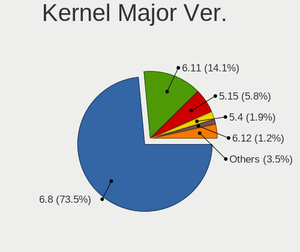

Ubuntu Hardware Trends (Notebook)
---------------------------------

A project to identify most popular hardware characteristics and track their change
over time based on data collected by Ubuntu users at https://Linux-Hardware.org.

Anyone can contribute to the study by uploading probes of their computers by
the [hw-probe](https://github.com/linuxhw/hw-probe) tool:

    sudo hw-probe -all -upload

Full-feature report is available here: https://linux-hardware.org/?view=trends&formfactor=notebook

Period: Apr, 2020.

Contents
--------

- [ OS                       ](#os)
- [ OS Family                ](#os-family)
- [ Kernel                   ](#kernel)
- [ Kernel Family            ](#kernel-family)
- [ Kernel Major Ver.        ](#kernel-major-ver)
- [ Arch                     ](#arch)
- [ DE                       ](#de)
- [ Display Server           ](#display-server)
- [ Display Manager          ](#display-manager)
- [ OS Lang                  ](#os-lang)
- [ Boot Mode                ](#boot-mode)
- [ Filesystem               ](#filesystem)
- [ Dual Boot with Linux/BSD ](#dual-boot-with-linux/bsd)
- [ Dual Boot (Win)          ](#dual-boot-win)
- [ Country                  ](#country)
- [ City                     ](#city)
- [ Vendor                   ](#vendor)
- [ Model                    ](#model)
- [ Model Family             ](#model-family)
- [ MFG Year                 ](#mfg-year)
- [ Form Factor              ](#form-factor)
- [ Secure Boot              ](#secure-boot)
- [ Coreboot                 ](#coreboot)
- [ RAM Size                 ](#ram-size)
- [ RAM Used                 ](#ram-used)
- [ Drive Vendor             ](#drive-vendor)
- [ Drive Model              ](#drive-model)
- [ Drive Kind               ](#drive-kind)
- [ Drive Connector          ](#drive-connector)
- [ Drive Size               ](#drive-size)
- [ Space Total              ](#space-total)
- [ Space Used               ](#space-used)
- [ Malfunc. Drives          ](#malfunc-drives)
- [ Malfunc. Drive Vendor    ](#malfunc-drive-vendor)
- [ Malfunc. Drive Kind      ](#malfunc-drive-kind)
- [ Failed Drives            ](#failed-drives)
- [ Failed Drive Vendor      ](#failed-drive-vendor)
- [ Drive Status             ](#drive-status)
- [ Storage Vendor           ](#storage-vendor)
- [ Storage Model            ](#storage-model)
- [ Storage Kind             ](#storage-kind)
- [ CPU Vendor               ](#cpu-vendor)
- [ CPU Model                ](#cpu-model)
- [ CPU Model Family         ](#cpu-model-family)
- [ CPU Cores                ](#cpu-cores)
- [ CPU Sockets              ](#cpu-sockets)
- [ CPU Threads              ](#cpu-threads)
- [ CPU Op-Modes             ](#cpu-op-modes)
- [ CPU Microarch            ](#cpu-microarch)
- [ CPU Microcode            ](#cpu-microcode)
- [ GPU Vendor               ](#gpu-vendor)
- [ GPU Model                ](#gpu-model)
- [ GPU Combo                ](#gpu-combo)
- [ GPU Driver               ](#gpu-driver)
- [ GPU Memory               ](#gpu-memory)
- [ Monitor Vendor           ](#monitor-vendor)
- [ Monitor Model            ](#monitor-model)
- [ Monitor Resolution       ](#monitor-resolution)
- [ Monitor Diagonal         ](#monitor-diagonal)
- [ Monitor Width            ](#monitor-width)
- [ Aspect Ratio             ](#aspect-ratio)
- [ Monitor Area             ](#monitor-area)
- [ Pixel Density            ](#pixel-density)
- [ Multiple Monitors        ](#multiple-monitors)
- [ Net Controller Vendor    ](#net-controller-vendor)
- [ Net Controller Model     ](#net-controller-model)
- [ Net Controller Kind      ](#net-controller-kind)
- [ Used Controller          ](#used-controller)
- [ NICs                     ](#nics)
- [ Unsupported Devices      ](#unsupported-devices)
- [ Unsupported Device Types ](#unsupported-device-types)

OS
--

Installed operating systems

| Name         | Computers | Percent |
|--------------|-----------|---------|
| Ubuntu 18.04 | 682       | 46.74%  |
| Ubuntu 20.04 | 423       | 28.99%  |
| Ubuntu 19.10 | 282       | 19.33%  |
| Ubuntu 16.04 | 55        | 3.77%   |
| Ubuntu 19.04 | 12        | 0.82%   |
| Ubuntu       | 3         | 0.21%   |
| Ubuntu 18.10 | 1         | 0.07%   |
| Ubuntu 17.10 | 1         | 0.07%   |

OS Family
---------

OS without a version

| Name   | Computers | Percent |
|--------|-----------|---------|
| Ubuntu | 1459      | 100%    |

Kernel
------

Version of the Linux kernel

| Version                 | Computers | Percent |
|-------------------------|-----------|---------|
| 5.3.0-46-generic        | 395       | 27.07%  |
| 5.4.0-26-generic        | 228       | 15.63%  |
| 5.3.0-45-generic        | 150       | 10.28%  |
| 4.15.0-96-generic       | 112       | 7.68%   |
| 5.4.0-28-generic        | 65        | 4.46%   |
| 5.4.0-21-generic        | 63        | 4.32%   |
| 4.15.0-91-generic       | 63        | 4.32%   |
| 5.3.0-28-generic        | 50        | 3.43%   |
| 5.3.0-42-generic        | 34        | 2.33%   |
| 5.4.0-24-generic        | 32        | 2.19%   |
| 5.3.0-47-generic        | 19        | 1.3%    |
| 5.3.0-18-generic        | 19        | 1.3%    |
| 5.3.0-40-generic        | 15        | 1.03%   |
| 5.3.0-51-generic        | 13        | 0.89%   |
| 5.4.0-25-generic        | 10        | 0.69%   |
| 5.3.0-48-generic        | 9         | 0.62%   |
| 5.3.0-46-lowlatency     | 9         | 0.62%   |
| 5.0.0-23-generic        | 9         | 0.62%   |
| 4.4.0-177-generic       | 9         | 0.62%   |
| 5.0.0-38-generic        | 8         | 0.55%   |
| 4.18.0-15-generic       | 7         | 0.48%   |
| 5.4.0-26-lowlatency     | 5         | 0.34%   |
| 5.0.0-37-generic        | 5         | 0.34%   |
| 4.15.0-88-generic       | 5         | 0.34%   |
| 4.15.0-99-generic       | 4         | 0.27%   |
| 4.15.0-96-lowlatency    | 4         | 0.27%   |
| 4.15.0-29-generic       | 4         | 0.27%   |
| 4.15.0-1079-oem         | 4         | 0.27%   |
| 5.6.4-050604-generic    | 3         | 0.21%   |
| 5.5.13-050513-generic   | 3         | 0.21%   |
| 5.4.0-28-lowlatency     | 3         | 0.21%   |
| 5.4.0-22-generic        | 3         | 0.21%   |
| 5.4.0-21-lowlatency     | 3         | 0.21%   |
| 5.3.0-18-lowlatency     | 3         | 0.21%   |
| 5.0.0-1047-oem-osp1     | 3         | 0.21%   |
| 4.4.0-176-generic       | 3         | 0.21%   |
| 4.15.0-94-generic       | 3         | 0.21%   |
| 4.15.0-20-generic       | 3         | 0.21%   |
| 5.6.0-050600-generic    | 2         | 0.14%   |
| 5.4.0-24-lowlatency     | 2         | 0.14%   |
| 5.4.0-23-generic        | 2         | 0.14%   |
| 5.4.0-18-generic        | 2         | 0.14%   |
| 5.3.0-42-lowlatency     | 2         | 0.14%   |
| 5.3.0-25-generic        | 2         | 0.14%   |
| 5.3.0-050300-generic    | 2         | 0.14%   |
| 5.0.0-13-generic        | 2         | 0.14%   |
| 5.0.0-1046-oem-osp1     | 2         | 0.14%   |
| 4.15.0-97-generic       | 2         | 0.14%   |
| 4.15.0-91-lowlatency    | 2         | 0.14%   |
| 4.15.0-76-generic       | 2         | 0.14%   |
| 4.15.0-64-generic       | 2         | 0.14%   |
| 4.15.0-45-generic       | 2         | 0.14%   |
| 4.15.0-1076-oem         | 2         | 0.14%   |
| 5.7.0-050700rc1-generic | 1         | 0.07%   |
| 5.6.7-050607-generic    | 1         | 0.07%   |
| 5.6.5-050605-generic    | 1         | 0.07%   |
| 5.6.3-050603-generic    | 1         | 0.07%   |
| 5.6.2-050602-generic    | 1         | 0.07%   |
| 5.6.1-050601-generic    | 1         | 0.07%   |
| 5.4.0-12-generic        | 1         | 0.07%   |

Kernel Family
-------------

Linux kernel without a distro release

| Version | Computers | Percent |
|---------|-----------|---------|
| 5.3.0   | 727       | 49.83%  |
| 5.4.0   | 419       | 28.72%  |
| 4.15.0  | 223       | 15.28%  |
| 5.0.0   | 38        | 2.6%    |
| 4.4.0   | 20        | 1.37%   |
| 4.18.0  | 9         | 0.62%   |
| 5.6.4   | 3         | 0.21%   |
| 5.5.13  | 3         | 0.21%   |
| 4.13.0  | 3         | 0.21%   |
| 5.6.0   | 2         | 0.14%   |
| 5.7.0   | 1         | 0.07%   |
| 5.6.7   | 1         | 0.07%   |
| 5.6.5   | 1         | 0.07%   |
| 5.6.3   | 1         | 0.07%   |
| 5.6.2   | 1         | 0.07%   |
| 5.6.1   | 1         | 0.07%   |
| 5.1.0   | 1         | 0.07%   |
| 4.8.0   | 1         | 0.07%   |
| 4.19.55 | 1         | 0.07%   |
| 4.13.9  | 1         | 0.07%   |
| 4.10.0  | 1         | 0.07%   |
| 3.13.0  | 1         | 0.07%   |

Kernel Major Ver.
-----------------

Linux kernel major version

| Version | Computers | Percent |
|---------|-----------|---------|
| 5.3     | 727       | 49.83%  |
| 5.4     | 419       | 28.72%  |
| 4.15    | 223       | 15.28%  |
| 5.0     | 38        | 2.6%    |
| 4.4     | 20        | 1.37%   |
| 5.6     | 10        | 0.69%   |
| 4.18    | 9         | 0.62%   |
| 4.13    | 4         | 0.27%   |
| 5.5     | 3         | 0.21%   |
| 5.7     | 1         | 0.07%   |
| 5.1     | 1         | 0.07%   |
| 4.8     | 1         | 0.07%   |
| 4.19    | 1         | 0.07%   |
| 4.10    | 1         | 0.07%   |
| 3.13    | 1         | 0.07%   |

Arch
----

OS architecture (x86_64, i586, etc.)

| Name   | Computers | Percent |
|--------|-----------|---------|
| x86_64 | 1374      | 94.17%  |
| i686   | 85        | 5.83%   |

DE
--

Desktop Environment

| Name            | Computers | Percent |
|-----------------|-----------|---------|
| GNOME           | 1092      | 74.85%  |
| XFCE            | 130       | 8.91%   |
| Unknown         | 74        | 5.07%   |
| Unity           | 44        | 3.02%   |
| KDE             | 31        | 2.12%   |
| MATE            | 25        | 1.71%   |
| LXQt            | 14        | 0.96%   |
| KDE5            | 11        | 0.75%   |
| LXDE            | 9         | 0.62%   |
| X-Cinnamon      | 8         | 0.55%   |
| Budgie          | 8         | 0.55%   |
| GNOME Flashback | 6         | 0.41%   |
| Cinnamon        | 3         | 0.21%   |
| Deepin          | 2         | 0.14%   |
| xubuntu         | 1         | 0.07%   |
| GNOME Classic   | 1         | 0.07%   |

Display Server
--------------

X11 or Wayland

| Name    | Computers | Percent |
|---------|-----------|---------|
| X11     | 1394      | 95.54%  |
| Unknown | 36        | 2.47%   |
| Wayland | 29        | 1.99%   |

Display Manager
---------------

SDDM, LightDM, etc.

| Name    | Computers | Percent |
|---------|-----------|---------|
| Unknown | 1315      | 90.13%  |
| GDM     | 100       | 6.85%   |
| LightDM | 33        | 2.26%   |
| SDDM    | 11        | 0.75%   |

OS Lang
-------

Language

| Lang    | Computers | Percent |
|---------|-----------|---------|
| en_US   | 498       | 34.13%  |
| de_DE   | 110       | 7.54%   |
| it_IT   | 98        | 6.72%   |
| pt_BR   | 87        | 5.96%   |
| en_GB   | 79        | 5.41%   |
| fr_FR   | 64        | 4.39%   |
| es_ES   | 61        | 4.18%   |
| ru_RU   | 47        | 3.22%   |
| en_IN   | 35        | 2.4%    |
| C       | 34        | 2.33%   |
| pl_PL   | 29        | 1.99%   |
| en_CA   | 28        | 1.92%   |
| en_AU   | 24        | 1.64%   |
| cs_CZ   | 17        | 1.17%   |
| pt_PT   | 16        | 1.1%    |
| nl_NL   | 16        | 1.1%    |
| es_MX   | 13        | 0.89%   |
| es_AR   | 12        | 0.82%   |
| tr_TR   | 11        | 0.75%   |
| hu_HU   | 11        | 0.75%   |
| Unknown | 11        | 0.75%   |
| es_CL   | 8         | 0.55%   |
| en_IE   | 8         | 0.55%   |
| de_CH   | 8         | 0.55%   |
| ru_UA   | 7         | 0.48%   |
| ro_RO   | 7         | 0.48%   |
| fi_FI   | 7         | 0.48%   |
| el_GR   | 7         | 0.48%   |
| ja_JP   | 6         | 0.41%   |
| fr_CA   | 6         | 0.41%   |
| es_CO   | 6         | 0.41%   |
| en_ZA   | 6         | 0.41%   |
| de_AT   | 5         | 0.34%   |
| sv_SE   | 4         | 0.27%   |
| sk_SK   | 4         | 0.27%   |
| da_DK   | 4         | 0.27%   |
| ca_ES   | 4         | 0.27%   |
| bg_BG   | 4         | 0.27%   |
| zh_CN   | 3         | 0.21%   |
| uk_UA   | 3         | 0.21%   |
| nl_BE   | 3         | 0.21%   |
| lt_LT   | 3         | 0.21%   |
| en_NZ   | 3         | 0.21%   |
| en_IL   | 3         | 0.21%   |
| nb_NO   | 2         | 0.14%   |
| ko_KR   | 2         | 0.14%   |
| fr_BE   | 2         | 0.14%   |
| es_VE   | 2         | 0.14%   |
| es_UY   | 2         | 0.14%   |
| es_PE   | 2         | 0.14%   |
| es_CR   | 2         | 0.14%   |
| en_SG   | 2         | 0.14%   |
| en_PH   | 2         | 0.14%   |
| zh_TW   | 1         | 0.07%   |
| zh_HK   | 1         | 0.07%   |
| is_IS   | 1         | 0.07%   |
| he_IL   | 1         | 0.07%   |
| fr_CH   | 1         | 0.07%   |
| fa_IR   | 1         | 0.07%   |
| eu_ES   | 1         | 0.07%   |

Boot Mode
---------

EFI or BIOS

| Mode | Computers | Percent |
|------|-----------|---------|
| BIOS | 841       | 57.64%  |
| EFI  | 618       | 42.36%  |

Filesystem
----------

Type of filesystem

| Type    | Computers | Percent |
|---------|-----------|---------|
| Ext4    | 1375      | 94.24%  |
| Overlay | 47        | 3.22%   |
| Zfs     | 18        | 1.23%   |
| Btrfs   | 9         | 0.62%   |
| Ext2    | 6         | 0.41%   |
| Ext3    | 2         | 0.14%   |
| Xfs     | 1         | 0.07%   |
| Aufs    | 1         | 0.07%   |

Dual Boot with Linux/BSD
------------------------

Hosting more than one Linux/BSD

| Dual boot | Computers | Percent |
|-----------|-----------|---------|
| No        | 1327      | 90.95%  |
| Yes       | 132       | 9.05%   |

Dual Boot (Win)
---------------

Hosting Linux and Windows

| Dual boot | Computers | Percent |
|-----------|-----------|---------|
| No        | 939       | 64.36%  |
| Yes       | 520       | 35.64%  |

Country
-------

Geographic location (country)

| Country                   | Computers | Percent |
|---------------------------|-----------|---------|
| USA                       | 218       | 14.94%  |
| Germany                   | 134       | 9.18%   |
| Italy                     | 110       | 7.54%   |
| Brazil                    | 108       | 7.4%    |
| France                    | 70        | 4.8%    |
| Spain                     | 67        | 4.59%   |
| UK                        | 62        | 4.25%   |
| Russia                    | 53        | 3.63%   |
| India                     | 42        | 2.88%   |
| Poland                    | 38        | 2.6%    |
| Canada                    | 35        | 2.4%    |
| Netherlands               | 34        | 2.33%   |
| Australia                 | 27        | 1.85%   |
| Mexico                    | 23        | 1.58%   |
| Argentina                 | 23        | 1.58%   |
| Ukraine                   | 22        | 1.51%   |
| Czech Republic            | 20        | 1.37%   |
| Portugal                  | 19        | 1.3%    |
| Turkey                    | 18        | 1.23%   |
| Switzerland               | 18        | 1.23%   |
| Austria                   | 17        | 1.17%   |
| Romania                   | 16        | 1.1%    |
| Belgium                   | 15        | 1.03%   |
| Hungary                   | 14        | 0.96%   |
| Greece                    | 13        | 0.89%   |
| Colombia                  | 13        | 0.89%   |
| Norway                    | 11        | 0.75%   |
| Finland                   | 11        | 0.75%   |
| Ireland                   | 10        | 0.69%   |
| Chile                     | 10        | 0.69%   |
| Bulgaria                  | 10        | 0.69%   |
| Sweden                    | 9         | 0.62%   |
| Iran                      | 8         | 0.55%   |
| Indonesia                 | 8         | 0.55%   |
| Denmark                   | 7         | 0.48%   |
| China                     | 7         | 0.48%   |
| Vietnam                   | 6         | 0.41%   |
| South Africa              | 6         | 0.41%   |
| Slovakia                  | 6         | 0.41%   |
| Kenya                     | 6         | 0.41%   |
| Japan                     | 6         | 0.41%   |
| Israel                    | 6         | 0.41%   |
| Egypt                     | 5         | 0.34%   |
| Costa Rica                | 5         | 0.34%   |
| Tunisia                   | 4         | 0.27%   |
| Singapore                 | 4         | 0.27%   |
| New Zealand               | 4         | 0.27%   |
| Lithuania                 | 4         | 0.27%   |
| Venezuela                 | 3         | 0.21%   |
| UAE                       | 3         | 0.21%   |
| Taiwan                    | 3         | 0.21%   |
| Saudi Arabia              | 3         | 0.21%   |
| Peru                      | 3         | 0.21%   |
| Latvia                    | 3         | 0.21%   |
| Korea, Republic of        | 3         | 0.21%   |
| Iran, Islamic Republic of | 3         | 0.21%   |
| Uruguay                   | 2         | 0.14%   |
| Thailand                  | 2         | 0.14%   |
| Serbia                    | 2         | 0.14%   |
| Philippines               | 2         | 0.14%   |

City
----

Geographic location (city)

| City                   | Computers | Percent |
|------------------------|-----------|---------|
| São Paulo             | 19        | 1.3%    |
| Moscow                 | 14        | 0.96%   |
| Berlin                 | 14        | 0.96%   |
| Rome                   | 13        | 0.89%   |
| Paris                  | 13        | 0.89%   |
| Milan                  | 13        | 0.89%   |
| Warsaw                 | 12        | 0.82%   |
| Vienna                 | 12        | 0.82%   |
| St Petersburg          | 11        | 0.75%   |
| Melbourne              | 11        | 0.75%   |
| Kyiv                   | 11        | 0.75%   |
| Madrid                 | 10        | 0.69%   |
| Buenos Aires           | 10        | 0.69%   |
| Prague                 | 9         | 0.62%   |
| Hamburg                | 9         | 0.62%   |
| Munich                 | 8         | 0.55%   |
| Bogotá                | 8         | 0.55%   |
| Barcelona              | 8         | 0.55%   |
| Athens                 | 8         | 0.55%   |
| Stuttgart              | 7         | 0.48%   |
| Delhi                  | 7         | 0.48%   |
| Bengaluru              | 7         | 0.48%   |
| Zurich                 | 6         | 0.41%   |
| Sofia                  | 6         | 0.41%   |
| Rio de Janeiro         | 6         | 0.41%   |
| Bucharest              | 6         | 0.41%   |
| Brasília              | 6         | 0.41%   |
| Toronto                | 5         | 0.34%   |
| Tehran                 | 5         | 0.34%   |
| Santiago               | 5         | 0.34%   |
| Nairobi                | 5         | 0.34%   |
| Los Angeles            | 5         | 0.34%   |
| Izmir                  | 5         | 0.34%   |
| Helsinki               | 5         | 0.34%   |
| Dublin                 | 5         | 0.34%   |
| Curitiba               | 5         | 0.34%   |
| Cologne                | 5         | 0.34%   |
| Budapest               | 5         | 0.34%   |
| Seville                | 4         | 0.27%   |
| Lisbon                 | 4         | 0.27%   |
| Lima                   | 4         | 0.27%   |
| Frankfurt am Main      | 4         | 0.27%   |
| Beverly Hills          | 4         | 0.27%   |
| Wrocław               | 3         | 0.21%   |
| Vitória               | 3         | 0.21%   |
| Vilnius                | 3         | 0.21%   |
| Vancouver              | 3         | 0.21%   |
| Turin                  | 3         | 0.21%   |
| Tunis                  | 3         | 0.21%   |
| Trondheim              | 3         | 0.21%   |
| The Hague              | 3         | 0.21%   |
| São Bernardo do Campo | 3         | 0.21%   |
| Singapore              | 3         | 0.21%   |
| Salvador               | 3         | 0.21%   |
| Raleigh                | 3         | 0.21%   |
| Perth                  | 3         | 0.21%   |
| Offenbach              | 3         | 0.21%   |
| New York               | 3         | 0.21%   |
| Mumbai                 | 3         | 0.21%   |
| Montreal               | 3         | 0.21%   |

Vendor
------

Motherboard manufacturer

| Name                     | Computers | Percent |
|--------------------------|-----------|---------|
| Hewlett-Packard          | 317       | 21.73%  |
| Dell                     | 254       | 17.41%  |
| Lenovo                   | 243       | 16.66%  |
| ASUSTek Computer         | 153       | 10.49%  |
| Acer                     | 134       | 9.18%   |
| Toshiba                  | 72        | 4.93%   |
| Sony                     | 37        | 2.54%   |
| Apple                    | 37        | 2.54%   |
| Samsung Electronics      | 32        | 2.19%   |
| MSI                      | 20        | 1.37%   |
| Packard Bell             | 11        | 0.75%   |
| HUAWEI                   | 10        | 0.69%   |
| Medion                   | 9         | 0.62%   |
| Fujitsu                  | 9         | 0.62%   |
| Positivo                 | 7         | 0.48%   |
| Notebook                 | 7         | 0.48%   |
| Unknown                  | 7         | 0.48%   |
| Google                   | 6         | 0.41%   |
| Fujitsu Siemens          | 6         | 0.41%   |
| Thomson                  | 4         | 0.27%   |
| Gateway                  | 4         | 0.27%   |
| Compal                   | 4         | 0.27%   |
| Clevo                    | 4         | 0.27%   |
| Chuwi                    | 4         | 0.27%   |
| VIT                      | 3         | 0.21%   |
| eMachines                | 3         | 0.21%   |
| Alienware                | 3         | 0.21%   |
| TUXEDO                   | 2         | 0.14%   |
| SLIMBOOK                 | 2         | 0.14%   |
| Semp Toshiba             | 2         | 0.14%   |
| Panasonic                | 2         | 0.14%   |
| Multilaser               | 2         | 0.14%   |
| Monster                  | 2         | 0.14%   |
| LG Electronics           | 2         | 0.14%   |
| Gigabyte Technology      | 2         | 0.14%   |
| Digibras                 | 2         | 0.14%   |
| YJKC                     | 1         | 0.07%   |
| YASHI                    | 1         | 0.07%   |
| Xplore Tech              | 1         | 0.07%   |
| Xplore                   | 1         | 0.07%   |
| XMG                      | 1         | 0.07%   |
| WS                       | 1         | 0.07%   |
| Visual Fan               | 1         | 0.07%   |
| UnBranded                | 1         | 0.07%   |
| UMAX                     | 1         | 0.07%   |
| TrekStor                 | 1         | 0.07%   |
| Timi                     | 1         | 0.07%   |
| TELECOMITALIA            | 1         | 0.07%   |
| Standard                 | 1         | 0.07%   |
| Razer                    | 1         | 0.07%   |
| Radio Victoria Fueguina  | 1         | 0.07%   |
| Quanta                   | 1         | 0.07%   |
| Prestigio                | 1         | 0.07%   |
| Phoenix/SiS              | 1         | 0.07%   |
| ONKYO                    | 1         | 0.07%   |
| OBSIDIAN-PC              | 1         | 0.07%   |
| NEC Computers            | 1         | 0.07%   |
| Multilaser Industrial SA | 1         | 0.07%   |
| Microtech                | 1         | 0.07%   |
| LincPlus                 | 1         | 0.07%   |

Model
-----

Motherboard model

| Name                                                    | Computers | Percent |
|---------------------------------------------------------|-----------|---------|
| HP Notebook                                             | 17        | 1.17%   |
| Unknown                                                 | 14        | 0.96%   |
| HP Pavilion dv6                                         | 13        | 0.89%   |
| HP Pavilion dv7                                         | 12        | 0.82%   |
| HP Pavilion g6                                          | 11        | 0.75%   |
| Dell G3 3590                                            | 9         | 0.62%   |
| HP EliteBook 8470p                                      | 7         | 0.48%   |
| Dell Inspiron 1545                                      | 7         | 0.48%   |
| HP Presario CQ57                                        | 5         | 0.34%   |
| HP Laptop 15-bs0xx                                      | 5         | 0.34%   |
| HP G62                                                  | 5         | 0.34%   |
| Dell Latitude E6410                                     | 5         | 0.34%   |
| Dell Latitude D630                                      | 5         | 0.34%   |
| Dell Inspiron 15-3567                                   | 5         | 0.34%   |
| Lenovo IdeaPad S145-15AST 81N3                          | 4         | 0.27%   |
| Lenovo G580 20150                                       | 4         | 0.27%   |
| HP Pavilion g7                                          | 4         | 0.27%   |
| HP Pavilion dv4                                         | 4         | 0.27%   |
| HP Laptop 15-da0xxx                                     | 4         | 0.27%   |
| HP EliteBook 840 G5                                     | 4         | 0.27%   |
| HP EliteBook 6930p                                      | 4         | 0.27%   |
| HP 250 G7 Notebook PC                                   | 4         | 0.27%   |
| HP 15                                                   | 4         | 0.27%   |
| Dell XPS 13 7390                                        | 4         | 0.27%   |
| Dell Inspiron 3583                                      | 4         | 0.27%   |
| Dell Inspiron 3576                                      | 4         | 0.27%   |
| Dell Inspiron 1525                                      | 4         | 0.27%   |
| Apple MacBookPro8,1                                     | 4         | 0.27%   |
| Toshiba Satellite L755                                  | 3         | 0.21%   |
| Toshiba Satellite A300                                  | 3         | 0.21%   |
| Samsung Electronics RV411/RV511/E3511/S3511/RV711/E3411 | 3         | 0.21%   |
| Samsung Electronics 300E4C/300E5C/300E7C                | 3         | 0.21%   |
| Lenovo V145-15AST 81MT                                  | 3         | 0.21%   |
| Lenovo IdeaPad FLEX-14API 81SS                          | 3         | 0.21%   |
| Lenovo IdeaPad 330-15AST 81D6                           | 3         | 0.21%   |
| HUAWEI NBLK-WAX9X                                       | 3         | 0.21%   |
| HP ProBook 650 G1                                       | 3         | 0.21%   |
| HP ProBook 4540s                                        | 3         | 0.21%   |
| HP ProBook 450 G5                                       | 3         | 0.21%   |
| HP Pavilion x2 Detachable                               | 3         | 0.21%   |
| HP Pavilion g4                                          | 3         | 0.21%   |
| HP Pavilion dm1                                         | 3         | 0.21%   |
| HP Pavilion 17                                          | 3         | 0.21%   |
| HP Pavilion 15                                          | 3         | 0.21%   |
| HP Laptop 15-db0xxx                                     | 3         | 0.21%   |
| HP EliteBook 8460p                                      | 3         | 0.21%   |
| HP EliteBook 8440p                                      | 3         | 0.21%   |
| HP EliteBook 840 G1                                     | 3         | 0.21%   |
| HP 250 G6 Notebook PC                                   | 3         | 0.21%   |
| Dell XPS L502X                                          | 3         | 0.21%   |
| Dell XPS 13 9380                                        | 3         | 0.21%   |
| Dell Vostro 3550                                        | 3         | 0.21%   |
| Dell Latitude E7440                                     | 3         | 0.21%   |
| Dell Latitude E6430                                     | 3         | 0.21%   |
| Dell Latitude E6420                                     | 3         | 0.21%   |
| Dell Latitude E6400                                     | 3         | 0.21%   |
| Dell Latitude E5570                                     | 3         | 0.21%   |
| Dell Latitude E5520                                     | 3         | 0.21%   |
| Dell Inspiron MM061                                     | 3         | 0.21%   |
| Dell Inspiron 7720                                      | 3         | 0.21%   |

Model Family
------------

Motherboard model prefix

| Name                       | Computers | Percent |
|----------------------------|-----------|---------|
| Lenovo ThinkPad            | 123       | 8.43%   |
| Acer Aspire                | 107       | 7.33%   |
| Dell Inspiron              | 104       | 7.13%   |
| HP Pavilion                | 87        | 5.96%   |
| Dell Latitude              | 67        | 4.59%   |
| Lenovo IdeaPad             | 64        | 4.39%   |
| Toshiba Satellite          | 58        | 3.98%   |
| HP EliteBook               | 53        | 3.63%   |
| HP Laptop                  | 32        | 2.19%   |
| HP ProBook                 | 28        | 1.92%   |
| Dell XPS                   | 26        | 1.78%   |
| HP Compaq                  | 21        | 1.44%   |
| Dell Vostro                | 21        | 1.44%   |
| HP Notebook                | 17        | 1.17%   |
| ASUS VivoBook              | 15        | 1.03%   |
| Unknown                    | 14        | 0.96%   |
| Dell Precision             | 13        | 0.89%   |
| Packard Bell EasyNote      | 11        | 0.75%   |
| HP ENVY                    | 10        | 0.69%   |
| Dell G3                    | 10        | 0.69%   |
| HP 250                     | 9         | 0.62%   |
| Fujitsu LIFEBOOK           | 9         | 0.62%   |
| Acer Swift                 | 9         | 0.62%   |
| ASUS ZenBook               | 8         | 0.55%   |
| HP ZBook                   | 7         | 0.48%   |
| HP Presario                | 7         | 0.48%   |
| ASUS TUF                   | 7         | 0.48%   |
| Acer Extensa               | 7         | 0.48%   |
| HP 255                     | 6         | 0.41%   |
| Toshiba PORTEGE            | 5         | 0.34%   |
| HP G62                     | 5         | 0.34%   |
| HP 15                      | 5         | 0.34%   |
| Dell Studio                | 5         | 0.34%   |
| Apple MacBookPro8          | 5         | 0.34%   |
| Lenovo G580                | 4         | 0.27%   |
| Dell G5                    | 4         | 0.27%   |
| Apple MacBook5             | 4         | 0.27%   |
| Toshiba TECRA              | 3         | 0.21%   |
| Samsung Electronics RV411  | 3         | 0.21%   |
| Samsung Electronics 300E4C | 3         | 0.21%   |
| Medion Akoya               | 3         | 0.21%   |
| Lenovo V145-15AST          | 3         | 0.21%   |
| Lenovo B50-30              | 3         | 0.21%   |
| HUAWEI NBLK-WAX9X          | 3         | 0.21%   |
| Chuwi LapBook              | 3         | 0.21%   |
| ASUS X202E                 | 3         | 0.21%   |
| ASUS K53U                  | 3         | 0.21%   |
| Acer Nitro                 | 3         | 0.21%   |
| Toshiba NB505              | 2         | 0.14%   |
| Toshiba dynabook           | 2         | 0.14%   |
| Sony VPCSC31FM             | 2         | 0.14%   |
| Samsung Electronics 900X3C | 2         | 0.14%   |
| Positivo N1103             | 2         | 0.14%   |
| Positivo MOBILE            | 2         | 0.14%   |
| MSI Prestige               | 2         | 0.14%   |
| MSI GF63                   | 2         | 0.14%   |
| Monster ABRA               | 2         | 0.14%   |
| Lenovo Y50-70              | 2         | 0.14%   |
| Lenovo ThinkBook           | 2         | 0.14%   |
| Lenovo Legion              | 2         | 0.14%   |

MFG Year
--------

Motherboard manufacture year

| Year    | Computers | Percent |
|---------|-----------|---------|
| 2019    | 295       | 20.22%  |
| 2018    | 131       | 8.98%   |
| 2011    | 124       | 8.5%    |
| 2012    | 112       | 7.68%   |
| 2013    | 111       | 7.61%   |
| 2014    | 102       | 6.99%   |
| 2010    | 97        | 6.65%   |
| 2009    | 84        | 5.76%   |
| 2015    | 83        | 5.69%   |
| 2016    | 70        | 4.8%    |
| 2008    | 66        | 4.52%   |
| 2017    | 57        | 3.91%   |
| 2020    | 55        | 3.77%   |
| 2007    | 50        | 3.43%   |
| 2006    | 14        | 0.96%   |
| 2005    | 3         | 0.21%   |
| Unknown | 3         | 0.21%   |
| 2003    | 2         | 0.14%   |

Form Factor
-----------

Physical design of the computer

| Name     | Computers | Percent |
|----------|-----------|---------|
| Notebook | 1459      | 100%    |

Secure Boot
-----------

Enabled or disabled

| State    | Computers | Percent |
|----------|-----------|---------|
| Disabled | 1309      | 89.72%  |
| Enabled  | 150       | 10.28%  |

Coreboot
--------

Have coreboot on board

| Used | Computers | Percent |
|------|-----------|---------|
| No   | 1453      | 99.59%  |
| Yes  | 6         | 0.41%   |

RAM Size
--------

Total RAM memory

| Size in GB  | Computers | Percent |
|-------------|-----------|---------|
| 3.01-4.0    | 457       | 31.32%  |
| 4.01-8.0    | 396       | 27.14%  |
| 8.01-16.0   | 201       | 13.78%  |
| 16.01-24.0  | 177       | 12.13%  |
| 1.01-2.0    | 123       | 8.43%   |
| 2.01-3.0    | 40        | 2.74%   |
| 32.01-64.0  | 30        | 2.06%   |
| 0.01-1.0    | 23        | 1.58%   |
| 24.01-32.0  | 9         | 0.62%   |
| 64.01-256.0 | 3         | 0.21%   |

RAM Used
--------

Used RAM memory

| Used GB    | Computers | Percent |
|------------|-----------|---------|
| 1.01-2.0   | 692       | 47.43%  |
| 2.01-3.0   | 376       | 25.77%  |
| 3.01-4.0   | 143       | 9.8%    |
| 0.01-1.0   | 114       | 7.81%   |
| 4.01-8.0   | 108       | 7.4%    |
| 8.01-16.0  | 22        | 1.51%   |
| 16.01-24.0 | 2         | 0.14%   |
| 32.01-64.0 | 1         | 0.07%   |
| Unknown    | 1         | 0.07%   |

Drive Vendor
------------

Hard drive vendors

| Vendor              | Computers | Drives | Percent |
|---------------------|-----------|--------|---------|
| Seagate             | 269       | 270    | 17.23%  |
| WDC                 | 234       | 236    | 14.99%  |
| Toshiba             | 176       | 176    | 11.27%  |
| Samsung Electronics | 167       | 170    | 10.7%   |
| Unknown             | 98        | 112    | 6.28%   |
| Kingston            | 94        | 95     | 6.02%   |
| Hitachi             | 84        | 86     | 5.38%   |
| HGST                | 64        | 64     | 4.1%    |
| SanDisk             | 51        | 52     | 3.27%   |
| Crucial             | 50        | 51     | 3.2%    |
| Intel               | 36        | 36     | 2.31%   |
| Fujitsu             | 28        | 28     | 1.79%   |
| SK Hynix            | 20        | 20     | 1.28%   |
| Micron Technology   | 19        | 19     | 1.22%   |
| HL-DT-ST            | 19        | 17     | 1.22%   |
| A-DATA Technology   | 14        | 15     | 0.9%    |
| OCZ                 | 10        | 10     | 0.64%   |
| LITEONIT            | 9         | 9      | 0.58%   |
| Transcend           | 8         | 8      | 0.51%   |
| SPCC                | 8         | 8      | 0.51%   |
| Apple               | 7         | 7      | 0.45%   |
| LITEON              | 6         | 6      | 0.38%   |
| PNY                 | 5         | 5      | 0.32%   |
| Generic             | 5         | 5      | 0.32%   |
| Patriot             | 4         | 4      | 0.26%   |
| KingSpec            | 4         | 4      | 0.26%   |
| JMicron             | 4         | 4      | 0.26%   |
| Dogfish             | 4         | 4      | 0.26%   |
| China               | 4         | 4      | 0.26%   |
| Zheino              | 3         | 3      | 0.19%   |
| Intenso             | 3         | 3      | 0.19%   |
| Corsair             | 3         | 3      | 0.19%   |
| Union Memory        | 2         | 2      | 0.13%   |
| TO Exter            | 2         | 2      | 0.13%   |
| Team                | 2         | 2      | 0.13%   |
| SABRENT             | 2         | 2      | 0.13%   |
| PLEXTOR             | 2         | 2      | 0.13%   |
| Lenovo              | 2         | 2      | 0.13%   |
| LaCie               | 2         | 2      | 0.13%   |
| Hewlett-Packard     | 2         | 2      | 0.13%   |
| GOODRAM             | 2         | 2      | 0.13%   |
| Dell                | 2         | 2      | 0.13%   |
| ASMT                | 2         | 2      | 0.13%   |
| WDC WD32            | 1         | 1      | 0.06%   |
| WD MediaMax         | 1         | 1      | 0.06%   |
| Vi550               | 1         | 1      | 0.06%   |
| USB3.0              | 1         | 1      | 0.06%   |
| USB                 | 1         | 1      | 0.06%   |
| TCSUNBOW            | 1         | 1      | 0.06%   |
| Silicon Motion      | 1         | 1      | 0.06%   |
| RDM-II              | 1         | 1      | 0.06%   |
| OWC                 | 1         | 1      | 0.06%   |
| OSC                 | 1         | 1      | 0.06%   |
| OCZ-VERTEX3         | 1         | 1      | 0.06%   |
| Netac               | 1         | 1      | 0.06%   |
| Microtech           | 1         | 1      | 0.06%   |
| LITEON C            | 1         | 1      | 0.06%   |
| Linux               | 1         | 1      | 0.06%   |
| KINGMAX             | 1         | 1      | 0.06%   |
| KingFast            | 1         | 1      | 0.06%   |

Drive Model
-----------

Hard drive models

| Model                       | Computers | Percent |
|-----------------------------|-----------|---------|
| MMC Card  32GB              | 38        | 2.4%    |
| MQ01ABD100 1TB              | 30        | 1.89%   |
| ST1000LM024 HN-M101MBB 1TB  | 27        | 1.7%    |
| ST1000LM035-1RK172 1TB      | 25        | 1.58%   |
| SA400S37120G 120GB SSD      | 21        | 1.32%   |
| ST500LT012-1DG142 500GB     | 20        | 1.26%   |
| MQ01ABF050 500GB            | 20        | 1.26%   |
| MMC Card  64GB              | 20        | 1.26%   |
| MQ04ABF100 1TB              | 19        | 1.2%    |
| ST9500325AS 500GB           | 15        | 0.95%   |
| SA400S37240G 240GB SSD      | 15        | 0.95%   |
| HTS545050A7E680 500GB       | 15        | 0.95%   |
| SV300S37A120G 120GB SSD     | 14        | 0.88%   |
| SSD 860 EVO 500GB           | 14        | 0.88%   |
| MMC Card  128GB             | 14        | 0.88%   |
| HTS541010A9E680 1TB         | 14        | 0.88%   |
| MMC Card  16GB              | 12        | 0.76%   |
| ST500LT012-9WS142 500GB     | 11        | 0.69%   |
| ST2000LM007-1R8174 2TB      | 11        | 0.69%   |
| SSD 850 EVO 250GB           | 11        | 0.69%   |
| DVDRAM GUE1N 3GB            | 11        | 0.69%   |
| WD10SPZX-24Z10 1TB          | 10        | 0.63%   |
| ST1000LX015-1U7172 1TB      | 10        | 0.63%   |
| HTS545050A7E380 500GB       | 10        | 0.63%   |
| ST9320325AS 320GB           | 9         | 0.57%   |
| ST500LM012 HN-M500MBB 500GB | 9         | 0.57%   |
| HTS725050A7E630 500GB       | 9         | 0.57%   |
| ST500LM000-1EJ162 500GB     | 8         | 0.5%    |
| MMC Card  7GB               | 8         | 0.5%    |
| HTS721010A9E630 1TB         | 8         | 0.5%    |
| DVDRAM GUC0N 1GB            | 8         | 0.5%    |
| WD5000LPCX-24VHAT0 500GB    | 7         | 0.44%   |
| WD10SPZX-60Z10T0 1TB        | 7         | 0.44%   |
| WD10JPVX-22JC3T0 1TB        | 7         | 0.44%   |
| CT240BX500SSD1 240GB        | 7         | 0.44%   |
| WD3200BEVT-22ZCT0 320GB     | 6         | 0.38%   |
| SV300S37A240G 240GB SSD     | 6         | 0.38%   |
| ST9160821AS 160GB           | 6         | 0.38%   |
| SSD 860 EVO 250GB           | 6         | 0.38%   |
| SSD 840 EVO 250GB           | 6         | 0.38%   |
| SDSSDA240G 240GB            | 6         | 0.38%   |
| SA400S37480G 480GB SSD      | 6         | 0.38%   |
| HTS547575A9E384 752GB       | 6         | 0.38%   |
| HTS545032B9A300 320GB       | 6         | 0.38%   |
| WD2500BEVS-22UST0 250GB     | 5         | 0.32%   |
| WD1600BEVT-22ZCT0 160GB     | 5         | 0.32%   |
| WD10SPZX-21Z10T0 1TB        | 5         | 0.32%   |
| WD10JPVX-75JC3T0 1TB        | 5         | 0.32%   |
| ST9500423AS 500GB           | 5         | 0.32%   |
| ST9500420AS 500GB           | 5         | 0.32%   |
| ST9320423AS 320GB           | 5         | 0.32%   |
| ST9250315AS 250GB           | 5         | 0.32%   |
| ST500LM021-1KJ152 500GB     | 5         | 0.32%   |
| ST1000LM049-2GH172 1TB      | 5         | 0.32%   |
| MQ01ABD075 752GB            | 5         | 0.32%   |
| HTS547550A9E384 500GB       | 5         | 0.32%   |
| HTS545050B9A300 500GB       | 5         | 0.32%   |
| CT250MX500SSD1 250GB        | 5         | 0.32%   |
| WD7500BPVX-22JC3T0 752GB    | 4         | 0.25%   |
| WD1600BEVS-22RST0 160GB     | 4         | 0.25%   |

Drive Kind
----------

HDD or SSD

| Kind    | Computers | Drives | Percent |
|---------|-----------|--------|---------|
| HDD     | 821       | 843    | 53.8%   |
| SSD     | 511       | 538    | 33.49%  |
| MMC     | 97        | 109    | 6.36%   |
| NVMe    | 49        | 49     | 3.21%   |
| Unknown | 48        | 47     | 3.15%   |

Drive Connector
---------------

SATA, SAS, NVMe, etc.

| Type | Computers | Drives | Percent |
|------|-----------|--------|---------|
| SATA | 1239      | 1365   | 85.51%  |
| MMC  | 97        | 109    | 6.69%   |
| SAS  | 64        | 63     | 4.42%   |
| NVMe | 49        | 49     | 3.38%   |

Drive Size
----------

Size of hard drive

| Size in TB | Computers | Drives | Percent |
|------------|-----------|--------|---------|
| 0.01-0.5   | 1048      | 1170   | 72.48%  |
| 0.51-1.0   | 347       | 363    | 24%     |
| 1.01-2.0   | 41        | 42     | 2.84%   |
| 3.01-4.0   | 5         | 6      | 0.35%   |
| 4.01-10.0  | 4         | 4      | 0.28%   |
| 2.01-3.0   | 1         | 1      | 0.07%   |

Space Total
-----------

Amount of disk space available on the file system

| Size in GB     | Computers | Percent |
|----------------|-----------|---------|
| 101-250        | 522       | 35.78%  |
| 251-500        | 366       | 25.09%  |
| 501-1000       | 181       | 12.41%  |
| 51-100         | 148       | 10.14%  |
| 21-50          | 96        | 6.58%   |
| 1-20           | 70        | 4.8%    |
| 1001-2000      | 49        | 3.36%   |
| More than 3000 | 10        | 0.69%   |
| 2001-3000      | 10        | 0.69%   |
| Unknown        | 7         | 0.48%   |

Space Used
----------

Amount of used disk space

| Used GB        | Computers | Percent |
|----------------|-----------|---------|
| 1-20           | 791       | 54.22%  |
| 21-50          | 224       | 15.35%  |
| 101-250        | 161       | 11.03%  |
| 51-100         | 151       | 10.35%  |
| 251-500        | 70        | 4.8%    |
| 501-1000       | 43        | 2.95%   |
| 1001-2000      | 8         | 0.55%   |
| Unknown        | 7         | 0.48%   |
| More than 3000 | 2         | 0.14%   |
| 2001-3000      | 2         | 0.14%   |

Malfunc. Drives
---------------

Drive models with a malfunction

| Model                        | Computers | Drives | Percent |
|------------------------------|-----------|--------|---------|
| ST500LT012-1DG142 500GB      | 3         | 3      | 10.34%  |
| WD5000BEVT-75A0RT0 500GB     | 1         | 1      | 3.45%   |
| WD3200BEVT-75ZCT0 320GB      | 1         | 1      | 3.45%   |
| TRION100 240GB SSD           | 1         | 1      | 3.45%   |
| ST9320325AS 320GB            | 1         | 1      | 3.45%   |
| ST9160310AS 160GB            | 1         | 1      | 3.45%   |
| ST500LT012-9WS142 500GB      | 1         | 1      | 3.45%   |
| ST500LM000-1EJ162 500GB      | 1         | 1      | 3.45%   |
| ST1000LM048-2E7172 1TB       | 1         | 1      | 3.45%   |
| ST1000LM024 HN-M101MBB 1TB   | 1         | 1      | 3.45%   |
| SSDSA2M160G2GN 160GB         | 1         | 1      | 3.45%   |
| SSD 960 PRO 2TB              | 1         | 1      | 3.45%   |
| SA400S37120G 120GB SSD       | 1         | 1      | 3.45%   |
| MK5065GSX 500GB              | 1         | 1      | 3.45%   |
| MK3276GSX -63 320GB          | 1         | 1      | 3.45%   |
| MK2552GSX 250GB              | 1         | 1      | 3.45%   |
| iSSD P4 8GB                  | 1         | 1      | 3.45%   |
| HTS725050A7E630 500GB        | 1         | 1      | 3.45%   |
| HTS547564A9E384 640GB        | 1         | 1      | 3.45%   |
| HTS545050B9A300 500GB        | 1         | 1      | 3.45%   |
| HTS545050A7E380 500GB        | 1         | 1      | 3.45%   |
| HTS541010A9E680 1TB          | 1         | 1      | 3.45%   |
| HTS541010A7E630 1TB          | 1         | 1      | 3.45%   |
| HTS421280H9AT00 80GB         | 1         | 1      | 3.45%   |
| CT500P1SSD8 500GB            | 1         | 1      | 3.45%   |
| CT480M500SSD3 480GB          | 1         | 1      | 3.45%   |
| 1100_MTFDDAV256TBN 256GB SSD | 1         | 1      | 3.45%   |

Malfunc. Drive Vendor
---------------------

Vendors of faulty drives

| Vendor              | Computers | Drives | Percent |
|---------------------|-----------|--------|---------|
| Seagate             | 9         | 9      | 31.03%  |
| HGST                | 4         | 4      | 13.79%  |
| Toshiba             | 3         | 3      | 10.34%  |
| Hitachi             | 3         | 3      | 10.34%  |
| WDC                 | 2         | 2      | 6.9%    |
| Crucial             | 2         | 2      | 6.9%    |
| SanDisk             | 1         | 1      | 3.45%   |
| Samsung Electronics | 1         | 1      | 3.45%   |
| OCZ                 | 1         | 1      | 3.45%   |
| Micron Technology   | 1         | 1      | 3.45%   |
| Kingston            | 1         | 1      | 3.45%   |
| Intel               | 1         | 1      | 3.45%   |

Malfunc. Drive Kind
-------------------

Kinds of faulty drives

| Kind | Computers | Drives | Percent |
|------|-----------|--------|---------|
| HDD  | 21        | 21     | 72.41%  |
| SSD  | 6         | 6      | 20.69%  |
| NVMe | 2         | 2      | 6.9%    |

Failed Drives
-------------

Failed drive models

| Model             | Computers | Drives | Percent |
|-------------------|-----------|--------|---------|
| ST9500420AS 500GB | 1         | 1      | 50%     |
| MK5065GSXN 500GB  | 1         | 1      | 50%     |

Failed Drive Vendor
-------------------

Failed drive vendors

| Vendor  | Computers | Drives | Percent |
|---------|-----------|--------|---------|
| Toshiba | 1         | 1      | 50%     |
| Seagate | 1         | 1      | 50%     |

Drive Status
------------

Number of failed and malfunc. drives

| Status   | Computers | Drives | Percent |
|----------|-----------|--------|---------|
| Detected | 1184      | 1385   | 87.38%  |
| Works    | 140       | 170    | 10.33%  |
| Malfunc  | 29        | 29     | 2.14%   |
| Failed   | 2         | 2      | 0.15%   |

Storage Vendor
--------------

Storage controller vendors

| Vendor                           | Computers | Percent |
|----------------------------------|-----------|---------|
| Intel                            | 1124      | 73.18%  |
| AMD                              | 172       | 11.2%   |
| Samsung Electronics              | 61        | 3.97%   |
| Sandisk                          | 38        | 2.47%   |
| SK Hynix                         | 34        | 2.21%   |
| Nvidia                           | 24        | 1.56%   |
| Toshiba America Info Systems     | 19        | 1.24%   |
| Silicon Integrated Systems [SiS] | 12        | 0.78%   |
| KIOXIA                           | 7         | 0.46%   |
| Kingston Technology Company      | 7         | 0.46%   |
| Union Memory (Shenzhen)          | 5         | 0.33%   |
| Silicon Motion                   | 5         | 0.33%   |
| Lenovo                           | 5         | 0.33%   |
| VIA Technologies                 | 4         | 0.26%   |
| Micron/Crucial Technology        | 4         | 0.26%   |
| Micron Technology                | 3         | 0.2%    |
| Silicon Image                    | 2         | 0.13%   |
| Marvell Technology Group         | 2         | 0.13%   |
| JMicron Technology               | 2         | 0.13%   |
| Apple                            | 2         | 0.13%   |
| ADATA Technology                 | 2         | 0.13%   |
| ULi Electronics                  | 1         | 0.07%   |
| Lite-On Technology               | 1         | 0.07%   |

Storage Model
-------------

Storage controller models

| Model                                                                      | Computers | Percent |
|----------------------------------------------------------------------------|-----------|---------|
| 7 Series Chipset Family 6-port SATA Controller [AHCI mode]                 | 146       | 8.59%   |
| 6 Series/C200 Series Chipset Family 6 port Mobile SATA AHCI Controller     | 115       | 6.76%   |
| FCH SATA Controller [AHCI mode]                                            | 113       | 6.65%   |
| Sunrise Point-LP SATA Controller [AHCI mode]                               | 110       | 6.47%   |
| 82801 Mobile SATA Controller [RAID mode]                                   | 89        | 5.24%   |
| 82801IBM/IEM (ICH9M/ICH9M-E) 4 port SATA Controller [AHCI mode]            | 86        | 5.06%   |
| Non-Volatile memory controller                                             | 65        | 3.82%   |
| 8 Series SATA Controller 1 [AHCI mode]                                     | 62        | 3.65%   |
| 82801HM/HEM (ICH8M/ICH8M-E) IDE Controller                                 | 59        | 3.47%   |
| Cannon Lake Mobile PCH SATA AHCI Controller                                | 55        | 3.24%   |
| 82801HM/HEM (ICH8M/ICH8M-E) SATA Controller [AHCI mode]                    | 53        | 3.12%   |
| 5 Series/3400 Series Chipset 4 port SATA AHCI Controller                   | 51        | 3%      |
| Wildcat Point-LP SATA Controller [AHCI Mode]                               | 42        | 2.47%   |
| NVMe SSD Controller SM981/PM981/PM983                                      | 40        | 2.35%   |
| 8 Series/C220 Series Chipset Family 6-port SATA Controller 1 [AHCI mode]   | 40        | 2.35%   |
| SB7x0/SB8x0/SB9x0 SATA Controller [AHCI mode]                              | 36        | 2.12%   |
| Cannon Point-LP SATA Controller [AHCI Mode]                                | 31        | 1.82%   |
| 5 Series/3400 Series Chipset 6 port SATA AHCI Controller                   | 30        | 1.76%   |
| Atom Processor E3800 Series SATA AHCI Controller                           | 27        | 1.59%   |
| 82801GBM/GHM (ICH7-M Family) SATA Controller [IDE mode]                    | 22        | 1.29%   |
| BC501 NVMe Solid State Drive 512GB                                         | 20        | 1.18%   |
| Atom/Celeron/Pentium Processor x5-E8000/J3xxx/N3xxx Series SATA Controller | 20        | 1.18%   |
| SATA controller                                                            | 16        | 0.94%   |
| HM170/QM170 Chipset SATA Controller [AHCI Mode]                            | 16        | 0.94%   |
| WD Black 2018/PC SN520 NVMe SSD                                            | 15        | 0.88%   |
| 82801HM/HEM (ICH8M/ICH8M-E) SATA Controller [IDE mode]                     | 13        | 0.76%   |
| 82801GBM/GHM (ICH7-M Family) SATA Controller [AHCI mode]                   | 13        | 0.76%   |
| SSD Pro 7600p/760p/E 6100p Series                                          | 12        | 0.71%   |
| SSD 660P Series                                                            | 12        | 0.71%   |
| SB7x0/SB8x0/SB9x0 IDE Controller                                           | 12        | 0.71%   |
| 82801G (ICH7 Family) IDE Controller                                        | 12        | 0.71%   |
| 5513 IDE Controller                                                        | 12        | 0.71%   |
| Toshiba America Info Non-Volatile memory controller                        | 10        | 0.59%   |
| SATA Controller / IDE mode                                                 | 10        | 0.59%   |
| NM10/ICH7 Family SATA Controller [AHCI mode]                               | 10        | 0.59%   |
| MCP79 AHCI Controller                                                      | 10        | 0.59%   |
| SB600 Non-Raid-5 SATA                                                      | 8         | 0.47%   |
| SB600 IDE                                                                  | 8         | 0.47%   |
| NVMe SSD Controller SM961/PM961                                            | 8         | 0.47%   |
| Mobile 4 Series Chipset PT IDER Controller                                 | 8         | 0.47%   |
| 82801IBM/IEM (ICH9M/ICH9M-E) 2 port SATA Controller [IDE mode]             | 8         | 0.47%   |
| 5 Series/3400 Series Chipset 4 port SATA IDE Controller                    | 8         | 0.47%   |
| IXP SB4x0 IDE Controller                                                   | 7         | 0.41%   |
| Comet Lake SATA AHCI Controller                                            | 7         | 0.41%   |
| BG3 NVMe SSD Controller                                                    | 7         | 0.41%   |
| 7 Series Chipset Family 4-port SATA Controller [IDE mode]                  | 7         | 0.41%   |
| 7 Series Chipset Family 2-port SATA Controller [IDE mode]                  | 7         | 0.41%   |
| WD Black 2018/PC SN720 NVMe SSD                                            | 6         | 0.35%   |
| Ice Lake-LP SATA Controller [AHCI mode]                                    | 6         | 0.35%   |
| FCH SATA Controller [IDE mode]                                             | 6         | 0.35%   |
| Celeron N3350/Pentium N4200/Atom E3900 Series SATA AHCI Controller         | 6         | 0.35%   |
| 5 Series/3400 Series Chipset 2 port SATA IDE Controller                    | 6         | 0.35%   |
| Q170/Q150/B150/H170/H110/Z170/CM236 Chipset SATA Controller [AHCI Mode]    | 5         | 0.29%   |
| MCP78S [GeForce 8200] SATA Controller (non-AHCI mode)                      | 5         | 0.29%   |
| MCP78S [GeForce 8200] IDE                                                  | 5         | 0.29%   |
| IXP SB4x0 Serial ATA Controller                                            | 5         | 0.29%   |
| Electronics Non-Volatile memory controller                                 | 5         | 0.29%   |
| VT82C586A/B/VT82C686/A/B/VT823x/A/C PIPC Bus Master IDE                    | 4         | 0.24%   |
| SSD 600P Series                                                            | 4         | 0.24%   |
| P1 NVMe PCIe SSD                                                           | 4         | 0.24%   |

Storage Kind
------------

Kind of storage controller (IDE, SATA, NVMe, SAS, ...)

| Kind | Computers | Percent |
|------|-----------|---------|
| SATA | 1137      | 69.58%  |
| NVMe | 211       | 12.91%  |
| IDE  | 194       | 11.87%  |
| RAID | 92        | 5.63%   |

CPU Vendor
----------

Processor vendors

| Vendor | Computers | Percent |
|--------|-----------|---------|
| Intel  | 1259      | 86.29%  |
| AMD    | 200       | 13.71%  |

CPU Model
---------

Processor models

| Model                                         | Computers | Percent |
|-----------------------------------------------|-----------|---------|
| Intel Core i5-8265U CPU @ 1.60GHz             | 33        | 2.26%   |
| Intel Core i7-8565U CPU @ 1.80GHz             | 25        | 1.71%   |
| Intel Core i7-8550U CPU @ 1.80GHz             | 24        | 1.64%   |
| Intel Core i7-8750H CPU @ 2.20GHz             | 23        | 1.58%   |
| Intel Core i7-9750H CPU @ 2.60GHz             | 22        | 1.51%   |
| Intel Core i5-7200U CPU @ 2.50GHz             | 21        | 1.44%   |
| Intel Core i5-2430M CPU @ 2.40GHz             | 21        | 1.44%   |
| Intel Core i5-8250U CPU @ 1.60GHz             | 20        | 1.37%   |
| Intel Core i5 CPU M 520 @ 2.40GHz             | 19        | 1.3%    |
| Intel Core i7-2670QM CPU @ 2.20GHz            | 18        | 1.23%   |
| Intel Core i7-6500U CPU @ 2.50GHz             | 17        | 1.17%   |
| Intel Celeron CPU N3060 @ 1.60GHz             | 16        | 1.1%    |
| Intel Core i5-3210M CPU @ 2.50GHz             | 15        | 1.03%   |
| Intel Core i5-2520M CPU @ 2.50GHz             | 15        | 1.03%   |
| Intel Celeron CPU N2840 @ 2.16GHz             | 15        | 1.03%   |
| AMD Ryzen 5 3500U with Radeon Vega Mobile Gfx | 15        | 1.03%   |
| Intel Core i7-7500U CPU @ 2.70GHz             | 14        | 0.96%   |
| Intel Core i5-3320M CPU @ 2.60GHz             | 14        | 0.96%   |
| Intel Core i5-4210U CPU @ 1.70GHz             | 13        | 0.89%   |
| Intel Core i5-2410M CPU @ 2.30GHz             | 13        | 0.89%   |
| Intel Core 2 Duo CPU P8600 @ 2.40GHz          | 13        | 0.89%   |
| Intel Core i5-5200U CPU @ 2.20GHz             | 12        | 0.82%   |
| Intel Core i5-4200U CPU @ 1.60GHz             | 12        | 0.82%   |
| Intel Pentium Dual-Core CPU T4200 @ 2.00GHz   | 11        | 0.75%   |
| Intel Core i5-3317U CPU @ 1.70GHz             | 11        | 0.75%   |
| Intel Core i3-3110M CPU @ 2.40GHz             | 11        | 0.75%   |
| Intel Core i5-2450M CPU @ 2.50GHz             | 10        | 0.69%   |
| Intel Core i3 CPU M 370 @ 2.40GHz             | 10        | 0.69%   |
| Intel Core 2 Duo CPU P8700 @ 2.53GHz          | 10        | 0.69%   |
| Intel Core i7-5500U CPU @ 2.40GHz             | 9         | 0.62%   |
| Intel Core i7-10510U CPU @ 1.80GHz            | 9         | 0.62%   |
| Intel Core i5-9300H CPU @ 2.40GHz             | 9         | 0.62%   |
| Intel Core i3-6006U CPU @ 2.00GHz             | 9         | 0.62%   |
| Intel Core i3-3217U CPU @ 1.80GHz             | 9         | 0.62%   |
| Intel Celeron N4000 CPU @ 1.10GHz             | 9         | 0.62%   |
| Intel Core i7-7700HQ CPU @ 2.80GHz            | 8         | 0.55%   |
| Intel Core i7-4700MQ CPU @ 2.40GHz            | 8         | 0.55%   |
| Intel Core i7-3630QM CPU @ 2.40GHz            | 8         | 0.55%   |
| Intel Core i7-3520M CPU @ 2.90GHz             | 8         | 0.55%   |
| Intel Core i5-4300U CPU @ 1.90GHz             | 8         | 0.55%   |
| Intel Core i3-2330M CPU @ 2.20GHz             | 8         | 0.55%   |
| Intel Core i3 CPU M 380 @ 2.53GHz             | 8         | 0.55%   |
| Intel Core 2 Duo CPU T5750 @ 2.00GHz          | 8         | 0.55%   |
| Intel Atom x5-Z8350 CPU @ 1.44GHz             | 8         | 0.55%   |
| AMD Ryzen 5 2500U with Radeon Vega Mobile Gfx | 8         | 0.55%   |
| AMD A6-9225 RADEON R4, 5 COMPUTE CORES 2C+3G  | 8         | 0.55%   |
| Intel Pentium Dual-Core CPU T4500 @ 2.30GHz   | 7         | 0.48%   |
| Intel Core i7-3632QM CPU @ 2.20GHz            | 7         | 0.48%   |
| Intel Core i7-3610QM CPU @ 2.30GHz            | 7         | 0.48%   |
| Intel Core i7-2620M CPU @ 2.70GHz             | 7         | 0.48%   |
| Intel Core i5-8300H CPU @ 2.30GHz             | 7         | 0.48%   |
| Intel Core i5-6300U CPU @ 2.40GHz             | 7         | 0.48%   |
| Intel Core i5-6200U CPU @ 2.30GHz             | 7         | 0.48%   |
| Intel Core i5-3230M CPU @ 2.60GHz             | 7         | 0.48%   |
| Intel Core i5-1035G1 CPU @ 1.00GHz            | 7         | 0.48%   |
| Intel Core i5 CPU M 560 @ 2.67GHz             | 7         | 0.48%   |
| Intel Core 2 Duo CPU T7300 @ 2.00GHz          | 7         | 0.48%   |
| Intel Core 2 Duo CPU T7250 @ 2.00GHz          | 7         | 0.48%   |
| Intel Core 2 Duo CPU T6600 @ 2.20GHz          | 7         | 0.48%   |
| Intel Core 2 CPU T5500 @ 1.66GHz              | 7         | 0.48%   |

CPU Model Family
----------------

Processor model prefix

| Model                                | Computers | Percent |
|--------------------------------------|-----------|---------|
| Intel Core i5                        | 376       | 25.77%  |
| Intel Core i7                        | 330       | 22.62%  |
| Intel Core 2 Duo                     | 133       | 9.12%   |
| Intel Core i3                        | 126       | 8.64%   |
| Intel Celeron                        | 99        | 6.79%   |
| Intel Atom                           | 46        | 3.15%   |
| Intel Pentium                        | 45        | 3.08%   |
| AMD Ryzen 5                          | 29        | 1.99%   |
| Intel Pentium Dual-Core              | 27        | 1.85%   |
| AMD A6                               | 24        | 1.64%   |
| Intel Core 2                         | 18        | 1.23%   |
| Intel Pentium Dual                   | 14        | 0.96%   |
| Intel Genuine                        | 14        | 0.96%   |
| AMD E1                               | 13        | 0.89%   |
| AMD E2                               | 12        | 0.82%   |
| Other                                | 10        | 0.69%   |
| AMD Turion 64 X2 Mobile              | 10        | 0.69%   |
| AMD E                                | 10        | 0.69%   |
| AMD A10                              | 10        | 0.69%   |
| AMD A8                               | 9         | 0.62%   |
| AMD Ryzen 3                          | 8         | 0.55%   |
| AMD A4                               | 8         | 0.55%   |
| Intel Pentium M                      | 6         | 0.41%   |
| AMD Athlon                           | 6         | 0.41%   |
| AMD Athlon II                        | 5         | 0.34%   |
| AMD A12                              | 5         | 0.34%   |
| Intel Core i9                        | 4         | 0.27%   |
| Intel Celeron M                      | 4         | 0.27%   |
| AMD Turion II                        | 4         | 0.27%   |
| AMD Ryzen 7                          | 4         | 0.27%   |
| AMD C-50                             | 4         | 0.27%   |
| Intel Pentium Silver                 | 3         | 0.21%   |
| Intel Celeron Dual-Core              | 3         | 0.21%   |
| AMD Turion II Dual-Core              | 3         | 0.21%   |
| AMD Mobile Sempron                   | 3         | 0.21%   |
| Intel Xeon                           | 2         | 0.14%   |
| Intel Pentium 4                      | 2         | 0.14%   |
| Intel Core m5                        | 2         | 0.14%   |
| Intel Core m3                        | 2         | 0.14%   |
| Intel Core Duo                       | 2         | 0.14%   |
| AMD Turion X2 Dual-Core Mobile       | 2         | 0.14%   |
| AMD Sempron                          | 2         | 0.14%   |
| AMD Phenom II                        | 2         | 0.14%   |
| AMD FX                               | 2         | 0.14%   |
| AMD C-60                             | 2         | 0.14%   |
| AMD Athlon X2                        | 2         | 0.14%   |
| AMD Athlon 64 X2                     | 2         | 0.14%   |
| Intel Core M                         | 1         | 0.07%   |
| AMD V120                             | 1         | 0.07%   |
| AMD Turion X2 Ultra Dual-Core Mobile | 1         | 0.07%   |
| AMD Turion II Ultra Dual-Core Mobile | 1         | 0.07%   |
| AMD Turion 64 Mobile                 | 1         | 0.07%   |
| AMD Ryzen 9                          | 1         | 0.07%   |
| AMD Ryzen 7 PRO                      | 1         | 0.07%   |
| AMD Ryzen 5 PRO                      | 1         | 0.07%   |
| AMD Athlon XP                        | 1         | 0.07%   |
| AMD Athlon II Dual-Core              | 1         | 0.07%   |

CPU Cores
---------

Number of processor cores

| Number | Computers | Percent |
|--------|-----------|---------|
| 2      | 961       | 65.87%  |
| 4      | 384       | 26.32%  |
| 1      | 55        | 3.77%   |
| 6      | 53        | 3.63%   |
| 8      | 4         | 0.27%   |
| 12     | 1         | 0.07%   |
| 3      | 1         | 0.07%   |

CPU Sockets
-----------

Number of sockets

| Number | Computers | Percent |
|--------|-----------|---------|
| 1      | 1459      | 100%    |

CPU Threads
-----------

Threads per core (Hyper-Threading)

| Number | Computers | Percent |
|--------|-----------|---------|
| 2      | 924       | 63.33%  |
| 1      | 535       | 36.67%  |

CPU Op-Modes
------------

CPU Operation Modes (32-bit, 64-bit)

| Op mode        | Computers | Percent |
|----------------|-----------|---------|
| 32-bit, 64-bit | 1425      | 97.67%  |
| 32-bit         | 34        | 2.33%   |

CPU Microarch
-------------

Microarchitecture

| Name            | Computers | Percent |
|-----------------|-----------|---------|
| Skylake         | 296       | 20.29%  |
| Core            | 201       | 13.78%  |
| SandyBridge     | 152       | 10.42%  |
| IvyBridge       | 136       | 9.32%   |
| Haswell         | 117       | 8.02%   |
| Westmere        | 94        | 6.44%   |
| Silvermont      | 89        | 6.1%    |
| Broadwell       | 46        | 3.15%   |
| KabyLake        | 37        | 2.54%   |
| Excavator       | 37        | 2.54%   |
| Zen+            | 32        | 2.19%   |
| P6              | 22        | 1.51%   |
| K8 Hammer       | 20        | 1.37%   |
| Bobcat          | 20        | 1.37%   |
| Bonnell         | 19        | 1.3%    |
| K10             | 17        | 1.17%   |
| Goldmont plus   | 16        | 1.1%    |
| Puma            | 14        | 0.96%   |
| Zen             | 12        | 0.82%   |
| Jaguar          | 12        | 0.82%   |
| Piledriver      | 11        | 0.75%   |
| K10 Llano       | 11        | 0.75%   |
| Penryn          | 10        | 0.69%   |
| Icelake         | 10        | 0.69%   |
| K8 & K10 hybrid | 9         | 0.62%   |
| Goldmont        | 6         | 0.41%   |
| Steamroller     | 4         | 0.27%   |
| Nehalem         | 4         | 0.27%   |
| NetBurst        | 2         | 0.14%   |
| Zen 2           | 1         | 0.07%   |
| CometLake       | 1         | 0.07%   |
| Unknown         | 1         | 0.07%   |

CPU Microcode
-------------

Microcode number

| Number     | Computers | Percent |
|------------|-----------|---------|
| 0x206a7    | 139       | 9.53%   |
| 0x306a9    | 129       | 8.84%   |
| Unknown    | 125       | 8.57%   |
| 0x1067a    | 80        | 5.48%   |
| 0x20655    | 69        | 4.73%   |
| 0x40651    | 65        | 4.46%   |
| 0x906ea    | 56        | 3.84%   |
| 0x6fd      | 54        | 3.7%    |
| 0x806ec    | 51        | 3.5%    |
| 0x806ea    | 49        | 3.36%   |
| 0x806e9    | 44        | 3.02%   |
| 0x406e3    | 44        | 3.02%   |
| 0x306c3    | 44        | 3.02%   |
| 0x306d4    | 41        | 2.81%   |
| 0x30678    | 34        | 2.33%   |
| 0x10676    | 31        | 2.12%   |
| 0x406c4    | 26        | 1.78%   |
| 0x806eb    | 24        | 1.64%   |
| 0x08108102 | 24        | 1.64%   |
| 0x06006705 | 23        | 1.58%   |
| 0x20652    | 20        | 1.37%   |
| 0x406c3    | 18        | 1.23%   |
| 0x6f6      | 16        | 1.1%    |
| 0x706a1    | 14        | 0.96%   |
| 0x05000119 | 14        | 0.96%   |
| 0x906e9    | 11        | 0.75%   |
| 0x06001119 | 11        | 0.75%   |
| 0x03000027 | 11        | 0.75%   |
| 0x010000c8 | 11        | 0.75%   |
| 0x706e5    | 10        | 0.69%   |
| 0x07030105 | 10        | 0.69%   |
| 0x0700010f | 10        | 0.69%   |
| 0x506e3    | 9         | 0.62%   |
| 0x106ca    | 9         | 0.62%   |
| 0x6fb      | 8         | 0.55%   |
| 0x106c2    | 8         | 0.55%   |
| 0x08108109 | 8         | 0.55%   |
| 0x0810100b | 8         | 0.55%   |
| 0x6fa      | 7         | 0.48%   |
| 0x6d8      | 7         | 0.48%   |
| 0x02000057 | 7         | 0.48%   |
| 0x6ec      | 6         | 0.41%   |
| 0x506c9    | 6         | 0.41%   |
| 0x10661    | 6         | 0.41%   |
| 0x06006704 | 6         | 0.41%   |
| 0x906ed    | 5         | 0.34%   |
| 0x6e8      | 5         | 0.34%   |
| 0x05000029 | 5         | 0.34%   |
| 0xa0660    | 4         | 0.27%   |
| 0x106e5    | 4         | 0.27%   |
| 0x6f2      | 3         | 0.21%   |
| 0x08101007 | 3         | 0.21%   |
| 0x06006118 | 3         | 0.21%   |
| 0x06003106 | 3         | 0.21%   |
| 0x40661    | 2         | 0.14%   |
| 0x30673    | 2         | 0.14%   |
| 0x30661    | 2         | 0.14%   |
| 0x07030106 | 2         | 0.14%   |
| 0x0600611a | 2         | 0.14%   |
| 0x06006110 | 2         | 0.14%   |

GPU Vendor
----------

Vendors of graphics cards

| Vendor                           | Computers | Percent |
|----------------------------------|-----------|---------|
| Intel                            | 1079      | 59.94%  |
| Nvidia                           | 374       | 20.78%  |
| AMD                              | 334       | 18.56%  |
| Silicon Integrated Systems [SiS] | 9         | 0.5%    |
| VIA Technologies                 | 4         | 0.22%   |

GPU Model
---------

Graphics card models

| Model                                                                              | Computers | Percent |
|------------------------------------------------------------------------------------|-----------|---------|
| 2nd Generation Core Processor Family Integrated Graphics Controller                | 135       | 7.13%   |
| 3rd Gen Core processor Graphics Controller                                         | 120       | 6.34%   |
| Mobile 4 Series Chipset Integrated Graphics Controller                             | 69        | 3.65%   |
| Core Processor Integrated Graphics Controller                                      | 68        | 3.59%   |
| UHD Graphics 620 (Whiskey Lake)                                                    | 67        | 3.54%   |
| Haswell-ULT Integrated Graphics Controller                                         | 67        | 3.54%   |
| UHD Graphics 630 (Mobile)                                                          | 62        | 3.28%   |
| UHD Graphics 620                                                                   | 51        | 2.69%   |
| Atom/Celeron/Pentium Processor x5-E8000/J3xxx/N3xxx Integrated Graphics Controller | 48        | 2.54%   |
| Skylake GT2 [HD Graphics 520]                                                      | 44        | 2.32%   |
| HD Graphics 620                                                                    | 43        | 2.27%   |
| Atom Processor Z36xxx/Z37xxx Series Graphics & Display                             | 41        | 2.17%   |
| 4th Gen Core Processor Integrated Graphics Controller                              | 41        | 2.17%   |
| Mobile GM965/GL960 Integrated Graphics Controller (secondary)                      | 38        | 2.01%   |
| Mobile GM965/GL960 Integrated Graphics Controller (primary)                        | 38        | 2.01%   |
| HD Graphics 5500                                                                   | 37        | 1.95%   |
| Picasso                                                                            | 32        | 1.69%   |
| Stoney [Radeon R2/R3/R4/R5 Graphics]                                               | 29        | 1.53%   |
| Mobile 945GM/GMS/GME, 943/940GML Express Integrated Graphics Controller            | 25        | 1.32%   |
| GF117M [GeForce 610M/710M/810M/820M / GT 620M/625M/630M/720M]                      | 21        | 1.11%   |
| UHD Graphics                                                                       | 18        | 0.95%   |
| Seymour [Radeon HD 6400M/7400M Series]                                             | 18        | 0.95%   |
| GP107M [GeForce GTX 1050 Mobile]                                                   | 18        | 0.95%   |
| Mobile 945GM/GMS, 943/940GML Express Integrated Graphics Controller                | 17        | 0.9%    |
| UHD Graphics 605                                                                   | 16        | 0.85%   |
| TU117M [GeForce GTX 1650 Mobile / Max-Q]                                           | 16        | 0.85%   |
| Sun XT [Radeon HD 8670A/8670M/8690M / R5 M330 / M430 / Radeon 520 Mobile]          | 16        | 0.85%   |
| Whistler [Radeon HD 6630M/6650M/6750M/7670M/7690M]                                 | 13        | 0.69%   |
| Topaz XT [Radeon R7 M260/M265 / M340/M360 / M440/M445 / 530/535 / 620/625 Mobile]  | 13        | 0.69%   |
| RS880M [Mobility Radeon HD 4225/4250]                                              | 13        | 0.69%   |
| Thames [Radeon HD 7550M/7570M/7650M]                                               | 12        | 0.63%   |
| Raven Ridge [Radeon Vega Series / Radeon Vega Mobile Series]                       | 12        | 0.63%   |
| GF108M [GeForce GT 540M]                                                           | 12        | 0.63%   |
| Park [Mobility Radeon HD 5430/5450/5470]                                           | 11        | 0.58%   |
| HD Graphics 630                                                                    | 11        | 0.58%   |
| GP108M [GeForce MX250]                                                             | 11        | 0.58%   |
| Thames [Radeon HD 7500M/7600M Series]                                              | 10        | 0.53%   |
| HD Graphics 530                                                                    | 10        | 0.53%   |
| Mullins [Radeon R4/R5 Graphics]                                                    | 9         | 0.48%   |
| GP108M [GeForce MX150]                                                             | 9         | 0.48%   |
| GP107M [GeForce GTX 1050 Ti Mobile]                                                | 9         | 0.48%   |
| GK107M [GeForce GT 650M]                                                           | 9         | 0.48%   |
| Atom Processor D4xx/D5xx/N4xx/N5xx Integrated Graphics Controller                  | 9         | 0.48%   |
| 771/671 PCIE VGA Display Adapter                                                   | 9         | 0.48%   |
| Wani [Radeon R5/R6/R7 Graphics]                                                    | 8         | 0.42%   |
| Sumo [Radeon HD 6520G]                                                             | 8         | 0.42%   |
| RV620/M82 [Mobility Radeon HD 3450/3470]                                           | 8         | 0.42%   |
| Mobile 945GSE Express Integrated Graphics Controller                               | 8         | 0.42%   |
| Iris Plus Graphics G1 (Ice Lake)                                                   | 8         | 0.42%   |
| GT218M [NVS 3100M]                                                                 | 8         | 0.42%   |
| GP106M [GeForce GTX 1060 Mobile]                                                   | 8         | 0.42%   |
| GM108M [GeForce 940MX]                                                             | 8         | 0.42%   |
| GK208BM [GeForce 920M]                                                             | 8         | 0.42%   |
| Kabini [Radeon HD 8240 / R3 Series]                                                | 7         | 0.37%   |
| Jet PRO [Radeon R5 M230 / R7 M260DX / Radeon 520 Mobile]                           | 7         | 0.37%   |
| Wrestler [Radeon HD 6310]                                                          | 6         | 0.32%   |
| TU116M [GeForce GTX 1660 Ti Mobile]                                                | 6         | 0.32%   |
| RV710/M92 [Mobility Radeon HD 4530/4570/545v]                                      | 6         | 0.32%   |
| RS780M [Mobility Radeon HD 3200]                                                   | 6         | 0.32%   |
| RS482M [Mobility Radeon Xpress 200]                                                | 6         | 0.32%   |

GPU Combo
---------

Combinations of graphics cards

| Name           | Computers | Percent |
|----------------|-----------|---------|
| 1 x Intel      | 741       | 50.79%  |
| Intel + Nvidia | 247       | 16.93%  |
| 1 x AMD        | 212       | 14.53%  |
| 1 x Nvidia     | 124       | 8.5%    |
| Intel + AMD    | 90        | 6.17%   |
| 2 x AMD        | 29        | 1.99%   |
| 1 x SiS        | 9         | 0.62%   |
| 1 x VIA        | 4         | 0.27%   |
| AMD + Nvidia   | 2         | 0.14%   |
| Other          | 1         | 0.07%   |

GPU Driver
----------

Free vs proprietary

| Driver      | Computers | Percent |
|-------------|-----------|---------|
| Free        | 1230      | 84.3%   |
| Proprietary | 188       | 12.89%  |
| Unknown     | 41        | 2.81%   |

GPU Memory
----------

Total video memory

| Size in GB | Computers | Percent |
|------------|-----------|---------|
| Unknown    | 729       | 49.97%  |
| 0.01-0.5   | 245       | 16.79%  |
| 1.01-2.0   | 241       | 16.52%  |
| 0.51-1.0   | 128       | 8.77%   |
| 3.01-4.0   | 85        | 5.83%   |
| 5.01-6.0   | 16        | 1.1%    |
| 7.01-8.0   | 9         | 0.62%   |
| 2.01-3.0   | 6         | 0.41%   |

Monitor Vendor
--------------

Monitor vendors

| Vendor                  | Computers | Percent |
|-------------------------|-----------|---------|
| AU Optronics            | 312       | 20.45%  |
| LG Display              | 265       | 17.37%  |
| Samsung Electronics     | 191       | 12.52%  |
| BOE                     | 172       | 11.27%  |
| Chimei Innolux          | 166       | 10.88%  |
| Chi Mei Optoelectronics | 61        | 4%      |
| Lenovo                  | 38        | 2.49%   |
| Apple                   | 36        | 2.36%   |
| LG Philips              | 30        | 1.97%   |
| Sharp                   | 28        | 1.83%   |
| Dell                    | 21        | 1.38%   |
| Goldstar                | 20        | 1.31%   |
| InfoVision              | 17        | 1.11%   |
| Hewlett-Packard         | 17        | 1.11%   |
| Sony                    | 12        | 0.79%   |
| AOC                     | 10        | 0.66%   |
| Acer                    | 10        | 0.66%   |
| Philips                 | 9         | 0.59%   |
| PANDA                   | 9         | 0.59%   |
| LGD                     | 8         | 0.52%   |
| HannStar                | 7         | 0.46%   |
| Unknown                 | 6         | 0.39%   |
| Iiyama                  | 6         | 0.39%   |
| Seiko/Epson             | 5         | 0.33%   |
| CPT                     | 5         | 0.33%   |
| BenQ                    | 5         | 0.33%   |
| Ancor Communications    | 5         | 0.33%   |
| InnoLux Display         | 4         | 0.26%   |
| Fujitsu Siemens         | 4         | 0.26%   |
| Toshiba                 | 3         | 0.2%    |
| Quanta Display          | 3         | 0.2%    |
| Panasonic               | 3         | 0.2%    |
| Lenovo Group Limited    | 3         | 0.2%    |
| KDC                     | 3         | 0.2%    |
| CMN                     | 3         | 0.2%    |
| ViewSonic               | 2         | 0.13%   |
| JDI                     | 2         | 0.13%   |
| Insignia                | 2         | 0.13%   |
| Element                 | 2         | 0.13%   |
| ASUSTek Computer        | 2         | 0.13%   |
| ___                     | 1         | 0.07%   |
| Vizio                   | 1         | 0.07%   |
| Vestel Elektronik       | 1         | 0.07%   |
| TOTTORISANYO            | 1         | 0.07%   |
| Ruijiang                | 1         | 0.07%   |
| RTK                     | 1         | 0.07%   |
| LPL                     | 1         | 0.07%   |
| LG Electronics          | 1         | 0.07%   |
| ITE                     | 1         | 0.07%   |
| IBM                     | 1         | 0.07%   |
| HYDIS                   | 1         | 0.07%   |
| HKC                     | 1         | 0.07%   |
| HIC                     | 1         | 0.07%   |
| Hannspree               | 1         | 0.07%   |
| FUS                     | 1         | 0.07%   |
| Eizo                    | 1         | 0.07%   |
| DSGR                    | 1         | 0.07%   |
| Compal                  | 1         | 0.07%   |
| ALP                     | 1         | 0.07%   |

Monitor Model
-------------

Monitor models

| Model                                             | Computers | Percent |
|---------------------------------------------------|-----------|---------|
| LCD Monitor SEC5441 1366x768 344x194mm 15.5-inch  | 17        | 1.1%    |
| LCD Monitor AUO38ED 1920x1080 340x190mm 15.3-inch | 16        | 1.04%   |
| LCD Monitor LGD02DC 1366x768 344x194mm 15.5-inch  | 14        | 0.91%   |
| LCD Monitor CMN15DB 1366x768 344x193mm 15.5-inch  | 12        | 0.78%   |
| LCD Monitor CMN14D4 1920x1080 309x173mm 13.9-inch | 11        | 0.71%   |
| LCD Monitor AUO22EC 1366x768 344x193mm 15.5-inch  | 10        | 0.65%   |
| LCD Monitor CMO15A7 1366x768 350x190mm 15.7-inch  | 9         | 0.58%   |
| LCD Monitor CMN15CA 1366x768 340x190mm 15.3-inch  | 9         | 0.58%   |
| LCD Monitor BOE06A5 1366x768 344x194mm 15.5-inch  | 9         | 0.58%   |
| LCD Monitor AUO26EC 1366x768 344x193mm 15.5-inch  | 9         | 0.58%   |
| LCD Monitor LGD033A 1366x768 340x190mm 15.3-inch  | 8         | 0.52%   |
| LCD Monitor AUO71EC 1366x768 340x190mm 15.3-inch  | 8         | 0.52%   |
| LCD Monitor AUO21ED 1920x1080 344x194mm 15.5-inch | 8         | 0.52%   |
| LCD Monitor 1920x1080                             | 8         | 0.52%   |
| LCD Monitor SEC544B 1600x900 382x214mm 17.2-inch  | 7         | 0.45%   |
| LCD Monitor SEC4251 1366x768 344x194mm 15.5-inch  | 7         | 0.45%   |
| LCD Monitor LGD0563 1920x1080 344x194mm 15.5-inch | 7         | 0.45%   |
| LCD Monitor BOE0819 1920x1080 344x194mm 15.5-inch | 7         | 0.45%   |
| LCD Monitor BOE06A4 1366x768 344x194mm 15.5-inch  | 7         | 0.45%   |
| LCD Monitor AUO139E 1600x900 382x214mm 17.2-inch  | 7         | 0.45%   |
| LCD Monitor 1366x768                              | 7         | 0.45%   |
| LCD Monitor LGD053F 1920x1080 344x194mm 15.5-inch | 6         | 0.39%   |
| LCD Monitor LGD038E 1366x768 340x190mm 15.3-inch  | 6         | 0.39%   |
| LCD Monitor LGD02F2 1366x768 344x194mm 15.5-inch  | 6         | 0.39%   |
| LCD Monitor LEN4036 1440x900 304x190mm 14.1-inch  | 6         | 0.39%   |
| LCD Monitor CMN15E6 1366x768 344x193mm 15.5-inch  | 6         | 0.39%   |
| LCD Monitor BOE0696 1366x768 309x173mm 13.9-inch  | 6         | 0.39%   |
| LCD Monitor AUO61ED 1920x1080 340x190mm 15.3-inch | 6         | 0.39%   |
| LCD Monitor AUO403D 1920x1080 309x173mm 13.9-inch | 6         | 0.39%   |
| LCD Monitor AUO2E3C 1366x768 309x173mm 13.9-inch  | 6         | 0.39%   |
| LCD Monitor AUO21EC 1366x768 340x190mm 15.3-inch  | 6         | 0.39%   |
| LCD Monitor AUO119E 1600x900 382x214mm 17.2-inch  | 6         | 0.39%   |
| LCD Monitor 1600x900                              | 6         | 0.39%   |
| LCD Monitor LGD0456 1366x768 344x194mm 15.5-inch  | 5         | 0.32%   |
| LCD Monitor LGD039F 1366x768 345x194mm 15.6-inch  | 5         | 0.32%   |
| LCD Monitor LGD02D8 1366x768 277x156mm 12.5-inch  | 5         | 0.32%   |
| LCD Monitor LEN4031 1280x800 303x190mm 14.1-inch  | 5         | 0.32%   |
| LCD Monitor CMO1719 1600x900 382x215mm 17.3-inch  | 5         | 0.32%   |
| LCD Monitor CMO1592 1366x768 344x193mm 15.5-inch  | 5         | 0.32%   |
| LCD Monitor CMN1728 1600x900 382x215mm 17.3-inch  | 5         | 0.32%   |
| LCD Monitor CMN15F5 1920x1080 344x193mm 15.5-inch | 5         | 0.32%   |
| LCD Monitor BOE0697 1366x768 309x173mm 13.9-inch  | 5         | 0.32%   |
| LCD Monitor AUO219D 1920x1080 381x214mm 17.2-inch | 5         | 0.32%   |
| LCD Monitor AUO10EC 1366x768 340x190mm 15.3-inch  | 5         | 0.32%   |
| Color LCD APP9CC7 1280x800 290x180mm 13.4-inch    | 5         | 0.32%   |
| LCD Monitor SHP14B9 3840x2160 344x194mm 15.5-inch | 4         | 0.26%   |
| LCD Monitor SEC3847 1440x900 367x230mm 17.1-inch  | 4         | 0.26%   |
| LCD Monitor SEC3741 1280x800 331x207mm 15.4-inch  | 4         | 0.26%   |
| LCD Monitor LGD0395 1366x768 344x194mm 15.5-inch  | 4         | 0.26%   |
| LCD Monitor LGD02AC 1366x768 344x194mm 15.5-inch  | 4         | 0.26%   |
| LCD Monitor LGD0266 1366x768 344x194mm 15.5-inch  | 4         | 0.26%   |
| LCD Monitor LGD0259 1920x1080 350x190mm 15.7-inch | 4         | 0.26%   |
| LCD Monitor LGD01CA 1600x900 382x215mm 17.3-inch  | 4         | 0.26%   |
| LCD Monitor LEN40B1 1600x900 344x194mm 15.5-inch  | 4         | 0.26%   |
| LCD Monitor LEN4050 1280x800 331x207mm 15.4-inch  | 4         | 0.26%   |
| LCD Monitor CMO15A3 1366x768 344x193mm 15.5-inch  | 4         | 0.26%   |
| LCD Monitor CMO15A2 1366x768 344x193mm 15.5-inch  | 4         | 0.26%   |
| LCD Monitor CMN15DC 1366x768 344x193mm 15.5-inch  | 4         | 0.26%   |
| LCD Monitor CMN15C6 1366x768 340x190mm 15.3-inch  | 4         | 0.26%   |
| LCD Monitor CMN15C4 1920x1080 344x193mm 15.5-inch | 4         | 0.26%   |

Monitor Resolution
------------------

Monitor screen resolution

| Resolution         | Computers | Percent |
|--------------------|-----------|---------|
| 1366x768 (WXGA)    | 587       | 39.69%  |
| 1920x1080 (FHD)    | 435       | 29.41%  |
| 1280x800 (WXGA)    | 140       | 9.47%   |
| 1600x900 (HD+)     | 124       | 8.38%   |
| 1440x900 (WXGA+)   | 39        | 2.64%   |
| 3840x2160 (4K)     | 26        | 1.76%   |
| 1024x600           | 15        | 1.01%   |
| 2560x1440 (QHD)    | 13        | 0.88%   |
| 1920x1200 (WUXGA)  | 13        | 0.88%   |
| 1680x1050 (WSXGA+) | 13        | 0.88%   |
| 1360x768           | 12        | 0.81%   |
| 1280x1024 (SXGA)   | 11        | 0.74%   |
| 1024x768 (XGA)     | 10        | 0.68%   |
| Unknown            | 9         | 0.61%   |
| 3200x1800 (QHD+)   | 6         | 0.41%   |
| 2880x1800          | 4         | 0.27%   |
| 2560x1600          | 3         | 0.2%    |
| 3000x2000          | 2         | 0.14%   |
| 1680x945           | 2         | 0.14%   |
| 6320x1800          | 1         | 0.07%   |
| 5760x2160          | 1         | 0.07%   |
| 4800x1800          | 1         | 0.07%   |
| 3840x2400          | 1         | 0.07%   |
| 3440x1440          | 1         | 0.07%   |
| 3120x1050          | 1         | 0.07%   |
| 3000x1920          | 1         | 0.07%   |
| 2880x1920          | 1         | 0.07%   |
| 2732x768           | 1         | 0.07%   |
| 2646x1024          | 1         | 0.07%   |
| 2560x1080          | 1         | 0.07%   |
| 2400x1600          | 1         | 0.07%   |
| 2160x1440          | 1         | 0.07%   |
| 1280x720 (HD)      | 1         | 0.07%   |
| 1080x2160          | 1         | 0.07%   |

Monitor Diagonal
----------------

Diagonal size in inches

| Inches  | Computers | Percent |
|---------|-----------|---------|
| 15      | 660       | 43.31%  |
| 13      | 233       | 15.29%  |
| 14      | 186       | 12.2%   |
| 17      | 127       | 8.33%   |
| Unknown | 47        | 3.08%   |
| 12      | 46        | 3.02%   |
| 23      | 35        | 2.3%    |
| 11      | 29        | 1.9%    |
| 27      | 24        | 1.57%   |
| 10      | 23        | 1.51%   |
| 24      | 20        | 1.31%   |
| 21      | 19        | 1.25%   |
| 18      | 12        | 0.79%   |
| 72      | 8         | 0.52%   |
| 22      | 7         | 0.46%   |
| 40      | 6         | 0.39%   |
| 20      | 6         | 0.39%   |
| 31      | 5         | 0.33%   |
| 16      | 5         | 0.33%   |
| 43      | 3         | 0.2%    |
| 32      | 3         | 0.2%    |
| 19      | 3         | 0.2%    |
| 48      | 2         | 0.13%   |
| 46      | 2         | 0.13%   |
| 25      | 2         | 0.13%   |
| 63      | 1         | 0.07%   |
| 57      | 1         | 0.07%   |
| 54      | 1         | 0.07%   |
| 49      | 1         | 0.07%   |
| 34      | 1         | 0.07%   |
| 33      | 1         | 0.07%   |
| 29      | 1         | 0.07%   |
| 28      | 1         | 0.07%   |
| 26      | 1         | 0.07%   |
| 9       | 1         | 0.07%   |
| 5       | 1         | 0.07%   |

Monitor Width
-------------

Physical width

| Width in mm | Computers | Percent |
|-------------|-----------|---------|
| 301-350     | 978       | 64.47%  |
| 201-300     | 200       | 13.18%  |
| 351-400     | 130       | 8.57%   |
| 501-600     | 76        | 5.01%   |
| Unknown     | 47        | 3.1%    |
| 401-500     | 45        | 2.97%   |
| 601-700     | 10        | 0.66%   |
| 1501-2000   | 8         | 0.53%   |
| 1001-1500   | 8         | 0.53%   |
| 801-900     | 6         | 0.4%    |
| 701-800     | 5         | 0.33%   |
| 901-1000    | 3         | 0.2%    |
| 1-100       | 1         | 0.07%   |

Aspect Ratio
------------

Proportional relationship between the width and the height

| Ratio   | Computers | Percent |
|---------|-----------|---------|
| 16/9    | 1126      | 80.37%  |
| 16/10   | 201       | 14.35%  |
| Unknown | 42        | 3%      |
| 4/3     | 13        | 0.93%   |
| 5/4     | 11        | 0.79%   |
| 3/2     | 5         | 0.36%   |
| 21/9    | 2         | 0.14%   |
| 0.50    | 1         | 0.07%   |

Monitor Area
------------

Area in inch²

| Area in inch² | Computers | Percent |
|----------------|-----------|---------|
| 101-110        | 656       | 43.07%  |
| 81-90          | 322       | 21.14%  |
| 121-130        | 105       | 6.89%   |
| 71-80          | 100       | 6.57%   |
| 201-250        | 59        | 3.87%   |
| Unknown        | 47        | 3.09%   |
| 61-70          | 41        | 2.69%   |
| 51-60          | 30        | 1.97%   |
| 151-200        | 27        | 1.77%   |
| 301-350        | 24        | 1.58%   |
| 41-50          | 23        | 1.51%   |
| 141-150        | 15        | 0.98%   |
| More than 1000 | 14        | 0.92%   |
| 131-140        | 14        | 0.92%   |
| 251-300        | 12        | 0.79%   |
| 351-500        | 11        | 0.72%   |
| 501-1000       | 11        | 0.72%   |
| 91-100         | 8         | 0.53%   |
| 111-120        | 3         | 0.2%    |
| 1-40           | 1         | 0.07%   |

Pixel Density
-------------

Pixels per inch

| Density       | Computers | Percent |
|---------------|-----------|---------|
| 101-120       | 700       | 46.54%  |
| 121-160       | 453       | 30.12%  |
| 51-100        | 197       | 13.1%   |
| 161-240       | 59        | 3.92%   |
| Unknown       | 47        | 3.13%   |
| More than 240 | 29        | 1.93%   |
| 1-50          | 19        | 1.26%   |

Multiple Monitors
-----------------

Total monitors connected

| Total | Computers | Percent |
|-------|-----------|---------|
| 1     | 1246      | 85.4%   |
| 2     | 158       | 10.83%  |
| 0     | 39        | 2.67%   |
| 3     | 15        | 1.03%   |
| 4     | 1         | 0.07%   |

Net Controller Vendor
---------------------

Controller vendors

| Vendor                            | Computers | Percent |
|-----------------------------------|-----------|---------|
| Intel                             | 209       | 56.79%  |
| Realtek Semiconductor             | 52        | 14.13%  |
| Dell                              | 9         | 2.45%   |
| Sierra Wireless                   | 8         | 2.17%   |
| Huawei Technologies               | 8         | 2.17%   |
| Broadcom Inc. and subsidiaries    | 8         | 2.17%   |
| Samsung Electronics               | 7         | 1.9%    |
| Hewlett-Packard                   | 6         | 1.63%   |
| Android                           | 6         | 1.63%   |
| ASIX Electronics                  | 5         | 1.36%   |
| VIA Technologies                  | 4         | 1.09%   |
| MediaTek                          | 4         | 1.09%   |
| Ericsson Business Mobile Networks | 4         | 1.09%   |
| DisplayLink                       | 4         | 1.09%   |
| TP-Link                           | 3         | 0.82%   |
| OnePlus                           | 3         | 0.82%   |
| Nvidia                            | 3         | 0.82%   |
| FIBOCOM                           | 3         | 0.82%   |
| Motorola PCS                      | 2         | 0.54%   |
| Google                            | 2         | 0.54%   |
| Broadcom Limited                  | 2         | 0.54%   |
| ULi Electronics                   | 1         | 0.27%   |
| U-Blox                            | 1         | 0.27%   |
| T & A Mobile Phones               | 1         | 0.27%   |
| Standard Microsystems             | 1         | 0.27%   |
| NetGear                           | 1         | 0.27%   |
| MosChip Semiconductor             | 1         | 0.27%   |
| Microsoft                         | 1         | 0.27%   |
| Lenovo                            | 1         | 0.27%   |
| HTC (High Tech Computer)          | 1         | 0.27%   |
| Foxconn / Hon Hai                 | 1         | 0.27%   |
| Edimax Technology                 | 1         | 0.27%   |
| D-Link System                     | 1         | 0.27%   |
| BUFFALO                           | 1         | 0.27%   |
| Broadcom                          | 1         | 0.27%   |
| Apple                             | 1         | 0.27%   |
| AMD                               | 1         | 0.27%   |

Net Controller Model
--------------------

Controller models

| Model                                                              | Computers | Percent |
|--------------------------------------------------------------------|-----------|---------|
| 82579LM Gigabit Network Connection (Lewisville)                    | 63        | 14.03%  |
| Centrino Advanced-N 6205 [Taylor Peak]                             | 40        | 8.91%   |
| 82577LM Gigabit Network Connection                                 | 31        | 6.9%    |
| Centrino Advanced-N 6200                                           | 27        | 6.01%   |
| RTL8723DE Wireless Network Adapter                                 | 22        | 4.9%    |
| Centrino Ultimate-N 6300                                           | 22        | 4.9%    |
| Centrino Advanced-N 6235                                           | 22        | 4.9%    |
| Wi-Fi 6 AX200                                                      | 20        | 4.45%   |
| RTL8153 Gigabit Ethernet Adapter                                   | 17        | 3.79%   |
| 82567LM Gigabit Network Connection                                 | 15        | 3.34%   |
| Wireless 8265 / 8275                                               | 13        | 2.9%    |
| BCM4401-B0 100Base-TX                                              | 11        | 2.45%   |
| 82579V Gigabit Network Connection                                  | 9         | 2%      |
| 82566MM Gigabit Network Connection                                 | 8         | 1.78%   |
| RTL8723BU 802.11n WLAN Adapter                                     | 7         | 1.56%   |
| SDM636-MTP _SN:5F93851E                                            | 6         | 1.34%   |
| DLI-TL20                                                           | 6         | 1.34%   |
| VT6102/VT6103 [Rhine-II]                                           | 4         | 0.89%   |
| RTL8152 Fast Ethernet Adapter                                      | 4         | 0.89%   |
| GT-I9500 [Galaxy S4] / GT-I9250 [Galaxy Nexus] (network tethering) | 4         | 0.89%   |
| DW5811e Snapdragon X7 LTE                                          | 4         | 0.89%   |
| Centrino Advanced-N 6230 [Rainbow Peak]                            | 4         | 0.89%   |
| RTL8153 TP-Link UE300 USB 10/100/1000 LAN                          | 3         | 0.67%   |
| OnePlus                                                            | 3         | 0.67%   |
| H5321 gw Mobile Broadband Driver                                   | 3         | 0.67%   |
| F3607gw v2 Mobile Broadband Module                                 | 3         | 0.67%   |
| EM7345 4G LTE                                                      | 3         | 0.67%   |
| Centrino Advanced-N + WiMAX 6250 [Kilmer Peak]                     | 3         | 0.67%   |
| PRO/100 VE Network Connection                                      | 2         | 0.45%   |
| Power Ice Evo                                                      | 2         | 0.45%   |
| Nexus 4/5/7/10 (tether)                                            | 2         | 0.45%   |
| Moto G (4)                                                         | 2         | 0.45%   |
| MCP51 Ethernet Controller                                          | 2         | 0.45%   |
| L830-EB-00                                                         | 2         | 0.45%   |
| hs2340 HSPA+ mobile broadband                                      | 2         | 0.45%   |
| GT-I9070 (network tethering, USB debugging enabled)                | 2         | 0.45%   |
| EM7305                                                             | 2         | 0.45%   |
| dynadock U3.0                                                      | 2         | 0.45%   |
| DW5550                                                             | 2         | 0.45%   |
| Dell Universal Dock D6000                                          | 2         | 0.45%   |
| AX88179 Gigabit Ethernet                                           | 2         | 0.45%   |
| 82801FB/FBM/FR/FW/FRW (ICH6 Family) AC'97 Modem Controller         | 2         | 0.45%   |
| 82801DB/DBL/DBM (ICH4/ICH4-L/ICH4-M) AC'97 Modem Controller        | 2         | 0.45%   |
| 82562GT 10/100 Network Connection                                  | 2         | 0.45%   |
| [u-blox 6]                                                         | 1         | 0.22%   |
| Wireless-AC 9462                                                   | 1         | 0.22%   |
| USB-C Dock Ethernet                                                | 1         | 0.22%   |
| un2430 Mobile Broadband Module                                     | 1         | 0.22%   |
| SMSC9512/9514 Fast Ethernet Adapter                                | 1         | 0.22%   |
| RTL8111/8168/8411 PCI Express Gigabit Ethernet Controller          | 1         | 0.22%   |
| RTL810xE PCI Express Fast Ethernet controller                      | 1         | 0.22%   |
| Realtek Network controller                                         | 1         | 0.22%   |
| Nokia 8                                                            | 1         | 0.22%   |
| Nintendo Wi-Fi                                                     | 1         | 0.22%   |
| nForce3 Audio                                                      | 1         | 0.22%   |
| N5321 gw                                                           | 1         | 0.22%   |
| ME936 LTE/HSDPA+ 4G modem                                          | 1         | 0.22%   |
| MCS7830 10/100 Mbps Ethernet adapter                               | 1         | 0.22%   |
| MC7710                                                             | 1         | 0.22%   |
| M5457 AC'97 Modem Controller                                       | 1         | 0.22%   |

Net Controller Kind
-------------------

Ethernet, WiFi or modem

| Kind     | Computers | Percent |
|----------|-----------|---------|
| Ethernet | 219       | 49.77%  |
| WiFi     | 199       | 45.23%  |
| Modem    | 20        | 4.55%   |
| Unknown  | 2         | 0.45%   |

Used Controller
---------------

Currently used network controller

| Kind     | Computers | Percent |
|----------|-----------|---------|
| WiFi     | 138       | 64.49%  |
| Ethernet | 76        | 35.51%  |

NICs
----

Total network controllers on board

| Total | Computers | Percent |
|-------|-----------|---------|
| 2     | 1204      | 82.52%  |
| 1     | 221       | 15.15%  |
| 0     | 29        | 1.99%   |
| 3     | 5         | 0.34%   |

Unsupported Devices
-------------------

Total unsupported devices on board

| Total | Computers | Percent |
|-------|-----------|---------|
| 0     | 960       | 65.8%   |
| 1     | 417       | 28.58%  |
| 2     | 72        | 4.93%   |
| 3     | 5         | 0.34%   |
| 4     | 3         | 0.21%   |
| 5     | 2         | 0.14%   |

Unsupported Device Types
------------------------

Types of unsupported devices

| Type                     | Computers | Percent |
|--------------------------|-----------|---------|
| Fingerprint reader       | 253       | 43.4%   |
| Chipcard                 | 89        | 15.27%  |
| Graphics card            | 85        | 14.58%  |
| Net/wireless             | 47        | 8.06%   |
| Bluetooth                | 21        | 3.6%    |
| Network                  | 16        | 2.74%   |
| Camera                   | 13        | 2.23%   |
| Storage                  | 12        | 2.06%   |
| Multimedia controller    | 9         | 1.54%   |
| Flash memory             | 8         | 1.37%   |
| Communication controller | 8         | 1.37%   |
| Sound                    | 7         | 1.2%    |
| Modem                    | 7         | 1.2%    |
| Card reader              | 3         | 0.51%   |
| Unassigned class         | 2         | 0.34%   |
| Net/ethernet             | 2         | 0.34%   |
| Storage/nvme             | 1         | 0.17%   |

