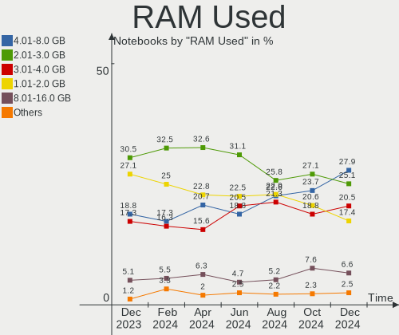
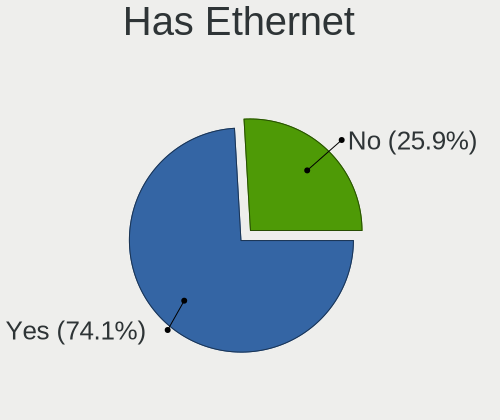
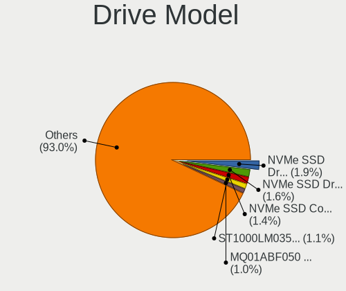
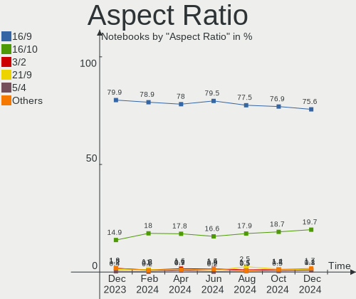
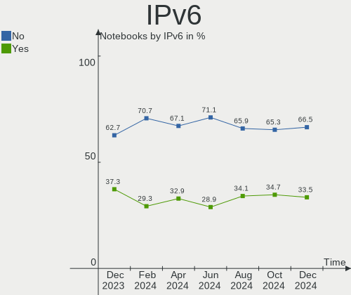

Ubuntu Hardware Trends (Notebooks)
----------------------------------

A project to identify most popular hardware characteristics and track their change
over time based on data collected by Ubuntu users at https://Linux-Hardware.org.

Anyone can contribute to this report by the [hw-probe](https://github.com/linuxhw/hw-probe) tool:

    sudo -E hw-probe -all -upload

Full-feature report is available here: https://linux-hardware.org/?view=trends

Period: Feb, 2022.

Contents
--------

* [ System ](#system)
  - [ OS                       ](#os)
  - [ OS Family                ](#os-family)
  - [ Kernel                   ](#kernel)
  - [ Kernel Family            ](#kernel-family)
  - [ Kernel Major Ver.        ](#kernel-major-ver)
  - [ Arch                     ](#arch)
  - [ DE                       ](#de)
  - [ Display Server           ](#display-server)
  - [ Display Manager          ](#display-manager)
  - [ OS Lang                  ](#os-lang)
  - [ Boot Mode                ](#boot-mode)
  - [ Filesystem               ](#filesystem)
  - [ Part. scheme             ](#part-scheme)
  - [ Dual Boot with Linux/BSD ](#dual-boot-with-linuxbsd)
  - [ Dual Boot (Win)          ](#dual-boot-win)

* [ Board ](#board)
  - [ Vendor                   ](#vendor)
  - [ Model                    ](#model)
  - [ Model Family             ](#model-family)
  - [ MFG Year                 ](#mfg-year)
  - [ Form Factor              ](#form-factor)
  - [ Secure Boot              ](#secure-boot)
  - [ Coreboot                 ](#coreboot)
  - [ RAM Size                 ](#ram-size)
  - [ RAM Used                 ](#ram-used)
  - [ Total Drives             ](#total-drives)
  - [ Has CD-ROM               ](#has-cd-rom)
  - [ Has Ethernet             ](#has-ethernet)
  - [ Has WiFi                 ](#has-wifi)
  - [ Has Bluetooth            ](#has-bluetooth)

* [ Location ](#location)
  - [ Country                  ](#country)
  - [ City                     ](#city)

* [ Drives ](#drives)
  - [ Drive Vendor             ](#drive-vendor)
  - [ Drive Model              ](#drive-model)
  - [ HDD Vendor               ](#hdd-vendor)
  - [ SSD Vendor               ](#ssd-vendor)
  - [ Drive Kind               ](#drive-kind)
  - [ Drive Connector          ](#drive-connector)
  - [ Drive Size               ](#drive-size)
  - [ Space Total              ](#space-total)
  - [ Space Used               ](#space-used)
  - [ Malfunc. Drives          ](#malfunc-drives)
  - [ Malfunc. Drive Vendor    ](#malfunc-drive-vendor)
  - [ Malfunc. HDD Vendor      ](#malfunc-hdd-vendor)
  - [ Malfunc. Drive Kind      ](#malfunc-drive-kind)
  - [ Failed Drives            ](#failed-drives)
  - [ Failed Drive Vendor      ](#failed-drive-vendor)
  - [ Drive Status             ](#drive-status)

* [ Storage controller ](#storage-controller)
  - [ Storage Vendor           ](#storage-vendor)
  - [ Storage Model            ](#storage-model)
  - [ Storage Kind             ](#storage-kind)

* [ Processor ](#processor)
  - [ CPU Vendor               ](#cpu-vendor)
  - [ CPU Model                ](#cpu-model)
  - [ CPU Model Family         ](#cpu-model-family)
  - [ CPU Cores                ](#cpu-cores)
  - [ CPU Sockets              ](#cpu-sockets)
  - [ CPU Threads              ](#cpu-threads)
  - [ CPU Op-Modes             ](#cpu-op-modes)
  - [ CPU Microcode            ](#cpu-microcode)
  - [ CPU Microarch            ](#cpu-microarch)

* [ Graphics ](#graphics)
  - [ GPU Vendor               ](#gpu-vendor)
  - [ GPU Model                ](#gpu-model)
  - [ GPU Combo                ](#gpu-combo)
  - [ GPU Driver               ](#gpu-driver)
  - [ GPU Memory               ](#gpu-memory)

* [ Monitor ](#monitor)
  - [ Monitor Vendor           ](#monitor-vendor)
  - [ Monitor Model            ](#monitor-model)
  - [ Monitor Resolution       ](#monitor-resolution)
  - [ Monitor Diagonal         ](#monitor-diagonal)
  - [ Monitor Width            ](#monitor-width)
  - [ Aspect Ratio             ](#aspect-ratio)
  - [ Monitor Area             ](#monitor-area)
  - [ Pixel Density            ](#pixel-density)
  - [ Multiple Monitors        ](#multiple-monitors)

* [ Network ](#network)
  - [ Net Controller Vendor    ](#net-controller-vendor)
  - [ Net Controller Model     ](#net-controller-model)
  - [ Wireless Vendor          ](#wireless-vendor)
  - [ Wireless Model           ](#wireless-model)
  - [ Ethernet Vendor          ](#ethernet-vendor)
  - [ Ethernet Model           ](#ethernet-model)
  - [ Net Controller Kind      ](#net-controller-kind)
  - [ Used Controller          ](#used-controller)
  - [ NICs                     ](#nics)
  - [ IPv6                     ](#ipv6)

* [ Bluetooth ](#bluetooth)
  - [ Bluetooth Vendor         ](#bluetooth-vendor)
  - [ Bluetooth Model          ](#bluetooth-model)

* [ Sound ](#sound)
  - [ Sound Vendor             ](#sound-vendor)
  - [ Sound Model              ](#sound-model)

* [ Memory ](#memory)
  - [ Memory Vendor            ](#memory-vendor)
  - [ Memory Model             ](#memory-model)
  - [ Memory Kind              ](#memory-kind)
  - [ Memory Form Factor       ](#memory-form-factor)
  - [ Memory Size              ](#memory-size)
  - [ Memory Speed             ](#memory-speed)

* [ Printers & scanners ](#printers--scanners)
  - [ Printer Vendor           ](#printer-vendor)
  - [ Printer Model            ](#printer-model)
  - [ Scanner Vendor           ](#scanner-vendor)
  - [ Scanner Model            ](#scanner-model)

* [ Camera ](#camera)
  - [ Camera Vendor            ](#camera-vendor)
  - [ Camera Model             ](#camera-model)

* [ Security ](#security)
  - [ Fingerprint Vendor       ](#fingerprint-vendor)
  - [ Fingerprint Model        ](#fingerprint-model)
  - [ Chipcard Vendor          ](#chipcard-vendor)
  - [ Chipcard Model           ](#chipcard-model)

* [ Unsupported ](#unsupported)
  - [ Unsupported Devices      ](#unsupported-devices)
  - [ Unsupported Device Types ](#unsupported-device-types)

System
------

OS
--

Installed operating systems

| Name         | Notebooks | Percent |
|--------------|-----------|---------|
| Ubuntu 20.04 | 349       | 63.34%  |
| Ubuntu 21.10 | 146       | 26.5%   |
| Ubuntu 18.04 | 26        | 4.72%   |
| Ubuntu 21.04 | 14        | 2.54%   |
| Ubuntu 22.04 | 10        | 1.81%   |
| Ubuntu 20.10 | 3         | 0.54%   |
| Ubuntu 16.04 | 3         | 0.54%   |

OS Family
---------

OS without a version

| Name   | Notebooks | Percent |
|--------|-----------|---------|
| Ubuntu | 551       | 100%    |

Kernel
------

Version of the Linux kernel

| Version                     | Notebooks | Percent |
|-----------------------------|-----------|---------|
| 5.13.0-28-generic           | 231       | 41.92%  |
| 5.13.0-30-generic           | 110       | 19.96%  |
| 5.13.0-27-generic           | 30        | 5.44%   |
| 5.4.0-99-generic            | 18        | 3.27%   |
| 5.4.0-97-generic            | 12        | 2.18%   |
| 5.11.0-27-generic           | 12        | 2.18%   |
| 5.4.0-100-generic           | 11        | 2%      |
| 5.11.0-49-generic           | 10        | 1.81%   |
| 5.4.0-96-generic            | 9         | 1.63%   |
| 5.10.0-1057-oem             | 7         | 1.27%   |
| 4.15.0-167-generic          | 7         | 1.27%   |
| 5.13.0-29-generic           | 6         | 1.09%   |
| 5.13.0-19-generic           | 6         | 1.09%   |
| 5.15.0-18-generic           | 5         | 0.91%   |
| 5.14.0-1024-oem             | 5         | 0.91%   |
| 5.11.0-46-generic           | 5         | 0.91%   |
| 5.14.0-1020-oem             | 3         | 0.54%   |
| 5.13.0-32-generic           | 3         | 0.54%   |
| 5.11.0-43-generic           | 3         | 0.54%   |
| 5.11.0-38-generic           | 3         | 0.54%   |
| 5.8.0-43-generic            | 2         | 0.36%   |
| 5.16.9-051609-generic       | 2         | 0.36%   |
| 5.16.5-051605-generic       | 2         | 0.36%   |
| 5.15.0-17-generic           | 2         | 0.36%   |
| 5.13.0-25-generic           | 2         | 0.36%   |
| 5.11.0-44-generic           | 2         | 0.36%   |
| 5.11.0-41-generic           | 2         | 0.36%   |
| 5.11.0-40-generic           | 2         | 0.36%   |
| 4.4.0-210-generic           | 2         | 0.36%   |
| 5.9.6-050906-generic        | 1         | 0.18%   |
| 5.8.0-63-generic            | 1         | 0.18%   |
| 5.8.0-55-generic            | 1         | 0.18%   |
| 5.8.0-25-generic            | 1         | 0.18%   |
| 5.6.0-1036-oem              | 1         | 0.18%   |
| 5.6.0-1032-oem              | 1         | 0.18%   |
| 5.5.19-bp0                  | 1         | 0.18%   |
| 5.4.0-88-generic            | 1         | 0.18%   |
| 5.4.0-72-generic            | 1         | 0.18%   |
| 5.4.0-52-generic            | 1         | 0.18%   |
| 5.4.0-42-generic            | 1         | 0.18%   |
| 5.4.0-41-generic            | 1         | 0.18%   |
| 5.4.0-28-generic            | 1         | 0.18%   |
| 5.4.0-1042-fips             | 1         | 0.18%   |
| 5.17.0-051700rc5-lowlatency | 1         | 0.18%   |
| 5.16.8-051608-generic       | 1         | 0.18%   |
| 5.16.1-051601-generic       | 1         | 0.18%   |
| 5.16.0-051600-generic       | 1         | 0.18%   |
| 5.15.22-051522-generic      | 1         | 0.18%   |
| 5.15.18-051518-generic      | 1         | 0.18%   |
| 5.15.15-76051515-generic    | 1         | 0.18%   |
| 5.15.13-051513-generic      | 1         | 0.18%   |
| 5.15.11-051511-generic      | 1         | 0.18%   |
| 5.13.0-28-lowlatency        | 1         | 0.18%   |
| 5.13.0-22-generic           | 1         | 0.18%   |
| 5.13.0-1029-oem             | 1         | 0.18%   |
| 5.13.0-1017-oem             | 1         | 0.18%   |
| 5.11.0-49-lowlatency        | 1         | 0.18%   |
| 5.11.0-37-generic           | 1         | 0.18%   |
| 5.11.0-16-generic           | 1         | 0.18%   |
| 5.10.7-051007-generic       | 1         | 0.18%   |

Kernel Family
-------------

Linux kernel without a distro release

| Version | Notebooks | Percent |
|---------|-----------|---------|
| 5.13.0  | 392       | 71.14%  |
| 5.4.0   | 57        | 10.34%  |
| 5.11.0  | 42        | 7.62%   |
| 4.15.0  | 12        | 2.18%   |
| 5.14.0  | 8         | 1.45%   |
| 5.15.0  | 7         | 1.27%   |
| 5.10.0  | 7         | 1.27%   |
| 5.8.0   | 5         | 0.91%   |
| 5.6.0   | 2         | 0.36%   |
| 5.16.9  | 2         | 0.36%   |
| 5.16.5  | 2         | 0.36%   |
| 4.4.0   | 2         | 0.36%   |
| 5.9.6   | 1         | 0.18%   |
| 5.5.19  | 1         | 0.18%   |
| 5.17.0  | 1         | 0.18%   |
| 5.16.8  | 1         | 0.18%   |
| 5.16.1  | 1         | 0.18%   |
| 5.16.0  | 1         | 0.18%   |
| 5.15.22 | 1         | 0.18%   |
| 5.15.18 | 1         | 0.18%   |
| 5.15.15 | 1         | 0.18%   |
| 5.15.13 | 1         | 0.18%   |
| 5.15.11 | 1         | 0.18%   |
| 5.10.7  | 1         | 0.18%   |
| 4.18.0  | 1         | 0.18%   |

Kernel Major Ver.
-----------------

Linux kernel major version

| Version | Notebooks | Percent |
|---------|-----------|---------|
| 5.13    | 392       | 71.14%  |
| 5.4     | 57        | 10.34%  |
| 5.11    | 42        | 7.62%   |
| 5.15    | 12        | 2.18%   |
| 4.15    | 12        | 2.18%   |
| 5.14    | 8         | 1.45%   |
| 5.10    | 8         | 1.45%   |
| 5.16    | 7         | 1.27%   |
| 5.8     | 5         | 0.91%   |
| 5.6     | 2         | 0.36%   |
| 4.4     | 2         | 0.36%   |
| 5.9     | 1         | 0.18%   |
| 5.5     | 1         | 0.18%   |
| 5.17    | 1         | 0.18%   |
| 4.18    | 1         | 0.18%   |

Arch
----

OS architecture (x86_64, i586, etc.)

| Name   | Notebooks | Percent |
|--------|-----------|---------|
| x86_64 | 544       | 98.73%  |
| i686   | 7         | 1.27%   |

DE
--

Desktop Environment

| Name              | Notebooks | Percent |
|-------------------|-----------|---------|
| GNOME             | 508       | 92.2%   |
| Unknown           | 19        | 3.45%   |
| X-Cinnamon        | 6         | 1.09%   |
| Unity             | 5         | 0.91%   |
| Cinnamon          | 4         | 0.73%   |
| GNOME Flashback   | 3         | 0.54%   |
| Yaru:ubuntu:GNOME | 1         | 0.18%   |
| xubuntu           | 1         | 0.18%   |
| i3                | 1         | 0.18%   |
| GNUstep           | 1         | 0.18%   |
| Enlightenment     | 1         | 0.18%   |
| Cutefish          | 1         | 0.18%   |

Display Server
--------------

X11 or Wayland

| Name    | Notebooks | Percent |
|---------|-----------|---------|
| X11     | 416       | 75.5%   |
| Wayland | 122       | 22.14%  |
| Unknown | 9         | 1.63%   |
| Tty     | 4         | 0.73%   |

Display Manager
---------------

SDDM, LightDM, etc.

| Name    | Notebooks | Percent |
|---------|-----------|---------|
| GDM3    | 319       | 57.89%  |
| GDM     | 189       | 34.3%   |
| Unknown | 22        | 3.99%   |
| LightDM | 17        | 3.09%   |
| SDDM    | 4         | 0.73%   |

OS Lang
-------

Language

| Lang    | Notebooks | Percent |
|---------|-----------|---------|
| en_US   | 242       | 43.92%  |
| de_DE   | 60        | 10.89%  |
| fr_FR   | 32        | 5.81%   |
| en_GB   | 24        | 4.36%   |
| it_IT   | 19        | 3.45%   |
| en_CA   | 15        | 2.72%   |
| en_IN   | 14        | 2.54%   |
| pt_BR   | 12        | 2.18%   |
| ru_RU   | 11        | 2%      |
| es_ES   | 11        | 2%      |
| es_MX   | 9         | 1.63%   |
| nl_NL   | 8         | 1.45%   |
| tr_TR   | 7         | 1.27%   |
| pl_PL   | 7         | 1.27%   |
| en_AU   | 6         | 1.09%   |
| en_ZA   | 5         | 0.91%   |
| zh_CN   | 4         | 0.73%   |
| ja_JP   | 4         | 0.73%   |
| fr_BE   | 4         | 0.73%   |
| de_AT   | 4         | 0.73%   |
| Unknown | 4         | 0.73%   |
| pt_PT   | 3         | 0.54%   |
| hu_HU   | 3         | 0.54%   |
| es_AR   | 3         | 0.54%   |
| da_DK   | 3         | 0.54%   |
| cs_CZ   | 3         | 0.54%   |
| sv_SE   | 2         | 0.36%   |
| nb_NO   | 2         | 0.36%   |
| ko_KR   | 2         | 0.36%   |
| fi_FI   | 2         | 0.36%   |
| es_CL   | 2         | 0.36%   |
| en_SG   | 2         | 0.36%   |
| en_NG   | 2         | 0.36%   |
| el_GR   | 2         | 0.36%   |
| de_CH   | 2         | 0.36%   |
| C       | 2         | 0.36%   |
| bg_BG   | 2         | 0.36%   |
| uk_UA   | 1         | 0.18%   |
| sk_SK   | 1         | 0.18%   |
| ru_UA   | 1         | 0.18%   |
| nl_BE   | 1         | 0.18%   |
| lv_LV   | 1         | 0.18%   |
| hr_HR   | 1         | 0.18%   |
| fr_CH   | 1         | 0.18%   |
| es_EC   | 1         | 0.18%   |
| en_PH   | 1         | 0.18%   |
| en_IL   | 1         | 0.18%   |
| en_HK   | 1         | 0.18%   |
| ar_SA   | 1         | 0.18%   |

Boot Mode
---------

EFI or BIOS

| Mode | Notebooks | Percent |
|------|-----------|---------|
| EFI  | 312       | 56.62%  |
| BIOS | 239       | 43.38%  |

Filesystem
----------

Type of filesystem

| Type    | Notebooks | Percent |
|---------|-----------|---------|
| Ext4    | 517       | 93.83%  |
| Zfs     | 11        | 2%      |
| Overlay | 11        | 2%      |
| Btrfs   | 7         | 1.27%   |
| Ext2    | 2         | 0.36%   |
| Xfs     | 1         | 0.18%   |
| Ext3    | 1         | 0.18%   |
| Unknown | 1         | 0.18%   |

Part. scheme
------------

Scheme of partitioning

| Type    | Notebooks | Percent |
|---------|-----------|---------|
| Unknown | 345       | 62.61%  |
| GPT     | 186       | 33.76%  |
| MBR     | 20        | 3.63%   |

Dual Boot with Linux/BSD
------------------------

Hosting more than one Linux/BSD

| Dual boot | Notebooks | Percent |
|-----------|-----------|---------|
| No        | 508       | 92.2%   |
| Yes       | 43        | 7.8%    |

Dual Boot (Win)
---------------

Hosting Linux and Windows

| Dual boot | Notebooks | Percent |
|-----------|-----------|---------|
| No        | 357       | 64.79%  |
| Yes       | 194       | 35.21%  |

Board
-----

Vendor
------

Motherboard manufacturer

| Name                                         | Notebooks | Percent |
|----------------------------------------------|-----------|---------|
| Lenovo                                       | 114       | 20.69%  |
| Dell                                         | 111       | 20.15%  |
| Hewlett-Packard                              | 100       | 18.15%  |
| ASUSTek Computer                             | 66        | 11.98%  |
| Acer                                         | 42        | 7.62%   |
| Toshiba                                      | 14        | 2.54%   |
| Samsung Electronics                          | 10        | 1.81%   |
| Apple                                        | 9         | 1.63%   |
| MSI                                          | 8         | 1.45%   |
| Fujitsu                                      | 8         | 1.45%   |
| Packard Bell                                 | 7         | 1.27%   |
| HUAWEI                                       | 6         | 1.09%   |
| Sony                                         | 5         | 0.91%   |
| Timi                                         | 4         | 0.73%   |
| Medion                                       | 4         | 0.73%   |
| Notebook                                     | 3         | 0.54%   |
| Google                                       | 3         | 0.54%   |
| TUXEDO                                       | 2         | 0.36%   |
| Positivo                                     | 2         | 0.36%   |
| CHUWI Innovation And Technology(ShenZhen)c0. | 2         | 0.36%   |
| Chuwi                                        | 2         | 0.36%   |
| Unknown                                      | 2         | 0.36%   |
| Wortmann AG                                  | 1         | 0.18%   |
| whyopencomputing                             | 1         | 0.18%   |
| TongFang                                     | 1         | 0.18%   |
| System76                                     | 1         | 0.18%   |
| SLIMBOOK                                     | 1         | 0.18%   |
| Shanghai Zhaoxin Semiconductor               | 1         | 0.18%   |
| Schenker                                     | 1         | 0.18%   |
| Razer                                        | 1         | 0.18%   |
| Prestigio                                    | 1         | 0.18%   |
| Panasonic                                    | 1         | 0.18%   |
| Microtech                                    | 1         | 0.18%   |
| MAXDATA                                      | 1         | 0.18%   |
| LG Electronics                               | 1         | 0.18%   |
| Lex BayTrail                                 | 1         | 0.18%   |
| Lanix                                        | 1         | 0.18%   |
| KOGAN                                        | 1         | 0.18%   |
| HONOR                                        | 1         | 0.18%   |
| Gigabyte Technology                          | 1         | 0.18%   |
| Fujitsu Siemens                              | 1         | 0.18%   |
| Entroware                                    | 1         | 0.18%   |
| ECS                                          | 1         | 0.18%   |
| Dynabook                                     | 1         | 0.18%   |
| COPELION INTERNATIONAL                       | 1         | 0.18%   |
| Compal                                       | 1         | 0.18%   |
| Casper                                       | 1         | 0.18%   |
| AZW                                          | 1         | 0.18%   |
| Allview                                      | 1         | 0.18%   |

Model
-----

Motherboard model

| Name                                                      | Notebooks | Percent |
|-----------------------------------------------------------|-----------|---------|
| HP ProBook 4730s                                          | 3         | 0.54%   |
| HP Pavilion Notebook                                      | 3         | 0.54%   |
| HP Pavilion 15                                            | 3         | 0.54%   |
| HP 15 Notebook PC                                         | 3         | 0.54%   |
| Dell XPS 15 9570                                          | 3         | 0.54%   |
| Dell XPS 15 9500                                          | 3         | 0.54%   |
| Dell XPS 15 7590                                          | 3         | 0.54%   |
| Dell XPS 13 9305                                          | 3         | 0.54%   |
| Unknown                                                   | 3         | 0.54%   |
| Toshiba PORTEGE Z30-C                                     | 2         | 0.36%   |
| Lenovo ThinkBook 15 G2 ARE 20VG                           | 2         | 0.36%   |
| Lenovo IdeaPad Gaming 3 15IMH05 81Y4                      | 2         | 0.36%   |
| Lenovo IdeaPad 5 14ITL05 82FE                             | 2         | 0.36%   |
| Lenovo IdeaPad 330-15IGM 81D1                             | 2         | 0.36%   |
| Lenovo IdeaPad 320-15ABR 80XS                             | 2         | 0.36%   |
| HP ZBook Firefly 15 inch G8 Mobile Workstation PC         | 2         | 0.36%   |
| HP ProBook 450 G4                                         | 2         | 0.36%   |
| HP ProBook 440 G8 Notebook PC                             | 2         | 0.36%   |
| HP Pavilion g7                                            | 2         | 0.36%   |
| HP Pavilion dv7                                           | 2         | 0.36%   |
| HP Pavilion dv6                                           | 2         | 0.36%   |
| HP Pavilion Aero Laptop 13-be0xxx                         | 2         | 0.36%   |
| HP Notebook                                               | 2         | 0.36%   |
| HP G60                                                    | 2         | 0.36%   |
| HP EliteBook 830 G6                                       | 2         | 0.36%   |
| HP 255 G6 Notebook PC                                     | 2         | 0.36%   |
| HP 15                                                     | 2         | 0.36%   |
| Dell XPS 13 9370                                          | 2         | 0.36%   |
| Dell XPS 13 9310                                          | 2         | 0.36%   |
| Dell Precision 5530                                       | 2         | 0.36%   |
| Dell Latitude E6440                                       | 2         | 0.36%   |
| Dell Latitude E6420                                       | 2         | 0.36%   |
| Dell Latitude E6400                                       | 2         | 0.36%   |
| Dell Latitude E4310                                       | 2         | 0.36%   |
| Dell Latitude E4300                                       | 2         | 0.36%   |
| Dell Latitude 5520                                        | 2         | 0.36%   |
| Dell Latitude 5480                                        | 2         | 0.36%   |
| Dell Latitude 3420                                        | 2         | 0.36%   |
| Dell Inspiron 7577                                        | 2         | 0.36%   |
| Dell Inspiron 5537                                        | 2         | 0.36%   |
| Dell Inspiron 5521                                        | 2         | 0.36%   |
| Dell Inspiron 5515                                        | 2         | 0.36%   |
| Dell Inspiron 5502                                        | 2         | 0.36%   |
| CHUWI Innovation And Technology(ShenZhen)c0. GemiBook Pro | 2         | 0.36%   |
| ASUS ZenBook UX325EA_UX325EA                              | 2         | 0.36%   |
| ASUS X540UA                                               | 2         | 0.36%   |
| ASUS Vivobook_ASUSLaptop M3500QC_M3500QC                  | 2         | 0.36%   |
| Acer Aspire A517-52                                       | 2         | 0.36%   |
| Wortmann AG Mobile 1511                                   | 1         | 0.18%   |
| TUXEDO P65xRP                                             | 1         | 0.18%   |
| TUXEDO N8xxEZ                                             | 1         | 0.18%   |
| Toshiba Satellite Pro S500                                | 1         | 0.18%   |
| Toshiba Satellite Pro A40-C                               | 1         | 0.18%   |
| Toshiba Satellite M50D-A                                  | 1         | 0.18%   |
| Toshiba Satellite L50-B                                   | 1         | 0.18%   |
| Toshiba Satellite C855-139                                | 1         | 0.18%   |
| Toshiba Satellite C850D-11R                               | 1         | 0.18%   |
| Toshiba Satellite C50-A-19T                               | 1         | 0.18%   |
| Toshiba Satellite A215                                    | 1         | 0.18%   |
| Toshiba Satellite A200                                    | 1         | 0.18%   |

Model Family
------------

Motherboard model prefix

| Name                                               | Notebooks | Percent |
|----------------------------------------------------|-----------|---------|
| Lenovo ThinkPad                                    | 56        | 10.16%  |
| Dell Latitude                                      | 38        | 6.9%    |
| Lenovo IdeaPad                                     | 30        | 5.44%   |
| Dell Inspiron                                      | 30        | 5.44%   |
| Acer Aspire                                        | 27        | 4.9%    |
| HP Pavilion                                        | 25        | 4.54%   |
| Dell XPS                                           | 22        | 3.99%   |
| HP ProBook                                         | 19        | 3.45%   |
| HP EliteBook                                       | 16        | 2.9%    |
| ASUS VivoBook                                      | 16        | 2.9%    |
| Dell Precision                                     | 13        | 2.36%   |
| Toshiba Satellite                                  | 9         | 1.63%   |
| ASUS ROG                                           | 9         | 1.63%   |
| Acer Swift                                         | 7         | 1.27%   |
| Lenovo Legion                                      | 6         | 1.09%   |
| Fujitsu LIFEBOOK                                   | 6         | 1.09%   |
| Packard Bell EasyNote                              | 5         | 0.91%   |
| Lenovo ThinkBook                                   | 5         | 0.91%   |
| HP ENVY                                            | 5         | 0.91%   |
| HP 15                                              | 5         | 0.91%   |
| Toshiba PORTEGE                                    | 4         | 0.73%   |
| HP ZBook                                           | 4         | 0.73%   |
| ASUS ZenBook                                       | 4         | 0.73%   |
| Acer TravelMate                                    | 4         | 0.73%   |
| Lenovo Yoga                                        | 3         | 0.54%   |
| HP Presario                                        | 3         | 0.54%   |
| HP Laptop                                          | 3         | 0.54%   |
| HP Compaq                                          | 3         | 0.54%   |
| HP 255                                             | 3         | 0.54%   |
| Apple MacBookPro11                                 | 3         | 0.54%   |
| Unknown                                            | 3         | 0.54%   |
| Timi RedmiBook                                     | 2         | 0.36%   |
| HP Stream                                          | 2         | 0.36%   |
| HP OMEN                                            | 2         | 0.36%   |
| HP Notebook                                        | 2         | 0.36%   |
| HP G60                                             | 2         | 0.36%   |
| Dell Vostro                                        | 2         | 0.36%   |
| Dell G7                                            | 2         | 0.36%   |
| Dell G3                                            | 2         | 0.36%   |
| CHUWI Innovation And Technology(ShenZhen)c0. GemiB | 2         | 0.36%   |
| ASUS X540UA                                        | 2         | 0.36%   |
| ASUS ASUS                                          | 2         | 0.36%   |
| Apple MacBookPro16                                 | 2         | 0.36%   |
| Wortmann AG Mobile                                 | 1         | 0.18%   |
| TUXEDO P65xRP                                      | 1         | 0.18%   |
| TUXEDO N8xxEZ                                      | 1         | 0.18%   |
| Toshiba dynabook                                   | 1         | 0.18%   |
| TongFang LYNX                                      | 1         | 0.18%   |
| Timi TM1709                                        | 1         | 0.18%   |
| Timi TM1707                                        | 1         | 0.18%   |
| System76 Galago                                    | 1         | 0.18%   |
| Sony VPCF115FM                                     | 1         | 0.18%   |
| Sony VPCEB36FG                                     | 1         | 0.18%   |
| Sony VGN-Z550N                                     | 1         | 0.18%   |
| Sony VGN-FW51JF                                    | 1         | 0.18%   |
| Sony SVE1511A1EW                                   | 1         | 0.18%   |
| SLIMBOOK TITAN                                     | 1         | 0.18%   |
| Shanghai Zhaoxin ZXE                               | 1         | 0.18%   |
| Schenker XMG                                       | 1         | 0.18%   |
| Samsung SQ35S                                      | 1         | 0.18%   |

MFG Year
--------

Motherboard manufacture year

| Year    | Notebooks | Percent |
|---------|-----------|---------|
| 2021    | 81        | 14.7%   |
| 2020    | 78        | 14.16%  |
| 2018    | 44        | 7.99%   |
| 2019    | 42        | 7.62%   |
| 2017    | 41        | 7.44%   |
| 2013    | 39        | 7.08%   |
| 2016    | 33        | 5.99%   |
| 2011    | 31        | 5.63%   |
| 2014    | 30        | 5.44%   |
| 2015    | 28        | 5.08%   |
| 2012    | 27        | 4.9%    |
| 2010    | 25        | 4.54%   |
| 2008    | 22        | 3.99%   |
| 2009    | 16        | 2.9%    |
| 2007    | 9         | 1.63%   |
| 2022    | 2         | 0.36%   |
| 2006    | 2         | 0.36%   |
| Unknown | 1         | 0.18%   |

Form Factor
-----------

Physical design of the computer

| Name     | Notebooks | Percent |
|----------|-----------|---------|
| Notebook | 551       | 100%    |

Secure Boot
-----------

Enabled or disabled

| State    | Notebooks | Percent |
|----------|-----------|---------|
| Disabled | 460       | 83.48%  |
| Enabled  | 91        | 16.52%  |

Coreboot
--------

Have coreboot on board

| Used | Notebooks | Percent |
|------|-----------|---------|
| No   | 547       | 99.27%  |
| Yes  | 4         | 0.73%   |

RAM Size
--------

Total RAM memory

| Size in GB  | Notebooks | Percent |
|-------------|-----------|---------|
| 4.01-8.0    | 147       | 26.68%  |
| 16.01-24.0  | 122       | 22.14%  |
| 3.01-4.0    | 108       | 19.6%   |
| 8.01-16.0   | 94        | 17.06%  |
| 32.01-64.0  | 47        | 8.53%   |
| 1.01-2.0    | 16        | 2.9%    |
| 2.01-3.0    | 7         | 1.27%   |
| 64.01-256.0 | 6         | 1.09%   |
| 24.01-32.0  | 4         | 0.73%   |

RAM Used
--------

Used RAM memory

| Used GB    | Notebooks | Percent |
|------------|-----------|---------|
| 1.01-2.0   | 189       | 34.3%   |
| 2.01-3.0   | 143       | 25.95%  |
| 4.01-8.0   | 103       | 18.69%  |
| 3.01-4.0   | 75        | 13.61%  |
| 8.01-16.0  | 28        | 5.08%   |
| 0.51-1.0   | 8         | 1.45%   |
| 16.01-24.0 | 4         | 0.73%   |
| 24.01-32.0 | 1         | 0.18%   |

Total Drives
------------

Number of drives on board

| Drives | Notebooks | Percent |
|--------|-----------|---------|
| 1      | 398       | 72.23%  |
| 2      | 142       | 25.77%  |
| 3      | 7         | 1.27%   |
| 0      | 3         | 0.54%   |
| 4      | 1         | 0.18%   |

Has CD-ROM
----------

Has CD-ROM on board

| Presented | Notebooks | Percent |
|-----------|-----------|---------|
| No        | 369       | 66.97%  |
| Yes       | 182       | 33.03%  |

Has Ethernet
------------

Has Ethernet on board

| Presented | Notebooks | Percent |
|-----------|-----------|---------|
| Yes       | 437       | 79.31%  |
| No        | 114       | 20.69%  |

Has WiFi
--------

Has WiFi module

| Presented | Notebooks | Percent |
|-----------|-----------|---------|
| Yes       | 544       | 98.73%  |
| No        | 7         | 1.27%   |

Has Bluetooth
-------------

Has Bluetooth module

| Presented | Notebooks | Percent |
|-----------|-----------|---------|
| Yes       | 435       | 78.95%  |
| No        | 116       | 21.05%  |

Location
--------

Country
-------

Geographic location (country)

| Country      | Notebooks | Percent |
|--------------|-----------|---------|
| USA          | 83        | 15.06%  |
| Germany      | 77        | 13.97%  |
| France       | 44        | 7.99%   |
| Italy        | 21        | 3.81%   |
| Poland       | 20        | 3.63%   |
| Netherlands  | 18        | 3.27%   |
| Canada       | 18        | 3.27%   |
| UK           | 17        | 3.09%   |
| India        | 17        | 3.09%   |
| Spain        | 15        | 2.72%   |
| Russia       | 15        | 2.72%   |
| Brazil       | 15        | 2.72%   |
| Turkey       | 11        | 2%      |
| Mexico       | 9         | 1.63%   |
| Belgium      | 9         | 1.63%   |
| Switzerland  | 8         | 1.45%   |
| Portugal     | 8         | 1.45%   |
| Hungary      | 8         | 1.45%   |
| China        | 8         | 1.45%   |
| Austria      | 8         | 1.45%   |
| Ukraine      | 7         | 1.27%   |
| Sweden       | 7         | 1.27%   |
| Romania      | 6         | 1.09%   |
| Argentina    | 6         | 1.09%   |
| South Africa | 5         | 0.91%   |
| Czechia      | 5         | 0.91%   |
| Australia    | 5         | 0.91%   |
| Tunisia      | 4         | 0.73%   |
| Singapore    | 4         | 0.73%   |
| Pakistan     | 4         | 0.73%   |
| Norway       | 4         | 0.73%   |
| Japan        | 4         | 0.73%   |
| Denmark      | 4         | 0.73%   |
| Taiwan       | 3         | 0.54%   |
| Serbia       | 3         | 0.54%   |
| Greece       | 3         | 0.54%   |
| Finland      | 3         | 0.54%   |
| Croatia      | 3         | 0.54%   |
| Chile        | 3         | 0.54%   |
| Vietnam      | 2         | 0.36%   |
| South Korea  | 2         | 0.36%   |
| Philippines  | 2         | 0.36%   |
| Nigeria      | 2         | 0.36%   |
| Israel       | 2         | 0.36%   |
| Indonesia    | 2         | 0.36%   |
| Bulgaria     | 2         | 0.36%   |
| Bangladesh   | 2         | 0.36%   |
| Uzbekistan   | 1         | 0.18%   |
| Uruguay      | 1         | 0.18%   |
| Thailand     | 1         | 0.18%   |
| Sudan        | 1         | 0.18%   |
| Slovenia     | 1         | 0.18%   |
| Slovakia     | 1         | 0.18%   |
| Saudi Arabia | 1         | 0.18%   |
| Nicaragua    | 1         | 0.18%   |
| New Zealand  | 1         | 0.18%   |
| Myanmar      | 1         | 0.18%   |
| Malta        | 1         | 0.18%   |
| Latvia       | 1         | 0.18%   |
| Kenya        | 1         | 0.18%   |

City
----

Geographic location (city)

| City              | Notebooks | Percent |
|-------------------|-----------|---------|
| Berlin            | 8         | 1.45%   |
| Paris             | 6         | 1.09%   |
| Moscow            | 6         | 1.09%   |
| Istanbul          | 6         | 1.09%   |
| Warsaw            | 5         | 0.91%   |
| Vienna            | 5         | 0.91%   |
| Gothenburg        | 5         | 0.91%   |
| Singapore         | 4         | 0.73%   |
| Portland          | 4         | 0.73%   |
| Munich            | 4         | 0.73%   |
| Milan             | 4         | 0.73%   |
| Mexico City       | 4         | 0.73%   |
| Krakow            | 4         | 0.73%   |
| Budapest          | 4         | 0.73%   |
| Wuppertal         | 3         | 0.54%   |
| Toronto           | 3         | 0.54%   |
| São Paulo      | 3         | 0.54%   |
| San Jose          | 3         | 0.54%   |
| Belgrade          | 3         | 0.54%   |
| Barcelona         | 3         | 0.54%   |
| Ankara            | 3         | 0.54%   |
| Amsterdam         | 3         | 0.54%   |
| Zurich            | 2         | 0.36%   |
| Villeurbanne      | 2         | 0.36%   |
| Vancouver         | 2         | 0.36%   |
| Tunis             | 2         | 0.36%   |
| Tucson            | 2         | 0.36%   |
| Toulouse          | 2         | 0.36%   |
| Toluca            | 2         | 0.36%   |
| Teuge             | 2         | 0.36%   |
| Tessenderlo       | 2         | 0.36%   |
| Stockholm         | 2         | 0.36%   |
| Sofia             | 2         | 0.36%   |
| Sheffield         | 2         | 0.36%   |
| Shanghai          | 2         | 0.36%   |
| San Francisco     | 2         | 0.36%   |
| Samara            | 2         | 0.36%   |
| Saint Augustine   | 2         | 0.36%   |
| Rome              | 2         | 0.36%   |
| Pretoria          | 2         | 0.36%   |
| Prague            | 2         | 0.36%   |
| Mumbai            | 2         | 0.36%   |
| Montreal          | 2         | 0.36%   |
| Minneapolis       | 2         | 0.36%   |
| Manassas          | 2         | 0.36%   |
| London            | 2         | 0.36%   |
| Lisbon            | 2         | 0.36%   |
| Leipzig           | 2         | 0.36%   |
| Kunming           | 2         | 0.36%   |
| Kharkiv           | 2         | 0.36%   |
| Johannesburg      | 2         | 0.36%   |
| Islamabad         | 2         | 0.36%   |
| Helsinki          | 2         | 0.36%   |
| Hamburg           | 2         | 0.36%   |
| Halle             | 2         | 0.36%   |
| Granada           | 2         | 0.36%   |
| Frankfurt am Main | 2         | 0.36%   |
| Cologne           | 2         | 0.36%   |
| Chicago           | 2         | 0.36%   |
| Córdoba        | 2         | 0.36%   |

Drives
------

Drive Vendor
------------

Hard drive vendors

| Vendor                         | Notebooks | Drives | Percent |
|--------------------------------|-----------|--------|---------|
| Samsung Electronics            | 129       | 137    | 19.46%  |
| WDC                            | 85        | 87     | 12.82%  |
| Seagate                        | 67        | 68     | 10.11%  |
| Toshiba                        | 55        | 55     | 8.3%    |
| SK Hynix                       | 39        | 39     | 5.88%   |
| Unknown                        | 33        | 36     | 4.98%   |
| Kingston                       | 33        | 33     | 4.98%   |
| SanDisk                        | 32        | 34     | 4.83%   |
| Intel                          | 28        | 29     | 4.22%   |
| Hitachi                        | 22        | 22     | 3.32%   |
| Micron Technology              | 16        | 16     | 2.41%   |
| KIOXIA                         | 16        | 19     | 2.41%   |
| Crucial                        | 16        | 16     | 2.41%   |
| HGST                           | 12        | 12     | 1.81%   |
| Apple                          | 7         | 8      | 1.06%   |
| A-DATA Technology              | 7         | 7      | 1.06%   |
| LITEON                         | 6         | 6      | 0.9%    |
| Phison                         | 5         | 5      | 0.75%   |
| PNY                            | 4         | 4      | 0.6%    |
| Silicon Motion                 | 3         | 3      | 0.45%   |
| China                          | 3         | 3      | 0.45%   |
| Unknown                        | 3         | 3      | 0.45%   |
| UMIS                           | 2         | 2      | 0.3%    |
| Transcend                      | 2         | 2      | 0.3%    |
| SPCC                           | 2         | 2      | 0.3%    |
| Netac                          | 2         | 2      | 0.3%    |
| Micron/Crucial Technology      | 2         | 2      | 0.3%    |
| Hewlett-Packard                | 2         | 2      | 0.3%    |
| Gigabyte Technology            | 2         | 2      | 0.3%    |
| Fujitsu                        | 2         | 2      | 0.3%    |
| Vaseky                         | 1         | 1      | 0.15%   |
| TO Exter                       | 1         | 1      | 0.15%   |
| Team                           | 1         | 1      | 0.15%   |
| SSSTC                          | 1         | 1      | 0.15%   |
| Solid State Storage Technology | 1         | 1      | 0.15%   |
| PNY USB                        | 1         | 1      | 0.15%   |
| PLEXTOR                        | 1         | 1      | 0.15%   |
| Patriot                        | 1         | 1      | 0.15%   |
| OSCOO                          | 1         | 1      | 0.15%   |
| ORTIAL                         | 1         | 1      | 0.15%   |
| OCZ-AGIL                       | 1         | 1      | 0.15%   |
| Mushkin                        | 1         | 1      | 0.15%   |
| MidasForce                     | 1         | 1      | 0.15%   |
| LITEONIT                       | 1         | 1      | 0.15%   |
| Leven                          | 1         | 1      | 0.15%   |
| KingDian                       | 1         | 1      | 0.15%   |
| HS-SSD-C100                    | 1         | 1      | 0.15%   |
| Hikvision                      | 1         | 1      | 0.15%   |
| GOODRAM                        | 1         | 1      | 0.15%   |
| G-DRIVE                        | 1         | 1      | 0.15%   |
| External                       | 1         | 1      | 0.15%   |
| Dogfish                        | 1         | 1      | 0.15%   |
| Dell                           | 1         | 1      | 0.15%   |
| Corsair                        | 1         | 1      | 0.15%   |
| Biwin                          | 1         | 1      | 0.15%   |
| ASMT                           | 1         | 1      | 0.15%   |

Drive Model
-----------

Hard drive models

| Model                                     | Notebooks | Percent |
|-------------------------------------------|-----------|---------|
| Unknown MMC Card  64GB                    | 11        | 1.62%   |
| Samsung NVMe SSD Drive 512GB              | 11        | 1.62%   |
| Unknown MMC Card  32GB                    | 9         | 1.33%   |
| Toshiba MQ01ABD100 1TB                    | 9         | 1.33%   |
| Seagate ST1000LM024 HN-M101MBB 1TB        | 9         | 1.33%   |
| Seagate ST1000LM035-1RK172 1TB            | 7         | 1.03%   |
| Kingston SA400S37240G 240GB SSD           | 7         | 1.03%   |
| Intel NVMe SSD Drive 512GB                | 7         | 1.03%   |
| Toshiba MQ04ABF100 1TB                    | 6         | 0.89%   |
| Samsung SSD 980 1TB                       | 6         | 0.89%   |
| Samsung SSD 860 EVO 500GB                 | 6         | 0.89%   |
| Samsung SSD 850 EVO 500GB                 | 6         | 0.89%   |
| Samsung SM963 2.5" NVMe PCIe SSD 256GB    | 6         | 0.89%   |
| Seagate ST500LT012-1DG142 500GB           | 5         | 0.74%   |
| Samsung SSD 850 EVO 250GB                 | 5         | 0.74%   |
| Hitachi HTS543232A7A384 320GB             | 5         | 0.74%   |
| WDC WD10SPZX-24Z10 1TB                    | 4         | 0.59%   |
| SK Hynix NVMe SSD Drive 512GB             | 4         | 0.59%   |
| Seagate ST1000LM048-2E7172 1TB            | 4         | 0.59%   |
| Samsung SSD 970 EVO Plus 1TB              | 4         | 0.59%   |
| Samsung MZVLW256HEHP-000L7 256GB          | 4         | 0.59%   |
| Samsung MZVLQ256HAJD-000H1 256GB          | 4         | 0.59%   |
| Hitachi HTS545032B9A300 320GB             | 4         | 0.59%   |
| HGST HTS545050A7E680 500GB                | 4         | 0.59%   |
| Crucial CT500MX500SSD1 500GB              | 4         | 0.59%   |
| WDC WD5000LPCX-24VHAT0 500GB              | 3         | 0.44%   |
| WDC WD3200BEVT-22ZCT0 320GB               | 3         | 0.44%   |
| WDC WD10SPZX-00Z10T0 1TB                  | 3         | 0.44%   |
| Unknown MMC Card  16GB                    | 3         | 0.44%   |
| Toshiba MQ01ABF050 500GB                  | 3         | 0.44%   |
| Toshiba KBG30ZMS128G 128GB NVMe SSD       | 3         | 0.44%   |
| SK Hynix SKHynix_HFM512GDHTNI-87A0B 512GB | 3         | 0.44%   |
| SK Hynix SKHynix_HFM512GD3HX015N 512GB    | 3         | 0.44%   |
| SK Hynix PC711 NVMe 512GB                 | 3         | 0.44%   |
| SK Hynix NVMe SSD Drive 256GB             | 3         | 0.44%   |
| SK Hynix HFM512GD3JX013N 512GB            | 3         | 0.44%   |
| Seagate ST9500420AS 500GB                 | 3         | 0.44%   |
| Seagate ST500LM012 HN-M500MBB 500GB       | 3         | 0.44%   |
| Seagate ST2000LM003 HN-M201RAD 2TB        | 3         | 0.44%   |
| Sandisk NVMe SSD Drive 512GB              | 3         | 0.44%   |
| Samsung SSD 970 EVO Plus 500GB            | 3         | 0.44%   |
| Samsung SSD 860 QVO 1TB                   | 3         | 0.44%   |
| Samsung NVMe SSD Drive 250GB              | 3         | 0.44%   |
| Samsung MZNLN256HCHP-00000 256GB SSD      | 3         | 0.44%   |
| Samsung MZALQ512HALU-000L2 512GB          | 3         | 0.44%   |
| Samsung MZALQ256HAJD-000L2 256GB          | 3         | 0.44%   |
| PNY CS900 240GB SSD                       | 3         | 0.44%   |
| Kingston SA400S37120G 120GB SSD           | 3         | 0.44%   |
| Intel SSDPEKNU512GZ 512GB                 | 3         | 0.44%   |
| HGST HTS541010A9E680 1TB                  | 3         | 0.44%   |
| Unknown                                   | 3         | 0.44%   |
| WDC WDS100T2B0C-00PXH0 1TB                | 2         | 0.3%    |
| WDC WDS100T2B0A-00SM50 1TB SSD            | 2         | 0.3%    |
| WDC WDBNCE5000PNC 500GB SSD               | 2         | 0.3%    |
| WDC WD5000LPVX-22V0TT0 500GB              | 2         | 0.3%    |
| WDC WD10SPZX-60Z10T0 1TB                  | 2         | 0.3%    |
| WDC WD10SPZX-08Z10 1TB                    | 2         | 0.3%    |
| WDC WD10JPVX-75JC3T0 1TB                  | 2         | 0.3%    |
| WDC WD10JPCX-24UE4T0 1TB                  | 2         | 0.3%    |
| WDC PC SN730 NVMe 512GB                   | 2         | 0.3%    |

HDD Vendor
----------

Hard disk drive vendors

| Vendor              | Notebooks | Drives | Percent |
|---------------------|-----------|--------|---------|
| Seagate             | 66        | 67     | 33.33%  |
| WDC                 | 56        | 57     | 28.28%  |
| Toshiba             | 33        | 33     | 16.67%  |
| Hitachi             | 22        | 22     | 11.11%  |
| HGST                | 12        | 12     | 6.06%   |
| Samsung Electronics | 6         | 6      | 3.03%   |
| Fujitsu             | 2         | 2      | 1.01%   |
| Unknown             | 1         | 1      | 0.51%   |

SSD Vendor
----------

Solid state drive vendors

| Vendor              | Notebooks | Drives | Percent |
|---------------------|-----------|--------|---------|
| Samsung Electronics | 49        | 51     | 25.93%  |
| Kingston            | 21        | 21     | 11.11%  |
| SanDisk             | 20        | 22     | 10.58%  |
| WDC                 | 14        | 14     | 7.41%   |
| Crucial             | 14        | 14     | 7.41%   |
| Micron Technology   | 7         | 7      | 3.7%    |
| Intel               | 7         | 7      | 3.7%    |
| Toshiba             | 6         | 6      | 3.17%   |
| LITEON              | 6         | 6      | 3.17%   |
| A-DATA Technology   | 5         | 5      | 2.65%   |
| PNY                 | 4         | 4      | 2.12%   |
| China               | 3         | 3      | 1.59%   |
| Apple               | 3         | 3      | 1.59%   |
| Transcend           | 2         | 2      | 1.06%   |
| SK Hynix            | 2         | 2      | 1.06%   |
| Netac               | 2         | 2      | 1.06%   |
| Hewlett-Packard     | 2         | 2      | 1.06%   |
| Gigabyte Technology | 2         | 2      | 1.06%   |
| Unknown             | 2         | 2      | 1.06%   |
| Vaseky              | 1         | 1      | 0.53%   |
| TO Exter            | 1         | 1      | 0.53%   |
| Team                | 1         | 1      | 0.53%   |
| SPCC                | 1         | 1      | 0.53%   |
| PNY USB             | 1         | 1      | 0.53%   |
| PLEXTOR             | 1         | 1      | 0.53%   |
| Patriot             | 1         | 1      | 0.53%   |
| OSCOO               | 1         | 1      | 0.53%   |
| ORTIAL              | 1         | 1      | 0.53%   |
| OCZ-AGIL            | 1         | 1      | 0.53%   |
| MidasForce          | 1         | 1      | 0.53%   |
| LITEONIT            | 1         | 1      | 0.53%   |
| Leven               | 1         | 1      | 0.53%   |
| KingDian            | 1         | 1      | 0.53%   |
| GOODRAM             | 1         | 1      | 0.53%   |
| Dogfish             | 1         | 1      | 0.53%   |
| Dell                | 1         | 1      | 0.53%   |
| Corsair             | 1         | 1      | 0.53%   |

Drive Kind
----------

HDD or SSD

| Kind    | Notebooks | Drives | Percent |
|---------|-----------|--------|---------|
| NVMe    | 226       | 250    | 35.65%  |
| HDD     | 194       | 200    | 30.6%   |
| SSD     | 176       | 193    | 27.76%  |
| MMC     | 32        | 35     | 5.05%   |
| Unknown | 6         | 6      | 0.95%   |

Drive Connector
---------------

SATA, SAS, NVMe, etc.

| Type | Notebooks | Drives | Percent |
|------|-----------|--------|---------|
| SATA | 341       | 382    | 55.36%  |
| NVMe | 225       | 249    | 36.53%  |
| MMC  | 32        | 35     | 5.19%   |
| SAS  | 18        | 18     | 2.92%   |

Drive Size
----------

Size of hard drive

| Size in TB | Notebooks | Drives | Percent |
|------------|-----------|--------|---------|
| 0.01-0.5   | 246       | 268    | 66.67%  |
| 0.51-1.0   | 110       | 112    | 29.81%  |
| 1.01-2.0   | 9         | 9      | 2.44%   |
| 4.01-10.0  | 3         | 3      | 0.81%   |
| 3.01-4.0   | 1         | 1      | 0.27%   |

Space Total
-----------

Amount of disk space available on the file system

| Size in GB     | Notebooks | Percent |
|----------------|-----------|---------|
| 251-500        | 184       | 33.39%  |
| 101-250        | 167       | 30.31%  |
| 501-1000       | 84        | 15.25%  |
| 51-100         | 39        | 7.08%   |
| 1001-2000      | 24        | 4.36%   |
| 21-50          | 20        | 3.63%   |
| 1-20           | 19        | 3.45%   |
| More than 3000 | 6         | 1.09%   |
| 2001-3000      | 4         | 0.73%   |
| Unknown        | 4         | 0.73%   |

Space Used
----------

Amount of used disk space

| Used GB        | Notebooks | Percent |
|----------------|-----------|---------|
| 1-20           | 208       | 37.75%  |
| 21-50          | 116       | 21.05%  |
| 101-250        | 80        | 14.52%  |
| 51-100         | 78        | 14.16%  |
| 251-500        | 45        | 8.17%   |
| 501-1000       | 15        | 2.72%   |
| Unknown        | 4         | 0.73%   |
| 2001-3000      | 2         | 0.36%   |
| 1001-2000      | 2         | 0.36%   |
| More than 3000 | 1         | 0.18%   |

Malfunc. Drives
---------------

Drive models with a malfunction

| Model                                 | Notebooks | Drives | Percent |
|---------------------------------------|-----------|--------|---------|
| Hitachi HTS543232A7A384 320GB         | 2         | 2      | 10%     |
| WDC WDS240G2G0B-00EPW0 240GB SSD      | 1         | 1      | 5%      |
| WDC WDS240G2G0A-00JH30 240GB SSD      | 1         | 1      | 5%      |
| Toshiba MQ01ABD100 1TB                | 1         | 1      | 5%      |
| Toshiba MK3252GSX 320GB               | 1         | 1      | 5%      |
| SK Hynix HFS512G39TND-N210A 512GB SSD | 1         | 1      | 5%      |
| Seagate ST9320423AS 320GB             | 1         | 1      | 5%      |
| Seagate ST9320325AS 320GB             | 1         | 1      | 5%      |
| Seagate ST320LT007-9ZV142 320GB       | 1         | 1      | 5%      |
| Seagate ST2000LM003 HN-M201RAD 2TB    | 1         | 1      | 5%      |
| Seagate ST1000LM024 HN-M101MBB 1TB    | 1         | 1      | 5%      |
| SanDisk SSD U100 24GB                 | 1         | 1      | 5%      |
| Samsung Electronics SSD 980 1TB       | 1         | 1      | 5%      |
| Samsung Electronics SSD 870 EVO 500GB | 1         | 1      | 5%      |
| OCZ-AGIL ITY3 120GB SSD               | 1         | 1      | 5%      |
| Hitachi HTS723232A7A364 320GB         | 1         | 1      | 5%      |
| Hitachi HTS545032B9A302 320GB         | 1         | 1      | 5%      |
| Hitachi HTS545032B9A300 320GB         | 1         | 1      | 5%      |
| HGST HTS541010A7E630 1TB              | 1         | 1      | 5%      |

Malfunc. Drive Vendor
---------------------

Vendors of faulty drives

| Vendor              | Notebooks | Drives | Percent |
|---------------------|-----------|--------|---------|
| Seagate             | 5         | 5      | 25%     |
| Hitachi             | 5         | 5      | 25%     |
| WDC                 | 2         | 2      | 10%     |
| Toshiba             | 2         | 2      | 10%     |
| Samsung Electronics | 2         | 2      | 10%     |
| SK Hynix            | 1         | 1      | 5%      |
| SanDisk             | 1         | 1      | 5%      |
| OCZ-AGIL            | 1         | 1      | 5%      |
| HGST                | 1         | 1      | 5%      |

Malfunc. HDD Vendor
-------------------

Vendors of faulty HDD drives

| Vendor  | Notebooks | Drives | Percent |
|---------|-----------|--------|---------|
| Seagate | 5         | 5      | 38.46%  |
| Hitachi | 5         | 5      | 38.46%  |
| Toshiba | 2         | 2      | 15.38%  |
| HGST    | 1         | 1      | 7.69%   |

Malfunc. Drive Kind
-------------------

Kinds of faulty drives

| Kind | Notebooks | Drives | Percent |
|------|-----------|--------|---------|
| HDD  | 13        | 13     | 65%     |
| SSD  | 6         | 6      | 30%     |
| NVMe | 1         | 1      | 5%      |

Failed Drives
-------------

Failed drive models

Zero info for selected period =(

Failed Drive Vendor
-------------------

Failed drive vendors

Zero info for selected period =(

Drive Status
------------

Number of failed and malfunc. drives

| Status   | Notebooks | Drives | Percent |
|----------|-----------|--------|---------|
| Detected | 341       | 424    | 60.35%  |
| Works    | 205       | 240    | 36.28%  |
| Malfunc  | 19        | 20     | 3.36%   |

Storage controller
------------------

Storage Vendor
--------------

Storage controller vendors

| Vendor                         | Notebooks | Percent |
|--------------------------------|-----------|---------|
| Intel                          | 378       | 56.33%  |
| Samsung Electronics            | 79        | 11.77%  |
| AMD                            | 68        | 10.13%  |
| SK Hynix                       | 37        | 5.51%   |
| Sandisk                        | 26        | 3.87%   |
| Toshiba America Info Systems   | 23        | 3.43%   |
| Kingston Technology Company    | 12        | 1.79%   |
| Micron Technology              | 10        | 1.49%   |
| KIOXIA                         | 9         | 1.34%   |
| Phison Electronics             | 6         | 0.89%   |
| Silicon Motion                 | 4         | 0.6%    |
| Micron/Crucial Technology      | 3         | 0.45%   |
| Apple                          | 3         | 0.45%   |
| Union Memory (Shenzhen)        | 2         | 0.3%    |
| Solid State Storage Technology | 2         | 0.3%    |
| ASMedia Technology             | 2         | 0.3%    |
| ADATA Technology               | 2         | 0.3%    |
| Zhaoxin                        | 1         | 0.15%   |
| Silicon Image                  | 1         | 0.15%   |
| Nvidia                         | 1         | 0.15%   |
| MAXIO Technology (Hangzhou)    | 1         | 0.15%   |
| Biwin Storage Technology       | 1         | 0.15%   |

Storage Model
-------------

Storage controller models

| Model                                                                            | Notebooks | Percent |
|----------------------------------------------------------------------------------|-----------|---------|
| AMD FCH SATA Controller [AHCI mode]                                              | 60        | 8.36%   |
| Intel Sunrise Point-LP SATA Controller [AHCI mode]                               | 41        | 5.71%   |
| Intel Volume Management Device NVMe RAID Controller                              | 36        | 5.01%   |
| Samsung NVMe SSD Controller SM981/PM981/PM983                                    | 35        | 4.87%   |
| Samsung NVMe SSD Controller 980                                                  | 32        | 4.46%   |
| Intel 82801 Mobile SATA Controller [RAID mode]                                   | 32        | 4.46%   |
| Intel 7 Series Chipset Family 6-port SATA Controller [AHCI mode]                 | 29        | 4.04%   |
| Intel 8 Series SATA Controller 1 [AHCI mode]                                     | 27        | 3.76%   |
| Intel 6 Series/C200 Series Chipset Family 6 port Mobile SATA AHCI Controller     | 23        | 3.2%    |
| SK Hynix Gold P31 SSD                                                            | 21        | 2.92%   |
| Intel 82801IBM/IEM (ICH9M/ICH9M-E) 4 port SATA Controller [AHCI mode]            | 21        | 2.92%   |
| Intel Tiger Lake-LP SATA Controller [AHCI mode]                                  | 18        | 2.51%   |
| Intel Cannon Lake Mobile PCH SATA AHCI Controller                                | 17        | 2.37%   |
| Intel 5 Series/3400 Series Chipset 4 port SATA AHCI Controller                   | 16        | 2.23%   |
| Intel 8 Series/C220 Series Chipset Family 6-port SATA Controller 1 [AHCI mode]   | 15        | 2.09%   |
| Toshiba America Info Systems XG6 NVMe SSD Controller                             | 14        | 1.95%   |
| Intel Wildcat Point-LP SATA Controller [AHCI Mode]                               | 11        | 1.53%   |
| SK Hynix Non-Volatile memory controller                                          | 10        | 1.39%   |
| Micron Non-Volatile memory controller                                            | 10        | 1.39%   |
| Intel HM170/QM170 Chipset SATA Controller [AHCI Mode]                            | 10        | 1.39%   |
| Intel Celeron/Pentium Silver Processor SATA Controller                           | 10        | 1.39%   |
| Intel 400 Series Chipset Family SATA AHCI Controller                             | 10        | 1.39%   |
| Samsung NVMe SSD Controller SM961/PM961/SM963                                    | 8         | 1.11%   |
| KIOXIA Non-Volatile memory controller                                            | 8         | 1.11%   |
| Intel SSD 660P Series                                                            | 8         | 1.11%   |
| Intel Non-Volatile memory controller                                             | 8         | 1.11%   |
| Sandisk WD Black SN750 / PC SN730 NVMe SSD                                       | 7         | 0.97%   |
| Intel Comet Lake SATA AHCI Controller                                            | 7         | 0.97%   |
| Intel Atom Processor E3800 Series SATA AHCI Controller                           | 7         | 0.97%   |
| Intel 82801HM/HEM (ICH8M/ICH8M-E) SATA Controller [AHCI mode]                    | 7         | 0.97%   |
| Intel 82801HM/HEM (ICH8M/ICH8M-E) IDE Controller                                 | 7         | 0.97%   |
| Toshiba America Info Systems Toshiba America Info Non-Volatile memory controller | 6         | 0.84%   |
| Sandisk WD Blue SN550 NVMe SSD                                                   | 6         | 0.84%   |
| Intel 5 Series/3400 Series Chipset 6 port SATA AHCI Controller                   | 6         | 0.84%   |
| AMD SB7x0/SB8x0/SB9x0 SATA Controller [AHCI mode]                                | 6         | 0.84%   |
| Sandisk Non-Volatile memory controller                                           | 5         | 0.7%    |
| Kingston Company U-SNS8154P3 NVMe SSD                                            | 5         | 0.7%    |
| Intel Celeron N3350/Pentium N4200/Atom E3900 Series SATA AHCI Controller         | 5         | 0.7%    |
| Sandisk WD Blue SN500 / PC SN520 NVMe SSD                                        | 4         | 0.56%   |
| Intel SSD 600P Series                                                            | 4         | 0.56%   |
| Intel 7 Series Chipset Family 4-port SATA Controller [IDE mode]                  | 4         | 0.56%   |
| Intel 7 Series Chipset Family 2-port SATA Controller [IDE mode]                  | 4         | 0.56%   |
| SK Hynix BC511                                                                   | 3         | 0.42%   |
| SK Hynix BC501 NVMe Solid State Drive                                            | 3         | 0.42%   |
| Samsung Apple PCIe SSD                                                           | 3         | 0.42%   |
| Phison PS5013 E13 NVMe Controller                                                | 3         | 0.42%   |
| Kingston Company OM3PDP3 NVMe SSD                                                | 3         | 0.42%   |
| Intel Cannon Point-LP SATA Controller [AHCI Mode]                                | 3         | 0.42%   |
| Intel Atom/Celeron/Pentium Processor x5-E8000/J3xxx/N3xxx Series SATA Controller | 3         | 0.42%   |
| Intel 82801IBM/IEM (ICH9M/ICH9M-E) 2 port SATA Controller [IDE mode]             | 3         | 0.42%   |
| Union Memory (Shenzhen) Non-Volatile memory controller                           | 2         | 0.28%   |
| Toshiba America Info Systems BG3 NVMe SSD Controller                             | 2         | 0.28%   |
| Solid State Storage Non-Volatile memory controller                               | 2         | 0.28%   |
| Silicon Motion SM2263EN/SM2263XT SSD Controller                                  | 2         | 0.28%   |
| Silicon Motion SM2262/SM2262EN SSD Controller                                    | 2         | 0.28%   |
| Sandisk WD PC SN810 / Black SN850 NVMe SSD                                       | 2         | 0.28%   |
| Samsung NVMe SSD Controller PM9A1/PM9A3/980PRO                                   | 2         | 0.28%   |
| Phison E12 NVMe Controller                                                       | 2         | 0.28%   |
| Micron/Crucial P1 NVMe PCIe SSD                                                  | 2         | 0.28%   |
| Kingston Company Company Non-Volatile memory controller                          | 2         | 0.28%   |

Storage Kind
------------

Kind of storage controller (IDE, SATA, NVMe, SAS, ...)

| Kind | Notebooks | Percent |
|------|-----------|---------|
| SATA | 367       | 52.88%  |
| NVMe | 226       | 32.56%  |
| RAID | 70        | 10.09%  |
| IDE  | 31        | 4.47%   |

Processor
---------

CPU Vendor
----------

Processor vendors

| Vendor       | Notebooks | Percent |
|--------------|-----------|---------|
| Intel        | 453       | 82.21%  |
| AMD          | 97        | 17.6%   |
| CentaurHauls | 1         | 0.18%   |

CPU Model
---------

Processor models

| Model                                         | Notebooks | Percent |
|-----------------------------------------------|-----------|---------|
| Intel 11th Gen Core i5-1135G7 @ 2.40GHz       | 23        | 4.17%   |
| Intel 11th Gen Core i7-1165G7 @ 2.80GHz       | 21        | 3.81%   |
| Intel Core i7-8550U CPU @ 1.80GHz             | 11        | 2%      |
| Intel Core i7-10750H CPU @ 2.60GHz            | 11        | 2%      |
| Intel Core i5-8250U CPU @ 1.60GHz             | 9         | 1.63%   |
| Intel Core i7-6700HQ CPU @ 2.60GHz            | 8         | 1.45%   |
| Intel Core i5-5200U CPU @ 2.20GHz             | 7         | 1.27%   |
| Intel Core i5-2520M CPU @ 2.50GHz             | 7         | 1.27%   |
| Intel 11th Gen Core i7-11800H @ 2.30GHz       | 7         | 1.27%   |
| Intel Core i7-9750H CPU @ 2.60GHz             | 6         | 1.09%   |
| Intel Core i5-7200U CPU @ 2.50GHz             | 6         | 1.09%   |
| Intel Core i5-6300U CPU @ 2.40GHz             | 6         | 1.09%   |
| Intel Core i5-2450M CPU @ 2.50GHz             | 6         | 1.09%   |
| Intel Core i5-10210U CPU @ 1.60GHz            | 6         | 1.09%   |
| Intel 11th Gen Core i7-1185G7 @ 3.00GHz       | 6         | 1.09%   |
| Intel Core i7-8750H CPU @ 2.20GHz             | 5         | 0.91%   |
| Intel Core i7-7500U CPU @ 2.70GHz             | 5         | 0.91%   |
| Intel Core i7-4500U CPU @ 1.80GHz             | 5         | 0.91%   |
| Intel Core i7-1065G7 CPU @ 1.30GHz            | 5         | 0.91%   |
| Intel Core i7-10510U CPU @ 1.80GHz            | 5         | 0.91%   |
| Intel Core i5-6200U CPU @ 2.30GHz             | 5         | 0.91%   |
| Intel Core i5-4210U CPU @ 1.70GHz             | 5         | 0.91%   |
| Intel Core i5-4200M CPU @ 2.50GHz             | 5         | 0.91%   |
| Intel Celeron N4020 CPU @ 1.10GHz             | 5         | 0.91%   |
| AMD Ryzen 7 4800H with Radeon Graphics        | 5         | 0.91%   |
| AMD Ryzen 7 4700U with Radeon Graphics        | 5         | 0.91%   |
| AMD Ryzen 5 5500U with Radeon Graphics        | 5         | 0.91%   |
| AMD Ryzen 5 3500U with Radeon Vega Mobile Gfx | 5         | 0.91%   |
| Intel Pentium CPU N3540 @ 2.16GHz             | 4         | 0.73%   |
| Intel Core i7-8665U CPU @ 1.90GHz             | 4         | 0.73%   |
| Intel Core i7-6500U CPU @ 2.50GHz             | 4         | 0.73%   |
| Intel Core i5-8265U CPU @ 1.60GHz             | 4         | 0.73%   |
| Intel Core i5-7300U CPU @ 2.60GHz             | 4         | 0.73%   |
| Intel Core i5-2430M CPU @ 2.40GHz             | 4         | 0.73%   |
| Intel Core i3-7020U CPU @ 2.30GHz             | 4         | 0.73%   |
| Intel Core i3-6006U CPU @ 2.00GHz             | 4         | 0.73%   |
| Intel Core i3 CPU M 370 @ 2.40GHz             | 4         | 0.73%   |
| AMD Ryzen 7 5700U with Radeon Graphics        | 4         | 0.73%   |
| AMD Ryzen 5 5600H with Radeon Graphics        | 4         | 0.73%   |
| Intel Pentium Dual-Core CPU T4200 @ 2.00GHz   | 3         | 0.54%   |
| Intel Core i7-8565U CPU @ 1.80GHz             | 3         | 0.54%   |
| Intel Core i7-7700HQ CPU @ 2.80GHz            | 3         | 0.54%   |
| Intel Core i7-6600U CPU @ 2.60GHz             | 3         | 0.54%   |
| Intel Core i7-4510U CPU @ 2.00GHz             | 3         | 0.54%   |
| Intel Core i7-3537U CPU @ 2.00GHz             | 3         | 0.54%   |
| Intel Core i7-2630QM CPU @ 2.00GHz            | 3         | 0.54%   |
| Intel Core i5-9300H CPU @ 2.40GHz             | 3         | 0.54%   |
| Intel Core i5-4300U CPU @ 1.90GHz             | 3         | 0.54%   |
| Intel Core i5-4300M CPU @ 2.60GHz             | 3         | 0.54%   |
| Intel Core i5-3337U CPU @ 1.80GHz             | 3         | 0.54%   |
| Intel Core i5-3317U CPU @ 1.70GHz             | 3         | 0.54%   |
| Intel Core i5-3230M CPU @ 2.60GHz             | 3         | 0.54%   |
| Intel Core i5-3210M CPU @ 2.50GHz             | 3         | 0.54%   |
| Intel Core i5 CPU M 430 @ 2.27GHz             | 3         | 0.54%   |
| Intel Core i3-5005U CPU @ 2.00GHz             | 3         | 0.54%   |
| Intel Core 2 Duo CPU T6400 @ 2.00GHz          | 3         | 0.54%   |
| Intel Core 2 Duo CPU T5250 @ 1.50GHz          | 3         | 0.54%   |
| Intel Core 2 Duo CPU P8700 @ 2.53GHz          | 3         | 0.54%   |
| Intel Core 2 Duo CPU P8400 @ 2.26GHz          | 3         | 0.54%   |
| Intel Celeron CPU N3350 @ 1.10GHz             | 3         | 0.54%   |

CPU Model Family
----------------

Processor model prefix

| Model                          | Notebooks | Percent |
|--------------------------------|-----------|---------|
| Intel Core i7                  | 128       | 23.23%  |
| Intel Core i5                  | 128       | 23.23%  |
| Other                          | 68        | 12.34%  |
| Intel Core i3                  | 41        | 7.44%   |
| Intel Core 2 Duo               | 28        | 5.08%   |
| Intel Celeron                  | 26        | 4.72%   |
| AMD Ryzen 5                    | 24        | 4.36%   |
| AMD Ryzen 7                    | 23        | 4.17%   |
| Intel Pentium Dual-Core        | 7         | 1.27%   |
| Intel Pentium                  | 7         | 1.27%   |
| Intel Atom                     | 7         | 1.27%   |
| AMD A6                         | 7         | 1.27%   |
| AMD Ryzen 3                    | 5         | 0.91%   |
| AMD A8                         | 5         | 0.91%   |
| AMD A4                         | 5         | 0.91%   |
| AMD A10                        | 5         | 0.91%   |
| Intel Xeon                     | 4         | 0.73%   |
| AMD Ryzen 9                    | 3         | 0.54%   |
| Intel Pentium Silver           | 2         | 0.36%   |
| Intel Genuine                  | 2         | 0.36%   |
| Intel Core m3                  | 2         | 0.36%   |
| Intel Core 2                   | 2         | 0.36%   |
| AMD V140                       | 2         | 0.36%   |
| AMD Ryzen 7 PRO                | 2         | 0.36%   |
| AMD Ryzen 5 PRO                | 2         | 0.36%   |
| AMD E2                         | 2         | 0.36%   |
| AMD E1                         | 2         | 0.36%   |
| AMD E                          | 2         | 0.36%   |
| AMD A12                        | 2         | 0.36%   |
| Intel Pentium Dual             | 1         | 0.18%   |
| Intel Core i9                  | 1         | 0.18%   |
| AMD Turion X2 Dual-Core Mobile | 1         | 0.18%   |
| AMD Turion 64 X2 Mobile        | 1         | 0.18%   |
| AMD Turion 64 Mobile           | 1         | 0.18%   |
| AMD PRO A10                    | 1         | 0.18%   |
| AMD Phenom II                  | 1         | 0.18%   |
| AMD Athlon II Dual-Core        | 1         | 0.18%   |

CPU Cores
---------

Number of processor cores

| Number | Notebooks | Percent |
|--------|-----------|---------|
| 2      | 264       | 47.91%  |
| 4      | 195       | 35.39%  |
| 8      | 42        | 7.62%   |
| 6      | 42        | 7.62%   |
| 1      | 6         | 1.09%   |
| 14     | 1         | 0.18%   |
| 3      | 1         | 0.18%   |

CPU Sockets
-----------

Number of sockets

| Number | Notebooks | Percent |
|--------|-----------|---------|
| 1      | 551       | 100%    |

CPU Threads
-----------

Threads per core (Hyper-Threading)

| Number | Notebooks | Percent |
|--------|-----------|---------|
| 2      | 434       | 78.77%  |
| 1      | 117       | 21.23%  |

CPU Op-Modes
------------

CPU Operation Modes (32-bit, 64-bit)

| Op mode        | Notebooks | Percent |
|----------------|-----------|---------|
| 32-bit, 64-bit | 548       | 99.46%  |
| 32-bit         | 3         | 0.54%   |

CPU Microcode
-------------

Microcode number

| Number     | Notebooks | Percent |
|------------|-----------|---------|
| Unknown    | 139       | 25.23%  |
| 0x806c1    | 46        | 8.35%   |
| 0x206a7    | 24        | 4.36%   |
| 0x40651    | 20        | 3.63%   |
| 0x306a9    | 20        | 3.63%   |
| 0x806e9    | 17        | 3.09%   |
| 0xa0652    | 16        | 2.9%    |
| 0x1067a    | 16        | 2.9%    |
| 0x0a50000c | 16        | 2.9%    |
| 0x406e3    | 15        | 2.72%   |
| 0x306c3    | 15        | 2.72%   |
| 0x906ea    | 13        | 2.36%   |
| 0x806ec    | 13        | 2.36%   |
| 0x806ea    | 13        | 2.36%   |
| 0x20655    | 12        | 2.18%   |
| 0x08600106 | 10        | 1.81%   |
| 0x08108109 | 9         | 1.63%   |
| 0x306d4    | 8         | 1.45%   |
| 0x30678    | 8         | 1.45%   |
| 0x806d1    | 7         | 1.27%   |
| 0x506e3    | 7         | 1.27%   |
| 0x10676    | 7         | 1.27%   |
| 0x706a8    | 6         | 1.09%   |
| 0x08608103 | 6         | 1.09%   |
| 0x906e9    | 5         | 0.91%   |
| 0x20652    | 5         | 0.91%   |
| 0x706e5    | 4         | 0.73%   |
| 0x6fd      | 4         | 0.73%   |
| 0x506c9    | 4         | 0.73%   |
| 0x08108102 | 4         | 0.73%   |
| 0x07030105 | 4         | 0.73%   |
| 0x0700010f | 4         | 0.73%   |
| 0x406c4    | 3         | 0.54%   |
| 0x106e5    | 3         | 0.54%   |
| 0x08600104 | 3         | 0.54%   |
| 0x05000119 | 3         | 0.54%   |
| 0x906ed    | 2         | 0.36%   |
| 0x906c0    | 2         | 0.36%   |
| 0x806eb    | 2         | 0.36%   |
| 0x806c2    | 2         | 0.36%   |
| 0x706a1    | 2         | 0.36%   |
| 0x406c3    | 2         | 0.36%   |
| 0x40661    | 2         | 0.36%   |
| 0x106c2    | 2         | 0.36%   |
| 0x08608102 | 2         | 0.36%   |
| 0x08101007 | 2         | 0.36%   |
| 0x06006704 | 2         | 0.36%   |
| 0x06006118 | 2         | 0.36%   |
| 0x06006110 | 2         | 0.36%   |
| 0x06001119 | 2         | 0.36%   |
| 0x03000027 | 2         | 0.36%   |
| 0x906a3    | 1         | 0.18%   |
| 0x6fb      | 1         | 0.18%   |
| 0x6fa      | 1         | 0.18%   |
| 0x6f6      | 1         | 0.18%   |
| 0x6e8      | 1         | 0.18%   |
| 0x30679    | 1         | 0.18%   |
| 0x0810100b | 1         | 0.18%   |
| 0x06006705 | 1         | 0.18%   |
| 0x0600611a | 1         | 0.18%   |

CPU Microarch
-------------

Microarchitecture

| Name             | Notebooks | Percent |
|------------------|-----------|---------|
| KabyLake         | 97        | 17.6%   |
| TigerLake        | 58        | 10.53%  |
| Haswell          | 50        | 9.07%   |
| SandyBridge      | 34        | 6.17%   |
| Skylake          | 33        | 5.99%   |
| Penryn           | 31        | 5.63%   |
| IvyBridge        | 30        | 5.44%   |
| Westmere         | 21        | 3.81%   |
| CometLake        | 20        | 3.63%   |
| Zen 3            | 17        | 3.09%   |
| Silvermont       | 16        | 2.9%    |
| Zen 2            | 15        | 2.72%   |
| Zen+             | 14        | 2.54%   |
| IceLake          | 14        | 2.54%   |
| Broadwell        | 12        | 2.18%   |
| Unknown          | 12        | 2.18%   |
| Goldmont plus    | 11        | 2%      |
| Excavator        | 11        | 2%      |
| Core             | 9         | 1.63%   |
| Puma             | 6         | 1.09%   |
| Jaguar           | 6         | 1.09%   |
| Goldmont         | 5         | 0.91%   |
| Zen              | 4         | 0.73%   |
| Nehalem          | 4         | 0.73%   |
| K10              | 4         | 0.73%   |
| Bobcat           | 3         | 0.54%   |
| Tremont          | 2         | 0.36%   |
| Piledriver       | 2         | 0.36%   |
| K8 Hammer        | 2         | 0.36%   |
| K10 Llano        | 2         | 0.36%   |
| Bonnell          | 2         | 0.36%   |
| Steamroller      | 1         | 0.18%   |
| P6               | 1         | 0.18%   |
| K8 & K10 hybrid  | 1         | 0.18%   |
| Alderlake Hybrid | 1         | 0.18%   |

Graphics
--------

GPU Vendor
----------

Vendors of graphics cards

| Vendor  | Notebooks | Percent |
|---------|-----------|---------|
| Intel   | 411       | 57.97%  |
| Nvidia  | 158       | 22.28%  |
| AMD     | 139       | 19.61%  |
| Zhaoxin | 1         | 0.14%   |

GPU Model
---------

Graphics card models

| Model                                                                                    | Notebooks | Percent |
|------------------------------------------------------------------------------------------|-----------|---------|
| Intel TigerLake-LP GT2 [Iris Xe Graphics]                                                | 55        | 7.59%   |
| Intel 2nd Generation Core Processor Family Integrated Graphics Controller                | 30        | 4.14%   |
| Intel Haswell-ULT Integrated Graphics Controller                                         | 29        | 4%      |
| Intel 3rd Gen Core processor Graphics Controller                                         | 29        | 4%      |
| Intel UHD Graphics 620                                                                   | 23        | 3.17%   |
| Intel Skylake GT2 [HD Graphics 520]                                                      | 21        | 2.9%    |
| Intel HD Graphics 620                                                                    | 20        | 2.76%   |
| Intel CometLake-H GT2 [UHD Graphics]                                                     | 19        | 2.62%   |
| Intel 4th Gen Core Processor Integrated Graphics Controller                              | 18        | 2.48%   |
| Intel Mobile 4 Series Chipset Integrated Graphics Controller                             | 17        | 2.34%   |
| Intel CoffeeLake-H GT2 [UHD Graphics 630]                                                | 17        | 2.34%   |
| AMD Cezanne                                                                              | 15        | 2.07%   |
| AMD Renoir                                                                               | 14        | 1.93%   |
| AMD Picasso/Raven 2 [Radeon Vega Series / Radeon Vega Mobile Series]                     | 14        | 1.93%   |
| Intel WhiskeyLake-U GT2 [UHD Graphics 620]                                               | 12        | 1.66%   |
| Intel HD Graphics 5500                                                                   | 12        | 1.66%   |
| Intel Core Processor Integrated Graphics Controller                                      | 12        | 1.66%   |
| Intel CometLake-U GT2 [UHD Graphics]                                                     | 12        | 1.66%   |
| Intel Atom Processor Z36xxx/Z37xxx Series Graphics & Display                             | 10        | 1.38%   |
| Intel GeminiLake [UHD Graphics 600]                                                      | 9         | 1.24%   |
| AMD Lucienne                                                                             | 9         | 1.24%   |
| Nvidia GA107M [GeForce RTX 3050 Mobile]                                                  | 8         | 1.1%    |
| Intel TigerLake-H GT1 [UHD Graphics]                                                     | 8         | 1.1%    |
| Intel HD Graphics 530                                                                    | 8         | 1.1%    |
| Nvidia TU117M [GeForce GTX 1650 Mobile / Max-Q]                                          | 7         | 0.97%   |
| Nvidia TU117M                                                                            | 7         | 0.97%   |
| AMD Seymour [Radeon HD 6400M/7400M Series]                                               | 7         | 0.97%   |
| Nvidia GF117M [GeForce 610M/710M/810M/820M / GT 620M/625M/630M/720M]                     | 6         | 0.83%   |
| Intel Atom/Celeron/Pentium Processor x5-E8000/J3xxx/N3xxx Integrated Graphics Controller | 6         | 0.83%   |
| AMD Wani [Radeon R5/R6/R7 Graphics]                                                      | 6         | 0.83%   |
| AMD Topaz XT [Radeon R7 M260/M265 / M340/M360 / M440/M445 / 530/535 / 620/625 Mobile]    | 6         | 0.83%   |
| Nvidia TU117M [GeForce GTX 1650 Ti Mobile]                                               | 5         | 0.69%   |
| Nvidia GP108M [GeForce MX330]                                                            | 5         | 0.69%   |
| Nvidia GP108M [GeForce MX250]                                                            | 5         | 0.69%   |
| Intel Mobile GM965/GL960 Integrated Graphics Controller (secondary)                      | 5         | 0.69%   |
| Intel Mobile GM965/GL960 Integrated Graphics Controller (primary)                        | 5         | 0.69%   |
| Intel Iris Plus Graphics G7                                                              | 5         | 0.69%   |
| Intel HD Graphics 630                                                                    | 5         | 0.69%   |
| Intel HD Graphics 500                                                                    | 5         | 0.69%   |
| AMD Stoney [Radeon R2/R3/R4/R5 Graphics]                                                 | 5         | 0.69%   |
| AMD Mullins [Radeon R4/R5 Graphics]                                                      | 5         | 0.69%   |
| Nvidia TU106M [GeForce RTX 2060 Mobile]                                                  | 4         | 0.55%   |
| Nvidia GP108M [GeForce MX150]                                                            | 4         | 0.55%   |
| Nvidia GP107M [GeForce GTX 1050 Ti Mobile]                                               | 4         | 0.55%   |
| Nvidia GM107M [GeForce GTX 960M]                                                         | 4         | 0.55%   |
| Nvidia GA106M [GeForce RTX 3060 Mobile / Max-Q]                                          | 4         | 0.55%   |
| Intel Mobile 945GM/GMS/GME, 943/940GML Express Integrated Graphics Controller            | 4         | 0.55%   |
| AMD RS880M [Mobility Radeon HD 4225/4250]                                                | 4         | 0.55%   |
| AMD Raven Ridge [Radeon Vega Series / Radeon Vega Mobile Series]                         | 4         | 0.55%   |
| AMD Madison [Mobility Radeon HD 5650/5750 / 6530M/6550M]                                 | 4         | 0.55%   |
| Nvidia TU117M [GeForce MX450]                                                            | 3         | 0.41%   |
| Nvidia TU117GLM [Quadro T500 Mobile]                                                     | 3         | 0.41%   |
| Nvidia GP107M [GeForce MX350]                                                            | 3         | 0.41%   |
| Nvidia GP107M [GeForce GTX 1050 Mobile]                                                  | 3         | 0.41%   |
| Nvidia GP107GLM [Quadro P1000 Mobile]                                                    | 3         | 0.41%   |
| Intel Tiger Lake UHD Graphics                                                            | 3         | 0.41%   |
| AMD RV730/M96 [Mobility Radeon HD 4650/5165]                                             | 3         | 0.41%   |
| AMD RV710/M92 [Mobility Radeon HD 4530/4570/545v]                                        | 3         | 0.41%   |
| AMD Park [Mobility Radeon HD 5430/5450/5470]                                             | 3         | 0.41%   |
| AMD Kabini [Radeon HD 8330]                                                              | 3         | 0.41%   |

GPU Combo
---------

Combinations of graphics cards

| Name           | Notebooks | Percent |
|----------------|-----------|---------|
| 1 x Intel      | 267       | 48.46%  |
| Intel + Nvidia | 117       | 21.23%  |
| 1 x AMD        | 91        | 16.52%  |
| 1 x Nvidia     | 27        | 4.9%    |
| Intel + AMD    | 27        | 4.9%    |
| AMD + Nvidia   | 14        | 2.54%   |
| 2 x AMD        | 7         | 1.27%   |
| 1 x Zhaoxin    | 1         | 0.18%   |

GPU Driver
----------

Free vs proprietary

| Driver      | Notebooks | Percent |
|-------------|-----------|---------|
| Free        | 482       | 87.48%  |
| Proprietary | 62        | 11.25%  |
| Unknown     | 7         | 1.27%   |

GPU Memory
----------

Total video memory

| Size in GB | Notebooks | Percent |
|------------|-----------|---------|
| Unknown    | 354       | 64.25%  |
| 0.01-0.5   | 64        | 11.62%  |
| 1.01-2.0   | 60        | 10.89%  |
| 3.01-4.0   | 32        | 5.81%   |
| 0.51-1.0   | 29        | 5.26%   |
| 5.01-6.0   | 6         | 1.09%   |
| 7.01-8.0   | 3         | 0.54%   |
| 8.01-16.0  | 2         | 0.36%   |
| 2.01-3.0   | 1         | 0.18%   |

Monitor
-------

Monitor Vendor
--------------

Monitor vendors

| Vendor                  | Notebooks | Percent |
|-------------------------|-----------|---------|
| AU Optronics            | 114       | 18.04%  |
| LG Display              | 104       | 16.46%  |
| Chimei Innolux          | 90        | 14.24%  |
| BOE                     | 80        | 12.66%  |
| Samsung Electronics     | 63        | 9.97%   |
| Sharp                   | 26        | 4.11%   |
| Dell                    | 15        | 2.37%   |
| Goldstar                | 13        | 2.06%   |
| Chi Mei Optoelectronics | 12        | 1.9%    |
| PANDA                   | 11        | 1.74%   |
| Hewlett-Packard         | 9         | 1.42%   |
| InfoVision              | 8         | 1.27%   |
| Apple                   | 8         | 1.27%   |
| Lenovo                  | 7         | 1.11%   |
| Acer                    | 7         | 1.11%   |
| ASUSTek Computer        | 6         | 0.95%   |
| CSO                     | 5         | 0.79%   |
| Philips                 | 4         | 0.63%   |
| BenQ                    | 4         | 0.63%   |
| ViewSonic               | 3         | 0.47%   |
| Vestel Elektronik       | 3         | 0.47%   |
| Toshiba                 | 3         | 0.47%   |
| Sony                    | 3         | 0.47%   |
| RTK                     | 3         | 0.47%   |
| Panasonic               | 3         | 0.47%   |
| KDC                     | 3         | 0.47%   |
| Unknown                 | 2         | 0.32%   |
| Quanta Display          | 2         | 0.32%   |
| Mi                      | 2         | 0.32%   |
| CPT                     | 2         | 0.32%   |
| AOC                     | 2         | 0.32%   |
| TMX                     | 1         | 0.16%   |
| SKK                     | 1         | 0.16%   |
| Plain Tree Systems      | 1         | 0.16%   |
| Onkyo                   | 1         | 0.16%   |
| OEM                     | 1         | 0.16%   |
| LLL                     | 1         | 0.16%   |
| LG Philips              | 1         | 0.16%   |
| Iiyama                  | 1         | 0.16%   |
| HUAWEI                  | 1         | 0.16%   |
| HannStar                | 1         | 0.16%   |
| Gateway                 | 1         | 0.16%   |
| Elo Touch               | 1         | 0.16%   |
| CHR                     | 1         | 0.16%   |
| Belinea                 | 1         | 0.16%   |
| AGO                     | 1         | 0.16%   |

Monitor Model
-------------

Monitor models

| Model                                                                 | Notebooks | Percent |
|-----------------------------------------------------------------------|-----------|---------|
| Samsung Electronics LCD Monitor SEC5441 1366x768 344x194mm 15.5-inch  | 8         | 1.25%   |
| LG Display LCD Monitor LGD0493 1366x768 344x194mm 15.5-inch           | 6         | 0.94%   |
| Chimei Innolux LCD Monitor CMN15DB 1366x768 344x193mm 15.5-inch       | 5         | 0.78%   |
| Chimei Innolux LCD Monitor CMN15AB 1366x768 344x193mm 15.5-inch       | 5         | 0.78%   |
| AU Optronics LCD Monitor AUO21ED 1920x1080 344x194mm 15.5-inch        | 5         | 0.78%   |
| LG Display LCD Monitor LGD039F 1366x768 345x194mm 15.6-inch           | 4         | 0.62%   |
| LG Display LCD Monitor LGD02DC 1366x768 344x194mm 15.5-inch           | 4         | 0.62%   |
| Chimei Innolux LCD Monitor CMN15E7 1920x1080 344x193mm 15.5-inch      | 4         | 0.62%   |
| AU Optronics LCD Monitor AUO219D 1920x1080 381x214mm 17.2-inch        | 4         | 0.62%   |
| Vestel Elektronik 50UHD_LCD_TV VES3700 3840x2160 1100x620mm 49.7-inch | 3         | 0.47%   |
| Sharp LCD Monitor SHP14D1 1920x1200 336x210mm 15.6-inch               | 3         | 0.47%   |
| Sharp LCD Monitor SHP14BA 1920x1080 344x194mm 15.5-inch               | 3         | 0.47%   |
| Sharp LCD Monitor SHP149A 1920x1080 344x194mm 15.5-inch               | 3         | 0.47%   |
| Samsung Electronics LCD Monitor SEC544B 1600x900 382x214mm 17.2-inch  | 3         | 0.47%   |
| Samsung Electronics LCD Monitor SDC4161 1920x1080 344x194mm 15.5-inch | 3         | 0.47%   |
| LG Display LCD Monitor LGD060F 1920x1080 309x174mm 14.0-inch          | 3         | 0.47%   |
| LG Display LCD Monitor LGD05F2 1920x1080 344x194mm 15.5-inch          | 3         | 0.47%   |
| LG Display LCD Monitor LGD033A 1366x768 344x194mm 15.5-inch           | 3         | 0.47%   |
| Chimei Innolux P140ZKA-BZ1 CMN8C02 2160x1440 296x197mm 14.0-inch      | 3         | 0.47%   |
| Chimei Innolux LCD Monitor CMN1735 1920x1080 382x215mm 17.3-inch      | 3         | 0.47%   |
| Chimei Innolux LCD Monitor CMN15C3 1920x1080 344x193mm 15.5-inch      | 3         | 0.47%   |
| Chimei Innolux LCD Monitor CMN140A 1920x1080 309x173mm 13.9-inch      | 3         | 0.47%   |
| BOE LCD Monitor BOE07F1 1920x1080 344x193mm 15.5-inch                 | 3         | 0.47%   |
| BOE LCD Monitor BOE06A4 1366x768 344x194mm 15.5-inch                  | 3         | 0.47%   |
| AU Optronics LCD Monitor AUO403D 1920x1080 309x174mm 14.0-inch        | 3         | 0.47%   |
| AU Optronics LCD Monitor AUO22EC 1366x768 344x193mm 15.5-inch         | 3         | 0.47%   |
| AU Optronics LCD Monitor AUO213D 1920x1080 309x173mm 13.9-inch        | 3         | 0.47%   |
| AU Optronics LCD Monitor AUO10EC 1366x768 344x193mm 15.5-inch         | 3         | 0.47%   |
| Unknown SMART TV 0563 1920x1080 1209x680mm 54.6-inch                  | 2         | 0.31%   |
| Toshiba LCD Monitor LCD2207 1280x800 287x180mm 13.3-inch              | 2         | 0.31%   |
| Sony LCD Monitor MS_0025 1920x1080 340x190mm 15.3-inch                | 2         | 0.31%   |
| Sharp LCD Monitor SHP1515 1920x1200 336x210mm 15.6-inch               | 2         | 0.31%   |
| Sharp LCD Monitor SHP14AE 1920x1080 294x165mm 13.3-inch               | 2         | 0.31%   |
| Samsung Electronics S24E450 SAM0C9B 1920x1080 521x293mm 23.5-inch     | 2         | 0.31%   |
| Samsung Electronics LCD Monitor SEC3645 1280x800 331x207mm 15.4-inch  | 2         | 0.31%   |
| Samsung Electronics LCD Monitor SDC5441 1366x768 344x194mm 15.5-inch  | 2         | 0.31%   |
| Samsung Electronics LCD Monitor SDC4158 1920x1080 294x165mm 13.3-inch | 2         | 0.31%   |
| Samsung Electronics LCD Monitor SAM0B60 1920x1080 887x500mm 40.1-inch | 2         | 0.31%   |
| Samsung Electronics C27F390 SAM0D32 1920x1080 598x336mm 27.0-inch     | 2         | 0.31%   |
| Samsung Electronics C24F390 SAM0D2C 1920x1080 521x293mm 23.5-inch     | 2         | 0.31%   |
| PANDA LCD Monitor NCP004D 1920x1080 344x194mm 15.5-inch               | 2         | 0.31%   |
| PANDA LCD Monitor NCP0046 1920x1080 344x194mm 15.5-inch               | 2         | 0.31%   |
| Mi Monitor XMI3444 3440x1440 797x334mm 34.0-inch                      | 2         | 0.31%   |
| LG Display LP156WH1-TLA3 LGD01C2 1366x768 344x194mm 15.5-inch         | 2         | 0.31%   |
| LG Display LCD Monitor LGD068D 1920x1080 309x174mm 14.0-inch          | 2         | 0.31%   |
| LG Display LCD Monitor LGD0671 1920x1080 382x215mm 17.3-inch          | 2         | 0.31%   |
| LG Display LCD Monitor LGD05E5 1920x1080 344x194mm 15.5-inch          | 2         | 0.31%   |
| LG Display LCD Monitor LGD053F 1920x1080 344x194mm 15.5-inch          | 2         | 0.31%   |
| LG Display LCD Monitor LGD04A7 1920x1080 344x194mm 15.5-inch          | 2         | 0.31%   |
| LG Display LCD Monitor LGD046F 1920x1080 344x194mm 15.5-inch          | 2         | 0.31%   |
| LG Display LCD Monitor LGD0456 1366x768 344x194mm 15.5-inch           | 2         | 0.31%   |
| LG Display LCD Monitor LGD03DF 1366x768 344x194mm 15.5-inch           | 2         | 0.31%   |
| LG Display LCD Monitor LGD027A 1600x900 382x215mm 17.3-inch           | 2         | 0.31%   |
| LG Display LCD Monitor LGD01F5 1280x800 304x190mm 14.1-inch           | 2         | 0.31%   |
| KDC LCD Monitor KDC05F1 1366x768 344x193mm 15.5-inch                  | 2         | 0.31%   |
| InfoVision LCD Monitor IVO857F 1920x1080 294x165mm 13.3-inch          | 2         | 0.31%   |
| InfoVision LCD Monitor IVO057D 1920x1080 309x174mm 14.0-inch          | 2         | 0.31%   |
| Hewlett-Packard 24f HPN3545 1920x1080 527x296mm 23.8-inch             | 2         | 0.31%   |
| Goldstar ULTRAWIDE GSM59F1 2560x1080 673x284mm 28.8-inch              | 2         | 0.31%   |
| Dell P2421D DELD0FF 2560x1440 527x296mm 23.8-inch                     | 2         | 0.31%   |

Monitor Resolution
------------------

Monitor screen resolution

| Resolution         | Notebooks | Percent |
|--------------------|-----------|---------|
| 1920x1080 (FHD)    | 270       | 45%     |
| 1366x768 (WXGA)    | 160       | 26.67%  |
| 1600x900 (HD+)     | 35        | 5.83%   |
| 3840x2160 (4K)     | 30        | 5%      |
| 2560x1440 (QHD)    | 22        | 3.67%   |
| 1280x800 (WXGA)    | 16        | 2.67%   |
| 1920x1200 (WUXGA)  | 11        | 1.83%   |
| 3440x1440          | 6         | 1%      |
| 2560x1600          | 6         | 1%      |
| 1680x1050 (WSXGA+) | 6         | 1%      |
| 1440x900 (WXGA+)   | 5         | 0.83%   |
| 2160x1440          | 4         | 0.67%   |
| 3840x2400          | 3         | 0.5%    |
| 2880x1800          | 3         | 0.5%    |
| 1360x768           | 3         | 0.5%    |
| 3200x1800 (QHD+)   | 2         | 0.33%   |
| 3072x1920          | 2         | 0.33%   |
| 2560x1080          | 2         | 0.33%   |
| 1920x540           | 2         | 0.33%   |
| 1400x1050          | 2         | 0.33%   |
| 1280x1024 (SXGA)   | 2         | 0.33%   |
| 1024x600           | 2         | 0.33%   |
| 5440x1800          | 1         | 0.17%   |
| 3840x1080          | 1         | 0.17%   |
| 3456x2160          | 1         | 0.17%   |
| 2304x1440          | 1         | 0.17%   |
| 2240x1400          | 1         | 0.17%   |
| Unknown            | 1         | 0.17%   |

Monitor Diagonal
----------------

Diagonal size in inches

| Inches  | Notebooks | Percent |
|---------|-----------|---------|
| 15      | 263       | 41.42%  |
| 14      | 83        | 13.07%  |
| 13      | 82        | 12.91%  |
| 17      | 56        | 8.82%   |
| 23      | 19        | 2.99%   |
| 27      | 18        | 2.83%   |
| 24      | 18        | 2.83%   |
| 21      | 15        | 2.36%   |
| 12      | 13        | 2.05%   |
| 16      | 10        | 1.57%   |
| 11      | 9         | 1.42%   |
| 34      | 7         | 1.1%    |
| 84      | 6         | 0.94%   |
| 54      | 5         | 0.79%   |
| 31      | 5         | 0.79%   |
| 18      | 4         | 0.63%   |
| Unknown | 4         | 0.63%   |
| 10      | 3         | 0.47%   |
| 72      | 2         | 0.31%   |
| 32      | 2         | 0.31%   |
| 22      | 2         | 0.31%   |
| 64      | 1         | 0.16%   |
| 48      | 1         | 0.16%   |
| 46      | 1         | 0.16%   |
| 44      | 1         | 0.16%   |
| 37      | 1         | 0.16%   |
| 35      | 1         | 0.16%   |
| 28      | 1         | 0.16%   |
| 20      | 1         | 0.16%   |
| 19      | 1         | 0.16%   |

Monitor Width
-------------

Physical width

| Width in mm | Notebooks | Percent |
|-------------|-----------|---------|
| 301-350     | 372       | 58.86%  |
| 351-400     | 73        | 11.55%  |
| 201-300     | 73        | 11.55%  |
| 501-600     | 51        | 8.07%   |
| 401-500     | 23        | 3.64%   |
| 701-800     | 9         | 1.42%   |
| 601-700     | 8         | 1.27%   |
| 1501-2000   | 8         | 1.27%   |
| 1001-1500   | 8         | 1.27%   |
| Unknown     | 4         | 0.63%   |
| 801-900     | 2         | 0.32%   |
| 901-1000    | 1         | 0.16%   |

Aspect Ratio
------------

Proportional relationship between the width and the height

| Ratio   | Notebooks | Percent |
|---------|-----------|---------|
| 16/9    | 475       | 86.84%  |
| 16/10   | 53        | 9.69%   |
| 21/9    | 8         | 1.46%   |
| 3/2     | 4         | 0.73%   |
| 4/3     | 3         | 0.55%   |
| Unknown | 2         | 0.37%   |
| 5/4     | 1         | 0.18%   |
| 32/9    | 1         | 0.18%   |

Monitor Area
------------

Area in inch²

| Area in inch² | Notebooks | Percent |
|----------------|-----------|---------|
| 101-110        | 266       | 42.02%  |
| 81-90          | 120       | 18.96%  |
| 121-130        | 54        | 8.53%   |
| 71-80          | 46        | 7.27%   |
| 201-250        | 46        | 7.27%   |
| 301-350        | 18        | 2.84%   |
| 351-500        | 16        | 2.53%   |
| More than 1000 | 13        | 2.05%   |
| 61-70          | 11        | 1.74%   |
| 51-60          | 9         | 1.42%   |
| 151-200        | 6         | 0.95%   |
| 111-120        | 5         | 0.79%   |
| 141-150        | 4         | 0.63%   |
| 501-1000       | 4         | 0.63%   |
| Unknown        | 4         | 0.63%   |
| 41-50          | 3         | 0.47%   |
| 251-300        | 3         | 0.47%   |
| 91-100         | 3         | 0.47%   |
| 131-140        | 2         | 0.32%   |

Pixel Density
-------------

Pixels per inch

| Density       | Notebooks | Percent |
|---------------|-----------|---------|
| 121-160       | 244       | 39.42%  |
| 101-120       | 191       | 30.86%  |
| 51-100        | 89        | 14.38%  |
| 161-240       | 59        | 9.53%   |
| More than 240 | 21        | 3.39%   |
| 1-50          | 11        | 1.78%   |
| Unknown       | 4         | 0.65%   |

Multiple Monitors
-----------------

Total monitors connected

| Total | Notebooks | Percent |
|-------|-----------|---------|
| 1     | 441       | 80.04%  |
| 2     | 92        | 16.7%   |
| 3     | 12        | 2.18%   |
| 0     | 6         | 1.09%   |

Network
-------

Net Controller Vendor
---------------------

Controller vendors

| Vendor                            | Notebooks | Percent |
|-----------------------------------|-----------|---------|
| Intel                             | 308       | 35.28%  |
| Realtek Semiconductor             | 286       | 32.76%  |
| Qualcomm Atheros                  | 122       | 13.97%  |
| Broadcom                          | 41        | 4.7%    |
| MEDIATEK                          | 18        | 2.06%   |
| Broadcom Limited                  | 13        | 1.49%   |
| DisplayLink                       | 10        | 1.15%   |
| TP-Link                           | 8         | 0.92%   |
| Ralink Technology                 | 8         | 0.92%   |
| Marvell Technology Group          | 8         | 0.92%   |
| Dell                              | 6         | 0.69%   |
| Sierra Wireless                   | 5         | 0.57%   |
| Ralink                            | 4         | 0.46%   |
| JMicron Technology                | 4         | 0.46%   |
| Samsung Electronics               | 3         | 0.34%   |
| Lenovo                            | 3         | 0.34%   |
| Xiaomi                            | 2         | 0.23%   |
| Fibocom                           | 2         | 0.23%   |
| Ericsson Business Mobile Networks | 2         | 0.23%   |
| ASIX Electronics                  | 2         | 0.23%   |
| Toshiba                           | 1         | 0.11%   |
| Qualcomm Atheros Communications   | 1         | 0.11%   |
| Qualcomm                          | 1         | 0.11%   |
| Nvidia                            | 1         | 0.11%   |
| NetGear                           | 1         | 0.11%   |
| Linksys                           | 1         | 0.11%   |
| LG Electronics                    | 1         | 0.11%   |
| ICS Advent                        | 1         | 0.11%   |
| Huawei Technologies               | 1         | 0.11%   |
| Hewlett-Packard                   | 1         | 0.11%   |
| Google                            | 1         | 0.11%   |
| Edimax Technology                 | 1         | 0.11%   |
| D-Link                            | 1         | 0.11%   |
| Belkin Components                 | 1         | 0.11%   |
| AVM                               | 1         | 0.11%   |
| Arduino SA                        | 1         | 0.11%   |
| Apple                             | 1         | 0.11%   |
| Allwinner Technology              | 1         | 0.11%   |

Net Controller Model
--------------------

Controller models

| Model                                                                   | Notebooks | Percent |
|-------------------------------------------------------------------------|-----------|---------|
| Realtek RTL8111/8168/8411 PCI Express Gigabit Ethernet Controller       | 167       | 15.86%  |
| Realtek RTL810xE PCI Express Fast Ethernet controller                   | 61        | 5.79%   |
| Intel Wi-Fi 6 AX201                                                     | 42        | 3.99%   |
| Intel Wi-Fi 6 AX200                                                     | 33        | 3.13%   |
| Intel Wireless 8265 / 8275                                              | 27        | 2.56%   |
| Realtek RTL8153 Gigabit Ethernet Adapter                                | 23        | 2.18%   |
| Qualcomm Atheros QCA9377 802.11ac Wireless Network Adapter              | 22        | 2.09%   |
| Qualcomm Atheros AR9285 Wireless Network Adapter (PCI-Express)          | 22        | 2.09%   |
| Intel Wireless 7260                                                     | 22        | 2.09%   |
| Qualcomm Atheros AR9485 Wireless Network Adapter                        | 20        | 1.9%    |
| Qualcomm Atheros QCA9565 / AR9565 Wireless Network Adapter              | 18        | 1.71%   |
| Intel Wireless 7265                                                     | 17        | 1.61%   |
| Intel Comet Lake PCH CNVi WiFi                                          | 17        | 1.61%   |
| Intel 82579LM Gigabit Network Connection (Lewisville)                   | 17        | 1.61%   |
| Qualcomm Atheros QCA6174 802.11ac Wireless Network Adapter              | 15        | 1.42%   |
| MEDIATEK MT7921 802.11ax PCI Express Wireless Network Adapter           | 15        | 1.42%   |
| Intel Wireless 8260                                                     | 15        | 1.42%   |
| Realtek RTL8822CE 802.11ac PCIe Wireless Network Adapter                | 14        | 1.33%   |
| Realtek RTL8723BE PCIe Wireless Network Adapter                         | 14        | 1.33%   |
| Realtek RTL8821CE 802.11ac PCIe Wireless Network Adapter                | 12        | 1.14%   |
| Intel Centrino Advanced-N 6205 [Taylor Peak]                            | 12        | 1.14%   |
| Intel WiFi Link 5100                                                    | 11        | 1.04%   |
| Realtek RTL8188EE Wireless Network Adapter                              | 9         | 0.85%   |
| Intel Wireless 3165                                                     | 8         | 0.76%   |
| Intel Ethernet Connection I217-LM                                       | 8         | 0.76%   |
| Intel Ethernet Connection (4) I219-LM                                   | 8         | 0.76%   |
| Intel Comet Lake PCH-LP CNVi WiFi                                       | 8         | 0.76%   |
| Broadcom BCM4313 802.11bgn Wireless Network Adapter                     | 8         | 0.76%   |
| Intel Tiger Lake PCH CNVi WiFi                                          | 7         | 0.66%   |
| Intel PRO/Wireless 3945ABG [Golan] Network Connection                   | 7         | 0.66%   |
| Intel Ethernet Connection I219-V                                        | 7         | 0.66%   |
| Intel Ethernet Connection I219-LM                                       | 7         | 0.66%   |
| Intel Ethernet Connection I218-LM                                       | 7         | 0.66%   |
| Intel Dual Band Wireless-AC 3165 Plus Bluetooth                         | 7         | 0.66%   |
| Intel Centrino Wireless-N 2230                                          | 7         | 0.66%   |
| Intel Cannon Lake PCH CNVi WiFi                                         | 7         | 0.66%   |
| Intel 82577LM Gigabit Network Connection                                | 7         | 0.66%   |
| Intel 82567LM Gigabit Network Connection                                | 7         | 0.66%   |
| Broadcom BCM43142 802.11b/g/n                                           | 7         | 0.66%   |
| Realtek RTL8852AE 802.11ax PCIe Wireless Network Adapter                | 6         | 0.57%   |
| Qualcomm Atheros AR242x / AR542x Wireless Network Adapter (PCI-Express) | 6         | 0.57%   |
| Qualcomm Atheros QCA8172 Fast Ethernet                                  | 5         | 0.47%   |
| Intel Wi-Fi 6 AX210/AX211/AX411 160MHz                                  | 5         | 0.47%   |
| Intel Ice Lake-LP PCH CNVi WiFi                                         | 5         | 0.47%   |
| Intel Ethernet Connection (6) I219-LM                                   | 5         | 0.47%   |
| Intel Ethernet Connection (4) I219-V                                    | 5         | 0.47%   |
| Intel Ethernet Connection (13) I219-LM                                  | 5         | 0.47%   |
| Intel Centrino Ultimate-N 6300                                          | 5         | 0.47%   |
| Intel Cannon Point-LP CNVi [Wireless-AC]                                | 5         | 0.47%   |
| Realtek RTL88x2bu [AC1200 Techkey]                                      | 4         | 0.38%   |
| Intel Wireless-AC 9260                                                  | 4         | 0.38%   |
| Intel Wireless 3160                                                     | 4         | 0.38%   |
| Intel Ethernet Connection (7) I219-LM                                   | 4         | 0.38%   |
| Intel Dual Band Wireless-AC 3168NGW [Stone Peak]                        | 4         | 0.38%   |
| Intel Centrino Advanced-N 6235                                          | 4         | 0.38%   |
| Intel Centrino Advanced-N 6200                                          | 4         | 0.38%   |
| Broadcom NetLink BCM57785 Gigabit Ethernet PCIe                         | 4         | 0.38%   |
| Broadcom Limited BCM4312 802.11b/g LP-PHY                               | 4         | 0.38%   |
| Broadcom BCM43228 802.11a/b/g/n                                         | 4         | 0.38%   |
| Realtek RTL8152 Fast Ethernet Adapter                                   | 3         | 0.28%   |

Wireless Vendor
---------------

Wireless vendors

| Vendor                          | Notebooks | Percent |
|---------------------------------|-----------|---------|
| Intel                           | 297       | 51.47%  |
| Qualcomm Atheros                | 111       | 19.24%  |
| Realtek Semiconductor           | 77        | 13.34%  |
| Broadcom                        | 31        | 5.37%   |
| MEDIATEK                        | 17        | 2.95%   |
| Ralink Technology               | 8         | 1.39%   |
| Broadcom Limited                | 8         | 1.39%   |
| TP-Link                         | 7         | 1.21%   |
| Sierra Wireless                 | 5         | 0.87%   |
| Ralink                          | 4         | 0.69%   |
| Dell                            | 3         | 0.52%   |
| Fibocom                         | 2         | 0.35%   |
| Qualcomm Atheros Communications | 1         | 0.17%   |
| Qualcomm                        | 1         | 0.17%   |
| NetGear                         | 1         | 0.17%   |
| Linksys                         | 1         | 0.17%   |
| Edimax Technology               | 1         | 0.17%   |
| D-Link                          | 1         | 0.17%   |
| AVM                             | 1         | 0.17%   |

Wireless Model
--------------

Wireless models

| Model                                                                   | Notebooks | Percent |
|-------------------------------------------------------------------------|-----------|---------|
| Intel Wi-Fi 6 AX201                                                     | 42        | 7.23%   |
| Intel Wi-Fi 6 AX200                                                     | 33        | 5.68%   |
| Intel Wireless 8265 / 8275                                              | 27        | 4.65%   |
| Qualcomm Atheros QCA9377 802.11ac Wireless Network Adapter              | 22        | 3.79%   |
| Qualcomm Atheros AR9285 Wireless Network Adapter (PCI-Express)          | 22        | 3.79%   |
| Intel Wireless 7260                                                     | 22        | 3.79%   |
| Qualcomm Atheros AR9485 Wireless Network Adapter                        | 20        | 3.44%   |
| Qualcomm Atheros QCA9565 / AR9565 Wireless Network Adapter              | 18        | 3.1%    |
| Intel Wireless 7265                                                     | 17        | 2.93%   |
| Intel Comet Lake PCH CNVi WiFi                                          | 17        | 2.93%   |
| Qualcomm Atheros QCA6174 802.11ac Wireless Network Adapter              | 15        | 2.58%   |
| MEDIATEK MT7921 802.11ax PCI Express Wireless Network Adapter           | 15        | 2.58%   |
| Intel Wireless 8260                                                     | 15        | 2.58%   |
| Realtek RTL8822CE 802.11ac PCIe Wireless Network Adapter                | 14        | 2.41%   |
| Realtek RTL8723BE PCIe Wireless Network Adapter                         | 14        | 2.41%   |
| Realtek RTL8821CE 802.11ac PCIe Wireless Network Adapter                | 12        | 2.07%   |
| Intel Centrino Advanced-N 6205 [Taylor Peak]                            | 12        | 2.07%   |
| Intel WiFi Link 5100                                                    | 11        | 1.89%   |
| Realtek RTL8188EE Wireless Network Adapter                              | 9         | 1.55%   |
| Intel Wireless 3165                                                     | 8         | 1.38%   |
| Intel Comet Lake PCH-LP CNVi WiFi                                       | 8         | 1.38%   |
| Broadcom BCM4313 802.11bgn Wireless Network Adapter                     | 8         | 1.38%   |
| Intel Tiger Lake PCH CNVi WiFi                                          | 7         | 1.2%    |
| Intel PRO/Wireless 3945ABG [Golan] Network Connection                   | 7         | 1.2%    |
| Intel Dual Band Wireless-AC 3165 Plus Bluetooth                         | 7         | 1.2%    |
| Intel Centrino Wireless-N 2230                                          | 7         | 1.2%    |
| Intel Cannon Lake PCH CNVi WiFi                                         | 7         | 1.2%    |
| Broadcom BCM43142 802.11b/g/n                                           | 7         | 1.2%    |
| Realtek RTL8852AE 802.11ax PCIe Wireless Network Adapter                | 6         | 1.03%   |
| Qualcomm Atheros AR242x / AR542x Wireless Network Adapter (PCI-Express) | 6         | 1.03%   |
| Intel Wi-Fi 6 AX210/AX211/AX411 160MHz                                  | 5         | 0.86%   |
| Intel Ice Lake-LP PCH CNVi WiFi                                         | 5         | 0.86%   |
| Intel Centrino Ultimate-N 6300                                          | 5         | 0.86%   |
| Intel Cannon Point-LP CNVi [Wireless-AC]                                | 5         | 0.86%   |
| Realtek RTL88x2bu [AC1200 Techkey]                                      | 4         | 0.69%   |
| Intel Wireless-AC 9260                                                  | 4         | 0.69%   |
| Intel Wireless 3160                                                     | 4         | 0.69%   |
| Intel Dual Band Wireless-AC 3168NGW [Stone Peak]                        | 4         | 0.69%   |
| Intel Centrino Advanced-N 6235                                          | 4         | 0.69%   |
| Intel Centrino Advanced-N 6200                                          | 4         | 0.69%   |
| Broadcom Limited BCM4312 802.11b/g LP-PHY                               | 4         | 0.69%   |
| Broadcom BCM43228 802.11a/b/g/n                                         | 4         | 0.69%   |
| Ralink MT7601U Wireless Adapter                                         | 3         | 0.52%   |
| Qualcomm Atheros AR928X Wireless Network Adapter (PCI-Express)          | 3         | 0.52%   |
| Broadcom BCM4322 802.11a/b/g/n Wireless LAN Controller                  | 3         | 0.52%   |
| TP-Link TL WN823N RTL8192EU                                             | 2         | 0.34%   |
| TP-Link AC600 wireless Realtek RTL8811AU [Archer T2U Nano]              | 2         | 0.34%   |
| Sierra Wireless EM7455 Qualcomm Snapdragon™ X7 LTE-A             | 2         | 0.34%   |
| Realtek RTL8191SEvB Wireless LAN Controller                             | 2         | 0.34%   |
| Realtek RTL8191SEvA Wireless LAN Controller                             | 2         | 0.34%   |
| Realtek RTL8188EUS 802.11n Wireless Network Adapter                     | 2         | 0.34%   |
| Realtek 802.11n WLAN Adapter                                            | 2         | 0.34%   |
| Ralink RT5572 Wireless Adapter                                          | 2         | 0.34%   |
| Ralink RT5370 Wireless Adapter                                          | 2         | 0.34%   |
| Qualcomm Atheros AR9462 Wireless Network Adapter                        | 2         | 0.34%   |
| Qualcomm Atheros AR9287 Wireless Network Adapter (PCI-Express)          | 2         | 0.34%   |
| MEDIATEK MT7630e 802.11bgn Wireless Network Adapter                     | 2         | 0.34%   |
| Intel Wireless Gigabit 17265                                            | 2         | 0.34%   |
| Intel Ultimate N WiFi Link 5300                                         | 2         | 0.34%   |
| Intel PRO/Wireless 4965 AG or AGN [Kedron] Network Connection           | 2         | 0.34%   |

Ethernet Vendor
---------------

Ethernet vendors

| Vendor                   | Notebooks | Percent |
|--------------------------|-----------|---------|
| Realtek Semiconductor    | 258       | 56.58%  |
| Intel                    | 112       | 24.56%  |
| Qualcomm Atheros         | 23        | 5.04%   |
| Broadcom                 | 17        | 3.73%   |
| DisplayLink              | 10        | 2.19%   |
| Marvell Technology Group | 8         | 1.75%   |
| Broadcom Limited         | 5         | 1.1%    |
| JMicron Technology       | 4         | 0.88%   |
| Samsung Electronics      | 3         | 0.66%   |
| Lenovo                   | 3         | 0.66%   |
| Xiaomi                   | 2         | 0.44%   |
| ASIX Electronics         | 2         | 0.44%   |
| Nvidia                   | 1         | 0.22%   |
| MediaTek                 | 1         | 0.22%   |
| LG Electronics           | 1         | 0.22%   |
| ICS Advent               | 1         | 0.22%   |
| Huawei Technologies      | 1         | 0.22%   |
| Hewlett-Packard          | 1         | 0.22%   |
| Google                   | 1         | 0.22%   |
| Belkin Components        | 1         | 0.22%   |
| Apple                    | 1         | 0.22%   |

Ethernet Model
--------------

Ethernet models

| Model                                                                          | Notebooks | Percent |
|--------------------------------------------------------------------------------|-----------|---------|
| Realtek RTL8111/8168/8411 PCI Express Gigabit Ethernet Controller              | 167       | 36.15%  |
| Realtek RTL810xE PCI Express Fast Ethernet controller                          | 61        | 13.2%   |
| Realtek RTL8153 Gigabit Ethernet Adapter                                       | 23        | 4.98%   |
| Intel 82579LM Gigabit Network Connection (Lewisville)                          | 17        | 3.68%   |
| Intel Ethernet Connection I217-LM                                              | 8         | 1.73%   |
| Intel Ethernet Connection (4) I219-LM                                          | 8         | 1.73%   |
| Intel Ethernet Connection I219-V                                               | 7         | 1.52%   |
| Intel Ethernet Connection I219-LM                                              | 7         | 1.52%   |
| Intel Ethernet Connection I218-LM                                              | 7         | 1.52%   |
| Intel 82577LM Gigabit Network Connection                                       | 7         | 1.52%   |
| Intel 82567LM Gigabit Network Connection                                       | 7         | 1.52%   |
| Qualcomm Atheros QCA8172 Fast Ethernet                                         | 5         | 1.08%   |
| Intel Ethernet Connection (6) I219-LM                                          | 5         | 1.08%   |
| Intel Ethernet Connection (4) I219-V                                           | 5         | 1.08%   |
| Intel Ethernet Connection (13) I219-LM                                         | 5         | 1.08%   |
| Intel Ethernet Connection (7) I219-LM                                          | 4         | 0.87%   |
| Broadcom NetLink BCM57785 Gigabit Ethernet PCIe                                | 4         | 0.87%   |
| Realtek RTL8152 Fast Ethernet Adapter                                          | 3         | 0.65%   |
| Realtek RTL8125 2.5GbE Controller                                              | 3         | 0.65%   |
| Qualcomm Atheros QCA8171 Gigabit Ethernet                                      | 3         | 0.65%   |
| Qualcomm Atheros AR8161 Gigabit Ethernet                                       | 3         | 0.65%   |
| Qualcomm Atheros AR8151 v2.0 Gigabit Ethernet                                  | 3         | 0.65%   |
| JMicron JMC250 PCI Express Gigabit Ethernet Controller                         | 3         | 0.65%   |
| Intel Ethernet Connection (13) I219-V                                          | 3         | 0.65%   |
| DisplayLink Dell Universal Dock D6000                                          | 3         | 0.65%   |
| Xiaomi Mi/Redmi series (RNDIS)                                                 | 2         | 0.43%   |
| Samsung Galaxy series, misc. (tethering mode)                                  | 2         | 0.43%   |
| Realtek Killer E2500 Gigabit Ethernet Controller                               | 2         | 0.43%   |
| Qualcomm Atheros Killer E2400 Gigabit Ethernet Controller                      | 2         | 0.43%   |
| Qualcomm Atheros AR8131 Gigabit Ethernet                                       | 2         | 0.43%   |
| Qualcomm Atheros AR8121/AR8113/AR8114 Gigabit or Fast Ethernet                 | 2         | 0.43%   |
| Marvell Group 88E8057 PCI-E Gigabit Ethernet Controller                        | 2         | 0.43%   |
| Marvell Group 88E8055 PCI-E Gigabit Ethernet Controller                        | 2         | 0.43%   |
| Marvell Group 88E8040 PCI-E Fast Ethernet Controller                           | 2         | 0.43%   |
| Lenovo ThinkPad Lan                                                            | 2         | 0.43%   |
| Intel I210 Gigabit Network Connection                                          | 2         | 0.43%   |
| Intel Ethernet Connection (3) I218-V                                           | 2         | 0.43%   |
| Intel Ethernet Connection (3) I218-LM                                          | 2         | 0.43%   |
| Intel Ethernet Connection (14) I219-LM                                         | 2         | 0.43%   |
| Intel Ethernet Connection (11) I219-LM                                         | 2         | 0.43%   |
| Intel 82566MM Gigabit Network Connection                                       | 2         | 0.43%   |
| DisplayLink USB 3.0 Dual Video Dock                                            | 2         | 0.43%   |
| Broadcom NetXtreme BCM5764M Gigabit Ethernet PCIe                              | 2         | 0.43%   |
| Broadcom NetLink BCM5784M Gigabit Ethernet PCIe                                | 2         | 0.43%   |
| Broadcom NetLink BCM57780 Gigabit Ethernet PCIe                                | 2         | 0.43%   |
| Samsung GT-I9070 (network tethering, USB debugging enabled)                    | 1         | 0.22%   |
| Realtek RTL-8100/8101L/8139 PCI Fast Ethernet Adapter                          | 1         | 0.22%   |
| Realtek Realtek Ethernet controller                                            | 1         | 0.22%   |
| Realtek Killer E3000 2.5GbE Controller                                         | 1         | 0.22%   |
| Qualcomm Atheros AR8152 v2.0 Fast Ethernet                                     | 1         | 0.22%   |
| Qualcomm Atheros AR8151 v1.0 Gigabit Ethernet                                  | 1         | 0.22%   |
| Qualcomm Atheros AR8132 Fast Ethernet                                          | 1         | 0.22%   |
| Nvidia MCP79 Ethernet                                                          | 1         | 0.22%   |
| MediaTek moto g(8) power lite                                                  | 1         | 0.22%   |
| Marvell Group Yukon Optima 88E8059 [PCIe Gigabit Ethernet Controller with AVB] | 1         | 0.22%   |
| Marvell Group 88E8058 PCI-E Gigabit Ethernet Controller                        | 1         | 0.22%   |
| LG LM-X420xxx/G2 Android Phone (USB tethering mode)                            | 1         | 0.22%   |
| Lenovo ThinkPad TBT 3 Dock                                                     | 1         | 0.22%   |
| JMicron JMC260 PCI Express Fast Ethernet Controller                            | 1         | 0.22%   |
| Intel WiMAX Connection 2400m                                                   | 1         | 0.22%   |

Net Controller Kind
-------------------

Ethernet, WiFi or modem

| Kind     | Notebooks | Percent |
|----------|-----------|---------|
| WiFi     | 544       | 55.01%  |
| Ethernet | 435       | 43.98%  |
| Modem    | 8         | 0.81%   |
| Unknown  | 2         | 0.2%    |

Used Controller
---------------

Currently used network controller

| Kind     | Notebooks | Percent |
|----------|-----------|---------|
| WiFi     | 524       | 58.03%  |
| Ethernet | 375       | 41.53%  |
| Modem    | 3         | 0.33%   |
| Unknown  | 1         | 0.11%   |

NICs
----

Total network controllers on board

| Total | Notebooks | Percent |
|-------|-----------|---------|
| 2     | 393       | 71.32%  |
| 1     | 140       | 25.41%  |
| 3     | 9         | 1.63%   |
| 0     | 9         | 1.63%   |

IPv6
----

IPv6 vs IPv4

| Used | Notebooks | Percent |
|------|-----------|---------|
| No   | 377       | 68.42%  |
| Yes  | 174       | 31.58%  |

Bluetooth
---------

Bluetooth Vendor
----------------

Controller vendors

| Vendor                          | Notebooks | Percent |
|---------------------------------|-----------|---------|
| Intel                           | 236       | 54%     |
| Qualcomm Atheros Communications | 41        | 9.38%   |
| Realtek Semiconductor           | 38        | 8.7%    |
| IMC Networks                    | 27        | 6.18%   |
| Broadcom                        | 20        | 4.58%   |
| Lite-On Technology              | 16        | 3.66%   |
| Foxconn / Hon Hai               | 10        | 2.29%   |
| Hewlett-Packard                 | 8         | 1.83%   |
| Qualcomm Atheros                | 7         | 1.6%    |
| Dell                            | 7         | 1.6%    |
| Toshiba                         | 5         | 1.14%   |
| Realtek                         | 5         | 1.14%   |
| Apple                           | 5         | 1.14%   |
| Cambridge Silicon Radio         | 3         | 0.69%   |
| Foxconn International           | 2         | 0.46%   |
| ASUSTek Computer                | 2         | 0.46%   |
| Sitecom Europe                  | 1         | 0.23%   |
| Ralink Technology               | 1         | 0.23%   |
| Ralink                          | 1         | 0.23%   |
| Chicony Electronics             | 1         | 0.23%   |
| Alps Electric                   | 1         | 0.23%   |

Bluetooth Model
---------------

Controller models

| Model                                                                               | Notebooks | Percent |
|-------------------------------------------------------------------------------------|-----------|---------|
| Intel Bluetooth Device                                                              | 68        | 15.56%  |
| Intel AX201 Bluetooth                                                               | 65        | 14.87%  |
| Intel Bluetooth wireless interface                                                  | 54        | 12.36%  |
| Realtek Bluetooth Radio                                                             | 32        | 7.32%   |
| Intel AX200 Bluetooth                                                               | 32        | 7.32%   |
| Qualcomm Atheros  Bluetooth Device                                                  | 27        | 6.18%   |
| Lite-On Bluetooth Device                                                            | 12        | 2.75%   |
| IMC Networks Wireless_Device                                                        | 12        | 2.75%   |
| Intel Centrino Bluetooth Wireless Transceiver                                       | 10        | 2.29%   |
| Qualcomm Atheros AR3012 Bluetooth 4.0                                               | 7         | 1.6%    |
| Qualcomm Atheros AR3011 Bluetooth                                                   | 6         | 1.37%   |
| IMC Networks Bluetooth Radio                                                        | 6         | 1.37%   |
| HP Broadcom 2070 Bluetooth Combo                                                    | 6         | 1.37%   |
| Realtek Bluetooth Radio                                                             | 5         | 1.14%   |
| IMC Networks Bluetooth Device                                                       | 5         | 1.14%   |
| Realtek  Bluetooth 4.2 Adapter                                                      | 4         | 0.92%   |
| Qualcomm Atheros Bluetooth USB Host Controller                                      | 4         | 0.92%   |
| Qualcomm Atheros AR9462 Bluetooth                                                   | 4         | 0.92%   |
| Intel Wireless-AC 3168 Bluetooth                                                    | 4         | 0.92%   |
| Dell DW375 Bluetooth Module                                                         | 4         | 0.92%   |
| Broadcom BCM2045 Bluetooth                                                          | 4         | 0.92%   |
| Apple Bluetooth Host Controller                                                     | 4         | 0.92%   |
| Toshiba Integrated Bluetooth HCI                                                    | 3         | 0.69%   |
| Lite-On Atheros AR3012 Bluetooth                                                    | 3         | 0.69%   |
| Intel Wireless-AC 9260 Bluetooth Adapter                                            | 3         | 0.69%   |
| IMC Networks Atheros AR3012 Bluetooth 4.0 Adapter                                   | 3         | 0.69%   |
| Foxconn / Hon Hai BCM20702A0                                                        | 3         | 0.69%   |
| Cambridge Silicon Radio Bluetooth Dongle (HCI mode)                                 | 3         | 0.69%   |
| Broadcom BCM20702 Bluetooth 4.0 [ThinkPad]                                          | 3         | 0.69%   |
| HP Bluetooth 2.0 Interface [Broadcom BCM2045]                                       | 2         | 0.46%   |
| Foxconn International BCM43142A0 Bluetooth module                                   | 2         | 0.46%   |
| Foxconn / Hon Hai Wireless_Device                                                   | 2         | 0.46%   |
| Foxconn / Hon Hai BT                                                                | 2         | 0.46%   |
| Broadcom BCM43142A0 Bluetooth Device                                                | 2         | 0.46%   |
| Broadcom BCM2070 Bluetooth 2.1 + EDR                                                | 2         | 0.46%   |
| Broadcom BCM2045B (BDC-2.1)                                                         | 2         | 0.46%   |
| Toshiba RT Bluetooth Radio                                                          | 1         | 0.23%   |
| Toshiba Bluetooth Device                                                            | 1         | 0.23%   |
| Sitecom Europe Bluetooth 2.0 USB adapter 100m                                       | 1         | 0.23%   |
| Realtek RTL8821A Bluetooth                                                          | 1         | 0.23%   |
| Realtek RTL8723B Bluetooth                                                          | 1         | 0.23%   |
| Ralink Motorola BC4 Bluetooth 3.0+HS Adapter                                        | 1         | 0.23%   |
| Ralink RT3290 Bluetooth                                                             | 1         | 0.23%   |
| Lite-On Wireless_Device                                                             | 1         | 0.23%   |
| IMC Networks Bluetooth USB Host Controller                                          | 1         | 0.23%   |
| Foxconn / Hon Hai Foxconn T77H114 BCM2070 [Single-Chip Bluetooth 2.1 + EDR Adapter] | 1         | 0.23%   |
| Foxconn / Hon Hai Bluetooth Device                                                  | 1         | 0.23%   |
| Foxconn / Hon Hai BCM43142A0 broadcom bluetooth                                     | 1         | 0.23%   |
| Dell Wireless 370 Bluetooth Mini-card                                               | 1         | 0.23%   |
| Dell BCM20702A0                                                                     | 1         | 0.23%   |
| Dell BCM2046 Bluetooth Device                                                       | 1         | 0.23%   |
| Chicony Bluetooth (RTL8723BE)                                                       | 1         | 0.23%   |
| Broadcom HP Portable Valentine                                                      | 1         | 0.23%   |
| Broadcom HP Portable SoftSailing                                                    | 1         | 0.23%   |
| Broadcom HP Portable Bumble Bee                                                     | 1         | 0.23%   |
| Broadcom Bluetooth                                                                  | 1         | 0.23%   |
| Broadcom BCM43142A0 Bluetooth 4.0                                                   | 1         | 0.23%   |
| Broadcom BCM20702A0 Bluetooth                                                       | 1         | 0.23%   |
| Broadcom BCM20702A0                                                                 | 1         | 0.23%   |
| ASUS BT-270 Bluetooth Adapter                                                       | 1         | 0.23%   |

Sound
-----

Sound Vendor
------------

Sound card vendors

| Vendor                 | Notebooks | Percent |
|------------------------|-----------|---------|
| Intel                  | 447       | 66.12%  |
| AMD                    | 117       | 17.31%  |
| Nvidia                 | 71        | 10.5%   |
| Realtek Semiconductor  | 4         | 0.59%   |
| Plantronics            | 4         | 0.59%   |
| Logitech               | 4         | 0.59%   |
| GN Netcom              | 4         | 0.59%   |
| C-Media Electronics    | 4         | 0.59%   |
| SteelSeries ApS        | 3         | 0.44%   |
| Lenovo                 | 3         | 0.44%   |
| Apple                  | 3         | 0.44%   |
| Zhaoxin                | 1         | 0.15%   |
| Texas Instruments      | 1         | 0.15%   |
| TerraTec Electronic    | 1         | 0.15%   |
| Tenx Technology        | 1         | 0.15%   |
| Native Instruments     | 1         | 0.15%   |
| JMTek                  | 1         | 0.15%   |
| Hewlett-Packard        | 1         | 0.15%   |
| Generalplus Technology | 1         | 0.15%   |
| Dell                   | 1         | 0.15%   |
| Creative Technology    | 1         | 0.15%   |
| Conexant Systems       | 1         | 0.15%   |
| AKAI Professional M.I. | 1         | 0.15%   |

Sound Model
-----------

Sound card models

| Model                                                                                             | Notebooks | Percent |
|---------------------------------------------------------------------------------------------------|-----------|---------|
| Intel Sunrise Point-LP HD Audio                                                                   | 70        | 8.51%   |
| Intel Tiger Lake-LP Smart Sound Technology Audio Controller                                       | 58        | 7.05%   |
| AMD Family 17h/19h HD Audio Controller                                                            | 58        | 7.05%   |
| Intel 7 Series/C216 Chipset Family High Definition Audio Controller                               | 37        | 4.5%    |
| AMD Renoir Radeon High Definition Audio Controller                                                | 33        | 4.01%   |
| Intel Haswell-ULT HD Audio Controller                                                             | 30        | 3.65%   |
| Intel 8 Series HD Audio Controller                                                                | 30        | 3.65%   |
| Intel 82801I (ICH9 Family) HD Audio Controller                                                    | 29        | 3.52%   |
| Intel 6 Series/C200 Series Chipset Family High Definition Audio Controller                        | 27        | 3.28%   |
| Intel 5 Series/3400 Series Chipset High Definition Audio                                          | 25        | 3.04%   |
| Intel Comet Lake PCH cAVS                                                                         | 20        | 2.43%   |
| Intel Cannon Lake PCH cAVS                                                                        | 20        | 2.43%   |
| Intel 8 Series/C220 Series Chipset High Definition Audio Controller                               | 20        | 2.43%   |
| AMD FCH Azalia Controller                                                                         | 19        | 2.31%   |
| Intel Xeon E3-1200 v3/4th Gen Core Processor HD Audio Controller                                  | 18        | 2.19%   |
| AMD Raven/Raven2/Fenghuang HDMI/DP Audio Controller                                               | 18        | 2.19%   |
| AMD Kabini HDMI/DP Audio                                                                          | 18        | 2.19%   |
| Nvidia TU107 GeForce GTX 1650 High Definition Audio Controller                                    | 13        | 1.58%   |
| Intel Cannon Point-LP High Definition Audio Controller                                            | 13        | 1.58%   |
| Intel Wildcat Point-LP High Definition Audio Controller                                           | 12        | 1.46%   |
| Intel Comet Lake PCH-LP cAVS                                                                      | 12        | 1.46%   |
| Intel Broadwell-U Audio Controller                                                                | 12        | 1.46%   |
| Intel Celeron/Pentium Silver Processor High Definition Audio                                      | 11        | 1.34%   |
| AMD Family 15h (Models 60h-6fh) Audio Controller                                                  | 11        | 1.34%   |
| Nvidia Audio device                                                                               | 9         | 1.09%   |
| Intel Tiger Lake-H HD Audio Controller                                                            | 9         | 1.09%   |
| Intel 100 Series/C230 Series Chipset Family HD Audio Controller                                   | 9         | 1.09%   |
| Intel Atom Processor Z36xxx/Z37xxx Series High Definition Audio Controller                        | 8         | 0.97%   |
| Intel 82801H (ICH8 Family) HD Audio Controller                                                    | 8         | 0.97%   |
| Intel Ice Lake-LP Smart Sound Technology Audio Controller                                         | 7         | 0.85%   |
| AMD SBx00 Azalia (Intel HDA)                                                                      | 7         | 0.85%   |
| Nvidia TU106 High Definition Audio Controller                                                     | 6         | 0.73%   |
| Nvidia GK107 HDMI Audio Controller                                                                | 6         | 0.73%   |
| AMD RV710/730 HDMI Audio [Radeon HD 4000 series]                                                  | 6         | 0.73%   |
| Nvidia High Definition Audio Controller                                                           | 5         | 0.61%   |
| Intel NM10/ICH7 Family High Definition Audio Controller                                           | 5         | 0.61%   |
| Intel CM238 HD Audio Controller                                                                   | 5         | 0.61%   |
| Intel Celeron N3350/Pentium N4200/Atom E3900 Series Audio Cluster                                 | 5         | 0.61%   |
| AMD High Definition Audio Controller                                                              | 5         | 0.61%   |
| Realtek Semiconductor USB Audio                                                                   | 4         | 0.49%   |
| Nvidia GP107GL High Definition Audio Controller                                                   | 4         | 0.49%   |
| Nvidia GF108 High Definition Audio Controller                                                     | 4         | 0.49%   |
| Nvidia GA104 High Definition Audio Controller                                                     | 4         | 0.49%   |
| Intel Atom/Celeron/Pentium Processor x5-E8000/J3xxx/N3xxx Series High Definition Audio Controller | 4         | 0.49%   |
| AMD Redwood HDMI Audio [Radeon HD 5000 Series]                                                    | 4         | 0.49%   |
| AMD Cedar HDMI Audio [Radeon HD 5400/6300/7300 Series]                                            | 4         | 0.49%   |
| Nvidia TU104 HD Audio Controller                                                                  | 3         | 0.36%   |
| Nvidia GP106 High Definition Audio Controller                                                     | 3         | 0.36%   |
| AMD Wrestler HDMI Audio                                                                           | 3         | 0.36%   |
| Nvidia TU116 High Definition Audio Controller                                                     | 2         | 0.24%   |
| Nvidia GT216 HDMI Audio Controller                                                                | 2         | 0.24%   |
| Nvidia GM204 High Definition Audio Controller                                                     | 2         | 0.24%   |
| Nvidia GM107 High Definition Audio Controller [GeForce 940MX]                                     | 2         | 0.24%   |
| Nvidia GK106 HDMI Audio Controller                                                                | 2         | 0.24%   |
| Nvidia GF119 HDMI Audio Controller                                                                | 2         | 0.24%   |
| Lenovo ThinkPad Dock USB Audio                                                                    | 2         | 0.24%   |
| Intel Jasper Lake HD Audio                                                                        | 2         | 0.24%   |
| C-Media Electronics Audio Adapter (Unitek Y-247A)                                                 | 2         | 0.24%   |
| Apple Audio Device                                                                                | 2         | 0.24%   |
| AMD Trinity HDMI Audio Controller                                                                 | 2         | 0.24%   |

Memory
------

Memory Vendor
-------------

Memory module vendors

| Vendor              | Notebooks | Percent |
|---------------------|-----------|---------|
| Samsung Electronics | 93        | 27.6%   |
| SK Hynix            | 80        | 23.74%  |
| Micron Technology   | 46        | 13.65%  |
| Kingston            | 25        | 7.42%   |
| Unknown             | 21        | 6.23%   |
| Crucial             | 15        | 4.45%   |
| Ramaxel Technology  | 10        | 2.97%   |
| Elpida              | 6         | 1.78%   |
| Team                | 5         | 1.48%   |
| G.Skill             | 5         | 1.48%   |
| A-DATA Technology   | 4         | 1.19%   |
| Unknown (ABCD)      | 3         | 0.89%   |
| Patriot             | 3         | 0.89%   |
| GOODRAM             | 3         | 0.89%   |
| Corsair             | 2         | 0.59%   |
| ASint Technology    | 2         | 0.59%   |
| Unknown             | 2         | 0.59%   |
| Unknown (C289)      | 1         | 0.3%    |
| Teikon              | 1         | 0.3%    |
| SMART Brazil        | 1         | 0.3%    |
| Shenzhen WODPOSIT   | 1         | 0.3%    |
| Nanya Technology    | 1         | 0.3%    |
| HT Micron           | 1         | 0.3%    |
| Goldkey             | 1         | 0.3%    |
| Golden Empire       | 1         | 0.3%    |
| Gold Key            | 1         | 0.3%    |
| Essencore Limited   | 1         | 0.3%    |
| Apacer              | 1         | 0.3%    |
| A-TECH              | 1         | 0.3%    |

Memory Model
------------

Memory module models

| Model                                                            | Notebooks | Percent |
|------------------------------------------------------------------|-----------|---------|
| Samsung RAM M471A1G44AB0-CWE 8GB SODIMM DDR4 3200MT/s            | 13        | 3.74%   |
| SK Hynix RAM HMAA1GS6CJR6N-XN 8GB SODIMM DDR4 3200MT/s           | 7         | 2.01%   |
| Samsung RAM M471A5244CB0-CTD 4096MB SODIMM DDR4 3266MT/s         | 6         | 1.72%   |
| SK Hynix RAM HMAA2GS6CJR8N-XN 16384MB SODIMM DDR4 3200MT/s       | 5         | 1.44%   |
| SK Hynix RAM HMT451S6BFR8A-PB 4096MB SODIMM DDR3 1600MT/s        | 4         | 1.15%   |
| Samsung RAM M471B1G73DB0-YK0 8GB SODIMM DDR3 1600MT/s            | 4         | 1.15%   |
| Unknown (ABCD) RAM 123456789012345678 2GB SODIMM LPDDR4 2400MT/s | 3         | 0.86%   |
| SK Hynix RAM HMAB2GS6AMR6N-XN 16GB SODIMM DDR4 3200MT/s          | 3         | 0.86%   |
| SK Hynix RAM HMA82GS6DJR8N-XN 16GB SODIMM DDR4 3200MT/s          | 3         | 0.86%   |
| SK Hynix RAM HMA82GS6CJR8N-VK 16GB SODIMM DDR4 2667MT/s          | 3         | 0.86%   |
| SK Hynix RAM HMA81GS6DJR8N-VK 8GB SODIMM DDR4 2667MT/s           | 3         | 0.86%   |
| Samsung RAM UBE3D4AA-MGCR 2GB Row Of Chips LPDDR4 4267MT/s       | 3         | 0.86%   |
| Samsung RAM M471B5173EB0-YK0 4GB SODIMM DDR3 1600MT/s            | 3         | 0.86%   |
| Samsung RAM M471B1G73QH0-YK0 8GB SODIMM DDR3 2667MT/s            | 3         | 0.86%   |
| Samsung RAM M471A2K43DB1-CWE 16GB SODIMM DDR4 3200MT/s           | 3         | 0.86%   |
| Samsung RAM M471A1K43EB1-CWE 8GB SODIMM DDR4 3200MT/s            | 3         | 0.86%   |
| Samsung RAM M471A1K43DB1-CWE 8GB SODIMM DDR4 3200MT/s            | 3         | 0.86%   |
| Samsung RAM M471A1K43CB1-CRC 8192MB SODIMM DDR4 2667MT/s         | 3         | 0.86%   |
| Micron RAM 4ATF1G64HZ-3G2E1 8192MB SODIMM DDR4 3200MT/s          | 3         | 0.86%   |
| Unknown RAM Module 4096MB SODIMM DDR3                            | 2         | 0.57%   |
| Unknown RAM Module 2GB Row Of Chips LPDDR4 4267MT/s              | 2         | 0.57%   |
| Unknown RAM Module 2048MB Row Of Chips LPDDR4 4267MT/s           | 2         | 0.57%   |
| Team RAM TEAMGROUP-SD4-3200 8GB SODIMM DDR4 3200MT/s             | 2         | 0.57%   |
| SK Hynix RAM Module 8192MB SODIMM DDR4 2133MT/s                  | 2         | 0.57%   |
| SK Hynix RAM Module 4096MB SODIMM DDR3 1600MT/s                  | 2         | 0.57%   |
| SK Hynix RAM HMT41GS6BFR8A-PB 8192MB SODIMM DDR3 1600MT/s        | 2         | 0.57%   |
| SK Hynix RAM HMA851S6DJR6N-XN 4GB SODIMM DDR4 3200MT/s           | 2         | 0.57%   |
| SK Hynix RAM HMA851S6CJR6N-UH 4GB SODIMM DDR4 2400MT/s           | 2         | 0.57%   |
| SK Hynix RAM HMA81GS6CJR8N-VK 8GB SODIMM DDR4 2667MT/s           | 2         | 0.57%   |
| SK Hynix RAM HMA81GS6AFR8N-UH 8192MB SODIMM DDR4 2667MT/s        | 2         | 0.57%   |
| SK Hynix RAM HMA41GS6AFR8N-TF 8GB SODIMM DDR4 2667MT/s           | 2         | 0.57%   |
| Samsung RAM Module 16384MB SODIMM DDR4 3200MT/s                  | 2         | 0.57%   |
| Samsung RAM M471B5273DH0-CH9 4GB SODIMM DDR3 1334MT/s            | 2         | 0.57%   |
| Samsung RAM M471B5173DB0-YK0 4GB SODIMM DDR3 1600MT/s            | 2         | 0.57%   |
| Samsung RAM M471A5244CB0-CWE 4GB SODIMM DDR4 3200MT/s            | 2         | 0.57%   |
| Samsung RAM M471A5244CB0-CRC 4096MB SODIMM DDR4 2667MT/s         | 2         | 0.57%   |
| Samsung RAM M471A2K43CB1-CRC 16GB SODIMM DDR4 2667MT/s           | 2         | 0.57%   |
| Samsung RAM M471A2G44AM0-CWE 16GB SODIMM DDR4 3200MT/s           | 2         | 0.57%   |
| Samsung RAM M471A2G43AB2-CWE 16GB SODIMM DDR4 3200MT/s           | 2         | 0.57%   |
| Samsung RAM M471A1K43DB1-CTD 8GB SODIMM DDR4 2667MT/s            | 2         | 0.57%   |
| Samsung RAM M471A1K43BB1-CRC 8192MB SODIMM DDR4 2667MT/s         | 2         | 0.57%   |
| Samsung RAM M471A1K43BB0-CPB 8192MB SODIMM DDR4 2133MT/s         | 2         | 0.57%   |
| Samsung RAM K4EBE304EB-EGCG 8192MB Row Of Chips LPDDR3 2133MT/s  | 2         | 0.57%   |
| Micron RAM MT8KTF51264HZ-1G6 4GB SODIMM DDR3 1600MT/s            | 2         | 0.57%   |
| Micron RAM 8KTF51264HZ-1G6E1 4GB SODIMM DDR3 1600MT/s            | 2         | 0.57%   |
| Micron RAM 8ATF1G64HZ-3G2J1 8192MB SODIMM DDR4 3200MT/s          | 2         | 0.57%   |
| Micron RAM 8ATF1G64HZ-2G3E1 8GB SODIMM DDR4 2400MT/s             | 2         | 0.57%   |
| Micron RAM 8ATF1G64HZ-2G3B1 8192MB SODIMM DDR4 2400MT/s          | 2         | 0.57%   |
| Micron RAM 53E1G32D4NQ-046WTE 4GB Row Of Chips LPDDR4 3200MT/s   | 2         | 0.57%   |
| Micron RAM 4ATF51264HZ-3G2J1 4GB SODIMM DDR4 3200MT/s            | 2         | 0.57%   |
| Micron RAM 4ATF1G64HZ-3G2E2 8GB SODIMM DDR4 3200MT/s             | 2         | 0.57%   |
| Micron RAM 4ATF1G64HZ-3G2E1 8192MB Row Of Chips DDR4 3200MT/s    | 2         | 0.57%   |
| Kingston RAM LV32D4S2S8HD-8 8192MB SODIMM DDR4 3200MT/s          | 2         | 0.57%   |
| G.Skill RAM F4-3200C22-32GRS 32GB SODIMM DDR4 3200MT/s           | 2         | 0.57%   |
| Crucial RAM CB16GS2666.C8ET 16384MB SODIMM DDR4 2667MT/s         | 2         | 0.57%   |
| A-DATA RAM Module 16384MB SODIMM DDR4 2667MT/s                   | 2         | 0.57%   |
| Unknown                                                          | 2         | 0.57%   |
| Unknown RAM Module 8GB SODIMM DDR3 1333MT/s                      | 1         | 0.29%   |
| Unknown RAM Module 8192MB SODIMM DDR3 1600MT/s                   | 1         | 0.29%   |
| Unknown RAM Module 8192MB SODIMM DDR3 1333MT/s                   | 1         | 0.29%   |

Memory Kind
-----------

Memory module kinds

| Kind    | Notebooks | Percent |
|---------|-----------|---------|
| DDR4    | 168       | 60.87%  |
| DDR3    | 62        | 22.46%  |
| LPDDR4  | 22        | 7.97%   |
| LPDDR3  | 12        | 4.35%   |
| DDR2    | 8         | 2.9%    |
| SDRAM   | 2         | 0.72%   |
| DDR     | 1         | 0.36%   |
| Unknown | 1         | 0.36%   |

Memory Form Factor
------------------

Physical design of the memory module

| Name         | Notebooks | Percent |
|--------------|-----------|---------|
| SODIMM       | 236       | 85.2%   |
| Row Of Chips | 39        | 14.08%  |
| Chip         | 1         | 0.36%   |
| Unknown      | 1         | 0.36%   |

Memory Size
-----------

Memory module size

| Size  | Notebooks | Percent |
|-------|-----------|---------|
| 8192  | 130       | 41.94%  |
| 4096  | 81        | 26.13%  |
| 16384 | 59        | 19.03%  |
| 2048  | 21        | 6.77%   |
| 32768 | 13        | 4.19%   |
| 1024  | 5         | 1.61%   |
| 512   | 1         | 0.32%   |

Memory Speed
------------

Memory module speed

| Speed   | Notebooks | Percent |
|---------|-----------|---------|
| 3200    | 86        | 28.67%  |
| 2667    | 67        | 22.33%  |
| 1600    | 43        | 14.33%  |
| 2400    | 22        | 7.33%   |
| 2133    | 20        | 6.67%   |
| 4267    | 11        | 3.67%   |
| 1334    | 11        | 3.67%   |
| 3266    | 6         | 2%      |
| 1867    | 6         | 2%      |
| 1333    | 6         | 2%      |
| Unknown | 6         | 2%      |
| 1067    | 3         | 1%      |
| 667     | 3         | 1%      |
| 975     | 2         | 0.67%   |
| 8400    | 1         | 0.33%   |
| 4800    | 1         | 0.33%   |
| 4266    | 1         | 0.33%   |
| 4199    | 1         | 0.33%   |
| 3733    | 1         | 0.33%   |
| 2666    | 1         | 0.33%   |
| 1639    | 1         | 0.33%   |
| 533     | 1         | 0.33%   |

Printers & scanners
-------------------

Printer Vendor
--------------

Printer device vendors

| Vendor              | Notebooks | Percent |
|---------------------|-----------|---------|
| Hewlett-Packard     | 5         | 71.43%  |
| QinHeng Electronics | 1         | 14.29%  |
| Canon               | 1         | 14.29%  |

Printer Model
-------------

Printer device models

| Model                     | Notebooks | Percent |
|---------------------------|-----------|---------|
| QinHeng CH340S            | 1         | 14.29%  |
| HP Officejet J4500 series | 1         | 14.29%  |
| HP OfficeJet 3830 series  | 1         | 14.29%  |
| HP Officejet 2620 series  | 1         | 14.29%  |
| HP ENVY 6000 series       | 1         | 14.29%  |
| HP ENVY 5000 series       | 1         | 14.29%  |
| Canon MF3110              | 1         | 14.29%  |

Scanner Vendor
--------------

Scanner device vendors

Zero info for selected period =(

Scanner Model
-------------

Scanner device models

Zero info for selected period =(

Camera
------

Camera Vendor
-------------

Camera device vendors

| Vendor                                 | Notebooks | Percent |
|----------------------------------------|-----------|---------|
| Chicony Electronics                    | 119       | 23.2%   |
| IMC Networks                           | 64        | 12.48%  |
| Microdia                               | 60        | 11.7%   |
| Acer                                   | 43        | 8.38%   |
| Realtek Semiconductor                  | 42        | 8.19%   |
| Sunplus Innovation Technology          | 32        | 6.24%   |
| Suyin                                  | 22        | 4.29%   |
| Quanta                                 | 21        | 4.09%   |
| Cheng Uei Precision Industry (Foxlink) | 20        | 3.9%    |
| Syntek                                 | 18        | 3.51%   |
| Lite-On Technology                     | 15        | 2.92%   |
| Silicon Motion                         | 11        | 2.14%   |
| Apple                                  | 7         | 1.36%   |
| Logitech                               | 5         | 0.97%   |
| Ricoh                                  | 3         | 0.58%   |
| Primax Electronics                     | 3         | 0.58%   |
| Luxvisions Innotech Limited            | 3         | 0.58%   |
| Alcor Micro                            | 3         | 0.58%   |
| Sonix Technology                       | 2         | 0.39%   |
| Samsung Electronics                    | 2         | 0.39%   |
| Lenovo                                 | 2         | 0.39%   |
| Importek                               | 2         | 0.39%   |
| 8SSC20F27145V1SR18P0H10                | 2         | 0.39%   |
| Z-Star Microelectronics                | 1         | 0.19%   |
| Unknown                                | 1         | 0.19%   |
| Razer USA                              | 1         | 0.19%   |
| Microsoft                              | 1         | 0.19%   |
| Jieli Technology                       | 1         | 0.19%   |
| Generalplus Technology                 | 1         | 0.19%   |
| GEMBIRD                                | 1         | 0.19%   |
| DJKANA1BIF866I                         | 1         | 0.19%   |
| DigiTech                               | 1         | 0.19%   |
| ARC International                      | 1         | 0.19%   |
| ALi                                    | 1         | 0.19%   |
| 8SSC20F27114V1SR0C91796                | 1         | 0.19%   |

Camera Model
------------

Camera device models

| Model                                                           | Notebooks | Percent |
|-----------------------------------------------------------------|-----------|---------|
| Microdia Integrated_Webcam_HD                                   | 35        | 6.77%   |
| IMC Networks Integrated Camera                                  | 23        | 4.45%   |
| Chicony Integrated Camera                                       | 22        | 4.26%   |
| Realtek Integrated_Webcam_HD                                    | 20        | 3.87%   |
| Acer Integrated Camera                                          | 13        | 2.51%   |
| IMC Networks USB2.0 HD UVC WebCam                               | 12        | 2.32%   |
| IMC Networks USB2.0 VGA UVC WebCam                              | 11        | 2.13%   |
| Chicony HD WebCam                                               | 11        | 2.13%   |
| Syntek Integrated Camera                                        | 7         | 1.35%   |
| Sunplus Integrated_Webcam_HD                                    | 7         | 1.35%   |
| Microdia Integrated Webcam                                      | 7         | 1.35%   |
| Lite-On HP HD Camera                                            | 7         | 1.35%   |
| Sunplus HD WebCam                                               | 6         | 1.16%   |
| Chicony USB 2.0 Camera                                          | 6         | 1.16%   |
| Chicony HP Wide Vision HD Camera                                | 6         | 1.16%   |
| Chicony HP HD Camera                                            | 6         | 1.16%   |
| Quanta HP HD Camera                                             | 5         | 0.97%   |
| Quanta HD User Facing                                           | 5         | 0.97%   |
| Microdia Webcam Vitade AF                                       | 5         | 0.97%   |
| Cheng Uei Precision Industry (Foxlink) Webcam                   | 5         | 0.97%   |
| Acer BisonCam, NB Pro                                           | 5         | 0.97%   |
| Syntek Lenovo EasyCamera                                        | 4         | 0.77%   |
| Syntek EasyCamera                                               | 4         | 0.77%   |
| Suyin HP Truevision HD                                          | 4         | 0.77%   |
| Sunplus WebCamera                                               | 4         | 0.77%   |
| Lite-On Integrated Camera                                       | 4         | 0.77%   |
| Chicony USB2.0 Camera                                           | 4         | 0.77%   |
| Chicony TOSHIBA Web Camera - HD                                 | 4         | 0.77%   |
| Chicony HP Webcam                                               | 4         | 0.77%   |
| Chicony HP Truevision HD camera                                 | 4         | 0.77%   |
| Chicony HD WebCam (Asus N-series)                               | 4         | 0.77%   |
| Apple iPhone 5/5C/5S/6/SE                                       | 4         | 0.77%   |
| Acer EasyCamera                                                 | 4         | 0.77%   |
| Suyin Acer/HP Integrated Webcam [CN0314]                        | 3         | 0.58%   |
| Sunplus HP HD Webcam [Fixed]                                    | 3         | 0.58%   |
| Sunplus Asus Webcam                                             | 3         | 0.58%   |
| Silicon Motion 300k Pixel Camera                                | 3         | 0.58%   |
| Realtek Integrated Webcam_HD                                    | 3         | 0.58%   |
| Quanta ov9734_techfront_camera                                  | 3         | 0.58%   |
| Microdia Dell Laptop Integrated Webcam HD                       | 3         | 0.58%   |
| Luxvisions Innotech Limited HP HD Camera                        | 3         | 0.58%   |
| IMC Networks USB Camera                                         | 3         | 0.58%   |
| IMC Networks HD Camera                                          | 3         | 0.58%   |
| IMC Networks EasyCamera                                         | 3         | 0.58%   |
| Chicony VGA Webcam                                              | 3         | 0.58%   |
| Chicony USB2.0 HD UVC WebCam                                    | 3         | 0.58%   |
| Chicony HP Webcam [2 MP Macro]                                  | 3         | 0.58%   |
| Chicony HP HD Webcam                                            | 3         | 0.58%   |
| Chicony HD User Facing                                          | 3         | 0.58%   |
| Chicony FJ Camera                                               | 3         | 0.58%   |
| Cheng Uei Precision Industry (Foxlink) HP Wide Vision HD Camera | 3         | 0.58%   |
| Cheng Uei Precision Industry (Foxlink) HP Webcam                | 3         | 0.58%   |
| Acer Lenovo EasyCamera                                          | 3         | 0.58%   |
| Suyin HD Video WebCam                                           | 2         | 0.39%   |
| Suyin Acer CrystalEye Webcam                                    | 2         | 0.39%   |
| Sunplus Laptop Integrated Webcam HD                             | 2         | 0.39%   |
| Sunplus Integrated Webcam                                       | 2         | 0.39%   |
| Silicon Motion WebCam SC-13HDL11939N                            | 2         | 0.39%   |
| Samsung Galaxy A5 (MTP)                                         | 2         | 0.39%   |
| Ricoh Sony Vaio Integrated Webcam                               | 2         | 0.39%   |

Security
--------

Fingerprint Vendor
------------------

Fingerprint sensor vendors

| Vendor                     | Notebooks | Percent |
|----------------------------|-----------|---------|
| Validity Sensors           | 45        | 35.71%  |
| Synaptics                  | 28        | 22.22%  |
| Shenzhen Goodix Technology | 28        | 22.22%  |
| LighTuning Technology      | 10        | 7.94%   |
| AuthenTec                  | 8         | 6.35%   |
| Upek                       | 4         | 3.17%   |
| Elan Microelectronics      | 2         | 1.59%   |
| Samsung Electronics        | 1         | 0.79%   |

Fingerprint Model
-----------------

Fingerprint sensor models

| Model                                                      | Notebooks | Percent |
|------------------------------------------------------------|-----------|---------|
| Shenzhen Goodix  FingerPrint Device                        | 16        | 12.7%   |
| Validity Sensors VFS495 Fingerprint Reader                 | 13        | 10.32%  |
| Synaptics Prometheus MIS Touch Fingerprint Reader          | 9         | 7.14%   |
| Unknown                                                    | 8         | 6.35%   |
| Validity Sensors VFS 5011 fingerprint sensor               | 7         | 5.56%   |
| Shenzhen Goodix FingerPrint                                | 7         | 5.56%   |
| LighTuning EgisTec Touch Fingerprint Sensor                | 6         | 4.76%   |
| Validity Sensors Synaptics WBDI                            | 5         | 3.97%   |
| Shenzhen Goodix Fingerprint Reader                         | 5         | 3.97%   |
| Upek Biometric Touchchip/Touchstrip Fingerprint Sensor     | 4         | 3.17%   |
| Synaptics  VFS7552 Touch Fingerprint Sensor with PurePrint | 4         | 3.17%   |
| Synaptics Metallica MIS Touch Fingerprint Reader           | 4         | 3.17%   |
| AuthenTec AES1600                                          | 4         | 3.17%   |
| Validity Sensors VFS471 Fingerprint Reader                 | 3         | 2.38%   |
| LighTuning ES603 Swipe Fingerprint Sensor                  | 3         | 2.38%   |
| Validity Sensors VFS7500 Touch Fingerprint Sensor          | 2         | 1.59%   |
| Validity Sensors VFS5011 Fingerprint Reader                | 2         | 1.59%   |
| Validity Sensors VFS491                                    | 2         | 1.59%   |
| Validity Sensors VFS451 Fingerprint Reader                 | 2         | 1.59%   |
| Validity Sensors VFS301 Fingerprint Reader                 | 2         | 1.59%   |
| Validity Sensors VFS Fingerprint sensor                    | 2         | 1.59%   |
| Validity Sensors Swipe Fingerprint Sensor                  | 2         | 1.59%   |
| Validity Sensors Fingerprint scanner                       | 2         | 1.59%   |
| Synaptics Metallica MOH Touch Fingerprint Reader           | 2         | 1.59%   |
| Elan ELAN:Fingerprint                                      | 2         | 1.59%   |
| AuthenTec Fingerprint Sensor                               | 2         | 1.59%   |
| Validity Sensors VFS101 Fingerprint Reader                 | 1         | 0.79%   |
| Synaptics  FS7604 Touch Fingerprint Sensor with PurePrint  | 1         | 0.79%   |
| Samsung Fingerprint Sensor Device - 730B                   | 1         | 0.79%   |
| LighTuning Fingerprint Reader                              | 1         | 0.79%   |
| AuthenTec AES2810                                          | 1         | 0.79%   |
| AuthenTec AES2501 Fingerprint Sensor                       | 1         | 0.79%   |

Chipcard Vendor
---------------

Chipcard module vendors

| Vendor      | Notebooks | Percent |
|-------------|-----------|---------|
| Broadcom    | 30        | 61.22%  |
| Alcor Micro | 13        | 26.53%  |
| O2 Micro    | 3         | 6.12%   |
| Upek        | 1         | 2.04%   |
| OmniKey     | 1         | 2.04%   |
| Lenovo      | 1         | 2.04%   |

Chipcard Model
--------------

Chipcard module models

| Model                                                                        | Notebooks | Percent |
|------------------------------------------------------------------------------|-----------|---------|
| Broadcom BCM5880 Secure Applications Processor                               | 15        | 30.61%  |
| Alcor Micro AU9540 Smartcard Reader                                          | 13        | 26.53%  |
| Broadcom 58200                                                               | 8         | 16.33%  |
| Broadcom 5880                                                                | 4         | 8.16%   |
| O2 Micro OZ776 CCID Smartcard Reader                                         | 3         | 6.12%   |
| Broadcom BCM5880 Secure Applications Processor with fingerprint swipe sensor | 3         | 6.12%   |
| Upek TouchChip Fingerprint Coprocessor (WBF advanced mode)                   | 1         | 2.04%   |
| OmniKey 3x21 Smart Card Reader                                               | 1         | 2.04%   |
| Lenovo Integrated Smart Card Reader                                          | 1         | 2.04%   |

Unsupported
-----------

Unsupported Devices
-------------------

Total unsupported devices on board

| Total | Notebooks | Percent |
|-------|-----------|---------|
| 0     | 330       | 59.89%  |
| 1     | 178       | 32.3%   |
| 2     | 34        | 6.17%   |
| 3     | 7         | 1.27%   |
| 4     | 2         | 0.36%   |

Unsupported Device Types
------------------------

Types of unsupported devices

| Type                     | Notebooks | Percent |
|--------------------------|-----------|---------|
| Fingerprint reader       | 123       | 45.72%  |
| Chipcard                 | 48        | 17.84%  |
| Graphics card            | 46        | 17.1%   |
| Net/wireless             | 22        | 8.18%   |
| Storage                  | 7         | 2.6%    |
| Multimedia controller    | 6         | 2.23%   |
| Card reader              | 5         | 1.86%   |
| Sound                    | 3         | 1.12%   |
| Bluetooth                | 3         | 1.12%   |
| Camera                   | 2         | 0.74%   |
| Network                  | 1         | 0.37%   |
| Modem                    | 1         | 0.37%   |
| Flash memory             | 1         | 0.37%   |
| Communication controller | 1         | 0.37%   |

