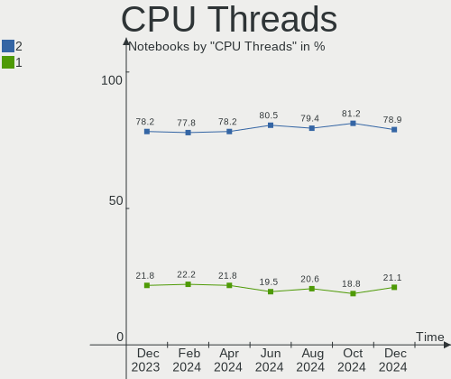
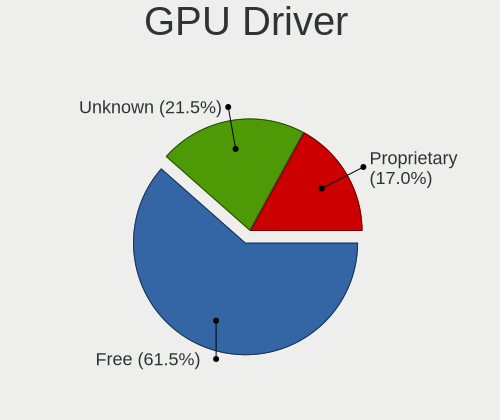
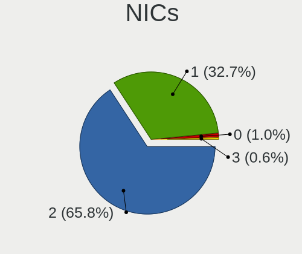

Ubuntu - Hardware Trends (Notebooks)
------------------------------------

A project to identify most popular hardware characteristics and track their change
over time based on data collected by Linux users at https://Linux-Hardware.org.

Anyone can contribute to this report by the [hw-probe](https://github.com/linuxhw/hw-probe) tool:

    sudo -E hw-probe -all -upload

This report is for one last month. Overall report since the beginning of time: [TestDays](https://github.com/linuxhw/TestDays)

Period: Apr, 2024.

Contents
--------

* [ System ](#system)
  - [ OS                       ](#os)
  - [ OS Family                ](#os-family)
  - [ Kernel                   ](#kernel)
  - [ Kernel Family            ](#kernel-family)
  - [ Kernel Major Ver.        ](#kernel-major-ver)
  - [ Arch                     ](#arch)
  - [ DE                       ](#de)
  - [ Display Server           ](#display-server)
  - [ Display Manager          ](#display-manager)
  - [ OS Lang                  ](#os-lang)
  - [ Boot Mode                ](#boot-mode)
  - [ Filesystem               ](#filesystem)
  - [ Part. scheme             ](#part-scheme)
  - [ Dual Boot with Linux/BSD ](#dual-boot-with-linuxbsd)
  - [ Dual Boot (Win)          ](#dual-boot-win)

* [ Board ](#board)
  - [ Vendor                   ](#vendor)
  - [ Model                    ](#model)
  - [ Model Family             ](#model-family)
  - [ MFG Year                 ](#mfg-year)
  - [ Form Factor              ](#form-factor)
  - [ Secure Boot              ](#secure-boot)
  - [ Coreboot                 ](#coreboot)
  - [ RAM Size                 ](#ram-size)
  - [ RAM Used                 ](#ram-used)
  - [ Total Drives             ](#total-drives)
  - [ Has CD-ROM               ](#has-cd-rom)
  - [ Has Ethernet             ](#has-ethernet)
  - [ Has WiFi                 ](#has-wifi)
  - [ Has Bluetooth            ](#has-bluetooth)

* [ Location ](#location)
  - [ Country                  ](#country)
  - [ City                     ](#city)

* [ Drives ](#drives)
  - [ Drive Vendor             ](#drive-vendor)
  - [ Drive Model              ](#drive-model)
  - [ HDD Vendor               ](#hdd-vendor)
  - [ SSD Vendor               ](#ssd-vendor)
  - [ Drive Kind               ](#drive-kind)
  - [ Drive Connector          ](#drive-connector)
  - [ Drive Size               ](#drive-size)
  - [ Space Total              ](#space-total)
  - [ Space Used               ](#space-used)
  - [ Malfunc. Drives          ](#malfunc-drives)
  - [ Malfunc. Drive Vendor    ](#malfunc-drive-vendor)
  - [ Malfunc. HDD Vendor      ](#malfunc-hdd-vendor)
  - [ Malfunc. Drive Kind      ](#malfunc-drive-kind)
  - [ Failed Drives            ](#failed-drives)
  - [ Failed Drive Vendor      ](#failed-drive-vendor)
  - [ Drive Status             ](#drive-status)

* [ Storage controller ](#storage-controller)
  - [ Storage Vendor           ](#storage-vendor)
  - [ Storage Model            ](#storage-model)
  - [ Storage Kind             ](#storage-kind)

* [ Processor ](#processor)
  - [ CPU Vendor               ](#cpu-vendor)
  - [ CPU Model                ](#cpu-model)
  - [ CPU Model Family         ](#cpu-model-family)
  - [ CPU Cores                ](#cpu-cores)
  - [ CPU Sockets              ](#cpu-sockets)
  - [ CPU Threads              ](#cpu-threads)
  - [ CPU Op-Modes             ](#cpu-op-modes)
  - [ CPU Microcode            ](#cpu-microcode)
  - [ CPU Microarch            ](#cpu-microarch)

* [ Graphics ](#graphics)
  - [ GPU Vendor               ](#gpu-vendor)
  - [ GPU Model                ](#gpu-model)
  - [ GPU Combo                ](#gpu-combo)
  - [ GPU Driver               ](#gpu-driver)
  - [ GPU Memory               ](#gpu-memory)

* [ Monitor ](#monitor)
  - [ Monitor Vendor           ](#monitor-vendor)
  - [ Monitor Model            ](#monitor-model)
  - [ Monitor Resolution       ](#monitor-resolution)
  - [ Monitor Diagonal         ](#monitor-diagonal)
  - [ Monitor Width            ](#monitor-width)
  - [ Aspect Ratio             ](#aspect-ratio)
  - [ Monitor Area             ](#monitor-area)
  - [ Pixel Density            ](#pixel-density)
  - [ Multiple Monitors        ](#multiple-monitors)

* [ Network ](#network)
  - [ Net Controller Vendor    ](#net-controller-vendor)
  - [ Net Controller Model     ](#net-controller-model)
  - [ Wireless Vendor          ](#wireless-vendor)
  - [ Wireless Model           ](#wireless-model)
  - [ Ethernet Vendor          ](#ethernet-vendor)
  - [ Ethernet Model           ](#ethernet-model)
  - [ Net Controller Kind      ](#net-controller-kind)
  - [ Used Controller          ](#used-controller)
  - [ NICs                     ](#nics)
  - [ IPv6                     ](#ipv6)

* [ Bluetooth ](#bluetooth)
  - [ Bluetooth Vendor         ](#bluetooth-vendor)
  - [ Bluetooth Model          ](#bluetooth-model)

* [ Sound ](#sound)
  - [ Sound Vendor             ](#sound-vendor)
  - [ Sound Model              ](#sound-model)

* [ Memory ](#memory)
  - [ Memory Vendor            ](#memory-vendor)
  - [ Memory Model             ](#memory-model)
  - [ Memory Kind              ](#memory-kind)
  - [ Memory Form Factor       ](#memory-form-factor)
  - [ Memory Size              ](#memory-size)
  - [ Memory Speed             ](#memory-speed)

* [ Printers & scanners ](#printers--scanners)
  - [ Printer Vendor           ](#printer-vendor)
  - [ Printer Model            ](#printer-model)
  - [ Scanner Vendor           ](#scanner-vendor)
  - [ Scanner Model            ](#scanner-model)

* [ Camera ](#camera)
  - [ Camera Vendor            ](#camera-vendor)
  - [ Camera Model             ](#camera-model)

* [ Security ](#security)
  - [ Fingerprint Vendor       ](#fingerprint-vendor)
  - [ Fingerprint Model        ](#fingerprint-model)
  - [ Chipcard Vendor          ](#chipcard-vendor)
  - [ Chipcard Model           ](#chipcard-model)

* [ Unsupported ](#unsupported)
  - [ Unsupported Devices      ](#unsupported-devices)
  - [ Unsupported Device Types ](#unsupported-device-types)

System
------

OS
--

Installed operating systems

| Name         | Notebooks | Percent |
|--------------|-----------|---------|
| Ubuntu 22.04 | 341       | 61.33%  |
| Ubuntu 23.10 | 96        | 17.27%  |
| Ubuntu 24.04 | 68        | 12.23%  |
| Ubuntu 20.04 | 39        | 7.01%   |
| Ubuntu 23.04 | 6         | 1.08%   |
| Ubuntu 22.10 | 2         | 0.36%   |
| Ubuntu 20.10 | 2         | 0.36%   |
| Ubuntu 18.04 | 2         | 0.36%   |

OS Family
---------

OS without a version

| Name   | Notebooks | Percent |
|--------|-----------|---------|
| Ubuntu | 556       | 100%    |

Kernel
------

Version of the Linux kernel

| Version                 | Notebooks | Percent |
|-------------------------|-----------|---------|
| 6.5.0-26-generic        | 128       | 23.02%  |
| 6.5.0-27-generic        | 127       | 22.84%  |
| 6.5.0-28-generic        | 93        | 16.73%  |
| 6.8.0-31-generic        | 48        | 8.63%   |
| 5.15.0-105-generic      | 13        | 2.34%   |
| 5.15.0-101-generic      | 12        | 2.16%   |
| 6.8.0-22-generic        | 11        | 1.98%   |
| 5.15.0-102-generic      | 10        | 1.8%    |
| 6.2.0-39-generic        | 9         | 1.62%   |
| 6.5.0-21-generic        | 8         | 1.44%   |
| 6.5.0-18-generic        | 8         | 1.44%   |
| 6.5.0-9-generic         | 5         | 0.9%    |
| 6.5.0-1019-oem          | 5         | 0.9%    |
| 6.5.0-1020-oem          | 4         | 0.72%   |
| 5.4.0-177-generic       | 4         | 0.72%   |
| 6.8.0-11-generic        | 3         | 0.54%   |
| 6.5.0-34-generic        | 3         | 0.54%   |
| 6.5.0-25-generic        | 3         | 0.54%   |
| 6.2.0-26-generic        | 3         | 0.54%   |
| 6.8.6-060806-generic    | 2         | 0.36%   |
| 6.7.0-060700-generic    | 2         | 0.36%   |
| 6.2.0-37-generic        | 2         | 0.36%   |
| 6.2.0-20-generic        | 2         | 0.36%   |
| 5.19.0-46-generic       | 2         | 0.36%   |
| 5.19.0-32-generic       | 2         | 0.36%   |
| 5.15.0-67-generic       | 2         | 0.36%   |
| 5.15.0-104-generic      | 2         | 0.36%   |
| 5.15.0-100-generic      | 2         | 0.36%   |
| 6.9.0-060900rc6-generic | 1         | 0.18%   |
| 6.8.7-2-liquorix-amd64  | 1         | 0.18%   |
| 6.8.7-060807-generic    | 1         | 0.18%   |
| 6.8.7                   | 1         | 0.18%   |
| 6.8.5-060805-generic    | 1         | 0.18%   |
| 6.8.4-tkg-eevdf         | 1         | 0.18%   |
| 6.8.0-28-generic        | 1         | 0.18%   |
| 6.8.0-19-generic        | 1         | 0.18%   |
| 6.8.0-060800-generic    | 1         | 0.18%   |
| 6.7.12-1-liquorix-amd64 | 1         | 0.18%   |
| 6.7.1-060701-generic    | 1         | 0.18%   |
| 6.5.11-060511-generic   | 1         | 0.18%   |

Kernel Family
-------------

Linux kernel without a distro release

| Version | Notebooks | Percent |
|---------|-----------|---------|
| 6.5.0   | 386       | 69.42%  |
| 6.8.0   | 65        | 11.69%  |
| 5.15.0  | 54        | 9.71%   |
| 6.2.0   | 17        | 3.06%   |
| 5.4.0   | 7         | 1.26%   |
| 5.19.0  | 6         | 1.08%   |
| 6.8.7   | 3         | 0.54%   |
| 6.8.6   | 2         | 0.36%   |
| 6.7.0   | 2         | 0.36%   |
| 5.8.0   | 2         | 0.36%   |
| 6.9.0   | 1         | 0.18%   |
| 6.8.5   | 1         | 0.18%   |
| 6.8.4   | 1         | 0.18%   |
| 6.7.12  | 1         | 0.18%   |
| 6.7.1   | 1         | 0.18%   |
| 6.5.11  | 1         | 0.18%   |
| 6.1.0   | 1         | 0.18%   |
| 5.15.23 | 1         | 0.18%   |
| 5.14.21 | 1         | 0.18%   |
| 5.13.0  | 1         | 0.18%   |
| 5.10.0  | 1         | 0.18%   |
| 4.15.0  | 1         | 0.18%   |

Kernel Major Ver.
-----------------

Linux kernel major version

| Version | Notebooks | Percent |
|---------|-----------|---------|
| 6.5     | 387       | 69.6%   |
| 6.8     | 72        | 12.95%  |
| 5.15    | 55        | 9.89%   |
| 6.2     | 17        | 3.06%   |
| 5.4     | 7         | 1.26%   |
| 5.19    | 6         | 1.08%   |
| 6.7     | 4         | 0.72%   |
| 5.8     | 2         | 0.36%   |
| 6.9     | 1         | 0.18%   |
| 6.1     | 1         | 0.18%   |
| 5.14    | 1         | 0.18%   |
| 5.13    | 1         | 0.18%   |
| 5.10    | 1         | 0.18%   |
| 4.15    | 1         | 0.18%   |

Arch
----

OS architecture (x86_64, i586, etc.)

| Name   | Notebooks | Percent |
|--------|-----------|---------|
| x86_64 | 556       | 100%    |

DE
--

Desktop Environment

| Name            | Notebooks | Percent |
|-----------------|-----------|---------|
| GNOME           | 536       | 96.4%   |
| Unknown         | 7         | 1.26%   |
| X-Cinnamon      | 5         | 0.9%    |
| GNOME Flashback | 4         | 0.72%   |
| Pantheon        | 1         | 0.18%   |
| i3              | 1         | 0.18%   |
| GNOME Classic   | 1         | 0.18%   |
| Cinnamon        | 1         | 0.18%   |

Display Server
--------------

X11 or Wayland

| Name    | Notebooks | Percent |
|---------|-----------|---------|
| Wayland | 356       | 64.03%  |
| X11     | 191       | 34.35%  |
| Unknown | 5         | 0.9%    |
| Tty     | 4         | 0.72%   |

Display Manager
---------------

SDDM, LightDM, etc.

| Name    | Notebooks | Percent |
|---------|-----------|---------|
| GDM3    | 496       | 89.21%  |
| Unknown | 38        | 6.83%   |
| GDM     | 16        | 2.88%   |
| LightDM | 5         | 0.9%    |
| LXDM    | 1         | 0.18%   |

OS Lang
-------

Language

| Lang    | Notebooks | Percent |
|---------|-----------|---------|
| en_US   | 264       | 47.48%  |
| de_DE   | 45        | 8.09%   |
| fr_FR   | 37        | 6.65%   |
| es_ES   | 23        | 4.14%   |
| C       | 19        | 3.42%   |
| pt_BR   | 18        | 3.24%   |
| ru_RU   | 15        | 2.7%    |
| en_IN   | 15        | 2.7%    |
| it_IT   | 14        | 2.52%   |
| pl_PL   | 13        | 2.34%   |
| en_GB   | 12        | 2.16%   |
| en_CA   | 10        | 1.8%    |
| hu_HU   | 6         | 1.08%   |
| tr_TR   | 5         | 0.9%    |
| en_ZA   | 5         | 0.9%    |
| cs_CZ   | 5         | 0.9%    |
| nl_NL   | 4         | 0.72%   |
| zh_CN   | 3         | 0.54%   |
| sv_SE   | 3         | 0.54%   |
| en_NZ   | 3         | 0.54%   |
| en_IL   | 3         | 0.54%   |
| bg_BG   | 3         | 0.54%   |
| Unknown | 3         | 0.54%   |
| ko_KR   | 2         | 0.36%   |
| fi_FI   | 2         | 0.36%   |
| es_CO   | 2         | 0.36%   |
| es_CL   | 2         | 0.36%   |
| es_AR   | 2         | 0.36%   |
| en_IE   | 2         | 0.36%   |
| en_AU   | 2         | 0.36%   |
| el_GR   | 2         | 0.36%   |
| vi_VN   | 1         | 0.18%   |
| sk_SK   | 1         | 0.18%   |
| ro_RO   | 1         | 0.18%   |
| pt_PT   | 1         | 0.18%   |
| lv_LV   | 1         | 0.18%   |
| ja_JP   | 1         | 0.18%   |
| he_IL   | 1         | 0.18%   |
| fr_CA   | 1         | 0.18%   |
| es_MX   | 1         | 0.18%   |

Boot Mode
---------

EFI or BIOS

| Mode | Notebooks | Percent |
|------|-----------|---------|
| BIOS | 297       | 53.42%  |
| EFI  | 259       | 46.58%  |

Filesystem
----------

Type of filesystem

| Type    | Notebooks | Percent |
|---------|-----------|---------|
| Tmpfs   | 294       | 52.88%  |
| Ext4    | 239       | 42.99%  |
| Overlay | 15        | 2.7%    |
| Btrfs   | 5         | 0.9%    |
| Zfs     | 2         | 0.36%   |
| Xfs     | 1         | 0.18%   |

Part. scheme
------------

Scheme of partitioning

| Type    | Notebooks | Percent |
|---------|-----------|---------|
| GPT     | 475       | 85.43%  |
| MBR     | 44        | 7.91%   |
| Unknown | 37        | 6.65%   |

Dual Boot with Linux/BSD
------------------------

Hosting more than one Linux/BSD

| Dual boot | Notebooks | Percent |
|-----------|-----------|---------|
| No        | 516       | 92.81%  |
| Yes       | 40        | 7.19%   |

Dual Boot (Win)
---------------

Hosting Linux and Windows

| Dual boot | Notebooks | Percent |
|-----------|-----------|---------|
| No        | 349       | 62.77%  |
| Yes       | 207       | 37.23%  |

Board
-----

Vendor
------

Motherboard manufacturer

| Name                      | Notebooks | Percent |
|---------------------------|-----------|---------|
| Lenovo                    | 115       | 20.68%  |
| Hewlett-Packard           | 99        | 17.81%  |
| Dell                      | 98        | 17.63%  |
| ASUSTek Computer          | 53        | 9.53%   |
| Acer                      | 44        | 7.91%   |
| Apple                     | 27        | 4.86%   |
| Toshiba                   | 16        | 2.88%   |
| MSI                       | 15        | 2.7%    |
| HUAWEI                    | 15        | 2.7%    |
| Unknown                   | 7         | 1.26%   |
| Samsung Electronics       | 6         | 1.08%   |
| Notebook                  | 6         | 1.08%   |
| Google                    | 4         | 0.72%   |
| Medion                    | 3         | 0.54%   |
| Fujitsu                   | 3         | 0.54%   |
| Positivo                  | 2         | 0.36%   |
| Packard Bell              | 2         | 0.36%   |
| Monster                   | 2         | 0.36%   |
| Getac                     | 2         | 0.36%   |
| Framework                 | 2         | 0.36%   |
| Alienware                 | 2         | 0.36%   |
| XIAOMI                    | 1         | 0.18%   |
| Wings Mobile              | 1         | 0.18%   |
| Vizio                     | 1         | 0.18%   |
| VALE                      | 1         | 0.18%   |
| UNOWHY                    | 1         | 0.18%   |
| TUXEDO                    | 1         | 0.18%   |
| TongFang                  | 1         | 0.18%   |
| Timi                      | 1         | 0.18%   |
| THUNDEROBOT               | 1         | 0.18%   |
| Standard                  | 1         | 0.18%   |
| Sony                      | 1         | 0.18%   |
| Semp Toshiba              | 1         | 0.18%   |
| Ruijie                    | 1         | 0.18%   |
| RTD Embedded Technologies | 1         | 0.18%   |
| Razer                     | 1         | 0.18%   |
| Panasonic Connect         | 1         | 0.18%   |
| ONE-NETBOOK               | 1         | 0.18%   |
| OEM                       | 1         | 0.18%   |
| Minix                     | 1         | 0.18%   |

Model
-----

Motherboard model

| Name                                       | Notebooks | Percent |
|--------------------------------------------|-----------|---------|
| Unknown                                    | 9         | 1.62%   |
| HUAWEI HVY-WXX9                            | 3         | 0.54%   |
| HP Notebook                                | 3         | 0.54%   |
| HP EliteBook 850 G5                        | 3         | 0.54%   |
| Dell Latitude E6420                        | 3         | 0.54%   |
| Dell Latitude E5470                        | 3         | 0.54%   |
| Dell Latitude 7490                         | 3         | 0.54%   |
| Apple MacBookPro11,3                       | 3         | 0.54%   |
| Apple MacBookPro11,1                       | 3         | 0.54%   |
| Apple MacBookAir6,2                        | 3         | 0.54%   |
| Samsung 750XED                             | 2         | 0.36%   |
| Lenovo ThinkPad P16s Gen 2 21K9CTO1WW      | 2         | 0.36%   |
| Lenovo ThinkBook 15 G3 ACL 21A4            | 2         | 0.36%   |
| Lenovo Legion Slim 5 16APH8 82Y9           | 2         | 0.36%   |
| Lenovo IdeaPad 320-15IKB 80XL              | 2         | 0.36%   |
| Lenovo IdeaPad 3 15ITL6 82H8               | 2         | 0.36%   |
| Lenovo B590 20206                          | 2         | 0.36%   |
| HUAWEI NbDE-WXX9                           | 2         | 0.36%   |
| HUAWEI BOM-WXX9                            | 2         | 0.36%   |
| HUAWEI BOD-WXX9                            | 2         | 0.36%   |
| HP ZBook Studio G3                         | 2         | 0.36%   |
| HP ZBook 15 G5                             | 2         | 0.36%   |
| HP Pavilion Laptop 15-eh1xxx               | 2         | 0.36%   |
| HP Pavilion Laptop 15-eh0xxx               | 2         | 0.36%   |
| HP Pavilion g6                             | 2         | 0.36%   |
| HP Pavilion dv6                            | 2         | 0.36%   |
| HP Pavilion 15                             | 2         | 0.36%   |
| HP Laptop 15s-eq3xxx                       | 2         | 0.36%   |
| HP Laptop 15-fc0xxx                        | 2         | 0.36%   |
| HP Laptop 15-da0xxx                        | 2         | 0.36%   |
| HP EliteBook 8460p                         | 2         | 0.36%   |
| HP Dragonfly 13.5 inch G4 Notebook PC      | 2         | 0.36%   |
| Getac S410                                 | 2         | 0.36%   |
| Framework Laptop 13 (AMD Ryzen 7040Series) | 2         | 0.36%   |
| Dell XPS 9315                              | 2         | 0.36%   |
| Dell XPS 13 9360                           | 2         | 0.36%   |
| Dell Precision 7680                        | 2         | 0.36%   |
| Dell Latitude E5450                        | 2         | 0.36%   |
| Dell Latitude 5420                         | 2         | 0.36%   |
| Dell G5 5590                               | 2         | 0.36%   |

Model Family
------------

Motherboard model prefix

| Name               | Notebooks | Percent |
|--------------------|-----------|---------|
| Lenovo ThinkPad    | 48        | 8.63%   |
| Dell Latitude      | 40        | 7.19%   |
| Lenovo IdeaPad     | 33        | 5.94%   |
| Acer Aspire        | 28        | 5.04%   |
| Dell Inspiron      | 20        | 3.6%    |
| HP Laptop          | 18        | 3.24%   |
| HP EliteBook       | 18        | 3.24%   |
| ASUS VivoBook      | 18        | 3.24%   |
| HP ProBook         | 17        | 3.06%   |
| Toshiba Satellite  | 16        | 2.88%   |
| HP Pavilion        | 15        | 2.7%    |
| HP ZBook           | 14        | 2.52%   |
| Dell XPS           | 12        | 2.16%   |
| Dell Precision     | 10        | 1.8%    |
| Unknown            | 9         | 1.62%   |
| Lenovo Legion      | 8         | 1.44%   |
| Lenovo ThinkBook   | 7         | 1.26%   |
| Apple MacBookPro11 | 7         | 1.26%   |
| Dell Vostro        | 6         | 1.08%   |
| ASUS ZenBook       | 6         | 1.08%   |
| Acer Swift         | 5         | 0.9%    |
| Lenovo Yoga        | 4         | 0.72%   |
| ASUS TUF           | 4         | 0.72%   |
| Apple MacBookAir6  | 4         | 0.72%   |
| Acer Extensa       | 4         | 0.72%   |
| HUAWEI HVY-WXX9    | 3         | 0.54%   |
| HP Notebook        | 3         | 0.54%   |
| HP ENVY            | 3         | 0.54%   |
| Fujitsu LIFEBOOK   | 3         | 0.54%   |
| Dell G15           | 3         | 0.54%   |
| ASUS ROG           | 3         | 0.54%   |
| ASUS ASUS          | 3         | 0.54%   |
| Apple MacBookPro9  | 3         | 0.54%   |
| Apple MacBookPro8  | 3         | 0.54%   |
| Acer Predator      | 3         | 0.54%   |
| Acer Nitro         | 3         | 0.54%   |
| Samsung 750XED     | 2         | 0.36%   |
| MSI Modern         | 2         | 0.36%   |
| MSI Katana         | 2         | 0.36%   |
| MSI GF63           | 2         | 0.36%   |

MFG Year
--------

Motherboard manufacture year

| Year | Notebooks | Percent |
|------|-----------|---------|
| 2021 | 61        | 10.97%  |
| 2023 | 57        | 10.25%  |
| 2022 | 57        | 10.25%  |
| 2020 | 56        | 10.07%  |
| 2013 | 39        | 7.01%   |
| 2017 | 37        | 6.65%   |
| 2018 | 34        | 6.12%   |
| 2016 | 29        | 5.22%   |
| 2019 | 28        | 5.04%   |
| 2012 | 28        | 5.04%   |
| 2011 | 27        | 4.86%   |
| 2015 | 25        | 4.5%    |
| 2014 | 25        | 4.5%    |
| 2010 | 19        | 3.42%   |
| 2009 | 12        | 2.16%   |
| 2024 | 11        | 1.98%   |
| 2008 | 7         | 1.26%   |
| 2007 | 3         | 0.54%   |
| 2006 | 1         | 0.18%   |

Form Factor
-----------

Physical design of the computer

| Name     | Notebooks | Percent |
|----------|-----------|---------|
| Notebook | 556       | 100%    |

Secure Boot
-----------

Enabled or disabled

| State    | Notebooks | Percent |
|----------|-----------|---------|
| Disabled | 476       | 85.61%  |
| Enabled  | 80        | 14.39%  |

Coreboot
--------

Have coreboot on board

| Used | Notebooks | Percent |
|------|-----------|---------|
| No   | 551       | 99.1%   |
| Yes  | 5         | 0.9%    |

RAM Size
--------

Total RAM memory

| Size in GB  | Notebooks | Percent |
|-------------|-----------|---------|
| 4.01-8.0    | 146       | 26.26%  |
| 8.01-16.0   | 120       | 21.58%  |
| 16.01-24.0  | 108       | 19.42%  |
| 3.01-4.0    | 86        | 15.47%  |
| 32.01-64.0  | 57        | 10.25%  |
| 64.01-256.0 | 18        | 3.24%   |
| 24.01-32.0  | 12        | 2.16%   |
| 1.01-2.0    | 6         | 1.08%   |
| 2.01-3.0    | 3         | 0.54%   |

RAM Used
--------

Used RAM memory

| Used GB    | Notebooks | Percent |
|------------|-----------|---------|
| 2.01-3.0   | 181       | 32.55%  |
| 1.01-2.0   | 127       | 22.84%  |
| 4.01-8.0   | 115       | 20.68%  |
| 3.01-4.0   | 87        | 15.65%  |
| 8.01-16.0  | 35        | 6.29%   |
| 16.01-24.0 | 6         | 1.08%   |
| 0.51-1.0   | 3         | 0.54%   |
| 32.01-64.0 | 1         | 0.18%   |
| 24.01-32.0 | 1         | 0.18%   |

Total Drives
------------

Number of drives on board

| Drives | Notebooks | Percent |
|--------|-----------|---------|
| 1      | 444       | 79.86%  |
| 2      | 106       | 19.06%  |
| 3      | 3         | 0.54%   |
| 4      | 2         | 0.36%   |
| 0      | 1         | 0.18%   |

Has CD-ROM
----------

Has CD-ROM on board

| Presented | Notebooks | Percent |
|-----------|-----------|---------|
| No        | 432       | 77.7%   |
| Yes       | 124       | 22.3%   |

Has Ethernet
------------

Has Ethernet on board

| Presented | Notebooks | Percent |
|-----------|-----------|---------|
| Yes       | 404       | 72.66%  |
| No        | 152       | 27.34%  |

Has WiFi
--------

Has WiFi module

| Presented | Notebooks | Percent |
|-----------|-----------|---------|
| Yes       | 543       | 97.66%  |
| No        | 13        | 2.34%   |

Has Bluetooth
-------------

Has Bluetooth module

| Presented | Notebooks | Percent |
|-----------|-----------|---------|
| Yes       | 474       | 85.25%  |
| No        | 82        | 14.75%  |

Location
--------

Country
-------

Geographic location (country)

| Country      | Notebooks | Percent |
|--------------|-----------|---------|
| USA          | 94        | 16.91%  |
| Germany      | 57        | 10.25%  |
| France       | 43        | 7.73%   |
| Brazil       | 26        | 4.68%   |
| Russia       | 23        | 4.14%   |
| India        | 23        | 4.14%   |
| Italy        | 21        | 3.78%   |
| Spain        | 19        | 3.42%   |
| Poland       | 18        | 3.24%   |
| Canada       | 18        | 3.24%   |
| UK           | 16        | 2.88%   |
| Netherlands  | 15        | 2.7%    |
| Chile        | 10        | 1.8%    |
| Sweden       | 9         | 1.62%   |
| Mexico       | 9         | 1.62%   |
| Hungary      | 8         | 1.44%   |
| Turkey       | 7         | 1.26%   |
| Czechia      | 7         | 1.26%   |
| Serbia       | 6         | 1.08%   |
| Bulgaria     | 6         | 1.08%   |
| Argentina    | 6         | 1.08%   |
| South Africa | 5         | 0.9%    |
| Portugal     | 5         | 0.9%    |
| New Zealand  | 5         | 0.9%    |
| Israel       | 5         | 0.9%    |
| Iran         | 5         | 0.9%    |
| Colombia     | 5         | 0.9%    |
| China        | 5         | 0.9%    |
| Switzerland  | 4         | 0.72%   |
| Slovakia     | 4         | 0.72%   |
| Romania      | 4         | 0.72%   |
| Norway       | 4         | 0.72%   |
| Greece       | 4         | 0.72%   |
| Egypt        | 4         | 0.72%   |
| Vietnam      | 3         | 0.54%   |
| Indonesia    | 3         | 0.54%   |
| Finland      | 3         | 0.54%   |
| Denmark      | 3         | 0.54%   |
| Austria      | 3         | 0.54%   |
| Australia    | 3         | 0.54%   |

City
----

Geographic location (city)

| City                     | Notebooks | Percent |
|--------------------------|-----------|---------|
| Santiago                 | 5         | 0.9%    |
| Los Angeles              | 5         | 0.9%    |
| Istanbul                 | 5         | 0.9%    |
| Athens                   | 5         | 0.9%    |
| Warsaw                   | 4         | 0.72%   |
| Paris                    | 4         | 0.72%   |
| Moscow                   | 4         | 0.72%   |
| Milan                    | 4         | 0.72%   |
| Le Haillan               | 4         | 0.72%   |
| Belgrade                 | 4         | 0.72%   |
| The Hague                | 3         | 0.54%   |
| Tel Aviv                 | 3         | 0.54%   |
| Surat                    | 3         | 0.54%   |
| Sofia                    | 3         | 0.54%   |
| Portland                 | 3         | 0.54%   |
| Montreal                 | 3         | 0.54%   |
| Gothenburg               | 3         | 0.54%   |
| Delhi                    | 3         | 0.54%   |
| Barcelona                | 3         | 0.54%   |
| Alexandria               | 3         | 0.54%   |
| Zapopan                  | 2         | 0.36%   |
| Viña del Mar            | 2         | 0.36%   |
| Vienna                   | 2         | 0.36%   |
| Varna                    | 2         | 0.36%   |
| Valenciennes             | 2         | 0.36%   |
| Turin                    | 2         | 0.36%   |
| Toronto                  | 2         | 0.36%   |
| Tehran                   | 2         | 0.36%   |
| Tartu                    | 2         | 0.36%   |
| Stuttgart                | 2         | 0.36%   |
| Stockholm                | 2         | 0.36%   |
| St Petersburg            | 2         | 0.36%   |
| Seattle                  | 2         | 0.36%   |
| Sao Paulo                | 2         | 0.36%   |
| San Juan                 | 2         | 0.36%   |
| San Francisco            | 2         | 0.36%   |
| San Antonio              | 2         | 0.36%   |
| Saint-Just-Saint-Rambert | 2         | 0.36%   |
| Rochester                | 2         | 0.36%   |
| Rio de Janeiro           | 2         | 0.36%   |

Drives
------

Drive Vendor
------------

Hard drive vendors

| Vendor                         | Notebooks | Drives | Percent |
|--------------------------------|-----------|--------|---------|
| Samsung Electronics            | 109       | 119    | 16.95%  |
| WDC                            | 53        | 53     | 8.24%   |
| SK hynix                       | 50        | 50     | 7.78%   |
| Seagate                        | 39        | 39     | 6.07%   |
| Toshiba                        | 36        | 36     | 5.6%    |
| SanDisk                        | 36        | 37     | 5.6%    |
| Micron Technology              | 33        | 34     | 5.13%   |
| Kingston                       | 30        | 30     | 4.67%   |
| Unknown                        | 26        | 28     | 4.04%   |
| Crucial                        | 24        | 27     | 3.73%   |
| Intel                          | 22        | 22     | 3.42%   |
| KIOXIA                         | 17        | 17     | 2.64%   |
| Apple                          | 17        | 19     | 2.64%   |
| Phison Electronics             | 9         | 9      | 1.4%    |
| HGST                           | 9         | 9      | 1.4%    |
| A-DATA Technology              | 9         | 9      | 1.4%    |
| Netac                          | 8         | 8      | 1.24%   |
| Kingston Technology Company    | 8         | 8      | 1.24%   |
| China                          | 7         | 7      | 1.09%   |
| Hitachi                        | 6         | 6      | 0.93%   |
| Phison                         | 5         | 5      | 0.78%   |
| SPCC                           | 4         | 4      | 0.62%   |
| Solid State Storage Technology | 4         | 4      | 0.62%   |
| MAXIO Technology (Hangzhou)    | 4         | 4      | 0.62%   |
| Silicon Motion                 | 3         | 3      | 0.47%   |
| Realtek Semiconductor          | 3         | 3      | 0.47%   |
| Micron/Crucial Technology      | 3         | 3      | 0.47%   |
| LITEON                         | 3         | 3      | 0.47%   |
| JMicron Technology             | 3         | 3      | 0.47%   |
| Hewlett-Packard                | 3         | 3      | 0.47%   |
| FORESEE                        | 3         | 3      | 0.47%   |
| ADATA Technology               | 3         | 3      | 0.47%   |
| YMTC                           | 2         | 2      | 0.31%   |
| WALRAM                         | 2         | 2      | 0.31%   |
| Shenzhen Longsys Electronics   | 2         | 2      | 0.31%   |
| PNY                            | 2         | 2      | 0.31%   |
| Lexar                          | 2         | 2      | 0.31%   |
| GOODRAM                        | 2         | 2      | 0.31%   |
| Fujitsu                        | 2         | 2      | 0.31%   |
| Unknown                        | 2         | 2      | 0.31%   |

Drive Model
-----------

Hard drive models

| Model                                              | Notebooks | Percent |
|----------------------------------------------------|-----------|---------|
| Samsung NVMe SSD Controller SM981/PM981/PM983 1TB  | 14        | 2.14%   |
| Toshiba MQ01ABF050 500GB                           | 7         | 1.07%   |
| Samsung NVMe SSD Controller PM9A1/PM9A3/980PRO 1TB | 7         | 1.07%   |
| Unknown MMC Card  32GB                             | 6         | 0.92%   |
| Kingston SA400S37240G 240GB SSD                    | 6         | 0.92%   |
| Unknown MMC Card  64GB                             | 5         | 0.76%   |
| Toshiba MQ01ABD100 1TB                             | 5         | 0.76%   |
| Seagate ST1000LM035-1RK172 1TB                     | 5         | 0.76%   |
| SanDisk NVMe SSD Drive 1TB                         | 5         | 0.76%   |
| Samsung MZVL4512HBLU-00BTW 512GB                   | 5         | 0.76%   |
| Samsung SSD 860 EVO 1TB                            | 4         | 0.61%   |
| Samsung NVMe SSD Controller SM961/PM961/SM963 1TB  | 4         | 0.61%   |
| Micron 2450_MTFDKBA512TFK 512GB                    | 4         | 0.61%   |
| Kingston SA400S37480G 480GB SSD                    | 4         | 0.61%   |
| Intel SSDPEKNU512GZ 512GB                          | 4         | 0.61%   |
| Crucial CT500MX500SSD1 500GB                       | 4         | 0.61%   |
| WDC WDS240G2G0A-00JH30 240GB SSD                   | 3         | 0.46%   |
| Unknown NVMe SSD Drive 1TB                         | 3         | 0.46%   |
| SK hynix SKHynix_HFS512GEJ9X115N 512GB             | 3         | 0.46%   |
| Seagate ST500LT012-9WS142 500GB                    | 3         | 0.46%   |
| Sandisk WD Black SN850 512GB                       | 3         | 0.46%   |
| SanDisk SSD U110 16GB                              | 3         | 0.46%   |
| SanDisk SD8SN8U-256G-1006 256GB SSD                | 3         | 0.46%   |
| SanDisk NVMe SSD Drive 512GB                       | 3         | 0.46%   |
| Samsung PM9A1 NVMe 1024GB                          | 3         | 0.46%   |
| Samsung MZVLQ512HBLU-00BH1 512GB                   | 3         | 0.46%   |
| Micron/Crucial P2 NVMe PCIe SSD 4TB                | 3         | 0.46%   |
| Micron MTFDDAV256TBN-1AR15ABHA 256GB SSD           | 3         | 0.46%   |
| Micron 2400_MTFDKBA512QFM 512GB                    | 3         | 0.46%   |
| Micron 2400_MTFDKBA1T0QFM 1TB                      | 3         | 0.46%   |
| MAXIO (Hangzhou) NVMe SSD Controller MAP1202 256GB | 3         | 0.46%   |
| Kingston Company OM3PDP3 NVMe SSD 512GB            | 3         | 0.46%   |
| Kingston SA400S37120G 120GB SSD                    | 3         | 0.46%   |
| JMicron Generic 320GB                              | 3         | 0.46%   |
| Intel SSD 660P Series 1024GB                       | 3         | 0.46%   |
| HGST HTS721010A9E630 1TB                           | 3         | 0.46%   |
| Crucial CT1000MX500SSD1 1TB                        | 3         | 0.46%   |
| Crucial CT1000BX500SSD1 1TB                        | 3         | 0.46%   |
| Apple SSD SM0256F 256GB                            | 3         | 0.46%   |
| Apple SSD SM0128G 121GB                            | 3         | 0.46%   |

HDD Vendor
----------

Hard disk drive vendors

| Vendor              | Notebooks | Drives | Percent |
|---------------------|-----------|--------|---------|
| Seagate             | 37        | 37     | 33.04%  |
| WDC                 | 27        | 27     | 24.11%  |
| Toshiba             | 24        | 24     | 21.43%  |
| HGST                | 9         | 9      | 8.04%   |
| Hitachi             | 6         | 6      | 5.36%   |
| Samsung Electronics | 3         | 3      | 2.68%   |
| JMicron Technology  | 3         | 3      | 2.68%   |
| Fujitsu             | 2         | 2      | 1.79%   |
| Unknown             | 1         | 1      | 0.89%   |

SSD Vendor
----------

Solid state drive vendors

| Vendor              | Notebooks | Drives | Percent |
|---------------------|-----------|--------|---------|
| Samsung Electronics | 30        | 31     | 15.96%  |
| Kingston            | 21        | 21     | 11.17%  |
| Crucial             | 19        | 21     | 10.11%  |
| SanDisk             | 16        | 16     | 8.51%   |
| Apple               | 14        | 14     | 7.45%   |
| WDC                 | 13        | 13     | 6.91%   |
| Netac               | 7         | 7      | 3.72%   |
| Micron Technology   | 7         | 8      | 3.72%   |
| China               | 7         | 7      | 3.72%   |
| Intel               | 6         | 6      | 3.19%   |
| A-DATA Technology   | 6         | 6      | 3.19%   |
| SK hynix            | 5         | 5      | 2.66%   |
| SPCC                | 3         | 3      | 1.6%    |
| LITEON              | 3         | 3      | 1.6%    |
| Hewlett-Packard     | 3         | 3      | 1.6%    |
| Toshiba             | 2         | 2      | 1.06%   |
| PNY                 | 2         | 2      | 1.06%   |
| GOODRAM             | 2         | 2      | 1.06%   |
| FORESEE             | 2         | 2      | 1.06%   |
| Zheino              | 1         | 1      | 0.53%   |
| Wibtek              | 1         | 1      | 0.53%   |
| WDC WDS             | 1         | 1      | 0.53%   |
| WALRAM              | 1         | 1      | 0.53%   |
| Timetec             | 1         | 1      | 0.53%   |
| SPCC Sol            | 1         | 1      | 0.53%   |
| Ramos Technology    | 1         | 1      | 0.53%   |
| OCZ                 | 1         | 1      | 0.53%   |
| NGFF                | 1         | 1      | 0.53%   |
| Neo Forza           | 1         | 1      | 0.53%   |
| MSI                 | 1         | 1      | 0.53%   |
| MaiChai             | 1         | 1      | 0.53%   |
| LITEONIT            | 1         | 1      | 0.53%   |
| Lexar               | 1         | 1      | 0.53%   |
| KING                | 1         | 1      | 0.53%   |
| Intenso             | 1         | 1      | 0.53%   |
| Indilinx            | 1         | 1      | 0.53%   |
| Focal               | 1         | 1      | 0.53%   |
| Fanxiang            | 1         | 1      | 0.53%   |
| Emtec               | 1         | 1      | 0.53%   |

Drive Kind
----------

HDD or SSD

| Kind    | Notebooks | Drives | Percent |
|---------|-----------|--------|---------|
| NVMe    | 296       | 326    | 48.21%  |
| SSD     | 179       | 192    | 29.15%  |
| HDD     | 109       | 112    | 17.75%  |
| MMC     | 22        | 24     | 3.58%   |
| Unknown | 8         | 8      | 1.3%    |

Drive Connector
---------------

SATA, SAS, NVMe, etc.

| Type | Notebooks | Drives | Percent |
|------|-----------|--------|---------|
| NVMe | 296       | 325    | 48.93%  |
| SATA | 271       | 297    | 44.79%  |
| MMC  | 22        | 24     | 3.64%   |
| SAS  | 16        | 16     | 2.64%   |

Drive Size
----------

Size of hard drive

| Size in TB | Notebooks | Drives | Percent |
|------------|-----------|--------|---------|
| 0.01-0.5   | 200       | 213    | 69.44%  |
| 0.51-1.0   | 80        | 83     | 27.78%  |
| 1.01-2.0   | 8         | 8      | 2.78%   |

Space Total
-----------

Amount of disk space available on the file system

| Size in GB     | Notebooks | Percent |
|----------------|-----------|---------|
| 251-500        | 166       | 29.86%  |
| 101-250        | 161       | 28.96%  |
| 501-1000       | 101       | 18.17%  |
| 51-100         | 42        | 7.55%   |
| 1001-2000      | 31        | 5.58%   |
| 1-20           | 25        | 4.5%    |
| 21-50          | 20        | 3.6%    |
| 2001-3000      | 5         | 0.9%    |
| Unknown        | 3         | 0.54%   |
| More than 3000 | 2         | 0.36%   |

Space Used
----------

Amount of used disk space

| Used GB   | Notebooks | Percent |
|-----------|-----------|---------|
| 1-20      | 177       | 31.83%  |
| 21-50     | 144       | 25.9%   |
| 101-250   | 96        | 17.27%  |
| 51-100    | 66        | 11.87%  |
| 251-500   | 46        | 8.27%   |
| 501-1000  | 18        | 3.24%   |
| 1001-2000 | 5         | 0.9%    |
| Unknown   | 3         | 0.54%   |
| 2001-3000 | 1         | 0.18%   |

Malfunc. Drives
---------------

Drive models with a malfunction

| Model                                      | Notebooks | Drives | Percent |
|--------------------------------------------|-----------|--------|---------|
| Toshiba MQ01ABD100 1TB                     | 2         | 2      | 13.33%  |
| WDC WD50 00LPLX-08ZNTT0 500GB              | 1         | 1      | 6.67%   |
| WDC WD10JPVX-75JC3T0 1TB                   | 1         | 1      | 6.67%   |
| WDC WD Green 2.5 240GB                     | 1         | 1      | 6.67%   |
| Toshiba MQ01ABF050 500GB                   | 1         | 1      | 6.67%   |
| Toshiba MQ01ABD050 500GB                   | 1         | 1      | 6.67%   |
| SK hynix BC711 HFM512GD3JX013N 512GB       | 1         | 1      | 6.67%   |
| SK hynix BC711 HFM256GD3JX013N 256GB       | 1         | 1      | 6.67%   |
| Seagate ST1000LM014-SSHD-8GB               | 1         | 1      | 6.67%   |
| SanDisk SSD U110 16GB                      | 1         | 1      | 6.67%   |
| Micron Technology C400 RealSSD mSATA 128GB | 1         | 1      | 6.67%   |
| Kingston RBUSNS8180S3256GJ 256GB SSD       | 1         | 1      | 6.67%   |
| Gigabyte Technology GP-GM301TB-G           | 1         | 1      | 6.67%   |
| Crucial CT1050MX300SSD4 1TB                | 1         | 1      | 6.67%   |

Malfunc. Drive Vendor
---------------------

Vendors of faulty drives

| Vendor              | Notebooks | Drives | Percent |
|---------------------|-----------|--------|---------|
| Toshiba             | 4         | 4      | 26.67%  |
| WDC                 | 3         | 3      | 20%     |
| SK hynix            | 2         | 2      | 13.33%  |
| Seagate             | 1         | 1      | 6.67%   |
| SanDisk             | 1         | 1      | 6.67%   |
| Micron Technology   | 1         | 1      | 6.67%   |
| Kingston            | 1         | 1      | 6.67%   |
| Gigabyte Technology | 1         | 1      | 6.67%   |
| Crucial             | 1         | 1      | 6.67%   |

Malfunc. HDD Vendor
-------------------

Vendors of faulty HDD drives

| Vendor  | Notebooks | Drives | Percent |
|---------|-----------|--------|---------|
| Toshiba | 4         | 4      | 57.14%  |
| WDC     | 2         | 2      | 28.57%  |
| Seagate | 1         | 1      | 14.29%  |

Malfunc. Drive Kind
-------------------

Kinds of faulty drives

| Kind | Notebooks | Drives | Percent |
|------|-----------|--------|---------|
| HDD  | 7         | 7      | 46.67%  |
| SSD  | 5         | 5      | 33.33%  |
| NVMe | 3         | 3      | 20%     |

Failed Drives
-------------

Failed drive models

Zero info for selected period =(

Failed Drive Vendor
-------------------

Failed drive vendors

Zero info for selected period =(

Drive Status
------------

Number of failed and malfunc. drives

| Status   | Notebooks | Drives | Percent |
|----------|-----------|--------|---------|
| Detected | 350       | 409    | 61.4%   |
| Works    | 207       | 238    | 36.32%  |
| Malfunc  | 13        | 15     | 2.28%   |

Storage controller
------------------

Storage Vendor
--------------

Storage controller vendors

| Vendor                                  | Notebooks | Percent |
|-----------------------------------------|-----------|---------|
| Intel                                   | 345       | 49.93%  |
| Samsung Electronics                     | 88        | 12.74%  |
| SK hynix                                | 45        | 6.51%   |
| AMD                                     | 36        | 5.21%   |
| SanDisk                                 | 34        | 4.92%   |
| Micron Technology                       | 26        | 3.76%   |
| Kingston Technology Company             | 17        | 2.46%   |
| KIOXIA                                  | 15        | 2.17%   |
| Phison Electronics                      | 14        | 2.03%   |
| Toshiba America Info Systems            | 11        | 1.59%   |
| Micron/Crucial Technology               | 9         | 1.3%    |
| Solid State Storage Technology          | 6         | 0.87%   |
| Silicon Motion                          | 6         | 0.87%   |
| Realtek Semiconductor                   | 6         | 0.87%   |
| ADATA Technology                        | 6         | 0.87%   |
| MAXIO Technology (Hangzhou)             | 5         | 0.72%   |
| Solidigm                                | 4         | 0.58%   |
| Shenzhen Longsys Electronics            | 3         | 0.43%   |
| Apple                                   | 3         | 0.43%   |
| Nvidia                                  | 2         | 0.29%   |
| Marvell Technology Group                | 2         | 0.29%   |
| Yangtze Memory Technologies             | 1         | 0.14%   |
| Union Memory (Shenzhen)                 | 1         | 0.14%   |
| Transcend                               | 1         | 0.14%   |
| Shenzhen Unionmemory Information System | 1         | 0.14%   |
| Shenzhen Shichuangyi Electronics        | 1         | 0.14%   |
| Seagate Technology                      | 1         | 0.14%   |
| Ramaxel Technology(Shenzhen) Limited    | 1         | 0.14%   |
| Lite-On Technology                      | 1         | 0.14%   |

Storage Model
-------------

Storage controller models

| Model                                                                          | Notebooks | Percent |
|--------------------------------------------------------------------------------|-----------|---------|
| Intel Volume Management Device NVMe RAID Controller                            | 43        | 5.92%   |
| Intel Sunrise Point-LP SATA Controller [AHCI mode]                             | 39        | 5.37%   |
| AMD FCH SATA Controller [AHCI mode]                                            | 31        | 4.27%   |
| Intel 82801 Mobile SATA Controller [RAID mode]                                 | 28        | 3.86%   |
| Samsung NVMe SSD Controller SM981/PM981/PM983                                  | 27        | 3.72%   |
| Intel 7 Series Chipset Family 6-port SATA Controller [AHCI mode]               | 25        | 3.44%   |
| Intel 6 Series/C200 Series Chipset Family 6 port Mobile SATA AHCI Controller   | 21        | 2.89%   |
| Samsung NVMe SSD Controller 980 (DRAM-less)                                    | 20        | 2.75%   |
| Intel 8 Series SATA Controller 1 [AHCI mode]                                   | 20        | 2.75%   |
| Samsung NVMe SSD Controller PM9A1/PM9A3/980PRO                                 | 18        | 2.48%   |
| Intel Cannon Lake Mobile PCH SATA AHCI Controller                              | 17        | 2.34%   |
| SK hynix Gold P31/BC711/PC711 NVMe Solid State Drive                           | 16        | 2.2%    |
| Intel Volume Management Device NVMe RAID Controller Intel Corporation          | 16        | 2.2%    |
| SK hynix Platinum P41/PC801 NVMe Solid State Drive                             | 13        | 1.79%   |
| Intel Tiger Lake-LP SATA Controller                                            | 13        | 1.79%   |
| Intel Celeron/Pentium Silver Processor SATA Controller                         | 12        | 1.65%   |
| Intel 82801IBM/IEM (ICH9M/ICH9M-E) 4 port SATA Controller [AHCI mode]          | 11        | 1.52%   |
| Intel 5 Series/3400 Series Chipset 4 port SATA AHCI Controller                 | 10        | 1.38%   |
| Samsung NVMe SSD Controller PM9B1 (DRAM-less)                                  | 9         | 1.24%   |
| Intel SSD 670p Series [Keystone Harbor]                                        | 9         | 1.24%   |
| Intel 5 Series/3400 Series Chipset 6 port SATA AHCI Controller                 | 9         | 1.24%   |
| Micron 2450 NVMe SSD [HendrixV] (DRAM-less)                                    | 8         | 1.1%    |
| Intel Wildcat Point-LP SATA Controller [AHCI Mode]                             | 8         | 1.1%    |
| Intel 8 Series/C220 Series Chipset Family 6-port SATA Controller 1 [AHCI mode] | 8         | 1.1%    |
| Micron 2400 NVMe SSD (DRAM-less)                                               | 7         | 0.96%   |
| KIOXIA NVMe SSD Controller BG4 (DRAM-less)                                     | 7         | 0.96%   |
| Intel Q170/Q150/B150/H170/H110/Z170/CM236 Chipset SATA Controller [AHCI Mode]  | 7         | 0.96%   |
| Intel Comet Lake SATA AHCI Controller                                          | 7         | 0.96%   |
| Intel Alder Lake-P SATA AHCI Controller                                        | 7         | 0.96%   |
| Toshiba America Info Systems XG6 NVMe SSD Controller                           | 6         | 0.83%   |
| SK hynix BC901 NVMe Solid State Drive (DRAM-less)                              | 6         | 0.83%   |
| SanDisk WD Black SN770 / PC SN740 256GB / PC SN560 (DRAM-less) NVMe SSD        | 6         | 0.83%   |
| Micron/Crucial P2 [Nick P2] / P3 / P3 Plus NVMe PCIe SSD (DRAM-less)           | 6         | 0.83%   |
| Intel Tiger Lake SATA AHCI Controller                                          | 6         | 0.83%   |
| Intel Atom Processor E3800 Series SATA AHCI Controller                         | 6         | 0.83%   |
| SanDisk WD PC SN810 / Black SN850 NVMe SSD                                     | 5         | 0.69%   |
| SanDisk Extreme Pro / WD Black SN750 / PC SN730 / Red SN700 NVMe SSD           | 5         | 0.69%   |
| Samsung S4LN058A01[SSUBX] AHCI SSD Controller (Apple slot)                     | 5         | 0.69%   |
| Samsung S4LN053X01 AHCI SSD Controller(Apple slot)                             | 5         | 0.69%   |
| Samsung NVMe SSD Controller SM961/PM961/SM963                                  | 5         | 0.69%   |

Storage Kind
------------

Kind of storage controller (IDE, SATA, NVMe, SAS, ...)

| Kind | Notebooks | Percent |
|------|-----------|---------|
| SATA | 306       | 43.59%  |
| NVMe | 295       | 42.02%  |
| RAID | 90        | 12.82%  |
| IDE  | 11        | 1.57%   |

Processor
---------

CPU Vendor
----------

Processor vendors

| Vendor       | Notebooks | Percent |
|--------------|-----------|---------|
| Intel        | 461       | 82.91%  |
| AMD          | 94        | 16.91%  |
| CentaurHauls | 1         | 0.18%   |

CPU Model
---------

Processor models

| Model                                      | Notebooks | Percent |
|--------------------------------------------|-----------|---------|
| Intel 11th Gen Core i5-1135G7 @ 2.40GHz    | 15        | 2.7%    |
| Intel Core i5-6200U CPU @ 2.30GHz          | 10        | 1.8%    |
| Intel 13th Gen Core i7-13700H              | 8         | 1.44%   |
| AMD Ryzen 5 5500U with Radeon Graphics     | 8         | 1.44%   |
| Intel Core i7-9750H CPU @ 2.60GHz          | 7         | 1.26%   |
| Intel Core Ultra 7 155H                    | 6         | 1.08%   |
| Intel Core i7-8565U CPU @ 1.80GHz          | 6         | 1.08%   |
| Intel Core i7-8550U CPU @ 1.80GHz          | 6         | 1.08%   |
| Intel Core i7-7500U CPU @ 2.70GHz          | 6         | 1.08%   |
| Intel Core i5-8250U CPU @ 1.60GHz          | 6         | 1.08%   |
| Intel Core i5-6300U CPU @ 2.40GHz          | 6         | 1.08%   |
| Intel Core i5-4200U CPU @ 1.60GHz          | 6         | 1.08%   |
| Intel 11th Gen Core i7-1165G7 @ 2.80GHz    | 6         | 1.08%   |
| Intel Core i7-8750H CPU @ 2.20GHz          | 5         | 0.9%    |
| Intel Core i7-8650U CPU @ 1.90GHz          | 5         | 0.9%    |
| Intel Core i7-1065G7 CPU @ 1.30GHz         | 5         | 0.9%    |
| Intel Core i5-2520M CPU @ 2.50GHz          | 5         | 0.9%    |
| Intel Core i3-6006U CPU @ 2.00GHz          | 5         | 0.9%    |
| Intel Celeron J4125 CPU @ 2.00GHz          | 5         | 0.9%    |
| Intel 12th Gen Core i7-12700H              | 5         | 0.9%    |
| Intel 12th Gen Core i7-1255U               | 5         | 0.9%    |
| Intel 11th Gen Core i3-1115G4 @ 3.00GHz    | 5         | 0.9%    |
| AMD Ryzen 7 7840HS w/ Radeon 780M Graphics | 5         | 0.9%    |
| AMD Ryzen 7 7730U with Radeon Graphics     | 5         | 0.9%    |
| AMD Ryzen 5 4600H with Radeon Graphics     | 5         | 0.9%    |
| Intel Core i7-8850H CPU @ 2.60GHz          | 4         | 0.72%   |
| Intel Core i7-7700HQ CPU @ 2.80GHz         | 4         | 0.72%   |
| Intel Core i7-10750H CPU @ 2.60GHz         | 4         | 0.72%   |
| Intel Core i7-10610U CPU @ 1.80GHz         | 4         | 0.72%   |
| Intel Core i5-7200U CPU @ 2.50GHz          | 4         | 0.72%   |
| Intel Core i5-4300U CPU @ 1.90GHz          | 4         | 0.72%   |
| Intel Core i5-10210U CPU @ 1.60GHz         | 4         | 0.72%   |
| Intel Core i3-4030U CPU @ 1.90GHz          | 4         | 0.72%   |
| Intel Core i3-2310M CPU @ 2.10GHz          | 4         | 0.72%   |
| Intel 12th Gen Core i5-12450H              | 4         | 0.72%   |
| Intel 12th Gen Core i5-1235U               | 4         | 0.72%   |
| AMD Ryzen 7 5700U with Radeon Graphics     | 4         | 0.72%   |
| Intel Pentium CPU 2020M @ 2.40GHz          | 3         | 0.54%   |
| Intel Core i7-6820HQ CPU @ 2.70GHz         | 3         | 0.54%   |
| Intel Core i7-6500U CPU @ 2.50GHz          | 3         | 0.54%   |

CPU Model Family
----------------

Processor model prefix

| Model                   | Notebooks | Percent |
|-------------------------|-----------|---------|
| Other                   | 121       | 21.76%  |
| Intel Core i7           | 121       | 21.76%  |
| Intel Core i5           | 104       | 18.71%  |
| Intel Core i3           | 41        | 7.37%   |
| AMD Ryzen 7             | 30        | 5.4%    |
| AMD Ryzen 5             | 29        | 5.22%   |
| Intel Celeron           | 24        | 4.32%   |
| Intel Pentium           | 16        | 2.88%   |
| Intel Core 2 Duo        | 12        | 2.16%   |
| Intel Atom              | 7         | 1.26%   |
| AMD Ryzen 7 PRO         | 7         | 1.26%   |
| AMD Ryzen 3             | 7         | 1.26%   |
| Intel Core              | 6         | 1.08%   |
| AMD A8                  | 5         | 0.9%    |
| AMD A6                  | 4         | 0.72%   |
| Intel Pentium Dual-Core | 3         | 0.54%   |
| Intel Pentium Silver    | 2         | 0.36%   |
| Intel Pentium Dual      | 2         | 0.36%   |
| Intel Genuine           | 2         | 0.36%   |
| Intel Core i9           | 2         | 0.36%   |
| AMD Ryzen 9             | 2         | 0.36%   |
| AMD A4                  | 2         | 0.36%   |
| Intel Xeon              | 1         | 0.18%   |
| Intel Core 2            | 1         | 0.18%   |
| AMD Ryzen 5 PRO         | 1         | 0.18%   |
| AMD Phenom II           | 1         | 0.18%   |
| AMD E2                  | 1         | 0.18%   |
| AMD E1                  | 1         | 0.18%   |
| AMD A10                 | 1         | 0.18%   |

CPU Cores
---------

Number of processor cores

| Number | Notebooks | Percent |
|--------|-----------|---------|
| 2      | 209       | 37.59%  |
| 4      | 166       | 29.86%  |
| 8      | 54        | 9.71%   |
| 6      | 53        | 9.53%   |
| 10     | 23        | 4.14%   |
| 14     | 21        | 3.78%   |
| 12     | 13        | 2.34%   |
| 16     | 8         | 1.44%   |
| 24     | 4         | 0.72%   |
| 1      | 3         | 0.54%   |
| 20     | 1         | 0.18%   |
| 3      | 1         | 0.18%   |

CPU Sockets
-----------

Number of sockets

| Number | Notebooks | Percent |
|--------|-----------|---------|
| 1      | 556       | 100%    |

CPU Threads
-----------

Threads per core (Hyper-Threading)

| Number | Notebooks | Percent |
|--------|-----------|---------|
| 2      | 435       | 78.24%  |
| 1      | 121       | 21.76%  |

CPU Op-Modes
------------

CPU Operation Modes (32-bit, 64-bit)

| Op mode        | Notebooks | Percent |
|----------------|-----------|---------|
| 32-bit, 64-bit | 556       | 100%    |

CPU Microcode
-------------

Microcode number

| Number     | Notebooks | Percent |
|------------|-----------|---------|
| Unknown    | 474       | 85.25%  |
| 0x08608103 | 6         | 1.08%   |
| 0x306a9    | 5         | 0.9%    |
| 0x0a50000c | 5         | 0.9%    |
| 0x0a404102 | 4         | 0.72%   |
| 0xa0652    | 3         | 0.54%   |
| 0x906a3    | 3         | 0.54%   |
| 0x806ec    | 3         | 0.54%   |
| 0x806d1    | 3         | 0.54%   |
| 0x806c1    | 3         | 0.54%   |
| 0x406e3    | 3         | 0.54%   |
| 0x30678    | 3         | 0.54%   |
| 0x206a7    | 3         | 0.54%   |
| 0x0a704103 | 3         | 0.54%   |
| 0x08600106 | 3         | 0.54%   |
| 0x906e9    | 2         | 0.36%   |
| 0x806ea    | 2         | 0.36%   |
| 0x806e9    | 2         | 0.36%   |
| 0x40651    | 2         | 0.36%   |
| 0x0a704104 | 2         | 0.36%   |
| 0x0a50000f | 2         | 0.36%   |
| 0x0a50000d | 2         | 0.36%   |
| 0x07030105 | 2         | 0.36%   |
| 0x906ea    | 1         | 0.18%   |
| 0x906a4    | 1         | 0.18%   |
| 0x90672    | 1         | 0.18%   |
| 0x706e5    | 1         | 0.18%   |
| 0x406c3    | 1         | 0.18%   |
| 0x40661    | 1         | 0.18%   |
| 0x306d4    | 1         | 0.18%   |
| 0x30679    | 1         | 0.18%   |
| 0x20655    | 1         | 0.18%   |
| 0x1067a    | 1         | 0.18%   |
| 0x08a00008 | 1         | 0.18%   |
| 0x08608104 | 1         | 0.18%   |
| 0x08608102 | 1         | 0.18%   |
| 0x08200103 | 1         | 0.18%   |
| 0x0700010f | 1         | 0.18%   |
| 0x06006704 | 1         | 0.18%   |

CPU Microarch
-------------

Microarchitecture

| Name              | Notebooks | Percent |
|-------------------|-----------|---------|
| KabyLake          | 90        | 16.19%  |
| Unknown           | 73        | 13.13%  |
| Alderlake Hybrid  | 45        | 8.09%   |
| Haswell           | 42        | 7.55%   |
| TigerLake         | 37        | 6.65%   |
| Skylake           | 36        | 6.47%   |
| SandyBridge       | 27        | 4.86%   |
| IvyBridge         | 26        | 4.68%   |
| Zen 3             | 22        | 3.96%   |
| Silvermont        | 20        | 3.6%    |
| Westmere          | 18        | 3.24%   |
| Penryn            | 14        | 2.52%   |
| Icelake           | 14        | 2.52%   |
| Broadwell         | 14        | 2.52%   |
| Goldmont plus     | 13        | 2.34%   |
| CometLake         | 12        | 2.16%   |
| Zen 2             | 8         | 1.44%   |
| Core              | 7         | 1.26%   |
| Puma              | 5         | 0.9%    |
| Meteorlake Hybrid | 5         | 0.9%    |
| Goldmont          | 5         | 0.9%    |
| Excavator         | 4         | 0.72%   |
| Zen               | 3         | 0.54%   |
| Zen+              | 2         | 0.36%   |
| Piledriver        | 2         | 0.36%   |
| Nehalem           | 2         | 0.36%   |
| K10 Llano         | 2         | 0.36%   |
| Jaguar            | 2         | 0.36%   |
| Gracemont         | 2         | 0.36%   |
| Tremont           | 1         | 0.18%   |
| Steamroller       | 1         | 0.18%   |
| K10               | 1         | 0.18%   |
| Bonnell           | 1         | 0.18%   |

Graphics
--------

GPU Vendor
----------

Vendors of graphics cards

| Vendor  | Notebooks | Percent |
|---------|-----------|---------|
| Intel   | 428       | 60.2%   |
| Nvidia  | 156       | 21.94%  |
| AMD     | 126       | 17.72%  |
| Zhaoxin | 1         | 0.14%   |

GPU Model
---------

Graphics card models

| Model                                                                                    | Notebooks | Percent |
|------------------------------------------------------------------------------------------|-----------|---------|
| Intel TigerLake-LP GT2 [Iris Xe Graphics]                                                | 31        | 4.31%   |
| Intel Haswell-ULT Integrated Graphics Controller                                         | 28        | 3.89%   |
| Intel 2nd Generation Core Processor Family Integrated Graphics Controller                | 26        | 3.61%   |
| Intel Skylake GT2 [HD Graphics 520]                                                      | 24        | 3.33%   |
| Intel 3rd Gen Core processor Graphics Controller                                         | 23        | 3.19%   |
| Intel Raptor Lake-P [Iris Xe Graphics]                                                   | 21        | 2.92%   |
| Intel UHD Graphics 620                                                                   | 19        | 2.64%   |
| Intel CoffeeLake-H GT2 [UHD Graphics 630]                                                | 17        | 2.36%   |
| Intel HD Graphics 620                                                                    | 15        | 2.08%   |
| Intel Alder Lake-P GT2 [Iris Xe Graphics]                                                | 14        | 1.94%   |
| AMD Lucienne                                                                             | 14        | 1.94%   |
| Intel CometLake-U GT2 [UHD Graphics]                                                     | 13        | 1.81%   |
| AMD Barcelo                                                                              | 13        | 1.81%   |
| Nvidia TU117M [GeForce GTX 1650 Mobile / Max-Q]                                          | 12        | 1.67%   |
| AMD Phoenix1                                                                             | 12        | 1.67%   |
| Nvidia AD107M [GeForce RTX 4060 Max-Q / Mobile]                                          | 11        | 1.53%   |
| Intel WhiskeyLake-U GT2 [UHD Graphics 620]                                               | 11        | 1.53%   |
| Intel GeminiLake [UHD Graphics 600]                                                      | 11        | 1.53%   |
| Intel Core Processor Integrated Graphics Controller                                      | 11        | 1.53%   |
| Intel TigerLake-H GT1 [UHD Graphics]                                                     | 10        | 1.39%   |
| Intel HD Graphics 5500                                                                   | 10        | 1.39%   |
| Intel CometLake-H GT2 [UHD Graphics]                                                     | 10        | 1.39%   |
| Intel Atom/Celeron/Pentium Processor x5-E8000/J3xxx/N3xxx Integrated Graphics Controller | 10        | 1.39%   |
| Intel Atom Processor Z36xxx/Z37xxx Series Graphics & Display                             | 10        | 1.39%   |
| Intel Alder Lake-UP3 GT2 [Iris Xe Graphics]                                              | 10        | 1.39%   |
| Intel 4th Gen Core Processor Integrated Graphics Controller                              | 10        | 1.39%   |
| AMD Rembrandt [Radeon 680M]                                                              | 9         | 1.25%   |
| Nvidia GA107M [GeForce RTX 3050 Mobile]                                                  | 8         | 1.11%   |
| Intel Mobile 4 Series Chipset Integrated Graphics Controller                             | 8         | 1.11%   |
| AMD Renoir [Radeon RX Vega 6 (Ryzen 4000/5000 Mobile Series)]                            | 8         | 1.11%   |
| AMD Cezanne [Radeon Vega Series / Radeon Vega Mobile Series]                             | 8         | 1.11%   |
| Nvidia GA106M [GeForce RTX 3060 Mobile / Max-Q]                                          | 7         | 0.97%   |
| Intel Tiger Lake-LP GT2 [UHD Graphics G4]                                                | 6         | 0.83%   |
| Intel Raptor Lake-S UHD Graphics                                                         | 6         | 0.83%   |
| Intel Meteor Lake-P [Intel Arc Graphics]                                                 | 6         | 0.83%   |
| Intel Alder Lake-P GT1 [UHD Graphics]                                                    | 6         | 0.83%   |
| Nvidia GA104M [GeForce RTX 3070 Mobile / Max-Q]                                          | 5         | 0.69%   |
| Intel Iris Plus Graphics G7                                                              | 5         | 0.69%   |
| Intel HD Graphics 630                                                                    | 5         | 0.69%   |
| Intel HD Graphics 530                                                                    | 5         | 0.69%   |

GPU Combo
---------

Combinations of graphics cards

| Name                     | Notebooks | Percent |
|--------------------------|-----------|---------|
| 1 x Intel                | 287       | 51.62%  |
| Intel + Nvidia           | 113       | 20.32%  |
| 1 x AMD                  | 81        | 14.57%  |
| 1 x Nvidia               | 27        | 4.86%   |
| Intel + AMD              | 24        | 4.32%   |
| AMD + Nvidia             | 15        | 2.7%    |
| 2 x AMD                  | 5         | 0.9%    |
| Other                    | 2         | 0.36%   |
| 1 x Zhaoxin              | 1         | 0.18%   |
| Intel + AMD + 1 x Nvidia | 1         | 0.18%   |

GPU Driver
----------

Free vs proprietary

| Driver      | Notebooks | Percent |
|-------------|-----------|---------|
| Free        | 447       | 80.4%   |
| Proprietary | 79        | 14.21%  |
| Unknown     | 30        | 5.4%    |

GPU Memory
----------

Total video memory

| Size in GB | Notebooks | Percent |
|------------|-----------|---------|
| Unknown    | 472       | 84.89%  |
| 0.01-0.5   | 30        | 5.4%    |
| 1.01-2.0   | 22        | 3.96%   |
| 3.01-4.0   | 14        | 2.52%   |
| 0.51-1.0   | 7         | 1.26%   |
| 7.01-8.0   | 5         | 0.9%    |
| 5.01-6.0   | 3         | 0.54%   |
| 8.01-16.0  | 3         | 0.54%   |

Monitor
-------

Monitor Vendor
--------------

Monitor vendors

| Vendor                  | Notebooks | Percent |
|-------------------------|-----------|---------|
| AU Optronics            | 124       | 19.25%  |
| BOE                     | 115       | 17.86%  |
| Chimei Innolux          | 81        | 12.58%  |
| LG Display              | 74        | 11.49%  |
| Samsung Electronics     | 62        | 9.63%   |
| Apple                   | 25        | 3.88%   |
| Dell                    | 22        | 3.42%   |
| Sharp                   | 17        | 2.64%   |
| Goldstar                | 13        | 2.02%   |
| Lenovo                  | 11        | 1.71%   |
| Hewlett-Packard         | 10        | 1.55%   |
| Chi Mei Optoelectronics | 9         | 1.4%    |
| ASUSTek Computer        | 7         | 1.09%   |
| CSO                     | 6         | 0.93%   |
| Ancor Communications    | 6         | 0.93%   |
| PANDA                   | 5         | 0.78%   |
| InfoVision              | 5         | 0.78%   |
| AOC                     | 5         | 0.78%   |
| Sony                    | 3         | 0.47%   |
| LG Philips              | 3         | 0.47%   |
| BenQ                    | 3         | 0.47%   |
| Philips                 | 2         | 0.31%   |
| Panasonic               | 2         | 0.31%   |
| NEC Computers           | 2         | 0.31%   |
| Mi                      | 2         | 0.31%   |
| Iiyama                  | 2         | 0.31%   |
| HUAWEI                  | 2         | 0.31%   |
| Acer                    | 2         | 0.31%   |
| Yuraku                  | 1         | 0.16%   |
| VXN                     | 1         | 0.16%   |
| Vestel Elektronik       | 1         | 0.16%   |
| Unknown (XXX)           | 1         | 0.16%   |
| Unknown (ABC)           | 1         | 0.16%   |
| Toshiba                 | 1         | 0.16%   |
| TMX                     | 1         | 0.16%   |
| TMA                     | 1         | 0.16%   |
| STA                     | 1         | 0.16%   |
| Sceptre Tech            | 1         | 0.16%   |
| RJN                     | 1         | 0.16%   |
| NCS                     | 1         | 0.16%   |

Monitor Model
-------------

Monitor models

| Model                                                                 | Notebooks | Percent |
|-----------------------------------------------------------------------|-----------|---------|
| Chimei Innolux LCD Monitor CMN15F5 1920x1080 344x193mm 15.5-inch      | 6         | 0.92%   |
| Chimei Innolux LCD Monitor CMN15E7 1920x1080 344x193mm 15.5-inch      | 6         | 0.92%   |
| Samsung Electronics LCD Monitor SEC544B 1600x900 310x174mm 14.0-inch  | 5         | 0.76%   |
| BOE LCD Monitor BOE0872 1920x1080 344x194mm 15.5-inch                 | 5         | 0.76%   |
| Samsung Electronics LCD Monitor SEC5441 1366x768 344x194mm 15.5-inch  | 4         | 0.61%   |
| LG Display LCD Monitor LGD046F 1920x1080 340x190mm 15.3-inch          | 4         | 0.61%   |
| BOE LCD Monitor BOE0812 1920x1080 344x194mm 15.5-inch                 | 4         | 0.61%   |
| AU Optronics LCD Monitor AUO71EC 1366x768 344x193mm 15.5-inch         | 4         | 0.61%   |
| Apple Color LCD APP9CDF 1440x900 286x179mm 13.3-inch                  | 4         | 0.61%   |
| Samsung Electronics LCD Monitor SDC4158 1920x1080 294x165mm 13.3-inch | 3         | 0.46%   |
| LG Display LCD Monitor LGD046D 1920x1080 309x174mm 14.0-inch          | 3         | 0.46%   |
| LG Display LCD Monitor LGD033A 1366x768 344x194mm 15.5-inch           | 3         | 0.46%   |
| LG Display LCD Monitor LGD02F2 1366x768 344x194mm 15.5-inch           | 3         | 0.46%   |
| Chimei Innolux LCD Monitor CMN1618 1920x1200 344x215mm 16.0-inch      | 3         | 0.46%   |
| Chimei Innolux LCD Monitor CMN15DB 1366x768 344x193mm 15.5-inch       | 3         | 0.46%   |
| Chimei Innolux LCD Monitor CMN1521 1920x1080 344x193mm 15.5-inch      | 3         | 0.46%   |
| Chimei Innolux LCD Monitor CMN14D4 1920x1080 309x173mm 13.9-inch      | 3         | 0.46%   |
| BOE LCD Monitor BOE0A56 1920x1080 344x194mm 15.5-inch                 | 3         | 0.46%   |
| BOE LCD Monitor BOE0991 1920x1080 344x194mm 15.5-inch                 | 3         | 0.46%   |
| BOE LCD Monitor BOE0878 1920x1080 355x200mm 16.0-inch                 | 3         | 0.46%   |
| BOE LCD Monitor BOE0877 1920x1080 309x173mm 13.9-inch                 | 3         | 0.46%   |
| BOE LCD Monitor BOE084E 1920x1080 382x215mm 17.3-inch                 | 3         | 0.46%   |
| BOE LCD Monitor BOE0729 1920x1080 344x193mm 15.5-inch                 | 3         | 0.46%   |
| BOE LCD Monitor BOE0685 1600x900 382x215mm 17.3-inch                  | 3         | 0.46%   |
| AU Optronics LCD Monitor AUOC48A 1920x1080 344x194mm 15.5-inch        | 3         | 0.46%   |
| AU Optronics LCD Monitor AUO61ED 1920x1080 344x194mm 15.5-inch        | 3         | 0.46%   |
| AU Optronics LCD Monitor AUO45EC 1366x768 344x193mm 15.5-inch         | 3         | 0.46%   |
| AU Optronics LCD Monitor AUO38ED 1920x1080 344x193mm 15.5-inch        | 3         | 0.46%   |
| AU Optronics LCD Monitor AUO2E3C 1366x768 309x173mm 13.9-inch         | 3         | 0.46%   |
| AU Optronics LCD Monitor AUO243D 1920x1080 309x173mm 13.9-inch        | 3         | 0.46%   |
| AU Optronics LCD Monitor AUO21ED 1920x1080 344x193mm 15.5-inch        | 3         | 0.46%   |
| AU Optronics LCD Monitor AUO109D 1920x1080 381x214mm 17.2-inch        | 3         | 0.46%   |
| Apple Color LCD APP9CF2 1366x768 256x144mm 11.6-inch                  | 3         | 0.46%   |
| Samsung Electronics LCD Monitor SDC4171 2880x1800 302x189mm 14.0-inch | 2         | 0.31%   |
| Samsung Electronics LCD Monitor SDC4165 3840x2400 344x215mm 16.0-inch | 2         | 0.31%   |
| Samsung Electronics LCD Monitor SDC4161 1920x1080 344x194mm 15.5-inch | 2         | 0.31%   |
| Samsung Electronics C24F390 SAM0D2C 1920x1080 521x293mm 23.5-inch     | 2         | 0.31%   |
| PANDA LCD Monitor NCP005F 1920x1080 344x194mm 15.5-inch               | 2         | 0.31%   |
| LG Display LCD Monitor LGD06CE 1920x1200 288x180mm 13.4-inch          | 2         | 0.31%   |
| LG Display LCD Monitor LGD06B3 1920x1200 336x210mm 15.6-inch          | 2         | 0.31%   |

Monitor Resolution
------------------

Monitor screen resolution

| Resolution         | Notebooks | Percent |
|--------------------|-----------|---------|
| 1920x1080 (FHD)    | 278       | 45.87%  |
| 1366x768 (WXGA)    | 136       | 22.44%  |
| 1600x900 (HD+)     | 31        | 5.12%   |
| 1920x1200 (WUXGA)  | 29        | 4.79%   |
| 2560x1600          | 23        | 3.8%    |
| 2560x1440 (QHD)    | 19        | 3.14%   |
| 2880x1800          | 15        | 2.48%   |
| 3840x2160 (4K)     | 14        | 2.31%   |
| 1280x800 (WXGA)    | 11        | 1.82%   |
| 1440x900 (WXGA+)   | 7         | 1.16%   |
| 1680x1050 (WSXGA+) | 6         | 0.99%   |
| 3840x2400          | 5         | 0.83%   |
| 1920x1280          | 4         | 0.66%   |
| 1280x1024 (SXGA)   | 4         | 0.66%   |
| 3440x1440          | 3         | 0.5%    |
| 2160x1440          | 3         | 0.5%    |
| 2560x1080          | 2         | 0.33%   |
| 2256x1504          | 2         | 0.33%   |
| 1920x540           | 2         | 0.33%   |
| 3840x1080          | 1         | 0.17%   |
| 3200x2000          | 1         | 0.17%   |
| 3200x1800 (QHD+)   | 1         | 0.17%   |
| 2944x1840          | 1         | 0.17%   |
| 2880x1620          | 1         | 0.17%   |
| 2288x1287          | 1         | 0.17%   |
| 2240x1400          | 1         | 0.17%   |
| 1600x2560          | 1         | 0.17%   |
| 1600x1200          | 1         | 0.17%   |
| 1360x768           | 1         | 0.17%   |
| 1280x960           | 1         | 0.17%   |
| Unknown            | 1         | 0.17%   |

Monitor Diagonal
----------------

Diagonal size in inches

| Inches  | Notebooks | Percent |
|---------|-----------|---------|
| 15      | 245       | 37.93%  |
| 14      | 91        | 14.09%  |
| 13      | 85        | 13.16%  |
| 17      | 51        | 7.89%   |
| 16      | 33        | 5.11%   |
| 24      | 26        | 4.02%   |
| 27      | 23        | 3.56%   |
| 23      | 18        | 2.79%   |
| 21      | 11        | 1.7%    |
| 11      | 11        | 1.7%    |
| 12      | 10        | 1.55%   |
| 31      | 9         | 1.39%   |
| 34      | 5         | 0.77%   |
| 18      | 5         | 0.77%   |
| 20      | 4         | 0.62%   |
| 22      | 3         | 0.46%   |
| 19      | 3         | 0.46%   |
| Unknown | 3         | 0.46%   |
| 84      | 2         | 0.31%   |
| 72      | 2         | 0.31%   |
| 54      | 2         | 0.31%   |
| 40      | 2         | 0.31%   |
| 48      | 1         | 0.15%   |
| 32      | 1         | 0.15%   |

Monitor Width
-------------

Physical width

| Width in mm | Notebooks | Percent |
|-------------|-----------|---------|
| 301-350     | 395       | 61.43%  |
| 201-300     | 70        | 10.89%  |
| 501-600     | 65        | 10.11%  |
| 351-400     | 61        | 9.49%   |
| 401-500     | 24        | 3.73%   |
| 601-700     | 10        | 1.56%   |
| 701-800     | 5         | 0.78%   |
| 1501-2000   | 4         | 0.62%   |
| 801-900     | 3         | 0.47%   |
| 1001-1500   | 3         | 0.47%   |
| Unknown     | 3         | 0.47%   |

Aspect Ratio
------------

Proportional relationship between the width and the height

| Ratio   | Notebooks | Percent |
|---------|-----------|---------|
| 16/9    | 444       | 78.03%  |
| 16/10   | 101       | 17.75%  |
| 3/2     | 9         | 1.58%   |
| 21/9    | 5         | 0.88%   |
| 5/4     | 4         | 0.7%    |
| 4/3     | 2         | 0.35%   |
| 32/9    | 2         | 0.35%   |
| Unknown | 2         | 0.35%   |

Monitor Area
------------

Area in inch²

| Area in inch² | Notebooks | Percent |
|----------------|-----------|---------|
| 101-110        | 246       | 38.2%   |
| 81-90          | 137       | 21.27%  |
| 201-250        | 50        | 7.76%   |
| 121-130        | 46        | 7.14%   |
| 71-80          | 37        | 5.75%   |
| 111-120        | 32        | 4.97%   |
| 301-350        | 23        | 3.57%   |
| 351-500        | 15        | 2.33%   |
| 51-60          | 11        | 1.71%   |
| 151-200        | 9         | 1.4%    |
| 61-70          | 8         | 1.24%   |
| 141-150        | 7         | 1.09%   |
| More than 1000 | 6         | 0.93%   |
| 251-300        | 4         | 0.62%   |
| 91-100         | 4         | 0.62%   |
| 131-140        | 3         | 0.47%   |
| 501-1000       | 3         | 0.47%   |
| Unknown        | 3         | 0.47%   |

Pixel Density
-------------

Pixels per inch

| Density       | Notebooks | Percent |
|---------------|-----------|---------|
| 121-160       | 281       | 44.04%  |
| 101-120       | 160       | 25.08%  |
| 51-100        | 96        | 15.05%  |
| 161-240       | 70        | 10.97%  |
| More than 240 | 25        | 3.92%   |
| 1-50          | 3         | 0.47%   |
| Unknown       | 3         | 0.47%   |

Multiple Monitors
-----------------

Total monitors connected

| Total | Notebooks | Percent |
|-------|-----------|---------|
| 1     | 439       | 78.96%  |
| 2     | 88        | 15.83%  |
| 3     | 14        | 2.52%   |
| 0     | 13        | 2.34%   |
| 4     | 2         | 0.36%   |

Network
-------

Net Controller Vendor
---------------------

Controller vendors

| Vendor                            | Notebooks | Percent |
|-----------------------------------|-----------|---------|
| Realtek Semiconductor             | 302       | 35.36%  |
| Intel                             | 295       | 34.54%  |
| Qualcomm Atheros                  | 85        | 9.95%   |
| Broadcom                          | 51        | 5.97%   |
| MediaTek                          | 47        | 5.5%    |
| Broadcom Limited                  | 15        | 1.76%   |
| ASIX Electronics                  | 6         | 0.7%    |
| Ralink Technology                 | 5         | 0.59%   |
| Hewlett-Packard                   | 5         | 0.59%   |
| TP-Link                           | 4         | 0.47%   |
| Sierra Wireless                   | 4         | 0.47%   |
| Ralink                            | 4         | 0.47%   |
| Samsung Electronics               | 3         | 0.35%   |
| Qualcomm                          | 3         | 0.35%   |
| DisplayLink                       | 3         | 0.35%   |
| Marvell Technology Group          | 2         | 0.23%   |
| Ericsson Business Mobile Networks | 2         | 0.23%   |
| Dell                              | 2         | 0.23%   |
| D-Link                            | 2         | 0.23%   |
| Texas Instruments                 | 1         | 0.12%   |
| QinHeng Electronics               | 1         | 0.12%   |
| OpenMoko                          | 1         | 0.12%   |
| Nvidia                            | 1         | 0.12%   |
| Netchip Technology                | 1         | 0.12%   |
| Motorola PCS                      | 1         | 0.12%   |
| Microsoft                         | 1         | 0.12%   |
| Lenovo                            | 1         | 0.12%   |
| JMicron Technology                | 1         | 0.12%   |
| Google                            | 1         | 0.12%   |
| Edimax Technology                 | 1         | 0.12%   |
| AVM                               | 1         | 0.12%   |
| ASR Microelectronics              | 1         | 0.12%   |
| Unknown                           | 1         | 0.12%   |

Net Controller Model
--------------------

Controller models

| Model                                                                  | Notebooks | Percent |
|------------------------------------------------------------------------|-----------|---------|
| Realtek RTL8111/8168/8211/8411 PCI Express Gigabit Ethernet Controller | 163       | 16.25%  |
| Realtek RTL8153 Gigabit Ethernet Adapter                               | 37        | 3.69%   |
| Realtek RTL810xE PCI Express Fast Ethernet controller                  | 36        | 3.59%   |
| Intel Alder Lake-P PCH CNVi WiFi                                       | 29        | 2.89%   |
| Intel Wi-Fi 6 AX201                                                    | 27        | 2.69%   |
| Intel Wireless 8265 / 8275                                             | 25        | 2.49%   |
| Realtek RTL8821CE 802.11ac PCIe Wireless Network Adapter               | 24        | 2.39%   |
| Qualcomm Atheros QCA9565 / AR9565 Wireless Network Adapter             | 18        | 1.79%   |
| Realtek RTL8822CE 802.11ac PCIe Wireless Network Adapter               | 17        | 1.69%   |
| Intel Wireless 8260                                                    | 16        | 1.6%    |
| Intel Raptor Lake PCH CNVi WiFi                                        | 16        | 1.6%    |
| MediaTek MT7921 802.11ax PCI Express Wireless Network Adapter          | 14        | 1.4%    |
| MediaTek Wi-Fi 6E MT7902 Wireless Network Adapter                      | 13        | 1.3%    |
| MediaTek MT7922 802.11ax PCI Express Wireless Network Adapter          | 13        | 1.3%    |
| Intel Wireless 7260                                                    | 13        | 1.3%    |
| Intel Wi-Fi 6 AX200                                                    | 13        | 1.3%    |
| Intel Comet Lake PCH-LP CNVi WiFi                                      | 13        | 1.3%    |
| Qualcomm Atheros AR9485 Wireless Network Adapter                       | 12        | 1.2%    |
| Intel Cannon Lake PCH CNVi WiFi                                        | 12        | 1.2%    |
| Qualcomm Atheros QCA9377 802.11ac Wireless Network Adapter             | 11        | 1.1%    |
| Intel Wireless 7265                                                    | 11        | 1.1%    |
| Intel Ethernet Connection (4) I219-LM                                  | 11        | 1.1%    |
| Intel 82579LM Gigabit Network Connection (Lewisville)                  | 11        | 1.1%    |
| Qualcomm Atheros AR9285 Wireless Network Adapter (PCI-Express)         | 10        | 1%      |
| Intel Comet Lake PCH CNVi WiFi                                         | 10        | 1%      |
| Broadcom Limited BCM4360 802.11ac Dual Band Wireless Network Adapter   | 10        | 1%      |
| Intel Wireless 3165                                                    | 9         | 0.9%    |
| Realtek RTL8852BE PCIe 802.11ax Wireless Network Controller            | 8         | 0.8%    |
| Realtek RTL8152 Fast Ethernet Adapter                                  | 8         | 0.8%    |
| Qualcomm Atheros QCA6174 802.11ac Wireless Network Adapter             | 8         | 0.8%    |
| Intel Ice Lake-LP PCH CNVi WiFi                                        | 8         | 0.8%    |
| Broadcom BCM43142 802.11b/g/n                                          | 8         | 0.8%    |
| Intel Tiger Lake PCH CNVi WiFi                                         | 7         | 0.7%    |
| Intel Ethernet Connection (2) I219-LM                                  | 7         | 0.7%    |
| Intel Centrino Advanced-N 6205 [Taylor Peak]                           | 7         | 0.7%    |
| Qualcomm Atheros AR9462 Wireless Network Adapter                       | 6         | 0.6%    |
| Intel Wireless-AC                                                      | 6         | 0.6%    |
| Intel Wireless 3160                                                    | 6         | 0.6%    |
| Intel Ethernet Connection I219-LM                                      | 6         | 0.6%    |
| Intel Ethernet Connection I218-LM                                      | 6         | 0.6%    |

Wireless Vendor
---------------

Wireless vendors

| Vendor                | Notebooks | Percent |
|-----------------------|-----------|---------|
| Intel                 | 281       | 49.38%  |
| Realtek Semiconductor | 87        | 15.29%  |
| Qualcomm Atheros      | 72        | 12.65%  |
| MediaTek              | 47        | 8.26%   |
| Broadcom              | 40        | 7.03%   |
| Broadcom Limited      | 14        | 2.46%   |
| Ralink Technology     | 5         | 0.88%   |
| Sierra Wireless       | 4         | 0.7%    |
| Ralink                | 4         | 0.7%    |
| TP-Link               | 3         | 0.53%   |
| Qualcomm              | 3         | 0.53%   |
| Hewlett-Packard       | 2         | 0.35%   |
| D-Link                | 2         | 0.35%   |
| Microsoft             | 1         | 0.18%   |
| Edimax Technology     | 1         | 0.18%   |
| Dell                  | 1         | 0.18%   |
| AVM                   | 1         | 0.18%   |
| Unknown               | 1         | 0.18%   |

Wireless Model
--------------

Wireless models

| Model                                                                | Notebooks | Percent |
|----------------------------------------------------------------------|-----------|---------|
| Intel Alder Lake-P PCH CNVi WiFi                                     | 29        | 5.07%   |
| Intel Wi-Fi 6 AX201                                                  | 27        | 4.72%   |
| Intel Wireless 8265 / 8275                                           | 25        | 4.37%   |
| Realtek RTL8821CE 802.11ac PCIe Wireless Network Adapter             | 24        | 4.2%    |
| Qualcomm Atheros QCA9565 / AR9565 Wireless Network Adapter           | 18        | 3.15%   |
| Realtek RTL8822CE 802.11ac PCIe Wireless Network Adapter             | 17        | 2.97%   |
| Intel Wireless 8260                                                  | 16        | 2.8%    |
| Intel Raptor Lake PCH CNVi WiFi                                      | 16        | 2.8%    |
| MediaTek MT7921 802.11ax PCI Express Wireless Network Adapter        | 14        | 2.45%   |
| MediaTek Wi-Fi 6E MT7902 Wireless Network Adapter                    | 13        | 2.27%   |
| MediaTek MT7922 802.11ax PCI Express Wireless Network Adapter        | 13        | 2.27%   |
| Intel Wireless 7260                                                  | 13        | 2.27%   |
| Intel Wi-Fi 6 AX200                                                  | 13        | 2.27%   |
| Intel Comet Lake PCH-LP CNVi WiFi                                    | 13        | 2.27%   |
| Qualcomm Atheros AR9485 Wireless Network Adapter                     | 12        | 2.1%    |
| Intel Cannon Lake PCH CNVi WiFi                                      | 12        | 2.1%    |
| Qualcomm Atheros QCA9377 802.11ac Wireless Network Adapter           | 11        | 1.92%   |
| Intel Wireless 7265                                                  | 11        | 1.92%   |
| Qualcomm Atheros AR9285 Wireless Network Adapter (PCI-Express)       | 10        | 1.75%   |
| Intel Comet Lake PCH CNVi WiFi                                       | 10        | 1.75%   |
| Broadcom Limited BCM4360 802.11ac Dual Band Wireless Network Adapter | 10        | 1.75%   |
| Intel Wireless 3165                                                  | 9         | 1.57%   |
| Realtek RTL8852BE PCIe 802.11ax Wireless Network Controller          | 8         | 1.4%    |
| Qualcomm Atheros QCA6174 802.11ac Wireless Network Adapter           | 8         | 1.4%    |
| Intel Ice Lake-LP PCH CNVi WiFi                                      | 8         | 1.4%    |
| Broadcom BCM43142 802.11b/g/n                                        | 8         | 1.4%    |
| Intel Tiger Lake PCH CNVi WiFi                                       | 7         | 1.22%   |
| Intel Centrino Advanced-N 6205 [Taylor Peak]                         | 7         | 1.22%   |
| Qualcomm Atheros AR9462 Wireless Network Adapter                     | 6         | 1.05%   |
| Intel Wireless-AC                                                    | 6         | 1.05%   |
| Intel Wireless 3160                                                  | 6         | 1.05%   |
| Broadcom BCM4331 802.11a/b/g/n                                       | 6         | 1.05%   |
| Realtek RTL8723BE PCIe Wireless Network Adapter                      | 5         | 0.87%   |
| Realtek RTL8188CE 802.11b/g/n WiFi Adapter                           | 5         | 0.87%   |
| Intel Wi-Fi 6E(802.11ax) AX210/AX1675* 2x2 [Typhoon Peak]            | 5         | 0.87%   |
| Intel Raptor Lake-S PCH CNVi WiFi                                    | 5         | 0.87%   |
| Intel Cannon Point-LP CNVi [Wireless-AC]                             | 5         | 0.87%   |
| Broadcom BCM4313 802.11bgn Wireless Network Adapter                  | 5         | 0.87%   |
| Realtek RTL8852AE 802.11ax PCIe Wireless Network Adapter             | 4         | 0.7%    |
| Realtek RTL8723DE Wireless Network Adapter                           | 4         | 0.7%    |

Ethernet Vendor
---------------

Ethernet vendors

| Vendor                   | Notebooks | Percent |
|--------------------------|-----------|---------|
| Realtek Semiconductor    | 252       | 60.43%  |
| Intel                    | 105       | 25.18%  |
| Qualcomm Atheros         | 19        | 4.56%   |
| Broadcom                 | 18        | 4.32%   |
| ASIX Electronics         | 6         | 1.44%   |
| Samsung Electronics      | 3         | 0.72%   |
| DisplayLink              | 3         | 0.72%   |
| Marvell Technology Group | 2         | 0.48%   |
| Hewlett-Packard          | 2         | 0.48%   |
| TP-Link                  | 1         | 0.24%   |
| Nvidia                   | 1         | 0.24%   |
| Netchip Technology       | 1         | 0.24%   |
| Lenovo                   | 1         | 0.24%   |
| JMicron Technology       | 1         | 0.24%   |
| Google                   | 1         | 0.24%   |
| Broadcom Limited         | 1         | 0.24%   |

Ethernet Model
--------------

Ethernet models

| Model                                                                  | Notebooks | Percent |
|------------------------------------------------------------------------|-----------|---------|
| Realtek RTL8111/8168/8211/8411 PCI Express Gigabit Ethernet Controller | 163       | 38.63%  |
| Realtek RTL8153 Gigabit Ethernet Adapter                               | 37        | 8.77%   |
| Realtek RTL810xE PCI Express Fast Ethernet controller                  | 36        | 8.53%   |
| Intel Ethernet Connection (4) I219-LM                                  | 11        | 2.61%   |
| Intel 82579LM Gigabit Network Connection (Lewisville)                  | 11        | 2.61%   |
| Realtek RTL8152 Fast Ethernet Adapter                                  | 8         | 1.9%    |
| Intel Ethernet Connection (2) I219-LM                                  | 7         | 1.66%   |
| Intel Ethernet Connection I219-LM                                      | 6         | 1.42%   |
| Intel Ethernet Connection I218-LM                                      | 6         | 1.42%   |
| Intel Ethernet Connection (7) I219-LM                                  | 6         | 1.42%   |
| Intel Ethernet Connection (4) I219-V                                   | 6         | 1.42%   |
| Broadcom NetXtreme BCM57765 Gigabit Ethernet PCIe                      | 6         | 1.42%   |
| ASIX AX88179 Gigabit Ethernet                                          | 6         | 1.42%   |
| Realtek Killer E2600 GbE Controller                                    | 5         | 1.18%   |
| Intel 82577LM Gigabit Network Connection                               | 5         | 1.18%   |
| Broadcom NetLink BCM57780 Gigabit Ethernet PCIe                        | 5         | 1.18%   |
| Intel Ethernet Connection (6) I219-V                                   | 4         | 0.95%   |
| Intel Ethernet Connection (3) I218-LM                                  | 4         | 0.95%   |
| Intel Ethernet Connection (23) I219-V                                  | 4         | 0.95%   |
| Realtek RTL8125 2.5GbE Controller                                      | 3         | 0.71%   |
| Qualcomm Atheros QCA8172 Fast Ethernet                                 | 3         | 0.71%   |
| Intel Ethernet Connection (10) I219-LM                                 | 3         | 0.71%   |
| Intel 82567LM Gigabit Network Connection                               | 3         | 0.71%   |
| Broadcom NetLink BCM57785 Gigabit Ethernet PCIe                        | 3         | 0.71%   |
| Samsung Galaxy series, misc. (tethering mode)                          | 2         | 0.47%   |
| Realtek Killer E2500 Gigabit Ethernet Controller                       | 2         | 0.47%   |
| Qualcomm Atheros QCA8171 Gigabit Ethernet                              | 2         | 0.47%   |
| Qualcomm Atheros Killer E2500 Gigabit Ethernet Controller              | 2         | 0.47%   |
| Qualcomm Atheros AR8152 v1.1 Fast Ethernet                             | 2         | 0.47%   |
| Qualcomm Atheros AR8151 v2.0 Gigabit Ethernet                          | 2         | 0.47%   |
| Qualcomm Atheros AR8131 Gigabit Ethernet                               | 2         | 0.47%   |
| Marvell Group 88E8040 PCI-E Fast Ethernet Controller                   | 2         | 0.47%   |
| Intel Killer E3100X 2.5 Gigabit Ethernet Controller                    | 2         | 0.47%   |
| Intel Ethernet Controller I219-LM                                      | 2         | 0.47%   |
| Intel Ethernet Connection I219-V                                       | 2         | 0.47%   |
| Intel Ethernet Connection I217-V                                       | 2         | 0.47%   |
| Intel Ethernet Connection I217-LM                                      | 2         | 0.47%   |
| Intel Ethernet Connection (23) I219-LM                                 | 2         | 0.47%   |
| Intel Ethernet Connection (17) I219-LM                                 | 2         | 0.47%   |
| Intel Ethernet Connection (13) I219-V                                  | 2         | 0.47%   |

Net Controller Kind
-------------------

Ethernet, WiFi or modem

| Kind     | Notebooks | Percent |
|----------|-----------|---------|
| WiFi     | 543       | 56.92%  |
| Ethernet | 402       | 42.14%  |
| Modem    | 7         | 0.73%   |
| Unknown  | 2         | 0.21%   |

Used Controller
---------------

Currently used network controller

| Kind     | Notebooks | Percent |
|----------|-----------|---------|
| WiFi     | 454       | 79.65%  |
| Ethernet | 116       | 20.35%  |

NICs
----

Total network controllers on board

| Total | Notebooks | Percent |
|-------|-----------|---------|
| 2     | 338       | 60.79%  |
| 1     | 207       | 37.23%  |
| 3     | 7         | 1.26%   |
| 0     | 4         | 0.72%   |

IPv6
----

IPv6 vs IPv4

| Used | Notebooks | Percent |
|------|-----------|---------|
| No   | 373       | 67.09%  |
| Yes  | 183       | 32.91%  |

Bluetooth
---------

Bluetooth Vendor
----------------

Controller vendors

| Vendor                          | Notebooks | Percent |
|---------------------------------|-----------|---------|
| Intel                           | 244       | 50.94%  |
| Realtek Semiconductor           | 54        | 11.27%  |
| Qualcomm Atheros Communications | 33        | 6.89%   |
| IMC Networks                    | 27        | 5.64%   |
| Apple                           | 24        | 5.01%   |
| Foxconn / Hon Hai               | 20        | 4.18%   |
| Lite-On Technology              | 16        | 3.34%   |
| Broadcom                        | 14        | 2.92%   |
| MediaTek                        | 9         | 1.88%   |
| Dell                            | 8         | 1.67%   |
| Realtek                         | 5         | 1.04%   |
| Cambridge Silicon Radio         | 5         | 1.04%   |
| Toshiba                         | 4         | 0.84%   |
| Hewlett-Packard                 | 4         | 0.84%   |
| USI                             | 3         | 0.63%   |
| ASUSTek Computer                | 3         | 0.63%   |
| Ralink                          | 2         | 0.42%   |
| Taiyo Yuden                     | 1         | 0.21%   |
| Ralink Technology               | 1         | 0.21%   |
| Foxconn International           | 1         | 0.21%   |
| Chicony Electronics             | 1         | 0.21%   |

Bluetooth Model
---------------

Controller models

| Model                                               | Notebooks | Percent |
|-----------------------------------------------------|-----------|---------|
| Intel AX201 Bluetooth                               | 62        | 12.94%  |
| Intel AX211 Bluetooth                               | 45        | 9.39%   |
| Intel Bluetooth wireless interface                  | 38        | 7.93%   |
| Realtek Bluetooth Radio                             | 37        | 7.72%   |
| Intel Bluetooth Device                              | 37        | 7.72%   |
| Intel Bluetooth 9460/9560 Jefferson Peak (JfP)      | 33        | 6.89%   |
| IMC Networks Wireless_Device                        | 19        | 3.97%   |
| Qualcomm Atheros  Bluetooth Device                  | 14        | 2.92%   |
| Intel AX200 Bluetooth                               | 13        | 2.71%   |
| Apple Bluetooth Host Controller                     | 12        | 2.51%   |
| Apple Bluetooth USB Host Controller                 | 10        | 2.09%   |
| MediaTek Wireless_Device                            | 9         | 1.88%   |
| Foxconn / Hon Hai Wireless_Device                   | 8         | 1.67%   |
| Realtek  Bluetooth 4.2 Adapter                      | 7         | 1.46%   |
| Realtek 802.11ac WLAN Adapter                       | 7         | 1.46%   |
| Intel Centrino Bluetooth Wireless Transceiver       | 6         | 1.25%   |
| IMC Networks Bluetooth Radio                        | 6         | 1.25%   |
| Realtek Bluetooth Radio                             | 5         | 1.04%   |
| Qualcomm Atheros AR3012 Bluetooth 4.0               | 5         | 1.04%   |
| Qualcomm Atheros AR3011 Bluetooth                   | 5         | 1.04%   |
| Lite-On Qualcomm Atheros QCA9377 Bluetooth          | 5         | 1.04%   |
| Foxconn / Hon Hai MediaTek Bluetooth Adapter        | 5         | 1.04%   |
| Cambridge Silicon Radio Bluetooth Dongle (HCI mode) | 5         | 1.04%   |
| Intel AX210 Bluetooth                               | 4         | 0.84%   |
| HP Broadcom 2070 Bluetooth Combo                    | 4         | 0.84%   |
| Dell Wireless 365 Bluetooth                         | 4         | 0.84%   |
| Broadcom BCM2045B (BDC-2.1)                         | 4         | 0.84%   |
| USI Bluetooth Device                                | 3         | 0.63%   |
| Realtek RTL8821A Bluetooth                          | 3         | 0.63%   |
| Qualcomm Atheros QCA61x4 Bluetooth 4.0              | 3         | 0.63%   |
| Lite-On Wireless_Device                             | 3         | 0.63%   |
| Lite-On Atheros AR3012 Bluetooth                    | 3         | 0.63%   |
| Intel Wireless-AC 3168 Bluetooth                    | 3         | 0.63%   |
| Broadcom BCM43142A0 Bluetooth Device                | 3         | 0.63%   |
| Toshiba Bluetooth Device                            | 2         | 0.42%   |
| Ralink RT3290 Bluetooth                             | 2         | 0.42%   |
| Qualcomm Atheros Bluetooth                          | 2         | 0.42%   |
| Qualcomm Atheros AR9462 Bluetooth                   | 2         | 0.42%   |
| Lite-On Bluetooth Device                            | 2         | 0.42%   |
| Intel Centrino Advanced-N 6230 Bluetooth adapter    | 2         | 0.42%   |

Sound
-----

Sound Vendor
------------

Sound card vendors

| Vendor                    | Notebooks | Percent |
|---------------------------|-----------|---------|
| Intel                     | 451       | 63.17%  |
| AMD                       | 109       | 15.27%  |
| Nvidia                    | 101       | 14.15%  |
| Logitech                  | 7         | 0.98%   |
| Plantronics               | 5         | 0.7%    |
| Hewlett-Packard           | 5         | 0.7%    |
| C-Media Electronics       | 4         | 0.56%   |
| Lenovo                    | 3         | 0.42%   |
| Texas Instruments         | 2         | 0.28%   |
| Sony                      | 2         | 0.28%   |
| Realtek Semiconductor     | 2         | 0.28%   |
| JMTek                     | 2         | 0.28%   |
| GN Netcom                 | 2         | 0.28%   |
| Creative Technology       | 2         | 0.28%   |
| Corsair                   | 2         | 0.28%   |
| Zhaoxin                   | 1         | 0.14%   |
| SteelSeries ApS           | 1         | 0.14%   |
| Silicon Motion            | 1         | 0.14%   |
| Sennheiser Communications | 1         | 0.14%   |
| RODE Microphones          | 1         | 0.14%   |
| QinHeng Electronics       | 1         | 0.14%   |
| Native Instruments        | 1         | 0.14%   |
| Micro Star International  | 1         | 0.14%   |
| Jieli Technology          | 1         | 0.14%   |
| Focusrite-Novation        | 1         | 0.14%   |
| Dell                      | 1         | 0.14%   |
| Cambridge Silicon Radio   | 1         | 0.14%   |
| Bose                      | 1         | 0.14%   |
| ATI Technologies          | 1         | 0.14%   |
| Apple                     | 1         | 0.14%   |

Sound Model
-----------

Sound card models

| Model                                                                                             | Notebooks | Percent |
|---------------------------------------------------------------------------------------------------|-----------|---------|
| AMD Family 17h/19h HD Audio Controller                                                            | 70        | 8.23%   |
| Intel Sunrise Point-LP HD Audio                                                                   | 66        | 7.76%   |
| AMD Renoir Radeon High Definition Audio Controller                                                | 43        | 5.05%   |
| Intel Tiger Lake-LP Smart Sound Technology Audio Controller                                       | 37        | 4.35%   |
| Intel Alder Lake PCH-P High Definition Audio Controller                                           | 37        | 4.35%   |
| Intel 7 Series/C216 Chipset Family High Definition Audio Controller                               | 29        | 3.41%   |
| Intel 8 Series HD Audio Controller                                                                | 28        | 3.29%   |
| Intel Haswell-ULT HD Audio Controller                                                             | 27        | 3.17%   |
| AMD Rembrandt Radeon High Definition Audio Controller                                             | 27        | 3.17%   |
| Nvidia Audio device                                                                               | 26        | 3.06%   |
| Intel 6 Series/C200 Series Chipset Family High Definition Audio Controller                        | 24        | 2.82%   |
| Intel Raptor Lake-P/U/H cAVS                                                                      | 22        | 2.59%   |
| Intel 5 Series/3400 Series Chipset High Definition Audio                                          | 20        | 2.35%   |
| Intel Cannon Lake PCH cAVS                                                                        | 19        | 2.23%   |
| Intel 8 Series/C220 Series Chipset High Definition Audio Controller                               | 15        | 1.76%   |
| Intel Comet Lake PCH-LP cAVS                                                                      | 14        | 1.65%   |
| Intel Broadwell-U Audio Controller                                                                | 14        | 1.65%   |
| Intel Wildcat Point-LP High Definition Audio Controller                                           | 13        | 1.53%   |
| Intel Celeron/Pentium Silver Processor High Definition Audio                                      | 13        | 1.53%   |
| Intel 82801I (ICH9 Family) HD Audio Controller                                                    | 13        | 1.53%   |
| Nvidia TU107 GeForce GTX 1650 High Definition Audio Controller                                    | 12        | 1.41%   |
| Intel Cannon Point-LP High Definition Audio Controller                                            | 12        | 1.41%   |
| AMD FCH Azalia Controller                                                                         | 12        | 1.41%   |
| Intel Comet Lake PCH cAVS                                                                         | 11        | 1.29%   |
| Intel Tiger Lake-H HD Audio Controller                                                            | 10        | 1.18%   |
| Intel Xeon E3-1200 v3/4th Gen Core Processor HD Audio Controller                                  | 9         | 1.06%   |
| Intel 100 Series/C230 Series Chipset Family HD Audio Controller                                   | 9         | 1.06%   |
| Nvidia GA104 High Definition Audio Controller                                                     | 8         | 0.94%   |
| Intel Ice Lake-LP Smart Sound Technology Audio Controller                                         | 8         | 0.94%   |
| Intel Atom Processor Z36xxx/Z37xxx Series High Definition Audio Controller                        | 8         | 0.94%   |
| AMD Kabini HDMI/DP Audio                                                                          | 8         | 0.94%   |
| Nvidia TU106 High Definition Audio Controller                                                     | 7         | 0.82%   |
| Nvidia GP107GL High Definition Audio Controller                                                   | 6         | 0.71%   |
| Nvidia GK107 HDMI Audio Controller                                                                | 6         | 0.71%   |
| Nvidia GA106 High Definition Audio Controller                                                     | 6         | 0.71%   |
| Intel Raptor Lake High Definition Audio Controller                                                | 6         | 0.71%   |
| Intel Meteor Lake-P HD Audio Controller                                                           | 6         | 0.71%   |
| Intel CM238 HD Audio Controller                                                                   | 6         | 0.71%   |
| Intel Atom/Celeron/Pentium Processor x5-E8000/J3xxx/N3xxx Series High Definition Audio Controller | 6         | 0.71%   |
| Nvidia High Definition Audio Controller                                                           | 5         | 0.59%   |

Memory
------

Memory Vendor
-------------

Memory module vendors

| Vendor                     | Notebooks | Percent |
|----------------------------|-----------|---------|
| Samsung Electronics        | 97        | 28.7%   |
| SK hynix                   | 75        | 22.19%  |
| Micron Technology          | 62        | 18.34%  |
| Kingston                   | 17        | 5.03%   |
| Crucial                    | 13        | 3.85%   |
| A-DATA Technology          | 10        | 2.96%   |
| Unknown                    | 10        | 2.96%   |
| Unknown (ABCD)             | 8         | 2.37%   |
| Unknown                    | 7         | 2.07%   |
| Ramaxel Technology         | 4         | 1.18%   |
| Nanya Technology           | 4         | 1.18%   |
| Transcend                  | 3         | 0.89%   |
| G.Skill                    | 3         | 0.89%   |
| Elpida                     | 3         | 0.89%   |
| Corsair                    | 3         | 0.89%   |
| Smart                      | 2         | 0.59%   |
| ChangXin Memory            | 2         | 0.59%   |
| AMD                        | 2         | 0.59%   |
| Xi'an UniIC Semiconductors | 1         | 0.3%    |
| Unknown (D386)             | 1         | 0.3%    |
| Unknown (8AF1)             | 1         | 0.3%    |
| Unknown (0x0E9D)           | 1         | 0.3%    |
| Unknown (0000000080CE)     | 1         | 0.3%    |
| Timetec                    | 1         | 0.3%    |
| Teikon                     | 1         | 0.3%    |
| Smart Brazil               | 1         | 0.3%    |
| Patriot                    | 1         | 0.3%    |
| Kllisre                    | 1         | 0.3%    |
| GOODRAM                    | 1         | 0.3%    |
| <Unknown>                  | 1         | 0.3%    |
| 8CFD000080AD               | 1         | 0.3%    |

Memory Model
------------

Memory module models

| Model                                                            | Notebooks | Percent |
|------------------------------------------------------------------|-----------|---------|
| Unknown                                                          | 10        | 2.83%   |
| Unknown (ABCD) RAM 123456789012345678 2GB SODIMM LPDDR4 2400MT/s | 7         | 1.98%   |
| Samsung RAM M471A1K43EB1-CWE 8GB SODIMM DDR4 3200MT/s            | 7         | 1.98%   |
| Samsung RAM M471A1G44AB0-CWE 8192MB SODIMM DDR4 3200MT/s         | 7         | 1.98%   |
| Micron RAM 4ATF1G64HZ-3G2E1 8GB Row Of Chips DDR4 3200MT/s       | 7         | 1.98%   |
| Micron RAM 4ATF1G64HZ-3G2F1 8GB SODIMM DDR4 3200MT/s             | 6         | 1.7%    |
| Samsung RAM M471A1G44BB0-CWE 8GB SODIMM DDR4 3200MT/s            | 5         | 1.42%   |
| SK hynix RAM HMT451S6AFR8A-PB 4096MB SODIMM DDR3 1600MT/s        | 4         | 1.13%   |
| SK hynix RAM HMAA1GS6CJR6N-XN 8GB SODIMM DDR4 3200MT/s           | 4         | 1.13%   |
| Samsung RAM M471B5173QH0-YK0 4GB SODIMM DDR3 1600MT/s            | 4         | 1.13%   |
| SK hynix RAM HMT451S6BFR8A-PB 4GB SODIMM DDR3 1600MT/s           | 3         | 0.85%   |
| SK hynix RAM HMT41GS6BFR8A-PB 8GB SODIMM DDR3 1600MT/s           | 3         | 0.85%   |
| Samsung RAM M471B5273CH0-CH9 4GB SODIMM DDR3 1334MT/s            | 3         | 0.85%   |
| Samsung RAM M471B5173DB0-YK0 4GB SODIMM DDR3 1600MT/s            | 3         | 0.85%   |
| Samsung RAM M471A2G43AB2-CWE 16GB SODIMM DDR4 3200MT/s           | 3         | 0.85%   |
| Samsung RAM M471A1K43DB1-CWE 8GB SODIMM DDR4 3200MT/s            | 3         | 0.85%   |
| Samsung RAM M425R1GB4BB0-CQKOL 8GB SODIMM 4800MT/s               | 3         | 0.85%   |
| Samsung RAM M425R1GB4BB0-CQKOD 8GB SODIMM DDR5 4800MT/s          | 3         | 0.85%   |
| Micron RAM MT62F1G32D4DR-031 2GB Row Of Chips LPDDR5 6400MT/s    | 3         | 0.85%   |
| Micron RAM Module 16GB SODIMM DDR4 3200MT/s                      | 3         | 0.85%   |
| Micron RAM 8ATF1G64HZ-3G2R1 8GB SODIMM DDR4 3200MT/s             | 3         | 0.85%   |
| Micron RAM 4ATF1G64HZ-3G2E1 8GB SODIMM DDR4 3200MT/s             | 3         | 0.85%   |
| A-DATA RAM Module 8GB SODIMM DDR4 3200MT/s                       | 3         | 0.85%   |
| Smart RAM SH564128FH8NZPHSCG 4GB SODIMM DDR3 1334MT/s            | 2         | 0.57%   |
| SK hynix RAM Module 8GB SODIMM DDR3 1600MT/s                     | 2         | 0.57%   |
| SK hynix RAM Module 8GB Row Of Chips LPDDR3 2133MT/s             | 2         | 0.57%   |
| SK hynix RAM Module 4GB Row Of Chips LPDDR5 6400MT/s             | 2         | 0.57%   |
| SK hynix RAM Module 16GB SODIMM DDR4 2667MT/s                    | 2         | 0.57%   |
| SK hynix RAM HMT41GS6AFR8A-PB 8GB SODIMM DDR3 1600MT/s           | 2         | 0.57%   |
| SK hynix RAM HMCG66AGBSA092N 8GB SODIMM DDR5 5600MT/s            | 2         | 0.57%   |
| SK hynix RAM HMAB2GS6AMR6N-XN 16GB SODIMM DDR4 3200MT/s          | 2         | 0.57%   |
| SK hynix RAM HMA851S6DJR6N-XN 4GB SODIMM DDR4 3200MT/s           | 2         | 0.57%   |
| SK hynix RAM HMA81GS6JJR8N-VK 8GB SODIMM DDR4 2667MT/s           | 2         | 0.57%   |
| SK hynix RAM H9JCNNNCP3MLYR-N6E 4GB SODIMM LPDDR5 6400MT/s       | 2         | 0.57%   |
| SK hynix RAM H9JCNNNCP3MLYR-N6E 2GB Row Of Chips LPDDR5 6400MT/s | 2         | 0.57%   |
| Samsung RAM Module 8GB SODIMM DDR4 2133MT/s                      | 2         | 0.57%   |
| Samsung RAM Module 4GB SODIMM DDR4 2133MT/s                      | 2         | 0.57%   |
| Samsung RAM Module 16GB SODIMM DDR4 3200MT/s                     | 2         | 0.57%   |
| Samsung RAM Module 16GB SODIMM DDR4 2133MT/s                     | 2         | 0.57%   |
| Samsung RAM M471A5244CB0-CWE 4GB SODIMM DDR4 3200MT/s            | 2         | 0.57%   |

Memory Kind
-----------

Memory module kinds

| Kind   | Notebooks | Percent |
|--------|-----------|---------|
| DDR4   | 141       | 48.45%  |
| DDR3   | 57        | 19.59%  |
| LPDDR5 | 29        | 9.97%   |
| DDR5   | 27        | 9.28%   |
| LPDDR4 | 21        | 7.22%   |
| LPDDR3 | 11        | 3.78%   |
| SDRAM  | 2         | 0.69%   |
| DDR2   | 2         | 0.69%   |
| DDR    | 1         | 0.34%   |

Memory Form Factor
------------------

Physical design of the memory module

| Name            | Notebooks | Percent |
|-----------------|-----------|---------|
| SODIMM          | 231       | 77.26%  |
| Row Of Chips    | 63        | 21.07%  |
| DIMM            | 2         | 0.67%   |
| Proprietary Car | 1         | 0.33%   |
| Chip            | 1         | 0.33%   |
| Unknown         | 1         | 0.33%   |

Memory Size
-----------

Memory module size

| Size  | Notebooks | Percent |
|-------|-----------|---------|
| 8192  | 136       | 43.59%  |
| 4096  | 77        | 24.68%  |
| 16384 | 56        | 17.95%  |
| 2048  | 21        | 6.73%   |
| 32768 | 18        | 5.77%   |
| 1024  | 3         | 0.96%   |
| 3072  | 1         | 0.32%   |

Memory Speed
------------

Memory module speed

| Speed   | Notebooks | Percent |
|---------|-----------|---------|
| 3200    | 92        | 30.36%  |
| 1600    | 40        | 13.2%   |
| 2667    | 33        | 10.89%  |
| 6400    | 21        | 6.93%   |
| 2400    | 20        | 6.6%    |
| 2133    | 20        | 6.6%    |
| 4800    | 17        | 5.61%   |
| 5600    | 11        | 3.63%   |
| 1334    | 10        | 3.3%    |
| 4267    | 8         | 2.64%   |
| 7467    | 5         | 1.65%   |
| 1333    | 4         | 1.32%   |
| 1867    | 3         | 0.99%   |
| 8400    | 2         | 0.66%   |
| 7500    | 2         | 0.66%   |
| 4266    | 2         | 0.66%   |
| 4199    | 2         | 0.66%   |
| 3733    | 2         | 0.66%   |
| 1067    | 2         | 0.66%   |
| Unknown | 2         | 0.66%   |
| 5500    | 1         | 0.33%   |
| 2933    | 1         | 0.33%   |
| 1066    | 1         | 0.33%   |
| 975     | 1         | 0.33%   |
| 667     | 1         | 0.33%   |

Printers & scanners
-------------------

Printer Vendor
--------------

Printer device vendors

| Vendor              | Notebooks | Percent |
|---------------------|-----------|---------|
| Hewlett-Packard     | 3         | 60%     |
| Samsung Electronics | 2         | 40%     |

Printer Model
-------------

Printer device models

| Model                        | Notebooks | Percent |
|------------------------------|-----------|---------|
| Samsung ML-1670 Series       | 1         | 20%     |
| Samsung M2070 Series         | 1         | 20%     |
| HP Smart Tank 580-590 series | 1         | 20%     |
| HP Printing Support          | 1         | 20%     |
| HP LaserJet 1018             | 1         | 20%     |

Scanner Vendor
--------------

Scanner device vendors

| Vendor          | Notebooks | Percent |
|-----------------|-----------|---------|
| Hewlett-Packard | 1         | 100%    |

Scanner Model
-------------

Scanner device models

| Model                                       | Notebooks | Percent |
|---------------------------------------------|-----------|---------|
| HP Scanjet Professional 1000 Mobile Scanner | 1         | 100%    |

Camera
------

Camera Vendor
-------------

Camera device vendors

| Vendor                                 | Notebooks | Percent |
|----------------------------------------|-----------|---------|
| Chicony Electronics                    | 114       | 22.27%  |
| Microdia                               | 49        | 9.57%   |
| IMC Networks                           | 41        | 8.01%   |
| Quanta                                 | 37        | 7.23%   |
| Realtek Semiconductor                  | 35        | 6.84%   |
| Luxvisions Innotech Limited            | 28        | 5.47%   |
| Bison Electronics                      | 28        | 5.47%   |
| Sunplus Innovation Technology          | 22        | 4.3%    |
| Cheng Uei Precision Industry (Foxlink) | 19        | 3.71%   |
| Suyin                                  | 18        | 3.52%   |
| Lite-On Technology                     | 14        | 2.73%   |
| Syntek                                 | 12        | 2.34%   |
| Apple                                  | 12        | 2.34%   |
| Acer                                   | 12        | 2.34%   |
| Logitech                               | 11        | 2.15%   |
| Alcor Micro                            | 8         | 1.56%   |
| Shinetech                              | 6         | 1.17%   |
| Sonix Technology                       | 5         | 0.98%   |
| SunplusIT                              | 4         | 0.78%   |
| Silicon Motion                         | 3         | 0.59%   |
| Ricoh                                  | 3         | 0.59%   |
| Importek                               | 3         | 0.59%   |
| icSpring                               | 3         | 0.59%   |
| Samsung Electronics                    | 2         | 0.39%   |
| Primax Electronics                     | 2         | 0.39%   |
| OYT Tech                               | 2         | 0.39%   |
| Microsoft                              | 2         | 0.39%   |
| Z-Star Microelectronics                | 1         | 0.2%    |
| vivo                                   | 1         | 0.2%    |
| Sunplus Technology                     | 1         | 0.2%    |
| Shine-optics                           | 1         | 0.2%    |
| OmniVision Technologies                | 1         | 0.2%    |
| Novatek Microelectronics               | 1         | 0.2%    |
| Lenovo                                 | 1         | 0.2%    |
| KYE Systems (Mouse Systems)            | 1         | 0.2%    |
| kingcome                               | 1         | 0.2%    |
| HRY                                    | 1         | 0.2%    |
| Holitech                               | 1         | 0.2%    |
| Goodong                                | 1         | 0.2%    |
| GEMBIRD                                | 1         | 0.2%    |

Camera Model
------------

Camera device models

| Model                                                | Notebooks | Percent |
|------------------------------------------------------|-----------|---------|
| Chicony Integrated Camera                            | 30        | 5.84%   |
| Microdia Integrated_Webcam_HD                        | 25        | 4.86%   |
| IMC Networks USB2.0 HD UVC WebCam                    | 14        | 2.72%   |
| Chicony HP HD Camera                                 | 14        | 2.72%   |
| Luxvisions Innotech Limited Integrated Camera        | 10        | 1.95%   |
| Realtek Integrated_Webcam_HD                         | 9         | 1.75%   |
| IMC Networks Integrated Camera                       | 9         | 1.75%   |
| Chicony HD WebCam                                    | 9         | 1.75%   |
| Syntek Integrated Camera                             | 8         | 1.56%   |
| Sunplus Integrated_Webcam_HD                         | 8         | 1.56%   |
| Quanta ACER HD User Facing                           | 7         | 1.36%   |
| Bison Integrated Camera                              | 7         | 1.36%   |
| Acer Integrated Camera                               | 7         | 1.36%   |
| Quanta USB2.0 HD UVC WebCam                          | 6         | 1.17%   |
| Microdia Integrated_Webcam_FHD                       | 6         | 1.17%   |
| Luxvisions Innotech Limited HP HD Camera             | 6         | 1.17%   |
| IMC Networks HD Camera                               | 6         | 1.17%   |
| Apple FaceTime HD Camera                             | 6         | 1.17%   |
| ShineTech USB2.0 HD UVC WebCam                       | 5         | 0.97%   |
| Realtek Integrated Webcam                            | 5         | 0.97%   |
| Quanta HD User Facing                                | 5         | 0.97%   |
| Luxvisions Innotech Limited HP TrueVision HD Camera  | 5         | 0.97%   |
| Lite-On HP HD Camera                                 | 5         | 0.97%   |
| Chicony TOSHIBA Web Camera - HD                      | 5         | 0.97%   |
| Chicony EasyCamera                                   | 5         | 0.97%   |
| Suyin HP Truevision HD                               | 4         | 0.78%   |
| Sonix USB2.0 FHD UVC WebCam                          | 4         | 0.78%   |
| Quanta ov9734_techfront_camera                       | 4         | 0.78%   |
| Microdia Webcam Vitade AF                            | 4         | 0.78%   |
| Microdia Laptop_Integrated_Webcam_HD                 | 4         | 0.78%   |
| Luxvisions Innotech Limited HP Wide Vision HD Camera | 4         | 0.78%   |
| Chicony HP TrueVision HD Camera                      | 4         | 0.78%   |
| Chicony ACER HD User Facing                          | 4         | 0.78%   |
| Bison HD Webcam                                      | 4         | 0.78%   |
| Bison BisonCam,NB Pro                                | 4         | 0.78%   |
| Syntek Lenovo EasyCamera                             | 3         | 0.58%   |
| Suyin Integrated_Webcam_HD                           | 3         | 0.58%   |
| Realtek USB Camera                                   | 3         | 0.58%   |
| Realtek Acer 640 x 480 laptop camera                 | 3         | 0.58%   |
| Quanta HP TrueVision HD Camera                       | 3         | 0.58%   |

Security
--------

Fingerprint Vendor
------------------

Fingerprint sensor vendors

| Vendor                             | Notebooks | Percent |
|------------------------------------|-----------|---------|
| Validity Sensors                   | 38        | 34.55%  |
| Synaptics                          | 27        | 24.55%  |
| Shenzhen Goodix Technology         | 21        | 19.09%  |
| Elan Microelectronics              | 7         | 6.36%   |
| Upek                               | 6         | 5.45%   |
| LighTuning Technology              | 3         | 2.73%   |
| Focal-systems.Corp                 | 3         | 2.73%   |
| AuthenTec                          | 3         | 2.73%   |
| STMicroelectronics                 | 1         | 0.91%   |
| Realtek USB2.0 Finger Print Bridge | 1         | 0.91%   |

Fingerprint Model
-----------------

Fingerprint sensor models

| Model                                                                      | Notebooks | Percent |
|----------------------------------------------------------------------------|-----------|---------|
| Shenzhen Goodix  Fingerprint Device                                        | 19        | 17.27%  |
| Validity Sensors VFS495 Fingerprint Reader                                 | 12        | 10.91%  |
| Synaptics Prometheus MIS Touch Fingerprint Reader                          | 9         | 8.18%   |
| Synaptics FS7604 Touch Fingerprint Sensor with PurePrint                   | 8         | 7.27%   |
| Validity Sensors Synaptics VFS7552 Touch Fingerprint Sensor with PurePrint | 6         | 5.45%   |
| Upek Biometric Touchchip/Touchstrip Fingerprint Sensor                     | 6         | 5.45%   |
| Elan ELAN:ARM-M4                                                           | 5         | 4.55%   |
| Validity Sensors VFS451 Fingerprint Reader                                 | 3         | 2.73%   |
| Validity Sensors VFS 5011 fingerprint sensor                               | 3         | 2.73%   |
| Validity Sensors Synaptics WBDI                                            | 3         | 2.73%   |
| Synaptics UWP WBDI Device                                                  | 3         | 2.73%   |
| Focal-systems.Corp FT9201Fingerprint.                                      | 3         | 2.73%   |
| Validity Sensors VFS491                                                    | 2         | 1.82%   |
| Validity Sensors VFS471 Fingerprint Reader                                 | 2         | 1.82%   |
| Validity Sensors Swipe Fingerprint Sensor                                  | 2         | 1.82%   |
| Validity Sensors Fingerprint scanner                                       | 2         | 1.82%   |
| Synaptics Metallica MOH Touch Fingerprint Reader                           | 2         | 1.82%   |
| Synaptics Metallica MIS Touch Fingerprint Reader                           | 2         | 1.82%   |
| Shenzhen Goodix FingerPrint                                                | 2         | 1.82%   |
| LighTuning ES603 Swipe Fingerprint Sensor                                  | 2         | 1.82%   |
| Elan ELAN:Fingerprint                                                      | 2         | 1.82%   |
| Validity Sensors VFS7552 Touch Fingerprint Sensor                          | 1         | 0.91%   |
| Validity Sensors VFS5011 Fingerprint Reader                                | 1         | 0.91%   |
| Validity Sensors VFS301 Fingerprint Reader                                 | 1         | 0.91%   |
| Synaptics WBDI Device                                                      | 1         | 0.91%   |
| Synaptics  FS7604 Touch Fingerprint Sensor with PurePrint                  | 1         | 0.91%   |
| Synaptics Fingerprint reader [HP G6]                                       | 1         | 0.91%   |
| STMicroelectronics Fingerprint Reader                                      | 1         | 0.91%   |
| Realtek USB2.0 Finger Print Bridge FocalTech Fingerprint Device            | 1         | 0.91%   |
| LighTuning EgisTec Touch Fingerprint Sensor                                | 1         | 0.91%   |
| AuthenTec AES2810                                                          | 1         | 0.91%   |
| AuthenTec AES2550 Fingerprint Sensor                                       | 1         | 0.91%   |
| AuthenTec AES1600                                                          | 1         | 0.91%   |

Chipcard Vendor
---------------

Chipcard module vendors

| Vendor              | Notebooks | Percent |
|---------------------|-----------|---------|
| Broadcom            | 25        | 64.1%   |
| Alcor Micro         | 10        | 25.64%  |
| O2 Micro            | 2         | 5.13%   |
| SCM Microsystems    | 1         | 2.56%   |
| Chicony Electronics | 1         | 2.56%   |

Chipcard Model
--------------

Chipcard module models

| Model                                                                        | Notebooks | Percent |
|------------------------------------------------------------------------------|-----------|---------|
| Alcor Micro AU9540 Smartcard Reader                                          | 10        | 25.64%  |
| Broadcom 58200                                                               | 8         | 20.51%  |
| Broadcom 5880                                                                | 7         | 17.95%  |
| Broadcom BCM5880 Secure Applications Processor                               | 6         | 15.38%  |
| Broadcom BCM5880 Secure Applications Processor with fingerprint swipe sensor | 4         | 10.26%  |
| SCM Microsystems uTrust FIDO2 Security Key                                   | 1         | 2.56%   |
| O2 Micro Oz776 SmartCard Reader                                              | 1         | 2.56%   |
| O2 Micro OZ776 CCID Smartcard Reader                                         | 1         | 2.56%   |
| Chicony Electronics HP Skylab USB Smartcard Keyboard                         | 1         | 2.56%   |

Unsupported
-----------

Unsupported Devices
-------------------

Total unsupported devices on board

| Total | Notebooks | Percent |
|-------|-----------|---------|
| 0     | 308       | 55.4%   |
| 1     | 204       | 36.69%  |
| 2     | 40        | 7.19%   |
| 3     | 2         | 0.36%   |
| 9     | 1         | 0.18%   |
| 8     | 1         | 0.18%   |

Unsupported Device Types
------------------------

Types of unsupported devices

| Type                     | Notebooks | Percent |
|--------------------------|-----------|---------|
| Fingerprint reader       | 110       | 36.67%  |
| Graphics card            | 62        | 20.67%  |
| Chipcard                 | 35        | 11.67%  |
| Net/wireless             | 26        | 8.67%   |
| Multimedia controller    | 25        | 8.33%   |
| Camera                   | 17        | 5.67%   |
| Bluetooth                | 9         | 3%      |
| Sound                    | 5         | 1.67%   |
| Storage                  | 4         | 1.33%   |
| Communication controller | 3         | 1%      |
| Card reader              | 3         | 1%      |
| Net/ethernet             | 1         | 0.33%   |

