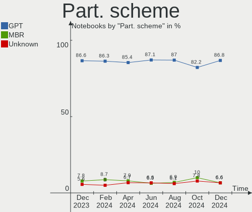
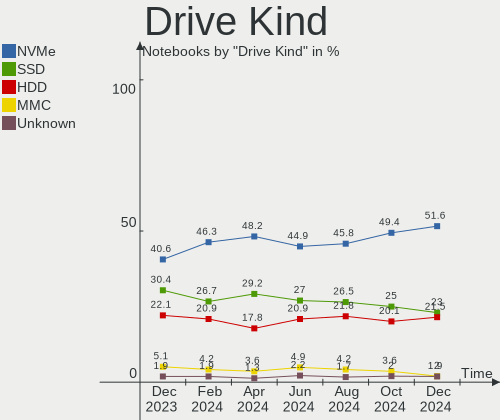
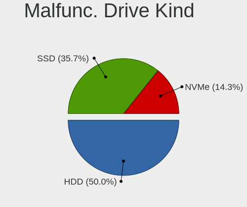
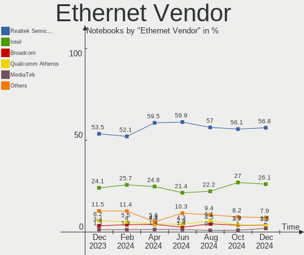
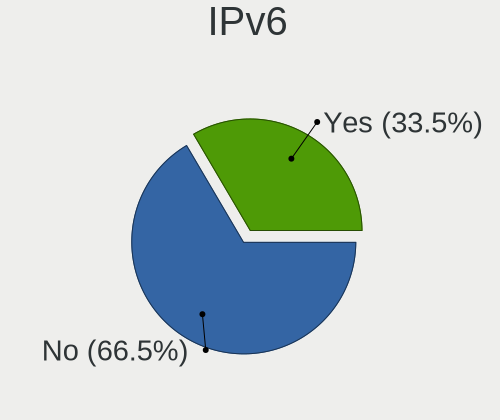

Ubuntu - Hardware Trends (Notebooks)
------------------------------------

A project to identify most popular hardware characteristics and track their change
over time based on data collected by Linux users at https://Linux-Hardware.org.

Anyone can contribute to this report by the [hw-probe](https://github.com/linuxhw/hw-probe) tool:

    sudo -E hw-probe -all -upload

This report is for one last month. Overall report since the beginning of time: [TestCoverage](https://github.com/linuxhw/TestCoverage)

Period: Dec, 2022.

Contents
--------

* [ System ](#system)
  - [ OS                       ](#os)
  - [ OS Family                ](#os-family)
  - [ Kernel                   ](#kernel)
  - [ Kernel Family            ](#kernel-family)
  - [ Kernel Major Ver.        ](#kernel-major-ver)
  - [ Arch                     ](#arch)
  - [ DE                       ](#de)
  - [ Display Server           ](#display-server)
  - [ Display Manager          ](#display-manager)
  - [ OS Lang                  ](#os-lang)
  - [ Boot Mode                ](#boot-mode)
  - [ Filesystem               ](#filesystem)
  - [ Part. scheme             ](#part-scheme)
  - [ Dual Boot with Linux/BSD ](#dual-boot-with-linuxbsd)
  - [ Dual Boot (Win)          ](#dual-boot-win)

* [ Board ](#board)
  - [ Vendor                   ](#vendor)
  - [ Model                    ](#model)
  - [ Model Family             ](#model-family)
  - [ MFG Year                 ](#mfg-year)
  - [ Form Factor              ](#form-factor)
  - [ Secure Boot              ](#secure-boot)
  - [ Coreboot                 ](#coreboot)
  - [ RAM Size                 ](#ram-size)
  - [ RAM Used                 ](#ram-used)
  - [ Total Drives             ](#total-drives)
  - [ Has CD-ROM               ](#has-cd-rom)
  - [ Has Ethernet             ](#has-ethernet)
  - [ Has WiFi                 ](#has-wifi)
  - [ Has Bluetooth            ](#has-bluetooth)

* [ Location ](#location)
  - [ Country                  ](#country)
  - [ City                     ](#city)

* [ Drives ](#drives)
  - [ Drive Vendor             ](#drive-vendor)
  - [ Drive Model              ](#drive-model)
  - [ HDD Vendor               ](#hdd-vendor)
  - [ SSD Vendor               ](#ssd-vendor)
  - [ Drive Kind               ](#drive-kind)
  - [ Drive Connector          ](#drive-connector)
  - [ Drive Size               ](#drive-size)
  - [ Space Total              ](#space-total)
  - [ Space Used               ](#space-used)
  - [ Malfunc. Drives          ](#malfunc-drives)
  - [ Malfunc. Drive Vendor    ](#malfunc-drive-vendor)
  - [ Malfunc. HDD Vendor      ](#malfunc-hdd-vendor)
  - [ Malfunc. Drive Kind      ](#malfunc-drive-kind)
  - [ Failed Drives            ](#failed-drives)
  - [ Failed Drive Vendor      ](#failed-drive-vendor)
  - [ Drive Status             ](#drive-status)

* [ Storage controller ](#storage-controller)
  - [ Storage Vendor           ](#storage-vendor)
  - [ Storage Model            ](#storage-model)
  - [ Storage Kind             ](#storage-kind)

* [ Processor ](#processor)
  - [ CPU Vendor               ](#cpu-vendor)
  - [ CPU Model                ](#cpu-model)
  - [ CPU Model Family         ](#cpu-model-family)
  - [ CPU Cores                ](#cpu-cores)
  - [ CPU Sockets              ](#cpu-sockets)
  - [ CPU Threads              ](#cpu-threads)
  - [ CPU Op-Modes             ](#cpu-op-modes)
  - [ CPU Microcode            ](#cpu-microcode)
  - [ CPU Microarch            ](#cpu-microarch)

* [ Graphics ](#graphics)
  - [ GPU Vendor               ](#gpu-vendor)
  - [ GPU Model                ](#gpu-model)
  - [ GPU Combo                ](#gpu-combo)
  - [ GPU Driver               ](#gpu-driver)
  - [ GPU Memory               ](#gpu-memory)

* [ Monitor ](#monitor)
  - [ Monitor Vendor           ](#monitor-vendor)
  - [ Monitor Model            ](#monitor-model)
  - [ Monitor Resolution       ](#monitor-resolution)
  - [ Monitor Diagonal         ](#monitor-diagonal)
  - [ Monitor Width            ](#monitor-width)
  - [ Aspect Ratio             ](#aspect-ratio)
  - [ Monitor Area             ](#monitor-area)
  - [ Pixel Density            ](#pixel-density)
  - [ Multiple Monitors        ](#multiple-monitors)

* [ Network ](#network)
  - [ Net Controller Vendor    ](#net-controller-vendor)
  - [ Net Controller Model     ](#net-controller-model)
  - [ Wireless Vendor          ](#wireless-vendor)
  - [ Wireless Model           ](#wireless-model)
  - [ Ethernet Vendor          ](#ethernet-vendor)
  - [ Ethernet Model           ](#ethernet-model)
  - [ Net Controller Kind      ](#net-controller-kind)
  - [ Used Controller          ](#used-controller)
  - [ NICs                     ](#nics)
  - [ IPv6                     ](#ipv6)

* [ Bluetooth ](#bluetooth)
  - [ Bluetooth Vendor         ](#bluetooth-vendor)
  - [ Bluetooth Model          ](#bluetooth-model)

* [ Sound ](#sound)
  - [ Sound Vendor             ](#sound-vendor)
  - [ Sound Model              ](#sound-model)

* [ Memory ](#memory)
  - [ Memory Vendor            ](#memory-vendor)
  - [ Memory Model             ](#memory-model)
  - [ Memory Kind              ](#memory-kind)
  - [ Memory Form Factor       ](#memory-form-factor)
  - [ Memory Size              ](#memory-size)
  - [ Memory Speed             ](#memory-speed)

* [ Printers & scanners ](#printers--scanners)
  - [ Printer Vendor           ](#printer-vendor)
  - [ Printer Model            ](#printer-model)
  - [ Scanner Vendor           ](#scanner-vendor)
  - [ Scanner Model            ](#scanner-model)

* [ Camera ](#camera)
  - [ Camera Vendor            ](#camera-vendor)
  - [ Camera Model             ](#camera-model)

* [ Security ](#security)
  - [ Fingerprint Vendor       ](#fingerprint-vendor)
  - [ Fingerprint Model        ](#fingerprint-model)
  - [ Chipcard Vendor          ](#chipcard-vendor)
  - [ Chipcard Model           ](#chipcard-model)

* [ Unsupported ](#unsupported)
  - [ Unsupported Devices      ](#unsupported-devices)
  - [ Unsupported Device Types ](#unsupported-device-types)

System
------

OS
--

Installed operating systems

| Name           | Notebooks | Percent |
|----------------|-----------|---------|
| Ubuntu 22.04   | 444       | 66.07%  |
| Ubuntu 22.10   | 119       | 17.71%  |
| Ubuntu 20.04   | 86        | 12.8%   |
| Ubuntu 18.04   | 15        | 2.23%   |
| Ubuntu 23.04   | 5         | 0.74%   |
| Ubuntu 20.10   | 2         | 0.3%    |
| Ubuntu Core 18 | 1         | 0.15%   |

OS Family
---------

OS without a version

| Name   | Notebooks | Percent |
|--------|-----------|---------|
| Ubuntu | 672       | 100%    |

Kernel
------

Version of the Linux kernel

| Version                  | Notebooks | Percent |
|--------------------------|-----------|---------|
| 5.15.0-56-generic        | 391       | 58.18%  |
| 5.19.0-26-generic        | 84        | 12.5%   |
| 5.15.0-57-generic        | 27        | 4.02%   |
| 5.15.0-53-generic        | 27        | 4.02%   |
| 5.15.0-43-generic        | 20        | 2.98%   |
| 5.4.0-135-generic        | 12        | 1.79%   |
| 6.0.9-060009-generic     | 9         | 1.34%   |
| 5.19.0-27-generic        | 8         | 1.19%   |
| 5.19.0-21-generic        | 8         | 1.19%   |
| 5.15.0-52-generic        | 8         | 1.19%   |
| 5.19.0-23-generic        | 7         | 1.04%   |
| 5.14.0-1054-oem          | 7         | 1.04%   |
| 5.19.0-28-generic        | 6         | 0.89%   |
| 5.15.0-46-generic        | 4         | 0.6%    |
| 5.15.0-48-generic        | 3         | 0.45%   |
| 4.15.0-200-generic       | 3         | 0.45%   |
| 5.8.0-43-generic         | 2         | 0.3%    |
| 5.18.10-76051810-generic | 2         | 0.3%    |
| 5.17.0-1019-oem          | 2         | 0.3%    |
| 5.13.0-51-generic        | 2         | 0.3%    |
| 4.15.0-197-generic       | 2         | 0.3%    |
| 6.1.0-daily-20221223     | 1         | 0.15%   |
| 6.0.6-76060006-generic   | 1         | 0.15%   |
| 6.0.11-x64v2-xanmod1     | 1         | 0.15%   |
| 6.0.0-1009-oem           | 1         | 0.15%   |
| 6.0.0-060000-generic     | 1         | 0.15%   |
| 5.8.0-53-generic         | 1         | 0.15%   |
| 5.8.0-50-generic         | 1         | 0.15%   |
| 5.8.0-48-generic         | 1         | 0.15%   |
| 5.8.0-25-generic         | 1         | 0.15%   |
| 5.4.0-86-generic         | 1         | 0.15%   |
| 5.4.0-84-generic         | 1         | 0.15%   |
| 5.4.0-81-generic         | 1         | 0.15%   |
| 5.4.0-72-generic         | 1         | 0.15%   |
| 5.4.0-52-generic         | 1         | 0.15%   |
| 5.4.0-132-generic        | 1         | 0.15%   |
| 5.4.0-107-generic        | 1         | 0.15%   |
| 5.19.5-051905-generic    | 1         | 0.15%   |
| 5.19.0-ziv-cm218         | 1         | 0.15%   |
| 5.19.0-24-generic        | 1         | 0.15%   |

Kernel Family
-------------

Linux kernel without a distro release

| Version | Notebooks | Percent |
|---------|-----------|---------|
| 5.15.0  | 484       | 72.02%  |
| 5.19.0  | 115       | 17.11%  |
| 5.4.0   | 19        | 2.83%   |
| 6.0.9   | 9         | 1.34%   |
| 5.14.0  | 9         | 1.34%   |
| 5.13.0  | 8         | 1.19%   |
| 4.15.0  | 7         | 1.04%   |
| 5.8.0   | 6         | 0.89%   |
| 5.17.0  | 4         | 0.6%    |
| 6.0.0   | 2         | 0.3%    |
| 5.18.10 | 2         | 0.3%    |
| 6.1.0   | 1         | 0.15%   |
| 6.0.6   | 1         | 0.15%   |
| 6.0.11  | 1         | 0.15%   |
| 5.19.5  | 1         | 0.15%   |
| 5.18.19 | 1         | 0.15%   |
| 5.13.19 | 1         | 0.15%   |
| 5.11.0  | 1         | 0.15%   |

Kernel Major Ver.
-----------------

Linux kernel major version

| Version | Notebooks | Percent |
|---------|-----------|---------|
| 5.15    | 484       | 72.02%  |
| 5.19    | 116       | 17.26%  |
| 5.4     | 19        | 2.83%   |
| 6.0     | 13        | 1.93%   |
| 5.14    | 9         | 1.34%   |
| 5.13    | 9         | 1.34%   |
| 4.15    | 7         | 1.04%   |
| 5.8     | 6         | 0.89%   |
| 5.17    | 4         | 0.6%    |
| 5.18    | 3         | 0.45%   |
| 6.1     | 1         | 0.15%   |
| 5.11    | 1         | 0.15%   |

Arch
----

OS architecture (x86_64, i586, etc.)

| Name   | Notebooks | Percent |
|--------|-----------|---------|
| x86_64 | 670       | 99.7%   |
| i686   | 2         | 0.3%    |

DE
--

Desktop Environment

| Name            | Notebooks | Percent |
|-----------------|-----------|---------|
| GNOME           | 646       | 96.13%  |
| Unknown         | 15        | 2.23%   |
| X-Cinnamon      | 4         | 0.6%    |
| GNOME Flashback | 2         | 0.3%    |
| Enlightenment   | 2         | 0.3%    |
| sway            | 1         | 0.15%   |
| i3              | 1         | 0.15%   |
| GNOME Classic   | 1         | 0.15%   |

Display Server
--------------

X11 or Wayland

| Name    | Notebooks | Percent |
|---------|-----------|---------|
| Wayland | 408       | 60.71%  |
| X11     | 243       | 36.16%  |
| Unknown | 14        | 2.08%   |
| Tty     | 7         | 1.04%   |

Display Manager
---------------

SDDM, LightDM, etc.

| Name    | Notebooks | Percent |
|---------|-----------|---------|
| GDM3    | 582       | 86.61%  |
| GDM     | 44        | 6.55%   |
| Unknown | 35        | 5.21%   |
| LightDM | 8         | 1.19%   |
| SDDM    | 2         | 0.3%    |
| SLiM    | 1         | 0.15%   |

OS Lang
-------

Language

| Lang    | Notebooks | Percent |
|---------|-----------|---------|
| en_US   | 301       | 44.79%  |
| de_DE   | 66        | 9.82%   |
| fr_FR   | 40        | 5.95%   |
| en_GB   | 32        | 4.76%   |
| ru_RU   | 28        | 4.17%   |
| pt_BR   | 28        | 4.17%   |
| en_IN   | 27        | 4.02%   |
| en_CA   | 17        | 2.53%   |
| it_IT   | 16        | 2.38%   |
| es_ES   | 16        | 2.38%   |
| en_AU   | 8         | 1.19%   |
| pl_PL   | 7         | 1.04%   |
| nl_NL   | 7         | 1.04%   |
| zh_CN   | 6         | 0.89%   |
| C       | 6         | 0.89%   |
| Unknown | 6         | 0.89%   |
| de_AT   | 5         | 0.74%   |
| cs_CZ   | 5         | 0.74%   |
| de_CH   | 4         | 0.6%    |
| ko_KR   | 3         | 0.45%   |
| en_ZA   | 3         | 0.45%   |
| bg_BG   | 3         | 0.45%   |
| tr_TR   | 2         | 0.3%    |
| sv_SE   | 2         | 0.3%    |
| pt_PT   | 2         | 0.3%    |
| ja_JP   | 2         | 0.3%    |
| hu_HU   | 2         | 0.3%    |
| fr_CA   | 2         | 0.3%    |
| es_US   | 2         | 0.3%    |
| es_MX   | 2         | 0.3%    |
| es_CL   | 2         | 0.3%    |
| en_NZ   | 2         | 0.3%    |
| en_IL   | 2         | 0.3%    |
| ro_RO   | 1         | 0.15%   |
| nb_NO   | 1         | 0.15%   |
| gl_ES   | 1         | 0.15%   |
| fr_LU   | 1         | 0.15%   |
| fa_IR   | 1         | 0.15%   |
| et_EE   | 1         | 0.15%   |
| es_VE   | 1         | 0.15%   |

Boot Mode
---------

EFI or BIOS

| Mode | Notebooks | Percent |
|------|-----------|---------|
| BIOS | 370       | 55.06%  |
| EFI  | 302       | 44.94%  |

Filesystem
----------

Type of filesystem

| Type    | Notebooks | Percent |
|---------|-----------|---------|
| Ext4    | 629       | 93.6%   |
| Zfs     | 16        | 2.38%   |
| Overlay | 14        | 2.08%   |
| Btrfs   | 10        | 1.49%   |
| Xfs     | 1         | 0.15%   |
| F2fs    | 1         | 0.15%   |
| Ext3    | 1         | 0.15%   |

Part. scheme
------------

Scheme of partitioning

| Type    | Notebooks | Percent |
|---------|-----------|---------|
| GPT     | 555       | 82.59%  |
| MBR     | 88        | 13.1%   |
| Unknown | 29        | 4.32%   |

Dual Boot with Linux/BSD
------------------------

Hosting more than one Linux/BSD

| Dual boot | Notebooks | Percent |
|-----------|-----------|---------|
| No        | 627       | 93.3%   |
| Yes       | 45        | 6.7%    |

Dual Boot (Win)
---------------

Hosting Linux and Windows

| Dual boot | Notebooks | Percent |
|-----------|-----------|---------|
| No        | 427       | 63.54%  |
| Yes       | 245       | 36.46%  |

Board
-----

Vendor
------

Motherboard manufacturer

| Name                           | Notebooks | Percent |
|--------------------------------|-----------|---------|
| Hewlett-Packard                | 134       | 19.94%  |
| Lenovo                         | 130       | 19.35%  |
| Dell                           | 113       | 16.82%  |
| ASUSTek Computer               | 65        | 9.67%   |
| Acer                           | 61        | 9.08%   |
| Toshiba                        | 16        | 2.38%   |
| Samsung Electronics            | 15        | 2.23%   |
| HUAWEI                         | 14        | 2.08%   |
| MSI                            | 13        | 1.93%   |
| Apple                          | 12        | 1.79%   |
| Unknown                        | 8         | 1.19%   |
| Notebook                       | 7         | 1.04%   |
| Fujitsu                        | 6         | 0.89%   |
| Timi                           | 5         | 0.74%   |
| System76                       | 5         | 0.74%   |
| Google                         | 5         | 0.74%   |
| Alienware                      | 5         | 0.74%   |
| Razer                          | 4         | 0.6%    |
| Sony                           | 3         | 0.45%   |
| Medion                         | 3         | 0.45%   |
| LG Electronics                 | 3         | 0.45%   |
| GPU Company                    | 3         | 0.45%   |
| Teclast                        | 2         | 0.3%    |
| Shanghai Zhaoxin Semiconductor | 2         | 0.3%    |
| Schenker                       | 2         | 0.3%    |
| Positivo Bahia - VAIO          | 2         | 0.3%    |
| Packard Bell                   | 2         | 0.3%    |
| Monster                        | 2         | 0.3%    |
| Gigabyte Technology            | 2         | 0.3%    |
| Gateway                        | 2         | 0.3%    |
| Dynabook                       | 2         | 0.3%    |
| Wortmann AG                    | 1         | 0.15%   |
| W271ELQ                        | 1         | 0.15%   |
| UMAX                           | 1         | 0.15%   |
| TUXEDO                         | 1         | 0.15%   |
| Semp Toshiba                   | 1         | 0.15%   |
| Positivo                       | 1         | 0.15%   |
| PC Specialist                  | 1         | 0.15%   |
| Panasonic                      | 1         | 0.15%   |
| MECER                          | 1         | 0.15%   |

Model
-----

Motherboard model

| Name                                | Notebooks | Percent |
|-------------------------------------|-----------|---------|
| Unknown                             | 11        | 1.64%   |
| HP OMEN by Laptop 16-c0xxx          | 4         | 0.6%    |
| HP EliteBook 8470p                  | 4         | 0.6%    |
| Dell Vostro 3500                    | 4         | 0.6%    |
| Razer Blade 17 (2022) - RZ09-0423   | 3         | 0.45%   |
| HUAWEI BOHB-WAX9                    | 3         | 0.45%   |
| HP ProBook 440 G8 Notebook PC       | 3         | 0.45%   |
| HP Pavilion dv6                     | 3         | 0.45%   |
| HP EliteBook 840 G8 Notebook PC     | 3         | 0.45%   |
| HP 255 G8 Notebook PC               | 3         | 0.45%   |
| Dell XPS 15 9520                    | 3         | 0.45%   |
| Dell Vostro 5490                    | 3         | 0.45%   |
| Timi TM1701                         | 2         | 0.3%    |
| System76 Oryx Pro                   | 2         | 0.3%    |
| Shanghai Zhaoxin ZXE CRB            | 2         | 0.3%    |
| Schenker VISION 15 (SVS15E21)       | 2         | 0.3%    |
| Samsung 530U3C/530U4C/532U3C        | 2         | 0.3%    |
| Lenovo Y50-70 20378                 | 2         | 0.3%    |
| Lenovo ThinkBook 15 G3 ACL 21A4     | 2         | 0.3%    |
| HUAWEI NBD-WXX9                     | 2         | 0.3%    |
| HP ProBook 6560b                    | 2         | 0.3%    |
| HP Pavilion Laptop 15-eh1xxx        | 2         | 0.3%    |
| HP Pavilion Laptop 14-ec0xxx        | 2         | 0.3%    |
| HP Pavilion Gaming Laptop 15-dk0xxx | 2         | 0.3%    |
| HP Pavilion g6                      | 2         | 0.3%    |
| HP Pavilion 17                      | 2         | 0.3%    |
| HP Notebook                         | 2         | 0.3%    |
| HP Laptop 17-cp0xxx                 | 2         | 0.3%    |
| HP EliteBook 8570p                  | 2         | 0.3%    |
| HP EliteBook 850 G3                 | 2         | 0.3%    |
| HP EliteBook 840 G5                 | 2         | 0.3%    |
| HP EliteBook 745 G5                 | 2         | 0.3%    |
| HP 15                               | 2         | 0.3%    |
| Dell XPS 9320                       | 2         | 0.3%    |
| Dell XPS 15 9510                    | 2         | 0.3%    |
| Dell XPS 13 9370                    | 2         | 0.3%    |
| Dell Latitude E7450                 | 2         | 0.3%    |
| Dell Latitude E6430                 | 2         | 0.3%    |
| Dell Latitude E6420                 | 2         | 0.3%    |
| Dell Latitude D820                  | 2         | 0.3%    |

Model Family
------------

Motherboard model prefix

| Name                  | Notebooks | Percent |
|-----------------------|-----------|---------|
| Lenovo ThinkPad       | 68        | 10.12%  |
| Dell Latitude         | 38        | 5.65%   |
| Acer Aspire           | 37        | 5.51%   |
| HP EliteBook          | 35        | 5.21%   |
| Dell Inspiron         | 31        | 4.61%   |
| HP Pavilion           | 24        | 3.57%   |
| Lenovo IdeaPad        | 22        | 3.27%   |
| Dell Vostro           | 19        | 2.83%   |
| HP Laptop             | 18        | 2.68%   |
| ASUS VivoBook         | 18        | 2.68%   |
| Dell XPS              | 17        | 2.53%   |
| HP ProBook            | 13        | 1.93%   |
| Unknown               | 11        | 1.64%   |
| Toshiba Satellite     | 9         | 1.34%   |
| Acer Swift            | 9         | 1.34%   |
| Lenovo ThinkBook      | 7         | 1.04%   |
| ASUS ZenBook          | 7         | 1.04%   |
| Lenovo Legion         | 6         | 0.89%   |
| HP ENVY               | 6         | 0.89%   |
| HP ZBook              | 5         | 0.74%   |
| HP OMEN               | 5         | 0.74%   |
| Fujitsu LIFEBOOK      | 5         | 0.74%   |
| ASUS ROG              | 5         | 0.74%   |
| Acer Nitro            | 5         | 0.74%   |
| Toshiba PORTEGE       | 4         | 0.6%    |
| Razer Blade           | 4         | 0.6%    |
| HP Stream             | 4         | 0.6%    |
| HP 255                | 4         | 0.6%    |
| HUAWEI BOHB-WAX9      | 3         | 0.45%   |
| HP 15                 | 3         | 0.45%   |
| Dell G15              | 3         | 0.45%   |
| ASUS ASUS             | 3         | 0.45%   |
| Acer TravelMate       | 3         | 0.45%   |
| Acer Predator         | 3         | 0.45%   |
| Timi TM1701           | 2         | 0.3%    |
| System76 Oryx         | 2         | 0.3%    |
| Shanghai Zhaoxin ZXE  | 2         | 0.3%    |
| Schenker VISION       | 2         | 0.3%    |
| Samsung 530U3C        | 2         | 0.3%    |
| Packard Bell EasyNote | 2         | 0.3%    |

MFG Year
--------

Motherboard manufacture year

| Year | Notebooks | Percent |
|------|-----------|---------|
| 2021 | 103       | 15.33%  |
| 2022 | 80        | 11.9%   |
| 2020 | 70        | 10.42%  |
| 2019 | 52        | 7.74%   |
| 2013 | 45        | 6.7%    |
| 2018 | 41        | 6.1%    |
| 2012 | 39        | 5.8%    |
| 2017 | 37        | 5.51%   |
| 2011 | 36        | 5.36%   |
| 2015 | 35        | 5.21%   |
| 2010 | 34        | 5.06%   |
| 2014 | 33        | 4.91%   |
| 2016 | 30        | 4.46%   |
| 2008 | 16        | 2.38%   |
| 2009 | 13        | 1.93%   |
| 2006 | 5         | 0.74%   |
| 2007 | 3         | 0.45%   |

Form Factor
-----------

Physical design of the computer

| Name     | Notebooks | Percent |
|----------|-----------|---------|
| Notebook | 672       | 100%    |

Secure Boot
-----------

Enabled or disabled

| State    | Notebooks | Percent |
|----------|-----------|---------|
| Disabled | 591       | 87.95%  |
| Enabled  | 81        | 12.05%  |

Coreboot
--------

Have coreboot on board

| Used | Notebooks | Percent |
|------|-----------|---------|
| No   | 666       | 99.11%  |
| Yes  | 6         | 0.89%   |

RAM Size
--------

Total RAM memory

| Size in GB  | Notebooks | Percent |
|-------------|-----------|---------|
| 4.01-8.0    | 200       | 29.76%  |
| 16.01-24.0  | 134       | 19.94%  |
| 3.01-4.0    | 124       | 18.45%  |
| 8.01-16.0   | 105       | 15.63%  |
| 32.01-64.0  | 69        | 10.27%  |
| 24.01-32.0  | 12        | 1.79%   |
| 1.01-2.0    | 12        | 1.79%   |
| 64.01-256.0 | 9         | 1.34%   |
| 2.01-3.0    | 5         | 0.74%   |
| 0.51-1.0    | 2         | 0.3%    |

RAM Used
--------

Used RAM memory

| Used GB    | Notebooks | Percent |
|------------|-----------|---------|
| 2.01-3.0   | 225       | 33.48%  |
| 1.01-2.0   | 172       | 25.6%   |
| 4.01-8.0   | 118       | 17.56%  |
| 3.01-4.0   | 106       | 15.77%  |
| 8.01-16.0  | 37        | 5.51%   |
| 0.51-1.0   | 9         | 1.34%   |
| 16.01-24.0 | 3         | 0.45%   |
| 24.01-32.0 | 1         | 0.15%   |
| 0.01-0.5   | 1         | 0.15%   |

Total Drives
------------

Number of drives on board

| Drives | Notebooks | Percent |
|--------|-----------|---------|
| 1      | 509       | 75.74%  |
| 2      | 147       | 21.88%  |
| 3      | 15        | 2.23%   |
| 4      | 1         | 0.15%   |

Has CD-ROM
----------

Has CD-ROM on board

| Presented | Notebooks | Percent |
|-----------|-----------|---------|
| No        | 459       | 68.3%   |
| Yes       | 213       | 31.7%   |

Has Ethernet
------------

Has Ethernet on board

| Presented | Notebooks | Percent |
|-----------|-----------|---------|
| Yes       | 522       | 77.68%  |
| No        | 150       | 22.32%  |

Has WiFi
--------

Has WiFi module

| Presented | Notebooks | Percent |
|-----------|-----------|---------|
| Yes       | 665       | 98.96%  |
| No        | 7         | 1.04%   |

Has Bluetooth
-------------

Has Bluetooth module

| Presented | Notebooks | Percent |
|-----------|-----------|---------|
| Yes       | 562       | 83.63%  |
| No        | 110       | 16.37%  |

Location
--------

Country
-------

Geographic location (country)

| Country      | Notebooks | Percent |
|--------------|-----------|---------|
| USA          | 97        | 14.43%  |
| Germany      | 85        | 12.65%  |
| France       | 53        | 7.89%   |
| Brazil       | 37        | 5.51%   |
| Russia       | 33        | 4.91%   |
| India        | 27        | 4.02%   |
| Italy        | 26        | 3.87%   |
| Spain        | 22        | 3.27%   |
| UK           | 21        | 3.13%   |
| Canada       | 21        | 3.13%   |
| Poland       | 18        | 2.68%   |
| Netherlands  | 14        | 2.08%   |
| Sweden       | 12        | 1.79%   |
| Austria      | 12        | 1.79%   |
| China        | 10        | 1.49%   |
| Switzerland  | 8         | 1.19%   |
| Czechia      | 8         | 1.19%   |
| Bulgaria     | 8         | 1.19%   |
| Australia    | 8         | 1.19%   |
| Turkey       | 7         | 1.04%   |
| Mexico       | 7         | 1.04%   |
| Indonesia    | 7         | 1.04%   |
| South Korea  | 6         | 0.89%   |
| Romania      | 6         | 0.89%   |
| Japan        | 6         | 0.89%   |
| Greece       | 6         | 0.89%   |
| Belgium      | 6         | 0.89%   |
| Iran         | 5         | 0.74%   |
| Hungary      | 5         | 0.74%   |
| Serbia       | 4         | 0.6%    |
| New Zealand  | 4         | 0.6%    |
| Denmark      | 4         | 0.6%    |
| Chile        | 4         | 0.6%    |
| South Africa | 3         | 0.45%   |
| Portugal     | 3         | 0.45%   |
| Norway       | 3         | 0.45%   |
| Egypt        | 3         | 0.45%   |
| Colombia     | 3         | 0.45%   |
| Belarus      | 3         | 0.45%   |
| Vietnam      | 2         | 0.3%    |

City
----

Geographic location (city)

| City          | Notebooks | Percent |
|---------------|-----------|---------|
| Moscow        | 10        | 1.49%   |
| Vienna        | 8         | 1.19%   |
| Paris         | 8         | 1.19%   |
| Hamburg       | 7         | 1.04%   |
| Berlin        | 7         | 1.04%   |
| Madrid        | 6         | 0.89%   |
| Warsaw        | 5         | 0.74%   |
| Tehran        | 5         | 0.74%   |
| London        | 5         | 0.74%   |
| St Petersburg | 4         | 0.6%    |
| Sofia         | 4         | 0.6%    |
| Rome          | 4         | 0.6%    |
| Milan         | 4         | 0.6%    |
| Bengaluru     | 4         | 0.6%    |
| Stuttgart     | 3         | 0.45%   |
| Sao Luís     | 3         | 0.45%   |
| Prague        | 3         | 0.45%   |
| Oviedo        | 3         | 0.45%   |
| Munich        | 3         | 0.45%   |
| Minsk         | 3         | 0.45%   |
| Leipzig       | 3         | 0.45%   |
| Krasnodar     | 3         | 0.45%   |
| Kochi         | 3         | 0.45%   |
| Hyderabad     | 3         | 0.45%   |
| Gothenburg    | 3         | 0.45%   |
| Florence      | 3         | 0.45%   |
| Essen         | 3         | 0.45%   |
| Chennai       | 3         | 0.45%   |
| Charlotte     | 3         | 0.45%   |
| Brisbane      | 3         | 0.45%   |
| Bogotá       | 3         | 0.45%   |
| Bad Essen     | 3         | 0.45%   |
| Wroclaw       | 2         | 0.3%    |
| Vilnius       | 2         | 0.3%    |
| Vancouver     | 2         | 0.3%    |
| Ulyanovsk     | 2         | 0.3%    |
| Uiwang        | 2         | 0.3%    |
| The Bronx     | 2         | 0.3%    |
| Shenzhen      | 2         | 0.3%    |
| Santiago      | 2         | 0.3%    |

Drives
------

Drive Vendor
------------

Hard drive vendors

| Vendor                         | Notebooks | Drives | Percent |
|--------------------------------|-----------|--------|---------|
| Samsung Electronics            | 154       | 167    | 18.99%  |
| WDC                            | 85        | 86     | 10.48%  |
| Seagate                        | 57        | 61     | 7.03%   |
| Toshiba                        | 56        | 56     | 6.91%   |
| SanDisk                        | 45        | 46     | 5.55%   |
| Unknown                        | 42        | 47     | 5.18%   |
| Intel                          | 42        | 44     | 5.18%   |
| Kingston                       | 38        | 40     | 4.69%   |
| SK hynix                       | 37        | 38     | 4.56%   |
| Micron Technology              | 29        | 30     | 3.58%   |
| Crucial                        | 24        | 26     | 2.96%   |
| Hitachi                        | 19        | 19     | 2.34%   |
| KIOXIA                         | 17        | 17     | 2.1%    |
| HGST                           | 15        | 15     | 1.85%   |
| A-DATA Technology              | 13        | 13     | 1.6%    |
| China                          | 11        | 11     | 1.36%   |
| Apple                          | 8         | 8      | 0.99%   |
| Silicon Motion                 | 7         | 7      | 0.86%   |
| SPCC                           | 6         | 6      | 0.74%   |
| PNY                            | 6         | 7      | 0.74%   |
| Micron/Crucial Technology      | 5         | 5      | 0.62%   |
| LITEON                         | 5         | 5      | 0.62%   |
| Unknown                        | 5         | 6      | 0.62%   |
| SSSTC                          | 4         | 4      | 0.49%   |
| Kingston Technology Company    | 4         | 4      | 0.49%   |
| Intenso                        | 4         | 5      | 0.49%   |
| Team                           | 3         | 3      | 0.37%   |
| Solid State Storage            | 3         | 3      | 0.37%   |
| Phison Electronics             | 3         | 3      | 0.37%   |
| Phison                         | 3         | 4      | 0.37%   |
| Patriot                        | 3         | 3      | 0.37%   |
| Lexar                          | 3         | 3      | 0.37%   |
| KingSpec                       | 3         | 3      | 0.37%   |
| Union Memory (Shenzhen)        | 2         | 2      | 0.25%   |
| Solid State Storage Technology | 2         | 2      | 0.25%   |
| ShiJi                          | 2         | 2      | 0.25%   |
| Lenovo                         | 2         | 2      | 0.25%   |
| JMicron Technology             | 2         | 2      | 0.25%   |
| Fanxiang                       | 2         | 2      | 0.25%   |
| ADATA Technology               | 2         | 2      | 0.25%   |

Drive Model
-----------

Hard drive models

| Model                                               | Notebooks | Percent |
|-----------------------------------------------------|-----------|---------|
| Samsung NVMe SSD Controller SM981/PM981/PM983 500GB | 18        | 2.16%   |
| Toshiba MQ01ABD100 1TB                              | 11        | 1.32%   |
| Samsung NVMe SSD Controller PM9A1/PM9A3/980PRO 2TB  | 10        | 1.2%    |
| Unknown MMC Card  64GB                              | 9         | 1.08%   |
| Unknown MMC Card  32GB                              | 9         | 1.08%   |
| KIOXIA KBG40ZNS512G NVMe 512GB                      | 7         | 0.84%   |
| Crucial CT240BX500SSD1 240GB                        | 7         | 0.84%   |
| Toshiba MQ04ABF100 1TB                              | 6         | 0.72%   |
| Samsung SSD 850 EVO 500GB                           | 6         | 0.72%   |
| Intel SSD 660P Series 1024GB                        | 6         | 0.72%   |
| Toshiba XG6 NVMe SSD Controller 256GB               | 5         | 0.6%    |
| Toshiba MQ01ABF050 500GB                            | 5         | 0.6%    |
| Sandisk WD Black SN750 / PC SN730 NVMe SSD 512GB    | 5         | 0.6%    |
| Samsung MZVL21T0HCLR-00B00 1TB                      | 5         | 0.6%    |
| Kingston SA400S37480G 480GB SSD                     | 5         | 0.6%    |
| Kingston SA400S37240G 240GB SSD                     | 5         | 0.6%    |
| HGST HTS541010A9E680 1TB                            | 5         | 0.6%    |
| Unknown                                             | 5         | 0.6%    |
| WDC WDS240G2G0A-00JH30 240GB SSD                    | 4         | 0.48%   |
| Unknown MMC Card  128GB                             | 4         | 0.48%   |
| Toshiba MQ01ABD050 500GB                            | 4         | 0.48%   |
| SK hynix BC501 NVMe Solid State Drive 512GB         | 4         | 0.48%   |
| Seagate ST500LT012-1DG142 500GB                     | 4         | 0.48%   |
| Seagate ST2000LM007-1R8174 2TB                      | 4         | 0.48%   |
| Seagate ST1000LM024 HN-M101MBB 1TB                  | 4         | 0.48%   |
| Samsung MZVLQ512HBLU-00B00 512GB                    | 4         | 0.48%   |
| Micron/Crucial P2 NVMe PCIe SSD 500GB               | 4         | 0.48%   |
| KIOXIA KBG40ZNV512G 512GB                           | 4         | 0.48%   |
| Intel SSD Pro 7600p/760p/E 6100p Series 1024GB      | 4         | 0.48%   |
| HGST HTS721010A9E630 1TB                            | 4         | 0.48%   |
| WDC WDS500G2B0A-00SM50 500GB SSD                    | 3         | 0.36%   |
| WDC WD10SPZX-60Z10T0 1TB                            | 3         | 0.36%   |
| WDC WD10JPVX-22JC3T0 1TB                            | 3         | 0.36%   |
| WDC PC SN530 NVMe 512GB                             | 3         | 0.36%   |
| SK hynix BC711 NVMe 512GB                           | 3         | 0.36%   |
| Silicon Motion PCIe-8 SSD 512GB                     | 3         | 0.36%   |
| Seagate ST500LM012 HN-M500MBB 500GB                 | 3         | 0.36%   |
| Seagate ST1000LM035-1RK172 1TB                      | 3         | 0.36%   |
| Seagate Backup+ Hub BK 8TB                          | 3         | 0.36%   |
| Samsung SSD 980 PRO 2TB                             | 3         | 0.36%   |

HDD Vendor
----------

Hard disk drive vendors

| Vendor              | Notebooks | Drives | Percent |
|---------------------|-----------|--------|---------|
| Seagate             | 55        | 59     | 29.1%   |
| WDC                 | 44        | 44     | 23.28%  |
| Toshiba             | 41        | 41     | 21.69%  |
| Hitachi             | 19        | 19     | 10.05%  |
| HGST                | 15        | 15     | 7.94%   |
| Samsung Electronics | 7         | 7      | 3.7%    |
| Unknown             | 2         | 2      | 1.06%   |
| Apple               | 2         | 2      | 1.06%   |
| MARSHAL             | 1         | 1      | 0.53%   |
| HGST HTS            | 1         | 1      | 0.53%   |
| Fujitsu             | 1         | 1      | 0.53%   |
| ASMT                | 1         | 1      | 0.53%   |

SSD Vendor
----------

Solid state drive vendors

| Vendor              | Notebooks | Drives | Percent |
|---------------------|-----------|--------|---------|
| Samsung Electronics | 52        | 53     | 22.03%  |
| SanDisk             | 24        | 24     | 10.17%  |
| Kingston            | 24        | 25     | 10.17%  |
| WDC                 | 21        | 21     | 8.9%    |
| Crucial             | 18        | 19     | 7.63%   |
| China               | 11        | 11     | 4.66%   |
| SK hynix            | 8         | 8      | 3.39%   |
| SPCC                | 6         | 6      | 2.54%   |
| Micron Technology   | 6         | 6      | 2.54%   |
| Intel               | 6         | 6      | 2.54%   |
| Toshiba             | 5         | 5      | 2.12%   |
| LITEON              | 5         | 5      | 2.12%   |
| PNY                 | 4         | 4      | 1.69%   |
| KingSpec            | 3         | 3      | 1.27%   |
| Apple               | 3         | 3      | 1.27%   |
| A-DATA Technology   | 3         | 3      | 1.27%   |
| Unknown             | 3         | 3      | 1.27%   |
| Team                | 2         | 2      | 0.85%   |
| SSSTC               | 2         | 2      | 0.85%   |
| Patriot             | 2         | 2      | 0.85%   |
| W800SH              | 1         | 1      | 0.42%   |
| Verbatim            | 1         | 1      | 0.42%   |
| Vaseky              | 1         | 1      | 0.42%   |
| Transcend           | 1         | 1      | 0.42%   |
| Teclast             | 1         | 1      | 0.42%   |
| TEAM T25            | 1         | 1      | 0.42%   |
| Smartbuy            | 1         | 1      | 0.42%   |
| ShiJi               | 1         | 1      | 0.42%   |
| Seagate             | 1         | 1      | 0.42%   |
| RX7                 | 1         | 1      | 0.42%   |
| Ramaxel Technology  | 1         | 1      | 0.42%   |
| OCZ                 | 1         | 1      | 0.42%   |
| Netac               | 1         | 1      | 0.42%   |
| M4-CT128            | 1         | 1      | 0.42%   |
| Lexar               | 1         | 1      | 0.42%   |
| Lenovo              | 1         | 1      | 0.42%   |
| KLEVV               | 1         | 1      | 0.42%   |
| KIOXIA-EXCERIA      | 1         | 1      | 0.42%   |
| KingDian            | 1         | 1      | 0.42%   |
| JMicron Technology  | 1         | 1      | 0.42%   |

Drive Kind
----------

HDD or SSD

| Kind    | Notebooks | Drives | Percent |
|---------|-----------|--------|---------|
| NVMe    | 323       | 355    | 41.04%  |
| SSD     | 225       | 239    | 28.59%  |
| HDD     | 185       | 193    | 23.51%  |
| MMC     | 38        | 42     | 4.83%   |
| Unknown | 16        | 18     | 2.03%   |

Drive Connector
---------------

SATA, SAS, NVMe, etc.

| Type | Notebooks | Drives | Percent |
|------|-----------|--------|---------|
| SATA | 368       | 413    | 48.23%  |
| NVMe | 323       | 354    | 42.33%  |
| MMC  | 38        | 42     | 4.98%   |
| SAS  | 34        | 38     | 4.46%   |

Drive Size
----------

Size of hard drive

| Size in TB | Notebooks | Drives | Percent |
|------------|-----------|--------|---------|
| 0.01-0.5   | 258       | 280    | 63.7%   |
| 0.51-1.0   | 131       | 135    | 32.35%  |
| 1.01-2.0   | 12        | 12     | 2.96%   |
| 4.01-10.0  | 3         | 4      | 0.74%   |
| 3.01-4.0   | 1         | 1      | 0.25%   |

Space Total
-----------

Amount of disk space available on the file system

| Size in GB     | Notebooks | Percent |
|----------------|-----------|---------|
| 101-250        | 210       | 31.25%  |
| 251-500        | 204       | 30.36%  |
| 501-1000       | 109       | 16.22%  |
| 51-100         | 40        | 5.95%   |
| 1001-2000      | 33        | 4.91%   |
| 21-50          | 30        | 4.46%   |
| 1-20           | 25        | 3.72%   |
| More than 3000 | 9         | 1.34%   |
| Unknown        | 8         | 1.19%   |
| 2001-3000      | 4         | 0.6%    |

Space Used
----------

Amount of used disk space

| Used GB        | Notebooks | Percent |
|----------------|-----------|---------|
| 1-20           | 235       | 34.97%  |
| 21-50          | 139       | 20.68%  |
| 101-250        | 111       | 16.52%  |
| 51-100         | 99        | 14.73%  |
| 251-500        | 46        | 6.85%   |
| 501-1000       | 20        | 2.98%   |
| 1001-2000      | 11        | 1.64%   |
| Unknown        | 8         | 1.19%   |
| More than 3000 | 3         | 0.45%   |

Malfunc. Drives
---------------

Drive models with a malfunction

| Model                                      | Notebooks | Drives | Percent |
|--------------------------------------------|-----------|--------|---------|
| WDC WDS240G2G0A-00JH30 240GB SSD           | 1         | 1      | 4.17%   |
| WDC WDS120G2G0A-00JH30 120GB SSD           | 1         | 1      | 4.17%   |
| WDC WD10SPCX-24HWST1 1TB                   | 1         | 1      | 4.17%   |
| Toshiba MQ01ABD100 1TB                     | 1         | 1      | 4.17%   |
| Toshiba MK8037GSX 80GB                     | 1         | 1      | 4.17%   |
| Toshiba MK3275GSX 320GB                    | 1         | 1      | 4.17%   |
| Toshiba MK1255GSX H 120GB                  | 1         | 1      | 4.17%   |
| SK hynix PC711 HFS512GDE9X073N 512GB       | 1         | 1      | 4.17%   |
| ShiJi 512GB M.2-NVMe                       | 1         | 1      | 4.17%   |
| Seagate ST9500420ASG 500GB                 | 1         | 1      | 4.17%   |
| Seagate ST750LM000-1EJ16G 752GB            | 1         | 1      | 4.17%   |
| Seagate ST500LT012-1DG142 500GB            | 1         | 1      | 4.17%   |
| Seagate ST2000LM007-1R8174 2TB             | 1         | 1      | 4.17%   |
| Seagate ST2000LM 007-1R8174 2TB            | 1         | 1      | 4.17%   |
| SanDisk SSD PLUS 480GB                     | 1         | 1      | 4.17%   |
| Samsung Electronics SSD 870 EVO 1TB        | 1         | 1      | 4.17%   |
| Samsung Electronics MZVL21T0HCLR-00B00 1TB | 1         | 1      | 4.17%   |
| RX7 2.5 240GB SSD                          | 1         | 1      | 4.17%   |
| Hitachi HTS547575A9E384 752GB              | 1         | 1      | 4.17%   |
| Hitachi HTS543232A7A384 320GB              | 1         | 1      | 4.17%   |
| HGST HTS725050A7E630 500GB                 | 1         | 1      | 4.17%   |
| HGST HTS541010A9E680 1TB                   | 1         | 1      | 4.17%   |
| Apple HDD HTS541010A9E662 1TB              | 1         | 1      | 4.17%   |
| A-DATA Technology SX8100NP 512GB           | 1         | 1      | 4.17%   |

Malfunc. Drive Vendor
---------------------

Vendors of faulty drives

| Vendor              | Notebooks | Drives | Percent |
|---------------------|-----------|--------|---------|
| Seagate             | 5         | 5      | 20.83%  |
| Toshiba             | 4         | 4      | 16.67%  |
| WDC                 | 3         | 3      | 12.5%   |
| Samsung Electronics | 2         | 2      | 8.33%   |
| Hitachi             | 2         | 2      | 8.33%   |
| HGST                | 2         | 2      | 8.33%   |
| SK hynix            | 1         | 1      | 4.17%   |
| ShiJi               | 1         | 1      | 4.17%   |
| SanDisk             | 1         | 1      | 4.17%   |
| RX7                 | 1         | 1      | 4.17%   |
| Apple               | 1         | 1      | 4.17%   |
| A-DATA Technology   | 1         | 1      | 4.17%   |

Malfunc. HDD Vendor
-------------------

Vendors of faulty HDD drives

| Vendor  | Notebooks | Drives | Percent |
|---------|-----------|--------|---------|
| Seagate | 5         | 5      | 33.33%  |
| Toshiba | 4         | 4      | 26.67%  |
| Hitachi | 2         | 2      | 13.33%  |
| HGST    | 2         | 2      | 13.33%  |
| WDC     | 1         | 1      | 6.67%   |
| Apple   | 1         | 1      | 6.67%   |

Malfunc. Drive Kind
-------------------

Kinds of faulty drives

| Kind | Notebooks | Drives | Percent |
|------|-----------|--------|---------|
| HDD  | 15        | 15     | 62.5%   |
| SSD  | 5         | 5      | 20.83%  |
| NVMe | 4         | 4      | 16.67%  |

Failed Drives
-------------

Failed drive models

| Model                        | Notebooks | Drives | Percent |
|------------------------------|-----------|--------|---------|
| WDC WD7500BPVT-22HXZT1 752GB | 1         | 1      | 100%    |

Failed Drive Vendor
-------------------

Failed drive vendors

| Vendor | Notebooks | Drives | Percent |
|--------|-----------|--------|---------|
| WDC    | 1         | 1      | 100%    |

Drive Status
------------

Number of failed and malfunc. drives

| Status   | Notebooks | Drives | Percent |
|----------|-----------|--------|---------|
| Detected | 427       | 523    | 60.48%  |
| Works    | 254       | 299    | 35.98%  |
| Malfunc  | 24        | 24     | 3.4%    |
| Failed   | 1         | 1      | 0.14%   |

Storage controller
------------------

Storage Vendor
--------------

Storage controller vendors

| Vendor                               | Notebooks | Percent |
|--------------------------------------|-----------|---------|
| Intel                                | 457       | 55.13%  |
| Samsung Electronics                  | 100       | 12.06%  |
| AMD                                  | 64        | 7.72%   |
| SanDisk                              | 41        | 4.95%   |
| SK hynix                             | 28        | 3.38%   |
| Micron Technology                    | 24        | 2.9%    |
| Kingston Technology Company          | 18        | 2.17%   |
| KIOXIA                               | 16        | 1.93%   |
| Micron/Crucial Technology            | 12        | 1.45%   |
| Toshiba America Info Systems         | 11        | 1.33%   |
| Silicon Motion                       | 11        | 1.33%   |
| Solid State Storage Technology       | 10        | 1.21%   |
| Phison Electronics                   | 9         | 1.09%   |
| ADATA Technology                     | 8         | 0.97%   |
| Union Memory (Shenzhen)              | 3         | 0.36%   |
| Nvidia                               | 3         | 0.36%   |
| Zhaoxin                              | 2         | 0.24%   |
| Realtek Semiconductor                | 2         | 0.24%   |
| Apple                                | 2         | 0.24%   |
| Yangtze Memory Technologies          | 1         | 0.12%   |
| Transcend                            | 1         | 0.12%   |
| Silicon Image                        | 1         | 0.12%   |
| Shenzhen Longsys Electronics         | 1         | 0.12%   |
| Ramaxel Technology(Shenzhen) Limited | 1         | 0.12%   |
| MAXIO Technology (Hangzhou)          | 1         | 0.12%   |
| Marvell Technology Group             | 1         | 0.12%   |
| Lenovo                               | 1         | 0.12%   |

Storage Model
-------------

Storage controller models

| Model                                                                          | Notebooks | Percent |
|--------------------------------------------------------------------------------|-----------|---------|
| AMD FCH SATA Controller [AHCI mode]                                            | 55        | 6.24%   |
| Intel Volume Management Device NVMe RAID Controller                            | 54        | 6.13%   |
| Intel 7 Series Chipset Family 6-port SATA Controller [AHCI mode]               | 54        | 6.13%   |
| Intel Sunrise Point-LP SATA Controller [AHCI mode]                             | 47        | 5.33%   |
| Samsung NVMe SSD Controller SM981/PM981/PM983                                  | 39        | 4.43%   |
| Intel 82801 Mobile SATA Controller [RAID mode]                                 | 30        | 3.41%   |
| Samsung NVMe SSD Controller 980                                                | 29        | 3.29%   |
| Intel 6 Series/C200 Series Chipset Family 6 port Mobile SATA AHCI Controller   | 26        | 2.95%   |
| Samsung NVMe SSD Controller PM9A1/PM9A3/980PRO                                 | 24        | 2.72%   |
| Micron Non-Volatile memory controller                                          | 24        | 2.72%   |
| Intel 8 Series SATA Controller 1 [AHCI mode]                                   | 22        | 2.5%    |
| Intel Tiger Lake-LP SATA Controller                                            | 21        | 2.38%   |
| Intel Wildcat Point-LP SATA Controller [AHCI Mode]                             | 19        | 2.16%   |
| Intel 5 Series/3400 Series Chipset 4 port SATA AHCI Controller                 | 17        | 1.93%   |
| Intel 82801IBM/IEM (ICH9M/ICH9M-E) 4 port SATA Controller [AHCI mode]          | 16        | 1.82%   |
| SanDisk Non-Volatile memory controller                                         | 15        | 1.7%    |
| Intel Ice Lake-LP SATA Controller [AHCI mode]                                  | 15        | 1.7%    |
| Intel 8 Series/C220 Series Chipset Family 6-port SATA Controller 1 [AHCI mode] | 15        | 1.7%    |
| SK hynix Gold P31/PC711 NVMe Solid State Drive                                 | 14        | 1.59%   |
| Intel Atom Processor E3800 Series SATA AHCI Controller                         | 14        | 1.59%   |
| KIOXIA NVMe SSD Controller BG4                                                 | 13        | 1.48%   |
| Intel Non-Volatile memory controller                                           | 13        | 1.48%   |
| Intel Celeron/Pentium Silver Processor SATA Controller                         | 13        | 1.48%   |
| Intel SSD 660P Series                                                          | 12        | 1.36%   |
| Intel Comet Lake SATA AHCI Controller                                          | 11        | 1.25%   |
| Intel Cannon Lake Mobile PCH SATA AHCI Controller                              | 11        | 1.25%   |
| Solid State Storage Non-Volatile memory controller                             | 10        | 1.14%   |
| SanDisk WD Black SN750 / PC SN730 NVMe SSD                                     | 9         | 1.02%   |
| SanDisk WD Blue SN550 NVMe SSD                                                 | 8         | 0.91%   |
| Micron/Crucial P2 NVMe PCIe SSD                                                | 8         | 0.91%   |
| Intel Cannon Point-LP SATA Controller [AHCI Mode]                              | 8         | 0.91%   |
| Intel 5 Series/3400 Series Chipset 6 port SATA AHCI Controller                 | 8         | 0.91%   |
| Toshiba America Info Systems XG6 NVMe SSD Controller                           | 7         | 0.79%   |
| Phison PS5013 E13 NVMe Controller                                              | 7         | 0.79%   |
| Kingston Company Company Non-Volatile memory controller                        | 7         | 0.79%   |
| Intel Alder Lake-P SATA AHCI Controller                                        | 7         | 0.79%   |
| Intel 500 Series Chipset Family SATA AHCI Controller                           | 7         | 0.79%   |
| SK hynix BC501 NVMe Solid State Drive                                          | 6         | 0.68%   |
| Intel HM170/QM170 Chipset SATA Controller [AHCI Mode]                          | 6         | 0.68%   |
| Intel Celeron N3350/Pentium N4200/Atom E3900 Series SATA AHCI Controller       | 6         | 0.68%   |

Storage Kind
------------

Kind of storage controller (IDE, SATA, NVMe, SAS, ...)

| Kind | Notebooks | Percent |
|------|-----------|---------|
| SATA | 429       | 50.12%  |
| NVMe | 319       | 37.27%  |
| RAID | 85        | 9.93%   |
| IDE  | 23        | 2.69%   |

Processor
---------

CPU Vendor
----------

Processor vendors

| Vendor       | Notebooks | Percent |
|--------------|-----------|---------|
| Intel        | 560       | 83.33%  |
| AMD          | 110       | 16.37%  |
| CentaurHauls | 2         | 0.3%    |

CPU Model
---------

Processor models

| Model                                         | Notebooks | Percent |
|-----------------------------------------------|-----------|---------|
| Intel 11th Gen Core i7-1165G7 @ 2.80GHz       | 28        | 4.17%   |
| Intel 11th Gen Core i5-1135G7 @ 2.40GHz       | 20        | 2.98%   |
| Intel Core i5-7200U CPU @ 2.50GHz             | 11        | 1.64%   |
| Intel Core i5-1035G1 CPU @ 1.00GHz            | 10        | 1.49%   |
| Intel Core i7-8550U CPU @ 1.80GHz             | 9         | 1.34%   |
| Intel Core i7-10510U CPU @ 1.80GHz            | 9         | 1.34%   |
| AMD Ryzen 5 5500U with Radeon Graphics        | 9         | 1.34%   |
| Intel Core i7-8565U CPU @ 1.80GHz             | 8         | 1.19%   |
| Intel Celeron N4020 CPU @ 1.10GHz             | 8         | 1.19%   |
| Intel 12th Gen Core i7-12700H                 | 8         | 1.19%   |
| Intel 12th Gen Core i7-1260P                  | 8         | 1.19%   |
| AMD Ryzen 7 5800H with Radeon Graphics        | 8         | 1.19%   |
| AMD Ryzen 7 5700U with Radeon Graphics        | 8         | 1.19%   |
| Intel Core i5-8250U CPU @ 1.60GHz             | 7         | 1.04%   |
| Intel Core i5-3320M CPU @ 2.60GHz             | 7         | 1.04%   |
| Intel 12th Gen Core i9-12900H                 | 7         | 1.04%   |
| Intel 11th Gen Core i7-11800H @ 2.30GHz       | 7         | 1.04%   |
| AMD Ryzen 5 3500U with Radeon Vega Mobile Gfx | 7         | 1.04%   |
| Intel Core i7-6600U CPU @ 2.60GHz             | 6         | 0.89%   |
| Intel Core i5-3210M CPU @ 2.50GHz             | 6         | 0.89%   |
| Intel Core i3-3110M CPU @ 2.40GHz             | 6         | 0.89%   |
| Intel Core i3-1005G1 CPU @ 1.20GHz            | 6         | 0.89%   |
| Intel 11th Gen Core i7-1185G7 @ 3.00GHz       | 6         | 0.89%   |
| Intel Pentium CPU B960 @ 2.20GHz              | 5         | 0.74%   |
| Intel Core i7-9750H CPU @ 2.60GHz             | 5         | 0.74%   |
| Intel Core i7-10750H CPU @ 2.60GHz            | 5         | 0.74%   |
| Intel Core i5-6300U CPU @ 2.40GHz             | 5         | 0.74%   |
| Intel Celeron CPU N2840 @ 2.16GHz             | 5         | 0.74%   |
| Intel 12th Gen Core i5-1240P                  | 5         | 0.74%   |
| Intel 12th Gen Core i5-1235U                  | 5         | 0.74%   |
| Intel Core i7-8650U CPU @ 1.90GHz             | 4         | 0.6%    |
| Intel Core i7-7700HQ CPU @ 2.80GHz            | 4         | 0.6%    |
| Intel Core i7-5500U CPU @ 2.40GHz             | 4         | 0.6%    |
| Intel Core i7-4500U CPU @ 1.80GHz             | 4         | 0.6%    |
| Intel Core i7-2630QM CPU @ 2.00GHz            | 4         | 0.6%    |
| Intel Core i7-1065G7 CPU @ 1.30GHz            | 4         | 0.6%    |
| Intel Core i5-6200U CPU @ 2.30GHz             | 4         | 0.6%    |
| Intel Core i5-5200U CPU @ 2.20GHz             | 4         | 0.6%    |
| Intel Core i5-4300U CPU @ 1.90GHz             | 4         | 0.6%    |
| Intel Core i5-4210U CPU @ 1.70GHz             | 4         | 0.6%    |

CPU Model Family
----------------

Processor model prefix

| Model                   | Notebooks | Percent |
|-------------------------|-----------|---------|
| Intel Core i5           | 140       | 20.83%  |
| Other                   | 136       | 20.24%  |
| Intel Core i7           | 122       | 18.15%  |
| Intel Core i3           | 56        | 8.33%   |
| Intel Celeron           | 42        | 6.25%   |
| AMD Ryzen 5             | 32        | 4.76%   |
| AMD Ryzen 7             | 28        | 4.17%   |
| Intel Pentium           | 24        | 3.57%   |
| Intel Core 2 Duo        | 17        | 2.53%   |
| AMD Ryzen 3             | 8         | 1.19%   |
| AMD Ryzen 7 PRO         | 7         | 1.04%   |
| Intel Pentium Dual-Core | 5         | 0.74%   |
| AMD Ryzen 9             | 5         | 0.74%   |
| Intel Core 2            | 4         | 0.6%    |
| Intel Atom              | 4         | 0.6%    |
| AMD A6                  | 4         | 0.6%    |
| Intel Core M            | 3         | 0.45%   |
| Intel Core i9           | 3         | 0.45%   |
| AMD E2                  | 3         | 0.45%   |
| AMD A8                  | 3         | 0.45%   |
| AMD A4                  | 3         | 0.45%   |
| Intel Pentium Silver    | 2         | 0.3%    |
| Intel Pentium Dual      | 2         | 0.3%    |
| AMD Turion II Dual-Core | 2         | 0.3%    |
| AMD Ryzen 5 PRO         | 2         | 0.3%    |
| AMD A10                 | 2         | 0.3%    |
| Intel Xeon              | 1         | 0.15%   |
| Intel Pentium Gold      | 1         | 0.15%   |
| Intel Genuine           | 1         | 0.15%   |
| Intel Core m3           | 1         | 0.15%   |
| AMD V140                | 1         | 0.15%   |
| AMD Turion 64 X2 Mobile | 1         | 0.15%   |
| AMD Turion 64 Mobile    | 1         | 0.15%   |
| AMD E1                  | 1         | 0.15%   |
| AMD E                   | 1         | 0.15%   |
| AMD Athlon X2           | 1         | 0.15%   |
| AMD Athlon II Dual-Core | 1         | 0.15%   |
| AMD Athlon              | 1         | 0.15%   |
| AMD A12                 | 1         | 0.15%   |

CPU Cores
---------

Number of processor cores

| Number | Notebooks | Percent |
|--------|-----------|---------|
| 2      | 295       | 43.9%   |
| 4      | 228       | 33.93%  |
| 8      | 57        | 8.48%   |
| 6      | 40        | 5.95%   |
| 14     | 20        | 2.98%   |
| 12     | 16        | 2.38%   |
| 10     | 9         | 1.34%   |
| 1      | 5         | 0.74%   |
| 16     | 2         | 0.3%    |

CPU Sockets
-----------

Number of sockets

| Number | Notebooks | Percent |
|--------|-----------|---------|
| 1      | 672       | 100%    |

CPU Threads
-----------

Threads per core (Hyper-Threading)

| Number | Notebooks | Percent |
|--------|-----------|---------|
| 2      | 520       | 77.38%  |
| 1      | 152       | 22.62%  |

CPU Op-Modes
------------

CPU Operation Modes (32-bit, 64-bit)

| Op mode        | Notebooks | Percent |
|----------------|-----------|---------|
| 32-bit, 64-bit | 671       | 99.85%  |
| 32-bit         | 1         | 0.15%   |

CPU Microcode
-------------

Microcode number

| Number     | Notebooks | Percent |
|------------|-----------|---------|
| Unknown    | 330       | 49.11%  |
| 0x806c1    | 40        | 5.95%   |
| 0x906a3    | 26        | 3.87%   |
| 0x306a9    | 19        | 2.83%   |
| 0x806ec    | 16        | 2.38%   |
| 0x806ea    | 15        | 2.23%   |
| 0x806e9    | 14        | 2.08%   |
| 0x206a7    | 13        | 1.93%   |
| 0x306d4    | 12        | 1.79%   |
| 0x406e3    | 11        | 1.64%   |
| 0x40651    | 11        | 1.64%   |
| 0x706e5    | 9         | 1.34%   |
| 0x30678    | 9         | 1.34%   |
| 0x0a50000c | 9         | 1.34%   |
| 0x08608103 | 9         | 1.34%   |
| 0xa0652    | 8         | 1.19%   |
| 0x806d1    | 8         | 1.19%   |
| 0x20655    | 7         | 1.04%   |
| 0x08600106 | 7         | 1.04%   |
| 0x906ea    | 6         | 0.89%   |
| 0x906a4    | 6         | 0.89%   |
| 0x306c3    | 6         | 0.89%   |
| 0x406c3    | 5         | 0.74%   |
| 0x0810100b | 5         | 0.74%   |
| 0x906ed    | 4         | 0.6%    |
| 0x806c2    | 4         | 0.6%    |
| 0x706a8    | 4         | 0.6%    |
| 0x0a50000d | 4         | 0.6%    |
| 0x08108109 | 4         | 0.6%    |
| 0x506e3    | 3         | 0.45%   |
| 0x406c4    | 3         | 0.45%   |
| 0x1067a    | 3         | 0.45%   |
| 0x906e9    | 2         | 0.3%    |
| 0x806eb    | 2         | 0.3%    |
| 0x706a1    | 2         | 0.3%    |
| 0x6fd      | 2         | 0.3%    |
| 0x506c9    | 2         | 0.3%    |
| 0x20652    | 2         | 0.3%    |
| 0x10676    | 2         | 0.3%    |
| 0x0a404102 | 2         | 0.3%    |

CPU Microarch
-------------

Microarchitecture

| Name             | Notebooks | Percent |
|------------------|-----------|---------|
| KabyLake         | 106       | 15.77%  |
| TigerLake        | 69        | 10.27%  |
| Unknown          | 56        | 8.33%   |
| IvyBridge        | 52        | 7.74%   |
| Haswell          | 43        | 6.4%    |
| SandyBridge      | 37        | 5.51%   |
| Alderlake Hybrid | 32        | 4.76%   |
| Icelake          | 29        | 4.32%   |
| Skylake          | 28        | 4.17%   |
| Silvermont       | 28        | 4.17%   |
| Westmere         | 25        | 3.72%   |
| Broadwell        | 22        | 3.27%   |
| Zen 3            | 21        | 3.13%   |
| Penryn           | 17        | 2.53%   |
| Goldmont plus    | 15        | 2.23%   |
| Zen+             | 13        | 1.93%   |
| Zen 2            | 12        | 1.79%   |
| Core             | 12        | 1.79%   |
| CometLake        | 10        | 1.49%   |
| Zen              | 9         | 1.34%   |
| Excavator        | 8         | 1.19%   |
| Goldmont         | 6         | 0.89%   |
| Puma             | 4         | 0.6%    |
| Piledriver       | 4         | 0.6%    |
| K10              | 4         | 0.6%    |
| Nehalem          | 2         | 0.3%    |
| K8 Hammer        | 2         | 0.3%    |
| Bobcat           | 2         | 0.3%    |
| P6               | 1         | 0.15%   |
| K8 & K10 hybrid  | 1         | 0.15%   |
| K10 Llano        | 1         | 0.15%   |
| Jaguar           | 1         | 0.15%   |

Graphics
--------

GPU Vendor
----------

Vendors of graphics cards

| Vendor  | Notebooks | Percent |
|---------|-----------|---------|
| Intel   | 527       | 60.64%  |
| Nvidia  | 183       | 21.06%  |
| AMD     | 157       | 18.07%  |
| Zhaoxin | 2         | 0.23%   |

GPU Model
---------

Graphics card models

| Model                                                                                    | Notebooks | Percent |
|------------------------------------------------------------------------------------------|-----------|---------|
| Intel TigerLake-LP GT2 [Iris Xe Graphics]                                                | 64        | 7.23%   |
| Intel 3rd Gen Core processor Graphics Controller                                         | 47        | 5.31%   |
| Intel Alder Lake-P Integrated Graphics Controller                                        | 36        | 4.07%   |
| Intel 2nd Generation Core Processor Family Integrated Graphics Controller                | 35        | 3.95%   |
| Intel Haswell-ULT Integrated Graphics Controller                                         | 25        | 2.82%   |
| Intel UHD Graphics 620                                                                   | 23        | 2.6%    |
| Intel Skylake GT2 [HD Graphics 520]                                                      | 22        | 2.49%   |
| Intel HD Graphics 620                                                                    | 22        | 2.49%   |
| AMD Lucienne                                                                             | 20        | 2.26%   |
| AMD Cezanne [Radeon Vega Series / Radeon Vega Mobile Series]                             | 19        | 2.15%   |
| Intel Core Processor Integrated Graphics Controller                                      | 18        | 2.03%   |
| Intel CometLake-U GT2 [UHD Graphics]                                                     | 18        | 2.03%   |
| Intel Atom Processor Z36xxx/Z37xxx Series Graphics & Display                             | 17        | 1.92%   |
| Intel Iris Plus Graphics G1 (Ice Lake)                                                   | 16        | 1.81%   |
| Intel HD Graphics 5500                                                                   | 16        | 1.81%   |
| Intel CoffeeLake-H GT2 [UHD Graphics 630]                                                | 16        | 1.81%   |
| Intel 4th Gen Core Processor Integrated Graphics Controller                              | 16        | 1.81%   |
| Intel TigerLake-H GT1 [UHD Graphics]                                                     | 14        | 1.58%   |
| Intel GeminiLake [UHD Graphics 600]                                                      | 14        | 1.58%   |
| Nvidia GA106M [GeForce RTX 3060 Mobile / Max-Q]                                          | 13        | 1.47%   |
| Intel WhiskeyLake-U GT2 [UHD Graphics 620]                                               | 13        | 1.47%   |
| Intel Mobile 4 Series Chipset Integrated Graphics Controller                             | 13        | 1.47%   |
| AMD Picasso/Raven 2 [Radeon Vega Series / Radeon Vega Mobile Series]                     | 13        | 1.47%   |
| Nvidia GA107M [GeForce RTX 3050 Mobile]                                                  | 12        | 1.36%   |
| AMD Renoir                                                                               | 12        | 1.36%   |
| Nvidia GF117M [GeForce 610M/710M/810M/820M / GT 620M/625M/630M/720M]                     | 11        | 1.24%   |
| Intel Atom/Celeron/Pentium Processor x5-E8000/J3xxx/N3xxx Integrated Graphics Controller | 11        | 1.24%   |
| Intel CometLake-H GT2 [UHD Graphics]                                                     | 9         | 1.02%   |
| AMD Topaz XT [Radeon R7 M260/M265 / M340/M360 / M440/M445 / 530/535 / 620/625 Mobile]    | 9         | 1.02%   |
| Nvidia GA107M [GeForce RTX 3050 Ti Mobile]                                               | 8         | 0.9%    |
| Intel Alder Lake-UP3 GT2 [Iris Xe Graphics]                                              | 8         | 0.9%    |
| AMD Rembrandt [Radeon 680M]                                                              | 8         | 0.9%    |
| AMD Raven Ridge [Radeon Vega Series / Radeon Vega Mobile Series]                         | 8         | 0.9%    |
| Nvidia TU117M [GeForce MX450]                                                            | 7         | 0.79%   |
| Nvidia TU117M [GeForce GTX 1650 Mobile / Max-Q]                                          | 7         | 0.79%   |
| Nvidia GP108M [GeForce MX330]                                                            | 5         | 0.56%   |
| Intel Tiger Lake-LP GT2 [UHD Graphics G4]                                                | 5         | 0.56%   |
| Intel Mobile GM965/GL960 Integrated Graphics Controller (secondary)                      | 5         | 0.56%   |
| Intel Mobile GM965/GL960 Integrated Graphics Controller (primary)                        | 5         | 0.56%   |
| Intel HD Graphics 530                                                                    | 5         | 0.56%   |

GPU Combo
---------

Combinations of graphics cards

| Name                     | Notebooks | Percent |
|--------------------------|-----------|---------|
| 1 x Intel                | 348       | 51.79%  |
| Intel + Nvidia           | 144       | 21.43%  |
| 1 x AMD                  | 97        | 14.43%  |
| Intel + AMD              | 32        | 4.76%   |
| 1 x Nvidia               | 20        | 2.98%   |
| AMD + Nvidia             | 18        | 2.68%   |
| 2 x AMD                  | 9         | 1.34%   |
| 1 x Zhaoxin              | 2         | 0.3%    |
| 2 x Intel                | 1         | 0.15%   |
| Intel + AMD + 1 x Nvidia | 1         | 0.15%   |

GPU Driver
----------

Free vs proprietary

| Driver      | Notebooks | Percent |
|-------------|-----------|---------|
| Free        | 567       | 84.38%  |
| Proprietary | 93        | 13.84%  |
| Unknown     | 12        | 1.79%   |

GPU Memory
----------

Total video memory

| Size in GB | Notebooks | Percent |
|------------|-----------|---------|
| Unknown    | 539       | 80.21%  |
| 1.01-2.0   | 50        | 7.44%   |
| 0.01-0.5   | 41        | 6.1%    |
| 0.51-1.0   | 20        | 2.98%   |
| 3.01-4.0   | 13        | 1.93%   |
| 7.01-8.0   | 3         | 0.45%   |
| 5.01-6.0   | 3         | 0.45%   |
| 8.01-16.0  | 2         | 0.3%    |
| 2.01-3.0   | 1         | 0.15%   |

Monitor
-------

Monitor Vendor
--------------

Monitor vendors

| Vendor                  | Notebooks | Percent |
|-------------------------|-----------|---------|
| AU Optronics            | 149       | 18.98%  |
| BOE                     | 131       | 16.69%  |
| Chimei Innolux          | 113       | 14.39%  |
| LG Display              | 106       | 13.5%   |
| Samsung Electronics     | 71        | 9.04%   |
| Dell                    | 31        | 3.95%   |
| Goldstar                | 21        | 2.68%   |
| Sharp                   | 20        | 2.55%   |
| Chi Mei Optoelectronics | 16        | 2.04%   |
| Lenovo                  | 15        | 1.91%   |
| Hewlett-Packard         | 14        | 1.78%   |
| Apple                   | 12        | 1.53%   |
| PANDA                   | 10        | 1.27%   |
| InfoVision              | 8         | 1.02%   |
| Iiyama                  | 6         | 0.76%   |
| Ancor Communications    | 6         | 0.76%   |
| Philips                 | 5         | 0.64%   |
| CSO                     | 5         | 0.64%   |
| AOC                     | 5         | 0.64%   |
| ViewSonic               | 4         | 0.51%   |
| MSI                     | 4         | 0.51%   |
| LG Philips              | 4         | 0.51%   |
| IBM                     | 3         | 0.38%   |
| Vestel Elektronik       | 2         | 0.25%   |
| Acer                    | 2         | 0.25%   |
| XKX                     | 1         | 0.13%   |
| Vizio                   | 1         | 0.13%   |
| TMX                     | 1         | 0.13%   |
| STA                     | 1         | 0.13%   |
| SGT                     | 1         | 0.13%   |
| Sceptre Tech            | 1         | 0.13%   |
| Pixio                   | 1         | 0.13%   |
| Panasonic               | 1         | 0.13%   |
| NEC Computers           | 1         | 0.13%   |
| Mi                      | 1         | 0.13%   |
| LG Electronics          | 1         | 0.13%   |
| KDC                     | 1         | 0.13%   |
| KDB                     | 1         | 0.13%   |
| JDI                     | 1         | 0.13%   |
| Hitachi                 | 1         | 0.13%   |

Monitor Model
-------------

Monitor models

| Model                                                                     | Notebooks | Percent |
|---------------------------------------------------------------------------|-----------|---------|
| Chimei Innolux LCD Monitor CMN15F5 1920x1080 344x193mm 15.5-inch          | 7         | 0.89%   |
| AU Optronics LCD Monitor AUO38ED 1920x1080 344x193mm 15.5-inch            | 6         | 0.76%   |
| AU Optronics LCD Monitor AUO21ED 1920x1080 344x193mm 15.5-inch            | 6         | 0.76%   |
| Chimei Innolux LCD Monitor CMN14D4 1920x1080 309x173mm 13.9-inch          | 5         | 0.63%   |
| BOE LCD Monitor BOE0872 1920x1080 344x194mm 15.5-inch                     | 5         | 0.63%   |
| LG Display LCD Monitor LGD06B3 1920x1200 336x210mm 15.6-inch              | 4         | 0.51%   |
| Chimei Innolux LCD Monitor CMN1728 1600x900 382x215mm 17.3-inch           | 4         | 0.51%   |
| Chimei Innolux LCD Monitor CMN14D5 1920x1080 309x173mm 13.9-inch          | 4         | 0.51%   |
| BOE LCD Monitor BOE091D 1920x1080 309x174mm 14.0-inch                     | 4         | 0.51%   |
| AU Optronics LCD Monitor AUO71EC 1366x768 344x193mm 15.5-inch             | 4         | 0.51%   |
| AU Optronics LCD Monitor AUO46EC 1366x768 344x193mm 15.5-inch             | 4         | 0.51%   |
| AU Optronics LCD Monitor AUO403D 1920x1080 309x173mm 13.9-inch            | 4         | 0.51%   |
| AU Optronics LCD Monitor AUO22EC 1366x768 344x193mm 15.5-inch             | 4         | 0.51%   |
| Samsung Electronics LCD Monitor SDC4171 2880x1800 302x189mm 14.0-inch     | 3         | 0.38%   |
| LG Display LCD Monitor LGD062E 1920x1080 344x194mm 15.5-inch              | 3         | 0.38%   |
| LG Display LCD Monitor LGD033A 1366x768 344x194mm 15.5-inch               | 3         | 0.38%   |
| LG Display LCD Monitor LGD02DC 1366x768 344x194mm 15.5-inch               | 3         | 0.38%   |
| LG Display LCD Monitor LGD0258 1600x900 345x194mm 15.6-inch               | 3         | 0.38%   |
| Lenovo LCD Monitor LEN40BA 1920x1080 344x194mm 15.5-inch                  | 3         | 0.38%   |
| IBM LCD Monitor IBM2887 1680x1050 331x207mm 15.4-inch                     | 3         | 0.38%   |
| Chimei Innolux LCD Monitor CMN15E8 1920x1080 344x193mm 15.5-inch          | 3         | 0.38%   |
| Chimei Innolux LCD Monitor CMN15E7 1920x1080 344x193mm 15.5-inch          | 3         | 0.38%   |
| Chimei Innolux LCD Monitor CMN152E 1920x1080 344x193mm 15.5-inch          | 3         | 0.38%   |
| Chimei Innolux LCD Monitor CMN14E5 1920x1080 309x173mm 13.9-inch          | 3         | 0.38%   |
| Chimei Innolux LCD Monitor CMN14C3 1366x768 309x173mm 13.9-inch           | 3         | 0.38%   |
| Chimei Innolux LCD Monitor CMN140A 1920x1080 309x173mm 13.9-inch          | 3         | 0.38%   |
| Chi Mei Optoelectronics LCD Monitor CMO1720 1920x1080 382x215mm 17.3-inch | 3         | 0.38%   |
| Chi Mei Optoelectronics LCD Monitor CMO15A3 1366x768 344x193mm 15.5-inch  | 3         | 0.38%   |
| BOE LCD Monitor BOE0812 1920x1080 344x194mm 15.5-inch                     | 3         | 0.38%   |
| BOE LCD Monitor BOE07C9 1920x1080 309x173mm 13.9-inch                     | 3         | 0.38%   |
| BOE LCD Monitor BOE0672 1366x768 344x194mm 15.5-inch                      | 3         | 0.38%   |
| AU Optronics LCD Monitor AUOD291 1920x1200 301x188mm 14.0-inch            | 3         | 0.38%   |
| AU Optronics LCD Monitor AUO61ED 1920x1080 344x194mm 15.5-inch            | 3         | 0.38%   |
| AU Optronics LCD Monitor AUO243D 1920x1080 309x173mm 13.9-inch            | 3         | 0.38%   |
| AU Optronics LCD Monitor AUO20EC 1366x768 344x193mm 15.5-inch             | 3         | 0.38%   |
| AU Optronics LCD Monitor AUO11ED 1920x1080 344x193mm 15.5-inch            | 3         | 0.38%   |
| Vestel Elektronik 40UHD_LCD_TV VES3700 3840x2160 890x500mm 40.2-inch      | 2         | 0.25%   |
| Samsung Electronics LCD Monitor SEC5441 1366x768 344x194mm 15.5-inch      | 2         | 0.25%   |
| Samsung Electronics LCD Monitor SEC4251 1366x768 344x194mm 15.5-inch      | 2         | 0.25%   |
| Samsung Electronics LCD Monitor SEC3741 1280x800 331x207mm 15.4-inch      | 2         | 0.25%   |

Monitor Resolution
------------------

Monitor screen resolution

| Resolution         | Notebooks | Percent |
|--------------------|-----------|---------|
| 1920x1080 (FHD)    | 332       | 45.86%  |
| 1366x768 (WXGA)    | 181       | 25%     |
| 1600x900 (HD+)     | 49        | 6.77%   |
| 3840x2160 (4K)     | 31        | 4.28%   |
| 2560x1440 (QHD)    | 27        | 3.73%   |
| 1920x1200 (WUXGA)  | 26        | 3.59%   |
| 1280x800 (WXGA)    | 16        | 2.21%   |
| 2560x1600          | 12        | 1.66%   |
| 1440x900 (WXGA+)   | 9         | 1.24%   |
| 2880x1800          | 7         | 0.97%   |
| 3440x1440          | 6         | 0.83%   |
| 1680x1050 (WSXGA+) | 5         | 0.69%   |
| 3840x2400          | 4         | 0.55%   |
| 2560x1080          | 3         | 0.41%   |
| 3200x1800 (QHD+)   | 2         | 0.28%   |
| 2520x1680          | 2         | 0.28%   |
| 2240x1400          | 2         | 0.28%   |
| 5760x1080          | 1         | 0.14%   |
| 3000x2000          | 1         | 0.14%   |
| 2880x1620          | 1         | 0.14%   |
| 2256x1504          | 1         | 0.14%   |
| 2160x1440          | 1         | 0.14%   |
| 1920x540           | 1         | 0.14%   |
| 1400x1050          | 1         | 0.14%   |
| 1360x768           | 1         | 0.14%   |
| 1024x768 (XGA)     | 1         | 0.14%   |
| Unknown            | 1         | 0.14%   |

Monitor Diagonal
----------------

Diagonal size in inches

| Inches  | Notebooks | Percent |
|---------|-----------|---------|
| 15      | 293       | 37.47%  |
| 14      | 113       | 14.45%  |
| 13      | 113       | 14.45%  |
| 17      | 70        | 8.95%   |
| 27      | 31        | 3.96%   |
| 24      | 23        | 2.94%   |
| 23      | 21        | 2.69%   |
| 21      | 21        | 2.69%   |
| 16      | 17        | 2.17%   |
| 11      | 16        | 2.05%   |
| 31      | 12        | 1.53%   |
| 12      | 10        | 1.28%   |
| 34      | 8         | 1.02%   |
| 18      | 7         | 0.9%    |
| 25      | 4         | 0.51%   |
| Unknown | 4         | 0.51%   |
| 84      | 3         | 0.38%   |
| 19      | 3         | 0.38%   |
| 28      | 2         | 0.26%   |
| 26      | 2         | 0.26%   |
| 22      | 2         | 0.26%   |
| 10      | 2         | 0.26%   |
| 40      | 1         | 0.13%   |
| 35      | 1         | 0.13%   |
| 32      | 1         | 0.13%   |
| 20      | 1         | 0.13%   |
| 9       | 1         | 0.13%   |

Monitor Width
-------------

Physical width

| Width in mm | Notebooks | Percent |
|-------------|-----------|---------|
| 301-350     | 484       | 62.29%  |
| 351-400     | 83        | 10.68%  |
| 501-600     | 74        | 9.52%   |
| 201-300     | 67        | 8.62%   |
| 401-500     | 33        | 4.25%   |
| 601-700     | 17        | 2.19%   |
| 701-800     | 9         | 1.16%   |
| Unknown     | 4         | 0.51%   |
| 1501-2000   | 3         | 0.39%   |
| 801-900     | 2         | 0.26%   |
| 101-200     | 1         | 0.13%   |

Aspect Ratio
------------

Proportional relationship between the width and the height

| Ratio   | Notebooks | Percent |
|---------|-----------|---------|
| 16/9    | 579       | 85.02%  |
| 16/10   | 81        | 11.89%  |
| 21/9    | 9         | 1.32%   |
| 3/2     | 8         | 1.17%   |
| 5/4     | 1         | 0.15%   |
| 4/3     | 1         | 0.15%   |
| 2.00    | 1         | 0.15%   |
| Unknown | 1         | 0.15%   |

Monitor Area
------------

Area in inch²

| Area in inch² | Notebooks | Percent |
|----------------|-----------|---------|
| 101-110        | 298       | 38.16%  |
| 81-90          | 196       | 25.1%   |
| 121-130        | 62        | 7.94%   |
| 201-250        | 53        | 6.79%   |
| 301-350        | 31        | 3.97%   |
| 71-80          | 30        | 3.84%   |
| 351-500        | 24        | 3.07%   |
| 51-60          | 16        | 2.05%   |
| 251-300        | 15        | 1.92%   |
| 61-70          | 10        | 1.28%   |
| 111-120        | 10        | 1.28%   |
| 131-140        | 8         | 1.02%   |
| 151-200        | 7         | 0.9%    |
| 141-150        | 7         | 0.9%    |
| Unknown        | 4         | 0.51%   |
| More than 1000 | 3         | 0.38%   |
| 41-50          | 3         | 0.38%   |
| 91-100         | 3         | 0.38%   |
| 501-1000       | 1         | 0.13%   |

Pixel Density
-------------

Pixels per inch

| Density       | Notebooks | Percent |
|---------------|-----------|---------|
| 121-160       | 339       | 44.49%  |
| 101-120       | 228       | 29.92%  |
| 51-100        | 101       | 13.25%  |
| 161-240       | 60        | 7.87%   |
| More than 240 | 27        | 3.54%   |
| Unknown       | 4         | 0.52%   |
| 1-50          | 3         | 0.39%   |

Multiple Monitors
-----------------

Total monitors connected

| Total | Notebooks | Percent |
|-------|-----------|---------|
| 1     | 521       | 77.53%  |
| 2     | 119       | 17.71%  |
| 3     | 16        | 2.38%   |
| 0     | 16        | 2.38%   |

Network
-------

Net Controller Vendor
---------------------

Controller vendors

| Vendor                            | Notebooks | Percent |
|-----------------------------------|-----------|---------|
| Intel                             | 385       | 35.81%  |
| Realtek Semiconductor             | 380       | 35.35%  |
| Qualcomm Atheros                  | 126       | 11.72%  |
| Broadcom                          | 54        | 5.02%   |
| MediaTek                          | 25        | 2.33%   |
| Broadcom Limited                  | 18        | 1.67%   |
| Ralink                            | 11        | 1.02%   |
| TP-Link                           | 6         | 0.56%   |
| Samsung Electronics               | 6         | 0.56%   |
| ASIX Electronics                  | 6         | 0.56%   |
| Marvell Technology Group          | 5         | 0.47%   |
| Lenovo                            | 5         | 0.47%   |
| Ericsson Business Mobile Networks | 5         | 0.47%   |
| DisplayLink                       | 5         | 0.47%   |
| Ralink Technology                 | 4         | 0.37%   |
| Sierra Wireless                   | 3         | 0.28%   |
| NetGear                           | 3         | 0.28%   |
| Huawei Technologies               | 3         | 0.28%   |
| Hewlett-Packard                   | 3         | 0.28%   |
| Dell                              | 3         | 0.28%   |
| Qualcomm                          | 2         | 0.19%   |
| JMicron Technology                | 2         | 0.19%   |
| Xiaomi                            | 1         | 0.09%   |
| U-Blox                            | 1         | 0.09%   |
| Toshiba                           | 1         | 0.09%   |
| Tenda                             | 1         | 0.09%   |
| Spreadtrum Communications         | 1         | 0.09%   |
| Qualcomm Atheros Communications   | 1         | 0.09%   |
| Nvidia                            | 1         | 0.09%   |
| Motorola PCS                      | 1         | 0.09%   |
| MosChip Semiconductor             | 1         | 0.09%   |
| Microsoft                         | 1         | 0.09%   |
| ICS Advent                        | 1         | 0.09%   |
| I-O Data Device                   | 1         | 0.09%   |
| Edimax Technology                 | 1         | 0.09%   |
| D-Link                            | 1         | 0.09%   |
| Belkin Components                 | 1         | 0.09%   |

Net Controller Model
--------------------

Controller models

| Model                                                             | Notebooks | Percent |
|-------------------------------------------------------------------|-----------|---------|
| Realtek RTL8111/8168/8411 PCI Express Gigabit Ethernet Controller | 222       | 17.49%  |
| Realtek RTL810xE PCI Express Fast Ethernet controller             | 60        | 4.73%   |
| Intel Wi-Fi 6 AX201                                               | 59        | 4.65%   |
| Intel Alder Lake-P PCH CNVi WiFi                                  | 39        | 3.07%   |
| Realtek RTL8153 Gigabit Ethernet Adapter                          | 36        | 2.84%   |
| Qualcomm Atheros QCA9377 802.11ac Wireless Network Adapter        | 28        | 2.21%   |
| Intel Wireless 8265 / 8275                                        | 26        | 2.05%   |
| Intel Wi-Fi 6 AX200                                               | 26        | 2.05%   |
| Intel 82579LM Gigabit Network Connection (Lewisville)             | 24        | 1.89%   |
| Qualcomm Atheros QCA9565 / AR9565 Wireless Network Adapter        | 22        | 1.73%   |
| Intel Wireless 7265                                               | 21        | 1.65%   |
| Realtek RTL8821CE 802.11ac PCIe Wireless Network Adapter          | 18        | 1.42%   |
| Intel Comet Lake PCH-LP CNVi WiFi                                 | 18        | 1.42%   |
| Intel Wireless 7260                                               | 17        | 1.34%   |
| Realtek RTL8822CE 802.11ac PCIe Wireless Network Adapter          | 16        | 1.26%   |
| Qualcomm Atheros QCA6174 802.11ac Wireless Network Adapter        | 16        | 1.26%   |
| Qualcomm Atheros AR9485 Wireless Network Adapter                  | 16        | 1.26%   |
| MediaTek MT7921 802.11ax PCI Express Wireless Network Adapter     | 16        | 1.26%   |
| Broadcom BCM43142 802.11b/g/n                                     | 16        | 1.26%   |
| Intel Ice Lake-LP PCH CNVi WiFi                                   | 15        | 1.18%   |
| Intel Wireless 8260                                               | 14        | 1.1%    |
| Intel Ethernet Connection (4) I219-LM                             | 13        | 1.02%   |
| Intel Centrino Advanced-N 6205 [Taylor Peak]                      | 13        | 1.02%   |
| Qualcomm Atheros AR9285 Wireless Network Adapter (PCI-Express)    | 12        | 0.95%   |
| Intel Tiger Lake PCH CNVi WiFi                                    | 11        | 0.87%   |
| Intel Cannon Lake PCH CNVi WiFi                                   | 11        | 0.87%   |
| Realtek RTL8125 2.5GbE Controller                                 | 10        | 0.79%   |
| Intel Ethernet Connection I219-LM                                 | 10        | 0.79%   |
| Realtek RTL8852AE 802.11ax PCIe Wireless Network Adapter          | 9         | 0.71%   |
| Realtek RTL8723BE PCIe Wireless Network Adapter                   | 9         | 0.71%   |
| Intel Wireless 3165                                               | 9         | 0.71%   |
| Intel PRO/Wireless 3945ABG [Golan] Network Connection             | 9         | 0.71%   |
| Qualcomm Atheros AR9462 Wireless Network Adapter                  | 8         | 0.63%   |
| Intel Wireless 3160                                               | 8         | 0.63%   |
| Broadcom BCM4313 802.11bgn Wireless Network Adapter               | 8         | 0.63%   |
| Realtek Killer E3000 2.5GbE Controller                            | 7         | 0.55%   |
| Qualcomm Atheros AR8151 v2.0 Gigabit Ethernet                     | 7         | 0.55%   |
| Intel Ethernet Connection I218-LM                                 | 7         | 0.55%   |
| Intel Comet Lake PCH CNVi WiFi                                    | 7         | 0.55%   |
| Intel Centrino Wireless-N 2230                                    | 7         | 0.55%   |

Wireless Vendor
---------------

Wireless vendors

| Vendor                          | Notebooks | Percent |
|---------------------------------|-----------|---------|
| Intel                           | 373       | 53.9%   |
| Qualcomm Atheros                | 109       | 15.75%  |
| Realtek Semiconductor           | 95        | 13.73%  |
| Broadcom                        | 42        | 6.07%   |
| MediaTek                        | 25        | 3.61%   |
| Ralink                          | 11        | 1.59%   |
| Broadcom Limited                | 11        | 1.59%   |
| Ralink Technology               | 4         | 0.58%   |
| TP-Link                         | 3         | 0.43%   |
| Sierra Wireless                 | 3         | 0.43%   |
| NetGear                         | 3         | 0.43%   |
| Dell                            | 3         | 0.43%   |
| Qualcomm                        | 2         | 0.29%   |
| Tenda                           | 1         | 0.14%   |
| Qualcomm Atheros Communications | 1         | 0.14%   |
| Microsoft                       | 1         | 0.14%   |
| I-O Data Device                 | 1         | 0.14%   |
| Hewlett-Packard                 | 1         | 0.14%   |
| Edimax Technology               | 1         | 0.14%   |
| D-Link                          | 1         | 0.14%   |
| Belkin Components               | 1         | 0.14%   |

Wireless Model
--------------

Wireless models

| Model                                                          | Notebooks | Percent |
|----------------------------------------------------------------|-----------|---------|
| Intel Wi-Fi 6 AX201                                            | 59        | 8.5%    |
| Intel Alder Lake-P PCH CNVi WiFi                               | 39        | 5.62%   |
| Qualcomm Atheros QCA9377 802.11ac Wireless Network Adapter     | 28        | 4.03%   |
| Intel Wireless 8265 / 8275                                     | 26        | 3.75%   |
| Intel Wi-Fi 6 AX200                                            | 26        | 3.75%   |
| Qualcomm Atheros QCA9565 / AR9565 Wireless Network Adapter     | 22        | 3.17%   |
| Intel Wireless 7265                                            | 21        | 3.03%   |
| Realtek RTL8821CE 802.11ac PCIe Wireless Network Adapter       | 18        | 2.59%   |
| Intel Comet Lake PCH-LP CNVi WiFi                              | 18        | 2.59%   |
| Intel Wireless 7260                                            | 17        | 2.45%   |
| Realtek RTL8822CE 802.11ac PCIe Wireless Network Adapter       | 16        | 2.31%   |
| Qualcomm Atheros QCA6174 802.11ac Wireless Network Adapter     | 16        | 2.31%   |
| Qualcomm Atheros AR9485 Wireless Network Adapter               | 16        | 2.31%   |
| MediaTek MT7921 802.11ax PCI Express Wireless Network Adapter  | 16        | 2.31%   |
| Broadcom BCM43142 802.11b/g/n                                  | 16        | 2.31%   |
| Intel Ice Lake-LP PCH CNVi WiFi                                | 15        | 2.16%   |
| Intel Wireless 8260                                            | 14        | 2.02%   |
| Intel Centrino Advanced-N 6205 [Taylor Peak]                   | 13        | 1.87%   |
| Qualcomm Atheros AR9285 Wireless Network Adapter (PCI-Express) | 12        | 1.73%   |
| Intel Tiger Lake PCH CNVi WiFi                                 | 11        | 1.59%   |
| Intel Cannon Lake PCH CNVi WiFi                                | 11        | 1.59%   |
| Realtek RTL8852AE 802.11ax PCIe Wireless Network Adapter       | 9         | 1.3%    |
| Realtek RTL8723BE PCIe Wireless Network Adapter                | 9         | 1.3%    |
| Intel Wireless 3165                                            | 9         | 1.3%    |
| Intel PRO/Wireless 3945ABG [Golan] Network Connection          | 9         | 1.3%    |
| Qualcomm Atheros AR9462 Wireless Network Adapter               | 8         | 1.15%   |
| Intel Wireless 3160                                            | 8         | 1.15%   |
| Broadcom BCM4313 802.11bgn Wireless Network Adapter            | 8         | 1.15%   |
| Intel Comet Lake PCH CNVi WiFi                                 | 7         | 1.01%   |
| Intel Centrino Wireless-N 2230                                 | 7         | 1.01%   |
| Realtek RTL8723DE Wireless Network Adapter                     | 6         | 0.86%   |
| Realtek RTL8188CE 802.11b/g/n WiFi Adapter                     | 6         | 0.86%   |
| Ralink RT3290 Wireless 802.11n 1T/1R PCIe                      | 6         | 0.86%   |
| Intel WiFi Link 5100                                           | 6         | 0.86%   |
| Intel Wi-Fi 6 AX210/AX211/AX411 160MHz                         | 6         | 0.86%   |
| Intel Centrino Ultimate-N 6300                                 | 6         | 0.86%   |
| Intel Centrino Advanced-N 6235                                 | 6         | 0.86%   |
| Intel Centrino Advanced-N 6200                                 | 6         | 0.86%   |
| Realtek Realtek Network controller                             | 5         | 0.72%   |
| Intel Cannon Point-LP CNVi [Wireless-AC]                       | 5         | 0.72%   |

Ethernet Vendor
---------------

Ethernet vendors

| Vendor                    | Notebooks | Percent |
|---------------------------|-----------|---------|
| Realtek Semiconductor     | 340       | 61.59%  |
| Intel                     | 119       | 21.56%  |
| Qualcomm Atheros          | 26        | 4.71%   |
| Broadcom                  | 20        | 3.62%   |
| Broadcom Limited          | 7         | 1.27%   |
| Samsung Electronics       | 6         | 1.09%   |
| ASIX Electronics          | 6         | 1.09%   |
| Marvell Technology Group  | 5         | 0.91%   |
| Lenovo                    | 5         | 0.91%   |
| DisplayLink               | 5         | 0.91%   |
| TP-Link                   | 3         | 0.54%   |
| JMicron Technology        | 2         | 0.36%   |
| Xiaomi                    | 1         | 0.18%   |
| Spreadtrum Communications | 1         | 0.18%   |
| Nvidia                    | 1         | 0.18%   |
| Motorola PCS              | 1         | 0.18%   |
| MosChip Semiconductor     | 1         | 0.18%   |
| ICS Advent                | 1         | 0.18%   |
| Huawei Technologies       | 1         | 0.18%   |
| Hewlett-Packard           | 1         | 0.18%   |

Ethernet Model
--------------

Ethernet models

| Model                                                             | Notebooks | Percent |
|-------------------------------------------------------------------|-----------|---------|
| Realtek RTL8111/8168/8411 PCI Express Gigabit Ethernet Controller | 222       | 39.29%  |
| Realtek RTL810xE PCI Express Fast Ethernet controller             | 60        | 10.62%  |
| Realtek RTL8153 Gigabit Ethernet Adapter                          | 36        | 6.37%   |
| Intel 82579LM Gigabit Network Connection (Lewisville)             | 24        | 4.25%   |
| Intel Ethernet Connection (4) I219-LM                             | 13        | 2.3%    |
| Realtek RTL8125 2.5GbE Controller                                 | 10        | 1.77%   |
| Intel Ethernet Connection I219-LM                                 | 10        | 1.77%   |
| Realtek Killer E3000 2.5GbE Controller                            | 7         | 1.24%   |
| Qualcomm Atheros AR8151 v2.0 Gigabit Ethernet                     | 7         | 1.24%   |
| Intel Ethernet Connection I218-LM                                 | 7         | 1.24%   |
| Realtek RTL8152 Fast Ethernet Adapter                             | 6         | 1.06%   |
| Realtek Killer E2600 Gigabit Ethernet Controller                  | 6         | 1.06%   |
| Intel Ethernet Connection (3) I218-LM                             | 6         | 1.06%   |
| Intel 82577LM Gigabit Network Connection                          | 6         | 1.06%   |
| Qualcomm Atheros AR8161 Gigabit Ethernet                          | 5         | 0.88%   |
| Intel Ethernet Connection I217-LM                                 | 5         | 0.88%   |
| Intel Ethernet Connection (7) I219-LM                             | 5         | 0.88%   |
| Intel 82567LM Gigabit Network Connection                          | 5         | 0.88%   |
| ASIX AX88179 Gigabit Ethernet                                     | 5         | 0.88%   |
| Intel Ethernet Connection (13) I219-V                             | 4         | 0.71%   |
| Intel Ethernet Connection (10) I219-LM                            | 4         | 0.71%   |
| Broadcom NetXtreme BCM5764M Gigabit Ethernet PCIe                 | 4         | 0.71%   |
| Broadcom NetLink BCM57785 Gigabit Ethernet PCIe                   | 4         | 0.71%   |
| TP-Link UE300 10/100/1000 LAN (ethernet mode) [Realtek RTL8153]   | 3         | 0.53%   |
| Samsung GT-I9070 (network tethering, USB debugging enabled)       | 3         | 0.53%   |
| Samsung Galaxy series, misc. (tethering mode)                     | 3         | 0.53%   |
| Realtek USB 10/100/1G/2.5G LAN                                    | 3         | 0.53%   |
| Qualcomm Atheros AR8152 v2.0 Fast Ethernet                        | 3         | 0.53%   |
| Qualcomm Atheros AR8131 Gigabit Ethernet                          | 3         | 0.53%   |
| Lenovo ThinkPad Lan                                               | 3         | 0.53%   |
| Intel Ethernet Connection I219-V                                  | 3         | 0.53%   |
| Intel Ethernet Connection (2) I219-LM                             | 3         | 0.53%   |
| Intel 82579V Gigabit Network Connection                           | 3         | 0.53%   |
| DisplayLink 6950                                                  | 3         | 0.53%   |
| Broadcom NetLink BCM57780 Gigabit Ethernet PCIe                   | 3         | 0.53%   |
| Broadcom Limited NetLink BCM57780 Gigabit Ethernet PCIe           | 3         | 0.53%   |
| Qualcomm Atheros QCA8172 Fast Ethernet                            | 2         | 0.35%   |
| Qualcomm Atheros AR8151 v1.0 Gigabit Ethernet                     | 2         | 0.35%   |
| Marvell Group 88E8040 PCI-E Fast Ethernet Controller              | 2         | 0.35%   |
| JMicron JMC250 PCI Express Gigabit Ethernet Controller            | 2         | 0.35%   |

Net Controller Kind
-------------------

Ethernet, WiFi or modem

| Kind     | Notebooks | Percent |
|----------|-----------|---------|
| WiFi     | 665       | 55.6%   |
| Ethernet | 521       | 43.56%  |
| Modem    | 10        | 0.84%   |

Used Controller
---------------

Currently used network controller

| Kind     | Notebooks | Percent |
|----------|-----------|---------|
| WiFi     | 556       | 79.66%  |
| Ethernet | 142       | 20.34%  |

NICs
----

Total network controllers on board

| Total | Notebooks | Percent |
|-------|-----------|---------|
| 2     | 465       | 69.2%   |
| 1     | 192       | 28.57%  |
| 3     | 8         | 1.19%   |
| 0     | 7         | 1.04%   |

IPv6
----

IPv6 vs IPv4

| Used | Notebooks | Percent |
|------|-----------|---------|
| No   | 462       | 68.75%  |
| Yes  | 210       | 31.25%  |

Bluetooth
---------

Bluetooth Vendor
----------------

Controller vendors

| Vendor                          | Notebooks | Percent |
|---------------------------------|-----------|---------|
| Intel                           | 310       | 54.96%  |
| Realtek Semiconductor           | 59        | 10.46%  |
| Qualcomm Atheros Communications | 48        | 8.51%   |
| Broadcom                        | 31        | 5.5%    |
| Lite-On Technology              | 23        | 4.08%   |
| Foxconn / Hon Hai               | 23        | 4.08%   |
| IMC Networks                    | 22        | 3.9%    |
| Apple                           | 10        | 1.77%   |
| Hewlett-Packard                 | 7         | 1.24%   |
| Ralink                          | 6         | 1.06%   |
| Cambridge Silicon Radio         | 6         | 1.06%   |
| USI                             | 3         | 0.53%   |
| Foxconn International           | 3         | 0.53%   |
| Realtek                         | 2         | 0.35%   |
| Ralink Technology               | 2         | 0.35%   |
| ASUSTek Computer                | 2         | 0.35%   |
| Toshiba                         | 1         | 0.18%   |
| Opticis                         | 1         | 0.18%   |
| MediaTek                        | 1         | 0.18%   |
| Fujitsu Siemens Computers       | 1         | 0.18%   |
| Edimax Technology               | 1         | 0.18%   |
| Dell                            | 1         | 0.18%   |
| Alps Electric                   | 1         | 0.18%   |

Bluetooth Model
---------------

Controller models

| Model                                               | Notebooks | Percent |
|-----------------------------------------------------|-----------|---------|
| Intel Bluetooth wireless interface                  | 91        | 16.13%  |
| Intel AX201 Bluetooth                               | 91        | 16.13%  |
| Intel Bluetooth 9460/9560 Jefferson Peak (JfP)      | 42        | 7.45%   |
| Realtek Bluetooth Radio                             | 41        | 7.27%   |
| Intel Bluetooth Device                              | 34        | 6.03%   |
| Qualcomm Atheros  Bluetooth Device                  | 29        | 5.14%   |
| Intel AX200 Bluetooth                               | 25        | 4.43%   |
| Realtek  Bluetooth 4.2 Adapter                      | 14        | 2.48%   |
| Intel Centrino Bluetooth Wireless Transceiver       | 12        | 2.13%   |
| IMC Networks Wireless_Device                        | 12        | 2.13%   |
| Qualcomm Atheros AR3012 Bluetooth 4.0               | 11        | 1.95%   |
| Foxconn / Hon Hai Bluetooth Device                  | 9         | 1.6%    |
| Foxconn / Hon Hai Wireless_Device                   | 8         | 1.42%   |
| Lite-On Qualcomm Atheros QCA9377 Bluetooth          | 7         | 1.24%   |
| Lite-On Bluetooth Device                            | 7         | 1.24%   |
| Apple Bluetooth Host Controller                     | 7         | 1.24%   |
| Ralink RT3290 Bluetooth                             | 6         | 1.06%   |
| Intel AX210 Bluetooth                               | 6         | 1.06%   |
| Cambridge Silicon Radio Bluetooth Dongle (HCI mode) | 6         | 1.06%   |
| Broadcom HP Portable SoftSailing                    | 6         | 1.06%   |
| IMC Networks Bluetooth Radio                        | 5         | 0.89%   |
| HP Broadcom 2070 Bluetooth Combo                    | 5         | 0.89%   |
| Qualcomm Atheros QCA61x4 Bluetooth 4.0              | 4         | 0.71%   |
| Qualcomm Atheros AR3011 Bluetooth                   | 4         | 0.71%   |
| Intel Wireless-AC 9260 Bluetooth Adapter            | 4         | 0.71%   |
| Broadcom BCM43142A0 Bluetooth Device                | 4         | 0.71%   |
| Lite-On Wireless_Device                             | 3         | 0.53%   |
| Lite-On Atheros AR3012 Bluetooth                    | 3         | 0.53%   |
| Intel Wireless-AC 3168 Bluetooth                    | 3         | 0.53%   |
| IMC Networks Bluetooth Device                       | 3         | 0.53%   |
| Foxconn International BCM43142A0 Bluetooth module   | 3         | 0.53%   |
| Foxconn / Hon Hai BCM20702A0                        | 3         | 0.53%   |
| Broadcom BCM43142 Bluetooth 4.0                     | 3         | 0.53%   |
| Broadcom BCM20702 Bluetooth 4.0 [ThinkPad]          | 3         | 0.53%   |
| Broadcom BCM2045B (BDC-2.1)                         | 3         | 0.53%   |
| USI Bluetooth Device                                | 2         | 0.35%   |
| Realtek RTL8723B Bluetooth                          | 2         | 0.35%   |
| Realtek Bluetooth Radio                             | 2         | 0.35%   |
| Lite-On Broadcom BCM43142A0 Bluetooth Device        | 2         | 0.35%   |
| Intel Centrino Advanced-N 6230 Bluetooth adapter    | 2         | 0.35%   |

Sound
-----

Sound Vendor
------------

Sound card vendors

| Vendor                               | Notebooks | Percent |
|--------------------------------------|-----------|---------|
| Intel                                | 553       | 66.07%  |
| AMD                                  | 126       | 15.05%  |
| Nvidia                               | 99        | 11.83%  |
| Realtek Semiconductor                | 7         | 0.84%   |
| GN Netcom                            | 6         | 0.72%   |
| Lenovo                               | 5         | 0.6%    |
| C-Media Electronics                  | 5         | 0.6%    |
| Logitech                             | 4         | 0.48%   |
| Texas Instruments                    | 3         | 0.36%   |
| Plantronics                          | 3         | 0.36%   |
| JMTek                                | 3         | 0.36%   |
| Hewlett-Packard                      | 3         | 0.36%   |
| Zhaoxin                              | 2         | 0.24%   |
| Kingston Technology                  | 2         | 0.24%   |
| Apple                                | 2         | 0.24%   |
| Thesycon Systemsoftware & Consulting | 1         | 0.12%   |
| Sony                                 | 1         | 0.12%   |
| Sennheiser Communications            | 1         | 0.12%   |
| SAVITECH                             | 1         | 0.12%   |
| Samsung Electronics                  | 1         | 0.12%   |
| RODE Microphones                     | 1         | 0.12%   |
| Razer USA                            | 1         | 0.12%   |
| Panasonic (Matsushita)               | 1         | 0.12%   |
| Microsoft                            | 1         | 0.12%   |
| KTMicro                              | 1         | 0.12%   |
| JKY Technology                       | 1         | 0.12%   |
| Focusrite-Novation                   | 1         | 0.12%   |
| Dell                                 | 1         | 0.12%   |
| Creative Technology                  | 1         | 0.12%   |

Sound Model
-----------

Sound card models

| Model                                                                                             | Notebooks | Percent |
|---------------------------------------------------------------------------------------------------|-----------|---------|
| AMD Family 17h/19h HD Audio Controller                                                            | 81        | 8.11%   |
| Intel Sunrise Point-LP HD Audio                                                                   | 74        | 7.41%   |
| Intel Tiger Lake-LP Smart Sound Technology Audio Controller                                       | 69        | 6.91%   |
| Intel 7 Series/C216 Chipset Family High Definition Audio Controller                               | 61        | 6.11%   |
| AMD Renoir Radeon High Definition Audio Controller                                                | 49        | 4.9%    |
| Intel Alder Lake PCH-P High Definition Audio Controller                                           | 48        | 4.8%    |
| Intel 6 Series/C200 Series Chipset Family High Definition Audio Controller                        | 28        | 2.8%    |
| Intel 5 Series/3400 Series Chipset High Definition Audio                                          | 27        | 2.7%    |
| Intel Haswell-ULT HD Audio Controller                                                             | 25        | 2.5%    |
| Intel 8 Series HD Audio Controller                                                                | 25        | 2.5%    |
| Intel Broadwell-U Audio Controller                                                                | 22        | 2.2%    |
| Intel Ice Lake-LP Smart Sound Technology Audio Controller                                         | 21        | 2.1%    |
| Intel Wildcat Point-LP High Definition Audio Controller                                           | 20        | 2%      |
| AMD Raven/Raven2/Fenghuang HDMI/DP Audio Controller                                               | 20        | 2%      |
| Intel Comet Lake PCH-LP cAVS                                                                      | 19        | 1.9%    |
| Nvidia Audio device                                                                               | 18        | 1.8%    |
| Intel Cannon Lake PCH cAVS                                                                        | 18        | 1.8%    |
| Intel 8 Series/C220 Series Chipset High Definition Audio Controller                               | 18        | 1.8%    |
| Intel 82801I (ICH9 Family) HD Audio Controller                                                    | 17        | 1.7%    |
| Intel Atom Processor Z36xxx/Z37xxx Series High Definition Audio Controller                        | 16        | 1.6%    |
| Intel Xeon E3-1200 v3/4th Gen Core Processor HD Audio Controller                                  | 15        | 1.5%    |
| Intel Celeron/Pentium Silver Processor High Definition Audio                                      | 15        | 1.5%    |
| Intel Cannon Point-LP High Definition Audio Controller                                            | 15        | 1.5%    |
| Intel Tiger Lake-H HD Audio Controller                                                            | 14        | 1.4%    |
| Nvidia GA106 High Definition Audio Controller                                                     | 13        | 1.3%    |
| Nvidia GA104 High Definition Audio Controller                                                     | 13        | 1.3%    |
| AMD FCH Azalia Controller                                                                         | 11        | 1.1%    |
| Nvidia GF108 High Definition Audio Controller                                                     | 9         | 0.9%    |
| Intel Comet Lake PCH cAVS                                                                         | 9         | 0.9%    |
| Nvidia TU106 High Definition Audio Controller                                                     | 8         | 0.8%    |
| Intel Atom/Celeron/Pentium Processor x5-E8000/J3xxx/N3xxx Series High Definition Audio Controller | 8         | 0.8%    |
| AMD Kabini HDMI/DP Audio                                                                          | 8         | 0.8%    |
| Realtek Semiconductor USB Audio                                                                   | 7         | 0.7%    |
| Nvidia GP107GL High Definition Audio Controller                                                   | 7         | 0.7%    |
| AMD SBx00 Azalia (Intel HDA)                                                                      | 7         | 0.7%    |
| AMD Rembrandt Radeon High Definition Audio Controller                                             | 7         | 0.7%    |
| AMD Family 15h (Models 60h-6fh) Audio Controller                                                  | 7         | 0.7%    |
| Nvidia TU107 GeForce GTX 1650 High Definition Audio Controller                                    | 6         | 0.6%    |
| Intel Celeron N3350/Pentium N4200/Atom E3900 Series Audio Cluster                                 | 6         | 0.6%    |
| Intel NM10/ICH7 Family High Definition Audio Controller                                           | 5         | 0.5%    |

Memory
------

Memory Vendor
-------------

Memory module vendors

| Vendor                     | Notebooks | Percent |
|----------------------------|-----------|---------|
| Samsung Electronics        | 133       | 31.97%  |
| SK hynix                   | 90        | 21.63%  |
| Micron Technology          | 57        | 13.7%   |
| Kingston                   | 32        | 7.69%   |
| Crucial                    | 24        | 5.77%   |
| Unknown                    | 17        | 4.09%   |
| Ramaxel Technology         | 8         | 1.92%   |
| Corsair                    | 7         | 1.68%   |
| Unknown (ABCD)             | 6         | 1.44%   |
| Smart                      | 5         | 1.2%    |
| Elpida                     | 5         | 1.2%    |
| Nanya Technology           | 4         | 0.96%   |
| A-DATA Technology          | 4         | 0.96%   |
| Unknown                    | 4         | 0.96%   |
| G.Skill                    | 3         | 0.72%   |
| Team                       | 2         | 0.48%   |
| Shenzhen WODPOSIT          | 2         | 0.48%   |
| Neo Forza                  | 2         | 0.48%   |
| ChangXin Memory            | 2         | 0.48%   |
| Unknown (7F7F7F94FFFFFFFF) | 1         | 0.24%   |
| Unknown (768A)             | 1         | 0.24%   |
| Teikon                     | 1         | 0.24%   |
| Sesame                     | 1         | 0.24%   |
| PNY                        | 1         | 0.24%   |
| Netac                      | 1         | 0.24%   |
| GOODRAM                    | 1         | 0.24%   |
| Goldkey                    | 1         | 0.24%   |
| Advantech                  | 1         | 0.24%   |

Memory Model
------------

Memory module models

| Model                                                            | Notebooks | Percent |
|------------------------------------------------------------------|-----------|---------|
| Samsung RAM M471A1G44AB0-CWE 8GB SODIMM DDR4 3200MT/s            | 9         | 2.07%   |
| Unknown (ABCD) RAM 123456789012345678 2GB SODIMM LPDDR4 2400MT/s | 6         | 1.38%   |
| Samsung RAM M471B5173QH0-YK0 4GB SODIMM DDR3 1600MT/s            | 6         | 1.38%   |
| Samsung RAM M471A5244CB0-CWE 4GB SODIMM DDR4 3200MT/s            | 6         | 1.38%   |
| Samsung RAM M425R2GA3BB0-CQKOL 16GB SODIMM 4800MT/s              | 6         | 1.38%   |
| SK hynix RAM HMAA1GS6CJR6N-XN 8GB SODIMM DDR4 3200MT/s           | 5         | 1.15%   |
| SK hynix RAM HMA81GS6DJR8N-XN 8GB SODIMM DDR4 3200MT/s           | 5         | 1.15%   |
| Samsung RAM M471A2K43DB1-CWE 16GB SODIMM DDR4 3200MT/s           | 5         | 1.15%   |
| SK hynix RAM HMT451S6AFR8A-PB 4GB SODIMM DDR3 1600MT/s           | 4         | 0.92%   |
| SK hynix RAM HMA81GS6AFR8N-UH 8GB SODIMM DDR4 2667MT/s           | 4         | 0.92%   |
| Samsung RAM Module 16GB SODIMM DDR4 2667MT/s                     | 4         | 0.92%   |
| Samsung RAM M471B5273CH0-CH9 4GB SODIMM DDR3 1334MT/s            | 4         | 0.92%   |
| Samsung RAM M471B5173EB0-YK0 4GB SODIMM DDR3 1600MT/s            | 4         | 0.92%   |
| Samsung RAM M471A1K43EB1-CWE 8GB SODIMM DDR4 3200MT/s            | 4         | 0.92%   |
| Samsung RAM M471A1K43DB1-CWE 8GB SODIMM DDR4 3200MT/s            | 4         | 0.92%   |
| Unknown                                                          | 4         | 0.92%   |
| Unknown RAM Module 4GB SODIMM DDR3                               | 3         | 0.69%   |
| SK hynix RAM HMT351S6CFR8C-PB 4GB SODIMM DDR3 1600MT/s           | 3         | 0.69%   |
| SK hynix RAM HMAB2GS6AMR6N-XN 16GB SODIMM DDR4 3200MT/s          | 3         | 0.69%   |
| Samsung RAM Module 8GB SODIMM DDR4 2133MT/s                      | 3         | 0.69%   |
| Samsung RAM M471B5273DH0-CH9 4096MB SODIMM DDR3 1334MT/s         | 3         | 0.69%   |
| Samsung RAM M471B1G73QH0-YK0 8192MB SODIMM DDR3 1600MT/s         | 3         | 0.69%   |
| Samsung RAM M471B1G73EB0-YK0 8GB SODIMM DDR3 1600MT/s            | 3         | 0.69%   |
| Samsung RAM M471A5244CB0-CTD 4GB SODIMM DDR4 3266MT/s            | 3         | 0.69%   |
| Samsung RAM M471A5244CB0-CRC 4GB SODIMM DDR4 2667MT/s            | 3         | 0.69%   |
| Samsung RAM M471A1K43CB1-CRC 8GB SODIMM DDR4 2667MT/s            | 3         | 0.69%   |
| Samsung RAM M471A1G44BB0-CWE 8GB SODIMM DDR4 3200MT/s            | 3         | 0.69%   |
| Samsung RAM M425R4GA3BB0-CQKOL 32GB SODIMM DDR5 4800MT/s         | 3         | 0.69%   |
| Micron RAM 4ATF51264HZ-3G2J1 4GB SODIMM DDR4 3200MT/s            | 3         | 0.69%   |
| Micron RAM 4ATF51264HZ-2G6E1 4GB SODIMM DDR4 2667MT/s            | 3         | 0.69%   |
| Micron RAM 4ATF1G64HZ-3G2E1 8GB Row Of Chips DDR4 3200MT/s       | 3         | 0.69%   |
| Crucial RAM CT16G4SFRA32A.C8FE 16GB SODIMM DDR4 3200MT/s         | 3         | 0.69%   |
| Smart RAM SF4642G8CK8IEHLSBG 16384MB SODIMM DDR4 2667MT/s        | 2         | 0.46%   |
| SK hynix RAM Module 16GB SODIMM DDR4 2667MT/s                    | 2         | 0.46%   |
| SK hynix RAM HMT451S6BFR8A-PB 4GB SODIMM DDR3 1600MT/s           | 2         | 0.46%   |
| SK hynix RAM HMT425S6CFR6A-PB 2GB SODIMM DDR3 1600MT/s           | 2         | 0.46%   |
| SK hynix RAM HMT41GS6BFR8A-PB 8GB SODIMM DDR3 1600MT/s           | 2         | 0.46%   |
| SK hynix RAM HMT41GS6AFR8A-PB 8GB SODIMM DDR3 1600MT/s           | 2         | 0.46%   |
| SK hynix RAM HMCG78MEBSA095N 16GB SODIMM DDR5 4800MT/s           | 2         | 0.46%   |
| SK hynix RAM HMCG78MEBSA092N 16GB SODIMM DDR5 4800MT/s           | 2         | 0.46%   |

Memory Kind
-----------

Memory module kinds

| Kind    | Notebooks | Percent |
|---------|-----------|---------|
| DDR4    | 189       | 52.79%  |
| DDR3    | 93        | 25.98%  |
| LPDDR4  | 29        | 8.1%    |
| DDR5    | 21        | 5.87%   |
| LPDDR3  | 10        | 2.79%   |
| LPDDR5  | 7         | 1.96%   |
| DDR2    | 5         | 1.4%    |
| SDRAM   | 2         | 0.56%   |
| DDR     | 1         | 0.28%   |
| Unknown | 1         | 0.28%   |

Memory Form Factor
------------------

Physical design of the memory module

| Name         | Notebooks | Percent |
|--------------|-----------|---------|
| SODIMM       | 314       | 86.26%  |
| Row Of Chips | 45        | 12.36%  |
| Chip         | 3         | 0.82%   |
| DIMM         | 1         | 0.27%   |
| Unknown      | 1         | 0.27%   |

Memory Size
-----------

Memory module size

| Size  | Notebooks | Percent |
|-------|-----------|---------|
| 8192  | 152       | 38.78%  |
| 4096  | 111       | 28.32%  |
| 16384 | 78        | 19.9%   |
| 2048  | 29        | 7.4%    |
| 32768 | 14        | 3.57%   |
| 1024  | 7         | 1.79%   |
| 512   | 1         | 0.26%   |

Memory Speed
------------

Memory module speed

| Speed   | Notebooks | Percent |
|---------|-----------|---------|
| 3200    | 105       | 27.56%  |
| 1600    | 73        | 19.16%  |
| 2667    | 72        | 18.9%   |
| 4800    | 22        | 5.77%   |
| 2400    | 22        | 5.77%   |
| 4267    | 15        | 3.94%   |
| 2133    | 15        | 3.94%   |
| 1334    | 11        | 2.89%   |
| 6400    | 7         | 1.84%   |
| 1333    | 6         | 1.57%   |
| 1867    | 5         | 1.31%   |
| Unknown | 5         | 1.31%   |
| 3266    | 3         | 0.79%   |
| 1067    | 3         | 0.79%   |
| 8400    | 2         | 0.52%   |
| 4266    | 2         | 0.52%   |
| 3733    | 2         | 0.52%   |
| 2666    | 2         | 0.52%   |
| 800     | 2         | 0.52%   |
| 4199    | 1         | 0.26%   |
| 2048    | 1         | 0.26%   |
| 1200    | 1         | 0.26%   |
| 1066    | 1         | 0.26%   |
| 975     | 1         | 0.26%   |
| 933     | 1         | 0.26%   |
| 667     | 1         | 0.26%   |

Printers & scanners
-------------------

Printer Vendor
--------------

Printer device vendors

| Vendor              | Notebooks | Percent |
|---------------------|-----------|---------|
| Hewlett-Packard     | 3         | 30%     |
| Xerox               | 1         | 10%     |
| Seiko Epson         | 1         | 10%     |
| Samsung Electronics | 1         | 10%     |
| QinHeng Electronics | 1         | 10%     |
| Kyocera             | 1         | 10%     |
| Canon               | 1         | 10%     |
| Brother Industries  | 1         | 10%     |

Printer Model
-------------

Printer device models

| Model                                | Notebooks | Percent |
|--------------------------------------|-----------|---------|
| Xerox Phaser 3260                    | 1         | 10%     |
| Seiko Epson XP-4100 Series           | 1         | 10%     |
| Samsung ML-216x Series Laser Printer | 1         | 10%     |
| QinHeng CH340S                       | 1         | 10%     |
| Kyocera FS-1116MFP                   | 1         | 10%     |
| HP Laser 107a                        | 1         | 10%     |
| HP DeskJet 2300 series               | 1         | 10%     |
| HP Color LaserJet CP1215             | 1         | 10%     |
| Canon TS3100 series                  | 1         | 10%     |
| Brother HL-L2360D series             | 1         | 10%     |

Scanner Vendor
--------------

Scanner device vendors

| Vendor | Notebooks | Percent |
|--------|-----------|---------|
| Canon  | 2         | 100%    |

Scanner Model
-------------

Scanner device models

| Model                  | Notebooks | Percent |
|------------------------|-----------|---------|
| Canon CanoScan LIDE 25 | 2         | 100%    |

Camera
------

Camera Vendor
-------------

Camera device vendors

| Vendor                                 | Notebooks | Percent |
|----------------------------------------|-----------|---------|
| Chicony Electronics                    | 135       | 21.92%  |
| Microdia                               | 67        | 10.88%  |
| IMC Networks                           | 65        | 10.55%  |
| Realtek Semiconductor                  | 47        | 7.63%   |
| Quanta                                 | 44        | 7.14%   |
| Acer                                   | 42        | 6.82%   |
| Sunplus Innovation Technology          | 38        | 6.17%   |
| Cheng Uei Precision Industry (Foxlink) | 24        | 3.9%    |
| Lite-On Technology                     | 21        | 3.41%   |
| Syntek                                 | 16        | 2.6%    |
| Luxvisions Innotech Limited            | 16        | 2.6%    |
| Suyin                                  | 15        | 2.44%   |
| Apple                                  | 12        | 1.95%   |
| Silicon Motion                         | 9         | 1.46%   |
| Alcor Micro                            | 6         | 0.97%   |
| Samsung Electronics                    | 5         | 0.81%   |
| Sonix Technology                       | 4         | 0.65%   |
| Primax Electronics                     | 4         | 0.65%   |
| Logitech                               | 4         | 0.65%   |
| USB Camera                             | 3         | 0.49%   |
| Lenovo                                 | 3         | 0.49%   |
| DJJHFA1BIF5595                         | 3         | 0.49%   |
| Alpha Imaging Technology               | 3         | 0.49%   |
| Ricoh                                  | 2         | 0.32%   |
| Microsoft                              | 2         | 0.32%   |
| Generalplus Technology                 | 2         | 0.32%   |
| ALi                                    | 2         | 0.32%   |
| WaveRider Communications               | 1         | 0.16%   |
| Unknown (3730304231393931415053)       | 1         | 0.16%   |
| Unknown                                | 1         | 0.16%   |
| Tripath Technology                     | 1         | 0.16%   |
| SunplusIT                              | 1         | 0.16%   |
| Sunplus IT                             | 1         | 0.16%   |
| Sony Ericsson Mobile Communications AB | 1         | 0.16%   |
| SJ-180517-N                            | 1         | 0.16%   |
| ShineTech                              | 1         | 0.16%   |
| Razer USA                              | 1         | 0.16%   |
| OYT Tech                               | 1         | 0.16%   |
| lihappe8                               | 1         | 0.16%   |
| LG Electronics                         | 1         | 0.16%   |

Camera Model
------------

Camera device models

| Model                                               | Notebooks | Percent |
|-----------------------------------------------------|-----------|---------|
| Microdia Integrated_Webcam_HD                       | 37        | 5.99%   |
| Chicony Integrated Camera                           | 25        | 4.05%   |
| IMC Networks USB2.0 HD UVC WebCam                   | 22        | 3.56%   |
| Realtek Integrated_Webcam_HD                        | 17        | 2.75%   |
| IMC Networks Integrated Camera                      | 17        | 2.75%   |
| Chicony HD WebCam                                   | 15        | 2.43%   |
| Syntek Integrated Camera                            | 10        | 1.62%   |
| Acer Integrated Camera                              | 9         | 1.46%   |
| Sunplus Integrated_Webcam_HD                        | 8         | 1.29%   |
| Lite-On HP HD Camera                                | 8         | 1.29%   |
| Chicony HD User Facing                              | 8         | 1.29%   |
| Acer BisonCam,NB Pro                                | 8         | 1.29%   |
| Quanta HD User Facing                               | 7         | 1.13%   |
| Lite-On Integrated Camera                           | 7         | 1.13%   |
| Chicony HP HD Camera                                | 7         | 1.13%   |
| Quanta HP Wide Vision HD Camera                     | 6         | 0.97%   |
| IMC Networks USB2.0 VGA UVC WebCam                  | 6         | 0.97%   |
| Chicony HP Wide Vision HD Camera                    | 6         | 0.97%   |
| Samsung Galaxy A5 (MTP)                             | 5         | 0.81%   |
| Quanta HP TrueVision HD Camera                      | 5         | 0.81%   |
| Microdia Webcam Vitade AF                           | 5         | 0.81%   |
| Chicony USB2.0 HD UVC WebCam                        | 5         | 0.81%   |
| Chicony TOSHIBA Web Camera - HD                     | 5         | 0.81%   |
| Chicony HP TrueVision HD Camera                     | 5         | 0.81%   |
| Cheng Uei Precision Industry (Foxlink) Webcam       | 5         | 0.81%   |
| Apple iPhone5/5C/5S/6                               | 5         | 0.81%   |
| Acer Lenovo EasyCamera                              | 5         | 0.81%   |
| Syntek Lenovo EasyCamera                            | 4         | 0.65%   |
| Suyin Integrated_Webcam_HD                          | 4         | 0.65%   |
| Sunplus SPCA2650 AV Camera                          | 4         | 0.65%   |
| Sunplus HD WebCam                                   | 4         | 0.65%   |
| Realtek USB Camera                                  | 4         | 0.65%   |
| Quanta HP Webcam                                    | 4         | 0.65%   |
| Microdia Integrated_Webcam_FHD                      | 4         | 0.65%   |
| Luxvisions Innotech Limited Integrated Camera       | 4         | 0.65%   |
| Luxvisions Innotech Limited HP TrueVision HD Camera | 4         | 0.65%   |
| IMC Networks Integrated RGB Camera                  | 4         | 0.65%   |
| Chicony USB2.0 Camera                               | 4         | 0.65%   |
| Chicony HP Webcam                                   | 4         | 0.65%   |
| Chicony HP Truevision HD                            | 4         | 0.65%   |

Security
--------

Fingerprint Vendor
------------------

Fingerprint sensor vendors

| Vendor                             | Notebooks | Percent |
|------------------------------------|-----------|---------|
| Validity Sensors                   | 40        | 30.3%   |
| Synaptics                          | 33        | 25%     |
| Shenzhen Goodix Technology         | 23        | 17.42%  |
| Elan Microelectronics              | 10        | 7.58%   |
| AuthenTec                          | 10        | 7.58%   |
| LighTuning Technology              | 5         | 3.79%   |
| STMicroelectronics                 | 4         | 3.03%   |
| Upek                               | 3         | 2.27%   |
| Realtek USB2.0 Finger Print Bridge | 2         | 1.52%   |
| Focal-systems.Corp                 | 2         | 1.52%   |

Fingerprint Model
-----------------

Fingerprint sensor models

| Model                                                                      | Notebooks | Percent |
|----------------------------------------------------------------------------|-----------|---------|
| Shenzhen Goodix  Fingerprint Device                                        | 17        | 12.88%  |
| Unknown                                                                    | 12        | 9.09%   |
| Validity Sensors VFS495 Fingerprint Reader                                 | 11        | 8.33%   |
| Synaptics Prometheus MIS Touch Fingerprint Reader                          | 9         | 6.82%   |
| Elan ELAN:ARM-M4                                                           | 6         | 4.55%   |
| Validity Sensors VFS5011 Fingerprint Reader                                | 5         | 3.79%   |
| Validity Sensors Synaptics VFS7552 Touch Fingerprint Sensor with PurePrint | 5         | 3.79%   |
| Synaptics Metallica MIS Touch Fingerprint Reader                           | 5         | 3.79%   |
| Validity Sensors VFS491                                                    | 4         | 3.03%   |
| STMicroelectronics Fingerprint Reader                                      | 4         | 3.03%   |
| Shenzhen Goodix Fingerprint Reader                                         | 4         | 3.03%   |
| Elan ELAN:Fingerprint                                                      | 4         | 3.03%   |
| AuthenTec Fingerprint Sensor                                               | 4         | 3.03%   |
| AuthenTec AES2810                                                          | 4         | 3.03%   |
| Validity Sensors VFS451 Fingerprint Reader                                 | 3         | 2.27%   |
| Validity Sensors Fingerprint scanner                                       | 3         | 2.27%   |
| Upek Biometric Touchchip/Touchstrip Fingerprint Sensor                     | 3         | 2.27%   |
| Synaptics  FS7604 Touch Fingerprint Sensor with PurePrint                  | 3         | 2.27%   |
| LighTuning EgisTec Touch Fingerprint Sensor                                | 3         | 2.27%   |
| Validity Sensors VFS471 Fingerprint Reader                                 | 2         | 1.52%   |
| Validity Sensors Synaptics WBDI                                            | 2         | 1.52%   |
| Validity Sensors Swipe Fingerprint Sensor                                  | 2         | 1.52%   |
| Synaptics  VFS7552 Touch Fingerprint Sensor with PurePrint                 | 2         | 1.52%   |
| Synaptics Metallica MOH Touch Fingerprint Reader                           | 2         | 1.52%   |
| Shenzhen Goodix FingerPrint                                                | 2         | 1.52%   |
| Realtek USB2.0 Finger Print Bridge FocalTech Fingerprint Device            | 2         | 1.52%   |
| Focal-systems.Corp FT9201Fingerprint.                                      | 2         | 1.52%   |
| Validity Sensors VFS7500 Touch Fingerprint Sensor                          | 1         | 0.76%   |
| Validity Sensors VFS Fingerprint sensor                                    | 1         | 0.76%   |
| Validity Sensors VFS 5011 fingerprint sensor                               | 1         | 0.76%   |
| LighTuning Fingerprint Reader                                              | 1         | 0.76%   |
| LighTuning ES603 Swipe Fingerprint Sensor                                  | 1         | 0.76%   |
| AuthenTec AES2501 Fingerprint Sensor                                       | 1         | 0.76%   |
| AuthenTec AES1600                                                          | 1         | 0.76%   |

Chipcard Vendor
---------------

Chipcard module vendors

| Vendor              | Notebooks | Percent |
|---------------------|-----------|---------|
| Broadcom            | 19        | 45.24%  |
| Alcor Micro         | 12        | 28.57%  |
| O2 Micro            | 5         | 11.9%   |
| Upek                | 2         | 4.76%   |
| Lenovo              | 2         | 4.76%   |
| SCM Microsystems    | 1         | 2.38%   |
| Chicony Electronics | 1         | 2.38%   |

Chipcard Model
--------------

Chipcard module models

| Model                                                                        | Notebooks | Percent |
|------------------------------------------------------------------------------|-----------|---------|
| Alcor Micro AU9540 Smartcard Reader                                          | 12        | 28.57%  |
| Broadcom 58200                                                               | 6         | 14.29%  |
| Broadcom BCM5880 Secure Applications Processor with fingerprint swipe sensor | 5         | 11.9%   |
| Broadcom 5880                                                                | 5         | 11.9%   |
| O2 Micro OZ776 CCID Smartcard Reader                                         | 3         | 7.14%   |
| Broadcom BCM5880 Secure Applications Processor                               | 3         | 7.14%   |
| Upek TouchChip Fingerprint Coprocessor (WBF advanced mode)                   | 2         | 4.76%   |
| O2 Micro Oz776 SmartCard Reader                                              | 2         | 4.76%   |
| Lenovo Integrated Smart Card Reader                                          | 2         | 4.76%   |
| SCM Microsystems SCR331-LC1 / SCR3310 SmartCard Reader                       | 1         | 2.38%   |
| Chicony Electronics HP Skylab USB Smartcard Keyboard                         | 1         | 2.38%   |

Unsupported
-----------

Unsupported Devices
-------------------

Total unsupported devices on board

| Total | Notebooks | Percent |
|-------|-----------|---------|
| 0     | 399       | 59.38%  |
| 1     | 217       | 32.29%  |
| 2     | 45        | 6.7%    |
| 3     | 10        | 1.49%   |
| 5     | 1         | 0.15%   |

Unsupported Device Types
------------------------

Types of unsupported devices

| Type                     | Notebooks | Percent |
|--------------------------|-----------|---------|
| Fingerprint reader       | 131       | 38.64%  |
| Graphics card            | 83        | 24.48%  |
| Chipcard                 | 41        | 12.09%  |
| Net/wireless             | 29        | 8.55%   |
| Camera                   | 13        | 3.83%   |
| Multimedia controller    | 10        | 2.95%   |
| Bluetooth                | 9         | 2.65%   |
| Card reader              | 6         | 1.77%   |
| Storage                  | 5         | 1.47%   |
| Sound                    | 4         | 1.18%   |
| Net/ethernet             | 3         | 0.88%   |
| Communication controller | 2         | 0.59%   |
| Network                  | 1         | 0.29%   |
| Modem                    | 1         | 0.29%   |
| Flash memory             | 1         | 0.29%   |

