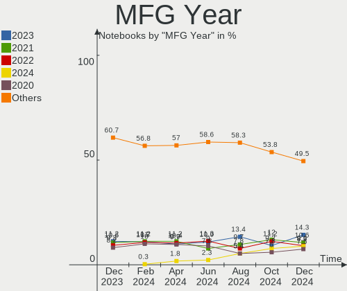
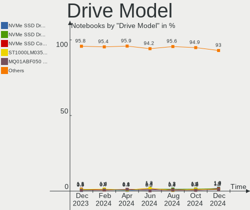
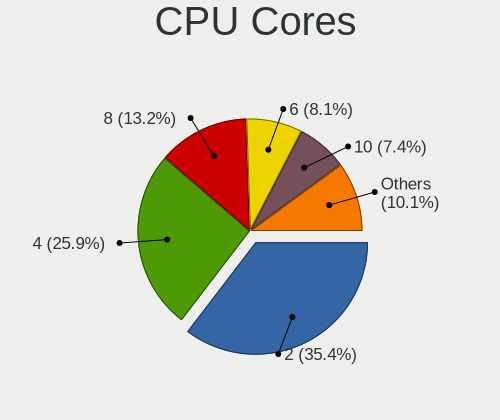
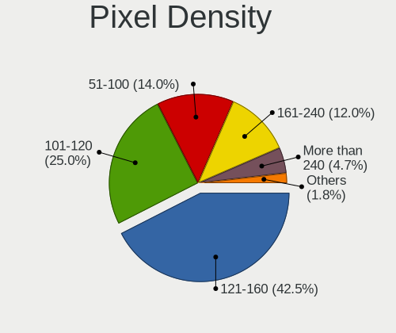
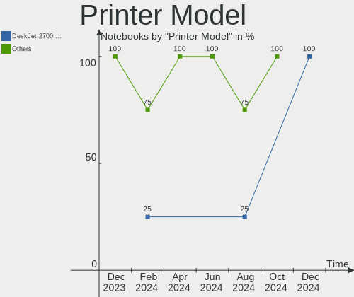

Ubuntu - Hardware Trends (Notebooks)
------------------------------------

A project to identify most popular hardware characteristics and track their change
over time based on data collected by Linux users at https://Linux-Hardware.org.

Anyone can contribute to this report by the [hw-probe](https://github.com/linuxhw/hw-probe) tool:

    sudo -E hw-probe -all -upload

This report is for one last month. Overall report since the beginning of time: [TestDays](https://github.com/linuxhw/TestDays)

Period: Dec, 2023.

Contents
--------

* [ System ](#system)
  - [ OS                       ](#os)
  - [ OS Family                ](#os-family)
  - [ Kernel                   ](#kernel)
  - [ Kernel Family            ](#kernel-family)
  - [ Kernel Major Ver.        ](#kernel-major-ver)
  - [ Arch                     ](#arch)
  - [ DE                       ](#de)
  - [ Display Server           ](#display-server)
  - [ Display Manager          ](#display-manager)
  - [ OS Lang                  ](#os-lang)
  - [ Boot Mode                ](#boot-mode)
  - [ Filesystem               ](#filesystem)
  - [ Part. scheme             ](#part-scheme)
  - [ Dual Boot with Linux/BSD ](#dual-boot-with-linuxbsd)
  - [ Dual Boot (Win)          ](#dual-boot-win)

* [ Board ](#board)
  - [ Vendor                   ](#vendor)
  - [ Model                    ](#model)
  - [ Model Family             ](#model-family)
  - [ MFG Year                 ](#mfg-year)
  - [ Form Factor              ](#form-factor)
  - [ Secure Boot              ](#secure-boot)
  - [ Coreboot                 ](#coreboot)
  - [ RAM Size                 ](#ram-size)
  - [ RAM Used                 ](#ram-used)
  - [ Total Drives             ](#total-drives)
  - [ Has CD-ROM               ](#has-cd-rom)
  - [ Has Ethernet             ](#has-ethernet)
  - [ Has WiFi                 ](#has-wifi)
  - [ Has Bluetooth            ](#has-bluetooth)

* [ Location ](#location)
  - [ Country                  ](#country)
  - [ City                     ](#city)

* [ Drives ](#drives)
  - [ Drive Vendor             ](#drive-vendor)
  - [ Drive Model              ](#drive-model)
  - [ HDD Vendor               ](#hdd-vendor)
  - [ SSD Vendor               ](#ssd-vendor)
  - [ Drive Kind               ](#drive-kind)
  - [ Drive Connector          ](#drive-connector)
  - [ Drive Size               ](#drive-size)
  - [ Space Total              ](#space-total)
  - [ Space Used               ](#space-used)
  - [ Malfunc. Drives          ](#malfunc-drives)
  - [ Malfunc. Drive Vendor    ](#malfunc-drive-vendor)
  - [ Malfunc. HDD Vendor      ](#malfunc-hdd-vendor)
  - [ Malfunc. Drive Kind      ](#malfunc-drive-kind)
  - [ Failed Drives            ](#failed-drives)
  - [ Failed Drive Vendor      ](#failed-drive-vendor)
  - [ Drive Status             ](#drive-status)

* [ Storage controller ](#storage-controller)
  - [ Storage Vendor           ](#storage-vendor)
  - [ Storage Model            ](#storage-model)
  - [ Storage Kind             ](#storage-kind)

* [ Processor ](#processor)
  - [ CPU Vendor               ](#cpu-vendor)
  - [ CPU Model                ](#cpu-model)
  - [ CPU Model Family         ](#cpu-model-family)
  - [ CPU Cores                ](#cpu-cores)
  - [ CPU Sockets              ](#cpu-sockets)
  - [ CPU Threads              ](#cpu-threads)
  - [ CPU Op-Modes             ](#cpu-op-modes)
  - [ CPU Microcode            ](#cpu-microcode)
  - [ CPU Microarch            ](#cpu-microarch)

* [ Graphics ](#graphics)
  - [ GPU Vendor               ](#gpu-vendor)
  - [ GPU Model                ](#gpu-model)
  - [ GPU Combo                ](#gpu-combo)
  - [ GPU Driver               ](#gpu-driver)
  - [ GPU Memory               ](#gpu-memory)

* [ Monitor ](#monitor)
  - [ Monitor Vendor           ](#monitor-vendor)
  - [ Monitor Model            ](#monitor-model)
  - [ Monitor Resolution       ](#monitor-resolution)
  - [ Monitor Diagonal         ](#monitor-diagonal)
  - [ Monitor Width            ](#monitor-width)
  - [ Aspect Ratio             ](#aspect-ratio)
  - [ Monitor Area             ](#monitor-area)
  - [ Pixel Density            ](#pixel-density)
  - [ Multiple Monitors        ](#multiple-monitors)

* [ Network ](#network)
  - [ Net Controller Vendor    ](#net-controller-vendor)
  - [ Net Controller Model     ](#net-controller-model)
  - [ Wireless Vendor          ](#wireless-vendor)
  - [ Wireless Model           ](#wireless-model)
  - [ Ethernet Vendor          ](#ethernet-vendor)
  - [ Ethernet Model           ](#ethernet-model)
  - [ Net Controller Kind      ](#net-controller-kind)
  - [ Used Controller          ](#used-controller)
  - [ NICs                     ](#nics)
  - [ IPv6                     ](#ipv6)

* [ Bluetooth ](#bluetooth)
  - [ Bluetooth Vendor         ](#bluetooth-vendor)
  - [ Bluetooth Model          ](#bluetooth-model)

* [ Sound ](#sound)
  - [ Sound Vendor             ](#sound-vendor)
  - [ Sound Model              ](#sound-model)

* [ Memory ](#memory)
  - [ Memory Vendor            ](#memory-vendor)
  - [ Memory Model             ](#memory-model)
  - [ Memory Kind              ](#memory-kind)
  - [ Memory Form Factor       ](#memory-form-factor)
  - [ Memory Size              ](#memory-size)
  - [ Memory Speed             ](#memory-speed)

* [ Printers & scanners ](#printers--scanners)
  - [ Printer Vendor           ](#printer-vendor)
  - [ Printer Model            ](#printer-model)
  - [ Scanner Vendor           ](#scanner-vendor)
  - [ Scanner Model            ](#scanner-model)

* [ Camera ](#camera)
  - [ Camera Vendor            ](#camera-vendor)
  - [ Camera Model             ](#camera-model)

* [ Security ](#security)
  - [ Fingerprint Vendor       ](#fingerprint-vendor)
  - [ Fingerprint Model        ](#fingerprint-model)
  - [ Chipcard Vendor          ](#chipcard-vendor)
  - [ Chipcard Model           ](#chipcard-model)

* [ Unsupported ](#unsupported)
  - [ Unsupported Devices      ](#unsupported-devices)
  - [ Unsupported Device Types ](#unsupported-device-types)

System
------

OS
--

Installed operating systems

| Name         | Notebooks | Percent |
|--------------|-----------|---------|
| Ubuntu 22.04 | 408       | 63.55%  |
| Ubuntu 23.10 | 143       | 22.27%  |
| Ubuntu 20.04 | 48        | 7.48%   |
| Ubuntu 23.04 | 24        | 3.74%   |
| Ubuntu 24.04 | 6         | 0.93%   |
| Ubuntu 18.04 | 6         | 0.93%   |
| Ubuntu 22.10 | 3         | 0.47%   |
| Ubuntu 21.10 | 2         | 0.31%   |
| Ubuntu 20.10 | 1         | 0.16%   |
| Ubuntu 17.10 | 1         | 0.16%   |

OS Family
---------

OS without a version

| Name   | Notebooks | Percent |
|--------|-----------|---------|
| Ubuntu | 642       | 100%    |

Kernel
------

Version of the Linux kernel

| Version                 | Notebooks | Percent |
|-------------------------|-----------|---------|
| 6.2.0-39-generic        | 180       | 28.04%  |
| 6.2.0-37-generic        | 143       | 22.27%  |
| 6.5.0-14-generic        | 97        | 15.11%  |
| 5.15.0-91-generic       | 43        | 6.7%    |
| 6.2.0-26-generic        | 27        | 4.21%   |
| 6.5.0-13-generic        | 26        | 4.05%   |
| 6.5.0-9-generic         | 23        | 3.58%   |
| 5.15.0-89-generic       | 14        | 2.18%   |
| 6.2.0-36-generic        | 6         | 0.93%   |
| 6.1.0-1027-oem          | 5         | 0.78%   |
| 6.5.0-14-lowlatency     | 3         | 0.47%   |
| 6.5.0-10-generic        | 3         | 0.47%   |
| 5.4.0-167-generic       | 3         | 0.47%   |
| 5.19.0-32-generic       | 3         | 0.47%   |
| 5.15.0-88-generic       | 3         | 0.47%   |
| 6.6.8-060608-generic    | 2         | 0.31%   |
| 6.2.0-35-generic        | 2         | 0.31%   |
| 6.2.0-34-generic        | 2         | 0.31%   |
| 6.2.0-32-generic        | 2         | 0.31%   |
| 6.2.0-20-generic        | 2         | 0.31%   |
| 5.4.0-84-generic        | 2         | 0.31%   |
| 5.4.0-150-generic       | 2         | 0.31%   |
| 5.19.0-29-generic       | 2         | 0.31%   |
| 5.15.0-87-generic       | 2         | 0.31%   |
| 5.15.0-67-generic       | 2         | 0.31%   |
| 5.15.0-43-generic       | 2         | 0.31%   |
| 5.15.0-25-generic       | 2         | 0.31%   |
| 5.14.0-1054-oem         | 2         | 0.31%   |
| 5.13.0-19-generic       | 2         | 0.31%   |
| 4.15.0-213-generic      | 2         | 0.31%   |
| 6.7.0-060700rc5-generic | 1         | 0.16%   |
| 6.6.8-t2-mantic         | 1         | 0.16%   |
| 6.6.6-060606-generic    | 1         | 0.16%   |
| 6.6.4-zabbly+           | 1         | 0.16%   |
| 6.6.4-tkg-eevdf         | 1         | 0.16%   |
| 6.6.4-060604-generic    | 1         | 0.16%   |
| 6.6.3-060603-generic    | 1         | 0.16%   |
| 6.6.1-060601-generic    | 1         | 0.16%   |
| 6.5.11                  | 1         | 0.16%   |
| 6.5.0-1009-oem          | 1         | 0.16%   |

Kernel Family
-------------

Linux kernel without a distro release

| Version | Notebooks | Percent |
|---------|-----------|---------|
| 6.2.0   | 367       | 57.17%  |
| 6.5.0   | 154       | 23.99%  |
| 5.15.0  | 72        | 11.21%  |
| 5.4.0   | 11        | 1.71%   |
| 5.19.0  | 9         | 1.4%    |
| 6.1.0   | 6         | 0.93%   |
| 6.6.8   | 3         | 0.47%   |
| 6.6.4   | 3         | 0.47%   |
| 5.8.0   | 3         | 0.47%   |
| 5.14.0  | 2         | 0.31%   |
| 5.13.0  | 2         | 0.31%   |
| 4.15.0  | 2         | 0.31%   |
| 6.7.0   | 1         | 0.16%   |
| 6.6.6   | 1         | 0.16%   |
| 6.6.3   | 1         | 0.16%   |
| 6.6.1   | 1         | 0.16%   |
| 6.5.11  | 1         | 0.16%   |
| 6.4.6   | 1         | 0.16%   |
| 6.4.0   | 1         | 0.16%   |
| 4.13.0  | 1         | 0.16%   |

Kernel Major Ver.
-----------------

Linux kernel major version

| Version | Notebooks | Percent |
|---------|-----------|---------|
| 6.2     | 367       | 57.17%  |
| 6.5     | 155       | 24.14%  |
| 5.15    | 72        | 11.21%  |
| 5.4     | 11        | 1.71%   |
| 6.6     | 9         | 1.4%    |
| 5.19    | 9         | 1.4%    |
| 6.1     | 6         | 0.93%   |
| 5.8     | 3         | 0.47%   |
| 6.4     | 2         | 0.31%   |
| 5.14    | 2         | 0.31%   |
| 5.13    | 2         | 0.31%   |
| 4.15    | 2         | 0.31%   |
| 6.7     | 1         | 0.16%   |
| 4.13    | 1         | 0.16%   |

Arch
----

OS architecture (x86_64, i586, etc.)

| Name   | Notebooks | Percent |
|--------|-----------|---------|
| x86_64 | 641       | 99.84%  |
| i686   | 1         | 0.16%   |

DE
--

Desktop Environment

| Name            | Notebooks | Percent |
|-----------------|-----------|---------|
| GNOME           | 619       | 96.42%  |
| Unknown         | 14        | 2.18%   |
| Enlightenment   | 3         | 0.47%   |
| X-Cinnamon      | 2         | 0.31%   |
| GNOME Flashback | 2         | 0.31%   |
| Lubuntu         | 1         | 0.16%   |
| Cinnamon        | 1         | 0.16%   |

Display Server
--------------

X11 or Wayland

| Name    | Notebooks | Percent |
|---------|-----------|---------|
| Wayland | 413       | 64.33%  |
| X11     | 207       | 32.24%  |
| Unknown | 17        | 2.65%   |
| Tty     | 5         | 0.78%   |

Display Manager
---------------

SDDM, LightDM, etc.

| Name    | Notebooks | Percent |
|---------|-----------|---------|
| GDM3    | 564       | 87.85%  |
| Unknown | 44        | 6.85%   |
| GDM     | 22        | 3.43%   |
| LightDM | 11        | 1.71%   |
| SDDM    | 1         | 0.16%   |

OS Lang
-------

Language

| Lang    | Notebooks | Percent |
|---------|-----------|---------|
| en_US   | 305       | 47.51%  |
| de_DE   | 72        | 11.21%  |
| fr_FR   | 41        | 6.39%   |
| es_ES   | 26        | 4.05%   |
| pt_BR   | 23        | 3.58%   |
| ru_RU   | 18        | 2.8%    |
| it_IT   | 18        | 2.8%    |
| en_GB   | 18        | 2.8%    |
| en_IN   | 17        | 2.65%   |
| C       | 12        | 1.87%   |
| en_CA   | 9         | 1.4%    |
| pl_PL   | 7         | 1.09%   |
| Unknown | 6         | 0.93%   |
| tr_TR   | 5         | 0.78%   |
| nl_NL   | 5         | 0.78%   |
| es_MX   | 5         | 0.78%   |
| en_IL   | 4         | 0.62%   |
| en_AU   | 4         | 0.62%   |
| zh_CN   | 3         | 0.47%   |
| sv_SE   | 3         | 0.47%   |
| pt_PT   | 3         | 0.47%   |
| nb_NO   | 3         | 0.47%   |
| fi_FI   | 3         | 0.47%   |
| es_AR   | 3         | 0.47%   |
| en_PH   | 3         | 0.47%   |
| el_GR   | 3         | 0.47%   |
| cs_CZ   | 3         | 0.47%   |
| es_UY   | 2         | 0.31%   |
| es_CO   | 2         | 0.31%   |
| de_AT   | 2         | 0.31%   |
| sv_FI   | 1         | 0.16%   |
| sk_SK   | 1         | 0.16%   |
| ru_UA   | 1         | 0.16%   |
| ro_RO   | 1         | 0.16%   |
| ko_KR   | 1         | 0.16%   |
| ja_JP   | 1         | 0.16%   |
| hu_HU   | 1         | 0.16%   |
| fr_CA   | 1         | 0.16%   |
| fr_BE   | 1         | 0.16%   |
| et_EE   | 1         | 0.16%   |

Boot Mode
---------

EFI or BIOS

| Mode | Notebooks | Percent |
|------|-----------|---------|
| BIOS | 358       | 55.76%  |
| EFI  | 284       | 44.24%  |

Filesystem
----------

Type of filesystem

| Type    | Notebooks | Percent |
|---------|-----------|---------|
| Tmpfs   | 346       | 53.89%  |
| Ext4    | 269       | 41.9%   |
| Overlay | 18        | 2.8%    |
| Zfs     | 5         | 0.78%   |
| Btrfs   | 4         | 0.62%   |

Part. scheme
------------

Scheme of partitioning

| Type    | Notebooks | Percent |
|---------|-----------|---------|
| GPT     | 555       | 86.45%  |
| MBR     | 50        | 7.79%   |
| Unknown | 37        | 5.76%   |

Dual Boot with Linux/BSD
------------------------

Hosting more than one Linux/BSD

| Dual boot | Notebooks | Percent |
|-----------|-----------|---------|
| No        | 582       | 90.65%  |
| Yes       | 60        | 9.35%   |

Dual Boot (Win)
---------------

Hosting Linux and Windows

| Dual boot | Notebooks | Percent |
|-----------|-----------|---------|
| No        | 439       | 68.38%  |
| Yes       | 203       | 31.62%  |

Board
-----

Vendor
------

Motherboard manufacturer

| Name                | Notebooks | Percent |
|---------------------|-----------|---------|
| Lenovo              | 125       | 19.47%  |
| Hewlett-Packard     | 109       | 16.98%  |
| Dell                | 104       | 16.2%   |
| ASUSTek Computer    | 75        | 11.68%  |
| Acer                | 62        | 9.66%   |
| Apple               | 21        | 3.27%   |
| MSI                 | 17        | 2.65%   |
| HUAWEI              | 14        | 2.18%   |
| Toshiba             | 11        | 1.71%   |
| Fujitsu             | 10        | 1.56%   |
| Unknown             | 10        | 1.56%   |
| Google              | 9         | 1.4%    |
| Sony                | 7         | 1.09%   |
| Medion              | 6         | 0.93%   |
| Samsung Electronics | 5         | 0.78%   |
| Framework           | 5         | 0.78%   |
| Panasonic           | 3         | 0.47%   |
| LG Electronics      | 3         | 0.47%   |
| XIAOMI              | 2         | 0.31%   |
| Valve               | 2         | 0.31%   |
| Timi                | 2         | 0.31%   |
| Positivo            | 2         | 0.31%   |
| Notebook            | 2         | 0.31%   |
| Monster             | 2         | 0.31%   |
| Infinix             | 2         | 0.31%   |
| Chuwi               | 2         | 0.31%   |
| Allview             | 2         | 0.31%   |
| Alienware           | 2         | 0.31%   |
| Wortmann AG         | 1         | 0.16%   |
| win element         | 1         | 0.16%   |
| VALE                | 1         | 0.16%   |
| UNOWHY              | 1         | 0.16%   |
| TUXEDO              | 1         | 0.16%   |
| System76            | 1         | 0.16%   |
| STONE COMPUTERS     | 1         | 0.16%   |
| SK hynix            | 1         | 0.16%   |
| Semp Toshiba        | 1         | 0.16%   |
| SDZ                 | 1         | 0.16%   |
| ROMBICA             | 1         | 0.16%   |
| realme              | 1         | 0.16%   |

Model
-----

Motherboard model

| Name                                       | Notebooks | Percent |
|--------------------------------------------|-----------|---------|
| Unknown                                    | 13        | 2.02%   |
| HUAWEI BoDE-WXX9                           | 4         | 0.62%   |
| HP Pavilion 15                             | 4         | 0.62%   |
| HP Notebook                                | 4         | 0.62%   |
| HP Laptop 15-fc0xxx                        | 4         | 0.62%   |
| HP EliteBook 840 G6                        | 4         | 0.62%   |
| Framework Laptop 13 (AMD Ryzen 7040Series) | 4         | 0.62%   |
| Lenovo G50-45 80E3                         | 3         | 0.47%   |
| HP Pavilion dv7                            | 3         | 0.47%   |
| HP Pavilion 17                             | 3         | 0.47%   |
| HP EliteBook 840 G3                        | 3         | 0.47%   |
| Dell XPS 13 9380                           | 3         | 0.47%   |
| Dell Vostro 3550                           | 3         | 0.47%   |
| Dell Latitude 3520                         | 3         | 0.47%   |
| ASUS Zenbook UM3402YAR_UM3402YA            | 3         | 0.47%   |
| ASUS Zenbook 15 UM3504DA_UM3504DA          | 3         | 0.47%   |
| Apple MacBookPro9,2                        | 3         | 0.47%   |
| Apple MacBookAir6,2                        | 3         | 0.47%   |
| Acer Nitro AN515-57                        | 3         | 0.47%   |
| XIAOMI Redmi Book Pro 15 2023              | 2         | 0.31%   |
| Lenovo Yoga 2 Pro 20266                    | 2         | 0.31%   |
| Lenovo ThinkPad E16 Gen 1 21JNCTO1WW       | 2         | 0.31%   |
| Lenovo ThinkPad E15 20RD002RUS             | 2         | 0.31%   |
| Lenovo IdeaPad S145-15AST 81N3             | 2         | 0.31%   |
| Lenovo IdeaPad 100-15IBD 80QQ              | 2         | 0.31%   |
| Lenovo IdeaPad 1 14IGL7 82V6               | 2         | 0.31%   |
| Lenovo G500 20236                          | 2         | 0.31%   |
| HP Pavilion Notebook                       | 2         | 0.31%   |
| HP Pavilion dv6                            | 2         | 0.31%   |
| HP Laptop 17-bs1xx                         | 2         | 0.31%   |
| HP Laptop 15-bw0xx                         | 2         | 0.31%   |
| HP EliteBook 8460p                         | 2         | 0.31%   |
| HP EliteBook 845 G8 Notebook PC            | 2         | 0.31%   |
| HP 250 G8 Notebook PC                      | 2         | 0.31%   |
| HP 2000                                    | 2         | 0.31%   |
| Fujitsu LIFEBOOK A357                      | 2         | 0.31%   |
| Dell XPS 15 9520                           | 2         | 0.31%   |
| Dell XPS 15 9500                           | 2         | 0.31%   |
| Dell XPS 13 9370                           | 2         | 0.31%   |
| Dell Vostro 3580                           | 2         | 0.31%   |

Model Family
------------

Motherboard model prefix

| Name               | Notebooks | Percent |
|--------------------|-----------|---------|
| Lenovo ThinkPad    | 63        | 9.81%   |
| Acer Aspire        | 40        | 6.23%   |
| Dell Latitude      | 38        | 5.92%   |
| Lenovo IdeaPad     | 32        | 4.98%   |
| Dell Inspiron      | 27        | 4.21%   |
| ASUS VivoBook      | 27        | 4.21%   |
| HP Pavilion        | 25        | 3.89%   |
| HP EliteBook       | 23        | 3.58%   |
| HP Laptop          | 19        | 2.96%   |
| Dell XPS           | 15        | 2.34%   |
| Unknown            | 13        | 2.02%   |
| Acer Nitro         | 12        | 1.87%   |
| HP ProBook         | 11        | 1.71%   |
| ASUS Zenbook       | 11        | 1.71%   |
| Toshiba Satellite  | 10        | 1.56%   |
| Fujitsu LIFEBOOK   | 10        | 1.56%   |
| Dell Precision     | 10        | 1.56%   |
| Dell Vostro        | 7         | 1.09%   |
| Lenovo ThinkBook   | 6         | 0.93%   |
| HP ZBook           | 6         | 0.93%   |
| ASUS ROG           | 6         | 0.93%   |
| ASUS ASUS          | 6         | 0.93%   |
| Acer Swift         | 6         | 0.93%   |
| Lenovo Legion      | 5         | 0.78%   |
| Framework Laptop   | 5         | 0.78%   |
| Lenovo Yoga        | 4         | 0.62%   |
| HUAWEI BoDE-WXX9   | 4         | 0.62%   |
| HP Notebook        | 4         | 0.62%   |
| HP 250             | 4         | 0.62%   |
| Apple MacBookPro9  | 4         | 0.62%   |
| Lenovo G50-45      | 3         | 0.47%   |
| HP 255             | 3         | 0.47%   |
| Apple MacBookPro11 | 3         | 0.47%   |
| Apple MacBookPro10 | 3         | 0.47%   |
| Apple MacBookAir6  | 3         | 0.47%   |
| XIAOMI Redmi       | 2         | 0.31%   |
| MSI PS63           | 2         | 0.31%   |
| MSI Katana         | 2         | 0.31%   |
| MSI GE72           | 2         | 0.31%   |
| Monster TULPAR     | 2         | 0.31%   |

MFG Year
--------

Motherboard manufacture year

| Year | Notebooks | Percent |
|------|-----------|---------|
| 2023 | 75        | 11.68%  |
| 2021 | 66        | 10.28%  |
| 2022 | 59        | 9.19%   |
| 2020 | 53        | 8.26%   |
| 2018 | 48        | 7.48%   |
| 2013 | 44        | 6.85%   |
| 2012 | 42        | 6.54%   |
| 2019 | 41        | 6.39%   |
| 2015 | 35        | 5.45%   |
| 2017 | 34        | 5.3%    |
| 2011 | 33        | 5.14%   |
| 2016 | 32        | 4.98%   |
| 2014 | 23        | 3.58%   |
| 2010 | 20        | 3.12%   |
| 2008 | 16        | 2.49%   |
| 2009 | 11        | 1.71%   |
| 2007 | 8         | 1.25%   |
| 2006 | 2         | 0.31%   |

Form Factor
-----------

Physical design of the computer

| Name     | Notebooks | Percent |
|----------|-----------|---------|
| Notebook | 642       | 100%    |

Secure Boot
-----------

Enabled or disabled

| State    | Notebooks | Percent |
|----------|-----------|---------|
| Disabled | 560       | 87.23%  |
| Enabled  | 82        | 12.77%  |

Coreboot
--------

Have coreboot on board

| Used | Notebooks | Percent |
|------|-----------|---------|
| No   | 632       | 98.44%  |
| Yes  | 10        | 1.56%   |

RAM Size
--------

Total RAM memory

| Size in GB  | Notebooks | Percent |
|-------------|-----------|---------|
| 4.01-8.0    | 214       | 33.33%  |
| 16.01-24.0  | 124       | 19.31%  |
| 8.01-16.0   | 105       | 16.36%  |
| 3.01-4.0    | 97        | 15.11%  |
| 32.01-64.0  | 64        | 9.97%   |
| 24.01-32.0  | 14        | 2.18%   |
| 64.01-256.0 | 11        | 1.71%   |
| 1.01-2.0    | 9         | 1.4%    |
| 2.01-3.0    | 4         | 0.62%   |

RAM Used
--------

Used RAM memory

| Used GB    | Notebooks | Percent |
|------------|-----------|---------|
| 2.01-3.0   | 197       | 30.69%  |
| 1.01-2.0   | 173       | 26.95%  |
| 4.01-8.0   | 124       | 19.31%  |
| 3.01-4.0   | 107       | 16.67%  |
| 8.01-16.0  | 33        | 5.14%   |
| 0.51-1.0   | 4         | 0.62%   |
| 16.01-24.0 | 2         | 0.31%   |
| 32.01-64.0 | 1         | 0.16%   |
| 0.01-0.5   | 1         | 0.16%   |

Total Drives
------------

Number of drives on board

| Drives | Notebooks | Percent |
|--------|-----------|---------|
| 1      | 488       | 76.01%  |
| 2      | 133       | 20.72%  |
| 3      | 13        | 2.02%   |
| 4      | 5         | 0.78%   |
| 0      | 3         | 0.47%   |

Has CD-ROM
----------

Has CD-ROM on board

| Presented | Notebooks | Percent |
|-----------|-----------|---------|
| No        | 455       | 70.87%  |
| Yes       | 187       | 29.13%  |

Has Ethernet
------------

Has Ethernet on board

| Presented | Notebooks | Percent |
|-----------|-----------|---------|
| Yes       | 488       | 76.01%  |
| No        | 154       | 23.99%  |

Has WiFi
--------

Has WiFi module

| Presented | Notebooks | Percent |
|-----------|-----------|---------|
| Yes       | 632       | 98.44%  |
| No        | 10        | 1.56%   |

Has Bluetooth
-------------

Has Bluetooth module

| Presented | Notebooks | Percent |
|-----------|-----------|---------|
| Yes       | 535       | 83.33%  |
| No        | 107       | 16.67%  |

Location
--------

Country
-------

Geographic location (country)

| Country         | Notebooks | Percent |
|-----------------|-----------|---------|
| USA             | 110       | 17.13%  |
| Germany         | 93        | 14.49%  |
| France          | 47        | 7.32%   |
| Brazil          | 33        | 5.14%   |
| Spain           | 30        | 4.67%   |
| Italy           | 29        | 4.52%   |
| India           | 26        | 4.05%   |
| Russia          | 24        | 3.74%   |
| Canada          | 19        | 2.96%   |
| UK              | 14        | 2.18%   |
| Poland          | 12        | 1.87%   |
| Netherlands     | 12        | 1.87%   |
| Norway          | 11        | 1.71%   |
| Turkey          | 10        | 1.56%   |
| Mexico          | 10        | 1.56%   |
| China           | 9         | 1.4%    |
| Switzerland     | 8         | 1.25%   |
| Romania         | 8         | 1.25%   |
| Czechia         | 8         | 1.25%   |
| Greece          | 7         | 1.09%   |
| Finland         | 7         | 1.09%   |
| Portugal        | 6         | 0.93%   |
| Austria         | 6         | 0.93%   |
| Australia       | 6         | 0.93%   |
| Philippines     | 5         | 0.78%   |
| Argentina       | 5         | 0.78%   |
| Sweden          | 4         | 0.62%   |
| Slovakia        | 4         | 0.62%   |
| Pakistan        | 4         | 0.62%   |
| Israel          | 4         | 0.62%   |
| Hungary         | 4         | 0.62%   |
| Belgium         | 4         | 0.62%   |
| Uruguay         | 3         | 0.47%   |
| Iran            | 3         | 0.47%   |
| Colombia        | 3         | 0.47%   |
| Bulgaria        | 3         | 0.47%   |
| Bangladesh      | 3         | 0.47%   |
| The Netherlands | 2         | 0.31%   |
| Thailand        | 2         | 0.31%   |
| Taiwan          | 2         | 0.31%   |

City
----

Geographic location (city)

| City           | Notebooks | Percent |
|----------------|-----------|---------|
| Moscow         | 12        | 1.87%   |
| Milan          | 9         | 1.4%    |
| Munich         | 8         | 1.25%   |
| Berlin         | 8         | 1.25%   |
| Paris          | 7         | 1.09%   |
| Los Angeles    | 7         | 1.09%   |
| Prague         | 6         | 0.93%   |
| Helsinki       | 6         | 0.93%   |
| Oslo           | 5         | 0.78%   |
| Istanbul       | 5         | 0.78%   |
| Barcelona      | 5         | 0.78%   |
| Sao Paulo      | 4         | 0.62%   |
| Montreal       | 4         | 0.62%   |
| Mannheim       | 4         | 0.62%   |
| Hamburg        | 4         | 0.62%   |
| Delhi          | 4         | 0.62%   |
| Athens         | 4         | 0.62%   |
| Warsaw         | 3         | 0.47%   |
| Vienna         | 3         | 0.47%   |
| Toronto        | 3         | 0.47%   |
| Sofia          | 3         | 0.47%   |
| Rio de Janeiro | 3         | 0.47%   |
| Philadelphia   | 3         | 0.47%   |
| Montevideo     | 3         | 0.47%   |
| Milano         | 3         | 0.47%   |
| Madrid         | 3         | 0.47%   |
| Le Haillan     | 3         | 0.47%   |
| Hyderabad      | 3         | 0.47%   |
| Cologne        | 3         | 0.47%   |
| Chicago        | 3         | 0.47%   |
| Chennai        | 3         | 0.47%   |
| Bengaluru      | 3         | 0.47%   |
| Amsterdam      | 3         | 0.47%   |
| Yerevan        | 2         | 0.31%   |
| Weil am Rhein  | 2         | 0.31%   |
| Versailles     | 2         | 0.31%   |
| Valenciennes   | 2         | 0.31%   |
| Valencia       | 2         | 0.31%   |
| Tel Aviv       | 2         | 0.31%   |
| Tegucigalpa    | 2         | 0.31%   |

Drives
------

Drive Vendor
------------

Hard drive vendors

| Vendor                       | Notebooks | Drives | Percent |
|------------------------------|-----------|--------|---------|
| Samsung Electronics          | 116       | 130    | 15.01%  |
| Seagate                      | 58        | 61     | 7.5%    |
| WDC                          | 56        | 59     | 7.24%   |
| Sandisk                      | 51        | 52     | 6.6%    |
| Unknown                      | 44        | 45     | 5.69%   |
| Toshiba                      | 44        | 44     | 5.69%   |
| SK hynix                     | 39        | 40     | 5.05%   |
| Intel                        | 39        | 42     | 5.05%   |
| Micron Technology            | 37        | 37     | 4.79%   |
| Kingston                     | 36        | 37     | 4.66%   |
| Crucial                      | 27        | 28     | 3.49%   |
| Apple                        | 19        | 20     | 2.46%   |
| HGST                         | 18        | 18     | 2.33%   |
| KIOXIA                       | 13        | 13     | 1.68%   |
| Hitachi                      | 12        | 12     | 1.55%   |
| Silicon Motion               | 10        | 10     | 1.29%   |
| A-DATA Technology            | 10        | 10     | 1.29%   |
| Transcend                    | 8         | 8      | 1.03%   |
| Micron/Crucial Technology    | 7         | 7      | 0.91%   |
| Intenso                      | 7         | 7      | 0.91%   |
| China                        | 7         | 8      | 0.91%   |
| Netac                        | 6         | 7      | 0.78%   |
| ADATA Technology             | 6         | 6      | 0.78%   |
| Unknown                      | 6         | 6      | 0.78%   |
| Phison Electronics           | 5         | 5      | 0.65%   |
| Shenzhen Longsys Electronics | 4         | 4      | 0.52%   |
| PNY                          | 4         | 4      | 0.52%   |
| MAXIO Technology (Hangzhou)  | 4         | 4      | 0.52%   |
| LITEON                       | 3         | 3      | 0.39%   |
| Lexar                        | 3         | 3      | 0.39%   |
| Kingston Technology Company  | 3         | 3      | 0.39%   |
| JMicron Technology           | 3         | 3      | 0.39%   |
| Wibtek                       | 2         | 2      | 0.26%   |
| USB3.0                       | 2         | 2      | 0.26%   |
| Union Memory                 | 2         | 2      | 0.26%   |
| TOPMORE                      | 2         | 2      | 0.26%   |
| Team                         | 2         | 2      | 0.26%   |
| SPCC                         | 2         | 2      | 0.26%   |
| Realtek Semiconductor        | 2         | 2      | 0.26%   |
| Phison                       | 2         | 2      | 0.26%   |

Drive Model
-----------

Hard drive models

| Model                                                 | Notebooks | Percent |
|-------------------------------------------------------|-----------|---------|
| Samsung NVMe SSD Controller PM9A1/PM9A3/980PRO 2TB    | 10        | 1.26%   |
| Toshiba MQ01ABD100 1TB                                | 9         | 1.13%   |
| Seagate ST1000LM035-1RK172 1TB                        | 9         | 1.13%   |
| Samsung NVMe SSD Controller SM981/PM981/PM983 512GB   | 9         | 1.13%   |
| Unknown MMC Card  32GB                                | 8         | 1.01%   |
| Sandisk WD Blue SN550 NVMe SSD 1TB                    | 8         | 1.01%   |
| Unknown MMC Card  64GB                                | 7         | 0.88%   |
| Unknown MMC Card  128GB                               | 7         | 0.88%   |
| SanDisk NVMe SSD Drive 1TB                            | 6         | 0.75%   |
| Kingston SA400S37480G 480GB SSD                       | 6         | 0.75%   |
| HGST HTS721010A9E630 1TB                              | 6         | 0.75%   |
| Unknown                                               | 6         | 0.75%   |
| Toshiba MQ01ABF050 500GB                              | 5         | 0.63%   |
| Seagate ST500LT012-1DG142 500GB                       | 5         | 0.63%   |
| KIOXIA KBG40ZNS512G NVMe 512GB                        | 5         | 0.63%   |
| Crucial CT1000MX500SSD1 1TB                           | 5         | 0.63%   |
| Unknown NVMe SSD Drive 512GB                          | 4         | 0.5%    |
| Unknown MMC Card  16GB                                | 4         | 0.5%    |
| Toshiba MQ04ABF100 1TB                                | 4         | 0.5%    |
| Seagate ST1000LM024 HN-M101MBB 1TB                    | 4         | 0.5%    |
| Sandisk WD Blue SN500 / PC SN520 NVMe SSD 128GB       | 4         | 0.5%    |
| SanDisk NVMe SSD Drive 512GB                          | 4         | 0.5%    |
| Samsung NVMe SSD Controller SM961/PM961/SM963 250GB   | 4         | 0.5%    |
| Micron/Crucial P2 NVMe PCIe SSD 4TB                   | 4         | 0.5%    |
| Micron 2400_MTFDKBA1T0QFM 1024GB                      | 4         | 0.5%    |
| Intel SSDPEKNU512GZ 512GB                             | 4         | 0.5%    |
| Intel SSDPEKNU010TZ 1024GB                            | 4         | 0.5%    |
| Intel SSD 660P Series 1TB                             | 4         | 0.5%    |
| WDC WD5000LPCX-24VHAT0 500GB                          | 3         | 0.38%   |
| Unknown SD/MMC/MS PRO 512GB                           | 3         | 0.38%   |
| Silicon Motion SM2263EN/SM2263XT SSD Controller 500GB | 3         | 0.38%   |
| Seagate ST9500325AS 500GB                             | 3         | 0.38%   |
| Seagate ST1000LM049-2GH172 1TB                        | 3         | 0.38%   |
| Seagate ST1000LM014-1EJ164 1TB                        | 3         | 0.38%   |
| Samsung SSD 990 PRO 2TB                               | 3         | 0.38%   |
| Samsung SSD 870 EVO 2TB                               | 3         | 0.38%   |
| Samsung SSD 860 EVO 500GB                             | 3         | 0.38%   |
| Samsung SSD 850 PRO 512GB                             | 3         | 0.38%   |
| Samsung MZVLQ512HALU-000H1 512GB                      | 3         | 0.38%   |
| Samsung MZVL4512HBLU-00BTW 512GB                      | 3         | 0.38%   |

HDD Vendor
----------

Hard disk drive vendors

| Vendor              | Notebooks | Drives | Percent |
|---------------------|-----------|--------|---------|
| Seagate             | 57        | 59     | 32.76%  |
| WDC                 | 37        | 38     | 21.26%  |
| Toshiba             | 32        | 32     | 18.39%  |
| HGST                | 18        | 18     | 10.34%  |
| Hitachi             | 12        | 12     | 6.9%    |
| Samsung Electronics | 4         | 4      | 2.3%    |
| Apple               | 4         | 4      | 2.3%    |
| Unknown             | 3         | 3      | 1.72%   |
| USB3.0              | 2         | 2      | 1.15%   |
| Intenso             | 2         | 2      | 1.15%   |
| Fujitsu             | 2         | 2      | 1.15%   |
| SABRENT             | 1         | 1      | 0.57%   |

SSD Vendor
----------

Solid state drive vendors

| Vendor              | Notebooks | Drives | Percent |
|---------------------|-----------|--------|---------|
| Samsung Electronics | 48        | 50     | 20.43%  |
| Kingston            | 29        | 30     | 12.34%  |
| Crucial             | 24        | 25     | 10.21%  |
| SanDisk             | 15        | 15     | 6.38%   |
| WDC                 | 11        | 11     | 4.68%   |
| Intel               | 9         | 9      | 3.83%   |
| Apple               | 9         | 9      | 3.83%   |
| Transcend           | 7         | 7      | 2.98%   |
| Micron Technology   | 7         | 7      | 2.98%   |
| China               | 7         | 8      | 2.98%   |
| A-DATA Technology   | 7         | 7      | 2.98%   |
| Netac               | 6         | 6      | 2.55%   |
| PNY                 | 4         | 4      | 1.7%    |
| Intenso             | 4         | 4      | 1.7%    |
| LITEON              | 3         | 3      | 1.28%   |
| Wibtek              | 2         | 2      | 0.85%   |
| Toshiba             | 2         | 2      | 0.85%   |
| SPCC                | 2         | 2      | 0.85%   |
| SK hynix            | 2         | 2      | 0.85%   |
| Patriot             | 2         | 2      | 0.85%   |
| LITEONIT            | 2         | 2      | 0.85%   |
| Lexar               | 2         | 2      | 0.85%   |
| Indilinx            | 2         | 2      | 0.85%   |
| Dogfish             | 2         | 2      | 0.85%   |
| VISIPRO             | 1         | 1      | 0.43%   |
| VICKTER             | 1         | 1      | 0.43%   |
| Teclast             | 1         | 1      | 0.43%   |
| Team                | 1         | 1      | 0.43%   |
| ShiJi               | 1         | 1      | 0.43%   |
| Seagate             | 1         | 1      | 0.43%   |
| SC550               | 1         | 1      | 0.43%   |
| Phison              | 1         | 1      | 0.43%   |
| OCZ                 | 1         | 1      | 0.43%   |
| Neo Forza           | 1         | 1      | 0.43%   |
| MMY                 | 1         | 1      | 0.43%   |
| KingSpec            | 1         | 1      | 0.43%   |
| Kingchuxing         | 1         | 1      | 0.43%   |
| JMicron Technology  | 1         | 1      | 0.43%   |
| Inland              | 1         | 1      | 0.43%   |
| HS-SSD-C160         | 1         | 1      | 0.43%   |

Drive Kind
----------

HDD or SSD

| Kind    | Notebooks | Drives | Percent |
|---------|-----------|--------|---------|
| NVMe    | 302       | 330    | 40.65%  |
| SSD     | 222       | 240    | 29.88%  |
| HDD     | 165       | 177    | 22.21%  |
| MMC     | 38        | 39     | 5.11%   |
| Unknown | 16        | 18     | 2.15%   |

Drive Connector
---------------

SATA, SAS, NVMe, etc.

| Type | Notebooks | Drives | Percent |
|------|-----------|--------|---------|
| SATA | 355       | 401    | 49.31%  |
| NVMe | 302       | 330    | 41.94%  |
| MMC  | 38        | 39     | 5.28%   |
| SAS  | 25        | 34     | 3.47%   |

Drive Size
----------

Size of hard drive

| Size in TB | Notebooks | Drives | Percent |
|------------|-----------|--------|---------|
| 0.01-0.5   | 250       | 269    | 63.45%  |
| 0.51-1.0   | 118       | 122    | 29.95%  |
| 1.01-2.0   | 23        | 23     | 5.84%   |
| 3.01-4.0   | 3         | 3      | 0.76%   |

Space Total
-----------

Amount of disk space available on the file system

| Size in GB     | Notebooks | Percent |
|----------------|-----------|---------|
| 251-500        | 190       | 29.6%   |
| 101-250        | 188       | 29.28%  |
| 501-1000       | 109       | 16.98%  |
| 1001-2000      | 42        | 6.54%   |
| 1-20           | 39        | 6.07%   |
| 51-100         | 36        | 5.61%   |
| 21-50          | 18        | 2.8%    |
| More than 3000 | 7         | 1.09%   |
| Unknown        | 7         | 1.09%   |
| 2001-3000      | 6         | 0.93%   |

Space Used
----------

Amount of used disk space

| Used GB   | Notebooks | Percent |
|-----------|-----------|---------|
| 1-20      | 205       | 31.93%  |
| 21-50     | 155       | 24.14%  |
| 101-250   | 113       | 17.6%   |
| 51-100    | 90        | 14.02%  |
| 251-500   | 44        | 6.85%   |
| 501-1000  | 20        | 3.12%   |
| Unknown   | 7         | 1.09%   |
| 1001-2000 | 6         | 0.93%   |
| 2001-3000 | 2         | 0.31%   |

Malfunc. Drives
---------------

Drive models with a malfunction

| Model                                               | Notebooks | Drives | Percent |
|-----------------------------------------------------|-----------|--------|---------|
| SK hynix BC511 HFM512GDJTNI-82A0A 512GB             | 2         | 2      | 9.52%   |
| WDC WDS240G2G0B-00EPW0 240GB SSD                    | 1         | 1      | 4.76%   |
| WDC WD5000LPCX-75VHAT0 500GB                        | 1         | 1      | 4.76%   |
| WDC WD5000BPKT-75PK4T0 500GB                        | 1         | 1      | 4.76%   |
| WDC WD2500BEVT-75A23T0 250GB                        | 1         | 1      | 4.76%   |
| Transcend TS1TMTE220S 1TB                           | 1         | 1      | 4.76%   |
| Toshiba THNSN5512GPUK NVMe 512GB                    | 1         | 1      | 4.76%   |
| Toshiba MQ01ACF050 500GB                            | 1         | 1      | 4.76%   |
| Toshiba MQ01ABF050 500GB                            | 1         | 1      | 4.76%   |
| SK hynix PC711 HFS001TDE9X073N 1024GB               | 1         | 1      | 4.76%   |
| Seagate ST1000LM024 HN-M101MBB 1TB                  | 1         | 1      | 4.76%   |
| Micron Technology MTFDDAV256TDL-1AW1ZABHA 256GB SSD | 1         | 1      | 4.76%   |
| Kingston SV300S37A240G 240GB SSD                    | 1         | 1      | 4.76%   |
| Kingston SUV400S37240G 240GB SSD                    | 1         | 1      | 4.76%   |
| Kingston SA400S37960G 960GB SSD                     | 1         | 1      | 4.76%   |
| HS-SSD-C160 SSD 1024G                               | 1         | 1      | 4.76%   |
| Hitachi HTS727575A9E364 752GB                       | 1         | 1      | 4.76%   |
| HGST HTS541010A9E680 1TB                            | 1         | 1      | 4.76%   |
| Fujitsu MHZ2250BH G2 250GB                          | 1         | 1      | 4.76%   |
| China SSD 256GB                                     | 1         | 1      | 4.76%   |

Malfunc. Drive Vendor
---------------------

Vendors of faulty drives

| Vendor            | Notebooks | Drives | Percent |
|-------------------|-----------|--------|---------|
| WDC               | 4         | 4      | 19.05%  |
| Toshiba           | 3         | 3      | 14.29%  |
| SK hynix          | 3         | 3      | 14.29%  |
| Kingston          | 3         | 3      | 14.29%  |
| Transcend         | 1         | 1      | 4.76%   |
| Seagate           | 1         | 1      | 4.76%   |
| Micron Technology | 1         | 1      | 4.76%   |
| HS-SSD-C160       | 1         | 1      | 4.76%   |
| Hitachi           | 1         | 1      | 4.76%   |
| HGST              | 1         | 1      | 4.76%   |
| Fujitsu           | 1         | 1      | 4.76%   |
| China             | 1         | 1      | 4.76%   |

Malfunc. HDD Vendor
-------------------

Vendors of faulty HDD drives

| Vendor  | Notebooks | Drives | Percent |
|---------|-----------|--------|---------|
| WDC     | 3         | 3      | 33.33%  |
| Toshiba | 2         | 2      | 22.22%  |
| Seagate | 1         | 1      | 11.11%  |
| Hitachi | 1         | 1      | 11.11%  |
| HGST    | 1         | 1      | 11.11%  |
| Fujitsu | 1         | 1      | 11.11%  |

Malfunc. Drive Kind
-------------------

Kinds of faulty drives

| Kind | Notebooks | Drives | Percent |
|------|-----------|--------|---------|
| HDD  | 9         | 9      | 42.86%  |
| SSD  | 7         | 7      | 33.33%  |
| NVMe | 5         | 5      | 23.81%  |

Failed Drives
-------------

Failed drive models

Zero info for selected period =(

Failed Drive Vendor
-------------------

Failed drive vendors

Zero info for selected period =(

Drive Status
------------

Number of failed and malfunc. drives

| Status   | Notebooks | Drives | Percent |
|----------|-----------|--------|---------|
| Detected | 414       | 520    | 63.11%  |
| Works    | 221       | 263    | 33.69%  |
| Malfunc  | 21        | 21     | 3.2%    |

Storage controller
------------------

Storage Vendor
--------------

Storage controller vendors

| Vendor                         | Notebooks | Percent |
|--------------------------------|-----------|---------|
| Intel                          | 423       | 54.02%  |
| Samsung Electronics            | 71        | 9.07%   |
| AMD                            | 66        | 8.43%   |
| Sandisk                        | 47        | 6%      |
| SK hynix                       | 37        | 4.73%   |
| Micron Technology              | 30        | 3.83%   |
| Silicon Motion                 | 13        | 1.66%   |
| KIOXIA                         | 13        | 1.66%   |
| Toshiba America Info Systems   | 10        | 1.28%   |
| Micron/Crucial Technology      | 10        | 1.28%   |
| Kingston Technology Company    | 10        | 1.28%   |
| MAXIO Technology (Hangzhou)    | 7         | 0.89%   |
| ADATA Technology               | 7         | 0.89%   |
| Solidigm                       | 6         | 0.77%   |
| Shenzhen Longsys Electronics   | 6         | 0.77%   |
| Phison Electronics             | 6         | 0.77%   |
| Apple                          | 5         | 0.64%   |
| Realtek Semiconductor          | 4         | 0.51%   |
| Union Memory (Shenzhen)        | 3         | 0.38%   |
| Solid State Storage Technology | 2         | 0.26%   |
| Marvell Technology Group       | 2         | 0.26%   |
| INNOGRIT                       | 2         | 0.26%   |
| Seagate Technology             | 1         | 0.13%   |
| Nvidia                         | 1         | 0.13%   |
| Netac Technology               | 1         | 0.13%   |

Storage Model
-------------

Storage controller models

| Model                                                                          | Notebooks | Percent |
|--------------------------------------------------------------------------------|-----------|---------|
| AMD FCH SATA Controller [AHCI mode]                                            | 61        | 7.32%   |
| Intel Sunrise Point-LP SATA Controller [AHCI mode]                             | 47        | 5.64%   |
| Intel 7 Series Chipset Family 6-port SATA Controller [AHCI mode]               | 44        | 5.28%   |
| Intel 82801 Mobile SATA Controller [RAID mode]                                 | 36        | 4.32%   |
| Intel Volume Management Device NVMe RAID Controller                            | 33        | 3.96%   |
| Intel 6 Series/C200 Series Chipset Family 6 port Mobile SATA AHCI Controller   | 27        | 3.24%   |
| Intel Wildcat Point-LP SATA Controller [AHCI Mode]                             | 25        | 3%      |
| Intel Tiger Lake-LP SATA Controller                                            | 20        | 2.4%    |
| Intel 8 Series SATA Controller 1 [AHCI mode]                                   | 20        | 2.4%    |
| Samsung NVMe SSD Controller 980 (DRAM-less)                                    | 19        | 2.28%   |
| Samsung NVMe SSD Controller SM981/PM981/PM983                                  | 18        | 2.16%   |
| Intel Celeron/Pentium Silver Processor SATA Controller                         | 18        | 2.16%   |
| Samsung NVMe SSD Controller PM9A1/PM9A3/980PRO                                 | 16        | 1.92%   |
| Intel SSD 670p Series [Keystone Harbor]                                        | 15        | 1.8%    |
| Intel Volume Management Device NVMe RAID Controller Intel Corporation          | 13        | 1.56%   |
| Intel 5 Series/3400 Series Chipset 4 port SATA AHCI Controller                 | 13        | 1.56%   |
| SK hynix Gold P31/BC711/PC711 NVMe Solid State Drive                           | 12        | 1.44%   |
| Intel Cannon Point-LP SATA Controller [AHCI Mode]                              | 12        | 1.44%   |
| Intel 82801IBM/IEM (ICH9M/ICH9M-E) 4 port SATA Controller [AHCI mode]          | 12        | 1.44%   |
| SanDisk WD Black SN770 / PC SN740 256GB / PC SN560 (DRAM-less) NVMe SSD        | 11        | 1.32%   |
| Intel HM170/QM170 Chipset SATA Controller [AHCI Mode]                          | 11        | 1.32%   |
| Intel 8 Series/C220 Series Chipset Family 6-port SATA Controller 1 [AHCI mode] | 10        | 1.2%    |
| SanDisk Ultra 3D / WD Blue SN550 NVMe SSD                                      | 9         | 1.08%   |
| Micron 2400 NVMe SSD (DRAM-less)                                               | 9         | 1.08%   |
| KIOXIA NVMe SSD Controller BG4 (DRAM-less)                                     | 9         | 1.08%   |
| Intel Alder Lake-P SATA AHCI Controller                                        | 9         | 1.08%   |
| Intel 400 Series Chipset Family SATA AHCI Controller                           | 9         | 1.08%   |
| Silicon Motion SM2263EN/SM2263XT (DRAM-less) NVMe SSD Controllers              | 8         | 0.96%   |
| Samsung NVMe SSD Controller PM9B1 (DRAM-less)                                  | 7         | 0.84%   |
| Intel Cannon Lake Mobile PCH SATA AHCI Controller                              | 7         | 0.84%   |
| Intel 5 Series/3400 Series Chipset 6 port SATA AHCI Controller                 | 7         | 0.84%   |
| Solidigm P41 Plus NVMe SSD (DRAM-less) [Echo Harbor]                           | 6         | 0.72%   |
| SK hynix BC901 NVMe Solid State Drive (DRAM-less)                              | 6         | 0.72%   |
| SanDisk WD Blue SN500 / PC SN520 x2 M.2 2280 NVMe SSD                          | 6         | 0.72%   |
| SanDisk Extreme Pro / WD Black SN750 / PC SN730 / Red SN700 NVMe SSD           | 6         | 0.72%   |
| Samsung NVMe SSD Controller SM961/PM961/SM963                                  | 6         | 0.72%   |
| Micron/Crucial P2 [Nick P2] / P3 / P3 Plus NVMe PCIe SSD (DRAM-less)           | 6         | 0.72%   |
| Intel Tiger Lake SATA AHCI Controller                                          | 6         | 0.72%   |
| Intel SSD 660P Series                                                          | 6         | 0.72%   |
| Toshiba America Info Systems XG6 NVMe SSD Controller                           | 5         | 0.6%    |

Storage Kind
------------

Kind of storage controller (IDE, SATA, NVMe, SAS, ...)

| Kind | Notebooks | Percent |
|------|-----------|---------|
| SATA | 400       | 49.5%   |
| NVMe | 302       | 37.38%  |
| RAID | 84        | 10.4%   |
| IDE  | 22        | 2.72%   |

Processor
---------

CPU Vendor
----------

Processor vendors

| Vendor       | Notebooks | Percent |
|--------------|-----------|---------|
| Intel        | 522       | 81.31%  |
| AMD          | 119       | 18.54%  |
| CentaurHauls | 1         | 0.16%   |

CPU Model
---------

Processor models

| Model                                         | Notebooks | Percent |
|-----------------------------------------------|-----------|---------|
| Intel Core i5-8265U CPU @ 1.60GHz             | 14        | 2.18%   |
| Intel Core i5-8250U CPU @ 1.60GHz             | 14        | 2.18%   |
| Intel 11th Gen Core i5-1135G7 @ 2.40GHz       | 11        | 1.71%   |
| Intel Celeron N4020 CPU @ 1.10GHz             | 10        | 1.56%   |
| Intel Core i7-10750H CPU @ 2.60GHz            | 9         | 1.4%    |
| Intel Core i5-7200U CPU @ 2.50GHz             | 9         | 1.4%    |
| Intel Core i5-6300U CPU @ 2.40GHz             | 9         | 1.4%    |
| Intel Core i7-7700HQ CPU @ 2.80GHz            | 8         | 1.25%   |
| Intel Core i7-6700HQ CPU @ 2.60GHz            | 8         | 1.25%   |
| Intel 13th Gen Core i7-1355U                  | 8         | 1.25%   |
| Intel Core i5-3210M CPU @ 2.50GHz             | 7         | 1.09%   |
| Intel Core i5-1035G1 CPU @ 1.00GHz            | 7         | 1.09%   |
| Intel 13th Gen Core i9-13900H                 | 7         | 1.09%   |
| Intel 12th Gen Core i5-12450H                 | 7         | 1.09%   |
| Intel 11th Gen Core i7-1165G7 @ 2.80GHz       | 7         | 1.09%   |
| Intel 11th Gen Core i3-1115G4 @ 3.00GHz       | 7         | 1.09%   |
| Intel Core i7-8565U CPU @ 1.80GHz             | 6         | 0.93%   |
| Intel Core i7-7500U CPU @ 2.70GHz             | 6         | 0.93%   |
| Intel Core i5-6200U CPU @ 2.30GHz             | 6         | 0.93%   |
| Intel Core i5-2430M CPU @ 2.40GHz             | 6         | 0.93%   |
| Intel 12th Gen Core i7-12700H                 | 6         | 0.93%   |
| Intel 11th Gen Core i5-1155G7 @ 2.50GHz       | 6         | 0.93%   |
| AMD Ryzen 7 5800H with Radeon Graphics        | 6         | 0.93%   |
| AMD Ryzen 5 3500U with Radeon Vega Mobile Gfx | 6         | 0.93%   |
| Intel Core i7-8550U CPU @ 1.80GHz             | 5         | 0.78%   |
| Intel Core i7-10510U CPU @ 1.80GHz            | 5         | 0.78%   |
| Intel Core i5-8365U CPU @ 1.60GHz             | 5         | 0.78%   |
| Intel Core i5-5300U CPU @ 2.30GHz             | 5         | 0.78%   |
| Intel Core i5-5200U CPU @ 2.20GHz             | 5         | 0.78%   |
| Intel Core i5-4200U CPU @ 1.60GHz             | 5         | 0.78%   |
| Intel Core i5-2520M CPU @ 2.50GHz             | 5         | 0.78%   |
| Intel 12th Gen Core i7-1255U                  | 5         | 0.78%   |
| Intel 11th Gen Core i7-11800H @ 2.30GHz       | 5         | 0.78%   |
| AMD Ryzen 5 7520U with Radeon Graphics        | 5         | 0.78%   |
| Intel Core i7-8650U CPU @ 1.90GHz             | 4         | 0.62%   |
| Intel Core i5-4210U CPU @ 1.70GHz             | 4         | 0.62%   |
| Intel Core i5 CPU M 480 @ 2.67GHz             | 4         | 0.62%   |
| Intel 12th Gen Core i7-1260P                  | 4         | 0.62%   |
| AMD Ryzen 7 5700U with Radeon Graphics        | 4         | 0.62%   |
| AMD Ryzen 7 4800H with Radeon Graphics        | 4         | 0.62%   |

CPU Model Family
----------------

Processor model prefix

| Model                   | Notebooks | Percent |
|-------------------------|-----------|---------|
| Intel Core i5           | 167       | 26.01%  |
| Other                   | 125       | 19.47%  |
| Intel Core i7           | 114       | 17.76%  |
| Intel Core i3           | 41        | 6.39%   |
| Intel Celeron           | 32        | 4.98%   |
| AMD Ryzen 5             | 31        | 4.83%   |
| AMD Ryzen 7             | 29        | 4.52%   |
| Intel Core 2 Duo        | 15        | 2.34%   |
| Intel Pentium           | 9         | 1.4%    |
| Intel Pentium Dual-Core | 7         | 1.09%   |
| AMD A8                  | 7         | 1.09%   |
| AMD A6                  | 6         | 0.93%   |
| AMD A4                  | 6         | 0.93%   |
| Intel Pentium Silver    | 5         | 0.78%   |
| AMD Ryzen 9             | 5         | 0.78%   |
| AMD Ryzen 3             | 5         | 0.78%   |
| AMD A10                 | 5         | 0.78%   |
| Intel Core m3           | 3         | 0.47%   |
| Intel Atom              | 3         | 0.47%   |
| AMD E2                  | 3         | 0.47%   |
| AMD E1                  | 3         | 0.47%   |
| Intel Pentium Gold      | 2         | 0.31%   |
| Intel Core M            | 2         | 0.31%   |
| AMD Turion 64 X2 Mobile | 2         | 0.31%   |
| AMD Ryzen 7 PRO         | 2         | 0.31%   |
| AMD Ryzen 5 PRO         | 2         | 0.31%   |
| AMD Athlon II           | 2         | 0.31%   |
| Intel Core m5           | 1         | 0.16%   |
| Intel Core i9           | 1         | 0.16%   |
| Intel Core Duo          | 1         | 0.16%   |
| Intel Core 2            | 1         | 0.16%   |
| Intel Celeron M         | 1         | 0.16%   |
| AMD Phenom II           | 1         | 0.16%   |
| AMD E                   | 1         | 0.16%   |
| AMD Athlon              | 1         | 0.16%   |
| AMD A12                 | 1         | 0.16%   |

CPU Cores
---------

Number of processor cores

| Number | Notebooks | Percent |
|--------|-----------|---------|
| 2      | 282       | 43.93%  |
| 4      | 210       | 32.71%  |
| 8      | 51        | 7.94%   |
| 6      | 38        | 5.92%   |
| 10     | 24        | 3.74%   |
| 14     | 18        | 2.8%    |
| 12     | 12        | 1.87%   |
| 24     | 3         | 0.47%   |
| 5      | 2         | 0.31%   |
| 1      | 2         | 0.31%   |

CPU Sockets
-----------

Number of sockets

| Number | Notebooks | Percent |
|--------|-----------|---------|
| 1      | 642       | 100%    |

CPU Threads
-----------

Threads per core (Hyper-Threading)

| Number | Notebooks | Percent |
|--------|-----------|---------|
| 2      | 502       | 78.19%  |
| 1      | 140       | 21.81%  |

CPU Op-Modes
------------

CPU Operation Modes (32-bit, 64-bit)

| Op mode        | Notebooks | Percent |
|----------------|-----------|---------|
| 32-bit, 64-bit | 641       | 99.84%  |
| 32-bit         | 1         | 0.16%   |

CPU Microcode
-------------

Microcode number

| Number     | Notebooks | Percent |
|------------|-----------|---------|
| Unknown    | 519       | 80.84%  |
| 0x0a50000d | 9         | 1.4%    |
| 0x0a50000c | 8         | 1.25%   |
| 0x306a9    | 7         | 1.09%   |
| 0x206a7    | 7         | 1.09%   |
| 0x0a704103 | 6         | 0.93%   |
| 0x806ec    | 5         | 0.78%   |
| 0x306d4    | 4         | 0.62%   |
| 0x0a404102 | 4         | 0.62%   |
| 0x08108109 | 4         | 0.62%   |
| 0xb06a2    | 3         | 0.47%   |
| 0xa0652    | 3         | 0.47%   |
| 0x406e3    | 3         | 0.47%   |
| 0x40651    | 3         | 0.47%   |
| 0x306c3    | 3         | 0.47%   |
| 0x08608103 | 3         | 0.47%   |
| 0x08600103 | 3         | 0.47%   |
| 0xb06a3    | 2         | 0.31%   |
| 0x906a4    | 2         | 0.31%   |
| 0x806e9    | 2         | 0.31%   |
| 0x806c1    | 2         | 0.31%   |
| 0x20655    | 2         | 0.31%   |
| 0x08a00008 | 2         | 0.31%   |
| 0x08600106 | 2         | 0.31%   |
| 0x08600104 | 2         | 0.31%   |
| 0x07030106 | 2         | 0.31%   |
| 0x0700010f | 2         | 0.31%   |
| 0x06001119 | 2         | 0.31%   |
| 0x010000c8 | 2         | 0.31%   |
| 0x906ed    | 1         | 0.16%   |
| 0x906e9    | 1         | 0.16%   |
| 0x906a3    | 1         | 0.16%   |
| 0x806ea    | 1         | 0.16%   |
| 0x806d1    | 1         | 0.16%   |
| 0x706e5    | 1         | 0.16%   |
| 0x706a1    | 1         | 0.16%   |
| 0x6fd      | 1         | 0.16%   |
| 0x6ec      | 1         | 0.16%   |
| 0x506e3    | 1         | 0.16%   |
| 0x506c9    | 1         | 0.16%   |

CPU Microarch
-------------

Microarchitecture

| Name             | Notebooks | Percent |
|------------------|-----------|---------|
| KabyLake         | 110       | 17.13%  |
| Unknown          | 61        | 9.5%    |
| Alderlake Hybrid | 43        | 6.7%    |
| TigerLake        | 42        | 6.54%   |
| Haswell          | 42        | 6.54%   |
| IvyBridge        | 41        | 6.39%   |
| SandyBridge      | 38        | 5.92%   |
| Skylake          | 37        | 5.76%   |
| Broadwell        | 27        | 4.21%   |
| Zen 3            | 26        | 4.05%   |
| Westmere         | 21        | 3.27%   |
| Goldmont plus    | 18        | 2.8%    |
| Penryn           | 16        | 2.49%   |
| Icelake          | 14        | 2.18%   |
| Excavator        | 14        | 2.18%   |
| CometLake        | 13        | 2.02%   |
| Zen 2            | 11        | 1.71%   |
| Zen+             | 9         | 1.4%    |
| Silvermont       | 9         | 1.4%    |
| Puma             | 9         | 1.4%    |
| Core             | 8         | 1.25%   |
| Piledriver       | 6         | 0.93%   |
| Goldmont         | 5         | 0.78%   |
| Jaguar           | 4         | 0.62%   |
| Zen              | 3         | 0.47%   |
| Tremont          | 3         | 0.47%   |
| K10              | 3         | 0.47%   |
| Bobcat           | 3         | 0.47%   |
| K8 Hammer        | 2         | 0.31%   |
| Gracemont        | 2         | 0.31%   |
| P6               | 1         | 0.16%   |
| K10 Llano        | 1         | 0.16%   |

Graphics
--------

GPU Vendor
----------

Vendors of graphics cards

| Vendor  | Notebooks | Percent |
|---------|-----------|---------|
| Intel   | 484       | 60.42%  |
| Nvidia  | 160       | 19.98%  |
| AMD     | 156       | 19.48%  |
| Zhaoxin | 1         | 0.12%   |

GPU Model
---------

Graphics card models

| Model                                                                                    | Notebooks | Percent |
|------------------------------------------------------------------------------------------|-----------|---------|
| Intel 3rd Gen Core processor Graphics Controller                                         | 36        | 4.41%   |
| Intel TigerLake-LP GT2 [Iris Xe Graphics]                                                | 33        | 4.04%   |
| Intel 2nd Generation Core Processor Family Integrated Graphics Controller                | 33        | 4.04%   |
| Intel WhiskeyLake-U GT2 [UHD Graphics 620]                                               | 28        | 3.43%   |
| Intel UHD Graphics 620                                                                   | 27        | 3.31%   |
| Intel Raptor Lake-P [Iris Xe Graphics]                                                   | 25        | 3.06%   |
| Intel Haswell-ULT Integrated Graphics Controller                                         | 24        | 2.94%   |
| Intel Skylake GT2 [HD Graphics 520]                                                      | 23        | 2.82%   |
| Intel HD Graphics 620                                                                    | 21        | 2.57%   |
| Intel HD Graphics 5500                                                                   | 19        | 2.33%   |
| Intel GeminiLake [UHD Graphics 600]                                                      | 16        | 1.96%   |
| Intel Core Processor Integrated Graphics Controller                                      | 16        | 1.96%   |
| AMD Cezanne [Radeon Vega Series / Radeon Vega Mobile Series]                             | 14        | 1.72%   |
| Intel CometLake-H GT2 [UHD Graphics]                                                     | 13        | 1.59%   |
| Intel Alder Lake-P GT2 [Iris Xe Graphics]                                                | 13        | 1.59%   |
| Intel 4th Gen Core Processor Integrated Graphics Controller                              | 13        | 1.59%   |
| Nvidia TU117M [GeForce GTX 1650 Mobile / Max-Q]                                          | 11        | 1.35%   |
| Nvidia GA107M [GeForce RTX 3050 Mobile]                                                  | 10        | 1.23%   |
| AMD Renoir [Radeon RX Vega 6 (Ryzen 4000/5000 Mobile Series)]                            | 10        | 1.23%   |
| AMD Picasso/Raven 2 [Radeon Vega Series / Radeon Vega Mobile Series]                     | 10        | 1.23%   |
| AMD Barcelo                                                                              | 10        | 1.23%   |
| Intel Tiger Lake-LP GT2 [UHD Graphics G4]                                                | 9         | 1.1%    |
| Intel Mobile 4 Series Chipset Integrated Graphics Controller                             | 9         | 1.1%    |
| Intel HD Graphics 530                                                                    | 9         | 1.1%    |
| Intel CometLake-U GT2 [UHD Graphics]                                                     | 9         | 1.1%    |
| Intel CoffeeLake-H GT2 [UHD Graphics 630]                                                | 9         | 1.1%    |
| Intel Alder Lake-UP3 GT2 [Iris Xe Graphics]                                              | 9         | 1.1%    |
| AMD Stoney [Radeon R2/R3/R4/R5 Graphics]                                                 | 9         | 1.1%    |
| Intel Iris Plus Graphics G1 (Ice Lake)                                                   | 8         | 0.98%   |
| Intel Alder Lake-P GT1 [UHD Graphics]                                                    | 7         | 0.86%   |
| AMD Topaz XT [Radeon R7 M260/M265 / M340/M360 / M440/M445 / 530/535 / 620/625 Mobile]    | 7         | 0.86%   |
| AMD Phoenix1                                                                             | 7         | 0.86%   |
| AMD Mendocino                                                                            | 7         | 0.86%   |
| AMD Lucienne                                                                             | 7         | 0.86%   |
| Nvidia GF117M [GeForce 610M/710M/810M/820M / GT 620M/625M/630M/720M]                     | 6         | 0.74%   |
| Nvidia GA107M [GeForce RTX 3050 Ti Mobile]                                               | 6         | 0.74%   |
| Intel TigerLake-H GT1 [UHD Graphics]                                                     | 6         | 0.74%   |
| Intel JasperLake [UHD Graphics]                                                          | 6         | 0.74%   |
| Intel HD Graphics 630                                                                    | 6         | 0.74%   |
| Intel Atom/Celeron/Pentium Processor x5-E8000/J3xxx/N3xxx Integrated Graphics Controller | 6         | 0.74%   |

GPU Combo
---------

Combinations of graphics cards

| Name           | Notebooks | Percent |
|----------------|-----------|---------|
| 1 x Intel      | 336       | 52.34%  |
| Intel + Nvidia | 117       | 18.22%  |
| 1 x AMD        | 105       | 16.36%  |
| 1 x Nvidia     | 28        | 4.36%   |
| Intel + AMD    | 26        | 4.05%   |
| AMD + Nvidia   | 15        | 2.34%   |
| 2 x AMD        | 10        | 1.56%   |
| 2 x Intel      | 3         | 0.47%   |
| Other          | 1         | 0.16%   |
| 1 x Zhaoxin    | 1         | 0.16%   |

GPU Driver
----------

Free vs proprietary

| Driver      | Notebooks | Percent |
|-------------|-----------|---------|
| Free        | 550       | 85.67%  |
| Proprietary | 81        | 12.62%  |
| Unknown     | 11        | 1.71%   |

GPU Memory
----------

Total video memory

| Size in GB | Notebooks | Percent |
|------------|-----------|---------|
| Unknown    | 545       | 84.89%  |
| 0.01-0.5   | 44        | 6.85%   |
| 0.51-1.0   | 22        | 3.43%   |
| 1.01-2.0   | 15        | 2.34%   |
| 3.01-4.0   | 11        | 1.71%   |
| 5.01-6.0   | 3         | 0.47%   |
| 2.01-3.0   | 2         | 0.31%   |

Monitor
-------

Monitor Vendor
--------------

Monitor vendors

| Vendor                  | Notebooks | Percent |
|-------------------------|-----------|---------|
| AU Optronics            | 129       | 16.88%  |
| Chimei Innolux          | 117       | 15.31%  |
| BOE                     | 110       | 14.4%   |
| LG Display              | 94        | 12.3%   |
| Samsung Electronics     | 87        | 11.39%  |
| Dell                    | 23        | 3.01%   |
| Goldstar                | 22        | 2.88%   |
| Apple                   | 21        | 2.75%   |
| Lenovo                  | 18        | 2.36%   |
| Sharp                   | 17        | 2.23%   |
| PANDA                   | 15        | 1.96%   |
| Hewlett-Packard         | 11        | 1.44%   |
| Chi Mei Optoelectronics | 10        | 1.31%   |
| Philips                 | 9         | 1.18%   |
| InfoVision              | 8         | 1.05%   |
| Acer                    | 8         | 1.05%   |
| Sony                    | 6         | 0.79%   |
| AOC                     | 6         | 0.79%   |
| Ancor Communications    | 6         | 0.79%   |
| Iiyama                  | 4         | 0.52%   |
| CSO                     | 4         | 0.52%   |
| TMX                     | 3         | 0.39%   |
| Panasonic               | 3         | 0.39%   |
| CPT                     | 3         | 0.39%   |
| ViewSonic               | 2         | 0.26%   |
| Valve                   | 2         | 0.26%   |
| STD                     | 2         | 0.26%   |
| Mi                      | 2         | 0.26%   |
| LG Philips              | 2         | 0.26%   |
| BenQ                    | 2         | 0.26%   |
| Yuraku                  | 1         | 0.13%   |
| Viotek                  | 1         | 0.13%   |
| Vestel Elektronik       | 1         | 0.13%   |
| TopView                 | 1         | 0.13%   |
| SLD                     | 1         | 0.13%   |
| SGT                     | 1         | 0.13%   |
| RTK                     | 1         | 0.13%   |
| RGT                     | 1         | 0.13%   |
| OEM                     | 1         | 0.13%   |
| MiTAC                   | 1         | 0.13%   |

Monitor Model
-------------

Monitor models

| Model                                                                    | Notebooks | Percent |
|--------------------------------------------------------------------------|-----------|---------|
| Chimei Innolux LCD Monitor CMN15E7 1920x1080 344x193mm 15.5-inch         | 7         | 0.91%   |
| Chimei Innolux LCD Monitor CMN1521 1920x1080 344x193mm 15.5-inch         | 7         | 0.91%   |
| Chimei Innolux LCD Monitor CMN15F5 1920x1080 344x193mm 15.5-inch         | 6         | 0.78%   |
| LG Display LCD Monitor LGD02DC 1366x768 344x194mm 15.5-inch              | 5         | 0.65%   |
| Goldstar FULL HD GSM5B55 1920x1080 480x270mm 21.7-inch                   | 5         | 0.65%   |
| BOE LCD Monitor BOE0BCA 2256x1504 285x190mm 13.5-inch                    | 5         | 0.65%   |
| BOE LCD Monitor BOE0872 1920x1080 344x194mm 15.5-inch                    | 5         | 0.65%   |
| AU Optronics LCD Monitor AUO61ED 1920x1080 344x194mm 15.5-inch           | 5         | 0.65%   |
| AU Optronics LCD Monitor AUO21ED 1920x1080 344x193mm 15.5-inch           | 5         | 0.65%   |
| Samsung Electronics LCD Monitor SDC4180 2880x1620 344x194mm 15.5-inch    | 4         | 0.52%   |
| Samsung Electronics LCD Monitor SDC4171 2880x1800 302x189mm 14.0-inch    | 4         | 0.52%   |
| PANDA LCD Monitor NCP004D 1920x1080 344x194mm 15.5-inch                  | 4         | 0.52%   |
| LG Display LCD Monitor LGD046D 1920x1080 309x174mm 14.0-inch             | 4         | 0.52%   |
| LG Display LCD Monitor LGD02E3 1366x768 344x194mm 15.5-inch              | 4         | 0.52%   |
| Chimei Innolux LCD Monitor CMN15DB 1366x768 344x193mm 15.5-inch          | 4         | 0.52%   |
| Chimei Innolux LCD Monitor CMN14D6 1366x768 309x173mm 13.9-inch          | 4         | 0.52%   |
| BOE LCD Monitor BOE084E 1920x1080 382x215mm 17.3-inch                    | 4         | 0.52%   |
| BOE LCD Monitor BOE06A4 1366x768 344x194mm 15.5-inch                     | 4         | 0.52%   |
| AU Optronics LCD Monitor AUO71EC 1366x768 344x193mm 15.5-inch            | 4         | 0.52%   |
| AU Optronics LCD Monitor AUO403D 1920x1080 309x173mm 13.9-inch           | 4         | 0.52%   |
| AU Optronics LCD Monitor AUO159E 1600x900 382x214mm 17.2-inch            | 4         | 0.52%   |
| PANDA LCD Monitor NCP0057 1920x1080 344x194mm 15.5-inch                  | 3         | 0.39%   |
| LG Display LCD Monitor LGD056D 1920x1080 382x215mm 17.3-inch             | 3         | 0.39%   |
| Lenovo LCD Monitor LEN40BA 1920x1080 344x194mm 15.5-inch                 | 3         | 0.39%   |
| Goldstar LG IPS FULLHD GSM5AB8 1920x1080 480x270mm 21.7-inch             | 3         | 0.39%   |
| Chimei Innolux LCD Monitor CMN15E8 1920x1080 344x193mm 15.5-inch         | 3         | 0.39%   |
| Chimei Innolux LCD Monitor CMN15C4 1920x1080 344x193mm 15.5-inch         | 3         | 0.39%   |
| Chimei Innolux LCD Monitor CMN14D4 1920x1080 309x173mm 13.9-inch         | 3         | 0.39%   |
| Chimei Innolux LCD Monitor CMN14C9 1920x1080 309x173mm 13.9-inch         | 3         | 0.39%   |
| Chi Mei Optoelectronics LCD Monitor CMO15A7 1366x768 344x193mm 15.5-inch | 3         | 0.39%   |
| BOE LCD Monitor BOE06EE 1920x1080 309x173mm 13.9-inch                    | 3         | 0.39%   |
| AU Optronics LCD Monitor AUOAF90 1920x1080 344x193mm 15.5-inch           | 3         | 0.39%   |
| AU Optronics LCD Monitor AUO81EC 1366x768 344x193mm 15.5-inch            | 3         | 0.39%   |
| AU Optronics LCD Monitor AUO313C 1366x768 309x173mm 13.9-inch            | 3         | 0.39%   |
| AU Optronics LCD Monitor AUO26EC 1366x768 344x193mm 15.5-inch            | 3         | 0.39%   |
| AU Optronics LCD Monitor AUO20EC 1366x768 344x193mm 15.5-inch            | 3         | 0.39%   |
| AU Optronics LCD Monitor AUO133D 1920x1080 309x173mm 13.9-inch           | 3         | 0.39%   |
| TMX TL156MDMP31-0 TMX2005 3200x2000 336x210mm 15.6-inch                  | 2         | 0.26%   |
| Sony NvidiaDefault SNY05FA 1366x768 290x170mm 13.2-inch                  | 2         | 0.26%   |
| Sharp LCD Monitor SHP1484 1920x1080 294x165mm 13.3-inch                  | 2         | 0.26%   |

Monitor Resolution
------------------

Monitor screen resolution

| Resolution         | Notebooks | Percent |
|--------------------|-----------|---------|
| 1920x1080 (FHD)    | 330       | 45.77%  |
| 1366x768 (WXGA)    | 171       | 23.72%  |
| 1920x1200 (WUXGA)  | 33        | 4.58%   |
| 1600x900 (HD+)     | 33        | 4.58%   |
| 3840x2160 (4K)     | 28        | 3.88%   |
| 2560x1600          | 21        | 2.91%   |
| 2560x1440 (QHD)    | 15        | 2.08%   |
| 2880x1800          | 11        | 1.53%   |
| 1440x900 (WXGA+)   | 11        | 1.53%   |
| 1280x800 (WXGA)    | 11        | 1.53%   |
| 1680x1050 (WSXGA+) | 6         | 0.83%   |
| 3200x1800 (QHD+)   | 5         | 0.69%   |
| 2256x1504          | 5         | 0.69%   |
| 3440x1440          | 4         | 0.55%   |
| 3200x2000          | 4         | 0.55%   |
| 2880x1620          | 4         | 0.55%   |
| 1280x1024 (SXGA)   | 4         | 0.55%   |
| 3840x1080          | 3         | 0.42%   |
| 2560x1080          | 3         | 0.42%   |
| 2160x1440          | 3         | 0.42%   |
| 1920x540           | 3         | 0.42%   |
| 800x1280           | 2         | 0.28%   |
| 3840x2400          | 2         | 0.28%   |
| 3840x1600          | 1         | 0.14%   |
| 3072x1920          | 1         | 0.14%   |
| 2944x1840          | 1         | 0.14%   |
| 2520x1680          | 1         | 0.14%   |
| 2400x1600          | 1         | 0.14%   |
| 1920x1280          | 1         | 0.14%   |
| 1680x945           | 1         | 0.14%   |
| 1360x768           | 1         | 0.14%   |
| Unknown            | 1         | 0.14%   |

Monitor Diagonal
----------------

Diagonal size in inches

| Inches  | Notebooks | Percent |
|---------|-----------|---------|
| 15      | 289       | 37.68%  |
| 13      | 123       | 16.04%  |
| 14      | 93        | 12.13%  |
| 17      | 58        | 7.56%   |
| 24      | 32        | 4.17%   |
| 27      | 29        | 3.78%   |
| 21      | 27        | 3.52%   |
| 16      | 25        | 3.26%   |
| 23      | 16        | 2.09%   |
| 18      | 8         | 1.04%   |
| 11      | 8         | 1.04%   |
| 34      | 7         | 0.91%   |
| 31      | 7         | 0.91%   |
| Unknown | 7         | 0.91%   |
| 12      | 6         | 0.78%   |
| 19      | 5         | 0.65%   |
| 54      | 4         | 0.52%   |
| 22      | 4         | 0.52%   |
| 20      | 3         | 0.39%   |
| 84      | 2         | 0.26%   |
| 49      | 2         | 0.26%   |
| 48      | 2         | 0.26%   |
| 7       | 2         | 0.26%   |
| 72      | 1         | 0.13%   |
| 40      | 1         | 0.13%   |
| 37      | 1         | 0.13%   |
| 32      | 1         | 0.13%   |
| 28      | 1         | 0.13%   |
| 26      | 1         | 0.13%   |
| 10      | 1         | 0.13%   |
| 8       | 1         | 0.13%   |

Monitor Width
-------------

Physical width

| Width in mm | Notebooks | Percent |
|-------------|-----------|---------|
| 301-350     | 463       | 61.16%  |
| 201-300     | 71        | 9.38%   |
| 351-400     | 69        | 9.11%   |
| 501-600     | 65        | 8.59%   |
| 401-500     | 44        | 5.81%   |
| 601-700     | 14        | 1.85%   |
| 701-800     | 8         | 1.06%   |
| 1001-1500   | 8         | 1.06%   |
| Unknown     | 7         | 0.92%   |
| 1501-2000   | 3         | 0.4%    |
| 801-900     | 2         | 0.26%   |
| 1-100       | 2         | 0.26%   |
| 101-200     | 1         | 0.13%   |

Aspect Ratio
------------

Proportional relationship between the width and the height

| Ratio   | Notebooks | Percent |
|---------|-----------|---------|
| 16/9    | 537       | 79.91%  |
| 16/10   | 100       | 14.88%  |
| 3/2     | 12        | 1.79%   |
| 21/9    | 8         | 1.19%   |
| 32/9    | 5         | 0.74%   |
| 5/4     | 3         | 0.45%   |
| Unknown | 3         | 0.45%   |
| 0.62    | 2         | 0.3%    |
| 4/3     | 1         | 0.15%   |
| 0.67    | 1         | 0.15%   |

Monitor Area
------------

Area in inch

| Area in inch | Notebooks | Percent |
|----------------|-----------|---------|
| 101-110        | 287       | 37.57%  |
| 81-90          | 174       | 22.77%  |
| 201-250        | 60        | 7.85%   |
| 121-130        | 54        | 7.07%   |
| 71-80          | 41        | 5.37%   |
| 301-350        | 30        | 3.93%   |
| 111-120        | 25        | 3.27%   |
| 351-500        | 17        | 2.23%   |
| 151-200        | 16        | 2.09%   |
| 141-150        | 9         | 1.18%   |
| 51-60          | 8         | 1.05%   |
| 251-300        | 8         | 1.05%   |
| More than 1000 | 7         | 0.92%   |
| Unknown        | 7         | 0.92%   |
| 61-70          | 6         | 0.79%   |
| 501-1000       | 5         | 0.65%   |
| 1-40           | 3         | 0.39%   |
| 131-140        | 3         | 0.39%   |
| 91-100         | 3         | 0.39%   |
| 41-50          | 1         | 0.13%   |

Pixel Density
-------------

Pixels per inch

| Density       | Notebooks | Percent |
|---------------|-----------|---------|
| 121-160       | 298       | 39.95%  |
| 101-120       | 214       | 28.69%  |
| 51-100        | 108       | 14.48%  |
| 161-240       | 90        | 12.06%  |
| More than 240 | 22        | 2.95%   |
| 1-50          | 7         | 0.94%   |
| Unknown       | 7         | 0.94%   |

Multiple Monitors
-----------------

Total monitors connected

| Total | Notebooks | Percent |
|-------|-----------|---------|
| 1     | 492       | 76.64%  |
| 2     | 121       | 18.85%  |
| 0     | 15        | 2.34%   |
| 3     | 13        | 2.02%   |
| 5     | 1         | 0.16%   |

Network
-------

Net Controller Vendor
---------------------

Controller vendors

| Vendor                                 | Notebooks | Percent |
|----------------------------------------|-----------|---------|
| Intel                                  | 344       | 34.19%  |
| Realtek Semiconductor                  | 329       | 32.7%   |
| Qualcomm Atheros                       | 117       | 11.63%  |
| Broadcom                               | 47        | 4.67%   |
| MediaTek                               | 44        | 4.37%   |
| Broadcom Limited                       | 19        | 1.89%   |
| ASIX Electronics                       | 12        | 1.19%   |
| Samsung Electronics                    | 8         | 0.8%    |
| Ralink                                 | 7         | 0.7%    |
| Marvell Technology Group               | 7         | 0.7%    |
| DisplayLink                            | 7         | 0.7%    |
| Sierra Wireless                        | 6         | 0.6%    |
| Xiaomi                                 | 5         | 0.5%    |
| Lenovo                                 | 5         | 0.5%    |
| Dell                                   | 5         | 0.5%    |
| TP-Link                                | 4         | 0.4%    |
| Ericsson Business Mobile Networks      | 4         | 0.4%    |
| Huawei Technologies                    | 3         | 0.3%    |
| Hewlett-Packard                        | 3         | 0.3%    |
| Apple                                  | 3         | 0.3%    |
| Ralink Technology                      | 2         | 0.2%    |
| Qualcomm Atheros Communications        | 2         | 0.2%    |
| Qualcomm                               | 2         | 0.2%    |
| Motorola PCS                           | 2         | 0.2%    |
| Unknown                                | 2         | 0.2%    |
| Sony Ericsson Mobile Communications AB | 1         | 0.1%    |
| OpenMoko                               | 1         | 0.1%    |
| OnePlus Technology (Shenzhen)          | 1         | 0.1%    |
| Nvidia                                 | 1         | 0.1%    |
| NetGear                                | 1         | 0.1%    |
| MicroPython                            | 1         | 0.1%    |
| JMicron Technology                     | 1         | 0.1%    |
| Google                                 | 1         | 0.1%    |
| Fibocom                                | 1         | 0.1%    |
| Edimax Technology                      | 1         | 0.1%    |
| Dresden Elektronik                     | 1         | 0.1%    |
| D-Link System                          | 1         | 0.1%    |
| D-Link                                 | 1         | 0.1%    |
| Cypress Semiconductor                  | 1         | 0.1%    |
| Belkin Components                      | 1         | 0.1%    |

Net Controller Model
--------------------

Controller models

| Model                                                             | Notebooks | Percent |
|-------------------------------------------------------------------|-----------|---------|
| Realtek RTL8111/8168/8411 PCI Express Gigabit Ethernet Controller | 183       | 15.09%  |
| Realtek RTL8153 Gigabit Ethernet Adapter                          | 47        | 3.87%   |
| Realtek RTL810xE PCI Express Fast Ethernet controller             | 41        | 3.38%   |
| Intel Wi-Fi 6 AX201                                               | 34        | 2.8%    |
| Intel Wireless 8265 / 8275                                        | 26        | 2.14%   |
| Intel Alder Lake-P PCH CNVi WiFi                                  | 26        | 2.14%   |
| Intel Wireless 7265                                               | 25        | 2.06%   |
| Realtek RTL8822CE 802.11ac PCIe Wireless Network Adapter          | 22        | 1.81%   |
| Intel Wireless 8260                                               | 22        | 1.81%   |
| Intel Raptor Lake PCH CNVi WiFi                                   | 21        | 1.73%   |
| Qualcomm Atheros QCA9377 802.11ac Wireless Network Adapter        | 20        | 1.65%   |
| Qualcomm Atheros QCA6174 802.11ac Wireless Network Adapter        | 19        | 1.57%   |
| Qualcomm Atheros AR9485 Wireless Network Adapter                  | 19        | 1.57%   |
| Intel Centrino Advanced-N 6205 [Taylor Peak]                      | 19        | 1.57%   |
| Intel 82579LM Gigabit Network Connection (Lewisville)             | 18        | 1.48%   |
| MediaTek MT7921 802.11ax PCI Express Wireless Network Adapter     | 17        | 1.4%    |
| Intel Wireless 7260                                               | 17        | 1.4%    |
| MediaTek MT7922 802.11ax PCI Express Wireless Network Adapter     | 15        | 1.24%   |
| Intel Wi-Fi 6 AX200                                               | 15        | 1.24%   |
| Intel Cannon Point-LP CNVi [Wireless-AC]                          | 15        | 1.24%   |
| Qualcomm Atheros AR9285 Wireless Network Adapter (PCI-Express)    | 14        | 1.15%   |
| Realtek RTL8821CE 802.11ac PCIe Wireless Network Adapter          | 13        | 1.07%   |
| Intel Ethernet Connection (4) I219-LM                             | 13        | 1.07%   |
| Qualcomm Atheros QCA9565 / AR9565 Wireless Network Adapter        | 11        | 0.91%   |
| Intel Wireless 3165                                               | 11        | 0.91%   |
| Intel Comet Lake PCH CNVi WiFi                                    | 11        | 0.91%   |
| ASIX AX88179 Gigabit Ethernet                                     | 11        | 0.91%   |
| MediaTek Wi-Fi 6E MT7902 Wireless Network Adapter                 | 10        | 0.82%   |
| Intel Wireless 3160                                               | 10        | 0.82%   |
| Broadcom BCM4313 802.11bgn Wireless Network Adapter               | 10        | 0.82%   |
| Realtek RTL8852BE PCIe 802.11ax Wireless Network Controller       | 9         | 0.74%   |
| Realtek Killer E2600 Gigabit Ethernet Controller                  | 9         | 0.74%   |
| Intel Ethernet Connection I219-LM                                 | 9         | 0.74%   |
| Realtek RTL8723BE PCIe Wireless Network Adapter                   | 8         | 0.66%   |
| Intel Ethernet Connection I217-LM                                 | 8         | 0.66%   |
| Intel Dual Band Wireless-AC 3168NGW [Stone Peak]                  | 8         | 0.66%   |
| Samsung Galaxy series, misc. (tethering mode)                     | 7         | 0.58%   |
| Qualcomm Atheros AR9462 Wireless Network Adapter                  | 7         | 0.58%   |
| Intel Ethernet Connection I218-LM                                 | 7         | 0.58%   |
| Intel Ethernet Connection (3) I218-LM                             | 7         | 0.58%   |

Wireless Vendor
---------------

Wireless vendors

| Vendor                            | Notebooks | Percent |
|-----------------------------------|-----------|---------|
| Intel                             | 334       | 49.78%  |
| Realtek Semiconductor             | 103       | 15.35%  |
| Qualcomm Atheros                  | 98        | 14.61%  |
| MediaTek                          | 43        | 6.41%   |
| Broadcom                          | 39        | 5.81%   |
| Broadcom Limited                  | 15        | 2.24%   |
| Ralink                            | 7         | 1.04%   |
| Sierra Wireless                   | 6         | 0.89%   |
| Dell                              | 5         | 0.75%   |
| TP-Link                           | 4         | 0.6%    |
| Ralink Technology                 | 2         | 0.3%    |
| Qualcomm Atheros Communications   | 2         | 0.3%    |
| Qualcomm                          | 2         | 0.3%    |
| Unknown                           | 2         | 0.3%    |
| Xiaomi                            | 1         | 0.15%   |
| NetGear                           | 1         | 0.15%   |
| Fibocom                           | 1         | 0.15%   |
| Ericsson Business Mobile Networks | 1         | 0.15%   |
| Edimax Technology                 | 1         | 0.15%   |
| D-Link System                     | 1         | 0.15%   |
| D-Link                            | 1         | 0.15%   |
| Belkin Components                 | 1         | 0.15%   |
| ASUSTek Computer                  | 1         | 0.15%   |

Wireless Model
--------------

Wireless models

| Model                                                          | Notebooks | Percent |
|----------------------------------------------------------------|-----------|---------|
| Intel Wi-Fi 6 AX201                                            | 34        | 5.04%   |
| Intel Wireless 8265 / 8275                                     | 26        | 3.85%   |
| Intel Alder Lake-P PCH CNVi WiFi                               | 26        | 3.85%   |
| Intel Wireless 7265                                            | 25        | 3.7%    |
| Realtek RTL8822CE 802.11ac PCIe Wireless Network Adapter       | 22        | 3.26%   |
| Intel Wireless 8260                                            | 22        | 3.26%   |
| Intel Raptor Lake PCH CNVi WiFi                                | 21        | 3.11%   |
| Qualcomm Atheros QCA9377 802.11ac Wireless Network Adapter     | 20        | 2.96%   |
| Qualcomm Atheros QCA6174 802.11ac Wireless Network Adapter     | 19        | 2.81%   |
| Qualcomm Atheros AR9485 Wireless Network Adapter               | 19        | 2.81%   |
| Intel Centrino Advanced-N 6205 [Taylor Peak]                   | 19        | 2.81%   |
| MediaTek MT7921 802.11ax PCI Express Wireless Network Adapter  | 17        | 2.52%   |
| Intel Wireless 7260                                            | 17        | 2.52%   |
| MediaTek MT7922 802.11ax PCI Express Wireless Network Adapter  | 15        | 2.22%   |
| Intel Wi-Fi 6 AX200                                            | 15        | 2.22%   |
| Intel Cannon Point-LP CNVi [Wireless-AC]                       | 15        | 2.22%   |
| Qualcomm Atheros AR9285 Wireless Network Adapter (PCI-Express) | 14        | 2.07%   |
| Realtek RTL8821CE 802.11ac PCIe Wireless Network Adapter       | 13        | 1.93%   |
| Qualcomm Atheros QCA9565 / AR9565 Wireless Network Adapter     | 11        | 1.63%   |
| Intel Wireless 3165                                            | 11        | 1.63%   |
| Intel Comet Lake PCH CNVi WiFi                                 | 11        | 1.63%   |
| MediaTek Wi-Fi 6E MT7902 Wireless Network Adapter              | 10        | 1.48%   |
| Intel Wireless 3160                                            | 10        | 1.48%   |
| Broadcom BCM4313 802.11bgn Wireless Network Adapter            | 10        | 1.48%   |
| Realtek RTL8852BE PCIe 802.11ax Wireless Network Controller    | 9         | 1.33%   |
| Realtek RTL8723BE PCIe Wireless Network Adapter                | 8         | 1.19%   |
| Intel Dual Band Wireless-AC 3168NGW [Stone Peak]               | 8         | 1.19%   |
| Qualcomm Atheros AR9462 Wireless Network Adapter               | 7         | 1.04%   |
| Intel Dual Band Wireless-AC 3165 Plus Bluetooth                | 7         | 1.04%   |
| Broadcom BCM43142 802.11b/g/n                                  | 7         | 1.04%   |
| Ralink RT3290 Wireless 802.11n 1T/1R PCIe                      | 6         | 0.89%   |
| Intel Wi-Fi 6 AX210/AX211/AX411 160MHz                         | 6         | 0.89%   |
| Intel Tiger Lake PCH CNVi WiFi                                 | 6         | 0.89%   |
| Intel Centrino Advanced-N 6235                                 | 6         | 0.89%   |
| Broadcom Limited BCM4312 802.11b/g LP-PHY                      | 6         | 0.89%   |
| Broadcom BCM4331 802.11a/b/g/n                                 | 6         | 0.89%   |
| Realtek RTL8852AE WiFi 6 802.11ax PCIe Adapter                 | 5         | 0.74%   |
| Realtek RTL8188EUS 802.11n Wireless Network Adapter            | 5         | 0.74%   |
| Realtek RTL8188EE Wireless Network Adapter                     | 5         | 0.74%   |
| Realtek 802.11ac NIC                                           | 5         | 0.74%   |

Ethernet Vendor
---------------

Ethernet vendors

| Vendor                                 | Notebooks | Percent |
|----------------------------------------|-----------|---------|
| Realtek Semiconductor                  | 280       | 54.26%  |
| Intel                                  | 125       | 24.22%  |
| Qualcomm Atheros                       | 33        | 6.4%    |
| Broadcom                               | 18        | 3.49%   |
| ASIX Electronics                       | 12        | 2.33%   |
| Samsung Electronics                    | 7         | 1.36%   |
| Marvell Technology Group               | 7         | 1.36%   |
| DisplayLink                            | 7         | 1.36%   |
| Xiaomi                                 | 4         | 0.78%   |
| Lenovo                                 | 4         | 0.78%   |
| Broadcom Limited                       | 4         | 0.78%   |
| Apple                                  | 3         | 0.58%   |
| Motorola PCS                           | 2         | 0.39%   |
| Hewlett-Packard                        | 2         | 0.39%   |
| Sony Ericsson Mobile Communications AB | 1         | 0.19%   |
| OnePlus Technology (Shenzhen)          | 1         | 0.19%   |
| Nvidia                                 | 1         | 0.19%   |
| MediaTek                               | 1         | 0.19%   |
| JMicron Technology                     | 1         | 0.19%   |
| Huawei Technologies                    | 1         | 0.19%   |
| Google                                 | 1         | 0.19%   |
| Cypress Semiconductor                  | 1         | 0.19%   |

Ethernet Model
--------------

Ethernet models

| Model                                                                          | Notebooks | Percent |
|--------------------------------------------------------------------------------|-----------|---------|
| Realtek RTL8111/8168/8411 PCI Express Gigabit Ethernet Controller              | 183       | 34.92%  |
| Realtek RTL8153 Gigabit Ethernet Adapter                                       | 47        | 8.97%   |
| Realtek RTL810xE PCI Express Fast Ethernet controller                          | 41        | 7.82%   |
| Intel 82579LM Gigabit Network Connection (Lewisville)                          | 18        | 3.44%   |
| Intel Ethernet Connection (4) I219-LM                                          | 13        | 2.48%   |
| ASIX AX88179 Gigabit Ethernet                                                  | 11        | 2.1%    |
| Realtek Killer E2600 Gigabit Ethernet Controller                               | 9         | 1.72%   |
| Intel Ethernet Connection I219-LM                                              | 9         | 1.72%   |
| Intel Ethernet Connection I217-LM                                              | 8         | 1.53%   |
| Samsung Galaxy series, misc. (tethering mode)                                  | 7         | 1.34%   |
| Intel Ethernet Connection I218-LM                                              | 7         | 1.34%   |
| Intel Ethernet Connection (3) I218-LM                                          | 7         | 1.34%   |
| Qualcomm Atheros AR8151 v2.0 Gigabit Ethernet                                  | 6         | 1.15%   |
| Intel Ethernet Connection (6) I219-LM                                          | 6         | 1.15%   |
| Qualcomm Atheros AR8152 v2.0 Fast Ethernet                                     | 5         | 0.95%   |
| Intel 82577LM Gigabit Network Connection                                       | 5         | 0.95%   |
| Broadcom NetLink BCM57785 Gigabit Ethernet PCIe                                | 5         | 0.95%   |
| Xiaomi Mi/Redmi series (RNDIS)                                                 | 4         | 0.76%   |
| Qualcomm Atheros Killer E2400 Gigabit Ethernet Controller                      | 4         | 0.76%   |
| Intel Ethernet Connection I219-V                                               | 4         | 0.76%   |
| Intel Ethernet Connection (4) I219-V                                           | 4         | 0.76%   |
| Intel Ethernet Connection (23) I219-V                                          | 4         | 0.76%   |
| Intel Ethernet Connection (16) I219-V                                          | 4         | 0.76%   |
| Broadcom NetXtreme BCM57765 Gigabit Ethernet PCIe                              | 4         | 0.76%   |
| Realtek RTL8125 2.5GbE Controller                                              | 3         | 0.57%   |
| Qualcomm Atheros QCA8171 Gigabit Ethernet                                      | 3         | 0.57%   |
| Qualcomm Atheros AR8162 Fast Ethernet                                          | 3         | 0.57%   |
| Qualcomm Atheros AR8121/AR8113/AR8114 Gigabit or Fast Ethernet                 | 3         | 0.57%   |
| Intel Ethernet Connection (6) I219-V                                           | 3         | 0.57%   |
| Intel Ethernet Connection (5) I219-LM                                          | 3         | 0.57%   |
| Intel Ethernet Connection (23) I219-LM                                         | 3         | 0.57%   |
| Intel 82567LM Gigabit Network Connection                                       | 3         | 0.57%   |
| DisplayLink USB 3.0 Dual Video Dock                                            | 3         | 0.57%   |
| Broadcom NetXtreme BCM57786 Gigabit Ethernet PCIe                              | 3         | 0.57%   |
| Realtek Killer E2500 Gigabit Ethernet Controller                               | 2         | 0.38%   |
| Qualcomm Atheros QCA8172 Fast Ethernet                                         | 2         | 0.38%   |
| Qualcomm Atheros Killer E220x Gigabit Ethernet Controller                      | 2         | 0.38%   |
| Motorola PCS motorola edge 40                                                  | 2         | 0.38%   |
| Marvell Group Yukon Optima 88E8059 [PCIe Gigabit Ethernet Controller with AVB] | 2         | 0.38%   |
| Marvell Group 88E8057 PCI-E Gigabit Ethernet Controller                        | 2         | 0.38%   |

Net Controller Kind
-------------------

Ethernet, WiFi or modem

| Kind     | Notebooks | Percent |
|----------|-----------|---------|
| WiFi     | 632       | 56.03%  |
| Ethernet | 482       | 42.73%  |
| Modem    | 12        | 1.06%   |
| Unknown  | 2         | 0.18%   |

Used Controller
---------------

Currently used network controller

| Kind     | Notebooks | Percent |
|----------|-----------|---------|
| WiFi     | 532       | 80%     |
| Ethernet | 133       | 20%     |

NICs
----

Total network controllers on board

| Total | Notebooks | Percent |
|-------|-----------|---------|
| 2     | 415       | 64.64%  |
| 1     | 207       | 32.24%  |
| 0     | 13        | 2.02%   |
| 3     | 7         | 1.09%   |

IPv6
----

IPv6 vs IPv4

| Used | Notebooks | Percent |
|------|-----------|---------|
| No   | 401       | 62.46%  |
| Yes  | 241       | 37.54%  |

Bluetooth
---------

Bluetooth Vendor
----------------

Controller vendors

| Vendor                          | Notebooks | Percent |
|---------------------------------|-----------|---------|
| Intel                           | 273       | 50.84%  |
| Realtek Semiconductor           | 62        | 11.55%  |
| IMC Networks                    | 35        | 6.52%   |
| Qualcomm Atheros Communications | 34        | 6.33%   |
| Foxconn / Hon Hai               | 26        | 4.84%   |
| Broadcom                        | 23        | 4.28%   |
| Lite-On Technology              | 22        | 4.1%    |
| Apple                           | 16        | 2.98%   |
| MediaTek                        | 8         | 1.49%   |
| Hewlett-Packard                 | 8         | 1.49%   |
| Ralink                          | 6         | 1.12%   |
| Realtek                         | 5         | 0.93%   |
| Cambridge Silicon Radio         | 5         | 0.93%   |
| Dell                            | 4         | 0.74%   |
| Alps Electric                   | 4         | 0.74%   |
| TP-Link                         | 1         | 0.19%   |
| Toshiba                         | 1         | 0.19%   |
| Taiyo Yuden                     | 1         | 0.19%   |
| Foxconn International           | 1         | 0.19%   |
| ASUSTek Computer                | 1         | 0.19%   |
| Askey Computer                  | 1         | 0.19%   |

Bluetooth Model
---------------

Controller models

| Model                                               | Notebooks | Percent |
|-----------------------------------------------------|-----------|---------|
| Intel Bluetooth wireless interface                  | 104       | 19.33%  |
| Intel Bluetooth Device                              | 101       | 18.77%  |
| Realtek Bluetooth Radio                             | 48        | 8.92%   |
| Intel Bluetooth 9460/9560 Jefferson Peak (JfP)      | 31        | 5.76%   |
| IMC Networks Wireless_Device                        | 21        | 3.9%    |
| Qualcomm Atheros  Bluetooth Device                  | 18        | 3.35%   |
| Intel AX200 Bluetooth                               | 14        | 2.6%    |
| Foxconn / Hon Hai Bluetooth Device                  | 12        | 2.23%   |
| Apple Bluetooth USB Host Controller                 | 9         | 1.67%   |
| MediaTek Wireless_Device                            | 8         | 1.49%   |
| Lite-On Bluetooth Device                            | 8         | 1.49%   |
| Intel Centrino Bluetooth Wireless Transceiver       | 8         | 1.49%   |
| Realtek  Bluetooth 4.2 Adapter                      | 7         | 1.3%    |
| Intel Wireless-AC 3168 Bluetooth                    | 7         | 1.3%    |
| Apple Bluetooth Host Controller                     | 7         | 1.3%    |
| Ralink RT3290 Bluetooth                             | 6         | 1.12%   |
| Qualcomm Atheros AR3011 Bluetooth                   | 6         | 1.12%   |
| Lite-On Wireless_Device                             | 6         | 1.12%   |
| IMC Networks Bluetooth Radio                        | 6         | 1.12%   |
| Realtek Bluetooth Radio                             | 5         | 0.93%   |
| Lite-On Qualcomm Atheros QCA9377 Bluetooth          | 5         | 0.93%   |
| Intel AX210 Bluetooth                               | 5         | 0.93%   |
| HP Broadcom 2070 Bluetooth Combo                    | 5         | 0.93%   |
| Cambridge Silicon Radio Bluetooth Dongle (HCI mode) | 5         | 0.93%   |
| Realtek RTL8723B Bluetooth                          | 4         | 0.74%   |
| IMC Networks Bluetooth Device                       | 4         | 0.74%   |
| Foxconn / Hon Hai BCM20702A0                        | 4         | 0.74%   |
| Broadcom BCM20702 Bluetooth 4.0 [ThinkPad]          | 4         | 0.74%   |
| Broadcom BCM2045B (BDC-2.1)                         | 4         | 0.74%   |
| HP Bluetooth 2.0 Interface [Broadcom BCM2045]       | 3         | 0.56%   |
| Foxconn / Hon Hai Wireless_Device                   | 3         | 0.56%   |
| Foxconn / Hon Hai MediaTek Bluetooth Adapter        | 3         | 0.56%   |
| Broadcom BCM2045B (BDC-2) [Bluetooth Controller]    | 3         | 0.56%   |
| Realtek RTL8822BE Bluetooth 4.2 Adapter             | 2         | 0.37%   |
| Qualcomm Atheros QCA61x4 Bluetooth 4.0              | 2         | 0.37%   |
| Qualcomm Atheros Bluetooth                          | 2         | 0.37%   |
| Qualcomm Atheros AR9462 Bluetooth                   | 2         | 0.37%   |
| Qualcomm Atheros AR3012 Bluetooth 4.0               | 2         | 0.37%   |
| Intel Wireless-AC 9260 Bluetooth Adapter            | 2         | 0.37%   |
| IMC Networks Atheros AR3012 Bluetooth 4.0 Adapter   | 2         | 0.37%   |

Sound
-----

Sound Vendor
------------

Sound card vendors

| Vendor                    | Notebooks | Percent |
|---------------------------|-----------|---------|
| Intel                     | 518       | 65.16%  |
| AMD                       | 135       | 16.98%  |
| Nvidia                    | 84        | 10.57%  |
| Logitech                  | 6         | 0.75%   |
| GN Netcom                 | 6         | 0.75%   |
| Hewlett-Packard           | 5         | 0.63%   |
| Texas Instruments         | 4         | 0.5%    |
| Realtek Semiconductor     | 4         | 0.5%    |
| JMTek                     | 4         | 0.5%    |
| C-Media Electronics       | 4         | 0.5%    |
| Lenovo                    | 3         | 0.38%   |
| Apple                     | 3         | 0.38%   |
| Plantronics               | 2         | 0.25%   |
| Mark of the Unicorn       | 2         | 0.25%   |
| Generalplus Technology    | 2         | 0.25%   |
| Zhaoxin                   | 1         | 0.13%   |
| Tenx Technology           | 1         | 0.13%   |
| Sony                      | 1         | 0.13%   |
| Silicon Motion            | 1         | 0.13%   |
| Sennheiser Communications | 1         | 0.13%   |
| Philips (or NXP)          | 1         | 0.13%   |
| Medeli Electronics        | 1         | 0.13%   |
| ESS Technology            | 1         | 0.13%   |
| DSEA A/S                  | 1         | 0.13%   |
| Conexant Systems          | 1         | 0.13%   |
| BR23                      | 1         | 0.13%   |
| Blue Microphones          | 1         | 0.13%   |
| BEHRINGER International   | 1         | 0.13%   |

Sound Model
-----------

Sound card models

| Model                                                                      | Notebooks | Percent |
|----------------------------------------------------------------------------|-----------|---------|
| Intel Sunrise Point-LP HD Audio                                            | 77        | 7.99%   |
| AMD Family 17h/19h HD Audio Controller                                     | 73        | 7.57%   |
| Intel 7 Series/C216 Chipset Family High Definition Audio Controller        | 49        | 5.08%   |
| Intel Tiger Lake-LP Smart Sound Technology Audio Controller                | 42        | 4.36%   |
| Intel Alder Lake PCH-P High Definition Audio Controller                    | 36        | 3.73%   |
| AMD Renoir Radeon High Definition Audio Controller                         | 33        | 3.42%   |
| Intel 6 Series/C200 Series Chipset Family High Definition Audio Controller | 30        | 3.11%   |
| Intel Raptor Lake-P/U/H cAVS                                               | 29        | 3.01%   |
| Intel Cannon Point-LP High Definition Audio Controller                     | 29        | 3.01%   |
| Intel Wildcat Point-LP High Definition Audio Controller                    | 27        | 2.8%    |
| Intel Broadwell-U Audio Controller                                         | 27        | 2.8%    |
| Intel 8 Series HD Audio Controller                                         | 25        | 2.59%   |
| Intel Haswell-ULT HD Audio Controller                                      | 24        | 2.49%   |
| AMD FCH Azalia Controller                                                  | 22        | 2.28%   |
| Intel 5 Series/3400 Series Chipset High Definition Audio                   | 21        | 2.18%   |
| AMD Rembrandt Radeon High Definition Audio Controller                      | 21        | 2.18%   |
| Intel Celeron/Pentium Silver Processor High Definition Audio               | 18        | 1.87%   |
| Intel 82801I (ICH9 Family) HD Audio Controller                             | 18        | 1.87%   |
| AMD Kabini HDMI/DP Audio                                                   | 18        | 1.87%   |
| Nvidia Audio device                                                        | 17        | 1.76%   |
| Intel 8 Series/C220 Series Chipset High Definition Audio Controller        | 16        | 1.66%   |
| Intel Comet Lake PCH cAVS                                                  | 13        | 1.35%   |
| AMD Family 15h (Models 60h-6fh) Audio Controller                           | 13        | 1.35%   |
| Intel Xeon E3-1200 v3/4th Gen Core Processor HD Audio Controller           | 12        | 1.24%   |
| Intel CM238 HD Audio Controller                                            | 11        | 1.14%   |
| Intel 100 Series/C230 Series Chipset Family HD Audio Controller            | 11        | 1.14%   |
| AMD Raven/Raven2/Fenghuang HDMI/DP Audio Controller                        | 11        | 1.14%   |
| Nvidia TU107 GeForce GTX 1650 High Definition Audio Controller             | 9         | 0.93%   |
| Intel Comet Lake PCH-LP cAVS                                               | 9         | 0.93%   |
| Intel Cannon Lake PCH cAVS                                                 | 9         | 0.93%   |
| AMD High Definition Audio Controller                                       | 9         | 0.93%   |
| Intel Ice Lake-LP Smart Sound Technology Audio Controller                  | 8         | 0.83%   |
| Nvidia GK107 HDMI Audio Controller                                         | 7         | 0.73%   |
| Nvidia TU106 High Definition Audio Controller                              | 6         | 0.62%   |
| Nvidia GF108 High Definition Audio Controller                              | 6         | 0.62%   |
| Intel Tiger Lake-H HD Audio Controller                                     | 6         | 0.62%   |
| Intel Jasper Lake HD Audio                                                 | 6         | 0.62%   |
| AMD Trinity HDMI Audio Controller                                          | 6         | 0.62%   |
| Nvidia GP107GL High Definition Audio Controller                            | 5         | 0.52%   |
| Nvidia GA106 High Definition Audio Controller                              | 5         | 0.52%   |

Memory
------

Memory Vendor
-------------

Memory module vendors

| Vendor                       | Notebooks | Percent |
|------------------------------|-----------|---------|
| SK hynix                     | 91        | 24.46%  |
| Samsung Electronics          | 91        | 24.46%  |
| Micron Technology            | 48        | 12.9%   |
| Kingston                     | 26        | 6.99%   |
| Crucial                      | 20        | 5.38%   |
| Unknown                      | 13        | 3.49%   |
| A-DATA Technology            | 13        | 3.49%   |
| Unknown (ABCD)               | 9         | 2.42%   |
| Unknown                      | 8         | 2.15%   |
| Ramaxel Technology           | 7         | 1.88%   |
| Elpida                       | 7         | 1.88%   |
| Corsair                      | 7         | 1.88%   |
| Nanya Technology             | 6         | 1.61%   |
| Smart                        | 3         | 0.81%   |
| Unknown (0x0E9D)             | 2         | 0.54%   |
| Transcend                    | 2         | 0.54%   |
| PNY                          | 2         | 0.54%   |
| Patriot                      | 2         | 0.54%   |
| G.Skill                      | 2         | 0.54%   |
| ChangXin Memory              | 2         | 0.54%   |
| Xi'an UniIC Semiconductors   | 1         | 0.27%   |
| Unknown (CB83)               | 1         | 0.27%   |
| Teikon                       | 1         | 0.27%   |
| Silicon Power                | 1         | 0.27%   |
| SHARETRONIC                  | 1         | 0.27%   |
| Patriot Memory (PDP Systems) | 1         | 0.27%   |
| GOODRAM                      | 1         | 0.27%   |
| fef5                         | 1         | 0.27%   |
| Apacer                       | 1         | 0.27%   |
| <Unknown>                    | 1         | 0.27%   |
| 268c                         | 1         | 0.27%   |

Memory Model
------------

Memory module models

| Model                                                              | Notebooks | Percent |
|--------------------------------------------------------------------|-----------|---------|
| Samsung RAM M471A1K43EB1-CWE 8GB SODIMM DDR4 3200MT/s              | 11        | 2.76%   |
| Unknown                                                            | 8         | 2.01%   |
| Unknown (ABCD) RAM 123456789012345678 2GB SODIMM LPDDR4 2400MT/s   | 7         | 1.75%   |
| Samsung RAM M471A1G44BB0-CWE 8GB SODIMM DDR4 3200MT/s              | 7         | 1.75%   |
| SK hynix RAM HMT451S6BFR8A-PB 4GB SODIMM DDR3 1600MT/s             | 5         | 1.25%   |
| SK hynix RAM HMT41GS6BFR8A-PB 8GB SODIMM DDR3 1600MT/s             | 5         | 1.25%   |
| SK hynix RAM HMAA2GS6CJR8N-XN 16GB SODIMM DDR4 3200MT/s            | 5         | 1.25%   |
| SK hynix RAM HMAA1GS6CJR6N-XN 8GB SODIMM DDR4 3200MT/s             | 5         | 1.25%   |
| Micron RAM 4ATF1G64HZ-3G2F1 8GB SODIMM DDR4 3200MT/s               | 5         | 1.25%   |
| SK hynix RAM HMA851S6CJR6N-VK 4GB SODIMM DDR4 2667MT/s             | 4         | 1%      |
| SK hynix RAM HMA81GS6AFR8N-UH 8GB SODIMM DDR4 2667MT/s             | 4         | 1%      |
| Samsung RAM M471A1K43DB1-CWE 8GB SODIMM DDR4 3200MT/s              | 4         | 1%      |
| SK hynix RAM HMT451S6AFR8A-PB 4096MB SODIMM DDR3 1600MT/s          | 3         | 0.75%   |
| SK hynix RAM HMT41GS6AFR8A-PB 8GB SODIMM DDR3 1600MT/s             | 3         | 0.75%   |
| SK hynix RAM HMT351S6CFR8C-PB 4GB SODIMM DDR3 1600MT/s             | 3         | 0.75%   |
| SK hynix RAM H9JCNNNCP3MLYR-N6E 4GB SODIMM LPDDR5 6400MT/s         | 3         | 0.75%   |
| Samsung RAM U6E3S4AA-MGCR 1GB Row Of Chips LPDDR4 4267MT/s         | 3         | 0.75%   |
| Samsung RAM M471B5273DH0-CH9 4096MB SODIMM DDR3 1334MT/s           | 3         | 0.75%   |
| Samsung RAM M471B5273CH0-CH9 4096MB SODIMM DDR3 1334MT/s           | 3         | 0.75%   |
| Samsung RAM M471B5173QH0-YK0 4GB SODIMM DDR3 1600MT/s              | 3         | 0.75%   |
| Samsung RAM M471A2K43EB1-CWE 16GB SODIMM DDR4 3200MT/s             | 3         | 0.75%   |
| Samsung RAM M471A1G44AB0-CWE 8GB SODIMM DDR4 3200MT/s              | 3         | 0.75%   |
| Samsung RAM K4UBE3D4AA-MGCR 8GB SODIMM LPDDR4 4266MT/s             | 3         | 0.75%   |
| Micron RAM MT62F1G32D4DR-031 2GB Row Of Chips LPDDR5 6400MT/s      | 3         | 0.75%   |
| Micron RAM Module 8GB SODIMM DDR4 3200MT/s                         | 3         | 0.75%   |
| Elpida RAM Module 4GB SODIMM DDR3 1600MT/s                         | 3         | 0.75%   |
| A-DATA RAM Module 8GB SODIMM DDR4 3200MT/s                         | 3         | 0.75%   |
| Unknown RAM Module 4GB SODIMM                                      | 2         | 0.5%    |
| Unknown (ABCD) RAM 123456789012345678 2GB DIMM LPDDR4 2400MT/s     | 2         | 0.5%    |
| Unknown (0x0E9D) RAM KINSOTIN16GB2666MHZ 16GB SODIMM DDR4 2667MT/s | 2         | 0.5%    |
| SK hynix RAM Module 2GB SODIMM DDR3 1600MT/s                       | 2         | 0.5%    |
| SK hynix RAM HMT451S6AFR8A-PB 4GB SODIMM DDR3 1600MT/s             | 2         | 0.5%    |
| SK hynix RAM HMCG78MEBSA095N 16GB SODIMM DDR5 4800MT/s             | 2         | 0.5%    |
| SK hynix RAM HMAA2GS6AJR8N-XN 16GB SODIMM DDR4 3200MT/s            | 2         | 0.5%    |
| SK hynix RAM HMA851S6CJR6N-XN 4GB SODIMM DDR4 3200MT/s             | 2         | 0.5%    |
| SK hynix RAM HMA851S6AFR6N-UH 4096MB SODIMM DDR4 2667MT/s          | 2         | 0.5%    |
| SK hynix RAM HMA82GS6DJR8N-VK 16GB SODIMM DDR4 2667MT/s            | 2         | 0.5%    |
| SK hynix RAM HMA82GS6CJR8N-VK 16GB SODIMM DDR4 2667MT/s            | 2         | 0.5%    |
| SK hynix RAM HMA81GS6DJR8N-XN 8GB SODIMM DDR4 3200MT/s             | 2         | 0.5%    |
| SK hynix RAM HMA81GS6DJR8N-VK 8GB SODIMM DDR4 2667MT/s             | 2         | 0.5%    |

Memory Kind
-----------

Memory module kinds

| Kind    | Notebooks | Percent |
|---------|-----------|---------|
| DDR4    | 160       | 50%     |
| DDR3    | 68        | 21.25%  |
| LPDDR4  | 32        | 10%     |
| LPDDR5  | 20        | 6.25%   |
| DDR5    | 18        | 5.63%   |
| LPDDR3  | 11        | 3.44%   |
| DDR2    | 6         | 1.88%   |
| Unknown | 5         | 1.56%   |

Memory Form Factor
------------------

Physical design of the memory module

| Name         | Notebooks | Percent |
|--------------|-----------|---------|
| SODIMM       | 268       | 83.23%  |
| Row Of Chips | 44        | 13.66%  |
| Unknown      | 5         | 1.55%   |
| DIMM         | 3         | 0.93%   |
| Chip         | 2         | 0.62%   |

Memory Size
-----------

Memory module size

| Size  | Notebooks | Percent |
|-------|-----------|---------|
| 8192  | 135       | 38.14%  |
| 4096  | 96        | 27.12%  |
| 16384 | 78        | 22.03%  |
| 2048  | 25        | 7.06%   |
| 32768 | 15        | 4.24%   |
| 1024  | 5         | 1.41%   |

Memory Speed
------------

Memory module speed

| Speed   | Notebooks | Percent |
|---------|-----------|---------|
| 3200    | 89        | 26.41%  |
| 2667    | 63        | 18.69%  |
| 1600    | 52        | 15.43%  |
| 2400    | 25        | 7.42%   |
| 6400    | 16        | 4.75%   |
| 4800    | 12        | 3.56%   |
| 2133    | 12        | 3.56%   |
| 1334    | 12        | 3.56%   |
| 4267    | 8         | 2.37%   |
| 5600    | 7         | 2.08%   |
| 4266    | 6         | 1.78%   |
| 1867    | 5         | 1.48%   |
| 1067    | 5         | 1.48%   |
| 3733    | 4         | 1.19%   |
| 1333    | 4         | 1.19%   |
| Unknown | 4         | 1.19%   |
| 800     | 3         | 0.89%   |
| 5500    | 2         | 0.59%   |
| 3266    | 2         | 0.59%   |
| 667     | 2         | 0.59%   |
| 4000    | 1         | 0.3%    |
| 2933    | 1         | 0.3%    |
| 975     | 1         | 0.3%    |
| 333     | 1         | 0.3%    |

Printers & scanners
-------------------

Printer Vendor
--------------

Printer device vendors

| Vendor              | Notebooks | Percent |
|---------------------|-----------|---------|
| Brother Industries  | 3         | 50%     |
| Samsung Electronics | 1         | 16.67%  |
| Hewlett-Packard     | 1         | 16.67%  |
| Dymo-CoStar         | 1         | 16.67%  |

Printer Model
-------------

Printer device models

| Model                            | Notebooks | Percent |
|----------------------------------|-----------|---------|
| Samsung M267x 287x Series        | 1         | 16.67%  |
| HP DeskJet 3700 series           | 1         | 16.67%  |
| Dymo-CoStar DYMO LabelWriter 4XL | 1         | 16.67%  |
| Brother MFC-J4540DW              | 1         | 16.67%  |
| Brother HL-2030 Laser Printer    | 1         | 16.67%  |
| Brother DCP-L2530DW series       | 1         | 16.67%  |

Scanner Vendor
--------------

Scanner device vendors

Zero info for selected period =(

Scanner Model
-------------

Scanner device models

Zero info for selected period =(

Camera
------

Camera Vendor
-------------

Camera device vendors

| Vendor                                 | Notebooks | Percent |
|----------------------------------------|-----------|---------|
| Chicony Electronics                    | 131       | 22.59%  |
| IMC Networks                           | 60        | 10.34%  |
| Microdia                               | 56        | 9.66%   |
| Realtek Semiconductor                  | 50        | 8.62%   |
| Quanta                                 | 44        | 7.59%   |
| Sunplus Innovation Technology          | 33        | 5.69%   |
| Bison Electronics                      | 28        | 4.83%   |
| Cheng Uei Precision Industry (Foxlink) | 23        | 3.97%   |
| Suyin                                  | 17        | 2.93%   |
| Lite-On Technology                     | 15        | 2.59%   |
| Apple                                  | 14        | 2.41%   |
| Sonix Technology                       | 12        | 2.07%   |
| Luxvisions Innotech Limited            | 12        | 2.07%   |
| Syntek                                 | 11        | 1.9%    |
| Logitech                               | 10        | 1.72%   |
| Ricoh                                  | 8         | 1.38%   |
| Alcor Micro                            | 8         | 1.38%   |
| ShineTech                              | 7         | 1.21%   |
| Acer                                   | 6         | 1.03%   |
| SunplusIT                              | 4         | 0.69%   |
| Silicon Motion                         | 3         | 0.52%   |
| Importek                               | 3         | 0.52%   |
| icSpring                               | 3         | 0.52%   |
| Samsung Electronics                    | 2         | 0.34%   |
| Primax Electronics                     | 2         | 0.34%   |
| Lenovo                                 | 2         | 0.34%   |
| ALi                                    | 2         | 0.34%   |
| Z-Star Microelectronics                | 1         | 0.17%   |
| Y Media                                | 1         | 0.17%   |
| USB Camera CS                          | 1         | 0.17%   |
| Sunplus Technology                     | 1         | 0.17%   |
| Shenzhen Kingcome Optoelectronic       | 1         | 0.17%   |
| Pixart Imaging                         | 1         | 0.17%   |
| Microsoft                              | 1         | 0.17%   |
| Intel                                  | 1         | 0.17%   |
| HYGD-220831-A                          | 1         | 0.17%   |
| Hy-UXGA(B5M2)-Camera                   | 1         | 0.17%   |
| Genesys Logic                          | 1         | 0.17%   |
| BKX-210918                             | 1         | 0.17%   |
| 8SSC21D67422V1SR28902JL                | 1         | 0.17%   |

Camera Model
------------

Camera device models

| Model                                   | Notebooks | Percent |
|-----------------------------------------|-----------|---------|
| Chicony Integrated Camera               | 33        | 5.64%   |
| Microdia Integrated_Webcam_HD           | 30        | 5.13%   |
| IMC Networks USB2.0 HD UVC WebCam       | 23        | 3.93%   |
| Chicony HD WebCam                       | 16        | 2.74%   |
| Realtek Integrated_Webcam_HD            | 15        | 2.56%   |
| Sunplus Integrated_Webcam_HD            | 11        | 1.88%   |
| IMC Networks Integrated Camera          | 11        | 1.88%   |
| Syntek Integrated Camera                | 10        | 1.71%   |
| Sunplus HD WebCam                       | 9         | 1.54%   |
| Realtek USB camera                      | 8         | 1.37%   |
| Quanta HD User Facing                   | 8         | 1.37%   |
| Quanta ACER HD User Facing              | 8         | 1.37%   |
| IMC Networks USB2.0 VGA UVC WebCam      | 8         | 1.37%   |
| Chicony HP TrueVision HD Camera         | 8         | 1.37%   |
| Chicony HP HD Camera                    | 8         | 1.37%   |
| Chicony FJ Camera                       | 7         | 1.2%    |
| Bison Integrated Camera                 | 7         | 1.2%    |
| Apple iPhone 5/5C/5S/6/SE               | 7         | 1.2%    |
| Quanta HP TrueVision HD Camera          | 6         | 1.03%   |
| Chicony Integrated Camera (1280x720@30) | 6         | 1.03%   |
| Sonix USB2.0 FHD UVC WebCam             | 5         | 0.85%   |
| Microdia Integrated_Webcam_FHD          | 5         | 0.85%   |
| Microdia Integrated Webcam              | 5         | 0.85%   |
| Lite-On Integrated Camera               | 5         | 0.85%   |
| Lite-On HP HD Camera                    | 5         | 0.85%   |
| IMC Networks ov9734_azurewave_camera    | 5         | 0.85%   |
| Alcor Micro USB 2.0 Camera              | 5         | 0.85%   |
| Sonix USB2.0 HD UVC WebCam              | 4         | 0.68%   |
| Shinetech USB2.0 FHD UVC WebCam         | 4         | 0.68%   |
| Realtek Laptop Camera                   | 4         | 0.68%   |
| Quanta HP HD Camera                     | 4         | 0.68%   |
| Microdia Laptop_Integrated_Webcam_HD    | 4         | 0.68%   |
| Chicony USB2.0 HD UVC WebCam            | 4         | 0.68%   |
| Chicony HP Webcam                       | 4         | 0.68%   |
| Chicony EasyCamera                      | 4         | 0.68%   |
| Bison SunplusIT Integrated Camera       | 4         | 0.68%   |
| Apple FaceTime HD Camera                | 4         | 0.68%   |
| Suyin HP Truevision HD                  | 3         | 0.51%   |
| ShineTech USB2.0 HD UVC WebCam          | 3         | 0.51%   |
| Ricoh Integrated Webcam                 | 3         | 0.51%   |

Security
--------

Fingerprint Vendor
------------------

Fingerprint sensor vendors

| Vendor                             | Notebooks | Percent |
|------------------------------------|-----------|---------|
| Validity Sensors                   | 38        | 32.48%  |
| Synaptics                          | 26        | 22.22%  |
| Shenzhen Goodix Technology         | 21        | 17.95%  |
| LighTuning Technology              | 8         | 6.84%   |
| Elan Microelectronics              | 8         | 6.84%   |
| Upek                               | 6         | 5.13%   |
| AuthenTec                          | 4         | 3.42%   |
| STMicroelectronics                 | 2         | 1.71%   |
| Samsung Electronics                | 1         | 0.85%   |
| Realtek USB2.0 Finger Print Bridge | 1         | 0.85%   |
| GDMicroelectronics                 | 1         | 0.85%   |
| Focal-systems.Corp                 | 1         | 0.85%   |

Fingerprint Model
-----------------

Fingerprint sensor models

| Model                                                           | Notebooks | Percent |
|-----------------------------------------------------------------|-----------|---------|
| Shenzhen Goodix  FingerPrint Device                             | 13        | 11.02%  |
| Validity Sensors VFS495 Fingerprint Reader                      | 11        | 9.32%   |
| Validity Sensors Synaptics WBDI                                 | 7         | 5.93%   |
| Synaptics FS7604 Touch Fingerprint Sensor with PurePrint        | 7         | 5.93%   |
| Upek Biometric Touchchip/Touchstrip Fingerprint Sensor          | 6         | 5.08%   |
| Validity Sensors VFS5011 Fingerprint Reader                     | 5         | 4.24%   |
| Synaptics Prometheus MIS Touch Fingerprint Reader               | 5         | 4.24%   |
| Shenzhen Goodix Fingerprint Reader                              | 5         | 4.24%   |
| LighTuning EgisTec Touch Fingerprint Sensor                     | 5         | 4.24%   |
| Validity Sensors VFS471 Fingerprint Reader                      | 4         | 3.39%   |
| Synaptics Metallica MIS Touch Fingerprint Reader                | 4         | 3.39%   |
| Elan ELAN:Fingerprint                                           | 4         | 3.39%   |
| Elan ELAN:ARM-M4                                                | 4         | 3.39%   |
| Synaptics Fingerprint reader [HP G6]                            | 3         | 2.54%   |
| Shenzhen Goodix FingerPrint                                     | 3         | 2.54%   |
| LighTuning ES603 Swipe Fingerprint Sensor                       | 3         | 2.54%   |
| Validity Sensors VFS491                                         | 2         | 1.69%   |
| Validity Sensors VFS301 Fingerprint Reader                      | 2         | 1.69%   |
| Validity Sensors VFS 5011 fingerprint sensor                    | 2         | 1.69%   |
| Validity Sensors Fingerprint scanner                            | 2         | 1.69%   |
| Synaptics WBDI Fingerprint Reader USB 086                       | 2         | 1.69%   |
| Synaptics  FS7604 Touch Fingerprint Sensor with PurePrint       | 2         | 1.69%   |
| Synaptics Metallica MOH Touch Fingerprint Reader                | 2         | 1.69%   |
| STMicroelectronics Fingerprint Reader                           | 2         | 1.69%   |
| Validity Sensors VFS7500 Touch Fingerprint Sensor               | 1         | 0.85%   |
| Validity Sensors VFS451 Fingerprint Reader                      | 1         | 0.85%   |
| Validity Sensors VFS101 Fingerprint Reader                      | 1         | 0.85%   |
| Synaptics WBDI                                                  | 1         | 0.85%   |
| Synaptics  WBDI Fingerprint Reader - USB 052                    | 1         | 0.85%   |
| Samsung Fingerprint Sensor Device - 730B                        | 1         | 0.85%   |
| Realtek USB2.0 Finger Print Bridge FocalTech Fingerprint Device | 1         | 0.85%   |
| GDMicroelectronics Touch Fingerprint Sensor                     | 1         | 0.85%   |
| Focal-systems.Corp FT9201Fingerprint.                           | 1         | 0.85%   |
| AuthenTec Fingerprint Sensor                                    | 1         | 0.85%   |
| AuthenTec AES2810                                               | 1         | 0.85%   |
| AuthenTec AES2550 Fingerprint Sensor                            | 1         | 0.85%   |
| AuthenTec AES2501 Fingerprint Sensor                            | 1         | 0.85%   |

Chipcard Vendor
---------------

Chipcard module vendors

| Vendor                | Notebooks | Percent |
|-----------------------|-----------|---------|
| Broadcom              | 21        | 43.75%  |
| Alcor Micro           | 16        | 33.33%  |
| Upek                  | 3         | 6.25%   |
| O2 Micro              | 3         | 6.25%   |
| Lenovo                | 3         | 6.25%   |
| Realtek Semiconductor | 1         | 2.08%   |
| Giesecke & Devrient   | 1         | 2.08%   |

Chipcard Model
--------------

Chipcard module models

| Model                                                      | Notebooks | Percent |
|------------------------------------------------------------|-----------|---------|
| Alcor Micro AU9540 Smartcard Reader                        | 16        | 33.33%  |
| Broadcom 58200                                             | 8         | 16.67%  |
| Broadcom 5880                                              | 7         | 14.58%  |
| Broadcom BCM5880 Secure Applications Processor             | 6         | 12.5%   |
| Upek TouchChip Fingerprint Coprocessor (WBF advanced mode) | 3         | 6.25%   |
| O2 Micro OZ776 CCID Smartcard Reader                       | 3         | 6.25%   |
| Lenovo Integrated Smart Card Reader                        | 3         | 6.25%   |
| Realtek Semiconductor Smart Card Reader Interface          | 1         | 2.08%   |
| Giesecke & Devrient StarSign CUT                           | 1         | 2.08%   |

Unsupported
-----------

Unsupported Devices
-------------------

Total unsupported devices on board

| Total | Notebooks | Percent |
|-------|-----------|---------|
| 0     | 381       | 59.35%  |
| 1     | 222       | 34.58%  |
| 2     | 35        | 5.45%   |
| 3     | 4         | 0.62%   |

Unsupported Device Types
------------------------

Types of unsupported devices

| Type                     | Notebooks | Percent |
|--------------------------|-----------|---------|
| Fingerprint reader       | 115       | 38.46%  |
| Graphics card            | 56        | 18.73%  |
| Chipcard                 | 46        | 15.38%  |
| Net/wireless             | 26        | 8.7%    |
| Multimedia controller    | 16        | 5.35%   |
| Camera                   | 14        | 4.68%   |
| Net/ethernet             | 6         | 2.01%   |
| Bluetooth                | 6         | 2.01%   |
| Sound                    | 5         | 1.67%   |
| Storage                  | 4         | 1.34%   |
| Card reader              | 3         | 1%      |
| Communication controller | 2         | 0.67%   |

