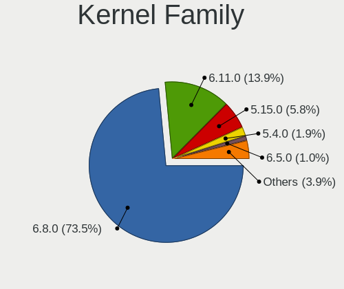
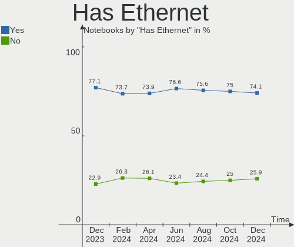
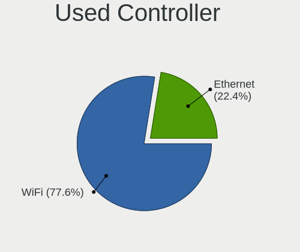

Ubuntu Hardware Trends (Notebook)
---------------------------------

A project to identify most popular hardware characteristics and track their change
over time based on data collected by Ubuntu users at https://Linux-Hardware.org.

Anyone can contribute to the study by uploading probes of their computers by
the [hw-probe](https://github.com/linuxhw/hw-probe) tool:

    sudo -E hw-probe -all -upload

Full-feature report is available here: https://linux-hardware.org/?view=trends&formfactor=notebook

Period: Sep, 2020.

Contents
--------

- [ OS                       ](#os)
- [ OS Family                ](#os-family)
- [ Kernel                   ](#kernel)
- [ Kernel Family            ](#kernel-family)
- [ Kernel Major Ver.        ](#kernel-major-ver)
- [ Arch                     ](#arch)
- [ DE                       ](#de)
- [ Display Server           ](#display-server)
- [ Display Manager          ](#display-manager)
- [ OS Lang                  ](#os-lang)
- [ Boot Mode                ](#boot-mode)
- [ Filesystem               ](#filesystem)
- [ Part. scheme             ](#part-scheme)
- [ Dual Boot with Linux/BSD ](#dual-boot-with-linux/bsd)
- [ Dual Boot (Win)          ](#dual-boot-win)
- [ Country                  ](#country)
- [ City                     ](#city)
- [ Vendor                   ](#vendor)
- [ Model                    ](#model)
- [ Model Family             ](#model-family)
- [ MFG Year                 ](#mfg-year)
- [ Form Factor              ](#form-factor)
- [ Secure Boot              ](#secure-boot)
- [ Coreboot                 ](#coreboot)
- [ RAM Size                 ](#ram-size)
- [ RAM Used                 ](#ram-used)
- [ Has CD-ROM               ](#has-cd-rom)
- [ Total Drives             ](#total-drives)
- [ Has Ethernet             ](#has-ethernet)
- [ Drive Vendor             ](#drive-vendor)
- [ HDD Vendor               ](#hdd-vendor)
- [ SSD Vendor               ](#ssd-vendor)
- [ Drive Model              ](#drive-model)
- [ Drive Kind               ](#drive-kind)
- [ Drive Connector          ](#drive-connector)
- [ Drive Size               ](#drive-size)
- [ Space Total              ](#space-total)
- [ Space Used               ](#space-used)
- [ Malfunc. Drives          ](#malfunc-drives)
- [ Malfunc. Drive Vendor    ](#malfunc-drive-vendor)
- [ Malfunc. HDD Vendor      ](#malfunc-hdd-vendor)
- [ Malfunc. Drive Kind      ](#malfunc-drive-kind)
- [ Failed Drives            ](#failed-drives)
- [ Failed Drive Vendor      ](#failed-drive-vendor)
- [ Drive Status             ](#drive-status)
- [ Storage Vendor           ](#storage-vendor)
- [ Storage Model            ](#storage-model)
- [ Storage Kind             ](#storage-kind)
- [ CPU Vendor               ](#cpu-vendor)
- [ CPU Model                ](#cpu-model)
- [ CPU Model Family         ](#cpu-model-family)
- [ CPU Cores                ](#cpu-cores)
- [ CPU Sockets              ](#cpu-sockets)
- [ CPU Threads              ](#cpu-threads)
- [ CPU Op-Modes             ](#cpu-op-modes)
- [ CPU Microcode            ](#cpu-microcode)
- [ CPU Microarch            ](#cpu-microarch)
- [ GPU Vendor               ](#gpu-vendor)
- [ GPU Model                ](#gpu-model)
- [ GPU Combo                ](#gpu-combo)
- [ GPU Driver               ](#gpu-driver)
- [ GPU Memory               ](#gpu-memory)
- [ Monitor Vendor           ](#monitor-vendor)
- [ Monitor Model            ](#monitor-model)
- [ Monitor Resolution       ](#monitor-resolution)
- [ Monitor Diagonal         ](#monitor-diagonal)
- [ Monitor Width            ](#monitor-width)
- [ Aspect Ratio             ](#aspect-ratio)
- [ Monitor Area             ](#monitor-area)
- [ Pixel Density            ](#pixel-density)
- [ Multiple Monitors        ](#multiple-monitors)
- [ Net Controller Vendor    ](#net-controller-vendor)
- [ Net Controller Model     ](#net-controller-model)
- [ Wireless Vendor          ](#wireless-vendor)
- [ Wireless Model           ](#wireless-model)
- [ Ethernet Vendor          ](#ethernet-vendor)
- [ Ethernet Model           ](#ethernet-model)
- [ Net Controller Kind      ](#net-controller-kind)
- [ Used Controller          ](#used-controller)
- [ NICs                     ](#nics)
- [ Memory Vendor            ](#memory-vendor)
- [ Memory Model             ](#memory-model)
- [ Memory Kind              ](#memory-kind)
- [ Memory Form Factor       ](#memory-form-factor)
- [ Memory Size              ](#memory-size)
- [ Memory Speed             ](#memory-speed)
- [ Sound Vendor             ](#sound-vendor)
- [ Sound Model              ](#sound-model)
- [ Camera Vendor            ](#camera-vendor)
- [ Camera Model             ](#camera-model)
- [ Fingerprint Vendor       ](#fingerprint-vendor)
- [ Fingerprint Model        ](#fingerprint-model)
- [ Chipcard Vendor          ](#chipcard-vendor)
- [ Chipcard Model           ](#chipcard-model)
- [ Printer Vendor           ](#printer-vendor)
- [ Printer Model            ](#printer-model)
- [ Scanner Vendor           ](#scanner-vendor)
- [ Scanner Model            ](#scanner-model)
- [ Bluetooth Vendor         ](#bluetooth-vendor)
- [ Bluetooth Model          ](#bluetooth-model)
- [ Unsupported Devices      ](#unsupported-devices)
- [ Unsupported Device Types ](#unsupported-device-types)

OS
--

Installed operating systems

| Name           | Notebooks | Percent |
|----------------|-----------|---------|
| Ubuntu 20.04   | 948       | 77.01%  |
| Ubuntu 18.04   | 226       | 18.36%  |
| Ubuntu 16.04   | 21        | 1.71%   |
| Ubuntu 20.10   | 13        | 1.06%   |
| Ubuntu 19.10   | 13        | 1.06%   |
| Ubuntu Core 16 | 2         | 0.16%   |
| Ubuntu 19.04   | 2         | 0.16%   |
| Ubuntu 18.10   | 2         | 0.16%   |
| Ubuntu 2020    | 1         | 0.08%   |
| Ubuntu 18.04.4 | 1         | 0.08%   |
| Ubuntu 14.04   | 1         | 0.08%   |
| Ubuntu         | 1         | 0.08%   |

OS Family
---------

OS without a version

| Name   | Notebooks | Percent |
|--------|-----------|---------|
| Ubuntu | 1231      | 100%    |

Kernel
------

Version of the Linux kernel

| Version                     | Notebooks | Percent |
|-----------------------------|-----------|---------|
| 5.4.0-47-generic            | 381       | 30.95%  |
| 5.4.0-45-generic            | 223       | 18.12%  |
| 5.4.0-48-generic            | 222       | 18.03%  |
| 5.4.0-42-generic            | 126       | 10.24%  |
| 4.15.0-117-generic          | 26        | 2.11%   |
| 5.4.0-49-generic            | 25        | 2.03%   |
| 4.15.0-118-generic          | 24        | 1.95%   |
| 5.4.0-26-generic            | 22        | 1.79%   |
| 4.15.0-112-generic          | 12        | 0.97%   |
| 5.3.0-64-generic            | 10        | 0.81%   |
| 4.15.0-115-generic          | 10        | 0.81%   |
| 5.8.0-18-generic            | 8         | 0.65%   |
| 5.8.0-050800-generic        | 5         | 0.41%   |
| 4.15.0-20-generic           | 5         | 0.41%   |
| 5.4.0-48-lowlatency         | 4         | 0.32%   |
| 5.4.0-46-generic            | 4         | 0.32%   |
| 5.4.0-45-lowlatency         | 4         | 0.32%   |
| 5.4.0-40-generic            | 4         | 0.32%   |
| 5.3.0-28-generic            | 4         | 0.32%   |
| 4.4.0-189-generic           | 4         | 0.32%   |
| 5.8.1-050801-generic        | 3         | 0.24%   |
| 5.4.0-7642-generic          | 3         | 0.24%   |
| 5.4.0-47-lowlatency         | 3         | 0.24%   |
| 5.4.0-39-generic            | 3         | 0.24%   |
| 5.0.0-31-generic            | 3         | 0.24%   |
| 5.0.0-23-generic            | 3         | 0.24%   |
| 5.0.0-1068-oem-osp1         | 3         | 0.24%   |
| 4.15.0-45-generic           | 3         | 0.24%   |
| 4.15.0-29-generic           | 3         | 0.24%   |
| 5.8.11-050811-generic       | 2         | 0.16%   |
| 5.8.10-050810-generic       | 2         | 0.16%   |
| 5.4.0-49-lowlatency         | 2         | 0.16%   |
| 5.4.0-37-generic            | 2         | 0.16%   |
| 5.3.0-62-generic            | 2         | 0.16%   |
| 5.3.0-51-generic            | 2         | 0.16%   |
| 5.3.0-40-generic            | 2         | 0.16%   |
| 5.0.0-37-generic            | 2         | 0.16%   |
| 4.19.104-microsoft-standard | 2         | 0.16%   |
| 4.15.0-1096-oem             | 2         | 0.16%   |
| 4.15.0-1094-oem             | 2         | 0.16%   |
| 5.9.0-rc4+                  | 1         | 0.08%   |
| 5.9.0-050900rc6-lowlatency  | 1         | 0.08%   |
| 5.9.0-050900rc6-generic     | 1         | 0.08%   |
| 5.9.0-050900rc5-lowlatency  | 1         | 0.08%   |
| 5.9.0-050900rc4-generic     | 1         | 0.08%   |
| 5.9.0-050900rc2-generic     | 1         | 0.08%   |
| 5.8.9-050809-generic        | 1         | 0.08%   |
| 5.8.7-050807-generic        | 1         | 0.08%   |
| 5.8.4-050804-generic        | 1         | 0.08%   |
| 5.8.3-050803-generic        | 1         | 0.08%   |
| 5.8.2-050802-generic        | 1         | 0.08%   |
| 5.8.0-19-generic            | 1         | 0.08%   |
| 5.8.0-12.2-liquorix-amd64   | 1         | 0.08%   |
| 5.7.8-windowsfx-generic     | 1         | 0.08%   |
| 5.7.19-050719-generic       | 1         | 0.08%   |
| 5.7.1-050701-generic        | 1         | 0.08%   |
| 5.6.0-1020-oem              | 1         | 0.08%   |
| 5.5.5-050505-generic        | 1         | 0.08%   |
| 5.5.2-050502-generic        | 1         | 0.08%   |
| 5.4.67-xanmod1              | 1         | 0.08%   |

Kernel Family
-------------

Linux kernel without a distro release

| Version  | Notebooks | Percent |
|----------|-----------|---------|
| 5.4.0    | 1037      | 84.24%  |
| 4.15.0   | 102       | 8.29%   |
| 5.3.0    | 24        | 1.95%   |
| 5.8.0    | 15        | 1.22%   |
| 5.0.0    | 13        | 1.06%   |
| 5.9.0    | 6         | 0.49%   |
| 4.4.0    | 6         | 0.49%   |
| 5.8.1    | 3         | 0.24%   |
| 4.18.0   | 3         | 0.24%   |
| 5.8.11   | 2         | 0.16%   |
| 5.8.10   | 2         | 0.16%   |
| 4.19.104 | 2         | 0.16%   |
| 5.8.9    | 1         | 0.08%   |
| 5.8.7    | 1         | 0.08%   |
| 5.8.4    | 1         | 0.08%   |
| 5.8.3    | 1         | 0.08%   |
| 5.8.2    | 1         | 0.08%   |
| 5.7.8    | 1         | 0.08%   |
| 5.7.19   | 1         | 0.08%   |
| 5.7.1    | 1         | 0.08%   |
| 5.6.0    | 1         | 0.08%   |
| 5.5.5    | 1         | 0.08%   |
| 5.5.2    | 1         | 0.08%   |
| 5.4.67   | 1         | 0.08%   |
| 5.3.18   | 1         | 0.08%   |
| 4.9.0    | 1         | 0.08%   |
| 4.4.232  | 1         | 0.08%   |
| 4.10.0   | 1         | 0.08%   |

Kernel Major Ver.
-----------------

Linux kernel major version

| Version | Notebooks | Percent |
|---------|-----------|---------|
| 5.4     | 1038      | 84.32%  |
| 4.15    | 102       | 8.29%   |
| 5.8     | 27        | 2.19%   |
| 5.3     | 25        | 2.03%   |
| 5.0     | 13        | 1.06%   |
| 4.4     | 7         | 0.57%   |
| 5.9     | 6         | 0.49%   |
| 5.7     | 3         | 0.24%   |
| 4.18    | 3         | 0.24%   |
| 5.5     | 2         | 0.16%   |
| 4.19    | 2         | 0.16%   |
| 5.6     | 1         | 0.08%   |
| 4.9     | 1         | 0.08%   |
| 4.10    | 1         | 0.08%   |

Arch
----

OS architecture (x86_64, i586, etc.)

| Name   | Notebooks | Percent |
|--------|-----------|---------|
| x86_64 | 1191      | 96.75%  |
| i686   | 40        | 3.25%   |

DE
--

Desktop Environment

| Name            | Notebooks | Percent |
|-----------------|-----------|---------|
| GNOME           | 872       | 70.84%  |
| XFCE            | 91        | 7.39%   |
| Unknown         | 78        | 6.34%   |
| Unity           | 35        | 2.84%   |
| KDE5            | 33        | 2.68%   |
| MATE            | 30        | 2.44%   |
| KDE             | 30        | 2.44%   |
| LXQt            | 17        | 1.38%   |
| GNOME Flashback | 10        | 0.81%   |
| LXDE            | 9         | 0.73%   |
| Budgie          | 9         | 0.73%   |
| X-Cinnamon      | 7         | 0.57%   |
| Cinnamon        | 5         | 0.41%   |
| KDE4            | 1         | 0.08%   |
| i3              | 1         | 0.08%   |
| enlightenment   | 1         | 0.08%   |
| Deepin          | 1         | 0.08%   |
| bspwm           | 1         | 0.08%   |

Display Server
--------------

X11 or Wayland

| Name    | Notebooks | Percent |
|---------|-----------|---------|
| X11     | 1136      | 92.28%  |
| Wayland | 46        | 3.74%   |
| Unknown | 46        | 3.74%   |
| Tty     | 3         | 0.24%   |

Display Manager
---------------

SDDM, LightDM, etc.

| Name    | Notebooks | Percent |
|---------|-----------|---------|
| Unknown | 931       | 75.63%  |
| GDM     | 201       | 16.33%  |
| TDM     | 59        | 4.79%   |
| SDDM    | 37        | 3.01%   |
| LightDM | 2         | 0.16%   |
| GDM3    | 1         | 0.08%   |

OS Lang
-------

Language

| Lang       | Notebooks | Percent |
|------------|-----------|---------|
| en_US      | 498       | 40.45%  |
| pt_BR      | 99        | 8.04%   |
| de_DE      | 99        | 8.04%   |
| en_IN      | 71        | 5.77%   |
| fr_FR      | 45        | 3.66%   |
| en_GB      | 43        | 3.49%   |
| ru_RU      | 36        | 2.92%   |
| it_IT      | 36        | 2.92%   |
| en_CA      | 34        | 2.76%   |
| es_ES      | 25        | 2.03%   |
| pl_PL      | 21        | 1.71%   |
| C          | 17        | 1.38%   |
| es_MX      | 13        | 1.06%   |
| en_AU      | 13        | 1.06%   |
| tr_TR      | 10        | 0.81%   |
| cs_CZ      | 10        | 0.81%   |
| hu_HU      | 9         | 0.73%   |
| en_PH      | 9         | 0.73%   |
| Unknown    | 9         | 0.73%   |
| nl_NL      | 8         | 0.65%   |
| es_CO      | 7         | 0.57%   |
| fi_FI      | 6         | 0.49%   |
| es_CL      | 6         | 0.49%   |
| en_ZA      | 6         | 0.49%   |
| en_SG      | 6         | 0.49%   |
| en_NZ      | 6         | 0.49%   |
| sv_SE      | 5         | 0.41%   |
| ja_JP      | 5         | 0.41%   |
| es_AR      | 5         | 0.41%   |
| de_CH      | 5         | 0.41%   |
| da_DK      | 5         | 0.41%   |
| ru_UA      | 4         | 0.32%   |
| pt_PT      | 4         | 0.32%   |
| nl_BE      | 4         | 0.32%   |
| bg_BG      | 4         | 0.32%   |
| uk_UA      | 3         | 0.24%   |
| sk_SK      | 3         | 0.24%   |
| zh_CN      | 2         | 0.16%   |
| sr_RS      | 2         | 0.16%   |
| ko_KR      | 2         | 0.16%   |
| es_PE      | 2         | 0.16%   |
| es_GT      | 2         | 0.16%   |
| en_IL      | 2         | 0.16%   |
| de_AT      | 2         | 0.16%   |
| ca_ES      | 2         | 0.16%   |
| zh_TW      | 1         | 0.08%   |
| zh_HK      | 1         | 0.08%   |
| sv_FI      | 1         | 0.08%   |
| ro_RO      | 1         | 0.08%   |
| nn_NO      | 1         | 0.08%   |
| nb_NO.utf8 | 1         | 0.08%   |
| nb_NO      | 1         | 0.08%   |
| lv_LV      | 1         | 0.08%   |
| lt_LT      | 1         | 0.08%   |
| id_ID      | 1         | 0.08%   |
| hr_HR      | 1         | 0.08%   |
| fr_CH      | 1         | 0.08%   |
| fr_CA      | 1         | 0.08%   |
| fr_BE      | 1         | 0.08%   |
| et_EE      | 1         | 0.08%   |

Boot Mode
---------

EFI or BIOS

| Mode | Notebooks | Percent |
|------|-----------|---------|
| EFI  | 648       | 52.64%  |
| BIOS | 583       | 47.36%  |

Filesystem
----------

Type of filesystem

| Type    | Notebooks | Percent |
|---------|-----------|---------|
| Ext4    | 1161      | 94.31%  |
| Overlay | 39        | 3.17%   |
| Zfs     | 17        | 1.38%   |
| Btrfs   | 9         | 0.73%   |
| Ext2    | 3         | 0.24%   |
| Ext3    | 2         | 0.16%   |

Part. scheme
------------

Scheme of partitioning

| Type    | Notebooks | Percent |
|---------|-----------|---------|
| Unknown | 931       | 75.63%  |
| GPT     | 226       | 18.36%  |
| MBR     | 74        | 6.01%   |

Dual Boot with Linux/BSD
------------------------

Hosting more than one Linux/BSD

| Dual boot | Notebooks | Percent |
|-----------|-----------|---------|
| No        | 1135      | 92.2%   |
| Yes       | 96        | 7.8%    |

Dual Boot (Win)
---------------

Hosting Linux and Windows

| Dual boot | Notebooks | Percent |
|-----------|-----------|---------|
| No        | 810       | 65.8%   |
| Yes       | 421       | 34.2%   |

Country
-------

Geographic location (country)

| Country            | Notebooks | Percent |
|--------------------|-----------|---------|
| USA                | 190       | 15.43%  |
| Brazil             | 122       | 9.91%   |
| Germany            | 117       | 9.5%    |
| India              | 83        | 6.74%   |
| Russia             | 48        | 3.9%    |
| Italy              | 48        | 3.9%    |
| France             | 46        | 3.74%   |
| Canada             | 37        | 3.01%   |
| UK                 | 34        | 2.76%   |
| Netherlands        | 32        | 2.6%    |
| Spain              | 30        | 2.44%   |
| Poland             | 23        | 1.87%   |
| Turkey             | 20        | 1.62%   |
| Mexico             | 19        | 1.54%   |
| Switzerland        | 17        | 1.38%   |
| Ukraine            | 15        | 1.22%   |
| Sweden             | 15        | 1.22%   |
| Czech Republic     | 13        | 1.06%   |
| Finland            | 12        | 0.97%   |
| Belgium            | 12        | 0.97%   |
| Australia          | 12        | 0.97%   |
| Argentina          | 12        | 0.97%   |
| Pakistan           | 11        | 0.89%   |
| Indonesia          | 11        | 0.89%   |
| New Zealand        | 10        | 0.81%   |
| Hungary            | 10        | 0.81%   |
| Romania            | 9         | 0.73%   |
| Philippines        | 9         | 0.73%   |
| Norway             | 9         | 0.73%   |
| Japan              | 9         | 0.73%   |
| Denmark            | 9         | 0.73%   |
| Colombia           | 9         | 0.73%   |
| Singapore          | 8         | 0.65%   |
| Portugal           | 8         | 0.65%   |
| Chile              | 8         | 0.65%   |
| Austria            | 8         | 0.65%   |
| South Africa       | 7         | 0.57%   |
| Vietnam            | 6         | 0.49%   |
| Slovakia           | 6         | 0.49%   |
| Serbia             | 6         | 0.49%   |
| Kenya              | 6         | 0.49%   |
| Bulgaria           | 6         | 0.49%   |
| Lithuania          | 5         | 0.41%   |
| Croatia            | 5         | 0.41%   |
| China              | 5         | 0.41%   |
| Morocco            | 4         | 0.32%   |
| Iran               | 4         | 0.32%   |
| Greece             | 4         | 0.32%   |
| Estonia            | 4         | 0.32%   |
| Bangladesh         | 4         | 0.32%   |
| Thailand           | 3         | 0.24%   |
| Taiwan             | 3         | 0.24%   |
| Slovenia           | 3         | 0.24%   |
| Panama             | 3         | 0.24%   |
| Korea, Republic of | 3         | 0.24%   |
| Israel             | 3         | 0.24%   |
| Ecuador            | 3         | 0.24%   |
| Belarus            | 3         | 0.24%   |
| Saudi Arabia       | 2         | 0.16%   |
| Puerto Rico        | 2         | 0.16%   |

City
----

Geographic location (city)

| City           | Notebooks | Percent |
|----------------|-----------|---------|
| Moscow         | 18        | 1.46%   |
| São Paulo     | 16        | 1.3%    |
| Rio de Janeiro | 13        | 1.06%   |
| Berlin         | 13        | 1.06%   |
| Istanbul       | 12        | 0.97%   |
| Bengaluru      | 11        | 0.89%   |
| Prague         | 10        | 0.81%   |
| Pune           | 8         | 0.65%   |
| Milan          | 8         | 0.65%   |
| Hamburg        | 8         | 0.65%   |
| Warsaw         | 7         | 0.57%   |
| Hyderabad      | 7         | 0.57%   |
| Helsinki       | 7         | 0.57%   |
| Vienna         | 6         | 0.49%   |
| Paris          | 6         | 0.49%   |
| Munich         | 6         | 0.49%   |
| Campinas       | 6         | 0.49%   |
| Belo Horizonte | 6         | 0.49%   |
| Auckland       | 6         | 0.49%   |
| Singapore      | 5         | 0.41%   |
| Rome           | 5         | 0.41%   |
| Nairobi        | 5         | 0.41%   |
| Madrid         | 5         | 0.41%   |
| Kyiv           | 5         | 0.41%   |
| Chennai        | 5         | 0.41%   |
| St Petersburg  | 4         | 0.32%   |
| New York       | 4         | 0.32%   |
| New Delhi      | 4         | 0.32%   |
| Montreal       | 4         | 0.32%   |
| Houston        | 4         | 0.32%   |
| Florianópolis | 4         | 0.32%   |
| Delhi          | 4         | 0.32%   |
| Chicago        | 4         | 0.32%   |
| Budapest       | 4         | 0.32%   |
| Brasília      | 4         | 0.32%   |
| Belgrade       | 4         | 0.32%   |
| Amsterdam      | 4         | 0.32%   |
| Woodlands      | 3         | 0.24%   |
| Vilnius        | 3         | 0.24%   |
| Toronto        | 3         | 0.24%   |
| The Hague      | 3         | 0.24%   |
| Tehran         | 3         | 0.24%   |
| Tallinn        | 3         | 0.24%   |
| Syracuse       | 3         | 0.24%   |
| Stuttgart      | 3         | 0.24%   |
| Stockholm      | 3         | 0.24%   |
| Sofia          | 3         | 0.24%   |
| Santiago       | 3         | 0.24%   |
| San Francisco  | 3         | 0.24%   |
| San Diego      | 3         | 0.24%   |
| Rostov-on-Don  | 3         | 0.24%   |
| Pasay          | 3         | 0.24%   |
| Panama City    | 3         | 0.24%   |
| Novosibirsk    | 3         | 0.24%   |
| Mumbai         | 3         | 0.24%   |
| Minsk          | 3         | 0.24%   |
| Mexico City    | 3         | 0.24%   |
| Los Angeles    | 3         | 0.24%   |
| Lahore         | 3         | 0.24%   |
| Kolkata        | 3         | 0.24%   |

Vendor
------

Motherboard manufacturer

| Name                                 | Notebooks | Percent |
|--------------------------------------|-----------|---------|
| Hewlett-Packard                      | 266       | 21.61%  |
| Lenovo                               | 259       | 21.04%  |
| Dell                                 | 239       | 19.42%  |
| ASUSTek Computer                     | 120       | 9.75%   |
| Acer                                 | 88        | 7.15%   |
| Toshiba                              | 44        | 3.57%   |
| Sony                                 | 30        | 2.44%   |
| Samsung Electronics                  | 25        | 2.03%   |
| MSI                                  | 24        | 1.95%   |
| Apple                                | 22        | 1.79%   |
| HUAWEI                               | 12        | 0.97%   |
| Medion                               | 10        | 0.81%   |
| Positivo                             | 8         | 0.65%   |
| Notebook                             | 7         | 0.57%   |
| Unknown                              | 7         | 0.57%   |
| Fujitsu                              | 6         | 0.49%   |
| LG Electronics                       | 5         | 0.41%   |
| Google                               | 5         | 0.41%   |
| System76                             | 4         | 0.32%   |
| Gateway                              | 4         | 0.32%   |
| TUXEDO                               | 3         | 0.24%   |
| Panasonic                            | 3         | 0.24%   |
| Packard Bell                         | 3         | 0.24%   |
| Quanta                               | 2         | 0.16%   |
| Microtech                            | 2         | 0.16%   |
| Itautec                              | 2         | 0.16%   |
| Intel                                | 2         | 0.16%   |
| Fujitsu Siemens                      | 2         | 0.16%   |
| Avell High Performance               | 2         | 0.16%   |
| TrekStor                             | 1         | 0.08%   |
| Timi                                 | 1         | 0.08%   |
| Teclast                              | 1         | 0.08%   |
| Standard                             | 1         | 0.08%   |
| SHARP                                | 1         | 0.08%   |
| SCHNEIDER                            | 1         | 0.08%   |
| Schenker                             | 1         | 0.08%   |
| Pegatron                             | 1         | 0.08%   |
| PC Specialist                        | 1         | 0.08%   |
| Packard Bell Computers International | 1         | 0.08%   |
| OEM                                  | 1         | 0.08%   |
| NEC Computers                        | 1         | 0.08%   |
| Monster                              | 1         | 0.08%   |
| Hungaro Flotta Kft                   | 1         | 0.08%   |
| Hampoo                               | 1         | 0.08%   |
| Dream Machines                       | 1         | 0.08%   |
| CyberPowerPC                         | 1         | 0.08%   |
| Compaq                               | 1         | 0.08%   |
| Compal                               | 1         | 0.08%   |
| Clevo                                | 1         | 0.08%   |
| Carbon Systems                       | 1         | 0.08%   |
| BEL MICRO COMPUTADORES               | 1         | 0.08%   |
| BANGHO                               | 1         | 0.08%   |
| AMI                                  | 1         | 0.08%   |
| Alienware                            | 1         | 0.08%   |

Model
-----

Motherboard model

| Name                                | Notebooks | Percent |
|-------------------------------------|-----------|---------|
| Unknown                             | 15        | 1.22%   |
| HP Notebook                         | 11        | 0.89%   |
| HP Pavilion g6                      | 8         | 0.65%   |
| Dell Latitude E6420                 | 7         | 0.57%   |
| HUAWEI NBLK-WAX9X                   | 6         | 0.49%   |
| HP Pavilion g7                      | 6         | 0.49%   |
| HP Pavilion dv6                     | 6         | 0.49%   |
| HP EliteBook 8470p                  | 6         | 0.49%   |
| Dell Latitude E6410                 | 6         | 0.49%   |
| Acer Aspire A515-51                 | 6         | 0.49%   |
| HP Pavilion dv7                     | 5         | 0.41%   |
| Lenovo IdeaPad 320-15IKB 80XL       | 4         | 0.32%   |
| HP ProBook 6550b                    | 4         | 0.32%   |
| HP Pavilion Notebook                | 4         | 0.32%   |
| HP Pavilion 17                      | 4         | 0.32%   |
| HP Laptop 15-db0xxx                 | 4         | 0.32%   |
| HP EliteBook 840 G3                 | 4         | 0.32%   |
| HP 255 G7 Notebook PC               | 4         | 0.32%   |
| Dell XPS 15 9570                    | 4         | 0.32%   |
| Dell XPS 15 9560                    | 4         | 0.32%   |
| Dell XPS 15 7590                    | 4         | 0.32%   |
| Dell XPS 13 9370                    | 4         | 0.32%   |
| Dell XPS 13 9300                    | 4         | 0.32%   |
| Dell XPS 13 7390                    | 4         | 0.32%   |
| Dell Latitude E6430                 | 4         | 0.32%   |
| Dell Inspiron 5557                  | 4         | 0.32%   |
| Acer Nitro AN515-43                 | 4         | 0.32%   |
| Toshiba Satellite L750              | 3         | 0.24%   |
| Toshiba Satellite A505              | 3         | 0.24%   |
| MSI Prestige 15 A10SC               | 3         | 0.24%   |
| Lenovo V330-15IKB 81AX              | 3         | 0.24%   |
| Lenovo IdeaPad Slim 1-14AST-05 81VS | 3         | 0.24%   |
| Lenovo IdeaPad 5 15ARE05 81YQ       | 3         | 0.24%   |
| Lenovo G710 20252                   | 3         | 0.24%   |
| HP ZBook 15 G6                      | 3         | 0.24%   |
| HP ProBook 6470b                    | 3         | 0.24%   |
| HP ProBook 440 G7                   | 3         | 0.24%   |
| HP ProBook 440 G5                   | 3         | 0.24%   |
| HP Pavilion 15                      | 3         | 0.24%   |
| HP Pavilion 11 x360 PC              | 3         | 0.24%   |
| HP Laptop 15-bs0xx                  | 3         | 0.24%   |
| HP ENVY 15                          | 3         | 0.24%   |
| HP EliteBook Folio 1040 G3          | 3         | 0.24%   |
| HP EliteBook 8460p                  | 3         | 0.24%   |
| HP EliteBook 8440p                  | 3         | 0.24%   |
| HP EliteBook 840 G6                 | 3         | 0.24%   |
| Gateway NE56R                       | 3         | 0.24%   |
| Dell XPS 13 9360                    | 3         | 0.24%   |
| Dell Vostro 3578                    | 3         | 0.24%   |
| Dell Latitude E6400                 | 3         | 0.24%   |
| Dell Latitude D630                  | 3         | 0.24%   |
| Dell Latitude 7490                  | 3         | 0.24%   |
| Dell Latitude 5480                  | 3         | 0.24%   |
| Dell Latitude 5400                  | 3         | 0.24%   |
| Dell Inspiron 7560                  | 3         | 0.24%   |
| Dell Inspiron 7559                  | 3         | 0.24%   |
| Dell Inspiron 5593                  | 3         | 0.24%   |
| Dell Inspiron 3583                  | 3         | 0.24%   |
| Dell Inspiron 3558                  | 3         | 0.24%   |
| Dell Inspiron 1545                  | 3         | 0.24%   |

Model Family
------------

Motherboard model prefix

| Name                       | Notebooks | Percent |
|----------------------------|-----------|---------|
| Lenovo ThinkPad            | 124       | 10.07%  |
| Dell Inspiron              | 89        | 7.23%   |
| Dell Latitude              | 74        | 6.01%   |
| Lenovo IdeaPad             | 68        | 5.52%   |
| Acer Aspire                | 68        | 5.52%   |
| HP Pavilion                | 64        | 5.2%    |
| HP EliteBook               | 44        | 3.57%   |
| HP ProBook                 | 43        | 3.49%   |
| Toshiba Satellite          | 38        | 3.09%   |
| Dell XPS                   | 36        | 2.92%   |
| HP Laptop                  | 29        | 2.36%   |
| ASUS VivoBook              | 19        | 1.54%   |
| Dell Vostro                | 18        | 1.46%   |
| HP Compaq                  | 15        | 1.22%   |
| Dell Precision             | 15        | 1.22%   |
| Unknown                    | 15        | 1.22%   |
| HP ENVY                    | 12        | 0.97%   |
| HP Notebook                | 11        | 0.89%   |
| HP ZBook                   | 9         | 0.73%   |
| Acer Swift                 | 7         | 0.57%   |
| Lenovo Legion              | 6         | 0.49%   |
| HUAWEI NBLK-WAX9X          | 6         | 0.49%   |
| ASUS ZenBook               | 6         | 0.49%   |
| Acer Nitro                 | 6         | 0.49%   |
| HP 255                     | 5         | 0.41%   |
| Fujitsu LIFEBOOK           | 5         | 0.41%   |
| ASUS TUF                   | 5         | 0.41%   |
| Lenovo ThinkBook           | 4         | 0.32%   |
| HP OMEN                    | 4         | 0.32%   |
| Toshiba PORTEGE            | 3         | 0.24%   |
| MSI Prestige               | 3         | 0.24%   |
| MSI Modern                 | 3         | 0.24%   |
| Medion AKOYA               | 3         | 0.24%   |
| Lenovo V330-15IKB          | 3         | 0.24%   |
| Lenovo G710                | 3         | 0.24%   |
| HP 250                     | 3         | 0.24%   |
| Gateway NE56R              | 3         | 0.24%   |
| Dell G3                    | 3         | 0.24%   |
| Apple MacBookPro8          | 3         | 0.24%   |
| Apple MacBookPro5          | 3         | 0.24%   |
| Toshiba dynabook           | 2         | 0.16%   |
| Sony VPCF115FM             | 2         | 0.16%   |
| Samsung Electronics QX311  | 2         | 0.16%   |
| Samsung Electronics N150P  | 2         | 0.16%   |
| Samsung Electronics 700Z3C | 2         | 0.16%   |
| Samsung Electronics 300V3A | 2         | 0.16%   |
| Positivo S14SL01           | 2         | 0.16%   |
| Positivo MOBILE            | 2         | 0.16%   |
| Notebook W35xSS            | 2         | 0.16%   |
| MSI GL75                   | 2         | 0.16%   |
| Microtech ebookPro         | 2         | 0.16%   |
| Lenovo Z50-75              | 2         | 0.16%   |
| Lenovo Y50-70              | 2         | 0.16%   |
| Lenovo V15-IIL             | 2         | 0.16%   |
| Lenovo V110-14IAP          | 2         | 0.16%   |
| Lenovo G550                | 2         | 0.16%   |
| Lenovo G50-70              | 2         | 0.16%   |
| Lenovo G50-45              | 2         | 0.16%   |
| Lenovo B590                | 2         | 0.16%   |
| Lenovo 3000                | 2         | 0.16%   |

MFG Year
--------

Motherboard manufacture year

| Year    | Notebooks | Percent |
|---------|-----------|---------|
| 2020    | 246       | 19.98%  |
| 2019    | 211       | 17.14%  |
| 2018    | 112       | 9.1%    |
| 2013    | 89        | 7.23%   |
| 2011    | 82        | 6.66%   |
| 2012    | 76        | 6.17%   |
| 2015    | 70        | 5.69%   |
| 2014    | 67        | 5.44%   |
| 2010    | 65        | 5.28%   |
| 2017    | 57        | 4.63%   |
| 2016    | 55        | 4.47%   |
| 2009    | 39        | 3.17%   |
| 2008    | 31        | 2.52%   |
| 2007    | 17        | 1.38%   |
| 2006    | 5         | 0.41%   |
| 2005    | 4         | 0.32%   |
| Unknown | 3         | 0.24%   |
| 2004    | 1         | 0.08%   |
| 2003    | 1         | 0.08%   |

Form Factor
-----------

Physical design of the computer

| Name     | Notebooks | Percent |
|----------|-----------|---------|
| Notebook | 1231      | 100%    |

Secure Boot
-----------

Enabled or disabled

| State    | Notebooks | Percent |
|----------|-----------|---------|
| Disabled | 1050      | 85.3%   |
| Enabled  | 181       | 14.7%   |

Coreboot
--------

Have coreboot on board

| Used | Notebooks | Percent |
|------|-----------|---------|
| No   | 1224      | 99.43%  |
| Yes  | 7         | 0.57%   |

RAM Size
--------

Total RAM memory

| Size in GB  | Notebooks | Percent |
|-------------|-----------|---------|
| 4.01-8.0    | 362       | 29.41%  |
| 3.01-4.0    | 314       | 25.51%  |
| 8.01-16.0   | 200       | 16.25%  |
| 16.01-24.0  | 191       | 15.52%  |
| 1.01-2.0    | 65        | 5.28%   |
| 32.01-64.0  | 42        | 3.41%   |
| 2.01-3.0    | 28        | 2.27%   |
| 0.01-1.0    | 11        | 0.89%   |
| 24.01-32.0  | 9         | 0.73%   |
| 64.01-256.0 | 9         | 0.73%   |

RAM Used
--------

Used RAM memory

| Used GB    | Notebooks | Percent |
|------------|-----------|---------|
| 1.01-2.0   | 471       | 38.26%  |
| 2.01-3.0   | 352       | 28.59%  |
| 3.01-4.0   | 149       | 12.1%   |
| 4.01-8.0   | 144       | 11.7%   |
| 0.01-1.0   | 65        | 5.28%   |
| 8.01-16.0  | 47        | 3.82%   |
| 16.01-24.0 | 2         | 0.16%   |
| 24.01-32.0 | 1         | 0.08%   |

Has CD-ROM
----------

Has CD-ROM on board

| Presented | Notebooks | Percent |
|-----------|-----------|---------|
| No        | 724       | 58.81%  |
| Yes       | 507       | 41.19%  |

Total Drives
------------

Number of drives on board

| Drives | Notebooks | Percent |
|--------|-----------|---------|
| 1      | 927       | 75.3%   |
| 2      | 248       | 20.15%  |
| 3      | 38        | 3.09%   |
| 0      | 13        | 1.06%   |
| 4      | 2         | 0.16%   |
| 8      | 1         | 0.08%   |
| 7      | 1         | 0.08%   |
| 5      | 1         | 0.08%   |

Has Ethernet
------------

Has Ethernet on board

| Presented | Notebooks | Percent |
|-----------|-----------|---------|
| Yes       | 1059      | 86.03%  |
| No        | 172       | 13.97%  |

Drive Vendor
------------

Hard drive vendors

| Vendor                    | Notebooks | Drives  | Percent |
|---------------------------|-----------|---------|---------|
| WDC                       | 216       | 222     | 14.45%  |
| Seagate                   | 214       | 219     | 14.31%  |
| Samsung Electronics       | 198       | 208     | 13.24%  |
| Toshiba                   | 157       | 161     | 10.5%   |
| Unknown                   | 86        | 96      | 5.75%   |
| Sandisk                   | 80        | 82      | 5.35%   |
| Kingston                  | 80        | 80      | 5.35%   |
| Hitachi                   | 61        | 63      | 4.08%   |
| SK Hynix                  | 53        | 54      | 3.55%   |
| Intel                     | 47        | 50      | 3.14%   |
| HGST                      | 47        | 48      | 3.14%   |
| Crucial                   | 36        | 37      | 2.41%   |
| A-DATA Technology         | 26        | 27      | 1.74%   |
| Micron Technology         | 25        | 25      | 1.67%   |
| LITEON                    | 17        | 17      | 1.14%   |
| HL-DT-ST                  | 13        | Unknown | 0.87%   |
| Fujitsu                   | 13        | 13      | 0.87%   |
| PNY                       | 9         | 9       | 0.6%    |
| LITEONIT                  | 8         | 8       | 0.54%   |
| China                     | 8         | 8       | 0.54%   |
| Transcend                 | 7         | 7       | 0.47%   |
| Silicon Motion            | 6         | 6       | 0.4%    |
| SPCC                      | 5         | 5       | 0.33%   |
| Phison                    | 5         | 6       | 0.33%   |
| JMicron                   | 5         | 3       | 0.33%   |
| Apple                     | 5         | 5       | 0.33%   |
| Hewlett-Packard           | 4         | 5       | 0.27%   |
| Union Memory              | 3         | 3       | 0.2%    |
| Patriot                   | 3         | 3       | 0.2%    |
| Lexar                     | 3         | 3       | 0.2%    |
| KingSpec                  | 3         | 4       | 0.2%    |
| Team                      | 2         | 2       | 0.13%   |
| Realtek Semiconductor     | 2         | 2       | 0.13%   |
| PLEXTOR                   | 2         | 2       | 0.13%   |
| OCZ                       | 2         | 2       | 0.13%   |
| Msft                      | 2         | 4       | 0.13%   |
| Microtech                 | 2         | 2       | 0.13%   |
| Leven                     | 2         | 2       | 0.13%   |
| KIOXIA                    | 2         | 2       | 0.13%   |
| KingDian                  | 2         | 2       | 0.13%   |
| Gigabyte Technology       | 2         | 2       | 0.13%   |
| ASMT                      | 2         | 5       | 0.13%   |
| XPG                       | 1         | 1       | 0.07%   |
| WDC WDS1                  | 1         | 1       | 0.07%   |
| SSK                       | 1         | 1       | 0.07%   |
| SABRENT                   | 1         | 1       | 0.07%   |
| Mushkin                   | 1         | 1       | 0.07%   |
| Micron/Crucial Technology | 1         | 1       | 0.07%   |
| Lite-On                   | 1         | 1       | 0.07%   |
| Lenovo                    | 1         | 1       | 0.07%   |
| LaCie                     | 1         | 1       | 0.07%   |
| KINGMAX                   | 1         | 1       | 0.07%   |
| KingFast                  | 1         | 1       | 0.07%   |
| KESU                      | 1         | 1       | 0.07%   |
| JAMESDONKEY               | 1         | 1       | 0.07%   |
| Intenso                   | 1         | 1       | 0.07%   |
| INNOVATION                | 1         | 1       | 0.07%   |
| INDMEM                    | 1         | 1       | 0.07%   |
| iMRAM                     | 1         | 1       | 0.07%   |
| HS-SSD-E100N              | 1         | 1       | 0.07%   |

HDD Vendor
----------

Hard disk drive vendors

| Vendor              | Notebooks | Drives | Percent |
|---------------------|-----------|--------|---------|
| Seagate             | 211       | 215    | 34.42%  |
| WDC                 | 161       | 161    | 26.26%  |
| Toshiba             | 102       | 102    | 16.64%  |
| Hitachi             | 61        | 63     | 9.95%   |
| HGST                | 47        | 48     | 7.67%   |
| Samsung Electronics | 13        | 13     | 2.12%   |
| Fujitsu             | 13        | 13     | 2.12%   |
| Msft                | 2         | 4      | 0.33%   |
| KESU                | 1         | 1      | 0.16%   |
| JMicron             | 1         | 1      | 0.16%   |
| Intenso             | 1         | 1      | 0.16%   |

SSD Vendor
----------

Solid state drive vendors

| Vendor              | Notebooks | Drives | Percent |
|---------------------|-----------|--------|---------|
| Samsung Electronics | 100       | 104    | 21.37%  |
| Kingston            | 72        | 72     | 15.38%  |
| SanDisk             | 50        | 51     | 10.68%  |
| Crucial             | 35        | 36     | 7.48%   |
| WDC                 | 33        | 36     | 7.05%   |
| A-DATA Technology   | 23        | 24     | 4.91%   |
| Intel               | 20        | 20     | 4.27%   |
| Micron Technology   | 17        | 17     | 3.63%   |
| Toshiba             | 15        | 15     | 3.21%   |
| LITEON              | 15        | 15     | 3.21%   |
| SK Hynix            | 11        | 11     | 2.35%   |
| PNY                 | 9         | 9      | 1.92%   |
| LITEONIT            | 8         | 8      | 1.71%   |
| China               | 8         | 8      | 1.71%   |
| Transcend           | 6         | 6      | 1.28%   |
| SPCC                | 5         | 5      | 1.07%   |
| Apple               | 4         | 4      | 0.85%   |
| Patriot             | 3         | 3      | 0.64%   |
| Lexar               | 3         | 3      | 0.64%   |
| KingSpec            | 3         | 4      | 0.64%   |
| Unknown             | 2         | 2      | 0.43%   |
| Team                | 2         | 2      | 0.43%   |
| PLEXTOR             | 2         | 2      | 0.43%   |
| OCZ                 | 2         | 2      | 0.43%   |
| Microtech           | 2         | 2      | 0.43%   |
| KingDian            | 2         | 2      | 0.43%   |
| JMicron             | 2         | 2      | 0.43%   |
| Hewlett-Packard     | 2         | 2      | 0.43%   |
| Gigabyte Technology | 2         | 2      | 0.43%   |
| WDC WDS1            | 1         | 1      | 0.21%   |
| SABRENT             | 1         | 1      | 0.21%   |
| KINGMAX             | 1         | 1      | 0.21%   |
| INNOVATION          | 1         | 1      | 0.21%   |
| INDMEM              | 1         | 1      | 0.21%   |
| Hikvision           | 1         | 1      | 0.21%   |
| GOODRAM             | 1         | 1      | 0.21%   |
| Dogfish             | 1         | 1      | 0.21%   |
| ASMT                | 1         | 1      | 0.21%   |
| Apacer              | 1         | 1      | 0.21%   |

Drive Model
-----------

Hard drive models

| Model                        | Notebooks | Percent |
|------------------------------|-----------|---------|
| NVMe SSD Drive 512GB         | 81        | 5.26%   |
| NVMe SSD Drive 256GB         | 59        | 3.83%   |
| ST1000LM035-1RK172 1TB       | 36        | 2.34%   |
| MMC Card  32GB               | 25        | 1.62%   |
| MQ01ABD100 1TB               | 21        | 1.36%   |
| SA400S37240G 240GB SSD       | 20        | 1.3%    |
| ST1000LM024 HN-M101MBB 1TB   | 18        | 1.17%   |
| NVMe SSD Drive 1024GB        | 17        | 1.1%    |
| MQ04ABF100 1TB               | 17        | 1.1%    |
| HTS721010A9E630 1TB          | 17        | 1.1%    |
| MQ01ABF050 500GB             | 15        | 0.97%   |
| ST9500325AS 500GB            | 14        | 0.91%   |
| SSD 860 EVO 500GB            | 13        | 0.84%   |
| ST500LT012-1DG142 500GB      | 11        | 0.71%   |
| DVDRAM GUE1N 3GB             | 11        | 0.71%   |
| ST2000LM007-1R8174 2TB       | 10        | 0.65%   |
| SSD 860 EVO 1TB              | 9         | 0.58%   |
| SA400S37120G 120GB SSD       | 9         | 0.58%   |
| MMC Card  64GB               | 9         | 0.58%   |
| HTS541010A9E680 1TB          | 9         | 0.58%   |
| WD10SPZX-60Z10T0 1TB         | 8         | 0.52%   |
| WD10JPVX-22JC3T0 1TB         | 8         | 0.52%   |
| ST750LM022 HN-M750MBB 752GB  | 8         | 0.52%   |
| ST500LT012-9WS142 500GB      | 8         | 0.52%   |
| MMC Card  128GB              | 8         | 0.52%   |
| HTS725050A7E630 500GB        | 8         | 0.52%   |
| HTS547575A9E384 752GB        | 8         | 0.52%   |
| CT500MX500SSD1 500GB         | 8         | 0.52%   |
| WDS240G2G0A-00JH30 240GB SSD | 7         | 0.45%   |
| WD10JPVX-75JC3T0 1TB         | 7         | 0.45%   |
| SV300S37A120G 120GB SSD      | 7         | 0.45%   |
| SA400S37480G 480GB SSD       | 7         | 0.45%   |
| NVMe SSD Drive 500GB         | 7         | 0.45%   |
| NVMe SSD Drive 1TB           | 7         | 0.45%   |
| WD5000LPVX-22V0TT0 500GB     | 6         | 0.39%   |
| WD5000LPCX-24VHAT0 500GB     | 6         | 0.39%   |
| WD10SPZX-24Z10 1TB           | 6         | 0.39%   |
| WD10SPZX-21Z10T0 1TB         | 6         | 0.39%   |
| SV300S37A240G 240GB SSD      | 6         | 0.39%   |
| ST500LM012 HN-M500MBB 500GB  | 6         | 0.39%   |
| ST1000LM014-1EJ164 1TB       | 6         | 0.39%   |
| SSD 850 EVO 500GB            | 6         | 0.39%   |
| NVMe SSD Drive 128GB         | 6         | 0.39%   |
| MMC Card  16GB               | 6         | 0.39%   |
| HTS545050A7E380 500GB        | 6         | 0.39%   |
| 1100_MTFDDAV256TBN 256GB SSD | 6         | 0.39%   |
| WD10SPZX-75Z10T2 1TB         | 5         | 0.32%   |
| WD10JPVX-60JC3T1 1TB         | 5         | 0.32%   |
| WD10JPVX-60JC3T0 1TB         | 5         | 0.32%   |
| ST9500423AS 500GB            | 5         | 0.32%   |
| ST9320325AS 320GB            | 5         | 0.32%   |
| ST500LM000-SSHD-8GB          | 5         | 0.32%   |
| ST1000LM049-2GH172 1TB       | 5         | 0.32%   |
| ST1000LM048-2E7172 1TB       | 5         | 0.32%   |
| SSD PLUS 240GB               | 5         | 0.32%   |
| SD/MMC/MS PRO 128GB          | 5         | 0.32%   |
| HTS545050B9A300 500GB        | 5         | 0.32%   |
| HM641JI 640GB                | 5         | 0.32%   |
| WDS240G2G0B-00EPW0 240GB SSD | 4         | 0.26%   |
| WDS120G2G0A-00JH30 120GB SSD | 4         | 0.26%   |

Drive Kind
----------

HDD or SSD

| Kind    | Notebooks | Drives | Percent |
|---------|-----------|--------|---------|
| HDD     | 598       | 622    | 41.5%   |
| SSD     | 437       | 479    | 30.33%  |
| NVMe    | 300       | 327    | 20.82%  |
| MMC     | 66        | 75     | 4.58%   |
| Unknown | 40        | 36     | 2.78%   |

Drive Connector
---------------

SATA, SAS, NVMe, etc.

| Type | Notebooks | Drives | Percent |
|------|-----------|--------|---------|
| SATA | 945       | 1088   | 69.54%  |
| NVMe | 300       | 327    | 22.08%  |
| MMC  | 66        | 75     | 4.86%   |
| SAS  | 48        | 49     | 3.53%   |

Drive Size
----------

Size of hard drive

| Size in TB | Notebooks | Drives | Percent |
|------------|-----------|--------|---------|
| 0.01-0.5   | 842       | 960    | 61.15%  |
| 0.51-1.0   | 460       | 496    | 33.41%  |
| 1.01-2.0   | 64        | 68     | 4.65%   |
| 2.01-3.0   | 5         | 5      | 0.36%   |
| 3.01-4.0   | 3         | 3      | 0.22%   |
| 4.01-10.0  | 2         | 2      | 0.15%   |
| 10.01-20.0 | 1         | 5      | 0.07%   |

Space Total
-----------

Amount of disk space available on the file system

| Size in GB     | Notebooks | Percent |
|----------------|-----------|---------|
| 101-250        | 403       | 32.74%  |
| 251-500        | 338       | 27.46%  |
| 501-1000       | 175       | 14.22%  |
| 51-100         | 91        | 7.39%   |
| 21-50          | 62        | 5.04%   |
| 1-20           | 61        | 4.96%   |
| 1001-2000      | 57        | 4.63%   |
| 2001-3000      | 20        | 1.62%   |
| More than 3000 | 15        | 1.22%   |
| Unknown        | 9         | 0.73%   |

Space Used
----------

Amount of used disk space

| Used GB        | Notebooks | Percent |
|----------------|-----------|---------|
| 1-20           | 513       | 41.67%  |
| 21-50          | 256       | 20.8%   |
| 101-250        | 156       | 12.67%  |
| 51-100         | 152       | 12.35%  |
| 251-500        | 73        | 5.93%   |
| 501-1000       | 45        | 3.66%   |
| 1001-2000      | 19        | 1.54%   |
| Unknown        | 9         | 0.73%   |
| 2001-3000      | 5         | 0.41%   |
| More than 3000 | 3         | 0.24%   |

Malfunc. Drives
---------------

Drive models with a malfunction

| Model                             | Notebooks | Drives | Percent |
|-----------------------------------|-----------|--------|---------|
| ST1000LM024 HN-M101MBB 1TB        | 3         | 3      | 5.36%   |
| ST9500423AS 500GB                 | 2         | 2      | 3.57%   |
| ST9500325AS 500GB                 | 2         | 2      | 3.57%   |
| ST320LT007-9ZV142 320GB           | 2         | 2      | 3.57%   |
| MQ01ABD100 1TB                    | 2         | 2      | 3.57%   |
| HTS541010A9E680 1TB               | 2         | 2      | 3.57%   |
| WDS240G2G0B-00EPW0 240GB SSD      | 1         | 1      | 1.79%   |
| WD7500BPVT-75HXZT1 752GB          | 1         | 1      | 1.79%   |
| WD5000LPLX-00ZNTT0 500GB          | 1         | 1      | 1.79%   |
| WD3200BPVT-22JJ5T0 320GB          | 1         | 1      | 1.79%   |
| WD3200BEKT-75PVMT1 320GB          | 1         | 1      | 1.79%   |
| WD2500BEVT-80A23T0 250GB          | 1         | 1      | 1.79%   |
| WD10JPVX-60JC3T1 1TB              | 1         | 1      | 1.79%   |
| SV300S37A120G 120GB SSD           | 1         | 1      | 1.79%   |
| SU650 120GB SSD                   | 1         | 1      | 1.79%   |
| ST9750420AS 752GB                 | 1         | 1      | 1.79%   |
| ST9320423AS 320GB                 | 1         | 1      | 1.79%   |
| ST9250410AS 250GB                 | 1         | 1      | 1.79%   |
| ST9160821AS 160GB                 | 1         | 1      | 1.79%   |
| ST500LT012-9WS142 500GB           | 1         | 1      | 1.79%   |
| ST500LT012-1DG142 500GB           | 1         | 1      | 1.79%   |
| ST500LM030-2E717D 500GB           | 1         | 1      | 1.79%   |
| ST500LM021-1KJ152 500GB           | 1         | 1      | 1.79%   |
| ST1000LM014-1EJ164 1TB            | 1         | 1      | 1.79%   |
| SSDSCKJF240A5L 240GB              | 1         | 1      | 1.79%   |
| SSDSC2CW120A3 120GB               | 1         | 1      | 1.79%   |
| SSDSC2BW480H6 480GB               | 1         | 1      | 1.79%   |
| SSDPEKKF512G7L 512GB              | 1         | 1      | 1.79%   |
| SD9SN8W-256G-1006 256GB SSD       | 1         | 1      | 1.79%   |
| MTFDDAV512TBN-1AR1ZABHA 512GB SSD | 1         | 1      | 1.79%   |
| MKNSSDHL1TB-D8                    | 1         | 1      | 1.79%   |
| MK1637GSX 160GB                   | 1         | 1      | 1.79%   |
| MK1237GSX 120GB                   | 1         | 1      | 1.79%   |
| IM2S3334-256GD 256GB SSD          | 1         | 1      | 1.79%   |
| HTS725050A7E630 500GB             | 1         | 1      | 1.79%   |
| HTS725032A9A364 320GB             | 1         | 1      | 1.79%   |
| HTS723232A7A364 320GB             | 1         | 1      | 1.79%   |
| HTS722016K9A300 160GB             | 1         | 1      | 1.79%   |
| HTS722012K9SA00 120GB             | 1         | 1      | 1.79%   |
| HTS547564A9E384 640GB             | 1         | 1      | 1.79%   |
| HTS545050A7E380 500GB             | 1         | 1      | 1.79%   |
| HTS543232A7A384 320GB             | 1         | 1      | 1.79%   |
| HTS541616J9SA00 160GB             | 1         | 1      | 1.79%   |
| HTS541515A9E630 1TB               | 1         | 1      | 1.79%   |
| HM320HJ 320GB                     | 1         | 1      | 1.79%   |
| HFS256G39MND-2300A 256GB SSD      | 1         | 1      | 1.79%   |
| HFS128G39TND-N210A 128GB SSD      | 1         | 1      | 1.79%   |
| CV8-8E128-HP 128GB SSD            | 1         | 1      | 1.79%   |
| CT240M500SSD1 240GB               | 1         | 1      | 1.79%   |

Malfunc. Drive Vendor
---------------------

Vendors of faulty drives

| Vendor              | Notebooks | Drives | Percent |
|---------------------|-----------|--------|---------|
| Seagate             | 18        | 18     | 32.14%  |
| Hitachi             | 8         | 8      | 14.29%  |
| WDC                 | 7         | 7      | 12.5%   |
| Toshiba             | 4         | 4      | 7.14%   |
| Intel               | 4         | 4      | 7.14%   |
| HGST                | 4         | 4      | 7.14%   |
| SK Hynix            | 2         | 2      | 3.57%   |
| A-DATA Technology   | 2         | 2      | 3.57%   |
| SanDisk             | 1         | 1      | 1.79%   |
| Samsung Electronics | 1         | 1      | 1.79%   |
| Mushkin             | 1         | 1      | 1.79%   |
| Micron Technology   | 1         | 1      | 1.79%   |
| LITEON              | 1         | 1      | 1.79%   |
| Kingston            | 1         | 1      | 1.79%   |
| Crucial             | 1         | 1      | 1.79%   |

Malfunc. HDD Vendor
-------------------

Vendors of faulty HDD drives

| Vendor              | Notebooks | Drives | Percent |
|---------------------|-----------|--------|---------|
| Seagate             | 18        | 18     | 43.9%   |
| Hitachi             | 8         | 8      | 19.51%  |
| WDC                 | 6         | 6      | 14.63%  |
| Toshiba             | 4         | 4      | 9.76%   |
| HGST                | 4         | 4      | 9.76%   |
| Samsung Electronics | 1         | 1      | 2.44%   |

Malfunc. Drive Kind
-------------------

Kinds of faulty drives

| Kind | Notebooks | Drives | Percent |
|------|-----------|--------|---------|
| HDD  | 40        | 41     | 72.73%  |
| SSD  | 13        | 13     | 23.64%  |
| NVMe | 2         | 2      | 3.64%   |

Failed Drives
-------------

Failed drive models

| Model                    | Notebooks | Drives | Percent |
|--------------------------|-----------|--------|---------|
| SSDSCKGF256A5 SATA 256GB | 1         | 1      | 100%    |

Failed Drive Vendor
-------------------

Failed drive vendors

| Vendor | Notebooks | Drives | Percent |
|--------|-----------|--------|---------|
| Intel  | 1         | 1      | 100%    |

Drive Status
------------

Number of failed and malfunc. drives

| Status   | Notebooks | Drives | Percent |
|----------|-----------|--------|---------|
| Detected | 925       | 1162   | 74.06%  |
| Works    | 268       | 320    | 21.46%  |
| Malfunc  | 55        | 56     | 4.4%    |
| Failed   | 1         | 1      | 0.08%   |

Storage Vendor
--------------

Storage controller vendors

| Vendor                           | Notebooks | Percent |
|----------------------------------|-----------|---------|
| Intel                            | 931       | 67.71%  |
| AMD                              | 144       | 10.47%  |
| Samsung Electronics              | 89        | 6.47%   |
| Sandisk                          | 51        | 3.71%   |
| SK Hynix                         | 40        | 2.91%   |
| Toshiba America Info Systems     | 37        | 2.69%   |
| KIOXIA                           | 12        | 0.87%   |
| Nvidia                           | 10        | 0.73%   |
| Micron Technology                | 9         | 0.65%   |
| Silicon Motion                   | 8         | 0.58%   |
| Kingston Technology Company      | 8         | 0.58%   |
| Union Memory (Shenzhen)          | 5         | 0.36%   |
| Silicon Integrated Systems [SiS] | 5         | 0.36%   |
| Phison Electronics               | 5         | 0.36%   |
| Realtek Semiconductor            | 4         | 0.29%   |
| ADATA Technology                 | 4         | 0.29%   |
| Lite-On Technology               | 3         | 0.22%   |
| JMicron Technology               | 2         | 0.15%   |
| Apple                            | 2         | 0.15%   |
| VIA Technologies                 | 1         | 0.07%   |
| Solid State Storage Technology   | 1         | 0.07%   |
| Shenzhen Longsys Electronics     | 1         | 0.07%   |
| Seagate Technology               | 1         | 0.07%   |
| Micron/Crucial Technology        | 1         | 0.07%   |
| Lenovo                           | 1         | 0.07%   |

Storage Model
-------------

Storage controller models

| Model                                                                      | Notebooks | Percent |
|----------------------------------------------------------------------------|-----------|---------|
| FCH SATA Controller [AHCI mode]                                            | 124       | 8.41%   |
| Sunrise Point-LP SATA Controller [AHCI mode]                               | 121       | 8.21%   |
| 7 Series Chipset Family 6-port SATA Controller [AHCI mode]                 | 111       | 7.53%   |
| Non-Volatile memory controller                                             | 103       | 6.99%   |
| 82801 Mobile SATA Controller [RAID mode]                                   | 89        | 6.04%   |
| 6 Series/C200 Series Chipset Family 6 port Mobile SATA AHCI Controller     | 69        | 4.68%   |
| NVMe SSD Controller SM981/PM981/PM983                                      | 63        | 4.27%   |
| 8 Series SATA Controller 1 [AHCI mode]                                     | 49        | 3.32%   |
| 82801IBM/IEM (ICH9M/ICH9M-E) 4 port SATA Controller [AHCI mode]            | 43        | 2.92%   |
| Wildcat Point-LP SATA Controller [AHCI Mode]                               | 41        | 2.78%   |
| Cannon Lake Mobile PCH SATA AHCI Controller                                | 41        | 2.78%   |
| 5 Series/3400 Series Chipset 4 port SATA AHCI Controller                   | 40        | 2.71%   |
| 82801HM/HEM (ICH8M/ICH8M-E) IDE Controller                                 | 37        | 2.51%   |
| 8 Series/C220 Series Chipset Family 6-port SATA Controller 1 [AHCI mode]   | 34        | 2.31%   |
| HM170/QM170 Chipset SATA Controller [AHCI Mode]                            | 31        | 2.1%    |
| Cannon Point-LP SATA Controller [AHCI Mode]                                | 27        | 1.83%   |
| 82801HM/HEM (ICH8M/ICH8M-E) SATA Controller [AHCI mode]                    | 25        | 1.7%    |
| Comet Lake SATA AHCI Controller                                            | 24        | 1.63%   |
| Toshiba America Info Non-Volatile memory controller                        | 23        | 1.56%   |
| Atom Processor E3800 Series SATA AHCI Controller                           | 23        | 1.56%   |
| 5 Series/3400 Series Chipset 6 port SATA AHCI Controller                   | 19        | 1.29%   |
| BC501 NVMe Solid State Drive 512GB                                         | 16        | 1.09%   |
| SSD 660P Series                                                            | 15        | 1.02%   |
| NM10/ICH7 Family SATA Controller [AHCI mode]                               | 14        | 0.95%   |
| Electronics Non-Volatile memory controller                                 | 14        | 0.95%   |
| WD Black 2018/PC SN520 NVMe SSD                                            | 12        | 0.81%   |
| Ice Lake-LP SATA Controller [AHCI mode]                                    | 12        | 0.81%   |
| 82801HM/HEM (ICH8M/ICH8M-E) SATA Controller [IDE mode]                     | 12        | 0.81%   |
| SB7x0/SB8x0/SB9x0 SATA Controller [AHCI mode]                              | 11        | 0.75%   |
| Celeron N3350/Pentium N4200/Atom E3900 Series SATA AHCI Controller         | 11        | 0.75%   |
| Atom/Celeron/Pentium Processor x5-E8000/J3xxx/N3xxx Series SATA Controller | 11        | 0.75%   |
| 82801IBM/IEM (ICH9M/ICH9M-E) 2 port SATA Controller [IDE mode]             | 11        | 0.75%   |
| NVMe SSD Controller SM961/PM961                                            | 9         | 0.61%   |
| BG3 NVMe SSD Controller                                                    | 9         | 0.61%   |
| 82801GBM/GHM (ICH7-M Family) SATA Controller [IDE mode]                    | 8         | 0.54%   |
| 7 Series Chipset Family 4-port SATA Controller [IDE mode]                  | 8         | 0.54%   |
| 7 Series Chipset Family 2-port SATA Controller [IDE mode]                  | 8         | 0.54%   |
| WD Black 2018/PC SN720 NVMe SSD                                            | 6         | 0.41%   |
| SSD Pro 7600p/760p/E 6100p Series                                          | 6         | 0.41%   |
| SATA controller                                                            | 6         | 0.41%   |
| Q170/Q150/B150/H170/H110/Z170/CM236 Chipset SATA Controller [AHCI Mode]    | 6         | 0.41%   |
| 5 Series/3400 Series Chipset 4 port SATA IDE Controller                    | 6         | 0.41%   |
| 5 Series/3400 Series Chipset 2 port SATA IDE Controller                    | 6         | 0.41%   |
| SATA Controller / IDE mode                                                 | 5         | 0.34%   |
| E12 NVMe Controller                                                        | 5         | 0.34%   |
| 82801G (ICH7 Family) IDE Controller                                        | 5         | 0.34%   |
| 5513 IDE Controller                                                        | 5         | 0.34%   |
| 400 Series Chipset Family SATA AHCI Controller                             | 5         | 0.34%   |
| SATA Controller [RAID mode]                                                | 4         | 0.27%   |
| Realtek Non-Volatile memory controller                                     | 4         | 0.27%   |
| MCP79 AHCI Controller                                                      | 4         | 0.27%   |
| IXP SB4x0 IDE Controller                                                   | 4         | 0.27%   |
| 82801GBM/GHM (ICH7-M Family) SATA Controller [AHCI mode]                   | 4         | 0.27%   |
| XPG SX8200 Pro PCIe Gen3x4 M.2 2280 Solid State Drive                      | 3         | 0.2%    |
| SSD 600P Series                                                            | 3         | 0.2%    |
| SB7x0/SB8x0/SB9x0 IDE Controller                                           | 3         | 0.2%    |
| NVMe SSD Controller SM951/PM951                                            | 3         | 0.2%    |
| NVMe Controller                                                            | 3         | 0.2%    |
| NM10/ICH7 Family SATA Controller [IDE mode]                                | 3         | 0.2%    |
| MCP78S [GeForce 8200] SATA Controller (non-AHCI mode)                      | 3         | 0.2%    |

Storage Kind
------------

Kind of storage controller (IDE, SATA, NVMe, SAS, ...)

| Kind | Notebooks | Percent |
|------|-----------|---------|
| SATA | 913       | 64.43%  |
| NVMe | 298       | 21.03%  |
| IDE  | 112       | 7.9%    |
| RAID | 94        | 6.63%   |

CPU Vendor
----------

Processor vendors

| Vendor | Notebooks | Percent |
|--------|-----------|---------|
| Intel  | 1052      | 85.46%  |
| AMD    | 179       | 14.54%  |

CPU Model
---------

Processor models

| Model                                         | Notebooks | Percent |
|-----------------------------------------------|-----------|---------|
| Intel Core i5-8250U CPU @ 1.60GHz             | 28        | 2.27%   |
| Intel Core i5-7200U CPU @ 2.50GHz             | 27        | 2.19%   |
| Intel Core i7-8565U CPU @ 1.80GHz             | 26        | 2.11%   |
| Intel Core i7-8550U CPU @ 1.80GHz             | 24        | 1.95%   |
| Intel Core i7-9750H CPU @ 2.60GHz             | 22        | 1.79%   |
| Intel Core i5-8265U CPU @ 1.60GHz             | 22        | 1.79%   |
| AMD Ryzen 5 3500U with Radeon Vega Mobile Gfx | 21        | 1.71%   |
| Intel Core i5-10210U CPU @ 1.60GHz            | 19        | 1.54%   |
| Intel Core i7-10510U CPU @ 1.80GHz            | 18        | 1.46%   |
| Intel Core i7-7700HQ CPU @ 2.80GHz            | 17        | 1.38%   |
| Intel Core i7-7500U CPU @ 2.70GHz             | 15        | 1.22%   |
| Intel Core i5-3230M CPU @ 2.60GHz             | 15        | 1.22%   |
| Intel Core i5-1035G1 CPU @ 1.00GHz            | 15        | 1.22%   |
| Intel Core i5-3210M CPU @ 2.50GHz             | 14        | 1.14%   |
| Intel Core i7-8750H CPU @ 2.20GHz             | 13        | 1.06%   |
| Intel Core i7-6700HQ CPU @ 2.60GHz            | 13        | 1.06%   |
| Intel Core i7-6500U CPU @ 2.50GHz             | 13        | 1.06%   |
| Intel Core i5-2520M CPU @ 2.50GHz             | 13        | 1.06%   |
| Intel Core i5-5200U CPU @ 2.20GHz             | 12        | 0.97%   |
| Intel Core i3-5005U CPU @ 2.00GHz             | 12        | 0.97%   |
| Intel Core i3 CPU M 370 @ 2.40GHz             | 12        | 0.97%   |
| Intel Celeron CPU N2840 @ 2.16GHz             | 12        | 0.97%   |
| Intel Core i5-6300U CPU @ 2.40GHz             | 11        | 0.89%   |
| Intel Core i5-4210U CPU @ 1.70GHz             | 11        | 0.89%   |
| Intel Core i5-2430M CPU @ 2.40GHz             | 11        | 0.89%   |
| AMD Ryzen 7 4700U with Radeon Graphics        | 11        | 0.89%   |
| Intel Core i5-4200U CPU @ 1.60GHz             | 10        | 0.81%   |
| Intel Core i5-3320M CPU @ 2.60GHz             | 10        | 0.81%   |
| Intel Core i7-1065G7 CPU @ 1.30GHz            | 9         | 0.73%   |
| Intel Core i3-2330M CPU @ 2.20GHz             | 9         | 0.73%   |
| Intel Celeron CPU N3350 @ 1.10GHz             | 9         | 0.73%   |
| Intel Atom CPU N450 @ 1.66GHz                 | 9         | 0.73%   |
| Intel Core i7-6600U CPU @ 2.60GHz             | 8         | 0.65%   |
| Intel Core i7-3630QM CPU @ 2.40GHz            | 8         | 0.65%   |
| Intel Core i7-10750H CPU @ 2.60GHz            | 8         | 0.65%   |
| Intel Core i5-6200U CPU @ 2.30GHz             | 8         | 0.65%   |
| Intel Core i3-3110M CPU @ 2.40GHz             | 8         | 0.65%   |
| Intel Pentium Dual-Core CPU T4500 @ 2.30GHz   | 7         | 0.57%   |
| Intel Core i5-4200M CPU @ 2.50GHz             | 7         | 0.57%   |
| Intel Core i5-2450M CPU @ 2.50GHz             | 7         | 0.57%   |
| Intel Core i5-2410M CPU @ 2.30GHz             | 7         | 0.57%   |
| Intel Core i3-6006U CPU @ 2.00GHz             | 7         | 0.57%   |
| AMD Ryzen 7 3700U with Radeon Vega Mobile Gfx | 7         | 0.57%   |
| Intel Core i7-8665U CPU @ 1.90GHz             | 6         | 0.49%   |
| Intel Core i7-8650U CPU @ 1.90GHz             | 6         | 0.49%   |
| Intel Core i7-4700MQ CPU @ 2.40GHz            | 6         | 0.49%   |
| Intel Core i7-4500U CPU @ 1.80GHz             | 6         | 0.49%   |
| Intel Core i7-10710U CPU @ 1.10GHz            | 6         | 0.49%   |
| Intel Core i5-5300U CPU @ 2.30GHz             | 6         | 0.49%   |
| Intel Core i5-4300U CPU @ 1.90GHz             | 6         | 0.49%   |
| Intel Core i5 CPU M 430 @ 2.27GHz             | 6         | 0.49%   |
| Intel Core i3-7020U CPU @ 2.30GHz             | 6         | 0.49%   |
| Intel Core i3-3217U CPU @ 1.80GHz             | 6         | 0.49%   |
| Intel Core 2 Duo CPU T7500 @ 2.20GHz          | 6         | 0.49%   |
| Intel Celeron CPU N3060 @ 1.60GHz             | 6         | 0.49%   |
| AMD A6-9225 RADEON R4, 5 COMPUTE CORES 2C+3G  | 6         | 0.49%   |
| Intel Pentium Dual-Core CPU T4300 @ 2.10GHz   | 5         | 0.41%   |
| Intel Pentium CPU N3540 @ 2.16GHz             | 5         | 0.41%   |
| Intel Core i7-4510U CPU @ 2.00GHz             | 5         | 0.41%   |
| Intel Core i7-3540M CPU @ 3.00GHz             | 5         | 0.41%   |

CPU Model Family
----------------

Processor model prefix

| Model                                | Notebooks | Percent |
|--------------------------------------|-----------|---------|
| Intel Core i5                        | 348       | 28.27%  |
| Intel Core i7                        | 329       | 26.73%  |
| Intel Core i3                        | 121       | 9.83%   |
| Intel Core 2 Duo                     | 71        | 5.77%   |
| Intel Celeron                        | 56        | 4.55%   |
| Intel Pentium                        | 37        | 3.01%   |
| Intel Atom                           | 30        | 2.44%   |
| AMD Ryzen 5                          | 29        | 2.36%   |
| AMD Ryzen 7                          | 26        | 2.11%   |
| AMD A6                               | 23        | 1.87%   |
| Intel Pentium Dual-Core              | 16        | 1.3%    |
| AMD A4                               | 16        | 1.3%    |
| AMD Ryzen 3                          | 12        | 0.97%   |
| AMD A10                              | 11        | 0.89%   |
| AMD A8                               | 10        | 0.81%   |
| Intel Genuine                        | 8         | 0.65%   |
| Intel Pentium Dual                   | 7         | 0.57%   |
| AMD E2                               | 7         | 0.57%   |
| Intel Core i9                        | 6         | 0.49%   |
| AMD E1                               | 6         | 0.49%   |
| Other                                | 5         | 0.41%   |
| Intel Core 2                         | 5         | 0.41%   |
| AMD Turion 64 X2 Mobile              | 5         | 0.41%   |
| AMD E                                | 5         | 0.41%   |
| Intel Pentium M                      | 4         | 0.32%   |
| Intel Core m3                        | 4         | 0.32%   |
| AMD Ryzen 7 PRO                      | 4         | 0.32%   |
| Intel Celeron M                      | 3         | 0.24%   |
| AMD Sempron                          | 3         | 0.24%   |
| Intel Xeon                           | 2         | 0.16%   |
| AMD Ryzen 5 PRO                      | 2         | 0.16%   |
| AMD PRO A10                          | 2         | 0.16%   |
| AMD FX                               | 2         | 0.16%   |
| Intel Pentium Silver                 | 1         | 0.08%   |
| Intel Pentium 4                      | 1         | 0.08%   |
| Intel Mobile Pentium 4               | 1         | 0.08%   |
| Intel Core m5                        | 1         | 0.08%   |
| Intel Celeron Dual-Core              | 1         | 0.08%   |
| AMD Turion II Ultra Dual-Core Mobile | 1         | 0.08%   |
| AMD Turion II Dual-Core              | 1         | 0.08%   |
| AMD Turion Dual-Core                 | 1         | 0.08%   |
| AMD Quad-Core                        | 1         | 0.08%   |
| AMD Phenom II                        | 1         | 0.08%   |
| AMD Mobile Sempron                   | 1         | 0.08%   |
| AMD C-70                             | 1         | 0.08%   |
| AMD C-50                             | 1         | 0.08%   |
| AMD Athlon II                        | 1         | 0.08%   |
| AMD Athlon                           | 1         | 0.08%   |
| AMD A12                              | 1         | 0.08%   |

CPU Cores
---------

Number of processor cores

| Number | Notebooks | Percent |
|--------|-----------|---------|
| 2      | 721       | 58.57%  |
| 4      | 385       | 31.28%  |
| 6      | 58        | 4.71%   |
| 1      | 45        | 3.66%   |
| 8      | 22        | 1.79%   |

CPU Sockets
-----------

Number of sockets

| Number | Notebooks | Percent |
|--------|-----------|---------|
| 1      | 1231      | 100%    |

CPU Threads
-----------

Threads per core (Hyper-Threading)

| Number | Notebooks | Percent |
|--------|-----------|---------|
| 2      | 908       | 73.76%  |
| 1      | 323       | 26.24%  |

CPU Op-Modes
------------

CPU Operation Modes (32-bit, 64-bit)

| Op mode        | Notebooks | Percent |
|----------------|-----------|---------|
| 32-bit, 64-bit | 1216      | 98.78%  |
| 32-bit         | 15        | 1.22%   |

CPU Microcode
-------------

Microcode number

| Number     | Notebooks | Percent |
|------------|-----------|---------|
| Unknown    | 125       | 10.15%  |
| 0x306a9    | 102       | 8.29%   |
| 0x206a7    | 96        | 7.8%    |
| 0x806ec    | 76        | 6.17%   |
| 0x806ea    | 61        | 4.96%   |
| 0x806e9    | 51        | 4.14%   |
| 0x40651    | 51        | 4.14%   |
| 0x406e3    | 45        | 3.66%   |
| 0x20655    | 42        | 3.41%   |
| 0x1067a    | 42        | 3.41%   |
| 0x306d4    | 41        | 3.33%   |
| 0x906ea    | 39        | 3.17%   |
| 0x306c3    | 33        | 2.68%   |
| 0x30678    | 29        | 2.36%   |
| 0x706e5    | 26        | 2.11%   |
| 0x08108102 | 22        | 1.79%   |
| 0x10676    | 21        | 1.71%   |
| 0x6fd      | 20        | 1.62%   |
| 0x906e9    | 18        | 1.46%   |
| 0x06006705 | 18        | 1.46%   |
| 0x806eb    | 17        | 1.38%   |
| 0x506e3    | 17        | 1.38%   |
| 0x20652    | 17        | 1.38%   |
| 0x08108109 | 15        | 1.22%   |
| 0x106ca    | 14        | 1.14%   |
| 0x06001119 | 12        | 0.97%   |
| 0xa0652    | 11        | 0.89%   |
| 0x406c4    | 11        | 0.89%   |
| 0x506c9    | 10        | 0.81%   |
| 0x07030105 | 10        | 0.81%   |
| 0x0700010f | 10        | 0.81%   |
| 0x08600103 | 9         | 0.73%   |
| 0x0810100b | 9         | 0.73%   |
| 0x6fb      | 8         | 0.65%   |
| 0xa0660    | 7         | 0.57%   |
| 0x106e5    | 7         | 0.57%   |
| 0x0600611a | 7         | 0.57%   |
| 0x05000119 | 7         | 0.57%   |
| 0x03000027 | 7         | 0.57%   |
| 0x906ed    | 6         | 0.49%   |
| 0x706a1    | 5         | 0.41%   |
| 0x6f6      | 5         | 0.41%   |
| 0x406c3    | 5         | 0.41%   |
| 0x6fa      | 4         | 0.32%   |
| 0x6d8      | 4         | 0.32%   |
| 0x6ec      | 3         | 0.24%   |
| 0x106c2    | 3         | 0.24%   |
| 0x08600104 | 3         | 0.24%   |
| 0x08600102 | 3         | 0.24%   |
| 0x06003106 | 3         | 0.24%   |
| 0xf29      | 2         | 0.16%   |
| 0x6e8      | 2         | 0.16%   |
| 0x10661    | 2         | 0.16%   |
| 0x07030106 | 2         | 0.16%   |
| 0x07030104 | 2         | 0.16%   |
| 0x06006118 | 2         | 0.16%   |
| 0x010000c8 | 2         | 0.16%   |
| 0x695      | 1         | 0.08%   |
| 0x30673    | 1         | 0.08%   |
| 0x08701013 | 1         | 0.08%   |

CPU Microarch
-------------

Microarchitecture

| Name            | Notebooks | Percent |
|-----------------|-----------|---------|
| Skylake         | 344       | 27.94%  |
| IvyBridge       | 108       | 8.77%   |
| SandyBridge     | 100       | 8.12%   |
| Core            | 100       | 8.12%   |
| Haswell         | 94        | 7.64%   |
| Westmere        | 65        | 5.28%   |
| KabyLake        | 50        | 4.06%   |
| Silvermont      | 48        | 3.9%    |
| Broadwell       | 44        | 3.57%   |
| Zen+            | 43        | 3.49%   |
| Excavator       | 33        | 2.68%   |
| Icelake         | 28        | 2.27%   |
| Bonnell         | 20        | 1.62%   |
| Zen 2           | 19        | 1.54%   |
| Puma            | 15        | 1.22%   |
| Piledriver      | 13        | 1.06%   |
| Zen             | 11        | 0.89%   |
| Jaguar          | 11        | 0.89%   |
| Goldmont        | 11        | 0.89%   |
| Penryn          | 10        | 0.81%   |
| P6              | 10        | 0.81%   |
| K8 Hammer       | 8         | 0.65%   |
| K10 Llano       | 8         | 0.65%   |
| Bobcat          | 8         | 0.65%   |
| Nehalem         | 7         | 0.57%   |
| Goldmont plus   | 6         | 0.49%   |
| CometLake       | 5         | 0.41%   |
| K10             | 4         | 0.32%   |
| Steamroller     | 3         | 0.24%   |
| K8 & K10 hybrid | 3         | 0.24%   |
| NetBurst        | 2         | 0.16%   |

GPU Vendor
----------

Vendors of graphics cards

| Vendor                           | Notebooks | Percent |
|----------------------------------|-----------|---------|
| Intel                            | 948       | 61.92%  |
| Nvidia                           | 314       | 20.51%  |
| AMD                              | 266       | 17.37%  |
| Silicon Integrated Systems [SiS] | 2         | 0.13%   |
| VIA Technologies                 | 1         | 0.07%   |

GPU Model
---------

Graphics card models

| Model                                                                              | Notebooks | Percent |
|------------------------------------------------------------------------------------|-----------|---------|
| 3rd Gen Core processor Graphics Controller                                         | 101       | 6.31%   |
| 2nd Generation Core Processor Family Integrated Graphics Controller                | 89        | 5.56%   |
| UHD Graphics 620                                                                   | 65        | 4.06%   |
| UHD Graphics                                                                       | 61        | 3.81%   |
| UHD Graphics 620 (Whiskey Lake)                                                    | 59        | 3.69%   |
| Haswell-ULT Integrated Graphics Controller                                         | 54        | 3.38%   |
| HD Graphics 620                                                                    | 52        | 3.25%   |
| Core Processor Integrated Graphics Controller                                      | 49        | 3.06%   |
| Skylake GT2 [HD Graphics 520]                                                      | 45        | 2.81%   |
| UHD Graphics 630 (Mobile)                                                          | 43        | 2.69%   |
| Picasso                                                                            | 43        | 2.69%   |
| HD Graphics 5500                                                                   | 42        | 2.63%   |
| Mobile 4 Series Chipset Integrated Graphics Controller                             | 36        | 2.25%   |
| 4th Gen Core Processor Integrated Graphics Controller                              | 35        | 2.19%   |
| Atom Processor Z36xxx/Z37xxx Series Graphics & Display                             | 30        | 1.88%   |
| Mobile GM965/GL960 Integrated Graphics Controller (secondary)                      | 28        | 1.75%   |
| Mobile GM965/GL960 Integrated Graphics Controller (primary)                        | 28        | 1.75%   |
| Stoney [Radeon R2/R3/R4/R5 Graphics]                                               | 22        | 1.38%   |
| Topaz XT [Radeon R7 M260/M265 / M340/M360 / M440/M445 / 530/535 / 620/625 Mobile]  | 21        | 1.31%   |
| Iris Plus Graphics G1 (Ice Lake)                                                   | 18        | 1.13%   |
| HD Graphics 530                                                                    | 18        | 1.13%   |
| Atom/Celeron/Pentium Processor x5-E8000/J3xxx/N3xxx Integrated Graphics Controller | 18        | 1.13%   |
| Renoir                                                                             | 17        | 1.06%   |
| HD Graphics 630                                                                    | 17        | 1.06%   |
| TU117M [GeForce GTX 1650 Mobile / Max-Q]                                           | 16        | 1%      |
| Atom Processor D4xx/D5xx/N4xx/N5xx Integrated Graphics Controller                  | 16        | 1%      |
| Mobile 945GM/GMS/GME, 943/940GML Express Integrated Graphics Controller            | 13        | 0.81%   |
| GP108M [GeForce MX150]                                                             | 13        | 0.81%   |
| Wani [Radeon R5/R6/R7 Graphics]                                                    | 11        | 0.69%   |
| Raven Ridge [Radeon Vega Series / Radeon Vega Mobile Series]                       | 11        | 0.69%   |
| GP107M [GeForce GTX 1050 Mobile]                                                   | 11        | 0.69%   |
| Sun XT [Radeon HD 8670A/8670M/8690M / R5 M330 / M430 / Radeon 520 Mobile]          | 10        | 0.63%   |
| Mullins [Radeon R4/R5 Graphics]                                                    | 10        | 0.63%   |
| Mobile 945GM/GMS, 943/940GML Express Integrated Graphics Controller                | 10        | 0.63%   |
| GP108M [GeForce MX250]                                                             | 10        | 0.63%   |
| Thames [Radeon HD 7500M/7600M Series]                                              | 9         | 0.56%   |
| Seymour [Radeon HD 6400M/7400M Series]                                             | 9         | 0.56%   |
| Iris Plus Graphics G7                                                              | 9         | 0.56%   |
| HD Graphics 500                                                                    | 9         | 0.56%   |
| GM108M [GeForce 940MX]                                                             | 9         | 0.56%   |
| GM107M [GeForce GTX 960M]                                                          | 9         | 0.56%   |
| Thames [Radeon HD 7550M/7570M/7650M]                                               | 8         | 0.5%    |
| GM108M [GeForce MX130]                                                             | 8         | 0.5%    |
| GM107M [GeForce GTX 950M]                                                          | 8         | 0.5%    |
| GK208BM [GeForce 920M]                                                             | 8         | 0.5%    |
| TU117M [GeForce GTX 1650 Ti Mobile]                                                | 7         | 0.44%   |
| Jet PRO [Radeon R5 M230 / R7 M260DX / Radeon 520 Mobile]                           | 7         | 0.44%   |
| GP107M [GeForce GTX 1050 Ti Mobile]                                                | 7         | 0.44%   |
| UHD Graphics 605                                                                   | 6         | 0.38%   |
| Lexa [Radeon 540X/550X/630 / RX 640 / E9171 MCM]                                   | 6         | 0.38%   |
| GT218M [GeForce 310M]                                                              | 6         | 0.38%   |
| Whistler [Radeon HD 6630M/6650M/6750M/7670M/7690M]                                 | 5         | 0.31%   |
| TU116M [GeForce GTX 1660 Ti Mobile]                                                | 5         | 0.31%   |
| TU106M [GeForce RTX 2060 Mobile]                                                   | 5         | 0.31%   |
| Park [Mobility Radeon HD 5430/5450/5470]                                           | 5         | 0.31%   |
| GT218M [NVS 3100M]                                                                 | 5         | 0.31%   |
| GT216M [GeForce GT 330M]                                                           | 5         | 0.31%   |
| GP106M [GeForce GTX 1060 Mobile]                                                   | 5         | 0.31%   |
| GM108M [GeForce 930M]                                                              | 5         | 0.31%   |
| GM108M [GeForce 840M]                                                              | 5         | 0.31%   |

GPU Combo
---------

Combinations of graphics cards

| Name           | Notebooks | Percent |
|----------------|-----------|---------|
| 1 x Intel      | 649       | 52.72%  |
| Intel + Nvidia | 231       | 18.77%  |
| 1 x AMD        | 169       | 13.73%  |
| 1 x Nvidia     | 76        | 6.17%   |
| Intel + AMD    | 66        | 5.36%   |
| 2 x AMD        | 26        | 2.11%   |
| AMD + Nvidia   | 5         | 0.41%   |
| Other          | 4         | 0.32%   |
| 2 x Nvidia     | 2         | 0.16%   |
| 1 x SiS        | 2         | 0.16%   |
| 1 x VIA        | 1         | 0.08%   |

GPU Driver
----------

Free vs proprietary

| Driver      | Notebooks | Percent |
|-------------|-----------|---------|
| Free        | 1032      | 83.83%  |
| Proprietary | 169       | 13.73%  |
| Unknown     | 30        | 2.44%   |

GPU Memory
----------

Total video memory

| Size in GB | Notebooks | Percent |
|------------|-----------|---------|
| Unknown    | 692       | 56.21%  |
| 1.01-2.0   | 174       | 14.13%  |
| 0.01-0.5   | 155       | 12.59%  |
| 3.01-4.0   | 93        | 7.55%   |
| 0.51-1.0   | 91        | 7.39%   |
| 5.01-6.0   | 13        | 1.06%   |
| 7.01-8.0   | 9         | 0.73%   |
| 2.01-3.0   | 4         | 0.32%   |

Monitor Vendor
--------------

Monitor vendors

| Vendor                  | Notebooks | Percent |
|-------------------------|-----------|---------|
| AU Optronics            | 268       | 19.94%  |
| LG Display              | 206       | 15.33%  |
| Chimei Innolux          | 200       | 14.88%  |
| BOE                     | 165       | 12.28%  |
| Samsung Electronics     | 145       | 10.79%  |
| Chi Mei Optoelectronics | 38        | 2.83%   |
| Sharp                   | 34        | 2.53%   |
| Dell                    | 28        | 2.08%   |
| Lenovo                  | 24        | 1.79%   |
| Goldstar                | 21        | 1.56%   |
| Apple                   | 21        | 1.56%   |
| LG Philips              | 17        | 1.26%   |
| Hewlett-Packard         | 17        | 1.26%   |
| AOC                     | 12        | 0.89%   |
| InfoVision              | 11        | 0.82%   |
| HannStar                | 11        | 0.82%   |
| Ancor Communications    | 10        | 0.74%   |
| Seiko/Epson             | 9         | 0.67%   |
| Philips                 | 9         | 0.67%   |
| PANDA                   | 9         | 0.67%   |
| Acer                    | 9         | 0.67%   |
| LGD                     | 8         | 0.6%    |
| InnoLux Display         | 7         | 0.52%   |
| Sony                    | 6         | 0.45%   |
| Iiyama                  | 5         | 0.37%   |
| CPT                     | 5         | 0.37%   |
| BenQ                    | 5         | 0.37%   |
| Vestel Elektronik       | 3         | 0.22%   |
| Unknown                 | 3         | 0.22%   |
| ASUSTek Computer        | 3         | 0.22%   |
| ViewSonic               | 2         | 0.15%   |
| Quanta Display          | 2         | 0.15%   |
| NEC Computers           | 2         | 0.15%   |
| MS_ Nvidia              | 2         | 0.15%   |
| LPL                     | 2         | 0.15%   |
| Lenovo Group Limited    | 2         | 0.15%   |
| JDI                     | 2         | 0.15%   |
| Insignia                | 2         | 0.15%   |
| Eizo                    | 2         | 0.15%   |
| ___                     | 1         | 0.07%   |
| Toshiba                 | 1         | 0.07%   |
| TK@                     | 1         | 0.07%   |
| tianma                  | 1         | 0.07%   |
| Seiki                   | 1         | 0.07%   |
| OEM                     | 1         | 0.07%   |
| Nvidia                  | 1         | 0.07%   |
| MSI                     | 1         | 0.07%   |
| LTM                     | 1         | 0.07%   |
| KON                     | 1         | 0.07%   |
| ITE                     | 1         | 0.07%   |
| IBM                     | 1         | 0.07%   |
| HKC                     | 1         | 0.07%   |
| Hitachi                 | 1         | 0.07%   |
| Elo Touch               | 1         | 0.07%   |
| Element                 | 1         | 0.07%   |
| BOE Technology Group    | 1         | 0.07%   |

Monitor Model
-------------

Monitor models

| Model                                             | Notebooks | Percent |
|---------------------------------------------------|-----------|---------|
| LCD Monitor CMN15DB 1366x768 344x193mm 15.5-inch  | 17        | 1.26%   |
| LCD Monitor AUO38ED 1920x1080 340x190mm 15.3-inch | 15        | 1.11%   |
| LCD Monitor SEC5441 1366x768 344x194mm 15.5-inch  | 14        | 1.04%   |
| LCD Monitor CMN15F5 1920x1080 344x193mm 15.5-inch | 12        | 0.89%   |
| LCD Monitor AUO21ED 1920x1080 344x194mm 15.5-inch | 10        | 0.74%   |
| LCD Monitor CMN14D4 1920x1080 309x173mm 13.9-inch | 9         | 0.67%   |
| LCD Monitor AUO313C 1366x768 310x170mm 13.9-inch  | 9         | 0.67%   |
| LCD Monitor LGD033A 1366x768 340x190mm 15.3-inch  | 8         | 0.59%   |
| LCD Monitor HSD03E9 1024x600 220x129mm 10.0-inch  | 8         | 0.59%   |
| LCD Monitor 1366x768                              | 8         | 0.59%   |
| LCD Monitor LGD02DC 1366x768 344x194mm 15.5-inch  | 7         | 0.52%   |
| LCD Monitor AUO70EC 1366x768 340x190mm 15.3-inch  | 7         | 0.52%   |
| LCD Monitor AUO26EC 1366x768 344x193mm 15.5-inch  | 7         | 0.52%   |
| LCD Monitor AUO10EC 1366x768 340x190mm 15.3-inch  | 7         | 0.52%   |
| LCD Monitor LGD05E5 1920x1080 344x194mm 15.5-inch | 6         | 0.44%   |
| LCD Monitor LGD0456 1366x768 344x194mm 15.5-inch  | 6         | 0.44%   |
| LCD Monitor CMN15CA 1366x768 340x190mm 15.3-inch  | 6         | 0.44%   |
| LCD Monitor CMN14C0 1920x1080 308x173mm 13.9-inch | 6         | 0.44%   |
| LCD Monitor BOE0697 1366x768 309x173mm 13.9-inch  | 6         | 0.44%   |
| LCD Monitor AUO71EC 1366x768 340x190mm 15.3-inch  | 6         | 0.44%   |
| LCD Monitor 1920x1080                             | 6         | 0.44%   |
| LCD Monitor LEN40BA 1920x1080 344x194mm 15.5-inch | 5         | 0.37%   |
| LCD Monitor CMO1592 1366x768 344x193mm 15.5-inch  | 5         | 0.37%   |
| LCD Monitor CMN1735 1920x1080 382x215mm 17.3-inch | 5         | 0.37%   |
| LCD Monitor CMN15E8 1920x1080 344x193mm 15.5-inch | 5         | 0.37%   |
| LCD Monitor CMN15E6 1366x768 344x193mm 15.5-inch  | 5         | 0.37%   |
| LCD Monitor CMN15D5 1920x1080 340x190mm 15.3-inch | 5         | 0.37%   |
| LCD Monitor CMN14D5 1920x1080 309x173mm 13.9-inch | 5         | 0.37%   |
| LCD Monitor BOE0808 1366x768 344x194mm 15.5-inch  | 5         | 0.37%   |
| LCD Monitor BOE0675 1366x768 344x194mm 15.5-inch  | 5         | 0.37%   |
| LCD Monitor AUO61ED 1920x1080 340x190mm 15.3-inch | 5         | 0.37%   |
| LCD Monitor AUO22EC 1366x768 344x193mm 15.5-inch  | 5         | 0.37%   |
| LCD Monitor AUO193C 1366x768 309x173mm 13.9-inch  | 5         | 0.37%   |
| LCD Monitor AUO139E 1600x900 382x214mm 17.2-inch  | 5         | 0.37%   |
| LCD Monitor SHP14CB 1920x1200 288x180mm 13.4-inch | 4         | 0.3%    |
| LCD Monitor SHP14BA 1920x1080 344x194mm 15.5-inch | 4         | 0.3%    |
| LCD Monitor SEC5541 1366x768 344x193mm 15.5-inch  | 4         | 0.3%    |
| LCD Monitor SEC4251 1366x768 344x194mm 15.5-inch  | 4         | 0.3%    |
| LCD Monitor LGD05F6 1920x1080 309x174mm 14.0-inch | 4         | 0.3%    |
| LCD Monitor LGD038E 1366x768 340x190mm 15.3-inch  | 4         | 0.3%    |
| LCD Monitor CMN15C6 1366x768 340x190mm 15.3-inch  | 4         | 0.3%    |
| LCD Monitor CMN15BF 1366x768 344x193mm 15.5-inch  | 4         | 0.3%    |
| LCD Monitor CMN14D6 1366x768 309x173mm 13.9-inch  | 4         | 0.3%    |
| LCD Monitor CMN14A7 1920x1080 308x173mm 13.9-inch | 4         | 0.3%    |
| LCD Monitor CMN1490 1366x768 309x173mm 13.9-inch  | 4         | 0.3%    |
| LCD Monitor BOE07F6 1920x1080 309x174mm 14.0-inch | 4         | 0.3%    |
| LCD Monitor BOE07C9 1920x1080 309x173mm 13.9-inch | 4         | 0.3%    |
| LCD Monitor BOE06DF 1920x1080 309x173mm 13.9-inch | 4         | 0.3%    |
| LCD Monitor BOE06A4 1366x768 344x194mm 15.5-inch  | 4         | 0.3%    |
| LCD Monitor BOE0687 1920x1080 344x193mm 15.5-inch | 4         | 0.3%    |
| LCD Monitor AUO5B2D 1920x1080 293x162mm 13.2-inch | 4         | 0.3%    |
| LCD Monitor AUO403D 1920x1080 309x173mm 13.9-inch | 4         | 0.3%    |
| LCD Monitor AUO219D 1920x1080 381x214mm 17.2-inch | 4         | 0.3%    |
| LCD Monitor AUO20EC 1366x768 344x193mm 15.5-inch  | 4         | 0.3%    |
| LCD Monitor AUO133D 1920x1080 309x173mm 13.9-inch | 4         | 0.3%    |
| LCD Monitor AUO123D 1920x1080 309x173mm 13.9-inch | 4         | 0.3%    |
| LCD Monitor AUO106C 1366x768 277x156mm 12.5-inch  | 4         | 0.3%    |
| LCD Monitor APP9C5F 1280x800 286x179mm 13.3-inch  | 4         | 0.3%    |
| LCD Monitor 1440x900                              | 4         | 0.3%    |
| LCD Monitor SHP149A 1920x1080 344x194mm 15.5-inch | 3         | 0.22%   |

Monitor Resolution
------------------

Monitor screen resolution

| Resolution         | Notebooks | Percent |
|--------------------|-----------|---------|
| 1366x768 (WXGA)    | 479       | 37.36%  |
| 1920x1080 (FHD)    | 469       | 36.58%  |
| 1600x900 (HD+)     | 89        | 6.94%   |
| 1280x800 (WXGA)    | 63        | 4.91%   |
| 1440x900 (WXGA+)   | 27        | 2.11%   |
| 3840x2160 (4K)     | 24        | 1.87%   |
| 2560x1440 (QHD)    | 24        | 1.87%   |
| 1920x1200 (WUXGA)  | 23        | 1.79%   |
| 1024x600           | 19        | 1.48%   |
| 1680x1050 (WSXGA+) | 7         | 0.55%   |
| 1024x768 (XGA)     | 7         | 0.55%   |
| 3200x1800 (QHD+)   | 6         | 0.47%   |
| 1280x1024 (SXGA)   | 6         | 0.47%   |
| Unknown            | 5         | 0.39%   |
| 3440x1440          | 4         | 0.31%   |
| 2560x1600          | 4         | 0.31%   |
| 2560x1080          | 4         | 0.31%   |
| 1360x768           | 4         | 0.31%   |
| 3000x2000          | 3         | 0.23%   |
| 3840x1080          | 2         | 0.16%   |
| 2880x1800          | 2         | 0.16%   |
| 2160x1440          | 2         | 0.16%   |
| 8960x2160          | 1         | 0.08%   |
| 3840x2400          | 1         | 0.08%   |
| 3840x1100          | 1         | 0.08%   |
| 3200x1080          | 1         | 0.08%   |
| 2304x1440          | 1         | 0.08%   |
| 1680x945           | 1         | 0.08%   |
| 1600x2560          | 1         | 0.08%   |
| 1400x1050          | 1         | 0.08%   |
| 1278x798           | 1         | 0.08%   |

Monitor Diagonal
----------------

Diagonal size in inches

| Inches  | Notebooks | Percent |
|---------|-----------|---------|
| 15      | 545       | 40.64%  |
| 13      | 229       | 17.08%  |
| 14      | 169       | 12.6%   |
| 17      | 102       | 7.61%   |
| Unknown | 39        | 2.91%   |
| 27      | 30        | 2.24%   |
| 21      | 29        | 2.16%   |
| 12      | 29        | 2.16%   |
| 23      | 27        | 2.01%   |
| 10      | 27        | 2.01%   |
| 24      | 24        | 1.79%   |
| 11      | 22        | 1.64%   |
| 19      | 11        | 0.82%   |
| 18      | 10        | 0.75%   |
| 31      | 9         | 0.67%   |
| 32      | 5         | 0.37%   |
| 34      | 4         | 0.3%    |
| 29      | 4         | 0.3%    |
| 20      | 4         | 0.3%    |
| 22      | 3         | 0.22%   |
| 72      | 2         | 0.15%   |
| 54      | 2         | 0.15%   |
| 46      | 2         | 0.15%   |
| 40      | 2         | 0.15%   |
| 16      | 2         | 0.15%   |
| 8       | 2         | 0.15%   |
| 84      | 1         | 0.07%   |
| 49      | 1         | 0.07%   |
| 39      | 1         | 0.07%   |
| 33      | 1         | 0.07%   |
| 28      | 1         | 0.07%   |
| 26      | 1         | 0.07%   |
| 25      | 1         | 0.07%   |

Monitor Width
-------------

Physical width

| Width in mm | Notebooks | Percent |
|-------------|-----------|---------|
| 301-350     | 862       | 64.81%  |
| 201-300     | 155       | 11.65%  |
| 351-400     | 104       | 7.82%   |
| 501-600     | 75        | 5.64%   |
| 401-500     | 52        | 3.91%   |
| Unknown     | 39        | 2.93%   |
| 601-700     | 20        | 1.5%    |
| 701-800     | 10        | 0.75%   |
| 1001-1500   | 5         | 0.38%   |
| 801-900     | 3         | 0.23%   |
| 1501-2000   | 3         | 0.23%   |
| 101-200     | 2         | 0.15%   |

Aspect Ratio
------------

Proportional relationship between the width and the height

| Ratio   | Notebooks | Percent |
|---------|-----------|---------|
| 16/9    | 1031      | 84.93%  |
| 16/10   | 120       | 9.88%   |
| Unknown | 35        | 2.88%   |
| 4/3     | 9         | 0.74%   |
| 21/9    | 7         | 0.58%   |
| 5/4     | 5         | 0.41%   |
| 3/2     | 5         | 0.41%   |
| 3.40    | 1         | 0.08%   |
| 0.62    | 1         | 0.08%   |

Monitor Area
------------

Area in inch²

| Area in inch² | Notebooks | Percent |
|----------------|-----------|---------|
| 101-110        | 537       | 40.13%  |
| 81-90          | 321       | 23.99%  |
| 121-130        | 91        | 6.8%    |
| 71-80          | 73        | 5.46%   |
| 201-250        | 51        | 3.81%   |
| Unknown        | 39        | 2.91%   |
| 151-200        | 34        | 2.54%   |
| 301-350        | 32        | 2.39%   |
| 61-70          | 29        | 2.17%   |
| 41-50          | 26        | 1.94%   |
| 51-60          | 24        | 1.79%   |
| 351-500        | 21        | 1.57%   |
| 251-300        | 14        | 1.05%   |
| 91-100         | 12        | 0.9%    |
| 141-150        | 11        | 0.82%   |
| 131-140        | 8         | 0.6%    |
| More than 1000 | 6         | 0.45%   |
| 501-1000       | 5         | 0.37%   |
| 1-40           | 2         | 0.15%   |
| 111-120        | 2         | 0.15%   |

Pixel Density
-------------

Pixels per inch

| Density       | Notebooks | Percent |
|---------------|-----------|---------|
| 101-120       | 563       | 42.78%  |
| 121-160       | 477       | 36.25%  |
| 51-100        | 146       | 11.09%  |
| 161-240       | 59        | 4.48%   |
| Unknown       | 39        | 2.96%   |
| More than 240 | 25        | 1.9%    |
| 1-50          | 7         | 0.53%   |

Multiple Monitors
-----------------

Total monitors connected

| Total | Notebooks | Percent |
|-------|-----------|---------|
| 1     | 1011      | 82.13%  |
| 2     | 172       | 13.97%  |
| 0     | 34        | 2.76%   |
| 3     | 14        | 1.14%   |

Net Controller Vendor
---------------------

Controller vendors

| Vendor                            | Notebooks | Percent |
|-----------------------------------|-----------|---------|
| Realtek Semiconductor             | 685       | 34.37%  |
| Intel                             | 590       | 29.6%   |
| Qualcomm Atheros                  | 338       | 16.96%  |
| Broadcom Inc. and subsidiaries    | 125       | 6.27%   |
| Broadcom Limited                  | 51        | 2.56%   |
| Marvell Technology Group          | 36        | 1.81%   |
| Ralink                            | 23        | 1.15%   |
| JMicron Technology                | 13        | 0.65%   |
| Broadcom                          | 10        | 0.5%    |
| Ralink Technology                 | 9         | 0.45%   |
| Nvidia                            | 9         | 0.45%   |
| Samsung Electronics               | 8         | 0.4%    |
| MediaTek                          | 8         | 0.4%    |
| Ericsson Business Mobile Networks | 8         | 0.4%    |
| TP-Link                           | 7         | 0.35%   |
| Dell                              | 7         | 0.35%   |
| Sierra Wireless                   | 6         | 0.3%    |
| Hewlett-Packard                   | 6         | 0.3%    |
| FIBOCOM                           | 6         | 0.3%    |
| Xiaomi                            | 4         | 0.2%    |
| Huawei Technologies               | 4         | 0.2%    |
| DisplayLink                       | 4         | 0.2%    |
| ASIX Electronics                  | 4         | 0.2%    |
| Silicon Integrated Systems [SiS]  | 3         | 0.15%   |
| Lenovo                            | 3         | 0.15%   |
| AMD                               | 3         | 0.15%   |
| VIA Technologies                  | 2         | 0.1%    |
| Spreadtrum Communications         | 2         | 0.1%    |
| OPPO                              | 2         | 0.1%    |
| ZyXEL Communications              | 1         | 0.05%   |
| ZTE WCDMA Technologies MSM        | 1         | 0.05%   |
| Van Ooijen Technische Informatica | 1         | 0.05%   |
| Toshiba                           | 1         | 0.05%   |
| STMicroelectronics                | 1         | 0.05%   |
| SparkFun                          | 1         | 0.05%   |
| SEGGER                            | 1         | 0.05%   |
| Qualcomm Atheros Communications   | 1         | 0.05%   |
| Qualcomm                          | 1         | 0.05%   |
| NetGear                           | 1         | 0.05%   |
| Motorola PCS                      | 1         | 0.05%   |
| Microchip Technology              | 1         | 0.05%   |
| Linksys                           | 1         | 0.05%   |
| D-Link System                     | 1         | 0.05%   |
| D-Link                            | 1         | 0.05%   |
| AVM                               | 1         | 0.05%   |
| Apple                             | 1         | 0.05%   |

Net Controller Model
--------------------

Controller models

| Model                                                           | Notebooks | Percent |
|-----------------------------------------------------------------|-----------|---------|
| RTL8111/8168/8411 PCI Express Gigabit Ethernet Controller       | 412       | 17.25%  |
| RTL810xE PCI Express Fast Ethernet controller                   | 179       | 7.5%    |
| QCA9377 802.11ac Wireless Network Adapter                       | 67        | 2.81%   |
| Wireless 8265 / 8275                                            | 54        | 2.26%   |
| 82579LM Gigabit Network Connection (Lewisville)                 | 54        | 2.26%   |
| QCA9565 / AR9565 Wireless Network Adapter                       | 53        | 2.22%   |
| AR9285 Wireless Network Adapter (PCI-Express)                   | 51        | 2.14%   |
| AR9485 Wireless Network Adapter                                 | 46        | 1.93%   |
| Wi-Fi 6 AX200                                                   | 44        | 1.84%   |
| QCA6174 802.11ac Wireless Network Adapter                       | 42        | 1.76%   |
| Wireless 7260                                                   | 41        | 1.72%   |
| RTL8821CE 802.11ac PCIe Wireless Network Adapter                | 38        | 1.59%   |
| Centrino Advanced-N 6205 [Taylor Peak]                          | 37        | 1.55%   |
| RTL8723BE PCIe Wireless Network Adapter                         | 35        | 1.47%   |
| Wireless 7265                                                   | 33        | 1.38%   |
| Cannon Point-LP CNVi [Wireless-AC]                              | 33        | 1.38%   |
| RTL8153 Gigabit Ethernet Adapter                                | 32        | 1.34%   |
| Comet Lake PCH-LP CNVi WiFi                                     | 31        | 1.3%    |
| BCM4313 802.11bgn Wireless Network Adapter                      | 31        | 1.3%    |
| Wireless-AC 9560 [Jefferson Peak]                               | 27        | 1.13%   |
| Wireless 8260                                                   | 27        | 1.13%   |
| RTL8822BE 802.11a/b/g/n/ac WiFi adapter                         | 25        | 1.05%   |
| Wireless 3165                                                   | 22        | 0.92%   |
| BCM43142 802.11b/g/n                                            | 21        | 0.88%   |
| RTL8822CE 802.11ac PCIe Wireless Network Adapter                | 20        | 0.84%   |
| Dual Band Wireless-AC 3165 Plus Bluetooth                       | 20        | 0.84%   |
| Wireless 3160                                                   | 19        | 0.8%    |
| AR242x / AR542x Wireless Network Adapter (PCI-Express)          | 18        | 0.75%   |
| Ethernet Connection I218-LM                                     | 17        | 0.71%   |
| Ethernet Connection I219-LM                                     | 16        | 0.67%   |
| Ethernet Connection (4) I219-LM                                 | 16        | 0.67%   |
| 82577LM Gigabit Network Connection                              | 16        | 0.67%   |
| BCM4312 802.11b/g LP-PHY                                        | 15        | 0.63%   |
| RTL8188CE 802.11b/g/n WiFi Adapter                              | 14        | 0.59%   |
| PRO/Wireless 3945ABG [Golan] Network Connection                 | 14        | 0.59%   |
| Killer Wi-Fi 6 AX1650i 160MHz Wireless Network Adapter (201NGW) | 14        | 0.59%   |
| Dual Band Wireless-AC 3168NGW [Stone Peak]                      | 13        | 0.54%   |
| Comet Lake PCH CNVi WiFi                                        | 13        | 0.54%   |
| Centrino Ultimate-N 6300                                        | 13        | 0.54%   |
| Ethernet Connection (6) I219-V                                  | 12        | 0.5%    |
| Ethernet Connection (3) I218-LM                                 | 12        | 0.5%    |
| Centrino Wireless-N 2230                                        | 12        | 0.5%    |
| 88E8040 PCI-E Fast Ethernet Controller                          | 12        | 0.5%    |
| Wireless-AC 9260                                                | 11        | 0.46%   |
| WiFi Link 5100                                                  | 11        | 0.46%   |
| RTL8188EE Wireless Network Adapter                              | 11        | 0.46%   |
| BCM43224 802.11a/b/g/n                                          | 11        | 0.46%   |
| RT3290 Wireless 802.11n 1T/1R PCIe                              | 10        | 0.42%   |
| JMC250 PCI Express Gigabit Ethernet Controller                  | 10        | 0.42%   |
| Ethernet Connection (4) I219-V                                  | 10        | 0.42%   |
| Centrino Advanced-N 6200                                        | 10        | 0.42%   |
| BCM43228 802.11a/b/g/n                                          | 10        | 0.42%   |
| AR8162 Fast Ethernet                                            | 10        | 0.42%   |
| RTL8723DE Wireless Network Adapter                              | 9         | 0.38%   |
| PRO/Wireless 4965 AG or AGN [Kedron] Network Connection         | 9         | 0.38%   |
| NetLink BCM57785 Gigabit Ethernet PCIe                          | 9         | 0.38%   |
| AR8151 v2.0 Gigabit Ethernet                                    | 9         | 0.38%   |
| 82579V Gigabit Network Connection                               | 9         | 0.38%   |
| PRO/Wireless 5100 AGN [Shiloh] Network Connection               | 8         | 0.34%   |
| NetLink BCM57780 Gigabit Ethernet PCIe                          | 8         | 0.34%   |

Wireless Vendor
---------------

Wireless vendors

| Vendor                            | Notebooks | Percent |
|-----------------------------------|-----------|---------|
| Intel                             | 555       | 44.44%  |
| Qualcomm Atheros                  | 300       | 24.02%  |
| Realtek Semiconductor             | 188       | 15.05%  |
| Broadcom Inc. and subsidiaries    | 101       | 8.09%   |
| Broadcom Limited                  | 27        | 2.16%   |
| Ralink                            | 23        | 1.84%   |
| Ralink Technology                 | 9         | 0.72%   |
| Broadcom                          | 7         | 0.56%   |
| Sierra Wireless                   | 6         | 0.48%   |
| FIBOCOM                           | 6         | 0.48%   |
| Dell                              | 6         | 0.48%   |
| TP-Link                           | 5         | 0.4%    |
| MEDIATEK                          | 5         | 0.4%    |
| Ericsson Business Mobile Networks | 3         | 0.24%   |
| Qualcomm Atheros Communications   | 1         | 0.08%   |
| NetGear                           | 1         | 0.08%   |
| Marvell Technology Group          | 1         | 0.08%   |
| Linksys                           | 1         | 0.08%   |
| Hewlett-Packard                   | 1         | 0.08%   |
| D-Link System                     | 1         | 0.08%   |
| D-Link                            | 1         | 0.08%   |
| AVM                               | 1         | 0.08%   |

Wireless Model
--------------

Wireless models

| Model                                                           | Notebooks | Percent |
|-----------------------------------------------------------------|-----------|---------|
| QCA9377 802.11ac Wireless Network Adapter                       | 67        | 5.32%   |
| Wireless 8265 / 8275                                            | 54        | 4.29%   |
| QCA9565 / AR9565 Wireless Network Adapter                       | 53        | 4.21%   |
| AR9285 Wireless Network Adapter (PCI-Express)                   | 51        | 4.05%   |
| AR9485 Wireless Network Adapter                                 | 46        | 3.65%   |
| Wi-Fi 6 AX200                                                   | 44        | 3.49%   |
| QCA6174 802.11ac Wireless Network Adapter                       | 42        | 3.33%   |
| Wireless 7260                                                   | 41        | 3.25%   |
| RTL8821CE 802.11ac PCIe Wireless Network Adapter                | 38        | 3.02%   |
| Centrino Advanced-N 6205 [Taylor Peak]                          | 37        | 2.94%   |
| RTL8723BE PCIe Wireless Network Adapter                         | 35        | 2.78%   |
| Wireless 7265                                                   | 33        | 2.62%   |
| Cannon Point-LP CNVi [Wireless-AC]                              | 33        | 2.62%   |
| Comet Lake PCH-LP CNVi WiFi                                     | 31        | 2.46%   |
| BCM4313 802.11bgn Wireless Network Adapter                      | 31        | 2.46%   |
| Wireless-AC 9560 [Jefferson Peak]                               | 27        | 2.14%   |
| Wireless 8260                                                   | 27        | 2.14%   |
| RTL8822BE 802.11a/b/g/n/ac WiFi adapter                         | 25        | 1.98%   |
| Wireless 3165                                                   | 22        | 1.75%   |
| BCM43142 802.11b/g/n                                            | 21        | 1.67%   |
| RTL8822CE 802.11ac PCIe Wireless Network Adapter                | 20        | 1.59%   |
| Dual Band Wireless-AC 3165 Plus Bluetooth                       | 20        | 1.59%   |
| Wireless 3160                                                   | 19        | 1.51%   |
| AR242x / AR542x Wireless Network Adapter (PCI-Express)          | 18        | 1.43%   |
| BCM4312 802.11b/g LP-PHY                                        | 15        | 1.19%   |
| RTL8188CE 802.11b/g/n WiFi Adapter                              | 14        | 1.11%   |
| PRO/Wireless 3945ABG [Golan] Network Connection                 | 14        | 1.11%   |
| Killer Wi-Fi 6 AX1650i 160MHz Wireless Network Adapter (201NGW) | 14        | 1.11%   |
| Dual Band Wireless-AC 3168NGW [Stone Peak]                      | 13        | 1.03%   |
| Centrino Ultimate-N 6300                                        | 13        | 1.03%   |
| Centrino Wireless-N 2230                                        | 12        | 0.95%   |
| Wireless-AC 9260                                                | 11        | 0.87%   |
| WiFi Link 5100                                                  | 11        | 0.87%   |
| RTL8188EE Wireless Network Adapter                              | 11        | 0.87%   |
| Comet Lake PCH CNVi WiFi                                        | 11        | 0.87%   |
| BCM43224 802.11a/b/g/n                                          | 11        | 0.87%   |
| RT3290 Wireless 802.11n 1T/1R PCIe                              | 10        | 0.79%   |
| Centrino Advanced-N 6200                                        | 10        | 0.79%   |
| BCM43228 802.11a/b/g/n                                          | 10        | 0.79%   |
| RTL8723DE Wireless Network Adapter                              | 9         | 0.71%   |
| PRO/Wireless 4965 AG or AGN [Kedron] Network Connection         | 9         | 0.71%   |
| PRO/Wireless 5100 AGN [Shiloh] Network Connection               | 8         | 0.63%   |
| Centrino Wireless-N 1000 [Condor Peak]                          | 8         | 0.63%   |
| Centrino Advanced-N 6235                                        | 8         | 0.63%   |
| RTL8821AE 802.11ac PCIe Wireless Network Adapter                | 7         | 0.56%   |
| RTL8191SEvB Wireless LAN Controller                             | 7         | 0.56%   |
| RTL8188EUS 802.11n Wireless Network Adapter                     | 7         | 0.56%   |
| BCM4331 802.11a/b/g/n                                           | 7         | 0.56%   |
| AR9287 Wireless Network Adapter (PCI-Express)                   | 7         | 0.56%   |
| Ultimate N WiFi Link 5300                                       | 6         | 0.48%   |
| L830-EB                                                         | 6         | 0.48%   |
| BCM4352 802.11ac Wireless Network Adapter                       | 6         | 0.48%   |
| AR928X Wireless Network Adapter (PCI-Express)                   | 6         | 0.48%   |
| RT3090 Wireless 802.11n 1T/1R PCIe                              | 5         | 0.4%    |
| BCM4311 802.11a/b/g                                             | 5         | 0.4%    |
| AR9462 Wireless Network Adapter                                 | 5         | 0.4%    |
| RTL8723AE PCIe Wireless Network Adapter                         | 4         | 0.32%   |
| RT5370 Wireless Adapter                                         | 4         | 0.32%   |
| EM7455                                                          | 4         | 0.32%   |
| Centrino Wireless-N 1030 [Rainbow Peak]                         | 4         | 0.32%   |

Ethernet Vendor
---------------

Ethernet vendors

| Vendor                           | Notebooks | Percent |
|----------------------------------|-----------|---------|
| Realtek Semiconductor            | 626       | 57.06%  |
| Intel                            | 229       | 20.88%  |
| Qualcomm Atheros                 | 70        | 6.38%   |
| Broadcom Inc. and subsidiaries   | 43        | 3.92%   |
| Marvell Technology Group         | 35        | 3.19%   |
| Broadcom Limited                 | 24        | 2.19%   |
| JMicron Technology               | 13        | 1.19%   |
| Nvidia                           | 9         | 0.82%   |
| Samsung Electronics              | 8         | 0.73%   |
| Xiaomi                           | 4         | 0.36%   |
| DisplayLink                      | 4         | 0.36%   |
| ASIX Electronics                 | 4         | 0.36%   |
| Silicon Integrated Systems [SiS] | 3         | 0.27%   |
| MediaTek                         | 3         | 0.27%   |
| Lenovo                           | 3         | 0.27%   |
| Broadcom                         | 3         | 0.27%   |
| VIA Technologies                 | 2         | 0.18%   |
| TP-Link                          | 2         | 0.18%   |
| Spreadtrum Communications        | 2         | 0.18%   |
| OPPO                             | 2         | 0.18%   |
| Huawei Technologies              | 2         | 0.18%   |
| ZyXEL Communications             | 1         | 0.09%   |
| ZTE WCDMA Technologies MSM       | 1         | 0.09%   |
| Qualcomm                         | 1         | 0.09%   |
| Motorola PCS                     | 1         | 0.09%   |
| Hewlett-Packard                  | 1         | 0.09%   |
| Apple                            | 1         | 0.09%   |

Ethernet Model
--------------

Ethernet models

| Model                                                            | Notebooks | Percent |
|------------------------------------------------------------------|-----------|---------|
| RTL8111/8168/8411 PCI Express Gigabit Ethernet Controller        | 412       | 37.42%  |
| RTL810xE PCI Express Fast Ethernet controller                    | 179       | 16.26%  |
| 82579LM Gigabit Network Connection (Lewisville)                  | 54        | 4.9%    |
| RTL8153 Gigabit Ethernet Adapter                                 | 32        | 2.91%   |
| Ethernet Connection I218-LM                                      | 17        | 1.54%   |
| Ethernet Connection I219-LM                                      | 16        | 1.45%   |
| Ethernet Connection (4) I219-LM                                  | 16        | 1.45%   |
| 82577LM Gigabit Network Connection                               | 16        | 1.45%   |
| Ethernet Connection (6) I219-V                                   | 12        | 1.09%   |
| Ethernet Connection (3) I218-LM                                  | 12        | 1.09%   |
| 88E8040 PCI-E Fast Ethernet Controller                           | 12        | 1.09%   |
| JMC250 PCI Express Gigabit Ethernet Controller                   | 10        | 0.91%   |
| Ethernet Connection (4) I219-V                                   | 10        | 0.91%   |
| AR8162 Fast Ethernet                                             | 10        | 0.91%   |
| NetLink BCM57785 Gigabit Ethernet PCIe                           | 9         | 0.82%   |
| AR8151 v2.0 Gigabit Ethernet                                     | 9         | 0.82%   |
| 82579V Gigabit Network Connection                                | 9         | 0.82%   |
| NetLink BCM57780 Gigabit Ethernet PCIe                           | 8         | 0.73%   |
| Ethernet Connection (6) I219-LM                                  | 8         | 0.73%   |
| BCM4401-B0 100Base-TX                                            | 8         | 0.73%   |
| 82567LM Gigabit Network Connection                               | 8         | 0.73%   |
| NetLink BCM5787M Gigabit Ethernet PCI Express                    | 7         | 0.64%   |
| AR8132 Fast Ethernet                                             | 7         | 0.64%   |
| AR8131 Gigabit Ethernet                                          | 7         | 0.64%   |
| QCA8172 Fast Ethernet                                            | 6         | 0.54%   |
| QCA8171 Gigabit Ethernet                                         | 6         | 0.54%   |
| Galaxy series, misc. (tethering mode)                            | 6         | 0.54%   |
| Ethernet Connection I217-LM                                      | 6         | 0.54%   |
| Ethernet Connection (7) I219-LM                                  | 6         | 0.54%   |
| Ethernet Connection (5) I219-LM                                  | 6         | 0.54%   |
| RTL-8100/8101L/8139 PCI Fast Ethernet Adapter                    | 5         | 0.45%   |
| NetXtreme BCM57765 Gigabit Ethernet PCIe                         | 5         | 0.45%   |
| NetXtreme BCM5764M Gigabit Ethernet PCIe                         | 5         | 0.45%   |
| NetLink BCM5906M Fast Ethernet PCI Express                       | 5         | 0.45%   |
| AR8161 Gigabit Ethernet                                          | 5         | 0.45%   |
| 88E8057 PCI-E Gigabit Ethernet Controller                        | 5         | 0.45%   |
| Yukon Optima 88E8059 [PCIe Gigabit Ethernet Controller with AVB] | 4         | 0.36%   |
| NetXtreme BCM57786 Gigabit Ethernet PCIe                         | 4         | 0.36%   |
| NetXtreme BCM5761e Gigabit Ethernet PCIe                         | 4         | 0.36%   |
| NetXtreme BCM5755M Gigabit Ethernet PCI Express                  | 4         | 0.36%   |
| Killer E2500 Gigabit Ethernet Controller                         | 4         | 0.36%   |
| Killer E2400 Gigabit Ethernet Controller                         | 4         | 0.36%   |
| Ethernet Connection (7) I219-V                                   | 4         | 0.36%   |
| AR8152 v2.0 Fast Ethernet                                        | 4         | 0.36%   |
| 88E8058 PCI-E Gigabit Ethernet Controller                        | 4         | 0.36%   |
| 82577LC Gigabit Network Connection                               | 4         | 0.36%   |
| NetLink BCM5784M Gigabit Ethernet PCIe                           | 3         | 0.27%   |
| Mi/Redmi series (RNDIS)                                          | 3         | 0.27%   |
| MCP79 Ethernet                                                   | 3         | 0.27%   |
| MCP77 Ethernet                                                   | 3         | 0.27%   |
| Killer E220x Gigabit Ethernet Controller                         | 3         | 0.27%   |
| JMC260 PCI Express Fast Ethernet Controller                      | 3         | 0.27%   |
| Ethernet Connection I219-V                                       | 3         | 0.27%   |
| AX88179 Gigabit Ethernet                                         | 3         | 0.27%   |
| 88E8055 PCI-E Gigabit Ethernet Controller                        | 3         | 0.27%   |
| 191 Gigabit Ethernet Adapter                                     | 3         | 0.27%   |
| UE300 10/100/1000 LAN (ethernet mode) [Realtek RTL8153]          | 2         | 0.18%   |
| Spreadtrum Phone                                                 | 2         | 0.18%   |
| SDM450-MTP _SN:B089C325                                          | 2         | 0.18%   |
| RTL8152 Fast Ethernet Adapter                                    | 2         | 0.18%   |

Net Controller Kind
-------------------

Ethernet, WiFi or modem

| Kind     | Notebooks | Percent |
|----------|-----------|---------|
| WiFi     | 1200      | 52.61%  |
| Ethernet | 1054      | 46.21%  |
| Modem    | 27        | 1.18%   |

Used Controller
---------------

Currently used network controller

| Kind     | Notebooks | Percent |
|----------|-----------|---------|
| WiFi     | 1028      | 71.24%  |
| Ethernet | 415       | 28.76%  |

NICs
----

Total network controllers on board

| Total | Notebooks | Percent |
|-------|-----------|---------|
| 2     | 986       | 80.1%   |
| 1     | 227       | 18.44%  |
| 0     | 12        | 0.97%   |
| 3     | 6         | 0.49%   |

Memory Vendor
-------------

Memory module vendors

| Vendor              | Notebooks | Percent |
|---------------------|-----------|---------|
| Samsung Electronics | 192       | 30.77%  |
| SK Hynix            | 144       | 23.08%  |
| Micron Technology   | 74        | 11.86%  |
| Kingston            | 58        | 9.29%   |
| Unknown             | 48        | 7.69%   |
| Crucial             | 21        | 3.37%   |
| A-DATA Technology   | 20        | 3.21%   |
| Ramaxel Technology  | 17        | 2.72%   |
| Elpida              | 16        | 2.56%   |
| Nanya Technology    | 6         | 0.96%   |
| Transcend           | 5         | 0.8%    |
| Teikon              | 4         | 0.64%   |
| Smart               | 3         | 0.48%   |
| Apacer              | 3         | 0.48%   |
| Unknown (ABCD)      | 2         | 0.32%   |
| SMART Brazil        | 2         | 0.32%   |
| G.Skill             | 2         | 0.32%   |
| Avant               | 2         | 0.32%   |
| Patriot             | 1         | 0.16%   |
| High Bridge         | 1         | 0.16%   |
| F7F7F7F7F7B90000    | 1         | 0.16%   |
| Corsair             | 1         | 0.16%   |
| ASint Technology    | 1         | 0.16%   |

Memory Model
------------

Memory module models

| Model                                                      | Notebooks | Percent |
|------------------------------------------------------------|-----------|---------|
| RAM M471A5244CB0-CTD 4096MB SODIMM DDR4 2667MT/s           | 17        | 2.59%   |
| RAM HMA81GS6AFR8N-UH 8192MB SODIMM DDR4 2667MT/s           | 11        | 1.68%   |
| RAM Module 16384MB SODIMM DDR4 2667MT/s                    | 10        | 1.52%   |
| RAM M471A5244CB0-CRC 4096MB SODIMM DDR4 2667MT/s           | 10        | 1.52%   |
| RAM M471B5173DB0-YK0 4096MB SODIMM DDR3 1600MT/s           | 8         | 1.22%   |
| RAM M471A1K43CB1-CTD 8192MB SODIMM DDR4 2667MT/s           | 8         | 1.22%   |
| RAM 8ATF1G64HZ-2G6E1 8192MB SODIMM DDR4 2667MT/s           | 8         | 1.22%   |
| RAM Module 8192MB SODIMM DDR4 2400MT/s                     | 7         | 1.07%   |
| RAM M471A2K43CB1-CTD 16GB SODIMM DDR4 2667MT/s             | 7         | 1.07%   |
| RAM Module 8192MB DIMM DDR4 2133MT/s                       | 6         | 0.91%   |
| RAM M471B5173QH0-YK0 4096MB SODIMM DDR3 1600MT/s           | 6         | 0.91%   |
| RAM M471B5173EB0-YK0 4096MB SODIMM DDR3 1600MT/s           | 6         | 0.91%   |
| RAM M471B1G73DB0-YK0 8192MB SODIMM DDR3 1600MT/s           | 6         | 0.91%   |
| RAM M471A1K43DB1-CTD 8192MB SODIMM DDR4 2667MT/s           | 6         | 0.91%   |
| RAM HMA851S6AFR6N-UH 4096MB SODIMM DDR4 2667MT/s           | 6         | 0.91%   |
| RAM Module 4096MB SODIMM DDR3                              | 5         | 0.76%   |
| RAM M471A2K43DB1-CTD 16384MB SODIMM DDR4 2667MT/s          | 5         | 0.76%   |
| RAM M471A1K43CB1-CRC 8192MB SODIMM DDR4 2667MT/s           | 5         | 0.76%   |
| RAM HMT451S6AFR8A-PB 4096MB SODIMM DDR3 1600MT/s           | 5         | 0.76%   |
| RAM HMA81GS6JJR8N-VK 8192MB SODIMM DDR4 2667MT/s           | 5         | 0.76%   |
| RAM HMA41GS6AFR8N-TF 8192MB SODIMM DDR4 2133MT/s           | 5         | 0.76%   |
| RAM H9CCNNNCLGALAR-NVD 8192MB Row Of Chips LPDDR3 2133MT/s | 5         | 0.76%   |
| RAM 8ATF1G64HZ-3G2J1 8192MB SODIMM DDR4 3200MT/s           | 5         | 0.76%   |
| RAM RMSA3270ME86H9F-2666 4GB SODIMM DDR4 2667MT/s          | 4         | 0.61%   |
| RAM Module 8192MB DIMM DDR3 1600MT/s                       | 4         | 0.61%   |
| RAM M471B5773DH0-CH9 2GB SODIMM 1600MT/s                   | 4         | 0.61%   |
| RAM M471B5273DH0-CH9 4096MB SODIMM DDR3 1334MT/s           | 4         | 0.61%   |
| RAM M471B5273CH0-CH9 4096MB SODIMM DDR3 1334MT/s           | 4         | 0.61%   |
| RAM M471B1G73EB0-YK0 8192MB SODIMM DDR3 1600MT/s           | 4         | 0.61%   |
| RAM M471A2G44AM0-CTD 16384MB SODIMM DDR4 2667MT/s          | 4         | 0.61%   |
| RAM M471A1K43DB1-CWE 8192MB SODIMM DDR4 3200MT/s           | 4         | 0.61%   |
| RAM M471A1K43BB1-CRC 8192MB SODIMM DDR4 2667MT/s           | 4         | 0.61%   |
| RAM M471A1G44AB0-CWE 8192MB SODIMM DDR4 3200MT/s           | 4         | 0.61%   |
| RAM HMT351S6EFR8A-PB 4096MB SODIMM DDR3 1600MT/s           | 4         | 0.61%   |
| RAM HMT351S6CFR8C-PB 4GB SODIMM DDR3 1600MT/s              | 4         | 0.61%   |
| RAM HMAA1GS6CMR6N-VK 8GB SODIMM DDR4 2667MT/s              | 4         | 0.61%   |
| RAM HMA851S6AFR6N-UH 4096MB SODIMM DDR4 2400MT/s           | 4         | 0.61%   |
| RAM HMA81GS6CJR8N-VK 8192MB SODIMM DDR4 2667MT/s           | 4         | 0.61%   |
| RAM 16ATF2G64HZ-2G6J1 16GB SODIMM DDR4 2667MT/s            | 4         | 0.61%   |
| SODIMM 2048MB SODIMM DDR2 667MT/s                          | 3         | 0.46%   |
| RAM MT52L1G32D4PG-093 8192MB Row Of Chips LPDDR3 2133MT/s  | 3         | 0.46%   |
| RAM Module 8192MB SODIMM DDR4 2667MT/s                     | 3         | 0.46%   |
| RAM Module 8192MB SODIMM DDR4 2133MT/s                     | 3         | 0.46%   |
| RAM Module 8192MB Row Of Chips LPDDR3 2133MT/s             | 3         | 0.46%   |
| RAM Module 4096MB SODIMM DDR3 1600MT/s                     | 3         | 0.46%   |
| RAM Module 4096MB DIMM DDR3 1333MT/s                       | 3         | 0.46%   |
| RAM Module 32GB SODIMM DDR4 2667MT/s                       | 3         | 0.46%   |
| RAM Module 2048MB SODIMM DDR3 1600MT/s                     | 3         | 0.46%   |
| RAM Module 2048MB DIMM DDR3 1333MT/s                       | 3         | 0.46%   |
| RAM Module 16384MB SODIMM DDR4 2133MT/s                    | 3         | 0.46%   |
| RAM Module 1024MB DIMM DDR2                                | 3         | 0.46%   |
| RAM M471A4G43MB1-CTD 32GB SODIMM DDR4 2667MT/s             | 3         | 0.46%   |
| RAM M471A2K43CB1-CRC 16GB SODIMM DDR4 2667MT/s             | 3         | 0.46%   |
| RAM M471A1K43BB1-CTD 8GB SODIMM DDR4 2667MT/s              | 3         | 0.46%   |
| RAM M471A1G44AB0-CTD 8192MB Row Of Chips DDR4 2667MT/s     | 3         | 0.46%   |
| RAM HMT451S6BFR8A-PB 4096MB SODIMM DDR3 1600MT/s           | 3         | 0.46%   |
| RAM HMT425S6CFR6A-PB 2048MB SODIMM DDR3 1600MT/s           | 3         | 0.46%   |
| RAM HMA851S6JJR6N-VK 4GB SODIMM DDR4 2667MT/s              | 3         | 0.46%   |
| RAM HMA851S6CJR6N-VK 4096MB Row Of Chips DDR4 2667MT/s     | 3         | 0.46%   |
| RAM HMA82GS6JJR8N-VK 16384MB SODIMM DDR4 2667MT/s          | 3         | 0.46%   |

Memory Kind
-----------

Memory module kinds

| Kind    | Notebooks | Percent |
|---------|-----------|---------|
| DDR4    | 257       | 50.49%  |
| DDR3    | 186       | 36.54%  |
| LPDDR3  | 26        | 5.11%   |
| DDR2    | 23        | 4.52%   |
| LPDDR4  | 9         | 1.77%   |
| DRAM    | 4         | 0.79%   |
| DDR     | 3         | 0.59%   |
| Unknown | 1         | 0.2%    |

Memory Form Factor
------------------

Physical design of the memory module

| Name         | Notebooks | Percent |
|--------------|-----------|---------|
| SODIMM       | 427       | 80.26%  |
| DIMM         | 59        | 11.09%  |
| Row Of Chips | 35        | 6.58%   |
| Chip         | 7         | 1.32%   |
| Unknown      | 4         | 0.75%   |

Memory Size
-----------

Memory module size

| Size  | Notebooks | Percent |
|-------|-----------|---------|
| 8192  | 197       | 33.5%   |
| 4096  | 185       | 31.46%  |
| 2048  | 73        | 12.41%  |
| 16384 | 56        | 9.52%   |
| 1024  | 19        | 3.23%   |
| 16000 | 16        | 2.72%   |
| 4000  | 14        | 2.38%   |
| 8000  | 13        | 2.21%   |
| 32000 | 7         | 1.19%   |
| 2000  | 4         | 0.68%   |
| 512   | 4         | 0.68%   |

Memory Speed
------------

Memory module speed

| Speed   | Notebooks | Percent |
|---------|-----------|---------|
| 2667    | 113       | 19.76%  |
| 1600    | 97        | 16.96%  |
| 2400    | 96        | 16.78%  |
| 1333    | 69        | 12.06%  |
| 2133    | 65        | 11.36%  |
| 3200    | 26        | 4.55%   |
| 667     | 22        | 3.85%   |
| 1067    | 20        | 3.5%    |
| 800     | 17        | 2.97%   |
| Unknown | 10        | 1.75%   |
| 1866    | 7         | 1.22%   |
| 1066    | 6         | 1.05%   |
| 1867    | 5         | 0.87%   |
| 533     | 5         | 0.87%   |
| 3733    | 4         | 0.7%    |
| 4266    | 3         | 0.52%   |
| 4267    | 2         | 0.35%   |
| 1334    | 2         | 0.35%   |
| 1777    | 1         | 0.17%   |
| 933     | 1         | 0.17%   |
| 666     | 1         | 0.17%   |

Sound Vendor
------------

Sound card vendors

| Vendor                           | Notebooks | Percent |
|----------------------------------|-----------|---------|
| Intel                            | 1028      | 71.59%  |
| AMD                              | 204       | 14.21%  |
| Nvidia                           | 134       | 9.33%   |
| Logitech                         | 11        | 0.77%   |
| C-Media Electronics              | 10        | 0.7%    |
| Realtek Semiconductor            | 6         | 0.42%   |
| Silicon Integrated Systems [SiS] | 5         | 0.35%   |
| Lenovo                           | 4         | 0.28%   |
| JMTek                            | 4         | 0.28%   |
| GN Netcom                        | 3         | 0.21%   |
| SteelSeries ApS                  | 2         | 0.14%   |
| Plantronics                      | 2         | 0.14%   |
| Hewlett-Packard                  | 2         | 0.14%   |
| GYROCOM C&C                      | 2         | 0.14%   |
| Creative Technology              | 2         | 0.14%   |
| CalDigit                         | 2         | 0.14%   |
| VIA Technologies                 | 1         | 0.07%   |
| Texas Instruments                | 1         | 0.07%   |
| Tenx Technology                  | 1         | 0.07%   |
| Syntek                           | 1         | 0.07%   |
| Sony                             | 1         | 0.07%   |
| Razer USA                        | 1         | 0.07%   |
| PreSonus Audio Electronics       | 1         | 0.07%   |
| Line6                            | 1         | 0.07%   |
| LG Electronics                   | 1         | 0.07%   |
| KORG                             | 1         | 0.07%   |
| Kingston Technology              | 1         | 0.07%   |
| KEF                              | 1         | 0.07%   |
| GuangZhou FiiO Electronics       | 1         | 0.07%   |
| Cambridge Silicon Radio          | 1         | 0.07%   |
| Blue Microphones                 | 1         | 0.07%   |

Sound Model
-----------

Sound card models

| Model                                                                                       | Notebooks | Percent |
|---------------------------------------------------------------------------------------------|-----------|---------|
| Sunrise Point-LP HD Audio                                                                   | 179       | 10.33%  |
| 7 Series/C216 Chipset Family High Definition Audio Controller                               | 130       | 7.5%    |
| 6 Series/C200 Series Chipset Family High Definition Audio Controller                        | 78        | 4.5%    |
| 5 Series/3400 Series Chipset High Definition Audio                                          | 72        | 4.15%   |
| Family 17h (Models 10h-1fh) HD Audio Controller                                             | 71        | 4.1%    |
| Cannon Point-LP High Definition Audio Controller                                            | 62        | 3.58%   |
| 82801I (ICH9 Family) HD Audio Controller                                                    | 57        | 3.29%   |
| 8 Series HD Audio Controller                                                                | 55        | 3.17%   |
| Raven/Raven2/Fenghuang HDMI/DP Audio Controller                                             | 54        | 3.12%   |
| Haswell-ULT HD Audio Controller                                                             | 54        | 3.12%   |
| Cannon Lake PCH cAVS                                                                        | 52        | 3%      |
| FCH Azalia Controller                                                                       | 51        | 2.94%   |
| Comet Lake PCH-LP cAVS                                                                      | 48        | 2.77%   |
| Wildcat Point-LP High Definition Audio Controller                                           | 44        | 2.54%   |
| Broadwell-U Audio Controller                                                                | 44        | 2.54%   |
| 8 Series/C220 Series Chipset High Definition Audio Controller                               | 39        | 2.25%   |
| 82801H (ICH8 Family) HD Audio Controller                                                    | 38        | 2.19%   |
| Kabini HDMI/DP Audio                                                                        | 37        | 2.14%   |
| High Definition Audio Controller                                                            | 36        | 2.08%   |
| Xeon E3-1200 v3/4th Gen Core Processor HD Audio Controller                                  | 35        | 2.02%   |
| Family 15h (Models 60h-6fh) Audio Controller                                                | 32        | 1.85%   |
| NM10/ICH7 Family High Definition Audio Controller                                           | 30        | 1.73%   |
| Smart Sound Technology Audio Controller                                                     | 28        | 1.62%   |
| Atom Processor Z36xxx/Z37xxx Series High Definition Audio Controller                        | 26        | 1.5%    |
| CM238 HD Audio Controller                                                                   | 23        | 1.33%   |
| 100 Series/C230 Series Chipset Family HD Audio Controller                                   | 19        | 1.1%    |
| Renoir Radeon High Definition Audio Controller                                              | 17        | 0.98%   |
| TU107 GeForce GTX 1650 High Definition Audio Controller                                     | 15        | 0.87%   |
| GF108 High Definition Audio Controller                                                      | 14        | 0.81%   |
| Trinity HDMI Audio Controller                                                               | 13        | 0.75%   |
| SBx00 Azalia (Intel HDA)                                                                    | 13        | 0.75%   |
| GP107GL High Definition Audio Controller                                                    | 13        | 0.75%   |
| Comet Lake PCH cAVS                                                                         | 13        | 0.75%   |
| Atom/Celeron/Pentium Processor x5-E8000/J3xxx/N3xxx Series High Definition Audio Controller | 12        | 0.69%   |
| Celeron N3350/Pentium N4200/Atom E3900 Series Audio Cluster                                 | 11        | 0.63%   |
| TU106 High Definition Audio Controller                                                      | 10        | 0.58%   |
| GT216 HDMI Audio Controller                                                                 | 10        | 0.58%   |
| USB Audio                                                                                   | 9         | 0.52%   |
| Turks HDMI Audio [Radeon HD 6500/6600 / 6700M Series]                                       | 8         | 0.46%   |
| RV710/730 HDMI Audio [Radeon HD 4000 series]                                                | 8         | 0.46%   |
| GK208 HDMI/DP Audio Controller                                                              | 8         | 0.46%   |
| GF119 HDMI Audio Controller                                                                 | 8         | 0.46%   |
| BeaverCreek HDMI Audio [Radeon HD 6500D and 6400G-6600G series]                             | 8         | 0.46%   |
| Wrestler HDMI Audio                                                                         | 7         | 0.4%    |
| Cedar HDMI Audio [Radeon HD 5400/6300/7300 Series]                                          | 7         | 0.4%    |
| GP106 High Definition Audio Controller                                                      | 6         | 0.35%   |
| Celeron/Pentium Silver Processor High Definition Audio                                      | 6         | 0.35%   |
| TU116 High Definition Audio Controller                                                      | 5         | 0.29%   |
| Azalia Audio Controller                                                                     | 5         | 0.29%   |
| MCP79 High Definition Audio                                                                 | 4         | 0.23%   |
| GK107 HDMI Audio Controller                                                                 | 4         | 0.23%   |
| GK106 HDMI Audio Controller                                                                 | 4         | 0.23%   |
| USB Audio Device                                                                            | 3         | 0.17%   |
| RS880 HDMI Audio [Radeon HD 4200 Series]                                                    | 3         | 0.17%   |
| Redwood HDMI Audio [Radeon HD 5000 Series]                                                  | 3         | 0.17%   |
| MCP72XE/MCP72P/MCP78U/MCP78S High Definition Audio                                          | 3         | 0.17%   |
| Kaveri HDMI/DP Audio Controller                                                             | 3         | 0.17%   |
| GP104 High Definition Audio Controller                                                      | 3         | 0.17%   |
| GK104 HDMI Audio Controller                                                                 | 3         | 0.17%   |
| 82801FB/FBM/FR/FW/FRW (ICH6 Family) AC'97 Audio Controller                                  | 3         | 0.17%   |

Camera Vendor
-------------

Camera device vendors

| Vendor                                 | Notebooks | Percent |
|----------------------------------------|-----------|---------|
| Chicony Electronics                    | 291       | 26.33%  |
| Realtek Semiconductor                  | 103       | 9.32%   |
| IMC Networks                           | 96        | 8.69%   |
| Microdia                               | 90        | 8.14%   |
| Acer                                   | 89        | 8.05%   |
| Sunplus Innovation Technology          | 71        | 6.43%   |
| Cheng Uei Precision Industry (Foxlink) | 56        | 5.07%   |
| Suyin                                  | 47        | 4.25%   |
| Lite-On Technology                     | 46        | 4.16%   |
| Quanta                                 | 43        | 3.89%   |
| Syntek                                 | 26        | 2.35%   |
| Apple                                  | 25        | 2.26%   |
| Silicon Motion                         | 22        | 1.99%   |
| Ricoh                                  | 18        | 1.63%   |
| Alcor Micro                            | 14        | 1.27%   |
| Logitech                               | 10        | 0.9%    |
| Primax Electronics                     | 8         | 0.72%   |
| Importek                               | 8         | 0.72%   |
| Lenovo                                 | 7         | 0.63%   |
| OmniVision Technologies                | 5         | 0.45%   |
| Z-Star Microelectronics                | 4         | 0.36%   |
| Samsung Electronics                    | 4         | 0.36%   |
| LG Electronics                         | 3         | 0.27%   |
| DigiTech                               | 3         | 0.27%   |
| Microsoft                              | 2         | 0.18%   |
| Intel                                  | 2         | 0.18%   |
| Cubeternet                             | 2         | 0.18%   |
| Arkmicro Technologies                  | 2         | 0.18%   |
| Sunplus Technology                     | 1         | 0.09%   |
| MacroSilicon                           | 1         | 0.09%   |
| Jieli Technology                       | 1         | 0.09%   |
| Huddly                                 | 1         | 0.09%   |
| Hewlett-Packard                        | 1         | 0.09%   |
| GenesysLogic Technology                | 1         | 0.09%   |
| eMPIA Technology                       | 1         | 0.09%   |
| Creative Technology                    | 1         | 0.09%   |

Camera Model
------------

Camera device models

| Model                                                 | Notebooks | Percent |
|-------------------------------------------------------|-----------|---------|
| Integrated_Webcam_HD                                  | 126       | 11.35%  |
| Integrated Camera                                     | 125       | 11.26%  |
| HD Webcam                                             | 64        | 5.77%   |
| Lenovo EasyCamera                                     | 53        | 4.77%   |
| HP HD Camera                                          | 44        | 3.96%   |
| HP TrueVision HD                                      | 40        | 3.6%    |
| EasyCamera                                            | 33        | 2.97%   |
| USB2.0 HD UVC WebCam                                  | 32        | 2.88%   |
| HP TrueVision HD Camera                               | 29        | 2.61%   |
| HP Webcam                                             | 28        | 2.52%   |
| Integrated Webcam                                     | 26        | 2.34%   |
| USB2.0 VGA UVC WebCam                                 | 22        | 1.98%   |
| USB 2.0 Camera                                        | 20        | 1.8%    |
| HP HD Webcam [Fixed]                                  | 19        | 1.71%   |
| Webcam                                                | 16        | 1.44%   |
| TOSHIBA Web Camera - HD                               | 16        | 1.44%   |
| HP HD Webcam                                          | 16        | 1.44%   |
| Laptop_Integrated_Webcam_HD                           | 15        | 1.35%   |
| USB2.0 Camera                                         | 14        | 1.26%   |
| HP Wide Vision HD Camera                              | 14        | 1.26%   |
| HD User Facing                                        | 14        | 1.26%   |
| VGA WebCam                                            | 13        | 1.17%   |
| Integrated Camera (1280x720@30)                       | 11        | 0.99%   |
| Laptop_Integrated_Webcam_FHD                          | 9         | 0.81%   |
| iPhone5/5C/5S/6                                       | 9         | 0.81%   |
| VGA UVC WebCam                                        | 8         | 0.72%   |
| Sony Visual Communication Camera                      | 8         | 0.72%   |
| USB Camera                                            | 7         | 0.63%   |
| ov9734_azurewave_camera                               | 7         | 0.63%   |
| HP Webcam-101                                         | 7         | 0.63%   |
| USB2.0 UVC HD Webcam                                  | 6         | 0.54%   |
| ThinkPad T490 Webcam                                  | 6         | 0.54%   |
| UVC VGA Webcam                                        | 5         | 0.45%   |
| OV2640 Webcam                                         | 5         | 0.45%   |
| Lenovo Integrated Camera (0.3MP)                      | 5         | 0.45%   |
| HD Camera                                             | 5         | 0.45%   |
| FJ Camera                                             | 5         | 0.45%   |
| FaceTime HD Camera                                    | 5         | 0.45%   |
| Built-in iSight                                       | 5         | 0.45%   |
| 1.3M HD WebCam                                        | 5         | 0.45%   |
| Integrated HP HD Webcam                               | 4         | 0.36%   |
| HP Webcam [2 MP Macro]                                | 4         | 0.36%   |
| HD Pro Webcam C920                                    | 4         | 0.36%   |
| Galaxy series, misc. (MTP mode)                       | 4         | 0.36%   |
| Dell Integrated HD Webcam                             | 4         | 0.36%   |
| CNF9055 Toshiba Webcam                                | 4         | 0.36%   |
| BisonCam, NB Pro                                      | 4         | 0.36%   |
| ASUS USB2.0 Webcam                                    | 4         | 0.36%   |
| Acer/HP Integrated Webcam [CN0314]                    | 4         | 0.36%   |
| 1.3M WebCam (notebook emachines E730, Acer sub-brand) | 4         | 0.36%   |
| WebCam SC-10HDD12636N                                 | 3         | 0.27%   |
| USB2.0 HD IR UVC WebCam                               | 3         | 0.27%   |
| Sonix USB 2.0 Camera                                  | 3         | 0.27%   |
| LG Camera                                             | 3         | 0.27%   |
| Laptop_Integrated_Webcam_E4HD                         | 3         | 0.27%   |
| Laptop_Integrated_Webcam_2M                           | 3         | 0.27%   |
| HP Webcam-50                                          | 3         | 0.27%   |
| HP TrueVision HD Integrated Webcam                    | 3         | 0.27%   |
| Front Camera                                          | 3         | 0.27%   |
| 1.3 MPixel UVC Webcam                                 | 3         | 0.27%   |

Fingerprint Vendor
------------------

Fingerprint sensor vendors

| Vendor                     | Notebooks | Percent |
|----------------------------|-----------|---------|
| Validity Sensors           | 113       | 47.08%  |
| Synaptics                  | 52        | 21.67%  |
| Shenzhen Goodix Technology | 26        | 10.83%  |
| AuthenTec                  | 17        | 7.08%   |
| Upek                       | 13        | 5.42%   |
| LighTuning Technology      | 8         | 3.33%   |
| Elan Microelectronics      | 6         | 2.5%    |
| STMicroelectronics         | 2         | 0.83%   |
| Focal-systems.Corp         | 2         | 0.83%   |
| Microsoft                  | 1         | 0.42%   |

Fingerprint Model
-----------------

Fingerprint sensor models

| Model                                                     | Notebooks | Percent |
|-----------------------------------------------------------|-----------|---------|
| VFS495 Fingerprint Reader                                 | 27        | 11.25%  |
| Goodix Fingerprint Device                                 | 16        | 6.67%   |
| Synaptics VFS7552 Touch Fingerprint Sensor with PurePrint | 15        | 6.25%   |
| Prometheus MIS Touch Fingerprint Reader                   | 14        | 5.83%   |
| Fingerprint Reader                                        | 14        | 5.83%   |
| VFS491                                                    | 13        | 5.42%   |
| Biometric Touchchip/Touchstrip Fingerprint Sensor         | 13        | 5.42%   |
| VFS 5011 fingerprint sensor                               | 12        | 5%      |
| Synaptics WBDI                                            | 10        | 4.17%   |
| Unknown                                                   | 10        | 4.17%   |
| Metallica MIS Touch Fingerprint Reader                    | 9         | 3.75%   |
| VFS5011 Fingerprint Reader                                | 8         | 3.33%   |
| VFS471 Fingerprint Reader                                 | 8         | 3.33%   |
| VFS451 Fingerprint Reader                                 | 7         | 2.92%   |
| Fingerprint scanner                                       | 6         | 2.5%    |
| ELAN:Fingerprint                                          | 6         | 2.5%    |
| AES2501 Fingerprint Sensor                                | 6         | 2.5%    |
| Swipe Fingerprint Sensor                                  | 5         | 2.08%   |
| VFS7500 Touch Fingerprint Sensor                          | 4         | 1.67%   |
| VFS301 Fingerprint Reader                                 | 4         | 1.67%   |
| Synaptics VFS7552 Touch Fingerprint Sensor                | 4         | 1.67%   |
| EgisTec Touch Fingerprint Sensor                          | 4         | 1.67%   |
| Metallica MOH Touch Fingerprint Reader                    | 3         | 1.25%   |
| Fingerprint Sensor                                        | 3         | 1.25%   |
| EgisTec_ES603                                             | 3         | 1.25%   |
| AES1600                                                   | 3         | 1.25%   |
| WBDI Device                                               | 2         | 0.83%   |
| VFS101 Fingerprint Reader                                 | 2         | 0.83%   |
| FT9201Fingerprint.                                        | 2         | 0.83%   |
| AES2810                                                   | 2         | 0.83%   |
| AES1660 Fingerprint Sensor                                | 2         | 0.83%   |
| VFS7552 Touch Fingerprint Sensor                          | 1         | 0.42%   |
| VFS Fingerprint sensor                                    | 1         | 0.42%   |
| AES2550 Fingerprint Sensor                                | 1         | 0.42%   |

Chipcard Vendor
---------------

Chipcard module vendors

| Vendor                | Notebooks | Percent |
|-----------------------|-----------|---------|
| Broadcom              | 49        | 53.85%  |
| Alcor Micro           | 26        | 28.57%  |
| Lenovo                | 6         | 6.59%   |
| O2 Micro              | 4         | 4.4%    |
| Upek                  | 3         | 3.3%    |
| SCM Microsystems      | 1         | 1.1%    |
| Realtek Semiconductor | 1         | 1.1%    |
| Kobil Systems         | 1         | 1.1%    |

Chipcard Model
--------------

Chipcard module models

| Model                                                               | Notebooks | Percent |
|---------------------------------------------------------------------|-----------|---------|
| AU9540 Smartcard Reader                                             | 26        | 28.57%  |
| BCM5880 Secure Applications Processor                               | 21        | 23.08%  |
| 5880                                                                | 12        | 13.19%  |
| BCM5880 Secure Applications Processor with fingerprint swipe sensor | 11        | 12.09%  |
| Integrated Smart Card Reader                                        | 6         | 6.59%   |
| 58200                                                               | 5         | 5.49%   |
| OZ776 CCID Smartcard Reader                                         | 4         | 4.4%    |
| TouchChip Fingerprint Coprocessor (WBF advanced mode)               | 3         | 3.3%    |
| Smart Token                                                         | 1         | 1.1%    |
| Smart Card Reader Interface                                         | 1         | 1.1%    |
| SCR3340 - ExpressCard54 Smart Card Reader                           | 1         | 1.1%    |

Printer Vendor
--------------

Printer device vendors

| Vendor              | Notebooks | Percent |
|---------------------|-----------|---------|
| Seiko Epson         | 3         | 23.08%  |
| Hewlett-Packard     | 3         | 23.08%  |
| Ricoh               | 2         | 15.38%  |
| Brother Industries  | 2         | 15.38%  |
| Samsung Electronics | 1         | 7.69%   |
| Prolific Technology | 1         | 7.69%   |
| Canon               | 1         | 7.69%   |

Printer Model
-------------

Printer device models

| Model                           | Notebooks | Percent |
|---------------------------------|-----------|---------|
| Xerox Phaser 3117 Laser Printer | 1         | 7.69%   |
| SP 150SU                        | 1         | 7.69%   |
| SP 112                          | 1         | 7.69%   |
| PTUSB Printing                  | 1         | 7.69%   |
| PL2305 Parallel Port            | 1         | 7.69%   |
| PIXMA MP190                     | 1         | 7.69%   |
| LaserJet 1200                   | 1         | 7.69%   |
| L6160 Series                    | 1         | 7.69%   |
| L360 Series                     | 1         | 7.69%   |
| EWS UPD                         | 1         | 7.69%   |
| ET-2710 Series                  | 1         | 7.69%   |
| ENVY 4500 series                | 1         | 7.69%   |
| DCP-7040                        | 1         | 7.69%   |

Scanner Vendor
--------------

Scanner device vendors

| Vendor | Notebooks | Percent |
|--------|-----------|---------|
| Canon  | 3         | 100%    |

Scanner Model
-------------

Scanner device models

| Model              | Notebooks | Percent |
|--------------------|-----------|---------|
| CanoScan LiDE 500F | 1         | 33.33%  |
| CanoScan LIDE 25   | 1         | 33.33%  |
| CanoScan LiDE 210  | 1         | 33.33%  |

Bluetooth Vendor
----------------

Controller vendors

| Vendor                          | Notebooks | Percent |
|---------------------------------|-----------|---------|
| Intel                           | 388       | 42.68%  |
| Qualcomm Atheros Communications | 118       | 12.98%  |
| Realtek Semiconductor           | 98        | 10.78%  |
| Broadcom                        | 55        | 6.05%   |
| Lite-On Technology              | 43        | 4.73%   |
| IMC Networks                    | 37        | 4.07%   |
| Foxconn / Hon Hai               | 33        | 3.63%   |
| Dell                            | 22        | 2.42%   |
| Cambridge Silicon Radio         | 20        | 2.2%    |
| Apple                           | 19        | 2.09%   |
| Hewlett-Packard                 | 17        | 1.87%   |
| Ralink                          | 10        | 1.1%    |
| ASUSTek Computer                | 10        | 1.1%    |
| Toshiba                         | 9         | 0.99%   |
| Realtek                         | 9         | 0.99%   |
| Chicony Electronics             | 4         | 0.44%   |
| Alps Electric                   | 4         | 0.44%   |
| Unknown                         | 3         | 0.33%   |
| Ralink Technology               | 2         | 0.22%   |
| Micro Star International        | 2         | 0.22%   |
| MediaTek                        | 2         | 0.22%   |
| Foxconn International           | 2         | 0.22%   |
| Taiyo Yuden                     | 1         | 0.11%   |
| Qcom                            | 1         | 0.11%   |

Bluetooth Model
---------------

Controller models

| Model                                                             | Notebooks | Percent |
|-------------------------------------------------------------------|-----------|---------|
| Bluetooth Device                                                  | 431       | 47.41%  |
| Bluetooth Radio                                                   | 118       | 12.98%  |
| Qualcomm Atheros Bluetooth Device                                 | 85        | 9.35%   |
| Bluetooth Dongle (HCI mode)                                       | 20        | 2.2%    |
| Bluetooth USB Host Controller                                     | 16        | 1.76%   |
| BCM20702A0                                                        | 15        | 1.65%   |
| AR3011 Bluetooth                                                  | 14        | 1.54%   |
| Wireless-AC 3168 Bluetooth                                        | 13        | 1.43%   |
| Atheros AR3012 Bluetooth                                          | 13        | 1.43%   |
| AR3012 Bluetooth 4.0                                              | 13        | 1.43%   |
| RT3290 Bluetooth                                                  | 10        | 1.1%    |
| HP Portable SoftSailing                                           | 10        | 1.1%    |
| BCM20702 Bluetooth 4.0 [ThinkPad]                                 | 10        | 1.1%    |
| Broadcom 2070 Bluetooth Combo                                     | 9         | 0.99%   |
| Bluetooth Host Controller                                         | 9         | 0.99%   |
| 802.11n WLAN Adapter                                              | 9         | 0.99%   |
| DW375 Bluetooth Module                                            | 7         | 0.77%   |
| Bluetooth 2.0 Interface [Broadcom BCM2045]                        | 7         | 0.77%   |
| BCM2045B (BDC-2.1)                                                | 7         | 0.77%   |
| BCM43142A0                                                        | 6         | 0.66%   |
| BCM2070 Bluetooth 2.1 + EDR                                       | 6         | 0.66%   |
| Foxconn T77H114 BCM2070 [Single-Chip Bluetooth 2.1 + EDR Adapter] | 5         | 0.55%   |
| Bluetooth HCI                                                     | 5         | 0.55%   |
| Wireless 355 Bluetooth                                            | 4         | 0.44%   |
| RT Bluetooth Radio                                                | 3         | 0.33%   |
| BT-270 Bluetooth Adapter                                          | 3         | 0.33%   |
| BT-253 Bluetooth Adapter                                          | 3         | 0.33%   |
| BT-183 Bluetooth 2.0+EDR adapter                                  | 3         | 0.33%   |
| BCM43142A0 Bluetooth Device                                       | 3         | 0.33%   |
| BCM43142A0 Bluetooth 4.0                                          | 3         | 0.33%   |
| Wireless 365 Bluetooth                                            | 2         | 0.22%   |
| Wireless 360 Bluetooth                                            | 2         | 0.22%   |
| MT7630e Bluetooth Adapter                                         | 2         | 0.22%   |
| Motorola BC4 Bluetooth 3.0+HS Adapter                             | 2         | 0.22%   |
| HP Portable Bumble Bee                                            | 2         | 0.22%   |
| Broadcom BCM43142A0 Bluetooth Device                              | 2         | 0.22%   |
| BCM43142A0 Bluetooth module                                       | 2         | 0.22%   |
| BCM20702A0 Bluetooth 4.0                                          | 2         | 0.22%   |
| BCM20702A0 Bluetooth                                              | 2         | 0.22%   |
| BCM2046 Bluetooth Device                                          | 2         | 0.22%   |
| BCM2045B (BDC-2.1) [Bluetooth Controller]                         | 2         | 0.22%   |
| Atheros AR3012 Bluetooth 4.0 Adapter                              | 2         | 0.22%   |
| AR3012 Bluetooth                                                  | 2         | 0.22%   |
| Acer Module                                                       | 2         | 0.22%   |
| UGTZ4 Bluetooth                                                   | 1         | 0.11%   |
| UGNZH                                                             | 1         | 0.11%   |
| Qualcomm Atheros Bluetooth                                        | 1         | 0.11%   |
| Motorola Bluetooth 2.1+EDR Device                                 | 1         | 0.11%   |
| Integrated Bluetooth (Taiyo Yuden)                                | 1         | 0.11%   |
| BT                                                                | 1         | 0.11%   |
| Broadcom Bluetooth USB                                            | 1         | 0.11%   |
| Broadcom Bluetooth 2.1 Device                                     | 1         | 0.11%   |
| Broadcom BCM20702A0 Bluetooth                                     | 1         | 0.11%   |
| Bluetooth EDR Device                                              | 1         | 0.11%   |
| Bluetooth 2.1 Device                                              | 1         | 0.11%   |
| Bluetooth 1.2 Interface [Broadcom BCM2035]                        | 1         | 0.11%   |
| Bluetooth                                                         | 1         | 0.11%   |
| BCM43142A0 broadcom bluetooth                                     | 1         | 0.11%   |
| BCM43142 Bluetooth 4.0                                            | 1         | 0.11%   |
| BCM2070 Bluetooth Device                                          | 1         | 0.11%   |

Unsupported Devices
-------------------

Total unsupported devices on board

| Total | Notebooks | Percent |
|-------|-----------|---------|
| 0     | 800       | 64.99%  |
| 1     | 357       | 29%     |
| 2     | 68        | 5.52%   |
| 4     | 4         | 0.32%   |
| 3     | 2         | 0.16%   |

Unsupported Device Types
------------------------

Types of unsupported devices

| Type                     | Notebooks | Percent |
|--------------------------|-----------|---------|
| Fingerprint reader       | 237       | 46.56%  |
| Chipcard                 | 84        | 16.5%   |
| Graphics card            | 80        | 15.72%  |
| Net/wireless             | 43        | 8.45%   |
| Storage                  | 15        | 2.95%   |
| Bluetooth                | 15        | 2.95%   |
| Communication controller | 11        | 2.16%   |
| Multimedia controller    | 5         | 0.98%   |
| Modem                    | 5         | 0.98%   |
| Camera                   | 5         | 0.98%   |
| Sound                    | 3         | 0.59%   |
| Card reader              | 3         | 0.59%   |
| Net/ethernet             | 2         | 0.39%   |
| Flash memory             | 1         | 0.2%    |

