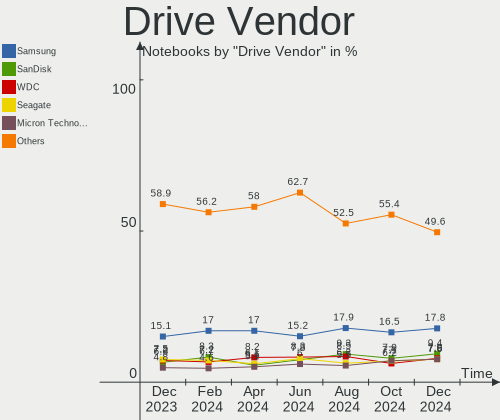
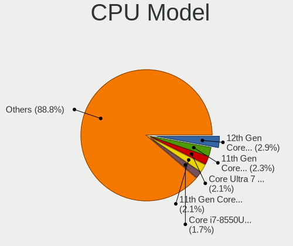
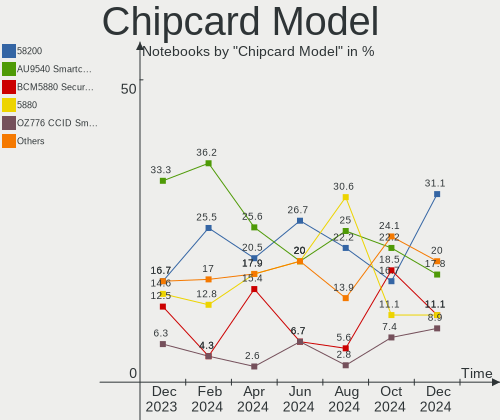

Ubuntu - Hardware Trends (Notebooks)
------------------------------------

A project to identify most popular hardware characteristics and track their change
over time based on data collected by Linux users at https://Linux-Hardware.org.

Anyone can contribute to this report by the [hw-probe](https://github.com/linuxhw/hw-probe) tool:

    sudo -E hw-probe -all -upload

This report is for one last month. Overall report since the beginning of time: [TestCoverage](https://github.com/linuxhw/TestCoverage)

Period: Oct, 2022.

Contents
--------

* [ System ](#system)
  - [ OS                       ](#os)
  - [ OS Family                ](#os-family)
  - [ Kernel                   ](#kernel)
  - [ Kernel Family            ](#kernel-family)
  - [ Kernel Major Ver.        ](#kernel-major-ver)
  - [ Arch                     ](#arch)
  - [ DE                       ](#de)
  - [ Display Server           ](#display-server)
  - [ Display Manager          ](#display-manager)
  - [ OS Lang                  ](#os-lang)
  - [ Boot Mode                ](#boot-mode)
  - [ Filesystem               ](#filesystem)
  - [ Part. scheme             ](#part-scheme)
  - [ Dual Boot with Linux/BSD ](#dual-boot-with-linuxbsd)
  - [ Dual Boot (Win)          ](#dual-boot-win)

* [ Board ](#board)
  - [ Vendor                   ](#vendor)
  - [ Model                    ](#model)
  - [ Model Family             ](#model-family)
  - [ MFG Year                 ](#mfg-year)
  - [ Form Factor              ](#form-factor)
  - [ Secure Boot              ](#secure-boot)
  - [ Coreboot                 ](#coreboot)
  - [ RAM Size                 ](#ram-size)
  - [ RAM Used                 ](#ram-used)
  - [ Total Drives             ](#total-drives)
  - [ Has CD-ROM               ](#has-cd-rom)
  - [ Has Ethernet             ](#has-ethernet)
  - [ Has WiFi                 ](#has-wifi)
  - [ Has Bluetooth            ](#has-bluetooth)

* [ Location ](#location)
  - [ Country                  ](#country)
  - [ City                     ](#city)

* [ Drives ](#drives)
  - [ Drive Vendor             ](#drive-vendor)
  - [ Drive Model              ](#drive-model)
  - [ HDD Vendor               ](#hdd-vendor)
  - [ SSD Vendor               ](#ssd-vendor)
  - [ Drive Kind               ](#drive-kind)
  - [ Drive Connector          ](#drive-connector)
  - [ Drive Size               ](#drive-size)
  - [ Space Total              ](#space-total)
  - [ Space Used               ](#space-used)
  - [ Malfunc. Drives          ](#malfunc-drives)
  - [ Malfunc. Drive Vendor    ](#malfunc-drive-vendor)
  - [ Malfunc. HDD Vendor      ](#malfunc-hdd-vendor)
  - [ Malfunc. Drive Kind      ](#malfunc-drive-kind)
  - [ Failed Drives            ](#failed-drives)
  - [ Failed Drive Vendor      ](#failed-drive-vendor)
  - [ Drive Status             ](#drive-status)

* [ Storage controller ](#storage-controller)
  - [ Storage Vendor           ](#storage-vendor)
  - [ Storage Model            ](#storage-model)
  - [ Storage Kind             ](#storage-kind)

* [ Processor ](#processor)
  - [ CPU Vendor               ](#cpu-vendor)
  - [ CPU Model                ](#cpu-model)
  - [ CPU Model Family         ](#cpu-model-family)
  - [ CPU Cores                ](#cpu-cores)
  - [ CPU Sockets              ](#cpu-sockets)
  - [ CPU Threads              ](#cpu-threads)
  - [ CPU Op-Modes             ](#cpu-op-modes)
  - [ CPU Microcode            ](#cpu-microcode)
  - [ CPU Microarch            ](#cpu-microarch)

* [ Graphics ](#graphics)
  - [ GPU Vendor               ](#gpu-vendor)
  - [ GPU Model                ](#gpu-model)
  - [ GPU Combo                ](#gpu-combo)
  - [ GPU Driver               ](#gpu-driver)
  - [ GPU Memory               ](#gpu-memory)

* [ Monitor ](#monitor)
  - [ Monitor Vendor           ](#monitor-vendor)
  - [ Monitor Model            ](#monitor-model)
  - [ Monitor Resolution       ](#monitor-resolution)
  - [ Monitor Diagonal         ](#monitor-diagonal)
  - [ Monitor Width            ](#monitor-width)
  - [ Aspect Ratio             ](#aspect-ratio)
  - [ Monitor Area             ](#monitor-area)
  - [ Pixel Density            ](#pixel-density)
  - [ Multiple Monitors        ](#multiple-monitors)

* [ Network ](#network)
  - [ Net Controller Vendor    ](#net-controller-vendor)
  - [ Net Controller Model     ](#net-controller-model)
  - [ Wireless Vendor          ](#wireless-vendor)
  - [ Wireless Model           ](#wireless-model)
  - [ Ethernet Vendor          ](#ethernet-vendor)
  - [ Ethernet Model           ](#ethernet-model)
  - [ Net Controller Kind      ](#net-controller-kind)
  - [ Used Controller          ](#used-controller)
  - [ NICs                     ](#nics)
  - [ IPv6                     ](#ipv6)

* [ Bluetooth ](#bluetooth)
  - [ Bluetooth Vendor         ](#bluetooth-vendor)
  - [ Bluetooth Model          ](#bluetooth-model)

* [ Sound ](#sound)
  - [ Sound Vendor             ](#sound-vendor)
  - [ Sound Model              ](#sound-model)

* [ Memory ](#memory)
  - [ Memory Vendor            ](#memory-vendor)
  - [ Memory Model             ](#memory-model)
  - [ Memory Kind              ](#memory-kind)
  - [ Memory Form Factor       ](#memory-form-factor)
  - [ Memory Size              ](#memory-size)
  - [ Memory Speed             ](#memory-speed)

* [ Printers & scanners ](#printers--scanners)
  - [ Printer Vendor           ](#printer-vendor)
  - [ Printer Model            ](#printer-model)
  - [ Scanner Vendor           ](#scanner-vendor)
  - [ Scanner Model            ](#scanner-model)

* [ Camera ](#camera)
  - [ Camera Vendor            ](#camera-vendor)
  - [ Camera Model             ](#camera-model)

* [ Security ](#security)
  - [ Fingerprint Vendor       ](#fingerprint-vendor)
  - [ Fingerprint Model        ](#fingerprint-model)
  - [ Chipcard Vendor          ](#chipcard-vendor)
  - [ Chipcard Model           ](#chipcard-model)

* [ Unsupported ](#unsupported)
  - [ Unsupported Devices      ](#unsupported-devices)
  - [ Unsupported Device Types ](#unsupported-device-types)

System
------

OS
--

Installed operating systems

| Name         | Notebooks | Percent |
|--------------|-----------|---------|
| Ubuntu 22.04 | 512       | 70.82%  |
| Ubuntu 20.04 | 109       | 15.08%  |
| Ubuntu 22.10 | 72        | 9.96%   |
| Ubuntu 18.04 | 23        | 3.18%   |
| Ubuntu 21.10 | 4         | 0.55%   |
| Ubuntu 20.10 | 1         | 0.14%   |
| Ubuntu 19.04 | 1         | 0.14%   |
| Ubuntu 16.04 | 1         | 0.14%   |

OS Family
---------

OS without a version

| Name   | Notebooks | Percent |
|--------|-----------|---------|
| Ubuntu | 723       | 100%    |

Kernel
------

Version of the Linux kernel

| Version                 | Notebooks | Percent |
|-------------------------|-----------|---------|
| 5.15.0-52-generic       | 185       | 25.59%  |
| 5.15.0-48-generic       | 167       | 23.1%   |
| 5.15.0-50-generic       | 149       | 20.61%  |
| 5.19.0-23-generic       | 35        | 4.84%   |
| 5.15.0-43-generic       | 26        | 3.6%    |
| 5.19.0-21-generic       | 21        | 2.9%    |
| 5.15.0-46-generic       | 11        | 1.52%   |
| 5.15.0-25-generic       | 10        | 1.38%   |
| 6.0.0-060000-generic    | 7         | 0.97%   |
| 5.4.0-131-generic       | 7         | 0.97%   |
| 5.4.0-126-generic       | 7         | 0.97%   |
| 5.4.0-128-generic       | 6         | 0.83%   |
| 5.15.0-47-generic       | 6         | 0.83%   |
| 5.19.0-15-generic       | 5         | 0.69%   |
| 5.14.0-1054-oem         | 5         | 0.69%   |
| 5.15.0-41-generic       | 4         | 0.55%   |
| 4.15.0-193-generic      | 4         | 0.55%   |
| 6.0.3-060003-generic    | 3         | 0.41%   |
| 5.17.1-t2               | 3         | 0.41%   |
| 5.15.0-53-generic       | 3         | 0.41%   |
| 5.13.0-39-generic       | 3         | 0.41%   |
| 6.0.5-060005-generic    | 2         | 0.28%   |
| 5.19.0-051900-generic   | 2         | 0.28%   |
| 5.15.0-10050-tuxedo     | 2         | 0.28%   |
| 5.14.0-1052-oem         | 2         | 0.28%   |
| 5.13.0-40-generic       | 2         | 0.28%   |
| 4.15.0-194-generic      | 2         | 0.28%   |
| 6.0.0                   | 1         | 0.14%   |
| 6.0-060000-generic      | 1         | 0.14%   |
| 5.8.0-45-generic        | 1         | 0.14%   |
| 5.4.219-0504219-generic | 1         | 0.14%   |
| 5.4.209-rt77            | 1         | 0.14%   |
| 5.4.0-90-generic        | 1         | 0.14%   |
| 5.4.0-81-generic        | 1         | 0.14%   |
| 5.4.0-47-generic        | 1         | 0.14%   |
| 5.4.0-42-generic        | 1         | 0.14%   |
| 5.4.0-31-generic        | 1         | 0.14%   |
| 5.4.0-124-generic       | 1         | 0.14%   |
| 5.4.0-113-generic       | 1         | 0.14%   |
| 5.4.0-1074-gke          | 1         | 0.14%   |

Kernel Family
-------------

Linux kernel without a distro release

| Version | Notebooks | Percent |
|---------|-----------|---------|
| 5.15.0  | 568       | 78.56%  |
| 5.19.0  | 65        | 8.99%   |
| 5.4.0   | 28        | 3.87%   |
| 5.13.0  | 10        | 1.38%   |
| 5.14.0  | 9         | 1.24%   |
| 6.0.0   | 8         | 1.11%   |
| 4.15.0  | 7         | 0.97%   |
| 5.17.0  | 5         | 0.69%   |
| 6.0.3   | 3         | 0.41%   |
| 5.17.1  | 3         | 0.41%   |
| 5.11.0  | 3         | 0.41%   |
| 6.0.5   | 2         | 0.28%   |
| 6.0     | 1         | 0.14%   |
| 5.8.0   | 1         | 0.14%   |
| 5.4.219 | 1         | 0.14%   |
| 5.4.209 | 1         | 0.14%   |
| 5.19.5  | 1         | 0.14%   |
| 5.19.13 | 1         | 0.14%   |
| 5.18.0  | 1         | 0.14%   |
| 5.15.74 | 1         | 0.14%   |
| 5.15.60 | 1         | 0.14%   |
| 5.15.46 | 1         | 0.14%   |
| 5.0.0   | 1         | 0.14%   |
| 4.4.0   | 1         | 0.14%   |

Kernel Major Ver.
-----------------

Linux kernel major version

| Version | Notebooks | Percent |
|---------|-----------|---------|
| 5.15    | 571       | 78.98%  |
| 5.19    | 67        | 9.27%   |
| 5.4     | 30        | 4.15%   |
| 6.0     | 13        | 1.8%    |
| 5.13    | 10        | 1.38%   |
| 5.14    | 9         | 1.24%   |
| 5.17    | 8         | 1.11%   |
| 4.15    | 7         | 0.97%   |
| 5.11    | 3         | 0.41%   |
| 6       | 1         | 0.14%   |
| 5.8     | 1         | 0.14%   |
| 5.18    | 1         | 0.14%   |
| 5.0     | 1         | 0.14%   |
| 4.4     | 1         | 0.14%   |

Arch
----

OS architecture (x86_64, i586, etc.)

| Name   | Notebooks | Percent |
|--------|-----------|---------|
| x86_64 | 721       | 99.72%  |
| i686   | 2         | 0.28%   |

DE
--

Desktop Environment

| Name            | Notebooks | Percent |
|-----------------|-----------|---------|
| GNOME           | 676       | 93.5%   |
| Unknown         | 25        | 3.46%   |
| GNOME Flashback | 11        | 1.52%   |
| X-Cinnamon      | 7         | 0.97%   |
| i3              | 2         | 0.28%   |
| awesome         | 2         | 0.28%   |

Display Server
--------------

X11 or Wayland

| Name    | Notebooks | Percent |
|---------|-----------|---------|
| Wayland | 401       | 55.46%  |
| X11     | 300       | 41.49%  |
| Unknown | 16        | 2.21%   |
| Tty     | 6         | 0.83%   |

Display Manager
---------------

SDDM, LightDM, etc.

| Name    | Notebooks | Percent |
|---------|-----------|---------|
| GDM3    | 608       | 84.09%  |
| GDM     | 49        | 6.78%   |
| Unknown | 49        | 6.78%   |
| LightDM | 15        | 2.07%   |
| SLiM    | 1         | 0.14%   |
| SDDM    | 1         | 0.14%   |

OS Lang
-------

Language

| Lang    | Notebooks | Percent |
|---------|-----------|---------|
| en_US   | 308       | 42.6%   |
| de_DE   | 64        | 8.85%   |
| it_IT   | 50        | 6.92%   |
| fr_FR   | 47        | 6.5%    |
| en_GB   | 34        | 4.7%    |
| ru_RU   | 22        | 3.04%   |
| pt_BR   | 20        | 2.77%   |
| en_IN   | 20        | 2.77%   |
| es_ES   | 19        | 2.63%   |
| pl_PL   | 17        | 2.35%   |
| en_CA   | 14        | 1.94%   |
| zh_CN   | 6         | 0.83%   |
| tr_TR   | 6         | 0.83%   |
| nl_NL   | 6         | 0.83%   |
| hu_HU   | 6         | 0.83%   |
| es_CO   | 6         | 0.83%   |
| es_AR   | 6         | 0.83%   |
| en_ZA   | 6         | 0.83%   |
| en_AU   | 6         | 0.83%   |
| Unknown | 6         | 0.83%   |
| de_AT   | 5         | 0.69%   |
| pt_PT   | 4         | 0.55%   |
| fr_BE   | 4         | 0.55%   |
| es_MX   | 4         | 0.55%   |
| nb_NO   | 3         | 0.41%   |
| en_PH   | 3         | 0.41%   |
| el_GR   | 3         | 0.41%   |
| fr_CH   | 2         | 0.28%   |
| es_PE   | 2         | 0.28%   |
| en_NZ   | 2         | 0.28%   |
| en_IE   | 2         | 0.28%   |
| en_DE   | 2         | 0.28%   |
| cs_CZ   | 2         | 0.28%   |
| uk_UA   | 1         | 0.14%   |
| sv_SE   | 1         | 0.14%   |
| sl_SI   | 1         | 0.14%   |
| ro_RO   | 1         | 0.14%   |
| ko_KR   | 1         | 0.14%   |
| fi_FI   | 1         | 0.14%   |
| es_US   | 1         | 0.14%   |

Boot Mode
---------

EFI or BIOS

| Mode | Notebooks | Percent |
|------|-----------|---------|
| BIOS | 401       | 55.46%  |
| EFI  | 322       | 44.54%  |

Filesystem
----------

Type of filesystem

| Type    | Notebooks | Percent |
|---------|-----------|---------|
| Ext4    | 669       | 92.53%  |
| Overlay | 30        | 4.15%   |
| Zfs     | 14        | 1.94%   |
| Btrfs   | 6         | 0.83%   |
| Xfs     | 2         | 0.28%   |
| XXX4    | 1         | 0.14%   |
| Ext2    | 1         | 0.14%   |

Part. scheme
------------

Scheme of partitioning

| Type    | Notebooks | Percent |
|---------|-----------|---------|
| GPT     | 569       | 78.7%   |
| MBR     | 102       | 14.11%  |
| Unknown | 52        | 7.19%   |

Dual Boot with Linux/BSD
------------------------

Hosting more than one Linux/BSD

| Dual boot | Notebooks | Percent |
|-----------|-----------|---------|
| No        | 677       | 93.64%  |
| Yes       | 46        | 6.36%   |

Dual Boot (Win)
---------------

Hosting Linux and Windows

| Dual boot | Notebooks | Percent |
|-----------|-----------|---------|
| No        | 453       | 62.66%  |
| Yes       | 270       | 37.34%  |

Board
-----

Vendor
------

Motherboard manufacturer

| Name                           | Notebooks | Percent |
|--------------------------------|-----------|---------|
| Lenovo                         | 153       | 21.16%  |
| Dell                           | 135       | 18.67%  |
| Hewlett-Packard                | 133       | 18.4%   |
| ASUSTek Computer               | 69        | 9.54%   |
| Acer                           | 49        | 6.78%   |
| MSI                            | 24        | 3.32%   |
| HUAWEI                         | 23        | 3.18%   |
| Toshiba                        | 16        | 2.21%   |
| Apple                          | 16        | 2.21%   |
| Samsung Electronics            | 12        | 1.66%   |
| Sony                           | 7         | 0.97%   |
| Notebook                       | 7         | 0.97%   |
| Unknown                        | 6         | 0.83%   |
| TUXEDO                         | 4         | 0.55%   |
| Packard Bell                   | 4         | 0.55%   |
| Medion                         | 4         | 0.55%   |
| LG Electronics                 | 4         | 0.55%   |
| Alienware                      | 4         | 0.55%   |
| GEO                            | 3         | 0.41%   |
| Fujitsu                        | 3         | 0.41%   |
| Positivo                       | 2         | 0.28%   |
| PC Specialist                  | 2         | 0.28%   |
| Monster                        | 2         | 0.28%   |
| K.A.Technologies Limited       | 2         | 0.28%   |
| Google                         | 2         | 0.28%   |
| Gigabyte Technology            | 2         | 0.28%   |
| Clevo                          | 2         | 0.28%   |
| Avell High Performance         | 2         | 0.28%   |
| A-DATA Technology              | 2         | 0.28%   |
| VANT                           | 1         | 0.14%   |
| Valve                          | 1         | 0.14%   |
| UNOWHY                         | 1         | 0.14%   |
| Timi                           | 1         | 0.14%   |
| Tactus                         | 1         | 0.14%   |
| System76                       | 1         | 0.14%   |
| SmbiosType1_SystemManufacturer | 1         | 0.14%   |
| Shanghai Zhaoxin Semiconductor | 1         | 0.14%   |
| Radxa                          | 1         | 0.14%   |
| Positivo Bahia - VAIO          | 1         | 0.14%   |
| Panasonic                      | 1         | 0.14%   |

Model
-----

Motherboard model

| Name                             | Notebooks | Percent |
|----------------------------------|-----------|---------|
| Unknown                          | 8         | 1.11%   |
| HP Pavilion Notebook             | 4         | 0.55%   |
| HP Pavilion dv7                  | 4         | 0.55%   |
| Dell Latitude E6510              | 4         | 0.55%   |
| Dell Latitude 7480               | 4         | 0.55%   |
| Lenovo Z50-75 80EC               | 3         | 0.41%   |
| Lenovo ThinkPad SL500 27463ZG    | 3         | 0.41%   |
| HUAWEI BOM-WXX9                  | 3         | 0.41%   |
| HUAWEI BOHK-WAX9X                | 3         | 0.41%   |
| HP Pavilion dv6                  | 3         | 0.41%   |
| HP EliteBook 8470p               | 3         | 0.41%   |
| HP 250 G5 Notebook PC            | 3         | 0.41%   |
| Dell XPS 15 9500                 | 3         | 0.41%   |
| Dell XPS 13 9305                 | 3         | 0.41%   |
| Dell Precision M4800             | 3         | 0.41%   |
| Dell Latitude E6440              | 3         | 0.41%   |
| Dell Latitude 7300               | 3         | 0.41%   |
| Dell Latitude 5520               | 3         | 0.41%   |
| Dell Latitude 5420               | 3         | 0.41%   |
| ASUS N750JK                      | 3         | 0.41%   |
| Apple MacBookPro15,2             | 3         | 0.41%   |
| Acer Aspire E5-575G              | 3         | 0.41%   |
| Toshiba Satellite L300           | 2         | 0.28%   |
| MSI Stealth GS66 12UGS           | 2         | 0.28%   |
| MSI GF63 Thin 11UD               | 2         | 0.28%   |
| Lenovo ThinkPad T480s 20L7CTO1WW | 2         | 0.28%   |
| Lenovo ThinkBook 15 G2 ITL 20VE  | 2         | 0.28%   |
| Lenovo IdeaPad S145-15IWL 81S9   | 2         | 0.28%   |
| Lenovo IdeaPad 330-15IKB 81DE    | 2         | 0.28%   |
| Lenovo IdeaPad 3 15IIL05 81WE    | 2         | 0.28%   |
| Lenovo G710 20252                | 2         | 0.28%   |
| Lenovo G510 20238                | 2         | 0.28%   |
| Lenovo B40-70 80F3               | 2         | 0.28%   |
| K.A.Technologies Limited TM1     | 2         | 0.28%   |
| HUAWEI NBLK-WAX9X                | 2         | 0.28%   |
| HUAWEI KLVL-WXX9                 | 2         | 0.28%   |
| HUAWEI KLVD-WXX9                 | 2         | 0.28%   |
| HUAWEI CREM-WXX9                 | 2         | 0.28%   |
| HUAWEI BOD-WXX9                  | 2         | 0.28%   |
| HP ProBook 650 G1                | 2         | 0.28%   |

Model Family
------------

Motherboard model prefix

| Name                  | Notebooks | Percent |
|-----------------------|-----------|---------|
| Lenovo ThinkPad       | 86        | 11.89%  |
| Dell Latitude         | 59        | 8.16%   |
| Acer Aspire           | 35        | 4.84%   |
| HP Pavilion           | 29        | 4.01%   |
| Dell Inspiron         | 28        | 3.87%   |
| Lenovo IdeaPad        | 27        | 3.73%   |
| HP EliteBook          | 24        | 3.32%   |
| HP Laptop             | 22        | 3.04%   |
| Dell XPS              | 21        | 2.9%    |
| ASUS VivoBook         | 21        | 2.9%    |
| Dell Precision        | 17        | 2.35%   |
| HP ProBook            | 15        | 2.07%   |
| Toshiba Satellite     | 14        | 1.94%   |
| Lenovo Legion         | 9         | 1.24%   |
| HP ENVY               | 9         | 1.24%   |
| Unknown               | 8         | 1.11%   |
| Dell Vostro           | 7         | 0.97%   |
| ASUS ZenBook          | 6         | 0.83%   |
| Acer Swift            | 6         | 0.83%   |
| MSI Stealth           | 5         | 0.69%   |
| HP ZBook              | 5         | 0.69%   |
| ASUS ASUS             | 5         | 0.69%   |
| Packard Bell EasyNote | 4         | 0.55%   |
| MSI Modern            | 4         | 0.55%   |
| Lenovo ThinkBook      | 4         | 0.55%   |
| HP OMEN               | 4         | 0.55%   |
| ASUS ROG              | 4         | 0.55%   |
| Acer Nitro            | 4         | 0.55%   |
| Lenovo Z50-75         | 3         | 0.41%   |
| Lenovo Yoga           | 3         | 0.41%   |
| HUAWEI BOM-WXX9       | 3         | 0.41%   |
| HUAWEI BOHK-WAX9X     | 3         | 0.41%   |
| HP Victus             | 3         | 0.41%   |
| HP 255                | 3         | 0.41%   |
| HP 250                | 3         | 0.41%   |
| Fujitsu LIFEBOOK      | 3         | 0.41%   |
| ASUS N750JK           | 3         | 0.41%   |
| Apple MacBookPro15    | 3         | 0.41%   |
| TUXEDO Pulse          | 2         | 0.28%   |
| TUXEDO InfinityBook   | 2         | 0.28%   |

MFG Year
--------

Motherboard manufacture year

| Year    | Notebooks | Percent |
|---------|-----------|---------|
| 2021    | 121       | 16.74%  |
| 2020    | 97        | 13.42%  |
| 2019    | 62        | 8.58%   |
| 2018    | 55        | 7.61%   |
| 2022    | 50        | 6.92%   |
| 2013    | 48        | 6.64%   |
| 2014    | 44        | 6.09%   |
| 2011    | 42        | 5.81%   |
| 2017    | 38        | 5.26%   |
| 2012    | 34        | 4.7%    |
| 2010    | 33        | 4.56%   |
| 2016    | 28        | 3.87%   |
| 2015    | 28        | 3.87%   |
| 2008    | 22        | 3.04%   |
| 2009    | 13        | 1.8%    |
| 2007    | 5         | 0.69%   |
| 2006    | 2         | 0.28%   |
| Unknown | 1         | 0.14%   |

Form Factor
-----------

Physical design of the computer

| Name     | Notebooks | Percent |
|----------|-----------|---------|
| Notebook | 723       | 100%    |

Secure Boot
-----------

Enabled or disabled

| State    | Notebooks | Percent |
|----------|-----------|---------|
| Disabled | 629       | 87%     |
| Enabled  | 94        | 13%     |

Coreboot
--------

Have coreboot on board

| Used | Notebooks | Percent |
|------|-----------|---------|
| No   | 718       | 99.31%  |
| Yes  | 5         | 0.69%   |

RAM Size
--------

Total RAM memory

| Size in GB  | Notebooks | Percent |
|-------------|-----------|---------|
| 4.01-8.0    | 211       | 29.18%  |
| 16.01-24.0  | 147       | 20.33%  |
| 3.01-4.0    | 123       | 17.01%  |
| 8.01-16.0   | 121       | 16.74%  |
| 32.01-64.0  | 68        | 9.41%   |
| 1.01-2.0    | 18        | 2.49%   |
| 24.01-32.0  | 17        | 2.35%   |
| 64.01-256.0 | 12        | 1.66%   |
| 2.01-3.0    | 5         | 0.69%   |
| 0.51-1.0    | 1         | 0.14%   |

RAM Used
--------

Used RAM memory

| Used GB    | Notebooks | Percent |
|------------|-----------|---------|
| 2.01-3.0   | 225       | 31.12%  |
| 1.01-2.0   | 197       | 27.25%  |
| 4.01-8.0   | 139       | 19.23%  |
| 3.01-4.0   | 105       | 14.52%  |
| 8.01-16.0  | 43        | 5.95%   |
| 16.01-24.0 | 6         | 0.83%   |
| 0.51-1.0   | 6         | 0.83%   |
| 24.01-32.0 | 2         | 0.28%   |

Total Drives
------------

Number of drives on board

| Drives | Notebooks | Percent |
|--------|-----------|---------|
| 1      | 555       | 76.76%  |
| 2      | 148       | 20.47%  |
| 3      | 12        | 1.66%   |
| 4      | 4         | 0.55%   |
| 0      | 4         | 0.55%   |

Has CD-ROM
----------

Has CD-ROM on board

| Presented | Notebooks | Percent |
|-----------|-----------|---------|
| No        | 503       | 69.57%  |
| Yes       | 220       | 30.43%  |

Has Ethernet
------------

Has Ethernet on board

| Presented | Notebooks | Percent |
|-----------|-----------|---------|
| Yes       | 547       | 75.66%  |
| No        | 176       | 24.34%  |

Has WiFi
--------

Has WiFi module

| Presented | Notebooks | Percent |
|-----------|-----------|---------|
| Yes       | 707       | 97.79%  |
| No        | 16        | 2.21%   |

Has Bluetooth
-------------

Has Bluetooth module

| Presented | Notebooks | Percent |
|-----------|-----------|---------|
| Yes       | 586       | 81.05%  |
| No        | 137       | 18.95%  |

Location
--------

Country
-------

Geographic location (country)

| Country      | Notebooks | Percent |
|--------------|-----------|---------|
| USA          | 92        | 12.72%  |
| Italy        | 77        | 10.65%  |
| Germany      | 77        | 10.65%  |
| France       | 57        | 7.88%   |
| Brazil       | 32        | 4.43%   |
| UK           | 26        | 3.6%    |
| Russia       | 26        | 3.6%    |
| Poland       | 25        | 3.46%   |
| India        | 22        | 3.04%   |
| Spain        | 20        | 2.77%   |
| Netherlands  | 20        | 2.77%   |
| Canada       | 13        | 1.8%    |
| Austria      | 13        | 1.8%    |
| Hungary      | 12        | 1.66%   |
| Argentina    | 11        | 1.52%   |
| Belgium      | 10        | 1.38%   |
| Turkey       | 9         | 1.24%   |
| Portugal     | 9         | 1.24%   |
| Mexico       | 9         | 1.24%   |
| Colombia     | 9         | 1.24%   |
| Switzerland  | 8         | 1.11%   |
| Sweden       | 8         | 1.11%   |
| South Africa | 7         | 0.97%   |
| China        | 7         | 0.97%   |
| Romania      | 6         | 0.83%   |
| Norway       | 6         | 0.83%   |
| Finland      | 6         | 0.83%   |
| Indonesia    | 5         | 0.69%   |
| Greece       | 5         | 0.69%   |
| Czechia      | 5         | 0.69%   |
| Australia    | 5         | 0.69%   |
| Philippines  | 4         | 0.55%   |
| Ghana        | 4         | 0.55%   |
| Bulgaria     | 4         | 0.55%   |
| UAE          | 3         | 0.41%   |
| South Korea  | 3         | 0.41%   |
| Serbia       | 3         | 0.41%   |
| Peru         | 3         | 0.41%   |
| New Zealand  | 3         | 0.41%   |
| Morocco      | 3         | 0.41%   |

City
----

Geographic location (city)

| City              | Notebooks | Percent |
|-------------------|-----------|---------|
| Milan             | 15        | 2.07%   |
| Berlin            | 10        | 1.38%   |
| Moscow            | 8         | 1.11%   |
| Warsaw            | 7         | 0.97%   |
| Budapest          | 7         | 0.97%   |
| Vienna            | 6         | 0.83%   |
| Sao Paulo         | 6         | 0.83%   |
| Mexico City       | 5         | 0.69%   |
| Bogotá           | 5         | 0.69%   |
| Bengaluru         | 5         | 0.69%   |
| Valenciennes      | 4         | 0.55%   |
| Turin             | 4         | 0.55%   |
| St Petersburg     | 4         | 0.55%   |
| Rome              | 4         | 0.55%   |
| Prague            | 4         | 0.55%   |
| Paris             | 4         | 0.55%   |
| Padova            | 4         | 0.55%   |
| Oslo              | 4         | 0.55%   |
| Madrid            | 4         | 0.55%   |
| Cape Town         | 4         | 0.55%   |
| Buenos Aires      | 4         | 0.55%   |
| Barcelona         | 4         | 0.55%   |
| Accra             | 4         | 0.55%   |
| Wroclaw           | 3         | 0.41%   |
| Naples            | 3         | 0.41%   |
| Nairobi           | 3         | 0.41%   |
| Montpellier       | 3         | 0.41%   |
| Melbourne         | 3         | 0.41%   |
| Los Angeles       | 3         | 0.41%   |
| Lima              | 3         | 0.41%   |
| Frankfurt am Main | 3         | 0.41%   |
| Dubai             | 3         | 0.41%   |
| Dresden           | 3         | 0.41%   |
| Chennai           | 3         | 0.41%   |
| Belo Horizonte    | 3         | 0.41%   |
| Valencia          | 2         | 0.28%   |
| Tunis             | 2         | 0.28%   |
| Trieste           | 2         | 0.28%   |
| Thessaloniki      | 2         | 0.28%   |
| The Hague         | 2         | 0.28%   |

Drives
------

Drive Vendor
------------

Hard drive vendors

| Vendor                    | Notebooks | Drives | Percent |
|---------------------------|-----------|--------|---------|
| Samsung Electronics       | 151       | 157    | 17.44%  |
| WDC                       | 78        | 79     | 9.01%   |
| SanDisk                   | 69        | 71     | 7.97%   |
| Seagate                   | 62        | 63     | 7.16%   |
| Unknown                   | 56        | 65     | 6.47%   |
| Toshiba                   | 55        | 58     | 6.35%   |
| SK hynix                  | 47        | 48     | 5.43%   |
| Kingston                  | 39        | 41     | 4.5%    |
| Crucial                   | 34        | 34     | 3.93%   |
| Micron Technology         | 31        | 31     | 3.58%   |
| Intel                     | 24        | 28     | 2.77%   |
| Hitachi                   | 20        | 20     | 2.31%   |
| HGST                      | 20        | 20     | 2.31%   |
| KIOXIA                    | 19        | 19     | 2.19%   |
| A-DATA Technology         | 13        | 13     | 1.5%    |
| Apple                     | 12        | 13     | 1.39%   |
| Phison Electronics        | 9         | 9      | 1.04%   |
| Intenso                   | 7         | 7      | 0.81%   |
| LITEONIT                  | 6         | 6      | 0.69%   |
| Patriot                   | 5         | 5      | 0.58%   |
| Micron/Crucial Technology | 5         | 5      | 0.58%   |
| Fujitsu                   | 5         | 5      | 0.58%   |
| China                     | 5         | 5      | 0.58%   |
| UMIS                      | 4         | 4      | 0.46%   |
| SSSTC                     | 4         | 4      | 0.46%   |
| SPCC                      | 4         | 4      | 0.46%   |
| JMicron Technology        | 4         | 4      | 0.46%   |
| GOODRAM                   | 4         | 4      | 0.46%   |
| Unknown                   | 4         | 4      | 0.46%   |
| Phison                    | 3         | 3      | 0.35%   |
| Netac                     | 3         | 3      | 0.35%   |
| Gigabyte Technology       | 3         | 3      | 0.35%   |
| XPG                       | 2         | 2      | 0.23%   |
| Union Memory              | 2         | 2      | 0.23%   |
| Transcend                 | 2         | 2      | 0.23%   |
| Super Talent              | 2         | 2      | 0.23%   |
| Solid State Storage       | 2         | 2      | 0.23%   |
| Silicon Motion            | 2         | 2      | 0.23%   |
| Realtek Semiconductor     | 2         | 2      | 0.23%   |
| PNY                       | 2         | 2      | 0.23%   |

Drive Model
-----------

Hard drive models

| Model                                                | Notebooks | Percent |
|------------------------------------------------------|-----------|---------|
| Unknown MMC Card  32GB                               | 16        | 1.81%   |
| Samsung NVMe SSD Controller SM981/PM981/PM983 500GB  | 15        | 1.69%   |
| Sandisk WD Blue SN550 NVMe SSD 1TB                   | 13        | 1.47%   |
| Kingston SA400S37240G 240GB SSD                      | 10        | 1.13%   |
| Unknown MMC Card  64GB                               | 9         | 1.02%   |
| Toshiba MQ04ABF100 1TB                               | 9         | 1.02%   |
| Seagate ST1000LM035-1RK172 1TB                       | 8         | 0.9%    |
| Seagate ST1000LM024 HN-M101MBB 1TB                   | 8         | 0.9%    |
| Sandisk WD Black SN750 / PC SN730 NVMe SSD 1TB       | 8         | 0.9%    |
| Toshiba XG6 NVMe SSD Controller 512GB                | 7         | 0.79%   |
| Toshiba MQ01ABF050 500GB                             | 7         | 0.79%   |
| Samsung NVMe SSD Controller PM9A1/PM9A3/980PRO 250GB | 7         | 0.79%   |
| KIOXIA KBG40ZNV512G 512GB                            | 7         | 0.79%   |
| Crucial CT500MX500SSD1 500GB                         | 7         | 0.79%   |
| Unknown MMC Card  16GB                               | 6         | 0.68%   |
| Unknown MMC Card  128GB                              | 6         | 0.68%   |
| Phison PS5013 E13 NVMe Controller 256GB              | 6         | 0.68%   |
| HGST HTS721010A9E630 1TB                             | 6         | 0.68%   |
| Crucial CT240BX500SSD1 240GB                         | 6         | 0.68%   |
| Toshiba MQ01ABD100 1TB                               | 5         | 0.56%   |
| Seagate ST1000LM049-2GH172 1TB                       | 5         | 0.56%   |
| Samsung SSD 850 EVO 250GB                            | 5         | 0.56%   |
| Samsung NVMe SSD Controller SM961/PM961/SM963 250GB  | 5         | 0.56%   |
| Samsung MZVLQ512HBLU-00BH1 512GB                     | 5         | 0.56%   |
| Kingston SA400S37480G 480GB SSD                      | 5         | 0.56%   |
| Intel SSDPEKNW512G8 512GB                            | 5         | 0.56%   |
| WDC WD10JPVX-22JC3T0 1TB                             | 4         | 0.45%   |
| SanDisk NVMe SSD Drive 1TB                           | 4         | 0.45%   |
| Samsung SSD 870 EVO 1TB                              | 4         | 0.45%   |
| Samsung SSD 860 EVO 500GB                            | 4         | 0.45%   |
| Samsung SSD 860 EVO 1TB                              | 4         | 0.45%   |
| Micron 3400_MTFDKBA1T0TFH 1TB                        | 4         | 0.45%   |
| KIOXIA KBG40ZNS512G NVMe 512GB                       | 4         | 0.45%   |
| Intel SSDPEKNU512GZ 512GB                            | 4         | 0.45%   |
| HGST HTS541010A9E680 1TB                             | 4         | 0.45%   |
| Crucial CT250MX500SSD1 250GB                         | 4         | 0.45%   |
| Crucial CT1000MX500SSD1 1TB                          | 4         | 0.45%   |
| Unknown                                              | 4         | 0.45%   |
| WDC WDS240G2G0A-00JH30 240GB SSD                     | 3         | 0.34%   |
| WDC WD5000LPCX-24VHAT0 500GB                         | 3         | 0.34%   |

HDD Vendor
----------

Hard disk drive vendors

| Vendor              | Notebooks | Drives | Percent |
|---------------------|-----------|--------|---------|
| Seagate             | 62        | 62     | 31.63%  |
| WDC                 | 46        | 46     | 23.47%  |
| Toshiba             | 30        | 30     | 15.31%  |
| Hitachi             | 20        | 20     | 10.2%   |
| HGST                | 20        | 20     | 10.2%   |
| Samsung Electronics | 8         | 8      | 4.08%   |
| Fujitsu             | 5         | 5      | 2.55%   |
| Unknown             | 2         | 2      | 1.02%   |
| USB3.0              | 1         | 1      | 0.51%   |
| HGST HTS            | 1         | 1      | 0.51%   |
| Apple               | 1         | 1      | 0.51%   |

SSD Vendor
----------

Solid state drive vendors

| Vendor              | Notebooks | Drives | Percent |
|---------------------|-----------|--------|---------|
| Samsung Electronics | 55        | 56     | 21.32%  |
| Crucial             | 34        | 34     | 13.18%  |
| Kingston            | 30        | 32     | 11.63%  |
| SanDisk             | 29        | 29     | 11.24%  |
| WDC                 | 12        | 12     | 4.65%   |
| SK hynix            | 10        | 10     | 3.88%   |
| Micron Technology   | 7         | 7      | 2.71%   |
| LITEONIT            | 6         | 6      | 2.33%   |
| Patriot             | 5         | 5      | 1.94%   |
| China               | 5         | 5      | 1.94%   |
| Apple               | 5         | 5      | 1.94%   |
| A-DATA Technology   | 5         | 5      | 1.94%   |
| Toshiba             | 4         | 5      | 1.55%   |
| GOODRAM             | 4         | 4      | 1.55%   |
| SPCC                | 3         | 3      | 1.16%   |
| Netac               | 3         | 3      | 1.16%   |
| Intel               | 3         | 3      | 1.16%   |
| Transcend           | 2         | 2      | 0.78%   |
| Super Talent        | 2         | 2      | 0.78%   |
| PNY                 | 2         | 2      | 0.78%   |
| Intenso             | 2         | 2      | 0.78%   |
| Gigabyte Technology | 2         | 2      | 0.78%   |
| Emtec               | 2         | 2      | 0.78%   |
| Corsair             | 2         | 2      | 0.78%   |
| ASMT                | 2         | 2      | 0.78%   |
| Unknown             | 2         | 2      | 0.78%   |
| UNIC2               | 1         | 1      | 0.39%   |
| TYPEC 1T            | 1         | 1      | 0.39%   |
| TwinMOS             | 1         | 1      | 0.39%   |
| tecmiyo             | 1         | 1      | 0.39%   |
| Team                | 1         | 1      | 0.39%   |
| StoreJet            | 1         | 1      | 0.39%   |
| SSSTC               | 1         | 1      | 0.39%   |
| MidasForce          | 1         | 1      | 0.39%   |
| Londisk             | 1         | 1      | 0.39%   |
| Lenovo              | 1         | 1      | 0.39%   |
| KINGSTONG           | 1         | 1      | 0.39%   |
| KingSpec            | 1         | 1      | 0.39%   |
| Hikvision           | 1         | 1      | 0.39%   |
| CT480BX5            | 1         | 1      | 0.39%   |

Drive Kind
----------

HDD or SSD

| Kind    | Notebooks | Drives | Percent |
|---------|-----------|--------|---------|
| NVMe    | 334       | 359    | 39.67%  |
| SSD     | 245       | 262    | 29.1%   |
| HDD     | 194       | 196    | 23.04%  |
| MMC     | 54        | 64     | 6.41%   |
| Unknown | 15        | 15     | 1.78%   |

Drive Connector
---------------

SATA, SAS, NVMe, etc.

| Type | Notebooks | Drives | Percent |
|------|-----------|--------|---------|
| SATA | 392       | 439    | 48.34%  |
| NVMe | 332       | 355    | 40.94%  |
| MMC  | 54        | 64     | 6.66%   |
| SAS  | 33        | 38     | 4.07%   |

Drive Size
----------

Size of hard drive

| Size in TB | Notebooks | Drives | Percent |
|------------|-----------|--------|---------|
| 0.01-0.5   | 274       | 299    | 64.17%  |
| 0.51-1.0   | 137       | 143    | 32.08%  |
| 1.01-2.0   | 11        | 11     | 2.58%   |
| 3.01-4.0   | 3         | 3      | 0.7%    |
| 2.01-3.0   | 1         | 1      | 0.23%   |
| 4.01-10.0  | 1         | 1      | 0.23%   |

Space Total
-----------

Amount of disk space available on the file system

| Size in GB     | Notebooks | Percent |
|----------------|-----------|---------|
| 101-250        | 218       | 30.15%  |
| 251-500        | 210       | 29.05%  |
| 501-1000       | 112       | 15.49%  |
| 51-100         | 49        | 6.78%   |
| 1-20           | 43        | 5.95%   |
| 21-50          | 35        | 4.84%   |
| 1001-2000      | 27        | 3.73%   |
| More than 3000 | 12        | 1.66%   |
| 2001-3000      | 9         | 1.24%   |
| Unknown        | 8         | 1.11%   |

Space Used
----------

Amount of used disk space

| Used GB        | Notebooks | Percent |
|----------------|-----------|---------|
| 1-20           | 247       | 34.16%  |
| 21-50          | 141       | 19.5%   |
| 101-250        | 129       | 17.84%  |
| 51-100         | 108       | 14.94%  |
| 251-500        | 52        | 7.19%   |
| 501-1000       | 24        | 3.32%   |
| 1001-2000      | 9         | 1.24%   |
| Unknown        | 8         | 1.11%   |
| More than 3000 | 3         | 0.41%   |
| 2001-3000      | 2         | 0.28%   |

Malfunc. Drives
---------------

Drive models with a malfunction

| Model                                 | Notebooks | Drives | Percent |
|---------------------------------------|-----------|--------|---------|
| SK hynix BC711 HFM512GD3JX013N 512GB  | 2         | 2      | 6.67%   |
| Seagate ST1000LM035-1RK172 1TB        | 2         | 2      | 6.67%   |
| WDC WD5000BEVT-60ZAT1 500GB           | 1         | 1      | 3.33%   |
| Toshiba MQ04ABF100 1TB                | 1         | 1      | 3.33%   |
| Toshiba MQ01ABF050 500GB              | 1         | 1      | 3.33%   |
| tecmiyo SATA SSD 256GB                | 1         | 1      | 3.33%   |
| SPCC M.2 PCIe SSD 1TB                 | 1         | 1      | 3.33%   |
| SK hynix HFS512G39TND-N210A 512GB SSD | 1         | 1      | 3.33%   |
| Seagate ST9500420AS 500GB             | 1         | 1      | 3.33%   |
| Seagate ST9320423AS 320GB             | 1         | 1      | 3.33%   |
| Seagate ST9250827AS 250GB             | 1         | 1      | 3.33%   |
| Seagate ST500LM021-1KJ152 500GB       | 1         | 1      | 3.33%   |
| Seagate ST1000LM049-2GH172 1TB        | 1         | 1      | 3.33%   |
| Seagate ST1000LM014-1EJ164 1TB        | 1         | 1      | 3.33%   |
| Samsung Electronics SSD 870 EVO 1TB   | 1         | 1      | 3.33%   |
| Samsung Electronics SM961 NVMe 1024GB | 1         | 1      | 3.33%   |
| Kingston SA400S37480G 480GB SSD       | 1         | 1      | 3.33%   |
| Kingston SA400S37120G 120GB SSD       | 1         | 1      | 3.33%   |
| Intel SSDSCKKF256G8H 256GB            | 1         | 1      | 3.33%   |
| Hitachi HTS727550A9E364 500GB         | 1         | 1      | 3.33%   |
| Hitachi HTS545050A7E380 500GB         | 1         | 1      | 3.33%   |
| Hitachi HTS542525K9A300 250GB         | 1         | 1      | 3.33%   |
| HGST HTS725050A7E630 500GB            | 1         | 1      | 3.33%   |
| HGST HTS541010A9E680 1TB              | 1         | 1      | 3.33%   |
| Fujitsu MHZ2160B 160GB                | 1         | 1      | 3.33%   |
| Crucial CT750MX300SSD1 752GB          | 1         | 1      | 3.33%   |
| Crucial CT275MX300SSD4 275GB          | 1         | 1      | 3.33%   |
| Corsair Neutron GTX SSD 120GB         | 1         | 1      | 3.33%   |

Malfunc. Drive Vendor
---------------------

Vendors of faulty drives

| Vendor              | Notebooks | Drives | Percent |
|---------------------|-----------|--------|---------|
| Seagate             | 8         | 8      | 26.67%  |
| SK hynix            | 3         | 3      | 10%     |
| Hitachi             | 3         | 3      | 10%     |
| Toshiba             | 2         | 2      | 6.67%   |
| Samsung Electronics | 2         | 2      | 6.67%   |
| Kingston            | 2         | 2      | 6.67%   |
| HGST                | 2         | 2      | 6.67%   |
| Crucial             | 2         | 2      | 6.67%   |
| WDC                 | 1         | 1      | 3.33%   |
| tecmiyo             | 1         | 1      | 3.33%   |
| SPCC                | 1         | 1      | 3.33%   |
| Intel               | 1         | 1      | 3.33%   |
| Fujitsu             | 1         | 1      | 3.33%   |
| Corsair             | 1         | 1      | 3.33%   |

Malfunc. HDD Vendor
-------------------

Vendors of faulty HDD drives

| Vendor  | Notebooks | Drives | Percent |
|---------|-----------|--------|---------|
| Seagate | 8         | 8      | 47.06%  |
| Hitachi | 3         | 3      | 17.65%  |
| Toshiba | 2         | 2      | 11.76%  |
| HGST    | 2         | 2      | 11.76%  |
| WDC     | 1         | 1      | 5.88%   |
| Fujitsu | 1         | 1      | 5.88%   |

Malfunc. Drive Kind
-------------------

Kinds of faulty drives

| Kind | Notebooks | Drives | Percent |
|------|-----------|--------|---------|
| HDD  | 17        | 17     | 56.67%  |
| SSD  | 9         | 9      | 30%     |
| NVMe | 4         | 4      | 13.33%  |

Failed Drives
-------------

Failed drive models

Zero info for selected period =(

Failed Drive Vendor
-------------------

Failed drive vendors

Zero info for selected period =(

Drive Status
------------

Number of failed and malfunc. drives

| Status   | Notebooks | Drives | Percent |
|----------|-----------|--------|---------|
| Detected | 449       | 563    | 60.03%  |
| Works    | 269       | 303    | 35.96%  |
| Malfunc  | 30        | 30     | 4.01%   |

Storage controller
------------------

Storage Vendor
--------------

Storage controller vendors

| Vendor                               | Notebooks | Percent |
|--------------------------------------|-----------|---------|
| Intel                                | 453       | 52.37%  |
| Samsung Electronics                  | 91        | 10.52%  |
| AMD                                  | 81        | 9.36%   |
| SanDisk                              | 60        | 6.94%   |
| SK hynix                             | 37        | 4.28%   |
| Micron Technology                    | 24        | 2.77%   |
| Toshiba America Info Systems         | 22        | 2.54%   |
| KIOXIA                               | 18        | 2.08%   |
| Phison Electronics                   | 13        | 1.5%    |
| Kingston Technology Company          | 11        | 1.27%   |
| ADATA Technology                     | 10        | 1.16%   |
| Union Memory (Shenzhen)              | 6         | 0.69%   |
| Solid State Storage Technology       | 6         | 0.69%   |
| Apple                                | 6         | 0.69%   |
| Micron/Crucial Technology            | 5         | 0.58%   |
| Realtek Semiconductor                | 4         | 0.46%   |
| Nvidia                               | 4         | 0.46%   |
| Lite-On Technology                   | 4         | 0.46%   |
| Silicon Motion                       | 2         | 0.23%   |
| Unknown                              | 2         | 0.23%   |
| Zhaoxin                              | 1         | 0.12%   |
| Ramaxel Technology(Shenzhen) Limited | 1         | 0.12%   |
| Marvell Technology Group             | 1         | 0.12%   |
| Lenovo                               | 1         | 0.12%   |
| Biwin Storage Technology             | 1         | 0.12%   |
| ASMedia Technology                   | 1         | 0.12%   |

Storage Model
-------------

Storage controller models

| Model                                                                            | Notebooks | Percent |
|----------------------------------------------------------------------------------|-----------|---------|
| AMD FCH SATA Controller [AHCI mode]                                              | 74        | 8.11%   |
| Intel Volume Management Device NVMe RAID Controller                              | 50        | 5.48%   |
| Intel Sunrise Point-LP SATA Controller [AHCI mode]                               | 50        | 5.48%   |
| Intel 82801 Mobile SATA Controller [RAID mode]                                   | 48        | 5.26%   |
| Intel 7 Series Chipset Family 6-port SATA Controller [AHCI mode]                 | 40        | 4.38%   |
| Samsung NVMe SSD Controller SM981/PM981/PM983                                    | 36        | 3.94%   |
| Samsung NVMe SSD Controller 980                                                  | 30        | 3.29%   |
| Intel 8 Series/C220 Series Chipset Family 6-port SATA Controller 1 [AHCI mode]   | 30        | 3.29%   |
| Intel 6 Series/C200 Series Chipset Family 6 port Mobile SATA AHCI Controller     | 27        | 2.96%   |
| Micron Non-Volatile memory controller                                            | 24        | 2.63%   |
| SanDisk WD Blue SN550 NVMe SSD                                                   | 20        | 2.19%   |
| Intel Celeron/Pentium Silver Processor SATA Controller                           | 20        | 2.19%   |
| Intel Wildcat Point-LP SATA Controller [AHCI Mode]                               | 18        | 1.97%   |
| Intel Tiger Lake-LP SATA Controller                                              | 18        | 1.97%   |
| Intel 82801IBM/IEM (ICH9M/ICH9M-E) 4 port SATA Controller [AHCI mode]            | 18        | 1.97%   |
| Intel 8 Series SATA Controller 1 [AHCI mode]                                     | 18        | 1.97%   |
| Intel Cannon Lake Mobile PCH SATA AHCI Controller                                | 17        | 1.86%   |
| SK hynix Gold P31 SSD                                                            | 16        | 1.75%   |
| Samsung NVMe SSD Controller PM9A1/PM9A3/980PRO                                   | 16        | 1.75%   |
| KIOXIA NVMe SSD Controller BG4                                                   | 16        | 1.75%   |
| Intel 5 Series/3400 Series Chipset 4 port SATA AHCI Controller                   | 15        | 1.64%   |
| SK hynix Non-Volatile memory controller                                          | 14        | 1.53%   |
| SanDisk WD Black SN750 / PC SN730 NVMe SSD                                       | 13        | 1.42%   |
| Intel Comet Lake SATA AHCI Controller                                            | 13        | 1.42%   |
| Intel 5 Series/3400 Series Chipset 6 port SATA AHCI Controller                   | 12        | 1.31%   |
| Intel Non-Volatile memory controller                                             | 11        | 1.2%    |
| Intel HM170/QM170 Chipset SATA Controller [AHCI Mode]                            | 10        | 1.1%    |
| Toshiba America Info Systems XG6 NVMe SSD Controller                             | 9         | 0.99%   |
| SanDisk Non-Volatile memory controller                                           | 9         | 0.99%   |
| Phison PS5013 E13 NVMe Controller                                                | 9         | 0.99%   |
| Intel SSD 660P Series                                                            | 8         | 0.88%   |
| Toshiba America Info Systems Toshiba America Info Non-Volatile memory controller | 7         | 0.77%   |
| SanDisk WD PC SN810 / Black SN850 NVMe SSD                                       | 7         | 0.77%   |
| Intel Cannon Point-LP SATA Controller [AHCI Mode]                                | 7         | 0.77%   |
| Intel Alder Lake-P SATA AHCI Controller                                          | 7         | 0.77%   |
| Solid State Storage Non-Volatile memory controller                               | 6         | 0.66%   |
| Samsung NVMe SSD Controller SM961/PM961/SM963                                    | 6         | 0.66%   |
| Kingston Company Company Non-Volatile memory controller                          | 6         | 0.66%   |
| Intel Ice Lake-LP SATA Controller [AHCI mode]                                    | 6         | 0.66%   |
| Intel 500 Series Chipset Family SATA AHCI Controller                             | 6         | 0.66%   |

Storage Kind
------------

Kind of storage controller (IDE, SATA, NVMe, SAS, ...)

| Kind | Notebooks | Percent |
|------|-----------|---------|
| SATA | 447       | 50.06%  |
| NVMe | 331       | 37.07%  |
| RAID | 98        | 10.97%  |
| IDE  | 17        | 1.9%    |

Processor
---------

CPU Vendor
----------

Processor vendors

| Vendor       | Notebooks | Percent |
|--------------|-----------|---------|
| Intel        | 585       | 80.91%  |
| AMD          | 137       | 18.95%  |
| CentaurHauls | 1         | 0.14%   |

CPU Model
---------

Processor models

| Model                                         | Notebooks | Percent |
|-----------------------------------------------|-----------|---------|
| Intel 11th Gen Core i5-1135G7 @ 2.40GHz       | 20        | 2.77%   |
| Intel 11th Gen Core i7-1165G7 @ 2.80GHz       | 15        | 2.07%   |
| Intel Core i7-8550U CPU @ 1.80GHz             | 12        | 1.66%   |
| Intel Core i5-10210U CPU @ 1.60GHz            | 11        | 1.52%   |
| Intel 12th Gen Core i7-12700H                 | 11        | 1.52%   |
| Intel Core i7-8565U CPU @ 1.80GHz             | 10        | 1.38%   |
| Intel Celeron N4020 CPU @ 1.10GHz             | 10        | 1.38%   |
| Intel 11th Gen Core i7-11800H @ 2.30GHz       | 10        | 1.38%   |
| AMD Ryzen 7 5700U with Radeon Graphics        | 10        | 1.38%   |
| Intel Core i5-8265U CPU @ 1.60GHz             | 9         | 1.24%   |
| Intel Core i5-8250U CPU @ 1.60GHz             | 9         | 1.24%   |
| AMD Ryzen 7 5800H with Radeon Graphics        | 9         | 1.24%   |
| AMD Ryzen 5 5500U with Radeon Graphics        | 9         | 1.24%   |
| AMD Ryzen 7 4800H with Radeon Graphics        | 8         | 1.11%   |
| AMD Ryzen 5 3500U with Radeon Vega Mobile Gfx | 8         | 1.11%   |
| Intel Core i7 CPU M 620 @ 2.67GHz             | 7         | 0.97%   |
| Intel Core i5-7200U CPU @ 2.50GHz             | 7         | 0.97%   |
| Intel Core i5-6300U CPU @ 2.40GHz             | 7         | 0.97%   |
| Intel 11th Gen Core i7-1185G7 @ 3.00GHz       | 7         | 0.97%   |
| Intel 11th Gen Core i3-1115G4 @ 3.00GHz       | 7         | 0.97%   |
| Intel Core i7-8750H CPU @ 2.20GHz             | 6         | 0.83%   |
| Intel Core i7-7700HQ CPU @ 2.80GHz            | 6         | 0.83%   |
| Intel Core i7-10510U CPU @ 1.80GHz            | 6         | 0.83%   |
| Intel Core i5-6200U CPU @ 2.30GHz             | 6         | 0.83%   |
| Intel Core i5-3210M CPU @ 2.50GHz             | 6         | 0.83%   |
| Intel Core i5-2410M CPU @ 2.30GHz             | 6         | 0.83%   |
| Intel Celeron N4000 CPU @ 1.10GHz             | 6         | 0.83%   |
| Intel Celeron CPU N3060 @ 1.60GHz             | 6         | 0.83%   |
| Intel 12th Gen Core i7-1260P                  | 6         | 0.83%   |
| Intel Core i7-9750H CPU @ 2.60GHz             | 5         | 0.69%   |
| Intel Core i7-8850H CPU @ 2.60GHz             | 5         | 0.69%   |
| Intel Core i7-8665U CPU @ 1.90GHz             | 5         | 0.69%   |
| Intel Core i7-6600U CPU @ 2.60GHz             | 5         | 0.69%   |
| Intel Core i7-4510U CPU @ 2.00GHz             | 5         | 0.69%   |
| Intel Core i7-10750H CPU @ 2.60GHz            | 5         | 0.69%   |
| Intel Core i5-8350U CPU @ 1.70GHz             | 5         | 0.69%   |
| Intel Core i5-8300H CPU @ 2.30GHz             | 5         | 0.69%   |
| Intel Core i5-5200U CPU @ 2.20GHz             | 5         | 0.69%   |
| Intel Core i5 CPU M 560 @ 2.67GHz             | 5         | 0.69%   |
| Intel Core i3-5005U CPU @ 2.00GHz             | 5         | 0.69%   |

CPU Model Family
----------------

Processor model prefix

| Model                                | Notebooks | Percent |
|--------------------------------------|-----------|---------|
| Intel Core i7                        | 167       | 23.1%   |
| Intel Core i5                        | 153       | 21.16%  |
| Other                                | 116       | 16.04%  |
| Intel Core i3                        | 48        | 6.64%   |
| Intel Celeron                        | 41        | 5.67%   |
| AMD Ryzen 7                          | 41        | 5.67%   |
| AMD Ryzen 5                          | 32        | 4.43%   |
| Intel Core 2 Duo                     | 19        | 2.63%   |
| Intel Atom                           | 11        | 1.52%   |
| Intel Pentium                        | 9         | 1.24%   |
| AMD Ryzen 3                          | 8         | 1.11%   |
| AMD A8                               | 7         | 0.97%   |
| Intel Pentium Dual-Core              | 6         | 0.83%   |
| AMD A6                               | 6         | 0.83%   |
| AMD A10                              | 6         | 0.83%   |
| Intel Core i9                        | 5         | 0.69%   |
| AMD Ryzen 9                          | 5         | 0.69%   |
| AMD Ryzen 7 PRO                      | 5         | 0.69%   |
| AMD A4                               | 5         | 0.69%   |
| Intel Xeon                           | 4         | 0.55%   |
| AMD E1                               | 4         | 0.55%   |
| Intel Pentium Dual                   | 3         | 0.41%   |
| AMD E2                               | 3         | 0.41%   |
| Intel Pentium Silver                 | 2         | 0.28%   |
| Intel Core 2                         | 2         | 0.28%   |
| AMD Turion 64 X2 Mobile              | 2         | 0.28%   |
| AMD FX                               | 2         | 0.28%   |
| AMD E                                | 2         | 0.28%   |
| AMD Athlon                           | 2         | 0.28%   |
| Intel Pentium Gold                   | 1         | 0.14%   |
| Intel Genuine                        | 1         | 0.14%   |
| Intel Core                           | 1         | 0.14%   |
| AMD Turion II Ultra Dual-Core Mobile | 1         | 0.14%   |
| AMD Ryzen 5 PRO                      | 1         | 0.14%   |
| AMD QC                               | 1         | 0.14%   |
| AMD Athlon II Dual-Core              | 1         | 0.14%   |

CPU Cores
---------

Number of processor cores

| Number | Notebooks | Percent |
|--------|-----------|---------|
| 2      | 311       | 43.02%  |
| 4      | 251       | 34.72%  |
| 8      | 68        | 9.41%   |
| 6      | 52        | 7.19%   |
| 14     | 17        | 2.35%   |
| 12     | 10        | 1.38%   |
| 10     | 10        | 1.38%   |
| 1      | 3         | 0.41%   |
| 3      | 1         | 0.14%   |

CPU Sockets
-----------

Number of sockets

| Number | Notebooks | Percent |
|--------|-----------|---------|
| 1      | 723       | 100%    |

CPU Threads
-----------

Threads per core (Hyper-Threading)

| Number | Notebooks | Percent |
|--------|-----------|---------|
| 2      | 571       | 78.98%  |
| 1      | 152       | 21.02%  |

CPU Op-Modes
------------

CPU Operation Modes (32-bit, 64-bit)

| Op mode        | Notebooks | Percent |
|----------------|-----------|---------|
| 32-bit, 64-bit | 723       | 100%    |

CPU Microcode
-------------

Microcode number

| Number     | Notebooks | Percent |
|------------|-----------|---------|
| Unknown    | 322       | 44.54%  |
| 0x806c1    | 41        | 5.67%   |
| 0x806ec    | 29        | 4.01%   |
| 0x906a3    | 21        | 2.9%    |
| 0x806ea    | 18        | 2.49%   |
| 0x306c3    | 17        | 2.35%   |
| 0x0a50000c | 17        | 2.35%   |
| 0x306a9    | 16        | 2.21%   |
| 0x206a7    | 14        | 1.94%   |
| 0x08608103 | 14        | 1.94%   |
| 0x906ea    | 13        | 1.8%    |
| 0x406e3    | 12        | 1.66%   |
| 0x306d4    | 12        | 1.66%   |
| 0x806e9    | 11        | 1.52%   |
| 0x20655    | 11        | 1.52%   |
| 0x706e5    | 10        | 1.38%   |
| 0x08108109 | 10        | 1.38%   |
| 0xa0652    | 9         | 1.24%   |
| 0x906a4    | 9         | 1.24%   |
| 0x806d1    | 8         | 1.11%   |
| 0x706a8    | 8         | 1.11%   |
| 0x40651    | 8         | 1.11%   |
| 0x08600106 | 7         | 0.97%   |
| 0x906e9    | 6         | 0.83%   |
| 0x706a1    | 5         | 0.69%   |
| 0x406c4    | 5         | 0.69%   |
| 0x20652    | 5         | 0.69%   |
| 0x106e5    | 5         | 0.69%   |
| 0x1067a    | 4         | 0.55%   |
| 0x10676    | 4         | 0.55%   |
| 0x806eb    | 3         | 0.41%   |
| 0x30678    | 3         | 0.41%   |
| 0x08608102 | 3         | 0.41%   |
| 0x08600104 | 3         | 0.41%   |
| 0x08600103 | 3         | 0.41%   |
| 0x0700010f | 3         | 0.41%   |
| 0x06006705 | 3         | 0.41%   |
| 0x906ed    | 2         | 0.28%   |
| 0x906c0    | 2         | 0.28%   |
| 0x506c9    | 2         | 0.28%   |

CPU Microarch
-------------

Microarchitecture

| Name             | Notebooks | Percent |
|------------------|-----------|---------|
| KabyLake         | 136       | 18.81%  |
| TigerLake        | 60        | 8.3%    |
| Haswell          | 57        | 7.88%   |
| IvyBridge        | 44        | 6.09%   |
| Unknown          | 44        | 6.09%   |
| SandyBridge      | 33        | 4.56%   |
| Skylake          | 32        | 4.43%   |
| Westmere         | 31        | 4.29%   |
| Alderlake Hybrid | 29        | 4.01%   |
| Zen 3            | 27        | 3.73%   |
| Penryn           | 23        | 3.18%   |
| IceLake          | 23        | 3.18%   |
| Zen+             | 22        | 3.04%   |
| Broadwell        | 22        | 3.04%   |
| Silvermont       | 21        | 2.9%    |
| Zen 2            | 20        | 2.77%   |
| Goldmont plus    | 20        | 2.77%   |
| CometLake        | 15        | 2.07%   |
| Puma             | 10        | 1.38%   |
| Core             | 10        | 1.38%   |
| Excavator        | 9         | 1.24%   |
| Piledriver       | 5         | 0.69%   |
| Nehalem          | 5         | 0.69%   |
| Jaguar           | 5         | 0.69%   |
| Steamroller      | 4         | 0.55%   |
| Goldmont         | 3         | 0.41%   |
| Tremont          | 2         | 0.28%   |
| K8 Hammer        | 2         | 0.28%   |
| K10 Llano        | 2         | 0.28%   |
| K10              | 2         | 0.28%   |
| Bonnell          | 2         | 0.28%   |
| Bobcat           | 2         | 0.28%   |
| Zen              | 1         | 0.14%   |

Graphics
--------

GPU Vendor
----------

Vendors of graphics cards

| Vendor  | Notebooks | Percent |
|---------|-----------|---------|
| Intel   | 541       | 58.61%  |
| Nvidia  | 199       | 21.56%  |
| AMD     | 182       | 19.72%  |
| Zhaoxin | 1         | 0.11%   |

GPU Model
---------

Graphics card models

| Model                                                                                    | Notebooks | Percent |
|------------------------------------------------------------------------------------------|-----------|---------|
| Intel TigerLake-LP GT2 [Iris Xe Graphics]                                                | 50        | 5.33%   |
| Intel 3rd Gen Core processor Graphics Controller                                         | 40        | 4.26%   |
| Intel 4th Gen Core Processor Integrated Graphics Controller                              | 34        | 3.62%   |
| Intel UHD Graphics 620                                                                   | 30        | 3.2%    |
| Intel 2nd Generation Core Processor Family Integrated Graphics Controller                | 30        | 3.2%    |
| Intel Alder Lake-P Integrated Graphics Controller                                        | 27        | 2.88%   |
| Intel WhiskeyLake-U GT2 [UHD Graphics 620]                                               | 25        | 2.67%   |
| Intel Skylake GT2 [HD Graphics 520]                                                      | 24        | 2.56%   |
| Intel CometLake-U GT2 [UHD Graphics]                                                     | 23        | 2.45%   |
| AMD Picasso/Raven 2 [Radeon Vega Series / Radeon Vega Mobile Series]                     | 23        | 2.45%   |
| Intel CoffeeLake-H GT2 [UHD Graphics 630]                                                | 21        | 2.24%   |
| AMD Lucienne                                                                             | 21        | 2.24%   |
| Intel Haswell-ULT Integrated Graphics Controller                                         | 20        | 2.13%   |
| AMD Renoir                                                                               | 20        | 2.13%   |
| AMD Cezanne                                                                              | 20        | 2.13%   |
| Intel HD Graphics 5500                                                                   | 19        | 2.03%   |
| Intel Core Processor Integrated Graphics Controller                                      | 19        | 2.03%   |
| Intel HD Graphics 620                                                                    | 18        | 1.92%   |
| Intel GeminiLake [UHD Graphics 600]                                                      | 18        | 1.92%   |
| Intel Mobile 4 Series Chipset Integrated Graphics Controller                             | 17        | 1.81%   |
| Intel TigerLake-H GT1 [UHD Graphics]                                                     | 16        | 1.71%   |
| Nvidia GA106M [GeForce RTX 3060 Mobile / Max-Q]                                          | 14        | 1.49%   |
| Intel Atom/Celeron/Pentium Processor x5-E8000/J3xxx/N3xxx Integrated Graphics Controller | 13        | 1.39%   |
| Intel CometLake-H GT2 [UHD Graphics]                                                     | 12        | 1.28%   |
| Nvidia GA107M [GeForce RTX 3050 Mobile]                                                  | 11        | 1.17%   |
| Intel Tiger Lake UHD Graphics                                                            | 9         | 0.96%   |
| Intel Iris Plus Graphics G1 (Ice Lake)                                                   | 9         | 0.96%   |
| Nvidia GP107M [GeForce GTX 1050 Mobile]                                                  | 8         | 0.85%   |
| Intel Atom Processor Z36xxx/Z37xxx Series Graphics & Display                             | 8         | 0.85%   |
| Nvidia GM107M [GeForce GTX 850M]                                                         | 7         | 0.75%   |
| AMD Stoney [Radeon R2/R3/R4/R5 Graphics]                                                 | 7         | 0.75%   |
| Nvidia TU117M [GeForce GTX 1650 Mobile / Max-Q]                                          | 6         | 0.64%   |
| Nvidia GA107M [GeForce RTX 3050 Ti Mobile]                                               | 6         | 0.64%   |
| Intel VGA compatible controller                                                          | 6         | 0.64%   |
| Intel Iris Plus Graphics G7                                                              | 6         | 0.64%   |
| AMD Topaz XT [Radeon R7 M260/M265 / M340/M360 / M440/M445 / 530/535 / 620/625 Mobile]    | 6         | 0.64%   |
| AMD Mullins [Radeon R4/R5 Graphics]                                                      | 6         | 0.64%   |
| AMD Barcelo                                                                              | 6         | 0.64%   |
| Nvidia TU117M [GeForce GTX 1650 Ti Mobile]                                               | 5         | 0.53%   |
| Nvidia GT218M [NVS 3100M]                                                                | 5         | 0.53%   |

GPU Combo
---------

Combinations of graphics cards

| Name           | Notebooks | Percent |
|----------------|-----------|---------|
| 1 x Intel      | 358       | 49.52%  |
| Intel + Nvidia | 153       | 21.16%  |
| 1 x AMD        | 126       | 17.43%  |
| 1 x Nvidia     | 28        | 3.87%   |
| Intel + AMD    | 28        | 3.87%   |
| AMD + Nvidia   | 18        | 2.49%   |
| 2 x AMD        | 10        | 1.38%   |
| Other          | 1         | 0.14%   |
| 1 x Zhaoxin    | 1         | 0.14%   |

GPU Driver
----------

Free vs proprietary

| Driver      | Notebooks | Percent |
|-------------|-----------|---------|
| Free        | 603       | 83.4%   |
| Proprietary | 103       | 14.25%  |
| Unknown     | 17        | 2.35%   |

GPU Memory
----------

Total video memory

| Size in GB | Notebooks | Percent |
|------------|-----------|---------|
| Unknown    | 565       | 78.15%  |
| 0.01-0.5   | 53        | 7.33%   |
| 0.51-1.0   | 39        | 5.39%   |
| 1.01-2.0   | 37        | 5.12%   |
| 3.01-4.0   | 23        | 3.18%   |
| 5.01-6.0   | 4         | 0.55%   |
| 7.01-8.0   | 2         | 0.28%   |

Monitor
-------

Monitor Vendor
--------------

Monitor vendors

| Vendor                  | Notebooks | Percent |
|-------------------------|-----------|---------|
| AU Optronics            | 162       | 18.84%  |
| BOE                     | 141       | 16.4%   |
| Chimei Innolux          | 109       | 12.67%  |
| LG Display              | 99        | 11.51%  |
| Samsung Electronics     | 83        | 9.65%   |
| Sharp                   | 29        | 3.37%   |
| Lenovo                  | 27        | 3.14%   |
| Dell                    | 26        | 3.02%   |
| Goldstar                | 22        | 2.56%   |
| Chi Mei Optoelectronics | 18        | 2.09%   |
| Hewlett-Packard         | 16        | 1.86%   |
| Apple                   | 16        | 1.86%   |
| Acer                    | 11        | 1.28%   |
| PANDA                   | 9         | 1.05%   |
| Philips                 | 8         | 0.93%   |
| AOC                     | 8         | 0.93%   |
| InfoVision              | 6         | 0.7%    |
| CSO                     | 6         | 0.7%    |
| BenQ                    | 5         | 0.58%   |
| LG Philips              | 4         | 0.47%   |
| Iiyama                  | 4         | 0.47%   |
| Ancor Communications    | 4         | 0.47%   |
| Toshiba                 | 3         | 0.35%   |
| Sceptre Tech            | 3         | 0.35%   |
| MSI                     | 3         | 0.35%   |
| Vizio                   | 2         | 0.23%   |
| Vestel Elektronik       | 2         | 0.23%   |
| STA                     | 2         | 0.23%   |
| Sony                    | 2         | 0.23%   |
| HUAWEI                  | 2         | 0.23%   |
| HannStar                | 2         | 0.23%   |
| ASUSTek Computer        | 2         | 0.23%   |
| ZTR                     | 1         | 0.12%   |
| Xiaomi                  | 1         | 0.12%   |
| Vita                    | 1         | 0.12%   |
| ViewSonic               | 1         | 0.12%   |
| Unknown (XXX)           | 1         | 0.12%   |
| Unknown (AAA)           | 1         | 0.12%   |
| TMX                     | 1         | 0.12%   |
| SSD                     | 1         | 0.12%   |

Monitor Model
-------------

Monitor models

| Model                                                                     | Notebooks | Percent |
|---------------------------------------------------------------------------|-----------|---------|
| Chimei Innolux LCD Monitor CMN14D4 1920x1080 309x173mm 13.9-inch          | 8         | 0.93%   |
| Chi Mei Optoelectronics LCD Monitor CMO1720 1920x1080 382x215mm 17.3-inch | 8         | 0.93%   |
| Samsung Electronics LCD Monitor SEC5441 1366x768 344x194mm 15.5-inch      | 7         | 0.81%   |
| BOE LCD Monitor BOE0872 1920x1080 344x194mm 15.5-inch                     | 7         | 0.81%   |
| LG Display LCD Monitor LGD02DC 1366x768 344x194mm 15.5-inch               | 6         | 0.69%   |
| AU Optronics LCD Monitor AUO38ED 1920x1080 344x193mm 15.5-inch            | 6         | 0.69%   |
| Chimei Innolux LCD Monitor CMN15E6 1366x768 344x193mm 15.5-inch           | 5         | 0.58%   |
| Chimei Innolux LCD Monitor CMN14C3 1366x768 309x173mm 13.9-inch           | 5         | 0.58%   |
| BOE LCD Monitor BOE0893 2160x1440 296x197mm 14.0-inch                     | 5         | 0.58%   |
| AU Optronics LCD Monitor AUO313C 1366x768 309x173mm 13.9-inch             | 5         | 0.58%   |
| AU Optronics LCD Monitor AUO21ED 1920x1080 344x193mm 15.5-inch            | 5         | 0.58%   |
| Sharp LCD Monitor SHP149A 1920x1080 344x194mm 15.5-inch                   | 4         | 0.46%   |
| LG Display LCD Monitor LGD033A 1366x768 344x194mm 15.5-inch               | 4         | 0.46%   |
| Lenovo LCD Monitor LEN4050 1280x800 331x207mm 15.4-inch                   | 4         | 0.46%   |
| Chimei Innolux LCD Monitor CMN1735 1920x1080 382x215mm 17.3-inch          | 4         | 0.46%   |
| Chimei Innolux LCD Monitor CMN15DB 1366x768 344x193mm 15.5-inch           | 4         | 0.46%   |
| BOE LCD Monitor BOE0928 1920x1080 344x194mm 15.5-inch                     | 4         | 0.46%   |
| BOE LCD Monitor BOE0700 1920x1080 344x194mm 15.5-inch                     | 4         | 0.46%   |
| AU Optronics LCD Monitor AUOAF90 1920x1080 344x193mm 15.5-inch            | 4         | 0.46%   |
| AU Optronics LCD Monitor AUO5B2D 1920x1080 293x162mm 13.2-inch            | 4         | 0.46%   |
| AU Optronics LCD Monitor AUO403D 1920x1080 309x173mm 13.9-inch            | 4         | 0.46%   |
| Samsung Electronics S24F350 SAM0D20 1920x1080 521x293mm 23.5-inch         | 3         | 0.35%   |
| PANDA LCD Monitor NCP004D 1920x1080 344x194mm 15.5-inch                   | 3         | 0.35%   |
| PANDA LCD Monitor NCP0040 1920x1080 344x194mm 15.5-inch                   | 3         | 0.35%   |
| LG Display LCD Monitor LGD05E5 1920x1080 344x194mm 15.5-inch              | 3         | 0.35%   |
| Lenovo LCD Monitor LEN40BA 1920x1080 344x194mm 15.5-inch                  | 3         | 0.35%   |
| Dell P2419H DELD0DA 1920x1080 527x296mm 23.8-inch                         | 3         | 0.35%   |
| Chimei Innolux LCD Monitor CMN15C4 1920x1080 344x193mm 15.5-inch          | 3         | 0.35%   |
| Chi Mei Optoelectronics LCD Monitor CMO15A7 1366x768 344x193mm 15.5-inch  | 3         | 0.35%   |
| BOE LCD Monitor BOE0903 1920x1080 344x194mm 15.5-inch                     | 3         | 0.35%   |
| BOE LCD Monitor BOE08D7 1920x1080 309x174mm 14.0-inch                     | 3         | 0.35%   |
| BOE LCD Monitor BOE07F7 1920x1080 309x174mm 14.0-inch                     | 3         | 0.35%   |
| BOE LCD Monitor BOE07C9 1920x1080 309x173mm 13.9-inch                     | 3         | 0.35%   |
| BOE LCD Monitor BOE06EE 1920x1080 309x173mm 13.9-inch                     | 3         | 0.35%   |
| AU Optronics LCD Monitor AUO70EC 1366x768 344x193mm 15.5-inch             | 3         | 0.35%   |
| AU Optronics LCD Monitor AUO61ED 1920x1080 344x194mm 15.5-inch            | 3         | 0.35%   |
| AU Optronics LCD Monitor AUO312C 1366x768 293x164mm 13.2-inch             | 3         | 0.35%   |
| AU Optronics LCD Monitor AUO2E3C 1366x768 309x173mm 13.9-inch             | 3         | 0.35%   |
| AU Optronics LCD Monitor AUO26EC 1366x768 344x193mm 15.5-inch             | 3         | 0.35%   |
| AU Optronics LCD Monitor AUO139E 1600x900 382x214mm 17.2-inch             | 3         | 0.35%   |

Monitor Resolution
------------------

Monitor screen resolution

| Resolution         | Notebooks | Percent |
|--------------------|-----------|---------|
| 1920x1080 (FHD)    | 374       | 47.4%   |
| 1366x768 (WXGA)    | 187       | 23.7%   |
| 1600x900 (HD+)     | 46        | 5.83%   |
| 3840x2160 (4K)     | 35        | 4.44%   |
| 2560x1440 (QHD)    | 25        | 3.17%   |
| 1920x1200 (WUXGA)  | 25        | 3.17%   |
| 1280x800 (WXGA)    | 22        | 2.79%   |
| 2560x1600          | 15        | 1.9%    |
| 3440x1440          | 8         | 1.01%   |
| 2880x1800          | 7         | 0.89%   |
| 1440x900 (WXGA+)   | 7         | 0.89%   |
| 3840x2400          | 5         | 0.63%   |
| 2560x1080          | 5         | 0.63%   |
| 2160x1440          | 5         | 0.63%   |
| 3072x1920          | 3         | 0.38%   |
| 2520x1680          | 3         | 0.38%   |
| 1920x540           | 2         | 0.25%   |
| 1280x1024 (SXGA)   | 2         | 0.25%   |
| 800x1280           | 1         | 0.13%   |
| 3840x1600          | 1         | 0.13%   |
| 3840x1080          | 1         | 0.13%   |
| 3456x2160          | 1         | 0.13%   |
| 3200x1800 (QHD+)   | 1         | 0.13%   |
| 2240x1400          | 1         | 0.13%   |
| 2160x1350          | 1         | 0.13%   |
| 1680x1050 (WSXGA+) | 1         | 0.13%   |
| 1600x1200          | 1         | 0.13%   |
| 1400x1050          | 1         | 0.13%   |
| 1360x768           | 1         | 0.13%   |
| 1024x768 (XGA)     | 1         | 0.13%   |
| 1024x600           | 1         | 0.13%   |

Monitor Diagonal
----------------

Diagonal size in inches

| Inches  | Notebooks | Percent |
|---------|-----------|---------|
| 15      | 335       | 39.18%  |
| 13      | 122       | 14.27%  |
| 14      | 97        | 11.35%  |
| 17      | 72        | 8.42%   |
| 27      | 37        | 4.33%   |
| 24      | 35        | 4.09%   |
| 23      | 32        | 3.74%   |
| 16      | 22        | 2.57%   |
| 21      | 16        | 1.87%   |
| 12      | 14        | 1.64%   |
| 11      | 14        | 1.64%   |
| 34      | 12        | 1.4%    |
| 31      | 10        | 1.17%   |
| Unknown | 5         | 0.58%   |
| 26      | 3         | 0.35%   |
| 18      | 3         | 0.35%   |
| 10      | 3         | 0.35%   |
| 84      | 2         | 0.23%   |
| 72      | 2         | 0.23%   |
| 54      | 2         | 0.23%   |
| 40      | 2         | 0.23%   |
| 32      | 2         | 0.23%   |
| 28      | 2         | 0.23%   |
| 20      | 2         | 0.23%   |
| 19      | 2         | 0.23%   |
| 74      | 1         | 0.12%   |
| 69      | 1         | 0.12%   |
| 65      | 1         | 0.12%   |
| 49      | 1         | 0.12%   |
| 48      | 1         | 0.12%   |
| 43      | 1         | 0.12%   |
| 37      | 1         | 0.12%   |

Monitor Width
-------------

Physical width

| Width in mm | Notebooks | Percent |
|-------------|-----------|---------|
| 301-350     | 500       | 58.89%  |
| 501-600     | 96        | 11.31%  |
| 201-300     | 93        | 10.95%  |
| 351-400     | 87        | 10.25%  |
| 401-500     | 21        | 2.47%   |
| 601-700     | 18        | 2.12%   |
| 701-800     | 13        | 1.53%   |
| 1501-2000   | 6         | 0.71%   |
| 1001-1500   | 5         | 0.59%   |
| Unknown     | 5         | 0.59%   |
| 801-900     | 4         | 0.47%   |
| 901-1000    | 1         | 0.12%   |

Aspect Ratio
------------

Proportional relationship between the width and the height

| Ratio   | Notebooks | Percent |
|---------|-----------|---------|
| 16/9    | 615       | 83.11%  |
| 16/10   | 92        | 12.43%  |
| 21/9    | 14        | 1.89%   |
| 3/2     | 8         | 1.08%   |
| 4/3     | 4         | 0.54%   |
| Unknown | 3         | 0.41%   |
| 5/4     | 1         | 0.14%   |
| 32/9    | 1         | 0.14%   |
| 2.12    | 1         | 0.14%   |
| 0.62    | 1         | 0.14%   |

Monitor Area
------------

Area in inch²

| Area in inch² | Notebooks | Percent |
|----------------|-----------|---------|
| 101-110        | 336       | 39.34%  |
| 81-90          | 170       | 19.91%  |
| 121-130        | 67        | 7.85%   |
| 201-250        | 63        | 7.38%   |
| 71-80          | 48        | 5.62%   |
| 301-350        | 38        | 4.45%   |
| 351-500        | 26        | 3.04%   |
| 111-120        | 19        | 2.22%   |
| 251-300        | 18        | 2.11%   |
| 51-60          | 14        | 1.64%   |
| 61-70          | 13        | 1.52%   |
| More than 1000 | 10        | 1.17%   |
| 151-200        | 7         | 0.82%   |
| 131-140        | 6         | 0.7%    |
| Unknown        | 5         | 0.59%   |
| 501-1000       | 4         | 0.47%   |
| 91-100         | 4         | 0.47%   |
| 41-50          | 3         | 0.35%   |
| 141-150        | 3         | 0.35%   |

Pixel Density
-------------

Pixels per inch

| Density       | Notebooks | Percent |
|---------------|-----------|---------|
| 121-160       | 348       | 41.73%  |
| 101-120       | 228       | 27.34%  |
| 51-100        | 135       | 16.19%  |
| 161-240       | 85        | 10.19%  |
| More than 240 | 25        | 3%      |
| 1-50          | 8         | 0.96%   |
| Unknown       | 5         | 0.6%    |

Multiple Monitors
-----------------

Total monitors connected

| Total | Notebooks | Percent |
|-------|-----------|---------|
| 1     | 549       | 75.93%  |
| 2     | 135       | 18.67%  |
| 0     | 20        | 2.77%   |
| 3     | 16        | 2.21%   |
| 4     | 3         | 0.41%   |

Network
-------

Net Controller Vendor
---------------------

Controller vendors

| Vendor                            | Notebooks | Percent |
|-----------------------------------|-----------|---------|
| Intel                             | 413       | 37.48%  |
| Realtek Semiconductor             | 374       | 33.94%  |
| Qualcomm Atheros                  | 124       | 11.25%  |
| Broadcom                          | 62        | 5.63%   |
| MediaTek                          | 23        | 2.09%   |
| Broadcom Limited                  | 15        | 1.36%   |
| Dell                              | 11        | 1%      |
| ASIX Electronics                  | 8         | 0.73%   |
| Ralink                            | 7         | 0.64%   |
| Marvell Technology Group          | 6         | 0.54%   |
| DisplayLink                       | 6         | 0.54%   |
| TP-Link                           | 5         | 0.45%   |
| Nvidia                            | 4         | 0.36%   |
| NetGear                           | 4         | 0.36%   |
| Lenovo                            | 4         | 0.36%   |
| Sierra Wireless                   | 3         | 0.27%   |
| Samsung Electronics               | 3         | 0.27%   |
| Ralink Technology                 | 3         | 0.27%   |
| Qualcomm                          | 3         | 0.27%   |
| OPPO Electronics                  | 3         | 0.27%   |
| Hewlett-Packard                   | 3         | 0.27%   |
| FIBOCOM                           | 3         | 0.27%   |
| Huawei Technologies               | 2         | 0.18%   |
| Ericsson Business Mobile Networks | 2         | 0.18%   |
| D-Link                            | 2         | 0.18%   |
| ZTE WCDMA Technologies MSM        | 1         | 0.09%   |
| Toshiba                           | 1         | 0.09%   |
| STMicroelectronics                | 1         | 0.09%   |
| SparkFun                          | 1         | 0.09%   |
| Qualcomm Atheros Communications   | 1         | 0.09%   |
| JMicron Technology                | 1         | 0.09%   |
| D-Link System                     | 1         | 0.09%   |
| Arduino SA                        | 1         | 0.09%   |
| Apple                             | 1         | 0.09%   |

Net Controller Model
--------------------

Controller models

| Model                                                             | Notebooks | Percent |
|-------------------------------------------------------------------|-----------|---------|
| Realtek RTL8111/8168/8411 PCI Express Gigabit Ethernet Controller | 217       | 16.23%  |
| Realtek RTL810xE PCI Express Fast Ethernet controller             | 51        | 3.81%   |
| Intel Wi-Fi 6 AX201                                               | 45        | 3.37%   |
| Realtek RTL8153 Gigabit Ethernet Adapter                          | 43        | 3.22%   |
| Intel Wi-Fi 6 AX200                                               | 41        | 3.07%   |
| Intel Wireless 8265 / 8275                                        | 33        | 2.47%   |
| Intel Alder Lake-P PCH CNVi WiFi                                  | 32        | 2.39%   |
| Realtek RTL8821CE 802.11ac PCIe Wireless Network Adapter          | 29        | 2.17%   |
| Qualcomm Atheros QCA9377 802.11ac Wireless Network Adapter        | 28        | 2.09%   |
| Realtek RTL8822CE 802.11ac PCIe Wireless Network Adapter          | 27        | 2.02%   |
| Qualcomm Atheros QCA9565 / AR9565 Wireless Network Adapter        | 22        | 1.65%   |
| Intel Comet Lake PCH-LP CNVi WiFi                                 | 22        | 1.65%   |
| Intel 82579LM Gigabit Network Connection (Lewisville)             | 21        | 1.57%   |
| Intel Wireless 7265                                               | 18        | 1.35%   |
| Intel Wireless 7260                                               | 18        | 1.35%   |
| Intel Cannon Point-LP CNVi [Wireless-AC]                          | 17        | 1.27%   |
| Intel 82577LM Gigabit Network Connection                          | 17        | 1.27%   |
| Qualcomm Atheros AR9485 Wireless Network Adapter                  | 16        | 1.2%    |
| Intel Ethernet Connection (4) I219-LM                             | 16        | 1.2%    |
| Qualcomm Atheros AR9285 Wireless Network Adapter (PCI-Express)    | 15        | 1.12%   |
| MediaTek MT7921 802.11ax PCI Express Wireless Network Adapter     | 15        | 1.12%   |
| Intel Wireless 3165                                               | 13        | 0.97%   |
| Intel Ethernet Connection I217-LM                                 | 13        | 0.97%   |
| Intel Cannon Lake PCH CNVi WiFi                                   | 12        | 0.9%    |
| Broadcom BCM43142 802.11b/g/n                                     | 12        | 0.9%    |
| Intel Centrino Ultimate-N 6300                                    | 11        | 0.82%   |
| Realtek RTL8723BE PCIe Wireless Network Adapter                   | 10        | 0.75%   |
| Qualcomm Atheros QCA6174 802.11ac Wireless Network Adapter        | 10        | 0.75%   |
| Intel Wireless 8260                                               | 10        | 0.75%   |
| Intel Wireless 3160                                               | 10        | 0.75%   |
| Intel Comet Lake PCH CNVi WiFi                                    | 10        | 0.75%   |
| Realtek RTL8852AE 802.11ax PCIe Wireless Network Adapter          | 9         | 0.67%   |
| Realtek RTL8152 Fast Ethernet Adapter                             | 9         | 0.67%   |
| Intel Tiger Lake PCH CNVi WiFi                                    | 9         | 0.67%   |
| Intel Ethernet Connection I219-LM                                 | 9         | 0.67%   |
| Intel Ethernet Connection (6) I219-V                              | 9         | 0.67%   |
| Intel Centrino Advanced-N 6205 [Taylor Peak]                      | 9         | 0.67%   |
| Intel Centrino Advanced-N 6200                                    | 9         | 0.67%   |
| Intel Wireless-AC 9260                                            | 8         | 0.6%    |
| Intel Centrino Advanced-N 6235                                    | 8         | 0.6%    |

Wireless Vendor
---------------

Wireless vendors

| Vendor                          | Notebooks | Percent |
|---------------------------------|-----------|---------|
| Intel                           | 391       | 52.62%  |
| Realtek Semiconductor           | 116       | 15.61%  |
| Qualcomm Atheros                | 110       | 14.8%   |
| Broadcom                        | 51        | 6.86%   |
| MediaTek                        | 23        | 3.1%    |
| Broadcom Limited                | 11        | 1.48%   |
| Dell                            | 8         | 1.08%   |
| Ralink                          | 7         | 0.94%   |
| TP-Link                         | 5         | 0.67%   |
| NetGear                         | 4         | 0.54%   |
| Sierra Wireless                 | 3         | 0.4%    |
| Ralink Technology               | 3         | 0.4%    |
| Qualcomm                        | 3         | 0.4%    |
| FIBOCOM                         | 3         | 0.4%    |
| D-Link                          | 2         | 0.27%   |
| Qualcomm Atheros Communications | 1         | 0.13%   |
| Hewlett-Packard                 | 1         | 0.13%   |
| D-Link System                   | 1         | 0.13%   |

Wireless Model
--------------

Wireless models

| Model                                                                   | Notebooks | Percent |
|-------------------------------------------------------------------------|-----------|---------|
| Intel Wi-Fi 6 AX201                                                     | 45        | 6.01%   |
| Intel Wi-Fi 6 AX200                                                     | 41        | 5.47%   |
| Intel Wireless 8265 / 8275                                              | 33        | 4.41%   |
| Intel Alder Lake-P PCH CNVi WiFi                                        | 32        | 4.27%   |
| Realtek RTL8821CE 802.11ac PCIe Wireless Network Adapter                | 29        | 3.87%   |
| Qualcomm Atheros QCA9377 802.11ac Wireless Network Adapter              | 28        | 3.74%   |
| Realtek RTL8822CE 802.11ac PCIe Wireless Network Adapter                | 27        | 3.6%    |
| Qualcomm Atheros QCA9565 / AR9565 Wireless Network Adapter              | 22        | 2.94%   |
| Intel Comet Lake PCH-LP CNVi WiFi                                       | 22        | 2.94%   |
| Intel Wireless 7265                                                     | 18        | 2.4%    |
| Intel Wireless 7260                                                     | 18        | 2.4%    |
| Intel Cannon Point-LP CNVi [Wireless-AC]                                | 17        | 2.27%   |
| Qualcomm Atheros AR9485 Wireless Network Adapter                        | 16        | 2.14%   |
| Qualcomm Atheros AR9285 Wireless Network Adapter (PCI-Express)          | 15        | 2%      |
| MediaTek MT7921 802.11ax PCI Express Wireless Network Adapter           | 15        | 2%      |
| Intel Wireless 3165                                                     | 13        | 1.74%   |
| Intel Cannon Lake PCH CNVi WiFi                                         | 12        | 1.6%    |
| Broadcom BCM43142 802.11b/g/n                                           | 12        | 1.6%    |
| Intel Centrino Ultimate-N 6300                                          | 11        | 1.47%   |
| Realtek RTL8723BE PCIe Wireless Network Adapter                         | 10        | 1.34%   |
| Qualcomm Atheros QCA6174 802.11ac Wireless Network Adapter              | 10        | 1.34%   |
| Intel Wireless 8260                                                     | 10        | 1.34%   |
| Intel Wireless 3160                                                     | 10        | 1.34%   |
| Intel Comet Lake PCH CNVi WiFi                                          | 10        | 1.34%   |
| Realtek RTL8852AE 802.11ax PCIe Wireless Network Adapter                | 9         | 1.2%    |
| Intel Tiger Lake PCH CNVi WiFi                                          | 9         | 1.2%    |
| Intel Centrino Advanced-N 6205 [Taylor Peak]                            | 9         | 1.2%    |
| Intel Centrino Advanced-N 6200                                          | 9         | 1.2%    |
| Intel Wireless-AC 9260                                                  | 8         | 1.07%   |
| Intel Centrino Advanced-N 6235                                          | 8         | 1.07%   |
| Realtek Realtek Network controller                                      | 7         | 0.93%   |
| Intel Wi-Fi 6 AX210/AX211/AX411 160MHz                                  | 7         | 0.93%   |
| Intel Ice Lake-LP PCH CNVi WiFi                                         | 7         | 0.93%   |
| Broadcom BCM43228 802.11a/b/g/n                                         | 7         | 0.93%   |
| Realtek RTL8188CE 802.11b/g/n WiFi Adapter                              | 6         | 0.8%    |
| Qualcomm Atheros AR9287 Wireless Network Adapter (PCI-Express)          | 6         | 0.8%    |
| Qualcomm Atheros AR242x / AR542x Wireless Network Adapter (PCI-Express) | 6         | 0.8%    |
| Intel PRO/Wireless 5100 AGN [Shiloh] Network Connection                 | 6         | 0.8%    |
| Intel Centrino Wireless-N 2230                                          | 6         | 0.8%    |
| Broadcom BCM4313 802.11bgn Wireless Network Adapter                     | 6         | 0.8%    |

Ethernet Vendor
---------------

Ethernet vendors

| Vendor                     | Notebooks | Percent |
|----------------------------|-----------|---------|
| Realtek Semiconductor      | 323       | 57.07%  |
| Intel                      | 154       | 27.21%  |
| Qualcomm Atheros           | 31        | 5.48%   |
| Broadcom                   | 15        | 2.65%   |
| ASIX Electronics           | 8         | 1.41%   |
| Marvell Technology Group   | 6         | 1.06%   |
| DisplayLink                | 6         | 1.06%   |
| Nvidia                     | 4         | 0.71%   |
| Lenovo                     | 4         | 0.71%   |
| Broadcom Limited           | 4         | 0.71%   |
| Samsung Electronics        | 3         | 0.53%   |
| OPPO Electronics           | 3         | 0.53%   |
| ZTE WCDMA Technologies MSM | 1         | 0.18%   |
| JMicron Technology         | 1         | 0.18%   |
| Huawei Technologies        | 1         | 0.18%   |
| Hewlett-Packard            | 1         | 0.18%   |
| Apple                      | 1         | 0.18%   |

Ethernet Model
--------------

Ethernet models

| Model                                                             | Notebooks | Percent |
|-------------------------------------------------------------------|-----------|---------|
| Realtek RTL8111/8168/8411 PCI Express Gigabit Ethernet Controller | 217       | 37.61%  |
| Realtek RTL810xE PCI Express Fast Ethernet controller             | 51        | 8.84%   |
| Realtek RTL8153 Gigabit Ethernet Adapter                          | 43        | 7.45%   |
| Intel 82579LM Gigabit Network Connection (Lewisville)             | 21        | 3.64%   |
| Intel 82577LM Gigabit Network Connection                          | 17        | 2.95%   |
| Intel Ethernet Connection (4) I219-LM                             | 16        | 2.77%   |
| Intel Ethernet Connection I217-LM                                 | 13        | 2.25%   |
| Realtek RTL8152 Fast Ethernet Adapter                             | 9         | 1.56%   |
| Intel Ethernet Connection I219-LM                                 | 9         | 1.56%   |
| Intel Ethernet Connection (6) I219-V                              | 9         | 1.56%   |
| ASIX AX88179 Gigabit Ethernet                                     | 8         | 1.39%   |
| Qualcomm Atheros AR8151 v2.0 Gigabit Ethernet                     | 7         | 1.21%   |
| Intel Ethernet Connection (4) I219-V                              | 7         | 1.21%   |
| Qualcomm Atheros QCA8172 Fast Ethernet                            | 6         | 1.04%   |
| Intel Ethernet Connection (7) I219-LM                             | 6         | 1.04%   |
| Intel Ethernet Connection I218-LM                                 | 5         | 0.87%   |
| Intel Ethernet Connection (3) I218-LM                             | 5         | 0.87%   |
| Intel Ethernet Connection (13) I219-V                             | 5         | 0.87%   |
| Intel Ethernet Connection (13) I219-LM                            | 5         | 0.87%   |
| Broadcom NetLink BCM57780 Gigabit Ethernet PCIe                   | 5         | 0.87%   |
| Realtek RTL8125 2.5GbE Controller                                 | 4         | 0.69%   |
| Realtek Killer E3000 2.5GbE Controller                            | 4         | 0.69%   |
| Qualcomm Atheros QCA8171 Gigabit Ethernet                         | 4         | 0.69%   |
| Intel Ethernet Connection (16) I219-LM                            | 4         | 0.69%   |
| Intel Ethernet Connection (10) I219-LM                            | 4         | 0.69%   |
| Samsung Galaxy series, misc. (tethering mode)                     | 3         | 0.52%   |
| Realtek Killer E2600 Gigabit Ethernet Controller                  | 3         | 0.52%   |
| Qualcomm Atheros Killer E220x Gigabit Ethernet Controller         | 3         | 0.52%   |
| Qualcomm Atheros AR8131 Gigabit Ethernet                          | 3         | 0.52%   |
| OPPO RMX2180                                                      | 3         | 0.52%   |
| Nvidia MCP79 Ethernet                                             | 3         | 0.52%   |
| Marvell Group 88E8040 PCI-E Fast Ethernet Controller              | 3         | 0.52%   |
| Intel Ethernet Connection I217-V                                  | 3         | 0.52%   |
| Intel Ethernet Connection (6) I219-LM                             | 3         | 0.52%   |
| DisplayLink Dell Universal Dock D6000                             | 3         | 0.52%   |
| Broadcom NetLink BCM5906M Fast Ethernet PCI Express               | 3         | 0.52%   |
| Broadcom NetLink BCM57785 Gigabit Ethernet PCIe                   | 3         | 0.52%   |
| Broadcom Limited NetLink BCM57780 Gigabit Ethernet PCIe           | 3         | 0.52%   |
| Realtek Realtek Ethernet controller                               | 2         | 0.35%   |
| Qualcomm Atheros AR8162 Fast Ethernet                             | 2         | 0.35%   |

Net Controller Kind
-------------------

Ethernet, WiFi or modem

| Kind     | Notebooks | Percent |
|----------|-----------|---------|
| WiFi     | 707       | 56.07%  |
| Ethernet | 544       | 43.14%  |
| Modem    | 9         | 0.71%   |
| Unknown  | 1         | 0.08%   |

Used Controller
---------------

Currently used network controller

| Kind     | Notebooks | Percent |
|----------|-----------|---------|
| WiFi     | 609       | 80.45%  |
| Ethernet | 148       | 19.55%  |

NICs
----

Total network controllers on board

| Total | Notebooks | Percent |
|-------|-----------|---------|
| 2     | 480       | 66.39%  |
| 1     | 223       | 30.84%  |
| 0     | 14        | 1.94%   |
| 3     | 6         | 0.83%   |

IPv6
----

IPv6 vs IPv4

| Used | Notebooks | Percent |
|------|-----------|---------|
| No   | 508       | 70.26%  |
| Yes  | 215       | 29.74%  |

Bluetooth
---------

Bluetooth Vendor
----------------

Controller vendors

| Vendor                          | Notebooks | Percent |
|---------------------------------|-----------|---------|
| Intel                           | 320       | 54.05%  |
| Realtek Semiconductor           | 68        | 11.49%  |
| Qualcomm Atheros Communications | 45        | 7.6%    |
| Broadcom                        | 34        | 5.74%   |
| IMC Networks                    | 25        | 4.22%   |
| Foxconn / Hon Hai               | 22        | 3.72%   |
| Lite-On Technology              | 17        | 2.87%   |
| Realtek                         | 14        | 2.36%   |
| Dell                            | 13        | 2.2%    |
| Apple                           | 9         | 1.52%   |
| Toshiba                         | 5         | 0.84%   |
| Cambridge Silicon Radio         | 4         | 0.68%   |
| Ralink                          | 3         | 0.51%   |
| Hewlett-Packard                 | 3         | 0.51%   |
| Ralink Technology               | 2         | 0.34%   |
| Foxconn International           | 2         | 0.34%   |
| ASUSTek Computer                | 2         | 0.34%   |
| Alps Electric                   | 2         | 0.34%   |
| MediaTek                        | 1         | 0.17%   |
| Askey Computer                  | 1         | 0.17%   |

Bluetooth Model
---------------

Controller models

| Model                                               | Notebooks | Percent |
|-----------------------------------------------------|-----------|---------|
| Intel Bluetooth wireless interface                  | 97        | 16.36%  |
| Intel AX201 Bluetooth                               | 79        | 13.32%  |
| Realtek Bluetooth Radio                             | 49        | 8.26%   |
| Intel Bluetooth 9460/9560 Jefferson Peak (JfP)      | 44        | 7.42%   |
| Intel AX200 Bluetooth                               | 41        | 6.91%   |
| Intel Bluetooth Device                              | 27        | 4.55%   |
| Qualcomm Atheros  Bluetooth Device                  | 26        | 4.38%   |
| Realtek Bluetooth Radio                             | 14        | 2.36%   |
| Intel Centrino Bluetooth Wireless Transceiver       | 14        | 2.36%   |
| Realtek  Bluetooth 4.2 Adapter                      | 11        | 1.85%   |
| Qualcomm Atheros AR3012 Bluetooth 4.0               | 8         | 1.35%   |
| IMC Networks Wireless_Device                        | 8         | 1.35%   |
| IMC Networks Bluetooth Radio                        | 8         | 1.35%   |
| Intel Wireless-AC 9260 Bluetooth Adapter            | 7         | 1.18%   |
| Intel AX210 Bluetooth                               | 7         | 1.18%   |
| Lite-On Qualcomm Atheros QCA9377 Bluetooth          | 6         | 1.01%   |
| IMC Networks Bluetooth Device                       | 6         | 1.01%   |
| Foxconn / Hon Hai Wireless_Device                   | 6         | 1.01%   |
| Realtek RTL8723B Bluetooth                          | 5         | 0.84%   |
| Intel Wireless-AC 3168 Bluetooth                    | 5         | 0.84%   |
| Dell DW375 Bluetooth Module                         | 5         | 0.84%   |
| Broadcom BCM2045B (BDC-2.1) [Bluetooth Controller]  | 5         | 0.84%   |
| Broadcom BCM2045B (BDC-2.1)                         | 5         | 0.84%   |
| Apple Bluetooth Host Controller                     | 5         | 0.84%   |
| Qualcomm Atheros QCA61x4 Bluetooth 4.0              | 4         | 0.67%   |
| Qualcomm Atheros AR9462 Bluetooth                   | 4         | 0.67%   |
| Lite-On Wireless_Device                             | 4         | 0.67%   |
| Foxconn / Hon Hai Bluetooth Device                  | 4         | 0.67%   |
| Cambridge Silicon Radio Bluetooth Dongle (HCI mode) | 4         | 0.67%   |
| Apple Bluetooth USB Host Controller                 | 4         | 0.67%   |
| Ralink RT3290 Bluetooth                             | 3         | 0.51%   |
| HP Broadcom 2070 Bluetooth Combo                    | 3         | 0.51%   |
| Dell BCM20702A0 Bluetooth Module                    | 3         | 0.51%   |
| Broadcom HP Portable SoftSailing                    | 3         | 0.51%   |
| Broadcom HP Portable Bumble Bee                     | 3         | 0.51%   |
| Broadcom BCM20702 Bluetooth 4.0 [ThinkPad]          | 3         | 0.51%   |
| Toshiba Bluetooth Device                            | 2         | 0.34%   |
| Toshiba BCM43142A0                                  | 2         | 0.34%   |
| Realtek RTL8821A Bluetooth                          | 2         | 0.34%   |
| Qualcomm Atheros AR3011 Bluetooth                   | 2         | 0.34%   |

Sound
-----

Sound Vendor
------------

Sound card vendors

| Vendor                 | Notebooks | Percent |
|------------------------|-----------|---------|
| Intel                  | 570       | 63.4%   |
| AMD                    | 157       | 17.46%  |
| Nvidia                 | 110       | 12.24%  |
| C-Media Electronics    | 10        | 1.11%   |
| Realtek Semiconductor  | 8         | 0.89%   |
| Logitech               | 5         | 0.56%   |
| GN Netcom              | 5         | 0.56%   |
| Apple                  | 5         | 0.56%   |
| Lenovo                 | 4         | 0.44%   |
| Hewlett-Packard        | 3         | 0.33%   |
| Generalplus Technology | 3         | 0.33%   |
| Plantronics            | 2         | 0.22%   |
| Huawei Technologies    | 2         | 0.22%   |
| Conexant Systems       | 2         | 0.22%   |
| Zhaoxin                | 1         | 0.11%   |
| SteelSeries ApS        | 1         | 0.11%   |
| Sony                   | 1         | 0.11%   |
| Samson Technologies    | 1         | 0.11%   |
| OPPO Electronics       | 1         | 0.11%   |
| KORG                   | 1         | 0.11%   |
| JMTek                  | 1         | 0.11%   |
| Jieli Technology       | 1         | 0.11%   |
| Dell                   | 1         | 0.11%   |
| DCMT Technology        | 1         | 0.11%   |
| DASAN ELECTRON         | 1         | 0.11%   |
| Corsair                | 1         | 0.11%   |
| AudioQuest             | 1         | 0.11%   |

Sound Model
-----------

Sound card models

| Model                                                                                             | Notebooks | Percent |
|---------------------------------------------------------------------------------------------------|-----------|---------|
| AMD Family 17h/19h HD Audio Controller                                                            | 88        | 8.02%   |
| Intel Sunrise Point-LP HD Audio                                                                   | 78        | 7.11%   |
| Intel Tiger Lake-LP Smart Sound Technology Audio Controller                                       | 60        | 5.47%   |
| AMD Renoir Radeon High Definition Audio Controller                                                | 59        | 5.38%   |
| Intel 7 Series/C216 Chipset Family High Definition Audio Controller                               | 47        | 4.28%   |
| Intel 8 Series/C220 Series Chipset High Definition Audio Controller                               | 38        | 3.46%   |
| Intel Alder Lake PCH-P High Definition Audio Controller                                           | 36        | 3.28%   |
| Intel 5 Series/3400 Series Chipset High Definition Audio                                          | 36        | 3.28%   |
| Intel Xeon E3-1200 v3/4th Gen Core Processor HD Audio Controller                                  | 32        | 2.92%   |
| Intel Cannon Point-LP High Definition Audio Controller                                            | 29        | 2.64%   |
| Intel 6 Series/C200 Series Chipset Family High Definition Audio Controller                        | 29        | 2.64%   |
| AMD FCH Azalia Controller                                                                         | 26        | 2.37%   |
| Intel Cannon Lake PCH cAVS                                                                        | 25        | 2.28%   |
| Intel Comet Lake PCH-LP cAVS                                                                      | 24        | 2.19%   |
| AMD Raven/Raven2/Fenghuang HDMI/DP Audio Controller                                               | 23        | 2.1%    |
| Intel Broadwell-U Audio Controller                                                                | 22        | 2.01%   |
| Intel Wildcat Point-LP High Definition Audio Controller                                           | 21        | 1.91%   |
| Intel Haswell-ULT HD Audio Controller                                                             | 20        | 1.82%   |
| Intel Celeron/Pentium Silver Processor High Definition Audio                                      | 20        | 1.82%   |
| Intel 82801I (ICH9 Family) HD Audio Controller                                                    | 20        | 1.82%   |
| Intel 8 Series HD Audio Controller                                                                | 20        | 1.82%   |
| AMD Kabini HDMI/DP Audio                                                                          | 17        | 1.55%   |
| Intel Tiger Lake-H HD Audio Controller                                                            | 16        | 1.46%   |
| Intel Ice Lake-LP Smart Sound Technology Audio Controller                                         | 14        | 1.28%   |
| Intel Comet Lake PCH cAVS                                                                         | 14        | 1.28%   |
| Nvidia GA106 High Definition Audio Controller                                                     | 13        | 1.19%   |
| Nvidia Audio device                                                                               | 13        | 1.19%   |
| Nvidia GF108 High Definition Audio Controller                                                     | 11        | 1%      |
| Nvidia TU106 High Definition Audio Controller                                                     | 10        | 0.91%   |
| Nvidia TU107 GeForce GTX 1650 High Definition Audio Controller                                    | 9         | 0.82%   |
| Nvidia GP107GL High Definition Audio Controller                                                   | 9         | 0.82%   |
| AMD Family 15h (Models 60h-6fh) Audio Controller                                                  | 9         | 0.82%   |
| Realtek Semiconductor USB Audio                                                                   | 8         | 0.73%   |
| Nvidia High Definition Audio Controller                                                           | 7         | 0.64%   |
| Nvidia GA104 High Definition Audio Controller                                                     | 7         | 0.64%   |
| Intel CM238 HD Audio Controller                                                                   | 7         | 0.64%   |
| Intel 82801H (ICH8 Family) HD Audio Controller                                                    | 7         | 0.64%   |
| AMD High Definition Audio Controller                                                              | 7         | 0.64%   |
| Nvidia GT216 HDMI Audio Controller                                                                | 6         | 0.55%   |
| Intel Atom/Celeron/Pentium Processor x5-E8000/J3xxx/N3xxx Series High Definition Audio Controller | 6         | 0.55%   |

Memory
------

Memory Vendor
-------------

Memory module vendors

| Vendor                       | Notebooks | Percent |
|------------------------------|-----------|---------|
| Samsung Electronics          | 149       | 31.3%   |
| SK hynix                     | 115       | 24.16%  |
| Micron Technology            | 60        | 12.61%  |
| Kingston                     | 32        | 6.72%   |
| Crucial                      | 21        | 4.41%   |
| Unknown                      | 17        | 3.57%   |
| Ramaxel Technology           | 13        | 2.73%   |
| Nanya Technology             | 9         | 1.89%   |
| Unknown (ABCD)               | 8         | 1.68%   |
| A-DATA Technology            | 8         | 1.68%   |
| Corsair                      | 6         | 1.26%   |
| Smart                        | 5         | 1.05%   |
| Transcend                    | 4         | 0.84%   |
| Unknown                      | 4         | 0.84%   |
| G.Skill                      | 3         | 0.63%   |
| Elpida                       | 3         | 0.63%   |
| Team                         | 2         | 0.42%   |
| Hikvision                    | 2         | 0.42%   |
| Wilk                         | 1         | 0.21%   |
| Unknown (0x0080)             | 1         | 0.21%   |
| Unknown (01F3)               | 1         | 0.21%   |
| Timetec                      | 1         | 0.21%   |
| Teikon                       | 1         | 0.21%   |
| Smart Brazil                 | 1         | 0.21%   |
| Shenzhen WODPOSIT            | 1         | 0.21%   |
| SHARETRONIC                  | 1         | 0.21%   |
| Patriot Memory (PDP Systems) | 1         | 0.21%   |
| Patriot                      | 1         | 0.21%   |
| Goldkey                      | 1         | 0.21%   |
| fef5                         | 1         | 0.21%   |
| ChangXin Memory              | 1         | 0.21%   |
| Avant                        | 1         | 0.21%   |
| Apacer                       | 1         | 0.21%   |

Memory Model
------------

Memory module models

| Model                                                               | Notebooks | Percent |
|---------------------------------------------------------------------|-----------|---------|
| Samsung RAM M471A1G44AB0-CWE 8GB SODIMM DDR4 3200MT/s               | 10        | 2%      |
| SK hynix RAM HMA81GS6AFR8N-UH 8GB SODIMM DDR4 2667MT/s              | 9         | 1.8%    |
| Unknown (ABCD) RAM 123456789012345678 2GB SODIMM LPDDR4 2400MT/s    | 8         | 1.6%    |
| Samsung RAM M471A1K43EB1-CWE 8GB SODIMM DDR4 3200MT/s               | 7         | 1.4%    |
| Samsung RAM M471A1G44AB0-CWE 8GB Row Of Chips DDR4 3200MT/s         | 7         | 1.4%    |
| Samsung RAM M471A2K43DB1-CWE 16GB SODIMM DDR4 3200MT/s              | 6         | 1.2%    |
| Samsung RAM M471A1K43CB1-CRC 8GB SODIMM DDR4 2667MT/s               | 6         | 1.2%    |
| SK hynix RAM HMT451S6AFR8A-PB 4GB SODIMM DDR3 1600MT/s              | 5         | 1%      |
| SK hynix RAM HMCG78MEBSA095N 16GB SODIMM DDR5 4800MT/s              | 5         | 1%      |
| SK hynix RAM HMAA1GS6CJR6N-XN 8192MB SODIMM DDR4 3200MT/s           | 5         | 1%      |
| Samsung RAM M471B5173DB0-YK0 4GB SODIMM DDR3 1600MT/s               | 5         | 1%      |
| Samsung RAM M471A5244CB0-CTD 4GB Row Of Chips DDR4 2667MT/s         | 5         | 1%      |
| Samsung RAM M471A1K43DB1-CWE 8GB SODIMM DDR4 3200MT/s               | 5         | 1%      |
| Samsung RAM M471A1K43BB1-CRC 8GB SODIMM DDR4 2667MT/s               | 5         | 1%      |
| Samsung RAM M471A1G44BB0-CWE 8GB SODIMM DDR4 3200MT/s               | 5         | 1%      |
| SK hynix RAM HMAA2GS6CJR8N-XN 16GB SODIMM DDR4 3200MT/s             | 4         | 0.8%    |
| SK hynix RAM HMAA2GS6AJR8N-XN 16384MB SODIMM DDR4 3200MT/s          | 4         | 0.8%    |
| SK hynix RAM HMA81GS6JJR8N-VK 8GB SODIMM DDR4 2667MT/s              | 4         | 0.8%    |
| SK hynix RAM HMA81GS6DJR8N-XN 8GB SODIMM DDR4 3200MT/s              | 4         | 0.8%    |
| Samsung RAM M471B5173QH0-YK0 4GB SODIMM DDR3 1600MT/s               | 4         | 0.8%    |
| Samsung RAM M471B5173EB0-YK0 4GB SODIMM DDR3 1600MT/s               | 4         | 0.8%    |
| Samsung RAM M471B1G73QH0-YK0 8GB SODIMM DDR3 1600MT/s               | 4         | 0.8%    |
| Samsung RAM M471A5244CB0-CWE 4GB SODIMM DDR4 3200MT/s               | 4         | 0.8%    |
| Samsung RAM M471A5244CB0-CTD 4GB SODIMM DDR4 3266MT/s               | 4         | 0.8%    |
| Samsung RAM M471A2K43EB1-CWE 16GB SODIMM DDR4 3200MT/s              | 4         | 0.8%    |
| Samsung RAM M471A1K43BB1-CTD 8GB SODIMM DDR4 2667MT/s               | 4         | 0.8%    |
| Samsung RAM M425R1GB4BB0-CQKOL 8GB SODIMM DDR5 4800MT/s             | 4         | 0.8%    |
| Micron RAM 4ATF1G64HZ-3G2E1 8GB SODIMM DDR4 3200MT/s                | 4         | 0.8%    |
| Unknown                                                             | 4         | 0.8%    |
| SK hynix RAM HMT41GS6BFR8A-PB 8GB SODIMM DDR3 1600MT/s              | 3         | 0.6%    |
| SK hynix RAM HMT41GS6AFR8A-PB 8GB SODIMM DDR3 1600MT/s              | 3         | 0.6%    |
| SK hynix RAM HMT351S6EFR8A-PB 4GB SODIMM DDR3 1600MT/s              | 3         | 0.6%    |
| SK hynix RAM HMA851S6CJR6N-XN 4GB SODIMM DDR4 3200MT/s              | 3         | 0.6%    |
| SK hynix RAM HMA82GS6CJR8N-VK 16GB SODIMM DDR4 2667MT/s             | 3         | 0.6%    |
| SK hynix RAM HMA81GS6CJR8N-VK 8GB SODIMM DDR4 2667MT/s              | 3         | 0.6%    |
| SK hynix RAM H9CCNNNCLGALAR-NVD 8192MB Row Of Chips LPDDR3 2133MT/s | 3         | 0.6%    |
| Samsung RAM M471B1G73EB0-YK0 8GB SODIMM DDR3 1600MT/s               | 3         | 0.6%    |
| Samsung RAM M471B1G73DB0-YK0 8GB SODIMM DDR3 1600MT/s               | 3         | 0.6%    |
| Samsung RAM M471A1K43DB1-CTD 8GB SODIMM DDR4 2667MT/s               | 3         | 0.6%    |
| Samsung RAM M471A1G44AB0-CTD 8GB Row Of Chips DDR4 2667MT/s         | 3         | 0.6%    |

Memory Kind
-----------

Memory module kinds

| Kind    | Notebooks | Percent |
|---------|-----------|---------|
| DDR4    | 220       | 54.86%  |
| DDR3    | 106       | 26.43%  |
| LPDDR4  | 32        | 7.98%   |
| DDR5    | 16        | 3.99%   |
| LPDDR3  | 14        | 3.49%   |
| LPDDR5  | 5         | 1.25%   |
| SDRAM   | 3         | 0.75%   |
| DDR2    | 3         | 0.75%   |
| DDR     | 1         | 0.25%   |
| Unknown | 1         | 0.25%   |

Memory Form Factor
------------------

Physical design of the memory module

| Name         | Notebooks | Percent |
|--------------|-----------|---------|
| SODIMM       | 335       | 83.13%  |
| Row Of Chips | 61        | 15.14%  |
| Chip         | 4         | 0.99%   |
| DIMM         | 2         | 0.5%    |
| Unknown      | 1         | 0.25%   |

Memory Size
-----------

Memory module size

| Size  | Notebooks | Percent |
|-------|-----------|---------|
| 8192  | 174       | 40.37%  |
| 4096  | 122       | 28.31%  |
| 16384 | 82        | 19.03%  |
| 2048  | 32        | 7.42%   |
| 32768 | 15        | 3.48%   |
| 1024  | 6         | 1.39%   |

Memory Speed
------------

Memory module speed

| Speed   | Notebooks | Percent |
|---------|-----------|---------|
| 3200    | 112       | 26.23%  |
| 2667    | 100       | 23.42%  |
| 1600    | 73        | 17.1%   |
| 2400    | 28        | 6.56%   |
| 1334    | 18        | 4.22%   |
| 4800    | 16        | 3.75%   |
| 4267    | 16        | 3.75%   |
| 2133    | 16        | 3.75%   |
| 1333    | 8         | 1.87%   |
| 1067    | 6         | 1.41%   |
| 6400    | 5         | 1.17%   |
| 4266    | 4         | 0.94%   |
| 3266    | 4         | 0.94%   |
| 4199    | 3         | 0.7%    |
| 1867    | 3         | 0.7%    |
| 1066    | 3         | 0.7%    |
| Unknown | 3         | 0.7%    |
| 667     | 2         | 0.47%   |
| 8400    | 1         | 0.23%   |
| 3733    | 1         | 0.23%   |
| 2800    | 1         | 0.23%   |
| 2666    | 1         | 0.23%   |
| 1776    | 1         | 0.23%   |
| 800     | 1         | 0.23%   |
| 333     | 1         | 0.23%   |

Printers & scanners
-------------------

Printer Vendor
--------------

Printer device vendors

| Vendor          | Notebooks | Percent |
|-----------------|-----------|---------|
| Canon           | 2         | 66.67%  |
| Hewlett-Packard | 1         | 33.33%  |

Printer Model
-------------

Printer device models

| Model                  | Notebooks | Percent |
|------------------------|-----------|---------|
| HP DeskJet 2300 series | 1         | 33.33%  |
| Canon MF633C/635C      | 1         | 33.33%  |
| Canon LBP2900          | 1         | 33.33%  |

Scanner Vendor
--------------

Scanner device vendors

| Vendor | Notebooks | Percent |
|--------|-----------|---------|
| Canon  | 1         | 100%    |

Scanner Model
-------------

Scanner device models

| Model                  | Notebooks | Percent |
|------------------------|-----------|---------|
| Canon CanoScan LIDE 25 | 1         | 100%    |

Camera
------

Camera Vendor
-------------

Camera device vendors

| Vendor                                 | Notebooks | Percent |
|----------------------------------------|-----------|---------|
| Chicony Electronics                    | 136       | 20.7%   |
| Microdia                               | 69        | 10.5%   |
| IMC Networks                           | 69        | 10.5%   |
| Acer                                   | 66        | 10.05%  |
| Realtek Semiconductor                  | 57        | 8.68%   |
| Quanta                                 | 45        | 6.85%   |
| Sunplus Innovation Technology          | 36        | 5.48%   |
| Cheng Uei Precision Industry (Foxlink) | 26        | 3.96%   |
| Syntek                                 | 18        | 2.74%   |
| Suyin                                  | 18        | 2.74%   |
| Luxvisions Innotech Limited            | 15        | 2.28%   |
| Apple                                  | 13        | 1.98%   |
| Logitech                               | 10        | 1.52%   |
| Lite-On Technology                     | 10        | 1.52%   |
| Silicon Motion                         | 9         | 1.37%   |
| Lenovo                                 | 9         | 1.37%   |
| Ricoh                                  | 8         | 1.22%   |
| Alcor Micro                            | 7         | 1.07%   |
| SunplusIT                              | 5         | 0.76%   |
| Z-Star Microelectronics                | 4         | 0.61%   |
| Samsung Electronics                    | 4         | 0.61%   |
| Primax Electronics                     | 4         | 0.61%   |
| ALi                                    | 3         | 0.46%   |
| Unknown                                | 3         | 0.46%   |
| Y Media                                | 2         | 0.3%    |
| Sunplus Technology                     | 2         | 0.3%    |
| Sonix Technology                       | 2         | 0.3%    |
| ShineTech                              | 1         | 0.15%   |
| LG Electronics                         | 1         | 0.15%   |
| Importek                               | 1         | 0.15%   |
| Goodong                                | 1         | 0.15%   |
| GEMBIRD                                | 1         | 0.15%   |
| DigiTech                               | 1         | 0.15%   |
| Dell                                   | 1         | 0.15%   |

Camera Model
------------

Camera device models

| Model                                               | Notebooks | Percent |
|-----------------------------------------------------|-----------|---------|
| Chicony Integrated Camera                           | 30        | 4.55%   |
| Microdia Integrated_Webcam_HD                       | 29        | 4.39%   |
| Realtek Integrated_Webcam_HD                        | 24        | 3.64%   |
| IMC Networks USB2.0 HD UVC WebCam                   | 20        | 3.03%   |
| Acer Integrated Camera                              | 17        | 2.58%   |
| IMC Networks Integrated Camera                      | 16        | 2.42%   |
| Syntek Integrated Camera                            | 15        | 2.27%   |
| Sunplus Integrated_Webcam_HD                        | 15        | 2.27%   |
| Acer HD Webcam                                      | 12        | 1.82%   |
| Chicony HD Webcam                                   | 11        | 1.67%   |
| Quanta HD User Facing                               | 10        | 1.52%   |
| IMC Networks USB2.0 VGA UVC WebCam                  | 10        | 1.52%   |
| Chicony HP Wide Vision HD Camera                    | 7         | 1.06%   |
| Chicony HP Truevision HD camera                     | 7         | 1.06%   |
| Chicony HP HD Camera                                | 7         | 1.06%   |
| Apple iPhone 5/5C/5S/6/SE                           | 7         | 1.06%   |
| Microdia Integrated Webcam                          | 6         | 0.91%   |
| Luxvisions Innotech Limited HP TrueVision HD Camera | 6         | 0.91%   |
| Chicony Integrated Camera (1280x720@30)             | 6         | 0.91%   |
| Acer Lenovo EasyCamera                              | 6         | 0.91%   |
| Sunplus HD WebCam                                   | 5         | 0.76%   |
| Ricoh HD Webcam                                     | 5         | 0.76%   |
| Quanta HP TrueVision HD Camera                      | 5         | 0.76%   |
| Quanta HP HD Camera                                 | 5         | 0.76%   |
| Quanta HD Camera                                    | 5         | 0.76%   |
| Microdia Integrated_Webcam_FHD                      | 5         | 0.76%   |
| IMC Networks ov9734_azurewave_camera                | 5         | 0.76%   |
| Chicony USB2.0 HD UVC WebCam                        | 5         | 0.76%   |
| Chicony USB 2.0 Camera                              | 5         | 0.76%   |
| Chicony HP Webcam                                   | 5         | 0.76%   |
| Chicony HD User Facing                              | 5         | 0.76%   |
| Samsung Galaxy series, misc. (MTP mode)             | 4         | 0.61%   |
| Realtek USB Camera                                  | 4         | 0.61%   |
| Realtek Integrated Webcam                           | 4         | 0.61%   |
| Quanta ov9734_techfront_camera                      | 4         | 0.61%   |
| Quanta HP Wide Vision HD Camera                     | 4         | 0.61%   |
| Microdia Laptop_Integrated_Webcam_HD                | 4         | 0.61%   |
| Luxvisions Innotech Limited HP HD Camera            | 4         | 0.61%   |
| Logitech C920 PRO HD Webcam                         | 4         | 0.61%   |
| Lenovo Integrated Webcam [R5U877]                   | 4         | 0.61%   |

Security
--------

Fingerprint Vendor
------------------

Fingerprint sensor vendors

| Vendor                             | Notebooks | Percent |
|------------------------------------|-----------|---------|
| Validity Sensors                   | 42        | 27.1%   |
| Synaptics                          | 42        | 27.1%   |
| Shenzhen Goodix Technology         | 41        | 26.45%  |
| Elan Microelectronics              | 14        | 9.03%   |
| Upek                               | 9         | 5.81%   |
| AuthenTec                          | 4         | 2.58%   |
| STMicroelectronics                 | 1         | 0.65%   |
| Realtek USB2.0 Finger Print Bridge | 1         | 0.65%   |
| LighTuning Technology              | 1         | 0.65%   |

Fingerprint Model
-----------------

Fingerprint sensor models

| Model                                                           | Notebooks | Percent |
|-----------------------------------------------------------------|-----------|---------|
| Shenzhen Goodix  FingerPrint Device                             | 32        | 20.65%  |
| Synaptics Prometheus MIS Touch Fingerprint Reader               | 14        | 9.03%   |
| Elan ELAN:ARM-M4                                                | 11        | 7.1%    |
| Validity Sensors VFS495 Fingerprint Reader                      | 10        | 6.45%   |
| Synaptics Metallica MIS Touch Fingerprint Reader                | 10        | 6.45%   |
| Unknown                                                         | 10        | 6.45%   |
| Upek Biometric Touchchip/Touchstrip Fingerprint Sensor          | 8         | 5.16%   |
| Shenzhen Goodix FingerPrint                                     | 6         | 3.87%   |
| Validity Sensors VFS 5011 fingerprint sensor                    | 5         | 3.23%   |
| Synaptics  FS7604 Touch Fingerprint Sensor with PurePrint       | 5         | 3.23%   |
| Validity Sensors VFS5011 Fingerprint Reader                     | 4         | 2.58%   |
| Validity Sensors VFS491                                         | 4         | 2.58%   |
| Validity Sensors Swipe Fingerprint Sensor                       | 4         | 2.58%   |
| Validity Sensors Fingerprint scanner                            | 3         | 1.94%   |
| Shenzhen Goodix Fingerprint Reader                              | 3         | 1.94%   |
| Elan ELAN:Fingerprint                                           | 3         | 1.94%   |
| AuthenTec AES2810                                               | 3         | 1.94%   |
| Validity Sensors VFS7500 Touch Fingerprint Sensor               | 2         | 1.29%   |
| Validity Sensors VFS471 Fingerprint Reader                      | 2         | 1.29%   |
| Validity Sensors VFS451 Fingerprint Reader                      | 2         | 1.29%   |
| Validity Sensors VFS Fingerprint sensor                         | 2         | 1.29%   |
| Validity Sensors Synaptics WBDI                                 | 2         | 1.29%   |
| Validity Sensors VFS301 Fingerprint Reader                      | 1         | 0.65%   |
| Validity Sensors Synaptics VFS7552 Touch Fingerprint Sensor     | 1         | 0.65%   |
| Upek TCS5B Fingerprint sensor                                   | 1         | 0.65%   |
| Synaptics  WBDI                                                 | 1         | 0.65%   |
| Synaptics  VFS7552 Touch Fingerprint Sensor with PurePrint      | 1         | 0.65%   |
| Synaptics Metallica MOH Touch Fingerprint Reader                | 1         | 0.65%   |
| STMicroelectronics Fingerprint Reader                           | 1         | 0.65%   |
| Realtek USB2.0 Finger Print Bridge FocalTech Fingerprint Device | 1         | 0.65%   |
| LighTuning Fingerprint Reader                                   | 1         | 0.65%   |
| AuthenTec Fingerprint Sensor                                    | 1         | 0.65%   |

Chipcard Vendor
---------------

Chipcard module vendors

| Vendor                   | Notebooks | Percent |
|--------------------------|-----------|---------|
| Broadcom                 | 45        | 59.21%  |
| Alcor Micro              | 21        | 27.63%  |
| Upek                     | 3         | 3.95%   |
| Gemalto (was Gemplus)    | 2         | 2.63%   |
| Reiner SCT Kartensysteme | 1         | 1.32%   |
| O2 Micro                 | 1         | 1.32%   |
| Lenovo                   | 1         | 1.32%   |
| C3PO                     | 1         | 1.32%   |
| Aktiv                    | 1         | 1.32%   |

Chipcard Model
--------------

Chipcard module models

| Model                                                                        | Notebooks | Percent |
|------------------------------------------------------------------------------|-----------|---------|
| Alcor Micro AU9540 Smartcard Reader                                          | 21        | 27.63%  |
| Broadcom BCM5880 Secure Applications Processor                               | 16        | 21.05%  |
| Broadcom 58200                                                               | 15        | 19.74%  |
| Broadcom 5880                                                                | 9         | 11.84%  |
| Broadcom BCM5880 Secure Applications Processor with fingerprint swipe sensor | 5         | 6.58%   |
| Upek TouchChip Fingerprint Coprocessor (WBF advanced mode)                   | 3         | 3.95%   |
| Gemalto (was Gemplus) GemPC Twin SmartCard Reader                            | 2         | 2.63%   |
| Reiner SCT Kartensysteme cyberJack RFID basis contactless smartcard reader   | 1         | 1.32%   |
| O2 Micro OZ776 CCID Smartcard Reader                                         | 1         | 1.32%   |
| Lenovo Integrated Smart Card Reader                                          | 1         | 1.32%   |
| C3PO LTC31v2                                                                 | 1         | 1.32%   |
| Aktiv Rutoken lite                                                           | 1         | 1.32%   |

Unsupported
-----------

Unsupported Devices
-------------------

Total unsupported devices on board

| Total | Notebooks | Percent |
|-------|-----------|---------|
| 0     | 411       | 56.85%  |
| 1     | 239       | 33.06%  |
| 2     | 67        | 9.27%   |
| 3     | 4         | 0.55%   |
| 5     | 1         | 0.14%   |
| 4     | 1         | 0.14%   |

Unsupported Device Types
------------------------

Types of unsupported devices

| Type                     | Notebooks | Percent |
|--------------------------|-----------|---------|
| Fingerprint reader       | 150       | 39.27%  |
| Graphics card            | 74        | 19.37%  |
| Chipcard                 | 72        | 18.85%  |
| Net/wireless             | 40        | 10.47%  |
| Camera                   | 15        | 3.93%   |
| Multimedia controller    | 12        | 3.14%   |
| Bluetooth                | 7         | 1.83%   |
| Sound                    | 4         | 1.05%   |
| Net/ethernet             | 4         | 1.05%   |
| Storage                  | 3         | 0.79%   |
| Communication controller | 1         | 0.26%   |

