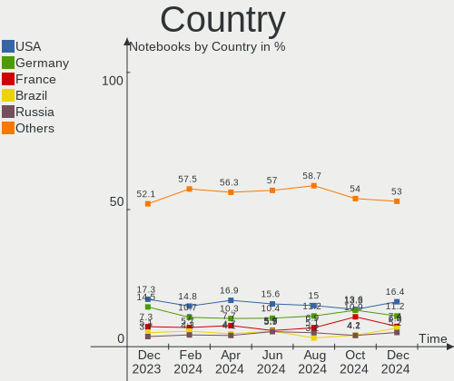
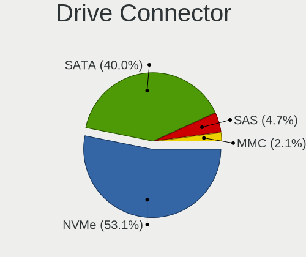
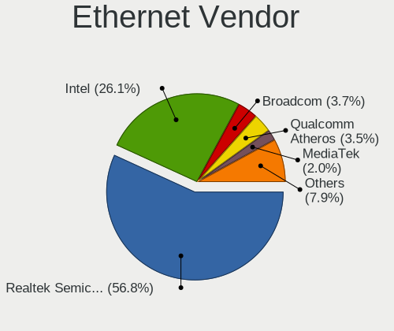

Ubuntu - Hardware Trends (Notebooks)
------------------------------------

A project to identify most popular hardware characteristics and track their change
over time based on data collected by Linux users at https://Linux-Hardware.org.

Anyone can contribute to this report by the [hw-probe](https://github.com/linuxhw/hw-probe) tool:

    sudo -E hw-probe -all -upload

This report is for one last month. Overall report since the beginning of time: [TestCoverage](https://github.com/linuxhw/TestCoverage)

Period: Jun, 2022.

Contents
--------

* [ System ](#system)
  - [ OS                       ](#os)
  - [ OS Family                ](#os-family)
  - [ Kernel                   ](#kernel)
  - [ Kernel Family            ](#kernel-family)
  - [ Kernel Major Ver.        ](#kernel-major-ver)
  - [ Arch                     ](#arch)
  - [ DE                       ](#de)
  - [ Display Server           ](#display-server)
  - [ Display Manager          ](#display-manager)
  - [ OS Lang                  ](#os-lang)
  - [ Boot Mode                ](#boot-mode)
  - [ Filesystem               ](#filesystem)
  - [ Part. scheme             ](#part-scheme)
  - [ Dual Boot with Linux/BSD ](#dual-boot-with-linuxbsd)
  - [ Dual Boot (Win)          ](#dual-boot-win)

* [ Board ](#board)
  - [ Vendor                   ](#vendor)
  - [ Model                    ](#model)
  - [ Model Family             ](#model-family)
  - [ MFG Year                 ](#mfg-year)
  - [ Form Factor              ](#form-factor)
  - [ Secure Boot              ](#secure-boot)
  - [ Coreboot                 ](#coreboot)
  - [ RAM Size                 ](#ram-size)
  - [ RAM Used                 ](#ram-used)
  - [ Total Drives             ](#total-drives)
  - [ Has CD-ROM               ](#has-cd-rom)
  - [ Has Ethernet             ](#has-ethernet)
  - [ Has WiFi                 ](#has-wifi)
  - [ Has Bluetooth            ](#has-bluetooth)

* [ Location ](#location)
  - [ Country                  ](#country)
  - [ City                     ](#city)

* [ Drives ](#drives)
  - [ Drive Vendor             ](#drive-vendor)
  - [ Drive Model              ](#drive-model)
  - [ HDD Vendor               ](#hdd-vendor)
  - [ SSD Vendor               ](#ssd-vendor)
  - [ Drive Kind               ](#drive-kind)
  - [ Drive Connector          ](#drive-connector)
  - [ Drive Size               ](#drive-size)
  - [ Space Total              ](#space-total)
  - [ Space Used               ](#space-used)
  - [ Malfunc. Drives          ](#malfunc-drives)
  - [ Malfunc. Drive Vendor    ](#malfunc-drive-vendor)
  - [ Malfunc. HDD Vendor      ](#malfunc-hdd-vendor)
  - [ Malfunc. Drive Kind      ](#malfunc-drive-kind)
  - [ Failed Drives            ](#failed-drives)
  - [ Failed Drive Vendor      ](#failed-drive-vendor)
  - [ Drive Status             ](#drive-status)

* [ Storage controller ](#storage-controller)
  - [ Storage Vendor           ](#storage-vendor)
  - [ Storage Model            ](#storage-model)
  - [ Storage Kind             ](#storage-kind)

* [ Processor ](#processor)
  - [ CPU Vendor               ](#cpu-vendor)
  - [ CPU Model                ](#cpu-model)
  - [ CPU Model Family         ](#cpu-model-family)
  - [ CPU Cores                ](#cpu-cores)
  - [ CPU Sockets              ](#cpu-sockets)
  - [ CPU Threads              ](#cpu-threads)
  - [ CPU Op-Modes             ](#cpu-op-modes)
  - [ CPU Microcode            ](#cpu-microcode)
  - [ CPU Microarch            ](#cpu-microarch)

* [ Graphics ](#graphics)
  - [ GPU Vendor               ](#gpu-vendor)
  - [ GPU Model                ](#gpu-model)
  - [ GPU Combo                ](#gpu-combo)
  - [ GPU Driver               ](#gpu-driver)
  - [ GPU Memory               ](#gpu-memory)

* [ Monitor ](#monitor)
  - [ Monitor Vendor           ](#monitor-vendor)
  - [ Monitor Model            ](#monitor-model)
  - [ Monitor Resolution       ](#monitor-resolution)
  - [ Monitor Diagonal         ](#monitor-diagonal)
  - [ Monitor Width            ](#monitor-width)
  - [ Aspect Ratio             ](#aspect-ratio)
  - [ Monitor Area             ](#monitor-area)
  - [ Pixel Density            ](#pixel-density)
  - [ Multiple Monitors        ](#multiple-monitors)

* [ Network ](#network)
  - [ Net Controller Vendor    ](#net-controller-vendor)
  - [ Net Controller Model     ](#net-controller-model)
  - [ Wireless Vendor          ](#wireless-vendor)
  - [ Wireless Model           ](#wireless-model)
  - [ Ethernet Vendor          ](#ethernet-vendor)
  - [ Ethernet Model           ](#ethernet-model)
  - [ Net Controller Kind      ](#net-controller-kind)
  - [ Used Controller          ](#used-controller)
  - [ NICs                     ](#nics)
  - [ IPv6                     ](#ipv6)

* [ Bluetooth ](#bluetooth)
  - [ Bluetooth Vendor         ](#bluetooth-vendor)
  - [ Bluetooth Model          ](#bluetooth-model)

* [ Sound ](#sound)
  - [ Sound Vendor             ](#sound-vendor)
  - [ Sound Model              ](#sound-model)

* [ Memory ](#memory)
  - [ Memory Vendor            ](#memory-vendor)
  - [ Memory Model             ](#memory-model)
  - [ Memory Kind              ](#memory-kind)
  - [ Memory Form Factor       ](#memory-form-factor)
  - [ Memory Size              ](#memory-size)
  - [ Memory Speed             ](#memory-speed)

* [ Printers & scanners ](#printers--scanners)
  - [ Printer Vendor           ](#printer-vendor)
  - [ Printer Model            ](#printer-model)
  - [ Scanner Vendor           ](#scanner-vendor)
  - [ Scanner Model            ](#scanner-model)

* [ Camera ](#camera)
  - [ Camera Vendor            ](#camera-vendor)
  - [ Camera Model             ](#camera-model)

* [ Security ](#security)
  - [ Fingerprint Vendor       ](#fingerprint-vendor)
  - [ Fingerprint Model        ](#fingerprint-model)
  - [ Chipcard Vendor          ](#chipcard-vendor)
  - [ Chipcard Model           ](#chipcard-model)

* [ Unsupported ](#unsupported)
  - [ Unsupported Devices      ](#unsupported-devices)
  - [ Unsupported Device Types ](#unsupported-device-types)

System
------

OS
--

Installed operating systems

| Name         | Notebooks | Percent |
|--------------|-----------|---------|
| Ubuntu 22.04 | 301       | 54.73%  |
| Ubuntu 20.04 | 203       | 36.91%  |
| Ubuntu 18.04 | 18        | 3.27%   |
| Ubuntu 21.10 | 15        | 2.73%   |
| Ubuntu 22.10 | 6         | 1.09%   |
| Ubuntu 21.04 | 5         | 0.91%   |
| Ubuntu 20.10 | 1         | 0.18%   |
| Ubuntu 16.04 | 1         | 0.18%   |

OS Family
---------

OS without a version

| Name   | Notebooks | Percent |
|--------|-----------|---------|
| Ubuntu | 550       | 100%    |

Kernel
------

Version of the Linux kernel

| Version                  | Notebooks | Percent |
|--------------------------|-----------|---------|
| 5.15.0-40-generic        | 61        | 11.09%  |
| 5.15.0-39-generic        | 61        | 11.09%  |
| 5.13.0-51-generic        | 59        | 10.73%  |
| 5.15.0-37-generic        | 57        | 10.36%  |
| 5.15.0-35-generic        | 47        | 8.55%   |
| 5.13.0-44-generic        | 47        | 8.55%   |
| 5.13.0-48-generic        | 38        | 6.91%   |
| 5.15.0-33-generic        | 37        | 6.73%   |
| 5.15.0-25-generic        | 19        | 3.45%   |
| 5.4.0-117-generic        | 10        | 1.82%   |
| 5.4.0-113-generic        | 10        | 1.82%   |
| 5.4.0-120-generic        | 9         | 1.64%   |
| 5.4.0-121-generic        | 6         | 1.09%   |
| 5.13.0-40-generic        | 6         | 1.09%   |
| 5.14.0-1038-oem          | 5         | 0.91%   |
| 5.15.0-27-generic        | 4         | 0.73%   |
| 5.14.0-1042-oem          | 4         | 0.73%   |
| 5.13.0-52-generic        | 4         | 0.73%   |
| 5.13.0-41-generic        | 4         | 0.73%   |
| 4.15.0-184-generic       | 4         | 0.73%   |
| 5.15.0-36-generic        | 3         | 0.55%   |
| 5.13.0-30-generic        | 3         | 0.55%   |
| 5.11.0-49-generic        | 3         | 0.55%   |
| 5.4.0-109-generic        | 2         | 0.36%   |
| 5.18.0-051800-generic    | 2         | 0.36%   |
| 5.17.11-051711-generic   | 2         | 0.36%   |
| 5.14.0-1036-oem          | 2         | 0.36%   |
| 5.11.0-16-generic        | 2         | 0.36%   |
| 4.15.0-180-generic       | 2         | 0.36%   |
| 5.8.0-43-generic         | 1         | 0.18%   |
| 5.8.0-29-generic         | 1         | 0.18%   |
| 5.4.0-91-generic         | 1         | 0.18%   |
| 5.4.0-90-generic         | 1         | 0.18%   |
| 5.4.0-72-generic         | 1         | 0.18%   |
| 5.4.0-58-generic         | 1         | 0.18%   |
| 5.4.0-47-generic         | 1         | 0.18%   |
| 5.4.0-42-generic         | 1         | 0.18%   |
| 5.4.0-115-generic        | 1         | 0.18%   |
| 5.4.0-110-generic        | 1         | 0.18%   |
| 5.3.0-62-generic         | 1         | 0.18%   |
| 5.19.0-051900rc3-generic | 1         | 0.18%   |
| 5.18.6-xanmod1           | 1         | 0.18%   |
| 5.18.6-051806-generic    | 1         | 0.18%   |
| 5.18.4-xanmod1           | 1         | 0.18%   |
| 5.18.2-051802-generic    | 1         | 0.18%   |
| 5.18.1                   | 1         | 0.18%   |
| 5.18.0-051800rc7-generic | 1         | 0.18%   |
| 5.17.0-1011-oem          | 1         | 0.18%   |
| 5.15.23-051523-generic   | 1         | 0.18%   |
| 5.15.0-41-generic        | 1         | 0.18%   |
| 5.15.0-40-lowlatency     | 1         | 0.18%   |
| 5.15.0-37-lowlatency     | 1         | 0.18%   |
| 5.14.0-051400-generic    | 1         | 0.18%   |
| 5.13.19-051319-generic   | 1         | 0.18%   |
| 5.13.0-37-generic        | 1         | 0.18%   |
| 5.13.0-35-generic        | 1         | 0.18%   |
| 5.13.0-28-generic        | 1         | 0.18%   |
| 5.11.5-051105-generic    | 1         | 0.18%   |
| 5.11.0-43-generic        | 1         | 0.18%   |
| 5.11.0-41-generic        | 1         | 0.18%   |

Kernel Family
-------------

Linux kernel without a distro release

| Version  | Notebooks | Percent |
|----------|-----------|---------|
| 5.15.0   | 292       | 53.09%  |
| 5.13.0   | 164       | 29.82%  |
| 5.4.0    | 45        | 8.18%   |
| 5.14.0   | 12        | 2.18%   |
| 4.15.0   | 9         | 1.64%   |
| 5.11.0   | 8         | 1.45%   |
| 5.18.0   | 3         | 0.55%   |
| 5.8.0    | 2         | 0.36%   |
| 5.18.6   | 2         | 0.36%   |
| 5.17.11  | 2         | 0.36%   |
| 5.3.0    | 1         | 0.18%   |
| 5.19.0   | 1         | 0.18%   |
| 5.18.4   | 1         | 0.18%   |
| 5.18.2   | 1         | 0.18%   |
| 5.18.1   | 1         | 0.18%   |
| 5.17.0   | 1         | 0.18%   |
| 5.15.23  | 1         | 0.18%   |
| 5.13.19  | 1         | 0.18%   |
| 5.11.5   | 1         | 0.18%   |
| 5.10.61  | 1         | 0.18%   |
| 5.10.121 | 1         | 0.18%   |

Kernel Major Ver.
-----------------

Linux kernel major version

| Version | Notebooks | Percent |
|---------|-----------|---------|
| 5.15    | 293       | 53.27%  |
| 5.13    | 165       | 30%     |
| 5.4     | 45        | 8.18%   |
| 5.14    | 12        | 2.18%   |
| 5.11    | 9         | 1.64%   |
| 4.15    | 9         | 1.64%   |
| 5.18    | 8         | 1.45%   |
| 5.17    | 3         | 0.55%   |
| 5.8     | 2         | 0.36%   |
| 5.10    | 2         | 0.36%   |
| 5.3     | 1         | 0.18%   |
| 5.19    | 1         | 0.18%   |

Arch
----

OS architecture (x86_64, i586, etc.)

| Name   | Notebooks | Percent |
|--------|-----------|---------|
| x86_64 | 545       | 99.09%  |
| i686   | 5         | 0.91%   |

DE
--

Desktop Environment

| Name            | Notebooks | Percent |
|-----------------|-----------|---------|
| GNOME           | 515       | 93.64%  |
| Unknown         | 23        | 4.18%   |
| Unity           | 4         | 0.73%   |
| X-Cinnamon      | 2         | 0.36%   |
| GNOME Flashback | 2         | 0.36%   |
| Enlightenment   | 2         | 0.36%   |
| Cinnamon        | 2         | 0.36%   |

Display Server
--------------

X11 or Wayland

| Name    | Notebooks | Percent |
|---------|-----------|---------|
| X11     | 293       | 53.27%  |
| Wayland | 241       | 43.82%  |
| Unknown | 11        | 2%      |
| Tty     | 5         | 0.91%   |

Display Manager
---------------

SDDM, LightDM, etc.

| Name    | Notebooks | Percent |
|---------|-----------|---------|
| GDM3    | 409       | 74.36%  |
| GDM     | 88        | 16%     |
| Unknown | 35        | 6.36%   |
| LightDM | 16        | 2.91%   |
| SDDM    | 2         | 0.36%   |

OS Lang
-------

Language

| Lang    | Notebooks | Percent |
|---------|-----------|---------|
| en_US   | 249       | 45.27%  |
| de_DE   | 40        | 7.27%   |
| fr_FR   | 33        | 6%      |
| pt_BR   | 30        | 5.45%   |
| en_IN   | 24        | 4.36%   |
| en_GB   | 21        | 3.82%   |
| ru_RU   | 17        | 3.09%   |
| es_ES   | 14        | 2.55%   |
| it_IT   | 13        | 2.36%   |
| pl_PL   | 10        | 1.82%   |
| en_AU   | 10        | 1.82%   |
| en_CA   | 8         | 1.45%   |
| pt_PT   | 5         | 0.91%   |
| da_DK   | 5         | 0.91%   |
| Unknown | 5         | 0.91%   |
| zh_CN   | 4         | 0.73%   |
| tr_TR   | 4         | 0.73%   |
| C       | 4         | 0.73%   |
| hu_HU   | 3         | 0.55%   |
| fr_BE   | 3         | 0.55%   |
| es_MX   | 3         | 0.55%   |
| es_CO   | 3         | 0.55%   |
| en_ZA   | 3         | 0.55%   |
| de_CH   | 3         | 0.55%   |
| cs_CZ   | 3         | 0.55%   |
| sv_SE   | 2         | 0.36%   |
| ru_UA   | 2         | 0.36%   |
| nl_NL   | 2         | 0.36%   |
| hr_HR   | 2         | 0.36%   |
| es_CL   | 2         | 0.36%   |
| es_AR   | 2         | 0.36%   |
| en_IL   | 2         | 0.36%   |
| en_HK   | 2         | 0.36%   |
| de_AT   | 2         | 0.36%   |
| bg_BG   | 2         | 0.36%   |
| uk_UA   | 1         | 0.18%   |
| sk_SK   | 1         | 0.18%   |
| ro_RO   | 1         | 0.18%   |
| nl_BE   | 1         | 0.18%   |
| lv_LV   | 1         | 0.18%   |
| ko_KR   | 1         | 0.18%   |
| fi_FI   | 1         | 0.18%   |
| es_DO   | 1         | 0.18%   |
| es_BO   | 1         | 0.18%   |
| en_SG   | 1         | 0.18%   |
| en_IE   | 1         | 0.18%   |
| el_GR   | 1         | 0.18%   |
| ca_ES   | 1         | 0.18%   |

Boot Mode
---------

EFI or BIOS

| Mode | Notebooks | Percent |
|------|-----------|---------|
| EFI  | 283       | 51.45%  |
| BIOS | 267       | 48.55%  |

Filesystem
----------

Type of filesystem

| Type    | Notebooks | Percent |
|---------|-----------|---------|
| Ext4    | 523       | 95.09%  |
| Zfs     | 12        | 2.18%   |
| Overlay | 8         | 1.45%   |
| Btrfs   | 4         | 0.73%   |
| Xfs     | 2         | 0.36%   |
| Ext3    | 1         | 0.18%   |

Part. scheme
------------

Scheme of partitioning

| Type    | Notebooks | Percent |
|---------|-----------|---------|
| Unknown | 326       | 59.27%  |
| GPT     | 212       | 38.55%  |
| MBR     | 12        | 2.18%   |

Dual Boot with Linux/BSD
------------------------

Hosting more than one Linux/BSD

| Dual boot | Notebooks | Percent |
|-----------|-----------|---------|
| No        | 507       | 92.18%  |
| Yes       | 43        | 7.82%   |

Dual Boot (Win)
---------------

Hosting Linux and Windows

| Dual boot | Notebooks | Percent |
|-----------|-----------|---------|
| No        | 343       | 62.36%  |
| Yes       | 207       | 37.64%  |

Board
-----

Vendor
------

Motherboard manufacturer

| Name                           | Notebooks | Percent |
|--------------------------------|-----------|---------|
| Lenovo                         | 115       | 20.91%  |
| Dell                           | 103       | 18.73%  |
| Hewlett-Packard                | 98        | 17.82%  |
| ASUSTek Computer               | 57        | 10.36%  |
| Acer                           | 46        | 8.36%   |
| Toshiba                        | 15        | 2.73%   |
| MSI                            | 14        | 2.55%   |
| Samsung Electronics            | 13        | 2.36%   |
| HUAWEI                         | 11        | 2%      |
| Apple                          | 10        | 1.82%   |
| Sony                           | 6         | 1.09%   |
| Fujitsu                        | 6         | 1.09%   |
| Google                         | 5         | 0.91%   |
| Alienware                      | 4         | 0.73%   |
| Razer                          | 3         | 0.55%   |
| Medion                         | 3         | 0.55%   |
| GPU Company                    | 3         | 0.55%   |
| System76                       | 2         | 0.36%   |
| Prestigio                      | 2         | 0.36%   |
| Positivo                       | 2         | 0.36%   |
| Panasonic                      | 2         | 0.36%   |
| Notebook                       | 2         | 0.36%   |
| Monster                        | 2         | 0.36%   |
| Chuwi                          | 2         | 0.36%   |
| Avell High Performance         | 2         | 0.36%   |
| Unknown                        | 2         | 0.36%   |
| Teclast                        | 1         | 0.18%   |
| Packard Bell                   | 1         | 0.18%   |
| NCS-Tech                       | 1         | 0.18%   |
| Matsushita Electric Industrial | 1         | 0.18%   |
| Login Informatica              | 1         | 0.18%   |
| LG Electronics                 | 1         | 0.18%   |
| Jumper                         | 1         | 0.18%   |
| IPASON                         | 1         | 0.18%   |
| IP3 Tech                       | 1         | 0.18%   |
| Inter Sales A/S                | 1         | 0.18%   |
| GPD                            | 1         | 0.18%   |
| Gigabyte Technology            | 1         | 0.18%   |
| EVOO                           | 1         | 0.18%   |
| eMachines                      | 1         | 0.18%   |
| ECS                            | 1         | 0.18%   |
| Dynabook                       | 1         | 0.18%   |
| Daten Tecnologia               | 1         | 0.18%   |
| Corporativo Lanix              | 1         | 0.18%   |
| AVITA                          | 1         | 0.18%   |
| A14CR                          | 1         | 0.18%   |

Model
-----

Motherboard model

| Name                                    | Notebooks | Percent |
|-----------------------------------------|-----------|---------|
| Dell Latitude E5430 non-vPro            | 4         | 0.73%   |
| Lenovo IdeaPad 5 15ITL05 82FG           | 3         | 0.55%   |
| HUAWEI BOM-WXX9                         | 3         | 0.55%   |
| HP Pavilion Notebook                    | 3         | 0.55%   |
| Apple MacBookPro11,1                    | 3         | 0.55%   |
| Acer Swift SF314-43                     | 3         | 0.55%   |
| Unknown                                 | 3         | 0.55%   |
| Lenovo ThinkPad X230 23259T0            | 2         | 0.36%   |
| Lenovo ThinkBook 15p Gen 2 21B1         | 2         | 0.36%   |
| Lenovo ThinkBook 15 G3 ACL 21A4         | 2         | 0.36%   |
| Lenovo IdeaPad Gaming 3 15ACH6 82K2     | 2         | 0.36%   |
| Lenovo IdeaPad 330-15AST 81D6           | 2         | 0.36%   |
| Lenovo G50-30 80G0                      | 2         | 0.36%   |
| HUAWEI BOD-WXX9                         | 2         | 0.36%   |
| HP ProBook 450 G0                       | 2         | 0.36%   |
| HP Pavilion dv7                         | 2         | 0.36%   |
| HP Pavilion dm1                         | 2         | 0.36%   |
| HP Pavilion 15                          | 2         | 0.36%   |
| HP Notebook                             | 2         | 0.36%   |
| HP EliteBook 8740w                      | 2         | 0.36%   |
| HP EliteBook 850 G8 Notebook PC         | 2         | 0.36%   |
| HP EliteBook 840 G4                     | 2         | 0.36%   |
| HP EliteBook 2560p                      | 2         | 0.36%   |
| HP 15                                   | 2         | 0.36%   |
| GPU Company GWTC116-2                   | 2         | 0.36%   |
| Fujitsu LIFEBOOK E752                   | 2         | 0.36%   |
| Dell XPS 13 9380                        | 2         | 0.36%   |
| Dell Latitude E7440                     | 2         | 0.36%   |
| Dell Latitude E7270                     | 2         | 0.36%   |
| Dell Latitude E6420                     | 2         | 0.36%   |
| Dell Latitude E6410                     | 2         | 0.36%   |
| Dell Latitude E5550                     | 2         | 0.36%   |
| Dell Inspiron 5570                      | 2         | 0.36%   |
| Dell Inspiron 5567                      | 2         | 0.36%   |
| Dell Inspiron 1720                      | 2         | 0.36%   |
| Chuwi GemiBook Pro                      | 2         | 0.36%   |
| ASUS X411UN                             | 2         | 0.36%   |
| ASUS VivoBook_ASUSLaptop E410MAB_E410MA | 2         | 0.36%   |
| ASUS UX410UAK                           | 2         | 0.36%   |
| ASUS UL50Vg                             | 2         | 0.36%   |
| ASUS K43E                               | 2         | 0.36%   |
| Apple MacBookPro12,1                    | 2         | 0.36%   |
| Acer Swift SF314-42                     | 2         | 0.36%   |
| Acer Aspire ES1-711                     | 2         | 0.36%   |
| Acer Aspire E1-571                      | 2         | 0.36%   |
| Acer Aspire A515-51                     | 2         | 0.36%   |
| Acer Aspire A315-53                     | 2         | 0.36%   |
| Toshiba TECRA M11                       | 1         | 0.18%   |
| Toshiba TECRA A40-D                     | 1         | 0.18%   |
| Toshiba Satellite Pro L500              | 1         | 0.18%   |
| Toshiba Satellite M305                  | 1         | 0.18%   |
| Toshiba Satellite L755D                 | 1         | 0.18%   |
| Toshiba Satellite L750                  | 1         | 0.18%   |
| Toshiba Satellite C850D-115             | 1         | 0.18%   |
| Toshiba Satellite C850-1NU              | 1         | 0.18%   |
| Toshiba Satellite C660                  | 1         | 0.18%   |
| Toshiba Satellite C655D                 | 1         | 0.18%   |
| Toshiba Satellite C655                  | 1         | 0.18%   |
| Toshiba Satellite C55-C                 | 1         | 0.18%   |
| Toshiba Satellite C50t-B                | 1         | 0.18%   |

Model Family
------------

Motherboard model prefix

| Name                  | Notebooks | Percent |
|-----------------------|-----------|---------|
| Lenovo ThinkPad       | 57        | 10.36%  |
| Dell Latitude         | 38        | 6.91%   |
| Dell Inspiron         | 32        | 5.82%   |
| Lenovo IdeaPad        | 29        | 5.27%   |
| Acer Aspire           | 29        | 5.27%   |
| HP Pavilion           | 20        | 3.64%   |
| HP EliteBook          | 20        | 3.64%   |
| HP Laptop             | 18        | 3.27%   |
| HP ProBook            | 14        | 2.55%   |
| Toshiba Satellite     | 12        | 2.18%   |
| ASUS VivoBook         | 11        | 2%      |
| Dell XPS              | 9         | 1.64%   |
| Dell Vostro           | 9         | 1.64%   |
| Dell Precision        | 9         | 1.64%   |
| Lenovo ThinkBook      | 8         | 1.45%   |
| ASUS ROG              | 8         | 1.45%   |
| Acer Swift            | 8         | 1.45%   |
| Fujitsu LIFEBOOK      | 6         | 1.09%   |
| ASUS ASUS             | 6         | 1.09%   |
| Lenovo Legion         | 4         | 0.73%   |
| Razer Blade           | 3         | 0.55%   |
| HUAWEI BOM-WXX9       | 3         | 0.55%   |
| HP ZBook              | 3         | 0.55%   |
| HP Stream             | 3         | 0.55%   |
| HP OMEN               | 3         | 0.55%   |
| HP 15                 | 3         | 0.55%   |
| Apple MacBookPro11    | 3         | 0.55%   |
| Acer Predator         | 3         | 0.55%   |
| Unknown               | 3         | 0.55%   |
| Toshiba TECRA         | 2         | 0.36%   |
| MSI Stealth           | 2         | 0.36%   |
| MSI Prestige          | 2         | 0.36%   |
| Lenovo G50-30         | 2         | 0.36%   |
| HUAWEI BOD-WXX9       | 2         | 0.36%   |
| HP Notebook           | 2         | 0.36%   |
| HP ENVY               | 2         | 0.36%   |
| HP Compaq             | 2         | 0.36%   |
| HP 255                | 2         | 0.36%   |
| GPU Company GWTC116-2 | 2         | 0.36%   |
| Dell G5               | 2         | 0.36%   |
| Chuwi GemiBook        | 2         | 0.36%   |
| ASUS Zenbook          | 2         | 0.36%   |
| ASUS X411UN           | 2         | 0.36%   |
| ASUS UX410UAK         | 2         | 0.36%   |
| ASUS UL50Vg           | 2         | 0.36%   |
| ASUS TUF              | 2         | 0.36%   |
| ASUS K43E             | 2         | 0.36%   |
| Apple MacBookPro12    | 2         | 0.36%   |
| Alienware m15         | 2         | 0.36%   |
| Acer TravelMate       | 2         | 0.36%   |
| Acer Nitro            | 2         | 0.36%   |
| Toshiba NB305         | 1         | 0.18%   |
| Teclast F7S           | 1         | 0.18%   |
| System76 Gazelle      | 1         | 0.18%   |
| System76 Bonobo       | 1         | 0.18%   |
| Sony VPCEH2J1E        | 1         | 0.18%   |
| Sony VPCEA3S1E        | 1         | 0.18%   |
| Sony VPCCA15FG        | 1         | 0.18%   |
| Sony SVS1312J3EW      | 1         | 0.18%   |
| Sony SVE1711C5E       | 1         | 0.18%   |

MFG Year
--------

Motherboard manufacture year

| Year | Notebooks | Percent |
|------|-----------|---------|
| 2021 | 97        | 17.64%  |
| 2020 | 64        | 11.64%  |
| 2019 | 45        | 8.18%   |
| 2018 | 41        | 7.45%   |
| 2012 | 38        | 6.91%   |
| 2017 | 36        | 6.55%   |
| 2016 | 34        | 6.18%   |
| 2013 | 31        | 5.64%   |
| 2011 | 31        | 5.64%   |
| 2014 | 28        | 5.09%   |
| 2010 | 27        | 4.91%   |
| 2015 | 23        | 4.18%   |
| 2022 | 19        | 3.45%   |
| 2009 | 16        | 2.91%   |
| 2008 | 10        | 1.82%   |
| 2007 | 9         | 1.64%   |
| 2005 | 1         | 0.18%   |

Form Factor
-----------

Physical design of the computer

| Name     | Notebooks | Percent |
|----------|-----------|---------|
| Notebook | 550       | 100%    |

Secure Boot
-----------

Enabled or disabled

| State    | Notebooks | Percent |
|----------|-----------|---------|
| Disabled | 463       | 84.18%  |
| Enabled  | 87        | 15.82%  |

Coreboot
--------

Have coreboot on board

| Used | Notebooks | Percent |
|------|-----------|---------|
| No   | 544       | 98.91%  |
| Yes  | 6         | 1.09%   |

RAM Size
--------

Total RAM memory

| Size in GB  | Notebooks | Percent |
|-------------|-----------|---------|
| 4.01-8.0    | 170       | 30.91%  |
| 16.01-24.0  | 113       | 20.55%  |
| 3.01-4.0    | 106       | 19.27%  |
| 8.01-16.0   | 77        | 14%     |
| 32.01-64.0  | 50        | 9.09%   |
| 1.01-2.0    | 15        | 2.73%   |
| 64.01-256.0 | 7         | 1.27%   |
| 24.01-32.0  | 5         | 0.91%   |
| 2.01-3.0    | 4         | 0.73%   |
| 0.51-1.0    | 2         | 0.36%   |
| 0.01-0.5    | 1         | 0.18%   |

RAM Used
--------

Used RAM memory

| Used GB    | Notebooks | Percent |
|------------|-----------|---------|
| 1.01-2.0   | 173       | 31.45%  |
| 2.01-3.0   | 152       | 27.64%  |
| 3.01-4.0   | 89        | 16.18%  |
| 4.01-8.0   | 83        | 15.09%  |
| 8.01-16.0  | 39        | 7.09%   |
| 0.51-1.0   | 8         | 1.45%   |
| 0.01-0.5   | 4         | 0.73%   |
| 24.01-32.0 | 1         | 0.18%   |
| 16.01-24.0 | 1         | 0.18%   |

Total Drives
------------

Number of drives on board

| Drives | Notebooks | Percent |
|--------|-----------|---------|
| 1      | 406       | 73.82%  |
| 2      | 123       | 22.36%  |
| 3      | 15        | 2.73%   |
| 0      | 4         | 0.73%   |
| 5      | 2         | 0.36%   |

Has CD-ROM
----------

Has CD-ROM on board

| Presented | Notebooks | Percent |
|-----------|-----------|---------|
| No        | 387       | 70.36%  |
| Yes       | 163       | 29.64%  |

Has Ethernet
------------

Has Ethernet on board

| Presented | Notebooks | Percent |
|-----------|-----------|---------|
| Yes       | 423       | 76.91%  |
| No        | 127       | 23.09%  |

Has WiFi
--------

Has WiFi module

| Presented | Notebooks | Percent |
|-----------|-----------|---------|
| Yes       | 540       | 98.18%  |
| No        | 10        | 1.82%   |

Has Bluetooth
-------------

Has Bluetooth module

| Presented | Notebooks | Percent |
|-----------|-----------|---------|
| Yes       | 435       | 79.09%  |
| No        | 115       | 20.91%  |

Location
--------

Country
-------

Geographic location (country)

| Country                | Notebooks | Percent |
|------------------------|-----------|---------|
| USA                    | 105       | 19.09%  |
| Germany                | 56        | 10.18%  |
| France                 | 38        | 6.91%   |
| Brazil                 | 34        | 6.18%   |
| India                  | 29        | 5.27%   |
| UK                     | 24        | 4.36%   |
| Russia                 | 16        | 2.91%   |
| Italy                  | 15        | 2.73%   |
| Spain                  | 13        | 2.36%   |
| Poland                 | 12        | 2.18%   |
| Australia              | 10        | 1.82%   |
| Turkey                 | 8         | 1.45%   |
| Sweden                 | 8         | 1.45%   |
| Indonesia              | 7         | 1.27%   |
| Hungary                | 7         | 1.27%   |
| Canada                 | 7         | 1.27%   |
| Netherlands            | 6         | 1.09%   |
| Mexico                 | 6         | 1.09%   |
| Greece                 | 6         | 1.09%   |
| Czechia                | 6         | 1.09%   |
| Colombia               | 6         | 1.09%   |
| China                  | 6         | 1.09%   |
| Argentina              | 6         | 1.09%   |
| Ukraine                | 5         | 0.91%   |
| Romania                | 5         | 0.91%   |
| Portugal               | 5         | 0.91%   |
| Denmark                | 5         | 0.91%   |
| Belgium                | 5         | 0.91%   |
| South Africa           | 4         | 0.73%   |
| Chile                  | 4         | 0.73%   |
| Bulgaria               | 4         | 0.73%   |
| Vietnam                | 3         | 0.55%   |
| Taiwan                 | 3         | 0.55%   |
| Switzerland            | 3         | 0.55%   |
| Pakistan               | 3         | 0.55%   |
| Israel                 | 3         | 0.55%   |
| Iran                   | 3         | 0.55%   |
| Finland                | 3         | 0.55%   |
| Egypt                  | 3         | 0.55%   |
| Ecuador                | 3         | 0.55%   |
| Croatia                | 3         | 0.55%   |
| Austria                | 3         | 0.55%   |
| Sri Lanka              | 2         | 0.36%   |
| South Korea            | 2         | 0.36%   |
| Slovakia               | 2         | 0.36%   |
| Singapore              | 2         | 0.36%   |
| Nepal                  | 2         | 0.36%   |
| Malta                  | 2         | 0.36%   |
| Lithuania              | 2         | 0.36%   |
| Latvia                 | 2         | 0.36%   |
| Kazakhstan             | 2         | 0.36%   |
| Hong Kong              | 2         | 0.36%   |
| Costa Rica             | 2         | 0.36%   |
| Bosnia and Herzegovina | 2         | 0.36%   |
| Belarus                | 2         | 0.36%   |
| Algeria                | 2         | 0.36%   |
| Uzbekistan             | 1         | 0.18%   |
| Tunisia                | 1         | 0.18%   |
| Thailand               | 1         | 0.18%   |
| Puerto Rico            | 1         | 0.18%   |

City
----

Geographic location (city)

| City              | Notebooks | Percent |
|-------------------|-----------|---------|
| Berlin            | 9         | 1.64%   |
| St Petersburg     | 6         | 1.09%   |
| Paris             | 6         | 1.09%   |
| Milan             | 6         | 1.09%   |
| Istanbul          | 5         | 0.91%   |
| Warsaw            | 4         | 0.73%   |
| Jakarta           | 4         | 0.73%   |
| Budapest          | 4         | 0.73%   |
| Zagreb            | 3         | 0.55%   |
| Vienna            | 3         | 0.55%   |
| Thessaloniki      | 3         | 0.55%   |
| Tel Aviv          | 3         | 0.55%   |
| Sydney            | 3         | 0.55%   |
| Shanghai          | 3         | 0.55%   |
| Santiago          | 3         | 0.55%   |
| Quito             | 3         | 0.55%   |
| Novosibirsk       | 3         | 0.55%   |
| New York          | 3         | 0.55%   |
| Melbourne         | 3         | 0.55%   |
| Hyderabad         | 3         | 0.55%   |
| Gothenburg        | 3         | 0.55%   |
| Florianópolis    | 3         | 0.55%   |
| Athens            | 3         | 0.55%   |
| Vilnius           | 2         | 0.36%   |
| Valencia          | 2         | 0.36%   |
| Taipei            | 2         | 0.36%   |
| Sao Luís         | 2         | 0.36%   |
| Prague            | 2         | 0.36%   |
| Poznan            | 2         | 0.36%   |
| Porto             | 2         | 0.36%   |
| Perth             | 2         | 0.36%   |
| Nantes            | 2         | 0.36%   |
| Munich            | 2         | 0.36%   |
| Mumbai            | 2         | 0.36%   |
| Moscow            | 2         | 0.36%   |
| Minsk             | 2         | 0.36%   |
| Minneapolis       | 2         | 0.36%   |
| Madrid            | 2         | 0.36%   |
| Lampertheim       | 2         | 0.36%   |
| Lahore            | 2         | 0.36%   |
| Kyiv              | 2         | 0.36%   |
| Krakow            | 2         | 0.36%   |
| Kathmandu         | 2         | 0.36%   |
| Indore            | 2         | 0.36%   |
| Houston           | 2         | 0.36%   |
| Heidelberg        | 2         | 0.36%   |
| Frankfurt am Main | 2         | 0.36%   |
| Fortaleza         | 2         | 0.36%   |
| Fort Lauderdale   | 2         | 0.36%   |
| Essen             | 2         | 0.36%   |
| Delhi             | 2         | 0.36%   |
| Darmstadt         | 2         | 0.36%   |
| Curitiba          | 2         | 0.36%   |
| Central           | 2         | 0.36%   |
| Cape Town         | 2         | 0.36%   |
| Cambridge         | 2         | 0.36%   |
| Buenos Aires      | 2         | 0.36%   |
| Brighton          | 2         | 0.36%   |
| Bogotá           | 2         | 0.36%   |
| Birmingham        | 2         | 0.36%   |

Drives
------

Drive Vendor
------------

Hard drive vendors

| Vendor                         | Notebooks | Drives | Percent |
|--------------------------------|-----------|--------|---------|
| Samsung Electronics            | 102       | 108    | 15.36%  |
| WDC                            | 83        | 86     | 12.5%   |
| Seagate                        | 63        | 66     | 9.49%   |
| Toshiba                        | 52        | 54     | 7.83%   |
| SanDisk                        | 38        | 39     | 5.72%   |
| SK hynix                       | 34        | 34     | 5.12%   |
| Unknown                        | 27        | 30     | 4.07%   |
| Kingston                       | 27        | 30     | 4.07%   |
| Micron Technology              | 25        | 25     | 3.77%   |
| HGST                           | 24        | 24     | 3.61%   |
| Intel                          | 22        | 25     | 3.31%   |
| Hitachi                        | 21        | 21     | 3.16%   |
| Phison                         | 13        | 15     | 1.96%   |
| Crucial                        | 13        | 14     | 1.96%   |
| KIOXIA                         | 12        | 12     | 1.81%   |
| A-DATA Technology              | 10        | 10     | 1.51%   |
| LITEON                         | 8         | 8      | 1.2%    |
| Unknown                        | 8         | 8      | 1.2%    |
| Netac                          | 5         | 5      | 0.75%   |
| Fujitsu                        | 5         | 5      | 0.75%   |
| Apple                          | 5         | 6      | 0.75%   |
| Transcend                      | 3         | 3      | 0.45%   |
| SPCC                           | 3         | 3      | 0.45%   |
| Silicon Motion                 | 3         | 3      | 0.45%   |
| PNY                            | 3         | 3      | 0.45%   |
| Patriot                        | 3         | 3      | 0.45%   |
| Micron/Crucial Technology      | 3         | 3      | 0.45%   |
| Intenso                        | 3         | 3      | 0.45%   |
| FORESEE                        | 3         | 3      | 0.45%   |
| China                          | 3         | 4      | 0.45%   |
| BIWIN                          | 3         | 3      | 0.45%   |
| UMIS                           | 2         | 2      | 0.3%    |
| Team                           | 2         | 2      | 0.3%    |
| External                       | 2         | 2      | 0.3%    |
| BHT                            | 2         | 2      | 0.3%    |
| YMTC                           | 1         | 1      | 0.15%   |
| Yangtze Memory Technologies    | 1         | 1      | 0.15%   |
| WDC WDS                        | 1         | 1      | 0.15%   |
| WDC WDB                        | 1         | 1      | 0.15%   |
| Unknown (690)                  | 1         | 1      | 0.15%   |
| Union Memory                   | 1         | 1      | 0.15%   |
| Timetec                        | 1         | 1      | 0.15%   |
| Teclast                        | 1         | 1      | 0.15%   |
| T-FORCE                        | 1         | 1      | 0.15%   |
| SSSTC                          | 1         | 1      | 0.15%   |
| Solid State Storage Technology | 1         | 1      | 0.15%   |
| sobetter                       | 1         | 1      | 0.15%   |
| ShiJi                          | 1         | 1      | 0.15%   |
| Realtek Semiconductor          | 1         | 1      | 0.15%   |
| Plextor                        | 1         | 1      | 0.15%   |
| Mushkin                        | 1         | 1      | 0.15%   |
| LITEONIT                       | 1         | 1      | 0.15%   |
| Lexar                          | 1         | 1      | 0.15%   |
| KingDian                       | 1         | 1      | 0.15%   |
| JMicron Technology             | 1         | 1      | 0.15%   |
| HS-SSD-C100                    | 1         | 1      | 0.15%   |
| Goodram                        | 1         | 1      | 0.15%   |
| Gigabyte Technology            | 1         | 1      | 0.15%   |
| geonix                         | 1         | 1      | 0.15%   |
| Dahua                          | 1         | 1      | 0.15%   |

Drive Model
-----------

Hard drive models

| Model                                  | Notebooks | Percent |
|----------------------------------------|-----------|---------|
| Seagate ST1000LM035-1RK172 1TB         | 13        | 1.9%    |
| Samsung NVMe SSD Drive 512GB           | 11        | 1.61%   |
| Toshiba MQ01ABD100 1TB                 | 10        | 1.46%   |
| Seagate ST500LT012-1DG142 500GB        | 10        | 1.46%   |
| Toshiba MQ04ABF100 1TB                 | 9         | 1.32%   |
| HGST HTS721010A9E630 1TB               | 9         | 1.32%   |
| Unknown                                | 8         | 1.17%   |
| Seagate ST9500325AS 500GB              | 6         | 0.88%   |
| Toshiba MQ01ABF050 500GB               | 5         | 0.73%   |
| Seagate ST1000LM024 HN-M101MBB 1TB     | 5         | 0.73%   |
| SanDisk NVMe SSD Drive 512GB           | 5         | 0.73%   |
| SanDisk NVMe SSD Drive 256GB           | 5         | 0.73%   |
| Samsung SSD 860 EVO 500GB              | 5         | 0.73%   |
| Samsung NVMe SSD Drive 256GB           | 5         | 0.73%   |
| Phison 311CD0512GB                     | 5         | 0.73%   |
| Micron 1100_MTFDDAV256TBN 256GB SSD    | 5         | 0.73%   |
| Intel NVMe SSD Drive 512GB             | 5         | 0.73%   |
| HGST HTS541010A9E680 1TB               | 5         | 0.73%   |
| WDC WD10SPZX-21Z10T0 1TB               | 4         | 0.58%   |
| SK hynix HFM001TD3JX013N 1TB           | 4         | 0.58%   |
| Seagate ST2000LM007-1R8174 2TB         | 4         | 0.58%   |
| SanDisk NVMe SSD Drive 1TB             | 4         | 0.58%   |
| Micron 3400_MTFDKBA1T0TFH 1TB          | 4         | 0.58%   |
| KIOXIA NVMe SSD Drive 512GB            | 4         | 0.58%   |
| Kingston SA400S37240G 240GB SSD        | 4         | 0.58%   |
| Crucial CT240BX500SSD1 240GB           | 4         | 0.58%   |
| WDC WDS240G2G0A-00JH30 240GB SSD       | 3         | 0.44%   |
| WDC WD5000LPVX-22V0TT0 500GB           | 3         | 0.44%   |
| WDC WD10JPVX-22JC3T0 1TB               | 3         | 0.44%   |
| SK hynix NVMe SSD Drive 512GB          | 3         | 0.44%   |
| SanDisk SSD PLUS 240GB                 | 3         | 0.44%   |
| Samsung SSD 980 1TB                    | 3         | 0.44%   |
| Samsung NVMe SSD Drive 1024GB          | 3         | 0.44%   |
| Samsung MZVLW256HEHP-000L7 256GB       | 3         | 0.44%   |
| Samsung MZVLQ512HALU-000H1 512GB       | 3         | 0.44%   |
| Samsung MZ7TE256HMHP-000L7 256GB SSD   | 3         | 0.44%   |
| Micron NVMe SSD Drive 512GB            | 3         | 0.44%   |
| KIOXIA KBG40ZNS512G NVMe 512GB         | 3         | 0.44%   |
| Kingston SA400S37120G 120GB SSD        | 3         | 0.44%   |
| Kingston NVMe SSD Drive 256GB          | 3         | 0.44%   |
| WDC WDS480G2G0A-00JH30 480GB SSD       | 2         | 0.29%   |
| WDC WDS100T2B0C-00PXH0 1TB             | 2         | 0.29%   |
| WDC WD5000LPVX-80V0TT0 500GB           | 2         | 0.29%   |
| WDC WD5000LPLX-08ZNTT0 500GB           | 2         | 0.29%   |
| WDC WD3200BEVT-22A23T0 320GB           | 2         | 0.29%   |
| WDC WD3200BEKX-75B7WT0 320GB           | 2         | 0.29%   |
| WDC WD2500BEKT-75PVMT0 250GB           | 2         | 0.29%   |
| WDC WD10SPZX-75Z10T2 1TB               | 2         | 0.29%   |
| WDC PC SN730 SDBPNTY-512G-1006 512GB   | 2         | 0.29%   |
| WDC PC SN530 SDBPNPZ-512G-1006 512GB   | 2         | 0.29%   |
| Unknown SD/MMC/MS PRO 128GB            | 2         | 0.29%   |
| Unknown MMC64G  64GB                   | 2         | 0.29%   |
| Unknown Biwin  64GB                    | 2         | 0.29%   |
| Unknown BGND3R  32GB                   | 2         | 0.29%   |
| Toshiba THNSN5512GPUK NVMe 512GB       | 2         | 0.29%   |
| Toshiba NVMe SSD Drive 512GB           | 2         | 0.29%   |
| Toshiba MQ01ABD075 752GB               | 2         | 0.29%   |
| Toshiba KXG50ZNV512G NVMe 512GB        | 2         | 0.29%   |
| Toshiba HDWL110 1TB                    | 2         | 0.29%   |
| SK hynix SKHynix_HFM512GD3HX015N 512GB | 2         | 0.29%   |

HDD Vendor
----------

Hard disk drive vendors

| Vendor              | Notebooks | Drives | Percent |
|---------------------|-----------|--------|---------|
| Seagate             | 61        | 63     | 30.05%  |
| WDC                 | 52        | 52     | 25.62%  |
| Toshiba             | 36        | 36     | 17.73%  |
| HGST                | 24        | 24     | 11.82%  |
| Hitachi             | 21        | 21     | 10.34%  |
| Fujitsu             | 5         | 5      | 2.46%   |
| Unknown             | 2         | 2      | 0.99%   |
| Samsung Electronics | 2         | 2      | 0.99%   |

SSD Vendor
----------

Solid state drive vendors

| Vendor              | Notebooks | Drives | Percent |
|---------------------|-----------|--------|---------|
| Samsung Electronics | 36        | 37     | 19.78%  |
| SanDisk             | 18        | 18     | 9.89%   |
| Kingston            | 16        | 19     | 8.79%   |
| WDC                 | 12        | 12     | 6.59%   |
| Micron Technology   | 12        | 12     | 6.59%   |
| Crucial             | 11        | 11     | 6.04%   |
| LITEON              | 8         | 8      | 4.4%    |
| A-DATA Technology   | 8         | 8      | 4.4%    |
| Toshiba             | 4         | 4      | 2.2%    |
| SK hynix            | 4         | 4      | 2.2%    |
| Netac               | 4         | 4      | 2.2%    |
| Apple               | 4         | 4      | 2.2%    |
| SPCC                | 3         | 3      | 1.65%   |
| Patriot             | 3         | 3      | 1.65%   |
| FORESEE             | 3         | 3      | 1.65%   |
| BIWIN               | 3         | 3      | 1.65%   |
| Transcend           | 2         | 2      | 1.1%    |
| PNY                 | 2         | 2      | 1.1%    |
| Phison              | 2         | 2      | 1.1%    |
| Intenso             | 2         | 2      | 1.1%    |
| Intel               | 2         | 2      | 1.1%    |
| China               | 2         | 3      | 1.1%    |
| BHT                 | 2         | 2      | 1.1%    |
| WDC WDS             | 1         | 1      | 0.55%   |
| WDC WDB             | 1         | 1      | 0.55%   |
| Union Memory        | 1         | 1      | 0.55%   |
| Timetec             | 1         | 1      | 0.55%   |
| Teclast             | 1         | 1      | 0.55%   |
| Team                | 1         | 1      | 0.55%   |
| Plextor             | 1         | 1      | 0.55%   |
| Mushkin             | 1         | 1      | 0.55%   |
| LITEONIT            | 1         | 1      | 0.55%   |
| Lexar               | 1         | 1      | 0.55%   |
| KingDian            | 1         | 1      | 0.55%   |
| HS-SSD-C100         | 1         | 1      | 0.55%   |
| Goodram             | 1         | 1      | 0.55%   |
| geonix              | 1         | 1      | 0.55%   |
| Dahua               | 1         | 1      | 0.55%   |
| Corsair             | 1         | 1      | 0.55%   |
| Axiom               | 1         | 1      | 0.55%   |
| Apacer              | 1         | 1      | 0.55%   |
| Unknown             | 1         | 1      | 0.55%   |

Drive Kind
----------

HDD or SSD

| Kind    | Notebooks | Drives | Percent |
|---------|-----------|--------|---------|
| NVMe    | 227       | 258    | 35.36%  |
| HDD     | 200       | 205    | 31.15%  |
| SSD     | 175       | 187    | 27.26%  |
| MMC     | 34        | 37     | 5.3%    |
| Unknown | 6         | 6      | 0.93%   |

Drive Connector
---------------

SATA, SAS, NVMe, etc.

| Type | Notebooks | Drives | Percent |
|------|-----------|--------|---------|
| SATA | 335       | 384    | 54.83%  |
| NVMe | 226       | 256    | 36.99%  |
| MMC  | 34        | 37     | 5.56%   |
| SAS  | 16        | 16     | 2.62%   |

Drive Size
----------

Size of hard drive

| Size in TB | Notebooks | Drives | Percent |
|------------|-----------|--------|---------|
| 0.01-0.5   | 246       | 264    | 66.49%  |
| 0.51-1.0   | 110       | 114    | 29.73%  |
| 1.01-2.0   | 10        | 10     | 2.7%    |
| 4.01-10.0  | 3         | 3      | 0.81%   |
| 10.01-20.0 | 1         | 1      | 0.27%   |

Space Total
-----------

Amount of disk space available on the file system

| Size in GB     | Notebooks | Percent |
|----------------|-----------|---------|
| 251-500        | 175       | 31.82%  |
| 101-250        | 169       | 30.73%  |
| 501-1000       | 83        | 15.09%  |
| 51-100         | 32        | 5.82%   |
| 21-50          | 28        | 5.09%   |
| 1001-2000      | 27        | 4.91%   |
| 1-20           | 21        | 3.82%   |
| More than 3000 | 6         | 1.09%   |
| Unknown        | 5         | 0.91%   |
| 2001-3000      | 4         | 0.73%   |

Space Used
----------

Amount of used disk space

| Used GB   | Notebooks | Percent |
|-----------|-----------|---------|
| 1-20      | 205       | 37.27%  |
| 21-50     | 113       | 20.55%  |
| 101-250   | 84        | 15.27%  |
| 51-100    | 81        | 14.73%  |
| 251-500   | 39        | 7.09%   |
| 501-1000  | 16        | 2.91%   |
| Unknown   | 5         | 0.91%   |
| 1001-2000 | 4         | 0.73%   |
| 2001-3000 | 3         | 0.55%   |

Malfunc. Drives
---------------

Drive models with a malfunction

| Model                                               | Notebooks | Drives | Percent |
|-----------------------------------------------------|-----------|--------|---------|
| HGST HTS545050A7E680 500GB                          | 2         | 2      | 8.33%   |
| WDC WDS480G2G0A-00JH30 480GB SSD                    | 1         | 1      | 4.17%   |
| WDC WD5000LPVX-80V0TT0 500GB                        | 1         | 1      | 4.17%   |
| WDC WD5000LPVX-22V0TT0 500GB                        | 1         | 1      | 4.17%   |
| WDC WD10JPVX-22JC3T0 1TB                            | 1         | 1      | 4.17%   |
| Toshiba MQ01ABD100 1TB                              | 1         | 1      | 4.17%   |
| SK hynix HFS128G3AMNM-1010A 128GB SSD               | 1         | 1      | 4.17%   |
| Seagate ST9500325AS 500GB                           | 1         | 1      | 4.17%   |
| Seagate ST9320423AS 320GB                           | 1         | 1      | 4.17%   |
| Seagate ST9320325AS 320GB                           | 1         | 1      | 4.17%   |
| Seagate ST1000LM035-1RK172 1TB                      | 1         | 1      | 4.17%   |
| SanDisk SSD PLUS 480GB                              | 1         | 1      | 4.17%   |
| Micron Technology MTFDDAV256TBN-1AR15ABHA 256GB SSD | 1         | 1      | 4.17%   |
| Micron Technology 1100_MTFDDAV512TBN 512GB SSD      | 1         | 1      | 4.17%   |
| Micron Technology 1100 SATA 256GB SSD               | 1         | 1      | 4.17%   |
| JMicron Technology Tech 250GB                       | 1         | 1      | 4.17%   |
| Hitachi HTS727550A9E364 500GB                       | 1         | 1      | 4.17%   |
| Hitachi HTS725050A7E630 500GB                       | 1         | 1      | 4.17%   |
| Hitachi HTS723232A7A364 320GB                       | 1         | 1      | 4.17%   |
| Hitachi HTS547564A9E384 640GB                       | 1         | 1      | 4.17%   |
| HGST HTS545050A7E380 500GB                          | 1         | 1      | 4.17%   |
| Fujitsu MHZ2250BH G2 250GB                          | 1         | 1      | 4.17%   |
| A-DATA Technology SX8100NP 1TB                      | 1         | 1      | 4.17%   |

Malfunc. Drive Vendor
---------------------

Vendors of faulty drives

| Vendor             | Notebooks | Drives | Percent |
|--------------------|-----------|--------|---------|
| WDC                | 4         | 4      | 17.39%  |
| Hitachi            | 4         | 4      | 17.39%  |
| Seagate            | 3         | 4      | 13.04%  |
| Micron Technology  | 3         | 3      | 13.04%  |
| HGST               | 3         | 3      | 13.04%  |
| Toshiba            | 1         | 1      | 4.35%   |
| SK hynix           | 1         | 1      | 4.35%   |
| SanDisk            | 1         | 1      | 4.35%   |
| JMicron Technology | 1         | 1      | 4.35%   |
| Fujitsu            | 1         | 1      | 4.35%   |
| A-DATA Technology  | 1         | 1      | 4.35%   |

Malfunc. HDD Vendor
-------------------

Vendors of faulty HDD drives

| Vendor  | Notebooks | Drives | Percent |
|---------|-----------|--------|---------|
| Hitachi | 4         | 4      | 26.67%  |
| WDC     | 3         | 3      | 20%     |
| Seagate | 3         | 4      | 20%     |
| HGST    | 3         | 3      | 20%     |
| Toshiba | 1         | 1      | 6.67%   |
| Fujitsu | 1         | 1      | 6.67%   |

Malfunc. Drive Kind
-------------------

Kinds of faulty drives

| Kind    | Notebooks | Drives | Percent |
|---------|-----------|--------|---------|
| HDD     | 15        | 16     | 65.22%  |
| SSD     | 6         | 6      | 26.09%  |
| NVMe    | 1         | 1      | 4.35%   |
| Unknown | 1         | 1      | 4.35%   |

Failed Drives
-------------

Failed drive models

| Model                    | Notebooks | Drives | Percent |
|--------------------------|-----------|--------|---------|
| HGST HTS721010A9E630 1TB | 1         | 1      | 100%    |

Failed Drive Vendor
-------------------

Failed drive vendors

| Vendor | Notebooks | Drives | Percent |
|--------|-----------|--------|---------|
| HGST   | 1         | 1      | 100%    |

Drive Status
------------

Number of failed and malfunc. drives

| Status   | Notebooks | Drives | Percent |
|----------|-----------|--------|---------|
| Detected | 330       | 404    | 58.2%   |
| Works    | 213       | 264    | 37.57%  |
| Malfunc  | 23        | 24     | 4.06%   |
| Failed   | 1         | 1      | 0.18%   |

Storage controller
------------------

Storage Vendor
--------------

Storage controller vendors

| Vendor                         | Notebooks | Percent |
|--------------------------------|-----------|---------|
| Intel                          | 378       | 56.84%  |
| Samsung Electronics            | 67        | 10.08%  |
| AMD                            | 62        | 9.32%   |
| SanDisk                        | 39        | 5.86%   |
| SK hynix                       | 29        | 4.36%   |
| Toshiba America Info Systems   | 15        | 2.26%   |
| Micron Technology              | 13        | 1.95%   |
| Phison Electronics             | 12        | 1.8%    |
| Kingston Technology Company    | 11        | 1.65%   |
| KIOXIA                         | 10        | 1.5%    |
| Micron/Crucial Technology      | 6         | 0.9%    |
| Silicon Motion                 | 5         | 0.75%   |
| Realtek Semiconductor          | 3         | 0.45%   |
| Nvidia                         | 3         | 0.45%   |
| Yangtze Memory Technologies    | 2         | 0.3%    |
| Union Memory (Shenzhen)        | 2         | 0.3%    |
| Solid State Storage Technology | 2         | 0.3%    |
| Seagate Technology             | 2         | 0.3%    |
| Unknown                        | 1         | 0.15%   |
| Marvell Technology Group       | 1         | 0.15%   |
| Apple                          | 1         | 0.15%   |
| ADATA Technology               | 1         | 0.15%   |

Storage Model
-------------

Storage controller models

| Model                                                                                  | Notebooks | Percent |
|----------------------------------------------------------------------------------------|-----------|---------|
| AMD FCH SATA Controller [AHCI mode]                                                    | 55        | 7.76%   |
| Intel Sunrise Point-LP SATA Controller [AHCI mode]                                     | 47        | 6.63%   |
| Intel 82801 Mobile SATA Controller [RAID mode]                                         | 42        | 5.92%   |
| Intel 7 Series Chipset Family 6-port SATA Controller [AHCI mode]                       | 42        | 5.92%   |
| Intel Volume Management Device NVMe RAID Controller                                    | 32        | 4.51%   |
| Samsung NVMe SSD Controller 980                                                        | 27        | 3.81%   |
| Intel 6 Series/C200 Series Chipset Family 6 port Mobile SATA AHCI Controller           | 26        | 3.67%   |
| Samsung NVMe SSD Controller SM981/PM981/PM983                                          | 22        | 3.1%    |
| SK hynix Gold P31 SSD                                                                  | 15        | 2.12%   |
| Intel Cannon Lake Mobile PCH SATA AHCI Controller                                      | 14        | 1.97%   |
| Micron Non-Volatile memory controller                                                  | 13        | 1.83%   |
| Intel Wildcat Point-LP SATA Controller [AHCI Mode]                                     | 13        | 1.83%   |
| Intel Tiger Lake-LP SATA Controller [AHCI mode]                                        | 13        | 1.83%   |
| Intel 82801IBM/IEM (ICH9M/ICH9M-E) 4 port SATA Controller [AHCI mode]                  | 13        | 1.83%   |
| SanDisk WD Blue SN550 NVMe SSD                                                         | 12        | 1.69%   |
| Samsung NVMe SSD Controller PM9A1/PM9A3/980PRO                                         | 12        | 1.69%   |
| Intel 8 Series SATA Controller 1 [AHCI mode]                                           | 12        | 1.69%   |
| Intel HM170/QM170 Chipset SATA Controller [AHCI Mode]                                  | 11        | 1.55%   |
| Intel Celeron/Pentium Silver Processor SATA Controller                                 | 11        | 1.55%   |
| Intel 5 Series/3400 Series Chipset 6 port SATA AHCI Controller                         | 11        | 1.55%   |
| SanDisk WD Black SN750 / PC SN730 NVMe SSD                                             | 10        | 1.41%   |
| KIOXIA Non-Volatile memory controller                                                  | 10        | 1.41%   |
| Intel 82801HM/HEM (ICH8M/ICH8M-E) IDE Controller                                       | 10        | 1.41%   |
| Intel 8 Series/C220 Series Chipset Family 6-port SATA Controller 1 [AHCI mode]         | 10        | 1.41%   |
| Intel Non-Volatile memory controller                                                   | 9         | 1.27%   |
| Intel Cannon Point-LP SATA Controller [AHCI Mode]                                      | 9         | 1.27%   |
| Intel 400 Series Chipset Family SATA AHCI Controller                                   | 9         | 1.27%   |
| Phison PS5013 E13 NVMe Controller                                                      | 8         | 1.13%   |
| Intel Atom Processor E3800 Series SATA AHCI Controller                                 | 8         | 1.13%   |
| Intel 82801HM/HEM (ICH8M/ICH8M-E) SATA Controller [AHCI mode]                          | 8         | 1.13%   |
| Intel 5 Series/3400 Series Chipset 4 port SATA AHCI Controller                         | 8         | 1.13%   |
| Toshiba America Info Systems Toshiba America Info Non-Volatile memory controller       | 7         | 0.99%   |
| Intel Celeron N3350/Pentium N4200/Atom E3900 Series SATA AHCI Controller               | 6         | 0.85%   |
| Intel 500 Series Chipset Family SATA AHCI Controller                                   | 6         | 0.85%   |
| SK hynix BC511                                                                         | 5         | 0.71%   |
| SK hynix BC501 NVMe Solid State Drive                                                  | 5         | 0.71%   |
| SanDisk Non-Volatile memory controller                                                 | 5         | 0.71%   |
| Micron/Crucial P2 NVMe PCIe SSD                                                        | 5         | 0.71%   |
| Kingston Company OM3PDP3 NVMe SSD                                                      | 5         | 0.71%   |
| Intel SSD 660P Series                                                                  | 5         | 0.71%   |
| Intel Comet Lake SATA AHCI Controller                                                  | 5         | 0.71%   |
| AMD SB7x0/SB8x0/SB9x0 SATA Controller [AHCI mode]                                      | 5         | 0.71%   |
| SK hynix Non-Volatile memory controller                                                | 4         | 0.56%   |
| Silicon Motion SM2263EN/SM2263XT SSD Controller                                        | 4         | 0.56%   |
| SanDisk WD Blue SN500 / PC SN520 NVMe SSD                                              | 4         | 0.56%   |
| Samsung NVMe SSD Controller SM961/PM961/SM963                                          | 4         | 0.56%   |
| Intel SSD Pro 7600p/760p/E 6100p Series                                                | 4         | 0.56%   |
| Intel Ice Lake-LP SATA Controller [AHCI mode]                                          | 4         | 0.56%   |
| Toshiba America Info Systems XG6 NVMe SSD Controller                                   | 3         | 0.42%   |
| Toshiba America Info Systems XG4 NVMe SSD Controller                                   | 3         | 0.42%   |
| SanDisk WD PC SN810 / Black SN850 NVMe SSD                                             | 3         | 0.42%   |
| Phison E12 NVMe Controller                                                             | 3         | 0.42%   |
| Kingston Company Company Non-Volatile memory controller                                | 3         | 0.42%   |
| Intel Atom/Celeron/Pentium Processor x5-E8000/J3xxx/N3xxx Series SATA Controller       | 3         | 0.42%   |
| Intel 6 Series/C200 Series Chipset Family Mobile SATA Controller (IDE mode, ports 4-5) | 3         | 0.42%   |
| Intel 6 Series/C200 Series Chipset Family Mobile SATA Controller (IDE mode, ports 0-3) | 3         | 0.42%   |
| Intel 5 Series/3400 Series Chipset 4 port SATA IDE Controller                          | 3         | 0.42%   |
| Intel 5 Series/3400 Series Chipset 2 port SATA IDE Controller                          | 3         | 0.42%   |
| Yangtze Memory Non-Volatile memory controller                                          | 2         | 0.28%   |
| Solid State Storage Non-Volatile memory controller                                     | 2         | 0.28%   |

Storage Kind
------------

Kind of storage controller (IDE, SATA, NVMe, SAS, ...)

| Kind | Notebooks | Percent |
|------|-----------|---------|
| SATA | 362       | 53%     |
| NVMe | 224       | 32.8%   |
| RAID | 74        | 10.83%  |
| IDE  | 23        | 3.37%   |

Processor
---------

CPU Vendor
----------

Processor vendors

| Vendor | Notebooks | Percent |
|--------|-----------|---------|
| Intel  | 451       | 82%     |
| AMD    | 99        | 18%     |

CPU Model
---------

Processor models

| Model                                         | Notebooks | Percent |
|-----------------------------------------------|-----------|---------|
| Intel 11th Gen Core i7-1165G7 @ 2.80GHz       | 21        | 3.82%   |
| Intel 11th Gen Core i5-1135G7 @ 2.40GHz       | 16        | 2.91%   |
| Intel Core i7-8550U CPU @ 1.80GHz             | 13        | 2.36%   |
| Intel Core i5-7200U CPU @ 2.50GHz             | 13        | 2.36%   |
| Intel Core i5-8250U CPU @ 1.60GHz             | 10        | 1.82%   |
| Intel Core i5-3320M CPU @ 2.60GHz             | 10        | 1.82%   |
| Intel Core i7-9750H CPU @ 2.60GHz             | 9         | 1.64%   |
| Intel 11th Gen Core i7-11800H @ 2.30GHz       | 9         | 1.64%   |
| AMD Ryzen 7 5800H with Radeon Graphics        | 9         | 1.64%   |
| Intel Core i7-8750H CPU @ 2.20GHz             | 7         | 1.27%   |
| Intel Core i5-6200U CPU @ 2.30GHz             | 7         | 1.27%   |
| Intel Core i5-5200U CPU @ 2.20GHz             | 7         | 1.27%   |
| Intel Core i5-1035G1 CPU @ 1.00GHz            | 7         | 1.27%   |
| Intel Core i5 CPU M 560 @ 2.67GHz             | 7         | 1.27%   |
| Intel Celeron N4020 CPU @ 1.10GHz             | 7         | 1.27%   |
| AMD Ryzen 5 5500U with Radeon Graphics        | 7         | 1.27%   |
| Intel Core i7-7700HQ CPU @ 2.80GHz            | 6         | 1.09%   |
| Intel Core i5-8265U CPU @ 1.60GHz             | 6         | 1.09%   |
| Intel Core i7-8565U CPU @ 1.80GHz             | 5         | 0.91%   |
| Intel Core i7-10750H CPU @ 2.60GHz            | 5         | 0.91%   |
| Intel Core i5-6300U CPU @ 2.40GHz             | 5         | 0.91%   |
| Intel Core i5-2410M CPU @ 2.30GHz             | 5         | 0.91%   |
| Intel Core i3-3217U CPU @ 1.80GHz             | 5         | 0.91%   |
| Intel Core i3-3110M CPU @ 2.40GHz             | 5         | 0.91%   |
| Intel Celeron CPU N3350 @ 1.10GHz             | 5         | 0.91%   |
| AMD Ryzen 5 3500U with Radeon Vega Mobile Gfx | 5         | 0.91%   |
| Intel Core i7-6700HQ CPU @ 2.60GHz            | 4         | 0.73%   |
| Intel Core i5-10210U CPU @ 1.60GHz            | 4         | 0.73%   |
| Intel Core i3-2310M CPU @ 2.10GHz             | 4         | 0.73%   |
| Intel 12th Gen Core i7-12700H                 | 4         | 0.73%   |
| Intel 11th Gen Core i5-11300H @ 3.10GHz       | 4         | 0.73%   |
| AMD Ryzen 7 5700U with Radeon Graphics        | 4         | 0.73%   |
| AMD Ryzen 3 5300U with Radeon Graphics        | 4         | 0.73%   |
| Intel Pentium CPU B960 @ 2.20GHz              | 3         | 0.55%   |
| Intel Core i7-6600U CPU @ 2.60GHz             | 3         | 0.55%   |
| Intel Core i7-4500U CPU @ 1.80GHz             | 3         | 0.55%   |
| Intel Core i7-10610U CPU @ 1.80GHz            | 3         | 0.55%   |
| Intel Core i5-7300U CPU @ 2.60GHz             | 3         | 0.55%   |
| Intel Core i5-4300U CPU @ 1.90GHz             | 3         | 0.55%   |
| Intel Core i5-4200U CPU @ 1.60GHz             | 3         | 0.55%   |
| Intel Core i5-3230M CPU @ 2.60GHz             | 3         | 0.55%   |
| Intel Core i5-3210M CPU @ 2.50GHz             | 3         | 0.55%   |
| Intel Core i5-2520M CPU @ 2.50GHz             | 3         | 0.55%   |
| Intel Core i5-2450M CPU @ 2.50GHz             | 3         | 0.55%   |
| Intel Core i5 CPU M 540 @ 2.53GHz             | 3         | 0.55%   |
| Intel Core i3 CPU M 370 @ 2.40GHz             | 3         | 0.55%   |
| Intel Celeron N4000 CPU @ 1.10GHz             | 3         | 0.55%   |
| Intel Celeron CPU N2840 @ 2.16GHz             | 3         | 0.55%   |
| Intel Celeron CPU N2830 @ 2.16GHz             | 3         | 0.55%   |
| Intel 11th Gen Core i7-1185G7 @ 3.00GHz       | 3         | 0.55%   |
| AMD Ryzen 7 4700U with Radeon Graphics        | 3         | 0.55%   |
| AMD Ryzen 5 5625U with Radeon Graphics        | 3         | 0.55%   |
| AMD E-450 APU with Radeon HD Graphics         | 3         | 0.55%   |
| Intel Pentium Dual-Core CPU T4400 @ 2.20GHz   | 2         | 0.36%   |
| Intel Pentium CPU N3540 @ 2.16GHz             | 2         | 0.36%   |
| Intel Pentium CPU B950 @ 2.10GHz              | 2         | 0.36%   |
| Intel Genuine CPU U7300 @ 1.30GHz             | 2         | 0.36%   |
| Intel Core i7-9850H CPU @ 2.60GHz             | 2         | 0.36%   |
| Intel Core i7-7500U CPU @ 2.70GHz             | 2         | 0.36%   |
| Intel Core i7-6500U CPU @ 2.50GHz             | 2         | 0.36%   |

CPU Model Family
----------------

Processor model prefix

| Model                   | Notebooks | Percent |
|-------------------------|-----------|---------|
| Intel Core i5           | 138       | 25.09%  |
| Intel Core i7           | 109       | 19.82%  |
| Other                   | 78        | 14.18%  |
| Intel Core i3           | 40        | 7.27%   |
| Intel Celeron           | 35        | 6.36%   |
| AMD Ryzen 7             | 25        | 4.55%   |
| AMD Ryzen 5             | 24        | 4.36%   |
| Intel Core 2 Duo        | 20        | 3.64%   |
| Intel Pentium           | 16        | 2.91%   |
| AMD Ryzen 3             | 7         | 1.27%   |
| Intel Atom              | 5         | 0.91%   |
| AMD E                   | 5         | 0.91%   |
| AMD A4                  | 5         | 0.91%   |
| AMD Ryzen 7 PRO         | 4         | 0.73%   |
| AMD A8                  | 4         | 0.73%   |
| AMD A6                  | 4         | 0.73%   |
| Intel Pentium Dual-Core | 3         | 0.55%   |
| AMD Ryzen 9             | 3         | 0.55%   |
| AMD E2                  | 3         | 0.55%   |
| AMD Athlon              | 3         | 0.55%   |
| Intel Xeon              | 2         | 0.36%   |
| Intel Pentium Dual      | 2         | 0.36%   |
| Intel Genuine           | 2         | 0.36%   |
| AMD Ryzen 5 PRO         | 2         | 0.36%   |
| AMD A12                 | 2         | 0.36%   |
| Intel Pentium Silver    | 1         | 0.18%   |
| Intel Pentium M         | 1         | 0.18%   |
| Intel Core i9           | 1         | 0.18%   |
| Intel Celeron Dual-Core | 1         | 0.18%   |
| AMD Sempron             | 1         | 0.18%   |
| AMD FX                  | 1         | 0.18%   |
| AMD E1                  | 1         | 0.18%   |
| AMD Athlon X2           | 1         | 0.18%   |
| AMD A10                 | 1         | 0.18%   |

CPU Cores
---------

Number of processor cores

| Number | Notebooks | Percent |
|--------|-----------|---------|
| 2      | 271       | 49.27%  |
| 4      | 170       | 30.91%  |
| 8      | 49        | 8.91%   |
| 6      | 41        | 7.45%   |
| 14     | 7         | 1.27%   |
| 1      | 7         | 1.27%   |
| 12     | 4         | 0.73%   |
| 10     | 1         | 0.18%   |

CPU Sockets
-----------

Number of sockets

| Number | Notebooks | Percent |
|--------|-----------|---------|
| 1      | 550       | 100%    |

CPU Threads
-----------

Threads per core (Hyper-Threading)

| Number | Notebooks | Percent |
|--------|-----------|---------|
| 2      | 430       | 78.18%  |
| 1      | 120       | 21.82%  |

CPU Op-Modes
------------

CPU Operation Modes (32-bit, 64-bit)

| Op mode        | Notebooks | Percent |
|----------------|-----------|---------|
| 32-bit, 64-bit | 547       | 99.45%  |
| 32-bit         | 2         | 0.36%   |
| Unknown        | 1         | 0.18%   |

CPU Microcode
-------------

Microcode number

| Number     | Notebooks | Percent |
|------------|-----------|---------|
| Unknown    | 189       | 34.36%  |
| 0x806c1    | 37        | 6.73%   |
| 0x306a9    | 26        | 4.73%   |
| 0x806ea    | 21        | 3.82%   |
| 0x206a7    | 19        | 3.45%   |
| 0x0a50000c | 18        | 3.27%   |
| 0x806e9    | 17        | 3.09%   |
| 0x806ec    | 16        | 2.91%   |
| 0x406e3    | 14        | 2.55%   |
| 0x306d4    | 14        | 2.55%   |
| 0x806d1    | 13        | 2.36%   |
| 0x906ea    | 12        | 2.18%   |
| 0x906a3    | 11        | 2%      |
| 0x20655    | 11        | 2%      |
| 0x40651    | 10        | 1.82%   |
| 0x08608103 | 8         | 1.45%   |
| 0x306c3    | 7         | 1.27%   |
| 0x30678    | 7         | 1.27%   |
| 0x1067a    | 7         | 1.27%   |
| 0x706a8    | 6         | 1.09%   |
| 0xa0652    | 5         | 0.91%   |
| 0x08108109 | 5         | 0.91%   |
| 0x08108102 | 5         | 0.91%   |
| 0x906e9    | 4         | 0.73%   |
| 0x08600104 | 4         | 0.73%   |
| 0x706e5    | 3         | 0.55%   |
| 0x706a1    | 3         | 0.55%   |
| 0x6fd      | 3         | 0.55%   |
| 0x506e3    | 3         | 0.55%   |
| 0x406c4    | 3         | 0.55%   |
| 0x10676    | 3         | 0.55%   |
| 0x08600106 | 3         | 0.55%   |
| 0x06006705 | 3         | 0.55%   |
| 0x05000119 | 3         | 0.55%   |
| 0x806eb    | 2         | 0.36%   |
| 0x6fb      | 2         | 0.36%   |
| 0x506ca    | 2         | 0.36%   |
| 0x0a50000b | 2         | 0.36%   |
| 0x08600103 | 2         | 0.36%   |
| 0x08600102 | 2         | 0.36%   |
| 0x07030105 | 2         | 0.36%   |
| 0x03000027 | 2         | 0.36%   |
| 0xa0660    | 1         | 0.18%   |
| 0x906ed    | 1         | 0.18%   |
| 0x906c0    | 1         | 0.18%   |
| 0x906a4    | 1         | 0.18%   |
| 0x806c2    | 1         | 0.18%   |
| 0x6d8      | 1         | 0.18%   |
| 0x506c9    | 1         | 0.18%   |
| 0x406c3    | 1         | 0.18%   |
| 0x20652    | 1         | 0.18%   |
| 0x106e5    | 1         | 0.18%   |
| 0x106ca    | 1         | 0.18%   |
| 0x106c2    | 1         | 0.18%   |
| 0x0a404101 | 1         | 0.18%   |
| 0x0810100b | 1         | 0.18%   |
| 0x08101007 | 1         | 0.18%   |
| 0x07030104 | 1         | 0.18%   |
| 0x0600611a | 1         | 0.18%   |
| 0x06006118 | 1         | 0.18%   |

CPU Microarch
-------------

Microarchitecture

| Name             | Notebooks | Percent |
|------------------|-----------|---------|
| KabyLake         | 108       | 19.64%  |
| TigerLake        | 49        | 8.91%   |
| IvyBridge        | 44        | 8%      |
| SandyBridge      | 37        | 6.73%   |
| Haswell          | 28        | 5.09%   |
| Skylake          | 26        | 4.73%   |
| Westmere         | 24        | 4.36%   |
| Zen 3            | 22        | 4%      |
| IceLake          | 22        | 4%      |
| Unknown          | 20        | 3.64%   |
| Silvermont       | 18        | 3.27%   |
| Penryn           | 18        | 3.27%   |
| Broadwell        | 17        | 3.09%   |
| Zen+             | 16        | 2.91%   |
| Goldmont plus    | 13        | 2.36%   |
| Excavator        | 12        | 2.18%   |
| Zen 2            | 11        | 2%      |
| CometLake        | 11        | 2%      |
| Core             | 10        | 1.82%   |
| Alderlake Hybrid | 10        | 1.82%   |
| Goldmont         | 6         | 1.09%   |
| Bobcat           | 6         | 1.09%   |
| Puma             | 5         | 0.91%   |
| Zen              | 3         | 0.55%   |
| Piledriver       | 3         | 0.55%   |
| K10 Llano        | 3         | 0.55%   |
| Nehalem          | 2         | 0.36%   |
| K8 & K10 hybrid  | 2         | 0.36%   |
| Bonnell          | 2         | 0.36%   |
| Tremont          | 1         | 0.18%   |
| P6               | 1         | 0.18%   |

Graphics
--------

GPU Vendor
----------

Vendors of graphics cards

| Vendor | Notebooks | Percent |
|--------|-----------|---------|
| Intel  | 415       | 60.67%  |
| Nvidia | 141       | 20.61%  |
| AMD    | 128       | 18.71%  |

GPU Model
---------

Graphics card models

| Model                                                                                    | Notebooks | Percent |
|------------------------------------------------------------------------------------------|-----------|---------|
| Intel TigerLake-LP GT2 [Iris Xe Graphics]                                                | 47        | 6.76%   |
| Intel 3rd Gen Core processor Graphics Controller                                         | 42        | 6.04%   |
| Intel 2nd Generation Core Processor Family Integrated Graphics Controller                | 35        | 5.04%   |
| Intel UHD Graphics 620                                                                   | 26        | 3.74%   |
| Intel HD Graphics 620                                                                    | 22        | 3.17%   |
| Intel CoffeeLake-H GT2 [UHD Graphics 630]                                                | 20        | 2.88%   |
| Intel Skylake GT2 [HD Graphics 520]                                                      | 18        | 2.59%   |
| Intel Haswell-ULT Integrated Graphics Controller                                         | 17        | 2.45%   |
| AMD Picasso/Raven 2 [Radeon Vega Series / Radeon Vega Mobile Series]                     | 16        | 2.3%    |
| AMD Cezanne                                                                              | 16        | 2.3%    |
| Intel Core Processor Integrated Graphics Controller                                      | 15        | 2.16%   |
| AMD Lucienne                                                                             | 15        | 2.16%   |
| Intel WhiskeyLake-U GT2 [UHD Graphics 620]                                               | 14        | 2.01%   |
| Intel TigerLake-H GT1 [UHD Graphics]                                                     | 14        | 2.01%   |
| Intel HD Graphics 5500                                                                   | 14        | 2.01%   |
| Intel GeminiLake [UHD Graphics 600]                                                      | 12        | 1.73%   |
| Intel CometLake-U GT2 [UHD Graphics]                                                     | 12        | 1.73%   |
| Intel Mobile 4 Series Chipset Integrated Graphics Controller                             | 11        | 1.58%   |
| Intel Atom Processor Z36xxx/Z37xxx Series Graphics & Display                             | 11        | 1.58%   |
| Intel Alder Lake-P Integrated Graphics Controller                                        | 11        | 1.58%   |
| AMD Renoir                                                                               | 11        | 1.58%   |
| Nvidia GA106M [GeForce RTX 3060 Mobile / Max-Q]                                          | 9         | 1.29%   |
| Intel 4th Gen Core Processor Integrated Graphics Controller                              | 9         | 1.29%   |
| Intel Iris Plus Graphics G1 (Ice Lake)                                                   | 8         | 1.15%   |
| Intel CometLake-H GT2 [UHD Graphics]                                                     | 8         | 1.15%   |
| AMD Stoney [Radeon R2/R3/R4/R5 Graphics]                                                 | 8         | 1.15%   |
| Nvidia GA107M [GeForce RTX 3050 Mobile]                                                  | 7         | 1.01%   |
| Intel Atom/Celeron/Pentium Processor x5-E8000/J3xxx/N3xxx Integrated Graphics Controller | 7         | 1.01%   |
| Nvidia TU117M [GeForce GTX 1650 Mobile / Max-Q]                                          | 6         | 0.86%   |
| Nvidia GP108M [GeForce MX150]                                                            | 6         | 0.86%   |
| Intel HD Graphics 630                                                                    | 6         | 0.86%   |
| Intel HD Graphics 500                                                                    | 6         | 0.86%   |
| AMD Sun XT [Radeon HD 8670A/8670M/8690M / R5 M330 / M430 / Radeon 520 Mobile]            | 6         | 0.86%   |
| Nvidia TU117M                                                                            | 5         | 0.72%   |
| Nvidia GM107M [GeForce GTX 960M]                                                         | 5         | 0.72%   |
| Nvidia GF117M [GeForce 610M/710M/810M/820M / GT 620M/625M/630M/720M]                     | 5         | 0.72%   |
| Intel HD Graphics 530                                                                    | 5         | 0.72%   |
| AMD Barcelo                                                                              | 5         | 0.72%   |
| Nvidia GP107M [GeForce GTX 1050 Ti Mobile]                                               | 4         | 0.58%   |
| Nvidia GP106M [GeForce GTX 1060 Mobile]                                                  | 4         | 0.58%   |
| Nvidia GA107M [GeForce RTX 3050 Ti Mobile]                                               | 4         | 0.58%   |
| AMD Wani [Radeon R5/R6/R7 Graphics]                                                      | 4         | 0.58%   |
| AMD Topaz XT [Radeon R7 M260/M265 / M340/M360 / M440/M445 / 530/535 / 620/625 Mobile]    | 4         | 0.58%   |
| Nvidia TU106M [GeForce RTX 2060 Mobile]                                                  | 3         | 0.43%   |
| Nvidia GT216GLM [Quadro FX 880M]                                                         | 3         | 0.43%   |
| Nvidia GP107M [GeForce GTX 1050 Mobile]                                                  | 3         | 0.43%   |
| Nvidia GM107M [GeForce GTX 950M]                                                         | 3         | 0.43%   |
| Nvidia GA103M [GeForce RTX 3080 Ti Mobile]                                               | 3         | 0.43%   |
| Intel Mobile GM965/GL960 Integrated Graphics Controller (secondary)                      | 3         | 0.43%   |
| Intel Mobile GM965/GL960 Integrated Graphics Controller (primary)                        | 3         | 0.43%   |
| AMD Wrestler [Radeon HD 6320]                                                            | 3         | 0.43%   |
| AMD Whistler [Radeon HD 6630M/6650M/6750M/7670M/7690M]                                   | 3         | 0.43%   |
| AMD Raven Ridge [Radeon Vega Series / Radeon Vega Mobile Series]                         | 3         | 0.43%   |
| AMD Park [Mobility Radeon HD 5430/5450/5470]                                             | 3         | 0.43%   |
| AMD Mullins [Radeon R4/R5 Graphics]                                                      | 3         | 0.43%   |
| AMD Mars [Radeon HD 8670A/8670M/8750M / R7 M370]                                         | 3         | 0.43%   |
| Nvidia TU117GLM [Quadro T1000 Mobile]                                                    | 2         | 0.29%   |
| Nvidia GT218M [GeForce G210M]                                                            | 2         | 0.29%   |
| Nvidia GM108M [GeForce MX110]                                                            | 2         | 0.29%   |
| Nvidia GM108M [GeForce 940MX]                                                            | 2         | 0.29%   |

GPU Combo
---------

Combinations of graphics cards

| Name           | Notebooks | Percent |
|----------------|-----------|---------|
| 1 x Intel      | 291       | 52.91%  |
| Intel + Nvidia | 102       | 18.55%  |
| 1 x AMD        | 91        | 16.55%  |
| 1 x Nvidia     | 28        | 5.09%   |
| Intel + AMD    | 19        | 3.45%   |
| AMD + Nvidia   | 11        | 2%      |
| 2 x AMD        | 7         | 1.27%   |
| Other          | 1         | 0.18%   |

GPU Driver
----------

Free vs proprietary

| Driver      | Notebooks | Percent |
|-------------|-----------|---------|
| Free        | 460       | 83.64%  |
| Proprietary | 80        | 14.55%  |
| Unknown     | 10        | 1.82%   |

GPU Memory
----------

Total video memory

| Size in GB | Notebooks | Percent |
|------------|-----------|---------|
| Unknown    | 420       | 76.36%  |
| 0.01-0.5   | 56        | 10.18%  |
| 1.01-2.0   | 32        | 5.82%   |
| 0.51-1.0   | 17        | 3.09%   |
| 3.01-4.0   | 16        | 2.91%   |
| 7.01-8.0   | 5         | 0.91%   |
| 5.01-6.0   | 2         | 0.36%   |
| 8.01-16.0  | 2         | 0.36%   |

Monitor
-------

Monitor Vendor
--------------

Monitor vendors

| Vendor                  | Notebooks | Percent |
|-------------------------|-----------|---------|
| AU Optronics            | 126       | 19.57%  |
| BOE                     | 93        | 14.44%  |
| LG Display              | 88        | 13.66%  |
| Chimei Innolux          | 85        | 13.2%   |
| Samsung Electronics     | 58        | 9.01%   |
| Goldstar                | 21        | 3.26%   |
| Sharp                   | 17        | 2.64%   |
| Chi Mei Optoelectronics | 17        | 2.64%   |
| Lenovo                  | 16        | 2.48%   |
| Hewlett-Packard         | 16        | 2.48%   |
| Dell                    | 14        | 2.17%   |
| PANDA                   | 12        | 1.86%   |
| Apple                   | 10        | 1.55%   |
| Philips                 | 9         | 1.4%    |
| Ancor Communications    | 6         | 0.93%   |
| AOC                     | 5         | 0.78%   |
| Acer                    | 5         | 0.78%   |
| Panasonic               | 4         | 0.62%   |
| InfoVision              | 4         | 0.62%   |
| Iiyama                  | 4         | 0.62%   |
| CSO                     | 4         | 0.62%   |
| BenQ                    | 4         | 0.62%   |
| Sony                    | 3         | 0.47%   |
| CPT                     | 3         | 0.47%   |
| ViewSonic               | 2         | 0.31%   |
| Seiko/Epson             | 2         | 0.31%   |
| LG Philips              | 2         | 0.31%   |
| Vizio                   | 1         | 0.16%   |
| TMX                     | 1         | 0.16%   |
| Sun                     | 1         | 0.16%   |
| STA                     | 1         | 0.16%   |
| Sceptre Tech            | 1         | 0.16%   |
| NEC Computers           | 1         | 0.16%   |
| MStar                   | 1         | 0.16%   |
| MSI                     | 1         | 0.16%   |
| KDC                     | 1         | 0.16%   |
| Insignia                | 1         | 0.16%   |
| GJX                     | 1         | 0.16%   |
| Fujitsu Siemens         | 1         | 0.16%   |
| DENON                   | 1         | 0.16%   |
| CHD                     | 1         | 0.16%   |

Monitor Model
-------------

Monitor models

| Model                                                                    | Notebooks | Percent |
|--------------------------------------------------------------------------|-----------|---------|
| AU Optronics LCD Monitor AUO38ED 1920x1080 344x193mm 15.5-inch           | 7         | 1.07%   |
| Samsung Electronics LCD Monitor SEC5441 1366x768 344x194mm 15.5-inch     | 6         | 0.91%   |
| Chimei Innolux LCD Monitor CMN15F5 1920x1080 344x193mm 15.5-inch         | 6         | 0.91%   |
| AU Optronics LCD Monitor AUO403D 1920x1080 309x174mm 14.0-inch           | 6         | 0.91%   |
| LG Display LCD Monitor LGD02DC 1366x768 344x194mm 15.5-inch              | 5         | 0.76%   |
| LG Display LCD Monitor LGD046F 1920x1080 344x194mm 15.5-inch             | 4         | 0.61%   |
| Goldstar FULL HD GSM5B55 1920x1080 480x270mm 21.7-inch                   | 4         | 0.61%   |
| Chimei Innolux LCD Monitor CMN15DB 1366x768 344x193mm 15.5-inch          | 4         | 0.61%   |
| Chimei Innolux LCD Monitor CMN14C4 1366x768 309x173mm 13.9-inch          | 4         | 0.61%   |
| BOE LCD Monitor BOE0687 1920x1080 344x193mm 15.5-inch                    | 4         | 0.61%   |
| AU Optronics LCD Monitor AUO21ED 1920x1080 344x193mm 15.5-inch           | 4         | 0.61%   |
| Sharp LCD Monitor SHP14AD 3840x2160 290x170mm 13.2-inch                  | 3         | 0.46%   |
| PANDA LCD Monitor NCP004D 1920x1080 344x194mm 15.5-inch                  | 3         | 0.46%   |
| Hewlett-Packard 24fw HPN3545 1920x1080 527x296mm 23.8-inch               | 3         | 0.46%   |
| Goldstar ULTRAWIDE GSM59F1 2560x1080 673x284mm 28.8-inch                 | 3         | 0.46%   |
| Goldstar IPS FULLHD GSM5AB8 1920x1080 480x270mm 21.7-inch                | 3         | 0.46%   |
| Chimei Innolux LCD Monitor CMN15DC 1366x768 340x190mm 15.3-inch          | 3         | 0.46%   |
| Chimei Innolux LCD Monitor CMN151E 1920x1080 344x193mm 15.5-inch         | 3         | 0.46%   |
| Chimei Innolux LCD Monitor CMN14D4 1920x1080 309x173mm 13.9-inch         | 3         | 0.46%   |
| Chi Mei Optoelectronics LCD Monitor CMO15A7 1366x768 344x193mm 15.5-inch | 3         | 0.46%   |
| BOE LCD Monitor BOE08D7 1920x1080 309x174mm 14.0-inch                    | 3         | 0.46%   |
| BOE LCD Monitor BOE0872 1920x1080 344x194mm 15.5-inch                    | 3         | 0.46%   |
| BOE LCD Monitor BOE06DF 1920x1080 309x173mm 13.9-inch                    | 3         | 0.46%   |
| AU Optronics LCD Monitor AUO40EC 1366x768 344x193mm 15.5-inch            | 3         | 0.46%   |
| AU Optronics LCD Monitor AUO405C 1366x768 256x144mm 11.6-inch            | 3         | 0.46%   |
| AU Optronics LCD Monitor AUO28ED 1920x1080 344x193mm 15.5-inch           | 3         | 0.46%   |
| AU Optronics LCD Monitor AUO22EC 1366x768 344x193mm 15.5-inch            | 3         | 0.46%   |
| AU Optronics LCD Monitor AUO10EC 1366x768 344x193mm 15.5-inch            | 3         | 0.46%   |
| Apple Color LCD APPA020 2560x1600 286x179mm 13.3-inch                    | 3         | 0.46%   |
| Sharp LQ156T1JW04 SHP153C 2560x1440 344x194mm 15.5-inch                  | 2         | 0.3%    |
| Sharp LCD Monitor SHP14BA 1920x1080 344x194mm 15.5-inch                  | 2         | 0.3%    |
| Samsung Electronics SyncMaster SAM036F 1440x900 428x255mm 19.6-inch      | 2         | 0.3%    |
| Samsung Electronics LCD Monitor SEC3258 1440x900 367x230mm 17.1-inch     | 2         | 0.3%    |
| Samsung Electronics LCD Monitor SEC324A 1366x768 344x194mm 15.5-inch     | 2         | 0.3%    |
| Philips PHL 272V8 PHLC21A 1920x1080 598x336mm 27.0-inch                  | 2         | 0.3%    |
| PANDA LCD Monitor NCP0046 1920x1080 344x194mm 15.5-inch                  | 2         | 0.3%    |
| PANDA LCD Monitor NCP002D 1920x1080 344x194mm 15.5-inch                  | 2         | 0.3%    |
| Panasonic TV MEIA296 3840x2160 698x392mm 31.5-inch                       | 2         | 0.3%    |
| Panasonic LCD Monitor MEI96A2 2560x1440 309x173mm 13.9-inch              | 2         | 0.3%    |
| LG Display LCD Monitor LGD053F 1920x1080 344x194mm 15.5-inch             | 2         | 0.3%    |
| LG Display LCD Monitor LGD0525 1366x768 344x194mm 15.5-inch              | 2         | 0.3%    |
| LG Display LCD Monitor LGD0469 1920x1080 382x215mm 17.3-inch             | 2         | 0.3%    |
| LG Display LCD Monitor LGD045C 1366x768 345x194mm 15.6-inch              | 2         | 0.3%    |
| LG Display LCD Monitor LGD03A3 1366x768 277x156mm 12.5-inch              | 2         | 0.3%    |
| LG Display LCD Monitor LGD0372 1600x900 382x215mm 17.3-inch              | 2         | 0.3%    |
| LG Display LCD Monitor LGD02EB 1366x768 309x174mm 14.0-inch              | 2         | 0.3%    |
| LG Display LCD Monitor LGD02D8 1366x768 277x156mm 12.5-inch              | 2         | 0.3%    |
| Lenovo LCD Monitor LEN40BA 1920x1080 344x194mm 15.5-inch                 | 2         | 0.3%    |
| Lenovo LCD Monitor LEN40B1 1600x900 344x194mm 15.5-inch                  | 2         | 0.3%    |
| Lenovo LCD Monitor LEN40A0 1366x768 310x170mm 13.9-inch                  | 2         | 0.3%    |
| Goldstar HDR 4K GSM7707 3840x2160 600x340mm 27.2-inch                    | 2         | 0.3%    |
| Chimei Innolux LCD Monitor CMN15F6 1920x1080 344x193mm 15.5-inch         | 2         | 0.3%    |
| Chimei Innolux LCD Monitor CMN15E5 1920x1080 344x193mm 15.5-inch         | 2         | 0.3%    |
| Chimei Innolux LCD Monitor CMN15C4 1920x1080 344x193mm 15.5-inch         | 2         | 0.3%    |
| Chimei Innolux LCD Monitor CMN15B6 1366x768 344x194mm 15.5-inch          | 2         | 0.3%    |
| Chimei Innolux LCD Monitor CMN1522 1920x1080 344x193mm 15.5-inch         | 2         | 0.3%    |
| Chimei Innolux LCD Monitor CMN1520 1920x1080 344x193mm 15.5-inch         | 2         | 0.3%    |
| Chimei Innolux LCD Monitor CMN14D6 1366x768 309x173mm 13.9-inch          | 2         | 0.3%    |
| Chimei Innolux LCD Monitor CMN14D2 1920x1080 309x173mm 13.9-inch         | 2         | 0.3%    |
| Chimei Innolux LCD Monitor CMN14C3 1366x768 309x173mm 13.9-inch          | 2         | 0.3%    |

Monitor Resolution
------------------

Monitor screen resolution

| Resolution         | Notebooks | Percent |
|--------------------|-----------|---------|
| 1920x1080 (FHD)    | 273       | 45.42%  |
| 1366x768 (WXGA)    | 179       | 29.78%  |
| 3840x2160 (4K)     | 30        | 4.99%   |
| 1600x900 (HD+)     | 24        | 3.99%   |
| 2560x1440 (QHD)    | 18        | 3%      |
| 1440x900 (WXGA+)   | 13        | 2.16%   |
| 1920x1200 (WUXGA)  | 10        | 1.66%   |
| 2560x1600          | 7         | 1.16%   |
| 1280x800 (WXGA)    | 7         | 1.16%   |
| 1680x1050 (WSXGA+) | 6         | 1%      |
| 2880x1800          | 4         | 0.67%   |
| 2560x1080          | 4         | 0.67%   |
| 2160x1440          | 4         | 0.67%   |
| 3840x2400          | 3         | 0.5%    |
| 3840x1080          | 3         | 0.5%    |
| 3440x1440          | 3         | 0.5%    |
| 1360x768           | 2         | 0.33%   |
| 1280x1024 (SXGA)   | 2         | 0.33%   |
| 3200x1800 (QHD+)   | 1         | 0.17%   |
| 3072x1920          | 1         | 0.17%   |
| 2520x1680          | 1         | 0.17%   |
| 2256x1504          | 1         | 0.17%   |
| 2048x1152          | 1         | 0.17%   |
| 1600x1200          | 1         | 0.17%   |
| 1280x720 (HD)      | 1         | 0.17%   |
| 1024x768 (XGA)     | 1         | 0.17%   |
| 1024x600           | 1         | 0.17%   |

Monitor Diagonal
----------------

Diagonal size in inches

| Inches  | Notebooks | Percent |
|---------|-----------|---------|
| 15      | 263       | 40.65%  |
| 14      | 88        | 13.6%   |
| 13      | 84        | 12.98%  |
| 17      | 45        | 6.96%   |
| 27      | 28        | 4.33%   |
| 24      | 21        | 3.25%   |
| 21      | 17        | 2.63%   |
| 23      | 15        | 2.32%   |
| 11      | 14        | 2.16%   |
| 12      | 12        | 1.85%   |
| 16      | 8         | 1.24%   |
| 34      | 6         | 0.93%   |
| 19      | 6         | 0.93%   |
| 31      | 4         | 0.62%   |
| 22      | 4         | 0.62%   |
| Unknown | 4         | 0.62%   |
| 84      | 3         | 0.46%   |
| 18      | 3         | 0.46%   |
| 54      | 2         | 0.31%   |
| 48      | 2         | 0.31%   |
| 40      | 2         | 0.31%   |
| 26      | 2         | 0.31%   |
| 25      | 2         | 0.31%   |
| 20      | 2         | 0.31%   |
| 72      | 1         | 0.15%   |
| 65      | 1         | 0.15%   |
| 57      | 1         | 0.15%   |
| 52      | 1         | 0.15%   |
| 49      | 1         | 0.15%   |
| 43      | 1         | 0.15%   |
| 42      | 1         | 0.15%   |
| 32      | 1         | 0.15%   |
| 28      | 1         | 0.15%   |
| 10      | 1         | 0.15%   |

Monitor Width
-------------

Physical width

| Width in mm | Notebooks | Percent |
|-------------|-----------|---------|
| 301-350     | 391       | 61%     |
| 201-300     | 69        | 10.76%  |
| 501-600     | 64        | 9.98%   |
| 351-400     | 56        | 8.74%   |
| 401-500     | 29        | 4.52%   |
| 1001-1500   | 8         | 1.25%   |
| 701-800     | 7         | 1.09%   |
| 601-700     | 5         | 0.78%   |
| 1501-2000   | 4         | 0.62%   |
| Unknown     | 4         | 0.62%   |
| 801-900     | 2         | 0.31%   |
| 901-1000    | 2         | 0.31%   |

Aspect Ratio
------------

Proportional relationship between the width and the height

| Ratio   | Notebooks | Percent |
|---------|-----------|---------|
| 16/9    | 477       | 87.04%  |
| 16/10   | 48        | 8.76%   |
| 3/2     | 7         | 1.28%   |
| 21/9    | 6         | 1.09%   |
| Unknown | 4         | 0.73%   |
| 5/4     | 2         | 0.36%   |
| 4/3     | 2         | 0.36%   |
| 32/9    | 2         | 0.36%   |

Monitor Area
------------

Area in inch²

| Area in inch² | Notebooks | Percent |
|----------------|-----------|---------|
| 101-110        | 263       | 40.9%   |
| 81-90          | 138       | 21.46%  |
| 201-250        | 49        | 7.62%   |
| 121-130        | 36        | 5.6%    |
| 71-80          | 33        | 5.13%   |
| 301-350        | 29        | 4.51%   |
| 51-60          | 14        | 2.18%   |
| 61-70          | 12        | 1.87%   |
| 351-500        | 12        | 1.87%   |
| More than 1000 | 10        | 1.56%   |
| 151-200        | 10        | 1.56%   |
| 131-140        | 9         | 1.4%    |
| 251-300        | 7         | 1.09%   |
| 111-120        | 6         | 0.93%   |
| 501-1000       | 6         | 0.93%   |
| Unknown        | 4         | 0.62%   |
| 141-150        | 2         | 0.31%   |
| 91-100         | 2         | 0.31%   |
| 41-50          | 1         | 0.16%   |

Pixel Density
-------------

Pixels per inch

| Density       | Notebooks | Percent |
|---------------|-----------|---------|
| 121-160       | 259       | 40.92%  |
| 101-120       | 185       | 29.23%  |
| 51-100        | 103       | 16.27%  |
| 161-240       | 52        | 8.21%   |
| More than 240 | 20        | 3.16%   |
| 1-50          | 10        | 1.58%   |
| Unknown       | 4         | 0.63%   |

Multiple Monitors
-----------------

Total monitors connected

| Total | Notebooks | Percent |
|-------|-----------|---------|
| 1     | 416       | 75.64%  |
| 2     | 101       | 18.36%  |
| 3     | 17        | 3.09%   |
| 0     | 15        | 2.73%   |
| 4     | 1         | 0.18%   |

Network
-------

Net Controller Vendor
---------------------

Controller vendors

| Vendor                            | Notebooks | Percent |
|-----------------------------------|-----------|---------|
| Realtek Semiconductor             | 306       | 35.33%  |
| Intel                             | 294       | 33.95%  |
| Qualcomm Atheros                  | 116       | 13.39%  |
| Broadcom                          | 44        | 5.08%   |
| MediaTek                          | 22        | 2.54%   |
| Ralink                            | 14        | 1.62%   |
| Broadcom Limited                  | 10        | 1.15%   |
| TP-Link                           | 4         | 0.46%   |
| Sierra Wireless                   | 4         | 0.46%   |
| Samsung Electronics               | 4         | 0.46%   |
| Ralink Technology                 | 4         | 0.46%   |
| Marvell Technology Group          | 4         | 0.46%   |
| Lenovo                            | 4         | 0.46%   |
| Xiaomi                            | 3         | 0.35%   |
| ICS Advent                        | 3         | 0.35%   |
| Huawei Technologies               | 3         | 0.35%   |
| Dell                              | 3         | 0.35%   |
| ASIX Electronics                  | 3         | 0.35%   |
| Edimax Technology                 | 2         | 0.23%   |
| DisplayLink                       | 2         | 0.23%   |
| TRENDnet                          | 1         | 0.12%   |
| STMicroelectronics                | 1         | 0.12%   |
| Sigma Designs                     | 1         | 0.12%   |
| Quectel Wireless Solutions        | 1         | 0.12%   |
| Qualcomm Atheros Communications   | 1         | 0.12%   |
| Qualcomm                          | 1         | 0.12%   |
| Nvidia                            | 1         | 0.12%   |
| Motorola PCS                      | 1         | 0.12%   |
| Linksys                           | 1         | 0.12%   |
| JMicron Technology                | 1         | 0.12%   |
| Hewlett-Packard                   | 1         | 0.12%   |
| Google                            | 1         | 0.12%   |
| Fibocom                           | 1         | 0.12%   |
| Ericsson Business Mobile Networks | 1         | 0.12%   |
| Belkin Components                 | 1         | 0.12%   |
| Aquantia                          | 1         | 0.12%   |
| Unknown                           | 1         | 0.12%   |

Net Controller Model
--------------------

Controller models

| Model                                                                   | Notebooks | Percent |
|-------------------------------------------------------------------------|-----------|---------|
| Realtek RTL8111/8168/8411 PCI Express Gigabit Ethernet Controller       | 170       | 16.41%  |
| Realtek RTL810xE PCI Express Fast Ethernet controller                   | 52        | 5.02%   |
| Intel Wi-Fi 6 AX201                                                     | 41        | 3.96%   |
| Realtek RTL8153 Gigabit Ethernet Adapter                                | 25        | 2.41%   |
| Qualcomm Atheros QCA9377 802.11ac Wireless Network Adapter              | 22        | 2.12%   |
| Intel Wi-Fi 6 AX200                                                     | 21        | 2.03%   |
| Realtek RTL8821CE 802.11ac PCIe Wireless Network Adapter                | 19        | 1.83%   |
| Intel Wireless 8265 / 8275                                              | 19        | 1.83%   |
| Intel 82579LM Gigabit Network Connection (Lewisville)                   | 19        | 1.83%   |
| Qualcomm Atheros QCA9565 / AR9565 Wireless Network Adapter              | 17        | 1.64%   |
| Qualcomm Atheros AR9285 Wireless Network Adapter (PCI-Express)          | 17        | 1.64%   |
| MediaTek MT7921 802.11ax PCI Express Wireless Network Adapter           | 15        | 1.45%   |
| Intel Wireless 7265                                                     | 15        | 1.45%   |
| Realtek RTL8822CE 802.11ac PCIe Wireless Network Adapter                | 14        | 1.35%   |
| Intel Wireless 8260                                                     | 14        | 1.35%   |
| Qualcomm Atheros QCA6174 802.11ac Wireless Network Adapter              | 13        | 1.25%   |
| Qualcomm Atheros AR9485 Wireless Network Adapter                        | 13        | 1.25%   |
| Intel Wireless 7260                                                     | 13        | 1.25%   |
| Intel Cannon Lake PCH CNVi WiFi                                         | 13        | 1.25%   |
| Intel Centrino Advanced-N 6205 [Taylor Peak]                            | 12        | 1.16%   |
| Intel Wireless 3165                                                     | 11        | 1.06%   |
| Intel Alder Lake-P PCH CNVi WiFi                                        | 11        | 1.06%   |
| Intel 82577LM Gigabit Network Connection                                | 11        | 1.06%   |
| Intel Wi-Fi 6 AX210/AX211/AX411 160MHz                                  | 10        | 0.97%   |
| Intel Comet Lake PCH-LP CNVi WiFi                                       | 10        | 0.97%   |
| Broadcom BCM4313 802.11bgn Wireless Network Adapter                     | 10        | 0.97%   |
| Realtek RTL8822BE 802.11a/b/g/n/ac WiFi adapter                         | 9         | 0.87%   |
| Realtek RTL8188CE 802.11b/g/n WiFi Adapter                              | 9         | 0.87%   |
| Realtek RTL8852AE 802.11ax PCIe Wireless Network Adapter                | 8         | 0.77%   |
| Realtek RTL8723DE Wireless Network Adapter                              | 8         | 0.77%   |
| Ralink RT3290 Wireless 802.11n 1T/1R PCIe                               | 8         | 0.77%   |
| Intel Wireless-AC 9260                                                  | 8         | 0.77%   |
| Intel Ethernet Connection I219-LM                                       | 8         | 0.77%   |
| Intel Ethernet Connection (4) I219-LM                                   | 8         | 0.77%   |
| Intel Comet Lake PCH CNVi WiFi                                          | 8         | 0.77%   |
| Qualcomm Atheros AR8152 v2.0 Fast Ethernet                              | 7         | 0.68%   |
| Qualcomm Atheros AR8151 v2.0 Gigabit Ethernet                           | 7         | 0.68%   |
| Intel Tiger Lake PCH CNVi WiFi                                          | 7         | 0.68%   |
| Intel Ethernet Connection (4) I219-V                                    | 7         | 0.68%   |
| Intel Centrino Advanced-N 6200                                          | 7         | 0.68%   |
| Realtek RTL8723BE PCIe Wireless Network Adapter                         | 6         | 0.58%   |
| Realtek RTL8188EE Wireless Network Adapter                              | 6         | 0.58%   |
| Realtek RTL8125 2.5GbE Controller                                       | 6         | 0.58%   |
| Realtek 802.11n WLAN Adapter                                            | 6         | 0.58%   |
| Intel Centrino Wireless-N 1000 [Condor Peak]                            | 6         | 0.58%   |
| Intel Cannon Point-LP CNVi [Wireless-AC]                                | 6         | 0.58%   |
| Qualcomm Atheros AR9462 Wireless Network Adapter                        | 5         | 0.48%   |
| Intel Ethernet Connection (3) I218-LM                                   | 5         | 0.48%   |
| Intel Dual Band Wireless-AC 3165 Plus Bluetooth                         | 5         | 0.48%   |
| Intel Centrino Ultimate-N 6300                                          | 5         | 0.48%   |
| Broadcom NetLink BCM57785 Gigabit Ethernet PCIe                         | 5         | 0.48%   |
| Broadcom BCM43142 802.11b/g/n                                           | 5         | 0.48%   |
| Realtek Killer E3000 2.5GbE Controller                                  | 4         | 0.39%   |
| Qualcomm Atheros AR242x / AR542x Wireless Network Adapter (PCI-Express) | 4         | 0.39%   |
| Intel PRO/Wireless 4965 AG or AGN [Kedron] Network Connection           | 4         | 0.39%   |
| Intel Ice Lake-LP PCH CNVi WiFi                                         | 4         | 0.39%   |
| Intel Ethernet Connection I218-LM                                       | 4         | 0.39%   |
| Intel Ethernet Connection (7) I219-LM                                   | 4         | 0.39%   |
| Intel Dual Band Wireless-AC 3168NGW [Stone Peak]                        | 4         | 0.39%   |
| Intel Centrino Wireless-N 2230                                          | 4         | 0.39%   |

Wireless Vendor
---------------

Wireless vendors

| Vendor                          | Notebooks | Percent |
|---------------------------------|-----------|---------|
| Intel                           | 281       | 49.73%  |
| Realtek Semiconductor           | 99        | 17.52%  |
| Qualcomm Atheros                | 94        | 16.64%  |
| Broadcom                        | 31        | 5.49%   |
| MediaTek                        | 19        | 3.36%   |
| Ralink                          | 14        | 2.48%   |
| Broadcom Limited                | 6         | 1.06%   |
| Sierra Wireless                 | 4         | 0.71%   |
| Ralink Technology               | 4         | 0.71%   |
| TP-Link                         | 3         | 0.53%   |
| Edimax Technology               | 2         | 0.35%   |
| Dell                            | 2         | 0.35%   |
| TRENDnet                        | 1         | 0.18%   |
| Quectel Wireless Solutions      | 1         | 0.18%   |
| Qualcomm Atheros Communications | 1         | 0.18%   |
| Linksys                         | 1         | 0.18%   |
| Fibocom                         | 1         | 0.18%   |
| Belkin Components               | 1         | 0.18%   |

Wireless Model
--------------

Wireless models

| Model                                                                   | Notebooks | Percent |
|-------------------------------------------------------------------------|-----------|---------|
| Intel Wi-Fi 6 AX201                                                     | 41        | 7.16%   |
| Qualcomm Atheros QCA9377 802.11ac Wireless Network Adapter              | 22        | 3.84%   |
| Intel Wi-Fi 6 AX200                                                     | 21        | 3.66%   |
| Realtek RTL8821CE 802.11ac PCIe Wireless Network Adapter                | 19        | 3.32%   |
| Intel Wireless 8265 / 8275                                              | 19        | 3.32%   |
| Qualcomm Atheros QCA9565 / AR9565 Wireless Network Adapter              | 17        | 2.97%   |
| Qualcomm Atheros AR9285 Wireless Network Adapter (PCI-Express)          | 17        | 2.97%   |
| MediaTek MT7921 802.11ax PCI Express Wireless Network Adapter           | 15        | 2.62%   |
| Intel Wireless 7265                                                     | 15        | 2.62%   |
| Realtek RTL8822CE 802.11ac PCIe Wireless Network Adapter                | 14        | 2.44%   |
| Intel Wireless 8260                                                     | 14        | 2.44%   |
| Qualcomm Atheros QCA6174 802.11ac Wireless Network Adapter              | 13        | 2.27%   |
| Qualcomm Atheros AR9485 Wireless Network Adapter                        | 13        | 2.27%   |
| Intel Wireless 7260                                                     | 13        | 2.27%   |
| Intel Cannon Lake PCH CNVi WiFi                                         | 13        | 2.27%   |
| Intel Centrino Advanced-N 6205 [Taylor Peak]                            | 12        | 2.09%   |
| Intel Wireless 3165                                                     | 11        | 1.92%   |
| Intel Alder Lake-P PCH CNVi WiFi                                        | 11        | 1.92%   |
| Intel Wi-Fi 6 AX210/AX211/AX411 160MHz                                  | 10        | 1.75%   |
| Intel Comet Lake PCH-LP CNVi WiFi                                       | 10        | 1.75%   |
| Broadcom BCM4313 802.11bgn Wireless Network Adapter                     | 10        | 1.75%   |
| Realtek RTL8822BE 802.11a/b/g/n/ac WiFi adapter                         | 9         | 1.57%   |
| Realtek RTL8188CE 802.11b/g/n WiFi Adapter                              | 9         | 1.57%   |
| Realtek RTL8852AE 802.11ax PCIe Wireless Network Adapter                | 8         | 1.4%    |
| Realtek RTL8723DE Wireless Network Adapter                              | 8         | 1.4%    |
| Ralink RT3290 Wireless 802.11n 1T/1R PCIe                               | 8         | 1.4%    |
| Intel Wireless-AC 9260                                                  | 8         | 1.4%    |
| Intel Comet Lake PCH CNVi WiFi                                          | 8         | 1.4%    |
| Intel Tiger Lake PCH CNVi WiFi                                          | 7         | 1.22%   |
| Intel Centrino Advanced-N 6200                                          | 7         | 1.22%   |
| Realtek RTL8723BE PCIe Wireless Network Adapter                         | 6         | 1.05%   |
| Realtek RTL8188EE Wireless Network Adapter                              | 6         | 1.05%   |
| Realtek 802.11n WLAN Adapter                                            | 6         | 1.05%   |
| Intel Centrino Wireless-N 1000 [Condor Peak]                            | 6         | 1.05%   |
| Intel Cannon Point-LP CNVi [Wireless-AC]                                | 6         | 1.05%   |
| Qualcomm Atheros AR9462 Wireless Network Adapter                        | 5         | 0.87%   |
| Intel Dual Band Wireless-AC 3165 Plus Bluetooth                         | 5         | 0.87%   |
| Intel Centrino Ultimate-N 6300                                          | 5         | 0.87%   |
| Broadcom BCM43142 802.11b/g/n                                           | 5         | 0.87%   |
| Qualcomm Atheros AR242x / AR542x Wireless Network Adapter (PCI-Express) | 4         | 0.7%    |
| Intel PRO/Wireless 4965 AG or AGN [Kedron] Network Connection           | 4         | 0.7%    |
| Intel Ice Lake-LP PCH CNVi WiFi                                         | 4         | 0.7%    |
| Intel Dual Band Wireless-AC 3168NGW [Stone Peak]                        | 4         | 0.7%    |
| Intel Centrino Wireless-N 2230                                          | 4         | 0.7%    |
| Broadcom BCM4312 802.11b/g LP-PHY                                       | 4         | 0.7%    |
| Realtek RTL8821AE 802.11ac PCIe Wireless Network Adapter                | 3         | 0.52%   |
| Realtek RTL8723BU 802.11b/g/n WLAN Adapter                              | 3         | 0.52%   |
| Realtek 802.11ac NIC                                                    | 3         | 0.52%   |
| Ralink RT2870/RT3070 Wireless Adapter                                   | 3         | 0.52%   |
| Qualcomm Atheros AR928X Wireless Network Adapter (PCI-Express)          | 3         | 0.52%   |
| Intel Wireless 3160                                                     | 3         | 0.52%   |
| Broadcom Limited BCM4360 802.11ac Wireless Network Adapter              | 3         | 0.52%   |
| Broadcom BCM43228 802.11a/b/g/n                                         | 3         | 0.52%   |
| Broadcom BCM43224 802.11a/b/g/n                                         | 3         | 0.52%   |
| Sierra Wireless EM7305 Modem                                            | 2         | 0.35%   |
| Realtek RTL88x2bu [AC1200 Techkey]                                      | 2         | 0.35%   |
| Realtek RTL8188FTV 802.11b/g/n 1T1R 2.4G WLAN Adapter                   | 2         | 0.35%   |
| Ralink RT5390 [802.11 b/g/n 1T1R G-band PCI Express Single Chip]        | 2         | 0.35%   |
| Ralink RT5390 Wireless 802.11n 1T/1R PCIe                               | 2         | 0.35%   |
| Ralink RT3090 Wireless 802.11n 1T/1R PCIe                               | 2         | 0.35%   |

Ethernet Vendor
---------------

Ethernet vendors

| Vendor                   | Notebooks | Percent |
|--------------------------|-----------|---------|
| Realtek Semiconductor    | 257       | 57.75%  |
| Intel                    | 103       | 23.15%  |
| Qualcomm Atheros         | 30        | 6.74%   |
| Broadcom                 | 18        | 4.04%   |
| Samsung Electronics      | 4         | 0.9%    |
| Marvell Technology Group | 4         | 0.9%    |
| Lenovo                   | 4         | 0.9%    |
| Broadcom Limited         | 4         | 0.9%    |
| Xiaomi                   | 3         | 0.67%   |
| MediaTek                 | 3         | 0.67%   |
| ICS Advent               | 3         | 0.67%   |
| ASIX Electronics         | 3         | 0.67%   |
| DisplayLink              | 2         | 0.45%   |
| TP-Link                  | 1         | 0.22%   |
| Qualcomm                 | 1         | 0.22%   |
| Nvidia                   | 1         | 0.22%   |
| JMicron Technology       | 1         | 0.22%   |
| Huawei Technologies      | 1         | 0.22%   |
| Google                   | 1         | 0.22%   |
| Aquantia                 | 1         | 0.22%   |

Ethernet Model
--------------

Ethernet models

| Model                                                                          | Notebooks | Percent |
|--------------------------------------------------------------------------------|-----------|---------|
| Realtek RTL8111/8168/8411 PCI Express Gigabit Ethernet Controller              | 170       | 37.61%  |
| Realtek RTL810xE PCI Express Fast Ethernet controller                          | 52        | 11.5%   |
| Realtek RTL8153 Gigabit Ethernet Adapter                                       | 25        | 5.53%   |
| Intel 82579LM Gigabit Network Connection (Lewisville)                          | 19        | 4.2%    |
| Intel 82577LM Gigabit Network Connection                                       | 11        | 2.43%   |
| Intel Ethernet Connection I219-LM                                              | 8         | 1.77%   |
| Intel Ethernet Connection (4) I219-LM                                          | 8         | 1.77%   |
| Qualcomm Atheros AR8152 v2.0 Fast Ethernet                                     | 7         | 1.55%   |
| Qualcomm Atheros AR8151 v2.0 Gigabit Ethernet                                  | 7         | 1.55%   |
| Intel Ethernet Connection (4) I219-V                                           | 7         | 1.55%   |
| Realtek RTL8125 2.5GbE Controller                                              | 6         | 1.33%   |
| Intel Ethernet Connection (3) I218-LM                                          | 5         | 1.11%   |
| Broadcom NetLink BCM57785 Gigabit Ethernet PCIe                                | 5         | 1.11%   |
| Realtek Killer E3000 2.5GbE Controller                                         | 4         | 0.88%   |
| Intel Ethernet Connection I218-LM                                              | 4         | 0.88%   |
| Intel Ethernet Connection (7) I219-LM                                          | 4         | 0.88%   |
| Broadcom NetXtreme BCM5761 Gigabit Ethernet PCIe                               | 4         | 0.88%   |
| Xiaomi Mi/Redmi series (RNDIS)                                                 | 3         | 0.66%   |
| Samsung Galaxy series, misc. (tethering mode)                                  | 3         | 0.66%   |
| Realtek Killer E2600 Gigabit Ethernet Controller                               | 3         | 0.66%   |
| Qualcomm Atheros QCA8171 Gigabit Ethernet                                      | 3         | 0.66%   |
| Qualcomm Atheros AR8131 Gigabit Ethernet                                       | 3         | 0.66%   |
| MediaTek TECNO SPARK 3                                                         | 3         | 0.66%   |
| Intel Ethernet Connection I217-LM                                              | 3         | 0.66%   |
| Intel Ethernet Connection (13) I219-V                                          | 3         | 0.66%   |
| Intel Ethernet Connection (13) I219-LM                                         | 3         | 0.66%   |
| ICS Advent DM9601 Fast Ethernet Adapter                                        | 3         | 0.66%   |
| Broadcom NetLink BCM5784M Gigabit Ethernet PCIe                                | 3         | 0.66%   |
| Broadcom Limited BCM4401-B0 100Base-TX                                         | 3         | 0.66%   |
| ASIX AX88179 Gigabit Ethernet                                                  | 3         | 0.66%   |
| Realtek RTL8152 Fast Ethernet Adapter                                          | 2         | 0.44%   |
| Qualcomm Atheros Killer E2500 Gigabit Ethernet Controller                      | 2         | 0.44%   |
| Qualcomm Atheros AR8162 Fast Ethernet                                          | 2         | 0.44%   |
| Qualcomm Atheros AR8132 Fast Ethernet                                          | 2         | 0.44%   |
| Marvell Group Yukon Optima 88E8059 [PCIe Gigabit Ethernet Controller with AVB] | 2         | 0.44%   |
| Intel Ethernet Controller I225-LM                                              | 2         | 0.44%   |
| Intel Ethernet Connection I219-V                                               | 2         | 0.44%   |
| Intel Ethernet Connection (16) I219-LM                                         | 2         | 0.44%   |
| Intel Ethernet Connection (14) I219-LM                                         | 2         | 0.44%   |
| Intel Ethernet Connection (10) I219-V                                          | 2         | 0.44%   |
| Intel Ethernet Connection (10) I219-LM                                         | 2         | 0.44%   |
| Intel 82579V Gigabit Network Connection                                        | 2         | 0.44%   |
| Intel 82567LM Gigabit Network Connection                                       | 2         | 0.44%   |
| Intel 82566MM Gigabit Network Connection                                       | 2         | 0.44%   |
| TP-Link USB 10/100 LAN                                                         | 1         | 0.22%   |
| Samsung GT-I9070 (network tethering, USB debugging enabled)                    | 1         | 0.22%   |
| Realtek Killer E2500 Gigabit Ethernet Controller                               | 1         | 0.22%   |
| Qualcomm Redmi 9T                                                              | 1         | 0.22%   |
| Qualcomm Atheros QCA8172 Fast Ethernet                                         | 1         | 0.22%   |
| Qualcomm Atheros Killer E2400 Gigabit Ethernet Controller                      | 1         | 0.22%   |
| Qualcomm Atheros Killer E220x Gigabit Ethernet Controller                      | 1         | 0.22%   |
| Qualcomm Atheros AR8161 Gigabit Ethernet                                       | 1         | 0.22%   |
| Nvidia MCP79 Ethernet                                                          | 1         | 0.22%   |
| Marvell Group 88E8040T PCI-E Fast Ethernet Controller                          | 1         | 0.22%   |
| Marvell Group 88E8040 PCI-E Fast Ethernet Controller                           | 1         | 0.22%   |
| Lenovo USB-C Dock Ethernet                                                     | 1         | 0.22%   |
| Lenovo Thinkpad LAN                                                            | 1         | 0.22%   |
| Lenovo RTL8153 Gigabit Ethernet [ThinkPad OneLink Pro Dock]                    | 1         | 0.22%   |
| Lenovo Mini Dock                                                               | 1         | 0.22%   |
| JMicron JMC250 PCI Express Gigabit Ethernet Controller                         | 1         | 0.22%   |

Net Controller Kind
-------------------

Ethernet, WiFi or modem

| Kind     | Notebooks | Percent |
|----------|-----------|---------|
| WiFi     | 540       | 55.5%   |
| Ethernet | 422       | 43.37%  |
| Modem    | 9         | 0.92%   |
| Unknown  | 2         | 0.21%   |

Used Controller
---------------

Currently used network controller

| Kind     | Notebooks | Percent |
|----------|-----------|---------|
| WiFi     | 455       | 78.04%  |
| Ethernet | 128       | 21.96%  |

NICs
----

Total network controllers on board

| Total | Notebooks | Percent |
|-------|-----------|---------|
| 2     | 386       | 70.18%  |
| 1     | 145       | 26.36%  |
| 0     | 14        | 2.55%   |
| 3     | 4         | 0.73%   |
| 10    | 1         | 0.18%   |

IPv6
----

IPv6 vs IPv4

| Used | Notebooks | Percent |
|------|-----------|---------|
| No   | 380       | 69.09%  |
| Yes  | 170       | 30.91%  |

Bluetooth
---------

Bluetooth Vendor
----------------

Controller vendors

| Vendor                          | Notebooks | Percent |
|---------------------------------|-----------|---------|
| Intel                           | 226       | 51.6%   |
| Realtek Semiconductor           | 50        | 11.42%  |
| Qualcomm Atheros Communications | 40        | 9.13%   |
| IMC Networks                    | 24        | 5.48%   |
| Lite-On Technology              | 18        | 4.11%   |
| Foxconn / Hon Hai               | 14        | 3.2%    |
| Broadcom                        | 12        | 2.74%   |
| Dell                            | 9         | 2.05%   |
| Apple                           | 9         | 2.05%   |
| Ralink                          | 8         | 1.83%   |
| Realtek                         | 6         | 1.37%   |
| Cambridge Silicon Radio         | 6         | 1.37%   |
| Hewlett-Packard                 | 5         | 1.14%   |
| Toshiba                         | 3         | 0.68%   |
| Ralink Technology               | 3         | 0.68%   |
| Foxconn International           | 2         | 0.46%   |
| Integrated System Solution      | 1         | 0.23%   |
| ASUSTek Computer                | 1         | 0.23%   |
| Alps Electric                   | 1         | 0.23%   |

Bluetooth Model
---------------

Controller models

| Model                                               | Notebooks | Percent |
|-----------------------------------------------------|-----------|---------|
| Intel Bluetooth wireless interface                  | 76        | 17.35%  |
| Intel Bluetooth Device                              | 73        | 16.67%  |
| Realtek Bluetooth Radio                             | 30        | 6.85%   |
| Intel Bluetooth 9460/9560 Jefferson Peak (JfP)      | 27        | 6.16%   |
| Intel AX200 Bluetooth                               | 21        | 4.79%   |
| Qualcomm Atheros  Bluetooth Device                  | 20        | 4.57%   |
| Realtek  Bluetooth 4.2 Adapter                      | 17        | 3.88%   |
| Intel AX210 Bluetooth                               | 10        | 2.28%   |
| IMC Networks Bluetooth Radio                        | 10        | 2.28%   |
| Ralink RT3290 Bluetooth                             | 8         | 1.83%   |
| Lite-On Qualcomm Atheros QCA9377 Bluetooth          | 8         | 1.83%   |
| IMC Networks Wireless_Device                        | 8         | 1.83%   |
| Qualcomm Atheros AR3012 Bluetooth 4.0               | 7         | 1.6%    |
| Intel Wireless-AC 9260 Bluetooth Adapter            | 7         | 1.6%    |
| Apple Bluetooth Host Controller                     | 7         | 1.6%    |
| Realtek Bluetooth Radio                             | 6         | 1.37%   |
| Qualcomm Atheros AR3011 Bluetooth                   | 6         | 1.37%   |
| Foxconn / Hon Hai Wireless_Device                   | 6         | 1.37%   |
| Foxconn / Hon Hai Bluetooth Device                  | 6         | 1.37%   |
| Cambridge Silicon Radio Bluetooth Dongle (HCI mode) | 6         | 1.37%   |
| Lite-On Bluetooth Device                            | 5         | 1.14%   |
| Intel Centrino Bluetooth Wireless Transceiver       | 5         | 1.14%   |
| IMC Networks Bluetooth Device                       | 5         | 1.14%   |
| Intel Centrino Advanced-N 6230 Bluetooth adapter    | 4         | 0.91%   |
| Qualcomm Atheros QCA61x4 Bluetooth 4.0              | 3         | 0.68%   |
| Lite-On Wireless_Device                             | 3         | 0.68%   |
| Intel Wireless-AC 3168 Bluetooth                    | 3         | 0.68%   |
| HP Broadcom 2070 Bluetooth Combo                    | 3         | 0.68%   |
| Dell DW375 Bluetooth Module                         | 3         | 0.68%   |
| Dell BCM20702A0 Bluetooth Module                    | 3         | 0.68%   |
| Broadcom BCM2045B (BDC-2.1)                         | 3         | 0.68%   |
| Realtek RTL8723B Bluetooth                          | 2         | 0.46%   |
| Ralink CSR BS8510                                   | 2         | 0.46%   |
| Qualcomm Atheros Bluetooth                          | 2         | 0.46%   |
| Lite-On Atheros AR3012 Bluetooth                    | 2         | 0.46%   |
| HP Bluetooth 2.0 Interface [Broadcom BCM2045]       | 2         | 0.46%   |
| Foxconn International BCM43142A0 Bluetooth module   | 2         | 0.46%   |
| Dell Wireless 365 Bluetooth                         | 2         | 0.46%   |
| Broadcom HP Portable SoftSailing                    | 2         | 0.46%   |
| Broadcom BCM20702A0 Bluetooth 4.0                   | 2         | 0.46%   |
| Toshiba RT Bluetooth Radio                          | 1         | 0.23%   |
| Toshiba Integrated Bluetooth HCI                    | 1         | 0.23%   |
| Toshiba BCM43142A0                                  | 1         | 0.23%   |
| Realtek RTL8822BE Bluetooth 4.2 Adapter             | 1         | 0.23%   |
| Ralink Motorola BC4 Bluetooth 3.0+HS Adapter        | 1         | 0.23%   |
| Qualcomm Atheros Bluetooth USB Host Controller      | 1         | 0.23%   |
| Qualcomm Atheros AR3012 Bluetooth                   | 1         | 0.23%   |
| Integrated System Solution Bluetooth Device         | 1         | 0.23%   |
| IMC Networks Atheros AR3012 Bluetooth 4.0 Adapter   | 1         | 0.23%   |
| Foxconn / Hon Hai Broadcom Bluetooth 2.1 Device     | 1         | 0.23%   |
| Foxconn / Hon Hai Bluetooth USB Host Controller     | 1         | 0.23%   |
| Dell Wireless 370 Bluetooth Mini-card               | 1         | 0.23%   |
| Broadcom HP Portable Bumble Bee                     | 1         | 0.23%   |
| Broadcom BCM43142A0 Bluetooth Device                | 1         | 0.23%   |
| Broadcom BCM43142A0 Bluetooth 4.0                   | 1         | 0.23%   |
| Broadcom BCM20702 Bluetooth 4.0 [ThinkPad]          | 1         | 0.23%   |
| Broadcom BCM2045 Bluetooth                          | 1         | 0.23%   |
| ASUS BT-253 Bluetooth Adapter                       | 1         | 0.23%   |
| Apple Built-in Bluetooth 2.0+EDR HCI                | 1         | 0.23%   |
| Apple Bluetooth USB Host Controller                 | 1         | 0.23%   |

Sound
-----

Sound Vendor
------------

Sound card vendors

| Vendor                | Notebooks | Percent |
|-----------------------|-----------|---------|
| Intel                 | 445       | 67.12%  |
| AMD                   | 109       | 16.44%  |
| Nvidia                | 77        | 11.61%  |
| Realtek Semiconductor | 3         | 0.45%   |
| Razer USA             | 3         | 0.45%   |
| Lenovo                | 3         | 0.45%   |
| JMTek                 | 3         | 0.45%   |
| GN Netcom             | 3         | 0.45%   |
| Texas Instruments     | 2         | 0.3%    |
| Plantronics           | 2         | 0.3%    |
| Logitech              | 2         | 0.3%    |
| C-Media Electronics   | 2         | 0.3%    |
| ONN                   | 1         | 0.15%   |
| Microsoft             | 1         | 0.15%   |
| JBL                   | 1         | 0.15%   |
| Hewlett-Packard       | 1         | 0.15%   |
| Dell                  | 1         | 0.15%   |
| Corsair               | 1         | 0.15%   |
| Conexant Systems      | 1         | 0.15%   |
| ASUSTek Computer      | 1         | 0.15%   |
| Apple                 | 1         | 0.15%   |

Sound Model
-----------

Sound card models

| Model                                                                                             | Notebooks | Percent |
|---------------------------------------------------------------------------------------------------|-----------|---------|
| Intel Sunrise Point-LP HD Audio                                                                   | 72        | 9.06%   |
| AMD Family 17h/19h HD Audio Controller                                                            | 64        | 8.05%   |
| Intel 7 Series/C216 Chipset Family High Definition Audio Controller                               | 51        | 6.42%   |
| Intel Tiger Lake-LP Smart Sound Technology Audio Controller                                       | 49        | 6.16%   |
| AMD Renoir Radeon High Definition Audio Controller                                                | 43        | 5.41%   |
| Intel 6 Series/C200 Series Chipset Family High Definition Audio Controller                        | 30        | 3.77%   |
| Intel 5 Series/3400 Series Chipset High Definition Audio                                          | 26        | 3.27%   |
| Intel Cannon Lake PCH cAVS                                                                        | 21        | 2.64%   |
| AMD Raven/Raven2/Fenghuang HDMI/DP Audio Controller                                               | 19        | 2.39%   |
| Nvidia Audio device                                                                               | 18        | 2.26%   |
| Intel Wildcat Point-LP High Definition Audio Controller                                           | 17        | 2.14%   |
| Intel Haswell-ULT HD Audio Controller                                                             | 17        | 2.14%   |
| Intel Broadwell-U Audio Controller                                                                | 17        | 2.14%   |
| Intel 8 Series HD Audio Controller                                                                | 17        | 2.14%   |
| Intel 82801I (ICH9 Family) HD Audio Controller                                                    | 16        | 2.01%   |
| Intel Tiger Lake-H HD Audio Controller                                                            | 15        | 1.89%   |
| Intel Cannon Point-LP High Definition Audio Controller                                            | 15        | 1.89%   |
| Intel Comet Lake PCH-LP cAVS                                                                      | 13        | 1.64%   |
| Intel Celeron/Pentium Silver Processor High Definition Audio                                      | 13        | 1.64%   |
| AMD FCH Azalia Controller                                                                         | 13        | 1.64%   |
| Intel Alder Lake PCH-P High Definition Audio Controller                                           | 12        | 1.51%   |
| AMD Family 15h (Models 60h-6fh) Audio Controller                                                  | 12        | 1.51%   |
| Intel 8 Series/C220 Series Chipset High Definition Audio Controller                               | 11        | 1.38%   |
| Intel Comet Lake PCH cAVS                                                                         | 10        | 1.26%   |
| Intel Atom Processor Z36xxx/Z37xxx Series High Definition Audio Controller                        | 10        | 1.26%   |
| Intel 82801H (ICH8 Family) HD Audio Controller                                                    | 10        | 1.26%   |
| Nvidia TU107 GeForce GTX 1650 High Definition Audio Controller                                    | 9         | 1.13%   |
| Nvidia GA104 High Definition Audio Controller                                                     | 9         | 1.13%   |
| Intel Ice Lake-LP Smart Sound Technology Audio Controller                                         | 9         | 1.13%   |
| AMD Kabini HDMI/DP Audio                                                                          | 9         | 1.13%   |
| Intel Xeon E3-1200 v3/4th Gen Core Processor HD Audio Controller                                  | 8         | 1.01%   |
| AMD High Definition Audio Controller                                                              | 8         | 1.01%   |
| Intel CM238 HD Audio Controller                                                                   | 7         | 0.88%   |
| Intel Celeron N3350/Pentium N4200/Atom E3900 Series Audio Cluster                                 | 6         | 0.75%   |
| Intel 100 Series/C230 Series Chipset Family HD Audio Controller                                   | 6         | 0.75%   |
| Nvidia TU106 High Definition Audio Controller                                                     | 5         | 0.63%   |
| Nvidia GP107GL High Definition Audio Controller                                                   | 5         | 0.63%   |
| Intel Atom/Celeron/Pentium Processor x5-E8000/J3xxx/N3xxx Series High Definition Audio Controller | 5         | 0.63%   |
| AMD Wrestler HDMI Audio                                                                           | 5         | 0.63%   |
| AMD SBx00 Azalia (Intel HDA)                                                                      | 5         | 0.63%   |
| Nvidia GT216 HDMI Audio Controller                                                                | 4         | 0.5%    |
| Nvidia GP106 High Definition Audio Controller                                                     | 4         | 0.5%    |
| Nvidia GF119 HDMI Audio Controller                                                                | 4         | 0.5%    |
| Nvidia GF108 High Definition Audio Controller                                                     | 4         | 0.5%    |
| Realtek Semiconductor USB Audio                                                                   | 3         | 0.38%   |
| Nvidia High Definition Audio Controller                                                           | 3         | 0.38%   |
| AMD Trinity HDMI Audio Controller                                                                 | 3         | 0.38%   |
| AMD RV710/730 HDMI Audio [Radeon HD 4000 series]                                                  | 3         | 0.38%   |
| AMD Cedar HDMI Audio [Radeon HD 5400/6300/7300 Series]                                            | 3         | 0.38%   |
| AMD BeaverCreek HDMI Audio [Radeon HD 6500D and 6400G-6600G series]                               | 3         | 0.38%   |
| Nvidia TU104 HD Audio Controller                                                                  | 2         | 0.25%   |
| Nvidia GK104 HDMI Audio Controller                                                                | 2         | 0.25%   |
| Intel NM10/ICH7 Family High Definition Audio Controller                                           | 2         | 0.25%   |
| GN Netcom Jabra Link 370                                                                          | 2         | 0.25%   |
| Texas Instruments PCM2900B Audio CODEC                                                            | 1         | 0.13%   |
| Texas Instruments PCM2704 16-bit stereo audio DAC                                                 | 1         | 0.13%   |
| Razer USA Razer Seiren Mini                                                                       | 1         | 0.13%   |
| Razer USA Razer BlackShark V2 Pro                                                                 | 1         | 0.13%   |
| Razer USA Nari Ultimate                                                                           | 1         | 0.13%   |
| Plantronics Poly Blackwire 3325 Series                                                            | 1         | 0.13%   |

Memory
------

Memory Vendor
-------------

Memory module vendors

| Vendor                                  | Notebooks | Percent |
|-----------------------------------------|-----------|---------|
| Samsung Electronics                     | 100       | 28.33%  |
| SK hynix                                | 87        | 24.65%  |
| Micron Technology                       | 65        | 18.41%  |
| Kingston                                | 24        | 6.8%    |
| Crucial                                 | 18        | 5.1%    |
| Unknown                                 | 12        | 3.4%    |
| Unknown (ABCD)                          | 8         | 2.27%   |
| Ramaxel Technology                      | 5         | 1.42%   |
| Elpida                                  | 5         | 1.42%   |
| G.Skill                                 | 4         | 1.13%   |
| Smart                                   | 3         | 0.85%   |
| Patriot                                 | 3         | 0.85%   |
| A-DATA Technology                       | 3         | 0.85%   |
| Team                                    | 2         | 0.57%   |
| Corsair                                 | 2         | 0.57%   |
| Unknown                                 | 2         | 0.57%   |
| Unknown (768A)                          | 1         | 0.28%   |
| Transcend                               | 1         | 0.28%   |
| Silicon Power Computer & Communications | 1         | 0.28%   |
| Neo Forza                               | 1         | 0.28%   |
| Nanya Technology                        | 1         | 0.28%   |
| High Bridge                             | 1         | 0.28%   |
| Goldkey                                 | 1         | 0.28%   |
| ChangXin Memory                         | 1         | 0.28%   |
| Carry                                   | 1         | 0.28%   |
| ASint Technology                        | 1         | 0.28%   |

Memory Model
------------

Memory module models

| Model                                                               | Notebooks | Percent |
|---------------------------------------------------------------------|-----------|---------|
| Samsung RAM M471A1G44AB0-CWE 8192MB SODIMM DDR4 3200MT/s            | 8         | 2.19%   |
| Unknown (ABCD) RAM 123456789012345678 2048MB SODIMM LPDDR4 2400MT/s | 7         | 1.92%   |
| SK hynix RAM HMA851S6AFR6N-UH 4GB SODIMM DDR4 2667MT/s              | 5         | 1.37%   |
| Samsung RAM M471A5244CB0-CTD 4GB SODIMM DDR4 3266MT/s               | 5         | 1.37%   |
| Samsung RAM M471A1K43DB1-CWE 8GB SODIMM DDR4 3200MT/s               | 5         | 1.37%   |
| Micron RAM 4ATF1G64HZ-3G2E1 8GB SODIMM DDR4 3200MT/s                | 5         | 1.37%   |
| SK hynix RAM HMT41GS6BFR8A-PB 8GB SODIMM DDR3 1600MT/s              | 4         | 1.1%    |
| SK hynix RAM HMT351S6CFR8C-PB 4GB SODIMM DDR3 1600MT/s              | 4         | 1.1%    |
| SK hynix RAM HMAA2GS6CJR8N-XN 16384MB SODIMM DDR4 3200MT/s          | 4         | 1.1%    |
| SK hynix RAM HMAA1GS6CJR6N-XN 8GB SODIMM DDR4 3200MT/s              | 4         | 1.1%    |
| SK hynix RAM HMA82GS6AFR8N-UH 16GB SODIMM DDR4 2667MT/s             | 4         | 1.1%    |
| SK hynix RAM HMA81GS6AFR8N-UH 8GB SODIMM DDR4 2667MT/s              | 4         | 1.1%    |
| Samsung RAM M471B5173QH0-YK0 4GB SODIMM DDR3 1600MT/s               | 4         | 1.1%    |
| Samsung RAM M471A1K43DB1-CTD 8GB SODIMM DDR4 2667MT/s               | 4         | 1.1%    |
| Micron RAM 8ATF1G64HZ-3G2J1 8GB SODIMM DDR4 3200MT/s                | 4         | 1.1%    |
| Micron RAM 4ATF1G64HZ-3G2E1 8192MB Row Of Chips DDR4 3200MT/s       | 4         | 1.1%    |
| SK hynix RAM HMA851S6DJR6N-XN 4GB SODIMM DDR4 3200MT/s              | 3         | 0.82%   |
| SK hynix RAM HMA41GS6AFR8N-TF 8GB SODIMM DDR4 2667MT/s              | 3         | 0.82%   |
| Samsung RAM M471B5173DB0-YK0 4GB SODIMM DDR3 1600MT/s               | 3         | 0.82%   |
| Samsung RAM M471B1G73QH0-YK0 8GB SODIMM DDR3 1600MT/s               | 3         | 0.82%   |
| Samsung RAM M471B1G73DB0-YK0 8GB SODIMM DDR3 1600MT/s               | 3         | 0.82%   |
| Samsung RAM M471A5244CB0-CWE 4GB SODIMM DDR4 3200MT/s               | 3         | 0.82%   |
| Samsung RAM M471A1G44BB0-CWE 8GB SODIMM DDR4 3200MT/s               | 3         | 0.82%   |
| Samsung RAM K4A8G165WC-BCTD 4GB Row Of Chips DDR4 2667MT/s          | 3         | 0.82%   |
| Micron RAM 8ATF1G64HZ-2G3B1 8GB SODIMM DDR4 2400MT/s                | 3         | 0.82%   |
| Micron RAM 4ATF51264HZ-2G6E1 4GB SODIMM DDR4 2667MT/s               | 3         | 0.82%   |
| Micron RAM 4ATF51264HZ-2G3B1 4GB SODIMM DDR4 2400MT/s               | 3         | 0.82%   |
| Micron RAM 4ATF1G64HZ-3G2E2 8GB SODIMM DDR4 3200MT/s                | 3         | 0.82%   |
| SK hynix RAM HMT451S6BFR8A-PB 4GB SODIMM DDR3 1600MT/s              | 2         | 0.55%   |
| SK hynix RAM HMT451S6BFR8A-PB 4096MB SODIMM DDR3 1600MT/s           | 2         | 0.55%   |
| SK hynix RAM HMT41GS6AFR8A-PB 8192MB SODIMM DDR3 1600MT/s           | 2         | 0.55%   |
| SK hynix RAM HMT351S6EFR8A-PB 4GB SODIMM DDR3 1600MT/s              | 2         | 0.55%   |
| SK hynix RAM HMT351S6CFR8A-PB 4096MB SODIMM DDR3 1600MT/s           | 2         | 0.55%   |
| SK hynix RAM HMT325S6BFR8C-H9 2GB SODIMM DDR3 1600MT/s              | 2         | 0.55%   |
| SK hynix RAM HMA851S6DJR6N-XN 4GB Row Of Chips DDR4 3200MT/s        | 2         | 0.55%   |
| SK hynix RAM HMA851S6CJR6N-VK 4GB SODIMM DDR4 2400MT/s              | 2         | 0.55%   |
| SK hynix RAM HMA82GS6DJR8N-XN 16GB SODIMM DDR4 3200MT/s             | 2         | 0.55%   |
| SK hynix RAM HMA81GS6DJR8N-XN 8192MB SODIMM DDR4 3200MT/s           | 2         | 0.55%   |
| Samsung RAM Module 8192MB SODIMM DDR4 2133MT/s                      | 2         | 0.55%   |
| Samsung RAM Module 16384MB SODIMM DDR4 3200MT/s                     | 2         | 0.55%   |
| Samsung RAM Module 16384MB SODIMM DDR4 2667MT/s                     | 2         | 0.55%   |
| Samsung RAM M471A2K43DB1-CWE 16GB SODIMM DDR4 3200MT/s              | 2         | 0.55%   |
| Samsung RAM M471A2K43CB1-CRC 16GB SODIMM DDR4 2667MT/s              | 2         | 0.55%   |
| Samsung RAM M471A2G43AB2-CWE 16GB SODIMM DDR4 3200MT/s              | 2         | 0.55%   |
| Samsung RAM M471A1K43EB1-CWE 8GB SODIMM DDR4 3200MT/s               | 2         | 0.55%   |
| Samsung RAM M471A1K43CB1-CTD 8GB SODIMM DDR4 2667MT/s               | 2         | 0.55%   |
| Samsung RAM M471A1K43CB1-CRC 8192MB SODIMM DDR4 2667MT/s            | 2         | 0.55%   |
| Samsung RAM M471A1K43BB1-CRC 8GB SODIMM DDR4 2667MT/s               | 2         | 0.55%   |
| Samsung RAM M471A1K43BB0-CPB 8192MB SODIMM DDR4 2133MT/s            | 2         | 0.55%   |
| Samsung RAM M425R2GA3BB0-CQKOL 16384MB SODIMM 4800MT/s              | 2         | 0.55%   |
| Samsung RAM M425R2GA3BB0-CQKOD 16GB SODIMM 4800MT/s                 | 2         | 0.55%   |
| Ramaxel RAM RMSA3310MB96HAF-3200 8192MB SODIMM DDR4 3200MT/s        | 2         | 0.55%   |
| Patriot RAM PSD416G320081S 16GB SODIMM DDR4 3200MT/s                | 2         | 0.55%   |
| Micron RAM 8ATF2G64HZ-3G2E2 16GB SODIMM DDR4 3200MT/s               | 2         | 0.55%   |
| Micron RAM 8ATF1G64HZ-2G6E1 8192MB SODIMM DDR4 2667MT/s             | 2         | 0.55%   |
| Kingston RAM KHX2666C15S4/16G 16GB SODIMM DDR4 2667MT/s             | 2         | 0.55%   |
| Elpida RAM EBJ41UF8BCS0-DJ-F 4096MB SODIMM DDR3 1334MT/s            | 2         | 0.55%   |
| Crucial RAM CT8G4SFRA32A.M4FE 8192MB SODIMM DDR4 3200MT/s           | 2         | 0.55%   |
| Unknown                                                             | 2         | 0.55%   |
| Unknown RAM Module 8GB SODIMM LPDDR4 4266MT/s                       | 1         | 0.27%   |

Memory Kind
-----------

Memory module kinds

| Kind    | Notebooks | Percent |
|---------|-----------|---------|
| DDR4    | 171       | 57.77%  |
| DDR3    | 67        | 22.64%  |
| LPDDR4  | 34        | 11.49%  |
| Unknown | 11        | 3.72%   |
| LPDDR3  | 7         | 2.36%   |
| DDR2    | 4         | 1.35%   |
| SDRAM   | 2         | 0.68%   |

Memory Form Factor
------------------

Physical design of the memory module

| Name         | Notebooks | Percent |
|--------------|-----------|---------|
| SODIMM       | 259       | 86.91%  |
| Row Of Chips | 33        | 11.07%  |
| DIMM         | 2         | 0.67%   |
| Chip         | 2         | 0.67%   |
| Unknown      | 2         | 0.67%   |

Memory Size
-----------

Memory module size

| Size  | Notebooks | Percent |
|-------|-----------|---------|
| 8192  | 121       | 38.17%  |
| 4096  | 91        | 28.71%  |
| 16384 | 67        | 21.14%  |
| 2048  | 24        | 7.57%   |
| 32768 | 10        | 3.15%   |
| 1024  | 4         | 1.26%   |

Memory Speed
------------

Memory module speed

| Speed   | Notebooks | Percent |
|---------|-----------|---------|
| 3200    | 90        | 28.04%  |
| 2667    | 64        | 19.94%  |
| 1600    | 52        | 16.2%   |
| 2400    | 35        | 10.9%   |
| 2133    | 16        | 4.98%   |
| 4267    | 11        | 3.43%   |
| 4800    | 9         | 2.8%    |
| 1334    | 8         | 2.49%   |
| 4266    | 5         | 1.56%   |
| 3266    | 5         | 1.56%   |
| 1333    | 5         | 1.56%   |
| 1067    | 4         | 1.25%   |
| 1867    | 3         | 0.93%   |
| 667     | 3         | 0.93%   |
| Unknown | 3         | 0.93%   |
| 3733    | 2         | 0.62%   |
| 8400    | 1         | 0.31%   |
| 4199    | 1         | 0.31%   |
| 2048    | 1         | 0.31%   |
| 1639    | 1         | 0.31%   |
| 1066    | 1         | 0.31%   |
| 800     | 1         | 0.31%   |

Printers & scanners
-------------------

Printer Vendor
--------------

Printer device vendors

| Vendor              | Notebooks | Percent |
|---------------------|-----------|---------|
| Hewlett-Packard     | 2         | 50%     |
| STMicroelectronics  | 1         | 25%     |
| Samsung Electronics | 1         | 25%     |

Printer Model
-------------

Printer device models

| Model                            | Notebooks | Percent |
|----------------------------------|-----------|---------|
| STMicroelectronics USB Printer P | 1         | 25%     |
| Samsung M283x Series             | 1         | 25%     |
| HP OfficeJet 3830 series         | 1         | 25%     |
| HP LaserJet 1018                 | 1         | 25%     |

Scanner Vendor
--------------

Scanner device vendors

| Vendor | Notebooks | Percent |
|--------|-----------|---------|
| Canon  | 1         | 100%    |

Scanner Model
-------------

Scanner device models

| Model                              | Notebooks | Percent |
|------------------------------------|-----------|---------|
| Canon CanoScan N670U/N676U/LiDE 20 | 1         | 100%    |

Camera
------

Camera Vendor
-------------

Camera device vendors

| Vendor                                 | Notebooks | Percent |
|----------------------------------------|-----------|---------|
| Chicony Electronics                    | 120       | 23.9%   |
| Microdia                               | 55        | 10.96%  |
| IMC Networks                           | 48        | 9.56%   |
| Acer                                   | 46        | 9.16%   |
| Realtek Semiconductor                  | 41        | 8.17%   |
| Quanta                                 | 38        | 7.57%   |
| Sunplus Innovation Technology          | 32        | 6.37%   |
| Cheng Uei Precision Industry (Foxlink) | 15        | 2.99%   |
| Suyin                                  | 14        | 2.79%   |
| Silicon Motion                         | 12        | 2.39%   |
| Syntek                                 | 10        | 1.99%   |
| Apple                                  | 8         | 1.59%   |
| Alcor Micro                            | 8         | 1.59%   |
| Luxvisions Innotech Limited            | 7         | 1.39%   |
| Logitech                               | 7         | 1.39%   |
| Lite-On Technology                     | 5         | 1%      |
| Sonix Technology                       | 4         | 0.8%    |
| Samsung Electronics                    | 4         | 0.8%    |
| Ricoh                                  | 3         | 0.6%    |
| Unknown                                | 2         | 0.4%    |
| SunplusIT                              | 2         | 0.4%    |
| OmniVision Technologies                | 2         | 0.4%    |
| Lenovo                                 | 2         | 0.4%    |
| Y Media                                | 1         | 0.2%    |
| Primax Electronics                     | 1         | 0.2%    |
| Pixart Imaging                         | 1         | 0.2%    |
| OYT TECH                               | 1         | 0.2%    |
| OPPO Electronics                       | 1         | 0.2%    |
| Microsoft                              | 1         | 0.2%    |
| Leopard Imaging                        | 1         | 0.2%    |
| Intel                                  | 1         | 0.2%    |
| Importek                               | 1         | 0.2%    |
| icSpring                               | 1         | 0.2%    |
| Guillemot                              | 1         | 0.2%    |
| globaloptics                           | 1         | 0.2%    |
| Generalplus Technology                 | 1         | 0.2%    |
| DigiTech                               | 1         | 0.2%    |
| Creative Technology                    | 1         | 0.2%    |
| ALi                                    | 1         | 0.2%    |
| 8SSC20F27145V1SR1BX02P8                | 1         | 0.2%    |

Camera Model
------------

Camera device models

| Model                                               | Notebooks | Percent |
|-----------------------------------------------------|-----------|---------|
| Microdia Integrated_Webcam_HD                       | 29        | 5.77%   |
| Chicony Integrated Camera                           | 26        | 5.17%   |
| IMC Networks Integrated Camera                      | 18        | 3.58%   |
| Realtek Integrated_Webcam_HD                        | 15        | 2.98%   |
| Acer Integrated Camera                              | 15        | 2.98%   |
| Sunplus Integrated_Webcam_HD                        | 10        | 1.99%   |
| Chicony HP HD Camera                                | 10        | 1.99%   |
| IMC Networks USB2.0 HD UVC WebCam                   | 9         | 1.79%   |
| Quanta HP TrueVision HD Camera                      | 8         | 1.59%   |
| Quanta HD User Facing                               | 8         | 1.59%   |
| Chicony HD WebCam                                   | 8         | 1.59%   |
| Chicony HP TrueVision HD Camera                     | 7         | 1.39%   |
| Sunplus HD WebCam                                   | 6         | 1.19%   |
| IMC Networks USB2.0 VGA UVC WebCam                  | 6         | 1.19%   |
| Suyin HP Truevision HD                              | 5         | 0.99%   |
| Microdia Integrated Webcam                          | 5         | 0.99%   |
| IMC Networks HD Camera                              | 5         | 0.99%   |
| Chicony Lenovo EasyCamera                           | 5         | 0.99%   |
| Chicony HD User Facing                              | 5         | 0.99%   |
| Acer HD Camera                                      | 5         | 0.99%   |
| Samsung Galaxy series, misc. (MTP mode)             | 4         | 0.8%    |
| Realtek USB Camera                                  | 4         | 0.8%    |
| Realtek Lenovo EasyCamera                           | 4         | 0.8%    |
| Realtek Integrated Webcam                           | 4         | 0.8%    |
| Quanta HP Wide Vision HD Camera                     | 4         | 0.8%    |
| Quanta HP HD Camera                                 | 4         | 0.8%    |
| Quanta HD Camera                                    | 4         | 0.8%    |
| Microdia USB 2.0 Camera                             | 4         | 0.8%    |
| IMC Networks VGA UVC WebCam                         | 4         | 0.8%    |
| Chicony VGA WebCam                                  | 4         | 0.8%    |
| Chicony USB2.0 HD UVC WebCam                        | 4         | 0.8%    |
| Chicony HP Webcam                                   | 4         | 0.8%    |
| Chicony FJ Camera                                   | 4         | 0.8%    |
| Apple iPhone 5/5C/5S/6/SE                           | 4         | 0.8%    |
| Alcor Micro Asus Integrated Webcam                  | 4         | 0.8%    |
| Acer Lenovo EasyCamera                              | 4         | 0.8%    |
| Syntek Integrated Camera                            | 3         | 0.6%    |
| Syntek EasyCamera                                   | 3         | 0.6%    |
| Sunplus HP HD Webcam [Fixed]                        | 3         | 0.6%    |
| Sonix USB2.0 HD UVC WebCam                          | 3         | 0.6%    |
| Silicon Motion WebCam SC-0311139N                   | 3         | 0.6%    |
| Realtek HD WebCam                                   | 3         | 0.6%    |
| Quanta VGA WebCam                                   | 3         | 0.6%    |
| Microdia Laptop_Integrated_Webcam_1.3M              | 3         | 0.6%    |
| Luxvisions Innotech Limited Integrated Camera       | 3         | 0.6%    |
| Lite-On HP HD Webcam                                | 3         | 0.6%    |
| Chicony USB2.0 VGA UVC WebCam                       | 3         | 0.6%    |
| Chicony USB 2.0 Camera                              | 3         | 0.6%    |
| Chicony TOSHIBA Web Camera - HD                     | 3         | 0.6%    |
| Chicony Integrated HP HD Webcam                     | 3         | 0.6%    |
| Chicony HP Wide Vision HD Camera                    | 3         | 0.6%    |
| Cheng Uei Precision Industry (Foxlink) HP Webcam    | 3         | 0.6%    |
| Cheng Uei Precision Industry (Foxlink) HP HD Camera | 3         | 0.6%    |
| Alcor Micro USB 2.0 Camera                          | 3         | 0.6%    |
| Acer ThinkPad P50 Integrated Camera                 | 3         | 0.6%    |
| Acer SunplusIT Integrated Camera                    | 3         | 0.6%    |
| Acer Lenovo Integrated Webcam                       | 3         | 0.6%    |
| Acer HD Webcam                                      | 3         | 0.6%    |
| Syntek Lenovo EasyCamera                            | 2         | 0.4%    |
| Suyin HP TrueVision HD Integrated Webcam            | 2         | 0.4%    |

Security
--------

Fingerprint Vendor
------------------

Fingerprint sensor vendors

| Vendor                     | Notebooks | Percent |
|----------------------------|-----------|---------|
| Validity Sensors           | 40        | 34.78%  |
| Synaptics                  | 29        | 25.22%  |
| Shenzhen Goodix Technology | 29        | 25.22%  |
| AuthenTec                  | 6         | 5.22%   |
| Elan Microelectronics      | 5         | 4.35%   |
| LighTuning Technology      | 4         | 3.48%   |
| Upek                       | 2         | 1.74%   |

Fingerprint Model
-----------------

Fingerprint sensor models

| Model                                                                      | Notebooks | Percent |
|----------------------------------------------------------------------------|-----------|---------|
| Shenzhen Goodix  FingerPrint Device                                        | 25        | 21.74%  |
| Synaptics Prometheus MIS Touch Fingerprint Reader                          | 10        | 8.7%    |
| Unknown                                                                    | 7         | 6.09%   |
| Validity Sensors VFS5011 Fingerprint Reader                                | 5         | 4.35%   |
| Validity Sensors VFS495 Fingerprint Reader                                 | 5         | 4.35%   |
| Validity Sensors VFS7500 Touch Fingerprint Sensor                          | 4         | 3.48%   |
| Validity Sensors VFS451 Fingerprint Reader                                 | 4         | 3.48%   |
| Validity Sensors Fingerprint scanner                                       | 4         | 3.48%   |
| Synaptics  FS7604 Touch Fingerprint Sensor with PurePrint                  | 4         | 3.48%   |
| Elan ELAN:ARM-M4                                                           | 4         | 3.48%   |
| Validity Sensors VFS491                                                    | 3         | 2.61%   |
| Validity Sensors VFS471 Fingerprint Reader                                 | 3         | 2.61%   |
| Validity Sensors VFS 5011 fingerprint sensor                               | 3         | 2.61%   |
| Validity Sensors Synaptics WBDI                                            | 3         | 2.61%   |
| Validity Sensors Synaptics VFS7552 Touch Fingerprint Sensor with PurePrint | 3         | 2.61%   |
| Synaptics  VFS7552 Touch Fingerprint Sensor with PurePrint                 | 3         | 2.61%   |
| Synaptics Metallica MIS Touch Fingerprint Reader                           | 3         | 2.61%   |
| Shenzhen Goodix Fingerprint Reader                                         | 3         | 2.61%   |
| Upek Biometric Touchchip/Touchstrip Fingerprint Sensor                     | 2         | 1.74%   |
| Synaptics Metallica MOH Touch Fingerprint Reader                           | 2         | 1.74%   |
| LighTuning EgisTec Touch Fingerprint Sensor                                | 2         | 1.74%   |
| AuthenTec AES2810                                                          | 2         | 1.74%   |
| AuthenTec AES2501 Fingerprint Sensor                                       | 2         | 1.74%   |
| Validity Sensors VFS7552 Touch Fingerprint Sensor                          | 1         | 0.87%   |
| Validity Sensors VFS300 Fingerprint Reader                                 | 1         | 0.87%   |
| Validity Sensors VFS Fingerprint sensor                                    | 1         | 0.87%   |
| Shenzhen Goodix FingerPrint                                                | 1         | 0.87%   |
| LighTuning Fingerprint Reader                                              | 1         | 0.87%   |
| LighTuning ES603 Swipe Fingerprint Sensor                                  | 1         | 0.87%   |
| Elan ELAN:Fingerprint                                                      | 1         | 0.87%   |
| AuthenTec Fingerprint Sensor                                               | 1         | 0.87%   |
| AuthenTec AES2550 Fingerprint Sensor                                       | 1         | 0.87%   |

Chipcard Vendor
---------------

Chipcard module vendors

| Vendor                | Notebooks | Percent |
|-----------------------|-----------|---------|
| Broadcom              | 22        | 51.16%  |
| Alcor Micro           | 11        | 25.58%  |
| Upek                  | 3         | 6.98%   |
| O2 Micro              | 3         | 6.98%   |
| Gemalto (was Gemplus) | 2         | 4.65%   |
| OmniKey               | 1         | 2.33%   |
| Lenovo                | 1         | 2.33%   |

Chipcard Model
--------------

Chipcard module models

| Model                                                                        | Notebooks | Percent |
|------------------------------------------------------------------------------|-----------|---------|
| Alcor Micro AU9540 Smartcard Reader                                          | 11        | 25.58%  |
| Broadcom BCM5880 Secure Applications Processor                               | 7         | 16.28%  |
| Broadcom 58200                                                               | 6         | 13.95%  |
| Broadcom BCM5880 Secure Applications Processor with fingerprint swipe sensor | 5         | 11.63%  |
| Broadcom 5880                                                                | 4         | 9.3%    |
| Upek TouchChip Fingerprint Coprocessor (WBF advanced mode)                   | 3         | 6.98%   |
| O2 Micro OZ776 CCID Smartcard Reader                                         | 3         | 6.98%   |
| OmniKey CardMan 4321                                                         | 1         | 2.33%   |
| Lenovo Integrated Smart Card Reader                                          | 1         | 2.33%   |
| Gemalto (was Gemplus) GemPC Twin SmartCard Reader                            | 1         | 2.33%   |
| Gemalto (was Gemplus) GemPC Key SmartCard Reader                             | 1         | 2.33%   |

Unsupported
-----------

Unsupported Devices
-------------------

Total unsupported devices on board

| Total | Notebooks | Percent |
|-------|-----------|---------|
| 0     | 331       | 60.18%  |
| 1     | 177       | 32.18%  |
| 2     | 32        | 5.82%   |
| 4     | 5         | 0.91%   |
| 3     | 4         | 0.73%   |
| 5     | 1         | 0.18%   |

Unsupported Device Types
------------------------

Types of unsupported devices

| Type                     | Notebooks | Percent |
|--------------------------|-----------|---------|
| Fingerprint reader       | 113       | 40.94%  |
| Graphics card            | 44        | 15.94%  |
| Chipcard                 | 40        | 14.49%  |
| Net/wireless             | 17        | 6.16%   |
| Camera                   | 16        | 5.8%    |
| Bluetooth                | 12        | 4.35%   |
| Multimedia controller    | 11        | 3.99%   |
| Communication controller | 7         | 2.54%   |
| Storage                  | 5         | 1.81%   |
| Sound                    | 3         | 1.09%   |
| Net/ethernet             | 3         | 1.09%   |
| Network                  | 2         | 0.72%   |
| Card reader              | 2         | 0.72%   |
| Modem                    | 1         | 0.36%   |

