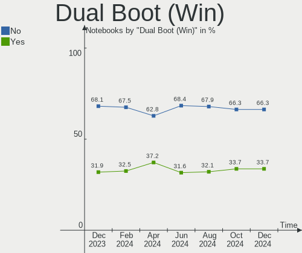
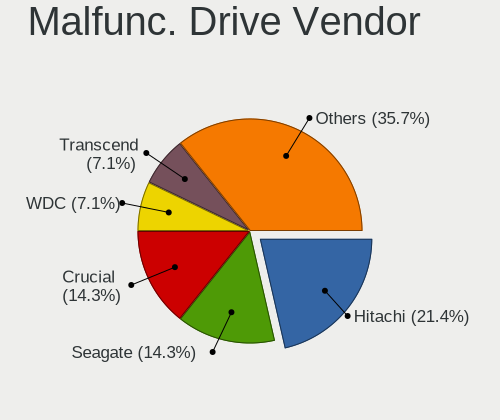
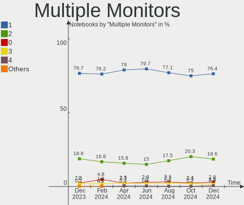
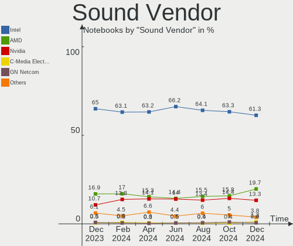

Ubuntu - Hardware Trends (Notebooks)
------------------------------------

A project to identify most popular hardware characteristics and track their change
over time based on data collected by Linux users at https://Linux-Hardware.org.

Anyone can contribute to this report by the [hw-probe](https://github.com/linuxhw/hw-probe) tool:

    sudo -E hw-probe -all -upload

This report is for one last month. Overall report since the beginning of time: [TestDays](https://github.com/linuxhw/TestDays)

Period: Jan, 2024.

Contents
--------

* [ System ](#system)
  - [ OS                       ](#os)
  - [ OS Family                ](#os-family)
  - [ Kernel                   ](#kernel)
  - [ Kernel Family            ](#kernel-family)
  - [ Kernel Major Ver.        ](#kernel-major-ver)
  - [ Arch                     ](#arch)
  - [ DE                       ](#de)
  - [ Display Server           ](#display-server)
  - [ Display Manager          ](#display-manager)
  - [ OS Lang                  ](#os-lang)
  - [ Boot Mode                ](#boot-mode)
  - [ Filesystem               ](#filesystem)
  - [ Part. scheme             ](#part-scheme)
  - [ Dual Boot with Linux/BSD ](#dual-boot-with-linuxbsd)
  - [ Dual Boot (Win)          ](#dual-boot-win)

* [ Board ](#board)
  - [ Vendor                   ](#vendor)
  - [ Model                    ](#model)
  - [ Model Family             ](#model-family)
  - [ MFG Year                 ](#mfg-year)
  - [ Form Factor              ](#form-factor)
  - [ Secure Boot              ](#secure-boot)
  - [ Coreboot                 ](#coreboot)
  - [ RAM Size                 ](#ram-size)
  - [ RAM Used                 ](#ram-used)
  - [ Total Drives             ](#total-drives)
  - [ Has CD-ROM               ](#has-cd-rom)
  - [ Has Ethernet             ](#has-ethernet)
  - [ Has WiFi                 ](#has-wifi)
  - [ Has Bluetooth            ](#has-bluetooth)

* [ Location ](#location)
  - [ Country                  ](#country)
  - [ City                     ](#city)

* [ Drives ](#drives)
  - [ Drive Vendor             ](#drive-vendor)
  - [ Drive Model              ](#drive-model)
  - [ HDD Vendor               ](#hdd-vendor)
  - [ SSD Vendor               ](#ssd-vendor)
  - [ Drive Kind               ](#drive-kind)
  - [ Drive Connector          ](#drive-connector)
  - [ Drive Size               ](#drive-size)
  - [ Space Total              ](#space-total)
  - [ Space Used               ](#space-used)
  - [ Malfunc. Drives          ](#malfunc-drives)
  - [ Malfunc. Drive Vendor    ](#malfunc-drive-vendor)
  - [ Malfunc. HDD Vendor      ](#malfunc-hdd-vendor)
  - [ Malfunc. Drive Kind      ](#malfunc-drive-kind)
  - [ Failed Drives            ](#failed-drives)
  - [ Failed Drive Vendor      ](#failed-drive-vendor)
  - [ Drive Status             ](#drive-status)

* [ Storage controller ](#storage-controller)
  - [ Storage Vendor           ](#storage-vendor)
  - [ Storage Model            ](#storage-model)
  - [ Storage Kind             ](#storage-kind)

* [ Processor ](#processor)
  - [ CPU Vendor               ](#cpu-vendor)
  - [ CPU Model                ](#cpu-model)
  - [ CPU Model Family         ](#cpu-model-family)
  - [ CPU Cores                ](#cpu-cores)
  - [ CPU Sockets              ](#cpu-sockets)
  - [ CPU Threads              ](#cpu-threads)
  - [ CPU Op-Modes             ](#cpu-op-modes)
  - [ CPU Microcode            ](#cpu-microcode)
  - [ CPU Microarch            ](#cpu-microarch)

* [ Graphics ](#graphics)
  - [ GPU Vendor               ](#gpu-vendor)
  - [ GPU Model                ](#gpu-model)
  - [ GPU Combo                ](#gpu-combo)
  - [ GPU Driver               ](#gpu-driver)
  - [ GPU Memory               ](#gpu-memory)

* [ Monitor ](#monitor)
  - [ Monitor Vendor           ](#monitor-vendor)
  - [ Monitor Model            ](#monitor-model)
  - [ Monitor Resolution       ](#monitor-resolution)
  - [ Monitor Diagonal         ](#monitor-diagonal)
  - [ Monitor Width            ](#monitor-width)
  - [ Aspect Ratio             ](#aspect-ratio)
  - [ Monitor Area             ](#monitor-area)
  - [ Pixel Density            ](#pixel-density)
  - [ Multiple Monitors        ](#multiple-monitors)

* [ Network ](#network)
  - [ Net Controller Vendor    ](#net-controller-vendor)
  - [ Net Controller Model     ](#net-controller-model)
  - [ Wireless Vendor          ](#wireless-vendor)
  - [ Wireless Model           ](#wireless-model)
  - [ Ethernet Vendor          ](#ethernet-vendor)
  - [ Ethernet Model           ](#ethernet-model)
  - [ Net Controller Kind      ](#net-controller-kind)
  - [ Used Controller          ](#used-controller)
  - [ NICs                     ](#nics)
  - [ IPv6                     ](#ipv6)

* [ Bluetooth ](#bluetooth)
  - [ Bluetooth Vendor         ](#bluetooth-vendor)
  - [ Bluetooth Model          ](#bluetooth-model)

* [ Sound ](#sound)
  - [ Sound Vendor             ](#sound-vendor)
  - [ Sound Model              ](#sound-model)

* [ Memory ](#memory)
  - [ Memory Vendor            ](#memory-vendor)
  - [ Memory Model             ](#memory-model)
  - [ Memory Kind              ](#memory-kind)
  - [ Memory Form Factor       ](#memory-form-factor)
  - [ Memory Size              ](#memory-size)
  - [ Memory Speed             ](#memory-speed)

* [ Printers & scanners ](#printers--scanners)
  - [ Printer Vendor           ](#printer-vendor)
  - [ Printer Model            ](#printer-model)
  - [ Scanner Vendor           ](#scanner-vendor)
  - [ Scanner Model            ](#scanner-model)

* [ Camera ](#camera)
  - [ Camera Vendor            ](#camera-vendor)
  - [ Camera Model             ](#camera-model)

* [ Security ](#security)
  - [ Fingerprint Vendor       ](#fingerprint-vendor)
  - [ Fingerprint Model        ](#fingerprint-model)
  - [ Chipcard Vendor          ](#chipcard-vendor)
  - [ Chipcard Model           ](#chipcard-model)

* [ Unsupported ](#unsupported)
  - [ Unsupported Devices      ](#unsupported-devices)
  - [ Unsupported Device Types ](#unsupported-device-types)

System
------

OS
--

Installed operating systems

| Name         | Notebooks | Percent |
|--------------|-----------|---------|
| Ubuntu 22.04 | 416       | 66.24%  |
| Ubuntu 23.10 | 141       | 22.45%  |
| Ubuntu 20.04 | 38        | 6.05%   |
| Ubuntu 23.04 | 16        | 2.55%   |
| Ubuntu 22.10 | 8         | 1.27%   |
| Ubuntu 24.04 | 4         | 0.64%   |
| Ubuntu 18.04 | 3         | 0.48%   |
| Ubuntu 21.10 | 2         | 0.32%   |

OS Family
---------

OS without a version

| Name   | Notebooks | Percent |
|--------|-----------|---------|
| Ubuntu | 628       | 100%    |

Kernel
------

Version of the Linux kernel

| Version                | Notebooks | Percent |
|------------------------|-----------|---------|
| 6.5.0-14-generic       | 273       | 43.47%  |
| 6.2.0-39-generic       | 111       | 17.68%  |
| 6.5.0-15-generic       | 67        | 10.67%  |
| 5.15.0-91-generic      | 46        | 7.32%   |
| 6.2.0-26-generic       | 29        | 4.62%   |
| 6.5.0-9-generic        | 8         | 1.27%   |
| 5.15.0-92-generic      | 7         | 1.11%   |
| 6.2.0-37-generic       | 5         | 0.8%    |
| 5.4.0-169-generic      | 5         | 0.8%    |
| 5.19.0-46-generic      | 5         | 0.8%    |
| 6.6.0-14-generic       | 4         | 0.64%   |
| 6.5.0-17-generic       | 4         | 0.64%   |
| 6.1.0-1028-oem         | 4         | 0.64%   |
| 5.19.0-21-generic      | 3         | 0.48%   |
| 6.7.0-060700-generic   | 2         | 0.32%   |
| 6.6.9-060609-generic   | 2         | 0.32%   |
| 6.5.7-060507-generic   | 2         | 0.32%   |
| 6.5.0-14-lowlatency    | 2         | 0.32%   |
| 6.5.0-13-generic       | 2         | 0.32%   |
| 6.2.0-36-generic       | 2         | 0.32%   |
| 6.2.0-20-generic       | 2         | 0.32%   |
| 5.15.0-89-generic      | 2         | 0.32%   |
| 5.15.0-73-fips         | 2         | 0.32%   |
| 5.15.0-67-generic      | 2         | 0.32%   |
| 5.15.0-1046-intel-iotg | 2         | 0.32%   |
| 6.6.6-76060606-generic | 1         | 0.16%   |
| 6.6.10-tkg-eevdf       | 1         | 0.16%   |
| 6.6.10-060610-generic  | 1         | 0.16%   |
| 6.5.0-16-generic       | 1         | 0.16%   |
| 6.5.0-1009-oem         | 1         | 0.16%   |
| 6.5.0-10022-tuxedo     | 1         | 0.16%   |
| 6.5.0-10010-tuxedo     | 1         | 0.16%   |
| 6.4.6-76060406-generic | 1         | 0.16%   |
| 6.2.0-35-generic       | 1         | 0.16%   |
| 6.2.0-33-generic       | 1         | 0.16%   |
| 6.2.0-32-generic       | 1         | 0.16%   |
| 6.2.0-1009-lowlatency  | 1         | 0.16%   |
| 6.2.0-060200-generic   | 1         | 0.16%   |
| 6.1.0-1029-oem         | 1         | 0.16%   |
| 6.1.0-1027-oem         | 1         | 0.16%   |

Kernel Family
-------------

Linux kernel without a distro release

| Version  | Notebooks | Percent |
|----------|-----------|---------|
| 6.5.0    | 360       | 57.32%  |
| 6.2.0    | 154       | 24.52%  |
| 5.15.0   | 65        | 10.35%  |
| 5.19.0   | 11        | 1.75%   |
| 5.4.0    | 8         | 1.27%   |
| 6.1.0    | 6         | 0.96%   |
| 6.6.0    | 4         | 0.64%   |
| 5.13.0   | 4         | 0.64%   |
| 6.7.0    | 2         | 0.32%   |
| 6.6.9    | 2         | 0.32%   |
| 6.6.10   | 2         | 0.32%   |
| 6.5.7    | 2         | 0.32%   |
| 5.14.0   | 2         | 0.32%   |
| 4.15.0   | 2         | 0.32%   |
| 6.6.6    | 1         | 0.16%   |
| 6.4.6    | 1         | 0.16%   |
| 5.19.17  | 1         | 0.16%   |
| 5.15.145 | 1         | 0.16%   |

Kernel Major Ver.
-----------------

Linux kernel major version

| Version | Notebooks | Percent |
|---------|-----------|---------|
| 6.5     | 362       | 57.64%  |
| 6.2     | 154       | 24.52%  |
| 5.15    | 66        | 10.51%  |
| 5.19    | 12        | 1.91%   |
| 6.6     | 9         | 1.43%   |
| 5.4     | 8         | 1.27%   |
| 6.1     | 6         | 0.96%   |
| 5.13    | 4         | 0.64%   |
| 6.7     | 2         | 0.32%   |
| 5.14    | 2         | 0.32%   |
| 4.15    | 2         | 0.32%   |
| 6.4     | 1         | 0.16%   |

Arch
----

OS architecture (x86_64, i586, etc.)

| Name   | Notebooks | Percent |
|--------|-----------|---------|
| x86_64 | 628       | 100%    |

DE
--

Desktop Environment

| Name            | Notebooks | Percent |
|-----------------|-----------|---------|
| GNOME           | 604       | 96.18%  |
| Unknown         | 11        | 1.75%   |
| X-Cinnamon      | 5         | 0.8%    |
| Enlightenment   | 3         | 0.48%   |
| GNOME Flashback | 2         | 0.32%   |
| Pantheon        | 1         | 0.16%   |
| i3              | 1         | 0.16%   |
| awesome         | 1         | 0.16%   |

Display Server
--------------

X11 or Wayland

| Name    | Notebooks | Percent |
|---------|-----------|---------|
| Wayland | 400       | 63.69%  |
| X11     | 210       | 33.44%  |
| Unknown | 12        | 1.91%   |
| Tty     | 6         | 0.96%   |

Display Manager
---------------

SDDM, LightDM, etc.

| Name    | Notebooks | Percent |
|---------|-----------|---------|
| GDM3    | 547       | 87.1%   |
| Unknown | 52        | 8.28%   |
| GDM     | 16        | 2.55%   |
| LightDM | 7         | 1.11%   |
| SDDM    | 5         | 0.8%    |
| XDM     | 1         | 0.16%   |

OS Lang
-------

Language

| Lang    | Notebooks | Percent |
|---------|-----------|---------|
| en_US   | 315       | 50.16%  |
| de_DE   | 68        | 10.83%  |
| fr_FR   | 42        | 6.69%   |
| en_GB   | 26        | 4.14%   |
| ru_RU   | 20        | 3.18%   |
| it_IT   | 19        | 3.03%   |
| es_ES   | 16        | 2.55%   |
| en_IN   | 15        | 2.39%   |
| C       | 12        | 1.91%   |
| en_CA   | 10        | 1.59%   |
| pt_BR   | 9         | 1.43%   |
| en_AU   | 7         | 1.11%   |
| pl_PL   | 6         | 0.96%   |
| Unknown | 6         | 0.96%   |
| cs_CZ   | 5         | 0.8%    |
| hu_HU   | 4         | 0.64%   |
| zh_CN   | 3         | 0.48%   |
| pt_PT   | 3         | 0.48%   |
| fr_CA   | 3         | 0.48%   |
| fi_FI   | 3         | 0.48%   |
| de_CH   | 3         | 0.48%   |
| nl_NL   | 2         | 0.32%   |
| nb_NO   | 2         | 0.32%   |
| fr_BE   | 2         | 0.32%   |
| et_EE   | 2         | 0.32%   |
| en_NZ   | 2         | 0.32%   |
| da_DK   | 2         | 0.32%   |
| zh_TW   | 1         | 0.16%   |
| vi_VN   | 1         | 0.16%   |
| tr_TR   | 1         | 0.16%   |
| th_TH   | 1         | 0.16%   |
| sv_SE   | 1         | 0.16%   |
| sl_SI   | 1         | 0.16%   |
| sk_SK   | 1         | 0.16%   |
| ko_KR   | 1         | 0.16%   |
| ja_JP   | 1         | 0.16%   |
| fr_CH   | 1         | 0.16%   |
| es_PY   | 1         | 0.16%   |
| es_PE   | 1         | 0.16%   |
| es_MX   | 1         | 0.16%   |

Boot Mode
---------

EFI or BIOS

| Mode | Notebooks | Percent |
|------|-----------|---------|
| BIOS | 338       | 53.82%  |
| EFI  | 290       | 46.18%  |

Filesystem
----------

Type of filesystem

| Type    | Notebooks | Percent |
|---------|-----------|---------|
| Tmpfs   | 309       | 49.2%   |
| Ext4    | 289       | 46.02%  |
| Overlay | 15        | 2.39%   |
| Btrfs   | 10        | 1.59%   |
| Zfs     | 5         | 0.8%    |

Part. scheme
------------

Scheme of partitioning

| Type    | Notebooks | Percent |
|---------|-----------|---------|
| GPT     | 536       | 85.35%  |
| MBR     | 48        | 7.64%   |
| Unknown | 44        | 7.01%   |

Dual Boot with Linux/BSD
------------------------

Hosting more than one Linux/BSD

| Dual boot | Notebooks | Percent |
|-----------|-----------|---------|
| No        | 568       | 90.45%  |
| Yes       | 60        | 9.55%   |

Dual Boot (Win)
---------------

Hosting Linux and Windows

| Dual boot | Notebooks | Percent |
|-----------|-----------|---------|
| No        | 429       | 68.31%  |
| Yes       | 199       | 31.69%  |

Board
-----

Vendor
------

Motherboard manufacturer

| Name                  | Notebooks | Percent |
|-----------------------|-----------|---------|
| Lenovo                | 126       | 20.06%  |
| Hewlett-Packard       | 118       | 18.79%  |
| Dell                  | 116       | 18.47%  |
| ASUSTek Computer      | 75        | 11.94%  |
| Acer                  | 48        | 7.64%   |
| Apple                 | 23        | 3.66%   |
| Toshiba               | 17        | 2.71%   |
| MSI                   | 10        | 1.59%   |
| Samsung Electronics   | 9         | 1.43%   |
| Sony                  | 8         | 1.27%   |
| Medion                | 8         | 1.27%   |
| HUAWEI                | 8         | 1.27%   |
| Fujitsu               | 8         | 1.27%   |
| Google                | 6         | 0.96%   |
| Notebook              | 5         | 0.8%    |
| AZW                   | 4         | 0.64%   |
| TUXEDO                | 3         | 0.48%   |
| Packard Bell          | 3         | 0.48%   |
| HONOR                 | 3         | 0.48%   |
| Alienware             | 3         | 0.48%   |
| Unknown               | 3         | 0.48%   |
| UNOWHY                | 2         | 0.32%   |
| System76              | 2         | 0.32%   |
| Panasonic             | 2         | 0.32%   |
| Infinix               | 2         | 0.32%   |
| Clevo                 | 2         | 0.32%   |
| Timi                  | 1         | 0.16%   |
| Semp Toshiba          | 1         | 0.16%   |
| Positivo Bahia - VAIO | 1         | 0.16%   |
| Positivo              | 1         | 0.16%   |
| NEC Computers         | 1         | 0.16%   |
| Minix                 | 1         | 0.16%   |
| MECHREVO              | 1         | 0.16%   |
| Maibenben             | 1         | 0.16%   |
| LG Electronics        | 1         | 0.16%   |
| Jumper                | 1         | 0.16%   |
| GPU Company           | 1         | 0.16%   |
| Framework             | 1         | 0.16%   |
| Chuwi                 | 1         | 0.16%   |
| AXDIA International   | 1         | 0.16%   |

Model
-----

Motherboard model

| Name                                     | Notebooks | Percent |
|------------------------------------------|-----------|---------|
| HP Pavilion Notebook                     | 4         | 0.64%   |
| HP Laptop 15-dy2xxx                      | 4         | 0.64%   |
| HP EliteBook 840 G3                      | 4         | 0.64%   |
| Lenovo IdeaPad 5 Pro 14ACN6 82L7         | 3         | 0.48%   |
| HP Pavilion dv6                          | 3         | 0.48%   |
| HP Notebook                              | 3         | 0.48%   |
| Dell XPS 9320                            | 3         | 0.48%   |
| Dell XPS 13 9370                         | 3         | 0.48%   |
| Dell Inspiron 5570                       | 3         | 0.48%   |
| Apple MacBookPro9,2                      | 3         | 0.48%   |
| Acer Nitro AN515-58                      | 3         | 0.48%   |
| Unknown                                  | 3         | 0.48%   |
| Toshiba Satellite C55-C                  | 2         | 0.32%   |
| MSI Prestige 13Evo A13M                  | 2         | 0.32%   |
| Medion P15648                            | 2         | 0.32%   |
| Lenovo IdeaPad 3 15ITL6 82H8             | 2         | 0.32%   |
| Lenovo G500 20236                        | 2         | 0.32%   |
| HUAWEI NBLB-WAX9N                        | 2         | 0.32%   |
| HP ProBook 640 G1                        | 2         | 0.32%   |
| HP ProBook 4530s                         | 2         | 0.32%   |
| HP Pavilion Laptop 14-dv0xxx             | 2         | 0.32%   |
| HP Pavilion 15                           | 2         | 0.32%   |
| HP Laptop 15s-fq5xxx                     | 2         | 0.32%   |
| HP Laptop 15-db1xxx                      | 2         | 0.32%   |
| HP EliteBook 8570w                       | 2         | 0.32%   |
| HP EliteBook 840 G8 Notebook PC          | 2         | 0.32%   |
| HP EliteBook 840 G6                      | 2         | 0.32%   |
| HP 650                                   | 2         | 0.32%   |
| Dell XPS 9315                            | 2         | 0.32%   |
| Dell XPS 15 9530                         | 2         | 0.32%   |
| Dell XPS 13 9380                         | 2         | 0.32%   |
| Dell Precision 5680                      | 2         | 0.32%   |
| Dell Latitude E7470                      | 2         | 0.32%   |
| Dell Latitude E7440                      | 2         | 0.32%   |
| Dell Latitude E7250                      | 2         | 0.32%   |
| Dell Latitude E6500                      | 2         | 0.32%   |
| Dell Latitude E5570                      | 2         | 0.32%   |
| Dell Latitude 7490                       | 2         | 0.32%   |
| Dell Latitude 7440                       | 2         | 0.32%   |
| Dell Latitude 7212 Rugged Extreme Tablet | 2         | 0.32%   |

Model Family
------------

Motherboard model prefix

| Name                  | Notebooks | Percent |
|-----------------------|-----------|---------|
| Lenovo ThinkPad       | 69        | 10.99%  |
| Dell Latitude         | 44        | 7.01%   |
| Lenovo IdeaPad        | 34        | 5.41%   |
| Dell Inspiron         | 34        | 5.41%   |
| Acer Aspire           | 31        | 4.94%   |
| ASUS VivoBook         | 26        | 4.14%   |
| HP Pavilion           | 23        | 3.66%   |
| HP EliteBook          | 23        | 3.66%   |
| HP Laptop             | 21        | 3.34%   |
| Dell XPS              | 18        | 2.87%   |
| HP ProBook            | 17        | 2.71%   |
| Toshiba Satellite     | 16        | 2.55%   |
| Dell Precision        | 12        | 1.91%   |
| ASUS ROG              | 9         | 1.43%   |
| ASUS ZenBook          | 8         | 1.27%   |
| ASUS ASUS             | 8         | 1.27%   |
| Lenovo Legion         | 7         | 1.11%   |
| Fujitsu LIFEBOOK      | 7         | 1.11%   |
| Acer Nitro            | 7         | 1.11%   |
| HP ZBook              | 6         | 0.96%   |
| Lenovo ThinkBook      | 5         | 0.8%    |
| Acer Swift            | 5         | 0.8%    |
| HP OMEN               | 4         | 0.64%   |
| Dell Vostro           | 4         | 0.64%   |
| Packard Bell EasyNote | 3         | 0.48%   |
| MSI Prestige          | 3         | 0.48%   |
| HP Victus             | 3         | 0.48%   |
| HP Notebook           | 3         | 0.48%   |
| HP ENVY               | 3         | 0.48%   |
| HP Compaq             | 3         | 0.48%   |
| Apple MacBookPro9     | 3         | 0.48%   |
| Apple MacBookPro14    | 3         | 0.48%   |
| Apple MacBookPro11    | 3         | 0.48%   |
| Acer TravelMate       | 3         | 0.48%   |
| Unknown               | 3         | 0.48%   |
| MSI Katana            | 2         | 0.32%   |
| Medion P15648         | 2         | 0.32%   |
| Medion Akoya          | 2         | 0.32%   |
| Lenovo Yoga           | 2         | 0.32%   |
| Lenovo G500           | 2         | 0.32%   |

MFG Year
--------

Motherboard manufacture year

| Year | Notebooks | Percent |
|------|-----------|---------|
| 2021 | 78        | 12.42%  |
| 2022 | 67        | 10.67%  |
| 2023 | 65        | 10.35%  |
| 2013 | 51        | 8.12%   |
| 2019 | 47        | 7.48%   |
| 2018 | 45        | 7.17%   |
| 2016 | 42        | 6.69%   |
| 2020 | 41        | 6.53%   |
| 2014 | 32        | 5.1%    |
| 2017 | 31        | 4.94%   |
| 2012 | 29        | 4.62%   |
| 2015 | 25        | 3.98%   |
| 2011 | 25        | 3.98%   |
| 2010 | 18        | 2.87%   |
| 2008 | 16        | 2.55%   |
| 2009 | 8         | 1.27%   |
| 2007 | 5         | 0.8%    |
| 2006 | 3         | 0.48%   |

Form Factor
-----------

Physical design of the computer

| Name     | Notebooks | Percent |
|----------|-----------|---------|
| Notebook | 628       | 100%    |

Secure Boot
-----------

Enabled or disabled

| State    | Notebooks | Percent |
|----------|-----------|---------|
| Disabled | 548       | 87.26%  |
| Enabled  | 80        | 12.74%  |

Coreboot
--------

Have coreboot on board

| Used | Notebooks | Percent |
|------|-----------|---------|
| No   | 622       | 99.04%  |
| Yes  | 6         | 0.96%   |

RAM Size
--------

Total RAM memory

| Size in GB  | Notebooks | Percent |
|-------------|-----------|---------|
| 4.01-8.0    | 189       | 30.1%   |
| 16.01-24.0  | 122       | 19.43%  |
| 8.01-16.0   | 120       | 19.11%  |
| 3.01-4.0    | 83        | 13.22%  |
| 32.01-64.0  | 76        | 12.1%   |
| 24.01-32.0  | 14        | 2.23%   |
| 64.01-256.0 | 12        | 1.91%   |
| 2.01-3.0    | 7         | 1.11%   |
| 1.01-2.0    | 5         | 0.8%    |

RAM Used
--------

Used RAM memory

| Used GB    | Notebooks | Percent |
|------------|-----------|---------|
| 2.01-3.0   | 178       | 28.34%  |
| 1.01-2.0   | 151       | 24.04%  |
| 4.01-8.0   | 137       | 21.82%  |
| 3.01-4.0   | 114       | 18.15%  |
| 8.01-16.0  | 37        | 5.89%   |
| 16.01-24.0 | 5         | 0.8%    |
| 24.01-32.0 | 3         | 0.48%   |
| 0.51-1.0   | 3         | 0.48%   |

Total Drives
------------

Number of drives on board

| Drives | Notebooks | Percent |
|--------|-----------|---------|
| 1      | 488       | 77.71%  |
| 2      | 118       | 18.79%  |
| 3      | 15        | 2.39%   |
| 0      | 6         | 0.96%   |
| 4      | 1         | 0.16%   |

Has CD-ROM
----------

Has CD-ROM on board

| Presented | Notebooks | Percent |
|-----------|-----------|---------|
| No        | 464       | 73.89%  |
| Yes       | 164       | 26.11%  |

Has Ethernet
------------

Has Ethernet on board

| Presented | Notebooks | Percent |
|-----------|-----------|---------|
| Yes       | 468       | 74.52%  |
| No        | 160       | 25.48%  |

Has WiFi
--------

Has WiFi module

| Presented | Notebooks | Percent |
|-----------|-----------|---------|
| Yes       | 619       | 98.57%  |
| No        | 9         | 1.43%   |

Has Bluetooth
-------------

Has Bluetooth module

| Presented | Notebooks | Percent |
|-----------|-----------|---------|
| Yes       | 537       | 85.51%  |
| No        | 91        | 14.49%  |

Location
--------

Country
-------

Geographic location (country)

| Country      | Notebooks | Percent |
|--------------|-----------|---------|
| USA          | 104       | 16.56%  |
| Germany      | 86        | 13.69%  |
| France       | 55        | 8.76%   |
| Russia       | 30        | 4.78%   |
| Italy        | 25        | 3.98%   |
| India        | 24        | 3.82%   |
| Canada       | 23        | 3.66%   |
| UK           | 19        | 3.03%   |
| Spain        | 19        | 3.03%   |
| Brazil       | 19        | 3.03%   |
| Poland       | 13        | 2.07%   |
| Czechia      | 11        | 1.75%   |
| Turkey       | 9         | 1.43%   |
| Switzerland  | 8         | 1.27%   |
| Sweden       | 8         | 1.27%   |
| Portugal     | 8         | 1.27%   |
| Norway       | 8         | 1.27%   |
| Netherlands  | 8         | 1.27%   |
| Mexico       | 8         | 1.27%   |
| Finland      | 8         | 1.27%   |
| Australia    | 8         | 1.27%   |
| Hungary      | 7         | 1.11%   |
| Greece       | 7         | 1.11%   |
| Colombia     | 7         | 1.11%   |
| Bulgaria     | 7         | 1.11%   |
| Hong Kong    | 6         | 0.96%   |
| Belgium      | 6         | 0.96%   |
| Vietnam      | 5         | 0.8%    |
| Indonesia    | 4         | 0.64%   |
| Belarus      | 4         | 0.64%   |
| Taiwan       | 3         | 0.48%   |
| South Korea  | 3         | 0.48%   |
| New Zealand  | 3         | 0.48%   |
| Morocco      | 3         | 0.48%   |
| Kenya        | 3         | 0.48%   |
| Estonia      | 3         | 0.48%   |
| Thailand     | 2         | 0.32%   |
| South Africa | 2         | 0.32%   |
| Slovenia     | 2         | 0.32%   |
| Singapore    | 2         | 0.32%   |

City
----

Geographic location (city)

| City             | Notebooks | Percent |
|------------------|-----------|---------|
| Paris            | 10        | 1.59%   |
| Moscow           | 8         | 1.27%   |
| Hamburg          | 7         | 1.11%   |
| Berlin           | 7         | 1.11%   |
| Munich           | 6         | 0.96%   |
| Leipzig          | 5         | 0.8%    |
| Central          | 5         | 0.8%    |
| Athens           | 5         | 0.8%    |
| Rome             | 4         | 0.64%   |
| Prague           | 4         | 0.64%   |
| Lisbon           | 4         | 0.64%   |
| Istanbul         | 4         | 0.64%   |
| Helsinki         | 4         | 0.64%   |
| Budapest         | 4         | 0.64%   |
| Bogotá          | 4         | 0.64%   |
| Toronto          | 3         | 0.48%   |
| Sydney           | 3         | 0.48%   |
| Stuttgart        | 3         | 0.48%   |
| Stockholm        | 3         | 0.48%   |
| St Louis         | 3         | 0.48%   |
| Sofia            | 3         | 0.48%   |
| Montreal         | 3         | 0.48%   |
| Montpellier      | 3         | 0.48%   |
| Minsk            | 3         | 0.48%   |
| Milan            | 3         | 0.48%   |
| Madrid           | 3         | 0.48%   |
| Le Haillan       | 3         | 0.48%   |
| Ho Chi Minh City | 3         | 0.48%   |
| Bengaluru        | 3         | 0.48%   |
| Auckland         | 3         | 0.48%   |
| Amsterdam        | 3         | 0.48%   |
| Albuquerque      | 3         | 0.48%   |
| Zagreb           | 2         | 0.32%   |
| Warsaw           | 2         | 0.32%   |
| Valencia         | 2         | 0.32%   |
| The Bronx        | 2         | 0.32%   |
| Tampere          | 2         | 0.32%   |
| Tallinn          | 2         | 0.32%   |
| Taipei           | 2         | 0.32%   |
| Strasbourg       | 2         | 0.32%   |

Drives
------

Drive Vendor
------------

Hard drive vendors

| Vendor                       | Notebooks | Drives | Percent |
|------------------------------|-----------|--------|---------|
| Samsung Electronics          | 125       | 131    | 16.8%   |
| SanDisk                      | 66        | 68     | 8.87%   |
| Micron Technology            | 56        | 56     | 7.53%   |
| Seagate                      | 45        | 50     | 6.05%   |
| WDC                          | 44        | 46     | 5.91%   |
| Toshiba                      | 39        | 39     | 5.24%   |
| SK hynix                     | 39        | 41     | 5.24%   |
| Intel                        | 37        | 39     | 4.97%   |
| Unknown                      | 34        | 36     | 4.57%   |
| Kingston                     | 31        | 33     | 4.17%   |
| Crucial                      | 29        | 29     | 3.9%    |
| KIOXIA                       | 17        | 17     | 2.28%   |
| Apple                        | 16        | 18     | 2.15%   |
| HGST                         | 15        | 15     | 2.02%   |
| China                        | 12        | 13     | 1.61%   |
| Hitachi                      | 10        | 10     | 1.34%   |
| Kingston Technology Company  | 8         | 8      | 1.08%   |
| Phison Electronics           | 7         | 7      | 0.94%   |
| Intenso                      | 7         | 7      | 0.94%   |
| A-DATA Technology            | 6         | 6      | 0.81%   |
| Phison                       | 4         | 4      | 0.54%   |
| MAXIO Technology (Hangzhou)  | 4         | 4      | 0.54%   |
| Hewlett-Packard              | 4         | 4      | 0.54%   |
| Silicon Motion               | 3         | 3      | 0.4%    |
| OCZ                          | 3         | 3      | 0.4%    |
| LITEONIT                     | 3         | 3      | 0.4%    |
| LITEON                       | 3         | 3      | 0.4%    |
| Lenovo                       | 3         | 3      | 0.4%    |
| KIOXIA-EXCERIA               | 3         | 3      | 0.4%    |
| Unknown                      | 3         | 3      | 0.4%    |
| YMTC                         | 2         | 3      | 0.27%   |
| XrayDisk                     | 2         | 2      | 0.27%   |
| Union Memory                 | 2         | 2      | 0.27%   |
| UMIS                         | 2         | 2      | 0.27%   |
| Transcend                    | 2         | 2      | 0.27%   |
| SSSTC                        | 2         | 2      | 0.27%   |
| Shenzhen Longsys Electronics | 2         | 2      | 0.27%   |
| Realtek Semiconductor        | 2         | 2      | 0.27%   |
| Patriot                      | 2         | 2      | 0.27%   |
| Netac                        | 2         | 2      | 0.27%   |

Drive Model
-----------

Hard drive models

| Model                                               | Notebooks | Percent |
|-----------------------------------------------------|-----------|---------|
| Intel SSDPEKNU512GZ 512GB                           | 11        | 1.44%   |
| Unknown MMC Card  64GB                              | 10        | 1.31%   |
| Samsung NVMe SSD Controller SM981/PM981/PM983 1TB   | 10        | 1.31%   |
| Kingston SA400S37480G 480GB SSD                     | 8         | 1.05%   |
| SanDisk NVMe SSD Drive 512GB                        | 7         | 0.92%   |
| Intel SSD 660P Series 1024GB                        | 7         | 0.92%   |
| Unknown MMC Card  32GB                              | 6         | 0.79%   |
| Unknown MMC Card  128GB                             | 6         | 0.79%   |
| Toshiba MQ01ABD100 1TB                              | 6         | 0.79%   |
| Seagate ST1000LM024 HN-M101MBB 1TB                  | 6         | 0.79%   |
| Samsung SSD 860 EVO 1TB                             | 6         | 0.79%   |
| Samsung MZALQ512HBLU-00BL2 512GB                    | 6         | 0.79%   |
| Micron 2400_MTFDKBA512QFM 512GB                     | 6         | 0.79%   |
| Kingston SA400S37240G 240GB SSD                     | 6         | 0.79%   |
| Seagate ST500LT012-1DG142 500GB                     | 5         | 0.66%   |
| Seagate ST1000LM035-1RK172 1TB                      | 5         | 0.66%   |
| Sandisk WD Blue SN550 NVMe SSD 512GB                | 5         | 0.66%   |
| Samsung SSD 980 PRO 2TB                             | 5         | 0.66%   |
| Samsung NVMe SSD Controller SM961/PM961/SM963 256GB | 5         | 0.66%   |
| Samsung NVMe SSD Controller PM9A1/PM9A3/980PRO 2TB  | 5         | 0.66%   |
| Micron 2450_MTFDKBA512TFK 512GB                     | 5         | 0.66%   |
| HGST HTS721010A9E630 1TB                            | 5         | 0.66%   |
| Toshiba MQ04ABF100 1TB                              | 4         | 0.52%   |
| Toshiba MQ01ABF050 500GB                            | 4         | 0.52%   |
| SanDisk NVMe SSD Drive 1TB                          | 4         | 0.52%   |
| Samsung MZVL21T0HCLR-00B00 1TB                      | 4         | 0.52%   |
| Micron MTFDHBA512QFD 512GB                          | 4         | 0.52%   |
| Micron 3400_MTFDKBA512TFH 512GB                     | 4         | 0.52%   |
| Micron 1100 SATA 256GB SSD                          | 4         | 0.52%   |
| MAXIO (Hangzhou) NVMe SSD Controller MAP1202 512GB  | 4         | 0.52%   |
| Kingston Company OM3PDP3 NVMe SSD 256GB             | 4         | 0.52%   |
| HGST HTS541010A9E680 1TB                            | 4         | 0.52%   |
| Crucial CT480BX500SSD1 480GB                        | 4         | 0.52%   |
| Crucial CT240BX500SSD1 240GB                        | 4         | 0.52%   |
| WDC WDS100T2B0A-00SM50 1TB SSD                      | 3         | 0.39%   |
| WDC WD10SPZX-60Z10T0 1TB                            | 3         | 0.39%   |
| Toshiba XG6 NVMe SSD Controller 256GB               | 3         | 0.39%   |
| SK hynix SKHynix_HFS001TEJ9X162N 1024GB             | 3         | 0.39%   |
| SK hynix PC401 NVMe 512GB                           | 3         | 0.39%   |
| SK hynix BC711 HFM512GD3JX013N 512GB                | 3         | 0.39%   |

HDD Vendor
----------

Hard disk drive vendors

| Vendor              | Notebooks | Drives | Percent |
|---------------------|-----------|--------|---------|
| Seagate             | 41        | 43     | 31.54%  |
| Toshiba             | 26        | 26     | 20%     |
| WDC                 | 25        | 25     | 19.23%  |
| HGST                | 15        | 15     | 11.54%  |
| Hitachi             | 10        | 10     | 7.69%   |
| Samsung Electronics | 3         | 3      | 2.31%   |
| Unknown             | 2         | 2      | 1.54%   |
| Fujitsu             | 2         | 2      | 1.54%   |
| External            | 2         | 2      | 1.54%   |
| StoreJet            | 1         | 1      | 0.77%   |
| JMicron Technology  | 1         | 1      | 0.77%   |
| ASMT                | 1         | 1      | 0.77%   |
| Apple               | 1         | 1      | 0.77%   |

SSD Vendor
----------

Solid state drive vendors

| Vendor              | Notebooks | Drives | Percent |
|---------------------|-----------|--------|---------|
| Samsung Electronics | 40        | 42     | 17.32%  |
| SanDisk             | 27        | 28     | 11.69%  |
| Kingston            | 23        | 24     | 9.96%   |
| Crucial             | 22        | 22     | 9.52%   |
| Micron Technology   | 13        | 13     | 5.63%   |
| China               | 12        | 13     | 5.19%   |
| WDC                 | 10        | 11     | 4.33%   |
| Apple               | 10        | 10     | 4.33%   |
| SK hynix            | 5         | 5      | 2.16%   |
| Intenso             | 5         | 5      | 2.16%   |
| Intel               | 5         | 5      | 2.16%   |
| A-DATA Technology   | 5         | 5      | 2.16%   |
| Hewlett-Packard     | 4         | 4      | 1.73%   |
| Toshiba             | 3         | 3      | 1.3%    |
| OCZ                 | 3         | 3      | 1.3%    |
| LITEONIT            | 3         | 3      | 1.3%    |
| LITEON              | 3         | 3      | 1.3%    |
| Transcend           | 2         | 2      | 0.87%   |
| Phison              | 2         | 2      | 0.87%   |
| Netac               | 2         | 2      | 0.87%   |
| KIOXIA-EXCERIA      | 2         | 2      | 0.87%   |
| GOODRAM             | 2         | 2      | 0.87%   |
| Apacer              | 2         | 2      | 0.87%   |
| XUM                 | 1         | 1      | 0.43%   |
| XrayDisk            | 1         | 1      | 0.43%   |
| Wibtek              | 1         | 1      | 0.43%   |
| Verbatim            | 1         | 1      | 0.43%   |
| Teclast             | 1         | 1      | 0.43%   |
| TCSUNBOW            | 1         | 1      | 0.43%   |
| SPCC                | 1         | 1      | 0.43%   |
| Smartbuy            | 1         | 1      | 0.43%   |
| Smart               | 1         | 1      | 0.43%   |
| SABRENT             | 1         | 1      | 0.43%   |
| Patriot             | 1         | 1      | 0.43%   |
| ORICO               | 1         | 1      | 0.43%   |
| Kross Elegance      | 1         | 1      | 0.43%   |
| KINGBANK            | 1         | 1      | 0.43%   |
| HUSKY               | 1         | 1      | 0.43%   |
| HS-SSD-E100N        | 1         | 1      | 0.43%   |
| GLOBAL              | 1         | 1      | 0.43%   |

Drive Kind
----------

HDD or SSD

| Kind    | Notebooks | Drives | Percent |
|---------|-----------|--------|---------|
| NVMe    | 318       | 351    | 44.6%   |
| SSD     | 220       | 237    | 30.86%  |
| HDD     | 128       | 132    | 17.95%  |
| MMC     | 33        | 36     | 4.63%   |
| Unknown | 14        | 15     | 1.96%   |

Drive Connector
---------------

SATA, SAS, NVMe, etc.

| Type | Notebooks | Drives | Percent |
|------|-----------|--------|---------|
| NVMe | 318       | 350    | 45.95%  |
| SATA | 313       | 355    | 45.23%  |
| MMC  | 33        | 36     | 4.77%   |
| SAS  | 28        | 30     | 4.05%   |

Drive Size
----------

Size of hard drive

| Size in TB | Notebooks | Drives | Percent |
|------------|-----------|--------|---------|
| 0.01-0.5   | 221       | 235    | 63.51%  |
| 0.51-1.0   | 108       | 115    | 31.03%  |
| 1.01-2.0   | 16        | 16     | 4.6%    |
| 3.01-4.0   | 2         | 2      | 0.57%   |
| 4.01-10.0  | 1         | 1      | 0.29%   |

Space Total
-----------

Amount of disk space available on the file system

| Size in GB     | Notebooks | Percent |
|----------------|-----------|---------|
| 101-250        | 194       | 30.89%  |
| 251-500        | 190       | 30.25%  |
| 501-1000       | 106       | 16.88%  |
| 51-100         | 37        | 5.89%   |
| 1-20           | 32        | 5.1%    |
| 1001-2000      | 29        | 4.62%   |
| 21-50          | 13        | 2.07%   |
| More than 3000 | 12        | 1.91%   |
| 2001-3000      | 9         | 1.43%   |
| Unknown        | 6         | 0.96%   |

Space Used
----------

Amount of used disk space

| Used GB        | Notebooks | Percent |
|----------------|-----------|---------|
| 1-20           | 183       | 29.14%  |
| 21-50          | 150       | 23.89%  |
| 101-250        | 114       | 18.15%  |
| 51-100         | 87        | 13.85%  |
| 251-500        | 48        | 7.64%   |
| 501-1000       | 26        | 4.14%   |
| 1001-2000      | 7         | 1.11%   |
| Unknown        | 6         | 0.96%   |
| More than 3000 | 4         | 0.64%   |
| 2001-3000      | 3         | 0.48%   |

Malfunc. Drives
---------------

Drive models with a malfunction

| Model                                | Notebooks | Drives | Percent |
|--------------------------------------|-----------|--------|---------|
| WDC WD5000LPVX-22V0TT0 500GB         | 1         | 1      | 5.88%   |
| Toshiba MK3265GSX 320GB              | 1         | 1      | 5.88%   |
| SK hynix SC401 SATA 512GB SSD        | 1         | 1      | 5.88%   |
| SK hynix BC711 HFM512GD3JX013N 512GB | 1         | 1      | 5.88%   |
| SK hynix BC711 HFM256GD3JX013N 256GB | 1         | 1      | 5.88%   |
| Seagate ST9500420AS 500GB            | 1         | 1      | 5.88%   |
| Seagate ST9500325AS 500GB            | 1         | 1      | 5.88%   |
| Seagate ST500LM000-1EJ162-SSHD 500GB | 1         | 1      | 5.88%   |
| Seagate ST1000LM024 HN-M101MBB 1TB   | 1         | 1      | 5.88%   |
| SanDisk SDSSDA120G 120GB             | 1         | 1      | 5.88%   |
| Samsung Electronics SSD 870 EVO 1TB  | 1         | 1      | 5.88%   |
| OCZ VERTEX3 120GB SSD                | 1         | 1      | 5.88%   |
| Lenovo LENSE20256GMSP34MEAT2TA 256GB | 1         | 1      | 5.88%   |
| Intel SSDSCKKF256G8H 256GB           | 1         | 1      | 5.88%   |
| HGST HTS545050A7E380 500GB           | 1         | 1      | 5.88%   |
| China SSD 512GB                      | 1         | 1      | 5.88%   |
| Apple SSD SM1024F 1TB                | 1         | 1      | 5.88%   |

Malfunc. Drive Vendor
---------------------

Vendors of faulty drives

| Vendor              | Notebooks | Drives | Percent |
|---------------------|-----------|--------|---------|
| Seagate             | 4         | 4      | 23.53%  |
| SK hynix            | 3         | 3      | 17.65%  |
| WDC                 | 1         | 1      | 5.88%   |
| Toshiba             | 1         | 1      | 5.88%   |
| SanDisk             | 1         | 1      | 5.88%   |
| Samsung Electronics | 1         | 1      | 5.88%   |
| OCZ                 | 1         | 1      | 5.88%   |
| Lenovo              | 1         | 1      | 5.88%   |
| Intel               | 1         | 1      | 5.88%   |
| HGST                | 1         | 1      | 5.88%   |
| China               | 1         | 1      | 5.88%   |
| Apple               | 1         | 1      | 5.88%   |

Malfunc. HDD Vendor
-------------------

Vendors of faulty HDD drives

| Vendor  | Notebooks | Drives | Percent |
|---------|-----------|--------|---------|
| Seagate | 4         | 4      | 57.14%  |
| WDC     | 1         | 1      | 14.29%  |
| Toshiba | 1         | 1      | 14.29%  |
| HGST    | 1         | 1      | 14.29%  |

Malfunc. Drive Kind
-------------------

Kinds of faulty drives

| Kind | Notebooks | Drives | Percent |
|------|-----------|--------|---------|
| SSD  | 7         | 7      | 41.18%  |
| HDD  | 7         | 7      | 41.18%  |
| NVMe | 3         | 3      | 17.65%  |

Failed Drives
-------------

Failed drive models

| Model                            | Notebooks | Drives | Percent |
|----------------------------------|-----------|--------|---------|
| Toshiba THNSN5256GPUK NVMe 256GB | 1         | 1      | 50%     |
| HGST HTS721010A9E630 1TB         | 1         | 1      | 50%     |

Failed Drive Vendor
-------------------

Failed drive vendors

| Vendor  | Notebooks | Drives | Percent |
|---------|-----------|--------|---------|
| Toshiba | 1         | 1      | 50%     |
| HGST    | 1         | 1      | 50%     |

Drive Status
------------

Number of failed and malfunc. drives

| Status   | Notebooks | Drives | Percent |
|----------|-----------|--------|---------|
| Detected | 377       | 461    | 58.09%  |
| Works    | 253       | 291    | 38.98%  |
| Malfunc  | 17        | 17     | 2.62%   |
| Failed   | 2         | 2      | 0.31%   |

Storage controller
------------------

Storage Vendor
--------------

Storage controller vendors

| Vendor                         | Notebooks | Percent |
|--------------------------------|-----------|---------|
| Intel                          | 393       | 50.32%  |
| Samsung Electronics            | 88        | 11.27%  |
| AMD                            | 72        | 9.22%   |
| SanDisk                        | 45        | 5.76%   |
| Micron Technology              | 43        | 5.51%   |
| SK hynix                       | 33        | 4.23%   |
| KIOXIA                         | 18        | 2.3%    |
| Kingston Technology Company    | 16        | 2.05%   |
| Toshiba America Info Systems   | 11        | 1.41%   |
| Phison Electronics             | 10        | 1.28%   |
| Micron/Crucial Technology      | 9         | 1.15%   |
| Union Memory (Shenzhen)        | 5         | 0.64%   |
| MAXIO Technology (Hangzhou)    | 5         | 0.64%   |
| Apple                          | 5         | 0.64%   |
| Solid State Storage Technology | 3         | 0.38%   |
| Silicon Motion                 | 3         | 0.38%   |
| Lenovo                         | 3         | 0.38%   |
| Yangtze Memory Technologies    | 2         | 0.26%   |
| Shenzhen Longsys Electronics   | 2         | 0.26%   |
| Realtek Semiconductor          | 2         | 0.26%   |
| Nvidia                         | 2         | 0.26%   |
| Marvell Technology Group       | 2         | 0.26%   |
| ASMedia Technology             | 2         | 0.26%   |
| ADATA Technology               | 2         | 0.26%   |
| Solidigm                       | 1         | 0.13%   |
| Seagate Technology             | 1         | 0.13%   |
| O2 Micro                       | 1         | 0.13%   |
| Lite-On Technology             | 1         | 0.13%   |
| Hosin Global Electronics       | 1         | 0.13%   |

Storage Model
-------------

Storage controller models

| Model                                                                          | Notebooks | Percent |
|--------------------------------------------------------------------------------|-----------|---------|
| AMD FCH SATA Controller [AHCI mode]                                            | 65        | 7.87%   |
| Intel Sunrise Point-LP SATA Controller [AHCI mode]                             | 54        | 6.54%   |
| Intel Volume Management Device NVMe RAID Controller                            | 47        | 5.69%   |
| Intel 7 Series Chipset Family 6-port SATA Controller [AHCI mode]               | 37        | 4.48%   |
| Intel 82801 Mobile SATA Controller [RAID mode]                                 | 33        | 4%      |
| Samsung NVMe SSD Controller SM981/PM981/PM983                                  | 26        | 3.15%   |
| Intel 8 Series SATA Controller 1 [AHCI mode]                                   | 25        | 3.03%   |
| Samsung NVMe SSD Controller 980 (DRAM-less)                                    | 23        | 2.78%   |
| Intel 6 Series/C200 Series Chipset Family 6 port Mobile SATA AHCI Controller   | 22        | 2.66%   |
| Samsung NVMe SSD Controller PM9A1/PM9A3/980PRO                                 | 19        | 2.3%    |
| Intel Wildcat Point-LP SATA Controller [AHCI Mode]                             | 18        | 2.18%   |
| Intel SSD 670p Series [Keystone Harbor]                                        | 18        | 2.18%   |
| Intel Volume Management Device NVMe RAID Controller Intel Corporation          | 15        | 1.82%   |
| Micron 2450 NVMe SSD [HendrixV] (DRAM-less)                                    | 14        | 1.69%   |
| Intel 8 Series/C220 Series Chipset Family 6-port SATA Controller 1 [AHCI mode] | 13        | 1.57%   |
| Intel 5 Series/3400 Series Chipset 4 port SATA AHCI Controller                 | 13        | 1.57%   |
| SK hynix Gold P31/BC711/PC711 NVMe Solid State Drive                           | 11        | 1.33%   |
| Intel Tiger Lake-LP SATA Controller                                            | 11        | 1.33%   |
| Intel Alder Lake-P SATA AHCI Controller                                        | 11        | 1.33%   |
| SK hynix Platinum P41/PC801 NVMe Solid State Drive                             | 10        | 1.21%   |
| Intel SSD 660P Series                                                          | 9         | 1.09%   |
| Intel Cannon Lake Mobile PCH SATA AHCI Controller                              | 9         | 1.09%   |
| SanDisk WD Black SN770 / PC SN740 256GB / PC SN560 (DRAM-less) NVMe SSD        | 8         | 0.97%   |
| SanDisk Ultra 3D / WD Blue SN550 NVMe SSD                                      | 8         | 0.97%   |
| Micron 2400 NVMe SSD (DRAM-less)                                               | 8         | 0.97%   |
| Micron 2210 NVMe SSD [Cobain]                                                  | 8         | 0.97%   |
| Intel Cannon Point-LP SATA Controller [AHCI Mode]                              | 8         | 0.97%   |
| SanDisk WD PC SN810 / Black SN850 NVMe SSD                                     | 7         | 0.85%   |
| Samsung NVMe SSD Controller PM9B1 (DRAM-less)                                  | 7         | 0.85%   |
| KIOXIA NVMe SSD Controller BG4 (DRAM-less)                                     | 7         | 0.85%   |
| Kingston Company OM3PDP3 NVMe SSD                                              | 7         | 0.85%   |
| Intel HM170/QM170 Chipset SATA Controller [AHCI Mode]                          | 7         | 0.85%   |
| Intel 82801IBM/IEM (ICH9M/ICH9M-E) 4 port SATA Controller [AHCI mode]          | 7         | 0.85%   |
| Samsung NVMe SSD Controller SM961/PM961/SM963                                  | 6         | 0.73%   |
| Micron/Crucial P2 [Nick P2] / P3 / P3 Plus NVMe PCIe SSD (DRAM-less)           | 6         | 0.73%   |
| Intel 5 Series/3400 Series Chipset 6 port SATA AHCI Controller                 | 6         | 0.73%   |
| Intel 400 Series Chipset Family SATA AHCI Controller                           | 6         | 0.73%   |
| SanDisk Extreme Pro / WD Black SN750 / PC SN730 / Red SN700 NVMe SSD           | 5         | 0.61%   |
| Micron 3400 NVMe SSD [Hendrix]                                                 | 5         | 0.61%   |
| KIOXIA NVMe SSD Controller XG8                                                 | 5         | 0.61%   |

Storage Kind
------------

Kind of storage controller (IDE, SATA, NVMe, SAS, ...)

| Kind | Notebooks | Percent |
|------|-----------|---------|
| SATA | 367       | 45.82%  |
| NVMe | 317       | 39.58%  |
| RAID | 100       | 12.48%  |
| IDE  | 17        | 2.12%   |

Processor
---------

CPU Vendor
----------

Processor vendors

| Vendor | Notebooks | Percent |
|--------|-----------|---------|
| Intel  | 493       | 78.5%   |
| AMD    | 135       | 21.5%   |

CPU Model
---------

Processor models

| Model                                         | Notebooks | Percent |
|-----------------------------------------------|-----------|---------|
| Intel 11th Gen Core i5-1135G7 @ 2.40GHz       | 15        | 2.39%   |
| Intel Core i7-8550U CPU @ 1.80GHz             | 12        | 1.91%   |
| Intel Core i5-7200U CPU @ 2.50GHz             | 8         | 1.27%   |
| Intel Core i5-6300U CPU @ 2.40GHz             | 8         | 1.27%   |
| Intel 13th Gen Core i9-13900H                 | 8         | 1.27%   |
| Intel 12th Gen Core i5-1235U                  | 8         | 1.27%   |
| AMD Ryzen 5 5600H with Radeon Graphics        | 8         | 1.27%   |
| Intel Core i7-8650U CPU @ 1.90GHz             | 7         | 1.11%   |
| Intel Core i5-4300U CPU @ 1.90GHz             | 7         | 1.11%   |
| Intel 12th Gen Core i7-1255U                  | 7         | 1.11%   |
| Intel 11th Gen Core i7-1165G7 @ 2.80GHz       | 7         | 1.11%   |
| Intel Core i7-8565U CPU @ 1.80GHz             | 6         | 0.96%   |
| Intel Core i7-6500U CPU @ 2.50GHz             | 6         | 0.96%   |
| Intel Core i5-8350U CPU @ 1.70GHz             | 6         | 0.96%   |
| Intel Core i5-6200U CPU @ 2.30GHz             | 6         | 0.96%   |
| Intel Core i5-3320M CPU @ 2.60GHz             | 6         | 0.96%   |
| Intel Core i5-2410M CPU @ 2.30GHz             | 6         | 0.96%   |
| Intel 12th Gen Core i7-1260P                  | 6         | 0.96%   |
| Intel 12th Gen Core i5-12450H                 | 6         | 0.96%   |
| AMD Ryzen 5 5500U with Radeon Graphics        | 6         | 0.96%   |
| Intel Core i7-6700HQ CPU @ 2.60GHz            | 5         | 0.8%    |
| Intel Core i7-5600U CPU @ 2.60GHz             | 5         | 0.8%    |
| Intel Core i5-7300U CPU @ 2.60GHz             | 5         | 0.8%    |
| Intel Core i5-5300U CPU @ 2.30GHz             | 5         | 0.8%    |
| Intel Core i5-4200U CPU @ 1.60GHz             | 5         | 0.8%    |
| Intel Core i5-3210M CPU @ 2.50GHz             | 5         | 0.8%    |
| Intel Core i5-1035G1 CPU @ 1.00GHz            | 5         | 0.8%    |
| Intel Core i5-10210U CPU @ 1.60GHz            | 5         | 0.8%    |
| Intel 13th Gen Core i7-1365U                  | 5         | 0.8%    |
| AMD Ryzen 7 7735HS with Radeon Graphics       | 5         | 0.8%    |
| Intel Core i7-9750H CPU @ 2.60GHz             | 4         | 0.64%   |
| Intel Core i7-7500U CPU @ 2.70GHz             | 4         | 0.64%   |
| Intel Core i7-2670QM CPU @ 2.20GHz            | 4         | 0.64%   |
| Intel Core i7-1065G7 CPU @ 1.30GHz            | 4         | 0.64%   |
| Intel Core i7-10510U CPU @ 1.80GHz            | 4         | 0.64%   |
| Intel Core i5-8250U CPU @ 1.60GHz             | 4         | 0.64%   |
| Intel 13th Gen Core i7-13700H                 | 4         | 0.64%   |
| AMD Ryzen 7 7730U with Radeon Graphics        | 4         | 0.64%   |
| AMD Ryzen 7 4800H with Radeon Graphics        | 4         | 0.64%   |
| AMD Ryzen 5 3550H with Radeon Vega Mobile Gfx | 4         | 0.64%   |

CPU Model Family
----------------

Processor model prefix

| Model                   | Notebooks | Percent |
|-------------------------|-----------|---------|
| Intel Core i5           | 142       | 22.61%  |
| Other                   | 126       | 20.06%  |
| Intel Core i7           | 119       | 18.95%  |
| Intel Core i3           | 36        | 5.73%   |
| AMD Ryzen 7             | 34        | 5.41%   |
| AMD Ryzen 5             | 32        | 5.1%    |
| Intel Pentium           | 17        | 2.71%   |
| Intel Celeron           | 17        | 2.71%   |
| AMD Ryzen 3             | 16        | 2.55%   |
| Intel Core 2 Duo        | 14        | 2.23%   |
| AMD Ryzen 7 PRO         | 7         | 1.11%   |
| AMD A8                  | 7         | 1.11%   |
| AMD A6                  | 6         | 0.96%   |
| AMD A4                  | 6         | 0.96%   |
| Intel Atom              | 5         | 0.8%    |
| AMD E1                  | 5         | 0.8%    |
| Intel Xeon              | 3         | 0.48%   |
| Intel Pentium Dual-Core | 3         | 0.48%   |
| Intel Core i9           | 3         | 0.48%   |
| AMD Ryzen 9             | 3         | 0.48%   |
| Intel Pentium Gold      | 2         | 0.32%   |
| Intel Core M            | 2         | 0.32%   |
| Intel Core 2            | 2         | 0.32%   |
| Intel Core              | 2         | 0.32%   |
| AMD Turion 64 X2 Mobile | 2         | 0.32%   |
| AMD Ryzen 5 PRO         | 2         | 0.32%   |
| AMD Athlon II           | 2         | 0.32%   |
| AMD Athlon              | 2         | 0.32%   |
| AMD A10                 | 2         | 0.32%   |
| Intel Pentium Silver    | 1         | 0.16%   |
| Intel Core m5           | 1         | 0.16%   |
| Intel Core m3           | 1         | 0.16%   |
| AMD Ryzen 3 PRO         | 1         | 0.16%   |
| AMD Quad-Core           | 1         | 0.16%   |
| AMD Mobile Sempron      | 1         | 0.16%   |
| AMD E2                  | 1         | 0.16%   |
| AMD E                   | 1         | 0.16%   |
| AMD A12                 | 1         | 0.16%   |

CPU Cores
---------

Number of processor cores

| Number | Notebooks | Percent |
|--------|-----------|---------|
| 2      | 261       | 41.56%  |
| 4      | 185       | 29.46%  |
| 8      | 60        | 9.55%   |
| 6      | 41        | 6.53%   |
| 10     | 30        | 4.78%   |
| 14     | 21        | 3.34%   |
| 12     | 18        | 2.87%   |
| 24     | 4         | 0.64%   |
| 16     | 4         | 0.64%   |
| 1      | 4         | 0.64%   |

CPU Sockets
-----------

Number of sockets

| Number | Notebooks | Percent |
|--------|-----------|---------|
| 1      | 628       | 100%    |

CPU Threads
-----------

Threads per core (Hyper-Threading)

| Number | Notebooks | Percent |
|--------|-----------|---------|
| 2      | 500       | 79.62%  |
| 1      | 128       | 20.38%  |

CPU Op-Modes
------------

CPU Operation Modes (32-bit, 64-bit)

| Op mode        | Notebooks | Percent |
|----------------|-----------|---------|
| 32-bit, 64-bit | 628       | 100%    |

CPU Microcode
-------------

Microcode number

| Number     | Notebooks | Percent |
|------------|-----------|---------|
| Unknown    | 502       | 79.94%  |
| 0x0a50000d | 10        | 1.59%   |
| 0x0a404102 | 8         | 1.27%   |
| 0x806ea    | 7         | 1.11%   |
| 0x306a9    | 7         | 1.11%   |
| 0x0a50000c | 7         | 1.11%   |
| 0x206a7    | 6         | 0.96%   |
| 0x806d1    | 4         | 0.64%   |
| 0x20655    | 4         | 0.64%   |
| 0x0a704103 | 4         | 0.64%   |
| 0x08608103 | 4         | 0.64%   |
| 0x08108109 | 4         | 0.64%   |
| 0x40651    | 3         | 0.48%   |
| 0x0a404101 | 3         | 0.48%   |
| 0x08a00008 | 3         | 0.48%   |
| 0x08608104 | 3         | 0.48%   |
| 0x08600106 | 3         | 0.48%   |
| 0x08108102 | 3         | 0.48%   |
| 0xb06a3    | 2         | 0.32%   |
| 0xb06a2    | 2         | 0.32%   |
| 0x906ed    | 2         | 0.32%   |
| 0x906ea    | 2         | 0.32%   |
| 0x806e9    | 2         | 0.32%   |
| 0x706a8    | 2         | 0.32%   |
| 0x406e3    | 2         | 0.32%   |
| 0x406c4    | 2         | 0.32%   |
| 0x306c3    | 2         | 0.32%   |
| 0x0a704104 | 2         | 0.32%   |
| 0x08200103 | 2         | 0.32%   |
| 0x07030105 | 2         | 0.32%   |
| 0x0700010f | 2         | 0.32%   |
| 0xa0652    | 1         | 0.16%   |
| 0x906a4    | 1         | 0.16%   |
| 0x906a3    | 1         | 0.16%   |
| 0x90672    | 1         | 0.16%   |
| 0x706e5    | 1         | 0.16%   |
| 0x406c3    | 1         | 0.16%   |
| 0x306d4    | 1         | 0.16%   |
| 0x0a601203 | 1         | 0.16%   |
| 0x0a50000b | 1         | 0.16%   |

CPU Microarch
-------------

Microarchitecture

| Name              | Notebooks | Percent |
|-------------------|-----------|---------|
| KabyLake          | 106       | 16.88%  |
| Unknown           | 73        | 11.62%  |
| Alderlake Hybrid  | 56        | 8.92%   |
| Haswell           | 46        | 7.32%   |
| Skylake           | 38        | 6.05%   |
| IvyBridge         | 37        | 5.89%   |
| TigerLake         | 33        | 5.25%   |
| Zen 3             | 28        | 4.46%   |
| SandyBridge       | 28        | 4.46%   |
| Broadwell         | 28        | 4.46%   |
| Westmere          | 18        | 2.87%   |
| Zen+              | 17        | 2.71%   |
| IceLake           | 16        | 2.55%   |
| Penryn            | 13        | 2.07%   |
| Zen 2             | 11        | 1.75%   |
| Silvermont        | 11        | 1.75%   |
| Excavator         | 9         | 1.43%   |
| CometLake         | 8         | 1.27%   |
| Puma              | 7         | 1.11%   |
| Goldmont plus     | 7         | 1.11%   |
| Jaguar            | 6         | 0.96%   |
| Core              | 6         | 0.96%   |
| Piledriver        | 5         | 0.8%    |
| Zen               | 4         | 0.64%   |
| Bobcat            | 4         | 0.64%   |
| K8 Hammer         | 3         | 0.48%   |
| Goldmont          | 3         | 0.48%   |
| Nehalem           | 2         | 0.32%   |
| K10               | 2         | 0.32%   |
| Tremont           | 1         | 0.16%   |
| Meteorlake Hybrid | 1         | 0.16%   |
| K10 Llano         | 1         | 0.16%   |

Graphics
--------

GPU Vendor
----------

Vendors of graphics cards

| Vendor | Notebooks | Percent |
|--------|-----------|---------|
| Intel  | 457       | 57.85%  |
| Nvidia | 167       | 21.14%  |
| AMD    | 166       | 21.01%  |

GPU Model
---------

Graphics card models

| Model                                                                                    | Notebooks | Percent |
|------------------------------------------------------------------------------------------|-----------|---------|
| Intel 3rd Gen Core processor Graphics Controller                                         | 33        | 4.11%   |
| Intel UHD Graphics 620                                                                   | 31        | 3.86%   |
| Intel TigerLake-LP GT2 [Iris Xe Graphics]                                                | 29        | 3.61%   |
| Intel Raptor Lake-P [Iris Xe Graphics]                                                   | 28        | 3.49%   |
| Intel Haswell-ULT Integrated Graphics Controller                                         | 28        | 3.49%   |
| Intel Skylake GT2 [HD Graphics 520]                                                      | 26        | 3.24%   |
| Intel 2nd Generation Core Processor Family Integrated Graphics Controller                | 25        | 3.11%   |
| Intel HD Graphics 620                                                                    | 23        | 2.86%   |
| AMD Picasso/Raven 2 [Radeon Vega Series / Radeon Vega Mobile Series]                     | 19        | 2.37%   |
| Intel HD Graphics 5500                                                                   | 18        | 2.24%   |
| Intel Alder Lake-P GT2 [Iris Xe Graphics]                                                | 16        | 1.99%   |
| Intel 4th Gen Core Processor Integrated Graphics Controller                              | 16        | 1.99%   |
| AMD Cezanne [Radeon Vega Series / Radeon Vega Mobile Series]                             | 16        | 1.99%   |
| Intel Alder Lake-UP3 GT2 [Iris Xe Graphics]                                              | 14        | 1.74%   |
| Intel WhiskeyLake-U GT2 [UHD Graphics 620]                                               | 13        | 1.62%   |
| Intel CoffeeLake-H GT2 [UHD Graphics 630]                                                | 13        | 1.62%   |
| AMD Rembrandt [Radeon 680M]                                                              | 13        | 1.62%   |
| AMD Lucienne                                                                             | 13        | 1.62%   |
| Nvidia TU117M [GeForce GTX 1650 Mobile / Max-Q]                                          | 12        | 1.49%   |
| Intel CometLake-U GT2 [UHD Graphics]                                                     | 12        | 1.49%   |
| Intel Core Processor Integrated Graphics Controller                                      | 11        | 1.37%   |
| AMD Renoir [Radeon RX Vega 6 (Ryzen 4000/5000 Mobile Series)]                            | 11        | 1.37%   |
| Nvidia GA107M [GeForce RTX 3050 Mobile]                                                  | 10        | 1.25%   |
| Nvidia GA106M [GeForce RTX 3060 Mobile / Max-Q]                                          | 10        | 1.25%   |
| AMD Barcelo                                                                              | 10        | 1.25%   |
| Intel Atom/Celeron/Pentium Processor x5-E8000/J3xxx/N3xxx Integrated Graphics Controller | 9         | 1.12%   |
| Intel TigerLake-H GT1 [UHD Graphics]                                                     | 8         | 1%      |
| Intel Alder Lake-P GT1 [UHD Graphics]                                                    | 8         | 1%      |
| Nvidia GA107M [GeForce RTX 3050 Ti Mobile]                                               | 7         | 0.87%   |
| Intel Iris Plus Graphics G1 (Ice Lake)                                                   | 7         | 0.87%   |
| Intel HD Graphics 530                                                                    | 7         | 0.87%   |
| Intel GeminiLake [UHD Graphics 600]                                                      | 7         | 0.87%   |
| Intel CometLake-H GT2 [UHD Graphics]                                                     | 7         | 0.87%   |
| AMD Stoney [Radeon R2/R3/R4/R5 Graphics]                                                 | 7         | 0.87%   |
| Nvidia AD107M [GeForce RTX 4060 Max-Q / Mobile]                                          | 6         | 0.75%   |
| Nvidia AD106M [GeForce RTX 4070 Max-Q / Mobile]                                          | 6         | 0.75%   |
| AMD Phoenix1                                                                             | 6         | 0.75%   |
| Nvidia GF117M [GeForce 610M/710M/810M/820M / GT 620M/625M/630M/720M]                     | 5         | 0.62%   |
| AMD Topaz XT [Radeon R7 M260/M265 / M340/M360 / M440/M445 / 530/535 / 620/625 Mobile]    | 5         | 0.62%   |
| AMD Mullins [Radeon R4/R5 Graphics]                                                      | 5         | 0.62%   |

GPU Combo
---------

Combinations of graphics cards

| Name           | Notebooks | Percent |
|----------------|-----------|---------|
| 1 x Intel      | 318       | 50.64%  |
| Intel + Nvidia | 114       | 18.15%  |
| 1 x AMD        | 110       | 17.52%  |
| 1 x Nvidia     | 29        | 4.62%   |
| AMD + Nvidia   | 24        | 3.82%   |
| Intel + AMD    | 23        | 3.66%   |
| 2 x AMD        | 9         | 1.43%   |
| Other          | 1         | 0.16%   |

GPU Driver
----------

Free vs proprietary

| Driver      | Notebooks | Percent |
|-------------|-----------|---------|
| Free        | 526       | 83.76%  |
| Proprietary | 88        | 14.01%  |
| Unknown     | 14        | 2.23%   |

GPU Memory
----------

Total video memory

| Size in GB | Notebooks | Percent |
|------------|-----------|---------|
| Unknown    | 508       | 80.89%  |
| 0.01-0.5   | 44        | 7.01%   |
| 1.01-2.0   | 25        | 3.98%   |
| 3.01-4.0   | 22        | 3.5%    |
| 0.51-1.0   | 19        | 3.03%   |
| 5.01-6.0   | 6         | 0.96%   |
| 7.01-8.0   | 3         | 0.48%   |
| 2.01-3.0   | 1         | 0.16%   |

Monitor
-------

Monitor Vendor
--------------

Monitor vendors

| Vendor                  | Notebooks | Percent |
|-------------------------|-----------|---------|
| AU Optronics            | 133       | 18.12%  |
| Chimei Innolux          | 115       | 15.67%  |
| BOE                     | 110       | 14.99%  |
| LG Display              | 85        | 11.58%  |
| Samsung Electronics     | 63        | 8.58%   |
| Dell                    | 23        | 3.13%   |
| Apple                   | 23        | 3.13%   |
| Sharp                   | 18        | 2.45%   |
| Goldstar                | 16        | 2.18%   |
| Lenovo                  | 14        | 1.91%   |
| Hewlett-Packard         | 13        | 1.77%   |
| Chi Mei Optoelectronics | 13        | 1.77%   |
| PANDA                   | 12        | 1.63%   |
| Philips                 | 9         | 1.23%   |
| Acer                    | 9         | 1.23%   |
| BenQ                    | 8         | 1.09%   |
| AOC                     | 8         | 1.09%   |
| CSO                     | 7         | 0.95%   |
| Ancor Communications    | 5         | 0.68%   |
| TMX                     | 4         | 0.54%   |
| MSI                     | 4         | 0.54%   |
| Toshiba                 | 3         | 0.41%   |
| Sony                    | 3         | 0.41%   |
| InfoVision              | 3         | 0.41%   |
| Panasonic               | 2         | 0.27%   |
| Iiyama                  | 2         | 0.27%   |
| Gigabyte Technology     | 2         | 0.27%   |
| XYM                     | 1         | 0.14%   |
| VSD                     | 1         | 0.14%   |
| Vizio                   | 1         | 0.14%   |
| TMA                     | 1         | 0.14%   |
| Tianma XM               | 1         | 0.14%   |
| SLD                     | 1         | 0.14%   |
| Seiki                   | 1         | 0.14%   |
| Sceptre Tech            | 1         | 0.14%   |
| Roku                    | 1         | 0.14%   |
| Quanta Display          | 1         | 0.14%   |
| Pixio                   | 1         | 0.14%   |
| LG Philips              | 1         | 0.14%   |
| KDC                     | 1         | 0.14%   |

Monitor Model
-------------

Monitor models

| Model                                                                 | Notebooks | Percent |
|-----------------------------------------------------------------------|-----------|---------|
| Chimei Innolux LCD Monitor CMN15F5 1920x1080 344x193mm 15.5-inch      | 9         | 1.21%   |
| Chimei Innolux LCD Monitor CMN1521 1920x1080 344x193mm 15.5-inch      | 7         | 0.94%   |
| Samsung Electronics LCD Monitor SDC4161 1920x1080 344x194mm 15.5-inch | 6         | 0.81%   |
| Chimei Innolux LCD Monitor CMN15E7 1920x1080 344x193mm 15.5-inch      | 5         | 0.67%   |
| AU Optronics LCD Monitor AUO133D 1920x1080 309x173mm 13.9-inch        | 5         | 0.67%   |
| Samsung Electronics LCD Monitor SDC4171 2880x1800 302x189mm 14.0-inch | 4         | 0.54%   |
| PANDA LCD Monitor NCP004D 1920x1080 344x194mm 15.5-inch               | 4         | 0.54%   |
| Chimei Innolux LCD Monitor CMN151E 1920x1080 344x193mm 15.5-inch      | 4         | 0.54%   |
| Chimei Innolux LCD Monitor CMN14D6 1366x768 309x173mm 13.9-inch       | 4         | 0.54%   |
| AU Optronics LCD Monitor AUO61ED 1920x1080 344x194mm 15.5-inch        | 4         | 0.54%   |
| AU Optronics LCD Monitor AUO38ED 1920x1080 344x193mm 15.5-inch        | 4         | 0.54%   |
| AU Optronics LCD Monitor AUO106C 1366x768 276x155mm 12.5-inch         | 4         | 0.54%   |
| LG Display LCD Monitor LGD0456 1366x768 344x194mm 15.5-inch           | 3         | 0.4%    |
| LG Display LCD Monitor LGD03AB 1366x768 344x194mm 15.5-inch           | 3         | 0.4%    |
| LG Display LCD Monitor LGD033A 1366x768 344x194mm 15.5-inch           | 3         | 0.4%    |
| Lenovo LCD Monitor LEN40BA 1920x1080 344x194mm 15.5-inch              | 3         | 0.4%    |
| Lenovo LCD Monitor LEN40B0 1366x768 345x194mm 15.6-inch               | 3         | 0.4%    |
| Chimei Innolux LCD Monitor CMN1734 1600x900 382x214mm 17.2-inch       | 3         | 0.4%    |
| Chimei Innolux LCD Monitor CMN15E8 1920x1080 344x193mm 15.5-inch      | 3         | 0.4%    |
| Chimei Innolux LCD Monitor CMN15DC 1366x768 344x193mm 15.5-inch       | 3         | 0.4%    |
| Chimei Innolux LCD Monitor CMN15C3 1920x1080 344x193mm 15.5-inch      | 3         | 0.4%    |
| BOE LCD Monitor BOE0A56 1920x1080 344x194mm 15.5-inch                 | 3         | 0.4%    |
| BOE LCD Monitor BOE0893 2160x1440 296x197mm 14.0-inch                 | 3         | 0.4%    |
| BOE LCD Monitor BOE06A5 1366x768 344x194mm 15.5-inch                  | 3         | 0.4%    |
| AU Optronics LCD Monitor AUO45EC 1366x768 340x190mm 15.3-inch         | 3         | 0.4%    |
| AU Optronics LCD Monitor AUO243D 1920x1080 309x173mm 13.9-inch        | 3         | 0.4%    |
| AU Optronics LCD Monitor AUO213E 1600x900 309x174mm 14.0-inch         | 3         | 0.4%    |
| TMX TL156MDMP01-0 TMX1560 3200x2000 336x210mm 15.6-inch               | 2         | 0.27%   |
| Sharp LCD Monitor SHP1548 1920x1200 288x180mm 13.4-inch               | 2         | 0.27%   |
| Sharp LCD Monitor SHP14BA 1920x1080 344x194mm 15.5-inch               | 2         | 0.27%   |
| Sharp LCD Monitor SHP1489 1920x1080 256x144mm 11.6-inch               | 2         | 0.27%   |
| Samsung Electronics LF24T35 SAM707D 1920x1080 528x297mm 23.9-inch     | 2         | 0.27%   |
| Samsung Electronics LCD Monitor SEC5441 1366x768 344x194mm 15.5-inch  | 2         | 0.27%   |
| Samsung Electronics LCD Monitor SDC4180 2880x1620 344x194mm 15.5-inch | 2         | 0.27%   |
| Samsung Electronics LCD Monitor SDC4141 3840x2160 344x194mm 15.5-inch | 2         | 0.27%   |
| Samsung Electronics LCD Monitor SDC3654 1600x900 382x215mm 17.3-inch  | 2         | 0.27%   |
| Philips PHL 243V7 PHLC155 1920x1080 527x296mm 23.8-inch               | 2         | 0.27%   |
| PANDA LCD Monitor NCP002D 1920x1080 344x194mm 15.5-inch               | 2         | 0.27%   |
| LG Display LCD Monitor LGD0751 1920x1200 302x188mm 14.0-inch          | 2         | 0.27%   |
| LG Display LCD Monitor LGD06CE 1920x1200 288x180mm 13.4-inch          | 2         | 0.27%   |

Monitor Resolution
------------------

Monitor screen resolution

| Resolution         | Notebooks | Percent |
|--------------------|-----------|---------|
| 1920x1080 (FHD)    | 320       | 46.38%  |
| 1366x768 (WXGA)    | 145       | 21.01%  |
| 3840x2160 (4K)     | 36        | 5.22%   |
| 1920x1200 (WUXGA)  | 35        | 5.07%   |
| 1600x900 (HD+)     | 33        | 4.78%   |
| 2560x1440 (QHD)    | 20        | 2.9%    |
| 2880x1800          | 16        | 2.32%   |
| 2560x1600          | 14        | 2.03%   |
| 1280x800 (WXGA)    | 10        | 1.45%   |
| 3440x1440          | 7         | 1.01%   |
| 1440x900 (WXGA+)   | 6         | 0.87%   |
| 1680x1050 (WSXGA+) | 5         | 0.72%   |
| 3840x2400          | 4         | 0.58%   |
| 3200x2000          | 3         | 0.43%   |
| 3200x1800 (QHD+)   | 3         | 0.43%   |
| 2240x1400          | 3         | 0.43%   |
| 2160x1440          | 3         | 0.43%   |
| 1920x1280          | 3         | 0.43%   |
| 1360x768           | 3         | 0.43%   |
| 1280x1024 (SXGA)   | 3         | 0.43%   |
| 1024x768 (XGA)     | 3         | 0.43%   |
| 2880x1620          | 2         | 0.29%   |
| 2304x1440          | 2         | 0.29%   |
| 1920x540           | 2         | 0.29%   |
| 1600x1200          | 2         | 0.29%   |
| 3840x1080          | 1         | 0.14%   |
| 3456x2160          | 1         | 0.14%   |
| 3000x2000          | 1         | 0.14%   |
| 2560x1080          | 1         | 0.14%   |
| 2400x1600          | 1         | 0.14%   |
| 2256x1504          | 1         | 0.14%   |
| 1680x945           | 1         | 0.14%   |

Monitor Diagonal
----------------

Diagonal size in inches

| Inches  | Notebooks | Percent |
|---------|-----------|---------|
| 15      | 280       | 37.94%  |
| 13      | 120       | 16.26%  |
| 14      | 97        | 13.14%  |
| 17      | 50        | 6.78%   |
| 27      | 34        | 4.61%   |
| 24      | 25        | 3.39%   |
| 23      | 22        | 2.98%   |
| 12      | 20        | 2.71%   |
| 16      | 16        | 2.17%   |
| 21      | 15        | 2.03%   |
| 31      | 10        | 1.36%   |
| 34      | 8         | 1.08%   |
| 18      | 7         | 0.95%   |
| 11      | 6         | 0.81%   |
| 32      | 4         | 0.54%   |
| 22      | 4         | 0.54%   |
| 54      | 3         | 0.41%   |
| 48      | 2         | 0.27%   |
| 20      | 2         | 0.27%   |
| Unknown | 2         | 0.27%   |
| 86      | 1         | 0.14%   |
| 84      | 1         | 0.14%   |
| 74      | 1         | 0.14%   |
| 72      | 1         | 0.14%   |
| 69      | 1         | 0.14%   |
| 49      | 1         | 0.14%   |
| 42      | 1         | 0.14%   |
| 36      | 1         | 0.14%   |
| 26      | 1         | 0.14%   |
| 25      | 1         | 0.14%   |
| 10      | 1         | 0.14%   |

Monitor Width
-------------

Physical width

| Width in mm | Notebooks | Percent |
|-------------|-----------|---------|
| 301-350     | 443       | 60.68%  |
| 201-300     | 90        | 12.33%  |
| 501-600     | 74        | 10.14%  |
| 351-400     | 56        | 7.67%   |
| 401-500     | 26        | 3.56%   |
| 601-700     | 14        | 1.92%   |
| 701-800     | 13        | 1.78%   |
| 1001-1500   | 7         | 0.96%   |
| 1501-2000   | 4         | 0.55%   |
| Unknown     | 2         | 0.27%   |
| 901-1000    | 1         | 0.14%   |

Aspect Ratio
------------

Proportional relationship between the width and the height

| Ratio | Notebooks | Percent |
|-------|-----------|---------|
| 16/9  | 515       | 79.23%  |
| 16/10 | 102       | 15.69%  |
| 3/2   | 10        | 1.54%   |
| 4/3   | 8         | 1.23%   |
| 21/9  | 8         | 1.23%   |
| 32/9  | 3         | 0.46%   |
| 5/4   | 2         | 0.31%   |
| 1.96  | 1         | 0.15%   |
| 0.56  | 1         | 0.15%   |

Monitor Area
------------

Area in inch²

| Area in inch² | Notebooks | Percent |
|----------------|-----------|---------|
| 101-110        | 280       | 37.89%  |
| 81-90          | 169       | 22.87%  |
| 201-250        | 52        | 7.04%   |
| 71-80          | 48        | 6.5%    |
| 121-130        | 43        | 5.82%   |
| 301-350        | 35        | 4.74%   |
| 351-500        | 22        | 2.98%   |
| 61-70          | 18        | 2.44%   |
| 111-120        | 14        | 1.89%   |
| 141-150        | 10        | 1.35%   |
| More than 1000 | 8         | 1.08%   |
| 251-300        | 8         | 1.08%   |
| 151-200        | 8         | 1.08%   |
| 51-60          | 6         | 0.81%   |
| 91-100         | 6         | 0.81%   |
| 501-1000       | 5         | 0.68%   |
| 131-140        | 4         | 0.54%   |
| Unknown        | 2         | 0.27%   |
| 41-50          | 1         | 0.14%   |

Pixel Density
-------------

Pixels per inch

| Density       | Notebooks | Percent |
|---------------|-----------|---------|
| 121-160       | 304       | 42.11%  |
| 101-120       | 180       | 24.93%  |
| 51-100        | 105       | 14.54%  |
| 161-240       | 92        | 12.74%  |
| More than 240 | 33        | 4.57%   |
| 1-50          | 6         | 0.83%   |
| Unknown       | 2         | 0.28%   |

Multiple Monitors
-----------------

Total monitors connected

| Total | Notebooks | Percent |
|-------|-----------|---------|
| 1     | 479       | 76.27%  |
| 2     | 106       | 16.88%  |
| 0     | 24        | 3.82%   |
| 3     | 18        | 2.87%   |
| 4     | 1         | 0.16%   |

Network
-------

Net Controller Vendor
---------------------

Controller vendors

| Vendor                            | Notebooks | Percent |
|-----------------------------------|-----------|---------|
| Intel                             | 346       | 36.08%  |
| Realtek Semiconductor             | 298       | 31.07%  |
| Qualcomm Atheros                  | 95        | 9.91%   |
| MediaTek                          | 58        | 6.05%   |
| Broadcom                          | 54        | 5.63%   |
| Broadcom Limited                  | 12        | 1.25%   |
| Marvell Technology Group          | 10        | 1.04%   |
| TP-Link                           | 7         | 0.73%   |
| Sierra Wireless                   | 7         | 0.73%   |
| Samsung Electronics               | 6         | 0.63%   |
| Ralink                            | 6         | 0.63%   |
| Qualcomm                          | 6         | 0.63%   |
| ASIX Electronics                  | 6         | 0.63%   |
| Ralink Technology                 | 4         | 0.42%   |
| Dell                              | 4         | 0.42%   |
| NetGear                           | 3         | 0.31%   |
| Lenovo                            | 3         | 0.31%   |
| Hewlett-Packard                   | 3         | 0.31%   |
| Google                            | 3         | 0.31%   |
| Ericsson Business Mobile Networks | 3         | 0.31%   |
| DisplayLink                       | 3         | 0.31%   |
| ASUSTek Computer                  | 3         | 0.31%   |
| Xiaomi                            | 2         | 0.21%   |
| U-Blox                            | 2         | 0.21%   |
| JMicron Technology                | 2         | 0.21%   |
| ICS Advent                        | 2         | 0.21%   |
| Fibocom                           | 2         | 0.21%   |
| Edimax Technology                 | 2         | 0.21%   |
| Apple                             | 2         | 0.21%   |
| ZyXEL Communications              | 1         | 0.1%    |
| Qualcomm Technologies             | 1         | 0.1%    |
| Nvidia                            | 1         | 0.1%    |
| Elecom                            | 1         | 0.1%    |
| D-Link                            | 1         | 0.1%    |

Net Controller Model
--------------------

Controller models

| Model                                                                  | Notebooks | Percent |
|------------------------------------------------------------------------|-----------|---------|
| Realtek RTL8111/8168/8211/8411 PCI Express Gigabit Ethernet Controller | 162       | 14.07%  |
| Realtek RTL810xE PCI Express Fast Ethernet controller                  | 51        | 4.43%   |
| Intel Wireless 8265 / 8275                                             | 40        | 3.48%   |
| Realtek RTL8153 Gigabit Ethernet Adapter                               | 37        | 3.21%   |
| Intel Alder Lake-P PCH CNVi WiFi                                       | 35        | 3.04%   |
| MediaTek MT7921 802.11ax PCI Express Wireless Network Adapter          | 27        | 2.35%   |
| Intel Wireless 8260                                                    | 25        | 2.17%   |
| Intel Raptor Lake PCH CNVi WiFi                                        | 24        | 2.09%   |
| Intel Wi-Fi 6 AX201                                                    | 23        | 2%      |
| Qualcomm Atheros QCA9565 / AR9565 Wireless Network Adapter             | 22        | 1.91%   |
| Intel Wireless 7265                                                    | 21        | 1.82%   |
| Intel Wi-Fi 6 AX200                                                    | 20        | 1.74%   |
| Realtek RTL8821CE 802.11ac PCIe Wireless Network Adapter               | 19        | 1.65%   |
| Intel Ethernet Connection (4) I219-LM                                  | 19        | 1.65%   |
| Realtek RTL8822CE 802.11ac PCIe Wireless Network Adapter               | 17        | 1.48%   |
| Qualcomm Atheros QCA9377 802.11ac Wireless Network Adapter             | 17        | 1.48%   |
| Intel Wireless 7260                                                    | 17        | 1.48%   |
| Intel Centrino Advanced-N 6205 [Taylor Peak]                           | 15        | 1.3%    |
| Intel 82579LM Gigabit Network Connection (Lewisville)                  | 15        | 1.3%    |
| MediaTek MT7922 802.11ax PCI Express Wireless Network Adapter          | 14        | 1.22%   |
| Broadcom BCM43142 802.11b/g/n                                          | 14        | 1.22%   |
| MediaTek Wi-Fi 6E MT7902 Wireless Network Adapter                      | 13        | 1.13%   |
| Intel Comet Lake PCH-LP CNVi WiFi                                      | 11        | 0.96%   |
| Qualcomm Atheros QCA6174 802.11ac Wireless Network Adapter             | 10        | 0.87%   |
| Qualcomm Atheros AR9485 Wireless Network Adapter                       | 10        | 0.87%   |
| Qualcomm Atheros AR9285 Wireless Network Adapter (PCI-Express)         | 10        | 0.87%   |
| Intel Ethernet Connection I218-LM                                      | 10        | 0.87%   |
| Intel Ethernet Connection (3) I218-LM                                  | 10        | 0.87%   |
| Intel Wireless 3165                                                    | 9         | 0.78%   |
| Intel Wi-Fi 6E(802.11ax) AX210/AX1675* 2x2 [Typhoon Peak]              | 9         | 0.78%   |
| Intel Ethernet Connection I219-LM                                      | 9         | 0.78%   |
| Intel Centrino Wireless-N 2230                                         | 8         | 0.7%    |
| Intel Cannon Lake PCH CNVi WiFi                                        | 8         | 0.7%    |
| Qualcomm Atheros AR9462 Wireless Network Adapter                       | 7         | 0.61%   |
| Intel Ethernet Connection I219-V                                       | 7         | 0.61%   |
| Intel Ethernet Connection (16) I219-V                                  | 7         | 0.61%   |
| Realtek Killer E2600 GbE Controller                                    | 6         | 0.52%   |
| Qualcomm QCNFA765 Wireless Network Adapter                             | 6         | 0.52%   |
| Qualcomm Atheros QCA8171 Gigabit Ethernet                              | 6         | 0.52%   |
| Intel Tiger Lake PCH CNVi WiFi                                         | 6         | 0.52%   |

Wireless Vendor
---------------

Wireless vendors

| Vendor                            | Notebooks | Percent |
|-----------------------------------|-----------|---------|
| Intel                             | 333       | 51%     |
| Qualcomm Atheros                  | 83        | 12.71%  |
| Realtek Semiconductor             | 78        | 11.94%  |
| MediaTek                          | 58        | 8.88%   |
| Broadcom                          | 46        | 7.04%   |
| Broadcom Limited                  | 9         | 1.38%   |
| Sierra Wireless                   | 7         | 1.07%   |
| Ralink                            | 6         | 0.92%   |
| Qualcomm                          | 6         | 0.92%   |
| TP-Link                           | 5         | 0.77%   |
| Ralink Technology                 | 4         | 0.61%   |
| NetGear                           | 3         | 0.46%   |
| Dell                              | 3         | 0.46%   |
| Fibocom                           | 2         | 0.31%   |
| Edimax Technology                 | 2         | 0.31%   |
| ASUSTek Computer                  | 2         | 0.31%   |
| ZyXEL Communications              | 1         | 0.15%   |
| Qualcomm Technologies             | 1         | 0.15%   |
| Hewlett-Packard                   | 1         | 0.15%   |
| Ericsson Business Mobile Networks | 1         | 0.15%   |
| Elecom                            | 1         | 0.15%   |
| D-Link                            | 1         | 0.15%   |

Wireless Model
--------------

Wireless models

| Model                                                                | Notebooks | Percent |
|----------------------------------------------------------------------|-----------|---------|
| Intel Wireless 8265 / 8275                                           | 40        | 6.1%    |
| Intel Alder Lake-P PCH CNVi WiFi                                     | 35        | 5.34%   |
| MediaTek MT7921 802.11ax PCI Express Wireless Network Adapter        | 27        | 4.12%   |
| Intel Wireless 8260                                                  | 25        | 3.81%   |
| Intel Raptor Lake PCH CNVi WiFi                                      | 24        | 3.66%   |
| Intel Wi-Fi 6 AX201                                                  | 23        | 3.51%   |
| Qualcomm Atheros QCA9565 / AR9565 Wireless Network Adapter           | 22        | 3.35%   |
| Intel Wireless 7265                                                  | 21        | 3.2%    |
| Intel Wi-Fi 6 AX200                                                  | 20        | 3.05%   |
| Realtek RTL8821CE 802.11ac PCIe Wireless Network Adapter             | 19        | 2.9%    |
| Realtek RTL8822CE 802.11ac PCIe Wireless Network Adapter             | 17        | 2.59%   |
| Qualcomm Atheros QCA9377 802.11ac Wireless Network Adapter           | 17        | 2.59%   |
| Intel Wireless 7260                                                  | 17        | 2.59%   |
| Intel Centrino Advanced-N 6205 [Taylor Peak]                         | 15        | 2.29%   |
| MediaTek MT7922 802.11ax PCI Express Wireless Network Adapter        | 14        | 2.13%   |
| Broadcom BCM43142 802.11b/g/n                                        | 14        | 2.13%   |
| MediaTek Wi-Fi 6E MT7902 Wireless Network Adapter                    | 13        | 1.98%   |
| Intel Comet Lake PCH-LP CNVi WiFi                                    | 11        | 1.68%   |
| Qualcomm Atheros QCA6174 802.11ac Wireless Network Adapter           | 10        | 1.52%   |
| Qualcomm Atheros AR9485 Wireless Network Adapter                     | 10        | 1.52%   |
| Qualcomm Atheros AR9285 Wireless Network Adapter (PCI-Express)       | 10        | 1.52%   |
| Intel Wireless 3165                                                  | 9         | 1.37%   |
| Intel Wi-Fi 6E(802.11ax) AX210/AX1675* 2x2 [Typhoon Peak]            | 9         | 1.37%   |
| Intel Centrino Wireless-N 2230                                       | 8         | 1.22%   |
| Intel Cannon Lake PCH CNVi WiFi                                      | 8         | 1.22%   |
| Qualcomm Atheros AR9462 Wireless Network Adapter                     | 7         | 1.07%   |
| Qualcomm QCNFA765 Wireless Network Adapter                           | 6         | 0.91%   |
| Intel Tiger Lake PCH CNVi WiFi                                       | 6         | 0.91%   |
| Intel Cannon Point-LP CNVi [Wireless-AC]                             | 6         | 0.91%   |
| Sierra Wireless EM7305 Modem                                         | 5         | 0.76%   |
| Realtek RTL8852AE 802.11ax PCIe Wireless Network Adapter             | 5         | 0.76%   |
| Realtek RTL8723BE PCIe Wireless Network Adapter                      | 5         | 0.76%   |
| Intel Wireless 3160                                                  | 5         | 0.76%   |
| Intel Ice Lake-LP PCH CNVi WiFi                                      | 5         | 0.76%   |
| Intel Dual Band Wireless-AC 3165 Plus Bluetooth                      | 5         | 0.76%   |
| Intel Comet Lake PCH CNVi WiFi                                       | 5         | 0.76%   |
| Broadcom Limited BCM4360 802.11ac Dual Band Wireless Network Adapter | 5         | 0.76%   |
| Broadcom BCM4331 802.11a/b/g/n                                       | 5         | 0.76%   |
| Realtek RTL8852BE PCIe 802.11ax Wireless Network Controller          | 4         | 0.61%   |
| Realtek RTL8822BE 802.11a/b/g/n/ac WiFi adapter                      | 4         | 0.61%   |

Ethernet Vendor
---------------

Ethernet vendors

| Vendor                   | Notebooks | Percent |
|--------------------------|-----------|---------|
| Realtek Semiconductor    | 258       | 53.09%  |
| Intel                    | 138       | 28.4%   |
| Qualcomm Atheros         | 24        | 4.94%   |
| Broadcom                 | 18        | 3.7%    |
| Marvell Technology Group | 10        | 2.06%   |
| Samsung Electronics      | 6         | 1.23%   |
| ASIX Electronics         | 6         | 1.23%   |
| Lenovo                   | 3         | 0.62%   |
| Google                   | 3         | 0.62%   |
| DisplayLink              | 3         | 0.62%   |
| Broadcom Limited         | 3         | 0.62%   |
| Xiaomi                   | 2         | 0.41%   |
| TP-Link                  | 2         | 0.41%   |
| JMicron Technology       | 2         | 0.41%   |
| ICS Advent               | 2         | 0.41%   |
| Hewlett-Packard          | 2         | 0.41%   |
| Apple                    | 2         | 0.41%   |
| Nvidia                   | 1         | 0.21%   |
| ASUSTek Computer         | 1         | 0.21%   |

Ethernet Model
--------------

Ethernet models

| Model                                                                  | Notebooks | Percent |
|------------------------------------------------------------------------|-----------|---------|
| Realtek RTL8111/8168/8211/8411 PCI Express Gigabit Ethernet Controller | 162       | 33.06%  |
| Realtek RTL810xE PCI Express Fast Ethernet controller                  | 51        | 10.41%  |
| Realtek RTL8153 Gigabit Ethernet Adapter                               | 37        | 7.55%   |
| Intel Ethernet Connection (4) I219-LM                                  | 19        | 3.88%   |
| Intel 82579LM Gigabit Network Connection (Lewisville)                  | 15        | 3.06%   |
| Intel Ethernet Connection I218-LM                                      | 10        | 2.04%   |
| Intel Ethernet Connection (3) I218-LM                                  | 10        | 2.04%   |
| Intel Ethernet Connection I219-LM                                      | 9         | 1.84%   |
| Intel Ethernet Connection I219-V                                       | 7         | 1.43%   |
| Intel Ethernet Connection (16) I219-V                                  | 7         | 1.43%   |
| Realtek Killer E2600 GbE Controller                                    | 6         | 1.22%   |
| Qualcomm Atheros QCA8171 Gigabit Ethernet                              | 6         | 1.22%   |
| Qualcomm Atheros AR8151 v2.0 Gigabit Ethernet                          | 5         | 1.02%   |
| Intel Ethernet Connection (14) I219-LM                                 | 5         | 1.02%   |
| Samsung Galaxy series, misc. (tethering mode)                          | 4         | 0.82%   |
| Marvell Group 88E8040 PCI-E Fast Ethernet Controller                   | 4         | 0.82%   |
| Intel Ethernet Connection I217-LM                                      | 4         | 0.82%   |
| Intel Ethernet Connection (6) I219-LM                                  | 4         | 0.82%   |
| Intel Ethernet Connection (4) I219-V                                   | 4         | 0.82%   |
| Intel Ethernet Connection (2) I219-LM                                  | 4         | 0.82%   |
| Intel Ethernet Connection (16) I219-LM                                 | 4         | 0.82%   |
| Intel 82579V Gigabit Network Connection                                | 4         | 0.82%   |
| Intel 82577LM Gigabit Network Connection                               | 4         | 0.82%   |
| Broadcom NetXtreme BCM57765 Gigabit Ethernet PCIe                      | 4         | 0.82%   |
| Realtek RTL8125 2.5GbE Controller                                      | 3         | 0.61%   |
| Qualcomm Atheros Killer E2500 Gigabit Ethernet Controller              | 3         | 0.61%   |
| Qualcomm Atheros AR8162 Fast Ethernet                                  | 3         | 0.61%   |
| Intel Ethernet Connection I217-V                                       | 3         | 0.61%   |
| Intel Ethernet Connection (7) I219-LM                                  | 3         | 0.61%   |
| Intel Ethernet Connection (5) I219-LM                                  | 3         | 0.61%   |
| Intel Ethernet Connection (23) I219-V                                  | 3         | 0.61%   |
| Intel Ethernet Connection (23) I219-LM                                 | 3         | 0.61%   |
| Intel Ethernet Connection (10) I219-V                                  | 3         | 0.61%   |
| Google Pixel 8                                                         | 3         | 0.61%   |
| DisplayLink USB3.0 Dual Video Dock                                     | 3         | 0.61%   |
| Broadcom NetLink BCM57785 Gigabit Ethernet PCIe                        | 3         | 0.61%   |
| ASIX AX88179 Gigabit Ethernet                                          | 3         | 0.61%   |
| Xiaomi Mi/Redmi series (RNDIS)                                         | 2         | 0.41%   |
| TP-Link UE300 10/100/1000 LAN (ethernet mode) [Realtek RTL8153]        | 2         | 0.41%   |
| Samsung GT-I9070 (network tethering, USB debugging enabled)            | 2         | 0.41%   |

Net Controller Kind
-------------------

Ethernet, WiFi or modem

| Kind     | Notebooks | Percent |
|----------|-----------|---------|
| WiFi     | 619       | 56.84%  |
| Ethernet | 465       | 42.7%   |
| Modem    | 5         | 0.46%   |

Used Controller
---------------

Currently used network controller

| Kind     | Notebooks | Percent |
|----------|-----------|---------|
| WiFi     | 531       | 79.37%  |
| Ethernet | 138       | 20.63%  |

NICs
----

Total network controllers on board

| Total | Notebooks | Percent |
|-------|-----------|---------|
| 2     | 403       | 64.17%  |
| 1     | 213       | 33.92%  |
| 0     | 7         | 1.11%   |
| 3     | 5         | 0.8%    |

IPv6
----

IPv6 vs IPv4

| Used | Notebooks | Percent |
|------|-----------|---------|
| No   | 395       | 62.9%   |
| Yes  | 233       | 37.1%   |

Bluetooth
---------

Bluetooth Vendor
----------------

Controller vendors

| Vendor                          | Notebooks | Percent |
|---------------------------------|-----------|---------|
| Intel                           | 282       | 51.93%  |
| Realtek Semiconductor           | 48        | 8.84%   |
| IMC Networks                    | 44        | 8.1%    |
| Qualcomm Atheros Communications | 35        | 6.45%   |
| Foxconn / Hon Hai               | 33        | 6.08%   |
| Broadcom                        | 26        | 4.79%   |
| Lite-On Technology              | 19        | 3.5%    |
| Apple                           | 17        | 3.13%   |
| MediaTek                        | 7         | 1.29%   |
| Toshiba                         | 6         | 1.1%    |
| Hewlett-Packard                 | 4         | 0.74%   |
| Cambridge Silicon Radio         | 4         | 0.74%   |
| USI                             | 3         | 0.55%   |
| Dell                            | 3         | 0.55%   |
| Realtek                         | 2         | 0.37%   |
| Ralink                          | 2         | 0.37%   |
| ASUSTek Computer                | 2         | 0.37%   |
| Ralink Technology               | 1         | 0.18%   |
| Opticis                         | 1         | 0.18%   |
| Foxconn International           | 1         | 0.18%   |
| Edimax Technology               | 1         | 0.18%   |
| Askey Computer                  | 1         | 0.18%   |
| Alps Electric                   | 1         | 0.18%   |

Bluetooth Model
---------------

Controller models

| Model                                               | Notebooks | Percent |
|-----------------------------------------------------|-----------|---------|
| Intel Bluetooth wireless interface                  | 111       | 20.44%  |
| Intel AX201 Bluetooth                               | 56        | 10.31%  |
| Intel Bluetooth Device                              | 49        | 9.02%   |
| Realtek Bluetooth Radio                             | 34        | 6.26%   |
| IMC Networks Wireless_Device                        | 31        | 5.71%   |
| Intel Bluetooth 9460/9560 Jefferson Peak (JfP)      | 27        | 4.97%   |
| Intel AX200 Bluetooth                               | 19        | 3.5%    |
| Qualcomm Atheros  Bluetooth Device                  | 15        | 2.76%   |
| Realtek  Bluetooth 4.2 Adapter                      | 13        | 2.39%   |
| Foxconn / Hon Hai Wireless_Device                   | 13        | 2.39%   |
| Foxconn / Hon Hai Bluetooth Device                  | 12        | 2.21%   |
| Intel Centrino Bluetooth Wireless Transceiver       | 10        | 1.84%   |
| Apple Bluetooth USB Host Controller                 | 8         | 1.47%   |
| Apple Bluetooth Host Controller                     | 8         | 1.47%   |
| MediaTek Wireless_Device                            | 7         | 1.29%   |
| Intel AX210 Bluetooth                               | 7         | 1.29%   |
| Qualcomm Atheros AR9462 Bluetooth                   | 6         | 1.1%    |
| Lite-On Wireless_Device                             | 6         | 1.1%    |
| Qualcomm Atheros QCA61x4 Bluetooth 4.0              | 5         | 0.92%   |
| Lite-On Qualcomm Atheros QCA9377 Bluetooth          | 5         | 0.92%   |
| IMC Networks Bluetooth Radio                        | 5         | 0.92%   |
| IMC Networks Bluetooth Device                       | 5         | 0.92%   |
| Broadcom BCM2045B (BDC-2.1)                         | 5         | 0.92%   |
| Qualcomm Atheros AR3012 Bluetooth 4.0               | 4         | 0.74%   |
| Lite-On Bluetooth Device                            | 4         | 0.74%   |
| Cambridge Silicon Radio Bluetooth Dongle (HCI mode) | 4         | 0.74%   |
| Broadcom BCM20702 Bluetooth 4.0 [ThinkPad]          | 4         | 0.74%   |
| USI Bluetooth Device                                | 3         | 0.55%   |
| Toshiba BCM43142A0                                  | 3         | 0.55%   |
| Qualcomm Atheros AR3011 Bluetooth                   | 3         | 0.55%   |
| Foxconn / Hon Hai BCM43142A0                        | 3         | 0.55%   |
| Broadcom HP Portable SoftSailing                    | 3         | 0.55%   |
| Broadcom HP Portable Bumble Bee                     | 3         | 0.55%   |
| Toshiba Bluetooth Device                            | 2         | 0.37%   |
| Realtek Bluetooth Radio                             | 2         | 0.37%   |
| Ralink RT3290 Bluetooth                             | 2         | 0.37%   |
| Lite-On Atheros AR3012 Bluetooth                    | 2         | 0.37%   |
| Intel Wireless-AC 9260 Bluetooth Adapter            | 2         | 0.37%   |
| IMC Networks BCM20702A0                             | 2         | 0.37%   |
| HP Broadcom 2070 Bluetooth Combo                    | 2         | 0.37%   |

Sound
-----

Sound Vendor
------------

Sound card vendors

| Vendor                            | Notebooks | Percent |
|-----------------------------------|-----------|---------|
| Intel                             | 487       | 62.6%   |
| AMD                               | 146       | 18.77%  |
| Nvidia                            | 99        | 12.72%  |
| Logitech                          | 8         | 1.03%   |
| Realtek Semiconductor             | 6         | 0.77%   |
| Lenovo                            | 5         | 0.64%   |
| GN Netcom                         | 4         | 0.51%   |
| C-Media Electronics               | 4         | 0.51%   |
| Silicon Motion                    | 2         | 0.26%   |
| Kingston Technology               | 2         | 0.26%   |
| Generalplus Technology            | 2         | 0.26%   |
| ASUSTek Computer                  | 2         | 0.26%   |
| Trust                             | 1         | 0.13%   |
| Plantronics                       | 1         | 0.13%   |
| Microsoft                         | 1         | 0.13%   |
| KTMicro                           | 1         | 0.13%   |
| JMTek                             | 1         | 0.13%   |
| Hewlett-Packard                   | 1         | 0.13%   |
| Focusrite-Novation                | 1         | 0.13%   |
| Elitegroup Computer Systems (ECS) | 1         | 0.13%   |
| Corsair                           | 1         | 0.13%   |
| Astro Gaming                      | 1         | 0.13%   |
| Apple                             | 1         | 0.13%   |

Sound Model
-----------

Sound card models

| Model                                                                      | Notebooks | Percent |
|----------------------------------------------------------------------------|-----------|---------|
| AMD Family 17h/19h HD Audio Controller                                     | 93        | 9.6%    |
| Intel Sunrise Point-LP HD Audio                                            | 84        | 8.67%   |
| Intel Alder Lake PCH-P High Definition Audio Controller                    | 45        | 4.64%   |
| AMD Renoir Radeon High Definition Audio Controller                         | 44        | 4.54%   |
| Intel 7 Series/C216 Chipset Family High Definition Audio Controller        | 42        | 4.33%   |
| Intel Tiger Lake-LP Smart Sound Technology Audio Controller                | 33        | 3.41%   |
| Nvidia Audio device                                                        | 31        | 3.2%    |
| Intel Raptor Lake-P/U/H cAVS                                               | 31        | 3.2%    |
| Intel Wildcat Point-LP High Definition Audio Controller                    | 28        | 2.89%   |
| Intel Haswell-ULT HD Audio Controller                                      | 28        | 2.89%   |
| Intel Broadwell-U Audio Controller                                         | 28        | 2.89%   |
| Intel 8 Series HD Audio Controller                                         | 28        | 2.89%   |
| AMD Rembrandt Radeon High Definition Audio Controller                      | 24        | 2.48%   |
| Intel 6 Series/C200 Series Chipset Family High Definition Audio Controller | 23        | 2.37%   |
| AMD FCH Azalia Controller                                                  | 22        | 2.27%   |
| Intel 5 Series/3400 Series Chipset High Definition Audio                   | 20        | 2.06%   |
| AMD Raven/Raven2/Fenghuang HDMI/DP Audio Controller                        | 20        | 2.06%   |
| Intel 8 Series/C220 Series Chipset High Definition Audio Controller        | 18        | 1.86%   |
| Intel Cannon Point-LP High Definition Audio Controller                     | 17        | 1.75%   |
| Intel Xeon E3-1200 v3/4th Gen Core Processor HD Audio Controller           | 16        | 1.65%   |
| AMD Kabini HDMI/DP Audio                                                   | 15        | 1.55%   |
| Intel Comet Lake PCH-LP cAVS                                               | 13        | 1.34%   |
| Intel Cannon Lake PCH cAVS                                                 | 13        | 1.34%   |
| Intel Ice Lake-LP Smart Sound Technology Audio Controller                  | 11        | 1.14%   |
| Intel 100 Series/C230 Series Chipset Family HD Audio Controller            | 11        | 1.14%   |
| Nvidia GA106 High Definition Audio Controller                              | 10        | 1.03%   |
| Intel Tiger Lake-H HD Audio Controller                                     | 10        | 1.03%   |
| Intel 82801I (ICH9 Family) HD Audio Controller                             | 10        | 1.03%   |
| Nvidia TU107 GeForce GTX 1650 High Definition Audio Controller             | 9         | 0.93%   |
| AMD Family 15h (Models 60h-6fh) Audio Controller                           | 9         | 0.93%   |
| Intel Comet Lake PCH cAVS                                                  | 8         | 0.83%   |
| Intel Celeron/Pentium Silver Processor High Definition Audio               | 8         | 0.83%   |
| Nvidia GK107 HDMI Audio Controller                                         | 7         | 0.72%   |
| AMD High Definition Audio Controller                                       | 7         | 0.72%   |
| Realtek Semiconductor USB Audio                                            | 6         | 0.62%   |
| Nvidia GF108 High Definition Audio Controller                              | 6         | 0.62%   |
| Intel CM238 HD Audio Controller                                            | 5         | 0.52%   |
| AMD Trinity HDMI Audio Controller                                          | 5         | 0.52%   |
| Nvidia TU106 High Definition Audio Controller                              | 4         | 0.41%   |
| Nvidia GA104 High Definition Audio Controller                              | 4         | 0.41%   |

Memory
------

Memory Vendor
-------------

Memory module vendors

| Vendor              | Notebooks | Percent |
|---------------------|-----------|---------|
| Samsung Electronics | 130       | 32.26%  |
| SK hynix            | 89        | 22.08%  |
| Micron Technology   | 62        | 15.38%  |
| Kingston            | 27        | 6.7%    |
| Crucial             | 19        | 4.71%   |
| Unknown             | 16        | 3.97%   |
| A-DATA Technology   | 8         | 1.99%   |
| Unknown             | 8         | 1.99%   |
| Corsair             | 6         | 1.49%   |
| Ramaxel Technology  | 5         | 1.24%   |
| Patriot             | 4         | 0.99%   |
| Elpida              | 4         | 0.99%   |
| Unknown (ABCD)      | 3         | 0.74%   |
| Transcend           | 3         | 0.74%   |
| Smart               | 3         | 0.74%   |
| Hikvision           | 2         | 0.5%    |
| Apacer              | 2         | 0.5%    |
| Unknown (0x0B5E)    | 1         | 0.25%   |
| Unknown (0x0080)    | 1         | 0.25%   |
| Timetec             | 1         | 0.25%   |
| Team                | 1         | 0.25%   |
| Smart Brazil        | 1         | 0.25%   |
| PNY                 | 1         | 0.25%   |
| Nanya Technology    | 1         | 0.25%   |
| Lexar Co Limited    | 1         | 0.25%   |
| Kimtigo             | 1         | 0.25%   |
| GOODRAM             | 1         | 0.25%   |
| G.Skill             | 1         | 0.25%   |
| ChangXin Memory     | 1         | 0.25%   |

Memory Model
------------

Memory module models

| Model                                                               | Notebooks | Percent |
|---------------------------------------------------------------------|-----------|---------|
| Samsung RAM M471A1G44BB0-CWE 8GB SODIMM DDR4 3200MT/s               | 8         | 1.94%   |
| Unknown                                                             | 8         | 1.94%   |
| Micron RAM 4ATF1G64HZ-3G2F1 8GB SODIMM DDR4 3200MT/s                | 7         | 1.69%   |
| Samsung RAM M471A1K43EB1-CWE 8GB SODIMM DDR4 3200MT/s               | 6         | 1.45%   |
| Samsung RAM M471A1G44AB0-CWE 8GB SODIMM DDR4 3200MT/s               | 6         | 1.45%   |
| SK hynix RAM HMAA2GS6CJR8N-XN 16GB SODIMM DDR4 3200MT/s             | 5         | 1.21%   |
| SK hynix RAM HMAA1GS6CJR6N-XN 8GB SODIMM DDR4 3200MT/s              | 5         | 1.21%   |
| Samsung RAM M471A1K43DB1-CWE 8GB SODIMM DDR4 3200MT/s               | 5         | 1.21%   |
| SK hynix RAM Module 8GB SODIMM DDR4 2133MT/s                        | 4         | 0.97%   |
| SK hynix RAM HMT451S6BFR8A-PB 4GB SODIMM DDR3 1600MT/s              | 4         | 0.97%   |
| SK hynix RAM HMA851S6DJR6N-XN 4GB SODIMM DDR4 3200MT/s              | 4         | 0.97%   |
| SK hynix RAM HMA81GS6AFR8N-UH 8GB SODIMM DDR4 2667MT/s              | 4         | 0.97%   |
| SK hynix RAM H9JCNNNFA5MLYR-N6E 4GB Row Of Chips LPDDR5 6400MT/s    | 4         | 0.97%   |
| Samsung RAM M471A1K43BB1-CRC 8GB SODIMM DDR4 2667MT/s               | 4         | 0.97%   |
| Samsung RAM M425R2GA3BB0-CQKOD 16GB SODIMM DDR5 4800MT/s            | 4         | 0.97%   |
| Samsung RAM K4EBE304EB-EGCG 8GB Row Of Chips LPDDR3 2133MT/s        | 4         | 0.97%   |
| Micron RAM MTC8C1084S1SC48BA1 16GB SODIMM DDR5 4800MT/s             | 4         | 0.97%   |
| Unknown (ABCD) RAM 123456789012345678 2048MB SODIMM LPDDR4 2400MT/s | 3         | 0.73%   |
| SK hynix RAM HMT451S6AFR8A-PB 4GB SODIMM DDR3 1600MT/s              | 3         | 0.73%   |
| Samsung RAM M471B5273CH0-CH9 4GB SODIMM DDR3 1334MT/s               | 3         | 0.73%   |
| Samsung RAM M471B5173QH0-YK0 4096MB SODIMM DDR3 1600MT/s            | 3         | 0.73%   |
| Samsung RAM M471B1G73QH0-YK0 8GB SODIMM DDR3 1600MT/s               | 3         | 0.73%   |
| Samsung RAM M471B1G73EB0-YK0 8GB SODIMM DDR3 1600MT/s               | 3         | 0.73%   |
| Samsung RAM M471A5244CB0-CTD 4096MB SODIMM DDR4 3266MT/s            | 3         | 0.73%   |
| Samsung RAM M471A2K43EB1-CWE 16GB SODIMM DDR4 3200MT/s              | 3         | 0.73%   |
| Samsung RAM M471A1K43CB1-CRC 8GB SODIMM DDR4 2667MT/s               | 3         | 0.73%   |
| Samsung RAM K3KL9L90CM-MGCT 4GB Row Of Chips LPDDR5 7467MT/s        | 3         | 0.73%   |
| Micron RAM 8ATF1G64HZ-3G2J1 8GB SODIMM DDR4 3200MT/s                | 3         | 0.73%   |
| Crucial RAM CT102464BF160B.M16 8GB SODIMM DDR3 1600MT/s             | 3         | 0.73%   |
| Unknown RAM Module 8GB Row Of Chips LPDDR3 2133MT/s                 | 2         | 0.48%   |
| Unknown RAM Module 4GB SODIMM DDR3                                  | 2         | 0.48%   |
| SK hynix RAM Module 4GB SODIMM DDR3 1600MT/s                        | 2         | 0.48%   |
| SK hynix RAM HMT351S6EFR8A-PB 4GB SODIMM DDR3 1600MT/s              | 2         | 0.48%   |
| SK hynix RAM HMCG78AEBSA095N 16GB SODIMM DDR5 4800MT/s              | 2         | 0.48%   |
| SK hynix RAM HMCG66MEBSA092N 8GB SODIMM DDR5 4800MT/s               | 2         | 0.48%   |
| SK hynix RAM HMAA1GS6CJR6N-XN 8GB Row Of Chips DDR4 3200MT/s        | 2         | 0.48%   |
| SK hynix RAM HMA82GS6JJR8N-VK 16GB SODIMM DDR4 2667MT/s             | 2         | 0.48%   |
| SK hynix RAM HMA81GS6DJR8N-XN 8GB SODIMM DDR4 3200MT/s              | 2         | 0.48%   |
| SK hynix RAM H9CCNNNCLGALAR-NVD 8192MB Row Of Chips LPDDR3 2133MT/s | 2         | 0.48%   |
| Samsung RAM Module 8GB SODIMM DDR4 2133MT/s                         | 2         | 0.48%   |

Memory Kind
-----------

Memory module kinds

| Kind    | Notebooks | Percent |
|---------|-----------|---------|
| DDR4    | 164       | 48.24%  |
| DDR3    | 76        | 22.35%  |
| LPDDR5  | 31        | 9.12%   |
| DDR5    | 30        | 8.82%   |
| LPDDR3  | 18        | 5.29%   |
| LPDDR4  | 17        | 5%      |
| DDR2    | 3         | 0.88%   |
| Unknown | 1         | 0.29%   |

Memory Form Factor
------------------

Physical design of the memory module

| Name         | Notebooks | Percent |
|--------------|-----------|---------|
| SODIMM       | 278       | 80.35%  |
| Row Of Chips | 64        | 18.5%   |
| Unknown      | 3         | 0.87%   |
| Chip         | 1         | 0.29%   |

Memory Size
-----------

Memory module size

| Size  | Notebooks | Percent |
|-------|-----------|---------|
| 8192  | 147       | 40.16%  |
| 4096  | 90        | 24.59%  |
| 16384 | 85        | 23.22%  |
| 2048  | 25        | 6.83%   |
| 32768 | 16        | 4.37%   |
| 1024  | 3         | 0.82%   |

Memory Speed
------------

Memory module speed

| Speed   | Notebooks | Percent |
|---------|-----------|---------|
| 3200    | 104       | 28.97%  |
| 2667    | 49        | 13.65%  |
| 1600    | 49        | 13.65%  |
| 2133    | 25        | 6.96%   |
| 6400    | 24        | 6.69%   |
| 4800    | 24        | 6.69%   |
| 2400    | 16        | 4.46%   |
| 1334    | 12        | 3.34%   |
| 1867    | 8         | 2.23%   |
| 5600    | 7         | 1.95%   |
| 4267    | 6         | 1.67%   |
| 1333    | 6         | 1.67%   |
| 4266    | 4         | 1.11%   |
| Unknown | 4         | 1.11%   |
| 7467    | 3         | 0.84%   |
| 3266    | 3         | 0.84%   |
| 1067    | 3         | 0.84%   |
| 800     | 3         | 0.84%   |
| 8400    | 2         | 0.56%   |
| 7500    | 2         | 0.56%   |
| 8533    | 1         | 0.28%   |
| 5500    | 1         | 0.28%   |
| 3733    | 1         | 0.28%   |
| 2933    | 1         | 0.28%   |
| 1066    | 1         | 0.28%   |

Printers & scanners
-------------------

Printer Vendor
--------------

Printer device vendors

| Vendor              | Notebooks | Percent |
|---------------------|-----------|---------|
| Hewlett-Packard     | 2         | 50%     |
| Seiko Epson         | 1         | 25%     |
| Samsung Electronics | 1         | 25%     |

Printer Model
-------------

Printer device models

| Model                         | Notebooks | Percent |
|-------------------------------|-----------|---------|
| Seiko Epson XP-215 217 Series | 1         | 25%     |
| Samsung Phaser 3120           | 1         | 25%     |
| HP DeskJet 2700 series        | 1         | 25%     |
| HP Color LaserJet CP1215      | 1         | 25%     |

Scanner Vendor
--------------

Scanner device vendors

Zero info for selected period =(

Scanner Model
-------------

Scanner device models

Zero info for selected period =(

Camera
------

Camera Vendor
-------------

Camera device vendors

| Vendor                                 | Notebooks | Percent |
|----------------------------------------|-----------|---------|
| Chicony Electronics                    | 131       | 23.77%  |
| Microdia                               | 52        | 9.44%   |
| IMC Networks                           | 49        | 8.89%   |
| Quanta                                 | 46        | 8.35%   |
| Realtek Semiconductor                  | 40        | 7.26%   |
| Sunplus Innovation Technology          | 31        | 5.63%   |
| Bison Electronics                      | 27        | 4.9%    |
| Cheng Uei Precision Industry (Foxlink) | 26        | 4.72%   |
| Acer                                   | 15        | 2.72%   |
| Sonix Technology                       | 14        | 2.54%   |
| Syntek                                 | 13        | 2.36%   |
| Lite-On Technology                     | 13        | 2.36%   |
| Luxvisions Innotech Limited            | 11        | 2%      |
| Apple                                  | 11        | 2%      |
| Suyin                                  | 9         | 1.63%   |
| ShineTech                              | 9         | 1.63%   |
| Logitech                               | 7         | 1.27%   |
| Alcor Micro                            | 6         | 1.09%   |
| Silicon Motion                         | 5         | 0.91%   |
| Primax Electronics                     | 4         | 0.73%   |
| Lenovo                                 | 4         | 0.73%   |
| Ricoh                                  | 3         | 0.54%   |
| Importek                               | 3         | 0.54%   |
| Samsung Electronics                    | 2         | 0.36%   |
| Microsoft                              | 2         | 0.36%   |
| 8SSC21D67422V1SR3AV5KW1                | 2         | 0.36%   |
| Z-Star Microelectronics                | 1         | 0.18%   |
| Y Media                                | 1         | 0.18%   |
| SunplusIT                              | 1         | 0.18%   |
| Sunplus Technology                     | 1         | 0.18%   |
| ShineOptics                            | 1         | 0.18%   |
| Shine-optics                           | 1         | 0.18%   |
| Rayprus                                | 1         | 0.18%   |
| OmniVision Technologies                | 1         | 0.18%   |
| kingcome                               | 1         | 0.18%   |
| Integrated Technology Express          | 1         | 0.18%   |
| Generalplus Technology                 | 1         | 0.18%   |
| Foxconn / Hon Hai                      | 1         | 0.18%   |
| DigiTech                               | 1         | 0.18%   |
| ALi                                    | 1         | 0.18%   |

Camera Model
------------

Camera device models

| Model                                                          | Notebooks | Percent |
|----------------------------------------------------------------|-----------|---------|
| Chicony Integrated Camera                                      | 33        | 5.95%   |
| Microdia Integrated_Webcam_HD                                  | 23        | 4.14%   |
| IMC Networks USB2.0 HD UVC WebCam                              | 20        | 3.6%    |
| Sunplus Integrated_Webcam_HD                                   | 14        | 2.52%   |
| Realtek Integrated_Webcam_HD                                   | 13        | 2.34%   |
| IMC Networks Integrated Camera                                 | 12        | 2.16%   |
| Bison Integrated Camera                                        | 12        | 2.16%   |
| Syntek Integrated Camera                                       | 11        | 1.98%   |
| Sonix USB2.0 HD UVC WebCam                                     | 8         | 1.44%   |
| Quanta ACER HD User Facing                                     | 8         | 1.44%   |
| Quanta HP HD Camera                                            | 7         | 1.26%   |
| Chicony USB2.0 HD UVC WebCam                                   | 7         | 1.26%   |
| Chicony TOSHIBA Web Camera - HD                                | 7         | 1.26%   |
| Chicony HP HD Camera                                           | 7         | 1.26%   |
| Chicony HD WebCam                                              | 7         | 1.26%   |
| Chicony HD User Facing                                         | 7         | 1.26%   |
| Acer Integrated Camera                                         | 7         | 1.26%   |
| ShineTech USB2.0 HD UVC WebCam                                 | 6         | 1.08%   |
| Realtek USB Camera                                             | 6         | 1.08%   |
| Quanta HD User Facing                                          | 6         | 1.08%   |
| Lite-On HP HD Camera                                           | 6         | 1.08%   |
| Sonix USB2.0 FHD UVC WebCam                                    | 5         | 0.9%    |
| Quanta HP Webcam                                               | 5         | 0.9%    |
| Microdia Laptop_Integrated_Webcam_HD                           | 5         | 0.9%    |
| Microdia Integrated_Webcam_FHD                                 | 5         | 0.9%    |
| Microdia Integrated Webcam                                     | 5         | 0.9%    |
| IMC Networks USB2.0 VGA UVC WebCam                             | 5         | 0.9%    |
| Chicony HP Truevision HD camera                                | 5         | 0.9%    |
| Cheng Uei Precision Industry (Foxlink) HP TrueVision HD Camera | 5         | 0.9%    |
| Quanta HP TrueVision HD Camera                                 | 4         | 0.72%   |
| Primax HP HD Webcam [Fixed]                                    | 4         | 0.72%   |
| Microdia USB 2.0 Camera                                        | 4         | 0.72%   |
| Luxvisions Innotech Limited HP Wide Vision HD Camera           | 4         | 0.72%   |
| Lenovo Integrated Webcam [R5U877]                              | 4         | 0.72%   |
| Chicony VGA WebCam                                             | 4         | 0.72%   |
| Chicony USB2.0 VGA UVC WebCam                                  | 4         | 0.72%   |
| Chicony Integrated Camera (1280x720@30)                        | 4         | 0.72%   |
| Chicony HP Wide Vision HD Camera                               | 4         | 0.72%   |
| Chicony HP HD Webcam                                           | 4         | 0.72%   |
| Chicony FJ Camera                                              | 4         | 0.72%   |

Security
--------

Fingerprint Vendor
------------------

Fingerprint sensor vendors

| Vendor                             | Notebooks | Percent |
|------------------------------------|-----------|---------|
| Validity Sensors                   | 39        | 36.79%  |
| Synaptics                          | 27        | 25.47%  |
| Shenzhen Goodix Technology         | 17        | 16.04%  |
| Elan Microelectronics              | 8         | 7.55%   |
| Realtek USB2.0 Finger Print Bridge | 5         | 4.72%   |
| LighTuning Technology              | 4         | 3.77%   |
| AuthenTec                          | 4         | 3.77%   |
| Upek                               | 2         | 1.89%   |

Fingerprint Model
-----------------

Fingerprint sensor models

| Model                                                                      | Notebooks | Percent |
|----------------------------------------------------------------------------|-----------|---------|
| Validity Sensors VFS495 Fingerprint Reader                                 | 12        | 11.32%  |
| Shenzhen Goodix  Fingerprint Device                                        | 12        | 11.32%  |
| Synaptics Prometheus MIS Touch Fingerprint Reader                          | 7         | 6.6%    |
| Validity Sensors Synaptics WBDI                                            | 6         | 5.66%   |
| Synaptics Metallica MIS Touch Fingerprint Reader                           | 6         | 5.66%   |
| Synaptics FS7604 Touch Fingerprint Sensor with PurePrint                   | 6         | 5.66%   |
| Realtek USB2.0 Finger Print Bridge FocalTech Fingerprint Device            | 5         | 4.72%   |
| Shenzhen Goodix Fingerprint Reader                                         | 4         | 3.77%   |
| Elan ELAN:Fingerprint                                                      | 4         | 3.77%   |
| Elan ELAN:ARM-M4                                                           | 4         | 3.77%   |
| Validity Sensors VFS301 Fingerprint Reader                                 | 3         | 2.83%   |
| Validity Sensors VFS 5011 fingerprint sensor                               | 3         | 2.83%   |
| Validity Sensors Fingerprint scanner                                       | 3         | 2.83%   |
| Synaptics Metallica MOH Touch Fingerprint Reader                           | 3         | 2.83%   |
| LighTuning ES603 Swipe Fingerprint Sensor                                  | 3         | 2.83%   |
| Validity Sensors VFS7500 Touch Fingerprint Sensor                          | 2         | 1.89%   |
| Validity Sensors VFS5011 Fingerprint Reader                                | 2         | 1.89%   |
| Validity Sensors VFS491                                                    | 2         | 1.89%   |
| Validity Sensors VFS471 Fingerprint Reader                                 | 2         | 1.89%   |
| Synaptics Fingerprint reader [HP G6]                                       | 2         | 1.89%   |
| AuthenTec Fingerprint Sensor                                               | 2         | 1.89%   |
| AuthenTec AES2501 Fingerprint Sensor                                       | 2         | 1.89%   |
| Validity Sensors VFS101 Fingerprint Reader                                 | 1         | 0.94%   |
| Validity Sensors VFS Fingerprint sensor                                    | 1         | 0.94%   |
| Validity Sensors Synaptics VFS7552 Touch Fingerprint Sensor with PurePrint | 1         | 0.94%   |
| Validity Sensors Swipe Fingerprint Sensor                                  | 1         | 0.94%   |
| Upek TCS5B Fingerprint sensor                                              | 1         | 0.94%   |
| Upek Biometric Touchchip/Touchstrip Fingerprint Sensor                     | 1         | 0.94%   |
| Synaptics WBDI Device                                                      | 1         | 0.94%   |
| Synaptics UWP WBDI Device                                                  | 1         | 0.94%   |
| Synaptics  FS7604 Touch Fingerprint Sensor with PurePrint                  | 1         | 0.94%   |
| Shenzhen Goodix FingerPrint                                                | 1         | 0.94%   |
| LighTuning EgisTec Touch Fingerprint Sensor                                | 1         | 0.94%   |

Chipcard Vendor
---------------

Chipcard module vendors

| Vendor                | Notebooks | Percent |
|-----------------------|-----------|---------|
| Broadcom              | 29        | 59.18%  |
| Alcor Micro           | 14        | 28.57%  |
| Gemalto (was Gemplus) | 2         | 4.08%   |
| Yubico.com            | 1         | 2.04%   |
| Upek                  | 1         | 2.04%   |
| OmniKey               | 1         | 2.04%   |
| O2 Micro              | 1         | 2.04%   |

Chipcard Model
--------------

Chipcard module models

| Model                                                                        | Notebooks | Percent |
|------------------------------------------------------------------------------|-----------|---------|
| Alcor Micro AU9540 Smartcard Reader                                          | 14        | 28.57%  |
| Broadcom 5880                                                                | 11        | 22.45%  |
| Broadcom 58200                                                               | 9         | 18.37%  |
| Broadcom BCM5880 Secure Applications Processor                               | 6         | 12.24%  |
| Gemalto (was Gemplus) GemPC Twin SmartCard Reader                            | 2         | 4.08%   |
| Broadcom BCM5880 Secure Applications Processor with fingerprint swipe sensor | 2         | 4.08%   |
| Yubico.com Yubikey 4/5 U2F+CCID                                              | 1         | 2.04%   |
| Upek TouchChip Fingerprint Coprocessor (WBF advanced mode)                   | 1         | 2.04%   |
| OmniKey 3x21 Smart Card Reader                                               | 1         | 2.04%   |
| O2 Micro Oz776 SmartCard Reader                                              | 1         | 2.04%   |
| Broadcom BCM5880 Secure Applications Processor with fingerprint touch sensor | 1         | 2.04%   |

Unsupported
-----------

Unsupported Devices
-------------------

Total unsupported devices on board

| Total | Notebooks | Percent |
|-------|-----------|---------|
| 0     | 363       | 57.8%   |
| 1     | 232       | 36.94%  |
| 2     | 30        | 4.78%   |
| 3     | 2         | 0.32%   |
| 4     | 1         | 0.16%   |

Unsupported Device Types
------------------------

Types of unsupported devices

| Type                  | Notebooks | Percent |
|-----------------------|-----------|---------|
| Fingerprint reader    | 103       | 34.56%  |
| Graphics card         | 69        | 23.15%  |
| Chipcard              | 45        | 15.1%   |
| Net/wireless          | 26        | 8.72%   |
| Multimedia controller | 24        | 8.05%   |
| Camera                | 16        | 5.37%   |
| Bluetooth             | 6         | 2.01%   |
| Card reader           | 4         | 1.34%   |
| Net/ethernet          | 2         | 0.67%   |
| Storage               | 1         | 0.34%   |
| Sound                 | 1         | 0.34%   |
| Network               | 1         | 0.34%   |

