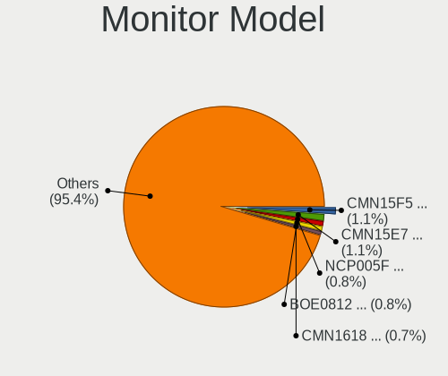
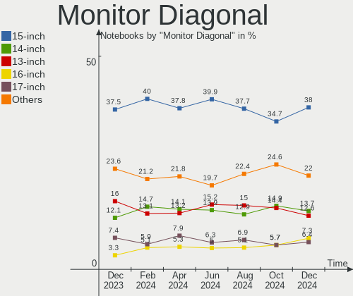

Ubuntu Hardware Trends (Notebook)
---------------------------------

A project to identify most popular hardware characteristics and track their change
over time based on data collected by Ubuntu users at https://Linux-Hardware.org.

Anyone can contribute to the study by uploading probes of their computers by
the [hw-probe](https://github.com/linuxhw/hw-probe) tool:

    sudo hw-probe -all -upload

Full-feature report is available here: https://linux-hardware.org/?view=trends&formfactor=notebook

Period: Jan, 2020.

Contents
--------

- [ OS                       ](#os)
- [ OS Family                ](#os-family)
- [ Kernel                   ](#kernel)
- [ Kernel Family            ](#kernel-family)
- [ Kernel Major Ver.        ](#kernel-major-ver)
- [ Arch                     ](#arch)
- [ DE                       ](#de)
- [ Display Server           ](#display-server)
- [ OS Lang                  ](#os-lang)
- [ Boot Mode                ](#boot-mode)
- [ Filesystem               ](#filesystem)
- [ Dual Boot with Linux     ](#dual-boot-with-linux)
- [ Dual Boot (Win)          ](#dual-boot-win)
- [ Country                  ](#country)
- [ City                     ](#city)
- [ Vendor                   ](#vendor)
- [ Model                    ](#model)
- [ Model Family             ](#model-family)
- [ MFG Year                 ](#mfg-year)
- [ Form Factor              ](#form-factor)
- [ Secure Boot              ](#secure-boot)
- [ Coreboot                 ](#coreboot)
- [ RAM Size                 ](#ram-size)
- [ RAM Used                 ](#ram-used)
- [ Drive Vendor             ](#drive-vendor)
- [ Drive Model              ](#drive-model)
- [ Drive Kind               ](#drive-kind)
- [ Drive Connector          ](#drive-connector)
- [ Drive Size               ](#drive-size)
- [ Space Total              ](#space-total)
- [ Space Used               ](#space-used)
- [ Malfunc. Drives          ](#malfunc-drives)
- [ Malfunc. Drive Vendor    ](#malfunc-drive-vendor)
- [ Malfunc. Drive Kind      ](#malfunc-drive-kind)
- [ Failed Drives            ](#failed-drives)
- [ Failed Drive Vendor      ](#failed-drive-vendor)
- [ Drive Status             ](#drive-status)
- [ CPU Vendor               ](#cpu-vendor)
- [ CPU Model                ](#cpu-model)
- [ CPU Model Family         ](#cpu-model-family)
- [ CPU Cores                ](#cpu-cores)
- [ CPU Sockets              ](#cpu-sockets)
- [ CPU Threads              ](#cpu-threads)
- [ CPU Op-Modes             ](#cpu-op-modes)
- [ CPU Microarch            ](#cpu-microarch)
- [ CPU Microcode            ](#cpu-microcode)
- [ GPU Vendor               ](#gpu-vendor)
- [ GPU Model                ](#gpu-model)
- [ GPU Combo                ](#gpu-combo)
- [ GPU Driver               ](#gpu-driver)
- [ GPU Memory               ](#gpu-memory)
- [ Monitor Vendor           ](#monitor-vendor)
- [ Monitor Model            ](#monitor-model)
- [ Monitor Resolution       ](#monitor-resolution)
- [ Monitor Diagonal         ](#monitor-diagonal)
- [ Monitor Width            ](#monitor-width)
- [ Aspect Ratio             ](#aspect-ratio)
- [ Monitor Area             ](#monitor-area)
- [ Pixel Density            ](#pixel-density)
- [ Multiple Monitors        ](#multiple-monitors)
- [ Net Controller Vendor    ](#net-controller-vendor)
- [ Net Controller Model     ](#net-controller-model)
- [ Net Controller Kind      ](#net-controller-kind)
- [ Used Controller          ](#used-controller)
- [ NICs                     ](#nics)
- [ Unsupported Devices      ](#unsupported-devices)
- [ Unsupported Device Types ](#unsupported-device-types)

OS
--

Installed operating systems

| Name           | Computers | Percent |
|----------------|-----------|---------|
| Ubuntu 18.04   | 380       | 57.66%  |
| Ubuntu 19.10   | 228       | 34.6%   |
| Ubuntu 19.04   | 23        | 3.49%   |
| Ubuntu 16.04   | 13        | 1.97%   |
| Ubuntu 20.04   | 7         | 1.06%   |
| Ubuntu 18.10   | 4         | 0.61%   |
| Ubuntu 17.10   | 3         | 0.46%   |
| Ubuntu Core 16 | 1         | 0.15%   |

OS Family
---------

OS without a version

| Name   | Computers | Percent |
|--------|-----------|---------|
| Ubuntu | 659       | 100%    |

Kernel
------

Version of the Linux kernel

| Version                   | Computers | Percent |
|---------------------------|-----------|---------|
| 5.3.0-26-generic          | 194       | 29.44%  |
| 5.0.0-37-generic          | 130       | 19.73%  |
| 4.15.0-74-generic         | 59        | 8.95%   |
| 5.3.0-24-generic          | 55        | 8.35%   |
| 4.15.0-72-generic         | 27        | 4.1%    |
| 5.0.0-23-generic          | 20        | 3.03%   |
| 5.3.0-29-generic          | 19        | 2.88%   |
| 5.3.0-28-generic          | 19        | 2.88%   |
| 5.3.0-18-generic          | 19        | 2.88%   |
| 5.0.0-38-generic          | 13        | 1.97%   |
| 4.15.0-29-generic         | 9         | 1.37%   |
| 4.15.0-76-generic         | 8         | 1.21%   |
| 5.3.0-7625-generic        | 6         | 0.91%   |
| 5.3.0-27-generic          | 4         | 0.61%   |
| 5.3.0-26-lowlatency       | 4         | 0.61%   |
| 4.18.0-25-generic         | 4         | 0.61%   |
| 4.15.0-45-generic         | 4         | 0.61%   |
| 4.15.0-74-lowlatency      | 3         | 0.46%   |
| 4.15.0-1066-oem           | 3         | 0.46%   |
| 5.4.0-12-generic          | 2         | 0.3%    |
| 5.3.0-25-generic          | 2         | 0.3%    |
| 5.3.0-24-lowlatency       | 2         | 0.3%    |
| 5.3.0-23-generic          | 2         | 0.3%    |
| 5.3.0-19-generic          | 2         | 0.3%    |
| 5.3.0-18-lowlatency       | 2         | 0.3%    |
| 5.0.0-36-generic          | 2         | 0.3%    |
| 5.0.0-1033-oem-osp1       | 2         | 0.3%    |
| 4.15.0-66-generic         | 2         | 0.3%    |
| 4.15.0-65-generic         | 2         | 0.3%    |
| 4.15.0-50-generic         | 2         | 0.3%    |
| 4.15.0-20-generic         | 2         | 0.3%    |
| 5.5.0-mm22                | 1         | 0.15%   |
| 5.5.0-mm11                | 1         | 0.15%   |
| 5.4.14-050414-generic     | 1         | 0.15%   |
| 5.4.13-050413-generic     | 1         | 0.15%   |
| 5.4.0-9-lowlatency        | 1         | 0.15%   |
| 5.4.0-9-generic           | 1         | 0.15%   |
| 5.4.0-10.1-liquorix-amd64 | 1         | 0.15%   |
| 5.3.0-rc4-custom          | 1         | 0.15%   |
| 5.3.0-29-lowlatency       | 1         | 0.15%   |
| 5.1.16-050116-lowlatency  | 1         | 0.15%   |
| 5.0.0-32-generic          | 1         | 0.15%   |
| 5.0.0-31-generic          | 1         | 0.15%   |
| 5.0.0-27-generic          | 1         | 0.15%   |
| 5.0.0-15-generic          | 1         | 0.15%   |
| 5.0.0-13-generic          | 1         | 0.15%   |
| 5.0.0-1037-oem-osp1       | 1         | 0.15%   |
| 5.0.0-1030-oem-osp1       | 1         | 0.15%   |
| 4.4.0-171-generic         | 1         | 0.15%   |
| 4.19.29-041929-generic    | 1         | 0.15%   |
| 4.18.0-26-generic         | 1         | 0.15%   |
| 4.18.0-18-generic         | 1         | 0.15%   |
| 4.18.0-15-generic         | 1         | 0.15%   |
| 4.15.0-66-lowlatency      | 1         | 0.15%   |
| 4.15.0-64-generic         | 1         | 0.15%   |
| 4.15.0-62-generic         | 1         | 0.15%   |
| 4.15.0-54-generic         | 1         | 0.15%   |
| 4.15.0-51-generic         | 1         | 0.15%   |
| 4.15.0-47-generic         | 1         | 0.15%   |
| 4.15.0-36-generic         | 1         | 0.15%   |

Kernel Family
-------------

Linux kernel without a distro release

| Version | Computers | Percent |
|---------|-----------|---------|
| 5.3.0   | 332       | 50.38%  |
| 5.0.0   | 174       | 26.4%   |
| 4.15.0  | 131       | 19.88%  |
| 4.18.0  | 7         | 1.06%   |
| 5.4.0   | 5         | 0.76%   |
| 4.13.0  | 3         | 0.46%   |
| 5.5.0   | 2         | 0.3%    |
| 5.4.14  | 1         | 0.15%   |
| 5.4.13  | 1         | 0.15%   |
| 5.1.16  | 1         | 0.15%   |
| 4.4.0   | 1         | 0.15%   |
| 4.19.29 | 1         | 0.15%   |

Kernel Major Ver.
-----------------

Linux kernel major version

| Version | Computers | Percent |
|---------|-----------|---------|
| 5.3     | 332       | 50.38%  |
| 5.0     | 174       | 26.4%   |
| 4.15    | 131       | 19.88%  |
| 5.4     | 7         | 1.06%   |
| 4.18    | 7         | 1.06%   |
| 4.13    | 3         | 0.46%   |
| 5.5     | 2         | 0.3%    |
| 5.1     | 1         | 0.15%   |
| 4.4     | 1         | 0.15%   |
| 4.19    | 1         | 0.15%   |

Arch
----

OS architecture (x86_64, i586, etc.)

| Name   | Computers | Percent |
|--------|-----------|---------|
| x86_64 | 619       | 93.93%  |
| i686   | 40        | 6.07%   |

DE
--

Desktop Environment

| Name            | Computers | Percent |
|-----------------|-----------|---------|
| GNOME           | 402       | 61%     |
| Unknown         | 145       | 22%     |
| XFCE            | 51        | 7.74%   |
| KDE             | 18        | 2.73%   |
| Unity           | 11        | 1.67%   |
| MATE            | 8         | 1.21%   |
| GNOME Flashback | 7         | 1.06%   |
| Budgie          | 5         | 0.76%   |
| LXQt            | 4         | 0.61%   |
| X-Cinnamon      | 3         | 0.46%   |
| xubuntu         | 2         | 0.3%    |
| Cinnamon        | 2         | 0.3%    |
| LXDE            | 1         | 0.15%   |

Display Server
--------------

X11 or Wayland

| Name    | Computers | Percent |
|---------|-----------|---------|
| X11     | 459       | 69.65%  |
| Unknown | 189       | 28.68%  |
| Wayland | 10        | 1.52%   |
| Tty     | 1         | 0.15%   |

OS Lang
-------

Language

| Lang       | Computers | Percent |
|------------|-----------|---------|
| en_US      | 237       | 35.96%  |
| de_DE      | 50        | 7.59%   |
| pt_BR      | 38        | 5.77%   |
| Unknown    | 36        | 5.46%   |
| it_IT      | 30        | 4.55%   |
| en_GB      | 30        | 4.55%   |
| ru_RU      | 26        | 3.95%   |
| es_ES      | 21        | 3.19%   |
| fr_FR      | 19        | 2.88%   |
| en_CA      | 16        | 2.43%   |
| C          | 16        | 2.43%   |
| en_IN      | 13        | 1.97%   |
| nl_NL      | 12        | 1.82%   |
| hu_HU      | 10        | 1.52%   |
| pl_PL      | 9         | 1.37%   |
| en_AU      | 8         | 1.21%   |
| cs_CZ      | 7         | 1.06%   |
| de_AT      | 6         | 0.91%   |
| ro_RO      | 5         | 0.76%   |
| en_ZA      | 5         | 0.76%   |
| da_DK      | 5         | 0.76%   |
| sk_SK      | 4         | 0.61%   |
| pt_PT      | 4         | 0.61%   |
| es_CL      | 4         | 0.61%   |
| es_AR      | 4         | 0.61%   |
| ca_ES      | 4         | 0.61%   |
| uk_UA      | 3         | 0.46%   |
| es_MX      | 3         | 0.46%   |
| es_CO      | 3         | 0.46%   |
| de_CH      | 3         | 0.46%   |
| fr_BE      | 2         | 0.3%    |
| fi_FI      | 2         | 0.3%    |
| en_NZ      | 2         | 0.3%    |
| en_IL      | 2         | 0.3%    |
| el_GR      | 2         | 0.3%    |
| zh_TW      | 1         | 0.15%   |
| zh_CN      | 1         | 0.15%   |
| tr_TR      | 1         | 0.15%   |
| sv_SE      | 1         | 0.15%   |
| sv_FI      | 1         | 0.15%   |
| sr_RS      | 1         | 0.15%   |
| mk_MK      | 1         | 0.15%   |
| lt_LT      | 1         | 0.15%   |
| ja_JP      | 1         | 0.15%   |
| hr_HR      | 1         | 0.15%   |
| he_IL      | 1         | 0.15%   |
| gl_ES      | 1         | 0.15%   |
| eu_ES      | 1         | 0.15%   |
| es_VE      | 1         | 0.15%   |
| es_PY      | 1         | 0.15%   |
| es_NI      | 1         | 0.15%   |
| es_CR      | 1         | 0.15%   |
| en_GB.utf8 | 1         | 0.15%   |

Boot Mode
---------

EFI or BIOS

| Mode | Computers | Percent |
|------|-----------|---------|
| EFI  | 339       | 51.44%  |
| BIOS | 320       | 48.56%  |

Filesystem
----------

Type of filesystem

| Type    | Computers | Percent |
|---------|-----------|---------|
| Ext4    | 618       | 93.78%  |
| Overlay | 24        | 3.64%   |
| Zfs     | 5         | 0.76%   |
| Xfs     | 3         | 0.46%   |
| Ext3    | 3         | 0.46%   |
| Btrfs   | 3         | 0.46%   |
| Ext2    | 2         | 0.3%    |
| Aufs    | 1         | 0.15%   |

Dual Boot with Linux
--------------------

Hosting more than one Linux

| Dual boot | Computers | Percent |
|-----------|-----------|---------|
| No        | 612       | 92.87%  |
| Yes       | 47        | 7.13%   |

Dual Boot (Win)
---------------

Hosting Linux and Windows

| Dual boot | Computers | Percent |
|-----------|-----------|---------|
| No        | 436       | 66.16%  |
| Yes       | 223       | 33.84%  |

Country
-------

Geographic location (country)

| Country        | Computers | Percent |
|----------------|-----------|---------|
| USA            | 95        | 14.42%  |
| Germany        | 59        | 8.95%   |
| Brazil         | 51        | 7.74%   |
| Italy          | 39        | 5.92%   |
| UK             | 28        | 4.25%   |
| France         | 28        | 4.25%   |
| Spain          | 26        | 3.95%   |
| Russia         | 26        | 3.95%   |
| Canada         | 20        | 3.03%   |
| Netherlands    | 18        | 2.73%   |
| Poland         | 16        | 2.43%   |
| India          | 13        | 1.97%   |
| Czech Republic | 13        | 1.97%   |
| Hungary        | 12        | 1.82%   |
| Austria        | 12        | 1.82%   |
| Romania        | 11        | 1.67%   |
| Indonesia      | 11        | 1.67%   |
| Australia      | 11        | 1.67%   |
| Ukraine        | 10        | 1.52%   |
| Switzerland    | 8         | 1.21%   |
| South Africa   | 8         | 1.21%   |
| Denmark        | 8         | 1.21%   |
| Serbia         | 7         | 1.06%   |
| Mexico         | 7         | 1.06%   |
| Argentina      | 7         | 1.06%   |
| Portugal       | 6         | 0.91%   |
| Finland        | 6         | 0.91%   |
| Turkey         | 5         | 0.76%   |
| Slovakia       | 5         | 0.76%   |
| Iran           | 5         | 0.76%   |
| Bulgaria       | 5         | 0.76%   |
| Belgium        | 5         | 0.76%   |
| Sweden         | 4         | 0.61%   |
| New Zealand    | 4         | 0.61%   |
| Lithuania      | 4         | 0.61%   |
| Israel         | 4         | 0.61%   |
| Greece         | 4         | 0.61%   |
| Colombia       | 4         | 0.61%   |
| Chile          | 4         | 0.61%   |
| China          | 3         | 0.46%   |
| Vietnam        | 2         | 0.3%    |
| Uzbekistan     | 2         | 0.3%    |
| Slovenia       | 2         | 0.3%    |
| Philippines    | 2         | 0.3%    |
| Paraguay       | 2         | 0.3%    |
| Panama         | 2         | 0.3%    |
| Pakistan       | 2         | 0.3%    |
| Malaysia       | 2         | 0.3%    |
| Japan          | 2         | 0.3%    |
| Ethiopia       | 2         | 0.3%    |
| Egypt          | 2         | 0.3%    |
| Croatia        | 2         | 0.3%    |
| Belarus        | 2         | 0.3%    |
| Venezuela      | 1         | 0.15%   |
| Taiwan         | 1         | 0.15%   |
| Syria          | 1         | 0.15%   |
| Saudi Arabia   | 1         | 0.15%   |
| Oman           | 1         | 0.15%   |
| Nigeria        | 1         | 0.15%   |
| Nicaragua      | 1         | 0.15%   |

City
----

Geographic location (city)

| City           | Computers | Percent |
|----------------|-----------|---------|
| Berlin         | 9         | 1.37%   |
| Vienna         | 8         | 1.21%   |
| St Petersburg  | 7         | 1.06%   |
| Madrid         | 6         | 0.91%   |
| Rome           | 5         | 0.76%   |
| Portland       | 5         | 0.76%   |
| Budapest       | 5         | 0.76%   |
| Amsterdam      | 5         | 0.76%   |
| Warsaw         | 4         | 0.61%   |
| São Paulo     | 4         | 0.61%   |
| Prague         | 4         | 0.61%   |
| Moscow         | 4         | 0.61%   |
| Milan          | 4         | 0.61%   |
| Johannesburg   | 4         | 0.61%   |
| Hamburg        | 4         | 0.61%   |
| Łódź        | 3         | 0.46%   |
| Zurich         | 3         | 0.46%   |
| Trieste        | 3         | 0.46%   |
| Rio de Janeiro | 3         | 0.46%   |
| Paris          | 3         | 0.46%   |
| Novosibirsk    | 3         | 0.46%   |
| New York       | 3         | 0.46%   |
| Munich         | 3         | 0.46%   |
| London         | 3         | 0.46%   |
| Jakarta        | 3         | 0.46%   |
| Fortaleza      | 3         | 0.46%   |
| Dallas         | 3         | 0.46%   |
| Columbus       | 3         | 0.46%   |
| Cluj-Napoca    | 3         | 0.46%   |
| Carnegie       | 3         | 0.46%   |
| Calgary        | 3         | 0.46%   |
| Brasília      | 3         | 0.46%   |
| Adelaide       | 3         | 0.46%   |
| Viña del Mar  | 2         | 0.3%    |
| Vilnius        | 2         | 0.3%    |
| Vantaa         | 2         | 0.3%    |
| Vancouver      | 2         | 0.3%    |
| Tortosa        | 2         | 0.3%    |
| The Hague      | 2         | 0.3%    |
| Tel Aviv       | 2         | 0.3%    |
| Tashkent       | 2         | 0.3%    |
| Surabaya       | 2         | 0.3%    |
| Stockholm      | 2         | 0.3%    |
| Sofia          | 2         | 0.3%    |
| San Diego      | 2         | 0.3%    |
| Recife         | 2         | 0.3%    |
| Panama City    | 2         | 0.3%    |
| Novi Belgrade  | 2         | 0.3%    |
| Montreal       | 2         | 0.3%    |
| Melbourne      | 2         | 0.3%    |
| Medellín      | 2         | 0.3%    |
| Marília       | 2         | 0.3%    |
| Lemoore        | 2         | 0.3%    |
| Las Vegas      | 2         | 0.3%    |
| Kralovice      | 2         | 0.3%    |
| Krakow         | 2         | 0.3%    |
| Kazan’       | 2         | 0.3%    |
| Kazanlak       | 2         | 0.3%    |
| Helsinki       | 2         | 0.3%    |
| Graz           | 2         | 0.3%    |

Vendor
------

Motherboard manufacturer

| Name                             | Computers | Percent |
|----------------------------------|-----------|---------|
| Lenovo                           | 136       | 20.64%  |
| Hewlett-Packard                  | 128       | 19.42%  |
| Dell                             | 117       | 17.75%  |
| Acer                             | 65        | 9.86%   |
| ASUSTek Computer                 | 63        | 9.56%   |
| Toshiba                          | 30        | 4.55%   |
| Apple                            | 13        | 1.97%   |
| Samsung Electronics              | 12        | 1.82%   |
| Positivo                         | 11        | 1.67%   |
| Sony                             | 10        | 1.52%   |
| MSI                              | 10        | 1.52%   |
| Notebook                         | 6         | 0.91%   |
| eMachines                        | 5         | 0.76%   |
| Gateway                          | 4         | 0.61%   |
| Medion                           | 3         | 0.46%   |
| HUAWEI                           | 3         | 0.46%   |
| Fujitsu Siemens                  | 3         | 0.46%   |
| Fujitsu                          | 3         | 0.46%   |
| Unknown                          | 3         | 0.46%   |
| Packard Bell                     | 2         | 0.3%    |
| Itautec                          | 2         | 0.3%    |
| Gigabyte Technology              | 2         | 0.3%    |
| CCE                              | 2         | 0.3%    |
| XMG                              | 1         | 0.15%   |
| www.51nb.com                     | 1         | 0.15%   |
| VIT                              | 1         | 0.15%   |
| VERO                             | 1         | 0.15%   |
| TUXEDO                           | 1         | 0.15%   |
| TrekStor                         | 1         | 0.15%   |
| Timi                             | 1         | 0.15%   |
| System76                         | 1         | 0.15%   |
| RKM                              | 1         | 0.15%   |
| Razer                            | 1         | 0.15%   |
| Qilive                           | 1         | 0.15%   |
| PC Specialist                    | 1         | 0.15%   |
| Panasonic                        | 1         | 0.15%   |
| Monster                          | 1         | 0.15%   |
| Maibenben                        | 1         | 0.15%   |
| LIVEFAN                          | 1         | 0.15%   |
| LG Electronics                   | 1         | 0.15%   |
| Intel                            | 1         | 0.15%   |
| Hampoo                           | 1         | 0.15%   |
| Google                           | 1         | 0.15%   |
| FUJITSU CLIENT COMPUTING LIMITED | 1         | 0.15%   |
| Dixonsxp                         | 1         | 0.15%   |
| Digma                            | 1         | 0.15%   |
| Compaq                           | 1         | 0.15%   |
| Clevo                            | 1         | 0.15%   |
| ADSC                             | 1         | 0.15%   |

Model
-----

Motherboard model

| Name                              | Computers | Percent |
|-----------------------------------|-----------|---------|
| Pavilion dv6                      | 11        | 1.67%   |
| Pavilion g6                       | 7         | 1.06%   |
| Unknown                           | 7         | 1.06%   |
| XPS 15 9570                       | 5         | 0.76%   |
| Notebook                          | 5         | 0.76%   |
| Laptop 15-da0xxx                  | 5         | 0.76%   |
| XPS 15 9560                       | 4         | 0.61%   |
| MOBILE                            | 4         | 0.61%   |
| ThinkPad X1 Carbon 7th 20QDCTO1WW | 3         | 0.46%   |
| Latitude E6430                    | 3         | 0.46%   |
| Latitude E6410                    | 3         | 0.46%   |
| Latitude E6230                    | 3         | 0.46%   |
| Laptop 15-db0xxx                  | 3         | 0.46%   |
| Laptop 15-bw0xx                   | 3         | 0.46%   |
| Inspiron 15-3567                  | 3         | 0.46%   |
| EliteBook 840 G3                  | 3         | 0.46%   |
| Yoga S740-14IIL 81RS              | 2         | 0.3%    |
| Yoga 2 Pro 20266                  | 2         | 0.3%    |
| XPS 15 7590                       | 2         | 0.3%    |
| XPS 13 9380                       | 2         | 0.3%    |
| XPS 13 9370                       | 2         | 0.3%    |
| XPS 13 9360                       | 2         | 0.3%    |
| X553MA                            | 2         | 0.3%    |
| X550LD                            | 2         | 0.3%    |
| V510-15IKB 80WQ                   | 2         | 0.3%    |
| Studio 1558                       | 2         | 0.3%    |
| Satellite A500                    | 2         | 0.3%    |
| Q232A                             | 2         | 0.3%    |
| ProBook 4540s                     | 2         | 0.3%    |
| Presley                           | 2         | 0.3%    |
| Precision M6500                   | 2         | 0.3%    |
| Pavilion g4                       | 2         | 0.3%    |
| MacBook4,1                        | 2         | 0.3%    |
| Legion Y540-15IRH-PG0 81SY        | 2         | 0.3%    |
| Latitude 5590                     | 2         | 0.3%    |
| Laptop 17-ca0xxx                  | 2         | 0.3%    |
| Laptop 15-da1xxx                  | 2         | 0.3%    |
| Laptop 14-bp0xx                   | 2         | 0.3%    |
| K50IN                             | 2         | 0.3%    |
| Inspiron N5110                    | 2         | 0.3%    |
| Inspiron 3582                     | 2         | 0.3%    |
| Inspiron 3580                     | 2         | 0.3%    |
| Inspiron 3521                     | 2         | 0.3%    |
| Inspiron 3442                     | 2         | 0.3%    |
| Inspiron 3421                     | 2         | 0.3%    |
| Inspiron 1545                     | 2         | 0.3%    |
| Inspiron 13-5378                  | 2         | 0.3%    |
| IdeaPad L340-15API 81LW           | 2         | 0.3%    |
| IdeaPad 700-15ISK 80RU            | 2         | 0.3%    |
| IdeaPad 330S-15IKB 81F5           | 2         | 0.3%    |
| IdeaPad 330-15ICH 81FK            | 2         | 0.3%    |
| IdeaPad 100-15IBD 80QQ            | 2         | 0.3%    |
| H14BU08                           | 2         | 0.3%    |
| GF63 8RD                          | 2         | 0.3%    |
| G570 4334                         | 2         | 0.3%    |
| G5 5587                           | 2         | 0.3%    |
| eM350                             | 2         | 0.3%    |
| EliteBook 8570p                   | 2         | 0.3%    |
| EliteBook 8440p                   | 2         | 0.3%    |
| EliteBook 840 G6                  | 2         | 0.3%    |

Model Family
------------

Motherboard model prefix

| Name                       | Computers | Percent |
|----------------------------|-----------|---------|
| Lenovo ThinkPad            | 72        | 10.93%  |
| Acer Aspire                | 46        | 6.98%   |
| Dell Inspiron              | 43        | 6.53%   |
| HP Pavilion                | 34        | 5.16%   |
| Lenovo IdeaPad             | 31        | 4.7%    |
| Dell Latitude              | 29        | 4.4%    |
| Toshiba Satellite          | 25        | 3.79%   |
| HP Laptop                  | 24        | 3.64%   |
| HP EliteBook               | 20        | 3.03%   |
| Dell XPS                   | 18        | 2.73%   |
| HP ProBook                 | 13        | 1.97%   |
| Dell Vostro                | 12        | 1.82%   |
| Unknown                    | 9         | 1.37%   |
| Acer TravelMate            | 7         | 1.06%   |
| Lenovo Yoga                | 6         | 0.91%   |
| Dell Precision             | 6         | 0.91%   |
| ASUS VivoBook              | 6         | 0.91%   |
| HP Notebook                | 5         | 0.76%   |
| Acer Swift                 | 5         | 0.76%   |
| Positivo MOBILE            | 4         | 0.61%   |
| HP ZBook                   | 4         | 0.61%   |
| HP ENVY                    | 4         | 0.61%   |
| HP Compaq                  | 4         | 0.61%   |
| ASUS TUF                   | 4         | 0.61%   |
| Toshiba PORTEGE            | 3         | 0.46%   |
| Lenovo G570                | 3         | 0.46%   |
| Fujitsu LIFEBOOK           | 3         | 0.46%   |
| Dell G3                    | 3         | 0.46%   |
| ASUS ZenBook               | 3         | 0.46%   |
| Samsung Electronics 550P5C | 2         | 0.3%    |
| Positivo Q232A             | 2         | 0.3%    |
| Positivo Presley           | 2         | 0.3%    |
| Positivo H14BU08           | 2         | 0.3%    |
| MSI GV62                   | 2         | 0.3%    |
| MSI GF63                   | 2         | 0.3%    |
| Lenovo V510-15IKB          | 2         | 0.3%    |
| Lenovo ThinkBook           | 2         | 0.3%    |
| Lenovo Legion              | 2         | 0.3%    |
| Itautec Infoway            | 2         | 0.3%    |
| HP Presario                | 2         | 0.3%    |
| HP 350                     | 2         | 0.3%    |
| HP 255                     | 2         | 0.3%    |
| HP 250                     | 2         | 0.3%    |
| HP 2000                    | 2         | 0.3%    |
| Fujitsu Siemens AMILO      | 2         | 0.3%    |
| eMachines eM350            | 2         | 0.3%    |
| Dell Studio                | 2         | 0.3%    |
| Dell G5                    | 2         | 0.3%    |
| CCE Capella                | 2         | 0.3%    |
| ASUS X553MA                | 2         | 0.3%    |
| ASUS X550LD                | 2         | 0.3%    |
| ASUS K50IN                 | 2         | 0.3%    |
| ASUS E200HA                | 2         | 0.3%    |
| Apple MacBookPro8          | 2         | 0.3%    |
| Apple MacBook4             | 2         | 0.3%    |
| Acer Nitro                 | 2         | 0.3%    |
| XMG P65xHP                 | 1         | 0.15%   |
| www.51nb.com X62           | 1         | 0.15%   |
| VIT M2421                  | 1         | 0.15%   |
| VERO K147                  | 1         | 0.15%   |

MFG Year
--------

Motherboard manufacture year

| Year | Computers | Percent |
|------|-----------|---------|
| 2019 | 166       | 25.19%  |
| 2018 | 81        | 12.29%  |
| 2013 | 57        | 8.65%   |
| 2011 | 52        | 7.89%   |
| 2009 | 42        | 6.37%   |
| 2017 | 39        | 5.92%   |
| 2016 | 39        | 5.92%   |
| 2014 | 39        | 5.92%   |
| 2012 | 35        | 5.31%   |
| 2015 | 33        | 5.01%   |
| 2010 | 29        | 4.4%    |
| 2008 | 21        | 3.19%   |
| 2007 | 14        | 2.12%   |
| 2005 | 8         | 1.21%   |
| 2020 | 2         | 0.3%    |
| 2006 | 2         | 0.3%    |

Form Factor
-----------

Physical design of the computer

| Name     | Computers | Percent |
|----------|-----------|---------|
| Notebook | 659       | 100%    |

Secure Boot
-----------

Enabled or disabled

| State    | Computers | Percent |
|----------|-----------|---------|
| Disabled | 389       | 59.03%  |
| Unknown  | 191       | 28.98%  |
| Enabled  | 79        | 11.99%  |

Coreboot
--------

Have coreboot on board

| Used | Computers | Percent |
|------|-----------|---------|
| No   | 658       | 99.85%  |
| Yes  | 1         | 0.15%   |

RAM Size
--------

Total RAM memory

| Size in GB  | Computers | Percent |
|-------------|-----------|---------|
| 3.01-4.0    | 187       | 28.38%  |
| 4.01-8.0    | 171       | 25.95%  |
| 16.01-24.0  | 106       | 16.08%  |
| 8.01-16.0   | 94        | 14.26%  |
| 1.01-2.0    | 46        | 6.98%   |
| 32.01-64.0  | 25        | 3.79%   |
| 2.01-3.0    | 15        | 2.28%   |
| 0.01-1.0    | 12        | 1.82%   |
| 64.01-256.0 | 2         | 0.3%    |
| 24.01-32.0  | 1         | 0.15%   |

RAM Used
--------

Used RAM memory

| Used GB    | Computers | Percent |
|------------|-----------|---------|
| 1.01-2.0   | 275       | 41.73%  |
| 2.01-3.0   | 198       | 30.05%  |
| 3.01-4.0   | 68        | 10.32%  |
| 4.01-8.0   | 55        | 8.35%   |
| 0.01-1.0   | 46        | 6.98%   |
| 8.01-16.0  | 15        | 2.28%   |
| 32.01-64.0 | 2         | 0.3%    |

Drive Vendor
------------

Hard drive vendors

| Vendor              | Computers | Drives | Percent |
|---------------------|-----------|--------|---------|
| Seagate             | 129       | 132    | 18.43%  |
| WDC                 | 105       | 105    | 15%     |
| Samsung Electronics | 65        | 69     | 9.29%   |
| Toshiba             | 63        | 63     | 9%      |
| Unknown             | 39        | 42     | 5.57%   |
| Kingston            | 38        | 38     | 5.43%   |
| SanDisk             | 37        | 38     | 5.29%   |
| Hitachi             | 37        | 37     | 5.29%   |
| HGST                | 34        | 34     | 4.86%   |
| SK Hynix            | 19        | 19     | 2.71%   |
| Crucial             | 18        | 18     | 2.57%   |
| Intel               | 14        | 15     | 2%      |
| Micron Technology   | 13        | 13     | 1.86%   |
| A-DATA Technology   | 13        | 13     | 1.86%   |
| Fujitsu             | 8         | 8      | 1.14%   |
| China               | 7         | 7      | 1%      |
| LITEON              | 6         | 6      | 0.86%   |
| KingSpec            | 4         | 4      | 0.57%   |
| Intenso             | 4         | 4      | 0.57%   |
| Transcend           | 3         | 3      | 0.43%   |
| OCZ                 | 3         | 3      | 0.43%   |
| LITEONIT            | 3         | 3      | 0.43%   |
| GOODRAM             | 3         | 3      | 0.43%   |
| Generic             | 3         | 3      | 0.43%   |
| Apple               | 3         | 3      | 0.43%   |
| SPCC                | 2         | 2      | 0.29%   |
| PNY                 | 2         | 2      | 0.29%   |
| PLEXTOR             | 2         | 2      | 0.29%   |
| Corsair             | 2         | 2      | 0.29%   |
| ASMT                | 2         | 2      | 0.29%   |
| TCSUNBOW            | 1         | 1      | 0.14%   |
| STEC                | 1         | 1      | 0.14%   |
| Sony                | 1         | 1      | 0.14%   |
| SMI                 | 1         | 1      | 0.14%   |
| S3+                 | 1         | 1      | 0.14%   |
| RDM-II              | 1         | 1      | 0.14%   |
| OWC                 | 1         | 1      | 0.14%   |
| Netac               | 1         | 1      | 0.14%   |
| Mushkin             | 1         | 1      | 0.14%   |
| Morebeck-S100       | 1         | 1      | 0.14%   |
| Lexar               | 1         | 1      | 0.14%   |
| JMicron             | 1         | 1      | 0.14%   |
| Inateck             | 1         | 1      | 0.14%   |
| IBM/Hitachi         | 1         | 1      | 0.14%   |
| HL-DT-ST            | 1         | 1      | 0.14%   |
| Hewlett-Packard     | 1         | 1      | 0.14%   |
| Gigabyte Technology | 1         | 1      | 0.14%   |
| AS25                | 1         | 1      | 0.14%   |
| Apacer              | 1         | 1      | 0.14%   |

Drive Model
-----------

Hard drive models

| Model                        | Computers | Percent |
|------------------------------|-----------|---------|
| ST1000LM035-1RK172 1TB       | 20        | 2.81%   |
| MMC Card  31GB               | 19        | 2.67%   |
| SA400S37240G 240GB SSD       | 12        | 1.69%   |
| MQ01ABD100 1TB               | 11        | 1.55%   |
| ST9500325AS 500GB            | 10        | 1.41%   |
| ST1000LM024 HN-M101MBB 1TB   | 10        | 1.41%   |
| ST500LT012-1DG142 500GB      | 9         | 1.27%   |
| HTS545050A7E380 500GB        | 8         | 1.13%   |
| ST500LT012-9WS142 500GB      | 7         | 0.98%   |
| SSD 860 EVO 500GB            | 7         | 0.98%   |
| MQ01ABF050 500GB             | 7         | 0.98%   |
| HTS721010A9E630 1TB          | 7         | 0.98%   |
| SSD 850 EVO 500GB            | 6         | 0.84%   |
| HTS725050A7E630 500GB        | 6         | 0.84%   |
| HTS545050A7E680 500GB        | 6         | 0.84%   |
| WD10SPZX-21Z10T0 1TB         | 5         | 0.7%    |
| ST1000LM049-2GH172 1TB       | 5         | 0.7%    |
| SA400S37480G 480GB SSD       | 5         | 0.7%    |
| CT250MX500SSD1 250GB         | 5         | 0.7%    |
| ST9500420AS 500GB            | 4         | 0.56%   |
| ST9320423AS 320GB            | 4         | 0.56%   |
| ST2000LM007-1R8174 2TB       | 4         | 0.56%   |
| ST1000LX015-1U7172 1TB       | 4         | 0.56%   |
| ST1000LM014-1EJ164 1TB       | 4         | 0.56%   |
| SD9SN8W-128G-1006 128GB SSD  | 4         | 0.56%   |
| SA400S37120G 120GB SSD       | 4         | 0.56%   |
| MQ04ABF100 1TB               | 4         | 0.56%   |
| HTS541010A9E680 1TB          | 4         | 0.56%   |
| HFS256G39TND-N210A 256GB SSD | 4         | 0.56%   |
| WDS240G2G0A-00JH30 240GB SSD | 3         | 0.42%   |
| WD5000LPVX-22V0TT0 500GB     | 3         | 0.42%   |
| WD5000LPCX-24VHAT0 500GB     | 3         | 0.42%   |
| WD10SPZX-00Z10T0 1TB         | 3         | 0.42%   |
| WD10JPVX-60JC3T1 1TB         | 3         | 0.42%   |
| SV300S37A120G 120GB SSD      | 3         | 0.42%   |
| SUV400S37240G 240GB SSD      | 3         | 0.42%   |
| ST750LX003-1AC154 750GB      | 3         | 0.42%   |
| SSDPEKNW512G8 512GB          | 3         | 0.42%   |
| SSD Sata III 497GB           | 3         | 0.42%   |
| SSD 860 EVO 1TB              | 3         | 0.42%   |
| SD/MMC/MS PRO 31GB           | 3         | 0.42%   |
| SC311 SATA 256GB SSD         | 3         | 0.42%   |
| SATA 1024GB SSD              | 3         | 0.42%   |
| MQ01ABD075 750GB             | 3         | 0.42%   |
| MK3252GSX 320GB              | 3         | 0.42%   |
| HTS723232A7A364 320GB        | 3         | 0.42%   |
| HTS547575A9E384 750GB        | 3         | 0.42%   |
| HTS545050B9A300 500GB        | 3         | 0.42%   |
| HTS541616J9SA00 160GB        | 3         | 0.42%   |
| HM321HI 320GB                | 3         | 0.42%   |
| Expansion 1TB                | 3         | 0.42%   |
| 1100_MTFDDAV512TBN 512GB SSD | 3         | 0.42%   |
| WDS500G2B0A-00SM50 500GB SSD | 2         | 0.28%   |
| WDS120G2G0B-00EPW0 120GB SSD | 2         | 0.28%   |
| WD5000LPCX-60VHAT0 500GB     | 2         | 0.28%   |
| WD5000BPVT-22HXZT3 500GB     | 2         | 0.28%   |
| WD3200BPVT-24JJ5T0 320GB     | 2         | 0.28%   |
| WD3200BEKT-60V5T1 320GB      | 2         | 0.28%   |
| WD1600BEVT-22ZCT0 160GB      | 2         | 0.28%   |
| WD10SPZX-75Z10T2 1TB         | 2         | 0.28%   |

Drive Kind
----------

HDD or SSD

| Kind    | Computers | Drives | Percent |
|---------|-----------|--------|---------|
| HDD     | 353       | 365    | 51.76%  |
| SSD     | 243       | 256    | 35.63%  |
| MMC     | 40        | 45     | 5.87%   |
| NVMe    | 28        | 28     | 4.11%   |
| Unknown | 18        | 18     | 2.64%   |

Drive Connector
---------------

SATA, SAS, NVMe, etc.

| Type | Computers | Drives | Percent |
|------|-----------|--------|---------|
| SATA | 546       | 615    | 85.85%  |
| MMC  | 40        | 45     | 6.29%   |
| NVMe | 28        | 28     | 4.4%    |
| SAS  | 22        | 24     | 3.46%   |

Drive Size
----------

Size of hard drive

| Size in TB | Computers | Drives | Percent |
|------------|-----------|--------|---------|
| 0.01-0.5   | 444       | 502    | 68.73%  |
| 0.51-1.0   | 176       | 184    | 27.24%  |
| 1.01-2.0   | 21        | 21     | 3.25%   |
| 3.01-4.0   | 3         | 3      | 0.46%   |
| 4.01-10.0  | 1         | 1      | 0.15%   |
| 0          | 1         | 1      | 0.15%   |

Space Total
-----------

Amount of disk space available on the file system

| Size in GB     | Computers | Percent |
|----------------|-----------|---------|
| 101-250        | 205       | 31.11%  |
| 251-500        | 191       | 28.98%  |
| 501-1000       | 91        | 13.81%  |
| 51-100         | 52        | 7.89%   |
| 21-50          | 41        | 6.22%   |
| 1-20           | 32        | 4.86%   |
| 1001-2000      | 29        | 4.4%    |
| Unknown        | 9         | 1.37%   |
| 2001-3000      | 5         | 0.76%   |
| More than 3000 | 4         | 0.61%   |

Space Used
----------

Amount of used disk space

| Used GB        | Computers | Percent |
|----------------|-----------|---------|
| 1-20           | 301       | 45.68%  |
| 21-50          | 125       | 18.97%  |
| 101-250        | 87        | 13.2%   |
| 51-100         | 66        | 10.02%  |
| 251-500        | 43        | 6.53%   |
| 501-1000       | 16        | 2.43%   |
| Unknown        | 9         | 1.37%   |
| 1001-2000      | 7         | 1.06%   |
| 2001-3000      | 3         | 0.46%   |
| More than 3000 | 2         | 0.3%    |

Malfunc. Drives
---------------

Drive models with a malfunction

| Model                          | Computers | Drives | Percent |
|--------------------------------|-----------|--------|---------|
| WD7500BPVT-24HXZT1 752GB       | 1         | 1      | 12.5%   |
| ST9500423AS 500GB              | 1         | 1      | 12.5%   |
| ST9500325AS 500GB              | 1         | 1      | 12.5%   |
| ST320LT007-9ZV14 320GB         | 1         | 1      | 12.5%   |
| PA25-128 128GB SSD             | 1         | 1      | 12.5%   |
| HTS721010A9E630 1TB            | 1         | 1      | 12.5%   |
| HTS545050A7E380 500GB          | 1         | 1      | 12.5%   |
| BC501 HFM256GDJTNG-8310A 256GB | 1         | 1      | 12.5%   |

Malfunc. Drive Vendor
---------------------

Vendors of faulty drives

| Vendor   | Computers | Drives | Percent |
|----------|-----------|--------|---------|
| Seagate  | 3         | 3      | 37.5%   |
| WDC      | 1         | 1      | 12.5%   |
| SK Hynix | 1         | 1      | 12.5%   |
| KingSpec | 1         | 1      | 12.5%   |
| Hitachi  | 1         | 1      | 12.5%   |
| HGST     | 1         | 1      | 12.5%   |

Malfunc. Drive Kind
-------------------

Kinds of faulty drives

| Kind | Computers | Drives | Percent |
|------|-----------|--------|---------|
| HDD  | 6         | 6      | 75%     |
| NVMe | 1         | 1      | 12.5%   |
| SSD  | 1         | 1      | 12.5%   |

Failed Drives
-------------

Failed drive models

Zero info for selected period =(

Failed Drive Vendor
-------------------

Failed drive vendors

Zero info for selected period =(

Drive Status
------------

Number of failed and malfunc. drives

| Status   | Computers | Drives | Percent |
|----------|-----------|--------|---------|
| Detected | 513       | 609    | 86.8%   |
| Works    | 70        | 95     | 11.84%  |
| Malfunc  | 8         | 8      | 1.35%   |

CPU Vendor
----------

Processor vendors

| Vendor | Computers | Percent |
|--------|-----------|---------|
| Intel  | 585       | 88.77%  |
| AMD    | 74        | 11.23%  |

CPU Model
---------

Processor models

| Model                                         | Computers | Percent |
|-----------------------------------------------|-----------|---------|
| Intel Core i7-8565U CPU @ 1.80GHz             | 21        | 3.19%   |
| Intel Core i7-8550U CPU @ 1.80GHz             | 16        | 2.43%   |
| Intel Core i7-7700HQ CPU @ 2.80GHz            | 16        | 2.43%   |
| Intel Core i5-8265U CPU @ 1.60GHz             | 14        | 2.12%   |
| Intel Core i5-8250U CPU @ 1.60GHz             | 14        | 2.12%   |
| Intel Core i7-9750H CPU @ 2.60GHz             | 13        | 1.97%   |
| Intel Core i5-7200U CPU @ 2.50GHz             | 13        | 1.97%   |
| Intel Core i7-8750H CPU @ 2.20GHz             | 12        | 1.82%   |
| Intel Core i5-8300H CPU @ 2.30GHz             | 10        | 1.52%   |
| Intel Atom x5-Z8350 CPU @ 1.44GHz             | 9         | 1.37%   |
| Intel Core i5-3230M CPU @ 2.60GHz             | 8         | 1.21%   |
| Intel Core i7-7500U CPU @ 2.70GHz             | 7         | 1.06%   |
| Intel Core i7-4510U CPU @ 2.00GHz             | 7         | 1.06%   |
| Intel Core i7-2630QM CPU @ 2.00GHz            | 7         | 1.06%   |
| AMD Ryzen 5 3500U with Radeon Vega Mobile Gfx | 7         | 1.06%   |
| Intel Core i7-2670QM CPU @ 2.20GHz            | 6         | 0.91%   |
| Intel Core i5-4200U CPU @ 1.60GHz             | 6         | 0.91%   |
| Intel Core i5-2520M CPU @ 2.50GHz             | 6         | 0.91%   |
| Intel Core i5-2450M CPU @ 2.50GHz             | 6         | 0.91%   |
| Intel Core i3-7020U CPU @ 2.30GHz             | 6         | 0.91%   |
| Intel Core i3-5005U CPU @ 2.00GHz             | 6         | 0.91%   |
| Intel Core i3 CPU M 350 @ 2.27GHz             | 6         | 0.91%   |
| Intel Celeron N4000 CPU @ 1.10GHz             | 6         | 0.91%   |
| Intel Core i7-5500U CPU @ 2.40GHz             | 5         | 0.76%   |
| Intel Core i7-10510U CPU @ 1.80GHz            | 5         | 0.76%   |
| Intel Core i5-6300U CPU @ 2.40GHz             | 5         | 0.76%   |
| Intel Core i5-6200U CPU @ 2.30GHz             | 5         | 0.76%   |
| Intel Core i5-4210U CPU @ 1.70GHz             | 5         | 0.76%   |
| Intel Core i5-3320M CPU @ 2.60GHz             | 5         | 0.76%   |
| Intel Core i5-3210M CPU @ 2.50GHz             | 5         | 0.76%   |
| Intel Core i5 CPU M 520 @ 2.40GHz             | 5         | 0.76%   |
| Intel Core i3-2350M CPU @ 2.30GHz             | 5         | 0.76%   |
| Intel Core i3 CPU M 370 @ 2.40GHz             | 5         | 0.76%   |
| Intel Core 2 Duo CPU P8700 @ 2.53GHz          | 5         | 0.76%   |
| Intel Core 2 Duo CPU P8400 @ 2.26GHz          | 5         | 0.76%   |
| Intel Atom CPU N450 @ 1.66GHz                 | 5         | 0.76%   |
| AMD Ryzen 5 2500U with Radeon Vega Mobile Gfx | 5         | 0.76%   |
| Intel Pentium CPU N3710 @ 1.60GHz             | 4         | 0.61%   |
| Intel Core i7-6500U CPU @ 2.50GHz             | 4         | 0.61%   |
| Intel Core i7-3630QM CPU @ 2.40GHz            | 4         | 0.61%   |
| Intel Core i7-1065G7 CPU @ 1.30GHz            | 4         | 0.61%   |
| Intel Core i5-5200U CPU @ 2.20GHz             | 4         | 0.61%   |
| Intel Core i5-4300M CPU @ 2.60GHz             | 4         | 0.61%   |
| Intel Core i5-3360M CPU @ 2.80GHz             | 4         | 0.61%   |
| Intel Core i3-7100U CPU @ 2.40GHz             | 4         | 0.61%   |
| Intel Core i3-3110M CPU @ 2.40GHz             | 4         | 0.61%   |
| Intel Core i3-2330M CPU @ 2.20GHz             | 4         | 0.61%   |
| Intel Core i3 CPU M 380 @ 2.53GHz             | 4         | 0.61%   |
| Intel Core 2 Duo CPU T6600 @ 2.20GHz          | 4         | 0.61%   |
| AMD Ryzen 3 3200U with Radeon Vega Mobile Gfx | 4         | 0.61%   |
| Intel Pentium Dual-Core CPU T4500 @ 2.30GHz   | 3         | 0.46%   |
| Intel Pentium Dual-Core CPU T4400 @ 2.20GHz   | 3         | 0.46%   |
| Intel Pentium Dual CPU T3400 @ 2.16GHz        | 3         | 0.46%   |
| Intel Pentium CPU N3700 @ 1.60GHz             | 3         | 0.46%   |
| Intel Core i7-4710HQ CPU @ 2.50GHz            | 3         | 0.46%   |
| Intel Core i7-3720QM CPU @ 2.60GHz            | 3         | 0.46%   |
| Intel Core i7-3632QM CPU @ 2.20GHz            | 3         | 0.46%   |
| Intel Core i7-3610QM CPU @ 2.30GHz            | 3         | 0.46%   |
| Intel Core i7-3540M CPU @ 3.00GHz             | 3         | 0.46%   |
| Intel Core i5-4300U CPU @ 1.90GHz             | 3         | 0.46%   |

CPU Model Family
----------------

Processor model prefix

| Model                   | Computers | Percent |
|-------------------------|-----------|---------|
| Intel Core i7           | 186       | 28.22%  |
| Intel Core i5           | 157       | 23.82%  |
| Intel Core i3           | 71        | 10.77%  |
| Intel Core 2 Duo        | 49        | 7.44%   |
| Intel Celeron           | 34        | 5.16%   |
| Intel Atom              | 24        | 3.64%   |
| Intel Pentium           | 20        | 3.03%   |
| AMD Ryzen 5             | 14        | 2.12%   |
| Intel Pentium Dual-Core | 8         | 1.21%   |
| AMD A8                  | 8         | 1.21%   |
| Intel Pentium Dual      | 6         | 0.91%   |
| AMD Ryzen 3             | 6         | 0.91%   |
| AMD A6                  | 6         | 0.91%   |
| Intel Core i9           | 5         | 0.76%   |
| Intel Core 2            | 5         | 0.76%   |
| Intel Celeron M         | 5         | 0.76%   |
| AMD A10                 | 5         | 0.76%   |
| Other                   | 4         | 0.61%   |
| Intel Pentium M         | 4         | 0.61%   |
| Intel Genuine           | 4         | 0.61%   |
| AMD E2                  | 4         | 0.61%   |
| AMD A4                  | 4         | 0.61%   |
| AMD E                   | 3         | 0.46%   |
| Intel Pentium Silver    | 2         | 0.3%    |
| Intel Core m3           | 2         | 0.3%    |
| AMD Turion 64 X2 Mobile | 2         | 0.3%    |
| AMD Ryzen 7             | 2         | 0.3%    |
| AMD Athlon II Dual-Core | 2         | 0.3%    |
| AMD Athlon II           | 2         | 0.3%    |
| AMD A12                 | 2         | 0.3%    |
| Intel Pentium 4         | 1         | 0.15%   |
| Intel Core m5           | 1         | 0.15%   |
| Intel Celeron Dual-Core | 1         | 0.15%   |
| AMD Turion II           | 1         | 0.15%   |
| AMD Turion 64 Mobile    | 1         | 0.15%   |
| AMD Ryzen 5 PRO         | 1         | 0.15%   |
| AMD Quad-Core           | 1         | 0.15%   |
| AMD Phenom II           | 1         | 0.15%   |
| AMD FX                  | 1         | 0.15%   |
| AMD E1                  | 1         | 0.15%   |
| AMD C-50                | 1         | 0.15%   |
| AMD Athlon X2           | 1         | 0.15%   |
| AMD Athlon 64 X2        | 1         | 0.15%   |

CPU Cores
---------

Number of processor cores

| Number | Computers | Percent |
|--------|-----------|---------|
| 2      | 385       | 58.42%  |
| 4      | 210       | 31.87%  |
| 6      | 30        | 4.55%   |
| 1      | 29        | 4.4%    |
| 8      | 4         | 0.61%   |
| 3      | 1         | 0.15%   |

CPU Sockets
-----------

Number of sockets

| Number | Computers | Percent |
|--------|-----------|---------|
| 1      | 659       | 100%    |

CPU Threads
-----------

Threads per core (Hyper-Threading)

| Number | Computers | Percent |
|--------|-----------|---------|
| 2      | 464       | 70.41%  |
| 1      | 195       | 29.59%  |

CPU Op-Modes
------------

CPU Operation Modes (32-bit, 64-bit)

| Op mode        | Computers | Percent |
|----------------|-----------|---------|
| 32-bit, 64-bit | 643       | 97.57%  |
| 32-bit         | 16        | 2.43%   |

CPU Microarch
-------------

Microarchitecture

| Name            | Computers | Percent |
|-----------------|-----------|---------|
| Skylake         | 172       | 26.1%   |
| Core            | 75        | 11.38%  |
| SandyBridge     | 64        | 9.71%   |
| IvyBridge       | 61        | 9.26%   |
| Haswell         | 51        | 7.74%   |
| Westmere        | 38        | 5.77%   |
| Silvermont      | 35        | 5.31%   |
| KabyLake        | 25        | 3.79%   |
| Broadwell       | 20        | 3.03%   |
| Zen+            | 15        | 2.28%   |
| Excavator       | 14        | 2.12%   |
| Bonnell         | 13        | 1.97%   |
| P6              | 12        | 1.82%   |
| Goldmont plus   | 9         | 1.37%   |
| Zen             | 8         | 1.21%   |
| Puma            | 8         | 1.21%   |
| Bobcat          | 7         | 1.06%   |
| K10             | 6         | 0.91%   |
| K8 Hammer       | 4         | 0.61%   |
| K10 Llano       | 4         | 0.61%   |
| Steamroller     | 3         | 0.46%   |
| Piledriver      | 3         | 0.46%   |
| Nehalem         | 2         | 0.3%    |
| Icelake         | 2         | 0.3%    |
| Unknown         | 2         | 0.3%    |
| Penryn          | 1         | 0.15%   |
| NetBurst        | 1         | 0.15%   |
| K8 & K10 hybrid | 1         | 0.15%   |
| Jaguar          | 1         | 0.15%   |
| Goldmont        | 1         | 0.15%   |
| CometLake       | 1         | 0.15%   |

CPU Microcode
-------------

Microcode number

| Number     | Computers | Percent |
|------------|-----------|---------|
| 0x206a7    | 62        | 9.41%   |
| 0x306a9    | 57        | 8.65%   |
| Unknown    | 43        | 6.53%   |
| 0x806ea    | 38        | 5.77%   |
| 0x1067a    | 37        | 5.61%   |
| 0x806e9    | 31        | 4.7%    |
| 0x906ea    | 30        | 4.55%   |
| 0x40651    | 28        | 4.25%   |
| 0x806ec    | 27        | 4.1%    |
| 0x20655    | 23        | 3.49%   |
| 0x306d4    | 19        | 2.88%   |
| 0x306c3    | 19        | 2.88%   |
| 0x406e3    | 18        | 2.73%   |
| 0x906e9    | 16        | 2.43%   |
| 0x6fd      | 16        | 2.43%   |
| 0x806eb    | 13        | 1.97%   |
| 0x08108102 | 13        | 1.97%   |
| 0x406c4    | 12        | 1.82%   |
| 0x10676    | 11        | 1.67%   |
| 0x406c3    | 10        | 1.52%   |
| 0x20652    | 10        | 1.52%   |
| 0x706a1    | 8         | 1.21%   |
| 0x30678    | 8         | 1.21%   |
| 0x6d8      | 7         | 1.06%   |
| 0x106ca    | 7         | 1.06%   |
| 0x07030105 | 7         | 1.06%   |
| 0x906ed    | 5         | 0.76%   |
| 0x6f6      | 5         | 0.76%   |
| 0x06006705 | 5         | 0.76%   |
| 0x05000119 | 5         | 0.76%   |
| 0x706e5    | 4         | 0.61%   |
| 0x506e3    | 4         | 0.61%   |
| 0x106c2    | 4         | 0.61%   |
| 0x0810100b | 4         | 0.61%   |
| 0x06006704 | 4         | 0.61%   |
| 0x03000027 | 4         | 0.61%   |
| 0x010000c8 | 4         | 0.61%   |
| 0x6fb      | 3         | 0.46%   |
| 0x6e8      | 3         | 0.46%   |
| 0x10661    | 3         | 0.46%   |
| 0x08101007 | 3         | 0.46%   |
| 0x06006118 | 3         | 0.46%   |
| 0x06003106 | 3         | 0.46%   |
| 0x06001119 | 3         | 0.46%   |
| 0x30673    | 2         | 0.3%    |
| 0x106e5    | 2         | 0.3%    |
| 0x0600611a | 2         | 0.3%    |
| 0x05000029 | 2         | 0.3%    |
| 0xf43      | 1         | 0.15%   |
| 0xa0660    | 1         | 0.15%   |
| 0x6fa      | 1         | 0.15%   |
| 0x6ec      | 1         | 0.15%   |
| 0x695      | 1         | 0.15%   |
| 0x506c9    | 1         | 0.15%   |
| 0x30661    | 1         | 0.15%   |
| 0x08101016 | 1         | 0.15%   |
| 0x0800820b | 1         | 0.15%   |
| 0x07030104 | 1         | 0.15%   |
| 0x0700010f | 1         | 0.15%   |
| 0x02000057 | 1         | 0.15%   |

GPU Vendor
----------

Vendors of graphics cards

| Vendor                           | Computers | Percent |
|----------------------------------|-----------|---------|
| Intel                            | 519       | 61.86%  |
| Nvidia                           | 173       | 20.62%  |
| AMD                              | 142       | 16.92%  |
| Silicon Integrated Systems [SiS] | 4         | 0.48%   |
| VIA Technologies                 | 1         | 0.12%   |

GPU Model
---------

Graphics card models

| Model                                                                              | Computers | Percent |
|------------------------------------------------------------------------------------|-----------|---------|
| 3rd Gen Core processor Graphics Controller                                         | 58        | 6.61%   |
| 2nd Generation Core Processor Family Integrated Graphics Controller                | 57        | 6.5%    |
| UHD Graphics 630 (Mobile)                                                          | 40        | 4.56%   |
| UHD Graphics 620 (Whiskey Lake)                                                    | 37        | 4.22%   |
| UHD Graphics 620                                                                   | 35        | 3.99%   |
| HD Graphics 620                                                                    | 31        | 3.53%   |
| Haswell-ULT Integrated Graphics Controller                                         | 31        | 3.53%   |
| Core Processor Integrated Graphics Controller                                      | 31        | 3.53%   |
| Mobile 4 Series Chipset Integrated Graphics Controller                             | 27        | 3.08%   |
| Atom/Celeron/Pentium Processor x5-E8000/J3xxx/N3xxx Integrated Graphics Controller | 25        | 2.85%   |
| Skylake GT2 [HD Graphics 520]                                                      | 18        | 2.05%   |
| HD Graphics 5500                                                                   | 18        | 2.05%   |
| 4th Gen Core Processor Integrated Graphics Controller                              | 18        | 2.05%   |
| GP107M [GeForce GTX 1050 Mobile]                                                   | 17        | 1.94%   |
| HD Graphics 630                                                                    | 15        | 1.71%   |
| Picasso                                                                            | 14        | 1.6%    |
| Mobile GM965/GL960 Integrated Graphics Controller (secondary)                      | 13        | 1.48%   |
| Mobile GM965/GL960 Integrated Graphics Controller (primary)                        | 13        | 1.48%   |
| GP107M [GeForce GTX 1050 Ti Mobile]                                                | 10        | 1.14%   |
| Atom Processor Z36xxx/Z37xxx Series Graphics & Display                             | 10        | 1.14%   |
| UHD Graphics 605                                                                   | 9         | 1.03%   |
| TU117M [GeForce GTX 1650 Mobile / Max-Q]                                           | 9         | 1.03%   |
| Stoney [Radeon R2/R3/R4/R5 Graphics]                                               | 9         | 1.03%   |
| GP108M [GeForce MX150]                                                             | 9         | 1.03%   |
| GF117M [GeForce 610M/710M/810M/820M / GT 620M/625M/630M/720M]                      | 9         | 1.03%   |
| Topaz XT [Radeon R7 M260/M265 / M340/M360 / M440/M445 / 530/535 / 620/625 Mobile]  | 8         | 0.91%   |
| Seymour [Radeon HD 6400M/7400M Series]                                             | 8         | 0.91%   |
| Raven Ridge [Radeon Vega Series / Radeon Vega Mobile Series]                       | 8         | 0.91%   |
| Mobile 945GM/GMS/GME, 943/940GML Express Integrated Graphics Controller            | 8         | 0.91%   |
| UHD Graphics                                                                       | 7         | 0.8%    |
| Mullins [Radeon R4/R5 Graphics]                                                    | 6         | 0.68%   |
| Jet PRO [Radeon R5 M230 / R7 M260DX / Radeon 520 Mobile]                           | 6         | 0.68%   |
| Atom Processor D4xx/D5xx/N4xx/N5xx Integrated Graphics Controller                  | 6         | 0.68%   |
| Wani [Radeon R5/R6/R7 Graphics]                                                    | 5         | 0.57%   |
| RV710/M92 [Mobility Radeon HD 4530/4570/545v]                                      | 5         | 0.57%   |
| RS880M [Mobility Radeon HD 4225/4250]                                              | 5         | 0.57%   |
| Mobile 945GM/GMS, 943/940GML Express Integrated Graphics Controller                | 5         | 0.57%   |
| Madison [Mobility Radeon HD 5650/5750 / 6530M/6550M]                               | 5         | 0.57%   |
| GP106M [GeForce GTX 1060 Mobile]                                                   | 5         | 0.57%   |
| Sun XT [Radeon HD 8670A/8670M/8690M / R5 M330 / M430 / Radeon 520 Mobile]          | 4         | 0.46%   |
| RV635/M86 [Mobility Radeon HD 3650]                                                | 4         | 0.46%   |
| RV620/M82 [Mobility Radeon HD 3450/3470]                                           | 4         | 0.46%   |
| Iris Plus Graphics G7                                                              | 4         | 0.46%   |
| HD Graphics 530                                                                    | 4         | 0.46%   |
| GM108M [GeForce MX110]                                                             | 4         | 0.46%   |
| GM108M [GeForce 940MX]                                                             | 4         | 0.46%   |
| GK208BM [GeForce 920M]                                                             | 4         | 0.46%   |
| G86M [GeForce 8400M GS]                                                            | 4         | 0.46%   |
| Whistler [Radeon HD 6730M/6770M/7690M XT]                                          | 3         | 0.34%   |
| TU106M [GeForce RTX 2070 Mobile]                                                   | 3         | 0.34%   |
| TU106M [GeForce RTX 2060 Mobile]                                                   | 3         | 0.34%   |
| Thames [Radeon HD 7500M/7600M Series]                                              | 3         | 0.34%   |
| Sun LE [Radeon HD 8550M / R5 M230]                                                 | 3         | 0.34%   |
| Mobile 945GSE Express Integrated Graphics Controller                               | 3         | 0.34%   |
| Mobile 915GM/GMS/910GML Express Graphics Controller                                | 3         | 0.34%   |
| Lexa [Radeon 540X/550X/630 / RX 640 / E9171 MCM]                                   | 3         | 0.34%   |
| Lexa PRO [Radeon 540/540X/550/550X / RX 540X/550/550X]                             | 3         | 0.34%   |
| Kaveri [Radeon R6 Graphics]                                                        | 3         | 0.34%   |
| GM107M [GeForce GTX 950M]                                                          | 3         | 0.34%   |
| GF108M [GeForce GT 620M/630M/635M/640M LE]                                         | 3         | 0.34%   |

GPU Combo
---------

Combinations of graphics cards

| Name           | Computers | Percent |
|----------------|-----------|---------|
| 1 x Intel      | 341       | 51.75%  |
| Intel + Nvidia | 137       | 20.79%  |
| 1 x AMD        | 82        | 12.44%  |
| Intel + AMD    | 40        | 6.07%   |
| 1 x Nvidia     | 33        | 5.01%   |
| 2 x AMD        | 17        | 2.58%   |
| 1 x SiS        | 4         | 0.61%   |
| AMD + Nvidia   | 3         | 0.46%   |
| Other          | 1         | 0.15%   |
| 1 x VIA        | 1         | 0.15%   |

GPU Driver
----------

Free vs proprietary

| Driver      | Computers | Percent |
|-------------|-----------|---------|
| Free        | 564       | 85.58%  |
| Proprietary | 78        | 11.84%  |
| Unknown     | 17        | 2.58%   |

GPU Memory
----------

Total video memory

| Size in GB | Computers | Percent |
|------------|-----------|---------|
| Unknown    | 332       | 50.38%  |
| 1.01-2.0   | 111       | 16.84%  |
| 0.01-0.5   | 94        | 14.26%  |
| 3.01-4.0   | 62        | 9.41%   |
| 0.51-1.0   | 48        | 7.28%   |
| 5.01-6.0   | 5         | 0.76%   |
| 7.01-8.0   | 4         | 0.61%   |
| 2.01-3.0   | 3         | 0.46%   |

Monitor Vendor
--------------

Monitor vendors

| Vendor                  | Computers | Percent |
|-------------------------|-----------|---------|
| AU Optronics            | 156       | 22.22%  |
| LG Display              | 107       | 15.24%  |
| Samsung Electronics     | 89        | 12.68%  |
| Chimei Innolux          | 85        | 12.11%  |
| BOE                     | 80        | 11.4%   |
| Chi Mei Optoelectronics | 27        | 3.85%   |
| Sharp                   | 22        | 3.13%   |
| Lenovo                  | 15        | 2.14%   |
| Apple                   | 13        | 1.85%   |
| Dell                    | 11        | 1.57%   |
| Goldstar                | 9         | 1.28%   |
| Philips                 | 8         | 1.14%   |
| Acer                    | 8         | 1.14%   |
| LG Philips              | 7         | 1%      |
| PANDA                   | 6         | 0.85%   |
| BenQ                    | 6         | 0.85%   |
| Iiyama                  | 5         | 0.71%   |
| Hewlett-Packard         | 5         | 0.71%   |
| InnoLux Display         | 4         | 0.57%   |
| InfoVision              | 4         | 0.57%   |
| AOC                     | 4         | 0.57%   |
| Quanta Display          | 3         | 0.43%   |
| LGD                     | 3         | 0.43%   |
| Toshiba                 | 2         | 0.28%   |
| Sony                    | 2         | 0.28%   |
| Seiko/Epson             | 2         | 0.28%   |
| MStar                   | 2         | 0.28%   |
| HannStar                | 2         | 0.28%   |
| Ancor Communications    | 2         | 0.28%   |
| Vizio                   | 1         | 0.14%   |
| Sanyo                   | 1         | 0.14%   |
| Panasonic               | 1         | 0.14%   |
| NEC Computers           | 1         | 0.14%   |
| LOE                     | 1         | 0.14%   |
| Lenovo Group Limited    | 1         | 0.14%   |
| JDI                     | 1         | 0.14%   |
| ITE                     | 1         | 0.14%   |
| IBM                     | 1         | 0.14%   |
| Fujitsu Siemens         | 1         | 0.14%   |
| CPT                     | 1         | 0.14%   |
| CHI                     | 1         | 0.14%   |
| ASUSTek Computer        | 1         | 0.14%   |

Monitor Model
-------------

Monitor models

| Model                                              | Computers | Percent |
|----------------------------------------------------|-----------|---------|
| LCD Monitor AUO22EC 1366x768 344x193mm 15.5-inch   | 9         | 1.27%   |
| LCD Monitor CMN15DB 1366x768 344x193mm 15.5-inch   | 8         | 1.13%   |
| LCD Monitor AUO38ED 1920x1080 340x190mm 15.3-inch  | 8         | 1.13%   |
| LCD Monitor AUO21ED 1920x1080 344x194mm 15.5-inch  | 6         | 0.85%   |
| LCD Monitor SEC5441 1366x768 344x194mm 15.5-inch   | 5         | 0.71%   |
| LCD Monitor CMO15A2 1366x768 344x193mm 15.5-inch   | 5         | 0.71%   |
| LCD Monitor CMN14D4 1920x1080 309x173mm 13.9-inch  | 5         | 0.71%   |
| LCD Monitor 1366x768                               | 5         | 0.71%   |
| LCD Monitor LGD02DC 1366x768 344x194mm 15.5-inch   | 4         | 0.56%   |
| LCD Monitor CMO15A7 1366x768 350x190mm 15.7-inch   | 4         | 0.56%   |
| LCD Monitor CMN15F5 1920x1080 344x193mm 15.5-inch  | 4         | 0.56%   |
| LCD Monitor CMN15E8 1920x1080 344x193mm 15.5-inch  | 4         | 0.56%   |
| LCD Monitor AUO45EC 1366x768 340x190mm 15.3-inch   | 4         | 0.56%   |
| LCD Monitor AUO2E3C 1366x768 309x173mm 13.9-inch   | 4         | 0.56%   |
| LCD Monitor AUO26EC 1366x768 344x193mm 15.5-inch   | 4         | 0.56%   |
| LCD Monitor AUO213E 1600x900 309x174mm 14.0-inch   | 4         | 0.56%   |
| PL2377 IVM561D 1920x1080 510x287mm 23.0-inch       | 3         | 0.42%   |
| LCD Monitor SHP149A 1920x1080 344x194mm 15.5-inch  | 3         | 0.42%   |
| LCD Monitor SHP148D 3840x2160 344x194mm 15.5-inch  | 3         | 0.42%   |
| LCD Monitor SHP1453 1920x1080 346x194mm 15.6-inch  | 3         | 0.42%   |
| LCD Monitor SEC4251 1366x768 344x194mm 15.5-inch   | 3         | 0.42%   |
| LCD Monitor NCP0036 1920x1080 344x194mm 15.5-inch  | 3         | 0.42%   |
| LCD Monitor LGD0456 1366x768 344x194mm 15.5-inch   | 3         | 0.42%   |
| LCD Monitor LGD036C 1366x768 277x156mm 12.5-inch   | 3         | 0.42%   |
| LCD Monitor LGD02F2 1366x768 344x194mm 15.5-inch   | 3         | 0.42%   |
| LCD Monitor LGD02E3 1366x768 344x194mm 15.5-inch   | 3         | 0.42%   |
| LCD Monitor CMN15C9 1366x768 344x193mm 15.5-inch   | 3         | 0.42%   |
| LCD Monitor CMN15C6 1366x768 340x190mm 15.3-inch   | 3         | 0.42%   |
| LCD Monitor CMN15AB 1366x768 350x190mm 15.7-inch   | 3         | 0.42%   |
| LCD Monitor BOE06CB 1920x1080 344x194mm 15.5-inch  | 3         | 0.42%   |
| LCD Monitor BOE06A4 1366x768 344x194mm 15.5-inch   | 3         | 0.42%   |
| LCD Monitor BOE0697 1366x768 309x173mm 13.9-inch   | 3         | 0.42%   |
| LCD Monitor BOE0687 1920x1080 344x193mm 15.5-inch  | 3         | 0.42%   |
| LCD Monitor BOE05EC 1366x768 309x173mm 13.9-inch   | 3         | 0.42%   |
| LCD Monitor AUO70EC 1366x768 340x190mm 15.3-inch   | 3         | 0.42%   |
| LCD Monitor AUO303C 1366x768 309x173mm 13.9-inch   | 3         | 0.42%   |
| LCD Monitor AUO23EC 1366x768 344x193mm 15.5-inch   | 3         | 0.42%   |
| LCD Monitor AUO21EC 1366x768 340x190mm 15.3-inch   | 3         | 0.42%   |
| LCD Monitor AUO20EC 1366x768 344x193mm 15.5-inch   | 3         | 0.42%   |
| LCD Monitor AUO133D 1920x1080 309x173mm 13.9-inch  | 3         | 0.42%   |
| LCD Monitor 1920x1080                              | 3         | 0.42%   |
| Color LCD SDCA029 2160x1440 252x168mm 11.9-inch    | 3         | 0.42%   |
| U2412M DELA07A 1920x1200 518x324mm 24.1-inch       | 2         | 0.28%   |
| P2319H DELD0D6 1920x1080 509x286mm 23.0-inch       | 2         | 0.28%   |
| LQ156M1JW03 SHP14C5 1920x1080 344x194mm 15.5-inch  | 2         | 0.28%   |
| LP156WH2-TLE1 LGDCF01 1366x768 344x194mm 15.5-inch | 2         | 0.28%   |
| LG ULTRAWIDE GSM59F1 1920x1080 580x240mm 24.7-inch | 2         | 0.28%   |
| LCD Monitor SHP14AD 3840x2160 294x165mm 13.3-inch  | 2         | 0.28%   |
| LCD Monitor SHP1476 3840x2160 346x194mm 15.6-inch  | 2         | 0.28%   |
| LCD Monitor SEC5742 1366x768 309x174mm 14.0-inch   | 2         | 0.28%   |
| LCD Monitor SEC554E 1024x600 223x125mm 10.1-inch   | 2         | 0.28%   |
| LCD Monitor SEC3642 1366x768 344x194mm 15.5-inch   | 2         | 0.28%   |
| LCD Monitor SEC3641 1366x768 353x198mm 15.9-inch   | 2         | 0.28%   |
| LCD Monitor SEC3358 1280x800 331x207mm 15.4-inch   | 2         | 0.28%   |
| LCD Monitor SEC325A 1366x768 344x194mm 15.5-inch   | 2         | 0.28%   |
| LCD Monitor SEC3250 1680x1050 331x207mm 15.4-inch  | 2         | 0.28%   |
| LCD Monitor SEC324C 1366x768 353x198mm 15.9-inch   | 2         | 0.28%   |
| LCD Monitor SEC3052 1366x768 256x144mm 11.6-inch   | 2         | 0.28%   |
| LCD Monitor SEC3051 1600x900 398x232mm 18.1-inch   | 2         | 0.28%   |
| LCD Monitor SDC4347 1366x768 340x190mm 15.3-inch   | 2         | 0.28%   |

Monitor Resolution
------------------

Monitor screen resolution

| Resolution         | Computers | Percent |
|--------------------|-----------|---------|
| 1366x768 (WXGA)    | 275       | 40.56%  |
| 1920x1080 (FHD)    | 232       | 34.22%  |
| 1600x900 (HD+)     | 39        | 5.75%   |
| 1280x800 (WXGA)    | 32        | 4.72%   |
| 3840x2160 (4K)     | 20        | 2.95%   |
| 1440x900 (WXGA+)   | 16        | 2.36%   |
| 1024x600           | 11        | 1.62%   |
| 1920x1200 (WUXGA)  | 8         | 1.18%   |
| 1680x1050 (WSXGA+) | 7         | 1.03%   |
| 2560x1440 (QHD)    | 6         | 0.88%   |
| 1024x768 (XGA)     | 5         | 0.74%   |
| 1360x768           | 4         | 0.59%   |
| 3200x1800 (QHD+)   | 3         | 0.44%   |
| 2560x1600          | 3         | 0.44%   |
| 1280x1024 (SXGA)   | 3         | 0.44%   |
| 3000x2000          | 2         | 0.29%   |
| 2560x1080          | 2         | 0.29%   |
| 1280x720 (HD)      | 2         | 0.29%   |
| 2944x1080          | 1         | 0.15%   |
| 2880x1800          | 1         | 0.15%   |
| 2304x1440          | 1         | 0.15%   |
| 2160x1440          | 1         | 0.15%   |
| 1920x540           | 1         | 0.15%   |
| 1280x960           | 1         | 0.15%   |
| 1080x2160          | 1         | 0.15%   |
| Unknown            | 1         | 0.15%   |

Monitor Diagonal
----------------

Diagonal size in inches

| Inches  | Computers | Percent |
|---------|-----------|---------|
| 15      | 317       | 45.09%  |
| 13      | 111       | 15.79%  |
| 14      | 78        | 11.1%   |
| 17      | 50        | 7.11%   |
| 23      | 19        | 2.7%    |
| 12      | 17        | 2.42%   |
| 11      | 16        | 2.28%   |
| Unknown | 14        | 1.99%   |
| 27      | 11        | 1.56%   |
| 21      | 11        | 1.56%   |
| 10      | 10        | 1.42%   |
| 24      | 9         | 1.28%   |
| 18      | 8         | 1.14%   |
| 31      | 7         | 1%      |
| 19      | 5         | 0.71%   |
| 22      | 4         | 0.57%   |
| 28      | 3         | 0.43%   |
| 32      | 2         | 0.28%   |
| 20      | 2         | 0.28%   |
| 16      | 2         | 0.28%   |
| 8       | 2         | 0.28%   |
| 65      | 1         | 0.14%   |
| 41      | 1         | 0.14%   |
| 40      | 1         | 0.14%   |
| 34      | 1         | 0.14%   |
| 29      | 1         | 0.14%   |

Monitor Width
-------------

Physical width

| Width in mm | Computers | Percent |
|-------------|-----------|---------|
| 301-350     | 460       | 65.53%  |
| 201-300     | 84        | 11.97%  |
| 351-400     | 61        | 8.69%   |
| 501-600     | 39        | 5.56%   |
| 401-500     | 25        | 3.56%   |
| Unknown     | 14        | 1.99%   |
| 601-700     | 11        | 1.57%   |
| 701-800     | 3         | 0.43%   |
| 101-200     | 2         | 0.28%   |
| 801-900     | 1         | 0.14%   |
| 1001-1500   | 1         | 0.14%   |
| 901-1000    | 1         | 0.14%   |

Aspect Ratio
------------

Proportional relationship between the width and the height

| Ratio   | Computers | Percent |
|---------|-----------|---------|
| 16/9    | 550       | 85.94%  |
| 16/10   | 65        | 10.16%  |
| Unknown | 11        | 1.72%   |
| 4/3     | 5         | 0.78%   |
| 5/4     | 3         | 0.47%   |
| 3/2     | 3         | 0.47%   |
| 21/9    | 2         | 0.31%   |
| 0.50    | 1         | 0.16%   |

Monitor Area
------------

Area in inch²

| Area in inch² | Computers | Percent |
|----------------|-----------|---------|
| 101-110        | 312       | 44.38%  |
| 81-90          | 153       | 21.76%  |
| 121-130        | 45        | 6.4%    |
| 71-80          | 36        | 5.12%   |
| 201-250        | 28        | 3.98%   |
| 151-200        | 18        | 2.56%   |
| 61-70          | 16        | 2.28%   |
| 51-60          | 16        | 2.28%   |
| Unknown        | 14        | 1.99%   |
| 351-500        | 11        | 1.56%   |
| 301-350        | 11        | 1.56%   |
| 41-50          | 10        | 1.42%   |
| 251-300        | 8         | 1.14%   |
| 141-150        | 6         | 0.85%   |
| 91-100         | 6         | 0.85%   |
| 131-140        | 5         | 0.71%   |
| 501-1000       | 3         | 0.43%   |
| 1-40           | 2         | 0.28%   |
| 111-120        | 2         | 0.28%   |
| More than 1000 | 1         | 0.14%   |

Pixel Density
-------------

Pixels per inch

| Density       | Computers | Percent |
|---------------|-----------|---------|
| 101-120       | 296       | 42.65%  |
| 121-160       | 243       | 35.01%  |
| 51-100        | 90        | 12.97%  |
| More than 240 | 25        | 3.6%    |
| 161-240       | 21        | 3.03%   |
| Unknown       | 14        | 2.02%   |
| 1-50          | 5         | 0.72%   |

Multiple Monitors
-----------------

Total monitors connected

| Total | Computers | Percent |
|-------|-----------|---------|
| 1     | 551       | 83.61%  |
| 2     | 85        | 12.9%   |
| 0     | 18        | 2.73%   |
| 3     | 5         | 0.76%   |

Net Controller Vendor
---------------------

Controller vendors

| Vendor                            | Computers | Percent |
|-----------------------------------|-----------|---------|
| Intel                             | 100       | 55.56%  |
| Realtek Semiconductor             | 26        | 14.44%  |
| Ericsson Business Mobile Networks | 7         | 3.89%   |
| DisplayLink                       | 6         | 3.33%   |
| ASIX Electronics                  | 6         | 3.33%   |
| Samsung Electronics               | 4         | 2.22%   |
| Huawei Technologies               | 4         | 2.22%   |
| Broadcom Inc. and subsidiaries    | 4         | 2.22%   |
| Lenovo                            | 3         | 1.67%   |
| Broadcom Limited                  | 3         | 1.67%   |
| MediaTek                          | 2         | 1.11%   |
| Hewlett-Packard                   | 2         | 1.11%   |
| ZTE WCDMA Technologies MSM        | 1         | 0.56%   |
| VIA Technologies                  | 1         | 0.56%   |
| Toshiba                           | 1         | 0.56%   |
| T & A Mobile Phones               | 1         | 0.56%   |
| Silicon Integrated Systems [SiS]  | 1         | 0.56%   |
| Sierra Wireless                   | 1         | 0.56%   |
| Qualcomm                          | 1         | 0.56%   |
| Nvidia                            | 1         | 0.56%   |
| Linksys                           | 1         | 0.56%   |
| FIBOCOM                           | 1         | 0.56%   |
| Dell                              | 1         | 0.56%   |
| Apple                             | 1         | 0.56%   |
| AMD                               | 1         | 0.56%   |

Net Controller Model
--------------------

Controller models

| Model                                                              | Computers | Percent |
|--------------------------------------------------------------------|-----------|---------|
| 82579LM Gigabit Network Connection (Lewisville)                    | 38        | 17.51%  |
| Centrino Advanced-N 6205 [Taylor Peak]                             | 21        | 9.68%   |
| RTL8723DE Wireless Network Adapter                                 | 16        | 7.37%   |
| Wi-Fi 6 AX200                                                      | 15        | 6.91%   |
| Centrino Advanced-N 6200                                           | 10        | 4.61%   |
| Centrino Ultimate-N 6300                                           | 9         | 4.15%   |
| Wireless 8265 / 8275                                               | 8         | 3.69%   |
| RTL8153 Gigabit Ethernet Adapter                                   | 7         | 3.23%   |
| BCM4401-B0 100Base-TX                                              | 7         | 3.23%   |
| 82577LM Gigabit Network Connection                                 | 7         | 3.23%   |
| 82567LM Gigabit Network Connection                                 | 7         | 3.23%   |
| Centrino Advanced-N 6235                                           | 5         | 2.3%    |
| 82801FB/FBM/FR/FW/FRW (ICH6 Family) AC'97 Modem Controller         | 5         | 2.3%    |
| GT-I9500 [Galaxy S4] / GT-I9250 [Galaxy Nexus] (network tethering) | 4         | 1.84%   |
| AX88179 Gigabit Ethernet                                           | 3         | 1.38%   |
| 82566MM Gigabit Network Connection                                 | 3         | 1.38%   |
| USB3.0 Dual Video Dock                                             | 2         | 0.92%   |
| USB 3.0 5K Graphic Docking                                         | 2         | 0.92%   |
| RTL8723BU 802.11n WLAN Adapter                                     | 2         | 0.92%   |
| Power Ice Evo                                                      | 2         | 0.92%   |
| N5321 gw                                                           | 2         | 0.92%   |
| F5521gw                                                            | 2         | 0.92%   |
| F3507g Mobile Broadband Module                                     | 2         | 0.92%   |
| DLI-TL20                                                           | 2         | 0.92%   |
| AX88772B                                                           | 2         | 0.92%   |
| 82577LC Gigabit Network Connection                                 | 2         | 0.92%   |
| 82567LF Gigabit Network Connection                                 | 2         | 0.92%   |
| Wireless-AC 9462                                                   | 1         | 0.46%   |
| VT6102/VT6103 [Rhine-II]                                           | 1         | 0.46%   |
| USB-C Dock Ethernet                                                | 1         | 0.46%   |
| ThinkPad TBT 3 Dock                                                | 1         | 0.46%   |
| ThinkPad Lan                                                       | 1         | 0.46%   |
| Targus USB3.0 DV Dock with Power                                   | 1         | 0.46%   |
| RTL8111/8168/8411 PCI Express Gigabit Ethernet Controller          | 1         | 0.46%   |
| PRO/100 VE Network Connection                                      | 1         | 0.46%   |
| MT65xx Android Phone                                               | 1         | 0.46%   |
| Mobile Broadband Module                                            | 1         | 0.46%   |
| MCP51 Ethernet Controller                                          | 1         | 0.46%   |
| lt4112 Gobi 4G Module Network Device                               | 1         | 0.46%   |
| L830-EB-00                                                         | 1         | 0.46%   |
| IXP SB400 AC'97 Modem Controller                                   | 1         | 0.46%   |
| iPad 4/Mini1                                                       | 1         | 0.46%   |
| hs3114 HSPA+ Mobile Broadband Device                               | 1         | 0.46%   |
| H5321gw                                                            | 1         | 0.46%   |
| H5321 gw Mobile Broadband Driver                                   | 1         | 0.46%   |
| Gigabit Ethernet Adapter                                           | 1         | 0.46%   |
| EM770W miniPCI WCDMA Modem                                         | 1         | 0.46%   |
| EM7305                                                             | 1         | 0.46%   |
| DW5811e Snapdragon X7 LTE                                          | 1         | 0.46%   |
| DEXP Ixion X LTE 4.5"                                              | 1         | 0.46%   |
| Dell Universal Dock D6000                                          | 1         | 0.46%   |
| Centrino Advanced-N + WiMAX 6250 [Kilmer Peak]                     | 1         | 0.46%   |
| AX88178                                                            | 1         | 0.46%   |
| ALCATEL ONETOUCH PIXI 3 (3.5)                                      | 1         | 0.46%   |
| AC'97 Modem Controller                                             | 1         | 0.46%   |
| 82801DB/DBL/DBM (ICH4/ICH4-L/ICH4-M) AC'97 Modem Controller        | 1         | 0.46%   |
| 82579V Gigabit Network Connection                                  | 1         | 0.46%   |

Net Controller Kind
-------------------

Ethernet, WiFi or modem

| Kind     | Computers | Percent |
|----------|-----------|---------|
| Ethernet | 104       | 48.6%   |
| WiFi     | 92        | 42.99%  |
| Modem    | 17        | 7.94%   |
| Unknown  | 1         | 0.47%   |

Used Controller
---------------

Currently used network controller

| Kind     | Computers | Percent |
|----------|-----------|---------|
| WiFi     | 70        | 71.43%  |
| Ethernet | 28        | 28.57%  |

NICs
----

Total network controllers on board

| Total | Computers | Percent |
|-------|-----------|---------|
| 2     | 543       | 82.4%   |
| 1     | 105       | 15.93%  |
| 0     | 10        | 1.52%   |
| 3     | 1         | 0.15%   |

Unsupported Devices
-------------------

Total unsupported devices on board

| Total | Computers | Percent |
|-------|-----------|---------|
| 0     | 412       | 62.52%  |
| 1     | 200       | 30.35%  |
| 2     | 40        | 6.07%   |
| 3     | 4         | 0.61%   |
| 7     | 1         | 0.15%   |
| 5     | 1         | 0.15%   |
| 4     | 1         | 0.15%   |

Unsupported Device Types
------------------------

Types of unsupported devices

| Type                     | Computers | Percent |
|--------------------------|-----------|---------|
| Fingerprint reader       | 121       | 40.74%  |
| Graphics card            | 54        | 18.18%  |
| Chipcard                 | 44        | 14.81%  |
| Net/wireless             | 24        | 8.08%   |
| Network                  | 13        | 4.38%   |
| Storage                  | 8         | 2.69%   |
| Modem                    | 7         | 2.36%   |
| Bluetooth                | 6         | 2.02%   |
| Multimedia controller    | 4         | 1.35%   |
| Flash memory             | 4         | 1.35%   |
| Camera                   | 4         | 1.35%   |
| Sound                    | 3         | 1.01%   |
| Communication controller | 2         | 0.67%   |
| Card reader              | 2         | 0.67%   |
| Unassigned class         | 1         | 0.34%   |

