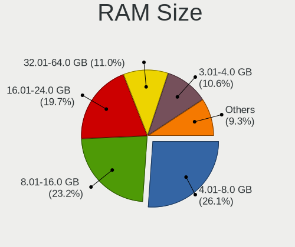
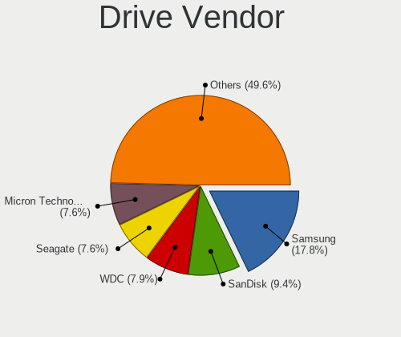
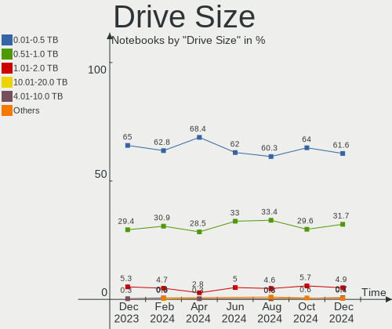
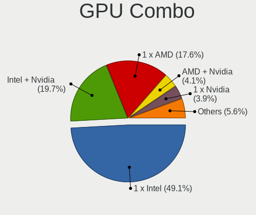

Ubuntu Hardware Trends (Notebooks)
----------------------------------

A project to identify most popular hardware characteristics and track their change
over time based on data collected by Ubuntu users at https://Linux-Hardware.org.

Anyone can contribute to this report by the [hw-probe](https://github.com/linuxhw/hw-probe) tool:

    sudo -E hw-probe -all -upload

Full-feature report is available here: https://linux-hardware.org/?view=trends&formfactor=notebook

Period: Aug, 2021.

Contents
--------

* [ System ](#system)
  - [ OS                       ](#os)
  - [ OS Family                ](#os-family)
  - [ Kernel                   ](#kernel)
  - [ Kernel Family            ](#kernel-family)
  - [ Kernel Major Ver.        ](#kernel-major-ver)
  - [ Arch                     ](#arch)
  - [ DE                       ](#de)
  - [ Display Server           ](#display-server)
  - [ Display Manager          ](#display-manager)
  - [ OS Lang                  ](#os-lang)
  - [ Boot Mode                ](#boot-mode)
  - [ Filesystem               ](#filesystem)
  - [ Part. scheme             ](#part-scheme)
  - [ Dual Boot with Linux/BSD ](#dual-boot-with-linuxbsd)
  - [ Dual Boot (Win)          ](#dual-boot-win)

* [ Board ](#board)
  - [ Vendor                   ](#vendor)
  - [ Model                    ](#model)
  - [ Model Family             ](#model-family)
  - [ MFG Year                 ](#mfg-year)
  - [ Form Factor              ](#form-factor)
  - [ Secure Boot              ](#secure-boot)
  - [ Coreboot                 ](#coreboot)
  - [ RAM Size                 ](#ram-size)
  - [ RAM Used                 ](#ram-used)
  - [ Total Drives             ](#total-drives)
  - [ Has CD-ROM               ](#has-cd-rom)
  - [ Has Ethernet             ](#has-ethernet)
  - [ Has WiFi                 ](#has-wifi)
  - [ Has Bluetooth            ](#has-bluetooth)

* [ Location ](#location)
  - [ Country                  ](#country)
  - [ City                     ](#city)

* [ Drives ](#drives)
  - [ Drive Vendor             ](#drive-vendor)
  - [ Drive Model              ](#drive-model)
  - [ HDD Vendor               ](#hdd-vendor)
  - [ SSD Vendor               ](#ssd-vendor)
  - [ Drive Kind               ](#drive-kind)
  - [ Drive Connector          ](#drive-connector)
  - [ Drive Size               ](#drive-size)
  - [ Space Total              ](#space-total)
  - [ Space Used               ](#space-used)
  - [ Malfunc. Drives          ](#malfunc-drives)
  - [ Malfunc. Drive Vendor    ](#malfunc-drive-vendor)
  - [ Malfunc. HDD Vendor      ](#malfunc-hdd-vendor)
  - [ Malfunc. Drive Kind      ](#malfunc-drive-kind)
  - [ Failed Drives            ](#failed-drives)
  - [ Failed Drive Vendor      ](#failed-drive-vendor)
  - [ Drive Status             ](#drive-status)

* [ Storage controller ](#storage-controller)
  - [ Storage Vendor           ](#storage-vendor)
  - [ Storage Model            ](#storage-model)
  - [ Storage Kind             ](#storage-kind)

* [ Processor ](#processor)
  - [ CPU Vendor               ](#cpu-vendor)
  - [ CPU Model                ](#cpu-model)
  - [ CPU Model Family         ](#cpu-model-family)
  - [ CPU Cores                ](#cpu-cores)
  - [ CPU Sockets              ](#cpu-sockets)
  - [ CPU Threads              ](#cpu-threads)
  - [ CPU Op-Modes             ](#cpu-op-modes)
  - [ CPU Microcode            ](#cpu-microcode)
  - [ CPU Microarch            ](#cpu-microarch)

* [ Graphics ](#graphics)
  - [ GPU Vendor               ](#gpu-vendor)
  - [ GPU Model                ](#gpu-model)
  - [ GPU Combo                ](#gpu-combo)
  - [ GPU Driver               ](#gpu-driver)
  - [ GPU Memory               ](#gpu-memory)

* [ Monitor ](#monitor)
  - [ Monitor Vendor           ](#monitor-vendor)
  - [ Monitor Model            ](#monitor-model)
  - [ Monitor Resolution       ](#monitor-resolution)
  - [ Monitor Diagonal         ](#monitor-diagonal)
  - [ Monitor Width            ](#monitor-width)
  - [ Aspect Ratio             ](#aspect-ratio)
  - [ Monitor Area             ](#monitor-area)
  - [ Pixel Density            ](#pixel-density)
  - [ Multiple Monitors        ](#multiple-monitors)

* [ Network ](#network)
  - [ Net Controller Vendor    ](#net-controller-vendor)
  - [ Net Controller Model     ](#net-controller-model)
  - [ Wireless Vendor          ](#wireless-vendor)
  - [ Wireless Model           ](#wireless-model)
  - [ Ethernet Vendor          ](#ethernet-vendor)
  - [ Ethernet Model           ](#ethernet-model)
  - [ Net Controller Kind      ](#net-controller-kind)
  - [ Used Controller          ](#used-controller)
  - [ NICs                     ](#nics)
  - [ IPv6                     ](#ipv6)

* [ Bluetooth ](#bluetooth)
  - [ Bluetooth Vendor         ](#bluetooth-vendor)
  - [ Bluetooth Model          ](#bluetooth-model)

* [ Sound ](#sound)
  - [ Sound Vendor             ](#sound-vendor)
  - [ Sound Model              ](#sound-model)

* [ Memory ](#memory)
  - [ Memory Vendor            ](#memory-vendor)
  - [ Memory Model             ](#memory-model)
  - [ Memory Kind              ](#memory-kind)
  - [ Memory Form Factor       ](#memory-form-factor)
  - [ Memory Size              ](#memory-size)
  - [ Memory Speed             ](#memory-speed)

* [ Printers & scanners ](#printers--scanners)
  - [ Printer Vendor           ](#printer-vendor)
  - [ Printer Model            ](#printer-model)
  - [ Scanner Vendor           ](#scanner-vendor)
  - [ Scanner Model            ](#scanner-model)

* [ Camera ](#camera)
  - [ Camera Vendor            ](#camera-vendor)
  - [ Camera Model             ](#camera-model)

* [ Security ](#security)
  - [ Fingerprint Vendor       ](#fingerprint-vendor)
  - [ Fingerprint Model        ](#fingerprint-model)
  - [ Chipcard Vendor          ](#chipcard-vendor)
  - [ Chipcard Model           ](#chipcard-model)

* [ Unsupported ](#unsupported)
  - [ Unsupported Devices      ](#unsupported-devices)
  - [ Unsupported Device Types ](#unsupported-device-types)

System
------

OS
--

Installed operating systems

| Name           | Notebooks | Percent |
|----------------|-----------|---------|
| Ubuntu 20.04   | 477       | 64.63%  |
| Ubuntu 21.04   | 189       | 25.61%  |
| Ubuntu 18.04   | 44        | 5.96%   |
| Ubuntu 20.10   | 13        | 1.76%   |
| Ubuntu 16.04   | 5         | 0.68%   |
| Ubuntu 21.10   | 4         | 0.54%   |
| Ubuntu         | 3         | 0.41%   |
| Ubuntu Core 18 | 1         | 0.14%   |
| Ubuntu 19.10   | 1         | 0.14%   |
| Ubuntu 19.04   | 1         | 0.14%   |

OS Family
---------

OS without a version

| Name   | Notebooks | Percent |
|--------|-----------|---------|
| Ubuntu | 738       | 100%    |

Kernel
------

Version of the Linux kernel

| Version                  | Notebooks | Percent |
|--------------------------|-----------|---------|
| 5.11.0-25-generic        | 210       | 28.46%  |
| 5.11.0-27-generic        | 157       | 21.27%  |
| 5.11.0-31-generic        | 66        | 8.94%   |
| 5.8.0-63-generic         | 61        | 8.27%   |
| 5.4.0-80-generic         | 41        | 5.56%   |
| 5.4.0-81-generic         | 37        | 5.01%   |
| 5.8.0-43-generic         | 31        | 4.2%    |
| 5.11.0-16-generic        | 15        | 2.03%   |
| 5.8.0-59-generic         | 11        | 1.49%   |
| 5.4.0-42-generic         | 8         | 1.08%   |
| 5.11.0-33-generic        | 6         | 0.81%   |
| 5.11.0-26-generic        | 6         | 0.81%   |
| 5.11.0-22-generic        | 5         | 0.68%   |
| 4.15.0-153-generic       | 5         | 0.68%   |
| 5.8.0-55-generic         | 4         | 0.54%   |
| 5.4.0-77-generic         | 4         | 0.54%   |
| 4.15.0-151-generic       | 4         | 0.54%   |
| 5.8.0-64-generic         | 3         | 0.41%   |
| 5.13.9-051309-generic    | 3         | 0.41%   |
| 5.10.0-1044-oem          | 3         | 0.41%   |
| 5.10.0-1038-oem          | 3         | 0.41%   |
| 4.15.0-154-generic       | 3         | 0.41%   |
| 5.8.0-53-generic         | 2         | 0.27%   |
| 5.8.0-50-generic         | 2         | 0.27%   |
| 5.8.0-25-generic         | 2         | 0.27%   |
| 5.4.0-73-generic         | 2         | 0.27%   |
| 5.4.0-26-generic         | 2         | 0.27%   |
| 5.11.0-7620-generic      | 2         | 0.27%   |
| 4.4.0-186-generic        | 2         | 0.27%   |
| 4.15.0-45-generic        | 2         | 0.27%   |
| 5.8.0-63-lowlatency      | 1         | 0.14%   |
| 5.8.0-44-generic         | 1         | 0.14%   |
| 5.8.0-41-generic         | 1         | 0.14%   |
| 5.4.0-80-lowlatency      | 1         | 0.14%   |
| 5.4.0-79-generic         | 1         | 0.14%   |
| 5.4.0-74-generic         | 1         | 0.14%   |
| 5.4.0-70-generic         | 1         | 0.14%   |
| 5.4.0-54-generic         | 1         | 0.14%   |
| 5.4.0-52-generic         | 1         | 0.14%   |
| 5.3.0-28-generic         | 1         | 0.14%   |
| 5.3.0-13-generic         | 1         | 0.14%   |
| 5.3.0-050300-generic     | 1         | 0.14%   |
| 5.14.0-051400rc6-generic | 1         | 0.14%   |
| 5.14.0-051400rc5-generic | 1         | 0.14%   |
| 5.13.7-051307-generic    | 1         | 0.14%   |
| 5.13.4-051304-generic    | 1         | 0.14%   |
| 5.13.13-generic          | 1         | 0.14%   |
| 5.13.12-051312-generic   | 1         | 0.14%   |
| 5.13.0-051300-generic    | 1         | 0.14%   |
| 5.11.6-051106-generic    | 1         | 0.14%   |
| 5.11.14-051114-generic   | 1         | 0.14%   |
| 5.11.0-34-generic        | 1         | 0.14%   |
| 5.11.0-33-lowlatency     | 1         | 0.14%   |
| 5.11.0-26-lowlatency     | 1         | 0.14%   |
| 5.11.0-20-generic        | 1         | 0.14%   |
| 5.10.0-1034-oem          | 1         | 0.14%   |
| 5.10.0-1026-oem          | 1         | 0.14%   |
| 5.0.0-13-generic         | 1         | 0.14%   |
| 4.20.0-042000-generic    | 1         | 0.14%   |
| 4.15.0-54-generic        | 1         | 0.14%   |

Kernel Family
-------------

Linux kernel without a distro release

| Version | Notebooks | Percent |
|---------|-----------|---------|
| 5.11.0  | 471       | 63.82%  |
| 5.8.0   | 119       | 16.12%  |
| 5.4.0   | 100       | 13.55%  |
| 4.15.0  | 20        | 2.71%   |
| 5.10.0  | 8         | 1.08%   |
| 5.3.0   | 3         | 0.41%   |
| 5.13.9  | 3         | 0.41%   |
| 5.14.0  | 2         | 0.27%   |
| 4.4.0   | 2         | 0.27%   |
| 5.13.7  | 1         | 0.14%   |
| 5.13.4  | 1         | 0.14%   |
| 5.13.13 | 1         | 0.14%   |
| 5.13.12 | 1         | 0.14%   |
| 5.13.0  | 1         | 0.14%   |
| 5.11.6  | 1         | 0.14%   |
| 5.11.14 | 1         | 0.14%   |
| 5.0.0   | 1         | 0.14%   |
| 4.20.0  | 1         | 0.14%   |
| 4.13.0  | 1         | 0.14%   |

Kernel Major Ver.
-----------------

Linux kernel major version

| Version | Notebooks | Percent |
|---------|-----------|---------|
| 5.11    | 473       | 64.09%  |
| 5.8     | 119       | 16.12%  |
| 5.4     | 100       | 13.55%  |
| 4.15    | 20        | 2.71%   |
| 5.13    | 8         | 1.08%   |
| 5.10    | 8         | 1.08%   |
| 5.3     | 3         | 0.41%   |
| 5.14    | 2         | 0.27%   |
| 4.4     | 2         | 0.27%   |
| 5.0     | 1         | 0.14%   |
| 4.20    | 1         | 0.14%   |
| 4.13    | 1         | 0.14%   |

Arch
----

OS architecture (x86_64, i586, etc.)

| Name   | Notebooks | Percent |
|--------|-----------|---------|
| x86_64 | 731       | 99.05%  |
| i686   | 7         | 0.95%   |

DE
--

Desktop Environment

| Name            | Notebooks | Percent |
|-----------------|-----------|---------|
| GNOME           | 653       | 88.48%  |
| Unknown         | 61        | 8.27%   |
| Unity           | 8         | 1.08%   |
| X-Cinnamon      | 5         | 0.68%   |
| GNOME Flashback | 4         | 0.54%   |
| i3              | 2         | 0.27%   |
| enlightenment   | 2         | 0.27%   |
| Cinnamon        | 2         | 0.27%   |
| wmaker-common   | 1         | 0.14%   |

Display Server
--------------

X11 or Wayland

| Name    | Notebooks | Percent |
|---------|-----------|---------|
| X11     | 553       | 74.93%  |
| Wayland | 146       | 19.78%  |
| Unknown | 36        | 4.88%   |
| Tty     | 3         | 0.41%   |

Display Manager
---------------

SDDM, LightDM, etc.

| Name    | Notebooks | Percent |
|---------|-----------|---------|
| Unknown | 516       | 69.92%  |
| GDM     | 212       | 28.73%  |
| TDM     | 7         | 0.95%   |
| LightDM | 2         | 0.27%   |
| GDM3    | 1         | 0.14%   |

OS Lang
-------

Language

| Lang    | Notebooks | Percent |
|---------|-----------|---------|
| en_US   | 307       | 41.6%   |
| de_DE   | 66        | 8.94%   |
| en_IN   | 47        | 6.37%   |
| en_GB   | 41        | 5.56%   |
| fr_FR   | 37        | 5.01%   |
| pt_BR   | 24        | 3.25%   |
| ru_RU   | 20        | 2.71%   |
| en_AU   | 18        | 2.44%   |
| es_ES   | 17        | 2.3%    |
| en_CA   | 15        | 2.03%   |
| pl_PL   | 11        | 1.49%   |
| it_IT   | 9         | 1.22%   |
| cs_CZ   | 9         | 1.22%   |
| Unknown | 9         | 1.22%   |
| zh_CN   | 7         | 0.95%   |
| en_ZA   | 7         | 0.95%   |
| fi_FI   | 6         | 0.81%   |
| es_AR   | 6         | 0.81%   |
| de_AT   | 6         | 0.81%   |
| tr_TR   | 4         | 0.54%   |
| ro_RO   | 4         | 0.54%   |
| nl_NL   | 4         | 0.54%   |
| es_CO   | 4         | 0.54%   |
| de_CH   | 4         | 0.54%   |
| C       | 4         | 0.54%   |
| ru_UA   | 3         | 0.41%   |
| hr_HR   | 3         | 0.41%   |
| fr_BE   | 3         | 0.41%   |
| es_MX   | 3         | 0.41%   |
| es_EC   | 3         | 0.41%   |
| es_CL   | 3         | 0.41%   |
| en_NZ   | 3         | 0.41%   |
| pt_PT   | 2         | 0.27%   |
| hu_HU   | 2         | 0.27%   |
| fr_CH   | 2         | 0.27%   |
| en_IL   | 2         | 0.27%   |
| da_DK   | 2         | 0.27%   |
| zh_TW   | 1         | 0.14%   |
| zh_HK   | 1         | 0.14%   |
| sv_SE   | 1         | 0.14%   |
| sl_SI   | 1         | 0.14%   |
| nl_BE   | 1         | 0.14%   |
| nb_NO   | 1         | 0.14%   |
| lv_LV   | 1         | 0.14%   |
| ja_JP   | 1         | 0.14%   |
| fr_CA   | 1         | 0.14%   |
| et_EE   | 1         | 0.14%   |
| es_VE   | 1         | 0.14%   |
| es_UY   | 1         | 0.14%   |
| es_SV   | 1         | 0.14%   |
| es_PE   | 1         | 0.14%   |
| es_HN   | 1         | 0.14%   |
| en_SG   | 1         | 0.14%   |
| en_NG   | 1         | 0.14%   |
| en_IE   | 1         | 0.14%   |
| en_HK   | 1         | 0.14%   |
| el_GR   | 1         | 0.14%   |
| ca_ES   | 1         | 0.14%   |

Boot Mode
---------

EFI or BIOS

| Mode | Notebooks | Percent |
|------|-----------|---------|
| EFI  | 381       | 51.63%  |
| BIOS | 357       | 48.37%  |

Filesystem
----------

Type of filesystem

| Type    | Notebooks | Percent |
|---------|-----------|---------|
| Ext4    | 695       | 94.17%  |
| Overlay | 24        | 3.25%   |
| Zfs     | 13        | 1.76%   |
| Ext2    | 2         | 0.27%   |
| Btrfs   | 2         | 0.27%   |
| Aufs    | 1         | 0.14%   |
| Unknown | 1         | 0.14%   |

Part. scheme
------------

Scheme of partitioning

| Type    | Notebooks | Percent |
|---------|-----------|---------|
| Unknown | 507       | 68.7%   |
| GPT     | 194       | 26.29%  |
| MBR     | 37        | 5.01%   |

Dual Boot with Linux/BSD
------------------------

Hosting more than one Linux/BSD

| Dual boot | Notebooks | Percent |
|-----------|-----------|---------|
| No        | 666       | 90.24%  |
| Yes       | 72        | 9.76%   |

Dual Boot (Win)
---------------

Hosting Linux and Windows

| Dual boot | Notebooks | Percent |
|-----------|-----------|---------|
| No        | 484       | 65.58%  |
| Yes       | 254       | 34.42%  |

Board
-----

Vendor
------

Motherboard manufacturer

| Name                   | Notebooks | Percent |
|------------------------|-----------|---------|
| Lenovo                 | 166       | 22.49%  |
| Hewlett-Packard        | 146       | 19.78%  |
| Dell                   | 137       | 18.56%  |
| ASUSTek Computer       | 68        | 9.21%   |
| Acer                   | 61        | 8.27%   |
| Apple                  | 21        | 2.85%   |
| Toshiba                | 20        | 2.71%   |
| Samsung Electronics    | 16        | 2.17%   |
| MSI                    | 9         | 1.22%   |
| Sony                   | 8         | 1.08%   |
| Packard Bell           | 7         | 0.95%   |
| Medion                 | 7         | 0.95%   |
| HUAWEI                 | 7         | 0.95%   |
| Unknown                | 7         | 0.95%   |
| Fujitsu                | 6         | 0.81%   |
| Notebook               | 5         | 0.68%   |
| Google                 | 5         | 0.68%   |
| TUXEDO                 | 4         | 0.54%   |
| Panasonic              | 4         | 0.54%   |
| System76               | 3         | 0.41%   |
| Monster                | 2         | 0.27%   |
| LG Electronics         | 2         | 0.27%   |
| Wortmann AG            | 1         | 0.14%   |
| whyopencomputing       | 1         | 0.14%   |
| VIT                    | 1         | 0.14%   |
| TrekStor               | 1         | 0.14%   |
| Teclast                | 1         | 0.14%   |
| Razer                  | 1         | 0.14%   |
| Radxa                  | 1         | 0.14%   |
| Positivo               | 1         | 0.14%   |
| Pegatron               | 1         | 0.14%   |
| PC Specialist          | 1         | 0.14%   |
| NEC Computers          | 1         | 0.14%   |
| IP3 Tech               | 1         | 0.14%   |
| HKC                    | 1         | 0.14%   |
| Gigabyte Technology    | 1         | 0.14%   |
| Gateway                | 1         | 0.14%   |
| Fujitsu Siemens        | 1         | 0.14%   |
| EUROCOM                | 1         | 0.14%   |
| eMachines              | 1         | 0.14%   |
| CyberPowerPC           | 1         | 0.14%   |
| Clevo                  | 1         | 0.14%   |
| BANGHO                 | 1         | 0.14%   |
| AVITA                  | 1         | 0.14%   |
| Avell High Performance | 1         | 0.14%   |
| ARCELIK                | 1         | 0.14%   |
| AMI                    | 1         | 0.14%   |
| Alienware              | 1         | 0.14%   |
| Advance                | 1         | 0.14%   |

Model
-----

Motherboard model

| Name                                | Notebooks | Percent |
|-------------------------------------|-----------|---------|
| Unknown                             | 10        | 1.36%   |
| Lenovo IdeaPad Y700-15ISK 80NV      | 5         | 0.68%   |
| Lenovo IdeaPad 330-15IKB 81DE       | 4         | 0.54%   |
| HP Pavilion dv6                     | 4         | 0.54%   |
| HP Notebook                         | 4         | 0.54%   |
| Dell Latitude E6400                 | 4         | 0.54%   |
| Lenovo IdeaPad 5 15ITL05 82FG       | 3         | 0.41%   |
| Lenovo IdeaPad 5 14ARE05 81YM       | 3         | 0.41%   |
| Lenovo G560 0679                    | 3         | 0.41%   |
| HP ProBook 650 G1                   | 3         | 0.41%   |
| HP Pavilion g6                      | 3         | 0.41%   |
| HP EliteBook 8460p                  | 3         | 0.41%   |
| HP EliteBook 845 G7 Notebook PC     | 3         | 0.41%   |
| HP EliteBook 840 G3                 | 3         | 0.41%   |
| HP EliteBook 820 G1                 | 3         | 0.41%   |
| Dell Vostro 3500                    | 3         | 0.41%   |
| Dell Latitude E6500                 | 3         | 0.41%   |
| Dell Latitude 5410                  | 3         | 0.41%   |
| Apple MacBookPro8,1                 | 3         | 0.41%   |
| Toshiba Satellite C55-B             | 2         | 0.27%   |
| System76 Oryx Pro                   | 2         | 0.27%   |
| Packard Bell EasyNote TS11HR        | 2         | 0.27%   |
| Lenovo Yoga 2 11 20332              | 2         | 0.27%   |
| Lenovo ThinkBook 14 G2 ITL 20VD     | 2         | 0.27%   |
| Lenovo IdeaPad S145-15API 81V7      | 2         | 0.27%   |
| Lenovo IdeaPad 500-15ACZ 80K4       | 2         | 0.27%   |
| Lenovo IdeaPad 3 17ADA05 81W2       | 2         | 0.27%   |
| Lenovo G500 20236                   | 2         | 0.27%   |
| Lenovo G50-45 80E3                  | 2         | 0.27%   |
| HUAWEI HLYL-WXX9                    | 2         | 0.27%   |
| HUAWEI BOHK-WAX9X                   | 2         | 0.27%   |
| HP ProBook 4540s                    | 2         | 0.27%   |
| HP ProBook 450 G6                   | 2         | 0.27%   |
| HP ProBook 440 G8 Notebook PC       | 2         | 0.27%   |
| HP Presario CQ61                    | 2         | 0.27%   |
| HP Presario CQ56                    | 2         | 0.27%   |
| HP Pavilion Notebook                | 2         | 0.27%   |
| HP Pavilion Laptop 15-eh0xxx        | 2         | 0.27%   |
| HP Pavilion Gaming Laptop 15-dk0xxx | 2         | 0.27%   |
| HP Pavilion g7                      | 2         | 0.27%   |
| HP Pavilion 17                      | 2         | 0.27%   |
| HP Pavilion 15                      | 2         | 0.27%   |
| HP OMEN by HP Laptop 15-ce0xx       | 2         | 0.27%   |
| HP Laptop 15s-eq2xxx                | 2         | 0.27%   |
| HP Laptop 15-dw2xxx                 | 2         | 0.27%   |
| HP Laptop 15-da0xxx                 | 2         | 0.27%   |
| HP Laptop 15-bw0xx                  | 2         | 0.27%   |
| HP Laptop 15-bs0xx                  | 2         | 0.27%   |
| HP ENVY 17                          | 2         | 0.27%   |
| HP EliteBook Folio 1040 G3          | 2         | 0.27%   |
| HP EliteBook 8570w                  | 2         | 0.27%   |
| HP EliteBook 8530w                  | 2         | 0.27%   |
| HP EliteBook 850 G2                 | 2         | 0.27%   |
| HP EliteBook 8470p                  | 2         | 0.27%   |
| HP EliteBook 840 G2                 | 2         | 0.27%   |
| HP EliteBook 840 G1                 | 2         | 0.27%   |
| HP Compaq Presario CQ70             | 2         | 0.27%   |
| HP 630                              | 2         | 0.27%   |
| HP 255 G6 Notebook PC               | 2         | 0.27%   |
| Dell XPS 15 9500                    | 2         | 0.27%   |

Model Family
------------

Motherboard model prefix

| Name                  | Notebooks | Percent |
|-----------------------|-----------|---------|
| Lenovo ThinkPad       | 75        | 10.16%  |
| Dell Latitude         | 51        | 6.91%   |
| Lenovo IdeaPad        | 49        | 6.64%   |
| Dell Inspiron         | 41        | 5.56%   |
| HP EliteBook          | 39        | 5.28%   |
| Acer Aspire           | 38        | 5.15%   |
| HP Pavilion           | 29        | 3.93%   |
| HP Laptop             | 23        | 3.12%   |
| HP ProBook            | 18        | 2.44%   |
| Dell XPS              | 17        | 2.3%    |
| Toshiba Satellite     | 15        | 2.03%   |
| ASUS VivoBook         | 15        | 2.03%   |
| Dell Vostro           | 12        | 1.63%   |
| Dell Precision        | 11        | 1.49%   |
| Acer Swift            | 11        | 1.49%   |
| Unknown               | 10        | 1.36%   |
| HP ENVY               | 8         | 1.08%   |
| Packard Bell EasyNote | 6         | 0.81%   |
| Lenovo ThinkBook      | 6         | 0.81%   |
| Fujitsu LIFEBOOK      | 6         | 0.81%   |
| Apple MacBookPro8     | 6         | 0.81%   |
| ASUS ROG              | 5         | 0.68%   |
| Acer Nitro            | 5         | 0.68%   |
| HP Presario           | 4         | 0.54%   |
| HP Notebook           | 4         | 0.54%   |
| Toshiba PORTEGE       | 3         | 0.41%   |
| Lenovo Yoga           | 3         | 0.41%   |
| Lenovo G560           | 3         | 0.41%   |
| HP Compaq             | 3         | 0.41%   |
| Dell Studio           | 3         | 0.41%   |
| ASUS ZenBook          | 3         | 0.41%   |
| ASUS TUF              | 3         | 0.41%   |
| System76 Oryx         | 2         | 0.27%   |
| Samsung 350V5C        | 2         | 0.27%   |
| MSI Modern            | 2         | 0.27%   |
| Lenovo Legion         | 2         | 0.27%   |
| Lenovo G500           | 2         | 0.27%   |
| Lenovo G50-45         | 2         | 0.27%   |
| HUAWEI HLYL-WXX9      | 2         | 0.27%   |
| HUAWEI BOHK-WAX9X     | 2         | 0.27%   |
| HP ZBook              | 2         | 0.27%   |
| HP OMEN               | 2         | 0.27%   |
| HP 630                | 2         | 0.27%   |
| HP 255                | 2         | 0.27%   |
| HP 250                | 2         | 0.27%   |
| HP 15                 | 2         | 0.27%   |
| ASUS X556UQK          | 2         | 0.27%   |
| ASUS X510UAR          | 2         | 0.27%   |
| ASUS ASUS             | 2         | 0.27%   |
| Apple MacBookPro5     | 2         | 0.27%   |
| Apple MacBookPro15    | 2         | 0.27%   |
| Apple MacBookPro11    | 2         | 0.27%   |
| Acer TravelMate       | 2         | 0.27%   |
| Acer Extensa          | 2         | 0.27%   |
| Wortmann AG TERRA     | 1         | 0.14%   |
| VIT P2400             | 1         | 0.14%   |
| TUXEDO P65xRP         | 1         | 0.14%   |
| TUXEDO N8xxEZ         | 1         | 0.14%   |
| TUXEDO N750HU         | 1         | 0.14%   |
| TrekStor SURFBOOK     | 1         | 0.14%   |

MFG Year
--------

Motherboard manufacture year

| Year | Notebooks | Percent |
|------|-----------|---------|
| 2021 | 145       | 19.65%  |
| 2020 | 101       | 13.69%  |
| 2019 | 72        | 9.76%   |
| 2013 | 58        | 7.86%   |
| 2018 | 55        | 7.45%   |
| 2012 | 49        | 6.64%   |
| 2011 | 45        | 6.1%    |
| 2014 | 39        | 5.28%   |
| 2015 | 37        | 5.01%   |
| 2016 | 36        | 4.88%   |
| 2010 | 33        | 4.47%   |
| 2017 | 29        | 3.93%   |
| 2009 | 20        | 2.71%   |
| 2008 | 10        | 1.36%   |
| 2007 | 6         | 0.81%   |
| 2006 | 3         | 0.41%   |

Form Factor
-----------

Physical design of the computer

| Name     | Notebooks | Percent |
|----------|-----------|---------|
| Notebook | 738       | 100%    |

Secure Boot
-----------

Enabled or disabled

| State    | Notebooks | Percent |
|----------|-----------|---------|
| Disabled | 617       | 83.6%   |
| Enabled  | 121       | 16.4%   |

Coreboot
--------

Have coreboot on board

| Used | Notebooks | Percent |
|------|-----------|---------|
| No   | 732       | 99.19%  |
| Yes  | 6         | 0.81%   |

RAM Size
--------

Total RAM memory

| Size in GB  | Notebooks | Percent |
|-------------|-----------|---------|
| 4.01-8.0    | 208       | 28.18%  |
| 3.01-4.0    | 168       | 22.76%  |
| 16.01-24.0  | 139       | 18.83%  |
| 8.01-16.0   | 124       | 16.8%   |
| 32.01-64.0  | 40        | 5.42%   |
| 1.01-2.0    | 34        | 4.61%   |
| 2.01-3.0    | 9         | 1.22%   |
| 24.01-32.0  | 7         | 0.95%   |
| 64.01-256.0 | 7         | 0.95%   |
| 0.51-1.0    | 2         | 0.27%   |

RAM Used
--------

Used RAM memory

| Used GB    | Notebooks | Percent |
|------------|-----------|---------|
| 1.01-2.0   | 299       | 40.51%  |
| 2.01-3.0   | 208       | 28.18%  |
| 4.01-8.0   | 103       | 13.96%  |
| 3.01-4.0   | 82        | 11.11%  |
| 8.01-16.0  | 24        | 3.25%   |
| 0.51-1.0   | 16        | 2.17%   |
| 16.01-24.0 | 4         | 0.54%   |
| 0.01-0.5   | 2         | 0.27%   |

Total Drives
------------

Number of drives on board

| Drives | Notebooks | Percent |
|--------|-----------|---------|
| 1      | 571       | 77.37%  |
| 2      | 142       | 19.24%  |
| 3      | 19        | 2.57%   |
| 4      | 3         | 0.41%   |
| 0      | 3         | 0.41%   |

Has CD-ROM
----------

Has CD-ROM on board

| Presented | Notebooks | Percent |
|-----------|-----------|---------|
| No        | 443       | 60.03%  |
| Yes       | 295       | 39.97%  |

Has Ethernet
------------

Has Ethernet on board

| Presented | Notebooks | Percent |
|-----------|-----------|---------|
| Yes       | 607       | 82.25%  |
| No        | 131       | 17.75%  |

Has WiFi
--------

Has WiFi module

| Presented | Notebooks | Percent |
|-----------|-----------|---------|
| Yes       | 722       | 97.83%  |
| No        | 16        | 2.17%   |

Has Bluetooth
-------------

Has Bluetooth module

| Presented | Notebooks | Percent |
|-----------|-----------|---------|
| Yes       | 554       | 75.07%  |
| No        | 184       | 24.93%  |

Location
--------

Country
-------

Geographic location (country)

| Country            | Notebooks | Percent |
|--------------------|-----------|---------|
| USA                | 115       | 15.58%  |
| Germany            | 84        | 11.38%  |
| India              | 51        | 6.91%   |
| UK                 | 37        | 5.01%   |
| France             | 36        | 4.88%   |
| Brazil             | 34        | 4.61%   |
| Russia             | 26        | 3.52%   |
| Poland             | 22        | 2.98%   |
| Spain              | 19        | 2.57%   |
| Canada             | 18        | 2.44%   |
| Australia          | 17        | 2.3%    |
| Turkey             | 14        | 1.9%    |
| Czechia            | 14        | 1.9%    |
| Netherlands        | 13        | 1.76%   |
| Italy              | 13        | 1.76%   |
| Finland            | 12        | 1.63%   |
| Austria            | 11        | 1.49%   |
| Switzerland        | 9         | 1.22%   |
| China              | 9         | 1.22%   |
| Ukraine            | 8         | 1.08%   |
| Romania            | 7         | 0.95%   |
| Mexico             | 7         | 0.95%   |
| Algeria            | 7         | 0.95%   |
| South Africa       | 6         | 0.81%   |
| Iran               | 6         | 0.81%   |
| Indonesia          | 6         | 0.81%   |
| Hungary            | 6         | 0.81%   |
| Greece             | 6         | 0.81%   |
| Argentina          | 6         | 0.81%   |
| Portugal           | 5         | 0.68%   |
| Israel             | 5         | 0.68%   |
| Belgium            | 5         | 0.68%   |
| Sweden             | 4         | 0.54%   |
| Serbia             | 4         | 0.54%   |
| New Zealand        | 4         | 0.54%   |
| Ecuador            | 4         | 0.54%   |
| Denmark            | 4         | 0.54%   |
| Colombia           | 4         | 0.54%   |
| Chile              | 4         | 0.54%   |
| Vietnam            | 3         | 0.41%   |
| Taiwan             | 3         | 0.41%   |
| Peru               | 3         | 0.41%   |
| Latvia             | 3         | 0.41%   |
| Croatia            | 3         | 0.41%   |
| Uzbekistan         | 2         | 0.27%   |
| Uruguay            | 2         | 0.27%   |
| Sudan              | 2         | 0.27%   |
| South Korea        | 2         | 0.27%   |
| Singapore          | 2         | 0.27%   |
| Puerto Rico        | 2         | 0.27%   |
| Norway             | 2         | 0.27%   |
| North Macedonia    | 2         | 0.27%   |
| Nigeria            | 2         | 0.27%   |
| Lithuania          | 2         | 0.27%   |
| Kenya              | 2         | 0.27%   |
| Japan              | 2         | 0.27%   |
| Hong Kong          | 2         | 0.27%   |
| Estonia            | 2         | 0.27%   |
| Dominican Republic | 2         | 0.27%   |
| Cameroon           | 2         | 0.27%   |

City
----

Geographic location (city)

| City          | Notebooks | Percent |
|---------------|-----------|---------|
| Prague        | 8         | 1.08%   |
| Helsinki      | 8         | 1.08%   |
| Vienna        | 7         | 0.95%   |
| Istanbul      | 6         | 0.81%   |
| Bengaluru     | 6         | 0.81%   |
| Warsaw        | 5         | 0.68%   |
| Tehran        | 5         | 0.68%   |
| Paris         | 5         | 0.68%   |
| Moscow        | 5         | 0.68%   |
| Kolkata       | 5         | 0.68%   |
| Chennai       | 5         | 0.68%   |
| Pune          | 4         | 0.54%   |
| Nuremberg     | 4         | 0.54%   |
| Madrid        | 4         | 0.54%   |
| Los Angeles   | 4         | 0.54%   |
| Ankara        | 4         | 0.54%   |
| Tucson        | 3         | 0.41%   |
| Thessaloniki  | 3         | 0.41%   |
| Tel Aviv      | 3         | 0.41%   |
| Sydney        | 3         | 0.41%   |
| Stuttgart     | 3         | 0.41%   |
| St Petersburg | 3         | 0.41%   |
| S??o Paulo    | 3         | 0.41%   |
| Santiago      | 3         | 0.41%   |
| San Jose      | 3         | 0.41%   |
| Rome          | 3         | 0.41%   |
| Quito         | 3         | 0.41%   |
| Milan         | 3         | 0.41%   |
| Melbourne     | 3         | 0.41%   |
| London        | 3         | 0.41%   |
| Lausanne      | 3         | 0.41%   |
| Kyiv          | 3         | 0.41%   |
| Edinburgh     | 3         | 0.41%   |
| Dresden       | 3         | 0.41%   |
| Delhi         | 3         | 0.41%   |
| Cologne       | 3         | 0.41%   |
| Chemnitz      | 3         | 0.41%   |
| Cape Town     | 3         | 0.41%   |
| Bogot??       | 3         | 0.41%   |
| Bielefeld     | 3         | 0.41%   |
| Belgrade      | 3         | 0.41%   |
| Algiers       | 3         | 0.41%   |
| Zurich        | 2         | 0.27%   |
| Yekaterinburg | 2         | 0.27%   |
| Washington    | 2         | 0.27%   |
| Vancouver     | 2         | 0.27%   |
| Umargam       | 2         | 0.27%   |
| Toronto       | 2         | 0.27%   |
| Tallinn       | 2         | 0.27%   |
| Skopje        | 2         | 0.27%   |
| Singapore     | 2         | 0.27%   |
| Samara        | 2         | 0.27%   |
| Riga          | 2         | 0.27%   |
| Richmond Hill | 2         | 0.27%   |
| Pruszk??w     | 2         | 0.27%   |
| Poznan        | 2         | 0.27%   |
| Philadelphia  | 2         | 0.27%   |
| Oklahoma City | 2         | 0.27%   |
| Norwich       | 2         | 0.27%   |
| Nizhny Tagil  | 2         | 0.27%   |

Drives
------

Drive Vendor
------------

Hard drive vendors

| Vendor                  | Notebooks | Drives | Percent |
|-------------------------|-----------|--------|---------|
| Samsung Electronics     | 138       | 152    | 16.05%  |
| WDC                     | 126       | 131    | 14.65%  |
| Seagate                 | 107       | 107    | 12.44%  |
| Toshiba                 | 88        | 91     | 10.23%  |
| SanDisk                 | 53        | 54     | 6.16%   |
| Unknown                 | 38        | 39     | 4.42%   |
| SK Hynix                | 38        | 38     | 4.42%   |
| Kingston                | 36        | 36     | 4.19%   |
| Intel                   | 31        | 36     | 3.6%    |
| Hitachi                 | 21        | 21     | 2.44%   |
| HGST                    | 17        | 17     | 1.98%   |
| Crucial                 | 17        | 18     | 1.98%   |
| Micron Technology       | 16        | 17     | 1.86%   |
| KIOXIA                  | 13        | 15     | 1.51%   |
| Apple                   | 13        | 13     | 1.51%   |
| A-DATA Technology       | 11        | 12     | 1.28%   |
| Phison                  | 7         | 7      | 0.81%   |
| SPCC                    | 6         | 7      | 0.7%    |
| LITEONIT                | 6         | 6      | 0.7%    |
| LITEON                  | 5         | 5      | 0.58%   |
| Fujitsu                 | 5         | 5      | 0.58%   |
| Transcend               | 4         | 4      | 0.47%   |
| Team                    | 4         | 4      | 0.47%   |
| China                   | 4         | 4      | 0.47%   |
| PNY                     | 3         | 3      | 0.35%   |
| PLEXTOR                 | 3         | 3      | 0.35%   |
| Lenovo                  | 3         | 3      | 0.35%   |
| Union Memory (Shenzhen) | 2         | 2      | 0.23%   |
| Union Memory            | 2         | 2      | 0.23%   |
| Silicon Motion          | 2         | 2      | 0.23%   |
| SABRENT                 | 2         | 2      | 0.23%   |
| Patriot                 | 2         | 2      | 0.23%   |
| OCZ                     | 2         | 2      | 0.23%   |
| Lite-On                 | 2         | 2      | 0.23%   |
| KingSpec                | 2         | 2      | 0.23%   |
| Intenso                 | 2         | 2      | 0.23%   |
| Hewlett-Packard         | 2         | 2      | 0.23%   |
| Teclast                 | 1         | 1      | 0.12%   |
| StoreJet                | 1         | 1      | 0.12%   |
| SP                      | 1         | 1      | 0.12%   |
| Solid State Storage     | 1         | 1      | 0.12%   |
| Smartbuy                | 1         | 1      | 0.12%   |
| Realtek Semiconductor   | 1         | 1      | 0.12%   |
| PHD 3.0                 | 1         | 1      | 0.12%   |
| OCZ-VERT                | 1         | 1      | 0.12%   |
| Netac                   | 1         | 1      | 0.12%   |
| MARSHAL                 | 1         | 1      | 0.12%   |
| LuminouTek              | 1         | 1      | 0.12%   |
| Lexar                   | 1         | 1      | 0.12%   |
| Leven                   | 1         | 1      | 0.12%   |
| JMicron                 | 1         | 1      | 0.12%   |
| HGST HUS                | 1         | 1      | 0.12%   |
| GOODRAM                 | 1         | 1      | 0.12%   |
| FORESEE                 | 1         | 1      | 0.12%   |
| EMTEC                   | 1         | 1      | 0.12%   |
| Dogfish                 | 1         | 1      | 0.12%   |
| CT240BX5                | 1         | 1      | 0.12%   |
| Corsair                 | 1         | 1      | 0.12%   |
| BHT                     | 1         | 1      | 0.12%   |
| AXIOM                   | 1         | 1      | 0.12%   |

Drive Model
-----------

Hard drive models

| Model                                | Notebooks | Percent |
|--------------------------------------|-----------|---------|
| Seagate ST1000LM035-1RK172 1TB       | 20        | 2.26%   |
| Toshiba MQ01ABD100 1TB               | 19        | 2.15%   |
| Samsung NVMe SSD Drive 512GB         | 15        | 1.69%   |
| Seagate ST1000LM024 HN-M101MBB 1TB   | 14        | 1.58%   |
| Intel NVMe SSD Drive 512GB           | 11        | 1.24%   |
| Toshiba MQ04ABF100 1TB               | 10        | 1.13%   |
| Kingston SA400S37240G 240GB SSD      | 10        | 1.13%   |
| Unknown MMC Card  32GB               | 8         | 0.9%    |
| Seagate ST500LT012-1DG142 500GB      | 8         | 0.9%    |
| Sandisk NVMe SSD Drive 256GB         | 8         | 0.9%    |
| Unknown MMC Card  64GB               | 6         | 0.68%   |
| Toshiba NVMe SSD Drive 512GB         | 6         | 0.68%   |
| Toshiba MQ01ABF050 500GB             | 6         | 0.68%   |
| Samsung NVMe SSD Drive 500GB         | 6         | 0.68%   |
| HGST HTS721010A9E630 1TB             | 6         | 0.68%   |
| WDC WD10SPZX-24Z10 1TB               | 5         | 0.56%   |
| WDC WD10SPZX-21Z10T0 1TB             | 5         | 0.56%   |
| SK Hynix NVMe SSD Drive 512GB        | 5         | 0.56%   |
| Seagate ST500LM012 HN-M500MBB 500GB  | 5         | 0.56%   |
| SanDisk SSD PLUS 240GB               | 5         | 0.56%   |
| Samsung SSD 860 EVO 250GB            | 5         | 0.56%   |
| Samsung SSD 850 EVO 500GB            | 5         | 0.56%   |
| Samsung NVMe SSD Drive 1024GB        | 5         | 0.56%   |
| WDC WDS240G2G0A-00JH30 240GB SSD     | 4         | 0.45%   |
| WDC WDS100T2B0A-00SM50 1TB SSD       | 4         | 0.45%   |
| WDC WD10JPCX-24UE4T0 1TB             | 4         | 0.45%   |
| Toshiba MQ01ABD050 500GB             | 4         | 0.45%   |
| Seagate ST9500420AS 500GB            | 4         | 0.45%   |
| Seagate ST9320423AS 320GB            | 4         | 0.45%   |
| Seagate ST1000LM048-2E7172 1TB       | 4         | 0.45%   |
| Samsung SSD 850 EVO 250GB            | 4         | 0.45%   |
| Samsung MZALQ512HALU-000L2 512GB     | 4         | 0.45%   |
| Samsung MZALQ512HALU-000L1 512GB     | 4         | 0.45%   |
| KIOXIA NVMe SSD Drive 512GB          | 4         | 0.45%   |
| KIOXIA KBG40ZNS512G NVMe 512GB       | 4         | 0.45%   |
| Intel SSDPEKNW512G8H 512GB           | 4         | 0.45%   |
| HGST HTS725050A7E630 500GB           | 4         | 0.45%   |
| WDC WDS500G2B0A-00SM50 500GB SSD     | 3         | 0.34%   |
| WDC WDS120G2G0A-00JH30 120GB SSD     | 3         | 0.34%   |
| WDC WD5000LPCX-60VHAT0 500GB         | 3         | 0.34%   |
| WDC WD10JPVX-75JC3T0 1TB             | 3         | 0.34%   |
| WDC WD10JPVX-22JC3T0 1TB             | 3         | 0.34%   |
| WDC PC SN730 SDBQNTY-512G-1001 512GB | 3         | 0.34%   |
| Unknown MMC Card  2GB                | 3         | 0.34%   |
| SPCC Solid State Disk 240GB          | 3         | 0.34%   |
| Seagate ST9500325AS 500GB            | 3         | 0.34%   |
| Seagate ST9250315AS 250GB            | 3         | 0.34%   |
| Seagate ST1000LM049-2GH172 1TB       | 3         | 0.34%   |
| Seagate ST1000LM014-1EJ164 1TB       | 3         | 0.34%   |
| Seagate Expansion 2TB                | 3         | 0.34%   |
| SanDisk Ultra II 960GB SSD           | 3         | 0.34%   |
| SanDisk SDSSDA240G 240GB             | 3         | 0.34%   |
| Samsung SSD 870 EVO 500GB            | 3         | 0.34%   |
| Samsung SSD 850 PRO 256GB            | 3         | 0.34%   |
| Samsung NVMe SSD Drive 256GB         | 3         | 0.34%   |
| Samsung NVMe SSD Drive 250GB         | 3         | 0.34%   |
| Samsung HM500JI 500GB                | 3         | 0.34%   |
| Kingston SA400S37480G 480GB SSD      | 3         | 0.34%   |
| Kingston SA400S37120G 120GB SSD      | 3         | 0.34%   |
| Intel SSDPEKNW512G8 512GB            | 3         | 0.34%   |

HDD Vendor
----------

Hard disk drive vendors

| Vendor              | Notebooks | Drives | Percent |
|---------------------|-----------|--------|---------|
| Seagate             | 106       | 106    | 34.64%  |
| WDC                 | 80        | 81     | 26.14%  |
| Toshiba             | 66        | 66     | 21.57%  |
| Hitachi             | 21        | 21     | 6.86%   |
| HGST                | 17        | 17     | 5.56%   |
| Samsung Electronics | 5         | 5      | 1.63%   |
| Fujitsu             | 4         | 4      | 1.31%   |
| Apple               | 3         | 3      | 0.98%   |
| Unknown             | 1         | 1      | 0.33%   |
| PHD 3.0             | 1         | 1      | 0.33%   |
| MARSHAL             | 1         | 1      | 0.33%   |
| ASMT                | 1         | 2      | 0.33%   |

SSD Vendor
----------

Solid state drive vendors

| Vendor              | Notebooks | Drives | Percent |
|---------------------|-----------|--------|---------|
| Samsung Electronics | 64        | 68     | 22.78%  |
| SanDisk             | 39        | 40     | 13.88%  |
| Kingston            | 30        | 30     | 10.68%  |
| WDC                 | 21        | 22     | 7.47%   |
| Crucial             | 17        | 18     | 6.05%   |
| SK Hynix            | 10        | 10     | 3.56%   |
| Micron Technology   | 9         | 9      | 3.2%    |
| Intel               | 9         | 9      | 3.2%    |
| A-DATA Technology   | 8         | 8      | 2.85%   |
| Apple               | 7         | 7      | 2.49%   |
| SPCC                | 6         | 7      | 2.14%   |
| LITEONIT            | 6         | 6      | 2.14%   |
| LITEON              | 5         | 5      | 1.78%   |
| Transcend           | 4         | 4      | 1.42%   |
| Team                | 4         | 4      | 1.42%   |
| China               | 4         | 4      | 1.42%   |
| Toshiba             | 3         | 3      | 1.07%   |
| PNY                 | 3         | 3      | 1.07%   |
| PLEXTOR             | 3         | 3      | 1.07%   |
| SABRENT             | 2         | 2      | 0.71%   |
| Patriot             | 2         | 2      | 0.71%   |
| OCZ                 | 2         | 2      | 0.71%   |
| KingSpec            | 2         | 2      | 0.71%   |
| Hewlett-Packard     | 2         | 2      | 0.71%   |
| Teclast             | 1         | 1      | 0.36%   |
| StoreJet            | 1         | 1      | 0.36%   |
| Smartbuy            | 1         | 1      | 0.36%   |
| Seagate             | 1         | 1      | 0.36%   |
| OCZ-VERT            | 1         | 1      | 0.36%   |
| Netac               | 1         | 1      | 0.36%   |
| Lexar               | 1         | 1      | 0.36%   |
| Leven               | 1         | 1      | 0.36%   |
| Lenovo              | 1         | 1      | 0.36%   |
| Intenso             | 1         | 1      | 0.36%   |
| GOODRAM             | 1         | 1      | 0.36%   |
| Fujitsu             | 1         | 1      | 0.36%   |
| FORESEE             | 1         | 1      | 0.36%   |
| EMTEC               | 1         | 1      | 0.36%   |
| Dogfish             | 1         | 1      | 0.36%   |
| CT240BX5            | 1         | 1      | 0.36%   |
| BHT                 | 1         | 1      | 0.36%   |
| Aura                | 1         | 1      | 0.36%   |
| Apacer              | 1         | 1      | 0.36%   |

Drive Kind
----------

HDD or SSD

| Kind    | Notebooks | Drives | Percent |
|---------|-----------|--------|---------|
| HDD     | 303       | 308    | 36.29%  |
| SSD     | 256       | 289    | 30.66%  |
| NVMe    | 233       | 255    | 27.9%   |
| MMC     | 33        | 34     | 3.95%   |
| Unknown | 10        | 10     | 1.2%    |

Drive Connector
---------------

SATA, SAS, NVMe, etc.

| Type | Notebooks | Drives | Percent |
|------|-----------|--------|---------|
| SATA | 520       | 583    | 64.44%  |
| NVMe | 233       | 255    | 28.87%  |
| MMC  | 33        | 34     | 4.09%   |
| SAS  | 21        | 24     | 2.6%    |

Drive Size
----------

Size of hard drive

| Size in TB | Notebooks | Drives | Percent |
|------------|-----------|--------|---------|
| 0.01-0.5   | 355       | 390    | 64.08%  |
| 0.51-1.0   | 181       | 187    | 32.67%  |
| 1.01-2.0   | 14        | 15     | 2.53%   |
| 3.01-4.0   | 3         | 4      | 0.54%   |
| 4.01-10.0  | 1         | 1      | 0.18%   |

Space Total
-----------

Amount of disk space available on the file system

| Size in GB     | Notebooks | Percent |
|----------------|-----------|---------|
| 101-250        | 246       | 33.33%  |
| 251-500        | 218       | 29.54%  |
| 501-1000       | 102       | 13.82%  |
| 51-100         | 52        | 7.05%   |
| 1-20           | 46        | 6.23%   |
| 21-50          | 25        | 3.39%   |
| 1001-2000      | 24        | 3.25%   |
| More than 3000 | 14        | 1.9%    |
| Unknown        | 7         | 0.95%   |
| 2001-3000      | 4         | 0.54%   |

Space Used
----------

Amount of used disk space

| Used GB        | Notebooks | Percent |
|----------------|-----------|---------|
| 1-20           | 325       | 44.04%  |
| 21-50          | 133       | 18.02%  |
| 51-100         | 100       | 13.55%  |
| 101-250        | 98        | 13.28%  |
| 251-500        | 37        | 5.01%   |
| 501-1000       | 23        | 3.12%   |
| 1001-2000      | 7         | 0.95%   |
| Unknown        | 7         | 0.95%   |
| More than 3000 | 6         | 0.81%   |
| 2001-3000      | 2         | 0.27%   |

Malfunc. Drives
---------------

Drive models with a malfunction

| Model                                         | Notebooks | Drives | Percent |
|-----------------------------------------------|-----------|--------|---------|
| WDC WD7500BPVT-08HXZT3 752GB                  | 1         | 1      | 3.57%   |
| WDC WD5000LPLX-75ZNTT0 500GB                  | 1         | 1      | 3.57%   |
| WDC WD5000LPCX-60VHAT1 500GB                  | 1         | 1      | 3.57%   |
| WDC WD5000LPCX-24C6HT0 500GB                  | 1         | 1      | 3.57%   |
| Toshiba MQ01ABD100 1TB                        | 1         | 1      | 3.57%   |
| Toshiba MQ01ABD075 752GB                      | 1         | 1      | 3.57%   |
| Toshiba MQ01ABD050 500GB                      | 1         | 1      | 3.57%   |
| Toshiba MK3252GSX 320GB                       | 1         | 1      | 3.57%   |
| Seagate ST9320423AS 320GB                     | 1         | 1      | 3.57%   |
| Seagate ST9250320AS 250GB                     | 1         | 1      | 3.57%   |
| Seagate ST750LX003-1AC154 752GB               | 1         | 1      | 3.57%   |
| Seagate ST500LT012-9WS142 500GB               | 1         | 1      | 3.57%   |
| Seagate ST500LM021-1KJ152 500GB               | 1         | 1      | 3.57%   |
| Seagate ST1000LM049-2GH172 1TB                | 1         | 1      | 3.57%   |
| Seagate ST1000LM035-1RK172 1TB                | 1         | 1      | 3.57%   |
| Seagate ST1000LM014-1EJ164 1TB                | 1         | 1      | 3.57%   |
| SanDisk SSD U100 128GB                        | 1         | 1      | 3.57%   |
| SanDisk SD7SB2Q-512G-1006 512GB SSD           | 1         | 1      | 3.57%   |
| Samsung Electronics SSD 870 EVO 2TB           | 1         | 1      | 3.57%   |
| Samsung Electronics SSD 840 EVO 250GB         | 1         | 1      | 3.57%   |
| Samsung Electronics HM500JI 500GB             | 1         | 1      | 3.57%   |
| LITEONIT LMT-32L3M mSATA 32GB SSD             | 1         | 1      | 3.57%   |
| KingSpec NT-256 256GB SSD                     | 1         | 1      | 3.57%   |
| Hitachi HTS727575A9E364 752GB                 | 1         | 1      | 3.57%   |
| Hitachi HTS543232A7A384 320GB                 | 1         | 1      | 3.57%   |
| Apple HDD HTS541010A9E662 1TB                 | 1         | 1      | 3.57%   |
| A-DATA Technology SP900 128GB SSD             | 1         | 1      | 3.57%   |
| A-DATA Technology IM2S3138E-256GM-B 256GB SSD | 1         | 1      | 3.57%   |

Malfunc. Drive Vendor
---------------------

Vendors of faulty drives

| Vendor              | Notebooks | Drives | Percent |
|---------------------|-----------|--------|---------|
| Seagate             | 8         | 8      | 28.57%  |
| WDC                 | 4         | 4      | 14.29%  |
| Toshiba             | 4         | 4      | 14.29%  |
| Samsung Electronics | 3         | 3      | 10.71%  |
| SanDisk             | 2         | 2      | 7.14%   |
| Hitachi             | 2         | 2      | 7.14%   |
| A-DATA Technology   | 2         | 2      | 7.14%   |
| LITEONIT            | 1         | 1      | 3.57%   |
| KingSpec            | 1         | 1      | 3.57%   |
| Apple               | 1         | 1      | 3.57%   |

Malfunc. HDD Vendor
-------------------

Vendors of faulty HDD drives

| Vendor              | Notebooks | Drives | Percent |
|---------------------|-----------|--------|---------|
| Seagate             | 8         | 8      | 40%     |
| WDC                 | 4         | 4      | 20%     |
| Toshiba             | 4         | 4      | 20%     |
| Hitachi             | 2         | 2      | 10%     |
| Samsung Electronics | 1         | 1      | 5%      |
| Apple               | 1         | 1      | 5%      |

Malfunc. Drive Kind
-------------------

Kinds of faulty drives

| Kind | Notebooks | Drives | Percent |
|------|-----------|--------|---------|
| HDD  | 20        | 20     | 71.43%  |
| SSD  | 8         | 8      | 28.57%  |

Failed Drives
-------------

Failed drive models

Zero info for selected period =(

Failed Drive Vendor
-------------------

Failed drive vendors

Zero info for selected period =(

Drive Status
------------

Number of failed and malfunc. drives

| Status   | Notebooks | Drives | Percent |
|----------|-----------|--------|---------|
| Detected | 499       | 595    | 65.83%  |
| Works    | 231       | 273    | 30.47%  |
| Malfunc  | 28        | 28     | 3.69%   |

Storage controller
------------------

Storage Vendor
--------------

Storage controller vendors

| Vendor                           | Notebooks | Percent |
|----------------------------------|-----------|---------|
| Intel                            | 545       | 64.12%  |
| AMD                              | 82        | 9.65%   |
| Samsung Electronics              | 76        | 8.94%   |
| Sandisk                          | 39        | 4.59%   |
| SK Hynix                         | 27        | 3.18%   |
| Toshiba America Info Systems     | 21        | 2.47%   |
| KIOXIA                           | 13        | 1.53%   |
| Phison Electronics               | 7         | 0.82%   |
| Micron Technology                | 7         | 0.82%   |
| Kingston Technology Company      | 6         | 0.71%   |
| Union Memory (Shenzhen)          | 4         | 0.47%   |
| Solid State Storage Technology   | 4         | 0.47%   |
| Nvidia                           | 4         | 0.47%   |
| Apple                            | 3         | 0.35%   |
| ADATA Technology                 | 3         | 0.35%   |
| Silicon Motion                   | 2         | 0.24%   |
| Realtek Semiconductor            | 2         | 0.24%   |
| Lite-On Technology               | 2         | 0.24%   |
| Lenovo                           | 2         | 0.24%   |
| Silicon Integrated Systems [SiS] | 1         | 0.12%   |

Storage Model
-------------

Storage controller models

| Model                                                                                  | Notebooks | Percent |
|----------------------------------------------------------------------------------------|-----------|---------|
| AMD FCH SATA Controller [AHCI mode]                                                    | 70        | 7.73%   |
| Intel 7 Series Chipset Family 6-port SATA Controller [AHCI mode]                       | 64        | 7.06%   |
| Intel Sunrise Point-LP SATA Controller [AHCI mode]                                     | 58        | 6.4%    |
| Intel 82801 Mobile SATA Controller [RAID mode]                                         | 53        | 5.85%   |
| Samsung NVMe SSD Controller SM981/PM981/PM983                                          | 38        | 4.19%   |
| Intel 6 Series/C200 Series Chipset Family 6 port Mobile SATA AHCI Controller           | 37        | 4.08%   |
| Intel 82801IBM/IEM (ICH9M/ICH9M-E) 4 port SATA Controller [AHCI mode]                  | 33        | 3.64%   |
| Intel 8 Series SATA Controller 1 [AHCI mode]                                           | 32        | 3.53%   |
| Intel Volume Management Device NVMe RAID Controller                                    | 30        | 3.31%   |
| Samsung NVMe Controller                                                                | 26        | 2.87%   |
| Intel HM170/QM170 Chipset SATA Controller [AHCI Mode]                                  | 26        | 2.87%   |
| Intel 5 Series/3400 Series Chipset 4 port SATA AHCI Controller                         | 25        | 2.76%   |
| Intel 8 Series/C220 Series Chipset Family 6-port SATA Controller 1 [AHCI mode]         | 22        | 2.43%   |
| Intel Wildcat Point-LP SATA Controller [AHCI Mode]                                     | 20        | 2.21%   |
| Intel SSD 660P Series                                                                  | 16        | 1.77%   |
| Intel Tiger Lake-LP SATA Controller [AHCI mode]                                        | 14        | 1.55%   |
| Intel Comet Lake SATA AHCI Controller                                                  | 14        | 1.55%   |
| KIOXIA Non-Volatile memory controller                                                  | 13        | 1.43%   |
| Intel Cannon Lake Mobile PCH SATA AHCI Controller                                      | 13        | 1.43%   |
| Intel Atom Processor E3800 Series SATA AHCI Controller                                 | 13        | 1.43%   |
| Intel 5 Series/3400 Series Chipset 6 port SATA AHCI Controller                         | 12        | 1.32%   |
| Sandisk WD Blue SN550 NVMe SSD                                                         | 11        | 1.21%   |
| Sandisk WD Black SN750 / PC SN730 NVMe SSD                                             | 11        | 1.21%   |
| Intel Cannon Point-LP SATA Controller [AHCI Mode]                                      | 11        | 1.21%   |
| Toshiba America Info Systems XG6 NVMe SSD Controller                                   | 8         | 0.88%   |
| SK Hynix NVMe SSD Controller                                                           | 8         | 0.88%   |
| Intel Atom/Celeron/Pentium Processor x5-E8000/J3xxx/N3xxx Series SATA Controller       | 8         | 0.88%   |
| AMD SB7x0/SB8x0/SB9x0 SATA Controller [AHCI mode]                                      | 8         | 0.88%   |
| SK Hynix BC511                                                                         | 7         | 0.77%   |
| Micron Non-Volatile memory controller                                                  | 7         | 0.77%   |
| Intel 82801HM/HEM (ICH8M/ICH8M-E) IDE Controller                                       | 7         | 0.77%   |
| Intel 6 Series/C200 Series Chipset Family Mobile SATA Controller (IDE mode, ports 0-3) | 7         | 0.77%   |
| SK Hynix Non-Volatile memory controller                                                | 6         | 0.66%   |
| Sandisk WD Blue SN500 / PC SN520 NVMe SSD                                              | 6         | 0.66%   |
| Intel NM10/ICH7 Family SATA Controller [AHCI mode]                                     | 6         | 0.66%   |
| Intel Mobile 4 Series Chipset PT IDER Controller                                       | 6         | 0.66%   |
| Intel Celeron/Pentium Silver Processor SATA Controller                                 | 6         | 0.66%   |
| Intel 82801IBM/IEM (ICH9M/ICH9M-E) 2 port SATA Controller [IDE mode]                   | 6         | 0.66%   |
| Intel 82801HM/HEM (ICH8M/ICH8M-E) SATA Controller [AHCI mode]                          | 6         | 0.66%   |
| Toshiba America Info Systems Toshiba America Info Non-Volatile memory controller       | 5         | 0.55%   |
| Toshiba America Info Systems BG3 NVMe SSD Controller                                   | 5         | 0.55%   |
| Sandisk Non-Volatile memory controller                                                 | 5         | 0.55%   |
| Samsung NVMe SSD Controller SM961/PM961/SM963                                          | 5         | 0.55%   |
| Intel Q170/Q150/B150/H170/H110/Z170/CM236 Chipset SATA Controller [AHCI Mode]          | 5         | 0.55%   |
| Intel Ice Lake-LP SATA Controller [AHCI mode]                                          | 5         | 0.55%   |
| Intel 82801GBM/GHM (ICH7-M Family) SATA Controller [IDE mode]                          | 5         | 0.55%   |
| Union Memory (Shenzhen) Non-Volatile memory controller                                 | 4         | 0.44%   |
| Solid State Storage Non-Volatile memory controller                                     | 4         | 0.44%   |
| SK Hynix BC501 NVMe Solid State Drive                                                  | 4         | 0.44%   |
| Kingston Company Company Non-Volatile memory controller                                | 4         | 0.44%   |
| Intel Non-Volatile memory controller                                                   | 4         | 0.44%   |
| Intel 82801G (ICH7 Family) IDE Controller                                              | 4         | 0.44%   |
| Intel 6 Series/C200 Series Chipset Family Mobile SATA Controller (IDE mode, ports 4-5) | 4         | 0.44%   |
| Intel 400 Series Chipset Family SATA AHCI Controller                                   | 4         | 0.44%   |
| Sandisk WD Black 2018/SN750 / PC SN720 NVMe SSD                                        | 3         | 0.33%   |
| Sandisk PC SN520 NVMe SSD                                                              | 3         | 0.33%   |
| Samsung NVMe SSD Controller PM9A1/PM9A3/980PRO                                         | 3         | 0.33%   |
| Phison PS5013 E13 NVMe Controller                                                      | 3         | 0.33%   |
| Intel 500 Series Chipset Family SATA AHCI Controller                                   | 3         | 0.33%   |
| Apple ANS2 NVMe Controller                                                             | 3         | 0.33%   |

Storage Kind
------------

Kind of storage controller (IDE, SATA, NVMe, SAS, ...)

| Kind | Notebooks | Percent |
|------|-----------|---------|
| SATA | 529       | 59.44%  |
| NVMe | 232       | 26.07%  |
| RAID | 86        | 9.66%   |
| IDE  | 43        | 4.83%   |

Processor
---------

CPU Vendor
----------

Processor vendors

| Vendor | Notebooks | Percent |
|--------|-----------|---------|
| Intel  | 623       | 84.42%  |
| AMD    | 115       | 15.58%  |

CPU Model
---------

Processor models

| Model                                         | Notebooks | Percent |
|-----------------------------------------------|-----------|---------|
| Intel 11th Gen Core i5-1135G7 @ 2.40GHz       | 19        | 2.57%   |
| Intel 11th Gen Core i7-1165G7 @ 2.80GHz       | 18        | 2.44%   |
| Intel Core i7-10510U CPU @ 1.80GHz            | 15        | 2.03%   |
| Intel Core i7-8565U CPU @ 1.80GHz             | 14        | 1.9%    |
| Intel Core i7-6700HQ CPU @ 2.60GHz            | 12        | 1.63%   |
| Intel Core i5-8265U CPU @ 1.60GHz             | 12        | 1.63%   |
| Intel Core i7-8550U CPU @ 1.80GHz             | 11        | 1.49%   |
| Intel Core i5-3210M CPU @ 2.50GHz             | 11        | 1.49%   |
| Intel Core i7-7700HQ CPU @ 2.80GHz            | 10        | 1.36%   |
| Intel Core i5-8250U CPU @ 1.60GHz             | 10        | 1.36%   |
| Intel Core i5-2520M CPU @ 2.50GHz             | 10        | 1.36%   |
| AMD Ryzen 5 3500U with Radeon Vega Mobile Gfx | 10        | 1.36%   |
| Intel Core i5-7200U CPU @ 2.50GHz             | 9         | 1.22%   |
| AMD Ryzen 7 PRO 4750U with Radeon Graphics    | 8         | 1.08%   |
| Intel Core i7-7500U CPU @ 2.70GHz             | 7         | 0.95%   |
| Intel Core i7-3630QM CPU @ 2.40GHz            | 7         | 0.95%   |
| Intel Core i5-6300U CPU @ 2.40GHz             | 7         | 0.95%   |
| Intel Core i5-5200U CPU @ 2.20GHz             | 7         | 0.95%   |
| Intel Core i3-6006U CPU @ 2.00GHz             | 7         | 0.95%   |
| Intel Core i5-1035G1 CPU @ 1.00GHz            | 6         | 0.81%   |
| Intel Core i5-10210U CPU @ 1.60GHz            | 6         | 0.81%   |
| Intel Core i5 CPU M 430 @ 2.27GHz             | 6         | 0.81%   |
| Intel Core i3-3110M CPU @ 2.40GHz             | 6         | 0.81%   |
| Intel Core 2 Duo CPU P8700 @ 2.53GHz          | 6         | 0.81%   |
| AMD Ryzen 7 4700U with Radeon Graphics        | 6         | 0.81%   |
| Intel Core i7-8750H CPU @ 2.20GHz             | 5         | 0.68%   |
| Intel Core i7-6500U CPU @ 2.50GHz             | 5         | 0.68%   |
| Intel Core i7-1065G7 CPU @ 1.30GHz            | 5         | 0.68%   |
| Intel Core i5-6200U CPU @ 2.30GHz             | 5         | 0.68%   |
| Intel Core i5-5300U CPU @ 2.30GHz             | 5         | 0.68%   |
| Intel Core i5-4210U CPU @ 1.70GHz             | 5         | 0.68%   |
| Intel Core i5-3320M CPU @ 2.60GHz             | 5         | 0.68%   |
| Intel Core i3-4030U CPU @ 1.90GHz             | 5         | 0.68%   |
| Intel Core i3-10110U CPU @ 2.10GHz            | 5         | 0.68%   |
| Intel Core i3 CPU M 350 @ 2.27GHz             | 5         | 0.68%   |
| Intel Core 2 Duo CPU T6600 @ 2.20GHz          | 5         | 0.68%   |
| Intel Core 2 Duo CPU P8600 @ 2.40GHz          | 5         | 0.68%   |
| Intel Celeron CPU N2840 @ 2.16GHz             | 5         | 0.68%   |
| Intel 11th Gen Core i7-1185G7 @ 3.00GHz       | 5         | 0.68%   |
| AMD Ryzen 5 4600H with Radeon Graphics        | 5         | 0.68%   |
| Intel Pentium CPU B960 @ 2.20GHz              | 4         | 0.54%   |
| Intel Core i7-8665U CPU @ 1.90GHz             | 4         | 0.54%   |
| Intel Core i7-4510U CPU @ 2.00GHz             | 4         | 0.54%   |
| Intel Core i5-7300HQ CPU @ 2.50GHz            | 4         | 0.54%   |
| Intel Core i5-4300U CPU @ 1.90GHz             | 4         | 0.54%   |
| Intel Core i5-4200U CPU @ 1.60GHz             | 4         | 0.54%   |
| Intel Core i5-2540M CPU @ 2.60GHz             | 4         | 0.54%   |
| Intel Core i5 CPU M 520 @ 2.40GHz             | 4         | 0.54%   |
| Intel Core i5 CPU M 450 @ 2.40GHz             | 4         | 0.54%   |
| Intel Core i3-8130U CPU @ 2.20GHz             | 4         | 0.54%   |
| Intel Core i3-4005U CPU @ 1.70GHz             | 4         | 0.54%   |
| Intel Core 2 Duo CPU T5800 @ 2.00GHz          | 4         | 0.54%   |
| Intel Celeron CPU N2830 @ 2.16GHz             | 4         | 0.54%   |
| Intel Atom x5-Z8350 CPU @ 1.44GHz             | 4         | 0.54%   |
| Intel 11th Gen Core i7-11370H @ 3.30GHz       | 4         | 0.54%   |
| AMD Ryzen 5 3550H with Radeon Vega Mobile Gfx | 4         | 0.54%   |
| AMD A4-5000 APU with Radeon HD Graphics       | 4         | 0.54%   |
| Intel Pentium Dual-Core CPU T4500 @ 2.30GHz   | 3         | 0.41%   |
| Intel Pentium Dual CPU T3400 @ 2.16GHz        | 3         | 0.41%   |
| Intel Pentium CPU N3710 @ 1.60GHz             | 3         | 0.41%   |

CPU Model Family
----------------

Processor model prefix

| Model                   | Notebooks | Percent |
|-------------------------|-----------|---------|
| Intel Core i5           | 184       | 24.93%  |
| Intel Core i7           | 179       | 24.25%  |
| Intel Core i3           | 69        | 9.35%   |
| Other                   | 59        | 7.99%   |
| Intel Core 2 Duo        | 41        | 5.56%   |
| Intel Celeron           | 33        | 4.47%   |
| AMD Ryzen 5             | 27        | 3.66%   |
| Intel Pentium           | 19        | 2.57%   |
| AMD Ryzen 7             | 13        | 1.76%   |
| AMD A4                  | 13        | 1.76%   |
| Intel Atom              | 11        | 1.49%   |
| AMD Ryzen 7 PRO         | 9         | 1.22%   |
| AMD A6                  | 8         | 1.08%   |
| Intel Pentium Dual      | 6         | 0.81%   |
| Intel Core 2            | 6         | 0.81%   |
| AMD A10                 | 6         | 0.81%   |
| Intel Pentium Dual-Core | 5         | 0.68%   |
| AMD Ryzen 9             | 5         | 0.68%   |
| Intel Xeon              | 4         | 0.54%   |
| AMD E2                  | 4         | 0.54%   |
| AMD E                   | 4         | 0.54%   |
| AMD A8                  | 4         | 0.54%   |
| Intel Celeron Dual-Core | 3         | 0.41%   |
| AMD Ryzen 5 PRO         | 3         | 0.41%   |
| AMD Ryzen 3             | 3         | 0.41%   |
| AMD E1                  | 3         | 0.41%   |
| AMD Athlon              | 3         | 0.41%   |
| Intel Pentium Silver    | 2         | 0.27%   |
| Intel Core i9           | 2         | 0.27%   |
| AMD Athlon II Dual-Core | 2         | 0.27%   |
| Intel Genuine           | 1         | 0.14%   |
| Intel Core m3           | 1         | 0.14%   |
| Intel Core M            | 1         | 0.14%   |
| Intel Core 2 Solo       | 1         | 0.14%   |
| AMD V140                | 1         | 0.14%   |
| AMD Athlon X2           | 1         | 0.14%   |
| AMD Athlon II           | 1         | 0.14%   |
| AMD Athlon 64 X2        | 1         | 0.14%   |

CPU Cores
---------

Number of processor cores

| Number | Notebooks | Percent |
|--------|-----------|---------|
| 2      | 386       | 52.3%   |
| 4      | 271       | 36.72%  |
| 8      | 36        | 4.88%   |
| 6      | 31        | 4.2%    |
| 1      | 14        | 1.9%    |

CPU Sockets
-----------

Number of sockets

| Number | Notebooks | Percent |
|--------|-----------|---------|
| 1      | 738       | 100%    |

CPU Threads
-----------

Threads per core (Hyper-Threading)

| Number | Notebooks | Percent |
|--------|-----------|---------|
| 2      | 561       | 76.02%  |
| 1      | 177       | 23.98%  |

CPU Op-Modes
------------

CPU Operation Modes (32-bit, 64-bit)

| Op mode        | Notebooks | Percent |
|----------------|-----------|---------|
| 32-bit, 64-bit | 736       | 99.73%  |
| 32-bit         | 1         | 0.14%   |
| Unknown        | 1         | 0.14%   |

CPU Microcode
-------------

Microcode number

| Number     | Notebooks | Percent |
|------------|-----------|---------|
| Unknown    | 158       | 21.41%  |
| 0x806ec    | 45        | 6.1%    |
| 0x806c1    | 44        | 5.96%   |
| 0x306a9    | 44        | 5.96%   |
| 0x206a7    | 37        | 5.01%   |
| 0x1067a    | 28        | 3.79%   |
| 0x40651    | 27        | 3.66%   |
| 0x406e3    | 25        | 3.39%   |
| 0x806ea    | 22        | 2.98%   |
| 0x306d4    | 20        | 2.71%   |
| 0x306c3    | 17        | 2.3%    |
| 0x20655    | 16        | 2.17%   |
| 0x20652    | 14        | 1.9%    |
| 0x906e9    | 13        | 1.76%   |
| 0x806e9    | 13        | 1.76%   |
| 0x906ea    | 12        | 1.63%   |
| 0x706e5    | 12        | 1.63%   |
| 0x6fd      | 12        | 1.63%   |
| 0x506e3    | 12        | 1.63%   |
| 0x08600106 | 11        | 1.49%   |
| 0x08600104 | 11        | 1.49%   |
| 0x08108109 | 11        | 1.49%   |
| 0x806eb    | 10        | 1.36%   |
| 0x30678    | 10        | 1.36%   |
| 0x406c4    | 9         | 1.22%   |
| 0x06006705 | 9         | 1.22%   |
| 0xa0652    | 8         | 1.08%   |
| 0x806d1    | 7         | 0.95%   |
| 0x10676    | 7         | 0.95%   |
| 0x0700010f | 6         | 0.81%   |
| 0x08108102 | 5         | 0.68%   |
| 0x06001119 | 5         | 0.68%   |
| 0x906ed    | 4         | 0.54%   |
| 0x106ca    | 4         | 0.54%   |
| 0x706a1    | 3         | 0.41%   |
| 0x6f6      | 3         | 0.41%   |
| 0x406c3    | 3         | 0.41%   |
| 0x0a50000b | 3         | 0.41%   |
| 0x08600103 | 3         | 0.41%   |
| 0x06006704 | 3         | 0.41%   |
| 0x03000027 | 3         | 0.41%   |
| 0x0a50000c | 2         | 0.27%   |
| 0x08608103 | 2         | 0.27%   |
| 0x07030104 | 2         | 0.27%   |
| 0x0600611a | 2         | 0.27%   |
| 0x06006110 | 2         | 0.27%   |
| 0x05000119 | 2         | 0.27%   |
| 0x010000c8 | 2         | 0.27%   |
| 0xa0660    | 1         | 0.14%   |
| 0x706a8    | 1         | 0.14%   |
| 0x6fa      | 1         | 0.14%   |
| 0x6f2      | 1         | 0.14%   |
| 0x6e8      | 1         | 0.14%   |
| 0x506c9    | 1         | 0.14%   |
| 0x40661    | 1         | 0.14%   |
| 0x30661    | 1         | 0.14%   |
| 0x08608102 | 1         | 0.14%   |
| 0x08600102 | 1         | 0.14%   |
| 0x0810100b | 1         | 0.14%   |
| 0x08101007 | 1         | 0.14%   |

CPU Microarch
-------------

Microarchitecture

| Name            | Notebooks | Percent |
|-----------------|-----------|---------|
| KabyLake        | 146       | 19.78%  |
| IvyBridge       | 61        | 8.27%   |
| Haswell         | 60        | 8.13%   |
| SandyBridge     | 57        | 7.72%   |
| TigerLake       | 49        | 6.64%   |
| Skylake         | 48        | 6.5%    |
| Penryn          | 44        | 5.96%   |
| Westmere        | 37        | 5.01%   |
| Silvermont      | 31        | 4.2%    |
| Zen 2           | 28        | 3.79%   |
| Broadwell       | 24        | 3.25%   |
| Zen+            | 21        | 2.85%   |
| IceLake         | 21        | 2.85%   |
| Core            | 20        | 2.71%   |
| Excavator       | 18        | 2.44%   |
| CometLake       | 11        | 1.49%   |
| Jaguar          | 8         | 1.08%   |
| Zen 3           | 6         | 0.81%   |
| Piledriver      | 6         | 0.81%   |
| Goldmont plus   | 6         | 0.81%   |
| Bonnell         | 6         | 0.81%   |
| Bobcat          | 5         | 0.68%   |
| Unknown         | 5         | 0.68%   |
| Puma            | 4         | 0.54%   |
| K10 Llano       | 4         | 0.54%   |
| K10             | 4         | 0.54%   |
| Zen             | 2         | 0.27%   |
| K8 Hammer       | 2         | 0.27%   |
| Steamroller     | 1         | 0.14%   |
| P6              | 1         | 0.14%   |
| K8 & K10 hybrid | 1         | 0.14%   |
| Goldmont        | 1         | 0.14%   |

Graphics
--------

GPU Vendor
----------

Vendors of graphics cards

| Vendor                           | Notebooks | Percent |
|----------------------------------|-----------|---------|
| Intel                            | 572       | 62.11%  |
| Nvidia                           | 184       | 19.98%  |
| AMD                              | 164       | 17.81%  |
| Silicon Integrated Systems [SiS] | 1         | 0.11%   |

GPU Model
---------

Graphics card models

| Model                                                                                    | Notebooks | Percent |
|------------------------------------------------------------------------------------------|-----------|---------|
| Intel 2nd Generation Core Processor Family Integrated Graphics Controller                | 56        | 5.94%   |
| Intel 3rd Gen Core processor Graphics Controller                                         | 53        | 5.62%   |
| Intel TigerLake-LP GT2 [Iris Xe Graphics]                                                | 46        | 4.88%   |
| Intel Haswell-ULT Integrated Graphics Controller                                         | 34        | 3.61%   |
| Intel WhiskeyLake-U GT2 [UHD Graphics 620]                                               | 33        | 3.5%    |
| Intel Mobile 4 Series Chipset Integrated Graphics Controller                             | 30        | 3.18%   |
| Intel CometLake-U GT2 [UHD Graphics]                                                     | 29        | 3.08%   |
| Intel UHD Graphics 620                                                                   | 28        | 2.97%   |
| Intel Core Processor Integrated Graphics Controller                                      | 28        | 2.97%   |
| AMD Renoir                                                                               | 28        | 2.97%   |
| Intel Skylake GT2 [HD Graphics 520]                                                      | 27        | 2.86%   |
| Intel 4th Gen Core Processor Integrated Graphics Controller                              | 24        | 2.55%   |
| Intel HD Graphics 5500                                                                   | 22        | 2.33%   |
| AMD Picasso                                                                              | 21        | 2.23%   |
| Intel HD Graphics 620                                                                    | 18        | 1.91%   |
| Intel Atom/Celeron/Pentium Processor x5-E8000/J3xxx/N3xxx Integrated Graphics Controller | 17        | 1.8%    |
| Intel CoffeeLake-H GT2 [UHD Graphics 630]                                                | 16        | 1.7%    |
| Intel Atom Processor Z36xxx/Z37xxx Series Graphics & Display                             | 14        | 1.48%   |
| Intel HD Graphics 630                                                                    | 13        | 1.38%   |
| Intel HD Graphics 530                                                                    | 13        | 1.38%   |
| AMD Stoney [Radeon R2/R3/R4/R5 Graphics]                                                 | 13        | 1.38%   |
| Intel CometLake-H GT2 [UHD Graphics]                                                     | 10        | 1.06%   |
| Nvidia GP107M [GeForce GTX 1050 Mobile]                                                  | 9         | 0.95%   |
| AMD Topaz XT [Radeon R7 M260/M265 / M340/M360 / M440/M445 / 530/535 / 620/625 Mobile]    | 9         | 0.95%   |
| AMD Sun XT [Radeon HD 8670A/8670M/8690M / R5 M330 / M430 / Radeon 520 Mobile]            | 9         | 0.95%   |
| Nvidia GP108M [GeForce MX150]                                                            | 8         | 0.85%   |
| Nvidia GM107M [GeForce GTX 960M]                                                         | 8         | 0.85%   |
| Nvidia GF117M [GeForce 610M/710M/810M/820M / GT 620M/625M/630M/720M]                     | 8         | 0.85%   |
| Intel Iris Plus Graphics G1 (Ice Lake)                                                   | 8         | 0.85%   |
| Nvidia TU117M [GeForce MX450]                                                            | 6         | 0.64%   |
| Intel TigerLake-H GT1 [UHD Graphics]                                                     | 6         | 0.64%   |
| Nvidia TU117M [GeForce GTX 1650 Ti Mobile]                                               | 5         | 0.53%   |
| Nvidia TU117M [GeForce GTX 1650 Mobile / Max-Q]                                          | 5         | 0.53%   |
| Nvidia GP107M [GeForce GTX 1050 Ti Mobile]                                               | 5         | 0.53%   |
| Nvidia GM108M [GeForce 940MX]                                                            | 5         | 0.53%   |
| Nvidia GA106M [GeForce RTX 3060 Mobile / Max-Q]                                          | 5         | 0.53%   |
| Intel Mobile 945GM/GMS/GME, 943/940GML Express Integrated Graphics Controller            | 5         | 0.53%   |
| Intel Mobile 945GM/GMS, 943/940GML Express Integrated Graphics Controller                | 5         | 0.53%   |
| Intel Iris Plus Graphics G7                                                              | 5         | 0.53%   |
| Intel Atom Processor D4xx/D5xx/N4xx/N5xx Integrated Graphics Controller                  | 5         | 0.53%   |
| AMD Wani [Radeon R5/R6/R7 Graphics]                                                      | 5         | 0.53%   |
| AMD Park [Mobility Radeon HD 5430/5450/5470]                                             | 5         | 0.53%   |
| AMD Lucienne                                                                             | 5         | 0.53%   |
| AMD Cezanne                                                                              | 5         | 0.53%   |
| Nvidia GP108M [GeForce MX330]                                                            | 4         | 0.42%   |
| Nvidia GP108M [GeForce MX230]                                                            | 4         | 0.42%   |
| Nvidia GP106M [GeForce GTX 1060 Mobile]                                                  | 4         | 0.42%   |
| Nvidia GM108M [GeForce MX110]                                                            | 4         | 0.42%   |
| Nvidia GK107M [GeForce GTX 660M]                                                         | 4         | 0.42%   |
| Intel GeminiLake [UHD Graphics 600]                                                      | 4         | 0.42%   |
| AMD Thames [Radeon HD 7500M/7600M Series]                                                | 4         | 0.42%   |
| AMD Seymour [Radeon HD 6400M/7400M Series]                                               | 4         | 0.42%   |
| AMD Kabini [Radeon HD 8330]                                                              | 4         | 0.42%   |
| Nvidia TU117GLM [Quadro T2000 Mobile / Max-Q]                                            | 3         | 0.32%   |
| Nvidia GP108M [GeForce MX250]                                                            | 3         | 0.32%   |
| Nvidia GP107M [GeForce MX350]                                                            | 3         | 0.32%   |
| Nvidia GM107GLM [Quadro M2000M]                                                          | 3         | 0.32%   |
| Nvidia GK208M [GeForce GT 740M]                                                          | 3         | 0.32%   |
| Intel Tiger Lake UHD Graphics                                                            | 3         | 0.32%   |
| Intel Mobile GM965/GL960 Integrated Graphics Controller (secondary)                      | 3         | 0.32%   |

GPU Combo
---------

Combinations of graphics cards

| Name           | Notebooks | Percent |
|----------------|-----------|---------|
| 1 x Intel      | 400       | 54.2%   |
| Intel + Nvidia | 139       | 18.83%  |
| 1 x AMD        | 106       | 14.36%  |
| 1 x Nvidia     | 34        | 4.61%   |
| Intel + AMD    | 33        | 4.47%   |
| 2 x AMD        | 14        | 1.9%    |
| AMD + Nvidia   | 11        | 1.49%   |
| 1 x SiS        | 1         | 0.14%   |

GPU Driver
----------

Free vs proprietary

| Driver      | Notebooks | Percent |
|-------------|-----------|---------|
| Free        | 636       | 86.18%  |
| Proprietary | 90        | 12.2%   |
| Unknown     | 12        | 1.63%   |

GPU Memory
----------

Total video memory

| Size in GB | Notebooks | Percent |
|------------|-----------|---------|
| Unknown    | 499       | 67.62%  |
| 1.01-2.0   | 88        | 11.92%  |
| 0.01-0.5   | 79        | 10.7%   |
| 3.01-4.0   | 32        | 4.34%   |
| 0.51-1.0   | 29        | 3.93%   |
| 5.01-6.0   | 7         | 0.95%   |
| 7.01-8.0   | 3         | 0.41%   |
| 8.01-16.0  | 1         | 0.14%   |

Monitor
-------

Monitor Vendor
--------------

Monitor vendors

| Vendor                  | Notebooks | Percent |
|-------------------------|-----------|---------|
| AU Optronics            | 173       | 20.77%  |
| LG Display              | 129       | 15.49%  |
| Chimei Innolux          | 108       | 12.97%  |
| BOE                     | 103       | 12.36%  |
| Samsung Electronics     | 74        | 8.88%   |
| Dell                    | 26        | 3.12%   |
| Chi Mei Optoelectronics | 25        | 3%      |
| Sharp                   | 22        | 2.64%   |
| Apple                   | 19        | 2.28%   |
| Lenovo                  | 16        | 1.92%   |
| PANDA                   | 15        | 1.8%    |
| Goldstar                | 15        | 1.8%    |
| Hewlett-Packard         | 13        | 1.56%   |
| Acer                    | 11        | 1.32%   |
| InfoVision              | 9         | 1.08%   |
| Philips                 | 8         | 0.96%   |
| Ancor Communications    | 7         | 0.84%   |
| BenQ                    | 6         | 0.72%   |
| Iiyama                  | 5         | 0.6%    |
| LG Philips              | 4         | 0.48%   |
| CSO                     | 4         | 0.48%   |
| ASUSTek Computer        | 4         | 0.48%   |
| AOC                     | 4         | 0.48%   |
| HannStar                | 3         | 0.36%   |
| Vizio                   | 2         | 0.24%   |
| Unknown                 | 2         | 0.24%   |
| Sony                    | 2         | 0.24%   |
| eMachines               | 2         | 0.24%   |
| CPT                     | 2         | 0.24%   |
| ViewSonic               | 1         | 0.12%   |
| Vestel Elektronik       | 1         | 0.12%   |
| Unknown (XXX)           | 1         | 0.12%   |
| Toshiba                 | 1         | 0.12%   |
| TCL                     | 1         | 0.12%   |
| Sceptre Tech            | 1         | 0.12%   |
| Sanyo                   | 1         | 0.12%   |
| Panasonic               | 1         | 0.12%   |
| NEC Computers           | 1         | 0.12%   |
| NCS                     | 1         | 0.12%   |
| MSI                     | 1         | 0.12%   |
| LGD                     | 1         | 0.12%   |
| LG Electronics          | 1         | 0.12%   |
| KDC                     | 1         | 0.12%   |
| Insignia                | 1         | 0.12%   |
| InnoLux Display         | 1         | 0.12%   |
| Elo Touch               | 1         | 0.12%   |
| CHR                     | 1         | 0.12%   |
| CHD                     | 1         | 0.12%   |
| Cbox                    | 1         | 0.12%   |

Monitor Model
-------------

Monitor models

| Model                                                                    | Notebooks | Percent |
|--------------------------------------------------------------------------|-----------|---------|
| Chimei Innolux LCD Monitor CMN14D4 1920x1080 309x173mm 13.9-inch         | 8         | 0.95%   |
| AU Optronics LCD Monitor AUO61ED 1920x1080 340x190mm 15.3-inch           | 8         | 0.95%   |
| AU Optronics LCD Monitor AUO21ED 1920x1080 344x194mm 15.5-inch           | 8         | 0.95%   |
| AU Optronics LCD Monitor AUO403D 1920x1080 309x173mm 13.9-inch           | 7         | 0.83%   |
| LG Display LCD Monitor LGD04A7 1920x1080 340x190mm 15.3-inch             | 6         | 0.71%   |
| LG Display LCD Monitor LGD046F 1920x1080 344x194mm 15.5-inch             | 6         | 0.71%   |
| LG Display LCD Monitor LGD02DC 1366x768 344x194mm 15.5-inch              | 6         | 0.71%   |
| Chimei Innolux LCD Monitor CMN14E7 1920x1080 309x173mm 13.9-inch         | 6         | 0.71%   |
| AU Optronics LCD Monitor AUO23EC 1366x768 344x193mm 15.5-inch            | 6         | 0.71%   |
| AU Optronics LCD Monitor AUO22EC 1366x768 344x193mm 15.5-inch            | 6         | 0.71%   |
| Chi Mei Optoelectronics LCD Monitor CMO1592 1366x768 344x193mm 15.5-inch | 5         | 0.59%   |
| Samsung Electronics LCD Monitor SEC5441 1366x768 344x194mm 15.5-inch     | 4         | 0.47%   |
| LG Display LCD Monitor LGD05E5 1920x1080 344x194mm 15.5-inch             | 4         | 0.47%   |
| Chimei Innolux LCD Monitor CMN15DB 1366x768 344x193mm 15.5-inch          | 4         | 0.47%   |
| Chimei Innolux LCD Monitor CMN15CA 1366x768 340x190mm 15.3-inch          | 4         | 0.47%   |
| Chimei Innolux LCD Monitor CMN15C4 1920x1080 344x193mm 15.5-inch         | 4         | 0.47%   |
| Chi Mei Optoelectronics LCD Monitor CMO15A3 1366x768 344x193mm 15.5-inch | 4         | 0.47%   |
| AU Optronics LCD Monitor AUO38ED 1920x1080 340x190mm 15.3-inch           | 4         | 0.47%   |
| AU Optronics LCD Monitor AUO312C 1366x768 293x164mm 13.2-inch            | 4         | 0.47%   |
| AU Optronics LCD Monitor AUO21EC 1366x768 340x190mm 15.3-inch            | 4         | 0.47%   |
| Samsung Electronics LCD Monitor SEC3245 1366x768 344x194mm 15.5-inch     | 3         | 0.36%   |
| PANDA LCD Monitor NCP0050 1920x1080 309x174mm 14.0-inch                  | 3         | 0.36%   |
| LG Display LP156WH2-TLAA LGD0230 1366x768 344x194mm 15.5-inch            | 3         | 0.36%   |
| LG Display LCD Monitor LGD062E 1920x1080 344x194mm 15.5-inch             | 3         | 0.36%   |
| LG Display LCD Monitor LGD056D 1920x1080 380x210mm 17.1-inch             | 3         | 0.36%   |
| LG Display LCD Monitor LGD02E3 1366x768 344x194mm 15.5-inch              | 3         | 0.36%   |
| Lenovo LCD Monitor LEN40B0 1366x768 344x194mm 15.5-inch                  | 3         | 0.36%   |
| Lenovo LCD Monitor LEN4036 1440x900 304x190mm 14.1-inch                  | 3         | 0.36%   |
| Chimei Innolux LCD Monitor CMN15E7 1920x1080 344x193mm 15.5-inch         | 3         | 0.36%   |
| Chimei Innolux LCD Monitor CMN15E6 1366x768 344x193mm 15.5-inch          | 3         | 0.36%   |
| Chimei Innolux LCD Monitor CMN14C0 1920x1080 308x173mm 13.9-inch         | 3         | 0.36%   |
| Chimei Innolux LCD Monitor CMN1482 1600x900 309x174mm 14.0-inch          | 3         | 0.36%   |
| Chi Mei Optoelectronics LCD Monitor CMO15A2 1366x768 344x193mm 15.5-inch | 3         | 0.36%   |
| BOE LCD Monitor BOE08E4 1600x900 382x215mm 17.3-inch                     | 3         | 0.36%   |
| BOE LCD Monitor BOE08E2 1920x1080 344x194mm 15.5-inch                    | 3         | 0.36%   |
| BOE LCD Monitor BOE08D7 1920x1080 309x174mm 14.0-inch                    | 3         | 0.36%   |
| BOE LCD Monitor BOE07BB 1920x1080 309x173mm 13.9-inch                    | 3         | 0.36%   |
| BOE LCD Monitor BOE06A5 1366x768 344x194mm 15.5-inch                     | 3         | 0.36%   |
| BOE LCD Monitor BOE06A4 1366x768 344x194mm 15.5-inch                     | 3         | 0.36%   |
| BOE LCD Monitor BOE069C 1920x1080 344x193mm 15.5-inch                    | 3         | 0.36%   |
| BOE LCD Monitor BOE0687 1920x1080 344x193mm 15.5-inch                    | 3         | 0.36%   |
| AU Optronics LCD Monitor AUO70EC 1366x768 340x190mm 15.3-inch            | 3         | 0.36%   |
| AU Optronics LCD Monitor AUO5B2D 1920x1080 293x162mm 13.2-inch           | 3         | 0.36%   |
| AU Optronics LCD Monitor AUO573D 1920x1080 309x174mm 14.0-inch           | 3         | 0.36%   |
| AU Optronics LCD Monitor AUO35ED 1920x1080 344x193mm 15.5-inch           | 3         | 0.36%   |
| AU Optronics LCD Monitor AUO2E3C 1366x768 309x173mm 13.9-inch            | 3         | 0.36%   |
| AU Optronics LCD Monitor AUO26EC 1366x768 344x193mm 15.5-inch            | 3         | 0.36%   |
| AU Optronics LCD Monitor AUO133D 1920x1080 309x173mm 13.9-inch           | 3         | 0.36%   |
| AU Optronics LCD Monitor AUO10EC 1366x768 340x190mm 15.3-inch            | 3         | 0.36%   |
| Apple LCD Monitor APP9CA3 1440x900 330x210mm 15.4-inch                   | 3         | 0.36%   |
| Apple Color LCD APPA03E 2560x1600 286x179mm 13.3-inch                    | 3         | 0.36%   |
| Sharp LCD Monitor SHP1516 3840x2400 336x210mm 15.6-inch                  | 2         | 0.24%   |
| Sharp LCD Monitor SHP14D1 1920x1200 336x210mm 15.6-inch                  | 2         | 0.24%   |
| Sharp LCD Monitor SHP14BA 1920x1080 344x194mm 15.5-inch                  | 2         | 0.24%   |
| Sharp LCD Monitor SHP143A 3840x2160 346x194mm 15.6-inch                  | 2         | 0.24%   |
| Samsung Electronics LCD Monitor SEC3847 1440x900 367x230mm 17.1-inch     | 2         | 0.24%   |
| Samsung Electronics LCD Monitor SDC4642 1366x768 309x174mm 14.0-inch     | 2         | 0.24%   |
| Samsung Electronics Color LCD SDCA029 2160x1440 252x168mm 11.9-inch      | 2         | 0.24%   |
| Samsung Electronics C24F390 SAM0D2C 1920x1080 520x290mm 23.4-inch        | 2         | 0.24%   |
| Philips PHL 323E7 PHLC121 1920x1080 700x390mm 31.5-inch                  | 2         | 0.24%   |

Monitor Resolution
------------------

Monitor screen resolution

| Resolution         | Notebooks | Percent |
|--------------------|-----------|---------|
| 1920x1080 (FHD)    | 327       | 41.71%  |
| 1366x768 (WXGA)    | 250       | 31.89%  |
| 1600x900 (HD+)     | 47        | 5.99%   |
| 3840x2160 (4K)     | 26        | 3.32%   |
| 1280x800 (WXGA)    | 24        | 3.06%   |
| 1440x900 (WXGA+)   | 20        | 2.55%   |
| 1920x1200 (WUXGA)  | 15        | 1.91%   |
| 2560x1440 (QHD)    | 12        | 1.53%   |
| 2560x1600          | 10        | 1.28%   |
| 1680x1050 (WSXGA+) | 8         | 1.02%   |
| 3440x1440          | 6         | 0.77%   |
| 2560x1080          | 5         | 0.64%   |
| 1360x768           | 5         | 0.64%   |
| 3200x1800 (QHD+)   | 4         | 0.51%   |
| 1024x600           | 4         | 0.51%   |
| 3840x2400          | 3         | 0.38%   |
| 1920x540           | 3         | 0.38%   |
| 2256x1504          | 2         | 0.26%   |
| 2160x1440          | 2         | 0.26%   |
| 1280x1024 (SXGA)   | 2         | 0.26%   |
| Unknown            | 2         | 0.26%   |
| 3840x1200          | 1         | 0.13%   |
| 3840x1080          | 1         | 0.13%   |
| 2288x1287          | 1         | 0.13%   |
| 1920x1280          | 1         | 0.13%   |
| 1680x945           | 1         | 0.13%   |
| 1600x1200          | 1         | 0.13%   |
| 1080x2160          | 1         | 0.13%   |

Monitor Diagonal
----------------

Diagonal size in inches

| Inches  | Notebooks | Percent |
|---------|-----------|---------|
| 15      | 366       | 43.94%  |
| 13      | 129       | 15.49%  |
| 14      | 107       | 12.85%  |
| 17      | 50        | 6%      |
| 23      | 25        | 3%      |
| 24      | 23        | 2.76%   |
| 27      | 21        | 2.52%   |
| 21      | 15        | 1.8%    |
| 12      | 15        | 1.8%    |
| 11      | 11        | 1.32%   |
| 31      | 10        | 1.2%    |
| 34      | 9         | 1.08%   |
| 18      | 9         | 1.08%   |
| 22      | 7         | 0.84%   |
| 19      | 5         | 0.6%    |
| Unknown | 5         | 0.6%    |
| 16      | 4         | 0.48%   |
| 10      | 4         | 0.48%   |
| 20      | 3         | 0.36%   |
| 142     | 1         | 0.12%   |
| 84      | 1         | 0.12%   |
| 60      | 1         | 0.12%   |
| 49      | 1         | 0.12%   |
| 48      | 1         | 0.12%   |
| 46      | 1         | 0.12%   |
| 43      | 1         | 0.12%   |
| 42      | 1         | 0.12%   |
| 40      | 1         | 0.12%   |
| 39      | 1         | 0.12%   |
| 32      | 1         | 0.12%   |
| 29      | 1         | 0.12%   |
| 28      | 1         | 0.12%   |
| 25      | 1         | 0.12%   |
| 5       | 1         | 0.12%   |

Monitor Width
-------------

Physical width

| Width in mm    | Notebooks | Percent |
|----------------|-----------|---------|
| 301-350        | 533       | 64.37%  |
| 201-300        | 92        | 11.11%  |
| 501-600        | 63        | 7.61%   |
| 351-400        | 61        | 7.37%   |
| 401-500        | 39        | 4.71%   |
| 601-700        | 14        | 1.69%   |
| 701-800        | 10        | 1.21%   |
| Unknown        | 5         | 0.6%    |
| 1001-1500      | 4         | 0.48%   |
| 801-900        | 3         | 0.36%   |
| More than 2000 | 1         | 0.12%   |
| 1501-2000      | 1         | 0.12%   |
| 901-1000       | 1         | 0.12%   |
| 1-100          | 1         | 0.12%   |

Aspect Ratio
------------

Proportional relationship between the width and the height

| Ratio   | Notebooks | Percent |
|---------|-----------|---------|
| 16/9    | 632       | 85.06%  |
| 16/10   | 81        | 10.9%   |
| 21/9    | 11        | 1.48%   |
| 3/2     | 7         | 0.94%   |
| 4/3     | 3         | 0.4%    |
| 5/4     | 2         | 0.27%   |
| 32/9    | 2         | 0.27%   |
| Unknown | 2         | 0.27%   |
| 1.96    | 1         | 0.13%   |
| 1.00    | 1         | 0.13%   |
| 0.46    | 1         | 0.13%   |

Monitor Area
------------

Area in inch

| Area in inch | Notebooks | Percent |
|----------------|-----------|---------|
| 101-110        | 366       | 44.04%  |
| 81-90          | 184       | 22.14%  |
| 71-80          | 54        | 6.5%    |
| 201-250        | 54        | 6.5%    |
| 121-130        | 39        | 4.69%   |
| 301-350        | 22        | 2.65%   |
| 351-500        | 20        | 2.41%   |
| 61-70          | 14        | 1.68%   |
| 251-300        | 12        | 1.44%   |
| 151-200        | 12        | 1.44%   |
| 51-60          | 11        | 1.32%   |
| 131-140        | 10        | 1.2%    |
| 141-150        | 9         | 1.08%   |
| 501-1000       | 6         | 0.72%   |
| Unknown        | 5         | 0.6%    |
| More than 1000 | 4         | 0.48%   |
| 41-50          | 4         | 0.48%   |
| 111-120        | 3         | 0.36%   |
| 1-40           | 1         | 0.12%   |
| 91-100         | 1         | 0.12%   |

Pixel Density
-------------

Pixels per inch

| Density       | Notebooks | Percent |
|---------------|-----------|---------|
| 121-160       | 311       | 38.02%  |
| 101-120       | 283       | 34.6%   |
| 51-100        | 135       | 16.5%   |
| 161-240       | 51        | 6.23%   |
| More than 240 | 24        | 2.93%   |
| 1-50          | 9         | 1.1%    |
| Unknown       | 5         | 0.61%   |

Multiple Monitors
-----------------

Total monitors connected

| Total | Notebooks | Percent |
|-------|-----------|---------|
| 1     | 593       | 80.35%  |
| 2     | 116       | 15.72%  |
| 0     | 15        | 2.03%   |
| 3     | 13        | 1.76%   |
| 4     | 1         | 0.14%   |

Network
-------

Net Controller Vendor
---------------------

Controller vendors

| Vendor                            | Notebooks | Percent |
|-----------------------------------|-----------|---------|
| Intel                             | 412       | 35.21%  |
| Realtek Semiconductor             | 373       | 31.88%  |
| Qualcomm Atheros                  | 169       | 14.44%  |
| Broadcom                          | 90        | 7.69%   |
| Marvell Technology Group          | 16        | 1.37%   |
| Ralink                            | 12        | 1.03%   |
| Broadcom Limited                  | 12        | 1.03%   |
| Ralink Technology                 | 7         | 0.6%    |
| Ericsson Business Mobile Networks | 7         | 0.6%    |
| ASIX Electronics                  | 7         | 0.6%    |
| TP-Link                           | 6         | 0.51%   |
| Dell                              | 6         | 0.51%   |
| MEDIATEK                          | 4         | 0.34%   |
| Lenovo                            | 4         | 0.34%   |
| JMicron Technology                | 4         | 0.34%   |
| Hewlett-Packard                   | 4         | 0.34%   |
| Xiaomi                            | 3         | 0.26%   |
| Sierra Wireless                   | 3         | 0.26%   |
| Samsung Electronics               | 3         | 0.26%   |
| Edimax Technology                 | 3         | 0.26%   |
| DisplayLink                       | 3         | 0.26%   |
| Qualcomm                          | 2         | 0.17%   |
| Nvidia                            | 2         | 0.17%   |
| Huawei Technologies               | 2         | 0.17%   |
| U-Blox                            | 1         | 0.09%   |
| STMicroelectronics                | 1         | 0.09%   |
| Silicon Integrated Systems [SiS]  | 1         | 0.09%   |
| Sigma Designs                     | 1         | 0.09%   |
| Qcom                              | 1         | 0.09%   |
| OnePlus Technology (Shenzhen)     | 1         | 0.09%   |
| NetGear                           | 1         | 0.09%   |
| ICS Advent                        | 1         | 0.09%   |
| Google                            | 1         | 0.09%   |
| Fibocom                           | 1         | 0.09%   |
| Dresden Elektronik                | 1         | 0.09%   |
| D-Link System                     | 1         | 0.09%   |
| D-Link                            | 1         | 0.09%   |
| Belkin Components                 | 1         | 0.09%   |
| ASUSTek Computer                  | 1         | 0.09%   |
| Arduino SA                        | 1         | 0.09%   |

Net Controller Model
--------------------

Controller models

| Model                                                                   | Notebooks | Percent |
|-------------------------------------------------------------------------|-----------|---------|
| Realtek RTL8111/8168/8411 PCI Express Gigabit Ethernet Controller       | 233       | 16.54%  |
| Realtek RTL810xE PCI Express Fast Ethernet controller                   | 78        | 5.54%   |
| Intel Wi-Fi 6 AX201                                                     | 39        | 2.77%   |
| Intel Wi-Fi 6 AX200                                                     | 38        | 2.7%    |
| Intel Wireless 7265                                                     | 33        | 2.34%   |
| Qualcomm Atheros AR9485 Wireless Network Adapter                        | 32        | 2.27%   |
| Realtek RTL8153 Gigabit Ethernet Adapter                                | 28        | 1.99%   |
| Qualcomm Atheros QCA9377 802.11ac Wireless Network Adapter              | 28        | 1.99%   |
| Intel 82579LM Gigabit Network Connection (Lewisville)                   | 28        | 1.99%   |
| Qualcomm Atheros QCA9565 / AR9565 Wireless Network Adapter              | 27        | 1.92%   |
| Qualcomm Atheros AR9285 Wireless Network Adapter (PCI-Express)          | 27        | 1.92%   |
| Intel Wireless 8265 / 8275                                              | 27        | 1.92%   |
| Realtek RTL8821CE 802.11ac PCIe Wireless Network Adapter                | 25        | 1.77%   |
| Intel Wireless 7260                                                     | 20        | 1.42%   |
| Intel Comet Lake PCH-LP CNVi WiFi                                       | 19        | 1.35%   |
| Intel Wireless 8260                                                     | 18        | 1.28%   |
| Intel Cannon Point-LP CNVi [Wireless-AC]                                | 18        | 1.28%   |
| Broadcom BCM43142 802.11b/g/n                                           | 17        | 1.21%   |
| Intel Centrino Advanced-N 6205 [Taylor Peak]                            | 16        | 1.14%   |
| Realtek RTL8822CE 802.11ac PCIe Wireless Network Adapter                | 15        | 1.06%   |
| Intel Dual Band Wireless-AC 3165 Plus Bluetooth                         | 13        | 0.92%   |
| Intel 82567LM Gigabit Network Connection                                | 13        | 0.92%   |
| Broadcom BCM4313 802.11bgn Wireless Network Adapter                     | 13        | 0.92%   |
| Qualcomm Atheros QCA6174 802.11ac Wireless Network Adapter              | 12        | 0.85%   |
| Intel Wireless 3165                                                     | 11        | 0.78%   |
| Intel Wireless 3160                                                     | 11        | 0.78%   |
| Intel WiFi Link 5100                                                    | 11        | 0.78%   |
| Intel Dual Band Wireless-AC 3168NGW [Stone Peak]                        | 11        | 0.78%   |
| Broadcom NetLink BCM57785 Gigabit Ethernet PCIe                         | 11        | 0.78%   |
| Intel Ethernet Connection I217-LM                                       | 10        | 0.71%   |
| Intel Ethernet Connection (3) I218-LM                                   | 10        | 0.71%   |
| Intel Centrino Advanced-N 6235                                          | 10        | 0.71%   |
| Realtek RTL8723BE PCIe Wireless Network Adapter                         | 9         | 0.64%   |
| Intel Ethernet Connection I219-LM                                       | 9         | 0.64%   |
| Intel Ethernet Connection I218-LM                                       | 9         | 0.64%   |
| Intel Comet Lake PCH CNVi WiFi                                          | 9         | 0.64%   |
| Intel Centrino Advanced-N 6200                                          | 9         | 0.64%   |
| Intel 82577LM Gigabit Network Connection                                | 9         | 0.64%   |
| Realtek RTL8723DE Wireless Network Adapter                              | 8         | 0.57%   |
| Intel Centrino Ultimate-N 6300                                          | 8         | 0.57%   |
| Broadcom BCM4322 802.11a/b/g/n Wireless LAN Controller                  | 8         | 0.57%   |
| Ralink RT3290 Wireless 802.11n 1T/1R PCIe                               | 7         | 0.5%    |
| Intel Ethernet Connection (6) I219-V                                    | 7         | 0.5%    |
| Intel Ethernet Connection (4) I219-V                                    | 7         | 0.5%    |
| Intel Centrino Wireless-N 2230                                          | 7         | 0.5%    |
| Intel Cannon Lake PCH CNVi WiFi                                         | 7         | 0.5%    |
| Broadcom NetLink BCM57780 Gigabit Ethernet PCIe                         | 7         | 0.5%    |
| Broadcom BCM4331 802.11a/b/g/n                                          | 7         | 0.5%    |
| Realtek RTL8822BE 802.11a/b/g/n/ac WiFi adapter                         | 6         | 0.43%   |
| Qualcomm Atheros AR9287 Wireless Network Adapter (PCI-Express)          | 6         | 0.43%   |
| Qualcomm Atheros AR8161 Gigabit Ethernet                                | 6         | 0.43%   |
| Qualcomm Atheros AR8151 v2.0 Gigabit Ethernet                           | 6         | 0.43%   |
| Qualcomm Atheros AR242x / AR542x Wireless Network Adapter (PCI-Express) | 6         | 0.43%   |
| Marvell Group 88E8040 PCI-E Fast Ethernet Controller                    | 6         | 0.43%   |
| Intel Wireless-AC 9260                                                  | 6         | 0.43%   |
| Intel Ultimate N WiFi Link 5300                                         | 6         | 0.43%   |
| Intel Ethernet Connection (10) I219-V                                   | 6         | 0.43%   |
| Intel Centrino Wireless-N 1000 [Condor Peak]                            | 6         | 0.43%   |
| Broadcom NetXtreme BCM57765 Gigabit Ethernet PCIe                       | 6         | 0.43%   |
| Realtek RTL8852AE 802.11ax PCIe Wireless Network Adapter                | 5         | 0.35%   |

Wireless Vendor
---------------

Wireless vendors

| Vendor                | Notebooks | Percent |
|-----------------------|-----------|---------|
| Intel                 | 390       | 52%     |
| Qualcomm Atheros      | 148       | 19.73%  |
| Realtek Semiconductor | 93        | 12.4%   |
| Broadcom              | 68        | 9.07%   |
| Ralink                | 12        | 1.6%    |
| Broadcom Limited      | 10        | 1.33%   |
| Ralink Technology     | 7         | 0.93%   |
| TP-Link               | 4         | 0.53%   |
| MEDIATEK              | 4         | 0.53%   |
| Edimax Technology     | 3         | 0.4%    |
| Sierra Wireless       | 2         | 0.27%   |
| Qualcomm              | 1         | 0.13%   |
| Qcom                  | 1         | 0.13%   |
| NetGear               | 1         | 0.13%   |
| Hewlett-Packard       | 1         | 0.13%   |
| Fibocom               | 1         | 0.13%   |
| Dell                  | 1         | 0.13%   |
| D-Link System         | 1         | 0.13%   |
| D-Link                | 1         | 0.13%   |
| Belkin Components     | 1         | 0.13%   |

Wireless Model
--------------

Wireless models

| Model                                                                   | Notebooks | Percent |
|-------------------------------------------------------------------------|-----------|---------|
| Intel Wi-Fi 6 AX201                                                     | 39        | 5.19%   |
| Intel Wi-Fi 6 AX200                                                     | 38        | 5.05%   |
| Intel Wireless 7265                                                     | 33        | 4.39%   |
| Qualcomm Atheros AR9485 Wireless Network Adapter                        | 32        | 4.26%   |
| Qualcomm Atheros QCA9377 802.11ac Wireless Network Adapter              | 28        | 3.72%   |
| Qualcomm Atheros QCA9565 / AR9565 Wireless Network Adapter              | 27        | 3.59%   |
| Qualcomm Atheros AR9285 Wireless Network Adapter (PCI-Express)          | 27        | 3.59%   |
| Intel Wireless 8265 / 8275                                              | 27        | 3.59%   |
| Realtek RTL8821CE 802.11ac PCIe Wireless Network Adapter                | 25        | 3.32%   |
| Intel Wireless 7260                                                     | 20        | 2.66%   |
| Intel Comet Lake PCH-LP CNVi WiFi                                       | 19        | 2.53%   |
| Intel Wireless 8260                                                     | 18        | 2.39%   |
| Intel Cannon Point-LP CNVi [Wireless-AC]                                | 18        | 2.39%   |
| Broadcom BCM43142 802.11b/g/n                                           | 17        | 2.26%   |
| Intel Centrino Advanced-N 6205 [Taylor Peak]                            | 16        | 2.13%   |
| Intel Dual Band Wireless-AC 3165 Plus Bluetooth                         | 13        | 1.73%   |
| Broadcom BCM4313 802.11bgn Wireless Network Adapter                     | 13        | 1.73%   |
| Realtek RTL8822CE 802.11ac PCIe Wireless Network Adapter                | 12        | 1.6%    |
| Qualcomm Atheros QCA6174 802.11ac Wireless Network Adapter              | 12        | 1.6%    |
| Intel Wireless 3165                                                     | 11        | 1.46%   |
| Intel Wireless 3160                                                     | 11        | 1.46%   |
| Intel WiFi Link 5100                                                    | 11        | 1.46%   |
| Intel Dual Band Wireless-AC 3168NGW [Stone Peak]                        | 11        | 1.46%   |
| Intel Centrino Advanced-N 6235                                          | 10        | 1.33%   |
| Realtek RTL8723BE PCIe Wireless Network Adapter                         | 9         | 1.2%    |
| Intel Comet Lake PCH CNVi WiFi                                          | 9         | 1.2%    |
| Intel Centrino Advanced-N 6200                                          | 9         | 1.2%    |
| Realtek RTL8723DE Wireless Network Adapter                              | 8         | 1.06%   |
| Intel Centrino Ultimate-N 6300                                          | 8         | 1.06%   |
| Broadcom BCM4322 802.11a/b/g/n Wireless LAN Controller                  | 8         | 1.06%   |
| Ralink RT3290 Wireless 802.11n 1T/1R PCIe                               | 7         | 0.93%   |
| Intel Centrino Wireless-N 2230                                          | 7         | 0.93%   |
| Intel Cannon Lake PCH CNVi WiFi                                         | 7         | 0.93%   |
| Broadcom BCM4331 802.11a/b/g/n                                          | 7         | 0.93%   |
| Realtek RTL8822BE 802.11a/b/g/n/ac WiFi adapter                         | 6         | 0.8%    |
| Qualcomm Atheros AR9287 Wireless Network Adapter (PCI-Express)          | 6         | 0.8%    |
| Qualcomm Atheros AR242x / AR542x Wireless Network Adapter (PCI-Express) | 6         | 0.8%    |
| Intel Wireless-AC 9260                                                  | 6         | 0.8%    |
| Intel Ultimate N WiFi Link 5300                                         | 6         | 0.8%    |
| Intel Centrino Wireless-N 1000 [Condor Peak]                            | 6         | 0.8%    |
| Realtek RTL8852AE 802.11ax PCIe Wireless Network Adapter                | 5         | 0.66%   |
| Realtek RTL8188EE Wireless Network Adapter                              | 5         | 0.66%   |
| Realtek RTL8188CE 802.11b/g/n WiFi Adapter                              | 5         | 0.66%   |
| Intel Tiger Lake PCH CNVi WiFi                                          | 5         | 0.66%   |
| Intel Ice Lake-LP PCH CNVi WiFi                                         | 5         | 0.66%   |
| Ralink RT3090 Wireless 802.11n 1T/1R PCIe                               | 4         | 0.53%   |
| Intel PRO/Wireless 5100 AGN [Shiloh] Network Connection                 | 4         | 0.53%   |
| Intel PRO/Wireless 4965 AG or AGN [Kedron] Network Connection           | 4         | 0.53%   |
| Intel PRO/Wireless 3945ABG [Golan] Network Connection                   | 4         | 0.53%   |
| Realtek RTL8821AE 802.11ac PCIe Wireless Network Adapter                | 3         | 0.4%    |
| Realtek RTL8723AE PCIe Wireless Network Adapter                         | 3         | 0.4%    |
| Ralink RT2870/RT3070 Wireless Adapter                                   | 3         | 0.4%    |
| Ralink MT7601U Wireless Adapter                                         | 3         | 0.4%    |
| Qualcomm Atheros AR928X Wireless Network Adapter (PCI-Express)          | 3         | 0.4%    |
| MEDIATEK Network controller                                             | 3         | 0.4%    |
| Intel Wi-Fi 6 AX210/AX211/AX411 160MHz                                  | 3         | 0.4%    |
| Intel Centrino Wireless-N 2200                                          | 3         | 0.4%    |
| Broadcom Limited BCM4360 802.11ac Wireless Network Adapter              | 3         | 0.4%    |
| Broadcom BCM4364 802.11ac Wireless Network Adapter                      | 3         | 0.4%    |
| Broadcom BCM43225 802.11b/g/n                                           | 3         | 0.4%    |

Ethernet Vendor
---------------

Ethernet vendors

| Vendor                           | Notebooks | Percent |
|----------------------------------|-----------|---------|
| Realtek Semiconductor            | 348       | 54.8%   |
| Intel                            | 154       | 24.25%  |
| Qualcomm Atheros                 | 39        | 6.14%   |
| Broadcom                         | 36        | 5.67%   |
| Marvell Technology Group         | 16        | 2.52%   |
| ASIX Electronics                 | 7         | 1.1%    |
| Lenovo                           | 4         | 0.63%   |
| JMicron Technology               | 4         | 0.63%   |
| Xiaomi                           | 3         | 0.47%   |
| Samsung Electronics              | 3         | 0.47%   |
| DisplayLink                      | 3         | 0.47%   |
| Broadcom Limited                 | 3         | 0.47%   |
| TP-Link                          | 2         | 0.31%   |
| Nvidia                           | 2         | 0.31%   |
| Huawei Technologies              | 2         | 0.31%   |
| Hewlett-Packard                  | 2         | 0.31%   |
| Silicon Integrated Systems [SiS] | 1         | 0.16%   |
| Sierra Wireless                  | 1         | 0.16%   |
| Qualcomm                         | 1         | 0.16%   |
| OnePlus Technology (Shenzhen)    | 1         | 0.16%   |
| ICS Advent                       | 1         | 0.16%   |
| Google                           | 1         | 0.16%   |
| ASUSTek Computer                 | 1         | 0.16%   |

Ethernet Model
--------------

Ethernet models

| Model                                                             | Notebooks | Percent |
|-------------------------------------------------------------------|-----------|---------|
| Realtek RTL8111/8168/8411 PCI Express Gigabit Ethernet Controller | 233       | 36.46%  |
| Realtek RTL810xE PCI Express Fast Ethernet controller             | 78        | 12.21%  |
| Realtek RTL8153 Gigabit Ethernet Adapter                          | 28        | 4.38%   |
| Intel 82579LM Gigabit Network Connection (Lewisville)             | 28        | 4.38%   |
| Intel 82567LM Gigabit Network Connection                          | 13        | 2.03%   |
| Broadcom NetLink BCM57785 Gigabit Ethernet PCIe                   | 11        | 1.72%   |
| Intel Ethernet Connection I217-LM                                 | 10        | 1.56%   |
| Intel Ethernet Connection (3) I218-LM                             | 10        | 1.56%   |
| Intel Ethernet Connection I219-LM                                 | 9         | 1.41%   |
| Intel Ethernet Connection I218-LM                                 | 9         | 1.41%   |
| Intel 82577LM Gigabit Network Connection                          | 9         | 1.41%   |
| Intel Ethernet Connection (6) I219-V                              | 7         | 1.1%    |
| Intel Ethernet Connection (4) I219-V                              | 7         | 1.1%    |
| Broadcom NetLink BCM57780 Gigabit Ethernet PCIe                   | 7         | 1.1%    |
| Qualcomm Atheros AR8161 Gigabit Ethernet                          | 6         | 0.94%   |
| Qualcomm Atheros AR8151 v2.0 Gigabit Ethernet                     | 6         | 0.94%   |
| Marvell Group 88E8040 PCI-E Fast Ethernet Controller              | 6         | 0.94%   |
| Intel Ethernet Connection (10) I219-V                             | 6         | 0.94%   |
| Broadcom NetXtreme BCM57765 Gigabit Ethernet PCIe                 | 6         | 0.94%   |
| Qualcomm Atheros QCA8172 Fast Ethernet                            | 5         | 0.78%   |
| Intel Ethernet Connection (6) I219-LM                             | 5         | 0.78%   |
| Intel Ethernet Connection (4) I219-LM                             | 5         | 0.78%   |
| ASIX AX88179 Gigabit Ethernet                                     | 5         | 0.78%   |
| Qualcomm Atheros Killer E2400 Gigabit Ethernet Controller         | 4         | 0.63%   |
| Intel Ethernet Connection I217-V                                  | 4         | 0.63%   |
| Intel Ethernet Connection (7) I219-LM                             | 4         | 0.63%   |
| Intel Ethernet Connection (2) I219-LM                             | 4         | 0.63%   |
| Intel Ethernet Connection (13) I219-V                             | 4         | 0.63%   |
| Realtek RTL8822CE 802.11ac PCIe Wireless Network Adapter          | 3         | 0.47%   |
| Realtek RTL8125 2.5GbE Controller                                 | 3         | 0.47%   |
| Realtek Killer E2600 Gigabit Ethernet Controller                  | 3         | 0.47%   |
| Qualcomm Atheros AR8152 v2.0 Fast Ethernet                        | 3         | 0.47%   |
| Qualcomm Atheros AR8132 Fast Ethernet                             | 3         | 0.47%   |
| Qualcomm Atheros AR8131 Gigabit Ethernet                          | 3         | 0.47%   |
| Lenovo ThinkPad Lan                                               | 3         | 0.47%   |
| JMicron JMC250 PCI Express Gigabit Ethernet Controller            | 3         | 0.47%   |
| Intel Ethernet Connection I219-V                                  | 3         | 0.47%   |
| Intel Ethernet Connection (10) I219-LM                            | 3         | 0.47%   |
| Intel 82579V Gigabit Network Connection                           | 3         | 0.47%   |
| Intel 82577LC Gigabit Network Connection                          | 3         | 0.47%   |
| Xiaomi Mi/Redmi series (RNDIS)                                    | 2         | 0.31%   |
| TP-Link USB 10/100/1000 LAN                                       | 2         | 0.31%   |
| Samsung Galaxy series, misc. (tethering mode)                     | 2         | 0.31%   |
| Qualcomm Atheros QCA8171 Gigabit Ethernet                         | 2         | 0.31%   |
| Qualcomm Atheros AR8162 Fast Ethernet                             | 2         | 0.31%   |
| Qualcomm Atheros AR8151 v1.0 Gigabit Ethernet                     | 2         | 0.31%   |
| Nvidia MCP79 Ethernet                                             | 2         | 0.31%   |
| Marvell Group 88E8055 PCI-E Gigabit Ethernet Controller           | 2         | 0.31%   |
| Intel Ethernet Connection (13) I219-LM                            | 2         | 0.31%   |
| HP lt4120 Snapdragon X5 LTE                                       | 2         | 0.31%   |
| Broadcom NetXtreme BCM57786 Gigabit Ethernet PCIe                 | 2         | 0.31%   |
| Broadcom NetXtreme BCM5764M Gigabit Ethernet PCIe                 | 2         | 0.31%   |
| Broadcom NetXtreme BCM5761e Gigabit Ethernet PCIe                 | 2         | 0.31%   |
| ASIX AX88772B                                                     | 2         | 0.31%   |
| Xiaomi Mi/Redmi series (RNDIS + ADB)                              | 1         | 0.16%   |
| Silicon Integrated Systems [SiS] 191 Gigabit Ethernet Adapter     | 1         | 0.16%   |
| Sierra Wireless EM7345 4G LTE                                     | 1         | 0.16%   |
| Samsung Android USB Device                                        | 1         | 0.16%   |
| Realtek RTL8152 Fast Ethernet Adapter                             | 1         | 0.16%   |
| Realtek RTL-8100/8101L/8139 PCI Fast Ethernet Adapter             | 1         | 0.16%   |

Net Controller Kind
-------------------

Ethernet, WiFi or modem

| Kind     | Notebooks | Percent |
|----------|-----------|---------|
| WiFi     | 723       | 53.67%  |
| Ethernet | 607       | 45.06%  |
| Modem    | 17        | 1.26%   |

Used Controller
---------------

Currently used network controller

| Kind     | Notebooks | Percent |
|----------|-----------|---------|
| WiFi     | 645       | 72.23%  |
| Ethernet | 248       | 27.77%  |

NICs
----

Total network controllers on board

| Total | Notebooks | Percent |
|-------|-----------|---------|
| 2     | 556       | 75.34%  |
| 1     | 176       | 23.85%  |
| 3     | 3         | 0.41%   |
| 0     | 3         | 0.41%   |

IPv6
----

IPv6 vs IPv4

| Used | Notebooks | Percent |
|------|-----------|---------|
| No   | 546       | 73.98%  |
| Yes  | 192       | 26.02%  |

Bluetooth
---------

Bluetooth Vendor
----------------

Controller vendors

| Vendor                          | Notebooks | Percent |
|---------------------------------|-----------|---------|
| Intel                           | 296       | 53.05%  |
| Qualcomm Atheros Communications | 52        | 9.32%   |
| Realtek Semiconductor           | 50        | 8.96%   |
| Broadcom                        | 29        | 5.2%    |
| IMC Networks                    | 20        | 3.58%   |
| Apple                           | 18        | 3.23%   |
| Lite-On Technology              | 16        | 2.87%   |
| Foxconn / Hon Hai               | 13        | 2.33%   |
| Realtek                         | 8         | 1.43%   |
| Dell                            | 8         | 1.43%   |
| Cambridge Silicon Radio         | 8         | 1.43%   |
| Ralink                          | 7         | 1.25%   |
| Hewlett-Packard                 | 7         | 1.25%   |
| Toshiba                         | 6         | 1.08%   |
| Foxconn International           | 6         | 1.08%   |
| Alps Electric                   | 6         | 1.08%   |
| Ralink Technology               | 2         | 0.36%   |
| Chicony Electronics             | 2         | 0.36%   |
| Askey Computer                  | 2         | 0.36%   |
| i.Tech Dynamic Limited          | 1         | 0.18%   |
| Edimax Technology               | 1         | 0.18%   |

Bluetooth Model
---------------

Controller models

| Model                                               | Notebooks | Percent |
|-----------------------------------------------------|-----------|---------|
| Intel Bluetooth wireless interface                  | 119       | 21.33%  |
| Intel Bluetooth Device                              | 76        | 13.62%  |
| Realtek Bluetooth Radio                             | 36        | 6.45%   |
| Intel AX200 Bluetooth                               | 35        | 6.27%   |
| Intel Bluetooth 9460/9560 Jefferson Peak (JfP)      | 33        | 5.91%   |
| Qualcomm Atheros  Bluetooth Device                  | 28        | 5.02%   |
| Intel Centrino Bluetooth Wireless Transceiver       | 17        | 3.05%   |
| Apple Bluetooth Host Controller                     | 12        | 2.15%   |
| Intel Wireless-AC 3168 Bluetooth                    | 11        | 1.97%   |
| Qualcomm Atheros AR3012 Bluetooth 4.0               | 10        | 1.79%   |
| Realtek Bluetooth Radio                             | 8         | 1.43%   |
| IMC Networks Bluetooth Radio                        | 8         | 1.43%   |
| Cambridge Silicon Radio Bluetooth Dongle (HCI mode) | 8         | 1.43%   |
| Realtek 802.11n WLAN Adapter                        | 7         | 1.25%   |
| Ralink RT3290 Bluetooth                             | 7         | 1.25%   |
| IMC Networks Bluetooth Device                       | 6         | 1.08%   |
| Foxconn International BCM43142A0 Bluetooth module   | 6         | 1.08%   |
| Qualcomm Atheros AR3011 Bluetooth                   | 5         | 0.9%    |
| Lite-On Qualcomm Atheros QCA9377 Bluetooth          | 5         | 0.9%    |
| Intel Centrino Advanced-N 6230 Bluetooth adapter    | 5         | 0.9%    |
| HP Broadcom 2070 Bluetooth Combo                    | 5         | 0.9%    |
| Foxconn / Hon Hai Bluetooth Device                  | 5         | 0.9%    |
| Dell BCM20702A0 Bluetooth Module                    | 5         | 0.9%    |
| Broadcom BCM2045B (BDC-2.1)                         | 5         | 0.9%    |
| Realtek  Bluetooth 4.2 Adapter                      | 4         | 0.72%   |
| Broadcom HP Portable SoftSailing                    | 4         | 0.72%   |
| Toshiba Bluetooth Device                            | 3         | 0.54%   |
| Qualcomm Atheros Bluetooth                          | 3         | 0.54%   |
| Lite-On Atheros AR3012 Bluetooth                    | 3         | 0.54%   |
| Broadcom BCM43142 Bluetooth 4.0                     | 3         | 0.54%   |
| Broadcom BCM2045 Bluetooth                          | 3         | 0.54%   |
| Apple Bluetooth USB Host Controller                 | 3         | 0.54%   |
| Alps Electric UGTZ4 Bluetooth                       | 3         | 0.54%   |
| Toshiba Askey Bluetooth Module                      | 2         | 0.36%   |
| Realtek RTL8822BE Bluetooth 4.2 Adapter             | 2         | 0.36%   |
| Ralink Motorola BC4 Bluetooth 3.0+HS Adapter        | 2         | 0.36%   |
| Qualcomm Atheros QCA61x4 Bluetooth 4.0              | 2         | 0.36%   |
| Qualcomm Atheros AR9462 Bluetooth                   | 2         | 0.36%   |
| Lite-On Wireless_Device                             | 2         | 0.36%   |
| Lite-On Qualcomm Atheros Bluetooth                  | 2         | 0.36%   |
| Lite-On Bluetooth Device                            | 2         | 0.36%   |
| IMC Networks Bluetooth USB Host Controller          | 2         | 0.36%   |
| IMC Networks Atheros AR3012 Bluetooth 4.0 Adapter   | 2         | 0.36%   |
| HP Bluetooth 2.0 Interface [Broadcom BCM2045]       | 2         | 0.36%   |
| Foxconn / Hon Hai Bluetooth USB Host Controller     | 2         | 0.36%   |
| Foxconn / Hon Hai BCM20702A0                        | 2         | 0.36%   |
| Foxconn / Hon Hai BCM2045A0                         | 2         | 0.36%   |
| Chicony Bluetooth (RTL8723BE)                       | 2         | 0.36%   |
| Broadcom BCM43142A0 Bluetooth Device                | 2         | 0.36%   |
| Broadcom BCM43142A0 Bluetooth 4.0                   | 2         | 0.36%   |
| Broadcom BCM2070 Bluetooth 2.1 + EDR                | 2         | 0.36%   |
| Askey Bluetooth Device                              | 2         | 0.36%   |
| Apple Bluetooth HCI                                 | 2         | 0.36%   |
| Alps Electric BCM2046 Bluetooth Device              | 2         | 0.36%   |
| Toshiba Integrated Bluetooth HCI                    | 1         | 0.18%   |
| Realtek RTL8723B Bluetooth                          | 1         | 0.18%   |
| Qualcomm Atheros Bluetooth USB Host Controller      | 1         | 0.18%   |
| Qualcomm Atheros AR3012 Bluetooth                   | 1         | 0.18%   |
| Lite-On BCM43142A0                                  | 1         | 0.18%   |
| Lite-On BCM20702A0                                  | 1         | 0.18%   |

Sound
-----

Sound Vendor
------------

Sound card vendors

| Vendor                                          | Notebooks | Percent |
|-------------------------------------------------|-----------|---------|
| Intel                                           | 611       | 70.07%  |
| AMD                                             | 135       | 15.48%  |
| Nvidia                                          | 80        | 9.17%   |
| Realtek Semiconductor                           | 7         | 0.8%    |
| GN Netcom                                       | 5         | 0.57%   |
| C-Media Electronics                             | 4         | 0.46%   |
| JMTek                                           | 3         | 0.34%   |
| Focusrite-Novation                              | 3         | 0.34%   |
| Apple                                           | 3         | 0.34%   |
| Lenovo                                          | 2         | 0.23%   |
| Audio-Technica                                  | 2         | 0.23%   |
| XMOS                                            | 1         | 0.11%   |
| Texas Instruments                               | 1         | 0.11%   |
| TerraTec Electronic                             | 1         | 0.11%   |
| SteelSeries ApS                                 | 1         | 0.11%   |
| Silicon Integrated Systems [SiS]                | 1         | 0.11%   |
| Sennheiser Communications                       | 1         | 0.11%   |
| Samsung Electronics                             | 1         | 0.11%   |
| Plantronics                                     | 1         | 0.11%   |
| Native Instruments                              | 1         | 0.11%   |
| Logitech                                        | 1         | 0.11%   |
| Licensed by Sony Computer Entertainment America | 1         | 0.11%   |
| Hewlett-Packard                                 | 1         | 0.11%   |
| Generalplus Technology                          | 1         | 0.11%   |
| Elitegroup Computer Systems (ECS)               | 1         | 0.11%   |
| Corsair                                         | 1         | 0.11%   |
| Conexant Systems                                | 1         | 0.11%   |
| Barco Display Systems                           | 1         | 0.11%   |

Sound Model
-----------

Sound card models

| Model                                                                                             | Notebooks | Percent |
|---------------------------------------------------------------------------------------------------|-----------|---------|
| Intel Sunrise Point-LP HD Audio                                                                   | 79        | 7.46%   |
| Intel 7 Series/C216 Chipset Family High Definition Audio Controller                               | 72        | 6.8%    |
| AMD Family 17h (Models 10h-1fh) HD Audio Controller                                               | 62        | 5.85%   |
| Intel Tiger Lake-LP Smart Sound Technology Audio Controller                                       | 49        | 4.63%   |
| Intel 6 Series/C200 Series Chipset Family High Definition Audio Controller                        | 46        | 4.34%   |
| Intel 82801I (ICH9 Family) HD Audio Controller                                                    | 45        | 4.25%   |
| Intel 5 Series/3400 Series Chipset High Definition Audio                                          | 37        | 3.49%   |
| Intel Cannon Point-LP High Definition Audio Controller                                            | 36        | 3.4%    |
| Intel Haswell-ULT HD Audio Controller                                                             | 34        | 3.21%   |
| Intel 8 Series HD Audio Controller                                                                | 34        | 3.21%   |
| AMD Renoir Radeon High Definition Audio Controller                                                | 33        | 3.12%   |
| Intel Comet Lake PCH-LP cAVS                                                                      | 30        | 2.83%   |
| Intel 8 Series/C220 Series Chipset High Definition Audio Controller                               | 26        | 2.46%   |
| Intel Wildcat Point-LP High Definition Audio Controller                                           | 24        | 2.27%   |
| Intel Broadwell-U Audio Controller                                                                | 24        | 2.27%   |
| AMD FCH Azalia Controller                                                                         | 24        | 2.27%   |
| Intel Xeon E3-1200 v3/4th Gen Core Processor HD Audio Controller                                  | 23        | 2.17%   |
| AMD Raven/Raven2/Fenghuang HDMI/DP Audio Controller                                               | 22        | 2.08%   |
| AMD Family 15h (Models 60h-6fh) Audio Controller                                                  | 18        | 1.7%    |
| Intel Cannon Lake PCH cAVS                                                                        | 17        | 1.61%   |
| Intel 100 Series/C230 Series Chipset Family HD Audio Controller                                   | 17        | 1.61%   |
| AMD Kabini HDMI/DP Audio                                                                          | 17        | 1.61%   |
| Intel CM238 HD Audio Controller                                                                   | 15        | 1.42%   |
| Intel Atom Processor Z36xxx/Z37xxx Series High Definition Audio Controller                        | 14        | 1.32%   |
| Intel NM10/ICH7 Family High Definition Audio Controller                                           | 13        | 1.23%   |
| Intel Ice Lake-LP Smart Sound Technology Audio Controller                                         | 13        | 1.23%   |
| AMD High Definition Audio Controller                                                              | 13        | 1.23%   |
| Intel Atom/Celeron/Pentium Processor x5-E8000/J3xxx/N3xxx Series High Definition Audio Controller | 12        | 1.13%   |
| AMD SBx00 Azalia (Intel HDA)                                                                      | 12        | 1.13%   |
| Nvidia TU107 GeForce GTX 1650 High Definition Audio Controller                                    | 10        | 0.94%   |
| Intel Comet Lake PCH cAVS                                                                         | 10        | 0.94%   |
| Nvidia GK107 HDMI Audio Controller                                                                | 9         | 0.85%   |
| Nvidia GP107GL High Definition Audio Controller                                                   | 7         | 0.66%   |
| Nvidia GF108 High Definition Audio Controller                                                     | 7         | 0.66%   |
| Intel Tiger Lake-H HD Audio Controller                                                            | 7         | 0.66%   |
| Intel 82801H (ICH8 Family) HD Audio Controller                                                    | 7         | 0.66%   |
| Realtek Semiconductor USB Audio                                                                   | 6         | 0.57%   |
| Nvidia GP106 High Definition Audio Controller                                                     | 6         | 0.57%   |
| Intel Celeron/Pentium Silver Processor High Definition Audio                                      | 6         | 0.57%   |
| AMD Trinity HDMI Audio Controller                                                                 | 6         | 0.57%   |
| Nvidia GA104 High Definition Audio Controller                                                     | 5         | 0.47%   |
| Nvidia Audio device                                                                               | 5         | 0.47%   |
| AMD Turks HDMI Audio [Radeon HD 6500/6600 / 6700M Series]                                         | 5         | 0.47%   |
| AMD RV710/730 HDMI Audio [Radeon HD 4000 series]                                                  | 5         | 0.47%   |
| AMD Cedar HDMI Audio [Radeon HD 5400/6300/7300 Series]                                            | 5         | 0.47%   |
| Nvidia GM107 High Definition Audio Controller [GeForce 940MX]                                     | 4         | 0.38%   |
| Nvidia GF119 HDMI Audio Controller                                                                | 4         | 0.38%   |
| AMD BeaverCreek HDMI Audio [Radeon HD 6500D and 6400G-6600G series]                               | 4         | 0.38%   |
| Nvidia TU106 High Definition Audio Controller                                                     | 3         | 0.28%   |
| Nvidia High Definition Audio Controller                                                           | 3         | 0.28%   |
| Nvidia GP104 High Definition Audio Controller                                                     | 3         | 0.28%   |
| Nvidia GK208 HDMI/DP Audio Controller                                                             | 3         | 0.28%   |
| Apple Audio Device                                                                                | 3         | 0.28%   |
| AMD Wrestler HDMI Audio                                                                           | 3         | 0.28%   |
| AMD RS880 HDMI Audio [Radeon HD 4200 Series]                                                      | 3         | 0.28%   |
| Nvidia TU116 High Definition Audio Controller                                                     | 2         | 0.19%   |
| Nvidia MCP89 High Definition Audio                                                                | 2         | 0.19%   |
| Nvidia MCP79 High Definition Audio                                                                | 2         | 0.19%   |
| Nvidia GT216 HDMI Audio Controller                                                                | 2         | 0.19%   |
| Lenovo ThinkPad Dock USB Audio                                                                    | 2         | 0.19%   |

Memory
------

Memory Vendor
-------------

Memory module vendors

| Vendor              | Notebooks | Percent |
|---------------------|-----------|---------|
| Samsung Electronics | 111       | 28.03%  |
| SK Hynix            | 109       | 27.53%  |
| Micron Technology   | 54        | 13.64%  |
| Kingston            | 28        | 7.07%   |
| Unknown             | 18        | 4.55%   |
| Crucial             | 15        | 3.79%   |
| Ramaxel Technology  | 14        | 3.54%   |
| Nanya Technology    | 8         | 2.02%   |
| Smart               | 5         | 1.26%   |
| Elpida              | 5         | 1.26%   |
| Corsair             | 5         | 1.26%   |
| A-DATA Technology   | 4         | 1.01%   |
| Team                | 3         | 0.76%   |
| Transcend           | 2         | 0.51%   |
| GOODRAM             | 2         | 0.51%   |
| G.Skill             | 2         | 0.51%   |
| Unknown (ABCD)      | 1         | 0.25%   |
| Unknown (768A)      | 1         | 0.25%   |
| Teikon              | 1         | 0.25%   |
| Super Talent        | 1         | 0.25%   |
| SMART Brazil        | 1         | 0.25%   |
| Silicon Power       | 1         | 0.25%   |
| Qumo                | 1         | 0.25%   |
| Patriot             | 1         | 0.25%   |
| Lexar Co Limited    | 1         | 0.25%   |
| Apacer              | 1         | 0.25%   |
| 09490000802C        | 1         | 0.25%   |

Memory Model
------------

Memory module models

| Model                                                             | Notebooks | Percent |
|-------------------------------------------------------------------|-----------|---------|
| SK Hynix RAM HMA81GS6AFR8N-UH 8GB SODIMM DDR4 2667MT/s            | 7         | 1.67%   |
| Micron RAM 8ATF1G64HZ-3G2J1 8192MB SODIMM DDR4 3200MT/s           | 7         | 1.67%   |
| Samsung RAM M471B5173DB0-YK0 4GB SODIMM DDR3 1600MT/s             | 6         | 1.43%   |
| Micron RAM 4ATF51264HZ-2G6E1 4096MB SODIMM DDR4 2667MT/s          | 6         | 1.43%   |
| SK Hynix RAM HMA82GS6DJR8N-XN 16GB SODIMM DDR4 3200MT/s           | 5         | 1.19%   |
| Samsung RAM M471A5244CB0-CTD 4096MB SODIMM DDR4 2667MT/s          | 5         | 1.19%   |
| Samsung RAM M471A2G43AB2-CWE 16GB SODIMM DDR4 3200MT/s            | 5         | 1.19%   |
| Samsung RAM M471A1K43DB1-CWE 8GB SODIMM DDR4 3200MT/s             | 5         | 1.19%   |
| SK Hynix RAM HMA82GS6AFR8N-UH 16384MB SODIMM DDR4 2667MT/s        | 4         | 0.95%   |
| SK Hynix RAM HMA81GS6DJR8N-XN 8GB SODIMM DDR4 3200MT/s            | 4         | 0.95%   |
| Samsung RAM M471B5273CH0-CH9 4096MB SODIMM DDR3 1334MT/s          | 4         | 0.95%   |
| Samsung RAM M471B1G73DB0-YK0 8GB SODIMM DDR3 1600MT/s             | 4         | 0.95%   |
| Samsung RAM M471A2G44AM0-CWE 16384MB SODIMM DDR4 3200MT/s         | 4         | 0.95%   |
| Samsung RAM M471A1G44AB0-CWE 8GB SODIMM DDR4 3200MT/s             | 4         | 0.95%   |
| SK Hynix RAM HMT451S6BFR8A-PB 4096MB SODIMM DDR3 1600MT/s         | 3         | 0.72%   |
| SK Hynix RAM HMT41GS6BFR8A-PB 8GB SODIMM DDR3 1600MT/s            | 3         | 0.72%   |
| SK Hynix RAM HMA82GS6JJR8N-VK 16384MB SODIMM DDR4 2667MT/s        | 3         | 0.72%   |
| SK Hynix RAM HMA82GS6DJR8N-VK 16384MB SODIMM DDR4 2667MT/s        | 3         | 0.72%   |
| SK Hynix RAM HMA41GS6AFR8N-TF 8GB SODIMM DDR4 2667MT/s            | 3         | 0.72%   |
| Samsung RAM M471B5273DH0-CK0 4GB SODIMM DDR3 1600MT/s             | 3         | 0.72%   |
| Samsung RAM M471B5273DH0-CH9 4GB SODIMM DDR3 1334MT/s             | 3         | 0.72%   |
| Samsung RAM M471B5173QH0-YK0 4GB SODIMM DDR3 1600MT/s             | 3         | 0.72%   |
| Samsung RAM M471A5244CB0-CRC 4GB SODIMM DDR4 2667MT/s             | 3         | 0.72%   |
| Samsung RAM M471A2K43CB1-CRC 16GB SODIMM DDR4 2667MT/s            | 3         | 0.72%   |
| Samsung RAM M471A1K43CB1-CTD 8192MB SODIMM DDR4 2667MT/s          | 3         | 0.72%   |
| Samsung RAM M471A1K43BB0-CPB 8192MB SODIMM DDR4 2133MT/s          | 3         | 0.72%   |
| Samsung RAM K4EBE304EC-EGCG 8192MB Row Of Chips LPDDR3 2133MT/s   | 3         | 0.72%   |
| Ramaxel RAM RMT3160ED58E9W1600 4096MB SODIMM DDR3 1600MT/s        | 3         | 0.72%   |
| Nanya RAM NT4GC64B8HG0NS-DI 4GB SODIMM DDR3 1600MT/s              | 3         | 0.72%   |
| Micron RAM 4ATF1G64HZ-3G2E1 8192MB SODIMM DDR4 3200MT/s           | 3         | 0.72%   |
| Kingston RAM KKRVFX-MIE 8192MB SODIMM DDR4 3200MT/s               | 3         | 0.72%   |
| Smart RAM SF4641G8CK8IEHLSBG 8GB SODIMM DDR4 2667MT/s             | 2         | 0.48%   |
| SK Hynix RAM Module 8GB Row Of Chips LPDDR3 2133MT/s              | 2         | 0.48%   |
| SK Hynix RAM Module 8192MB SODIMM DDR3 1600MT/s                   | 2         | 0.48%   |
| SK Hynix RAM Module 2GB SODIMM DDR3 1600MT/s                      | 2         | 0.48%   |
| SK Hynix RAM Module 2GB SODIMM DDR3 1333MT/s                      | 2         | 0.48%   |
| SK Hynix RAM Module 16GB SODIMM DDR4 2667MT/s                     | 2         | 0.48%   |
| SK Hynix RAM Module 16GB SODIMM DDR4 2133MT/s                     | 2         | 0.48%   |
| SK Hynix RAM HMT451S6AFR8A-PB 4GB SODIMM DDR3 1600MT/s            | 2         | 0.48%   |
| SK Hynix RAM HMT351S6EFR8A-PB 4GB SODIMM DDR3 1600MT/s            | 2         | 0.48%   |
| SK Hynix RAM HMT351S6EFR8A-PB 4096MB SODIMM DDR3 1600MT/s         | 2         | 0.48%   |
| SK Hynix RAM HMT351S6CFR8C-PB 4GB SODIMM DDR3 1600MT/s            | 2         | 0.48%   |
| SK Hynix RAM HMT125S6BFR8C-G7 2GB SODIMM DDR3 1067MT/s            | 2         | 0.48%   |
| SK Hynix RAM HMAA2GS6CJR8N-XN 16384MB SODIMM DDR4 3200MT/s        | 2         | 0.48%   |
| SK Hynix RAM HMAA1GS6CMR6N-VK 8192MB Row Of Chips DDR4 2667MT/s   | 2         | 0.48%   |
| SK Hynix RAM HMAA1GS6CJR6N-XN 8192MB SODIMM DDR4 3200MT/s         | 2         | 0.48%   |
| SK Hynix RAM HMA851S6JJR6N-VK 4GB SODIMM DDR4 2667MT/s            | 2         | 0.48%   |
| SK Hynix RAM HMA851S6AFR6N-UH 4096MB SODIMM DDR4 2400MT/s         | 2         | 0.48%   |
| SK Hynix RAM HCNNNCPMMLXR-NEE 2048MB Row Of Chips LPDDR4 4267MT/s | 2         | 0.48%   |
| SK Hynix RAM H9CCNNNCLGALAR-NVD 8GB Row Of Chips LPDDR3 2133MT/s  | 2         | 0.48%   |
| Samsung RAM U6E3S4AA-MGCR 1GB Row Of Chips LPDDR4 4267MT/s        | 2         | 0.48%   |
| Samsung RAM Module 8192MB SODIMM DDR4 2667MT/s                    | 2         | 0.48%   |
| Samsung RAM M471B5773DH0-CH9 2048MB SODIMM DDR3 1600MT/s          | 2         | 0.48%   |
| Samsung RAM M471B5674QH0-YK0 2GB SODIMM DDR3 1600MT/s             | 2         | 0.48%   |
| Samsung RAM M471B5173EB0-YK0 4096MB SODIMM DDR3 1600MT/s          | 2         | 0.48%   |
| Samsung RAM M471B1G73QH0-YK0 8192MB SODIMM DDR3 2667MT/s          | 2         | 0.48%   |
| Samsung RAM M471A5244CB0-CWE 4GB SODIMM DDR4 3200MT/s             | 2         | 0.48%   |
| Samsung RAM M471A5244BB0-CRC 4096MB SODIMM DDR4 2667MT/s          | 2         | 0.48%   |
| Samsung RAM M471A2K43EB1-CWE 16GB SODIMM DDR4 3200MT/s            | 2         | 0.48%   |
| Samsung RAM M471A2K43BB1-CPB 16GB SODIMM DDR4 2133MT/s            | 2         | 0.48%   |

Memory Kind
-----------

Memory module kinds

| Kind    | Notebooks | Percent |
|---------|-----------|---------|
| DDR4    | 184       | 55.42%  |
| DDR3    | 96        | 28.92%  |
| LPDDR4  | 21        | 6.33%   |
| LPDDR3  | 14        | 4.22%   |
| DDR2    | 12        | 3.61%   |
| SDRAM   | 3         | 0.9%    |
| DDR     | 1         | 0.3%    |
| Unknown | 1         | 0.3%    |

Memory Form Factor
------------------

Physical design of the memory module

| Name         | Notebooks | Percent |
|--------------|-----------|---------|
| SODIMM       | 291       | 86.61%  |
| Row Of Chips | 40        | 11.9%   |
| Chip         | 2         | 0.6%    |
| Unknown      | 2         | 0.6%    |
| DIMM         | 1         | 0.3%    |

Memory Size
-----------

Memory module size

| Size  | Notebooks | Percent |
|-------|-----------|---------|
| 8192  | 131       | 36.49%  |
| 4096  | 111       | 30.92%  |
| 16384 | 63        | 17.55%  |
| 2048  | 42        | 11.7%   |
| 1024  | 7         | 1.95%   |
| 32768 | 5         | 1.39%   |

Memory Speed
------------

Memory module speed

| Speed   | Notebooks | Percent |
|---------|-----------|---------|
| 2667    | 85        | 24.08%  |
| 1600    | 77        | 21.81%  |
| 3200    | 71        | 20.11%  |
| 2400    | 29        | 8.22%   |
| 2133    | 25        | 7.08%   |
| 4267    | 16        | 4.53%   |
| 1334    | 14        | 3.97%   |
| 1333    | 10        | 2.83%   |
| 800     | 5         | 1.42%   |
| 667     | 4         | 1.13%   |
| Unknown | 4         | 1.13%   |
| 1067    | 3         | 0.85%   |
| 2048    | 2         | 0.57%   |
| 1867    | 2         | 0.57%   |
| 975     | 2         | 0.57%   |
| 4266    | 1         | 0.28%   |
| 4199    | 1         | 0.28%   |
| 3733    | 1         | 0.28%   |
| 2267    | 1         | 0.28%   |

Printers & scanners
-------------------

Printer Vendor
--------------

Printer device vendors

| Vendor              | Notebooks | Percent |
|---------------------|-----------|---------|
| Samsung Electronics | 2         | 50%     |
| Brother Industries  | 2         | 50%     |

Printer Model
-------------

Printer device models

| Model                                                 | Notebooks | Percent |
|-------------------------------------------------------|-----------|---------|
| Samsung Composite Device                              | 1         | 25%     |
| Samsung C48x Series Color Laser Multifunction Printer | 1         | 25%     |
| Brother HL-2030 Laser Printer                         | 1         | 25%     |
| Brother DCP-L3510CDW                                  | 1         | 25%     |

Scanner Vendor
--------------

Scanner device vendors

| Vendor | Notebooks | Percent |
|--------|-----------|---------|
| Canon  | 1         | 100%    |

Scanner Model
-------------

Scanner device models

| Model                   | Notebooks | Percent |
|-------------------------|-----------|---------|
| Canon CanoScan LiDE 220 | 1         | 100%    |

Camera
------

Camera Vendor
-------------

Camera device vendors

| Vendor                                 | Notebooks | Percent |
|----------------------------------------|-----------|---------|
| Chicony Electronics                    | 160       | 24.17%  |
| IMC Networks                           | 63        | 9.52%   |
| Acer                                   | 60        | 9.06%   |
| Microdia                               | 54        | 8.16%   |
| Realtek Semiconductor                  | 51        | 7.7%    |
| Sunplus Innovation Technology          | 46        | 6.95%   |
| Quanta                                 | 41        | 6.19%   |
| Suyin                                  | 30        | 4.53%   |
| Cheng Uei Precision Industry (Foxlink) | 27        | 4.08%   |
| Syntek                                 | 21        | 3.17%   |
| Lite-On Technology                     | 17        | 2.57%   |
| Apple                                  | 14        | 2.11%   |
| Silicon Motion                         | 11        | 1.66%   |
| Samsung Electronics                    | 7         | 1.06%   |
| Logitech                               | 7         | 1.06%   |
| Luxvisions Innotech Limited            | 6         | 0.91%   |
| Ricoh                                  | 5         | 0.76%   |
| Lenovo                                 | 5         | 0.76%   |
| Alcor Micro                            | 5         | 0.76%   |
| Primax Electronics                     | 4         | 0.6%    |
| Intel                                  | 4         | 0.6%    |
| Genesys Logic                          | 3         | 0.45%   |
| ALi                                    | 3         | 0.45%   |
| Pixart Imaging                         | 2         | 0.3%    |
| DLEQNA1RSF8M7D                         | 2         | 0.3%    |
| DigiTech                               | 2         | 0.3%    |
| Z-Star Microelectronics                | 1         | 0.15%   |
| Unknown                                | 1         | 0.15%   |
| SunplusIT                              | 1         | 0.15%   |
| SiGma Micro                            | 1         | 0.15%   |
| OmniVision Technologies                | 1         | 0.15%   |
| Mustek Systems                         | 1         | 0.15%   |
| Microsoft                              | 1         | 0.15%   |
| LG Electronics                         | 1         | 0.15%   |
| Importek                               | 1         | 0.15%   |
| Generalplus Technology                 | 1         | 0.15%   |
| Cubeternet                             | 1         | 0.15%   |
| 8SSC20F27114V1SR11K1SE2                | 1         | 0.15%   |

Camera Model
------------

Camera device models

| Model                                                           | Notebooks | Percent |
|-----------------------------------------------------------------|-----------|---------|
| Microdia Integrated_Webcam_HD                                   | 30        | 4.52%   |
| Chicony Integrated Camera                                       | 30        | 4.52%   |
| Realtek Integrated_Webcam_HD                                    | 24        | 3.62%   |
| IMC Networks Integrated Camera                                  | 19        | 2.87%   |
| Chicony HD WebCam                                               | 19        | 2.87%   |
| Acer Integrated Camera                                          | 18        | 2.71%   |
| IMC Networks USB2.0 HD UVC WebCam                               | 17        | 2.56%   |
| Sunplus Integrated_Webcam_HD                                    | 15        | 2.26%   |
| Acer Lenovo EasyCamera                                          | 12        | 1.81%   |
| Syntek Integrated Camera                                        | 11        | 1.66%   |
| Chicony USB 2.0 Camera                                          | 10        | 1.51%   |
| IMC Networks USB2.0 VGA UVC WebCam                              | 9         | 1.36%   |
| Chicony Lenovo EasyCamera                                       | 9         | 1.36%   |
| Samsung Galaxy series, misc. (MTP mode)                         | 7         | 1.06%   |
| Realtek USB Camera                                              | 7         | 1.06%   |
| Quanta HP TrueVision HD Camera                                  | 7         | 1.06%   |
| Quanta HP HD Camera                                             | 7         | 1.06%   |
| Quanta HD User Facing                                           | 7         | 1.06%   |
| Chicony HP Truevision HD camera                                 | 7         | 1.06%   |
| Chicony HP TrueVision HD                                        | 7         | 1.06%   |
| Acer BisonCam, NB Pro                                           | 7         | 1.06%   |
| Suyin HP Truevision HD                                          | 6         | 0.9%    |
| Chicony VGA WebCam                                              | 6         | 0.9%    |
| Chicony USB2.0 Camera                                           | 6         | 0.9%    |
| Chicony TOSHIBA Web Camera - HD                                 | 6         | 0.9%    |
| Chicony EasyCamera                                              | 6         | 0.9%    |
| Apple FaceTime HD Camera                                        | 6         | 0.9%    |
| Syntek Lenovo EasyCamera                                        | 5         | 0.75%   |
| Suyin Acer/HP Integrated Webcam [CN0314]                        | 5         | 0.75%   |
| Lite-On Integrated Camera                                       | 5         | 0.75%   |
| Lite-On HP HD Webcam                                            | 5         | 0.75%   |
| Lite-On HP HD Camera                                            | 5         | 0.75%   |
| Chicony USB2.0 HD UVC WebCam                                    | 5         | 0.75%   |
| Cheng Uei Precision Industry (Foxlink) HP Wide Vision HD Camera | 5         | 0.75%   |
| Cheng Uei Precision Industry (Foxlink) HP HD Webcam             | 5         | 0.75%   |
| Sunplus HP HD Webcam [Fixed]                                    | 4         | 0.6%    |
| Sunplus HD WebCam                                               | 4         | 0.6%    |
| Sunplus Asus Webcam                                             | 4         | 0.6%    |
| Realtek Lenovo EasyCamera                                       | 4         | 0.6%    |
| Realtek Integrated Webcam                                       | 4         | 0.6%    |
| Primax HP HD Webcam [Fixed]                                     | 4         | 0.6%    |
| Microdia Laptop_Integrated_Webcam_HD                            | 4         | 0.6%    |
| Microdia Integrated Webcam                                      | 4         | 0.6%    |
| Luxvisions Innotech Limited HP HD Camera                        | 4         | 0.6%    |
| Intel RealSense 3D Camera (Front F200)                          | 4         | 0.6%    |
| Chicony HP Wide Vision HD Camera                                | 4         | 0.6%    |
| Chicony HP HD Camera                                            | 4         | 0.6%    |
| Apple Built-in iSight                                           | 4         | 0.6%    |
| Acer SunplusIT Integrated Camera                                | 4         | 0.6%    |
| Syntek EasyCamera                                               | 3         | 0.45%   |
| Suyin Integrated_Webcam_HD                                      | 3         | 0.45%   |
| Suyin HP Webcam                                                 | 3         | 0.45%   |
| Sunplus Laptop Integrated Webcam HD                             | 3         | 0.45%   |
| Quanta VGA Webcam                                               | 3         | 0.45%   |
| Quanta ov9734_techfront_camera                                  | 3         | 0.45%   |
| Quanta HP Webcam                                                | 3         | 0.45%   |
| Microdia Laptop_Integrated_Webcam_2M                            | 3         | 0.45%   |
| Lenovo Integrated Webcam                                        | 3         | 0.45%   |
| IMC Networks VGA UVC WebCam                                     | 3         | 0.45%   |
| IMC Networks USB2.0 UVC HD Webcam                               | 3         | 0.45%   |

Security
--------

Fingerprint Vendor
------------------

Fingerprint sensor vendors

| Vendor                     | Notebooks | Percent |
|----------------------------|-----------|---------|
| Validity Sensors           | 54        | 34.62%  |
| Synaptics                  | 47        | 30.13%  |
| Shenzhen Goodix Technology | 29        | 18.59%  |
| Upek                       | 8         | 5.13%   |
| LighTuning Technology      | 8         | 5.13%   |
| Elan Microelectronics      | 4         | 2.56%   |
| AuthenTec                  | 3         | 1.92%   |
| STMicroelectronics         | 1         | 0.64%   |
| HOLTEK                     | 1         | 0.64%   |
| Futronic Technology        | 1         | 0.64%   |

Fingerprint Model
-----------------

Fingerprint sensor models

| Model                                                       | Notebooks | Percent |
|-------------------------------------------------------------|-----------|---------|
| Validity Sensors VFS495 Fingerprint Reader                  | 19        | 12.18%  |
| Synaptics Prometheus MIS Touch Fingerprint Reader           | 16        | 10.26%  |
| Shenzhen Goodix  Fingerprint Device                         | 15        | 9.62%   |
| Shenzhen Goodix Fingerprint Reader                          | 10        | 6.41%   |
| Unknown                                                     | 10        | 6.41%   |
| Upek Biometric Touchchip/Touchstrip Fingerprint Sensor      | 8         | 5.13%   |
| Validity Sensors VFS491                                     | 7         | 4.49%   |
| Validity Sensors VFS 5011 fingerprint sensor                | 6         | 3.85%   |
| Synaptics  VFS7552 Touch Fingerprint Sensor with PurePrint  | 6         | 3.85%   |
| LighTuning EgisTec Touch Fingerprint Sensor                 | 5         | 3.21%   |
| Validity Sensors VFS5011 Fingerprint Reader                 | 4         | 2.56%   |
| Validity Sensors VFS471 Fingerprint Reader                  | 4         | 2.56%   |
| Synaptics  FS7604 Touch Fingerprint Sensor with PurePrint   | 4         | 2.56%   |
| Synaptics Metallica MIS Touch Fingerprint Reader            | 4         | 2.56%   |
| Shenzhen Goodix FingerPrint                                 | 4         | 2.56%   |
| Elan ELAN:Fingerprint                                       | 4         | 2.56%   |
| Validity Sensors VFS7500 Touch Fingerprint Sensor           | 3         | 1.92%   |
| Synaptics WBDI Device                                       | 3         | 1.92%   |
| Validity Sensors VFS451 Fingerprint Reader                  | 2         | 1.28%   |
| Validity Sensors Swipe Fingerprint Sensor                   | 2         | 1.28%   |
| Synaptics  WBDI                                             | 2         | 1.28%   |
| Synaptics Metallica MOH Touch Fingerprint Reader            | 2         | 1.28%   |
| LighTuning ES603 Swipe Fingerprint Sensor                   | 2         | 1.28%   |
| AuthenTec AES2810                                           | 2         | 1.28%   |
| Validity Sensors VFS7552 Touch Fingerprint Sensor           | 1         | 0.64%   |
| Validity Sensors VFS301 Fingerprint Reader                  | 1         | 0.64%   |
| Validity Sensors VFS300 Fingerprint Reader                  | 1         | 0.64%   |
| Validity Sensors VFS101 Fingerprint Reader                  | 1         | 0.64%   |
| Validity Sensors VFS Fingerprint sensor                     | 1         | 0.64%   |
| Validity Sensors Synaptics WBDI                             | 1         | 0.64%   |
| Validity Sensors Synaptics VFS7552 Touch Fingerprint Sensor | 1         | 0.64%   |
| STMicroelectronics Fingerprint Reader                       | 1         | 0.64%   |
| LighTuning Fingerprint Reader                               | 1         | 0.64%   |
| HOLTEK FocalTech Fingerprint Device                         | 1         | 0.64%   |
| Futronic Fingerprint Scanner Model FS88                     | 1         | 0.64%   |
| AuthenTec AES1600                                           | 1         | 0.64%   |

Chipcard Vendor
---------------

Chipcard module vendors

| Vendor              | Notebooks | Percent |
|---------------------|-----------|---------|
| Broadcom            | 35        | 61.4%   |
| Alcor Micro         | 16        | 28.07%  |
| Lenovo              | 3         | 5.26%   |
| O2 Micro            | 1         | 1.75%   |
| Giesecke & Devrient | 1         | 1.75%   |
| Cherry              | 1         | 1.75%   |

Chipcard Model
--------------

Chipcard module models

| Model                                                                        | Notebooks | Percent |
|------------------------------------------------------------------------------|-----------|---------|
| Alcor Micro AU9540 Smartcard Reader                                          | 16        | 28.07%  |
| Broadcom BCM5880 Secure Applications Processor                               | 12        | 21.05%  |
| Broadcom 58200                                                               | 12        | 21.05%  |
| Broadcom 5880                                                                | 7         | 12.28%  |
| Broadcom BCM5880 Secure Applications Processor with fingerprint swipe sensor | 4         | 7.02%   |
| Lenovo Integrated Smart Card Reader                                          | 3         | 5.26%   |
| O2 Micro OZ776 CCID Smartcard Reader                                         | 1         | 1.75%   |
| Giesecke & Devrient StarSign CUT S                                           | 1         | 1.75%   |
| Cherry SmartTerminal XX1X                                                    | 1         | 1.75%   |

Unsupported
-----------

Unsupported Devices
-------------------

Total unsupported devices on board

| Total | Notebooks | Percent |
|-------|-----------|---------|
| 0     | 467       | 63.28%  |
| 1     | 220       | 29.81%  |
| 2     | 42        | 5.69%   |
| 3     | 7         | 0.95%   |
| 7     | 1         | 0.14%   |
| 4     | 1         | 0.14%   |

Unsupported Device Types
------------------------

Types of unsupported devices

| Type                     | Notebooks | Percent |
|--------------------------|-----------|---------|
| Fingerprint reader       | 153       | 46.5%   |
| Chipcard                 | 52        | 15.81%  |
| Graphics card            | 48        | 14.59%  |
| Net/wireless             | 33        | 10.03%  |
| Bluetooth                | 10        | 3.04%   |
| Storage                  | 7         | 2.13%   |
| Multimedia controller    | 6         | 1.82%   |
| Sound                    | 5         | 1.52%   |
| Camera                   | 5         | 1.52%   |
| Card reader              | 4         | 1.22%   |
| Communication controller | 3         | 0.91%   |
| Net/ethernet             | 2         | 0.61%   |
| Flash memory             | 1         | 0.3%    |

