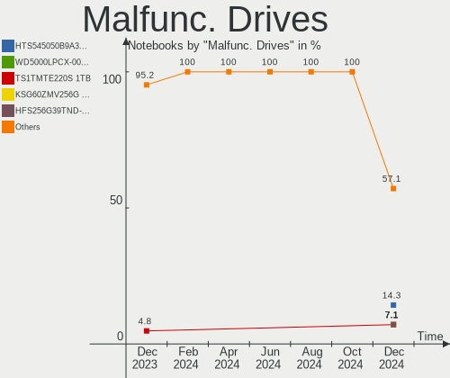
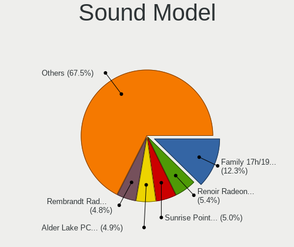
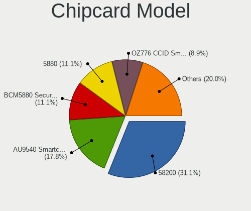

Ubuntu Hardware Trends (Notebooks)
----------------------------------

A project to identify most popular hardware characteristics and track their change
over time based on data collected by Ubuntu users at https://Linux-Hardware.org.

Anyone can contribute to this report by the [hw-probe](https://github.com/linuxhw/hw-probe) tool:

    sudo -E hw-probe -all -upload

Full-feature report is available here: https://linux-hardware.org/?view=trends&formfactor=notebook

Period: Sep, 2021.

Contents
--------

* [ System ](#system)
  - [ OS                       ](#os)
  - [ OS Family                ](#os-family)
  - [ Kernel                   ](#kernel)
  - [ Kernel Family            ](#kernel-family)
  - [ Kernel Major Ver.        ](#kernel-major-ver)
  - [ Arch                     ](#arch)
  - [ DE                       ](#de)
  - [ Display Server           ](#display-server)
  - [ Display Manager          ](#display-manager)
  - [ OS Lang                  ](#os-lang)
  - [ Boot Mode                ](#boot-mode)
  - [ Filesystem               ](#filesystem)
  - [ Part. scheme             ](#part-scheme)
  - [ Dual Boot with Linux/BSD ](#dual-boot-with-linuxbsd)
  - [ Dual Boot (Win)          ](#dual-boot-win)

* [ Board ](#board)
  - [ Vendor                   ](#vendor)
  - [ Model                    ](#model)
  - [ Model Family             ](#model-family)
  - [ MFG Year                 ](#mfg-year)
  - [ Form Factor              ](#form-factor)
  - [ Secure Boot              ](#secure-boot)
  - [ Coreboot                 ](#coreboot)
  - [ RAM Size                 ](#ram-size)
  - [ RAM Used                 ](#ram-used)
  - [ Total Drives             ](#total-drives)
  - [ Has CD-ROM               ](#has-cd-rom)
  - [ Has Ethernet             ](#has-ethernet)
  - [ Has WiFi                 ](#has-wifi)
  - [ Has Bluetooth            ](#has-bluetooth)

* [ Location ](#location)
  - [ Country                  ](#country)
  - [ City                     ](#city)

* [ Drives ](#drives)
  - [ Drive Vendor             ](#drive-vendor)
  - [ Drive Model              ](#drive-model)
  - [ HDD Vendor               ](#hdd-vendor)
  - [ SSD Vendor               ](#ssd-vendor)
  - [ Drive Kind               ](#drive-kind)
  - [ Drive Connector          ](#drive-connector)
  - [ Drive Size               ](#drive-size)
  - [ Space Total              ](#space-total)
  - [ Space Used               ](#space-used)
  - [ Malfunc. Drives          ](#malfunc-drives)
  - [ Malfunc. Drive Vendor    ](#malfunc-drive-vendor)
  - [ Malfunc. HDD Vendor      ](#malfunc-hdd-vendor)
  - [ Malfunc. Drive Kind      ](#malfunc-drive-kind)
  - [ Failed Drives            ](#failed-drives)
  - [ Failed Drive Vendor      ](#failed-drive-vendor)
  - [ Drive Status             ](#drive-status)

* [ Storage controller ](#storage-controller)
  - [ Storage Vendor           ](#storage-vendor)
  - [ Storage Model            ](#storage-model)
  - [ Storage Kind             ](#storage-kind)

* [ Processor ](#processor)
  - [ CPU Vendor               ](#cpu-vendor)
  - [ CPU Model                ](#cpu-model)
  - [ CPU Model Family         ](#cpu-model-family)
  - [ CPU Cores                ](#cpu-cores)
  - [ CPU Sockets              ](#cpu-sockets)
  - [ CPU Threads              ](#cpu-threads)
  - [ CPU Op-Modes             ](#cpu-op-modes)
  - [ CPU Microcode            ](#cpu-microcode)
  - [ CPU Microarch            ](#cpu-microarch)

* [ Graphics ](#graphics)
  - [ GPU Vendor               ](#gpu-vendor)
  - [ GPU Model                ](#gpu-model)
  - [ GPU Combo                ](#gpu-combo)
  - [ GPU Driver               ](#gpu-driver)
  - [ GPU Memory               ](#gpu-memory)

* [ Monitor ](#monitor)
  - [ Monitor Vendor           ](#monitor-vendor)
  - [ Monitor Model            ](#monitor-model)
  - [ Monitor Resolution       ](#monitor-resolution)
  - [ Monitor Diagonal         ](#monitor-diagonal)
  - [ Monitor Width            ](#monitor-width)
  - [ Aspect Ratio             ](#aspect-ratio)
  - [ Monitor Area             ](#monitor-area)
  - [ Pixel Density            ](#pixel-density)
  - [ Multiple Monitors        ](#multiple-monitors)

* [ Network ](#network)
  - [ Net Controller Vendor    ](#net-controller-vendor)
  - [ Net Controller Model     ](#net-controller-model)
  - [ Wireless Vendor          ](#wireless-vendor)
  - [ Wireless Model           ](#wireless-model)
  - [ Ethernet Vendor          ](#ethernet-vendor)
  - [ Ethernet Model           ](#ethernet-model)
  - [ Net Controller Kind      ](#net-controller-kind)
  - [ Used Controller          ](#used-controller)
  - [ NICs                     ](#nics)
  - [ IPv6                     ](#ipv6)

* [ Bluetooth ](#bluetooth)
  - [ Bluetooth Vendor         ](#bluetooth-vendor)
  - [ Bluetooth Model          ](#bluetooth-model)

* [ Sound ](#sound)
  - [ Sound Vendor             ](#sound-vendor)
  - [ Sound Model              ](#sound-model)

* [ Memory ](#memory)
  - [ Memory Vendor            ](#memory-vendor)
  - [ Memory Model             ](#memory-model)
  - [ Memory Kind              ](#memory-kind)
  - [ Memory Form Factor       ](#memory-form-factor)
  - [ Memory Size              ](#memory-size)
  - [ Memory Speed             ](#memory-speed)

* [ Printers & scanners ](#printers--scanners)
  - [ Printer Vendor           ](#printer-vendor)
  - [ Printer Model            ](#printer-model)
  - [ Scanner Vendor           ](#scanner-vendor)
  - [ Scanner Model            ](#scanner-model)

* [ Camera ](#camera)
  - [ Camera Vendor            ](#camera-vendor)
  - [ Camera Model             ](#camera-model)

* [ Security ](#security)
  - [ Fingerprint Vendor       ](#fingerprint-vendor)
  - [ Fingerprint Model        ](#fingerprint-model)
  - [ Chipcard Vendor          ](#chipcard-vendor)
  - [ Chipcard Model           ](#chipcard-model)

* [ Unsupported ](#unsupported)
  - [ Unsupported Devices      ](#unsupported-devices)
  - [ Unsupported Device Types ](#unsupported-device-types)

System
------

OS
--

Installed operating systems

| Name           | Notebooks | Percent |
|----------------|-----------|---------|
| Ubuntu 20.04   | 475       | 65.16%  |
| Ubuntu 21.04   | 167       | 22.91%  |
| Ubuntu 18.04   | 40        | 5.49%   |
| Ubuntu 21.10   | 19        | 2.61%   |
| Ubuntu 20.10   | 12        | 1.65%   |
| Ubuntu 16.04   | 7         | 0.96%   |
| Ubuntu         | 4         | 0.55%   |
| Ubuntu 19.04   | 3         | 0.41%   |
| Ubuntu Core 18 | 1         | 0.14%   |
| Ubuntu Core 16 | 1         | 0.14%   |

OS Family
---------

OS without a version

| Name   | Notebooks | Percent |
|--------|-----------|---------|
| Ubuntu | 729       | 100%    |

Kernel
------

Version of the Linux kernel

| Version                  | Notebooks | Percent |
|--------------------------|-----------|---------|
| 5.11.0-34-generic        | 231       | 31.69%  |
| 5.11.0-27-generic        | 127       | 17.42%  |
| 5.11.0-36-generic        | 86        | 11.8%   |
| 5.11.0-37-generic        | 40        | 5.49%   |
| 5.11.0-31-generic        | 35        | 4.8%    |
| 5.4.0-84-generic         | 30        | 4.12%   |
| 5.4.0-81-generic         | 30        | 4.12%   |
| 5.13.0-16-generic        | 10        | 1.37%   |
| 5.4.0-86-generic         | 9         | 1.23%   |
| 5.8.0-63-generic         | 8         | 1.1%    |
| 5.13.0-14-generic        | 8         | 1.1%    |
| 5.11.0-16-generic        | 8         | 1.1%    |
| 5.11.0-35-generic        | 7         | 0.96%   |
| 5.10.0-1045-oem          | 6         | 0.82%   |
| 5.8.0-43-generic         | 5         | 0.69%   |
| 5.4.0-87-generic         | 4         | 0.55%   |
| 5.8.0-25-generic         | 3         | 0.41%   |
| 5.4.0-42-generic         | 3         | 0.41%   |
| 5.11.0-25-generic        | 3         | 0.41%   |
| 4.15.0-142-generic       | 3         | 0.41%   |
| 5.8.0-55-generic         | 2         | 0.27%   |
| 5.4.0-80-generic         | 2         | 0.27%   |
| 5.4.0-26-generic         | 2         | 0.27%   |
| 5.14.8-051408-generic    | 2         | 0.27%   |
| 5.14.0-051400-generic    | 2         | 0.27%   |
| 5.13.12-051312-generic   | 2         | 0.27%   |
| 5.11.0-7620-generic      | 2         | 0.27%   |
| 5.11.0-22-generic        | 2         | 0.27%   |
| 5.10.0-1044-oem          | 2         | 0.27%   |
| 5.0.0-13-generic         | 2         | 0.27%   |
| 4.15.0-154-generic       | 2         | 0.27%   |
| 5.8.18-050818-generic    | 1         | 0.14%   |
| 5.8.0-64-generic         | 1         | 0.14%   |
| 5.8.0-59-generic         | 1         | 0.14%   |
| 5.8.0-56-generic         | 1         | 0.14%   |
| 5.8.0-53-generic         | 1         | 0.14%   |
| 5.8.0-50-generic         | 1         | 0.14%   |
| 5.8.0-44-generic         | 1         | 0.14%   |
| 5.6.4-050604-generic     | 1         | 0.14%   |
| 5.5.19-bp0               | 1         | 0.14%   |
| 5.5.11-050511-generic    | 1         | 0.14%   |
| 5.4.0-88-generic         | 1         | 0.14%   |
| 5.4.0-72-generic         | 1         | 0.14%   |
| 5.4.0-58-generic         | 1         | 0.14%   |
| 5.4.0-56-generic         | 1         | 0.14%   |
| 5.4.0-53-generic         | 1         | 0.14%   |
| 5.4.0-52-generic         | 1         | 0.14%   |
| 5.4.0-45-generic         | 1         | 0.14%   |
| 5.4.0-050400-generic     | 1         | 0.14%   |
| 5.3.0-51-generic         | 1         | 0.14%   |
| 5.3.0-45-generic         | 1         | 0.14%   |
| 5.3.0-42-generic         | 1         | 0.14%   |
| 5.14.3-051403-generic    | 1         | 0.14%   |
| 5.14.1-051401-generic    | 1         | 0.14%   |
| 5.14.0-051400rc7-generic | 1         | 0.14%   |
| 5.13.15-t2-j-mojave      | 1         | 0.14%   |
| 5.13.0-7614-generic      | 1         | 0.14%   |
| 5.13.0-1012-oem          | 1         | 0.14%   |
| 5.12.18-amd64-desktop    | 1         | 0.14%   |
| 5.11.0-38-generic        | 1         | 0.14%   |

Kernel Family
-------------

Linux kernel without a distro release

| Version | Notebooks | Percent |
|---------|-----------|---------|
| 5.11.0  | 546       | 74.9%   |
| 5.4.0   | 88        | 12.07%  |
| 5.8.0   | 24        | 3.29%   |
| 5.13.0  | 20        | 2.74%   |
| 5.10.0  | 11        | 1.51%   |
| 4.15.0  | 11        | 1.51%   |
| 5.3.0   | 3         | 0.41%   |
| 5.14.0  | 3         | 0.41%   |
| 5.0.0   | 3         | 0.41%   |
| 4.4.0   | 3         | 0.41%   |
| 5.14.8  | 2         | 0.27%   |
| 5.13.12 | 2         | 0.27%   |
| 5.10.52 | 2         | 0.27%   |
| 5.8.18  | 1         | 0.14%   |
| 5.6.4   | 1         | 0.14%   |
| 5.5.19  | 1         | 0.14%   |
| 5.5.11  | 1         | 0.14%   |
| 5.14.3  | 1         | 0.14%   |
| 5.14.1  | 1         | 0.14%   |
| 5.13.15 | 1         | 0.14%   |
| 5.12.18 | 1         | 0.14%   |
| 5.10.61 | 1         | 0.14%   |
| 4.18.0  | 1         | 0.14%   |
| 4.17.19 | 1         | 0.14%   |

Kernel Major Ver.
-----------------

Linux kernel major version

| Version | Notebooks | Percent |
|---------|-----------|---------|
| 5.11    | 546       | 74.9%   |
| 5.4     | 88        | 12.07%  |
| 5.8     | 25        | 3.43%   |
| 5.13    | 23        | 3.16%   |
| 5.10    | 14        | 1.92%   |
| 4.15    | 11        | 1.51%   |
| 5.14    | 7         | 0.96%   |
| 5.3     | 3         | 0.41%   |
| 5.0     | 3         | 0.41%   |
| 4.4     | 3         | 0.41%   |
| 5.5     | 2         | 0.27%   |
| 5.6     | 1         | 0.14%   |
| 5.12    | 1         | 0.14%   |
| 4.18    | 1         | 0.14%   |
| 4.17    | 1         | 0.14%   |

Arch
----

OS architecture (x86_64, i586, etc.)

| Name   | Notebooks | Percent |
|--------|-----------|---------|
| x86_64 | 724       | 99.31%  |
| i686   | 5         | 0.69%   |

DE
--

Desktop Environment

| Name            | Notebooks | Percent |
|-----------------|-----------|---------|
| GNOME           | 663       | 90.95%  |
| Unknown         | 40        | 5.49%   |
| Unity           | 8         | 1.1%    |
| GNOME Flashback | 5         | 0.69%   |
| Cinnamon        | 5         | 0.69%   |
| X-Cinnamon      | 4         | 0.55%   |
| Deepin          | 2         | 0.27%   |
| sway            | 1         | 0.14%   |
| i3              | 1         | 0.14%   |

Display Server
--------------

X11 or Wayland

| Name    | Notebooks | Percent |
|---------|-----------|---------|
| X11     | 551       | 75.58%  |
| Wayland | 157       | 21.54%  |
| Unknown | 17        | 2.33%   |
| Tty     | 4         | 0.55%   |

Display Manager
---------------

SDDM, LightDM, etc.

| Name    | Notebooks | Percent |
|---------|-----------|---------|
| Unknown | 345       | 47.33%  |
| GDM     | 263       | 36.08%  |
| GDM3    | 109       | 14.95%  |
| LightDM | 10        | 1.37%   |
| SDDM    | 2         | 0.27%   |

OS Lang
-------

Language

| Lang    | Notebooks | Percent |
|---------|-----------|---------|
| en_US   | 302       | 41.43%  |
| fr_FR   | 65        | 8.92%   |
| de_DE   | 65        | 8.92%   |
| en_IN   | 37        | 5.08%   |
| en_GB   | 32        | 4.39%   |
| pt_BR   | 22        | 3.02%   |
| ru_RU   | 18        | 2.47%   |
| es_ES   | 17        | 2.33%   |
| hu_HU   | 16        | 2.19%   |
| pl_PL   | 15        | 2.06%   |
| it_IT   | 14        | 1.92%   |
| en_CA   | 10        | 1.37%   |
| cs_CZ   | 9         | 1.23%   |
| en_AU   | 8         | 1.1%    |
| nl_NL   | 7         | 0.96%   |
| zh_CN   | 6         | 0.82%   |
| nb_NO   | 5         | 0.69%   |
| es_MX   | 5         | 0.69%   |
| sv_SE   | 4         | 0.55%   |
| ru_UA   | 4         | 0.55%   |
| de_AT   | 4         | 0.55%   |
| C       | 4         | 0.55%   |
| pt_PT   | 3         | 0.41%   |
| ja_JP   | 3         | 0.41%   |
| fr_BE   | 3         | 0.41%   |
| es_CO   | 3         | 0.41%   |
| en_ZA   | 3         | 0.41%   |
| en_SG   | 3         | 0.41%   |
| en_PH   | 3         | 0.41%   |
| Unknown | 3         | 0.41%   |
| sk_SK   | 2         | 0.27%   |
| ko_KR   | 2         | 0.27%   |
| fr_CA   | 2         | 0.27%   |
| fi_FI   | 2         | 0.27%   |
| es_CL   | 2         | 0.27%   |
| es_AR   | 2         | 0.27%   |
| en_NZ   | 2         | 0.27%   |
| en_NG   | 2         | 0.27%   |
| en_IL   | 2         | 0.27%   |
| de_CH   | 2         | 0.27%   |
| da_DK   | 2         | 0.27%   |
| uk_UA   | 1         | 0.14%   |
| tr_TR   | 1         | 0.14%   |
| ro_RO   | 1         | 0.14%   |
| id_ID   | 1         | 0.14%   |
| hr_HR   | 1         | 0.14%   |
| fr_LU   | 1         | 0.14%   |
| es_UY   | 1         | 0.14%   |
| es_PR   | 1         | 0.14%   |
| es_PA   | 1         | 0.14%   |
| es_CU   | 1         | 0.14%   |
| es_CR   | 1         | 0.14%   |
| en_ZM   | 1         | 0.14%   |
| ca_ES   | 1         | 0.14%   |
| ar_SA   | 1         | 0.14%   |

Boot Mode
---------

EFI or BIOS

| Mode | Notebooks | Percent |
|------|-----------|---------|
| EFI  | 404       | 55.42%  |
| BIOS | 325       | 44.58%  |

Filesystem
----------

Type of filesystem

| Type    | Notebooks | Percent |
|---------|-----------|---------|
| Ext4    | 686       | 94.1%   |
| Overlay | 15        | 2.06%   |
| Zfs     | 13        | 1.78%   |
| Btrfs   | 7         | 0.96%   |
| Xfs     | 3         | 0.41%   |
| Ext3    | 3         | 0.41%   |
| Ext2    | 1         | 0.14%   |
| Aufs    | 1         | 0.14%   |

Part. scheme
------------

Scheme of partitioning

| Type    | Notebooks | Percent |
|---------|-----------|---------|
| Unknown | 451       | 61.87%  |
| GPT     | 237       | 32.51%  |
| MBR     | 41        | 5.62%   |

Dual Boot with Linux/BSD
------------------------

Hosting more than one Linux/BSD

| Dual boot | Notebooks | Percent |
|-----------|-----------|---------|
| No        | 670       | 91.91%  |
| Yes       | 59        | 8.09%   |

Dual Boot (Win)
---------------

Hosting Linux and Windows

| Dual boot | Notebooks | Percent |
|-----------|-----------|---------|
| No        | 469       | 64.33%  |
| Yes       | 260       | 35.67%  |

Board
-----

Vendor
------

Motherboard manufacturer

| Name                             | Notebooks | Percent |
|----------------------------------|-----------|---------|
| Dell                             | 152       | 20.85%  |
| Lenovo                           | 145       | 19.89%  |
| Hewlett-Packard                  | 119       | 16.32%  |
| ASUSTek Computer                 | 73        | 10.01%  |
| Acer                             | 72        | 9.88%   |
| Toshiba                          | 27        | 3.7%    |
| Apple                            | 22        | 3.02%   |
| MSI                              | 16        | 2.19%   |
| Sony                             | 12        | 1.65%   |
| Samsung Electronics              | 7         | 0.96%   |
| TUXEDO                           | 6         | 0.82%   |
| Notebook                         | 6         | 0.82%   |
| Fujitsu                          | 6         | 0.82%   |
| Timi                             | 5         | 0.69%   |
| Unknown                          | 5         | 0.69%   |
| Packard Bell                     | 4         | 0.55%   |
| HUAWEI                           | 4         | 0.55%   |
| Positivo                         | 3         | 0.41%   |
| Medion                           | 3         | 0.41%   |
| Intel                            | 3         | 0.41%   |
| HONOR                            | 3         | 0.41%   |
| Gigabyte Technology              | 3         | 0.41%   |
| Clevo                            | 3         | 0.41%   |
| Alienware                        | 3         | 0.41%   |
| Panasonic                        | 2         | 0.27%   |
| Google                           | 2         | 0.27%   |
| Gateway                          | 2         | 0.27%   |
| Wortmann AG                      | 1         | 0.14%   |
| VIT                              | 1         | 0.14%   |
| TrekStor                         | 1         | 0.14%   |
| Thomson                          | 1         | 0.14%   |
| Terrans Force                    | 1         | 0.14%   |
| System76                         | 1         | 0.14%   |
| SLIMBOOK                         | 1         | 0.14%   |
| Schenker                         | 1         | 0.14%   |
| ONE-NETBOOK TECHNOLOGY           | 1         | 0.14%   |
| Minix                            | 1         | 0.14%   |
| Linx                             | 1         | 0.14%   |
| LG Electronics                   | 1         | 0.14%   |
| IP3 Tech                         | 1         | 0.14%   |
| HANSUNG COMPUTER                 | 1         | 0.14%   |
| Haitech                          | 1         | 0.14%   |
| Haier                            | 1         | 0.14%   |
| GPD                              | 1         | 0.14%   |
| FUJITSU CLIENT COMPUTING LIMITED | 1         | 0.14%   |
| Exo                              | 1         | 0.14%   |
| ECS                              | 1         | 0.14%   |
| Advance                          | 1         | 0.14%   |

Model
-----

Motherboard model

| Name                                | Notebooks | Percent |
|-------------------------------------|-----------|---------|
| Lenovo ThinkPad T400 2768WGB        | 5         | 0.69%   |
| HP Pavilion dv7                     | 5         | 0.69%   |
| Unknown                             | 5         | 0.69%   |
| HP EliteBook 845 G7 Notebook PC     | 4         | 0.55%   |
| Dell Latitude E6430                 | 4         | 0.55%   |
| Notebook W54_55SU1,SUW              | 3         | 0.41%   |
| Lenovo IdeaPad 5 15ITL05 82FG       | 3         | 0.41%   |
| HP ProBook 450 G8 Notebook PC       | 3         | 0.41%   |
| HP Pavilion Laptop 15-eg0xxx        | 3         | 0.41%   |
| HP Pavilion dv6                     | 3         | 0.41%   |
| HP EliteBook 840 G6                 | 3         | 0.41%   |
| HP EliteBook 820 G1                 | 3         | 0.41%   |
| HP 15                               | 3         | 0.41%   |
| Dell XPS 15 9570                    | 3         | 0.41%   |
| Dell XPS 15 9510                    | 3         | 0.41%   |
| Dell XPS 15 9500                    | 3         | 0.41%   |
| Dell XPS 15 7590                    | 3         | 0.41%   |
| Dell XPS 13 9370                    | 3         | 0.41%   |
| Dell XPS 13 7390                    | 3         | 0.41%   |
| Dell Latitude 5520                  | 3         | 0.41%   |
| Dell Latitude 5420                  | 3         | 0.41%   |
| ASUS U50Vg                          | 3         | 0.41%   |
| Apple MacBookPro12,1                | 3         | 0.41%   |
| Apple MacBook4,1                    | 3         | 0.41%   |
| Acer Nitro AN515-52                 | 3         | 0.41%   |
| Toshiba Satellite C55-C             | 2         | 0.27%   |
| Timi TM1613                         | 2         | 0.27%   |
| Notebook NL40_50CU                  | 2         | 0.27%   |
| Lenovo Yoga 2 11 20332              | 2         | 0.27%   |
| Lenovo V130-15IKB 81HN              | 2         | 0.27%   |
| Lenovo ThinkBook 15 G2 ITL 20VE     | 2         | 0.27%   |
| Lenovo ThinkBook 14 G2 ITL 20VD     | 2         | 0.27%   |
| Lenovo IdeaPad S145-15IWL 81MV      | 2         | 0.27%   |
| Lenovo IdeaPad 3 14ITL6 82H7        | 2         | 0.27%   |
| Lenovo G500 20236                   | 2         | 0.27%   |
| Lenovo G50-80 80E5                  | 2         | 0.27%   |
| HUAWEI NBLK-WAX9X                   | 2         | 0.27%   |
| HUAWEI MACHC-WAX9                   | 2         | 0.27%   |
| HP ZBook 15 G6                      | 2         | 0.27%   |
| HP ProBook 450 G7                   | 2         | 0.27%   |
| HP Pavilion Gaming Laptop 15-ec2xxx | 2         | 0.27%   |
| HP Notebook                         | 2         | 0.27%   |
| HP Laptop 15s-eq2xxx                | 2         | 0.27%   |
| HP Laptop 15-db0xxx                 | 2         | 0.27%   |
| HP EliteBook 850 G2                 | 2         | 0.27%   |
| HP EliteBook 8440p                  | 2         | 0.27%   |
| HP EliteBook 840 G2                 | 2         | 0.27%   |
| HP EliteBook 745 G2                 | 2         | 0.27%   |
| Dell XPS L702X                      | 2         | 0.27%   |
| Dell XPS 13 9360                    | 2         | 0.27%   |
| Dell XPS 13 9310                    | 2         | 0.27%   |
| Dell XPS 13 9305                    | 2         | 0.27%   |
| Dell Vostro 5402                    | 2         | 0.27%   |
| Dell Vostro 3550                    | 2         | 0.27%   |
| Dell Vostro 3500                    | 2         | 0.27%   |
| Dell Latitude E7470                 | 2         | 0.27%   |
| Dell Latitude E7270                 | 2         | 0.27%   |
| Dell Latitude E6420                 | 2         | 0.27%   |
| Dell Latitude E6410                 | 2         | 0.27%   |
| Dell Latitude E5470                 | 2         | 0.27%   |

Model Family
------------

Motherboard model prefix

| Name                  | Notebooks | Percent |
|-----------------------|-----------|---------|
| Lenovo ThinkPad       | 75        | 10.29%  |
| Dell Latitude         | 61        | 8.37%   |
| Acer Aspire           | 43        | 5.9%    |
| Lenovo IdeaPad        | 35        | 4.8%    |
| Dell XPS              | 31        | 4.25%   |
| Dell Inspiron         | 31        | 4.25%   |
| HP EliteBook          | 30        | 4.12%   |
| HP Pavilion           | 26        | 3.57%   |
| Toshiba Satellite     | 24        | 3.29%   |
| HP ProBook            | 21        | 2.88%   |
| HP Laptop             | 13        | 1.78%   |
| ASUS VivoBook         | 13        | 1.78%   |
| Acer Swift            | 13        | 1.78%   |
| Dell Precision        | 11        | 1.51%   |
| Dell Vostro           | 9         | 1.23%   |
| ASUS ROG              | 8         | 1.1%    |
| Acer Nitro            | 8         | 1.1%    |
| Lenovo ThinkBook      | 6         | 0.82%   |
| Fujitsu LIFEBOOK      | 6         | 0.82%   |
| HP ZBook              | 5         | 0.69%   |
| ASUS ZenBook          | 5         | 0.69%   |
| Unknown               | 5         | 0.69%   |
| Packard Bell EasyNote | 4         | 0.55%   |
| HP 250                | 4         | 0.55%   |
| Notebook W54          | 3         | 0.41%   |
| MSI Modern            | 3         | 0.41%   |
| Lenovo G50-80         | 3         | 0.41%   |
| HP Compaq             | 3         | 0.41%   |
| HP 15                 | 3         | 0.41%   |
| Dell G5               | 3         | 0.41%   |
| Dell G3               | 3         | 0.41%   |
| ASUS U50Vg            | 3         | 0.41%   |
| Apple MacBookPro16    | 3         | 0.41%   |
| Apple MacBookPro12    | 3         | 0.41%   |
| Apple MacBook4        | 3         | 0.41%   |
| Acer Extensa          | 3         | 0.41%   |
| Toshiba TECRA         | 2         | 0.27%   |
| Timi TM1613           | 2         | 0.27%   |
| Notebook NL40         | 2         | 0.27%   |
| MSI Prestige          | 2         | 0.27%   |
| Lenovo Yoga           | 2         | 0.27%   |
| Lenovo V130-15IKB     | 2         | 0.27%   |
| Lenovo Legion         | 2         | 0.27%   |
| Lenovo G500           | 2         | 0.27%   |
| Lenovo G40-70         | 2         | 0.27%   |
| HUAWEI NBLK-WAX9X     | 2         | 0.27%   |
| HUAWEI MACHC-WAX9     | 2         | 0.27%   |
| HP Presario           | 2         | 0.27%   |
| HP Notebook           | 2         | 0.27%   |
| HP ENVY               | 2         | 0.27%   |
| HP 348                | 2         | 0.27%   |
| Gigabyte Sabre        | 2         | 0.27%   |
| ASUS N73SV            | 2         | 0.27%   |
| ASUS GL553VD          | 2         | 0.27%   |
| Apple MacBookPro5     | 2         | 0.27%   |
| Alienware 17          | 2         | 0.27%   |
| Acer TravelMate       | 2         | 0.27%   |
| Wortmann AG 1220679   | 1         | 0.14%   |
| VIT P3400             | 1         | 0.14%   |
| TUXEDO Pulse          | 1         | 0.14%   |

MFG Year
--------

Motherboard manufacture year

| Year    | Notebooks | Percent |
|---------|-----------|---------|
| 2021    | 170       | 23.32%  |
| 2020    | 110       | 15.09%  |
| 2019    | 69        | 9.47%   |
| 2018    | 66        | 9.05%   |
| 2012    | 43        | 5.9%    |
| 2015    | 42        | 5.76%   |
| 2013    | 39        | 5.35%   |
| 2011    | 36        | 4.94%   |
| 2014    | 33        | 4.53%   |
| 2016    | 27        | 3.7%    |
| 2009    | 26        | 3.57%   |
| 2017    | 24        | 3.29%   |
| 2008    | 19        | 2.61%   |
| 2010    | 18        | 2.47%   |
| 2007    | 3         | 0.41%   |
| 2006    | 2         | 0.27%   |
| Unknown | 2         | 0.27%   |

Form Factor
-----------

Physical design of the computer

| Name     | Notebooks | Percent |
|----------|-----------|---------|
| Notebook | 729       | 100%    |

Secure Boot
-----------

Enabled or disabled

| State    | Notebooks | Percent |
|----------|-----------|---------|
| Disabled | 600       | 82.3%   |
| Enabled  | 129       | 17.7%   |

Coreboot
--------

Have coreboot on board

| Used | Notebooks | Percent |
|------|-----------|---------|
| No   | 726       | 99.59%  |
| Yes  | 3         | 0.41%   |

RAM Size
--------

Total RAM memory

| Size in GB  | Notebooks | Percent |
|-------------|-----------|---------|
| 4.01-8.0    | 203       | 27.85%  |
| 3.01-4.0    | 156       | 21.4%   |
| 16.01-24.0  | 150       | 20.58%  |
| 8.01-16.0   | 126       | 17.28%  |
| 32.01-64.0  | 50        | 6.86%   |
| 1.01-2.0    | 22        | 3.02%   |
| 64.01-256.0 | 9         | 1.23%   |
| 24.01-32.0  | 5         | 0.69%   |
| 2.01-3.0    | 5         | 0.69%   |
| 0.51-1.0    | 3         | 0.41%   |

RAM Used
--------

Used RAM memory

| Used GB    | Notebooks | Percent |
|------------|-----------|---------|
| 1.01-2.0   | 268       | 36.76%  |
| 2.01-3.0   | 202       | 27.71%  |
| 4.01-8.0   | 109       | 14.95%  |
| 3.01-4.0   | 91        | 12.48%  |
| 8.01-16.0  | 34        | 4.66%   |
| 0.51-1.0   | 18        | 2.47%   |
| 0.01-0.5   | 4         | 0.55%   |
| 16.01-24.0 | 3         | 0.41%   |

Total Drives
------------

Number of drives on board

| Drives | Notebooks | Percent |
|--------|-----------|---------|
| 1      | 546       | 74.9%   |
| 2      | 161       | 22.09%  |
| 3      | 17        | 2.33%   |
| 0      | 3         | 0.41%   |
| 4      | 2         | 0.27%   |

Has CD-ROM
----------

Has CD-ROM on board

| Presented | Notebooks | Percent |
|-----------|-----------|---------|
| No        | 470       | 64.47%  |
| Yes       | 259       | 35.53%  |

Has Ethernet
------------

Has Ethernet on board

| Presented | Notebooks | Percent |
|-----------|-----------|---------|
| Yes       | 580       | 79.56%  |
| No        | 149       | 20.44%  |

Has WiFi
--------

Has WiFi module

| Presented | Notebooks | Percent |
|-----------|-----------|---------|
| Yes       | 716       | 98.22%  |
| No        | 13        | 1.78%   |

Has Bluetooth
-------------

Has Bluetooth module

| Presented | Notebooks | Percent |
|-----------|-----------|---------|
| Yes       | 603       | 82.72%  |
| No        | 126       | 17.28%  |

Location
--------

Country
-------

Geographic location (country)

| Country      | Notebooks | Percent |
|--------------|-----------|---------|
| USA          | 108       | 14.81%  |
| Germany      | 76        | 10.43%  |
| France       | 68        | 9.33%   |
| India        | 40        | 5.49%   |
| Brazil       | 29        | 3.98%   |
| Poland       | 26        | 3.57%   |
| UK           | 24        | 3.29%   |
| Russia       | 23        | 3.16%   |
| Hungary      | 23        | 3.16%   |
| Italy        | 19        | 2.61%   |
| Canada       | 17        | 2.33%   |
| Spain        | 16        | 2.19%   |
| Netherlands  | 16        | 2.19%   |
| Czechia      | 14        | 1.92%   |
| Austria      | 13        | 1.78%   |
| Australia    | 10        | 1.37%   |
| Ukraine      | 9         | 1.23%   |
| Belgium      | 9         | 1.23%   |
| Sweden       | 8         | 1.1%    |
| Portugal     | 8         | 1.1%    |
| Mexico       | 8         | 1.1%    |
| China        | 7         | 0.96%   |
| Romania      | 6         | 0.82%   |
| Norway       | 6         | 0.82%   |
| Japan        | 6         | 0.82%   |
| Finland      | 6         | 0.82%   |
| Switzerland  | 5         | 0.69%   |
| South Korea  | 5         | 0.69%   |
| South Africa | 5         | 0.69%   |
| Israel       | 5         | 0.69%   |
| Indonesia    | 5         | 0.69%   |
| Turkey       | 4         | 0.55%   |
| Philippines  | 4         | 0.55%   |
| Iran         | 4         | 0.55%   |
| Denmark      | 4         | 0.55%   |
| Argentina    | 4         | 0.55%   |
| Serbia       | 3         | 0.41%   |
| Puerto Rico  | 3         | 0.41%   |
| Nigeria      | 3         | 0.41%   |
| New Zealand  | 3         | 0.41%   |
| Malaysia     | 3         | 0.41%   |
| Luxembourg   | 3         | 0.41%   |
| Colombia     | 3         | 0.41%   |
| Belarus      | 3         | 0.41%   |
| Venezuela    | 2         | 0.27%   |
| Uzbekistan   | 2         | 0.27%   |
| Uruguay      | 2         | 0.27%   |
| Tunisia      | 2         | 0.27%   |
| Taiwan       | 2         | 0.27%   |
| Slovakia     | 2         | 0.27%   |
| Singapore    | 2         | 0.27%   |
| Saudi Arabia | 2         | 0.27%   |
| Peru         | 2         | 0.27%   |
| Pakistan     | 2         | 0.27%   |
| Moldova      | 2         | 0.27%   |
| Kenya        | 2         | 0.27%   |
| Kazakhstan   | 2         | 0.27%   |
| Ireland      | 2         | 0.27%   |
| Greece       | 2         | 0.27%   |
| Ghana        | 2         | 0.27%   |

City
----

Geographic location (city)

| City                      | Notebooks | Percent |
|---------------------------|-----------|---------|
| Paris                     | 17        | 2.33%   |
| Warsaw                    | 10        | 1.37%   |
| Budapest                  | 9         | 1.23%   |
| Tatab??nya                | 7         | 0.96%   |
| Prague                    | 7         | 0.96%   |
| S??o Paulo                | 6         | 0.82%   |
| Munich                    | 6         | 0.82%   |
| Aurec-sur-Loire           | 6         | 0.82%   |
| Vienna                    | 5         | 0.69%   |
| Berlin                    | 5         | 0.69%   |
| Sydney                    | 4         | 0.55%   |
| St Petersburg             | 4         | 0.55%   |
| London                    | 4         | 0.55%   |
| Amsterdam                 | 4         | 0.55%   |
| Thrissur                  | 3         | 0.41%   |
| Tehran                    | 3         | 0.41%   |
| Richmond                  | 3         | 0.41%   |
| Rennes                    | 3         | 0.41%   |
| Poznan                    | 3         | 0.41%   |
| Oslo                      | 3         | 0.41%   |
| Moscow                    | 3         | 0.41%   |
| Montreal                  | 3         | 0.41%   |
| Machhagan                 | 3         | 0.41%   |
| Lahntal                   | 3         | 0.41%   |
| Kyiv                      | 3         | 0.41%   |
| Helsinki                  | 3         | 0.41%   |
| Essen                     | 3         | 0.41%   |
| Delhi                     | 3         | 0.41%   |
| Brussels                  | 3         | 0.41%   |
| Wittlich                  | 2         | 0.27%   |
| Verona                    | 2         | 0.27%   |
| Ulhasnagar                | 2         | 0.27%   |
| Tunis                     | 2         | 0.27%   |
| Troy                      | 2         | 0.27%   |
| Toulouse                  | 2         | 0.27%   |
| Toronto                   | 2         | 0.27%   |
| Tel Aviv                  | 2         | 0.27%   |
| Tashkent                  | 2         | 0.27%   |
| Strasshof an der Nordbahn | 2         | 0.27%   |
| Stockholm                 | 2         | 0.27%   |
| St Louis                  | 2         | 0.27%   |
| St Albans                 | 2         | 0.27%   |
| Sofia                     | 2         | 0.27%   |
| Singapore                 | 2         | 0.27%   |
| Santiago                  | 2         | 0.27%   |
| San Francisco             | 2         | 0.27%   |
| Riyadh                    | 2         | 0.27%   |
| Remscheid                 | 2         | 0.27%   |
| Quezon City               | 2         | 0.27%   |
| Phoenix                   | 2         | 0.27%   |
| P?©cs                     | 2         | 0.27%   |
| Oxford                    | 2         | 0.27%   |
| Oklahoma City             | 2         | 0.27%   |
| O'Fallon                  | 2         | 0.27%   |
| Nicosia                   | 2         | 0.27%   |
| Nantes                    | 2         | 0.27%   |
| Nairobi                   | 2         | 0.27%   |
| Mumbai                    | 2         | 0.27%   |
| Montpellier               | 2         | 0.27%   |
| Montevideo                | 2         | 0.27%   |

Drives
------

Drive Vendor
------------

Hard drive vendors

| Vendor                    | Notebooks | Drives | Percent |
|---------------------------|-----------|--------|---------|
| Samsung Electronics       | 139       | 152    | 16.01%  |
| WDC                       | 117       | 123    | 13.48%  |
| Seagate                   | 100       | 103    | 11.52%  |
| Toshiba                   | 76        | 77     | 8.76%   |
| SK Hynix                  | 52        | 54     | 5.99%   |
| Kingston                  | 51        | 51     | 5.88%   |
| Unknown                   | 45        | 50     | 5.18%   |
| Sandisk                   | 40        | 42     | 4.61%   |
| HGST                      | 29        | 29     | 3.34%   |
| Intel                     | 26        | 27     | 3%      |
| Hitachi                   | 26        | 26     | 3%      |
| Crucial                   | 22        | 22     | 2.53%   |
| Micron Technology         | 21        | 21     | 2.42%   |
| KIOXIA                    | 15        | 18     | 1.73%   |
| Apple                     | 12        | 12     | 1.38%   |
| A-DATA Technology         | 12        | 12     | 1.38%   |
| LITEON                    | 10        | 10     | 1.15%   |
| SPCC                      | 6         | 6      | 0.69%   |
| Phison                    | 5         | 5      | 0.58%   |
| Fujitsu                   | 4         | 5      | 0.46%   |
| ASMT                      | 4         | 5      | 0.46%   |
| Union Memory              | 3         | 3      | 0.35%   |
| Team                      | 3         | 3      | 0.35%   |
| LITEONIT                  | 3         | 3      | 0.35%   |
| JMicron                   | 3         | 3      | 0.35%   |
| GOODRAM                   | 3         | 3      | 0.35%   |
| XPG                       | 2         | 2      | 0.23%   |
| Transcend                 | 2         | 2      | 0.23%   |
| SABRENT                   | 2         | 3      | 0.23%   |
| Lite-On                   | 2         | 2      | 0.23%   |
| KingSpec                  | 2         | 2      | 0.23%   |
| Intenso                   | 2         | 2      | 0.23%   |
| BIWIN                     | 2         | 2      | 0.23%   |
| Biostar                   | 2         | 2      | 0.23%   |
| Vaseky                    | 1         | 1      | 0.12%   |
| Union Memory (Shenzhen)   | 1         | 1      | 0.12%   |
| TYPEC 1T                  | 1         | 1      | 0.12%   |
| TwinMOS                   | 1         | 1      | 0.12%   |
| TO Exter                  | 1         | 1      | 0.12%   |
| SSSTC                     | 1         | 1      | 0.12%   |
| Solid State Storage       | 1         | 1      | 0.12%   |
| Silicon Motion            | 1         | 1      | 0.12%   |
| QUMO                      | 1         | 1      | 0.12%   |
| PNY                       | 1         | 1      | 0.12%   |
| PLEXTOR                   | 1         | 1      | 0.12%   |
| OCZ                       | 1         | 1      | 0.12%   |
| Netac                     | 1         | 1      | 0.12%   |
| Neo                       | 1         | 1      | 0.12%   |
| Micron/Crucial Technology | 1         | 1      | 0.12%   |
| Mass                      | 1         | 1      | 0.12%   |
| INNOVATION IT             | 1         | 1      | 0.12%   |
| HGST HTS                  | 1         | 1      | 0.12%   |
| GLOWAY                    | 1         | 1      | 0.12%   |
| EMTEC                     | 1         | 1      | 0.12%   |
| DOGFISH                   | 1         | 2      | 0.12%   |
| China                     | 1         | 1      | 0.12%   |
| BUFFALO                   | 1         | 1      | 0.12%   |
| AXIOM                     | 1         | 1      | 0.12%   |
| ADATA Technology          | 1         | 1      | 0.12%   |

Drive Model
-----------

Hard drive models

| Model                                   | Notebooks | Percent |
|-----------------------------------------|-----------|---------|
| Unknown MMC Card  32GB                  | 15        | 1.68%   |
| Toshiba MQ01ABD100 1TB                  | 14        | 1.56%   |
| Seagate ST1000LM035-1RK172 1TB          | 14        | 1.56%   |
| Samsung NVMe SSD Drive 512GB            | 13        | 1.45%   |
| Toshiba MQ04ABF100 1TB                  | 11        | 1.23%   |
| Seagate ST500LT012-1DG142 500GB         | 10        | 1.12%   |
| Toshiba MQ01ABF050 500GB                | 9         | 1.01%   |
| SK Hynix NVMe SSD Drive 512GB           | 9         | 1.01%   |
| HGST HTS721010A9E630 1TB                | 9         | 1.01%   |
| Intel NVMe SSD Drive 512GB              | 8         | 0.89%   |
| Seagate ST1000LM024 HN-M101MBB 1TB      | 7         | 0.78%   |
| Sandisk NVMe SSD Drive 256GB            | 7         | 0.78%   |
| Samsung SSD 860 EVO 500GB               | 7         | 0.78%   |
| HGST HTS545050A7E680 500GB              | 7         | 0.78%   |
| Seagate ST9500325AS 500GB               | 6         | 0.67%   |
| Samsung SSD 850 EVO 250GB               | 6         | 0.67%   |
| KIOXIA KBG40ZNV512G 512GB               | 6         | 0.67%   |
| Kingston SA400S37120G 120GB SSD         | 6         | 0.67%   |
| Crucial CT240BX500SSD1 240GB            | 6         | 0.67%   |
| WDC WDS500G2B0A-00SM50 500GB SSD        | 5         | 0.56%   |
| Unknown MMC Card  16GB                  | 5         | 0.56%   |
| Seagate ST500LM021-1KJ152 500GB         | 5         | 0.56%   |
| Sandisk NVMe SSD Drive 512GB            | 5         | 0.56%   |
| Samsung NVMe SSD Drive 256GB            | 5         | 0.56%   |
| Samsung NVMe SSD Drive 1024GB           | 5         | 0.56%   |
| Kingston SA400S37240G 240GB SSD         | 5         | 0.56%   |
| HGST HTS725050A7E630 500GB              | 5         | 0.56%   |
| WDC WD7500BPKT-75PK4T0 752GB            | 4         | 0.45%   |
| WDC WD10SPZX-21Z10T0 1TB                | 4         | 0.45%   |
| WDC PC SN730 SDBQNTY-1T00-1001 1TB      | 4         | 0.45%   |
| Unknown MMC Card  64GB                  | 4         | 0.45%   |
| Toshiba NVMe SSD Drive 512GB            | 4         | 0.45%   |
| SK Hynix HFM512GDJTNI-82A0A 512GB       | 4         | 0.45%   |
| Seagate ST9320423AS 320GB               | 4         | 0.45%   |
| Seagate ST1000LM049-2GH172 1TB          | 4         | 0.45%   |
| Seagate Expansion 1TB                   | 4         | 0.45%   |
| Samsung SSD 860 EVO 250GB               | 4         | 0.45%   |
| Samsung SSD 860 EVO 1TB                 | 4         | 0.45%   |
| Samsung MZALQ512HALU-000L1 512GB        | 4         | 0.45%   |
| Intel SSDPEKNW512G8 512GB               | 4         | 0.45%   |
| Hitachi HTS547550A9E384 500GB           | 4         | 0.45%   |
| WDC WDS240G2G0A-00JH30 240GB SSD        | 3         | 0.34%   |
| WDC WDS120G2G0A-00JH30 120GB SSD        | 3         | 0.34%   |
| WDC WDS100T2B0A-00SM50 1TB SSD          | 3         | 0.34%   |
| WDC WD5000LPCX-60VHAT0 500GB            | 3         | 0.34%   |
| WDC WD5000LPCX-24C6HT0 500GB            | 3         | 0.34%   |
| WDC WD10SPZX-60Z10T0 1TB                | 3         | 0.34%   |
| WDC WD10SPZX-08Z10 1TB                  | 3         | 0.34%   |
| WDC WD10JPVX-60JC3T0 1TB                | 3         | 0.34%   |
| WDC WD10JPVX-22JC3T0 1TB                | 3         | 0.34%   |
| WDC PC SN520 SDAPMUW-256G-1101 256GB    | 3         | 0.34%   |
| Unknown MMC Card  128GB                 | 3         | 0.34%   |
| Union Memory UMIS RPJTJ256MEE1OWX 256GB | 3         | 0.34%   |
| Toshiba KXG60ZNV1T02 NVMe KIOXIA 1024GB | 3         | 0.34%   |
| Toshiba KBG30ZMS128G 128GB NVMe SSD     | 3         | 0.34%   |
| Toshiba HDWJ110 1TB                     | 3         | 0.34%   |
| SK Hynix NVMe SSD Drive 256GB           | 3         | 0.34%   |
| SK Hynix BC511 HFM256GDJTNI-82A0A 256GB | 3         | 0.34%   |
| Seagate ST9500420AS 500GB               | 3         | 0.34%   |
| Seagate ST9320325AS 320GB               | 3         | 0.34%   |

HDD Vendor
----------

Hard disk drive vendors

| Vendor              | Notebooks | Drives | Percent |
|---------------------|-----------|--------|---------|
| Seagate             | 99        | 102    | 35.36%  |
| WDC                 | 61        | 62     | 21.79%  |
| Toshiba             | 49        | 50     | 17.5%   |
| HGST                | 29        | 29     | 10.36%  |
| Hitachi             | 26        | 26     | 9.29%   |
| Samsung Electronics | 5         | 5      | 1.79%   |
| Fujitsu             | 4         | 5      | 1.43%   |
| Unknown             | 2         | 2      | 0.71%   |
| Apple               | 2         | 2      | 0.71%   |
| TO Exter            | 1         | 1      | 0.36%   |
| HGST HTS            | 1         | 1      | 0.36%   |
| ASMT                | 1         | 2      | 0.36%   |

SSD Vendor
----------

Solid state drive vendors

| Vendor              | Notebooks | Drives | Percent |
|---------------------|-----------|--------|---------|
| Samsung Electronics | 65        | 69     | 26%     |
| Kingston            | 28        | 28     | 11.2%   |
| WDC                 | 20        | 21     | 8%      |
| SanDisk             | 20        | 22     | 8%      |
| Crucial             | 20        | 20     | 8%      |
| LITEON              | 10        | 10     | 4%      |
| SK Hynix            | 9         | 9      | 3.6%    |
| A-DATA Technology   | 9         | 9      | 3.6%    |
| Micron Technology   | 8         | 8      | 3.2%    |
| Toshiba             | 7         | 7      | 2.8%    |
| Apple               | 6         | 6      | 2.4%    |
| SPCC                | 5         | 5      | 2%      |
| Intel               | 5         | 5      | 2%      |
| Team                | 3         | 3      | 1.2%    |
| LITEONIT            | 3         | 3      | 1.2%    |
| GOODRAM             | 3         | 3      | 1.2%    |
| ASMT                | 3         | 3      | 1.2%    |
| SABRENT             | 2         | 3      | 0.8%    |
| KingSpec            | 2         | 2      | 0.8%    |
| Intenso             | 2         | 2      | 0.8%    |
| BIWIN               | 2         | 2      | 0.8%    |
| Biostar             | 2         | 2      | 0.8%    |
| Vaseky              | 1         | 1      | 0.4%    |
| TYPEC 1T            | 1         | 1      | 0.4%    |
| TwinMOS             | 1         | 1      | 0.4%    |
| Transcend           | 1         | 1      | 0.4%    |
| Seagate             | 1         | 1      | 0.4%    |
| QUMO                | 1         | 1      | 0.4%    |
| PLEXTOR             | 1         | 1      | 0.4%    |
| OCZ                 | 1         | 1      | 0.4%    |
| Netac               | 1         | 1      | 0.4%    |
| Neo                 | 1         | 1      | 0.4%    |
| INNOVATION IT       | 1         | 1      | 0.4%    |
| GLOWAY              | 1         | 1      | 0.4%    |
| EMTEC               | 1         | 1      | 0.4%    |
| DOGFISH             | 1         | 2      | 0.4%    |
| China               | 1         | 1      | 0.4%    |
| BUFFALO             | 1         | 1      | 0.4%    |

Drive Kind
----------

HDD or SSD

| Kind    | Notebooks | Drives | Percent |
|---------|-----------|--------|---------|
| NVMe    | 283       | 312    | 33.77%  |
| HDD     | 275       | 287    | 32.82%  |
| SSD     | 236       | 259    | 28.16%  |
| MMC     | 37        | 43     | 4.42%   |
| Unknown | 7         | 7      | 0.84%   |

Drive Connector
---------------

SATA, SAS, NVMe, etc.

| Type | Notebooks | Drives | Percent |
|------|-----------|--------|---------|
| SATA | 462       | 524    | 56.97%  |
| NVMe | 283       | 310    | 34.9%   |
| MMC  | 37        | 43     | 4.56%   |
| SAS  | 29        | 31     | 3.58%   |

Drive Size
----------

Size of hard drive

| Size in TB | Notebooks | Drives | Percent |
|------------|-----------|--------|---------|
| 0.01-0.5   | 333       | 355    | 65.42%  |
| 0.51-1.0   | 162       | 177    | 31.83%  |
| 1.01-2.0   | 11        | 11     | 2.16%   |
| 3.01-4.0   | 3         | 3      | 0.59%   |

Space Total
-----------

Amount of disk space available on the file system

| Size in GB     | Notebooks | Percent |
|----------------|-----------|---------|
| 251-500        | 227       | 31.14%  |
| 101-250        | 215       | 29.49%  |
| 501-1000       | 112       | 15.36%  |
| 51-100         | 66        | 9.05%   |
| 21-50          | 36        | 4.94%   |
| 1-20           | 29        | 3.98%   |
| 1001-2000      | 24        | 3.29%   |
| 2001-3000      | 9         | 1.23%   |
| More than 3000 | 8         | 1.1%    |
| Unknown        | 3         | 0.41%   |

Space Used
----------

Amount of used disk space

| Used GB        | Notebooks | Percent |
|----------------|-----------|---------|
| 1-20           | 305       | 41.84%  |
| 21-50          | 148       | 20.3%   |
| 101-250        | 99        | 13.58%  |
| 51-100         | 92        | 12.62%  |
| 251-500        | 46        | 6.31%   |
| 501-1000       | 20        | 2.74%   |
| 1001-2000      | 10        | 1.37%   |
| More than 3000 | 3         | 0.41%   |
| 2001-3000      | 3         | 0.41%   |
| Unknown        | 3         | 0.41%   |

Malfunc. Drives
---------------

Drive models with a malfunction

| Model                                          | Notebooks | Drives | Percent |
|------------------------------------------------|-----------|--------|---------|
| WDC WD3200BEKT-60PVMT0 320GB                   | 1         | 1      | 4%      |
| Toshiba MQ01ABD100 1TB                         | 1         | 1      | 4%      |
| Toshiba MK5055GSX 500GB                        | 1         | 1      | 4%      |
| Toshiba MK3252GSX 320GB                        | 1         | 1      | 4%      |
| SK Hynix HFS256G3AMNB-2200A 256GB SSD          | 1         | 1      | 4%      |
| SK Hynix HFS256G39TND-N210A 256GB SSD          | 1         | 1      | 4%      |
| Seagate ST9320423AS 320GB                      | 1         | 1      | 4%      |
| Seagate ST9250315AS 250GB                      | 1         | 1      | 4%      |
| Seagate ST500LM021-1KJ152 500GB                | 1         | 1      | 4%      |
| Seagate ST500LM012 HN-M500MBB 500GB            | 1         | 1      | 4%      |
| Seagate ST500LM000-1EJ162 500GB                | 1         | 1      | 4%      |
| Seagate ST1000LX015-1U7172 1TB                 | 1         | 1      | 4%      |
| Seagate ST1000LM035-1RK172 1TB                 | 1         | 1      | 4%      |
| Seagate ST1000LM024 HN-M101MBB 1TB             | 1         | 1      | 4%      |
| SanDisk SDSSDHII960G 960GB                     | 1         | 1      | 4%      |
| SanDisk SD7SB3Q128G1002 128GB SSD              | 1         | 1      | 4%      |
| Micron Technology 1100_MTFDDAV256TBN 256GB SSD | 1         | 1      | 4%      |
| Kingston SUV400S37240G 240GB SSD               | 1         | 1      | 4%      |
| Intel SSDSC2KF256H6L 256GB                     | 1         | 1      | 4%      |
| Intel SSDPEKKF256G7L 256GB                     | 1         | 1      | 4%      |
| Hitachi HTS547550A9E384 500GB                  | 1         | 1      | 4%      |
| Hitachi HTS542516K9SA00 160GB                  | 1         | 1      | 4%      |
| HGST HTS545050A7E380 500GB                     | 1         | 1      | 4%      |
| HGST HTS541010A9E680 1TB                       | 1         | 1      | 4%      |
| A-DATA Technology SU800NS38 512GB SSD          | 1         | 1      | 4%      |

Malfunc. Drive Vendor
---------------------

Vendors of faulty drives

| Vendor            | Notebooks | Drives | Percent |
|-------------------|-----------|--------|---------|
| Seagate           | 8         | 8      | 32%     |
| Toshiba           | 3         | 3      | 12%     |
| SK Hynix          | 2         | 2      | 8%      |
| SanDisk           | 2         | 2      | 8%      |
| Intel             | 2         | 2      | 8%      |
| Hitachi           | 2         | 2      | 8%      |
| HGST              | 2         | 2      | 8%      |
| WDC               | 1         | 1      | 4%      |
| Micron Technology | 1         | 1      | 4%      |
| Kingston          | 1         | 1      | 4%      |
| A-DATA Technology | 1         | 1      | 4%      |

Malfunc. HDD Vendor
-------------------

Vendors of faulty HDD drives

| Vendor  | Notebooks | Drives | Percent |
|---------|-----------|--------|---------|
| Seagate | 8         | 8      | 50%     |
| Toshiba | 3         | 3      | 18.75%  |
| Hitachi | 2         | 2      | 12.5%   |
| HGST    | 2         | 2      | 12.5%   |
| WDC     | 1         | 1      | 6.25%   |

Malfunc. Drive Kind
-------------------

Kinds of faulty drives

| Kind | Notebooks | Drives | Percent |
|------|-----------|--------|---------|
| HDD  | 15        | 16     | 62.5%   |
| SSD  | 8         | 8      | 33.33%  |
| NVMe | 1         | 1      | 4.17%   |

Failed Drives
-------------

Failed drive models

Zero info for selected period =(

Failed Drive Vendor
-------------------

Failed drive vendors

Zero info for selected period =(

Drive Status
------------

Number of failed and malfunc. drives

| Status   | Notebooks | Drives | Percent |
|----------|-----------|--------|---------|
| Detected | 447       | 547    | 59.13%  |
| Works    | 285       | 336    | 37.7%   |
| Malfunc  | 24        | 25     | 3.17%   |

Storage controller
------------------

Storage Vendor
--------------

Storage controller vendors

| Vendor                         | Notebooks | Percent |
|--------------------------------|-----------|---------|
| Intel                          | 539       | 60.84%  |
| Samsung Electronics            | 74        | 8.35%   |
| AMD                            | 62        | 7%      |
| Sandisk                        | 59        | 6.66%   |
| SK Hynix                       | 43        | 4.85%   |
| Kingston Technology Company    | 23        | 2.6%    |
| Toshiba America Info Systems   | 20        | 2.26%   |
| KIOXIA                         | 15        | 1.69%   |
| Micron Technology              | 13        | 1.47%   |
| Phison Electronics             | 7         | 0.79%   |
| ADATA Technology               | 6         | 0.68%   |
| Nvidia                         | 5         | 0.56%   |
| Union Memory (Shenzhen)        | 4         | 0.45%   |
| Apple                          | 4         | 0.45%   |
| Solid State Storage Technology | 3         | 0.34%   |
| Micron/Crucial Technology      | 3         | 0.34%   |
| Silicon Motion                 | 2         | 0.23%   |
| Lite-On Technology             | 2         | 0.23%   |
| Unknown                        | 1         | 0.11%   |
| JMicron Technology             | 1         | 0.11%   |

Storage Model
-------------

Storage controller models

| Model                                                                            | Notebooks | Percent |
|----------------------------------------------------------------------------------|-----------|---------|
| Intel Sunrise Point-LP SATA Controller [AHCI mode]                               | 59        | 6.26%   |
| AMD FCH SATA Controller [AHCI mode]                                              | 58        | 6.16%   |
| Intel 7 Series Chipset Family 6-port SATA Controller [AHCI mode]                 | 55        | 5.84%   |
| Intel 82801 Mobile SATA Controller [RAID mode]                                   | 52        | 5.52%   |
| Intel Volume Management Device NVMe RAID Controller                              | 39        | 4.14%   |
| Intel 6 Series/C200 Series Chipset Family 6 port Mobile SATA AHCI Controller     | 39        | 4.14%   |
| Intel Cannon Lake Mobile PCH SATA AHCI Controller                                | 33        | 3.5%    |
| Samsung NVMe SSD Controller SM981/PM981/PM983                                    | 30        | 3.18%   |
| Intel 82801IBM/IEM (ICH9M/ICH9M-E) 4 port SATA Controller [AHCI mode]            | 29        | 3.08%   |
| Samsung NVMe SSD Controller 980                                                  | 28        | 2.97%   |
| Intel Wildcat Point-LP SATA Controller [AHCI Mode]                               | 24        | 2.55%   |
| Intel 8 Series SATA Controller 1 [AHCI mode]                                     | 22        | 2.34%   |
| Intel Tiger Lake-LP SATA Controller [AHCI mode]                                  | 18        | 1.91%   |
| Intel HM170/QM170 Chipset SATA Controller [AHCI Mode]                            | 18        | 1.91%   |
| Sandisk WD Black SN750 / PC SN730 NVMe SSD                                       | 17        | 1.8%    |
| Intel Atom Processor E3800 Series SATA AHCI Controller                           | 17        | 1.8%    |
| Intel 5 Series/3400 Series Chipset 4 port SATA AHCI Controller                   | 16        | 1.7%    |
| Intel Comet Lake SATA AHCI Controller                                            | 15        | 1.59%   |
| Intel 8 Series/C220 Series Chipset Family 6-port SATA Controller 1 [AHCI mode]   | 15        | 1.59%   |
| KIOXIA Non-Volatile memory controller                                            | 14        | 1.49%   |
| SK Hynix BC511                                                                   | 13        | 1.38%   |
| Sandisk WD Blue SN550 NVMe SSD                                                   | 13        | 1.38%   |
| Micron Non-Volatile memory controller                                            | 13        | 1.38%   |
| Intel SSD 660P Series                                                            | 13        | 1.38%   |
| Intel 82801HM/HEM (ICH8M/ICH8M-E) IDE Controller                                 | 12        | 1.27%   |
| Toshiba America Info Systems XG6 NVMe SSD Controller                             | 11        | 1.17%   |
| Intel Cannon Point-LP SATA Controller [AHCI Mode]                                | 11        | 1.17%   |
| SK Hynix Gold P31 SSD                                                            | 10        | 1.06%   |
| Intel 82801HM/HEM (ICH8M/ICH8M-E) SATA Controller [AHCI mode]                    | 10        | 1.06%   |
| Intel 5 Series/3400 Series Chipset 6 port SATA AHCI Controller                   | 10        | 1.06%   |
| Sandisk WD Blue SN500 / PC SN520 NVMe SSD                                        | 9         | 0.96%   |
| Kingston Company Company Non-Volatile memory controller                          | 9         | 0.96%   |
| Intel Ice Lake-LP SATA Controller [AHCI mode]                                    | 9         | 0.96%   |
| SK Hynix BC501 NVMe Solid State Drive                                            | 8         | 0.85%   |
| Sandisk Non-Volatile memory controller                                           | 8         | 0.85%   |
| Samsung NVMe SSD Controller PM9A1/PM9A3/980PRO                                   | 8         | 0.85%   |
| Kingston Company U-SNS8154P3 NVMe SSD                                            | 8         | 0.85%   |
| SK Hynix Non-Volatile memory controller                                          | 7         | 0.74%   |
| Intel Celeron/Pentium Silver Processor SATA Controller                           | 7         | 0.74%   |
| Sandisk PC SN520 NVMe SSD                                                        | 6         | 0.64%   |
| Intel Celeron N3350/Pentium N4200/Atom E3900 Series SATA AHCI Controller         | 6         | 0.64%   |
| Toshiba America Info Systems Toshiba America Info Non-Volatile memory controller | 5         | 0.53%   |
| Intel Atom/Celeron/Pentium Processor x5-E8000/J3xxx/N3xxx Series SATA Controller | 5         | 0.53%   |
| Intel 82801GBM/GHM (ICH7-M Family) SATA Controller [IDE mode]                    | 5         | 0.53%   |
| Intel 5 Series/3400 Series Chipset 4 port SATA IDE Controller                    | 5         | 0.53%   |
| Union Memory (Shenzhen) Non-Volatile memory controller                           | 4         | 0.42%   |
| Samsung Electronics SATA controller                                              | 4         | 0.42%   |
| Intel Q170/Q150/B150/H170/H110/Z170/CM236 Chipset SATA Controller [AHCI Mode]    | 4         | 0.42%   |
| Intel Non-Volatile memory controller                                             | 4         | 0.42%   |
| Intel 82801IBM/IEM (ICH9M/ICH9M-E) 2 port SATA Controller [IDE mode]             | 4         | 0.42%   |
| Intel 5 Series/3400 Series Chipset 2 port SATA IDE Controller                    | 4         | 0.42%   |
| Apple ANS2 NVMe Controller                                                       | 4         | 0.42%   |
| ADATA Non-Volatile memory controller                                             | 4         | 0.42%   |
| Toshiba America Info Systems XG4 NVMe SSD Controller                             | 3         | 0.32%   |
| Solid State Storage Non-Volatile memory controller                               | 3         | 0.32%   |
| SK Hynix PC401 NVMe Solid State Drive 256GB                                      | 3         | 0.32%   |
| Sandisk WD Black SN850                                                           | 3         | 0.32%   |
| Sandisk WD Black 2018/SN750 / PC SN720 NVMe SSD                                  | 3         | 0.32%   |
| Samsung NVMe SSD Controller SM951/PM951                                          | 3         | 0.32%   |
| Phison PS5013 E13 NVMe Controller                                                | 3         | 0.32%   |

Storage Kind
------------

Kind of storage controller (IDE, SATA, NVMe, SAS, ...)

| Kind | Notebooks | Percent |
|------|-----------|---------|
| SATA | 500       | 54.59%  |
| NVMe | 283       | 30.9%   |
| RAID | 94        | 10.26%  |
| IDE  | 39        | 4.26%   |

Processor
---------

CPU Vendor
----------

Processor vendors

| Vendor | Notebooks | Percent |
|--------|-----------|---------|
| Intel  | 636       | 87.24%  |
| AMD    | 93        | 12.76%  |

CPU Model
---------

Processor models

| Model                                         | Notebooks | Percent |
|-----------------------------------------------|-----------|---------|
| Intel 11th Gen Core i7-1165G7 @ 2.80GHz       | 23        | 3.16%   |
| Intel 11th Gen Core i5-1135G7 @ 2.40GHz       | 17        | 2.33%   |
| Intel Core i7-8750H CPU @ 2.20GHz             | 13        | 1.78%   |
| Intel Core i5-8250U CPU @ 1.60GHz             | 13        | 1.78%   |
| Intel Core i5-7200U CPU @ 2.50GHz             | 13        | 1.78%   |
| Intel Core i7-8565U CPU @ 1.80GHz             | 12        | 1.65%   |
| Intel Core i5-10210U CPU @ 1.60GHz            | 12        | 1.65%   |
| Intel Core i7-9750H CPU @ 2.60GHz             | 11        | 1.51%   |
| Intel Core i5-3210M CPU @ 2.50GHz             | 11        | 1.51%   |
| Intel Core i7-7700HQ CPU @ 2.80GHz            | 10        | 1.37%   |
| Intel Core i5-8265U CPU @ 1.60GHz             | 10        | 1.37%   |
| Intel Core i5-6200U CPU @ 2.30GHz             | 10        | 1.37%   |
| Intel 11th Gen Core i7-1185G7 @ 3.00GHz       | 10        | 1.37%   |
| Intel Core i5-1035G1 CPU @ 1.00GHz            | 9         | 1.23%   |
| Intel Core i7-8550U CPU @ 1.80GHz             | 8         | 1.1%    |
| Intel Core i7-10510U CPU @ 1.80GHz            | 8         | 1.1%    |
| Intel 11th Gen Core i7-11800H @ 2.30GHz       | 8         | 1.1%    |
| AMD Ryzen 5 3500U with Radeon Vega Mobile Gfx | 8         | 1.1%    |
| Intel Core i5-5300U CPU @ 2.30GHz             | 7         | 0.96%   |
| Intel Core i3-5005U CPU @ 2.00GHz             | 7         | 0.96%   |
| Intel Core 2 Duo CPU P8700 @ 2.53GHz          | 7         | 0.96%   |
| Intel Core 2 Duo CPU P8600 @ 2.40GHz          | 7         | 0.96%   |
| AMD Ryzen 7 PRO 4750U with Radeon Graphics    | 7         | 0.96%   |
| AMD Ryzen 5 5500U with Radeon Graphics        | 7         | 0.96%   |
| Intel Core i7-6600U CPU @ 2.60GHz             | 6         | 0.82%   |
| Intel Core i7-2630QM CPU @ 2.00GHz            | 6         | 0.82%   |
| Intel Core i5-5200U CPU @ 2.20GHz             | 6         | 0.82%   |
| Intel Core i5-4300U CPU @ 1.90GHz             | 6         | 0.82%   |
| Intel Core i5-2520M CPU @ 2.50GHz             | 6         | 0.82%   |
| Intel Core i5 CPU M 520 @ 2.40GHz             | 6         | 0.82%   |
| Intel Core i7-9850H CPU @ 2.60GHz             | 5         | 0.69%   |
| Intel Core i7-10875H CPU @ 2.30GHz            | 5         | 0.69%   |
| Intel Core i5-9300H CPU @ 2.40GHz             | 5         | 0.69%   |
| Intel Core i5-3320M CPU @ 2.60GHz             | 5         | 0.69%   |
| Intel Core i5 CPU M 430 @ 2.27GHz             | 5         | 0.69%   |
| Intel Core i3-6006U CPU @ 2.00GHz             | 5         | 0.69%   |
| Intel Core i3-2310M CPU @ 2.10GHz             | 5         | 0.69%   |
| Intel Core i3-10110U CPU @ 2.10GHz            | 5         | 0.69%   |
| Intel Core 2 Duo CPU T7250 @ 2.00GHz          | 5         | 0.69%   |
| Intel Celeron CPU N2840 @ 2.16GHz             | 5         | 0.69%   |
| Intel Core i7-7500U CPU @ 2.70GHz             | 4         | 0.55%   |
| Intel Core i7-6700HQ CPU @ 2.60GHz            | 4         | 0.55%   |
| Intel Core i7-6500U CPU @ 2.50GHz             | 4         | 0.55%   |
| Intel Core i7-10750H CPU @ 2.60GHz            | 4         | 0.55%   |
| Intel Core i7-1065G7 CPU @ 1.30GHz            | 4         | 0.55%   |
| Intel Core i5-8365U CPU @ 1.60GHz             | 4         | 0.55%   |
| Intel Core i5-8300H CPU @ 2.30GHz             | 4         | 0.55%   |
| Intel Core i5-4200U CPU @ 1.60GHz             | 4         | 0.55%   |
| Intel Core i3-3120M CPU @ 2.50GHz             | 4         | 0.55%   |
| Intel Core i3-3110M CPU @ 2.40GHz             | 4         | 0.55%   |
| Intel Core i3-1005G1 CPU @ 1.20GHz            | 4         | 0.55%   |
| Intel Core 2 Duo CPU T6600 @ 2.20GHz          | 4         | 0.55%   |
| Intel Celeron CPU N3350 @ 1.10GHz             | 4         | 0.55%   |
| Intel 11th Gen Core i3-1115G4 @ 3.00GHz       | 4         | 0.55%   |
| AMD Ryzen 9 5900HX with Radeon Graphics       | 4         | 0.55%   |
| AMD Ryzen 7 5800H with Radeon Graphics        | 4         | 0.55%   |
| AMD Ryzen 5 4600H with Radeon Graphics        | 4         | 0.55%   |
| Intel Pentium CPU B960 @ 2.20GHz              | 3         | 0.41%   |
| Intel Core i7-8850H CPU @ 2.60GHz             | 3         | 0.41%   |
| Intel Core i7-8665U CPU @ 1.90GHz             | 3         | 0.41%   |

CPU Model Family
----------------

Processor model prefix

| Model                   | Notebooks | Percent |
|-------------------------|-----------|---------|
| Intel Core i5           | 193       | 26.47%  |
| Intel Core i7           | 171       | 23.46%  |
| Other                   | 69        | 9.47%   |
| Intel Core i3           | 65        | 8.92%   |
| Intel Core 2 Duo        | 43        | 5.9%    |
| Intel Celeron           | 38        | 5.21%   |
| AMD Ryzen 5             | 29        | 3.98%   |
| Intel Pentium           | 21        | 2.88%   |
| AMD Ryzen 7             | 13        | 1.78%   |
| Intel Atom              | 9         | 1.23%   |
| AMD Ryzen 7 PRO         | 9         | 1.23%   |
| AMD A4                  | 7         | 0.96%   |
| AMD Ryzen 9             | 6         | 0.82%   |
| Intel Core 2            | 5         | 0.69%   |
| AMD A10                 | 5         | 0.69%   |
| Intel Pentium Dual      | 4         | 0.55%   |
| AMD E1                  | 4         | 0.55%   |
| AMD A6                  | 4         | 0.55%   |
| Intel Pentium Dual-Core | 3         | 0.41%   |
| Intel Genuine           | 3         | 0.41%   |
| Intel Core m3           | 3         | 0.41%   |
| AMD Ryzen 5 PRO         | 3         | 0.41%   |
| AMD Ryzen 3             | 3         | 0.41%   |
| AMD A8                  | 3         | 0.41%   |
| Intel Pentium Silver    | 2         | 0.27%   |
| Intel Core m5           | 2         | 0.27%   |
| Intel Core i9           | 2         | 0.27%   |
| Intel Xeon              | 1         | 0.14%   |
| Intel Core m7           | 1         | 0.14%   |
| Intel Celeron Dual-Core | 1         | 0.14%   |
| AMD Turion II Dual-Core | 1         | 0.14%   |
| AMD E2                  | 1         | 0.14%   |
| AMD C-70                | 1         | 0.14%   |
| AMD Athlon II Dual-Core | 1         | 0.14%   |
| AMD Athlon II           | 1         | 0.14%   |
| AMD Athlon              | 1         | 0.14%   |
| AMD A12                 | 1         | 0.14%   |

CPU Cores
---------

Number of processor cores

| Number | Notebooks | Percent |
|--------|-----------|---------|
| 2      | 357       | 48.97%  |
| 4      | 260       | 35.67%  |
| 6      | 62        | 8.5%    |
| 8      | 43        | 5.9%    |
| 1      | 6         | 0.82%   |
| 12     | 1         | 0.14%   |

CPU Sockets
-----------

Number of sockets

| Number | Notebooks | Percent |
|--------|-----------|---------|
| 1      | 729       | 100%    |

CPU Threads
-----------

Threads per core (Hyper-Threading)

| Number | Notebooks | Percent |
|--------|-----------|---------|
| 2      | 569       | 78.05%  |
| 1      | 160       | 21.95%  |

CPU Op-Modes
------------

CPU Operation Modes (32-bit, 64-bit)

| Op mode        | Notebooks | Percent |
|----------------|-----------|---------|
| 32-bit, 64-bit | 726       | 99.59%  |
| 32-bit         | 3         | 0.41%   |

CPU Microcode
-------------

Microcode number

| Number     | Notebooks | Percent |
|------------|-----------|---------|
| Unknown    | 160       | 21.95%  |
| 0x806c1    | 49        | 6.72%   |
| 0x806ec    | 41        | 5.62%   |
| 0x306a9    | 40        | 5.49%   |
| 0x206a7    | 38        | 5.21%   |
| 0x906ea    | 27        | 3.7%    |
| 0x806ea    | 25        | 3.43%   |
| 0x306d4    | 24        | 3.29%   |
| 0x406e3    | 22        | 3.02%   |
| 0x1067a    | 22        | 3.02%   |
| 0x40651    | 20        | 2.74%   |
| 0x806e9    | 17        | 2.33%   |
| 0x706e5    | 16        | 2.19%   |
| 0x306c3    | 15        | 2.06%   |
| 0x30678    | 15        | 2.06%   |
| 0x20655    | 15        | 2.06%   |
| 0xa0652    | 12        | 1.65%   |
| 0x0a50000c | 12        | 1.65%   |
| 0x906e9    | 10        | 1.37%   |
| 0x6fd      | 10        | 1.37%   |
| 0x08600106 | 10        | 1.37%   |
| 0x806d1    | 9         | 1.23%   |
| 0x20652    | 8         | 1.1%    |
| 0x10676    | 8         | 1.1%    |
| 0x08108102 | 8         | 1.1%    |
| 0x906ed    | 7         | 0.96%   |
| 0x806eb    | 7         | 0.96%   |
| 0x08608103 | 7         | 0.96%   |
| 0x08600104 | 6         | 0.82%   |
| 0x08108109 | 6         | 0.82%   |
| 0x506e3    | 5         | 0.69%   |
| 0x706a1    | 4         | 0.55%   |
| 0x506c9    | 4         | 0.55%   |
| 0x06006705 | 4         | 0.55%   |
| 0x06001119 | 4         | 0.55%   |
| 0x05000119 | 4         | 0.55%   |
| 0x6fb      | 3         | 0.41%   |
| 0x6f6      | 3         | 0.41%   |
| 0x406c4    | 3         | 0.41%   |
| 0x06003106 | 3         | 0.41%   |
| 0x6e8      | 2         | 0.27%   |
| 0x106e5    | 2         | 0.27%   |
| 0x0700010f | 2         | 0.27%   |
| 0x03000027 | 2         | 0.27%   |
| 0xa0660    | 1         | 0.14%   |
| 0x706a8    | 1         | 0.14%   |
| 0x6f2      | 1         | 0.14%   |
| 0x406c3    | 1         | 0.14%   |
| 0x40661    | 1         | 0.14%   |
| 0x106ca    | 1         | 0.14%   |
| 0x106c2    | 1         | 0.14%   |
| 0x10661    | 1         | 0.14%   |
| 0x0a50000b | 1         | 0.14%   |
| 0x08701013 | 1         | 0.14%   |
| 0x08608102 | 1         | 0.14%   |
| 0x08600103 | 1         | 0.14%   |
| 0x08600102 | 1         | 0.14%   |
| 0x0810100b | 1         | 0.14%   |
| 0x08101007 | 1         | 0.14%   |
| 0x08101004 | 1         | 0.14%   |

CPU Microarch
-------------

Microarchitecture

| Name          | Notebooks | Percent |
|---------------|-----------|---------|
| KabyLake      | 169       | 23.18%  |
| TigerLake     | 58        | 7.96%   |
| IvyBridge     | 57        | 7.82%   |
| SandyBridge   | 49        | 6.72%   |
| Haswell       | 46        | 6.31%   |
| Skylake       | 45        | 6.17%   |
| Penryn        | 39        | 5.35%   |
| Silvermont    | 31        | 4.25%   |
| Westmere      | 29        | 3.98%   |
| Broadwell     | 29        | 3.98%   |
| IceLake       | 28        | 3.84%   |
| Zen 2         | 23        | 3.16%   |
| Core          | 20        | 2.74%   |
| Zen 3         | 15        | 2.06%   |
| Zen+          | 14        | 1.92%   |
| CometLake     | 14        | 1.92%   |
| Unknown       | 11        | 1.51%   |
| Goldmont plus | 7         | 0.96%   |
| Goldmont      | 6         | 0.82%   |
| Excavator     | 6         | 0.82%   |
| Zen           | 4         | 0.55%   |
| Piledriver    | 4         | 0.55%   |
| Jaguar        | 4         | 0.55%   |
| Bobcat        | 4         | 0.55%   |
| Steamroller   | 3         | 0.41%   |
| Puma          | 3         | 0.41%   |
| K10           | 3         | 0.41%   |
| P6            | 2         | 0.27%   |
| Nehalem       | 2         | 0.27%   |
| K10 Llano     | 2         | 0.27%   |
| Bonnell       | 2         | 0.27%   |

Graphics
--------

GPU Vendor
----------

Vendors of graphics cards

| Vendor           | Notebooks | Percent |
|------------------|-----------|---------|
| Intel            | 586       | 63.15%  |
| Nvidia           | 203       | 21.88%  |
| AMD              | 138       | 14.87%  |
| ATI Technologies | 1         | 0.11%   |

GPU Model
---------

Graphics card models

| Model                                                                                    | Notebooks | Percent |
|------------------------------------------------------------------------------------------|-----------|---------|
| Intel TigerLake-LP GT2 [Iris Xe Graphics]                                                | 54        | 5.68%   |
| Intel 3rd Gen Core processor Graphics Controller                                         | 54        | 5.68%   |
| Intel 2nd Generation Core Processor Family Integrated Graphics Controller                | 45        | 4.73%   |
| Intel CoffeeLake-H GT2 [UHD Graphics 630]                                                | 41        | 4.31%   |
| Intel WhiskeyLake-U GT2 [UHD Graphics 620]                                               | 32        | 3.36%   |
| Intel Skylake GT2 [HD Graphics 520]                                                      | 28        | 2.94%   |
| Intel CometLake-U GT2 [UHD Graphics]                                                     | 28        | 2.94%   |
| Intel UHD Graphics 620                                                                   | 27        | 2.84%   |
| Intel HD Graphics 5500                                                                   | 26        | 2.73%   |
| Intel Haswell-ULT Integrated Graphics Controller                                         | 25        | 2.63%   |
| AMD Renoir                                                                               | 22        | 2.31%   |
| Intel Core Processor Integrated Graphics Controller                                      | 20        | 2.1%    |
| Intel Atom Processor Z36xxx/Z37xxx Series Graphics & Display                             | 20        | 2.1%    |
| Intel Mobile 4 Series Chipset Integrated Graphics Controller                             | 19        | 2%      |
| Intel HD Graphics 620                                                                    | 19        | 2%      |
| Intel 4th Gen Core Processor Integrated Graphics Controller                              | 19        | 2%      |
| AMD Picasso                                                                              | 14        | 1.47%   |
| Nvidia GP107M [GeForce GTX 1050 Mobile]                                                  | 13        | 1.37%   |
| Intel Iris Plus Graphics G1 (Ice Lake)                                                   | 13        | 1.37%   |
| Intel HD Graphics 530                                                                    | 13        | 1.37%   |
| AMD Cezanne                                                                              | 13        | 1.37%   |
| Nvidia TU117M [GeForce GTX 1650 Mobile / Max-Q]                                          | 12        | 1.26%   |
| Intel CometLake-H GT2 [UHD Graphics]                                                     | 12        | 1.26%   |
| Intel TigerLake-H GT1 [UHD Graphics]                                                     | 11        | 1.16%   |
| Intel HD Graphics 630                                                                    | 11        | 1.16%   |
| Intel Atom/Celeron/Pentium Processor x5-E8000/J3xxx/N3xxx Integrated Graphics Controller | 11        | 1.16%   |
| Intel Mobile GM965/GL960 Integrated Graphics Controller (secondary)                      | 10        | 1.05%   |
| Intel Mobile GM965/GL960 Integrated Graphics Controller (primary)                        | 10        | 1.05%   |
| Nvidia GM107M [GeForce GTX 950M]                                                         | 8         | 0.84%   |
| AMD Lucienne                                                                             | 8         | 0.84%   |
| Nvidia GP107M [GeForce GTX 1050 Ti Mobile]                                               | 7         | 0.74%   |
| Nvidia GP106M [GeForce GTX 1060 Mobile]                                                  | 7         | 0.74%   |
| Nvidia GF117M [GeForce 610M/710M/810M/820M / GT 620M/625M/630M/720M]                     | 7         | 0.74%   |
| Nvidia GP108M [GeForce MX250]                                                            | 6         | 0.63%   |
| Nvidia GM108M [GeForce 940MX]                                                            | 6         | 0.63%   |
| Nvidia GA107M [GeForce RTX 3050 Ti Mobile]                                               | 6         | 0.63%   |
| Nvidia TU117M [GeForce MX450]                                                            | 5         | 0.53%   |
| Nvidia TU117M [GeForce GTX 1650 Ti Mobile]                                               | 5         | 0.53%   |
| Intel Mobile 945GM/GMS/GME, 943/940GML Express Integrated Graphics Controller            | 5         | 0.53%   |
| Intel Mobile 945GM/GMS, 943/940GML Express Integrated Graphics Controller                | 5         | 0.53%   |
| Intel HD Graphics 500                                                                    | 5         | 0.53%   |
| Intel GeminiLake [UHD Graphics 600]                                                      | 5         | 0.53%   |
| AMD Sun XT [Radeon HD 8670A/8670M/8690M / R5 M330 / M430 / Radeon 520 Mobile]            | 5         | 0.53%   |
| AMD RV620/M82 [Mobility Radeon HD 3450/3470]                                             | 5         | 0.53%   |
| Nvidia TU117M                                                                            | 4         | 0.42%   |
| Nvidia GA106M [GeForce RTX 3060 Mobile / Max-Q]                                          | 4         | 0.42%   |
| Intel Tiger Lake UHD Graphics                                                            | 4         | 0.42%   |
| Intel Iris Plus Graphics G7                                                              | 4         | 0.42%   |
| AMD Whistler [Radeon HD 6730M/6770M/7690M XT]                                            | 4         | 0.42%   |
| AMD Whistler [Radeon HD 6630M/6650M/6750M/7670M/7690M]                                   | 4         | 0.42%   |
| AMD Stoney [Radeon R2/R3/R4/R5 Graphics]                                                 | 4         | 0.42%   |
| AMD Raven Ridge [Radeon Vega Series / Radeon Vega Mobile Series]                         | 4         | 0.42%   |
| AMD Park [Mobility Radeon HD 5430/5450/5470]                                             | 4         | 0.42%   |
| AMD Madison [Mobility Radeon HD 5650/5750 / 6530M/6550M]                                 | 4         | 0.42%   |
| Nvidia TU117GLM [Quadro T2000 Mobile / Max-Q]                                            | 3         | 0.32%   |
| Nvidia TU106M [GeForce RTX 2060 Mobile]                                                  | 3         | 0.32%   |
| Nvidia MCP89 [GeForce 320M]                                                              | 3         | 0.32%   |
| Nvidia GP108M [GeForce MX330]                                                            | 3         | 0.32%   |
| Nvidia GP108M [GeForce MX150]                                                            | 3         | 0.32%   |
| Nvidia GK107M [GeForce GT 750M]                                                          | 3         | 0.32%   |

GPU Combo
---------

Combinations of graphics cards

| Name           | Notebooks | Percent |
|----------------|-----------|---------|
| 1 x Intel      | 399       | 54.73%  |
| Intel + Nvidia | 158       | 21.67%  |
| 1 x AMD        | 92        | 12.62%  |
| 1 x Nvidia     | 32        | 4.39%   |
| Intel + AMD    | 28        | 3.84%   |
| AMD + Nvidia   | 12        | 1.65%   |
| 2 x AMD        | 7         | 0.96%   |
| 2 x Nvidia     | 1         | 0.14%   |

GPU Driver
----------

Free vs proprietary

| Driver      | Notebooks | Percent |
|-------------|-----------|---------|
| Free        | 625       | 85.73%  |
| Proprietary | 89        | 12.21%  |
| Unknown     | 15        | 2.06%   |

GPU Memory
----------

Total video memory

| Size in GB | Notebooks | Percent |
|------------|-----------|---------|
| Unknown    | 502       | 68.86%  |
| 0.01-0.5   | 70        | 9.6%    |
| 1.01-2.0   | 60        | 8.23%   |
| 3.01-4.0   | 47        | 6.45%   |
| 0.51-1.0   | 32        | 4.39%   |
| 5.01-6.0   | 9         | 1.23%   |
| 7.01-8.0   | 5         | 0.69%   |
| 8.01-16.0  | 3         | 0.41%   |
| 2.01-3.0   | 1         | 0.14%   |

Monitor
-------

Monitor Vendor
--------------

Monitor vendors

| Vendor                  | Notebooks | Percent |
|-------------------------|-----------|---------|
| AU Optronics            | 162       | 19.93%  |
| LG Display              | 130       | 15.99%  |
| BOE                     | 104       | 12.79%  |
| Chimei Innolux          | 97        | 11.93%  |
| Samsung Electronics     | 72        | 8.86%   |
| Sharp                   | 32        | 3.94%   |
| Chi Mei Optoelectronics | 27        | 3.32%   |
| Dell                    | 23        | 2.83%   |
| Apple                   | 22        | 2.71%   |
| Lenovo                  | 18        | 2.21%   |
| Goldstar                | 15        | 1.85%   |
| PANDA                   | 9         | 1.11%   |
| InfoVision              | 9         | 1.11%   |
| Iiyama                  | 9         | 1.11%   |
| Acer                    | 9         | 1.11%   |
| BenQ                    | 8         | 0.98%   |
| Philips                 | 6         | 0.74%   |
| Sony                    | 5         | 0.62%   |
| TMX                     | 4         | 0.49%   |
| CSO                     | 4         | 0.49%   |
| KDC                     | 3         | 0.37%   |
| Hewlett-Packard         | 3         | 0.37%   |
| CPT                     | 3         | 0.37%   |
| Ancor Communications    | 3         | 0.37%   |
| ViewSonic               | 2         | 0.25%   |
| Toshiba                 | 2         | 0.25%   |
| Panasonic               | 2         | 0.25%   |
| LG Philips              | 2         | 0.25%   |
| HannStar                | 2         | 0.25%   |
| Fujitsu Siemens         | 2         | 0.25%   |
| ASUSTek Computer        | 2         | 0.25%   |
| Westinghouse            | 1         | 0.12%   |
| Vizio                   | 1         | 0.12%   |
| Vestel Elektronik       | 1         | 0.12%   |
| Unknown (XXX)           | 1         | 0.12%   |
| TIANMA XM               | 1         | 0.12%   |
| TCL                     | 1         | 0.12%   |
| SKY                     | 1         | 0.12%   |
| SGT                     | 1         | 0.12%   |
| Plain Tree Systems      | 1         | 0.12%   |
| MSI                     | 1         | 0.12%   |
| LLL                     | 1         | 0.12%   |
| LGD                     | 1         | 0.12%   |
| LB101F014A00            | 1         | 0.12%   |
| JDI                     | 1         | 0.12%   |
| InnoLux Display         | 1         | 0.12%   |
| IBM                     | 1         | 0.12%   |
| Elo Touch               | 1         | 0.12%   |
| Eizo                    | 1         | 0.12%   |
| Denver                  | 1         | 0.12%   |
| CTO                     | 1         | 0.12%   |
| CHD                     | 1         | 0.12%   |
| AOC                     | 1         | 0.12%   |

Monitor Model
-------------

Monitor models

| Model                                                                    | Notebooks | Percent |
|--------------------------------------------------------------------------|-----------|---------|
| AU Optronics LCD Monitor AUO21ED 1920x1080 344x194mm 15.5-inch           | 9         | 1.1%    |
| Chimei Innolux LCD Monitor CMN15E7 1920x1080 344x193mm 15.5-inch         | 6         | 0.73%   |
| AU Optronics LCD Monitor AUO403D 1920x1080 309x173mm 13.9-inch           | 6         | 0.73%   |
| Lenovo LCD Monitor LEN40BA 1920x1080 344x194mm 15.5-inch                 | 5         | 0.61%   |
| Lenovo LCD Monitor LEN4036 1440x900 304x190mm 14.1-inch                  | 5         | 0.61%   |
| Chimei Innolux LCD Monitor CMN15F5 1920x1080 344x193mm 15.5-inch         | 5         | 0.61%   |
| Chimei Innolux LCD Monitor CMN14D5 1920x1080 309x173mm 13.9-inch         | 5         | 0.61%   |
| Chimei Innolux LCD Monitor CMN14D4 1920x1080 309x173mm 13.9-inch         | 5         | 0.61%   |
| Chi Mei Optoelectronics LCD Monitor CMO15A7 1366x768 350x190mm 15.7-inch | 5         | 0.61%   |
| TMX TL156MDMP01-0 TMX1560 3200x2000 336x210mm 15.6-inch                  | 4         | 0.49%   |
| Samsung Electronics LCD Monitor SEC5441 1366x768 344x194mm 15.5-inch     | 4         | 0.49%   |
| Chimei Innolux LCD Monitor CMN1735 1920x1080 382x215mm 17.3-inch         | 4         | 0.49%   |
| BOE LCD Monitor BOE0812 1920x1080 344x194mm 15.5-inch                    | 4         | 0.49%   |
| BOE LCD Monitor BOE07F6 1920x1080 309x174mm 14.0-inch                    | 4         | 0.49%   |
| BOE LCD Monitor BOE06A5 1366x768 344x194mm 15.5-inch                     | 4         | 0.49%   |
| AU Optronics LCD Monitor AUO70EC 1366x768 340x190mm 15.3-inch            | 4         | 0.49%   |
| AU Optronics LCD Monitor AUO61ED 1920x1080 340x190mm 15.3-inch           | 4         | 0.49%   |
| AU Optronics LCD Monitor AUO5B2D 1920x1080 293x162mm 13.2-inch           | 4         | 0.49%   |
| AU Optronics LCD Monitor AUO26EC 1366x768 344x193mm 15.5-inch            | 4         | 0.49%   |
| AU Optronics LCD Monitor AUO20EC 1366x768 344x193mm 15.5-inch            | 4         | 0.49%   |
| Sharp LCD Monitor SHP14D1 1920x1200 336x210mm 15.6-inch                  | 3         | 0.37%   |
| Sharp LCD Monitor SHP149A 1920x1080 344x194mm 15.5-inch                  | 3         | 0.37%   |
| Sharp LCD Monitor SHP1447 1920x1080 290x170mm 13.2-inch                  | 3         | 0.37%   |
| Samsung Electronics LCD Monitor SEC5442 1440x900 367x230mm 17.1-inch     | 3         | 0.37%   |
| Samsung Electronics LCD Monitor SDC4C48 1920x1080 409x230mm 18.5-inch    | 3         | 0.37%   |
| Samsung Electronics EPSON PJ SECA603 1920x1080 1600x900mm 72.3-inch      | 3         | 0.37%   |
| LG Display LCD Monitor LGD065A 1920x1080 344x194mm 15.5-inch             | 3         | 0.37%   |
| LG Display LCD Monitor LGD0456 1366x768 344x194mm 15.5-inch              | 3         | 0.37%   |
| LG Display LCD Monitor LGD039F 1366x768 345x194mm 15.6-inch              | 3         | 0.37%   |
| LG Display LCD Monitor LGD033A 1366x768 340x190mm 15.3-inch              | 3         | 0.37%   |
| LG Display LCD Monitor LGD02DC 1366x768 344x194mm 15.5-inch              | 3         | 0.37%   |
| Chimei Innolux LCD Monitor CMN15DB 1366x768 344x193mm 15.5-inch          | 3         | 0.37%   |
| Chimei Innolux LCD Monitor CMN15D5 1920x1080 340x190mm 15.3-inch         | 3         | 0.37%   |
| Chimei Innolux LCD Monitor CMN1515 1920x1080 344x193mm 15.5-inch         | 3         | 0.37%   |
| Chimei Innolux LCD Monitor CMN14C9 1920x1080 309x173mm 13.9-inch         | 3         | 0.37%   |
| Chimei Innolux LCD Monitor CMN14C3 1366x768 309x173mm 13.9-inch          | 3         | 0.37%   |
| Chi Mei Optoelectronics LCD Monitor CMO15A3 1366x768 344x193mm 15.5-inch | 3         | 0.37%   |
| Chi Mei Optoelectronics LCD Monitor CMO1592 1366x768 344x193mm 15.5-inch | 3         | 0.37%   |
| BOE LCD Monitor BOE08D7 1920x1080 309x174mm 14.0-inch                    | 3         | 0.37%   |
| BenQ GW2480 BNQ78E7 1920x1080 527x296mm 23.8-inch                        | 3         | 0.37%   |
| BenQ GW2470 BNQ78E4 1920x1080 527x296mm 23.8-inch                        | 3         | 0.37%   |
| AU Optronics LCD Monitor AUO45EC 1366x768 340x190mm 15.3-inch            | 3         | 0.37%   |
| AU Optronics LCD Monitor AUO453D 1920x1080 309x174mm 14.0-inch           | 3         | 0.37%   |
| AU Optronics LCD Monitor AUO38ED 1920x1080 340x190mm 15.3-inch           | 3         | 0.37%   |
| AU Optronics LCD Monitor AUO30EC 1366x768 344x193mm 15.5-inch            | 3         | 0.37%   |
| AU Optronics LCD Monitor AUO23EC 1366x768 344x193mm 15.5-inch            | 3         | 0.37%   |
| AU Optronics LCD Monitor AUO22EC 1366x768 344x193mm 15.5-inch            | 3         | 0.37%   |
| AU Optronics LCD Monitor AUO219D 1920x1080 381x214mm 17.2-inch           | 3         | 0.37%   |
| AU Optronics LCD Monitor AUO106C 1366x768 277x156mm 12.5-inch            | 3         | 0.37%   |
| Apple LCD Monitor APP9CC5 1280x800 286x179mm 13.3-inch                   | 3         | 0.37%   |
| Sony Nvidia Defaul SNY05FA 1366x768 290x170mm 13.2-inch                  | 2         | 0.24%   |
| Sharp LCD Monitor SHP14FA 3840x2400 288x180mm 13.4-inch                  | 2         | 0.24%   |
| Sharp LCD Monitor SHP14D0 3840x2400 336x210mm 15.6-inch                  | 2         | 0.24%   |
| Sharp LCD Monitor SHP14BA 1920x1080 344x194mm 15.5-inch                  | 2         | 0.24%   |
| Sharp LCD Monitor SHP1484 1920x1080 294x165mm 13.3-inch                  | 2         | 0.24%   |
| Sharp LCD Monitor SHP143E 3840x2160 346x194mm 15.6-inch                  | 2         | 0.24%   |
| Samsung Electronics LCD Monitor SEC5541 1366x768 344x193mm 15.5-inch     | 2         | 0.24%   |
| Samsung Electronics LCD Monitor SEC5341 1366x768 340x190mm 15.3-inch     | 2         | 0.24%   |
| Samsung Electronics LCD Monitor SEC4251 1366x768 344x194mm 15.5-inch     | 2         | 0.24%   |
| Samsung Electronics LCD Monitor SEC324A 1366x768 344x194mm 15.5-inch     | 2         | 0.24%   |

Monitor Resolution
------------------

Monitor screen resolution

| Resolution         | Notebooks | Percent |
|--------------------|-----------|---------|
| 1920x1080 (FHD)    | 342       | 44.88%  |
| 1366x768 (WXGA)    | 225       | 29.53%  |
| 1600x900 (HD+)     | 36        | 4.72%   |
| 1280x800 (WXGA)    | 32        | 4.2%    |
| 3840x2160 (4K)     | 26        | 3.41%   |
| 1440x900 (WXGA+)   | 18        | 2.36%   |
| 1920x1200 (WUXGA)  | 16        | 2.1%    |
| 2560x1440 (QHD)    | 15        | 1.97%   |
| 1680x1050 (WSXGA+) | 10        | 1.31%   |
| 2560x1600          | 9         | 1.18%   |
| 3840x2400          | 7         | 0.92%   |
| 3200x2000          | 4         | 0.52%   |
| 1360x768           | 4         | 0.52%   |
| 3072x1920          | 3         | 0.39%   |
| 3200x1800 (QHD+)   | 2         | 0.26%   |
| 3000x2000          | 2         | 0.26%   |
| 2560x1080          | 2         | 0.26%   |
| 1680x945           | 2         | 0.26%   |
| 1280x1024 (SXGA)   | 2         | 0.26%   |
| 3456x2160          | 1         | 0.13%   |
| 3440x1440          | 1         | 0.13%   |
| 2880x1800          | 1         | 0.13%   |
| 1024x768 (XGA)     | 1         | 0.13%   |
| 1024x600           | 1         | 0.13%   |

Monitor Diagonal
----------------

Diagonal size in inches

| Inches  | Notebooks | Percent |
|---------|-----------|---------|
| 15      | 334       | 41.18%  |
| 13      | 132       | 16.28%  |
| 14      | 106       | 13.07%  |
| 17      | 71        | 8.75%   |
| 24      | 33        | 4.07%   |
| 27      | 24        | 2.96%   |
| 12      | 18        | 2.22%   |
| 21      | 13        | 1.6%    |
| 11      | 13        | 1.6%    |
| 23      | 9         | 1.11%   |
| 18      | 8         | 0.99%   |
| 19      | 6         | 0.74%   |
| 16      | 6         | 0.74%   |
| 72      | 5         | 0.62%   |
| 31      | 5         | 0.62%   |
| 22      | 5         | 0.62%   |
| 84      | 3         | 0.37%   |
| 34      | 3         | 0.37%   |
| 20      | 3         | 0.37%   |
| 10      | 3         | 0.37%   |
| 40      | 2         | 0.25%   |
| 32      | 2         | 0.25%   |
| Unknown | 2         | 0.25%   |
| 54      | 1         | 0.12%   |
| 49      | 1         | 0.12%   |
| 44      | 1         | 0.12%   |
| 25      | 1         | 0.12%   |
| 8       | 1         | 0.12%   |

Monitor Width
-------------

Physical width

| Width in mm | Notebooks | Percent |
|-------------|-----------|---------|
| 301-350     | 510       | 63.2%   |
| 201-300     | 95        | 11.77%  |
| 351-400     | 77        | 9.54%   |
| 501-600     | 60        | 7.43%   |
| 401-500     | 35        | 4.34%   |
| 601-700     | 9         | 1.12%   |
| 1501-2000   | 8         | 0.99%   |
| 701-800     | 5         | 0.62%   |
| 801-900     | 2         | 0.25%   |
| 1001-1500   | 2         | 0.25%   |
| Unknown     | 2         | 0.25%   |
| 101-200     | 1         | 0.12%   |
| 901-1000    | 1         | 0.12%   |

Aspect Ratio
------------

Proportional relationship between the width and the height

| Ratio   | Notebooks | Percent |
|---------|-----------|---------|
| 16/9    | 609       | 84.58%  |
| 16/10   | 98        | 13.61%  |
| 3/2     | 4         | 0.56%   |
| 21/9    | 3         | 0.42%   |
| 5/4     | 2         | 0.28%   |
| Unknown | 2         | 0.28%   |
| 4/3     | 1         | 0.14%   |
| 0.62    | 1         | 0.14%   |

Monitor Area
------------

Area in inch²

| Area in inch² | Notebooks | Percent |
|----------------|-----------|---------|
| 101-110        | 332       | 40.99%  |
| 81-90          | 191       | 23.58%  |
| 121-130        | 61        | 7.53%   |
| 201-250        | 50        | 6.17%   |
| 71-80          | 47        | 5.8%    |
| 301-350        | 24        | 2.96%   |
| 61-70          | 18        | 2.22%   |
| 151-200        | 14        | 1.73%   |
| 51-60          | 13        | 1.6%    |
| More than 1000 | 10        | 1.23%   |
| 351-500        | 10        | 1.23%   |
| 141-150        | 9         | 1.11%   |
| 131-140        | 9         | 1.11%   |
| 111-120        | 6         | 0.74%   |
| 251-300        | 4         | 0.49%   |
| 41-50          | 3         | 0.37%   |
| 501-1000       | 3         | 0.37%   |
| 91-100         | 3         | 0.37%   |
| Unknown        | 2         | 0.25%   |
| 1-40           | 1         | 0.12%   |

Pixel Density
-------------

Pixels per inch

| Density       | Notebooks | Percent |
|---------------|-----------|---------|
| 121-160       | 348       | 43.28%  |
| 101-120       | 253       | 31.47%  |
| 51-100        | 111       | 13.81%  |
| 161-240       | 46        | 5.72%   |
| More than 240 | 33        | 4.1%    |
| 1-50          | 11        | 1.37%   |
| Unknown       | 2         | 0.25%   |

Multiple Monitors
-----------------

Total monitors connected

| Total | Notebooks | Percent |
|-------|-----------|---------|
| 1     | 587       | 80.52%  |
| 2     | 115       | 15.78%  |
| 0     | 16        | 2.19%   |
| 3     | 10        | 1.37%   |
| 4     | 1         | 0.14%   |

Network
-------

Net Controller Vendor
---------------------

Controller vendors

| Vendor                            | Notebooks | Percent |
|-----------------------------------|-----------|---------|
| Intel                             | 425       | 36.86%  |
| Realtek Semiconductor             | 373       | 32.35%  |
| Qualcomm Atheros                  | 170       | 14.74%  |
| Broadcom                          | 72        | 6.24%   |
| Marvell Technology Group          | 17        | 1.47%   |
| Broadcom Limited                  | 13        | 1.13%   |
| MEDIATEK                          | 11        | 0.95%   |
| Sierra Wireless                   | 7         | 0.61%   |
| Samsung Electronics               | 7         | 0.61%   |
| Ralink                            | 7         | 0.61%   |
| TP-Link                           | 6         | 0.52%   |
| Ericsson Business Mobile Networks | 6         | 0.52%   |
| Lenovo                            | 5         | 0.43%   |
| Dell                              | 5         | 0.43%   |
| Hewlett-Packard                   | 4         | 0.35%   |
| ASIX Electronics                  | 4         | 0.35%   |
| Ralink Technology                 | 3         | 0.26%   |
| Nvidia                            | 3         | 0.26%   |
| Xiaomi                            | 2         | 0.17%   |
| NetGear                           | 2         | 0.17%   |
| ASUSTek Computer                  | 2         | 0.17%   |
| Qualcomm                          | 1         | 0.09%   |
| OnePlus Technology (Shenzhen)     | 1         | 0.09%   |
| Motorola PCS                      | 1         | 0.09%   |
| LG Electronics                    | 1         | 0.09%   |
| JMicron Technology                | 1         | 0.09%   |
| DisplayLink                       | 1         | 0.09%   |
| D-Link                            | 1         | 0.09%   |
| Arduino SA                        | 1         | 0.09%   |
| Apple                             | 1         | 0.09%   |

Net Controller Model
--------------------

Controller models

| Model                                                             | Notebooks | Percent |
|-------------------------------------------------------------------|-----------|---------|
| Realtek RTL8111/8168/8411 PCI Express Gigabit Ethernet Controller | 239       | 17.39%  |
| Realtek RTL810xE PCI Express Fast Ethernet controller             | 64        | 4.66%   |
| Intel Wi-Fi 6 AX201                                               | 51        | 3.71%   |
| Intel Wi-Fi 6 AX200                                               | 44        | 3.2%    |
| Realtek RTL8153 Gigabit Ethernet Adapter                          | 30        | 2.18%   |
| Qualcomm Atheros QCA9565 / AR9565 Wireless Network Adapter        | 28        | 2.04%   |
| Intel Wireless 8265 / 8275                                        | 26        | 1.89%   |
| Intel Wireless 8260                                               | 26        | 1.89%   |
| Intel Wireless 7265                                               | 26        | 1.89%   |
| Qualcomm Atheros AR9485 Wireless Network Adapter                  | 24        | 1.75%   |
| Qualcomm Atheros AR9285 Wireless Network Adapter (PCI-Express)    | 24        | 1.75%   |
| Qualcomm Atheros QCA9377 802.11ac Wireless Network Adapter        | 23        | 1.67%   |
| Intel Comet Lake PCH-LP CNVi WiFi                                 | 23        | 1.67%   |
| Intel 82579LM Gigabit Network Connection (Lewisville)             | 23        | 1.67%   |
| Qualcomm Atheros QCA6174 802.11ac Wireless Network Adapter        | 20        | 1.46%   |
| Realtek RTL8821CE 802.11ac PCIe Wireless Network Adapter          | 19        | 1.38%   |
| Intel Cannon Lake PCH CNVi WiFi                                   | 18        | 1.31%   |
| Intel Cannon Point-LP CNVi [Wireless-AC]                          | 17        | 1.24%   |
| Intel Wireless 7260                                               | 16        | 1.16%   |
| Intel Wireless 3165                                               | 16        | 1.16%   |
| Realtek RTL8822CE 802.11ac PCIe Wireless Network Adapter          | 13        | 0.95%   |
| Intel Centrino Advanced-N 6205 [Taylor Peak]                      | 12        | 0.87%   |
| Realtek RTL8723BE PCIe Wireless Network Adapter                   | 11        | 0.8%    |
| Intel Wireless 3160                                               | 11        | 0.8%    |
| Intel WiFi Link 5100                                              | 11        | 0.8%    |
| Intel Ice Lake-LP PCH CNVi WiFi                                   | 11        | 0.8%    |
| Intel 82567LM Gigabit Network Connection                          | 11        | 0.8%    |
| Broadcom BCM43142 802.11b/g/n                                     | 11        | 0.8%    |
| MEDIATEK Network controller                                       | 10        | 0.73%   |
| Intel Ethernet Connection I219-LM                                 | 10        | 0.73%   |
| Intel Comet Lake PCH CNVi WiFi                                    | 10        | 0.73%   |
| Intel 82577LM Gigabit Network Connection                          | 10        | 0.73%   |
| Broadcom BCM4313 802.11bgn Wireless Network Adapter               | 10        | 0.73%   |
| Intel Tiger Lake PCH CNVi WiFi                                    | 9         | 0.66%   |
| Intel Ethernet Connection (3) I218-LM                             | 9         | 0.66%   |
| Realtek RTL8852AE 802.11ax PCIe Wireless Network Adapter          | 8         | 0.58%   |
| Qualcomm Atheros AR8131 Gigabit Ethernet                          | 8         | 0.58%   |
| Intel Ethernet Connection I218-LM                                 | 8         | 0.58%   |
| Intel Ethernet Connection (7) I219-LM                             | 8         | 0.58%   |
| Intel Centrino Advanced-N 6235                                    | 8         | 0.58%   |
| Samsung Galaxy series, misc. (tethering mode)                     | 7         | 0.51%   |
| Intel PRO/Wireless 5100 AGN [Shiloh] Network Connection           | 7         | 0.51%   |
| Intel Ethernet Connection (6) I219-LM                             | 7         | 0.51%   |
| Intel Dual Band Wireless-AC 3165 Plus Bluetooth                   | 7         | 0.51%   |
| Intel Centrino Wireless-N 2230                                    | 7         | 0.51%   |
| Intel Centrino Advanced-N 6200                                    | 7         | 0.51%   |
| Broadcom NetLink BCM57785 Gigabit Ethernet PCIe                   | 7         | 0.51%   |
| Intel Wireless-AC 9260                                            | 6         | 0.44%   |
| Intel Ethernet Connection (4) I219-V                              | 6         | 0.44%   |
| Intel Centrino Ultimate-N 6300                                    | 6         | 0.44%   |
| Realtek RTL8822BE 802.11a/b/g/n/ac WiFi adapter                   | 5         | 0.36%   |
| Realtek RTL8723AE PCIe Wireless Network Adapter                   | 5         | 0.36%   |
| Ralink RT3290 Wireless 802.11n 1T/1R PCIe                         | 5         | 0.36%   |
| Qualcomm Atheros AR9462 Wireless Network Adapter                  | 5         | 0.36%   |
| Qualcomm Atheros AR928X Wireless Network Adapter (PCI-Express)    | 5         | 0.36%   |
| Qualcomm Atheros AR8162 Fast Ethernet                             | 5         | 0.36%   |
| Qualcomm Atheros AR8152 v2.0 Fast Ethernet                        | 5         | 0.36%   |
| Intel Ultimate N WiFi Link 5300                                   | 5         | 0.36%   |
| Intel Ethernet Connection I217-LM                                 | 5         | 0.36%   |
| Intel Ethernet Connection (4) I219-LM                             | 5         | 0.36%   |

Wireless Vendor
---------------

Wireless vendors

| Vendor                | Notebooks | Percent |
|-----------------------|-----------|---------|
| Intel                 | 410       | 54.89%  |
| Qualcomm Atheros      | 139       | 18.61%  |
| Realtek Semiconductor | 89        | 11.91%  |
| Broadcom              | 56        | 7.5%    |
| MEDIATEK              | 10        | 1.34%   |
| Broadcom Limited      | 10        | 1.34%   |
| Sierra Wireless       | 7         | 0.94%   |
| Ralink                | 7         | 0.94%   |
| TP-Link               | 5         | 0.67%   |
| Dell                  | 4         | 0.54%   |
| Ralink Technology     | 3         | 0.4%    |
| NetGear               | 2         | 0.27%   |
| ASUSTek Computer      | 2         | 0.27%   |
| Qualcomm              | 1         | 0.13%   |
| Hewlett-Packard       | 1         | 0.13%   |
| D-Link                | 1         | 0.13%   |

Wireless Model
--------------

Wireless models

| Model                                                                   | Notebooks | Percent |
|-------------------------------------------------------------------------|-----------|---------|
| Intel Wi-Fi 6 AX201                                                     | 51        | 6.8%    |
| Intel Wi-Fi 6 AX200                                                     | 44        | 5.87%   |
| Qualcomm Atheros QCA9565 / AR9565 Wireless Network Adapter              | 28        | 3.73%   |
| Intel Wireless 8265 / 8275                                              | 26        | 3.47%   |
| Intel Wireless 8260                                                     | 26        | 3.47%   |
| Intel Wireless 7265                                                     | 26        | 3.47%   |
| Qualcomm Atheros AR9485 Wireless Network Adapter                        | 24        | 3.2%    |
| Qualcomm Atheros AR9285 Wireless Network Adapter (PCI-Express)          | 24        | 3.2%    |
| Qualcomm Atheros QCA9377 802.11ac Wireless Network Adapter              | 23        | 3.07%   |
| Intel Comet Lake PCH-LP CNVi WiFi                                       | 23        | 3.07%   |
| Qualcomm Atheros QCA6174 802.11ac Wireless Network Adapter              | 20        | 2.67%   |
| Realtek RTL8821CE 802.11ac PCIe Wireless Network Adapter                | 19        | 2.53%   |
| Intel Cannon Lake PCH CNVi WiFi                                         | 18        | 2.4%    |
| Intel Cannon Point-LP CNVi [Wireless-AC]                                | 17        | 2.27%   |
| Intel Wireless 7260                                                     | 16        | 2.13%   |
| Intel Wireless 3165                                                     | 16        | 2.13%   |
| Realtek RTL8822CE 802.11ac PCIe Wireless Network Adapter                | 13        | 1.73%   |
| Intel Centrino Advanced-N 6205 [Taylor Peak]                            | 12        | 1.6%    |
| Realtek RTL8723BE PCIe Wireless Network Adapter                         | 11        | 1.47%   |
| Intel Wireless 3160                                                     | 11        | 1.47%   |
| Intel WiFi Link 5100                                                    | 11        | 1.47%   |
| Intel Ice Lake-LP PCH CNVi WiFi                                         | 11        | 1.47%   |
| Broadcom BCM43142 802.11b/g/n                                           | 11        | 1.47%   |
| MEDIATEK Network controller                                             | 10        | 1.33%   |
| Broadcom BCM4313 802.11bgn Wireless Network Adapter                     | 10        | 1.33%   |
| Intel Tiger Lake PCH CNVi WiFi                                          | 9         | 1.2%    |
| Realtek RTL8852AE 802.11ax PCIe Wireless Network Adapter                | 8         | 1.07%   |
| Intel Comet Lake PCH CNVi WiFi                                          | 8         | 1.07%   |
| Intel Centrino Advanced-N 6235                                          | 8         | 1.07%   |
| Intel PRO/Wireless 5100 AGN [Shiloh] Network Connection                 | 7         | 0.93%   |
| Intel Dual Band Wireless-AC 3165 Plus Bluetooth                         | 7         | 0.93%   |
| Intel Centrino Wireless-N 2230                                          | 7         | 0.93%   |
| Intel Centrino Advanced-N 6200                                          | 7         | 0.93%   |
| Intel Wireless-AC 9260                                                  | 6         | 0.8%    |
| Intel Centrino Ultimate-N 6300                                          | 6         | 0.8%    |
| Realtek RTL8822BE 802.11a/b/g/n/ac WiFi adapter                         | 5         | 0.67%   |
| Realtek RTL8723AE PCIe Wireless Network Adapter                         | 5         | 0.67%   |
| Ralink RT3290 Wireless 802.11n 1T/1R PCIe                               | 5         | 0.67%   |
| Qualcomm Atheros AR9462 Wireless Network Adapter                        | 5         | 0.67%   |
| Qualcomm Atheros AR928X Wireless Network Adapter (PCI-Express)          | 5         | 0.67%   |
| Intel Ultimate N WiFi Link 5300                                         | 5         | 0.67%   |
| Intel Centrino Wireless-N 1030 [Rainbow Peak]                           | 5         | 0.67%   |
| Broadcom BCM43602 802.11ac Wireless LAN SoC                             | 5         | 0.67%   |
| Broadcom BCM43224 802.11a/b/g/n                                         | 5         | 0.67%   |
| Realtek RTL8188CE 802.11b/g/n WiFi Adapter                              | 4         | 0.53%   |
| Qualcomm Atheros AR9287 Wireless Network Adapter (PCI-Express)          | 4         | 0.53%   |
| Intel PRO/Wireless 4965 AG or AGN [Kedron] Network Connection           | 4         | 0.53%   |
| Intel PRO/Wireless 3945ABG [Golan] Network Connection                   | 4         | 0.53%   |
| Intel Dual Band Wireless-AC 3168NGW [Stone Peak]                        | 4         | 0.53%   |
| Broadcom BCM4364 802.11ac Wireless Network Adapter                      | 4         | 0.53%   |
| Broadcom BCM4322 802.11a/b/g/n Wireless LAN Controller                  | 4         | 0.53%   |
| Broadcom BCM4321 802.11a/b/g/n                                          | 4         | 0.53%   |
| Realtek RTL8821AE 802.11ac PCIe Wireless Network Adapter                | 3         | 0.4%    |
| Realtek RTL8191SEvB Wireless LAN Controller                             | 3         | 0.4%    |
| Realtek RTL8188EE Wireless Network Adapter                              | 3         | 0.4%    |
| Realtek Realtek Network controller                                      | 3         | 0.4%    |
| Realtek 802.11ac NIC                                                    | 3         | 0.4%    |
| Qualcomm Atheros AR242x / AR542x Wireless Network Adapter (PCI-Express) | 3         | 0.4%    |
| Intel Wi-Fi 6 AX210/AX211/AX411 160MHz                                  | 3         | 0.4%    |
| Intel Centrino Wireless-N 1000 [Condor Peak]                            | 3         | 0.4%    |

Ethernet Vendor
---------------

Ethernet vendors

| Vendor                        | Notebooks | Percent |
|-------------------------------|-----------|---------|
| Realtek Semiconductor         | 342       | 56.07%  |
| Intel                         | 146       | 23.93%  |
| Qualcomm Atheros              | 46        | 7.54%   |
| Broadcom                      | 26        | 4.26%   |
| Marvell Technology Group      | 17        | 2.79%   |
| Samsung Electronics           | 7         | 1.15%   |
| Lenovo                        | 5         | 0.82%   |
| ASIX Electronics              | 4         | 0.66%   |
| Nvidia                        | 3         | 0.49%   |
| Broadcom Limited              | 3         | 0.49%   |
| Xiaomi                        | 2         | 0.33%   |
| TP-Link                       | 1         | 0.16%   |
| OnePlus Technology (Shenzhen) | 1         | 0.16%   |
| Motorola PCS                  | 1         | 0.16%   |
| MediaTek                      | 1         | 0.16%   |
| LG Electronics                | 1         | 0.16%   |
| JMicron Technology            | 1         | 0.16%   |
| Hewlett-Packard               | 1         | 0.16%   |
| DisplayLink                   | 1         | 0.16%   |
| Apple                         | 1         | 0.16%   |

Ethernet Model
--------------

Ethernet models

| Model                                                                          | Notebooks | Percent |
|--------------------------------------------------------------------------------|-----------|---------|
| Realtek RTL8111/8168/8411 PCI Express Gigabit Ethernet Controller              | 239       | 38.93%  |
| Realtek RTL810xE PCI Express Fast Ethernet controller                          | 64        | 10.42%  |
| Realtek RTL8153 Gigabit Ethernet Adapter                                       | 30        | 4.89%   |
| Intel 82579LM Gigabit Network Connection (Lewisville)                          | 23        | 3.75%   |
| Intel 82567LM Gigabit Network Connection                                       | 11        | 1.79%   |
| Intel Ethernet Connection I219-LM                                              | 10        | 1.63%   |
| Intel 82577LM Gigabit Network Connection                                       | 10        | 1.63%   |
| Intel Ethernet Connection (3) I218-LM                                          | 9         | 1.47%   |
| Qualcomm Atheros AR8131 Gigabit Ethernet                                       | 8         | 1.3%    |
| Intel Ethernet Connection I218-LM                                              | 8         | 1.3%    |
| Intel Ethernet Connection (7) I219-LM                                          | 8         | 1.3%    |
| Samsung Galaxy series, misc. (tethering mode)                                  | 7         | 1.14%   |
| Intel Ethernet Connection (6) I219-LM                                          | 7         | 1.14%   |
| Broadcom NetLink BCM57785 Gigabit Ethernet PCIe                                | 7         | 1.14%   |
| Intel Ethernet Connection (4) I219-V                                           | 6         | 0.98%   |
| Qualcomm Atheros AR8162 Fast Ethernet                                          | 5         | 0.81%   |
| Qualcomm Atheros AR8152 v2.0 Fast Ethernet                                     | 5         | 0.81%   |
| Intel Ethernet Connection I217-LM                                              | 5         | 0.81%   |
| Intel Ethernet Connection (4) I219-LM                                          | 5         | 0.81%   |
| Intel Ethernet Connection (13) I219-LM                                         | 5         | 0.81%   |
| Realtek Killer E2600 Gigabit Ethernet Controller                               | 4         | 0.65%   |
| Qualcomm Atheros QCA8171 Gigabit Ethernet                                      | 4         | 0.65%   |
| Qualcomm Atheros AR8161 Gigabit Ethernet                                       | 4         | 0.65%   |
| Qualcomm Atheros AR8151 v2.0 Gigabit Ethernet                                  | 4         | 0.65%   |
| Marvell Group 88E8058 PCI-E Gigabit Ethernet Controller                        | 4         | 0.65%   |
| Marvell Group 88E8040 PCI-E Fast Ethernet Controller                           | 4         | 0.65%   |
| Lenovo USB-C Dock Ethernet                                                     | 4         | 0.65%   |
| Intel Ethernet Connection I219-V                                               | 4         | 0.65%   |
| Intel Ethernet Connection (2) I219-LM                                          | 4         | 0.65%   |
| Intel Ethernet Connection (10) I219-V                                          | 4         | 0.65%   |
| Intel 82579V Gigabit Network Connection                                        | 4         | 0.65%   |
| Qualcomm Atheros QCA8172 Fast Ethernet                                         | 3         | 0.49%   |
| Qualcomm Atheros Killer E2500 Gigabit Ethernet Controller                      | 3         | 0.49%   |
| Qualcomm Atheros Killer E2400 Gigabit Ethernet Controller                      | 3         | 0.49%   |
| Marvell Group Yukon Optima 88E8059 [PCIe Gigabit Ethernet Controller with AVB] | 3         | 0.49%   |
| Marvell Group 88E8055 PCI-E Gigabit Ethernet Controller                        | 3         | 0.49%   |
| Intel Ethernet Connection (5) I219-LM                                          | 3         | 0.49%   |
| Intel Ethernet Connection (13) I219-V                                          | 3         | 0.49%   |
| Broadcom NetXtreme BCM5764M Gigabit Ethernet PCIe                              | 3         | 0.49%   |
| ASIX AX88179 Gigabit Ethernet                                                  | 3         | 0.49%   |
| Xiaomi Mi/Redmi series (RNDIS)                                                 | 2         | 0.33%   |
| Realtek RTL8125 2.5GbE Controller                                              | 2         | 0.33%   |
| Realtek RTL-8100/8101L/8139 PCI Fast Ethernet Adapter                          | 2         | 0.33%   |
| Realtek Killer E2500 Gigabit Ethernet Controller                               | 2         | 0.33%   |
| Qualcomm Atheros Killer E220x Gigabit Ethernet Controller                      | 2         | 0.33%   |
| Qualcomm Atheros AR8152 v1.1 Fast Ethernet                                     | 2         | 0.33%   |
| Qualcomm Atheros AR8151 v1.0 Gigabit Ethernet                                  | 2         | 0.33%   |
| Nvidia MCP79 Ethernet                                                          | 2         | 0.33%   |
| Intel WiMAX Connection 2400m                                                   | 2         | 0.33%   |
| Intel Ethernet Connection (6) I219-V                                           | 2         | 0.33%   |
| Intel Ethernet Connection (11) I219-LM                                         | 2         | 0.33%   |
| Intel Ethernet Connection (10) I219-LM                                         | 2         | 0.33%   |
| Intel Comet Lake PCH CNVi WiFi                                                 | 2         | 0.33%   |
| Intel 82566MM Gigabit Network Connection                                       | 2         | 0.33%   |
| Broadcom NetXtreme BCM57765 Gigabit Ethernet PCIe                              | 2         | 0.33%   |
| Broadcom NetXtreme BCM5761 Gigabit Ethernet PCIe                               | 2         | 0.33%   |
| Broadcom NetXtreme BCM5752 Gigabit Ethernet PCI Express                        | 2         | 0.33%   |
| Broadcom NetLink BCM5906M Fast Ethernet PCI Express                            | 2         | 0.33%   |
| Broadcom NetLink BCM5784M Gigabit Ethernet PCIe                                | 2         | 0.33%   |
| Broadcom NetLink BCM57780 Gigabit Ethernet PCIe                                | 2         | 0.33%   |

Net Controller Kind
-------------------

Ethernet, WiFi or modem

| Kind     | Notebooks | Percent |
|----------|-----------|---------|
| WiFi     | 716       | 54.87%  |
| Ethernet | 579       | 44.37%  |
| Modem    | 10        | 0.77%   |

Used Controller
---------------

Currently used network controller

| Kind     | Notebooks | Percent |
|----------|-----------|---------|
| WiFi     | 622       | 69.89%  |
| Ethernet | 267       | 30%     |
| Modem    | 1         | 0.11%   |

NICs
----

Total network controllers on board

| Total | Notebooks | Percent |
|-------|-----------|---------|
| 2     | 543       | 74.49%  |
| 1     | 179       | 24.55%  |
| 0     | 6         | 0.82%   |
| 3     | 1         | 0.14%   |

IPv6
----

IPv6 vs IPv4

| Used | Notebooks | Percent |
|------|-----------|---------|
| No   | 523       | 71.74%  |
| Yes  | 206       | 28.26%  |

Bluetooth
---------

Bluetooth Vendor
----------------

Controller vendors

| Vendor                          | Notebooks | Percent |
|---------------------------------|-----------|---------|
| Intel                           | 333       | 55.04%  |
| Qualcomm Atheros Communications | 50        | 8.26%   |
| Realtek Semiconductor           | 44        | 7.27%   |
| IMC Networks                    | 33        | 5.45%   |
| Lite-On Technology              | 28        | 4.63%   |
| Broadcom                        | 22        | 3.64%   |
| Foxconn / Hon Hai               | 18        | 2.98%   |
| Apple                           | 18        | 2.98%   |
| Toshiba                         | 11        | 1.82%   |
| Dell                            | 11        | 1.82%   |
| Cambridge Silicon Radio         | 8         | 1.32%   |
| Hewlett-Packard                 | 7         | 1.16%   |
| Ralink                          | 5         | 0.83%   |
| Foxconn International           | 4         | 0.66%   |
| ASUSTek Computer                | 4         | 0.66%   |
| Realtek                         | 3         | 0.5%    |
| Chicony Electronics             | 2         | 0.33%   |
| Taiyo Yuden                     | 1         | 0.17%   |
| Ralink Technology               | 1         | 0.17%   |
| Edimax Technology               | 1         | 0.17%   |
| Alps Electric                   | 1         | 0.17%   |

Bluetooth Model
---------------

Controller models

| Model                                                                               | Notebooks | Percent |
|-------------------------------------------------------------------------------------|-----------|---------|
| Intel AX201 Bluetooth                                                               | 82        | 13.55%  |
| Intel Bluetooth wireless interface                                                  | 73        | 12.07%  |
| Intel Bluetooth Device                                                              | 58        | 9.59%   |
| Intel Bluetooth 9460/9560 Jefferson Peak (JfP)                                      | 54        | 8.93%   |
| Intel AX200 Bluetooth                                                               | 43        | 7.11%   |
| Realtek Bluetooth Radio                                                             | 38        | 6.28%   |
| Qualcomm Atheros  Bluetooth Device                                                  | 21        | 3.47%   |
| Intel Centrino Bluetooth Wireless Transceiver                                       | 12        | 1.98%   |
| Apple Bluetooth Host Controller                                                     | 10        | 1.65%   |
| Qualcomm Atheros AR3011 Bluetooth                                                   | 9         | 1.49%   |
| IMC Networks Bluetooth Device                                                       | 9         | 1.49%   |
| Qualcomm Atheros AR3012 Bluetooth 4.0                                               | 8         | 1.32%   |
| Intel Centrino Advanced-N 6230 Bluetooth adapter                                    | 8         | 1.32%   |
| IMC Networks Bluetooth Radio                                                        | 8         | 1.32%   |
| Cambridge Silicon Radio Bluetooth Dongle (HCI mode)                                 | 8         | 1.32%   |
| Lite-On Qualcomm Atheros QCA9377 Bluetooth                                          | 7         | 1.16%   |
| Lite-On Bluetooth Device                                                            | 7         | 1.16%   |
| Lite-On Atheros AR3012 Bluetooth                                                    | 7         | 1.16%   |
| Foxconn / Hon Hai Bluetooth Device                                                  | 7         | 1.16%   |
| Realtek  Bluetooth 4.2 Adapter                                                      | 6         | 0.99%   |
| IMC Networks Wireless_Device                                                        | 6         | 0.99%   |
| Dell BCM20702A0                                                                     | 6         | 0.99%   |
| Broadcom BCM2045B (BDC-2.1)                                                         | 6         | 0.99%   |
| Ralink RT3290 Bluetooth                                                             | 5         | 0.83%   |
| IMC Networks Atheros AR3012 Bluetooth 4.0 Adapter                                   | 5         | 0.83%   |
| Apple Bluetooth HCI                                                                 | 5         | 0.83%   |
| Toshiba Bluetooth Device                                                            | 4         | 0.66%   |
| Qualcomm Atheros QCA61x4 Bluetooth 4.0                                              | 4         | 0.66%   |
| Lite-On Wireless_Device                                                             | 4         | 0.66%   |
| HP Broadcom 2070 Bluetooth Combo                                                    | 4         | 0.66%   |
| Foxconn International BCM43142A0 Bluetooth module                                   | 4         | 0.66%   |
| Foxconn / Hon Hai BCM20702A0                                                        | 4         | 0.66%   |
| Broadcom BCM20702A0                                                                 | 4         | 0.66%   |
| Toshiba RT Bluetooth Radio                                                          | 3         | 0.5%    |
| Toshiba BCM43142A0                                                                  | 3         | 0.5%    |
| Realtek Bluetooth Radio                                                             | 3         | 0.5%    |
| Qualcomm Atheros Bluetooth USB Host Controller                                      | 3         | 0.5%    |
| Qualcomm Atheros AR3012 Bluetooth                                                   | 3         | 0.5%    |
| Intel AX210 Bluetooth                                                               | 3         | 0.5%    |
| IMC Networks Bluetooth USB Host Controller                                          | 3         | 0.5%    |
| HP Bluetooth 2.0 Interface [Broadcom BCM2045]                                       | 3         | 0.5%    |
| Dell DW375 Bluetooth Module                                                         | 3         | 0.5%    |
| ASUS BT-253 Bluetooth Adapter                                                       | 3         | 0.5%    |
| Qualcomm Atheros AR9462 Bluetooth                                                   | 2         | 0.33%   |
| Foxconn / Hon Hai Foxconn T77H114 BCM2070 [Single-Chip Bluetooth 2.1 + EDR Adapter] | 2         | 0.33%   |
| Foxconn / Hon Hai Acer Bluetooth module                                             | 2         | 0.33%   |
| Chicony Bluetooth Radio                                                             | 2         | 0.33%   |
| Broadcom BCM43142A0 Bluetooth 4.0                                                   | 2         | 0.33%   |
| Broadcom BCM2045B (BDC-2.1) [Bluetooth Controller]                                  | 2         | 0.33%   |
| Apple Bluetooth USB Host Controller                                                 | 2         | 0.33%   |
| Toshiba Bluetooth Radio                                                             | 1         | 0.17%   |
| Taiyo Yuden Bluetooth Device                                                        | 1         | 0.17%   |
| Ralink CSR BS8510                                                                   | 1         | 0.17%   |
| Lite-On Qualcomm Atheros Bluetooth                                                  | 1         | 0.17%   |
| Lite-On Broadcom BCM43142A0 Bluetooth Device                                        | 1         | 0.17%   |
| Lite-On Atheros Bluetooth                                                           | 1         | 0.17%   |
| IMC Networks BCM20702A0                                                             | 1         | 0.17%   |
| IMC Networks 802.11n WLAN Adapter                                                   | 1         | 0.17%   |
| Foxconn / Hon Hai Broadcom Bluetooth 2.1 Device                                     | 1         | 0.17%   |
| Foxconn / Hon Hai Broadcom BCM20702 Bluetooth                                       | 1         | 0.17%   |

Sound
-----

Sound Vendor
------------

Sound card vendors

| Vendor                    | Notebooks | Percent |
|---------------------------|-----------|---------|
| Intel                     | 621       | 71.63%  |
| AMD                       | 111       | 12.8%   |
| Nvidia                    | 92        | 10.61%  |
| C-Media Electronics       | 7         | 0.81%   |
| Realtek Semiconductor     | 6         | 0.69%   |
| Lenovo                    | 5         | 0.58%   |
| Logitech                  | 4         | 0.46%   |
| GN Netcom                 | 4         | 0.46%   |
| Apple                     | 4         | 0.46%   |
| Sennheiser Communications | 3         | 0.35%   |
| Plantronics               | 2         | 0.23%   |
| Hewlett-Packard           | 2         | 0.23%   |
| USB MICROPHONE            | 1         | 0.12%   |
| SteelSeries ApS           | 1         | 0.12%   |
| Samsung Electronics       | 1         | 0.12%   |
| Samson Technologies       | 1         | 0.12%   |
| Focusrite-Novation        | 1         | 0.12%   |
| Datelink Technology       | 1         | 0.12%   |

Sound Model
-----------

Sound card models

| Model                                                                                             | Notebooks | Percent |
|---------------------------------------------------------------------------------------------------|-----------|---------|
| Intel Sunrise Point-LP HD Audio                                                                   | 83        | 8.1%    |
| Intel 7 Series/C216 Chipset Family High Definition Audio Controller                               | 63        | 6.15%   |
| AMD Family 17h (Models 10h-1fh) HD Audio Controller                                               | 63        | 6.15%   |
| Intel Tiger Lake-LP Smart Sound Technology Audio Controller                                       | 58        | 5.66%   |
| Intel Cannon Lake PCH cAVS                                                                        | 43        | 4.2%    |
| Intel 6 Series/C200 Series Chipset Family High Definition Audio Controller                        | 43        | 4.2%    |
| Intel 82801I (ICH9 Family) HD Audio Controller                                                    | 36        | 3.51%   |
| AMD Renoir Radeon High Definition Audio Controller                                                | 36        | 3.51%   |
| Intel Cannon Point-LP High Definition Audio Controller                                            | 32        | 3.12%   |
| Intel 5 Series/3400 Series Chipset High Definition Audio                                          | 31        | 3.02%   |
| Intel Comet Lake PCH-LP cAVS                                                                      | 30        | 2.93%   |
| Intel Wildcat Point-LP High Definition Audio Controller                                           | 29        | 2.83%   |
| Intel Broadwell-U Audio Controller                                                                | 29        | 2.83%   |
| Intel Haswell-ULT HD Audio Controller                                                             | 25        | 2.44%   |
| Intel 8 Series HD Audio Controller                                                                | 25        | 2.44%   |
| Intel 8 Series/C220 Series Chipset High Definition Audio Controller                               | 21        | 2.05%   |
| AMD FCH Azalia Controller                                                                         | 20        | 1.95%   |
| Intel Ice Lake-LP Smart Sound Technology Audio Controller                                         | 18        | 1.76%   |
| Intel Xeon E3-1200 v3/4th Gen Core Processor HD Audio Controller                                  | 17        | 1.66%   |
| Intel Atom Processor Z36xxx/Z37xxx Series High Definition Audio Controller                        | 17        | 1.66%   |
| AMD Raven/Raven2/Fenghuang HDMI/DP Audio Controller                                               | 16        | 1.56%   |
| Nvidia TU107 GeForce GTX 1650 High Definition Audio Controller                                    | 15        | 1.46%   |
| Intel CM238 HD Audio Controller                                                                   | 14        | 1.37%   |
| Intel 82801H (ICH8 Family) HD Audio Controller                                                    | 13        | 1.27%   |
| Intel Tiger Lake-H HD Audio Controller                                                            | 12        | 1.17%   |
| Intel Comet Lake PCH cAVS                                                                         | 12        | 1.17%   |
| Intel 100 Series/C230 Series Chipset Family HD Audio Controller                                   | 11        | 1.07%   |
| Nvidia GP107GL High Definition Audio Controller                                                   | 10        | 0.98%   |
| AMD Kabini HDMI/DP Audio                                                                          | 9         | 0.88%   |
| Nvidia Audio device                                                                               | 8         | 0.78%   |
| Intel NM10/ICH7 Family High Definition Audio Controller                                           | 8         | 0.78%   |
| Nvidia GP106 High Definition Audio Controller                                                     | 7         | 0.68%   |
| Nvidia GF108 High Definition Audio Controller                                                     | 7         | 0.68%   |
| Intel Celeron/Pentium Silver Processor High Definition Audio                                      | 7         | 0.68%   |
| Intel Atom/Celeron/Pentium Processor x5-E8000/J3xxx/N3xxx Series High Definition Audio Controller | 7         | 0.68%   |
| Realtek Semiconductor USB Audio                                                                   | 6         | 0.59%   |
| Intel Celeron N3350/Pentium N4200/Atom E3900 Series Audio Cluster                                 | 6         | 0.59%   |
| AMD Family 15h (Models 60h-6fh) Audio Controller                                                  | 6         | 0.59%   |
| Nvidia TU106 High Definition Audio Controller                                                     | 5         | 0.49%   |
| Nvidia High Definition Audio Controller                                                           | 5         | 0.49%   |
| Nvidia GA104 High Definition Audio Controller                                                     | 5         | 0.49%   |
| Nvidia GK107 HDMI Audio Controller                                                                | 4         | 0.39%   |
| Lenovo ThinkPad USB-C Dock Gen2 USB Audio                                                         | 4         | 0.39%   |
| Apple Audio Device                                                                                | 4         | 0.39%   |
| AMD Wrestler HDMI Audio                                                                           | 4         | 0.39%   |
| AMD Trinity HDMI Audio Controller                                                                 | 4         | 0.39%   |
| AMD RV710/730 HDMI Audio [Radeon HD 4000 series]                                                  | 4         | 0.39%   |
| AMD Redwood HDMI Audio [Radeon HD 5000 Series]                                                    | 4         | 0.39%   |
| AMD High Definition Audio Controller                                                              | 4         | 0.39%   |
| AMD Cedar HDMI Audio [Radeon HD 5400/6300/7300 Series]                                            | 4         | 0.39%   |
| Nvidia MCP89 High Definition Audio                                                                | 3         | 0.29%   |
| Nvidia GP104 High Definition Audio Controller                                                     | 3         | 0.29%   |
| Nvidia GK208 HDMI/DP Audio Controller                                                             | 3         | 0.29%   |
| Nvidia GF106 High Definition Audio Controller                                                     | 3         | 0.29%   |
| AMD SBx00 Azalia (Intel HDA)                                                                      | 3         | 0.29%   |
| AMD Navi 10 HDMI Audio                                                                            | 3         | 0.29%   |
| AMD Kaveri HDMI/DP Audio Controller                                                               | 3         | 0.29%   |
| Nvidia TU116 High Definition Audio Controller                                                     | 2         | 0.2%    |
| Nvidia TU104 HD Audio Controller                                                                  | 2         | 0.2%    |
| Nvidia MCP79 High Definition Audio                                                                | 2         | 0.2%    |

Memory
------

Memory Vendor
-------------

Memory module vendors

| Vendor                 | Notebooks | Percent |
|------------------------|-----------|---------|
| Samsung Electronics    | 135       | 29.74%  |
| SK Hynix               | 115       | 25.33%  |
| Micron Technology      | 77        | 16.96%  |
| Kingston               | 35        | 7.71%   |
| Unknown                | 18        | 3.96%   |
| Ramaxel Technology     | 15        | 3.3%    |
| Crucial                | 15        | 3.3%    |
| A-DATA Technology      | 6         | 1.32%   |
| Nanya Technology       | 5         | 1.1%    |
| G.Skill                | 4         | 0.88%   |
| Elpida                 | 4         | 0.88%   |
| SHARETRONIC            | 3         | 0.66%   |
| Corsair                | 3         | 0.66%   |
| Unknown (09D5)         | 2         | 0.44%   |
| Smart                  | 2         | 0.44%   |
| PNY                    | 2         | 0.44%   |
| ASint Technology       | 2         | 0.44%   |
| Wilk                   | 1         | 0.22%   |
| V-Color                | 1         | 0.22%   |
| Unknown (009C162D0000) | 1         | 0.22%   |
| TIMETEC                | 1         | 0.22%   |
| Teikon                 | 1         | 0.22%   |
| Spectek                | 1         | 0.22%   |
| Patriot                | 1         | 0.22%   |
| Neo Forza              | 1         | 0.22%   |
| GOODRAM                | 1         | 0.22%   |
| CSX                    | 1         | 0.22%   |
| Avant                  | 1         | 0.22%   |

Memory Model
------------

Memory module models

| Model                                                            | Notebooks | Percent |
|------------------------------------------------------------------|-----------|---------|
| SK Hynix RAM HMAA1GS6CJR6N-XN 8GB SODIMM DDR4 3200MT/s           | 8         | 1.68%   |
| SK Hynix RAM HMA81GS6CJR8N-VK 8192MB SODIMM DDR4 2667MT/s        | 8         | 1.68%   |
| SK Hynix RAM HMA81GS6AFR8N-UH 8192MB SODIMM DDR4 2667MT/s        | 8         | 1.68%   |
| Samsung RAM M471A5244CB0-CTD 4096MB SODIMM DDR4 3266MT/s         | 8         | 1.68%   |
| Samsung RAM M471B1G73DB0-YK0 8192MB SODIMM DDR3 1600MT/s         | 7         | 1.47%   |
| Micron RAM 8ATF1G64HZ-2G6E1 8192MB SODIMM DDR4 2667MT/s          | 7         | 1.47%   |
| Micron RAM 4ATF1G64HZ-3G2E2 8GB SODIMM DDR4 3200MT/s             | 7         | 1.47%   |
| SK Hynix RAM HMT451S6BFR8A-PB 4GB SODIMM DDR3 1600MT/s           | 6         | 1.26%   |
| Samsung RAM M471A2K43CB1-CRC 16GB SODIMM DDR4 2667MT/s           | 6         | 1.26%   |
| Samsung RAM M471A1G44AB0-CWE 8GB Row Of Chips DDR4 3200MT/s      | 6         | 1.26%   |
| SK Hynix RAM H9CCNNNCLGALAR-NVD 8GB Row Of Chips LPDDR3 2133MT/s | 5         | 1.05%   |
| Samsung RAM M471B5173EB0-YK0 4GB SODIMM DDR3 1600MT/s            | 5         | 1.05%   |
| Samsung RAM M471A4G43AB1-CWE 32GB SODIMM DDR4 3200MT/s           | 5         | 1.05%   |
| Samsung RAM M471A1K43CB1-CTD 8192MB SODIMM DDR4 2667MT/s         | 5         | 1.05%   |
| SK Hynix RAM HMT351S6CFR8C-PB 4096MB SODIMM DDR3 1600MT/s        | 4         | 0.84%   |
| SK Hynix RAM HMAA2GS6CJR8N-XN 16GB SODIMM DDR4 3200MT/s          | 4         | 0.84%   |
| SK Hynix RAM HMA81GS6DJR8N-XN 8GB SODIMM DDR4 3200MT/s           | 4         | 0.84%   |
| Samsung RAM Module 8GB SODIMM DDR4 3200MT/s                      | 4         | 0.84%   |
| Samsung RAM M471B5673FH0-CF8 2048MB SODIMM DDR3 1067MT/s         | 4         | 0.84%   |
| Samsung RAM M471B1G73QH0-YK0 8GB SODIMM DDR3 2667MT/s            | 4         | 0.84%   |
| Samsung RAM M471A5244CB0-CWE 4096MB Row Of Chips DDR4 3200MT/s   | 4         | 0.84%   |
| Samsung RAM M471A5244CB0-CRC 4096MB SODIMM DDR4 2667MT/s         | 4         | 0.84%   |
| Samsung RAM M471A1K43DB1-CTD 8192MB SODIMM DDR4 2667MT/s         | 4         | 0.84%   |
| Micron RAM 8ATF1G64HZ-3G2J1 8GB SODIMM DDR4 3200MT/s             | 4         | 0.84%   |
| Micron RAM 4ATF51264HZ-2G6E1 4096MB SODIMM DDR4 2667MT/s         | 4         | 0.84%   |
| SK Hynix RAM HMA851S6JJR6N-VK 4096MB SODIMM DDR4 2667MT/s        | 3         | 0.63%   |
| SK Hynix RAM HMA82GS6DJR8N-XN 16GB SODIMM DDR4 3200MT/s          | 3         | 0.63%   |
| SK Hynix RAM HMA81GS6JJR8N-VK 8192MB SODIMM DDR4 2667MT/s        | 3         | 0.63%   |
| Samsung RAM Module 16384MB SODIMM DDR4 2667MT/s                  | 3         | 0.63%   |
| Samsung RAM M471B5273DH0-CH9 4096MB SODIMM DDR3 1334MT/s         | 3         | 0.63%   |
| Samsung RAM M471B5173QH0-YK0 4GB SODIMM DDR3 1600MT/s            | 3         | 0.63%   |
| Samsung RAM M471A5244CB0-CWE 4096MB SODIMM DDR4 3200MT/s         | 3         | 0.63%   |
| Samsung RAM M471A5244CB0-CTD 4096MB Row Of Chips DDR4 2667MT/s   | 3         | 0.63%   |
| Samsung RAM M471A2G44AM0-CWE 16GB SODIMM DDR4 3200MT/s           | 3         | 0.63%   |
| Samsung RAM M471A1K43EB1-CWE 8GB SODIMM DDR4 3200MT/s            | 3         | 0.63%   |
| Samsung RAM M471A1K43BB1-CRC 8GB SODIMM DDR4 2667MT/s            | 3         | 0.63%   |
| Samsung RAM M471A1G44AB0-CWE 8GB SODIMM DDR4 3200MT/s            | 3         | 0.63%   |
| Micron RAM Module 16384MB SODIMM DDR4 3200MT/s                   | 3         | 0.63%   |
| Micron RAM 4ATF51264HZ-3G2J1 4GB SODIMM DDR4 3200MT/s            | 3         | 0.63%   |
| Micron RAM 4ATF1G64HZ-3G2E1 8192MB Row Of Chips DDR4 3200MT/s    | 3         | 0.63%   |
| Crucial RAM CT102464BF160B.M16 8192MB SODIMM DDR3 1600MT/s       | 3         | 0.63%   |
| Unknown RAM Module 2GB Row Of Chips LPDDR4 4267MT/s              | 2         | 0.42%   |
| Unknown RAM Module 2048MB SODIMM DDR2 667MT/s                    | 2         | 0.42%   |
| Unknown RAM Module 2048MB SODIMM DDR2                            | 2         | 0.42%   |
| SK Hynix RAM Module 8192MB SODIMM DDR4 2133MT/s                  | 2         | 0.42%   |
| SK Hynix RAM Module 4096MB SODIMM DDR3 1867MT/s                  | 2         | 0.42%   |
| SK Hynix RAM Module 4096MB SODIMM DDR3 1600MT/s                  | 2         | 0.42%   |
| SK Hynix RAM HMT451S6BFR8A-PB 4096MB SODIMM DDR3 1600MT/s        | 2         | 0.42%   |
| SK Hynix RAM HMT451S6AFR8A-PB 4096MB SODIMM DDR3 1600MT/s        | 2         | 0.42%   |
| SK Hynix RAM HMT41GS6BFR8A-PB 8192MB SODIMM DDR3 1600MT/s        | 2         | 0.42%   |
| SK Hynix RAM HMT41GS6AFR8A-PB 8GB SODIMM DDR3 1600MT/s           | 2         | 0.42%   |
| SK Hynix RAM HMT351S6EFR8A-PB 4096MB SODIMM DDR3 1600MT/s        | 2         | 0.42%   |
| SK Hynix RAM HMT125S6TFR8C-G7 2GB SODIMM 1067MT/s                | 2         | 0.42%   |
| SK Hynix RAM HMAA1GS6CMR6N-XN 8GB Row Of Chips DDR4 3200MT/s     | 2         | 0.42%   |
| SK Hynix RAM HMA851S6DJR6N-XN 4GB SODIMM DDR4 3200MT/s           | 2         | 0.42%   |
| SK Hynix RAM HMA851S6CJR6N-VK 4096MB SODIMM DDR4 2667MT/s        | 2         | 0.42%   |
| SK Hynix RAM HMA851S6AFR6N-UH 4GB SODIMM DDR4 2667MT/s           | 2         | 0.42%   |
| SK Hynix RAM HMA82GS6JJR8N-VK 16384MB SODIMM DDR4 2667MT/s       | 2         | 0.42%   |
| SK Hynix RAM HMA82GS6DJR8N-VK 16384MB SODIMM DDR4 2667MT/s       | 2         | 0.42%   |
| SK Hynix RAM H9HCNNNCPMMLXR-NEE 8GB SODIMM LPDDR4 4266MT/s       | 2         | 0.42%   |

Memory Kind
-----------

Memory module kinds

| Kind    | Notebooks | Percent |
|---------|-----------|---------|
| DDR4    | 229       | 59.33%  |
| DDR3    | 99        | 25.65%  |
| LPDDR3  | 20        | 5.18%   |
| LPDDR4  | 18        | 4.66%   |
| DDR2    | 12        | 3.11%   |
| SDRAM   | 7         | 1.81%   |
| Unknown | 1         | 0.26%   |

Memory Form Factor
------------------

Physical design of the memory module

| Name         | Notebooks | Percent |
|--------------|-----------|---------|
| SODIMM       | 333       | 85.38%  |
| Row Of Chips | 51        | 13.08%  |
| Chip         | 3         | 0.77%   |
| DIMM         | 2         | 0.51%   |
| Unknown      | 1         | 0.26%   |

Memory Size
-----------

Memory module size

| Size  | Notebooks | Percent |
|-------|-----------|---------|
| 8192  | 175       | 42.68%  |
| 4096  | 111       | 27.07%  |
| 16384 | 65        | 15.85%  |
| 2048  | 42        | 10.24%  |
| 32768 | 10        | 2.44%   |
| 1024  | 7         | 1.71%   |

Memory Speed
------------

Memory module speed

| Speed   | Notebooks | Percent |
|---------|-----------|---------|
| 2667    | 109       | 26.59%  |
| 3200    | 96        | 23.41%  |
| 1600    | 69        | 16.83%  |
| 2400    | 30        | 7.32%   |
| 2133    | 20        | 4.88%   |
| 1334    | 11        | 2.68%   |
| 4267    | 10        | 2.44%   |
| 1867    | 10        | 2.44%   |
| 1333    | 9         | 2.2%    |
| 1067    | 9         | 2.2%    |
| 3266    | 8         | 1.95%   |
| 667     | 7         | 1.71%   |
| 2048    | 4         | 0.98%   |
| 4266    | 3         | 0.73%   |
| 3733    | 3         | 0.73%   |
| Unknown | 3         | 0.73%   |
| 4199    | 2         | 0.49%   |
| 800     | 2         | 0.49%   |
| 2800    | 1         | 0.24%   |
| 1866    | 1         | 0.24%   |
| 1639    | 1         | 0.24%   |
| 975     | 1         | 0.24%   |
| 533     | 1         | 0.24%   |

Printers & scanners
-------------------

Printer Vendor
--------------

Printer device vendors

| Vendor                | Notebooks | Percent |
|-----------------------|-----------|---------|
| Hewlett-Packard       | 4         | 50%     |
| Brother Industries    | 2         | 25%     |
| Lexmark International | 1         | 12.5%   |
| Canon                 | 1         | 12.5%   |

Printer Model
-------------

Printer device models

| Model                                      | Notebooks | Percent |
|--------------------------------------------|-----------|---------|
| Lexmark International InkJet Color Printer | 1         | 12.5%   |
| HP LaserJet 1018                           | 1         | 12.5%   |
| HP Laser 107a                              | 1         | 12.5%   |
| HP DeskJet 2700 series                     | 1         | 12.5%   |
| HP DeskJet 2600 series                     | 1         | 12.5%   |
| Canon TS700 series                         | 1         | 12.5%   |
| Brother MFC-L2710DW series                 | 1         | 12.5%   |
| Brother HL-3140CW series                   | 1         | 12.5%   |

Scanner Vendor
--------------

Scanner device vendors

| Vendor             | Notebooks | Percent |
|--------------------|-----------|---------|
| Ultima Electronics | 1         | 50%     |
| Canon              | 1         | 50%     |

Scanner Model
-------------

Scanner device models

| Model                    | Notebooks | Percent |
|--------------------------|-----------|---------|
| Ultima Artec Ultima 2000 | 1         | 50%     |
| Canon CanoScan LiDE 220  | 1         | 50%     |

Camera
------

Camera Vendor
-------------

Camera device vendors

| Vendor                                 | Notebooks | Percent |
|----------------------------------------|-----------|---------|
| Chicony Electronics                    | 170       | 25.95%  |
| Microdia                               | 74        | 11.3%   |
| IMC Networks                           | 66        | 10.08%  |
| Acer                                   | 57        | 8.7%    |
| Realtek Semiconductor                  | 55        | 8.4%    |
| Sunplus Innovation Technology          | 41        | 6.26%   |
| Quanta                                 | 35        | 5.34%   |
| Cheng Uei Precision Industry (Foxlink) | 24        | 3.66%   |
| Lite-On Technology                     | 19        | 2.9%    |
| Syntek                                 | 14        | 2.14%   |
| Suyin                                  | 14        | 2.14%   |
| Apple                                  | 14        | 2.14%   |
| Samsung Electronics                    | 10        | 1.53%   |
| Ricoh                                  | 9         | 1.37%   |
| Lenovo                                 | 9         | 1.37%   |
| Luxvisions Innotech Limited            | 8         | 1.22%   |
| Logitech                               | 7         | 1.07%   |
| Silicon Motion                         | 5         | 0.76%   |
| Importek                               | 4         | 0.61%   |
| Intel                                  | 3         | 0.46%   |
| Genesys Logic                          | 3         | 0.46%   |
| Alcor Micro                            | 2         | 0.31%   |
| Z-Star Microelectronics                | 1         | 0.15%   |
| Y Media                                | 1         | 0.15%   |
| Unknown                                | 1         | 0.15%   |
| Trust                                  | 1         | 0.15%   |
| Sonix Technology                       | 1         | 0.15%   |
| Primax Electronics                     | 1         | 0.15%   |
| OmniVision Technologies                | 1         | 0.15%   |
| Microsoft                              | 1         | 0.15%   |
| Guillemot                              | 1         | 0.15%   |
| Generalplus Technology                 | 1         | 0.15%   |
| ARC International                      | 1         | 0.15%   |
| ALi                                    | 1         | 0.15%   |

Camera Model
------------

Camera device models

| Model                                                                    | Notebooks | Percent |
|--------------------------------------------------------------------------|-----------|---------|
| Microdia Integrated_Webcam_HD                                            | 46        | 6.98%   |
| Chicony Integrated Camera                                                | 36        | 5.46%   |
| Realtek Integrated_Webcam_HD                                             | 30        | 4.55%   |
| IMC Networks Integrated Camera                                           | 20        | 3.03%   |
| Acer Integrated Camera                                                   | 20        | 3.03%   |
| Chicony HD Webcam                                                        | 17        | 2.58%   |
| Sunplus Integrated_Webcam_HD                                             | 14        | 2.12%   |
| IMC Networks USB2.0 HD UVC WebCam                                        | 14        | 2.12%   |
| Quanta HD User Facing                                                    | 13        | 1.97%   |
| Samsung Galaxy A5 (MTP)                                                  | 10        | 1.52%   |
| IMC Networks USB2.0 VGA UVC WebCam                                       | 10        | 1.52%   |
| Chicony USB2.0 Camera                                                    | 10        | 1.52%   |
| Syntek Integrated Camera                                                 | 9         | 1.37%   |
| Chicony HP HD Camera                                                     | 9         | 1.37%   |
| Chicony TOSHIBA Web Camera - HD                                          | 8         | 1.21%   |
| Lenovo Integrated Webcam                                                 | 7         | 1.06%   |
| Acer BisonCam, NB Pro                                                    | 7         | 1.06%   |
| Sunplus HD WebCam                                                        | 6         | 0.91%   |
| Chicony USB2.0 VGA UVC WebCam                                            | 6         | 0.91%   |
| Chicony Lenovo EasyCamera                                                | 6         | 0.91%   |
| Acer Lenovo EasyCamera                                                   | 6         | 0.91%   |
| Realtek Integrated Webcam                                                | 5         | 0.76%   |
| Quanta HP TrueVision HD Camera                                           | 5         | 0.76%   |
| Microdia Laptop_Integrated_Webcam_HD                                     | 5         | 0.76%   |
| Luxvisions Innotech Limited HP HD Camera                                 | 5         | 0.76%   |
| Lite-On HP HD Webcam                                                     | 5         | 0.76%   |
| Lite-On HP HD Camera                                                     | 5         | 0.76%   |
| Chicony USB2.0 HD UVC WebCam                                             | 5         | 0.76%   |
| Chicony HP Truevision HD                                                 | 5         | 0.76%   |
| Chicony HD User Facing                                                   | 5         | 0.76%   |
| Apple Built-in iSight                                                    | 5         | 0.76%   |
| Acer HD Webcam                                                           | 5         | 0.76%   |
| Acer BisonCam,NB Pro                                                     | 5         | 0.76%   |
| Realtek HD WebCam                                                        | 4         | 0.61%   |
| Quanta HP HD Camera                                                      | 4         | 0.61%   |
| Importek TOSHIBA Web Camera - HD                                         | 4         | 0.61%   |
| IMC Networks USB2.0 UVC HD Webcam                                        | 4         | 0.61%   |
| Chicony EasyCamera                                                       | 4         | 0.61%   |
| Chicony Acer CrystalEye Webcam                                           | 4         | 0.61%   |
| Cheng Uei Precision Industry (Foxlink) HP EliteBook integrated HD Webcam | 4         | 0.61%   |
| Suyin HP Truevision HD                                                   | 3         | 0.46%   |
| Sunplus Integrated_Webcam_FHD                                            | 3         | 0.46%   |
| Realtek USB Camera                                                       | 3         | 0.46%   |
| Realtek Lenovo EasyCamera                                                | 3         | 0.46%   |
| Quanta HP Wide Vision HD Camera                                          | 3         | 0.46%   |
| Microdia Webcam                                                          | 3         | 0.46%   |
| Microdia Laptop_Integrated_Webcam_E4HD                                   | 3         | 0.46%   |
| Microdia Dell Integrated HD Webcam                                       | 3         | 0.46%   |
| Luxvisions Innotech Limited HP TrueVision HD Camera                      | 3         | 0.46%   |
| Lite-On Integrated Camera                                                | 3         | 0.46%   |
| Intel RealSense 3D Camera (Front F200)                                   | 3         | 0.46%   |
| IMC Networks Lenovo EasyCamera                                           | 3         | 0.46%   |
| Chicony Webcam                                                           | 3         | 0.46%   |
| Chicony VGA WebCam                                                       | 3         | 0.46%   |
| Chicony Integrated HP HD Webcam                                          | 3         | 0.46%   |
| Chicony HP Wide Vision HD Camera                                         | 3         | 0.46%   |
| Chicony HP Webcam [2 MP Macro]                                           | 3         | 0.46%   |
| Chicony HP Truevision HD camera                                          | 3         | 0.46%   |
| Chicony HP HD Webcam                                                     | 3         | 0.46%   |
| Chicony HD WebCam (Asus N-series)                                        | 3         | 0.46%   |

Security
--------

Fingerprint Vendor
------------------

Fingerprint sensor vendors

| Vendor                     | Notebooks | Percent |
|----------------------------|-----------|---------|
| Validity Sensors           | 45        | 31.47%  |
| Synaptics                  | 42        | 29.37%  |
| Shenzhen Goodix Technology | 27        | 18.88%  |
| LighTuning Technology      | 11        | 7.69%   |
| Upek                       | 7         | 4.9%    |
| AuthenTec                  | 6         | 4.2%    |
| Elan Microelectronics      | 3         | 2.1%    |
| STMicroelectronics         | 1         | 0.7%    |
| Samsung Electronics        | 1         | 0.7%    |

Fingerprint Model
-----------------

Fingerprint sensor models

| Model                                                                      | Notebooks | Percent |
|----------------------------------------------------------------------------|-----------|---------|
| Validity Sensors VFS495 Fingerprint Reader                                 | 17        | 11.89%  |
| Synaptics Prometheus MIS Touch Fingerprint Reader                          | 15        | 10.49%  |
| Shenzhen Goodix  FingerPrint Device                                        | 11        | 7.69%   |
| LighTuning EgisTec Touch Fingerprint Sensor                                | 9         | 6.29%   |
| Shenzhen Goodix Fingerprint Reader                                         | 8         | 5.59%   |
| Shenzhen Goodix FingerPrint                                                | 8         | 5.59%   |
| Unknown                                                                    | 8         | 5.59%   |
| Validity Sensors VFS5011 Fingerprint Reader                                | 7         | 4.9%    |
| Upek Biometric Touchchip/Touchstrip Fingerprint Sensor                     | 7         | 4.9%    |
| Synaptics Metallica MIS Touch Fingerprint Reader                           | 7         | 4.9%    |
| Synaptics  FS7604 Touch Fingerprint Sensor with PurePrint                  | 5         | 3.5%    |
| Validity Sensors Fingerprint scanner                                       | 4         | 2.8%    |
| Synaptics  VFS7552 Touch Fingerprint Sensor with PurePrint                 | 4         | 2.8%    |
| Validity Sensors VFS491                                                    | 3         | 2.1%    |
| Validity Sensors VFS451 Fingerprint Reader                                 | 3         | 2.1%    |
| Validity Sensors Synaptics WBDI                                            | 3         | 2.1%    |
| Elan ELAN:Fingerprint                                                      | 3         | 2.1%    |
| Validity Sensors VFS7500 Touch Fingerprint Sensor                          | 2         | 1.4%    |
| AuthenTec AES2810                                                          | 2         | 1.4%    |
| AuthenTec AES2501 Fingerprint Sensor                                       | 2         | 1.4%    |
| Validity Sensors VFS471 Fingerprint Reader                                 | 1         | 0.7%    |
| Validity Sensors VFS301 Fingerprint Reader                                 | 1         | 0.7%    |
| Validity Sensors VFS101 Fingerprint Reader                                 | 1         | 0.7%    |
| Validity Sensors VFS Fingerprint sensor                                    | 1         | 0.7%    |
| Validity Sensors VFS 5011 fingerprint sensor                               | 1         | 0.7%    |
| Validity Sensors Synaptics VFS7552 Touch Fingerprint Sensor with PurePrint | 1         | 0.7%    |
| Synaptics WBDI Device                                                      | 1         | 0.7%    |
| Synaptics  WBDI                                                            | 1         | 0.7%    |
| Synaptics Metallica MOH Touch Fingerprint Reader                           | 1         | 0.7%    |
| STMicroelectronics Fingerprint Reader                                      | 1         | 0.7%    |
| Samsung Fingerprint Sensor Device - 730B                                   | 1         | 0.7%    |
| LighTuning Fingerprint Reader                                              | 1         | 0.7%    |
| LighTuning ES603 Swipe Fingerprint Sensor                                  | 1         | 0.7%    |
| AuthenTec Fingerprint Sensor                                               | 1         | 0.7%    |
| AuthenTec AES2550 Fingerprint Sensor                                       | 1         | 0.7%    |

Chipcard Vendor
---------------

Chipcard module vendors

| Vendor                    | Notebooks | Percent |
|---------------------------|-----------|---------|
| Broadcom                  | 36        | 49.32%  |
| Alcor Micro               | 19        | 26.03%  |
| Lenovo                    | 7         | 9.59%   |
| O2 Micro                  | 6         | 8.22%   |
| Upek                      | 2         | 2.74%   |
| SCM Microsystems          | 1         | 1.37%   |
| Giesecke & Devrient       | 1         | 1.37%   |
| Aladdin Knowledge Systems | 1         | 1.37%   |

Chipcard Model
--------------

Chipcard module models

| Model                                                                        | Notebooks | Percent |
|------------------------------------------------------------------------------|-----------|---------|
| Alcor Micro AU9540 Smartcard Reader                                          | 19        | 26.03%  |
| Broadcom 5880                                                                | 10        | 13.7%   |
| Broadcom 58200                                                               | 10        | 13.7%   |
| Broadcom BCM5880 Secure Applications Processor                               | 8         | 10.96%  |
| Lenovo Integrated Smart Card Reader                                          | 7         | 9.59%   |
| Broadcom BCM5880 Secure Applications Processor with fingerprint swipe sensor | 7         | 9.59%   |
| O2 Micro OZ776 CCID Smartcard Reader                                         | 4         | 5.48%   |
| Upek TouchChip Fingerprint Coprocessor (WBF advanced mode)                   | 2         | 2.74%   |
| O2 Micro Oz776 SmartCard Reader                                              | 2         | 2.74%   |
| SCM Microsystems SCR3311 Smart Card Reader                                   | 1         | 1.37%   |
| Giesecke & Devrient StarSign CUT S                                           | 1         | 1.37%   |
| Broadcom BCM5880 Secure Applications Processor with fingerprint touch sensor | 1         | 1.37%   |
| Aladdin Knowledge Systems Token JC                                           | 1         | 1.37%   |

Unsupported
-----------

Unsupported Devices
-------------------

Total unsupported devices on board

| Total | Notebooks | Percent |
|-------|-----------|---------|
| 0     | 453       | 62.14%  |
| 1     | 224       | 30.73%  |
| 2     | 38        | 5.21%   |
| 3     | 9         | 1.23%   |
| 5     | 2         | 0.27%   |
| 4     | 2         | 0.27%   |
| 9     | 1         | 0.14%   |

Unsupported Device Types
------------------------

Types of unsupported devices

| Type                     | Notebooks | Percent |
|--------------------------|-----------|---------|
| Fingerprint reader       | 140       | 40.82%  |
| Chipcard                 | 66        | 19.24%  |
| Graphics card            | 60        | 17.49%  |
| Net/wireless             | 33        | 9.62%   |
| Multimedia controller    | 9         | 2.62%   |
| Storage                  | 8         | 2.33%   |
| Bluetooth                | 7         | 2.04%   |
| Communication controller | 6         | 1.75%   |
| Sound                    | 5         | 1.46%   |
| Card reader              | 3         | 0.87%   |
| Net/ethernet             | 2         | 0.58%   |
| Camera                   | 2         | 0.58%   |
| Unassigned class         | 1         | 0.29%   |
| Storage/raid             | 1         | 0.29%   |

