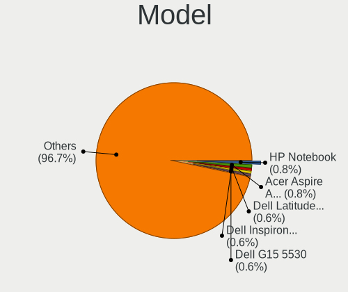
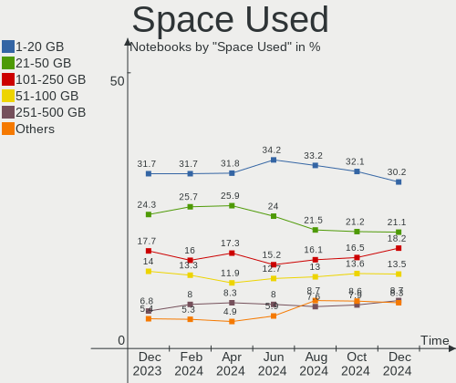
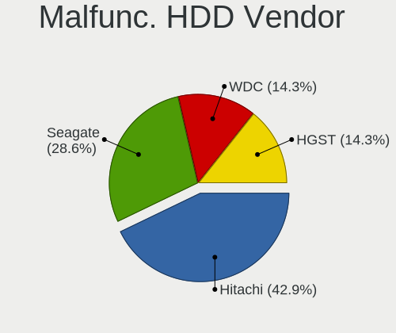
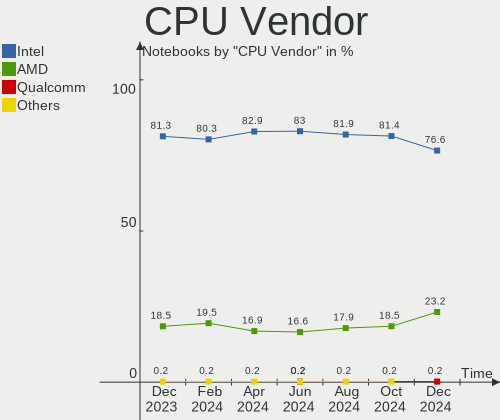
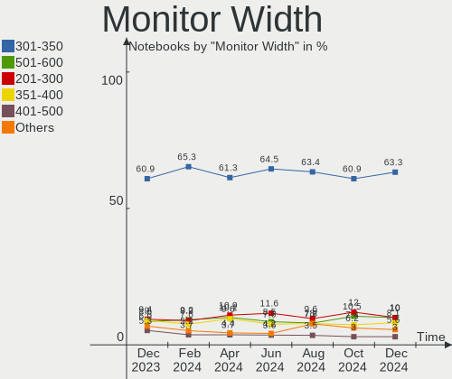
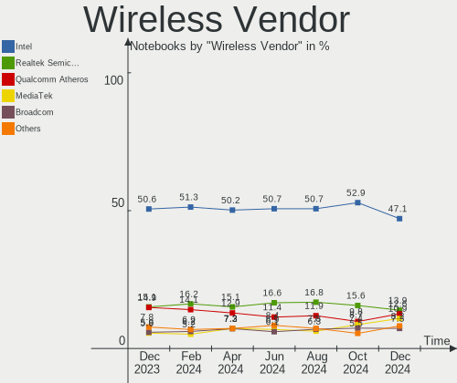

Ubuntu Hardware Trends (Notebook)
---------------------------------

A project to identify most popular hardware characteristics and track their change
over time based on data collected by Ubuntu users at https://Linux-Hardware.org.

Anyone can contribute to the study by uploading probes of their computers by
the [hw-probe](https://github.com/linuxhw/hw-probe) tool:

    sudo -E hw-probe -all -upload

Full-feature report is available here: https://linux-hardware.org/?view=trends&formfactor=notebook

Period: Apr, 2021.

Contents
--------

- [ OS                       ](#os)
- [ OS Family                ](#os-family)
- [ Kernel                   ](#kernel)
- [ Kernel Family            ](#kernel-family)
- [ Kernel Major Ver.        ](#kernel-major-ver)
- [ Arch                     ](#arch)
- [ DE                       ](#de)
- [ Display Server           ](#display-server)
- [ Display Manager          ](#display-manager)
- [ OS Lang                  ](#os-lang)
- [ Boot Mode                ](#boot-mode)
- [ Filesystem               ](#filesystem)
- [ Part. scheme             ](#part-scheme)
- [ Dual Boot with Linux/BSD ](#dual-boot-with-linux/bsd)
- [ Dual Boot (Win)          ](#dual-boot-win)
- [ Country                  ](#country)
- [ City                     ](#city)
- [ Vendor                   ](#vendor)
- [ Model                    ](#model)
- [ Model Family             ](#model-family)
- [ MFG Year                 ](#mfg-year)
- [ Form Factor              ](#form-factor)
- [ Secure Boot              ](#secure-boot)
- [ Coreboot                 ](#coreboot)
- [ RAM Size                 ](#ram-size)
- [ RAM Used                 ](#ram-used)
- [ Has CD-ROM               ](#has-cd-rom)
- [ Total Drives             ](#total-drives)
- [ Has Ethernet             ](#has-ethernet)
- [ Has WiFi                 ](#has-wifi)
- [ Has Bluetooth            ](#has-bluetooth)
- [ Drive Vendor             ](#drive-vendor)
- [ Drive Model              ](#drive-model)
- [ HDD Vendor               ](#hdd-vendor)
- [ SSD Vendor               ](#ssd-vendor)
- [ Drive Kind               ](#drive-kind)
- [ Drive Connector          ](#drive-connector)
- [ Drive Size               ](#drive-size)
- [ Space Total              ](#space-total)
- [ Space Used               ](#space-used)
- [ Malfunc. Drives          ](#malfunc-drives)
- [ Malfunc. Drive Vendor    ](#malfunc-drive-vendor)
- [ Malfunc. HDD Vendor      ](#malfunc-hdd-vendor)
- [ Malfunc. Drive Kind      ](#malfunc-drive-kind)
- [ Failed Drives            ](#failed-drives)
- [ Failed Drive Vendor      ](#failed-drive-vendor)
- [ Drive Status             ](#drive-status)
- [ Storage Vendor           ](#storage-vendor)
- [ Storage Model            ](#storage-model)
- [ Storage Kind             ](#storage-kind)
- [ CPU Vendor               ](#cpu-vendor)
- [ CPU Model                ](#cpu-model)
- [ CPU Model Family         ](#cpu-model-family)
- [ CPU Cores                ](#cpu-cores)
- [ CPU Sockets              ](#cpu-sockets)
- [ CPU Threads              ](#cpu-threads)
- [ CPU Op-Modes             ](#cpu-op-modes)
- [ CPU Microcode            ](#cpu-microcode)
- [ CPU Microarch            ](#cpu-microarch)
- [ GPU Vendor               ](#gpu-vendor)
- [ GPU Model                ](#gpu-model)
- [ GPU Combo                ](#gpu-combo)
- [ GPU Driver               ](#gpu-driver)
- [ GPU Memory               ](#gpu-memory)
- [ Monitor Vendor           ](#monitor-vendor)
- [ Monitor Model            ](#monitor-model)
- [ Monitor Resolution       ](#monitor-resolution)
- [ Monitor Diagonal         ](#monitor-diagonal)
- [ Monitor Width            ](#monitor-width)
- [ Aspect Ratio             ](#aspect-ratio)
- [ Monitor Area             ](#monitor-area)
- [ Pixel Density            ](#pixel-density)
- [ Multiple Monitors        ](#multiple-monitors)
- [ Net Controller Vendor    ](#net-controller-vendor)
- [ Net Controller Model     ](#net-controller-model)
- [ Wireless Vendor          ](#wireless-vendor)
- [ Wireless Model           ](#wireless-model)
- [ Ethernet Vendor          ](#ethernet-vendor)
- [ Ethernet Model           ](#ethernet-model)
- [ Net Controller Kind      ](#net-controller-kind)
- [ Used Controller          ](#used-controller)
- [ NICs                     ](#nics)
- [ IPv6                     ](#ipv6)
- [ Memory Vendor            ](#memory-vendor)
- [ Memory Model             ](#memory-model)
- [ Memory Kind              ](#memory-kind)
- [ Memory Form Factor       ](#memory-form-factor)
- [ Memory Size              ](#memory-size)
- [ Memory Speed             ](#memory-speed)
- [ Sound Vendor             ](#sound-vendor)
- [ Sound Model              ](#sound-model)
- [ Camera Vendor            ](#camera-vendor)
- [ Camera Model             ](#camera-model)
- [ Fingerprint Vendor       ](#fingerprint-vendor)
- [ Fingerprint Model        ](#fingerprint-model)
- [ Chipcard Vendor          ](#chipcard-vendor)
- [ Chipcard Model           ](#chipcard-model)
- [ Printer Vendor           ](#printer-vendor)
- [ Printer Model            ](#printer-model)
- [ Scanner Vendor           ](#scanner-vendor)
- [ Scanner Model            ](#scanner-model)
- [ Bluetooth Vendor         ](#bluetooth-vendor)
- [ Bluetooth Model          ](#bluetooth-model)
- [ Unsupported Devices      ](#unsupported-devices)
- [ Unsupported Device Types ](#unsupported-device-types)

OS
--

Installed operating systems

| Name           | Notebooks | Percent |
|----------------|-----------|---------|
| Ubuntu 20.04   | 533       | 69.22%  |
| Ubuntu 20.10   | 135       | 17.53%  |
| Ubuntu 18.04   | 57        | 7.4%    |
| Ubuntu 21.04   | 35        | 4.55%   |
| Ubuntu 2020    | 2         | 0.26%   |
| Ubuntu 19.04   | 2         | 0.26%   |
| Ubuntu         | 2         | 0.26%   |
| Ubuntu Core 18 | 1         | 0.13%   |
| Ubuntu Core 16 | 1         | 0.13%   |
| Ubuntu 18.10   | 1         | 0.13%   |
| Ubuntu 16.04   | 1         | 0.13%   |

OS Family
---------

OS without a version

| Name   | Notebooks | Percent |
|--------|-----------|---------|
| Ubuntu | 770       | 100%    |

Kernel
------

Version of the Linux kernel

| Version                  | Notebooks | Percent |
|--------------------------|-----------|---------|
| 5.8.0-48-generic         | 220       | 28.57%  |
| 5.8.0-50-generic         | 191       | 24.81%  |
| 5.8.0-49-generic         | 67        | 8.7%    |
| 5.4.0-70-generic         | 53        | 6.88%   |
| 5.4.0-72-generic         | 39        | 5.06%   |
| 5.8.0-43-generic         | 28        | 3.64%   |
| 5.11.0-16-generic        | 24        | 3.12%   |
| 5.4.0-71-generic         | 12        | 1.56%   |
| 4.15.0-142-generic       | 12        | 1.56%   |
| 5.8.0-25-generic         | 8         | 1.04%   |
| 4.15.0-140-generic       | 7         | 0.91%   |
| 5.8.0-45-generic         | 6         | 0.78%   |
| 5.4.0-42-generic         | 6         | 0.78%   |
| 5.11.0-13-generic        | 6         | 0.78%   |
| 5.8.0-41-generic         | 5         | 0.65%   |
| 5.4.0-26-generic         | 5         | 0.65%   |
| 5.8.0-44-generic         | 4         | 0.52%   |
| 5.6.0-1052-oem           | 4         | 0.52%   |
| 5.4.0-67-generic         | 4         | 0.52%   |
| 4.15.0-141-generic       | 4         | 0.52%   |
| 5.8.0-51-generic         | 3         | 0.39%   |
| 5.4.0-65-generic         | 3         | 0.39%   |
| 5.8.0-42-generic         | 2         | 0.26%   |
| 5.8.0-38-generic         | 2         | 0.26%   |
| 5.4.0-73-generic         | 2         | 0.26%   |
| 5.3.0-28-generic         | 2         | 0.26%   |
| 5.11.12-051112-generic   | 2         | 0.26%   |
| 5.11.11-051111-generic   | 2         | 0.26%   |
| 5.11.0-14-generic        | 2         | 0.26%   |
| 5.11.0-051100-generic    | 2         | 0.26%   |
| 4.15.0-139-generic       | 2         | 0.26%   |
| 5.8.5-050805-generic     | 1         | 0.13%   |
| 5.8.14-amd64-desktop     | 1         | 0.13%   |
| 5.8.0-48-lowlatency      | 1         | 0.13%   |
| 5.8.0-40-generic         | 1         | 0.13%   |
| 5.8.0-36-generic         | 1         | 0.13%   |
| 5.8.0-29-generic         | 1         | 0.13%   |
| 5.7.9-mbp                | 1         | 0.13%   |
| 5.6.18-050618-generic    | 1         | 0.13%   |
| 5.6.10-050610-generic    | 1         | 0.13%   |
| 5.4.0-70-lowlatency      | 1         | 0.13%   |
| 5.4.0-66-generic         | 1         | 0.13%   |
| 5.4.0-58-generic         | 1         | 0.13%   |
| 5.4.0-56-generic         | 1         | 0.13%   |
| 5.4.0-48-generic         | 1         | 0.13%   |
| 5.4.0-31-generic         | 1         | 0.13%   |
| 5.4.0-28-generic         | 1         | 0.13%   |
| 5.4.0-1042-gke           | 1         | 0.13%   |
| 5.3.0-050300-generic     | 1         | 0.13%   |
| 5.12.0-rc6               | 1         | 0.13%   |
| 5.12.0-051200rc6-generic | 1         | 0.13%   |
| 5.12.0-051200rc5-generic | 1         | 0.13%   |
| 5.12.0-051200rc4-generic | 1         | 0.13%   |
| 5.12.0-051200rc3-generic | 1         | 0.13%   |
| 5.12.0-051200-generic    | 1         | 0.13%   |
| 5.11.16-051116-generic   | 1         | 0.13%   |
| 5.11.13-051113-generic   | 1         | 0.13%   |
| 5.11.10-051110-generic   | 1         | 0.13%   |
| 5.11.0-7612-generic      | 1         | 0.13%   |
| 5.11.0-16-lowlatency     | 1         | 0.13%   |

Kernel Family
-------------

Linux kernel without a distro release

| Version | Notebooks | Percent |
|---------|-----------|---------|
| 5.8.0   | 540       | 70.13%  |
| 5.4.0   | 132       | 17.14%  |
| 5.11.0  | 36        | 4.68%   |
| 4.15.0  | 27        | 3.51%   |
| 5.12.0  | 6         | 0.78%   |
| 5.6.0   | 4         | 0.52%   |
| 5.3.0   | 3         | 0.39%   |
| 5.10.0  | 3         | 0.39%   |
| 5.11.12 | 2         | 0.26%   |
| 5.11.11 | 2         | 0.26%   |
| 5.0.0   | 2         | 0.26%   |
| 5.8.5   | 1         | 0.13%   |
| 5.8.14  | 1         | 0.13%   |
| 5.7.9   | 1         | 0.13%   |
| 5.6.18  | 1         | 0.13%   |
| 5.6.10  | 1         | 0.13%   |
| 5.11.16 | 1         | 0.13%   |
| 5.11.13 | 1         | 0.13%   |
| 5.11.10 | 1         | 0.13%   |
| 5.10.32 | 1         | 0.13%   |
| 5.10.13 | 1         | 0.13%   |
| 4.18.0  | 1         | 0.13%   |
| 4.16.18 | 1         | 0.13%   |
| Unknown | 1         | 0.13%   |

Kernel Major Ver.
-----------------

Linux kernel major version

| Version | Notebooks | Percent |
|---------|-----------|---------|
| 5.8     | 542       | 70.39%  |
| 5.4     | 132       | 17.14%  |
| 5.11    | 43        | 5.58%   |
| 4.15    | 27        | 3.51%   |
| 5.6     | 6         | 0.78%   |
| 5.12    | 6         | 0.78%   |
| 5.10    | 5         | 0.65%   |
| 5.3     | 3         | 0.39%   |
| 5.0     | 2         | 0.26%   |
| 5.7     | 1         | 0.13%   |
| 4.18    | 1         | 0.13%   |
| 4.16    | 1         | 0.13%   |
| Unknown | 1         | 0.13%   |

Arch
----

OS architecture (x86_64, i586, etc.)

| Name    | Notebooks | Percent |
|---------|-----------|---------|
| x86_64  | 763       | 99.09%  |
| i686    | 6         | 0.78%   |
| Unknown | 1         | 0.13%   |

DE
--

Desktop Environment

| Name                | Notebooks | Percent |
|---------------------|-----------|---------|
| GNOME               | 658       | 85.45%  |
| Unknown             | 82        | 10.65%  |
| X-Cinnamon          | 11        | 1.43%   |
| Unity               | 5         | 0.65%   |
| GNOME Flashback     | 4         | 0.52%   |
| Cinnamon            | 4         | 0.52%   |
| i3                  | 3         | 0.39%   |
| Deepin              | 2         | 0.26%   |
| /usr/bin/startxfce4 | 1         | 0.13%   |

Display Server
--------------

X11 or Wayland

| Name    | Notebooks | Percent |
|---------|-----------|---------|
| X11     | 671       | 87.14%  |
| Wayland | 47        | 6.1%    |
| Unknown | 46        | 5.97%   |
| Tty     | 6         | 0.78%   |

Display Manager
---------------

SDDM, LightDM, etc.

| Name    | Notebooks | Percent |
|---------|-----------|---------|
| Unknown | 567       | 73.64%  |
| GDM     | 193       | 25.06%  |
| TDM     | 9         | 1.17%   |
| XDM     | 1         | 0.13%   |

OS Lang
-------

Language

| Lang    | Notebooks | Percent |
|---------|-----------|---------|
| en_US   | 298       | 38.7%   |
| de_DE   | 72        | 9.35%   |
| fr_FR   | 54        | 7.01%   |
| pt_BR   | 41        | 5.32%   |
| en_GB   | 40        | 5.19%   |
| en_IN   | 30        | 3.9%    |
| it_IT   | 27        | 3.51%   |
| ru_RU   | 26        | 3.38%   |
| es_ES   | 19        | 2.47%   |
| Unknown | 12        | 1.56%   |
| pl_PL   | 9         | 1.17%   |
| en_AU   | 9         | 1.17%   |
| en_CA   | 8         | 1.04%   |
| sv_SE   | 7         | 0.91%   |
| nl_NL   | 7         | 0.91%   |
| hu_HU   | 7         | 0.91%   |
| en_ZA   | 6         | 0.78%   |
| de_CH   | 6         | 0.78%   |
| zh_CN   | 5         | 0.65%   |
| uk_UA   | 5         | 0.65%   |
| ja_JP   | 5         | 0.65%   |
| fi_FI   | 5         | 0.65%   |
| es_CL   | 5         | 0.65%   |
| cs_CZ   | 5         | 0.65%   |
| C       | 5         | 0.65%   |
| pt_PT   | 4         | 0.52%   |
| es_UY   | 4         | 0.52%   |
| es_MX   | 4         | 0.52%   |
| de_AT   | 4         | 0.52%   |
| hr_HR   | 3         | 0.39%   |
| ca_ES   | 3         | 0.39%   |
| tr_TR   | 2         | 0.26%   |
| sl_SI   | 2         | 0.26%   |
| nl_BE   | 2         | 0.26%   |
| nb_NO   | 2         | 0.26%   |
| fr_CA   | 2         | 0.26%   |
| fr_BE   | 2         | 0.26%   |
| es_AR   | 2         | 0.26%   |
| en_NG   | 2         | 0.26%   |
| da_DK   | 2         | 0.26%   |
| zh_TW   | 1         | 0.13%   |
| vi_VN   | 1         | 0.13%   |
| sk_SK   | 1         | 0.13%   |
| ru_UA   | 1         | 0.13%   |
| ro_RO   | 1         | 0.13%   |
| lt_LT   | 1         | 0.13%   |
| id_ID   | 1         | 0.13%   |
| gl_ES   | 1         | 0.13%   |
| fr_CH   | 1         | 0.13%   |
| es_SV   | 1         | 0.13%   |
| es_PE   | 1         | 0.13%   |
| es_PA   | 1         | 0.13%   |
| es_CO   | 1         | 0.13%   |
| en_SG   | 1         | 0.13%   |
| en_IL   | 1         | 0.13%   |
| en_DK   | 1         | 0.13%   |
| bs_BA   | 1         | 0.13%   |

Boot Mode
---------

EFI or BIOS

| Mode | Notebooks | Percent |
|------|-----------|---------|
| EFI  | 393       | 51.04%  |
| BIOS | 377       | 48.96%  |

Filesystem
----------

Type of filesystem

| Type    | Notebooks | Percent |
|---------|-----------|---------|
| Ext4    | 726       | 94.29%  |
| Overlay | 21        | 2.73%   |
| Zfs     | 16        | 2.08%   |
| Btrfs   | 3         | 0.39%   |
| Ext3    | 2         | 0.26%   |
| Ext2    | 1         | 0.13%   |
| Unknown | 1         | 0.13%   |

Part. scheme
------------

Scheme of partitioning

| Type    | Notebooks | Percent |
|---------|-----------|---------|
| Unknown | 557       | 72.34%  |
| GPT     | 183       | 23.77%  |
| MBR     | 30        | 3.9%    |

Dual Boot with Linux/BSD
------------------------

Hosting more than one Linux/BSD

| Dual boot | Notebooks | Percent |
|-----------|-----------|---------|
| No        | 706       | 91.69%  |
| Yes       | 64        | 8.31%   |

Dual Boot (Win)
---------------

Hosting Linux and Windows

| Dual boot | Notebooks | Percent |
|-----------|-----------|---------|
| No        | 500       | 64.94%  |
| Yes       | 270       | 35.06%  |

Country
-------

Geographic location (country)

| Country      | Notebooks | Percent |
|--------------|-----------|---------|
| USA          | 109       | 14.16%  |
| Germany      | 82        | 10.65%  |
| Brazil       | 58        | 7.53%   |
| France       | 57        | 7.4%    |
| UK           | 38        | 4.94%   |
| Italy        | 35        | 4.55%   |
| Russia       | 34        | 4.42%   |
| India        | 33        | 4.29%   |
| Spain        | 27        | 3.51%   |
| Netherlands  | 18        | 2.34%   |
| Ukraine      | 17        | 2.21%   |
| Sweden       | 15        | 1.95%   |
| Switzerland  | 11        | 1.43%   |
| Poland       | 11        | 1.43%   |
| Canada       | 11        | 1.43%   |
| Turkey       | 10        | 1.3%    |
| Finland      | 10        | 1.3%    |
| Belgium      | 10        | 1.3%    |
| Australia    | 10        | 1.3%    |
| Austria      | 9         | 1.17%   |
| Japan        | 8         | 1.04%   |
| Hungary      | 8         | 1.04%   |
| Portugal     | 7         | 0.91%   |
| Norway       | 7         | 0.91%   |
| Mexico       | 7         | 0.91%   |
| Indonesia    | 7         | 0.91%   |
| Czechia      | 7         | 0.91%   |
| China        | 7         | 0.91%   |
| Chile        | 7         | 0.91%   |
| South Africa | 6         | 0.78%   |
| Vietnam      | 5         | 0.65%   |
| Romania      | 5         | 0.65%   |
| Iran         | 5         | 0.65%   |
| Greece       | 5         | 0.65%   |
| Uruguay      | 4         | 0.52%   |
| Denmark      | 4         | 0.52%   |
| Croatia      | 4         | 0.52%   |
| Slovenia     | 3         | 0.39%   |
| Slovakia     | 3         | 0.39%   |
| Egypt        | 3         | 0.39%   |
| Argentina    | 3         | 0.39%   |
| Algeria      | 3         | 0.39%   |
| Panama       | 2         | 0.26%   |
| Nigeria      | 2         | 0.26%   |
| Morocco      | 2         | 0.26%   |
| Lithuania    | 2         | 0.26%   |
| Latvia       | 2         | 0.26%   |
| Kenya        | 2         | 0.26%   |
| El Salvador  | 2         | 0.26%   |
| Colombia     | 2         | 0.26%   |
| Belarus      | 2         | 0.26%   |
| Azerbaijan   | 2         | 0.26%   |
| Tunisia      | 1         | 0.13%   |
| Taiwan       | 1         | 0.13%   |
| Sri Lanka    | 1         | 0.13%   |
| Singapore    | 1         | 0.13%   |
| Qatar        | 1         | 0.13%   |
| Peru         | 1         | 0.13%   |
| Paraguay     | 1         | 0.13%   |
| Pakistan     | 1         | 0.13%   |

City
----

Geographic location (city)

| City              | Notebooks | Percent |
|-------------------|-----------|---------|
| Moscow            | 10        | 1.3%    |
| São Paulo        | 8         | 1.04%   |
| Rome              | 8         | 1.04%   |
| Milan             | 8         | 1.04%   |
| Paris             | 7         | 0.91%   |
| Berlin            | 7         | 0.91%   |
| Kyiv              | 6         | 0.78%   |
| Vienna            | 5         | 0.65%   |
| St Petersburg     | 5         | 0.65%   |
| Barcelona         | 5         | 0.65%   |
| Tehran            | 4         | 0.52%   |
| Stuttgart         | 4         | 0.52%   |
| Rio de Janeiro    | 4         | 0.52%   |
| London            | 4         | 0.52%   |
| Delhi             | 4         | 0.52%   |
| Curitiba          | 4         | 0.52%   |
| Brooklyn          | 4         | 0.52%   |
| Ahmedabad         | 4         | 0.52%   |
| Zagreb            | 3         | 0.39%   |
| Warsaw            | 3         | 0.39%   |
| Stockholm         | 3         | 0.39%   |
| Recife            | 3         | 0.39%   |
| Prague            | 3         | 0.39%   |
| Perth             | 3         | 0.39%   |
| Oslo              | 3         | 0.39%   |
| New York          | 3         | 0.39%   |
| New Delhi         | 3         | 0.39%   |
| Nantes            | 3         | 0.39%   |
| Munich            | 3         | 0.39%   |
| Montevideo        | 3         | 0.39%   |
| Miami             | 3         | 0.39%   |
| Madrid            | 3         | 0.39%   |
| Lisbon            | 3         | 0.39%   |
| Krasnodar         | 3         | 0.39%   |
| Johannesburg      | 3         | 0.39%   |
| Istanbul          | 3         | 0.39%   |
| Ho Chi Minh City  | 3         | 0.39%   |
| Hamburg           | 3         | 0.39%   |
| Frankfurt am Main | 3         | 0.39%   |
| Cologne           | 3         | 0.39%   |
| Budapest          | 3         | 0.39%   |
| Brisbane          | 3         | 0.39%   |
| Belo Horizonte    | 3         | 0.39%   |
| Atlanta           | 3         | 0.39%   |
| Örnsköldsvik    | 2         | 0.26%   |
| Zurich            | 2         | 0.26%   |
| Zoetermeer        | 2         | 0.26%   |
| Yanqing           | 2         | 0.26%   |
| Wroclaw           | 2         | 0.26%   |
| Vigo              | 2         | 0.26%   |
| Valencia          | 2         | 0.26%   |
| Simferopol        | 2         | 0.26%   |
| Seattle           | 2         | 0.26%   |
| Saratov           | 2         | 0.26%   |
| Santos Dumont     | 2         | 0.26%   |
| Santo André      | 2         | 0.26%   |
| San Salvador      | 2         | 0.26%   |
| San Jose          | 2         | 0.26%   |
| Rotherham         | 2         | 0.26%   |
| Panama City       | 2         | 0.26%   |

Vendor
------

Motherboard manufacturer

| Name                             | Notebooks | Percent |
|----------------------------------|-----------|---------|
| Dell                             | 168       | 21.82%  |
| Hewlett-Packard                  | 153       | 19.87%  |
| Lenovo                           | 151       | 19.61%  |
| ASUSTek Computer                 | 78        | 10.13%  |
| Acer                             | 55        | 7.14%   |
| Toshiba                          | 23        | 2.99%   |
| MSI                              | 20        | 2.6%    |
| Samsung Electronics              | 17        | 2.21%   |
| Apple                            | 13        | 1.69%   |
| Sony                             | 9         | 1.17%   |
| Notebook                         | 7         | 0.91%   |
| HUAWEI                           | 6         | 0.78%   |
| System76                         | 5         | 0.65%   |
| Packard Bell                     | 5         | 0.65%   |
| Medion                           | 5         | 0.65%   |
| LG Electronics                   | 5         | 0.65%   |
| TUXEDO                           | 4         | 0.52%   |
| Positivo                         | 3         | 0.39%   |
| Panasonic                        | 3         | 0.39%   |
| Fujitsu Siemens                  | 3         | 0.39%   |
| Alienware                        | 3         | 0.39%   |
| whyopencomputing                 | 2         | 0.26%   |
| Semp Toshiba                     | 2         | 0.26%   |
| Radxa                            | 2         | 0.26%   |
| Fujitsu                          | 2         | 0.26%   |
| Unknown                          | 2         | 0.26%   |
| TrekStor                         | 1         | 0.13%   |
| Timi                             | 1         | 0.13%   |
| Thomson                          | 1         | 0.13%   |
| SLIMBOOK                         | 1         | 0.13%   |
| Schenker                         | 1         | 0.13%   |
| SANTECH                          | 1         | 0.13%   |
| PC Specialist                    | 1         | 0.13%   |
| NEC Computers                    | 1         | 0.13%   |
| MECHREVO                         | 1         | 0.13%   |
| LDLC                             | 1         | 0.13%   |
| KOUZIRO                          | 1         | 0.13%   |
| IP3 Tech                         | 1         | 0.13%   |
| Hungaro Flotta Kft               | 1         | 0.13%   |
| HASEE Computer                   | 1         | 0.13%   |
| Google                           | 1         | 0.13%   |
| Gigabyte Technology              | 1         | 0.13%   |
| Gateway                          | 1         | 0.13%   |
| FUJITSU CLIENT COMPUTING LIMITED | 1         | 0.13%   |
| Entroware                        | 1         | 0.13%   |
| eMachines                        | 1         | 0.13%   |
| Dynabook                         | 1         | 0.13%   |
| Clevo                            | 1         | 0.13%   |
| Chuwi                            | 1         | 0.13%   |
| AVITA                            | 1         | 0.13%   |

Model
-----

Motherboard model

| Name                                  | Notebooks | Percent |
|---------------------------------------|-----------|---------|
| Unknown                               | 8         | 1.04%   |
| HP Notebook                           | 7         | 0.91%   |
| HP Pavilion g6                        | 5         | 0.65%   |
| Dell XPS 13 7390                      | 5         | 0.65%   |
| HP ProBook 650 G1                     | 4         | 0.52%   |
| Dell XPS 15 7590                      | 4         | 0.52%   |
| Dell XPS 13 9360                      | 4         | 0.52%   |
| Dell Latitude 5410                    | 4         | 0.52%   |
| Dell Inspiron 15-3567                 | 4         | 0.52%   |
| Lenovo IdeaPad 520-15IKB 81BF         | 3         | 0.39%   |
| HP ProBook 450 G7                     | 3         | 0.39%   |
| HP ProBook 445 G7                     | 3         | 0.39%   |
| HP Pavilion g7                        | 3         | 0.39%   |
| HP Laptop 15-dw1xxx                   | 3         | 0.39%   |
| HP Laptop 15-da0xxx                   | 3         | 0.39%   |
| HP EliteBook Folio 9470m              | 3         | 0.39%   |
| HP EliteBook 850 G7 Notebook PC       | 3         | 0.39%   |
| HP EliteBook 8470p                    | 3         | 0.39%   |
| HP EliteBook 8440p                    | 3         | 0.39%   |
| HP EliteBook 840 G2                   | 3         | 0.39%   |
| HP 250 G6 Notebook PC                 | 3         | 0.39%   |
| Dell XPS 15 9570                      | 3         | 0.39%   |
| Dell XPS 15 9560                      | 3         | 0.39%   |
| Dell Precision 5530                   | 3         | 0.39%   |
| Dell Latitude E7440                   | 3         | 0.39%   |
| Dell Latitude E6540                   | 3         | 0.39%   |
| Dell Latitude E6430                   | 3         | 0.39%   |
| Dell Latitude E6420                   | 3         | 0.39%   |
| Dell Latitude E6410                   | 3         | 0.39%   |
| Dell Latitude E6400                   | 3         | 0.39%   |
| Dell Inspiron 3421                    | 3         | 0.39%   |
| Dell G3 3579                          | 3         | 0.39%   |
| Toshiba Satellite A505                | 2         | 0.26%   |
| Toshiba Satellite A350                | 2         | 0.26%   |
| Toshiba Satellite A300                | 2         | 0.26%   |
| System76 Lemur Pro                    | 2         | 0.26%   |
| System76 Gazelle                      | 2         | 0.26%   |
| Samsung 270E5J/2570EJ                 | 2         | 0.26%   |
| Radxa ROCK Pi X                       | 2         | 0.26%   |
| Lenovo Z50-75 80EC                    | 2         | 0.26%   |
| Lenovo ThinkPad E480 20KQ000EBR       | 2         | 0.26%   |
| Lenovo Legion 5 15ARH05 82B5          | 2         | 0.26%   |
| Lenovo IdeaPad L340-15IRH Gaming 81LK | 2         | 0.26%   |
| Lenovo IdeaPad 330-15IKB 81DE         | 2         | 0.26%   |
| Lenovo IdeaPad 330-15IKB 81DC         | 2         | 0.26%   |
| Lenovo IdeaPad 320-15IKB 80XL         | 2         | 0.26%   |
| Lenovo IdeaPad 320-15IAP 80XR         | 2         | 0.26%   |
| Lenovo IdeaPad 320-15ABR 80XS         | 2         | 0.26%   |
| Lenovo G500 20236                     | 2         | 0.26%   |
| Lenovo G50-80 80E5                    | 2         | 0.26%   |
| Lenovo G400s VILG1                    | 2         | 0.26%   |
| HUAWEI BOHK-WAX9X                     | 2         | 0.26%   |
| HP ZBook Studio G7 Mobile Workstation | 2         | 0.26%   |
| HP ProBook 430 G1                     | 2         | 0.26%   |
| HP Pavilion dv7                       | 2         | 0.26%   |
| HP Pavilion 17                        | 2         | 0.26%   |
| HP Pavilion 13 x360 PC                | 2         | 0.26%   |
| HP Laptop 15s-eq1xxx                  | 2         | 0.26%   |
| HP G42                                | 2         | 0.26%   |
| HP EliteBook 8460p                    | 2         | 0.26%   |

Model Family
------------

Motherboard model prefix

| Name                    | Notebooks | Percent |
|-------------------------|-----------|---------|
| Lenovo ThinkPad         | 79        | 10.26%  |
| Dell Latitude           | 58        | 7.53%   |
| Dell Inspiron           | 45        | 5.84%   |
| Acer Aspire             | 37        | 4.81%   |
| HP EliteBook            | 35        | 4.55%   |
| Lenovo IdeaPad          | 33        | 4.29%   |
| HP Pavilion             | 32        | 4.16%   |
| Dell XPS                | 31        | 4.03%   |
| HP ProBook              | 22        | 2.86%   |
| Toshiba Satellite       | 21        | 2.73%   |
| HP Laptop               | 15        | 1.95%   |
| Dell Precision          | 15        | 1.95%   |
| ASUS VivoBook           | 13        | 1.69%   |
| Dell Vostro             | 9         | 1.17%   |
| Acer Swift              | 8         | 1.04%   |
| Unknown                 | 8         | 1.04%   |
| HP Notebook             | 7         | 0.91%   |
| Lenovo Legion           | 6         | 0.78%   |
| HP ZBook                | 6         | 0.78%   |
| Packard Bell EasyNote   | 5         | 0.65%   |
| HP ENVY                 | 5         | 0.65%   |
| HP 250                  | 5         | 0.65%   |
| Dell G3                 | 5         | 0.65%   |
| ASUS TUF                | 5         | 0.65%   |
| ASUS ROG                | 5         | 0.65%   |
| Lenovo ThinkBook        | 4         | 0.52%   |
| Acer Nitro              | 4         | 0.52%   |
| MSI Prestige            | 3         | 0.39%   |
| Lenovo Yoga             | 3         | 0.39%   |
| HP OMEN                 | 3         | 0.39%   |
| HP Compaq               | 3         | 0.39%   |
| HP 255                  | 3         | 0.39%   |
| HP 15                   | 3         | 0.39%   |
| ASUS ASUS               | 3         | 0.39%   |
| Apple MacBookPro8       | 3         | 0.39%   |
| System76 Lemur          | 2         | 0.26%   |
| System76 Gazelle        | 2         | 0.26%   |
| Samsung 270E5J          | 2         | 0.26%   |
| Radxa ROCK              | 2         | 0.26%   |
| Notebook W65            | 2         | 0.26%   |
| MSI Modern              | 2         | 0.26%   |
| MSI GS66                | 2         | 0.26%   |
| Lenovo Z50-75           | 2         | 0.26%   |
| Lenovo G500             | 2         | 0.26%   |
| Lenovo G50-80           | 2         | 0.26%   |
| Lenovo G400s            | 2         | 0.26%   |
| HUAWEI BOHK-WAX9X       | 2         | 0.26%   |
| HP G42                  | 2         | 0.26%   |
| Fujitsu Siemens ESPRIMO | 2         | 0.26%   |
| Fujitsu LIFEBOOK        | 2         | 0.26%   |
| Dell Studio             | 2         | 0.26%   |
| Dell G5                 | 2         | 0.26%   |
| ASUS ZenBook            | 2         | 0.26%   |
| ASUS X555LJ             | 2         | 0.26%   |
| ASUS K55VD              | 2         | 0.26%   |
| ASUS K54HR              | 2         | 0.26%   |
| ASUS K54C               | 2         | 0.26%   |
| Apple MacBookPro5       | 2         | 0.26%   |
| Apple MacBook4          | 2         | 0.26%   |
| Alienware m15           | 2         | 0.26%   |

MFG Year
--------

Motherboard manufacture year

| Year | Notebooks | Percent |
|------|-----------|---------|
| 2020 | 197       | 25.58%  |
| 2019 | 89        | 11.56%  |
| 2018 | 71        | 9.22%   |
| 2013 | 59        | 7.66%   |
| 2012 | 47        | 6.1%    |
| 2017 | 44        | 5.71%   |
| 2021 | 42        | 5.45%   |
| 2014 | 40        | 5.19%   |
| 2011 | 36        | 4.68%   |
| 2015 | 34        | 4.42%   |
| 2016 | 33        | 4.29%   |
| 2009 | 27        | 3.51%   |
| 2010 | 25        | 3.25%   |
| 2008 | 17        | 2.21%   |
| 2007 | 6         | 0.78%   |
| 2006 | 3         | 0.39%   |

Form Factor
-----------

Physical design of the computer

| Name     | Notebooks | Percent |
|----------|-----------|---------|
| Notebook | 770       | 100%    |

Secure Boot
-----------

Enabled or disabled

| State    | Notebooks | Percent |
|----------|-----------|---------|
| Disabled | 655       | 85.06%  |
| Enabled  | 115       | 14.94%  |

Coreboot
--------

Have coreboot on board

| Used | Notebooks | Percent |
|------|-----------|---------|
| No   | 767       | 99.61%  |
| Yes  | 3         | 0.39%   |

RAM Size
--------

Total RAM memory

| Size in GB  | Notebooks | Percent |
|-------------|-----------|---------|
| 4.01-8.0    | 239       | 31.04%  |
| 3.01-4.0    | 167       | 21.69%  |
| 16.01-24.0  | 143       | 18.57%  |
| 8.01-16.0   | 122       | 15.84%  |
| 32.01-64.0  | 45        | 5.84%   |
| 1.01-2.0    | 23        | 2.99%   |
| 2.01-3.0    | 12        | 1.56%   |
| 64.01-256.0 | 9         | 1.17%   |
| 24.01-32.0  | 7         | 0.91%   |
| 0.51-1.0    | 2         | 0.26%   |
| Unknown     | 1         | 0.13%   |

RAM Used
--------

Used RAM memory

| Used GB    | Notebooks | Percent |
|------------|-----------|---------|
| 1.01-2.0   | 283       | 36.75%  |
| 2.01-3.0   | 222       | 28.83%  |
| 4.01-8.0   | 125       | 16.23%  |
| 3.01-4.0   | 94        | 12.21%  |
| 8.01-16.0  | 29        | 3.77%   |
| 0.51-1.0   | 10        | 1.3%    |
| 16.01-24.0 | 4         | 0.52%   |
| 24.01-32.0 | 1         | 0.13%   |
| 0.01-0.5   | 1         | 0.13%   |
| Unknown    | 1         | 0.13%   |

Has CD-ROM
----------

Has CD-ROM on board

| Presented | Notebooks | Percent |
|-----------|-----------|---------|
| No        | 447       | 58.05%  |
| Yes       | 323       | 41.95%  |

Total Drives
------------

Number of drives on board

| Drives | Notebooks | Percent |
|--------|-----------|---------|
| 1      | 593       | 77.01%  |
| 2      | 145       | 18.83%  |
| 3      | 18        | 2.34%   |
| 0      | 7         | 0.91%   |
| 4      | 6         | 0.78%   |
| 6      | 1         | 0.13%   |

Has Ethernet
------------

Has Ethernet on board

| Presented | Notebooks | Percent |
|-----------|-----------|---------|
| Yes       | 673       | 87.4%   |
| No        | 97        | 12.6%   |

Has WiFi
--------

Has WiFi module

| Presented | Notebooks | Percent |
|-----------|-----------|---------|
| Yes       | 754       | 97.92%  |
| No        | 16        | 2.08%   |

Has Bluetooth
-------------

Has Bluetooth module

| Presented | Notebooks | Percent |
|-----------|-----------|---------|
| Yes       | 599       | 77.79%  |
| No        | 171       | 22.21%  |

Drive Vendor
------------

Hard drive vendors

| Vendor                    | Notebooks | Drives | Percent |
|---------------------------|-----------|--------|---------|
| Samsung Electronics       | 149       | 165    | 16.34%  |
| WDC                       | 127       | 132    | 13.93%  |
| Seagate                   | 111       | 113    | 12.17%  |
| Toshiba                   | 97        | 102    | 10.64%  |
| SanDisk                   | 51        | 51     | 5.59%   |
| Kingston                  | 45        | 47     | 4.93%   |
| SK Hynix                  | 41        | 42     | 4.5%    |
| Unknown                   | 39        | 43     | 4.28%   |
| Intel                     | 33        | 35     | 3.62%   |
| Hitachi                   | 32        | 32     | 3.51%   |
| HGST                      | 28        | 28     | 3.07%   |
| Crucial                   | 23        | 25     | 2.52%   |
| Micron Technology         | 22        | 22     | 2.41%   |
| LITEON                    | 10        | 10     | 1.1%    |
| KIOXIA                    | 8         | 8      | 0.88%   |
| China                     | 8         | 8      | 0.88%   |
| A-DATA Technology         | 8         | 8      | 0.88%   |
| Fujitsu                   | 7         | 7      | 0.77%   |
| Transcend                 | 6         | 6      | 0.66%   |
| SPCC                      | 6         | 6      | 0.66%   |
| PNY                       | 4         | 4      | 0.44%   |
| Phison                    | 3         | 3      | 0.33%   |
| LITEONIT                  | 3         | 3      | 0.33%   |
| KingSpec                  | 3         | 3      | 0.33%   |
| Hewlett-Packard           | 3         | 3      | 0.33%   |
| GOODRAM                   | 3         | 3      | 0.33%   |
| Apple                     | 3         | 4      | 0.33%   |
| PLEXTOR                   | 2         | 2      | 0.22%   |
| Patriot                   | 2         | 2      | 0.22%   |
| Micron/Crucial Technology | 2         | 2      | 0.22%   |
| Intenso                   | 2         | 2      | 0.22%   |
| BHT                       | 2         | 2      | 0.22%   |
| ASMT                      | 2         | 3      | 0.22%   |
| Apacer                    | 2         | 2      | 0.22%   |
| ADATA Technology          | 2         | 2      | 0.22%   |
| ZTE                       | 1         | 1      | 0.11%   |
| Zheino                    | 1         | 1      | 0.11%   |
| THU SSD                   | 1         | 1      | 0.11%   |
| Teclast                   | 1         | 1      | 0.11%   |
| Team                      | 1         | 1      | 0.11%   |
| Solid State Storage       | 1         | 1      | 0.11%   |
| Smartbuy                  | 1         | 1      | 0.11%   |
| Silicon Motion            | 1         | 1      | 0.11%   |
| Realtek Semiconductor     | 1         | 1      | 0.11%   |
| Netac                     | 1         | 1      | 0.11%   |
| Maxtor                    | 1         | 1      | 0.11%   |
| Leven                     | 1         | 1      | 0.11%   |
| JMicron                   | 1         | 1      | 0.11%   |
| Integral                  | 1         | 1      | 0.11%   |
| ICY BOX                   | 1         | 1      | 0.11%   |
| Generic-                  | 1         | 1      | 0.11%   |
| FORESEE                   | 1         | 1      | 0.11%   |
| External                  | 1         | 1      | 0.11%   |
| EMTEC                     | 1         | 1      | 0.11%   |
| ASMedia                   | 1         | 1      | 0.11%   |
| addlink                   | 1         | 1      | 0.11%   |
| ADATA SU                  | 1         | 1      | 0.11%   |
| Acer GT5                  | 1         | 1      | 0.11%   |

Drive Model
-----------

Hard drive models

| Model                                   | Notebooks | Percent |
|-----------------------------------------|-----------|---------|
| Seagate ST1000LM035-1RK172 1TB          | 20        | 2.13%   |
| Seagate ST1000LM024 HN-M101MBB 1TB      | 19        | 2.02%   |
| Toshiba MQ01ABD100 1TB                  | 15        | 1.59%   |
| Kingston SA400S37240G 240GB SSD         | 14        | 1.49%   |
| Samsung NVMe SSD Drive 512GB            | 13        | 1.38%   |
| Toshiba MQ04ABF100 1TB                  | 12        | 1.28%   |
| Unknown MMC Card  32GB                  | 9         | 0.96%   |
| Samsung SSD 860 EVO 500GB               | 9         | 0.96%   |
| WDC WDS120G2G0A-00JH30 120GB SSD        | 8         | 0.85%   |
| Toshiba NVMe SSD Drive 512GB            | 8         | 0.85%   |
| SK Hynix NVMe SSD Drive 512GB           | 8         | 0.85%   |
| Seagate ST500LM012 HN-M500MBB 500GB     | 8         | 0.85%   |
| Samsung NVMe SSD Drive 1024GB           | 8         | 0.85%   |
| Intel NVMe SSD Drive 512GB              | 8         | 0.85%   |
| Toshiba MQ01ABF050 500GB                | 7         | 0.74%   |
| Sandisk NVMe SSD Drive 512GB            | 7         | 0.74%   |
| Samsung NVMe SSD Drive 256GB            | 7         | 0.74%   |
| HGST HTS721010A9E630 1TB                | 7         | 0.74%   |
| Unknown MMC Card  64GB                  | 6         | 0.64%   |
| SK Hynix NVMe SSD Drive 256GB           | 5         | 0.53%   |
| Seagate ST9500325AS 500GB               | 5         | 0.53%   |
| Seagate ST500LT012-1DG142 500GB         | 5         | 0.53%   |
| Samsung SSD 850 EVO 500GB               | 5         | 0.53%   |
| Samsung SSD 850 EVO 250GB               | 5         | 0.53%   |
| HGST HTS541010A9E680 1TB                | 5         | 0.53%   |
| Crucial CT240BX500SSD1 240GB            | 5         | 0.53%   |
| WDC WD10JPVX-75JC3T0 1TB                | 4         | 0.43%   |
| WDC WD10JPVX-22JC3T0 1TB                | 4         | 0.43%   |
| Unknown MMC Card  16GB                  | 4         | 0.43%   |
| Toshiba MQ01ABD075 752GB                | 4         | 0.43%   |
| Seagate ST320LT007-9ZV142 320GB         | 4         | 0.43%   |
| Seagate ST2000LM007-1R8174 2TB          | 4         | 0.43%   |
| Seagate ST1000LM014-1EJ164 1TB          | 4         | 0.43%   |
| Seagate Expansion 4TB                   | 4         | 0.43%   |
| Sandisk NVMe SSD Drive 1024GB           | 4         | 0.43%   |
| Samsung SSD 860 EVO 1TB                 | 4         | 0.43%   |
| Micron NVMe SSD Drive 512GB             | 4         | 0.43%   |
| Kingston SA400S37480G 480GB SSD         | 4         | 0.43%   |
| Intel NVMe SSD Drive 1024GB             | 4         | 0.43%   |
| Hitachi HTS547575A9E384 752GB           | 4         | 0.43%   |
| WDC WDS500G2B0A-00SM50 500GB SSD        | 3         | 0.32%   |
| WDC WD3200BEVT-22ZCT0 320GB             | 3         | 0.32%   |
| WDC WD10SPZX-60Z10T0 1TB                | 3         | 0.32%   |
| WDC WD10SPZX-24Z10 1TB                  | 3         | 0.32%   |
| Toshiba NVMe SSD Drive 256GB            | 3         | 0.32%   |
| Toshiba MQ01ABD050 500GB                | 3         | 0.32%   |
| SK Hynix SC311 SATA 256GB SSD           | 3         | 0.32%   |
| SK Hynix BC511 NVMe 512GB               | 3         | 0.32%   |
| SK Hynix BC511 HFM512GDJTNI-82A0A 512GB | 3         | 0.32%   |
| Seagate ST9160310AS 160GB               | 3         | 0.32%   |
| Seagate ST750LM022 HN-M750MBB 752GB     | 3         | 0.32%   |
| Seagate ST1000LX015-1U7172 1TB          | 3         | 0.32%   |
| Seagate ST1000LM049-2GH172 1TB          | 3         | 0.32%   |
| Seagate ST1000LM048-2E7172 1TB          | 3         | 0.32%   |
| SanDisk SSD PLUS 240GB                  | 3         | 0.32%   |
| SanDisk SD8SN8U-256G-1006 256GB SSD     | 3         | 0.32%   |
| Sandisk NVMe SSD Drive 256GB            | 3         | 0.32%   |
| Sandisk NVMe SSD Drive 1TB              | 3         | 0.32%   |
| Samsung SSD 970 EVO Plus 1TB            | 3         | 0.32%   |
| Samsung SSD 860 EVO M.2 1TB             | 3         | 0.32%   |

HDD Vendor
----------

Hard disk drive vendors

| Vendor              | Notebooks | Drives | Percent |
|---------------------|-----------|--------|---------|
| Seagate             | 108       | 110    | 32.43%  |
| WDC                 | 82        | 83     | 24.62%  |
| Toshiba             | 67        | 68     | 20.12%  |
| Hitachi             | 32        | 32     | 9.61%   |
| HGST                | 28        | 28     | 8.41%   |
| Fujitsu             | 7         | 7      | 2.1%    |
| Samsung Electronics | 5         | 5      | 1.5%    |
| ASMT                | 2         | 3      | 0.6%    |
| Generic-            | 1         | 1      | 0.3%    |
| ASMedia             | 1         | 1      | 0.3%    |

SSD Vendor
----------

Solid state drive vendors

| Vendor              | Notebooks | Drives | Percent |
|---------------------|-----------|--------|---------|
| Samsung Electronics | 71        | 78     | 24.83%  |
| Kingston            | 37        | 39     | 12.94%  |
| SanDisk             | 29        | 29     | 10.14%  |
| Crucial             | 23        | 25     | 8.04%   |
| WDC                 | 18        | 19     | 6.29%   |
| SK Hynix            | 10        | 10     | 3.5%    |
| Micron Technology   | 9         | 9      | 3.15%   |
| Intel               | 9         | 9      | 3.15%   |
| Toshiba             | 8         | 8      | 2.8%    |
| LITEON              | 8         | 8      | 2.8%    |
| China               | 8         | 8      | 2.8%    |
| A-DATA Technology   | 7         | 7      | 2.45%   |
| Transcend           | 6         | 6      | 2.1%    |
| SPCC                | 6         | 6      | 2.1%    |
| Unknown             | 4         | 4      | 1.4%    |
| PNY                 | 4         | 4      | 1.4%    |
| LITEONIT            | 3         | 3      | 1.05%   |
| GOODRAM             | 3         | 3      | 1.05%   |
| PLEXTOR             | 2         | 2      | 0.7%    |
| Patriot             | 2         | 2      | 0.7%    |
| Apacer              | 2         | 2      | 0.7%    |
| Teclast             | 1         | 1      | 0.35%   |
| Team                | 1         | 1      | 0.35%   |
| Smartbuy            | 1         | 1      | 0.35%   |
| Seagate             | 1         | 1      | 0.35%   |
| Netac               | 1         | 1      | 0.35%   |
| Maxtor              | 1         | 1      | 0.35%   |
| Leven               | 1         | 1      | 0.35%   |
| KingSpec            | 1         | 1      | 0.35%   |
| JMicron             | 1         | 1      | 0.35%   |
| Intenso             | 1         | 1      | 0.35%   |
| Hewlett-Packard     | 1         | 1      | 0.35%   |
| FORESEE             | 1         | 1      | 0.35%   |
| External            | 1         | 1      | 0.35%   |
| BHT                 | 1         | 1      | 0.35%   |
| Apple               | 1         | 1      | 0.35%   |
| addlink             | 1         | 1      | 0.35%   |
| ADATA SU            | 1         | 1      | 0.35%   |

Drive Kind
----------

HDD or SSD

| Kind    | Notebooks | Drives | Percent |
|---------|-----------|--------|---------|
| HDD     | 320       | 338    | 36.24%  |
| SSD     | 269       | 298    | 30.46%  |
| NVMe    | 247       | 266    | 27.97%  |
| MMC     | 33        | 37     | 3.74%   |
| Unknown | 14        | 14     | 1.59%   |

Drive Connector
---------------

SATA, SAS, NVMe, etc.

| Type | Notebooks | Drives | Percent |
|------|-----------|--------|---------|
| SATA | 536       | 620    | 63.58%  |
| NVMe | 247       | 266    | 29.3%   |
| MMC  | 33        | 37     | 3.91%   |
| SAS  | 27        | 30     | 3.2%    |

Drive Size
----------

Size of hard drive

| Size in TB | Notebooks | Drives | Percent |
|------------|-----------|--------|---------|
| 0.01-0.5   | 374       | 413    | 64.04%  |
| 0.51-1.0   | 188       | 201    | 32.19%  |
| 1.01-2.0   | 17        | 17     | 2.91%   |
| 3.01-4.0   | 4         | 4      | 0.68%   |
| 4.01-10.0  | 1         | 1      | 0.17%   |

Space Total
-----------

Amount of disk space available on the file system

| Size in GB     | Notebooks | Percent |
|----------------|-----------|---------|
| 101-250        | 260       | 33.77%  |
| 251-500        | 227       | 29.48%  |
| 501-1000       | 120       | 15.58%  |
| 51-100         | 50        | 6.49%   |
| 1-20           | 33        | 4.29%   |
| 21-50          | 27        | 3.51%   |
| 1001-2000      | 27        | 3.51%   |
| Unknown        | 14        | 1.82%   |
| 2001-3000      | 7         | 0.91%   |
| More than 3000 | 5         | 0.65%   |

Space Used
----------

Amount of used disk space

| Used GB   | Notebooks | Percent |
|-----------|-----------|---------|
| 1-20      | 316       | 41.04%  |
| 21-50     | 146       | 18.96%  |
| 101-250   | 113       | 14.68%  |
| 51-100    | 96        | 12.47%  |
| 251-500   | 54        | 7.01%   |
| 501-1000  | 21        | 2.73%   |
| Unknown   | 14        | 1.82%   |
| 1001-2000 | 8         | 1.04%   |
| 2001-3000 | 2         | 0.26%   |

Malfunc. Drives
---------------

Drive models with a malfunction

| Model                                          | Notebooks | Drives | Percent |
|------------------------------------------------|-----------|--------|---------|
| Toshiba MQ01ABD100 1TB                         | 2         | 2      | 6.25%   |
| Seagate ST320LT007-9ZV142 320GB                | 2         | 2      | 6.25%   |
| WDC WD7500BPVX-75JC3T0 752GB                   | 1         | 1      | 3.13%   |
| WDC WD6400BPVT-60HXZT1 640GB                   | 1         | 1      | 3.13%   |
| WDC WD5000LPLX-60ZNTT1 500GB                   | 1         | 1      | 3.13%   |
| WDC WD2500BPVT-75JJ5T0 250GB                   | 1         | 1      | 3.13%   |
| Unknown External 480GB SSD                     | 1         | 1      | 3.13%   |
| Toshiba MQ01ABF050 500GB                       | 1         | 1      | 3.13%   |
| Toshiba MQ01ABD075 752GB                       | 1         | 1      | 3.13%   |
| Toshiba MK6459GSXP 640GB                       | 1         | 1      | 3.13%   |
| Toshiba MK3261GSYN 320GB                       | 1         | 1      | 3.13%   |
| Seagate ST9120822AS 120GB                      | 1         | 1      | 3.13%   |
| Seagate ST500LT012-1DG142 500GB                | 1         | 1      | 3.13%   |
| Seagate ST1000LM035-1RK172 1TB                 | 1         | 1      | 3.13%   |
| Seagate ST1000LM024 HN-M101MBB 1TB             | 1         | 1      | 3.13%   |
| Samsung Electronics SSD SM841 SED mSATA 256GB  | 1         | 1      | 3.13%   |
| Micron Technology MTFDDAT256MAM-1K2 256GB SSD  | 1         | 1      | 3.13%   |
| Micron Technology C400-MTFDDAK256MAM 256GB SSD | 1         | 1      | 3.13%   |
| Micron Technology 1100 SATA 256GB SSD          | 1         | 1      | 3.13%   |
| Kingston SA400S37480G 480GB SSD                | 1         | 1      | 3.13%   |
| Kingston RBUSNS8180DS3256GJ 256GB SSD          | 1         | 1      | 3.13%   |
| Hitachi HTS727550A9E364 500GB                  | 1         | 1      | 3.13%   |
| Hitachi HTS547550A9E384 500GB                  | 1         | 1      | 3.13%   |
| Hitachi HTS543232A7A384 320GB                  | 1         | 1      | 3.13%   |
| HGST HTS721010A9E630 1TB                       | 1         | 1      | 3.13%   |
| HGST HTS541010A9E680 1TB                       | 1         | 1      | 3.13%   |
| Fujitsu MJA2250BH G2 250GB                     | 1         | 1      | 3.13%   |
| Fujitsu MHZ2250BH G2 250GB                     | 1         | 1      | 3.13%   |
| Crucial CT525MX300SSD1 528GB                   | 1         | 1      | 3.13%   |
| A-DATA Technology SSD DP900 128GB-DL3          | 1         | 1      | 3.13%   |

Malfunc. Drive Vendor
---------------------

Vendors of faulty drives

| Vendor              | Notebooks | Drives | Percent |
|---------------------|-----------|--------|---------|
| Toshiba             | 6         | 6      | 18.75%  |
| Seagate             | 6         | 6      | 18.75%  |
| WDC                 | 4         | 4      | 12.5%   |
| Micron Technology   | 3         | 3      | 9.38%   |
| Hitachi             | 3         | 3      | 9.38%   |
| Kingston            | 2         | 2      | 6.25%   |
| HGST                | 2         | 2      | 6.25%   |
| Fujitsu             | 2         | 2      | 6.25%   |
| Unknown             | 1         | 1      | 3.13%   |
| Samsung Electronics | 1         | 1      | 3.13%   |
| Crucial             | 1         | 1      | 3.13%   |
| A-DATA Technology   | 1         | 1      | 3.13%   |

Malfunc. HDD Vendor
-------------------

Vendors of faulty HDD drives

| Vendor  | Notebooks | Drives | Percent |
|---------|-----------|--------|---------|
| Toshiba | 6         | 6      | 26.09%  |
| Seagate | 6         | 6      | 26.09%  |
| WDC     | 4         | 4      | 17.39%  |
| Hitachi | 3         | 3      | 13.04%  |
| HGST    | 2         | 2      | 8.7%    |
| Fujitsu | 2         | 2      | 8.7%    |

Malfunc. Drive Kind
-------------------

Kinds of faulty drives

| Kind | Notebooks | Drives | Percent |
|------|-----------|--------|---------|
| HDD  | 23        | 23     | 71.88%  |
| SSD  | 9         | 9      | 28.13%  |

Failed Drives
-------------

Failed drive models

Zero info for selected period =(

Failed Drive Vendor
-------------------

Failed drive vendors

Zero info for selected period =(

Drive Status
------------

Number of failed and malfunc. drives

| Status   | Notebooks | Drives | Percent |
|----------|-----------|--------|---------|
| Detected | 547       | 676    | 69.24%  |
| Works    | 211       | 245    | 26.71%  |
| Malfunc  | 32        | 32     | 4.05%   |

Storage Vendor
--------------

Storage controller vendors

| Vendor                           | Notebooks | Percent |
|----------------------------------|-----------|---------|
| Intel                            | 567       | 64.07%  |
| AMD                              | 77        | 8.7%    |
| Samsung Electronics              | 75        | 8.47%   |
| Sandisk                          | 48        | 5.42%   |
| SK Hynix                         | 31        | 3.5%    |
| Toshiba America Info Systems     | 24        | 2.71%   |
| Micron Technology                | 13        | 1.47%   |
| KIOXIA                           | 10        | 1.13%   |
| Nvidia                           | 9         | 1.02%   |
| Kingston Technology Company      | 8         | 0.9%    |
| Solid State Storage Technology   | 4         | 0.45%   |
| Silicon Motion                   | 3         | 0.34%   |
| Phison Electronics               | 3         | 0.34%   |
| ADATA Technology                 | 3         | 0.34%   |
| Micron/Crucial Technology        | 2         | 0.23%   |
| Lite-On Technology               | 2         | 0.23%   |
| Apple                            | 2         | 0.23%   |
| Silicon Integrated Systems [SiS] | 1         | 0.11%   |
| Seagate Technology               | 1         | 0.11%   |
| Realtek Semiconductor            | 1         | 0.11%   |
| JMicron Technology               | 1         | 0.11%   |

Storage Model
-------------

Storage controller models

| Model                                                                            | Notebooks | Percent |
|----------------------------------------------------------------------------------|-----------|---------|
| Intel 82801 Mobile SATA Controller [RAID mode]                                   | 66        | 7.07%   |
| Intel Sunrise Point-LP SATA Controller [AHCI mode]                               | 65        | 6.97%   |
| AMD FCH SATA Controller [AHCI mode]                                              | 65        | 6.97%   |
| Intel 7 Series Chipset Family 6-port SATA Controller [AHCI mode]                 | 62        | 6.65%   |
| Samsung NVMe SSD Controller SM981/PM981/PM983                                    | 53        | 5.68%   |
| Intel 6 Series/C200 Series Chipset Family 6 port Mobile SATA AHCI Controller     | 49        | 5.25%   |
| Intel 8 Series/C220 Series Chipset Family 6-port SATA Controller 1 [AHCI mode]   | 32        | 3.43%   |
| Intel 8 Series SATA Controller 1 [AHCI mode]                                     | 31        | 3.32%   |
| Intel Cannon Lake Mobile PCH SATA AHCI Controller                                | 30        | 3.22%   |
| Intel 82801IBM/IEM (ICH9M/ICH9M-E) 4 port SATA Controller [AHCI mode]            | 26        | 2.79%   |
| Intel Comet Lake SATA AHCI Controller                                            | 23        | 2.47%   |
| Intel 5 Series/3400 Series Chipset 4 port SATA AHCI Controller                   | 23        | 2.47%   |
| Intel Wildcat Point-LP SATA Controller [AHCI Mode]                               | 22        | 2.36%   |
| Sandisk WD Black SN750 / PC SN730 NVMe SSD                                       | 17        | 1.82%   |
| Intel HM170/QM170 Chipset SATA Controller [AHCI Mode]                            | 17        | 1.82%   |
| Intel 400 Series Chipset Family SATA AHCI Controller                             | 14        | 1.5%    |
| Micron Non-Volatile memory controller                                            | 13        | 1.39%   |
| Intel SSD 660P Series                                                            | 13        | 1.39%   |
| SK Hynix BC511                                                                   | 12        | 1.29%   |
| Intel Cannon Point-LP SATA Controller [AHCI Mode]                                | 12        | 1.29%   |
| Intel 5 Series/3400 Series Chipset 6 port SATA AHCI Controller                   | 12        | 1.29%   |
| Samsung NVMe Controller                                                          | 11        | 1.18%   |
| AMD SB7x0/SB8x0/SB9x0 SATA Controller [AHCI mode]                                | 11        | 1.18%   |
| Toshiba America Info Systems XG6 NVMe SSD Controller                             | 10        | 1.07%   |
| Sandisk WD Blue SN500 / PC SN520 NVMe SSD                                        | 10        | 1.07%   |
| KIOXIA Non-Volatile memory controller                                            | 10        | 1.07%   |
| Intel Celeron N3350/Pentium N4200/Atom E3900 Series SATA AHCI Controller         | 10        | 1.07%   |
| Sandisk WD Blue SN550 NVMe SSD                                                   | 9         | 0.96%   |
| Intel 82801HM/HEM (ICH8M/ICH8M-E) SATA Controller [AHCI mode]                    | 9         | 0.96%   |
| Intel 82801HM/HEM (ICH8M/ICH8M-E) IDE Controller                                 | 9         | 0.96%   |
| SK Hynix Non-Volatile memory controller                                          | 8         | 0.86%   |
| Intel Volume Management Device NVMe RAID Controller                              | 8         | 0.86%   |
| Intel Atom Processor E3800 Series SATA AHCI Controller                           | 8         | 0.86%   |
| Sandisk Non-Volatile memory controller                                           | 7         | 0.75%   |
| Samsung NVMe SSD Controller SM961/PM961/SM963                                    | 7         | 0.75%   |
| Intel Atom/Celeron/Pentium Processor x5-E8000/J3xxx/N3xxx Series SATA Controller | 7         | 0.75%   |
| Toshiba America Info Systems XG4 NVMe SSD Controller                             | 6         | 0.64%   |
| Toshiba America Info Systems Toshiba America Info Non-Volatile memory controller | 5         | 0.54%   |
| SK Hynix NVMe SSD Controller                                                     | 5         | 0.54%   |
| SK Hynix BC501 NVMe Solid State Drive 512GB                                      | 5         | 0.54%   |
| Nvidia MCP79 AHCI Controller                                                     | 5         | 0.54%   |
| Intel SSD Pro 7600p/760p/E 6100p Series                                          | 5         | 0.54%   |
| Intel Q170/Q150/B150/H170/H110/Z170/CM236 Chipset SATA Controller [AHCI Mode]    | 5         | 0.54%   |
| Intel Celeron/Pentium Silver Processor SATA Controller                           | 5         | 0.54%   |
| Intel 82801GBM/GHM (ICH7-M Family) SATA Controller [AHCI mode]                   | 5         | 0.54%   |
| Intel 82801G (ICH7 Family) IDE Controller                                        | 5         | 0.54%   |
| AMD SB7x0/SB8x0/SB9x0 IDE Controller                                             | 5         | 0.54%   |
| Solid State Storage Non-Volatile memory controller                               | 4         | 0.43%   |
| Toshiba America Info Systems BG3 NVMe SSD Controller                             | 3         | 0.32%   |
| Sandisk PC SN520 NVMe SSD                                                        | 3         | 0.32%   |
| Kingston Company Company Non-Volatile memory controller                          | 3         | 0.32%   |
| Intel Tiger Lake-LP SATA Controller [AHCI mode]                                  | 3         | 0.32%   |
| Intel SSD 600P Series                                                            | 3         | 0.32%   |
| Intel Non-Volatile memory controller                                             | 3         | 0.32%   |
| Intel 7 Series Chipset Family 4-port SATA Controller [IDE mode]                  | 3         | 0.32%   |
| Intel 7 Series Chipset Family 2-port SATA Controller [IDE mode]                  | 3         | 0.32%   |
| ADATA Non-Volatile memory controller                                             | 3         | 0.32%   |
| Silicon Motion SM2263EN/SM2263XT SSD Controller                                  | 2         | 0.21%   |
| Sandisk WD Black 2018/SN750 / PC SN720 NVMe SSD                                  | 2         | 0.21%   |
| Samsung NVMe SSD Controller SM951/PM951                                          | 2         | 0.21%   |

Storage Kind
------------

Kind of storage controller (IDE, SATA, NVMe, SAS, ...)

| Kind | Notebooks | Percent |
|------|-----------|---------|
| SATA | 557       | 60.94%  |
| NVMe | 246       | 26.91%  |
| RAID | 78        | 8.53%   |
| IDE  | 33        | 3.61%   |

CPU Vendor
----------

Processor vendors

| Vendor | Notebooks | Percent |
|--------|-----------|---------|
| Intel  | 658       | 85.45%  |
| AMD    | 112       | 14.55%  |

CPU Model
---------

Processor models

| Model                                         | Notebooks | Percent |
|-----------------------------------------------|-----------|---------|
| Intel Core i5-8250U CPU @ 1.60GHz             | 20        | 2.6%    |
| Intel Core i7-8565U CPU @ 1.80GHz             | 19        | 2.47%   |
| Intel Core i7-8550U CPU @ 1.80GHz             | 19        | 2.47%   |
| Intel Core i7-10510U CPU @ 1.80GHz            | 18        | 2.34%   |
| Intel Core i5-7200U CPU @ 2.50GHz             | 17        | 2.21%   |
| Intel Core i5-10210U CPU @ 1.60GHz            | 15        | 1.95%   |
| Intel Core i7-9750H CPU @ 2.60GHz             | 13        | 1.69%   |
| Intel Core i7-7700HQ CPU @ 2.80GHz            | 12        | 1.56%   |
| Intel Core i7-10750H CPU @ 2.60GHz            | 12        | 1.56%   |
| Intel Core i5-3320M CPU @ 2.60GHz             | 11        | 1.43%   |
| Intel Core i5-2520M CPU @ 2.50GHz             | 11        | 1.43%   |
| AMD Ryzen 5 3500U with Radeon Vega Mobile Gfx | 10        | 1.3%    |
| Intel Core i5-6200U CPU @ 2.30GHz             | 8         | 1.04%   |
| Intel Core i7-5500U CPU @ 2.40GHz             | 7         | 0.91%   |
| Intel Core i7-3630QM CPU @ 2.40GHz            | 7         | 0.91%   |
| Intel Core i5-5200U CPU @ 2.20GHz             | 7         | 0.91%   |
| Intel Core i3 CPU M 330 @ 2.13GHz             | 7         | 0.91%   |
| Intel 11th Gen Core i7-1165G7 @ 2.80GHz       | 7         | 0.91%   |
| AMD Ryzen 7 PRO 4750U with Radeon Graphics    | 7         | 0.91%   |
| AMD Ryzen 7 4700U with Radeon Graphics        | 7         | 0.91%   |
| AMD Ryzen 5 4500U with Radeon Graphics        | 7         | 0.91%   |
| Intel Core i7-6600U CPU @ 2.60GHz             | 6         | 0.78%   |
| Intel Core i7-10870H CPU @ 2.20GHz            | 6         | 0.78%   |
| Intel Core i5-8300H CPU @ 2.30GHz             | 6         | 0.78%   |
| Intel Core i5-8265U CPU @ 1.60GHz             | 6         | 0.78%   |
| Intel Core i5-2450M CPU @ 2.50GHz             | 6         | 0.78%   |
| Intel Core i3-7020U CPU @ 2.30GHz             | 6         | 0.78%   |
| Intel Core i3-3110M CPU @ 2.40GHz             | 6         | 0.78%   |
| Intel 11th Gen Core i7-1185G7 @ 3.00GHz       | 6         | 0.78%   |
| Intel Pentium CPU N4200 @ 1.10GHz             | 5         | 0.65%   |
| Intel Core i7-8750H CPU @ 2.20GHz             | 5         | 0.65%   |
| Intel Core i7-6700HQ CPU @ 2.60GHz            | 5         | 0.65%   |
| Intel Core i7-6500U CPU @ 2.50GHz             | 5         | 0.65%   |
| Intel Core i7-4702MQ CPU @ 2.20GHz            | 5         | 0.65%   |
| Intel Core i7-10610U CPU @ 1.80GHz            | 5         | 0.65%   |
| Intel Core i5-3337U CPU @ 1.80GHz             | 5         | 0.65%   |
| Intel Core i5-3210M CPU @ 2.50GHz             | 5         | 0.65%   |
| Intel Core i5-2410M CPU @ 2.30GHz             | 5         | 0.65%   |
| Intel Core i3-5005U CPU @ 2.00GHz             | 5         | 0.65%   |
| Intel Core i3-4030U CPU @ 1.90GHz             | 5         | 0.65%   |
| Intel Core i3-2350M CPU @ 2.30GHz             | 5         | 0.65%   |
| Intel Core i3-2310M CPU @ 2.10GHz             | 5         | 0.65%   |
| Intel Celeron CPU N3350 @ 1.10GHz             | 5         | 0.65%   |
| Intel 11th Gen Core i5-1135G7 @ 2.40GHz       | 5         | 0.65%   |
| AMD Ryzen 5 4600H with Radeon Graphics        | 5         | 0.65%   |
| Intel Pentium CPU N3540 @ 2.16GHz             | 4         | 0.52%   |
| Intel Core i7-4810MQ CPU @ 2.80GHz            | 4         | 0.52%   |
| Intel Core i7-4710MQ CPU @ 2.50GHz            | 4         | 0.52%   |
| Intel Core i7-4510U CPU @ 2.00GHz             | 4         | 0.52%   |
| Intel Core i7-10850H CPU @ 2.70GHz            | 4         | 0.52%   |
| Intel Core i5-8365U CPU @ 1.60GHz             | 4         | 0.52%   |
| Intel Core i5-4300M CPU @ 2.60GHz             | 4         | 0.52%   |
| Intel Core i5-4210U CPU @ 1.70GHz             | 4         | 0.52%   |
| Intel Core i5-4200U CPU @ 1.60GHz             | 4         | 0.52%   |
| Intel Core i5-3317U CPU @ 1.70GHz             | 4         | 0.52%   |
| Intel Core i5 CPU M 520 @ 2.40GHz             | 4         | 0.52%   |
| Intel Core i5 CPU M 450 @ 2.40GHz             | 4         | 0.52%   |
| Intel Core i3-6006U CPU @ 2.00GHz             | 4         | 0.52%   |
| Intel Core i3-4005U CPU @ 1.70GHz             | 4         | 0.52%   |
| Intel Core 2 Duo CPU T6600 @ 2.20GHz          | 4         | 0.52%   |

CPU Model Family
----------------

Processor model prefix

| Model                          | Notebooks | Percent |
|--------------------------------|-----------|---------|
| Intel Core i7                  | 230       | 29.87%  |
| Intel Core i5                  | 210       | 27.27%  |
| Intel Core i3                  | 73        | 9.48%   |
| Intel Core 2 Duo               | 36        | 4.68%   |
| AMD Ryzen 5                    | 28        | 3.64%   |
| Intel Pentium                  | 26        | 3.38%   |
| Intel Celeron                  | 24        | 3.12%   |
| Other                          | 22        | 2.86%   |
| AMD Ryzen 7                    | 14        | 1.82%   |
| Intel Atom                     | 9         | 1.17%   |
| AMD A6                         | 8         | 1.04%   |
| Intel Core i9                  | 7         | 0.91%   |
| AMD Ryzen 7 PRO                | 7         | 0.91%   |
| AMD A4                         | 7         | 0.91%   |
| Intel Pentium Dual             | 5         | 0.65%   |
| AMD E2                         | 5         | 0.65%   |
| AMD E1                         | 5         | 0.65%   |
| Intel Pentium Dual-Core        | 4         | 0.52%   |
| AMD Ryzen 3                    | 4         | 0.52%   |
| AMD E                          | 4         | 0.52%   |
| AMD A10                        | 4         | 0.52%   |
| Intel Xeon                     | 3         | 0.39%   |
| AMD Turion X2 Dual-Core Mobile | 3         | 0.39%   |
| AMD A8                         | 3         | 0.39%   |
| Intel Pentium Silver           | 2         | 0.26%   |
| Intel Genuine                  | 2         | 0.26%   |
| Intel Core 2                   | 2         | 0.26%   |
| Intel Celeron M                | 2         | 0.26%   |
| Intel Celeron Dual-Core        | 2         | 0.26%   |
| AMD Turion 64 X2 Mobile        | 2         | 0.26%   |
| AMD Sempron                    | 2         | 0.26%   |
| AMD Ryzen 9                    | 2         | 0.26%   |
| AMD Phenom II                  | 2         | 0.26%   |
| AMD FX                         | 2         | 0.26%   |
| AMD A12                        | 2         | 0.26%   |
| Intel Core m7                  | 1         | 0.13%   |
| Intel Core m3                  | 1         | 0.13%   |
| AMD Turion II Dual-Core        | 1         | 0.13%   |
| AMD Ryzen 5 PRO                | 1         | 0.13%   |
| AMD PRO A10                    | 1         | 0.13%   |
| AMD Athlon 64 X2               | 1         | 0.13%   |
| AMD Athlon                     | 1         | 0.13%   |

CPU Cores
---------

Number of processor cores

| Number  | Notebooks | Percent |
|---------|-----------|---------|
| 2       | 392       | 50.91%  |
| 4       | 271       | 35.19%  |
| 6       | 57        | 7.4%    |
| 8       | 35        | 4.55%   |
| 1       | 13        | 1.69%   |
| 3       | 1         | 0.13%   |
| Unknown | 1         | 0.13%   |

CPU Sockets
-----------

Number of sockets

| Number  | Notebooks | Percent |
|---------|-----------|---------|
| 1       | 769       | 99.87%  |
| Unknown | 1         | 0.13%   |

CPU Threads
-----------

Threads per core (Hyper-Threading)

| Number  | Notebooks | Percent |
|---------|-----------|---------|
| 2       | 599       | 77.79%  |
| 1       | 170       | 22.08%  |
| Unknown | 1         | 0.13%   |

CPU Op-Modes
------------

CPU Operation Modes (32-bit, 64-bit)

| Op mode        | Notebooks | Percent |
|----------------|-----------|---------|
| 32-bit, 64-bit | 765       | 99.35%  |
| 32-bit         | 4         | 0.52%   |
| Unknown        | 1         | 0.13%   |

CPU Microcode
-------------

Microcode number

| Number     | Notebooks | Percent |
|------------|-----------|---------|
| Unknown    | 165       | 21.43%  |
| 0x806ec    | 56        | 7.27%   |
| 0x306a9    | 54        | 7.01%   |
| 0x206a7    | 46        | 5.97%   |
| 0x306c3    | 29        | 3.77%   |
| 0x806ea    | 28        | 3.64%   |
| 0x40651    | 28        | 3.64%   |
| 0x806e9    | 27        | 3.51%   |
| 0x906ea    | 25        | 3.25%   |
| 0xa0652    | 20        | 2.6%    |
| 0x406e3    | 20        | 2.6%    |
| 0x306d4    | 19        | 2.47%   |
| 0x1067a    | 19        | 2.47%   |
| 0x806c1    | 17        | 2.21%   |
| 0x20655    | 17        | 2.21%   |
| 0x08600106 | 16        | 2.08%   |
| 0x906e9    | 15        | 1.95%   |
| 0x10676    | 11        | 1.43%   |
| 0x08108109 | 11        | 1.43%   |
| 0x506c9    | 10        | 1.3%    |
| 0x6fd      | 9         | 1.17%   |
| 0x506e3    | 9         | 1.17%   |
| 0x406c4    | 9         | 1.17%   |
| 0x30678    | 9         | 1.17%   |
| 0x806eb    | 8         | 1.04%   |
| 0x08600103 | 8         | 1.04%   |
| 0x06001119 | 8         | 1.04%   |
| 0x05000119 | 7         | 0.91%   |
| 0x706e5    | 6         | 0.78%   |
| 0x20652    | 6         | 0.78%   |
| 0x08108102 | 5         | 0.65%   |
| 0x906ed    | 4         | 0.52%   |
| 0x106e5    | 4         | 0.52%   |
| 0x08600104 | 4         | 0.52%   |
| 0x02000057 | 4         | 0.52%   |
| 0x07030105 | 3         | 0.39%   |
| 0x06006705 | 3         | 0.39%   |
| 0xa0660    | 2         | 0.26%   |
| 0x706a1    | 2         | 0.26%   |
| 0x6f6      | 2         | 0.26%   |
| 0x6e8      | 2         | 0.26%   |
| 0x0a50000b | 2         | 0.26%   |
| 0x07030104 | 2         | 0.26%   |
| 0x0700010f | 2         | 0.26%   |
| 0x06006704 | 2         | 0.26%   |
| 0x0600611a | 2         | 0.26%   |
| 0x06003106 | 2         | 0.26%   |
| 0x03000027 | 2         | 0.26%   |
| 0xa0655    | 1         | 0.13%   |
| 0x706a8    | 1         | 0.13%   |
| 0x6d8      | 1         | 0.13%   |
| 0x40661    | 1         | 0.13%   |
| 0x106c2    | 1         | 0.13%   |
| 0x06006118 | 1         | 0.13%   |
| 0x06006115 | 1         | 0.13%   |
| 0x05000029 | 1         | 0.13%   |
| 0x010000c8 | 1         | 0.13%   |

CPU Microarch
-------------

Microarchitecture

| Name            | Notebooks | Percent |
|-----------------|-----------|---------|
| KabyLake        | 206       | 26.75%  |
| Haswell         | 71        | 9.22%   |
| IvyBridge       | 66        | 8.57%   |
| SandyBridge     | 61        | 7.92%   |
| Skylake         | 37        | 4.81%   |
| Penryn          | 36        | 4.68%   |
| Westmere        | 33        | 4.29%   |
| CometLake       | 33        | 4.29%   |
| Zen 2           | 32        | 4.16%   |
| Broadwell       | 25        | 3.25%   |
| Silvermont      | 23        | 2.99%   |
| Zen+            | 21        | 2.73%   |
| TigerLake       | 19        | 2.47%   |
| Core            | 15        | 1.95%   |
| Goldmont        | 11        | 1.43%   |
| Excavator       | 11        | 1.43%   |
| Piledriver      | 9         | 1.17%   |
| Bobcat          | 9         | 1.17%   |
| Puma            | 7         | 0.91%   |
| IceLake         | 7         | 0.91%   |
| K8 & K10 hybrid | 5         | 0.65%   |
| Goldmont plus   | 5         | 0.65%   |
| Nehalem         | 4         | 0.52%   |
| Zen             | 3         | 0.39%   |
| P6              | 3         | 0.39%   |
| K8 Hammer       | 3         | 0.39%   |
| K10 Llano       | 3         | 0.39%   |
| K10             | 3         | 0.39%   |
| Zen 3           | 2         | 0.26%   |
| Steamroller     | 2         | 0.26%   |
| Jaguar          | 2         | 0.26%   |
| Bonnell         | 2         | 0.26%   |
| Unknown         | 1         | 0.13%   |

GPU Vendor
----------

Vendors of graphics cards

| Vendor                           | Notebooks | Percent |
|----------------------------------|-----------|---------|
| Intel                            | 601       | 60.28%  |
| Nvidia                           | 226       | 22.67%  |
| AMD                              | 169       | 16.95%  |
| Silicon Integrated Systems [SiS] | 1         | 0.1%    |

GPU Model
---------

Graphics card models

| Model                                                                                    | Notebooks | Percent |
|------------------------------------------------------------------------------------------|-----------|---------|
| Intel 3rd Gen Core processor Graphics Controller                                         | 65        | 6.37%   |
| Intel 2nd Generation Core Processor Family Integrated Graphics Controller                | 58        | 5.68%   |
| Intel CometLake-U GT2 [UHD Graphics]                                                     | 42        | 4.11%   |
| Intel UHD Graphics 620                                                                   | 41        | 4.02%   |
| Intel Haswell-ULT Integrated Graphics Controller                                         | 35        | 3.43%   |
| Intel WhiskeyLake-U GT2 [UHD Graphics 620]                                               | 34        | 3.33%   |
| Intel CoffeeLake-H GT2 [UHD Graphics 630]                                                | 32        | 3.13%   |
| Intel 4th Gen Core Processor Integrated Graphics Controller                              | 32        | 3.13%   |
| AMD Renoir                                                                               | 32        | 3.13%   |
| Intel CometLake-H GT2 [UHD Graphics]                                                     | 27        | 2.64%   |
| Intel HD Graphics 620                                                                    | 26        | 2.55%   |
| Intel Core Processor Integrated Graphics Controller                                      | 25        | 2.45%   |
| Intel Skylake GT2 [HD Graphics 520]                                                      | 23        | 2.25%   |
| Intel HD Graphics 5500                                                                   | 23        | 2.25%   |
| AMD Picasso                                                                              | 22        | 2.15%   |
| Intel TigerLake-LP GT2 [Iris Xe Graphics]                                                | 19        | 1.86%   |
| Intel Mobile 4 Series Chipset Integrated Graphics Controller                             | 16        | 1.57%   |
| Intel HD Graphics 630                                                                    | 16        | 1.57%   |
| Nvidia GP107M [GeForce GTX 1050 Mobile]                                                  | 14        | 1.37%   |
| Intel Atom/Celeron/Pentium Processor x5-E8000/J3xxx/N3xxx Integrated Graphics Controller | 13        | 1.27%   |
| Nvidia TU117M [GeForce GTX 1650 Mobile / Max-Q]                                          | 12        | 1.18%   |
| Nvidia TU116M [GeForce GTX 1660 Ti Mobile]                                               | 10        | 0.98%   |
| Intel Atom Processor Z36xxx/Z37xxx Series Graphics & Display                             | 10        | 0.98%   |
| AMD Sun XT [Radeon HD 8670A/8670M/8690M / R5 M330 / M430 / Radeon 520 Mobile]            | 9         | 0.88%   |
| Nvidia GP108M [GeForce MX150]                                                            | 8         | 0.78%   |
| Nvidia GP107M [GeForce GTX 1050 Ti Mobile]                                               | 8         | 0.78%   |
| Nvidia GF117M [GeForce 610M/710M/810M/820M / GT 620M/625M/630M/720M]                     | 8         | 0.78%   |
| AMD Jet PRO [Radeon R5 M230 / R7 M260DX / Radeon 520 Mobile]                             | 8         | 0.78%   |
| Intel HD Graphics 530                                                                    | 7         | 0.69%   |
| AMD Topaz XT [Radeon R7 M260/M265 / M340/M360 / M440/M445 / 530/535 / 620/625 Mobile]    | 7         | 0.69%   |
| Nvidia TU117M [GeForce GTX 1650 Ti Mobile]                                               | 6         | 0.59%   |
| Nvidia TU117M                                                                            | 6         | 0.59%   |
| Nvidia GM108M [GeForce MX110]                                                            | 6         | 0.59%   |
| Intel HD Graphics 500                                                                    | 6         | 0.59%   |
| AMD Stoney [Radeon R2/R3/R4/R5 Graphics]                                                 | 6         | 0.59%   |
| Nvidia GK208M [GeForce GT 740M]                                                          | 5         | 0.49%   |
| Intel Celeron N3350/Pentium N4200/Atom E3900 Series Integrated Graphics Controller       | 5         | 0.49%   |
| AMD Wani [Radeon R5/R6/R7 Graphics]                                                      | 5         | 0.49%   |
| AMD Lexa PRO [Radeon 540/540X/550/550X / RX 540X/550/550X]                               | 5         | 0.49%   |
| Nvidia TU117GLM [Quadro T1000 Mobile]                                                    | 4         | 0.39%   |
| Nvidia TU106M [GeForce RTX 2060 Mobile]                                                  | 4         | 0.39%   |
| Nvidia GP108M [GeForce MX250]                                                            | 4         | 0.39%   |
| Nvidia GM108M [GeForce 940MX]                                                            | 4         | 0.39%   |
| Nvidia GM108M [GeForce 920MX]                                                            | 4         | 0.39%   |
| Nvidia GM107M [GeForce GTX 950M]                                                         | 4         | 0.39%   |
| Nvidia GK208BM [GeForce 920M]                                                            | 4         | 0.39%   |
| Nvidia GA106M [GeForce RTX 3060 Mobile / Max-Q]                                          | 4         | 0.39%   |
| Nvidia G98M [Quadro NVS 160M]                                                            | 4         | 0.39%   |
| Nvidia G96CM [GeForce 9600M GT]                                                          | 4         | 0.39%   |
| Intel Mobile GM965/GL960 Integrated Graphics Controller (secondary)                      | 4         | 0.39%   |
| Intel Mobile GM965/GL960 Integrated Graphics Controller (primary)                        | 4         | 0.39%   |
| Intel Mobile 945GM/GMS/GME, 943/940GML Express Integrated Graphics Controller            | 4         | 0.39%   |
| Intel Kaby Lake-U GT2f HD 620 Graphics Controller                                        | 4         | 0.39%   |
| Intel Iris Plus Graphics G1 (Ice Lake)                                                   | 4         | 0.39%   |
| AMD Seymour [Radeon HD 6400M/7400M Series]                                               | 4         | 0.39%   |
| AMD RV635/M86 [Mobility Radeon HD 3650]                                                  | 4         | 0.39%   |
| AMD RS780M [Mobility Radeon HD 3200]                                                     | 4         | 0.39%   |
| AMD Mullins [Radeon R4/R5 Graphics]                                                      | 4         | 0.39%   |
| Nvidia TU106M [GeForce RTX 2070 Mobile / Max-Q Refresh]                                  | 3         | 0.29%   |
| Nvidia TU106GLM [Quadro RTX 3000 Mobile / Max-Q]                                         | 3         | 0.29%   |

GPU Combo
---------

Combinations of graphics cards

| Name           | Notebooks | Percent |
|----------------|-----------|---------|
| 1 x Intel      | 386       | 50.13%  |
| Intel + Nvidia | 176       | 22.86%  |
| 1 x AMD        | 105       | 13.64%  |
| Intel + AMD    | 39        | 5.06%   |
| 1 x Nvidia     | 35        | 4.55%   |
| 2 x AMD        | 13        | 1.69%   |
| AMD + Nvidia   | 12        | 1.56%   |
| 2 x Nvidia     | 3         | 0.39%   |
| 1 x SiS        | 1         | 0.13%   |

GPU Driver
----------

Free vs proprietary

| Driver      | Notebooks | Percent |
|-------------|-----------|---------|
| Free        | 626       | 81.3%   |
| Proprietary | 130       | 16.88%  |
| Unknown     | 14        | 1.82%   |

GPU Memory
----------

Total video memory

| Size in GB | Notebooks | Percent |
|------------|-----------|---------|
| Unknown    | 499       | 64.81%  |
| 1.01-2.0   | 86        | 11.17%  |
| 0.01-0.5   | 71        | 9.22%   |
| 3.01-4.0   | 48        | 6.23%   |
| 0.51-1.0   | 36        | 4.68%   |
| 5.01-6.0   | 17        | 2.21%   |
| 7.01-8.0   | 11        | 1.43%   |
| 2.01-3.0   | 2         | 0.26%   |

Monitor Vendor
--------------

Monitor vendors

| Vendor                  | Notebooks | Percent |
|-------------------------|-----------|---------|
| AU Optronics            | 178       | 20%     |
| LG Display              | 131       | 14.72%  |
| Chimei Innolux          | 122       | 13.71%  |
| BOE                     | 106       | 11.91%  |
| Samsung Electronics     | 96        | 10.79%  |
| Sharp                   | 34        | 3.82%   |
| Dell                    | 27        | 3.03%   |
| Chi Mei Optoelectronics | 24        | 2.7%    |
| Lenovo                  | 16        | 1.8%    |
| Hewlett-Packard         | 14        | 1.57%   |
| Goldstar                | 13        | 1.46%   |
| Apple                   | 13        | 1.46%   |
| PANDA                   | 12        | 1.35%   |
| Acer                    | 9         | 1.01%   |
| BenQ                    | 8         | 0.9%    |
| Sony                    | 7         | 0.79%   |
| Philips                 | 7         | 0.79%   |
| LG Philips              | 7         | 0.79%   |
| AOC                     | 7         | 0.79%   |
| InfoVision              | 6         | 0.67%   |
| Ancor Communications    | 5         | 0.56%   |
| HannStar                | 4         | 0.45%   |
| ASUSTek Computer        | 4         | 0.45%   |
| MSI                     | 3         | 0.34%   |
| Iiyama                  | 3         | 0.34%   |
| Vestel Elektronik       | 2         | 0.22%   |
| Toshiba                 | 2         | 0.22%   |
| Nvidia                  | 2         | 0.22%   |
| MiTAC                   | 2         | 0.22%   |
| CSO                     | 2         | 0.22%   |
| CPT                     | 2         | 0.22%   |
| Vizio                   | 1         | 0.11%   |
| TIANMA XM               | 1         | 0.11%   |
| Seiko/Epson             | 1         | 0.11%   |
| Sceptre Tech            | 1         | 0.11%   |
| RKU                     | 1         | 0.11%   |
| Panasonic               | 1         | 0.11%   |
| Packard Bell            | 1         | 0.11%   |
| NCS                     | 1         | 0.11%   |
| MPI                     | 1         | 0.11%   |
| Medion Akoya            | 1         | 0.11%   |
| LPL                     | 1         | 0.11%   |
| LGD                     | 1         | 0.11%   |
| Lenovo Group Limited    | 1         | 0.11%   |
| JDI                     | 1         | 0.11%   |
| Hitachi                 | 1         | 0.11%   |
| GDH                     | 1         | 0.11%   |
| Fujitsu Siemens         | 1         | 0.11%   |
| Eizo                    | 1         | 0.11%   |
| DOS                     | 1         | 0.11%   |
| Daewoo                  | 1         | 0.11%   |
| AGO                     | 1         | 0.11%   |
| 5DCT2                   | 1         | 0.11%   |

Monitor Model
-------------

Monitor models

| Model                                                                     | Notebooks | Percent |
|---------------------------------------------------------------------------|-----------|---------|
| AU Optronics LCD Monitor AUO313C 1366x768 310x170mm 13.9-inch             | 8         | 0.89%   |
| Chimei Innolux LCD Monitor CMN15DB 1366x768 344x193mm 15.5-inch           | 7         | 0.78%   |
| Chi Mei Optoelectronics LCD Monitor CMO15A3 1366x768 344x193mm 15.5-inch  | 7         | 0.78%   |
| AU Optronics LCD Monitor AUO403D 1920x1080 309x173mm 13.9-inch            | 7         | 0.78%   |
| Samsung Electronics LCD Monitor SEC5441 1366x768 344x194mm 15.5-inch      | 6         | 0.67%   |
| LG Display LCD Monitor LGD02DC 1366x768 344x194mm 15.5-inch               | 6         | 0.67%   |
| AU Optronics LCD Monitor AUO71EC 1366x768 340x190mm 15.3-inch             | 6         | 0.67%   |
| AU Optronics LCD Monitor AUO61ED 1920x1080 340x190mm 15.3-inch            | 6         | 0.67%   |
| AU Optronics LCD Monitor AUO5B2D 1920x1080 293x162mm 13.2-inch            | 6         | 0.67%   |
| AU Optronics LCD Monitor AUO22EC 1366x768 344x193mm 15.5-inch             | 6         | 0.67%   |
| LG Display LCD Monitor LGD046F 1920x1080 344x194mm 15.5-inch              | 5         | 0.56%   |
| Chimei Innolux LCD Monitor CMN15F5 1920x1080 344x193mm 15.5-inch          | 5         | 0.56%   |
| Chimei Innolux LCD Monitor CMN14D4 1920x1080 309x173mm 13.9-inch          | 5         | 0.56%   |
| AU Optronics LCD Monitor AUO38ED 1920x1080 340x190mm 15.3-inch            | 5         | 0.56%   |
| AU Optronics LCD Monitor AUO21ED 1920x1080 344x194mm 15.5-inch            | 5         | 0.56%   |
| Sharp LCD Monitor SHP14BA 1920x1080 344x194mm 15.5-inch                   | 4         | 0.45%   |
| Samsung Electronics LCD Monitor SEC3642 1366x768 344x194mm 15.5-inch      | 4         | 0.45%   |
| Samsung Electronics LCD Monitor SEC3041 1366x768 353x198mm 15.9-inch      | 4         | 0.45%   |
| LG Display LCD Monitor LGD0563 1920x1080 344x194mm 15.5-inch              | 4         | 0.45%   |
| LG Display LCD Monitor LGD053F 1920x1080 344x194mm 15.5-inch              | 4         | 0.45%   |
| LG Display LCD Monitor LGD0456 1366x768 344x194mm 15.5-inch               | 4         | 0.45%   |
| LG Display LCD Monitor LGD033A 1366x768 340x190mm 15.3-inch               | 4         | 0.45%   |
| Chimei Innolux LCD Monitor CMN15E8 1920x1080 344x193mm 15.5-inch          | 4         | 0.45%   |
| Chimei Innolux LCD Monitor CMN15DC 1366x768 344x193mm 15.5-inch           | 4         | 0.45%   |
| Chimei Innolux LCD Monitor CMN15D5 1920x1080 340x190mm 15.3-inch          | 4         | 0.45%   |
| Chimei Innolux LCD Monitor CMN14D5 1920x1080 309x173mm 13.9-inch          | 4         | 0.45%   |
| Chi Mei Optoelectronics LCD Monitor CMO15A7 1366x768 350x190mm 15.7-inch  | 4         | 0.45%   |
| BOE LCD Monitor BOE0674 1366x768 344x194mm 15.5-inch                      | 4         | 0.45%   |
| Sony Nvidia Defaul SNY05FA 1366x768 290x170mm 13.2-inch                   | 3         | 0.33%   |
| Sharp LCD Monitor SHP149A 1920x1080 344x194mm 15.5-inch                   | 3         | 0.33%   |
| Sharp LCD Monitor SHP148D 3840x2160 344x194mm 15.5-inch                   | 3         | 0.33%   |
| Sharp LCD Monitor SHP1453 1920x1080 346x194mm 15.6-inch                   | 3         | 0.33%   |
| Sharp LCD Monitor SHP144A 3200x1800 294x165mm 13.3-inch                   | 3         | 0.33%   |
| Samsung Electronics S24F350 SAM0D20 1920x1080 521x293mm 23.5-inch         | 3         | 0.33%   |
| Samsung Electronics LCD Monitor SDC5441 1366x768 340x190mm 15.3-inch      | 3         | 0.33%   |
| PANDA LCD Monitor NCP004D 1920x1080 344x194mm 15.5-inch                   | 3         | 0.33%   |
| LG Display LCD Monitor LGD0512 3200x1800 293x165mm 13.2-inch              | 3         | 0.33%   |
| LG Display LCD Monitor LGD0372 1600x900 382x215mm 17.3-inch               | 3         | 0.33%   |
| LG Display LCD Monitor LGD02DA 1920x1080 380x220mm 17.3-inch              | 3         | 0.33%   |
| LG Display LCD Monitor LGD02D3 1366x768 277x156mm 12.5-inch               | 3         | 0.33%   |
| Chimei Innolux LCD Monitor CMN1735 1920x1080 382x215mm 17.3-inch          | 3         | 0.33%   |
| Chimei Innolux LCD Monitor CMN15E6 1366x768 344x193mm 15.5-inch           | 3         | 0.33%   |
| Chimei Innolux LCD Monitor CMN15CB 1920x1080 344x193mm 15.5-inch          | 3         | 0.33%   |
| Chimei Innolux LCD Monitor CMN15CA 1366x768 340x190mm 15.3-inch           | 3         | 0.33%   |
| Chimei Innolux LCD Monitor CMN1521 1920x1080 344x193mm 15.5-inch          | 3         | 0.33%   |
| Chimei Innolux LCD Monitor CMN14C3 1366x768 309x173mm 13.9-inch           | 3         | 0.33%   |
| Chi Mei Optoelectronics LCD Monitor CMO1720 1920x1080 382x215mm 17.3-inch | 3         | 0.33%   |
| BOE LCD Monitor BOE0812 1920x1080 344x194mm 15.5-inch                     | 3         | 0.33%   |
| BOE LCD Monitor BOE07D8 1920x1080 344x194mm 15.5-inch                     | 3         | 0.33%   |
| BOE LCD Monitor BOE07C9 1920x1080 309x173mm 13.9-inch                     | 3         | 0.33%   |
| BOE LCD Monitor BOE06C6 1920x1080 344x194mm 15.5-inch                     | 3         | 0.33%   |
| BOE LCD Monitor BOE0687 1920x1080 344x193mm 15.5-inch                     | 3         | 0.33%   |
| AU Optronics LCD Monitor AUO573D 1920x1080 309x174mm 14.0-inch            | 3         | 0.33%   |
| AU Optronics LCD Monitor AUO46EC 1366x768 344x193mm 15.5-inch             | 3         | 0.33%   |
| AU Optronics LCD Monitor AUO45EC 1366x768 340x190mm 15.3-inch             | 3         | 0.33%   |
| AU Optronics LCD Monitor AUO233C 1366x768 309x173mm 13.9-inch             | 3         | 0.33%   |
| AU Optronics LCD Monitor AUO229E 1600x900 382x214mm 17.2-inch             | 3         | 0.33%   |
| AU Optronics LCD Monitor AUO21EC 1366x768 340x190mm 15.3-inch             | 3         | 0.33%   |
| AU Optronics LCD Monitor AUO109D 1920x1080 381x214mm 17.2-inch            | 3         | 0.33%   |
| AU Optronics LCD Monitor AUO106C 1366x768 277x156mm 12.5-inch             | 3         | 0.33%   |

Monitor Resolution
------------------

Monitor screen resolution

| Resolution         | Notebooks | Percent |
|--------------------|-----------|---------|
| 1920x1080 (FHD)    | 359       | 42.79%  |
| 1366x768 (WXGA)    | 277       | 33.02%  |
| 1600x900 (HD+)     | 48        | 5.72%   |
| 3840x2160 (4K)     | 30        | 3.58%   |
| 1280x800 (WXGA)    | 28        | 3.34%   |
| 2560x1440 (QHD)    | 19        | 2.26%   |
| 1440x900 (WXGA+)   | 11        | 1.31%   |
| 1920x1200 (WUXGA)  | 9         | 1.07%   |
| 3200x1800 (QHD+)   | 8         | 0.95%   |
| 1680x1050 (WSXGA+) | 6         | 0.72%   |
| 1280x1024 (SXGA)   | 6         | 0.72%   |
| 3440x1440          | 5         | 0.6%    |
| 3840x2400          | 4         | 0.48%   |
| 2880x1800          | 3         | 0.36%   |
| 2560x1080          | 3         | 0.36%   |
| 1024x600           | 3         | 0.36%   |
| 3000x2000          | 2         | 0.24%   |
| 1400x1050          | 2         | 0.24%   |
| 1080x2160          | 2         | 0.24%   |
| Unknown            | 2         | 0.24%   |
| 800x480            | 1         | 0.12%   |
| 7680x2160          | 1         | 0.12%   |
| 3840x1600          | 1         | 0.12%   |
| 3200x1080          | 1         | 0.12%   |
| 3072x1920          | 1         | 0.12%   |
| 2560x1600          | 1         | 0.12%   |
| 2256x1504          | 1         | 0.12%   |
| 2160x1440          | 1         | 0.12%   |
| 1920x540           | 1         | 0.12%   |
| 1920x1280          | 1         | 0.12%   |
| 1360x768           | 1         | 0.12%   |
| 1280x720 (HD)      | 1         | 0.12%   |

Monitor Diagonal
----------------

Diagonal size in inches

| Inches  | Notebooks | Percent |
|---------|-----------|---------|
| 15      | 390       | 44.07%  |
| 13      | 124       | 14.01%  |
| 14      | 110       | 12.43%  |
| 17      | 73        | 8.25%   |
| 24      | 26        | 2.94%   |
| 23      | 26        | 2.94%   |
| 27      | 25        | 2.82%   |
| 21      | 20        | 2.26%   |
| 12      | 18        | 2.03%   |
| Unknown | 12        | 1.36%   |
| 34      | 8         | 0.9%    |
| 31      | 6         | 0.68%   |
| 18      | 5         | 0.56%   |
| 11      | 5         | 0.56%   |
| 84      | 4         | 0.45%   |
| 22      | 4         | 0.45%   |
| 40      | 3         | 0.34%   |
| 20      | 3         | 0.34%   |
| 19      | 3         | 0.34%   |
| 72      | 2         | 0.23%   |
| 52      | 2         | 0.23%   |
| 32      | 2         | 0.23%   |
| 10      | 2         | 0.23%   |
| 5       | 2         | 0.23%   |
| 65      | 1         | 0.11%   |
| 54      | 1         | 0.11%   |
| 49      | 1         | 0.11%   |
| 47      | 1         | 0.11%   |
| 37      | 1         | 0.11%   |
| 33      | 1         | 0.11%   |
| 26      | 1         | 0.11%   |
| 25      | 1         | 0.11%   |
| 16      | 1         | 0.11%   |
| 8       | 1         | 0.11%   |

Monitor Width
-------------

Physical width

| Width in mm | Notebooks | Percent |
|-------------|-----------|---------|
| 301-350     | 561       | 63.46%  |
| 351-400     | 82        | 9.28%   |
| 201-300     | 81        | 9.16%   |
| 501-600     | 76        | 8.6%    |
| 401-500     | 35        | 3.96%   |
| Unknown     | 12        | 1.36%   |
| 701-800     | 11        | 1.24%   |
| 601-700     | 7         | 0.79%   |
| 1501-2000   | 6         | 0.68%   |
| 1001-1500   | 6         | 0.68%   |
| 801-900     | 4         | 0.45%   |
| 1-100       | 2         | 0.23%   |
| 101-200     | 1         | 0.11%   |

Aspect Ratio
------------

Proportional relationship between the width and the height

| Ratio   | Notebooks | Percent |
|---------|-----------|---------|
| 16/9    | 682       | 87.89%  |
| 16/10   | 57        | 7.35%   |
| Unknown | 11        | 1.42%   |
| 21/9    | 9         | 1.16%   |
| 5/4     | 5         | 0.64%   |
| 3/2     | 5         | 0.64%   |
| 4/3     | 4         | 0.52%   |
| 0.46    | 2         | 0.26%   |
| 1.00    | 1         | 0.13%   |

Monitor Area
------------

Area in inch²

| Area in inch² | Notebooks | Percent |
|----------------|-----------|---------|
| 101-110        | 386       | 43.67%  |
| 81-90          | 185       | 20.93%  |
| 201-250        | 62        | 7.01%   |
| 121-130        | 60        | 6.79%   |
| 71-80          | 46        | 5.2%    |
| 301-350        | 25        | 2.83%   |
| 61-70          | 17        | 1.92%   |
| 351-500        | 17        | 1.92%   |
| 151-200        | 14        | 1.58%   |
| Unknown        | 12        | 1.36%   |
| More than 1000 | 11        | 1.24%   |
| 131-140        | 10        | 1.13%   |
| 141-150        | 9         | 1.02%   |
| 251-300        | 7         | 0.79%   |
| 91-100         | 7         | 0.79%   |
| 51-60          | 5         | 0.57%   |
| 501-1000       | 5         | 0.57%   |
| 1-40           | 3         | 0.34%   |
| 41-50          | 2         | 0.23%   |
| 111-120        | 1         | 0.11%   |

Pixel Density
-------------

Pixels per inch

| Density       | Notebooks | Percent |
|---------------|-----------|---------|
| 121-160       | 339       | 38.57%  |
| 101-120       | 307       | 34.93%  |
| 51-100        | 147       | 16.72%  |
| 161-240       | 35        | 3.98%   |
| More than 240 | 31        | 3.53%   |
| Unknown       | 12        | 1.37%   |
| 1-50          | 8         | 0.91%   |

Multiple Monitors
-----------------

Total monitors connected

| Total | Notebooks | Percent |
|-------|-----------|---------|
| 1     | 609       | 79.09%  |
| 2     | 140       | 18.18%  |
| 3     | 10        | 1.3%    |
| 0     | 10        | 1.3%    |
| 4     | 1         | 0.13%   |

Net Controller Vendor
---------------------

Controller vendors

| Vendor                            | Notebooks | Percent |
|-----------------------------------|-----------|---------|
| Realtek Semiconductor             | 419       | 33.98%  |
| Intel                             | 410       | 33.25%  |
| Qualcomm Atheros                  | 212       | 17.19%  |
| Broadcom                          | 69        | 5.6%    |
| Marvell Technology Group          | 14        | 1.14%   |
| Ralink                            | 12        | 0.97%   |
| Broadcom Limited                  | 12        | 0.97%   |
| Dell                              | 9         | 0.73%   |
| Ralink Technology                 | 8         | 0.65%   |
| Nvidia                            | 7         | 0.57%   |
| Ericsson Business Mobile Networks | 7         | 0.57%   |
| Huawei Technologies               | 5         | 0.41%   |
| TP-Link                           | 4         | 0.32%   |
| ASIX Electronics                  | 4         | 0.32%   |
| Samsung Electronics               | 3         | 0.24%   |
| Qualcomm                          | 3         | 0.24%   |
| NetGear                           | 3         | 0.24%   |
| JMicron Technology                | 3         | 0.24%   |
| Hewlett-Packard                   | 3         | 0.24%   |
| DisplayLink                       | 3         | 0.24%   |
| Sierra Wireless                   | 2         | 0.16%   |
| MEDIATEK                          | 2         | 0.16%   |
| Lenovo                            | 2         | 0.16%   |
| ICS Advent                        | 2         | 0.16%   |
| Fibocom                           | 2         | 0.16%   |
| D-Link                            | 2         | 0.16%   |
| Apple                             | 2         | 0.16%   |
| ZTE WCDMA Technologies MSM        | 1         | 0.08%   |
| Wacom                             | 1         | 0.08%   |
| Silicon Integrated Systems [SiS]  | 1         | 0.08%   |
| Qualcomm Atheros Communications   | 1         | 0.08%   |
| OPPO Electronics                  | 1         | 0.08%   |
| Microchip Technology              | 1         | 0.08%   |
| LSI                               | 1         | 0.08%   |
| Belkin Components                 | 1         | 0.08%   |
| ASUSTek Computer                  | 1         | 0.08%   |

Net Controller Model
--------------------

Controller models

| Model                                                                   | Notebooks | Percent |
|-------------------------------------------------------------------------|-----------|---------|
| Realtek RTL8111/8168/8411 PCI Express Gigabit Ethernet Controller       | 261       | 17.42%  |
| Realtek RTL810xE PCI Express Fast Ethernet controller                   | 105       | 7.01%   |
| Intel Wi-Fi 6 AX200                                                     | 57        | 3.81%   |
| Intel 82579LM Gigabit Network Connection (Lewisville)                   | 43        | 2.87%   |
| Qualcomm Atheros QCA9377 802.11ac Wireless Network Adapter              | 37        | 2.47%   |
| Qualcomm Atheros QCA9565 / AR9565 Wireless Network Adapter              | 34        | 2.27%   |
| Qualcomm Atheros QCA6174 802.11ac Wireless Network Adapter              | 32        | 2.14%   |
| Qualcomm Atheros AR9485 Wireless Network Adapter                        | 31        | 2.07%   |
| Realtek RTL8153 Gigabit Ethernet Adapter                                | 28        | 1.87%   |
| Intel Wireless 8265 / 8275                                              | 28        | 1.87%   |
| Intel Centrino Advanced-N 6205 [Taylor Peak]                            | 28        | 1.87%   |
| Intel Comet Lake PCH-LP CNVi WiFi                                       | 26        | 1.74%   |
| Intel Wireless 7260                                                     | 25        | 1.67%   |
| Intel Comet Lake PCH CNVi WiFi                                          | 24        | 1.6%    |
| Qualcomm Atheros AR9285 Wireless Network Adapter (PCI-Express)          | 23        | 1.54%   |
| Realtek RTL8821CE 802.11ac PCIe Wireless Network Adapter                | 21        | 1.4%    |
| Intel Wireless 7265                                                     | 19        | 1.27%   |
| Realtek RTL8822CE 802.11ac PCIe Wireless Network Adapter                | 18        | 1.2%    |
| Intel Cannon Point-LP CNVi [Wireless-AC]                                | 16        | 1.07%   |
| Broadcom BCM4313 802.11bgn Wireless Network Adapter                     | 16        | 1.07%   |
| Realtek RTL8723BE PCIe Wireless Network Adapter                         | 15        | 1%      |
| Intel Wireless 8260                                                     | 15        | 1%      |
| Intel Wi-Fi 6 AX201                                                     | 15        | 1%      |
| Intel Wireless 3160                                                     | 14        | 0.93%   |
| Intel Wireless-AC 9560 [Jefferson Peak]                                 | 13        | 0.87%   |
| Intel Centrino Advanced-N 6235                                          | 13        | 0.87%   |
| Intel 82577LM Gigabit Network Connection                                | 12        | 0.8%    |
| Intel Ethernet Connection I217-LM                                       | 11        | 0.73%   |
| Realtek RTL8822BE 802.11a/b/g/n/ac WiFi adapter                         | 10        | 0.67%   |
| Intel Wireless-AC 9260                                                  | 10        | 0.67%   |
| Intel Centrino Advanced-N 6200                                          | 10        | 0.67%   |
| Realtek RTL8188EE Wireless Network Adapter                              | 9         | 0.6%    |
| Qualcomm Atheros AR8151 v2.0 Gigabit Ethernet                           | 9         | 0.6%    |
| Qualcomm Atheros AR242x / AR542x Wireless Network Adapter (PCI-Express) | 9         | 0.6%    |
| Intel Wireless 3165                                                     | 9         | 0.6%    |
| Intel Centrino Ultimate-N 6300                                          | 9         | 0.6%    |
| Realtek RTL8188CE 802.11b/g/n WiFi Adapter                              | 8         | 0.53%   |
| Qualcomm Atheros QCA8172 Fast Ethernet                                  | 8         | 0.53%   |
| Intel WiFi Link 5100                                                    | 8         | 0.53%   |
| Intel Ethernet Connection (4) I219-V                                    | 8         | 0.53%   |
| Intel Dual Band Wireless-AC 3165 Plus Bluetooth                         | 8         | 0.53%   |
| Qualcomm Atheros AR8131 Gigabit Ethernet                                | 7         | 0.47%   |
| Intel Ethernet Connection (6) I219-V                                    | 7         | 0.47%   |
| Intel Ethernet Connection (4) I219-LM                                   | 7         | 0.47%   |
| Intel Dual Band Wireless-AC 3168NGW [Stone Peak]                        | 7         | 0.47%   |
| Intel Centrino Wireless-N 1030 [Rainbow Peak]                           | 7         | 0.47%   |
| Intel 82567LM Gigabit Network Connection                                | 7         | 0.47%   |
| Broadcom NetLink BCM57785 Gigabit Ethernet PCIe                         | 7         | 0.47%   |
| Ralink RT3290 Wireless 802.11n 1T/1R PCIe                               | 6         | 0.4%    |
| Qualcomm Atheros AR9462 Wireless Network Adapter                        | 6         | 0.4%    |
| Intel PRO/Wireless 5100 AGN [Shiloh] Network Connection                 | 6         | 0.4%    |
| Intel Ethernet Connection I219-LM                                       | 6         | 0.4%    |
| Intel Ethernet Connection I218-LM                                       | 6         | 0.4%    |
| Intel Ethernet Connection (6) I219-LM                                   | 6         | 0.4%    |
| Broadcom BCM43228 802.11a/b/g/n                                         | 6         | 0.4%    |
| Broadcom BCM43142 802.11b/g/n                                           | 6         | 0.4%    |
| Realtek RTL8191SEvB Wireless LAN Controller                             | 5         | 0.33%   |
| Qualcomm Atheros Killer E220x Gigabit Ethernet Controller               | 5         | 0.33%   |
| Qualcomm Atheros AR928X Wireless Network Adapter (PCI-Express)          | 5         | 0.33%   |
| Intel PRO/Wireless 3945ABG [Golan] Network Connection                   | 5         | 0.33%   |

Wireless Vendor
---------------

Wireless vendors

| Vendor                          | Notebooks | Percent |
|---------------------------------|-----------|---------|
| Intel                           | 393       | 50.13%  |
| Qualcomm Atheros                | 184       | 23.47%  |
| Realtek Semiconductor           | 105       | 13.39%  |
| Broadcom                        | 52        | 6.63%   |
| Ralink                          | 12        | 1.53%   |
| Ralink Technology               | 8         | 1.02%   |
| Broadcom Limited                | 7         | 0.89%   |
| Dell                            | 4         | 0.51%   |
| TP-Link                         | 3         | 0.38%   |
| NetGear                         | 3         | 0.38%   |
| Sierra Wireless                 | 2         | 0.26%   |
| MEDIATEK                        | 2         | 0.26%   |
| Fibocom                         | 2         | 0.26%   |
| D-Link                          | 2         | 0.26%   |
| Wacom                           | 1         | 0.13%   |
| Qualcomm Atheros Communications | 1         | 0.13%   |
| Hewlett-Packard                 | 1         | 0.13%   |
| Belkin Components               | 1         | 0.13%   |
| ASUSTek Computer                | 1         | 0.13%   |

Wireless Model
--------------

Wireless models

| Model                                                                   | Notebooks | Percent |
|-------------------------------------------------------------------------|-----------|---------|
| Intel Wi-Fi 6 AX200                                                     | 57        | 7.22%   |
| Qualcomm Atheros QCA9377 802.11ac Wireless Network Adapter              | 37        | 4.69%   |
| Qualcomm Atheros QCA9565 / AR9565 Wireless Network Adapter              | 34        | 4.31%   |
| Qualcomm Atheros QCA6174 802.11ac Wireless Network Adapter              | 32        | 4.06%   |
| Qualcomm Atheros AR9485 Wireless Network Adapter                        | 31        | 3.93%   |
| Intel Wireless 8265 / 8275                                              | 28        | 3.55%   |
| Intel Centrino Advanced-N 6205 [Taylor Peak]                            | 28        | 3.55%   |
| Intel Comet Lake PCH-LP CNVi WiFi                                       | 26        | 3.3%    |
| Intel Wireless 7260                                                     | 25        | 3.17%   |
| Intel Comet Lake PCH CNVi WiFi                                          | 24        | 3.04%   |
| Qualcomm Atheros AR9285 Wireless Network Adapter (PCI-Express)          | 23        | 2.92%   |
| Realtek RTL8821CE 802.11ac PCIe Wireless Network Adapter                | 21        | 2.66%   |
| Intel Wireless 7265                                                     | 19        | 2.41%   |
| Realtek RTL8822CE 802.11ac PCIe Wireless Network Adapter                | 18        | 2.28%   |
| Intel Cannon Point-LP CNVi [Wireless-AC]                                | 16        | 2.03%   |
| Broadcom BCM4313 802.11bgn Wireless Network Adapter                     | 16        | 2.03%   |
| Realtek RTL8723BE PCIe Wireless Network Adapter                         | 15        | 1.9%    |
| Intel Wireless 8260                                                     | 15        | 1.9%    |
| Intel Wi-Fi 6 AX201                                                     | 15        | 1.9%    |
| Intel Wireless 3160                                                     | 14        | 1.77%   |
| Intel Wireless-AC 9560 [Jefferson Peak]                                 | 13        | 1.65%   |
| Intel Centrino Advanced-N 6235                                          | 13        | 1.65%   |
| Realtek RTL8822BE 802.11a/b/g/n/ac WiFi adapter                         | 10        | 1.27%   |
| Intel Wireless-AC 9260                                                  | 10        | 1.27%   |
| Intel Centrino Advanced-N 6200                                          | 10        | 1.27%   |
| Realtek RTL8188EE Wireless Network Adapter                              | 9         | 1.14%   |
| Qualcomm Atheros AR242x / AR542x Wireless Network Adapter (PCI-Express) | 9         | 1.14%   |
| Intel Wireless 3165                                                     | 9         | 1.14%   |
| Intel Centrino Ultimate-N 6300                                          | 9         | 1.14%   |
| Realtek RTL8188CE 802.11b/g/n WiFi Adapter                              | 8         | 1.01%   |
| Intel WiFi Link 5100                                                    | 8         | 1.01%   |
| Intel Dual Band Wireless-AC 3165 Plus Bluetooth                         | 8         | 1.01%   |
| Intel Dual Band Wireless-AC 3168NGW [Stone Peak]                        | 7         | 0.89%   |
| Intel Centrino Wireless-N 1030 [Rainbow Peak]                           | 7         | 0.89%   |
| Ralink RT3290 Wireless 802.11n 1T/1R PCIe                               | 6         | 0.76%   |
| Qualcomm Atheros AR9462 Wireless Network Adapter                        | 6         | 0.76%   |
| Intel PRO/Wireless 5100 AGN [Shiloh] Network Connection                 | 6         | 0.76%   |
| Broadcom BCM43228 802.11a/b/g/n                                         | 6         | 0.76%   |
| Broadcom BCM43142 802.11b/g/n                                           | 6         | 0.76%   |
| Realtek RTL8191SEvB Wireless LAN Controller                             | 5         | 0.63%   |
| Qualcomm Atheros AR928X Wireless Network Adapter (PCI-Express)          | 5         | 0.63%   |
| Intel PRO/Wireless 3945ABG [Golan] Network Connection                   | 5         | 0.63%   |
| Ralink RT5390 Wireless 802.11n 1T/1R PCIe                               | 4         | 0.51%   |
| Qualcomm Atheros AR9287 Wireless Network Adapter (PCI-Express)          | 4         | 0.51%   |
| Intel Killer Wi-Fi 6 AX1650i 160MHz Wireless Network Adapter (201NGW)   | 4         | 0.51%   |
| Broadcom BCM4331 802.11a/b/g/n                                          | 4         | 0.51%   |
| Broadcom BCM43224 802.11a/b/g/n                                         | 4         | 0.51%   |
| Broadcom BCM4322 802.11a/b/g/n Wireless LAN Controller                  | 4         | 0.51%   |
| Realtek RTL8821AE 802.11ac PCIe Wireless Network Adapter                | 3         | 0.38%   |
| Realtek RTL8723AE PCIe Wireless Network Adapter                         | 3         | 0.38%   |
| Realtek RTL8188EUS 802.11n Wireless Network Adapter                     | 3         | 0.38%   |
| Ralink RT5370 Wireless Adapter                                          | 3         | 0.38%   |
| Ralink MT7601U Wireless Adapter                                         | 3         | 0.38%   |
| Intel Centrino Wireless-N 2230                                          | 3         | 0.38%   |
| Intel Centrino Wireless-N 135                                           | 3         | 0.38%   |
| Intel Centrino Wireless-N 130                                           | 3         | 0.38%   |
| Broadcom Limited BCM4312 802.11b/g LP-PHY                               | 3         | 0.38%   |
| Broadcom BCM4321 802.11a/b/g/n                                          | 3         | 0.38%   |
| TP-Link AC600 wireless Realtek RTL8811AU [Archer T2U Nano]              | 2         | 0.25%   |
| Realtek RTL8723DE Wireless Network Adapter                              | 2         | 0.25%   |

Ethernet Vendor
---------------

Ethernet vendors

| Vendor                           | Notebooks | Percent |
|----------------------------------|-----------|---------|
| Realtek Semiconductor            | 399       | 57.74%  |
| Intel                            | 159       | 23.01%  |
| Qualcomm Atheros                 | 50        | 7.24%   |
| Broadcom                         | 26        | 3.76%   |
| Marvell Technology Group         | 14        | 2.03%   |
| Nvidia                           | 7         | 1.01%   |
| Broadcom Limited                 | 5         | 0.72%   |
| Huawei Technologies              | 4         | 0.58%   |
| ASIX Electronics                 | 4         | 0.58%   |
| Samsung Electronics              | 3         | 0.43%   |
| Qualcomm                         | 3         | 0.43%   |
| JMicron Technology               | 3         | 0.43%   |
| DisplayLink                      | 3         | 0.43%   |
| Lenovo                           | 2         | 0.29%   |
| ICS Advent                       | 2         | 0.29%   |
| Apple                            | 2         | 0.29%   |
| TP-Link                          | 1         | 0.14%   |
| Silicon Integrated Systems [SiS] | 1         | 0.14%   |
| OPPO Electronics                 | 1         | 0.14%   |
| Microchip Technology             | 1         | 0.14%   |
| LSI                              | 1         | 0.14%   |

Ethernet Model
--------------

Ethernet models

| Model                                                                          | Notebooks | Percent |
|--------------------------------------------------------------------------------|-----------|---------|
| Realtek RTL8111/8168/8411 PCI Express Gigabit Ethernet Controller              | 261       | 37.66%  |
| Realtek RTL810xE PCI Express Fast Ethernet controller                          | 105       | 15.15%  |
| Intel 82579LM Gigabit Network Connection (Lewisville)                          | 43        | 6.2%    |
| Realtek RTL8153 Gigabit Ethernet Adapter                                       | 28        | 4.04%   |
| Intel 82577LM Gigabit Network Connection                                       | 12        | 1.73%   |
| Intel Ethernet Connection I217-LM                                              | 11        | 1.59%   |
| Qualcomm Atheros AR8151 v2.0 Gigabit Ethernet                                  | 9         | 1.3%    |
| Qualcomm Atheros QCA8172 Fast Ethernet                                         | 8         | 1.15%   |
| Intel Ethernet Connection (4) I219-V                                           | 8         | 1.15%   |
| Qualcomm Atheros AR8131 Gigabit Ethernet                                       | 7         | 1.01%   |
| Intel Ethernet Connection (6) I219-V                                           | 7         | 1.01%   |
| Intel Ethernet Connection (4) I219-LM                                          | 7         | 1.01%   |
| Intel 82567LM Gigabit Network Connection                                       | 7         | 1.01%   |
| Broadcom NetLink BCM57785 Gigabit Ethernet PCIe                                | 7         | 1.01%   |
| Intel Ethernet Connection I219-LM                                              | 6         | 0.87%   |
| Intel Ethernet Connection I218-LM                                              | 6         | 0.87%   |
| Intel Ethernet Connection (6) I219-LM                                          | 6         | 0.87%   |
| Qualcomm Atheros Killer E220x Gigabit Ethernet Controller                      | 5         | 0.72%   |
| Intel Ethernet Connection I219-V                                               | 5         | 0.72%   |
| Intel Ethernet Connection (3) I218-LM                                          | 5         | 0.72%   |
| Intel Ethernet Connection (10) I219-LM                                         | 5         | 0.72%   |
| Qualcomm Atheros QCA8171 Gigabit Ethernet                                      | 4         | 0.58%   |
| Qualcomm Atheros AR8121/AR8113/AR8114 Gigabit or Fast Ethernet                 | 4         | 0.58%   |
| Intel Ethernet controller                                                      | 4         | 0.58%   |
| Intel Ethernet Connection I217-V                                               | 4         | 0.58%   |
| Intel Ethernet Connection (11) I219-LM                                         | 4         | 0.58%   |
| Broadcom NetXtreme BCM57765 Gigabit Ethernet PCIe                              | 4         | 0.58%   |
| Qualcomm Atheros AR8161 Gigabit Ethernet                                       | 3         | 0.43%   |
| Qualcomm Atheros AR8152 v2.0 Fast Ethernet                                     | 3         | 0.43%   |
| Nvidia MCP79 Ethernet                                                          | 3         | 0.43%   |
| Marvell Group Yukon Optima 88E8059 [PCIe Gigabit Ethernet Controller with AVB] | 3         | 0.43%   |
| Marvell Group 88E8040 PCI-E Fast Ethernet Controller                           | 3         | 0.43%   |
| JMicron JMC250 PCI Express Gigabit Ethernet Controller                         | 3         | 0.43%   |
| Intel Ethernet Connection (7) I219-LM                                          | 3         | 0.43%   |
| Intel Ethernet Connection (13) I219-LM                                         | 3         | 0.43%   |
| Huawei MAR-LX1M                                                                | 3         | 0.43%   |
| Broadcom NetLink BCM5787M Gigabit Ethernet PCI Express                         | 3         | 0.43%   |
| ASIX AX88179 Gigabit Ethernet                                                  | 3         | 0.43%   |
| Samsung Galaxy series, misc. (tethering mode)                                  | 2         | 0.29%   |
| Realtek Killer E3000 2.5GbE Controller                                         | 2         | 0.29%   |
| Realtek Killer E2500 Gigabit Ethernet Controller                               | 2         | 0.29%   |
| Qualcomm QCA6390 Wireless Network Adapter [AX500-DBS (2x2)]                    | 2         | 0.29%   |
| Qualcomm Atheros Killer E2500 Gigabit Ethernet Controller                      | 2         | 0.29%   |
| Qualcomm Atheros AR8162 Fast Ethernet                                          | 2         | 0.29%   |
| Qualcomm Atheros AR8132 Fast Ethernet                                          | 2         | 0.29%   |
| Nvidia MCP67 Ethernet                                                          | 2         | 0.29%   |
| Marvell Group 88E8072 PCI-E Gigabit Ethernet Controller                        | 2         | 0.29%   |
| Marvell Group 88E8058 PCI-E Gigabit Ethernet Controller                        | 2         | 0.29%   |
| Marvell Group 88E8057 PCI-E Gigabit Ethernet Controller                        | 2         | 0.29%   |
| Marvell Group 88E8036 PCI-E Fast Ethernet Controller                           | 2         | 0.29%   |
| Intel PRO/100 VE Network Connection                                            | 2         | 0.29%   |
| Intel I210 Gigabit Network Connection                                          | 2         | 0.29%   |
| Intel Ethernet Connection (5) I219-LM                                          | 2         | 0.29%   |
| Intel Ethernet Connection (2) I219-LM                                          | 2         | 0.29%   |
| Intel 82579V Gigabit Network Connection                                        | 2         | 0.29%   |
| ICS Advent DM9601 Fast Ethernet Adapter                                        | 2         | 0.29%   |
| Broadcom NetXtreme BCM5764M Gigabit Ethernet PCIe                              | 2         | 0.29%   |
| Broadcom NetXtreme BCM5761 Gigabit Ethernet PCIe                               | 2         | 0.29%   |
| Broadcom NetLink BCM5784M Gigabit Ethernet PCIe                                | 2         | 0.29%   |
| Broadcom NetLink BCM57780 Gigabit Ethernet PCIe                                | 2         | 0.29%   |

Net Controller Kind
-------------------

Ethernet, WiFi or modem

| Kind     | Notebooks | Percent |
|----------|-----------|---------|
| WiFi     | 753       | 52.29%  |
| Ethernet | 671       | 46.6%   |
| Modem    | 15        | 1.04%   |
| Unknown  | 1         | 0.07%   |

Used Controller
---------------

Currently used network controller

| Kind     | Notebooks | Percent |
|----------|-----------|---------|
| WiFi     | 658       | 71.52%  |
| Ethernet | 261       | 28.37%  |
| Modem    | 1         | 0.11%   |

NICs
----

Total network controllers on board

| Total | Notebooks | Percent |
|-------|-----------|---------|
| 2     | 618       | 80.26%  |
| 1     | 138       | 17.92%  |
| 0     | 10        | 1.3%    |
| 3     | 4         | 0.52%   |

IPv6
----

IPv6 vs IPv4

| Used | Notebooks | Percent |
|------|-----------|---------|
| No   | 574       | 74.55%  |
| Yes  | 196       | 25.45%  |

Memory Vendor
-------------

Memory module vendors

| Vendor                     | Notebooks | Percent |
|----------------------------|-----------|---------|
| Samsung Electronics        | 112       | 28.64%  |
| SK Hynix                   | 105       | 26.85%  |
| Micron Technology          | 50        | 12.79%  |
| Kingston                   | 34        | 8.7%    |
| Crucial                    | 23        | 5.88%   |
| Unknown                    | 21        | 5.37%   |
| A-DATA Technology          | 10        | 2.56%   |
| Ramaxel Technology         | 7         | 1.79%   |
| Elpida                     | 5         | 1.28%   |
| Corsair                    | 3         | 0.77%   |
| Unknown (ABCD)             | 2         | 0.51%   |
| Teikon                     | 2         | 0.51%   |
| Team                       | 2         | 0.51%   |
| Smart                      | 2         | 0.51%   |
| Nanya Technology           | 2         | 0.51%   |
| Unknown (0x8C26)           | 1         | 0.26%   |
| Unknown (08AE)             | 1         | 0.26%   |
| Unknown (000000000000947F) | 1         | 0.26%   |
| Transcend                  | 1         | 0.26%   |
| Toshiba                    | 1         | 0.26%   |
| SMART Brazil               | 1         | 0.26%   |
| Qimonda                    | 1         | 0.26%   |
| Patriot                    | 1         | 0.26%   |
| High Bridge                | 1         | 0.26%   |
| G.Skill                    | 1         | 0.26%   |
| AMD                        | 1         | 0.26%   |

Memory Model
------------

Memory module models

| Model                                                            | Notebooks | Percent |
|------------------------------------------------------------------|-----------|---------|
| SK Hynix RAM HMT451S6BFR8A-PB 4096MB SODIMM DDR3 1600MT/s        | 7         | 1.68%   |
| Samsung RAM M471A1K43DB1-CWE 8192MB SODIMM DDR4 3200MT/s         | 7         | 1.68%   |
| SK Hynix RAM HMA81GS6AFR8N-UH 8192MB SODIMM DDR4 2667MT/s        | 6         | 1.44%   |
| SK Hynix RAM HMT451S6AFR8A-PB 4GB SODIMM DDR3 1600MT/s           | 5         | 1.2%    |
| SK Hynix RAM HMA81GS6DJR8N-XN 8GB SODIMM DDR4 3200MT/s           | 5         | 1.2%    |
| Samsung RAM M471B5173DB0-YK0 4GB SODIMM DDR3 1600MT/s            | 5         | 1.2%    |
| Samsung RAM M471A5244CB0-CRC 4096MB SODIMM DDR4 2667MT/s         | 5         | 1.2%    |
| Samsung RAM M471A1K43CB1-CTD 8192MB SODIMM DDR4 2667MT/s         | 5         | 1.2%    |
| Samsung RAM M471A1G44AB0-CWE 8GB SODIMM DDR4 3200MT/s            | 5         | 1.2%    |
| Crucial RAM CT102464BF160B.C16 8GB SODIMM DDR3 1600MT/s          | 5         | 1.2%    |
| SK Hynix RAM HMA851S6CJR6N-VK 4096MB SODIMM DDR4 2667MT/s        | 4         | 0.96%   |
| SK Hynix RAM HMA851S6AFR6N-UH 4GB SODIMM DDR4 2667MT/s           | 4         | 0.96%   |
| SK Hynix RAM HMA82GS6AFR8N-UH 16GB SODIMM DDR4 2400MT/s          | 4         | 0.96%   |
| SK Hynix RAM HMA81GS6CJR8N-VK 8192MB SODIMM DDR4 2667MT/s        | 4         | 0.96%   |
| Samsung RAM M471B5273DH0-CH9 4GB SODIMM DDR3 1334MT/s            | 4         | 0.96%   |
| Samsung RAM M471B5173QH0-YK0 4096MB SODIMM DDR3 1600MT/s         | 4         | 0.96%   |
| Samsung RAM M471B1G73DB0-YK0 8192MB SODIMM DDR3 1600MT/s         | 4         | 0.96%   |
| Samsung RAM M471A5244CB0-CTD 4GB SODIMM DDR4 2667MT/s            | 4         | 0.96%   |
| Samsung RAM M471A4G43MB1-CTD 32GB SODIMM DDR4 2667MT/s           | 4         | 0.96%   |
| Samsung RAM K4EBE304EC-EGCG 8192MB Row Of Chips LPDDR3 2133MT/s  | 4         | 0.96%   |
| Micron RAM 4ATF51264HZ-2G6E1 4096MB SODIMM DDR4 2667MT/s         | 4         | 0.96%   |
| SK Hynix RAM HMA82GS6JJR8N-VK 16384MB SODIMM DDR4 2667MT/s       | 3         | 0.72%   |
| SK Hynix RAM HMA82GS6DJR8N-XN 16384MB SODIMM DDR4 3200MT/s       | 3         | 0.72%   |
| SK Hynix RAM HMA81GS6JJR8N-VK 8GB SODIMM DDR4 2667MT/s           | 3         | 0.72%   |
| SK Hynix RAM HMA41GS6AFR8N-TF 8192MB SODIMM DDR4 2133MT/s        | 3         | 0.72%   |
| Samsung RAM M471B5273CH0-CH9 4GB SODIMM DDR3 1334MT/s            | 3         | 0.72%   |
| Samsung RAM M471B5173EB0-YK0 4GB SODIMM DDR3 1600MT/s            | 3         | 0.72%   |
| Samsung RAM M471A2K43DB1-CWE 16384MB SODIMM DDR4 3200MT/s        | 3         | 0.72%   |
| Samsung RAM M471A1K43DB1-CTD 8GB SODIMM DDR4 2667MT/s            | 3         | 0.72%   |
| Micron RAM 8ATF1G64HZ-2G6E1 8GB SODIMM DDR4 2667MT/s             | 3         | 0.72%   |
| Micron RAM 4ATF51264HZ-3G2J1 4096MB SODIMM DDR4 3200MT/s         | 3         | 0.72%   |
| Micron RAM 4ATF1G64HZ-3G2E2 8GB SODIMM DDR4 3200MT/s             | 3         | 0.72%   |
| Kingston RAM KHX1600C9S3L/8G 8GB SODIMM DDR3 1600MT/s            | 3         | 0.72%   |
| Kingston RAM ACR26D4S9S8ME-8 8192MB SODIMM DDR4 2667MT/s         | 3         | 0.72%   |
| Unknown RAM Module 2GB SODIMM DDR2                               | 2         | 0.48%   |
| Unknown RAM Module 2048MB SODIMM DDR2 667MT/s                    | 2         | 0.48%   |
| Unknown (ABCD) RAM 123456789012345678 2GB SODIMM LPDDR4 2400MT/s | 2         | 0.48%   |
| Team RAM TEAMGROUP-SD4-3200 16GB SODIMM DDR4 3200MT/s            | 2         | 0.48%   |
| SK Hynix RAM Module 16GB SODIMM DDR4 3200MT/s                    | 2         | 0.48%   |
| SK Hynix RAM HMT41GS6BFR8A-PB 8GB SODIMM DDR3 1600MT/s           | 2         | 0.48%   |
| SK Hynix RAM HMT351S6CFR8C-PB 4096MB SODIMM DDR3 1600MT/s        | 2         | 0.48%   |
| SK Hynix RAM HMT351S6BFR8C-H9 4GB SODIMM DDR3 1333MT/s           | 2         | 0.48%   |
| SK Hynix RAM HMAA2GS6CJR8N-XN 16384MB SODIMM DDR4 3200MT/s       | 2         | 0.48%   |
| SK Hynix RAM HMA851S6CJR6N-VK 4GB Row Of Chips DDR4 2667MT/s     | 2         | 0.48%   |
| SK Hynix RAM HMA81GS6JJR8N-VK 8192MB SODIMM DDR4 2667MT/s        | 2         | 0.48%   |
| SK Hynix RAM H9CCNNNCLGALAR-NVD 8GB Row Of Chips LPDDR3 2133MT/s | 2         | 0.48%   |
| Samsung RAM Module 8192MB SODIMM DDR4 3200MT/s                   | 2         | 0.48%   |
| Samsung RAM Module 16384MB SODIMM DDR4 2667MT/s                  | 2         | 0.48%   |
| Samsung RAM M471B1G73QH0-YK0 8GB SODIMM DDR3 1600MT/s            | 2         | 0.48%   |
| Samsung RAM M471B1G73EB0-YK0 8192MB SODIMM DDR3 1600MT/s         | 2         | 0.48%   |
| Samsung RAM M471A5244BB0-CRC 4096MB SODIMM DDR4 2400MT/s         | 2         | 0.48%   |
| Samsung RAM M471A4G43AB1-CWE 32GB SODIMM DDR4 3200MT/s           | 2         | 0.48%   |
| Samsung RAM M471A2K43DB1-CTD 16384MB SODIMM DDR4 2667MT/s        | 2         | 0.48%   |
| Samsung RAM M471A2G43AB2-CWE 16384MB SODIMM DDR4 3200MT/s        | 2         | 0.48%   |
| Samsung RAM M471A1K43CB1-CRC 8GB SODIMM DDR4 2667MT/s            | 2         | 0.48%   |
| Samsung RAM M471A1K43BB1-CTD 8GB SODIMM DDR4 2667MT/s            | 2         | 0.48%   |
| Samsung RAM M471A1K43BB1-CRC 8GB SODIMM DDR4 2667MT/s            | 2         | 0.48%   |
| Samsung RAM K4AAG165WA-BCTD 8192MB SODIMM DDR4 2667MT/s          | 2         | 0.48%   |
| Ramaxel RAM RMT3170MK58F8F1600 2GB SODIMM DDR3 1600MT/s          | 2         | 0.48%   |
| Ramaxel RAM RMT3170EF68F9W1600 4GB SODIMM DDR3 1600MT/s          | 2         | 0.48%   |

Memory Kind
-----------

Memory module kinds

| Kind    | Notebooks | Percent |
|---------|-----------|---------|
| DDR4    | 185       | 54.09%  |
| DDR3    | 105       | 30.7%   |
| LPDDR3  | 18        | 5.26%   |
| DDR2    | 13        | 3.8%    |
| LPDDR4  | 12        | 3.51%   |
| SDRAM   | 6         | 1.75%   |
| Unknown | 2         | 0.58%   |
| DRAM    | 1         | 0.29%   |

Memory Form Factor
------------------

Physical design of the memory module

| Name         | Notebooks | Percent |
|--------------|-----------|---------|
| SODIMM       | 311       | 92.01%  |
| Row Of Chips | 25        | 7.4%    |
| DIMM         | 1         | 0.3%    |
| Unknown      | 1         | 0.3%    |

Memory Size
-----------

Memory module size

| Size  | Notebooks | Percent |
|-------|-----------|---------|
| 8192  | 151       | 41.03%  |
| 4096  | 108       | 29.35%  |
| 16384 | 52        | 14.13%  |
| 2048  | 36        | 9.78%   |
| 32768 | 12        | 3.26%   |
| 1024  | 9         | 2.45%   |

Memory Speed
------------

Memory module speed

| Speed   | Notebooks | Percent |
|---------|-----------|---------|
| 2667    | 90        | 24.46%  |
| 1600    | 82        | 22.28%  |
| 3200    | 70        | 19.02%  |
| 2400    | 37        | 10.05%  |
| 2133    | 25        | 6.79%   |
| 1334    | 12        | 3.26%   |
| 1333    | 12        | 3.26%   |
| 1067    | 7         | 1.9%    |
| 667     | 6         | 1.63%   |
| Unknown | 6         | 1.63%   |
| 1867    | 5         | 1.36%   |
| 4267    | 3         | 0.82%   |
| 2048    | 3         | 0.82%   |
| 4199    | 2         | 0.54%   |
| 1066    | 2         | 0.54%   |
| 800     | 2         | 0.54%   |
| 1866    | 1         | 0.27%   |
| 1777    | 1         | 0.27%   |
| 975     | 1         | 0.27%   |
| 533     | 1         | 0.27%   |

Sound Vendor
------------

Sound card vendors

| Vendor                           | Notebooks | Percent |
|----------------------------------|-----------|---------|
| Intel                            | 642       | 68.88%  |
| AMD                              | 128       | 13.73%  |
| Nvidia                           | 112       | 12.02%  |
| C-Media Electronics              | 8         | 0.86%   |
| Plantronics                      | 6         | 0.64%   |
| Realtek Semiconductor            | 4         | 0.43%   |
| JMTek                            | 4         | 0.43%   |
| Creative Technology              | 4         | 0.43%   |
| Texas Instruments                | 2         | 0.21%   |
| Logitech                         | 2         | 0.21%   |
| Lenovo                           | 2         | 0.21%   |
| SteelSeries ApS                  | 1         | 0.11%   |
| Silicon Integrated Systems [SiS] | 1         | 0.11%   |
| Shenzhen Riitek Technology       | 1         | 0.11%   |
| Sennheiser Communications        | 1         | 0.11%   |
| Samson Technologies              | 1         | 0.11%   |
| No brand                         | 1         | 0.11%   |
| Kingston Technology              | 1         | 0.11%   |
| Hewlett-Packard                  | 1         | 0.11%   |
| GYROCOM C&C                      | 1         | 0.11%   |
| GN Netcom                        | 1         | 0.11%   |
| Fujitsu                          | 1         | 0.11%   |
| Focusrite-Novation               | 1         | 0.11%   |
| DigiTech                         | 1         | 0.11%   |
| Dell                             | 1         | 0.11%   |
| Conexant Systems                 | 1         | 0.11%   |
| CMX Systems                      | 1         | 0.11%   |
| Audio-Technica                   | 1         | 0.11%   |
| Apple                            | 1         | 0.11%   |

Sound Model
-----------

Sound card models

| Model                                                                                             | Notebooks | Percent |
|---------------------------------------------------------------------------------------------------|-----------|---------|
| Intel Sunrise Point-LP HD Audio                                                                   | 102       | 9.08%   |
| Intel 7 Series/C216 Chipset Family High Definition Audio Controller                               | 74        | 6.59%   |
| AMD Family 17h (Models 10h-1fh) HD Audio Controller                                               | 58        | 5.16%   |
| Intel 6 Series/C200 Series Chipset Family High Definition Audio Controller                        | 54        | 4.81%   |
| Intel Comet Lake PCH-LP cAVS                                                                      | 45        | 4.01%   |
| Intel 5 Series/3400 Series Chipset High Definition Audio                                          | 37        | 3.29%   |
| Intel 8 Series/C220 Series Chipset High Definition Audio Controller                               | 36        | 3.21%   |
| Intel Haswell-ULT HD Audio Controller                                                             | 35        | 3.12%   |
| Intel Cannon Point-LP High Definition Audio Controller                                            | 35        | 3.12%   |
| Intel Cannon Lake PCH cAVS                                                                        | 35        | 3.12%   |
| Intel 8 Series HD Audio Controller                                                                | 35        | 3.12%   |
| Intel 82801I (ICH9 Family) HD Audio Controller                                                    | 31        | 2.76%   |
| Intel Comet Lake PCH cAVS                                                                         | 30        | 2.67%   |
| AMD Renoir Radeon High Definition Audio Controller                                                | 30        | 2.67%   |
| Intel Xeon E3-1200 v3/4th Gen Core Processor HD Audio Controller                                  | 28        | 2.49%   |
| AMD FCH Azalia Controller                                                                         | 28        | 2.49%   |
| Intel Wildcat Point-LP High Definition Audio Controller                                           | 25        | 2.23%   |
| Intel Broadwell-U Audio Controller                                                                | 25        | 2.23%   |
| AMD Raven/Raven2/Fenghuang HDMI/DP Audio Controller                                               | 21        | 1.87%   |
| Intel Tiger Lake-LP Smart Sound Technology Audio Controller                                       | 19        | 1.69%   |
| Nvidia TU107 GeForce GTX 1650 High Definition Audio Controller                                    | 16        | 1.42%   |
| Intel CM238 HD Audio Controller                                                                   | 16        | 1.42%   |
| AMD Kabini HDMI/DP Audio                                                                          | 14        | 1.25%   |
| Nvidia TU106 High Definition Audio Controller                                                     | 13        | 1.16%   |
| AMD SBx00 Azalia (Intel HDA)                                                                      | 12        | 1.07%   |
| Intel Celeron N3350/Pentium N4200/Atom E3900 Series Audio Cluster                                 | 11        | 0.98%   |
| AMD Family 15h (Models 60h-6fh) Audio Controller                                                  | 11        | 0.98%   |
| Nvidia TU116 High Definition Audio Controller                                                     | 10        | 0.89%   |
| Nvidia GP107GL High Definition Audio Controller                                                   | 10        | 0.89%   |
| Nvidia GF108 High Definition Audio Controller                                                     | 10        | 0.89%   |
| Intel 82801H (ICH8 Family) HD Audio Controller                                                    | 10        | 0.89%   |
| Intel 100 Series/C230 Series Chipset Family HD Audio Controller                                   | 10        | 0.89%   |
| AMD Trinity HDMI Audio Controller                                                                 | 9         | 0.8%    |
| Intel Atom/Celeron/Pentium Processor x5-E8000/J3xxx/N3xxx Series High Definition Audio Controller | 8         | 0.71%   |
| Intel Atom Processor Z36xxx/Z37xxx Series High Definition Audio Controller                        | 8         | 0.71%   |
| Intel NM10/ICH7 Family High Definition Audio Controller                                           | 7         | 0.62%   |
| Intel Ice Lake-LP Smart Sound Technology Audio Controller                                         | 7         | 0.62%   |
| AMD Wrestler HDMI Audio                                                                           | 7         | 0.62%   |
| Nvidia GK104 HDMI Audio Controller                                                                | 6         | 0.53%   |
| AMD High Definition Audio Controller                                                              | 6         | 0.53%   |
| Nvidia MCP79 High Definition Audio                                                                | 5         | 0.45%   |
| Nvidia GM107 High Definition Audio Controller [GeForce 940MX]                                     | 5         | 0.45%   |
| Nvidia GK107 HDMI Audio Controller                                                                | 5         | 0.45%   |
| Intel Celeron/Pentium Silver Processor High Definition Audio                                      | 5         | 0.45%   |
| Nvidia GK208 HDMI/DP Audio Controller                                                             | 4         | 0.36%   |
| Nvidia Audio device                                                                               | 4         | 0.36%   |
| AMD RV635 HDMI Audio [Radeon HD 3650/3730/3750]                                                   | 4         | 0.36%   |
| AMD RS780 HDMI Audio [Radeon 3000/3100 / HD 3200/3300]                                            | 4         | 0.36%   |
| Realtek Semiconductor USB Audio                                                                   | 3         | 0.27%   |
| Nvidia High Definition Audio Controller                                                           | 3         | 0.27%   |
| Nvidia GP106 High Definition Audio Controller                                                     | 3         | 0.27%   |
| Nvidia GP104 High Definition Audio Controller                                                     | 3         | 0.27%   |
| Nvidia GA104 High Definition Audio Controller                                                     | 3         | 0.27%   |
| JMTek USB PnP Audio Device                                                                        | 3         | 0.27%   |
| C-Media Electronics USB Audio Device                                                              | 3         | 0.27%   |
| C-Media Electronics Audio Adapter (Unitek Y-247A)                                                 | 3         | 0.27%   |
| AMD Redwood HDMI Audio [Radeon HD 5000 Series]                                                    | 3         | 0.27%   |
| AMD Cedar HDMI Audio [Radeon HD 5400/6300/7300 Series]                                            | 3         | 0.27%   |
| AMD Caicos HDMI Audio [Radeon HD 6450 / 7450/8450/8490 OEM / R5 230/235/235X OEM]                 | 3         | 0.27%   |
| AMD BeaverCreek HDMI Audio [Radeon HD 6500D and 6400G-6600G series]                               | 3         | 0.27%   |

Camera Vendor
-------------

Camera device vendors

| Vendor                                 | Notebooks | Percent |
|----------------------------------------|-----------|---------|
| Chicony Electronics                    | 170       | 24.05%  |
| Microdia                               | 89        | 12.59%  |
| Realtek Semiconductor                  | 77        | 10.89%  |
| IMC Networks                           | 60        | 8.49%   |
| Acer                                   | 53        | 7.5%    |
| Sunplus Innovation Technology          | 44        | 6.22%   |
| Cheng Uei Precision Industry (Foxlink) | 36        | 5.09%   |
| Quanta                                 | 21        | 2.97%   |
| Suyin                                  | 20        | 2.83%   |
| Lite-On Technology                     | 20        | 2.83%   |
| Syntek                                 | 18        | 2.55%   |
| Apple                                  | 15        | 2.12%   |
| Ricoh                                  | 12        | 1.7%    |
| Logitech                               | 11        | 1.56%   |
| Silicon Motion                         | 10        | 1.41%   |
| Alcor Micro                            | 10        | 1.41%   |
| Samsung Electronics                    | 5         | 0.71%   |
| Primax Electronics                     | 5         | 0.71%   |
| Luxvisions Innotech Limited            | 5         | 0.71%   |
| Z-Star Microelectronics                | 4         | 0.57%   |
| Lenovo                                 | 4         | 0.57%   |
| Pixart Imaging                         | 2         | 0.28%   |
| Importek                               | 2         | 0.28%   |
| DigiTech                               | 2         | 0.28%   |
| Y Media                                | 1         | 0.14%   |
| Unknown                                | 1         | 0.14%   |
| Microsoft                              | 1         | 0.14%   |
| Leap Motion                            | 1         | 0.14%   |
| kingcome                               | 1         | 0.14%   |
| Intel                                  | 1         | 0.14%   |
| HD WEBCAM                              | 1         | 0.14%   |
| Genesys Logic                          | 1         | 0.14%   |
| Generalplus Technology                 | 1         | 0.14%   |
| Dynex                                  | 1         | 0.14%   |
| DJKANA1BIELDCG                         | 1         | 0.14%   |
| ARC International                      | 1         | 0.14%   |

Camera Model
------------

Camera device models

| Model                                                          | Notebooks | Percent |
|----------------------------------------------------------------|-----------|---------|
| Microdia Integrated_Webcam_HD                                  | 43        | 6.06%   |
| Realtek Integrated_Webcam_HD                                   | 42        | 5.92%   |
| Chicony Integrated Camera                                      | 29        | 4.08%   |
| Chicony HD WebCam                                              | 17        | 2.39%   |
| IMC Networks USB2.0 HD UVC WebCam                              | 15        | 2.11%   |
| Sunplus Integrated_Webcam_HD                                   | 14        | 1.97%   |
| IMC Networks Integrated Camera                                 | 14        | 1.97%   |
| Chicony USB2.0 Camera                                          | 12        | 1.69%   |
| Acer Lenovo EasyCamera                                         | 12        | 1.69%   |
| Microdia Integrated Webcam                                     | 11        | 1.55%   |
| IMC Networks USB2.0 VGA UVC WebCam                             | 10        | 1.41%   |
| Acer Integrated Camera                                         | 10        | 1.41%   |
| Chicony USB2.0 VGA UVC WebCam                                  | 9         | 1.27%   |
| Chicony HP HD Camera                                           | 9         | 1.27%   |
| Chicony USB 2.0 Camera                                         | 8         | 1.13%   |
| Chicony HP Webcam                                              | 8         | 1.13%   |
| Syntek Integrated Camera                                       | 7         | 0.99%   |
| Syntek EasyCamera                                              | 7         | 0.99%   |
| Realtek USB Camera                                             | 7         | 0.99%   |
| Lite-On HP HD Camera                                           | 7         | 0.99%   |
| Acer SunplusIT Integrated Camera                               | 7         | 0.99%   |
| Microdia Laptop_Integrated_Webcam_HD                           | 6         | 0.85%   |
| Chicony Integrated Camera (1280x720@30)                        | 6         | 0.85%   |
| Chicony EasyCamera                                             | 6         | 0.85%   |
| Apple iPhone 5/5C/5S/6/SE                                      | 6         | 0.85%   |
| Samsung Galaxy A5 (MTP)                                        | 5         | 0.7%    |
| Lite-On HP Wide Vision HD Camera                               | 5         | 0.7%    |
| Chicony HP TrueVision HD                                       | 5         | 0.7%    |
| Chicony HP HD Webcam [Fixed]                                   | 5         | 0.7%    |
| Cheng Uei Precision Industry (Foxlink) HP TrueVision HD Camera | 5         | 0.7%    |
| Syntek Lenovo EasyCamera                                       | 4         | 0.56%   |
| Sunplus HP HD Webcam [Fixed]                                   | 4         | 0.56%   |
| Sunplus HD WebCam                                              | 4         | 0.56%   |
| Ricoh Integrated Webcam                                        | 4         | 0.56%   |
| Realtek Integrated Webcam                                      | 4         | 0.56%   |
| Quanta HP TrueVision HD Camera                                 | 4         | 0.56%   |
| Quanta HP HD Camera                                            | 4         | 0.56%   |
| Quanta HD Webcam                                               | 4         | 0.56%   |
| Primax HP HD Webcam [Fixed]                                    | 4         | 0.56%   |
| Microdia Integrated Webcam HD                                  | 4         | 0.56%   |
| IMC Networks HP TrueVision HD Camera                           | 4         | 0.56%   |
| Chicony VGA WebCam                                             | 4         | 0.56%   |
| Chicony USB2.0 HD UVC WebCam                                   | 4         | 0.56%   |
| Chicony Lenovo Integrated Camera (0.3MP)                       | 4         | 0.56%   |
| Chicony HP Webcam [2 MP Macro]                                 | 4         | 0.56%   |
| Chicony HD User Facing                                         | 4         | 0.56%   |
| Cheng Uei Precision Industry (Foxlink) Webcam                  | 4         | 0.56%   |
| Cheng Uei Precision Industry (Foxlink) HP Truevision HD        | 4         | 0.56%   |
| Cheng Uei Precision Industry (Foxlink) HP HD Webcam            | 4         | 0.56%   |
| Alcor Micro Asus Integrated Webcam                             | 4         | 0.56%   |
| Acer HD Webcam                                                 | 4         | 0.56%   |
| Acer EasyCamera                                                | 4         | 0.56%   |
| Z-Star WebCam SC-03FFL11739P                                   | 3         | 0.42%   |
| Suyin HP TrueVision HD Integrated Webcam                       | 3         | 0.42%   |
| Sunplus Laptop_Integrated_Webcam_HD                            | 3         | 0.42%   |
| Sunplus HP TrueVision HD Camera                                | 3         | 0.42%   |
| Sunplus HP Truevision HD                                       | 3         | 0.42%   |
| Realtek USB2.0 HD UVC WebCam                                   | 3         | 0.42%   |
| Microdia Webcam                                                | 3         | 0.42%   |
| Microdia HP Integrated Webcam                                  | 3         | 0.42%   |

Fingerprint Vendor
------------------

Fingerprint sensor vendors

| Vendor                     | Notebooks | Percent |
|----------------------------|-----------|---------|
| Validity Sensors           | 58        | 37.18%  |
| Synaptics                  | 51        | 32.69%  |
| Shenzhen Goodix Technology | 19        | 12.18%  |
| LighTuning Technology      | 10        | 6.41%   |
| Upek                       | 8         | 5.13%   |
| AuthenTec                  | 5         | 3.21%   |
| STMicroelectronics         | 2         | 1.28%   |
| Elan Microelectronics      | 2         | 1.28%   |
| Focal-systems.Corp         | 1         | 0.64%   |

Fingerprint Model
-----------------

Fingerprint sensor models

| Model                                                                      | Notebooks | Percent |
|----------------------------------------------------------------------------|-----------|---------|
| Validity Sensors VFS495 Fingerprint Reader                                 | 16        | 10.26%  |
| Synaptics Prometheus MIS Touch Fingerprint Reader                          | 10        | 6.41%   |
| Shenzhen Goodix  FingerPrint Device                                        | 10        | 6.41%   |
| Synaptics  FS7604 Touch Fingerprint Sensor with PurePrint                  | 9         | 5.77%   |
| Unknown                                                                    | 9         | 5.77%   |
| LighTuning EgisTec Touch Fingerprint Sensor                                | 8         | 5.13%   |
| Upek Biometric Touchchip/Touchstrip Fingerprint Sensor                     | 7         | 4.49%   |
| Synaptics Metallica MOH Touch Fingerprint Reader                           | 7         | 4.49%   |
| Validity Sensors VFS5011 Fingerprint Reader                                | 6         | 3.85%   |
| Validity Sensors VFS 5011 fingerprint sensor                               | 6         | 3.85%   |
| Synaptics Metallica MIS Touch Fingerprint Reader                           | 6         | 3.85%   |
| Shenzhen Goodix FingerPrint                                                | 6         | 3.85%   |
| Validity Sensors VFS451 Fingerprint Reader                                 | 5         | 3.21%   |
| Validity Sensors VFS7552 Touch Fingerprint Sensor                          | 4         | 2.56%   |
| Validity Sensors VFS491                                                    | 4         | 2.56%   |
| Synaptics  WBDI                                                            | 4         | 2.56%   |
| Validity Sensors VFS101 Fingerprint Reader                                 | 3         | 1.92%   |
| Synaptics WBDI Device                                                      | 3         | 1.92%   |
| Synaptics  VFS7552 Touch Fingerprint Sensor with PurePrint                 | 3         | 1.92%   |
| Shenzhen Goodix Fingerprint Reader                                         | 3         | 1.92%   |
| Validity Sensors VFS7500 Touch Fingerprint Sensor                          | 2         | 1.28%   |
| Validity Sensors VFS471 Fingerprint Reader                                 | 2         | 1.28%   |
| Validity Sensors Synaptics WBDI                                            | 2         | 1.28%   |
| Validity Sensors Swipe Fingerprint Sensor                                  | 2         | 1.28%   |
| Validity Sensors Fingerprint scanner                                       | 2         | 1.28%   |
| STMicroelectronics Fingerprint Reader                                      | 2         | 1.28%   |
| Elan ELAN:Fingerprint                                                      | 2         | 1.28%   |
| AuthenTec AES2810                                                          | 2         | 1.28%   |
| AuthenTec AES2501 Fingerprint Sensor                                       | 2         | 1.28%   |
| Validity Sensors VFS301 Fingerprint Reader                                 | 1         | 0.64%   |
| Validity Sensors VFS Fingerprint sensor                                    | 1         | 0.64%   |
| Validity Sensors Synaptics VFS7552 Touch Fingerprint Sensor with PurePrint | 1         | 0.64%   |
| Validity Sensors Synaptics VFS7552 Touch Fingerprint Sensor                | 1         | 0.64%   |
| Upek TCS5B Fingerprint sensor                                              | 1         | 0.64%   |
| LighTuning Fingerprint Reader                                              | 1         | 0.64%   |
| LighTuning ES603 Swipe Fingerprint Sensor                                  | 1         | 0.64%   |
| Focal-systems.Corp FT9201Fingerprint.                                      | 1         | 0.64%   |
| AuthenTec Fingerprint Sensor                                               | 1         | 0.64%   |

Chipcard Vendor
---------------

Chipcard module vendors

| Vendor                | Notebooks | Percent |
|-----------------------|-----------|---------|
| Broadcom              | 38        | 59.38%  |
| Alcor Micro           | 12        | 18.75%  |
| Upek                  | 5         | 7.81%   |
| Lenovo                | 4         | 6.25%   |
| O2 Micro              | 2         | 3.13%   |
| NXP Semiconductors    | 1         | 1.56%   |
| Cherry                | 1         | 1.56%   |
| Advanced Card Systems | 1         | 1.56%   |

Chipcard Model
--------------

Chipcard module models

| Model                                                                        | Notebooks | Percent |
|------------------------------------------------------------------------------|-----------|---------|
| Broadcom BCM5880 Secure Applications Processor                               | 15        | 23.44%  |
| Broadcom 58200                                                               | 12        | 18.75%  |
| Alcor Micro AU9540 Smartcard Reader                                          | 12        | 18.75%  |
| Broadcom 5880                                                                | 6         | 9.38%   |
| Upek TouchChip Fingerprint Coprocessor (WBF advanced mode)                   | 5         | 7.81%   |
| Broadcom BCM5880 Secure Applications Processor with fingerprint swipe sensor | 5         | 7.81%   |
| Lenovo Integrated Smart Card Reader                                          | 4         | 6.25%   |
| O2 Micro OZ776 CCID Smartcard Reader                                         | 2         | 3.13%   |
| NXP Semiconductors PR533                                                     | 1         | 1.56%   |
| Cherry SmartTerminal XX1X                                                    | 1         | 1.56%   |
| Advanced Card Systems ACR122U                                                | 1         | 1.56%   |

Printer Vendor
--------------

Printer device vendors

| Vendor                 | Notebooks | Percent |
|------------------------|-----------|---------|
| Hewlett-Packard        | 5         | 45.45%  |
| Samsung Electronics    | 2         | 18.18%  |
| TSC Auto ID Technology | 1         | 9.09%   |
| STMicroelectronics     | 1         | 9.09%   |
| Lexmark International  | 1         | 9.09%   |
| Brother Industries     | 1         | 9.09%   |

Printer Model
-------------

Printer device models

| Model                                                     | Notebooks | Percent |
|-----------------------------------------------------------|-----------|---------|
| HP ENVY 4520 series                                       | 2         | 18.18%  |
| TSC Auto ID Printer                                       | 1         | 9.09%   |
| STMicroelectronics LED badge -- mini LED display -- 11x44 | 1         | 9.09%   |
| Samsung SCX-4623 Series                                   | 1         | 9.09%   |
| Samsung M2020 Series                                      | 1         | 9.09%   |
| Lexmark International InkJet Color Printer                | 1         | 9.09%   |
| HP LaserJet P1005                                         | 1         | 9.09%   |
| HP LaserJet 1010                                          | 1         | 9.09%   |
| HP DeskJet 2130 series                                    | 1         | 9.09%   |
| Brother MFC-J485DW                                        | 1         | 9.09%   |

Scanner Vendor
--------------

Scanner device vendors

| Vendor | Notebooks | Percent |
|--------|-----------|---------|
| Canon  | 2         | 100%    |

Scanner Model
-------------

Scanner device models

| Model                    | Notebooks | Percent |
|--------------------------|-----------|---------|
| Canon CanoScan LiDE 600F | 1         | 50%     |
| Canon CanoScan LiDE 60   | 1         | 50%     |

Bluetooth Vendor
----------------

Controller vendors

| Vendor                          | Notebooks | Percent |
|---------------------------------|-----------|---------|
| Intel                           | 303       | 50.08%  |
| Qualcomm Atheros Communications | 86        | 14.21%  |
| Realtek Semiconductor           | 56        | 9.26%   |
| Broadcom                        | 35        | 5.79%   |
| Lite-On Technology              | 26        | 4.3%    |
| IMC Networks                    | 24        | 3.97%   |
| Foxconn / Hon Hai               | 12        | 1.98%   |
| Cambridge Silicon Radio         | 12        | 1.98%   |
| Apple                           | 11        | 1.82%   |
| Dell                            | 8         | 1.32%   |
| Ralink                          | 6         | 0.99%   |
| Hewlett-Packard                 | 6         | 0.99%   |
| Alps Electric                   | 5         | 0.83%   |
| Realtek                         | 3         | 0.5%    |
| Foxconn International           | 3         | 0.5%    |
| ASUSTek Computer                | 3         | 0.5%    |
| Toshiba                         | 2         | 0.33%   |
| Ralink Technology               | 2         | 0.33%   |
| Qcom                            | 1         | 0.17%   |
| Chicony Electronics             | 1         | 0.17%   |

Bluetooth Model
---------------

Controller models

| Model                                                                               | Notebooks | Percent |
|-------------------------------------------------------------------------------------|-----------|---------|
| Intel Bluetooth Device                                                              | 202       | 33.39%  |
| Qualcomm Atheros  Bluetooth Device                                                  | 51        | 8.43%   |
| Intel Bluetooth 9460/9560 Jefferson Peak (JfP)                                      | 41        | 6.78%   |
| Intel Bluetooth wireless interface                                                  | 35        | 5.79%   |
| Realtek Bluetooth Radio                                                             | 32        | 5.29%   |
| Realtek  Bluetooth 4.2 Adapter                                                      | 18        | 2.98%   |
| Qualcomm Atheros AR3012 Bluetooth 4.0                                               | 15        | 2.48%   |
| Lite-On Bluetooth Device                                                            | 12        | 1.98%   |
| Cambridge Silicon Radio Bluetooth Dongle (HCI mode)                                 | 12        | 1.98%   |
| Qualcomm Atheros QCA61x4 Bluetooth 4.0                                              | 9         | 1.49%   |
| Intel Wireless-AC 9260 Bluetooth Adapter                                            | 9         | 1.49%   |
| Intel Centrino Advanced-N 6230 Bluetooth adapter                                    | 9         | 1.49%   |
| Lite-On Qualcomm Atheros QCA9377 Bluetooth                                          | 8         | 1.32%   |
| IMC Networks Bluetooth Radio                                                        | 8         | 1.32%   |
| IMC Networks Bluetooth Device                                                       | 8         | 1.32%   |
| Broadcom BCM2045B (BDC-2.1)                                                         | 8         | 1.32%   |
| Intel Wireless-AC 3168 Bluetooth                                                    | 7         | 1.16%   |
| Apple Bluetooth Host Controller                                                     | 7         | 1.16%   |
| Ralink RT3290 Bluetooth                                                             | 6         | 0.99%   |
| Foxconn / Hon Hai Bluetooth Device                                                  | 6         | 0.99%   |
| Qualcomm Atheros AR3011 Bluetooth                                                   | 5         | 0.83%   |
| Broadcom HP Portable SoftSailing                                                    | 5         | 0.83%   |
| Broadcom HP Portable Bumble Bee                                                     | 5         | 0.83%   |
| Qualcomm Atheros Bluetooth USB Host Controller                                      | 4         | 0.66%   |
| IMC Networks Atheros AR3012 Bluetooth 4.0 Adapter                                   | 4         | 0.66%   |
| HP Bluetooth 2.0 Interface [Broadcom BCM2045]                                       | 4         | 0.66%   |
| Broadcom BCM20702 Bluetooth 4.0 [ThinkPad]                                          | 4         | 0.66%   |
| Realtek RTL8723B Bluetooth                                                          | 3         | 0.5%    |
| Realtek Bluetooth Radio                                                             | 3         | 0.5%    |
| Lite-On Atheros AR3012 Bluetooth                                                    | 3         | 0.5%    |
| Foxconn International BCM43142A0 Bluetooth module                                   | 3         | 0.5%    |
| Dell DW375 Bluetooth Module                                                         | 3         | 0.5%    |
| Dell BCM20702A0 Bluetooth Module                                                    | 3         | 0.5%    |
| Toshiba RT Bluetooth Radio                                                          | 2         | 0.33%   |
| Realtek RTL8821A Bluetooth                                                          | 2         | 0.33%   |
| Ralink CSR BS8510                                                                   | 2         | 0.33%   |
| IMC Networks BCM20702A0                                                             | 2         | 0.33%   |
| HP Broadcom 2070 Bluetooth Combo                                                    | 2         | 0.33%   |
| Foxconn / Hon Hai Foxconn T77H114 BCM2070 [Single-Chip Bluetooth 2.1 + EDR Adapter] | 2         | 0.33%   |
| Dell Wireless 370 Bluetooth Mini-card                                               | 2         | 0.33%   |
| Broadcom BCM43142 Bluetooth 4.0                                                     | 2         | 0.33%   |
| Broadcom BCM20702A0                                                                 | 2         | 0.33%   |
| Broadcom BCM2045 Bluetooth                                                          | 2         | 0.33%   |
| ASUS BT-270 Bluetooth Adapter                                                       | 2         | 0.33%   |
| Apple Bluetooth USB Host Controller                                                 | 2         | 0.33%   |
| Apple Bluetooth HCI                                                                 | 2         | 0.33%   |
| Realtek RTL8723A Bluetooth                                                          | 1         | 0.17%   |
| Qualcomm Atheros Bluetooth                                                          | 1         | 0.17%   |
| Qualcomm Atheros AR3012 Bluetooth                                                   | 1         | 0.17%   |
| Qcom Broadcom Bluetooth USB                                                         | 1         | 0.17%   |
| Lite-On Qualcomm Atheros Bluetooth                                                  | 1         | 0.17%   |
| Lite-On Bluetooth USB Host Controller                                               | 1         | 0.17%   |
| Lite-On Bluetooth Radio                                                             | 1         | 0.17%   |
| IMC Networks Bluetooth USB Host Controller                                          | 1         | 0.17%   |
| IMC Networks Bluetooth module                                                       | 1         | 0.17%   |
| Foxconn / Hon Hai BT                                                                | 1         | 0.17%   |
| Foxconn / Hon Hai Broadcom BCM20702 Bluetooth                                       | 1         | 0.17%   |
| Foxconn / Hon Hai Acer Module                                                       | 1         | 0.17%   |
| Foxconn / Hon Hai Acer Bluetooth module                                             | 1         | 0.17%   |
| Chicony Bluetooth Radio                                                             | 1         | 0.17%   |

Unsupported Devices
-------------------

Total unsupported devices on board

| Total | Notebooks | Percent |
|-------|-----------|---------|
| 0     | 491       | 63.77%  |
| 1     | 226       | 29.35%  |
| 2     | 50        | 6.49%   |
| 3     | 2         | 0.26%   |
| 7     | 1         | 0.13%   |

Unsupported Device Types
------------------------

Types of unsupported devices

| Type                     | Notebooks | Percent |
|--------------------------|-----------|---------|
| Fingerprint reader       | 150       | 45.05%  |
| Chipcard                 | 61        | 18.32%  |
| Graphics card            | 52        | 15.62%  |
| Net/wireless             | 29        | 8.71%   |
| Bluetooth                | 9         | 2.7%    |
| Storage                  | 8         | 2.4%    |
| Communication controller | 7         | 2.1%    |
| Multimedia controller    | 6         | 1.8%    |
| Card reader              | 3         | 0.9%    |
| Sound                    | 2         | 0.6%    |
| Net/ethernet             | 2         | 0.6%    |
| Camera                   | 2         | 0.6%    |
| Network                  | 1         | 0.3%    |
| Flash memory             | 1         | 0.3%    |

