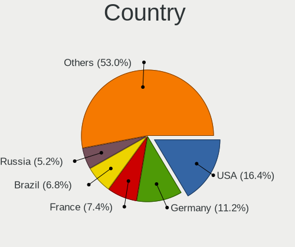
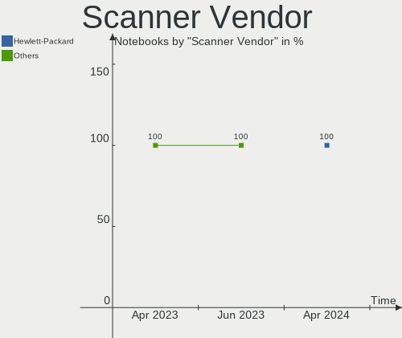
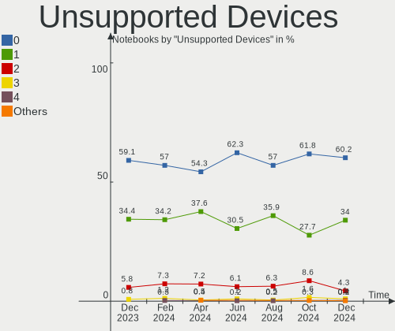

Ubuntu Hardware Trends (Notebook)
---------------------------------

A project to identify most popular hardware characteristics and track their change
over time based on data collected by Ubuntu users at https://Linux-Hardware.org.

Anyone can contribute to the study by uploading probes of their computers by
the [hw-probe](https://github.com/linuxhw/hw-probe) tool:

    sudo -E hw-probe -all -upload

Full-feature report is available here: https://linux-hardware.org/?view=trends&formfactor=notebook

Period: Oct, 2020.

Contents
--------

- [ OS                       ](#os)
- [ OS Family                ](#os-family)
- [ Kernel                   ](#kernel)
- [ Kernel Family            ](#kernel-family)
- [ Kernel Major Ver.        ](#kernel-major-ver)
- [ Arch                     ](#arch)
- [ DE                       ](#de)
- [ Display Server           ](#display-server)
- [ Display Manager          ](#display-manager)
- [ OS Lang                  ](#os-lang)
- [ Boot Mode                ](#boot-mode)
- [ Filesystem               ](#filesystem)
- [ Part. scheme             ](#part-scheme)
- [ Dual Boot with Linux/BSD ](#dual-boot-with-linux/bsd)
- [ Dual Boot (Win)          ](#dual-boot-win)
- [ Country                  ](#country)
- [ City                     ](#city)
- [ Vendor                   ](#vendor)
- [ Model                    ](#model)
- [ Model Family             ](#model-family)
- [ MFG Year                 ](#mfg-year)
- [ Form Factor              ](#form-factor)
- [ Secure Boot              ](#secure-boot)
- [ Coreboot                 ](#coreboot)
- [ RAM Size                 ](#ram-size)
- [ RAM Used                 ](#ram-used)
- [ Has CD-ROM               ](#has-cd-rom)
- [ Total Drives             ](#total-drives)
- [ Has Ethernet             ](#has-ethernet)
- [ Drive Vendor             ](#drive-vendor)
- [ HDD Vendor               ](#hdd-vendor)
- [ SSD Vendor               ](#ssd-vendor)
- [ Drive Model              ](#drive-model)
- [ Drive Kind               ](#drive-kind)
- [ Drive Connector          ](#drive-connector)
- [ Drive Size               ](#drive-size)
- [ Space Total              ](#space-total)
- [ Space Used               ](#space-used)
- [ Malfunc. Drives          ](#malfunc-drives)
- [ Malfunc. Drive Vendor    ](#malfunc-drive-vendor)
- [ Malfunc. HDD Vendor      ](#malfunc-hdd-vendor)
- [ Malfunc. Drive Kind      ](#malfunc-drive-kind)
- [ Failed Drives            ](#failed-drives)
- [ Failed Drive Vendor      ](#failed-drive-vendor)
- [ Drive Status             ](#drive-status)
- [ Storage Vendor           ](#storage-vendor)
- [ Storage Model            ](#storage-model)
- [ Storage Kind             ](#storage-kind)
- [ CPU Vendor               ](#cpu-vendor)
- [ CPU Model                ](#cpu-model)
- [ CPU Model Family         ](#cpu-model-family)
- [ CPU Cores                ](#cpu-cores)
- [ CPU Sockets              ](#cpu-sockets)
- [ CPU Threads              ](#cpu-threads)
- [ CPU Op-Modes             ](#cpu-op-modes)
- [ CPU Microcode            ](#cpu-microcode)
- [ CPU Microarch            ](#cpu-microarch)
- [ GPU Vendor               ](#gpu-vendor)
- [ GPU Model                ](#gpu-model)
- [ GPU Combo                ](#gpu-combo)
- [ GPU Driver               ](#gpu-driver)
- [ GPU Memory               ](#gpu-memory)
- [ Monitor Vendor           ](#monitor-vendor)
- [ Monitor Model            ](#monitor-model)
- [ Monitor Resolution       ](#monitor-resolution)
- [ Monitor Diagonal         ](#monitor-diagonal)
- [ Monitor Width            ](#monitor-width)
- [ Aspect Ratio             ](#aspect-ratio)
- [ Monitor Area             ](#monitor-area)
- [ Pixel Density            ](#pixel-density)
- [ Multiple Monitors        ](#multiple-monitors)
- [ Net Controller Vendor    ](#net-controller-vendor)
- [ Net Controller Model     ](#net-controller-model)
- [ Wireless Vendor          ](#wireless-vendor)
- [ Wireless Model           ](#wireless-model)
- [ Ethernet Vendor          ](#ethernet-vendor)
- [ Ethernet Model           ](#ethernet-model)
- [ Net Controller Kind      ](#net-controller-kind)
- [ Used Controller          ](#used-controller)
- [ NICs                     ](#nics)
- [ Memory Vendor            ](#memory-vendor)
- [ Memory Model             ](#memory-model)
- [ Memory Kind              ](#memory-kind)
- [ Memory Form Factor       ](#memory-form-factor)
- [ Memory Size              ](#memory-size)
- [ Memory Speed             ](#memory-speed)
- [ Sound Vendor             ](#sound-vendor)
- [ Sound Model              ](#sound-model)
- [ Camera Vendor            ](#camera-vendor)
- [ Camera Model             ](#camera-model)
- [ Fingerprint Vendor       ](#fingerprint-vendor)
- [ Fingerprint Model        ](#fingerprint-model)
- [ Chipcard Vendor          ](#chipcard-vendor)
- [ Chipcard Model           ](#chipcard-model)
- [ Printer Vendor           ](#printer-vendor)
- [ Printer Model            ](#printer-model)
- [ Scanner Vendor           ](#scanner-vendor)
- [ Scanner Model            ](#scanner-model)
- [ Bluetooth Vendor         ](#bluetooth-vendor)
- [ Bluetooth Model          ](#bluetooth-model)
- [ Unsupported Devices      ](#unsupported-devices)
- [ Unsupported Device Types ](#unsupported-device-types)

OS
--

Installed operating systems

| Name         | Notebooks | Percent |
|--------------|-----------|---------|
| Ubuntu 20.04 | 948       | 75.66%  |
| Ubuntu 18.04 | 166       | 13.25%  |
| Ubuntu 20.10 | 101       | 8.06%   |
| Ubuntu 16.04 | 17        | 1.36%   |
| Ubuntu 19.10 | 15        | 1.2%    |
| Ubuntu 19.04 | 3         | 0.24%   |
| Ubuntu 2020  | 1         | 0.08%   |
| Ubuntu 17.10 | 1         | 0.08%   |
| Ubuntu       | 1         | 0.08%   |

OS Family
---------

OS without a version

| Name   | Notebooks | Percent |
|--------|-----------|---------|
| Ubuntu | 1253      | 100%    |

Kernel
------

Version of the Linux kernel

| Version                    | Notebooks | Percent |
|----------------------------|-----------|---------|
| 5.4.0-48-generic           | 438       | 34.96%  |
| 5.4.0-52-generic           | 289       | 23.06%  |
| 5.4.0-51-generic           | 127       | 10.14%  |
| 5.4.0-42-generic           | 53        | 4.23%   |
| 5.8.0-25-generic           | 48        | 3.83%   |
| 5.4.0-49-generic           | 36        | 2.87%   |
| 4.15.0-118-generic         | 31        | 2.47%   |
| 5.8.0-26-generic           | 25        | 2%      |
| 4.15.0-122-generic         | 19        | 1.52%   |
| 5.4.0-26-generic           | 12        | 0.96%   |
| 4.15.0-121-generic         | 11        | 0.88%   |
| 5.4.0-47-generic           | 8         | 0.64%   |
| 5.3.0-64-generic           | 8         | 0.64%   |
| 5.8.0-23-generic           | 7         | 0.56%   |
| 5.8.0-20-generic           | 7         | 0.56%   |
| 5.4.0-48-lowlatency        | 6         | 0.48%   |
| 5.8.14-050814-generic      | 5         | 0.4%    |
| 5.4.0-52-lowlatency        | 5         | 0.4%    |
| 5.8.0-22-generic           | 4         | 0.32%   |
| 5.6.0-1028-oem             | 4         | 0.32%   |
| 4.15.0-112-generic         | 4         | 0.32%   |
| 5.9.0-050900-generic       | 3         | 0.24%   |
| 5.8.0-21-generic           | 3         | 0.24%   |
| 5.3.0-28-generic           | 3         | 0.24%   |
| 5.3.0-24-generic           | 3         | 0.24%   |
| 5.0.0-38-generic           | 3         | 0.24%   |
| 4.15.0-119-generic         | 3         | 0.24%   |
| 5.8.13-050813-generic      | 2         | 0.16%   |
| 5.8.12-050812-generic      | 2         | 0.16%   |
| 5.8.0-050800-generic       | 2         | 0.16%   |
| 5.7.19-050719-generic      | 2         | 0.16%   |
| 5.4.0-49-lowlatency        | 2         | 0.16%   |
| 5.4.0-45-generic           | 2         | 0.16%   |
| 5.3.0-40-generic           | 2         | 0.16%   |
| 5.0.0-1016-oem-osp1        | 2         | 0.16%   |
| 4.4.0-193-generic          | 2         | 0.16%   |
| 4.15.0-99-generic          | 2         | 0.16%   |
| 4.15.0-20-generic          | 2         | 0.16%   |
| 5.9.2-050902-generic       | 1         | 0.08%   |
| 5.9.1-050901-generic       | 1         | 0.08%   |
| 5.9.1                      | 1         | 0.08%   |
| 5.9.0-rc4+                 | 1         | 0.08%   |
| 5.9.0-050900rc7-generic    | 1         | 0.08%   |
| 5.9.0-050900rc6-lowlatency | 1         | 0.08%   |
| 5.8.7-050807-generic       | 1         | 0.08%   |
| 5.8.16-xanmod1             | 1         | 0.08%   |
| 5.8.15-050815-generic      | 1         | 0.08%   |
| 5.8.14-xanmod1             | 1         | 0.08%   |
| 5.8.13-xanmod1             | 1         | 0.08%   |
| 5.8.12-xanmod1             | 1         | 0.08%   |
| 5.8.1-050801-generic       | 1         | 0.08%   |
| 5.8.0-13.1-liquorix-amd64  | 1         | 0.08%   |
| 5.7.6-050706-generic       | 1         | 0.08%   |
| 5.7.15-050715-generic      | 1         | 0.08%   |
| 5.7.1-050701-generic       | 1         | 0.08%   |
| 5.6.6-050606-generic       | 1         | 0.08%   |
| 5.6.17-050617-generic      | 1         | 0.08%   |
| 5.6.1-050601-generic       | 1         | 0.08%   |
| 5.6.0-1031-oem             | 1         | 0.08%   |
| 5.6.0-1027-oem             | 1         | 0.08%   |

Kernel Family
-------------

Linux kernel without a distro release

| Version | Notebooks | Percent |
|---------|-----------|---------|
| 5.4.0   | 987       | 78.77%  |
| 5.8.0   | 97        | 7.74%   |
| 4.15.0  | 85        | 6.78%   |
| 5.3.0   | 23        | 1.84%   |
| 5.0.0   | 7         | 0.56%   |
| 5.9.0   | 6         | 0.48%   |
| 5.8.14  | 6         | 0.48%   |
| 5.6.0   | 6         | 0.48%   |
| 4.4.0   | 4         | 0.32%   |
| 5.8.13  | 3         | 0.24%   |
| 5.8.12  | 3         | 0.24%   |
| 4.13.0  | 3         | 0.24%   |
| 5.9.1   | 2         | 0.16%   |
| 5.7.19  | 2         | 0.16%   |
| 5.9.2   | 1         | 0.08%   |
| 5.8.7   | 1         | 0.08%   |
| 5.8.16  | 1         | 0.08%   |
| 5.8.15  | 1         | 0.08%   |
| 5.8.1   | 1         | 0.08%   |
| 5.7.6   | 1         | 0.08%   |
| 5.7.15  | 1         | 0.08%   |
| 5.7.1   | 1         | 0.08%   |
| 5.6.6   | 1         | 0.08%   |
| 5.6.17  | 1         | 0.08%   |
| 5.6.1   | 1         | 0.08%   |
| 5.4.70  | 1         | 0.08%   |
| 5.4.63  | 1         | 0.08%   |
| 5.4.19  | 1         | 0.08%   |
| 5.10.0  | 1         | 0.08%   |
| 4.19.15 | 1         | 0.08%   |
| 4.18.0  | 1         | 0.08%   |
| 4.17.3  | 1         | 0.08%   |
| 4.10.0  | 1         | 0.08%   |

Kernel Major Ver.
-----------------

Linux kernel major version

| Version | Notebooks | Percent |
|---------|-----------|---------|
| 5.4     | 990       | 79.01%  |
| 5.8     | 113       | 9.02%   |
| 4.15    | 85        | 6.78%   |
| 5.3     | 23        | 1.84%   |
| 5.9     | 9         | 0.72%   |
| 5.6     | 9         | 0.72%   |
| 5.0     | 7         | 0.56%   |
| 5.7     | 5         | 0.4%    |
| 4.4     | 4         | 0.32%   |
| 4.13    | 3         | 0.24%   |
| 5.10    | 1         | 0.08%   |
| 4.19    | 1         | 0.08%   |
| 4.18    | 1         | 0.08%   |
| 4.17    | 1         | 0.08%   |
| 4.10    | 1         | 0.08%   |

Arch
----

OS architecture (x86_64, i586, etc.)

| Name   | Notebooks | Percent |
|--------|-----------|---------|
| x86_64 | 1209      | 96.49%  |
| i686   | 44        | 3.51%   |

DE
--

Desktop Environment

| Name            | Notebooks | Percent |
|-----------------|-----------|---------|
| GNOME           | 950       | 75.82%  |
| XFCE            | 73        | 5.83%   |
| Unknown         | 43        | 3.43%   |
| KDE             | 35        | 2.79%   |
| MATE            | 30        | 2.39%   |
| KDE5            | 27        | 2.15%   |
| Unity           | 26        | 2.08%   |
| LXQt            | 23        | 1.84%   |
| Budgie          | 12        | 0.96%   |
| GNOME Flashback | 10        | 0.8%    |
| X-Cinnamon      | 8         | 0.64%   |
| LXDE            | 6         | 0.48%   |
| Cinnamon        | 6         | 0.48%   |
| GNUstep         | 1         | 0.08%   |
| GNOME Classic   | 1         | 0.08%   |
| enlightenment   | 1         | 0.08%   |
| Deepin          | 1         | 0.08%   |

Display Server
--------------

X11 or Wayland

| Name    | Notebooks | Percent |
|---------|-----------|---------|
| X11     | 1179      | 94.09%  |
| Wayland | 44        | 3.51%   |
| Unknown | 23        | 1.84%   |
| Tty     | 7         | 0.56%   |

Display Manager
---------------

SDDM, LightDM, etc.

| Name    | Notebooks | Percent |
|---------|-----------|---------|
| Unknown | 950       | 75.82%  |
| GDM     | 226       | 18.04%  |
| TDM     | 42        | 3.35%   |
| SDDM    | 35        | 2.79%   |

OS Lang
-------

Language

| Lang    | Notebooks | Percent |
|---------|-----------|---------|
| en_US   | 453       | 36.15%  |
| de_DE   | 121       | 9.66%   |
| pt_BR   | 79        | 6.3%    |
| en_GB   | 78        | 6.23%   |
| fr_FR   | 60        | 4.79%   |
| en_IN   | 48        | 3.83%   |
| es_ES   | 37        | 2.95%   |
| ru_RU   | 36        | 2.87%   |
| it_IT   | 31        | 2.47%   |
| en_CA   | 25        | 2%      |
| en_AU   | 21        | 1.68%   |
| pl_PL   | 20        | 1.6%    |
| cs_CZ   | 18        | 1.44%   |
| C       | 17        | 1.36%   |
| hu_HU   | 15        | 1.2%    |
| es_MX   | 12        | 0.96%   |
| nl_NL   | 11        | 0.88%   |
| ja_JP   | 11        | 0.88%   |
| fi_FI   | 9         | 0.72%   |
| de_CH   | 9         | 0.72%   |
| de_AT   | 9         | 0.72%   |
| Unknown | 9         | 0.72%   |
| es_AR   | 8         | 0.64%   |
| tr_TR   | 7         | 0.56%   |
| sv_SE   | 7         | 0.56%   |
| el_GR   | 7         | 0.56%   |
| en_IE   | 6         | 0.48%   |
| uk_UA   | 5         | 0.4%    |
| nl_BE   | 5         | 0.4%    |
| es_CO   | 5         | 0.4%    |
| en_ZA   | 5         | 0.4%    |
| en_PH   | 5         | 0.4%    |
| en_NZ   | 5         | 0.4%    |
| en_IL   | 5         | 0.4%    |
| ru_UA   | 4         | 0.32%   |
| pt_PT   | 4         | 0.32%   |
| fr_CA   | 4         | 0.32%   |
| zh_CN   | 3         | 0.24%   |
| sk_SK   | 3         | 0.24%   |
| nb_NO   | 3         | 0.24%   |
| es_CL   | 3         | 0.24%   |
| da_DK   | 3         | 0.24%   |
| ro_RO   | 2         | 0.16%   |
| es_EC   | 2         | 0.16%   |
| es_CR   | 2         | 0.16%   |
| en_SG   | 2         | 0.16%   |
| ca_ES   | 2         | 0.16%   |
| sr_RS   | 1         | 0.08%   |
| my_MM   | 1         | 0.08%   |
| hr_HR   | 1         | 0.08%   |
| he_IL   | 1         | 0.08%   |
| fr_BE   | 1         | 0.08%   |
| es_VE   | 1         | 0.08%   |
| es_UY   | 1         | 0.08%   |
| es_US   | 1         | 0.08%   |
| es_SV   | 1         | 0.08%   |
| es_GT   | 1         | 0.08%   |
| es_DO   | 1         | 0.08%   |
| eo      | 1         | 0.08%   |
| en_NL   | 1         | 0.08%   |

Boot Mode
---------

EFI or BIOS

| Mode | Notebooks | Percent |
|------|-----------|---------|
| BIOS | 655       | 52.27%  |
| EFI  | 598       | 47.73%  |

Filesystem
----------

Type of filesystem

| Type    | Notebooks | Percent |
|---------|-----------|---------|
| Ext4    | 1176      | 93.85%  |
| Overlay | 32        | 2.55%   |
| Btrfs   | 17        | 1.36%   |
| Zfs     | 13        | 1.04%   |
| Xfs     | 6         | 0.48%   |
| Ext2    | 4         | 0.32%   |
| Ext3    | 3         | 0.24%   |
| Aufs    | 1         | 0.08%   |
| Unknown | 1         | 0.08%   |

Part. scheme
------------

Scheme of partitioning

| Type    | Notebooks | Percent |
|---------|-----------|---------|
| Unknown | 956       | 76.3%   |
| GPT     | 225       | 17.96%  |
| MBR     | 72        | 5.75%   |

Dual Boot with Linux/BSD
------------------------

Hosting more than one Linux/BSD

| Dual boot | Notebooks | Percent |
|-----------|-----------|---------|
| No        | 1148      | 91.62%  |
| Yes       | 105       | 8.38%   |

Dual Boot (Win)
---------------

Hosting Linux and Windows

| Dual boot | Notebooks | Percent |
|-----------|-----------|---------|
| No        | 835       | 66.64%  |
| Yes       | 418       | 33.36%  |

Country
-------

Geographic location (country)

| Country            | Notebooks | Percent |
|--------------------|-----------|---------|
| USA                | 170       | 13.57%  |
| Germany            | 143       | 11.41%  |
| Brazil             | 92        | 7.34%   |
| France             | 65        | 5.19%   |
| UK                 | 62        | 4.95%   |
| India              | 51        | 4.07%   |
| Russia             | 49        | 3.91%   |
| Spain              | 42        | 3.35%   |
| Italy              | 40        | 3.19%   |
| Canada             | 33        | 2.63%   |
| Poland             | 31        | 2.47%   |
| Netherlands        | 28        | 2.23%   |
| Switzerland        | 21        | 1.68%   |
| Ukraine            | 20        | 1.6%    |
| Czech Republic     | 20        | 1.6%    |
| Australia          | 20        | 1.6%    |
| Argentina          | 19        | 1.52%   |
| Finland            | 18        | 1.44%   |
| Hungary            | 17        | 1.36%   |
| Belgium            | 17        | 1.36%   |
| Mexico             | 16        | 1.28%   |
| Austria            | 15        | 1.2%    |
| Turkey             | 13        | 1.04%   |
| Japan              | 13        | 1.04%   |
| Portugal           | 11        | 0.88%   |
| Sweden             | 10        | 0.8%    |
| Greece             | 10        | 0.8%    |
| Denmark            | 9         | 0.72%   |
| Romania            | 8         | 0.64%   |
| Philippines        | 8         | 0.64%   |
| Norway             | 8         | 0.64%   |
| Israel             | 7         | 0.56%   |
| Ireland            | 7         | 0.56%   |
| Egypt              | 7         | 0.56%   |
| China              | 7         | 0.56%   |
| Belarus            | 7         | 0.56%   |
| South Africa       | 6         | 0.48%   |
| Pakistan           | 6         | 0.48%   |
| Algeria            | 6         | 0.48%   |
| Vietnam            | 5         | 0.4%    |
| New Zealand        | 5         | 0.4%    |
| Morocco            | 5         | 0.4%    |
| Iran               | 5         | 0.4%    |
| Colombia           | 5         | 0.4%    |
| Sri Lanka          | 4         | 0.32%   |
| Singapore          | 4         | 0.32%   |
| Korea, Republic of | 4         | 0.32%   |
| Indonesia          | 4         | 0.32%   |
| Dominican Republic | 4         | 0.32%   |
| Bulgaria           | 4         | 0.32%   |
| Slovakia           | 3         | 0.24%   |
| Malaysia           | 3         | 0.24%   |
| Luxembourg         | 3         | 0.24%   |
| Lithuania          | 3         | 0.24%   |
| Lebanon            | 3         | 0.24%   |
| Hong Kong          | 3         | 0.24%   |
| Ecuador            | 3         | 0.24%   |
| Costa Rica         | 3         | 0.24%   |
| Chile              | 3         | 0.24%   |
| Bangladesh         | 3         | 0.24%   |

City
----

Geographic location (city)

| City                     | Notebooks | Percent |
|--------------------------|-----------|---------|
| São Paulo               | 13        | 1.04%   |
| Prague                   | 13        | 1.04%   |
| Berlin                   | 13        | 1.04%   |
| Vienna                   | 12        | 0.96%   |
| Kyiv                     | 9         | 0.72%   |
| Buenos Aires             | 9         | 0.72%   |
| Budapest                 | 9         | 0.72%   |
| Stuttgart                | 8         | 0.64%   |
| Munich                   | 8         | 0.64%   |
| Madrid                   | 8         | 0.64%   |
| Helsinki                 | 8         | 0.64%   |
| Bengaluru                | 8         | 0.64%   |
| Rome                     | 7         | 0.56%   |
| Moscow                   | 7         | 0.56%   |
| Warsaw                   | 6         | 0.48%   |
| St Petersburg            | 6         | 0.48%   |
| Paris                    | 6         | 0.48%   |
| Kazan’                 | 6         | 0.48%   |
| Brasília                | 6         | 0.48%   |
| Rio de Janeiro           | 5         | 0.4%    |
| New Delhi                | 5         | 0.4%    |
| London                   | 5         | 0.4%    |
| Istanbul                 | 5         | 0.4%    |
| Espoo                    | 5         | 0.4%    |
| Dresden                  | 5         | 0.4%    |
| Curitiba                 | 5         | 0.4%    |
| Chennai                  | 5         | 0.4%    |
| Barcelona                | 5         | 0.4%    |
| Zurich                   | 4         | 0.32%   |
| Offenbach                | 4         | 0.32%   |
| Mumbai                   | 4         | 0.32%   |
| Minsk                    | 4         | 0.32%   |
| Milan                    | 4         | 0.32%   |
| Mexico City              | 4         | 0.32%   |
| Melbourne                | 4         | 0.32%   |
| Hagetmau                 | 4         | 0.32%   |
| Genoa                    | 4         | 0.32%   |
| Cologne                  | 4         | 0.32%   |
| Bucharest                | 4         | 0.32%   |
| Ankara                   | 4         | 0.32%   |
| Voronezh                 | 3         | 0.24%   |
| Vilnius                  | 3         | 0.24%   |
| Toulouse                 | 3         | 0.24%   |
| Toronto                  | 3         | 0.24%   |
| The Hague                | 3         | 0.24%   |
| Tel Aviv                 | 3         | 0.24%   |
| Tehran                   | 3         | 0.24%   |
| Sofia                    | 3         | 0.24%   |
| Singapore                | 3         | 0.24%   |
| Seattle                  | 3         | 0.24%   |
| Schwangau                | 3         | 0.24%   |
| Santa Coloma de Gramenet | 3         | 0.24%   |
| San Jose                 | 3         | 0.24%   |
| Raleigh                  | 3         | 0.24%   |
| Porto                    | 3         | 0.24%   |
| Oslo                     | 3         | 0.24%   |
| Nuremberg                | 3         | 0.24%   |
| Nottingham               | 3         | 0.24%   |
| Montreal                 | 3         | 0.24%   |
| Montpellier              | 3         | 0.24%   |

Vendor
------

Motherboard manufacturer

| Name                   | Notebooks | Percent |
|------------------------|-----------|---------|
| Hewlett-Packard        | 257       | 20.51%  |
| Lenovo                 | 255       | 20.35%  |
| Dell                   | 247       | 19.71%  |
| ASUSTek Computer       | 107       | 8.54%   |
| Acer                   | 106       | 8.46%   |
| Toshiba                | 54        | 4.31%   |
| Samsung Electronics    | 21        | 1.68%   |
| Sony                   | 20        | 1.6%    |
| Apple                  | 19        | 1.52%   |
| MSI                    | 18        | 1.44%   |
| HUAWEI                 | 16        | 1.28%   |
| Notebook               | 10        | 0.8%    |
| Fujitsu                | 10        | 0.8%    |
| Medion                 | 9         | 0.72%   |
| Packard Bell           | 8         | 0.64%   |
| Positivo               | 7         | 0.56%   |
| LG Electronics         | 7         | 0.56%   |
| Fujitsu Siemens        | 7         | 0.56%   |
| TUXEDO                 | 6         | 0.48%   |
| Unknown                | 6         | 0.48%   |
| Clevo                  | 5         | 0.4%    |
| Panasonic              | 4         | 0.32%   |
| BANGHO                 | 4         | 0.32%   |
| Timi                   | 3         | 0.24%   |
| Google                 | 3         | 0.24%   |
| Gateway                | 3         | 0.24%   |
| Teclast                | 2         | 0.16%   |
| System76               | 2         | 0.16%   |
| PC Specialist          | 2         | 0.16%   |
| Itautec                | 2         | 0.16%   |
| Intel                  | 2         | 0.16%   |
| Gigabyte Technology    | 2         | 0.16%   |
| Avell High Performance | 2         | 0.16%   |
| Alienware              | 2         | 0.16%   |
| UNITCOM                | 1         | 0.08%   |
| Semp Toshiba           | 1         | 0.08%   |
| SCHNEIDER              | 1         | 0.08%   |
| Schenker               | 1         | 0.08%   |
| Razer                  | 1         | 0.08%   |
| Phoenix/SiS            | 1         | 0.08%   |
| PEAQ                   | 1         | 0.08%   |
| OEM                    | 1         | 0.08%   |
| OEGStone               | 1         | 0.08%   |
| NEC Computers          | 1         | 0.08%   |
| Multilaser             | 1         | 0.08%   |
| MouseComputer          | 1         | 0.08%   |
| LAMINA                 | 1         | 0.08%   |
| INET                   | 1         | 0.08%   |
| Houter                 | 1         | 0.08%   |
| Hampoo                 | 1         | 0.08%   |
| EXTRA Computer         | 1         | 0.08%   |
| EPSON DIRECT           | 1         | 0.08%   |
| Dynabook               | 1         | 0.08%   |
| Complet                | 1         | 0.08%   |
| Compaq                 | 1         | 0.08%   |
| Chuwi                  | 1         | 0.08%   |
| Casper                 | 1         | 0.08%   |
| AVITA                  | 1         | 0.08%   |
| Aava Mobile Oy         | 1         | 0.08%   |

Model
-----

Motherboard model

| Name                                                              | Notebooks | Percent |
|-------------------------------------------------------------------|-----------|---------|
| Unknown                                                           | 10        | 0.8%    |
| HP Pavilion dv6                                                   | 9         | 0.72%   |
| HP Notebook                                                       | 9         | 0.72%   |
| HP Pavilion dv7                                                   | 7         | 0.56%   |
| HP Pavilion g6                                                    | 6         | 0.48%   |
| Dell XPS 13 9360                                                  | 6         | 0.48%   |
| Dell Inspiron N5110                                               | 6         | 0.48%   |
| Lenovo Legion Y530-15ICH 81FV                                     | 5         | 0.4%    |
| HP Pavilion g4                                                    | 5         | 0.4%    |
| HP G62                                                            | 5         | 0.4%    |
| HP EliteBook 840 G3                                               | 5         | 0.4%    |
| HP 255 G7 Notebook PC                                             | 5         | 0.4%    |
| HP 15                                                             | 5         | 0.4%    |
| Dell XPS 15 7590                                                  | 5         | 0.4%    |
| Dell XPS 13 7390                                                  | 5         | 0.4%    |
| Dell Latitude E6430                                               | 5         | 0.4%    |
| Dell Inspiron 5570                                                | 5         | 0.4%    |
| Dell G3 3590                                                      | 5         | 0.4%    |
| HUAWEI NBLK-WAX9X                                                 | 4         | 0.32%   |
| HP ProBook 450 G7                                                 | 4         | 0.32%   |
| HP Pavilion g7                                                    | 4         | 0.32%   |
| HP EliteBook 840 G5                                               | 4         | 0.32%   |
| Dell XPS 15 9560                                                  | 4         | 0.32%   |
| Dell XPS 13 9380                                                  | 4         | 0.32%   |
| Dell Latitude E6540                                               | 4         | 0.32%   |
| Dell Latitude E6410                                               | 4         | 0.32%   |
| Dell Latitude E6400                                               | 4         | 0.32%   |
| Dell Inspiron 15-3567                                             | 4         | 0.32%   |
| Lenovo IdeaPad 530S-14IKB 81EU                                    | 3         | 0.24%   |
| HP ZBook 15 G2                                                    | 3         | 0.24%   |
| HP Pavilion dv6700                                                | 3         | 0.24%   |
| HP EliteBook 840 G2                                               | 3         | 0.24%   |
| HP Compaq Presario CQ60                                           | 3         | 0.24%   |
| HP 2000                                                           | 3         | 0.24%   |
| Dell Vostro 3480                                                  | 3         | 0.24%   |
| Dell Precision 5540                                               | 3         | 0.24%   |
| Dell Latitude E6530                                               | 3         | 0.24%   |
| Dell Latitude E6520                                               | 3         | 0.24%   |
| Dell Latitude E6420                                               | 3         | 0.24%   |
| Dell Latitude E5470                                               | 3         | 0.24%   |
| Dell Latitude 7490                                                | 3         | 0.24%   |
| Dell Latitude 5480                                                | 3         | 0.24%   |
| Dell Latitude 5400                                                | 3         | 0.24%   |
| Dell Inspiron 5759                                                | 3         | 0.24%   |
| Dell Inspiron 3583                                                | 3         | 0.24%   |
| Dell G5 5587                                                      | 3         | 0.24%   |
| ASUS E200HA                                                       | 3         | 0.24%   |
| Acer Aspire V3-571G                                               | 3         | 0.24%   |
| Acer Aspire A515-51                                               | 3         | 0.24%   |
| Toshiba Satellite L50-C                                           | 2         | 0.16%   |
| Toshiba Satellite L305                                            | 2         | 0.16%   |
| Toshiba Satellite C660                                            | 2         | 0.16%   |
| Toshiba Satellite A135                                            | 2         | 0.16%   |
| Samsung Electronics R530/R730/P530                                | 2         | 0.16%   |
| Samsung Electronics 700Z3A/700Z4A/700Z5A/700Z5B                   | 2         | 0.16%   |
| Samsung Electronics 300V3A/300V4A/300V5A/200A4B/200A5B            | 2         | 0.16%   |
| Samsung Electronics 300E5EV/300E4EV/270E5EV/270E4EV/2470EV/2470EE | 2         | 0.16%   |
| Samsung Electronics 300E4C/300E5C/300E7C                          | 2         | 0.16%   |
| MSI GE75 Raider 10SE                                              | 2         | 0.16%   |
| Lenovo V330-15IKB 81AX                                            | 2         | 0.16%   |

Model Family
------------

Motherboard model prefix

| Name                        | Notebooks | Percent |
|-----------------------------|-----------|---------|
| Lenovo ThinkPad             | 133       | 10.61%  |
| Dell Latitude               | 83        | 6.62%   |
| Acer Aspire                 | 81        | 6.46%   |
| Dell Inspiron               | 74        | 5.91%   |
| HP Pavilion                 | 58        | 4.63%   |
| Lenovo IdeaPad              | 53        | 4.23%   |
| Toshiba Satellite           | 50        | 3.99%   |
| HP ProBook                  | 38        | 3.03%   |
| HP EliteBook                | 35        | 2.79%   |
| Dell XPS                    | 34        | 2.71%   |
| HP Laptop                   | 24        | 1.92%   |
| Dell Vostro                 | 23        | 1.84%   |
| HP ZBook                    | 16        | 1.28%   |
| HP Compaq                   | 16        | 1.28%   |
| Dell Precision              | 16        | 1.28%   |
| ASUS VivoBook               | 15        | 1.2%    |
| Lenovo Legion               | 10        | 0.8%    |
| Fujitsu LIFEBOOK            | 10        | 0.8%    |
| Unknown                     | 10        | 0.8%    |
| HP Notebook                 | 9         | 0.72%   |
| HP ENVY                     | 9         | 0.72%   |
| Packard Bell EasyNote       | 8         | 0.64%   |
| HP 255                      | 8         | 0.64%   |
| HP 250                      | 7         | 0.56%   |
| Dell G3                     | 7         | 0.56%   |
| ASUS TUF                    | 7         | 0.56%   |
| Lenovo ThinkBook            | 6         | 0.48%   |
| Acer Swift                  | 6         | 0.48%   |
| HP OMEN                     | 5         | 0.4%    |
| HP G62                      | 5         | 0.4%    |
| HP 15                       | 5         | 0.4%    |
| ASUS ZenBook                | 5         | 0.4%    |
| Acer Extensa                | 5         | 0.4%    |
| HUAWEI NBLK-WAX9X           | 4         | 0.32%   |
| Fujitsu Siemens AMILO       | 4         | 0.32%   |
| Dell Studio                 | 4         | 0.32%   |
| Dell G5                     | 4         | 0.32%   |
| Acer Nitro                  | 4         | 0.32%   |
| Medion Akoya                | 3         | 0.24%   |
| HP Mini                     | 3         | 0.24%   |
| HP 2000                     | 3         | 0.24%   |
| ASUS ROG                    | 3         | 0.24%   |
| ASUS E200HA                 | 3         | 0.24%   |
| Apple MacBookPro8           | 3         | 0.24%   |
| Apple MacBookPro5           | 3         | 0.24%   |
| Toshiba PORTEGE             | 2         | 0.16%   |
| Samsung Electronics R530    | 2         | 0.16%   |
| Samsung Electronics 700Z3A  | 2         | 0.16%   |
| Samsung Electronics 300V3A  | 2         | 0.16%   |
| Samsung Electronics 300E5EV | 2         | 0.16%   |
| Samsung Electronics 300E4C  | 2         | 0.16%   |
| Notebook W54                | 2         | 0.16%   |
| MSI GE75                    | 2         | 0.16%   |
| Lenovo Yoga                 | 2         | 0.16%   |
| Lenovo V570                 | 2         | 0.16%   |
| Lenovo V330-15IKB           | 2         | 0.16%   |
| Lenovo V330-14IKB           | 2         | 0.16%   |
| Lenovo V14-IIL              | 2         | 0.16%   |
| Lenovo G770                 | 2         | 0.16%   |
| Lenovo G710                 | 2         | 0.16%   |

MFG Year
--------

Motherboard manufacture year

| Year    | Notebooks | Percent |
|---------|-----------|---------|
| 2020    | 244       | 19.47%  |
| 2019    | 188       | 15%     |
| 2018    | 128       | 10.22%  |
| 2012    | 85        | 6.78%   |
| 2011    | 84        | 6.7%    |
| 2013    | 75        | 5.99%   |
| 2015    | 69        | 5.51%   |
| 2010    | 68        | 5.43%   |
| 2014    | 64        | 5.11%   |
| 2017    | 63        | 5.03%   |
| 2016    | 55        | 4.39%   |
| 2009    | 50        | 3.99%   |
| 2008    | 43        | 3.43%   |
| 2007    | 16        | 1.28%   |
| 2006    | 14        | 1.12%   |
| Unknown | 4         | 0.32%   |
| 2005    | 3         | 0.24%   |

Form Factor
-----------

Physical design of the computer

| Name     | Notebooks | Percent |
|----------|-----------|---------|
| Notebook | 1253      | 100%    |

Secure Boot
-----------

Enabled or disabled

| State    | Notebooks | Percent |
|----------|-----------|---------|
| Disabled | 1106      | 88.27%  |
| Enabled  | 147       | 11.73%  |

Coreboot
--------

Have coreboot on board

| Used | Notebooks | Percent |
|------|-----------|---------|
| No   | 1250      | 99.76%  |
| Yes  | 3         | 0.24%   |

RAM Size
--------

Total RAM memory

| Size in GB  | Notebooks | Percent |
|-------------|-----------|---------|
| 4.01-8.0    | 333       | 26.58%  |
| 3.01-4.0    | 320       | 25.54%  |
| 16.01-24.0  | 222       | 17.72%  |
| 8.01-16.0   | 204       | 16.28%  |
| 1.01-2.0    | 66        | 5.27%   |
| 32.01-64.0  | 54        | 4.31%   |
| 2.01-3.0    | 22        | 1.76%   |
| 64.01-256.0 | 11        | 0.88%   |
| 0.01-1.0    | 11        | 0.88%   |
| 24.01-32.0  | 10        | 0.8%    |

RAM Used
--------

Used RAM memory

| Used GB    | Notebooks | Percent |
|------------|-----------|---------|
| 1.01-2.0   | 514       | 41.02%  |
| 2.01-3.0   | 311       | 24.82%  |
| 3.01-4.0   | 164       | 13.09%  |
| 4.01-8.0   | 151       | 12.05%  |
| 0.01-1.0   | 64        | 5.11%   |
| 8.01-16.0  | 45        | 3.59%   |
| 16.01-24.0 | 3         | 0.24%   |
| 24.01-32.0 | 1         | 0.08%   |

Has CD-ROM
----------

Has CD-ROM on board

| Presented | Notebooks | Percent |
|-----------|-----------|---------|
| No        | 681       | 54.35%  |
| Yes       | 572       | 45.65%  |

Total Drives
------------

Number of drives on board

| Drives | Notebooks | Percent |
|--------|-----------|---------|
| 1      | 908       | 72.47%  |
| 2      | 293       | 23.38%  |
| 3      | 34        | 2.71%   |
| 0      | 11        | 0.88%   |
| 4      | 5         | 0.4%    |
| 8      | 1         | 0.08%   |
| 5      | 1         | 0.08%   |

Has Ethernet
------------

Has Ethernet on board

| Presented | Notebooks | Percent |
|-----------|-----------|---------|
| Yes       | 1095      | 87.39%  |
| No        | 158       | 12.61%  |

Drive Vendor
------------

Hard drive vendors

| Vendor                    | Notebooks | Drives | Percent |
|---------------------------|-----------|--------|---------|
| Samsung Electronics       | 248       | 264    | 16.4%   |
| WDC                       | 208       | 216    | 13.76%  |
| Seagate                   | 206       | 212    | 13.62%  |
| Toshiba                   | 156       | 158    | 10.32%  |
| Unknown                   | 77        | 82     | 5.09%   |
| SanDisk                   | 76        | 76     | 5.03%   |
| Kingston                  | 59        | 59     | 3.9%    |
| Hitachi                   | 59        | 59     | 3.9%    |
| SK Hynix                  | 56        | 57     | 3.7%    |
| HGST                      | 51        | 51     | 3.37%   |
| Intel                     | 37        | 40     | 2.45%   |
| Crucial                   | 37        | 38     | 2.45%   |
| Micron Technology         | 35        | 35     | 2.31%   |
| A-DATA Technology         | 22        | 22     | 1.46%   |
| LITEON                    | 16        | 16     | 1.06%   |
| Fujitsu                   | 16        | 17     | 1.06%   |
| PNY                       | 11        | 11     | 0.73%   |
| China                     | 11        | 11     | 0.73%   |
| Apple                     | 9         | 9      | 0.6%    |
| SPCC                      | 8         | 8      | 0.53%   |
| LITEONIT                  | 6         | 6      | 0.4%    |
| Realtek Semiconductor     | 5         | 5      | 0.33%   |
| Phison                    | 5         | 5      | 0.33%   |
| Lenovo                    | 5         | 5      | 0.33%   |
| KingSpec                  | 5         | 6      | 0.33%   |
| KingDian                  | 5         | 5      | 0.33%   |
| Transcend                 | 4         | 4      | 0.26%   |
| OCZ                       | 4         | 4      | 0.26%   |
| JMicron                   | 4         | 4      | 0.26%   |
| Intenso                   | 4         | 4      | 0.26%   |
| Hewlett-Packard           | 4         | 4      | 0.26%   |
| Apacer                    | 4         | 4      | 0.26%   |
| Silicon Motion            | 3         | 3      | 0.2%    |
| PLEXTOR                   | 3         | 3      | 0.2%    |
| KIOXIA                    | 3         | 3      | 0.2%    |
| ASMT                      | 3         | 6      | 0.2%    |
| Zheino                    | 2         | 4      | 0.13%   |
| Team                      | 2         | 2      | 0.13%   |
| Patriot                   | 2         | 2      | 0.13%   |
| Micron/Crucial Technology | 2         | 2      | 0.13%   |
| LaCie                     | 2         | 3      | 0.13%   |
| GOODRAM                   | 2         | 2      | 0.13%   |
| FORESEE                   | 2         | 2      | 0.13%   |
| Corsair                   | 2         | 2      | 0.13%   |
| BHT                       | 2         | 2      | 0.13%   |
| USB3.0                    | 1         | 1      | 0.07%   |
| USB 3.0                   | 1         | 1      | 0.07%   |
| Union Memory              | 1         | 1      | 0.07%   |
| TO Exter                  | 1         | 1      | 0.07%   |
| SUNEAST                   | 1         | 1      | 0.07%   |
| Solid State Storage       | 1         | 1      | 0.07%   |
| ShanDianZhe               | 1         | 1      | 0.07%   |
| Ramsta                    | 1         | 1      | 0.07%   |
| Netac                     | 1         | 1      | 0.07%   |
| lntenso                   | 1         | 1      | 0.07%   |
| Lite-On                   | 1         | 1      | 0.07%   |
| Lexar                     | 1         | 1      | 0.07%   |
| LDLC                      | 1         | 1      | 0.07%   |
| KIOXIA-EXCERIA            | 1         | 1      | 0.07%   |
| KingFast                  | 1         | 1      | 0.07%   |

HDD Vendor
----------

Hard disk drive vendors

| Vendor              | Notebooks | Drives | Percent |
|---------------------|-----------|--------|---------|
| Seagate             | 205       | 211    | 32.8%   |
| WDC                 | 164       | 164    | 26.24%  |
| Toshiba             | 105       | 106    | 16.8%   |
| Hitachi             | 59        | 59     | 9.44%   |
| HGST                | 51        | 51     | 8.16%   |
| Samsung Electronics | 17        | 17     | 2.72%   |
| Fujitsu             | 16        | 17     | 2.56%   |
| LaCie               | 2         | 3      | 0.32%   |
| Apple               | 2         | 2      | 0.32%   |
| USB3.0              | 1         | 1      | 0.16%   |
| TO Exter            | 1         | 1      | 0.16%   |
| JMicron             | 1         | 1      | 0.16%   |
| IBM/Hitachi         | 1         | 1      | 0.16%   |

SSD Vendor
----------

Solid state drive vendors

| Vendor              | Notebooks | Drives | Percent |
|---------------------|-----------|--------|---------|
| Samsung Electronics | 129       | 135    | 26.38%  |
| Kingston            | 51        | 51     | 10.43%  |
| SanDisk             | 42        | 42     | 8.59%   |
| Crucial             | 37        | 38     | 7.57%   |
| WDC                 | 25        | 28     | 5.11%   |
| Micron Technology   | 24        | 24     | 4.91%   |
| A-DATA Technology   | 20        | 20     | 4.09%   |
| SK Hynix            | 17        | 17     | 3.48%   |
| LITEON              | 16        | 16     | 3.27%   |
| Toshiba             | 14        | 14     | 2.86%   |
| PNY                 | 11        | 11     | 2.25%   |
| Intel               | 11        | 11     | 2.25%   |
| China               | 11        | 11     | 2.25%   |
| SPCC                | 7         | 7      | 1.43%   |
| Apple               | 7         | 7      | 1.43%   |
| LITEONIT            | 6         | 6      | 1.23%   |
| KingSpec            | 5         | 6      | 1.02%   |
| KingDian            | 5         | 5      | 1.02%   |
| Transcend           | 4         | 4      | 0.82%   |
| OCZ                 | 4         | 4      | 0.82%   |
| Apacer              | 4         | 4      | 0.82%   |
| PLEXTOR             | 3         | 3      | 0.61%   |
| Intenso             | 3         | 3      | 0.61%   |
| Hewlett-Packard     | 3         | 3      | 0.61%   |
| Team                | 2         | 2      | 0.41%   |
| Patriot             | 2         | 2      | 0.41%   |
| JMicron             | 2         | 2      | 0.41%   |
| GOODRAM             | 2         | 2      | 0.41%   |
| FORESEE             | 2         | 2      | 0.41%   |
| Corsair             | 2         | 2      | 0.41%   |
| BHT                 | 2         | 2      | 0.41%   |
| Zheino              | 1         | 2      | 0.2%    |
| Unknown             | 1         | 1      | 0.2%    |
| SUNEAST             | 1         | 1      | 0.2%    |
| Ramsta              | 1         | 1      | 0.2%    |
| Netac               | 1         | 1      | 0.2%    |
| lntenso             | 1         | 1      | 0.2%    |
| Lexar               | 1         | 1      | 0.2%    |
| LDLC                | 1         | 1      | 0.2%    |
| KIOXIA-EXCERIA      | 1         | 1      | 0.2%    |
| INNOVATION IT       | 1         | 1      | 0.2%    |
| Green House         | 1         | 2      | 0.2%    |
| Gigabyte Technology | 1         | 1      | 0.2%    |
| Drevo               | 1         | 1      | 0.2%    |
| CT1000MX            | 1         | 1      | 0.2%    |
| ASMT                | 1         | 1      | 0.2%    |
| AGI                 | 1         | 1      | 0.2%    |

Drive Model
-----------

Hard drive models

| Model                        | Notebooks | Percent |
|------------------------------|-----------|---------|
| NVMe SSD Drive 512GB         | 76        | 4.92%   |
| NVMe SSD Drive 256GB         | 52        | 3.36%   |
| ST1000LM035-1RK172 1TB       | 32        | 2.07%   |
| MQ01ABD100 1TB               | 22        | 1.42%   |
| MMC Card  32GB               | 20        | 1.29%   |
| ST500LT012-1DG142 500GB      | 19        | 1.23%   |
| HTS721010A9E630 1TB          | 18        | 1.16%   |
| ST1000LM024 HN-M101MBB 1TB   | 16        | 1.03%   |
| MQ01ABF050 500GB             | 16        | 1.03%   |
| SSD 860 EVO 500GB            | 15        | 0.97%   |
| NVMe SSD Drive 1024GB        | 14        | 0.91%   |
| SSD 850 EVO 250GB            | 13        | 0.84%   |
| NVMe SSD Drive 500GB         | 12        | 0.78%   |
| ST9500325AS 500GB            | 11        | 0.71%   |
| SA400S37480G 480GB SSD       | 10        | 0.65%   |
| SA400S37240G 240GB SSD       | 10        | 0.65%   |
| MQ04ABF100 1TB               | 10        | 0.65%   |
| HTS725050A7E630 500GB        | 10        | 0.65%   |
| ST1000LM049-2GH172 1TB       | 9         | 0.58%   |
| SSD 850 EVO 500GB            | 9         | 0.58%   |
| WD10SPZX-21Z10T0 1TB         | 8         | 0.52%   |
| ST1000LM048-2E7172 1TB       | 8         | 0.52%   |
| SA400S37120G 120GB SSD       | 8         | 0.52%   |
| HTS545050A7E380 500GB        | 8         | 0.52%   |
| WD10JPVX-75JC3T0 1TB         | 7         | 0.45%   |
| WD10JPVX-22JC3T0 1TB         | 7         | 0.45%   |
| ST2000LM007-1R8174 2TB       | 7         | 0.45%   |
| SSD 860 EVO 1TB              | 7         | 0.45%   |
| HTS545050A7E680 500GB        | 7         | 0.45%   |
| HTS541010A9E680 1TB          | 7         | 0.45%   |
| 1100_MTFDDAV256TBN 256GB SSD | 7         | 0.45%   |
| WD10SPZX-60Z10T0 1TB         | 6         | 0.39%   |
| WD10SPZX-24Z10 1TB           | 6         | 0.39%   |
| WD10JPCX-24UE4T0 1TB         | 6         | 0.39%   |
| ST9500420AS 500GB            | 6         | 0.39%   |
| SSD 860 EVO 250GB            | 6         | 0.39%   |
| NVMe SSD Drive 1TB           | 6         | 0.39%   |
| MMC Card  4GB                | 6         | 0.39%   |
| HTS723232A7A364 320GB        | 6         | 0.39%   |
| Expansion 4TB                | 6         | 0.39%   |
| WD5000LPCX-24VHAT0 500GB     | 5         | 0.32%   |
| WD5000LPCX-24C6HT0 500GB     | 5         | 0.32%   |
| ST9160310AS 160GB            | 5         | 0.32%   |
| ST500LT012-9WS142 500GB      | 5         | 0.32%   |
| ST500LM021-1KJ152 500GB      | 5         | 0.32%   |
| ST1000LX015-1U7172 1TB       | 5         | 0.32%   |
| SSDPEKNW512G8 512GB          | 5         | 0.32%   |
| SSD 840 EVO 250GB            | 5         | 0.32%   |
| MMC Card  64GB               | 5         | 0.32%   |
| MMC Card  16GB               | 5         | 0.32%   |
| CT240BX500SSD1 240GB         | 5         | 0.32%   |
| WDS240G2G0A-00JH30 240GB SSD | 4         | 0.26%   |
| WDS120G2G0A-00JH30 120GB SSD | 4         | 0.26%   |
| WD5000LPVX-22V0TT0 500GB     | 4         | 0.26%   |
| SV300S37A120G 120GB SSD      | 4         | 0.26%   |
| ST95005620AS 500GB           | 4         | 0.26%   |
| ST9320320AS 320GB            | 4         | 0.26%   |
| ST500LM012 HN-M500MBB 500GB  | 4         | 0.26%   |
| ST500LM000-SSHD-8GB          | 4         | 0.26%   |
| ST1000LM014-1EJ164 1TB       | 4         | 0.26%   |

Drive Kind
----------

HDD or SSD

| Kind    | Notebooks | Drives | Percent |
|---------|-----------|--------|---------|
| HDD     | 616       | 634    | 41.79%  |
| SSD     | 462       | 502    | 31.34%  |
| NVMe    | 311       | 332    | 21.1%   |
| MMC     | 64        | 69     | 4.34%   |
| Unknown | 21        | 26     | 1.42%   |

Drive Connector
---------------

SATA, SAS, NVMe, etc.

| Type | Notebooks | Drives | Percent |
|------|-----------|--------|---------|
| SATA | 984       | 1117   | 70.59%  |
| NVMe | 311       | 332    | 22.31%  |
| MMC  | 64        | 69     | 4.59%   |
| SAS  | 35        | 45     | 2.51%   |

Drive Size
----------

Size of hard drive

| Size in TB | Notebooks | Drives | Percent |
|------------|-----------|--------|---------|
| 0.01-0.5   | 716       | 768    | 66.98%  |
| 0.51-1.0   | 313       | 323    | 29.28%  |
| 1.01-2.0   | 31        | 35     | 2.9%    |
| 3.01-4.0   | 6         | 6      | 0.56%   |
| 4.01-10.0  | 2         | 3      | 0.19%   |
| 2.01-3.0   | 1         | 1      | 0.09%   |

Space Total
-----------

Amount of disk space available on the file system

| Size in GB     | Notebooks | Percent |
|----------------|-----------|---------|
| 101-250        | 416       | 33.2%   |
| 251-500        | 375       | 29.93%  |
| 501-1000       | 185       | 14.76%  |
| 51-100         | 96        | 7.66%   |
| 21-50          | 49        | 3.91%   |
| 1001-2000      | 47        | 3.75%   |
| 1-20           | 46        | 3.67%   |
| More than 3000 | 18        | 1.44%   |
| 2001-3000      | 11        | 0.88%   |
| Unknown        | 10        | 0.8%    |

Space Used
----------

Amount of used disk space

| Used GB        | Notebooks | Percent |
|----------------|-----------|---------|
| 1-20           | 509       | 40.62%  |
| 21-50          | 249       | 19.87%  |
| 51-100         | 180       | 14.37%  |
| 101-250        | 166       | 13.25%  |
| 251-500        | 76        | 6.07%   |
| 501-1000       | 36        | 2.87%   |
| 1001-2000      | 17        | 1.36%   |
| Unknown        | 10        | 0.8%    |
| 2001-3000      | 7         | 0.56%   |
| More than 3000 | 3         | 0.24%   |

Malfunc. Drives
---------------

Drive models with a malfunction

| Model                             | Notebooks | Drives | Percent |
|-----------------------------------|-----------|--------|---------|
| ST9500420AS 500GB                 | 2         | 2      | 4.26%   |
| ST1000LM024 HN-M101MBB 1TB        | 2         | 2      | 4.26%   |
| HTS725050A7E630 500GB             | 2         | 2      | 4.26%   |
| X1 120GB SSD                      | 1         | 1      | 2.13%   |
| WDS100T2B0A 1TB SSD               | 1         | 1      | 2.13%   |
| WD7500BPVT-24HXZT1 752GB          | 1         | 1      | 2.13%   |
| WD5000LPVT-08G33T1 500GB          | 1         | 1      | 2.13%   |
| WD5000BPKT-75PK4T0 500GB          | 1         | 1      | 2.13%   |
| WD3200BEVT-08A23T1 320GB          | 1         | 1      | 2.13%   |
| WD2500BEVT-22ZCT0 250GB           | 1         | 1      | 2.13%   |
| WD10SPZX-24Z10T0 1TB              | 1         | 1      | 2.13%   |
| TM4PS5128G 128GB SSD              | 1         | 1      | 2.13%   |
| ST960813AS 64GB                   | 1         | 1      | 2.13%   |
| ST500LT012-9WS142 500GB           | 1         | 1      | 2.13%   |
| ST500LT012-1DG142 500GB           | 1         | 1      | 2.13%   |
| ST320LT007-9ZV142 320GB           | 1         | 1      | 2.13%   |
| ST1000LM035-1RK172 1TB            | 1         | 1      | 2.13%   |
| SSDSCKKF512H6 SATA 512GB          | 1         | 1      | 2.13%   |
| SSD DP900 128GB-DL3               | 1         | 1      | 2.13%   |
| SC401 SATA 512GB SSD              | 1         | 1      | 2.13%   |
| SA400S37480G 480GB SSD            | 1         | 1      | 2.13%   |
| RBU-SNS8350DES3128GP 128GB SSD    | 1         | 1      | 2.13%   |
| PA25-128 128GB SSD                | 1         | 1      | 2.13%   |
| MTFDDAV256TDL-1AW1ZABHA 256GB SSD | 1         | 1      | 2.13%   |
| MQ02ABD100H 1TB                   | 1         | 1      | 2.13%   |
| MK5065GSX 500GB                   | 1         | 1      | 2.13%   |
| MK3259GSXP 320GB                  | 1         | 1      | 2.13%   |
| MK2576GSX 250GB                   | 1         | 1      | 2.13%   |
| MK2555GSX 250GB                   | 1         | 1      | 2.13%   |
| MK1652GSX 160GB                   | 1         | 1      | 2.13%   |
| MK1059GSMP 1TB                    | 1         | 1      | 2.13%   |
| MHZ2320BH G1 320GB                | 1         | 1      | 2.13%   |
| HTS723232A7A364 320GB             | 1         | 1      | 2.13%   |
| HTS721010A9E630 1TB               | 1         | 1      | 2.13%   |
| HTS545050A7E380 500GB             | 1         | 1      | 2.13%   |
| HTS543232L9SA00 320GB             | 1         | 1      | 2.13%   |
| HTS543216L9A300 160GB             | 1         | 1      | 2.13%   |
| HN-M101MBB 1TB                    | 1         | 1      | 2.13%   |
| HFS256G32MND-2200A 256GB SSD      | 1         | 1      | 2.13%   |
| HFS128G39TND-N210A 128GB SSD      | 1         | 1      | 2.13%   |
| CT960M500SSD1 960GB               | 1         | 1      | 2.13%   |
| CT120M500SSD3 120GB               | 1         | 1      | 2.13%   |
| CHN mSATA02M 256 256GB SSD        | 1         | 2      | 2.13%   |
| 1100 SATA 512GB SSD               | 1         | 1      | 2.13%   |

Malfunc. Drive Vendor
---------------------

Vendors of faulty drives

| Vendor              | Notebooks | Drives | Percent |
|---------------------|-----------|--------|---------|
| Seagate             | 9         | 9      | 19.15%  |
| WDC                 | 7         | 7      | 14.89%  |
| Toshiba             | 7         | 7      | 14.89%  |
| Hitachi             | 4         | 4      | 8.51%   |
| SK Hynix            | 3         | 3      | 6.38%   |
| HGST                | 3         | 3      | 6.38%   |
| Micron Technology   | 2         | 2      | 4.26%   |
| Kingston            | 2         | 2      | 4.26%   |
| Crucial             | 2         | 2      | 4.26%   |
| Zheino              | 1         | 2      | 2.13%   |
| Team                | 1         | 1      | 2.13%   |
| Samsung Electronics | 1         | 1      | 2.13%   |
| KingSpec            | 1         | 1      | 2.13%   |
| Intel               | 1         | 1      | 2.13%   |
| Fujitsu             | 1         | 1      | 2.13%   |
| Drevo               | 1         | 1      | 2.13%   |
| A-DATA Technology   | 1         | 1      | 2.13%   |

Malfunc. HDD Vendor
-------------------

Vendors of faulty HDD drives

| Vendor              | Notebooks | Drives | Percent |
|---------------------|-----------|--------|---------|
| Seagate             | 9         | 9      | 29.03%  |
| Toshiba             | 7         | 7      | 22.58%  |
| WDC                 | 6         | 6      | 19.35%  |
| Hitachi             | 4         | 4      | 12.9%   |
| HGST                | 3         | 3      | 9.68%   |
| Samsung Electronics | 1         | 1      | 3.23%   |
| Fujitsu             | 1         | 1      | 3.23%   |

Malfunc. Drive Kind
-------------------

Kinds of faulty drives

| Kind | Notebooks | Drives | Percent |
|------|-----------|--------|---------|
| HDD  | 31        | 31     | 65.96%  |
| SSD  | 16        | 17     | 34.04%  |

Failed Drives
-------------

Failed drive models

Zero info for selected period =(

Failed Drive Vendor
-------------------

Failed drive vendors

Zero info for selected period =(

Drive Status
------------

Number of failed and malfunc. drives

| Status   | Notebooks | Drives | Percent |
|----------|-----------|--------|---------|
| Detected | 946       | 1172   | 74.2%   |
| Works    | 283       | 343    | 22.2%   |
| Malfunc  | 46        | 48     | 3.61%   |

Storage Vendor
--------------

Storage controller vendors

| Vendor                           | Notebooks | Percent |
|----------------------------------|-----------|---------|
| Intel                            | 971       | 68.48%  |
| AMD                              | 129       | 9.1%    |
| Samsung Electronics              | 108       | 7.62%   |
| Sandisk                          | 55        | 3.88%   |
| SK Hynix                         | 39        | 2.75%   |
| Toshiba America Info Systems     | 34        | 2.4%    |
| Micron Technology                | 11        | 0.78%   |
| KIOXIA                           | 11        | 0.78%   |
| Silicon Integrated Systems [SiS] | 9         | 0.63%   |
| Nvidia                           | 9         | 0.63%   |
| Kingston Technology Company      | 8         | 0.56%   |
| Realtek Semiconductor            | 7         | 0.49%   |
| Silicon Motion                   | 5         | 0.35%   |
| Phison Electronics               | 5         | 0.35%   |
| Lenovo                           | 5         | 0.35%   |
| VIA Technologies                 | 2         | 0.14%   |
| Solid State Storage Technology   | 2         | 0.14%   |
| Micron/Crucial Technology        | 2         | 0.14%   |
| Marvell Technology Group         | 2         | 0.14%   |
| Union Memory (Shenzhen)          | 1         | 0.07%   |
| Lite-On Technology               | 1         | 0.07%   |
| ASMedia Technology               | 1         | 0.07%   |
| Apple                            | 1         | 0.07%   |

Storage Model
-------------

Storage controller models

| Model                                                                            | Notebooks | Percent |
|----------------------------------------------------------------------------------|-----------|---------|
| Sunrise Point-LP SATA Controller [AHCI mode]                                     | 125       | 8.23%   |
| FCH SATA Controller [AHCI mode]                                                  | 101       | 6.65%   |
| 6 Series/C200 Series Chipset Family 6 port Mobile SATA AHCI Controller           | 95        | 6.26%   |
| 7 Series Chipset Family 6-port SATA Controller [AHCI mode]                       | 94        | 6.19%   |
| 82801 Mobile SATA Controller [RAID mode]                                         | 84        | 5.53%   |
| NVMe SSD Controller SM981/PM981/PM983                                            | 70        | 4.61%   |
| Non-Volatile memory controller                                                   | 69        | 4.55%   |
| 82801IBM/IEM (ICH9M/ICH9M-E) 4 port SATA Controller [AHCI mode]                  | 53        | 3.49%   |
| Cannon Lake Mobile PCH SATA AHCI Controller                                      | 49        | 3.23%   |
| 5 Series/3400 Series Chipset 4 port SATA AHCI Controller                         | 48        | 3.16%   |
| Wildcat Point-LP SATA Controller [AHCI Mode]                                     | 47        | 3.1%    |
| 8 Series SATA Controller 1 [AHCI mode]                                           | 47        | 3.1%    |
| 8 Series/C220 Series Chipset Family 6-port SATA Controller 1 [AHCI mode]         | 43        | 2.83%   |
| 82801HM/HEM (ICH8M/ICH8M-E) IDE Controller                                       | 35        | 2.31%   |
| 82801HM/HEM (ICH8M/ICH8M-E) SATA Controller [AHCI mode]                          | 29        | 1.91%   |
| Comet Lake SATA AHCI Controller                                                  | 27        | 1.78%   |
| HM170/QM170 Chipset SATA Controller [AHCI Mode]                                  | 24        | 1.58%   |
| Cannon Point-LP SATA Controller [AHCI Mode]                                      | 22        | 1.45%   |
| Atom Processor E3800 Series SATA AHCI Controller                                 | 22        | 1.45%   |
| Toshiba America Info Non-Volatile memory controller                              | 21        | 1.38%   |
| 5 Series/3400 Series Chipset 6 port SATA AHCI Controller                         | 20        | 1.32%   |
| Electronics Non-Volatile memory controller                                       | 17        | 1.12%   |
| SSD 660P Series                                                                  | 16        | 1.05%   |
| BC501 NVMe Solid State Drive 512GB                                               | 16        | 1.05%   |
| Atom/Celeron/Pentium Processor x5-E8000/J3xxx/N3xxx Series SATA Controller       | 16        | 1.05%   |
| WD Black 2019/PC SN750 NVMe SSD                                                  | 15        | 0.99%   |
| SB7x0/SB8x0/SB9x0 SATA Controller [AHCI mode]                                    | 15        | 0.99%   |
| NVMe SSD Controller SM961/PM961                                                  | 15        | 0.99%   |
| WD Black 2018 / PC SN520 NVMe SSD                                                | 14        | 0.92%   |
| 82801GBM/GHM (ICH7-M Family) SATA Controller [IDE mode]                          | 14        | 0.92%   |
| Ice Lake-LP SATA Controller [AHCI mode]                                          | 12        | 0.79%   |
| Celeron N3350/Pentium N4200/Atom E3900 Series SATA AHCI Controller               | 10        | 0.66%   |
| NM10/ICH7 Family SATA Controller [AHCI mode]                                     | 9         | 0.59%   |
| 5513 IDE Controller                                                              | 9         | 0.59%   |
| WD Blue SN550 NVMe SSD                                                           | 8         | 0.53%   |
| WD Black 2018 / PC SN720 NVMe SSD                                                | 8         | 0.53%   |
| BG3 NVMe SSD Controller                                                          | 8         | 0.53%   |
| 82801GBM/GHM (ICH7-M Family) SATA Controller [AHCI mode]                         | 8         | 0.53%   |
| 82801G (ICH7 Family) IDE Controller                                              | 8         | 0.53%   |
| SATA Controller / IDE mode                                                       | 7         | 0.46%   |
| Realtek Non-Volatile memory controller                                           | 7         | 0.46%   |
| 400 Series Chipset Family SATA AHCI Controller                                   | 7         | 0.46%   |
| SATA Controller [RAID mode]                                                      | 6         | 0.4%    |
| Q170/Q150/B150/H170/H110/Z170/CM236 Chipset SATA Controller [AHCI Mode]          | 6         | 0.4%    |
| 82801IBM/IEM (ICH9M/ICH9M-E) 2 port SATA Controller [IDE mode]                   | 6         | 0.4%    |
| 82801HM/HEM (ICH8M/ICH8M-E) SATA Controller [IDE mode]                           | 6         | 0.4%    |
| SSD Pro 7600p/760p/E 6100p Series                                                | 5         | 0.33%   |
| 7 Series Chipset Family 4-port SATA Controller [IDE mode]                        | 5         | 0.33%   |
| 7 Series Chipset Family 2-port SATA Controller [IDE mode]                        | 5         | 0.33%   |
| XG4 NVMe SSD Controller                                                          | 4         | 0.26%   |
| SB7x0/SB8x0/SB9x0 IDE Controller                                                 | 4         | 0.26%   |
| SATA controller                                                                  | 4         | 0.26%   |
| NVMe SSD Controller SM951/PM951                                                  | 4         | 0.26%   |
| IXP SB4x0 IDE Controller                                                         | 4         | 0.26%   |
| FCH SATA Controller [IDE mode]                                                   | 4         | 0.26%   |
| 6 Series/C200 Series Chipset Family Mobile SATA Controller (IDE mode, ports 0-3) | 4         | 0.26%   |
| 5 Series/3400 Series Chipset 4 port SATA IDE Controller                          | 4         | 0.26%   |
| 5 Series/3400 Series Chipset 2 port SATA IDE Controller                          | 4         | 0.26%   |
| SB600 Non-Raid-5 SATA                                                            | 3         | 0.2%    |
| SB600 IDE                                                                        | 3         | 0.2%    |

Storage Kind
------------

Kind of storage controller (IDE, SATA, NVMe, SAS, ...)

| Kind | Notebooks | Percent |
|------|-----------|---------|
| SATA | 954       | 64.99%  |
| NVMe | 311       | 21.19%  |
| IDE  | 113       | 7.7%    |
| RAID | 90        | 6.13%   |

CPU Vendor
----------

Processor vendors

| Vendor | Notebooks | Percent |
|--------|-----------|---------|
| Intel  | 1096      | 87.47%  |
| AMD    | 157       | 12.53%  |

CPU Model
---------

Processor models

| Model                                         | Notebooks | Percent |
|-----------------------------------------------|-----------|---------|
| Intel Core i7-8550U CPU @ 1.80GHz             | 33        | 2.63%   |
| Intel Core i5-8250U CPU @ 1.60GHz             | 29        | 2.31%   |
| Intel Core i7-9750H CPU @ 2.60GHz             | 25        | 2%      |
| Intel Core i5-7200U CPU @ 2.50GHz             | 23        | 1.84%   |
| Intel Core i7-8565U CPU @ 1.80GHz             | 22        | 1.76%   |
| Intel Core i5-8265U CPU @ 1.60GHz             | 22        | 1.76%   |
| Intel Core i5-5200U CPU @ 2.20GHz             | 20        | 1.6%    |
| Intel Core i7-10510U CPU @ 1.80GHz            | 19        | 1.52%   |
| Intel Core i5-10210U CPU @ 1.60GHz            | 19        | 1.52%   |
| AMD Ryzen 5 3500U with Radeon Vega Mobile Gfx | 18        | 1.44%   |
| Intel Core i7-8750H CPU @ 2.20GHz             | 17        | 1.36%   |
| Intel Core i5-2450M CPU @ 2.50GHz             | 17        | 1.36%   |
| Intel Core i7-7700HQ CPU @ 2.80GHz            | 14        | 1.12%   |
| Intel Core i7-6500U CPU @ 2.50GHz             | 14        | 1.12%   |
| Intel Core i5-3320M CPU @ 2.60GHz             | 14        | 1.12%   |
| Intel Core i5-2520M CPU @ 2.50GHz             | 13        | 1.04%   |
| Intel Core i5-2410M CPU @ 2.30GHz             | 13        | 1.04%   |
| Intel Core i7-7500U CPU @ 2.70GHz             | 12        | 0.96%   |
| Intel Core i5-6200U CPU @ 2.30GHz             | 12        | 0.96%   |
| Intel Core i5-2430M CPU @ 2.40GHz             | 12        | 0.96%   |
| Intel Core i5-1035G1 CPU @ 1.00GHz            | 12        | 0.96%   |
| Intel Core 2 Duo CPU P8600 @ 2.40GHz          | 12        | 0.96%   |
| Intel Core i7-1065G7 CPU @ 1.30GHz            | 11        | 0.88%   |
| Intel Core i3-6006U CPU @ 2.00GHz             | 11        | 0.88%   |
| Intel Core i3-3110M CPU @ 2.40GHz             | 11        | 0.88%   |
| Intel Core i7-8650U CPU @ 1.90GHz             | 10        | 0.8%    |
| Intel Core i3-5005U CPU @ 2.00GHz             | 10        | 0.8%    |
| Intel Core i7-2670QM CPU @ 2.20GHz            | 9         | 0.72%   |
| Intel Core i5-8300H CPU @ 2.30GHz             | 9         | 0.72%   |
| Intel Core i5-6300U CPU @ 2.40GHz             | 9         | 0.72%   |
| Intel Core i5-5300U CPU @ 2.30GHz             | 9         | 0.72%   |
| Intel Core i5-3210M CPU @ 2.50GHz             | 9         | 0.72%   |
| Intel Core i7-9850H CPU @ 2.60GHz             | 8         | 0.64%   |
| Intel Core i7-6700HQ CPU @ 2.60GHz            | 8         | 0.64%   |
| Intel Core i3 CPU M 350 @ 2.27GHz             | 8         | 0.64%   |
| Intel Celeron CPU N3060 @ 1.60GHz             | 8         | 0.64%   |
| Intel Pentium Dual-Core CPU T4200 @ 2.00GHz   | 7         | 0.56%   |
| Intel Core i7-4600U CPU @ 2.10GHz             | 7         | 0.56%   |
| Intel Core i7-4510U CPU @ 2.00GHz             | 7         | 0.56%   |
| Intel Core i7-3632QM CPU @ 2.20GHz            | 7         | 0.56%   |
| Intel Core i5-4200M CPU @ 2.50GHz             | 7         | 0.56%   |
| Intel Core i5-3230M CPU @ 2.60GHz             | 7         | 0.56%   |
| Intel Core i3-7020U CPU @ 2.30GHz             | 7         | 0.56%   |
| Intel Core i3-2310M CPU @ 2.10GHz             | 7         | 0.56%   |
| Intel Core i3 CPU M 330 @ 2.13GHz             | 7         | 0.56%   |
| Intel Core 2 Duo CPU P8400 @ 2.26GHz          | 7         | 0.56%   |
| Intel Celeron CPU N3350 @ 1.10GHz             | 7         | 0.56%   |
| AMD Ryzen 7 4800H with Radeon Graphics        | 7         | 0.56%   |
| AMD A4-5000 APU with Radeon HD Graphics       | 7         | 0.56%   |
| Intel Pentium CPU P6100 @ 2.00GHz             | 6         | 0.48%   |
| Intel Pentium CPU N3540 @ 2.16GHz             | 6         | 0.48%   |
| Intel Core i7-8665U CPU @ 1.90GHz             | 6         | 0.48%   |
| Intel Core i7-5500U CPU @ 2.40GHz             | 6         | 0.48%   |
| Intel Core i7-4700MQ CPU @ 2.40GHz            | 6         | 0.48%   |
| Intel Core i7-10750H CPU @ 2.60GHz            | 6         | 0.48%   |
| Intel Core i7 CPU Q 720 @ 1.60GHz             | 6         | 0.48%   |
| Intel Core i5-2540M CPU @ 2.60GHz             | 6         | 0.48%   |
| Intel Core i3-2350M CPU @ 2.30GHz             | 6         | 0.48%   |
| Intel Core i3-2330M CPU @ 2.20GHz             | 6         | 0.48%   |
| Intel Atom x5-Z8300 CPU @ 1.44GHz             | 6         | 0.48%   |

CPU Model Family
----------------

Processor model prefix

| Model                                | Notebooks | Percent |
|--------------------------------------|-----------|---------|
| Intel Core i7                        | 357       | 28.49%  |
| Intel Core i5                        | 345       | 27.53%  |
| Intel Core i3                        | 125       | 9.98%   |
| Intel Core 2 Duo                     | 77        | 6.15%   |
| Intel Celeron                        | 53        | 4.23%   |
| Intel Pentium                        | 47        | 3.75%   |
| AMD Ryzen 5                          | 29        | 2.31%   |
| Intel Atom                           | 23        | 1.84%   |
| AMD A4                               | 17        | 1.36%   |
| AMD Ryzen 7                          | 16        | 1.28%   |
| Intel Pentium Dual-Core              | 15        | 1.2%    |
| Intel Genuine                        | 13        | 1.04%   |
| AMD A8                               | 13        | 1.04%   |
| AMD A6                               | 13        | 1.04%   |
| Intel Pentium Dual                   | 10        | 0.8%    |
| Intel Core 2                         | 7         | 0.56%   |
| AMD Ryzen 7 PRO                      | 7         | 0.56%   |
| AMD Ryzen 3                          | 7         | 0.56%   |
| AMD A10                              | 7         | 0.56%   |
| Intel Core i9                        | 6         | 0.48%   |
| AMD E                                | 6         | 0.48%   |
| AMD Turion 64 X2 Mobile              | 5         | 0.4%    |
| AMD E2                               | 5         | 0.4%    |
| AMD E1                               | 5         | 0.4%    |
| Other                                | 4         | 0.32%   |
| Intel Xeon                           | 4         | 0.32%   |
| Intel Celeron M                      | 4         | 0.32%   |
| Intel Pentium M                      | 2         | 0.16%   |
| Intel Pentium 4                      | 2         | 0.16%   |
| Intel Core Duo                       | 2         | 0.16%   |
| AMD Ryzen 9                          | 2         | 0.16%   |
| AMD Phenom II                        | 2         | 0.16%   |
| AMD C-50                             | 2         | 0.16%   |
| AMD Athlon X2                        | 2         | 0.16%   |
| AMD Athlon II                        | 2         | 0.16%   |
| AMD Athlon 64 X2                     | 2         | 0.16%   |
| AMD Athlon                           | 2         | 0.16%   |
| AMD A12                              | 2         | 0.16%   |
| Intel Pentium Silver                 | 1         | 0.08%   |
| Intel Core m5                        | 1         | 0.08%   |
| Intel Core m3                        | 1         | 0.08%   |
| AMD V160                             | 1         | 0.08%   |
| AMD V120                             | 1         | 0.08%   |
| AMD Turion X2 Ultra Dual-Core Mobile | 1         | 0.08%   |
| AMD Turion II Ultra Dual-Core Mobile | 1         | 0.08%   |
| AMD Turion II Dual-Core              | 1         | 0.08%   |
| AMD Sempron                          | 1         | 0.08%   |
| AMD Mobile Sempron                   | 1         | 0.08%   |
| AMD C-70                             | 1         | 0.08%   |

CPU Cores
---------

Number of processor cores

| Number | Notebooks | Percent |
|--------|-----------|---------|
| 2      | 713       | 56.9%   |
| 4      | 401       | 32%     |
| 6      | 73        | 5.83%   |
| 1      | 36        | 2.87%   |
| 8      | 29        | 2.31%   |
| 3      | 1         | 0.08%   |

CPU Sockets
-----------

Number of sockets

| Number | Notebooks | Percent |
|--------|-----------|---------|
| 1      | 1253      | 100%    |

CPU Threads
-----------

Threads per core (Hyper-Threading)

| Number | Notebooks | Percent |
|--------|-----------|---------|
| 2      | 912       | 72.79%  |
| 1      | 341       | 27.21%  |

CPU Op-Modes
------------

CPU Operation Modes (32-bit, 64-bit)

| Op mode        | Notebooks | Percent |
|----------------|-----------|---------|
| 32-bit, 64-bit | 1231      | 98.24%  |
| 32-bit         | 19        | 1.52%   |
| Unknown        | 3         | 0.24%   |

CPU Microcode
-------------

Microcode number

| Number     | Notebooks | Percent |
|------------|-----------|---------|
| Unknown    | 181       | 14.45%  |
| 0x206a7    | 104       | 8.3%    |
| 0x306a9    | 80        | 6.38%   |
| 0x806ec    | 65        | 5.19%   |
| 0x806ea    | 65        | 5.19%   |
| 0x906ea    | 51        | 4.07%   |
| 0x406e3    | 48        | 3.83%   |
| 0x806e9    | 45        | 3.59%   |
| 0x40651    | 44        | 3.51%   |
| 0x1067a    | 42        | 3.35%   |
| 0x306c3    | 39        | 3.11%   |
| 0x306d4    | 38        | 3.03%   |
| 0x20655    | 33        | 2.63%   |
| 0x6fd      | 31        | 2.47%   |
| 0x706e5    | 24        | 1.92%   |
| 0x20652    | 23        | 1.84%   |
| 0x30678    | 22        | 1.76%   |
| 0x506e3    | 20        | 1.6%    |
| 0x10676    | 18        | 1.44%   |
| 0x08108102 | 17        | 1.36%   |
| 0x906e9    | 15        | 1.2%    |
| 0x806eb    | 15        | 1.2%    |
| 0x406c3    | 12        | 0.96%   |
| 0x08108109 | 12        | 0.96%   |
| 0x906ed    | 11        | 0.88%   |
| 0xa0652    | 10        | 0.8%    |
| 0x08600104 | 10        | 0.8%    |
| 0x0700010f | 10        | 0.8%    |
| 0x06006705 | 10        | 0.8%    |
| 0x506c9    | 9         | 0.72%   |
| 0x406c4    | 9         | 0.72%   |
| 0x6e8      | 8         | 0.64%   |
| 0x106e5    | 8         | 0.64%   |
| 0x07030105 | 8         | 0.64%   |
| 0x05000119 | 8         | 0.64%   |
| 0x6f6      | 7         | 0.56%   |
| 0x6fb      | 6         | 0.48%   |
| 0x06001119 | 6         | 0.48%   |
| 0x03000027 | 6         | 0.48%   |
| 0x010000c8 | 6         | 0.48%   |
| 0xa0660    | 5         | 0.4%    |
| 0x106ca    | 5         | 0.4%    |
| 0x10661    | 5         | 0.4%    |
| 0x106c2    | 4         | 0.32%   |
| 0x08600106 | 4         | 0.32%   |
| 0x08600103 | 4         | 0.32%   |
| 0x0600611a | 4         | 0.32%   |
| 0x05000029 | 4         | 0.32%   |
| 0x6ec      | 3         | 0.24%   |
| 0x30661    | 3         | 0.24%   |
| 0x08600102 | 3         | 0.24%   |
| 0x0810100b | 3         | 0.24%   |
| 0x06006118 | 3         | 0.24%   |
| 0x706a1    | 2         | 0.16%   |
| 0x6d8      | 2         | 0.16%   |
| 0x30673    | 2         | 0.16%   |
| 0x08101007 | 2         | 0.16%   |
| 0x07030106 | 2         | 0.16%   |
| 0x07030104 | 2         | 0.16%   |
| 0x06003106 | 2         | 0.16%   |

CPU Microarch
-------------

Microarchitecture

| Name            | Notebooks | Percent |
|-----------------|-----------|---------|
| KabyLake        | 318       | 25.38%  |
| SandyBridge     | 123       | 9.82%   |
| Haswell         | 98        | 7.82%   |
| IvyBridge       | 92        | 7.34%   |
| Skylake         | 76        | 6.07%   |
| Penryn          | 70        | 5.59%   |
| Westmere        | 65        | 5.19%   |
| Silvermont      | 52        | 4.15%   |
| Core            | 52        | 4.15%   |
| Broadwell       | 52        | 4.15%   |
| Zen+            | 32        | 2.55%   |
| IceLake         | 27        | 2.15%   |
| Zen 2           | 26        | 2.08%   |
| Excavator       | 20        | 1.6%    |
| CometLake       | 17        | 1.36%   |
| Puma            | 14        | 1.12%   |
| P6              | 14        | 1.12%   |
| Bonnell         | 13        | 1.04%   |
| Bobcat          | 12        | 0.96%   |
| Jaguar          | 11        | 0.88%   |
| Nehalem         | 10        | 0.8%    |
| Goldmont        | 10        | 0.8%    |
| K8 Hammer       | 8         | 0.64%   |
| K10 Llano       | 8         | 0.64%   |
| K10             | 8         | 0.64%   |
| Piledriver      | 7         | 0.56%   |
| Zen             | 5         | 0.4%    |
| K8 & K10 hybrid | 4         | 0.32%   |
| Goldmont plus   | 4         | 0.32%   |
| Steamroller     | 2         | 0.16%   |
| NetBurst        | 2         | 0.16%   |
| TigerLake       | 1         | 0.08%   |

GPU Vendor
----------

Vendors of graphics cards

| Vendor                           | Notebooks | Percent |
|----------------------------------|-----------|---------|
| Intel                            | 985       | 61.68%  |
| Nvidia                           | 327       | 20.48%  |
| AMD                              | 277       | 17.35%  |
| Silicon Integrated Systems [SiS] | 6         | 0.38%   |
| VIA Technologies                 | 2         | 0.13%   |

GPU Model
---------

Graphics card models

| Model                                                                              | Notebooks | Percent |
|------------------------------------------------------------------------------------|-----------|---------|
| 2nd Generation Core Processor Family Integrated Graphics Controller                | 114       | 6.86%   |
| 3rd Gen Core processor Graphics Controller                                         | 88        | 5.29%   |
| UHD Graphics 620                                                                   | 79        | 4.75%   |
| UHD Graphics 630 (Mobile)                                                          | 62        | 3.73%   |
| UHD Graphics                                                                       | 58        | 3.49%   |
| UHD Graphics 620 (Whiskey Lake)                                                    | 53        | 3.19%   |
| Haswell-ULT Integrated Graphics Controller                                         | 51        | 3.07%   |
| Skylake GT2 [HD Graphics 520]                                                      | 48        | 2.89%   |
| HD Graphics 5500                                                                   | 48        | 2.89%   |
| Core Processor Integrated Graphics Controller                                      | 47        | 2.83%   |
| HD Graphics 620                                                                    | 46        | 2.77%   |
| Mobile 4 Series Chipset Integrated Graphics Controller                             | 43        | 2.59%   |
| 4th Gen Core Processor Integrated Graphics Controller                              | 41        | 2.47%   |
| Picasso                                                                            | 32        | 1.93%   |
| Mobile GM965/GL960 Integrated Graphics Controller (secondary)                      | 26        | 1.56%   |
| Mobile GM965/GL960 Integrated Graphics Controller (primary)                        | 26        | 1.56%   |
| Atom/Celeron/Pentium Processor x5-E8000/J3xxx/N3xxx Integrated Graphics Controller | 26        | 1.56%   |
| Atom Processor Z36xxx/Z37xxx Series Graphics & Display                             | 26        | 1.56%   |
| Renoir                                                                             | 25        | 1.5%    |
| Mobile 945GM/GMS/GME, 943/940GML Express Integrated Graphics Controller            | 18        | 1.08%   |
| GP108M [GeForce MX150]                                                             | 17        | 1.02%   |
| Topaz XT [Radeon R7 M260/M265 / M340/M360 / M440/M445 / 530/535 / 620/625 Mobile]  | 16        | 0.96%   |
| HD Graphics 630                                                                    | 16        | 0.96%   |
| HD Graphics 530                                                                    | 16        | 0.96%   |
| GP107M [GeForce GTX 1050 Ti Mobile]                                                | 16        | 0.96%   |
| GP107M [GeForce GTX 1050 Mobile]                                                   | 16        | 0.96%   |
| Iris Plus Graphics G1 (Ice Lake)                                                   | 15        | 0.9%    |
| Sun XT [Radeon HD 8670A/8670M/8690M / R5 M330 / M430 / Radeon 520 Mobile]          | 13        | 0.78%   |
| Mobile 945GM/GMS, 943/940GML Express Integrated Graphics Controller                | 13        | 0.78%   |
| TU117M [GeForce GTX 1650 Mobile / Max-Q]                                           | 12        | 0.72%   |
| Thames [Radeon HD 7500M/7600M Series]                                              | 12        | 0.72%   |
| Stoney [Radeon R2/R3/R4/R5 Graphics]                                               | 12        | 0.72%   |
| TU106M [GeForce RTX 2060 Mobile]                                                   | 11        | 0.66%   |
| Seymour [Radeon HD 6400M/7400M Series]                                             | 11        | 0.66%   |
| Iris Plus Graphics G7                                                              | 11        | 0.66%   |
| GF117M [GeForce 610M/710M/810M/820M / GT 620M/625M/630M/720M]                      | 11        | 0.66%   |
| Mullins [Radeon R4/R5 Graphics]                                                    | 10        | 0.6%    |
| Park [Mobility Radeon HD 5430/5450/5470]                                           | 9         | 0.54%   |
| GP108M [GeForce MX250]                                                             | 9         | 0.54%   |
| Wani [Radeon R5/R6/R7 Graphics]                                                    | 8         | 0.48%   |
| HD Graphics 500                                                                    | 8         | 0.48%   |
| GM107M [GeForce GTX 960M]                                                          | 8         | 0.48%   |
| TU116M [GeForce GTX 1660 Ti Mobile]                                                | 7         | 0.42%   |
| Madison [Mobility Radeon HD 5650/5750 / 6530M/6550M]                               | 7         | 0.42%   |
| Kabini [Radeon HD 8330]                                                            | 7         | 0.42%   |
| GP106M [GeForce GTX 1060 Mobile]                                                   | 7         | 0.42%   |
| GM108M [GeForce MX130]                                                             | 7         | 0.42%   |
| GK208BM [GeForce 920M]                                                             | 7         | 0.42%   |
| Wrestler [Radeon HD 6310]                                                          | 6         | 0.36%   |
| Whistler [Radeon HD 6630M/6650M/6750M/7670M/7690M]                                 | 6         | 0.36%   |
| Lexa [Radeon 540X/550X/630 / RX 640 / E9171 MCM]                                   | 6         | 0.36%   |
| HD Graphics 520                                                                    | 6         | 0.36%   |
| GT216GLM [Quadro FX 880M]                                                          | 6         | 0.36%   |
| GM108M [GeForce 940MX]                                                             | 6         | 0.36%   |
| GM107M [GeForce GTX 950M]                                                          | 6         | 0.36%   |
| Atom Processor D4xx/D5xx/N4xx/N5xx Integrated Graphics Controller                  | 6         | 0.36%   |
| 771/671 PCIE VGA Display Adapter                                                   | 6         | 0.36%   |
| RV620/M82 [Mobility Radeon HD 3450/3470]                                           | 5         | 0.3%    |
| RS880M [Mobility Radeon HD 4225/4250]                                              | 5         | 0.3%    |
| Raven Ridge [Radeon Vega Series / Radeon Vega Mobile Series]                       | 5         | 0.3%    |

GPU Combo
---------

Combinations of graphics cards

| Name           | Notebooks | Percent |
|----------------|-----------|---------|
| 1 x Intel      | 650       | 51.88%  |
| Intel + Nvidia | 248       | 19.79%  |
| 1 x AMD        | 162       | 12.93%  |
| Intel + AMD    | 86        | 6.86%   |
| 1 x Nvidia     | 67        | 5.35%   |
| 2 x AMD        | 19        | 1.52%   |
| AMD + Nvidia   | 10        | 0.8%    |
| 1 x SiS        | 6         | 0.48%   |
| 2 x Nvidia     | 2         | 0.16%   |
| 1 x VIA        | 2         | 0.16%   |
| Other          | 1         | 0.08%   |

GPU Driver
----------

Free vs proprietary

| Driver      | Notebooks | Percent |
|-------------|-----------|---------|
| Free        | 1035      | 82.6%   |
| Proprietary | 184       | 14.68%  |
| Unknown     | 34        | 2.71%   |

GPU Memory
----------

Total video memory

| Size in GB | Notebooks | Percent |
|------------|-----------|---------|
| Unknown    | 731       | 58.34%  |
| 1.01-2.0   | 163       | 13.01%  |
| 0.01-0.5   | 150       | 11.97%  |
| 3.01-4.0   | 86        | 6.86%   |
| 0.51-1.0   | 81        | 6.46%   |
| 5.01-6.0   | 25        | 2%      |
| 7.01-8.0   | 13        | 1.04%   |
| 2.01-3.0   | 2         | 0.16%   |
| 8.01-16.0  | 2         | 0.16%   |

Monitor Vendor
--------------

Monitor vendors

| Vendor                  | Notebooks | Percent |
|-------------------------|-----------|---------|
| AU Optronics            | 289       | 20.55%  |
| LG Display              | 240       | 17.07%  |
| Chimei Innolux          | 184       | 13.09%  |
| Samsung Electronics     | 168       | 11.95%  |
| BOE                     | 146       | 10.38%  |
| Dell                    | 38        | 2.7%    |
| Sharp                   | 36        | 2.56%   |
| Chi Mei Optoelectronics | 36        | 2.56%   |
| Goldstar                | 28        | 1.99%   |
| Lenovo                  | 27        | 1.92%   |
| Acer                    | 24        | 1.71%   |
| LG Philips              | 21        | 1.49%   |
| Apple                   | 19        | 1.35%   |
| Hewlett-Packard         | 18        | 1.28%   |
| BenQ                    | 13        | 0.92%   |
| Philips                 | 11        | 0.78%   |
| PANDA                   | 11        | 0.78%   |
| Iiyama                  | 9         | 0.64%   |
| InfoVision              | 8         | 0.57%   |
| AOC                     | 7         | 0.5%    |
| Sony                    | 6         | 0.43%   |
| Lenovo Group Limited    | 5         | 0.36%   |
| Seiko/Epson             | 4         | 0.28%   |
| NEC Computers           | 4         | 0.28%   |
| Ancor Communications    | 4         | 0.28%   |
| Toshiba                 | 3         | 0.21%   |
| Panasonic               | 3         | 0.21%   |
| LGD                     | 3         | 0.21%   |
| HannStar                | 3         | 0.21%   |
| Vizio                   | 2         | 0.14%   |
| Unknown                 | 2         | 0.14%   |
| SLD                     | 2         | 0.14%   |
| Nvidia                  | 2         | 0.14%   |
| JDI                     | 2         | 0.14%   |
| Fujitsu Siemens         | 2         | 0.14%   |
| CPT                     | 2         | 0.14%   |
| ___                     | 1         | 0.07%   |
| ViewSonic               | 1         | 0.07%   |
| Unknown (AAA)           | 1         | 0.07%   |
| TV@                     | 1         | 0.07%   |
| S2-Tek                  | 1         | 0.07%   |
| Quanta Display          | 1         | 0.07%   |
| Pixio                   | 1         | 0.07%   |
| Packard Bell            | 1         | 0.07%   |
| Orion                   | 1         | 0.07%   |
| MSI                     | 1         | 0.07%   |
| MiTAC                   | 1         | 0.07%   |
| LPL                     | 1         | 0.07%   |
| ITE                     | 1         | 0.07%   |
| InnoLux Display         | 1         | 0.07%   |
| Idek Iiyama             | 1         | 0.07%   |
| GRM                     | 1         | 0.07%   |
| GDH                     | 1         | 0.07%   |
| eMachines               | 1         | 0.07%   |
| Eizo                    | 1         | 0.07%   |
| Daewoo                  | 1         | 0.07%   |
| CMN                     | 1         | 0.07%   |
| CHR                     | 1         | 0.07%   |
| BOE Technology Group    | 1         | 0.07%   |
| ASUSTek Computer        | 1         | 0.07%   |

Monitor Model
-------------

Monitor models

| Model                                             | Notebooks | Percent |
|---------------------------------------------------|-----------|---------|
| LCD Monitor SEC5441 1366x768 344x194mm 15.5-inch  | 17        | 1.19%   |
| LCD Monitor LGD02DC 1366x768 344x194mm 15.5-inch  | 15        | 1.05%   |
| LCD Monitor CMN14D4 1920x1080 309x173mm 13.9-inch | 14        | 0.98%   |
| LCD Monitor AUO38ED 1920x1080 340x190mm 15.3-inch | 14        | 0.98%   |
| LCD Monitor AUO21ED 1920x1080 344x194mm 15.5-inch | 12        | 0.84%   |
| LCD Monitor CMN15DB 1366x768 344x193mm 15.5-inch  | 11        | 0.77%   |
| LCD Monitor AUO61ED 1920x1080 340x190mm 15.3-inch | 11        | 0.77%   |
| LCD Monitor AUO22EC 1366x768 344x193mm 15.5-inch  | 11        | 0.77%   |
| LCD Monitor LGD033A 1366x768 340x190mm 15.3-inch  | 10        | 0.7%    |
| LCD Monitor CMN15DC 1366x768 344x193mm 15.5-inch  | 9         | 0.63%   |
| LCD Monitor CMN15CA 1366x768 340x190mm 15.3-inch  | 8         | 0.56%   |
| LCD Monitor CMO15A3 1366x768 344x193mm 15.5-inch  | 7         | 0.49%   |
| LCD Monitor AUO403D 1920x1080 309x173mm 13.9-inch | 7         | 0.49%   |
| LCD Monitor AUO26EC 1366x768 344x193mm 15.5-inch  | 7         | 0.49%   |
| LCD Monitor AUO106C 1366x768 277x156mm 12.5-inch  | 7         | 0.49%   |
| LCD Monitor LGD05E5 1920x1080 344x194mm 15.5-inch | 6         | 0.42%   |
| LCD Monitor LGD02E9 1366x768 309x174mm 14.0-inch  | 6         | 0.42%   |
| LCD Monitor LEN40B0 1366x768 344x194mm 15.5-inch  | 6         | 0.42%   |
| LCD Monitor CMN15F5 1920x1080 344x193mm 15.5-inch | 6         | 0.42%   |
| LCD Monitor CMN15D5 1920x1080 340x190mm 15.3-inch | 6         | 0.42%   |
| LCD Monitor CMN15BC 1366x768 350x190mm 15.7-inch  | 6         | 0.42%   |
| LCD Monitor AUO183C 1366x768 309x173mm 13.9-inch  | 6         | 0.42%   |
| LCD Monitor 1920x1080                             | 6         | 0.42%   |
| LCD Monitor 1440x900                              | 6         | 0.42%   |
| LCD Monitor LGD0456 1366x768 344x194mm 15.5-inch  | 5         | 0.35%   |
| LCD Monitor LGD0395 1366x768 344x194mm 15.5-inch  | 5         | 0.35%   |
| LCD Monitor LGD02E3 1366x768 344x194mm 15.5-inch  | 5         | 0.35%   |
| LCD Monitor CMN15E7 1920x1080 344x193mm 15.5-inch | 5         | 0.35%   |
| LCD Monitor CMN14C9 1920x1080 309x173mm 13.9-inch | 5         | 0.35%   |
| LCD Monitor BOE06A5 1366x768 344x194mm 15.5-inch  | 5         | 0.35%   |
| LCD Monitor BOE0687 1920x1080 344x193mm 15.5-inch | 5         | 0.35%   |
| LCD Monitor AUO8174 1280x800 331x207mm 15.4-inch  | 5         | 0.35%   |
| LCD Monitor AUO71EC 1366x768 340x190mm 15.3-inch  | 5         | 0.35%   |
| LCD Monitor AUO2E3C 1366x768 309x173mm 13.9-inch  | 5         | 0.35%   |
| LCD Monitor AUO10EC 1366x768 340x190mm 15.3-inch  | 5         | 0.35%   |
| LCD Monitor AUO109D 1920x1080 381x214mm 17.2-inch | 5         | 0.35%   |
| LCD Monitor 1600x900                              | 5         | 0.35%   |
| P130ZDZ-EF1 CMN8201 2160x1440 275x183mm 13.0-inch | 4         | 0.28%   |
| LCD Monitor SHP1476 3840x2160 346x194mm 15.6-inch | 4         | 0.28%   |
| LCD Monitor SHP1449 1920x1080 294x165mm 13.3-inch | 4         | 0.28%   |
| LCD Monitor SEC3030 1024x600 223x125mm 10.1-inch  | 4         | 0.28%   |
| LCD Monitor SDC4C48 1920x1080 409x230mm 18.5-inch | 4         | 0.28%   |
| LCD Monitor LGD056D 1920x1080 380x210mm 17.1-inch | 4         | 0.28%   |
| LCD Monitor LGD0563 1920x1080 344x194mm 15.5-inch | 4         | 0.28%   |
| LCD Monitor LGD053F 1920x1080 344x194mm 15.5-inch | 4         | 0.28%   |
| LCD Monitor LGD046F 1920x1080 344x194mm 15.5-inch | 4         | 0.28%   |
| LCD Monitor LGD0384 1366x768 344x194mm 15.5-inch  | 4         | 0.28%   |
| LCD Monitor LGD02D9 1920x1080 350x190mm 15.7-inch | 4         | 0.28%   |
| LCD Monitor CMO15A7 1366x768 350x190mm 15.7-inch  | 4         | 0.28%   |
| LCD Monitor CMO1592 1366x768 344x193mm 15.5-inch  | 4         | 0.28%   |
| LCD Monitor CMN1735 1920x1080 382x215mm 17.3-inch | 4         | 0.28%   |
| LCD Monitor CMN1728 1600x900 382x215mm 17.3-inch  | 4         | 0.28%   |
| LCD Monitor CMN15BF 1366x768 344x193mm 15.5-inch  | 4         | 0.28%   |
| LCD Monitor CMN15BA 1920x1080 344x194mm 15.5-inch | 4         | 0.28%   |
| LCD Monitor BOE0852 1920x1080 344x194mm 15.5-inch | 4         | 0.28%   |
| LCD Monitor BOE06A4 1366x768 344x194mm 15.5-inch  | 4         | 0.28%   |
| LCD Monitor BOE0672 1366x768 344x194mm 15.5-inch  | 4         | 0.28%   |
| LCD Monitor AUO5B2D 1920x1080 293x162mm 13.2-inch | 4         | 0.28%   |
| LCD Monitor AUO45EC 1366x768 340x190mm 15.3-inch  | 4         | 0.28%   |
| LCD Monitor AUO23ED 1920x1080 344x193mm 15.5-inch | 4         | 0.28%   |

Monitor Resolution
------------------

Monitor screen resolution

| Resolution         | Notebooks | Percent |
|--------------------|-----------|---------|
| 1920x1080 (FHD)    | 519       | 39.23%  |
| 1366x768 (WXGA)    | 464       | 35.07%  |
| 1600x900 (HD+)     | 83        | 6.27%   |
| 1280x800 (WXGA)    | 71        | 5.37%   |
| 3840x2160 (4K)     | 36        | 2.72%   |
| 1440x900 (WXGA+)   | 34        | 2.57%   |
| 2560x1440 (QHD)    | 21        | 1.59%   |
| 1680x1050 (WSXGA+) | 17        | 1.28%   |
| 1920x1200 (WUXGA)  | 14        | 1.06%   |
| 1360x768           | 7         | 0.53%   |
| 1280x1024 (SXGA)   | 7         | 0.53%   |
| 2160x1440          | 6         | 0.45%   |
| 1024x600           | 6         | 0.45%   |
| 1024x768 (XGA)     | 5         | 0.38%   |
| Unknown            | 4         | 0.3%    |
| 3440x1440          | 3         | 0.23%   |
| 3200x1800 (QHD+)   | 3         | 0.23%   |
| 1920x540           | 3         | 0.23%   |
| 1680x945           | 3         | 0.23%   |
| 3840x2400          | 2         | 0.15%   |
| 3000x2000          | 2         | 0.15%   |
| 2560x1600          | 2         | 0.15%   |
| 1400x1050          | 2         | 0.15%   |
| 8960x2160          | 1         | 0.08%   |
| 2880x1800          | 1         | 0.08%   |
| 2560x1700          | 1         | 0.08%   |
| 2560x1080          | 1         | 0.08%   |
| 2560x1024          | 1         | 0.08%   |
| 2048x1152          | 1         | 0.08%   |
| 1920x1280          | 1         | 0.08%   |
| 1600x1200          | 1         | 0.08%   |
| 1280x720 (HD)      | 1         | 0.08%   |

Monitor Diagonal
----------------

Diagonal size in inches

| Inches  | Notebooks | Percent |
|---------|-----------|---------|
| 15      | 624       | 44.48%  |
| 13      | 183       | 13.04%  |
| 14      | 157       | 11.19%  |
| 17      | 121       | 8.62%   |
| 24      | 42        | 2.99%   |
| 23      | 38        | 2.71%   |
| Unknown | 37        | 2.64%   |
| 12      | 35        | 2.49%   |
| 27      | 33        | 2.35%   |
| 21      | 33        | 2.35%   |
| 31      | 15        | 1.07%   |
| 11      | 13        | 0.93%   |
| 10      | 11        | 0.78%   |
| 19      | 10        | 0.71%   |
| 18      | 10        | 0.71%   |
| 22      | 8         | 0.57%   |
| 72      | 4         | 0.29%   |
| 34      | 4         | 0.29%   |
| 20      | 4         | 0.29%   |
| 54      | 3         | 0.21%   |
| 46      | 3         | 0.21%   |
| 32      | 3         | 0.21%   |
| 52      | 2         | 0.14%   |
| 42      | 2         | 0.14%   |
| 25      | 2         | 0.14%   |
| 16      | 2         | 0.14%   |
| 84      | 1         | 0.07%   |
| 74      | 1         | 0.07%   |
| 55      | 1         | 0.07%   |
| 40      | 1         | 0.07%   |

Monitor Width
-------------

Physical width

| Width in mm | Notebooks | Percent |
|-------------|-----------|---------|
| 301-350     | 865       | 62.19%  |
| 351-400     | 147       | 10.57%  |
| 201-300     | 134       | 9.63%   |
| 501-600     | 104       | 7.48%   |
| 401-500     | 62        | 4.46%   |
| Unknown     | 37        | 2.66%   |
| 601-700     | 17        | 1.22%   |
| 1001-1500   | 9         | 0.65%   |
| 701-800     | 7         | 0.5%    |
| 1501-2000   | 6         | 0.43%   |
| 901-1000    | 2         | 0.14%   |
| 801-900     | 1         | 0.07%   |

Aspect Ratio
------------

Proportional relationship between the width and the height

| Ratio   | Notebooks | Percent |
|---------|-----------|---------|
| 16/9    | 1043      | 83.78%  |
| 16/10   | 137       | 11%     |
| Unknown | 30        | 2.41%   |
| 3/2     | 15        | 1.2%    |
| 5/4     | 7         | 0.56%   |
| 4/3     | 7         | 0.56%   |
| 21/9    | 4         | 0.32%   |
| 32/9    | 2         | 0.16%   |

Monitor Area
------------

Area in inch²

| Area in inch² | Notebooks | Percent |
|----------------|-----------|---------|
| 101-110        | 621       | 44.39%  |
| 81-90          | 277       | 19.8%   |
| 121-130        | 99        | 7.08%   |
| 201-250        | 93        | 6.65%   |
| 71-80          | 61        | 4.36%   |
| Unknown        | 37        | 2.64%   |
| 61-70          | 34        | 2.43%   |
| 301-350        | 33        | 2.36%   |
| 351-500        | 22        | 1.57%   |
| 151-200        | 21        | 1.5%    |
| 251-300        | 19        | 1.36%   |
| 131-140        | 19        | 1.36%   |
| 51-60          | 13        | 0.93%   |
| 141-150        | 13        | 0.93%   |
| More than 1000 | 12        | 0.86%   |
| 41-50          | 11        | 0.79%   |
| 501-1000       | 6         | 0.43%   |
| 91-100         | 6         | 0.43%   |
| 111-120        | 2         | 0.14%   |

Pixel Density
-------------

Pixels per inch

| Density       | Notebooks | Percent |
|---------------|-----------|---------|
| 101-120       | 498       | 36.06%  |
| 121-160       | 493       | 35.7%   |
| 51-100        | 246       | 17.81%  |
| 161-240       | 56        | 4.06%   |
| Unknown       | 37        | 2.68%   |
| More than 240 | 32        | 2.32%   |
| 1-50          | 19        | 1.38%   |

Multiple Monitors
-----------------

Total monitors connected

| Total | Notebooks | Percent |
|-------|-----------|---------|
| 1     | 1000      | 79.81%  |
| 2     | 190       | 15.16%  |
| 0     | 34        | 2.71%   |
| 3     | 29        | 2.31%   |

Net Controller Vendor
---------------------

Controller vendors

| Vendor                            | Notebooks | Percent |
|-----------------------------------|-----------|---------|
| Realtek Semiconductor             | 695       | 33.71%  |
| Intel                             | 643       | 31.18%  |
| Qualcomm Atheros                  | 349       | 16.93%  |
| Broadcom Inc. and subsidiaries    | 130       | 6.3%    |
| Ralink                            | 30        | 1.45%   |
| Broadcom Limited                  | 30        | 1.45%   |
| Marvell Technology Group          | 25        | 1.21%   |
| Dell                              | 14        | 0.68%   |
| Sierra Wireless                   | 13        | 0.63%   |
| TP-Link                           | 10        | 0.48%   |
| Ralink Technology                 | 10        | 0.48%   |
| Silicon Integrated Systems [SiS]  | 9         | 0.44%   |
| Ericsson Business Mobile Networks | 9         | 0.44%   |
| Nvidia                            | 8         | 0.39%   |
| Hewlett-Packard                   | 8         | 0.39%   |
| MEDIATEK                          | 7         | 0.34%   |
| Huawei Technologies               | 7         | 0.34%   |
| Samsung Electronics               | 6         | 0.29%   |
| JMicron Technology                | 6         | 0.29%   |
| Broadcom                          | 6         | 0.29%   |
| ASIX Electronics                  | 6         | 0.29%   |
| Xiaomi                            | 4         | 0.19%   |
| DisplayLink                       | 4         | 0.19%   |
| Qualcomm Atheros Communications   | 3         | 0.15%   |
| Fibocom                           | 3         | 0.15%   |
| VIA Technologies                  | 2         | 0.1%    |
| U-Blox                            | 2         | 0.1%    |
| NetGear                           | 2         | 0.1%    |
| Lenovo                            | 2         | 0.1%    |
| Foxconn / Hon Hai                 | 2         | 0.1%    |
| ASUSTek Computer                  | 2         | 0.1%    |
| AMD                               | 2         | 0.1%    |
| ZyXEL Communications              | 1         | 0.05%   |
| ZyDAS                             | 1         | 0.05%   |
| Van Ooijen Technische Informatica | 1         | 0.05%   |
| Texas Instruments                 | 1         | 0.05%   |
| Realtek                           | 1         | 0.05%   |
| Qualcomm                          | 1         | 0.05%   |
| Panasonic (Matsushita)            | 1         | 0.05%   |
| Microchip Technology              | 1         | 0.05%   |
| Edimax Technology                 | 1         | 0.05%   |
| D-Link System                     | 1         | 0.05%   |
| D-Link                            | 1         | 0.05%   |
| Compal Electronics                | 1         | 0.05%   |
| Belkin Components                 | 1         | 0.05%   |

Net Controller Model
--------------------

Controller models

| Model                                                           | Notebooks | Percent |
|-----------------------------------------------------------------|-----------|---------|
| RTL8111/8168/8411 PCI Express Gigabit Ethernet Controller       | 402       | 16.14%  |
| RTL810xE PCI Express Fast Ethernet controller                   | 181       | 7.27%   |
| QCA9377 802.11ac Wireless Network Adapter                       | 68        | 2.73%   |
| Wireless 8265 / 8275                                            | 62        | 2.49%   |
| QCA9565 / AR9565 Wireless Network Adapter                       | 52        | 2.09%   |
| 82579LM Gigabit Network Connection (Lewisville)                 | 51        | 2.05%   |
| AR9285 Wireless Network Adapter (PCI-Express)                   | 48        | 1.93%   |
| Wi-Fi 6 AX200                                                   | 47        | 1.89%   |
| AR9485 Wireless Network Adapter                                 | 44        | 1.77%   |
| Wireless 7260                                                   | 43        | 1.73%   |
| Wireless 7265                                                   | 41        | 1.65%   |
| Centrino Advanced-N 6205 [Taylor Peak]                          | 38        | 1.53%   |
| RTL8153 Gigabit Ethernet Adapter                                | 37        | 1.49%   |
| BCM4313 802.11bgn Wireless Network Adapter                      | 34        | 1.37%   |
| Wireless 8260                                                   | 33        | 1.33%   |
| QCA6174 802.11ac Wireless Network Adapter                       | 32        | 1.29%   |
| Wireless-AC 9560 [Jefferson Peak]                               | 31        | 1.24%   |
| RTL8822CE 802.11ac PCIe Wireless Network Adapter                | 31        | 1.24%   |
| Comet Lake PCH-LP CNVi WiFi                                     | 30        | 1.2%    |
| Cannon Point-LP CNVi [Wireless-AC]                              | 30        | 1.2%    |
| RTL8821CE 802.11ac PCIe Wireless Network Adapter                | 26        | 1.04%   |
| Wireless 3165                                                   | 25        | 1%      |
| Wireless 3160                                                   | 23        | 0.92%   |
| AR242x / AR542x Wireless Network Adapter (PCI-Express)          | 23        | 0.92%   |
| WiFi Link 5100                                                  | 21        | 0.84%   |
| RTL8723BE PCIe Wireless Network Adapter                         | 21        | 0.84%   |
| Centrino Ultimate-N 6300                                        | 20        | 0.8%    |
| Ethernet Connection (4) I219-V                                  | 19        | 0.76%   |
| RTL8822BE 802.11a/b/g/n/ac WiFi adapter                         | 18        | 0.72%   |
| Ethernet Connection I218-LM                                     | 18        | 0.72%   |
| 82577LM Gigabit Network Connection                              | 18        | 0.72%   |
| PRO/Wireless 3945ABG [Golan] Network Connection                 | 17        | 0.68%   |
| Ethernet Connection (4) I219-LM                                 | 17        | 0.68%   |
| AR928X Wireless Network Adapter (PCI-Express)                   | 17        | 0.68%   |
| AR8151 v2.0 Gigabit Ethernet                                    | 17        | 0.68%   |
| RTL8188CE 802.11b/g/n WiFi Adapter                              | 16        | 0.64%   |
| Killer Wi-Fi 6 AX1650i 160MHz Wireless Network Adapter (201NGW) | 16        | 0.64%   |
| Wireless-AC 9260                                                | 15        | 0.6%    |
| Ethernet Connection I217-LM                                     | 15        | 0.6%    |
| Dual Band Wireless-AC 3165 Plus Bluetooth                       | 15        | 0.6%    |
| NetLink BCM57785 Gigabit Ethernet PCIe                          | 14        | 0.56%   |
| Ethernet Connection (7) I219-LM                                 | 14        | 0.56%   |
| RT3290 Wireless 802.11n 1T/1R PCIe                              | 13        | 0.52%   |
| NetLink BCM57780 Gigabit Ethernet PCIe                          | 13        | 0.52%   |
| Ethernet Connection (3) I218-LM                                 | 13        | 0.52%   |
| BCM4312 802.11b/g LP-PHY                                        | 13        | 0.52%   |
| Ethernet Connection I219-LM                                     | 12        | 0.48%   |
| BCM43142 802.11b/g/n                                            | 12        | 0.48%   |
| 82567LM Gigabit Network Connection                              | 12        | 0.48%   |
| Killer E2500 Gigabit Ethernet Controller                        | 11        | 0.44%   |
| Ethernet Connection I219-V                                      | 11        | 0.44%   |
| Dual Band Wireless-AC 3168NGW [Stone Peak]                      | 11        | 0.44%   |
| Centrino Wireless-N 1000 [Condor Peak]                          | 11        | 0.44%   |
| Centrino Advanced-N 6200                                        | 11        | 0.44%   |
| AR9462 Wireless Network Adapter                                 | 11        | 0.44%   |
| QCA8172 Fast Ethernet                                           | 10        | 0.4%    |
| Comet Lake PCH CNVi WiFi                                        | 10        | 0.4%    |
| Centrino Wireless-N 2230                                        | 10        | 0.4%    |
| Centrino Wireless-N 1030 [Rainbow Peak]                         | 10        | 0.4%    |
| BCM43225 802.11b/g/n                                            | 10        | 0.4%    |

Wireless Vendor
---------------

Wireless vendors

| Vendor                          | Notebooks | Percent |
|---------------------------------|-----------|---------|
| Intel                           | 620       | 47.69%  |
| Qualcomm Atheros                | 302       | 23.23%  |
| Realtek Semiconductor           | 175       | 13.46%  |
| Broadcom Inc. and subsidiaries  | 94        | 7.23%   |
| Ralink                          | 30        | 2.31%   |
| Broadcom Limited                | 17        | 1.31%   |
| Sierra Wireless                 | 13        | 1%      |
| Ralink Technology               | 10        | 0.77%   |
| TP-Link                         | 9         | 0.69%   |
| Dell                            | 5         | 0.38%   |
| MEDIATEK                        | 4         | 0.31%   |
| Qualcomm Atheros Communications | 3         | 0.23%   |
| Fibocom                         | 3         | 0.23%   |
| NetGear                         | 2         | 0.15%   |
| Hewlett-Packard                 | 2         | 0.15%   |
| ASUSTek Computer                | 2         | 0.15%   |
| ZyXEL Communications            | 1         | 0.08%   |
| ZyDAS                           | 1         | 0.08%   |
| Realtek                         | 1         | 0.08%   |
| Panasonic (Matsushita)          | 1         | 0.08%   |
| Edimax Technology               | 1         | 0.08%   |
| D-Link System                   | 1         | 0.08%   |
| D-Link                          | 1         | 0.08%   |
| Broadcom                        | 1         | 0.08%   |
| Belkin Components               | 1         | 0.08%   |

Wireless Model
--------------

Wireless models

| Model                                                           | Notebooks | Percent |
|-----------------------------------------------------------------|-----------|---------|
| QCA9377 802.11ac Wireless Network Adapter                       | 68        | 5.2%    |
| Wireless 8265 / 8275                                            | 62        | 4.74%   |
| QCA9565 / AR9565 Wireless Network Adapter                       | 52        | 3.98%   |
| AR9285 Wireless Network Adapter (PCI-Express)                   | 48        | 3.67%   |
| Wi-Fi 6 AX200                                                   | 47        | 3.59%   |
| AR9485 Wireless Network Adapter                                 | 44        | 3.36%   |
| Wireless 7260                                                   | 43        | 3.29%   |
| Wireless 7265                                                   | 41        | 3.13%   |
| Centrino Advanced-N 6205 [Taylor Peak]                          | 38        | 2.91%   |
| BCM4313 802.11bgn Wireless Network Adapter                      | 34        | 2.6%    |
| Wireless 8260                                                   | 33        | 2.52%   |
| QCA6174 802.11ac Wireless Network Adapter                       | 32        | 2.45%   |
| Wireless-AC 9560 [Jefferson Peak]                               | 31        | 2.37%   |
| RTL8822CE 802.11ac PCIe Wireless Network Adapter                | 31        | 2.37%   |
| Comet Lake PCH-LP CNVi WiFi                                     | 30        | 2.29%   |
| Cannon Point-LP CNVi [Wireless-AC]                              | 30        | 2.29%   |
| RTL8821CE 802.11ac PCIe Wireless Network Adapter                | 26        | 1.99%   |
| Wireless 3165                                                   | 25        | 1.91%   |
| Wireless 3160                                                   | 23        | 1.76%   |
| AR242x / AR542x Wireless Network Adapter (PCI-Express)          | 23        | 1.76%   |
| WiFi Link 5100                                                  | 21        | 1.61%   |
| RTL8723BE PCIe Wireless Network Adapter                         | 21        | 1.61%   |
| Centrino Ultimate-N 6300                                        | 20        | 1.53%   |
| RTL8822BE 802.11a/b/g/n/ac WiFi adapter                         | 18        | 1.38%   |
| PRO/Wireless 3945ABG [Golan] Network Connection                 | 17        | 1.3%    |
| AR928X Wireless Network Adapter (PCI-Express)                   | 17        | 1.3%    |
| RTL8188CE 802.11b/g/n WiFi Adapter                              | 16        | 1.22%   |
| Killer Wi-Fi 6 AX1650i 160MHz Wireless Network Adapter (201NGW) | 16        | 1.22%   |
| Wireless-AC 9260                                                | 15        | 1.15%   |
| Dual Band Wireless-AC 3165 Plus Bluetooth                       | 15        | 1.15%   |
| RT3290 Wireless 802.11n 1T/1R PCIe                              | 13        | 0.99%   |
| BCM4312 802.11b/g LP-PHY                                        | 13        | 0.99%   |
| BCM43142 802.11b/g/n                                            | 12        | 0.92%   |
| Dual Band Wireless-AC 3168NGW [Stone Peak]                      | 11        | 0.84%   |
| Centrino Wireless-N 1000 [Condor Peak]                          | 11        | 0.84%   |
| Centrino Advanced-N 6200                                        | 11        | 0.84%   |
| AR9462 Wireless Network Adapter                                 | 11        | 0.84%   |
| Comet Lake PCH CNVi WiFi                                        | 10        | 0.76%   |
| Centrino Wireless-N 2230                                        | 10        | 0.76%   |
| Centrino Wireless-N 1030 [Rainbow Peak]                         | 10        | 0.76%   |
| BCM43225 802.11b/g/n                                            | 10        | 0.76%   |
| PRO/Wireless 5100 AGN [Shiloh] Network Connection               | 9         | 0.69%   |
| RTL8723DE Wireless Network Adapter                              | 8         | 0.61%   |
| RTL8188EE Wireless Network Adapter                              | 8         | 0.61%   |
| RT3090 Wireless 802.11n 1T/1R PCIe                              | 8         | 0.61%   |
| PRO/Wireless 4965 AG or AGN [Kedron] Network Connection         | 8         | 0.61%   |
| Centrino Advanced-N 6235                                        | 8         | 0.61%   |
| RTL8723BU 802.11b/g/n WLAN Adapter                              | 7         | 0.54%   |
| RTL8188EUS 802.11n Wireless Network Adapter                     | 7         | 0.54%   |
| Ultimate N WiFi Link 5300                                       | 6         | 0.46%   |
| RTL8821AE 802.11ac PCIe Wireless Network Adapter                | 6         | 0.46%   |
| RTL8187B Wireless 802.11g 54Mbps Network Adapter                | 6         | 0.46%   |
| RTL8191SEvB Wireless LAN Controller                             | 5         | 0.38%   |
| EM7345 4G LTE                                                   | 5         | 0.38%   |
| BCM4331 802.11a/b/g/n                                           | 5         | 0.38%   |
| BCM43228 802.11a/b/g/n                                          | 5         | 0.38%   |
| BCM43224 802.11a/b/g/n                                          | 5         | 0.38%   |
| 802.11ac WLAN Adapter                                           | 5         | 0.38%   |
| 802.11ac NIC                                                    | 5         | 0.38%   |
| RT5390 Wireless 802.11n 1T/1R PCIe                              | 4         | 0.31%   |

Ethernet Vendor
---------------

Ethernet vendors

| Vendor                           | Notebooks | Percent |
|----------------------------------|-----------|---------|
| Realtek Semiconductor            | 628       | 54.85%  |
| Intel                            | 263       | 22.97%  |
| Qualcomm Atheros                 | 93        | 8.12%   |
| Broadcom Inc. and subsidiaries   | 54        | 4.72%   |
| Marvell Technology Group         | 25        | 2.18%   |
| Broadcom Limited                 | 13        | 1.14%   |
| Silicon Integrated Systems [SiS] | 9         | 0.79%   |
| Nvidia                           | 8         | 0.7%    |
| Samsung Electronics              | 6         | 0.52%   |
| JMicron Technology               | 6         | 0.52%   |
| Huawei Technologies              | 6         | 0.52%   |
| ASIX Electronics                 | 6         | 0.52%   |
| Hewlett-Packard                  | 5         | 0.44%   |
| Broadcom                         | 5         | 0.44%   |
| Xiaomi                           | 4         | 0.35%   |
| DisplayLink                      | 4         | 0.35%   |
| MediaTek                         | 3         | 0.26%   |
| VIA Technologies                 | 2         | 0.17%   |
| Lenovo                           | 2         | 0.17%   |
| TP-Link                          | 1         | 0.09%   |
| Qualcomm                         | 1         | 0.09%   |
| Foxconn / Hon Hai                | 1         | 0.09%   |

Ethernet Model
--------------

Ethernet models

| Model                                                            | Notebooks | Percent |
|------------------------------------------------------------------|-----------|---------|
| RTL8111/8168/8411 PCI Express Gigabit Ethernet Controller        | 402       | 34.96%  |
| RTL810xE PCI Express Fast Ethernet controller                    | 181       | 15.74%  |
| 82579LM Gigabit Network Connection (Lewisville)                  | 51        | 4.43%   |
| RTL8153 Gigabit Ethernet Adapter                                 | 37        | 3.22%   |
| Ethernet Connection (4) I219-V                                   | 19        | 1.65%   |
| Ethernet Connection I218-LM                                      | 18        | 1.57%   |
| 82577LM Gigabit Network Connection                               | 18        | 1.57%   |
| Ethernet Connection (4) I219-LM                                  | 17        | 1.48%   |
| AR8151 v2.0 Gigabit Ethernet                                     | 17        | 1.48%   |
| Ethernet Connection I217-LM                                      | 15        | 1.3%    |
| NetLink BCM57785 Gigabit Ethernet PCIe                           | 14        | 1.22%   |
| Ethernet Connection (7) I219-LM                                  | 14        | 1.22%   |
| NetLink BCM57780 Gigabit Ethernet PCIe                           | 13        | 1.13%   |
| Ethernet Connection (3) I218-LM                                  | 13        | 1.13%   |
| Ethernet Connection I219-LM                                      | 12        | 1.04%   |
| 82567LM Gigabit Network Connection                               | 12        | 1.04%   |
| Killer E2500 Gigabit Ethernet Controller                         | 11        | 0.96%   |
| Ethernet Connection I219-V                                       | 11        | 0.96%   |
| QCA8172 Fast Ethernet                                            | 10        | 0.87%   |
| AR8152 v2.0 Fast Ethernet                                        | 10        | 0.87%   |
| RTL-8100/8101L/8139 PCI Fast Ethernet Adapter                    | 9         | 0.78%   |
| 191 Gigabit Ethernet Adapter                                     | 9         | 0.78%   |
| NetLink BCM5787M Gigabit Ethernet PCI Express                    | 7         | 0.61%   |
| Killer E2400 Gigabit Ethernet Controller                         | 7         | 0.61%   |
| Ethernet Connection (6) I219-V                                   | 7         | 0.61%   |
| AR8162 Fast Ethernet                                             | 7         | 0.61%   |
| AR8131 Gigabit Ethernet                                          | 7         | 0.61%   |
| 82579V Gigabit Network Connection                                | 7         | 0.61%   |
| QCA8171 Gigabit Ethernet                                         | 6         | 0.52%   |
| AR8161 Gigabit Ethernet                                          | 6         | 0.52%   |
| 88E8040 PCI-E Fast Ethernet Controller                           | 6         | 0.52%   |
| NetXtreme BCM57765 Gigabit Ethernet PCIe                         | 5         | 0.43%   |
| NetLink BCM5784M Gigabit Ethernet PCIe                           | 5         | 0.43%   |
| JMC250 PCI Express Gigabit Ethernet Controller                   | 5         | 0.43%   |
| Galaxy series, misc. (tethering mode)                            | 5         | 0.43%   |
| Ethernet Connection (2) I219-LM                                  | 5         | 0.43%   |
| AX88179 Gigabit Ethernet                                         | 5         | 0.43%   |
| AR8151 v1.0 Gigabit Ethernet                                     | 5         | 0.43%   |
| AR8121/AR8113/AR8114 Gigabit or Fast Ethernet                    | 5         | 0.43%   |
| 82566MM Gigabit Network Connection                               | 5         | 0.43%   |
| Yukon Optima 88E8059 [PCIe Gigabit Ethernet Controller with AVB] | 4         | 0.35%   |
| PRO/100 VE Network Connection                                    | 4         | 0.35%   |
| NetLink BCM5906M Fast Ethernet PCI Express                       | 4         | 0.35%   |
| Mi/Redmi series (RNDIS)                                          | 4         | 0.35%   |
| MCP79 Ethernet                                                   | 4         | 0.35%   |
| lt4120 Snapdragon X5 LTE                                         | 4         | 0.35%   |
| Ethernet Connection (6) I219-LM                                  | 4         | 0.35%   |
| 88E8055 PCI-E Gigabit Ethernet Controller                        | 4         | 0.35%   |
| WiMAX Connection 2400m                                           | 3         | 0.26%   |
| VNS-L21                                                          | 3         | 0.26%   |
| NetXtreme BCM5764M Gigabit Ethernet PCIe                         | 3         | 0.26%   |
| NetXtreme BCM5761e Gigabit Ethernet PCIe                         | 3         | 0.26%   |
| NetXtreme BCM5755M Gigabit Ethernet PCI Express                  | 3         | 0.26%   |
| Ethernet Connection (5) I219-LM                                  | 3         | 0.26%   |
| Ethernet Connection (10) I219-LM                                 | 3         | 0.26%   |
| E353/E3131                                                       | 3         | 0.26%   |
| BCM4401-B0 100Base-TX                                            | 3         | 0.26%   |
| 88E8053 PCI-E Gigabit Ethernet Controller                        | 3         | 0.26%   |
| VT6102/VT6103 [Rhine-II]                                         | 2         | 0.17%   |
| NetXtreme BCM57786 Gigabit Ethernet PCIe                         | 2         | 0.17%   |

Net Controller Kind
-------------------

Ethernet, WiFi or modem

| Kind     | Notebooks | Percent |
|----------|-----------|---------|
| WiFi     | 1232      | 52.23%  |
| Ethernet | 1095      | 46.42%  |
| Modem    | 29        | 1.23%   |
| Unknown  | 3         | 0.13%   |

Used Controller
---------------

Currently used network controller

| Kind     | Notebooks | Percent |
|----------|-----------|---------|
| WiFi     | 1084      | 72.56%  |
| Ethernet | 408       | 27.31%  |
| Modem    | 1         | 0.07%   |
| Unknown  | 1         | 0.07%   |

NICs
----

Total network controllers on board

| Total | Notebooks | Percent |
|-------|-----------|---------|
| 2     | 1029      | 82.12%  |
| 1     | 206       | 16.44%  |
| 0     | 12        | 0.96%   |
| 3     | 6         | 0.48%   |

Memory Vendor
-------------

Memory module vendors

| Vendor              | Notebooks | Percent |
|---------------------|-----------|---------|
| Samsung Electronics | 168       | 30.38%  |
| SK Hynix            | 129       | 23.33%  |
| Micron Technology   | 64        | 11.57%  |
| Kingston            | 57        | 10.31%  |
| Unknown             | 36        | 6.51%   |
| Crucial             | 28        | 5.06%   |
| Ramaxel Technology  | 13        | 2.35%   |
| A-DATA Technology   | 11        | 1.99%   |
| Elpida              | 10        | 1.81%   |
| Corsair             | 5         | 0.9%    |
| Teikon              | 4         | 0.72%   |
| Smart               | 4         | 0.72%   |
| Nanya Technology    | 4         | 0.72%   |
| Unknown (ABCD)      | 3         | 0.54%   |
| Transcend           | 2         | 0.36%   |
| Team                | 2         | 0.36%   |
| GOODRAM             | 2         | 0.36%   |
| 48spaces            | 2         | 0.36%   |
| V-Color             | 1         | 0.18%   |
| Unknown (7FE0)      | 1         | 0.18%   |
| Sesame              | 1         | 0.18%   |
| Saikano             | 1         | 0.18%   |
| Netlist             | 1         | 0.18%   |
| High Bridge         | 1         | 0.18%   |
| G.Skill             | 1         | 0.18%   |
| Apacer              | 1         | 0.18%   |
| AMD                 | 1         | 0.18%   |

Memory Model
------------

Memory module models

| Model                                                      | Notebooks | Percent |
|------------------------------------------------------------|-----------|---------|
| RAM M471B5173DB0-YK0 4096MB SODIMM DDR3 1600MT/s           | 11        | 1.86%   |
| RAM Module 16384MB SODIMM DDR4 2667MT/s                    | 10        | 1.69%   |
| RAM M471B5273CH0-CH9 4096MB SODIMM DDR3 1334MT/s           | 10        | 1.69%   |
| RAM HMA851S6AFR6N-UH 4096MB SODIMM DDR4 2667MT/s           | 10        | 1.69%   |
| RAM HMA81GS6AFR8N-UH 8GB SODIMM DDR4 2667MT/s              | 10        | 1.69%   |
| RAM Module 8192MB SODIMM DDR4 2133MT/s                     | 8         | 1.35%   |
| RAM M471A5244CB0-CTD 4096MB SODIMM DDR4 2667MT/s           | 8         | 1.35%   |
| RAM M471A1K43CB1-CTD 8GB SODIMM DDR4 2667MT/s              | 7         | 1.18%   |
| RAM H9CCNNNCLGALAR-NVD 8192MB Row Of Chips LPDDR3 2133MT/s | 7         | 1.18%   |
| RAM M471B5273DH0-CH9 4GB SODIMM DDR3 1334MT/s              | 6         | 1.01%   |
| RAM M471B5173QH0-YK0 4096MB SODIMM DDR3 1600MT/s           | 6         | 1.01%   |
| RAM M471A5244CB0-CRC 4GB SODIMM DDR4 2667MT/s              | 6         | 1.01%   |
| RAM M471A1K43CB1-CRC 8GB SODIMM DDR4 2667MT/s              | 6         | 1.01%   |
| RAM HMA82GS6JJR8N-VK 16384MB SODIMM DDR4 2667MT/s          | 6         | 1.01%   |
| RAM 8ATF1G64HZ-3G2J1 8192MB SODIMM DDR4 3200MT/s           | 6         | 1.01%   |
| RAM MT52L1G32D4PG-093 8GB Row Of Chips LPDDR3 2133MT/s     | 5         | 0.84%   |
| RAM Module 2048MB SODIMM DDR3 1600MT/s                     | 5         | 0.84%   |
| RAM Module 16384MB SODIMM DDR4 3200MT/s                    | 5         | 0.84%   |
| RAM M471B1G73QH0-YK0 8GB SODIMM DDR3 1600MT/s              | 5         | 0.84%   |
| RAM M471B1G73DB0-YK0 8192MB SODIMM DDR3 1600MT/s           | 5         | 0.84%   |
| RAM M471A2K43CB1-CTD 16384MB SODIMM DDR4 2667MT/s          | 5         | 0.84%   |
| RAM HMT451S6BFR8A-PB 4GB SODIMM DDR3 1600MT/s              | 5         | 0.84%   |
| RAM HMA81GS6CJR8N-VK 8GB SODIMM DDR4 2667MT/s              | 5         | 0.84%   |
| RAM RMSA3300ME78HBF-2666 16384MB SODIMM DDR4 2667MT/s      | 4         | 0.68%   |
| RAM Module 8192MB SODIMM DDR4 2667MT/s                     | 4         | 0.68%   |
| RAM M471B1G73EB0-YK0 8GB SODIMM DDR3 1600MT/s              | 4         | 0.68%   |
| RAM M471A4G43MB1-CTD 32GB SODIMM DDR4 2667MT/s             | 4         | 0.68%   |
| RAM M471A2K43DB1-CTD 16GB SODIMM DDR4 2667MT/s             | 4         | 0.68%   |
| RAM M471A2K43CB1-CRC 16384MB SODIMM DDR4 2667MT/s          | 4         | 0.68%   |
| RAM M471A1K43DB1-CTD 8GB SODIMM DDR4 2667MT/s              | 4         | 0.68%   |
| RAM M471A1G44AB0-CWE 8192MB SODIMM DDR4 3200MT/s           | 4         | 0.68%   |
| RAM HMT351S6CFR8C-PB 4GB SODIMM DDR3 1600MT/s              | 4         | 0.68%   |
| RAM HMA82GS6CJR8N-VK 16GB SODIMM DDR4 2667MT/s             | 4         | 0.68%   |
| RAM HMA81GS6JJR8N-VK 8192MB SODIMM DDR4 2667MT/s           | 4         | 0.68%   |
| RAM CT16G4SFD824A.M16FE 16GB SODIMM DDR4 2400MT/s          | 4         | 0.68%   |
| RAM 99U5428-018.A00LF 8192MB SODIMM DDR3 1600MT/s          | 4         | 0.68%   |
| RAM 4ATF51264HZ-2G6E1 4GB SODIMM DDR4 2667MT/s             | 4         | 0.68%   |
| RAM 16ATF2G64HZ-2G6E1 16GB SODIMM DDR4 2667MT/s            | 4         | 0.68%   |
| RAM Module 8192MB SODIMM DDR4 2400MT/s                     | 3         | 0.51%   |
| RAM Module 4096MB SODIMM DDR3 1333MT/s                     | 3         | 0.51%   |
| RAM Module 2048MB SODIMM DDR2 667MT/s                      | 3         | 0.51%   |
| RAM Module 2048MB SODIMM DDR2                              | 3         | 0.51%   |
| RAM M471B5273DH0-CK0 4GB SODIMM DDR3 1600MT/s              | 3         | 0.51%   |
| RAM M471A2K43DB1-CWE 16384MB SODIMM DDR4 3200MT/s          | 3         | 0.51%   |
| RAM M471A1K43DB1-CWE 8GB SODIMM DDR4 3200MT/s              | 3         | 0.51%   |
| RAM M471A1K43BB1-CRC 8GB SODIMM DDR4 2667MT/s              | 3         | 0.51%   |
| RAM K4EBE304EB-EGCG 8192MB Row Of Chips LPDDR3 2133MT/s    | 3         | 0.51%   |
| RAM HMT451S6AFR8A-PB 4GB SODIMM DDR3 1600MT/s              | 3         | 0.51%   |
| RAM HMT41GS6BFR8A-PB 8192MB SODIMM DDR3 1600MT/s           | 3         | 0.51%   |
| RAM HMA82GS6AFR8N-UH 16GB SODIMM DDR4 2400MT/s             | 3         | 0.51%   |
| RAM EBJ41UF8BCS0-DJ-F 4GB SODIMM DDR3 1334MT/s             | 3         | 0.51%   |
| RAM CT102464BF160B.C16 8GB SODIMM DDR3 1600MT/s            | 3         | 0.51%   |
| RAM 99U5428-063.A00LF 8GB SODIMM DDR3 1600MT/s             | 3         | 0.51%   |
| RAM 16KTF1G64HZ-1G6E1 8GB SODIMM DDR3 1600MT/s             | 3         | 0.51%   |
| RAM RMT3160ED58E9W1600 4096MB SODIMM DDR3 1600MT/s         | 2         | 0.34%   |
| RAM RMSA3260MD78HAF-2666 8192MB SODIMM DDR4 2667MT/s       | 2         | 0.34%   |
| RAM Module 8192MB Row Of Chips LPDDR4 4267MT/s             | 2         | 0.34%   |
| RAM Module 4096MB SODIMM LPDDR3 1867MT/s                   | 2         | 0.34%   |
| RAM Module 4096MB SODIMM DDR3 1600MT/s                     | 2         | 0.34%   |
| RAM Module 4096MB SODIMM DDR3                              | 2         | 0.34%   |

Memory Kind
-----------

Memory module kinds

| Kind    | Notebooks | Percent |
|---------|-----------|---------|
| DDR4    | 232       | 48.54%  |
| DDR3    | 159       | 33.26%  |
| LPDDR3  | 32        | 6.69%   |
| DDR2    | 28        | 5.86%   |
| LPDDR4  | 17        | 3.56%   |
| SDRAM   | 4         | 0.84%   |
| DRAM    | 3         | 0.63%   |
| Unknown | 2         | 0.42%   |
| DDR     | 1         | 0.21%   |

Memory Form Factor
------------------

Physical design of the memory module

| Name         | Notebooks | Percent |
|--------------|-----------|---------|
| SODIMM       | 428       | 90.68%  |
| Row Of Chips | 37        | 7.84%   |
| DIMM         | 3         | 0.64%   |
| Chip         | 2         | 0.42%   |
| Unknown      | 2         | 0.42%   |

Memory Size
-----------

Memory module size

| Size  | Notebooks | Percent |
|-------|-----------|---------|
| 8192  | 181       | 35.01%  |
| 4096  | 152       | 29.4%   |
| 16384 | 91        | 17.6%   |
| 2048  | 68        | 13.15%  |
| 1024  | 16        | 3.09%   |
| 32768 | 7         | 1.35%   |
| 512   | 2         | 0.39%   |

Memory Speed
------------

Memory module speed

| Speed   | Notebooks | Percent |
|---------|-----------|---------|
| 2667    | 152       | 29.8%   |
| 1600    | 113       | 22.16%  |
| 2400    | 49        | 9.61%   |
| 2133    | 45        | 8.82%   |
| 3200    | 36        | 7.06%   |
| 1334    | 30        | 5.88%   |
| 1333    | 18        | 3.53%   |
| 667     | 17        | 3.33%   |
| Unknown | 11        | 2.16%   |
| 1867    | 9         | 1.76%   |
| 800     | 9         | 1.76%   |
| 1067    | 5         | 0.98%   |
| 4199    | 4         | 0.78%   |
| 4267    | 3         | 0.59%   |
| 975     | 3         | 0.59%   |
| 533     | 3         | 0.59%   |
| 1066    | 2         | 0.39%   |
| 4266    | 1         | 0.2%    |

Sound Vendor
------------

Sound card vendors

| Vendor                           | Notebooks | Percent |
|----------------------------------|-----------|---------|
| Intel                            | 1066      | 70.69%  |
| AMD                              | 198       | 13.13%  |
| Nvidia                           | 159       | 10.54%  |
| Realtek Semiconductor            | 11        | 0.73%   |
| C-Media Electronics              | 10        | 0.66%   |
| Silicon Integrated Systems [SiS] | 9         | 0.6%    |
| Logitech                         | 9         | 0.6%    |
| Lenovo                           | 4         | 0.27%   |
| Creative Technology              | 4         | 0.27%   |
| Plantronics                      | 3         | 0.2%    |
| JMTek                            | 3         | 0.2%    |
| GN Netcom                        | 3         | 0.2%    |
| VIA Technologies                 | 2         | 0.13%   |
| Sennheiser Communications        | 2         | 0.13%   |
| RODE Microphones                 | 2         | 0.13%   |
| No brand                         | 2         | 0.13%   |
| Kingston Technology              | 2         | 0.13%   |
| Hewlett-Packard                  | 2         | 0.13%   |
| Yealink Network Technology       | 1         | 0.07%   |
| Yamaha                           | 1         | 0.07%   |
| Texas Instruments                | 1         | 0.07%   |
| Sony                             | 1         | 0.07%   |
| Roland                           | 1         | 0.07%   |
| Pyle USB Microphone              | 1         | 0.07%   |
| PreSonus Audio Electronics       | 1         | 0.07%   |
| Microsoft                        | 1         | 0.07%   |
| Magic Control Technology         | 1         | 0.07%   |
| LG Electronics                   | 1         | 0.07%   |
| KEF                              | 1         | 0.07%   |
| Generalplus Technology           | 1         | 0.07%   |
| DigiTech                         | 1         | 0.07%   |
| Dell                             | 1         | 0.07%   |
| Conexant Systems                 | 1         | 0.07%   |
| Chicony Electronics              | 1         | 0.07%   |
| Cambridge Audio                  | 1         | 0.07%   |

Sound Model
-----------

Sound card models

| Model                                                                                       | Notebooks | Percent |
|---------------------------------------------------------------------------------------------|-----------|---------|
| Sunrise Point-LP HD Audio                                                                   | 186       | 10.39%  |
| 7 Series/C216 Chipset Family High Definition Audio Controller                               | 112       | 6.25%   |
| 6 Series/C200 Series Chipset Family High Definition Audio Controller                        | 103       | 5.75%   |
| 5 Series/3400 Series Chipset High Definition Audio                                          | 74        | 4.13%   |
| Cannon Lake PCH cAVS                                                                        | 67        | 3.74%   |
| Family 17h (Models 10h-1fh) HD Audio Controller                                             | 63        | 3.52%   |
| 82801I (ICH9 Family) HD Audio Controller                                                    | 63        | 3.52%   |
| Cannon Point-LP High Definition Audio Controller                                            | 55        | 3.07%   |
| Haswell-ULT HD Audio Controller                                                             | 52        | 2.9%    |
| Broadwell-U Audio Controller                                                                | 52        | 2.9%    |
| 8 Series HD Audio Controller                                                                | 51        | 2.85%   |
| Wildcat Point-LP High Definition Audio Controller                                           | 50        | 2.79%   |
| FCH Azalia Controller                                                                       | 49        | 2.74%   |
| Comet Lake PCH-LP cAVS                                                                      | 47        | 2.62%   |
| 8 Series/C220 Series Chipset High Definition Audio Controller                               | 47        | 2.62%   |
| Xeon E3-1200 v3/4th Gen Core Processor HD Audio Controller                                  | 39        | 2.18%   |
| Raven/Raven2/Fenghuang HDMI/DP Audio Controller                                             | 36        | 2.01%   |
| 82801H (ICH8 Family) HD Audio Controller                                                    | 35        | 1.95%   |
| Kabini HDMI/DP Audio                                                                        | 33        | 1.84%   |
| NM10/ICH7 Family High Definition Audio Controller                                           | 31        | 1.73%   |
| Smart Sound Technology Audio Controller                                                     | 27        | 1.51%   |
| Renoir Radeon High Definition Audio Controller                                              | 24        | 1.34%   |
| Atom Processor Z36xxx/Z37xxx Series High Definition Audio Controller                        | 23        | 1.28%   |
| GP107GL High Definition Audio Controller                                                    | 21        | 1.17%   |
| High Definition Audio Controller                                                            | 20        | 1.12%   |
| Family 15h (Models 60h-6fh) Audio Controller                                                | 20        | 1.12%   |
| CM238 HD Audio Controller                                                                   | 20        | 1.12%   |
| 100 Series/C230 Series Chipset Family HD Audio Controller                                   | 20        | 1.12%   |
| SBx00 Azalia (Intel HDA)                                                                    | 19        | 1.06%   |
| Atom/Celeron/Pentium Processor x5-E8000/J3xxx/N3xxx Series High Definition Audio Controller | 19        | 1.06%   |
| TU106 High Definition Audio Controller                                                      | 18        | 1.01%   |
| GF108 High Definition Audio Controller                                                      | 15        | 0.84%   |
| GT216 HDMI Audio Controller                                                                 | 14        | 0.78%   |
| USB Audio                                                                                   | 13        | 0.73%   |
| Comet Lake PCH cAVS                                                                         | 12        | 0.67%   |
| TU107 GeForce GTX 1650 High Definition Audio Controller                                     | 11        | 0.61%   |
| GK107 HDMI Audio Controller                                                                 | 11        | 0.61%   |
| Celeron N3350/Pentium N4200/Atom E3900 Series Audio Cluster                                 | 10        | 0.56%   |
| Cedar HDMI Audio [Radeon HD 5400/6300/7300 Series]                                          | 10        | 0.56%   |
| GK208 HDMI/DP Audio Controller                                                              | 9         | 0.5%    |
| Azalia Audio Controller                                                                     | 9         | 0.5%    |
| GF119 HDMI Audio Controller                                                                 | 8         | 0.45%   |
| Wrestler HDMI Audio                                                                         | 7         | 0.39%   |
| TU116 High Definition Audio Controller                                                      | 7         | 0.39%   |
| Trinity HDMI Audio Controller                                                               | 7         | 0.39%   |
| Redwood HDMI Audio [Radeon HD 5000 Series]                                                  | 7         | 0.39%   |
| GP106 High Definition Audio Controller                                                      | 7         | 0.39%   |
| GP104 High Definition Audio Controller                                                      | 7         | 0.39%   |
| BeaverCreek HDMI Audio [Radeon HD 6500D and 6400G-6600G series]                             | 7         | 0.39%   |
| RV710/730 HDMI Audio [Radeon HD 4000 series]                                                | 6         | 0.34%   |
| RS880 HDMI Audio [Radeon HD 4200 Series]                                                    | 5         | 0.28%   |
| MCP79 High Definition Audio                                                                 | 5         | 0.28%   |
| USB Audio Device                                                                            | 4         | 0.22%   |
| RV635 HDMI Audio [Radeon HD 3650/3730/3750]                                                 | 4         | 0.22%   |
| RV620 HDMI Audio [Radeon HD 3450/3470/3550/3570]                                            | 4         | 0.22%   |
| GM107 High Definition Audio Controller [GeForce 940MX]                                      | 4         | 0.22%   |
| Celeron/Pentium Silver Processor High Definition Audio                                      | 4         | 0.22%   |
| Caicos HDMI Audio [Radeon HD 6450 / 7450/8450/8490 OEM / R5 230/235/235X OEM]               | 4         | 0.22%   |
| USB Headset                                                                                 | 3         | 0.17%   |
| Turks HDMI Audio [Radeon HD 6500/6600 / 6700M Series]                                       | 3         | 0.17%   |

Camera Vendor
-------------

Camera device vendors

| Vendor                                 | Notebooks | Percent |
|----------------------------------------|-----------|---------|
| Chicony Electronics                    | 274       | 24.51%  |
| Realtek Semiconductor                  | 116       | 10.38%  |
| Microdia                               | 112       | 10.02%  |
| IMC Networks                           | 89        | 7.96%   |
| Acer                                   | 88        | 7.87%   |
| Sunplus Innovation Technology          | 69        | 6.17%   |
| Suyin                                  | 57        | 5.1%    |
| Cheng Uei Precision Industry (Foxlink) | 56        | 5.01%   |
| Quanta                                 | 48        | 4.29%   |
| Lite-On Technology                     | 33        | 2.95%   |
| Syntek                                 | 27        | 2.42%   |
| Silicon Motion                         | 22        | 1.97%   |
| Ricoh                                  | 18        | 1.61%   |
| Alcor Micro                            | 17        | 1.52%   |
| Logitech                               | 16        | 1.43%   |
| Apple                                  | 16        | 1.43%   |
| Lenovo                                 | 11        | 0.98%   |
| Importek                               | 7         | 0.63%   |
| Samsung Electronics                    | 6         | 0.54%   |
| OmniVision Technologies                | 4         | 0.36%   |
| ALi                                    | 4         | 0.36%   |
| Microsoft                              | 3         | 0.27%   |
| Z-Star Microelectronics                | 2         | 0.18%   |
| Sunplus Technology                     | 2         | 0.18%   |
| Luxvisions Innotech Limited            | 2         | 0.18%   |
| Intel                                  | 2         | 0.18%   |
| Y Media                                | 1         | 0.09%   |
| Unknown                                | 1         | 0.09%   |
| Technologies                           | 1         | 0.09%   |
| Sonix Technology                       | 1         | 0.09%   |
| Razer USA                              | 1         | 0.09%   |
| Primax Electronics                     | 1         | 0.09%   |
| Philips (or NXP)                       | 1         | 0.09%   |
| MacroSilicon                           | 1         | 0.09%   |
| LG Electronics                         | 1         | 0.09%   |
| Leap Motion                            | 1         | 0.09%   |
| KYE Systems (Mouse Systems)            | 1         | 0.09%   |
| kingcome                               | 1         | 0.09%   |
| Genesys Logic                          | 1         | 0.09%   |
| Generalplus Technology                 | 1         | 0.09%   |
| DJKCVA1G4DRJFS                         | 1         | 0.09%   |
| DigiTech                               | 1         | 0.09%   |
| Cubeternet                             | 1         | 0.09%   |

Camera Model
------------

Camera device models

| Model                                                 | Notebooks | Percent |
|-------------------------------------------------------|-----------|---------|
| Integrated_Webcam_HD                                  | 125       | 11.12%  |
| Integrated Camera                                     | 112       | 9.96%   |
| HD Webcam                                             | 52        | 4.63%   |
| Lenovo EasyCamera                                     | 42        | 3.74%   |
| HP HD Camera                                          | 37        | 3.29%   |
| HP Webcam                                             | 35        | 3.11%   |
| HP Truevision HD                                      | 34        | 3.02%   |
| USB2.0 VGA UVC WebCam                                 | 28        | 2.49%   |
| USB2.0 HD UVC WebCam                                  | 27        | 2.4%    |
| USB2.0 Camera                                         | 25        | 2.22%   |
| HP TrueVision HD Camera                               | 23        | 2.05%   |
| TOSHIBA Web Camera - HD                               | 22        | 1.96%   |
| EasyCamera                                            | 22        | 1.96%   |
| USB 2.0 Camera                                        | 20        | 1.78%   |
| Integrated Webcam                                     | 20        | 1.78%   |
| USB Camera                                            | 19        | 1.69%   |
| HP HD Webcam                                          | 16        | 1.42%   |
| HP Wide Vision HD Camera                              | 15        | 1.33%   |
| Webcam                                                | 13        | 1.16%   |
| VGA WebCam                                            | 13        | 1.16%   |
| Integrated Camera (1280x720@30)                       | 13        | 1.16%   |
| Integrated Webcam HD                                  | 12        | 1.07%   |
| Laptop_Integrated_Webcam_HD                           | 11        | 0.98%   |
| BisonCam, NB Pro                                      | 11        | 0.98%   |
| HD Camera                                             | 9         | 0.8%    |
| 1.3M HD WebCam                                        | 9         | 0.8%    |
| SunplusIT Integrated Camera                           | 8         | 0.71%   |
| Integrated Webcam [R5U877]                            | 8         | 0.71%   |
| HD User Facing                                        | 8         | 0.71%   |
| HP Wide Vision HD Integrated Webcam                   | 7         | 0.62%   |
| ov9734_azurewave_camera                               | 6         | 0.53%   |
| Laptop_Integrated_Webcam_FHD                          | 6         | 0.53%   |
| HP Webcam-101                                         | 6         | 0.53%   |
| HP TrueVision HD Integrated Webcam                    | 6         | 0.53%   |
| Galaxy series, misc. (MTP mode)                       | 6         | 0.53%   |
| FJ Camera                                             | 6         | 0.53%   |
| Dell Integrated HD Webcam                             | 6         | 0.53%   |
| Asus Webcam                                           | 6         | 0.53%   |
| Acer/HP Integrated Webcam [CN0314]                    | 6         | 0.53%   |
| 1.3M WebCam (notebook emachines E730, Acer sub-brand) | 6         | 0.53%   |
| Webcam Vitade AF                                      | 5         | 0.44%   |
| USB2.0 UVC HD Webcam                                  | 5         | 0.44%   |
| Lenovo Integrated Webcam                              | 5         | 0.44%   |
| iPhone 5/5C/5S/6/SE                                   | 5         | 0.44%   |
| HP HD Webcam [Fixed]                                  | 5         | 0.44%   |
| HD Pro Webcam C920                                    | 5         | 0.44%   |
| FaceTime HD Camera                                    | 5         | 0.44%   |
| USB2.0 HD IR UVC WebCam                               | 4         | 0.36%   |
| USB 2.0 PC Camera                                     | 4         | 0.36%   |
| OV2640 Webcam                                         | 4         | 0.36%   |
| Lenovo Integrated Camera (0.3MP)                      | 4         | 0.36%   |
| Laptop_Integrated_Webcam_E4HD                         | 4         | 0.36%   |
| Dell HD Webcam                                        | 4         | 0.36%   |
| CNF9055 Toshiba Webcam                                | 4         | 0.36%   |
| Built-in iSight                                       | 4         | 0.36%   |
| Acer Integrated Webcam                                | 4         | 0.36%   |
| Acer CrystalEye Webcam                                | 4         | 0.36%   |
| Webcam-101                                            | 3         | 0.27%   |
| WebCam SCB-0355N                                      | 3         | 0.27%   |
| WebCam SC-13HDL11939N                                 | 3         | 0.27%   |

Fingerprint Vendor
------------------

Fingerprint sensor vendors

| Vendor                     | Notebooks | Percent |
|----------------------------|-----------|---------|
| Validity Sensors           | 104       | 40%     |
| Synaptics                  | 65        | 25%     |
| Shenzhen Goodix Technology | 29        | 11.15%  |
| AuthenTec                  | 22        | 8.46%   |
| Upek                       | 20        | 7.69%   |
| LighTuning Technology      | 11        | 4.23%   |
| STMicroelectronics         | 4         | 1.54%   |
| Elan Microelectronics      | 4         | 1.54%   |
| Focal-systems.Corp         | 1         | 0.38%   |

Fingerprint Model
-----------------

Fingerprint sensor models

| Model                                                     | Notebooks | Percent |
|-----------------------------------------------------------|-----------|---------|
| VFS495 Fingerprint Reader                                 | 32        | 12.31%  |
| Synaptics VFS7552 Touch Fingerprint Sensor with PurePrint | 19        | 7.31%   |
| Metallica MIS Touch Fingerprint Reader                    | 19        | 7.31%   |
| Biometric Touchchip/Touchstrip Fingerprint Sensor         | 19        | 7.31%   |
| Fingerprint Reader                                        | 18        | 6.92%   |
| Goodix FingerPrint Device                                 | 16        | 6.15%   |
| Unknown                                                   | 15        | 5.77%   |
| Synaptics WBDI                                            | 11        | 4.23%   |
| VFS 5011 fingerprint sensor                               | 9         | 3.46%   |
| Prometheus MIS Touch Fingerprint Reader                   | 9         | 3.46%   |
| VFS5011 Fingerprint Reader                                | 8         | 3.08%   |
| Fingerprint scanner                                       | 8         | 3.08%   |
| AES2501 Fingerprint Sensor                                | 8         | 3.08%   |
| EgisTec Touch Fingerprint Sensor                          | 7         | 2.69%   |
| VFS471 Fingerprint Reader                                 | 6         | 2.31%   |
| Swipe Fingerprint Sensor                                  | 6         | 2.31%   |
| VFS7500 Touch Fingerprint Sensor                          | 5         | 1.92%   |
| AES2810                                                   | 5         | 1.92%   |
| WBDI Device                                               | 4         | 1.54%   |
| VFS451 Fingerprint Reader                                 | 4         | 1.54%   |
| ELAN:Fingerprint                                          | 4         | 1.54%   |
| AES1600                                                   | 4         | 1.54%   |
| VFS7552 Touch Fingerprint Sensor                          | 3         | 1.15%   |
| VFS491                                                    | 3         | 1.15%   |
| VFS301 Fingerprint Reader                                 | 3         | 1.15%   |
| ES603 Swipe Fingerprint Sensor                            | 3         | 1.15%   |
| Metallica MOH Touch Fingerprint Reader                    | 2         | 0.77%   |
| AES1660 Fingerprint Sensor                                | 2         | 0.77%   |
| VFS300 Fingerprint Reader                                 | 1         | 0.38%   |
| VFS101 Fingerprint Reader                                 | 1         | 0.38%   |
| TCS5B Fingerprint sensor                                  | 1         | 0.38%   |
| Synaptics VFS7552 Touch Fingerprint Sensor                | 1         | 0.38%   |
| FT9201Fingerprint.                                        | 1         | 0.38%   |
| Fingerprint Sensor                                        | 1         | 0.38%   |
| AES3500 TruePrint Sensor                                  | 1         | 0.38%   |
| AES2550 Fingerprint Sensor                                | 1         | 0.38%   |

Chipcard Vendor
---------------

Chipcard module vendors

| Vendor                | Notebooks | Percent |
|-----------------------|-----------|---------|
| Broadcom              | 57        | 50%     |
| Alcor Micro           | 36        | 31.58%  |
| O2 Micro              | 8         | 7.02%   |
| Lenovo                | 7         | 6.14%   |
| Upek                  | 3         | 2.63%   |
| Gemalto (was Gemplus) | 2         | 1.75%   |
| SpringCard            | 1         | 0.88%   |

Chipcard Model
--------------

Chipcard module models

| Model                                                               | Notebooks | Percent |
|---------------------------------------------------------------------|-----------|---------|
| AU9540 Smartcard Reader                                             | 36        | 31.58%  |
| BCM5880 Secure Applications Processor                               | 16        | 14.04%  |
| BCM5880 Secure Applications Processor with fingerprint swipe sensor | 14        | 12.28%  |
| 5880                                                                | 13        | 11.4%   |
| 58200                                                               | 13        | 11.4%   |
| Integrated Smart Card Reader                                        | 7         | 6.14%   |
| OZ776 CCID Smartcard Reader                                         | 6         | 5.26%   |
| TouchChip Fingerprint Coprocessor (WBF advanced mode)               | 3         | 2.63%   |
| Oz776 SmartCard Reader                                              | 2         | 1.75%   |
| Two                                                                 | 1         | 0.88%   |
| GemPC Twin SmartCard Reader                                         | 1         | 0.88%   |
| Compact Smart Card Reader Writer                                    | 1         | 0.88%   |
| BCM5880 Secure Applications Processor with fingerprint touch sensor | 1         | 0.88%   |

Printer Vendor
--------------

Printer device vendors

| Vendor              | Notebooks | Percent |
|---------------------|-----------|---------|
| Hewlett-Packard     | 5         | 38.46%  |
| Samsung Electronics | 3         | 23.08%  |
| Canon               | 2         | 15.38%  |
| QinHeng Electronics | 1         | 7.69%   |
| Prolific Technology | 1         | 7.69%   |
| Brother Industries  | 1         | 7.69%   |

Printer Model
-------------

Printer device models

| Model                           | Notebooks | Percent |
|---------------------------------|-----------|---------|
| DeskJet 2620 All-in-One Printer | 2         | 15.38%  |
| PSC 1500 series                 | 1         | 7.69%   |
| PL2305 Parallel Port            | 1         | 7.69%   |
| PIXMA MG5600 Series             | 1         | 7.69%   |
| ML-216x Series Laser Printer    | 1         | 7.69%   |
| MG2100 series                   | 1         | 7.69%   |
| MFC Composite Device            | 1         | 7.69%   |
| M2020 Series                    | 1         | 7.69%   |
| LaserJet 1020                   | 1         | 7.69%   |
| Deskjet 2540 series             | 1         | 7.69%   |
| CH340S                          | 1         | 7.69%   |
| C48x Series                     | 1         | 7.69%   |

Scanner Vendor
--------------

Scanner device vendors

| Vendor      | Notebooks | Percent |
|-------------|-----------|---------|
| Seiko Epson | 1         | 50%     |
| Canon       | 1         | 50%     |

Scanner Model
-------------

Scanner device models

| Model            | Notebooks | Percent |
|------------------|-----------|---------|
| Scanner          | 1         | 50%     |
| CanoScan LIDE 25 | 1         | 50%     |

Bluetooth Vendor
----------------

Controller vendors

| Vendor                          | Notebooks | Percent |
|---------------------------------|-----------|---------|
| Intel                           | 417       | 46.23%  |
| Qualcomm Atheros Communications | 116       | 12.86%  |
| Realtek Semiconductor           | 77        | 8.54%   |
| Broadcom                        | 43        | 4.77%   |
| Lite-On Technology              | 41        | 4.55%   |
| IMC Networks                    | 35        | 3.88%   |
| Foxconn / Hon Hai               | 32        | 3.55%   |
| Dell                            | 30        | 3.33%   |
| Apple                           | 18        | 2%      |
| Hewlett-Packard                 | 17        | 1.88%   |
| Cambridge Silicon Radio         | 15        | 1.66%   |
| Ralink                          | 13        | 1.44%   |
| Realtek                         | 12        | 1.33%   |
| Toshiba                         | 8         | 0.89%   |
| Alps Electric                   | 6         | 0.67%   |
| Foxconn International           | 5         | 0.55%   |
| Ralink Technology               | 4         | 0.44%   |
| ASUSTek Computer                | 3         | 0.33%   |
| Askey Computer                  | 3         | 0.33%   |
| Qcom                            | 2         | 0.22%   |
| MediaTek                        | 2         | 0.22%   |
| Chicony Electronics             | 2         | 0.22%   |
| Unknown                         | 1         | 0.11%   |

Bluetooth Model
---------------

Controller models

| Model                                                             | Notebooks | Percent |
|-------------------------------------------------------------------|-----------|---------|
| Bluetooth wireless interface                                      | 209       | 23.22%  |
| Bluetooth Device                                                  | 98        | 10.89%  |
| Bluetooth 9460/9560 Jefferson Peak (JfP)                          | 71        | 7.89%   |
| Qualcomm Atheros Bluetooth Device                                 | 68        | 7.56%   |
| Bluetooth Radio                                                   | 53        | 5.89%   |
| AX200 Bluetooth                                                   | 43        | 4.78%   |
| Realtek Bluetooth 4.2 Adapter                                     | 31        | 3.44%   |
| AR3012 Bluetooth 4.0                                              | 20        | 2.22%   |
| Qualcomm Atheros QCA9377 Bluetooth                                | 17        | 1.89%   |
| Centrino Bluetooth Wireless Transceiver                           | 17        | 1.89%   |
| AR3011 Bluetooth                                                  | 17        | 1.89%   |
| Bluetooth Dongle (HCI mode)                                       | 15        | 1.67%   |
| Centrino Advanced-N 6230 Bluetooth adapter                        | 14        | 1.56%   |
| BCM2045B (BDC-2.1)                                                | 14        | 1.56%   |
| RT3290 Bluetooth                                                  | 13        | 1.44%   |
| Bluetooth USB Host Controller                                     | 12        | 1.33%   |
| Atheros AR3012 Bluetooth                                          | 12        | 1.33%   |
| RTL8822BE Bluetooth 4.2 Adapter                                   | 11        | 1.22%   |
| Wireless-AC 3168 Bluetooth                                        | 10        | 1.11%   |
| Bluetooth 2.0 Interface [Broadcom BCM2045]                        | 10        | 1.11%   |
| DW375 Bluetooth Module                                            | 9         | 1%      |
| Bluetooth Host Controller                                         | 8         | 0.89%   |
| QCA61x4 Bluetooth 4.0                                             | 7         | 0.78%   |
| BCM20702A0 Bluetooth Module                                       | 7         | 0.78%   |
| BCM20702A0                                                        | 6         | 0.67%   |
| Wireless 370 Bluetooth Mini-card                                  | 5         | 0.56%   |
| RTL8723B Bluetooth                                                | 5         | 0.56%   |
| Broadcom 2070 Bluetooth Combo                                     | 5         | 0.56%   |
| BCM43142A0 Bluetooth module                                       | 5         | 0.56%   |
| BCM20702 Bluetooth 4.0 [ThinkPad]                                 | 5         | 0.56%   |
| BCM2046 Bluetooth Device                                          | 5         | 0.56%   |
| Broadcom Bluetooth 2.1 Device                                     | 4         | 0.44%   |
| Bluetooth HCI                                                     | 4         | 0.44%   |
| Bluetooth                                                         | 4         | 0.44%   |
| Wireless 365 Bluetooth                                            | 3         | 0.33%   |
| Wireless 355 Bluetooth                                            | 3         | 0.33%   |
| RTL8821A Bluetooth                                                | 3         | 0.33%   |
| Qualcomm Atheros Bluetooth                                        | 3         | 0.33%   |
| Motorola BC4 Bluetooth 3.0+HS Adapter                             | 3         | 0.33%   |
| BCM2070 Bluetooth 2.1 + EDR                                       | 3         | 0.33%   |
| BCM2045B (BDC-2) [Bluetooth Controller]                           | 3         | 0.33%   |
| BCM2045 Bluetooth                                                 | 3         | 0.33%   |
| Acer Bluetooth module                                             | 3         | 0.33%   |
| HP Portable SoftSailing                                           | 2         | 0.22%   |
| Foxconn T77H114 BCM2070 [Single-Chip Bluetooth 2.1 + EDR Adapter] | 2         | 0.22%   |
| Built-in Bluetooth 2.0+EDR HCI                                    | 2         | 0.22%   |
| BT-253 Bluetooth Adapter                                          | 2         | 0.22%   |
| BT                                                                | 2         | 0.22%   |
| Broadcom Bluetooth USB                                            | 2         | 0.22%   |
| Bluetooth 1.2 Interface [Broadcom BCM2035]                        | 2         | 0.22%   |
| Bluetooth (RTL8723BE)                                             | 2         | 0.22%   |
| BCM43142A0 Bluetooth 4.0                                          | 2         | 0.22%   |
| BCM43142 Bluetooth 4.0                                            | 2         | 0.22%   |
| BCM2070 Bluetooth Device                                          | 2         | 0.22%   |
| BCM2045B (BDC-2.1) [Bluetooth Controller]                         | 2         | 0.22%   |
| Atheros AR3012 Bluetooth 4.0 Adapter                              | 2         | 0.22%   |
| Wireless 360 Bluetooth                                            | 1         | 0.11%   |
| Wireless 350 Bluetooth                                            | 1         | 0.11%   |
| UGTZ4 Bluetooth                                                   | 1         | 0.11%   |
| MT7630e Bluetooth Adapter                                         | 1         | 0.11%   |

Unsupported Devices
-------------------

Total unsupported devices on board

| Total | Notebooks | Percent |
|-------|-----------|---------|
| 0     | 772       | 61.61%  |
| 1     | 380       | 30.33%  |
| 2     | 88        | 7.02%   |
| 3     | 9         | 0.72%   |
| 8     | 1         | 0.08%   |
| 7     | 1         | 0.08%   |
| 6     | 1         | 0.08%   |
| 4     | 1         | 0.08%   |

Unsupported Device Types
------------------------

Types of unsupported devices

| Type                     | Notebooks | Percent |
|--------------------------|-----------|---------|
| Fingerprint reader       | 258       | 43.07%  |
| Chipcard                 | 109       | 18.2%   |
| Graphics card            | 101       | 16.86%  |
| Net/wireless             | 42        | 7.01%   |
| Storage                  | 18        | 3.01%   |
| Bluetooth                | 18        | 3.01%   |
| Communication controller | 10        | 1.67%   |
| Multimedia controller    | 8         | 1.34%   |
| Card reader              | 8         | 1.34%   |
| Camera                   | 7         | 1.17%   |
| Sound                    | 5         | 0.83%   |
| Net/ethernet             | 5         | 0.83%   |
| Modem                    | 4         | 0.67%   |
| Flash memory             | 3         | 0.5%    |
| Storage/ata              | 2         | 0.33%   |
| Tv card                  | 1         | 0.17%   |

