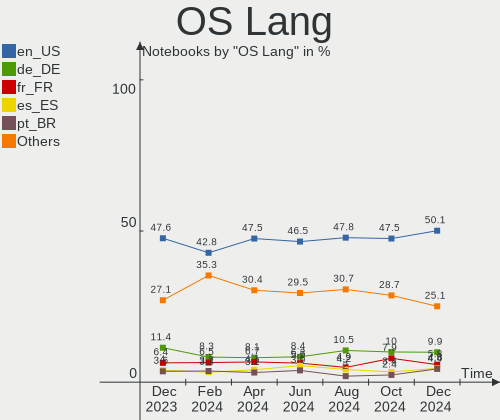
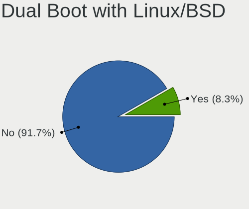
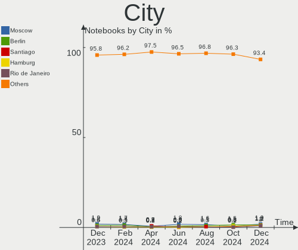
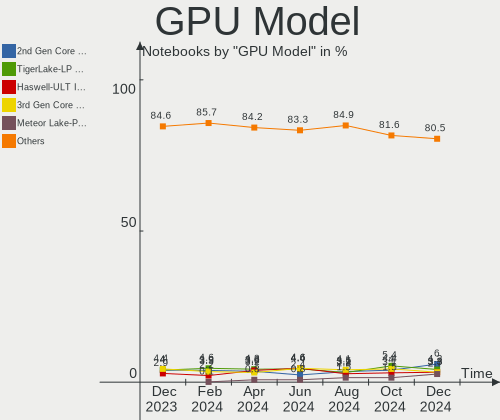
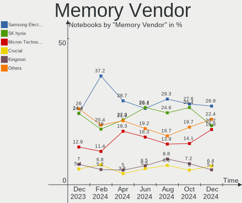
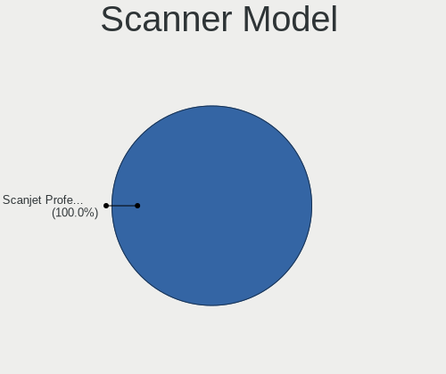
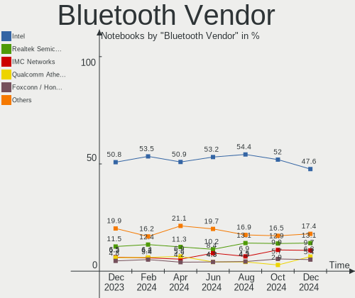

Ubuntu Hardware Trends (Notebook)
---------------------------------

A project to identify most popular hardware characteristics and track their change
over time based on data collected by Ubuntu users at https://Linux-Hardware.org.

Anyone can contribute to the study by uploading probes of their computers by
the [hw-probe](https://github.com/linuxhw/hw-probe) tool:

    sudo -E hw-probe -all -upload

Full-feature report is available here: https://linux-hardware.org/?view=trends&formfactor=notebook

Period: Jan, 2021.

Contents
--------

- [ OS                       ](#os)
- [ OS Family                ](#os-family)
- [ Kernel                   ](#kernel)
- [ Kernel Family            ](#kernel-family)
- [ Kernel Major Ver.        ](#kernel-major-ver)
- [ Arch                     ](#arch)
- [ DE                       ](#de)
- [ Display Server           ](#display-server)
- [ Display Manager          ](#display-manager)
- [ OS Lang                  ](#os-lang)
- [ Boot Mode                ](#boot-mode)
- [ Filesystem               ](#filesystem)
- [ Part. scheme             ](#part-scheme)
- [ Dual Boot with Linux/BSD ](#dual-boot-with-linux/bsd)
- [ Dual Boot (Win)          ](#dual-boot-win)
- [ Country                  ](#country)
- [ City                     ](#city)
- [ Vendor                   ](#vendor)
- [ Model                    ](#model)
- [ Model Family             ](#model-family)
- [ MFG Year                 ](#mfg-year)
- [ Form Factor              ](#form-factor)
- [ Secure Boot              ](#secure-boot)
- [ Coreboot                 ](#coreboot)
- [ RAM Size                 ](#ram-size)
- [ RAM Used                 ](#ram-used)
- [ Has CD-ROM               ](#has-cd-rom)
- [ Total Drives             ](#total-drives)
- [ Has Ethernet             ](#has-ethernet)
- [ Drive Vendor             ](#drive-vendor)
- [ Drive Model              ](#drive-model)
- [ HDD Vendor               ](#hdd-vendor)
- [ SSD Vendor               ](#ssd-vendor)
- [ Drive Kind               ](#drive-kind)
- [ Drive Connector          ](#drive-connector)
- [ Drive Size               ](#drive-size)
- [ Space Total              ](#space-total)
- [ Space Used               ](#space-used)
- [ Malfunc. Drives          ](#malfunc-drives)
- [ Malfunc. Drive Vendor    ](#malfunc-drive-vendor)
- [ Malfunc. HDD Vendor      ](#malfunc-hdd-vendor)
- [ Malfunc. Drive Kind      ](#malfunc-drive-kind)
- [ Failed Drives            ](#failed-drives)
- [ Failed Drive Vendor      ](#failed-drive-vendor)
- [ Drive Status             ](#drive-status)
- [ Storage Vendor           ](#storage-vendor)
- [ Storage Model            ](#storage-model)
- [ Storage Kind             ](#storage-kind)
- [ CPU Vendor               ](#cpu-vendor)
- [ CPU Model                ](#cpu-model)
- [ CPU Model Family         ](#cpu-model-family)
- [ CPU Cores                ](#cpu-cores)
- [ CPU Sockets              ](#cpu-sockets)
- [ CPU Threads              ](#cpu-threads)
- [ CPU Op-Modes             ](#cpu-op-modes)
- [ CPU Microcode            ](#cpu-microcode)
- [ CPU Microarch            ](#cpu-microarch)
- [ GPU Vendor               ](#gpu-vendor)
- [ GPU Model                ](#gpu-model)
- [ GPU Combo                ](#gpu-combo)
- [ GPU Driver               ](#gpu-driver)
- [ GPU Memory               ](#gpu-memory)
- [ Monitor Vendor           ](#monitor-vendor)
- [ Monitor Model            ](#monitor-model)
- [ Monitor Resolution       ](#monitor-resolution)
- [ Monitor Diagonal         ](#monitor-diagonal)
- [ Monitor Width            ](#monitor-width)
- [ Aspect Ratio             ](#aspect-ratio)
- [ Monitor Area             ](#monitor-area)
- [ Pixel Density            ](#pixel-density)
- [ Multiple Monitors        ](#multiple-monitors)
- [ Net Controller Vendor    ](#net-controller-vendor)
- [ Net Controller Model     ](#net-controller-model)
- [ Wireless Vendor          ](#wireless-vendor)
- [ Wireless Model           ](#wireless-model)
- [ Ethernet Vendor          ](#ethernet-vendor)
- [ Ethernet Model           ](#ethernet-model)
- [ Net Controller Kind      ](#net-controller-kind)
- [ Used Controller          ](#used-controller)
- [ NICs                     ](#nics)
- [ Memory Vendor            ](#memory-vendor)
- [ Memory Model             ](#memory-model)
- [ Memory Kind              ](#memory-kind)
- [ Memory Form Factor       ](#memory-form-factor)
- [ Memory Size              ](#memory-size)
- [ Memory Speed             ](#memory-speed)
- [ Sound Vendor             ](#sound-vendor)
- [ Sound Model              ](#sound-model)
- [ Camera Vendor            ](#camera-vendor)
- [ Camera Model             ](#camera-model)
- [ Fingerprint Vendor       ](#fingerprint-vendor)
- [ Fingerprint Model        ](#fingerprint-model)
- [ Chipcard Vendor          ](#chipcard-vendor)
- [ Chipcard Model           ](#chipcard-model)
- [ Printer Vendor           ](#printer-vendor)
- [ Printer Model            ](#printer-model)
- [ Scanner Vendor           ](#scanner-vendor)
- [ Scanner Model            ](#scanner-model)
- [ Bluetooth Vendor         ](#bluetooth-vendor)
- [ Bluetooth Model          ](#bluetooth-model)
- [ Unsupported Devices      ](#unsupported-devices)
- [ Unsupported Device Types ](#unsupported-device-types)

OS
--

Installed operating systems

| Name           | Notebooks | Percent |
|----------------|-----------|---------|
| Ubuntu 20.04   | 842       | 66.04%  |
| Ubuntu 20.10   | 254       | 19.92%  |
| Ubuntu 18.04   | 146       | 11.45%  |
| Ubuntu 16.04   | 18        | 1.41%   |
| Ubuntu 21.04   | 7         | 0.55%   |
| Ubuntu 18.10   | 2         | 0.16%   |
| Ubuntu         | 2         | 0.16%   |
| Ubuntu 20.08.3 | 1         | 0.08%   |
| Ubuntu 19.10   | 1         | 0.08%   |
| Ubuntu 17.04   | 1         | 0.08%   |
| Ubuntu 14.04   | 1         | 0.08%   |

OS Family
---------

OS without a version

| Name   | Notebooks | Percent |
|--------|-----------|---------|
| Ubuntu | 1275      | 100%    |

Kernel
------

Version of the Linux kernel

| Version                     | Notebooks | Percent |
|-----------------------------|-----------|---------|
| 5.8.0-36-generic            | 157       | 12.31%  |
| 5.4.0-58-generic            | 156       | 12.24%  |
| 5.8.0-38-generic            | 145       | 11.37%  |
| 5.8.0-40-generic            | 111       | 8.71%   |
| 5.8.0-41-generic            | 88        | 6.9%    |
| 5.4.0-62-generic            | 64        | 5.02%   |
| 5.4.0-59-generic            | 61        | 4.78%   |
| 5.4.0-60-generic            | 55        | 4.31%   |
| 5.8.0-34-generic            | 52        | 4.08%   |
| 5.4.0-42-generic            | 49        | 3.84%   |
| 5.8.0-33-generic            | 42        | 3.29%   |
| 5.4.0-64-generic            | 38        | 2.98%   |
| 5.4.0-65-generic            | 29        | 2.27%   |
| 4.15.0-128-generic          | 20        | 1.57%   |
| 5.8.0-25-generic            | 17        | 1.33%   |
| 4.15.0-130-generic          | 14        | 1.1%    |
| 4.15.0-132-generic          | 11        | 0.86%   |
| 5.8.0-37-generic            | 9         | 0.71%   |
| 5.4.0-52-generic            | 9         | 0.71%   |
| 4.15.0-129-generic          | 9         | 0.71%   |
| 4.15.0-135-generic          | 6         | 0.47%   |
| 5.4.0-54-generic            | 5         | 0.39%   |
| 5.4.0-26-generic            | 5         | 0.39%   |
| 4.19.128-microsoft-standard | 5         | 0.39%   |
| 5.10.4-051004-generic       | 4         | 0.31%   |
| 4.15.0-134-generic          | 4         | 0.31%   |
| 5.7.1-050701-generic        | 3         | 0.24%   |
| 5.6.0-1042-oem              | 3         | 0.24%   |
| 5.6.0-1036-oem              | 3         | 0.24%   |
| 5.4.0-53-generic            | 3         | 0.24%   |
| 5.9.16-050916-generic       | 2         | 0.16%   |
| 5.9.0-rc4+                  | 2         | 0.16%   |
| 5.8.1-050801-generic        | 2         | 0.16%   |
| 5.8.0-40-lowlatency         | 2         | 0.16%   |
| 5.8.0-39-generic            | 2         | 0.16%   |
| 5.4.0-60-lowlatency         | 2         | 0.16%   |
| 5.4.0-58-lowlatency         | 2         | 0.16%   |
| 5.4.0-56-generic            | 2         | 0.16%   |
| 5.4.0-49-generic            | 2         | 0.16%   |
| 5.4.0-47-generic            | 2         | 0.16%   |
| 5.4.0-40-generic            | 2         | 0.16%   |
| 5.11.0-051100rc4-generic    | 2         | 0.16%   |
| 5.10.9-051009-generic       | 2         | 0.16%   |
| 5.0.0-23-generic            | 2         | 0.16%   |
| 4.16.18-galliumos           | 2         | 0.16%   |
| 4.15.0-133-generic          | 2         | 0.16%   |
| 4.15.0-123-generic          | 2         | 0.16%   |
| 5.9.10-050910-generic       | 1         | 0.08%   |
| 5.9.0-050900-generic        | 1         | 0.08%   |
| 5.8.18-050818-generic       | 1         | 0.08%   |
| 5.8.10-050810-generic       | 1         | 0.08%   |
| 5.8.0-7630-generic          | 1         | 0.08%   |
| 5.8.0-42-generic            | 1         | 0.08%   |
| 5.8.0-41-lowlatency         | 1         | 0.08%   |
| 5.8.0-38-lowlatency         | 1         | 0.08%   |
| 5.8.0-32-generic            | 1         | 0.08%   |
| 5.8.0-29-generic            | 1         | 0.08%   |
| 5.8.0-25-lowlatency         | 1         | 0.08%   |
| 5.8.0-23-generic            | 1         | 0.08%   |
| 5.8.0-14-generic            | 1         | 0.08%   |

Kernel Family
-------------

Linux kernel without a distro release

| Version  | Notebooks | Percent |
|----------|-----------|---------|
| 5.8.0    | 634       | 49.73%  |
| 5.4.0    | 497       | 38.98%  |
| 4.15.0   | 74        | 5.8%    |
| 5.6.0    | 8         | 0.63%   |
| 5.0.0    | 5         | 0.39%   |
| 4.19.128 | 5         | 0.39%   |
| 5.3.0    | 4         | 0.31%   |
| 5.11.0   | 4         | 0.31%   |
| 5.10.4   | 4         | 0.31%   |
| 5.10.0   | 4         | 0.31%   |
| 5.9.0    | 3         | 0.24%   |
| 5.7.1    | 3         | 0.24%   |
| 4.4.0    | 3         | 0.24%   |
| 4.18.0   | 3         | 0.24%   |
| 4.16.18  | 3         | 0.24%   |
| 5.9.16   | 2         | 0.16%   |
| 5.8.1    | 2         | 0.16%   |
| 5.10.9   | 2         | 0.16%   |
| 5.10.8   | 2         | 0.16%   |
| 5.9.10   | 1         | 0.08%   |
| 5.8.18   | 1         | 0.08%   |
| 5.8.10   | 1         | 0.08%   |
| 5.7.0    | 1         | 0.08%   |
| 5.5.19   | 1         | 0.08%   |
| 5.10.6   | 1         | 0.08%   |
| 5.10.5   | 1         | 0.08%   |
| 5.10.2   | 1         | 0.08%   |
| 5.10.10  | 1         | 0.08%   |
| 4.8.0    | 1         | 0.08%   |
| 4.14.0   | 1         | 0.08%   |
| 4.10.0   | 1         | 0.08%   |
| 3.14.79  | 1         | 0.08%   |

Kernel Major Ver.
-----------------

Linux kernel major version

| Version | Notebooks | Percent |
|---------|-----------|---------|
| 5.8     | 638       | 50.04%  |
| 5.4     | 497       | 38.98%  |
| 4.15    | 74        | 5.8%    |
| 5.10    | 16        | 1.25%   |
| 5.6     | 8         | 0.63%   |
| 5.9     | 6         | 0.47%   |
| 5.0     | 5         | 0.39%   |
| 4.19    | 5         | 0.39%   |
| 5.7     | 4         | 0.31%   |
| 5.3     | 4         | 0.31%   |
| 5.11    | 4         | 0.31%   |
| 4.4     | 3         | 0.24%   |
| 4.18    | 3         | 0.24%   |
| 4.16    | 3         | 0.24%   |
| 5.5     | 1         | 0.08%   |
| 4.8     | 1         | 0.08%   |
| 4.14    | 1         | 0.08%   |
| 4.10    | 1         | 0.08%   |
| 3.14    | 1         | 0.08%   |

Arch
----

OS architecture (x86_64, i586, etc.)

| Name    | Notebooks | Percent |
|---------|-----------|---------|
| x86_64  | 1230      | 96.47%  |
| i686    | 44        | 3.45%   |
| aarch64 | 1         | 0.08%   |

DE
--

Desktop Environment

| Name            | Notebooks | Percent |
|-----------------|-----------|---------|
| GNOME           | 957       | 75.06%  |
| XFCE            | 88        | 6.9%    |
| Unknown         | 59        | 4.63%   |
| KDE             | 36        | 2.82%   |
| KDE5            | 33        | 2.59%   |
| Unity           | 25        | 1.96%   |
| MATE            | 19        | 1.49%   |
| LXQt            | 19        | 1.49%   |
| X-Cinnamon      | 12        | 0.94%   |
| Budgie          | 12        | 0.94%   |
| GNOME Flashback | 5         | 0.39%   |
| LXDE            | 4         | 0.31%   |
| i3              | 2         | 0.16%   |
| Cinnamon        | 2         | 0.16%   |
| enlightenment   | 1         | 0.08%   |
| Deepin          | 1         | 0.08%   |

Display Server
--------------

X11 or Wayland

| Name    | Notebooks | Percent |
|---------|-----------|---------|
| X11     | 1190      | 93.33%  |
| Wayland | 43        | 3.37%   |
| Unknown | 38        | 2.98%   |
| Tty     | 4         | 0.31%   |

Display Manager
---------------

SDDM, LightDM, etc.

| Name    | Notebooks | Percent |
|---------|-----------|---------|
| Unknown | 950       | 74.51%  |
| GDM     | 248       | 19.45%  |
| SDDM    | 42        | 3.29%   |
| TDM     | 32        | 2.51%   |
| XDM     | 2         | 0.16%   |
| LightDM | 1         | 0.08%   |

OS Lang
-------

Language

| Lang        | Notebooks | Percent |
|-------------|-----------|---------|
| en_US       | 499       | 39.14%  |
| de_DE       | 121       | 9.49%   |
| fr_FR       | 96        | 7.53%   |
| en_GB       | 71        | 5.57%   |
| it_IT       | 53        | 4.16%   |
| pt_BR       | 51        | 4%      |
| ru_RU       | 45        | 3.53%   |
| es_ES       | 37        | 2.9%    |
| en_IN       | 33        | 2.59%   |
| en_CA       | 29        | 2.27%   |
| C           | 19        | 1.49%   |
| en_AU       | 17        | 1.33%   |
| pl_PL       | 16        | 1.25%   |
| es_MX       | 15        | 1.18%   |
| tr_TR       | 12        | 0.94%   |
| hu_HU       | 12        | 0.94%   |
| cs_CZ       | 11        | 0.86%   |
| sv_SE       | 9         | 0.71%   |
| en_ZA       | 8         | 0.63%   |
| nl_NL       | 7         | 0.55%   |
| de_CH       | 7         | 0.55%   |
| Unknown     | 7         | 0.55%   |
| es_CO       | 6         | 0.47%   |
| en_IE       | 6         | 0.47%   |
| el_GR       | 6         | 0.47%   |
| sk_SK       | 5         | 0.39%   |
| ro_RO       | 5         | 0.39%   |
| pt_PT       | 5         | 0.39%   |
| es_AR       | 5         | 0.39%   |
| fr_CA       | 4         | 0.31%   |
| zh_CN       | 3         | 0.24%   |
| ru_UA       | 3         | 0.24%   |
| hr_HR       | 3         | 0.24%   |
| fi_FI       | 3         | 0.24%   |
| es_UY       | 3         | 0.24%   |
| es_CL       | 3         | 0.24%   |
| en_NG       | 3         | 0.24%   |
| en_IL       | 3         | 0.24%   |
| da_DK       | 3         | 0.24%   |
| ca_ES       | 3         | 0.24%   |
| sl_SI       | 2         | 0.16%   |
| ko_KR       | 2         | 0.16%   |
| ja_JP       | 2         | 0.16%   |
| fr_CH       | 2         | 0.16%   |
| es_PE       | 2         | 0.16%   |
| en_SG       | 2         | 0.16%   |
| de_AT       | 2         | 0.16%   |
| zh_TW       | 1         | 0.08%   |
| vi_VN       | 1         | 0.08%   |
| nl_BE       | 1         | 0.08%   |
| he_IL       | 1         | 0.08%   |
| fr_BE       | 1         | 0.08%   |
| eu_ES       | 1         | 0.08%   |
| es_EC       | 1         | 0.08%   |
| en_ZW       | 1         | 0.08%   |
| en_NZ       | 1         | 0.08%   |
| en_NL       | 1         | 0.08%   |
| en_FI       | 1         | 0.08%   |
| de_DE.utf-8 | 1         | 0.08%   |
| bs_BA       | 1         | 0.08%   |

Boot Mode
---------

EFI or BIOS

| Mode | Notebooks | Percent |
|------|-----------|---------|
| BIOS | 678       | 53.18%  |
| EFI  | 597       | 46.82%  |

Filesystem
----------

Type of filesystem

| Type    | Notebooks | Percent |
|---------|-----------|---------|
| Ext4    | 1209      | 94.82%  |
| Overlay | 31        | 2.43%   |
| Zfs     | 18        | 1.41%   |
| Btrfs   | 5         | 0.39%   |
| Xfs     | 4         | 0.31%   |
| Ext3    | 4         | 0.31%   |
| Ext2    | 2         | 0.16%   |
| Unknown | 2         | 0.16%   |

Part. scheme
------------

Scheme of partitioning

| Type    | Notebooks | Percent |
|---------|-----------|---------|
| Unknown | 950       | 74.51%  |
| GPT     | 261       | 20.47%  |
| MBR     | 64        | 5.02%   |

Dual Boot with Linux/BSD
------------------------

Hosting more than one Linux/BSD

| Dual boot | Notebooks | Percent |
|-----------|-----------|---------|
| No        | 1164      | 91.29%  |
| Yes       | 111       | 8.71%   |

Dual Boot (Win)
---------------

Hosting Linux and Windows

| Dual boot | Notebooks | Percent |
|-----------|-----------|---------|
| No        | 816       | 64%     |
| Yes       | 459       | 36%     |

Country
-------

Geographic location (country)

| Country              | Notebooks | Percent |
|----------------------|-----------|---------|
| USA                  | 177       | 13.88%  |
| Germany              | 160       | 12.55%  |
| France               | 94        | 7.37%   |
| Brazil               | 70        | 5.49%   |
| Russia               | 68        | 5.33%   |
| Italy                | 60        | 4.71%   |
| UK                   | 57        | 4.47%   |
| Spain                | 47        | 3.69%   |
| India                | 37        | 2.9%    |
| Canada               | 33        | 2.59%   |
| Netherlands          | 25        | 1.96%   |
| Poland               | 24        | 1.88%   |
| Mexico               | 22        | 1.73%   |
| Ukraine              | 19        | 1.49%   |
| Switzerland          | 18        | 1.41%   |
| Belgium              | 17        | 1.33%   |
| Australia            | 17        | 1.33%   |
| Sweden               | 16        | 1.25%   |
| Hungary              | 15        | 1.18%   |
| Greece               | 14        | 1.1%    |
| Czech Republic       | 14        | 1.1%    |
| Indonesia            | 13        | 1.02%   |
| Turkey               | 12        | 0.94%   |
| Finland              | 12        | 0.94%   |
| Austria              | 12        | 0.94%   |
| Romania              | 11        | 0.86%   |
| Portugal             | 11        | 0.86%   |
| Colombia             | 11        | 0.86%   |
| South Africa         | 10        | 0.78%   |
| Egypt                | 10        | 0.78%   |
| Denmark              | 9         | 0.71%   |
| Argentina            | 9         | 0.71%   |
| Tunisia              | 8         | 0.63%   |
| Israel               | 8         | 0.63%   |
| Slovakia             | 6         | 0.47%   |
| Chile                | 6         | 0.47%   |
| Bulgaria             | 6         | 0.47%   |
| Serbia               | 5         | 0.39%   |
| Saudi Arabia         | 5         | 0.39%   |
| Ireland              | 5         | 0.39%   |
| China                | 5         | 0.39%   |
| Slovenia             | 4         | 0.31%   |
| Singapore            | 4         | 0.31%   |
| Pakistan             | 4         | 0.31%   |
| Norway               | 4         | 0.31%   |
| Iran                 | 4         | 0.31%   |
| Uzbekistan           | 3         | 0.24%   |
| Uruguay              | 3         | 0.24%   |
| UAE                  | 3         | 0.24%   |
| Nigeria              | 3         | 0.24%   |
| Morocco              | 3         | 0.24%   |
| Japan                | 3         | 0.24%   |
| Algeria              | 3         | 0.24%   |
| Thailand             | 2         | 0.16%   |
| Peru                 | 2         | 0.16%   |
| New Zealand          | 2         | 0.16%   |
| Moldova, Republic of | 2         | 0.16%   |
| Malaysia             | 2         | 0.16%   |
| Korea, Republic of   | 2         | 0.16%   |
| Kenya                | 2         | 0.16%   |

City
----

Geographic location (city)

| City              | Notebooks | Percent |
|-------------------|-----------|---------|
| Moscow            | 21        | 1.65%   |
| Berlin            | 19        | 1.49%   |
| Paris             | 13        | 1.02%   |
| Athens            | 11        | 0.86%   |
| Vienna            | 10        | 0.78%   |
| Budapest          | 9         | 0.71%   |
| Rome              | 8         | 0.63%   |
| Munich            | 8         | 0.63%   |
| Cairo             | 8         | 0.63%   |
| Warsaw            | 7         | 0.55%   |
| St Petersburg     | 7         | 0.55%   |
| Prague            | 7         | 0.55%   |
| Madrid            | 7         | 0.55%   |
| Kyiv              | 7         | 0.55%   |
| Milan             | 6         | 0.47%   |
| Hamburg           | 6         | 0.47%   |
| Frankfurt am Main | 6         | 0.47%   |
| Barcelona         | 6         | 0.47%   |
| Toronto           | 5         | 0.39%   |
| São Paulo        | 5         | 0.39%   |
| Rio de Janeiro    | 5         | 0.39%   |
| Nuremberg         | 5         | 0.39%   |
| New Delhi         | 5         | 0.39%   |
| Lisbon            | 5         | 0.39%   |
| Denver            | 5         | 0.39%   |
| Cologne           | 5         | 0.39%   |
| Vancouver         | 4         | 0.31%   |
| Tehran            | 4         | 0.31%   |
| Stockholm         | 4         | 0.31%   |
| Sofia             | 4         | 0.31%   |
| Singapore         | 4         | 0.31%   |
| Santos            | 4         | 0.31%   |
| Rotterdam         | 4         | 0.31%   |
| Perth             | 4         | 0.31%   |
| Minneapolis       | 4         | 0.31%   |
| Mexico City       | 4         | 0.31%   |
| Jeddah            | 4         | 0.31%   |
| Helsinki          | 4         | 0.31%   |
| Düsseldorf       | 4         | 0.31%   |
| Cape Town         | 4         | 0.31%   |
| Bogotá           | 4         | 0.31%   |
| Birmingham        | 4         | 0.31%   |
| Amsterdam         | 4         | 0.31%   |
| Worcester         | 3         | 0.24%   |
| Ufa               | 3         | 0.24%   |
| Toulouse          | 3         | 0.24%   |
| Toulon            | 3         | 0.24%   |
| Tortosa           | 3         | 0.24%   |
| Thessaloniki      | 3         | 0.24%   |
| Tashkent          | 3         | 0.24%   |
| Surabaya          | 3         | 0.24%   |
| Stuttgart         | 3         | 0.24%   |
| Santiago          | 3         | 0.24%   |
| Natal             | 3         | 0.24%   |
| Mumbai            | 3         | 0.24%   |
| Montpellier       | 3         | 0.24%   |
| Lviv              | 3         | 0.24%   |
| London            | 3         | 0.24%   |
| Leipzig           | 3         | 0.24%   |
| Istanbul          | 3         | 0.24%   |

Vendor
------

Motherboard manufacturer

| Name                           | Notebooks | Percent |
|--------------------------------|-----------|---------|
| Hewlett-Packard                | 266       | 20.86%  |
| Dell                           | 262       | 20.55%  |
| Lenovo                         | 248       | 19.45%  |
| Acer                           | 121       | 9.49%   |
| ASUSTek Computer               | 111       | 8.71%   |
| Toshiba                        | 37        | 2.9%    |
| Samsung Electronics            | 28        | 2.2%    |
| Sony                           | 26        | 2.04%   |
| Apple                          | 23        | 1.8%    |
| MSI                            | 15        | 1.18%   |
| HUAWEI                         | 14        | 1.1%    |
| Unknown                        | 12        | 0.94%   |
| Packard Bell                   | 10        | 0.78%   |
| Medion                         | 9         | 0.71%   |
| Notebook                       | 7         | 0.55%   |
| Intel                          | 6         | 0.47%   |
| TUXEDO                         | 5         | 0.39%   |
| Positivo                       | 5         | 0.39%   |
| Fujitsu Siemens                | 5         | 0.39%   |
| Fujitsu                        | 5         | 0.39%   |
| Timi                           | 3         | 0.24%   |
| eMachines                      | 3         | 0.24%   |
| Alienware                      | 3         | 0.24%   |
| whyopencomputing               | 2         | 0.16%   |
| System76                       | 2         | 0.16%   |
| Star Labs                      | 2         | 0.16%   |
| Schenker                       | 2         | 0.16%   |
| NEC Computers                  | 2         | 0.16%   |
| LG Electronics                 | 2         | 0.16%   |
| IBM                            | 2         | 0.16%   |
| Google                         | 2         | 0.16%   |
| Entroware                      | 2         | 0.16%   |
| Clevo                          | 2         | 0.16%   |
| AMI                            | 2         | 0.16%   |
| Wortmann AG                    | 1         | 0.08%   |
| VIT                            | 1         | 0.08%   |
| UNOWHY                         | 1         | 0.08%   |
| Trenton Systems                | 1         | 0.08%   |
| TrekStor                       | 1         | 0.08%   |
| THUNDEROBOT                    | 1         | 0.08%   |
| SIEMENS                        | 1         | 0.08%   |
| Semp Toshiba                   | 1         | 0.08%   |
| Quantum Creations              | 1         | 0.08%   |
| Positivo Bahia - VAIO          | 1         | 0.08%   |
| Pegatron                       | 1         | 0.08%   |
| PEAQ                           | 1         | 0.08%   |
| PC Specialist                  | 1         | 0.08%   |
| Monster                        | 1         | 0.08%   |
| Microtech                      | 1         | 0.08%   |
| Matsushita Electric Industrial | 1         | 0.08%   |
| Itautec                        | 1         | 0.08%   |
| Insyde                         | 1         | 0.08%   |
| HASEE Computer                 | 1         | 0.08%   |
| GPU Company                    | 1         | 0.08%   |
| Gateway                        | 1         | 0.08%   |
| Foxconn                        | 1         | 0.08%   |
| ECS                            | 1         | 0.08%   |
| Digma                          | 1         | 0.08%   |
| Datateknik                     | 1         | 0.08%   |
| Compaq                         | 1         | 0.08%   |

Model
-----

Motherboard model

| Name                           | Notebooks | Percent |
|--------------------------------|-----------|---------|
| Unknown                        | 18        | 1.41%   |
| HP Notebook                    | 12        | 0.94%   |
| Dell XPS 13 7390               | 11        | 0.86%   |
| HP Pavilion g6                 | 8         | 0.63%   |
| HP Pavilion dv6                | 8         | 0.63%   |
| HP 255 G7 Notebook PC          | 7         | 0.55%   |
| HP Pavilion Notebook           | 6         | 0.47%   |
| Dell Latitude E6430            | 6         | 0.47%   |
| Dell Inspiron 1545             | 6         | 0.47%   |
| Lenovo IdeaPad S145-15IWL 81S9 | 5         | 0.39%   |
| HP ProBook 650 G1              | 5         | 0.39%   |
| Dell XPS 15 7590               | 5         | 0.39%   |
| Dell XPS 13 9370               | 5         | 0.39%   |
| Dell XPS 13 9310               | 5         | 0.39%   |
| HUAWEI NBLK-WAX9X              | 4         | 0.31%   |
| HP Pavilion dv7                | 4         | 0.31%   |
| HP Pavilion 15                 | 4         | 0.31%   |
| HP Laptop 15-dy1xxx            | 4         | 0.31%   |
| HP EliteBook 840 G5            | 4         | 0.31%   |
| Dell XPS 17 9700               | 4         | 0.31%   |
| Dell XPS 13 9380               | 4         | 0.31%   |
| Dell XPS 13 9360               | 4         | 0.31%   |
| Dell Latitude E6540            | 4         | 0.31%   |
| Dell Latitude E6420            | 4         | 0.31%   |
| Dell Latitude E6410            | 4         | 0.31%   |
| Dell Latitude E6400            | 4         | 0.31%   |
| Acer ConceptD CN315-71P        | 4         | 0.31%   |
| Samsung 300E4C/300E5C/300E7C   | 3         | 0.24%   |
| Lenovo Z50-75 80EC             | 3         | 0.24%   |
| Lenovo IdeaPad 320-17IKB 80XM  | 3         | 0.24%   |
| Lenovo IdeaPad 100-15IBD 80QQ  | 3         | 0.24%   |
| Lenovo G710 20252              | 3         | 0.24%   |
| HP ProBook 6550b               | 3         | 0.24%   |
| HP ProBook 450 G7              | 3         | 0.24%   |
| HP Presario CQ57               | 3         | 0.24%   |
| HP Pavilion g7                 | 3         | 0.24%   |
| HP Pavilion dm4                | 3         | 0.24%   |
| HP OMEN Laptop 15-en0xxx       | 3         | 0.24%   |
| HP Laptop 15-da0xxx            | 3         | 0.24%   |
| HP ENVY 15                     | 3         | 0.24%   |
| HP EliteBook 8460p             | 3         | 0.24%   |
| HP 15                          | 3         | 0.24%   |
| Dell XPS L502X                 | 3         | 0.24%   |
| Dell XPS 15 9500               | 3         | 0.24%   |
| Dell Precision 3551            | 3         | 0.24%   |
| Dell Latitude E7450            | 3         | 0.24%   |
| Dell Latitude E7440            | 3         | 0.24%   |
| Dell Latitude E6510            | 3         | 0.24%   |
| Dell Latitude D630             | 3         | 0.24%   |
| Dell Latitude 5510             | 3         | 0.24%   |
| Dell Inspiron 7537             | 3         | 0.24%   |
| Dell Inspiron 7472             | 3         | 0.24%   |
| Dell Inspiron 3576             | 3         | 0.24%   |
| Dell G3 3579                   | 3         | 0.24%   |
| Apple MacBookAir7,2            | 3         | 0.24%   |
| Apple MacBookAir6,2            | 3         | 0.24%   |
| Acer Aspire A715-75G           | 3         | 0.24%   |
| Acer Aspire A315-42            | 3         | 0.24%   |
| Acer Aspire A315-21            | 3         | 0.24%   |
| Toshiba Satellite L55t-B       | 2         | 0.16%   |

Model Family
------------

Motherboard model prefix

| Name                  | Notebooks | Percent |
|-----------------------|-----------|---------|
| Lenovo ThinkPad       | 123       | 9.65%   |
| Acer Aspire           | 86        | 6.75%   |
| Dell Latitude         | 77        | 6.04%   |
| Dell Inspiron         | 74        | 5.8%    |
| Lenovo IdeaPad        | 66        | 5.18%   |
| HP Pavilion           | 65        | 5.1%    |
| Dell XPS              | 56        | 4.39%   |
| HP ProBook            | 44        | 3.45%   |
| HP EliteBook          | 39        | 3.06%   |
| Toshiba Satellite     | 33        | 2.59%   |
| HP Laptop             | 29        | 2.27%   |
| Dell Precision        | 24        | 1.88%   |
| ASUS VivoBook         | 18        | 1.41%   |
| Unknown               | 18        | 1.41%   |
| Dell Vostro           | 17        | 1.33%   |
| HP Notebook           | 12        | 0.94%   |
| HP ZBook              | 11        | 0.86%   |
| HP ENVY               | 10        | 0.78%   |
| Packard Bell EasyNote | 9         | 0.71%   |
| Acer TravelMate       | 9         | 0.71%   |
| Acer Swift            | 9         | 0.71%   |
| HP OMEN               | 8         | 0.63%   |
| HP 255                | 8         | 0.63%   |
| Lenovo ThinkBook      | 7         | 0.55%   |
| HP Compaq             | 6         | 0.47%   |
| HP 15                 | 6         | 0.47%   |
| ASUS ZenBook          | 6         | 0.47%   |
| HP Presario           | 5         | 0.39%   |
| Fujitsu LIFEBOOK      | 5         | 0.39%   |
| Dell Studio           | 5         | 0.39%   |
| Dell G3               | 5         | 0.39%   |
| MSI Prestige          | 4         | 0.31%   |
| Lenovo Yoga           | 4         | 0.31%   |
| Lenovo Legion         | 4         | 0.31%   |
| HUAWEI NBLK-WAX9X     | 4         | 0.31%   |
| ASUS TUF              | 4         | 0.31%   |
| ASUS ROG              | 4         | 0.31%   |
| Apple MacBookAir7     | 4         | 0.31%   |
| Apple MacBookAir6     | 4         | 0.31%   |
| Acer Extensa          | 4         | 0.31%   |
| Acer ConceptD         | 4         | 0.31%   |
| Samsung 300E4C        | 3         | 0.24%   |
| Lenovo Z50-75         | 3         | 0.24%   |
| Lenovo G710           | 3         | 0.24%   |
| Lenovo G50-80         | 3         | 0.24%   |
| HP 250                | 3         | 0.24%   |
| Toshiba TECRA         | 2         | 0.16%   |
| Toshiba PORTEGE       | 2         | 0.16%   |
| Timi TM1707           | 2         | 0.16%   |
| Samsung RF511         | 2         | 0.16%   |
| Samsung 355V4C        | 2         | 0.16%   |
| Positivo MOBILE       | 2         | 0.16%   |
| MSI Modern            | 2         | 0.16%   |
| Lenovo V580c          | 2         | 0.16%   |
| Lenovo V330-15IKB     | 2         | 0.16%   |
| Lenovo G580           | 2         | 0.16%   |
| Lenovo G500           | 2         | 0.16%   |
| Lenovo G50-45         | 2         | 0.16%   |
| IBM ThinkPad          | 2         | 0.16%   |
| HUAWEI BOHK-WAX9X     | 2         | 0.16%   |

MFG Year
--------

Motherboard manufacture year

| Year    | Notebooks | Percent |
|---------|-----------|---------|
| 2020    | 328       | 25.73%  |
| 2019    | 157       | 12.31%  |
| 2018    | 110       | 8.63%   |
| 2013    | 92        | 7.22%   |
| 2011    | 89        | 6.98%   |
| 2012    | 83        | 6.51%   |
| 2014    | 74        | 5.8%    |
| 2010    | 64        | 5.02%   |
| 2016    | 58        | 4.55%   |
| 2015    | 56        | 4.39%   |
| 2008    | 48        | 3.76%   |
| 2017    | 41        | 3.22%   |
| 2009    | 40        | 3.14%   |
| 2007    | 17        | 1.33%   |
| 2006    | 9         | 0.71%   |
| Unknown | 7         | 0.55%   |
| 2005    | 1         | 0.08%   |
| 2004    | 1         | 0.08%   |

Form Factor
-----------

Physical design of the computer

| Name     | Notebooks | Percent |
|----------|-----------|---------|
| Notebook | 1275      | 100%    |

Secure Boot
-----------

Enabled or disabled

| State    | Notebooks | Percent |
|----------|-----------|---------|
| Disabled | 1120      | 87.84%  |
| Enabled  | 155       | 12.16%  |

Coreboot
--------

Have coreboot on board

| Used | Notebooks | Percent |
|------|-----------|---------|
| No   | 1273      | 99.84%  |
| Yes  | 2         | 0.16%   |

RAM Size
--------

Total RAM memory

| Size in GB  | Notebooks | Percent |
|-------------|-----------|---------|
| 4.01-8.0    | 385       | 30.2%   |
| 3.01-4.0    | 292       | 22.9%   |
| 16.01-24.0  | 203       | 15.92%  |
| 8.01-16.0   | 201       | 15.76%  |
| 32.01-64.0  | 76        | 5.96%   |
| 1.01-2.0    | 65        | 5.1%    |
| 2.01-3.0    | 28        | 2.2%    |
| 64.01-256.0 | 9         | 0.71%   |
| 24.01-32.0  | 8         | 0.63%   |
| 0.51-1.0    | 8         | 0.63%   |

RAM Used
--------

Used RAM memory

| Used GB    | Notebooks | Percent |
|------------|-----------|---------|
| 1.01-2.0   | 491       | 38.51%  |
| 2.01-3.0   | 330       | 25.88%  |
| 3.01-4.0   | 182       | 14.27%  |
| 4.01-8.0   | 161       | 12.63%  |
| 0.51-1.0   | 56        | 4.39%   |
| 8.01-16.0  | 38        | 2.98%   |
| 0.01-0.5   | 10        | 0.78%   |
| 16.01-24.0 | 5         | 0.39%   |
| 24.01-32.0 | 2         | 0.16%   |

Has CD-ROM
----------

Has CD-ROM on board

| Presented | Notebooks | Percent |
|-----------|-----------|---------|
| No        | 738       | 57.88%  |
| Yes       | 537       | 42.12%  |

Total Drives
------------

Number of drives on board

| Drives | Notebooks | Percent |
|--------|-----------|---------|
| 1      | 913       | 71.61%  |
| 2      | 308       | 24.16%  |
| 3      | 34        | 2.67%   |
| 0      | 14        | 1.1%    |
| 4      | 5         | 0.39%   |
| 9      | 1         | 0.08%   |

Has Ethernet
------------

Has Ethernet on board

| Presented | Notebooks | Percent |
|-----------|-----------|---------|
| Yes       | 1061      | 83.22%  |
| No        | 214       | 16.78%  |

Drive Vendor
------------

Hard drive vendors

| Vendor                    | Notebooks | Drives | Percent |
|---------------------------|-----------|--------|---------|
| WDC                       | 222       | 235    | 14.39%  |
| Seagate                   | 211       | 221    | 13.67%  |
| Samsung Electronics       | 204       | 216    | 13.22%  |
| Toshiba                   | 153       | 155    | 9.92%   |
| SanDisk                   | 86        | 86     | 5.57%   |
| Kingston                  | 83        | 83     | 5.38%   |
| Unknown                   | 76        | 83     | 4.93%   |
| SK Hynix                  | 62        | 62     | 4.02%   |
| Hitachi                   | 56        | 57     | 3.63%   |
| Intel                     | 54        | 59     | 3.5%    |
| HGST                      | 49        | 49     | 3.18%   |
| Crucial                   | 46        | 48     | 2.98%   |
| Micron Technology         | 27        | 27     | 1.75%   |
| China                     | 17        | 17     | 1.1%    |
| Fujitsu                   | 16        | 17     | 1.04%   |
| A-DATA Technology         | 15        | 15     | 0.97%   |
| KIOXIA                    | 14        | 15     | 0.91%   |
| Apple                     | 13        | 14     | 0.84%   |
| LITEON                    | 11        | 11     | 0.71%   |
| PNY                       | 8         | 8      | 0.52%   |
| OCZ                       | 7         | 7      | 0.45%   |
| Transcend                 | 6         | 6      | 0.39%   |
| SPCC                      | 6         | 7      | 0.39%   |
| PHISON                    | 6         | 6      | 0.39%   |
| Msft                      | 5         | 9      | 0.32%   |
| LITEONIT                  | 5         | 6      | 0.32%   |
| Silicon Motion            | 4         | 4      | 0.26%   |
| Patriot                   | 4         | 4      | 0.26%   |
| Micron/Crucial Technology | 4         | 4      | 0.26%   |
| KingSpec                  | 4         | 4      | 0.26%   |
| ASMT                      | 4         | 7      | 0.26%   |
| Intenso                   | 3         | 3      | 0.19%   |
| Hewlett-Packard           | 3         | 2      | 0.19%   |
| Corsair                   | 3         | 3      | 0.19%   |
| ADATA Technology          | 3         | 3      | 0.19%   |
| Union Memory              | 2         | 2      | 0.13%   |
| Star                      | 2         | 2      | 0.13%   |
| Realtek Semiconductor     | 2         | 2      | 0.13%   |
| PLEXTOR                   | 2         | 2      | 0.13%   |
| Pioneer                   | 2         | 2      | 0.13%   |
| Netac                     | 2         | 2      | 0.13%   |
| Lenovo                    | 2         | 2      | 0.13%   |
| LDLC                      | 2         | 2      | 0.13%   |
| KingDian                  | 2         | 2      | 0.13%   |
| JMicron                   | 2         | 2      | 0.13%   |
| JASTER                    | 2         | 2      | 0.13%   |
| GOODRAM                   | 2         | 2      | 0.13%   |
| Apacer                    | 2         | 2      | 0.13%   |
| XPG                       | 1         | 1      | 0.06%   |
| WD MediaMax               | 1         | 1      | 0.06%   |
| Verbatim                  | 1         | 1      | 0.06%   |
| V7                        | 1         | 1      | 0.06%   |
| V-GeN                     | 1         | 1      | 0.06%   |
| USB30                     | 1         | 1      | 0.06%   |
| USB3.0                    | 1         | 1      | 0.06%   |
| Union Memory (Shenzhen)   | 1         | 1      | 0.06%   |
| TEAM T25                  | 1         | 1      | 0.06%   |
| Super Talent              | 1         | 1      | 0.06%   |
| StoreJet                  | 1         | 1      | 0.06%   |
| SSSTC                     | 1         | 1      | 0.06%   |

Drive Model
-----------

Hard drive models

| Model                               | Notebooks | Percent |
|-------------------------------------|-----------|---------|
| Seagate ST1000LM035-1RK172 1TB      | 30        | 1.9%    |
| Unknown MMC Card  32GB              | 23        | 1.46%   |
| Toshiba MQ04ABF100 1TB              | 20        | 1.27%   |
| Seagate ST1000LM024 HN-M101MBB 1TB  | 20        | 1.27%   |
| Kingston SA400S37240G 240GB SSD     | 18        | 1.14%   |
| Seagate ST9500325AS 500GB           | 16        | 1.01%   |
| Samsung SSD 860 EVO 500GB           | 16        | 1.01%   |
| Toshiba MQ01ABD100 1TB              | 15        | 0.95%   |
| Seagate ST500LT012-1DG142 500GB     | 15        | 0.95%   |
| Unknown MMC Card  64GB              | 13        | 0.82%   |
| Samsung NVMe SSD Drive 512GB        | 13        | 0.82%   |
| HGST HTS725050A7E630 500GB          | 13        | 0.82%   |
| Toshiba NVMe SSD Drive 512GB        | 12        | 0.76%   |
| Toshiba MQ01ABF050 500GB            | 12        | 0.76%   |
| Kingston SA400S37480G 480GB SSD     | 12        | 0.76%   |
| WDC WD10SPZX-24Z10 1TB              | 11        | 0.7%    |
| SK Hynix NVMe SSD Drive 256GB       | 11        | 0.7%    |
| Samsung NVMe SSD Drive 256GB        | 11        | 0.7%    |
| Intel NVMe SSD Drive 512GB          | 11        | 0.7%    |
| Sandisk NVMe SSD Drive 512GB        | 10        | 0.63%   |
| Seagate ST500LM012 HN-M500MBB 500GB | 9         | 0.57%   |
| SanDisk SSD PLUS 240GB              | 9         | 0.57%   |
| Kingston SV300S37A240G 240GB SSD    | 9         | 0.57%   |
| WDC WD10JPVX-22JC3T0 1TB            | 8         | 0.51%   |
| WDC WD10JPCX-24UE4T0 1TB            | 8         | 0.51%   |
| Unknown MMC Card  128GB             | 8         | 0.51%   |
| Samsung NVMe SSD Drive 1024GB       | 8         | 0.51%   |
| HGST HTS541010A9E680 1TB            | 8         | 0.51%   |
| Crucial CT500MX500SSD1 500GB        | 8         | 0.51%   |
| WDC WD10SPZX-60Z10T0 1TB            | 7         | 0.44%   |
| Seagate ST2000LM007-1R8174 2TB      | 7         | 0.44%   |
| Micron NVMe SSD Drive 256GB         | 7         | 0.44%   |
| HGST HTS721010A9E630 1TB            | 7         | 0.44%   |
| HGST HTS545050A7E680 500GB          | 7         | 0.44%   |
| WDC WDS240G2G0B-00EPW0 240GB SSD    | 6         | 0.38%   |
| Unknown MMC Card  2GB               | 6         | 0.38%   |
| Toshiba MQ01ABD050 500GB            | 6         | 0.38%   |
| SK Hynix NVMe SSD Drive 512GB       | 6         | 0.38%   |
| Seagate ST500LT012-9WS142 500GB     | 6         | 0.38%   |
| Seagate ST500LM021-1KJ152 500GB     | 6         | 0.38%   |
| Seagate ST500LM000-1EJ162 500GB     | 6         | 0.38%   |
| Sandisk NVMe SSD Drive 256GB        | 6         | 0.38%   |
| Samsung SSD 850 EVO 500GB           | 6         | 0.38%   |
| Samsung SSD 850 EVO 250GB           | 6         | 0.38%   |
| Kingston SA400S37120G 120GB SSD     | 6         | 0.38%   |
| Hitachi HTS545050A7E380 500GB       | 6         | 0.38%   |
| Crucial CT240BX500SSD1 240GB        | 6         | 0.38%   |
| WDC WD3200BEVT-22ZCT0 320GB         | 5         | 0.32%   |
| WDC WD10SPZX-75Z10T2 1TB            | 5         | 0.32%   |
| WDC WD10SPZX-21Z10T0 1TB            | 5         | 0.32%   |
| WDC WD10JPVX-60JC3T0 1TB            | 5         | 0.32%   |
| Toshiba NVMe SSD Drive 256GB        | 5         | 0.32%   |
| Toshiba MQ01ACF050 500GB            | 5         | 0.32%   |
| SK Hynix NVMe SSD Drive 1024GB      | 5         | 0.32%   |
| Seagate ST9500420AS 500GB           | 5         | 0.32%   |
| Seagate ST1000LM048-2E7172 1TB      | 5         | 0.32%   |
| Samsung NVMe SSD Drive 1TB          | 5         | 0.32%   |
| Msft Virtual Disk 275GB             | 5         | 0.32%   |
| Kingston SV300S37A120G 120GB SSD    | 5         | 0.32%   |
| Intel SSDPEKNW512G8H 512GB          | 5         | 0.32%   |

HDD Vendor
----------

Hard disk drive vendors

| Vendor              | Notebooks | Drives | Percent |
|---------------------|-----------|--------|---------|
| Seagate             | 207       | 214    | 33.23%  |
| WDC                 | 165       | 170    | 26.48%  |
| Toshiba             | 102       | 102    | 16.37%  |
| Hitachi             | 56        | 57     | 8.99%   |
| HGST                | 49        | 49     | 7.87%   |
| Samsung Electronics | 17        | 17     | 2.73%   |
| Fujitsu             | 15        | 16     | 2.41%   |
| Msft                | 5         | 9      | 0.8%    |
| ASMT                | 2         | 2      | 0.32%   |
| Apple               | 2         | 2      | 0.32%   |
| USB3.0              | 1         | 1      | 0.16%   |
| Intenso             | 1         | 1      | 0.16%   |
| IBM/Hitachi         | 1         | 1      | 0.16%   |

SSD Vendor
----------

Solid state drive vendors

| Vendor              | Notebooks | Drives | Percent |
|---------------------|-----------|--------|---------|
| Samsung Electronics | 105       | 109    | 21.26%  |
| Kingston            | 71        | 71     | 14.37%  |
| SanDisk             | 65        | 65     | 13.16%  |
| Crucial             | 43        | 44     | 8.7%    |
| WDC                 | 26        | 28     | 5.26%   |
| Intel               | 18        | 18     | 3.64%   |
| China               | 17        | 17     | 3.44%   |
| SK Hynix            | 13        | 13     | 2.63%   |
| Micron Technology   | 13        | 13     | 2.63%   |
| A-DATA Technology   | 13        | 13     | 2.63%   |
| Toshiba             | 11        | 12     | 2.23%   |
| LITEON              | 10        | 10     | 2.02%   |
| Apple               | 9         | 9      | 1.82%   |
| PNY                 | 8         | 8      | 1.62%   |
| OCZ                 | 7         | 7      | 1.42%   |
| Transcend           | 5         | 5      | 1.01%   |
| SPCC                | 5         | 6      | 1.01%   |
| LITEONIT            | 5         | 6      | 1.01%   |
| Patriot             | 4         | 4      | 0.81%   |
| Unknown             | 3         | 3      | 0.61%   |
| Seagate             | 3         | 3      | 0.61%   |
| KingSpec            | 3         | 3      | 0.61%   |
| Star                | 2         | 2      | 0.4%    |
| PLEXTOR             | 2         | 2      | 0.4%    |
| Pioneer             | 2         | 2      | 0.4%    |
| Netac               | 2         | 2      | 0.4%    |
| LDLC                | 2         | 2      | 0.4%    |
| KingDian            | 2         | 2      | 0.4%    |
| Hewlett-Packard     | 2         | 2      | 0.4%    |
| GOODRAM             | 2         | 2      | 0.4%    |
| Corsair             | 2         | 2      | 0.4%    |
| Apacer              | 2         | 2      | 0.4%    |
| Verbatim            | 1         | 1      | 0.2%    |
| V7                  | 1         | 1      | 0.2%    |
| USB30               | 1         | 1      | 0.2%    |
| TEAM T25            | 1         | 1      | 0.2%    |
| StoreJet            | 1         | 1      | 0.2%    |
| Pichau              | 1         | 1      | 0.2%    |
| PHISON              | 1         | 1      | 0.2%    |
| MidasForce          | 1         | 1      | 0.2%    |
| Microtech           | 1         | 1      | 0.2%    |
| Lexar               | 1         | 1      | 0.2%    |
| Lenovo              | 1         | 1      | 0.2%    |
| Kingmax             | 1         | 1      | 0.2%    |
| KingFast            | 1         | 1      | 0.2%    |
| FORESEE             | 1         | 1      | 0.2%    |
| External            | 1         | 1      | 0.2%    |
| ASMT                | 1         | 1      | 0.2%    |
| AMD                 | 1         | 1      | 0.2%    |

Drive Kind
----------

HDD or SSD

| Kind    | Notebooks | Drives | Percent |
|---------|-----------|--------|---------|
| HDD     | 606       | 641    | 40.48%  |
| SSD     | 467       | 504    | 31.2%   |
| NVMe    | 327       | 354    | 21.84%  |
| MMC     | 70        | 78     | 4.68%   |
| Unknown | 27        | 29     | 1.8%    |

Drive Connector
---------------

SATA, SAS, NVMe, etc.

| Type | Notebooks | Drives | Percent |
|------|-----------|--------|---------|
| SATA | 965       | 1116   | 68.49%  |
| NVMe | 327       | 354    | 23.21%  |
| MMC  | 70        | 78     | 4.97%   |
| SAS  | 47        | 58     | 3.34%   |

Drive Size
----------

Size of hard drive

| Size in TB | Notebooks | Drives | Percent |
|------------|-----------|--------|---------|
| 0.01-0.5   | 711       | 788    | 67.46%  |
| 0.51-1.0   | 306       | 319    | 29.03%  |
| 1.01-2.0   | 32        | 32     | 3.04%   |
| 4.01-10.0  | 4         | 5      | 0.38%   |
| 2.01-3.0   | 1         | 1      | 0.09%   |

Space Total
-----------

Amount of disk space available on the file system

| Size in GB     | Notebooks | Percent |
|----------------|-----------|---------|
| 101-250        | 427       | 33.49%  |
| 251-500        | 381       | 29.88%  |
| 501-1000       | 180       | 14.12%  |
| 51-100         | 89        | 6.98%   |
| 1001-2000      | 57        | 4.47%   |
| 21-50          | 54        | 4.24%   |
| 1-20           | 54        | 4.24%   |
| 2001-3000      | 14        | 1.1%    |
| More than 3000 | 10        | 0.78%   |
| Unknown        | 9         | 0.71%   |

Space Used
----------

Amount of used disk space

| Used GB        | Notebooks | Percent |
|----------------|-----------|---------|
| 1-20           | 529       | 41.49%  |
| 21-50          | 241       | 18.9%   |
| 51-100         | 176       | 13.8%   |
| 101-250        | 164       | 12.86%  |
| 251-500        | 91        | 7.14%   |
| 501-1000       | 46        | 3.61%   |
| 1001-2000      | 15        | 1.18%   |
| Unknown        | 9         | 0.71%   |
| 2001-3000      | 3         | 0.24%   |
| More than 3000 | 1         | 0.08%   |

Malfunc. Drives
---------------

Drive models with a malfunction

| Model                                            | Notebooks | Drives | Percent |
|--------------------------------------------------|-----------|--------|---------|
| Toshiba MK7575GSX 752GB                          | 2         | 2      | 4.55%   |
| Seagate ST1000LM024 HN-M101MBB 1TB               | 2         | 2      | 4.55%   |
| Kingston SV300S37A120G 120GB SSD                 | 2         | 2      | 4.55%   |
| HGST HTS721010A9E630 1TB                         | 2         | 2      | 4.55%   |
| HGST HTS545050A7E380 500GB                       | 2         | 2      | 4.55%   |
| HGST HTS541010A9E680 1TB                         | 2         | 2      | 4.55%   |
| WDC PC SN520 SDAPMUW-512G-1001 512GB             | 1         | 1      | 2.27%   |
| Toshiba THNSNK256GCS8 SATA 256GB SSD             | 1         | 1      | 2.27%   |
| Toshiba MQ04ABF100 1TB                           | 1         | 1      | 2.27%   |
| Toshiba MQ01ACF050 500GB                         | 1         | 1      | 2.27%   |
| Toshiba MQ01ABD100 1TB                           | 1         | 1      | 2.27%   |
| Toshiba MQ01ABD050 500GB                         | 1         | 1      | 2.27%   |
| Toshiba MK5076GSX 500GB                          | 1         | 1      | 2.27%   |
| Toshiba MK5065GSXN 500GB                         | 1         | 1      | 2.27%   |
| Toshiba MK2552GSX 250GB                          | 1         | 1      | 2.27%   |
| SK Hynix PC401 NVMe 512GB                        | 1         | 1      | 2.27%   |
| Seagate ST9500325AS 500GB                        | 1         | 1      | 2.27%   |
| Seagate ST9160821AS 160GB                        | 1         | 1      | 2.27%   |
| Seagate ST500LM021-1KJ152 500GB                  | 1         | 1      | 2.27%   |
| Seagate ST500LM000-SSHD-8GB                      | 1         | 1      | 2.27%   |
| Seagate ST320LT020-9YG142 320GB                  | 1         | 1      | 2.27%   |
| SanDisk SSD U100 128GB                           | 1         | 1      | 2.27%   |
| Samsung Electronics MZMPA128HMFU-000H1 128GB SSD | 1         | 1      | 2.27%   |
| Samsung Electronics HM250HI 250GB                | 1         | 1      | 2.27%   |
| OCZ VERTEX450 128GB SSD                          | 1         | 1      | 2.27%   |
| Micron Technology MTFDDAT256MAM-1K2 256GB SSD    | 1         | 1      | 2.27%   |
| Micron Technology 1100 SATA 512GB SSD            | 1         | 1      | 2.27%   |
| LITEONIT CMT-64L3M 64GB SSD                      | 1         | 2      | 2.27%   |
| LITEON IT LMT-512L9M-11 MSATA 512GB SSD          | 1         | 1      | 2.27%   |
| Intel SSDSA2BW160G3H 160GB                       | 1         | 1      | 2.27%   |
| Hitachi HTS725050A9A364 500GB                    | 1         | 1      | 2.27%   |
| Hitachi HTS547564A9E384 640GB                    | 1         | 1      | 2.27%   |
| Hitachi HTS545050A7E380 500GB                    | 1         | 1      | 2.27%   |
| Hitachi HTS545032B9A300 320GB                    | 1         | 1      | 2.27%   |
| Hitachi HTS543216L9A300 160GB                    | 1         | 1      | 2.27%   |
| HGST HTS725050A7E630 500GB                       | 1         | 1      | 2.27%   |
| Fujitsu MHY2160BH 160GB                          | 1         | 1      | 2.27%   |
| Crucial CT1000P1SSD8 1TB                         | 1         | 1      | 2.27%   |

Malfunc. Drive Vendor
---------------------

Vendors of faulty drives

| Vendor              | Notebooks | Drives | Percent |
|---------------------|-----------|--------|---------|
| Toshiba             | 10        | 10     | 22.73%  |
| Seagate             | 7         | 7      | 15.91%  |
| HGST                | 7         | 7      | 15.91%  |
| Hitachi             | 5         | 5      | 11.36%  |
| Samsung Electronics | 2         | 2      | 4.55%   |
| Micron Technology   | 2         | 2      | 4.55%   |
| Kingston            | 2         | 2      | 4.55%   |
| WDC                 | 1         | 1      | 2.27%   |
| SK Hynix            | 1         | 1      | 2.27%   |
| SanDisk             | 1         | 1      | 2.27%   |
| OCZ                 | 1         | 1      | 2.27%   |
| LITEONIT            | 1         | 2      | 2.27%   |
| LITEON              | 1         | 1      | 2.27%   |
| Intel               | 1         | 1      | 2.27%   |
| Fujitsu             | 1         | 1      | 2.27%   |
| Crucial             | 1         | 1      | 2.27%   |

Malfunc. HDD Vendor
-------------------

Vendors of faulty HDD drives

| Vendor              | Notebooks | Drives | Percent |
|---------------------|-----------|--------|---------|
| Toshiba             | 9         | 9      | 30%     |
| Seagate             | 7         | 7      | 23.33%  |
| HGST                | 7         | 7      | 23.33%  |
| Hitachi             | 5         | 5      | 16.67%  |
| Samsung Electronics | 1         | 1      | 3.33%   |
| Fujitsu             | 1         | 1      | 3.33%   |

Malfunc. Drive Kind
-------------------

Kinds of faulty drives

| Kind | Notebooks | Drives | Percent |
|------|-----------|--------|---------|
| HDD  | 30        | 30     | 68.18%  |
| SSD  | 11        | 12     | 25%     |
| NVMe | 3         | 3      | 6.82%   |

Failed Drives
-------------

Failed drive models

| Model                             | Notebooks | Drives | Percent |
|-----------------------------------|-----------|--------|---------|
| Seagate ST1000LM048-2E7172 1TB    | 1         | 1      | 50%     |
| Samsung Electronics HM320JI 320GB | 1         | 1      | 50%     |

Failed Drive Vendor
-------------------

Failed drive vendors

| Vendor              | Notebooks | Drives | Percent |
|---------------------|-----------|--------|---------|
| Seagate             | 1         | 1      | 50%     |
| Samsung Electronics | 1         | 1      | 50%     |

Drive Status
------------

Number of failed and malfunc. drives

| Status   | Notebooks | Drives | Percent |
|----------|-----------|--------|---------|
| Detected | 937       | 1169   | 72.3%   |
| Works    | 314       | 390    | 24.23%  |
| Malfunc  | 43        | 45     | 3.32%   |
| Failed   | 2         | 2      | 0.15%   |

Storage Vendor
--------------

Storage controller vendors

| Vendor                           | Notebooks | Percent |
|----------------------------------|-----------|---------|
| Intel                            | 932       | 65.96%  |
| AMD                              | 153       | 10.83%  |
| Samsung Electronics              | 91        | 6.44%   |
| Sandisk                          | 53        | 3.75%   |
| SK Hynix                         | 48        | 3.4%    |
| Toshiba America Info Systems     | 39        | 2.76%   |
| KIOXIA                           | 15        | 1.06%   |
| Micron Technology                | 14        | 0.99%   |
| Kingston Technology Company      | 12        | 0.85%   |
| Phison Electronics               | 7         | 0.5%    |
| Nvidia                           | 7         | 0.5%    |
| Silicon Integrated Systems [SiS] | 6         | 0.42%   |
| Micron/Crucial Technology        | 6         | 0.42%   |
| ADATA Technology                 | 6         | 0.42%   |
| Silicon Motion                   | 5         | 0.35%   |
| Marvell Technology Group         | 4         | 0.28%   |
| VIA Technologies                 | 3         | 0.21%   |
| Union Memory (Shenzhen)          | 2         | 0.14%   |
| Realtek Semiconductor            | 2         | 0.14%   |
| Apple                            | 2         | 0.14%   |
| Solid State Storage Technology   | 1         | 0.07%   |
| Silicon Image                    | 1         | 0.07%   |
| Lite-On Technology               | 1         | 0.07%   |
| Lenovo                           | 1         | 0.07%   |
| JMicron Technology               | 1         | 0.07%   |
| ASMedia Technology               | 1         | 0.07%   |

Storage Model
-------------

Storage controller models

| Model                                                                            | Notebooks | Percent |
|----------------------------------------------------------------------------------|-----------|---------|
| AMD FCH SATA Controller [AHCI mode]                                              | 130       | 8.58%   |
| Intel 82801 Mobile SATA Controller [RAID mode]                                   | 105       | 6.93%   |
| Intel 7 Series Chipset Family 6-port SATA Controller [AHCI mode]                 | 102       | 6.73%   |
| Intel Sunrise Point-LP SATA Controller [AHCI mode]                               | 99        | 6.53%   |
| Intel 6 Series/C200 Series Chipset Family 6 port Mobile SATA AHCI Controller     | 88        | 5.81%   |
| Intel 82801IBM/IEM (ICH9M/ICH9M-E) 4 port SATA Controller [AHCI mode]            | 63        | 4.16%   |
| Samsung NVMe SSD Controller SM981/PM981/PM983                                    | 56        | 3.7%    |
| Intel 8 Series SATA Controller 1 [AHCI mode]                                     | 50        | 3.3%    |
| Intel Wildcat Point-LP SATA Controller [AHCI Mode]                               | 46        | 3.04%   |
| Intel 8 Series/C220 Series Chipset Family 6-port SATA Controller 1 [AHCI mode]   | 34        | 2.24%   |
| Intel 5 Series/3400 Series Chipset 6 port SATA AHCI Controller                   | 32        | 2.11%   |
| Intel 5 Series/3400 Series Chipset 4 port SATA AHCI Controller                   | 32        | 2.11%   |
| Intel Cannon Lake Mobile PCH SATA AHCI Controller                                | 30        | 1.98%   |
| Intel 82801HM/HEM (ICH8M/ICH8M-E) IDE Controller                                 | 30        | 1.98%   |
| SK Hynix Non-Volatile memory controller                                          | 27        | 1.78%   |
| Intel Comet Lake SATA AHCI Controller                                            | 27        | 1.78%   |
| Intel Cannon Point-LP SATA Controller [AHCI Mode]                                | 26        | 1.72%   |
| Intel 82801HM/HEM (ICH8M/ICH8M-E) SATA Controller [AHCI mode]                    | 24        | 1.58%   |
| Toshiba America Info Systems XG6 NVMe SSD Controller                             | 20        | 1.32%   |
| Intel SSD 660P Series                                                            | 20        | 1.32%   |
| Intel HM170/QM170 Chipset SATA Controller [AHCI Mode]                            | 18        | 1.19%   |
| Sandisk WD Black SN750 / PC SN730 NVMe SSD                                       | 16        | 1.06%   |
| Samsung Electronics Non-Volatile memory controller                               | 16        | 1.06%   |
| Intel Atom Processor E3800 Series SATA AHCI Controller                           | 16        | 1.06%   |
| KIOXIA Non-Volatile memory controller                                            | 15        | 0.99%   |
| Micron Non-Volatile memory controller                                            | 14        | 0.92%   |
| SK Hynix BC501 NVMe Solid State Drive 512GB                                      | 13        | 0.86%   |
| AMD SB7x0/SB8x0/SB9x0 SATA Controller [AHCI mode]                                | 12        | 0.79%   |
| Sandisk WD Blue SN500 / PC SN520 NVMe SSD                                        | 11        | 0.73%   |
| Sandisk WD Black 2018 / PC SN720 NVMe SSD                                        | 11        | 0.73%   |
| Samsung NVMe SSD Controller SM961/PM961/SM963                                    | 11        | 0.73%   |
| Intel Q170/Q150/B150/H170/H110/Z170/CM236 Chipset SATA Controller [AHCI Mode]    | 11        | 0.73%   |
| Intel SSD Pro 7600p/760p/E 6100p Series                                          | 10        | 0.66%   |
| Intel Celeron/Pentium Silver Processor SATA Controller                           | 9         | 0.59%   |
| Intel 82801IBM/IEM (ICH9M/ICH9M-E) 2 port SATA Controller [IDE mode]             | 9         | 0.59%   |
| Intel 82801G (ICH7 Family) IDE Controller                                        | 9         | 0.59%   |
| SK Hynix PC401 NVMe Solid State Drive 256GB                                      | 8         | 0.53%   |
| Intel Volume Management Device NVMe RAID Controller                              | 8         | 0.53%   |
| Intel Ice Lake-LP SATA Controller [AHCI mode]                                    | 8         | 0.53%   |
| Intel Celeron N3350/Pentium N4200/Atom E3900 Series SATA AHCI Controller         | 8         | 0.53%   |
| Intel Atom/Celeron/Pentium Processor x5-E8000/J3xxx/N3xxx Series SATA Controller | 8         | 0.53%   |
| Intel 82801GBM/GHM (ICH7-M Family) SATA Controller [IDE mode]                    | 8         | 0.53%   |
| Toshiba America Info Systems BG3 NVMe SSD Controller                             | 7         | 0.46%   |
| Sandisk WD Blue SN550 NVMe SSD                                                   | 7         | 0.46%   |
| Intel 5 Series/3400 Series Chipset 4 port SATA IDE Controller                    | 7         | 0.46%   |
| AMD SB7x0/SB8x0/SB9x0 IDE Controller                                             | 7         | 0.46%   |
| AMD SB600 Non-Raid-5 SATA                                                        | 7         | 0.46%   |
| AMD SB600 IDE                                                                    | 7         | 0.46%   |
| Toshiba America Info Systems Toshiba America Info Non-Volatile memory controller | 6         | 0.4%    |
| Silicon Integrated Systems [SiS] SATA Controller / IDE mode                      | 6         | 0.4%    |
| Intel 82801HM/HEM (ICH8M/ICH8M-E) SATA Controller [IDE mode]                     | 6         | 0.4%    |
| Intel 82801GBM/GHM (ICH7-M Family) SATA Controller [AHCI mode]                   | 6         | 0.4%    |
| Intel 5 Series/3400 Series Chipset 2 port SATA IDE Controller                    | 6         | 0.4%    |
| Intel 400 Series Chipset Family SATA AHCI Controller                             | 6         | 0.4%    |
| Toshiba America Info Systems XG4 NVMe SSD Controller                             | 5         | 0.33%   |
| Silicon Integrated Systems [SiS] 5513 IDE Controller                             | 5         | 0.33%   |
| Sandisk PC SN520 NVMe SSD                                                        | 5         | 0.33%   |
| Nvidia MCP79 AHCI Controller                                                     | 5         | 0.33%   |
| Kingston Company Company Non-Volatile memory controller                          | 5         | 0.33%   |
| AMD FCH IDE Controller                                                           | 5         | 0.33%   |

Storage Kind
------------

Kind of storage controller (IDE, SATA, NVMe, SAS, ...)

| Kind | Notebooks | Percent |
|------|-----------|---------|
| SATA | 919       | 62.47%  |
| NVMe | 326       | 22.16%  |
| RAID | 118       | 8.02%   |
| IDE  | 108       | 7.34%   |

CPU Vendor
----------

Processor vendors

| Vendor | Notebooks | Percent |
|--------|-----------|---------|
| Intel  | 1082      | 84.86%  |
| AMD    | 192       | 15.06%  |
| ARM    | 1         | 0.08%   |

CPU Model
---------

Processor models

| Model                                         | Notebooks | Percent |
|-----------------------------------------------|-----------|---------|
| Intel Core i7-8550U CPU @ 1.80GHz             | 32        | 2.51%   |
| Intel Core i7-8565U CPU @ 1.80GHz             | 29        | 2.27%   |
| Intel Core i5-8250U CPU @ 1.60GHz             | 27        | 2.12%   |
| Intel Core i7-10510U CPU @ 1.80GHz            | 26        | 2.04%   |
| Intel Core i5-8265U CPU @ 1.60GHz             | 21        | 1.65%   |
| Intel Core i5-7200U CPU @ 2.50GHz             | 21        | 1.65%   |
| Intel Core i5-10210U CPU @ 1.60GHz            | 21        | 1.65%   |
| AMD Ryzen 5 3500U with Radeon Vega Mobile Gfx | 20        | 1.57%   |
| Intel Core i7-9750H CPU @ 2.60GHz             | 17        | 1.33%   |
| Intel Core i7-8750H CPU @ 2.20GHz             | 17        | 1.33%   |
| Intel Core i5-5200U CPU @ 2.20GHz             | 17        | 1.33%   |
| Intel Core i7-2670QM CPU @ 2.20GHz            | 14        | 1.1%    |
| Intel Core i5-6200U CPU @ 2.30GHz             | 14        | 1.1%    |
| Intel Core i5-2520M CPU @ 2.50GHz             | 14        | 1.1%    |
| AMD Ryzen 7 4700U with Radeon Graphics        | 14        | 1.1%    |
| Intel Core i5-2410M CPU @ 2.30GHz             | 13        | 1.02%   |
| Intel Core i5-3210M CPU @ 2.50GHz             | 12        | 0.94%   |
| Intel Core i7-7500U CPU @ 2.70GHz             | 11        | 0.86%   |
| Intel Core i7-5500U CPU @ 2.40GHz             | 11        | 0.86%   |
| Intel Core 2 Duo CPU P8600 @ 2.40GHz          | 11        | 0.86%   |
| Intel Core i7-10750H CPU @ 2.60GHz            | 10        | 0.78%   |
| Intel Core i5-4210U CPU @ 1.70GHz             | 10        | 0.78%   |
| Intel Core i5-4200U CPU @ 1.60GHz             | 10        | 0.78%   |
| Intel Core i5-3320M CPU @ 2.60GHz             | 10        | 0.78%   |
| Intel Core i5-3230M CPU @ 2.60GHz             | 10        | 0.78%   |
| Intel Core i5-2450M CPU @ 2.50GHz             | 10        | 0.78%   |
| Intel Core i3 CPU M 370 @ 2.40GHz             | 9         | 0.71%   |
| Intel Pentium Dual-Core CPU T4400 @ 2.20GHz   | 8         | 0.63%   |
| Intel Core i7-7700HQ CPU @ 2.80GHz            | 8         | 0.63%   |
| Intel Core i7-6700HQ CPU @ 2.60GHz            | 8         | 0.63%   |
| Intel Core i5-5300U CPU @ 2.30GHz             | 8         | 0.63%   |
| Intel Core i5-1035G1 CPU @ 1.00GHz            | 8         | 0.63%   |
| Intel Core i3-5005U CPU @ 2.00GHz             | 8         | 0.63%   |
| Intel Core i3-3110M CPU @ 2.40GHz             | 8         | 0.63%   |
| Intel Core i7-8650U CPU @ 1.90GHz             | 7         | 0.55%   |
| Intel Core i7-6500U CPU @ 2.50GHz             | 7         | 0.55%   |
| Intel Core i7-4500U CPU @ 1.80GHz             | 7         | 0.55%   |
| Intel Core i7-3630QM CPU @ 2.40GHz            | 7         | 0.55%   |
| Intel Core i7-3610QM CPU @ 2.30GHz            | 7         | 0.55%   |
| Intel Core i7-10875H CPU @ 2.30GHz            | 7         | 0.55%   |
| Intel Core i7-10710U CPU @ 1.10GHz            | 7         | 0.55%   |
| Intel Core i7-1065G7 CPU @ 1.30GHz            | 7         | 0.55%   |
| Intel Core i5 CPU M 520 @ 2.40GHz             | 7         | 0.55%   |
| Intel Core i3-2350M CPU @ 2.30GHz             | 7         | 0.55%   |
| Intel Core i3-2330M CPU @ 2.20GHz             | 7         | 0.55%   |
| Intel Core i3 CPU M 350 @ 2.27GHz             | 7         | 0.55%   |
| Intel Core 2 Duo CPU T7500 @ 2.20GHz          | 7         | 0.55%   |
| Intel 11th Gen Core i7-1165G7 @ 2.80GHz       | 7         | 0.55%   |
| AMD Ryzen 7 3700U with Radeon Vega Mobile Gfx | 7         | 0.55%   |
| Intel Core i7-6600U CPU @ 2.60GHz             | 6         | 0.47%   |
| Intel Core i7-2630QM CPU @ 2.00GHz            | 6         | 0.47%   |
| Intel Core i5-9300H CPU @ 2.40GHz             | 6         | 0.47%   |
| Intel Core i5-4200M CPU @ 2.50GHz             | 6         | 0.47%   |
| Intel Core i5-3337U CPU @ 1.80GHz             | 6         | 0.47%   |
| Intel Core i5-3317U CPU @ 1.70GHz             | 6         | 0.47%   |
| Intel Core i5 CPU M 560 @ 2.67GHz             | 6         | 0.47%   |
| Intel Core i5 CPU M 480 @ 2.67GHz             | 6         | 0.47%   |
| Intel Celeron CPU N2840 @ 2.16GHz             | 6         | 0.47%   |
| Intel Atom x5-Z8300 CPU @ 1.44GHz             | 6         | 0.47%   |
| AMD Ryzen 5 2500U with Radeon Vega Mobile Gfx | 6         | 0.47%   |

CPU Model Family
----------------

Processor model prefix

| Model                   | Notebooks | Percent |
|-------------------------|-----------|---------|
| Intel Core i7           | 359       | 28.16%  |
| Intel Core i5           | 343       | 26.9%   |
| Intel Core i3           | 100       | 7.84%   |
| Intel Core 2 Duo        | 76        | 5.96%   |
| Intel Celeron           | 46        | 3.61%   |
| Intel Pentium           | 45        | 3.53%   |
| AMD Ryzen 5             | 36        | 2.82%   |
| AMD Ryzen 7             | 32        | 2.51%   |
| Other                   | 26        | 2.04%   |
| Intel Atom              | 23        | 1.8%    |
| AMD A6                  | 16        | 1.25%   |
| Intel Genuine           | 15        | 1.18%   |
| AMD A4                  | 15        | 1.18%   |
| Intel Pentium Dual-Core | 14        | 1.1%    |
| AMD A8                  | 12        | 0.94%   |
| Intel Pentium Dual      | 8         | 0.63%   |
| AMD Ryzen 7 PRO         | 8         | 0.63%   |
| AMD E1                  | 8         | 0.63%   |
| AMD A10                 | 8         | 0.63%   |
| Intel Xeon              | 6         | 0.47%   |
| Intel Core 2            | 6         | 0.47%   |
| Intel Celeron Dual-Core | 6         | 0.47%   |
| AMD E                   | 6         | 0.47%   |
| Intel Pentium M         | 5         | 0.39%   |
| Intel Core i9           | 5         | 0.39%   |
| AMD Athlon              | 5         | 0.39%   |
| Intel Pentium Silver    | 4         | 0.31%   |
| Intel Celeron M         | 4         | 0.31%   |
| AMD Ryzen 3             | 4         | 0.31%   |
| AMD FX                  | 4         | 0.31%   |
| AMD E2                  | 4         | 0.31%   |
| AMD Turion 64 X2 Mobile | 3         | 0.24%   |
| AMD C-60                | 3         | 0.24%   |
| AMD Athlon 64 X2        | 3         | 0.24%   |
| AMD A12                 | 3         | 0.24%   |
| AMD Turion 64 Mobile    | 2         | 0.16%   |
| AMD Ryzen 5 PRO         | 2         | 0.16%   |
| AMD Athlon X2           | 2         | 0.16%   |
| AMD Athlon II           | 2         | 0.16%   |
| Intel Core m5           | 1         | 0.08%   |
| Intel Core M            | 1         | 0.08%   |
| Intel Core Duo          | 1         | 0.08%   |
| AMD Sempron             | 1         | 0.08%   |
| AMD Ryzen 9             | 1         | 0.08%   |
| AMD C-70                | 1         | 0.08%   |

CPU Cores
---------

Number of processor cores

| Number | Notebooks | Percent |
|--------|-----------|---------|
| 2      | 689       | 54.04%  |
| 4      | 438       | 34.35%  |
| 6      | 70        | 5.49%   |
| 1      | 40        | 3.14%   |
| 8      | 37        | 2.9%    |
| 10     | 1         | 0.08%   |

CPU Sockets
-----------

Number of sockets

| Number | Notebooks | Percent |
|--------|-----------|---------|
| 1      | 1274      | 99.92%  |
| 4      | 1         | 0.08%   |

CPU Threads
-----------

Threads per core (Hyper-Threading)

| Number | Notebooks | Percent |
|--------|-----------|---------|
| 2      | 918       | 72%     |
| 1      | 357       | 28%     |

CPU Op-Modes
------------

CPU Operation Modes (32-bit, 64-bit)

| Op mode        | Notebooks | Percent |
|----------------|-----------|---------|
| 32-bit, 64-bit | 1254      | 98.35%  |
| 32-bit         | 19        | 1.49%   |
| Unknown        | 2         | 0.16%   |

CPU Microcode
-------------

Microcode number

| Number     | Notebooks | Percent |
|------------|-----------|---------|
| Unknown    | 229       | 17.96%  |
| 0x206a7    | 102       | 8%      |
| 0x306a9    | 84        | 6.59%   |
| 0x806ec    | 76        | 5.96%   |
| 0x806ea    | 60        | 4.71%   |
| 0x40651    | 51        | 4%      |
| 0x306d4    | 45        | 3.53%   |
| 0x1067a    | 40        | 3.14%   |
| 0x20655    | 39        | 3.06%   |
| 0x906ea    | 38        | 2.98%   |
| 0x806e9    | 38        | 2.98%   |
| 0x406e3    | 38        | 2.98%   |
| 0x306c3    | 30        | 2.35%   |
| 0xa0652    | 21        | 1.65%   |
| 0x6fd      | 21        | 1.65%   |
| 0x10676    | 20        | 1.57%   |
| 0x08108102 | 20        | 1.57%   |
| 0x806eb    | 19        | 1.49%   |
| 0x20652    | 19        | 1.49%   |
| 0x08108109 | 18        | 1.41%   |
| 0x706e5    | 16        | 1.25%   |
| 0x06006705 | 15        | 1.18%   |
| 0x30678    | 14        | 1.1%    |
| 0x806c1    | 13        | 1.02%   |
| 0x08600103 | 12        | 0.94%   |
| 0x906e9    | 10        | 0.78%   |
| 0x07030105 | 10        | 0.78%   |
| 0x406c3    | 9         | 0.71%   |
| 0xa0660    | 8         | 0.63%   |
| 0x706a1    | 8         | 0.63%   |
| 0x506e3    | 8         | 0.63%   |
| 0x406c4    | 8         | 0.63%   |
| 0x08600104 | 8         | 0.63%   |
| 0x03000027 | 8         | 0.63%   |
| 0x106e5    | 7         | 0.55%   |
| 0x06001119 | 7         | 0.55%   |
| 0x906ed    | 6         | 0.47%   |
| 0x6fb      | 6         | 0.47%   |
| 0x10661    | 6         | 0.47%   |
| 0x0810100b | 6         | 0.47%   |
| 0x6d8      | 5         | 0.39%   |
| 0x08600106 | 5         | 0.39%   |
| 0x05000119 | 5         | 0.39%   |
| 0x6fa      | 4         | 0.31%   |
| 0x6f6      | 4         | 0.31%   |
| 0x6ec      | 4         | 0.31%   |
| 0x506c9    | 4         | 0.31%   |
| 0x106c2    | 4         | 0.31%   |
| 0x0700010f | 4         | 0.31%   |
| 0x06003106 | 4         | 0.31%   |
| 0x6e8      | 3         | 0.24%   |
| 0x30673    | 3         | 0.24%   |
| 0x08600102 | 3         | 0.24%   |
| 0x07030104 | 3         | 0.24%   |
| 0x05000029 | 3         | 0.24%   |
| 0x08200103 | 2         | 0.16%   |
| 0x08101007 | 2         | 0.16%   |
| 0x07030106 | 2         | 0.16%   |
| 0x07000110 | 2         | 0.16%   |
| 0x06006704 | 2         | 0.16%   |

CPU Microarch
-------------

Microarchitecture

| Name            | Notebooks | Percent |
|-----------------|-----------|---------|
| KabyLake        | 298       | 23.37%  |
| SandyBridge     | 118       | 9.25%   |
| Haswell         | 101       | 7.92%   |
| IvyBridge       | 97        | 7.61%   |
| Penryn          | 77        | 6.04%   |
| Westmere        | 67        | 5.25%   |
| Skylake         | 59        | 4.63%   |
| Broadwell       | 54        | 4.24%   |
| Core            | 51        | 4%      |
| Zen+            | 43        | 3.37%   |
| Silvermont      | 42        | 3.29%   |
| Zen 2           | 35        | 2.75%   |
| CometLake       | 35        | 2.75%   |
| Excavator       | 23        | 1.8%    |
| IceLake         | 19        | 1.49%   |
| Puma            | 16        | 1.25%   |
| TigerLake       | 14        | 1.1%    |
| P6              | 14        | 1.1%    |
| Piledriver      | 13        | 1.02%   |
| Bobcat          | 13        | 1.02%   |
| K10 Llano       | 12        | 0.94%   |
| Zen             | 10        | 0.78%   |
| Goldmont plus   | 10        | 0.78%   |
| Nehalem         | 9         | 0.71%   |
| K8 Hammer       | 9         | 0.71%   |
| Goldmont        | 9         | 0.71%   |
| Bonnell         | 8         | 0.63%   |
| Jaguar          | 7         | 0.55%   |
| Steamroller     | 6         | 0.47%   |
| K8 & K10 hybrid | 3         | 0.24%   |
| K10             | 2         | 0.16%   |
| Unknown         | 1         | 0.08%   |

GPU Vendor
----------

Vendors of graphics cards

| Vendor                           | Notebooks | Percent |
|----------------------------------|-----------|---------|
| Intel                            | 962       | 58.98%  |
| Nvidia                           | 343       | 21.03%  |
| AMD                              | 316       | 19.37%  |
| Silicon Integrated Systems [SiS] | 5         | 0.31%   |
| VIA Technologies                 | 3         | 0.18%   |
| ATI Technologies                 | 1         | 0.06%   |
| ASPEED Technology                | 1         | 0.06%   |

GPU Model
---------

Graphics card models

| Model                                                                                    | Notebooks | Percent |
|------------------------------------------------------------------------------------------|-----------|---------|
| Intel 2nd Generation Core Processor Family Integrated Graphics Controller                | 107       | 6.35%   |
| Intel 3rd Gen Core processor Graphics Controller                                         | 94        | 5.58%   |
| Intel UHD Graphics 620                                                                   | 72        | 4.27%   |
| Intel Haswell-ULT Integrated Graphics Controller                                         | 61        | 3.62%   |
| Intel UHD Graphics 620 (Whiskey Lake)                                                    | 55        | 3.26%   |
| Intel CometLake-U GT2 [UHD Graphics]                                                     | 54        | 3.2%    |
| Intel Mobile 4 Series Chipset Integrated Graphics Controller                             | 53        | 3.15%   |
| Intel HD Graphics 5500                                                                   | 48        | 2.85%   |
| Intel Core Processor Integrated Graphics Controller                                      | 46        | 2.73%   |
| AMD Picasso                                                                              | 45        | 2.67%   |
| Intel UHD Graphics 630 (Mobile)                                                          | 44        | 2.61%   |
| Intel HD Graphics 620                                                                    | 40        | 2.37%   |
| Intel Skylake GT2 [HD Graphics 520]                                                      | 35        | 2.08%   |
| Intel 4th Gen Core Processor Integrated Graphics Controller                              | 35        | 2.08%   |
| AMD Renoir                                                                               | 33        | 1.96%   |
| Intel CometLake-H GT2 [UHD Graphics]                                                     | 23        | 1.36%   |
| Intel Atom/Celeron/Pentium Processor x5-E8000/J3xxx/N3xxx Integrated Graphics Controller | 22        | 1.31%   |
| Intel Atom Processor Z36xxx/Z37xxx Series Graphics & Display                             | 20        | 1.19%   |
| AMD Stoney [Radeon R2/R3/R4/R5 Graphics]                                                 | 19        | 1.13%   |
| AMD Seymour [Radeon HD 6400M/7400M Series]                                               | 17        | 1.01%   |
| Intel Mobile GM965/GL960 Integrated Graphics Controller (secondary)                      | 16        | 0.95%   |
| Intel Mobile GM965/GL960 Integrated Graphics Controller (primary)                        | 16        | 0.95%   |
| AMD Topaz XT [Radeon R7 M260/M265 / M340/M360 / M440/M445 / 530/535 / 620/625 Mobile]    | 16        | 0.95%   |
| Nvidia TU117M [GeForce GTX 1650 Mobile / Max-Q]                                          | 15        | 0.89%   |
| Nvidia GP107M [GeForce GTX 1050 Mobile]                                                  | 15        | 0.89%   |
| Intel HD Graphics 530                                                                    | 15        | 0.89%   |
| Nvidia GF117M [GeForce 610M/710M/810M/820M / GT 620M/625M/630M/720M]                     | 14        | 0.83%   |
| Intel TigerLake GT2 [Iris Xe Graphics]                                                   | 14        | 0.83%   |
| Intel Mobile 945GM/GMS/GME, 943/940GML Express Integrated Graphics Controller            | 14        | 0.83%   |
| Intel Iris Plus Graphics G1 (Ice Lake)                                                   | 12        | 0.71%   |
| Intel HD Graphics 630                                                                    | 12        | 0.71%   |
| Nvidia GP108M [GeForce MX150]                                                            | 11        | 0.65%   |
| Nvidia GP108M [GeForce MX250]                                                            | 10        | 0.59%   |
| Intel UHD Graphics 605                                                                   | 10        | 0.59%   |
| Intel UHD Graphics                                                                       | 10        | 0.59%   |
| Intel Mobile 945GM/GMS, 943/940GML Express Integrated Graphics Controller                | 10        | 0.59%   |
| AMD Mullins [Radeon R4/R5 Graphics]                                                      | 10        | 0.59%   |
| Nvidia GM108M [GeForce MX130]                                                            | 9         | 0.53%   |
| Nvidia TU117GLM [Quadro T1000 Mobile]                                                    | 8         | 0.47%   |
| Nvidia GP107M [GeForce GTX 1050 Ti Mobile]                                               | 8         | 0.47%   |
| Nvidia GP106M [GeForce GTX 1060 Mobile]                                                  | 8         | 0.47%   |
| AMD Sun XT [Radeon HD 8670A/8670M/8690M / R5 M330 / M430 / Radeon 520 Mobile]            | 8         | 0.47%   |
| AMD Raven Ridge [Radeon Vega Series / Radeon Vega Mobile Series]                         | 8         | 0.47%   |
| AMD Lexa [Radeon 540X/550X/630 / RX 640 / E9171 MCM]                                     | 8         | 0.47%   |
| Nvidia GF108M [GeForce GT 540M]                                                          | 7         | 0.42%   |
| Intel Iris Plus Graphics G7                                                              | 7         | 0.42%   |
| AMD Jet PRO [Radeon R5 M230 / R7 M260DX / Radeon 520 Mobile]                             | 7         | 0.42%   |
| Nvidia TU117M [GeForce GTX 1650 Ti Mobile]                                               | 6         | 0.36%   |
| Nvidia GM108M [GeForce 840M]                                                             | 6         | 0.36%   |
| Nvidia GM107M [GeForce GTX 960M]                                                         | 6         | 0.36%   |
| Nvidia GF108M [GeForce GT 525M]                                                          | 6         | 0.36%   |
| Nvidia G96CM [GeForce 9600M GT]                                                          | 6         | 0.36%   |
| AMD Thames [Radeon HD 7500M/7600M Series]                                                | 6         | 0.36%   |
| AMD RV620/M82 [Mobility Radeon HD 3450/3470]                                             | 6         | 0.36%   |
| AMD Madison [Mobility Radeon HD 5650/5750 / 6530M/6550M]                                 | 6         | 0.36%   |
| Silicon Integrated Systems [SiS] 771/671 PCIE VGA Display Adapter                        | 5         | 0.3%    |
| Nvidia TU116M [GeForce GTX 1660 Ti Mobile]                                               | 5         | 0.3%    |
| Nvidia TU106M [GeForce RTX 2060 Mobile]                                                  | 5         | 0.3%    |
| Nvidia GT216M [GeForce GT 330M]                                                          | 5         | 0.3%    |
| Nvidia GM108M [GeForce MX110]                                                            | 5         | 0.3%    |

GPU Combo
---------

Combinations of graphics cards

| Name            | Notebooks | Percent |
|-----------------|-----------|---------|
| 1 x Intel       | 612       | 48%     |
| Intel + Nvidia  | 262       | 20.55%  |
| 1 x AMD         | 195       | 15.29%  |
| Intel + AMD     | 88        | 6.9%    |
| 1 x Nvidia      | 68        | 5.33%   |
| 2 x AMD         | 23        | 1.8%    |
| AMD + Nvidia    | 11        | 0.86%   |
| Other           | 6         | 0.47%   |
| 1 x SiS         | 5         | 0.39%   |
| 1 x VIA         | 3         | 0.24%   |
| 2 x Nvidia      | 1         | 0.08%   |
| Nvidia + ASPEED | 1         | 0.08%   |

GPU Driver
----------

Free vs proprietary

| Driver      | Notebooks | Percent |
|-------------|-----------|---------|
| Free        | 1068      | 83.76%  |
| Proprietary | 171       | 13.41%  |
| Unknown     | 36        | 2.82%   |

GPU Memory
----------

Total video memory

| Size in GB | Notebooks | Percent |
|------------|-----------|---------|
| Unknown    | 760       | 59.61%  |
| 1.01-2.0   | 185       | 14.51%  |
| 0.01-0.5   | 146       | 11.45%  |
| 0.51-1.0   | 92        | 7.22%   |
| 3.01-4.0   | 66        | 5.18%   |
| 5.01-6.0   | 15        | 1.18%   |
| 7.01-8.0   | 8         | 0.63%   |
| 2.01-3.0   | 3         | 0.24%   |

Monitor Vendor
--------------

Monitor vendors

| Vendor                  | Notebooks | Percent |
|-------------------------|-----------|---------|
| AU Optronics            | 303       | 21.22%  |
| LG Display              | 219       | 15.34%  |
| Samsung Electronics     | 174       | 12.18%  |
| BOE                     | 166       | 11.62%  |
| Chimei Innolux          | 155       | 10.85%  |
| Sharp                   | 49        | 3.43%   |
| Goldstar                | 37        | 2.59%   |
| Chi Mei Optoelectronics | 36        | 2.52%   |
| Dell                    | 31        | 2.17%   |
| Lenovo                  | 30        | 2.1%    |
| Apple                   | 23        | 1.61%   |
| Hewlett-Packard         | 18        | 1.26%   |
| Sony                    | 17        | 1.19%   |
| LG Philips              | 15        | 1.05%   |
| PANDA                   | 14        | 0.98%   |
| Acer                    | 14        | 0.98%   |
| AOC                     | 11        | 0.77%   |
| Philips                 | 10        | 0.7%    |
| BenQ                    | 10        | 0.7%    |
| InfoVision              | 8         | 0.56%   |
| HannStar                | 7         | 0.49%   |
| Ancor Communications    | 7         | 0.49%   |
| ViewSonic               | 5         | 0.35%   |
| Iiyama                  | 5         | 0.35%   |
| Toshiba                 | 4         | 0.28%   |
| Seiko/Epson             | 3         | 0.21%   |
| LPL                     | 3         | 0.21%   |
| InnoLux Display         | 3         | 0.21%   |
| Vizio                   | 2         | 0.14%   |
| Vestel Elektronik       | 2         | 0.14%   |
| Unknown                 | 2         | 0.14%   |
| Nvidia                  | 2         | 0.14%   |
| Medion                  | 2         | 0.14%   |
| Lenovo Group Limited    | 2         | 0.14%   |
| JDI                     | 2         | 0.14%   |
| Insignia                | 2         | 0.14%   |
| Eizo                    | 2         | 0.14%   |
| CSO                     | 2         | 0.14%   |
| ASUSTek Computer        | 2         | 0.14%   |
| ___                     | 1         | 0.07%   |
| Westinghouse            | 1         | 0.07%   |
| VJK                     | 1         | 0.07%   |
| UTV                     | 1         | 0.07%   |
| TCL                     | 1         | 0.07%   |
| STD                     | 1         | 0.07%   |
| SLD                     | 1         | 0.07%   |
| SGT                     | 1         | 0.07%   |
| Seiki                   | 1         | 0.07%   |
| SDC                     | 1         | 0.07%   |
| RIS                     | 1         | 0.07%   |
| Panasonic               | 1         | 0.07%   |
| MStar                   | 1         | 0.07%   |
| MSI                     | 1         | 0.07%   |
| Mi                      | 1         | 0.07%   |
| LTM                     | 1         | 0.07%   |
| LKM                     | 1         | 0.07%   |
| KDC                     | 1         | 0.07%   |
| ITE                     | 1         | 0.07%   |
| IBM                     | 1         | 0.07%   |
| HJW                     | 1         | 0.07%   |

Monitor Model
-------------

Monitor models

| Model                                                                    | Notebooks | Percent |
|--------------------------------------------------------------------------|-----------|---------|
| Samsung Electronics LCD Monitor SEC5441 1366x768 344x194mm 15.5-inch     | 15        | 1.04%   |
| LG Display LCD Monitor LGD02DC 1366x768 344x194mm 15.5-inch              | 12        | 0.83%   |
| AU Optronics LCD Monitor AUO61ED 1920x1080 340x190mm 15.3-inch           | 11        | 0.76%   |
| AU Optronics LCD Monitor AUO21ED 1920x1080 344x194mm 15.5-inch           | 11        | 0.76%   |
| Chimei Innolux LCD Monitor CMN15F5 1920x1080 344x193mm 15.5-inch         | 10        | 0.69%   |
| AU Optronics LCD Monitor AUO23EC 1366x768 344x193mm 15.5-inch            | 10        | 0.69%   |
| Chimei Innolux LCD Monitor CMN15DB 1366x768 344x193mm 15.5-inch          | 9         | 0.63%   |
| Chimei Innolux LCD Monitor CMN14D4 1920x1080 309x173mm 13.9-inch         | 9         | 0.63%   |
| AU Optronics LCD Monitor AUO5B2D 1920x1080 293x162mm 13.2-inch           | 9         | 0.63%   |
| AU Optronics LCD Monitor AUO22EC 1366x768 344x193mm 15.5-inch            | 9         | 0.63%   |
| AU Optronics LCD Monitor AUO38ED 1920x1080 340x190mm 15.3-inch           | 8         | 0.56%   |
| AU Optronics LCD Monitor AUO26EC 1366x768 344x193mm 15.5-inch            | 8         | 0.56%   |
| Chimei Innolux LCD Monitor CMN15E6 1366x768 344x193mm 15.5-inch          | 7         | 0.49%   |
| Chi Mei Optoelectronics LCD Monitor CMO15A7 1366x768 350x190mm 15.7-inch | 7         | 0.49%   |
| AU Optronics LCD Monitor AUO313C 1366x768 310x170mm 13.9-inch            | 7         | 0.49%   |
| AU Optronics LCD Monitor AUO10EC 1366x768 340x190mm 15.3-inch            | 7         | 0.49%   |
| Samsung Electronics LCD Monitor SEC544B 1600x900 382x214mm 17.2-inch     | 6         | 0.42%   |
| Chimei Innolux LCD Monitor CMN14C9 1920x1080 309x173mm 13.9-inch         | 6         | 0.42%   |
| BOE LCD Monitor BOE0747 1920x1080 344x194mm 15.5-inch                    | 6         | 0.42%   |
| BOE LCD Monitor BOE06A4 1366x768 344x194mm 15.5-inch                     | 6         | 0.42%   |
| AU Optronics LCD Monitor AUO70EC 1366x768 340x190mm 15.3-inch            | 6         | 0.42%   |
| AU Optronics LCD Monitor AUO403D 1920x1080 309x173mm 13.9-inch           | 6         | 0.42%   |
| AU Optronics LCD Monitor AUO23ED 1920x1080 344x193mm 15.5-inch           | 6         | 0.42%   |
| AU Optronics LCD Monitor AUO21EC 1366x768 340x190mm 15.3-inch            | 6         | 0.42%   |
| AU Optronics LCD Monitor AUO139E 1600x900 382x214mm 17.2-inch            | 6         | 0.42%   |
| Samsung Electronics LCD Monitor SEC4251 1366x768 344x194mm 15.5-inch     | 5         | 0.35%   |
| LG Display LCD Monitor LGD065A 1920x1080 344x194mm 15.5-inch             | 5         | 0.35%   |
| LG Display LCD Monitor LGD033A 1366x768 340x190mm 15.3-inch              | 5         | 0.35%   |
| LG Display LCD Monitor LGD02F2 1366x768 344x194mm 15.5-inch              | 5         | 0.35%   |
| Lenovo LCD Monitor LEN4011 1280x800 261x163mm 12.1-inch                  | 5         | 0.35%   |
| Chimei Innolux LCD Monitor CMN15E8 1920x1080 344x193mm 15.5-inch         | 5         | 0.35%   |
| Chimei Innolux LCD Monitor CMN15D5 1920x1080 340x190mm 15.3-inch         | 5         | 0.35%   |
| BOE LCD Monitor BOE0812 1920x1080 344x194mm 15.5-inch                    | 5         | 0.35%   |
| BOE LCD Monitor BOE0687 1920x1080 344x193mm 15.5-inch                    | 5         | 0.35%   |
| AU Optronics LCD Monitor AUO46EC 1366x768 344x193mm 15.5-inch            | 5         | 0.35%   |
| AU Optronics LCD Monitor AUO45EC 1366x768 340x190mm 15.3-inch            | 5         | 0.35%   |
| AU Optronics LCD Monitor AUO213E 1600x900 309x174mm 14.0-inch            | 5         | 0.35%   |
| AU Optronics LCD Monitor AUO159E 1600x900 380x210mm 17.1-inch            | 5         | 0.35%   |
| Sony Nvidia Defaul t Flat Panel MS_0025 1920x1080 531x299mm 24.0-inch    | 4         | 0.28%   |
| Sharp LCD Monitor SHP14D6 3840x2400 366x229mm 17.0-inch                  | 4         | 0.28%   |
| Sharp LCD Monitor SHP148B 3840x2160 294x165mm 13.3-inch                  | 4         | 0.28%   |
| Samsung Electronics LCD Monitor SEC3245 1366x768 344x194mm 15.5-inch     | 4         | 0.28%   |
| Samsung Electronics LCD Monitor SDC4146 1366x768 344x194mm 15.5-inch     | 4         | 0.28%   |
| LG Display LCD Monitor LGD05EC 1920x1080 309x174mm 14.0-inch             | 4         | 0.28%   |
| Goldstar IPS FULLHD GSM5AB8 1920x1080 480x270mm 21.7-inch                | 4         | 0.28%   |
| Chimei Innolux LCD Monitor CMN1735 1920x1080 382x215mm 17.3-inch         | 4         | 0.28%   |
| Chimei Innolux LCD Monitor CMN15E7 1920x1080 344x193mm 15.5-inch         | 4         | 0.28%   |
| Chimei Innolux LCD Monitor CMN1514 1920x1080 344x193mm 15.5-inch         | 4         | 0.28%   |
| BOE LCD Monitor BOE0819 1920x1080 344x194mm 15.5-inch                    | 4         | 0.28%   |
| BOE LCD Monitor BOE07F6 1920x1080 309x174mm 14.0-inch                    | 4         | 0.28%   |
| BOE LCD Monitor BOE0685 1600x900 382x215mm 17.3-inch                     | 4         | 0.28%   |
| AU Optronics LCD Monitor AUO282B 3840x2160 293x165mm 13.2-inch           | 4         | 0.28%   |
| AU Optronics LCD Monitor AUO219E 1600x900 382x214mm 17.2-inch            | 4         | 0.28%   |
| AU Optronics LCD Monitor AUO206C 1366x768 277x156mm 12.5-inch            | 4         | 0.28%   |
| AU Optronics LCD Monitor AUO11ED 1920x1080 344x193mm 15.5-inch           | 4         | 0.28%   |
| Sony Nvidia Defaul SNY05FA 1366x768 290x170mm 13.2-inch                  | 3         | 0.21%   |
| Sharp LQ156M1JW01 SHP14C3 1920x1080 344x194mm 15.5-inch                  | 3         | 0.21%   |
| Sharp LCD Monitor SHP14F9 1920x1200 288x180mm 13.4-inch                  | 3         | 0.21%   |
| Sharp LCD Monitor SHP14D1 1920x1200 336x210mm 15.6-inch                  | 3         | 0.21%   |
| Sharp LCD Monitor SHP14BA 1920x1080 344x194mm 15.5-inch                  | 3         | 0.21%   |

Monitor Resolution
------------------

Monitor screen resolution

| Resolution         | Notebooks | Percent |
|--------------------|-----------|---------|
| 1920x1080 (FHD)    | 516       | 38.17%  |
| 1366x768 (WXGA)    | 458       | 33.88%  |
| 1600x900 (HD+)     | 102       | 7.54%   |
| 1280x800 (WXGA)    | 61        | 4.51%   |
| 3840x2160 (4K)     | 48        | 3.55%   |
| 1440x900 (WXGA+)   | 41        | 3.03%   |
| 2560x1440 (QHD)    | 24        | 1.78%   |
| 1920x1200 (WUXGA)  | 19        | 1.41%   |
| 3440x1440          | 10        | 0.74%   |
| 1360x768           | 10        | 0.74%   |
| 1680x1050 (WSXGA+) | 9         | 0.67%   |
| 3840x2400          | 8         | 0.59%   |
| 1280x1024 (SXGA)   | 8         | 0.59%   |
| 3200x1800 (QHD+)   | 7         | 0.52%   |
| 1024x600           | 6         | 0.44%   |
| 2560x1080          | 3         | 0.22%   |
| 2160x1440          | 3         | 0.22%   |
| 3000x2000          | 2         | 0.15%   |
| 2880x1800          | 2         | 0.15%   |
| 1400x1050          | 2         | 0.15%   |
| 1080x2160          | 2         | 0.15%   |
| 1024x768 (XGA)     | 2         | 0.15%   |
| 800x480            | 1         | 0.07%   |
| 3840x1080          | 1         | 0.07%   |
| 3072x1920          | 1         | 0.07%   |
| 2560x1700          | 1         | 0.07%   |
| 2560x1600          | 1         | 0.07%   |
| 1920x540           | 1         | 0.07%   |
| 1920x1440          | 1         | 0.07%   |
| 1920x1280          | 1         | 0.07%   |
| 1280x720 (HD)      | 1         | 0.07%   |

Monitor Diagonal
----------------

Diagonal size in inches

| Inches  | Notebooks | Percent |
|---------|-----------|---------|
| 15      | 654       | 45.77%  |
| 13      | 186       | 13.02%  |
| 14      | 166       | 11.62%  |
| 17      | 120       | 8.4%    |
| 23      | 46        | 3.22%   |
| 24      | 32        | 2.24%   |
| 27      | 31        | 2.17%   |
| 12      | 28        | 1.96%   |
| Unknown | 26        | 1.82%   |
| 21      | 22        | 1.54%   |
| 11      | 15        | 1.05%   |
| 34      | 14        | 0.98%   |
| 31      | 13        | 0.91%   |
| 19      | 13        | 0.91%   |
| 18      | 10        | 0.7%    |
| 10      | 9         | 0.63%   |
| 72      | 6         | 0.42%   |
| 22      | 5         | 0.35%   |
| 84      | 4         | 0.28%   |
| 54      | 4         | 0.28%   |
| 25      | 4         | 0.28%   |
| 48      | 3         | 0.21%   |
| 40      | 2         | 0.14%   |
| 32      | 2         | 0.14%   |
| 20      | 2         | 0.14%   |
| 5       | 2         | 0.14%   |
| 61      | 1         | 0.07%   |
| 52      | 1         | 0.07%   |
| 46      | 1         | 0.07%   |
| 43      | 1         | 0.07%   |
| 41      | 1         | 0.07%   |
| 39      | 1         | 0.07%   |
| 37      | 1         | 0.07%   |
| 29      | 1         | 0.07%   |
| 16      | 1         | 0.07%   |
| 6       | 1         | 0.07%   |

Monitor Width
-------------

Physical width

| Width in mm | Notebooks | Percent |
|-------------|-----------|---------|
| 301-350     | 890       | 62.72%  |
| 201-300     | 144       | 10.15%  |
| 351-400     | 143       | 10.08%  |
| 501-600     | 105       | 7.4%    |
| 401-500     | 46        | 3.24%   |
| Unknown     | 26        | 1.83%   |
| 601-700     | 20        | 1.41%   |
| 701-800     | 16        | 1.13%   |
| 1501-2000   | 10        | 0.7%    |
| 1001-1500   | 10        | 0.7%    |
| 801-900     | 4         | 0.28%   |
| 901-1000    | 2         | 0.14%   |
| 1-100       | 2         | 0.14%   |
| 101-200     | 1         | 0.07%   |

Aspect Ratio
------------

Proportional relationship between the width and the height

| Ratio   | Notebooks | Percent |
|---------|-----------|---------|
| 16/9    | 1079      | 85.03%  |
| 16/10   | 132       | 10.4%   |
| Unknown | 18        | 1.42%   |
| 3/2     | 13        | 1.02%   |
| 21/9    | 13        | 1.02%   |
| 5/4     | 7         | 0.55%   |
| 4/3     | 4         | 0.32%   |
| 0.46    | 2         | 0.16%   |
| 1.96    | 1         | 0.08%   |

Monitor Area
------------

Area in inch²

| Area in inch² | Notebooks | Percent |
|----------------|-----------|---------|
| 101-110        | 648       | 45.31%  |
| 81-90          | 274       | 19.16%  |
| 121-130        | 97        | 6.78%   |
| 201-250        | 90        | 6.29%   |
| 71-80          | 78        | 5.45%   |
| 301-350        | 31        | 2.17%   |
| 351-500        | 29        | 2.03%   |
| 61-70          | 27        | 1.89%   |
| Unknown        | 26        | 1.82%   |
| 151-200        | 21        | 1.47%   |
| 131-140        | 19        | 1.33%   |
| More than 1000 | 18        | 1.26%   |
| 51-60          | 15        | 1.05%   |
| 251-300        | 15        | 1.05%   |
| 141-150        | 13        | 0.91%   |
| 41-50          | 9         | 0.63%   |
| 501-1000       | 9         | 0.63%   |
| 91-100         | 6         | 0.42%   |
| 1-40           | 3         | 0.21%   |
| 111-120        | 2         | 0.14%   |

Pixel Density
-------------

Pixels per inch

| Density       | Notebooks | Percent |
|---------------|-----------|---------|
| 101-120       | 533       | 38.13%  |
| 121-160       | 475       | 33.98%  |
| 51-100        | 230       | 16.45%  |
| 161-240       | 66        | 4.72%   |
| More than 240 | 48        | 3.43%   |
| Unknown       | 26        | 1.86%   |
| 1-50          | 20        | 1.43%   |

Multiple Monitors
-----------------

Total monitors connected

| Total | Notebooks | Percent |
|-------|-----------|---------|
| 1     | 1021      | 80.08%  |
| 2     | 205       | 16.08%  |
| 0     | 29        | 2.27%   |
| 3     | 19        | 1.49%   |
| 4     | 1         | 0.08%   |

Net Controller Vendor
---------------------

Controller vendors

| Vendor                            | Notebooks | Percent |
|-----------------------------------|-----------|---------|
| Intel                             | 659       | 32.64%  |
| Realtek Semiconductor             | 645       | 31.95%  |
| Qualcomm Atheros                  | 321       | 15.9%   |
| Broadcom Inc. and subsidiaries    | 162       | 8.02%   |
| Broadcom Limited                  | 47        | 2.33%   |
| Marvell Technology Group          | 38        | 1.88%   |
| Ralink                            | 12        | 0.59%   |
| Ralink Technology                 | 11        | 0.54%   |
| Dell                              | 9         | 0.45%   |
| Samsung Electronics               | 8         | 0.4%    |
| Ericsson Business Mobile Networks | 8         | 0.4%    |
| Broadcom                          | 7         | 0.35%   |
| TP-Link                           | 6         | 0.3%    |
| Qualcomm                          | 6         | 0.3%    |
| Nvidia                            | 6         | 0.3%    |
| JMicron Technology                | 6         | 0.3%    |
| Xiaomi                            | 5         | 0.25%   |
| Silicon Integrated Systems [SiS]  | 5         | 0.25%   |
| Sierra Wireless                   | 5         | 0.25%   |
| Qualcomm Atheros Communications   | 5         | 0.25%   |
| Huawei Technologies               | 5         | 0.25%   |
| ASIX Electronics                  | 5         | 0.25%   |
| Lenovo                            | 4         | 0.2%    |
| VIA Technologies                  | 3         | 0.15%   |
| Hewlett-Packard                   | 3         | 0.15%   |
| DisplayLink                       | 3         | 0.15%   |
| OPPO Electronics                  | 2         | 0.1%    |
| NetGear                           | 2         | 0.1%    |
| Linksys                           | 2         | 0.1%    |
| ASUSTek Computer                  | 2         | 0.1%    |
| Apple                             | 2         | 0.1%    |
| ZyDAS                             | 1         | 0.05%   |
| ZTE WCDMA Technologies MSM        | 1         | 0.05%   |
| TRENDnet                          | 1         | 0.05%   |
| Realtek                           | 1         | 0.05%   |
| PEAK-System Technik               | 1         | 0.05%   |
| Novatek Microelectronics          | 1         | 0.05%   |
| MediaTek                          | 1         | 0.05%   |
| LSI                               | 1         | 0.05%   |
| HMD Global                        | 1         | 0.05%   |
| Edimax Technology                 | 1         | 0.05%   |
| Digitech Systems                  | 1         | 0.05%   |
| Belkin Components                 | 1         | 0.05%   |
| Attansic Technology               | 1         | 0.05%   |
| AMD                               | 1         | 0.05%   |
| 3DSP                              | 1         | 0.05%   |

Net Controller Model
--------------------

Controller models

| Model                                                                     | Notebooks | Percent |
|---------------------------------------------------------------------------|-----------|---------|
| Realtek RTL8111/8168/8411 PCI Express Gigabit Ethernet Controller         | 419       | 17.26%  |
| Realtek RTL810xE PCI Express Fast Ethernet controller                     | 152       | 6.26%   |
| Intel Wi-Fi 6 AX200                                                       | 66        | 2.72%   |
| Qualcomm Atheros QCA9377 802.11ac Wireless Network Adapter                | 59        | 2.43%   |
| Intel Wireless 8265 / 8275                                                | 56        | 2.31%   |
| Qualcomm Atheros AR9285 Wireless Network Adapter (PCI-Express)            | 48        | 1.98%   |
| Intel 82579LM Gigabit Network Connection (Lewisville)                     | 45        | 1.85%   |
| Qualcomm Atheros QCA9565 / AR9565 Wireless Network Adapter                | 44        | 1.81%   |
| Intel Wireless 7260                                                       | 44        | 1.81%   |
| Qualcomm Atheros AR9485 Wireless Network Adapter                          | 43        | 1.77%   |
| Intel Wireless 7265                                                       | 39        | 1.61%   |
| Broadcom Inc. and subsidiaries BCM4313 802.11bgn Wireless Network Adapter | 38        | 1.57%   |
| Intel Comet Lake PCH-LP CNVi WiFi                                         | 37        | 1.52%   |
| Realtek RTL8821CE 802.11ac PCIe Wireless Network Adapter                  | 31        | 1.28%   |
| Qualcomm Atheros QCA6174 802.11ac Wireless Network Adapter                | 29        | 1.19%   |
| Intel Wireless 8260                                                       | 29        | 1.19%   |
| Realtek RTL8153 Gigabit Ethernet Adapter                                  | 27        | 1.11%   |
| Realtek RTL8822CE 802.11ac PCIe Wireless Network Adapter                  | 26        | 1.07%   |
| Intel Centrino Advanced-N 6205 [Taylor Peak]                              | 26        | 1.07%   |
| Broadcom Inc. and subsidiaries BCM43142 802.11b/g/n                       | 25        | 1.03%   |
| Intel Comet Lake PCH CNVi WiFi                                            | 24        | 0.99%   |
| Realtek RTL8723BE PCIe Wireless Network Adapter                           | 22        | 0.91%   |
| Intel Wireless 3160                                                       | 22        | 0.91%   |
| Intel Cannon Point-LP CNVi [Wireless-AC]                                  | 22        | 0.91%   |
| Intel Wireless-AC 9560 [Jefferson Peak]                                   | 21        | 0.87%   |
| Intel Wireless 3165                                                       | 21        | 0.87%   |
| Intel Centrino Advanced-N 6200                                            | 20        | 0.82%   |
| Realtek RTL8188CE 802.11b/g/n WiFi Adapter                                | 19        | 0.78%   |
| Intel Dual Band Wireless-AC 3165 Plus Bluetooth                           | 19        | 0.78%   |
| Intel 82577LM Gigabit Network Connection                                  | 19        | 0.78%   |
| Intel Ethernet Connection (4) I219-LM                                     | 18        | 0.74%   |
| Qualcomm Atheros AR9462 Wireless Network Adapter                          | 17        | 0.7%    |
| Qualcomm Atheros AR8151 v2.0 Gigabit Ethernet                             | 17        | 0.7%    |
| Intel PRO/Wireless 3945ABG [Golan] Network Connection                     | 17        | 0.7%    |
| Qualcomm Atheros AR242x / AR542x Wireless Network Adapter (PCI-Express)   | 16        | 0.66%   |
| Intel Centrino Advanced-N 6235                                            | 16        | 0.66%   |
| Broadcom Inc. and subsidiaries BCM43228 802.11a/b/g/n                     | 16        | 0.66%   |
| Intel WiFi Link 5100                                                      | 15        | 0.62%   |
| Intel Ethernet Connection I217-LM                                         | 15        | 0.62%   |
| Intel Wireless-AC 9260                                                    | 14        | 0.58%   |
| Intel Ethernet Connection I218-LM                                         | 14        | 0.58%   |
| Realtek RTL8822BE 802.11a/b/g/n/ac WiFi adapter                           | 13        | 0.54%   |
| Intel PRO/Wireless 4965 AG or AGN [Kedron] Network Connection             | 13        | 0.54%   |
| Intel Centrino Ultimate-N 6300                                            | 13        | 0.54%   |
| Intel 82567LM Gigabit Network Connection                                  | 13        | 0.54%   |
| Broadcom Limited BCM4312 802.11b/g LP-PHY                                 | 13        | 0.54%   |
| Broadcom Inc. and subsidiaries NetLink BCM57785 Gigabit Ethernet PCIe     | 13        | 0.54%   |
| Realtek RTL8188EE Wireless Network Adapter                                | 12        | 0.49%   |
| Qualcomm Atheros AR9287 Wireless Network Adapter (PCI-Express)            | 12        | 0.49%   |
| Marvell Group 88E8040 PCI-E Fast Ethernet Controller                      | 12        | 0.49%   |
| Intel PRO/Wireless 5100 AGN [Shiloh] Network Connection                   | 12        | 0.49%   |
| Intel Ethernet Connection (3) I218-LM                                     | 12        | 0.49%   |
| Qualcomm Atheros AR928X Wireless Network Adapter (PCI-Express)            | 11        | 0.45%   |
| Intel Centrino Wireless-N 2230                                            | 11        | 0.45%   |
| Realtek RTL8723DE Wireless Network Adapter                                | 10        | 0.41%   |
| Intel Killer Wi-Fi 6 AX1650i 160MHz Wireless Network Adapter (201NGW)     | 10        | 0.41%   |
| Intel Ethernet Connection I219-LM                                         | 10        | 0.41%   |
| Qualcomm Atheros QCA8172 Fast Ethernet                                    | 9         | 0.37%   |
| Broadcom Limited BCM4360 802.11ac Wireless Network Adapter                | 9         | 0.37%   |
| Marvell Group 88E8055 PCI-E Gigabit Ethernet Controller                   | 8         | 0.33%   |

Wireless Vendor
---------------

Wireless vendors

| Vendor                            | Notebooks | Percent |
|-----------------------------------|-----------|---------|
| Intel                             | 630       | 48.69%  |
| Qualcomm Atheros                  | 285       | 22.02%  |
| Realtek Semiconductor             | 164       | 12.67%  |
| Broadcom Inc. and subsidiaries    | 121       | 9.35%   |
| Broadcom Limited                  | 34        | 2.63%   |
| Ralink                            | 12        | 0.93%   |
| Ralink Technology                 | 11        | 0.85%   |
| Sierra Wireless                   | 5         | 0.39%   |
| Qualcomm Atheros Communications   | 5         | 0.39%   |
| TP-Link                           | 4         | 0.31%   |
| Qualcomm                          | 4         | 0.31%   |
| Dell                              | 4         | 0.31%   |
| Ericsson Business Mobile Networks | 3         | 0.23%   |
| NetGear                           | 2         | 0.15%   |
| Broadcom                          | 2         | 0.15%   |
| ASUSTek Computer                  | 2         | 0.15%   |
| ZyDAS                             | 1         | 0.08%   |
| TRENDnet                          | 1         | 0.08%   |
| Realtek                           | 1         | 0.08%   |
| Linksys                           | 1         | 0.08%   |
| Edimax Technology                 | 1         | 0.08%   |
| Belkin Components                 | 1         | 0.08%   |

Wireless Model
--------------

Wireless models

| Model                                                                     | Notebooks | Percent |
|---------------------------------------------------------------------------|-----------|---------|
| Intel Wi-Fi 6 AX200                                                       | 66        | 5.08%   |
| Qualcomm Atheros QCA9377 802.11ac Wireless Network Adapter                | 59        | 4.54%   |
| Intel Wireless 8265 / 8275                                                | 56        | 4.31%   |
| Qualcomm Atheros AR9285 Wireless Network Adapter (PCI-Express)            | 48        | 3.7%    |
| Qualcomm Atheros QCA9565 / AR9565 Wireless Network Adapter                | 44        | 3.39%   |
| Intel Wireless 7260                                                       | 44        | 3.39%   |
| Qualcomm Atheros AR9485 Wireless Network Adapter                          | 43        | 3.31%   |
| Intel Wireless 7265                                                       | 39        | 3%      |
| Broadcom Inc. and subsidiaries BCM4313 802.11bgn Wireless Network Adapter | 38        | 2.93%   |
| Intel Comet Lake PCH-LP CNVi WiFi                                         | 37        | 2.85%   |
| Realtek RTL8821CE 802.11ac PCIe Wireless Network Adapter                  | 31        | 2.39%   |
| Qualcomm Atheros QCA6174 802.11ac Wireless Network Adapter                | 29        | 2.23%   |
| Intel Wireless 8260                                                       | 29        | 2.23%   |
| Realtek RTL8822CE 802.11ac PCIe Wireless Network Adapter                  | 26        | 2%      |
| Intel Centrino Advanced-N 6205 [Taylor Peak]                              | 26        | 2%      |
| Broadcom Inc. and subsidiaries BCM43142 802.11b/g/n                       | 25        | 1.92%   |
| Intel Comet Lake PCH CNVi WiFi                                            | 24        | 1.85%   |
| Realtek RTL8723BE PCIe Wireless Network Adapter                           | 22        | 1.69%   |
| Intel Wireless 3160                                                       | 22        | 1.69%   |
| Intel Cannon Point-LP CNVi [Wireless-AC]                                  | 22        | 1.69%   |
| Intel Wireless-AC 9560 [Jefferson Peak]                                   | 21        | 1.62%   |
| Intel Wireless 3165                                                       | 21        | 1.62%   |
| Intel Centrino Advanced-N 6200                                            | 20        | 1.54%   |
| Realtek RTL8188CE 802.11b/g/n WiFi Adapter                                | 19        | 1.46%   |
| Intel Dual Band Wireless-AC 3165 Plus Bluetooth                           | 19        | 1.46%   |
| Qualcomm Atheros AR9462 Wireless Network Adapter                          | 17        | 1.31%   |
| Intel PRO/Wireless 3945ABG [Golan] Network Connection                     | 17        | 1.31%   |
| Qualcomm Atheros AR242x / AR542x Wireless Network Adapter (PCI-Express)   | 16        | 1.23%   |
| Intel Centrino Advanced-N 6235                                            | 16        | 1.23%   |
| Broadcom Inc. and subsidiaries BCM43228 802.11a/b/g/n                     | 16        | 1.23%   |
| Intel WiFi Link 5100                                                      | 15        | 1.15%   |
| Intel Wireless-AC 9260                                                    | 14        | 1.08%   |
| Realtek RTL8822BE 802.11a/b/g/n/ac WiFi adapter                           | 13        | 1%      |
| Intel PRO/Wireless 4965 AG or AGN [Kedron] Network Connection             | 13        | 1%      |
| Intel Centrino Ultimate-N 6300                                            | 13        | 1%      |
| Broadcom Limited BCM4312 802.11b/g LP-PHY                                 | 13        | 1%      |
| Realtek RTL8188EE Wireless Network Adapter                                | 12        | 0.92%   |
| Qualcomm Atheros AR9287 Wireless Network Adapter (PCI-Express)            | 12        | 0.92%   |
| Intel PRO/Wireless 5100 AGN [Shiloh] Network Connection                   | 12        | 0.92%   |
| Qualcomm Atheros AR928X Wireless Network Adapter (PCI-Express)            | 11        | 0.85%   |
| Intel Centrino Wireless-N 2230                                            | 11        | 0.85%   |
| Realtek RTL8723DE Wireless Network Adapter                                | 10        | 0.77%   |
| Intel Killer Wi-Fi 6 AX1650i 160MHz Wireless Network Adapter (201NGW)     | 10        | 0.77%   |
| Broadcom Limited BCM4360 802.11ac Wireless Network Adapter                | 9         | 0.69%   |
| Intel Wi-Fi 6 AX201                                                       | 8         | 0.62%   |
| Intel Centrino Wireless-N 1030 [Rainbow Peak]                             | 8         | 0.62%   |
| Intel Centrino Wireless-N 1000 [Condor Peak]                              | 8         | 0.62%   |
| Realtek RTL8821AE 802.11ac PCIe Wireless Network Adapter                  | 7         | 0.54%   |
| Ralink RT3290 Wireless 802.11n 1T/1R PCIe                                 | 7         | 0.54%   |
| Intel Dual Band Wireless-AC 3168NGW [Stone Peak]                          | 7         | 0.54%   |
| Broadcom Inc. and subsidiaries BCM4311 802.11b/g WLAN                     | 6         | 0.46%   |
| Qualcomm Atheros AR9271 802.11n                                           | 5         | 0.38%   |
| Intel Ultimate N WiFi Link 5300                                           | 5         | 0.38%   |
| Intel Centrino Advanced-N 6230 [Rainbow Peak]                             | 5         | 0.38%   |
| Broadcom Limited BCM4352 802.11ac Wireless Network Adapter                | 5         | 0.38%   |
| Broadcom Inc. and subsidiaries BCM4312 802.11b/g LP-PHY                   | 5         | 0.38%   |
| Realtek RTL8191SEvB Wireless LAN Controller                               | 4         | 0.31%   |
| Qualcomm QCA6390 Wireless Network Adapter [AX500-DBS (2x2)]               | 4         | 0.31%   |
| Intel AC 1550i Wireless                                                   | 4         | 0.31%   |
| Broadcom Inc. and subsidiaries BCM4331 802.11a/b/g/n                      | 4         | 0.31%   |

Ethernet Vendor
---------------

Ethernet vendors

| Vendor                           | Notebooks | Percent |
|----------------------------------|-----------|---------|
| Realtek Semiconductor            | 602       | 54.93%  |
| Intel                            | 236       | 21.53%  |
| Qualcomm Atheros                 | 74        | 6.75%   |
| Broadcom Inc. and subsidiaries   | 62        | 5.66%   |
| Marvell Technology Group         | 38        | 3.47%   |
| Broadcom Limited                 | 16        | 1.46%   |
| Samsung Electronics              | 8         | 0.73%   |
| Nvidia                           | 6         | 0.55%   |
| JMicron Technology               | 6         | 0.55%   |
| Xiaomi                           | 5         | 0.46%   |
| Silicon Integrated Systems [SiS] | 5         | 0.46%   |
| Broadcom                         | 5         | 0.46%   |
| ASIX Electronics                 | 5         | 0.46%   |
| Lenovo                           | 4         | 0.36%   |
| VIA Technologies                 | 3         | 0.27%   |
| Huawei Technologies              | 3         | 0.27%   |
| DisplayLink                      | 3         | 0.27%   |
| TP-Link                          | 2         | 0.18%   |
| Qualcomm                         | 2         | 0.18%   |
| OPPO Electronics                 | 2         | 0.18%   |
| ZTE WCDMA Technologies MSM       | 1         | 0.09%   |
| LSI                              | 1         | 0.09%   |
| Linksys                          | 1         | 0.09%   |
| HMD Global                       | 1         | 0.09%   |
| Hewlett-Packard                  | 1         | 0.09%   |
| Digitech Systems                 | 1         | 0.09%   |
| Attansic Technology              | 1         | 0.09%   |
| Apple                            | 1         | 0.09%   |
| 3DSP                             | 1         | 0.09%   |

Ethernet Model
--------------

Ethernet models

| Model                                                                          | Notebooks | Percent |
|--------------------------------------------------------------------------------|-----------|---------|
| Realtek RTL8111/8168/8411 PCI Express Gigabit Ethernet Controller              | 419       | 37.92%  |
| Realtek RTL810xE PCI Express Fast Ethernet controller                          | 152       | 13.76%  |
| Intel 82579LM Gigabit Network Connection (Lewisville)                          | 45        | 4.07%   |
| Realtek RTL8153 Gigabit Ethernet Adapter                                       | 27        | 2.44%   |
| Intel 82577LM Gigabit Network Connection                                       | 19        | 1.72%   |
| Intel Ethernet Connection (4) I219-LM                                          | 18        | 1.63%   |
| Qualcomm Atheros AR8151 v2.0 Gigabit Ethernet                                  | 17        | 1.54%   |
| Intel Ethernet Connection I217-LM                                              | 15        | 1.36%   |
| Intel Ethernet Connection I218-LM                                              | 14        | 1.27%   |
| Intel 82567LM Gigabit Network Connection                                       | 13        | 1.18%   |
| Broadcom Inc. and subsidiaries NetLink BCM57785 Gigabit Ethernet PCIe          | 13        | 1.18%   |
| Marvell Group 88E8040 PCI-E Fast Ethernet Controller                           | 12        | 1.09%   |
| Intel Ethernet Connection (3) I218-LM                                          | 12        | 1.09%   |
| Intel Ethernet Connection I219-LM                                              | 10        | 0.9%    |
| Qualcomm Atheros QCA8172 Fast Ethernet                                         | 9         | 0.81%   |
| Marvell Group 88E8055 PCI-E Gigabit Ethernet Controller                        | 8         | 0.72%   |
| Intel Ethernet Connection I219-V                                               | 8         | 0.72%   |
| Qualcomm Atheros AR8132 Fast Ethernet                                          | 7         | 0.63%   |
| Marvell Group Yukon Optima 88E8059 [PCIe Gigabit Ethernet Controller with AVB] | 7         | 0.63%   |
| Intel Ethernet Connection (6) I219-V                                           | 7         | 0.63%   |
| Intel Ethernet Connection (2) I219-LM                                          | 7         | 0.63%   |
| Intel Ethernet Connection (10) I219-V                                          | 7         | 0.63%   |
| Samsung Galaxy series, misc. (tethering mode)                                  | 6         | 0.54%   |
| Qualcomm Atheros AR8131 Gigabit Ethernet                                       | 6         | 0.54%   |
| Intel Ethernet Connection I217-V                                               | 6         | 0.54%   |
| Intel Ethernet Connection (4) I219-V                                           | 6         | 0.54%   |
| Intel Ethernet Connection (11) I219-LM                                         | 6         | 0.54%   |
| Intel 82579V Gigabit Network Connection                                        | 6         | 0.54%   |
| Broadcom Inc. and subsidiaries NetXtreme BCM5764M Gigabit Ethernet PCIe        | 6         | 0.54%   |
| Broadcom Inc. and subsidiaries NetLink BCM5787M Gigabit Ethernet PCI Express   | 6         | 0.54%   |
| Broadcom Inc. and subsidiaries NetLink BCM57780 Gigabit Ethernet PCIe          | 6         | 0.54%   |
| Silicon Integrated Systems [SiS] 191 Gigabit Ethernet Adapter                  | 5         | 0.45%   |
| Realtek RTL-8100/8101L/8139 PCI Fast Ethernet Adapter                          | 5         | 0.45%   |
| Qualcomm Atheros Killer E2400 Gigabit Ethernet Controller                      | 5         | 0.45%   |
| Qualcomm Atheros AR8161 Gigabit Ethernet                                       | 5         | 0.45%   |
| Qualcomm Atheros AR8152 v2.0 Fast Ethernet                                     | 5         | 0.45%   |
| Qualcomm Atheros AR8121/AR8113/AR8114 Gigabit or Fast Ethernet                 | 5         | 0.45%   |
| Intel Ethernet Connection (7) I219-LM                                          | 5         | 0.45%   |
| Intel Ethernet Connection (10) I219-LM                                         | 5         | 0.45%   |
| Intel 82577LC Gigabit Network Connection                                       | 5         | 0.45%   |
| Broadcom Limited NetLink BCM57780 Gigabit Ethernet PCIe                        | 5         | 0.45%   |
| Broadcom Inc. and subsidiaries NetXtreme BCM57786 Gigabit Ethernet PCIe        | 5         | 0.45%   |
| ASIX AX88179 Gigabit Ethernet                                                  | 5         | 0.45%   |
| Qualcomm Atheros AR8162 Fast Ethernet                                          | 4         | 0.36%   |
| JMicron JMC250 PCI Express Gigabit Ethernet Controller                         | 4         | 0.36%   |
| Intel Ethernet Connection (7) I219-V                                           | 4         | 0.36%   |
| Broadcom Inc. and subsidiaries NetXtreme BCM5761 Gigabit Ethernet PCIe         | 4         | 0.36%   |
| Broadcom Inc. and subsidiaries NetXtreme BCM5755M Gigabit Ethernet PCI Express | 4         | 0.36%   |
| Broadcom Inc. and subsidiaries NetLink BCM5784M Gigabit Ethernet PCIe          | 4         | 0.36%   |
| Xiaomi Mi/Redmi series (RNDIS + ADB)                                           | 3         | 0.27%   |
| VIA VT6102/VT6103 [Rhine-II]                                                   | 3         | 0.27%   |
| Qualcomm Atheros QCA8171 Gigabit Ethernet                                      | 3         | 0.27%   |
| Qualcomm Atheros Killer E220x Gigabit Ethernet Controller                      | 3         | 0.27%   |
| Nvidia MCP79 Ethernet                                                          | 3         | 0.27%   |
| Marvell Group 88E8057 PCI-E Gigabit Ethernet Controller                        | 3         | 0.27%   |
| Intel WiMAX Connection 2400m                                                   | 3         | 0.27%   |
| Intel I210 Gigabit Network Connection                                          | 3         | 0.27%   |
| Broadcom Inc. and subsidiaries NetXtreme BCM57765 Gigabit Ethernet PCIe        | 3         | 0.27%   |
| Broadcom Inc. and subsidiaries BCM4401-B0 100Base-TX                           | 3         | 0.27%   |
| Xiaomi Mi/Redmi series (RNDIS)                                                 | 2         | 0.18%   |

Net Controller Kind
-------------------

Ethernet, WiFi or modem

| Kind     | Notebooks | Percent |
|----------|-----------|---------|
| WiFi     | 1250      | 53.56%  |
| Ethernet | 1061      | 45.46%  |
| Modem    | 20        | 0.86%   |
| Unknown  | 3         | 0.13%   |

Used Controller
---------------

Currently used network controller

| Kind     | Notebooks | Percent |
|----------|-----------|---------|
| WiFi     | 1080      | 73.82%  |
| Ethernet | 383       | 26.18%  |

NICs
----

Total network controllers on board

| Total | Notebooks | Percent |
|-------|-----------|---------|
| 2     | 1001      | 78.51%  |
| 1     | 242       | 18.98%  |
| 0     | 21        | 1.65%   |
| 3     | 10        | 0.78%   |
| 8     | 1         | 0.08%   |

Memory Vendor
-------------

Memory module vendors

| Vendor                                           | Notebooks | Percent |
|--------------------------------------------------|-----------|---------|
| Samsung Electronics                              | 188       | 29.84%  |
| SK Hynix                                         | 151       | 23.97%  |
| Micron Technology                                | 74        | 11.75%  |
| Unknown                                          | 47        | 7.46%   |
| Kingston                                         | 46        | 7.3%    |
| Crucial                                          | 30        | 4.76%   |
| Ramaxel Technology                               | 19        | 3.02%   |
| Elpida                                           | 15        | 2.38%   |
| Nanya Technology                                 | 8         | 1.27%   |
| Corsair                                          | 8         | 1.27%   |
| A-DATA Technology                                | 8         | 1.27%   |
| G.Skill                                          | 5         | 0.79%   |
| Team                                             | 4         | 0.63%   |
| SMART Brazil                                     | 3         | 0.48%   |
| Smart                                            | 3         | 0.48%   |
| ASint Technology                                 | 3         | 0.48%   |
| Unknown (ABCD)                                   | 2         | 0.32%   |
| Transcend                                        | 2         | 0.32%   |
| Teikon                                           | 2         | 0.32%   |
| GOODRAM                                          | 2         | 0.32%   |
| Avant                                            | 2         | 0.32%   |
| Unknown (8A76)                                   | 1         | 0.16%   |
| Unknown (4D41)                                   | 1         | 0.16%   |
| Unknown (0x36345431323830323145444C335342322020) | 1         | 0.16%   |
| Unknown (01F3)                                   | 1         | 0.16%   |
| Kreton                                           | 1         | 0.16%   |
| High Bridge                                      | 1         | 0.16%   |
| HBS                                              | 1         | 0.16%   |
| CSX                                              | 1         | 0.16%   |

Memory Model
------------

Memory module models

| Model                                                               | Notebooks | Percent |
|---------------------------------------------------------------------|-----------|---------|
| Samsung RAM M471A5244CB0-CTD 4096MB SODIMM DDR4 2667MT/s            | 21        | 3.14%   |
| Samsung RAM M471A2K43DB1-CWE 16GB SODIMM DDR4 3200MT/s              | 15        | 2.25%   |
| SK Hynix RAM H9CCNNNCLGALAR-NVD 8192MB Row Of Chips LPDDR3 2133MT/s | 11        | 1.65%   |
| SK Hynix RAM HMA81GS6AFR8N-UH 8GB SODIMM DDR4 2667MT/s              | 10        | 1.5%    |
| Samsung RAM M471A1K43CB1-CTD 8GB SODIMM DDR4 2667MT/s               | 9         | 1.35%   |
| Samsung RAM M471B5273DH0-CH9 4GB SODIMM DDR3 1334MT/s               | 8         | 1.2%    |
| Samsung RAM M471B5173DB0-YK0 4GB SODIMM DDR3 1600MT/s               | 7         | 1.05%   |
| Samsung RAM Module 16384MB SODIMM DDR4 2667MT/s                     | 6         | 0.9%    |
| Samsung RAM M471B5173QH0-YK0 4096MB SODIMM DDR3 1600MT/s            | 6         | 0.9%    |
| Samsung RAM M471B1G73DB0-YK0 8GB SODIMM DDR3 1600MT/s               | 6         | 0.9%    |
| Samsung RAM M471A1K43DB1-CWE 8192MB SODIMM DDR4 3200MT/s            | 6         | 0.9%    |
| Samsung RAM M471A1K43DB1-CTD 8GB SODIMM DDR4 2667MT/s               | 6         | 0.9%    |
| Micron RAM MT52L1G32D4PG-093 8192MB Row Of Chips LPDDR3 2133MT/s    | 6         | 0.9%    |
| SK Hynix RAM HMT41GS6AFR8A-PB 8192MB SODIMM DDR3 1600MT/s           | 5         | 0.75%   |
| SK Hynix RAM HMA82GS6AFR8N-UH 16GB SODIMM DDR4 2400MT/s             | 5         | 0.75%   |
| Samsung RAM M471B1G73EB0-YK0 8192MB SODIMM DDR3 1600MT/s            | 5         | 0.75%   |
| Samsung RAM M471A5244CB0-CRC 4096MB SODIMM DDR4 2667MT/s            | 5         | 0.75%   |
| Samsung RAM M471A2K43CB1-CRC 16384MB SODIMM DDR4 2667MT/s           | 5         | 0.75%   |
| Ramaxel RAM RMSA3260ME78HAF-2666 8GB SODIMM DDR4 2667MT/s           | 5         | 0.75%   |
| Micron RAM 4ATF1G64HZ-3G2E1 8192MB SODIMM DDR4 3200MT/s             | 5         | 0.75%   |
| Unknown RAM Module 4096MB Row Of Chips LPDDR4 4267MT/s              | 4         | 0.6%    |
| SK Hynix RAM HMT451S6BFR8A-PB 4GB SODIMM DDR3 1600MT/s              | 4         | 0.6%    |
| SK Hynix RAM HMT41GS6BFR8A-PB 8192MB SODIMM DDR3 1600MT/s           | 4         | 0.6%    |
| SK Hynix RAM HMA851S6CJR6N-VK 4096MB SODIMM DDR4 2667MT/s           | 4         | 0.6%    |
| SK Hynix RAM HMA82GS6JJR8N-VK 16GB SODIMM DDR4 2667MT/s             | 4         | 0.6%    |
| SK Hynix RAM HMA82GS6DJR8N-XN 16384MB SODIMM DDR4 3200MT/s          | 4         | 0.6%    |
| SK Hynix RAM HMA41GS6AFR8N-TF 8GB SODIMM DDR4 2133MT/s              | 4         | 0.6%    |
| Samsung RAM M471B5773DH0-CH9 2048MB SODIMM DDR3 1600MT/s            | 4         | 0.6%    |
| Samsung RAM M471B5673FH0-CH9 2048MB SODIMM DDR3 1333MT/s            | 4         | 0.6%    |
| Samsung RAM M471A2K43CB1-CTD 16384MB SODIMM DDR4 2667MT/s           | 4         | 0.6%    |
| Micron RAM 8ATF1G64HZ-3G2J1 8GB SODIMM DDR4 3200MT/s                | 4         | 0.6%    |
| Micron RAM 8ATF1G64HZ-2G6E1 8GB SODIMM DDR4 2667MT/s                | 4         | 0.6%    |
| Unknown RAM Module 4GB SODIMM DDR3 1333MT/s                         | 3         | 0.45%   |
| Unknown RAM Module 4096MB SODIMM DDR3                               | 3         | 0.45%   |
| Team RAM TEAMGROUP-SD4-2400 16384MB SODIMM DDR4 2400MT/s            | 3         | 0.45%   |
| SMART Brazil RAM SMS4TDC3C0K0446SCG 4GB SODIMM DDR4 2667MT/s        | 3         | 0.45%   |
| SK Hynix RAM Module 8GB SODIMM DDR4 2133MT/s                        | 3         | 0.45%   |
| SK Hynix RAM HMT451S6BFR8A-PB 4096MB SODIMM DDR3 1600MT/s           | 3         | 0.45%   |
| SK Hynix RAM HMT351S6CFR8C-H9 4096MB SODIMM DDR3 1333MT/s           | 3         | 0.45%   |
| SK Hynix RAM HMA851S6DJR6N-XN 4GB SODIMM DDR4 3200MT/s              | 3         | 0.45%   |
| SK Hynix RAM HMA851S6AFR6N-UH 4GB SODIMM DDR4 2400MT/s              | 3         | 0.45%   |
| SK Hynix RAM HMA82GS6CJR8N-VK 16384MB SODIMM DDR4 2667MT/s          | 3         | 0.45%   |
| SK Hynix RAM HMA81GS6JJR8N-VK 8192MB SODIMM DDR4 2667MT/s           | 3         | 0.45%   |
| SK Hynix RAM HMA81GS6CJR8N-XN 8192MB SODIMM DDR4 3200MT/s           | 3         | 0.45%   |
| SK Hynix RAM HMA81GS6CJR8N-VK 8192MB SODIMM DDR4 2667MT/s           | 3         | 0.45%   |
| Samsung RAM M471B5773CHS-CH9 2048MB SODIMM DDR3 4199MT/s            | 3         | 0.45%   |
| Samsung RAM M471A5244CB0-CTD 4096MB Row Of Chips DDR4 2667MT/s      | 3         | 0.45%   |
| Samsung RAM M471A1G44AB0-CWE 8GB SODIMM DDR4 3200MT/s               | 3         | 0.45%   |
| Ramaxel RAM RMSA3270ME86H9F-2666 4096MB SODIMM DDR4 2667MT/s        | 3         | 0.45%   |
| Ramaxel RAM RMSA3260NA78HAF-2666 8GB SODIMM DDR4 2667MT/s           | 3         | 0.45%   |
| Micron RAM 8KTF51264HZ-1G6E1 4GB SODIMM DDR3 1600MT/s               | 3         | 0.45%   |
| Micron RAM 4ATS1G64HZ-2G6E1 8192MB SODIMM DDR4 2667MT/s             | 3         | 0.45%   |
| Micron RAM 4ATF51264HZ-3G2J1 4GB SODIMM DDR4 3200MT/s               | 3         | 0.45%   |
| Micron RAM 4ATF51264HZ-2G6E1 4GB SODIMM DDR4 2667MT/s               | 3         | 0.45%   |
| Micron RAM 16KTF1G64HZ-1G6E1 8192MB SODIMM DDR3 1600MT/s            | 3         | 0.45%   |
| Micron RAM 16ATF2G64HZ-2G3E1 16GB SODIMM DDR4 2667MT/s              | 3         | 0.45%   |
| Elpida RAM EBJ21UE8BDS0-AE-F 2048MB SODIMM DDR3 1067MT/s            | 3         | 0.45%   |
| Crucial RAM CT16G4SFD8266.M16FJ 16GB SODIMM DDR4 2667MT/s           | 3         | 0.45%   |
| Crucial RAM CT102464BF160B.C16 8GB SODIMM DDR3 1600MT/s             | 3         | 0.45%   |
| Unknown SODIMM 2GB SODIMM DDR2 667MT/s                              | 2         | 0.3%    |

Memory Kind
-----------

Memory module kinds

| Kind    | Notebooks | Percent |
|---------|-----------|---------|
| DDR4    | 269       | 50.37%  |
| DDR3    | 180       | 33.71%  |
| LPDDR3  | 36        | 6.74%   |
| DDR2    | 21        | 3.93%   |
| LPDDR4  | 11        | 2.06%   |
| SDRAM   | 7         | 1.31%   |
| DDR     | 4         | 0.75%   |
| DRAM    | 3         | 0.56%   |
| Unknown | 3         | 0.56%   |

Memory Form Factor
------------------

Physical design of the memory module

| Name         | Notebooks | Percent |
|--------------|-----------|---------|
| SODIMM       | 474       | 89.6%   |
| Row Of Chips | 47        | 8.88%   |
| Chip         | 6         | 1.13%   |
| DIMM         | 1         | 0.19%   |
| Unknown      | 1         | 0.19%   |

Memory Size
-----------

Memory module size

| Size  | Notebooks | Percent |
|-------|-----------|---------|
| 8192  | 199       | 34.25%  |
| 4096  | 187       | 32.19%  |
| 16384 | 96        | 16.52%  |
| 2048  | 70        | 12.05%  |
| 1024  | 20        | 3.44%   |
| 32768 | 7         | 1.2%    |
| 512   | 1         | 0.17%   |
| 256   | 1         | 0.17%   |

Memory Speed
------------

Memory module speed

| Speed   | Notebooks | Percent |
|---------|-----------|---------|
| 2667    | 157       | 27.4%   |
| 1600    | 120       | 20.94%  |
| 3200    | 67        | 11.69%  |
| 2133    | 53        | 9.25%   |
| 2400    | 48        | 8.38%   |
| 1333    | 31        | 5.41%   |
| 1334    | 28        | 4.89%   |
| Unknown | 13        | 2.27%   |
| 667     | 12        | 2.09%   |
| 1067    | 8         | 1.4%    |
| 1867    | 7         | 1.22%   |
| 4267    | 6         | 1.05%   |
| 4199    | 6         | 1.05%   |
| 800     | 6         | 1.05%   |
| 1066    | 3         | 0.52%   |
| 533     | 3         | 0.52%   |
| 4266    | 1         | 0.17%   |
| 3733    | 1         | 0.17%   |
| 2933    | 1         | 0.17%   |
| 975     | 1         | 0.17%   |
| 333     | 1         | 0.17%   |

Sound Vendor
------------

Sound card vendors

| Vendor                           | Notebooks | Percent |
|----------------------------------|-----------|---------|
| Intel                            | 1044      | 69.09%  |
| AMD                              | 233       | 15.42%  |
| Nvidia                           | 149       | 9.86%   |
| C-Media Electronics              | 12        | 0.79%   |
| Realtek Semiconductor            | 8         | 0.53%   |
| GN Netcom                        | 7         | 0.46%   |
| Silicon Integrated Systems [SiS] | 6         | 0.4%    |
| Logitech                         | 6         | 0.4%    |
| Lenovo                           | 6         | 0.4%    |
| Plantronics                      | 5         | 0.33%   |
| VIA Technologies                 | 3         | 0.2%    |
| Creative Technology              | 3         | 0.2%    |
| Sennheiser Communications        | 2         | 0.13%   |
| Samsung Electronics              | 2         | 0.13%   |
| JMTek                            | 2         | 0.13%   |
| Generalplus Technology           | 2         | 0.13%   |
| Corsair                          | 2         | 0.13%   |
| VIDBOX                           | 1         | 0.07%   |
| Texas Instruments                | 1         | 0.07%   |
| Sony                             | 1         | 0.07%   |
| PreSonus Audio Electronics       | 1         | 0.07%   |
| OPPO Electronics                 | 1         | 0.07%   |
| No brand                         | 1         | 0.07%   |
| Microchip Technology             | 1         | 0.07%   |
| JBL                              | 1         | 0.07%   |
| Harman                           | 1         | 0.07%   |
| GYROCOM C&C                      | 1         | 0.07%   |
| Goldvish                         | 1         | 0.07%   |
| FiiO Electronics Technology      | 1         | 0.07%   |
| Digidesign                       | 1         | 0.07%   |
| Creative Labs                    | 1         | 0.07%   |
| Conexant Systems                 | 1         | 0.07%   |
| Chicony Electronics              | 1         | 0.07%   |
| Audio-Technica                   | 1         | 0.07%   |
| Apple                            | 1         | 0.07%   |
| AKAI Professional M.I.           | 1         | 0.07%   |

Sound Model
-----------

Sound card models

| Model                                                                                             | Notebooks | Percent |
|---------------------------------------------------------------------------------------------------|-----------|---------|
| Intel Sunrise Point-LP HD Audio                                                                   | 159       | 8.68%   |
| Intel 7 Series/C216 Chipset Family High Definition Audio Controller                               | 117       | 6.39%   |
| Intel 6 Series/C200 Series Chipset Family High Definition Audio Controller                        | 97        | 5.3%    |
| AMD Family 17h (Models 10h-1fh) HD Audio Controller                                               | 87        | 4.75%   |
| Intel 5 Series/3400 Series Chipset High Definition Audio                                          | 76        | 4.15%   |
| Intel 82801I (ICH9 Family) HD Audio Controller                                                    | 75        | 4.1%    |
| Intel Comet Lake PCH-LP cAVS                                                                      | 64        | 3.5%    |
| Intel Haswell-ULT HD Audio Controller                                                             | 60        | 3.28%   |
| Intel 8 Series HD Audio Controller                                                                | 60        | 3.28%   |
| AMD FCH Azalia Controller                                                                         | 58        | 3.17%   |
| Intel Cannon Point-LP High Definition Audio Controller                                            | 56        | 3.06%   |
| Intel Broadwell-U Audio Controller                                                                | 54        | 2.95%   |
| Intel Wildcat Point-LP High Definition Audio Controller                                           | 53        | 2.89%   |
| AMD Raven/Raven2/Fenghuang HDMI/DP Audio Controller                                               | 51        | 2.79%   |
| Intel Cannon Lake PCH cAVS                                                                        | 50        | 2.73%   |
| Intel 8 Series/C220 Series Chipset High Definition Audio Controller                               | 40        | 2.18%   |
| Intel Xeon E3-1200 v3/4th Gen Core Processor HD Audio Controller                                  | 34        | 1.86%   |
| Intel 82801H (ICH8 Family) HD Audio Controller                                                    | 32        | 1.75%   |
| Nvidia GF108 High Definition Audio Controller                                                     | 28        | 1.53%   |
| AMD Renoir Radeon High Definition Audio Controller                                                | 28        | 1.53%   |
| AMD Kabini HDMI/DP Audio                                                                          | 27        | 1.47%   |
| Intel Comet Lake PCH cAVS                                                                         | 25        | 1.37%   |
| AMD Family 15h (Models 60h-6fh) Audio Controller                                                  | 23        | 1.26%   |
| Intel NM10/ICH7 Family High Definition Audio Controller                                           | 21        | 1.15%   |
| AMD SBx00 Azalia (Intel HDA)                                                                      | 20        | 1.09%   |
| Intel Ice Lake-LP Smart Sound Technology Audio Controller                                         | 19        | 1.04%   |
| AMD High Definition Audio Controller                                                              | 19        | 1.04%   |
| Nvidia GP107GL High Definition Audio Controller                                                   | 17        | 0.93%   |
| Intel Atom Processor Z36xxx/Z37xxx Series High Definition Audio Controller                        | 17        | 0.93%   |
| Intel CM238 HD Audio Controller                                                                   | 16        | 0.87%   |
| Intel 100 Series/C230 Series Chipset Family HD Audio Controller                                   | 16        | 0.87%   |
| Nvidia TU107 GeForce GTX 1650 High Definition Audio Controller                                    | 14        | 0.76%   |
| Intel Tiger Lake-LP Smart Sound Technology Audio Controller                                       | 14        | 0.76%   |
| Nvidia High Definition Audio Controller                                                           | 13        | 0.71%   |
| AMD Trinity HDMI Audio Controller                                                                 | 13        | 0.71%   |
| AMD BeaverCreek HDMI Audio [Radeon HD 6500D and 6400G-6600G series]                               | 12        | 0.66%   |
| Nvidia TU106 High Definition Audio Controller                                                     | 11        | 0.6%    |
| AMD Wrestler HDMI Audio                                                                           | 11        | 0.6%    |
| Nvidia GT216 HDMI Audio Controller                                                                | 10        | 0.55%   |
| Intel Celeron/Pentium Silver Processor High Definition Audio                                      | 10        | 0.55%   |
| Intel Atom/Celeron/Pentium Processor x5-E8000/J3xxx/N3xxx Series High Definition Audio Controller | 10        | 0.55%   |
| Realtek Semiconductor USB Audio                                                                   | 8         | 0.44%   |
| Intel Celeron N3350/Pentium N4200/Atom E3900 Series Audio Cluster                                 | 8         | 0.44%   |
| Nvidia GP106 High Definition Audio Controller                                                     | 7         | 0.38%   |
| Nvidia GK107 HDMI Audio Controller                                                                | 7         | 0.38%   |
| Silicon Integrated Systems [SiS] Azalia Audio Controller                                          | 6         | 0.33%   |
| AMD Turks HDMI Audio [Radeon HD 6500/6600 / 6700M Series]                                         | 6         | 0.33%   |
| AMD Redwood HDMI Audio [Radeon HD 5000 Series]                                                    | 6         | 0.33%   |
| AMD Kaveri HDMI/DP Audio Controller                                                               | 6         | 0.33%   |
| AMD Cedar HDMI Audio [Radeon HD 5400/6300/7300 Series]                                            | 6         | 0.33%   |
| Nvidia TU116 High Definition Audio Controller                                                     | 5         | 0.27%   |
| Nvidia MCP79 High Definition Audio                                                                | 5         | 0.27%   |
| Nvidia GP104 High Definition Audio Controller                                                     | 5         | 0.27%   |
| AMD Caicos HDMI Audio [Radeon HD 6450 / 7450/8450/8490 OEM / R5 230/235/235X OEM]                 | 5         | 0.27%   |
| Nvidia GM107 High Definition Audio Controller [GeForce 940MX]                                     | 4         | 0.22%   |
| Nvidia GK106 HDMI Audio Controller                                                                | 4         | 0.22%   |
| Nvidia GF119 HDMI Audio Controller                                                                | 4         | 0.22%   |
| C-Media Electronics CM108 Audio Controller                                                        | 4         | 0.22%   |
| AMD RV710/730 HDMI Audio [Radeon HD 4000 series]                                                  | 4         | 0.22%   |
| Nvidia TU104 HD Audio Controller                                                                  | 3         | 0.16%   |

Camera Vendor
-------------

Camera device vendors

| Vendor                                 | Notebooks | Percent |
|----------------------------------------|-----------|---------|
| Chicony Electronics                    | 274       | 24.68%  |
| Microdia                               | 124       | 11.17%  |
| Realtek Semiconductor                  | 112       | 10.09%  |
| IMC Networks                           | 93        | 8.38%   |
| Sunplus Innovation Technology          | 74        | 6.67%   |
| Acer                                   | 74        | 6.67%   |
| Cheng Uei Precision Industry (Foxlink) | 65        | 5.86%   |
| Suyin                                  | 53        | 4.77%   |
| Quanta                                 | 41        | 3.69%   |
| Lite-On Technology                     | 35        | 3.15%   |
| Syntek                                 | 24        | 2.16%   |
| Alcor Micro                            | 20        | 1.8%    |
| Silicon Motion                         | 18        | 1.62%   |
| Ricoh                                  | 14        | 1.26%   |
| Apple                                  | 13        | 1.17%   |
| Importek                               | 8         | 0.72%   |
| Z-Star Microelectronics                | 7         | 0.63%   |
| Lenovo                                 | 7         | 0.63%   |
| Samsung Electronics                    | 6         | 0.54%   |
| Sunplus Technology                     | 5         | 0.45%   |
| Logitech                               | 5         | 0.45%   |
| Primax Electronics                     | 4         | 0.36%   |
| DigiTech                               | 4         | 0.36%   |
| Microsoft                              | 3         | 0.27%   |
| Luxvisions Innotech Limited            | 3         | 0.27%   |
| Intel                                  | 3         | 0.27%   |
| eMPIA Technology                       | 3         | 0.27%   |
| OmniVision Technologies                | 2         | 0.18%   |
| DJKCVA1G4E5NDI                         | 2         | 0.18%   |
| YGTek                                  | 1         | 0.09%   |
| Speed Tech                             | 1         | 0.09%   |
| Ruision                                | 1         | 0.09%   |
| Onda (unverified)                      | 1         | 0.09%   |
| MACROSILICON                           | 1         | 0.09%   |
| KYE Systems (Mouse Systems)            | 1         | 0.09%   |
| Jieli Technology                       | 1         | 0.09%   |
| Goodong Industry                       | 1         | 0.09%   |
| Genesys Logic                          | 1         | 0.09%   |
| Generalplus Technology                 | 1         | 0.09%   |
| Foxconn / Hon Hai                      | 1         | 0.09%   |
| Creative Technology                    | 1         | 0.09%   |
| ARC International                      | 1         | 0.09%   |
| ALi                                    | 1         | 0.09%   |

Camera Model
------------

Camera device models

| Model                                                                      | Notebooks | Percent |
|----------------------------------------------------------------------------|-----------|---------|
| Microdia Integrated_Webcam_HD                                              | 56        | 5.04%   |
| Chicony Integrated Camera                                                  | 47        | 4.23%   |
| Realtek Integrated_Webcam_HD                                               | 46        | 4.14%   |
| Chicony HD Webcam                                                          | 27        | 2.43%   |
| Acer Integrated Camera                                                     | 27        | 2.43%   |
| IMC Networks Integrated Camera                                             | 23        | 2.07%   |
| IMC Networks USB2.0 HD UVC WebCam                                          | 17        | 1.53%   |
| Sunplus Integrated_Webcam_HD                                               | 16        | 1.44%   |
| Chicony HD User Facing                                                     | 14        | 1.26%   |
| IMC Networks USB2.0 VGA UVC WebCam                                         | 13        | 1.17%   |
| Chicony USB2.0 Camera                                                      | 13        | 1.17%   |
| Chicony HP HD Camera                                                       | 13        | 1.17%   |
| Lite-On HP HD Camera                                                       | 12        | 1.08%   |
| Chicony TOSHIBA Web Camera - HD                                            | 12        | 1.08%   |
| Chicony EasyCamera                                                         | 12        | 1.08%   |
| Acer Lenovo EasyCamera                                                     | 12        | 1.08%   |
| Syntek Lenovo EasyCamera                                                   | 10        | 0.9%    |
| Sunplus HD WebCam                                                          | 10        | 0.9%    |
| Realtek Integrated Webcam                                                  | 10        | 0.9%    |
| Quanta HP TrueVision HD Camera                                             | 10        | 0.9%    |
| Chicony HP Truevision HD                                                   | 10        | 0.9%    |
| Cheng Uei Precision Industry (Foxlink) HP Webcam                           | 10        | 0.9%    |
| Microdia Integrated Webcam                                                 | 9         | 0.81%   |
| Chicony HP Wide Vision HD Camera                                           | 9         | 0.81%   |
| Cheng Uei Precision Industry (Foxlink) Webcam                              | 9         | 0.81%   |
| Cheng Uei Precision Industry (Foxlink) HP HD Webcam                        | 9         | 0.81%   |
| Suyin HP Truevision HD                                                     | 8         | 0.72%   |
| Realtek Lenovo EasyCamera                                                  | 8         | 0.72%   |
| Realtek Integrated Webcam HD                                               | 8         | 0.72%   |
| Suyin Acer/HP Integrated Webcam [CN0314]                                   | 7         | 0.63%   |
| Realtek USB Camera                                                         | 7         | 0.63%   |
| Quanta VGA WebCam                                                          | 7         | 0.63%   |
| Quanta HP Webcam                                                           | 7         | 0.63%   |
| Lite-On Integrated Camera                                                  | 7         | 0.63%   |
| Chicony Integrated Camera (1280x720@30)                                    | 7         | 0.63%   |
| Chicony HP Webcam                                                          | 7         | 0.63%   |
| Cheng Uei Precision Industry (Foxlink) HP TrueVision HD Camera             | 7         | 0.63%   |
| Acer EasyCamera                                                            | 7         | 0.63%   |
| Sunplus HP HD Webcam [Fixed]                                               | 6         | 0.54%   |
| Sunplus Asus Webcam                                                        | 6         | 0.54%   |
| Samsung Galaxy series, misc. (MTP mode)                                    | 6         | 0.54%   |
| Realtek USB2.0 VGA UVC WebCam                                              | 6         | 0.54%   |
| Microdia Sonix USB 2.0 Camera                                              | 6         | 0.54%   |
| Microdia Laptop_Integrated_Webcam_2M                                       | 6         | 0.54%   |
| Lite-On HP HD Webcam                                                       | 6         | 0.54%   |
| IMC Networks VGA UVC WebCam                                                | 6         | 0.54%   |
| IMC Networks ov9734_azurewave_camera                                       | 6         | 0.54%   |
| Chicony USB2.0 VGA UVC WebCam                                              | 6         | 0.54%   |
| Chicony Lenovo EasyCamera                                                  | 6         | 0.54%   |
| Chicony HP HD Webcam                                                       | 6         | 0.54%   |
| Cheng Uei Precision Industry (Foxlink) HP Wide Vision HD Integrated Webcam | 6         | 0.54%   |
| Cheng Uei Precision Industry (Foxlink) HP HD Camera                        | 6         | 0.54%   |
| Syntek Integrated Camera                                                   | 5         | 0.45%   |
| Syntek EasyCamera                                                          | 5         | 0.45%   |
| Sunplus Laptop_Integrated_Webcam_FHD                                       | 5         | 0.45%   |
| Sunplus Laptop Integrated Webcam HD                                        | 5         | 0.45%   |
| Sunplus 1.3M HD WebCam                                                     | 5         | 0.45%   |
| Realtek HP Truevision HD                                                   | 5         | 0.45%   |
| Microdia Laptop_Integrated_Webcam_HD                                       | 5         | 0.45%   |
| Microdia HP Webcam                                                         | 5         | 0.45%   |

Fingerprint Vendor
------------------

Fingerprint sensor vendors

| Vendor                     | Notebooks | Percent |
|----------------------------|-----------|---------|
| Validity Sensors           | 109       | 38.52%  |
| Synaptics                  | 64        | 22.61%  |
| Shenzhen Goodix Technology | 42        | 14.84%  |
| AuthenTec                  | 22        | 7.77%   |
| LighTuning Technology      | 17        | 6.01%   |
| Upek                       | 16        | 5.65%   |
| Elan Microelectronics      | 7         | 2.47%   |
| STMicroelectronics         | 6         | 2.12%   |

Fingerprint Model
-----------------

Fingerprint sensor models

| Model                                                                      | Notebooks | Percent |
|----------------------------------------------------------------------------|-----------|---------|
| Validity Sensors VFS495 Fingerprint Reader                                 | 32        | 11.31%  |
| Synaptics Prometheus MIS Touch Fingerprint Reader                          | 18        | 6.36%   |
| Shenzhen Goodix  Fingerprint Device                                        | 17        | 6.01%   |
| Unknown                                                                    | 16        | 5.65%   |
| Shenzhen Goodix FingerPrint                                                | 15        | 5.3%    |
| Upek Biometric Touchchip/Touchstrip Fingerprint Sensor                     | 14        | 4.95%   |
| LighTuning EgisTec Touch Fingerprint Sensor                                | 12        | 4.24%   |
| Validity Sensors VFS 5011 fingerprint sensor                               | 11        | 3.89%   |
| Validity Sensors Fingerprint scanner                                       | 11        | 3.89%   |
| Shenzhen Goodix Fingerprint Reader                                         | 10        | 3.53%   |
| Synaptics  VFS7552 Touch Fingerprint Sensor with PurePrint                 | 9         | 3.18%   |
| Validity Sensors VFS471 Fingerprint Reader                                 | 8         | 2.83%   |
| Synaptics Metallica MIS Touch Fingerprint Reader                           | 8         | 2.83%   |
| AuthenTec AES2810                                                          | 8         | 2.83%   |
| Validity Sensors VFS5011 Fingerprint Reader                                | 7         | 2.47%   |
| Validity Sensors VFS491                                                    | 7         | 2.47%   |
| Elan ELAN:Fingerprint                                                      | 7         | 2.47%   |
| Validity Sensors Synaptics VFS7552 Touch Fingerprint Sensor with PurePrint | 6         | 2.12%   |
| Synaptics Metallica MOH Touch Fingerprint Reader                           | 6         | 2.12%   |
| STMicroelectronics Fingerprint Reader                                      | 6         | 2.12%   |
| Validity Sensors Synaptics WBDI                                            | 5         | 1.77%   |
| AuthenTec AES2501 Fingerprint Sensor                                       | 5         | 1.77%   |
| Validity Sensors VFS451 Fingerprint Reader                                 | 4         | 1.41%   |
| Validity Sensors Swipe Fingerprint Sensor                                  | 4         | 1.41%   |
| Synaptics  WBDI                                                            | 4         | 1.41%   |
| AuthenTec Fingerprint Sensor                                               | 4         | 1.41%   |
| Validity Sensors VFS7500 Touch Fingerprint Sensor                          | 3         | 1.06%   |
| Validity Sensors VFS101 Fingerprint Reader                                 | 3         | 1.06%   |
| Synaptics WBDI Device                                                      | 3         | 1.06%   |
| LighTuning ES603 Swipe Fingerprint Sensor                                  | 3         | 1.06%   |
| AuthenTec AES1660 Fingerprint Sensor                                       | 3         | 1.06%   |
| Validity Sensors VFS301 Fingerprint Reader                                 | 2         | 0.71%   |
| Validity Sensors VFS300 Fingerprint Reader                                 | 2         | 0.71%   |
| Validity Sensors VFS Fingerprint sensor                                    | 2         | 0.71%   |
| Upek TCS5B Fingerprint sensor                                              | 2         | 0.71%   |
| AuthenTec AES1600                                                          | 2         | 0.71%   |
| Validity Sensors VFS7552 Touch Fingerprint Sensor                          | 1         | 0.35%   |
| Validity Sensors Synaptics VFS7552 Touch Fingerprint Sensor                | 1         | 0.35%   |
| LighTuning Fingerprint Sensor                                              | 1         | 0.35%   |
| LighTuning Fingerprint Reader                                              | 1         | 0.35%   |

Chipcard Vendor
---------------

Chipcard module vendors

| Vendor                    | Notebooks | Percent |
|---------------------------|-----------|---------|
| Broadcom                  | 55        | 47.41%  |
| Alcor Micro               | 32        | 27.59%  |
| O2 Micro                  | 11        | 9.48%   |
| Upek                      | 7         | 6.03%   |
| Lenovo                    | 5         | 4.31%   |
| SCM Microsystems          | 2         | 1.72%   |
| Gemalto (was Gemplus)     | 2         | 1.72%   |
| Aladdin Knowledge Systems | 1         | 0.86%   |
| Advanced Card Systems     | 1         | 0.86%   |

Chipcard Model
--------------

Chipcard module models

| Model                                                                        | Notebooks | Percent |
|------------------------------------------------------------------------------|-----------|---------|
| Alcor Micro AU9540 Smartcard Reader                                          | 32        | 27.35%  |
| Broadcom BCM5880 Secure Applications Processor                               | 25        | 21.37%  |
| Broadcom 58200                                                               | 12        | 10.26%  |
| O2 Micro OZ776 CCID Smartcard Reader                                         | 9         | 7.69%   |
| Broadcom 5880                                                                | 9         | 7.69%   |
| Upek TouchChip Fingerprint Coprocessor (WBF advanced mode)                   | 7         | 5.98%   |
| Broadcom BCM5880 Secure Applications Processor with fingerprint swipe sensor | 7         | 5.98%   |
| Lenovo Integrated Smart Card Reader                                          | 5         | 4.27%   |
| Broadcom BCM5880 Secure Applications Processor with fingerprint touch sensor | 3         | 2.56%   |
| O2 Micro Oz776 SmartCard Reader                                              | 2         | 1.71%   |
| Gemalto (was Gemplus) GemPC Twin SmartCard Reader                            | 2         | 1.71%   |
| SCM Microsystems SCR3340 - ExpressCard54 Smart Card Reader                   | 1         | 0.85%   |
| SCM Microsystems SCR331-LC1 / SCR3310 SmartCard Reader                       | 1         | 0.85%   |
| Aladdin Knowledge Systems Token JC                                           | 1         | 0.85%   |
| Advanced Card Systems ACR38 SmartCard Reader                                 | 1         | 0.85%   |

Printer Vendor
--------------

Printer device vendors

| Vendor              | Notebooks | Percent |
|---------------------|-----------|---------|
| Brother Industries  | 6         | 35.29%  |
| Hewlett-Packard     | 5         | 29.41%  |
| Samsung Electronics | 4         | 23.53%  |
| Seiko Epson         | 1         | 5.88%   |
| Canon               | 1         | 5.88%   |

Printer Model
-------------

Printer device models

| Model                                                 | Notebooks | Percent |
|-------------------------------------------------------|-----------|---------|
| Seiko Epson XP-235 Series                             | 1         | 5.56%   |
| Samsung SCX-4200 series                               | 1         | 5.56%   |
| Samsung SCX-3200 Series                               | 1         | 5.56%   |
| Samsung M2070 Series                                  | 1         | 5.56%   |
| Samsung C48x Series Color Laser Multifunction Printer | 1         | 5.56%   |
| HP LaserJet Professional P1102w                       | 1         | 5.56%   |
| HP ENVY 4520 series                                   | 1         | 5.56%   |
| HP DeskJet F2100 Printer series                       | 1         | 5.56%   |
| HP DeskJet 5650c                                      | 1         | 5.56%   |
| HP DeskJet 2620 All-in-One Printer                    | 1         | 5.56%   |
| Canon TR8500 series                                   | 1         | 5.56%   |
| Brother Printer                                       | 1         | 5.56%   |
| Brother MFC-L3750CDW series                           | 1         | 5.56%   |
| Brother HL-2270DW Laser Printer                       | 1         | 5.56%   |
| Brother HL-2170W series                               | 1         | 5.56%   |
| Brother HL-1210W series                               | 1         | 5.56%   |
| Brother HL-1200 series                                | 1         | 5.56%   |
| Brother DCP-7055W                                     | 1         | 5.56%   |

Scanner Vendor
--------------

Scanner device vendors

| Vendor      | Notebooks | Percent |
|-------------|-----------|---------|
| Seiko Epson | 1         | 50%     |
| Canon       | 1         | 50%     |

Scanner Model
-------------

Scanner device models

| Model                                                   | Notebooks | Percent |
|---------------------------------------------------------|-----------|---------|
| Seiko Epson GT-F730 [GT-S630/Perfection V33/V330 Photo] | 1         | 50%     |
| Canon CanoScan LiDE 110                                 | 1         | 50%     |

Bluetooth Vendor
----------------

Controller vendors

| Vendor                          | Notebooks | Percent |
|---------------------------------|-----------|---------|
| Intel                           | 447       | 47.3%   |
| Qualcomm Atheros Communications | 101       | 10.69%  |
| Realtek Semiconductor           | 86        | 9.1%    |
| Broadcom                        | 80        | 8.47%   |
| Lite-On Technology              | 46        | 4.87%   |
| Foxconn / Hon Hai               | 40        | 4.23%   |
| IMC Networks                    | 24        | 2.54%   |
| Dell                            | 24        | 2.54%   |
| Apple                           | 21        | 2.22%   |
| Cambridge Silicon Radio         | 14        | 1.48%   |
| Toshiba                         | 12        | 1.27%   |
| Hewlett-Packard                 | 12        | 1.27%   |
| Realtek                         | 11        | 1.16%   |
| Ralink                          | 7         | 0.74%   |
| ASUSTek Computer                | 7         | 0.74%   |
| Foxconn International           | 6         | 0.63%   |
| Alps Electric                   | 3         | 0.32%   |
| Ralink Technology               | 2         | 0.21%   |
| Chicony Electronics             | 2         | 0.21%   |

Bluetooth Model
---------------

Controller models

| Model                                                                               | Notebooks | Percent |
|-------------------------------------------------------------------------------------|-----------|---------|
| Intel Bluetooth wireless interface                                                  | 208       | 21.99%  |
| Intel Bluetooth Device                                                              | 84        | 8.88%   |
| Intel AX200 Bluetooth                                                               | 64        | 6.77%   |
| Intel Bluetooth 9460/9560 Jefferson Peak (JfP)                                      | 60        | 6.34%   |
| Qualcomm Atheros  Bluetooth Device                                                  | 57        | 6.03%   |
| Realtek Bluetooth Radio                                                             | 41        | 4.33%   |
| Realtek  Bluetooth 4.2 Adapter                                                      | 27        | 2.85%   |
| Foxconn / Hon Hai Bluetooth Device                                                  | 22        | 2.33%   |
| Qualcomm Atheros AR3011 Bluetooth                                                   | 15        | 1.59%   |
| Lite-On Bluetooth Device                                                            | 14        | 1.48%   |
| Cambridge Silicon Radio Bluetooth Dongle (HCI mode)                                 | 14        | 1.48%   |
| Qualcomm Atheros AR3012 Bluetooth 4.0                                               | 13        | 1.37%   |
| Lite-On Qualcomm Atheros QCA9377 Bluetooth                                          | 13        | 1.37%   |
| Intel Wireless-AC 9260 Bluetooth Adapter                                            | 12        | 1.27%   |
| Intel Centrino Advanced-N 6230 Bluetooth adapter                                    | 12        | 1.27%   |
| Realtek Bluetooth Radio                                                             | 11        | 1.16%   |
| Lite-On Atheros AR3012 Bluetooth                                                    | 11        | 1.16%   |
| Broadcom BCM20702 Bluetooth 4.0 [ThinkPad]                                          | 11        | 1.16%   |
| IMC Networks Bluetooth Device                                                       | 10        | 1.06%   |
| Apple Bluetooth USB Host Controller                                                 | 10        | 1.06%   |
| Realtek 802.11n WLAN Adapter                                                        | 9         | 0.95%   |
| Broadcom BCM2045B (BDC-2.1)                                                         | 9         | 0.95%   |
| HP Broadcom 2070 Bluetooth Combo                                                    | 8         | 0.85%   |
| Foxconn / Hon Hai Foxconn T77H114 BCM2070 [Single-Chip Bluetooth 2.1 + EDR Adapter] | 8         | 0.85%   |
| Broadcom HP Portable SoftSailing                                                    | 8         | 0.85%   |
| Apple Bluetooth Host Controller                                                     | 8         | 0.85%   |
| Realtek RTL8723B Bluetooth                                                          | 7         | 0.74%   |
| Ralink RT3290 Bluetooth                                                             | 7         | 0.74%   |
| Intel Wireless-AC 3168 Bluetooth                                                    | 7         | 0.74%   |
| Dell Wireless 365 Bluetooth                                                         | 7         | 0.74%   |
| Foxconn International BCM43142A0 Bluetooth module                                   | 6         | 0.63%   |
| Dell DW375 Bluetooth Module                                                         | 6         | 0.63%   |
| Broadcom BCM43142A0 Bluetooth 4.0                                                   | 6         | 0.63%   |
| Broadcom BCM2070 Bluetooth Device                                                   | 6         | 0.63%   |
| Qualcomm Atheros QCA61x4 Bluetooth 4.0                                              | 5         | 0.53%   |
| Qualcomm Atheros AR9462 Bluetooth                                                   | 5         | 0.53%   |
| IMC Networks Bluetooth Radio                                                        | 5         | 0.53%   |
| Broadcom BCM20702A0 Bluetooth 4.0                                                   | 5         | 0.53%   |
| Broadcom BCM2070 Bluetooth 2.1 + EDR                                                | 5         | 0.53%   |
| Broadcom BCM2045 Bluetooth                                                          | 5         | 0.53%   |
| Qualcomm Atheros Bluetooth                                                          | 4         | 0.42%   |
| HP Bluetooth 2.0 Interface [Broadcom BCM2045]                                       | 4         | 0.42%   |
| Dell Wireless 370 Bluetooth Mini-card                                               | 4         | 0.42%   |
| Dell BCM20702A0 Bluetooth Module                                                    | 4         | 0.42%   |
| Broadcom HP Portable Bumble Bee                                                     | 4         | 0.42%   |
| ASUS BT-253 Bluetooth Adapter                                                       | 4         | 0.42%   |
| Toshiba Bluetooth Device                                                            | 3         | 0.32%   |
| Lite-On Broadcom BCM43142A0 Bluetooth Device                                        | 3         | 0.32%   |
| IMC Networks Atheros AR3012 Bluetooth 4.0 Adapter                                   | 3         | 0.32%   |
| Foxconn / Hon Hai Broadcom Bluetooth 2.1 Device                                     | 3         | 0.32%   |
| Foxconn / Hon Hai BCM20702A0                                                        | 3         | 0.32%   |
| Broadcom HP Portable Valentine                                                      | 3         | 0.32%   |
| Broadcom BCM43142A0 Bluetooth Device                                                | 3         | 0.32%   |
| Broadcom BCM43142 Bluetooth 4.0                                                     | 3         | 0.32%   |
| Broadcom BCM2045B (BDC-2.1) [Bluetooth Controller]                                  | 3         | 0.32%   |
| Broadcom BCM2045B (BDC-2) [Bluetooth Controller]                                    | 3         | 0.32%   |
| Toshiba RT Bluetooth Radio                                                          | 2         | 0.21%   |
| Toshiba Integrated Bluetooth HCI                                                    | 2         | 0.21%   |
| Toshiba Bluetooth USB Host Controller                                               | 2         | 0.21%   |
| Toshiba BCM43142A0                                                                  | 2         | 0.21%   |

Unsupported Devices
-------------------

Total unsupported devices on board

| Total | Notebooks | Percent |
|-------|-----------|---------|
| 0     | 773       | 60.63%  |
| 1     | 404       | 31.69%  |
| 2     | 81        | 6.35%   |
| 3     | 11        | 0.86%   |
| 7     | 2         | 0.16%   |
| 4     | 2         | 0.16%   |
| 10    | 1         | 0.08%   |
| 8     | 1         | 0.08%   |

Unsupported Device Types
------------------------

Types of unsupported devices

| Type                     | Notebooks | Percent |
|--------------------------|-----------|---------|
| Fingerprint reader       | 282       | 45.12%  |
| Chipcard                 | 112       | 17.92%  |
| Graphics card            | 91        | 14.56%  |
| Net/wireless             | 63        | 10.08%  |
| Storage                  | 14        | 2.24%   |
| Multimedia controller    | 10        | 1.6%    |
| Communication controller | 10        | 1.6%    |
| Bluetooth                | 10        | 1.6%    |
| Camera                   | 9         | 1.44%   |
| Sound                    | 6         | 0.96%   |
| Net/ethernet             | 4         | 0.64%   |
| Card reader              | 4         | 0.64%   |
| Modem                    | 3         | 0.48%   |
| Network                  | 2         | 0.32%   |
| Unassigned class         | 1         | 0.16%   |
| Storage/raid             | 1         | 0.16%   |
| Flash memory             | 1         | 0.16%   |
| Firewire controller      | 1         | 0.16%   |
| Dvb card                 | 1         | 0.16%   |

