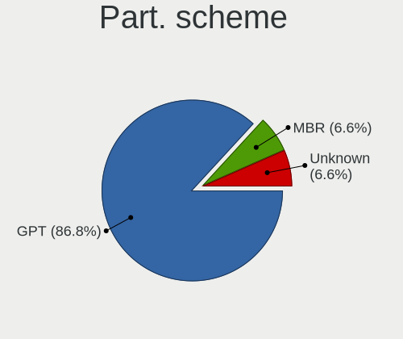
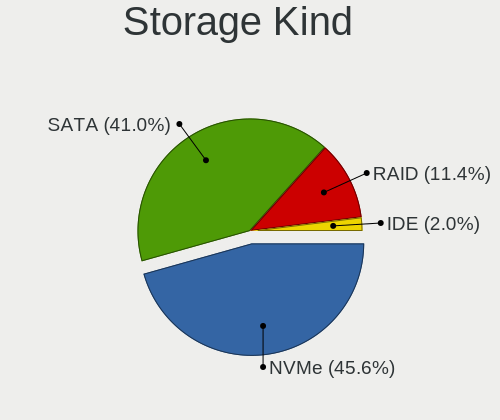
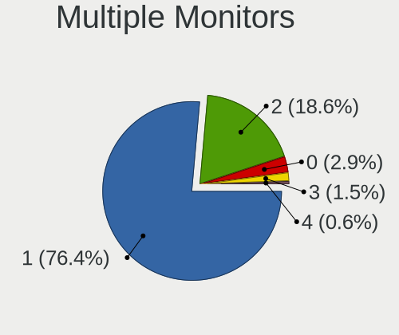

Ubuntu - Hardware Trends (Notebooks)
------------------------------------

A project to identify most popular hardware characteristics and track their change
over time based on data collected by Linux users at https://Linux-Hardware.org.

Anyone can contribute to this report by the [hw-probe](https://github.com/linuxhw/hw-probe) tool:

    sudo -E hw-probe -all -upload

This report is for one last month. Overall report since the beginning of time: [TestDays](https://github.com/linuxhw/TestDays)

Period: Sep, 2023.

Contents
--------

* [ System ](#system)
  - [ OS                       ](#os)
  - [ OS Family                ](#os-family)
  - [ Kernel                   ](#kernel)
  - [ Kernel Family            ](#kernel-family)
  - [ Kernel Major Ver.        ](#kernel-major-ver)
  - [ Arch                     ](#arch)
  - [ DE                       ](#de)
  - [ Display Server           ](#display-server)
  - [ Display Manager          ](#display-manager)
  - [ OS Lang                  ](#os-lang)
  - [ Boot Mode                ](#boot-mode)
  - [ Filesystem               ](#filesystem)
  - [ Part. scheme             ](#part-scheme)
  - [ Dual Boot with Linux/BSD ](#dual-boot-with-linuxbsd)
  - [ Dual Boot (Win)          ](#dual-boot-win)

* [ Board ](#board)
  - [ Vendor                   ](#vendor)
  - [ Model                    ](#model)
  - [ Model Family             ](#model-family)
  - [ MFG Year                 ](#mfg-year)
  - [ Form Factor              ](#form-factor)
  - [ Secure Boot              ](#secure-boot)
  - [ Coreboot                 ](#coreboot)
  - [ RAM Size                 ](#ram-size)
  - [ RAM Used                 ](#ram-used)
  - [ Total Drives             ](#total-drives)
  - [ Has CD-ROM               ](#has-cd-rom)
  - [ Has Ethernet             ](#has-ethernet)
  - [ Has WiFi                 ](#has-wifi)
  - [ Has Bluetooth            ](#has-bluetooth)

* [ Location ](#location)
  - [ Country                  ](#country)
  - [ City                     ](#city)

* [ Drives ](#drives)
  - [ Drive Vendor             ](#drive-vendor)
  - [ Drive Model              ](#drive-model)
  - [ HDD Vendor               ](#hdd-vendor)
  - [ SSD Vendor               ](#ssd-vendor)
  - [ Drive Kind               ](#drive-kind)
  - [ Drive Connector          ](#drive-connector)
  - [ Drive Size               ](#drive-size)
  - [ Space Total              ](#space-total)
  - [ Space Used               ](#space-used)
  - [ Malfunc. Drives          ](#malfunc-drives)
  - [ Malfunc. Drive Vendor    ](#malfunc-drive-vendor)
  - [ Malfunc. HDD Vendor      ](#malfunc-hdd-vendor)
  - [ Malfunc. Drive Kind      ](#malfunc-drive-kind)
  - [ Failed Drives            ](#failed-drives)
  - [ Failed Drive Vendor      ](#failed-drive-vendor)
  - [ Drive Status             ](#drive-status)

* [ Storage controller ](#storage-controller)
  - [ Storage Vendor           ](#storage-vendor)
  - [ Storage Model            ](#storage-model)
  - [ Storage Kind             ](#storage-kind)

* [ Processor ](#processor)
  - [ CPU Vendor               ](#cpu-vendor)
  - [ CPU Model                ](#cpu-model)
  - [ CPU Model Family         ](#cpu-model-family)
  - [ CPU Cores                ](#cpu-cores)
  - [ CPU Sockets              ](#cpu-sockets)
  - [ CPU Threads              ](#cpu-threads)
  - [ CPU Op-Modes             ](#cpu-op-modes)
  - [ CPU Microcode            ](#cpu-microcode)
  - [ CPU Microarch            ](#cpu-microarch)

* [ Graphics ](#graphics)
  - [ GPU Vendor               ](#gpu-vendor)
  - [ GPU Model                ](#gpu-model)
  - [ GPU Combo                ](#gpu-combo)
  - [ GPU Driver               ](#gpu-driver)
  - [ GPU Memory               ](#gpu-memory)

* [ Monitor ](#monitor)
  - [ Monitor Vendor           ](#monitor-vendor)
  - [ Monitor Model            ](#monitor-model)
  - [ Monitor Resolution       ](#monitor-resolution)
  - [ Monitor Diagonal         ](#monitor-diagonal)
  - [ Monitor Width            ](#monitor-width)
  - [ Aspect Ratio             ](#aspect-ratio)
  - [ Monitor Area             ](#monitor-area)
  - [ Pixel Density            ](#pixel-density)
  - [ Multiple Monitors        ](#multiple-monitors)

* [ Network ](#network)
  - [ Net Controller Vendor    ](#net-controller-vendor)
  - [ Net Controller Model     ](#net-controller-model)
  - [ Wireless Vendor          ](#wireless-vendor)
  - [ Wireless Model           ](#wireless-model)
  - [ Ethernet Vendor          ](#ethernet-vendor)
  - [ Ethernet Model           ](#ethernet-model)
  - [ Net Controller Kind      ](#net-controller-kind)
  - [ Used Controller          ](#used-controller)
  - [ NICs                     ](#nics)
  - [ IPv6                     ](#ipv6)

* [ Bluetooth ](#bluetooth)
  - [ Bluetooth Vendor         ](#bluetooth-vendor)
  - [ Bluetooth Model          ](#bluetooth-model)

* [ Sound ](#sound)
  - [ Sound Vendor             ](#sound-vendor)
  - [ Sound Model              ](#sound-model)

* [ Memory ](#memory)
  - [ Memory Vendor            ](#memory-vendor)
  - [ Memory Model             ](#memory-model)
  - [ Memory Kind              ](#memory-kind)
  - [ Memory Form Factor       ](#memory-form-factor)
  - [ Memory Size              ](#memory-size)
  - [ Memory Speed             ](#memory-speed)

* [ Printers & scanners ](#printers--scanners)
  - [ Printer Vendor           ](#printer-vendor)
  - [ Printer Model            ](#printer-model)
  - [ Scanner Vendor           ](#scanner-vendor)
  - [ Scanner Model            ](#scanner-model)

* [ Camera ](#camera)
  - [ Camera Vendor            ](#camera-vendor)
  - [ Camera Model             ](#camera-model)

* [ Security ](#security)
  - [ Fingerprint Vendor       ](#fingerprint-vendor)
  - [ Fingerprint Model        ](#fingerprint-model)
  - [ Chipcard Vendor          ](#chipcard-vendor)
  - [ Chipcard Model           ](#chipcard-model)

* [ Unsupported ](#unsupported)
  - [ Unsupported Devices      ](#unsupported-devices)
  - [ Unsupported Device Types ](#unsupported-device-types)

System
------

OS
--

Installed operating systems

| Name         | Notebooks | Percent |
|--------------|-----------|---------|
| Ubuntu 22.04 | 447       | 67.93%  |
| Ubuntu 23.04 | 133       | 20.21%  |
| Ubuntu 20.04 | 53        | 8.05%   |
| Ubuntu 18.04 | 8         | 1.22%   |
| Ubuntu 22.10 | 7         | 1.06%   |
| Ubuntu 23.10 | 6         | 0.91%   |
| Ubuntu 21.04 | 3         | 0.46%   |
| Ubuntu 20.10 | 1         | 0.15%   |

OS Family
---------

OS without a version

| Name   | Notebooks | Percent |
|--------|-----------|---------|
| Ubuntu | 658       | 100%    |

Kernel
------

Version of the Linux kernel

| Version                | Notebooks | Percent |
|------------------------|-----------|---------|
| 6.2.0-32-generic       | 214       | 32.52%  |
| 6.2.0-33-generic       | 157       | 23.86%  |
| 6.2.0-31-generic       | 71        | 10.79%  |
| 6.2.0-26-generic       | 33        | 5.02%   |
| 5.15.0-83-generic      | 25        | 3.8%    |
| 5.15.0-84-generic      | 21        | 3.19%   |
| 6.2.0-34-generic       | 12        | 1.82%   |
| 5.15.0-82-generic      | 9         | 1.37%   |
| 5.19.0-46-generic      | 8         | 1.22%   |
| 6.2.0-20-generic       | 7         | 1.06%   |
| 6.5.1-060501-generic   | 6         | 0.91%   |
| 5.4.0-162-generic      | 5         | 0.76%   |
| 5.19.0-32-generic      | 5         | 0.76%   |
| 6.5.0-5-generic        | 4         | 0.61%   |
| 5.19.0-50-generic      | 4         | 0.61%   |
| 6.5.0-1003-oem         | 3         | 0.46%   |
| 5.4.0-150-generic      | 3         | 0.46%   |
| 5.15.0-85-generic      | 3         | 0.46%   |
| 6.2.10                 | 2         | 0.3%    |
| 6.2.0-27-generic       | 2         | 0.3%    |
| 6.2.0-10018-tuxedo     | 2         | 0.3%    |
| 5.19.0-41-generic      | 2         | 0.3%    |
| 5.17.0-1035-oem        | 2         | 0.3%    |
| 5.15.0-79-generic      | 2         | 0.3%    |
| 5.11.0-49-generic      | 2         | 0.3%    |
| 4.15.0-213-generic     | 2         | 0.3%    |
| 6.5.5-tkg-cfs          | 1         | 0.15%   |
| 6.5.5-060505-generic   | 1         | 0.15%   |
| 6.5.3-x64v4-xanmod1    | 1         | 0.15%   |
| 6.5.2-t2-jammy         | 1         | 0.15%   |
| 6.5.2-t2               | 1         | 0.15%   |
| 6.5.1-tkg-cfs          | 1         | 0.15%   |
| 6.5.0-060500-generic   | 1         | 0.15%   |
| 6.4.7-t2-lunar         | 1         | 0.15%   |
| 6.4.6-76060406-generic | 1         | 0.15%   |
| 6.4.12-060412-generic  | 1         | 0.15%   |
| 6.4.0-060400-generic   | 1         | 0.15%   |
| 6.3.7-060307-generic   | 1         | 0.15%   |
| 6.3.0-7-generic        | 1         | 0.15%   |
| 6.2.6-76060206-generic | 1         | 0.15%   |

Kernel Family
-------------

Linux kernel without a distro release

| Version | Notebooks | Percent |
|---------|-----------|---------|
| 6.2.0   | 502       | 76.29%  |
| 5.15.0  | 68        | 10.33%  |
| 5.19.0  | 23        | 3.5%    |
| 5.4.0   | 15        | 2.28%   |
| 6.5.0   | 8         | 1.22%   |
| 6.5.1   | 7         | 1.06%   |
| 5.17.0  | 4         | 0.61%   |
| 4.15.0  | 4         | 0.61%   |
| 5.14.0  | 3         | 0.46%   |
| 5.11.0  | 3         | 0.46%   |
| 6.5.5   | 2         | 0.3%    |
| 6.5.2   | 2         | 0.3%    |
| 6.2.10  | 2         | 0.3%    |
| 6.5.3   | 1         | 0.15%   |
| 6.4.7   | 1         | 0.15%   |
| 6.4.6   | 1         | 0.15%   |
| 6.4.12  | 1         | 0.15%   |
| 6.4.0   | 1         | 0.15%   |
| 6.3.7   | 1         | 0.15%   |
| 6.3.0   | 1         | 0.15%   |
| 6.2.6   | 1         | 0.15%   |
| 6.1.55  | 1         | 0.15%   |
| 6.1.0   | 1         | 0.15%   |
| 5.8.0   | 1         | 0.15%   |
| 5.19.17 | 1         | 0.15%   |
| 5.18.10 | 1         | 0.15%   |
| 5.15.23 | 1         | 0.15%   |
| 5.13.0  | 1         | 0.15%   |

Kernel Major Ver.
-----------------

Linux kernel major version

| Version | Notebooks | Percent |
|---------|-----------|---------|
| 6.2     | 505       | 76.75%  |
| 5.15    | 69        | 10.49%  |
| 5.19    | 24        | 3.65%   |
| 6.5     | 20        | 3.04%   |
| 5.4     | 15        | 2.28%   |
| 6.4     | 4         | 0.61%   |
| 5.17    | 4         | 0.61%   |
| 4.15    | 4         | 0.61%   |
| 5.14    | 3         | 0.46%   |
| 5.11    | 3         | 0.46%   |
| 6.3     | 2         | 0.3%    |
| 6.1     | 2         | 0.3%    |
| 5.8     | 1         | 0.15%   |
| 5.18    | 1         | 0.15%   |
| 5.13    | 1         | 0.15%   |

Arch
----

OS architecture (x86_64, i586, etc.)

| Name   | Notebooks | Percent |
|--------|-----------|---------|
| x86_64 | 656       | 99.7%   |
| i686   | 2         | 0.3%    |

DE
--

Desktop Environment

| Name            | Notebooks | Percent |
|-----------------|-----------|---------|
| GNOME           | 629       | 95.59%  |
| Unknown         | 10        | 1.52%   |
| X-Cinnamon      | 7         | 1.06%   |
| GNOME Flashback | 4         | 0.61%   |
| i3              | 3         | 0.46%   |
| Enlightenment   | 2         | 0.3%    |
| sway            | 1         | 0.15%   |
| Cinnamon        | 1         | 0.15%   |
| awesome         | 1         | 0.15%   |

Display Server
--------------

X11 or Wayland

| Name    | Notebooks | Percent |
|---------|-----------|---------|
| Wayland | 422       | 64.13%  |
| X11     | 223       | 33.89%  |
| Unknown | 9         | 1.37%   |
| Tty     | 4         | 0.61%   |

Display Manager
---------------

SDDM, LightDM, etc.

| Name    | Notebooks | Percent |
|---------|-----------|---------|
| GDM3    | 578       | 87.84%  |
| Unknown | 44        | 6.69%   |
| GDM     | 22        | 3.34%   |
| LightDM | 12        | 1.82%   |
| SDDM    | 2         | 0.3%    |

OS Lang
-------

Language

| Lang    | Notebooks | Percent |
|---------|-----------|---------|
| en_US   | 299       | 45.44%  |
| de_DE   | 62        | 9.42%   |
| fr_FR   | 60        | 9.12%   |
| en_GB   | 27        | 4.1%    |
| pt_BR   | 24        | 3.65%   |
| ru_RU   | 22        | 3.34%   |
| it_IT   | 21        | 3.19%   |
| es_ES   | 20        | 3.04%   |
| en_IN   | 14        | 2.13%   |
| en_CA   | 11        | 1.67%   |
| tr_TR   | 9         | 1.37%   |
| en_AU   | 9         | 1.37%   |
| pl_PL   | 8         | 1.22%   |
| zh_CN   | 7         | 1.06%   |
| es_MX   | 6         | 0.91%   |
| ja_JP   | 5         | 0.76%   |
| en_PH   | 5         | 0.76%   |
| nl_NL   | 4         | 0.61%   |
| Unknown | 4         | 0.61%   |
| sv_SE   | 3         | 0.46%   |
| fr_BE   | 3         | 0.46%   |
| fi_FI   | 3         | 0.46%   |
| en_ZA   | 3         | 0.46%   |
| ca_ES   | 3         | 0.46%   |
| C       | 3         | 0.46%   |
| pt_PT   | 2         | 0.3%    |
| hu_HU   | 2         | 0.3%    |
| es_PE   | 2         | 0.3%    |
| es_AR   | 2         | 0.3%    |
| cs_CZ   | 2         | 0.3%    |
| nb_NO   | 1         | 0.15%   |
| lt_LT   | 1         | 0.15%   |
| ko_KR   | 1         | 0.15%   |
| fr_CA   | 1         | 0.15%   |
| es_VE   | 1         | 0.15%   |
| es_EC   | 1         | 0.15%   |
| es_CR   | 1         | 0.15%   |
| es_CO   | 1         | 0.15%   |
| en_NZ   | 1         | 0.15%   |
| en_IL   | 1         | 0.15%   |

Boot Mode
---------

EFI or BIOS

| Mode | Notebooks | Percent |
|------|-----------|---------|
| BIOS | 356       | 54.1%   |
| EFI  | 302       | 45.9%   |

Filesystem
----------

Type of filesystem

| Type    | Notebooks | Percent |
|---------|-----------|---------|
| Tmpfs   | 320       | 48.63%  |
| Ext4    | 308       | 46.81%  |
| Overlay | 12        | 1.82%   |
| Zfs     | 9         | 1.37%   |
| Btrfs   | 9         | 1.37%   |

Part. scheme
------------

Scheme of partitioning

| Type    | Notebooks | Percent |
|---------|-----------|---------|
| GPT     | 546       | 82.98%  |
| MBR     | 66        | 10.03%  |
| Unknown | 46        | 6.99%   |

Dual Boot with Linux/BSD
------------------------

Hosting more than one Linux/BSD

| Dual boot | Notebooks | Percent |
|-----------|-----------|---------|
| No        | 612       | 93.01%  |
| Yes       | 46        | 6.99%   |

Dual Boot (Win)
---------------

Hosting Linux and Windows

| Dual boot | Notebooks | Percent |
|-----------|-----------|---------|
| No        | 423       | 64.29%  |
| Yes       | 235       | 35.71%  |

Board
-----

Vendor
------

Motherboard manufacturer

| Name                                     | Notebooks | Percent |
|------------------------------------------|-----------|---------|
| Lenovo                                   | 140       | 21.28%  |
| Dell                                     | 110       | 16.72%  |
| Hewlett-Packard                          | 109       | 16.57%  |
| ASUSTek Computer                         | 79        | 12.01%  |
| Acer                                     | 58        | 8.81%   |
| Apple                                    | 30        | 4.56%   |
| HUAWEI                                   | 18        | 2.74%   |
| MSI                                      | 13        | 1.98%   |
| Toshiba                                  | 9         | 1.37%   |
| Samsung Electronics                      | 9         | 1.37%   |
| Sony                                     | 6         | 0.91%   |
| Unknown                                  | 6         | 0.91%   |
| Panasonic                                | 5         | 0.76%   |
| TUXEDO                                   | 4         | 0.61%   |
| Notebook                                 | 4         | 0.61%   |
| Fujitsu                                  | 4         | 0.61%   |
| System76                                 | 3         | 0.46%   |
| Medion                                   | 3         | 0.46%   |
| Infinix                                  | 3         | 0.46%   |
| Google                                   | 3         | 0.46%   |
| UNOWHY                                   | 2         | 0.3%    |
| Timi                                     | 2         | 0.3%    |
| Razer                                    | 2         | 0.3%    |
| HONOR                                    | 2         | 0.3%    |
| Gateway                                  | 2         | 0.3%    |
| Framework                                | 2         | 0.3%    |
| EUROCOM                                  | 2         | 0.3%    |
| Chuwi                                    | 2         | 0.3%    |
| Alienware                                | 2         | 0.3%    |
| VPU Company                              | 1         | 0.15%   |
| VENEZOLANA DE INDUSTRIA TECNOLOGICA C.A. | 1         | 0.15%   |
| VALE                                     | 1         | 0.15%   |
| UMAX                                     | 1         | 0.15%   |
| Thomson                                  | 1         | 0.15%   |
| TECNO                                    | 1         | 0.15%   |
| Teclast                                  | 1         | 0.15%   |
| realme                                   | 1         | 0.15%   |
| Positivo                                 | 1         | 0.15%   |
| PC Specialist                            | 1         | 0.15%   |
| Monster                                  | 1         | 0.15%   |

Model
-----

Motherboard model

| Name                                  | Notebooks | Percent |
|---------------------------------------|-----------|---------|
| Unknown                               | 8         | 1.22%   |
| HP Notebook                           | 4         | 0.61%   |
| Apple MacBookPro8,1                   | 4         | 0.61%   |
| HUAWEI BOM-WXX9                       | 3         | 0.46%   |
| HP EliteBook 840 G8 Notebook PC       | 3         | 0.46%   |
| Dell XPS 15 7590                      | 3         | 0.46%   |
| Dell Precision M6800                  | 3         | 0.46%   |
| Dell Precision 5550                   | 3         | 0.46%   |
| Dell Inspiron 1545                    | 3         | 0.46%   |
| ASUS X550CC                           | 3         | 0.46%   |
| Apple MacBookPro12,1                  | 3         | 0.46%   |
| Acer Aspire E1-572G                   | 3         | 0.46%   |
| Toshiba Satellite L855                | 2         | 0.3%    |
| Samsung 305E4A/305E5A/305E7A          | 2         | 0.3%    |
| MSI Prestige 14Evo A12M               | 2         | 0.3%    |
| Lenovo ThinkBook 15 G2 ITL 20VE       | 2         | 0.3%    |
| Lenovo IdeaPad 320-15IKB 81BG         | 2         | 0.3%    |
| HUAWEI NBLB-WAX9N                     | 2         | 0.3%    |
| HUAWEI KLVL-WXXW                      | 2         | 0.3%    |
| HUAWEI BOHB-WAX9                      | 2         | 0.3%    |
| HP ZBook Studio G3                    | 2         | 0.3%    |
| HP ProBook 4540s                      | 2         | 0.3%    |
| HP Pavilion Notebook                  | 2         | 0.3%    |
| HP Pavilion dv6                       | 2         | 0.3%    |
| HP Laptop 15-dy2xxx                   | 2         | 0.3%    |
| HP ENVY 17                            | 2         | 0.3%    |
| HP ENVY 15                            | 2         | 0.3%    |
| HP EliteBook 8470p                    | 2         | 0.3%    |
| HP EliteBook 8460p                    | 2         | 0.3%    |
| HP EliteBook 840 G6                   | 2         | 0.3%    |
| HP EliteBook 840 G3                   | 2         | 0.3%    |
| HP EliteBook 840 G1                   | 2         | 0.3%    |
| HP Dragonfly 13.5 inch G4 Notebook PC | 2         | 0.3%    |
| EUROCOM RAPTOR X17                    | 2         | 0.3%    |
| Dell XPS 15 9570                      | 2         | 0.3%    |
| Dell XPS 15 9550                      | 2         | 0.3%    |
| Dell XPS 15 9530                      | 2         | 0.3%    |
| Dell Precision M6600                  | 2         | 0.3%    |
| Dell Precision 5570                   | 2         | 0.3%    |
| Dell Latitude E6430                   | 2         | 0.3%    |

Model Family
------------

Motherboard model prefix

| Name               | Notebooks | Percent |
|--------------------|-----------|---------|
| Lenovo ThinkPad    | 72        | 10.94%  |
| Acer Aspire        | 44        | 6.69%   |
| Dell Latitude      | 38        | 5.78%   |
| Lenovo IdeaPad     | 34        | 5.17%   |
| HP EliteBook       | 28        | 4.26%   |
| Dell Inspiron      | 26        | 3.95%   |
| ASUS VivoBook      | 21        | 3.19%   |
| Dell Precision     | 18        | 2.74%   |
| HP Pavilion        | 17        | 2.58%   |
| HP Laptop          | 15        | 2.28%   |
| Dell XPS           | 14        | 2.13%   |
| HP ProBook         | 11        | 1.67%   |
| ASUS ZenBook       | 10        | 1.52%   |
| Dell Vostro        | 9         | 1.37%   |
| ASUS ROG           | 8         | 1.22%   |
| Unknown            | 8         | 1.22%   |
| Lenovo Legion      | 7         | 1.06%   |
| HP ZBook           | 7         | 1.06%   |
| HP ENVY            | 7         | 1.06%   |
| Acer Swift         | 7         | 1.06%   |
| Toshiba Satellite  | 6         | 0.91%   |
| Lenovo Yoga        | 6         | 0.91%   |
| Lenovo ThinkBook   | 5         | 0.76%   |
| ASUS ASUS          | 5         | 0.76%   |
| Apple MacBookPro8  | 5         | 0.76%   |
| Acer Nitro         | 5         | 0.76%   |
| HP Notebook        | 4         | 0.61%   |
| Apple MacBookPro16 | 4         | 0.61%   |
| MSI Prestige       | 3         | 0.46%   |
| MSI Katana         | 3         | 0.46%   |
| Lenovo V15         | 3         | 0.46%   |
| Infinix INBOOK     | 3         | 0.46%   |
| HUAWEI BOM-WXX9    | 3         | 0.46%   |
| HP OMEN            | 3         | 0.46%   |
| HP Compaq          | 3         | 0.46%   |
| Fujitsu LIFEBOOK   | 3         | 0.46%   |
| ASUS X550CC        | 3         | 0.46%   |
| Apple MacBookPro12 | 3         | 0.46%   |
| Apple MacBookPro11 | 3         | 0.46%   |
| Timi Redmi         | 2         | 0.3%    |

MFG Year
--------

Motherboard manufacture year

| Year    | Notebooks | Percent |
|---------|-----------|---------|
| 2021    | 85        | 12.92%  |
| 2022    | 70        | 10.64%  |
| 2020    | 68        | 10.33%  |
| 2019    | 52        | 7.9%    |
| 2023    | 49        | 7.45%   |
| 2011    | 44        | 6.69%   |
| 2013    | 42        | 6.38%   |
| 2012    | 38        | 5.78%   |
| 2018    | 36        | 5.47%   |
| 2017    | 33        | 5.02%   |
| 2015    | 28        | 4.26%   |
| 2016    | 27        | 4.1%    |
| 2014    | 26        | 3.95%   |
| 2010    | 22        | 3.34%   |
| 2009    | 19        | 2.89%   |
| 2008    | 10        | 1.52%   |
| 2007    | 6         | 0.91%   |
| Unknown | 2         | 0.3%    |
| 2005    | 1         | 0.15%   |

Form Factor
-----------

Physical design of the computer

| Name     | Notebooks | Percent |
|----------|-----------|---------|
| Notebook | 658       | 100%    |

Secure Boot
-----------

Enabled or disabled

| State    | Notebooks | Percent |
|----------|-----------|---------|
| Disabled | 582       | 88.45%  |
| Enabled  | 76        | 11.55%  |

Coreboot
--------

Have coreboot on board

| Used | Notebooks | Percent |
|------|-----------|---------|
| No   | 653       | 99.24%  |
| Yes  | 5         | 0.76%   |

RAM Size
--------

Total RAM memory

| Size in GB  | Notebooks | Percent |
|-------------|-----------|---------|
| 4.01-8.0    | 186       | 28.27%  |
| 16.01-24.0  | 136       | 20.67%  |
| 8.01-16.0   | 131       | 19.91%  |
| 3.01-4.0    | 95        | 14.44%  |
| 32.01-64.0  | 63        | 9.57%   |
| 64.01-256.0 | 17        | 2.58%   |
| 24.01-32.0  | 11        | 1.67%   |
| 2.01-3.0    | 10        | 1.52%   |
| 1.01-2.0    | 9         | 1.37%   |

RAM Used
--------

Used RAM memory

| Used GB    | Notebooks | Percent |
|------------|-----------|---------|
| 2.01-3.0   | 186       | 28.27%  |
| 1.01-2.0   | 182       | 27.66%  |
| 4.01-8.0   | 124       | 18.84%  |
| 3.01-4.0   | 112       | 17.02%  |
| 8.01-16.0  | 37        | 5.62%   |
| 0.51-1.0   | 8         | 1.22%   |
| 16.01-24.0 | 7         | 1.06%   |
| 24.01-32.0 | 2         | 0.3%    |

Total Drives
------------

Number of drives on board

| Drives | Notebooks | Percent |
|--------|-----------|---------|
| 1      | 518       | 78.72%  |
| 2      | 128       | 19.45%  |
| 3      | 11        | 1.67%   |
| 0      | 1         | 0.15%   |

Has CD-ROM
----------

Has CD-ROM on board

| Presented | Notebooks | Percent |
|-----------|-----------|---------|
| No        | 482       | 73.25%  |
| Yes       | 176       | 26.75%  |

Has Ethernet
------------

Has Ethernet on board

| Presented | Notebooks | Percent |
|-----------|-----------|---------|
| Yes       | 495       | 75.23%  |
| No        | 163       | 24.77%  |

Has WiFi
--------

Has WiFi module

| Presented | Notebooks | Percent |
|-----------|-----------|---------|
| Yes       | 652       | 99.09%  |
| No        | 6         | 0.91%   |

Has Bluetooth
-------------

Has Bluetooth module

| Presented | Notebooks | Percent |
|-----------|-----------|---------|
| Yes       | 557       | 84.65%  |
| No        | 101       | 15.35%  |

Location
--------

Country
-------

Geographic location (country)

| Country      | Notebooks | Percent |
|--------------|-----------|---------|
| USA          | 102       | 15.5%   |
| Germany      | 68        | 10.33%  |
| France       | 65        | 9.88%   |
| Russia       | 33        | 5.02%   |
| Brazil       | 28        | 4.26%   |
| Italy        | 27        | 4.1%    |
| Spain        | 26        | 3.95%   |
| India        | 20        | 3.04%   |
| UK           | 19        | 2.89%   |
| Canada       | 18        | 2.74%   |
| Poland       | 17        | 2.58%   |
| Turkey       | 15        | 2.28%   |
| Mexico       | 12        | 1.82%   |
| China        | 11        | 1.67%   |
| Australia    | 10        | 1.52%   |
| Argentina    | 8         | 1.22%   |
| Pakistan     | 7         | 1.06%   |
| Netherlands  | 7         | 1.06%   |
| Finland      | 7         | 1.06%   |
| Philippines  | 6         | 0.91%   |
| Norway       | 6         | 0.91%   |
| Japan        | 6         | 0.91%   |
| Hungary      | 6         | 0.91%   |
| Czechia      | 6         | 0.91%   |
| Belgium      | 6         | 0.91%   |
| Sweden       | 5         | 0.76%   |
| Austria      | 5         | 0.76%   |
| South Africa | 4         | 0.61%   |
| Romania      | 4         | 0.61%   |
| Portugal     | 4         | 0.61%   |
| Morocco      | 4         | 0.61%   |
| Indonesia    | 4         | 0.61%   |
| Colombia     | 4         | 0.61%   |
| Chile        | 4         | 0.61%   |
| Belarus      | 4         | 0.61%   |
| Ukraine      | 3         | 0.46%   |
| Switzerland  | 3         | 0.46%   |
| South Korea  | 3         | 0.46%   |
| Singapore    | 3         | 0.46%   |
| Saudi Arabia | 3         | 0.46%   |

City
----

Geographic location (city)

| City              | Notebooks | Percent |
|-------------------|-----------|---------|
| Moscow            | 14        | 2.13%   |
| Paris             | 8         | 1.22%   |
| Warsaw            | 7         | 1.06%   |
| St Petersburg     | 7         | 1.06%   |
| Sao Paulo         | 7         | 1.06%   |
| Istanbul          | 7         | 1.06%   |
| Berlin            | 7         | 1.06%   |
| Los Angeles       | 5         | 0.76%   |
| Barcelona         | 5         | 0.76%   |
| Vienna            | 4         | 0.61%   |
| Rome              | 4         | 0.61%   |
| London            | 4         | 0.61%   |
| Kosekoy           | 4         | 0.61%   |
| Helsinki          | 4         | 0.61%   |
| Champs-sur-Marne  | 4         | 0.61%   |
| Calgary           | 4         | 0.61%   |
| Budapest          | 4         | 0.61%   |
| Valenciennes      | 3         | 0.46%   |
| Tokyo             | 3         | 0.46%   |
| Singapore         | 3         | 0.46%   |
| Shanghai          | 3         | 0.46%   |
| Seattle           | 3         | 0.46%   |
| Perth             | 3         | 0.46%   |
| Minsk             | 3         | 0.46%   |
| Milan             | 3         | 0.46%   |
| Marseille         | 3         | 0.46%   |
| Madrid            | 3         | 0.46%   |
| Islamabad         | 3         | 0.46%   |
| Houston           | 3         | 0.46%   |
| Hamburg           | 3         | 0.46%   |
| Frankfurt am Main | 3         | 0.46%   |
| Essen             | 3         | 0.46%   |
| Dublin            | 3         | 0.46%   |
| Delhi             | 3         | 0.46%   |
| Dallas            | 3         | 0.46%   |
| Bonn              | 3         | 0.46%   |
| Zagreb            | 2         | 0.3%    |
| Wroclaw           | 2         | 0.3%    |
| Victoria          | 2         | 0.3%    |
| Vancouver         | 2         | 0.3%    |

Drives
------

Drive Vendor
------------

Hard drive vendors

| Vendor                       | Notebooks | Drives | Percent |
|------------------------------|-----------|--------|---------|
| Samsung Electronics          | 126       | 136    | 16.32%  |
| Seagate                      | 65        | 66     | 8.42%   |
| WDC                          | 57        | 58     | 7.38%   |
| SanDisk                      | 56        | 57     | 7.25%   |
| SK hynix                     | 51        | 51     | 6.61%   |
| Toshiba                      | 43        | 44     | 5.57%   |
| Micron Technology            | 37        | 37     | 4.79%   |
| Unknown                      | 36        | 39     | 4.66%   |
| Intel                        | 36        | 38     | 4.66%   |
| Crucial                      | 29        | 29     | 3.76%   |
| Kingston                     | 28        | 28     | 3.63%   |
| KIOXIA                       | 19        | 19     | 2.46%   |
| Hitachi                      | 18        | 19     | 2.33%   |
| Apple                        | 18        | 18     | 2.33%   |
| HGST                         | 13        | 13     | 1.68%   |
| Kingston Technology Company  | 10        | 10     | 1.3%    |
| Silicon Motion               | 9         | 9      | 1.17%   |
| China                        | 9         | 9      | 1.17%   |
| A-DATA Technology            | 8         | 8      | 1.04%   |
| ADATA Technology             | 7         | 8      | 0.91%   |
| Phison                       | 6         | 7      | 0.78%   |
| LITEON                       | 6         | 6      | 0.78%   |
| Unknown                      | 5         | 5      | 0.65%   |
| UMIS                         | 4         | 4      | 0.52%   |
| Lexar                        | 4         | 4      | 0.52%   |
| JMicron Technology           | 4         | 4      | 0.52%   |
| FORESEE                      | 4         | 4      | 0.52%   |
| Transcend                    | 3         | 3      | 0.39%   |
| SSSTC                        | 3         | 3      | 0.39%   |
| SPCC                         | 3         | 3      | 0.39%   |
| PNY                          | 3         | 3      | 0.39%   |
| Intenso                      | 3         | 3      | 0.39%   |
| Shenzhen Longsys Electronics | 2         | 2      | 0.26%   |
| Phison Electronics           | 2         | 2      | 0.26%   |
| Patriot                      | 2         | 2      | 0.26%   |
| Netac                        | 2         | 2      | 0.26%   |
| GOODRAM                      | 2         | 2      | 0.26%   |
| Gigabyte Technology          | 2         | 2      | 0.26%   |
| Dogfish                      | 2         | 2      | 0.26%   |
| ZX1 1TB                      | 1         | 1      | 0.13%   |

Drive Model
-----------

Hard drive models

| Model                                                 | Notebooks | Percent |
|-------------------------------------------------------|-----------|---------|
| Samsung NVMe SSD Controller SM981/PM981/PM983 256GB   | 14        | 1.77%   |
| Seagate ST1000LM035-1RK172 1TB                        | 12        | 1.52%   |
| Samsung NVMe SSD Controller PM9A1/PM9A3/980PRO 1TB    | 10        | 1.27%   |
| Unknown MMC Card  64GB                                | 8         | 1.01%   |
| Toshiba MQ04ABF100 1TB                                | 7         | 0.89%   |
| SK hynix HFM512GD3JX013N 512GB                        | 6         | 0.76%   |
| Seagate ST9500325AS 500GB                             | 6         | 0.76%   |
| Sandisk WD Blue SN550 NVMe SSD 512GB                  | 6         | 0.76%   |
| Intel SSDPEKNU512GZ 512GB                             | 6         | 0.76%   |
| Unknown MMC Card  32GB                                | 5         | 0.63%   |
| Unknown MMC Card  128GB                               | 5         | 0.63%   |
| Seagate ST1000LM024 HN-M101MBB 1TB                    | 5         | 0.63%   |
| Samsung SSD 860 EVO 500GB                             | 5         | 0.63%   |
| Kingston SA400S37240G 240GB SSD                       | 5         | 0.63%   |
| Crucial CT480BX500SSD1 480GB                          | 5         | 0.63%   |
| Crucial CT240BX500SSD1 240GB                          | 5         | 0.63%   |
| Unknown                                               | 5         | 0.63%   |
| SK hynix PC801 NVMe 1TB                               | 4         | 0.51%   |
| Seagate ST500LT012-1DG142 500GB                       | 4         | 0.51%   |
| SanDisk SD8SN8U-256G-1006 256GB SSD                   | 4         | 0.51%   |
| SanDisk NVMe SSD Drive 512GB                          | 4         | 0.51%   |
| Micron 3400_MTFDKBA1T0TFH 1TB                         | 4         | 0.51%   |
| Micron 2450_MTFDKBA1T0TFK 1024GB                      | 4         | 0.51%   |
| KIOXIA KBG40ZNS512G NVMe 512GB                        | 4         | 0.51%   |
| JMicron Generic 240GB                                 | 4         | 0.51%   |
| Hitachi HTS543232A7A384 320GB                         | 4         | 0.51%   |
| HGST HTS725050A7E630 500GB                            | 4         | 0.51%   |
| Crucial CT500MX500SSD1 500GB                          | 4         | 0.51%   |
| Crucial CT250MX500SSD1 250GB                          | 4         | 0.51%   |
| WDC WD5000LPVX-22V0TT0 500GB                          | 3         | 0.38%   |
| WDC WD5000LPCX-24VHAT0 500GB                          | 3         | 0.38%   |
| Unknown SD/MMC/MS PRO 128GB                           | 3         | 0.38%   |
| Toshiba MQ01ABD100 1TB                                | 3         | 0.38%   |
| Toshiba MQ01ABD075 752GB                              | 3         | 0.38%   |
| SK hynix SKHynix_HFS512GDE9X084N 512GB                | 3         | 0.38%   |
| SK hynix BC511 512GB                                  | 3         | 0.38%   |
| Silicon Motion SM2263EN/SM2263XT SSD Controller 512GB | 3         | 0.38%   |
| Silicon Motion PCIe-8 SSD 512GB                       | 3         | 0.38%   |
| Seagate ST750LM022 HN-M750MBB 752GB                   | 3         | 0.38%   |
| Seagate ST500LT012-9WS142 500GB                       | 3         | 0.38%   |

HDD Vendor
----------

Hard disk drive vendors

| Vendor              | Notebooks | Drives | Percent |
|---------------------|-----------|--------|---------|
| Seagate             | 64        | 65     | 40.25%  |
| Toshiba             | 31        | 32     | 19.5%   |
| WDC                 | 27        | 28     | 16.98%  |
| Hitachi             | 18        | 19     | 11.32%  |
| HGST                | 13        | 13     | 8.18%   |
| Unknown             | 3         | 3      | 1.89%   |
| Samsung Electronics | 1         | 1      | 0.63%   |
| SABRENT             | 1         | 1      | 0.63%   |
| Initio              | 1         | 1      | 0.63%   |

SSD Vendor
----------

Solid state drive vendors

| Vendor              | Notebooks | Drives | Percent |
|---------------------|-----------|--------|---------|
| Samsung Electronics | 44        | 48     | 19.82%  |
| Crucial             | 27        | 27     | 12.16%  |
| SanDisk             | 25        | 26     | 11.26%  |
| Kingston            | 18        | 18     | 8.11%   |
| WDC                 | 12        | 12     | 5.41%   |
| Apple               | 10        | 10     | 4.5%    |
| China               | 9         | 9      | 4.05%   |
| SK hynix            | 7         | 7      | 3.15%   |
| LITEON              | 6         | 6      | 2.7%    |
| Toshiba             | 5         | 5      | 2.25%   |
| Micron Technology   | 5         | 5      | 2.25%   |
| JMicron Technology  | 4         | 4      | 1.8%    |
| A-DATA Technology   | 4         | 4      | 1.8%    |
| Transcend           | 3         | 3      | 1.35%   |
| PNY                 | 3         | 3      | 1.35%   |
| Lexar               | 3         | 3      | 1.35%   |
| Intel               | 3         | 3      | 1.35%   |
| SPCC                | 2         | 2      | 0.9%    |
| Patriot             | 2         | 2      | 0.9%    |
| Netac               | 2         | 2      | 0.9%    |
| Intenso             | 2         | 2      | 0.9%    |
| GOODRAM             | 2         | 2      | 0.9%    |
| Gigabyte Technology | 2         | 2      | 0.9%    |
| Dogfish             | 2         | 2      | 0.9%    |
| XUM                 | 1         | 1      | 0.45%   |
| TwinMOS             | 1         | 1      | 0.45%   |
| Teclast             | 1         | 1      | 0.45%   |
| StoreJet            | 1         | 1      | 0.45%   |
| Saichi              | 1         | 1      | 0.45%   |
| Phison              | 1         | 1      | 0.45%   |
| NGFF                | 1         | 1      | 0.45%   |
| Leven               | 1         | 1      | 0.45%   |
| Lenovo              | 1         | 1      | 0.45%   |
| KIOXIA-EXCERIA      | 1         | 1      | 0.45%   |
| KingSpec            | 1         | 1      | 0.45%   |
| Hewlett-Packard     | 1         | 1      | 0.45%   |
| GLOWAY              | 1         | 1      | 0.45%   |
| EVM                 | 1         | 1      | 0.45%   |
| DQR                 | 1         | 1      | 0.45%   |
| CHUXIA              | 1         | 1      | 0.45%   |

Drive Kind
----------

HDD or SSD

| Kind    | Notebooks | Drives | Percent |
|---------|-----------|--------|---------|
| NVMe    | 324       | 354    | 43.72%  |
| SSD     | 211       | 227    | 28.48%  |
| HDD     | 159       | 163    | 21.46%  |
| MMC     | 33        | 36     | 4.45%   |
| Unknown | 14        | 14     | 1.89%   |

Drive Connector
---------------

SATA, SAS, NVMe, etc.

| Type | Notebooks | Drives | Percent |
|------|-----------|--------|---------|
| SATA | 335       | 379    | 46.85%  |
| NVMe | 324       | 354    | 45.31%  |
| MMC  | 33        | 36     | 4.62%   |
| SAS  | 23        | 25     | 3.22%   |

Drive Size
----------

Size of hard drive

| Size in TB | Notebooks | Drives | Percent |
|------------|-----------|--------|---------|
| 0.01-0.5   | 249       | 271    | 68.22%  |
| 0.51-1.0   | 104       | 106    | 28.49%  |
| 1.01-2.0   | 8         | 8      | 2.19%   |
| 3.01-4.0   | 2         | 2      | 0.55%   |
| 4.01-10.0  | 2         | 3      | 0.55%   |

Space Total
-----------

Amount of disk space available on the file system

| Size in GB     | Notebooks | Percent |
|----------------|-----------|---------|
| 251-500        | 209       | 31.76%  |
| 101-250        | 199       | 30.24%  |
| 501-1000       | 107       | 16.26%  |
| 51-100         | 49        | 7.45%   |
| 1-20           | 28        | 4.26%   |
| 1001-2000      | 25        | 3.8%    |
| 21-50          | 18        | 2.74%   |
| More than 3000 | 10        | 1.52%   |
| 2001-3000      | 9         | 1.37%   |
| Unknown        | 4         | 0.61%   |

Space Used
----------

Amount of used disk space

| Used GB        | Notebooks | Percent |
|----------------|-----------|---------|
| 1-20           | 204       | 31%     |
| 21-50          | 172       | 26.14%  |
| 51-100         | 95        | 14.44%  |
| 101-250        | 88        | 13.37%  |
| 251-500        | 61        | 9.27%   |
| 501-1000       | 20        | 3.04%   |
| 1001-2000      | 8         | 1.22%   |
| Unknown        | 4         | 0.61%   |
| More than 3000 | 3         | 0.46%   |
| 2001-3000      | 3         | 0.46%   |

Malfunc. Drives
---------------

Drive models with a malfunction

| Model                                               | Notebooks | Drives | Percent |
|-----------------------------------------------------|-----------|--------|---------|
| Toshiba MQ04ABF100 1TB                              | 2         | 2      | 9.09%   |
| WDC WD5000BPVT-22HXZT1 500GB                        | 1         | 1      | 4.55%   |
| WDC WD3200BEKT-60V5T1 320GB                         | 1         | 1      | 4.55%   |
| WDC WD10SPZX-75Z10T1 1TB                            | 1         | 1      | 4.55%   |
| WDC WD Green 2.5 240GB                              | 1         | 1      | 4.55%   |
| WDC WD Blue SA510 M.2 2280 1000GB SSD               | 1         | 1      | 4.55%   |
| Toshiba MQ01ABD064 640GB                            | 1         | 1      | 4.55%   |
| Toshiba MQ01ABD050 500GB                            | 1         | 1      | 4.55%   |
| SSSTC CA6-8D2048-Q11 NVMe 2048GB                    | 1         | 1      | 4.55%   |
| SK hynix HFS256G39TND-N210A 256GB SSD               | 1         | 1      | 4.55%   |
| Seagate ST9500325AS 500GB                           | 1         | 1      | 4.55%   |
| Seagate ST500VT000-1DK142 500GB                     | 1         | 1      | 4.55%   |
| Seagate ST500LT012-9WS142 500GB                     | 1         | 1      | 4.55%   |
| Seagate ST500LM021-1KJ152 500GB                     | 1         | 1      | 4.55%   |
| Seagate ST1000LM014-SSHD-8GB                        | 1         | 1      | 4.55%   |
| SanDisk SSD PLUS 240GB                              | 1         | 1      | 4.55%   |
| Micron Technology MTFDDAV512MBF-1AN15ABHA 512GB SSD | 1         | 1      | 4.55%   |
| Hitachi HTS542525K9SA00 250GB                       | 1         | 2      | 4.55%   |
| HGST HTS725050A7E630 500GB                          | 1         | 1      | 4.55%   |
| Crucial CT525MX300SSD1 528GB                        | 1         | 1      | 4.55%   |
| Apple SSD TS128E 121GB                              | 1         | 1      | 4.55%   |

Malfunc. Drive Vendor
---------------------

Vendors of faulty drives

| Vendor            | Notebooks | Drives | Percent |
|-------------------|-----------|--------|---------|
| WDC               | 5         | 5      | 22.73%  |
| Seagate           | 5         | 5      | 22.73%  |
| Toshiba           | 4         | 4      | 18.18%  |
| SSSTC             | 1         | 1      | 4.55%   |
| SK hynix          | 1         | 1      | 4.55%   |
| SanDisk           | 1         | 1      | 4.55%   |
| Micron Technology | 1         | 1      | 4.55%   |
| Hitachi           | 1         | 2      | 4.55%   |
| HGST              | 1         | 1      | 4.55%   |
| Crucial           | 1         | 1      | 4.55%   |
| Apple             | 1         | 1      | 4.55%   |

Malfunc. HDD Vendor
-------------------

Vendors of faulty HDD drives

| Vendor  | Notebooks | Drives | Percent |
|---------|-----------|--------|---------|
| Seagate | 5         | 5      | 35.71%  |
| Toshiba | 4         | 4      | 28.57%  |
| WDC     | 3         | 3      | 21.43%  |
| Hitachi | 1         | 2      | 7.14%   |
| HGST    | 1         | 1      | 7.14%   |

Malfunc. Drive Kind
-------------------

Kinds of faulty drives

| Kind | Notebooks | Drives | Percent |
|------|-----------|--------|---------|
| HDD  | 14        | 15     | 63.64%  |
| SSD  | 7         | 7      | 31.82%  |
| NVMe | 1         | 1      | 4.55%   |

Failed Drives
-------------

Failed drive models

| Model                             | Notebooks | Drives | Percent |
|-----------------------------------|-----------|--------|---------|
| Samsung Electronics SSD 980 500GB | 1         | 1      | 50%     |
| A-DATA Technology SX8200PNP 256GB | 1         | 1      | 50%     |

Failed Drive Vendor
-------------------

Failed drive vendors

| Vendor              | Notebooks | Drives | Percent |
|---------------------|-----------|--------|---------|
| Samsung Electronics | 1         | 1      | 50%     |
| A-DATA Technology   | 1         | 1      | 50%     |

Drive Status
------------

Number of failed and malfunc. drives

| Status   | Notebooks | Drives | Percent |
|----------|-----------|--------|---------|
| Detected | 396       | 470    | 57.89%  |
| Works    | 264       | 299    | 38.6%   |
| Malfunc  | 22        | 23     | 3.22%   |
| Failed   | 2         | 2      | 0.29%   |

Storage controller
------------------

Storage Vendor
--------------

Storage controller vendors

| Vendor                                  | Notebooks | Percent |
|-----------------------------------------|-----------|---------|
| Intel                                   | 429       | 53.29%  |
| Samsung Electronics                     | 86        | 10.68%  |
| SanDisk                                 | 49        | 6.09%   |
| AMD                                     | 48        | 5.96%   |
| SK hynix                                | 44        | 5.47%   |
| Micron Technology                       | 32        | 3.98%   |
| KIOXIA                                  | 19        | 2.36%   |
| Kingston Technology Company             | 19        | 2.36%   |
| Silicon Motion                          | 11        | 1.37%   |
| ADATA Technology                        | 10        | 1.24%   |
| Toshiba America Info Systems            | 8         | 0.99%   |
| Phison Electronics                      | 8         | 0.99%   |
| Nvidia                                  | 8         | 0.99%   |
| Apple                                   | 8         | 0.99%   |
| Shenzhen Longsys Electronics            | 7         | 0.87%   |
| Union Memory (Shenzhen)                 | 4         | 0.5%    |
| Solid State Storage Technology          | 3         | 0.37%   |
| Marvell Technology Group                | 3         | 0.37%   |
| Micron/Crucial Technology               | 2         | 0.25%   |
| Yangtze Memory Technologies             | 1         | 0.12%   |
| Solidigm                                | 1         | 0.12%   |
| Shenzhen Unionmemory Information System | 1         | 0.12%   |
| Realtek Semiconductor                   | 1         | 0.12%   |
| MAXIO Technology (Hangzhou)             | 1         | 0.12%   |
| JMicron Technology                      | 1         | 0.12%   |
| Unknown                                 | 1         | 0.12%   |

Storage Model
-------------

Storage controller models

| Model                                                                          | Notebooks | Percent |
|--------------------------------------------------------------------------------|-----------|---------|
| Intel Volume Management Device NVMe RAID Controller                            | 46        | 5.37%   |
| AMD FCH SATA Controller [AHCI mode]                                            | 44        | 5.13%   |
| Intel Sunrise Point-LP SATA Controller [AHCI mode]                             | 41        | 4.78%   |
| Intel 7 Series Chipset Family 6-port SATA Controller [AHCI mode]               | 41        | 4.78%   |
| Intel 82801 Mobile SATA Controller [RAID mode]                                 | 37        | 4.32%   |
| Intel 6 Series/C200 Series Chipset Family 6 port Mobile SATA AHCI Controller   | 33        | 3.85%   |
| Samsung NVMe SSD Controller SM981/PM981/PM983                                  | 32        | 3.73%   |
| Intel 8 Series SATA Controller 1 [AHCI mode]                                   | 23        | 2.68%   |
| SK hynix Gold P31/BC711/PC711 NVMe Solid State Drive                           | 22        | 2.57%   |
| Samsung NVMe SSD Controller PM9A1/PM9A3/980PRO                                 | 20        | 2.33%   |
| Samsung NVMe SSD Controller 980                                                | 19        | 2.22%   |
| Intel Celeron/Pentium Silver Processor SATA Controller                         | 19        | 2.22%   |
| Intel Tiger Lake-LP SATA Controller                                            | 18        | 2.1%    |
| Intel SSD 670p Series [Keystone Harbor]                                        | 17        | 1.98%   |
| Intel Wildcat Point-LP SATA Controller [AHCI Mode]                             | 16        | 1.87%   |
| Intel Cannon Lake Mobile PCH SATA AHCI Controller                              | 16        | 1.87%   |
| Intel 5 Series/3400 Series Chipset 4 port SATA AHCI Controller                 | 15        | 1.75%   |
| Intel 8 Series/C220 Series Chipset Family 6-port SATA Controller 1 [AHCI mode] | 14        | 1.63%   |
| KIOXIA NVMe SSD Controller BG4 (DRAM-less)                                     | 11        | 1.28%   |
| Intel 82801IBM/IEM (ICH9M/ICH9M-E) 4 port SATA Controller [AHCI mode]          | 11        | 1.28%   |
| SanDisk WD Blue SN550 NVMe SSD                                                 | 10        | 1.17%   |
| Intel Comet Lake SATA AHCI Controller                                          | 10        | 1.17%   |
| SanDisk WD Black SN750 / PC SN730 NVMe SSD                                     | 9         | 1.05%   |
| Micron 2450 NVMe SSD [HendrixV] (DRAM-less)                                    | 9         | 1.05%   |
| Intel Cannon Point-LP SATA Controller [AHCI Mode]                              | 9         | 1.05%   |
| Intel SSD 660P Series                                                          | 8         | 0.93%   |
| Apple ANS2 NVMe Controller                                                     | 8         | 0.93%   |
| Shenzhen Longsys Lexar NM620 NVME SSD (DRAM-less)                              | 7         | 0.82%   |
| Samsung NVMe SSD Controller SM961/PM961/SM963                                  | 7         | 0.82%   |
| Micron 3400 NVMe SSD [Hendrix]                                                 | 7         | 0.82%   |
| Micron 2200S NVMe SSD [Cassandra]                                              | 7         | 0.82%   |
| Intel Alder Lake-P SATA AHCI Controller                                        | 7         | 0.82%   |
| Silicon Motion SM2263EN/SM2263XT (DRAM-less) NVMe SSD Controllers              | 6         | 0.7%    |
| SanDisk WD Black SN770 / PC SN740 256GB / PC SN560 (DRAM-less) NVMe SSD        | 6         | 0.7%    |
| Intel Volume Management Device NVMe RAID Controller Intel Corporation          | 6         | 0.7%    |
| Intel Tiger Lake SATA AHCI Controller                                          | 6         | 0.7%    |
| Intel HM170/QM170 Chipset SATA Controller [AHCI Mode]                          | 6         | 0.7%    |
| Intel 5 Series/3400 Series Chipset 6 port SATA AHCI Controller                 | 6         | 0.7%    |
| SK hynix Platinum P41/PC801 NVMe Solid State Drive                             | 5         | 0.58%   |
| SK hynix BC511 NVMe SSD                                                        | 5         | 0.58%   |

Storage Kind
------------

Kind of storage controller (IDE, SATA, NVMe, SAS, ...)

| Kind | Notebooks | Percent |
|------|-----------|---------|
| SATA | 385       | 46.61%  |
| NVMe | 324       | 39.23%  |
| RAID | 93        | 11.26%  |
| IDE  | 24        | 2.91%   |

Processor
---------

CPU Vendor
----------

Processor vendors

| Vendor       | Notebooks | Percent |
|--------------|-----------|---------|
| Intel        | 549       | 83.43%  |
| AMD          | 108       | 16.41%  |
| CentaurHauls | 1         | 0.15%   |

CPU Model
---------

Processor models

| Model                                   | Notebooks | Percent |
|-----------------------------------------|-----------|---------|
| Intel 11th Gen Core i7-1165G7 @ 2.80GHz | 19        | 2.89%   |
| Intel 11th Gen Core i5-1135G7 @ 2.40GHz | 16        | 2.43%   |
| Intel Core i5-8250U CPU @ 1.60GHz       | 13        | 1.98%   |
| Intel Core i7-9750H CPU @ 2.60GHz       | 10        | 1.52%   |
| Intel Core i5-6200U CPU @ 2.30GHz       | 10        | 1.52%   |
| AMD Ryzen 7 5700U with Radeon Graphics  | 9         | 1.37%   |
| Intel Core i7-10750H CPU @ 2.60GHz      | 8         | 1.22%   |
| Intel Core i7-10510U CPU @ 1.80GHz      | 8         | 1.22%   |
| Intel Core i5-7200U CPU @ 2.50GHz       | 8         | 1.22%   |
| Intel Core i5-2520M CPU @ 2.50GHz       | 8         | 1.22%   |
| Intel 12th Gen Core i7-12700H           | 8         | 1.22%   |
| Intel 11th Gen Core i3-1115G4 @ 3.00GHz | 8         | 1.22%   |
| AMD Ryzen 5 5500U with Radeon Graphics  | 8         | 1.22%   |
| Intel Core i7-8550U CPU @ 1.80GHz       | 6         | 0.91%   |
| Intel Core i5-8265U CPU @ 1.60GHz       | 6         | 0.91%   |
| Intel Core i5-6300U CPU @ 2.40GHz       | 6         | 0.91%   |
| Intel Core i5-5300U CPU @ 2.30GHz       | 6         | 0.91%   |
| Intel Core i5-10210U CPU @ 1.60GHz      | 6         | 0.91%   |
| Intel Core i3-4030U CPU @ 1.90GHz       | 6         | 0.91%   |
| Intel 13th Gen Core i7-13700H           | 6         | 0.91%   |
| Intel 12th Gen Core i5-1235U            | 6         | 0.91%   |
| AMD Ryzen 7 5825U with Radeon Graphics  | 6         | 0.91%   |
| Intel Core i7-8750H CPU @ 2.20GHz       | 5         | 0.76%   |
| Intel Core i7-6700HQ CPU @ 2.60GHz      | 5         | 0.76%   |
| Intel Core i7-4510U CPU @ 2.00GHz       | 5         | 0.76%   |
| Intel Core i5-3210M CPU @ 2.50GHz       | 5         | 0.76%   |
| Intel Celeron N4000 CPU @ 1.10GHz       | 5         | 0.76%   |
| Intel 13th Gen Core i9-13900H           | 5         | 0.76%   |
| Intel 12th Gen Core i7-1255U            | 5         | 0.76%   |
| Intel 11th Gen Core i7-11800H @ 2.30GHz | 5         | 0.76%   |
| AMD Ryzen 7 5800H with Radeon Graphics  | 5         | 0.76%   |
| Intel Core i7-8650U CPU @ 1.90GHz       | 4         | 0.61%   |
| Intel Core i7-8565U CPU @ 1.80GHz       | 4         | 0.61%   |
| Intel Core i7-7500U CPU @ 2.70GHz       | 4         | 0.61%   |
| Intel Core i7-4810MQ CPU @ 2.80GHz      | 4         | 0.61%   |
| Intel Core i7-4500U CPU @ 1.80GHz       | 4         | 0.61%   |
| Intel Core i7-2670QM CPU @ 2.20GHz      | 4         | 0.61%   |
| Intel Core i7-2620M CPU @ 2.70GHz       | 4         | 0.61%   |
| Intel Core i5-4200U CPU @ 1.60GHz       | 4         | 0.61%   |
| Intel Core i5-3340M CPU @ 2.70GHz       | 4         | 0.61%   |

CPU Model Family
----------------

Processor model prefix

| Model                   | Notebooks | Percent |
|-------------------------|-----------|---------|
| Intel Core i5           | 152       | 23.1%   |
| Other                   | 134       | 20.36%  |
| Intel Core i7           | 131       | 19.91%  |
| Intel Core i3           | 47        | 7.14%   |
| Intel Celeron           | 39        | 5.93%   |
| AMD Ryzen 7             | 38        | 5.78%   |
| AMD Ryzen 5             | 26        | 3.95%   |
| Intel Core 2 Duo        | 18        | 2.74%   |
| Intel Pentium           | 13        | 1.98%   |
| AMD Ryzen 3             | 7         | 1.06%   |
| AMD Ryzen 9             | 6         | 0.91%   |
| Intel Atom              | 5         | 0.76%   |
| AMD A6                  | 5         | 0.76%   |
| AMD Ryzen 7 PRO         | 4         | 0.61%   |
| AMD A8                  | 4         | 0.61%   |
| Intel Pentium Silver    | 3         | 0.46%   |
| Intel Pentium Dual-Core | 3         | 0.46%   |
| AMD Turion 64 X2 Mobile | 3         | 0.46%   |
| AMD Ryzen 5 PRO         | 3         | 0.46%   |
| AMD A4                  | 3         | 0.46%   |
| Intel Pentium Dual      | 2         | 0.3%    |
| AMD A10                 | 2         | 0.3%    |
| Intel Xeon              | 1         | 0.15%   |
| Intel Pentium 4         | 1         | 0.15%   |
| Intel Genuine           | 1         | 0.15%   |
| Intel Core i9           | 1         | 0.15%   |
| AMD Sempron             | 1         | 0.15%   |
| AMD PRO A10             | 1         | 0.15%   |
| AMD E2                  | 1         | 0.15%   |
| AMD E                   | 1         | 0.15%   |
| AMD Athlon II           | 1         | 0.15%   |
| AMD A12                 | 1         | 0.15%   |

CPU Cores
---------

Number of processor cores

| Number | Notebooks | Percent |
|--------|-----------|---------|
| 2      | 272       | 41.34%  |
| 4      | 201       | 30.55%  |
| 6      | 59        | 8.97%   |
| 8      | 57        | 8.66%   |
| 14     | 27        | 4.1%    |
| 10     | 19        | 2.89%   |
| 12     | 11        | 1.67%   |
| 24     | 4         | 0.61%   |
| 1      | 4         | 0.61%   |
| 16     | 3         | 0.46%   |
| 3      | 1         | 0.15%   |

CPU Sockets
-----------

Number of sockets

| Number | Notebooks | Percent |
|--------|-----------|---------|
| 1      | 658       | 100%    |

CPU Threads
-----------

Threads per core (Hyper-Threading)

| Number | Notebooks | Percent |
|--------|-----------|---------|
| 2      | 523       | 79.48%  |
| 1      | 135       | 20.52%  |

CPU Op-Modes
------------

CPU Operation Modes (32-bit, 64-bit)

| Op mode        | Notebooks | Percent |
|----------------|-----------|---------|
| 32-bit, 64-bit | 657       | 99.85%  |
| 32-bit         | 1         | 0.15%   |

CPU Microcode
-------------

Microcode number

| Number     | Notebooks | Percent |
|------------|-----------|---------|
| Unknown    | 514       | 78.12%  |
| 0x0a50000c | 12        | 1.82%   |
| 0x08608103 | 10        | 1.52%   |
| 0x206a7    | 9         | 1.37%   |
| 0x0a50000d | 8         | 1.22%   |
| 0x08600106 | 7         | 1.06%   |
| 0xb06a2    | 5         | 0.76%   |
| 0x40651    | 5         | 0.76%   |
| 0xa0652    | 4         | 0.61%   |
| 0x906a4    | 4         | 0.61%   |
| 0x806c1    | 4         | 0.61%   |
| 0x306c3    | 4         | 0.61%   |
| 0x306a9    | 4         | 0.61%   |
| 0x08108109 | 4         | 0.61%   |
| 0x906ea    | 3         | 0.46%   |
| 0x806ec    | 3         | 0.46%   |
| 0x806ea    | 3         | 0.46%   |
| 0x406e3    | 3         | 0.46%   |
| 0x30678    | 3         | 0.46%   |
| 0x1067a    | 3         | 0.46%   |
| 0x0a601203 | 3         | 0.46%   |
| 0x0a404102 | 3         | 0.46%   |
| 0x906a3    | 2         | 0.3%    |
| 0x806eb    | 2         | 0.3%    |
| 0x806d1    | 2         | 0.3%    |
| 0x20655    | 2         | 0.3%    |
| 0x0a704101 | 2         | 0.3%    |
| 0x08608102 | 2         | 0.3%    |
| 0x06006110 | 2         | 0.3%    |
| 0x03000027 | 2         | 0.3%    |
| 0xf43      | 1         | 0.15%   |
| 0xb06f2    | 1         | 0.15%   |
| 0xb0671    | 1         | 0.15%   |
| 0x90672    | 1         | 0.15%   |
| 0x806e9    | 1         | 0.15%   |
| 0x706e5    | 1         | 0.15%   |
| 0x706a8    | 1         | 0.15%   |
| 0x6fd      | 1         | 0.15%   |
| 0x506e3    | 1         | 0.15%   |
| 0x506c9    | 1         | 0.15%   |

CPU Microarch
-------------

Microarchitecture

| Name             | Notebooks | Percent |
|------------------|-----------|---------|
| KabyLake         | 113       | 17.17%  |
| Unknown          | 63        | 9.57%   |
| TigerLake        | 54        | 8.21%   |
| SandyBridge      | 49        | 7.45%   |
| Alderlake Hybrid | 46        | 6.99%   |
| Haswell          | 45        | 6.84%   |
| IvyBridge        | 39        | 5.93%   |
| Skylake          | 32        | 4.86%   |
| Zen 3            | 26        | 3.95%   |
| Westmere         | 22        | 3.34%   |
| Broadwell        | 22        | 3.34%   |
| Goldmont plus    | 21        | 3.19%   |
| Icelake          | 18        | 2.74%   |
| Penryn           | 17        | 2.58%   |
| Zen 2            | 15        | 2.28%   |
| CometLake        | 14        | 2.13%   |
| Silvermont       | 12        | 1.82%   |
| Zen+             | 10        | 1.52%   |
| Excavator        | 8         | 1.22%   |
| Core             | 6         | 0.91%   |
| Goldmont         | 5         | 0.76%   |
| Piledriver       | 4         | 0.61%   |
| K8 Hammer        | 3         | 0.46%   |
| K10 Llano        | 3         | 0.46%   |
| Tremont          | 2         | 0.3%    |
| Jaguar           | 2         | 0.3%    |
| Puma             | 1         | 0.15%   |
| NetBurst         | 1         | 0.15%   |
| Nehalem          | 1         | 0.15%   |
| K8 & K10 hybrid  | 1         | 0.15%   |
| K10              | 1         | 0.15%   |
| Bonnell          | 1         | 0.15%   |
| Bobcat           | 1         | 0.15%   |

Graphics
--------

GPU Vendor
----------

Vendors of graphics cards

| Vendor  | Notebooks | Percent |
|---------|-----------|---------|
| Intel   | 510       | 60.57%  |
| Nvidia  | 192       | 22.8%   |
| AMD     | 139       | 16.51%  |
| Zhaoxin | 1         | 0.12%   |

GPU Model
---------

Graphics card models

| Model                                                                                    | Notebooks | Percent |
|------------------------------------------------------------------------------------------|-----------|---------|
| Intel TigerLake-LP GT2 [Iris Xe Graphics]                                                | 45        | 5.29%   |
| Intel 2nd Generation Core Processor Family Integrated Graphics Controller                | 44        | 5.17%   |
| Intel 3rd Gen Core processor Graphics Controller                                         | 36        | 4.23%   |
| Intel UHD Graphics 620                                                                   | 28        | 3.29%   |
| Intel Haswell-ULT Integrated Graphics Controller                                         | 25        | 2.94%   |
| Intel CoffeeLake-H GT2 [UHD Graphics 630]                                                | 23        | 2.7%    |
| Intel Alder Lake-P Integrated Graphics Controller                                        | 22        | 2.59%   |
| Intel Skylake GT2 [HD Graphics 520]                                                      | 21        | 2.47%   |
| Intel Raptor Lake-P [Iris Xe Graphics]                                                   | 19        | 2.23%   |
| Intel GeminiLake [UHD Graphics 600]                                                      | 19        | 2.23%   |
| Intel CometLake-U GT2 [UHD Graphics]                                                     | 19        | 2.23%   |
| AMD Lucienne                                                                             | 19        | 2.23%   |
| Intel WhiskeyLake-U GT2 [UHD Graphics 620]                                               | 17        | 2%      |
| Intel HD Graphics 620                                                                    | 16        | 1.88%   |
| Intel HD Graphics 5500                                                                   | 16        | 1.88%   |
| Intel 4th Gen Core Processor Integrated Graphics Controller                              | 16        | 1.88%   |
| Intel Core Processor Integrated Graphics Controller                                      | 15        | 1.76%   |
| AMD Renoir                                                                               | 15        | 1.76%   |
| AMD Cezanne [Radeon Vega Series / Radeon Vega Mobile Series]                             | 13        | 1.53%   |
| Intel Alder Lake-UP3 GT2 [Iris Xe Graphics]                                              | 12        | 1.41%   |
| AMD Barcelo                                                                              | 12        | 1.41%   |
| Nvidia TU117M [GeForce GTX 1650 Mobile / Max-Q]                                          | 11        | 1.29%   |
| Intel TigerLake-H GT1 [UHD Graphics]                                                     | 11        | 1.29%   |
| Intel CometLake-H GT2 [UHD Graphics]                                                     | 11        | 1.29%   |
| Intel Mobile 4 Series Chipset Integrated Graphics Controller                             | 10        | 1.18%   |
| AMD Picasso/Raven 2 [Radeon Vega Series / Radeon Vega Mobile Series]                     | 10        | 1.18%   |
| Intel Tiger Lake-LP GT2 [UHD Graphics G4]                                                | 9         | 1.06%   |
| Nvidia GA107M [GeForce RTX 3050 Mobile]                                                  | 8         | 0.94%   |
| Nvidia GA106M [GeForce RTX 3060 Mobile / Max-Q]                                          | 8         | 0.94%   |
| Nvidia AD107M [GeForce RTX 4060 Max-Q / Mobile]                                          | 7         | 0.82%   |
| Nvidia TU106M [GeForce RTX 2060 Mobile]                                                  | 6         | 0.71%   |
| Nvidia GA107M [GeForce RTX 3050 Ti Mobile]                                               | 6         | 0.71%   |
| Intel Iris Plus Graphics G1 (Ice Lake)                                                   | 6         | 0.71%   |
| Intel HD Graphics 530                                                                    | 6         | 0.71%   |
| Intel Atom/Celeron/Pentium Processor x5-E8000/J3xxx/N3xxx Integrated Graphics Controller | 6         | 0.71%   |
| Intel Atom Processor Z36xxx/Z37xxx Series Graphics & Display                             | 6         | 0.71%   |
| Nvidia GM108M [GeForce 840M]                                                             | 5         | 0.59%   |
| Intel JasperLake [UHD Graphics]                                                          | 5         | 0.59%   |
| Intel HD Graphics 500                                                                    | 5         | 0.59%   |
| Intel Alder Lake-P GT1 [UHD Graphics]                                                    | 5         | 0.59%   |

GPU Combo
---------

Combinations of graphics cards

| Name           | Notebooks | Percent |
|----------------|-----------|---------|
| 1 x Intel      | 339       | 51.52%  |
| Intel + Nvidia | 146       | 22.19%  |
| 1 x AMD        | 96        | 14.59%  |
| 1 x Nvidia     | 30        | 4.56%   |
| Intel + AMD    | 21        | 3.19%   |
| AMD + Nvidia   | 16        | 2.43%   |
| 2 x AMD        | 6         | 0.91%   |
| Other          | 2         | 0.3%    |
| 2 x Intel      | 1         | 0.15%   |
| 1 x Zhaoxin    | 1         | 0.15%   |

GPU Driver
----------

Free vs proprietary

| Driver      | Notebooks | Percent |
|-------------|-----------|---------|
| Free        | 537       | 81.61%  |
| Proprietary | 110       | 16.72%  |
| Unknown     | 11        | 1.67%   |

GPU Memory
----------

Total video memory

| Size in GB | Notebooks | Percent |
|------------|-----------|---------|
| Unknown    | 546       | 82.98%  |
| 0.01-0.5   | 51        | 7.75%   |
| 1.01-2.0   | 33        | 5.02%   |
| 3.01-4.0   | 12        | 1.82%   |
| 0.51-1.0   | 8         | 1.22%   |
| 5.01-6.0   | 5         | 0.76%   |
| 7.01-8.0   | 3         | 0.46%   |

Monitor
-------

Monitor Vendor
--------------

Monitor vendors

| Vendor                  | Notebooks | Percent |
|-------------------------|-----------|---------|
| AU Optronics            | 150       | 19.43%  |
| BOE                     | 120       | 15.54%  |
| Chimei Innolux          | 107       | 13.86%  |
| Samsung Electronics     | 90        | 11.66%  |
| LG Display              | 88        | 11.4%   |
| Apple                   | 28        | 3.63%   |
| Sharp                   | 23        | 2.98%   |
| Dell                    | 20        | 2.59%   |
| Lenovo                  | 14        | 1.81%   |
| Goldstar                | 14        | 1.81%   |
| PANDA                   | 12        | 1.55%   |
| Hewlett-Packard         | 12        | 1.55%   |
| Chi Mei Optoelectronics | 12        | 1.55%   |
| InfoVision              | 9         | 1.17%   |
| Iiyama                  | 7         | 0.91%   |
| CSO                     | 7         | 0.91%   |
| AOC                     | 6         | 0.78%   |
| BenQ                    | 5         | 0.65%   |
| Ancor Communications    | 5         | 0.65%   |
| Acer                    | 5         | 0.65%   |
| HKC                     | 4         | 0.52%   |
| Philips                 | 3         | 0.39%   |
| Panasonic               | 3         | 0.39%   |
| Hitachi                 | 3         | 0.39%   |
| ASUSTek Computer        | 3         | 0.39%   |
| ViewSonic               | 2         | 0.26%   |
| Seiki                   | 2         | 0.26%   |
| ZTR                     | 1         | 0.13%   |
| Vizio                   | 1         | 0.13%   |
| Unknown (AAA)           | 1         | 0.13%   |
| Toshiba                 | 1         | 0.13%   |
| TMX                     | 1         | 0.13%   |
| Sony                    | 1         | 0.13%   |
| Sceptre Tech            | 1         | 0.13%   |
| MStar                   | 1         | 0.13%   |
| Mi                      | 1         | 0.13%   |
| Medion                  | 1         | 0.13%   |
| KDC                     | 1         | 0.13%   |
| JDZ                     | 1         | 0.13%   |
| JDI                     | 1         | 0.13%   |

Monitor Model
-------------

Monitor models

| Model                                                                    | Notebooks | Percent |
|--------------------------------------------------------------------------|-----------|---------|
| Chimei Innolux LCD Monitor CMN15F5 1920x1080 344x193mm 15.5-inch         | 8         | 1.02%   |
| Chimei Innolux LCD Monitor CMN14D4 1920x1080 309x173mm 13.9-inch         | 8         | 1.02%   |
| AU Optronics LCD Monitor AUO38ED 1920x1080 344x193mm 15.5-inch           | 7         | 0.9%    |
| AU Optronics LCD Monitor AUO22EC 1366x768 344x193mm 15.5-inch            | 6         | 0.77%   |
| Chimei Innolux LCD Monitor CMN15E8 1920x1080 344x193mm 15.5-inch         | 5         | 0.64%   |
| BOE LCD Monitor BOE0872 1920x1080 344x194mm 15.5-inch                    | 5         | 0.64%   |
| Samsung Electronics LCD Monitor SDC4161 1920x1080 344x194mm 15.5-inch    | 4         | 0.51%   |
| Lenovo LCD Monitor LEN40B1 1600x900 345x194mm 15.6-inch                  | 4         | 0.51%   |
| Chimei Innolux LCD Monitor CMN14D5 1920x1080 309x173mm 13.9-inch         | 4         | 0.51%   |
| BOE LCD Monitor BOE0672 1366x768 344x194mm 15.5-inch                     | 4         | 0.51%   |
| AU Optronics LCD Monitor AUO47EC 1366x768 344x193mm 15.5-inch            | 4         | 0.51%   |
| AU Optronics LCD Monitor AUO403D 1920x1080 309x173mm 13.9-inch           | 4         | 0.51%   |
| AU Optronics LCD Monitor AUO10EC 1366x768 344x193mm 15.5-inch            | 4         | 0.51%   |
| Samsung Electronics LF24T35 SAM707D 1920x1080 528x297mm 23.9-inch        | 3         | 0.38%   |
| Samsung Electronics LCD Monitor SEC544B 1600x900 382x215mm 17.3-inch     | 3         | 0.38%   |
| Samsung Electronics LCD Monitor SEC5441 1366x768 344x194mm 15.5-inch     | 3         | 0.38%   |
| PANDA LCD Monitor NCP004F 1920x1080 309x174mm 14.0-inch                  | 3         | 0.38%   |
| LG Display LCD Monitor LGD046F 1920x1080 345x194mm 15.6-inch             | 3         | 0.38%   |
| LG Display LCD Monitor LGD02DC 1366x768 344x194mm 15.5-inch              | 3         | 0.38%   |
| Chimei Innolux LCD Monitor CMN1618 1920x1200 344x215mm 16.0-inch         | 3         | 0.38%   |
| Chimei Innolux LCD Monitor CMN15E7 1920x1080 344x193mm 15.5-inch         | 3         | 0.38%   |
| Chimei Innolux LCD Monitor CMN15DB 1366x768 344x193mm 15.5-inch          | 3         | 0.38%   |
| Chimei Innolux LCD Monitor CMN14A3 1600x900 309x174mm 14.0-inch          | 3         | 0.38%   |
| Chi Mei Optoelectronics LCD Monitor CMO15A7 1366x768 344x193mm 15.5-inch | 3         | 0.38%   |
| BOE LCD Monitor BOE0A56 1920x1080 344x194mm 15.5-inch                    | 3         | 0.38%   |
| BOE LCD Monitor BOE0893 2160x1440 296x197mm 14.0-inch                    | 3         | 0.38%   |
| BOE LCD Monitor BOE0877 1920x1080 309x173mm 13.9-inch                    | 3         | 0.38%   |
| BOE LCD Monitor BOE084E 1920x1080 382x215mm 17.3-inch                    | 3         | 0.38%   |
| BOE LCD Monitor BOE0675 1366x768 344x194mm 15.5-inch                     | 3         | 0.38%   |
| AU Optronics LCD Monitor AUO71EC 1366x768 344x193mm 15.5-inch            | 3         | 0.38%   |
| AU Optronics LCD Monitor AUO61ED 1920x1080 340x190mm 15.3-inch           | 3         | 0.38%   |
| AU Optronics LCD Monitor AUO26EC 1366x768 344x193mm 15.5-inch            | 3         | 0.38%   |
| AU Optronics LCD Monitor AUO229E 1600x900 382x214mm 17.2-inch            | 3         | 0.38%   |
| AU Optronics LCD Monitor AUO20EC 1366x768 344x193mm 15.5-inch            | 3         | 0.38%   |
| AU Optronics LCD Monitor AUO193C 1366x768 309x173mm 13.9-inch            | 3         | 0.38%   |
| Sharp LQ156T1JW05 SHP1574 2560x1440 344x194mm 15.5-inch                  | 2         | 0.26%   |
| Sharp LCD Monitor SHP1516 3840x2400 336x210mm 15.6-inch                  | 2         | 0.26%   |
| Sharp LCD Monitor SHP14D0 3840x2400 336x210mm 15.6-inch                  | 2         | 0.26%   |
| Sharp LCD Monitor SHP14BA 1920x1080 344x194mm 15.5-inch                  | 2         | 0.26%   |
| Sharp LCD Monitor SHP148D 3840x2160 344x194mm 15.5-inch                  | 2         | 0.26%   |

Monitor Resolution
------------------

Monitor screen resolution

| Resolution         | Notebooks | Percent |
|--------------------|-----------|---------|
| 1920x1080 (FHD)    | 308       | 42.31%  |
| 1366x768 (WXGA)    | 167       | 22.94%  |
| 3840x2160 (4K)     | 41        | 5.63%   |
| 1600x900 (HD+)     | 41        | 5.63%   |
| 1920x1200 (WUXGA)  | 30        | 4.12%   |
| 2560x1440 (QHD)    | 22        | 3.02%   |
| 2560x1600          | 21        | 2.88%   |
| 1280x800 (WXGA)    | 19        | 2.61%   |
| 2880x1800          | 12        | 1.65%   |
| 3440x1440          | 8         | 1.1%    |
| 3840x2400          | 7         | 0.96%   |
| 1680x1050 (WSXGA+) | 7         | 0.96%   |
| 1440x900 (WXGA+)   | 7         | 0.96%   |
| 2160x1440          | 6         | 0.82%   |
| 1280x1024 (SXGA)   | 6         | 0.82%   |
| 1920x1280          | 4         | 0.55%   |
| 2880x1620          | 3         | 0.41%   |
| 3840x1080          | 2         | 0.27%   |
| 3456x2160          | 2         | 0.27%   |
| 3072x1920          | 2         | 0.27%   |
| 2256x1504          | 2         | 0.27%   |
| 3840x1100          | 1         | 0.14%   |
| 3300x2200          | 1         | 0.14%   |
| 3200x2000          | 1         | 0.14%   |
| 3200x1800 (QHD+)   | 1         | 0.14%   |
| 3000x2000          | 1         | 0.14%   |
| 2880x1920          | 1         | 0.14%   |
| 2560x1080          | 1         | 0.14%   |
| 2240x1400          | 1         | 0.14%   |
| 1920x540           | 1         | 0.14%   |
| 1360x768           | 1         | 0.14%   |
| 1024x768 (XGA)     | 1         | 0.14%   |

Monitor Diagonal
----------------

Diagonal size in inches

| Inches  | Notebooks | Percent |
|---------|-----------|---------|
| 15      | 282       | 36.58%  |
| 13      | 114       | 14.79%  |
| 14      | 110       | 14.27%  |
| 17      | 68        | 8.82%   |
| 27      | 30        | 3.89%   |
| 16      | 30        | 3.89%   |
| 24      | 29        | 3.76%   |
| 23      | 17        | 2.2%    |
| 12      | 15        | 1.95%   |
| 34      | 9         | 1.17%   |
| 31      | 9         | 1.17%   |
| 21      | 9         | 1.17%   |
| 11      | 7         | 0.91%   |
| 84      | 5         | 0.65%   |
| 22      | 5         | 0.65%   |
| 40      | 4         | 0.52%   |
| 20      | 4         | 0.52%   |
| 19      | 4         | 0.52%   |
| Unknown | 3         | 0.39%   |
| 72      | 2         | 0.26%   |
| 54      | 2         | 0.26%   |
| 48      | 2         | 0.26%   |
| 10      | 2         | 0.26%   |
| 74      | 1         | 0.13%   |
| 58      | 1         | 0.13%   |
| 52      | 1         | 0.13%   |
| 49      | 1         | 0.13%   |
| 43      | 1         | 0.13%   |
| 37      | 1         | 0.13%   |
| 32      | 1         | 0.13%   |
| 28      | 1         | 0.13%   |
| 25      | 1         | 0.13%   |

Monitor Width
-------------

Physical width

| Width in mm | Notebooks | Percent |
|-------------|-----------|---------|
| 301-350     | 465       | 60.94%  |
| 201-300     | 85        | 11.14%  |
| 351-400     | 77        | 10.09%  |
| 501-600     | 68        | 8.91%   |
| 401-500     | 19        | 2.49%   |
| 601-700     | 15        | 1.97%   |
| 701-800     | 10        | 1.31%   |
| 1501-2000   | 8         | 1.05%   |
| 1001-1500   | 7         | 0.92%   |
| 801-900     | 5         | 0.66%   |
| Unknown     | 3         | 0.39%   |
| 901-1000    | 1         | 0.13%   |

Aspect Ratio
------------

Proportional relationship between the width and the height

| Ratio   | Notebooks | Percent |
|---------|-----------|---------|
| 16/9    | 528       | 78.22%  |
| 16/10   | 112       | 16.59%  |
| 3/2     | 15        | 2.22%   |
| 21/9    | 9         | 1.33%   |
| 5/4     | 6         | 0.89%   |
| 32/9    | 2         | 0.3%    |
| 4/3     | 1         | 0.15%   |
| 3.40    | 1         | 0.15%   |
| Unknown | 1         | 0.15%   |

Monitor Area
------------

Area in inch

| Area in inch | Notebooks | Percent |
|----------------|-----------|---------|
| 101-110        | 280       | 36.32%  |
| 81-90          | 183       | 23.74%  |
| 121-130        | 61        | 7.91%   |
| 201-250        | 49        | 6.36%   |
| 71-80          | 38        | 4.93%   |
| 111-120        | 31        | 4.02%   |
| 301-350        | 30        | 3.89%   |
| 351-500        | 20        | 2.59%   |
| 61-70          | 15        | 1.95%   |
| More than 1000 | 12        | 1.56%   |
| 151-200        | 10        | 1.3%    |
| 501-1000       | 9         | 1.17%   |
| 51-60          | 8         | 1.04%   |
| 251-300        | 8         | 1.04%   |
| 91-100         | 5         | 0.65%   |
| 131-140        | 4         | 0.52%   |
| 141-150        | 3         | 0.39%   |
| Unknown        | 3         | 0.39%   |
| 41-50          | 2         | 0.26%   |

Pixel Density
-------------

Pixels per inch

| Density       | Notebooks | Percent |
|---------------|-----------|---------|
| 121-160       | 311       | 41.36%  |
| 101-120       | 193       | 25.66%  |
| 51-100        | 108       | 14.36%  |
| 161-240       | 96        | 12.77%  |
| More than 240 | 30        | 3.99%   |
| 1-50          | 11        | 1.46%   |
| Unknown       | 3         | 0.4%    |

Multiple Monitors
-----------------

Total monitors connected

| Total | Notebooks | Percent |
|-------|-----------|---------|
| 1     | 497       | 75.53%  |
| 2     | 122       | 18.54%  |
| 0     | 21        | 3.19%   |
| 3     | 18        | 2.74%   |

Network
-------

Net Controller Vendor
---------------------

Controller vendors

| Vendor                            | Notebooks | Percent |
|-----------------------------------|-----------|---------|
| Intel                             | 364       | 35.65%  |
| Realtek Semiconductor             | 329       | 32.22%  |
| Qualcomm Atheros                  | 112       | 10.97%  |
| Broadcom                          | 59        | 5.78%   |
| MediaTek                          | 33        | 3.23%   |
| ASIX Electronics                  | 16        | 1.57%   |
| TP-Link                           | 12        | 1.18%   |
| Broadcom Limited                  | 12        | 1.18%   |
| Marvell Technology Group          | 8         | 0.78%   |
| Ralink                            | 7         | 0.69%   |
| Nvidia                            | 7         | 0.69%   |
| Samsung Electronics               | 6         | 0.59%   |
| Dell                              | 6         | 0.59%   |
| Xiaomi                            | 4         | 0.39%   |
| Sierra Wireless                   | 4         | 0.39%   |
| Ralink Technology                 | 4         | 0.39%   |
| Hewlett-Packard                   | 4         | 0.39%   |
| Lenovo                            | 3         | 0.29%   |
| Google                            | 3         | 0.29%   |
| Ericsson Business Mobile Networks | 3         | 0.29%   |
| Qualcomm                          | 2         | 0.2%    |
| OPPO Electronics                  | 2         | 0.2%    |
| Huawei Technologies               | 2         | 0.2%    |
| DisplayLink                       | 2         | 0.2%    |
| D-Link System                     | 2         | 0.2%    |
| ASUSTek Computer                  | 2         | 0.2%    |
| Apple                             | 2         | 0.2%    |
| ZTE WCDMA Technologies MSM        | 1         | 0.1%    |
| STMicroelectronics                | 1         | 0.1%    |
| Spreadtrum Communications         | 1         | 0.1%    |
| Qualcomm Technologies             | 1         | 0.1%    |
| Qualcomm Atheros Communications   | 1         | 0.1%    |
| ICS Advent                        | 1         | 0.1%    |
| Holtek Semiconductor              | 1         | 0.1%    |
| Fujitsu Siemens Computers         | 1         | 0.1%    |
| Edimax Technology                 | 1         | 0.1%    |
| D-Link                            | 1         | 0.1%    |
| Belkin Components                 | 1         | 0.1%    |

Net Controller Model
--------------------

Controller models

| Model                                                             | Notebooks | Percent |
|-------------------------------------------------------------------|-----------|---------|
| Realtek RTL8111/8168/8411 PCI Express Gigabit Ethernet Controller | 191       | 15.48%  |
| Realtek RTL8153 Gigabit Ethernet Adapter                          | 40        | 3.24%   |
| Realtek RTL810xE PCI Express Fast Ethernet controller             | 40        | 3.24%   |
| Intel Wi-Fi 6 AX201                                               | 39        | 3.16%   |
| Intel Alder Lake-P PCH CNVi WiFi                                  | 33        | 2.67%   |
| Intel 82579LM Gigabit Network Connection (Lewisville)             | 27        | 2.19%   |
| Realtek RTL8822CE 802.11ac PCIe Wireless Network Adapter          | 26        | 2.11%   |
| Qualcomm Atheros AR9485 Wireless Network Adapter                  | 24        | 1.94%   |
| Intel Wireless 8265 / 8275                                        | 24        | 1.94%   |
| Qualcomm Atheros QCA9377 802.11ac Wireless Network Adapter        | 23        | 1.86%   |
| Intel Wi-Fi 6 AX200                                               | 21        | 1.7%    |
| MediaTek MT7921 802.11ax PCI Express Wireless Network Adapter     | 18        | 1.46%   |
| Intel Wireless 7265                                               | 18        | 1.46%   |
| Intel Wireless 8260                                               | 16        | 1.3%    |
| ASIX AX88179 Gigabit Ethernet                                     | 16        | 1.3%    |
| Qualcomm Atheros QCA9565 / AR9565 Wireless Network Adapter        | 15        | 1.22%   |
| Qualcomm Atheros QCA6174 802.11ac Wireless Network Adapter        | 15        | 1.22%   |
| Intel Wireless 7260                                               | 15        | 1.22%   |
| Intel Raptor Lake PCH CNVi WiFi                                   | 15        | 1.22%   |
| Intel Comet Lake PCH-LP CNVi WiFi                                 | 15        | 1.22%   |
| Intel Centrino Advanced-N 6205 [Taylor Peak]                      | 15        | 1.22%   |
| Realtek RTL8852BE PCIe 802.11ax Wireless Network Controller       | 14        | 1.13%   |
| Realtek RTL8821CE 802.11ac PCIe Wireless Network Adapter          | 13        | 1.05%   |
| Intel Comet Lake PCH CNVi WiFi                                    | 13        | 1.05%   |
| Qualcomm Atheros AR9285 Wireless Network Adapter (PCI-Express)    | 11        | 0.89%   |
| Intel Wi-Fi 6 AX210/AX211/AX411 160MHz                            | 11        | 0.89%   |
| Intel Ethernet Connection (4) I219-LM                             | 11        | 0.89%   |
| Intel Cannon Lake PCH CNVi WiFi                                   | 11        | 0.89%   |
| Intel Tiger Lake PCH CNVi WiFi                                    | 10        | 0.81%   |
| Intel Ethernet Connection I217-LM                                 | 10        | 0.81%   |
| Intel Ethernet Connection (3) I218-LM                             | 9         | 0.73%   |
| Intel Cannon Point-LP CNVi [Wireless-AC]                          | 9         | 0.73%   |
| Intel Wireless 3160                                               | 8         | 0.65%   |
| Intel Ethernet Connection I219-LM                                 | 8         | 0.65%   |
| Broadcom BCM4313 802.11bgn Wireless Network Adapter               | 8         | 0.65%   |
| Realtek RTL8852AE 802.11ax PCIe Wireless Network Adapter          | 7         | 0.57%   |
| Realtek RTL8822BE 802.11a/b/g/n/ac WiFi adapter                   | 7         | 0.57%   |
| Realtek RTL8723BE PCIe Wireless Network Adapter                   | 7         | 0.57%   |
| Realtek RTL8188CE 802.11b/g/n WiFi Adapter                        | 7         | 0.57%   |
| MediaTek MT7922 802.11ax PCI Express Wireless Network Adapter     | 7         | 0.57%   |

Wireless Vendor
---------------

Wireless vendors

| Vendor                          | Notebooks | Percent |
|---------------------------------|-----------|---------|
| Intel                           | 347       | 50.73%  |
| Realtek Semiconductor           | 104       | 15.2%   |
| Qualcomm Atheros                | 102       | 14.91%  |
| Broadcom                        | 47        | 6.87%   |
| MediaTek                        | 32        | 4.68%   |
| TP-Link                         | 10        | 1.46%   |
| Broadcom Limited                | 9         | 1.32%   |
| Ralink                          | 7         | 1.02%   |
| Dell                            | 5         | 0.73%   |
| Sierra Wireless                 | 4         | 0.58%   |
| Ralink Technology               | 4         | 0.58%   |
| Hewlett-Packard                 | 2         | 0.29%   |
| D-Link System                   | 2         | 0.29%   |
| ASUSTek Computer                | 2         | 0.29%   |
| Qualcomm Technologies           | 1         | 0.15%   |
| Qualcomm Atheros Communications | 1         | 0.15%   |
| Qualcomm                        | 1         | 0.15%   |
| Fujitsu Siemens Computers       | 1         | 0.15%   |
| Edimax Technology               | 1         | 0.15%   |
| D-Link                          | 1         | 0.15%   |
| Belkin Components               | 1         | 0.15%   |

Wireless Model
--------------

Wireless models

| Model                                                          | Notebooks | Percent |
|----------------------------------------------------------------|-----------|---------|
| Intel Wi-Fi 6 AX201                                            | 39        | 5.69%   |
| Intel Alder Lake-P PCH CNVi WiFi                               | 33        | 4.81%   |
| Realtek RTL8822CE 802.11ac PCIe Wireless Network Adapter       | 26        | 3.79%   |
| Qualcomm Atheros AR9485 Wireless Network Adapter               | 24        | 3.5%    |
| Intel Wireless 8265 / 8275                                     | 24        | 3.5%    |
| Qualcomm Atheros QCA9377 802.11ac Wireless Network Adapter     | 23        | 3.35%   |
| Intel Wi-Fi 6 AX200                                            | 21        | 3.06%   |
| MediaTek MT7921 802.11ax PCI Express Wireless Network Adapter  | 18        | 2.62%   |
| Intel Wireless 7265                                            | 18        | 2.62%   |
| Intel Wireless 8260                                            | 16        | 2.33%   |
| Qualcomm Atheros QCA9565 / AR9565 Wireless Network Adapter     | 15        | 2.19%   |
| Qualcomm Atheros QCA6174 802.11ac Wireless Network Adapter     | 15        | 2.19%   |
| Intel Wireless 7260                                            | 15        | 2.19%   |
| Intel Comet Lake PCH-LP CNVi WiFi                              | 15        | 2.19%   |
| Intel Centrino Advanced-N 6205 [Taylor Peak]                   | 15        | 2.19%   |
| Realtek RTL8852BE PCIe 802.11ax Wireless Network Controller    | 14        | 2.04%   |
| Intel Raptor Lake PCH CNVi WiFi                                | 14        | 2.04%   |
| Realtek RTL8821CE 802.11ac PCIe Wireless Network Adapter       | 13        | 1.9%    |
| Intel Comet Lake PCH CNVi WiFi                                 | 13        | 1.9%    |
| Qualcomm Atheros AR9285 Wireless Network Adapter (PCI-Express) | 11        | 1.6%    |
| Intel Wi-Fi 6 AX210/AX211/AX411 160MHz                         | 11        | 1.6%    |
| Intel Cannon Lake PCH CNVi WiFi                                | 11        | 1.6%    |
| Intel Tiger Lake PCH CNVi WiFi                                 | 10        | 1.46%   |
| Intel Cannon Point-LP CNVi [Wireless-AC]                       | 9         | 1.31%   |
| Intel Wireless 3160                                            | 8         | 1.17%   |
| Broadcom BCM4313 802.11bgn Wireless Network Adapter            | 8         | 1.17%   |
| Realtek RTL8852AE 802.11ax PCIe Wireless Network Adapter       | 7         | 1.02%   |
| Realtek RTL8822BE 802.11a/b/g/n/ac WiFi adapter                | 7         | 1.02%   |
| Realtek RTL8723BE PCIe Wireless Network Adapter                | 7         | 1.02%   |
| Realtek RTL8188CE 802.11b/g/n WiFi Adapter                     | 7         | 1.02%   |
| MediaTek MT7922 802.11ax PCI Express Wireless Network Adapter  | 7         | 1.02%   |
| Intel Wireless 3165                                            | 7         | 1.02%   |
| Intel Dual Band Wireless-AC 3165 Plus Bluetooth                | 7         | 1.02%   |
| Intel Centrino Ultimate-N 6300                                 | 7         | 1.02%   |
| Broadcom BCM4331 802.11a/b/g/n                                 | 7         | 1.02%   |
| Intel Wireless-AC 9260                                         | 6         | 0.87%   |
| Intel Ice Lake-LP PCH CNVi WiFi                                | 6         | 0.87%   |
| Realtek RTL8723DE Wireless Network Adapter                     | 5         | 0.73%   |
| Qualcomm Atheros AR9462 Wireless Network Adapter               | 5         | 0.73%   |
| MediaTek Wi-Fi 6E MT7902 Wireless Network Adapter              | 5         | 0.73%   |

Ethernet Vendor
---------------

Ethernet vendors

| Vendor                     | Notebooks | Percent |
|----------------------------|-----------|---------|
| Realtek Semiconductor      | 278       | 52.95%  |
| Intel                      | 137       | 26.1%   |
| Broadcom                   | 23        | 4.38%   |
| Qualcomm Atheros           | 22        | 4.19%   |
| ASIX Electronics           | 16        | 3.05%   |
| Marvell Technology Group   | 8         | 1.52%   |
| Nvidia                     | 7         | 1.33%   |
| Samsung Electronics        | 6         | 1.14%   |
| Xiaomi                     | 4         | 0.76%   |
| Lenovo                     | 3         | 0.57%   |
| Google                     | 3         | 0.57%   |
| Broadcom Limited           | 3         | 0.57%   |
| TP-Link                    | 2         | 0.38%   |
| OPPO Electronics           | 2         | 0.38%   |
| Huawei Technologies        | 2         | 0.38%   |
| DisplayLink                | 2         | 0.38%   |
| Apple                      | 2         | 0.38%   |
| ZTE WCDMA Technologies MSM | 1         | 0.19%   |
| Spreadtrum Communications  | 1         | 0.19%   |
| Qualcomm                   | 1         | 0.19%   |
| MediaTek                   | 1         | 0.19%   |
| ICS Advent                 | 1         | 0.19%   |

Ethernet Model
--------------

Ethernet models

| Model                                                             | Notebooks | Percent |
|-------------------------------------------------------------------|-----------|---------|
| Realtek RTL8111/8168/8411 PCI Express Gigabit Ethernet Controller | 191       | 35.57%  |
| Realtek RTL8153 Gigabit Ethernet Adapter                          | 40        | 7.45%   |
| Realtek RTL810xE PCI Express Fast Ethernet controller             | 40        | 7.45%   |
| Intel 82579LM Gigabit Network Connection (Lewisville)             | 27        | 5.03%   |
| ASIX AX88179 Gigabit Ethernet                                     | 16        | 2.98%   |
| Intel Ethernet Connection (4) I219-LM                             | 11        | 2.05%   |
| Intel Ethernet Connection I217-LM                                 | 10        | 1.86%   |
| Intel Ethernet Connection (3) I218-LM                             | 9         | 1.68%   |
| Intel Ethernet Connection I219-LM                                 | 8         | 1.49%   |
| Intel Ethernet Connection (13) I219-V                             | 7         | 1.3%    |
| Qualcomm Atheros AR8161 Gigabit Ethernet                          | 6         | 1.12%   |
| Intel 82577LM Gigabit Network Connection                          | 6         | 1.12%   |
| Broadcom NetXtreme BCM57786 Gigabit Ethernet PCIe                 | 6         | 1.12%   |
| Broadcom NetXtreme BCM57765 Gigabit Ethernet PCIe                 | 6         | 1.12%   |
| Broadcom NetLink BCM57780 Gigabit Ethernet PCIe                   | 6         | 1.12%   |
| Realtek RTL8125 2.5GbE Controller                                 | 5         | 0.93%   |
| Qualcomm Atheros AR8151 v2.0 Gigabit Ethernet                     | 5         | 0.93%   |
| Intel Ethernet Connection (6) I219-LM                             | 5         | 0.93%   |
| Intel Ethernet Connection (4) I219-V                              | 5         | 0.93%   |
| Intel Ethernet Connection (16) I219-V                             | 5         | 0.93%   |
| Xiaomi Mi/Redmi series (RNDIS)                                    | 4         | 0.74%   |
| Nvidia MCP79 Ethernet                                             | 4         | 0.74%   |
| Marvell Group 88E8040 PCI-E Fast Ethernet Controller              | 4         | 0.74%   |
| Intel Ethernet Connection (7) I219-LM                             | 4         | 0.74%   |
| Samsung GT-I9070 (network tethering, USB debugging enabled)       | 3         | 0.56%   |
| Samsung Galaxy series, misc. (tethering mode)                     | 3         | 0.56%   |
| Realtek RTL8152 Fast Ethernet Adapter                             | 3         | 0.56%   |
| Realtek Killer E2600 Gigabit Ethernet Controller                  | 3         | 0.56%   |
| Realtek Killer E2500 Gigabit Ethernet Controller                  | 3         | 0.56%   |
| Intel Ethernet Controller I219-V                                  | 3         | 0.56%   |
| Intel Ethernet Connection I219-V                                  | 3         | 0.56%   |
| Intel Ethernet Connection I218-LM                                 | 3         | 0.56%   |
| Intel Ethernet Connection (2) I219-LM                             | 3         | 0.56%   |
| Intel Ethernet Connection (16) I219-LM                            | 3         | 0.56%   |
| Intel 82567LM Gigabit Network Connection                          | 3         | 0.56%   |
| Google Pixel 7 Pro                                                | 3         | 0.56%   |
| TP-Link UE300 10/100/1000 LAN (ethernet mode) [Realtek RTL8153]   | 2         | 0.37%   |
| Realtek USB 10/100/1G/2.5G LAN                                    | 2         | 0.37%   |
| Realtek RTL-8100/8101L/8139 PCI Fast Ethernet Adapter             | 2         | 0.37%   |
| Qualcomm Atheros AR8162 Fast Ethernet                             | 2         | 0.37%   |

Net Controller Kind
-------------------

Ethernet, WiFi or modem

| Kind     | Notebooks | Percent |
|----------|-----------|---------|
| WiFi     | 651       | 56.36%  |
| Ethernet | 493       | 42.68%  |
| Modem    | 8         | 0.69%   |
| Unknown  | 3         | 0.26%   |

Used Controller
---------------

Currently used network controller

| Kind     | Notebooks | Percent |
|----------|-----------|---------|
| WiFi     | 544       | 79.18%  |
| Ethernet | 143       | 20.82%  |

NICs
----

Total network controllers on board

| Total | Notebooks | Percent |
|-------|-----------|---------|
| 2     | 433       | 65.81%  |
| 1     | 212       | 32.22%  |
| 0     | 8         | 1.22%   |
| 3     | 5         | 0.76%   |

IPv6
----

IPv6 vs IPv4

| Used | Notebooks | Percent |
|------|-----------|---------|
| No   | 455       | 69.15%  |
| Yes  | 203       | 30.85%  |

Bluetooth
---------

Bluetooth Vendor
----------------

Controller vendors

| Vendor                          | Notebooks | Percent |
|---------------------------------|-----------|---------|
| Intel                           | 287       | 51.16%  |
| Realtek Semiconductor           | 65        | 11.59%  |
| Qualcomm Atheros Communications | 36        | 6.42%   |
| IMC Networks                    | 29        | 5.17%   |
| Foxconn / Hon Hai               | 27        | 4.81%   |
| Lite-On Technology              | 26        | 4.63%   |
| Apple                           | 23        | 4.1%    |
| Broadcom                        | 18        | 3.21%   |
| Dell                            | 12        | 2.14%   |
| Realtek                         | 8         | 1.43%   |
| Hewlett-Packard                 | 6         | 1.07%   |
| Cambridge Silicon Radio         | 5         | 0.89%   |
| Ralink                          | 4         | 0.71%   |
| Alps Electric                   | 3         | 0.53%   |
| Toshiba                         | 2         | 0.36%   |
| Opticis                         | 2         | 0.36%   |
| ASUSTek Computer                | 2         | 0.36%   |
| Askey Computer                  | 2         | 0.36%   |
| TP-Link                         | 1         | 0.18%   |
| Micro Star International        | 1         | 0.18%   |
| MediaTek                        | 1         | 0.18%   |
| Integrated System Solution      | 1         | 0.18%   |

Bluetooth Model
---------------

Controller models

| Model                                               | Notebooks | Percent |
|-----------------------------------------------------|-----------|---------|
| Intel Bluetooth wireless interface                  | 86        | 15.33%  |
| Intel AX201 Bluetooth                               | 70        | 12.48%  |
| Realtek Bluetooth Radio                             | 51        | 9.09%   |
| Intel Bluetooth 9460/9560 Jefferson Peak (JfP)      | 45        | 8.02%   |
| Intel Bluetooth Device                              | 42        | 7.49%   |
| Qualcomm Atheros  Bluetooth Device                  | 20        | 3.57%   |
| Intel AX200 Bluetooth                               | 20        | 3.57%   |
| Apple Bluetooth Host Controller                     | 17        | 3.03%   |
| IMC Networks Wireless_Device                        | 13        | 2.32%   |
| Intel AX210 Bluetooth                               | 10        | 1.78%   |
| IMC Networks Bluetooth Radio                        | 9         | 1.6%    |
| Realtek  Bluetooth 4.2 Adapter                      | 8         | 1.43%   |
| Realtek Bluetooth Radio                             | 8         | 1.43%   |
| Lite-On Qualcomm Atheros QCA9377 Bluetooth          | 8         | 1.43%   |
| Lite-On Bluetooth Device                            | 7         | 1.25%   |
| Foxconn / Hon Hai MediaTek Bluetooth Adapter        | 7         | 1.25%   |
| Lite-On Atheros AR3012 Bluetooth                    | 6         | 1.07%   |
| Foxconn / Hon Hai Bluetooth Device                  | 6         | 1.07%   |
| Dell DW375 Bluetooth Module                         | 6         | 1.07%   |
| Broadcom BCM2045B (BDC-2.1)                         | 6         | 1.07%   |
| Intel Centrino Bluetooth Wireless Transceiver       | 5         | 0.89%   |
| IMC Networks Bluetooth Device                       | 5         | 0.89%   |
| Foxconn / Hon Hai Wireless_Device                   | 5         | 0.89%   |
| Cambridge Silicon Radio Bluetooth Dongle (HCI mode) | 5         | 0.89%   |
| Ralink RT3290 Bluetooth                             | 4         | 0.71%   |
| Qualcomm Atheros AR3012 Bluetooth 4.0               | 4         | 0.71%   |
| Lite-On Wireless_Device                             | 4         | 0.71%   |
| Intel Wireless-AC 9260 Bluetooth Adapter            | 4         | 0.71%   |
| HP Broadcom 2070 Bluetooth Combo                    | 4         | 0.71%   |
| Foxconn / Hon Hai Bluetooth USB Host Controller     | 4         | 0.71%   |
| Qualcomm Atheros QCA61x4 Bluetooth 4.0              | 3         | 0.53%   |
| Qualcomm Atheros AR3011 Bluetooth                   | 3         | 0.53%   |
| Intel Centrino Advanced-N 6230 Bluetooth adapter    | 3         | 0.53%   |
| Dell BCM20702A0 Bluetooth Module                    | 3         | 0.53%   |
| Broadcom HP Portable SoftSailing                    | 3         | 0.53%   |
| Apple Built-in Bluetooth 2.0+EDR HCI                | 3         | 0.53%   |
| Apple Bluetooth USB Host Controller                 | 3         | 0.53%   |
| Realtek RTL8822BE Bluetooth 4.2 Adapter             | 2         | 0.36%   |
| Realtek RTL8821A Bluetooth                          | 2         | 0.36%   |
| Qualcomm Atheros Bluetooth USB Host Controller      | 2         | 0.36%   |

Sound
-----

Sound Vendor
------------

Sound card vendors

| Vendor                    | Notebooks | Percent |
|---------------------------|-----------|---------|
| Intel                     | 538       | 65.29%  |
| AMD                       | 121       | 14.68%  |
| Nvidia                    | 107       | 12.99%  |
| Apple                     | 8         | 0.97%   |
| Realtek Semiconductor     | 6         | 0.73%   |
| Logitech                  | 5         | 0.61%   |
| Hewlett-Packard           | 5         | 0.61%   |
| Lenovo                    | 3         | 0.36%   |
| JMTek                     | 3         | 0.36%   |
| GN Netcom                 | 3         | 0.36%   |
| Generalplus Technology    | 3         | 0.36%   |
| SteelSeries ApS           | 2         | 0.24%   |
| Plantronics               | 2         | 0.24%   |
| Focusrite-Novation        | 2         | 0.24%   |
| DCMT Technology           | 2         | 0.24%   |
| C-Media Electronics       | 2         | 0.24%   |
| Zhaoxin                   | 1         | 0.12%   |
| Yamaha                    | 1         | 0.12%   |
| Turtle Beach              | 1         | 0.12%   |
| Texas Instruments         | 1         | 0.12%   |
| Sennheiser Communications | 1         | 0.12%   |
| Schiit Audio              | 1         | 0.12%   |
| Samsung Electronics       | 1         | 0.12%   |
| Microchip Technology      | 1         | 0.12%   |
| Kingston Technology       | 1         | 0.12%   |
| Jieli Technology          | 1         | 0.12%   |
| Creative Technology       | 1         | 0.12%   |
| ASUSTek Computer          | 1         | 0.12%   |

Sound Model
-----------

Sound card models

| Model                                                                      | Notebooks | Percent |
|----------------------------------------------------------------------------|-----------|---------|
| AMD Family 17h/19h HD Audio Controller                                     | 78        | 7.96%   |
| Intel Sunrise Point-LP HD Audio                                            | 70        | 7.14%   |
| AMD Renoir Radeon High Definition Audio Controller                         | 57        | 5.82%   |
| Intel Tiger Lake-LP Smart Sound Technology Audio Controller                | 54        | 5.51%   |
| Intel 7 Series/C216 Chipset Family High Definition Audio Controller        | 49        | 5%      |
| Intel Alder Lake PCH-P High Definition Audio Controller                    | 39        | 3.98%   |
| Intel 6 Series/C200 Series Chipset Family High Definition Audio Controller | 39        | 3.98%   |
| Intel Haswell-ULT HD Audio Controller                                      | 25        | 2.55%   |
| Intel 8 Series HD Audio Controller                                         | 25        | 2.55%   |
| Nvidia Audio device                                                        | 23        | 2.35%   |
| Intel Cannon Lake PCH cAVS                                                 | 23        | 2.35%   |
| Intel 5 Series/3400 Series Chipset High Definition Audio                   | 23        | 2.35%   |
| Intel Wildcat Point-LP High Definition Audio Controller                    | 22        | 2.24%   |
| Intel Broadwell-U Audio Controller                                         | 22        | 2.24%   |
| Intel Celeron/Pentium Silver Processor High Definition Audio               | 21        | 2.14%   |
| Intel Raptor Lake-P/U/H cAVS                                               | 20        | 2.04%   |
| Intel 8 Series/C220 Series Chipset High Definition Audio Controller        | 20        | 2.04%   |
| Intel Comet Lake PCH-LP cAVS                                               | 19        | 1.94%   |
| Intel Cannon Point-LP High Definition Audio Controller                     | 18        | 1.84%   |
| Intel Xeon E3-1200 v3/4th Gen Core Processor HD Audio Controller           | 15        | 1.53%   |
| Intel Comet Lake PCH cAVS                                                  | 14        | 1.43%   |
| Intel 82801I (ICH9 Family) HD Audio Controller                             | 14        | 1.43%   |
| Intel Tiger Lake-H HD Audio Controller                                     | 12        | 1.22%   |
| AMD Rembrandt Radeon High Definition Audio Controller                      | 11        | 1.12%   |
| AMD Raven/Raven2/Fenghuang HDMI/DP Audio Controller                        | 10        | 1.02%   |
| AMD FCH Azalia Controller                                                  | 10        | 1.02%   |
| Nvidia TU107 GeForce GTX 1650 High Definition Audio Controller             | 9         | 0.92%   |
| Nvidia GF108 High Definition Audio Controller                              | 9         | 0.92%   |
| Intel Ice Lake-LP Smart Sound Technology Audio Controller                  | 9         | 0.92%   |
| Intel 100 Series/C230 Series Chipset Family HD Audio Controller            | 9         | 0.92%   |
| Nvidia GA106 High Definition Audio Controller                              | 8         | 0.82%   |
| Apple Audio Device                                                         | 8         | 0.82%   |
| AMD Family 15h (Models 60h-6fh) Audio Controller                           | 8         | 0.82%   |
| Nvidia TU106 High Definition Audio Controller                              | 7         | 0.71%   |
| AMD Kabini HDMI/DP Audio                                                   | 7         | 0.71%   |
| Realtek Semiconductor USB Audio                                            | 6         | 0.61%   |
| Nvidia GP107GL High Definition Audio Controller                            | 5         | 0.51%   |
| Nvidia GK104 HDMI Audio Controller                                         | 5         | 0.51%   |
| Nvidia GA104 High Definition Audio Controller                              | 5         | 0.51%   |
| Intel Jasper Lake HD Audio                                                 | 5         | 0.51%   |

Memory
------

Memory Vendor
-------------

Memory module vendors

| Vendor                       | Notebooks | Percent |
|------------------------------|-----------|---------|
| Samsung Electronics          | 131       | 29.5%   |
| SK hynix                     | 100       | 22.52%  |
| Micron Technology            | 72        | 16.22%  |
| Kingston                     | 36        | 8.11%   |
| Crucial                      | 21        | 4.73%   |
| Unknown                      | 15        | 3.38%   |
| Unknown (ABCD)               | 11        | 2.48%   |
| A-DATA Technology            | 9         | 2.03%   |
| Ramaxel Technology           | 8         | 1.8%    |
| Elpida                       | 6         | 1.35%   |
| Team                         | 3         | 0.68%   |
| G.Skill                      | 3         | 0.68%   |
| Corsair                      | 3         | 0.68%   |
| Transcend                    | 2         | 0.45%   |
| Nanya Technology             | 2         | 0.45%   |
| ff                           | 2         | 0.45%   |
| ChangXin Memory              | 2         | 0.45%   |
| Apacer                       | 2         | 0.45%   |
| 4ea5                         | 2         | 0.45%   |
| Unknown                      | 2         | 0.45%   |
| Unknown (0x0C26)             | 1         | 0.23%   |
| Unknown (0x00FFFFFFFFFFFFFF) | 1         | 0.23%   |
| Timetec                      | 1         | 0.23%   |
| SpecTek Incorporated         | 1         | 0.23%   |
| Smart                        | 1         | 0.23%   |
| Silicon Power                | 1         | 0.23%   |
| PUSKILL                      | 1         | 0.23%   |
| Hikvision                    | 1         | 0.23%   |
| GOODRAM                      | 1         | 0.23%   |
| Goldkey                      | 1         | 0.23%   |
| Avant                        | 1         | 0.23%   |
| 8CFD000080AD                 | 1         | 0.23%   |

Memory Model
------------

Memory module models

| Model                                                            | Notebooks | Percent |
|------------------------------------------------------------------|-----------|---------|
| Samsung RAM M471A1G44AB0-CWE 8GB SODIMM DDR4 3200MT/s            | 12        | 2.57%   |
| Unknown (ABCD) RAM 123456789012345678 1GB SODIMM LPDDR4 2400MT/s | 9         | 1.93%   |
| SK hynix RAM HMAA1GS6CJR6N-XN 8GB SODIMM DDR4 3200MT/s           | 6         | 1.28%   |
| Micron RAM 8ATF1G64HZ-3G2R1 8GB SODIMM DDR4 3200MT/s             | 6         | 1.28%   |
| Samsung RAM M471A1K43EB1-CWE 8GB SODIMM DDR4 3200MT/s            | 5         | 1.07%   |
| Samsung RAM M471A1G44BB0-CWE 8GB SODIMM DDR4 3200MT/s            | 5         | 1.07%   |
| Samsung RAM M471A1G44AB0-CWE 8GB Row Of Chips DDR4 3200MT/s      | 5         | 1.07%   |
| Samsung RAM M425R2GA3BB0-CQKOL 16GB SODIMM DDR5 4800MT/s         | 5         | 1.07%   |
| Micron RAM 4ATF51264HZ-3G2J1 4GB SODIMM DDR4 3200MT/s            | 5         | 1.07%   |
| Micron RAM 4ATF1G64HZ-3G2F1 8GB SODIMM DDR4 3200MT/s             | 5         | 1.07%   |
| SK hynix RAM Module 16GB SODIMM DDR4 3200MT/s                    | 4         | 0.86%   |
| SK hynix RAM HMT351S6CFR8C-PB 4GB SODIMM DDR3 1600MT/s           | 4         | 0.86%   |
| SK hynix RAM HMA851S6AFR6N-UH 4GB SODIMM DDR4 2667MT/s           | 4         | 0.86%   |
| SK hynix RAM HMA81GS6CJR8N-VK 8GB SODIMM DDR4 2667MT/s           | 4         | 0.86%   |
| Samsung RAM M471B1G73EB0-YK0 8GB SODIMM DDR3 1600MT/s            | 4         | 0.86%   |
| Samsung RAM M471A5244CB0-CWE 4GB SODIMM DDR4 3200MT/s            | 4         | 0.86%   |
| Samsung RAM M471A4G43AB1-CWE 32GB SODIMM DDR4 3200MT/s           | 4         | 0.86%   |
| Samsung RAM M471A2G43AB2-CWE 16GB SODIMM DDR4 3200MT/s           | 4         | 0.86%   |
| Samsung RAM M471A1K43CB1-CRC 8GB SODIMM DDR4 2667MT/s            | 4         | 0.86%   |
| Micron RAM 4ATF1G64HZ-3G2E1 8GB SODIMM DDR4 3200MT/s             | 4         | 0.86%   |
| SK hynix RAM HMT451S6BFR8A-PB 4GB SODIMM DDR3 1600MT/s           | 3         | 0.64%   |
| SK hynix RAM HMT41GS6BFR8A-PB 8GB SODIMM DDR3 1600MT/s           | 3         | 0.64%   |
| SK hynix RAM HMT351S6EFR8A-PB 4GB SODIMM DDR3 1600MT/s           | 3         | 0.64%   |
| SK hynix RAM HMAA1GS6CJR6N-XN 8GB Row Of Chips DDR4 3200MT/s     | 3         | 0.64%   |
| SK hynix RAM HMA81GS6AFR8N-UH 8GB SODIMM DDR4 2667MT/s           | 3         | 0.64%   |
| SK hynix RAM H9HCNNNCPMMLXR-NEE 2GB Row Of Chips LPDDR4 4267MT/s | 3         | 0.64%   |
| Samsung RAM Module 8GB SODIMM DDR4 2133MT/s                      | 3         | 0.64%   |
| Samsung RAM M471B5273DH0-CH9 4GB SODIMM DDR3 1334MT/s            | 3         | 0.64%   |
| Samsung RAM M471B1G73QH0-YK0 8GB SODIMM DDR3 1867MT/s            | 3         | 0.64%   |
| Samsung RAM M471B1G73DB0-YK0 8GB SODIMM DDR3 1600MT/s            | 3         | 0.64%   |
| Samsung RAM M471A2K43BB1-CRC 16GB SODIMM DDR4 2400MT/s           | 3         | 0.64%   |
| Samsung RAM M471A2K43BB1-CPB 16GB SODIMM DDR4 2133MT/s           | 3         | 0.64%   |
| Samsung RAM M471A1K43DB1-CTD 8GB SODIMM DDR4 2667MT/s            | 3         | 0.64%   |
| Samsung RAM M425R1GB4BB0-CQKOL 8GB SODIMM DDR5 4800MT/s          | 3         | 0.64%   |
| Micron RAM 8ATF1G64HZ-3G2J1 8GB SODIMM DDR4 3200MT/s             | 3         | 0.64%   |
| Micron RAM 4ATS2G64HZ-3G2B1 16GB SODIMM DDR4 3200MT/s            | 3         | 0.64%   |
| Micron RAM 4ATF1G64HZ-3G2E2 8GB SODIMM DDR4 3200MT/s             | 3         | 0.64%   |
| Micron RAM 4ATF1G64HZ-3G2E1 8GB Row Of Chips DDR4 3200MT/s       | 3         | 0.64%   |
| Elpida RAM EBJ40UG8EFU0 4GB SODIMM DDR3 1600MT/s                 | 3         | 0.64%   |
| Unknown RAM Module 4GB SODIMM DDR3 1333MT/s                      | 2         | 0.43%   |

Memory Kind
-----------

Memory module kinds

| Kind    | Notebooks | Percent |
|---------|-----------|---------|
| DDR4    | 184       | 50%     |
| DDR3    | 78        | 21.2%   |
| LPDDR4  | 45        | 12.23%  |
| DDR5    | 26        | 7.07%   |
| LPDDR5  | 13        | 3.53%   |
| LPDDR3  | 10        | 2.72%   |
| DDR2    | 7         | 1.9%    |
| Unknown | 3         | 0.82%   |
| SDRAM   | 1         | 0.27%   |
| DDR     | 1         | 0.27%   |

Memory Form Factor
------------------

Physical design of the memory module

| Name            | Notebooks | Percent |
|-----------------|-----------|---------|
| SODIMM          | 301       | 80.27%  |
| Row Of Chips    | 67        | 17.87%  |
| Unknown         | 3         | 0.8%    |
| DIMM            | 2         | 0.53%   |
| Proprietary Car | 1         | 0.27%   |
| Chip            | 1         | 0.27%   |

Memory Size
-----------

Memory module size

| Size  | Notebooks | Percent |
|-------|-----------|---------|
| 8192  | 183       | 45.19%  |
| 4096  | 82        | 20.25%  |
| 16384 | 78        | 19.26%  |
| 2048  | 29        | 7.16%   |
| 32768 | 22        | 5.43%   |
| 1024  | 10        | 2.47%   |
| 6144  | 1         | 0.25%   |

Memory Speed
------------

Memory module speed

| Speed   | Notebooks | Percent |
|---------|-----------|---------|
| 3200    | 115       | 29.26%  |
| 1600    | 61        | 15.52%  |
| 2667    | 59        | 15.01%  |
| 2400    | 29        | 7.38%   |
| 2133    | 23        | 5.85%   |
| 4800    | 20        | 5.09%   |
| 4267    | 18        | 4.58%   |
| 6400    | 15        | 3.82%   |
| 1334    | 12        | 3.05%   |
| 1333    | 7         | 1.78%   |
| 5600    | 6         | 1.53%   |
| 4266    | 4         | 1.02%   |
| 3733    | 4         | 1.02%   |
| 667     | 4         | 1.02%   |
| 1867    | 2         | 0.51%   |
| 1067    | 2         | 0.51%   |
| 975     | 2         | 0.51%   |
| 800     | 2         | 0.51%   |
| Unknown | 2         | 0.51%   |
| 8400    | 1         | 0.25%   |
| 3266    | 1         | 0.25%   |
| 2933    | 1         | 0.25%   |
| 2048    | 1         | 0.25%   |
| 1866    | 1         | 0.25%   |
| 1776    | 1         | 0.25%   |

Printers & scanners
-------------------

Printer Vendor
--------------

Printer device vendors

| Vendor             | Notebooks | Percent |
|--------------------|-----------|---------|
| Hewlett-Packard    | 2         | 33.33%  |
| Brother Industries | 2         | 33.33%  |
| Dell               | 1         | 16.67%  |
| Canon              | 1         | 16.67%  |

Printer Model
-------------

Printer device models

| Model                         | Notebooks | Percent |
|-------------------------------|-----------|---------|
| HP DeskJet 2700 series        | 1         | 16.67%  |
| HP Deskjet 2050 J510          | 1         | 16.67%  |
| Dell B1160 Mono Laser Printer | 1         | 16.67%  |
| Canon TS6300 series           | 1         | 16.67%  |
| Brother MFC-J4540DW           | 1         | 16.67%  |
| Brother FAX-2940              | 1         | 16.67%  |

Scanner Vendor
--------------

Scanner device vendors

Zero info for selected period =(

Scanner Model
-------------

Scanner device models

Zero info for selected period =(

Camera
------

Camera Vendor
-------------

Camera device vendors

| Vendor                                 | Notebooks | Percent |
|----------------------------------------|-----------|---------|
| Chicony Electronics                    | 134       | 22.11%  |
| Microdia                               | 63        | 10.4%   |
| IMC Networks                           | 60        | 9.9%    |
| Quanta                                 | 41        | 6.77%   |
| Realtek Semiconductor                  | 38        | 6.27%   |
| Bison Electronics                      | 37        | 6.11%   |
| Sunplus Innovation Technology          | 33        | 5.45%   |
| Cheng Uei Precision Industry (Foxlink) | 20        | 3.3%    |
| Luxvisions Innotech Limited            | 19        | 3.14%   |
| Apple                                  | 19        | 3.14%   |
| Syntek                                 | 16        | 2.64%   |
| Lite-On Technology                     | 16        | 2.64%   |
| Suyin                                  | 14        | 2.31%   |
| Acer                                   | 13        | 2.15%   |
| Logitech                               | 11        | 1.82%   |
| Sonix Technology                       | 9         | 1.49%   |
| Silicon Motion                         | 8         | 1.32%   |
| Ricoh                                  | 8         | 1.32%   |
| SunplusIT                              | 7         | 1.16%   |
| Samsung Electronics                    | 5         | 0.83%   |
| Alcor Micro                            | 4         | 0.66%   |
| Z-Star Microelectronics                | 3         | 0.5%    |
| Lenovo                                 | 3         | 0.5%    |
| ALi                                    | 3         | 0.5%    |
| Shinetech                              | 2         | 0.33%   |
| ShineOptics                            | 2         | 0.33%   |
| Jieli Technology                       | 2         | 0.33%   |
| Importek                               | 2         | 0.33%   |
| icSpring                               | 2         | 0.33%   |
| Shine-optics                           | 1         | 0.17%   |
| OmniVision Technologies                | 1         | 0.17%   |
| Microsoft                              | 1         | 0.17%   |
| Linux Foundation                       | 1         | 0.17%   |
| KYE Systems (Mouse Systems)            | 1         | 0.17%   |
| Intel                                  | 1         | 0.17%   |
| Google                                 | 1         | 0.17%   |
| DRFCB0ABIHW8TC                         | 1         | 0.17%   |
| Colorado                               | 1         | 0.17%   |
| BKX-210918                             | 1         | 0.17%   |
| ANYKA                                  | 1         | 0.17%   |

Camera Model
------------

Camera device models

| Model                                            | Notebooks | Percent |
|--------------------------------------------------|-----------|---------|
| Chicony Integrated Camera                        | 33        | 5.43%   |
| Microdia Integrated_Webcam_HD                    | 30        | 4.93%   |
| IMC Networks USB2.0 HD UVC WebCam                | 25        | 4.11%   |
| Sunplus Integrated_Webcam_HD                     | 14        | 2.3%    |
| Realtek Integrated_Webcam_HD                     | 13        | 2.14%   |
| IMC Networks Integrated Camera                   | 13        | 2.14%   |
| Chicony HD WebCam                                | 12        | 1.97%   |
| Syntek Integrated Camera                         | 11        | 1.81%   |
| Bison Integrated Camera                          | 10        | 1.64%   |
| Quanta HD User Facing                            | 9         | 1.48%   |
| Chicony HP TrueVision HD Camera                  | 9         | 1.48%   |
| Luxvisions Innotech Limited HP HD Camera         | 7         | 1.15%   |
| Chicony HP HD Camera                             | 7         | 1.15%   |
| Quanta ov9734_techfront_camera                   | 6         | 0.99%   |
| Microdia USB 2.0 Camera                          | 6         | 0.99%   |
| Lite-On Integrated Camera                        | 6         | 0.99%   |
| Chicony USB2.0 HD UVC WebCam                     | 6         | 0.99%   |
| Chicony USB2.0 Camera                            | 6         | 0.99%   |
| Apple FaceTime HD Camera                         | 6         | 0.99%   |
| Suyin HP Truevision HD                           | 5         | 0.82%   |
| Sonix USB2.0 HD UVC WebCam                       | 5         | 0.82%   |
| Samsung Galaxy series, misc. (MTP mode)          | 5         | 0.82%   |
| Quanta VGA WebCam                                | 5         | 0.82%   |
| Luxvisions Innotech Limited Integrated Camera    | 5         | 0.82%   |
| Bison SunplusIT Integrated Camera                | 5         | 0.82%   |
| Bison Lenovo EasyCamera                          | 5         | 0.82%   |
| Bison HD Webcam                                  | 5         | 0.82%   |
| Apple FaceTime HD Camera (Built-in)              | 5         | 0.82%   |
| Ricoh Laptop_Integrated_Webcam_FHD               | 4         | 0.66%   |
| Realtek USB Camera                               | 4         | 0.66%   |
| Microdia Laptop_Integrated_Webcam_HD             | 4         | 0.66%   |
| Logitech HD Pro Webcam C920                      | 4         | 0.66%   |
| Lite-On HP HD Camera                             | 4         | 0.66%   |
| IMC Networks USB2.0 VGA UVC WebCam               | 4         | 0.66%   |
| Chicony USB2.0 VGA UVC WebCam                    | 4         | 0.66%   |
| Chicony Lenovo Integrated Camera (0.3MP)         | 4         | 0.66%   |
| Chicony HD User Facing                           | 4         | 0.66%   |
| Cheng Uei Precision Industry (Foxlink) HD Camera | 4         | 0.66%   |
| Bison USB2.0 Camera                              | 4         | 0.66%   |
| Apple iPhone 5/5C/5S/6/SE/7/8/X/XR               | 4         | 0.66%   |

Security
--------

Fingerprint Vendor
------------------

Fingerprint sensor vendors

| Vendor                             | Notebooks | Percent |
|------------------------------------|-----------|---------|
| Synaptics                          | 38        | 31.4%   |
| Validity Sensors                   | 35        | 28.93%  |
| Shenzhen Goodix Technology         | 22        | 18.18%  |
| Elan Microelectronics              | 7         | 5.79%   |
| Upek                               | 5         | 4.13%   |
| Realtek USB2.0 Finger Print Bridge | 4         | 3.31%   |
| AuthenTec                          | 4         | 3.31%   |
| LighTuning Technology              | 3         | 2.48%   |
| Samsung Electronics                | 1         | 0.83%   |
| HOLTEK                             | 1         | 0.83%   |
| GDMicroelectronics                 | 1         | 0.83%   |

Fingerprint Model
-----------------

Fingerprint sensor models

| Model                                                           | Notebooks | Percent |
|-----------------------------------------------------------------|-----------|---------|
| Shenzhen Goodix  FingerPrint Device                             | 14        | 11.57%  |
| Validity Sensors VFS495 Fingerprint Reader                      | 10        | 8.26%   |
| Synaptics Prometheus MIS Touch Fingerprint Reader               | 10        | 8.26%   |
| Synaptics FS7604 Touch Fingerprint Sensor with PurePrint        | 8         | 6.61%   |
| Validity Sensors VFS 5011 fingerprint sensor                    | 6         | 4.96%   |
| Upek Biometric Touchchip/Touchstrip Fingerprint Sensor          | 5         | 4.13%   |
| Shenzhen Goodix Fingerprint Reader                              | 5         | 4.13%   |
| Validity Sensors VFS491                                         | 4         | 3.31%   |
| Validity Sensors Swipe Fingerprint Sensor                       | 4         | 3.31%   |
| Synaptics UWP WBDI Device                                       | 4         | 3.31%   |
| Realtek USB2.0 Finger Print Bridge FocalTech Fingerprint Device | 4         | 3.31%   |
| Elan ELAN:Fingerprint                                           | 4         | 3.31%   |
| Validity Sensors VFS471 Fingerprint Reader                      | 3         | 2.48%   |
| Synaptics WBDI Fingerprint Reader USB 086                       | 3         | 2.48%   |
| Synaptics WBDI                                                  | 3         | 2.48%   |
| Synaptics Metallica MOH Touch Fingerprint Reader                | 3         | 2.48%   |
| Synaptics Metallica MIS Touch Fingerprint Reader                | 3         | 2.48%   |
| Shenzhen Goodix FingerPrint                                     | 3         | 2.48%   |
| Elan ELAN:ARM-M4                                                | 3         | 2.48%   |
| Validity Sensors VFS7500 Touch Fingerprint Sensor               | 2         | 1.65%   |
| Validity Sensors VFS5011 Fingerprint Reader                     | 2         | 1.65%   |
| Synaptics  FS7604 Touch Fingerprint Sensor with PurePrint       | 2         | 1.65%   |
| LighTuning ES603 Swipe Fingerprint Sensor                       | 2         | 1.65%   |
| AuthenTec AES2810                                               | 2         | 1.65%   |
| Unknown                                                         | 2         | 1.65%   |
| Validity Sensors VFS451 Fingerprint Reader                      | 1         | 0.83%   |
| Validity Sensors VFS301 Fingerprint Reader                      | 1         | 0.83%   |
| Validity Sensors Synaptics WBDI                                 | 1         | 0.83%   |
| Validity Sensors Fingerprint scanner                            | 1         | 0.83%   |
| Samsung Fingerprint Device                                      | 1         | 0.83%   |
| LighTuning EgisTec Touch Fingerprint Sensor                     | 1         | 0.83%   |
| HOLTEK FocalTech Fingerprint Device                             | 1         | 0.83%   |
| GDMicroelectronics Touch Fingerprint Sensor                     | 1         | 0.83%   |
| AuthenTec AES2550 Fingerprint Sensor                            | 1         | 0.83%   |
| AuthenTec AES2501 Fingerprint Sensor                            | 1         | 0.83%   |

Chipcard Vendor
---------------

Chipcard module vendors

| Vendor                | Notebooks | Percent |
|-----------------------|-----------|---------|
| Broadcom              | 31        | 57.41%  |
| Alcor Micro           | 18        | 33.33%  |
| O2 Micro              | 2         | 3.7%    |
| Upek                  | 1         | 1.85%   |
| Lenovo                | 1         | 1.85%   |
| Gemalto (was Gemplus) | 1         | 1.85%   |

Chipcard Model
--------------

Chipcard module models

| Model                                                                        | Notebooks | Percent |
|------------------------------------------------------------------------------|-----------|---------|
| Alcor Micro AU9540 Smartcard Reader                                          | 18        | 33.33%  |
| Broadcom BCM5880 Secure Applications Processor                               | 11        | 20.37%  |
| Broadcom 5880                                                                | 8         | 14.81%  |
| Broadcom BCM5880 Secure Applications Processor with fingerprint swipe sensor | 6         | 11.11%  |
| Broadcom 58200                                                               | 6         | 11.11%  |
| O2 Micro OZ776 CCID Smartcard Reader                                         | 2         | 3.7%    |
| Upek TouchChip Fingerprint Coprocessor (WBF advanced mode)                   | 1         | 1.85%   |
| Lenovo Integrated Smart Card Reader                                          | 1         | 1.85%   |
| Gemalto (was Gemplus) Compact Smart Card Reader Writer                       | 1         | 1.85%   |

Unsupported
-----------

Unsupported Devices
-------------------

Total unsupported devices on board

| Total | Notebooks | Percent |
|-------|-----------|---------|
| 0     | 391       | 59.42%  |
| 1     | 215       | 32.67%  |
| 2     | 43        | 6.53%   |
| 3     | 8         | 1.22%   |
| 4     | 1         | 0.15%   |

Unsupported Device Types
------------------------

Types of unsupported devices

| Type                     | Notebooks | Percent |
|--------------------------|-----------|---------|
| Fingerprint reader       | 118       | 36.76%  |
| Graphics card            | 64        | 19.94%  |
| Chipcard                 | 53        | 16.51%  |
| Net/wireless             | 22        | 6.85%   |
| Multimedia controller    | 19        | 5.92%   |
| Camera                   | 15        | 4.67%   |
| Storage                  | 9         | 2.8%    |
| Sound                    | 7         | 2.18%   |
| Bluetooth                | 6         | 1.87%   |
| Communication controller | 4         | 1.25%   |
| Net/ethernet             | 2         | 0.62%   |
| Modem                    | 1         | 0.31%   |
| Card reader              | 1         | 0.31%   |

