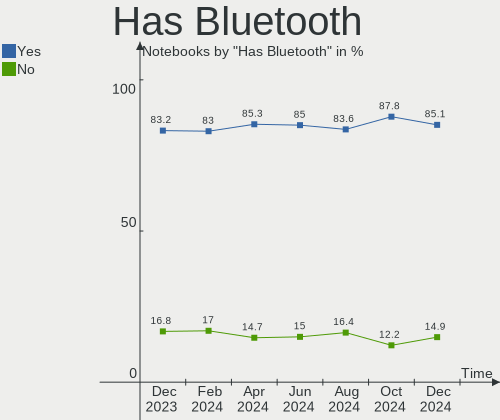
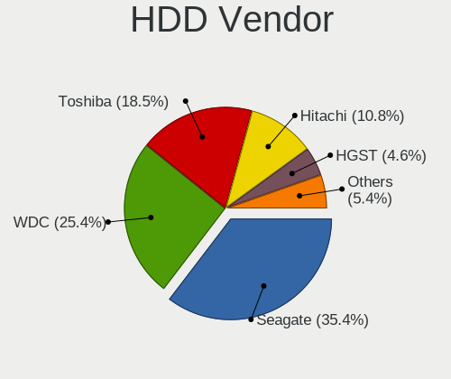
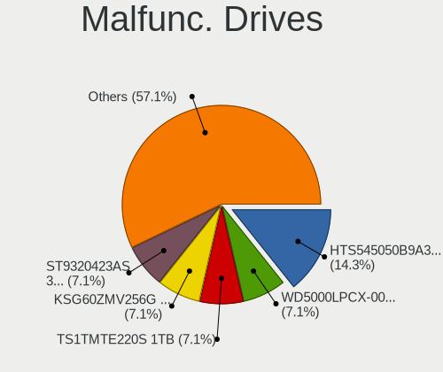

Ubuntu Hardware Trends (Notebook)
---------------------------------

A project to identify most popular hardware characteristics and track their change
over time based on data collected by Ubuntu users at https://Linux-Hardware.org.

Anyone can contribute to the study by uploading probes of their computers by
the [hw-probe](https://github.com/linuxhw/hw-probe) tool:

    sudo -E hw-probe -all -upload

Full-feature report is available here: https://linux-hardware.org/?view=trends&formfactor=notebook

Period: Jun, 2021.

Contents
--------

- [ OS                       ](#os)
- [ OS Family                ](#os-family)
- [ Kernel                   ](#kernel)
- [ Kernel Family            ](#kernel-family)
- [ Kernel Major Ver.        ](#kernel-major-ver)
- [ Arch                     ](#arch)
- [ DE                       ](#de)
- [ Display Server           ](#display-server)
- [ Display Manager          ](#display-manager)
- [ OS Lang                  ](#os-lang)
- [ Boot Mode                ](#boot-mode)
- [ Filesystem               ](#filesystem)
- [ Part. scheme             ](#part-scheme)
- [ Dual Boot with Linux/BSD ](#dual-boot-with-linux/bsd)
- [ Dual Boot (Win)          ](#dual-boot-win)
- [ Country                  ](#country)
- [ City                     ](#city)
- [ Vendor                   ](#vendor)
- [ Model                    ](#model)
- [ Model Family             ](#model-family)
- [ MFG Year                 ](#mfg-year)
- [ Form Factor              ](#form-factor)
- [ Secure Boot              ](#secure-boot)
- [ Coreboot                 ](#coreboot)
- [ RAM Size                 ](#ram-size)
- [ RAM Used                 ](#ram-used)
- [ Has CD-ROM               ](#has-cd-rom)
- [ Total Drives             ](#total-drives)
- [ Has Ethernet             ](#has-ethernet)
- [ Has WiFi                 ](#has-wifi)
- [ Has Bluetooth            ](#has-bluetooth)
- [ Drive Vendor             ](#drive-vendor)
- [ Drive Model              ](#drive-model)
- [ HDD Vendor               ](#hdd-vendor)
- [ SSD Vendor               ](#ssd-vendor)
- [ Drive Kind               ](#drive-kind)
- [ Drive Connector          ](#drive-connector)
- [ Drive Size               ](#drive-size)
- [ Space Total              ](#space-total)
- [ Space Used               ](#space-used)
- [ Malfunc. Drives          ](#malfunc-drives)
- [ Malfunc. Drive Vendor    ](#malfunc-drive-vendor)
- [ Malfunc. HDD Vendor      ](#malfunc-hdd-vendor)
- [ Malfunc. Drive Kind      ](#malfunc-drive-kind)
- [ Failed Drives            ](#failed-drives)
- [ Failed Drive Vendor      ](#failed-drive-vendor)
- [ Drive Status             ](#drive-status)
- [ Storage Vendor           ](#storage-vendor)
- [ Storage Model            ](#storage-model)
- [ Storage Kind             ](#storage-kind)
- [ CPU Vendor               ](#cpu-vendor)
- [ CPU Model                ](#cpu-model)
- [ CPU Model Family         ](#cpu-model-family)
- [ CPU Cores                ](#cpu-cores)
- [ CPU Sockets              ](#cpu-sockets)
- [ CPU Threads              ](#cpu-threads)
- [ CPU Op-Modes             ](#cpu-op-modes)
- [ CPU Microcode            ](#cpu-microcode)
- [ CPU Microarch            ](#cpu-microarch)
- [ GPU Vendor               ](#gpu-vendor)
- [ GPU Model                ](#gpu-model)
- [ GPU Combo                ](#gpu-combo)
- [ GPU Driver               ](#gpu-driver)
- [ GPU Memory               ](#gpu-memory)
- [ Monitor Vendor           ](#monitor-vendor)
- [ Monitor Model            ](#monitor-model)
- [ Monitor Resolution       ](#monitor-resolution)
- [ Monitor Diagonal         ](#monitor-diagonal)
- [ Monitor Width            ](#monitor-width)
- [ Aspect Ratio             ](#aspect-ratio)
- [ Monitor Area             ](#monitor-area)
- [ Pixel Density            ](#pixel-density)
- [ Multiple Monitors        ](#multiple-monitors)
- [ Net Controller Vendor    ](#net-controller-vendor)
- [ Net Controller Model     ](#net-controller-model)
- [ Wireless Vendor          ](#wireless-vendor)
- [ Wireless Model           ](#wireless-model)
- [ Ethernet Vendor          ](#ethernet-vendor)
- [ Ethernet Model           ](#ethernet-model)
- [ Net Controller Kind      ](#net-controller-kind)
- [ Used Controller          ](#used-controller)
- [ NICs                     ](#nics)
- [ IPv6                     ](#ipv6)
- [ Memory Vendor            ](#memory-vendor)
- [ Memory Model             ](#memory-model)
- [ Memory Kind              ](#memory-kind)
- [ Memory Form Factor       ](#memory-form-factor)
- [ Memory Size              ](#memory-size)
- [ Memory Speed             ](#memory-speed)
- [ Sound Vendor             ](#sound-vendor)
- [ Sound Model              ](#sound-model)
- [ Camera Vendor            ](#camera-vendor)
- [ Camera Model             ](#camera-model)
- [ Fingerprint Vendor       ](#fingerprint-vendor)
- [ Fingerprint Model        ](#fingerprint-model)
- [ Chipcard Vendor          ](#chipcard-vendor)
- [ Chipcard Model           ](#chipcard-model)
- [ Printer Vendor           ](#printer-vendor)
- [ Printer Model            ](#printer-model)
- [ Scanner Vendor           ](#scanner-vendor)
- [ Scanner Model            ](#scanner-model)
- [ Bluetooth Vendor         ](#bluetooth-vendor)
- [ Bluetooth Model          ](#bluetooth-model)
- [ Unsupported Devices      ](#unsupported-devices)
- [ Unsupported Device Types ](#unsupported-device-types)

OS
--

Installed operating systems

| Name           | Notebooks | Percent |
|----------------|-----------|---------|
| Ubuntu 20.04   | 391       | 61.29%  |
| Ubuntu 21.04   | 126       | 19.75%  |
| Ubuntu 18.04   | 63        | 9.87%   |
| Ubuntu 20.10   | 34        | 5.33%   |
| Ubuntu 16.04   | 9         | 1.41%   |
| Ubuntu 21.10   | 3         | 0.47%   |
| Ubuntu 19.04   | 3         | 0.47%   |
| Ubuntu         | 3         | 0.47%   |
| Ubuntu Core 16 | 2         | 0.31%   |
| Ubuntu 2020    | 1         | 0.16%   |
| Ubuntu 19.10   | 1         | 0.16%   |
| Ubuntu 18.10   | 1         | 0.16%   |
| Ubuntu 10      | 1         | 0.16%   |

OS Family
---------

OS without a version

| Name   | Notebooks | Percent |
|--------|-----------|---------|
| Ubuntu | 638       | 100%    |

Kernel
------

Version of the Linux kernel

| Version                  | Notebooks | Percent |
|--------------------------|-----------|---------|
| 5.8.0-55-generic         | 181       | 28.37%  |
| 5.11.0-18-generic        | 77        | 12.07%  |
| 5.4.0-74-generic         | 62        | 9.72%   |
| 5.8.0-53-generic         | 57        | 8.93%   |
| 5.8.0-59-generic         | 45        | 7.05%   |
| 5.8.0-43-generic         | 26        | 4.08%   |
| 5.4.0-73-generic         | 22        | 3.45%   |
| 5.11.0-22-generic        | 15        | 2.35%   |
| 5.11.0-17-generic        | 12        | 1.88%   |
| 5.4.0-77-generic         | 11        | 1.72%   |
| 5.8.0-56-generic         | 8         | 1.25%   |
| 5.11.0-20-generic        | 8         | 1.25%   |
| 5.11.0-16-generic        | 8         | 1.25%   |
| 5.8.0-54-generic         | 6         | 0.94%   |
| 5.8.0-50-generic         | 6         | 0.94%   |
| 4.15.0-144-generic       | 6         | 0.94%   |
| 5.4.0-72-generic         | 5         | 0.78%   |
| 5.4.0-42-generic         | 5         | 0.78%   |
| 5.12.12-051212-generic   | 4         | 0.63%   |
| 4.15.0-142-generic       | 4         | 0.63%   |
| 5.8.0-57-generic         | 2         | 0.31%   |
| 5.4.0-74-lowlatency      | 2         | 0.31%   |
| 5.4.0-58-generic         | 2         | 0.31%   |
| 5.4.0-26-generic         | 2         | 0.31%   |
| 5.11.0-7614-generic      | 2         | 0.31%   |
| 5.11.0-22-lowlatency     | 2         | 0.31%   |
| 5.11.0-051100-generic    | 2         | 0.31%   |
| 5.10.29-amd64-desktop    | 2         | 0.31%   |
| 5.10.0-1029-oem          | 2         | 0.31%   |
| 5.0.0-13-generic         | 2         | 0.31%   |
| 4.4.0-210-generic        | 2         | 0.31%   |
| 4.15.0-143-generic       | 2         | 0.31%   |
| 5.8.0-60-generic         | 1         | 0.16%   |
| 5.8.0-55-lowlatency      | 1         | 0.16%   |
| 5.8.0-45-generic         | 1         | 0.16%   |
| 5.8.0-44-generic         | 1         | 0.16%   |
| 5.8.0-40-generic         | 1         | 0.16%   |
| 5.8.0-38-generic         | 1         | 0.16%   |
| 5.8.0-050800-generic     | 1         | 0.16%   |
| 5.7.1-050701-generic     | 1         | 0.16%   |
| 5.6.0-1056-oem           | 1         | 0.16%   |
| 5.4.0-75-generic         | 1         | 0.16%   |
| 5.4.0-73-lowlatency      | 1         | 0.16%   |
| 5.4.0-71-generic         | 1         | 0.16%   |
| 5.4.0-65-generic         | 1         | 0.16%   |
| 5.4.0-62-generic         | 1         | 0.16%   |
| 5.4.0-54-generic         | 1         | 0.16%   |
| 5.4.0-52-generic         | 1         | 0.16%   |
| 5.4.0-47-generic         | 1         | 0.16%   |
| 5.4.0-1046-gke           | 1         | 0.16%   |
| 5.4.0-050400-generic     | 1         | 0.16%   |
| 5.3.0-46-generic         | 1         | 0.16%   |
| 5.3.0-40-generic         | 1         | 0.16%   |
| 5.3.0-050300-generic     | 1         | 0.16%   |
| 5.13.0-051300rc7-generic | 1         | 0.16%   |
| 5.13.0-051300rc4-generic | 1         | 0.16%   |
| 5.12.8-051208-generic    | 1         | 0.16%   |
| 5.12.10-051210-generic   | 1         | 0.16%   |
| 5.12.0-051200rc3-generic | 1         | 0.16%   |
| 5.12.0-051200rc2-generic | 1         | 0.16%   |

Kernel Family
-------------

Linux kernel without a distro release

| Version | Notebooks | Percent |
|---------|-----------|---------|
| 5.8.0   | 338       | 52.98%  |
| 5.11.0  | 129       | 20.22%  |
| 5.4.0   | 121       | 18.97%  |
| 4.15.0  | 18        | 2.82%   |
| 5.12.12 | 4         | 0.63%   |
| 5.10.0  | 4         | 0.63%   |
| 5.0.0   | 4         | 0.63%   |
| 5.3.0   | 3         | 0.47%   |
| 4.4.0   | 3         | 0.47%   |
| 5.13.0  | 2         | 0.31%   |
| 5.12.0  | 2         | 0.31%   |
| 5.10.29 | 2         | 0.31%   |
| 4.18.0  | 2         | 0.31%   |
| 5.7.1   | 1         | 0.16%   |
| 5.6.0   | 1         | 0.16%   |
| 5.12.8  | 1         | 0.16%   |
| 5.12.10 | 1         | 0.16%   |
| 5.10.34 | 1         | 0.16%   |
| 4.8.0   | 1         | 0.16%   |

Kernel Major Ver.
-----------------

Linux kernel major version

| Version | Notebooks | Percent |
|---------|-----------|---------|
| 5.8     | 338       | 52.98%  |
| 5.11    | 129       | 20.22%  |
| 5.4     | 121       | 18.97%  |
| 4.15    | 18        | 2.82%   |
| 5.12    | 8         | 1.25%   |
| 5.10    | 7         | 1.1%    |
| 5.0     | 4         | 0.63%   |
| 5.3     | 3         | 0.47%   |
| 4.4     | 3         | 0.47%   |
| 5.13    | 2         | 0.31%   |
| 4.18    | 2         | 0.31%   |
| 5.7     | 1         | 0.16%   |
| 5.6     | 1         | 0.16%   |
| 4.8     | 1         | 0.16%   |

Arch
----

OS architecture (x86_64, i586, etc.)

| Name   | Notebooks | Percent |
|--------|-----------|---------|
| x86_64 | 633       | 99.22%  |
| i686   | 5         | 0.78%   |

DE
--

Desktop Environment

| Name            | Notebooks | Percent |
|-----------------|-----------|---------|
| GNOME           | 552       | 86.52%  |
| Unknown         | 56        | 8.78%   |
| Unity           | 12        | 1.88%   |
| X-Cinnamon      | 8         | 1.25%   |
| GNOME Flashback | 4         | 0.63%   |
| Cinnamon        | 3         | 0.47%   |
| Deepin          | 2         | 0.31%   |
| Enlightenment   | 1         | 0.16%   |

Display Server
--------------

X11 or Wayland

| Name    | Notebooks | Percent |
|---------|-----------|---------|
| X11     | 512       | 80.25%  |
| Wayland | 91        | 14.26%  |
| Unknown | 33        | 5.17%   |
| Tty     | 2         | 0.31%   |

Display Manager
---------------

SDDM, LightDM, etc.

| Name    | Notebooks | Percent |
|---------|-----------|---------|
| Unknown | 477       | 74.76%  |
| GDM     | 147       | 23.04%  |
| TDM     | 12        | 1.88%   |
| GDM3    | 2         | 0.31%   |

OS Lang
-------

Language

| Lang    | Notebooks | Percent |
|---------|-----------|---------|
| en_US   | 270       | 42.32%  |
| de_DE   | 58        | 9.09%   |
| fr_FR   | 47        | 7.37%   |
| pt_BR   | 37        | 5.8%    |
| en_IN   | 34        | 5.33%   |
| en_GB   | 29        | 4.55%   |
| ru_RU   | 15        | 2.35%   |
| it_IT   | 13        | 2.04%   |
| es_ES   | 12        | 1.88%   |
| en_CA   | 10        | 1.57%   |
| en_AU   | 10        | 1.57%   |
| pl_PL   | 8         | 1.25%   |
| Unknown | 7         | 1.1%    |
| zh_CN   | 6         | 0.94%   |
| nl_NL   | 6         | 0.94%   |
| hu_HU   | 5         | 0.78%   |
| en_ZA   | 5         | 0.78%   |
| sv_SE   | 4         | 0.63%   |
| pt_PT   | 4         | 0.63%   |
| es_CL   | 4         | 0.63%   |
| de_AT   | 4         | 0.63%   |
| C       | 4         | 0.63%   |
| tr_TR   | 3         | 0.47%   |
| en_IL   | 3         | 0.47%   |
| en_IE   | 3         | 0.47%   |
| zh_TW   | 2         | 0.31%   |
| sk_SK   | 2         | 0.31%   |
| ru_UA   | 2         | 0.31%   |
| ja_JP   | 2         | 0.31%   |
| fr_BE   | 2         | 0.31%   |
| es_MX   | 2         | 0.31%   |
| de_CH   | 2         | 0.31%   |
| cs_CZ   | 2         | 0.31%   |
| bg_BG   | 2         | 0.31%   |
| ur_PK   | 1         | 0.16%   |
| ro_RO   | 1         | 0.16%   |
| nb_NO   | 1         | 0.16%   |
| ko_KR   | 1         | 0.16%   |
| id_ID   | 1         | 0.16%   |
| hr_HR   | 1         | 0.16%   |
| fi_FI   | 1         | 0.16%   |
| eu_ES   | 1         | 0.16%   |
| es_VE   | 1         | 0.16%   |
| es_DO   | 1         | 0.16%   |
| es_CU   | 1         | 0.16%   |
| es_CR   | 1         | 0.16%   |
| es_CO   | 1         | 0.16%   |
| en_NG   | 1         | 0.16%   |
| en_HK   | 1         | 0.16%   |
| el_GR   | 1         | 0.16%   |
| ca_ES   | 1         | 0.16%   |
| ar_SA   | 1         | 0.16%   |
| ar_EG   | 1         | 0.16%   |

Boot Mode
---------

EFI or BIOS

| Mode | Notebooks | Percent |
|------|-----------|---------|
| BIOS | 320       | 50.16%  |
| EFI  | 318       | 49.84%  |

Filesystem
----------

Type of filesystem

| Type    | Notebooks | Percent |
|---------|-----------|---------|
| Ext4    | 614       | 96.24%  |
| Overlay | 14        | 2.19%   |
| Zfs     | 7         | 1.1%    |
| Btrfs   | 3         | 0.47%   |

Part. scheme
------------

Scheme of partitioning

| Type    | Notebooks | Percent |
|---------|-----------|---------|
| Unknown | 470       | 73.67%  |
| GPT     | 134       | 21%     |
| MBR     | 34        | 5.33%   |

Dual Boot with Linux/BSD
------------------------

Hosting more than one Linux/BSD

| Dual boot | Notebooks | Percent |
|-----------|-----------|---------|
| No        | 576       | 90.28%  |
| Yes       | 62        | 9.72%   |

Dual Boot (Win)
---------------

Hosting Linux and Windows

| Dual boot | Notebooks | Percent |
|-----------|-----------|---------|
| No        | 432       | 67.71%  |
| Yes       | 206       | 32.29%  |

Country
-------

Geographic location (country)

| Country             | Notebooks | Percent |
|---------------------|-----------|---------|
| USA                 | 93        | 14.58%  |
| Germany             | 63        | 9.87%   |
| France              | 48        | 7.52%   |
| Brazil              | 46        | 7.21%   |
| India               | 44        | 6.9%    |
| UK                  | 28        | 4.39%   |
| Russia              | 24        | 3.76%   |
| Italy               | 16        | 2.51%   |
| Spain               | 15        | 2.35%   |
| Poland              | 14        | 2.19%   |
| Canada              | 13        | 2.04%   |
| China               | 12        | 1.88%   |
| Netherlands         | 11        | 1.72%   |
| Austria             | 11        | 1.72%   |
| Australia           | 11        | 1.72%   |
| Ukraine             | 10        | 1.57%   |
| Turkey              | 9         | 1.41%   |
| Switzerland         | 8         | 1.25%   |
| Sweden              | 8         | 1.25%   |
| Belgium             | 8         | 1.25%   |
| Taiwan              | 7         | 1.1%    |
| Romania             | 7         | 1.1%    |
| Portugal            | 7         | 1.1%    |
| Chile               | 7         | 1.1%    |
| Hungary             | 6         | 0.94%   |
| South Africa        | 5         | 0.78%   |
| Greece              | 5         | 0.78%   |
| Czechia             | 5         | 0.78%   |
| Bulgaria            | 5         | 0.78%   |
| Vietnam             | 4         | 0.63%   |
| Mexico              | 4         | 0.63%   |
| Israel              | 4         | 0.63%   |
| Finland             | 4         | 0.63%   |
| Colombia            | 4         | 0.63%   |
| Argentina           | 4         | 0.63%   |
| Sri Lanka           | 3         | 0.47%   |
| Morocco             | 3         | 0.47%   |
| Japan               | 3         | 0.47%   |
| Ireland             | 3         | 0.47%   |
| Indonesia           | 3         | 0.47%   |
| Croatia             | 3         | 0.47%   |
| Serbia              | 2         | 0.31%   |
| Saudi Arabia        | 2         | 0.31%   |
| Puerto Rico         | 2         | 0.31%   |
| Pakistan            | 2         | 0.31%   |
| Norway              | 2         | 0.31%   |
| Nigeria             | 2         | 0.31%   |
| Luxembourg          | 2         | 0.31%   |
| Lithuania           | 2         | 0.31%   |
| Iran                | 2         | 0.31%   |
| Venezuela           | 1         | 0.16%   |
| Vatican             | 1         | 0.16%   |
| UAE                 | 1         | 0.16%   |
| Trinidad and Tobago | 1         | 0.16%   |
| South Korea         | 1         | 0.16%   |
| Slovakia            | 1         | 0.16%   |
| Singapore           | 1         | 0.16%   |
| Peru                | 1         | 0.16%   |
| Nepal               | 1         | 0.16%   |
| Moldova             | 1         | 0.16%   |

City
----

Geographic location (city)

| City           | Notebooks | Percent |
|----------------|-----------|---------|
| São Paulo     | 10        | 1.57%   |
| Vienna         | 9         | 1.41%   |
| Berlin         | 9         | 1.41%   |
| Pune           | 6         | 0.94%   |
| Warsaw         | 5         | 0.78%   |
| Sofia          | 5         | 0.78%   |
| Mumbai         | 5         | 0.78%   |
| Moscow         | 5         | 0.78%   |
| Santiago       | 4         | 0.63%   |
| Prague         | 4         | 0.63%   |
| Paris          | 4         | 0.63%   |
| Bengaluru      | 4         | 0.63%   |
| Shanghai       | 3         | 0.47%   |
| Salvador       | 3         | 0.47%   |
| Novosibirsk    | 3         | 0.47%   |
| New Taipei     | 3         | 0.47%   |
| Munich         | 3         | 0.47%   |
| Minneapolis    | 3         | 0.47%   |
| London         | 3         | 0.47%   |
| Kyiv           | 3         | 0.47%   |
| Johannesburg   | 3         | 0.47%   |
| Izmir          | 3         | 0.47%   |
| Istanbul       | 3         | 0.47%   |
| Hyderabad      | 3         | 0.47%   |
| Dublin         | 3         | 0.47%   |
| Delhi          | 3         | 0.47%   |
| Cologne        | 3         | 0.47%   |
| Chennai        | 3         | 0.47%   |
| Cambridge      | 3         | 0.47%   |
| Bucharest      | 3         | 0.47%   |
| Belo Horizonte | 3         | 0.47%   |
| Yekaterinburg  | 2         | 0.31%   |
| Wroclaw        | 2         | 0.31%   |
| Valencia       | 2         | 0.31%   |
| The Hague      | 2         | 0.31%   |
| Tehran         | 2         | 0.31%   |
| Sydney         | 2         | 0.31%   |
| Stockholm      | 2         | 0.31%   |
| St Petersburg  | 2         | 0.31%   |
| Schifflange    | 2         | 0.31%   |
| San Jose       | 2         | 0.31%   |
| San Diego      | 2         | 0.31%   |
| Rochester      | 2         | 0.31%   |
| Reutlingen     | 2         | 0.31%   |
| Phoenix        | 2         | 0.31%   |
| Oxnard         | 2         | 0.31%   |
| Niterói       | 2         | 0.31%   |
| New York       | 2         | 0.31%   |
| New Delhi      | 2         | 0.31%   |
| Neuss          | 2         | 0.31%   |
| Nantes         | 2         | 0.31%   |
| Montreal       | 2         | 0.31%   |
| Mexico City    | 2         | 0.31%   |
| Melbourne      | 2         | 0.31%   |
| Marseille      | 2         | 0.31%   |
| Los Angeles    | 2         | 0.31%   |
| Lisbon         | 2         | 0.31%   |
| Lincoln        | 2         | 0.31%   |
| La Plata       | 2         | 0.31%   |
| Krakow         | 2         | 0.31%   |

Vendor
------

Motherboard manufacturer

| Name                             | Notebooks | Percent |
|----------------------------------|-----------|---------|
| Dell                             | 135       | 21.16%  |
| Hewlett-Packard                  | 130       | 20.38%  |
| Lenovo                           | 120       | 18.81%  |
| ASUSTek Computer                 | 60        | 9.4%    |
| Acer                             | 51        | 7.99%   |
| Toshiba                          | 16        | 2.51%   |
| Sony                             | 15        | 2.35%   |
| Samsung Electronics              | 15        | 2.35%   |
| Apple                            | 13        | 2.04%   |
| Packard Bell                     | 7         | 1.1%    |
| MSI                              | 7         | 1.1%    |
| HUAWEI                           | 6         | 0.94%   |
| Fujitsu                          | 6         | 0.94%   |
| Timi                             | 5         | 0.78%   |
| Positivo                         | 4         | 0.63%   |
| Unknown                          | 4         | 0.63%   |
| Alienware                        | 3         | 0.47%   |
| PC Specialist                    | 2         | 0.31%   |
| Panasonic                        | 2         | 0.31%   |
| Notebook                         | 2         | 0.31%   |
| Medion                           | 2         | 0.31%   |
| LG Electronics                   | 2         | 0.31%   |
| Fujitsu Siemens                  | 2         | 0.31%   |
| Wiltronic                        | 1         | 0.16%   |
| whyopencomputing                 | 1         | 0.16%   |
| VINGA                            | 1         | 0.16%   |
| Terrans Force                    | 1         | 0.16%   |
| Teclast                          | 1         | 0.16%   |
| System76                         | 1         | 0.16%   |
| Star Labs                        | 1         | 0.16%   |
| SIEMENS                          | 1         | 0.16%   |
| Schenker                         | 1         | 0.16%   |
| Positivo Bahia - VAIO            | 1         | 0.16%   |
| Pegatron                         | 1         | 0.16%   |
| Monster                          | 1         | 0.16%   |
| Maibenben                        | 1         | 0.16%   |
| LEADER                           | 1         | 0.16%   |
| Jumper                           | 1         | 0.16%   |
| HASEE Computer                   | 1         | 0.16%   |
| Hampoo                           | 1         | 0.16%   |
| Google                           | 1         | 0.16%   |
| Gateway                          | 1         | 0.16%   |
| FUJITSU CLIENT COMPUTING LIMITED | 1         | 0.16%   |
| EVOO Products Company            | 1         | 0.16%   |
| Ematic                           | 1         | 0.16%   |
| eMachines                        | 1         | 0.16%   |
| Dynabook                         | 1         | 0.16%   |
| Dixonsxp                         | 1         | 0.16%   |
| Chuwi                            | 1         | 0.16%   |
| Biostar                          | 1         | 0.16%   |
| AMD                              | 1         | 0.16%   |
| Allview                          | 1         | 0.16%   |

Model
-----

Motherboard model

| Name                                       | Notebooks | Percent |
|--------------------------------------------|-----------|---------|
| Unknown                                    | 8         | 1.25%   |
| HP Pavilion dv6                            | 6         | 0.94%   |
| HP Notebook                                | 6         | 0.94%   |
| Dell XPS 15 9500                           | 4         | 0.63%   |
| Dell XPS 15 7590                           | 4         | 0.63%   |
| Dell Inspiron 15-3567                      | 4         | 0.63%   |
| Acer Aspire ES1-512                        | 4         | 0.63%   |
| Acer Aspire A515-51G                       | 4         | 0.63%   |
| HUAWEI HLYL-WXX9                           | 3         | 0.47%   |
| HP Pavilion g6                             | 3         | 0.47%   |
| HP Laptop 15s-eq1xxx                       | 3         | 0.47%   |
| HP EliteBook 840 G3                        | 3         | 0.47%   |
| Dell Vostro 5490                           | 3         | 0.47%   |
| Dell Latitude E6430                        | 3         | 0.47%   |
| Dell Latitude E6420                        | 3         | 0.47%   |
| Dell Latitude E6400                        | 3         | 0.47%   |
| Dell Inspiron 3505                         | 3         | 0.47%   |
| Timi TM1703                                | 2         | 0.31%   |
| Samsung 305E4A/305E5A/305E7A               | 2         | 0.31%   |
| Samsung 300E4A/300E5A/300E7A/3430EA/3530EA | 2         | 0.31%   |
| Lenovo Z50-70 20354                        | 2         | 0.31%   |
| Lenovo IdeaPad S340-14API 81NB             | 2         | 0.31%   |
| Lenovo G50-80 80L0                         | 2         | 0.31%   |
| HUAWEI NBLK-WAX9X                          | 2         | 0.31%   |
| HP ZBook 15 G5                             | 2         | 0.31%   |
| HP ProBook 4520s                           | 2         | 0.31%   |
| HP ProBook 440 G8 Notebook PC              | 2         | 0.31%   |
| HP ProBook 430 G3                          | 2         | 0.31%   |
| HP ProBook 430 G2                          | 2         | 0.31%   |
| HP Pavilion 15                             | 2         | 0.31%   |
| HP Laptop 15-bs0xx                         | 2         | 0.31%   |
| HP EliteBook Folio 9480m                   | 2         | 0.31%   |
| HP EliteBook Folio 9470m                   | 2         | 0.31%   |
| HP EliteBook 8470p                         | 2         | 0.31%   |
| HP EliteBook 8460p                         | 2         | 0.31%   |
| HP EliteBook 840 G1                        | 2         | 0.31%   |
| HP EliteBook 820 G1                        | 2         | 0.31%   |
| Dell Vostro 15-3568                        | 2         | 0.31%   |
| Dell Precision 7550                        | 2         | 0.31%   |
| Dell Precision 5550                        | 2         | 0.31%   |
| Dell Precision 5540                        | 2         | 0.31%   |
| Dell Latitude XT3                          | 2         | 0.31%   |
| Dell Latitude E7470                        | 2         | 0.31%   |
| Dell Latitude E7440                        | 2         | 0.31%   |
| Dell Latitude E6530                        | 2         | 0.31%   |
| Dell Latitude 5520                         | 2         | 0.31%   |
| Dell Latitude 5511                         | 2         | 0.31%   |
| Dell Inspiron N5110                        | 2         | 0.31%   |
| Dell Inspiron MM061                        | 2         | 0.31%   |
| Dell Inspiron 5423                         | 2         | 0.31%   |
| Dell Inspiron 3576                         | 2         | 0.31%   |
| Dell Inspiron 1764                         | 2         | 0.31%   |
| Dell G3 3590                               | 2         | 0.31%   |
| ASUS X550CA                                | 2         | 0.31%   |
| ASUS X541UVK                               | 2         | 0.31%   |
| ASUS ROG Strix G513IH_G513IH               | 2         | 0.31%   |
| ASUS GL553VD                               | 2         | 0.31%   |
| Apple MacBookPro10,1                       | 2         | 0.31%   |
| Acer Swift SF314-42                        | 2         | 0.31%   |
| Acer Swift SF114-32                        | 2         | 0.31%   |

Model Family
------------

Motherboard model prefix

| Name                    | Notebooks | Percent |
|-------------------------|-----------|---------|
| Lenovo ThinkPad         | 67        | 10.5%   |
| Dell Latitude           | 42        | 6.58%   |
| Dell Inspiron           | 42        | 6.58%   |
| Acer Aspire             | 35        | 5.49%   |
| HP EliteBook            | 31        | 4.86%   |
| HP Pavilion             | 25        | 3.92%   |
| HP ProBook              | 23        | 3.61%   |
| Lenovo IdeaPad          | 22        | 3.45%   |
| HP Laptop               | 18        | 2.82%   |
| Dell XPS                | 17        | 2.66%   |
| Dell Vostro             | 16        | 2.51%   |
| Toshiba Satellite       | 12        | 1.88%   |
| Dell Precision          | 11        | 1.72%   |
| ASUS VivoBook           | 11        | 1.72%   |
| Unknown                 | 8         | 1.25%   |
| Packard Bell EasyNote   | 7         | 1.1%    |
| ASUS ROG                | 7         | 1.1%    |
| Acer Swift              | 7         | 1.1%    |
| HP Notebook             | 6         | 0.94%   |
| Lenovo Legion           | 5         | 0.78%   |
| HP ENVY                 | 5         | 0.78%   |
| Fujitsu LIFEBOOK        | 5         | 0.78%   |
| HP Compaq               | 4         | 0.63%   |
| Lenovo ThinkBook        | 3         | 0.47%   |
| HUAWEI HLYL-WXX9        | 3         | 0.47%   |
| HP ZBook                | 3         | 0.47%   |
| Dell G3                 | 3         | 0.47%   |
| Apple MacBookPro5       | 3         | 0.47%   |
| Acer TravelMate         | 3         | 0.47%   |
| Toshiba PORTEGE         | 2         | 0.31%   |
| Toshiba dynabook        | 2         | 0.31%   |
| Timi TM1703             | 2         | 0.31%   |
| Samsung 305E4A          | 2         | 0.31%   |
| Samsung 300E4A          | 2         | 0.31%   |
| Lenovo Z50-70           | 2         | 0.31%   |
| Lenovo Yoga             | 2         | 0.31%   |
| Lenovo G580             | 2         | 0.31%   |
| Lenovo G50-80           | 2         | 0.31%   |
| HUAWEI NBLK-WAX9X       | 2         | 0.31%   |
| HP 255                  | 2         | 0.31%   |
| HP 15                   | 2         | 0.31%   |
| Fujitsu Siemens ESPRIMO | 2         | 0.31%   |
| Dell G7                 | 2         | 0.31%   |
| ASUS ZenBook            | 2         | 0.31%   |
| ASUS X550CA             | 2         | 0.31%   |
| ASUS X541UVK            | 2         | 0.31%   |
| ASUS TUF                | 2         | 0.31%   |
| ASUS GL553VD            | 2         | 0.31%   |
| ASUS ASUS               | 2         | 0.31%   |
| Apple MacBookPro10      | 2         | 0.31%   |
| Acer Extensa            | 2         | 0.31%   |
| Wiltronic IVIEW         | 1         | 0.16%   |
| VINGA Iron              | 1         | 0.16%   |
| Timi TM1707             | 1         | 0.16%   |
| Timi TM1701             | 1         | 0.16%   |
| Timi Mi                 | 1         | 0.16%   |
| Terrans Force X511      | 1         | 0.16%   |
| Teclast F7              | 1         | 0.16%   |
| System76 Serval         | 1         | 0.16%   |
| Star Labs LabTop        | 1         | 0.16%   |

MFG Year
--------

Motherboard manufacture year

| Year | Notebooks | Percent |
|------|-----------|---------|
| 2020 | 130       | 20.38%  |
| 2021 | 89        | 13.95%  |
| 2019 | 58        | 9.09%   |
| 2018 | 56        | 8.78%   |
| 2013 | 51        | 7.99%   |
| 2011 | 37        | 5.8%    |
| 2012 | 35        | 5.49%   |
| 2017 | 33        | 5.17%   |
| 2015 | 27        | 4.23%   |
| 2009 | 27        | 4.23%   |
| 2014 | 26        | 4.08%   |
| 2016 | 23        | 3.61%   |
| 2010 | 21        | 3.29%   |
| 2008 | 17        | 2.66%   |
| 2007 | 5         | 0.78%   |
| 2006 | 2         | 0.31%   |
| 2005 | 1         | 0.16%   |

Form Factor
-----------

Physical design of the computer

| Name     | Notebooks | Percent |
|----------|-----------|---------|
| Notebook | 638       | 100%    |

Secure Boot
-----------

Enabled or disabled

| State    | Notebooks | Percent |
|----------|-----------|---------|
| Disabled | 542       | 84.95%  |
| Enabled  | 96        | 15.05%  |

Coreboot
--------

Have coreboot on board

| Used | Notebooks | Percent |
|------|-----------|---------|
| No   | 635       | 99.53%  |
| Yes  | 3         | 0.47%   |

RAM Size
--------

Total RAM memory

| Size in GB  | Notebooks | Percent |
|-------------|-----------|---------|
| 4.01-8.0    | 212       | 33.23%  |
| 3.01-4.0    | 145       | 22.73%  |
| 8.01-16.0   | 98        | 15.36%  |
| 16.01-24.0  | 93        | 14.58%  |
| 32.01-64.0  | 45        | 7.05%   |
| 1.01-2.0    | 24        | 3.76%   |
| 64.01-256.0 | 8         | 1.25%   |
| 2.01-3.0    | 5         | 0.78%   |
| 24.01-32.0  | 4         | 0.63%   |
| 0.51-1.0    | 3         | 0.47%   |
| 0.01-0.5    | 1         | 0.16%   |

RAM Used
--------

Used RAM memory

| Used GB    | Notebooks | Percent |
|------------|-----------|---------|
| 1.01-2.0   | 237       | 37.15%  |
| 2.01-3.0   | 199       | 31.19%  |
| 4.01-8.0   | 87        | 13.64%  |
| 3.01-4.0   | 81        | 12.7%   |
| 8.01-16.0  | 20        | 3.13%   |
| 0.51-1.0   | 10        | 1.57%   |
| 0.01-0.5   | 3         | 0.47%   |
| 16.01-24.0 | 1         | 0.16%   |

Has CD-ROM
----------

Has CD-ROM on board

| Presented | Notebooks | Percent |
|-----------|-----------|---------|
| No        | 396       | 62.07%  |
| Yes       | 242       | 37.93%  |

Total Drives
------------

Number of drives on board

| Drives | Notebooks | Percent |
|--------|-----------|---------|
| 1      | 481       | 75.39%  |
| 2      | 128       | 20.06%  |
| 3      | 19        | 2.98%   |
| 0      | 7         | 1.1%    |
| 6      | 1         | 0.16%   |
| 5      | 1         | 0.16%   |
| 4      | 1         | 0.16%   |

Has Ethernet
------------

Has Ethernet on board

| Presented | Notebooks | Percent |
|-----------|-----------|---------|
| Yes       | 536       | 84.01%  |
| No        | 102       | 15.99%  |

Has WiFi
--------

Has WiFi module

| Presented | Notebooks | Percent |
|-----------|-----------|---------|
| Yes       | 620       | 97.18%  |
| No        | 18        | 2.82%   |

Has Bluetooth
-------------

Has Bluetooth module

| Presented | Notebooks | Percent |
|-----------|-----------|---------|
| Yes       | 496       | 77.74%  |
| No        | 142       | 22.26%  |

Drive Vendor
------------

Hard drive vendors

| Vendor                    | Notebooks | Drives | Percent |
|---------------------------|-----------|--------|---------|
| Samsung Electronics       | 111       | 119    | 14.62%  |
| Seagate                   | 102       | 107    | 13.44%  |
| WDC                       | 89        | 90     | 11.73%  |
| Toshiba                   | 78        | 79     | 10.28%  |
| Sandisk                   | 50        | 50     | 6.59%   |
| Unknown                   | 46        | 51     | 6.06%   |
| SK Hynix                  | 33        | 34     | 4.35%   |
| Crucial                   | 30        | 31     | 3.95%   |
| HGST                      | 27        | 28     | 3.56%   |
| Kingston                  | 25        | 25     | 3.29%   |
| Intel                     | 24        | 27     | 3.16%   |
| Micron Technology         | 19        | 19     | 2.5%    |
| Hitachi                   | 17        | 17     | 2.24%   |
| KIOXIA                    | 13        | 13     | 1.71%   |
| A-DATA Technology         | 9         | 9      | 1.19%   |
| Fujitsu                   | 7         | 7      | 0.92%   |
| Apple                     | 7         | 7      | 0.92%   |
| KingSpec                  | 5         | 5      | 0.66%   |
| Hewlett-Packard           | 4         | 4      | 0.53%   |
| China                     | 4         | 4      | 0.53%   |
| Union Memory (Shenzhen)   | 3         | 3      | 0.4%    |
| SPCC                      | 3         | 3      | 0.4%    |
| LITEON                    | 3         | 3      | 0.4%    |
| JMicron                   | 3         | 3      | 0.4%    |
| Intenso                   | 3         | 3      | 0.4%    |
| EMTEC                     | 3         | 3      | 0.4%    |
| Silicon Motion            | 2         | 2      | 0.26%   |
| PNY                       | 2         | 2      | 0.26%   |
| Micron/Crucial Technology | 2         | 2      | 0.26%   |
| Indilinx                  | 2         | 2      | 0.26%   |
| External                  | 2         | 2      | 0.26%   |
| Colorful                  | 2         | 2      | 0.26%   |
| BHT                       | 2         | 2      | 0.26%   |
| Apacer                    | 2         | 2      | 0.26%   |
| XPG                       | 1         | 1      | 0.13%   |
| Union Memory              | 1         | 1      | 0.13%   |
| TwinMOS                   | 1         | 1      | 0.13%   |
| TS-RDF2                   | 1         | 1      | 0.13%   |
| Transcend                 | 1         | 1      | 0.13%   |
| Teclast                   | 1         | 1      | 0.13%   |
| Star Drive                | 1         | 1      | 0.13%   |
| Solid State Storage       | 1         | 1      | 0.13%   |
| Phison                    | 1         | 1      | 0.13%   |
| Patriot                   | 1         | 1      | 0.13%   |
| OSCOO                     | 1         | 1      | 0.13%   |
| OCZ                       | 1         | 1      | 0.13%   |
| Netac                     | 1         | 1      | 0.13%   |
| Mushkin                   | 1         | 1      | 0.13%   |
| LITEONIT                  | 1         | 1      | 0.13%   |
| LaCie                     | 1         | 2      | 0.13%   |
| KingDian                  | 1         | 1      | 0.13%   |
| KING                      | 1         | 1      | 0.13%   |
| IBM-DJSA                  | 1         | 1      | 0.13%   |
| BIWIN                     | 1         | 1      | 0.13%   |
| AXIOM                     | 1         | 1      | 0.13%   |
| Aura                      | 1         | 1      | 0.13%   |
| ASMT                      | 1         | 1      | 0.13%   |
| AMD                       | 1         | 1      | 0.13%   |
| 1TB                       | 1         | 1      | 0.13%   |

Drive Model
-----------

Hard drive models

| Model                                 | Notebooks | Percent |
|---------------------------------------|-----------|---------|
| Samsung NVMe SSD Drive 512GB          | 14        | 1.8%    |
| Seagate ST1000LM035-1RK172 1TB        | 13        | 1.68%   |
| Unknown MMC Card  32GB                | 12        | 1.55%   |
| Unknown MMC Card  16GB                | 10        | 1.29%   |
| Toshiba MQ04ABF100 1TB                | 10        | 1.29%   |
| Toshiba MQ01ABD100 1TB                | 10        | 1.29%   |
| SK Hynix NVMe SSD Drive 512GB         | 9         | 1.16%   |
| Sandisk NVMe SSD Drive 512GB          | 9         | 1.16%   |
| Seagate ST500LT012-1DG142 500GB       | 8         | 1.03%   |
| Seagate ST1000LM049-2GH172 1TB        | 8         | 1.03%   |
| Kingston SA400S37240G 240GB SSD       | 8         | 1.03%   |
| HGST HTS721010A9E630 1TB              | 8         | 1.03%   |
| Crucial CT240BX500SSD1 240GB          | 8         | 1.03%   |
| Unknown MMC Card  64GB                | 7         | 0.9%    |
| Seagate ST1000LM024 HN-M101MBB 1TB    | 7         | 0.9%    |
| Sandisk NVMe SSD Drive 256GB          | 7         | 0.9%    |
| Samsung SSD 860 EVO 500GB             | 7         | 0.9%    |
| Samsung SSD 850 EVO 250GB             | 7         | 0.9%    |
| HGST HTS545050A7E680 500GB            | 6         | 0.77%   |
| Crucial CT500MX500SSD1 500GB          | 6         | 0.77%   |
| Seagate ST1000LM048-2E7172 1TB        | 5         | 0.64%   |
| Samsung NVMe SSD Drive 256GB          | 5         | 0.64%   |
| KIOXIA KBG40ZNS512G NVMe 512GB        | 5         | 0.64%   |
| Intel NVMe SSD Drive 512GB            | 5         | 0.64%   |
| WDC WD10SPZX-24Z10 1TB                | 4         | 0.52%   |
| Toshiba NVMe SSD Drive 512GB          | 4         | 0.52%   |
| SK Hynix NVMe SSD Drive 256GB         | 4         | 0.52%   |
| SK Hynix NVMe SSD Drive 1024GB        | 4         | 0.52%   |
| Seagate ST9500420AS 500GB             | 4         | 0.52%   |
| Seagate ST9500325AS 500GB             | 4         | 0.52%   |
| Seagate ST500LM012 HN-M500MBB 500GB   | 4         | 0.52%   |
| Micron NVMe SSD Drive 512GB           | 4         | 0.52%   |
| KIOXIA NVMe SSD Drive 256GB           | 4         | 0.52%   |
| Kingston SA400S37480G 480GB SSD       | 4         | 0.52%   |
| HGST HTS725050A7E630 500GB            | 4         | 0.52%   |
| HGST HTS541010A9E680 1TB              | 4         | 0.52%   |
| WDC WD7500BPVT-22HXZT3 752GB          | 3         | 0.39%   |
| WDC WD3200BEVT-22ZCT0 320GB           | 3         | 0.39%   |
| WDC WD10JPVX-22JC3T0 1TB              | 3         | 0.39%   |
| Toshiba MQ01ACF050 500GB              | 3         | 0.39%   |
| SK Hynix HFS256G39TND-N210A 256GB SSD | 3         | 0.39%   |
| Seagate ST750LM022 HN-M750MBB 752GB   | 3         | 0.39%   |
| Seagate ST2000LM007-1R8174 2TB        | 3         | 0.39%   |
| Seagate Expansion 1TB                 | 3         | 0.39%   |
| SanDisk SSD PLUS 240GB                | 3         | 0.39%   |
| SanDisk SD8SN8U-256G-1006 256GB SSD   | 3         | 0.39%   |
| Sandisk NVMe SSD Drive 1024GB         | 3         | 0.39%   |
| Samsung SSD 970 EVO Plus 500GB        | 3         | 0.39%   |
| Samsung SSD 860 EVO 250GB             | 3         | 0.39%   |
| Samsung SSD 860 EVO 1TB               | 3         | 0.39%   |
| Samsung SSD 850 EVO 500GB             | 3         | 0.39%   |
| Micron 1100_MTFDDAV256TBN 256GB SSD   | 3         | 0.39%   |
| Kingston SUV400S37120G 120GB SSD      | 3         | 0.39%   |
| Kingston NVMe SSD Drive 512GB         | 3         | 0.39%   |
| Intel SSDPEKNW512G8 512GB             | 3         | 0.39%   |
| WDC WDS240G2G0B-00EPW0 240GB SSD      | 2         | 0.26%   |
| WDC WD5000LPVX-75V0TT0 500GB          | 2         | 0.26%   |
| WDC WD5000BEVT-22A0RT0 500GB          | 2         | 0.26%   |
| WDC WD2500BEVS-22UST0 250GB           | 2         | 0.26%   |
| WDC WD1600BEVT-22ZCT0 160GB           | 2         | 0.26%   |

HDD Vendor
----------

Hard disk drive vendors

| Vendor              | Notebooks | Drives | Percent |
|---------------------|-----------|--------|---------|
| Seagate             | 98        | 99     | 36.43%  |
| WDC                 | 64        | 64     | 23.79%  |
| Toshiba             | 46        | 46     | 17.1%   |
| HGST                | 27        | 28     | 10.04%  |
| Hitachi             | 17        | 17     | 6.32%   |
| Fujitsu             | 7         | 7      | 2.6%    |
| Samsung Electronics | 5         | 5      | 1.86%   |
| Apple               | 2         | 2      | 0.74%   |
| LaCie               | 1         | 2      | 0.37%   |
| Intenso             | 1         | 1      | 0.37%   |
| ASMT                | 1         | 1      | 0.37%   |

SSD Vendor
----------

Solid state drive vendors

| Vendor              | Notebooks | Drives | Percent |
|---------------------|-----------|--------|---------|
| Samsung Electronics | 57        | 58     | 25.56%  |
| Crucial             | 27        | 28     | 12.11%  |
| SanDisk             | 26        | 26     | 11.66%  |
| Kingston            | 20        | 20     | 8.97%   |
| Toshiba             | 9         | 9      | 4.04%   |
| Micron Technology   | 9         | 9      | 4.04%   |
| Intel               | 9         | 9      | 4.04%   |
| WDC                 | 8         | 8      | 3.59%   |
| A-DATA Technology   | 6         | 6      | 2.69%   |
| SK Hynix            | 4         | 4      | 1.79%   |
| Hewlett-Packard     | 4         | 4      | 1.79%   |
| Apple               | 4         | 4      | 1.79%   |
| SPCC                | 3         | 3      | 1.35%   |
| LITEON              | 3         | 3      | 1.35%   |
| KingSpec            | 3         | 3      | 1.35%   |
| EMTEC               | 3         | 3      | 1.35%   |
| China               | 3         | 3      | 1.35%   |
| Seagate             | 2         | 2      | 0.9%    |
| PNY                 | 2         | 2      | 0.9%    |
| Indilinx            | 2         | 2      | 0.9%    |
| BHT                 | 2         | 2      | 0.9%    |
| Apacer              | 2         | 2      | 0.9%    |
| TwinMOS             | 1         | 1      | 0.45%   |
| Transcend           | 1         | 1      | 0.45%   |
| Teclast             | 1         | 1      | 0.45%   |
| Patriot             | 1         | 1      | 0.45%   |
| OSCOO               | 1         | 1      | 0.45%   |
| OCZ                 | 1         | 1      | 0.45%   |
| Netac               | 1         | 1      | 0.45%   |
| Mushkin             | 1         | 1      | 0.45%   |
| LITEONIT            | 1         | 1      | 0.45%   |
| KingDian            | 1         | 1      | 0.45%   |
| KING                | 1         | 1      | 0.45%   |
| Intenso             | 1         | 1      | 0.45%   |
| Colorful            | 1         | 1      | 0.45%   |
| AMD                 | 1         | 1      | 0.45%   |
| 1TB                 | 1         | 1      | 0.45%   |

Drive Kind
----------

HDD or SSD

| Kind    | Notebooks | Drives | Percent |
|---------|-----------|--------|---------|
| HDD     | 261       | 272    | 35.46%  |
| SSD     | 211       | 225    | 28.67%  |
| NVMe    | 204       | 222    | 27.72%  |
| MMC     | 45        | 50     | 6.11%   |
| Unknown | 15        | 17     | 2.04%   |

Drive Connector
---------------

SATA, SAS, NVMe, etc.

| Type | Notebooks | Drives | Percent |
|------|-----------|--------|---------|
| SATA | 438       | 488    | 61.78%  |
| NVMe | 203       | 220    | 28.63%  |
| MMC  | 45        | 50     | 6.35%   |
| SAS  | 23        | 28     | 3.24%   |

Drive Size
----------

Size of hard drive

| Size in TB | Notebooks | Drives | Percent |
|------------|-----------|--------|---------|
| 0.01-0.5   | 304       | 330    | 65.38%  |
| 0.51-1.0   | 144       | 148    | 30.97%  |
| 1.01-2.0   | 15        | 16     | 3.23%   |
| 4.01-10.0  | 2         | 3      | 0.43%   |

Space Total
-----------

Amount of disk space available on the file system

| Size in GB     | Notebooks | Percent |
|----------------|-----------|---------|
| 101-250        | 208       | 32.6%   |
| 251-500        | 196       | 30.72%  |
| 501-1000       | 94        | 14.73%  |
| 51-100         | 39        | 6.11%   |
| 1001-2000      | 31        | 4.86%   |
| 1-20           | 29        | 4.55%   |
| 21-50          | 24        | 3.76%   |
| Unknown        | 7         | 1.1%    |
| More than 3000 | 6         | 0.94%   |
| 2001-3000      | 4         | 0.63%   |

Space Used
----------

Amount of used disk space

| Used GB        | Notebooks | Percent |
|----------------|-----------|---------|
| 1-20           | 246       | 38.56%  |
| 21-50          | 116       | 18.18%  |
| 101-250        | 97        | 15.2%   |
| 51-100         | 94        | 14.73%  |
| 251-500        | 48        | 7.52%   |
| 501-1000       | 21        | 3.29%   |
| Unknown        | 7         | 1.1%    |
| 1001-2000      | 5         | 0.78%   |
| More than 3000 | 4         | 0.63%   |

Malfunc. Drives
---------------

Drive models with a malfunction

| Model                                 | Notebooks | Drives | Percent |
|---------------------------------------|-----------|--------|---------|
| Seagate ST1000LM035-1RK172 1TB        | 2         | 2      | 7.41%   |
| Hitachi HTS547564A9E384 640GB         | 2         | 2      | 7.41%   |
| WDC WD5000LPVX-75V0TT0 500GB          | 1         | 1      | 3.7%    |
| WDC WD10SPZX-60Z10T0 1TB              | 1         | 1      | 3.7%    |
| WDC WD10SPZX-17Z10T0 1TB              | 1         | 1      | 3.7%    |
| Toshiba MK5065GSXN 500GB              | 1         | 1      | 3.7%    |
| Toshiba MK3263GSX 320GB               | 1         | 1      | 3.7%    |
| SK Hynix PC401 NVMe 256GB             | 1         | 1      | 3.7%    |
| SK Hynix HFS256G39TND-N210A 256GB SSD | 1         | 1      | 3.7%    |
| Seagate ST9500325AS 500GB             | 1         | 1      | 3.7%    |
| Seagate ST9250320AS 250GB             | 1         | 1      | 3.7%    |
| Seagate ST500LM021-1KJ152 500GB       | 1         | 1      | 3.7%    |
| Seagate ST320LT007-9ZV142 320GB       | 1         | 1      | 3.7%    |
| Seagate ST1000LM048-2E7172 1TB        | 1         | 1      | 3.7%    |
| Seagate ST1000LM024 HN-M101MBB 1TB    | 1         | 1      | 3.7%    |
| Seagate ST1000LM014-SSHD-8GB          | 1         | 1      | 3.7%    |
| SanDisk SD9SN8W-256G-1006 256GB SSD   | 1         | 1      | 3.7%    |
| Samsung Electronics HM320II 320GB     | 1         | 1      | 3.7%    |
| Hitachi HTS545050A7E380 500GB         | 1         | 1      | 3.7%    |
| Hitachi HTS545025B9A300 250GB         | 1         | 1      | 3.7%    |
| Hitachi HTS543232A7A384 320GB         | 1         | 1      | 3.7%    |
| HGST HTS541010A9E680 1TB              | 1         | 1      | 3.7%    |
| Fujitsu MHY2080BS 80GB                | 1         | 1      | 3.7%    |
| A-DATA Technology SX8200PNP 256GB     | 1         | 1      | 3.7%    |
| A-DATA Technology SSD DP900 128GB-DL3 | 1         | 1      | 3.7%    |

Malfunc. Drive Vendor
---------------------

Vendors of faulty drives

| Vendor              | Notebooks | Drives | Percent |
|---------------------|-----------|--------|---------|
| Seagate             | 9         | 9      | 33.33%  |
| Hitachi             | 5         | 5      | 18.52%  |
| WDC                 | 3         | 3      | 11.11%  |
| Toshiba             | 2         | 2      | 7.41%   |
| SK Hynix            | 2         | 2      | 7.41%   |
| A-DATA Technology   | 2         | 2      | 7.41%   |
| SanDisk             | 1         | 1      | 3.7%    |
| Samsung Electronics | 1         | 1      | 3.7%    |
| HGST                | 1         | 1      | 3.7%    |
| Fujitsu             | 1         | 1      | 3.7%    |

Malfunc. HDD Vendor
-------------------

Vendors of faulty HDD drives

| Vendor              | Notebooks | Drives | Percent |
|---------------------|-----------|--------|---------|
| Seagate             | 9         | 9      | 40.91%  |
| Hitachi             | 5         | 5      | 22.73%  |
| WDC                 | 3         | 3      | 13.64%  |
| Toshiba             | 2         | 2      | 9.09%   |
| Samsung Electronics | 1         | 1      | 4.55%   |
| HGST                | 1         | 1      | 4.55%   |
| Fujitsu             | 1         | 1      | 4.55%   |

Malfunc. Drive Kind
-------------------

Kinds of faulty drives

| Kind | Notebooks | Drives | Percent |
|------|-----------|--------|---------|
| HDD  | 21        | 22     | 80.77%  |
| SSD  | 3         | 3      | 11.54%  |
| NVMe | 2         | 2      | 7.69%   |

Failed Drives
-------------

Failed drive models

Zero info for selected period =(

Failed Drive Vendor
-------------------

Failed drive vendors

Zero info for selected period =(

Drive Status
------------

Number of failed and malfunc. drives

| Status   | Notebooks | Drives | Percent |
|----------|-----------|--------|---------|
| Detected | 464       | 565    | 70.95%  |
| Works    | 164       | 194    | 25.08%  |
| Malfunc  | 26        | 27     | 3.98%   |

Storage Vendor
--------------

Storage controller vendors

| Vendor                           | Notebooks | Percent |
|----------------------------------|-----------|---------|
| Intel                            | 481       | 64.91%  |
| AMD                              | 55        | 7.42%   |
| Samsung Electronics              | 54        | 7.29%   |
| Sandisk                          | 40        | 5.4%    |
| SK Hynix                         | 30        | 4.05%   |
| Toshiba America Info Systems     | 19        | 2.56%   |
| KIOXIA                           | 16        | 2.16%   |
| Micron Technology                | 10        | 1.35%   |
| Nvidia                           | 7         | 0.94%   |
| Micron/Crucial Technology        | 5         | 0.67%   |
| Kingston Technology Company      | 5         | 0.67%   |
| Union Memory (Shenzhen)          | 4         | 0.54%   |
| ADATA Technology                 | 4         | 0.54%   |
| Solid State Storage Technology   | 2         | 0.27%   |
| Silicon Motion                   | 2         | 0.27%   |
| Phison Electronics               | 2         | 0.27%   |
| Silicon Integrated Systems [SiS] | 1         | 0.13%   |
| Seagate Technology               | 1         | 0.13%   |
| Marvell Technology Group         | 1         | 0.13%   |
| JMicron Technology               | 1         | 0.13%   |
| Apple                            | 1         | 0.13%   |

Storage Model
-------------

Storage controller models

| Model                                                                            | Notebooks | Percent |
|----------------------------------------------------------------------------------|-----------|---------|
| Intel Sunrise Point-LP SATA Controller [AHCI mode]                               | 65        | 8.24%   |
| Intel 7 Series Chipset Family 6-port SATA Controller [AHCI mode]                 | 50        | 6.34%   |
| Intel 82801 Mobile SATA Controller [RAID mode]                                   | 44        | 5.58%   |
| AMD FCH SATA Controller [AHCI mode]                                              | 42        | 5.32%   |
| Intel 6 Series/C200 Series Chipset Family 6 port Mobile SATA AHCI Controller     | 36        | 4.56%   |
| Intel 8 Series SATA Controller 1 [AHCI mode]                                     | 34        | 4.31%   |
| Samsung NVMe SSD Controller SM981/PM981/PM983                                    | 30        | 3.8%    |
| Intel 82801IBM/IEM (ICH9M/ICH9M-E) 4 port SATA Controller [AHCI mode]            | 27        | 3.42%   |
| Intel Cannon Lake Mobile PCH SATA AHCI Controller                                | 22        | 2.79%   |
| Intel Comet Lake SATA AHCI Controller                                            | 17        | 2.15%   |
| Samsung NVMe Controller                                                          | 16        | 2.03%   |
| KIOXIA Non-Volatile memory controller                                            | 16        | 2.03%   |
| Intel Cannon Point-LP SATA Controller [AHCI Mode]                                | 16        | 2.03%   |
| Intel 5 Series/3400 Series Chipset 4 port SATA AHCI Controller                   | 16        | 2.03%   |
| Intel 5 Series/3400 Series Chipset 6 port SATA AHCI Controller                   | 15        | 1.9%    |
| Intel Volume Management Device NVMe RAID Controller                              | 14        | 1.77%   |
| Intel Wildcat Point-LP SATA Controller [AHCI Mode]                               | 13        | 1.65%   |
| Intel 8 Series/C220 Series Chipset Family 6-port SATA Controller 1 [AHCI mode]   | 13        | 1.65%   |
| Sandisk WD Black SN750 / PC SN730 NVMe SSD                                       | 12        | 1.52%   |
| Intel Celeron/Pentium Silver Processor SATA Controller                           | 12        | 1.52%   |
| Intel Atom Processor E3800 Series SATA AHCI Controller                           | 12        | 1.52%   |
| Micron Non-Volatile memory controller                                            | 10        | 1.27%   |
| Toshiba America Info Systems XG6 NVMe SSD Controller                             | 9         | 1.14%   |
| SK Hynix Non-Volatile memory controller                                          | 9         | 1.14%   |
| SK Hynix BC501 NVMe Solid State Drive                                            | 9         | 1.14%   |
| Sandisk WD Blue SN500 / PC SN520 NVMe SSD                                        | 9         | 1.14%   |
| Intel SSD 660P Series                                                            | 9         | 1.14%   |
| Intel HM170/QM170 Chipset SATA Controller [AHCI Mode]                            | 9         | 1.14%   |
| Intel 82801HM/HEM (ICH8M/ICH8M-E) IDE Controller                                 | 9         | 1.14%   |
| SK Hynix BC511                                                                   | 8         | 1.01%   |
| Intel 82801HM/HEM (ICH8M/ICH8M-E) SATA Controller [AHCI mode]                    | 8         | 1.01%   |
| AMD SB7x0/SB8x0/SB9x0 SATA Controller [AHCI mode]                                | 8         | 1.01%   |
| Sandisk WD Blue SN550 NVMe SSD                                                   | 7         | 0.89%   |
| Sandisk PC SN520 NVMe SSD                                                        | 7         | 0.89%   |
| Intel Ice Lake-LP SATA Controller [AHCI mode]                                    | 7         | 0.89%   |
| Intel Tiger Lake-LP SATA Controller [AHCI mode]                                  | 6         | 0.76%   |
| Toshiba America Info Systems Toshiba America Info Non-Volatile memory controller | 5         | 0.63%   |
| Intel 7 Series Chipset Family 4-port SATA Controller [IDE mode]                  | 5         | 0.63%   |
| Intel 7 Series Chipset Family 2-port SATA Controller [IDE mode]                  | 5         | 0.63%   |
| Union Memory (Shenzhen) Non-Volatile memory controller                           | 4         | 0.51%   |
| Samsung NVMe SSD Controller SM961/PM961/SM963                                    | 4         | 0.51%   |
| Intel Mobile 4 Series Chipset PT IDER Controller                                 | 4         | 0.51%   |
| Intel Atom/Celeron/Pentium Processor x5-E8000/J3xxx/N3xxx Series SATA Controller | 4         | 0.51%   |
| Intel 82801HM/HEM (ICH8M/ICH8M-E) SATA Controller [IDE mode]                     | 4         | 0.51%   |
| Intel 82801GBM/GHM (ICH7-M Family) SATA Controller [IDE mode]                    | 4         | 0.51%   |
| Intel 400 Series Chipset Family SATA AHCI Controller                             | 4         | 0.51%   |
| AMD FCH SATA Controller [IDE mode]                                               | 4         | 0.51%   |
| Toshiba America Info Systems XG4 NVMe SSD Controller                             | 3         | 0.38%   |
| SK Hynix NVMe SSD Controller                                                     | 3         | 0.38%   |
| Sandisk Non-Volatile memory controller                                           | 3         | 0.38%   |
| Nvidia MCP79 AHCI Controller                                                     | 3         | 0.38%   |
| Intel SSD Pro 7600p/760p/E 6100p Series                                          | 3         | 0.38%   |
| Intel Celeron N3350/Pentium N4200/Atom E3900 Series SATA AHCI Controller         | 3         | 0.38%   |
| Intel 82801G (ICH7 Family) IDE Controller                                        | 3         | 0.38%   |
| Intel 400 Series Chipset Family SATA RAID Controller                             | 3         | 0.38%   |
| Toshiba America Info Systems BG3 NVMe SSD Controller                             | 2         | 0.25%   |
| Solid State Storage Non-Volatile memory controller                               | 2         | 0.25%   |
| Silicon Motion SM2263EN/SM2263XT SSD Controller                                  | 2         | 0.25%   |
| Sandisk WD Black 2018/SN750 / PC SN720 NVMe SSD                                  | 2         | 0.25%   |
| Samsung NVMe SSD Controller PM9A1/PM9A3/980PRO                                   | 2         | 0.25%   |

Storage Kind
------------

Kind of storage controller (IDE, SATA, NVMe, SAS, ...)

| Kind | Notebooks | Percent |
|------|-----------|---------|
| SATA | 458       | 59.71%  |
| NVMe | 204       | 26.6%   |
| RAID | 64        | 8.34%   |
| IDE  | 41        | 5.35%   |

CPU Vendor
----------

Processor vendors

| Vendor | Notebooks | Percent |
|--------|-----------|---------|
| Intel  | 549       | 86.05%  |
| AMD    | 89        | 13.95%  |

CPU Model
---------

Processor models

| Model                                         | Notebooks | Percent |
|-----------------------------------------------|-----------|---------|
| Intel Core i5-8250U CPU @ 1.60GHz             | 22        | 3.45%   |
| Intel 11th Gen Core i7-1165G7 @ 2.80GHz       | 17        | 2.66%   |
| Intel Core i7-10510U CPU @ 1.80GHz            | 15        | 2.35%   |
| Intel Core i5-8265U CPU @ 1.60GHz             | 13        | 2.04%   |
| Intel Core i5-7200U CPU @ 2.50GHz             | 13        | 2.04%   |
| Intel Core i7-9750H CPU @ 2.60GHz             | 11        | 1.72%   |
| Intel Core i7-8750H CPU @ 2.20GHz             | 9         | 1.41%   |
| Intel Core i7-8565U CPU @ 1.80GHz             | 8         | 1.25%   |
| Intel Core i7-8550U CPU @ 1.80GHz             | 8         | 1.25%   |
| Intel Core i5-10210U CPU @ 1.60GHz            | 8         | 1.25%   |
| Intel Core i3-1005G1 CPU @ 1.20GHz            | 8         | 1.25%   |
| AMD Ryzen 5 3500U with Radeon Vega Mobile Gfx | 8         | 1.25%   |
| Intel Core i7-7500U CPU @ 2.70GHz             | 7         | 1.1%    |
| Intel Core i5-4200U CPU @ 1.60GHz             | 7         | 1.1%    |
| Intel Core i5-2520M CPU @ 2.50GHz             | 7         | 1.1%    |
| Intel Core i5-2410M CPU @ 2.30GHz             | 7         | 1.1%    |
| Intel Core i5-3320M CPU @ 2.60GHz             | 6         | 0.94%   |
| Intel Core i3-2330M CPU @ 2.20GHz             | 6         | 0.94%   |
| Intel Core i7-7700HQ CPU @ 2.80GHz            | 5         | 0.78%   |
| Intel Core i7-6500U CPU @ 2.50GHz             | 5         | 0.78%   |
| Intel Core i7-4510U CPU @ 2.00GHz             | 5         | 0.78%   |
| Intel Core i7-10750H CPU @ 2.60GHz            | 5         | 0.78%   |
| Intel Core i5-6300U CPU @ 2.40GHz             | 5         | 0.78%   |
| Intel Core i5-4300U CPU @ 1.90GHz             | 5         | 0.78%   |
| Intel Core i5-3230M CPU @ 2.60GHz             | 5         | 0.78%   |
| Intel Core i3-4030U CPU @ 1.90GHz             | 5         | 0.78%   |
| Intel Core i3-2310M CPU @ 2.10GHz             | 5         | 0.78%   |
| Intel Celeron N4000 CPU @ 1.10GHz             | 5         | 0.78%   |
| Intel Celeron CPU N2840 @ 2.16GHz             | 5         | 0.78%   |
| AMD Ryzen 5 4600H with Radeon Graphics        | 5         | 0.78%   |
| AMD Ryzen 5 4500U with Radeon Graphics        | 5         | 0.78%   |
| Intel Pentium CPU N3540 @ 2.16GHz             | 4         | 0.63%   |
| Intel Core i7-8850H CPU @ 2.60GHz             | 4         | 0.63%   |
| Intel Core i7-5500U CPU @ 2.40GHz             | 4         | 0.63%   |
| Intel Core i7-4600U CPU @ 2.10GHz             | 4         | 0.63%   |
| Intel Core i7-2670QM CPU @ 2.20GHz            | 4         | 0.63%   |
| Intel Core i5-6200U CPU @ 2.30GHz             | 4         | 0.63%   |
| Intel Core i5-3340M CPU @ 2.70GHz             | 4         | 0.63%   |
| Intel Core i5-2450M CPU @ 2.50GHz             | 4         | 0.63%   |
| Intel Core i5-2430M CPU @ 2.40GHz             | 4         | 0.63%   |
| Intel Core i5 CPU M 520 @ 2.40GHz             | 4         | 0.63%   |
| Intel Core i3-6006U CPU @ 2.00GHz             | 4         | 0.63%   |
| Intel Core i3-3110M CPU @ 2.40GHz             | 4         | 0.63%   |
| Intel Core i3 CPU M 380 @ 2.53GHz             | 4         | 0.63%   |
| Intel Core i3 CPU M 330 @ 2.13GHz             | 4         | 0.63%   |
| Intel Core 2 Duo CPU T6600 @ 2.20GHz          | 4         | 0.63%   |
| Intel Core 2 Duo CPU P8700 @ 2.53GHz          | 4         | 0.63%   |
| Intel Core 2 Duo CPU P8600 @ 2.40GHz          | 4         | 0.63%   |
| Intel Celeron CPU N3060 @ 1.60GHz             | 4         | 0.63%   |
| Intel 11th Gen Core i5-1135G7 @ 2.40GHz       | 4         | 0.63%   |
| AMD Ryzen 7 PRO 4750U with Radeon Graphics    | 4         | 0.63%   |
| AMD Ryzen 7 4800H with Radeon Graphics        | 4         | 0.63%   |
| Intel Pentium Silver N5000 CPU @ 1.10GHz      | 3         | 0.47%   |
| Intel Core i9-10885H CPU @ 2.40GHz            | 3         | 0.47%   |
| Intel Core i7-8665U CPU @ 1.90GHz             | 3         | 0.47%   |
| Intel Core i7-3632QM CPU @ 2.20GHz            | 3         | 0.47%   |
| Intel Core i7-3630QM CPU @ 2.40GHz            | 3         | 0.47%   |
| Intel Core i7-10850H CPU @ 2.70GHz            | 3         | 0.47%   |
| Intel Core i5-5200U CPU @ 2.20GHz             | 3         | 0.47%   |
| Intel Core i5-4210U CPU @ 1.70GHz             | 3         | 0.47%   |

CPU Model Family
----------------

Processor model prefix

| Model                          | Notebooks | Percent |
|--------------------------------|-----------|---------|
| Intel Core i5                  | 169       | 26.49%  |
| Intel Core i7                  | 154       | 24.14%  |
| Intel Core i3                  | 71        | 11.13%  |
| Intel Core 2 Duo               | 40        | 6.27%   |
| Other                          | 32        | 5.02%   |
| Intel Celeron                  | 31        | 4.86%   |
| AMD Ryzen 5                    | 22        | 3.45%   |
| Intel Pentium                  | 20        | 3.13%   |
| AMD Ryzen 7                    | 13        | 2.04%   |
| Intel Atom                     | 7         | 1.1%    |
| Intel Pentium Silver           | 6         | 0.94%   |
| AMD Ryzen 3                    | 6         | 0.94%   |
| Intel Pentium Dual-Core        | 5         | 0.78%   |
| Intel Core i9                  | 5         | 0.78%   |
| AMD E1                         | 5         | 0.78%   |
| AMD Athlon                     | 5         | 0.78%   |
| AMD A4                         | 5         | 0.78%   |
| Intel Core 2                   | 4         | 0.63%   |
| AMD Ryzen 7 PRO                | 4         | 0.63%   |
| AMD A6                         | 4         | 0.63%   |
| Intel Genuine                  | 3         | 0.47%   |
| AMD Ryzen 9                    | 3         | 0.47%   |
| AMD Athlon X2                  | 3         | 0.47%   |
| AMD A10                        | 3         | 0.47%   |
| Intel Xeon                     | 2         | 0.31%   |
| Intel Pentium Dual             | 2         | 0.31%   |
| AMD E2                         | 2         | 0.31%   |
| AMD E                          | 2         | 0.31%   |
| AMD C-60                       | 2         | 0.31%   |
| Intel Core M                   | 1         | 0.16%   |
| Intel Celeron M                | 1         | 0.16%   |
| AMD Turion X2 Dual-Core Mobile | 1         | 0.16%   |
| AMD Turion 64 X2 Mobile        | 1         | 0.16%   |
| AMD Sempron                    | 1         | 0.16%   |
| AMD PRO A10                    | 1         | 0.16%   |
| AMD Athlon Neo                 | 1         | 0.16%   |
| AMD A8                         | 1         | 0.16%   |

CPU Cores
---------

Number of processor cores

| Number | Notebooks | Percent |
|--------|-----------|---------|
| 2      | 347       | 54.39%  |
| 4      | 204       | 31.97%  |
| 6      | 46        | 7.21%   |
| 8      | 28        | 4.39%   |
| 1      | 13        | 2.04%   |

CPU Sockets
-----------

Number of sockets

| Number | Notebooks | Percent |
|--------|-----------|---------|
| 1      | 638       | 100%    |

CPU Threads
-----------

Threads per core (Hyper-Threading)

| Number | Notebooks | Percent |
|--------|-----------|---------|
| 2      | 478       | 74.92%  |
| 1      | 160       | 25.08%  |

CPU Op-Modes
------------

CPU Operation Modes (32-bit, 64-bit)

| Op mode        | Notebooks | Percent |
|----------------|-----------|---------|
| 32-bit, 64-bit | 635       | 99.53%  |
| 32-bit         | 2         | 0.31%   |
| Unknown        | 1         | 0.16%   |

CPU Microcode
-------------

Microcode number

| Number     | Notebooks | Percent |
|------------|-----------|---------|
| Unknown    | 132       | 20.69%  |
| 0x306a9    | 42        | 6.58%   |
| 0x206a7    | 37        | 5.8%    |
| 0x806ec    | 32        | 5.02%   |
| 0x40651    | 28        | 4.39%   |
| 0x806ea    | 26        | 4.08%   |
| 0x806c1    | 23        | 3.61%   |
| 0x806e9    | 22        | 3.45%   |
| 0x1067a    | 22        | 3.45%   |
| 0x406e3    | 21        | 3.29%   |
| 0xa0652    | 18        | 2.82%   |
| 0x906ea    | 18        | 2.82%   |
| 0x20655    | 15        | 2.35%   |
| 0x306c3    | 13        | 2.04%   |
| 0x306d4    | 11        | 1.72%   |
| 0x706e5    | 10        | 1.57%   |
| 0x30678    | 10        | 1.57%   |
| 0x706a1    | 9         | 1.41%   |
| 0x906e9    | 8         | 1.25%   |
| 0x806eb    | 8         | 1.25%   |
| 0x20652    | 8         | 1.25%   |
| 0x08600106 | 8         | 1.25%   |
| 0x08108109 | 8         | 1.25%   |
| 0x6fd      | 7         | 1.1%    |
| 0x10676    | 7         | 1.1%    |
| 0x08600104 | 6         | 0.94%   |
| 0x506e3    | 5         | 0.78%   |
| 0x406c4    | 5         | 0.78%   |
| 0x08600103 | 5         | 0.78%   |
| 0x08108102 | 5         | 0.78%   |
| 0x0700010f | 5         | 0.78%   |
| 0x06001119 | 4         | 0.63%   |
| 0x806d1    | 3         | 0.47%   |
| 0x6fb      | 3         | 0.47%   |
| 0x6f6      | 3         | 0.47%   |
| 0x506c9    | 3         | 0.47%   |
| 0x0a50000b | 3         | 0.47%   |
| 0x06006705 | 3         | 0.47%   |
| 0x906ed    | 2         | 0.31%   |
| 0x706a8    | 2         | 0.31%   |
| 0x406c3    | 2         | 0.31%   |
| 0x30673    | 2         | 0.31%   |
| 0x106e5    | 2         | 0.31%   |
| 0x0a50000c | 2         | 0.31%   |
| 0x08200103 | 2         | 0.31%   |
| 0x0810100b | 2         | 0.31%   |
| 0x07030106 | 2         | 0.31%   |
| 0x07030105 | 2         | 0.31%   |
| 0x05000119 | 2         | 0.31%   |
| 0x03000027 | 2         | 0.31%   |
| 0x02000057 | 2         | 0.31%   |
| 0x02000032 | 2         | 0.31%   |
| 0xf29      | 1         | 0.16%   |
| 0xa0660    | 1         | 0.16%   |
| 0x906c0    | 1         | 0.16%   |
| 0x806d0    | 1         | 0.16%   |
| 0x6fa      | 1         | 0.16%   |
| 0x106ca    | 1         | 0.16%   |
| 0x10661    | 1         | 0.16%   |
| 0x08600102 | 1         | 0.16%   |

CPU Microarch
-------------

Microarchitecture

| Name            | Notebooks | Percent |
|-----------------|-----------|---------|
| KabyLake        | 151       | 23.67%  |
| IvyBridge       | 54        | 8.46%   |
| SandyBridge     | 53        | 8.31%   |
| Haswell         | 50        | 7.84%   |
| Penryn          | 35        | 5.49%   |
| Skylake         | 31        | 4.86%   |
| Westmere        | 30        | 4.7%    |
| Silvermont      | 26        | 4.08%   |
| TigerLake       | 24        | 3.76%   |
| Zen 2           | 23        | 3.61%   |
| Core            | 20        | 3.13%   |
| CometLake       | 19        | 2.98%   |
| IceLake         | 18        | 2.82%   |
| Zen+            | 17        | 2.66%   |
| Broadwell       | 16        | 2.51%   |
| Goldmont plus   | 12        | 1.88%   |
| Zen             | 7         | 1.1%    |
| Jaguar          | 7         | 1.1%    |
| Zen 3           | 6         | 0.94%   |
| Excavator       | 6         | 0.94%   |
| Piledriver      | 5         | 0.78%   |
| K8 & K10 hybrid | 5         | 0.78%   |
| Puma            | 4         | 0.63%   |
| Goldmont        | 4         | 0.63%   |
| Bobcat          | 4         | 0.63%   |
| K8 Hammer       | 3         | 0.47%   |
| Nehalem         | 2         | 0.31%   |
| K10 Llano       | 2         | 0.31%   |
| P6              | 1         | 0.16%   |
| NetBurst        | 1         | 0.16%   |
| Bonnell         | 1         | 0.16%   |
| Unknown         | 1         | 0.16%   |

GPU Vendor
----------

Vendors of graphics cards

| Vendor                           | Notebooks | Percent |
|----------------------------------|-----------|---------|
| Intel                            | 494       | 59.88%  |
| Nvidia                           | 186       | 22.55%  |
| AMD                              | 144       | 17.45%  |
| Silicon Integrated Systems [SiS] | 1         | 0.12%   |

GPU Model
---------

Graphics card models

| Model                                                                                    | Notebooks | Percent |
|------------------------------------------------------------------------------------------|-----------|---------|
| Intel 2nd Generation Core Processor Family Integrated Graphics Controller                | 49        | 5.82%   |
| Intel 3rd Gen Core processor Graphics Controller                                         | 48        | 5.7%    |
| Intel Haswell-ULT Integrated Graphics Controller                                         | 35        | 4.16%   |
| Intel UHD Graphics 620                                                                   | 32        | 3.8%    |
| Intel HD Graphics 620                                                                    | 27        | 3.21%   |
| Intel WhiskeyLake-U GT2 [UHD Graphics 620]                                               | 26        | 3.09%   |
| Intel CometLake-U GT2 [UHD Graphics]                                                     | 25        | 2.97%   |
| Intel CoffeeLake-H GT2 [UHD Graphics 630]                                                | 25        | 2.97%   |
| Intel Skylake GT2 [HD Graphics 520]                                                      | 23        | 2.73%   |
| Intel Core Processor Integrated Graphics Controller                                      | 23        | 2.73%   |
| Intel TigerLake-LP GT2 [Iris Xe Graphics]                                                | 22        | 2.61%   |
| AMD Renoir                                                                               | 22        | 2.61%   |
| Intel Mobile 4 Series Chipset Integrated Graphics Controller                             | 19        | 2.26%   |
| AMD Picasso                                                                              | 19        | 2.26%   |
| Intel CometLake-H GT2 [UHD Graphics]                                                     | 16        | 1.9%    |
| Intel Atom Processor Z36xxx/Z37xxx Series Graphics & Display                             | 16        | 1.9%    |
| Intel 4th Gen Core Processor Integrated Graphics Controller                              | 13        | 1.54%   |
| Intel HD Graphics 5500                                                                   | 12        | 1.43%   |
| Intel Iris Plus Graphics G1 (Ice Lake)                                                   | 11        | 1.31%   |
| Intel Atom/Celeron/Pentium Processor x5-E8000/J3xxx/N3xxx Integrated Graphics Controller | 10        | 1.19%   |
| Intel HD Graphics 630                                                                    | 9         | 1.07%   |
| Nvidia TU117M [GeForce GTX 1650 Mobile / Max-Q]                                          | 8         | 0.95%   |
| Nvidia GP107M [GeForce GTX 1050 Mobile]                                                  | 8         | 0.95%   |
| Nvidia GP108M [GeForce MX150]                                                            | 7         | 0.83%   |
| Nvidia GF117M [GeForce 610M/710M/810M/820M / GT 620M/625M/630M/720M]                     | 7         | 0.83%   |
| Intel GeminiLake [UHD Graphics 600]                                                      | 7         | 0.83%   |
| AMD Sun XT [Radeon HD 8670A/8670M/8690M / R5 M330 / M430 / Radeon 520 Mobile]            | 7         | 0.83%   |
| AMD Seymour [Radeon HD 6400M/7400M Series]                                               | 7         | 0.83%   |
| Intel HD Graphics 530                                                                    | 6         | 0.71%   |
| AMD Topaz XT [Radeon R7 M260/M265 / M340/M360 / M440/M445 / 530/535 / 620/625 Mobile]    | 6         | 0.71%   |
| AMD Cezanne                                                                              | 6         | 0.71%   |
| Nvidia TU117M [GeForce MX450]                                                            | 5         | 0.59%   |
| Nvidia GM107M [GeForce GTX 960M]                                                         | 5         | 0.59%   |
| Intel GeminiLake [UHD Graphics 605]                                                      | 5         | 0.59%   |
| AMD Park [Mobility Radeon HD 5430/5450/5470]                                             | 5         | 0.59%   |
| AMD Jet PRO [Radeon R5 M230 / R7 M260DX / Radeon 520 Mobile]                             | 5         | 0.59%   |
| Nvidia TU117M [GeForce GTX 1650 Ti Mobile]                                               | 4         | 0.48%   |
| Nvidia TU117M                                                                            | 4         | 0.48%   |
| Nvidia TU117GLM [Quadro T2000 Mobile / Max-Q]                                            | 4         | 0.48%   |
| Nvidia TU116M [GeForce GTX 1660 Ti Mobile]                                               | 4         | 0.48%   |
| Nvidia GP108M [GeForce MX250]                                                            | 4         | 0.48%   |
| Nvidia GP108M [GeForce MX230]                                                            | 4         | 0.48%   |
| Nvidia GP107M [GeForce GTX 1050 Ti Mobile]                                               | 4         | 0.48%   |
| Nvidia GP107GLM [Quadro P1000 Mobile]                                                    | 4         | 0.48%   |
| Nvidia GP106M [GeForce GTX 1060 Mobile]                                                  | 4         | 0.48%   |
| Nvidia GM108M [GeForce 940MX]                                                            | 4         | 0.48%   |
| Nvidia GM108M [GeForce 920MX]                                                            | 4         | 0.48%   |
| Nvidia GM107M [GeForce GTX 950M]                                                         | 4         | 0.48%   |
| Nvidia GK107M [GeForce GT 750M]                                                          | 4         | 0.48%   |
| Nvidia GF108GLM [NVS 5200M]                                                              | 4         | 0.48%   |
| Nvidia G96CM [GeForce 9600M GT]                                                          | 4         | 0.48%   |
| Intel TigerLake-H GT1 [UHD Graphics]                                                     | 4         | 0.48%   |
| Intel Mobile 945GM/GMS/GME, 943/940GML Express Integrated Graphics Controller            | 4         | 0.48%   |
| Intel Mobile 945GM/GMS, 943/940GML Express Integrated Graphics Controller                | 4         | 0.48%   |
| Intel HD Graphics 500                                                                    | 4         | 0.48%   |
| AMD Stoney [Radeon R2/R3/R4/R5 Graphics]                                                 | 4         | 0.48%   |
| AMD RV635/M86 [Mobility Radeon HD 3650]                                                  | 4         | 0.48%   |
| AMD RS780M [Mobility Radeon HD 3200]                                                     | 4         | 0.48%   |
| AMD Raven Ridge [Radeon Vega Series / Radeon Vega Mobile Series]                         | 4         | 0.48%   |
| Nvidia TU106M [GeForce RTX 2060 Mobile]                                                  | 3         | 0.36%   |

GPU Combo
---------

Combinations of graphics cards

| Name           | Notebooks | Percent |
|----------------|-----------|---------|
| 1 x Intel      | 317       | 49.69%  |
| Intel + Nvidia | 140       | 21.94%  |
| 1 x AMD        | 90        | 14.11%  |
| Intel + AMD    | 36        | 5.64%   |
| 1 x Nvidia     | 33        | 5.17%   |
| AMD + Nvidia   | 10        | 1.57%   |
| 2 x AMD        | 8         | 1.25%   |
| 2 x Nvidia     | 2         | 0.31%   |
| Other          | 1         | 0.16%   |
| 1 x SiS        | 1         | 0.16%   |

GPU Driver
----------

Free vs proprietary

| Driver      | Notebooks | Percent |
|-------------|-----------|---------|
| Free        | 536       | 84.01%  |
| Proprietary | 89        | 13.95%  |
| Unknown     | 13        | 2.04%   |

GPU Memory
----------

Total video memory

| Size in GB | Notebooks | Percent |
|------------|-----------|---------|
| Unknown    | 411       | 64.42%  |
| 1.01-2.0   | 76        | 11.91%  |
| 0.01-0.5   | 71        | 11.13%  |
| 3.01-4.0   | 39        | 6.11%   |
| 0.51-1.0   | 30        | 4.7%    |
| 5.01-6.0   | 9         | 1.41%   |
| 7.01-8.0   | 1         | 0.16%   |
| 2.01-3.0   | 1         | 0.16%   |

Monitor Vendor
--------------

Monitor vendors

| Vendor                  | Notebooks | Percent |
|-------------------------|-----------|---------|
| AU Optronics            | 131       | 18.53%  |
| LG Display              | 119       | 16.83%  |
| Chimei Innolux          | 99        | 14%     |
| BOE                     | 86        | 12.16%  |
| Samsung Electronics     | 76        | 10.75%  |
| Sharp                   | 24        | 3.39%   |
| Chi Mei Optoelectronics | 18        | 2.55%   |
| Dell                    | 17        | 2.4%    |
| Lenovo                  | 15        | 2.12%   |
| Apple                   | 14        | 1.98%   |
| Goldstar                | 13        | 1.84%   |
| LG Philips              | 12        | 1.7%    |
| Hewlett-Packard         | 11        | 1.56%   |
| PANDA                   | 8         | 1.13%   |
| Acer                    | 7         | 0.99%   |
| Philips                 | 6         | 0.85%   |
| AOC                     | 6         | 0.85%   |
| BenQ                    | 5         | 0.71%   |
| Ancor Communications    | 5         | 0.71%   |
| Vestel Elektronik       | 3         | 0.42%   |
| Sony                    | 3         | 0.42%   |
| Vizio                   | 2         | 0.28%   |
| Toshiba                 | 2         | 0.28%   |
| Seiko/Epson             | 2         | 0.28%   |
| Iiyama                  | 2         | 0.28%   |
| Denver                  | 2         | 0.28%   |
| BOE Technology Group    | 2         | 0.28%   |
| UGD                     | 1         | 0.14%   |
| TCL                     | 1         | 0.14%   |
| SGT                     | 1         | 0.14%   |
| Panasonic               | 1         | 0.14%   |
| MS_ Nvidia              | 1         | 0.14%   |
| MSI                     | 1         | 0.14%   |
| LGD                     | 1         | 0.14%   |
| Lacie                   | 1         | 0.14%   |
| IOD                     | 1         | 0.14%   |
| InnoLux Display         | 1         | 0.14%   |
| InfoVision              | 1         | 0.14%   |
| Fujitsu Siemens         | 1         | 0.14%   |
| Envision                | 1         | 0.14%   |
| Eizo                    | 1         | 0.14%   |
| CSO                     | 1         | 0.14%   |
| CPT                     | 1         | 0.14%   |
| ASUSTek Computer        | 1         | 0.14%   |

Monitor Model
-------------

Monitor models

| Model                                                                    | Notebooks | Percent |
|--------------------------------------------------------------------------|-----------|---------|
| Chimei Innolux LCD Monitor CMN14D4 1920x1080 309x173mm 13.9-inch         | 11        | 1.55%   |
| AU Optronics LCD Monitor AUO22EC 1366x768 344x193mm 15.5-inch            | 7         | 0.99%   |
| Sharp LCD Monitor SHP14D0 3840x2400 336x210mm 15.6-inch                  | 6         | 0.85%   |
| AU Optronics LCD Monitor AUO403D 1920x1080 309x173mm 13.9-inch           | 6         | 0.85%   |
| Sharp LCD Monitor SHP14BA 1920x1080 344x194mm 15.5-inch                  | 4         | 0.56%   |
| LG Display LCD Monitor LGD0456 1366x768 344x194mm 15.5-inch              | 4         | 0.56%   |
| LG Display LCD Monitor LGD02DC 1366x768 344x194mm 15.5-inch              | 4         | 0.56%   |
| Lenovo LCD Monitor LEN40BA 1920x1080 344x194mm 15.5-inch                 | 4         | 0.56%   |
| Chimei Innolux LCD Monitor CMN14C9 1920x1080 309x173mm 13.9-inch         | 4         | 0.56%   |
| Chimei Innolux LCD Monitor CMN1490 1366x768 309x173mm 13.9-inch          | 4         | 0.56%   |
| Chi Mei Optoelectronics LCD Monitor CMO15A7 1366x768 350x190mm 15.7-inch | 4         | 0.56%   |
| BOE LCD Monitor BOE0819 1920x1080 344x194mm 15.5-inch                    | 4         | 0.56%   |
| BOE LCD Monitor BOE06BA 1920x1080 344x193mm 15.5-inch                    | 4         | 0.56%   |
| AU Optronics LCD Monitor AUO48EC 1366x768 344x193mm 15.5-inch            | 4         | 0.56%   |
| AU Optronics LCD Monitor AUO45EC 1366x768 340x190mm 15.3-inch            | 4         | 0.56%   |
| AU Optronics LCD Monitor AUO21ED 1920x1080 344x194mm 15.5-inch           | 4         | 0.56%   |
| Vestel Elektronik 50UHD_LCD_TV VES3700 3840x2160 1872x1053mm 84.6-inch   | 3         | 0.42%   |
| Samsung Electronics LCD Monitor SEC5441 1366x768 344x194mm 15.5-inch     | 3         | 0.42%   |
| LG Philips LCD Monitor LPLA103 1440x900 367x230mm 17.1-inch              | 3         | 0.42%   |
| LG Philips LCD Monitor LPLA101 1440x900 367x230mm 17.1-inch              | 3         | 0.42%   |
| Chimei Innolux LCD Monitor CMN15F5 1920x1080 344x193mm 15.5-inch         | 3         | 0.42%   |
| Chimei Innolux LCD Monitor CMN15C6 1366x768 340x190mm 15.3-inch          | 3         | 0.42%   |
| Chimei Innolux LCD Monitor CMN15C5 1366x768 344x193mm 15.5-inch          | 3         | 0.42%   |
| Chimei Innolux LCD Monitor CMN1482 1600x900 309x174mm 14.0-inch          | 3         | 0.42%   |
| Chimei Innolux LCD Monitor CMN1132 1366x768 260x140mm 11.6-inch          | 3         | 0.42%   |
| BOE LCD Monitor BOE0757 1366x768 344x194mm 15.5-inch                     | 3         | 0.42%   |
| BOE LCD Monitor BOE06A4 1366x768 344x194mm 15.5-inch                     | 3         | 0.42%   |
| AU Optronics LCD Monitor AUO46EC 1366x768 344x193mm 15.5-inch            | 3         | 0.42%   |
| AU Optronics LCD Monitor AUO30ED 1920x1080 344x193mm 15.5-inch           | 3         | 0.42%   |
| AU Optronics LCD Monitor AUO183C 1366x768 309x173mm 13.9-inch            | 3         | 0.42%   |
| AU Optronics LCD Monitor AUO10EC 1366x768 340x190mm 15.3-inch            | 3         | 0.42%   |
| Sony Nvidia Defaul SNY05FA 1366x768 290x170mm 13.2-inch                  | 2         | 0.28%   |
| Sharp LCD Monitor SHP14AD 3840x2160 294x165mm 13.3-inch                  | 2         | 0.28%   |
| Sharp LCD Monitor SHP1453 1920x1080 346x194mm 15.6-inch                  | 2         | 0.28%   |
| Samsung Electronics LCD Monitor SEC5541 1366x768 344x193mm 15.5-inch     | 2         | 0.28%   |
| Samsung Electronics LCD Monitor SEC544B 1600x900 382x214mm 17.2-inch     | 2         | 0.28%   |
| Samsung Electronics LCD Monitor SEC5442 1440x900 367x230mm 17.1-inch     | 2         | 0.28%   |
| Samsung Electronics LCD Monitor SEC4256 1600x900 382x215mm 17.3-inch     | 2         | 0.28%   |
| Samsung Electronics LCD Monitor SEC4249 1366x768 309x174mm 14.0-inch     | 2         | 0.28%   |
| Samsung Electronics LCD Monitor SEC4149 1366x768 292x174mm 13.4-inch     | 2         | 0.28%   |
| Samsung Electronics LCD Monitor SEC354C 1366x768 353x198mm 15.9-inch     | 2         | 0.28%   |
| Samsung Electronics LCD Monitor SEC324A 1366x768 344x194mm 15.5-inch     | 2         | 0.28%   |
| Samsung Electronics LCD Monitor SDC5441 1366x768 340x190mm 15.3-inch     | 2         | 0.28%   |
| Samsung Electronics LCD Monitor SDC4C48 1920x1080 409x230mm 18.5-inch    | 2         | 0.28%   |
| Samsung Electronics Color LCD SDCA029 2160x1440 252x168mm 11.9-inch      | 2         | 0.28%   |
| LG Display LP156WH2-TLR1 LGD0221 1366x768 344x194mm 15.5-inch            | 2         | 0.28%   |
| LG Display LCD Monitor LGD065A 1920x1080 344x194mm 15.5-inch             | 2         | 0.28%   |
| LG Display LCD Monitor LGD064C 1920x1080 344x194mm 15.5-inch             | 2         | 0.28%   |
| LG Display LCD Monitor LGD062E 1920x1080 344x194mm 15.5-inch             | 2         | 0.28%   |
| LG Display LCD Monitor LGD05F2 1920x1080 344x194mm 15.5-inch             | 2         | 0.28%   |
| LG Display LCD Monitor LGD05EC 1920x1080 309x174mm 14.0-inch             | 2         | 0.28%   |
| LG Display LCD Monitor LGD05E6 1920x1080 344x194mm 15.5-inch             | 2         | 0.28%   |
| LG Display LCD Monitor LGD0563 1920x1080 344x194mm 15.5-inch             | 2         | 0.28%   |
| LG Display LCD Monitor LGD0533 1920x1080 344x194mm 15.5-inch             | 2         | 0.28%   |
| LG Display LCD Monitor LGD046F 1920x1080 344x194mm 15.5-inch             | 2         | 0.28%   |
| LG Display LCD Monitor LGD0468 1366x768 340x190mm 15.3-inch              | 2         | 0.28%   |
| LG Display LCD Monitor LGD0362 1600x900 309x174mm 14.0-inch              | 2         | 0.28%   |
| LG Display LCD Monitor LGD033A 1366x768 340x190mm 15.3-inch              | 2         | 0.28%   |
| LG Display LCD Monitor LGD02F2 1366x768 344x194mm 15.5-inch              | 2         | 0.28%   |
| LG Display LCD Monitor LGD02EB 1366x768 309x174mm 14.0-inch              | 2         | 0.28%   |

Monitor Resolution
------------------

Monitor screen resolution

| Resolution         | Notebooks | Percent |
|--------------------|-----------|---------|
| 1920x1080 (FHD)    | 265       | 39.55%  |
| 1366x768 (WXGA)    | 228       | 34.03%  |
| 1600x900 (HD+)     | 46        | 6.87%   |
| 3840x2160 (4K)     | 25        | 3.73%   |
| 1280x800 (WXGA)    | 23        | 3.43%   |
| 1440x900 (WXGA+)   | 21        | 3.13%   |
| 2560x1440 (QHD)    | 14        | 2.09%   |
| 1680x1050 (WSXGA+) | 8         | 1.19%   |
| 3840x2400          | 6         | 0.9%    |
| 2560x1080          | 6         | 0.9%    |
| 2560x1600          | 4         | 0.6%    |
| 1920x1200 (WUXGA)  | 4         | 0.6%    |
| 3440x1440          | 2         | 0.3%    |
| 3200x1800 (QHD+)   | 2         | 0.3%    |
| 2880x1800          | 2         | 0.3%    |
| 1680x945           | 2         | 0.3%    |
| 1280x1024 (SXGA)   | 2         | 0.3%    |
| 1024x768 (XGA)     | 2         | 0.3%    |
| Unknown            | 2         | 0.3%    |
| 5760x2160          | 1         | 0.15%   |
| 3840x1100          | 1         | 0.15%   |
| 3520x1080          | 1         | 0.15%   |
| 2304x1440          | 1         | 0.15%   |
| 1400x1050          | 1         | 0.15%   |
| 1024x600           | 1         | 0.15%   |

Monitor Diagonal
----------------

Diagonal size in inches

| Inches  | Notebooks | Percent |
|---------|-----------|---------|
| 15      | 307       | 43.55%  |
| 13      | 104       | 14.75%  |
| 14      | 80        | 11.35%  |
| 17      | 56        | 7.94%   |
| 23      | 17        | 2.41%   |
| 24      | 16        | 2.27%   |
| 12      | 16        | 2.27%   |
| 27      | 15        | 2.13%   |
| 21      | 14        | 1.99%   |
| 11      | 13        | 1.84%   |
| Unknown | 10        | 1.42%   |
| 34      | 7         | 0.99%   |
| 31      | 7         | 0.99%   |
| 18      | 7         | 0.99%   |
| 22      | 6         | 0.85%   |
| 19      | 6         | 0.85%   |
| 16      | 6         | 0.85%   |
| 84      | 5         | 0.71%   |
| 20      | 4         | 0.57%   |
| 10      | 2         | 0.28%   |
| 74      | 1         | 0.14%   |
| 54      | 1         | 0.14%   |
| 49      | 1         | 0.14%   |
| 42      | 1         | 0.14%   |
| 40      | 1         | 0.14%   |
| 32      | 1         | 0.14%   |
| 28      | 1         | 0.14%   |

Monitor Width
-------------

Physical width

| Width in mm | Notebooks | Percent |
|-------------|-----------|---------|
| 301-350     | 444       | 63.34%  |
| 201-300     | 74        | 10.56%  |
| 351-400     | 66        | 9.42%   |
| 501-600     | 45        | 6.42%   |
| 401-500     | 34        | 4.85%   |
| 601-700     | 10        | 1.43%   |
| Unknown     | 10        | 1.43%   |
| 701-800     | 8         | 1.14%   |
| 1501-2000   | 6         | 0.86%   |
| 1001-1500   | 2         | 0.29%   |
| 801-900     | 1         | 0.14%   |
| 901-1000    | 1         | 0.14%   |

Aspect Ratio
------------

Proportional relationship between the width and the height

| Ratio   | Notebooks | Percent |
|---------|-----------|---------|
| 16/9    | 540       | 85.44%  |
| 16/10   | 65        | 10.28%  |
| Unknown | 9         | 1.42%   |
| 21/9    | 8         | 1.27%   |
| 3/2     | 4         | 0.63%   |
| 4/3     | 3         | 0.47%   |
| 5/4     | 2         | 0.32%   |
| 3.40    | 1         | 0.16%   |

Monitor Area
------------

Area in inch²

| Area in inch² | Notebooks | Percent |
|----------------|-----------|---------|
| 101-110        | 308       | 43.75%  |
| 81-90          | 145       | 20.6%   |
| 121-130        | 43        | 6.11%   |
| 201-250        | 42        | 5.97%   |
| 71-80          | 34        | 4.83%   |
| 61-70          | 16        | 2.27%   |
| 351-500        | 15        | 2.13%   |
| 301-350        | 15        | 2.13%   |
| 151-200        | 15        | 2.13%   |
| 51-60          | 14        | 1.99%   |
| 131-140        | 13        | 1.85%   |
| Unknown        | 10        | 1.42%   |
| More than 1000 | 8         | 1.14%   |
| 251-300        | 7         | 0.99%   |
| 141-150        | 6         | 0.85%   |
| 91-100         | 6         | 0.85%   |
| 111-120        | 3         | 0.43%   |
| 41-50          | 2         | 0.28%   |
| 501-1000       | 2         | 0.28%   |

Pixel Density
-------------

Pixels per inch

| Density       | Notebooks | Percent |
|---------------|-----------|---------|
| 121-160       | 259       | 37.11%  |
| 101-120       | 257       | 36.82%  |
| 51-100        | 112       | 16.05%  |
| 161-240       | 33        | 4.73%   |
| More than 240 | 22        | 3.15%   |
| Unknown       | 10        | 1.43%   |
| 1-50          | 5         | 0.72%   |

Multiple Monitors
-----------------

Total monitors connected

| Total | Notebooks | Percent |
|-------|-----------|---------|
| 1     | 514       | 80.56%  |
| 2     | 98        | 15.36%  |
| 0     | 17        | 2.66%   |
| 3     | 9         | 1.41%   |

Net Controller Vendor
---------------------

Controller vendors

| Vendor                            | Notebooks | Percent |
|-----------------------------------|-----------|---------|
| Realtek Semiconductor             | 339       | 32.98%  |
| Intel                             | 335       | 32.59%  |
| Qualcomm Atheros                  | 167       | 16.25%  |
| Broadcom                          | 67        | 6.52%   |
| Marvell Technology Group          | 16        | 1.56%   |
| Broadcom Limited                  | 11        | 1.07%   |
| TP-Link                           | 10        | 0.97%   |
| Ralink                            | 10        | 0.97%   |
| Ericsson Business Mobile Networks | 7         | 0.68%   |
| Dell                              | 7         | 0.68%   |
| Nvidia                            | 6         | 0.58%   |
| Ralink Technology                 | 5         | 0.49%   |
| Samsung Electronics               | 4         | 0.39%   |
| MEDIATEK                          | 4         | 0.39%   |
| Huawei Technologies               | 4         | 0.39%   |
| ASIX Electronics                  | 4         | 0.39%   |
| Sierra Wireless                   | 3         | 0.29%   |
| Lenovo                            | 3         | 0.29%   |
| Hewlett-Packard                   | 3         | 0.29%   |
| Xiaomi                            | 2         | 0.19%   |
| U-Blox                            | 2         | 0.19%   |
| Google                            | 2         | 0.19%   |
| DisplayLink                       | 2         | 0.19%   |
| ZTE WCDMA Technologies MSM        | 1         | 0.1%    |
| Vimtron Electronics               | 1         | 0.1%    |
| Silicon Integrated Systems [SiS]  | 1         | 0.1%    |
| SEGGER                            | 1         | 0.1%    |
| NetGear                           | 1         | 0.1%    |
| Motorola PCS                      | 1         | 0.1%    |
| Microchip Technology              | 1         | 0.1%    |
| Micro Star International          | 1         | 0.1%    |
| Linksys                           | 1         | 0.1%    |
| JMicron Technology                | 1         | 0.1%    |
| ICS Advent                        | 1         | 0.1%    |
| Gemtek                            | 1         | 0.1%    |
| D-Link                            | 1         | 0.1%    |
| Attansic Technology               | 1         | 0.1%    |
| ASUSTek Computer                  | 1         | 0.1%    |

Net Controller Model
--------------------

Controller models

| Model                                                                   | Notebooks | Percent |
|-------------------------------------------------------------------------|-----------|---------|
| Realtek RTL8111/8168/8411 PCI Express Gigabit Ethernet Controller       | 223       | 18.07%  |
| Realtek RTL810xE PCI Express Fast Ethernet controller                   | 65        | 5.27%   |
| Intel 82579LM Gigabit Network Connection (Lewisville)                   | 37        | 3%      |
| Qualcomm Atheros QCA9377 802.11ac Wireless Network Adapter              | 34        | 2.76%   |
| Qualcomm Atheros AR9485 Wireless Network Adapter                        | 32        | 2.59%   |
| Intel Wi-Fi 6 AX200                                                     | 29        | 2.35%   |
| Qualcomm Atheros QCA9565 / AR9565 Wireless Network Adapter              | 24        | 1.94%   |
| Intel Comet Lake PCH-LP CNVi WiFi                                       | 22        | 1.78%   |
| Realtek RTL8153 Gigabit Ethernet Adapter                                | 21        | 1.7%    |
| Intel Wireless 7260                                                     | 21        | 1.7%    |
| Realtek RTL8821CE 802.11ac PCIe Wireless Network Adapter                | 20        | 1.62%   |
| Intel Wireless 8265 / 8275                                              | 20        | 1.62%   |
| Intel Wi-Fi 6 AX201                                                     | 20        | 1.62%   |
| Qualcomm Atheros AR9285 Wireless Network Adapter (PCI-Express)          | 19        | 1.54%   |
| Intel Centrino Advanced-N 6205 [Taylor Peak]                            | 19        | 1.54%   |
| Qualcomm Atheros QCA6174 802.11ac Wireless Network Adapter              | 16        | 1.3%    |
| Intel Cannon Lake PCH CNVi WiFi                                         | 15        | 1.22%   |
| Realtek RTL8822CE 802.11ac PCIe Wireless Network Adapter                | 13        | 1.05%   |
| Intel Wireless 8260                                                     | 13        | 1.05%   |
| Intel Wireless 7265                                                     | 13        | 1.05%   |
| Intel Ethernet Connection I218-LM                                       | 13        | 1.05%   |
| Intel Comet Lake PCH CNVi WiFi                                          | 13        | 1.05%   |
| Intel Cannon Point-LP CNVi [Wireless-AC]                                | 13        | 1.05%   |
| Broadcom BCM4313 802.11bgn Wireless Network Adapter                     | 12        | 0.97%   |
| Realtek RTL8822BE 802.11a/b/g/n/ac WiFi adapter                         | 11        | 0.89%   |
| Realtek RTL8723BE PCIe Wireless Network Adapter                         | 10        | 0.81%   |
| Intel Centrino Advanced-N 6235                                          | 10        | 0.81%   |
| Broadcom BCM43142 802.11b/g/n                                           | 10        | 0.81%   |
| Intel Wireless 3165                                                     | 9         | 0.73%   |
| Intel Ice Lake-LP PCH CNVi WiFi                                         | 9         | 0.73%   |
| Intel 82567LM Gigabit Network Connection                                | 9         | 0.73%   |
| Intel Wireless 3160                                                     | 8         | 0.65%   |
| Intel WiFi Link 5100                                                    | 8         | 0.65%   |
| Intel Ethernet Connection (4) I219-V                                    | 8         | 0.65%   |
| Intel Centrino Advanced-N 6200                                          | 8         | 0.65%   |
| Qualcomm Atheros AR9462 Wireless Network Adapter                        | 7         | 0.57%   |
| Intel Ethernet Connection I219-LM                                       | 7         | 0.57%   |
| Intel Centrino Ultimate-N 6300                                          | 7         | 0.57%   |
| Intel 82577LM Gigabit Network Connection                                | 7         | 0.57%   |
| Realtek RTL8723DE Wireless Network Adapter                              | 6         | 0.49%   |
| Qualcomm Atheros AR928X Wireless Network Adapter (PCI-Express)          | 6         | 0.49%   |
| Qualcomm Atheros AR242x / AR542x Wireless Network Adapter (PCI-Express) | 6         | 0.49%   |
| Intel PRO/Wireless 5100 AGN [Shiloh] Network Connection                 | 6         | 0.49%   |
| Broadcom NetLink BCM57785 Gigabit Ethernet PCIe                         | 6         | 0.49%   |
| Ralink RT3290 Wireless 802.11n 1T/1R PCIe                               | 5         | 0.41%   |
| Qualcomm Atheros AR9287 Wireless Network Adapter (PCI-Express)          | 5         | 0.41%   |
| Qualcomm Atheros AR8162 Fast Ethernet                                   | 5         | 0.41%   |
| Qualcomm Atheros AR8151 v2.0 Gigabit Ethernet                           | 5         | 0.41%   |
| Intel Wireless-AC 9260                                                  | 5         | 0.41%   |
| Intel PRO/Wireless 3945ABG [Golan] Network Connection                   | 5         | 0.41%   |
| Intel Ethernet Connection (7) I219-LM                                   | 5         | 0.41%   |
| Broadcom BCM43228 802.11a/b/g/n                                         | 5         | 0.41%   |
| Broadcom BCM43224 802.11a/b/g/n                                         | 5         | 0.41%   |
| Broadcom BCM4311 802.11b/g WLAN                                         | 5         | 0.41%   |
| Realtek RTL8188CE 802.11b/g/n WiFi Adapter                              | 4         | 0.32%   |
| Qualcomm Atheros QCA8172 Fast Ethernet                                  | 4         | 0.32%   |
| Qualcomm Atheros Killer E2400 Gigabit Ethernet Controller               | 4         | 0.32%   |
| Nvidia MCP79 Ethernet                                                   | 4         | 0.32%   |
| MEDIATEK Network controller                                             | 4         | 0.32%   |
| Marvell Group 88E8057 PCI-E Gigabit Ethernet Controller                 | 4         | 0.32%   |

Wireless Vendor
---------------

Wireless vendors

| Vendor                            | Notebooks | Percent |
|-----------------------------------|-----------|---------|
| Intel                             | 312       | 48.3%   |
| Qualcomm Atheros                  | 152       | 23.53%  |
| Realtek Semiconductor             | 80        | 12.38%  |
| Broadcom                          | 52        | 8.05%   |
| Ralink                            | 10        | 1.55%   |
| Broadcom Limited                  | 10        | 1.55%   |
| TP-Link                           | 8         | 1.24%   |
| Ralink Technology                 | 5         | 0.77%   |
| MEDIATEK                          | 4         | 0.62%   |
| Dell                              | 4         | 0.62%   |
| Sierra Wireless                   | 3         | 0.46%   |
| NetGear                           | 1         | 0.15%   |
| Micro Star International          | 1         | 0.15%   |
| Linksys                           | 1         | 0.15%   |
| Ericsson Business Mobile Networks | 1         | 0.15%   |
| D-Link                            | 1         | 0.15%   |
| ASUSTek Computer                  | 1         | 0.15%   |

Wireless Model
--------------

Wireless models

| Model                                                                   | Notebooks | Percent |
|-------------------------------------------------------------------------|-----------|---------|
| Qualcomm Atheros QCA9377 802.11ac Wireless Network Adapter              | 34        | 5.25%   |
| Qualcomm Atheros AR9485 Wireless Network Adapter                        | 32        | 4.94%   |
| Intel Wi-Fi 6 AX200                                                     | 29        | 4.48%   |
| Qualcomm Atheros QCA9565 / AR9565 Wireless Network Adapter              | 24        | 3.7%    |
| Intel Comet Lake PCH-LP CNVi WiFi                                       | 22        | 3.4%    |
| Intel Wireless 7260                                                     | 21        | 3.24%   |
| Realtek RTL8821CE 802.11ac PCIe Wireless Network Adapter                | 20        | 3.09%   |
| Intel Wireless 8265 / 8275                                              | 20        | 3.09%   |
| Intel Wi-Fi 6 AX201                                                     | 20        | 3.09%   |
| Qualcomm Atheros AR9285 Wireless Network Adapter (PCI-Express)          | 19        | 2.93%   |
| Intel Centrino Advanced-N 6205 [Taylor Peak]                            | 19        | 2.93%   |
| Qualcomm Atheros QCA6174 802.11ac Wireless Network Adapter              | 16        | 2.47%   |
| Intel Cannon Lake PCH CNVi WiFi                                         | 15        | 2.31%   |
| Realtek RTL8822CE 802.11ac PCIe Wireless Network Adapter                | 13        | 2.01%   |
| Intel Wireless 8260                                                     | 13        | 2.01%   |
| Intel Wireless 7265                                                     | 13        | 2.01%   |
| Intel Comet Lake PCH CNVi WiFi                                          | 13        | 2.01%   |
| Intel Cannon Point-LP CNVi [Wireless-AC]                                | 13        | 2.01%   |
| Broadcom BCM4313 802.11bgn Wireless Network Adapter                     | 12        | 1.85%   |
| Realtek RTL8822BE 802.11a/b/g/n/ac WiFi adapter                         | 11        | 1.7%    |
| Realtek RTL8723BE PCIe Wireless Network Adapter                         | 10        | 1.54%   |
| Intel Centrino Advanced-N 6235                                          | 10        | 1.54%   |
| Broadcom BCM43142 802.11b/g/n                                           | 10        | 1.54%   |
| Intel Wireless 3165                                                     | 9         | 1.39%   |
| Intel Ice Lake-LP PCH CNVi WiFi                                         | 9         | 1.39%   |
| Intel Wireless 3160                                                     | 8         | 1.23%   |
| Intel WiFi Link 5100                                                    | 8         | 1.23%   |
| Intel Centrino Advanced-N 6200                                          | 8         | 1.23%   |
| Qualcomm Atheros AR9462 Wireless Network Adapter                        | 7         | 1.08%   |
| Intel Centrino Ultimate-N 6300                                          | 7         | 1.08%   |
| Realtek RTL8723DE Wireless Network Adapter                              | 6         | 0.93%   |
| Qualcomm Atheros AR928X Wireless Network Adapter (PCI-Express)          | 6         | 0.93%   |
| Qualcomm Atheros AR242x / AR542x Wireless Network Adapter (PCI-Express) | 6         | 0.93%   |
| Intel PRO/Wireless 5100 AGN [Shiloh] Network Connection                 | 6         | 0.93%   |
| Ralink RT3290 Wireless 802.11n 1T/1R PCIe                               | 5         | 0.77%   |
| Qualcomm Atheros AR9287 Wireless Network Adapter (PCI-Express)          | 5         | 0.77%   |
| Intel Wireless-AC 9260                                                  | 5         | 0.77%   |
| Intel PRO/Wireless 3945ABG [Golan] Network Connection                   | 5         | 0.77%   |
| Broadcom BCM43228 802.11a/b/g/n                                         | 5         | 0.77%   |
| Broadcom BCM43224 802.11a/b/g/n                                         | 5         | 0.77%   |
| Broadcom BCM4311 802.11b/g WLAN                                         | 5         | 0.77%   |
| Realtek RTL8188CE 802.11b/g/n WiFi Adapter                              | 4         | 0.62%   |
| MEDIATEK Network controller                                             | 4         | 0.62%   |
| Intel Ultimate N WiFi Link 5300                                         | 4         | 0.62%   |
| Intel Dual Band Wireless-AC 3168NGW [Stone Peak]                        | 4         | 0.62%   |
| Intel Dual Band Wireless-AC 3165 Plus Bluetooth                         | 4         | 0.62%   |
| Intel Centrino Wireless-N 1030 [Rainbow Peak]                           | 4         | 0.62%   |
| Broadcom Limited BCM4312 802.11b/g LP-PHY                               | 4         | 0.62%   |
| Broadcom BCM4322 802.11a/b/g/n Wireless LAN Controller                  | 4         | 0.62%   |
| TP-Link TL-WN722N v2                                                    | 3         | 0.46%   |
| Realtek RTL8723AE PCIe Wireless Network Adapter                         | 3         | 0.46%   |
| Realtek RTL8188EE Wireless Network Adapter                              | 3         | 0.46%   |
| Ralink RT3090 Wireless 802.11n 1T/1R PCIe                               | 3         | 0.46%   |
| Intel PRO/Wireless 4965 AG or AGN [Kedron] Network Connection           | 3         | 0.46%   |
| Intel Gemini Lake PCH CNVi WiFi                                         | 3         | 0.46%   |
| Intel Centrino Wireless-N 2230                                          | 3         | 0.46%   |
| Intel Centrino Wireless-N 130                                           | 3         | 0.46%   |
| Dell DW5811e Snapdragon™ X7 LTE                                    | 3         | 0.46%   |
| TP-Link TL WN823N RTL8192EU                                             | 2         | 0.31%   |
| Qualcomm Atheros AR93xx Wireless Network Adapter                        | 2         | 0.31%   |

Ethernet Vendor
---------------

Ethernet vendors

| Vendor                           | Notebooks | Percent |
|----------------------------------|-----------|---------|
| Realtek Semiconductor            | 311       | 55.44%  |
| Intel                            | 138       | 24.6%   |
| Qualcomm Atheros                 | 34        | 6.06%   |
| Broadcom                         | 23        | 4.1%    |
| Marvell Technology Group         | 16        | 2.85%   |
| Nvidia                           | 6         | 1.07%   |
| Samsung Electronics              | 4         | 0.71%   |
| ASIX Electronics                 | 4         | 0.71%   |
| Lenovo                           | 3         | 0.53%   |
| Huawei Technologies              | 3         | 0.53%   |
| Xiaomi                           | 2         | 0.36%   |
| TP-Link                          | 2         | 0.36%   |
| Google                           | 2         | 0.36%   |
| DisplayLink                      | 2         | 0.36%   |
| ZTE WCDMA Technologies MSM       | 1         | 0.18%   |
| Vimtron Electronics              | 1         | 0.18%   |
| Silicon Integrated Systems [SiS] | 1         | 0.18%   |
| Motorola PCS                     | 1         | 0.18%   |
| Microchip Technology             | 1         | 0.18%   |
| JMicron Technology               | 1         | 0.18%   |
| ICS Advent                       | 1         | 0.18%   |
| Hewlett-Packard                  | 1         | 0.18%   |
| Gemtek                           | 1         | 0.18%   |
| Broadcom Limited                 | 1         | 0.18%   |
| Attansic Technology              | 1         | 0.18%   |

Ethernet Model
--------------

Ethernet models

| Model                                                             | Notebooks | Percent |
|-------------------------------------------------------------------|-----------|---------|
| Realtek RTL8111/8168/8411 PCI Express Gigabit Ethernet Controller | 223       | 39.19%  |
| Realtek RTL810xE PCI Express Fast Ethernet controller             | 65        | 11.42%  |
| Intel 82579LM Gigabit Network Connection (Lewisville)             | 37        | 6.5%    |
| Realtek RTL8153 Gigabit Ethernet Adapter                          | 21        | 3.69%   |
| Intel Ethernet Connection I218-LM                                 | 13        | 2.28%   |
| Intel 82567LM Gigabit Network Connection                          | 9         | 1.58%   |
| Intel Ethernet Connection (4) I219-V                              | 8         | 1.41%   |
| Intel Ethernet Connection I219-LM                                 | 7         | 1.23%   |
| Intel 82577LM Gigabit Network Connection                          | 7         | 1.23%   |
| Broadcom NetLink BCM57785 Gigabit Ethernet PCIe                   | 6         | 1.05%   |
| Qualcomm Atheros AR8162 Fast Ethernet                             | 5         | 0.88%   |
| Qualcomm Atheros AR8151 v2.0 Gigabit Ethernet                     | 5         | 0.88%   |
| Intel Ethernet Connection (7) I219-LM                             | 5         | 0.88%   |
| Qualcomm Atheros QCA8172 Fast Ethernet                            | 4         | 0.7%    |
| Qualcomm Atheros Killer E2400 Gigabit Ethernet Controller         | 4         | 0.7%    |
| Nvidia MCP79 Ethernet                                             | 4         | 0.7%    |
| Marvell Group 88E8057 PCI-E Gigabit Ethernet Controller           | 4         | 0.7%    |
| Marvell Group 88E8055 PCI-E Gigabit Ethernet Controller           | 4         | 0.7%    |
| Intel Ethernet Connection I217-LM                                 | 4         | 0.7%    |
| Intel Ethernet Connection (11) I219-LM                            | 4         | 0.7%    |
| Intel Ethernet Connection (10) I219-V                             | 4         | 0.7%    |
| Intel 82566MM Gigabit Network Connection                          | 4         | 0.7%    |
| ASIX AX88179 Gigabit Ethernet                                     | 4         | 0.7%    |
| Qualcomm Atheros AR8161 Gigabit Ethernet                          | 3         | 0.53%   |
| Marvell Group 88E8040 PCI-E Fast Ethernet Controller              | 3         | 0.53%   |
| Intel Ethernet Connection I219-V                                  | 3         | 0.53%   |
| Intel Ethernet Connection (7) I219-V                              | 3         | 0.53%   |
| Intel Ethernet Connection (6) I219-LM                             | 3         | 0.53%   |
| Intel Ethernet Connection (4) I219-LM                             | 3         | 0.53%   |
| Intel Ethernet Connection (13) I219-V                             | 3         | 0.53%   |
| Intel 82579V Gigabit Network Connection                           | 3         | 0.53%   |
| Huawei MAR-LX3Bm                                                  | 3         | 0.53%   |
| Broadcom NetXtreme BCM5764M Gigabit Ethernet PCIe                 | 3         | 0.53%   |
| Broadcom NetLink BCM57780 Gigabit Ethernet PCIe                   | 3         | 0.53%   |
| Xiaomi Mi/Redmi series (RNDIS)                                    | 2         | 0.35%   |
| TP-Link UE300 10/100/1000 LAN (ethernet mode) [Realtek RTL8153]   | 2         | 0.35%   |
| Samsung GT-I9070 (network tethering, USB debugging enabled)       | 2         | 0.35%   |
| Samsung Galaxy series, misc. (tethering mode)                     | 2         | 0.35%   |
| Realtek Killer E2500 Gigabit Ethernet Controller                  | 2         | 0.35%   |
| Qualcomm Atheros QCA8171 Gigabit Ethernet                         | 2         | 0.35%   |
| Qualcomm Atheros Killer E220x Gigabit Ethernet Controller         | 2         | 0.35%   |
| Qualcomm Atheros AR8152 v2.0 Fast Ethernet                        | 2         | 0.35%   |
| Qualcomm Atheros AR8152 v1.1 Fast Ethernet                        | 2         | 0.35%   |
| Qualcomm Atheros AR8131 Gigabit Ethernet                          | 2         | 0.35%   |
| Qualcomm Atheros AR8121/AR8113/AR8114 Gigabit or Fast Ethernet    | 2         | 0.35%   |
| Lenovo ThinkPad Lan                                               | 2         | 0.35%   |
| Intel I210 Gigabit Network Connection                             | 2         | 0.35%   |
| Intel Ethernet controller                                         | 2         | 0.35%   |
| Intel Ethernet Connection (6) I219-V                              | 2         | 0.35%   |
| Intel Ethernet Connection (3) I218-LM                             | 2         | 0.35%   |
| Intel 82577LC Gigabit Network Connection                          | 2         | 0.35%   |
| Intel 82573L Gigabit Ethernet Controller                          | 2         | 0.35%   |
| Google Nexus/Pixel Device (tether)                                | 2         | 0.35%   |
| Broadcom NetXtreme BCM57786 Gigabit Ethernet PCIe                 | 2         | 0.35%   |
| Broadcom NetLink BCM5784M Gigabit Ethernet PCIe                   | 2         | 0.35%   |
| Broadcom BCM4401-B0 100Base-TX                                    | 2         | 0.35%   |
| ZTE WCDMA MSM ZXIC Mobile Boardband                               | 1         | 0.18%   |
| Vimtron Mobile Composite Device Bus                               | 1         | 0.18%   |
| Silicon Integrated Systems [SiS] 191 Gigabit Ethernet Adapter     | 1         | 0.18%   |
| Realtek RTL8152 Fast Ethernet Adapter                             | 1         | 0.18%   |

Net Controller Kind
-------------------

Ethernet, WiFi or modem

| Kind     | Notebooks | Percent |
|----------|-----------|---------|
| WiFi     | 620       | 52.86%  |
| Ethernet | 536       | 45.69%  |
| Modem    | 16        | 1.36%   |
| Unknown  | 1         | 0.09%   |

Used Controller
---------------

Currently used network controller

| Kind     | Notebooks | Percent |
|----------|-----------|---------|
| WiFi     | 555       | 74.1%   |
| Ethernet | 194       | 25.9%   |

NICs
----

Total network controllers on board

| Total | Notebooks | Percent |
|-------|-----------|---------|
| 2     | 494       | 77.43%  |
| 1     | 128       | 20.06%  |
| 0     | 11        | 1.72%   |
| 3     | 4         | 0.63%   |
| 4     | 1         | 0.16%   |

IPv6
----

IPv6 vs IPv4

| Used | Notebooks | Percent |
|------|-----------|---------|
| No   | 461       | 72.26%  |
| Yes  | 177       | 27.74%  |

Memory Vendor
-------------

Memory module vendors

| Vendor              | Notebooks | Percent |
|---------------------|-----------|---------|
| Samsung Electronics | 94        | 27.33%  |
| SK Hynix            | 87        | 25.29%  |
| Micron Technology   | 48        | 13.95%  |
| Kingston            | 24        | 6.98%   |
| Unknown             | 20        | 5.81%   |
| A-DATA Technology   | 12        | 3.49%   |
| Ramaxel Technology  | 11        | 3.2%    |
| Crucial             | 10        | 2.91%   |
| Smart               | 7         | 2.03%   |
| Nanya Technology    | 5         | 1.45%   |
| Unknown (ABCD)      | 4         | 1.16%   |
| Corsair             | 4         | 1.16%   |
| Elpida              | 3         | 0.87%   |
| Transcend           | 2         | 0.58%   |
| Qimonda             | 2         | 0.58%   |
| G.Skill             | 2         | 0.58%   |
| V-GeN               | 1         | 0.29%   |
| Unknown (F785)      | 1         | 0.29%   |
| Unknown (F301)      | 1         | 0.29%   |
| Team                | 1         | 0.29%   |
| Kllisre             | 1         | 0.29%   |
| GOODRAM             | 1         | 0.29%   |
| Avant               | 1         | 0.29%   |
| Apacer              | 1         | 0.29%   |
| 2E0400000000        | 1         | 0.29%   |

Memory Model
------------

Memory module models

| Model                                                               | Notebooks | Percent |
|---------------------------------------------------------------------|-----------|---------|
| SK Hynix RAM HMA81GS6JJR8N-VK 8192MB SODIMM DDR4 2667MT/s           | 5         | 1.39%   |
| Samsung RAM M471B5173QH0-YK0 4096MB SODIMM DDR3 1600MT/s            | 5         | 1.39%   |
| Samsung RAM M471A5244CB0-CTD 4096MB SODIMM DDR4 2667MT/s            | 5         | 1.39%   |
| Samsung RAM M471A1K43DB1-CTD 8GB SODIMM DDR4 2667MT/s               | 5         | 1.39%   |
| Samsung RAM M471A1G44AB0-CWE 8GB SODIMM DDR4 3200MT/s               | 5         | 1.39%   |
| Unknown (ABCD) RAM 123456789012345678 1536MB SODIMM LPDDR4 2400MT/s | 4         | 1.11%   |
| SK Hynix RAM HMT41GS6BFR8A-PB 8192MB SODIMM DDR3 1600MT/s           | 4         | 1.11%   |
| SK Hynix RAM HMA851S6AFR6N-UH 4096MB SODIMM DDR4 2667MT/s           | 4         | 1.11%   |
| SK Hynix RAM HMA82GS6AFR8N-UH 16384MB SODIMM DDR4 2667MT/s          | 4         | 1.11%   |
| SK Hynix RAM HMA81GS6AFR8N-UH 8GB SODIMM DDR4 2667MT/s              | 4         | 1.11%   |
| Samsung RAM M471A5244CB0-CRC 4096MB SODIMM DDR4 2667MT/s            | 4         | 1.11%   |
| Samsung RAM M471A1K43CB1-CTD 8GB SODIMM DDR4 2667MT/s               | 4         | 1.11%   |
| Samsung RAM M471A1K43BB1-CRC 8192MB SODIMM DDR4 2667MT/s            | 4         | 1.11%   |
| Micron RAM 8ATF2G64HZ-3G2E2 16GB SODIMM DDR4 3200MT/s               | 4         | 1.11%   |
| SK Hynix RAM HMA851S6CJR6N-VK 4096MB SODIMM DDR4 2667MT/s           | 3         | 0.84%   |
| SK Hynix RAM HMA82GS6DJR8N-XN 16GB SODIMM DDR4 3200MT/s             | 3         | 0.84%   |
| Samsung RAM M471B5173DB0-YK0 4096MB SODIMM DDR3 1600MT/s            | 3         | 0.84%   |
| Samsung RAM M471B1G73DB0-YK0 8192MB SODIMM DDR3 1600MT/s            | 3         | 0.84%   |
| Samsung RAM M471A2K43DB1-CWE 16GB SODIMM DDR4 3200MT/s              | 3         | 0.84%   |
| Samsung RAM M471A1K43DB1-CWE 8GB SODIMM DDR4 3200MT/s               | 3         | 0.84%   |
| Samsung RAM M471A1G44AB0-CWE 8192MB Row Of Chips DDR4 3200MT/s      | 3         | 0.84%   |
| Ramaxel RAM RMT3170EB68F9W1600 4GB SODIMM DDR3 1600MT/s             | 3         | 0.84%   |
| Micron RAM Module 16GB SODIMM DDR4 3200MT/s                         | 3         | 0.84%   |
| Micron RAM 4ATF51264HZ-3G2J1 4GB SODIMM DDR4 3200MT/s               | 3         | 0.84%   |
| Unknown RAM Module 2GB SODIMM DDR2                                  | 2         | 0.56%   |
| Unknown RAM Module 2048MB SODIMM DDR2 667MT/s                       | 2         | 0.56%   |
| Transcend RAM TS1GSK64W6H 8192MB SODIMM DDR3 1600MT/s               | 2         | 0.56%   |
| Smart RAM SH564568FH8NZPHSCR 2GB SODIMM DDR3 1333MT/s               | 2         | 0.56%   |
| Smart RAM SF4642G8CK8IEHLSBG 16384MB SODIMM DDR4 2667MT/s           | 2         | 0.56%   |
| SK Hynix RAM HMT451S6BFR8A-PB 4GB SODIMM DDR3 1600MT/s              | 2         | 0.56%   |
| SK Hynix RAM HMT451S6AFR8A-PB 4096MB SODIMM DDR3 1600MT/s           | 2         | 0.56%   |
| SK Hynix RAM HMT41GS6BFR8A-PB 8GB SODIMM DDR3 1600MT/s              | 2         | 0.56%   |
| SK Hynix RAM HMT351S6EFR8A-PB 4GB SODIMM DDR3 1600MT/s              | 2         | 0.56%   |
| SK Hynix RAM HMT351S6CFR8C-PB 4096MB SODIMM DDR3 1600MT/s           | 2         | 0.56%   |
| SK Hynix RAM HMA851S6CJR6N-XN 4GB SODIMM DDR4 3200MT/s              | 2         | 0.56%   |
| SK Hynix RAM HMA851S6CJR6N-VK 4GB SODIMM DDR4 2667MT/s              | 2         | 0.56%   |
| SK Hynix RAM HMA82GS6JJR8N-VK 16384MB SODIMM DDR4 2667MT/s          | 2         | 0.56%   |
| SK Hynix RAM HMA82GS6CJR8N-VK 16GB SODIMM DDR4 2667MT/s             | 2         | 0.56%   |
| SK Hynix RAM HMA81GS6DJR8N-XN 8GB SODIMM DDR4 3200MT/s              | 2         | 0.56%   |
| SK Hynix RAM HMA81GS6CJR8N-VK 8192MB SODIMM DDR4 2667MT/s           | 2         | 0.56%   |
| SK Hynix RAM HMA41GS6AFR8N-TF 8192MB SODIMM DDR4 2133MT/s           | 2         | 0.56%   |
| Samsung RAM M471B5273DH0-CH9 4096MB SODIMM DDR3 1334MT/s            | 2         | 0.56%   |
| Samsung RAM M471A5244CB0-CWE 4GB SODIMM DDR4 3200MT/s               | 2         | 0.56%   |
| Samsung RAM M471A5143EB0-CPB 4096MB SODIMM DDR4 2133MT/s            | 2         | 0.56%   |
| Samsung RAM M471A4G43AB1-CWE 32GB SODIMM DDR4 3200MT/s              | 2         | 0.56%   |
| Samsung RAM M471A2K43DB1-CTD 16GB SODIMM DDR4 2667MT/s              | 2         | 0.56%   |
| Samsung RAM M471A2K43CB1-CTD 16384MB SODIMM DDR4 2667MT/s           | 2         | 0.56%   |
| Samsung RAM M471A2G44AM0-CWE 16GB SODIMM DDR4 3200MT/s              | 2         | 0.56%   |
| Samsung RAM M471A2G43AB2-CWE 16384MB SODIMM DDR4 3200MT/s           | 2         | 0.56%   |
| Samsung RAM M471A1K43EB1-CWE 8192MB SODIMM DDR4 3200MT/s            | 2         | 0.56%   |
| Samsung RAM M471A1G44AB0-CTD 8GB Row Of Chips DDR4 2667MT/s         | 2         | 0.56%   |
| Samsung RAM K4EBE304EC-EGCG 8192MB Row Of Chips LPDDR3 2133MT/s     | 2         | 0.56%   |
| Ramaxel RAM RMT3170ME68F9F1600 4GB SODIMM DDR3 1600MT/s             | 2         | 0.56%   |
| Nanya RAM NT4GC64B8HG0NS-DI 4GB SODIMM DDR3 1600MT/s                | 2         | 0.56%   |
| Micron RAM 8ATF1G64HZ-2G6E1 8GB SODIMM DDR4 2667MT/s                | 2         | 0.56%   |
| Micron RAM 8ATF1G64HZ-2G3B1 8GB SODIMM DDR4 2400MT/s                | 2         | 0.56%   |
| Micron RAM 4ATF51264HZ-3G2J1 4096MB Row Of Chips DDR4 3200MT/s      | 2         | 0.56%   |
| Micron RAM 4ATF51264HZ-2G6E1 4GB SODIMM DDR4 2667MT/s               | 2         | 0.56%   |
| Micron RAM 4ATF1G64HZ-3G2E2 8192MB SODIMM DDR4 3200MT/s             | 2         | 0.56%   |
| Micron RAM 16KTF51264HZ-1G6M1 4096MB SODIMM DDR3 1600MT/s           | 2         | 0.56%   |

Memory Kind
-----------

Memory module kinds

| Kind    | Notebooks | Percent |
|---------|-----------|---------|
| DDR4    | 170       | 58.22%  |
| DDR3    | 80        | 27.4%   |
| LPDDR4  | 14        | 4.79%   |
| DDR2    | 12        | 4.11%   |
| LPDDR3  | 6         | 2.05%   |
| SDRAM   | 4         | 1.37%   |
| DRAM    | 2         | 0.68%   |
| DDR     | 2         | 0.68%   |
| Unknown | 2         | 0.68%   |

Memory Form Factor
------------------

Physical design of the memory module

| Name         | Notebooks | Percent |
|--------------|-----------|---------|
| SODIMM       | 265       | 90.75%  |
| Row Of Chips | 24        | 8.22%   |
| DIMM         | 1         | 0.34%   |
| Chip         | 1         | 0.34%   |
| Unknown      | 1         | 0.34%   |

Memory Size
-----------

Memory module size

| Size  | Notebooks | Percent |
|-------|-----------|---------|
| 8192  | 106       | 33.44%  |
| 4096  | 105       | 33.12%  |
| 16384 | 55        | 17.35%  |
| 2048  | 36        | 11.36%  |
| 32768 | 8         | 2.52%   |
| 1024  | 6         | 1.89%   |
| 256   | 1         | 0.32%   |

Memory Speed
------------

Memory module speed

| Speed   | Notebooks | Percent |
|---------|-----------|---------|
| 2667    | 86        | 27.65%  |
| 1600    | 65        | 20.9%   |
| 3200    | 63        | 20.26%  |
| 2400    | 27        | 8.68%   |
| 2133    | 20        | 6.43%   |
| 1334    | 13        | 4.18%   |
| 667     | 7         | 2.25%   |
| Unknown | 6         | 1.93%   |
| 1333    | 5         | 1.61%   |
| 800     | 5         | 1.61%   |
| 4267    | 4         | 1.29%   |
| 4199    | 2         | 0.64%   |
| 3733    | 2         | 0.64%   |
| 2048    | 2         | 0.64%   |
| 1867    | 2         | 0.64%   |
| 2933    | 1         | 0.32%   |
| 266     | 1         | 0.32%   |

Sound Vendor
------------

Sound card vendors

| Vendor                                          | Notebooks | Percent |
|-------------------------------------------------|-----------|---------|
| Intel                                           | 538       | 70.33%  |
| AMD                                             | 110       | 14.38%  |
| Nvidia                                          | 82        | 10.72%  |
| Realtek Semiconductor                           | 6         | 0.78%   |
| Logitech                                        | 5         | 0.65%   |
| Razer USA                                       | 4         | 0.52%   |
| Plantronics                                     | 3         | 0.39%   |
| C-Media Electronics                             | 3         | 0.39%   |
| Yealink Network Technology                      | 1         | 0.13%   |
| SteelSeries ApS                                 | 1         | 0.13%   |
| Silicon Integrated Systems [SiS]                | 1         | 0.13%   |
| Sennheiser Communications                       | 1         | 0.13%   |
| No brand                                        | 1         | 0.13%   |
| Licensed by Sony Computer Entertainment America | 1         | 0.13%   |
| Lenovo                                          | 1         | 0.13%   |
| JMTek                                           | 1         | 0.13%   |
| Hewlett-Packard                                 | 1         | 0.13%   |
| GN Netcom                                       | 1         | 0.13%   |
| Focusrite-Novation                              | 1         | 0.13%   |
| Elitegroup Computer Systems (ECS)               | 1         | 0.13%   |
| Creative Technology                             | 1         | 0.13%   |
| BY EDIFIER                                      | 1         | 0.13%   |

Sound Model
-----------

Sound card models

| Model                                                                                             | Notebooks | Percent |
|---------------------------------------------------------------------------------------------------|-----------|---------|
| Intel Sunrise Point-LP HD Audio                                                                   | 84        | 9.28%   |
| Intel 7 Series/C216 Chipset Family High Definition Audio Controller                               | 63        | 6.96%   |
| AMD Family 17h (Models 10h-1fh) HD Audio Controller                                               | 52        | 5.75%   |
| Intel 6 Series/C200 Series Chipset Family High Definition Audio Controller                        | 44        | 4.86%   |
| Intel Haswell-ULT HD Audio Controller                                                             | 36        | 3.98%   |
| Intel 8 Series HD Audio Controller                                                                | 36        | 3.98%   |
| Intel 82801I (ICH9 Family) HD Audio Controller                                                    | 32        | 3.54%   |
| Intel 5 Series/3400 Series Chipset High Definition Audio                                          | 32        | 3.54%   |
| Intel Cannon Lake PCH cAVS                                                                        | 30        | 3.31%   |
| Intel Comet Lake PCH-LP cAVS                                                                      | 27        | 2.98%   |
| Intel Cannon Point-LP High Definition Audio Controller                                            | 27        | 2.98%   |
| AMD Renoir Radeon High Definition Audio Controller                                                | 25        | 2.76%   |
| Intel Tiger Lake-LP Smart Sound Technology Audio Controller                                       | 24        | 2.65%   |
| AMD Raven/Raven2/Fenghuang HDMI/DP Audio Controller                                               | 23        | 2.54%   |
| AMD FCH Azalia Controller                                                                         | 19        | 2.1%    |
| Intel Comet Lake PCH cAVS                                                                         | 18        | 1.99%   |
| Intel Broadwell-U Audio Controller                                                                | 16        | 1.77%   |
| Intel Wildcat Point-LP High Definition Audio Controller                                           | 15        | 1.66%   |
| Intel Ice Lake-LP Smart Sound Technology Audio Controller                                         | 14        | 1.55%   |
| Intel Atom Processor Z36xxx/Z37xxx Series High Definition Audio Controller                        | 14        | 1.55%   |
| Intel 8 Series/C220 Series Chipset High Definition Audio Controller                               | 14        | 1.55%   |
| Nvidia GP107GL High Definition Audio Controller                                                   | 13        | 1.44%   |
| Intel Xeon E3-1200 v3/4th Gen Core Processor HD Audio Controller                                  | 13        | 1.44%   |
| Intel Celeron/Pentium Silver Processor High Definition Audio                                      | 12        | 1.33%   |
| Intel 82801H (ICH8 Family) HD Audio Controller                                                    | 12        | 1.33%   |
| Nvidia GF108 High Definition Audio Controller                                                     | 11        | 1.22%   |
| AMD Kabini HDMI/DP Audio                                                                          | 11        | 1.22%   |
| Nvidia TU107 GeForce GTX 1650 High Definition Audio Controller                                    | 9         | 0.99%   |
| Intel CM238 HD Audio Controller                                                                   | 9         | 0.99%   |
| AMD SBx00 Azalia (Intel HDA)                                                                      | 8         | 0.88%   |
| Intel NM10/ICH7 Family High Definition Audio Controller                                           | 7         | 0.77%   |
| Realtek Semiconductor USB Audio                                                                   | 6         | 0.66%   |
| Nvidia GT216 HDMI Audio Controller                                                                | 6         | 0.66%   |
| Nvidia GK107 HDMI Audio Controller                                                                | 6         | 0.66%   |
| Intel Atom/Celeron/Pentium Processor x5-E8000/J3xxx/N3xxx Series High Definition Audio Controller | 6         | 0.66%   |
| Intel 100 Series/C230 Series Chipset Family HD Audio Controller                                   | 6         | 0.66%   |
| AMD Family 15h (Models 60h-6fh) Audio Controller                                                  | 6         | 0.66%   |
| AMD Cedar HDMI Audio [Radeon HD 5400/6300/7300 Series]                                            | 6         | 0.66%   |
| Nvidia TU116 High Definition Audio Controller                                                     | 5         | 0.55%   |
| Nvidia GA104 High Definition Audio Controller                                                     | 5         | 0.55%   |
| AMD Trinity HDMI Audio Controller                                                                 | 5         | 0.55%   |
| Nvidia TU106 High Definition Audio Controller                                                     | 4         | 0.44%   |
| Nvidia MCP79 High Definition Audio                                                                | 4         | 0.44%   |
| Intel Tiger Lake-H HD Audio Controller                                                            | 4         | 0.44%   |
| Intel Celeron N3350/Pentium N4200/Atom E3900 Series Audio Cluster                                 | 4         | 0.44%   |
| AMD RV710/730 HDMI Audio [Radeon HD 4000 series]                                                  | 4         | 0.44%   |
| AMD RV635 HDMI Audio [Radeon HD 3650/3730/3750]                                                   | 4         | 0.44%   |
| AMD High Definition Audio Controller                                                              | 4         | 0.44%   |
| Nvidia GP106 High Definition Audio Controller                                                     | 3         | 0.33%   |
| Nvidia GK208 HDMI/DP Audio Controller                                                             | 3         | 0.33%   |
| Nvidia GF119 HDMI Audio Controller                                                                | 3         | 0.33%   |
| AMD Wrestler HDMI Audio                                                                           | 3         | 0.33%   |
| AMD Turks HDMI Audio [Radeon HD 6500/6600 / 6700M Series]                                         | 3         | 0.33%   |
| AMD Caicos HDMI Audio [Radeon HD 6450 / 7450/8450/8490 OEM / R5 230/235/235X OEM]                 | 3         | 0.33%   |
| Nvidia MCP72XE/MCP72P/MCP78U/MCP78S High Definition Audio                                         | 2         | 0.22%   |
| Nvidia GM107 High Definition Audio Controller [GeForce 940MX]                                     | 2         | 0.22%   |
| Nvidia Audio device                                                                               | 2         | 0.22%   |
| AMD BeaverCreek HDMI Audio [Radeon HD 6500D and 6400G-6600G series]                               | 2         | 0.22%   |
| Yealink Network Technology Yealink UH36                                                           | 1         | 0.11%   |
| SteelSeries ApS SteelSeries Arctis 7                                                              | 1         | 0.11%   |

Camera Vendor
-------------

Camera device vendors

| Vendor                                 | Notebooks | Percent |
|----------------------------------------|-----------|---------|
| Chicony Electronics                    | 140       | 24.65%  |
| Realtek Semiconductor                  | 63        | 11.09%  |
| Microdia                               | 63        | 11.09%  |
| IMC Networks                           | 53        | 9.33%   |
| Quanta                                 | 32        | 5.63%   |
| Acer                                   | 32        | 5.63%   |
| Sunplus Innovation Technology          | 30        | 5.28%   |
| Cheng Uei Precision Industry (Foxlink) | 29        | 5.11%   |
| Syntek                                 | 18        | 3.17%   |
| Suyin                                  | 17        | 2.99%   |
| Lite-On Technology                     | 17        | 2.99%   |
| Silicon Motion                         | 16        | 2.82%   |
| Ricoh                                  | 14        | 2.46%   |
| Apple                                  | 13        | 2.29%   |
| Alcor Micro                            | 8         | 1.41%   |
| Luxvisions Innotech Limited            | 5         | 0.88%   |
| Samsung Electronics                    | 2         | 0.35%   |
| Primax Electronics                     | 2         | 0.35%   |
| Logitech                               | 2         | 0.35%   |
| Lenovo                                 | 2         | 0.35%   |
| Intel                                  | 2         | 0.35%   |
| Tobii Technology AB                    | 1         | 0.18%   |
| Technologies                           | 1         | 0.18%   |
| STEREOLABS                             | 1         | 0.18%   |
| Sonix Technology                       | 1         | 0.18%   |
| OmniVision Technologies                | 1         | 0.18%   |
| Importek                               | 1         | 0.18%   |
| Generalplus Technology                 | 1         | 0.18%   |
| Creative Technology                    | 1         | 0.18%   |

Camera Model
------------

Camera device models

| Model                                                   | Notebooks | Percent |
|---------------------------------------------------------|-----------|---------|
| Realtek Integrated_Webcam_HD                            | 35        | 6.15%   |
| Microdia Integrated_Webcam_HD                           | 32        | 5.62%   |
| Chicony Integrated Camera                               | 23        | 4.04%   |
| IMC Networks Integrated Camera                          | 16        | 2.81%   |
| Chicony HD WebCam                                       | 13        | 2.28%   |
| Sunplus Integrated_Webcam_HD                            | 12        | 2.11%   |
| Acer Integrated Camera                                  | 11        | 1.93%   |
| IMC Networks USB2.0 VGA UVC WebCam                      | 9         | 1.58%   |
| Chicony HP HD Camera                                    | 9         | 1.58%   |
| Syntek Integrated Camera                                | 8         | 1.41%   |
| Microdia Laptop_Integrated_Webcam_HD                    | 8         | 1.41%   |
| IMC Networks USB2.0 HD UVC WebCam                       | 8         | 1.41%   |
| Chicony Integrated Camera (1280x720@30)                 | 8         | 1.41%   |
| Realtek USB2.0 HD UVC WebCam                            | 7         | 1.23%   |
| Quanta HP TrueVision HD Camera                          | 7         | 1.23%   |
| Quanta HD User Facing                                   | 7         | 1.23%   |
| Microdia Integrated Webcam                              | 7         | 1.23%   |
| Sunplus HD Webcam                                       | 6         | 1.05%   |
| Lite-On Integrated Camera                               | 6         | 1.05%   |
| Chicony HP TrueVision HD Camera                         | 6         | 1.05%   |
| Alcor Micro USB 2.0 Camera                              | 6         | 1.05%   |
| Suyin Acer/HP Integrated Webcam [CN0314]                | 5         | 0.88%   |
| IMC Networks USB2.0 UVC HD Webcam                       | 5         | 0.88%   |
| Chicony Integrated HP HD Webcam                         | 5         | 0.88%   |
| Cheng Uei Precision Industry (Foxlink) HP HD Camera     | 5         | 0.88%   |
| Apple Built-in iSight                                   | 5         | 0.88%   |
| Acer Lenovo EasyCamera                                  | 5         | 0.88%   |
| Acer BisonCam, NB Pro                                   | 5         | 0.88%   |
| Syntek Lenovo EasyCamera                                | 4         | 0.7%    |
| Syntek EasyCamera                                       | 4         | 0.7%    |
| Ricoh Laptop_Integrated_Webcam_FHD                      | 4         | 0.7%    |
| Realtek Integrated Webcam                               | 4         | 0.7%    |
| Microdia 1.3 MPixel Integrated Webcam                   | 4         | 0.7%    |
| Lite-On HP HD Camera                                    | 4         | 0.7%    |
| IMC Networks ov9734_azurewave_camera                    | 4         | 0.7%    |
| Chicony USB2.0 VGA UVC WebCam                           | 4         | 0.7%    |
| Chicony USB2.0 Camera                                   | 4         | 0.7%    |
| Chicony TOSHIBA Web Camera - HD                         | 4         | 0.7%    |
| Chicony Lenovo EasyCamera                               | 4         | 0.7%    |
| Chicony HP Wide Vision HD Camera                        | 4         | 0.7%    |
| Cheng Uei Precision Industry (Foxlink) HP TrueVision HD | 4         | 0.7%    |
| Cheng Uei Precision Industry (Foxlink) HP HD Webcam     | 4         | 0.7%    |
| Suyin 1.3M HD WebCam                                    | 3         | 0.53%   |
| Silicon Motion WebCam SCB-1100N                         | 3         | 0.53%   |
| Silicon Motion WebCam SC-13HDL11939N                    | 3         | 0.53%   |
| Silicon Motion WebCam SC-0311139N                       | 3         | 0.53%   |
| Ricoh Sony Vaio Integrated Webcam                       | 3         | 0.53%   |
| Realtek USB Camera                                      | 3         | 0.53%   |
| Quanta HP HD Camera                                     | 3         | 0.53%   |
| Quanta HD Webcam                                        | 3         | 0.53%   |
| Microdia USB 2.0 Camera                                 | 3         | 0.53%   |
| Microdia HP Webcam                                      | 3         | 0.53%   |
| IMC Networks VGA UVC WebCam                             | 3         | 0.53%   |
| IMC Networks HP TrueVision HD Camera                    | 3         | 0.53%   |
| Chicony Webcam                                          | 3         | 0.53%   |
| Chicony VGA Webcam                                      | 3         | 0.53%   |
| Chicony USB 2.0 Camera                                  | 3         | 0.53%   |
| Chicony HP Truevision HD                                | 3         | 0.53%   |
| Chicony HP HD Webcam                                    | 3         | 0.53%   |
| Chicony HD User Facing                                  | 3         | 0.53%   |

Fingerprint Vendor
------------------

Fingerprint sensor vendors

| Vendor                     | Notebooks | Percent |
|----------------------------|-----------|---------|
| Validity Sensors           | 56        | 40.58%  |
| Synaptics                  | 28        | 20.29%  |
| Shenzhen Goodix Technology | 18        | 13.04%  |
| AuthenTec                  | 12        | 8.7%    |
| LighTuning Technology      | 8         | 5.8%    |
| Upek                       | 7         | 5.07%   |
| Elan Microelectronics      | 6         | 4.35%   |
| STMicroelectronics         | 2         | 1.45%   |
| DigitalPersona             | 1         | 0.72%   |

Fingerprint Model
-----------------

Fingerprint sensor models

| Model                                                                      | Notebooks | Percent |
|----------------------------------------------------------------------------|-----------|---------|
| Validity Sensors VFS495 Fingerprint Reader                                 | 14        | 10.14%  |
| Synaptics Metallica MIS Touch Fingerprint Reader                           | 10        | 7.25%   |
| Validity Sensors VFS491                                                    | 8         | 5.8%    |
| Synaptics Prometheus MIS Touch Fingerprint Reader                          | 8         | 5.8%    |
| Upek Biometric Touchchip/Touchstrip Fingerprint Sensor                     | 7         | 5.07%   |
| Shenzhen Goodix  FingerPrint Device                                        | 7         | 5.07%   |
| Shenzhen Goodix FingerPrint                                                | 6         | 4.35%   |
| Elan ELAN:Fingerprint                                                      | 6         | 4.35%   |
| Validity Sensors VFS471 Fingerprint Reader                                 | 5         | 3.62%   |
| Validity Sensors VFS 5011 fingerprint sensor                               | 5         | 3.62%   |
| Shenzhen Goodix Fingerprint Reader                                         | 5         | 3.62%   |
| LighTuning ES603 Swipe Fingerprint Sensor                                  | 4         | 2.9%    |
| LighTuning EgisTec Touch Fingerprint Sensor                                | 4         | 2.9%    |
| Validity Sensors VFS5011 Fingerprint Reader                                | 3         | 2.17%   |
| Validity Sensors VFS451 Fingerprint Reader                                 | 3         | 2.17%   |
| Validity Sensors Synaptics WBDI                                            | 3         | 2.17%   |
| Validity Sensors Fingerprint scanner                                       | 3         | 2.17%   |
| AuthenTec AES2810                                                          | 3         | 2.17%   |
| AuthenTec AES2501 Fingerprint Sensor                                       | 3         | 2.17%   |
| Validity Sensors VFS301 Fingerprint Reader                                 | 2         | 1.45%   |
| Validity Sensors VFS101 Fingerprint Reader                                 | 2         | 1.45%   |
| Validity Sensors VFS Fingerprint sensor                                    | 2         | 1.45%   |
| Validity Sensors Synaptics VFS7552 Touch Fingerprint Sensor with PurePrint | 2         | 1.45%   |
| Synaptics  VFS7552 Touch Fingerprint Sensor with PurePrint                 | 2         | 1.45%   |
| Synaptics  FS7604 Touch Fingerprint Sensor with PurePrint                  | 2         | 1.45%   |
| Synaptics Metallica MOH Touch Fingerprint Reader                           | 2         | 1.45%   |
| STMicroelectronics Fingerprint Reader                                      | 2         | 1.45%   |
| AuthenTec Fingerprint Sensor                                               | 2         | 1.45%   |
| AuthenTec AES1660 Fingerprint Sensor                                       | 2         | 1.45%   |
| AuthenTec AES1600                                                          | 2         | 1.45%   |
| Unknown                                                                    | 2         | 1.45%   |
| Validity Sensors VFS7552 Touch Fingerprint Sensor                          | 1         | 0.72%   |
| Validity Sensors VFS300 Fingerprint Reader                                 | 1         | 0.72%   |
| Validity Sensors Synaptics VFS7552 Touch Fingerprint Sensor                | 1         | 0.72%   |
| Validity Sensors Swipe Fingerprint Sensor                                  | 1         | 0.72%   |
| Synaptics WBDI Device                                                      | 1         | 0.72%   |
| Synaptics  WBDI                                                            | 1         | 0.72%   |
| DigitalPersona Fingerprint Reader                                          | 1         | 0.72%   |

Chipcard Vendor
---------------

Chipcard module vendors

| Vendor                | Notebooks | Percent |
|-----------------------|-----------|---------|
| Broadcom              | 27        | 52.94%  |
| Alcor Micro           | 13        | 25.49%  |
| Lenovo                | 4         | 7.84%   |
| Gemalto (was Gemplus) | 2         | 3.92%   |
| Yubico.com            | 1         | 1.96%   |
| SCM Microsystems      | 1         | 1.96%   |
| O2 Micro              | 1         | 1.96%   |
| Giesecke & Devrient   | 1         | 1.96%   |
| Advanced Card Systems | 1         | 1.96%   |

Chipcard Model
--------------

Chipcard module models

| Model                                                                        | Notebooks | Percent |
|------------------------------------------------------------------------------|-----------|---------|
| Alcor Micro AU9540 Smartcard Reader                                          | 13        | 25.49%  |
| Broadcom BCM5880 Secure Applications Processor with fingerprint swipe sensor | 8         | 15.69%  |
| Broadcom BCM5880 Secure Applications Processor                               | 7         | 13.73%  |
| Broadcom 58200                                                               | 7         | 13.73%  |
| Lenovo Integrated Smart Card Reader                                          | 4         | 7.84%   |
| Broadcom 5880                                                                | 4         | 7.84%   |
| Yubico.com Yubikey 4/5 U2F+CCID                                              | 1         | 1.96%   |
| SCM Microsystems SCR35xx Smart Card Reader                                   | 1         | 1.96%   |
| O2 Micro OZ776 CCID Smartcard Reader                                         | 1         | 1.96%   |
| Giesecke & Devrient StarSign CUT                                             | 1         | 1.96%   |
| Gemalto (was Gemplus) GemPC Twin SmartCard Reader                            | 1         | 1.96%   |
| Gemalto (was Gemplus) GemPC Key SmartCard Reader                             | 1         | 1.96%   |
| Broadcom BCM5880 Secure Applications Processor with fingerprint touch sensor | 1         | 1.96%   |
| Advanced Card Systems ACR38 SmartCard Reader                                 | 1         | 1.96%   |

Printer Vendor
--------------

Printer device vendors

| Vendor              | Notebooks | Percent |
|---------------------|-----------|---------|
| Samsung Electronics | 2         | 33.33%  |
| Hewlett-Packard     | 2         | 33.33%  |
| Brother Industries  | 2         | 33.33%  |

Printer Model
-------------

Printer device models

| Model                                                 | Notebooks | Percent |
|-------------------------------------------------------|-----------|---------|
| Samsung SCX-472x Series                               | 1         | 16.67%  |
| Samsung C48x Series Color Laser Multifunction Printer | 1         | 16.67%  |
| HP LaserJet M101-M106                                 | 1         | 16.67%  |
| HP LaserJet 1010                                      | 1         | 16.67%  |
| Brother MFC-L2710DW series                            | 1         | 16.67%  |
| Brother MFC-J485DW                                    | 1         | 16.67%  |

Scanner Vendor
--------------

Scanner device vendors

| Vendor | Notebooks | Percent |
|--------|-----------|---------|
| Canon  | 2         | 100%    |

Scanner Model
-------------

Scanner device models

| Model                              | Notebooks | Percent |
|------------------------------------|-----------|---------|
| Canon CanoScan N670U/N676U/LiDE 20 | 1         | 50%     |
| Canon CanoScan LiDE 600F           | 1         | 50%     |

Bluetooth Vendor
----------------

Controller vendors

| Vendor                          | Notebooks | Percent |
|---------------------------------|-----------|---------|
| Intel                           | 233       | 46.69%  |
| Qualcomm Atheros Communications | 59        | 11.82%  |
| Realtek Semiconductor           | 52        | 10.42%  |
| Broadcom                        | 23        | 4.61%   |
| IMC Networks                    | 22        | 4.41%   |
| Lite-On Technology              | 21        | 4.21%   |
| Dell                            | 17        | 3.41%   |
| Foxconn / Hon Hai               | 15        | 3.01%   |
| Apple                           | 13        | 2.61%   |
| Hewlett-Packard                 | 9         | 1.8%    |
| Realtek                         | 6         | 1.2%    |
| Toshiba                         | 5         | 1%      |
| Ralink                          | 5         | 1%      |
| Alps Electric                   | 4         | 0.8%    |
| Ralink Technology               | 3         | 0.6%    |
| Foxconn International           | 3         | 0.6%    |
| Cambridge Silicon Radio         | 3         | 0.6%    |
| Askey Computer                  | 3         | 0.6%    |
| ASUSTek Computer                | 2         | 0.4%    |
| Qcom                            | 1         | 0.2%    |

Bluetooth Model
---------------

Controller models

| Model                                                                               | Notebooks | Percent |
|-------------------------------------------------------------------------------------|-----------|---------|
| Intel Bluetooth wireless interface                                                  | 82        | 16.43%  |
| Intel Bluetooth Device                                                              | 51        | 10.22%  |
| Intel Bluetooth 9460/9560 Jefferson Peak (JfP)                                      | 44        | 8.82%   |
| Realtek Bluetooth Radio                                                             | 36        | 7.21%   |
| Qualcomm Atheros  Bluetooth Device                                                  | 34        | 6.81%   |
| Intel AX200 Bluetooth                                                               | 28        | 5.61%   |
| Intel Centrino Bluetooth Wireless Transceiver                                       | 12        | 2.4%    |
| Realtek  Bluetooth 4.2 Adapter                                                      | 10        | 2%      |
| Qualcomm Atheros AR3012 Bluetooth 4.0                                               | 8         | 1.6%    |
| Apple Bluetooth Host Controller                                                     | 8         | 1.6%    |
| Qualcomm Atheros AR3011 Bluetooth                                                   | 7         | 1.4%    |
| Lite-On Qualcomm Atheros QCA9377 Bluetooth                                          | 7         | 1.4%    |
| Lite-On Atheros AR3012 Bluetooth                                                    | 7         | 1.4%    |
| Intel Centrino Advanced-N 6230 Bluetooth adapter                                    | 7         | 1.4%    |
| IMC Networks Bluetooth Device                                                       | 7         | 1.4%    |
| HP Bluetooth 2.0 Interface [Broadcom BCM2045]                                       | 7         | 1.4%    |
| Foxconn / Hon Hai Bluetooth Device                                                  | 7         | 1.4%    |
| Dell DW375 Bluetooth Module                                                         | 7         | 1.4%    |
| Realtek Bluetooth Radio                                                             | 6         | 1.2%    |
| Lite-On Bluetooth Device                                                            | 6         | 1.2%    |
| Dell BCM20702A0 Bluetooth Module                                                    | 6         | 1.2%    |
| Realtek RTL8822BE Bluetooth 4.2 Adapter                                             | 5         | 1%      |
| Ralink RT3290 Bluetooth                                                             | 5         | 1%      |
| Intel Wireless-AC 9260 Bluetooth Adapter                                            | 5         | 1%      |
| Broadcom HP Portable SoftSailing                                                    | 5         | 1%      |
| Intel Wireless-AC 3168 Bluetooth                                                    | 4         | 0.8%    |
| IMC Networks Wireless_Device                                                        | 4         | 0.8%    |
| IMC Networks Bluetooth Radio                                                        | 4         | 0.8%    |
| IMC Networks Atheros AR3012 Bluetooth 4.0 Adapter                                   | 4         | 0.8%    |
| Ralink Motorola BC4 Bluetooth 3.0+HS Adapter                                        | 3         | 0.6%    |
| Qualcomm Atheros QCA61x4 Bluetooth 4.0                                              | 3         | 0.6%    |
| Qualcomm Atheros Bluetooth USB Host Controller                                      | 3         | 0.6%    |
| Qualcomm Atheros AR9462 Bluetooth                                                   | 3         | 0.6%    |
| Foxconn International BCM43142A0 Bluetooth module                                   | 3         | 0.6%    |
| Foxconn / Hon Hai Foxconn T77H114 BCM2070 [Single-Chip Bluetooth 2.1 + EDR Adapter] | 3         | 0.6%    |
| Dell Wireless 365 Bluetooth                                                         | 3         | 0.6%    |
| Cambridge Silicon Radio Bluetooth Dongle (HCI mode)                                 | 3         | 0.6%    |
| Broadcom BCM43142A0 Bluetooth 4.0                                                   | 3         | 0.6%    |
| Askey Bluetooth Device                                                              | 3         | 0.6%    |
| Toshiba RT Bluetooth Radio                                                          | 2         | 0.4%    |
| HP Broadcom 2070 Bluetooth Combo                                                    | 2         | 0.4%    |
| Broadcom HP Portable Bumble Bee                                                     | 2         | 0.4%    |
| Broadcom BCM20702A0                                                                 | 2         | 0.4%    |
| Broadcom BCM2070 Bluetooth Device                                                   | 2         | 0.4%    |
| Broadcom BCM2045B (BDC-2.1)                                                         | 2         | 0.4%    |
| Apple Built-in Bluetooth 2.0+EDR HCI                                                | 2         | 0.4%    |
| Apple Bluetooth USB Host Controller                                                 | 2         | 0.4%    |
| Alps Electric BCM2046 Bluetooth Device                                              | 2         | 0.4%    |
| Toshiba Bluetooth USB Host Controller                                               | 1         | 0.2%    |
| Toshiba Bluetooth Device                                                            | 1         | 0.2%    |
| Toshiba Atheros AR3012 Bluetooth                                                    | 1         | 0.2%    |
| Realtek RTL8723B Bluetooth                                                          | 1         | 0.2%    |
| Qualcomm Atheros Dell Wireless 1802 Bluetooth 4.0 LE                                | 1         | 0.2%    |
| Qcom Broadcom Bluetooth USB                                                         | 1         | 0.2%    |
| Lite-On Bluetooth Radio                                                             | 1         | 0.2%    |
| IMC Networks Bluetooth USB Host Controller                                          | 1         | 0.2%    |
| IMC Networks Bluetooth Module                                                       | 1         | 0.2%    |
| IMC Networks Bluetooth                                                              | 1         | 0.2%    |
| Foxconn / Hon Hai Broadcom BCM20702 Bluetooth                                       | 1         | 0.2%    |
| Foxconn / Hon Hai Bluetooth USB Host Controller                                     | 1         | 0.2%    |

Unsupported Devices
-------------------

Total unsupported devices on board

| Total | Notebooks | Percent |
|-------|-----------|---------|
| 0     | 399       | 62.54%  |
| 1     | 188       | 29.47%  |
| 2     | 44        | 6.9%    |
| 3     | 6         | 0.94%   |
| 7     | 1         | 0.16%   |

Unsupported Device Types
------------------------

Types of unsupported devices

| Type                     | Notebooks | Percent |
|--------------------------|-----------|---------|
| Fingerprint reader       | 133       | 45.39%  |
| Graphics card            | 57        | 19.45%  |
| Chipcard                 | 47        | 16.04%  |
| Net/wireless             | 22        | 7.51%   |
| Storage                  | 8         | 2.73%   |
| Net/ethernet             | 6         | 2.05%   |
| Multimedia controller    | 6         | 2.05%   |
| Bluetooth                | 6         | 2.05%   |
| Communication controller | 2         | 0.68%   |
| Card reader              | 2         | 0.68%   |
| Sound                    | 1         | 0.34%   |
| Network                  | 1         | 0.34%   |
| Modem                    | 1         | 0.34%   |
| Camera                   | 1         | 0.34%   |

