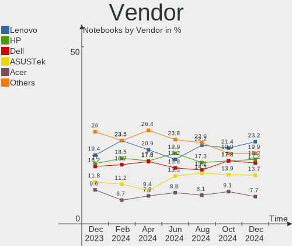
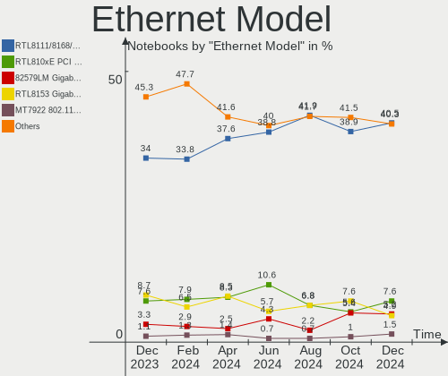

Ubuntu - Hardware Trends (Notebooks)
------------------------------------

A project to identify most popular hardware characteristics and track their change
over time based on data collected by Linux users at https://Linux-Hardware.org.

Anyone can contribute to this report by the [hw-probe](https://github.com/linuxhw/hw-probe) tool:

    sudo -E hw-probe -all -upload

This report is for one last month. Overall report since the beginning of time: [TestDays](https://github.com/linuxhw/TestDays)

Period: Apr, 2023.

Contents
--------

* [ System ](#system)
  - [ OS                       ](#os)
  - [ OS Family                ](#os-family)
  - [ Kernel                   ](#kernel)
  - [ Kernel Family            ](#kernel-family)
  - [ Kernel Major Ver.        ](#kernel-major-ver)
  - [ Arch                     ](#arch)
  - [ DE                       ](#de)
  - [ Display Server           ](#display-server)
  - [ Display Manager          ](#display-manager)
  - [ OS Lang                  ](#os-lang)
  - [ Boot Mode                ](#boot-mode)
  - [ Filesystem               ](#filesystem)
  - [ Part. scheme             ](#part-scheme)
  - [ Dual Boot with Linux/BSD ](#dual-boot-with-linuxbsd)
  - [ Dual Boot (Win)          ](#dual-boot-win)

* [ Board ](#board)
  - [ Vendor                   ](#vendor)
  - [ Model                    ](#model)
  - [ Model Family             ](#model-family)
  - [ MFG Year                 ](#mfg-year)
  - [ Form Factor              ](#form-factor)
  - [ Secure Boot              ](#secure-boot)
  - [ Coreboot                 ](#coreboot)
  - [ RAM Size                 ](#ram-size)
  - [ RAM Used                 ](#ram-used)
  - [ Total Drives             ](#total-drives)
  - [ Has CD-ROM               ](#has-cd-rom)
  - [ Has Ethernet             ](#has-ethernet)
  - [ Has WiFi                 ](#has-wifi)
  - [ Has Bluetooth            ](#has-bluetooth)

* [ Location ](#location)
  - [ Country                  ](#country)
  - [ City                     ](#city)

* [ Drives ](#drives)
  - [ Drive Vendor             ](#drive-vendor)
  - [ Drive Model              ](#drive-model)
  - [ HDD Vendor               ](#hdd-vendor)
  - [ SSD Vendor               ](#ssd-vendor)
  - [ Drive Kind               ](#drive-kind)
  - [ Drive Connector          ](#drive-connector)
  - [ Drive Size               ](#drive-size)
  - [ Space Total              ](#space-total)
  - [ Space Used               ](#space-used)
  - [ Malfunc. Drives          ](#malfunc-drives)
  - [ Malfunc. Drive Vendor    ](#malfunc-drive-vendor)
  - [ Malfunc. HDD Vendor      ](#malfunc-hdd-vendor)
  - [ Malfunc. Drive Kind      ](#malfunc-drive-kind)
  - [ Failed Drives            ](#failed-drives)
  - [ Failed Drive Vendor      ](#failed-drive-vendor)
  - [ Drive Status             ](#drive-status)

* [ Storage controller ](#storage-controller)
  - [ Storage Vendor           ](#storage-vendor)
  - [ Storage Model            ](#storage-model)
  - [ Storage Kind             ](#storage-kind)

* [ Processor ](#processor)
  - [ CPU Vendor               ](#cpu-vendor)
  - [ CPU Model                ](#cpu-model)
  - [ CPU Model Family         ](#cpu-model-family)
  - [ CPU Cores                ](#cpu-cores)
  - [ CPU Sockets              ](#cpu-sockets)
  - [ CPU Threads              ](#cpu-threads)
  - [ CPU Op-Modes             ](#cpu-op-modes)
  - [ CPU Microcode            ](#cpu-microcode)
  - [ CPU Microarch            ](#cpu-microarch)

* [ Graphics ](#graphics)
  - [ GPU Vendor               ](#gpu-vendor)
  - [ GPU Model                ](#gpu-model)
  - [ GPU Combo                ](#gpu-combo)
  - [ GPU Driver               ](#gpu-driver)
  - [ GPU Memory               ](#gpu-memory)

* [ Monitor ](#monitor)
  - [ Monitor Vendor           ](#monitor-vendor)
  - [ Monitor Model            ](#monitor-model)
  - [ Monitor Resolution       ](#monitor-resolution)
  - [ Monitor Diagonal         ](#monitor-diagonal)
  - [ Monitor Width            ](#monitor-width)
  - [ Aspect Ratio             ](#aspect-ratio)
  - [ Monitor Area             ](#monitor-area)
  - [ Pixel Density            ](#pixel-density)
  - [ Multiple Monitors        ](#multiple-monitors)

* [ Network ](#network)
  - [ Net Controller Vendor    ](#net-controller-vendor)
  - [ Net Controller Model     ](#net-controller-model)
  - [ Wireless Vendor          ](#wireless-vendor)
  - [ Wireless Model           ](#wireless-model)
  - [ Ethernet Vendor          ](#ethernet-vendor)
  - [ Ethernet Model           ](#ethernet-model)
  - [ Net Controller Kind      ](#net-controller-kind)
  - [ Used Controller          ](#used-controller)
  - [ NICs                     ](#nics)
  - [ IPv6                     ](#ipv6)

* [ Bluetooth ](#bluetooth)
  - [ Bluetooth Vendor         ](#bluetooth-vendor)
  - [ Bluetooth Model          ](#bluetooth-model)

* [ Sound ](#sound)
  - [ Sound Vendor             ](#sound-vendor)
  - [ Sound Model              ](#sound-model)

* [ Memory ](#memory)
  - [ Memory Vendor            ](#memory-vendor)
  - [ Memory Model             ](#memory-model)
  - [ Memory Kind              ](#memory-kind)
  - [ Memory Form Factor       ](#memory-form-factor)
  - [ Memory Size              ](#memory-size)
  - [ Memory Speed             ](#memory-speed)

* [ Printers & scanners ](#printers--scanners)
  - [ Printer Vendor           ](#printer-vendor)
  - [ Printer Model            ](#printer-model)
  - [ Scanner Vendor           ](#scanner-vendor)
  - [ Scanner Model            ](#scanner-model)

* [ Camera ](#camera)
  - [ Camera Vendor            ](#camera-vendor)
  - [ Camera Model             ](#camera-model)

* [ Security ](#security)
  - [ Fingerprint Vendor       ](#fingerprint-vendor)
  - [ Fingerprint Model        ](#fingerprint-model)
  - [ Chipcard Vendor          ](#chipcard-vendor)
  - [ Chipcard Model           ](#chipcard-model)

* [ Unsupported ](#unsupported)
  - [ Unsupported Devices      ](#unsupported-devices)
  - [ Unsupported Device Types ](#unsupported-device-types)

System
------

OS
--

Installed operating systems

| Name         | Notebooks | Percent |
|--------------|-----------|---------|
| Ubuntu 22.04 | 356       | 59.63%  |
| Ubuntu 23.04 | 86        | 14.41%  |
| Ubuntu 22.10 | 84        | 14.07%  |
| Ubuntu 20.04 | 60        | 10.05%  |
| Ubuntu 18.04 | 10        | 1.68%   |
| Ubuntu 21.10 | 1         | 0.17%   |

OS Family
---------

OS without a version

| Name   | Notebooks | Percent |
|--------|-----------|---------|
| Ubuntu | 597       | 100%    |

Kernel
------

Version of the Linux kernel

| Version                              | Notebooks | Percent |
|--------------------------------------|-----------|---------|
| 5.19.0-38-generic                    | 215       | 36.01%  |
| 5.19.0-40-generic                    | 93        | 15.58%  |
| 6.2.0-20-generic                     | 60        | 10.05%  |
| 5.15.0-69-generic                    | 47        | 7.87%   |
| 5.19.0-41-generic                    | 27        | 4.52%   |
| 5.19.0-32-generic                    | 18        | 3.02%   |
| 5.15.0-71-generic                    | 11        | 1.84%   |
| 5.19.0-35-generic                    | 10        | 1.68%   |
| 6.2.0-18-generic                     | 9         | 1.51%   |
| 5.15.0-67-generic                    | 9         | 1.51%   |
| 6.2.11-060211-generic                | 8         | 1.34%   |
| 5.4.0-146-generic                    | 7         | 1.17%   |
| 5.4.0-147-generic                    | 6         | 1.01%   |
| 5.14.0-1059-oem                      | 5         | 0.84%   |
| 6.2.9-060209-generic                 | 4         | 0.67%   |
| 6.2.10-060210-generic                | 4         | 0.67%   |
| 5.19.0-42-generic                    | 4         | 0.67%   |
| 5.19.0-21-generic                    | 4         | 0.67%   |
| 6.2.8-060208-generic                 | 3         | 0.5%    |
| 6.2.0-19-generic                     | 2         | 0.34%   |
| 6.2.0-10005-tuxedo                   | 2         | 0.34%   |
| 6.1.22-060122-generic                | 2         | 0.34%   |
| 5.15.0-70-generic                    | 2         | 0.34%   |
| 5.15.0-60-generic                    | 2         | 0.34%   |
| 5.15.0-43-generic                    | 2         | 0.34%   |
| 5.15.0-25-generic                    | 2         | 0.34%   |
| 4.15.0-208-generic                   | 2         | 0.34%   |
| 6.3.0-rc7                            | 1         | 0.17%   |
| 6.3.0-060300rc7-generic              | 1         | 0.17%   |
| 6.3.0-060300rc6daily20230414-generic | 1         | 0.17%   |
| 6.3.0-060300-generic                 | 1         | 0.17%   |
| 6.3.0+                               | 1         | 0.17%   |
| 6.2.9-tkg-cfs-rt                     | 1         | 0.17%   |
| 6.2.6-76060206-generic               | 1         | 0.17%   |
| 6.2.5-060205-generic                 | 1         | 0.17%   |
| 6.2.12-060212-generic                | 1         | 0.17%   |
| 6.2.0-1003-lowlatency                | 1         | 0.17%   |
| 6.2.0-060200rc7-generic              | 1         | 0.17%   |
| 6.1.0-16-generic                     | 1         | 0.17%   |
| 6.1.0-1008-oem                       | 1         | 0.17%   |

Kernel Family
-------------

Linux kernel without a distro release

| Version  | Notebooks | Percent |
|----------|-----------|---------|
| 5.19.0   | 373       | 62.48%  |
| 5.15.0   | 80        | 13.4%   |
| 6.2.0    | 75        | 12.56%  |
| 5.4.0    | 14        | 2.35%   |
| 6.2.11   | 8         | 1.34%   |
| 5.14.0   | 7         | 1.17%   |
| 6.3.0    | 5         | 0.84%   |
| 6.2.9    | 5         | 0.84%   |
| 6.2.10   | 4         | 0.67%   |
| 6.2.8    | 3         | 0.5%    |
| 5.13.0   | 3         | 0.5%    |
| 6.1.22   | 2         | 0.34%   |
| 6.1.0    | 2         | 0.34%   |
| 5.11.0   | 2         | 0.34%   |
| 4.15.0   | 2         | 0.34%   |
| 6.2.6    | 1         | 0.17%   |
| 6.2.5    | 1         | 0.17%   |
| 6.2.12   | 1         | 0.17%   |
| 6.0.0    | 1         | 0.17%   |
| 5.8.0    | 1         | 0.17%   |
| 5.6.0    | 1         | 0.17%   |
| 5.19.9   | 1         | 0.17%   |
| 5.18.0   | 1         | 0.17%   |
| 5.17.0   | 1         | 0.17%   |
| 5.15.2   | 1         | 0.17%   |
| 5.13.19  | 1         | 0.17%   |
| 5.10.133 | 1         | 0.17%   |

Kernel Major Ver.
-----------------

Linux kernel major version

| Version | Notebooks | Percent |
|---------|-----------|---------|
| 5.19    | 374       | 62.65%  |
| 6.2     | 98        | 16.42%  |
| 5.15    | 81        | 13.57%  |
| 5.4     | 14        | 2.35%   |
| 5.14    | 7         | 1.17%   |
| 6.3     | 5         | 0.84%   |
| 6.1     | 4         | 0.67%   |
| 5.13    | 4         | 0.67%   |
| 5.11    | 2         | 0.34%   |
| 4.15    | 2         | 0.34%   |
| 6.0     | 1         | 0.17%   |
| 5.8     | 1         | 0.17%   |
| 5.6     | 1         | 0.17%   |
| 5.18    | 1         | 0.17%   |
| 5.17    | 1         | 0.17%   |
| 5.10    | 1         | 0.17%   |

Arch
----

OS architecture (x86_64, i586, etc.)

| Name   | Notebooks | Percent |
|--------|-----------|---------|
| x86_64 | 596       | 99.83%  |
| i686   | 1         | 0.17%   |

DE
--

Desktop Environment

| Name            | Notebooks | Percent |
|-----------------|-----------|---------|
| GNOME           | 570       | 95.48%  |
| Unknown         | 9         | 1.51%   |
| X-Cinnamon      | 7         | 1.17%   |
| GNOME Flashback | 4         | 0.67%   |
| i3              | 2         | 0.34%   |
| sway            | 1         | 0.17%   |
| ratflow         | 1         | 0.17%   |
| Pantheon        | 1         | 0.17%   |
| GNOME Classic   | 1         | 0.17%   |
| Cinnamon        | 1         | 0.17%   |

Display Server
--------------

X11 or Wayland

| Name    | Notebooks | Percent |
|---------|-----------|---------|
| Wayland | 366       | 61.31%  |
| X11     | 215       | 36.01%  |
| Unknown | 14        | 2.35%   |
| Tty     | 2         | 0.34%   |

Display Manager
---------------

SDDM, LightDM, etc.

| Name    | Notebooks | Percent |
|---------|-----------|---------|
| GDM3    | 499       | 83.58%  |
| Unknown | 46        | 7.71%   |
| GDM     | 39        | 6.53%   |
| LightDM | 10        | 1.68%   |
| SDDM    | 2         | 0.34%   |
| SLiM    | 1         | 0.17%   |

OS Lang
-------

Language

| Lang       | Notebooks | Percent |
|------------|-----------|---------|
| en_US      | 259       | 43.38%  |
| de_DE      | 57        | 9.55%   |
| fr_FR      | 37        | 6.2%    |
| pt_BR      | 24        | 4.02%   |
| en_GB      | 23        | 3.85%   |
| ru_RU      | 20        | 3.35%   |
| it_IT      | 19        | 3.18%   |
| en_IN      | 16        | 2.68%   |
| es_ES      | 13        | 2.18%   |
| en_CA      | 11        | 1.84%   |
| en_AU      | 9         | 1.51%   |
| C          | 9         | 1.51%   |
| Unknown    | 8         | 1.34%   |
| pl_PL      | 7         | 1.17%   |
| zh_CN      | 6         | 1.01%   |
| sv_SE      | 6         | 1.01%   |
| nl_NL      | 6         | 1.01%   |
| es_MX      | 6         | 1.01%   |
| es_CL      | 6         | 1.01%   |
| es_AR      | 5         | 0.84%   |
| pt_PT      | 4         | 0.67%   |
| en_SG      | 3         | 0.5%    |
| el_GR      | 3         | 0.5%    |
| de_CH      | 3         | 0.5%    |
| cs_CZ      | 3         | 0.5%    |
| bg_BG      | 3         | 0.5%    |
| ja_JP      | 2         | 0.34%   |
| hu_HU      | 2         | 0.34%   |
| es_CO      | 2         | 0.34%   |
| es_BO      | 2         | 0.34%   |
| en_ZA      | 2         | 0.34%   |
| en_US-UTF8 | 2         | 0.34%   |
| en_NZ      | 2         | 0.34%   |
| en_IL      | 2         | 0.34%   |
| da_DK      | 2         | 0.34%   |
| ca_ES      | 2         | 0.34%   |
| tr_TR      | 1         | 0.17%   |
| sk_SK      | 1         | 0.17%   |
| hr_HR      | 1         | 0.17%   |
| fr_CA      | 1         | 0.17%   |

Boot Mode
---------

EFI or BIOS

| Mode | Notebooks | Percent |
|------|-----------|---------|
| BIOS | 300       | 50.25%  |
| EFI  | 297       | 49.75%  |

Filesystem
----------

Type of filesystem

| Type    | Notebooks | Percent |
|---------|-----------|---------|
| Ext4    | 456       | 76.38%  |
| Tmpfs   | 105       | 17.59%  |
| Zfs     | 15        | 2.51%   |
| Overlay | 10        | 1.68%   |
| Btrfs   | 9         | 1.51%   |
| Xfs     | 1         | 0.17%   |
| Ext2    | 1         | 0.17%   |

Part. scheme
------------

Scheme of partitioning

| Type    | Notebooks | Percent |
|---------|-----------|---------|
| GPT     | 504       | 84.42%  |
| MBR     | 56        | 9.38%   |
| Unknown | 37        | 6.2%    |

Dual Boot with Linux/BSD
------------------------

Hosting more than one Linux/BSD

| Dual boot | Notebooks | Percent |
|-----------|-----------|---------|
| No        | 541       | 90.62%  |
| Yes       | 56        | 9.38%   |

Dual Boot (Win)
---------------

Hosting Linux and Windows

| Dual boot | Notebooks | Percent |
|-----------|-----------|---------|
| No        | 383       | 64.15%  |
| Yes       | 214       | 35.85%  |

Board
-----

Vendor
------

Motherboard manufacturer

| Name                           | Notebooks | Percent |
|--------------------------------|-----------|---------|
| Lenovo                         | 120       | 20.1%   |
| Dell                           | 103       | 17.25%  |
| Hewlett-Packard                | 96        | 16.08%  |
| ASUSTek Computer               | 72        | 12.06%  |
| Acer                           | 48        | 8.04%   |
| MSI                            | 22        | 3.69%   |
| Apple                          | 21        | 3.52%   |
| HUAWEI                         | 20        | 3.35%   |
| Samsung Electronics            | 8         | 1.34%   |
| Toshiba                        | 7         | 1.17%   |
| Sony                           | 7         | 1.17%   |
| Notebook                       | 6         | 1.01%   |
| TUXEDO                         | 5         | 0.84%   |
| Fujitsu                        | 5         | 0.84%   |
| Google                         | 4         | 0.67%   |
| Gateway                        | 4         | 0.67%   |
| Timi                           | 3         | 0.5%    |
| Gigabyte Technology            | 3         | 0.5%    |
| Unknown                        | 3         | 0.5%    |
| Pegatron                       | 2         | 0.34%   |
| Medion                         | 2         | 0.34%   |
| ICL                            | 2         | 0.34%   |
| Alienware                      | 2         | 0.34%   |
| UMAX                           | 1         | 0.17%   |
| TECNO                          | 1         | 0.17%   |
| System76                       | 1         | 0.17%   |
| Shanghai Zhaoxin Semiconductor | 1         | 0.17%   |
| Semp Toshiba                   | 1         | 0.17%   |
| Razer                          | 1         | 0.17%   |
| PC Specialist                  | 1         | 0.17%   |
| Onda TLC                       | 1         | 0.17%   |
| Novatech                       | 1         | 0.17%   |
| Multilaser                     | 1         | 0.17%   |
| MiTAC                          | 1         | 0.17%   |
| Maibenben                      | 1         | 0.17%   |
| LTD Delovoy Office             | 1         | 0.17%   |
| LG Electronics                 | 1         | 0.17%   |
| Itautec                        | 1         | 0.17%   |
| iQual                          | 1         | 0.17%   |
| Intel                          | 1         | 0.17%   |

Model
-----

Motherboard model

| Name                                    | Notebooks | Percent |
|-----------------------------------------|-----------|---------|
| HP Notebook                             | 6         | 1.01%   |
| Dell XPS 15 9500                        | 4         | 0.67%   |
| Unknown                                 | 4         | 0.67%   |
| HUAWEI HVY-WXX9                         | 3         | 0.5%    |
| HP Pavilion dv7                         | 3         | 0.5%    |
| HP Laptop 15s-eq2xxx                    | 3         | 0.5%    |
| HP 250 15.6 inch G9 Notebook PC         | 3         | 0.5%    |
| Dell XPS 13 9350                        | 3         | 0.5%    |
| Dell Latitude E5470                     | 3         | 0.5%    |
| Apple MacBookPro9,2                     | 3         | 0.5%    |
| Apple MacBookPro11,5                    | 3         | 0.5%    |
| Apple MacBookAir7,2                     | 3         | 0.5%    |
| TUXEDO InfinityBook Pro Gen7 (MK1)      | 2         | 0.34%   |
| Pegatron A15                            | 2         | 0.34%   |
| MSI Prestige 14Evo B13M                 | 2         | 0.34%   |
| MSI Modern 14 A10M                      | 2         | 0.34%   |
| MSI Katana GF66 12UE                    | 2         | 0.34%   |
| MSI GF63 Thin 9SC                       | 2         | 0.34%   |
| Lenovo V15 G2 IJL 82QY                  | 2         | 0.34%   |
| Lenovo Legion 5 15IMH05H 81Y6           | 2         | 0.34%   |
| Lenovo IdeaPad 5 Pro 16ACH6 82L5        | 2         | 0.34%   |
| Lenovo IdeaPad 5 15ARE05 81YQ           | 2         | 0.34%   |
| Lenovo IdeaPad 3 15ALC6 82MF            | 2         | 0.34%   |
| Lenovo IdeaPad 110-15ISK 80UD           | 2         | 0.34%   |
| ICL RAYbook Si1512                      | 2         | 0.34%   |
| HUAWEI NBLB-WAX9N                       | 2         | 0.34%   |
| HUAWEI HN-WX9X                          | 2         | 0.34%   |
| HUAWEI BOM-WXX9                         | 2         | 0.34%   |
| HP ProBook 450 15.6 inch G9 Notebook PC | 2         | 0.34%   |
| HP Pavilion Laptop 15-eg0xxx            | 2         | 0.34%   |
| HP Pavilion dv6                         | 2         | 0.34%   |
| HP Laptop 15-db0xxx                     | 2         | 0.34%   |
| HP Compaq CQ58                          | 2         | 0.34%   |
| Gigabyte G5 GD                          | 2         | 0.34%   |
| Gateway NE56R                           | 2         | 0.34%   |
| Dell XPS 15 9570                        | 2         | 0.34%   |
| Dell XPS 15 9520                        | 2         | 0.34%   |
| Dell XPS 13 9310                        | 2         | 0.34%   |
| Dell XPS 13 7390                        | 2         | 0.34%   |
| Dell Vostro 3550                        | 2         | 0.34%   |

Model Family
------------

Motherboard model prefix

| Name               | Notebooks | Percent |
|--------------------|-----------|---------|
| Lenovo ThinkPad    | 63        | 10.55%  |
| Dell Latitude      | 38        | 6.37%   |
| Acer Aspire        | 30        | 5.03%   |
| Lenovo IdeaPad     | 28        | 4.69%   |
| Dell Inspiron      | 21        | 3.52%   |
| HP Pavilion        | 19        | 3.18%   |
| Dell XPS           | 19        | 3.18%   |
| ASUS VivoBook      | 19        | 3.18%   |
| HP Laptop          | 15        | 2.51%   |
| HP ProBook         | 13        | 2.18%   |
| Dell Vostro        | 11        | 1.84%   |
| ASUS ASUS          | 11        | 1.84%   |
| HP EliteBook       | 10        | 1.68%   |
| ASUS ZenBook       | 10        | 1.68%   |
| ASUS ROG           | 7         | 1.17%   |
| Acer Swift         | 7         | 1.17%   |
| HP Notebook        | 6         | 1.01%   |
| HP 250             | 6         | 1.01%   |
| Toshiba Satellite  | 5         | 0.84%   |
| HP OMEN            | 5         | 0.84%   |
| HP Compaq          | 5         | 0.84%   |
| Dell Precision     | 5         | 0.84%   |
| Acer Nitro         | 5         | 0.84%   |
| MSI Katana         | 4         | 0.67%   |
| MSI GF63           | 4         | 0.67%   |
| Lenovo ThinkBook   | 4         | 0.67%   |
| Lenovo Legion      | 4         | 0.67%   |
| Fujitsu LIFEBOOK   | 4         | 0.67%   |
| Unknown            | 4         | 0.67%   |
| MSI Modern         | 3         | 0.5%    |
| MSI Creator        | 3         | 0.5%    |
| Lenovo V15         | 3         | 0.5%    |
| HUAWEI HVY-WXX9    | 3         | 0.5%    |
| HP ZBook           | 3         | 0.5%    |
| HP Victus          | 3         | 0.5%    |
| HP 255             | 3         | 0.5%    |
| Dell G15           | 3         | 0.5%    |
| Apple MacBookPro9  | 3         | 0.5%    |
| Apple MacBookPro11 | 3         | 0.5%    |
| Apple MacBookAir7  | 3         | 0.5%    |

MFG Year
--------

Motherboard manufacture year

| Year    | Notebooks | Percent |
|---------|-----------|---------|
| 2021    | 93        | 15.58%  |
| 2020    | 78        | 13.07%  |
| 2022    | 76        | 12.73%  |
| 2019    | 53        | 8.88%   |
| 2011    | 36        | 6.03%   |
| 2016    | 35        | 5.86%   |
| 2018    | 32        | 5.36%   |
| 2012    | 32        | 5.36%   |
| 2015    | 30        | 5.03%   |
| 2013    | 28        | 4.69%   |
| 2017    | 24        | 4.02%   |
| 2014    | 17        | 2.85%   |
| 2010    | 17        | 2.85%   |
| 2008    | 16        | 2.68%   |
| 2023    | 12        | 2.01%   |
| 2009    | 11        | 1.84%   |
| 2007    | 4         | 0.67%   |
| 2006    | 1         | 0.17%   |
| 2005    | 1         | 0.17%   |
| Unknown | 1         | 0.17%   |

Form Factor
-----------

Physical design of the computer

| Name     | Notebooks | Percent |
|----------|-----------|---------|
| Notebook | 597       | 100%    |

Secure Boot
-----------

Enabled or disabled

| State    | Notebooks | Percent |
|----------|-----------|---------|
| Disabled | 518       | 86.77%  |
| Enabled  | 79        | 13.23%  |

Coreboot
--------

Have coreboot on board

| Used | Notebooks | Percent |
|------|-----------|---------|
| No   | 591       | 98.99%  |
| Yes  | 6         | 1.01%   |

RAM Size
--------

Total RAM memory

| Size in GB  | Notebooks | Percent |
|-------------|-----------|---------|
| 4.01-8.0    | 191       | 31.99%  |
| 16.01-24.0  | 141       | 23.62%  |
| 8.01-16.0   | 97        | 16.25%  |
| 3.01-4.0    | 89        | 14.91%  |
| 32.01-64.0  | 42        | 7.04%   |
| 24.01-32.0  | 15        | 2.51%   |
| 1.01-2.0    | 11        | 1.84%   |
| 64.01-256.0 | 9         | 1.51%   |
| 2.01-3.0    | 2         | 0.34%   |

RAM Used
--------

Used RAM memory

| Used GB    | Notebooks | Percent |
|------------|-----------|---------|
| 2.01-3.0   | 183       | 30.65%  |
| 1.01-2.0   | 150       | 25.13%  |
| 4.01-8.0   | 119       | 19.93%  |
| 3.01-4.0   | 97        | 16.25%  |
| 8.01-16.0  | 42        | 7.04%   |
| 0.51-1.0   | 3         | 0.5%    |
| 16.01-24.0 | 2         | 0.34%   |
| 24.01-32.0 | 1         | 0.17%   |

Total Drives
------------

Number of drives on board

| Drives | Notebooks | Percent |
|--------|-----------|---------|
| 1      | 458       | 76.72%  |
| 2      | 118       | 19.77%  |
| 3      | 15        | 2.51%   |
| 0      | 5         | 0.84%   |
| 4      | 1         | 0.17%   |

Has CD-ROM
----------

Has CD-ROM on board

| Presented | Notebooks | Percent |
|-----------|-----------|---------|
| No        | 450       | 75.38%  |
| Yes       | 147       | 24.62%  |

Has Ethernet
------------

Has Ethernet on board

| Presented | Notebooks | Percent |
|-----------|-----------|---------|
| Yes       | 442       | 74.04%  |
| No        | 155       | 25.96%  |

Has WiFi
--------

Has WiFi module

| Presented | Notebooks | Percent |
|-----------|-----------|---------|
| Yes       | 587       | 98.32%  |
| No        | 10        | 1.68%   |

Has Bluetooth
-------------

Has Bluetooth module

| Presented | Notebooks | Percent |
|-----------|-----------|---------|
| Yes       | 513       | 85.93%  |
| No        | 84        | 14.07%  |

Location
--------

Country
-------

Geographic location (country)

| Country     | Notebooks | Percent |
|-------------|-----------|---------|
| USA         | 76        | 12.73%  |
| Germany     | 76        | 12.73%  |
| France      | 46        | 7.71%   |
| Russia      | 37        | 6.2%    |
| Brazil      | 34        | 5.7%    |
| Italy       | 24        | 4.02%   |
| India       | 22        | 3.69%   |
| UK          | 17        | 2.85%   |
| Poland      | 17        | 2.85%   |
| Spain       | 16        | 2.68%   |
| Mexico      | 14        | 2.35%   |
| Netherlands | 13        | 2.18%   |
| Canada      | 11        | 1.84%   |
| Sweden      | 9         | 1.51%   |
| Greece      | 8         | 1.34%   |
| Chile       | 8         | 1.34%   |
| Vietnam     | 7         | 1.17%   |
| China       | 7         | 1.17%   |
| Australia   | 7         | 1.17%   |
| Switzerland | 6         | 1.01%   |
| Colombia    | 6         | 1.01%   |
| Belgium     | 6         | 1.01%   |
| Argentina   | 6         | 1.01%   |
| Czechia     | 5         | 0.84%   |
| Bulgaria    | 5         | 0.84%   |
| Bolivia     | 5         | 0.84%   |
| Portugal    | 4         | 0.67%   |
| Iran        | 4         | 0.67%   |
| Hungary     | 4         | 0.67%   |
| Finland     | 4         | 0.67%   |
| Denmark     | 4         | 0.67%   |
| South Korea | 3         | 0.5%    |
| Slovenia    | 3         | 0.5%    |
| Singapore   | 3         | 0.5%    |
| Serbia      | 3         | 0.5%    |
| Norway      | 3         | 0.5%    |
| Japan       | 3         | 0.5%    |
| Israel      | 3         | 0.5%    |
| Ireland     | 3         | 0.5%    |
| Egypt       | 3         | 0.5%    |

City
----

Geographic location (city)

| City              | Notebooks | Percent |
|-------------------|-----------|---------|
| Paris             | 9         | 1.51%   |
| Berlin            | 9         | 1.51%   |
| Frankfurt am Main | 7         | 1.17%   |
| St Petersburg     | 6         | 1.01%   |
| Moscow            | 6         | 1.01%   |
| Milan             | 6         | 1.01%   |
| Sao Paulo         | 5         | 0.84%   |
| Bengaluru         | 5         | 0.84%   |
| Barcelona         | 5         | 0.84%   |
| Amsterdam         | 5         | 0.84%   |
| Warsaw            | 4         | 0.67%   |
| Tehran            | 4         | 0.67%   |
| Santiago          | 4         | 0.67%   |
| Rome              | 4         | 0.67%   |
| Munich            | 4         | 0.67%   |
| Brussels          | 4         | 0.67%   |
| Voronezh          | 3         | 0.5%    |
| Singapore         | 3         | 0.5%    |
| Seville           | 3         | 0.5%    |
| Rio de Janeiro    | 3         | 0.5%    |
| Novosibirsk       | 3         | 0.5%    |
| Melbourne         | 3         | 0.5%    |
| Mannheim          | 3         | 0.5%    |
| Madrid            | 3         | 0.5%    |
| Da Nang           | 3         | 0.5%    |
| Cochabamba        | 3         | 0.5%    |
| Budapest          | 3         | 0.5%    |
| Bogotá           | 3         | 0.5%    |
| Athens            | 3         | 0.5%    |
| Zagreb            | 2         | 0.34%   |
| Yaroslavl         | 2         | 0.34%   |
| Wroclaw           | 2         | 0.34%   |
| Viña del Mar     | 2         | 0.34%   |
| Tunis             | 2         | 0.34%   |
| Sydney            | 2         | 0.34%   |
| Sofia             | 2         | 0.34%   |
| San Juan          | 2         | 0.34%   |
| San José         | 2         | 0.34%   |
| Pune              | 2         | 0.34%   |
| Ourense           | 2         | 0.34%   |

Drives
------

Drive Vendor
------------

Hard drive vendors

| Vendor                      | Notebooks | Drives | Percent |
|-----------------------------|-----------|--------|---------|
| Samsung Electronics         | 121       | 133    | 16.99%  |
| WDC                         | 68        | 69     | 9.55%   |
| Seagate                     | 54        | 56     | 7.58%   |
| Sandisk                     | 49        | 53     | 6.88%   |
| Toshiba                     | 44        | 44     | 6.18%   |
| Kingston                    | 40        | 41     | 5.62%   |
| Micron Technology           | 34        | 35     | 4.78%   |
| Intel                       | 33        | 33     | 4.63%   |
| Unknown                     | 31        | 33     | 4.35%   |
| SK hynix                    | 31        | 31     | 4.35%   |
| KIOXIA                      | 27        | 27     | 3.79%   |
| Crucial                     | 18        | 18     | 2.53%   |
| Hitachi                     | 14        | 14     | 1.97%   |
| Apple                       | 13        | 14     | 1.83%   |
| HGST                        | 9         | 9      | 1.26%   |
| A-DATA Technology           | 8         | 8      | 1.12%   |
| Silicon Motion              | 7         | 7      | 0.98%   |
| Phison Electronics          | 7         | 7      | 0.98%   |
| China                       | 7         | 7      | 0.98%   |
| Phison                      | 6         | 6      | 0.84%   |
| LITEON                      | 6         | 6      | 0.84%   |
| Unknown                     | 5         | 5      | 0.7%    |
| Intenso                     | 4         | 4      | 0.56%   |
| Fujitsu                     | 4         | 4      | 0.56%   |
| YMTC                        | 3         | 3      | 0.42%   |
| SSSTC                       | 3         | 3      | 0.42%   |
| Emtec                       | 3         | 3      | 0.42%   |
| ADATA Technology            | 3         | 3      | 0.42%   |
| Yangtze Memory Technologies | 2         | 2      | 0.28%   |
| XrayDisk                    | 2         | 2      | 0.28%   |
| Union Memory                | 2         | 2      | 0.28%   |
| UMIS                        | 2         | 2      | 0.28%   |
| Team                        | 2         | 2      | 0.28%   |
| SPCC                        | 2         | 2      | 0.28%   |
| Realtek Semiconductor       | 2         | 2      | 0.28%   |
| Patriot                     | 2         | 2      | 0.28%   |
| Netac                       | 2         | 2      | 0.28%   |
| Micron/Crucial Technology   | 2         | 2      | 0.28%   |
| Mass                        | 2         | 2      | 0.28%   |
| LITEONIT                    | 2         | 2      | 0.28%   |

Drive Model
-----------

Hard drive models

| Model                                                  | Notebooks | Percent |
|--------------------------------------------------------|-----------|---------|
| Samsung NVMe SSD Controller SM981/PM981/PM983 1TB      | 9         | 1.24%   |
| Seagate ST1000LM035-1RK172 970GB                       | 8         | 1.1%    |
| Intel SSDPEKNU512GZ 512GB                              | 8         | 1.1%    |
| Unknown MMC Card  64GB                                 | 7         | 0.96%   |
| Unknown MMC Card  32GB                                 | 7         | 0.96%   |
| Toshiba MQ01ABD100 1TB                                 | 7         | 0.96%   |
| Toshiba MQ04ABF100 1TB                                 | 6         | 0.83%   |
| Toshiba MQ01ABF050 500GB                               | 6         | 0.83%   |
| Seagate ST500LT012-1DG142 500GB                        | 6         | 0.83%   |
| Samsung MZVL21T0HCLR-00B00 1TB                         | 6         | 0.83%   |
| Kingston SA400S37480G 480GB SSD                        | 6         | 0.83%   |
| Silicon Motion SM2263EN/SM2263XT SSD Controller 1024GB | 5         | 0.69%   |
| Seagate ST1000LM024 HN-M101MBB 1TB                     | 5         | 0.69%   |
| Sandisk WD Blue SN550 NVMe SSD 1024GB                  | 5         | 0.69%   |
| SanDisk NVMe SSD Drive 1TB                             | 5         | 0.69%   |
| Samsung SSD 870 EVO 1TB                                | 5         | 0.69%   |
| Samsung MZVLQ512HBLU-00B00 512GB                       | 5         | 0.69%   |
| Samsung MZVLQ256HBJD-00BH1 256GB                       | 5         | 0.69%   |
| Unknown                                                | 5         | 0.69%   |
| Seagate ST1000LM014-1EJ164 1TB                         | 4         | 0.55%   |
| Sandisk WD Black SN850 1TB                             | 4         | 0.55%   |
| Samsung SSD 980 1TB                                    | 4         | 0.55%   |
| Samsung SSD 860 EVO 500GB                              | 4         | 0.55%   |
| Micron 2450_MTFDKBA512TFK 512GB                        | 4         | 0.55%   |
| KIOXIA KBG40ZNV512G 512GB                              | 4         | 0.55%   |
| Kingston SA400S37960G 960GB SSD                        | 4         | 0.55%   |
| Kingston SA400S37240G 240GB SSD                        | 4         | 0.55%   |
| Kingston SA400S37120G 120GB SSD                        | 4         | 0.55%   |
| Crucial CT240BX500SSD1 240GB                           | 4         | 0.55%   |
| Apple SSD SM0128G 121GB                                | 4         | 0.55%   |
| WDC PC SN730 NVMe 1024GB                               | 3         | 0.41%   |
| Unknown MMC Card  16GB                                 | 3         | 0.41%   |
| SSSTC CL1-4D256 256GB                                  | 3         | 0.41%   |
| Sandisk WD Black SN750 / PC SN730 NVMe SSD 512GB       | 3         | 0.41%   |
| Sandisk WD Black 2018/SN750 / PC SN720 NVMe SSD 500GB  | 3         | 0.41%   |
| Samsung SSD 980 500GB                                  | 3         | 0.41%   |
| Samsung SSD 850 EVO 500GB                              | 3         | 0.41%   |
| Samsung NVMe SSD Controller SM961/PM961/SM963 500GB    | 3         | 0.41%   |
| Samsung MZALQ512HBLU-00BL2 512GB                       | 3         | 0.41%   |
| Phison E12 NVMe Controller 512GB                       | 3         | 0.41%   |

HDD Vendor
----------

Hard disk drive vendors

| Vendor              | Notebooks | Drives | Percent |
|---------------------|-----------|--------|---------|
| Seagate             | 53        | 55     | 34.19%  |
| WDC                 | 34        | 34     | 21.94%  |
| Toshiba             | 30        | 30     | 19.35%  |
| Hitachi             | 14        | 14     | 9.03%   |
| HGST                | 9         | 9      | 5.81%   |
| Samsung Electronics | 4         | 4      | 2.58%   |
| Fujitsu             | 4         | 4      | 2.58%   |
| ASMT                | 2         | 2      | 1.29%   |
| Unknown             | 1         | 1      | 0.65%   |
| JMicron Technology  | 1         | 1      | 0.65%   |
| Intenso             | 1         | 1      | 0.65%   |
| HGST HTS            | 1         | 1      | 0.65%   |
| Apple               | 1         | 1      | 0.65%   |

SSD Vendor
----------

Solid state drive vendors

| Vendor              | Notebooks | Drives | Percent |
|---------------------|-----------|--------|---------|
| Samsung Electronics | 42        | 44     | 21.88%  |
| Kingston            | 27        | 27     | 14.06%  |
| SanDisk             | 15        | 15     | 7.81%   |
| Crucial             | 14        | 14     | 7.29%   |
| WDC                 | 10        | 10     | 5.21%   |
| Apple               | 9         | 9      | 4.69%   |
| Micron Technology   | 7         | 7      | 3.65%   |
| Intel               | 7         | 7      | 3.65%   |
| China               | 6         | 6      | 3.13%   |
| A-DATA Technology   | 6         | 6      | 3.13%   |
| LITEON              | 5         | 5      | 2.6%    |
| Toshiba             | 4         | 4      | 2.08%   |
| SK hynix            | 4         | 4      | 2.08%   |
| Intenso             | 3         | 3      | 1.56%   |
| Emtec               | 3         | 3      | 1.56%   |
| XrayDisk            | 2         | 2      | 1.04%   |
| Team                | 2         | 2      | 1.04%   |
| SPCC                | 2         | 2      | 1.04%   |
| Patriot             | 2         | 2      | 1.04%   |
| LITEONIT            | 2         | 2      | 1.04%   |
| Fanxiang            | 2         | 2      | 1.04%   |
| Zheino              | 1         | 1      | 0.52%   |
| Win Memory          | 1         | 1      | 0.52%   |
| Transcend           | 1         | 1      | 0.52%   |
| Seagate             | 1         | 1      | 0.52%   |
| S3+                 | 1         | 1      | 0.52%   |
| PNY CS90            | 1         | 1      | 0.52%   |
| Pioneer             | 1         | 1      | 0.52%   |
| Netac               | 1         | 1      | 0.52%   |
| MSI                 | 1         | 1      | 0.52%   |
| MG                  | 1         | 1      | 0.52%   |
| Maxtor              | 1         | 1      | 0.52%   |
| Lexar               | 1         | 1      | 0.52%   |
| KingSpec            | 1         | 1      | 0.52%   |
| Kimtigo             | 1         | 1      | 0.52%   |
| Hised               | 1         | 1      | 0.52%   |
| Hewlett-Packard     | 1         | 1      | 0.52%   |
| Dogfish             | 1         | 1      | 0.52%   |
| Dell                | 1         | 1      | 0.52%   |

Drive Kind
----------

HDD or SSD

| Kind    | Notebooks | Drives | Percent |
|---------|-----------|--------|---------|
| NVMe    | 309       | 338    | 44.98%  |
| SSD     | 181       | 194    | 26.35%  |
| HDD     | 153       | 157    | 22.27%  |
| MMC     | 34        | 36     | 4.95%   |
| Unknown | 10        | 11     | 1.46%   |

Drive Connector
---------------

SATA, SAS, NVMe, etc.

| Type | Notebooks | Drives | Percent |
|------|-----------|--------|---------|
| NVMe | 309       | 338    | 46.05%  |
| SATA | 304       | 333    | 45.31%  |
| MMC  | 34        | 36     | 5.07%   |
| SAS  | 24        | 29     | 3.58%   |

Drive Size
----------

Size of hard drive

| Size in TB | Notebooks | Drives | Percent |
|------------|-----------|--------|---------|
| 0.01-0.5   | 212       | 224    | 63.86%  |
| 0.51-1.0   | 104       | 108    | 31.33%  |
| 1.01-2.0   | 12        | 13     | 3.61%   |
| 3.01-4.0   | 2         | 2      | 0.6%    |
| 4.01-10.0  | 2         | 4      | 0.6%    |

Space Total
-----------

Amount of disk space available on the file system

| Size in GB     | Notebooks | Percent |
|----------------|-----------|---------|
| 251-500        | 196       | 32.83%  |
| 101-250        | 176       | 29.48%  |
| 501-1000       | 97        | 16.25%  |
| 51-100         | 38        | 6.37%   |
| 1-20           | 30        | 5.03%   |
| 21-50          | 18        | 3.02%   |
| 1001-2000      | 18        | 3.02%   |
| More than 3000 | 10        | 1.68%   |
| Unknown        | 8         | 1.34%   |
| 2001-3000      | 6         | 1.01%   |

Space Used
----------

Amount of used disk space

| Used GB        | Notebooks | Percent |
|----------------|-----------|---------|
| 1-20           | 181       | 30.32%  |
| 21-50          | 154       | 25.8%   |
| 51-100         | 87        | 14.57%  |
| 101-250        | 85        | 14.24%  |
| 251-500        | 51        | 8.54%   |
| 501-1000       | 19        | 3.18%   |
| Unknown        | 8         | 1.34%   |
| 1001-2000      | 7         | 1.17%   |
| 2001-3000      | 3         | 0.5%    |
| More than 3000 | 2         | 0.34%   |

Malfunc. Drives
---------------

Drive models with a malfunction

| Model                                        | Notebooks | Drives | Percent |
|----------------------------------------------|-----------|--------|---------|
| WDC WD5000LPVX-00V0TT0 500GB                 | 1         | 1      | 5.88%   |
| WDC WD5000LPCX-60VHAT0 500GB                 | 1         | 1      | 5.88%   |
| WDC WD3200BPVT-22JJ5T0 320GB                 | 1         | 1      | 5.88%   |
| WDC WD20SPZX-75UA7T0 2TB                     | 1         | 1      | 5.88%   |
| SK hynix BC711 HFM512GD3JX013N 512GB         | 1         | 1      | 5.88%   |
| Seagate ST9320325AS 320GB                    | 1         | 1      | 5.88%   |
| Seagate ST500LT012-1DG142 500GB              | 1         | 1      | 5.88%   |
| Seagate ST500LM012 HN-M500MBB 500GB          | 1         | 1      | 5.88%   |
| Seagate ST1000LM035-1RK172 970GB             | 1         | 1      | 5.88%   |
| Seagate ST1000LM024 HN-M101MBB 1TB           | 1         | 1      | 5.88%   |
| Seagate ST1000LM014-1EJ164 1TB               | 1         | 1      | 5.88%   |
| SanDisk SSD PLUS 240 GB                      | 1         | 1      | 5.88%   |
| Samsung Electronics MZVLQ256HBJD-00BH1 256GB | 1         | 1      | 5.88%   |
| Samsung Electronics HM641JI 640GB            | 1         | 1      | 5.88%   |
| Intel SSDSCKGF256A5 SATA 256GB               | 1         | 1      | 5.88%   |
| Intel SSDSC2BF240A5L 240GB                   | 1         | 1      | 5.88%   |
| Hitachi HTS547575A9E384 752GB                | 1         | 1      | 5.88%   |

Malfunc. Drive Vendor
---------------------

Vendors of faulty drives

| Vendor              | Notebooks | Drives | Percent |
|---------------------|-----------|--------|---------|
| Seagate             | 6         | 6      | 35.29%  |
| WDC                 | 4         | 4      | 23.53%  |
| Samsung Electronics | 2         | 2      | 11.76%  |
| Intel               | 2         | 2      | 11.76%  |
| SK hynix            | 1         | 1      | 5.88%   |
| SanDisk             | 1         | 1      | 5.88%   |
| Hitachi             | 1         | 1      | 5.88%   |

Malfunc. HDD Vendor
-------------------

Vendors of faulty HDD drives

| Vendor              | Notebooks | Drives | Percent |
|---------------------|-----------|--------|---------|
| Seagate             | 6         | 6      | 50%     |
| WDC                 | 4         | 4      | 33.33%  |
| Samsung Electronics | 1         | 1      | 8.33%   |
| Hitachi             | 1         | 1      | 8.33%   |

Malfunc. Drive Kind
-------------------

Kinds of faulty drives

| Kind | Notebooks | Drives | Percent |
|------|-----------|--------|---------|
| HDD  | 12        | 12     | 70.59%  |
| SSD  | 3         | 3      | 17.65%  |
| NVMe | 2         | 2      | 11.76%  |

Failed Drives
-------------

Failed drive models

Zero info for selected period =(

Failed Drive Vendor
-------------------

Failed drive vendors

Zero info for selected period =(

Drive Status
------------

Number of failed and malfunc. drives

| Status   | Notebooks | Drives | Percent |
|----------|-----------|--------|---------|
| Detected | 339       | 416    | 54.68%  |
| Works    | 264       | 303    | 42.58%  |
| Malfunc  | 17        | 17     | 2.74%   |

Storage controller
------------------

Storage Vendor
--------------

Storage controller vendors

| Vendor                         | Notebooks | Percent |
|--------------------------------|-----------|---------|
| Intel                          | 392       | 51.65%  |
| Samsung Electronics            | 85        | 11.2%   |
| AMD                            | 58        | 7.64%   |
| SanDisk                        | 57        | 7.51%   |
| SK hynix                       | 27        | 3.56%   |
| Micron Technology              | 27        | 3.56%   |
| KIOXIA                         | 24        | 3.16%   |
| Kingston Technology Company    | 15        | 1.98%   |
| Toshiba America Info Systems   | 13        | 1.71%   |
| Phison Electronics             | 13        | 1.71%   |
| Silicon Motion                 | 7         | 0.92%   |
| Yangtze Memory Technologies    | 6         | 0.79%   |
| Micron/Crucial Technology      | 6         | 0.79%   |
| Solid State Storage Technology | 5         | 0.66%   |
| ADATA Technology               | 5         | 0.66%   |
| Union Memory (Shenzhen)        | 3         | 0.4%    |
| Apple                          | 3         | 0.4%    |
| Realtek Semiconductor          | 2         | 0.26%   |
| Nvidia                         | 2         | 0.26%   |
| Zhaoxin                        | 1         | 0.13%   |
| VIA Technologies               | 1         | 0.13%   |
| Shenzhen Longsys Electronics   | 1         | 0.13%   |
| Netac Technology               | 1         | 0.13%   |
| Lite-On Technology             | 1         | 0.13%   |
| Lenovo                         | 1         | 0.13%   |
| INNOGRIT                       | 1         | 0.13%   |
| ASMedia Technology             | 1         | 0.13%   |
| Unknown                        | 1         | 0.13%   |

Storage Model
-------------

Storage controller models

| Model                                                                          | Notebooks | Percent |
|--------------------------------------------------------------------------------|-----------|---------|
| AMD FCH SATA Controller [AHCI mode]                                            | 52        | 6.4%    |
| Intel Volume Management Device NVMe RAID Controller                            | 51        | 6.28%   |
| Intel Sunrise Point-LP SATA Controller [AHCI mode]                             | 40        | 4.93%   |
| Samsung NVMe SSD Controller 980                                                | 33        | 4.06%   |
| Intel 82801 Mobile SATA Controller [RAID mode]                                 | 33        | 4.06%   |
| Intel 7 Series Chipset Family 6-port SATA Controller [AHCI mode]               | 33        | 4.06%   |
| Intel 6 Series/C200 Series Chipset Family 6 port Mobile SATA AHCI Controller   | 29        | 3.57%   |
| Micron NVMe Storage Controller                                                 | 26        | 3.2%    |
| KIOXIA NVMe SSD Controller BG4                                                 | 22        | 2.71%   |
| Intel Comet Lake SATA AHCI Controller                                          | 19        | 2.34%   |
| Intel Alder Lake-P SATA AHCI Controller                                        | 19        | 2.34%   |
| Samsung NVMe SSD Controller PM9A1/PM9A3/980PRO                                 | 18        | 2.22%   |
| Intel Tiger Lake-LP SATA Controller                                            | 18        | 2.22%   |
| Intel Cannon Lake Mobile PCH SATA AHCI Controller                              | 18        | 2.22%   |
| Samsung NVMe SSD Controller SM981/PM981/PM983                                  | 17        | 2.09%   |
| Intel Wildcat Point-LP SATA Controller [AHCI Mode]                             | 15        | 1.85%   |
| Intel Non-Volatile memory controller                                           | 15        | 1.85%   |
| SK hynix Gold P31/PC711 NVMe Solid State Drive                                 | 14        | 1.72%   |
| Intel 8 Series SATA Controller 1 [AHCI mode]                                   | 13        | 1.6%    |
| Intel 5 Series/3400 Series Chipset 4 port SATA AHCI Controller                 | 13        | 1.6%    |
| SanDisk WD Blue SN550 NVMe SSD                                                 | 12        | 1.48%   |
| SanDisk WD Black SN750 / PC SN730 NVMe SSD                                     | 11        | 1.35%   |
| Intel 82801IBM/IEM (ICH9M/ICH9M-E) 4 port SATA Controller [AHCI mode]          | 11        | 1.35%   |
| Intel 400 Series Chipset Family SATA AHCI Controller                           | 11        | 1.35%   |
| Intel 8 Series/C220 Series Chipset Family 6-port SATA Controller 1 [AHCI mode] | 10        | 1.23%   |
| Intel Celeron/Pentium Silver Processor SATA Controller                         | 9         | 1.11%   |
| Toshiba America Info Systems XG6 NVMe SSD Controller                           | 8         | 0.99%   |
| Samsung Electronics SATA controller                                            | 8         | 0.99%   |
| Sandisk Non-Volatile memory controller                                         | 7         | 0.86%   |
| Intel SSD 660P Series                                                          | 7         | 0.86%   |
| Intel 82801HM/HEM (ICH8M/ICH8M-E) IDE Controller                               | 7         | 0.86%   |
| Yangtze Memory Non-Volatile memory controller                                  | 6         | 0.74%   |
| SanDisk WD PC SN810 / Black SN850 NVMe SSD                                     | 6         | 0.74%   |
| Intel 82801HM/HEM (ICH8M/ICH8M-E) SATA Controller [AHCI mode]                  | 6         | 0.74%   |
| Intel 500 Series Chipset Family SATA AHCI Controller                           | 6         | 0.74%   |
| Intel 5 Series/3400 Series Chipset 6 port SATA AHCI Controller                 | 6         | 0.74%   |
| Solid State Storage Non-Volatile memory controller                             | 5         | 0.62%   |
| SK hynix Non-Volatile memory controller                                        | 5         | 0.62%   |
| Silicon Motion SM2263EN/SM2263XT SSD Controller                                | 5         | 0.62%   |
| SanDisk WD Blue SN570 NVMe SSD 1TB                                             | 5         | 0.62%   |

Storage Kind
------------

Kind of storage controller (IDE, SATA, NVMe, SAS, ...)

| Kind | Notebooks | Percent |
|------|-----------|---------|
| SATA | 375       | 47.59%  |
| NVMe | 309       | 39.21%  |
| RAID | 87        | 11.04%  |
| IDE  | 17        | 2.16%   |

Processor
---------

CPU Vendor
----------

Processor vendors

| Vendor       | Notebooks | Percent |
|--------------|-----------|---------|
| Intel        | 486       | 81.41%  |
| AMD          | 110       | 18.43%  |
| CentaurHauls | 1         | 0.17%   |

CPU Model
---------

Processor models

| Model                                         | Notebooks | Percent |
|-----------------------------------------------|-----------|---------|
| Intel 11th Gen Core i5-1135G7 @ 2.40GHz       | 17        | 2.85%   |
| Intel 11th Gen Core i7-1165G7 @ 2.80GHz       | 15        | 2.51%   |
| Intel Core i5-10210U CPU @ 1.60GHz            | 14        | 2.35%   |
| Intel 12th Gen Core i7-12700H                 | 13        | 2.18%   |
| Intel Core i7-10750H CPU @ 2.60GHz            | 11        | 1.84%   |
| AMD Ryzen 5 5500U with Radeon Graphics        | 11        | 1.84%   |
| Intel Core i7-10510U CPU @ 1.80GHz            | 10        | 1.68%   |
| Intel Core i7-9750H CPU @ 2.60GHz             | 9         | 1.51%   |
| Intel Core i7-8565U CPU @ 1.80GHz             | 8         | 1.34%   |
| Intel Core i5-2520M CPU @ 2.50GHz             | 8         | 1.34%   |
| Intel 12th Gen Core i7-1255U                  | 8         | 1.34%   |
| Intel 11th Gen Core i7-11800H @ 2.30GHz       | 8         | 1.34%   |
| AMD Ryzen 5 3500U with Radeon Vega Mobile Gfx | 8         | 1.34%   |
| Intel Core i7-7500U CPU @ 2.70GHz             | 7         | 1.17%   |
| Intel Core i5-7200U CPU @ 2.50GHz             | 7         | 1.17%   |
| Intel 12th Gen Core i7-1260P                  | 7         | 1.17%   |
| Intel Core i7-8550U CPU @ 1.80GHz             | 6         | 1.01%   |
| Intel Core i5-3230M CPU @ 2.60GHz             | 6         | 1.01%   |
| Intel Core i5-3210M CPU @ 2.50GHz             | 6         | 1.01%   |
| Intel 11th Gen Core i7-11370H @ 3.30GHz       | 6         | 1.01%   |
| AMD Ryzen 7 5700U with Radeon Graphics        | 6         | 1.01%   |
| Intel Core i7-8750H CPU @ 2.20GHz             | 5         | 0.84%   |
| Intel Core i5-1035G1 CPU @ 1.00GHz            | 5         | 0.84%   |
| Intel 12th Gen Core i5-12500H                 | 5         | 0.84%   |
| Intel 12th Gen Core i5-1240P                  | 5         | 0.84%   |
| Intel 11th Gen Core i7-1185G7 @ 3.00GHz       | 5         | 0.84%   |
| Intel 11th Gen Core i3-1115G4 @ 3.00GHz       | 5         | 0.84%   |
| AMD Ryzen 7 6800H with Radeon Graphics        | 5         | 0.84%   |
| AMD Ryzen 7 5825U with Radeon Graphics        | 5         | 0.84%   |
| AMD Ryzen 7 5800H with Radeon Graphics        | 5         | 0.84%   |
| AMD Ryzen 7 4800H with Radeon Graphics        | 5         | 0.84%   |
| AMD Ryzen 7 4700U with Radeon Graphics        | 5         | 0.84%   |
| Intel Pentium CPU B960 @ 2.20GHz              | 4         | 0.67%   |
| Intel Core i5-8265U CPU @ 1.60GHz             | 4         | 0.67%   |
| Intel Core i5-6300U CPU @ 2.40GHz             | 4         | 0.67%   |
| Intel Core i5-4200U CPU @ 1.60GHz             | 4         | 0.67%   |
| Intel Core i5 CPU M 480 @ 2.67GHz             | 4         | 0.67%   |
| Intel Celeron N4020 CPU @ 1.10GHz             | 4         | 0.67%   |
| Intel 12th Gen Core i5-1235U                  | 4         | 0.67%   |
| AMD A8-7410 APU with AMD Radeon R5 Graphics   | 4         | 0.67%   |

CPU Model Family
----------------

Processor model prefix

| Model                   | Notebooks | Percent |
|-------------------------|-----------|---------|
| Intel Core i5           | 133       | 22.28%  |
| Other                   | 126       | 21.11%  |
| Intel Core i7           | 119       | 19.93%  |
| AMD Ryzen 7             | 35        | 5.86%   |
| Intel Core i3           | 33        | 5.53%   |
| AMD Ryzen 5             | 33        | 5.53%   |
| Intel Celeron           | 28        | 4.69%   |
| Intel Core 2 Duo        | 18        | 3.02%   |
| Intel Pentium           | 14        | 2.35%   |
| AMD A8                  | 6         | 1.01%   |
| AMD Ryzen 7 PRO         | 5         | 0.84%   |
| AMD Ryzen 3             | 5         | 0.84%   |
| Intel Atom              | 4         | 0.67%   |
| AMD A6                  | 4         | 0.67%   |
| Intel Pentium Dual-Core | 3         | 0.5%    |
| AMD Ryzen 9             | 3         | 0.5%    |
| AMD E2                  | 3         | 0.5%    |
| AMD E                   | 3         | 0.5%    |
| AMD A10                 | 3         | 0.5%    |
| Intel Pentium Silver    | 2         | 0.34%   |
| Intel Pentium Dual      | 2         | 0.34%   |
| Intel Core M            | 2         | 0.34%   |
| AMD Ryzen 5 PRO         | 2         | 0.34%   |
| AMD E1                  | 2         | 0.34%   |
| AMD Athlon              | 2         | 0.34%   |
| Intel Core m5           | 1         | 0.17%   |
| Intel Core 2            | 1         | 0.17%   |
| Intel Celeron Dual-Core | 1         | 0.17%   |
| AMD Turion 64 Mobile    | 1         | 0.17%   |
| AMD Sempron             | 1         | 0.17%   |
| AMD Ryzen 3 PRO         | 1         | 0.17%   |
| AMD A4                  | 1         | 0.17%   |

CPU Cores
---------

Number of processor cores

| Number | Notebooks | Percent |
|--------|-----------|---------|
| 2      | 239       | 40.03%  |
| 4      | 185       | 30.99%  |
| 8      | 58        | 9.72%   |
| 6      | 56        | 9.38%   |
| 14     | 19        | 3.18%   |
| 12     | 18        | 3.02%   |
| 10     | 15        | 2.51%   |
| 1      | 3         | 0.5%    |
| 16     | 2         | 0.34%   |
| 24     | 1         | 0.17%   |
| 5      | 1         | 0.17%   |

CPU Sockets
-----------

Number of sockets

| Number | Notebooks | Percent |
|--------|-----------|---------|
| 1      | 597       | 100%    |

CPU Threads
-----------

Threads per core (Hyper-Threading)

| Number | Notebooks | Percent |
|--------|-----------|---------|
| 2      | 470       | 78.73%  |
| 1      | 127       | 21.27%  |

CPU Op-Modes
------------

CPU Operation Modes (32-bit, 64-bit)

| Op mode        | Notebooks | Percent |
|----------------|-----------|---------|
| 32-bit, 64-bit | 597       | 100%    |

CPU Microcode
-------------

Microcode number

| Number     | Notebooks | Percent |
|------------|-----------|---------|
| Unknown    | 314       | 52.6%   |
| 0x806c1    | 26        | 4.36%   |
| 0x806ec    | 23        | 3.85%   |
| 0x906a3    | 22        | 3.69%   |
| 0x0a50000c | 15        | 2.51%   |
| 0xa0652    | 12        | 2.01%   |
| 0x906ea    | 9         | 1.51%   |
| 0x406e3    | 9         | 1.51%   |
| 0x306d4    | 9         | 1.51%   |
| 0x306a9    | 9         | 1.51%   |
| 0x206a7    | 9         | 1.51%   |
| 0x08600106 | 9         | 1.51%   |
| 0x906a4    | 8         | 1.34%   |
| 0x40651    | 8         | 1.34%   |
| 0x1067a    | 8         | 1.34%   |
| 0x806ea    | 7         | 1.17%   |
| 0x806d1    | 7         | 1.17%   |
| 0x08608103 | 7         | 1.17%   |
| 0x806e9    | 6         | 1.01%   |
| 0x08108109 | 6         | 1.01%   |
| 0x906e9    | 5         | 0.84%   |
| 0x706e5    | 4         | 0.67%   |
| 0x306c3    | 4         | 0.67%   |
| 0x20655    | 4         | 0.67%   |
| 0x0a404102 | 4         | 0.67%   |
| 0x08108102 | 4         | 0.67%   |
| 0x706a1    | 3         | 0.5%    |
| 0x10676    | 3         | 0.5%    |
| 0x08608104 | 3         | 0.5%    |
| 0x806c2    | 2         | 0.34%   |
| 0x706a8    | 2         | 0.34%   |
| 0x6fd      | 2         | 0.34%   |
| 0x0a50000d | 2         | 0.34%   |
| 0x0a404101 | 2         | 0.34%   |
| 0x08608102 | 2         | 0.34%   |
| 0x06006705 | 2         | 0.34%   |
| 0x05000119 | 2         | 0.34%   |
| 0xb06a2    | 1         | 0.17%   |
| 0xb0671    | 1         | 0.17%   |
| 0xa0660    | 1         | 0.17%   |

CPU Microarch
-------------

Microarchitecture

| Name             | Notebooks | Percent |
|------------------|-----------|---------|
| KabyLake         | 108       | 18.09%  |
| Unknown          | 64        | 10.72%  |
| TigerLake        | 55        | 9.21%   |
| SandyBridge      | 36        | 6.03%   |
| Alderlake Hybrid | 34        | 5.7%    |
| IvyBridge        | 32        | 5.36%   |
| Haswell          | 29        | 4.86%   |
| Skylake          | 24        | 4.02%   |
| Zen 3            | 23        | 3.85%   |
| Broadwell        | 22        | 3.69%   |
| Westmere         | 21        | 3.52%   |
| CometLake        | 20        | 3.35%   |
| Penryn           | 19        | 3.18%   |
| Zen 2            | 16        | 2.68%   |
| Silvermont       | 16        | 2.68%   |
| Zen+             | 15        | 2.51%   |
| IceLake          | 14        | 2.35%   |
| Goldmont plus    | 11        | 1.84%   |
| Bobcat           | 7         | 1.17%   |
| Excavator        | 6         | 1.01%   |
| Core             | 6         | 1.01%   |
| Puma             | 4         | 0.67%   |
| Goldmont         | 4         | 0.67%   |
| Zen              | 2         | 0.34%   |
| Steamroller      | 2         | 0.34%   |
| Piledriver       | 2         | 0.34%   |
| K8 Hammer        | 2         | 0.34%   |
| Nehalem          | 1         | 0.17%   |
| K8 & K10 hybrid  | 1         | 0.17%   |
| Jaguar           | 1         | 0.17%   |

Graphics
--------

GPU Vendor
----------

Vendors of graphics cards

| Vendor           | Notebooks | Percent |
|------------------|-----------|---------|
| Intel            | 454       | 58.43%  |
| Nvidia           | 179       | 23.04%  |
| AMD              | 142       | 18.28%  |
| Zhaoxin          | 1         | 0.13%   |
| VIA Technologies | 1         | 0.13%   |

GPU Model
---------

Graphics card models

| Model                                                                                    | Notebooks | Percent |
|------------------------------------------------------------------------------------------|-----------|---------|
| Intel TigerLake-LP GT2 [Iris Xe Graphics]                                                | 50        | 6.33%   |
| Intel Alder Lake-P Integrated Graphics Controller                                        | 33        | 4.18%   |
| Intel 2nd Generation Core Processor Family Integrated Graphics Controller                | 31        | 3.92%   |
| Intel 3rd Gen Core processor Graphics Controller                                         | 29        | 3.67%   |
| Intel CometLake-U GT2 [UHD Graphics]                                                     | 28        | 3.54%   |
| Intel CoffeeLake-H GT2 [UHD Graphics 630]                                                | 20        | 2.53%   |
| Intel HD Graphics 620                                                                    | 19        | 2.41%   |
| Intel Core Processor Integrated Graphics Controller                                      | 19        | 2.41%   |
| Nvidia GA106M [GeForce RTX 3060 Mobile / Max-Q]                                          | 18        | 2.28%   |
| AMD Lucienne                                                                             | 18        | 2.28%   |
| Intel CometLake-H GT2 [UHD Graphics]                                                     | 17        | 2.15%   |
| Intel Skylake GT2 [HD Graphics 520]                                                      | 16        | 2.03%   |
| AMD Renoir                                                                               | 16        | 2.03%   |
| Intel WhiskeyLake-U GT2 [UHD Graphics 620]                                               | 15        | 1.9%    |
| Intel UHD Graphics 620                                                                   | 15        | 1.9%    |
| Intel Haswell-ULT Integrated Graphics Controller                                         | 15        | 1.9%    |
| AMD Picasso/Raven 2 [Radeon Vega Series / Radeon Vega Mobile Series]                     | 15        | 1.9%    |
| Intel TigerLake-H GT1 [UHD Graphics]                                                     | 14        | 1.77%   |
| AMD Cezanne [Radeon Vega Series / Radeon Vega Mobile Series]                             | 14        | 1.77%   |
| Intel HD Graphics 5500                                                                   | 12        | 1.52%   |
| Nvidia TU117M [GeForce GTX 1650 Mobile / Max-Q]                                          | 10        | 1.27%   |
| Nvidia GA107M [GeForce RTX 3050 Mobile]                                                  | 10        | 1.27%   |
| Intel Alder Lake-UP3 GT2 [Iris Xe Graphics]                                              | 10        | 1.27%   |
| Intel 4th Gen Core Processor Integrated Graphics Controller                              | 10        | 1.27%   |
| Nvidia GA107M [GeForce RTX 3050 Ti Mobile]                                               | 9         | 1.14%   |
| Intel GeminiLake [UHD Graphics 600]                                                      | 9         | 1.14%   |
| Intel Mobile 4 Series Chipset Integrated Graphics Controller                             | 8         | 1.01%   |
| Intel Atom/Celeron/Pentium Processor x5-E8000/J3xxx/N3xxx Integrated Graphics Controller | 8         | 1.01%   |
| Intel Atom Processor Z36xxx/Z37xxx Series Graphics & Display                             | 8         | 1.01%   |
| AMD Rembrandt [Radeon 680M]                                                              | 8         | 1.01%   |
| AMD Barcelo                                                                              | 8         | 1.01%   |
| Intel Iris Plus Graphics G1 (Ice Lake)                                                   | 7         | 0.89%   |
| Nvidia TU117M [GeForce GTX 1650 Ti Mobile]                                               | 6         | 0.76%   |
| Nvidia GP108M [GeForce MX150]                                                            | 6         | 0.76%   |
| Intel HD Graphics 630                                                                    | 6         | 0.76%   |
| AMD Sun XT [Radeon HD 8670A/8670M/8690M / R5 M330 / M430 / Radeon 520 Mobile]            | 6         | 0.76%   |
| Nvidia TU117M [GeForce MX450]                                                            | 5         | 0.63%   |
| Nvidia TU116M [GeForce GTX 1660 Ti Mobile]                                               | 5         | 0.63%   |
| Nvidia TU106M [GeForce RTX 2060 Mobile]                                                  | 5         | 0.63%   |
| Nvidia GP107M [GeForce GTX 1050 Mobile]                                                  | 5         | 0.63%   |

GPU Combo
---------

Combinations of graphics cards

| Name           | Notebooks | Percent |
|----------------|-----------|---------|
| 1 x Intel      | 287       | 48.07%  |
| Intel + Nvidia | 143       | 23.95%  |
| 1 x AMD        | 98        | 16.42%  |
| Intel + AMD    | 21        | 3.52%   |
| 1 x Nvidia     | 19        | 3.18%   |
| AMD + Nvidia   | 16        | 2.68%   |
| 2 x AMD        | 7         | 1.17%   |
| 2 x Intel      | 3         | 0.5%    |
| 2 x Nvidia     | 1         | 0.17%   |
| 1 x Zhaoxin    | 1         | 0.17%   |
| 1 x VIA        | 1         | 0.17%   |

GPU Driver
----------

Free vs proprietary

| Driver      | Notebooks | Percent |
|-------------|-----------|---------|
| Free        | 492       | 82.41%  |
| Proprietary | 87        | 14.57%  |
| Unknown     | 18        | 3.02%   |

GPU Memory
----------

Total video memory

| Size in GB | Notebooks | Percent |
|------------|-----------|---------|
| Unknown    | 473       | 79.23%  |
| 0.01-0.5   | 43        | 7.2%    |
| 1.01-2.0   | 34        | 5.7%    |
| 3.01-4.0   | 24        | 4.02%   |
| 0.51-1.0   | 13        | 2.18%   |
| 5.01-6.0   | 7         | 1.17%   |
| 7.01-8.0   | 3         | 0.5%    |

Monitor
-------

Monitor Vendor
--------------

Monitor vendors

| Vendor                  | Notebooks | Percent |
|-------------------------|-----------|---------|
| BOE                     | 119       | 17.71%  |
| AU Optronics            | 113       | 16.82%  |
| Chimei Innolux          | 106       | 15.77%  |
| LG Display              | 69        | 10.27%  |
| Samsung Electronics     | 64        | 9.52%   |
| Sharp                   | 20        | 2.98%   |
| PANDA                   | 20        | 2.98%   |
| Apple                   | 20        | 2.98%   |
| Dell                    | 13        | 1.93%   |
| Hewlett-Packard         | 12        | 1.79%   |
| Goldstar                | 10        | 1.49%   |
| Chi Mei Optoelectronics | 10        | 1.49%   |
| Lenovo                  | 8         | 1.19%   |
| CSO                     | 8         | 1.19%   |
| Acer                    | 7         | 1.04%   |
| ViewSonic               | 6         | 0.89%   |
| Sony                    | 5         | 0.74%   |
| ASUSTek Computer        | 5         | 0.74%   |
| Ancor Communications    | 5         | 0.74%   |
| InfoVision              | 4         | 0.6%    |
| Iiyama                  | 4         | 0.6%    |
| BenQ                    | 4         | 0.6%    |
| AOC                     | 4         | 0.6%    |
| LG Philips              | 3         | 0.45%   |
| TMX                     | 2         | 0.3%    |
| SLD                     | 2         | 0.3%    |
| Philips                 | 2         | 0.3%    |
| Panasonic               | 2         | 0.3%    |
| Mi                      | 2         | 0.3%    |
| WST                     | 1         | 0.15%   |
| Vizio                   | 1         | 0.15%   |
| Unknown (XXX)           | 1         | 0.15%   |
| Toshiba                 | 1         | 0.15%   |
| Tianma XM               | 1         | 0.15%   |
| SAC                     | 1         | 0.15%   |
| RIS                     | 1         | 0.15%   |
| Quanta Display          | 1         | 0.15%   |
| ONN                     | 1         | 0.15%   |
| OLT                     | 1         | 0.15%   |
| Nvidia                  | 1         | 0.15%   |

Monitor Model
-------------

Monitor models

| Model                                                                 | Notebooks | Percent |
|-----------------------------------------------------------------------|-----------|---------|
| Chimei Innolux LCD Monitor CMN15E7 1920x1080 344x193mm 15.5-inch      | 7         | 1.02%   |
| PANDA LCD Monitor NCP004D 1920x1080 344x194mm 15.5-inch               | 6         | 0.88%   |
| Chimei Innolux LCD Monitor CMN1521 1920x1080 344x193mm 15.5-inch      | 6         | 0.88%   |
| LG Display LCD Monitor LGD02DC 1366x768 344x194mm 15.5-inch           | 5         | 0.73%   |
| Chimei Innolux LCD Monitor CMN15F5 1920x1080 344x193mm 15.5-inch      | 5         | 0.73%   |
| AU Optronics LCD Monitor AUO403D 1920x1080 309x174mm 14.0-inch        | 5         | 0.73%   |
| Chimei Innolux LCD Monitor CMN15DB 1366x768 344x193mm 15.5-inch       | 4         | 0.58%   |
| Chimei Innolux LCD Monitor CMN14E5 1920x1080 309x173mm 13.9-inch      | 4         | 0.58%   |
| BOE LCD Monitor BOE084E 1920x1080 382x215mm 17.3-inch                 | 4         | 0.58%   |
| AU Optronics LCD Monitor AUO26EC 1366x768 344x193mm 15.5-inch         | 4         | 0.58%   |
| Samsung Electronics LCD Monitor SEC5441 1366x768 344x194mm 15.5-inch  | 3         | 0.44%   |
| Samsung Electronics LCD Monitor SDC4171 2880x1800 302x189mm 14.0-inch | 3         | 0.44%   |
| LG Display LCD Monitor LGD033E 1366x768 309x174mm 14.0-inch           | 3         | 0.44%   |
| LG Display LCD Monitor LGD033A 1366x768 344x194mm 15.5-inch           | 3         | 0.44%   |
| Chimei Innolux LCD Monitor CMN1735 1920x1080 381x214mm 17.2-inch      | 3         | 0.44%   |
| Chimei Innolux LCD Monitor CMN151E 1920x1080 344x193mm 15.5-inch      | 3         | 0.44%   |
| Chimei Innolux LCD Monitor CMN14D5 1920x1080 309x173mm 13.9-inch      | 3         | 0.44%   |
| BOE LCD Monitor BOE091D 1920x1080 309x174mm 14.0-inch                 | 3         | 0.44%   |
| BOE LCD Monitor BOE08E2 1920x1080 344x194mm 15.5-inch                 | 3         | 0.44%   |
| BOE LCD Monitor BOE08D5 1920x1080 344x194mm 15.5-inch                 | 3         | 0.44%   |
| BOE LCD Monitor BOE0878 1920x1080 355x200mm 16.0-inch                 | 3         | 0.44%   |
| BOE LCD Monitor BOE06A4 1366x768 344x194mm 15.5-inch                  | 3         | 0.44%   |
| BOE LCD Monitor BOE0675 1366x768 344x194mm 15.5-inch                  | 3         | 0.44%   |
| BOE LCD Monitor BOE0672 1366x768 344x194mm 15.5-inch                  | 3         | 0.44%   |
| AU Optronics LCD Monitor AUOAF90 1920x1080 344x193mm 15.5-inch        | 3         | 0.44%   |
| AU Optronics LCD Monitor AUO21ED 1920x1080 344x193mm 15.5-inch        | 3         | 0.44%   |
| ViewSonic VP2756-2K VSCE63B 2560x1440 597x336mm 27.0-inch             | 2         | 0.29%   |
| SLD LCD Monitor SLD003C 1366x768 309x173mm 13.9-inch                  | 2         | 0.29%   |
| Sharp LCD Monitor SHP14D1 1920x1200 336x210mm 15.6-inch               | 2         | 0.29%   |
| Sharp LCD Monitor SHP14D0 3840x2400 336x210mm 15.6-inch               | 2         | 0.29%   |
| Sharp LCD Monitor SHP149A 1920x1080 344x194mm 15.5-inch               | 2         | 0.29%   |
| Sharp LCD Monitor SHP144A 3200x1800 294x165mm 13.3-inch               | 2         | 0.29%   |
| Samsung Electronics S24F350 SAM0D20 1920x1080 521x293mm 23.5-inch     | 2         | 0.29%   |
| Samsung Electronics LF24T35 SAM707D 1920x1080 528x297mm 23.9-inch     | 2         | 0.29%   |
| Samsung Electronics LCD Monitor SEC5341 1366x768 344x193mm 15.5-inch  | 2         | 0.29%   |
| Samsung Electronics LCD Monitor SEC3047 1366x768 277x156mm 12.5-inch  | 2         | 0.29%   |
| Samsung Electronics LCD Monitor SDC5441 1366x768 344x193mm 15.5-inch  | 2         | 0.29%   |
| Samsung Electronics LCD Monitor SDC416B 3840x2400 344x215mm 16.0-inch | 2         | 0.29%   |
| Samsung Electronics LCD Monitor SDC415F 3840x2160 344x194mm 15.5-inch | 2         | 0.29%   |
| Samsung Electronics C27F390 SAM0D32 1920x1080 598x336mm 27.0-inch     | 2         | 0.29%   |

Monitor Resolution
------------------

Monitor screen resolution

| Resolution         | Notebooks | Percent |
|--------------------|-----------|---------|
| 1920x1080 (FHD)    | 292       | 46.28%  |
| 1366x768 (WXGA)    | 157       | 24.88%  |
| 1600x900 (HD+)     | 29        | 4.6%    |
| 3840x2160 (4K)     | 22        | 3.49%   |
| 2560x1440 (QHD)    | 21        | 3.33%   |
| 1280x800 (WXGA)    | 18        | 2.85%   |
| 1920x1200 (WUXGA)  | 17        | 2.69%   |
| 2880x1800          | 15        | 2.38%   |
| 2560x1600          | 13        | 2.06%   |
| 1440x900 (WXGA+)   | 11        | 1.74%   |
| 3840x2400          | 5         | 0.79%   |
| 2160x1440          | 4         | 0.63%   |
| 3440x1440          | 3         | 0.48%   |
| 3200x1800 (QHD+)   | 3         | 0.48%   |
| 1680x1050 (WSXGA+) | 3         | 0.48%   |
| 2560x1080          | 2         | 0.32%   |
| 2520x1680          | 2         | 0.32%   |
| 1920x540           | 2         | 0.32%   |
| 3200x2000          | 1         | 0.16%   |
| 3120x2080          | 1         | 0.16%   |
| 3072x1920          | 1         | 0.16%   |
| 3000x2000          | 1         | 0.16%   |
| 2880x864           | 1         | 0.16%   |
| 2256x1504          | 1         | 0.16%   |
| 1920x800           | 1         | 0.16%   |
| 1920x1280          | 1         | 0.16%   |
| 1360x768           | 1         | 0.16%   |
| 1280x768           | 1         | 0.16%   |
| 1280x1024 (SXGA)   | 1         | 0.16%   |
| Unknown            | 1         | 0.16%   |

Monitor Diagonal
----------------

Diagonal size in inches

| Inches  | Notebooks | Percent |
|---------|-----------|---------|
| 15      | 272       | 40.24%  |
| 13      | 94        | 13.91%  |
| 14      | 83        | 12.28%  |
| 17      | 52        | 7.69%   |
| 27      | 26        | 3.85%   |
| 23      | 22        | 3.25%   |
| 16      | 22        | 3.25%   |
| 24      | 19        | 2.81%   |
| 12      | 17        | 2.51%   |
| 21      | 12        | 1.78%   |
| 11      | 11        | 1.63%   |
| 20      | 8         | 1.18%   |
| Unknown | 7         | 1.04%   |
| 31      | 6         | 0.89%   |
| 54      | 4         | 0.59%   |
| 34      | 4         | 0.59%   |
| 72      | 3         | 0.44%   |
| 18      | 3         | 0.44%   |
| 40      | 2         | 0.3%    |
| 26      | 2         | 0.3%    |
| 84      | 1         | 0.15%   |
| 52      | 1         | 0.15%   |
| 48      | 1         | 0.15%   |
| 35      | 1         | 0.15%   |
| 32      | 1         | 0.15%   |
| 22      | 1         | 0.15%   |
| 19      | 1         | 0.15%   |

Monitor Width
-------------

Physical width

| Width in mm | Notebooks | Percent |
|-------------|-----------|---------|
| 301-350     | 408       | 60.62%  |
| 201-300     | 80        | 11.89%  |
| 501-600     | 65        | 9.66%   |
| 351-400     | 63        | 9.36%   |
| 401-500     | 24        | 3.57%   |
| 601-700     | 8         | 1.19%   |
| Unknown     | 7         | 1.04%   |
| 1001-1500   | 6         | 0.89%   |
| 701-800     | 5         | 0.74%   |
| 1501-2000   | 4         | 0.59%   |
| 801-900     | 3         | 0.45%   |

Aspect Ratio
------------

Proportional relationship between the width and the height

| Ratio   | Notebooks | Percent |
|---------|-----------|---------|
| 16/9    | 484       | 81.62%  |
| 16/10   | 84        | 14.17%  |
| 3/2     | 11        | 1.85%   |
| 21/9    | 5         | 0.84%   |
| Unknown | 4         | 0.67%   |
| 4/3     | 2         | 0.34%   |
| 32/9    | 2         | 0.34%   |
| 3.33    | 1         | 0.17%   |

Monitor Area
------------

Area in inch²

| Area in inch² | Notebooks | Percent |
|----------------|-----------|---------|
| 101-110        | 277       | 41.1%   |
| 81-90          | 142       | 21.07%  |
| 121-130        | 45        | 6.68%   |
| 201-250        | 41        | 6.08%   |
| 71-80          | 33        | 4.9%    |
| 301-350        | 28        | 4.15%   |
| 61-70          | 16        | 2.37%   |
| 111-120        | 16        | 2.37%   |
| 151-200        | 14        | 2.08%   |
| 351-500        | 12        | 1.78%   |
| 51-60          | 11        | 1.63%   |
| More than 1000 | 10        | 1.48%   |
| 251-300        | 7         | 1.04%   |
| 131-140        | 7         | 1.04%   |
| Unknown        | 7         | 1.04%   |
| 91-100         | 4         | 0.59%   |
| 141-150        | 2         | 0.3%    |
| 501-1000       | 2         | 0.3%    |

Pixel Density
-------------

Pixels per inch

| Density       | Notebooks | Percent |
|---------------|-----------|---------|
| 121-160       | 290       | 43.54%  |
| 101-120       | 172       | 25.83%  |
| 51-100        | 95        | 14.26%  |
| 161-240       | 63        | 9.46%   |
| More than 240 | 31        | 4.65%   |
| 1-50          | 8         | 1.2%    |
| Unknown       | 7         | 1.05%   |

Multiple Monitors
-----------------

Total monitors connected

| Total | Notebooks | Percent |
|-------|-----------|---------|
| 1     | 464       | 77.72%  |
| 2     | 99        | 16.58%  |
| 0     | 23        | 3.85%   |
| 3     | 11        | 1.84%   |

Network
-------

Net Controller Vendor
---------------------

Controller vendors

| Vendor                            | Notebooks | Percent |
|-----------------------------------|-----------|---------|
| Realtek Semiconductor             | 335       | 35.79%  |
| Intel                             | 334       | 35.68%  |
| Qualcomm Atheros                  | 82        | 8.76%   |
| Broadcom                          | 52        | 5.56%   |
| MediaTek                          | 37        | 3.95%   |
| Broadcom Limited                  | 11        | 1.18%   |
| Marvell Technology Group          | 9         | 0.96%   |
| Ralink                            | 8         | 0.85%   |
| Dell                              | 6         | 0.64%   |
| ASIX Electronics                  | 6         | 0.64%   |
| Ericsson Business Mobile Networks | 5         | 0.53%   |
| TP-Link                           | 4         | 0.43%   |
| Ralink Technology                 | 4         | 0.43%   |
| Huawei Technologies               | 4         | 0.43%   |
| DisplayLink                       | 4         | 0.43%   |
| Xiaomi                            | 3         | 0.32%   |
| Samsung Electronics               | 3         | 0.32%   |
| Qualcomm                          | 3         | 0.32%   |
| Nvidia                            | 2         | 0.21%   |
| Lenovo                            | 2         | 0.21%   |
| Hewlett-Packard                   | 2         | 0.21%   |
| Google                            | 2         | 0.21%   |
| D-Link                            | 2         | 0.21%   |
| Vimtron Electronics               | 1         | 0.11%   |
| VIA Technologies                  | 1         | 0.11%   |
| Sierra Wireless                   | 1         | 0.11%   |
| Qualcomm Atheros Communications   | 1         | 0.11%   |
| OPPO Electronics                  | 1         | 0.11%   |
| OpenMoko                          | 1         | 0.11%   |
| NetGear                           | 1         | 0.11%   |
| JMicron Technology                | 1         | 0.11%   |
| HTC (High Tech Computer)          | 1         | 0.11%   |
| Davicom Semiconductor             | 1         | 0.11%   |
| D-Link System                     | 1         | 0.11%   |
| Belkin Components                 | 1         | 0.11%   |
| ASUSTek Computer                  | 1         | 0.11%   |
| Arduino SA                        | 1         | 0.11%   |
| AMD                               | 1         | 0.11%   |
| AboCom Systems                    | 1         | 0.11%   |

Net Controller Model
--------------------

Controller models

| Model                                                             | Notebooks | Percent |
|-------------------------------------------------------------------|-----------|---------|
| Realtek RTL8111/8168/8411 PCI Express Gigabit Ethernet Controller | 198       | 17.93%  |
| Intel Wi-Fi 6 AX201                                               | 46        | 4.17%   |
| Intel Alder Lake-P PCH CNVi WiFi                                  | 38        | 3.44%   |
| Realtek RTL810xE PCI Express Fast Ethernet controller             | 37        | 3.35%   |
| Realtek RTL8822CE 802.11ac PCIe Wireless Network Adapter          | 28        | 2.54%   |
| Intel Wi-Fi 6 AX200                                               | 26        | 2.36%   |
| Realtek RTL8153 Gigabit Ethernet Adapter                          | 25        | 2.26%   |
| MediaTek MT7921 802.11ax PCI Express Wireless Network Adapter     | 24        | 2.17%   |
| Intel 82579LM Gigabit Network Connection (Lewisville)             | 22        | 1.99%   |
| Intel Wireless 8265 / 8275                                        | 20        | 1.81%   |
| Intel Comet Lake PCH-LP CNVi WiFi                                 | 19        | 1.72%   |
| Intel Centrino Advanced-N 6205 [Taylor Peak]                      | 18        | 1.63%   |
| Realtek RTL8821CE 802.11ac PCIe Wireless Network Adapter          | 17        | 1.54%   |
| Qualcomm Atheros AR9485 Wireless Network Adapter                  | 16        | 1.45%   |
| Intel Comet Lake PCH CNVi WiFi                                    | 16        | 1.45%   |
| Qualcomm Atheros QCA9565 / AR9565 Wireless Network Adapter        | 13        | 1.18%   |
| Qualcomm Atheros QCA9377 802.11ac Wireless Network Adapter        | 13        | 1.18%   |
| Intel Wireless 7260                                               | 13        | 1.18%   |
| Intel Cannon Lake PCH CNVi WiFi                                   | 13        | 1.18%   |
| Realtek RTL8723BE PCIe Wireless Network Adapter                   | 12        | 1.09%   |
| Intel Wireless 8260                                               | 12        | 1.09%   |
| Intel Wireless 7265                                               | 12        | 1.09%   |
| Qualcomm Atheros QCA6174 802.11ac Wireless Network Adapter        | 11        | 1%      |
| Qualcomm Atheros AR9285 Wireless Network Adapter (PCI-Express)    | 10        | 0.91%   |
| Intel Cannon Point-LP CNVi [Wireless-AC]                          | 10        | 0.91%   |
| Broadcom BCM43142 802.11b/g/n                                     | 10        | 0.91%   |
| Intel Wireless 3165                                               | 9         | 0.82%   |
| Realtek RTL8852BE PCIe 802.11ax Wireless Network Controller       | 8         | 0.72%   |
| Intel Wi-Fi 6 AX210/AX211/AX411 160MHz                            | 8         | 0.72%   |
| Intel Ethernet Connection (4) I219-LM                             | 8         | 0.72%   |
| Intel Tiger Lake PCH CNVi WiFi                                    | 7         | 0.63%   |
| Intel Ethernet Connection I219-LM                                 | 7         | 0.63%   |
| Realtek RTL8125 2.5GbE Controller                                 | 6         | 0.54%   |
| Realtek Killer E2600 Gigabit Ethernet Controller                  | 6         | 0.54%   |
| Realtek 802.11ac NIC                                              | 6         | 0.54%   |
| MediaTek MT7922 802.11ax PCI Express Wireless Network Adapter     | 6         | 0.54%   |
| Intel Dual Band Wireless-AC 3165 Plus Bluetooth                   | 6         | 0.54%   |
| Intel Centrino Advanced-N 6200                                    | 6         | 0.54%   |
| Intel 82577LM Gigabit Network Connection                          | 6         | 0.54%   |
| ASIX AX88179 Gigabit Ethernet                                     | 6         | 0.54%   |

Wireless Vendor
---------------

Wireless vendors

| Vendor                          | Notebooks | Percent |
|---------------------------------|-----------|---------|
| Intel                           | 323       | 52.01%  |
| Realtek Semiconductor           | 107       | 17.23%  |
| Qualcomm Atheros                | 73        | 11.76%  |
| Broadcom                        | 46        | 7.41%   |
| MediaTek                        | 35        | 5.64%   |
| Ralink                          | 8         | 1.29%   |
| Dell                            | 5         | 0.81%   |
| Broadcom Limited                | 5         | 0.81%   |
| TP-Link                         | 4         | 0.64%   |
| Ralink Technology               | 4         | 0.64%   |
| Qualcomm                        | 2         | 0.32%   |
| D-Link                          | 2         | 0.32%   |
| Sierra Wireless                 | 1         | 0.16%   |
| Qualcomm Atheros Communications | 1         | 0.16%   |
| NetGear                         | 1         | 0.16%   |
| D-Link System                   | 1         | 0.16%   |
| Belkin Components               | 1         | 0.16%   |
| ASUSTek Computer                | 1         | 0.16%   |
| AboCom Systems                  | 1         | 0.16%   |

Wireless Model
--------------

Wireless models

| Model                                                          | Notebooks | Percent |
|----------------------------------------------------------------|-----------|---------|
| Intel Wi-Fi 6 AX201                                            | 46        | 7.38%   |
| Intel Alder Lake-P PCH CNVi WiFi                               | 38        | 6.1%    |
| Realtek RTL8822CE 802.11ac PCIe Wireless Network Adapter       | 28        | 4.49%   |
| Intel Wi-Fi 6 AX200                                            | 26        | 4.17%   |
| MediaTek MT7921 802.11ax PCI Express Wireless Network Adapter  | 24        | 3.85%   |
| Intel Wireless 8265 / 8275                                     | 20        | 3.21%   |
| Intel Comet Lake PCH-LP CNVi WiFi                              | 19        | 3.05%   |
| Intel Centrino Advanced-N 6205 [Taylor Peak]                   | 18        | 2.89%   |
| Realtek RTL8821CE 802.11ac PCIe Wireless Network Adapter       | 17        | 2.73%   |
| Qualcomm Atheros AR9485 Wireless Network Adapter               | 16        | 2.57%   |
| Intel Comet Lake PCH CNVi WiFi                                 | 16        | 2.57%   |
| Qualcomm Atheros QCA9565 / AR9565 Wireless Network Adapter     | 13        | 2.09%   |
| Qualcomm Atheros QCA9377 802.11ac Wireless Network Adapter     | 13        | 2.09%   |
| Intel Wireless 7260                                            | 13        | 2.09%   |
| Intel Cannon Lake PCH CNVi WiFi                                | 13        | 2.09%   |
| Realtek RTL8723BE PCIe Wireless Network Adapter                | 12        | 1.93%   |
| Intel Wireless 8260                                            | 12        | 1.93%   |
| Intel Wireless 7265                                            | 12        | 1.93%   |
| Qualcomm Atheros QCA6174 802.11ac Wireless Network Adapter     | 11        | 1.77%   |
| Qualcomm Atheros AR9285 Wireless Network Adapter (PCI-Express) | 10        | 1.61%   |
| Intel Cannon Point-LP CNVi [Wireless-AC]                       | 10        | 1.61%   |
| Broadcom BCM43142 802.11b/g/n                                  | 10        | 1.61%   |
| Intel Wireless 3165                                            | 9         | 1.44%   |
| Realtek RTL8852BE PCIe 802.11ax Wireless Network Controller    | 8         | 1.28%   |
| Intel Wi-Fi 6 AX210/AX211/AX411 160MHz                         | 8         | 1.28%   |
| Intel Tiger Lake PCH CNVi WiFi                                 | 7         | 1.12%   |
| Realtek 802.11ac NIC                                           | 6         | 0.96%   |
| MediaTek MT7922 802.11ax PCI Express Wireless Network Adapter  | 6         | 0.96%   |
| Intel Dual Band Wireless-AC 3165 Plus Bluetooth                | 6         | 0.96%   |
| Intel Centrino Advanced-N 6200                                 | 6         | 0.96%   |
| Realtek 802.11n WLAN Adapter                                   | 5         | 0.8%    |
| Intel Gemini Lake PCH CNVi WiFi                                | 5         | 0.8%    |
| Intel Centrino Ultimate-N 6300                                 | 5         | 0.8%    |
| Broadcom BCM43602 802.11ac Wireless LAN SoC                    | 5         | 0.8%    |
| Broadcom BCM4313 802.11bgn Wireless Network Adapter            | 5         | 0.8%    |
| Realtek RTL8852AE 802.11ax PCIe Wireless Network Adapter       | 4         | 0.64%   |
| Ralink RT3290 Wireless 802.11n 1T/1R PCIe                      | 4         | 0.64%   |
| Qualcomm Atheros AR9462 Wireless Network Adapter               | 4         | 0.64%   |
| Intel Wireless 3160                                            | 4         | 0.64%   |
| Intel Ice Lake-LP PCH CNVi WiFi                                | 4         | 0.64%   |

Ethernet Vendor
---------------

Ethernet vendors

| Vendor                   | Notebooks | Percent |
|--------------------------|-----------|---------|
| Realtek Semiconductor    | 287       | 61.85%  |
| Intel                    | 98        | 21.12%  |
| Qualcomm Atheros         | 15        | 3.23%   |
| Broadcom                 | 15        | 3.23%   |
| Marvell Technology Group | 9         | 1.94%   |
| Broadcom Limited         | 6         | 1.29%   |
| ASIX Electronics         | 6         | 1.29%   |
| DisplayLink              | 4         | 0.86%   |
| Xiaomi                   | 3         | 0.65%   |
| Samsung Electronics      | 2         | 0.43%   |
| Nvidia                   | 2         | 0.43%   |
| MediaTek                 | 2         | 0.43%   |
| Lenovo                   | 2         | 0.43%   |
| Huawei Technologies      | 2         | 0.43%   |
| Google                   | 2         | 0.43%   |
| Vimtron Electronics      | 1         | 0.22%   |
| VIA Technologies         | 1         | 0.22%   |
| TP-Link                  | 1         | 0.22%   |
| Qualcomm                 | 1         | 0.22%   |
| OPPO Electronics         | 1         | 0.22%   |
| JMicron Technology       | 1         | 0.22%   |
| HTC (High Tech Computer) | 1         | 0.22%   |
| Hewlett-Packard          | 1         | 0.22%   |
| Davicom Semiconductor    | 1         | 0.22%   |

Ethernet Model
--------------

Ethernet models

| Model                                                             | Notebooks | Percent |
|-------------------------------------------------------------------|-----------|---------|
| Realtek RTL8111/8168/8411 PCI Express Gigabit Ethernet Controller | 198       | 42.31%  |
| Realtek RTL810xE PCI Express Fast Ethernet controller             | 37        | 7.91%   |
| Realtek RTL8153 Gigabit Ethernet Adapter                          | 25        | 5.34%   |
| Intel 82579LM Gigabit Network Connection (Lewisville)             | 22        | 4.7%    |
| Intel Ethernet Connection (4) I219-LM                             | 8         | 1.71%   |
| Intel Ethernet Connection I219-LM                                 | 7         | 1.5%    |
| Realtek RTL8125 2.5GbE Controller                                 | 6         | 1.28%   |
| Realtek Killer E2600 Gigabit Ethernet Controller                  | 6         | 1.28%   |
| Intel 82577LM Gigabit Network Connection                          | 6         | 1.28%   |
| ASIX AX88179 Gigabit Ethernet                                     | 6         | 1.28%   |
| Realtek Killer E3000 2.5GbE Controller                            | 5         | 1.07%   |
| Intel Ethernet Connection I218-LM                                 | 5         | 1.07%   |
| Broadcom NetLink BCM57785 Gigabit Ethernet PCIe                   | 5         | 1.07%   |
| Realtek RTL8152 Fast Ethernet Adapter                             | 4         | 0.85%   |
| Realtek PCIe GbE Family Controller                                | 4         | 0.85%   |
| Realtek Killer E2500 Gigabit Ethernet Controller                  | 4         | 0.85%   |
| Intel Ethernet Connection (3) I218-LM                             | 4         | 0.85%   |
| Intel Ethernet Connection (16) I219-V                             | 4         | 0.85%   |
| Intel Ethernet Connection (10) I219-V                             | 4         | 0.85%   |
| Intel 82579V Gigabit Network Connection                           | 4         | 0.85%   |
| Broadcom NetXtreme BCM57765 Gigabit Ethernet PCIe                 | 4         | 0.85%   |
| Broadcom Limited NetLink BCM57780 Gigabit Ethernet PCIe           | 4         | 0.85%   |
| Xiaomi Mi/Redmi series (RNDIS)                                    | 3         | 0.64%   |
| Qualcomm Atheros AR8161 Gigabit Ethernet                          | 3         | 0.64%   |
| Qualcomm Atheros AR8151 v2.0 Gigabit Ethernet                     | 3         | 0.64%   |
| Intel Ethernet Connection I217-LM                                 | 3         | 0.64%   |
| Intel Ethernet Connection (7) I219-LM                             | 3         | 0.64%   |
| Intel Ethernet Connection (6) I219-V                              | 3         | 0.64%   |
| Intel Ethernet Connection (16) I219-LM                            | 3         | 0.64%   |
| Intel Ethernet Connection (13) I219-V                             | 3         | 0.64%   |
| Intel 82567LM Gigabit Network Connection                          | 3         | 0.64%   |
| DisplayLink Dell Universal Dock D6000                             | 3         | 0.64%   |
| Samsung Galaxy series, misc. (tethering mode)                     | 2         | 0.43%   |
| Qualcomm Atheros QCA8172 Fast Ethernet                            | 2         | 0.43%   |
| Qualcomm Atheros AR8132 Fast Ethernet                             | 2         | 0.43%   |
| Nvidia MCP79 Ethernet                                             | 2         | 0.43%   |
| MediaTek PRESIDENT_GOLD_10                                        | 2         | 0.43%   |
| Marvell Group 88E8058 PCI-E Gigabit Ethernet Controller           | 2         | 0.43%   |
| Marvell Group 88E8057 PCI-E Gigabit Ethernet Controller           | 2         | 0.43%   |
| Marvell Group 88E8055 PCI-E Gigabit Ethernet Controller           | 2         | 0.43%   |

Net Controller Kind
-------------------

Ethernet, WiFi or modem

| Kind     | Notebooks | Percent |
|----------|-----------|---------|
| WiFi     | 587       | 56.28%  |
| Ethernet | 443       | 42.47%  |
| Modem    | 13        | 1.25%   |

Used Controller
---------------

Currently used network controller

| Kind     | Notebooks | Percent |
|----------|-----------|---------|
| WiFi     | 498       | 80.06%  |
| Ethernet | 124       | 19.94%  |

NICs
----

Total network controllers on board

| Total | Notebooks | Percent |
|-------|-----------|---------|
| 2     | 393       | 65.83%  |
| 1     | 185       | 30.99%  |
| 0     | 14        | 2.35%   |
| 3     | 5         | 0.84%   |

IPv6
----

IPv6 vs IPv4

| Used | Notebooks | Percent |
|------|-----------|---------|
| No   | 427       | 71.52%  |
| Yes  | 170       | 28.48%  |

Bluetooth
---------

Bluetooth Vendor
----------------

Controller vendors

| Vendor                          | Notebooks | Percent |
|---------------------------------|-----------|---------|
| Intel                           | 274       | 52.79%  |
| Realtek Semiconductor           | 60        | 11.56%  |
| Foxconn / Hon Hai               | 29        | 5.59%   |
| Qualcomm Atheros Communications | 28        | 5.39%   |
| IMC Networks                    | 24        | 4.62%   |
| Broadcom                        | 19        | 3.66%   |
| Apple                           | 18        | 3.47%   |
| Lite-On Technology              | 17        | 3.28%   |
| Cambridge Silicon Radio         | 10        | 1.93%   |
| Realtek                         | 9         | 1.73%   |
| Hewlett-Packard                 | 5         | 0.96%   |
| Toshiba                         | 4         | 0.77%   |
| Ralink                          | 4         | 0.77%   |
| Dell                            | 4         | 0.77%   |
| MediaTek                        | 3         | 0.58%   |
| ASUSTek Computer                | 3         | 0.58%   |
| Ralink Technology               | 2         | 0.39%   |
| Foxconn International           | 2         | 0.39%   |
| Alps Electric                   | 2         | 0.39%   |
| USI                             | 1         | 0.19%   |
| Fujitsu                         | 1         | 0.19%   |

Bluetooth Model
---------------

Controller models

| Model                                               | Notebooks | Percent |
|-----------------------------------------------------|-----------|---------|
| Intel AX201 Bluetooth                               | 83        | 15.99%  |
| Intel Bluetooth wireless interface                  | 73        | 14.07%  |
| Realtek Bluetooth Radio                             | 48        | 9.25%   |
| Intel Bluetooth 9460/9560 Jefferson Peak (JfP)      | 45        | 8.67%   |
| Intel Bluetooth Device                              | 30        | 5.78%   |
| Intel AX200 Bluetooth                               | 25        | 4.82%   |
| Qualcomm Atheros  Bluetooth Device                  | 21        | 4.05%   |
| Foxconn / Hon Hai Wireless_Device                   | 13        | 2.5%    |
| IMC Networks Wireless_Device                        | 12        | 2.31%   |
| Cambridge Silicon Radio Bluetooth Dongle (HCI mode) | 10        | 1.93%   |
| Realtek 802.11ac WLAN Adapter                       | 9         | 1.73%   |
| Apple Bluetooth Host Controller                     | 9         | 1.73%   |
| Intel AX210 Bluetooth                               | 8         | 1.54%   |
| Realtek  Bluetooth 4.2 Adapter                      | 6         | 1.16%   |
| Lite-On Wireless_Device                             | 6         | 1.16%   |
| Foxconn / Hon Hai Bluetooth Device                  | 6         | 1.16%   |
| Broadcom BCM2045B (BDC-2.1)                         | 6         | 1.16%   |
| Apple Bluetooth USB Host Controller                 | 6         | 1.16%   |
| Intel Centrino Bluetooth Wireless Transceiver       | 5         | 0.96%   |
| IMC Networks Bluetooth Radio                        | 5         | 0.96%   |
| Ralink RT3290 Bluetooth                             | 4         | 0.77%   |
| Lite-On Qualcomm Atheros QCA9377 Bluetooth          | 4         | 0.77%   |
| IMC Networks Bluetooth Device                       | 4         | 0.77%   |
| Realtek RTL8723B Bluetooth                          | 3         | 0.58%   |
| Qualcomm Atheros AR3011 Bluetooth                   | 3         | 0.58%   |
| MediaTek Wireless_Device                            | 3         | 0.58%   |
| Lite-On Atheros AR3012 Bluetooth                    | 3         | 0.58%   |
| IMC Networks Atheros AR3012 Bluetooth 4.0 Adapter   | 3         | 0.58%   |
| HP Broadcom 2070 Bluetooth Combo                    | 3         | 0.58%   |
| Foxconn / Hon Hai BCM20702A0                        | 3         | 0.58%   |
| Dell DW375 Bluetooth Module                         | 3         | 0.58%   |
| Toshiba Bluetooth USB Host Controller               | 2         | 0.39%   |
| Realtek RTL8822BE Bluetooth 4.2 Adapter             | 2         | 0.39%   |
| Ralink Motorola BC4 Bluetooth 3.0+HS Adapter        | 2         | 0.39%   |
| Qualcomm Atheros Bluetooth (AR3011)                 | 2         | 0.39%   |
| Lite-On Bluetooth Radio                             | 2         | 0.39%   |
| Intel Wireless-AC 3168 Bluetooth                    | 2         | 0.39%   |
| Intel Centrino Advanced-N 6230 Bluetooth adapter    | 2         | 0.39%   |
| Foxconn International BCM43142A0 Bluetooth module   | 2         | 0.39%   |
| Foxconn / Hon Hai BCM43142A0                        | 2         | 0.39%   |

Sound
-----

Sound Vendor
------------

Sound card vendors

| Vendor                                       | Notebooks | Percent |
|----------------------------------------------|-----------|---------|
| Intel                                        | 478       | 63.14%  |
| AMD                                          | 124       | 16.38%  |
| Nvidia                                       | 96        | 12.68%  |
| Logitech                                     | 8         | 1.06%   |
| C-Media Electronics                          | 8         | 1.06%   |
| Realtek Semiconductor                        | 5         | 0.66%   |
| GN Netcom                                    | 5         | 0.66%   |
| Plantronics                                  | 4         | 0.53%   |
| Generalplus Technology                       | 3         | 0.4%    |
| VIA Technologies                             | 2         | 0.26%   |
| Lenovo                                       | 2         | 0.26%   |
| Huawei Technologies                          | 2         | 0.26%   |
| Hewlett-Packard                              | 2         | 0.26%   |
| ASUSTek Computer                             | 2         | 0.26%   |
| Apple                                        | 2         | 0.26%   |
| Zoran Co. Personal Media Division (Nogatech) | 1         | 0.13%   |
| Zhaoxin                                      | 1         | 0.13%   |
| Texas Instruments                            | 1         | 0.13%   |
| Superlux digit                               | 1         | 0.13%   |
| Sony                                         | 1         | 0.13%   |
| Samsung Electronics                          | 1         | 0.13%   |
| Razer USA                                    | 1         | 0.13%   |
| M-Audio                                      | 1         | 0.13%   |
| JMTek                                        | 1         | 0.13%   |
| Focusrite-Novation                           | 1         | 0.13%   |
| DSEA A/S                                     | 1         | 0.13%   |
| CMX Systems                                  | 1         | 0.13%   |
| BEHRINGER International                      | 1         | 0.13%   |
| Asahi Kasei Microsystems                     | 1         | 0.13%   |

Sound Model
-----------

Sound card models

| Model                                                                                             | Notebooks | Percent |
|---------------------------------------------------------------------------------------------------|-----------|---------|
| AMD Family 17h/19h HD Audio Controller                                                            | 78        | 8.62%   |
| Intel Sunrise Point-LP HD Audio                                                                   | 56        | 6.19%   |
| Intel Tiger Lake-LP Smart Sound Technology Audio Controller                                       | 55        | 6.08%   |
| AMD Renoir Radeon High Definition Audio Controller                                                | 55        | 6.08%   |
| Intel Alder Lake PCH-P High Definition Audio Controller                                           | 50        | 5.52%   |
| Intel 7 Series/C216 Chipset Family High Definition Audio Controller                               | 36        | 3.98%   |
| Intel 6 Series/C200 Series Chipset Family High Definition Audio Controller                        | 32        | 3.54%   |
| Intel Comet Lake PCH-LP cAVS                                                                      | 29        | 3.2%    |
| Intel Broadwell-U Audio Controller                                                                | 22        | 2.43%   |
| Intel 5 Series/3400 Series Chipset High Definition Audio                                          | 22        | 2.43%   |
| Intel Wildcat Point-LP High Definition Audio Controller                                           | 21        | 2.32%   |
| Intel Cannon Lake PCH cAVS                                                                        | 20        | 2.21%   |
| Intel Comet Lake PCH cAVS                                                                         | 19        | 2.1%    |
| Intel Cannon Point-LP High Definition Audio Controller                                            | 18        | 1.99%   |
| Nvidia GA106 High Definition Audio Controller                                                     | 17        | 1.88%   |
| Nvidia Audio device                                                                               | 17        | 1.88%   |
| AMD Raven/Raven2/Fenghuang HDMI/DP Audio Controller                                               | 17        | 1.88%   |
| Intel Haswell-ULT HD Audio Controller                                                             | 16        | 1.77%   |
| Intel 8 Series HD Audio Controller                                                                | 16        | 1.77%   |
| Intel Tiger Lake-H HD Audio Controller                                                            | 14        | 1.55%   |
| Intel 82801I (ICH9 Family) HD Audio Controller                                                    | 14        | 1.55%   |
| Intel 8 Series/C220 Series Chipset High Definition Audio Controller                               | 13        | 1.44%   |
| AMD FCH Azalia Controller                                                                         | 13        | 1.44%   |
| Nvidia TU107 GeForce GTX 1650 High Definition Audio Controller                                    | 11        | 1.22%   |
| Intel Celeron/Pentium Silver Processor High Definition Audio                                      | 11        | 1.22%   |
| Intel Xeon E3-1200 v3/4th Gen Core Processor HD Audio Controller                                  | 10        | 1.1%    |
| AMD Rembrandt Radeon High Definition Audio Controller                                             | 9         | 0.99%   |
| Nvidia TU106 High Definition Audio Controller                                                     | 8         | 0.88%   |
| Intel Ice Lake-LP Smart Sound Technology Audio Controller                                         | 8         | 0.88%   |
| Intel Atom Processor Z36xxx/Z37xxx Series High Definition Audio Controller                        | 7         | 0.77%   |
| Intel 82801H (ICH8 Family) HD Audio Controller                                                    | 7         | 0.77%   |
| AMD Wrestler HDMI Audio                                                                           | 7         | 0.77%   |
| Nvidia GK107 HDMI Audio Controller                                                                | 6         | 0.66%   |
| Nvidia GA104 High Definition Audio Controller                                                     | 6         | 0.66%   |
| Intel CM238 HD Audio Controller                                                                   | 6         | 0.66%   |
| AMD Kabini HDMI/DP Audio                                                                          | 6         | 0.66%   |
| AMD Family 15h (Models 60h-6fh) Audio Controller                                                  | 6         | 0.66%   |
| Realtek Semiconductor USB Audio                                                                   | 5         | 0.55%   |
| Nvidia TU116 High Definition Audio Controller                                                     | 5         | 0.55%   |
| Intel Atom/Celeron/Pentium Processor x5-E8000/J3xxx/N3xxx Series High Definition Audio Controller | 5         | 0.55%   |

Memory
------

Memory Vendor
-------------

Memory module vendors

| Vendor                                  | Notebooks | Percent |
|-----------------------------------------|-----------|---------|
| Samsung Electronics                     | 122       | 31.61%  |
| SK hynix                                | 92        | 23.83%  |
| Micron Technology                       | 57        | 14.77%  |
| Kingston                                | 24        | 6.22%   |
| Unknown                                 | 15        | 3.89%   |
| A-DATA Technology                       | 15        | 3.89%   |
| Crucial                                 | 14        | 3.63%   |
| Ramaxel Technology                      | 6         | 1.55%   |
| Elpida                                  | 6         | 1.55%   |
| Unknown (ABCD)                          | 5         | 1.3%    |
| Smart                                   | 5         | 1.3%    |
| Team                                    | 3         | 0.78%   |
| Transcend                               | 2         | 0.52%   |
| G.Skill                                 | 2         | 0.52%   |
| Corsair                                 | 2         | 0.52%   |
| Toshiba                                 | 1         | 0.26%   |
| Teikon                                  | 1         | 0.26%   |
| Smart Modular                           | 1         | 0.26%   |
| Smart Brazil                            | 1         | 0.26%   |
| Silicon Power Computer & Communications | 1         | 0.26%   |
| Shenzhen WODPOSIT                       | 1         | 0.26%   |
| Patriot                                 | 1         | 0.26%   |
| Netac                                   | 1         | 0.26%   |
| Nanya Technology                        | 1         | 0.26%   |
| Lenovo                                  | 1         | 0.26%   |
| GOODRAM                                 | 1         | 0.26%   |
| Gold Key                                | 1         | 0.26%   |
| Foxline                                 | 1         | 0.26%   |
| ChangXin Memory                         | 1         | 0.26%   |
| AMD                                     | 1         | 0.26%   |
| 8CFD000080AD                            | 1         | 0.26%   |

Memory Model
------------

Memory module models

| Model                                                            | Notebooks | Percent |
|------------------------------------------------------------------|-----------|---------|
| Samsung RAM M471A1K43EB1-CWE 8GB SODIMM DDR4 3200MT/s            | 10        | 2.44%   |
| Samsung RAM M471A1G44BB0-CWE 8GB SODIMM DDR4 3200MT/s            | 9         | 2.2%    |
| Samsung RAM M471A1K43DB1-CWE 8GB SODIMM DDR4 3200MT/s            | 8         | 1.96%   |
| SK hynix RAM HMAA1GS6CJR6N-XN 8GB SODIMM DDR4 3200MT/s           | 7         | 1.71%   |
| SK hynix RAM HMA81GS6AFR8N-UH 8GB SODIMM DDR4 2667MT/s           | 6         | 1.47%   |
| Samsung RAM M471A5244CB0-CWE 4GB SODIMM DDR4 3200MT/s            | 6         | 1.47%   |
| Samsung RAM M471A5244CB0-CTD 4GB SODIMM DDR4 3266MT/s            | 6         | 1.47%   |
| Samsung RAM M471A1G44AB0-CWE 8GB SODIMM DDR4 3200MT/s            | 6         | 1.47%   |
| Unknown RAM Module 2GB SODIMM DDR2 667MT/s                       | 5         | 1.22%   |
| Unknown (ABCD) RAM 123456789012345678 3GB SODIMM LPDDR4 2400MT/s | 5         | 1.22%   |
| SK hynix RAM HMA81GS6DJR8N-XN 8GB SODIMM DDR4 3200MT/s           | 5         | 1.22%   |
| Samsung RAM M471A1K43DB1-CTD 8GB SODIMM DDR4 2667MT/s            | 5         | 1.22%   |
| Samsung RAM M471A1K43CB1-CTD 8GB SODIMM DDR4 2667MT/s            | 5         | 1.22%   |
| Samsung RAM M425R1GB4BB0-CQKOL 8GB SODIMM DDR5 4800MT/s          | 5         | 1.22%   |
| Micron RAM 8ATF1G64HZ-3G2R1 8GB SODIMM DDR4 3200MT/s             | 5         | 1.22%   |
| Micron RAM 4ATF1G64HZ-3G2E2 8GB SODIMM DDR4 3200MT/s             | 5         | 1.22%   |
| SK hynix RAM HMA41GS6AFR8N-TF 8GB SODIMM DDR4 2667MT/s           | 4         | 0.98%   |
| Micron RAM 4ATF1G64HZ-3G2E1 8GB Row Of Chips DDR4 3200MT/s       | 4         | 0.98%   |
| Unknown RAM Module 2GB Row Of Chips LPDDR4 4267MT/s              | 3         | 0.73%   |
| SK hynix RAM HMT451S6BFR8A-PB 4GB SODIMM DDR3 1600MT/s           | 3         | 0.73%   |
| SK hynix RAM HMAB2GS6AMR6N-XN 16GB SODIMM DDR4 3200MT/s          | 3         | 0.73%   |
| SK hynix RAM HMAA1GS6CMR6N-VK 8GB SODIMM DDR4 2667MT/s           | 3         | 0.73%   |
| SK hynix RAM HMA851S6DJR6N-XN 4GB SODIMM DDR4 3200MT/s           | 3         | 0.73%   |
| SK hynix RAM HMA82GS6DJR8N-XN 16GB SODIMM DDR4 3200MT/s          | 3         | 0.73%   |
| SK hynix RAM HMA81GS6JJR8N-VK 8GB SODIMM DDR4 2667MT/s           | 3         | 0.73%   |
| SK hynix RAM H9CCNNNCLGALAR-NVD 8GB Row Of Chips LPDDR3 2133MT/s | 3         | 0.73%   |
| Samsung RAM M471B5273DH0-CH9 4GB SODIMM DDR3 1334MT/s            | 3         | 0.73%   |
| Samsung RAM M471B5173QH0-YK0 4GB SODIMM DDR3 1600MT/s            | 3         | 0.73%   |
| Samsung RAM M471B5173DB0-YK0 4GB SODIMM DDR3 1600MT/s            | 3         | 0.73%   |
| Samsung RAM M471A2K43CB1-CTD 16384MB SODIMM DDR4 8400MT/s        | 3         | 0.73%   |
| Samsung RAM M471A1G44AB0-CWE 8GB Row Of Chips DDR4 3200MT/s      | 3         | 0.73%   |
| Micron RAM MTC4C10163S1SC48BA1 8GB SODIMM DDR5 4800MT/s          | 3         | 0.73%   |
| Micron RAM 4ATF1G64HZ-3G2F1 8GB SODIMM DDR4 3200MT/s             | 3         | 0.73%   |
| Unknown RAM Module 8GB SODIMM DDR3 1600MT/s                      | 2         | 0.49%   |
| Unknown RAM Module 4GB SODIMM DDR4 2667MT/s                      | 2         | 0.49%   |
| Unknown RAM Module 4GB SODIMM DDR3                               | 2         | 0.49%   |
| Smart RAM SH564568FH8NZPHSCG 2GB SODIMM DDR3 1333MT/s            | 2         | 0.49%   |
| SK hynix RAM HMT451S6MFR8A-PB 4GB SODIMM DDR3 1600MT/s           | 2         | 0.49%   |
| SK hynix RAM HMT351S6EFR8A-PB 4GB SODIMM DDR3 1600MT/s           | 2         | 0.49%   |
| SK hynix RAM HMT351S6BFR8C-H9 4GB SODIMM DDR3 1333MT/s           | 2         | 0.49%   |

Memory Kind
-----------

Memory module kinds

| Kind    | Notebooks | Percent |
|---------|-----------|---------|
| DDR4    | 194       | 58.43%  |
| DDR3    | 59        | 17.77%  |
| LPDDR4  | 22        | 6.63%   |
| DDR5    | 19        | 5.72%   |
| LPDDR3  | 14        | 4.22%   |
| LPDDR5  | 12        | 3.61%   |
| DDR2    | 9         | 2.71%   |
| Unknown | 2         | 0.6%    |
| SDRAM   | 1         | 0.3%    |

Memory Form Factor
------------------

Physical design of the memory module

| Name            | Notebooks | Percent |
|-----------------|-----------|---------|
| SODIMM          | 277       | 81.23%  |
| Row Of Chips    | 57        | 16.72%  |
| Chip            | 4         | 1.17%   |
| Proprietary Car | 1         | 0.29%   |
| DIMM            | 1         | 0.29%   |
| Unknown         | 1         | 0.29%   |

Memory Size
-----------

Memory module size

| Size  | Notebooks | Percent |
|-------|-----------|---------|
| 8192  | 178       | 49.31%  |
| 4096  | 88        | 24.38%  |
| 16384 | 57        | 15.79%  |
| 2048  | 23        | 6.37%   |
| 32768 | 10        | 2.77%   |
| 1024  | 4         | 1.11%   |
| 65536 | 1         | 0.28%   |

Memory Speed
------------

Memory module speed

| Speed   | Notebooks | Percent |
|---------|-----------|---------|
| 3200    | 125       | 34.92%  |
| 2667    | 62        | 17.32%  |
| 1600    | 41        | 11.45%  |
| 4800    | 18        | 5.03%   |
| 2400    | 18        | 5.03%   |
| 2133    | 18        | 5.03%   |
| 6400    | 13        | 3.63%   |
| 4267    | 12        | 3.35%   |
| 1334    | 8         | 2.23%   |
| 1333    | 8         | 2.23%   |
| 3266    | 6         | 1.68%   |
| 667     | 5         | 1.4%    |
| 800     | 4         | 1.12%   |
| 8400    | 3         | 0.84%   |
| 1867    | 3         | 0.84%   |
| 4266    | 2         | 0.56%   |
| 1067    | 2         | 0.56%   |
| 1066    | 2         | 0.56%   |
| Unknown | 2         | 0.56%   |
| 5600    | 1         | 0.28%   |
| 3733    | 1         | 0.28%   |
| 2933    | 1         | 0.28%   |
| 2666    | 1         | 0.28%   |
| 2048    | 1         | 0.28%   |
| 1777    | 1         | 0.28%   |

Printers & scanners
-------------------

Printer Vendor
--------------

Printer device vendors

| Vendor          | Notebooks | Percent |
|-----------------|-----------|---------|
| Xiaomi          | 1         | 25%     |
| Seiko Epson     | 1         | 25%     |
| Hewlett-Packard | 1         | 25%     |
| Canon           | 1         | 25%     |

Printer Model
-------------

Printer device models

| Model                               | Notebooks | Percent |
|-------------------------------------|-----------|---------|
| Xiaomi MiMouse 2                    | 1         | 25%     |
| Seiko Epson Epson Stylus Photo 1500 | 1         | 25%     |
| HP LaserJet 1150                    | 1         | 25%     |
| Canon MF3110                        | 1         | 25%     |

Scanner Vendor
--------------

Scanner device vendors

| Vendor | Notebooks | Percent |
|--------|-----------|---------|
| Canon  | 1         | 100%    |

Scanner Model
-------------

Scanner device models

| Model                   | Notebooks | Percent |
|-------------------------|-----------|---------|
| Canon CanoScan LiDE 100 | 1         | 100%    |

Camera
------

Camera Vendor
-------------

Camera device vendors

| Vendor                                 | Notebooks | Percent |
|----------------------------------------|-----------|---------|
| Chicony Electronics                    | 109       | 20%     |
| IMC Networks                           | 64        | 11.74%  |
| Microdia                               | 46        | 8.44%   |
| Quanta                                 | 44        | 8.07%   |
| Realtek Semiconductor                  | 43        | 7.89%   |
| Sunplus Innovation Technology          | 37        | 6.79%   |
| Bison Electronics                      | 26        | 4.77%   |
| Cheng Uei Precision Industry (Foxlink) | 22        | 4.04%   |
| Acer                                   | 19        | 3.49%   |
| Suyin                                  | 18        | 3.3%    |
| Syntek                                 | 15        | 2.75%   |
| Luxvisions Innotech Limited            | 15        | 2.75%   |
| Lite-On Technology                     | 10        | 1.83%   |
| Apple                                  | 9         | 1.65%   |
| Logitech                               | 8         | 1.47%   |
| Sonix Technology                       | 7         | 1.28%   |
| Samsung Electronics                    | 7         | 1.28%   |
| Ricoh                                  | 6         | 1.1%    |
| Silicon Motion                         | 5         | 0.92%   |
| Alcor Micro                            | 5         | 0.92%   |
| Z-Star Microelectronics                | 3         | 0.55%   |
| Y Media                                | 3         | 0.55%   |
| Primax Electronics                     | 3         | 0.55%   |
| Lenovo                                 | 2         | 0.37%   |
| Importek                               | 2         | 0.37%   |
| WaveRider Communications               | 1         | 0.18%   |
| SunplusIT                              | 1         | 0.18%   |
| Sunplus Technology                     | 1         | 0.18%   |
| Sunplus IT                             | 1         | 0.18%   |
| ShineTech                              | 1         | 0.18%   |
| Shine-optics                           | 1         | 0.18%   |
| Microsoft                              | 1         | 0.18%   |
| lihappe8                               | 1         | 0.18%   |
| icSpring                               | 1         | 0.18%   |
| Google                                 | 1         | 0.18%   |
| Goodong                                | 1         | 0.18%   |
| Genesys Logic                          | 1         | 0.18%   |
| Generalplus Technology                 | 1         | 0.18%   |
| DigiTech                               | 1         | 0.18%   |
| BRS 2Mp Camera                         | 1         | 0.18%   |

Camera Model
------------

Camera device models

| Model                                                          | Notebooks | Percent |
|----------------------------------------------------------------|-----------|---------|
| Chicony Integrated Camera                                      | 27        | 4.94%   |
| Microdia Integrated_Webcam_HD                                  | 25        | 4.57%   |
| IMC Networks USB2.0 HD UVC WebCam                              | 22        | 4.02%   |
| Realtek Integrated_Webcam_HD                                   | 20        | 3.66%   |
| IMC Networks Integrated Camera                                 | 17        | 3.11%   |
| Syntek Integrated Camera                                       | 12        | 2.19%   |
| Sunplus Integrated_Webcam_HD                                   | 12        | 2.19%   |
| Acer Integrated Camera                                         | 11        | 2.01%   |
| Sunplus HD WebCam                                              | 9         | 1.65%   |
| IMC Networks USB2.0 VGA UVC WebCam                             | 8         | 1.46%   |
| Chicony HD WebCam                                              | 8         | 1.46%   |
| Samsung Galaxy series, misc. (MTP mode)                        | 7         | 1.28%   |
| Quanta ACER HD User Facing                                     | 7         | 1.28%   |
| Chicony USB2.0 Camera                                          | 7         | 1.28%   |
| Quanta HP Wide Vision HD Camera                                | 6         | 1.1%    |
| IMC Networks HD Camera                                         | 6         | 1.1%    |
| Sonix USB2.0 HD UVC WebCam                                     | 5         | 0.91%   |
| Quanta ov9734_techfront_camera                                 | 5         | 0.91%   |
| Quanta HP TrueVision HD Camera                                 | 5         | 0.91%   |
| Quanta HP HD Camera                                            | 5         | 0.91%   |
| Quanta HD User Facing                                          | 5         | 0.91%   |
| Microdia Integrated Webcam                                     | 5         | 0.91%   |
| Lite-On Integrated Camera                                      | 5         | 0.91%   |
| Chicony HP HD Camera                                           | 5         | 0.91%   |
| Cheng Uei Precision Industry (Foxlink) HP TrueVision HD Camera | 5         | 0.91%   |
| Bison Integrated Camera                                        | 5         | 0.91%   |
| Bison HD Webcam                                                | 5         | 0.91%   |
| Suyin HP TrueVision HD Integrated Webcam                       | 4         | 0.73%   |
| Microdia Integrated Webcam HD                                  | 4         | 0.73%   |
| Luxvisions Innotech Limited Integrated Camera                  | 4         | 0.73%   |
| Luxvisions Innotech Limited HP TrueVision HD Camera            | 4         | 0.73%   |
| Bison BisonCam,NB Pro                                          | 4         | 0.73%   |
| Apple FaceTime HD Camera                                       | 4         | 0.73%   |
| Y Media USB Camera                                             | 3         | 0.55%   |
| Suyin Acer/HP Integrated Webcam [CN0314]                       | 3         | 0.55%   |
| Sunplus Integrated_Webcam_FHD                                  | 3         | 0.55%   |
| Realtek Integrated Webcam HD                                   | 3         | 0.55%   |
| Realtek Integrated Webcam                                      | 3         | 0.55%   |
| Quanta USB2.0 HD UVC WebCam                                    | 3         | 0.55%   |
| Primax HP HD Webcam [Fixed]                                    | 3         | 0.55%   |

Security
--------

Fingerprint Vendor
------------------

Fingerprint sensor vendors

| Vendor                     | Notebooks | Percent |
|----------------------------|-----------|---------|
| Shenzhen Goodix Technology | 36        | 32.43%  |
| Validity Sensors           | 24        | 21.62%  |
| Synaptics                  | 19        | 17.12%  |
| Elan Microelectronics      | 13        | 11.71%  |
| Upek                       | 9         | 8.11%   |
| AuthenTec                  | 5         | 4.5%    |
| LighTuning Technology      | 4         | 3.6%    |
| HOLTEK                     | 1         | 0.9%    |

Fingerprint Model
-----------------

Fingerprint sensor models

| Model                                                      | Notebooks | Percent |
|------------------------------------------------------------|-----------|---------|
| Shenzhen Goodix  FingerPrint Device                        | 24        | 21.62%  |
| Upek Biometric Touchchip/Touchstrip Fingerprint Sensor     | 9         | 8.11%   |
| Elan ELAN:ARM-M4                                           | 9         | 8.11%   |
| Synaptics Prometheus MIS Touch Fingerprint Reader          | 8         | 7.21%   |
| Shenzhen Goodix Fingerprint Reader                         | 7         | 6.31%   |
| Validity Sensors VFS495 Fingerprint Reader                 | 5         | 4.5%    |
| Shenzhen Goodix FingerPrint                                | 5         | 4.5%    |
| Elan ELAN:Fingerprint                                      | 4         | 3.6%    |
| Validity Sensors VFS5011 Fingerprint Reader                | 3         | 2.7%    |
| Validity Sensors VFS491                                    | 3         | 2.7%    |
| Validity Sensors VFS471 Fingerprint Reader                 | 3         | 2.7%    |
| Validity Sensors VFS 5011 fingerprint sensor               | 3         | 2.7%    |
| LighTuning EgisTec Touch Fingerprint Sensor                | 3         | 2.7%    |
| Validity Sensors VFS451 Fingerprint Reader                 | 2         | 1.8%    |
| Validity Sensors VFS301 Fingerprint Reader                 | 2         | 1.8%    |
| Synaptics Metallica MOH Touch Fingerprint Reader           | 2         | 1.8%    |
| Synaptics Metallica MIS Touch Fingerprint Reader           | 2         | 1.8%    |
| Synaptics FS7604 Touch Fingerprint Sensor with PurePrint   | 2         | 1.8%    |
| AuthenTec Fingerprint Sensor                               | 2         | 1.8%    |
| Unknown                                                    | 2         | 1.8%    |
| Validity Sensors VFS Fingerprint sensor                    | 1         | 0.9%    |
| Validity Sensors Synaptics WBDI                            | 1         | 0.9%    |
| Validity Sensors Fingerprint scanner                       | 1         | 0.9%    |
| Synaptics UWP WBDI Device                                  | 1         | 0.9%    |
| Synaptics  VFS7552 Touch Fingerprint Sensor with PurePrint | 1         | 0.9%    |
| Synaptics  FS7604 Touch Fingerprint Sensor with PurePrint  | 1         | 0.9%    |
| LighTuning ES603 Swipe Fingerprint Sensor                  | 1         | 0.9%    |
| HOLTEK FocalTech Fingerprint Device                        | 1         | 0.9%    |
| AuthenTec AES2810                                          | 1         | 0.9%    |
| AuthenTec AES2501 Fingerprint Sensor                       | 1         | 0.9%    |
| AuthenTec AES1600                                          | 1         | 0.9%    |

Chipcard Vendor
---------------

Chipcard module vendors

| Vendor              | Notebooks | Percent |
|---------------------|-----------|---------|
| Broadcom            | 27        | 58.7%   |
| Alcor Micro         | 9         | 19.57%  |
| O2 Micro            | 3         | 6.52%   |
| Lenovo              | 3         | 6.52%   |
| Upek                | 2         | 4.35%   |
| Yubico.com          | 1         | 2.17%   |
| Giesecke & Devrient | 1         | 2.17%   |

Chipcard Model
--------------

Chipcard module models

| Model                                                                        | Notebooks | Percent |
|------------------------------------------------------------------------------|-----------|---------|
| Broadcom BCM5880 Secure Applications Processor                               | 10        | 21.74%  |
| Alcor Micro AU9540 Smartcard Reader                                          | 9         | 19.57%  |
| Broadcom 5880                                                                | 7         | 15.22%  |
| Broadcom 58200                                                               | 7         | 15.22%  |
| O2 Micro OZ776 CCID Smartcard Reader                                         | 3         | 6.52%   |
| Lenovo Integrated Smart Card Reader                                          | 3         | 6.52%   |
| Broadcom BCM5880 Secure Applications Processor with fingerprint swipe sensor | 3         | 6.52%   |
| Upek TouchChip Fingerprint Coprocessor (WBF advanced mode)                   | 2         | 4.35%   |
| Yubico.com Yubikey 4 U2F+CCID                                                | 1         | 2.17%   |
| Giesecke & Devrient StarSign CUT                                             | 1         | 2.17%   |

Unsupported
-----------

Unsupported Devices
-------------------

Total unsupported devices on board

| Total | Notebooks | Percent |
|-------|-----------|---------|
| 0     | 318       | 53.27%  |
| 1     | 213       | 35.68%  |
| 2     | 52        | 8.71%   |
| 3     | 9         | 1.51%   |
| 4     | 3         | 0.5%    |
| 10    | 1         | 0.17%   |
| 5     | 1         | 0.17%   |

Unsupported Device Types
------------------------

Types of unsupported devices

| Type                     | Notebooks | Percent |
|--------------------------|-----------|---------|
| Fingerprint reader       | 108       | 30.17%  |
| Graphics card            | 86        | 24.02%  |
| Chipcard                 | 41        | 11.45%  |
| Net/wireless             | 35        | 9.78%   |
| Camera                   | 28        | 7.82%   |
| Multimedia controller    | 14        | 3.91%   |
| Sound                    | 11        | 3.07%   |
| Communication controller | 9         | 2.51%   |
| Bluetooth                | 8         | 2.23%   |
| Storage                  | 6         | 1.68%   |
| Card reader              | 5         | 1.4%    |
| Modem                    | 3         | 0.84%   |
| Network                  | 2         | 0.56%   |
| Net/ethernet             | 2         | 0.56%   |

