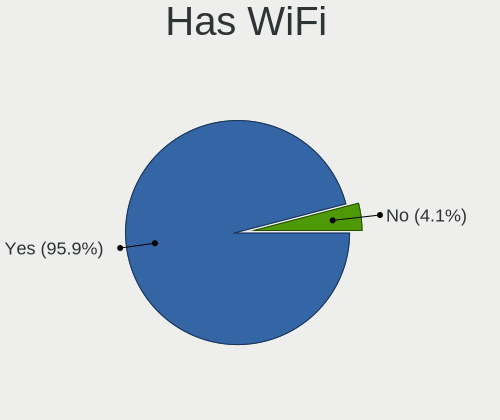
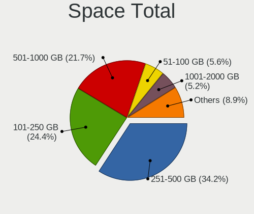
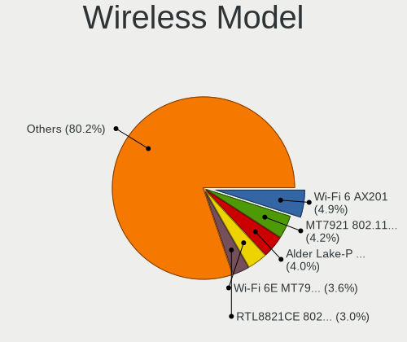

Ubuntu Hardware Trends (Notebooks)
----------------------------------

A project to identify most popular hardware characteristics and track their change
over time based on data collected by Ubuntu users at https://Linux-Hardware.org.

Anyone can contribute to this report by the [hw-probe](https://github.com/linuxhw/hw-probe) tool:

    sudo -E hw-probe -all -upload

This report is for one last month. Overall report since the beginning of time: [TestCoverage](https://github.com/linuxhw/TestCoverage)

Period: Apr, 2022.

Contents
--------

* [ System ](#system)
  - [ OS                       ](#os)
  - [ OS Family                ](#os-family)
  - [ Kernel                   ](#kernel)
  - [ Kernel Family            ](#kernel-family)
  - [ Kernel Major Ver.        ](#kernel-major-ver)
  - [ Arch                     ](#arch)
  - [ DE                       ](#de)
  - [ Display Server           ](#display-server)
  - [ Display Manager          ](#display-manager)
  - [ OS Lang                  ](#os-lang)
  - [ Boot Mode                ](#boot-mode)
  - [ Filesystem               ](#filesystem)
  - [ Part. scheme             ](#part-scheme)
  - [ Dual Boot with Linux/BSD ](#dual-boot-with-linuxbsd)
  - [ Dual Boot (Win)          ](#dual-boot-win)

* [ Board ](#board)
  - [ Vendor                   ](#vendor)
  - [ Model                    ](#model)
  - [ Model Family             ](#model-family)
  - [ MFG Year                 ](#mfg-year)
  - [ Form Factor              ](#form-factor)
  - [ Secure Boot              ](#secure-boot)
  - [ Coreboot                 ](#coreboot)
  - [ RAM Size                 ](#ram-size)
  - [ RAM Used                 ](#ram-used)
  - [ Total Drives             ](#total-drives)
  - [ Has CD-ROM               ](#has-cd-rom)
  - [ Has Ethernet             ](#has-ethernet)
  - [ Has WiFi                 ](#has-wifi)
  - [ Has Bluetooth            ](#has-bluetooth)

* [ Location ](#location)
  - [ Country                  ](#country)
  - [ City                     ](#city)

* [ Drives ](#drives)
  - [ Drive Vendor             ](#drive-vendor)
  - [ Drive Model              ](#drive-model)
  - [ HDD Vendor               ](#hdd-vendor)
  - [ SSD Vendor               ](#ssd-vendor)
  - [ Drive Kind               ](#drive-kind)
  - [ Drive Connector          ](#drive-connector)
  - [ Drive Size               ](#drive-size)
  - [ Space Total              ](#space-total)
  - [ Space Used               ](#space-used)
  - [ Malfunc. Drives          ](#malfunc-drives)
  - [ Malfunc. Drive Vendor    ](#malfunc-drive-vendor)
  - [ Malfunc. HDD Vendor      ](#malfunc-hdd-vendor)
  - [ Malfunc. Drive Kind      ](#malfunc-drive-kind)
  - [ Failed Drives            ](#failed-drives)
  - [ Failed Drive Vendor      ](#failed-drive-vendor)
  - [ Drive Status             ](#drive-status)

* [ Storage controller ](#storage-controller)
  - [ Storage Vendor           ](#storage-vendor)
  - [ Storage Model            ](#storage-model)
  - [ Storage Kind             ](#storage-kind)

* [ Processor ](#processor)
  - [ CPU Vendor               ](#cpu-vendor)
  - [ CPU Model                ](#cpu-model)
  - [ CPU Model Family         ](#cpu-model-family)
  - [ CPU Cores                ](#cpu-cores)
  - [ CPU Sockets              ](#cpu-sockets)
  - [ CPU Threads              ](#cpu-threads)
  - [ CPU Op-Modes             ](#cpu-op-modes)
  - [ CPU Microcode            ](#cpu-microcode)
  - [ CPU Microarch            ](#cpu-microarch)

* [ Graphics ](#graphics)
  - [ GPU Vendor               ](#gpu-vendor)
  - [ GPU Model                ](#gpu-model)
  - [ GPU Combo                ](#gpu-combo)
  - [ GPU Driver               ](#gpu-driver)
  - [ GPU Memory               ](#gpu-memory)

* [ Monitor ](#monitor)
  - [ Monitor Vendor           ](#monitor-vendor)
  - [ Monitor Model            ](#monitor-model)
  - [ Monitor Resolution       ](#monitor-resolution)
  - [ Monitor Diagonal         ](#monitor-diagonal)
  - [ Monitor Width            ](#monitor-width)
  - [ Aspect Ratio             ](#aspect-ratio)
  - [ Monitor Area             ](#monitor-area)
  - [ Pixel Density            ](#pixel-density)
  - [ Multiple Monitors        ](#multiple-monitors)

* [ Network ](#network)
  - [ Net Controller Vendor    ](#net-controller-vendor)
  - [ Net Controller Model     ](#net-controller-model)
  - [ Wireless Vendor          ](#wireless-vendor)
  - [ Wireless Model           ](#wireless-model)
  - [ Ethernet Vendor          ](#ethernet-vendor)
  - [ Ethernet Model           ](#ethernet-model)
  - [ Net Controller Kind      ](#net-controller-kind)
  - [ Used Controller          ](#used-controller)
  - [ NICs                     ](#nics)
  - [ IPv6                     ](#ipv6)

* [ Bluetooth ](#bluetooth)
  - [ Bluetooth Vendor         ](#bluetooth-vendor)
  - [ Bluetooth Model          ](#bluetooth-model)

* [ Sound ](#sound)
  - [ Sound Vendor             ](#sound-vendor)
  - [ Sound Model              ](#sound-model)

* [ Memory ](#memory)
  - [ Memory Vendor            ](#memory-vendor)
  - [ Memory Model             ](#memory-model)
  - [ Memory Kind              ](#memory-kind)
  - [ Memory Form Factor       ](#memory-form-factor)
  - [ Memory Size              ](#memory-size)
  - [ Memory Speed             ](#memory-speed)

* [ Printers & scanners ](#printers--scanners)
  - [ Printer Vendor           ](#printer-vendor)
  - [ Printer Model            ](#printer-model)
  - [ Scanner Vendor           ](#scanner-vendor)
  - [ Scanner Model            ](#scanner-model)

* [ Camera ](#camera)
  - [ Camera Vendor            ](#camera-vendor)
  - [ Camera Model             ](#camera-model)

* [ Security ](#security)
  - [ Fingerprint Vendor       ](#fingerprint-vendor)
  - [ Fingerprint Model        ](#fingerprint-model)
  - [ Chipcard Vendor          ](#chipcard-vendor)
  - [ Chipcard Model           ](#chipcard-model)

* [ Unsupported ](#unsupported)
  - [ Unsupported Devices      ](#unsupported-devices)
  - [ Unsupported Device Types ](#unsupported-device-types)

System
------

OS
--

Installed operating systems

| Name           | Notebooks | Percent |
|----------------|-----------|---------|
| Ubuntu 20.04   | 362       | 54.6%   |
| Ubuntu 22.04   | 147       | 22.17%  |
| Ubuntu 21.10   | 122       | 18.4%   |
| Ubuntu 18.04   | 23        | 3.47%   |
| Ubuntu 21.04   | 3         | 0.45%   |
| Ubuntu 16.04   | 2         | 0.3%    |
| Ubuntu Core 18 | 1         | 0.15%   |
| Ubuntu 20.10   | 1         | 0.15%   |
| Ubuntu 19.10   | 1         | 0.15%   |
| Ubuntu 18.10   | 1         | 0.15%   |

OS Family
---------

OS without a version

| Name   | Notebooks | Percent |
|--------|-----------|---------|
| Ubuntu | 663       | 100%    |

Kernel
------

Version of the Linux kernel

| Version                   | Notebooks | Percent |
|---------------------------|-----------|---------|
| 5.13.0-39-generic         | 236       | 35.6%   |
| 5.13.0-40-generic         | 105       | 15.84%  |
| 5.15.0-25-generic         | 77        | 11.61%  |
| 5.15.0-27-generic         | 47        | 7.09%   |
| 5.4.0-107-generic         | 31        | 4.68%   |
| 5.13.0-30-generic         | 16        | 2.41%   |
| 5.15.0-23-generic         | 14        | 2.11%   |
| 5.4.0-109-generic         | 13        | 1.96%   |
| 5.13.0-37-generic         | 10        | 1.51%   |
| 5.13.0-19-generic         | 9         | 1.36%   |
| 5.13.0-35-generic         | 7         | 1.06%   |
| 5.14.0-1032-oem           | 4         | 0.6%    |
| 5.13.0-41-generic         | 4         | 0.6%    |
| 4.15.0-175-generic        | 4         | 0.6%    |
| 5.8.0-43-generic          | 3         | 0.45%   |
| 5.17.2-051702-generic     | 3         | 0.45%   |
| 5.11.0-49-generic         | 3         | 0.45%   |
| 5.4.0-72-generic          | 2         | 0.3%    |
| 5.4.0-42-generic          | 2         | 0.3%    |
| 5.4.0-26-generic          | 2         | 0.3%    |
| 5.4.0-107-lowlatency      | 2         | 0.3%    |
| 5.18.0-051800rc1-generic  | 2         | 0.3%    |
| 5.17.4-051704-generic     | 2         | 0.3%    |
| 5.17.1-051701-generic     | 2         | 0.3%    |
| 5.14.0-1034-oem           | 2         | 0.3%    |
| 5.14.0-1033-oem           | 2         | 0.3%    |
| 5.14.0-1031-oem           | 2         | 0.3%    |
| 5.13.0-27-generic         | 2         | 0.3%    |
| 5.11.0-40-generic         | 2         | 0.3%    |
| 5.11.0-27-generic         | 2         | 0.3%    |
| 4.15.0-171-generic        | 2         | 0.3%    |
| 5.8.0-53-generic          | 1         | 0.15%   |
| 5.8.0-48-generic          | 1         | 0.15%   |
| 5.8.0-38-generic          | 1         | 0.15%   |
| 5.8.0-25-generic          | 1         | 0.15%   |
| 5.4.0-99-generic          | 1         | 0.15%   |
| 5.4.0-94-generic          | 1         | 0.15%   |
| 5.4.0-91-generic          | 1         | 0.15%   |
| 5.4.0-74-generic          | 1         | 0.15%   |
| 5.4.0-73-generic          | 1         | 0.15%   |
| 5.4.0-60-generic          | 1         | 0.15%   |
| 5.4.0-48-generic          | 1         | 0.15%   |
| 5.4.0-110-generic         | 1         | 0.15%   |
| 5.4.0-105-generic         | 1         | 0.15%   |
| 5.4.0-1048-fips           | 1         | 0.15%   |
| 5.4.0-1047-fips           | 1         | 0.15%   |
| 5.4.0-104-generic         | 1         | 0.15%   |
| 5.3.0-62-generic          | 1         | 0.15%   |
| 5.3.0-51-generic          | 1         | 0.15%   |
| 5.3.0-18-generic          | 1         | 0.15%   |
| 5.17.3mdg_20220414        | 1         | 0.15%   |
| 5.17.0-2.3-liquorix-amd64 | 1         | 0.15%   |
| 5.17.0-2.1-liquorix-amd64 | 1         | 0.15%   |
| 5.17.0-1003-oem           | 1         | 0.15%   |
| 5.16.15-051615-generic    | 1         | 0.15%   |
| 5.16.11-76051611-generic  | 1         | 0.15%   |
| 5.16.10-051610-generic    | 1         | 0.15%   |
| 5.15.36-051536-generic    | 1         | 0.15%   |
| 5.15.34-xanmod1           | 1         | 0.15%   |
| 5.15.32-051532-generic    | 1         | 0.15%   |

Kernel Family
-------------

Linux kernel without a distro release

| Version | Notebooks | Percent |
|---------|-----------|---------|
| 5.13.0  | 392       | 59.13%  |
| 5.15.0  | 139       | 20.97%  |
| 5.4.0   | 64        | 9.65%   |
| 5.14.0  | 13        | 1.96%   |
| 5.11.0  | 11        | 1.66%   |
| 4.15.0  | 8         | 1.21%   |
| 5.8.0   | 7         | 1.06%   |
| 5.3.0   | 3         | 0.45%   |
| 5.17.2  | 3         | 0.45%   |
| 5.17.0  | 3         | 0.45%   |
| 5.18.0  | 2         | 0.3%    |
| 5.17.4  | 2         | 0.3%    |
| 5.17.1  | 2         | 0.3%    |
| 5.10.0  | 2         | 0.3%    |
| 5.17.3  | 1         | 0.15%   |
| 5.16.15 | 1         | 0.15%   |
| 5.16.11 | 1         | 0.15%   |
| 5.16.10 | 1         | 0.15%   |
| 5.15.36 | 1         | 0.15%   |
| 5.15.34 | 1         | 0.15%   |
| 5.15.32 | 1         | 0.15%   |
| 5.15.29 | 1         | 0.15%   |
| 5.13.19 | 1         | 0.15%   |
| 5.10.67 | 1         | 0.15%   |
| 4.4.0   | 1         | 0.15%   |
| 4.18.0  | 1         | 0.15%   |

Kernel Major Ver.
-----------------

Linux kernel major version

| Version | Notebooks | Percent |
|---------|-----------|---------|
| 5.13    | 393       | 59.28%  |
| 5.15    | 143       | 21.57%  |
| 5.4     | 64        | 9.65%   |
| 5.14    | 13        | 1.96%   |
| 5.17    | 11        | 1.66%   |
| 5.11    | 11        | 1.66%   |
| 4.15    | 8         | 1.21%   |
| 5.8     | 7         | 1.06%   |
| 5.3     | 3         | 0.45%   |
| 5.16    | 3         | 0.45%   |
| 5.10    | 3         | 0.45%   |
| 5.18    | 2         | 0.3%    |
| 4.4     | 1         | 0.15%   |
| 4.18    | 1         | 0.15%   |

Arch
----

OS architecture (x86_64, i586, etc.)

| Name   | Notebooks | Percent |
|--------|-----------|---------|
| x86_64 | 655       | 98.79%  |
| i686   | 8         | 1.21%   |

DE
--

Desktop Environment

| Name            | Notebooks | Percent |
|-----------------|-----------|---------|
| GNOME           | 609       | 91.86%  |
| Unknown         | 22        | 3.32%   |
| X-Cinnamon      | 8         | 1.21%   |
| Unity           | 8         | 1.21%   |
| GNOME Flashback | 5         | 0.75%   |
| i3              | 3         | 0.45%   |
| Enlightenment   | 2         | 0.3%    |
| Cinnamon        | 2         | 0.3%    |
| xmonad          | 1         | 0.15%   |
| ubuntu          | 1         | 0.15%   |
| dwm             | 1         | 0.15%   |
| awesome         | 1         | 0.15%   |

Display Server
--------------

X11 or Wayland

| Name    | Notebooks | Percent |
|---------|-----------|---------|
| X11     | 455       | 68.63%  |
| Wayland | 194       | 29.26%  |
| Unknown | 12        | 1.81%   |
| Tty     | 2         | 0.3%    |

Display Manager
---------------

SDDM, LightDM, etc.

| Name    | Notebooks | Percent |
|---------|-----------|---------|
| GDM3    | 384       | 57.92%  |
| GDM     | 201       | 30.32%  |
| Unknown | 54        | 8.14%   |
| LightDM | 21        | 3.17%   |
| SDDM    | 3         | 0.45%   |

OS Lang
-------

Language

| Lang    | Notebooks | Percent |
|---------|-----------|---------|
| en_US   | 282       | 42.53%  |
| de_DE   | 62        | 9.35%   |
| fr_FR   | 45        | 6.79%   |
| pt_BR   | 30        | 4.52%   |
| it_IT   | 23        | 3.47%   |
| en_GB   | 22        | 3.32%   |
| en_IN   | 19        | 2.87%   |
| ru_RU   | 18        | 2.71%   |
| es_ES   | 13        | 1.96%   |
| en_CA   | 13        | 1.96%   |
| en_AU   | 12        | 1.81%   |
| Unknown | 11        | 1.66%   |
| pl_PL   | 10        | 1.51%   |
| zh_CN   | 9         | 1.36%   |
| tr_TR   | 5         | 0.75%   |
| pt_PT   | 5         | 0.75%   |
| en_ZA   | 5         | 0.75%   |
| de_AT   | 5         | 0.75%   |
| C       | 5         | 0.75%   |
| sv_SE   | 4         | 0.6%    |
| nl_NL   | 4         | 0.6%    |
| es_PE   | 4         | 0.6%    |
| es_MX   | 4         | 0.6%    |
| es_AR   | 4         | 0.6%    |
| nl_BE   | 3         | 0.45%   |
| hu_HU   | 3         | 0.45%   |
| fr_CA   | 3         | 0.45%   |
| fi_FI   | 3         | 0.45%   |
| es_UY   | 3         | 0.45%   |
| es_US   | 3         | 0.45%   |
| en_PH   | 3         | 0.45%   |
| da_DK   | 3         | 0.45%   |
| ja_JP   | 2         | 0.3%    |
| es_VE   | 2         | 0.3%    |
| es_CO   | 2         | 0.3%    |
| en_NZ   | 2         | 0.3%    |
| en_IL   | 2         | 0.3%    |
| de_CH   | 2         | 0.3%    |
| cs_CZ   | 2         | 0.3%    |
| zh_TW   | 1         | 0.15%   |
| sk_SK   | 1         | 0.15%   |
| ro_RO   | 1         | 0.15%   |
| it_CH   | 1         | 0.15%   |
| hr_HR   | 1         | 0.15%   |
| fr_BE   | 1         | 0.15%   |
| et_EE   | 1         | 0.15%   |
| es_EC   | 1         | 0.15%   |
| en_HK   | 1         | 0.15%   |
| de_LU   | 1         | 0.15%   |
| bg_BG   | 1         | 0.15%   |

Boot Mode
---------

EFI or BIOS

| Mode | Notebooks | Percent |
|------|-----------|---------|
| EFI  | 364       | 54.9%   |
| BIOS | 299       | 45.1%   |

Filesystem
----------

Type of filesystem

| Type    | Notebooks | Percent |
|---------|-----------|---------|
| Ext4    | 630       | 95.02%  |
| Overlay | 19        | 2.87%   |
| Zfs     | 6         | 0.9%    |
| Btrfs   | 3         | 0.45%   |
| Xfs     | 2         | 0.3%    |
| Ext3    | 2         | 0.3%    |
| Ext2    | 1         | 0.15%   |

Part. scheme
------------

Scheme of partitioning

| Type    | Notebooks | Percent |
|---------|-----------|---------|
| Unknown | 366       | 55.2%   |
| GPT     | 266       | 40.12%  |
| MBR     | 31        | 4.68%   |

Dual Boot with Linux/BSD
------------------------

Hosting more than one Linux/BSD

| Dual boot | Notebooks | Percent |
|-----------|-----------|---------|
| No        | 599       | 90.35%  |
| Yes       | 64        | 9.65%   |

Dual Boot (Win)
---------------

Hosting Linux and Windows

| Dual boot | Notebooks | Percent |
|-----------|-----------|---------|
| No        | 439       | 66.21%  |
| Yes       | 224       | 33.79%  |

Board
-----

Vendor
------

Motherboard manufacturer

| Name                   | Notebooks | Percent |
|------------------------|-----------|---------|
| Lenovo                 | 154       | 23.23%  |
| Dell                   | 142       | 21.42%  |
| Hewlett-Packard        | 116       | 17.5%   |
| Acer                   | 51        | 7.69%   |
| ASUSTek Computer       | 47        | 7.09%   |
| Toshiba                | 17        | 2.56%   |
| MSI                    | 14        | 2.11%   |
| Sony                   | 12        | 1.81%   |
| Medion                 | 10        | 1.51%   |
| Apple                  | 9         | 1.36%   |
| Samsung Electronics    | 8         | 1.21%   |
| HUAWEI                 | 7         | 1.06%   |
| Timi                   | 5         | 0.75%   |
| Unknown                | 5         | 0.75%   |
| Notebook               | 4         | 0.6%    |
| TUXEDO                 | 3         | 0.45%   |
| Positivo               | 3         | 0.45%   |
| PC Specialist          | 3         | 0.45%   |
| Packard Bell           | 3         | 0.45%   |
| Google                 | 3         | 0.45%   |
| Fujitsu                | 3         | 0.45%   |
| Chuwi                  | 3         | 0.45%   |
| Alienware              | 3         | 0.45%   |
| Teclast                | 2         | 0.3%    |
| SANTECH                | 2         | 0.3%    |
| Fujitsu Siemens        | 2         | 0.3%    |
| eMachines              | 2         | 0.3%    |
| Avell High Performance | 2         | 0.3%    |
| Wortmann AG            | 1         | 0.15%   |
| TrekStor               | 1         | 0.15%   |
| TongFang               | 1         | 0.15%   |
| System76               | 1         | 0.15%   |
| SLIMBOOK               | 1         | 0.15%   |
| Razer                  | 1         | 0.15%   |
| Proline                | 1         | 0.15%   |
| Pegatron               | 1         | 0.15%   |
| Panasonic              | 1         | 0.15%   |
| NSX                    | 1         | 0.15%   |
| Noblex                 | 1         | 0.15%   |
| Multilaser             | 1         | 0.15%   |
| MouseComputer          | 1         | 0.15%   |
| Microtech              | 1         | 0.15%   |
| MECHREVO               | 1         | 0.15%   |
| Maibenben              | 1         | 0.15%   |
| KOGAN                  | 1         | 0.15%   |
| Jumper                 | 1         | 0.15%   |
| Itautec                | 1         | 0.15%   |
| Intel                  | 1         | 0.15%   |
| HONOR                  | 1         | 0.15%   |
| GPD                    | 1         | 0.15%   |
| Gigabyte Technology    | 1         | 0.15%   |
| Gateway                | 1         | 0.15%   |
| Framework              | 1         | 0.15%   |
| Clevo                  | 1         | 0.15%   |
| AWOW                   | 1         | 0.15%   |
| AMI                    | 1         | 0.15%   |

Model
-----

Motherboard model

| Name                                  | Notebooks | Percent |
|---------------------------------------|-----------|---------|
| Unknown                               | 8         | 1.21%   |
| Dell Latitude E6430                   | 6         | 0.9%    |
| HP EliteBook 840 G5                   | 5         | 0.75%   |
| Dell Latitude 5420                    | 5         | 0.75%   |
| HP Pavilion Notebook                  | 4         | 0.6%    |
| HP Pavilion g6                        | 4         | 0.6%    |
| HP 15                                 | 4         | 0.6%    |
| Dell XPS 13 9300                      | 4         | 0.6%    |
| Dell Latitude 7490                    | 4         | 0.6%    |
| Dell Inspiron 15-3567                 | 4         | 0.6%    |
| Lenovo ThinkBook 15 G2 ITL 20VE       | 3         | 0.45%   |
| Lenovo G50-45 80E3                    | 3         | 0.45%   |
| HUAWEI HVY-WXX9                       | 3         | 0.45%   |
| HP ZBook 15 G5                        | 3         | 0.45%   |
| HP ProBook 450 G8 Notebook PC         | 3         | 0.45%   |
| HP EliteBook 840 G2                   | 3         | 0.45%   |
| Dell XPS 15 7590                      | 3         | 0.45%   |
| Dell Precision 5540                   | 3         | 0.45%   |
| Dell Latitude E5440                   | 3         | 0.45%   |
| Dell G15 5510                         | 3         | 0.45%   |
| Toshiba Satellite C50t-B              | 2         | 0.3%    |
| SANTECH NHx0EH_EJ_EK                  | 2         | 0.3%    |
| Packard Bell EasyNote TK85            | 2         | 0.3%    |
| Notebook NL40_50CU                    | 2         | 0.3%    |
| Lenovo ThinkPad T490 20N2CTO1WW       | 2         | 0.3%    |
| Lenovo Legion Y540-15IRH 81SX         | 2         | 0.3%    |
| Lenovo IdeaPad L340-15IRH Gaming 81LK | 2         | 0.3%    |
| Lenovo IdeaPad Gaming 3 15ARH05 82EY  | 2         | 0.3%    |
| Lenovo G50-30 80G0                    | 2         | 0.3%    |
| HP Stream Laptop 14-ax0XX             | 2         | 0.3%    |
| HP ProBook 440 G8 Notebook PC         | 2         | 0.3%    |
| HP Pavilion Laptop 15-eg0xxx          | 2         | 0.3%    |
| HP Pavilion Laptop 14-ec0xxx          | 2         | 0.3%    |
| HP Pavilion Gaming Laptop 15-dk1xxx   | 2         | 0.3%    |
| HP Pavilion dv7                       | 2         | 0.3%    |
| HP Laptop 15-bw0xx                    | 2         | 0.3%    |
| HP Laptop 14-dq1xxx                   | 2         | 0.3%    |
| HP G42                                | 2         | 0.3%    |
| HP 255 G8 Notebook PC                 | 2         | 0.3%    |
| HP 255 G6 Notebook PC                 | 2         | 0.3%    |
| Dell XPS 15 9500                      | 2         | 0.3%    |
| Dell Latitude E6510                   | 2         | 0.3%    |
| Dell Latitude E6330                   | 2         | 0.3%    |
| Dell Latitude 7400                    | 2         | 0.3%    |
| Dell Latitude 5590                    | 2         | 0.3%    |
| Dell Inspiron N4010                   | 2         | 0.3%    |
| Dell Inspiron 5570                    | 2         | 0.3%    |
| Dell G7 7700                          | 2         | 0.3%    |
| Dell G5 5590                          | 2         | 0.3%    |
| Acer Swift SF314-42                   | 2         | 0.3%    |
| Acer Nitro AN515-55                   | 2         | 0.3%    |
| Acer Aspire ES1-512                   | 2         | 0.3%    |
| Acer Aspire E1-570                    | 2         | 0.3%    |
| Wortmann AG M7x0S                     | 1         | 0.15%   |
| TUXEDO Pulse 15 Gen1                  | 1         | 0.15%   |
| TUXEDO P95_HR                         | 1         | 0.15%   |
| TUXEDO P65xHP                         | 1         | 0.15%   |
| TrekStor Surfbook W2                  | 1         | 0.15%   |
| Toshiba TECRA R940                    | 1         | 0.15%   |
| Toshiba Satellite Pro S500            | 1         | 0.15%   |

Model Family
------------

Motherboard model prefix

| Name                  | Notebooks | Percent |
|-----------------------|-----------|---------|
| Lenovo ThinkPad       | 74        | 11.16%  |
| Dell Latitude         | 51        | 7.69%   |
| Dell Inspiron         | 38        | 5.73%   |
| Lenovo IdeaPad        | 32        | 4.83%   |
| Acer Aspire           | 32        | 4.83%   |
| HP Pavilion           | 25        | 3.77%   |
| HP EliteBook          | 20        | 3.02%   |
| Dell XPS              | 19        | 2.87%   |
| HP ProBook            | 16        | 2.41%   |
| HP Laptop             | 14        | 2.11%   |
| Toshiba Satellite     | 13        | 1.96%   |
| Lenovo Legion         | 13        | 1.96%   |
| Dell Precision        | 12        | 1.81%   |
| Dell Vostro           | 11        | 1.66%   |
| Lenovo ThinkBook      | 8         | 1.21%   |
| HP ZBook              | 8         | 1.21%   |
| Unknown               | 8         | 1.21%   |
| ASUS VivoBook         | 7         | 1.06%   |
| HP 15                 | 6         | 0.9%    |
| ASUS ROG              | 6         | 0.9%    |
| Acer Swift            | 6         | 0.9%    |
| HP 255                | 5         | 0.75%   |
| Acer Nitro            | 5         | 0.75%   |
| HP Stream             | 4         | 0.6%    |
| ASUS ASUS             | 4         | 0.6%    |
| Acer TravelMate       | 4         | 0.6%    |
| Packard Bell EasyNote | 3         | 0.45%   |
| Lenovo Yoga           | 3         | 0.45%   |
| Lenovo G50-45         | 3         | 0.45%   |
| HUAWEI HVY-WXX9       | 3         | 0.45%   |
| Dell G15              | 3         | 0.45%   |
| Timi RedmiBook        | 2         | 0.3%    |
| SANTECH NHx0EH        | 2         | 0.3%    |
| Notebook NL40         | 2         | 0.3%    |
| MSI GF63              | 2         | 0.3%    |
| Lenovo G50-30         | 2         | 0.3%    |
| HP OMEN               | 2         | 0.3%    |
| HP G42                | 2         | 0.3%    |
| HP ENVY               | 2         | 0.3%    |
| HP 470                | 2         | 0.3%    |
| Fujitsu LIFEBOOK      | 2         | 0.3%    |
| Dell System           | 2         | 0.3%    |
| Dell G7               | 2         | 0.3%    |
| Dell G5               | 2         | 0.3%    |
| ASUS ZenBook          | 2         | 0.3%    |
| Apple MacBookAir6     | 2         | 0.3%    |
| Acer Extensa          | 2         | 0.3%    |
| Wortmann AG M7x0S     | 1         | 0.15%   |
| TUXEDO Pulse          | 1         | 0.15%   |
| TUXEDO P95            | 1         | 0.15%   |
| TUXEDO P65xHP         | 1         | 0.15%   |
| TrekStor Surfbook     | 1         | 0.15%   |
| Toshiba TECRA         | 1         | 0.15%   |
| Toshiba dynabook      | 1         | 0.15%   |
| Toshiba Dakar10FW8    | 1         | 0.15%   |
| Toshiba BLB           | 1         | 0.15%   |
| TongFang GM5TG8W      | 1         | 0.15%   |
| Timi TM1701           | 1         | 0.15%   |
| Timi Mi               | 1         | 0.15%   |
| Timi A34              | 1         | 0.15%   |

MFG Year
--------

Motherboard manufacture year

| Year    | Notebooks | Percent |
|---------|-----------|---------|
| 2020    | 109       | 16.44%  |
| 2021    | 94        | 14.18%  |
| 2019    | 61        | 9.2%    |
| 2018    | 48        | 7.24%   |
| 2017    | 48        | 7.24%   |
| 2013    | 41        | 6.18%   |
| 2012    | 40        | 6.03%   |
| 2015    | 39        | 5.88%   |
| 2011    | 36        | 5.43%   |
| 2016    | 32        | 4.83%   |
| 2014    | 31        | 4.68%   |
| 2010    | 29        | 4.37%   |
| 2009    | 18        | 2.71%   |
| 2008    | 16        | 2.41%   |
| 2022    | 8         | 1.21%   |
| 2007    | 6         | 0.9%    |
| Unknown | 4         | 0.6%    |
| 2005    | 2         | 0.3%    |
| 2006    | 1         | 0.15%   |

Form Factor
-----------

Physical design of the computer

| Name     | Notebooks | Percent |
|----------|-----------|---------|
| Notebook | 663       | 100%    |

Secure Boot
-----------

Enabled or disabled

| State    | Notebooks | Percent |
|----------|-----------|---------|
| Disabled | 564       | 85.07%  |
| Enabled  | 99        | 14.93%  |

Coreboot
--------

Have coreboot on board

| Used | Notebooks | Percent |
|------|-----------|---------|
| No   | 660       | 99.55%  |
| Yes  | 3         | 0.45%   |

RAM Size
--------

Total RAM memory

| Size in GB  | Notebooks | Percent |
|-------------|-----------|---------|
| 4.01-8.0    | 201       | 30.32%  |
| 16.01-24.0  | 127       | 19.16%  |
| 8.01-16.0   | 113       | 17.04%  |
| 3.01-4.0    | 109       | 16.44%  |
| 32.01-64.0  | 59        | 8.9%    |
| 64.01-256.0 | 17        | 2.56%   |
| 2.01-3.0    | 14        | 2.11%   |
| 1.01-2.0    | 11        | 1.66%   |
| 24.01-32.0  | 10        | 1.51%   |
| 0.51-1.0    | 2         | 0.3%    |

RAM Used
--------

Used RAM memory

| Used GB    | Notebooks | Percent |
|------------|-----------|---------|
| 2.01-3.0   | 200       | 30.17%  |
| 1.01-2.0   | 195       | 29.41%  |
| 4.01-8.0   | 119       | 17.95%  |
| 3.01-4.0   | 85        | 12.82%  |
| 8.01-16.0  | 44        | 6.64%   |
| 0.51-1.0   | 8         | 1.21%   |
| 16.01-24.0 | 6         | 0.9%    |
| 24.01-32.0 | 4         | 0.6%    |
| 32.01-64.0 | 1         | 0.15%   |
| 0.01-0.5   | 1         | 0.15%   |

Total Drives
------------

Number of drives on board

| Drives | Notebooks | Percent |
|--------|-----------|---------|
| 1      | 493       | 74.36%  |
| 2      | 143       | 21.57%  |
| 3      | 17        | 2.56%   |
| 4      | 5         | 0.75%   |
| 0      | 5         | 0.75%   |

Has CD-ROM
----------

Has CD-ROM on board

| Presented | Notebooks | Percent |
|-----------|-----------|---------|
| No        | 462       | 69.68%  |
| Yes       | 201       | 30.32%  |

Has Ethernet
------------

Has Ethernet on board

| Presented | Notebooks | Percent |
|-----------|-----------|---------|
| Yes       | 531       | 80.09%  |
| No        | 132       | 19.91%  |

Has WiFi
--------

Has WiFi module

| Presented | Notebooks | Percent |
|-----------|-----------|---------|
| Yes       | 656       | 98.94%  |
| No        | 7         | 1.06%   |

Has Bluetooth
-------------

Has Bluetooth module

| Presented | Notebooks | Percent |
|-----------|-----------|---------|
| Yes       | 543       | 81.9%   |
| No        | 120       | 18.1%   |

Location
--------

Country
-------

Geographic location (country)

| Country             | Notebooks | Percent |
|---------------------|-----------|---------|
| USA                 | 113       | 17.04%  |
| Germany             | 76        | 11.46%  |
| France              | 51        | 7.69%   |
| Brazil              | 43        | 6.49%   |
| Italy               | 34        | 5.13%   |
| Russia              | 30        | 4.52%   |
| India               | 19        | 2.87%   |
| Canada              | 19        | 2.87%   |
| UK                  | 16        | 2.41%   |
| Poland              | 16        | 2.41%   |
| Spain               | 14        | 2.11%   |
| Australia           | 14        | 2.11%   |
| China               | 13        | 1.96%   |
| Netherlands         | 12        | 1.81%   |
| Turkey              | 10        | 1.51%   |
| Portugal            | 10        | 1.51%   |
| Sweden              | 9         | 1.36%   |
| Belgium             | 9         | 1.36%   |
| Austria             | 9         | 1.36%   |
| Romania             | 8         | 1.21%   |
| Mexico              | 7         | 1.06%   |
| Hungary             | 6         | 0.9%    |
| Finland             | 6         | 0.9%    |
| Switzerland         | 5         | 0.75%   |
| South Africa        | 5         | 0.75%   |
| Serbia              | 5         | 0.75%   |
| Peru                | 5         | 0.75%   |
| Czechia             | 5         | 0.75%   |
| Argentina           | 5         | 0.75%   |
| Uruguay             | 4         | 0.6%    |
| Ukraine             | 4         | 0.6%    |
| Pakistan            | 4         | 0.6%    |
| Japan               | 4         | 0.6%    |
| Egypt               | 4         | 0.6%    |
| Vietnam             | 3         | 0.45%   |
| Venezuela           | 3         | 0.45%   |
| Thailand            | 3         | 0.45%   |
| Philippines         | 3         | 0.45%   |
| Morocco             | 3         | 0.45%   |
| Ireland             | 3         | 0.45%   |
| Denmark             | 3         | 0.45%   |
| Taiwan              | 2         | 0.3%    |
| South Korea         | 2         | 0.3%    |
| Norway              | 2         | 0.3%    |
| New Zealand         | 2         | 0.3%    |
| Madagascar          | 2         | 0.3%    |
| Israel              | 2         | 0.3%    |
| Iran                | 2         | 0.3%    |
| Indonesia           | 2         | 0.3%    |
| Hong Kong           | 2         | 0.3%    |
| Greece              | 2         | 0.3%    |
| Croatia             | 2         | 0.3%    |
| Colombia            | 2         | 0.3%    |
| Uzbekistan          | 1         | 0.15%   |
| UAE                 | 1         | 0.15%   |
| Tunisia             | 1         | 0.15%   |
| Trinidad and Tobago | 1         | 0.15%   |
| Slovenia            | 1         | 0.15%   |
| Slovakia            | 1         | 0.15%   |
| Singapore           | 1         | 0.15%   |

City
----

Geographic location (city)

| City              | Notebooks | Percent |
|-------------------|-----------|---------|
| Moscow            | 11        | 1.66%   |
| Berlin            | 9         | 1.36%   |
| Paris             | 8         | 1.21%   |
| Warsaw            | 7         | 1.06%   |
| Hudson            | 7         | 1.06%   |
| Vienna            | 6         | 0.9%    |
| Sao Paulo         | 6         | 0.9%    |
| Milan             | 6         | 0.9%    |
| Brisbane          | 5         | 0.75%   |
| Rome              | 4         | 0.6%    |
| Montevideo        | 4         | 0.6%    |
| Madrid            | 4         | 0.6%    |
| Lisbon            | 4         | 0.6%    |
| Helsinki          | 4         | 0.6%    |
| Dallas            | 4         | 0.6%    |
| Calgary           | 4         | 0.6%    |
| Belgrade          | 4         | 0.6%    |
| Arequipa          | 4         | 0.6%    |
| Wiesbaden         | 3         | 0.45%   |
| Toronto           | 3         | 0.45%   |
| Sydney            | 3         | 0.45%   |
| St Petersburg     | 3         | 0.45%   |
| Portland          | 3         | 0.45%   |
| New Delhi         | 3         | 0.45%   |
| Munich            | 3         | 0.45%   |
| Delhi             | 3         | 0.45%   |
| Budapest          | 3         | 0.45%   |
| Brooklyn          | 3         | 0.45%   |
| Ankara            | 3         | 0.45%   |
| Ulm               | 2         | 0.3%    |
| Timișoara        | 2         | 0.3%    |
| Tanta             | 2         | 0.3%    |
| Stockholm         | 2         | 0.3%    |
| Rio de Janeiro    | 2         | 0.3%    |
| Prague            | 2         | 0.3%    |
| Poznan            | 2         | 0.3%    |
| Opole             | 2         | 0.3%    |
| New York          | 2         | 0.3%    |
| Moses Lake        | 2         | 0.3%    |
| Montreal          | 2         | 0.3%    |
| Minneapolis       | 2         | 0.3%    |
| Melbourne         | 2         | 0.3%    |
| Marrakesh         | 2         | 0.3%    |
| Lyon              | 2         | 0.3%    |
| Lodz              | 2         | 0.3%    |
| Lahore            | 2         | 0.3%    |
| Jaipur            | 2         | 0.3%    |
| Istanbul          | 2         | 0.3%    |
| Ibi               | 2         | 0.3%    |
| Gurgaon           | 2         | 0.3%    |
| Frankfurt am Main | 2         | 0.3%    |
| Fortaleza         | 2         | 0.3%    |
| Euskirchen        | 2         | 0.3%    |
| Erfurt            | 2         | 0.3%    |
| Dublin            | 2         | 0.3%    |
| Curitiba          | 2         | 0.3%    |
| Cincinnati        | 2         | 0.3%    |
| Chicago           | 2         | 0.3%    |
| Chennai           | 2         | 0.3%    |
| Caracas           | 2         | 0.3%    |

Drives
------

Drive Vendor
------------

Hard drive vendors

| Vendor                      | Notebooks | Drives | Percent |
|-----------------------------|-----------|--------|---------|
| Samsung Electronics         | 163       | 181    | 20.5%   |
| WDC                         | 90        | 93     | 11.32%  |
| Seagate                     | 79        | 83     | 9.94%   |
| Toshiba                     | 57        | 58     | 7.17%   |
| Sandisk                     | 52        | 53     | 6.54%   |
| SK Hynix                    | 46        | 46     | 5.79%   |
| Unknown                     | 36        | 40     | 4.53%   |
| Kingston                    | 30        | 32     | 3.77%   |
| Intel                       | 27        | 29     | 3.4%    |
| KIOXIA                      | 26        | 26     | 3.27%   |
| Crucial                     | 24        | 25     | 3.02%   |
| Micron Technology           | 22        | 23     | 2.77%   |
| Hitachi                     | 20        | 21     | 2.52%   |
| HGST                        | 15        | 16     | 1.89%   |
| A-DATA Technology           | 8         | 8      | 1.01%   |
| LITEON                      | 6         | 6      | 0.75%   |
| China                       | 6         | 6      | 0.75%   |
| Apple                       | 5         | 5      | 0.63%   |
| ADATA Technology            | 5         | 6      | 0.63%   |
| Transcend                   | 4         | 4      | 0.5%    |
| Phison                      | 4         | 5      | 0.5%    |
| Netac                       | 4         | 4      | 0.5%    |
| LITEONIT                    | 4         | 4      | 0.5%    |
| Fujitsu                     | 4         | 4      | 0.5%    |
| Unknown                     | 4         | 4      | 0.5%    |
| YMTC                        | 3         | 3      | 0.38%   |
| SPCC                        | 3         | 3      | 0.38%   |
| JMicron                     | 3         | 3      | 0.38%   |
| Hewlett-Packard             | 3         | 3      | 0.38%   |
| Apacer                      | 3         | 3      | 0.38%   |
| Union Memory (Shenzhen)     | 2         | 2      | 0.25%   |
| Silicon Motion              | 2         | 2      | 0.25%   |
| OCZ                         | 2         | 2      | 0.25%   |
| Micron/Crucial Technology   | 2         | 2      | 0.25%   |
| GOODRAM                     | 2         | 2      | 0.25%   |
| Goldkey                     | 2         | 2      | 0.25%   |
| BIWIN                       | 2         | 2      | 0.25%   |
| BHT                         | 2         | 2      | 0.25%   |
| winstar                     | 1         | 1      | 0.13%   |
| TwinMOS                     | 1         | 1      | 0.13%   |
| Teclast                     | 1         | 1      | 0.13%   |
| SSSTC                       | 1         | 1      | 0.13%   |
| PNY                         | 1         | 1      | 0.13%   |
| PHD 3.0                     | 1         | 1      | 0.13%   |
| Patriot                     | 1         | 1      | 0.13%   |
| OSCOO                       | 1         | 1      | 0.13%   |
| OEM                         | 1         | 1      | 0.13%   |
| MAXTOR                      | 1         | 1      | 0.13%   |
| MAXIO Technology (Hangzhou) | 1         | 1      | 0.13%   |
| Leven                       | 1         | 1      | 0.13%   |
| LaCie                       | 1         | 1      | 0.13%   |
| KIOXIA-EXCERIA              | 1         | 1      | 0.13%   |
| KingSpec                    | 1         | 1      | 0.13%   |
| KingDian                    | 1         | 1      | 0.13%   |
| Intenso                     | 1         | 1      | 0.13%   |
| Inateck                     | 1         | 1      | 0.13%   |
| HS-SSD-E100N                | 1         | 1      | 0.13%   |
| GEO                         | 1         | 1      | 0.13%   |
| Bryt                        | 1         | 1      | 0.13%   |
| ASMT                        | 1         | 1      | 0.13%   |

Drive Model
-----------

Hard drive models

| Model                                | Notebooks | Percent |
|--------------------------------------|-----------|---------|
| Sandisk NVMe SSD Drive 512GB         | 12        | 1.45%   |
| Samsung NVMe SSD Drive 512GB         | 11        | 1.33%   |
| Seagate ST1000LM035-1RK172 1TB       | 10        | 1.2%    |
| Seagate ST1000LM024 HN-M101MBB 1TB   | 10        | 1.2%    |
| Seagate ST9500325AS 500GB            | 8         | 0.96%   |
| Samsung NVMe SSD Drive 256GB         | 8         | 0.96%   |
| Samsung NVMe SSD Drive 1024GB        | 8         | 0.96%   |
| Intel NVMe SSD Drive 512GB           | 8         | 0.96%   |
| Unknown SD/MMC/MS PRO 16GB           | 7         | 0.84%   |
| Toshiba MQ04ABF100 1TB               | 7         | 0.84%   |
| Toshiba MQ01ABD100 1TB               | 7         | 0.84%   |
| Samsung SSD 860 EVO 500GB            | 7         | 0.84%   |
| SK Hynix NVMe SSD Drive 512GB        | 6         | 0.72%   |
| KIOXIA KBG40ZNS512G NVMe 512GB       | 6         | 0.72%   |
| Kingston SA400S37480G 480GB SSD      | 6         | 0.72%   |
| Unknown MMC Card  32GB               | 5         | 0.6%    |
| Toshiba MQ01ABF050 500GB             | 5         | 0.6%    |
| Seagate ST9500420AS 500GB            | 5         | 0.6%    |
| Samsung SSD 970 EVO Plus 1TB         | 5         | 0.6%    |
| KIOXIA NVMe SSD Drive 256GB          | 5         | 0.6%    |
| Crucial CT500MX500SSD1 500GB         | 5         | 0.6%    |
| Unknown MMC Card  64GB               | 4         | 0.48%   |
| Seagate ST500LT012-1DG142 500GB      | 4         | 0.48%   |
| Seagate ST500LM000-1EJ162 500GB      | 4         | 0.48%   |
| Seagate ST2000LM007-1R8174 2TB       | 4         | 0.48%   |
| Seagate ST1000LM049-2GH172 1TB       | 4         | 0.48%   |
| Samsung SSD 970 EVO Plus 500GB       | 4         | 0.48%   |
| Samsung MZVLB1T0HBLR-000L2 1TB       | 4         | 0.48%   |
| Samsung MZNLN128HAHQ-000H1 128GB SSD | 4         | 0.48%   |
| Samsung MZALQ512HALU-000L2 512GB     | 4         | 0.48%   |
| Kingston SA400S37240G 240GB SSD      | 4         | 0.48%   |
| Crucial CT1000MX500SSD1 1TB          | 4         | 0.48%   |
| Unknown                              | 4         | 0.48%   |
| YMTC PC005 512GB                     | 3         | 0.36%   |
| WDC WDS240G2G0A-00JH30 240GB SSD     | 3         | 0.36%   |
| WDC WD3200BEVT-22ZCT0 320GB          | 3         | 0.36%   |
| WDC WD10SPZX-24Z10 1TB               | 3         | 0.36%   |
| WDC WD10JPVX-22JC3T0 1TB             | 3         | 0.36%   |
| Toshiba NVMe SSD Drive 512GB         | 3         | 0.36%   |
| Toshiba MQ01ABD075 752GB             | 3         | 0.36%   |
| SK Hynix NVMe SSD Drive 256GB        | 3         | 0.36%   |
| Seagate Expansion+ 2TB               | 3         | 0.36%   |
| SanDisk SSD PLUS 240GB               | 3         | 0.36%   |
| SanDisk SDSSDA120G 120GB             | 3         | 0.36%   |
| Sandisk NVMe SSD Drive 256GB         | 3         | 0.36%   |
| Samsung SSD 970 EVO Plus 2TB         | 3         | 0.36%   |
| Samsung SSD 970 EVO 1TB              | 3         | 0.36%   |
| Samsung SSD 860 EVO 1TB              | 3         | 0.36%   |
| Samsung MZVLB512HBJQ-000L7 512GB     | 3         | 0.36%   |
| Samsung MZVL22T0HBLB-00B00 2TB       | 3         | 0.36%   |
| Samsung MZALQ512HALU-000L1 512GB     | 3         | 0.36%   |
| Samsung HM500JI 500GB                | 3         | 0.36%   |
| Micron NVMe SSD Drive 512GB          | 3         | 0.36%   |
| Micron 2200S NVMe 512GB              | 3         | 0.36%   |
| KIOXIA KXG60ZNV1T02 NVMe 1024GB      | 3         | 0.36%   |
| Kingston NVMe SSD Drive 500GB        | 3         | 0.36%   |
| Intel SSDPEKNU512GZH 512GB           | 3         | 0.36%   |
| Hitachi HTS545025B9A300 250GB        | 3         | 0.36%   |
| HGST HTS541010A9E680 1TB             | 3         | 0.36%   |
| Crucial CT240BX500SSD1 240GB         | 3         | 0.36%   |

HDD Vendor
----------

Hard disk drive vendors

| Vendor              | Notebooks | Drives | Percent |
|---------------------|-----------|--------|---------|
| Seagate             | 77        | 80     | 33.77%  |
| WDC                 | 56        | 57     | 24.56%  |
| Toshiba             | 36        | 36     | 15.79%  |
| Hitachi             | 20        | 21     | 8.77%   |
| HGST                | 15        | 16     | 6.58%   |
| Samsung Electronics | 10        | 10     | 4.39%   |
| Unknown             | 8         | 8      | 3.51%   |
| Fujitsu             | 4         | 4      | 1.75%   |
| PHD 3.0             | 1         | 1      | 0.44%   |
| ASMT                | 1         | 1      | 0.44%   |

SSD Vendor
----------

Solid state drive vendors

| Vendor              | Notebooks | Drives | Percent |
|---------------------|-----------|--------|---------|
| Samsung Electronics | 59        | 66     | 25.65%  |
| SanDisk             | 33        | 34     | 14.35%  |
| Crucial             | 21        | 22     | 9.13%   |
| Kingston            | 18        | 19     | 7.83%   |
| WDC                 | 12        | 12     | 5.22%   |
| SK Hynix            | 7         | 7      | 3.04%   |
| Micron Technology   | 7         | 7      | 3.04%   |
| LITEON              | 6         | 6      | 2.61%   |
| Intel               | 6         | 6      | 2.61%   |
| A-DATA Technology   | 6         | 6      | 2.61%   |
| China               | 5         | 5      | 2.17%   |
| Apple               | 5         | 5      | 2.17%   |
| Transcend           | 4         | 4      | 1.74%   |
| Netac               | 4         | 4      | 1.74%   |
| LITEONIT            | 4         | 4      | 1.74%   |
| SPCC                | 3         | 3      | 1.3%    |
| Apacer              | 3         | 3      | 1.3%    |
| OCZ                 | 2         | 2      | 0.87%   |
| Hewlett-Packard     | 2         | 2      | 0.87%   |
| GOODRAM             | 2         | 2      | 0.87%   |
| Goldkey             | 2         | 2      | 0.87%   |
| BHT                 | 2         | 2      | 0.87%   |
| Unknown             | 2         | 2      | 0.87%   |
| TwinMOS             | 1         | 1      | 0.43%   |
| Toshiba             | 1         | 1      | 0.43%   |
| Teclast             | 1         | 1      | 0.43%   |
| Seagate             | 1         | 1      | 0.43%   |
| Patriot             | 1         | 1      | 0.43%   |
| MAXTOR              | 1         | 1      | 0.43%   |
| Leven               | 1         | 1      | 0.43%   |
| KIOXIA-EXCERIA      | 1         | 1      | 0.43%   |
| KingSpec            | 1         | 1      | 0.43%   |
| KingDian            | 1         | 1      | 0.43%   |
| JMicron             | 1         | 1      | 0.43%   |
| Intenso             | 1         | 1      | 0.43%   |
| Bryt                | 1         | 1      | 0.43%   |
| BIWIN               | 1         | 1      | 0.43%   |
| AirDisk             | 1         | 1      | 0.43%   |

Drive Kind
----------

HDD or SSD

| Kind    | Notebooks | Drives | Percent |
|---------|-----------|--------|---------|
| NVMe    | 291       | 315    | 37.79%  |
| HDD     | 223       | 234    | 28.96%  |
| SSD     | 213       | 240    | 27.66%  |
| MMC     | 30        | 34     | 3.9%    |
| Unknown | 13        | 13     | 1.69%   |

Drive Connector
---------------

SATA, SAS, NVMe, etc.

| Type | Notebooks | Drives | Percent |
|------|-----------|--------|---------|
| SATA | 392       | 453    | 52.76%  |
| NVMe | 290       | 314    | 39.03%  |
| SAS  | 31        | 35     | 4.17%   |
| MMC  | 30        | 34     | 4.04%   |

Drive Size
----------

Size of hard drive

| Size in TB | Notebooks | Drives | Percent |
|------------|-----------|--------|---------|
| 0.01-0.5   | 287       | 317    | 65.98%  |
| 0.51-1.0   | 129       | 137    | 29.66%  |
| 1.01-2.0   | 15        | 16     | 3.45%   |
| 3.01-4.0   | 2         | 2      | 0.46%   |
| 2.01-3.0   | 1         | 1      | 0.23%   |
| 4.01-10.0  | 1         | 1      | 0.23%   |

Space Total
-----------

Amount of disk space available on the file system

| Size in GB     | Notebooks | Percent |
|----------------|-----------|---------|
| 101-250        | 212       | 31.98%  |
| 251-500        | 202       | 30.47%  |
| 501-1000       | 85        | 12.82%  |
| 1001-2000      | 41        | 6.18%   |
| 51-100         | 37        | 5.58%   |
| 1-20           | 26        | 3.92%   |
| 21-50          | 22        | 3.32%   |
| More than 3000 | 14        | 2.11%   |
| 2001-3000      | 12        | 1.81%   |
| Unknown        | 12        | 1.81%   |

Space Used
----------

Amount of used disk space

| Used GB        | Notebooks | Percent |
|----------------|-----------|---------|
| 1-20           | 223       | 33.63%  |
| 21-50          | 127       | 19.16%  |
| 101-250        | 100       | 15.08%  |
| 51-100         | 100       | 15.08%  |
| 251-500        | 48        | 7.24%   |
| 501-1000       | 29        | 4.37%   |
| 1001-2000      | 15        | 2.26%   |
| Unknown        | 12        | 1.81%   |
| More than 3000 | 5         | 0.75%   |
| 2001-3000      | 4         | 0.6%    |

Malfunc. Drives
---------------

Drive models with a malfunction

| Model                                               | Notebooks | Drives | Percent |
|-----------------------------------------------------|-----------|--------|---------|
| Seagate ST9500420AS 500GB                           | 5         | 5      | 11.9%   |
| Seagate ST1000LM024 HN-M101MBB 1TB                  | 4         | 5      | 9.52%   |
| Toshiba MQ01ABD100 1TB                              | 2         | 2      | 4.76%   |
| Seagate ST9500325AS 500GB                           | 2         | 2      | 4.76%   |
| HGST HTS541010A9E680 1TB                            | 2         | 2      | 4.76%   |
| WDC WDS100T2G0A-00JH30 1TB SSD                      | 1         | 1      | 2.38%   |
| WDC WD5000BPVT-22HXZT1 500GB                        | 1         | 1      | 2.38%   |
| WDC WD5000BEVT-26A0RT0 500GB                        | 1         | 1      | 2.38%   |
| WDC WD3200BEKT-60V5T1 320GB                         | 1         | 1      | 2.38%   |
| Unknown MS 500GB                                    | 1         | 1      | 2.38%   |
| Toshiba MQ01ABF032 320GB                            | 1         | 1      | 2.38%   |
| Toshiba MQ01ABD075 752GB                            | 1         | 1      | 2.38%   |
| Toshiba MK5061GSYN 500GB                            | 1         | 1      | 2.38%   |
| SK Hynix HFM512GDJTNG-8310A 512GB                   | 1         | 1      | 2.38%   |
| Seagate ST1000LM035-1RK172 1TB                      | 1         | 1      | 2.38%   |
| SanDisk SSD PLUS 1000GB                             | 1         | 1      | 2.38%   |
| Samsung Electronics SSD 830 Series 128GB            | 1         | 1      | 2.38%   |
| Samsung Electronics HM121HI 120GB                   | 1         | 1      | 2.38%   |
| Micron Technology MTFDDAK256TBN-1AR1ZABHA 256GB SSD | 1         | 1      | 2.38%   |
| LITEONIT LMT-32L3M mSATA 32GB SSD                   | 1         | 1      | 2.38%   |
| LITEON CV3-8D512-11 SATA 512GB SSD                  | 1         | 1      | 2.38%   |
| Kingston SEDC500R7680G 8TB SSD                      | 1         | 1      | 2.38%   |
| Intel SSDSC2BW480A4 480GB                           | 1         | 1      | 2.38%   |
| Intel SSDPEKKW256G7 256GB                           | 1         | 1      | 2.38%   |
| Hitachi HTS547575A9E384 752GB                       | 1         | 1      | 2.38%   |
| Hitachi HTS543232L9A300 320GB                       | 1         | 1      | 2.38%   |
| Hitachi HTS543216A7A384 160GB                       | 1         | 1      | 2.38%   |
| HGST HTS721010A9E630 1TB                            | 1         | 1      | 2.38%   |
| HGST HTS545050A7E680 500GB                          | 1         | 1      | 2.38%   |
| HGST HTS541010A7E630 1TB                            | 1         | 2      | 2.38%   |
| Crucial CT525MX300SSD1 528GB                        | 1         | 1      | 2.38%   |
| Apacer AS350 240GB SSD                              | 1         | 1      | 2.38%   |

Malfunc. Drive Vendor
---------------------

Vendors of faulty drives

| Vendor              | Notebooks | Drives | Percent |
|---------------------|-----------|--------|---------|
| Seagate             | 12        | 13     | 28.57%  |
| Toshiba             | 5         | 5      | 11.9%   |
| HGST                | 5         | 6      | 11.9%   |
| WDC                 | 4         | 4      | 9.52%   |
| Hitachi             | 3         | 3      | 7.14%   |
| Samsung Electronics | 2         | 2      | 4.76%   |
| Intel               | 2         | 2      | 4.76%   |
| Unknown             | 1         | 1      | 2.38%   |
| SK Hynix            | 1         | 1      | 2.38%   |
| SanDisk             | 1         | 1      | 2.38%   |
| Micron Technology   | 1         | 1      | 2.38%   |
| LITEONIT            | 1         | 1      | 2.38%   |
| LITEON              | 1         | 1      | 2.38%   |
| Kingston            | 1         | 1      | 2.38%   |
| Crucial             | 1         | 1      | 2.38%   |
| Apacer              | 1         | 1      | 2.38%   |

Malfunc. HDD Vendor
-------------------

Vendors of faulty HDD drives

| Vendor              | Notebooks | Drives | Percent |
|---------------------|-----------|--------|---------|
| Seagate             | 12        | 13     | 40%     |
| Toshiba             | 5         | 5      | 16.67%  |
| HGST                | 5         | 6      | 16.67%  |
| WDC                 | 3         | 3      | 10%     |
| Hitachi             | 3         | 3      | 10%     |
| Unknown             | 1         | 1      | 3.33%   |
| Samsung Electronics | 1         | 1      | 3.33%   |

Malfunc. Drive Kind
-------------------

Kinds of faulty drives

| Kind | Notebooks | Drives | Percent |
|------|-----------|--------|---------|
| HDD  | 30        | 32     | 71.43%  |
| SSD  | 10        | 10     | 23.81%  |
| NVMe | 2         | 2      | 4.76%   |

Failed Drives
-------------

Failed drive models

Zero info for selected period =(

Failed Drive Vendor
-------------------

Failed drive vendors

Zero info for selected period =(

Drive Status
------------

Number of failed and malfunc. drives

| Status   | Notebooks | Drives | Percent |
|----------|-----------|--------|---------|
| Detected | 383       | 475    | 55.27%  |
| Works    | 268       | 317    | 38.67%  |
| Malfunc  | 42        | 44     | 6.06%   |

Storage controller
------------------

Storage Vendor
--------------

Storage controller vendors

| Vendor                           | Notebooks | Percent |
|----------------------------------|-----------|---------|
| Intel                            | 450       | 54.41%  |
| Samsung Electronics              | 100       | 12.09%  |
| AMD                              | 85        | 10.28%  |
| Sandisk                          | 40        | 4.84%   |
| SK Hynix                         | 39        | 4.72%   |
| Toshiba America Info Systems     | 24        | 2.9%    |
| KIOXIA                           | 21        | 2.54%   |
| Micron Technology                | 15        | 1.81%   |
| Kingston Technology Company      | 13        | 1.57%   |
| ADATA Technology                 | 7         | 0.85%   |
| Phison Electronics               | 5         | 0.6%    |
| Nvidia                           | 5         | 0.6%    |
| Micron/Crucial Technology        | 5         | 0.6%    |
| Silicon Motion                   | 4         | 0.48%   |
| Yangtze Memory Technologies      | 3         | 0.36%   |
| Union Memory (Shenzhen)          | 2         | 0.24%   |
| Marvell Technology Group         | 2         | 0.24%   |
| Solid State Storage Technology   | 1         | 0.12%   |
| Silicon Integrated Systems [SiS] | 1         | 0.12%   |
| Shenzhen Longsys Electronics     | 1         | 0.12%   |
| Seagate Technology               | 1         | 0.12%   |
| MAXIO Technology (Hangzhou)      | 1         | 0.12%   |
| JMicron Technology               | 1         | 0.12%   |
| ASMedia Technology               | 1         | 0.12%   |

Storage Model
-------------

Storage controller models

| Model                                                                            | Notebooks | Percent |
|----------------------------------------------------------------------------------|-----------|---------|
| AMD FCH SATA Controller [AHCI mode]                                              | 82        | 9.46%   |
| Intel Sunrise Point-LP SATA Controller [AHCI mode]                               | 53        | 6.11%   |
| Intel 82801 Mobile SATA Controller [RAID mode]                                   | 48        | 5.54%   |
| Samsung NVMe SSD Controller SM981/PM981/PM983                                    | 43        | 4.96%   |
| Intel 7 Series Chipset Family 6-port SATA Controller [AHCI mode]                 | 41        | 4.73%   |
| Intel Volume Management Device NVMe RAID Controller                              | 31        | 3.58%   |
| Intel 6 Series/C200 Series Chipset Family 6 port Mobile SATA AHCI Controller     | 31        | 3.58%   |
| Samsung NVMe SSD Controller 980                                                  | 29        | 3.34%   |
| Intel Cannon Lake Mobile PCH SATA AHCI Controller                                | 27        | 3.11%   |
| Intel 8 Series SATA Controller 1 [AHCI mode]                                     | 26        | 3%      |
| KIOXIA Non-Volatile memory controller                                            | 20        | 2.31%   |
| Intel Wildcat Point-LP SATA Controller [AHCI Mode]                               | 19        | 2.19%   |
| SK Hynix Gold P31 SSD                                                            | 17        | 1.96%   |
| Intel 82801IBM/IEM (ICH9M/ICH9M-E) 4 port SATA Controller [AHCI mode]            | 16        | 1.85%   |
| Intel 5 Series/3400 Series Chipset 4 port SATA AHCI Controller                   | 16        | 1.85%   |
| Toshiba America Info Systems XG6 NVMe SSD Controller                             | 15        | 1.73%   |
| Micron Non-Volatile memory controller                                            | 15        | 1.73%   |
| Intel Tiger Lake-LP SATA Controller [AHCI mode]                                  | 15        | 1.73%   |
| Intel Comet Lake SATA AHCI Controller                                            | 14        | 1.61%   |
| Intel 8 Series/C220 Series Chipset Family 6-port SATA Controller 1 [AHCI mode]   | 14        | 1.61%   |
| Sandisk WD Black SN750 / PC SN730 NVMe SSD                                       | 13        | 1.5%    |
| Samsung NVMe SSD Controller PM9A1/PM9A3/980PRO                                   | 13        | 1.5%    |
| Sandisk WD Blue SN550 NVMe SSD                                                   | 12        | 1.38%   |
| SK Hynix Non-Volatile memory controller                                          | 11        | 1.27%   |
| Samsung NVMe SSD Controller SM961/PM961/SM963                                    | 11        | 1.27%   |
| Intel HM170/QM170 Chipset SATA Controller [AHCI Mode]                            | 11        | 1.27%   |
| Intel SSD 660P Series                                                            | 10        | 1.15%   |
| Intel 400 Series Chipset Family SATA AHCI Controller                             | 10        | 1.15%   |
| Intel 82801HM/HEM (ICH8M/ICH8M-E) IDE Controller                                 | 9         | 1.04%   |
| SK Hynix BC511                                                                   | 8         | 0.92%   |
| Intel Atom Processor E3800 Series SATA AHCI Controller                           | 8         | 0.92%   |
| Intel 5 Series/3400 Series Chipset 6 port SATA AHCI Controller                   | 8         | 0.92%   |
| Intel Q170/Q150/B150/H170/H110/Z170/CM236 Chipset SATA Controller [AHCI Mode]    | 7         | 0.81%   |
| Intel Non-Volatile memory controller                                             | 7         | 0.81%   |
| Intel 500 Series Chipset Family SATA AHCI Controller                             | 7         | 0.81%   |
| ADATA Non-Volatile memory controller                                             | 7         | 0.81%   |
| Intel Celeron N3350/Pentium N4200/Atom E3900 Series SATA AHCI Controller         | 6         | 0.69%   |
| Intel Celeron/Pentium Silver Processor SATA Controller                           | 5         | 0.58%   |
| Intel Cannon Point-LP SATA Controller [AHCI Mode]                                | 5         | 0.58%   |
| Intel 82801HM/HEM (ICH8M/ICH8M-E) SATA Controller [IDE mode]                     | 5         | 0.58%   |
| Toshiba America Info Systems BG3 NVMe SSD Controller                             | 4         | 0.46%   |
| Sandisk WD Blue SN500 / PC SN520 NVMe SSD                                        | 4         | 0.46%   |
| Sandisk Non-Volatile memory controller                                           | 4         | 0.46%   |
| Phison E12 NVMe Controller                                                       | 4         | 0.46%   |
| Kingston Company SNVS2000G [NV1 NVMe PCIe SSD 2TB]                               | 4         | 0.46%   |
| Intel Ice Lake-LP SATA Controller [AHCI mode]                                    | 4         | 0.46%   |
| Intel 82801HM/HEM (ICH8M/ICH8M-E) SATA Controller [AHCI mode]                    | 4         | 0.46%   |
| Yangtze Memory Non-Volatile memory controller                                    | 3         | 0.35%   |
| Toshiba America Info Systems Toshiba America Info Non-Volatile memory controller | 3         | 0.35%   |
| SK Hynix BC501 NVMe Solid State Drive                                            | 3         | 0.35%   |
| Samsung NVMe SSD Controller SM951/PM951                                          | 3         | 0.35%   |
| Micron/Crucial P1 NVMe PCIe SSD                                                  | 3         | 0.35%   |
| Kingston Company OM3PDP3 NVMe SSD                                                | 3         | 0.35%   |
| Intel SSD Pro 7600p/760p/E 6100p Series                                          | 3         | 0.35%   |
| Intel Atom/Celeron/Pentium Processor x5-E8000/J3xxx/N3xxx Series SATA Controller | 3         | 0.35%   |
| Intel 7 Series Chipset Family 4-port SATA Controller [IDE mode]                  | 3         | 0.35%   |
| Intel 7 Series Chipset Family 2-port SATA Controller [IDE mode]                  | 3         | 0.35%   |
| Union Memory (Shenzhen) Non-Volatile memory controller                           | 2         | 0.23%   |
| Toshiba America Info Systems XG4 NVMe SSD Controller                             | 2         | 0.23%   |
| Silicon Motion SM2263EN/SM2263XT SSD Controller                                  | 2         | 0.23%   |

Storage Kind
------------

Kind of storage controller (IDE, SATA, NVMe, SAS, ...)

| Kind | Notebooks | Percent |
|------|-----------|---------|
| SATA | 446       | 53.03%  |
| NVMe | 289       | 34.36%  |
| RAID | 80        | 9.51%   |
| IDE  | 26        | 3.09%   |

Processor
---------

CPU Vendor
----------

Processor vendors

| Vendor | Notebooks | Percent |
|--------|-----------|---------|
| Intel  | 546       | 82.35%  |
| AMD    | 117       | 17.65%  |

CPU Model
---------

Processor models

| Model                                         | Notebooks | Percent |
|-----------------------------------------------|-----------|---------|
| Intel 11th Gen Core i5-1135G7 @ 2.40GHz       | 20        | 3.02%   |
| Intel 11th Gen Core i7-1165G7 @ 2.80GHz       | 14        | 2.11%   |
| Intel Core i7-9750H CPU @ 2.60GHz             | 11        | 1.66%   |
| Intel Core i7-8550U CPU @ 1.80GHz             | 11        | 1.66%   |
| Intel Core i5-7200U CPU @ 2.50GHz             | 11        | 1.66%   |
| Intel Core i7-10750H CPU @ 2.60GHz            | 10        | 1.51%   |
| Intel Core i5-8250U CPU @ 1.60GHz             | 10        | 1.51%   |
| Intel Core i5-6200U CPU @ 2.30GHz             | 10        | 1.51%   |
| Intel Core i5-10210U CPU @ 1.60GHz            | 10        | 1.51%   |
| Intel Core i7-10510U CPU @ 1.80GHz            | 9         | 1.36%   |
| Intel 11th Gen Core i7-11800H @ 2.30GHz       | 9         | 1.36%   |
| Intel Core i5-3230M CPU @ 2.60GHz             | 8         | 1.21%   |
| AMD Ryzen 5 4600H with Radeon Graphics        | 8         | 1.21%   |
| Intel Core i7-1065G7 CPU @ 1.30GHz            | 7         | 1.06%   |
| Intel Core i5-6300U CPU @ 2.40GHz             | 7         | 1.06%   |
| Intel Core i5-2410M CPU @ 2.30GHz             | 7         | 1.06%   |
| Intel 11th Gen Core i7-1185G7 @ 3.00GHz       | 7         | 1.06%   |
| AMD Ryzen 5 5500U with Radeon Graphics        | 7         | 1.06%   |
| AMD Ryzen 5 3500U with Radeon Vega Mobile Gfx | 7         | 1.06%   |
| Intel Core i7-8565U CPU @ 1.80GHz             | 6         | 0.9%    |
| Intel Core i7-7700HQ CPU @ 2.80GHz            | 6         | 0.9%    |
| Intel Core i5-4300U CPU @ 1.90GHz             | 6         | 0.9%    |
| AMD Ryzen 7 5800H with Radeon Graphics        | 6         | 0.9%    |
| AMD Ryzen 7 5700U with Radeon Graphics        | 6         | 0.9%    |
| AMD Ryzen 7 4700U with Radeon Graphics        | 6         | 0.9%    |
| Intel Core i7-8665U CPU @ 1.90GHz             | 5         | 0.75%   |
| Intel Core i7-8650U CPU @ 1.90GHz             | 5         | 0.75%   |
| Intel Core i7-6600U CPU @ 2.60GHz             | 5         | 0.75%   |
| Intel Core i5-8265U CPU @ 1.60GHz             | 5         | 0.75%   |
| Intel Core i5-5300U CPU @ 2.30GHz             | 5         | 0.75%   |
| Intel Core i5-4210U CPU @ 1.70GHz             | 5         | 0.75%   |
| Intel Core i5-3320M CPU @ 2.60GHz             | 5         | 0.75%   |
| Intel Core i5-1035G1 CPU @ 1.00GHz            | 5         | 0.75%   |
| Intel Core i5-10300H CPU @ 2.50GHz            | 5         | 0.75%   |
| Intel Core i3-4005U CPU @ 1.70GHz             | 5         | 0.75%   |
| Intel Core i3 CPU M 380 @ 2.53GHz             | 5         | 0.75%   |
| AMD Ryzen 7 4800H with Radeon Graphics        | 5         | 0.75%   |
| Intel Core i7-8750H CPU @ 2.20GHz             | 4         | 0.6%    |
| Intel Core i7-6700HQ CPU @ 2.60GHz            | 4         | 0.6%    |
| Intel Core i7-5600U CPU @ 2.60GHz             | 4         | 0.6%    |
| Intel Core i7-3540M CPU @ 3.00GHz             | 4         | 0.6%    |
| Intel Core i7-10875H CPU @ 2.30GHz            | 4         | 0.6%    |
| Intel Core i7-10850H CPU @ 2.70GHz            | 4         | 0.6%    |
| Intel Core i5-8350U CPU @ 1.70GHz             | 4         | 0.6%    |
| Intel Core i5-4200U CPU @ 1.60GHz             | 4         | 0.6%    |
| Intel Core i5-2430M CPU @ 2.40GHz             | 4         | 0.6%    |
| Intel Core i3-8130U CPU @ 2.20GHz             | 4         | 0.6%    |
| Intel Core i3-7100U CPU @ 2.40GHz             | 4         | 0.6%    |
| Intel Core i3-3120M CPU @ 2.50GHz             | 4         | 0.6%    |
| Intel 12th Gen Core i7-12700H                 | 4         | 0.6%    |
| AMD Ryzen 5 5600H with Radeon Graphics        | 4         | 0.6%    |
| Intel Pentium Dual-Core CPU T4200 @ 2.00GHz   | 3         | 0.45%   |
| Intel Pentium Dual CPU T2390 @ 1.86GHz        | 3         | 0.45%   |
| Intel Pentium CPU N3540 @ 2.16GHz             | 3         | 0.45%   |
| Intel Core i7-8850H CPU @ 2.60GHz             | 3         | 0.45%   |
| Intel Core i7-6820HQ CPU @ 2.70GHz            | 3         | 0.45%   |
| Intel Core i7-5500U CPU @ 2.40GHz             | 3         | 0.45%   |
| Intel Core i7-3632QM CPU @ 2.20GHz            | 3         | 0.45%   |
| Intel Core i7-3630QM CPU @ 2.40GHz            | 3         | 0.45%   |
| Intel Core i7-2670QM CPU @ 2.20GHz            | 3         | 0.45%   |

CPU Model Family
----------------

Processor model prefix

| Model                          | Notebooks | Percent |
|--------------------------------|-----------|---------|
| Intel Core i5                  | 164       | 24.74%  |
| Intel Core i7                  | 163       | 24.59%  |
| Other                          | 76        | 11.46%  |
| Intel Core i3                  | 54        | 8.14%   |
| AMD Ryzen 5                    | 34        | 5.13%   |
| AMD Ryzen 7                    | 30        | 4.52%   |
| Intel Celeron                  | 24        | 3.62%   |
| Intel Core 2 Duo               | 21        | 3.17%   |
| Intel Pentium                  | 14        | 2.11%   |
| Intel Atom                     | 10        | 1.51%   |
| AMD A6                         | 9         | 1.36%   |
| AMD A8                         | 7         | 1.06%   |
| Intel Pentium Dual-Core        | 5         | 0.75%   |
| AMD Ryzen 7 PRO                | 5         | 0.75%   |
| Intel Xeon                     | 4         | 0.6%    |
| Intel Pentium Dual             | 4         | 0.6%    |
| Intel Genuine                  | 4         | 0.6%    |
| AMD Ryzen 3                    | 4         | 0.6%    |
| AMD A4                         | 4         | 0.6%    |
| AMD A10                        | 4         | 0.6%    |
| Intel Core i9                  | 3         | 0.45%   |
| AMD Ryzen 9                    | 3         | 0.45%   |
| Intel Core m3                  | 2         | 0.3%    |
| AMD Ryzen 5 PRO                | 2         | 0.3%    |
| AMD E2                         | 2         | 0.3%    |
| AMD A12                        | 2         | 0.3%    |
| Intel Pentium Silver           | 1         | 0.15%   |
| Intel Core 2                   | 1         | 0.15%   |
| Intel Core                     | 1         | 0.15%   |
| AMD Turion X2 Dual-Core Mobile | 1         | 0.15%   |
| AMD Turion 64 Mobile           | 1         | 0.15%   |
| AMD FX                         | 1         | 0.15%   |
| AMD E1                         | 1         | 0.15%   |
| AMD Athlon II                  | 1         | 0.15%   |
| AMD Athlon                     | 1         | 0.15%   |

CPU Cores
---------

Number of processor cores

| Number | Notebooks | Percent |
|--------|-----------|---------|
| 2      | 296       | 44.65%  |
| 4      | 229       | 34.54%  |
| 6      | 67        | 10.11%  |
| 8      | 60        | 9.05%   |
| 1      | 7         | 1.06%   |
| 14     | 4         | 0.6%    |

CPU Sockets
-----------

Number of sockets

| Number | Notebooks | Percent |
|--------|-----------|---------|
| 1      | 663       | 100%    |

CPU Threads
-----------

Threads per core (Hyper-Threading)

| Number | Notebooks | Percent |
|--------|-----------|---------|
| 2      | 532       | 80.24%  |
| 1      | 131       | 19.76%  |

CPU Op-Modes
------------

CPU Operation Modes (32-bit, 64-bit)

| Op mode        | Notebooks | Percent |
|----------------|-----------|---------|
| 32-bit, 64-bit | 659       | 99.4%   |
| 32-bit         | 3         | 0.45%   |
| Unknown        | 1         | 0.15%   |

CPU Microcode
-------------

Microcode number

| Number     | Notebooks | Percent |
|------------|-----------|---------|
| Unknown    | 189       | 28.51%  |
| 0x806c1    | 39        | 5.88%   |
| 0x306a9    | 34        | 5.13%   |
| 0x806ec    | 28        | 4.22%   |
| 0x806ea    | 25        | 3.77%   |
| 0x206a7    | 25        | 3.77%   |
| 0x406e3    | 20        | 3.02%   |
| 0x906ea    | 19        | 2.87%   |
| 0x806e9    | 18        | 2.71%   |
| 0x40651    | 18        | 2.71%   |
| 0xa0652    | 17        | 2.56%   |
| 0x306d4    | 16        | 2.41%   |
| 0x20655    | 15        | 2.26%   |
| 0x1067a    | 15        | 2.26%   |
| 0x806d1    | 12        | 1.81%   |
| 0x306c3    | 11        | 1.66%   |
| 0x0a50000c | 11        | 1.66%   |
| 0x08600106 | 11        | 1.66%   |
| 0x906e9    | 8         | 1.21%   |
| 0x706e5    | 8         | 1.21%   |
| 0x6fd      | 7         | 1.06%   |
| 0x506e3    | 7         | 1.06%   |
| 0x30678    | 7         | 1.06%   |
| 0x08600104 | 7         | 1.06%   |
| 0x08108109 | 7         | 1.06%   |
| 0x08608103 | 6         | 0.9%    |
| 0x906ed    | 5         | 0.75%   |
| 0x06006705 | 5         | 0.75%   |
| 0x03000027 | 5         | 0.75%   |
| 0x906a3    | 4         | 0.6%    |
| 0x506c9    | 4         | 0.6%    |
| 0x406c4    | 4         | 0.6%    |
| 0x406c3    | 4         | 0.6%    |
| 0x20652    | 4         | 0.6%    |
| 0x10676    | 4         | 0.6%    |
| 0x0810100b | 4         | 0.6%    |
| 0x806eb    | 3         | 0.45%   |
| 0x07030105 | 3         | 0.45%   |
| 0x706a8    | 2         | 0.3%    |
| 0x106ca    | 2         | 0.3%    |
| 0x106c2    | 2         | 0.3%    |
| 0x08608102 | 2         | 0.3%    |
| 0x07030104 | 2         | 0.3%    |
| 0x06006704 | 2         | 0.3%    |
| 0x06006118 | 2         | 0.3%    |
| 0x06001119 | 2         | 0.3%    |
| 0x806c2    | 1         | 0.15%   |
| 0x706a1    | 1         | 0.15%   |
| 0x6fa      | 1         | 0.15%   |
| 0x6e8      | 1         | 0.15%   |
| 0x40661    | 1         | 0.15%   |
| 0x106e5    | 1         | 0.15%   |
| 0x0a50000b | 1         | 0.15%   |
| 0x08701013 | 1         | 0.15%   |
| 0x08600103 | 1         | 0.15%   |
| 0x08600102 | 1         | 0.15%   |
| 0x08108102 | 1         | 0.15%   |
| 0x08101007 | 1         | 0.15%   |
| 0x0700010f | 1         | 0.15%   |
| 0x0600611a | 1         | 0.15%   |

CPU Microarch
-------------

Microarchitecture

| Name             | Notebooks | Percent |
|------------------|-----------|---------|
| KabyLake         | 141       | 21.27%  |
| TigerLake        | 51        | 7.69%   |
| Haswell          | 47        | 7.09%   |
| IvyBridge        | 45        | 6.79%   |
| SandyBridge      | 40        | 6.03%   |
| Skylake          | 39        | 5.88%   |
| Zen 2            | 29        | 4.37%   |
| CometLake        | 29        | 4.37%   |
| Westmere         | 26        | 3.92%   |
| IceLake          | 26        | 3.92%   |
| Penryn           | 23        | 3.47%   |
| Unknown          | 22        | 3.32%   |
| Broadwell        | 20        | 3.02%   |
| Zen 3            | 19        | 2.87%   |
| Silvermont       | 18        | 2.71%   |
| Excavator        | 16        | 2.41%   |
| Zen+             | 12        | 1.81%   |
| Core             | 11        | 1.66%   |
| Zen              | 7         | 1.06%   |
| Puma             | 7         | 1.06%   |
| Goldmont plus    | 7         | 1.06%   |
| Goldmont         | 6         | 0.9%    |
| K10 Llano        | 5         | 0.75%   |
| Bonnell          | 4         | 0.6%    |
| Piledriver       | 2         | 0.3%    |
| Jaguar           | 2         | 0.3%    |
| Alderlake Hybrid | 2         | 0.3%    |
| Steamroller      | 1         | 0.15%   |
| P6               | 1         | 0.15%   |
| Nehalem          | 1         | 0.15%   |
| K8 Hammer        | 1         | 0.15%   |
| K8 & K10 hybrid  | 1         | 0.15%   |
| K10              | 1         | 0.15%   |
| Bobcat           | 1         | 0.15%   |

Graphics
--------

GPU Vendor
----------

Vendors of graphics cards

| Vendor                           | Notebooks | Percent |
|----------------------------------|-----------|---------|
| Intel                            | 504       | 59.09%  |
| Nvidia                           | 209       | 24.5%   |
| AMD                              | 139       | 16.3%   |
| Silicon Integrated Systems [SiS] | 1         | 0.12%   |

GPU Model
---------

Graphics card models

| Model                                                                                    | Notebooks | Percent |
|------------------------------------------------------------------------------------------|-----------|---------|
| Intel TigerLake-LP GT2 [Iris Xe Graphics]                                                | 48        | 5.52%   |
| Intel 3rd Gen Core processor Graphics Controller                                         | 42        | 4.83%   |
| Intel 2nd Generation Core Processor Family Integrated Graphics Controller                | 38        | 4.37%   |
| Intel UHD Graphics 620                                                                   | 34        | 3.91%   |
| Intel Haswell-ULT Integrated Graphics Controller                                         | 29        | 3.34%   |
| Intel CometLake-H GT2 [UHD Graphics]                                                     | 28        | 3.22%   |
| Intel Skylake GT2 [HD Graphics 520]                                                      | 25        | 2.88%   |
| AMD Renoir                                                                               | 25        | 2.88%   |
| Intel CometLake-U GT2 [UHD Graphics]                                                     | 24        | 2.76%   |
| Intel CoffeeLake-H GT2 [UHD Graphics 630]                                                | 23        | 2.65%   |
| Intel Core Processor Integrated Graphics Controller                                      | 22        | 2.53%   |
| Intel HD Graphics 5500                                                                   | 19        | 2.19%   |
| Intel HD Graphics 620                                                                    | 18        | 2.07%   |
| AMD Cezanne                                                                              | 18        | 2.07%   |
| Intel WhiskeyLake-U GT2 [UHD Graphics 620]                                               | 17        | 1.96%   |
| Intel 4th Gen Core Processor Integrated Graphics Controller                              | 15        | 1.73%   |
| Intel TigerLake-H GT1 [UHD Graphics]                                                     | 14        | 1.61%   |
| AMD Picasso/Raven 2 [Radeon Vega Series / Radeon Vega Mobile Series]                     | 13        | 1.5%    |
| AMD Lucienne                                                                             | 13        | 1.5%    |
| Nvidia TU117M                                                                            | 12        | 1.38%   |
| Nvidia GA106M [GeForce RTX 3060 Mobile / Max-Q]                                          | 12        | 1.38%   |
| Intel Mobile 4 Series Chipset Integrated Graphics Controller                             | 12        | 1.38%   |
| Intel Atom/Celeron/Pentium Processor x5-E8000/J3xxx/N3xxx Integrated Graphics Controller | 10        | 1.15%   |
| AMD Stoney [Radeon R2/R3/R4/R5 Graphics]                                                 | 10        | 1.15%   |
| Nvidia GP107M [GeForce GTX 1050 Mobile]                                                  | 9         | 1.04%   |
| Intel HD Graphics 630                                                                    | 9         | 1.04%   |
| Intel HD Graphics 530                                                                    | 9         | 1.04%   |
| AMD Topaz XT [Radeon R7 M260/M265 / M340/M360 / M440/M445 / 530/535 / 620/625 Mobile]    | 9         | 1.04%   |
| Nvidia GF117M [GeForce 610M/710M/810M/820M / GT 620M/625M/630M/720M]                     | 8         | 0.92%   |
| Intel Iris Plus Graphics G1 (Ice Lake)                                                   | 8         | 0.92%   |
| Intel Atom Processor Z36xxx/Z37xxx Series Graphics & Display                             | 8         | 0.92%   |
| Intel Iris Plus Graphics G7                                                              | 7         | 0.81%   |
| Nvidia TU106M [GeForce RTX 2060 Mobile]                                                  | 6         | 0.69%   |
| Nvidia GA107M [GeForce RTX 3050 Ti Mobile]                                               | 6         | 0.69%   |
| Nvidia GA104M [GeForce RTX 3080 Mobile / Max-Q 8GB/16GB]                                 | 6         | 0.69%   |
| Intel Mobile GM965/GL960 Integrated Graphics Controller (secondary)                      | 6         | 0.69%   |
| Intel Mobile GM965/GL960 Integrated Graphics Controller (primary)                        | 6         | 0.69%   |
| Intel GeminiLake [UHD Graphics 600]                                                      | 6         | 0.69%   |
| AMD Wani [Radeon R5/R6/R7 Graphics]                                                      | 6         | 0.69%   |
| AMD Raven Ridge [Radeon Vega Series / Radeon Vega Mobile Series]                         | 6         | 0.69%   |
| Nvidia TU117M [GeForce GTX 1650 Ti Mobile]                                               | 5         | 0.58%   |
| Nvidia TU116M [GeForce GTX 1660 Ti Mobile]                                               | 5         | 0.58%   |
| Nvidia GP107M [GeForce MX350]                                                            | 5         | 0.58%   |
| AMD Mullins [Radeon R4/R5 Graphics]                                                      | 5         | 0.58%   |
| Nvidia TU117M [GeForce GTX 1650 Mobile / Max-Q]                                          | 4         | 0.46%   |
| Nvidia TU117GLM [Quadro T2000 Mobile / Max-Q]                                            | 4         | 0.46%   |
| Nvidia GP108M [GeForce MX250]                                                            | 4         | 0.46%   |
| Nvidia GA107M [GeForce RTX 3050 Mobile]                                                  | 4         | 0.46%   |
| Intel HD Graphics 500                                                                    | 4         | 0.46%   |
| Intel Alder Lake-P Integrated Graphics Controller                                        | 4         | 0.46%   |
| Nvidia TU117M [GeForce MX450]                                                            | 3         | 0.35%   |
| Nvidia TU106M [GeForce RTX 2070 Mobile / Max-Q Refresh]                                  | 3         | 0.35%   |
| Nvidia GM108M [GeForce MX130]                                                            | 3         | 0.35%   |
| Nvidia GM108M [GeForce 940MX]                                                            | 3         | 0.35%   |
| Nvidia GM107M [GeForce GTX 960M]                                                         | 3         | 0.35%   |
| Intel Tiger Lake UHD Graphics                                                            | 3         | 0.35%   |
| Intel HD Graphics 510                                                                    | 3         | 0.35%   |
| AMD Sumo [Radeon HD 6520G]                                                               | 3         | 0.35%   |
| AMD Seymour [Radeon HD 6400M/7400M Series]                                               | 3         | 0.35%   |
| Nvidia TU117GLM [Quadro T1000 Mobile]                                                    | 2         | 0.23%   |

GPU Combo
---------

Combinations of graphics cards

| Name           | Notebooks | Percent |
|----------------|-----------|---------|
| 1 x Intel      | 329       | 49.62%  |
| Intel + Nvidia | 154       | 23.23%  |
| 1 x AMD        | 97        | 14.63%  |
| 1 x Nvidia     | 37        | 5.58%   |
| Intel + AMD    | 18        | 2.71%   |
| AMD + Nvidia   | 17        | 2.56%   |
| 2 x AMD        | 7         | 1.06%   |
| Other          | 2         | 0.3%    |
| 2 x Nvidia     | 1         | 0.15%   |
| 1 x SiS        | 1         | 0.15%   |

GPU Driver
----------

Free vs proprietary

| Driver      | Notebooks | Percent |
|-------------|-----------|---------|
| Free        | 534       | 80.54%  |
| Proprietary | 116       | 17.5%   |
| Unknown     | 13        | 1.96%   |

GPU Memory
----------

Total video memory

| Size in GB | Notebooks | Percent |
|------------|-----------|---------|
| Unknown    | 475       | 71.64%  |
| 0.01-0.5   | 61        | 9.2%    |
| 1.01-2.0   | 53        | 7.99%   |
| 3.01-4.0   | 28        | 4.22%   |
| 0.51-1.0   | 26        | 3.92%   |
| 5.01-6.0   | 12        | 1.81%   |
| 7.01-8.0   | 7         | 1.06%   |
| 8.01-16.0  | 1         | 0.15%   |

Monitor
-------

Monitor Vendor
--------------

Monitor vendors

| Vendor                  | Notebooks | Percent |
|-------------------------|-----------|---------|
| AU Optronics            | 148       | 18.81%  |
| BOE                     | 117       | 14.87%  |
| LG Display              | 113       | 14.36%  |
| Chimei Innolux          | 100       | 12.71%  |
| Samsung Electronics     | 58        | 7.37%   |
| Dell                    | 33        | 4.19%   |
| Sharp                   | 28        | 3.56%   |
| Goldstar                | 21        | 2.67%   |
| PANDA                   | 16        | 2.03%   |
| Chi Mei Optoelectronics | 16        | 2.03%   |
| Lenovo                  | 12        | 1.52%   |
| Hewlett-Packard         | 12        | 1.52%   |
| InfoVision              | 9         | 1.14%   |
| Apple                   | 9         | 1.14%   |
| BenQ                    | 8         | 1.02%   |
| AOC                     | 8         | 1.02%   |
| Acer                    | 7         | 0.89%   |
| Philips                 | 5         | 0.64%   |
| CSO                     | 5         | 0.64%   |
| CPT                     | 5         | 0.64%   |
| ASUSTek Computer        | 5         | 0.64%   |
| Ancor Communications    | 5         | 0.64%   |
| ViewSonic               | 4         | 0.51%   |
| Toshiba                 | 4         | 0.51%   |
| LG Philips              | 3         | 0.38%   |
| Iiyama                  | 3         | 0.38%   |
| Sony                    | 2         | 0.25%   |
| InnoLux Display         | 2         | 0.25%   |
| VOXICON                 | 1         | 0.13%   |
| Vizio                   | 1         | 0.13%   |
| TMX                     | 1         | 0.13%   |
| TIANMA XM               | 1         | 0.13%   |
| STA                     | 1         | 0.13%   |
| SLD                     | 1         | 0.13%   |
| Seiko/Epson             | 1         | 0.13%   |
| Sceptre Tech            | 1         | 0.13%   |
| RTK                     | 1         | 0.13%   |
| Panasonic               | 1         | 0.13%   |
| NUL                     | 1         | 0.13%   |
| MSI                     | 1         | 0.13%   |
| MiTAC                   | 1         | 0.13%   |
| Marantz                 | 1         | 0.13%   |
| LTM                     | 1         | 0.13%   |
| LGD                     | 1         | 0.13%   |
| JDI                     | 1         | 0.13%   |
| ITE                     | 1         | 0.13%   |
| HKC                     | 1         | 0.13%   |
| Hitachi                 | 1         | 0.13%   |
| HannStar                | 1         | 0.13%   |
| Gigabyte Technology     | 1         | 0.13%   |
| Gericom                 | 1         | 0.13%   |
| DZX                     | 1         | 0.13%   |
| Daewoo                  | 1         | 0.13%   |
| CS_                     | 1         | 0.13%   |
| CHD                     | 1         | 0.13%   |
| BOE Technology Group    | 1         | 0.13%   |
| Unknown                 | 1         | 0.13%   |

Monitor Model
-------------

Monitor models

| Model                                                                     | Notebooks | Percent |
|---------------------------------------------------------------------------|-----------|---------|
| Chimei Innolux LCD Monitor CMN14D4 1920x1080 309x173mm 13.9-inch          | 11        | 1.38%   |
| LG Display LCD Monitor LGD05E5 1920x1080 344x194mm 15.5-inch              | 5         | 0.63%   |
| Chimei Innolux LCD Monitor CMN14C3 1366x768 309x173mm 13.9-inch           | 5         | 0.63%   |
| Samsung Electronics LCD Monitor SEC5441 1366x768 309x174mm 14.0-inch      | 4         | 0.5%    |
| LG Display LCD Monitor LGD033E 1366x768 309x174mm 14.0-inch               | 4         | 0.5%    |
| LG Display LCD Monitor LGD02DC 1366x768 344x194mm 15.5-inch               | 4         | 0.5%    |
| Chi Mei Optoelectronics LCD Monitor CMO1720 1920x1080 382x215mm 17.3-inch | 4         | 0.5%    |
| BOE LCD Monitor BOE0674 1366x768 344x194mm 15.5-inch                      | 4         | 0.5%    |
| AU Optronics LCD Monitor AUO61ED 1920x1080 344x194mm 15.5-inch            | 4         | 0.5%    |
| AU Optronics LCD Monitor AUO26EC 1366x768 344x193mm 15.5-inch             | 4         | 0.5%    |
| AU Optronics LCD Monitor AUO21ED 1920x1080 344x194mm 15.5-inch            | 4         | 0.5%    |
| AU Optronics LCD Monitor AUO133D 1920x1080 309x173mm 13.9-inch            | 4         | 0.5%    |
| Sharp LCD Monitor SHP14CB 1920x1200 288x180mm 13.4-inch                   | 3         | 0.38%   |
| Sharp LCD Monitor SHP14BA 1920x1080 344x194mm 15.5-inch                   | 3         | 0.38%   |
| LG Display LCD Monitor LGD0625 1920x1080 344x194mm 15.5-inch              | 3         | 0.38%   |
| LG Display LCD Monitor LGD0465 1366x768 344x194mm 15.5-inch               | 3         | 0.38%   |
| LG Display LCD Monitor LGD039F 1366x768 345x194mm 15.6-inch               | 3         | 0.38%   |
| Goldstar FULL HD GSM5B55 1920x1080 480x270mm 21.7-inch                    | 3         | 0.38%   |
| Chimei Innolux LCD Monitor CMN15E7 1920x1080 344x193mm 15.5-inch          | 3         | 0.38%   |
| Chimei Innolux LCD Monitor CMN15E6 1366x768 344x193mm 15.5-inch           | 3         | 0.38%   |
| Chimei Innolux LCD Monitor CMN15E3 1920x1080 344x193mm 15.5-inch          | 3         | 0.38%   |
| Chimei Innolux LCD Monitor CMN15DB 1366x768 344x193mm 15.5-inch           | 3         | 0.38%   |
| Chimei Innolux LCD Monitor CMN1490 1366x768 309x173mm 13.9-inch           | 3         | 0.38%   |
| BOE LCD Monitor BOE091D 1920x1080 309x174mm 14.0-inch                     | 3         | 0.38%   |
| BOE LCD Monitor BOE08E8 1920x1080 344x194mm 15.5-inch                     | 3         | 0.38%   |
| BOE LCD Monitor BOE0878 1920x1080 355x200mm 16.0-inch                     | 3         | 0.38%   |
| BOE LCD Monitor BOE0700 1920x1080 344x194mm 15.5-inch                     | 3         | 0.38%   |
| BOE LCD Monitor BOE06CB 1920x1080 344x194mm 15.5-inch                     | 3         | 0.38%   |
| BOE LCD Monitor BOE06B3 1366x768 309x173mm 13.9-inch                      | 3         | 0.38%   |
| BOE LCD Monitor BOE061D 1366x768 309x173mm 13.9-inch                      | 3         | 0.38%   |
| BenQ GW2480 BNQ78E7 1920x1080 527x296mm 23.8-inch                         | 3         | 0.38%   |
| AU Optronics LCD Monitor AUO8294 1920x1080 382x215mm 17.3-inch            | 3         | 0.38%   |
| AU Optronics LCD Monitor AUO683D 1920x1080 309x174mm 14.0-inch            | 3         | 0.38%   |
| AU Optronics LCD Monitor AUO403D 1920x1080 309x174mm 14.0-inch            | 3         | 0.38%   |
| AU Optronics LCD Monitor AUO38ED 1920x1080 344x193mm 15.5-inch            | 3         | 0.38%   |
| AU Optronics LCD Monitor AUO303E 1600x900 309x174mm 14.0-inch             | 3         | 0.38%   |
| AU Optronics LCD Monitor AUO119E 1600x900 382x214mm 17.2-inch             | 3         | 0.38%   |
| Sharp LQ140M1JW49 SHP1523 1920x1080 309x174mm 14.0-inch                   | 2         | 0.25%   |
| Sharp LCD Monitor SHP14D1 1920x1200 336x210mm 15.6-inch                   | 2         | 0.25%   |
| Sharp LCD Monitor SHP14B9 3840x2160 344x194mm 15.5-inch                   | 2         | 0.25%   |
| Samsung Electronics S22D300 SAM0B3F 1920x1080 477x268mm 21.5-inch         | 2         | 0.25%   |
| Samsung Electronics LCD Monitor SEC4251 1366x768 344x194mm 15.5-inch      | 2         | 0.25%   |
| Samsung Electronics LCD Monitor SDC4852 1366x768 344x194mm 15.5-inch      | 2         | 0.25%   |
| Samsung Electronics LCD Monitor SDC4146 1366x768 344x194mm 15.5-inch      | 2         | 0.25%   |
| Philips PHL 323E7 PHLC121 1920x1080 698x393mm 31.5-inch                   | 2         | 0.25%   |
| PANDA LCD Monitor NCP0056 1920x1080 309x174mm 14.0-inch                   | 2         | 0.25%   |
| PANDA LCD Monitor NCP004A 1920x1080 309x174mm 14.0-inch                   | 2         | 0.25%   |
| PANDA LCD Monitor NCP0046 1920x1080 344x194mm 15.5-inch                   | 2         | 0.25%   |
| PANDA LCD Monitor NCP002D 1920x1080 344x194mm 15.5-inch                   | 2         | 0.25%   |
| LG Display LCD Monitor LGD05FA 1920x1080 309x174mm 14.0-inch              | 2         | 0.25%   |
| LG Display LCD Monitor LGD05F2 1920x1080 344x194mm 15.5-inch              | 2         | 0.25%   |
| LG Display LCD Monitor LGD05D8 1920x1080 344x194mm 15.5-inch              | 2         | 0.25%   |
| LG Display LCD Monitor LGD0590 1920x1080 344x194mm 15.5-inch              | 2         | 0.25%   |
| LG Display LCD Monitor LGD0502 2560x1440 310x174mm 14.0-inch              | 2         | 0.25%   |
| LG Display LCD Monitor LGD04B3 1920x1080 345x194mm 15.6-inch              | 2         | 0.25%   |
| LG Display LCD Monitor LGD046F 1920x1080 344x194mm 15.5-inch              | 2         | 0.25%   |
| LG Display LCD Monitor LGD0468 1366x768 344x194mm 15.5-inch               | 2         | 0.25%   |
| LG Display LCD Monitor LGD038E 1366x768 344x194mm 15.5-inch               | 2         | 0.25%   |
| LG Display LCD Monitor LGD033B 1366x768 344x194mm 15.5-inch               | 2         | 0.25%   |
| LG Display LCD Monitor LGD02DF 1600x900 310x174mm 14.0-inch               | 2         | 0.25%   |

Monitor Resolution
------------------

Monitor screen resolution

| Resolution         | Notebooks | Percent |
|--------------------|-----------|---------|
| 1920x1080 (FHD)    | 349       | 48.27%  |
| 1366x768 (WXGA)    | 186       | 25.73%  |
| 1600x900 (HD+)     | 41        | 5.67%   |
| 3840x2160 (4K)     | 37        | 5.12%   |
| 2560x1440 (QHD)    | 24        | 3.32%   |
| 1920x1200 (WUXGA)  | 16        | 2.21%   |
| 1280x800 (WXGA)    | 16        | 2.21%   |
| 1440x900 (WXGA+)   | 8         | 1.11%   |
| 1280x1024 (SXGA)   | 7         | 0.97%   |
| 1680x1050 (WSXGA+) | 6         | 0.83%   |
| 2560x1600          | 5         | 0.69%   |
| 2560x1080          | 4         | 0.55%   |
| 3840x2400          | 3         | 0.41%   |
| 3440x1440          | 3         | 0.41%   |
| 2880x1800          | 3         | 0.41%   |
| 3000x2000          | 2         | 0.28%   |
| 6400x1600          | 1         | 0.14%   |
| 3200x2000          | 1         | 0.14%   |
| 3200x1800 (QHD+)   | 1         | 0.14%   |
| 3072x1920          | 1         | 0.14%   |
| 2256x1504          | 1         | 0.14%   |
| 2240x1400          | 1         | 0.14%   |
| 2160x1440          | 1         | 0.14%   |
| 1920x540           | 1         | 0.14%   |
| 1360x768           | 1         | 0.14%   |
| 1200x1920          | 1         | 0.14%   |
| 1024x768 (XGA)     | 1         | 0.14%   |
| 1024x600           | 1         | 0.14%   |
| Unknown            | 1         | 0.14%   |

Monitor Diagonal
----------------

Diagonal size in inches

| Inches  | Notebooks | Percent |
|---------|-----------|---------|
| 15      | 309       | 39.36%  |
| 13      | 116       | 14.78%  |
| 14      | 106       | 13.5%   |
| 17      | 67        | 8.54%   |
| 24      | 37        | 4.71%   |
| 27      | 26        | 3.31%   |
| 23      | 20        | 2.55%   |
| 21      | 20        | 2.55%   |
| 12      | 12        | 1.53%   |
| 31      | 9         | 1.15%   |
| 16      | 8         | 1.02%   |
| Unknown | 7         | 0.89%   |
| 34      | 6         | 0.76%   |
| 22      | 6         | 0.76%   |
| 11      | 6         | 0.76%   |
| 19      | 4         | 0.51%   |
| 72      | 3         | 0.38%   |
| 10      | 3         | 0.38%   |
| 84      | 2         | 0.25%   |
| 54      | 2         | 0.25%   |
| 47      | 2         | 0.25%   |
| 28      | 2         | 0.25%   |
| 20      | 2         | 0.25%   |
| 18      | 2         | 0.25%   |
| 60      | 1         | 0.13%   |
| 52      | 1         | 0.13%   |
| 46      | 1         | 0.13%   |
| 43      | 1         | 0.13%   |
| 40      | 1         | 0.13%   |
| 37      | 1         | 0.13%   |
| 26      | 1         | 0.13%   |
| 8       | 1         | 0.13%   |

Monitor Width
-------------

Physical width

| Width in mm | Notebooks | Percent |
|-------------|-----------|---------|
| 301-350     | 486       | 62.55%  |
| 501-600     | 77        | 9.91%   |
| 351-400     | 75        | 9.65%   |
| 201-300     | 66        | 8.49%   |
| 401-500     | 31        | 3.99%   |
| 601-700     | 13        | 1.67%   |
| 1001-1500   | 7         | 0.9%    |
| Unknown     | 7         | 0.9%    |
| 701-800     | 6         | 0.77%   |
| 1501-2000   | 5         | 0.64%   |
| 801-900     | 2         | 0.26%   |
| 101-200     | 1         | 0.13%   |
| 901-1000    | 1         | 0.13%   |

Aspect Ratio
------------

Proportional relationship between the width and the height

| Ratio   | Notebooks | Percent |
|---------|-----------|---------|
| 16/9    | 576       | 85.97%  |
| 16/10   | 69        | 10.3%   |
| 21/9    | 7         | 1.04%   |
| 5/4     | 6         | 0.9%    |
| Unknown | 5         | 0.75%   |
| 3/2     | 4         | 0.6%    |
| 4/3     | 2         | 0.3%    |
| 0.65    | 1         | 0.15%   |

Monitor Area
------------

Area in inch²

| Area in inch² | Notebooks | Percent |
|----------------|-----------|---------|
| 101-110        | 311       | 39.72%  |
| 81-90          | 186       | 23.75%  |
| 201-250        | 65        | 8.3%    |
| 121-130        | 56        | 7.15%   |
| 71-80          | 35        | 4.47%   |
| 301-350        | 26        | 3.32%   |
| 351-500        | 15        | 1.92%   |
| 151-200        | 13        | 1.66%   |
| 61-70          | 12        | 1.53%   |
| 251-300        | 12        | 1.53%   |
| More than 1000 | 9         | 1.15%   |
| 131-140        | 7         | 0.89%   |
| Unknown        | 7         | 0.89%   |
| 51-60          | 6         | 0.77%   |
| 141-150        | 6         | 0.77%   |
| 501-1000       | 6         | 0.77%   |
| 111-120        | 4         | 0.51%   |
| 41-50          | 3         | 0.38%   |
| 91-100         | 3         | 0.38%   |
| 1-40           | 1         | 0.13%   |

Pixel Density
-------------

Pixels per inch

| Density       | Notebooks | Percent |
|---------------|-----------|---------|
| 121-160       | 326       | 42.56%  |
| 101-120       | 215       | 28.07%  |
| 51-100        | 125       | 16.32%  |
| 161-240       | 52        | 6.79%   |
| More than 240 | 31        | 4.05%   |
| 1-50          | 10        | 1.31%   |
| Unknown       | 7         | 0.91%   |

Multiple Monitors
-----------------

Total monitors connected

| Total | Notebooks | Percent |
|-------|-----------|---------|
| 1     | 505       | 76.17%  |
| 2     | 122       | 18.4%   |
| 3     | 19        | 2.87%   |
| 0     | 16        | 2.41%   |
| 4     | 1         | 0.15%   |

Network
-------

Net Controller Vendor
---------------------

Controller vendors

| Vendor                            | Notebooks | Percent |
|-----------------------------------|-----------|---------|
| Intel                             | 413       | 38.93%  |
| Realtek Semiconductor             | 366       | 34.5%   |
| Qualcomm Atheros                  | 134       | 12.63%  |
| Broadcom                          | 51        | 4.81%   |
| Broadcom Limited                  | 15        | 1.41%   |
| MEDIATEK                          | 9         | 0.85%   |
| Marvell Technology Group          | 9         | 0.85%   |
| Ralink                            | 7         | 0.66%   |
| Sierra Wireless                   | 6         | 0.57%   |
| TP-Link                           | 5         | 0.47%   |
| Ralink Technology                 | 4         | 0.38%   |
| Ericsson Business Mobile Networks | 4         | 0.38%   |
| Dell                              | 4         | 0.38%   |
| Hewlett-Packard                   | 3         | 0.28%   |
| ASIX Electronics                  | 3         | 0.28%   |
| Xiaomi                            | 2         | 0.19%   |
| Samsung Electronics               | 2         | 0.19%   |
| Nvidia                            | 2         | 0.19%   |
| Lenovo                            | 2         | 0.19%   |
| Lego Group                        | 2         | 0.19%   |
| Huawei Technologies               | 2         | 0.19%   |
| Fibocom                           | 2         | 0.19%   |
| ZyXEL Communications              | 1         | 0.09%   |
| Trendchip Technologies            | 1         | 0.09%   |
| Silicon Integrated Systems [SiS]  | 1         | 0.09%   |
| Qualcomm Atheros Communications   | 1         | 0.09%   |
| Qualcomm                          | 1         | 0.09%   |
| Motorola PCS                      | 1         | 0.09%   |
| Microsoft                         | 1         | 0.09%   |
| JMicron Technology                | 1         | 0.09%   |
| Google                            | 1         | 0.09%   |
| DisplayLink                       | 1         | 0.09%   |
| ASUSTek Computer                  | 1         | 0.09%   |
| Arduino SA                        | 1         | 0.09%   |
| Apple                             | 1         | 0.09%   |
| AMD                               | 1         | 0.09%   |

Net Controller Model
--------------------

Controller models

| Model                                                             | Notebooks | Percent |
|-------------------------------------------------------------------|-----------|---------|
| Realtek RTL8111/8168/8411 PCI Express Gigabit Ethernet Controller | 228       | 18.1%   |
| Realtek RTL810xE PCI Express Fast Ethernet controller             | 54        | 4.29%   |
| Intel Wi-Fi 6 AX200                                               | 44        | 3.49%   |
| Intel Wi-Fi 6 AX201                                               | 42        | 3.33%   |
| Realtek RTL8153 Gigabit Ethernet Adapter                          | 34        | 2.7%    |
| Intel Wireless 8265 / 8275                                        | 32        | 2.54%   |
| Intel Comet Lake PCH CNVi WiFi                                    | 28        | 2.22%   |
| Qualcomm Atheros QCA9565 / AR9565 Wireless Network Adapter        | 27        | 2.14%   |
| Qualcomm Atheros QCA9377 802.11ac Wireless Network Adapter        | 27        | 2.14%   |
| Intel Wireless 7260                                               | 24        | 1.9%    |
| Intel 82579LM Gigabit Network Connection (Lewisville)             | 24        | 1.9%    |
| Intel Wireless 7265                                               | 20        | 1.59%   |
| Intel Wireless 8260                                               | 19        | 1.51%   |
| Intel Comet Lake PCH-LP CNVi WiFi                                 | 18        | 1.43%   |
| Intel Cannon Lake PCH CNVi WiFi                                   | 18        | 1.43%   |
| Qualcomm Atheros QCA6174 802.11ac Wireless Network Adapter        | 17        | 1.35%   |
| Intel Wireless 3165                                               | 17        | 1.35%   |
| Realtek RTL8822CE 802.11ac PCIe Wireless Network Adapter          | 16        | 1.27%   |
| Realtek RTL8821CE 802.11ac PCIe Wireless Network Adapter          | 16        | 1.27%   |
| Qualcomm Atheros AR9285 Wireless Network Adapter (PCI-Express)    | 16        | 1.27%   |
| Qualcomm Atheros AR9485 Wireless Network Adapter                  | 15        | 1.19%   |
| Intel Centrino Advanced-N 6205 [Taylor Peak]                      | 14        | 1.11%   |
| Intel Ethernet Connection (4) I219-LM                             | 13        | 1.03%   |
| Realtek RTL8852AE 802.11ax PCIe Wireless Network Adapter          | 11        | 0.87%   |
| Intel Ethernet Connection I218-LM                                 | 11        | 0.87%   |
| Intel Cannon Point-LP CNVi [Wireless-AC]                          | 11        | 0.87%   |
| Realtek RTL8723BE PCIe Wireless Network Adapter                   | 10        | 0.79%   |
| Intel Ethernet Connection I219-LM                                 | 10        | 0.79%   |
| Broadcom BCM4313 802.11bgn Wireless Network Adapter               | 10        | 0.79%   |
| Intel Tiger Lake PCH CNVi WiFi                                    | 9         | 0.71%   |
| Intel Ice Lake-LP PCH CNVi WiFi                                   | 9         | 0.71%   |
| Intel Ethernet Connection (3) I218-LM                             | 9         | 0.71%   |
| Realtek RTL8125 2.5GbE Controller                                 | 8         | 0.63%   |
| MEDIATEK MT7921 802.11ax PCI Express Wireless Network Adapter     | 8         | 0.63%   |
| Intel Wireless-AC 9260                                            | 8         | 0.63%   |
| Intel Wi-Fi 6 AX210/AX211/AX411 160MHz                            | 8         | 0.63%   |
| Intel Centrino Wireless-N 1030 [Rainbow Peak]                     | 8         | 0.63%   |
| Intel Wireless 3160                                               | 7         | 0.56%   |
| Realtek RTL8188CE 802.11b/g/n WiFi Adapter                        | 6         | 0.48%   |
| Intel Ethernet Connection (7) I219-LM                             | 6         | 0.48%   |
| Intel Dual Band Wireless-AC 3168NGW [Stone Peak]                  | 6         | 0.48%   |
| Intel Dual Band Wireless-AC 3165 Plus Bluetooth                   | 6         | 0.48%   |
| Intel Centrino Advanced-N 6200                                    | 6         | 0.48%   |
| Broadcom NetLink BCM57785 Gigabit Ethernet PCIe                   | 6         | 0.48%   |
| Broadcom BCM43142 802.11b/g/n                                     | 6         | 0.48%   |
| Realtek RTL8191SEvB Wireless LAN Controller                       | 5         | 0.4%    |
| Qualcomm Atheros AR8151 v2.0 Gigabit Ethernet                     | 5         | 0.4%    |
| Intel Ethernet Connection I217-LM                                 | 5         | 0.4%    |
| Intel Ethernet Connection (2) I219-LM                             | 5         | 0.4%    |
| Intel Ethernet Connection (13) I219-LM                            | 5         | 0.4%    |
| Intel Ethernet Connection (11) I219-LM                            | 5         | 0.4%    |
| Intel Centrino Wireless-N 2230                                    | 5         | 0.4%    |
| Intel Centrino Advanced-N 6235                                    | 5         | 0.4%    |
| Intel 82577LM Gigabit Network Connection                          | 5         | 0.4%    |
| Broadcom Limited BCM4312 802.11b/g LP-PHY                         | 5         | 0.4%    |
| Realtek RTL8723DE Wireless Network Adapter                        | 4         | 0.32%   |
| Realtek RTL8188EE Wireless Network Adapter                        | 4         | 0.32%   |
| Realtek Killer E2600 Gigabit Ethernet Controller                  | 4         | 0.32%   |
| Realtek Killer E2500 Gigabit Ethernet Controller                  | 4         | 0.32%   |
| Ralink RT3290 Wireless 802.11n 1T/1R PCIe                         | 4         | 0.32%   |

Wireless Vendor
---------------

Wireless vendors

| Vendor                          | Notebooks | Percent |
|---------------------------------|-----------|---------|
| Intel                           | 396       | 57.81%  |
| Qualcomm Atheros                | 113       | 16.5%   |
| Realtek Semiconductor           | 87        | 12.7%   |
| Broadcom                        | 39        | 5.69%   |
| Broadcom Limited                | 9         | 1.31%   |
| MEDIATEK                        | 8         | 1.17%   |
| Ralink                          | 7         | 1.02%   |
| Sierra Wireless                 | 6         | 0.88%   |
| TP-Link                         | 4         | 0.58%   |
| Ralink Technology               | 4         | 0.58%   |
| Dell                            | 4         | 0.58%   |
| Fibocom                         | 2         | 0.29%   |
| ZyXEL Communications            | 1         | 0.15%   |
| Qualcomm Atheros Communications | 1         | 0.15%   |
| Qualcomm                        | 1         | 0.15%   |
| Hewlett-Packard                 | 1         | 0.15%   |
| ASUSTek Computer                | 1         | 0.15%   |
| Apple                           | 1         | 0.15%   |

Wireless Model
--------------

Wireless models

| Model                                                                   | Notebooks | Percent |
|-------------------------------------------------------------------------|-----------|---------|
| Intel Wi-Fi 6 AX200                                                     | 44        | 6.4%    |
| Intel Wi-Fi 6 AX201                                                     | 42        | 6.11%   |
| Intel Wireless 8265 / 8275                                              | 32        | 4.66%   |
| Intel Comet Lake PCH CNVi WiFi                                          | 28        | 4.08%   |
| Qualcomm Atheros QCA9565 / AR9565 Wireless Network Adapter              | 27        | 3.93%   |
| Qualcomm Atheros QCA9377 802.11ac Wireless Network Adapter              | 27        | 3.93%   |
| Intel Wireless 7260                                                     | 24        | 3.49%   |
| Intel Wireless 7265                                                     | 20        | 2.91%   |
| Intel Wireless 8260                                                     | 19        | 2.77%   |
| Intel Comet Lake PCH-LP CNVi WiFi                                       | 18        | 2.62%   |
| Intel Cannon Lake PCH CNVi WiFi                                         | 18        | 2.62%   |
| Qualcomm Atheros QCA6174 802.11ac Wireless Network Adapter              | 17        | 2.47%   |
| Intel Wireless 3165                                                     | 17        | 2.47%   |
| Realtek RTL8822CE 802.11ac PCIe Wireless Network Adapter                | 16        | 2.33%   |
| Realtek RTL8821CE 802.11ac PCIe Wireless Network Adapter                | 16        | 2.33%   |
| Qualcomm Atheros AR9285 Wireless Network Adapter (PCI-Express)          | 16        | 2.33%   |
| Qualcomm Atheros AR9485 Wireless Network Adapter                        | 15        | 2.18%   |
| Intel Centrino Advanced-N 6205 [Taylor Peak]                            | 14        | 2.04%   |
| Realtek RTL8852AE 802.11ax PCIe Wireless Network Adapter                | 11        | 1.6%    |
| Intel Cannon Point-LP CNVi [Wireless-AC]                                | 11        | 1.6%    |
| Realtek RTL8723BE PCIe Wireless Network Adapter                         | 10        | 1.46%   |
| Broadcom BCM4313 802.11bgn Wireless Network Adapter                     | 10        | 1.46%   |
| Intel Tiger Lake PCH CNVi WiFi                                          | 9         | 1.31%   |
| Intel Ice Lake-LP PCH CNVi WiFi                                         | 9         | 1.31%   |
| MEDIATEK MT7921 802.11ax PCI Express Wireless Network Adapter           | 8         | 1.16%   |
| Intel Wireless-AC 9260                                                  | 8         | 1.16%   |
| Intel Wi-Fi 6 AX210/AX211/AX411 160MHz                                  | 8         | 1.16%   |
| Intel Centrino Wireless-N 1030 [Rainbow Peak]                           | 8         | 1.16%   |
| Intel Wireless 3160                                                     | 7         | 1.02%   |
| Realtek RTL8188CE 802.11b/g/n WiFi Adapter                              | 6         | 0.87%   |
| Intel Dual Band Wireless-AC 3168NGW [Stone Peak]                        | 6         | 0.87%   |
| Intel Dual Band Wireless-AC 3165 Plus Bluetooth                         | 6         | 0.87%   |
| Intel Centrino Advanced-N 6200                                          | 6         | 0.87%   |
| Broadcom BCM43142 802.11b/g/n                                           | 6         | 0.87%   |
| Realtek RTL8191SEvB Wireless LAN Controller                             | 5         | 0.73%   |
| Intel Centrino Wireless-N 2230                                          | 5         | 0.73%   |
| Intel Centrino Advanced-N 6235                                          | 5         | 0.73%   |
| Broadcom Limited BCM4312 802.11b/g LP-PHY                               | 5         | 0.73%   |
| Realtek RTL8723DE Wireless Network Adapter                              | 4         | 0.58%   |
| Realtek RTL8188EE Wireless Network Adapter                              | 4         | 0.58%   |
| Ralink RT3290 Wireless 802.11n 1T/1R PCIe                               | 4         | 0.58%   |
| Intel Centrino Wireless-N 1000 [Condor Peak]                            | 4         | 0.58%   |
| Intel Centrino Ultimate-N 6300                                          | 4         | 0.58%   |
| Intel Alder Lake-P PCH CNVi WiFi                                        | 4         | 0.58%   |
| Broadcom BCM43228 802.11a/b/g/n                                         | 4         | 0.58%   |
| Broadcom BCM43227 802.11b/g/n                                           | 4         | 0.58%   |
| Qualcomm Atheros AR928X Wireless Network Adapter (PCI-Express)          | 3         | 0.44%   |
| Qualcomm Atheros AR242x / AR542x Wireless Network Adapter (PCI-Express) | 3         | 0.44%   |
| Intel WiFi Link 5100                                                    | 3         | 0.44%   |
| Intel PRO/Wireless 5100 AGN [Shiloh] Network Connection                 | 3         | 0.44%   |
| Intel PRO/Wireless 4965 AG or AGN [Kedron] Network Connection           | 3         | 0.44%   |
| Intel Centrino Advanced-N + WiMAX 6250 [Kilmer Peak]                    | 3         | 0.44%   |
| Broadcom BCM43224 802.11a/b/g/n                                         | 3         | 0.44%   |
| Broadcom BCM4322 802.11a/b/g/n Wireless LAN Controller                  | 3         | 0.44%   |
| TP-Link Archer T9UH v1 [Realtek RTL8814AU]                              | 2         | 0.29%   |
| Sierra Wireless MC8305 Modem                                            | 2         | 0.29%   |
| Sierra Wireless EM7455 Qualcomm Snapdragon X7 LTE-A                     | 2         | 0.29%   |
| Realtek RTL8821AE 802.11ac PCIe Wireless Network Adapter                | 2         | 0.29%   |
| Realtek RTL8192EE PCIe Wireless Network Adapter                         | 2         | 0.29%   |
| Qualcomm Atheros AR9462 Wireless Network Adapter                        | 2         | 0.29%   |

Ethernet Vendor
---------------

Ethernet vendors

| Vendor                           | Notebooks | Percent |
|----------------------------------|-----------|---------|
| Realtek Semiconductor            | 327       | 59.45%  |
| Intel                            | 136       | 24.73%  |
| Qualcomm Atheros                 | 30        | 5.45%   |
| Broadcom                         | 19        | 3.45%   |
| Marvell Technology Group         | 9         | 1.64%   |
| Broadcom Limited                 | 8         | 1.45%   |
| ASIX Electronics                 | 3         | 0.55%   |
| Xiaomi                           | 2         | 0.36%   |
| Samsung Electronics              | 2         | 0.36%   |
| Nvidia                           | 2         | 0.36%   |
| Lenovo                           | 2         | 0.36%   |
| Trendchip Technologies           | 1         | 0.18%   |
| TP-Link                          | 1         | 0.18%   |
| Silicon Integrated Systems [SiS] | 1         | 0.18%   |
| Motorola PCS                     | 1         | 0.18%   |
| Microsoft                        | 1         | 0.18%   |
| JMicron Technology               | 1         | 0.18%   |
| Huawei Technologies              | 1         | 0.18%   |
| Hewlett-Packard                  | 1         | 0.18%   |
| Google                           | 1         | 0.18%   |
| DisplayLink                      | 1         | 0.18%   |

Ethernet Model
--------------

Ethernet models

| Model                                                             | Notebooks | Percent |
|-------------------------------------------------------------------|-----------|---------|
| Realtek RTL8111/8168/8411 PCI Express Gigabit Ethernet Controller | 228       | 40.64%  |
| Realtek RTL810xE PCI Express Fast Ethernet controller             | 54        | 9.63%   |
| Realtek RTL8153 Gigabit Ethernet Adapter                          | 34        | 6.06%   |
| Intel 82579LM Gigabit Network Connection (Lewisville)             | 24        | 4.28%   |
| Intel Ethernet Connection (4) I219-LM                             | 13        | 2.32%   |
| Intel Ethernet Connection I218-LM                                 | 11        | 1.96%   |
| Intel Ethernet Connection I219-LM                                 | 10        | 1.78%   |
| Intel Ethernet Connection (3) I218-LM                             | 9         | 1.6%    |
| Realtek RTL8125 2.5GbE Controller                                 | 7         | 1.25%   |
| Intel Ethernet Connection (7) I219-LM                             | 6         | 1.07%   |
| Broadcom NetLink BCM57785 Gigabit Ethernet PCIe                   | 6         | 1.07%   |
| Qualcomm Atheros AR8151 v2.0 Gigabit Ethernet                     | 5         | 0.89%   |
| Intel Ethernet Connection I217-LM                                 | 5         | 0.89%   |
| Intel Ethernet Connection (2) I219-LM                             | 5         | 0.89%   |
| Intel Ethernet Connection (13) I219-LM                            | 5         | 0.89%   |
| Intel Ethernet Connection (11) I219-LM                            | 5         | 0.89%   |
| Intel 82577LM Gigabit Network Connection                          | 5         | 0.89%   |
| Realtek Killer E2600 Gigabit Ethernet Controller                  | 4         | 0.71%   |
| Realtek Killer E2500 Gigabit Ethernet Controller                  | 4         | 0.71%   |
| Qualcomm Atheros AR8131 Gigabit Ethernet                          | 4         | 0.71%   |
| Intel Ethernet Connection (6) I219-LM                             | 4         | 0.71%   |
| Broadcom NetXtreme BCM5764M Gigabit Ethernet PCIe                 | 4         | 0.71%   |
| Realtek Killer E3000 2.5GbE Controller                            | 3         | 0.53%   |
| Qualcomm Atheros Killer E2500 Gigabit Ethernet Controller         | 3         | 0.53%   |
| Qualcomm Atheros AR8162 Fast Ethernet                             | 3         | 0.53%   |
| Qualcomm Atheros AR8152 v1.1 Fast Ethernet                        | 3         | 0.53%   |
| Qualcomm Atheros AR8121/AR8113/AR8114 Gigabit or Fast Ethernet    | 3         | 0.53%   |
| Marvell Group 88E8055 PCI-E Gigabit Ethernet Controller           | 3         | 0.53%   |
| Intel WiMAX Connection 2400m                                      | 3         | 0.53%   |
| Intel Ethernet Connection I219-V                                  | 3         | 0.53%   |
| Intel Ethernet Connection I217-V                                  | 3         | 0.53%   |
| Intel Ethernet Connection (6) I219-V                              | 3         | 0.53%   |
| Intel Ethernet Connection (13) I219-V                             | 3         | 0.53%   |
| Intel Ethernet Connection (10) I219-LM                            | 3         | 0.53%   |
| Intel 82567LM Gigabit Network Connection                          | 3         | 0.53%   |
| Broadcom NetXtreme BCM57786 Gigabit Ethernet PCIe                 | 3         | 0.53%   |
| Xiaomi Mi/Redmi series (RNDIS)                                    | 2         | 0.36%   |
| Realtek RTL-8100/8101L/8139 PCI Fast Ethernet Adapter             | 2         | 0.36%   |
| Qualcomm Atheros QCA8171 Gigabit Ethernet                         | 2         | 0.36%   |
| Qualcomm Atheros AR8152 v2.0 Fast Ethernet                        | 2         | 0.36%   |
| Qualcomm Atheros AR8132 Fast Ethernet                             | 2         | 0.36%   |
| Nvidia MCP79 Ethernet                                             | 2         | 0.36%   |
| Marvell Group 88E8072 PCI-E Gigabit Ethernet Controller           | 2         | 0.36%   |
| Lenovo ThinkPad TBT 3 Dock                                        | 2         | 0.36%   |
| Intel Ethernet Connection (5) I219-LM                             | 2         | 0.36%   |
| Intel Ethernet Connection (4) I219-V                              | 2         | 0.36%   |
| Intel Ethernet Connection (10) I219-V                             | 2         | 0.36%   |
| Intel 82579V Gigabit Network Connection                           | 2         | 0.36%   |
| Intel 82577LC Gigabit Network Connection                          | 2         | 0.36%   |
| Broadcom NetLink BCM57780 Gigabit Ethernet PCIe                   | 2         | 0.36%   |
| Broadcom Limited NetLink BCM57780 Gigabit Ethernet PCIe           | 2         | 0.36%   |
| ASIX AX88179 Gigabit Ethernet                                     | 2         | 0.36%   |
| Trendchip Ethernet controller                                     | 1         | 0.18%   |
| TP-Link USB 10/100 LAN                                            | 1         | 0.18%   |
| Silicon Integrated Systems [SiS] 191 Gigabit Ethernet Adapter     | 1         | 0.18%   |
| Samsung GT-I9070 (network tethering, USB debugging enabled)       | 1         | 0.18%   |
| Samsung Galaxy series, misc. (tethering mode)                     | 1         | 0.18%   |
| Realtek Realtek Ethernet controller                               | 1         | 0.18%   |
| Qualcomm Atheros QCA8172 Fast Ethernet                            | 1         | 0.18%   |
| Qualcomm Atheros Killer E220x Gigabit Ethernet Controller         | 1         | 0.18%   |

Net Controller Kind
-------------------

Ethernet, WiFi or modem

| Kind     | Notebooks | Percent |
|----------|-----------|---------|
| WiFi     | 657       | 54.8%   |
| Ethernet | 531       | 44.29%  |
| Modem    | 10        | 0.83%   |
| Unknown  | 1         | 0.08%   |

Used Controller
---------------

Currently used network controller

| Kind     | Notebooks | Percent |
|----------|-----------|---------|
| WiFi     | 551       | 77.93%  |
| Ethernet | 156       | 22.07%  |

NICs
----

Total network controllers on board

| Total | Notebooks | Percent |
|-------|-----------|---------|
| 2     | 494       | 74.51%  |
| 1     | 155       | 23.38%  |
| 3     | 7         | 1.06%   |
| 0     | 7         | 1.06%   |

IPv6
----

IPv6 vs IPv4

| Used | Notebooks | Percent |
|------|-----------|---------|
| No   | 471       | 71.04%  |
| Yes  | 192       | 28.96%  |

Bluetooth
---------

Bluetooth Vendor
----------------

Controller vendors

| Vendor                          | Notebooks | Percent |
|---------------------------------|-----------|---------|
| Intel                           | 322       | 59.08%  |
| Realtek Semiconductor           | 56        | 10.28%  |
| Qualcomm Atheros Communications | 54        | 9.91%   |
| Broadcom                        | 24        | 4.4%    |
| Lite-On Technology              | 18        | 3.3%    |
| Foxconn / Hon Hai               | 17        | 3.12%   |
| IMC Networks                    | 11        | 2.02%   |
| Dell                            | 8         | 1.47%   |
| Apple                           | 8         | 1.47%   |
| Cambridge Silicon Radio         | 5         | 0.92%   |
| Toshiba                         | 4         | 0.73%   |
| Ralink                          | 4         | 0.73%   |
| Hewlett-Packard                 | 4         | 0.73%   |
| ASUSTek Computer                | 4         | 0.73%   |
| Realtek                         | 1         | 0.18%   |
| Ralink Technology               | 1         | 0.18%   |
| Opticis                         | 1         | 0.18%   |
| Logitech                        | 1         | 0.18%   |
| Foxconn International           | 1         | 0.18%   |
| Alps Electric                   | 1         | 0.18%   |

Bluetooth Model
---------------

Controller models

| Model                                               | Notebooks | Percent |
|-----------------------------------------------------|-----------|---------|
| Intel Bluetooth wireless interface                  | 108       | 19.82%  |
| Intel Bluetooth Device                              | 89        | 16.33%  |
| Intel Bluetooth 9460/9560 Jefferson Peak (JfP)      | 46        | 8.44%   |
| Intel AX200 Bluetooth                               | 43        | 7.89%   |
| Realtek Bluetooth Radio                             | 41        | 7.52%   |
| Qualcomm Atheros  Bluetooth Device                  | 31        | 5.69%   |
| Lite-On Bluetooth Device                            | 11        | 2.02%   |
| Realtek  Bluetooth 4.2 Adapter                      | 9         | 1.65%   |
| Qualcomm Atheros AR3012 Bluetooth 4.0               | 9         | 1.65%   |
| Intel Centrino Bluetooth Wireless Transceiver       | 8         | 1.47%   |
| Intel AX210 Bluetooth                               | 8         | 1.47%   |
| Intel Wireless-AC 9260 Bluetooth Adapter            | 7         | 1.28%   |
| Intel Centrino Advanced-N 6230 Bluetooth adapter    | 7         | 1.28%   |
| Broadcom BCM2045B (BDC-2.1)                         | 7         | 1.28%   |
| Intel Wireless-AC 3168 Bluetooth                    | 6         | 1.1%    |
| Qualcomm Atheros QCA61x4 Bluetooth 4.0              | 5         | 0.92%   |
| Foxconn / Hon Hai Bluetooth Device                  | 5         | 0.92%   |
| Cambridge Silicon Radio Bluetooth Dongle (HCI mode) | 5         | 0.92%   |
| Ralink RT3290 Bluetooth                             | 4         | 0.73%   |
| Lite-On Atheros AR3012 Bluetooth                    | 4         | 0.73%   |
| Toshiba Bluetooth Device                            | 3         | 0.55%   |
| Realtek RTL8723B Bluetooth                          | 3         | 0.55%   |
| Qualcomm Atheros AR9462 Bluetooth                   | 3         | 0.55%   |
| Qualcomm Atheros AR3011 Bluetooth                   | 3         | 0.55%   |
| IMC Networks Wireless_Device                        | 3         | 0.55%   |
| IMC Networks Bluetooth Radio                        | 3         | 0.55%   |
| Foxconn / Hon Hai Wireless_Device                   | 3         | 0.55%   |
| Foxconn / Hon Hai Bluetooth USB Host Controller     | 3         | 0.55%   |
| Dell Wireless 365 Bluetooth                         | 3         | 0.55%   |
| Broadcom BCM20702 Bluetooth 4.0 [ThinkPad]          | 3         | 0.55%   |
| Apple Bluetooth USB Host Controller                 | 3         | 0.55%   |
| Apple Bluetooth Host Controller                     | 3         | 0.55%   |
| Qualcomm Atheros Bluetooth USB Host Controller      | 2         | 0.37%   |
| Lite-On Wireless_Device                             | 2         | 0.37%   |
| IMC Networks Bluetooth Device                       | 2         | 0.37%   |
| IMC Networks Atheros AR3012 Bluetooth 4.0 Adapter   | 2         | 0.37%   |
| HP Broadcom 2070 Bluetooth Combo                    | 2         | 0.37%   |
| HP Bluetooth 2.0 Interface [Broadcom BCM2045]       | 2         | 0.37%   |
| Foxconn / Hon Hai BCM20702A0                        | 2         | 0.37%   |
| Foxconn / Hon Hai Acer Module                       | 2         | 0.37%   |
| Dell DW375 Bluetooth Module                         | 2         | 0.37%   |
| Dell BCM20702A0 Bluetooth Module                    | 2         | 0.37%   |
| Broadcom BCM2070 Bluetooth 2.1 + EDR                | 2         | 0.37%   |
| Toshiba Integrated Bluetooth HCI                    | 1         | 0.18%   |
| Realtek RTL8822BE Bluetooth 4.2 Adapter             | 1         | 0.18%   |
| Realtek RTL8821A Bluetooth                          | 1         | 0.18%   |
| Realtek Bluetooth 5.1 Radio                         | 1         | 0.18%   |
| Realtek Bluetooth Radio                             | 1         | 0.18%   |
| Ralink CSR BS8510                                   | 1         | 0.18%   |
| Qualcomm Atheros AR3012 Bluetooth                   | 1         | 0.18%   |
| Opticis Bluetooth Radio                             | 1         | 0.18%   |
| Logitech BT Mini-Receiver (HCI mode)                | 1         | 0.18%   |
| Lite-On Bluetooth Radio                             | 1         | 0.18%   |
| IMC Networks Broadcom Bluetooth 2.1                 | 1         | 0.18%   |
| Foxconn International BCM43142A0 Bluetooth module   | 1         | 0.18%   |
| Foxconn / Hon Hai Broadcom BCM20702 Bluetooth       | 1         | 0.18%   |
| Foxconn / Hon Hai Acer Bluetooth module             | 1         | 0.18%   |
| Dell Wireless 360 Bluetooth                         | 1         | 0.18%   |
| Broadcom HP Portable SoftSailing                    | 1         | 0.18%   |
| Broadcom HP Portable Bumble Bee                     | 1         | 0.18%   |

Sound
-----

Sound Vendor
------------

Sound card vendors

| Vendor                           | Notebooks | Percent |
|----------------------------------|-----------|---------|
| Intel                            | 534       | 63.35%  |
| Nvidia                           | 126       | 14.95%  |
| AMD                              | 124       | 14.71%  |
| Realtek Semiconductor            | 9         | 1.07%   |
| GN Netcom                        | 9         | 1.07%   |
| C-Media Electronics              | 7         | 0.83%   |
| Logitech                         | 4         | 0.47%   |
| SteelSeries ApS                  | 2         | 0.24%   |
| Plantronics                      | 2         | 0.24%   |
| Lenovo                           | 2         | 0.24%   |
| Creative Technology              | 2         | 0.24%   |
| Corsair                          | 2         | 0.24%   |
| XMOS                             | 1         | 0.12%   |
| Syntek                           | 1         | 0.12%   |
| Silicon Integrated Systems [SiS] | 1         | 0.12%   |
| Shure                            | 1         | 0.12%   |
| Samsung Electronics              | 1         | 0.12%   |
| RODE Microphones                 | 1         | 0.12%   |
| OLKB                             | 1         | 0.12%   |
| Microsoft                        | 1         | 0.12%   |
| Micro Star International         | 1         | 0.12%   |
| Meridian                         | 1         | 0.12%   |
| JMTek                            | 1         | 0.12%   |
| JBL                              | 1         | 0.12%   |
| Hewlett-Packard                  | 1         | 0.12%   |
| Generalplus Technology           | 1         | 0.12%   |
| FIFINE Microphones               | 1         | 0.12%   |
| eMPIA Technology                 | 1         | 0.12%   |
| Digidesign                       | 1         | 0.12%   |
| Cooler Master                    | 1         | 0.12%   |
| Cambridge Silicon Radio          | 1         | 0.12%   |
| Audio-Technica                   | 1         | 0.12%   |

Sound Model
-----------

Sound card models

| Model                                                                                             | Notebooks | Percent |
|---------------------------------------------------------------------------------------------------|-----------|---------|
| Intel Sunrise Point-LP HD Audio                                                                   | 84        | 8.36%   |
| AMD Family 17h/19h HD Audio Controller                                                            | 76        | 7.56%   |
| Intel Tiger Lake-LP Smart Sound Technology Audio Controller                                       | 51        | 5.07%   |
| Intel 7 Series/C216 Chipset Family High Definition Audio Controller                               | 51        | 5.07%   |
| AMD Renoir Radeon High Definition Audio Controller                                                | 48        | 4.78%   |
| Intel 6 Series/C200 Series Chipset Family High Definition Audio Controller                        | 34        | 3.38%   |
| Intel Cannon Lake PCH cAVS                                                                        | 31        | 3.08%   |
| Intel 8 Series HD Audio Controller                                                                | 30        | 2.99%   |
| Intel Haswell-ULT HD Audio Controller                                                             | 29        | 2.89%   |
| Intel Comet Lake PCH cAVS                                                                         | 29        | 2.89%   |
| Intel 5 Series/3400 Series Chipset High Definition Audio                                          | 27        | 2.69%   |
| Intel Comet Lake PCH-LP cAVS                                                                      | 24        | 2.39%   |
| Nvidia Audio device                                                                               | 20        | 1.99%   |
| Intel Wildcat Point-LP High Definition Audio Controller                                           | 20        | 1.99%   |
| Intel Broadwell-U Audio Controller                                                                | 20        | 1.99%   |
| Intel 82801I (ICH9 Family) HD Audio Controller                                                    | 20        | 1.99%   |
| AMD Raven/Raven2/Fenghuang HDMI/DP Audio Controller                                               | 19        | 1.89%   |
| Nvidia TU107 GeForce GTX 1650 High Definition Audio Controller                                    | 18        | 1.79%   |
| AMD FCH Azalia Controller                                                                         | 18        | 1.79%   |
| Intel Cannon Point-LP High Definition Audio Controller                                            | 17        | 1.69%   |
| Intel Tiger Lake-H HD Audio Controller                                                            | 16        | 1.59%   |
| Intel Ice Lake-LP Smart Sound Technology Audio Controller                                         | 16        | 1.59%   |
| Intel 8 Series/C220 Series Chipset High Definition Audio Controller                               | 16        | 1.59%   |
| AMD Kabini HDMI/DP Audio                                                                          | 15        | 1.49%   |
| AMD Family 15h (Models 60h-6fh) Audio Controller                                                  | 15        | 1.49%   |
| Nvidia TU106 High Definition Audio Controller                                                     | 14        | 1.39%   |
| Intel Xeon E3-1200 v3/4th Gen Core Processor HD Audio Controller                                  | 14        | 1.39%   |
| Intel CM238 HD Audio Controller                                                                   | 11        | 1.09%   |
| Nvidia GP107GL High Definition Audio Controller                                                   | 10        | 1%      |
| Nvidia GA104 High Definition Audio Controller                                                     | 10        | 1%      |
| AMD High Definition Audio Controller                                                              | 10        | 1%      |
| Realtek Semiconductor USB Audio                                                                   | 9         | 0.9%    |
| Intel 82801H (ICH8 Family) HD Audio Controller                                                    | 9         | 0.9%    |
| Intel 100 Series/C230 Series Chipset Family HD Audio Controller                                   | 9         | 0.9%    |
| Intel Atom Processor Z36xxx/Z37xxx Series High Definition Audio Controller                        | 8         | 0.8%    |
| Intel Celeron/Pentium Silver Processor High Definition Audio                                      | 7         | 0.7%    |
| Intel Atom/Celeron/Pentium Processor x5-E8000/J3xxx/N3xxx Series High Definition Audio Controller | 6         | 0.6%    |
| Nvidia TU116 High Definition Audio Controller                                                     | 5         | 0.5%    |
| Nvidia High Definition Audio Controller                                                           | 5         | 0.5%    |
| Nvidia GM107 High Definition Audio Controller [GeForce 940MX]                                     | 5         | 0.5%    |
| Nvidia GK107 HDMI Audio Controller                                                                | 5         | 0.5%    |
| Nvidia GF108 High Definition Audio Controller                                                     | 5         | 0.5%    |
| Intel NM10/ICH7 Family High Definition Audio Controller                                           | 5         | 0.5%    |
| Intel Celeron N3350/Pentium N4200/Atom E3900 Series Audio Cluster                                 | 5         | 0.5%    |
| AMD BeaverCreek HDMI Audio [Radeon HD 6500D and 6400G-6600G series]                               | 5         | 0.5%    |
| Nvidia GF119 HDMI Audio Controller                                                                | 4         | 0.4%    |
| Intel Alder Lake PCH-P High Definition Audio Controller                                           | 4         | 0.4%    |
| C-Media Electronics Audio Adapter (Unitek Y-247A)                                                 | 4         | 0.4%    |
| AMD RV710/730 HDMI Audio [Radeon HD 4000 series]                                                  | 4         | 0.4%    |
| Nvidia MCP79 High Definition Audio                                                                | 3         | 0.3%    |
| Nvidia GP106 High Definition Audio Controller                                                     | 3         | 0.3%    |
| Nvidia GM204 High Definition Audio Controller                                                     | 3         | 0.3%    |
| Nvidia GK208 HDMI/DP Audio Controller                                                             | 3         | 0.3%    |
| Nvidia GF106 High Definition Audio Controller                                                     | 3         | 0.3%    |
| GN Netcom Jabra Link 370                                                                          | 3         | 0.3%    |
| SteelSeries ApS SteelSeries Arctis 7                                                              | 2         | 0.2%    |
| Plantronics BT600                                                                                 | 2         | 0.2%    |
| Nvidia TU104 HD Audio Controller                                                                  | 2         | 0.2%    |
| Nvidia GT216 HDMI Audio Controller                                                                | 2         | 0.2%    |
| Nvidia GP104 High Definition Audio Controller                                                     | 2         | 0.2%    |

Memory
------

Memory Vendor
-------------

Memory module vendors

| Vendor                     | Notebooks | Percent |
|----------------------------|-----------|---------|
| Samsung Electronics        | 114       | 26.09%  |
| SK Hynix                   | 108       | 24.71%  |
| Micron Technology          | 62        | 14.19%  |
| Kingston                   | 33        | 7.55%   |
| Unknown                    | 28        | 6.41%   |
| Crucial                    | 19        | 4.35%   |
| Ramaxel Technology         | 14        | 3.2%    |
| A-DATA Technology          | 11        | 2.52%   |
| G.Skill                    | 7         | 1.6%    |
| Elpida                     | 6         | 1.37%   |
| Corsair                    | 6         | 1.37%   |
| Smart                      | 4         | 0.92%   |
| Nanya Technology           | 4         | 0.92%   |
| Unknown (ABCD)             | 3         | 0.69%   |
| Team                       | 2         | 0.46%   |
| Unknown (7F7F7F94FFFFFFFF) | 1         | 0.23%   |
| Unknown (0x1007)           | 1         | 0.23%   |
| Transcend                  | 1         | 0.23%   |
| Teikon                     | 1         | 0.23%   |
| Smart Modular              | 1         | 0.23%   |
| Smart Brazil               | 1         | 0.23%   |
| SHARETRONIC                | 1         | 0.23%   |
| PNY                        | 1         | 0.23%   |
| Neo Forza                  | 1         | 0.23%   |
| Multilaser                 | 1         | 0.23%   |
| Lexar                      | 1         | 0.23%   |
| Hewlett-Packard            | 1         | 0.23%   |
| AXIOM                      | 1         | 0.23%   |
| Avant                      | 1         | 0.23%   |
| ASint Technology           | 1         | 0.23%   |
| Unknown                    | 1         | 0.23%   |

Memory Model
------------

Memory module models

| Model                                                            | Notebooks | Percent |
|------------------------------------------------------------------|-----------|---------|
| SK Hynix RAM HMA81GS6AFR8N-UH 8GB SODIMM DDR4 2667MT/s           | 10        | 2.16%   |
| Samsung RAM M471A1K43DB1-CTD 8GB SODIMM DDR4 2667MT/s            | 9         | 1.95%   |
| Samsung RAM M471A1G44AB0-CWE 8192MB SODIMM DDR4 3200MT/s         | 8         | 1.73%   |
| SK Hynix RAM HMA81GS6DJR8N-XN 8GB SODIMM DDR4 3200MT/s           | 7         | 1.52%   |
| Samsung RAM M471A5244CB0-CTD 4096MB SODIMM DDR4 3266MT/s         | 7         | 1.52%   |
| Micron RAM 4ATF1G64HZ-3G2E1 8GB SODIMM DDR4 3200MT/s             | 7         | 1.52%   |
| SK Hynix RAM HMAA1GS6CJR6N-XN 8GB SODIMM DDR4 3200MT/s           | 6         | 1.3%    |
| Samsung RAM M471B5173QH0-YK0 4GB SODIMM DDR3 1600MT/s            | 6         | 1.3%    |
| Samsung RAM M471B5173DB0-YK0 4096MB SODIMM DDR3 1600MT/s         | 6         | 1.3%    |
| Samsung RAM M471A1K43DB1-CWE 8192MB SODIMM DDR4 3200MT/s         | 6         | 1.3%    |
| Samsung RAM M471A1K43BB1-CRC 8192MB SODIMM DDR4 2667MT/s         | 5         | 1.08%   |
| Micron RAM 4ATF1G64HZ-3G2E1 8GB Row Of Chips DDR4 3200MT/s       | 5         | 1.08%   |
| SK Hynix RAM HMT351S6CFR8C-PB 4GB SODIMM DDR3 1600MT/s           | 4         | 0.87%   |
| SK Hynix RAM HMA851S6CJR6N-VK 4GB SODIMM DDR4 2667MT/s           | 4         | 0.87%   |
| SK Hynix RAM HMA82GS6JJR8N-VK 16GB SODIMM DDR4 2667MT/s          | 4         | 0.87%   |
| SK Hynix RAM HMA82GS6DJR8N-XN 16384MB SODIMM DDR4 3200MT/s       | 4         | 0.87%   |
| Samsung RAM M471B5273DH0-CH9 4096MB SODIMM DDR3 1334MT/s         | 4         | 0.87%   |
| Samsung RAM M471B1G73QH0-YK0 8GB SODIMM DDR3 1600MT/s            | 4         | 0.87%   |
| Samsung RAM M471A5244CB0-CRC 4GB SODIMM DDR4 2667MT/s            | 4         | 0.87%   |
| Samsung RAM M471A1G44AB0-CWE 8GB Row Of Chips DDR4 3200MT/s      | 4         | 0.87%   |
| Micron RAM 8ATF1G64HZ-2G6E1 8GB SODIMM DDR4 2667MT/s             | 4         | 0.87%   |
| Micron RAM 16KTF51264HZ-1G6M1 4096MB SODIMM DDR3 1600MT/s        | 4         | 0.87%   |
| Unknown RAM Module 8192MB Row Of Chips LPDDR4 4267MT/s           | 3         | 0.65%   |
| Unknown (ABCD) RAM 123456789012345678 3GB SODIMM LPDDR4 2400MT/s | 3         | 0.65%   |
| SK Hynix RAM HMT351S6EFR8A-PB 4096MB SODIMM DDR3 1600MT/s        | 3         | 0.65%   |
| SK Hynix RAM HMA851S6AFR6N-UH 4096MB SODIMM DDR4 2667MT/s        | 3         | 0.65%   |
| Samsung RAM M471A4G43AB1-CWE 32GB SODIMM DDR4 3200MT/s           | 3         | 0.65%   |
| Samsung RAM M471A2K43DB1-CWE 16GB SODIMM DDR4 3200MT/s           | 3         | 0.65%   |
| Micron RAM 4ATF51264HZ-2G3E1 4096MB SODIMM DDR4 2667MT/s         | 3         | 0.65%   |
| Micron RAM 4ATF1G64HZ-3G2E2 8GB SODIMM DDR4 3200MT/s             | 3         | 0.65%   |
| Kingston RAM KHX2666C15S4/8G 8192MB SODIMM DDR4 2667MT/s         | 3         | 0.65%   |
| Crucial RAM CT16G4SFD8266.C16FD1 16GB SODIMM DDR4 2667MT/s       | 3         | 0.65%   |
| Crucial RAM CB16GS2666.C8ET 16384MB SODIMM DDR4 2667MT/s         | 3         | 0.65%   |
| Unknown RAM Module 4GB SODIMM DDR3                               | 2         | 0.43%   |
| Unknown RAM Module 32GB SODIMM DDR4 2667MT/s                     | 2         | 0.43%   |
| Unknown RAM Module 2GB SODIMM DDR2 667MT/s                       | 2         | 0.43%   |
| Unknown RAM Module 2GB SODIMM DDR2                               | 2         | 0.43%   |
| SK Hynix RAM HMT451S6BFR8A-PB 4096MB SODIMM DDR3 1600MT/s        | 2         | 0.43%   |
| SK Hynix RAM HMT451S6AFR8A-PB 4096MB SODIMM DDR3 1600MT/s        | 2         | 0.43%   |
| SK Hynix RAM HMT425S6AFR6A-PB 2GB SODIMM DDR3 1600MT/s           | 2         | 0.43%   |
| SK Hynix RAM HMT41GS6BFR8A-PB 8192MB SODIMM DDR3 1600MT/s        | 2         | 0.43%   |
| SK Hynix RAM HMAA2GS6CJR8N-XN 16GB SODIMM DDR4 3200MT/s          | 2         | 0.43%   |
| SK Hynix RAM HMAA2GS6AJR8N-XN 16384MB SODIMM DDR4 3200MT/s       | 2         | 0.43%   |
| SK Hynix RAM HMAA1GS6CMR6N-XN 8GB Row Of Chips DDR4 3200MT/s     | 2         | 0.43%   |
| SK Hynix RAM HMA82GS6CJR8N-VK 16GB SODIMM DDR4 2667MT/s          | 2         | 0.43%   |
| SK Hynix RAM HMA82GS6AFR8N-UH 16384MB SODIMM DDR4 2667MT/s       | 2         | 0.43%   |
| SK Hynix RAM HMA41GS6AFR8N-TF 8GB SODIMM DDR4 2667MT/s           | 2         | 0.43%   |
| Samsung RAM UBE3D4AA-MGCR 8GB Row Of Chips LPDDR4 4267MT/s       | 2         | 0.43%   |
| Samsung RAM Module 16GB SODIMM DDR4 3200MT/s                     | 2         | 0.43%   |
| Samsung RAM Module 16GB SODIMM DDR4 2667MT/s                     | 2         | 0.43%   |
| Samsung RAM M471B1G73EB0-YK0 8192MB SODIMM DDR3 1600MT/s         | 2         | 0.43%   |
| Samsung RAM M471B1G73DB0-YK0 8GB SODIMM DDR3 1600MT/s            | 2         | 0.43%   |
| Samsung RAM M471A5244CB0-CWE 4GB SODIMM DDR4 3200MT/s            | 2         | 0.43%   |
| Samsung RAM M471A2K43DB1-CTD 16GB SODIMM DDR4 2667MT/s           | 2         | 0.43%   |
| Samsung RAM M471A2G43AB2-CWE 16GB SODIMM DDR4 3200MT/s           | 2         | 0.43%   |
| Samsung RAM M471A1K43CB1-CTD 8192MB SODIMM DDR4 2667MT/s         | 2         | 0.43%   |
| Samsung RAM M471A1K43CB1-CRC 8GB SODIMM DDR4 2667MT/s            | 2         | 0.43%   |
| Ramaxel RAM RMSA3320MJ78HAF-3200 8GB SODIMM DDR4 3200MT/s        | 2         | 0.43%   |
| Ramaxel RAM RMSA3320ME88HBF-3200 16GB SODIMM DDR4 3200MT/s       | 2         | 0.43%   |
| Ramaxel RAM RMSA3260NA78HAF-2666 8GB SODIMM DDR4 2667MT/s        | 2         | 0.43%   |

Memory Kind
-----------

Memory module kinds

| Kind    | Notebooks | Percent |
|---------|-----------|---------|
| DDR4    | 224       | 61.04%  |
| DDR3    | 91        | 24.8%   |
| LPDDR4  | 25        | 6.81%   |
| LPDDR3  | 9         | 2.45%   |
| DDR2    | 9         | 2.45%   |
| Unknown | 4         | 1.09%   |
| DRAM    | 2         | 0.54%   |
| DDR     | 2         | 0.54%   |
| SDRAM   | 1         | 0.27%   |

Memory Form Factor
------------------

Physical design of the memory module

| Name         | Notebooks | Percent |
|--------------|-----------|---------|
| SODIMM       | 326       | 88.11%  |
| Row Of Chips | 40        | 10.81%  |
| Chip         | 3         | 0.81%   |
| Unknown      | 1         | 0.27%   |

Memory Size
-----------

Memory module size

| Size  | Notebooks | Percent |
|-------|-----------|---------|
| 8192  | 171       | 42.75%  |
| 4096  | 110       | 27.5%   |
| 16384 | 70        | 17.5%   |
| 2048  | 27        | 6.75%   |
| 32768 | 18        | 4.5%    |
| 1024  | 3         | 0.75%   |
| 6144  | 1         | 0.25%   |

Memory Speed
------------

Memory module speed

| Speed   | Notebooks | Percent |
|---------|-----------|---------|
| 2667    | 101       | 25.44%  |
| 3200    | 100       | 25.19%  |
| 1600    | 70        | 17.63%  |
| 2400    | 28        | 7.05%   |
| 2133    | 17        | 4.28%   |
| 1334    | 17        | 4.28%   |
| 4267    | 13        | 3.27%   |
| 3266    | 7         | 1.76%   |
| 1333    | 6         | 1.51%   |
| Unknown | 6         | 1.51%   |
| 4800    | 4         | 1.01%   |
| 1867    | 4         | 1.01%   |
| 667     | 4         | 1.01%   |
| 4266    | 3         | 0.76%   |
| 1066    | 3         | 0.76%   |
| 3733    | 2         | 0.5%    |
| 1067    | 2         | 0.5%    |
| 975     | 2         | 0.5%    |
| 533     | 2         | 0.5%    |
| 4199    | 1         | 0.25%   |
| 2933    | 1         | 0.25%   |
| 2000    | 1         | 0.25%   |
| 1866    | 1         | 0.25%   |
| 1777    | 1         | 0.25%   |
| 800     | 1         | 0.25%   |

Printers & scanners
-------------------

Printer Vendor
--------------

Printer device vendors

| Vendor              | Notebooks | Percent |
|---------------------|-----------|---------|
| Hewlett-Packard     | 4         | 44.44%  |
| Seiko Epson         | 2         | 22.22%  |
| Samsung Electronics | 2         | 22.22%  |
| Canon               | 1         | 11.11%  |

Printer Model
-------------

Printer device models

| Model                                | Notebooks | Percent |
|--------------------------------------|-----------|---------|
| Samsung ML-216x Series Laser Printer | 2         | 22.22%  |
| Seiko Epson XP-2150 Series           | 1         | 11.11%  |
| Seiko Epson L3110 Series             | 1         | 11.11%  |
| HP LaserJet 1320                     | 1         | 11.11%  |
| HP ENVY 6000 series                  | 1         | 11.11%  |
| HP DeskJet 2700 series               | 1         | 11.11%  |
| HP Deskjet 1050 J410                 | 1         | 11.11%  |
| Canon MF3110                         | 1         | 11.11%  |

Scanner Vendor
--------------

Scanner device vendors

| Vendor         | Notebooks | Percent |
|----------------|-----------|---------|
| Mustek Systems | 1         | 100%    |

Scanner Model
-------------

Scanner device models

| Model                       | Notebooks | Percent |
|-----------------------------|-----------|---------|
| Mustek Systems SNAPSCAN e22 | 1         | 100%    |

Camera
------

Camera Vendor
-------------

Camera device vendors

| Vendor                                 | Notebooks | Percent |
|----------------------------------------|-----------|---------|
| Chicony Electronics                    | 150       | 24.08%  |
| Microdia                               | 75        | 12.04%  |
| Realtek Semiconductor                  | 62        | 9.95%   |
| Acer                                   | 56        | 8.99%   |
| IMC Networks                           | 51        | 8.19%   |
| Quanta                                 | 42        | 6.74%   |
| Sunplus Innovation Technology          | 38        | 6.1%    |
| Cheng Uei Precision Industry (Foxlink) | 29        | 4.65%   |
| Suyin                                  | 17        | 2.73%   |
| Lite-On Technology                     | 15        | 2.41%   |
| Luxvisions Innotech Limited            | 12        | 1.93%   |
| Apple                                  | 10        | 1.61%   |
| Syntek                                 | 9         | 1.44%   |
| Logitech                               | 9         | 1.44%   |
| Silicon Motion                         | 7         | 1.12%   |
| Alcor Micro                            | 7         | 1.12%   |
| Samsung Electronics                    | 6         | 0.96%   |
| Sonix Technology                       | 3         | 0.48%   |
| Ricoh                                  | 3         | 0.48%   |
| Importek                               | 3         | 0.48%   |
| Intel                                  | 2         | 0.32%   |
| 8SSC20F27145V1SR19P0BEK                | 2         | 0.32%   |
| Z-Star Microelectronics                | 1         | 0.16%   |
| Y Media                                | 1         | 0.16%   |
| Xiaomi                                 | 1         | 0.16%   |
| USB Camera                             | 1         | 0.16%   |
| Unknown                                | 1         | 0.16%   |
| Tripath Technology                     | 1         | 0.16%   |
| Primax Electronics                     | 1         | 0.16%   |
| Nebraska Furniture Mart                | 1         | 0.16%   |
| Mustek Systems                         | 1         | 0.16%   |
| Lenovo                                 | 1         | 0.16%   |
| Hewlett-Packard                        | 1         | 0.16%   |
| Generalplus Technology                 | 1         | 0.16%   |
| GEMBIRD                                | 1         | 0.16%   |
| DMWCV0ABIG5EGN                         | 1         | 0.16%   |
| ALi                                    | 1         | 0.16%   |

Camera Model
------------

Camera device models

| Model                                                | Notebooks | Percent |
|------------------------------------------------------|-----------|---------|
| Microdia Integrated_Webcam_HD                        | 43        | 6.89%   |
| Chicony Integrated Camera                            | 40        | 6.41%   |
| Realtek Integrated_Webcam_HD                         | 28        | 4.49%   |
| IMC Networks Integrated Camera                       | 22        | 3.53%   |
| Acer Integrated Camera                               | 19        | 3.04%   |
| Sunplus Integrated_Webcam_HD                         | 18        | 2.88%   |
| Chicony HD WebCam                                    | 17        | 2.72%   |
| Quanta HD User Facing                                | 9         | 1.44%   |
| Chicony HP Truevision HD camera                      | 9         | 1.44%   |
| Lite-On Integrated Camera                            | 8         | 1.28%   |
| Quanta HP HD Camera                                  | 7         | 1.12%   |
| Microdia Integrated Webcam                           | 7         | 1.12%   |
| Apple iPhone 5/5C/5S/6/SE                            | 7         | 1.12%   |
| Sunplus HD WebCam                                    | 6         | 0.96%   |
| Quanta HP TrueVision HD Camera                       | 6         | 0.96%   |
| IMC Networks USB2.0 HD UVC WebCam                    | 6         | 0.96%   |
| Chicony USB2.0 Camera                                | 6         | 0.96%   |
| Cheng Uei Precision Industry (Foxlink) Webcam        | 6         | 0.96%   |
| Acer Lenovo EasyCamera                               | 6         | 0.96%   |
| Acer BisonCam, NB Pro                                | 6         | 0.96%   |
| Samsung Galaxy A5 (MTP)                              | 5         | 0.8%    |
| Realtek Integrated Webcam                            | 5         | 0.8%    |
| Quanta VGA WebCam                                    | 5         | 0.8%    |
| Luxvisions Innotech Limited HP HD Camera             | 5         | 0.8%    |
| IMC Networks EasyCamera                              | 5         | 0.8%    |
| Chicony USB2.0 HD UVC WebCam                         | 5         | 0.8%    |
| Chicony HP HD Camera                                 | 5         | 0.8%    |
| Alcor Micro USB 2.0 Web Camera                       | 5         | 0.8%    |
| Syntek Lenovo EasyCamera                             | 4         | 0.64%   |
| Syntek Integrated Camera                             | 4         | 0.64%   |
| Microdia 1.3 MPixel Integrated Webcam                | 4         | 0.64%   |
| Chicony Lenovo Integrated Camera (0.3MP)             | 4         | 0.64%   |
| Chicony HP Wide Vision HD Camera                     | 4         | 0.64%   |
| Cheng Uei Precision Industry (Foxlink) HP HD Camera  | 4         | 0.64%   |
| Cheng Uei Precision Industry (Foxlink) HD Camera     | 4         | 0.64%   |
| Suyin HP Truevision HD                               | 3         | 0.48%   |
| Suyin Acer/HP Integrated Webcam [CN0314]             | 3         | 0.48%   |
| Sunplus Laptop_Integrated_Webcam_FHD                 | 3         | 0.48%   |
| Sonix USB2.0 HD UVC WebCam                           | 3         | 0.48%   |
| Realtek USB2.0 VGA UVC WebCam                        | 3         | 0.48%   |
| Realtek USB2.0 HD UVC WebCam                         | 3         | 0.48%   |
| Realtek HP Webcam                                    | 3         | 0.48%   |
| Quanta HP Webcam                                     | 3         | 0.48%   |
| Microdia Laptop_Integrated_Webcam_HD                 | 3         | 0.48%   |
| Microdia Dell Laptop Integrated Webcam HD            | 3         | 0.48%   |
| Luxvisions Innotech Limited HP Wide Vision HD Camera | 3         | 0.48%   |
| Logitech HD Pro Webcam C920                          | 3         | 0.48%   |
| Lite-On HP HD Webcam                                 | 3         | 0.48%   |
| Lite-On HP HD Camera                                 | 3         | 0.48%   |
| IMC Networks USB2.0 VGA UVC WebCam                   | 3         | 0.48%   |
| IMC Networks Lenovo EasyCamera                       | 3         | 0.48%   |
| IMC Networks HP TrueVision HD Camera                 | 3         | 0.48%   |
| Chicony USB2.0 VGA UVC WebCam                        | 3         | 0.48%   |
| Chicony USB 2.0 Camera                               | 3         | 0.48%   |
| Chicony TOSHIBA Web Camera - HD                      | 3         | 0.48%   |
| Chicony ThinkPad T490 Webcam                         | 3         | 0.48%   |
| Chicony Integrated Camera [ThinkPad]                 | 3         | 0.48%   |
| Chicony EasyCamera                                   | 3         | 0.48%   |
| Chicony 2.0M UVC Webcam / CNF7129                    | 3         | 0.48%   |
| Cheng Uei Precision Industry (Foxlink) HP Webcam     | 3         | 0.48%   |

Security
--------

Fingerprint Vendor
------------------

Fingerprint sensor vendors

| Vendor                     | Notebooks | Percent |
|----------------------------|-----------|---------|
| Validity Sensors           | 37        | 29.6%   |
| Shenzhen Goodix Technology | 31        | 24.8%   |
| Synaptics                  | 22        | 17.6%   |
| Elan Microelectronics      | 12        | 9.6%    |
| LighTuning Technology      | 9         | 7.2%    |
| Upek                       | 7         | 5.6%    |
| AuthenTec                  | 5         | 4%      |
| STMicroelectronics         | 1         | 0.8%    |
| Samsung Electronics        | 1         | 0.8%    |

Fingerprint Model
-----------------

Fingerprint sensor models

| Model                                                                      | Notebooks | Percent |
|----------------------------------------------------------------------------|-----------|---------|
| Shenzhen Goodix  Fingerprint Device                                        | 18        | 14.4%   |
| Synaptics Prometheus MIS Touch Fingerprint Reader                          | 10        | 8%      |
| Validity Sensors VFS495 Fingerprint Reader                                 | 9         | 7.2%    |
| Elan ELAN:ARM-M4                                                           | 9         | 7.2%    |
| Validity Sensors Synaptics VFS7552 Touch Fingerprint Sensor with PurePrint | 8         | 6.4%    |
| Upek Biometric Touchchip/Touchstrip Fingerprint Sensor                     | 7         | 5.6%    |
| Shenzhen Goodix Fingerprint Reader                                         | 7         | 5.6%    |
| Validity Sensors VFS7500 Touch Fingerprint Sensor                          | 6         | 4.8%    |
| Shenzhen Goodix FingerPrint                                                | 6         | 4.8%    |
| LighTuning ES603 Swipe Fingerprint Sensor                                  | 6         | 4.8%    |
| Unknown                                                                    | 5         | 4%      |
| Validity Sensors Fingerprint scanner                                       | 4         | 3.2%    |
| Validity Sensors VFS491                                                    | 3         | 2.4%    |
| Elan ELAN:Fingerprint                                                      | 3         | 2.4%    |
| AuthenTec Fingerprint Sensor                                               | 3         | 2.4%    |
| Validity Sensors VFS451 Fingerprint Reader                                 | 2         | 1.6%    |
| Validity Sensors VFS 5011 fingerprint sensor                               | 2         | 1.6%    |
| Validity Sensors Synaptics WBDI                                            | 2         | 1.6%    |
| Synaptics WBDI Device                                                      | 2         | 1.6%    |
| Synaptics  FS7604 Touch Fingerprint Sensor with PurePrint                  | 2         | 1.6%    |
| LighTuning EgisTec Touch Fingerprint Sensor                                | 2         | 1.6%    |
| AuthenTec AES2810                                                          | 2         | 1.6%    |
| Validity Sensors VFS5011 Fingerprint Reader                                | 1         | 0.8%    |
| Synaptics  WBDI Fingerprint Reader - USB 052                               | 1         | 0.8%    |
| Synaptics  VFS7552 Touch Fingerprint Sensor with PurePrint                 | 1         | 0.8%    |
| Synaptics Metallica MIS Touch Fingerprint Reader                           | 1         | 0.8%    |
| STMicroelectronics Fingerprint Reader                                      | 1         | 0.8%    |
| Samsung Fingerprint Sensor Device - 730B                                   | 1         | 0.8%    |
| LighTuning Fingerprint Reader                                              | 1         | 0.8%    |

Chipcard Vendor
---------------

Chipcard module vendors

| Vendor                            | Notebooks | Percent |
|-----------------------------------|-----------|---------|
| Broadcom                          | 36        | 55.38%  |
| Alcor Micro                       | 18        | 27.69%  |
| O2 Micro                          | 5         | 7.69%   |
| Lenovo                            | 3         | 4.62%   |
| VASCO Data Security International | 1         | 1.54%   |
| Upek                              | 1         | 1.54%   |
| ARDS                              | 1         | 1.54%   |

Chipcard Model
--------------

Chipcard module models

| Model                                                                        | Notebooks | Percent |
|------------------------------------------------------------------------------|-----------|---------|
| Alcor Micro AU9540 Smartcard Reader                                          | 18        | 27.69%  |
| Broadcom 58200                                                               | 13        | 20%     |
| Broadcom 5880                                                                | 10        | 15.38%  |
| Broadcom BCM5880 Secure Applications Processor                               | 8         | 12.31%  |
| O2 Micro OZ776 CCID Smartcard Reader                                         | 5         | 7.69%   |
| Broadcom BCM5880 Secure Applications Processor with fingerprint swipe sensor | 5         | 7.69%   |
| Lenovo Integrated Smart Card Reader                                          | 3         | 4.62%   |
| VASCO Data Security International Digipass 905 SmartCard Reader              | 1         | 1.54%   |
| Upek TouchChip Fingerprint Coprocessor (WBF advanced mode)                   | 1         | 1.54%   |
| ARDS JaCarta                                                                 | 1         | 1.54%   |

Unsupported
-----------

Unsupported Devices
-------------------

Total unsupported devices on board

| Total | Notebooks | Percent |
|-------|-----------|---------|
| 0     | 418       | 63.05%  |
| 1     | 199       | 30.02%  |
| 2     | 37        | 5.58%   |
| 3     | 4         | 0.6%    |
| 8     | 2         | 0.3%    |
| 7     | 1         | 0.15%   |
| 5     | 1         | 0.15%   |
| 4     | 1         | 0.15%   |

Unsupported Device Types
------------------------

Types of unsupported devices

| Type                     | Notebooks | Percent |
|--------------------------|-----------|---------|
| Fingerprint reader       | 124       | 40%     |
| Chipcard                 | 60        | 19.35%  |
| Graphics card            | 54        | 17.42%  |
| Net/wireless             | 24        | 7.74%   |
| Multimedia controller    | 10        | 3.23%   |
| Communication controller | 8         | 2.58%   |
| Sound                    | 6         | 1.94%   |
| Camera                   | 6         | 1.94%   |
| Storage                  | 5         | 1.61%   |
| Bluetooth                | 5         | 1.61%   |
| Card reader              | 3         | 0.97%   |
| Net/ethernet             | 2         | 0.65%   |
| Storage/ata              | 1         | 0.32%   |
| Network                  | 1         | 0.32%   |
| Flash memory             | 1         | 0.32%   |

