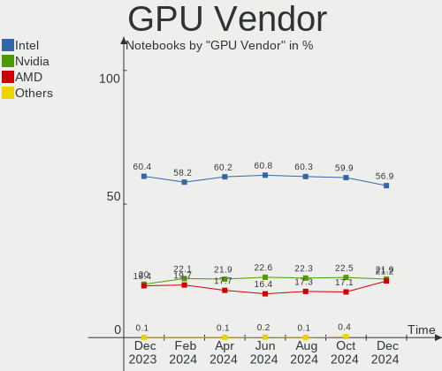
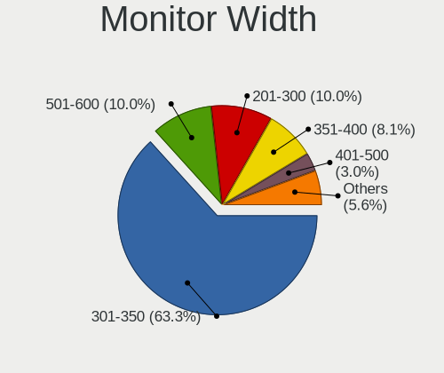
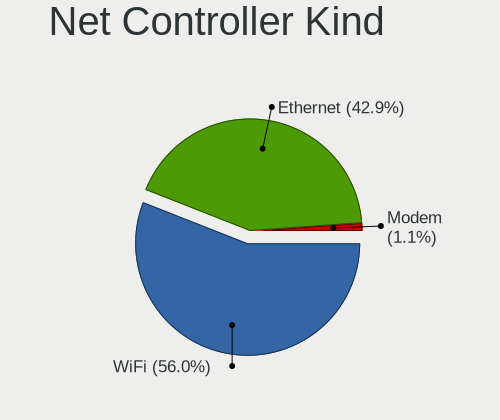
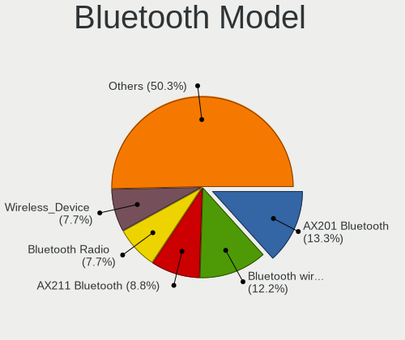
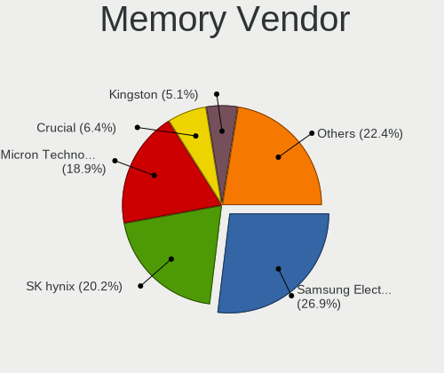

Ubuntu Hardware Trends (Notebooks)
----------------------------------

A project to identify most popular hardware characteristics and track their change
over time based on data collected by Ubuntu users at https://Linux-Hardware.org.

Anyone can contribute to this report by the [hw-probe](https://github.com/linuxhw/hw-probe) tool:

    sudo -E hw-probe -all -upload

Full-feature report is available here: https://linux-hardware.org/?view=trends&formfactor=notebook

Period: Jul, 2021.

Contents
--------

* [ System ](#system)
  - [ OS                       ](#os)
  - [ OS Family                ](#os-family)
  - [ Kernel                   ](#kernel)
  - [ Kernel Family            ](#kernel-family)
  - [ Kernel Major Ver.        ](#kernel-major-ver)
  - [ Arch                     ](#arch)
  - [ DE                       ](#de)
  - [ Display Server           ](#display-server)
  - [ Display Manager          ](#display-manager)
  - [ OS Lang                  ](#os-lang)
  - [ Boot Mode                ](#boot-mode)
  - [ Filesystem               ](#filesystem)
  - [ Part. scheme             ](#part-scheme)
  - [ Dual Boot with Linux/BSD ](#dual-boot-with-linuxbsd)
  - [ Dual Boot (Win)          ](#dual-boot-win)

* [ Board ](#board)
  - [ Vendor                   ](#vendor)
  - [ Model                    ](#model)
  - [ Model Family             ](#model-family)
  - [ MFG Year                 ](#mfg-year)
  - [ Form Factor              ](#form-factor)
  - [ Secure Boot              ](#secure-boot)
  - [ Coreboot                 ](#coreboot)
  - [ RAM Size                 ](#ram-size)
  - [ RAM Used                 ](#ram-used)
  - [ Total Drives             ](#total-drives)
  - [ Has CD-ROM               ](#has-cd-rom)
  - [ Has Ethernet             ](#has-ethernet)
  - [ Has WiFi                 ](#has-wifi)
  - [ Has Bluetooth            ](#has-bluetooth)

* [ Location ](#location)
  - [ Country                  ](#country)
  - [ City                     ](#city)

* [ Drives ](#drives)
  - [ Drive Vendor             ](#drive-vendor)
  - [ Drive Model              ](#drive-model)
  - [ HDD Vendor               ](#hdd-vendor)
  - [ SSD Vendor               ](#ssd-vendor)
  - [ Drive Kind               ](#drive-kind)
  - [ Drive Connector          ](#drive-connector)
  - [ Drive Size               ](#drive-size)
  - [ Space Total              ](#space-total)
  - [ Space Used               ](#space-used)
  - [ Malfunc. Drives          ](#malfunc-drives)
  - [ Malfunc. Drive Vendor    ](#malfunc-drive-vendor)
  - [ Malfunc. HDD Vendor      ](#malfunc-hdd-vendor)
  - [ Malfunc. Drive Kind      ](#malfunc-drive-kind)
  - [ Failed Drives            ](#failed-drives)
  - [ Failed Drive Vendor      ](#failed-drive-vendor)
  - [ Drive Status             ](#drive-status)

* [ Storage controller ](#storage-controller)
  - [ Storage Vendor           ](#storage-vendor)
  - [ Storage Model            ](#storage-model)
  - [ Storage Kind             ](#storage-kind)

* [ Processor ](#processor)
  - [ CPU Vendor               ](#cpu-vendor)
  - [ CPU Model                ](#cpu-model)
  - [ CPU Model Family         ](#cpu-model-family)
  - [ CPU Cores                ](#cpu-cores)
  - [ CPU Sockets              ](#cpu-sockets)
  - [ CPU Threads              ](#cpu-threads)
  - [ CPU Op-Modes             ](#cpu-op-modes)
  - [ CPU Microcode            ](#cpu-microcode)
  - [ CPU Microarch            ](#cpu-microarch)

* [ Graphics ](#graphics)
  - [ GPU Vendor               ](#gpu-vendor)
  - [ GPU Model                ](#gpu-model)
  - [ GPU Combo                ](#gpu-combo)
  - [ GPU Driver               ](#gpu-driver)
  - [ GPU Memory               ](#gpu-memory)

* [ Monitor ](#monitor)
  - [ Monitor Vendor           ](#monitor-vendor)
  - [ Monitor Model            ](#monitor-model)
  - [ Monitor Resolution       ](#monitor-resolution)
  - [ Monitor Diagonal         ](#monitor-diagonal)
  - [ Monitor Width            ](#monitor-width)
  - [ Aspect Ratio             ](#aspect-ratio)
  - [ Monitor Area             ](#monitor-area)
  - [ Pixel Density            ](#pixel-density)
  - [ Multiple Monitors        ](#multiple-monitors)

* [ Network ](#network)
  - [ Net Controller Vendor    ](#net-controller-vendor)
  - [ Net Controller Model     ](#net-controller-model)
  - [ Wireless Vendor          ](#wireless-vendor)
  - [ Wireless Model           ](#wireless-model)
  - [ Ethernet Vendor          ](#ethernet-vendor)
  - [ Ethernet Model           ](#ethernet-model)
  - [ Net Controller Kind      ](#net-controller-kind)
  - [ Used Controller          ](#used-controller)
  - [ NICs                     ](#nics)
  - [ IPv6                     ](#ipv6)

* [ Bluetooth ](#bluetooth)
  - [ Bluetooth Vendor         ](#bluetooth-vendor)
  - [ Bluetooth Model          ](#bluetooth-model)

* [ Sound ](#sound)
  - [ Sound Vendor             ](#sound-vendor)
  - [ Sound Model              ](#sound-model)

* [ Memory ](#memory)
  - [ Memory Vendor            ](#memory-vendor)
  - [ Memory Model             ](#memory-model)
  - [ Memory Kind              ](#memory-kind)
  - [ Memory Form Factor       ](#memory-form-factor)
  - [ Memory Size              ](#memory-size)
  - [ Memory Speed             ](#memory-speed)

* [ Printers & scanners ](#printers--scanners)
  - [ Printer Vendor           ](#printer-vendor)
  - [ Printer Model            ](#printer-model)
  - [ Scanner Vendor           ](#scanner-vendor)
  - [ Scanner Model            ](#scanner-model)

* [ Camera ](#camera)
  - [ Camera Vendor            ](#camera-vendor)
  - [ Camera Model             ](#camera-model)

* [ Security ](#security)
  - [ Fingerprint Vendor       ](#fingerprint-vendor)
  - [ Fingerprint Model        ](#fingerprint-model)
  - [ Chipcard Vendor          ](#chipcard-vendor)
  - [ Chipcard Model           ](#chipcard-model)

* [ Unsupported ](#unsupported)
  - [ Unsupported Devices      ](#unsupported-devices)
  - [ Unsupported Device Types ](#unsupported-device-types)

System
------

OS
--

Installed operating systems

| Name           | Notebooks | Percent |
|----------------|-----------|---------|
| Ubuntu 20.04   | 441       | 65.82%  |
| Ubuntu 21.04   | 141       | 21.04%  |
| Ubuntu 18.04   | 54        | 8.06%   |
| Ubuntu 20.10   | 13        | 1.94%   |
| Ubuntu 16.04   | 8         | 1.19%   |
| Ubuntu 21.10   | 7         | 1.04%   |
| Ubuntu Core 20 | 1         | 0.15%   |
| Ubuntu Core 16 | 1         | 0.15%   |
| Ubuntu 19.10   | 1         | 0.15%   |
| Ubuntu 18.10   | 1         | 0.15%   |
| Ubuntu 14.04   | 1         | 0.15%   |
| Ubuntu         | 1         | 0.15%   |

OS Family
---------

OS without a version

| Name   | Notebooks | Percent |
|--------|-----------|---------|
| Ubuntu | 670       | 100%    |

Kernel
------

Version of the Linux kernel

| Version                    | Notebooks | Percent |
|----------------------------|-----------|---------|
| 5.8.0-59-generic           | 203       | 30.3%   |
| 5.8.0-63-generic           | 98        | 14.63%  |
| 5.11.0-22-generic          | 76        | 11.34%  |
| 5.4.0-77-generic           | 61        | 9.1%    |
| 5.11.0-25-generic          | 35        | 5.22%   |
| 5.8.0-43-generic           | 26        | 3.88%   |
| 5.4.0-80-generic           | 24        | 3.58%   |
| 5.11.0-16-generic          | 11        | 1.64%   |
| 4.15.0-151-generic         | 11        | 1.64%   |
| 5.8.0-61-generic           | 8         | 1.19%   |
| 5.4.0-42-generic           | 8         | 1.19%   |
| 5.8.0-55-generic           | 7         | 1.04%   |
| 5.11.0-26-generic          | 7         | 1.04%   |
| 5.11.0-24-generic          | 6         | 0.9%    |
| 4.15.0-147-generic         | 6         | 0.9%    |
| 5.13.0-051300-generic      | 4         | 0.6%    |
| 5.9.0-050900-generic       | 3         | 0.45%   |
| 5.8.0-53-generic           | 3         | 0.45%   |
| 4.4.0-210-generic          | 3         | 0.45%   |
| 4.15.0-142-generic         | 3         | 0.45%   |
| 5.8.0-64-generic           | 2         | 0.3%    |
| 5.8.0-60-generic           | 2         | 0.3%    |
| 5.6.0-1047-oem             | 2         | 0.3%    |
| 5.4.0-73-generic           | 2         | 0.3%    |
| 5.4.0-72-generic           | 2         | 0.3%    |
| 5.4.0-26-generic           | 2         | 0.3%    |
| 5.13.2-051302-generic      | 2         | 0.3%    |
| 5.13.1-051301-generic      | 2         | 0.3%    |
| 5.11.0-20-generic          | 2         | 0.3%    |
| 4.15.0-152-generic         | 2         | 0.3%    |
| 4.15.0-149-generic         | 2         | 0.3%    |
| 5.8.7-050807-generic       | 1         | 0.15%   |
| 5.8.0-50-generic           | 1         | 0.15%   |
| 5.8.0-49-generic           | 1         | 0.15%   |
| 5.8.0-48-generic           | 1         | 0.15%   |
| 5.8.0-41-generic           | 1         | 0.15%   |
| 5.8.0-38-generic           | 1         | 0.15%   |
| 5.8.0-25-generic           | 1         | 0.15%   |
| 5.6.0-1021-oem             | 1         | 0.15%   |
| 5.4.0-77-lowlatency        | 1         | 0.15%   |
| 5.4.0-74-generic           | 1         | 0.15%   |
| 5.4.0-66-generic           | 1         | 0.15%   |
| 5.4.0-65-generic           | 1         | 0.15%   |
| 5.4.0-62-generic           | 1         | 0.15%   |
| 5.4.0-58-generic           | 1         | 0.15%   |
| 5.4.0-48-generic           | 1         | 0.15%   |
| 5.4.0-40-generic           | 1         | 0.15%   |
| 5.4.0-37-generic           | 1         | 0.15%   |
| 5.3.0-64-generic           | 1         | 0.15%   |
| 5.3.0-050300-generic       | 1         | 0.15%   |
| 5.14.0-051400rc3-generic   | 1         | 0.15%   |
| 5.13.6-xanmod2-edge        | 1         | 0.15%   |
| 5.13.4-051304-generic      | 1         | 0.15%   |
| 5.13.0-13-generic          | 1         | 0.15%   |
| 5.12.9-051209-generic      | 1         | 0.15%   |
| 5.12.14-xanmod1            | 1         | 0.15%   |
| 5.12.14-amd64-desktop      | 1         | 0.15%   |
| 5.12.14                    | 1         | 0.15%   |
| 5.12.0-19.1-liquorix-amd64 | 1         | 0.15%   |
| 5.11.11-051111-generic     | 1         | 0.15%   |

Kernel Family
-------------

Linux kernel without a distro release

| Version | Notebooks | Percent |
|---------|-----------|---------|
| 5.8.0   | 355       | 52.99%  |
| 5.11.0  | 138       | 20.6%   |
| 5.4.0   | 108       | 16.12%  |
| 4.15.0  | 27        | 4.03%   |
| 5.13.0  | 5         | 0.75%   |
| 5.10.0  | 4         | 0.6%    |
| 4.4.0   | 4         | 0.6%    |
| 5.9.0   | 3         | 0.45%   |
| 5.6.0   | 3         | 0.45%   |
| 5.12.14 | 3         | 0.45%   |
| 5.3.0   | 2         | 0.3%    |
| 5.13.2  | 2         | 0.3%    |
| 5.13.1  | 2         | 0.3%    |
| 5.0.0   | 2         | 0.3%    |
| 5.8.7   | 1         | 0.15%   |
| 5.14.0  | 1         | 0.15%   |
| 5.13.6  | 1         | 0.15%   |
| 5.13.4  | 1         | 0.15%   |
| 5.12.9  | 1         | 0.15%   |
| 5.12.0  | 1         | 0.15%   |
| 5.11.11 | 1         | 0.15%   |
| 5.10.34 | 1         | 0.15%   |
| 4.20.17 | 1         | 0.15%   |
| 4.18.0  | 1         | 0.15%   |
| 4.16.18 | 1         | 0.15%   |
| 3.13.0  | 1         | 0.15%   |

Kernel Major Ver.
-----------------

Linux kernel major version

| Version | Notebooks | Percent |
|---------|-----------|---------|
| 5.8     | 356       | 53.13%  |
| 5.11    | 139       | 20.75%  |
| 5.4     | 108       | 16.12%  |
| 4.15    | 27        | 4.03%   |
| 5.13    | 11        | 1.64%   |
| 5.12    | 5         | 0.75%   |
| 5.10    | 5         | 0.75%   |
| 4.4     | 4         | 0.6%    |
| 5.9     | 3         | 0.45%   |
| 5.6     | 3         | 0.45%   |
| 5.3     | 2         | 0.3%    |
| 5.0     | 2         | 0.3%    |
| 5.14    | 1         | 0.15%   |
| 4.20    | 1         | 0.15%   |
| 4.18    | 1         | 0.15%   |
| 4.16    | 1         | 0.15%   |
| 3.13    | 1         | 0.15%   |

Arch
----

OS architecture (x86_64, i586, etc.)

| Name   | Notebooks | Percent |
|--------|-----------|---------|
| x86_64 | 662       | 98.81%  |
| i686   | 8         | 1.19%   |

DE
--

Desktop Environment

| Name            | Notebooks | Percent |
|-----------------|-----------|---------|
| GNOME           | 577       | 86.12%  |
| Unknown         | 61        | 9.1%    |
| Unity           | 11        | 1.64%   |
| X-Cinnamon      | 9         | 1.34%   |
| GNOME Flashback | 5         | 0.75%   |
| i3              | 2         | 0.3%    |
| Cinnamon        | 2         | 0.3%    |
| GNOME Classic   | 1         | 0.15%   |
| Enlightenment   | 1         | 0.15%   |
| Deepin          | 1         | 0.15%   |

Display Server
--------------

X11 or Wayland

| Name    | Notebooks | Percent |
|---------|-----------|---------|
| X11     | 523       | 78.06%  |
| Wayland | 113       | 16.87%  |
| Unknown | 30        | 4.48%   |
| Tty     | 4         | 0.6%    |

Display Manager
---------------

SDDM, LightDM, etc.

| Name    | Notebooks | Percent |
|---------|-----------|---------|
| Unknown | 484       | 72.24%  |
| GDM     | 179       | 26.72%  |
| TDM     | 3         | 0.45%   |
| GDM3    | 2         | 0.3%    |
| SDDM    | 1         | 0.15%   |
| LightDM | 1         | 0.15%   |

OS Lang
-------

Language

| Lang    | Notebooks | Percent |
|---------|-----------|---------|
| en_US   | 298       | 44.48%  |
| de_DE   | 77        | 11.49%  |
| fr_FR   | 45        | 6.72%   |
| en_GB   | 33        | 4.93%   |
| en_IN   | 29        | 4.33%   |
| pt_BR   | 26        | 3.88%   |
| ru_RU   | 15        | 2.24%   |
| en_CA   | 15        | 2.24%   |
| it_IT   | 12        | 1.79%   |
| en_AU   | 12        | 1.79%   |
| pl_PL   | 10        | 1.49%   |
| cs_CZ   | 8         | 1.19%   |
| nl_NL   | 7         | 1.04%   |
| es_ES   | 7         | 1.04%   |
| pt_PT   | 6         | 0.9%    |
| zh_CN   | 4         | 0.6%    |
| ja_JP   | 4         | 0.6%    |
| es_MX   | 4         | 0.6%    |
| en_ZA   | 4         | 0.6%    |
| C       | 4         | 0.6%    |
| nb_NO   | 3         | 0.45%   |
| es_CO   | 3         | 0.45%   |
| en_NG   | 3         | 0.45%   |
| de_CH   | 3         | 0.45%   |
| de_AT   | 3         | 0.45%   |
| Unknown | 3         | 0.45%   |
| ro_RO   | 2         | 0.3%    |
| ko_KR   | 2         | 0.3%    |
| hu_HU   | 2         | 0.3%    |
| hr_HR   | 2         | 0.3%    |
| fr_LU   | 2         | 0.3%    |
| es_CL   | 2         | 0.3%    |
| es_AR   | 2         | 0.3%    |
| en_SG   | 2         | 0.3%    |
| vi_VN   | 1         | 0.15%   |
| tr_TR   | 1         | 0.15%   |
| sv_SE   | 1         | 0.15%   |
| sk_SK   | 1         | 0.15%   |
| ru_UA   | 1         | 0.15%   |
| es_VE   | 1         | 0.15%   |
| es_UY   | 1         | 0.15%   |
| es_HN   | 1         | 0.15%   |
| es_CR   | 1         | 0.15%   |
| en_PH   | 1         | 0.15%   |
| en_NZ   | 1         | 0.15%   |
| en_IE   | 1         | 0.15%   |
| en_HK   | 1         | 0.15%   |
| da_DK   | 1         | 0.15%   |
| ca_ES   | 1         | 0.15%   |
| bg_BG   | 1         | 0.15%   |

Boot Mode
---------

EFI or BIOS

| Mode | Notebooks | Percent |
|------|-----------|---------|
| EFI  | 352       | 52.54%  |
| BIOS | 318       | 47.46%  |

Filesystem
----------

Type of filesystem

| Type    | Notebooks | Percent |
|---------|-----------|---------|
| Ext4    | 640       | 95.52%  |
| Overlay | 16        | 2.39%   |
| Zfs     | 7         | 1.04%   |
| Btrfs   | 3         | 0.45%   |
| Xfs     | 1         | 0.15%   |
| Nfs     | 1         | 0.15%   |
| Ext3    | 1         | 0.15%   |
| Ext2    | 1         | 0.15%   |

Part. scheme
------------

Scheme of partitioning

| Type    | Notebooks | Percent |
|---------|-----------|---------|
| Unknown | 479       | 71.49%  |
| GPT     | 162       | 24.18%  |
| MBR     | 29        | 4.33%   |

Dual Boot with Linux/BSD
------------------------

Hosting more than one Linux/BSD

| Dual boot | Notebooks | Percent |
|-----------|-----------|---------|
| No        | 611       | 91.19%  |
| Yes       | 59        | 8.81%   |

Dual Boot (Win)
---------------

Hosting Linux and Windows

| Dual boot | Notebooks | Percent |
|-----------|-----------|---------|
| No        | 414       | 61.79%  |
| Yes       | 256       | 38.21%  |

Board
-----

Vendor
------

Motherboard manufacturer

| Name                                         | Notebooks | Percent |
|----------------------------------------------|-----------|---------|
| Hewlett-Packard                              | 140       | 20.9%   |
| Dell                                         | 133       | 19.85%  |
| Lenovo                                       | 125       | 18.66%  |
| Acer                                         | 66        | 9.85%   |
| ASUSTek Computer                             | 59        | 8.81%   |
| Toshiba                                      | 22        | 3.28%   |
| Sony                                         | 14        | 2.09%   |
| Apple                                        | 14        | 2.09%   |
| MSI                                          | 12        | 1.79%   |
| Samsung Electronics                          | 10        | 1.49%   |
| Medion                                       | 8         | 1.19%   |
| Fujitsu                                      | 7         | 1.04%   |
| TUXEDO                                       | 5         | 0.75%   |
| Timi                                         | 4         | 0.6%    |
| System76                                     | 3         | 0.45%   |
| Notebook                                     | 3         | 0.45%   |
| AMI                                          | 3         | 0.45%   |
| Unknown                                      | 3         | 0.45%   |
| Teclast                                      | 2         | 0.3%    |
| Schenker                                     | 2         | 0.3%    |
| LG Electronics                               | 2         | 0.3%    |
| HUAWEI                                       | 2         | 0.3%    |
| Google                                       | 2         | 0.3%    |
| Casper                                       | 2         | 0.3%    |
| Wortmann AG                                  | 1         | 0.15%   |
| Wiltronic                                    | 1         | 0.15%   |
| whyopencomputing                             | 1         | 0.15%   |
| SLIMBOOK                                     | 1         | 0.15%   |
| roda computer                                | 1         | 0.15%   |
| Positivo                                     | 1         | 0.15%   |
| Pegatron                                     | 1         | 0.15%   |
| Panasonic                                    | 1         | 0.15%   |
| Packard Bell                                 | 1         | 0.15%   |
| ONE-NETBOOK TECHNOLOGY                       | 1         | 0.15%   |
| Multilaser                                   | 1         | 0.15%   |
| Motion Computing                             | 1         | 0.15%   |
| Matsushita Electric Industrial               | 1         | 0.15%   |
| Itautec                                      | 1         | 0.15%   |
| Gigabyte Technology                          | 1         | 0.15%   |
| Getac                                        | 1         | 0.15%   |
| Gateway                                      | 1         | 0.15%   |
| Framework                                    | 1         | 0.15%   |
| eMachines                                    | 1         | 0.15%   |
| ECS                                          | 1         | 0.15%   |
| DNS                                          | 1         | 0.15%   |
| Digibras                                     | 1         | 0.15%   |
| CHUWI?Innovation?And?Technology(ShenZhen)co. | 1         | 0.15%   |
| Chuwi                                        | 1         | 0.15%   |
| AVITA                                        | 1         | 0.15%   |
| Allview                                      | 1         | 0.15%   |
| Alienware                                    | 1         | 0.15%   |

Model
-----

Motherboard model

| Name                                 | Notebooks | Percent |
|--------------------------------------|-----------|---------|
| Unknown                              | 7         | 1.04%   |
| HP Notebook                          | 6         | 0.9%    |
| HP Pavilion dv6                      | 4         | 0.6%    |
| HP EliteBook 840 G2                  | 4         | 0.6%    |
| Dell XPS 15 9500                     | 4         | 0.6%    |
| Dell Inspiron N5110                  | 4         | 0.6%    |
| HP EliteBook 840 G3                  | 3         | 0.45%   |
| Dell XPS 13 9310                     | 3         | 0.45%   |
| Dell Latitude E7470                  | 3         | 0.45%   |
| Dell Latitude E7440                  | 3         | 0.45%   |
| Dell Latitude E5470                  | 3         | 0.45%   |
| ASUS T100HAN                         | 3         | 0.45%   |
| AMI Cherry Trail CR                  | 3         | 0.45%   |
| Acer Aspire E1-571                   | 3         | 0.45%   |
| Acer Aspire 5741G                    | 3         | 0.45%   |
| Toshiba Satellite L50-B              | 2         | 0.3%    |
| Toshiba Satellite C55-B              | 2         | 0.3%    |
| Timi TM1701                          | 2         | 0.3%    |
| Lenovo ThinkPad T14 Gen 1 20S1SDLQ00 | 2         | 0.3%    |
| Lenovo IdeaPad 5 14ARE05 81YM        | 2         | 0.3%    |
| Lenovo G500 20236                    | 2         | 0.3%    |
| HP ProBook 650 G1                    | 2         | 0.3%    |
| HP ProBook 6460b                     | 2         | 0.3%    |
| HP ProBook 6450b                     | 2         | 0.3%    |
| HP ProBook 640 G1                    | 2         | 0.3%    |
| HP Presario CQ56                     | 2         | 0.3%    |
| HP Pavilion Laptop 15-cs3xxx         | 2         | 0.3%    |
| HP Pavilion Gaming Laptop 15-dk0xxx  | 2         | 0.3%    |
| HP Pavilion g7                       | 2         | 0.3%    |
| HP Pavilion g6                       | 2         | 0.3%    |
| HP Pavilion dv7                      | 2         | 0.3%    |
| HP Pavilion 15                       | 2         | 0.3%    |
| HP Laptop 15s-eq2xxx                 | 2         | 0.3%    |
| HP Laptop 15-bs0xx                   | 2         | 0.3%    |
| HP Laptop 14s-fq1xxx                 | 2         | 0.3%    |
| HP EliteBook Folio 1040 G3           | 2         | 0.3%    |
| HP EliteBook 8470p                   | 2         | 0.3%    |
| HP EliteBook 8460p                   | 2         | 0.3%    |
| HP EliteBook 830 G5                  | 2         | 0.3%    |
| HP EliteBook 820 G1                  | 2         | 0.3%    |
| HP 620                               | 2         | 0.3%    |
| Fujitsu LIFEBOOK E752                | 2         | 0.3%    |
| Dell XPS 15 9570                     | 2         | 0.3%    |
| Dell XPS 15 9560                     | 2         | 0.3%    |
| Dell XPS 15 9550                     | 2         | 0.3%    |
| Dell XPS 13 9360                     | 2         | 0.3%    |
| Dell XPS 13 7390                     | 2         | 0.3%    |
| Dell Latitude E6430                  | 2         | 0.3%    |
| Dell Latitude E6420                  | 2         | 0.3%    |
| Dell Latitude E6400                  | 2         | 0.3%    |
| Dell Latitude E5520                  | 2         | 0.3%    |
| Dell Latitude 3410                   | 2         | 0.3%    |
| Dell Inspiron N5010                  | 2         | 0.3%    |
| Dell Inspiron 5570                   | 2         | 0.3%    |
| Dell Inspiron 5558                   | 2         | 0.3%    |
| Dell Inspiron 5521                   | 2         | 0.3%    |
| Dell Inspiron 5482                   | 2         | 0.3%    |
| Dell Inspiron 1545                   | 2         | 0.3%    |
| Dell Inspiron 15-3567                | 2         | 0.3%    |
| Dell G7 7700                         | 2         | 0.3%    |

Model Family
------------

Motherboard model prefix

| Name                | Notebooks | Percent |
|---------------------|-----------|---------|
| Lenovo ThinkPad     | 69        | 10.3%   |
| Acer Aspire         | 47        | 7.01%   |
| Dell Latitude       | 44        | 6.57%   |
| Dell Inspiron       | 39        | 5.82%   |
| HP EliteBook        | 30        | 4.48%   |
| HP Pavilion         | 29        | 4.33%   |
| HP ProBook          | 27        | 4.03%   |
| Dell XPS            | 25        | 3.73%   |
| Lenovo IdeaPad      | 24        | 3.58%   |
| Toshiba Satellite   | 16        | 2.39%   |
| HP Laptop           | 16        | 2.39%   |
| ASUS VivoBook       | 12        | 1.79%   |
| Dell Precision      | 8         | 1.19%   |
| Lenovo ThinkBook    | 7         | 1.04%   |
| Unknown             | 7         | 1.04%   |
| HP Notebook         | 6         | 0.9%    |
| Fujitsu LIFEBOOK    | 6         | 0.9%    |
| Dell Vostro         | 6         | 0.9%    |
| Lenovo Legion       | 5         | 0.75%   |
| HP ZBook            | 5         | 0.75%   |
| HP Compaq           | 5         | 0.75%   |
| Acer Swift          | 5         | 0.75%   |
| Dell G3             | 4         | 0.6%    |
| ASUS TUF            | 4         | 0.6%    |
| ASUS ROG            | 4         | 0.6%    |
| Toshiba TECRA       | 3         | 0.45%   |
| Lenovo Yoga         | 3         | 0.45%   |
| HP Stream           | 3         | 0.45%   |
| HP Presario         | 3         | 0.45%   |
| HP OMEN             | 3         | 0.45%   |
| Dell Studio         | 3         | 0.45%   |
| ASUS T100HAN        | 3         | 0.45%   |
| AMI Cherry          | 3         | 0.45%   |
| Acer TravelMate     | 3         | 0.45%   |
| Acer Predator       | 3         | 0.45%   |
| Acer Nitro          | 3         | 0.45%   |
| TUXEDO InfinityBook | 2         | 0.3%    |
| Toshiba dynabook    | 2         | 0.3%    |
| Timi TM1701         | 2         | 0.3%    |
| MSI Prestige        | 2         | 0.3%    |
| Medion Akoya        | 2         | 0.3%    |
| Lenovo G500         | 2         | 0.3%    |
| HP ENVY             | 2         | 0.3%    |
| HP 620              | 2         | 0.3%    |
| HP 250              | 2         | 0.3%    |
| Dell G7             | 2         | 0.3%    |
| ASUS X551CAP        | 2         | 0.3%    |
| ASUS K95VB          | 2         | 0.3%    |
| ASUS K45VM          | 2         | 0.3%    |
| ASUS ASUS           | 2         | 0.3%    |
| Apple MacBookPro12  | 2         | 0.3%    |
| Wortmann AG 1220679 | 1         | 0.15%   |
| Wiltronic IVIEW     | 1         | 0.15%   |
| TUXEDO N750HU       | 1         | 0.15%   |
| TUXEDO N230WU       | 1         | 0.15%   |
| TUXEDO Aura         | 1         | 0.15%   |
| Toshiba QOSMIO      | 1         | 0.15%   |
| Timi TM1613         | 1         | 0.15%   |
| Timi A35S           | 1         | 0.15%   |
| Teclast F6          | 1         | 0.15%   |

MFG Year
--------

Motherboard manufacture year

| Year    | Notebooks | Percent |
|---------|-----------|---------|
| 2020    | 119       | 17.76%  |
| 2021    | 118       | 17.61%  |
| 2018    | 54        | 8.06%   |
| 2019    | 52        | 7.76%   |
| 2011    | 47        | 7.01%   |
| 2012    | 44        | 6.57%   |
| 2015    | 39        | 5.82%   |
| 2017    | 34        | 5.07%   |
| 2013    | 34        | 5.07%   |
| 2014    | 32        | 4.78%   |
| 2016    | 29        | 4.33%   |
| 2010    | 26        | 3.88%   |
| 2009    | 20        | 2.99%   |
| 2008    | 15        | 2.24%   |
| 2007    | 5         | 0.75%   |
| 2006    | 1         | 0.15%   |
| Unknown | 1         | 0.15%   |

Form Factor
-----------

Physical design of the computer

| Name     | Notebooks | Percent |
|----------|-----------|---------|
| Notebook | 670       | 100%    |

Secure Boot
-----------

Enabled or disabled

| State    | Notebooks | Percent |
|----------|-----------|---------|
| Disabled | 573       | 85.52%  |
| Enabled  | 97        | 14.48%  |

Coreboot
--------

Have coreboot on board

| Used | Notebooks | Percent |
|------|-----------|---------|
| No   | 667       | 99.55%  |
| Yes  | 3         | 0.45%   |

RAM Size
--------

Total RAM memory

| Size in GB  | Notebooks | Percent |
|-------------|-----------|---------|
| 4.01-8.0    | 192       | 28.66%  |
| 16.01-24.0  | 141       | 21.04%  |
| 3.01-4.0    | 132       | 19.7%   |
| 8.01-16.0   | 118       | 17.61%  |
| 32.01-64.0  | 44        | 6.57%   |
| 1.01-2.0    | 28        | 4.18%   |
| 24.01-32.0  | 6         | 0.9%    |
| 2.01-3.0    | 5         | 0.75%   |
| 64.01-256.0 | 4         | 0.6%    |

RAM Used
--------

Used RAM memory

| Used GB    | Notebooks | Percent |
|------------|-----------|---------|
| 1.01-2.0   | 231       | 34.48%  |
| 2.01-3.0   | 191       | 28.51%  |
| 3.01-4.0   | 115       | 17.16%  |
| 4.01-8.0   | 91        | 13.58%  |
| 8.01-16.0  | 25        | 3.73%   |
| 0.51-1.0   | 10        | 1.49%   |
| 24.01-32.0 | 2         | 0.3%    |
| 16.01-24.0 | 2         | 0.3%    |
| 0.01-0.5   | 2         | 0.3%    |
| Unknown    | 1         | 0.15%   |

Total Drives
------------

Number of drives on board

| Drives | Notebooks | Percent |
|--------|-----------|---------|
| 1      | 482       | 71.94%  |
| 2      | 157       | 23.43%  |
| 3      | 23        | 3.43%   |
| 0      | 6         | 0.9%    |
| 4      | 2         | 0.3%    |

Has CD-ROM
----------

Has CD-ROM on board

| Presented | Notebooks | Percent |
|-----------|-----------|---------|
| No        | 419       | 62.54%  |
| Yes       | 251       | 37.46%  |

Has Ethernet
------------

Has Ethernet on board

| Presented | Notebooks | Percent |
|-----------|-----------|---------|
| Yes       | 555       | 82.84%  |
| No        | 115       | 17.16%  |

Has WiFi
--------

Has WiFi module

| Presented | Notebooks | Percent |
|-----------|-----------|---------|
| Yes       | 655       | 97.76%  |
| No        | 15        | 2.24%   |

Has Bluetooth
-------------

Has Bluetooth module

| Presented | Notebooks | Percent |
|-----------|-----------|---------|
| Yes       | 508       | 75.82%  |
| No        | 162       | 24.18%  |

Location
--------

Country
-------

Geographic location (country)

| Country      | Notebooks | Percent |
|--------------|-----------|---------|
| USA          | 101       | 15.07%  |
| Germany      | 85        | 12.69%  |
| France       | 46        | 6.87%   |
| Brazil       | 35        | 5.22%   |
| India        | 34        | 5.07%   |
| UK           | 27        | 4.03%   |
| Russia       | 23        | 3.43%   |
| Poland       | 18        | 2.69%   |
| Italy        | 18        | 2.69%   |
| Canada       | 17        | 2.54%   |
| Netherlands  | 16        | 2.39%   |
| Czechia      | 14        | 2.09%   |
| Australia    | 13        | 1.94%   |
| Switzerland  | 11        | 1.64%   |
| Portugal     | 11        | 1.64%   |
| Romania      | 10        | 1.49%   |
| Turkey       | 9         | 1.34%   |
| Mexico       | 9         | 1.34%   |
| Spain        | 8         | 1.19%   |
| Indonesia    | 8         | 1.19%   |
| Ukraine      | 7         | 1.04%   |
| Puerto Rico  | 7         | 1.04%   |
| Iran         | 7         | 1.04%   |
| Austria      | 7         | 1.04%   |
| Hungary      | 6         | 0.9%    |
| Bulgaria     | 6         | 0.9%    |
| China        | 5         | 0.75%   |
| South Africa | 4         | 0.6%    |
| Luxembourg   | 4         | 0.6%    |
| Japan        | 4         | 0.6%    |
| Finland      | 4         | 0.6%    |
| Croatia      | 4         | 0.6%    |
| Colombia     | 4         | 0.6%    |
| Belarus      | 4         | 0.6%    |
| Vietnam      | 3         | 0.45%   |
| Peru         | 3         | 0.45%   |
| Pakistan     | 3         | 0.45%   |
| Nigeria      | 3         | 0.45%   |
| Nepal        | 3         | 0.45%   |
| Kenya        | 3         | 0.45%   |
| Greece       | 3         | 0.45%   |
| Chile        | 3         | 0.45%   |
| Argentina    | 3         | 0.45%   |
| Uruguay      | 2         | 0.3%    |
| Sweden       | 2         | 0.3%    |
| South Korea  | 2         | 0.3%    |
| Slovakia     | 2         | 0.3%    |
| Singapore    | 2         | 0.3%    |
| Norway       | 2         | 0.3%    |
| New Zealand  | 2         | 0.3%    |
| Morocco      | 2         | 0.3%    |
| Madagascar   | 2         | 0.3%    |
| Estonia      | 2         | 0.3%    |
| Ecuador      | 2         | 0.3%    |
| Denmark      | 2         | 0.3%    |
| Costa Rica   | 2         | 0.3%    |
| Cambodia     | 2         | 0.3%    |
| Belgium      | 2         | 0.3%    |
| Zimbabwe     | 1         | 0.15%   |
| Uzbekistan   | 1         | 0.15%   |

City
----

Geographic location (city)

| City                   | Notebooks | Percent |
|------------------------|-----------|---------|
| Paris                  | 11        | 1.64%   |
| Moscow                 | 11        | 1.64%   |
| Prague                 | 7         | 1.04%   |
| Tehran                 | 6         | 0.9%    |
| Juncos                 | 6         | 0.9%    |
| Warsaw                 | 5         | 0.75%   |
| Sydney                 | 5         | 0.75%   |
| S??o Paulo             | 5         | 0.75%   |
| Berlin                 | 5         | 0.75%   |
| Vienna                 | 4         | 0.6%    |
| Munich                 | 4         | 0.6%    |
| Milan                  | 4         | 0.6%    |
| Lyon                   | 4         | 0.6%    |
| Augsburg               | 4         | 0.6%    |
| Ankara                 | 4         | 0.6%    |
| Tallahassee            | 3         | 0.45%   |
| São Paulo             | 3         | 0.45%   |
| Sofia                  | 3         | 0.45%   |
| Pune                   | 3         | 0.45%   |
| Porto                  | 3         | 0.45%   |
| Nuremberg              | 3         | 0.45%   |
| Noida                  | 3         | 0.45%   |
| Nairobi                | 3         | 0.45%   |
| Mumbai                 | 3         | 0.45%   |
| Kyiv                   | 3         | 0.45%   |
| Helsinki               | 3         | 0.45%   |
| Frankfurt am Main      | 3         | 0.45%   |
| Budapest               | 3         | 0.45%   |
| Bucharest              | 3         | 0.45%   |
| Zagreb                 | 2         | 0.3%    |
| Villingen-Schwenningen | 2         | 0.3%    |
| Utrecht                | 2         | 0.3%    |
| Ufa                    | 2         | 0.3%    |
| Tubarao                | 2         | 0.3%    |
| Troon                  | 2         | 0.3%    |
| Toronto                | 2         | 0.3%    |
| Stuttgart              | 2         | 0.3%    |
| St. Catharines         | 2         | 0.3%    |
| St Petersburg          | 2         | 0.3%    |
| Singapore              | 2         | 0.3%    |
| Shanghai               | 2         | 0.3%    |
| Seattle                | 2         | 0.3%    |
| Schwerte               | 2         | 0.3%    |
| Santiago               | 2         | 0.3%    |
| San Luis Potos?­ City  | 2         | 0.3%    |
| Saint Paul             | 2         | 0.3%    |
| Rotterdam              | 2         | 0.3%    |
| Recife                 | 2         | 0.3%    |
| Phnom Penh             | 2         | 0.3%    |
| Philadelphia           | 2         | 0.3%    |
| Oslo                   | 2         | 0.3%    |
| Oberhausen             | 2         | 0.3%    |
| New Braunfels          | 2         | 0.3%    |
| Neenah                 | 2         | 0.3%    |
| Naples                 | 2         | 0.3%    |
| Nagpur                 | 2         | 0.3%    |
| Montevideo             | 2         | 0.3%    |
| Minsk                  | 2         | 0.3%    |
| Mezdra                 | 2         | 0.3%    |
| Mexico City            | 2         | 0.3%    |

Drives
------

Drive Vendor
------------

Hard drive vendors

| Vendor                    | Notebooks | Drives | Percent |
|---------------------------|-----------|--------|---------|
| WDC                       | 127       | 133    | 15.82%  |
| Samsung Electronics       | 125       | 134    | 15.57%  |
| Seagate                   | 89        | 90     | 11.08%  |
| Toshiba                   | 77        | 79     | 9.59%   |
| Unknown                   | 52        | 56     | 6.48%   |
| SanDisk                   | 44        | 44     | 5.48%   |
| SK Hynix                  | 36        | 37     | 4.48%   |
| Kingston                  | 35        | 35     | 4.36%   |
| HGST                      | 27        | 27     | 3.36%   |
| Crucial                   | 25        | 27     | 3.11%   |
| Hitachi                   | 23        | 24     | 2.86%   |
| Micron Technology         | 17        | 17     | 2.12%   |
| Intel                     | 16        | 21     | 1.99%   |
| Apple                     | 9         | 10     | 1.12%   |
| A-DATA Technology         | 9         | 9      | 1.12%   |
| KIOXIA                    | 7         | 9      | 0.87%   |
| China                     | 6         | 6      | 0.75%   |
| Phison                    | 5         | 5      | 0.62%   |
| LITEONIT                  | 5         | 5      | 0.62%   |
| LITEON                    | 5         | 5      | 0.62%   |
| Fujitsu                   | 5         | 6      | 0.62%   |
| Transcend                 | 4         | 4      | 0.5%    |
| PNY                       | 3         | 3      | 0.37%   |
| Patriot                   | 3         | 3      | 0.37%   |
| Netac                     | 3         | 3      | 0.37%   |
| Micron/Crucial Technology | 3         | 3      | 0.37%   |
| Team                      | 2         | 2      | 0.25%   |
| SPCC                      | 2         | 2      | 0.25%   |
| Lenovo                    | 2         | 2      | 0.25%   |
| KingSpec                  | 2         | 2      | 0.25%   |
| KingDian                  | 2         | 2      | 0.25%   |
| External                  | 2         | 2      | 0.25%   |
| ADATA Technology          | 2         | 2      | 0.25%   |
| XPG                       | 1         | 1      | 0.12%   |
| Vaseky                    | 1         | 1      | 0.12%   |
| Union Memory (Shenzhen)   | 1         | 1      | 0.12%   |
| Union Memory              | 1         | 1      | 0.12%   |
| Solid State Storage       | 1         | 1      | 0.12%   |
| SMART                     | 1         | 2      | 0.12%   |
| S3+                       | 1         | 1      | 0.12%   |
| Realtek Semiconductor     | 1         | 1      | 0.12%   |
| Realtek                   | 1         | 1      | 0.12%   |
| OSCOO                     | 1         | 1      | 0.12%   |
| OCZ                       | 1         | 1      | 0.12%   |
| Mass                      | 1         | 1      | 0.12%   |
| Lite-On                   | 1         | 1      | 0.12%   |
| Lexar                     | 1         | 1      | 0.12%   |
| Leven                     | 1         | 1      | 0.12%   |
| LDLC                      | 1         | 1      | 0.12%   |
| KingFast                  | 1         | 1      | 0.12%   |
| Intenso                   | 1         | 1      | 0.12%   |
| INTEL SS                  | 1         | 1      | 0.12%   |
| GOODRAM                   | 1         | 1      | 0.12%   |
| FORESEE                   | 1         | 1      | 0.12%   |
| EMTEC                     | 1         | 1      | 0.12%   |
| Corsair                   | 1         | 1      | 0.12%   |
| BHT                       | 1         | 1      | 0.12%   |
| AXIOM                     | 1         | 1      | 0.12%   |
| asmedia                   | 1         | 1      | 0.12%   |
| ASM1153U                  | 1         | 2      | 0.12%   |

Drive Model
-----------

Hard drive models

| Model                                   | Notebooks | Percent |
|-----------------------------------------|-----------|---------|
| Samsung NVMe SSD Drive 512GB            | 18        | 2.17%   |
| Seagate ST1000LM035-1RK172 1TB          | 17        | 2.05%   |
| Unknown MMC Card  32GB                  | 14        | 1.68%   |
| Toshiba MQ01ABD100 1TB                  | 14        | 1.68%   |
| Seagate ST1000LM024 HN-M101MBB 1TB      | 13        | 1.56%   |
| Toshiba MQ01ABF050 500GB                | 9         | 1.08%   |
| Seagate ST500LT012-1DG142 500GB         | 9         | 1.08%   |
| Samsung SSD 860 EVO 500GB               | 9         | 1.08%   |
| SK Hynix NVMe SSD Drive 512GB           | 8         | 0.96%   |
| HGST HTS721010A9E630 1TB                | 8         | 0.96%   |
| Unknown MMC Card  64GB                  | 7         | 0.84%   |
| Toshiba MQ04ABF100 1TB                  | 7         | 0.84%   |
| HGST HTS725050A7E630 500GB              | 7         | 0.84%   |
| Toshiba NVMe SSD Drive 512GB            | 6         | 0.72%   |
| Seagate ST9500325AS 500GB               | 6         | 0.72%   |
| Sandisk NVMe SSD Drive 512GB            | 6         | 0.72%   |
| Kingston SA400S37240G 240GB SSD         | 6         | 0.72%   |
| Intel NVMe SSD Drive 512GB              | 6         | 0.72%   |
| WDC WD10SPZX-21Z10T0 1TB                | 5         | 0.6%    |
| Unknown MMC Card  16GB                  | 5         | 0.6%    |
| WDC WDS500G2B0A-00SM50 500GB SSD        | 4         | 0.48%   |
| WDC WDS240G2G0A-00JH30 240GB SSD        | 4         | 0.48%   |
| WDC WDS100T2B0A-00SM50 1TB SSD          | 4         | 0.48%   |
| WDC PC SN530 SDBPMPZ-512G-1101 512GB    | 4         | 0.48%   |
| Unknown MMC Card  7GB                   | 4         | 0.48%   |
| Seagate ST9320423AS 320GB               | 4         | 0.48%   |
| SanDisk SDSSDA240G 240GB                | 4         | 0.48%   |
| Sandisk NVMe SSD Drive 256GB            | 4         | 0.48%   |
| Sandisk NVMe SSD Drive 1024GB           | 4         | 0.48%   |
| Samsung SSD 860 EVO 1TB                 | 4         | 0.48%   |
| Samsung MZALQ512HALU-000L1 512GB        | 4         | 0.48%   |
| Kingston SA400S37480G 480GB SSD         | 4         | 0.48%   |
| Hitachi HTS545050A7E380 500GB           | 4         | 0.48%   |
| HGST HTS545050A7E680 500GB              | 4         | 0.48%   |
| HGST HTS541075A9E680 752GB              | 4         | 0.48%   |
| WDC WD10SPZX-24Z10 1TB                  | 3         | 0.36%   |
| WDC PC SN530 SDBPNPZ-256G-1002 256GB    | 3         | 0.36%   |
| Unknown NVMe SSD Drive 256GB            | 3         | 0.36%   |
| Toshiba NVMe SSD Drive 1024GB           | 3         | 0.36%   |
| Toshiba KXG60ZNV512G NVMe KIOXIA 512GB  | 3         | 0.36%   |
| SK Hynix NVMe SSD Drive 1024GB          | 3         | 0.36%   |
| SK Hynix BC511 HFM256GDJTNI-82A0A 256GB | 3         | 0.36%   |
| Seagate ST9500420AS 500GB               | 3         | 0.36%   |
| Seagate ST1000LM048-2E7172 1TB          | 3         | 0.36%   |
| Seagate BUP BK 4TB                      | 3         | 0.36%   |
| Samsung SSD 970 EVO Plus 500GB          | 3         | 0.36%   |
| Samsung SSD 850 EVO M.2 500GB           | 3         | 0.36%   |
| Samsung SSD 850 EVO 500GB               | 3         | 0.36%   |
| Samsung NVMe SSD Drive 256GB            | 3         | 0.36%   |
| Samsung NVMe SSD Drive 1TB              | 3         | 0.36%   |
| Samsung NVMe SSD Drive 1024GB           | 3         | 0.36%   |
| Micron/Crucial NVMe SSD Drive 1TB       | 3         | 0.36%   |
| Micron NVMe SSD Drive 1024GB            | 3         | 0.36%   |
| Kingston SA400S37120G 120GB SSD         | 3         | 0.36%   |
| Hitachi HTS723232A7A364 320GB           | 3         | 0.36%   |
| Hitachi HTS545050B9A300 500GB           | 3         | 0.36%   |
| HGST HTS541010A9E680 1TB                | 3         | 0.36%   |
| Crucial CT480BX500SSD1 480GB            | 3         | 0.36%   |
| Crucial CT240M500SSD1 240GB             | 3         | 0.36%   |
| Crucial CT1000MX500SSD1 1TB             | 3         | 0.36%   |

HDD Vendor
----------

Hard disk drive vendors

| Vendor              | Notebooks | Drives | Percent |
|---------------------|-----------|--------|---------|
| Seagate             | 88        | 88     | 31.54%  |
| WDC                 | 78        | 80     | 27.96%  |
| Toshiba             | 48        | 48     | 17.2%   |
| HGST                | 27        | 27     | 9.68%   |
| Hitachi             | 23        | 24     | 8.24%   |
| Samsung Electronics | 8         | 8      | 2.87%   |
| Fujitsu             | 4         | 5      | 1.43%   |
| Apple               | 2         | 2      | 0.72%   |
| asmedia             | 1         | 1      | 0.36%   |

SSD Vendor
----------

Solid state drive vendors

| Vendor              | Notebooks | Drives | Percent |
|---------------------|-----------|--------|---------|
| Samsung Electronics | 46        | 48     | 20.26%  |
| SanDisk             | 26        | 26     | 11.45%  |
| Kingston            | 25        | 25     | 11.01%  |
| Crucial             | 24        | 26     | 10.57%  |
| WDC                 | 22        | 22     | 9.69%   |
| Micron Technology   | 9         | 9      | 3.96%   |
| A-DATA Technology   | 7         | 7      | 3.08%   |
| China               | 6         | 6      | 2.64%   |
| Toshiba             | 5         | 5      | 2.2%    |
| LITEONIT            | 5         | 5      | 2.2%    |
| LITEON              | 5         | 5      | 2.2%    |
| Intel               | 5         | 5      | 2.2%    |
| Transcend           | 4         | 4      | 1.76%   |
| Apple               | 4         | 4      | 1.76%   |
| SK Hynix            | 3         | 3      | 1.32%   |
| Patriot             | 3         | 3      | 1.32%   |
| Team                | 2         | 2      | 0.88%   |
| SPCC                | 2         | 2      | 0.88%   |
| PNY                 | 2         | 2      | 0.88%   |
| Netac               | 2         | 2      | 0.88%   |
| KingDian            | 2         | 2      | 0.88%   |
| Vaseky              | 1         | 1      | 0.44%   |
| SMART               | 1         | 2      | 0.44%   |
| S3+                 | 1         | 1      | 0.44%   |
| OSCOO               | 1         | 1      | 0.44%   |
| OCZ                 | 1         | 1      | 0.44%   |
| Lexar               | 1         | 1      | 0.44%   |
| Leven               | 1         | 1      | 0.44%   |
| Lenovo              | 1         | 1      | 0.44%   |
| KingSpec            | 1         | 1      | 0.44%   |
| Intenso             | 1         | 1      | 0.44%   |
| INTEL SS            | 1         | 1      | 0.44%   |
| GOODRAM             | 1         | 1      | 0.44%   |
| Fujitsu             | 1         | 1      | 0.44%   |
| FORESEE             | 1         | 1      | 0.44%   |
| EMTEC               | 1         | 1      | 0.44%   |
| Corsair             | 1         | 1      | 0.44%   |
| BHT                 | 1         | 1      | 0.44%   |
| Apacer              | 1         | 1      | 0.44%   |

Drive Kind
----------

HDD or SSD

| Kind    | Notebooks | Drives | Percent |
|---------|-----------|--------|---------|
| HDD     | 273       | 283    | 34.64%  |
| NVMe    | 238       | 262    | 30.2%   |
| SSD     | 218       | 232    | 27.66%  |
| MMC     | 47        | 50     | 5.96%   |
| Unknown | 12        | 13     | 1.52%   |

Drive Connector
---------------

SATA, SAS, NVMe, etc.

| Type | Notebooks | Drives | Percent |
|------|-----------|--------|---------|
| SATA | 456       | 507    | 60%     |
| NVMe | 236       | 259    | 31.05%  |
| MMC  | 47        | 50     | 6.18%   |
| SAS  | 21        | 24     | 2.76%   |

Drive Size
----------

Size of hard drive

| Size in TB | Notebooks | Drives | Percent |
|------------|-----------|--------|---------|
| 0.01-0.5   | 295       | 325    | 61.08%  |
| 0.51-1.0   | 167       | 169    | 34.58%  |
| 1.01-2.0   | 12        | 12     | 2.48%   |
| 3.01-4.0   | 7         | 7      | 1.45%   |
| 2.01-3.0   | 1         | 1      | 0.21%   |
| 4.01-10.0  | 1         | 1      | 0.21%   |

Space Total
-----------

Amount of disk space available on the file system

| Size in GB     | Notebooks | Percent |
|----------------|-----------|---------|
| 101-250        | 197       | 29.4%   |
| 251-500        | 190       | 28.36%  |
| 501-1000       | 126       | 18.81%  |
| 51-100         | 50        | 7.46%   |
| 21-50          | 31        | 4.63%   |
| 1001-2000      | 31        | 4.63%   |
| 1-20           | 24        | 3.58%   |
| More than 3000 | 8         | 1.19%   |
| 2001-3000      | 7         | 1.04%   |
| Unknown        | 6         | 0.9%    |

Space Used
----------

Amount of used disk space

| Used GB        | Notebooks | Percent |
|----------------|-----------|---------|
| 1-20           | 261       | 38.96%  |
| 21-50          | 129       | 19.25%  |
| 101-250        | 93        | 13.88%  |
| 51-100         | 88        | 13.13%  |
| 251-500        | 40        | 5.97%   |
| 501-1000       | 40        | 5.97%   |
| 1001-2000      | 7         | 1.04%   |
| Unknown        | 6         | 0.9%    |
| More than 3000 | 3         | 0.45%   |
| 2001-3000      | 3         | 0.45%   |

Malfunc. Drives
---------------

Drive models with a malfunction

| Model                                        | Notebooks | Drives | Percent |
|----------------------------------------------|-----------|--------|---------|
| Seagate ST500LT012-1DG142 500GB              | 2         | 2      | 10%     |
| HGST HTS721010A9E630 1TB                     | 2         | 2      | 10%     |
| HGST HTS541075A9E680 752GB                   | 2         | 2      | 10%     |
| WDC WD3200LPCX-24C6HT0 320GB                 | 1         | 1      | 5%      |
| WDC WD10SPZX-21Z10T0 1TB                     | 1         | 1      | 5%      |
| Toshiba MQ01ABD100 1TB                       | 1         | 1      | 5%      |
| Toshiba MK5056GSY 500GB                      | 1         | 1      | 5%      |
| Seagate ST750LX003-1AC154 752GB              | 1         | 1      | 5%      |
| Seagate ST320LT020-9YG142 320GB              | 1         | 1      | 5%      |
| Seagate ST1000LX015-1U7172 1TB               | 1         | 1      | 5%      |
| Samsung Electronics SSD 860 EVO 500GB        | 1         | 1      | 5%      |
| Samsung Electronics MZVLW256HEHP-00000 256GB | 1         | 1      | 5%      |
| Samsung Electronics HM160HI 160GB            | 1         | 1      | 5%      |
| Hitachi HTS547575A9E384 752GB                | 1         | 1      | 5%      |
| Fujitsu MHV2080BH PL 80GB                    | 1         | 1      | 5%      |
| Apple HDD HTS541010A9E662 1TB                | 1         | 1      | 5%      |
| A-DATA Technology SU800 512GB SSD            | 1         | 1      | 5%      |

Malfunc. Drive Vendor
---------------------

Vendors of faulty drives

| Vendor              | Notebooks | Drives | Percent |
|---------------------|-----------|--------|---------|
| Seagate             | 5         | 5      | 25%     |
| HGST                | 4         | 4      | 20%     |
| Samsung Electronics | 3         | 3      | 15%     |
| WDC                 | 2         | 2      | 10%     |
| Toshiba             | 2         | 2      | 10%     |
| Hitachi             | 1         | 1      | 5%      |
| Fujitsu             | 1         | 1      | 5%      |
| Apple               | 1         | 1      | 5%      |
| A-DATA Technology   | 1         | 1      | 5%      |

Malfunc. HDD Vendor
-------------------

Vendors of faulty HDD drives

| Vendor              | Notebooks | Drives | Percent |
|---------------------|-----------|--------|---------|
| Seagate             | 5         | 5      | 29.41%  |
| HGST                | 4         | 4      | 23.53%  |
| WDC                 | 2         | 2      | 11.76%  |
| Toshiba             | 2         | 2      | 11.76%  |
| Samsung Electronics | 1         | 1      | 5.88%   |
| Hitachi             | 1         | 1      | 5.88%   |
| Fujitsu             | 1         | 1      | 5.88%   |
| Apple               | 1         | 1      | 5.88%   |

Malfunc. Drive Kind
-------------------

Kinds of faulty drives

| Kind | Notebooks | Drives | Percent |
|------|-----------|--------|---------|
| HDD  | 17        | 17     | 85%     |
| SSD  | 2         | 2      | 10%     |
| NVMe | 1         | 1      | 5%      |

Failed Drives
-------------

Failed drive models

| Model                    | Notebooks | Drives | Percent |
|--------------------------|-----------|--------|---------|
| WDC WD10SPZX-21Z10T0 1TB | 1         | 1      | 100%    |

Failed Drive Vendor
-------------------

Failed drive vendors

| Vendor | Notebooks | Drives | Percent |
|--------|-----------|--------|---------|
| WDC    | 1         | 1      | 100%    |

Drive Status
------------

Number of failed and malfunc. drives

| Status   | Notebooks | Drives | Percent |
|----------|-----------|--------|---------|
| Detected | 466       | 581    | 68.13%  |
| Works    | 197       | 238    | 28.8%   |
| Malfunc  | 20        | 20     | 2.92%   |
| Failed   | 1         | 1      | 0.15%   |

Storage controller
------------------

Storage Vendor
--------------

Storage controller vendors

| Vendor                         | Notebooks | Percent |
|--------------------------------|-----------|---------|
| Intel                          | 493       | 62.25%  |
| Samsung Electronics            | 76        | 9.6%    |
| AMD                            | 57        | 7.2%    |
| Sandisk                        | 48        | 6.06%   |
| SK Hynix                       | 33        | 4.17%   |
| Toshiba America Info Systems   | 23        | 2.9%    |
| Kingston Technology Company    | 10        | 1.26%   |
| KIOXIA                         | 9         | 1.14%   |
| Micron Technology              | 8         | 1.01%   |
| Phison Electronics             | 6         | 0.76%   |
| Solid State Storage Technology | 4         | 0.51%   |
| Micron/Crucial Technology      | 4         | 0.51%   |
| ADATA Technology               | 4         | 0.51%   |
| Nvidia                         | 3         | 0.38%   |
| JMicron Technology             | 3         | 0.38%   |
| Apple                          | 3         | 0.38%   |
| Union Memory (Shenzhen)        | 2         | 0.25%   |
| Realtek Semiconductor          | 2         | 0.25%   |
| Unknown                        | 1         | 0.13%   |
| Marvell Technology Group       | 1         | 0.13%   |
| Lite-On Technology             | 1         | 0.13%   |
| Lenovo                         | 1         | 0.13%   |

Storage Model
-------------

Storage controller models

| Model                                                                            | Notebooks | Percent |
|----------------------------------------------------------------------------------|-----------|---------|
| Intel Sunrise Point-LP SATA Controller [AHCI mode]                               | 53        | 6.38%   |
| Intel 7 Series Chipset Family 6-port SATA Controller [AHCI mode]                 | 53        | 6.38%   |
| Intel 82801 Mobile SATA Controller [RAID mode]                                   | 49        | 5.9%    |
| Intel 6 Series/C200 Series Chipset Family 6 port Mobile SATA AHCI Controller     | 49        | 5.9%    |
| AMD FCH SATA Controller [AHCI mode]                                              | 49        | 5.9%    |
| Samsung NVMe Controller                                                          | 32        | 3.85%   |
| Samsung NVMe SSD Controller SM981/PM981/PM983                                    | 27        | 3.25%   |
| Intel Cannon Lake Mobile PCH SATA AHCI Controller                                | 26        | 3.13%   |
| Intel 5 Series/3400 Series Chipset 4 port SATA AHCI Controller                   | 26        | 3.13%   |
| Intel Wildcat Point-LP SATA Controller [AHCI Mode]                               | 25        | 3.01%   |
| Intel 82801IBM/IEM (ICH9M/ICH9M-E) 4 port SATA Controller [AHCI mode]            | 25        | 3.01%   |
| Intel 8 Series SATA Controller 1 [AHCI mode]                                     | 25        | 3.01%   |
| Intel Comet Lake SATA AHCI Controller                                            | 21        | 2.53%   |
| Intel Volume Management Device NVMe RAID Controller                              | 17        | 2.05%   |
| Intel 5 Series/3400 Series Chipset 6 port SATA AHCI Controller                   | 15        | 1.81%   |
| Sandisk WD Black SN750 / PC SN730 NVMe SSD                                       | 14        | 1.68%   |
| Intel HM170/QM170 Chipset SATA Controller [AHCI Mode]                            | 14        | 1.68%   |
| Intel 8 Series/C220 Series Chipset Family 6-port SATA Controller 1 [AHCI mode]   | 14        | 1.68%   |
| Intel 82801HM/HEM (ICH8M/ICH8M-E) SATA Controller [AHCI mode]                    | 13        | 1.56%   |
| Sandisk WD Blue SN550 NVMe SSD                                                   | 12        | 1.44%   |
| Intel 82801HM/HEM (ICH8M/ICH8M-E) IDE Controller                                 | 12        | 1.44%   |
| Toshiba America Info Systems XG6 NVMe SSD Controller                             | 11        | 1.32%   |
| SK Hynix Non-Volatile memory controller                                          | 10        | 1.2%    |
| Samsung NVMe SSD Controller SM961/PM961/SM963                                    | 10        | 1.2%    |
| SK Hynix BC511                                                                   | 9         | 1.08%   |
| Sandisk Non-Volatile memory controller                                           | 8         | 0.96%   |
| Micron Non-Volatile memory controller                                            | 8         | 0.96%   |
| KIOXIA Non-Volatile memory controller                                            | 8         | 0.96%   |
| Intel Tiger Lake-LP SATA Controller [AHCI mode]                                  | 8         | 0.96%   |
| SK Hynix NVMe SSD Controller                                                     | 7         | 0.84%   |
| SK Hynix BC501 NVMe Solid State Drive                                            | 7         | 0.84%   |
| Intel SSD 660P Series                                                            | 7         | 0.84%   |
| Intel Cannon Point-LP SATA Controller [AHCI Mode]                                | 7         | 0.84%   |
| Intel Atom Processor E3800 Series SATA AHCI Controller                           | 7         | 0.84%   |
| Intel 400 Series Chipset Family SATA AHCI Controller                             | 7         | 0.84%   |
| Sandisk WD Blue SN500 / PC SN520 NVMe SSD                                        | 6         | 0.72%   |
| AMD SB7x0/SB8x0/SB9x0 SATA Controller [AHCI mode]                                | 6         | 0.72%   |
| Toshiba America Info Systems XG4 NVMe SSD Controller                             | 5         | 0.6%    |
| Sandisk WD Black 2018/SN750 / PC SN720 NVMe SSD                                  | 5         | 0.6%    |
| Kingston Company U-SNS8154P3 NVMe SSD                                            | 5         | 0.6%    |
| Intel Ice Lake-LP SATA Controller [AHCI mode]                                    | 5         | 0.6%    |
| Intel Celeron/Pentium Silver Processor SATA Controller                           | 5         | 0.6%    |
| Intel Atom/Celeron/Pentium Processor x5-E8000/J3xxx/N3xxx Series SATA Controller | 5         | 0.6%    |
| Intel 82801G (ICH7 Family) IDE Controller                                        | 5         | 0.6%    |
| Toshiba America Info Systems Toshiba America Info Non-Volatile memory controller | 4         | 0.48%   |
| Solid State Storage Non-Volatile memory controller                               | 4         | 0.48%   |
| Samsung NVMe SSD Controller PM9A1/PM9A3/980PRO                                   | 4         | 0.48%   |
| Phison E12 NVMe Controller                                                       | 4         | 0.48%   |
| Intel Celeron N3350/Pentium N4200/Atom E3900 Series SATA AHCI Controller         | 4         | 0.48%   |
| Intel 82801GBM/GHM (ICH7-M Family) SATA Controller [AHCI mode]                   | 4         | 0.48%   |
| Toshiba America Info Systems BG3 NVMe SSD Controller                             | 3         | 0.36%   |
| Sandisk PC SN520 NVMe SSD                                                        | 3         | 0.36%   |
| Micron/Crucial P1 NVMe PCIe SSD                                                  | 3         | 0.36%   |
| Kingston Company A2000 NVMe SSD                                                  | 3         | 0.36%   |
| JMicron JMB368 IDE controller                                                    | 3         | 0.36%   |
| Intel SATA Controller [RAID mode]                                                | 3         | 0.36%   |
| Union Memory (Shenzhen) Non-Volatile memory controller                           | 2         | 0.24%   |
| Samsung NVMe SSD Controller SM951/PM951                                          | 2         | 0.24%   |
| Samsung Electronics SATA controller                                              | 2         | 0.24%   |
| Realtek Realtek Non-Volatile memory controller                                   | 2         | 0.24%   |

Storage Kind
------------

Kind of storage controller (IDE, SATA, NVMe, SAS, ...)

| Kind | Notebooks | Percent |
|------|-----------|---------|
| SATA | 477       | 58.53%  |
| NVMe | 236       | 28.96%  |
| RAID | 70        | 8.59%   |
| IDE  | 32        | 3.93%   |

Processor
---------

CPU Vendor
----------

Processor vendors

| Vendor | Notebooks | Percent |
|--------|-----------|---------|
| Intel  | 586       | 87.46%  |
| AMD    | 84        | 12.54%  |

CPU Model
---------

Processor models

| Model                                       | Notebooks | Percent |
|---------------------------------------------|-----------|---------|
| Intel Core i7-10510U CPU @ 1.80GHz          | 15        | 2.24%   |
| Intel 11th Gen Core i5-1135G7 @ 2.40GHz     | 14        | 2.09%   |
| Intel 11th Gen Core i7-1165G7 @ 2.80GHz     | 13        | 1.94%   |
| Intel Core i7-8550U CPU @ 1.80GHz           | 12        | 1.79%   |
| Intel Core i7-10750H CPU @ 2.60GHz          | 12        | 1.79%   |
| Intel Core i7-7700HQ CPU @ 2.80GHz          | 11        | 1.64%   |
| Intel Core i5-8265U CPU @ 1.60GHz           | 11        | 1.64%   |
| Intel Core i5-3210M CPU @ 2.50GHz           | 11        | 1.64%   |
| Intel Core i5-6300U CPU @ 2.40GHz           | 10        | 1.49%   |
| Intel Core i7-9750H CPU @ 2.60GHz           | 9         | 1.34%   |
| Intel Core i7-8750H CPU @ 2.20GHz           | 9         | 1.34%   |
| Intel Core i5-6200U CPU @ 2.30GHz           | 9         | 1.34%   |
| Intel Core i5-2520M CPU @ 2.50GHz           | 9         | 1.34%   |
| Intel Core i5-10210U CPU @ 1.60GHz          | 9         | 1.34%   |
| Intel Core i5-8250U CPU @ 1.60GHz           | 8         | 1.19%   |
| Intel Core i5-7200U CPU @ 2.50GHz           | 8         | 1.19%   |
| Intel Core i5-5200U CPU @ 2.20GHz           | 8         | 1.19%   |
| Intel Core i5-3230M CPU @ 2.60GHz           | 8         | 1.19%   |
| AMD Ryzen 7 4700U with Radeon Graphics      | 8         | 1.19%   |
| AMD Ryzen 5 5500U with Radeon Graphics      | 8         | 1.19%   |
| Intel Core i7-3630QM CPU @ 2.40GHz          | 7         | 1.04%   |
| Intel Core i7-8565U CPU @ 1.80GHz           | 6         | 0.9%    |
| Intel Core i7-7500U CPU @ 2.70GHz           | 6         | 0.9%    |
| Intel Core i5-5300U CPU @ 2.30GHz           | 6         | 0.9%    |
| Intel Core i5-4200U CPU @ 1.60GHz           | 6         | 0.9%    |
| Intel Core i3-2310M CPU @ 2.10GHz           | 6         | 0.9%    |
| Intel Core 2 Duo CPU T6600 @ 2.20GHz        | 6         | 0.9%    |
| Intel 11th Gen Core i7-1185G7 @ 3.00GHz     | 6         | 0.9%    |
| Intel Core i7-8650U CPU @ 1.90GHz           | 5         | 0.75%   |
| Intel Core i7-5500U CPU @ 2.40GHz           | 5         | 0.75%   |
| Intel Core i7-2670QM CPU @ 2.20GHz          | 5         | 0.75%   |
| Intel Core i7-1065G7 CPU @ 1.30GHz          | 5         | 0.75%   |
| Intel Core i5-3320M CPU @ 2.60GHz           | 5         | 0.75%   |
| Intel Core i5-1035G1 CPU @ 1.00GHz          | 5         | 0.75%   |
| Intel Core i3 CPU M 330 @ 2.13GHz           | 5         | 0.75%   |
| Intel Pentium CPU B960 @ 2.20GHz            | 4         | 0.6%    |
| Intel Core i7-6700HQ CPU @ 2.60GHz          | 4         | 0.6%    |
| Intel Core i7-6500U CPU @ 2.50GHz           | 4         | 0.6%    |
| Intel Core i7-4510U CPU @ 2.00GHz           | 4         | 0.6%    |
| Intel Core i7-3520M CPU @ 2.90GHz           | 4         | 0.6%    |
| Intel Core i7 CPU Q 720 @ 1.60GHz           | 4         | 0.6%    |
| Intel Core i5-4300U CPU @ 1.90GHz           | 4         | 0.6%    |
| Intel Core i5-4210U CPU @ 1.70GHz           | 4         | 0.6%    |
| Intel Core i5-2430M CPU @ 2.40GHz           | 4         | 0.6%    |
| Intel Core i5 CPU M 430 @ 2.27GHz           | 4         | 0.6%    |
| Intel Core i3-1005G1 CPU @ 1.20GHz          | 4         | 0.6%    |
| Intel Core 2 Duo CPU P8400 @ 2.26GHz        | 4         | 0.6%    |
| Intel Celeron CPU N2840 @ 2.16GHz           | 4         | 0.6%    |
| Intel Pentium Dual-Core CPU T4500 @ 2.30GHz | 3         | 0.45%   |
| Intel Core i9-9880H CPU @ 2.30GHz           | 3         | 0.45%   |
| Intel Core i9-10885H CPU @ 2.40GHz          | 3         | 0.45%   |
| Intel Core i7-8850H CPU @ 2.60GHz           | 3         | 0.45%   |
| Intel Core i7-6820HQ CPU @ 2.70GHz          | 3         | 0.45%   |
| Intel Core i7-6600U CPU @ 2.60GHz           | 3         | 0.45%   |
| Intel Core i7-4710HQ CPU @ 2.50GHz          | 3         | 0.45%   |
| Intel Core i7-4600U CPU @ 2.10GHz           | 3         | 0.45%   |
| Intel Core i7-2640M CPU @ 2.80GHz           | 3         | 0.45%   |
| Intel Core i7-2630QM CPU @ 2.00GHz          | 3         | 0.45%   |
| Intel Core i5-9300H CPU @ 2.40GHz           | 3         | 0.45%   |
| Intel Core i5-8365U CPU @ 1.60GHz           | 3         | 0.45%   |

CPU Model Family
----------------

Processor model prefix

| Model                   | Notebooks | Percent |
|-------------------------|-----------|---------|
| Intel Core i5           | 189       | 28.21%  |
| Intel Core i7           | 188       | 28.06%  |
| Intel Core i3           | 53        | 7.91%   |
| Other                   | 40        | 5.97%   |
| Intel Core 2 Duo        | 34        | 5.07%   |
| Intel Celeron           | 26        | 3.88%   |
| AMD Ryzen 7             | 18        | 2.69%   |
| AMD Ryzen 5             | 18        | 2.69%   |
| Intel Pentium           | 16        | 2.39%   |
| Intel Atom              | 12        | 1.79%   |
| Intel Core i9           | 8         | 1.19%   |
| AMD A6                  | 7         | 1.04%   |
| Intel Pentium Dual-Core | 5         | 0.75%   |
| AMD Ryzen 9             | 5         | 0.75%   |
| AMD Ryzen 3             | 5         | 0.75%   |
| AMD A10                 | 5         | 0.75%   |
| AMD A8                  | 4         | 0.6%    |
| Intel Core 2            | 3         | 0.45%   |
| AMD Ryzen 7 PRO         | 3         | 0.45%   |
| AMD E1                  | 3         | 0.45%   |
| AMD A4                  | 3         | 0.45%   |
| Intel Pentium Silver    | 2         | 0.3%    |
| Intel Pentium Dual      | 2         | 0.3%    |
| Intel Genuine           | 2         | 0.3%    |
| Intel Core m3           | 2         | 0.3%    |
| AMD E                   | 2         | 0.3%    |
| AMD A12                 | 2         | 0.3%    |
| Intel Xeon              | 1         | 0.15%   |
| Intel Core m7           | 1         | 0.15%   |
| Intel Core M            | 1         | 0.15%   |
| Intel Core Duo          | 1         | 0.15%   |
| Intel Celeron Dual-Core | 1         | 0.15%   |
| AMD V160                | 1         | 0.15%   |
| AMD Sempron             | 1         | 0.15%   |
| AMD Ryzen 5 PRO         | 1         | 0.15%   |
| AMD PRO A10             | 1         | 0.15%   |
| AMD E2                  | 1         | 0.15%   |
| AMD C-50                | 1         | 0.15%   |
| AMD Athlon II Dual-Core | 1         | 0.15%   |
| AMD Athlon II           | 1         | 0.15%   |

CPU Cores
---------

Number of processor cores

| Number | Notebooks | Percent |
|--------|-----------|---------|
| 2      | 346       | 51.64%  |
| 4      | 229       | 34.18%  |
| 6      | 53        | 7.91%   |
| 8      | 33        | 4.93%   |
| 1      | 7         | 1.04%   |
| 10     | 1         | 0.15%   |
| 3      | 1         | 0.15%   |

CPU Sockets
-----------

Number of sockets

| Number | Notebooks | Percent |
|--------|-----------|---------|
| 1      | 670       | 100%    |

CPU Threads
-----------

Threads per core (Hyper-Threading)

| Number | Notebooks | Percent |
|--------|-----------|---------|
| 2      | 529       | 78.96%  |
| 1      | 141       | 21.04%  |

CPU Op-Modes
------------

CPU Operation Modes (32-bit, 64-bit)

| Op mode        | Notebooks | Percent |
|----------------|-----------|---------|
| 32-bit, 64-bit | 666       | 99.4%   |
| 32-bit         | 4         | 0.6%    |

CPU Microcode
-------------

Microcode number

| Number     | Notebooks | Percent |
|------------|-----------|---------|
| Unknown    | 144       | 21.49%  |
| 0x206a7    | 42        | 6.27%   |
| 0x306a9    | 39        | 5.82%   |
| 0x806ec    | 33        | 4.93%   |
| 0x806c1    | 29        | 4.33%   |
| 0x406e3    | 27        | 4.03%   |
| 0x906ea    | 24        | 3.58%   |
| 0x306d4    | 24        | 3.58%   |
| 0x806ea    | 21        | 3.13%   |
| 0x40651    | 21        | 3.13%   |
| 0x20655    | 20        | 2.99%   |
| 0x1067a    | 20        | 2.99%   |
| 0x806e9    | 18        | 2.69%   |
| 0xa0652    | 15        | 2.24%   |
| 0x706e5    | 13        | 1.94%   |
| 0x30678    | 11        | 1.64%   |
| 0x906e9    | 10        | 1.49%   |
| 0x806eb    | 10        | 1.49%   |
| 0x306c3    | 10        | 1.49%   |
| 0x20652    | 9         | 1.34%   |
| 0x6fd      | 8         | 1.19%   |
| 0x08600106 | 8         | 1.19%   |
| 0x08600104 | 8         | 1.19%   |
| 0x406c3    | 7         | 1.04%   |
| 0x10676    | 7         | 1.04%   |
| 0x106e5    | 6         | 0.9%    |
| 0x08608102 | 6         | 0.9%    |
| 0x08108109 | 6         | 0.9%    |
| 0x906ed    | 4         | 0.6%    |
| 0x706a1    | 4         | 0.6%    |
| 0x08608103 | 4         | 0.6%    |
| 0x0700010f | 4         | 0.6%    |
| 0xa0660    | 3         | 0.45%   |
| 0x806d1    | 3         | 0.45%   |
| 0x506e3    | 3         | 0.45%   |
| 0x406c4    | 3         | 0.45%   |
| 0x0a50000c | 3         | 0.45%   |
| 0x08600103 | 3         | 0.45%   |
| 0x07030105 | 3         | 0.45%   |
| 0x05000119 | 3         | 0.45%   |
| 0x03000027 | 3         | 0.45%   |
| 0x6f6      | 2         | 0.3%    |
| 0x506c9    | 2         | 0.3%    |
| 0x08108102 | 2         | 0.3%    |
| 0x06006705 | 2         | 0.3%    |
| 0x06003106 | 2         | 0.3%    |
| 0x05000029 | 2         | 0.3%    |
| 0x010000c8 | 2         | 0.3%    |
| 0xa0655    | 1         | 0.15%   |
| 0x706a8    | 1         | 0.15%   |
| 0x6ec      | 1         | 0.15%   |
| 0x6e8      | 1         | 0.15%   |
| 0x30673    | 1         | 0.15%   |
| 0x206a6    | 1         | 0.15%   |
| 0x106ca    | 1         | 0.15%   |
| 0x106c2    | 1         | 0.15%   |
| 0x10661    | 1         | 0.15%   |
| 0x0a50000b | 1         | 0.15%   |
| 0x0810100b | 1         | 0.15%   |
| 0x06006704 | 1         | 0.15%   |

CPU Microarch
-------------

Microarchitecture

| Name            | Notebooks | Percent |
|-----------------|-----------|---------|
| KabyLake        | 147       | 21.94%  |
| SandyBridge     | 62        | 9.25%   |
| IvyBridge       | 53        | 7.91%   |
| Haswell         | 45        | 6.72%   |
| Skylake         | 38        | 5.67%   |
| Westmere        | 36        | 5.37%   |
| TigerLake       | 36        | 5.37%   |
| Penryn          | 31        | 4.63%   |
| Broadwell       | 31        | 4.63%   |
| Silvermont      | 25        | 3.73%   |
| CometLake       | 25        | 3.73%   |
| Zen 2           | 20        | 2.99%   |
| IceLake         | 18        | 2.69%   |
| Core            | 15        | 2.24%   |
| Unknown         | 12        | 1.79%   |
| Zen+            | 10        | 1.49%   |
| Zen 3           | 8         | 1.19%   |
| Goldmont plus   | 8         | 1.19%   |
| Excavator       | 8         | 1.19%   |
| Nehalem         | 6         | 0.9%    |
| Puma            | 5         | 0.75%   |
| Jaguar          | 5         | 0.75%   |
| Bobcat          | 5         | 0.75%   |
| Goldmont        | 4         | 0.6%    |
| P6              | 3         | 0.45%   |
| K10 Llano       | 3         | 0.45%   |
| K10             | 3         | 0.45%   |
| Steamroller     | 2         | 0.3%    |
| Piledriver      | 2         | 0.3%    |
| Bonnell         | 2         | 0.3%    |
| Zen             | 1         | 0.15%   |
| K8 & K10 hybrid | 1         | 0.15%   |

Graphics
--------

GPU Vendor
----------

Vendors of graphics cards

| Vendor | Notebooks | Percent |
|--------|-----------|---------|
| Intel  | 528       | 61.11%  |
| Nvidia | 189       | 21.88%  |
| AMD    | 147       | 17.01%  |

GPU Model
---------

Graphics card models

| Model                                                                                    | Notebooks | Percent |
|------------------------------------------------------------------------------------------|-----------|---------|
| Intel 2nd Generation Core Processor Family Integrated Graphics Controller                | 55        | 6.21%   |
| Intel 3rd Gen Core processor Graphics Controller                                         | 50        | 5.64%   |
| Intel TigerLake-LP GT2 [Iris Xe Graphics]                                                | 34        | 3.84%   |
| Intel CoffeeLake-H GT2 [UHD Graphics 630]                                                | 30        | 3.39%   |
| Intel Skylake GT2 [HD Graphics 520]                                                      | 29        | 3.27%   |
| Intel UHD Graphics 620                                                                   | 28        | 3.16%   |
| Intel Haswell-ULT Integrated Graphics Controller                                         | 28        | 3.16%   |
| Intel CometLake-U GT2 [UHD Graphics]                                                     | 28        | 3.16%   |
| Intel HD Graphics 5500                                                                   | 26        | 2.93%   |
| Intel Core Processor Integrated Graphics Controller                                      | 26        | 2.93%   |
| Intel WhiskeyLake-U GT2 [UHD Graphics 620]                                               | 21        | 2.37%   |
| Intel CometLake-H GT2 [UHD Graphics]                                                     | 20        | 2.26%   |
| AMD Renoir                                                                               | 20        | 2.26%   |
| Intel HD Graphics 620                                                                    | 19        | 2.14%   |
| Intel 4th Gen Core Processor Integrated Graphics Controller                              | 16        | 1.81%   |
| Intel Mobile 4 Series Chipset Integrated Graphics Controller                             | 13        | 1.47%   |
| Intel Atom Processor Z36xxx/Z37xxx Series Graphics & Display                             | 13        | 1.47%   |
| Intel Atom/Celeron/Pentium Processor x5-E8000/J3xxx/N3xxx Integrated Graphics Controller | 12        | 1.35%   |
| Intel HD Graphics 630                                                                    | 11        | 1.24%   |
| AMD Lucienne                                                                             | 11        | 1.24%   |
| AMD Topaz XT [Radeon R7 M260/M265 / M340/M360 / M440/M445 / 530/535 / 620/625 Mobile]    | 10        | 1.13%   |
| AMD Picasso                                                                              | 10        | 1.13%   |
| Nvidia TU117M [GeForce GTX 1650 Ti Mobile]                                               | 9         | 1.02%   |
| Nvidia GP107M [GeForce GTX 1050 Ti Mobile]                                               | 9         | 1.02%   |
| Intel Iris Plus Graphics G1 (Ice Lake)                                                   | 9         | 1.02%   |
| Nvidia GP108M [GeForce MX150]                                                            | 8         | 0.9%    |
| Nvidia GP106M [GeForce GTX 1060 Mobile]                                                  | 7         | 0.79%   |
| Nvidia G96CM [GeForce 9600M GT]                                                          | 7         | 0.79%   |
| Intel Mobile GM965/GL960 Integrated Graphics Controller (secondary)                      | 7         | 0.79%   |
| Intel Mobile GM965/GL960 Integrated Graphics Controller (primary)                        | 7         | 0.79%   |
| Intel HD Graphics 530                                                                    | 7         | 0.79%   |
| Intel GeminiLake [UHD Graphics 600]                                                      | 7         | 0.79%   |
| AMD Seymour [Radeon HD 6400M/7400M Series]                                               | 7         | 0.79%   |
| AMD Cezanne                                                                              | 7         | 0.79%   |
| Nvidia TU117M [GeForce GTX 1650 Mobile / Max-Q]                                          | 6         | 0.68%   |
| Nvidia TU116M [GeForce GTX 1660 Ti Mobile]                                               | 6         | 0.68%   |
| Nvidia GP107M [GeForce GTX 1050 Mobile]                                                  | 6         | 0.68%   |
| AMD Sun XT [Radeon HD 8670A/8670M/8690M / R5 M330 / M430 / Radeon 520 Mobile]            | 6         | 0.68%   |
| Nvidia GM107M [GeForce GTX 960M]                                                         | 5         | 0.56%   |
| Nvidia GF117M [GeForce 610M/710M/810M/820M / GT 620M/625M/630M/720M]                     | 5         | 0.56%   |
| Intel Mobile 945GM/GMS/GME, 943/940GML Express Integrated Graphics Controller            | 5         | 0.56%   |
| Intel Iris Plus Graphics G7                                                              | 5         | 0.56%   |
| AMD Wani [Radeon R5/R6/R7 Graphics]                                                      | 5         | 0.56%   |
| Nvidia TU117GLM [Quadro T2000 Mobile / Max-Q]                                            | 4         | 0.45%   |
| Nvidia TU106M [GeForce RTX 2060 Mobile]                                                  | 4         | 0.45%   |
| Nvidia GP107M [GeForce MX350]                                                            | 4         | 0.45%   |
| Nvidia GF108M [GeForce GT 620M/630M/635M/640M LE]                                        | 4         | 0.45%   |
| Intel Mobile 945GM/GMS, 943/940GML Express Integrated Graphics Controller                | 4         | 0.45%   |
| Intel HD Graphics 500                                                                    | 4         | 0.45%   |
| AMD Whistler [Radeon HD 6630M/6650M/6750M/7670M/7690M]                                   | 4         | 0.45%   |
| AMD Thames [Radeon HD 7550M/7570M/7650M]                                                 | 4         | 0.45%   |
| AMD Park [Mobility Radeon HD 5430/5450/5470]                                             | 4         | 0.45%   |
| AMD Mullins [Radeon R4/R5 Graphics]                                                      | 4         | 0.45%   |
| AMD Lexa [Radeon 540X/550X/630 / RX 640 / E9171 MCM]                                     | 4         | 0.45%   |
| Nvidia TU117M                                                                            | 3         | 0.34%   |
| Nvidia TU106M [GeForce RTX 2060 Max-Q]                                                   | 3         | 0.34%   |
| Nvidia GP108M [GeForce MX330]                                                            | 3         | 0.34%   |
| Nvidia GP108BM [GeForce MX250]                                                           | 3         | 0.34%   |
| Nvidia GM108M [GeForce 940M]                                                             | 3         | 0.34%   |
| Nvidia GM107M [GeForce GTX 950M]                                                         | 3         | 0.34%   |

GPU Combo
---------

Combinations of graphics cards

| Name           | Notebooks | Percent |
|----------------|-----------|---------|
| 1 x Intel      | 342       | 51.04%  |
| Intel + Nvidia | 144       | 21.49%  |
| 1 x AMD        | 87        | 12.99%  |
| Intel + AMD    | 42        | 6.27%   |
| 1 x Nvidia     | 37        | 5.52%   |
| 2 x AMD        | 10        | 1.49%   |
| AMD + Nvidia   | 8         | 1.19%   |

GPU Driver
----------

Free vs proprietary

| Driver      | Notebooks | Percent |
|-------------|-----------|---------|
| Free        | 635       | 94.78%  |
| Proprietary | 25        | 3.73%   |
| Unknown     | 10        | 1.49%   |

GPU Memory
----------

Total video memory

| Size in GB | Notebooks | Percent |
|------------|-----------|---------|
| Unknown    | 438       | 65.37%  |
| 1.01-2.0   | 66        | 9.85%   |
| 0.01-0.5   | 64        | 9.55%   |
| 3.01-4.0   | 46        | 6.87%   |
| 0.51-1.0   | 33        | 4.93%   |
| 5.01-6.0   | 15        | 2.24%   |
| 7.01-8.0   | 6         | 0.9%    |
| 2.01-3.0   | 1         | 0.15%   |
| 8.01-16.0  | 1         | 0.15%   |

Monitor
-------

Monitor Vendor
--------------

Monitor vendors

| Vendor                  | Notebooks | Percent |
|-------------------------|-----------|---------|
| AU Optronics            | 155       | 20.53%  |
| Chimei Innolux          | 119       | 15.76%  |
| LG Display              | 115       | 15.23%  |
| Samsung Electronics     | 83        | 10.99%  |
| BOE                     | 64        | 8.48%   |
| Sharp                   | 30        | 3.97%   |
| Dell                    | 23        | 3.05%   |
| Chi Mei Optoelectronics | 23        | 3.05%   |
| Goldstar                | 21        | 2.78%   |
| Acer                    | 14        | 1.85%   |
| PANDA                   | 13        | 1.72%   |
| Apple                   | 12        | 1.59%   |
| Hewlett-Packard         | 10        | 1.32%   |
| Lenovo                  | 9         | 1.19%   |
| Sony                    | 5         | 0.66%   |
| AOC                     | 5         | 0.66%   |
| ViewSonic               | 4         | 0.53%   |
| Philips                 | 4         | 0.53%   |
| Iiyama                  | 4         | 0.53%   |
| LGD                     | 3         | 0.4%    |
| LG Philips              | 3         | 0.4%    |
| CSO                     | 3         | 0.4%    |
| BenQ                    | 3         | 0.4%    |
| Sceptre Tech            | 2         | 0.26%   |
| MiTAC                   | 2         | 0.26%   |
| InnoLux Display         | 2         | 0.26%   |
| InfoVision              | 2         | 0.26%   |
| CPT                     | 2         | 0.26%   |
| ASUSTek Computer        | 2         | 0.26%   |
| Ancor Communications    | 2         | 0.26%   |
| Westinghouse            | 1         | 0.13%   |
| Vestel Elektronik       | 1         | 0.13%   |
| Unknown (XXX)           | 1         | 0.13%   |
| Unknown                 | 1         | 0.13%   |
| Sanyo                   | 1         | 0.13%   |
| Panasonic               | 1         | 0.13%   |
| Mi                      | 1         | 0.13%   |
| LPL                     | 1         | 0.13%   |
| Hitachi                 | 1         | 0.13%   |
| HannStar Display        | 1         | 0.13%   |
| Grundig                 | 1         | 0.13%   |
| Gateway                 | 1         | 0.13%   |
| eMachines               | 1         | 0.13%   |
| Element                 | 1         | 0.13%   |
| CHR                     | 1         | 0.13%   |
| Achieva Shimian         | 1         | 0.13%   |

Monitor Model
-------------

Monitor models

| Model                                                                    | Notebooks | Percent |
|--------------------------------------------------------------------------|-----------|---------|
| Chimei Innolux LCD Monitor CMN14D4 1920x1080 309x173mm 13.9-inch         | 13        | 1.7%    |
| Samsung Electronics LCD Monitor SEC5441 1366x768 344x194mm 15.5-inch     | 12        | 1.57%   |
| AU Optronics LCD Monitor AUO61ED 1920x1080 340x190mm 15.3-inch           | 8         | 1.05%   |
| AU Optronics LCD Monitor AUO403D 1920x1080 309x173mm 13.9-inch           | 7         | 0.92%   |
| LG Display LCD Monitor LGD02DC 1366x768 344x194mm 15.5-inch              | 6         | 0.78%   |
| Chimei Innolux LCD Monitor CMN15E8 1920x1080 344x193mm 15.5-inch         | 6         | 0.78%   |
| AU Optronics LCD Monitor AUO21ED 1920x1080 344x194mm 15.5-inch           | 6         | 0.78%   |
| Sharp LCD Monitor SHP148D 3840x2160 344x194mm 15.5-inch                  | 4         | 0.52%   |
| Samsung Electronics LCD Monitor SEC304C 1920x1080 353x198mm 15.9-inch    | 4         | 0.52%   |
| Chimei Innolux LCD Monitor CMN15F5 1920x1080 344x193mm 15.5-inch         | 4         | 0.52%   |
| Chimei Innolux LCD Monitor CMN15E7 1920x1080 344x193mm 15.5-inch         | 4         | 0.52%   |
| Chimei Innolux LCD Monitor CMN15DB 1366x768 344x193mm 15.5-inch          | 4         | 0.52%   |
| Chimei Innolux LCD Monitor CMN14C0 1920x1080 308x173mm 13.9-inch         | 4         | 0.52%   |
| AU Optronics LCD Monitor AUO26EC 1366x768 344x193mm 15.5-inch            | 4         | 0.52%   |
| AU Optronics LCD Monitor AUO23EC 1366x768 344x193mm 15.5-inch            | 4         | 0.52%   |
| AU Optronics LCD Monitor AUO22EC 1366x768 344x193mm 15.5-inch            | 4         | 0.52%   |
| AU Optronics LCD Monitor AUO20EC 1366x768 344x193mm 15.5-inch            | 4         | 0.52%   |
| Sharp LCD Monitor SHP14F9 1920x1200 288x180mm 13.4-inch                  | 3         | 0.39%   |
| Samsung Electronics LCD Monitor SEC544B 1600x900 382x214mm 17.2-inch     | 3         | 0.39%   |
| LG Display LCD Monitor LGD0521 1920x1080 309x174mm 14.0-inch             | 3         | 0.39%   |
| LG Display LCD Monitor LGD038E 1366x768 340x190mm 15.3-inch              | 3         | 0.39%   |
| LG Display LCD Monitor LGD0250 1366x768 345x194mm 15.6-inch              | 3         | 0.39%   |
| Lenovo LCD Monitor LEN40BA 1920x1080 344x194mm 15.5-inch                 | 3         | 0.39%   |
| Chimei Innolux LCD Monitor CMN15C4 1920x1080 344x193mm 15.5-inch         | 3         | 0.39%   |
| Chimei Innolux LCD Monitor CMN14E7 1920x1080 309x173mm 13.9-inch         | 3         | 0.39%   |
| Chimei Innolux LCD Monitor CMN14D6 1366x768 309x173mm 13.9-inch          | 3         | 0.39%   |
| Chi Mei Optoelectronics LCD Monitor CMO15A7 1366x768 350x190mm 15.7-inch | 3         | 0.39%   |
| Chi Mei Optoelectronics LCD Monitor CMO15A3 1366x768 344x193mm 15.5-inch | 3         | 0.39%   |
| BOE LCD Monitor BOE097D 1920x1080 344x194mm 15.5-inch                    | 3         | 0.39%   |
| BOE LCD Monitor BOE06A4 1366x768 344x194mm 15.5-inch                     | 3         | 0.39%   |
| AU Optronics LCD Monitor AUO70EC 1366x768 340x190mm 15.3-inch            | 3         | 0.39%   |
| AU Optronics LCD Monitor AUO38ED 1920x1080 340x190mm 15.3-inch           | 3         | 0.39%   |
| AU Optronics LCD Monitor AUO312C 1366x768 293x164mm 13.2-inch            | 3         | 0.39%   |
| AU Optronics LCD Monitor 1920x1080                                       | 3         | 0.39%   |
| Sharp LCD Monitor SHP14D1 1920x1200 336x210mm 15.6-inch                  | 2         | 0.26%   |
| Sharp LCD Monitor SHP14D0 3840x2400 336x210mm 15.6-inch                  | 2         | 0.26%   |
| Sharp LCD Monitor SHP14BA 1920x1080 344x194mm 15.5-inch                  | 2         | 0.26%   |
| Sharp LCD Monitor SHP14AE 1920x1080 294x165mm 13.3-inch                  | 2         | 0.26%   |
| Sharp LCD Monitor SHP1453 1920x1080 346x194mm 15.6-inch                  | 2         | 0.26%   |
| Sharp LCD Monitor SHP1449 1920x1080 294x165mm 13.3-inch                  | 2         | 0.26%   |
| Samsung Electronics S24F350 SAM0D20 1920x1080 521x293mm 23.5-inch        | 2         | 0.26%   |
| Samsung Electronics LCD Monitor SEC5341 1366x768 340x190mm 15.3-inch     | 2         | 0.26%   |
| Samsung Electronics LCD Monitor SEC4256 1600x900 382x215mm 17.3-inch     | 2         | 0.26%   |
| Samsung Electronics LCD Monitor SEC4151 1366x768 344x194mm 15.5-inch     | 2         | 0.26%   |
| Samsung Electronics LCD Monitor SDC4E51 1366x768 340x190mm 15.3-inch     | 2         | 0.26%   |
| Samsung Electronics LCD Monitor SDC4C48 1920x1080 409x230mm 18.5-inch    | 2         | 0.26%   |
| PANDA LM156LF1L03 NCP001C 1920x1080 344x194mm 15.5-inch                  | 2         | 0.26%   |
| PANDA LCD Monitor NCP004D 1920x1080 344x194mm 15.5-inch                  | 2         | 0.26%   |
| PANDA LCD Monitor NCP0046 1920x1080 344x194mm 15.5-inch                  | 2         | 0.26%   |
| PANDA LCD Monitor NCP0040 1920x1080 344x194mm 15.5-inch                  | 2         | 0.26%   |
| PANDA LCD Monitor NCP002D 1920x1080 344x194mm 15.5-inch                  | 2         | 0.26%   |
| LG Display LCD Monitor LGD064C 1920x1080 344x194mm 15.5-inch             | 2         | 0.26%   |
| LG Display LCD Monitor LGD062E 1920x1080 344x194mm 15.5-inch             | 2         | 0.26%   |
| LG Display LCD Monitor LGD05EC 1920x1080 309x174mm 14.0-inch             | 2         | 0.26%   |
| LG Display LCD Monitor LGD05E5 1920x1080 344x194mm 15.5-inch             | 2         | 0.26%   |
| LG Display LCD Monitor LGD05CB 1920x1080 309x174mm 14.0-inch             | 2         | 0.26%   |
| LG Display LCD Monitor LGD053F 1920x1080 344x194mm 15.5-inch             | 2         | 0.26%   |
| LG Display LCD Monitor LGD0490 1920x1080 309x174mm 14.0-inch             | 2         | 0.26%   |
| LG Display LCD Monitor LGD0484 1366x768 344x194mm 15.5-inch              | 2         | 0.26%   |
| LG Display LCD Monitor LGD046F 1920x1080 344x194mm 15.5-inch             | 2         | 0.26%   |

Monitor Resolution
------------------

Monitor screen resolution

| Resolution         | Notebooks | Percent |
|--------------------|-----------|---------|
| 1920x1080 (FHD)    | 316       | 44.13%  |
| 1366x768 (WXGA)    | 217       | 30.31%  |
| 1600x900 (HD+)     | 47        | 6.56%   |
| 3840x2160 (4K)     | 28        | 3.91%   |
| 2560x1440 (QHD)    | 18        | 2.51%   |
| 1280x800 (WXGA)    | 13        | 1.82%   |
| 1440x900 (WXGA+)   | 12        | 1.68%   |
| 1920x1200 (WUXGA)  | 11        | 1.54%   |
| 1680x1050 (WSXGA+) | 7         | 0.98%   |
| 2560x1600          | 6         | 0.84%   |
| 3440x1440          | 5         | 0.7%    |
| 3840x2400          | 4         | 0.56%   |
| 1280x1024 (SXGA)   | 4         | 0.56%   |
| 2560x1080          | 3         | 0.42%   |
| 1920x540           | 3         | 0.42%   |
| 1360x768           | 3         | 0.42%   |
| 1024x768 (XGA)     | 3         | 0.42%   |
| 3456x2160          | 2         | 0.28%   |
| 3200x1800 (QHD+)   | 2         | 0.28%   |
| 2880x1800          | 2         | 0.28%   |
| 1280x720 (HD)      | 2         | 0.28%   |
| Unknown            | 2         | 0.28%   |
| 3280x1050          | 1         | 0.14%   |
| 2304x1440          | 1         | 0.14%   |
| 2256x1504          | 1         | 0.14%   |
| 2160x1440          | 1         | 0.14%   |
| 1600x1200          | 1         | 0.14%   |
| 1024x600           | 1         | 0.14%   |

Monitor Diagonal
----------------

Diagonal size in inches

| Inches  | Notebooks | Percent |
|---------|-----------|---------|
| 15      | 318       | 41.95%  |
| 13      | 117       | 15.44%  |
| 14      | 80        | 10.55%  |
| 17      | 67        | 8.84%   |
| 23      | 24        | 3.17%   |
| 24      | 20        | 2.64%   |
| 27      | 18        | 2.37%   |
| 21      | 16        | 2.11%   |
| Unknown | 14        | 1.85%   |
| 12      | 13        | 1.72%   |
| 18      | 11        | 1.45%   |
| 11      | 8         | 1.06%   |
| 34      | 7         | 0.92%   |
| 22      | 7         | 0.92%   |
| 10      | 5         | 0.66%   |
| 84      | 4         | 0.53%   |
| 72      | 4         | 0.53%   |
| 32      | 4         | 0.53%   |
| 31      | 4         | 0.53%   |
| 19      | 4         | 0.53%   |
| 16      | 4         | 0.53%   |
| 40      | 2         | 0.26%   |
| 59      | 1         | 0.13%   |
| 54      | 1         | 0.13%   |
| 30      | 1         | 0.13%   |
| 29      | 1         | 0.13%   |
| 25      | 1         | 0.13%   |
| 20      | 1         | 0.13%   |
| 8       | 1         | 0.13%   |

Monitor Width
-------------

Physical width

| Width in mm | Notebooks | Percent |
|-------------|-----------|---------|
| 301-350     | 447       | 59.21%  |
| 351-400     | 90        | 11.92%  |
| 201-300     | 77        | 10.2%   |
| 501-600     | 62        | 8.21%   |
| 401-500     | 35        | 4.64%   |
| Unknown     | 14        | 1.85%   |
| 701-800     | 11        | 1.46%   |
| 1501-2000   | 8         | 1.06%   |
| 601-700     | 6         | 0.79%   |
| 801-900     | 2         | 0.26%   |
| 1001-1500   | 2         | 0.26%   |
| 101-200     | 1         | 0.13%   |

Aspect Ratio
------------

Proportional relationship between the width and the height

| Ratio   | Notebooks | Percent |
|---------|-----------|---------|
| 16/9    | 581       | 86.72%  |
| 16/10   | 58        | 8.66%   |
| Unknown | 9         | 1.34%   |
| 21/9    | 8         | 1.19%   |
| 4/3     | 5         | 0.75%   |
| 5/4     | 4         | 0.6%    |
| 3/2     | 3         | 0.45%   |
| 32/9    | 1         | 0.15%   |
| 0.62    | 1         | 0.15%   |

Monitor Area
------------

Area in inch²

| Area in inch² | Notebooks | Percent |
|----------------|-----------|---------|
| 101-110        | 318       | 42.12%  |
| 81-90          | 152       | 20.13%  |
| 121-130        | 58        | 7.68%   |
| 201-250        | 56        | 7.42%   |
| 71-80          | 44        | 5.83%   |
| 301-350        | 19        | 2.52%   |
| 351-500        | 16        | 2.12%   |
| Unknown        | 14        | 1.85%   |
| 61-70          | 13        | 1.72%   |
| 141-150        | 12        | 1.59%   |
| More than 1000 | 10        | 1.32%   |
| 51-60          | 9         | 1.19%   |
| 131-140        | 8         | 1.06%   |
| 251-300        | 7         | 0.93%   |
| 151-200        | 7         | 0.93%   |
| 41-50          | 4         | 0.53%   |
| 91-100         | 3         | 0.4%    |
| 111-120        | 2         | 0.26%   |
| 501-1000       | 2         | 0.26%   |
| 1-40           | 1         | 0.13%   |

Pixel Density
-------------

Pixels per inch

| Density       | Notebooks | Percent |
|---------------|-----------|---------|
| 121-160       | 292       | 39.3%   |
| 101-120       | 245       | 32.97%  |
| 51-100        | 119       | 16.02%  |
| 161-240       | 43        | 5.79%   |
| More than 240 | 24        | 3.23%   |
| Unknown       | 14        | 1.88%   |
| 1-50          | 6         | 0.81%   |

Multiple Monitors
-----------------

Total monitors connected

| Total | Notebooks | Percent |
|-------|-----------|---------|
| 1     | 530       | 79.1%   |
| 2     | 114       | 17.01%  |
| 0     | 14        | 2.09%   |
| 3     | 10        | 1.49%   |
| 4     | 2         | 0.3%    |

Network
-------

Net Controller Vendor
---------------------

Controller vendors

| Vendor                            | Notebooks | Percent |
|-----------------------------------|-----------|---------|
| Intel                             | 379       | 35.49%  |
| Realtek Semiconductor             | 341       | 31.93%  |
| Qualcomm Atheros                  | 156       | 14.61%  |
| Broadcom                          | 72        | 6.74%   |
| Broadcom Limited                  | 21        | 1.97%   |
| Marvell Technology Group          | 16        | 1.5%    |
| Ralink                            | 10        | 0.94%   |
| Samsung Electronics               | 7         | 0.66%   |
| Dell                              | 6         | 0.56%   |
| Ralink Technology                 | 5         | 0.47%   |
| MEDIATEK                          | 5         | 0.47%   |
| Hewlett-Packard                   | 5         | 0.47%   |
| JMicron Technology                | 4         | 0.37%   |
| ASIX Electronics                  | 4         | 0.37%   |
| Xiaomi                            | 3         | 0.28%   |
| TP-Link                           | 3         | 0.28%   |
| Lenovo                            | 3         | 0.28%   |
| Ericsson Business Mobile Networks | 3         | 0.28%   |
| DisplayLink                       | 3         | 0.28%   |
| Davicom Semiconductor             | 3         | 0.28%   |
| U-Blox                            | 2         | 0.19%   |
| Sierra Wireless                   | 2         | 0.19%   |
| Qualcomm                          | 2         | 0.19%   |
| Nvidia                            | 2         | 0.19%   |
| NetGear                           | 2         | 0.19%   |
| ZyXEL Communications              | 1         | 0.09%   |
| Van Ooijen Technische Informatica | 1         | 0.09%   |
| Qualcomm Atheros Communications   | 1         | 0.09%   |
| OPPO Electronics                  | 1         | 0.09%   |
| Motorola PCS                      | 1         | 0.09%   |
| Google                            | 1         | 0.09%   |
| D-Link                            | 1         | 0.09%   |
| Arduino SA                        | 1         | 0.09%   |
| Apple                             | 1         | 0.09%   |

Net Controller Model
--------------------

Controller models

| Model                                                             | Notebooks | Percent |
|-------------------------------------------------------------------|-----------|---------|
| Realtek RTL8111/8168/8411 PCI Express Gigabit Ethernet Controller | 221       | 17.27%  |
| Realtek RTL810xE PCI Express Fast Ethernet controller             | 63        | 4.92%   |
| Intel Wi-Fi 6 AX200                                               | 37        | 2.89%   |
| Qualcomm Atheros AR9285 Wireless Network Adapter (PCI-Express)    | 30        | 2.34%   |
| Qualcomm Atheros QCA9377 802.11ac Wireless Network Adapter        | 27        | 2.11%   |
| Intel Wireless 8265 / 8275                                        | 26        | 2.03%   |
| Intel 82579LM Gigabit Network Connection (Lewisville)             | 25        | 1.95%   |
| Intel Comet Lake PCH-LP CNVi WiFi                                 | 24        | 1.88%   |
| Qualcomm Atheros AR9485 Wireless Network Adapter                  | 22        | 1.72%   |
| Realtek RTL8153 Gigabit Ethernet Adapter                          | 21        | 1.64%   |
| Intel Wi-Fi 6 AX201                                               | 21        | 1.64%   |
| Intel Cannon Lake PCH CNVi WiFi                                   | 21        | 1.64%   |
| Realtek RTL8821CE 802.11ac PCIe Wireless Network Adapter          | 20        | 1.56%   |
| Qualcomm Atheros QCA9565 / AR9565 Wireless Network Adapter        | 20        | 1.56%   |
| Intel Wireless 8260                                               | 20        | 1.56%   |
| Intel Wireless 7265                                               | 20        | 1.56%   |
| Intel Wireless 7260                                               | 20        | 1.56%   |
| Intel Comet Lake PCH CNVi WiFi                                    | 19        | 1.48%   |
| Realtek RTL8822CE 802.11ac PCIe Wireless Network Adapter          | 18        | 1.41%   |
| Intel Centrino Advanced-N 6205 [Taylor Peak]                      | 17        | 1.33%   |
| Broadcom BCM4313 802.11bgn Wireless Network Adapter               | 17        | 1.33%   |
| Intel Wireless 3160                                               | 15        | 1.17%   |
| Intel WiFi Link 5100                                              | 15        | 1.17%   |
| Intel Ethernet Connection I219-LM                                 | 13        | 1.02%   |
| Intel Cannon Point-LP CNVi [Wireless-AC]                          | 13        | 1.02%   |
| Qualcomm Atheros QCA6174 802.11ac Wireless Network Adapter        | 12        | 0.94%   |
| Intel Ethernet Connection I218-LM                                 | 10        | 0.78%   |
| Realtek RTL8188CE 802.11b/g/n WiFi Adapter                        | 9         | 0.7%    |
| Intel 82577LM Gigabit Network Connection                          | 9         | 0.7%    |
| Broadcom NetLink BCM57785 Gigabit Ethernet PCIe                   | 9         | 0.7%    |
| Broadcom BCM43142 802.11b/g/n                                     | 9         | 0.7%    |
| Realtek RTL8723BE PCIe Wireless Network Adapter                   | 8         | 0.63%   |
| Intel Wireless 3165                                               | 8         | 0.63%   |
| Intel 82579V Gigabit Network Connection                           | 8         | 0.63%   |
| Qualcomm Atheros AR8151 v2.0 Gigabit Ethernet                     | 7         | 0.55%   |
| Intel Wireless-AC 9260                                            | 7         | 0.55%   |
| Intel Ice Lake-LP PCH CNVi WiFi                                   | 7         | 0.55%   |
| Intel Ethernet Connection I217-LM                                 | 7         | 0.55%   |
| Intel Ethernet Connection (4) I219-V                              | 7         | 0.55%   |
| Intel Ethernet Connection (3) I218-LM                             | 7         | 0.55%   |
| Intel Dual Band Wireless-AC 3165 Plus Bluetooth                   | 7         | 0.55%   |
| Intel Centrino Wireless-N 2230                                    | 7         | 0.55%   |
| Intel Centrino Wireless-N 1030 [Rainbow Peak]                     | 7         | 0.55%   |
| Broadcom Limited BCM4312 802.11b/g LP-PHY                         | 7         | 0.55%   |
| Ralink RT3290 Wireless 802.11n 1T/1R PCIe                         | 6         | 0.47%   |
| Qualcomm Atheros AR9462 Wireless Network Adapter                  | 6         | 0.47%   |
| Qualcomm Atheros AR8121/AR8113/AR8114 Gigabit or Fast Ethernet    | 6         | 0.47%   |
| Marvell Group 88E8040 PCI-E Fast Ethernet Controller              | 6         | 0.47%   |
| Intel PRO/Wireless 3945ABG [Golan] Network Connection             | 6         | 0.47%   |
| Intel Ethernet Connection (7) I219-LM                             | 6         | 0.47%   |
| Intel Ethernet Connection (4) I219-LM                             | 6         | 0.47%   |
| Broadcom NetLink BCM57780 Gigabit Ethernet PCIe                   | 6         | 0.47%   |
| Samsung Galaxy series, misc. (tethering mode)                     | 5         | 0.39%   |
| Realtek RTL8822BE 802.11a/b/g/n/ac WiFi adapter                   | 5         | 0.39%   |
| Qualcomm Atheros AR9287 Wireless Network Adapter (PCI-Express)    | 5         | 0.39%   |
| Qualcomm Atheros AR8152 v2.0 Fast Ethernet                        | 5         | 0.39%   |
| Intel Ethernet Connection I219-V                                  | 5         | 0.39%   |
| Intel Ethernet Connection (11) I219-LM                            | 5         | 0.39%   |
| Intel Dual Band Wireless-AC 3168NGW [Stone Peak]                  | 5         | 0.39%   |
| Intel Centrino Ultimate-N 6300                                    | 5         | 0.39%   |

Wireless Vendor
---------------

Wireless vendors

| Vendor                          | Notebooks | Percent |
|---------------------------------|-----------|---------|
| Intel                           | 356       | 51.97%  |
| Qualcomm Atheros                | 132       | 19.27%  |
| Realtek Semiconductor           | 90        | 13.14%  |
| Broadcom                        | 50        | 7.3%    |
| Broadcom Limited                | 17        | 2.48%   |
| Ralink                          | 10        | 1.46%   |
| Dell                            | 6         | 0.88%   |
| Ralink Technology               | 5         | 0.73%   |
| MEDIATEK                        | 5         | 0.73%   |
| Hewlett-Packard                 | 3         | 0.44%   |
| Sierra Wireless                 | 2         | 0.29%   |
| Qualcomm                        | 2         | 0.29%   |
| NetGear                         | 2         | 0.29%   |
| ZyXEL Communications            | 1         | 0.15%   |
| Xiaomi                          | 1         | 0.15%   |
| TP-Link                         | 1         | 0.15%   |
| Qualcomm Atheros Communications | 1         | 0.15%   |
| D-Link                          | 1         | 0.15%   |

Wireless Model
--------------

Wireless models

| Model                                                                   | Notebooks | Percent |
|-------------------------------------------------------------------------|-----------|---------|
| Intel Wi-Fi 6 AX200                                                     | 37        | 5.39%   |
| Qualcomm Atheros AR9285 Wireless Network Adapter (PCI-Express)          | 30        | 4.37%   |
| Qualcomm Atheros QCA9377 802.11ac Wireless Network Adapter              | 27        | 3.93%   |
| Intel Wireless 8265 / 8275                                              | 26        | 3.78%   |
| Intel Comet Lake PCH-LP CNVi WiFi                                       | 24        | 3.49%   |
| Qualcomm Atheros AR9485 Wireless Network Adapter                        | 22        | 3.2%    |
| Intel Wi-Fi 6 AX201                                                     | 21        | 3.06%   |
| Intel Cannon Lake PCH CNVi WiFi                                         | 21        | 3.06%   |
| Realtek RTL8821CE 802.11ac PCIe Wireless Network Adapter                | 20        | 2.91%   |
| Qualcomm Atheros QCA9565 / AR9565 Wireless Network Adapter              | 20        | 2.91%   |
| Intel Wireless 8260                                                     | 20        | 2.91%   |
| Intel Wireless 7265                                                     | 20        | 2.91%   |
| Intel Wireless 7260                                                     | 20        | 2.91%   |
| Intel Comet Lake PCH CNVi WiFi                                          | 19        | 2.77%   |
| Realtek RTL8822CE 802.11ac PCIe Wireless Network Adapter                | 18        | 2.62%   |
| Intel Centrino Advanced-N 6205 [Taylor Peak]                            | 17        | 2.47%   |
| Broadcom BCM4313 802.11bgn Wireless Network Adapter                     | 17        | 2.47%   |
| Intel Wireless 3160                                                     | 15        | 2.18%   |
| Intel WiFi Link 5100                                                    | 15        | 2.18%   |
| Intel Cannon Point-LP CNVi [Wireless-AC]                                | 13        | 1.89%   |
| Qualcomm Atheros QCA6174 802.11ac Wireless Network Adapter              | 12        | 1.75%   |
| Realtek RTL8188CE 802.11b/g/n WiFi Adapter                              | 9         | 1.31%   |
| Broadcom BCM43142 802.11b/g/n                                           | 9         | 1.31%   |
| Realtek RTL8723BE PCIe Wireless Network Adapter                         | 8         | 1.16%   |
| Intel Wireless 3165                                                     | 8         | 1.16%   |
| Intel Wireless-AC 9260                                                  | 7         | 1.02%   |
| Intel Ice Lake-LP PCH CNVi WiFi                                         | 7         | 1.02%   |
| Intel Dual Band Wireless-AC 3165 Plus Bluetooth                         | 7         | 1.02%   |
| Intel Centrino Wireless-N 2230                                          | 7         | 1.02%   |
| Intel Centrino Wireless-N 1030 [Rainbow Peak]                           | 7         | 1.02%   |
| Broadcom Limited BCM4312 802.11b/g LP-PHY                               | 7         | 1.02%   |
| Ralink RT3290 Wireless 802.11n 1T/1R PCIe                               | 6         | 0.87%   |
| Qualcomm Atheros AR9462 Wireless Network Adapter                        | 6         | 0.87%   |
| Intel PRO/Wireless 3945ABG [Golan] Network Connection                   | 6         | 0.87%   |
| Realtek RTL8822BE 802.11a/b/g/n/ac WiFi adapter                         | 5         | 0.73%   |
| Qualcomm Atheros AR9287 Wireless Network Adapter (PCI-Express)          | 5         | 0.73%   |
| Intel Dual Band Wireless-AC 3168NGW [Stone Peak]                        | 5         | 0.73%   |
| Intel Centrino Ultimate-N 6300                                          | 5         | 0.73%   |
| Intel Centrino Advanced-N 6235                                          | 5         | 0.73%   |
| Intel Centrino Advanced-N 6200                                          | 5         | 0.73%   |
| Broadcom BCM43602 802.11ac Wireless LAN SoC                             | 5         | 0.73%   |
| Realtek RTL8188EUS 802.11n Wireless Network Adapter                     | 4         | 0.58%   |
| Realtek RTL8188EE Wireless Network Adapter                              | 4         | 0.58%   |
| Realtek 802.11ac NIC                                                    | 4         | 0.58%   |
| MEDIATEK Network controller                                             | 4         | 0.58%   |
| Intel Wi-Fi 6 AX210/AX211/AX411 160MHz                                  | 4         | 0.58%   |
| Realtek RTL8723DE Wireless Network Adapter                              | 3         | 0.44%   |
| Realtek Realtek Network controller                                      | 3         | 0.44%   |
| Qualcomm Atheros AR928X Wireless Network Adapter (PCI-Express)          | 3         | 0.44%   |
| Qualcomm Atheros AR242x / AR542x Wireless Network Adapter (PCI-Express) | 3         | 0.44%   |
| Broadcom Limited BCM4360 802.11ac Wireless Network Adapter              | 3         | 0.44%   |
| Broadcom Limited BCM4352 802.11ac Wireless Network Adapter              | 3         | 0.44%   |
| Broadcom BCM43228 802.11a/b/g/n                                         | 3         | 0.44%   |
| Realtek RTL8821AE 802.11ac PCIe Wireless Network Adapter                | 2         | 0.29%   |
| Realtek RTL8723AE PCIe Wireless Network Adapter                         | 2         | 0.29%   |
| Ralink RT2870/RT3070 Wireless Adapter                                   | 2         | 0.29%   |
| Ralink RT5390 Wireless 802.11n 1T/1R PCIe                               | 2         | 0.29%   |
| Qualcomm QCA6390 Wireless Network Adapter [AX500-DBS (2x2)]             | 2         | 0.29%   |
| Qualcomm Atheros AR93xx Wireless Network Adapter                        | 2         | 0.29%   |
| Intel Ultimate N WiFi Link 5300                                         | 2         | 0.29%   |

Ethernet Vendor
---------------

Ethernet vendors

| Vendor                   | Notebooks | Percent |
|--------------------------|-----------|---------|
| Realtek Semiconductor    | 308       | 53.2%   |
| Intel                    | 145       | 25.04%  |
| Qualcomm Atheros         | 40        | 6.91%   |
| Broadcom                 | 32        | 5.53%   |
| Marvell Technology Group | 16        | 2.76%   |
| Samsung Electronics      | 7         | 1.21%   |
| JMicron Technology       | 4         | 0.69%   |
| Broadcom Limited         | 4         | 0.69%   |
| ASIX Electronics         | 4         | 0.69%   |
| Lenovo                   | 3         | 0.52%   |
| DisplayLink              | 3         | 0.52%   |
| Davicom Semiconductor    | 3         | 0.52%   |
| Xiaomi                   | 2         | 0.35%   |
| TP-Link                  | 2         | 0.35%   |
| Nvidia                   | 2         | 0.35%   |
| OPPO Electronics         | 1         | 0.17%   |
| Motorola PCS             | 1         | 0.17%   |
| Google                   | 1         | 0.17%   |
| Apple                    | 1         | 0.17%   |

Ethernet Model
--------------

Ethernet models

| Model                                                                          | Notebooks | Percent |
|--------------------------------------------------------------------------------|-----------|---------|
| Realtek RTL8111/8168/8411 PCI Express Gigabit Ethernet Controller              | 221       | 37.84%  |
| Realtek RTL810xE PCI Express Fast Ethernet controller                          | 63        | 10.79%  |
| Intel 82579LM Gigabit Network Connection (Lewisville)                          | 25        | 4.28%   |
| Realtek RTL8153 Gigabit Ethernet Adapter                                       | 21        | 3.6%    |
| Intel Ethernet Connection I219-LM                                              | 13        | 2.23%   |
| Intel Ethernet Connection I218-LM                                              | 10        | 1.71%   |
| Intel 82577LM Gigabit Network Connection                                       | 9         | 1.54%   |
| Broadcom NetLink BCM57785 Gigabit Ethernet PCIe                                | 9         | 1.54%   |
| Intel 82579V Gigabit Network Connection                                        | 8         | 1.37%   |
| Qualcomm Atheros AR8151 v2.0 Gigabit Ethernet                                  | 7         | 1.2%    |
| Intel Ethernet Connection I217-LM                                              | 7         | 1.2%    |
| Intel Ethernet Connection (4) I219-V                                           | 7         | 1.2%    |
| Intel Ethernet Connection (3) I218-LM                                          | 7         | 1.2%    |
| Qualcomm Atheros AR8121/AR8113/AR8114 Gigabit or Fast Ethernet                 | 6         | 1.03%   |
| Marvell Group 88E8040 PCI-E Fast Ethernet Controller                           | 6         | 1.03%   |
| Intel Ethernet Connection (7) I219-LM                                          | 6         | 1.03%   |
| Intel Ethernet Connection (4) I219-LM                                          | 6         | 1.03%   |
| Broadcom NetLink BCM57780 Gigabit Ethernet PCIe                                | 6         | 1.03%   |
| Samsung Galaxy series, misc. (tethering mode)                                  | 5         | 0.86%   |
| Qualcomm Atheros AR8152 v2.0 Fast Ethernet                                     | 5         | 0.86%   |
| Intel Ethernet Connection I219-V                                               | 5         | 0.86%   |
| Intel Ethernet Connection (11) I219-LM                                         | 5         | 0.86%   |
| Qualcomm Atheros Killer E2400 Gigabit Ethernet Controller                      | 4         | 0.68%   |
| Marvell Group 88E8055 PCI-E Gigabit Ethernet Controller                        | 4         | 0.68%   |
| Intel Ethernet Connection (6) I219-V                                           | 4         | 0.68%   |
| Intel Ethernet Connection (10) I219-LM                                         | 4         | 0.68%   |
| Intel 82567LM Gigabit Network Connection                                       | 4         | 0.68%   |
| Qualcomm Atheros QCA8172 Fast Ethernet                                         | 3         | 0.51%   |
| Qualcomm Atheros Killer E2500 Gigabit Ethernet Controller                      | 3         | 0.51%   |
| Qualcomm Atheros AR8152 v1.1 Fast Ethernet                                     | 3         | 0.51%   |
| Qualcomm Atheros AR8131 Gigabit Ethernet                                       | 3         | 0.51%   |
| JMicron JMC250 PCI Express Gigabit Ethernet Controller                         | 3         | 0.51%   |
| Intel Ethernet Connection (6) I219-LM                                          | 3         | 0.51%   |
| Intel Ethernet Connection (13) I219-V                                          | 3         | 0.51%   |
| Intel Ethernet Connection (10) I219-V                                          | 3         | 0.51%   |
| Davicom DM9621A USB To FastEther                                               | 3         | 0.51%   |
| Broadcom NetXtreme BCM57786 Gigabit Ethernet PCIe                              | 3         | 0.51%   |
| Broadcom NetXtreme BCM5764M Gigabit Ethernet PCIe                              | 3         | 0.51%   |
| Broadcom NetXtreme BCM5761 Gigabit Ethernet PCIe                               | 3         | 0.51%   |
| TP-Link UE300 10/100/1000 LAN (ethernet mode) [Realtek RTL8153]                | 2         | 0.34%   |
| Samsung GT-I9070 (network tethering, USB debugging enabled)                    | 2         | 0.34%   |
| Realtek RTL8152 Fast Ethernet Adapter                                          | 2         | 0.34%   |
| Realtek Killer E3000 2.5GbE Controller                                         | 2         | 0.34%   |
| Realtek Killer E2500 Gigabit Ethernet Controller                               | 2         | 0.34%   |
| Qualcomm Atheros AR8151 v1.0 Gigabit Ethernet                                  | 2         | 0.34%   |
| Marvell Group Yukon Optima 88E8059 [PCIe Gigabit Ethernet Controller with AVB] | 2         | 0.34%   |
| Lenovo Powered Hub                                                             | 2         | 0.34%   |
| Intel WiMAX Connection 2400m                                                   | 2         | 0.34%   |
| Intel I210 Gigabit Network Connection                                          | 2         | 0.34%   |
| Intel Ethernet Connection (5) I219-LM                                          | 2         | 0.34%   |
| Intel Ethernet Connection (3) I218-V                                           | 2         | 0.34%   |
| Intel Ethernet Connection (2) I219-LM                                          | 2         | 0.34%   |
| Intel 82577LC Gigabit Network Connection                                       | 2         | 0.34%   |
| Broadcom NetXtreme BCM57765 Gigabit Ethernet PCIe                              | 2         | 0.34%   |
| Broadcom NetLink BCM5787M Gigabit Ethernet PCI Express                         | 2         | 0.34%   |
| Broadcom NetLink BCM5784M Gigabit Ethernet PCIe                                | 2         | 0.34%   |
| Xiaomi Mi/Redmi series (RNDIS)                                                 | 1         | 0.17%   |
| Xiaomi Mi/Redmi series (RNDIS + ADB)                                           | 1         | 0.17%   |
| Realtek RTL8125 2.5GbE Controller                                              | 1         | 0.17%   |
| Realtek RTL-8100/8101L/8139 PCI Fast Ethernet Adapter                          | 1         | 0.17%   |

Net Controller Kind
-------------------

Ethernet, WiFi or modem

| Kind     | Notebooks | Percent |
|----------|-----------|---------|
| WiFi     | 655       | 53.73%  |
| Ethernet | 555       | 45.53%  |
| Modem    | 9         | 0.74%   |

Used Controller
---------------

Currently used network controller

| Kind     | Notebooks | Percent |
|----------|-----------|---------|
| WiFi     | 565       | 71.34%  |
| Ethernet | 227       | 28.66%  |

NICs
----

Total network controllers on board

| Total | Notebooks | Percent |
|-------|-----------|---------|
| 2     | 518       | 77.31%  |
| 1     | 140       | 20.9%   |
| 0     | 11        | 1.64%   |
| 3     | 1         | 0.15%   |

IPv6
----

IPv6 vs IPv4

| Used | Notebooks | Percent |
|------|-----------|---------|
| No   | 500       | 74.63%  |
| Yes  | 170       | 25.37%  |

Bluetooth
---------

Bluetooth Vendor
----------------

Controller vendors

| Vendor                          | Notebooks | Percent |
|---------------------------------|-----------|---------|
| Intel                           | 270       | 52.63%  |
| Qualcomm Atheros Communications | 44        | 8.58%   |
| Realtek Semiconductor           | 43        | 8.38%   |
| Broadcom                        | 26        | 5.07%   |
| IMC Networks                    | 25        | 4.87%   |
| Lite-On Technology              | 22        | 4.29%   |
| Foxconn / Hon Hai               | 16        | 3.12%   |
| Apple                           | 12        | 2.34%   |
| Dell                            | 11        | 2.14%   |
| Cambridge Silicon Radio         | 9         | 1.75%   |
| Hewlett-Packard                 | 7         | 1.36%   |
| Ralink                          | 6         | 1.17%   |
| Alps Electric                   | 5         | 0.97%   |
| ASUSTek Computer                | 4         | 0.78%   |
| Toshiba                         | 3         | 0.58%   |
| Realtek                         | 2         | 0.39%   |
| Ralink Technology               | 2         | 0.39%   |
| Foxconn International           | 2         | 0.39%   |
| Taiyo Yuden                     | 1         | 0.19%   |
| i.Tech Dynamic Limited          | 1         | 0.19%   |
| Edimax Technology               | 1         | 0.19%   |
| Askey Computer                  | 1         | 0.19%   |

Bluetooth Model
---------------

Controller models

| Model                                               | Notebooks | Percent |
|-----------------------------------------------------|-----------|---------|
| Intel Bluetooth wireless interface                  | 105       | 20.47%  |
| Intel AX201 Bluetooth                               | 60        | 11.7%   |
| Intel Bluetooth 9460/9560 Jefferson Peak (JfP)      | 40        | 7.8%    |
| Intel AX200 Bluetooth                               | 36        | 7.02%   |
| Realtek Bluetooth Radio                             | 29        | 5.65%   |
| Qualcomm Atheros  Bluetooth Device                  | 23        | 4.48%   |
| IMC Networks Bluetooth Radio                        | 11        | 2.14%   |
| Intel Centrino Bluetooth Wireless Transceiver       | 10        | 1.95%   |
| Realtek  Bluetooth 4.2 Adapter                      | 9         | 1.75%   |
| Cambridge Silicon Radio Bluetooth Dongle (HCI mode) | 9         | 1.75%   |
| Qualcomm Atheros AR3011 Bluetooth                   | 8         | 1.56%   |
| Lite-On Qualcomm Atheros QCA9377 Bluetooth          | 8         | 1.56%   |
| IMC Networks Bluetooth Device                       | 8         | 1.56%   |
| Intel Centrino Advanced-N 6230 Bluetooth adapter    | 7         | 1.36%   |
| Apple Bluetooth Host Controller                     | 7         | 1.36%   |
| Ralink RT3290 Bluetooth                             | 6         | 1.17%   |
| Qualcomm Atheros QCA61x4 Bluetooth 4.0              | 6         | 1.17%   |
| HP Broadcom 2070 Bluetooth Combo                    | 6         | 1.17%   |
| Lite-On Atheros AR3012 Bluetooth                    | 5         | 0.97%   |
| Intel Wireless-AC 9260 Bluetooth Adapter            | 5         | 0.97%   |
| Intel Wireless-AC 3168 Bluetooth                    | 5         | 0.97%   |
| Broadcom BCM20702 Bluetooth 4.0 [ThinkPad]          | 5         | 0.97%   |
| Foxconn / Hon Hai Bluetooth Device                  | 4         | 0.78%   |
| Foxconn / Hon Hai BCM20702A0                        | 4         | 0.78%   |
| Dell DW375 Bluetooth Module                         | 4         | 0.78%   |
| Broadcom BCM2045B (BDC-2.1)                         | 4         | 0.78%   |
| Broadcom BCM2045 Bluetooth                          | 4         | 0.78%   |
| ASUS BT-270 Bluetooth Adapter                       | 4         | 0.78%   |
| Apple Bluetooth USB Host Controller                 | 4         | 0.78%   |
| Realtek RTL8723B Bluetooth                          | 3         | 0.58%   |
| Qualcomm Atheros AR3012 Bluetooth 4.0               | 3         | 0.58%   |
| Lite-On Bluetooth Device                            | 3         | 0.58%   |
| Dell Wireless 365 Bluetooth                         | 3         | 0.58%   |
| Dell BCM20702A0 Bluetooth Module                    | 3         | 0.58%   |
| Broadcom HP Portable SoftSailing                    | 3         | 0.58%   |
| Alps Electric BCM2046 Bluetooth Device              | 3         | 0.58%   |
| Realtek RTL8821A Bluetooth                          | 2         | 0.39%   |
| Realtek Bluetooth Radio                             | 2         | 0.39%   |
| Lite-On Wireless_Device                             | 2         | 0.39%   |
| Lite-On Bluetooth Radio                             | 2         | 0.39%   |
| Intel Bluetooth Device                              | 2         | 0.39%   |
| IMC Networks Wireless_Device                        | 2         | 0.39%   |
| Foxconn International BCM43142A0 Bluetooth module   | 2         | 0.39%   |
| Foxconn / Hon Hai Bluetooth USB Host Controller     | 2         | 0.39%   |
| Foxconn / Hon Hai BCM2045A0                         | 2         | 0.39%   |
| Broadcom BCM43142A0 Bluetooth Device                | 2         | 0.39%   |
| Broadcom BCM43142 Bluetooth 4.0                     | 2         | 0.39%   |
| Toshiba RT Bluetooth Radio                          | 1         | 0.19%   |
| Toshiba Bluetooth Device                            | 1         | 0.19%   |
| Toshiba Askey Bluetooth Module                      | 1         | 0.19%   |
| Taiyo Yuden Bluetooth Device(BC04-External)         | 1         | 0.19%   |
| Ralink Motorola BC4 Bluetooth 3.0+HS Adapter        | 1         | 0.19%   |
| Ralink CSR BS8510                                   | 1         | 0.19%   |
| Qualcomm Atheros Bluetooth USB Host Controller      | 1         | 0.19%   |
| Qualcomm Atheros Bluetooth (AR3011)                 | 1         | 0.19%   |
| Qualcomm Atheros Bluetooth                          | 1         | 0.19%   |
| Qualcomm Atheros AR3012 Bluetooth                   | 1         | 0.19%   |
| Lite-On Qualcomm Atheros Bluetooth                  | 1         | 0.19%   |
| Lite-On Atheros Bluetooth                           | 1         | 0.19%   |
| IMC Networks Broadcom Bluetooth 2.1                 | 1         | 0.19%   |

Sound
-----

Sound Vendor
------------

Sound card vendors

| Vendor                    | Notebooks | Percent |
|---------------------------|-----------|---------|
| Intel                     | 576       | 70.76%  |
| AMD                       | 106       | 13.02%  |
| Nvidia                    | 94        | 11.55%  |
| Plantronics               | 5         | 0.61%   |
| Realtek Semiconductor     | 3         | 0.37%   |
| Creative Technology       | 3         | 0.37%   |
| C-Media Electronics       | 3         | 0.37%   |
| TerraTec Electronic       | 2         | 0.25%   |
| Logitech                  | 2         | 0.25%   |
| JMTek                     | 2         | 0.25%   |
| Texas Instruments         | 1         | 0.12%   |
| SteelSeries ApS           | 1         | 0.12%   |
| Sennheiser Communications | 1         | 0.12%   |
| Razer USA                 | 1         | 0.12%   |
| No brand                  | 1         | 0.12%   |
| Microsoft                 | 1         | 0.12%   |
| Lenovo                    | 1         | 0.12%   |
| Kingston Technology       | 1         | 0.12%   |
| Hewlett-Packard           | 1         | 0.12%   |
| GN Netcom                 | 1         | 0.12%   |
| Generalplus Technology    | 1         | 0.12%   |
| Focusrite-Novation        | 1         | 0.12%   |
| Corsair                   | 1         | 0.12%   |
| CMX Systems               | 1         | 0.12%   |
| Cambridge Silicon Radio   | 1         | 0.12%   |
| Blue Microphones          | 1         | 0.12%   |
| Astro Gaming              | 1         | 0.12%   |
| Afatech                   | 1         | 0.12%   |

Sound Model
-----------

Sound card models

| Model                                                                                             | Notebooks | Percent |
|---------------------------------------------------------------------------------------------------|-----------|---------|
| Intel Sunrise Point-LP HD Audio                                                                   | 81        | 8.39%   |
| Intel 7 Series/C216 Chipset Family High Definition Audio Controller                               | 61        | 6.31%   |
| Intel 6 Series/C200 Series Chipset Family High Definition Audio Controller                        | 54        | 5.59%   |
| AMD Family 17h (Models 10h-1fh) HD Audio Controller                                               | 50        | 5.18%   |
| Intel 5 Series/3400 Series Chipset High Definition Audio                                          | 42        | 4.35%   |
| Intel Tiger Lake-LP Smart Sound Technology Audio Controller                                       | 36        | 3.73%   |
| Intel Cannon Lake PCH cAVS                                                                        | 35        | 3.62%   |
| AMD Renoir Radeon High Definition Audio Controller                                                | 35        | 3.62%   |
| Intel Wildcat Point-LP High Definition Audio Controller                                           | 31        | 3.21%   |
| Intel Comet Lake PCH-LP cAVS                                                                      | 31        | 3.21%   |
| Intel Broadwell-U Audio Controller                                                                | 31        | 3.21%   |
| Intel Haswell-ULT HD Audio Controller                                                             | 29        | 3%      |
| Intel 8 Series HD Audio Controller                                                                | 29        | 3%      |
| Intel 82801I (ICH9 Family) HD Audio Controller                                                    | 28        | 2.9%    |
| Intel Comet Lake PCH cAVS                                                                         | 22        | 2.28%   |
| Intel Cannon Point-LP High Definition Audio Controller                                            | 21        | 2.17%   |
| AMD FCH Azalia Controller                                                                         | 19        | 1.97%   |
| Intel Xeon E3-1200 v3/4th Gen Core Processor HD Audio Controller                                  | 16        | 1.66%   |
| Intel 8 Series/C220 Series Chipset High Definition Audio Controller                               | 16        | 1.66%   |
| Intel Ice Lake-LP Smart Sound Technology Audio Controller                                         | 15        | 1.55%   |
| AMD Kabini HDMI/DP Audio                                                                          | 15        | 1.55%   |
| Intel CM238 HD Audio Controller                                                                   | 13        | 1.35%   |
| Intel 82801H (ICH8 Family) HD Audio Controller                                                    | 13        | 1.35%   |
| Nvidia TU107 GeForce GTX 1650 High Definition Audio Controller                                    | 12        | 1.24%   |
| Nvidia GF108 High Definition Audio Controller                                                     | 12        | 1.24%   |
| Nvidia TU106 High Definition Audio Controller                                                     | 11        | 1.14%   |
| Nvidia GP107GL High Definition Audio Controller                                                   | 10        | 1.04%   |
| Intel Atom Processor Z36xxx/Z37xxx Series High Definition Audio Controller                        | 10        | 1.04%   |
| AMD Raven/Raven2/Fenghuang HDMI/DP Audio Controller                                               | 10        | 1.04%   |
| Intel NM10/ICH7 Family High Definition Audio Controller                                           | 8         | 0.83%   |
| Intel Celeron/Pentium Silver Processor High Definition Audio                                      | 8         | 0.83%   |
| AMD Family 15h (Models 60h-6fh) Audio Controller                                                  | 8         | 0.83%   |
| Nvidia GP106 High Definition Audio Controller                                                     | 7         | 0.72%   |
| Intel 100 Series/C230 Series Chipset Family HD Audio Controller                                   | 7         | 0.72%   |
| Nvidia TU116 High Definition Audio Controller                                                     | 6         | 0.62%   |
| AMD SBx00 Azalia (Intel HDA)                                                                      | 6         | 0.62%   |
| AMD RV710/730 HDMI Audio [Radeon HD 4000 series]                                                  | 6         | 0.62%   |
| Nvidia TU104 HD Audio Controller                                                                  | 5         | 0.52%   |
| Nvidia GK107 HDMI Audio Controller                                                                | 5         | 0.52%   |
| Intel Atom/Celeron/Pentium Processor x5-E8000/J3xxx/N3xxx Series High Definition Audio Controller | 5         | 0.52%   |
| AMD Cedar HDMI Audio [Radeon HD 5400/6300/7300 Series]                                            | 5         | 0.52%   |
| Nvidia GT216 HDMI Audio Controller                                                                | 4         | 0.41%   |
| Nvidia GA104 High Definition Audio Controller                                                     | 4         | 0.41%   |
| Intel Celeron N3350/Pentium N4200/Atom E3900 Series Audio Cluster                                 | 4         | 0.41%   |
| AMD Turks HDMI Audio [Radeon HD 6500/6600 / 6700M Series]                                         | 4         | 0.41%   |
| Realtek Semiconductor USB Audio                                                                   | 3         | 0.31%   |
| Nvidia GM107 High Definition Audio Controller [GeForce 940MX]                                     | 3         | 0.31%   |
| Intel Tiger Lake-H HD Audio Controller                                                            | 3         | 0.31%   |
| AMD Wrestler HDMI Audio                                                                           | 3         | 0.31%   |
| AMD High Definition Audio Controller                                                              | 3         | 0.31%   |
| AMD BeaverCreek HDMI Audio [Radeon HD 6500D and 6400G-6600G series]                               | 3         | 0.31%   |
| TerraTec Electronic Aureon 5.1 MkII                                                               | 2         | 0.21%   |
| Plantronics Blackwire 5220 Series                                                                 | 2         | 0.21%   |
| Nvidia High Definition Audio Controller                                                           | 2         | 0.21%   |
| Nvidia GF119 HDMI Audio Controller                                                                | 2         | 0.21%   |
| Nvidia GF106 High Definition Audio Controller                                                     | 2         | 0.21%   |
| Nvidia Audio device                                                                               | 2         | 0.21%   |
| JMTek USB PnP Audio Device                                                                        | 2         | 0.21%   |
| C-Media Electronics Audio Adapter (Unitek Y-247A)                                                 | 2         | 0.21%   |
| AMD Trinity HDMI Audio Controller                                                                 | 2         | 0.21%   |

Memory
------

Memory Vendor
-------------

Memory module vendors

| Vendor              | Notebooks | Percent |
|---------------------|-----------|---------|
| Samsung Electronics | 119       | 31.99%  |
| SK Hynix            | 88        | 23.66%  |
| Micron Technology   | 42        | 11.29%  |
| Kingston            | 41        | 11.02%  |
| Unknown             | 21        | 5.65%   |
| Crucial             | 14        | 3.76%   |
| Smart               | 10        | 2.69%   |
| Ramaxel Technology  | 7         | 1.88%   |
| Corsair             | 6         | 1.61%   |
| Nanya Technology    | 3         | 0.81%   |
| G.Skill             | 3         | 0.81%   |
| Elpida              | 3         | 0.81%   |
| Team                | 2         | 0.54%   |
| GOODRAM             | 2         | 0.54%   |
| A-DATA Technology   | 2         | 0.54%   |
| Unknown (ABCD)      | 1         | 0.27%   |
| Unknown (768A)      | 1         | 0.27%   |
| Transcend           | 1         | 0.27%   |
| Smart Modular       | 1         | 0.27%   |
| Patriot             | 1         | 0.27%   |
| Kllisre             | 1         | 0.27%   |
| Klevv               | 1         | 0.27%   |
| High Bridge         | 1         | 0.27%   |
| Goldkey             | 1         | 0.27%   |

Memory Model
------------

Memory module models

| Model                                                             | Notebooks | Percent |
|-------------------------------------------------------------------|-----------|---------|
| Samsung RAM M471A1K43DB1-CWE 8GB SODIMM DDR4 3200MT/s             | 10        | 2.58%   |
| SK Hynix RAM HMA81GS6DJR8N-XN 8GB SODIMM DDR4 3200MT/s            | 8         | 2.06%   |
| Samsung RAM M471A1K43CB1-CTD 8192MB SODIMM DDR4 2667MT/s          | 7         | 1.8%    |
| Samsung RAM M471A1G44AB0-CWE 8GB SODIMM DDR4 3200MT/s             | 7         | 1.8%    |
| SK Hynix RAM H9CCNNNCLGALAR-NVD 8GB Row Of Chips LPDDR3 2133MT/s  | 5         | 1.29%   |
| Samsung RAM M471B5173DB0-YK0 4096MB SODIMM DDR3 1600MT/s          | 5         | 1.29%   |
| Samsung RAM M471A1K43DB1-CTD 8GB SODIMM DDR4 2667MT/s             | 5         | 1.29%   |
| Micron RAM 4ATF51264HZ-3G2J1 4096MB SODIMM DDR4 3200MT/s          | 5         | 1.29%   |
| SK Hynix RAM HMT451S6BFR8A-PB 4096MB SODIMM DDR3 1600MT/s         | 4         | 1.03%   |
| SK Hynix RAM HMT41GS6BFR8A-PB 8GB SODIMM DDR3 1600MT/s            | 4         | 1.03%   |
| Samsung RAM M471B1G73QH0-YK0 8GB SODIMM DDR3 1600MT/s             | 4         | 1.03%   |
| Samsung RAM M471A2K43CB1-CTD 16384MB SODIMM DDR4 2667MT/s         | 4         | 1.03%   |
| Samsung RAM M471A1G44AB0-CWE 8192MB Row Of Chips DDR4 3200MT/s    | 4         | 1.03%   |
| Micron RAM 4ATF1G64HZ-3G2E1 8192MB SODIMM DDR4 3200MT/s           | 4         | 1.03%   |
| Unknown RAM Module 4GB SODIMM DDR3 1333MT/s                       | 3         | 0.77%   |
| SK Hynix RAM HMA851S6JJR6N-VK 4GB SODIMM DDR4 2667MT/s            | 3         | 0.77%   |
| SK Hynix RAM HMA81GS6CJR8N-VK 8192MB SODIMM DDR4 2667MT/s         | 3         | 0.77%   |
| SK Hynix RAM HMA41GS6AFR8N-TF 8192MB SODIMM DDR4 2133MT/s         | 3         | 0.77%   |
| Samsung RAM Module 8GB SODIMM DDR4 2133MT/s                       | 3         | 0.77%   |
| Samsung RAM M471B1G73DB0-YK0 8GB SODIMM DDR3 1600MT/s             | 3         | 0.77%   |
| Samsung RAM M471A5244CB0-CWE 4GB SODIMM DDR4 3200MT/s             | 3         | 0.77%   |
| Samsung RAM M471A5244CB0-CTD 4GB SODIMM DDR4 2667MT/s             | 3         | 0.77%   |
| Samsung RAM M471A2K43DB1-CWE 16GB SODIMM DDR4 3200MT/s            | 3         | 0.77%   |
| Samsung RAM M471A2K43CB1-CRC 16GB SODIMM DDR4 2667MT/s            | 3         | 0.77%   |
| Samsung RAM M471A1K43CB1-CRC 8GB SODIMM DDR4 2667MT/s             | 3         | 0.77%   |
| Micron RAM 8ATF1G64HZ-3G2J1 8GB SODIMM DDR4 3200MT/s              | 3         | 0.77%   |
| Unknown RAM Module 2GB SODIMM DDR3 1333MT/s                       | 2         | 0.52%   |
| Unknown RAM Module 2048MB Row Of Chips LPDDR4 4267MT/s            | 2         | 0.52%   |
| Smart RAM SH564128FJ8NWRNSQR 4GB SODIMM DDR3 1600MT/s             | 2         | 0.52%   |
| SK Hynix RAM Module 4096MB DIMM DDR3 1066MT/s                     | 2         | 0.52%   |
| SK Hynix RAM HMT351S6EFR8A-PB 4GB SODIMM DDR3 1600MT/s            | 2         | 0.52%   |
| SK Hynix RAM HMAA1GS6CMR6N-XN 8GB Row Of Chips DDR4 3200MT/s      | 2         | 0.52%   |
| SK Hynix RAM HMAA1GS6CJR6N-XN 8192MB SODIMM DDR4 3200MT/s         | 2         | 0.52%   |
| SK Hynix RAM HMA851S6CJR6N-VK 4096MB SODIMM DDR4 2667MT/s         | 2         | 0.52%   |
| SK Hynix RAM HMA851S6AFR6N-UH 4096MB SODIMM DDR4 2667MT/s         | 2         | 0.52%   |
| SK Hynix RAM HMA82GS6DJR8N-XN 16GB SODIMM DDR4 3200MT/s           | 2         | 0.52%   |
| SK Hynix RAM HMA82GS6DJR8N-VK 16GB SODIMM DDR4 2667MT/s           | 2         | 0.52%   |
| SK Hynix RAM HMA81GS6AFR8N-UH 8GB SODIMM DDR4 2667MT/s            | 2         | 0.52%   |
| SK Hynix RAM HCNNNCPMMLXR-NEE 2GB Row Of Chips LPDDR4 4267MT/s    | 2         | 0.52%   |
| Samsung RAM Module 16384MB SODIMM DDR4 3200MT/s                   | 2         | 0.52%   |
| Samsung RAM M471B5773DH0-CK0 2GB SODIMM DDR3 1600MT/s             | 2         | 0.52%   |
| Samsung RAM M471B5673FH0-CH9 2048MB SODIMM DDR3 1334MT/s          | 2         | 0.52%   |
| Samsung RAM M471B5273DH0-CH9 4GB SODIMM DDR3 1334MT/s             | 2         | 0.52%   |
| Samsung RAM M471B5273CH0-CK0 4096MB SODIMM DDR3 1600MT/s          | 2         | 0.52%   |
| Samsung RAM M471B5273CH0-CH9 4096MB SODIMM DDR3 1334MT/s          | 2         | 0.52%   |
| Samsung RAM M471B5173EB0-YK0 4GB SODIMM DDR3 1600MT/s             | 2         | 0.52%   |
| Samsung RAM M471A5244CB0-CRC 4GB SODIMM DDR4 2667MT/s             | 2         | 0.52%   |
| Samsung RAM M471A4G43AB1-CWE 32GB SODIMM DDR4 3200MT/s            | 2         | 0.52%   |
| Samsung RAM M471A2K43EB1-CWE 16384MB SODIMM DDR4 3200MT/s         | 2         | 0.52%   |
| Samsung RAM M471A2K43DB1-CTD 16GB SODIMM DDR4 2667MT/s            | 2         | 0.52%   |
| Ramaxel RAM RMSA3260NA78HAF-2666 8GB SODIMM DDR4 2667MT/s         | 2         | 0.52%   |
| Micron RAM MT52L512M32D2PF-10 4096MB Row Of Chips LPDDR3 1867MT/s | 2         | 0.52%   |
| Micron RAM 8ATF2G64HZ-3G2E2 16384MB SODIMM DDR4 3200MT/s          | 2         | 0.52%   |
| Micron RAM 8ATF1G64HZ-2G6E1 8192MB SODIMM DDR4 2667MT/s           | 2         | 0.52%   |
| Micron RAM 4ATF51264HZ-2G6E1 4GB SODIMM DDR4 2667MT/s             | 2         | 0.52%   |
| Micron RAM 4ATF51264HZ-2G3E1 4GB SODIMM DDR4 2667MT/s             | 2         | 0.52%   |
| Micron RAM 16JSF51264HZ-1G4D1 4GB SODIMM DDR3 1334MT/s            | 2         | 0.52%   |
| Micron RAM 16ATF2G64HZ-2G6E1 16GB SODIMM DDR4 2667MT/s            | 2         | 0.52%   |
| Kingston RAM 99U5469-046.A00LF 4GB SODIMM DDR3 1333MT/s           | 2         | 0.52%   |
| Kingston RAM 99U5428-018.A00LF 8192MB SODIMM DDR3 1600MT/s        | 2         | 0.52%   |

Memory Kind
-----------

Memory module kinds

| Kind   | Notebooks | Percent |
|--------|-----------|---------|
| DDR4   | 185       | 58.18%  |
| DDR3   | 93        | 29.25%  |
| LPDDR3 | 15        | 4.72%   |
| LPDDR4 | 13        | 4.09%   |
| DDR2   | 9         | 2.83%   |
| SDRAM  | 1         | 0.31%   |
| DRAM   | 1         | 0.31%   |
| DDR    | 1         | 0.31%   |

Memory Form Factor
------------------

Physical design of the memory module

| Name         | Notebooks | Percent |
|--------------|-----------|---------|
| SODIMM       | 285       | 89.06%  |
| Row Of Chips | 31        | 9.69%   |
| DIMM         | 3         | 0.94%   |
| Chip         | 1         | 0.31%   |

Memory Size
-----------

Memory module size

| Size  | Notebooks | Percent |
|-------|-----------|---------|
| 8192  | 142       | 42.01%  |
| 4096  | 92        | 27.22%  |
| 16384 | 57        | 16.86%  |
| 2048  | 35        | 10.36%  |
| 32768 | 6         | 1.78%   |
| 1024  | 5         | 1.48%   |
| 256   | 1         | 0.3%    |

Memory Speed
------------

Memory module speed

| Speed   | Notebooks | Percent |
|---------|-----------|---------|
| 2667    | 86        | 25.22%  |
| 3200    | 78        | 22.87%  |
| 1600    | 64        | 18.77%  |
| 2133    | 25        | 7.33%   |
| 1333    | 23        | 6.74%   |
| 2400    | 22        | 6.45%   |
| 1334    | 13        | 3.81%   |
| 4267    | 9         | 2.64%   |
| 1867    | 5         | 1.47%   |
| 800     | 5         | 1.47%   |
| 667     | 3         | 0.88%   |
| 1066    | 2         | 0.59%   |
| Unknown | 2         | 0.59%   |
| 4266    | 1         | 0.29%   |
| 2048    | 1         | 0.29%   |
| 975     | 1         | 0.29%   |
| 533     | 1         | 0.29%   |

Printers & scanners
-------------------

Printer Vendor
--------------

Printer device vendors

| Vendor              | Notebooks | Percent |
|---------------------|-----------|---------|
| Seiko Epson         | 3         | 25%     |
| Samsung Electronics | 2         | 16.67%  |
| Canon               | 2         | 16.67%  |
| Brother Industries  | 2         | 16.67%  |
| STMicroelectronics  | 1         | 8.33%   |
| QinHeng Electronics | 1         | 8.33%   |
| Hewlett-Packard     | 1         | 8.33%   |

Printer Model
-------------

Printer device models

| Model                                                     | Notebooks | Percent |
|-----------------------------------------------------------|-----------|---------|
| STMicroelectronics LED badge -- mini LED display -- 11x44 | 1         | 8.33%   |
| Seiko Epson XP-4100 Series                                | 1         | 8.33%   |
| Seiko Epson XP-2100 Series                                | 1         | 8.33%   |
| Seiko Epson L555 Series                                   | 1         | 8.33%   |
| Samsung M267x 287x Series                                 | 1         | 8.33%   |
| Samsung C48x Series Color Laser Multifunction Printer     | 1         | 8.33%   |
| QinHeng CH340S                                            | 1         | 8.33%   |
| HP Deskjet F4500 series                                   | 1         | 8.33%   |
| Canon PIXMA TS6250                                        | 1         | 8.33%   |
| Canon CanoScan LiDE 300                                   | 1         | 8.33%   |
| Brother HL-L2305 series                                   | 1         | 8.33%   |
| Brother HL-2270DW Laser Printer                           | 1         | 8.33%   |

Scanner Vendor
--------------

Scanner device vendors

| Vendor      | Notebooks | Percent |
|-------------|-----------|---------|
| Seiko Epson | 1         | 50%     |
| Canon       | 1         | 50%     |

Scanner Model
-------------

Scanner device models

| Model                                 | Notebooks | Percent |
|---------------------------------------|-----------|---------|
| Seiko Epson GT-X770 [Perfection V500] | 1         | 50%     |
| Canon CanoScan LiDE 600F              | 1         | 50%     |

Camera
------

Camera Vendor
-------------

Camera device vendors

| Vendor                                 | Notebooks | Percent |
|----------------------------------------|-----------|---------|
| Chicony Electronics                    | 164       | 27.11%  |
| Microdia                               | 68        | 11.24%  |
| IMC Networks                           | 62        | 10.25%  |
| Realtek Semiconductor                  | 49        | 8.1%    |
| Sunplus Innovation Technology          | 42        | 6.94%   |
| Acer                                   | 34        | 5.62%   |
| Suyin                                  | 29        | 4.79%   |
| Cheng Uei Precision Industry (Foxlink) | 29        | 4.79%   |
| Quanta                                 | 26        | 4.3%    |
| Lite-On Technology                     | 17        | 2.81%   |
| Ricoh                                  | 11        | 1.82%   |
| Apple                                  | 9         | 1.49%   |
| Syntek                                 | 8         | 1.32%   |
| Silicon Motion                         | 8         | 1.32%   |
| Samsung Electronics                    | 7         | 1.16%   |
| Luxvisions Innotech Limited            | 7         | 1.16%   |
| Alcor Micro                            | 7         | 1.16%   |
| Logitech                               | 5         | 0.83%   |
| ALi                                    | 4         | 0.66%   |
| Importek                               | 3         | 0.5%    |
| Primax Electronics                     | 2         | 0.33%   |
| Pixart Imaging                         | 2         | 0.33%   |
| OmniVision Technologies                | 2         | 0.33%   |
| Unknown                                | 1         | 0.17%   |
| Sunplus Technology                     | 1         | 0.17%   |
| OPPO Electronics                       | 1         | 0.17%   |
| Microsoft                              | 1         | 0.17%   |
| LG Electronics                         | 1         | 0.17%   |
| Lenovo                                 | 1         | 0.17%   |
| DLEQNA19IESZE9                         | 1         | 0.17%   |
| Cubeternet                             | 1         | 0.17%   |
| Camera                                 | 1         | 0.17%   |
| 8SSC20F27114V1SR11M110G                | 1         | 0.17%   |

Camera Model
------------

Camera device models

| Model                                                          | Notebooks | Percent |
|----------------------------------------------------------------|-----------|---------|
| Chicony Integrated Camera                                      | 34        | 5.61%   |
| Microdia Integrated_Webcam_HD                                  | 30        | 4.95%   |
| Realtek Integrated_Webcam_HD                                   | 28        | 4.62%   |
| IMC Networks Integrated Camera                                 | 26        | 4.29%   |
| Chicony HD WebCam                                              | 17        | 2.81%   |
| Sunplus Integrated_Webcam_HD                                   | 13        | 2.15%   |
| IMC Networks USB2.0 HD UVC WebCam                              | 12        | 1.98%   |
| Acer Integrated Camera                                         | 11        | 1.82%   |
| Chicony USB2.0 Camera                                          | 10        | 1.65%   |
| Chicony TOSHIBA Web Camera - HD                                | 8         | 1.32%   |
| Samsung Galaxy A5 (MTP)                                        | 7         | 1.16%   |
| IMC Networks USB2.0 VGA UVC WebCam                             | 7         | 1.16%   |
| Chicony Integrated HP HD Webcam                                | 7         | 1.16%   |
| Chicony HP HD Camera                                           | 7         | 1.16%   |
| Sunplus HD Webcam                                              | 6         | 0.99%   |
| Quanta HP TrueVision HD Camera                                 | 6         | 0.99%   |
| Microdia Integrated Webcam                                     | 6         | 0.99%   |
| Chicony USB2.0 HD UVC WebCam                                   | 6         | 0.99%   |
| Chicony HP HD Webcam                                           | 6         | 0.99%   |
| Chicony EasyCamera                                             | 6         | 0.99%   |
| Cheng Uei Precision Industry (Foxlink) HP HD Camera            | 6         | 0.99%   |
| Syntek Integrated Camera                                       | 5         | 0.83%   |
| Quanta HD User Facing                                          | 5         | 0.83%   |
| Microdia Laptop_Integrated_Webcam_HD                           | 5         | 0.83%   |
| Lite-On Integrated Camera                                      | 5         | 0.83%   |
| Lite-On HP HD Camera                                           | 5         | 0.83%   |
| Chicony USB 2.0 Camera                                         | 5         | 0.83%   |
| Chicony HP Wide Vision HD Camera                               | 5         | 0.83%   |
| Chicony HD User Facing                                         | 5         | 0.83%   |
| Cheng Uei Precision Industry (Foxlink) Webcam                  | 5         | 0.83%   |
| Realtek USB Camera                                             | 4         | 0.66%   |
| Microdia Lenovo EasyCamera                                     | 4         | 0.66%   |
| Luxvisions Innotech Limited HP HD Camera                       | 4         | 0.66%   |
| Lite-On HP Wide Vision HD Camera                               | 4         | 0.66%   |
| Chicony HP TrueVision HD                                       | 4         | 0.66%   |
| Cheng Uei Precision Industry (Foxlink) HP Webcam               | 4         | 0.66%   |
| Apple Built-in iSight                                          | 4         | 0.66%   |
| Acer Lenovo EasyCamera                                         | 4         | 0.66%   |
| Suyin HP Webcam-101                                            | 3         | 0.5%    |
| Suyin HP TrueVision HD                                         | 3         | 0.5%    |
| Suyin HD WebCam                                                | 3         | 0.5%    |
| Suyin Acer/HP Integrated Webcam [CN0314]                       | 3         | 0.5%    |
| Suyin Acer HD Crystal Eye webcam                               | 3         | 0.5%    |
| Sunplus HP HD Webcam [Fixed]                                   | 3         | 0.5%    |
| Sunplus FHD Camera Microphone                                  | 3         | 0.5%    |
| Ricoh Integrated Webcam                                        | 3         | 0.5%    |
| Realtek USB2.0-Camera                                          | 3         | 0.5%    |
| Realtek Lenovo EasyCamera                                      | 3         | 0.5%    |
| Quanta HP HD Camera                                            | 3         | 0.5%    |
| Microdia USB 2.0 Camera                                        | 3         | 0.5%    |
| Microdia 1.3 MPixel Integrated Webcam                          | 3         | 0.5%    |
| Luxvisions Innotech Limited HP TrueVision HD Camera            | 3         | 0.5%    |
| Lite-On HP HD Webcam                                           | 3         | 0.5%    |
| IMC Networks Integrated Webcam                                 | 3         | 0.5%    |
| IMC Networks HP TrueVision HD Camera                           | 3         | 0.5%    |
| Chicony Webcam                                                 | 3         | 0.5%    |
| Chicony ThinkPad T490 Webcam                                   | 3         | 0.5%    |
| Chicony Lenovo EasyCamera                                      | 3         | 0.5%    |
| Chicony FJ Camera                                              | 3         | 0.5%    |
| Cheng Uei Precision Industry (Foxlink) HP TrueVision HD Camera | 3         | 0.5%    |

Security
--------

Fingerprint Vendor
------------------

Fingerprint sensor vendors

| Vendor                     | Notebooks | Percent |
|----------------------------|-----------|---------|
| Validity Sensors           | 61        | 40.4%   |
| Synaptics                  | 42        | 27.81%  |
| Shenzhen Goodix Technology | 30        | 19.87%  |
| LighTuning Technology      | 5         | 3.31%   |
| AuthenTec                  | 5         | 3.31%   |
| Upek                       | 3         | 1.99%   |
| STMicroelectronics         | 3         | 1.99%   |
| Elan Microelectronics      | 2         | 1.32%   |

Fingerprint Model
-----------------

Fingerprint sensor models

| Model                                                                      | Notebooks | Percent |
|----------------------------------------------------------------------------|-----------|---------|
| Validity Sensors VFS495 Fingerprint Reader                                 | 18        | 11.92%  |
| Shenzhen Goodix  FingerPrint Device                                        | 15        | 9.93%   |
| Synaptics Prometheus MIS Touch Fingerprint Reader                          | 14        | 9.27%   |
| Validity Sensors VFS471 Fingerprint Reader                                 | 8         | 5.3%    |
| Shenzhen Goodix FingerPrint                                                | 8         | 5.3%    |
| Unknown                                                                    | 8         | 5.3%    |
| Synaptics Metallica MIS Touch Fingerprint Reader                           | 7         | 4.64%   |
| Shenzhen Goodix Fingerprint Reader                                         | 7         | 4.64%   |
| Validity Sensors VFS5011 Fingerprint Reader                                | 6         | 3.97%   |
| Validity Sensors VFS491                                                    | 4         | 2.65%   |
| Validity Sensors VFS451 Fingerprint Reader                                 | 4         | 2.65%   |
| Validity Sensors VFS101 Fingerprint Reader                                 | 4         | 2.65%   |
| Validity Sensors Synaptics VFS7552 Touch Fingerprint Sensor with PurePrint | 4         | 2.65%   |
| Synaptics  WBDI                                                            | 4         | 2.65%   |
| Synaptics  VFS7552 Touch Fingerprint Sensor with PurePrint                 | 4         | 2.65%   |
| Validity Sensors Fingerprint scanner                                       | 3         | 1.99%   |
| Upek Biometric Touchchip/Touchstrip Fingerprint Sensor                     | 3         | 1.99%   |
| Synaptics  FS7604 Touch Fingerprint Sensor with PurePrint                  | 3         | 1.99%   |
| STMicroelectronics Fingerprint Reader                                      | 3         | 1.99%   |
| Validity Sensors VFS7500 Touch Fingerprint Sensor                          | 2         | 1.32%   |
| Validity Sensors VFS Fingerprint sensor                                    | 2         | 1.32%   |
| Validity Sensors VFS 5011 fingerprint sensor                               | 2         | 1.32%   |
| Validity Sensors Swipe Fingerprint Sensor                                  | 2         | 1.32%   |
| Synaptics Metallica MOH Touch Fingerprint Reader                           | 2         | 1.32%   |
| LighTuning ES603 Swipe Fingerprint Sensor                                  | 2         | 1.32%   |
| LighTuning EgisTec Touch Fingerprint Sensor                                | 2         | 1.32%   |
| Elan ELAN:Fingerprint                                                      | 2         | 1.32%   |
| AuthenTec AES2550 Fingerprint Sensor                                       | 2         | 1.32%   |
| AuthenTec AES2501 Fingerprint Sensor                                       | 2         | 1.32%   |
| Validity Sensors VFS7552 Touch Fingerprint Sensor                          | 1         | 0.66%   |
| Validity Sensors Synaptics WBDI                                            | 1         | 0.66%   |
| LighTuning EgisTec EH577                                                   | 1         | 0.66%   |
| AuthenTec Fingerprint Sensor                                               | 1         | 0.66%   |

Chipcard Vendor
---------------

Chipcard module vendors

| Vendor                | Notebooks | Percent |
|-----------------------|-----------|---------|
| Broadcom              | 37        | 54.41%  |
| Alcor Micro           | 20        | 29.41%  |
| O2 Micro              | 5         | 7.35%   |
| Upek                  | 3         | 4.41%   |
| Lenovo                | 2         | 2.94%   |
| Gemalto (was Gemplus) | 1         | 1.47%   |

Chipcard Model
--------------

Chipcard module models

| Model                                                                        | Notebooks | Percent |
|------------------------------------------------------------------------------|-----------|---------|
| Alcor Micro AU9540 Smartcard Reader                                          | 19        | 27.94%  |
| Broadcom BCM5880 Secure Applications Processor                               | 12        | 17.65%  |
| Broadcom 5880                                                                | 11        | 16.18%  |
| Broadcom 58200                                                               | 8         | 11.76%  |
| Broadcom BCM5880 Secure Applications Processor with fingerprint swipe sensor | 6         | 8.82%   |
| O2 Micro OZ776 CCID Smartcard Reader                                         | 4         | 5.88%   |
| Upek TouchChip Fingerprint Coprocessor (WBF advanced mode)                   | 3         | 4.41%   |
| Lenovo Integrated Smart Card Reader                                          | 2         | 2.94%   |
| O2 Micro Oz776 SmartCard Reader                                              | 1         | 1.47%   |
| Gemalto (was Gemplus) Compact Smart Card Reader Writer                       | 1         | 1.47%   |
| Alcor Micro Watchdata W 1981                                                 | 1         | 1.47%   |

Unsupported
-----------

Unsupported Devices
-------------------

Total unsupported devices on board

| Total | Notebooks | Percent |
|-------|-----------|---------|
| 0     | 398       | 59.4%   |
| 1     | 215       | 32.09%  |
| 2     | 46        | 6.87%   |
| 3     | 8         | 1.19%   |
| 7     | 1         | 0.15%   |
| 6     | 1         | 0.15%   |
| 4     | 1         | 0.15%   |

Unsupported Device Types
------------------------

Types of unsupported devices

| Type                     | Notebooks | Percent |
|--------------------------|-----------|---------|
| Fingerprint reader       | 149       | 43.31%  |
| Chipcard                 | 67        | 19.48%  |
| Graphics card            | 51        | 14.83%  |
| Net/wireless             | 29        | 8.43%   |
| Bluetooth                | 12        | 3.49%   |
| Storage                  | 9         | 2.62%   |
| Multimedia controller    | 8         | 2.33%   |
| Sound                    | 5         | 1.45%   |
| Communication controller | 5         | 1.45%   |
| Unassigned class         | 3         | 0.87%   |
| Camera                   | 3         | 0.87%   |
| Net/ethernet             | 1         | 0.29%   |
| Modem                    | 1         | 0.29%   |
| Card reader              | 1         | 0.29%   |

