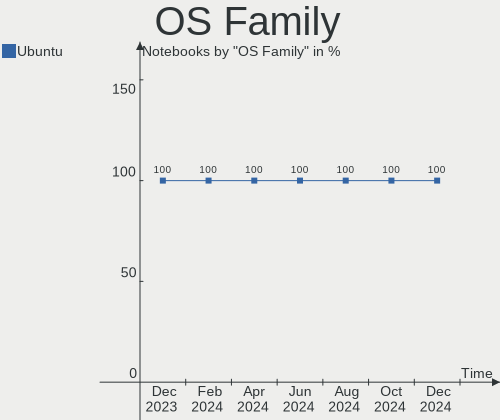
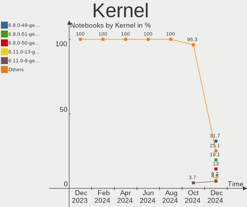
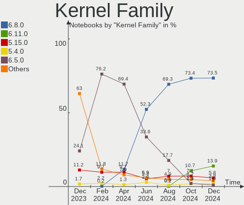
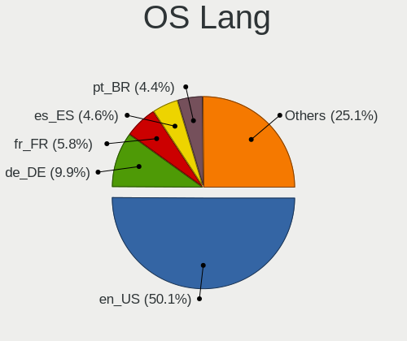
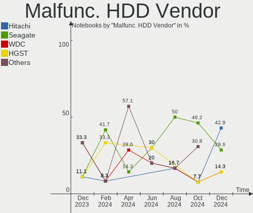
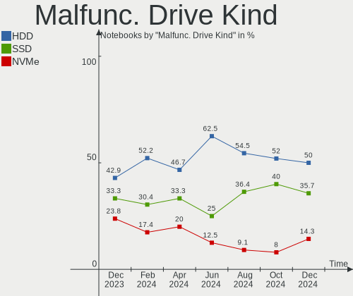
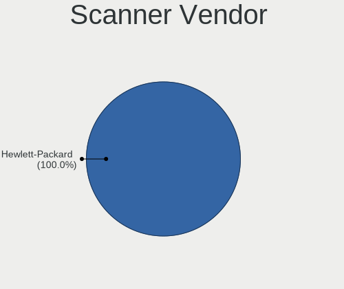

Ubuntu Hardware Trends (Notebook)
---------------------------------

A project to identify most popular hardware characteristics and track their change
over time based on data collected by Ubuntu users at https://Linux-Hardware.org.

Anyone can contribute to the study by uploading probes of their computers by
the [hw-probe](https://github.com/linuxhw/hw-probe) tool:

    sudo -E hw-probe -all -upload

Full-feature report is available here: https://linux-hardware.org/?view=trends&formfactor=notebook

Period: Nov, 2020.

Contents
--------

- [ OS                       ](#os)
- [ OS Family                ](#os-family)
- [ Kernel                   ](#kernel)
- [ Kernel Family            ](#kernel-family)
- [ Kernel Major Ver.        ](#kernel-major-ver)
- [ Arch                     ](#arch)
- [ DE                       ](#de)
- [ Display Server           ](#display-server)
- [ Display Manager          ](#display-manager)
- [ OS Lang                  ](#os-lang)
- [ Boot Mode                ](#boot-mode)
- [ Filesystem               ](#filesystem)
- [ Part. scheme             ](#part-scheme)
- [ Dual Boot with Linux/BSD ](#dual-boot-with-linux/bsd)
- [ Dual Boot (Win)          ](#dual-boot-win)
- [ Country                  ](#country)
- [ City                     ](#city)
- [ Vendor                   ](#vendor)
- [ Model                    ](#model)
- [ Model Family             ](#model-family)
- [ MFG Year                 ](#mfg-year)
- [ Form Factor              ](#form-factor)
- [ Secure Boot              ](#secure-boot)
- [ Coreboot                 ](#coreboot)
- [ RAM Size                 ](#ram-size)
- [ RAM Used                 ](#ram-used)
- [ Has CD-ROM               ](#has-cd-rom)
- [ Total Drives             ](#total-drives)
- [ Has Ethernet             ](#has-ethernet)
- [ Drive Vendor             ](#drive-vendor)
- [ Drive Model              ](#drive-model)
- [ HDD Vendor               ](#hdd-vendor)
- [ SSD Vendor               ](#ssd-vendor)
- [ Drive Kind               ](#drive-kind)
- [ Drive Connector          ](#drive-connector)
- [ Drive Size               ](#drive-size)
- [ Space Total              ](#space-total)
- [ Space Used               ](#space-used)
- [ Malfunc. Drives          ](#malfunc-drives)
- [ Malfunc. Drive Vendor    ](#malfunc-drive-vendor)
- [ Malfunc. HDD Vendor      ](#malfunc-hdd-vendor)
- [ Malfunc. Drive Kind      ](#malfunc-drive-kind)
- [ Failed Drives            ](#failed-drives)
- [ Failed Drive Vendor      ](#failed-drive-vendor)
- [ Drive Status             ](#drive-status)
- [ Storage Vendor           ](#storage-vendor)
- [ Storage Model            ](#storage-model)
- [ Storage Kind             ](#storage-kind)
- [ CPU Vendor               ](#cpu-vendor)
- [ CPU Model                ](#cpu-model)
- [ CPU Model Family         ](#cpu-model-family)
- [ CPU Cores                ](#cpu-cores)
- [ CPU Sockets              ](#cpu-sockets)
- [ CPU Threads              ](#cpu-threads)
- [ CPU Op-Modes             ](#cpu-op-modes)
- [ CPU Microcode            ](#cpu-microcode)
- [ CPU Microarch            ](#cpu-microarch)
- [ GPU Vendor               ](#gpu-vendor)
- [ GPU Model                ](#gpu-model)
- [ GPU Combo                ](#gpu-combo)
- [ GPU Driver               ](#gpu-driver)
- [ GPU Memory               ](#gpu-memory)
- [ Monitor Vendor           ](#monitor-vendor)
- [ Monitor Model            ](#monitor-model)
- [ Monitor Resolution       ](#monitor-resolution)
- [ Monitor Diagonal         ](#monitor-diagonal)
- [ Monitor Width            ](#monitor-width)
- [ Aspect Ratio             ](#aspect-ratio)
- [ Monitor Area             ](#monitor-area)
- [ Pixel Density            ](#pixel-density)
- [ Multiple Monitors        ](#multiple-monitors)
- [ Net Controller Vendor    ](#net-controller-vendor)
- [ Net Controller Model     ](#net-controller-model)
- [ Wireless Vendor          ](#wireless-vendor)
- [ Wireless Model           ](#wireless-model)
- [ Ethernet Vendor          ](#ethernet-vendor)
- [ Ethernet Model           ](#ethernet-model)
- [ Net Controller Kind      ](#net-controller-kind)
- [ Used Controller          ](#used-controller)
- [ NICs                     ](#nics)
- [ Memory Vendor            ](#memory-vendor)
- [ Memory Model             ](#memory-model)
- [ Memory Kind              ](#memory-kind)
- [ Memory Form Factor       ](#memory-form-factor)
- [ Memory Size              ](#memory-size)
- [ Memory Speed             ](#memory-speed)
- [ Sound Vendor             ](#sound-vendor)
- [ Sound Model              ](#sound-model)
- [ Camera Vendor            ](#camera-vendor)
- [ Camera Model             ](#camera-model)
- [ Fingerprint Vendor       ](#fingerprint-vendor)
- [ Fingerprint Model        ](#fingerprint-model)
- [ Chipcard Vendor          ](#chipcard-vendor)
- [ Chipcard Model           ](#chipcard-model)
- [ Printer Vendor           ](#printer-vendor)
- [ Printer Model            ](#printer-model)
- [ Scanner Vendor           ](#scanner-vendor)
- [ Scanner Model            ](#scanner-model)
- [ Bluetooth Vendor         ](#bluetooth-vendor)
- [ Bluetooth Model          ](#bluetooth-model)
- [ Unsupported Devices      ](#unsupported-devices)
- [ Unsupported Device Types ](#unsupported-device-types)

OS
--

Installed operating systems

| Name         | Notebooks | Percent |
|--------------|-----------|---------|
| Ubuntu 20.04 | 909       | 67.53%  |
| Ubuntu 20.10 | 249       | 18.5%   |
| Ubuntu 18.04 | 146       | 10.85%  |
| Ubuntu 16.04 | 18        | 1.34%   |
| Ubuntu 19.10 | 10        | 0.74%   |
| Ubuntu 21.04 | 4         | 0.3%    |
| Ubuntu 18.10 | 4         | 0.3%    |
| Ubuntu 19.04 | 3         | 0.22%   |
| Ubuntu       | 3         | 0.22%   |

OS Family
---------

OS without a version

| Name   | Notebooks | Percent |
|--------|-----------|---------|
| Ubuntu | 1346      | 100%    |

Kernel
------

Version of the Linux kernel

| Version                   | Notebooks | Percent |
|---------------------------|-----------|---------|
| 5.4.0-52-generic          | 338       | 25.11%  |
| 5.4.0-54-generic          | 295       | 21.92%  |
| 5.4.0-53-generic          | 176       | 13.08%  |
| 5.8.0-29-generic          | 95        | 7.06%   |
| 5.8.0-26-generic          | 75        | 5.57%   |
| 5.4.0-42-generic          | 64        | 4.75%   |
| 5.8.0-28-generic          | 43        | 3.19%   |
| 5.8.0-25-generic          | 23        | 1.71%   |
| 4.15.0-123-generic        | 18        | 1.34%   |
| 5.4.0-26-generic          | 16        | 1.19%   |
| 4.15.0-122-generic        | 15        | 1.11%   |
| 5.4.0-48-generic          | 13        | 0.97%   |
| 4.15.0-124-generic        | 13        | 0.97%   |
| 5.4.0-55-generic          | 8         | 0.59%   |
| 5.8.0-30-generic          | 7         | 0.52%   |
| 5.4.0-52-lowlatency       | 7         | 0.52%   |
| 5.9.6-050906-generic      | 5         | 0.37%   |
| 5.4.0-56-generic          | 5         | 0.37%   |
| 5.4.0-54-lowlatency       | 5         | 0.37%   |
| 5.3.0-64-generic          | 5         | 0.37%   |
| 5.8.0-050800-generic      | 4         | 0.3%    |
| 5.4.0-53-lowlatency       | 4         | 0.3%    |
| 5.4.0-51-generic          | 4         | 0.3%    |
| 5.4.0-47-generic          | 4         | 0.3%    |
| 5.0.0-23-generic          | 4         | 0.3%    |
| 5.8.0-7630-generic        | 3         | 0.22%   |
| 5.8.0-26-lowlatency       | 3         | 0.22%   |
| 5.6.0-1034-oem            | 3         | 0.22%   |
| 4.4.0-193-generic         | 3         | 0.22%   |
| 4.18.0-25-generic         | 3         | 0.22%   |
| 4.15.0-45-generic         | 3         | 0.22%   |
| 4.15.0-1102-oem           | 3         | 0.22%   |
| 5.9.3-050903-generic      | 2         | 0.15%   |
| 5.8.0-29-lowlatency       | 2         | 0.15%   |
| 5.8.0-28-lowlatency       | 2         | 0.15%   |
| 5.8.0-14-generic          | 2         | 0.15%   |
| 5.4.61-050461-generic     | 2         | 0.15%   |
| 5.4.0-49-generic          | 2         | 0.15%   |
| 5.4.0-42-lowlatency       | 2         | 0.15%   |
| 5.3.0-46-generic          | 2         | 0.15%   |
| 5.3.0-18-generic          | 2         | 0.15%   |
| 5.0.0-13-generic          | 2         | 0.15%   |
| 4.18.0-10-generic         | 2         | 0.15%   |
| 4.15.0-76-generic         | 2         | 0.15%   |
| 4.15.0-29-generic         | 2         | 0.15%   |
| 4.15.0-20-generic         | 2         | 0.15%   |
| 5.9.8-050908-generic      | 1         | 0.07%   |
| 5.9.7-050907-generic      | 1         | 0.07%   |
| 5.9.1-050901-lowlatency   | 1         | 0.07%   |
| 5.9.1-050901-generic      | 1         | 0.07%   |
| 5.9.0-050900-generic      | 1         | 0.07%   |
| 5.8.5-050805-generic      | 1         | 0.07%   |
| 5.8.18-050818-generic     | 1         | 0.07%   |
| 5.8.17-xanmod1            | 1         | 0.07%   |
| 5.8.17-rockchip64         | 1         | 0.07%   |
| 5.8.16-050816-generic     | 1         | 0.07%   |
| 5.8.10-050810-generic     | 1         | 0.07%   |
| 5.8.1-050801-generic      | 1         | 0.07%   |
| 5.8.0-7625-generic        | 1         | 0.07%   |
| 5.8.0-13.1-liquorix-amd64 | 1         | 0.07%   |

Kernel Family
-------------

Linux kernel without a distro release

| Version | Notebooks | Percent |
|---------|-----------|---------|
| 5.4.0   | 946       | 70.28%  |
| 5.8.0   | 261       | 19.39%  |
| 4.15.0  | 68        | 5.05%   |
| 5.3.0   | 15        | 1.11%   |
| 5.0.0   | 9         | 0.67%   |
| 4.4.0   | 8         | 0.59%   |
| 5.9.6   | 5         | 0.37%   |
| 5.6.0   | 5         | 0.37%   |
| 4.18.0  | 5         | 0.37%   |
| 5.9.3   | 2         | 0.15%   |
| 5.9.1   | 2         | 0.15%   |
| 5.8.17  | 2         | 0.15%   |
| 5.4.61  | 2         | 0.15%   |
| 5.10.0  | 2         | 0.15%   |
| 5.9.8   | 1         | 0.07%   |
| 5.9.7   | 1         | 0.07%   |
| 5.9.0   | 1         | 0.07%   |
| 5.8.5   | 1         | 0.07%   |
| 5.8.18  | 1         | 0.07%   |
| 5.8.16  | 1         | 0.07%   |
| 5.8.10  | 1         | 0.07%   |
| 5.8.1   | 1         | 0.07%   |
| 5.7.15  | 1         | 0.07%   |
| 5.7.1   | 1         | 0.07%   |
| 5.4.2   | 1         | 0.07%   |
| 4.8.17  | 1         | 0.07%   |
| 4.14.41 | 1         | 0.07%   |
| 4.10.0  | 1         | 0.07%   |

Kernel Major Ver.
-----------------

Linux kernel major version

| Version | Notebooks | Percent |
|---------|-----------|---------|
| 5.4     | 949       | 70.51%  |
| 5.8     | 268       | 19.91%  |
| 4.15    | 68        | 5.05%   |
| 5.3     | 15        | 1.11%   |
| 5.9     | 12        | 0.89%   |
| 5.0     | 9         | 0.67%   |
| 4.4     | 8         | 0.59%   |
| 5.6     | 5         | 0.37%   |
| 4.18    | 5         | 0.37%   |
| 5.7     | 2         | 0.15%   |
| 5.10    | 2         | 0.15%   |
| 4.8     | 1         | 0.07%   |
| 4.14    | 1         | 0.07%   |
| 4.10    | 1         | 0.07%   |

Arch
----

OS architecture (x86_64, i586, etc.)

| Name    | Notebooks | Percent |
|---------|-----------|---------|
| x86_64  | 1303      | 96.81%  |
| i686    | 42        | 3.12%   |
| aarch64 | 1         | 0.07%   |

DE
--

Desktop Environment

| Name            | Notebooks | Percent |
|-----------------|-----------|---------|
| GNOME           | 1025      | 76.15%  |
| XFCE            | 94        | 6.98%   |
| Unknown         | 59        | 4.38%   |
| KDE5            | 34        | 2.53%   |
| KDE             | 32        | 2.38%   |
| MATE            | 25        | 1.86%   |
| Unity           | 21        | 1.56%   |
| LXQt            | 19        | 1.41%   |
| Budgie          | 11        | 0.82%   |
| GNOME Flashback | 9         | 0.67%   |
| Cinnamon        | 6         | 0.45%   |
| X-Cinnamon      | 5         | 0.37%   |
| LXDE            | 5         | 0.37%   |
| xubuntu         | 1         | 0.07%   |

Display Server
--------------

X11 or Wayland

| Name    | Notebooks | Percent |
|---------|-----------|---------|
| X11     | 1268      | 94.21%  |
| Wayland | 45        | 3.34%   |
| Unknown | 26        | 1.93%   |
| Tty     | 7         | 0.52%   |

Display Manager
---------------

SDDM, LightDM, etc.

| Name    | Notebooks | Percent |
|---------|-----------|---------|
| Unknown | 1047      | 77.79%  |
| GDM     | 207       | 15.38%  |
| TDM     | 48        | 3.57%   |
| SDDM    | 41        | 3.05%   |
| XDM     | 2         | 0.15%   |
| NODM    | 1         | 0.07%   |

OS Lang
-------

Language

| Lang       | Notebooks | Percent |
|------------|-----------|---------|
| en_US      | 537       | 39.9%   |
| de_DE      | 115       | 8.54%   |
| fr_FR      | 75        | 5.57%   |
| en_GB      | 69        | 5.13%   |
| it_IT      | 63        | 4.68%   |
| pt_BR      | 57        | 4.23%   |
| ru_RU      | 53        | 3.94%   |
| en_IN      | 46        | 3.42%   |
| es_ES      | 32        | 2.38%   |
| en_CA      | 28        | 2.08%   |
| pl_PL      | 27        | 2.01%   |
| hu_HU      | 17        | 1.26%   |
| en_AU      | 15        | 1.11%   |
| cs_CZ      | 14        | 1.04%   |
| C          | 14        | 1.04%   |
| tr_TR      | 13        | 0.97%   |
| nl_NL      | 11        | 0.82%   |
| en_ZA      | 11        | 0.82%   |
| sk_SK      | 7         | 0.52%   |
| pt_PT      | 7         | 0.52%   |
| es_MX      | 7         | 0.52%   |
| sv_SE      | 6         | 0.45%   |
| ru_UA      | 6         | 0.45%   |
| ja_JP      | 6         | 0.45%   |
| fi_FI      | 6         | 0.45%   |
| de_CH      | 6         | 0.45%   |
| Unknown    | 6         | 0.45%   |
| zh_CN      | 5         | 0.37%   |
| es_CO      | 5         | 0.37%   |
| en_IE      | 5         | 0.37%   |
| nl_BE      | 4         | 0.3%    |
| es_CL      | 4         | 0.3%    |
| es_AR      | 4         | 0.3%    |
| en_IL      | 4         | 0.3%    |
| el_GR      | 4         | 0.3%    |
| de_AT      | 4         | 0.3%    |
| da_DK      | 4         | 0.3%    |
| zh_TW      | 3         | 0.22%   |
| ro_RO      | 3         | 0.22%   |
| nb_NO      | 3         | 0.22%   |
| fr_CA      | 3         | 0.22%   |
| en_SG      | 3         | 0.22%   |
| ko_KR      | 2         | 0.15%   |
| es_EC      | 2         | 0.15%   |
| en_US.utf8 | 2         | 0.15%   |
| en_PH      | 2         | 0.15%   |
| en_NZ      | 2         | 0.15%   |
| bg_BG      | 2         | 0.15%   |
| ar_EG      | 2         | 0.15%   |
| sr_RS      | 1         | 0.07%   |
| sl_SI      | 1         | 0.07%   |
| id_ID      | 1         | 0.07%   |
| he_IL      | 1         | 0.07%   |
| fr_BE      | 1         | 0.07%   |
| fa_IR      | 1         | 0.07%   |
| es_PY      | 1         | 0.07%   |
| es_PE      | 1         | 0.07%   |
| es_PA      | 1         | 0.07%   |
| es_HN      | 1         | 0.07%   |
| eo_US      | 1         | 0.07%   |

Boot Mode
---------

EFI or BIOS

| Mode | Notebooks | Percent |
|------|-----------|---------|
| BIOS | 740       | 54.98%  |
| EFI  | 606       | 45.02%  |

Filesystem
----------

Type of filesystem

| Type    | Notebooks | Percent |
|---------|-----------|---------|
| Ext4    | 1255      | 93.24%  |
| Overlay | 53        | 3.94%   |
| Zfs     | 21        | 1.56%   |
| Btrfs   | 9         | 0.67%   |
| Xfs     | 4         | 0.3%    |
| Ext3    | 2         | 0.15%   |
| Ext2    | 1         | 0.07%   |
| Aufs    | 1         | 0.07%   |

Part. scheme
------------

Scheme of partitioning

| Type    | Notebooks | Percent |
|---------|-----------|---------|
| Unknown | 1047      | 77.79%  |
| GPT     | 230       | 17.09%  |
| MBR     | 69        | 5.13%   |

Dual Boot with Linux/BSD
------------------------

Hosting more than one Linux/BSD

| Dual boot | Notebooks | Percent |
|-----------|-----------|---------|
| No        | 1222      | 90.79%  |
| Yes       | 124       | 9.21%   |

Dual Boot (Win)
---------------

Hosting Linux and Windows

| Dual boot | Notebooks | Percent |
|-----------|-----------|---------|
| No        | 878       | 65.23%  |
| Yes       | 468       | 34.77%  |

Country
-------

Geographic location (country)

| Country                | Notebooks | Percent |
|------------------------|-----------|---------|
| USA                    | 180       | 13.37%  |
| Germany                | 147       | 10.92%  |
| France                 | 87        | 6.46%   |
| Brazil                 | 76        | 5.65%   |
| Italy                  | 67        | 4.98%   |
| UK                     | 59        | 4.38%   |
| Russia                 | 56        | 4.16%   |
| India                  | 50        | 3.71%   |
| Spain                  | 42        | 3.12%   |
| Poland                 | 40        | 2.97%   |
| Canada                 | 35        | 2.6%    |
| Netherlands            | 30        | 2.23%   |
| Czech Republic         | 26        | 1.93%   |
| Ukraine                | 22        | 1.63%   |
| Hungary                | 22        | 1.63%   |
| Mexico                 | 20        | 1.49%   |
| Turkey                 | 19        | 1.41%   |
| Switzerland            | 16        | 1.19%   |
| Belgium                | 16        | 1.19%   |
| Australia              | 16        | 1.19%   |
| Romania                | 15        | 1.11%   |
| Portugal               | 14        | 1.04%   |
| Sweden                 | 13        | 0.97%   |
| Indonesia              | 13        | 0.97%   |
| Greece                 | 13        | 0.97%   |
| South Africa           | 12        | 0.89%   |
| Austria                | 12        | 0.89%   |
| Finland                | 10        | 0.74%   |
| Denmark                | 10        | 0.74%   |
| Slovakia               | 9         | 0.67%   |
| Ireland                | 9         | 0.67%   |
| Iran                   | 9         | 0.67%   |
| Egypt                  | 9         | 0.67%   |
| Argentina              | 9         | 0.67%   |
| Norway                 | 8         | 0.59%   |
| Israel                 | 8         | 0.59%   |
| Serbia                 | 7         | 0.52%   |
| Colombia               | 7         | 0.52%   |
| Vietnam                | 6         | 0.45%   |
| Japan                  | 6         | 0.45%   |
| Chile                  | 6         | 0.45%   |
| Pakistan               | 5         | 0.37%   |
| New Zealand            | 5         | 0.37%   |
| Kenya                  | 5         | 0.37%   |
| Singapore              | 4         | 0.3%    |
| Latvia                 | 4         | 0.3%    |
| Ecuador                | 4         | 0.3%    |
| China                  | 4         | 0.3%    |
| Bulgaria               | 4         | 0.3%    |
| Bosnia and Herzegovina | 4         | 0.3%    |
| Belarus                | 4         | 0.3%    |
| Tunisia                | 3         | 0.22%   |
| Thailand               | 3         | 0.22%   |
| Slovenia               | 3         | 0.22%   |
| Malaysia               | 3         | 0.22%   |
| Korea, Republic of     | 3         | 0.22%   |
| Jordan                 | 3         | 0.22%   |
| Algeria                | 3         | 0.22%   |
| Uruguay                | 2         | 0.15%   |
| Taiwan                 | 2         | 0.15%   |

City
----

Geographic location (city)

| City              | Notebooks | Percent |
|-------------------|-----------|---------|
| Berlin            | 14        | 1.04%   |
| Prague            | 13        | 0.97%   |
| Moscow            | 13        | 0.97%   |
| São Paulo        | 12        | 0.89%   |
| Milan             | 10        | 0.74%   |
| Paris             | 9         | 0.67%   |
| Cairo             | 8         | 0.59%   |
| Budapest          | 8         | 0.59%   |
| Athens            | 8         | 0.59%   |
| Vienna            | 7         | 0.52%   |
| Munich            | 7         | 0.52%   |
| Warsaw            | 6         | 0.45%   |
| Tehran            | 6         | 0.45%   |
| St Petersburg     | 6         | 0.45%   |
| Rome              | 6         | 0.45%   |
| Madrid            | 6         | 0.45%   |
| Johannesburg      | 6         | 0.45%   |
| Istanbul          | 6         | 0.45%   |
| Frankfurt am Main | 6         | 0.45%   |
| Bucharest         | 6         | 0.45%   |
| Novosibirsk       | 5         | 0.37%   |
| Nairobi           | 5         | 0.37%   |
| Karlsruhe         | 5         | 0.37%   |
| Dublin            | 5         | 0.37%   |
| Buenos Aires      | 5         | 0.37%   |
| Bengaluru         | 5         | 0.37%   |
| Toronto           | 4         | 0.3%    |
| Stuttgart         | 4         | 0.3%    |
| Singapore         | 4         | 0.3%    |
| Seattle           | 4         | 0.3%    |
| Rio de Janeiro    | 4         | 0.3%    |
| Pune              | 4         | 0.3%    |
| Mexico City       | 4         | 0.3%    |
| Melbourne         | 4         | 0.3%    |
| Mainz             | 4         | 0.3%    |
| Jakarta           | 4         | 0.3%    |
| Hanoi             | 4         | 0.3%    |
| Genoa             | 4         | 0.3%    |
| Düsseldorf       | 4         | 0.3%    |
| Ankara            | 4         | 0.3%    |
| Amsterdam         | 4         | 0.3%    |
| Łódź           | 3         | 0.22%   |
| Wrocław          | 3         | 0.22%   |
| Vancouver         | 3         | 0.22%   |
| Uppsala           | 3         | 0.22%   |
| Turin             | 3         | 0.22%   |
| Surabaya          | 3         | 0.22%   |
| Stockholm         | 3         | 0.22%   |
| Rotterdam         | 3         | 0.22%   |
| Rostock           | 3         | 0.22%   |
| Riga              | 3         | 0.22%   |
| Olomouc           | 3         | 0.22%   |
| Newark            | 3         | 0.22%   |
| Montreal          | 3         | 0.22%   |
| Miskolc           | 3         | 0.22%   |
| Marseille         | 3         | 0.22%   |
| Los Angeles       | 3         | 0.22%   |
| Lahore            | 3         | 0.22%   |
| Krakow            | 3         | 0.22%   |
| Kassel            | 3         | 0.22%   |

Vendor
------

Motherboard manufacturer

| Name                             | Notebooks | Percent |
|----------------------------------|-----------|---------|
| Dell                             | 278       | 20.65%  |
| Hewlett-Packard                  | 267       | 19.84%  |
| Lenovo                           | 257       | 19.09%  |
| ASUSTek Computer                 | 128       | 9.51%   |
| Acer                             | 121       | 8.99%   |
| Toshiba                          | 65        | 4.83%   |
| Sony                             | 28        | 2.08%   |
| Samsung Electronics              | 26        | 1.93%   |
| Apple                            | 23        | 1.71%   |
| MSI                              | 20        | 1.49%   |
| Fujitsu                          | 17        | 1.26%   |
| HUAWEI                           | 13        | 0.97%   |
| Medion                           | 10        | 0.74%   |
| Fujitsu Siemens                  | 8         | 0.59%   |
| Positivo                         | 6         | 0.45%   |
| System76                         | 5         | 0.37%   |
| Google                           | 5         | 0.37%   |
| Unknown                          | 5         | 0.37%   |
| TUXEDO                           | 4         | 0.3%    |
| Packard Bell                     | 4         | 0.3%    |
| Notebook                         | 4         | 0.3%    |
| Gateway                          | 4         | 0.3%    |
| eMachines                        | 4         | 0.3%    |
| Intel                            | 3         | 0.22%   |
| Alienware                        | 3         | 0.22%   |
| Pegatron                         | 2         | 0.15%   |
| I-Life Digital Technologies      | 2         | 0.15%   |
| Gigabyte Technology              | 2         | 0.15%   |
| EUROCOM                          | 2         | 0.15%   |
| Advent                           | 2         | 0.15%   |
| YJKC                             | 1         | 0.07%   |
| U Leader Design                  | 1         | 0.07%   |
| Timi                             | 1         | 0.07%   |
| SiComputer                       | 1         | 0.07%   |
| SCHNEIDER                        | 1         | 0.07%   |
| Schenker                         | 1         | 0.07%   |
| Razer                            | 1         | 0.07%   |
| Prestigio                        | 1         | 0.07%   |
| Pine Microsystems                | 1         | 0.07%   |
| PC Specialist                    | 1         | 0.07%   |
| Panasonic                        | 1         | 0.07%   |
| Mediacom                         | 1         | 0.07%   |
| Matsushita Electric Industrial   | 1         | 0.07%   |
| Linx                             | 1         | 0.07%   |
| LG Electronics                   | 1         | 0.07%   |
| KIANO                            | 1         | 0.07%   |
| Jumper                           | 1         | 0.07%   |
| Itautec                          | 1         | 0.07%   |
| HASEE Computer                   | 1         | 0.07%   |
| Hampoo                           | 1         | 0.07%   |
| Fusion5                          | 1         | 0.07%   |
| FUJITSU CLIENT COMPUTING LIMITED | 1         | 0.07%   |
| Eluktronics                      | 1         | 0.07%   |
| Dynabook                         | 1         | 0.07%   |
| Clevo                            | 1         | 0.07%   |
| Casper                           | 1         | 0.07%   |
| BANGHO                           | 1         | 0.07%   |
| AZW                              | 1         | 0.07%   |

Model
-----

Motherboard model

| Name                                 | Notebooks | Percent |
|--------------------------------------|-----------|---------|
| Unknown                              | 15        | 1.11%   |
| HP Notebook                          | 11        | 0.82%   |
| Dell XPS 15 9570                     | 7         | 0.52%   |
| Dell Latitude E6430                  | 7         | 0.52%   |
| HP ProBook 450 G7                    | 6         | 0.45%   |
| HP Pavilion g6                       | 6         | 0.45%   |
| Dell XPS 13 7390                     | 6         | 0.45%   |
| Dell Latitude E6410                  | 6         | 0.45%   |
| Dell Inspiron 5570                   | 6         | 0.45%   |
| HP Pavilion dv7                      | 5         | 0.37%   |
| HP 15                                | 5         | 0.37%   |
| Dell XPS 15 9560                     | 5         | 0.37%   |
| Dell XPS 15 9500                     | 5         | 0.37%   |
| Dell XPS 15 7590                     | 5         | 0.37%   |
| Dell Latitude E6540                  | 5         | 0.37%   |
| Dell Latitude E6420                  | 5         | 0.37%   |
| Dell Inspiron 3542                   | 5         | 0.37%   |
| Apple MacBookAir5,2                  | 5         | 0.37%   |
| Lenovo G50-45 80E3                   | 4         | 0.3%    |
| HUAWEI NBLK-WAX9X                    | 4         | 0.3%    |
| HP Laptop 15-db0xxx                  | 4         | 0.3%    |
| HP EliteBook 8560w                   | 4         | 0.3%    |
| HP EliteBook 8460p                   | 4         | 0.3%    |
| HP EliteBook 840 G6                  | 4         | 0.3%    |
| Dell XPS 13 9380                     | 4         | 0.3%    |
| Dell Latitude E7270                  | 4         | 0.3%    |
| Dell Inspiron 15-3567                | 4         | 0.3%    |
| Toshiba Satellite C55-C              | 3         | 0.22%   |
| Toshiba Satellite A200               | 3         | 0.22%   |
| Lenovo ThinkBook 15-IIL 20SM         | 3         | 0.22%   |
| Lenovo IdeaPad 530S-14IKB 81EU       | 3         | 0.22%   |
| HP ZBook 15 G2                       | 3         | 0.22%   |
| HP ProBook 4720s                     | 3         | 0.22%   |
| HP ProBook 455 G7                    | 3         | 0.22%   |
| HP ProBook 4540s                     | 3         | 0.22%   |
| HP Pavilion dv5                      | 3         | 0.22%   |
| HP Laptop 17-ca1xxx                  | 3         | 0.22%   |
| HP Laptop 15-bw0xx                   | 3         | 0.22%   |
| HP EliteBook 8470p                   | 3         | 0.22%   |
| HP EliteBook 840 G1                  | 3         | 0.22%   |
| HP 250 G3                            | 3         | 0.22%   |
| Fujitsu Siemens ESPRIMO Mobile V5535 | 3         | 0.22%   |
| Dell XPS 13 9300                     | 3         | 0.22%   |
| Dell Vostro 5490                     | 3         | 0.22%   |
| Dell Precision 5540                  | 3         | 0.22%   |
| Dell Latitude E6520                  | 3         | 0.22%   |
| Dell Latitude E6400                  | 3         | 0.22%   |
| Dell Latitude E5420                  | 3         | 0.22%   |
| Dell Latitude 7480                   | 3         | 0.22%   |
| Dell Latitude 5480                   | 3         | 0.22%   |
| Dell Inspiron N5110                  | 3         | 0.22%   |
| Dell Inspiron 7577                   | 3         | 0.22%   |
| Dell Inspiron 5593                   | 3         | 0.22%   |
| Dell G5 5590                         | 3         | 0.22%   |
| ASUS X510UNR                         | 3         | 0.22%   |
| Acer Nitro AN515-43                  | 3         | 0.22%   |
| Acer Aspire 5742G                    | 3         | 0.22%   |
| Acer Aspire 5738                     | 3         | 0.22%   |
| Toshiba Satellite L755               | 2         | 0.15%   |
| Toshiba Satellite L500               | 2         | 0.15%   |

Model Family
------------

Motherboard model prefix

| Name                     | Notebooks | Percent |
|--------------------------|-----------|---------|
| Lenovo ThinkPad          | 135       | 10.03%  |
| Dell Latitude            | 99        | 7.36%   |
| Acer Aspire              | 89        | 6.61%   |
| Dell Inspiron            | 82        | 6.09%   |
| Lenovo IdeaPad           | 63        | 4.68%   |
| Toshiba Satellite        | 56        | 4.16%   |
| HP EliteBook             | 54        | 4.01%   |
| HP ProBook               | 51        | 3.79%   |
| Dell XPS                 | 51        | 3.79%   |
| HP Pavilion              | 44        | 3.27%   |
| HP Laptop                | 34        | 2.53%   |
| Dell Vostro              | 20        | 1.49%   |
| ASUS VivoBook            | 20        | 1.49%   |
| Dell Precision           | 17        | 1.26%   |
| Unknown                  | 15        | 1.11%   |
| Fujitsu LIFEBOOK         | 14        | 1.04%   |
| HP Notebook              | 11        | 0.82%   |
| HP Compaq                | 11        | 0.82%   |
| Acer Swift               | 10        | 0.74%   |
| Lenovo Legion            | 9         | 0.67%   |
| HP ZBook                 | 8         | 0.59%   |
| HP 250                   | 8         | 0.59%   |
| HP ENVY                  | 6         | 0.45%   |
| Acer Nitro               | 6         | 0.45%   |
| Lenovo ThinkBook         | 5         | 0.37%   |
| HP 15                    | 5         | 0.37%   |
| Apple MacBookAir5        | 5         | 0.37%   |
| Acer TravelMate          | 5         | 0.37%   |
| Packard Bell EasyNote    | 4         | 0.3%    |
| Lenovo G580              | 4         | 0.3%    |
| Lenovo G50-45            | 4         | 0.3%    |
| HUAWEI NBLK-WAX9X        | 4         | 0.3%    |
| Fujitsu Siemens ESPRIMO  | 4         | 0.3%    |
| ASUS ZenBook             | 4         | 0.3%    |
| ASUS TUF                 | 4         | 0.3%    |
| MSI Prestige             | 3         | 0.22%   |
| Lenovo B560              | 3         | 0.22%   |
| HP Presario              | 3         | 0.22%   |
| HP OMEN                  | 3         | 0.22%   |
| HP 255                   | 3         | 0.22%   |
| Fujitsu Siemens LIFEBOOK | 3         | 0.22%   |
| Dell G5                  | 3         | 0.22%   |
| Dell G3                  | 3         | 0.22%   |
| ASUS X510UNR             | 3         | 0.22%   |
| ASUS ROG                 | 3         | 0.22%   |
| Acer Predator            | 3         | 0.22%   |
| Toshiba TECRA            | 2         | 0.15%   |
| System76 Galago          | 2         | 0.15%   |
| Sony VPCCA1S1E           | 2         | 0.15%   |
| Samsung R59P             | 2         | 0.15%   |
| Samsung R530             | 2         | 0.15%   |
| Samsung 340XAA           | 2         | 0.15%   |
| Samsung 300E4C           | 2         | 0.15%   |
| Notebook NL40            | 2         | 0.15%   |
| Medion P15648            | 2         | 0.15%   |
| Medion Akoya             | 2         | 0.15%   |
| Lenovo Yoga              | 2         | 0.15%   |
| Lenovo Y520-15IKBN       | 2         | 0.15%   |
| Lenovo V330-15IKB        | 2         | 0.15%   |
| Lenovo G570              | 2         | 0.15%   |

MFG Year
--------

Motherboard manufacture year

| Year    | Notebooks | Percent |
|---------|-----------|---------|
| 2020    | 297       | 22.07%  |
| 2019    | 207       | 15.38%  |
| 2018    | 109       | 8.1%    |
| 2013    | 95        | 7.06%   |
| 2012    | 80        | 5.94%   |
| 2011    | 80        | 5.94%   |
| 2014    | 77        | 5.72%   |
| 2016    | 70        | 5.2%    |
| 2010    | 69        | 5.13%   |
| 2015    | 65        | 4.83%   |
| 2017    | 61        | 4.53%   |
| 2009    | 52        | 3.86%   |
| 2008    | 45        | 3.34%   |
| 2007    | 27        | 2.01%   |
| 2006    | 6         | 0.45%   |
| 2005    | 4         | 0.3%    |
| Unknown | 2         | 0.15%   |

Form Factor
-----------

Physical design of the computer

| Name     | Notebooks | Percent |
|----------|-----------|---------|
| Notebook | 1346      | 100%    |

Secure Boot
-----------

Enabled or disabled

| State    | Notebooks | Percent |
|----------|-----------|---------|
| Disabled | 1189      | 88.34%  |
| Enabled  | 157       | 11.66%  |

Coreboot
--------

Have coreboot on board

| Used | Notebooks | Percent |
|------|-----------|---------|
| No   | 1338      | 99.41%  |
| Yes  | 8         | 0.59%   |

RAM Size
--------

Total RAM memory

| Size in GB  | Notebooks | Percent |
|-------------|-----------|---------|
| 4.01-8.0    | 367       | 27.27%  |
| 3.01-4.0    | 359       | 26.67%  |
| 16.01-24.0  | 218       | 16.2%   |
| 8.01-16.0   | 204       | 15.16%  |
| 1.01-2.0    | 77        | 5.72%   |
| 32.01-64.0  | 61        | 4.53%   |
| 2.01-3.0    | 33        | 2.45%   |
| 24.01-32.0  | 10        | 0.74%   |
| 0.01-1.0    | 9         | 0.67%   |
| 64.01-256.0 | 8         | 0.59%   |

RAM Used
--------

Used RAM memory

| Used GB    | Notebooks | Percent |
|------------|-----------|---------|
| 1.01-2.0   | 531       | 39.45%  |
| 2.01-3.0   | 356       | 26.45%  |
| 4.01-8.0   | 175       | 13%     |
| 3.01-4.0   | 156       | 11.59%  |
| 0.01-1.0   | 83        | 6.17%   |
| 8.01-16.0  | 40        | 2.97%   |
| 24.01-32.0 | 2         | 0.15%   |
| 16.01-24.0 | 2         | 0.15%   |
| 32.01-64.0 | 1         | 0.07%   |

Has CD-ROM
----------

Has CD-ROM on board

| Presented | Notebooks | Percent |
|-----------|-----------|---------|
| No        | 743       | 55.2%   |
| Yes       | 603       | 44.8%   |

Total Drives
------------

Number of drives on board

| Drives | Notebooks | Percent |
|--------|-----------|---------|
| 1      | 997       | 74.07%  |
| 2      | 290       | 21.55%  |
| 3      | 39        | 2.9%    |
| 0      | 18        | 1.34%   |
| 4      | 2         | 0.15%   |

Has Ethernet
------------

Has Ethernet on board

| Presented | Notebooks | Percent |
|-----------|-----------|---------|
| Yes       | 1162      | 86.33%  |
| No        | 184       | 13.67%  |

Drive Vendor
------------

Hard drive vendors

| Vendor                    | Notebooks | Drives | Percent |
|---------------------------|-----------|--------|---------|
| Samsung Electronics       | 236       | 248    | 14.74%  |
| Seagate                   | 233       | 240    | 14.55%  |
| WDC                       | 191       | 193    | 11.93%  |
| Toshiba                   | 171       | 173    | 10.68%  |
| Sandisk                   | 103       | 106    | 6.43%   |
| Kingston                  | 85        | 86     | 5.31%   |
| SK Hynix                  | 78        | 79     | 4.87%   |
| Hitachi                   | 74        | 74     | 4.62%   |
| Unknown                   | 73        | 83     | 4.56%   |
| HGST                      | 53        | 54     | 3.31%   |
| Intel                     | 50        | 52     | 3.12%   |
| Crucial                   | 34        | 34     | 2.12%   |
| Micron Technology         | 28        | 28     | 1.75%   |
| A-DATA Technology         | 23        | 23     | 1.44%   |
| Apple                     | 16        | 16     | 1%      |
| Fujitsu                   | 12        | 12     | 0.75%   |
| LITEONIT                  | 10        | 11     | 0.62%   |
| LITEON                    | 10        | 10     | 0.62%   |
| Patriot                   | 9         | 9      | 0.56%   |
| SPCC                      | 8         | 8      | 0.5%    |
| KIOXIA                    | 8         | 8      | 0.5%    |
| China                     | 7         | 7      | 0.44%   |
| Corsair                   | 6         | 6      | 0.37%   |
| PNY                       | 5         | 5      | 0.31%   |
| Phison                    | 4         | 4      | 0.25%   |
| OCZ                       | 4         | 4      | 0.25%   |
| KingSpec                  | 4         | 5      | 0.25%   |
| KingDian                  | 4         | 4      | 0.25%   |
| JMicron                   | 4         | 4      | 0.25%   |
| Transcend                 | 3         | 3      | 0.19%   |
| Silicon Motion            | 3         | 3      | 0.19%   |
| SABRENT                   | 3         | 3      | 0.19%   |
| PLEXTOR                   | 3         | 3      | 0.19%   |
| Apacer                    | 3         | 3      | 0.19%   |
| XPG                       | 2         | 2      | 0.12%   |
| Lite-On                   | 2         | 2      | 0.12%   |
| Intenso                   | 2         | 2      | 0.12%   |
| HUAWEI                    | 2         | 2      | 0.12%   |
| Hewlett-Packard           | 2         | 2      | 0.12%   |
| BHT                       | 2         | 2      | 0.12%   |
| ADATA Technology          | 2         | 2      | 0.12%   |
| Vaseky                    | 1         | 1      | 0.06%   |
| V-GeN                     | 1         | 1      | 0.06%   |
| Union Memory (Shenzhen)   | 1         | 1      | 0.06%   |
| Union Memory              | 1         | 1      | 0.06%   |
| TO Exter                  | 1         | 1      | 0.06%   |
| Team                      | 1         | 1      | 0.06%   |
| SUNEAST                   | 1         | 1      | 0.06%   |
| Solid State Storage       | 1         | 1      | 0.06%   |
| Realtek Semiconductor     | 1         | 1      | 0.06%   |
| Phison Electronics        | 1         | 1      | 0.06%   |
| OSC                       | 1         | 1      | 0.06%   |
| Netac                     | 1         | 1      | 0.06%   |
| Micron/Crucial Technology | 1         | 1      | 0.06%   |
| Maxtor                    | 1         | 1      | 0.06%   |
| LONDISK                   | 1         | 1      | 0.06%   |
| Lenovo                    | 1         | 1      | 0.06%   |
| LDLC SSD                  | 1         | 1      | 0.06%   |
| Kston                     | 1         | 1      | 0.06%   |
| KDATA                     | 1         | 1      | 0.06%   |

Drive Model
-----------

Hard drive models

| Model                               | Notebooks | Percent |
|-------------------------------------|-----------|---------|
| Seagate ST1000LM035-1RK172 1TB      | 31        | 1.9%    |
| Seagate ST1000LM024 HN-M101MBB 1TB  | 26        | 1.59%   |
| Toshiba MQ01ABD100 1TB              | 24        | 1.47%   |
| Kingston SA400S37240G 240GB SSD     | 22        | 1.35%   |
| Seagate ST500LT012-1DG142 500GB     | 20        | 1.22%   |
| Unknown MMC Card  32GB              | 18        | 1.1%    |
| Sandisk NVMe SSD Drive 512GB        | 18        | 1.1%    |
| Intel NVMe SSD Drive 512GB          | 16        | 0.98%   |
| Toshiba MQ01ABF050 500GB            | 15        | 0.92%   |
| Seagate ST9500325AS 500GB           | 15        | 0.92%   |
| Toshiba MQ04ABF100 1TB              | 14        | 0.86%   |
| Samsung NVMe SSD Drive 256GB        | 14        | 0.86%   |
| SK Hynix NVMe SSD Drive 256GB       | 13        | 0.8%    |
| WDC WD10JPVX-22JC3T0 1TB            | 11        | 0.67%   |
| Unknown MMC Card  64GB              | 11        | 0.67%   |
| SK Hynix NVMe SSD Drive 512GB       | 11        | 0.67%   |
| Seagate ST1000LM049-2GH172 1TB      | 11        | 0.67%   |
| HGST HTS541010A9E680 1TB            | 11        | 0.67%   |
| WDC WD10SPZX-21Z10T0 1TB            | 10        | 0.61%   |
| Samsung SSD 860 EVO 500GB           | 10        | 0.61%   |
| Samsung NVMe SSD Drive 512GB        | 10        | 0.61%   |
| Kingston SA400S37480G 480GB SSD     | 10        | 0.61%   |
| Kingston SA400S37120G 120GB SSD     | 10        | 0.61%   |
| HGST HTS721010A9E630 1TB            | 10        | 0.61%   |
| Sandisk NVMe SSD Drive 256GB        | 9         | 0.55%   |
| Samsung SSD 850 EVO 500GB           | 9         | 0.55%   |
| Samsung NVMe SSD Drive 1024GB       | 9         | 0.55%   |
| HGST HTS725050A7E630 500GB          | 9         | 0.55%   |
| WDC WD10SPZX-24Z10 1TB              | 8         | 0.49%   |
| Unknown MMC Card  16GB              | 8         | 0.49%   |
| Toshiba NVMe SSD Drive 512GB        | 8         | 0.49%   |
| Toshiba NVMe SSD Drive 256GB        | 8         | 0.49%   |
| Seagate ST1000LX015-1U7172 1TB      | 8         | 0.49%   |
| Samsung SSD 860 EVO 250GB           | 8         | 0.49%   |
| Samsung SSD 850 EVO 250GB           | 8         | 0.49%   |
| Kingston SV300S37A120G 120GB SSD    | 8         | 0.49%   |
| Seagate ST9750420AS 752GB           | 7         | 0.43%   |
| Sandisk NVMe SSD Drive 500GB        | 7         | 0.43%   |
| HGST HTS545050A7E680 500GB          | 7         | 0.43%   |
| WDC WD3200BEVT-22ZCT0 320GB         | 6         | 0.37%   |
| Toshiba MQ01ABD050 500GB            | 6         | 0.37%   |
| Seagate ST500LT012-9WS142 500GB     | 6         | 0.37%   |
| Seagate ST500LM021-1KJ152 500GB     | 6         | 0.37%   |
| Seagate ST500LM012 HN-M500MBB 500GB | 6         | 0.37%   |
| Seagate Expansion 1TB               | 6         | 0.37%   |
| Samsung SSD 860 EVO 1TB             | 6         | 0.37%   |
| HGST HTS545050A7E380 500GB          | 6         | 0.37%   |
| WDC WD5000LPCX-24VHAT0 500GB        | 5         | 0.31%   |
| WDC WD3200BPVT-22JJ5T0 320GB        | 5         | 0.31%   |
| Unknown SD/MMC/MS PRO 128GB         | 5         | 0.31%   |
| Toshiba MQ01ACF032 320GB            | 5         | 0.31%   |
| Toshiba MQ01ABD075 752GB            | 5         | 0.31%   |
| Seagate ST2000LM007-1R8174 2TB      | 5         | 0.31%   |
| Seagate ST1000LM048-2E7172 1TB      | 5         | 0.31%   |
| Kingston NVMe SSD Drive 512GB       | 5         | 0.31%   |
| Hitachi HTS547575A9E384 752GB       | 5         | 0.31%   |
| Hitachi HTS545025B9A300 250GB       | 5         | 0.31%   |
| Hitachi HTS543216L9A300 160GB       | 5         | 0.31%   |
| Hitachi HTS541612J9SA00 120GB       | 5         | 0.31%   |
| HGST HTS541010A7E630 1TB            | 5         | 0.31%   |

HDD Vendor
----------

Hard disk drive vendors

| Vendor              | Notebooks | Drives | Percent |
|---------------------|-----------|--------|---------|
| Seagate             | 226       | 233    | 34.4%   |
| WDC                 | 146       | 146    | 22.22%  |
| Toshiba             | 128       | 128    | 19.48%  |
| Hitachi             | 74        | 74     | 11.26%  |
| HGST                | 53        | 54     | 8.07%   |
| Samsung Electronics | 13        | 13     | 1.98%   |
| Fujitsu             | 12        | 12     | 1.83%   |
| Apple               | 3         | 3      | 0.46%   |
| TO Exter            | 1         | 1      | 0.15%   |
| ASMT                | 1         | 2      | 0.15%   |

SSD Vendor
----------

Solid state drive vendors

| Vendor              | Notebooks | Drives | Percent |
|---------------------|-----------|--------|---------|
| Samsung Electronics | 138       | 141    | 26.69%  |
| Kingston            | 70        | 71     | 13.54%  |
| SanDisk             | 60        | 62     | 11.61%  |
| Crucial             | 33        | 33     | 6.38%   |
| WDC                 | 21        | 21     | 4.06%   |
| SK Hynix            | 21        | 21     | 4.06%   |
| A-DATA Technology   | 20        | 20     | 3.87%   |
| Micron Technology   | 19        | 19     | 3.68%   |
| Intel               | 18        | 18     | 3.48%   |
| Toshiba             | 13        | 13     | 2.51%   |
| Apple               | 12        | 12     | 2.32%   |
| LITEONIT            | 10        | 11     | 1.93%   |
| LITEON              | 9         | 9      | 1.74%   |
| SPCC                | 7         | 7      | 1.35%   |
| Patriot             | 7         | 7      | 1.35%   |
| China               | 7         | 7      | 1.35%   |
| Corsair             | 6         | 6      | 1.16%   |
| Seagate             | 4         | 4      | 0.77%   |
| PNY                 | 4         | 4      | 0.77%   |
| OCZ                 | 4         | 4      | 0.77%   |
| KingSpec            | 4         | 5      | 0.77%   |
| KingDian            | 4         | 4      | 0.77%   |
| SABRENT             | 3         | 3      | 0.58%   |
| PLEXTOR             | 3         | 3      | 0.58%   |
| Apacer              | 3         | 3      | 0.58%   |
| Hewlett-Packard     | 2         | 2      | 0.39%   |
| BHT                 | 2         | 2      | 0.39%   |
| Vaseky              | 1         | 1      | 0.19%   |
| Unknown             | 1         | 1      | 0.19%   |
| Transcend           | 1         | 1      | 0.19%   |
| Team                | 1         | 1      | 0.19%   |
| SUNEAST             | 1         | 1      | 0.19%   |
| Netac               | 1         | 1      | 0.19%   |
| Maxtor              | 1         | 1      | 0.19%   |
| LONDISK             | 1         | 1      | 0.19%   |
| Intenso             | 1         | 1      | 0.19%   |
| Hypertec            | 1         | 1      | 0.19%   |
| Gigabyte Technology | 1         | 1      | 0.19%   |
| CT1000MX            | 1         | 1      | 0.19%   |
| BLUERAY             | 1         | 1      | 0.19%   |

Drive Kind
----------

HDD or SSD

| Kind    | Notebooks | Drives | Percent |
|---------|-----------|--------|---------|
| HDD     | 645       | 666    | 41.51%  |
| SSD     | 486       | 525    | 31.27%  |
| NVMe    | 332       | 352    | 21.36%  |
| MMC     | 64        | 75     | 4.12%   |
| Unknown | 27        | 27     | 1.74%   |

Drive Connector
---------------

SATA, SAS, NVMe, etc.

| Type | Notebooks | Drives | Percent |
|------|-----------|--------|---------|
| SATA | 1038      | 1171   | 70.37%  |
| NVMe | 330       | 350    | 22.37%  |
| MMC  | 64        | 75     | 4.34%   |
| SAS  | 43        | 49     | 2.92%   |

Drive Size
----------

Size of hard drive

| Size in TB | Notebooks | Drives | Percent |
|------------|-----------|--------|---------|
| 0.01-0.5   | 775       | 830    | 69.07%  |
| 0.51-1.0   | 322       | 335    | 28.7%   |
| 1.01-2.0   | 23        | 23     | 2.05%   |
| 3.01-4.0   | 1         | 2      | 0.09%   |
| 4.01-10.0  | 1         | 1      | 0.09%   |

Space Total
-----------

Amount of disk space available on the file system

| Size in GB     | Notebooks | Percent |
|----------------|-----------|---------|
| 101-250        | 450       | 33.43%  |
| 251-500        | 374       | 27.79%  |
| 501-1000       | 186       | 13.82%  |
| 51-100         | 108       | 8.02%   |
| 1-20           | 78        | 5.79%   |
| 21-50          | 64        | 4.75%   |
| 1001-2000      | 57        | 4.23%   |
| 2001-3000      | 13        | 0.97%   |
| More than 3000 | 8         | 0.59%   |
| Unknown        | 8         | 0.59%   |

Space Used
----------

Amount of used disk space

| Used GB        | Notebooks | Percent |
|----------------|-----------|---------|
| 1-20           | 596       | 44.28%  |
| 21-50          | 263       | 19.54%  |
| 51-100         | 173       | 12.85%  |
| 101-250        | 166       | 12.33%  |
| 251-500        | 73        | 5.42%   |
| 501-1000       | 46        | 3.42%   |
| 1001-2000      | 17        | 1.26%   |
| Unknown        | 8         | 0.59%   |
| More than 3000 | 2         | 0.15%   |
| 2001-3000      | 2         | 0.15%   |

Malfunc. Drives
---------------

Drive models with a malfunction

| Model                                            | Notebooks | Drives | Percent |
|--------------------------------------------------|-----------|--------|---------|
| Seagate ST9500325AS 500GB                        | 4         | 4      | 6.9%    |
| Seagate ST1000LM035-1RK172 1TB                   | 4         | 4      | 6.9%    |
| Toshiba MK6475GSX 640GB                          | 2         | 2      | 3.45%   |
| Seagate ST320LT020-9YG142 320GB                  | 2         | 2      | 3.45%   |
| Seagate ST1000LX015-1U7172 1TB                   | 2         | 2      | 3.45%   |
| Seagate ST1000LM049-2GH172 1TB                   | 2         | 2      | 3.45%   |
| Hitachi HTS547575A9E384 752GB                    | 2         | 2      | 3.45%   |
| HGST HTS721010A9E630 1TB                         | 2         | 2      | 3.45%   |
| WDC WDS480G2G0A-00JH30 480GB SSD                 | 1         | 1      | 1.72%   |
| WDC WD5000LPVX-75V0TT0 500GB                     | 1         | 1      | 1.72%   |
| WDC WD5000BPKT-75PK4T0 500GB                     | 1         | 1      | 1.72%   |
| WDC WD10JPVX-22JC3T0 1TB                         | 1         | 1      | 1.72%   |
| WDC WD10JPCX-24UE4T0 1TB                         | 1         | 1      | 1.72%   |
| Toshiba MQ04ABF100 1TB                           | 1         | 1      | 1.72%   |
| Toshiba MK5076GSX 500GB                          | 1         | 1      | 1.72%   |
| Toshiba MK3259GSXP 320GB                         | 1         | 1      | 1.72%   |
| Toshiba MK2561GSYN 250GB                         | 1         | 1      | 1.72%   |
| Toshiba MK1652GSX 160GB                          | 1         | 1      | 1.72%   |
| SK Hynix HFS512G39TND-N210A 512GB SSD            | 1         | 1      | 1.72%   |
| SK Hynix HFS128G39TND-N210A 128GB SSD            | 1         | 1      | 1.72%   |
| SK Hynix BC501 HFM512GDJTNG-8310A 512GB          | 1         | 1      | 1.72%   |
| SK Hynix BC501 HFM256GDJTNG-8310A 256GB          | 1         | 1      | 1.72%   |
| Seagate ST500LT012-1DG142 500GB                  | 1         | 1      | 1.72%   |
| Seagate ST320LT007-9ZV142 320GB                  | 1         | 1      | 1.72%   |
| Seagate ST1000LM024 HN-M101MBB 1TB               | 1         | 1      | 1.72%   |
| Seagate ST1000LM024 HN-M 1TB                     | 1         | 1      | 1.72%   |
| SanDisk SD9SN8W-128G-1006 128GB SSD              | 1         | 1      | 1.72%   |
| SanDisk SD8TN8U-256G-1006 256GB SSD              | 1         | 1      | 1.72%   |
| Samsung Electronics SSD 840 EVO 500GB            | 1         | 1      | 1.72%   |
| Samsung Electronics MZMPA128HMFU-000H1 128GB SSD | 1         | 1      | 1.72%   |
| LITEONIT LSS-32L6G-HP 32GB SSD                   | 1         | 1      | 1.72%   |
| Kingston SHFS37A120G 120GB SSD                   | 1         | 1      | 1.72%   |
| KingSpec PA25-128 128GB SSD                      | 1         | 1      | 1.72%   |
| Intel SSDSCKKF180H6L 180GB                       | 1         | 1      | 1.72%   |
| Intel SSDPEKKW512G7 512GB                        | 1         | 1      | 1.72%   |
| Hitachi HTS722020K9SA00 200GB                    | 1         | 1      | 1.72%   |
| Hitachi HTS545050B9A300 500GB                    | 1         | 1      | 1.72%   |
| Hitachi HTS543232A7A384 320GB                    | 1         | 1      | 1.72%   |
| Hitachi HTS543216L9A300 160GB                    | 1         | 1      | 1.72%   |
| HGST HTS545050A7E380 500GB                       | 1         | 1      | 1.72%   |
| HGST HTS541010A9E680 1TB                         | 1         | 1      | 1.72%   |
| Fujitsu MHY2200BH 200GB                          | 1         | 1      | 1.72%   |
| Crucial CT275MX300SSD1 275GB                     | 1         | 1      | 1.72%   |
| Crucial CT120M500SSD1 120GB                      | 1         | 1      | 1.72%   |
| A-DATA Technology SX900 128GB SSD                | 1         | 1      | 1.72%   |
| A-DATA Technology SU630 240GB SSD                | 1         | 1      | 1.72%   |

Malfunc. Drive Vendor
---------------------

Vendors of faulty drives

| Vendor              | Notebooks | Drives | Percent |
|---------------------|-----------|--------|---------|
| Seagate             | 18        | 18     | 31.03%  |
| Toshiba             | 7         | 7      | 12.07%  |
| Hitachi             | 6         | 6      | 10.34%  |
| WDC                 | 5         | 5      | 8.62%   |
| SK Hynix            | 4         | 4      | 6.9%    |
| HGST                | 4         | 4      | 6.9%    |
| SanDisk             | 2         | 2      | 3.45%   |
| Samsung Electronics | 2         | 2      | 3.45%   |
| Intel               | 2         | 2      | 3.45%   |
| Crucial             | 2         | 2      | 3.45%   |
| A-DATA Technology   | 2         | 2      | 3.45%   |
| LITEONIT            | 1         | 1      | 1.72%   |
| Kingston            | 1         | 1      | 1.72%   |
| KingSpec            | 1         | 1      | 1.72%   |
| Fujitsu             | 1         | 1      | 1.72%   |

Malfunc. HDD Vendor
-------------------

Vendors of faulty HDD drives

| Vendor  | Notebooks | Drives | Percent |
|---------|-----------|--------|---------|
| Seagate | 18        | 18     | 45%     |
| Toshiba | 7         | 7      | 17.5%   |
| Hitachi | 6         | 6      | 15%     |
| WDC     | 4         | 4      | 10%     |
| HGST    | 4         | 4      | 10%     |
| Fujitsu | 1         | 1      | 2.5%    |

Malfunc. Drive Kind
-------------------

Kinds of faulty drives

| Kind | Notebooks | Drives | Percent |
|------|-----------|--------|---------|
| HDD  | 40        | 40     | 68.97%  |
| SSD  | 15        | 15     | 25.86%  |
| NVMe | 3         | 3      | 5.17%   |

Failed Drives
-------------

Failed drive models

| Model                    | Notebooks | Drives | Percent |
|--------------------------|-----------|--------|---------|
| WDC WD10SPZX-21Z10T0 1TB | 1         | 1      | 100%    |

Failed Drive Vendor
-------------------

Failed drive vendors

| Vendor | Notebooks | Drives | Percent |
|--------|-----------|--------|---------|
| WDC    | 1         | 1      | 100%    |

Drive Status
------------

Number of failed and malfunc. drives

| Status   | Notebooks | Drives | Percent |
|----------|-----------|--------|---------|
| Detected | 1033      | 1254   | 75.29%  |
| Works    | 281       | 332    | 20.48%  |
| Malfunc  | 57        | 58     | 4.15%   |
| Failed   | 1         | 1      | 0.07%   |

Storage Vendor
--------------

Storage controller vendors

| Vendor                           | Notebooks | Percent |
|----------------------------------|-----------|---------|
| Intel                            | 1022      | 67.55%  |
| AMD                              | 160       | 10.58%  |
| Samsung Electronics              | 95        | 6.28%   |
| Sandisk                          | 65        | 4.3%    |
| SK Hynix                         | 57        | 3.77%   |
| Toshiba America Info Systems     | 29        | 1.92%   |
| Kingston Technology Company      | 15        | 0.99%   |
| KIOXIA                           | 11        | 0.73%   |
| Nvidia                           | 9         | 0.59%   |
| Micron Technology                | 9         | 0.59%   |
| Phison Electronics               | 7         | 0.46%   |
| Silicon Motion                   | 6         | 0.4%    |
| Silicon Integrated Systems [SiS] | 5         | 0.33%   |
| ADATA Technology                 | 5         | 0.33%   |
| Union Memory (Shenzhen)          | 2         | 0.13%   |
| Silicon Image                    | 2         | 0.13%   |
| Realtek Semiconductor            | 2         | 0.13%   |
| Micron/Crucial Technology        | 2         | 0.13%   |
| Lite-On Technology               | 2         | 0.13%   |
| JMicron Technology               | 2         | 0.13%   |
| VIA Technologies                 | 1         | 0.07%   |
| Solid State Storage Technology   | 1         | 0.07%   |
| Marvell Technology Group         | 1         | 0.07%   |
| Lenovo                           | 1         | 0.07%   |
| ASMedia Technology               | 1         | 0.07%   |
| Apple                            | 1         | 0.07%   |

Storage Model
-------------

Storage controller models

| Model                                                                            | Notebooks | Percent |
|----------------------------------------------------------------------------------|-----------|---------|
| Intel Sunrise Point-LP SATA Controller [AHCI mode]                               | 126       | 7.75%   |
| Intel 7 Series Chipset Family 6-port SATA Controller [AHCI mode]                 | 125       | 7.69%   |
| AMD FCH SATA Controller [AHCI mode]                                              | 125       | 7.69%   |
| Intel 82801 Mobile SATA Controller [RAID mode]                                   | 113       | 6.95%   |
| Intel 6 Series/C200 Series Chipset Family 6 port Mobile SATA AHCI Controller     | 87        | 5.35%   |
| Samsung Electronics NVMe SSD Controller SM981/PM981/PM983                        | 64        | 3.94%   |
| Intel 82801IBM/IEM (ICH9M/ICH9M-E) 4 port SATA Controller [AHCI mode]            | 57        | 3.51%   |
| Intel 8 Series SATA Controller 1 [AHCI mode]                                     | 55        | 3.38%   |
| Intel Cannon Lake Mobile PCH SATA AHCI Controller                                | 45        | 2.77%   |
| Intel Wildcat Point-LP SATA Controller [AHCI Mode]                               | 44        | 2.71%   |
| Intel 82801HM/HEM (ICH8M/ICH8M-E) IDE Controller                                 | 41        | 2.52%   |
| Intel 5 Series/3400 Series Chipset 4 port SATA AHCI Controller                   | 38        | 2.34%   |
| Intel 82801HM/HEM (ICH8M/ICH8M-E) SATA Controller [AHCI mode]                    | 37        | 2.28%   |
| SK Hynix Non-Volatile memory controller                                          | 36        | 2.21%   |
| Intel Comet Lake SATA AHCI Controller                                            | 32        | 1.97%   |
| Intel 8 Series/C220 Series Chipset Family 6-port SATA Controller 1 [AHCI mode]   | 30        | 1.85%   |
| Intel HM170/QM170 Chipset SATA Controller [AHCI Mode]                            | 26        | 1.6%    |
| Sandisk WD Black 2019/PC SN750 NVMe SSD                                          | 24        | 1.48%   |
| Intel 5 Series/3400 Series Chipset 6 port SATA AHCI Controller                   | 24        | 1.48%   |
| AMD SB7x0/SB8x0/SB9x0 SATA Controller [AHCI mode]                                | 22        | 1.35%   |
| Intel SSD 660P Series                                                            | 21        | 1.29%   |
| Intel Cannon Point-LP SATA Controller [AHCI Mode]                                | 20        | 1.23%   |
| Toshiba America Info Systems Toshiba America Info Non-Volatile memory controller | 18        | 1.11%   |
| SK Hynix BC501 NVMe Solid State Drive 512GB                                      | 18        | 1.11%   |
| Intel Atom Processor E3800 Series SATA AHCI Controller                           | 18        | 1.11%   |
| Sandisk WD Black 2018 / PC SN520 NVMe SSD                                        | 15        | 0.92%   |
| Samsung Electronics Electronics Non-Volatile memory controller                   | 14        | 0.86%   |
| Intel Ice Lake-LP SATA Controller [AHCI mode]                                    | 14        | 0.86%   |
| Intel Celeron N3350/Pentium N4200/Atom E3900 Series SATA AHCI Controller         | 12        | 0.74%   |
| Sandisk WD Black 2018 / PC SN720 NVMe SSD                                        | 11        | 0.68%   |
| Intel SATA controller                                                            | 11        | 0.68%   |
| Intel 82801GBM/GHM (ICH7-M Family) SATA Controller [IDE mode]                    | 11        | 0.68%   |
| KIOXIA Non-Volatile memory controller                                            | 10        | 0.62%   |
| Intel NM10/ICH7 Family SATA Controller [AHCI mode]                               | 10        | 0.62%   |
| Samsung Electronics NVMe SSD Controller SM961/PM961                              | 9         | 0.55%   |
| Micron Technology Non-Volatile memory controller                                 | 9         | 0.55%   |
| Intel Atom/Celeron/Pentium Processor x5-E8000/J3xxx/N3xxx Series SATA Controller | 9         | 0.55%   |
| Intel 82801HM/HEM (ICH8M/ICH8M-E) SATA Controller [IDE mode]                     | 9         | 0.55%   |
| Intel 82801G (ICH7 Family) IDE Controller                                        | 9         | 0.55%   |
| Toshiba America Info Systems BG3 NVMe SSD Controller                             | 8         | 0.49%   |
| Intel 82801IBM/IEM (ICH9M/ICH9M-E) 2 port SATA Controller [IDE mode]             | 8         | 0.49%   |
| Intel 7 Series Chipset Family 4-port SATA Controller [IDE mode]                  | 8         | 0.49%   |
| Intel 7 Series Chipset Family 2-port SATA Controller [IDE mode]                  | 8         | 0.49%   |
| Intel 400 Series Chipset Family SATA AHCI Controller                             | 8         | 0.49%   |
| Sandisk WD Blue SN550 NVMe SSD                                                   | 7         | 0.43%   |
| Kingston Technology Company Non-Volatile memory controller                       | 7         | 0.43%   |
| Intel Q170/Q150/B150/H170/H110/Z170/CM236 Chipset SATA Controller [AHCI Mode]    | 7         | 0.43%   |
| Intel 82801GBM/GHM (ICH7-M Family) SATA Controller [AHCI mode]                   | 7         | 0.43%   |
| AMD SB600 Non-Raid-5 SATA                                                        | 7         | 0.43%   |
| AMD SB600 IDE                                                                    | 7         | 0.43%   |
| Sandisk PC SN520 NVMe SSD                                                        | 6         | 0.37%   |
| Intel SSD Pro 7600p/760p/E 6100p Series                                          | 6         | 0.37%   |
| Silicon Integrated Systems [SiS] 5513 IDE Controller                             | 5         | 0.31%   |
| Samsung Electronics Electronics SATA controller                                  | 5         | 0.31%   |
| Kingston Technology Company A2000 NVMe SSD                                       | 5         | 0.31%   |
| AMD SB7x0/SB8x0/SB9x0 IDE Controller                                             | 5         | 0.31%   |
| Silicon Integrated Systems [SiS] SATA Controller / IDE mode                      | 4         | 0.25%   |
| Phison Electronics E12 NVMe Controller                                           | 4         | 0.25%   |
| Intel SSD 600P Series                                                            | 4         | 0.25%   |
| AMD IXP SB4x0 IDE Controller                                                     | 4         | 0.25%   |

Storage Kind
------------

Kind of storage controller (IDE, SATA, NVMe, SAS, ...)

| Kind | Notebooks | Percent |
|------|-----------|---------|
| SATA | 1008      | 64%     |
| NVMe | 329       | 20.89%  |
| RAID | 120       | 7.62%   |
| IDE  | 118       | 7.49%   |

CPU Vendor
----------

Processor vendors

| Vendor | Notebooks | Percent |
|--------|-----------|---------|
| Intel  | 1148      | 85.29%  |
| AMD    | 197       | 14.64%  |
| ARM    | 1         | 0.07%   |

CPU Model
---------

Processor models

| Model                                         | Notebooks | Percent |
|-----------------------------------------------|-----------|---------|
| Intel Core i5-8250U CPU @ 1.60GHz             | 34        | 2.53%   |
| Intel Core i7-10510U CPU @ 1.80GHz            | 27        | 2.01%   |
| Intel Core i5-8265U CPU @ 1.60GHz             | 26        | 1.93%   |
| Intel Core i7-8750H CPU @ 2.20GHz             | 24        | 1.78%   |
| Intel Core i7-8550U CPU @ 1.80GHz             | 23        | 1.71%   |
| Intel Core i5-6200U CPU @ 2.30GHz             | 23        | 1.71%   |
| Intel Core i5-5200U CPU @ 2.20GHz             | 23        | 1.71%   |
| Intel Core i5-2520M CPU @ 2.50GHz             | 23        | 1.71%   |
| Intel Core i7-9750H CPU @ 2.60GHz             | 21        | 1.56%   |
| Intel Core i5-3320M CPU @ 2.60GHz             | 20        | 1.49%   |
| Intel Core i7-8565U CPU @ 1.80GHz             | 18        | 1.34%   |
| Intel Core i5-7200U CPU @ 2.50GHz             | 18        | 1.34%   |
| Intel Core i5-10210U CPU @ 1.60GHz            | 18        | 1.34%   |
| Intel Core i7-7700HQ CPU @ 2.80GHz            | 17        | 1.26%   |
| Intel Core i7-7500U CPU @ 2.70GHz             | 17        | 1.26%   |
| AMD Ryzen 5 3500U with Radeon Vega Mobile Gfx | 17        | 1.26%   |
| Intel Core i7-10750H CPU @ 2.60GHz            | 16        | 1.19%   |
| Intel Core i3-3110M CPU @ 2.40GHz             | 15        | 1.11%   |
| Intel Core i7-6700HQ CPU @ 2.60GHz            | 13        | 0.97%   |
| Intel Core i5-1035G1 CPU @ 1.00GHz            | 13        | 0.97%   |
| Intel Core i3 CPU M 370 @ 2.40GHz             | 12        | 0.89%   |
| Intel Core i5-6300U CPU @ 2.40GHz             | 11        | 0.82%   |
| Intel Core i5-4200U CPU @ 1.60GHz             | 11        | 0.82%   |
| Intel Core i5-3230M CPU @ 2.60GHz             | 11        | 0.82%   |
| Intel Core i5-3210M CPU @ 2.50GHz             | 11        | 0.82%   |
| Intel Core i5-4300U CPU @ 1.90GHz             | 10        | 0.74%   |
| Intel Core i3-6006U CPU @ 2.00GHz             | 10        | 0.74%   |
| Intel Core i7-1065G7 CPU @ 1.30GHz            | 9         | 0.67%   |
| Intel Core i5-2450M CPU @ 2.50GHz             | 9         | 0.67%   |
| AMD Ryzen 7 PRO 4750U with Radeon Graphics    | 9         | 0.67%   |
| Intel Pentium CPU 2020M @ 2.40GHz             | 8         | 0.59%   |
| Intel Core i7-6600U CPU @ 2.60GHz             | 8         | 0.59%   |
| Intel Core i7-4700MQ CPU @ 2.40GHz            | 8         | 0.59%   |
| Intel Core i7-3630QM CPU @ 2.40GHz            | 8         | 0.59%   |
| Intel Core i7-2670QM CPU @ 2.20GHz            | 8         | 0.59%   |
| Intel Core i5-5300U CPU @ 2.30GHz             | 8         | 0.59%   |
| Intel Core i5-2410M CPU @ 2.30GHz             | 8         | 0.59%   |
| Intel Core i5 CPU M 460 @ 2.53GHz             | 8         | 0.59%   |
| Intel Core i3-5005U CPU @ 2.00GHz             | 8         | 0.59%   |
| Intel Celeron CPU N2840 @ 2.16GHz             | 8         | 0.59%   |
| Intel Core i7-8665U CPU @ 1.90GHz             | 7         | 0.52%   |
| Intel Core i7-6500U CPU @ 2.50GHz             | 7         | 0.52%   |
| Intel Core i3-2330M CPU @ 2.20GHz             | 7         | 0.52%   |
| Intel Core i3 CPU M 380 @ 2.53GHz             | 7         | 0.52%   |
| Intel Core i3 CPU M 350 @ 2.27GHz             | 7         | 0.52%   |
| Intel Core 2 Duo CPU P8600 @ 2.40GHz          | 7         | 0.52%   |
| AMD Ryzen 7 4700U with Radeon Graphics        | 7         | 0.52%   |
| AMD Ryzen 5 4500U with Radeon Graphics        | 7         | 0.52%   |
| AMD Ryzen 5 2500U with Radeon Vega Mobile Gfx | 7         | 0.52%   |
| Intel Pentium Dual-Core CPU T4500 @ 2.30GHz   | 6         | 0.45%   |
| Intel Pentium Dual-Core CPU T4200 @ 2.00GHz   | 6         | 0.45%   |
| Intel Core i7-4510U CPU @ 2.00GHz             | 6         | 0.45%   |
| Intel Core i7-3520M CPU @ 2.90GHz             | 6         | 0.45%   |
| Intel Core i5-4210U CPU @ 1.70GHz             | 6         | 0.45%   |
| Intel Core i3-8130U CPU @ 2.20GHz             | 6         | 0.45%   |
| Intel Core 2 Duo CPU T7500 @ 2.20GHz          | 6         | 0.45%   |
| Intel Core 2 Duo CPU T7250 @ 2.00GHz          | 6         | 0.45%   |
| Intel Core 2 Duo CPU P8400 @ 2.26GHz          | 6         | 0.45%   |
| Intel Celeron CPU N3350 @ 1.10GHz             | 6         | 0.45%   |
| AMD Ryzen 5 4600H with Radeon Graphics        | 6         | 0.45%   |

CPU Model Family
----------------

Processor model prefix

| Model                          | Notebooks | Percent |
|--------------------------------|-----------|---------|
| Intel Core i5                  | 373       | 27.71%  |
| Intel Core i7                  | 359       | 26.67%  |
| Intel Core i3                  | 130       | 9.66%   |
| Intel Core 2 Duo               | 87        | 6.46%   |
| Intel Celeron                  | 55        | 4.09%   |
| Intel Pentium                  | 48        | 3.57%   |
| AMD Ryzen 5                    | 42        | 3.12%   |
| Intel Atom                     | 26        | 1.93%   |
| AMD A6                         | 22        | 1.63%   |
| Intel Pentium Dual-Core        | 20        | 1.49%   |
| AMD Ryzen 7                    | 16        | 1.19%   |
| Other                          | 11        | 0.82%   |
| AMD A4                         | 11        | 0.82%   |
| AMD Ryzen 7 PRO                | 10        | 0.74%   |
| AMD A8                         | 10        | 0.74%   |
| Intel Core 2                   | 9         | 0.67%   |
| AMD E2                         | 9         | 0.67%   |
| AMD Ryzen 3                    | 8         | 0.59%   |
| AMD A10                        | 8         | 0.59%   |
| Intel Pentium Dual             | 6         | 0.45%   |
| AMD E1                         | 6         | 0.45%   |
| AMD Athlon 64 X2               | 6         | 0.45%   |
| Intel Pentium Silver           | 5         | 0.37%   |
| Intel Genuine                  | 5         | 0.37%   |
| Intel Core i9                  | 5         | 0.37%   |
| AMD Athlon II                  | 5         | 0.37%   |
| Intel Celeron M                | 4         | 0.3%    |
| Intel Pentium M                | 3         | 0.22%   |
| Intel Core M                   | 3         | 0.22%   |
| AMD Turion 64 Mobile           | 3         | 0.22%   |
| AMD Ryzen 5 PRO                | 3         | 0.22%   |
| AMD E                          | 3         | 0.22%   |
| Intel Xeon                     | 2         | 0.15%   |
| Intel Celeron Dual-Core        | 2         | 0.15%   |
| AMD V160                       | 2         | 0.15%   |
| AMD Turion 64 X2 Mobile        | 2         | 0.15%   |
| AMD Sempron                    | 2         | 0.15%   |
| AMD C-60                       | 2         | 0.15%   |
| AMD C-30                       | 2         | 0.15%   |
| AMD Athlon                     | 2         | 0.15%   |
| AMD A12                        | 2         | 0.15%   |
| Intel Core Duo                 | 1         | 0.07%   |
| Intel Core 2 Solo              | 1         | 0.07%   |
| Intel Core 2 Extreme           | 1         | 0.07%   |
| AMD Turion X2 Dual-Core Mobile | 1         | 0.07%   |
| AMD Turion II Dual-Core        | 1         | 0.07%   |
| AMD Turion II                  | 1         | 0.07%   |
| AMD PRO A8                     | 1         | 0.07%   |
| AMD PRO A10                    | 1         | 0.07%   |
| AMD Phenom II                  | 1         | 0.07%   |
| AMD Mobile Sempron             | 1         | 0.07%   |
| AMD FX                         | 1         | 0.07%   |
| AMD C-70                       | 1         | 0.07%   |
| AMD C-50                       | 1         | 0.07%   |
| AMD Athlon X2                  | 1         | 0.07%   |
| AMD Athlon Neo                 | 1         | 0.07%   |
| AMD Athlon II Neo              | 1         | 0.07%   |
| AMD Athlon II Dual-Core        | 1         | 0.07%   |

CPU Cores
---------

Number of processor cores

| Number | Notebooks | Percent |
|--------|-----------|---------|
| 2      | 762       | 56.61%  |
| 4      | 421       | 31.28%  |
| 6      | 88        | 6.54%   |
| 1      | 46        | 3.42%   |
| 8      | 28        | 2.08%   |
| 3      | 1         | 0.07%   |

CPU Sockets
-----------

Number of sockets

| Number | Notebooks | Percent |
|--------|-----------|---------|
| 1      | 1345      | 99.93%  |
| 2      | 1         | 0.07%   |

CPU Threads
-----------

Threads per core (Hyper-Threading)

| Number | Notebooks | Percent |
|--------|-----------|---------|
| 2      | 973       | 72.29%  |
| 1      | 373       | 27.71%  |

CPU Op-Modes
------------

CPU Operation Modes (32-bit, 64-bit)

| Op mode        | Notebooks | Percent |
|----------------|-----------|---------|
| 32-bit, 64-bit | 1333      | 99.03%  |
| 32-bit         | 13        | 0.97%   |

CPU Microcode
-------------

Microcode number

| Number     | Notebooks | Percent |
|------------|-----------|---------|
| Unknown    | 273       | 20.28%  |
| 0x306a9    | 108       | 8.02%   |
| 0x206a7    | 91        | 6.76%   |
| 0x806ec    | 76        | 5.65%   |
| 0x806ea    | 56        | 4.16%   |
| 0x1067a    | 49        | 3.64%   |
| 0x20655    | 45        | 3.34%   |
| 0x906ea    | 43        | 3.19%   |
| 0x406e3    | 43        | 3.19%   |
| 0x40651    | 42        | 3.12%   |
| 0x306d4    | 41        | 3.05%   |
| 0x806e9    | 36        | 2.67%   |
| 0x6fd      | 28        | 2.08%   |
| 0x306c3    | 27        | 2.01%   |
| 0x706e5    | 21        | 1.56%   |
| 0xa0652    | 20        | 1.49%   |
| 0x806eb    | 20        | 1.49%   |
| 0x906e9    | 19        | 1.41%   |
| 0x30678    | 17        | 1.26%   |
| 0x08108109 | 17        | 1.26%   |
| 0x506e3    | 13        | 0.97%   |
| 0x08108102 | 13        | 0.97%   |
| 0x07030105 | 13        | 0.97%   |
| 0x06006705 | 13        | 0.97%   |
| 0x20652    | 12        | 0.89%   |
| 0x506c9    | 11        | 0.82%   |
| 0x10676    | 11        | 0.82%   |
| 0x08600104 | 11        | 0.82%   |
| 0x6fb      | 10        | 0.74%   |
| 0x106ca    | 10        | 0.74%   |
| 0x906ed    | 8         | 0.59%   |
| 0x406c4    | 8         | 0.59%   |
| 0x10661    | 8         | 0.59%   |
| 0x08600103 | 8         | 0.59%   |
| 0x05000119 | 8         | 0.59%   |
| 0x010000c8 | 8         | 0.59%   |
| 0x706a1    | 7         | 0.52%   |
| 0x08600106 | 7         | 0.52%   |
| 0x0700010f | 7         | 0.52%   |
| 0x06001119 | 7         | 0.52%   |
| 0x0810100b | 6         | 0.45%   |
| 0x6f6      | 5         | 0.37%   |
| 0x406c3    | 5         | 0.37%   |
| 0x106e5    | 5         | 0.37%   |
| 0x08600102 | 5         | 0.37%   |
| 0x6d8      | 4         | 0.3%    |
| 0x07030104 | 4         | 0.3%    |
| 0x0600611a | 4         | 0.3%    |
| 0x03000027 | 4         | 0.3%    |
| 0xa0660    | 3         | 0.22%   |
| 0x806c1    | 3         | 0.22%   |
| 0x6ec      | 3         | 0.22%   |
| 0x06006704 | 3         | 0.22%   |
| 0x06006110 | 3         | 0.22%   |
| 0x05000029 | 3         | 0.22%   |
| 0x706a8    | 2         | 0.15%   |
| 0x6f2      | 2         | 0.15%   |
| 0x6e8      | 2         | 0.15%   |
| 0x106c2    | 2         | 0.15%   |
| 0x07030106 | 2         | 0.15%   |

CPU Microarch
-------------

Microarchitecture

| Name            | Notebooks | Percent |
|-----------------|-----------|---------|
| KabyLake        | 317       | 23.55%  |
| IvyBridge       | 132       | 9.81%   |
| SandyBridge     | 110       | 8.17%   |
| Haswell         | 100       | 7.43%   |
| Skylake         | 82        | 6.09%   |
| Penryn          | 76        | 5.65%   |
| Westmere        | 67        | 4.98%   |
| Core            | 62        | 4.61%   |
| Broadwell       | 51        | 3.79%   |
| Silvermont      | 41        | 3.05%   |
| Zen+            | 36        | 2.67%   |
| Zen 2           | 36        | 2.67%   |
| Excavator       | 30        | 2.23%   |
| IceLake         | 27        | 2.01%   |
| CometLake       | 27        | 2.01%   |
| Puma            | 21        | 1.56%   |
| K8 Hammer       | 14        | 1.04%   |
| Bonnell         | 13        | 0.97%   |
| K10             | 12        | 0.89%   |
| Goldmont plus   | 12        | 0.89%   |
| Goldmont        | 12        | 0.89%   |
| Bobcat          | 11        | 0.82%   |
| P6              | 10        | 0.74%   |
| Piledriver      | 9         | 0.67%   |
| Jaguar          | 9         | 0.67%   |
| Zen             | 8         | 0.59%   |
| Nehalem         | 6         | 0.45%   |
| K8 & K10 hybrid | 4         | 0.3%    |
| K10 Llano       | 4         | 0.3%    |
| TigerLake       | 3         | 0.22%   |
| Steamroller     | 3         | 0.22%   |
| Unknown         | 1         | 0.07%   |

GPU Vendor
----------

Vendors of graphics cards

| Vendor                           | Notebooks | Percent |
|----------------------------------|-----------|---------|
| Intel                            | 1026      | 59.72%  |
| Nvidia                           | 372       | 21.65%  |
| AMD                              | 312       | 18.16%  |
| Silicon Integrated Systems [SiS] | 6         | 0.35%   |
| VIA Technologies                 | 1         | 0.06%   |
| ATI Technologies                 | 1         | 0.06%   |

GPU Model
---------

Graphics card models

| Model                                                                                    | Notebooks | Percent |
|------------------------------------------------------------------------------------------|-----------|---------|
| Intel 3rd Gen Core processor Graphics Controller                                         | 122       | 6.86%   |
| Intel 2nd Generation Core Processor Family Integrated Graphics Controller                | 94        | 5.29%   |
| Intel UHD Graphics                                                                       | 76        | 4.27%   |
| Intel UHD Graphics 620                                                                   | 68        | 3.82%   |
| Intel Skylake GT2 [HD Graphics 520]                                                      | 60        | 3.37%   |
| Intel UHD Graphics 620 (Whiskey Lake)                                                    | 59        | 3.32%   |
| Intel UHD Graphics 630 (Mobile)                                                          | 58        | 3.26%   |
| Intel Haswell-ULT Integrated Graphics Controller                                         | 58        | 3.26%   |
| Intel Mobile 4 Series Chipset Integrated Graphics Controller                             | 54        | 3.04%   |
| Intel Core Processor Integrated Graphics Controller                                      | 49        | 2.76%   |
| Intel HD Graphics 620                                                                    | 45        | 2.53%   |
| Intel HD Graphics 5500                                                                   | 45        | 2.53%   |
| AMD Renoir                                                                               | 36        | 2.02%   |
| AMD Picasso                                                                              | 36        | 2.02%   |
| Intel 4th Gen Core Processor Integrated Graphics Controller                              | 35        | 1.97%   |
| Intel HD Graphics 630                                                                    | 25        | 1.41%   |
| Intel Mobile GM965/GL960 Integrated Graphics Controller (secondary)                      | 24        | 1.35%   |
| Intel Mobile GM965/GL960 Integrated Graphics Controller (primary)                        | 24        | 1.35%   |
| Nvidia GP107M [GeForce GTX 1050 Ti Mobile]                                               | 22        | 1.24%   |
| Intel Atom Processor Z36xxx/Z37xxx Series Graphics & Display                             | 21        | 1.18%   |
| Intel Atom/Celeron/Pentium Processor x5-E8000/J3xxx/N3xxx Integrated Graphics Controller | 20        | 1.12%   |
| AMD Stoney [Radeon R2/R3/R4/R5 Graphics]                                                 | 20        | 1.12%   |
| Nvidia GP107M [GeForce GTX 1050 Mobile]                                                  | 19        | 1.07%   |
| Intel Iris Plus Graphics G1 (Ice Lake)                                                   | 18        | 1.01%   |
| AMD Topaz XT [Radeon R7 M260/M265 / M340/M360 / M440/M445 / 530/535 / 620/625 Mobile]    | 18        | 1.01%   |
| Intel HD Graphics 530                                                                    | 17        | 0.96%   |
| Intel Mobile 945GM/GMS/GME, 943/940GML Express Integrated Graphics Controller            | 16        | 0.9%    |
| Nvidia TU117M [GeForce GTX 1650 Mobile / Max-Q]                                          | 14        | 0.79%   |
| AMD Mullins [Radeon R4/R5 Graphics]                                                      | 14        | 0.79%   |
| Nvidia TU117M [GeForce GTX 1650 Ti Mobile]                                               | 12        | 0.67%   |
| Intel UHD Graphics 605                                                                   | 12        | 0.67%   |
| Nvidia GP108M [GeForce MX250]                                                            | 11        | 0.62%   |
| Nvidia GP108M [GeForce MX150]                                                            | 11        | 0.62%   |
| Nvidia GF117M [GeForce 610M/710M/810M/820M / GT 620M/625M/630M/720M]                     | 11        | 0.62%   |
| Intel Mobile 945GM/GMS, 943/940GML Express Integrated Graphics Controller                | 11        | 0.62%   |
| AMD Seymour [Radeon HD 6400M/7400M Series]                                               | 11        | 0.62%   |
| Nvidia TU116M [GeForce GTX 1660 Ti Mobile]                                               | 10        | 0.56%   |
| Nvidia GM108M [GeForce MX130]                                                            | 10        | 0.56%   |
| Intel Atom Processor D4xx/D5xx/N4xx/N5xx Integrated Graphics Controller                  | 10        | 0.56%   |
| AMD Wani [Radeon R5/R6/R7 Graphics]                                                      | 10        | 0.56%   |
| AMD Thames [Radeon HD 7550M/7570M/7650M]                                                 | 10        | 0.56%   |
| AMD Sun XT [Radeon HD 8670A/8670M/8690M / R5 M330 / M430 / Radeon 520 Mobile]            | 10        | 0.56%   |
| Nvidia GP106M [GeForce GTX 1060 Mobile]                                                  | 9         | 0.51%   |
| Nvidia GM108M [GeForce 940MX]                                                            | 9         | 0.51%   |
| Intel Iris Plus Graphics G7                                                              | 9         | 0.51%   |
| Intel HD Graphics 500                                                                    | 9         | 0.51%   |
| AMD Park [Mobility Radeon HD 5430/5450/5470]                                             | 9         | 0.51%   |
| Nvidia GM108M [GeForce 840M]                                                             | 8         | 0.45%   |
| Nvidia GM107M [GeForce GTX 960M]                                                         | 8         | 0.45%   |
| AMD Raven Ridge [Radeon Vega Series / Radeon Vega Mobile Series]                         | 8         | 0.45%   |
| Nvidia TU117M                                                                            | 7         | 0.39%   |
| Nvidia GM107M [GeForce GTX 950M]                                                         | 7         | 0.39%   |
| Nvidia GK208M [GeForce GT 740M]                                                          | 7         | 0.39%   |
| Nvidia GF108M [GeForce GT 635M]                                                          | 7         | 0.39%   |
| AMD RS880M [Mobility Radeon HD 4225/4250]                                                | 7         | 0.39%   |
| AMD Lexa [Radeon 540X/550X/630 / RX 640 / E9171 MCM]                                     | 7         | 0.39%   |
| Nvidia GP108M [GeForce MX230]                                                            | 6         | 0.34%   |
| Nvidia GM108M [GeForce MX110]                                                            | 6         | 0.34%   |
| AMD Thames [Radeon HD 7500M/7600M Series]                                                | 6         | 0.34%   |
| AMD Baffin [Radeon RX 460/560D / Pro 450/455/460/555/555X/560/560X]                      | 6         | 0.34%   |

GPU Combo
---------

Combinations of graphics cards

| Name           | Notebooks | Percent |
|----------------|-----------|---------|
| 1 x Intel      | 662       | 49.18%  |
| Intel + Nvidia | 290       | 21.55%  |
| 1 x AMD        | 212       | 15.75%  |
| Intel + AMD    | 74        | 5.5%    |
| 1 x Nvidia     | 73        | 5.42%   |
| 2 x AMD        | 19        | 1.41%   |
| AMD + Nvidia   | 8         | 0.59%   |
| 1 x SiS        | 5         | 0.37%   |
| Other          | 1         | 0.07%   |
| 2 x Nvidia     | 1         | 0.07%   |
| 1 x VIA        | 1         | 0.07%   |

GPU Driver
----------

Free vs proprietary

| Driver      | Notebooks | Percent |
|-------------|-----------|---------|
| Free        | 1137      | 84.47%  |
| Proprietary | 169       | 12.56%  |
| Unknown     | 40        | 2.97%   |

GPU Memory
----------

Total video memory

| Size in GB | Notebooks | Percent |
|------------|-----------|---------|
| Unknown    | 836       | 62.11%  |
| 0.01-0.5   | 170       | 12.63%  |
| 1.01-2.0   | 159       | 11.81%  |
| 3.01-4.0   | 83        | 6.17%   |
| 0.51-1.0   | 69        | 5.13%   |
| 5.01-6.0   | 19        | 1.41%   |
| 7.01-8.0   | 6         | 0.45%   |
| 2.01-3.0   | 4         | 0.3%    |

Monitor Vendor
--------------

Monitor vendors

| Vendor                  | Notebooks | Percent |
|-------------------------|-----------|---------|
| AU Optronics            | 335       | 22.53%  |
| LG Display              | 230       | 15.47%  |
| Chimei Innolux          | 189       | 12.71%  |
| Samsung Electronics     | 166       | 11.16%  |
| BOE                     | 162       | 10.89%  |
| Sharp                   | 49        | 3.3%    |
| Chi Mei Optoelectronics | 47        | 3.16%   |
| Dell                    | 37        | 2.49%   |
| Lenovo                  | 32        | 2.15%   |
| Apple                   | 23        | 1.55%   |
| Goldstar                | 20        | 1.34%   |
| LG Philips              | 18        | 1.21%   |
| Hewlett-Packard         | 17        | 1.14%   |
| Acer                    | 17        | 1.14%   |
| PANDA                   | 15        | 1.01%   |
| AOC                     | 10        | 0.67%   |
| HannStar                | 8         | 0.54%   |
| Philips                 | 7         | 0.47%   |
| Iiyama                  | 7         | 0.47%   |
| BenQ                    | 7         | 0.47%   |
| ViewSonic               | 6         | 0.4%    |
| Seiko/Epson             | 6         | 0.4%    |
| ASUSTek Computer        | 6         | 0.4%    |
| Ancor Communications    | 5         | 0.34%   |
| Unknown                 | 4         | 0.27%   |
| LGD                     | 4         | 0.27%   |
| InfoVision              | 4         | 0.27%   |
| Toshiba                 | 3         | 0.2%    |
| Sony                    | 3         | 0.2%    |
| Quanta Display          | 3         | 0.2%    |
| Panasonic               | 3         | 0.2%    |
| InnoLux Display         | 3         | 0.2%    |
| GDH                     | 3         | 0.2%    |
| Fujitsu Siemens         | 3         | 0.2%    |
| Nvidia                  | 2         | 0.13%   |
| JDI                     | 2         | 0.13%   |
| Insignia                | 2         | 0.13%   |
| CPT                     | 2         | 0.13%   |
| CHR                     | 2         | 0.13%   |
| Vizio                   | 1         | 0.07%   |
| Vestel Elektronik       | 1         | 0.07%   |
| UGD                     | 1         | 0.07%   |
| TV@                     | 1         | 0.07%   |
| SKY                     | 1         | 0.07%   |
| SGT                     | 1         | 0.07%   |
| SDC                     | 1         | 0.07%   |
| Sanyo                   | 1         | 0.07%   |
| Ruijiang                | 1         | 0.07%   |
| Olevia                  | 1         | 0.07%   |
| NEC Computers           | 1         | 0.07%   |
| NCS                     | 1         | 0.07%   |
| LPL                     | 1         | 0.07%   |
| Lenovo Group Limited    | 1         | 0.07%   |
| ITE                     | 1         | 0.07%   |
| IBM                     | 1         | 0.07%   |
| HPN                     | 1         | 0.07%   |
| Grundig                 | 1         | 0.07%   |
| GKK                     | 1         | 0.07%   |
| Compal                  | 1         | 0.07%   |
| Cbox                    | 1         | 0.07%   |

Monitor Model
-------------

Monitor models

| Model                                                                    | Notebooks | Percent |
|--------------------------------------------------------------------------|-----------|---------|
| Chimei Innolux LCD Monitor CMN15DB 1366x768 344x193mm 15.5-inch          | 15        | 1%      |
| AU Optronics LCD Monitor AUO38ED 1920x1080 340x190mm 15.3-inch           | 12        | 0.8%    |
| AU Optronics LCD Monitor AUO21ED 1920x1080 344x194mm 15.5-inch           | 12        | 0.8%    |
| Samsung Electronics LCD Monitor SEC5441 1366x768 344x194mm 15.5-inch     | 10        | 0.67%   |
| AU Optronics LCD Monitor AUO61ED 1920x1080 340x190mm 15.3-inch           | 10        | 0.67%   |
| AU Optronics LCD Monitor AUO20EC 1366x768 344x193mm 15.5-inch            | 10        | 0.67%   |
| LG Display LCD Monitor LGD05E5 1920x1080 344x194mm 15.5-inch             | 9         | 0.6%    |
| Chimei Innolux LCD Monitor CMN15E8 1920x1080 344x193mm 15.5-inch         | 9         | 0.6%    |
| BOE LCD Monitor BOE0687 1920x1080 344x193mm 15.5-inch                    | 9         | 0.6%    |
| AU Optronics LCD Monitor AUO22EC 1366x768 344x193mm 15.5-inch            | 9         | 0.6%    |
| AU Optronics LCD Monitor AUO123D 1920x1080 309x173mm 13.9-inch           | 9         | 0.6%    |
| Chimei Innolux LCD Monitor CMN15D5 1920x1080 340x190mm 15.3-inch         | 8         | 0.53%   |
| LG Display LCD Monitor LGD033A 1366x768 340x190mm 15.3-inch              | 7         | 0.47%   |
| LG Display LCD Monitor LGD02D8 1366x768 277x156mm 12.5-inch              | 7         | 0.47%   |
| BOE LCD Monitor BOE0852 1920x1080 344x194mm 15.5-inch                    | 7         | 0.47%   |
| BOE LCD Monitor BOE06A4 1366x768 344x194mm 15.5-inch                     | 7         | 0.47%   |
| AU Optronics LCD Monitor AUO5B2D 1920x1080 293x162mm 13.2-inch           | 7         | 0.47%   |
| AU Optronics LCD Monitor AUO40EC 1366x768 340x190mm 15.3-inch            | 7         | 0.47%   |
| AU Optronics LCD Monitor AUO213E 1600x900 309x174mm 14.0-inch            | 7         | 0.47%   |
| LG Display LCD Monitor LGD02DC 1366x768 344x194mm 15.5-inch              | 6         | 0.4%    |
| Chimei Innolux LCD Monitor CMN15DC 1366x768 344x193mm 15.5-inch          | 6         | 0.4%    |
| Chimei Innolux LCD Monitor CMN15C4 1920x1080 344x193mm 15.5-inch         | 6         | 0.4%    |
| Chimei Innolux LCD Monitor CMN14D4 1920x1080 309x173mm 13.9-inch         | 6         | 0.4%    |
| AU Optronics LCD Monitor AUO71EC 1366x768 340x190mm 15.3-inch            | 6         | 0.4%    |
| AU Optronics LCD Monitor AUO45EC 1366x768 340x190mm 15.3-inch            | 6         | 0.4%    |
| AU Optronics LCD Monitor AUO403D 1920x1080 309x173mm 13.9-inch           | 6         | 0.4%    |
| Sharp LCD Monitor SHP14BA 1920x1080 344x194mm 15.5-inch                  | 5         | 0.33%   |
| Sharp LCD Monitor SHP148D 3840x2160 344x194mm 15.5-inch                  | 5         | 0.33%   |
| Samsung Electronics LCD Monitor SEC325A 1366x768 344x194mm 15.5-inch     | 5         | 0.33%   |
| LG Display LCD Monitor LGD03ED 1366x768 277x156mm 12.5-inch              | 5         | 0.33%   |
| Chimei Innolux LCD Monitor CMN15E7 1920x1080 344x193mm 15.5-inch         | 5         | 0.33%   |
| Chi Mei Optoelectronics LCD Monitor CMO15A7 1366x768 350x190mm 15.7-inch | 5         | 0.33%   |
| BOE LCD Monitor BOE0700 1920x1080 344x194mm 15.5-inch                    | 5         | 0.33%   |
| AU Optronics LCD Monitor AUO573D 1920x1080 309x174mm 14.0-inch           | 5         | 0.33%   |
| AU Optronics LCD Monitor AUO2E3C 1366x768 309x173mm 13.9-inch            | 5         | 0.33%   |
| AU Optronics LCD Monitor AUO193C 1366x768 309x173mm 13.9-inch            | 5         | 0.33%   |
| AU Optronics LCD Monitor AUO109D 1920x1080 381x214mm 17.2-inch           | 5         | 0.33%   |
| Sharp LCD Monitor SHP1453 1920x1080 346x194mm 15.6-inch                  | 4         | 0.27%   |
| Seiko/Epson LCD Monitor 1366x768                                         | 4         | 0.27%   |
| Samsung Electronics LCD Monitor SEC5541 1366x768 344x193mm 15.5-inch     | 4         | 0.27%   |
| Samsung Electronics LCD Monitor SEC4252 1366x768 344x194mm 15.5-inch     | 4         | 0.27%   |
| LGD LCD Monitor 1920x1080                                                | 4         | 0.27%   |
| LG Display LCD Monitor LGD062E 1920x1080 344x194mm 15.5-inch             | 4         | 0.27%   |
| LG Display LCD Monitor LGD0563 1920x1080 344x194mm 15.5-inch             | 4         | 0.27%   |
| LG Display LCD Monitor LGD053F 1920x1080 344x194mm 15.5-inch             | 4         | 0.27%   |
| LG Display LCD Monitor LGD04E8 1920x1080 382x215mm 17.3-inch             | 4         | 0.27%   |
| LG Display LCD Monitor LGD0456 1366x768 344x194mm 15.5-inch              | 4         | 0.27%   |
| Lenovo LCD Monitor LEN40B1 1600x900 344x194mm 15.5-inch                  | 4         | 0.27%   |
| Chimei Innolux LCD Monitor CMN15E6 1366x768 344x193mm 15.5-inch          | 4         | 0.27%   |
| Chimei Innolux LCD Monitor CMN15BC 1366x768 350x190mm 15.7-inch          | 4         | 0.27%   |
| Chimei Innolux LCD Monitor CMN1490 1366x768 309x173mm 13.9-inch          | 4         | 0.27%   |
| Chi Mei Optoelectronics LCD Monitor CMO15A3 1366x768 344x193mm 15.5-inch | 4         | 0.27%   |
| BOE LCD Monitor BOE0819 1920x1080 344x194mm 15.5-inch                    | 4         | 0.27%   |
| BOE LCD Monitor BOE06A9 1920x1080 344x193mm 15.5-inch                    | 4         | 0.27%   |
| BOE LCD Monitor BOE06A5 1366x768 344x194mm 15.5-inch                     | 4         | 0.27%   |
| BOE LCD Monitor BOE0697 1366x768 309x173mm 13.9-inch                     | 4         | 0.27%   |
| AU Optronics LCD Monitor AUO70EC 1366x768 340x190mm 15.3-inch            | 4         | 0.27%   |
| AU Optronics LCD Monitor AUO46EC 1366x768 344x193mm 15.5-inch            | 4         | 0.27%   |
| AU Optronics LCD Monitor AUO26EC 1366x768 344x193mm 15.5-inch            | 4         | 0.27%   |
| AU Optronics LCD Monitor AUO183C 1366x768 309x173mm 13.9-inch            | 4         | 0.27%   |

Monitor Resolution
------------------

Monitor screen resolution

| Resolution         | Notebooks | Percent |
|--------------------|-----------|---------|
| 1920x1080 (FHD)    | 531       | 37.45%  |
| 1366x768 (WXGA)    | 494       | 34.84%  |
| 1600x900 (HD+)     | 107       | 7.55%   |
| 1280x800 (WXGA)    | 63        | 4.44%   |
| 3840x2160 (4K)     | 54        | 3.81%   |
| 1440x900 (WXGA+)   | 39        | 2.75%   |
| 2560x1440 (QHD)    | 24        | 1.69%   |
| 1680x1050 (WSXGA+) | 16        | 1.13%   |
| 1920x1200 (WUXGA)  | 15        | 1.06%   |
| 1024x600           | 11        | 0.78%   |
| 1280x1024 (SXGA)   | 9         | 0.63%   |
| 3200x1800 (QHD+)   | 7         | 0.49%   |
| 1360x768           | 7         | 0.49%   |
| 2160x1440          | 5         | 0.35%   |
| Unknown            | 5         | 0.35%   |
| 2560x1600          | 4         | 0.28%   |
| 1600x1200          | 4         | 0.28%   |
| 3840x2400          | 3         | 0.21%   |
| 3440x1440          | 3         | 0.21%   |
| 1024x768 (XGA)     | 3         | 0.21%   |
| 3840x1080          | 2         | 0.14%   |
| 3000x2000          | 2         | 0.14%   |
| 2880x1800          | 2         | 0.14%   |
| 1680x945           | 2         | 0.14%   |
| 640x480            | 1         | 0.07%   |
| 3280x1200          | 1         | 0.07%   |
| 3200x1080          | 1         | 0.07%   |
| 2880x1920          | 1         | 0.07%   |
| 2048x1152          | 1         | 0.07%   |
| 1400x1050          | 1         | 0.07%   |

Monitor Diagonal
----------------

Diagonal size in inches

| Inches  | Notebooks | Percent |
|---------|-----------|---------|
| 15      | 665       | 45.05%  |
| 13      | 202       | 13.69%  |
| 14      | 154       | 10.43%  |
| 17      | 121       | 8.2%    |
| 12      | 47        | 3.18%   |
| 27      | 40        | 2.71%   |
| 24      | 38        | 2.57%   |
| Unknown | 31        | 2.1%    |
| 23      | 28        | 1.9%    |
| 21      | 28        | 1.9%    |
| 11      | 25        | 1.69%   |
| 18      | 17        | 1.15%   |
| 10      | 12        | 0.81%   |
| 31      | 11        | 0.75%   |
| 20      | 8         | 0.54%   |
| 22      | 6         | 0.41%   |
| 19      | 6         | 0.41%   |
| 84      | 4         | 0.27%   |
| 40      | 4         | 0.27%   |
| 25      | 4         | 0.27%   |
| 54      | 3         | 0.2%    |
| 34      | 3         | 0.2%    |
| 32      | 3         | 0.2%    |
| 16      | 3         | 0.2%    |
| 72      | 2         | 0.14%   |
| 74      | 1         | 0.07%   |
| 57      | 1         | 0.07%   |
| 55      | 1         | 0.07%   |
| 48      | 1         | 0.07%   |
| 47      | 1         | 0.07%   |
| 46      | 1         | 0.07%   |
| 43      | 1         | 0.07%   |
| 39      | 1         | 0.07%   |
| 37      | 1         | 0.07%   |
| 36      | 1         | 0.07%   |
| 29      | 1         | 0.07%   |

Monitor Width
-------------

Physical width

| Width in mm | Notebooks | Percent |
|-------------|-----------|---------|
| 301-350     | 914       | 62.26%  |
| 201-300     | 179       | 12.19%  |
| 351-400     | 137       | 9.33%   |
| 501-600     | 101       | 6.88%   |
| 401-500     | 62        | 4.22%   |
| Unknown     | 31        | 2.11%   |
| 601-700     | 15        | 1.02%   |
| 1001-1500   | 8         | 0.54%   |
| 701-800     | 7         | 0.48%   |
| 1501-2000   | 7         | 0.48%   |
| 801-900     | 6         | 0.41%   |
| 901-1000    | 1         | 0.07%   |

Aspect Ratio
------------

Proportional relationship between the width and the height

| Ratio   | Notebooks | Percent |
|---------|-----------|---------|
| 16/9    | 1124      | 85.28%  |
| 16/10   | 132       | 10.02%  |
| Unknown | 27        | 2.05%   |
| 3/2     | 13        | 0.99%   |
| 4/3     | 10        | 0.76%   |
| 5/4     | 7         | 0.53%   |
| 21/9    | 3         | 0.23%   |
| 6/5     | 2         | 0.15%   |

Monitor Area
------------

Area in inch²

| Area in inch² | Notebooks | Percent |
|----------------|-----------|---------|
| 101-110        | 663       | 44.92%  |
| 81-90          | 277       | 18.77%  |
| 121-130        | 92        | 6.23%   |
| 71-80          | 80        | 5.42%   |
| 201-250        | 74        | 5.01%   |
| 61-70          | 46        | 3.12%   |
| 301-350        | 40        | 2.71%   |
| Unknown        | 31        | 2.1%    |
| 151-200        | 29        | 1.96%   |
| 51-60          | 25        | 1.69%   |
| 131-140        | 24        | 1.63%   |
| 141-150        | 19        | 1.29%   |
| 351-500        | 18        | 1.22%   |
| 251-300        | 15        | 1.02%   |
| More than 1000 | 13        | 0.88%   |
| 41-50          | 12        | 0.81%   |
| 501-1000       | 10        | 0.68%   |
| 91-100         | 5         | 0.34%   |
| 111-120        | 3         | 0.2%    |

Pixel Density
-------------

Pixels per inch

| Density       | Notebooks | Percent |
|---------------|-----------|---------|
| 101-120       | 541       | 37.13%  |
| 121-160       | 538       | 36.93%  |
| 51-100        | 222       | 15.24%  |
| 161-240       | 67        | 4.6%    |
| More than 240 | 41        | 2.81%   |
| Unknown       | 31        | 2.13%   |
| 1-50          | 17        | 1.17%   |

Multiple Monitors
-----------------

Total monitors connected

| Total | Notebooks | Percent |
|-------|-----------|---------|
| 1     | 1095      | 81.35%  |
| 2     | 201       | 14.93%  |
| 0     | 34        | 2.53%   |
| 3     | 15        | 1.11%   |
| 4     | 1         | 0.07%   |

Net Controller Vendor
---------------------

Controller vendors

| Vendor                            | Notebooks | Percent |
|-----------------------------------|-----------|---------|
| Realtek Semiconductor             | 708       | 32.48%  |
| Intel                             | 677       | 31.06%  |
| Qualcomm Atheros                  | 394       | 18.07%  |
| Broadcom Inc. and subsidiaries    | 149       | 6.83%   |
| Marvell Technology Group          | 39        | 1.79%   |
| Broadcom Limited                  | 34        | 1.56%   |
| Ralink                            | 28        | 1.28%   |
| TP-Link                           | 14        | 0.64%   |
| Ericsson Business Mobile Networks | 12        | 0.55%   |
| Dell                              | 12        | 0.55%   |
| DisplayLink                       | 11        | 0.5%    |
| Ralink Technology                 | 8         | 0.37%   |
| Sierra Wireless                   | 7         | 0.32%   |
| Nvidia                            | 7         | 0.32%   |
| JMicron Technology                | 7         | 0.32%   |
| Xiaomi                            | 6         | 0.28%   |
| Silicon Integrated Systems [SiS]  | 6         | 0.28%   |
| Samsung Electronics               | 6         | 0.28%   |
| Hewlett-Packard                   | 6         | 0.28%   |
| Lenovo                            | 4         | 0.18%   |
| Huawei Technologies               | 4         | 0.18%   |
| D-Link System                     | 3         | 0.14%   |
| Broadcom                          | 3         | 0.14%   |
| Attansic Technology               | 3         | 0.14%   |
| ASIX Electronics                  | 3         | 0.14%   |
| AMD                               | 3         | 0.14%   |
| ZTE WCDMA Technologies MSM        | 2         | 0.09%   |
| Qualcomm Atheros Communications   | 2         | 0.09%   |
| OPPO Electronics                  | 2         | 0.09%   |
| MediaTek                          | 2         | 0.09%   |
| ZyDAS                             | 1         | 0.05%   |
| VIA Technologies                  | 1         | 0.05%   |
| U.S. Robotics                     | 1         | 0.05%   |
| Toshiba                           | 1         | 0.05%   |
| T & A Mobile Phones               | 1         | 0.05%   |
| NetGear                           | 1         | 0.05%   |
| Hawking Technologies              | 1         | 0.05%   |
| GrupoPIE PORTUGAL                 | 1         | 0.05%   |
| Fibocom                           | 1         | 0.05%   |
| Edimax Technology                 | 1         | 0.05%   |
| D-Link                            | 1         | 0.05%   |
| Curitel Communications            | 1         | 0.05%   |
| Compal Electronics                | 1         | 0.05%   |
| Comneon                           | 1         | 0.05%   |
| Belkin Components                 | 1         | 0.05%   |
| AVM                               | 1         | 0.05%   |
| ASUSTek Computer                  | 1         | 0.05%   |
| Apple                             | 1         | 0.05%   |

Net Controller Model
--------------------

Controller models

| Model                                                                     | Notebooks | Percent |
|---------------------------------------------------------------------------|-----------|---------|
| Realtek RTL8111/8168/8411 PCI Express Gigabit Ethernet Controller         | 423       | 16.08%  |
| Realtek RTL810xE PCI Express Fast Ethernet controller                     | 174       | 6.62%   |
| Qualcomm Atheros QCA9377 802.11ac Wireless Network Adapter                | 76        | 2.89%   |
| Intel 82579LM Gigabit Network Connection (Lewisville)                     | 73        | 2.78%   |
| Intel Wi-Fi 6 AX200                                                       | 62        | 2.36%   |
| Qualcomm Atheros AR9285 Wireless Network Adapter (PCI-Express)            | 61        | 2.32%   |
| Qualcomm Atheros QCA9565 / AR9565 Wireless Network Adapter                | 53        | 2.02%   |
| Qualcomm Atheros AR9485 Wireless Network Adapter                          | 49        | 1.86%   |
| Intel Wireless 8265 / 8275                                                | 47        | 1.79%   |
| Intel Centrino Advanced-N 6205 [Taylor Peak]                              | 46        | 1.75%   |
| Qualcomm Atheros QCA6174 802.11ac Wireless Network Adapter                | 45        | 1.71%   |
| Intel Wireless 7265                                                       | 44        | 1.67%   |
| Intel Wireless 7260                                                       | 41        | 1.56%   |
| Realtek RTL8821CE 802.11ac PCIe Wireless Network Adapter                  | 36        | 1.37%   |
| Realtek RTL8153 Gigabit Ethernet Adapter                                  | 36        | 1.37%   |
| Intel Wireless 8260                                                       | 36        | 1.37%   |
| Intel Comet Lake PCH-LP CNVi WiFi                                         | 35        | 1.33%   |
| Intel Cannon Point-LP CNVi [Wireless-AC]                                  | 34        | 1.29%   |
| Broadcom Inc. and subsidiaries BCM4313 802.11bgn Wireless Network Adapter | 34        | 1.29%   |
| Intel Wireless-AC 9560 [Jefferson Peak]                                   | 27        | 1.03%   |
| Realtek RTL8723BE PCIe Wireless Network Adapter                           | 26        | 0.99%   |
| Realtek RTL8822CE 802.11ac PCIe Wireless Network Adapter                  | 23        | 0.87%   |
| Intel Wireless 3165                                                       | 22        | 0.84%   |
| Intel PRO/Wireless 3945ABG [Golan] Network Connection                     | 22        | 0.84%   |
| Intel Comet Lake PCH CNVi WiFi                                            | 22        | 0.84%   |
| Qualcomm Atheros AR242x / AR542x Wireless Network Adapter (PCI-Express)   | 20        | 0.76%   |
| Intel PRO/Wireless 4965 AG or AGN [Kedron] Network Connection             | 20        | 0.76%   |
| Intel Ethernet Connection I218-LM                                         | 20        | 0.76%   |
| Intel 82577LM Gigabit Network Connection                                  | 18        | 0.68%   |
| Ralink RT3290 Wireless 802.11n 1T/1R PCIe                                 | 17        | 0.65%   |
| Realtek RTL8188CE 802.11b/g/n WiFi Adapter                                | 16        | 0.61%   |
| Qualcomm Atheros AR9462 Wireless Network Adapter                          | 16        | 0.61%   |
| Intel Dual Band Wireless-AC 3165 Plus Bluetooth                           | 16        | 0.61%   |
| Intel Centrino Ultimate-N 6300                                            | 16        | 0.61%   |
| Intel Centrino Advanced-N 6235                                            | 16        | 0.61%   |
| Intel 82567LM Gigabit Network Connection                                  | 16        | 0.61%   |
| Intel Ethernet Connection I219-LM                                         | 15        | 0.57%   |
| Qualcomm Atheros AR8151 v2.0 Gigabit Ethernet                             | 14        | 0.53%   |
| Intel Ethernet Connection I217-LM                                         | 14        | 0.53%   |
| Intel Ethernet Connection (3) I218-LM                                     | 14        | 0.53%   |
| Broadcom Inc. and subsidiaries BCM43142 802.11b/g/n                       | 14        | 0.53%   |
| Realtek RTL8723DE Wireless Network Adapter                                | 13        | 0.49%   |
| Qualcomm Atheros AR8162 Fast Ethernet                                     | 13        | 0.49%   |
| Intel Wireless 3160                                                       | 13        | 0.49%   |
| Realtek RTL8822BE 802.11a/b/g/n/ac WiFi adapter                           | 12        | 0.46%   |
| Qualcomm Atheros AR8131 Gigabit Ethernet                                  | 12        | 0.46%   |
| Intel WiFi Link 5100                                                      | 12        | 0.46%   |
| Intel Killer Wi-Fi 6 AX1650i 160MHz Wireless Network Adapter (201NGW)     | 12        | 0.46%   |
| Intel Centrino Advanced-N 6200                                            | 12        | 0.46%   |
| Broadcom Inc. and subsidiaries BCM43228 802.11a/b/g/n                     | 12        | 0.46%   |
| Realtek RTL8821AE 802.11ac PCIe Wireless Network Adapter                  | 11        | 0.42%   |
| Qualcomm Atheros AR9287 Wireless Network Adapter (PCI-Express)            | 11        | 0.42%   |
| Marvell Group 88E8040 PCI-E Fast Ethernet Controller                      | 11        | 0.42%   |
| Realtek RTL8188EE Wireless Network Adapter                                | 10        | 0.38%   |
| Intel Wireless-AC 9260                                                    | 10        | 0.38%   |
| Intel Ethernet Connection (6) I219-V                                      | 10        | 0.38%   |
| Intel Ethernet Connection (4) I219-V                                      | 10        | 0.38%   |
| Intel Ethernet Connection (4) I219-LM                                     | 10        | 0.38%   |
| Broadcom Inc. and subsidiaries NetLink BCM57785 Gigabit Ethernet PCIe     | 10        | 0.38%   |
| TP-Link 802.11ac WLAN Adapter                                             | 9         | 0.34%   |

Wireless Vendor
---------------

Wireless vendors

| Vendor                          | Notebooks | Percent |
|---------------------------------|-----------|---------|
| Intel                           | 633       | 45.8%   |
| Qualcomm Atheros                | 345       | 24.96%  |
| Realtek Semiconductor           | 191       | 13.82%  |
| Broadcom Inc. and subsidiaries  | 109       | 7.89%   |
| Ralink                          | 28        | 2.03%   |
| Broadcom Limited                | 21        | 1.52%   |
| TP-Link                         | 14        | 1.01%   |
| Ralink Technology               | 8         | 0.58%   |
| Sierra Wireless                 | 7         | 0.51%   |
| Dell                            | 6         | 0.43%   |
| D-Link System                   | 3         | 0.22%   |
| Broadcom                        | 3         | 0.22%   |
| Qualcomm Atheros Communications | 2         | 0.14%   |
| ZyDAS                           | 1         | 0.07%   |
| U.S. Robotics                   | 1         | 0.07%   |
| NetGear                         | 1         | 0.07%   |
| MEDIATEK                        | 1         | 0.07%   |
| Hewlett-Packard                 | 1         | 0.07%   |
| Hawking Technologies            | 1         | 0.07%   |
| Fibocom                         | 1         | 0.07%   |
| Edimax Technology               | 1         | 0.07%   |
| D-Link                          | 1         | 0.07%   |
| Belkin Components               | 1         | 0.07%   |
| AVM                             | 1         | 0.07%   |
| ASUSTek Computer                | 1         | 0.07%   |

Wireless Model
--------------

Wireless models

| Model                                                                        | Notebooks | Percent |
|------------------------------------------------------------------------------|-----------|---------|
| Qualcomm Atheros QCA9377 802.11ac Wireless Network Adapter                   | 76        | 5.46%   |
| Intel Wi-Fi 6 AX200                                                          | 62        | 4.46%   |
| Qualcomm Atheros AR9285 Wireless Network Adapter (PCI-Express)               | 61        | 4.39%   |
| Qualcomm Atheros QCA9565 / AR9565 Wireless Network Adapter                   | 53        | 3.81%   |
| Qualcomm Atheros AR9485 Wireless Network Adapter                             | 49        | 3.52%   |
| Intel Wireless 8265 / 8275                                                   | 47        | 3.38%   |
| Intel Centrino Advanced-N 6205 [Taylor Peak]                                 | 46        | 3.31%   |
| Qualcomm Atheros QCA6174 802.11ac Wireless Network Adapter                   | 45        | 3.24%   |
| Intel Wireless 7265                                                          | 44        | 3.16%   |
| Intel Wireless 7260                                                          | 41        | 2.95%   |
| Realtek RTL8821CE 802.11ac PCIe Wireless Network Adapter                     | 36        | 2.59%   |
| Intel Wireless 8260                                                          | 36        | 2.59%   |
| Intel Comet Lake PCH-LP CNVi WiFi                                            | 35        | 2.52%   |
| Intel Cannon Point-LP CNVi [Wireless-AC]                                     | 34        | 2.44%   |
| Broadcom Inc. and subsidiaries BCM4313 802.11bgn Wireless Network Adapter    | 34        | 2.44%   |
| Intel Wireless-AC 9560 [Jefferson Peak]                                      | 27        | 1.94%   |
| Realtek RTL8723BE PCIe Wireless Network Adapter                              | 26        | 1.87%   |
| Realtek RTL8822CE 802.11ac PCIe Wireless Network Adapter                     | 23        | 1.65%   |
| Intel Wireless 3165                                                          | 22        | 1.58%   |
| Intel PRO/Wireless 3945ABG [Golan] Network Connection                        | 22        | 1.58%   |
| Intel Comet Lake PCH CNVi WiFi                                               | 22        | 1.58%   |
| Qualcomm Atheros AR242x / AR542x Wireless Network Adapter (PCI-Express)      | 20        | 1.44%   |
| Intel PRO/Wireless 4965 AG or AGN [Kedron] Network Connection                | 20        | 1.44%   |
| Ralink RT3290 Wireless 802.11n 1T/1R PCIe                                    | 17        | 1.22%   |
| Realtek RTL8188CE 802.11b/g/n WiFi Adapter                                   | 16        | 1.15%   |
| Qualcomm Atheros AR9462 Wireless Network Adapter                             | 16        | 1.15%   |
| Intel Dual Band Wireless-AC 3165 Plus Bluetooth                              | 16        | 1.15%   |
| Intel Centrino Ultimate-N 6300                                               | 16        | 1.15%   |
| Intel Centrino Advanced-N 6235                                               | 16        | 1.15%   |
| Broadcom Inc. and subsidiaries BCM43142 802.11b/g/n                          | 14        | 1.01%   |
| Realtek RTL8723DE Wireless Network Adapter                                   | 13        | 0.93%   |
| Intel Wireless 3160                                                          | 13        | 0.93%   |
| Realtek RTL8822BE 802.11a/b/g/n/ac WiFi adapter                              | 12        | 0.86%   |
| Intel WiFi Link 5100                                                         | 12        | 0.86%   |
| Intel Killer Wi-Fi 6 AX1650i 160MHz Wireless Network Adapter (201NGW)        | 12        | 0.86%   |
| Intel Centrino Advanced-N 6200                                               | 12        | 0.86%   |
| Broadcom Inc. and subsidiaries BCM43228 802.11a/b/g/n                        | 12        | 0.86%   |
| Realtek RTL8821AE 802.11ac PCIe Wireless Network Adapter                     | 11        | 0.79%   |
| Qualcomm Atheros AR9287 Wireless Network Adapter (PCI-Express)               | 11        | 0.79%   |
| Realtek RTL8188EE Wireless Network Adapter                                   | 10        | 0.72%   |
| Intel Wireless-AC 9260                                                       | 10        | 0.72%   |
| TP-Link 802.11ac WLAN Adapter                                                | 9         | 0.65%   |
| Qualcomm Atheros AR928X Wireless Network Adapter (PCI-Express)               | 9         | 0.65%   |
| Intel Ultimate N WiFi Link 5300                                              | 9         | 0.65%   |
| Intel PRO/Wireless 5100 AGN [Shiloh] Network Connection                      | 9         | 0.65%   |
| Broadcom Inc. and subsidiaries BCM43224 802.11a/b/g/n                        | 9         | 0.65%   |
| Intel Centrino Wireless-N 2230                                               | 8         | 0.58%   |
| Broadcom Inc. and subsidiaries BCM4322 802.11a/b/g/n Wireless LAN Controller | 8         | 0.58%   |
| Broadcom Inc. and subsidiaries BCM4312 802.11b/g LP-PHY                      | 8         | 0.58%   |
| Realtek RTL8723AE PCIe Wireless Network Adapter                              | 7         | 0.5%    |
| Realtek RTL8191SEvB Wireless LAN Controller                                  | 7         | 0.5%    |
| Intel Dual Band Wireless-AC 3168NGW [Stone Peak]                             | 6         | 0.43%   |
| Intel Centrino Wireless-N 2200                                               | 6         | 0.43%   |
| Broadcom Limited BCM4312 802.11b/g LP-PHY                                    | 6         | 0.43%   |
| Realtek RTL8723BU 802.11b/g/n WLAN Adapter                                   | 5         | 0.36%   |
| Ralink RT3090 Wireless 802.11n 1T/1R PCIe                                    | 5         | 0.36%   |
| Sierra Wireless EM7305 Modem                                                 | 4         | 0.29%   |
| Realtek RTL8188EUS 802.11n Wireless Network Adapter                          | 4         | 0.29%   |
| Intel Wireless Gigabit 17265 Device                                          | 4         | 0.29%   |
| Intel PRO/Wireless 2200BG [Calexico2] Network Connection                     | 4         | 0.29%   |

Ethernet Vendor
---------------

Ethernet vendors

| Vendor                           | Notebooks | Percent |
|----------------------------------|-----------|---------|
| Realtek Semiconductor            | 644       | 53.67%  |
| Intel                            | 285       | 23.75%  |
| Qualcomm Atheros                 | 98        | 8.17%   |
| Broadcom Inc. and subsidiaries   | 55        | 4.58%   |
| Marvell Technology Group         | 39        | 3.25%   |
| Broadcom Limited                 | 14        | 1.17%   |
| DisplayLink                      | 11        | 0.92%   |
| Nvidia                           | 7         | 0.58%   |
| JMicron Technology               | 7         | 0.58%   |
| Xiaomi                           | 6         | 0.5%    |
| Silicon Integrated Systems [SiS] | 6         | 0.5%    |
| Samsung Electronics              | 6         | 0.5%    |
| Lenovo                           | 4         | 0.33%   |
| Hewlett-Packard                  | 3         | 0.25%   |
| Attansic Technology              | 3         | 0.25%   |
| ASIX Electronics                 | 3         | 0.25%   |
| OPPO Electronics                 | 2         | 0.17%   |
| Huawei Technologies              | 2         | 0.17%   |
| ZTE WCDMA Technologies MSM       | 1         | 0.08%   |
| VIA Technologies                 | 1         | 0.08%   |
| T & A Mobile Phones              | 1         | 0.08%   |
| MediaTek                         | 1         | 0.08%   |
| Apple                            | 1         | 0.08%   |

Ethernet Model
--------------

Ethernet models

| Model                                                                          | Notebooks | Percent |
|--------------------------------------------------------------------------------|-----------|---------|
| Realtek RTL8111/8168/8411 PCI Express Gigabit Ethernet Controller              | 423       | 35.07%  |
| Realtek RTL810xE PCI Express Fast Ethernet controller                          | 174       | 14.43%  |
| Intel 82579LM Gigabit Network Connection (Lewisville)                          | 73        | 6.05%   |
| Realtek RTL8153 Gigabit Ethernet Adapter                                       | 36        | 2.99%   |
| Intel Ethernet Connection I218-LM                                              | 20        | 1.66%   |
| Intel 82577LM Gigabit Network Connection                                       | 18        | 1.49%   |
| Intel 82567LM Gigabit Network Connection                                       | 16        | 1.33%   |
| Intel Ethernet Connection I219-LM                                              | 15        | 1.24%   |
| Qualcomm Atheros AR8151 v2.0 Gigabit Ethernet                                  | 14        | 1.16%   |
| Intel Ethernet Connection I217-LM                                              | 14        | 1.16%   |
| Intel Ethernet Connection (3) I218-LM                                          | 14        | 1.16%   |
| Qualcomm Atheros AR8162 Fast Ethernet                                          | 13        | 1.08%   |
| Qualcomm Atheros AR8131 Gigabit Ethernet                                       | 12        | 1%      |
| Marvell Group 88E8040 PCI-E Fast Ethernet Controller                           | 11        | 0.91%   |
| Intel Ethernet Connection (6) I219-V                                           | 10        | 0.83%   |
| Intel Ethernet Connection (4) I219-V                                           | 10        | 0.83%   |
| Intel Ethernet Connection (4) I219-LM                                          | 10        | 0.83%   |
| Broadcom Inc. and subsidiaries NetLink BCM57785 Gigabit Ethernet PCIe          | 10        | 0.83%   |
| Qualcomm Atheros AR8161 Gigabit Ethernet                                       | 9         | 0.75%   |
| Intel Ethernet Connection I219-V                                               | 9         | 0.75%   |
| Qualcomm Atheros QCA8171 Gigabit Ethernet                                      | 8         | 0.66%   |
| Qualcomm Atheros AR8152 v2.0 Fast Ethernet                                     | 8         | 0.66%   |
| Qualcomm Atheros AR8132 Fast Ethernet                                          | 8         | 0.66%   |
| Intel 82579V Gigabit Network Connection                                        | 8         | 0.66%   |
| Intel Ethernet Connection (7) I219-LM                                          | 7         | 0.58%   |
| Intel Ethernet Connection (6) I219-LM                                          | 7         | 0.58%   |
| Intel Ethernet Connection (10) I219-V                                          | 7         | 0.58%   |
| Xiaomi Mi A3                                                                   | 6         | 0.5%    |
| Realtek RTL8152 Fast Ethernet Adapter                                          | 6         | 0.5%    |
| Realtek RTL-8100/8101L/8139 PCI Fast Ethernet Adapter                          | 6         | 0.5%    |
| Qualcomm Atheros AR8152 v1.1 Fast Ethernet                                     | 6         | 0.5%    |
| Marvell Group 88E8055 PCI-E Gigabit Ethernet Controller                        | 6         | 0.5%    |
| JMicron JMC250 PCI Express Gigabit Ethernet Controller                         | 6         | 0.5%    |
| Intel 82566MM Gigabit Network Connection                                       | 6         | 0.5%    |
| DisplayLink Dell Universal Dock D6000                                          | 6         | 0.5%    |
| Broadcom Limited NetLink BCM57780 Gigabit Ethernet PCIe                        | 6         | 0.5%    |
| Silicon Integrated Systems [SiS] 191 Gigabit Ethernet Adapter                  | 5         | 0.41%   |
| Samsung Galaxy series, misc. (tethering mode)                                  | 5         | 0.41%   |
| Qualcomm Atheros QCA8172 Fast Ethernet                                         | 5         | 0.41%   |
| Qualcomm Atheros Killer E220x Gigabit Ethernet Controller                      | 5         | 0.41%   |
| Intel 82577LC Gigabit Network Connection                                       | 5         | 0.41%   |
| Broadcom Inc. and subsidiaries NetXtreme BCM57786 Gigabit Ethernet PCIe        | 5         | 0.41%   |
| Broadcom Inc. and subsidiaries NetLink BCM5784M Gigabit Ethernet PCIe          | 5         | 0.41%   |
| Broadcom Inc. and subsidiaries NetLink BCM57780 Gigabit Ethernet PCIe          | 5         | 0.41%   |
| Marvell Group 88E8072 PCI-E Gigabit Ethernet Controller                        | 4         | 0.33%   |
| Marvell Group 88E8036 PCI-E Fast Ethernet Controller                           | 4         | 0.33%   |
| Intel Ethernet Connection (7) I219-V                                           | 4         | 0.33%   |
| Intel Ethernet Connection (5) I219-LM                                          | 4         | 0.33%   |
| Intel Ethernet Connection (2) I219-LM                                          | 4         | 0.33%   |
| Intel 82573L Gigabit Ethernet Controller                                       | 4         | 0.33%   |
| Broadcom Inc. and subsidiaries NetLink BCM5787M Gigabit Ethernet PCI Express   | 4         | 0.33%   |
| Broadcom Inc. and subsidiaries BCM4401-B0 100Base-TX                           | 4         | 0.33%   |
| Qualcomm Atheros Killer E2500 Gigabit Ethernet Controller                      | 3         | 0.25%   |
| Qualcomm Atheros Killer E2400 Gigabit Ethernet Controller                      | 3         | 0.25%   |
| Nvidia MCP51 Ethernet Controller                                               | 3         | 0.25%   |
| Marvell Group Yukon Optima 88E8059 [PCIe Gigabit Ethernet Controller with AVB] | 3         | 0.25%   |
| Marvell Group 88E8053 PCI-E Gigabit Ethernet Controller                        | 3         | 0.25%   |
| Marvell Group 88E8042 PCI-E Fast Ethernet Controller                           | 3         | 0.25%   |
| Marvell Group 88E8039 PCI-E Fast Ethernet Controller                           | 3         | 0.25%   |
| Lenovo ThinkPad TBT 3 Dock                                                     | 3         | 0.25%   |

Net Controller Kind
-------------------

Ethernet, WiFi or modem

| Kind     | Notebooks | Percent |
|----------|-----------|---------|
| WiFi     | 1329      | 52.65%  |
| Ethernet | 1162      | 46.04%  |
| Modem    | 31        | 1.23%   |
| Unknown  | 2         | 0.08%   |

Used Controller
---------------

Currently used network controller

| Kind     | Notebooks | Percent |
|----------|-----------|---------|
| WiFi     | 1171      | 74.59%  |
| Ethernet | 396       | 25.22%  |
| Unknown  | 2         | 0.13%   |
| Modem    | 1         | 0.06%   |

NICs
----

Total network controllers on board

| Total | Notebooks | Percent |
|-------|-----------|---------|
| 2     | 1084      | 80.53%  |
| 1     | 231       | 17.16%  |
| 0     | 17        | 1.26%   |
| 3     | 14        | 1.04%   |

Memory Vendor
-------------

Memory module vendors

| Vendor              | Notebooks | Percent |
|---------------------|-----------|---------|
| Samsung Electronics | 161       | 27.1%   |
| SK Hynix            | 147       | 24.75%  |
| Micron Technology   | 72        | 12.12%  |
| Kingston            | 59        | 9.93%   |
| Unknown             | 42        | 7.07%   |
| Crucial             | 24        | 4.04%   |
| A-DATA Technology   | 17        | 2.86%   |
| Ramaxel Technology  | 13        | 2.19%   |
| Elpida              | 13        | 2.19%   |
| Unknown (ABCD)      | 5         | 0.84%   |
| GOODRAM             | 5         | 0.84%   |
| Smart               | 4         | 0.67%   |
| Corsair             | 4         | 0.67%   |
| Transcend           | 3         | 0.51%   |
| Nanya Technology    | 3         | 0.51%   |
| G.Skill             | 3         | 0.51%   |
| SMART Brazil        | 2         | 0.34%   |
| Silicon Power       | 2         | 0.34%   |
| Teikon              | 1         | 0.17%   |
| Team                | 1         | 0.17%   |
| SanMax              | 1         | 0.17%   |
| Qimonda             | 1         | 0.17%   |
| Patriot             | 1         | 0.17%   |
| Multilaser          | 1         | 0.17%   |
| Memox               | 1         | 0.17%   |
| Magnum Tech         | 1         | 0.17%   |
| High Bridge         | 1         | 0.17%   |
| Golden Empire       | 1         | 0.17%   |
| GeIL                | 1         | 0.17%   |
| Avant               | 1         | 0.17%   |
| ASint Technology    | 1         | 0.17%   |
| Apacer              | 1         | 0.17%   |
| 48spaces            | 1         | 0.17%   |

Memory Model
------------

Memory module models

| Model                                                             | Notebooks | Percent |
|-------------------------------------------------------------------|-----------|---------|
| Samsung RAM M471A5244CB0-CTD 4GB SODIMM DDR4 2667MT/s             | 12        | 1.92%   |
| SK Hynix RAM HMT451S6BFR8A-PB 4GB SODIMM DDR3 1600MT/s            | 9         | 1.44%   |
| Micron RAM 4ATF51264HZ-2G6E1 4096MB SODIMM DDR4 2667MT/s          | 9         | 1.44%   |
| SK Hynix RAM HMA81GS6AFR8N-UH 8192MB SODIMM DDR4 2667MT/s         | 8         | 1.28%   |
| Samsung RAM M471A5244CB0-CRC 4GB SODIMM DDR4 2667MT/s             | 8         | 1.28%   |
| SK Hynix RAM HMT351S6CFR8C-PB 4096MB SODIMM DDR3 1600MT/s         | 7         | 1.12%   |
| SK Hynix RAM H9CCNNNCLGALAR-NVD 8GB Row Of Chips LPDDR3 2133MT/s  | 7         | 1.12%   |
| SK Hynix RAM HMT351S6EFR8A-PB 4096MB SODIMM DDR3 1600MT/s         | 6         | 0.96%   |
| Samsung RAM M471B5273DH0-CH9 4096MB SODIMM DDR3 1334MT/s          | 6         | 0.96%   |
| Samsung RAM M471A2K43DB1-CWE 16384MB SODIMM DDR4 3200MT/s         | 6         | 0.96%   |
| Ramaxel RAM RMSA3270ME86H9F-2666 4GB SODIMM DDR4 2667MT/s         | 6         | 0.96%   |
| Unknown RAM Module 2GB SODIMM DDR2                                | 5         | 0.8%    |
| Unknown (ABCD) RAM 123456789012345678 1536MB SODIMM DDR3 2400MT/s | 5         | 0.8%    |
| SK Hynix RAM HMT41GS6BFR8A-PB 8192MB SODIMM DDR3 1600MT/s         | 5         | 0.8%    |
| SK Hynix RAM HMA851S6CJR6N-VK 4GB Row Of Chips DDR4 2667MT/s      | 5         | 0.8%    |
| SK Hynix RAM HMA82GS6JJR8N-VK 16GB SODIMM DDR4 2667MT/s           | 5         | 0.8%    |
| SK Hynix RAM HMA41GS6AFR8N-TF 8192MB SODIMM DDR4 2133MT/s         | 5         | 0.8%    |
| Samsung RAM M471B5773DH0-CH9 2048MB SODIMM DDR3 1600MT/s          | 5         | 0.8%    |
| Samsung RAM M471B5273CH0-CH9 4GB SODIMM DDR3 1334MT/s             | 5         | 0.8%    |
| Samsung RAM M471B5173EB0-YK0 4096MB SODIMM DDR3 1600MT/s          | 5         | 0.8%    |
| Samsung RAM M471B5173DB0-YK0 4096MB SODIMM DDR3 1600MT/s          | 5         | 0.8%    |
| Samsung RAM M471B1G73DB0-YK0 8GB SODIMM DDR3 1600MT/s             | 5         | 0.8%    |
| Samsung RAM M471A2K43CB1-CTD 16GB SODIMM DDR4 2667MT/s            | 5         | 0.8%    |
| Samsung RAM M471A1K43CB1-CTD 8192MB SODIMM DDR4 2667MT/s          | 5         | 0.8%    |
| Samsung RAM M471A1K43CB1-CRC 8GB SODIMM DDR4 2667MT/s             | 5         | 0.8%    |
| Micron RAM Module 16384MB SODIMM DDR4 3200MT/s                    | 5         | 0.8%    |
| Unknown RAM Module 4GB SODIMM DDR3 1600MT/s                       | 4         | 0.64%   |
| SK Hynix RAM HMT451S6AFR8A-PB 4096MB SODIMM DDR3 1600MT/s         | 4         | 0.64%   |
| SK Hynix RAM HMA82GS6DJR8N-XN 16384MB SODIMM DDR4 3200MT/s        | 4         | 0.64%   |
| SK Hynix RAM HMA81GS6JJR8N-VK 8GB SODIMM DDR4 2667MT/s            | 4         | 0.64%   |
| SK Hynix RAM HMA81GS6CJR8N-VK 8192MB SODIMM DDR4 2667MT/s         | 4         | 0.64%   |
| Samsung RAM Module 16384MB SODIMM DDR4 2667MT/s                   | 4         | 0.64%   |
| Samsung RAM M471B5673FH0-CH9 2GB SODIMM DDR3 1333MT/s             | 4         | 0.64%   |
| Samsung RAM M471B5173QH0-YK0 4GB SODIMM DDR3 1600MT/s             | 4         | 0.64%   |
| Samsung RAM M471A2G44AM0-CWE 16384MB SODIMM DDR4 3200MT/s         | 4         | 0.64%   |
| Micron RAM 4ATS2G64HZ-3G2B1 16384MB SODIMM DDR4 3200MT/s          | 4         | 0.64%   |
| Micron RAM 4ATF51264HZ-2G3B1 4GB SODIMM DDR4 2400MT/s             | 4         | 0.64%   |
| Unknown RAM Module 2GB SODIMM DDR2 667MT/s                        | 3         | 0.48%   |
| SK Hynix RAM Module 8192MB Row Of Chips LPDDR3 2133MT/s           | 3         | 0.48%   |
| SK Hynix RAM HMT351S6CFR8C-H9 4GB SODIMM DDR3 1333MT/s            | 3         | 0.48%   |
| Samsung RAM M471B1G73QH0-YK0 8192MB SODIMM DDR3 1600MT/s          | 3         | 0.48%   |
| Samsung RAM M471A2K43CB1-CRC 16384MB SODIMM DDR4 2667MT/s         | 3         | 0.48%   |
| Samsung RAM M471A1K43DB1-CWE 8192MB SODIMM DDR4 3200MT/s          | 3         | 0.48%   |
| Samsung RAM M471A1K43DB1-CTD 8192MB SODIMM DDR4 2667MT/s          | 3         | 0.48%   |
| Samsung RAM M471A1K43BB1-CRC 8192MB SODIMM DDR4 2667MT/s          | 3         | 0.48%   |
| Samsung RAM M471A1G44AB0-CWE 8GB SODIMM DDR4 3200MT/s             | 3         | 0.48%   |
| Samsung RAM K4EBE304EB-EGCG 8192MB Row Of Chips LPDDR3 2133MT/s   | 3         | 0.48%   |
| Samsung RAM K4E6E304EC-EGCG 4096MB Row Of Chips LPDDR3 2133MT/s   | 3         | 0.48%   |
| Micron RAM 8KTF51264HZ-1G6E1 4096MB SODIMM DDR3 1600MT/s          | 3         | 0.48%   |
| Crucial RAM CT51264BF160B.C16F 4096MB SODIMM DDR3 1600MT/s        | 3         | 0.48%   |
| Unknown SODIMM 2048MB SODIMM DDR2 667MT/s                         | 2         | 0.32%   |
| Unknown RAM Module 8192MB SODIMM DDR4 2400MT/s                    | 2         | 0.32%   |
| Unknown RAM Module 4096MB SODIMM DDR3                             | 2         | 0.32%   |
| Unknown RAM Module 2048MB SODIMM DDR2 667MT/s                     | 2         | 0.32%   |
| Unknown RAM Module 1GB SODIMM DDR2                                | 2         | 0.32%   |
| SK Hynix RAM Module 8GB SODIMM DDR4 2133MT/s                      | 2         | 0.32%   |
| SK Hynix RAM Module 8192MB SODIMM DDR4 3200MT/s                   | 2         | 0.32%   |
| SK Hynix RAM Module 8192MB SODIMM DDR4 2133MT/s                   | 2         | 0.32%   |
| SK Hynix RAM HYMP125S64CP8-S6 2GB SODIMM DDR2 975MT/s             | 2         | 0.32%   |
| SK Hynix RAM HMT451S6BFR8A-PB 4096MB SODIMM DDR3 1600MT/s         | 2         | 0.32%   |

Memory Kind
-----------

Memory module kinds

| Kind    | Notebooks | Percent |
|---------|-----------|---------|
| DDR4    | 257       | 51.09%  |
| DDR3    | 172       | 34.19%  |
| LPDDR3  | 29        | 5.77%   |
| DDR2    | 25        | 4.97%   |
| LPDDR4  | 14        | 2.78%   |
| SDRAM   | 2         | 0.4%    |
| Unknown | 2         | 0.4%    |
| DRAM    | 1         | 0.2%    |
| DDR     | 1         | 0.2%    |

Memory Form Factor
------------------

Physical design of the memory module

| Name         | Notebooks | Percent |
|--------------|-----------|---------|
| SODIMM       | 457       | 90.32%  |
| Row Of Chips | 40        | 7.91%   |
| Chip         | 6         | 1.19%   |
| Unknown      | 3         | 0.59%   |

Memory Size
-----------

Memory module size

| Size  | Notebooks | Percent |
|-------|-----------|---------|
| 8192  | 184       | 34.01%  |
| 4096  | 180       | 33.27%  |
| 16384 | 86        | 15.9%   |
| 2048  | 69        | 12.75%  |
| 1024  | 12        | 2.22%   |
| 32768 | 9         | 1.66%   |
| 1536  | 1         | 0.18%   |

Memory Speed
------------

Memory module speed

| Speed   | Notebooks | Percent |
|---------|-----------|---------|
| 2667    | 141       | 26.21%  |
| 1600    | 128       | 23.79%  |
| 2400    | 59        | 10.97%  |
| 3200    | 51        | 9.48%   |
| 2133    | 51        | 9.48%   |
| 1334    | 23        | 4.28%   |
| 1333    | 23        | 4.28%   |
| 667     | 13        | 2.42%   |
| Unknown | 9         | 1.67%   |
| 1067    | 8         | 1.49%   |
| 1867    | 6         | 1.12%   |
| 975     | 5         | 0.93%   |
| 4267    | 4         | 0.74%   |
| 1066    | 4         | 0.74%   |
| 800     | 4         | 0.74%   |
| 4266    | 3         | 0.56%   |
| 4199    | 1         | 0.19%   |
| 3733    | 1         | 0.19%   |
| 2048    | 1         | 0.19%   |
| 1866    | 1         | 0.19%   |
| 533     | 1         | 0.19%   |
| 333     | 1         | 0.19%   |

Sound Vendor
------------

Sound card vendors

| Vendor                           | Notebooks | Percent |
|----------------------------------|-----------|---------|
| Intel                            | 1123      | 69.54%  |
| AMD                              | 241       | 14.92%  |
| Nvidia                           | 166       | 10.28%  |
| Realtek Semiconductor            | 9         | 0.56%   |
| C-Media Electronics              | 8         | 0.5%    |
| Silicon Integrated Systems [SiS] | 6         | 0.37%   |
| GN Netcom                        | 6         | 0.37%   |
| Plantronics                      | 5         | 0.31%   |
| Logitech                         | 5         | 0.31%   |
| Lenovo                           | 5         | 0.31%   |
| Hewlett-Packard                  | 5         | 0.31%   |
| Creative Technology              | 5         | 0.31%   |
| Texas Instruments                | 3         | 0.19%   |
| JMTek                            | 3         | 0.19%   |
| M-Audio                          | 2         | 0.12%   |
| Generalplus Technology           | 2         | 0.12%   |
| Focusrite-Novation               | 2         | 0.12%   |
| CMX Systems                      | 2         | 0.12%   |
| XMOS                             | 1         | 0.06%   |
| VIA Technologies                 | 1         | 0.06%   |
| Veho                             | 1         | 0.06%   |
| SteelSeries ApS                  | 1         | 0.06%   |
| Shenzhen Rapoo Technology        | 1         | 0.06%   |
| Sennheiser Communications        | 1         | 0.06%   |
| Samsung Electronics              | 1         | 0.06%   |
| RODE Microphones                 | 1         | 0.06%   |
| Kingston Technology              | 1         | 0.06%   |
| GYROCOM C&C                      | 1         | 0.06%   |
| freeVoice                        | 1         | 0.06%   |
| FENDER MUSICAL INSTRUMENTS       | 1         | 0.06%   |
| Elite Silicon                    | 1         | 0.06%   |
| Dell                             | 1         | 0.06%   |
| BEHRINGER International          | 1         | 0.06%   |
| Apple                            | 1         | 0.06%   |
| AKAI Professional M.I.           | 1         | 0.06%   |

Sound Model
-----------

Sound card models

| Model                                                                                             | Notebooks | Percent |
|---------------------------------------------------------------------------------------------------|-----------|---------|
| Intel Sunrise Point-LP HD Audio                                                                   | 178       | 9.23%   |
| Intel 7 Series/C216 Chipset Family High Definition Audio Controller                               | 147       | 7.62%   |
| Intel 6 Series/C200 Series Chipset Family High Definition Audio Controller                        | 95        | 4.93%   |
| AMD Family 17h (Models 10h-1fh) HD Audio Controller                                               | 80        | 4.15%   |
| Intel 5 Series/3400 Series Chipset High Definition Audio                                          | 73        | 3.79%   |
| Intel 82801I (ICH9 Family) HD Audio Controller                                                    | 71        | 3.68%   |
| Intel Cannon Lake PCH cAVS                                                                        | 62        | 3.22%   |
| Intel Cannon Point-LP High Definition Audio Controller                                            | 61        | 3.16%   |
| Intel 8 Series HD Audio Controller                                                                | 58        | 3.01%   |
| Intel Haswell-ULT HD Audio Controller                                                             | 57        | 2.96%   |
| Intel Comet Lake PCH-LP cAVS                                                                      | 56        | 2.9%    |
| Intel Wildcat Point-LP High Definition Audio Controller                                           | 51        | 2.65%   |
| Intel Broadwell-U Audio Controller                                                                | 51        | 2.65%   |
| AMD FCH Azalia Controller                                                                         | 50        | 2.59%   |
| Intel 82801H (ICH8 Family) HD Audio Controller                                                    | 46        | 2.39%   |
| AMD Raven/Raven2/Fenghuang HDMI/DP Audio Controller                                               | 44        | 2.28%   |
| Intel 8 Series/C220 Series Chipset High Definition Audio Controller                               | 41        | 2.13%   |
| AMD Kabini HDMI/DP Audio                                                                          | 40        | 2.07%   |
| Intel Xeon E3-1200 v3/4th Gen Core Processor HD Audio Controller                                  | 34        | 1.76%   |
| Nvidia GF108 High Definition Audio Controller                                                     | 33        | 1.71%   |
| AMD SBx00 Azalia (Intel HDA)                                                                      | 30        | 1.56%   |
| Intel NM10/ICH7 Family High Definition Audio Controller                                           | 29        | 1.5%    |
| AMD Renoir Radeon High Definition Audio Controller                                                | 29        | 1.5%    |
| AMD Family 15h (Models 60h-6fh) Audio Controller                                                  | 29        | 1.5%    |
| Intel Smart Sound Technology Audio Controller                                                     | 27        | 1.4%    |
| Intel CM238 HD Audio Controller                                                                   | 27        | 1.4%    |
| Intel Comet Lake PCH cAVS                                                                         | 23        | 1.19%   |
| Nvidia TU107 GeForce GTX 1650 High Definition Audio Controller                                    | 21        | 1.09%   |
| AMD High Definition Audio Controller                                                              | 20        | 1.04%   |
| Intel Atom Processor Z36xxx/Z37xxx Series High Definition Audio Controller                        | 18        | 0.93%   |
| Intel 100 Series/C230 Series Chipset Family HD Audio Controller                                   | 18        | 0.93%   |
| Nvidia GP107GL High Definition Audio Controller                                                   | 14        | 0.73%   |
| Nvidia High Definition Audio Controller                                                           | 12        | 0.62%   |
| Intel Celeron/Pentium Silver Processor High Definition Audio                                      | 12        | 0.62%   |
| Intel Celeron N3350/Pentium N4200/Atom E3900 Series Audio Cluster                                 | 12        | 0.62%   |
| Intel Atom/Celeron/Pentium Processor x5-E8000/J3xxx/N3xxx Series High Definition Audio Controller | 11        | 0.57%   |
| AMD Turks HDMI Audio [Radeon HD 6500/6600 / 6700M Series]                                         | 11        | 0.57%   |
| Nvidia TU116 High Definition Audio Controller                                                     | 10        | 0.52%   |
| Realtek Semiconductor USB Audio                                                                   | 9         | 0.47%   |
| Nvidia GK107 HDMI Audio Controller                                                                | 9         | 0.47%   |
| AMD Trinity HDMI Audio Controller                                                                 | 9         | 0.47%   |
| AMD RV710/730 HDMI Audio [Radeon HD 4000 series]                                                  | 9         | 0.47%   |
| AMD Cedar HDMI Audio [Radeon HD 5400/6300/7300 Series]                                            | 9         | 0.47%   |
| Nvidia TU106 High Definition Audio Controller                                                     | 8         | 0.41%   |
| Nvidia GT216 HDMI Audio Controller                                                                | 8         | 0.41%   |
| AMD Wrestler HDMI Audio                                                                           | 8         | 0.41%   |
| Nvidia GP106 High Definition Audio Controller                                                     | 7         | 0.36%   |
| Nvidia GM107 High Definition Audio Controller [GeForce 940MX]                                     | 6         | 0.31%   |
| Nvidia GK208 HDMI/DP Audio Controller                                                             | 6         | 0.31%   |
| Silicon Integrated Systems [SiS] Azalia Audio Controller                                          | 5         | 0.26%   |
| AMD RS880 HDMI Audio [Radeon HD 4200 Series]                                                      | 5         | 0.26%   |
| Nvidia GF119 HDMI Audio Controller                                                                | 4         | 0.21%   |
| Nvidia GF106 High Definition Audio Controller                                                     | 4         | 0.21%   |
| Hewlett-Packard USB Audio                                                                         | 4         | 0.21%   |
| AMD RV630 HDMI Audio [Radeon HD 2600 PRO/XT / HD 3610]                                            | 4         | 0.21%   |
| AMD Redwood HDMI Audio [Radeon HD 5000 Series]                                                    | 4         | 0.21%   |
| AMD Oland/Hainan/Cape Verde/Pitcairn HDMI Audio [Radeon HD 7000 Series]                           | 4         | 0.21%   |
| AMD Caicos HDMI Audio [Radeon HD 6450 / 7450/8450/8490 OEM / R5 230/235/235X OEM]                 | 4         | 0.21%   |
| AMD BeaverCreek HDMI Audio [Radeon HD 6500D and 6400G-6600G series]                               | 4         | 0.21%   |
| Nvidia TU104 HD Audio Controller                                                                  | 3         | 0.16%   |

Camera Vendor
-------------

Camera device vendors

| Vendor                                 | Notebooks | Percent |
|----------------------------------------|-----------|---------|
| Chicony Electronics                    | 320       | 26.51%  |
| Realtek Semiconductor                  | 131       | 10.85%  |
| Microdia                               | 126       | 10.44%  |
| IMC Networks                           | 101       | 8.37%   |
| Acer                                   | 76        | 6.3%    |
| Sunplus Innovation Technology          | 75        | 6.21%   |
| Cheng Uei Precision Industry (Foxlink) | 55        | 4.56%   |
| Quanta                                 | 51        | 4.23%   |
| Suyin                                  | 40        | 3.31%   |
| Lite-On Technology                     | 38        | 3.15%   |
| Syntek                                 | 25        | 2.07%   |
| Ricoh                                  | 23        | 1.91%   |
| Apple                                  | 20        | 1.66%   |
| Silicon Motion                         | 19        | 1.57%   |
| Alcor Micro                            | 13        | 1.08%   |
| Samsung Electronics                    | 12        | 0.99%   |
| Luxvisions Innotech Limited            | 9         | 0.75%   |
| Logitech                               | 9         | 0.75%   |
| Importek                               | 9         | 0.75%   |
| Lenovo                                 | 8         | 0.66%   |
| ALi                                    | 8         | 0.66%   |
| Primax Electronics                     | 6         | 0.5%    |
| Z-Star Microelectronics                | 4         | 0.33%   |
| Microsoft                              | 4         | 0.33%   |
| Intel                                  | 3         | 0.25%   |
| DigiTech                               | 3         | 0.25%   |
| OmniVision Technologies                | 2         | 0.17%   |
| Generalplus Technology                 | 2         | 0.17%   |
| Creative Technology                    | 2         | 0.17%   |
| ARC International                      | 2         | 0.17%   |
| SunplusIT                              | 1         | 0.08%   |
| Sunplus Technology                     | 1         | 0.08%   |
| Speed Tech                             | 1         | 0.08%   |
| Pixart Imaging                         | 1         | 0.08%   |
| Philips (or NXP)                       | 1         | 0.08%   |
| Novatek Microelectronics               | 1         | 0.08%   |
| MacroSilicon                           | 1         | 0.08%   |
| Jieli Technology                       | 1         | 0.08%   |
| DJJHFA19IDXEOQ                         | 1         | 0.08%   |
| Cubeternet                             | 1         | 0.08%   |
| 8SSC20F27114V1GZ07N113X                | 1         | 0.08%   |

Camera Model
------------

Camera device models

| Model                                                                      | Notebooks | Percent |
|----------------------------------------------------------------------------|-----------|---------|
| Microdia Integrated_Webcam_HD                                              | 59        | 4.88%   |
| Realtek Integrated_Webcam_HD                                               | 51        | 4.21%   |
| Chicony Integrated Camera                                                  | 43        | 3.55%   |
| IMC Networks Integrated Camera                                             | 28        | 2.31%   |
| Chicony HD WebCam                                                          | 25        | 2.07%   |
| IMC Networks USB2.0 HD UVC WebCam                                          | 23        | 1.9%    |
| Sunplus Integrated_Webcam_HD                                               | 22        | 1.82%   |
| Chicony HP HD Camera                                                       | 18        | 1.49%   |
| Acer Integrated Camera                                                     | 18        | 1.49%   |
| Lite-On HP HD Camera                                                       | 15        | 1.24%   |
| Sunplus HD WebCam                                                          | 14        | 1.16%   |
| Realtek Integrated Webcam                                                  | 14        | 1.16%   |
| Chicony FJ Camera                                                          | 14        | 1.16%   |
| Chicony EasyCamera                                                         | 13        | 1.07%   |
| Acer Lenovo EasyCamera                                                     | 13        | 1.07%   |
| Syntek Integrated Camera                                                   | 12        | 0.99%   |
| Samsung Galaxy A5 (MTP)                                                    | 12        | 0.99%   |
| IMC Networks USB2.0 VGA UVC WebCam                                         | 12        | 0.99%   |
| Realtek USB2.0 VGA UVC WebCam                                              | 11        | 0.91%   |
| Microdia Integrated Webcam                                                 | 11        | 0.91%   |
| Chicony TOSHIBA Web Camera - HD                                            | 11        | 0.91%   |
| Chicony HP Truevision HD                                                   | 11        | 0.91%   |
| Lite-On Integrated Camera                                                  | 10        | 0.83%   |
| Chicony VGA WebCam                                                         | 10        | 0.83%   |
| Chicony USB2.0 Camera                                                      | 10        | 0.83%   |
| Chicony Integrated Camera (1280x720@30)                                    | 10        | 0.83%   |
| Microdia Laptop_Integrated_Webcam_HD                                       | 9         | 0.74%   |
| Chicony USB2.0 VGA UVC WebCam                                              | 9         | 0.74%   |
| Cheng Uei Precision Industry (Foxlink) HP Webcam                           | 9         | 0.74%   |
| Cheng Uei Precision Industry (Foxlink) HP HD Webcam                        | 9         | 0.74%   |
| Realtek USB Camera                                                         | 8         | 0.66%   |
| Realtek HD WebCam                                                          | 8         | 0.66%   |
| Quanta VGA WebCam                                                          | 8         | 0.66%   |
| Quanta HP Webcam                                                           | 8         | 0.66%   |
| Chicony USB2.0 HD UVC WebCam                                               | 8         | 0.66%   |
| Chicony USB 2.0 Camera                                                     | 8         | 0.66%   |
| Syntek EasyCamera                                                          | 7         | 0.58%   |
| Sunplus Laptop_Integrated_Webcam_FHD                                       | 7         | 0.58%   |
| Quanta HD User Facing                                                      | 7         | 0.58%   |
| Microdia Laptop_Integrated_Webcam_E4HD                                     | 7         | 0.58%   |
| IMC Networks VGA UVC WebCam                                                | 7         | 0.58%   |
| Chicony Lenovo EasyCamera                                                  | 7         | 0.58%   |
| Chicony Integrated HP HD Webcam                                            | 7         | 0.58%   |
| Chicony HP TrueVision HD Camera                                            | 7         | 0.58%   |
| Chicony HP HD Webcam                                                       | 7         | 0.58%   |
| Apple iPhone 5/5C/5S/6/SE                                                  | 7         | 0.58%   |
| Suyin HP Truevision HD                                                     | 6         | 0.5%    |
| Realtek USB2.0 HD UVC WebCam                                               | 6         | 0.5%    |
| Realtek Lenovo EasyCamera                                                  | 6         | 0.5%    |
| Quanta HD Webcam                                                           | 6         | 0.5%    |
| Luxvisions Innotech Limited HP TrueVision HD Camera                        | 6         | 0.5%    |
| IMC Networks ov9734_azurewave_camera                                       | 6         | 0.5%    |
| Chicony Lenovo Integrated Camera (0.3MP)                                   | 6         | 0.5%    |
| Chicony HP Webcam                                                          | 6         | 0.5%    |
| Cheng Uei Precision Industry (Foxlink) HP Wide Vision HD Integrated Webcam | 6         | 0.5%    |
| Cheng Uei Precision Industry (Foxlink) HP TrueVision HD Camera             | 6         | 0.5%    |
| Cheng Uei Precision Industry (Foxlink) HP Truevision HD                    | 6         | 0.5%    |
| Acer Lenovo Integrated Webcam                                              | 6         | 0.5%    |
| Suyin HP TrueVision HD Integrated Webcam                                   | 5         | 0.41%   |
| Sunplus HP HD Webcam [Fixed]                                               | 5         | 0.41%   |

Fingerprint Vendor
------------------

Fingerprint sensor vendors

| Vendor                     | Notebooks | Percent |
|----------------------------|-----------|---------|
| Validity Sensors           | 111       | 41.26%  |
| Synaptics                  | 65        | 24.16%  |
| Shenzhen Goodix Technology | 25        | 9.29%   |
| LighTuning Technology      | 19        | 7.06%   |
| Upek                       | 18        | 6.69%   |
| AuthenTec                  | 17        | 6.32%   |
| Elan Microelectronics      | 11        | 4.09%   |
| STMicroelectronics         | 3         | 1.12%   |

Fingerprint Model
-----------------

Fingerprint sensor models

| Model                                                                      | Notebooks | Percent |
|----------------------------------------------------------------------------|-----------|---------|
| Synaptics Prometheus MIS Touch Fingerprint Reader                          | 26        | 9.67%   |
| Validity Sensors VFS495 Fingerprint Reader                                 | 25        | 9.29%   |
| Unknown                                                                    | 19        | 7.06%   |
| Upek Biometric Touchchip/Touchstrip Fingerprint Sensor                     | 16        | 5.95%   |
| Shenzhen Goodix  FingerPrint Device                                        | 16        | 5.95%   |
| Validity Sensors VFS491                                                    | 11        | 4.09%   |
| Validity Sensors VFS471 Fingerprint Reader                                 | 11        | 4.09%   |
| Validity Sensors VFS 5011 fingerprint sensor                               | 11        | 4.09%   |
| Elan ELAN:Fingerprint                                                      | 11        | 4.09%   |
| Shenzhen Goodix Fingerprint Reader                                         | 9         | 3.35%   |
| LighTuning EgisTec Touch Fingerprint Sensor                                | 9         | 3.35%   |
| Validity Sensors VFS7500 Touch Fingerprint Sensor                          | 8         | 2.97%   |
| Validity Sensors VFS5011 Fingerprint Reader                                | 8         | 2.97%   |
| Validity Sensors VFS451 Fingerprint Reader                                 | 8         | 2.97%   |
| Synaptics Metallica MOH Touch Fingerprint Reader                           | 8         | 2.97%   |
| Validity Sensors Swipe Fingerprint Sensor                                  | 7         | 2.6%    |
| AuthenTec AES2810                                                          | 6         | 2.23%   |
| AuthenTec AES2501 Fingerprint Sensor                                       | 6         | 2.23%   |
| Validity Sensors Synaptics WBDI                                            | 5         | 1.86%   |
| Synaptics  VFS7552 Touch Fingerprint Sensor with PurePrint                 | 5         | 1.86%   |
| Synaptics Metallica MIS Touch Fingerprint Reader                           | 5         | 1.86%   |
| LighTuning Fingerprint Reader                                              | 5         | 1.86%   |
| LighTuning ES603 Swipe Fingerprint Sensor                                  | 5         | 1.86%   |
| Validity Sensors VFS Fingerprint sensor                                    | 4         | 1.49%   |
| Validity Sensors Synaptics VFS7552 Touch Fingerprint Sensor with PurePrint | 4         | 1.49%   |
| Validity Sensors VFS101 Fingerprint Reader                                 | 3         | 1.12%   |
| STMicroelectronics Fingerprint Reader                                      | 3         | 1.12%   |
| AuthenTec AES1600                                                          | 3         | 1.12%   |
| Validity Sensors VFS7552 Touch Fingerprint Sensor                          | 2         | 0.74%   |
| Validity Sensors Fingerprint scanner                                       | 2         | 0.74%   |
| Upek TCS5B Fingerprint sensor                                              | 2         | 0.74%   |
| Synaptics  WBDI                                                            | 2         | 0.74%   |
| Validity Sensors VFS301 Fingerprint Reader                                 | 1         | 0.37%   |
| Validity Sensors Synaptics VFS7552 Touch Fingerprint Sensor                | 1         | 0.37%   |
| AuthenTec Fingerprint Sensor                                               | 1         | 0.37%   |
| AuthenTec AES1660 Fingerprint Sensor                                       | 1         | 0.37%   |

Chipcard Vendor
---------------

Chipcard module vendors

| Vendor                | Notebooks | Percent |
|-----------------------|-----------|---------|
| Broadcom              | 60        | 51.28%  |
| Alcor Micro           | 21        | 17.95%  |
| Upek                  | 11        | 9.4%    |
| O2 Micro              | 11        | 9.4%    |
| Lenovo                | 6         | 5.13%   |
| Yubico.com            | 2         | 1.71%   |
| Gemalto (was Gemplus) | 2         | 1.71%   |
| Clay Logic            | 1         | 0.85%   |
| Chicony Electronics   | 1         | 0.85%   |
| BIT4ID                | 1         | 0.85%   |
| Advanced Card Systems | 1         | 0.85%   |

Chipcard Model
--------------

Chipcard module models

| Model                                                                        | Notebooks | Percent |
|------------------------------------------------------------------------------|-----------|---------|
| Broadcom BCM5880 Secure Applications Processor                               | 24        | 20.51%  |
| Alcor Micro AU9540 Smartcard Reader                                          | 21        | 17.95%  |
| Broadcom 5880                                                                | 14        | 11.97%  |
| Broadcom BCM5880 Secure Applications Processor with fingerprint swipe sensor | 12        | 10.26%  |
| Upek TouchChip Fingerprint Coprocessor (WBF advanced mode)                   | 11        | 9.4%    |
| O2 Micro OZ776 CCID Smartcard Reader                                         | 10        | 8.55%   |
| Broadcom 58200                                                               | 10        | 8.55%   |
| Lenovo Integrated Smart Card Reader                                          | 6         | 5.13%   |
| Yubico.com Yubikey 4/5 U2F+CCID                                              | 2         | 1.71%   |
| O2 Micro Oz776 SmartCard Reader                                              | 1         | 0.85%   |
| Gemalto (was Gemplus) GemPC Twin SmartCard Reader                            | 1         | 0.85%   |
| Gemalto (was Gemplus) Compact Smart Card Reader Writer                       | 1         | 0.85%   |
| Clay Logic Nitrokey Pro                                                      | 1         | 0.85%   |
| Chicony Electronics HP Skylab USB Smartcard Keyboard                         | 1         | 0.85%   |
| BIT4ID miniLector EVO                                                        | 1         | 0.85%   |
| Advanced Card Systems ACR38 SmartCard Reader                                 | 1         | 0.85%   |

Printer Vendor
--------------

Printer device vendors

| Vendor              | Notebooks | Percent |
|---------------------|-----------|---------|
| Samsung Electronics | 6         | 31.58%  |
| Hewlett-Packard     | 6         | 31.58%  |
| Canon               | 2         | 10.53%  |
| Brother Industries  | 2         | 10.53%  |
| Seiko Epson         | 1         | 5.26%   |
| QinHeng Electronics | 1         | 5.26%   |
| Prolific Technology | 1         | 5.26%   |

Printer Model
-------------

Printer device models

| Model                                | Notebooks | Percent |
|--------------------------------------|-----------|---------|
| Seiko Epson L555 Series              | 1         | 5.26%   |
| Samsung ML-331x Series Laser Printer | 1         | 5.26%   |
| Samsung M2070 Series                 | 1         | 5.26%   |
| Samsung M2020 Series                 | 1         | 5.26%   |
| Samsung Composite Device             | 1         | 5.26%   |
| Samsung CLX-8380 Series              | 1         | 5.26%   |
| Samsung C48x Series                  | 1         | 5.26%   |
| QinHeng CH340S                       | 1         | 5.26%   |
| Prolific PL2305 Parallel Port        | 1         | 5.26%   |
| HP OfficeJet Pro 69                  | 1         | 5.26%   |
| HP OfficeJet 3830 series             | 1         | 5.26%   |
| HP LaserJet 1320                     | 1         | 5.26%   |
| HP LaserJet 1022                     | 1         | 5.26%   |
| HP Deskjet F4500 series              | 1         | 5.26%   |
| HP Deskjet 3520 series               | 1         | 5.26%   |
| Canon TS5100 series                  | 1         | 5.26%   |
| Canon PIXMA MX320 series             | 1         | 5.26%   |
| Brother MFC-1810                     | 1         | 5.26%   |
| Brother MFC Composite Device         | 1         | 5.26%   |

Scanner Vendor
--------------

Scanner device vendors

| Vendor      | Notebooks | Percent |
|-------------|-----------|---------|
| Canon       | 4         | 66.67%  |
| Seiko Epson | 2         | 33.33%  |

Scanner Model
-------------

Scanner device models

| Model                                                       | Notebooks | Percent |
|-------------------------------------------------------------|-----------|---------|
| Canon CanoScan LIDE 25                                      | 2         | 33.33%  |
| Seiko Epson GT-F720 [GT-S620/Perfection V30/V300 Photo]     | 1         | 16.67%  |
| Seiko Epson GT-8200U/GT-8200UF [Perfection 1650/1650 PHOTO] | 1         | 16.67%  |
| Canon CanoScan N650U/N656U                                  | 1         | 16.67%  |
| Canon CanoScan 4200F                                        | 1         | 16.67%  |

Bluetooth Vendor
----------------

Controller vendors

| Vendor                          | Notebooks | Percent |
|---------------------------------|-----------|---------|
| Intel                           | 427       | 43.79%  |
| Qualcomm Atheros Communications | 120       | 12.31%  |
| Realtek Semiconductor           | 90        | 9.23%   |
| Broadcom                        | 60        | 6.15%   |
| Lite-On Technology              | 52        | 5.33%   |
| IMC Networks                    | 40        | 4.1%    |
| Foxconn / Hon Hai               | 35        | 3.59%   |
| Dell                            | 27        | 2.77%   |
| Apple                           | 22        | 2.26%   |
| Ralink                          | 17        | 1.74%   |
| Toshiba                         | 16        | 1.64%   |
| Cambridge Silicon Radio         | 16        | 1.64%   |
| Hewlett-Packard                 | 13        | 1.33%   |
| Realtek                         | 10        | 1.03%   |
| Alps Electric                   | 8         | 0.82%   |
| Taiyo Yuden                     | 4         | 0.41%   |
| Ralink Technology               | 4         | 0.41%   |
| Foxconn International           | 4         | 0.41%   |
| ASUSTek Computer                | 3         | 0.31%   |
| Askey Computer                  | 2         | 0.21%   |
| Unknown                         | 1         | 0.1%    |
| Qcom                            | 1         | 0.1%    |
| MediaTek                        | 1         | 0.1%    |
| Chicony Electronics             | 1         | 0.1%    |
| Bluetooth Device                | 1         | 0.1%    |

Bluetooth Model
---------------

Controller models

| Model                                                                               | Notebooks | Percent |
|-------------------------------------------------------------------------------------|-----------|---------|
| Intel Bluetooth wireless interface                                                  | 196       | 20.1%   |
| Intel Bluetooth 9460/9560 Jefferson Peak (JfP)                                      | 82        | 8.41%   |
| Qualcomm Atheros  Bluetooth Device                                                  | 71        | 7.28%   |
| Intel AX200 Bluetooth                                                               | 60        | 6.15%   |
| Intel Bluetooth Device                                                              | 46        | 4.72%   |
| Realtek Bluetooth Radio                                                             | 36        | 3.69%   |
| Realtek  Bluetooth 4.2 Adapter                                                      | 35        | 3.59%   |
| Lite-On Bluetooth Device                                                            | 35        | 3.59%   |
| Intel Centrino Bluetooth Wireless Transceiver                                       | 22        | 2.26%   |
| Qualcomm Atheros AR3011 Bluetooth                                                   | 19        | 1.95%   |
| IMC Networks Bluetooth Device                                                       | 19        | 1.95%   |
| Foxconn / Hon Hai Bluetooth Device                                                  | 19        | 1.95%   |
| Ralink RT3290 Bluetooth                                                             | 17        | 1.74%   |
| Cambridge Silicon Radio Bluetooth Dongle (HCI mode)                                 | 16        | 1.64%   |
| Qualcomm Atheros AR9462 Bluetooth                                                   | 14        | 1.44%   |
| IMC Networks Bluetooth Radio                                                        | 14        | 1.44%   |
| Lite-On Atheros AR3012 Bluetooth                                                    | 12        | 1.23%   |
| Realtek Bluetooth Radio                                                             | 10        | 1.03%   |
| Qualcomm Atheros AR3012 Bluetooth 4.0                                               | 10        | 1.03%   |
| Broadcom BCM2045B (BDC-2.1)                                                         | 10        | 1.03%   |
| Broadcom HP Portable SoftSailing                                                    | 9         | 0.92%   |
| Realtek RTL8723B Bluetooth                                                          | 8         | 0.82%   |
| Intel Centrino Advanced-N 6230 Bluetooth adapter                                    | 8         | 0.82%   |
| Dell DW375 Bluetooth Module                                                         | 8         | 0.82%   |
| Dell BCM20702A0 Bluetooth Module                                                    | 8         | 0.82%   |
| Apple Bluetooth Host Controller                                                     | 8         | 0.82%   |
| Realtek RTL8821A Bluetooth                                                          | 7         | 0.72%   |
| Intel Wireless-AC 9260 Bluetooth Adapter                                            | 7         | 0.72%   |
| HP Broadcom 2070 Bluetooth Combo                                                    | 7         | 0.72%   |
| Broadcom BCM20702 Bluetooth 4.0 [ThinkPad]                                          | 7         | 0.72%   |
| Broadcom BCM2070 Bluetooth 2.1 + EDR                                                | 7         | 0.72%   |
| Intel Wireless-AC 3168 Bluetooth                                                    | 6         | 0.62%   |
| HP Bluetooth 2.0 Interface [Broadcom BCM2045]                                       | 6         | 0.62%   |
| Broadcom BCM2045B (BDC-2.1) [Bluetooth Controller]                                  | 6         | 0.62%   |
| Qualcomm Atheros Bluetooth USB Host Controller                                      | 5         | 0.51%   |
| Apple Built-in Bluetooth 2.0+EDR HCI                                                | 5         | 0.51%   |
| Apple Bluetooth USB Host Controller                                                 | 5         | 0.51%   |
| Realtek RTL8822BE Bluetooth 4.2 Adapter                                             | 4         | 0.41%   |
| Foxconn International BCM43142A0 Bluetooth module                                   | 4         | 0.41%   |
| Foxconn / Hon Hai Foxconn T77H114 BCM2070 [Single-Chip Bluetooth 2.1 + EDR Adapter] | 4         | 0.41%   |
| Foxconn / Hon Hai Bluetooth USB Host Controller                                     | 4         | 0.41%   |
| Foxconn / Hon Hai BCM20702A0                                                        | 4         | 0.41%   |
| Broadcom HP Portable Bumble Bee                                                     | 4         | 0.41%   |
| Apple Bluetooth HCI                                                                 | 4         | 0.41%   |
| Toshiba RT Bluetooth Radio                                                          | 3         | 0.31%   |
| Toshiba Integrated Bluetooth HCI                                                    | 3         | 0.31%   |
| Ralink Motorola BC4 Bluetooth 3.0+HS Adapter                                        | 3         | 0.31%   |
| IMC Networks Atheros AR3012 Bluetooth 4.0 Adapter                                   | 3         | 0.31%   |
| Dell Wireless 360 Bluetooth                                                         | 3         | 0.31%   |
| Dell Wireless 355 Bluetooth                                                         | 3         | 0.31%   |
| Broadcom HP Portable Valentine                                                      | 3         | 0.31%   |
| Broadcom BCM20702A0                                                                 | 3         | 0.31%   |
| Broadcom BCM2045 Bluetooth                                                          | 3         | 0.31%   |
| Alps Electric Bluetooth Adapter                                                     | 3         | 0.31%   |
| Toshiba Bluetooth USB Host Controller                                               | 2         | 0.21%   |
| Toshiba BCM43142A0                                                                  | 2         | 0.21%   |
| Toshiba Askey Bluetooth Module                                                      | 2         | 0.21%   |
| Taiyo Yuden Bluetooth Device (V2.0+EDR)                                             | 2         | 0.21%   |
| Lite-On Atheros Bluetooth                                                           | 2         | 0.21%   |
| IMC Networks Bluetooth                                                              | 2         | 0.21%   |

Unsupported Devices
-------------------

Total unsupported devices on board

| Total | Notebooks | Percent |
|-------|-----------|---------|
| 0     | 824       | 61.22%  |
| 1     | 429       | 31.87%  |
| 2     | 84        | 6.24%   |
| 3     | 6         | 0.45%   |
| 4     | 2         | 0.15%   |
| 5     | 1         | 0.07%   |

Unsupported Device Types
------------------------

Types of unsupported devices

| Type                     | Notebooks | Percent |
|--------------------------|-----------|---------|
| Fingerprint reader       | 265       | 43.09%  |
| Graphics card            | 111       | 18.05%  |
| Chipcard                 | 107       | 17.4%   |
| Net/wireless             | 49        | 7.97%   |
| Storage                  | 25        | 4.07%   |
| Bluetooth                | 18        | 2.93%   |
| Multimedia controller    | 13        | 2.11%   |
| Camera                   | 6         | 0.98%   |
| Communication controller | 5         | 0.81%   |
| Sound                    | 4         | 0.65%   |
| Net/ethernet             | 4         | 0.65%   |
| Modem                    | 3         | 0.49%   |
| Flash memory             | 2         | 0.33%   |
| Card reader              | 2         | 0.33%   |
| Unassigned class         | 1         | 0.16%   |

