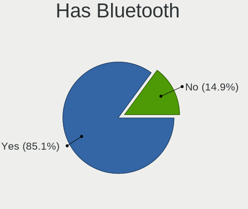
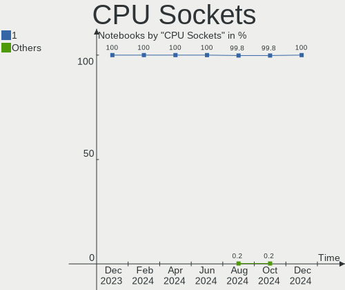
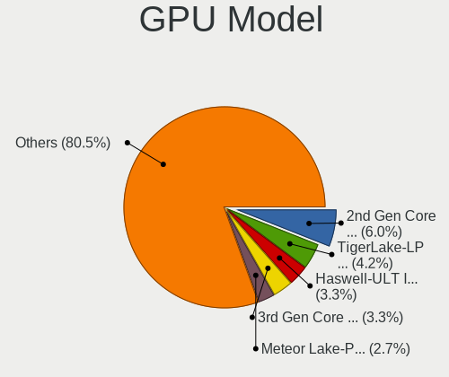

Ubuntu - Hardware Trends (Notebooks)
------------------------------------

A project to identify most popular hardware characteristics and track their change
over time based on data collected by Linux users at https://Linux-Hardware.org.

Anyone can contribute to this report by the [hw-probe](https://github.com/linuxhw/hw-probe) tool:

    sudo -E hw-probe -all -upload

This report is for one last month. Overall report since the beginning of time: [TestDays](https://github.com/linuxhw/TestDays)

Period: Oct, 2023.

Contents
--------

* [ System ](#system)
  - [ OS                       ](#os)
  - [ OS Family                ](#os-family)
  - [ Kernel                   ](#kernel)
  - [ Kernel Family            ](#kernel-family)
  - [ Kernel Major Ver.        ](#kernel-major-ver)
  - [ Arch                     ](#arch)
  - [ DE                       ](#de)
  - [ Display Server           ](#display-server)
  - [ Display Manager          ](#display-manager)
  - [ OS Lang                  ](#os-lang)
  - [ Boot Mode                ](#boot-mode)
  - [ Filesystem               ](#filesystem)
  - [ Part. scheme             ](#part-scheme)
  - [ Dual Boot with Linux/BSD ](#dual-boot-with-linuxbsd)
  - [ Dual Boot (Win)          ](#dual-boot-win)

* [ Board ](#board)
  - [ Vendor                   ](#vendor)
  - [ Model                    ](#model)
  - [ Model Family             ](#model-family)
  - [ MFG Year                 ](#mfg-year)
  - [ Form Factor              ](#form-factor)
  - [ Secure Boot              ](#secure-boot)
  - [ Coreboot                 ](#coreboot)
  - [ RAM Size                 ](#ram-size)
  - [ RAM Used                 ](#ram-used)
  - [ Total Drives             ](#total-drives)
  - [ Has CD-ROM               ](#has-cd-rom)
  - [ Has Ethernet             ](#has-ethernet)
  - [ Has WiFi                 ](#has-wifi)
  - [ Has Bluetooth            ](#has-bluetooth)

* [ Location ](#location)
  - [ Country                  ](#country)
  - [ City                     ](#city)

* [ Drives ](#drives)
  - [ Drive Vendor             ](#drive-vendor)
  - [ Drive Model              ](#drive-model)
  - [ HDD Vendor               ](#hdd-vendor)
  - [ SSD Vendor               ](#ssd-vendor)
  - [ Drive Kind               ](#drive-kind)
  - [ Drive Connector          ](#drive-connector)
  - [ Drive Size               ](#drive-size)
  - [ Space Total              ](#space-total)
  - [ Space Used               ](#space-used)
  - [ Malfunc. Drives          ](#malfunc-drives)
  - [ Malfunc. Drive Vendor    ](#malfunc-drive-vendor)
  - [ Malfunc. HDD Vendor      ](#malfunc-hdd-vendor)
  - [ Malfunc. Drive Kind      ](#malfunc-drive-kind)
  - [ Failed Drives            ](#failed-drives)
  - [ Failed Drive Vendor      ](#failed-drive-vendor)
  - [ Drive Status             ](#drive-status)

* [ Storage controller ](#storage-controller)
  - [ Storage Vendor           ](#storage-vendor)
  - [ Storage Model            ](#storage-model)
  - [ Storage Kind             ](#storage-kind)

* [ Processor ](#processor)
  - [ CPU Vendor               ](#cpu-vendor)
  - [ CPU Model                ](#cpu-model)
  - [ CPU Model Family         ](#cpu-model-family)
  - [ CPU Cores                ](#cpu-cores)
  - [ CPU Sockets              ](#cpu-sockets)
  - [ CPU Threads              ](#cpu-threads)
  - [ CPU Op-Modes             ](#cpu-op-modes)
  - [ CPU Microcode            ](#cpu-microcode)
  - [ CPU Microarch            ](#cpu-microarch)

* [ Graphics ](#graphics)
  - [ GPU Vendor               ](#gpu-vendor)
  - [ GPU Model                ](#gpu-model)
  - [ GPU Combo                ](#gpu-combo)
  - [ GPU Driver               ](#gpu-driver)
  - [ GPU Memory               ](#gpu-memory)

* [ Monitor ](#monitor)
  - [ Monitor Vendor           ](#monitor-vendor)
  - [ Monitor Model            ](#monitor-model)
  - [ Monitor Resolution       ](#monitor-resolution)
  - [ Monitor Diagonal         ](#monitor-diagonal)
  - [ Monitor Width            ](#monitor-width)
  - [ Aspect Ratio             ](#aspect-ratio)
  - [ Monitor Area             ](#monitor-area)
  - [ Pixel Density            ](#pixel-density)
  - [ Multiple Monitors        ](#multiple-monitors)

* [ Network ](#network)
  - [ Net Controller Vendor    ](#net-controller-vendor)
  - [ Net Controller Model     ](#net-controller-model)
  - [ Wireless Vendor          ](#wireless-vendor)
  - [ Wireless Model           ](#wireless-model)
  - [ Ethernet Vendor          ](#ethernet-vendor)
  - [ Ethernet Model           ](#ethernet-model)
  - [ Net Controller Kind      ](#net-controller-kind)
  - [ Used Controller          ](#used-controller)
  - [ NICs                     ](#nics)
  - [ IPv6                     ](#ipv6)

* [ Bluetooth ](#bluetooth)
  - [ Bluetooth Vendor         ](#bluetooth-vendor)
  - [ Bluetooth Model          ](#bluetooth-model)

* [ Sound ](#sound)
  - [ Sound Vendor             ](#sound-vendor)
  - [ Sound Model              ](#sound-model)

* [ Memory ](#memory)
  - [ Memory Vendor            ](#memory-vendor)
  - [ Memory Model             ](#memory-model)
  - [ Memory Kind              ](#memory-kind)
  - [ Memory Form Factor       ](#memory-form-factor)
  - [ Memory Size              ](#memory-size)
  - [ Memory Speed             ](#memory-speed)

* [ Printers & scanners ](#printers--scanners)
  - [ Printer Vendor           ](#printer-vendor)
  - [ Printer Model            ](#printer-model)
  - [ Scanner Vendor           ](#scanner-vendor)
  - [ Scanner Model            ](#scanner-model)

* [ Camera ](#camera)
  - [ Camera Vendor            ](#camera-vendor)
  - [ Camera Model             ](#camera-model)

* [ Security ](#security)
  - [ Fingerprint Vendor       ](#fingerprint-vendor)
  - [ Fingerprint Model        ](#fingerprint-model)
  - [ Chipcard Vendor          ](#chipcard-vendor)
  - [ Chipcard Model           ](#chipcard-model)

* [ Unsupported ](#unsupported)
  - [ Unsupported Devices      ](#unsupported-devices)
  - [ Unsupported Device Types ](#unsupported-device-types)

System
------

OS
--

Installed operating systems

| Name           | Notebooks | Percent |
|----------------|-----------|---------|
| Ubuntu 22.04   | 488       | 65.24%  |
| Ubuntu 23.04   | 102       | 13.64%  |
| Ubuntu 23.10   | 92        | 12.3%   |
| Ubuntu 20.04   | 48        | 6.42%   |
| Ubuntu 18.04   | 8         | 1.07%   |
| Ubuntu 22.10   | 6         | 0.8%    |
| Ubuntu 20.10   | 2         | 0.27%   |
| Ubuntu Core 22 | 1         | 0.13%   |
| Ubuntu 2023.3  | 1         | 0.13%   |

OS Family
---------

OS without a version

| Name   | Notebooks | Percent |
|--------|-----------|---------|
| Ubuntu | 748       | 100%    |

Kernel
------

Version of the Linux kernel

| Version                 | Notebooks | Percent |
|-------------------------|-----------|---------|
| 6.2.0-34-generic        | 230       | 30.75%  |
| 6.2.0-35-generic        | 149       | 19.92%  |
| 6.2.0-33-generic        | 79        | 10.56%  |
| 6.5.0-9-generic         | 60        | 8.02%   |
| 5.15.0-86-generic       | 35        | 4.68%   |
| 6.2.0-26-generic        | 24        | 3.21%   |
| 6.5.0-10-generic        | 20        | 2.67%   |
| 6.2.0-36-generic        | 16        | 2.14%   |
| 5.15.0-84-generic       | 13        | 1.74%   |
| 5.15.0-87-generic       | 12        | 1.6%    |
| 6.2.0-20-generic        | 9         | 1.2%    |
| 6.2.0-32-generic        | 7         | 0.94%   |
| 6.5.0-5-generic         | 6         | 0.8%    |
| 5.19.0-46-generic       | 6         | 0.8%    |
| 5.4.0-150-generic       | 5         | 0.67%   |
| 5.19.0-32-generic       | 4         | 0.53%   |
| 6.5.5-060505-generic    | 3         | 0.4%    |
| 6.5.4-060504-generic    | 3         | 0.4%    |
| 6.2.0-31-generic        | 3         | 0.4%    |
| 5.15.0-88-generic       | 3         | 0.4%    |
| 5.15.0-43-generic       | 3         | 0.4%    |
| 6.5.8-1-liquorix-amd64  | 2         | 0.27%   |
| 6.5.7-060507-generic    | 2         | 0.27%   |
| 6.5.0-7-generic         | 2         | 0.27%   |
| 6.2.0-1014-lowlatency   | 2         | 0.27%   |
| 5.19.0-50-generic       | 2         | 0.27%   |
| 5.15.0-67-generic       | 2         | 0.27%   |
| 5.15.0-25-generic       | 2         | 0.27%   |
| 6.6.0-tkg-eevdf         | 1         | 0.13%   |
| 6.6.0-060600rc5-generic | 1         | 0.13%   |
| 6.5.7-xande             | 1         | 0.13%   |
| 6.5.6-tkg-cfs           | 1         | 0.13%   |
| 6.5.0-1006-oem          | 1         | 0.13%   |
| 6.4.3-060403-generic    | 1         | 0.13%   |
| 6.4.11-desktop-1omv2390 | 1         | 0.13%   |
| 6.4.11-2-liquorix-amd64 | 1         | 0.13%   |
| 6.4.11-060411-generic   | 1         | 0.13%   |
| 6.2.0-27-generic        | 1         | 0.13%   |
| 6.1.0-1023-oem          | 1         | 0.13%   |
| 6.1.0-1007-oem          | 1         | 0.13%   |

Kernel Family
-------------

Linux kernel without a distro release

| Version | Notebooks | Percent |
|---------|-----------|---------|
| 6.2.0   | 520       | 69.52%  |
| 6.5.0   | 89        | 11.9%   |
| 5.15.0  | 84        | 11.23%  |
| 5.19.0  | 16        | 2.14%   |
| 5.4.0   | 11        | 1.47%   |
| 6.5.7   | 3         | 0.4%    |
| 6.5.5   | 3         | 0.4%    |
| 6.5.4   | 3         | 0.4%    |
| 6.4.11  | 3         | 0.4%    |
| 6.6.0   | 2         | 0.27%   |
| 6.5.8   | 2         | 0.27%   |
| 6.1.0   | 2         | 0.27%   |
| 5.8.0   | 2         | 0.27%   |
| 5.17.0  | 2         | 0.27%   |
| 4.15.0  | 2         | 0.27%   |
| 6.5.6   | 1         | 0.13%   |
| 6.4.3   | 1         | 0.13%   |
| 5.3.0   | 1         | 0.13%   |
| 5.14.0  | 1         | 0.13%   |

Kernel Major Ver.
-----------------

Linux kernel major version

| Version | Notebooks | Percent |
|---------|-----------|---------|
| 6.2     | 520       | 69.52%  |
| 6.5     | 101       | 13.5%   |
| 5.15    | 84        | 11.23%  |
| 5.19    | 16        | 2.14%   |
| 5.4     | 11        | 1.47%   |
| 6.4     | 4         | 0.53%   |
| 6.6     | 2         | 0.27%   |
| 6.1     | 2         | 0.27%   |
| 5.8     | 2         | 0.27%   |
| 5.17    | 2         | 0.27%   |
| 4.15    | 2         | 0.27%   |
| 5.3     | 1         | 0.13%   |
| 5.14    | 1         | 0.13%   |

Arch
----

OS architecture (x86_64, i586, etc.)

| Name   | Notebooks | Percent |
|--------|-----------|---------|
| x86_64 | 746       | 99.73%  |
| i686   | 2         | 0.27%   |

DE
--

Desktop Environment

| Name            | Notebooks | Percent |
|-----------------|-----------|---------|
| GNOME           | 717       | 95.86%  |
| Unknown         | 13        | 1.74%   |
| X-Cinnamon      | 6         | 0.8%    |
| GNOME Flashback | 5         | 0.67%   |
| i3              | 3         | 0.4%    |
| GNOME Classic   | 2         | 0.27%   |
| Enlightenment   | 1         | 0.13%   |
| DDE             | 1         | 0.13%   |

Display Server
--------------

X11 or Wayland

| Name    | Notebooks | Percent |
|---------|-----------|---------|
| Wayland | 468       | 62.57%  |
| X11     | 258       | 34.49%  |
| Unknown | 17        | 2.27%   |
| Tty     | 5         | 0.67%   |

Display Manager
---------------

SDDM, LightDM, etc.

| Name    | Notebooks | Percent |
|---------|-----------|---------|
| GDM3    | 662       | 88.5%   |
| Unknown | 48        | 6.42%   |
| GDM     | 22        | 2.94%   |
| LightDM | 13        | 1.74%   |
| SDDM    | 3         | 0.4%    |

OS Lang
-------

Language

| Lang    | Notebooks | Percent |
|---------|-----------|---------|
| en_US   | 322       | 43.05%  |
| de_DE   | 70        | 9.36%   |
| fr_FR   | 57        | 7.62%   |
| en_GB   | 32        | 4.28%   |
| ru_RU   | 27        | 3.61%   |
| it_IT   | 27        | 3.61%   |
| es_ES   | 26        | 3.48%   |
| C       | 24        | 3.21%   |
| pt_BR   | 22        | 2.94%   |
| en_IN   | 22        | 2.94%   |
| nl_NL   | 9         | 1.2%    |
| en_CA   | 9         | 1.2%    |
| en_AU   | 8         | 1.07%   |
| pl_PL   | 7         | 0.94%   |
| Unknown | 7         | 0.94%   |
| hu_HU   | 6         | 0.8%    |
| zh_CN   | 5         | 0.67%   |
| en_ZA   | 5         | 0.67%   |
| fi_FI   | 4         | 0.53%   |
| es_MX   | 4         | 0.53%   |
| sv_SE   | 3         | 0.4%    |
| pt_PT   | 3         | 0.4%    |
| cs_CZ   | 3         | 0.4%    |
| bg_BG   | 3         | 0.4%    |
| zh_TW   | 2         | 0.27%   |
| uk_UA   | 2         | 0.27%   |
| tr_TR   | 2         | 0.27%   |
| ko_KR   | 2         | 0.27%   |
| ja_JP   | 2         | 0.27%   |
| es_GT   | 2         | 0.27%   |
| es_AR   | 2         | 0.27%   |
| en_NG   | 2         | 0.27%   |
| el_GR   | 2         | 0.27%   |
| ca_ES   | 2         | 0.27%   |
| vi_VN   | 1         | 0.13%   |
| ro_RO   | 1         | 0.13%   |
| nb_NO   | 1         | 0.13%   |
| it_CH   | 1         | 0.13%   |
| id_ID   | 1         | 0.13%   |
| fr_CA   | 1         | 0.13%   |

Boot Mode
---------

EFI or BIOS

| Mode | Notebooks | Percent |
|------|-----------|---------|
| BIOS | 395       | 52.81%  |
| EFI  | 353       | 47.19%  |

Filesystem
----------

Type of filesystem

| Type    | Notebooks | Percent |
|---------|-----------|---------|
| Tmpfs   | 380       | 50.8%   |
| Ext4    | 335       | 44.79%  |
| Overlay | 20        | 2.67%   |
| Zfs     | 6         | 0.8%    |
| Btrfs   | 5         | 0.67%   |
| Xfs     | 2         | 0.27%   |

Part. scheme
------------

Scheme of partitioning

| Type    | Notebooks | Percent |
|---------|-----------|---------|
| GPT     | 654       | 87.43%  |
| MBR     | 53        | 7.09%   |
| Unknown | 41        | 5.48%   |

Dual Boot with Linux/BSD
------------------------

Hosting more than one Linux/BSD

| Dual boot | Notebooks | Percent |
|-----------|-----------|---------|
| No        | 682       | 91.18%  |
| Yes       | 66        | 8.82%   |

Dual Boot (Win)
---------------

Hosting Linux and Windows

| Dual boot | Notebooks | Percent |
|-----------|-----------|---------|
| No        | 477       | 63.77%  |
| Yes       | 271       | 36.23%  |

Board
-----

Vendor
------

Motherboard manufacturer

| Name                | Notebooks | Percent |
|---------------------|-----------|---------|
| Hewlett-Packard     | 146       | 19.52%  |
| Dell                | 141       | 18.85%  |
| Lenovo              | 138       | 18.45%  |
| ASUSTek Computer    | 81        | 10.83%  |
| Acer                | 56        | 7.49%   |
| HUAWEI              | 27        | 3.61%   |
| Apple               | 22        | 2.94%   |
| MSI                 | 15        | 2.01%   |
| Samsung Electronics | 13        | 1.74%   |
| Toshiba             | 12        | 1.6%    |
| Google              | 7         | 0.94%   |
| Fujitsu             | 7         | 0.94%   |
| Sony                | 6         | 0.8%    |
| Notebook            | 6         | 0.8%    |
| Chuwi               | 5         | 0.67%   |
| Panasonic           | 4         | 0.53%   |
| LG Electronics      | 3         | 0.4%    |
| Gigabyte Technology | 3         | 0.4%    |
| Alienware           | 3         | 0.4%    |
| Unknown             | 3         | 0.4%    |
| UNOWHY              | 2         | 0.27%   |
| Razer               | 2         | 0.27%   |
| Positivo            | 2         | 0.27%   |
| Packard Bell        | 2         | 0.27%   |
| Medion              | 2         | 0.27%   |
| GPU Company         | 2         | 0.27%   |
| Gateway             | 2         | 0.27%   |
| Clevo               | 2         | 0.27%   |
| XIAOMI              | 1         | 0.13%   |
| Wortmann AG         | 1         | 0.13%   |
| VIT                 | 1         | 0.13%   |
| VALE                | 1         | 0.13%   |
| Timi                | 1         | 0.13%   |
| TECNO               | 1         | 0.13%   |
| Teclast             | 1         | 0.13%   |
| System76            | 1         | 0.13%   |
| Star Labs           | 1         | 0.13%   |
| SLIMBOOK            | 1         | 0.13%   |
| rocky               | 1         | 0.13%   |
| RM                  | 1         | 0.13%   |

Model
-----

Motherboard model

| Name                                             | Notebooks | Percent |
|--------------------------------------------------|-----------|---------|
| HUAWEI NBLB-WAX9N                                | 5         | 0.67%   |
| HP Notebook                                      | 5         | 0.67%   |
| Unknown                                          | 5         | 0.67%   |
| HP ProBook 450 G8 Notebook PC                    | 4         | 0.53%   |
| Dell Latitude 5480                               | 4         | 0.53%   |
| ASUS Vivobook Go E1504FA_E1504FA                 | 4         | 0.53%   |
| Lenovo ThinkBook 15 G2 ITL 20VE                  | 3         | 0.4%    |
| Lenovo IdeaPad 5 14ALC05 82LM                    | 3         | 0.4%    |
| Lenovo IdeaPad 1 15AMN7 82VG                     | 3         | 0.4%    |
| HUAWEI KLVL-WXXW                                 | 3         | 0.4%    |
| HUAWEI BOM-WXX9                                  | 3         | 0.4%    |
| HUAWEI BOHK-WAX9X                                | 3         | 0.4%    |
| HP ProBook 650 G1                                | 3         | 0.4%    |
| HP Pavilion Laptop 14-ec0xxx                     | 3         | 0.4%    |
| HP Pavilion dv6                                  | 3         | 0.4%    |
| HP Pavilion 17                                   | 3         | 0.4%    |
| HP EliteBook 840 G5                              | 3         | 0.4%    |
| HP EliteBook 840 G3                              | 3         | 0.4%    |
| HP 15                                            | 3         | 0.4%    |
| Dell XPS 15 9530                                 | 3         | 0.4%    |
| Dell XPS 13 9370                                 | 3         | 0.4%    |
| Dell Latitude E6420                              | 3         | 0.4%    |
| Dell Inspiron 5570                               | 3         | 0.4%    |
| Apple MacBookPro12,1                             | 3         | 0.4%    |
| Samsung RC530/RC730                              | 2         | 0.27%   |
| MSI Modern 15 A5M                                | 2         | 0.27%   |
| Lenovo V145-15AST 81MT                           | 2         | 0.27%   |
| Lenovo ThinkPad E14 Gen 4 21ECS00000             | 2         | 0.27%   |
| Lenovo IdeaPad Gaming 3 15ARH05 82EY             | 2         | 0.27%   |
| Lenovo IdeaPad Gaming 3 15ACH6 82MJ              | 2         | 0.27%   |
| Lenovo IdeaPad 3 15ITL6 82H8                     | 2         | 0.27%   |
| Lenovo IdeaPad 3 14ALC6 82KT                     | 2         | 0.27%   |
| HUAWEI KLVL-WXX9                                 | 2         | 0.27%   |
| HUAWEI CREM-WXX9                                 | 2         | 0.27%   |
| HP ZBook Studio G3                               | 2         | 0.27%   |
| HP ZBook Fury 15.6 inch G8 Mobile Workstation PC | 2         | 0.27%   |
| HP Victus by Laptop 16-e0xxx                     | 2         | 0.27%   |
| HP ProBook 640 G1                                | 2         | 0.27%   |
| HP ProBook 4530s                                 | 2         | 0.27%   |
| HP Pavilion Notebook                             | 2         | 0.27%   |

Model Family
------------

Motherboard model prefix

| Name               | Notebooks | Percent |
|--------------------|-----------|---------|
| Lenovo ThinkPad    | 55        | 7.35%   |
| Lenovo IdeaPad     | 46        | 6.15%   |
| Dell Inspiron      | 44        | 5.88%   |
| Dell Latitude      | 43        | 5.75%   |
| Acer Aspire        | 32        | 4.28%   |
| HP EliteBook       | 27        | 3.61%   |
| HP Pavilion        | 26        | 3.48%   |
| HP ProBook         | 24        | 3.21%   |
| ASUS VivoBook      | 22        | 2.94%   |
| Dell XPS           | 19        | 2.54%   |
| Dell Precision     | 17        | 2.27%   |
| HP Laptop          | 15        | 2.01%   |
| Dell Vostro        | 13        | 1.74%   |
| Lenovo ThinkBook   | 11        | 1.47%   |
| Toshiba Satellite  | 10        | 1.34%   |
| ASUS Zenbook       | 10        | 1.34%   |
| ASUS ASUS          | 9         | 1.2%    |
| Acer Swift         | 9         | 1.2%    |
| HP ZBook           | 8         | 1.07%   |
| HP 250             | 7         | 0.94%   |
| Lenovo Legion      | 6         | 0.8%    |
| Fujitsu LIFEBOOK   | 6         | 0.8%    |
| HUAWEI NBLB-WAX9N  | 5         | 0.67%   |
| HP Notebook        | 5         | 0.67%   |
| Apple MacBookPro11 | 5         | 0.67%   |
| Acer Nitro         | 5         | 0.67%   |
| Unknown            | 5         | 0.67%   |
| MSI Modern         | 4         | 0.53%   |
| Lenovo Yoga        | 4         | 0.53%   |
| HP Victus          | 4         | 0.53%   |
| HP OMEN            | 4         | 0.53%   |
| HP 15              | 4         | 0.53%   |
| Chuwi GemiBook     | 4         | 0.53%   |
| ASUS ROG           | 4         | 0.53%   |
| HUAWEI KLVL-WXXW   | 3         | 0.4%    |
| HUAWEI BOM-WXX9    | 3         | 0.4%    |
| HUAWEI BOHK-WAX9X  | 3         | 0.4%    |
| HP ENVY            | 3         | 0.4%    |
| HP Compaq          | 3         | 0.4%    |
| HP 255             | 3         | 0.4%    |

MFG Year
--------

Motherboard manufacture year

| Year | Notebooks | Percent |
|------|-----------|---------|
| 2021 | 94        | 12.57%  |
| 2022 | 79        | 10.56%  |
| 2020 | 74        | 9.89%   |
| 2023 | 66        | 8.82%   |
| 2019 | 55        | 7.35%   |
| 2018 | 51        | 6.82%   |
| 2017 | 47        | 6.28%   |
| 2013 | 46        | 6.15%   |
| 2011 | 41        | 5.48%   |
| 2014 | 39        | 5.21%   |
| 2015 | 38        | 5.08%   |
| 2012 | 32        | 4.28%   |
| 2016 | 31        | 4.14%   |
| 2010 | 25        | 3.34%   |
| 2008 | 14        | 1.87%   |
| 2009 | 12        | 1.6%    |
| 2007 | 2         | 0.27%   |
| 2006 | 1         | 0.13%   |
| 2004 | 1         | 0.13%   |

Form Factor
-----------

Physical design of the computer

| Name     | Notebooks | Percent |
|----------|-----------|---------|
| Notebook | 748       | 100%    |

Secure Boot
-----------

Enabled or disabled

| State    | Notebooks | Percent |
|----------|-----------|---------|
| Disabled | 657       | 87.83%  |
| Enabled  | 91        | 12.17%  |

Coreboot
--------

Have coreboot on board

| Used | Notebooks | Percent |
|------|-----------|---------|
| No   | 740       | 98.93%  |
| Yes  | 8         | 1.07%   |

RAM Size
--------

Total RAM memory

| Size in GB  | Notebooks | Percent |
|-------------|-----------|---------|
| 4.01-8.0    | 247       | 33.02%  |
| 8.01-16.0   | 144       | 19.25%  |
| 16.01-24.0  | 141       | 18.85%  |
| 3.01-4.0    | 96        | 12.83%  |
| 32.01-64.0  | 68        | 9.09%   |
| 24.01-32.0  | 19        | 2.54%   |
| 64.01-256.0 | 17        | 2.27%   |
| 2.01-3.0    | 9         | 1.2%    |
| 1.01-2.0    | 7         | 0.94%   |

RAM Used
--------

Used RAM memory

| Used GB    | Notebooks | Percent |
|------------|-----------|---------|
| 2.01-3.0   | 255       | 34.09%  |
| 1.01-2.0   | 170       | 22.73%  |
| 4.01-8.0   | 149       | 19.92%  |
| 3.01-4.0   | 111       | 14.84%  |
| 8.01-16.0  | 43        | 5.75%   |
| 16.01-24.0 | 7         | 0.94%   |
| 0.51-1.0   | 7         | 0.94%   |
| 24.01-32.0 | 4         | 0.53%   |
| 32.01-64.0 | 2         | 0.27%   |

Total Drives
------------

Number of drives on board

| Drives | Notebooks | Percent |
|--------|-----------|---------|
| 1      | 565       | 75.53%  |
| 2      | 157       | 20.99%  |
| 3      | 17        | 2.27%   |
| 4      | 4         | 0.53%   |
| 0      | 4         | 0.53%   |
| 5      | 1         | 0.13%   |

Has CD-ROM
----------

Has CD-ROM on board

| Presented | Notebooks | Percent |
|-----------|-----------|---------|
| No        | 550       | 73.53%  |
| Yes       | 198       | 26.47%  |

Has Ethernet
------------

Has Ethernet on board

| Presented | Notebooks | Percent |
|-----------|-----------|---------|
| Yes       | 545       | 72.86%  |
| No        | 203       | 27.14%  |

Has WiFi
--------

Has WiFi module

| Presented | Notebooks | Percent |
|-----------|-----------|---------|
| Yes       | 745       | 99.6%   |
| No        | 3         | 0.4%    |

Has Bluetooth
-------------

Has Bluetooth module

| Presented | Notebooks | Percent |
|-----------|-----------|---------|
| Yes       | 654       | 87.43%  |
| No        | 94        | 12.57%  |

Location
--------

Country
-------

Geographic location (country)

| Country      | Notebooks | Percent |
|--------------|-----------|---------|
| USA          | 93        | 12.43%  |
| Germany      | 87        | 11.63%  |
| France       | 62        | 8.29%   |
| Italy        | 47        | 6.28%   |
| Russia       | 37        | 4.95%   |
| Brazil       | 37        | 4.95%   |
| Spain        | 29        | 3.88%   |
| UK           | 28        | 3.74%   |
| India        | 28        | 3.74%   |
| Canada       | 17        | 2.27%   |
| Poland       | 16        | 2.14%   |
| Netherlands  | 16        | 2.14%   |
| Switzerland  | 10        | 1.34%   |
| Sweden       | 10        | 1.34%   |
| Norway       | 10        | 1.34%   |
| Romania      | 9         | 1.2%    |
| Australia    | 9         | 1.2%    |
| Turkey       | 8         | 1.07%   |
| Mexico       | 8         | 1.07%   |
| Indonesia    | 8         | 1.07%   |
| Hungary      | 8         | 1.07%   |
| Bulgaria     | 8         | 1.07%   |
| South Africa | 7         | 0.94%   |
| Pakistan     | 7         | 0.94%   |
| China        | 7         | 0.94%   |
| Greece       | 6         | 0.8%    |
| Egypt        | 6         | 0.8%    |
| Vietnam      | 5         | 0.67%   |
| Portugal     | 5         | 0.67%   |
| Iran         | 5         | 0.67%   |
| Finland      | 5         | 0.67%   |
| Czechia      | 5         | 0.67%   |
| Austria      | 5         | 0.67%   |
| Argentina    | 5         | 0.67%   |
| Taiwan       | 4         | 0.53%   |
| Kazakhstan   | 4         | 0.53%   |
| Israel       | 4         | 0.53%   |
| Belgium      | 4         | 0.53%   |
| Slovakia     | 3         | 0.4%    |
| Puerto Rico  | 3         | 0.4%    |

City
----

Geographic location (city)

| City             | Notebooks | Percent |
|------------------|-----------|---------|
| Moscow           | 12        | 1.6%    |
| Berlin           | 11        | 1.47%   |
| St Petersburg    | 8         | 1.07%   |
| Rome             | 8         | 1.07%   |
| Paris            | 7         | 0.94%   |
| Sao Paulo        | 6         | 0.8%    |
| Warsaw           | 5         | 0.67%   |
| Sofia            | 5         | 0.67%   |
| Rio de Janeiro   | 5         | 0.67%   |
| Melbourne        | 5         | 0.67%   |
| Chennai          | 5         | 0.67%   |
| Bengaluru        | 5         | 0.67%   |
| Barcelona        | 5         | 0.67%   |
| Vienna           | 4         | 0.53%   |
| Tehran           | 4         | 0.53%   |
| Oslo             | 4         | 0.53%   |
| Munich           | 4         | 0.53%   |
| Milan            | 4         | 0.53%   |
| Istanbul         | 4         | 0.53%   |
| Delhi            | 4         | 0.53%   |
| Bucharest        | 4         | 0.53%   |
| Athens           | 4         | 0.53%   |
| Turin            | 3         | 0.4%    |
| Toronto          | 3         | 0.4%    |
| Taipei           | 3         | 0.4%    |
| Seville          | 3         | 0.4%    |
| Nantes           | 3         | 0.4%    |
| Montreal         | 3         | 0.4%    |
| Lahore           | 3         | 0.4%    |
| Krasnodar        | 3         | 0.4%    |
| Karlsruhe        | 3         | 0.4%    |
| Ilford           | 3         | 0.4%    |
| Helsinki         | 3         | 0.4%    |
| Hamburg          | 3         | 0.4%    |
| Champs-sur-Marne | 3         | 0.4%    |
| Budapest         | 3         | 0.4%    |
| Brussels         | 3         | 0.4%    |
| Belo Horizonte   | 3         | 0.4%    |
| Amsterdam        | 3         | 0.4%    |
| Zurich           | 2         | 0.27%   |

Drives
------

Drive Vendor
------------

Hard drive vendors

| Vendor                       | Notebooks | Drives | Percent |
|------------------------------|-----------|--------|---------|
| Samsung Electronics          | 148       | 160    | 16.32%  |
| WDC                          | 86        | 90     | 9.48%   |
| Sandisk                      | 73        | 77     | 8.05%   |
| Seagate                      | 71        | 71     | 7.83%   |
| SK hynix                     | 64        | 65     | 7.06%   |
| Unknown                      | 46        | 49     | 5.07%   |
| Micron Technology            | 45        | 45     | 4.96%   |
| Toshiba                      | 43        | 43     | 4.74%   |
| Kingston                     | 43        | 44     | 4.74%   |
| Intel                        | 39        | 39     | 4.3%    |
| Crucial                      | 23        | 25     | 2.54%   |
| Hitachi                      | 20        | 20     | 2.21%   |
| HGST                         | 15        | 15     | 1.65%   |
| Apple                        | 15        | 17     | 1.65%   |
| KIOXIA                       | 11        | 11     | 1.21%   |
| A-DATA Technology            | 10        | 10     | 1.1%    |
| Kingston Technology Company  | 8         | 8      | 0.88%   |
| Phison Electronics           | 7         | 7      | 0.77%   |
| Union Memory                 | 6         | 6      | 0.66%   |
| Phison                       | 6         | 6      | 0.66%   |
| Netac                        | 6         | 6      | 0.66%   |
| LITEON                       | 6         | 6      | 0.66%   |
| China                        | 6         | 6      | 0.66%   |
| SPCC                         | 5         | 5      | 0.55%   |
| PNY                          | 5         | 5      | 0.55%   |
| Silicon Motion               | 4         | 4      | 0.44%   |
| Hewlett-Packard              | 4         | 4      | 0.44%   |
| Gigabyte Technology          | 4         | 4      | 0.44%   |
| FORESEE                      | 4         | 4      | 0.44%   |
| Team                         | 3         | 3      | 0.33%   |
| Micron/Crucial Technology    | 3         | 4      | 0.33%   |
| LITEONIT                     | 3         | 3      | 0.33%   |
| JMicron Technology           | 3         | 3      | 0.33%   |
| JetFlash                     | 3         | 3      | 0.33%   |
| Intenso                      | 3         | 3      | 0.33%   |
| Fujitsu                      | 3         | 3      | 0.33%   |
| UMIS                         | 2         | 2      | 0.22%   |
| SSSTC                        | 2         | 2      | 0.22%   |
| Shenzhen Longsys Electronics | 2         | 2      | 0.22%   |
| MAXIO Technology (Hangzhou)  | 2         | 2      | 0.22%   |

Drive Model
-----------

Hard drive models

| Model                                              | Notebooks | Percent |
|----------------------------------------------------|-----------|---------|
| Seagate ST1000LM035-1RK172 1TB                     | 14        | 1.51%   |
| Samsung NVMe SSD Controller SM981/PM981/PM983 1TB  | 12        | 1.3%    |
| Samsung NVMe SSD Controller PM9A1/PM9A3/980PRO 1TB | 11        | 1.19%   |
| Unknown MMC Card  64GB                             | 9         | 0.97%   |
| Seagate ST500LT012-1DG142 500GB                    | 9         | 0.97%   |
| Unknown SD/MMC/MS PRO 16GB                         | 8         | 0.86%   |
| Toshiba MQ04ABF100 1TB                             | 7         | 0.76%   |
| Toshiba MQ01ABF050 500GB                           | 7         | 0.76%   |
| Seagate ST1000LM024 HN-M101MBB 1TB                 | 7         | 0.76%   |
| Sandisk WD Black SN750 / PC SN730 NVMe SSD 1024GB  | 7         | 0.76%   |
| Micron 2450_MTFDKBA512TFK 512GB                    | 7         | 0.76%   |
| Sandisk WD Blue SN550 NVMe SSD 1TB                 | 6         | 0.65%   |
| Kingston SA400S37480G 480GB SSD                    | 6         | 0.65%   |
| Unknown MMC Card  32GB                             | 5         | 0.54%   |
| Toshiba MQ01ABD100 1TB                             | 5         | 0.54%   |
| SK hynix SKHynix_HFM512GD3HX015N 512GB             | 5         | 0.54%   |
| SanDisk NVMe SSD Drive 1TB                         | 5         | 0.54%   |
| Kingston Company SNV2S1000G 1TB                    | 5         | 0.54%   |
| Kingston SA400S37240G 240GB SSD                    | 5         | 0.54%   |
| Intel SSDPEKNW512GZL 512GB                         | 5         | 0.54%   |
| Intel SSDPEKNU512GZ 512GB                          | 5         | 0.54%   |
| Intel SSD 660P Series 1024GB                       | 5         | 0.54%   |
| Unknown MMC Card  16GB                             | 4         | 0.43%   |
| Unknown MMC Card  128GB                            | 4         | 0.43%   |
| Toshiba XG6 NVMe SSD Controller 256GB              | 4         | 0.43%   |
| SK hynix SC311 SATA 256GB SSD                      | 4         | 0.43%   |
| Seagate ST500LM012 HN-M500MBB 500GB                | 4         | 0.43%   |
| Sandisk WD Blue SN500 / PC SN520 NVMe SSD 512GB    | 4         | 0.43%   |
| SanDisk SSD PLUS 240GB                             | 4         | 0.43%   |
| SanDisk NVMe SSD Drive 512GB                       | 4         | 0.43%   |
| Phison PS5013 E13 NVMe Controller 256GB            | 4         | 0.43%   |
| Kingston SV300S37A120G 120GB SSD                   | 4         | 0.43%   |
| HGST HTS545050A7E680 500GB                         | 4         | 0.43%   |
| WDC WD10SPZX-24Z10 1TB                             | 3         | 0.32%   |
| Unknown NVMe SSD Drive 512GB                       | 3         | 0.32%   |
| SPCC Solid State Disk 512GB                        | 3         | 0.32%   |
| SK hynix PC801 NVMe 1TB                            | 3         | 0.32%   |
| SK hynix PC611 NVMe 1TB                            | 3         | 0.32%   |
| Seagate ST2000LM007-1R8174 2TB                     | 3         | 0.32%   |
| SanDisk SSD PLUS 480GB                             | 3         | 0.32%   |

HDD Vendor
----------

Hard disk drive vendors

| Vendor              | Notebooks | Drives | Percent |
|---------------------|-----------|--------|---------|
| Seagate             | 68        | 68     | 34.52%  |
| WDC                 | 49        | 49     | 24.87%  |
| Toshiba             | 28        | 28     | 14.21%  |
| Hitachi             | 20        | 20     | 10.15%  |
| HGST                | 15        | 15     | 7.61%   |
| Unknown             | 8         | 8      | 4.06%   |
| Samsung Electronics | 3         | 3      | 1.52%   |
| Fujitsu             | 3         | 3      | 1.52%   |
| External            | 2         | 3      | 1.02%   |
| SSK                 | 1         | 1      | 0.51%   |

SSD Vendor
----------

Solid state drive vendors

| Vendor              | Notebooks | Drives | Percent |
|---------------------|-----------|--------|---------|
| Samsung Electronics | 48        | 51     | 18.18%  |
| Kingston            | 30        | 30     | 11.36%  |
| SanDisk             | 28        | 28     | 10.61%  |
| Crucial             | 19        | 21     | 7.2%    |
| WDC                 | 15        | 16     | 5.68%   |
| SK hynix            | 13        | 13     | 4.92%   |
| Apple               | 11        | 11     | 4.17%   |
| Micron Technology   | 7         | 7      | 2.65%   |
| Intel               | 7         | 7      | 2.65%   |
| A-DATA Technology   | 7         | 7      | 2.65%   |
| LITEON              | 6         | 6      | 2.27%   |
| Toshiba             | 5         | 5      | 1.89%   |
| SPCC                | 5         | 5      | 1.89%   |
| PNY                 | 5         | 5      | 1.89%   |
| Netac               | 5         | 5      | 1.89%   |
| China               | 5         | 5      | 1.89%   |
| Hewlett-Packard     | 4         | 4      | 1.52%   |
| Team                | 3         | 3      | 1.14%   |
| LITEONIT            | 3         | 3      | 1.14%   |
| Intenso             | 3         | 3      | 1.14%   |
| Gigabyte Technology | 3         | 3      | 1.14%   |
| Emtec               | 2         | 2      | 0.76%   |
| Wodposit            | 1         | 1      | 0.38%   |
| Transcend           | 1         | 1      | 0.38%   |
| Teclast             | 1         | 1      | 0.38%   |
| StoreJet            | 1         | 1      | 0.38%   |
| SSSTC               | 1         | 1      | 0.38%   |
| Saichi              | 1         | 1      | 0.38%   |
| SABRENT             | 1         | 1      | 0.38%   |
| Rogueware           | 1         | 1      | 0.38%   |
| Plextor             | 1         | 1      | 0.38%   |
| Patriot             | 1         | 1      | 0.38%   |
| OWC                 | 1         | 1      | 0.38%   |
| Origin              | 1         | 1      | 0.38%   |
| NGFF                | 1         | 1      | 0.38%   |
| MidasForce          | 1         | 1      | 0.38%   |
| MAX                 | 1         | 1      | 0.38%   |
| M.2 2280            | 1         | 1      | 0.38%   |
| Lexar               | 1         | 1      | 0.38%   |
| KUIJIA              | 1         | 1      | 0.38%   |

Drive Kind
----------

HDD or SSD

| Kind    | Notebooks | Drives | Percent |
|---------|-----------|--------|---------|
| NVMe    | 381       | 419    | 44.1%   |
| SSD     | 241       | 270    | 27.89%  |
| HDD     | 192       | 198    | 22.22%  |
| MMC     | 35        | 38     | 4.05%   |
| Unknown | 15        | 16     | 1.74%   |

Drive Connector
---------------

SATA, SAS, NVMe, etc.

| Type | Notebooks | Drives | Percent |
|------|-----------|--------|---------|
| SATA | 391       | 445    | 46.44%  |
| NVMe | 378       | 415    | 44.89%  |
| SAS  | 38        | 43     | 4.51%   |
| MMC  | 35        | 38     | 4.16%   |

Drive Size
----------

Size of hard drive

| Size in TB | Notebooks | Drives | Percent |
|------------|-----------|--------|---------|
| 0.01-0.5   | 301       | 326    | 68.56%  |
| 0.51-1.0   | 119       | 121    | 27.11%  |
| 1.01-2.0   | 14        | 16     | 3.19%   |
| 3.01-4.0   | 2         | 2      | 0.46%   |
| 4.01-10.0  | 2         | 2      | 0.46%   |
| 2.01-3.0   | 1         | 1      | 0.23%   |

Space Total
-----------

Amount of disk space available on the file system

| Size in GB     | Notebooks | Percent |
|----------------|-----------|---------|
| 101-250        | 233       | 31.15%  |
| 251-500        | 226       | 30.21%  |
| 501-1000       | 123       | 16.44%  |
| 51-100         | 51        | 6.82%   |
| 1-20           | 36        | 4.81%   |
| 1001-2000      | 28        | 3.74%   |
| 21-50          | 21        | 2.81%   |
| 2001-3000      | 15        | 2.01%   |
| More than 3000 | 8         | 1.07%   |
| Unknown        | 7         | 0.94%   |

Space Used
----------

Amount of used disk space

| Used GB        | Notebooks | Percent |
|----------------|-----------|---------|
| 1-20           | 245       | 32.75%  |
| 21-50          | 181       | 24.2%   |
| 101-250        | 119       | 15.91%  |
| 51-100         | 86        | 11.5%   |
| 251-500        | 62        | 8.29%   |
| 501-1000       | 28        | 3.74%   |
| 1001-2000      | 12        | 1.6%    |
| Unknown        | 7         | 0.94%   |
| More than 3000 | 4         | 0.53%   |
| 2001-3000      | 4         | 0.53%   |

Malfunc. Drives
---------------

Drive models with a malfunction

| Model                                          | Notebooks | Drives | Percent |
|------------------------------------------------|-----------|--------|---------|
| SK hynix HFS128G39TND-N210A 128GB SSD          | 2         | 2      | 8%      |
| Seagate ST500LT012-9WS142 500GB                | 2         | 2      | 8%      |
| WDC WD7500BPVT-80HXZT1 752GB                   | 1         | 1      | 4%      |
| WDC WD5000LPCX-75VHAT0 500GB                   | 1         | 1      | 4%      |
| WDC WD Green M.2 2280 480GB SSD                | 1         | 1      | 4%      |
| WDC WD Blue SA510 2. 1TB SSD                   | 1         | 1      | 4%      |
| Toshiba MQ01ABF050 500GB                       | 1         | 1      | 4%      |
| SK hynix SC308 SATA 256GB SSD                  | 1         | 1      | 4%      |
| SK hynix BC711 HFM512GD3JX013N 512GB           | 1         | 1      | 4%      |
| SK hynix BC711 HFM256GD3JX013N 256GB           | 1         | 1      | 4%      |
| Seagate ST500LT012-1DG142 500GB                | 1         | 1      | 4%      |
| Seagate ST500LM012 HN-M500MBB 500GB            | 1         | 1      | 4%      |
| Seagate ST1000LM024 HN-M101MBB 1TB             | 1         | 1      | 4%      |
| SanDisk SSD PLUS 240GB                         | 1         | 1      | 4%      |
| SanDisk SD9SN8W-128G-1006 128GB SSD            | 1         | 1      | 4%      |
| Samsung Electronics SSD 870 EVO 500GB          | 1         | 1      | 4%      |
| Phison PSEJN512GA87EC0 512GB                   | 1         | 1      | 4%      |
| Micron Technology MTFDDAK256MAM-1K12 256GB SSD | 1         | 1      | 4%      |
| LITEON LCH-256V2S-11 2.5 7mm 256GB SSD         | 1         | 1      | 4%      |
| HGST HTS725050A7E630 500GB                     | 1         | 1      | 4%      |
| HGST HTS545050A7E680 500GB                     | 1         | 1      | 4%      |
| HGST HTS541010A9E680 1TB                       | 1         | 1      | 4%      |
| Crucial CT275MX300SSD1 275GB                   | 1         | 1      | 4%      |

Malfunc. Drive Vendor
---------------------

Vendors of faulty drives

| Vendor              | Notebooks | Drives | Percent |
|---------------------|-----------|--------|---------|
| SK hynix            | 5         | 5      | 20%     |
| Seagate             | 5         | 5      | 20%     |
| WDC                 | 4         | 4      | 16%     |
| HGST                | 3         | 3      | 12%     |
| SanDisk             | 2         | 2      | 8%      |
| Toshiba             | 1         | 1      | 4%      |
| Samsung Electronics | 1         | 1      | 4%      |
| Phison              | 1         | 1      | 4%      |
| Micron Technology   | 1         | 1      | 4%      |
| LITEON              | 1         | 1      | 4%      |
| Crucial             | 1         | 1      | 4%      |

Malfunc. HDD Vendor
-------------------

Vendors of faulty HDD drives

| Vendor  | Notebooks | Drives | Percent |
|---------|-----------|--------|---------|
| Seagate | 5         | 5      | 45.45%  |
| HGST    | 3         | 3      | 27.27%  |
| WDC     | 2         | 2      | 18.18%  |
| Toshiba | 1         | 1      | 9.09%   |

Malfunc. Drive Kind
-------------------

Kinds of faulty drives

| Kind | Notebooks | Drives | Percent |
|------|-----------|--------|---------|
| SSD  | 11        | 11     | 44%     |
| HDD  | 11        | 11     | 44%     |
| NVMe | 3         | 3      | 12%     |

Failed Drives
-------------

Failed drive models

| Model                           | Notebooks | Drives | Percent |
|---------------------------------|-----------|--------|---------|
| Seagate ST500LT012-1DG142 500GB | 1         | 1      | 100%    |

Failed Drive Vendor
-------------------

Failed drive vendors

| Vendor  | Notebooks | Drives | Percent |
|---------|-----------|--------|---------|
| Seagate | 1         | 1      | 100%    |

Drive Status
------------

Number of failed and malfunc. drives

| Status   | Notebooks | Drives | Percent |
|----------|-----------|--------|---------|
| Detected | 444       | 557    | 57.22%  |
| Works    | 306       | 358    | 39.43%  |
| Malfunc  | 25        | 25     | 3.22%   |
| Failed   | 1         | 1      | 0.13%   |

Storage controller
------------------

Storage Vendor
--------------

Storage controller vendors

| Vendor                         | Notebooks | Percent |
|--------------------------------|-----------|---------|
| Intel                          | 489       | 52.13%  |
| Samsung Electronics            | 102       | 10.87%  |
| AMD                            | 72        | 7.68%   |
| SanDisk                        | 70        | 7.46%   |
| SK hynix                       | 51        | 5.44%   |
| Micron Technology              | 38        | 4.05%   |
| Kingston Technology Company    | 22        | 2.35%   |
| Phison Electronics             | 16        | 1.71%   |
| Toshiba America Info Systems   | 11        | 1.17%   |
| KIOXIA                         | 11        | 1.17%   |
| Union Memory (Shenzhen)        | 9         | 0.96%   |
| Micron/Crucial Technology      | 7         | 0.75%   |
| MAXIO Technology (Hangzhou)    | 6         | 0.64%   |
| Shenzhen Longsys Electronics   | 5         | 0.53%   |
| Silicon Motion                 | 4         | 0.43%   |
| Nvidia                         | 4         | 0.43%   |
| ADATA Technology               | 4         | 0.43%   |
| Solidigm                       | 3         | 0.32%   |
| Solid State Storage Technology | 3         | 0.32%   |
| Marvell Technology Group       | 3         | 0.32%   |
| Apple                          | 3         | 0.32%   |
| Lite-On Technology             | 2         | 0.21%   |
| Netac Technology               | 1         | 0.11%   |
| Lenovo                         | 1         | 0.11%   |
| Biwin Storage Technology       | 1         | 0.11%   |

Storage Model
-------------

Storage controller models

| Model                                                                            | Notebooks | Percent |
|----------------------------------------------------------------------------------|-----------|---------|
| AMD FCH SATA Controller [AHCI mode]                                              | 69        | 6.78%   |
| Intel Volume Management Device NVMe RAID Controller                              | 62        | 6.09%   |
| Intel Sunrise Point-LP SATA Controller [AHCI mode]                               | 60        | 5.89%   |
| Intel 6 Series/C200 Series Chipset Family 6 port Mobile SATA AHCI Controller     | 35        | 3.44%   |
| Intel 82801 Mobile SATA Controller [RAID mode]                                   | 34        | 3.34%   |
| Intel 7 Series Chipset Family 6-port SATA Controller [AHCI mode]                 | 34        | 3.34%   |
| Samsung NVMe SSD Controller SM981/PM981/PM983                                    | 32        | 3.14%   |
| Samsung NVMe SSD Controller PM9A1/PM9A3/980PRO                                   | 31        | 3.05%   |
| Intel Tiger Lake-LP SATA Controller                                              | 30        | 2.95%   |
| Samsung NVMe SSD Controller 980 (DRAM-less)                                      | 27        | 2.65%   |
| SK hynix Gold P31/BC711/PC711 NVMe Solid State Drive                             | 22        | 2.16%   |
| Intel 8 Series SATA Controller 1 [AHCI mode]                                     | 22        | 2.16%   |
| Intel Wildcat Point-LP SATA Controller [AHCI Mode]                               | 19        | 1.87%   |
| Intel Comet Lake SATA AHCI Controller                                            | 19        | 1.87%   |
| Intel Cannon Lake Mobile PCH SATA AHCI Controller                                | 18        | 1.77%   |
| Intel SSD 670p Series [Keystone Harbor]                                          | 17        | 1.67%   |
| Intel Alder Lake-P SATA AHCI Controller                                          | 16        | 1.57%   |
| Intel 8 Series/C220 Series Chipset Family 6-port SATA Controller 1 [AHCI mode]   | 16        | 1.57%   |
| SanDisk Extreme Pro / WD Black SN750 / PC SN730 / Red SN700 NVMe SSD             | 15        | 1.47%   |
| Micron 2450 NVMe SSD [HendrixV] (DRAM-less)                                      | 15        | 1.47%   |
| SanDisk Ultra 3D / WD Blue SN550 NVMe SSD                                        | 14        | 1.38%   |
| Intel HM170/QM170 Chipset SATA Controller [AHCI Mode]                            | 13        | 1.28%   |
| Intel Cannon Point-LP SATA Controller [AHCI Mode]                                | 12        | 1.18%   |
| Intel 5 Series/3400 Series Chipset 4 port SATA AHCI Controller                   | 12        | 1.18%   |
| Intel Celeron/Pentium Silver Processor SATA Controller                           | 11        | 1.08%   |
| SK hynix Platinum P41/PC801 NVMe Solid State Drive                               | 10        | 0.98%   |
| Intel SSD 660P Series                                                            | 10        | 0.98%   |
| Intel Volume Management Device NVMe RAID Controller Intel Corporation            | 9         | 0.88%   |
| Micron 2210 NVMe SSD [Cobain]                                                    | 8         | 0.79%   |
| Intel 82801IBM/IEM (ICH9M/ICH9M-E) 4 port SATA Controller [AHCI mode]            | 8         | 0.79%   |
| SanDisk WD Blue SN500 / PC SN520 x2 M.2 2280 NVMe SSD                            | 7         | 0.69%   |
| Micron 3400 NVMe SSD [Hendrix]                                                   | 7         | 0.69%   |
| Intel Atom/Celeron/Pentium Processor x5-E8000/J3xxx/N3xxx Series SATA Controller | 7         | 0.69%   |
| Intel 82801HM/HEM (ICH8M/ICH8M-E) IDE Controller                                 | 7         | 0.69%   |
| Toshiba America Info Systems XG6 NVMe SSD Controller                             | 6         | 0.59%   |
| SK hynix PC611 NVMe Solid State Drive                                            | 6         | 0.59%   |
| SK hynix BC901 NVMe Solid State Drive (DRAM-less)                                | 6         | 0.59%   |
| SanDisk WD PC SN810 / Black SN850 NVMe SSD                                       | 6         | 0.59%   |
| SanDisk WD Black SN770 / PC SN740 256GB / PC SN560 (DRAM-less) NVMe SSD          | 6         | 0.59%   |
| Phison PS5013-E13 PCIe3 NVMe Controller (DRAM-less)                              | 6         | 0.59%   |

Storage Kind
------------

Kind of storage controller (IDE, SATA, NVMe, SAS, ...)

| Kind | Notebooks | Percent |
|------|-----------|---------|
| SATA | 457       | 46.82%  |
| NVMe | 376       | 38.52%  |
| RAID | 110       | 11.27%  |
| IDE  | 33        | 3.38%   |

Processor
---------

CPU Vendor
----------

Processor vendors

| Vendor       | Notebooks | Percent |
|--------------|-----------|---------|
| Intel        | 599       | 80.08%  |
| AMD          | 148       | 19.79%  |
| CentaurHauls | 1         | 0.13%   |

CPU Model
---------

Processor models

| Model                                         | Notebooks | Percent |
|-----------------------------------------------|-----------|---------|
| Intel 11th Gen Core i5-1135G7 @ 2.40GHz       | 28        | 3.74%   |
| Intel Core i5-8250U CPU @ 1.60GHz             | 13        | 1.74%   |
| Intel Core i5-6200U CPU @ 2.30GHz             | 13        | 1.74%   |
| Intel 11th Gen Core i7-1165G7 @ 2.80GHz       | 13        | 1.74%   |
| AMD Ryzen 5 5500U with Radeon Graphics        | 13        | 1.74%   |
| Intel Core i5-7200U CPU @ 2.50GHz             | 12        | 1.6%    |
| Intel Core i5-10210U CPU @ 1.60GHz            | 12        | 1.6%    |
| Intel Core i7-10510U CPU @ 1.80GHz            | 10        | 1.34%   |
| Intel Core i5-6300U CPU @ 2.40GHz             | 10        | 1.34%   |
| AMD Ryzen 7 5800H with Radeon Graphics        | 10        | 1.34%   |
| AMD Ryzen 7 5700U with Radeon Graphics        | 10        | 1.34%   |
| Intel Core i7-7700HQ CPU @ 2.80GHz            | 9         | 1.2%    |
| Intel Core i7-6700HQ CPU @ 2.60GHz            | 9         | 1.2%    |
| Intel 12th Gen Core i7-12700H                 | 9         | 1.2%    |
| Intel 12th Gen Core i5-1235U                  | 9         | 1.2%    |
| Intel Core i7-8750H CPU @ 2.20GHz             | 8         | 1.07%   |
| Intel Core i7-8550U CPU @ 1.80GHz             | 8         | 1.07%   |
| Intel 11th Gen Core i3-1115G4 @ 3.00GHz       | 8         | 1.07%   |
| AMD Ryzen 5 7520U with Radeon Graphics        | 8         | 1.07%   |
| Intel Core i7-9750H CPU @ 2.60GHz             | 7         | 0.94%   |
| Intel Core i7-8565U CPU @ 1.80GHz             | 7         | 0.94%   |
| Intel Core i5-8265U CPU @ 1.60GHz             | 7         | 0.94%   |
| Intel Core i5-5200U CPU @ 2.20GHz             | 7         | 0.94%   |
| Intel Core i5-3210M CPU @ 2.50GHz             | 7         | 0.94%   |
| Intel Core i5-2520M CPU @ 2.50GHz             | 7         | 0.94%   |
| Intel Core i3-5005U CPU @ 2.00GHz             | 7         | 0.94%   |
| Intel 13th Gen Core i9-13900H                 | 7         | 0.94%   |
| Intel 12th Gen Core i7-1255U                  | 7         | 0.94%   |
| Intel 11th Gen Core i7-11800H @ 2.30GHz       | 7         | 0.94%   |
| Intel Core i7-2630QM CPU @ 2.00GHz            | 6         | 0.8%    |
| Intel 12th Gen Core i5-1240P                  | 6         | 0.8%    |
| Intel 11th Gen Core i7-1185G7 @ 3.00GHz       | 6         | 0.8%    |
| Intel Core i7-6600U CPU @ 2.60GHz             | 5         | 0.67%   |
| Intel Core i5-4210U CPU @ 1.70GHz             | 5         | 0.67%   |
| Intel Core i5-3320M CPU @ 2.60GHz             | 5         | 0.67%   |
| Intel Core i3-2310M CPU @ 2.10GHz             | 5         | 0.67%   |
| AMD Ryzen 7 7730U with Radeon Graphics        | 5         | 0.67%   |
| AMD Ryzen 7 5825U with Radeon Graphics        | 5         | 0.67%   |
| AMD Ryzen 7 4800H with Radeon Graphics        | 5         | 0.67%   |
| AMD Ryzen 7 3700U with Radeon Vega Mobile Gfx | 5         | 0.67%   |

CPU Model Family
----------------

Processor model prefix

| Model                                | Notebooks | Percent |
|--------------------------------------|-----------|---------|
| Intel Core i5                        | 173       | 23.13%  |
| Other                                | 162       | 21.66%  |
| Intel Core i7                        | 145       | 19.39%  |
| AMD Ryzen 7                          | 51        | 6.82%   |
| AMD Ryzen 5                          | 49        | 6.55%   |
| Intel Core i3                        | 41        | 5.48%   |
| Intel Celeron                        | 33        | 4.41%   |
| Intel Core 2 Duo                     | 16        | 2.14%   |
| Intel Pentium                        | 12        | 1.6%    |
| AMD A6                               | 7         | 0.94%   |
| AMD Ryzen 9                          | 5         | 0.67%   |
| AMD Ryzen 7 PRO                      | 5         | 0.67%   |
| AMD Ryzen 3                          | 5         | 0.67%   |
| AMD A4                               | 5         | 0.67%   |
| Intel Core i9                        | 4         | 0.53%   |
| Intel Atom                           | 4         | 0.53%   |
| AMD E2                               | 4         | 0.53%   |
| Intel Pentium Dual-Core              | 3         | 0.4%    |
| AMD A8                               | 3         | 0.4%    |
| AMD A10                              | 3         | 0.4%    |
| Intel Pentium Silver                 | 2         | 0.27%   |
| AMD E                                | 2         | 0.27%   |
| AMD Athlon                           | 2         | 0.27%   |
| Intel Pentium M                      | 1         | 0.13%   |
| Intel Pentium Dual                   | 1         | 0.13%   |
| Intel Core m7                        | 1         | 0.13%   |
| Intel Core m3                        | 1         | 0.13%   |
| Intel Core M                         | 1         | 0.13%   |
| Intel Core 2                         | 1         | 0.13%   |
| Intel Celeron Dual-Core              | 1         | 0.13%   |
| AMD Turion X2 Ultra Dual-Core Mobile | 1         | 0.13%   |
| AMD Quad-Core                        | 1         | 0.13%   |
| AMD PRO A10                          | 1         | 0.13%   |
| AMD E1                               | 1         | 0.13%   |
| AMD C-60                             | 1         | 0.13%   |

CPU Cores
---------

Number of processor cores

| Number | Notebooks | Percent |
|--------|-----------|---------|
| 2      | 288       | 38.5%   |
| 4      | 246       | 32.89%  |
| 8      | 77        | 10.29%  |
| 6      | 59        | 7.89%   |
| 10     | 31        | 4.14%   |
| 14     | 22        | 2.94%   |
| 12     | 17        | 2.27%   |
| 24     | 2         | 0.27%   |
| 16     | 2         | 0.27%   |
| 1      | 2         | 0.27%   |
| 9      | 1         | 0.13%   |
| 3      | 1         | 0.13%   |

CPU Sockets
-----------

Number of sockets

| Number | Notebooks | Percent |
|--------|-----------|---------|
| 1      | 748       | 100%    |

CPU Threads
-----------

Threads per core (Hyper-Threading)

| Number | Notebooks | Percent |
|--------|-----------|---------|
| 2      | 603       | 80.61%  |
| 1      | 145       | 19.39%  |

CPU Op-Modes
------------

CPU Operation Modes (32-bit, 64-bit)

| Op mode        | Notebooks | Percent |
|----------------|-----------|---------|
| 32-bit, 64-bit | 747       | 99.87%  |
| 32-bit         | 1         | 0.13%   |

CPU Microcode
-------------

Microcode number

| Number     | Notebooks | Percent |
|------------|-----------|---------|
| Unknown    | 596       | 79.68%  |
| 0x0a50000d | 13        | 1.74%   |
| 0x08608103 | 13        | 1.74%   |
| 0x0a50000c | 12        | 1.6%    |
| 0x806c1    | 9         | 1.2%    |
| 0x206a7    | 9         | 1.2%    |
| 0x08108109 | 6         | 0.8%    |
| 0x806ec    | 5         | 0.67%   |
| 0x406e3    | 5         | 0.67%   |
| 0x906a4    | 4         | 0.53%   |
| 0x306c3    | 4         | 0.53%   |
| 0x08a00008 | 4         | 0.53%   |
| 0x08600106 | 4         | 0.53%   |
| 0x906ea    | 3         | 0.4%    |
| 0x906a3    | 3         | 0.4%    |
| 0x1067a    | 3         | 0.4%    |
| 0x0a404102 | 3         | 0.4%    |
| 0x08600104 | 3         | 0.4%    |
| 0x08108102 | 3         | 0.4%    |
| 0x906ed    | 2         | 0.27%   |
| 0x806d1    | 2         | 0.27%   |
| 0x406c4    | 2         | 0.27%   |
| 0x40651    | 2         | 0.27%   |
| 0x306d4    | 2         | 0.27%   |
| 0x0a704103 | 2         | 0.27%   |
| 0x08608104 | 2         | 0.27%   |
| 0x08608102 | 2         | 0.27%   |
| 0x07030105 | 2         | 0.27%   |
| 0x06006704 | 2         | 0.27%   |
| 0xb06e0    | 1         | 0.13%   |
| 0xb06a3    | 1         | 0.13%   |
| 0xa0652    | 1         | 0.13%   |
| 0x906e9    | 1         | 0.13%   |
| 0x90672    | 1         | 0.13%   |
| 0x806ea    | 1         | 0.13%   |
| 0x806e9    | 1         | 0.13%   |
| 0x706a8    | 1         | 0.13%   |
| 0x6fd      | 1         | 0.13%   |
| 0x6d6      | 1         | 0.13%   |
| 0x306a9    | 1         | 0.13%   |

CPU Microarch
-------------

Microarchitecture

| Name             | Notebooks | Percent |
|------------------|-----------|---------|
| KabyLake         | 133       | 17.78%  |
| Unknown          | 88        | 11.76%  |
| TigerLake        | 63        | 8.42%   |
| Haswell          | 52        | 6.95%   |
| Alderlake Hybrid | 48        | 6.42%   |
| Skylake          | 45        | 6.02%   |
| SandyBridge      | 44        | 5.88%   |
| IvyBridge        | 36        | 4.81%   |
| Zen 3            | 34        | 4.55%   |
| Broadwell        | 25        | 3.34%   |
| IceLake          | 22        | 2.94%   |
| Westmere         | 19        | 2.54%   |
| Zen 2            | 16        | 2.14%   |
| Zen+             | 15        | 2.01%   |
| Silvermont       | 15        | 2.01%   |
| Penryn           | 15        | 2.01%   |
| Goldmont plus    | 14        | 1.87%   |
| Excavator        | 14        | 1.87%   |
| CometLake        | 12        | 1.6%    |
| Core             | 8         | 1.07%   |
| Zen              | 6         | 0.8%    |
| Puma             | 4         | 0.53%   |
| K10 Llano        | 4         | 0.53%   |
| Nehalem          | 3         | 0.4%    |
| Goldmont         | 3         | 0.4%    |
| Bobcat           | 3         | 0.4%    |
| K8 & K10 hybrid  | 2         | 0.27%   |
| Jaguar           | 2         | 0.27%   |
| Piledriver       | 1         | 0.13%   |
| P6               | 1         | 0.13%   |
| Bonnell          | 1         | 0.13%   |

Graphics
--------

GPU Vendor
----------

Vendors of graphics cards

| Vendor  | Notebooks | Percent |
|---------|-----------|---------|
| Intel   | 558       | 58.68%  |
| Nvidia  | 208       | 21.87%  |
| AMD     | 184       | 19.35%  |
| Zhaoxin | 1         | 0.11%   |

GPU Model
---------

Graphics card models

| Model                                                                                    | Notebooks | Percent |
|------------------------------------------------------------------------------------------|-----------|---------|
| Intel TigerLake-LP GT2 [Iris Xe Graphics]                                                | 54        | 5.61%   |
| Intel 2nd Generation Core Processor Family Integrated Graphics Controller                | 36        | 3.74%   |
| Intel 3rd Gen Core processor Graphics Controller                                         | 34        | 3.53%   |
| Intel Skylake GT2 [HD Graphics 520]                                                      | 33        | 3.43%   |
| Intel Haswell-ULT Integrated Graphics Controller                                         | 28        | 2.91%   |
| Intel CometLake-U GT2 [UHD Graphics]                                                     | 27        | 2.8%    |
| Intel UHD Graphics 620                                                                   | 26        | 2.7%    |
| Intel Alder Lake-P GT2 [Iris Xe Graphics]                                                | 24        | 2.49%   |
| AMD Lucienne                                                                             | 24        | 2.49%   |
| Intel HD Graphics 620                                                                    | 21        | 2.18%   |
| Intel CoffeeLake-H GT2 [UHD Graphics 630]                                                | 20        | 2.08%   |
| Intel HD Graphics 5500                                                                   | 19        | 1.97%   |
| Intel 4th Gen Core Processor Integrated Graphics Controller                              | 18        | 1.87%   |
| Intel WhiskeyLake-U GT2 [UHD Graphics 620]                                               | 17        | 1.77%   |
| Intel Raptor Lake-P [Iris Xe Graphics]                                                   | 17        | 1.77%   |
| AMD Cezanne [Radeon Vega Series / Radeon Vega Mobile Series]                             | 17        | 1.77%   |
| Intel Core Processor Integrated Graphics Controller                                      | 16        | 1.66%   |
| AMD Renoir [Radeon RX Vega 6 (Ryzen 4000/5000 Mobile Series)]                            | 16        | 1.66%   |
| AMD Picasso/Raven 2 [Radeon Vega Series / Radeon Vega Mobile Series]                     | 16        | 1.66%   |
| AMD Barcelo                                                                              | 16        | 1.66%   |
| Intel TigerLake-H GT1 [UHD Graphics]                                                     | 14        | 1.45%   |
| Intel Alder Lake-UP3 GT2 [Iris Xe Graphics]                                              | 14        | 1.45%   |
| Nvidia TU117M [GeForce GTX 1650 Mobile / Max-Q]                                          | 13        | 1.35%   |
| Nvidia GA106M [GeForce RTX 3060 Mobile / Max-Q]                                          | 13        | 1.35%   |
| Intel GeminiLake [UHD Graphics 600]                                                      | 13        | 1.35%   |
| Intel HD Graphics 630                                                                    | 12        | 1.25%   |
| Intel CometLake-H GT2 [UHD Graphics]                                                     | 11        | 1.14%   |
| AMD Stoney [Radeon R2/R3/R4/R5 Graphics]                                                 | 11        | 1.14%   |
| AMD Mendocino                                                                            | 10        | 1.04%   |
| Intel Tiger Lake-LP GT2 [UHD Graphics G4]                                                | 9         | 0.93%   |
| Nvidia GA107M [GeForce RTX 3050 Mobile]                                                  | 8         | 0.83%   |
| Intel Mobile 4 Series Chipset Integrated Graphics Controller                             | 8         | 0.83%   |
| Intel HD Graphics 530                                                                    | 8         | 0.83%   |
| Intel Atom/Celeron/Pentium Processor x5-E8000/J3xxx/N3xxx Integrated Graphics Controller | 8         | 0.83%   |
| Nvidia GP108M [GeForce MX250]                                                            | 7         | 0.73%   |
| Nvidia GP107M [GeForce GTX 1050 Mobile]                                                  | 7         | 0.73%   |
| Nvidia GA107M [GeForce RTX 3050 Ti Mobile]                                               | 7         | 0.73%   |
| Intel Iris Plus Graphics G1 (Ice Lake)                                                   | 7         | 0.73%   |
| Intel Atom Processor Z36xxx/Z37xxx Series Graphics & Display                             | 7         | 0.73%   |
| AMD Topaz XT [Radeon R7 M260/M265 / M340/M360 / M440/M445 / 530/535 / 620/625 Mobile]    | 7         | 0.73%   |

GPU Combo
---------

Combinations of graphics cards

| Name               | Notebooks | Percent |
|--------------------|-----------|---------|
| 1 x Intel          | 378       | 50.53%  |
| Intel + Nvidia     | 152       | 20.32%  |
| 1 x AMD            | 126       | 16.84%  |
| 1 x Nvidia         | 31        | 4.14%   |
| Intel + AMD        | 26        | 3.48%   |
| AMD + Nvidia       | 24        | 3.21%   |
| 2 x AMD            | 8         | 1.07%   |
| Other              | 1         | 0.13%   |
| 1 x Zhaoxin        | 1         | 0.13%   |
| Intel + 2 x Nvidia | 1         | 0.13%   |

GPU Driver
----------

Free vs proprietary

| Driver      | Notebooks | Percent |
|-------------|-----------|---------|
| Free        | 603       | 80.61%  |
| Proprietary | 126       | 16.84%  |
| Unknown     | 19        | 2.54%   |

GPU Memory
----------

Total video memory

| Size in GB | Notebooks | Percent |
|------------|-----------|---------|
| Unknown    | 625       | 83.56%  |
| 0.01-0.5   | 53        | 7.09%   |
| 1.01-2.0   | 32        | 4.28%   |
| 0.51-1.0   | 19        | 2.54%   |
| 3.01-4.0   | 14        | 1.87%   |
| 5.01-6.0   | 3         | 0.4%    |
| 7.01-8.0   | 2         | 0.27%   |

Monitor
-------

Monitor Vendor
--------------

Monitor vendors

| Vendor                  | Notebooks | Percent |
|-------------------------|-----------|---------|
| AU Optronics            | 156       | 17.85%  |
| BOE                     | 143       | 16.36%  |
| Chimei Innolux          | 128       | 14.65%  |
| LG Display              | 105       | 12.01%  |
| Samsung Electronics     | 92        | 10.53%  |
| Dell                    | 29        | 3.32%   |
| Sharp                   | 25        | 2.86%   |
| Apple                   | 23        | 2.63%   |
| PANDA                   | 18        | 2.06%   |
| Lenovo                  | 16        | 1.83%   |
| Chi Mei Optoelectronics | 16        | 1.83%   |
| Goldstar                | 15        | 1.72%   |
| Hewlett-Packard         | 13        | 1.49%   |
| BenQ                    | 12        | 1.37%   |
| InfoVision              | 8         | 0.92%   |
| CSO                     | 8         | 0.92%   |
| Acer                    | 7         | 0.8%    |
| ASUSTek Computer        | 6         | 0.69%   |
| AOC                     | 6         | 0.69%   |
| Iiyama                  | 5         | 0.57%   |
| Philips                 | 4         | 0.46%   |
| TMX                     | 3         | 0.34%   |
| LG Philips              | 3         | 0.34%   |
| Ancor Communications    | 3         | 0.34%   |
| ViewSonic               | 2         | 0.23%   |
| Sony                    | 2         | 0.23%   |
| Seiki                   | 2         | 0.23%   |
| Sceptre Tech            | 2         | 0.23%   |
| Mi                      | 2         | 0.23%   |
| KDB                     | 2         | 0.23%   |
| HKC                     | 2         | 0.23%   |
| YTH                     | 1         | 0.11%   |
| SAC                     | 1         | 0.11%   |
| Panasonic               | 1         | 0.11%   |
| ONN                     | 1         | 0.11%   |
| NEC Computers           | 1         | 0.11%   |
| LGD                     | 1         | 0.11%   |
| KDC                     | 1         | 0.11%   |
| InnoLux Display         | 1         | 0.11%   |
| HJC                     | 1         | 0.11%   |

Monitor Model
-------------

Monitor models

| Model                                                                    | Notebooks | Percent |
|--------------------------------------------------------------------------|-----------|---------|
| Chimei Innolux LCD Monitor CMN15E7 1920x1080 344x193mm 15.5-inch         | 8         | 0.9%    |
| Chimei Innolux LCD Monitor CMN15F5 1920x1080 344x193mm 15.5-inch         | 7         | 0.79%   |
| BOE LCD Monitor BOE0877 1920x1080 309x173mm 13.9-inch                    | 6         | 0.68%   |
| BOE LCD Monitor BOE0872 1920x1080 344x194mm 15.5-inch                    | 6         | 0.68%   |
| PANDA LCD Monitor NCP004D 1920x1080 344x194mm 15.5-inch                  | 5         | 0.57%   |
| LG Display LCD Monitor LGD046F 1920x1080 345x194mm 15.6-inch             | 5         | 0.57%   |
| Chimei Innolux LCD Monitor CMN14C9 1920x1080 309x173mm 13.9-inch         | 5         | 0.57%   |
| BOE LCD Monitor BOE0893 2160x1440 296x197mm 14.0-inch                    | 5         | 0.57%   |
| AU Optronics LCD Monitor AUO71EC 1366x768 344x193mm 15.5-inch            | 5         | 0.57%   |
| AU Optronics LCD Monitor AUO38ED 1920x1080 344x193mm 15.5-inch           | 5         | 0.57%   |
| LG Display LCD Monitor LGD0563 1920x1080 344x194mm 15.5-inch             | 4         | 0.45%   |
| Chimei Innolux LCD Monitor CMN15E6 1366x768 344x193mm 15.5-inch          | 4         | 0.45%   |
| Chimei Innolux LCD Monitor CMN14E5 1920x1080 309x173mm 13.9-inch         | 4         | 0.45%   |
| Chi Mei Optoelectronics LCD Monitor CMO15A7 1366x768 344x193mm 15.5-inch | 4         | 0.45%   |
| BOE LCD Monitor BOE084E 1920x1080 382x215mm 17.3-inch                    | 4         | 0.45%   |
| AU Optronics LCD Monitor AUO4A99 1920x1080 344x194mm 15.5-inch           | 4         | 0.45%   |
| AU Optronics LCD Monitor AUO139E 1600x900 382x214mm 17.2-inch            | 4         | 0.45%   |
| Samsung Electronics LCD Monitor SEC5441 1366x768 309x174mm 14.0-inch     | 3         | 0.34%   |
| Samsung Electronics LCD Monitor SEC3245 1366x768 344x194mm 15.5-inch     | 3         | 0.34%   |
| Samsung Electronics LCD Monitor SDC5441 1366x768 344x194mm 15.5-inch     | 3         | 0.34%   |
| Samsung Electronics LCD Monitor SDC4171 2880x1800 302x189mm 14.0-inch    | 3         | 0.34%   |
| Samsung Electronics LCD Monitor SDC4161 1920x1080 344x194mm 15.5-inch    | 3         | 0.34%   |
| Samsung Electronics LCD Monitor SDC414D 3456x2160 336x210mm 15.6-inch    | 3         | 0.34%   |
| LG Display LCD Monitor LGD05E5 1920x1080 344x194mm 15.5-inch             | 3         | 0.34%   |
| LG Display LCD Monitor LGD0533 1920x1080 344x194mm 15.5-inch             | 3         | 0.34%   |
| Lenovo LCD Monitor LEN40B1 1600x900 344x194mm 15.5-inch                  | 3         | 0.34%   |
| Chimei Innolux P140ZKA-BZ1 CMN8C03 2160x1440 296x197mm 14.0-inch         | 3         | 0.34%   |
| Chimei Innolux LCD Monitor CMN15DB 1366x768 344x193mm 15.5-inch          | 3         | 0.34%   |
| Chimei Innolux LCD Monitor CMN1521 1920x1080 344x193mm 15.5-inch         | 3         | 0.34%   |
| Chimei Innolux LCD Monitor CMN1512 1920x1080 344x193mm 15.5-inch         | 3         | 0.34%   |
| Chimei Innolux LCD Monitor CMN14B1 1920x1080 308x173mm 13.9-inch         | 3         | 0.34%   |
| Chimei Innolux LCD Monitor CMN1490 1366x768 309x173mm 13.9-inch          | 3         | 0.34%   |
| BOE LCD Monitor BOE08D7 1920x1080 309x174mm 14.0-inch                    | 3         | 0.34%   |
| BOE LCD Monitor BOE0812 1920x1080 344x194mm 15.5-inch                    | 3         | 0.34%   |
| AU Optronics LCD Monitor AUOE48D 1920x1080 344x194mm 15.5-inch           | 3         | 0.34%   |
| AU Optronics LCD Monitor AUOAF90 1920x1080 344x193mm 15.5-inch           | 3         | 0.34%   |
| AU Optronics LCD Monitor AUO723C 1366x768 309x173mm 13.9-inch            | 3         | 0.34%   |
| AU Optronics LCD Monitor AUO683D 1920x1080 309x174mm 14.0-inch           | 3         | 0.34%   |
| AU Optronics LCD Monitor AUO61ED 1920x1080 344x194mm 15.5-inch           | 3         | 0.34%   |
| AU Optronics LCD Monitor AUO46EC 1366x768 344x193mm 15.5-inch            | 3         | 0.34%   |

Monitor Resolution
------------------

Monitor screen resolution

| Resolution         | Notebooks | Percent |
|--------------------|-----------|---------|
| 1920x1080 (FHD)    | 391       | 47.98%  |
| 1366x768 (WXGA)    | 174       | 21.35%  |
| 3840x2160 (4K)     | 37        | 4.54%   |
| 1600x900 (HD+)     | 37        | 4.54%   |
| 1920x1200 (WUXGA)  | 30        | 3.68%   |
| 2560x1440 (QHD)    | 27        | 3.31%   |
| 2560x1600          | 21        | 2.58%   |
| 2880x1800          | 14        | 1.72%   |
| 2160x1440          | 13        | 1.6%    |
| 1280x800 (WXGA)    | 13        | 1.6%    |
| 3840x2400          | 7         | 0.86%   |
| 1680x1050 (WSXGA+) | 7         | 0.86%   |
| 3440x1440          | 6         | 0.74%   |
| 1440x900 (WXGA+)   | 5         | 0.61%   |
| 3072x1920          | 4         | 0.49%   |
| 2560x1080          | 4         | 0.49%   |
| 1280x1024 (SXGA)   | 4         | 0.49%   |
| 3456x2160          | 3         | 0.37%   |
| 2520x1680          | 3         | 0.37%   |
| 3200x2000          | 2         | 0.25%   |
| 1920x1280          | 2         | 0.25%   |
| 3840x1100          | 1         | 0.12%   |
| 3840x1080          | 1         | 0.12%   |
| 3200x1800 (QHD+)   | 1         | 0.12%   |
| 3000x2000          | 1         | 0.12%   |
| 2880x1620          | 1         | 0.12%   |
| 2304x1440          | 1         | 0.12%   |
| 2256x1504          | 1         | 0.12%   |
| 2240x1400          | 1         | 0.12%   |
| 1366x912           | 1         | 0.12%   |
| 1360x768           | 1         | 0.12%   |
| 1024x600           | 1         | 0.12%   |

Monitor Diagonal
----------------

Diagonal size in inches

| Inches  | Notebooks | Percent |
|---------|-----------|---------|
| 15      | 367       | 42.09%  |
| 14      | 117       | 13.42%  |
| 13      | 113       | 12.96%  |
| 17      | 59        | 6.77%   |
| 27      | 33        | 3.78%   |
| 24      | 33        | 3.78%   |
| 16      | 29        | 3.33%   |
| 23      | 17        | 1.95%   |
| 21      | 16        | 1.83%   |
| 11      | 14        | 1.61%   |
| 12      | 12        | 1.38%   |
| 31      | 10        | 1.15%   |
| 34      | 8         | 0.92%   |
| 22      | 6         | 0.69%   |
| Unknown | 5         | 0.57%   |
| 84      | 4         | 0.46%   |
| 29      | 4         | 0.46%   |
| 18      | 4         | 0.46%   |
| 40      | 3         | 0.34%   |
| 25      | 3         | 0.34%   |
| 20      | 3         | 0.34%   |
| 54      | 2         | 0.23%   |
| 26      | 2         | 0.23%   |
| 10      | 2         | 0.23%   |
| 63      | 1         | 0.11%   |
| 48      | 1         | 0.11%   |
| 39      | 1         | 0.11%   |
| 32      | 1         | 0.11%   |
| 28      | 1         | 0.11%   |
| 8       | 1         | 0.11%   |

Monitor Width
-------------

Physical width

| Width in mm | Notebooks | Percent |
|-------------|-----------|---------|
| 301-350     | 556       | 64.65%  |
| 201-300     | 87        | 10.12%  |
| 501-600     | 77        | 8.95%   |
| 351-400     | 66        | 7.67%   |
| 401-500     | 27        | 3.14%   |
| 601-700     | 20        | 2.33%   |
| 701-800     | 9         | 1.05%   |
| Unknown     | 5         | 0.58%   |
| 1501-2000   | 4         | 0.47%   |
| 1001-1500   | 4         | 0.47%   |
| 801-900     | 3         | 0.35%   |
| 101-200     | 1         | 0.12%   |
| 901-1000    | 1         | 0.12%   |

Aspect Ratio
------------

Proportional relationship between the width and the height

| Ratio   | Notebooks | Percent |
|---------|-----------|---------|
| 16/9    | 612       | 80%     |
| 16/10   | 111       | 14.51%  |
| 3/2     | 21        | 2.75%   |
| 21/9    | 10        | 1.31%   |
| 5/4     | 4         | 0.52%   |
| Unknown | 4         | 0.52%   |
| 32/9    | 1         | 0.13%   |
| 3.40    | 1         | 0.13%   |
| 0.62    | 1         | 0.13%   |

Monitor Area
------------

Area in inch

| Area in inch | Notebooks | Percent |
|----------------|-----------|---------|
| 101-110        | 363       | 41.77%  |
| 81-90          | 191       | 21.98%  |
| 201-250        | 55        | 6.33%   |
| 121-130        | 51        | 5.87%   |
| 301-350        | 36        | 4.14%   |
| 71-80          | 35        | 4.03%   |
| 111-120        | 28        | 3.22%   |
| 351-500        | 23        | 2.65%   |
| 51-60          | 15        | 1.73%   |
| 251-300        | 14        | 1.61%   |
| 61-70          | 12        | 1.38%   |
| More than 1000 | 7         | 0.81%   |
| 151-200        | 7         | 0.81%   |
| 141-150        | 7         | 0.81%   |
| 91-100         | 7         | 0.81%   |
| 131-140        | 5         | 0.58%   |
| 501-1000       | 5         | 0.58%   |
| Unknown        | 5         | 0.58%   |
| 41-50          | 2         | 0.23%   |
| 1-40           | 1         | 0.12%   |

Pixel Density
-------------

Pixels per inch

| Density       | Notebooks | Percent |
|---------------|-----------|---------|
| 121-160       | 391       | 46.11%  |
| 101-120       | 213       | 25.12%  |
| 51-100        | 109       | 12.85%  |
| 161-240       | 89        | 10.5%   |
| More than 240 | 38        | 4.48%   |
| Unknown       | 5         | 0.59%   |
| 1-50          | 3         | 0.35%   |

Multiple Monitors
-----------------

Total monitors connected

| Total | Notebooks | Percent |
|-------|-----------|---------|
| 1     | 587       | 78.48%  |
| 2     | 110       | 14.71%  |
| 0     | 24        | 3.21%   |
| 3     | 22        | 2.94%   |
| 4     | 5         | 0.67%   |

Network
-------

Net Controller Vendor
---------------------

Controller vendors

| Vendor                            | Notebooks | Percent |
|-----------------------------------|-----------|---------|
| Intel                             | 410       | 35.84%  |
| Realtek Semiconductor             | 408       | 35.66%  |
| Qualcomm Atheros                  | 131       | 11.45%  |
| Broadcom                          | 60        | 5.24%   |
| MediaTek                          | 35        | 3.06%   |
| Broadcom Limited                  | 11        | 0.96%   |
| ASIX Electronics                  | 11        | 0.96%   |
| Sierra Wireless                   | 8         | 0.7%    |
| Ralink                            | 7         | 0.61%   |
| Marvell Technology Group          | 7         | 0.61%   |
| Qualcomm                          | 6         | 0.52%   |
| DisplayLink                       | 5         | 0.44%   |
| TP-Link                           | 4         | 0.35%   |
| Huawei Technologies               | 4         | 0.35%   |
| Xiaomi                            | 3         | 0.26%   |
| Samsung Electronics               | 3         | 0.26%   |
| Ralink Technology                 | 3         | 0.26%   |
| Nvidia                            | 3         | 0.26%   |
| NetGear                           | 3         | 0.26%   |
| Lenovo                            | 3         | 0.26%   |
| Hewlett-Packard                   | 3         | 0.26%   |
| Microchip Technology              | 2         | 0.17%   |
| D-Link                            | 2         | 0.17%   |
| Arduino SA                        | 2         | 0.17%   |
| OPPO Electronics                  | 1         | 0.09%   |
| JMicron Technology                | 1         | 0.09%   |
| ICS Advent                        | 1         | 0.09%   |
| Google                            | 1         | 0.09%   |
| Fibocom                           | 1         | 0.09%   |
| Ericsson Business Mobile Networks | 1         | 0.09%   |
| Dell                              | 1         | 0.09%   |
| Belkin Components                 | 1         | 0.09%   |
| ASUSTek Computer                  | 1         | 0.09%   |
| Unknown                           | 1         | 0.09%   |

Net Controller Model
--------------------

Controller models

| Model                                                             | Notebooks | Percent |
|-------------------------------------------------------------------|-----------|---------|
| Realtek RTL8111/8168/8411 PCI Express Gigabit Ethernet Controller | 234       | 17.14%  |
| Realtek RTL810xE PCI Express Fast Ethernet controller             | 56        | 4.1%    |
| Intel Wi-Fi 6 AX201                                               | 51        | 3.74%   |
| Realtek RTL8153 Gigabit Ethernet Adapter                          | 46        | 3.37%   |
| Intel Alder Lake-P PCH CNVi WiFi                                  | 41        | 3%      |
| Realtek RTL8822CE 802.11ac PCIe Wireless Network Adapter          | 30        | 2.2%    |
| Qualcomm Atheros QCA9377 802.11ac Wireless Network Adapter        | 26        | 1.9%    |
| Realtek RTL8821CE 802.11ac PCIe Wireless Network Adapter          | 25        | 1.83%   |
| Qualcomm Atheros QCA9565 / AR9565 Wireless Network Adapter        | 24        | 1.76%   |
| Intel Comet Lake PCH-LP CNVi WiFi                                 | 24        | 1.76%   |
| Intel Wireless 8265 / 8275                                        | 23        | 1.68%   |
| Intel Wireless 8260                                               | 23        | 1.68%   |
| Qualcomm Atheros QCA6174 802.11ac Wireless Network Adapter        | 22        | 1.61%   |
| Qualcomm Atheros AR9285 Wireless Network Adapter (PCI-Express)    | 21        | 1.54%   |
| Intel Wireless 7265                                               | 20        | 1.47%   |
| Intel Wi-Fi 6 AX200                                               | 20        | 1.47%   |
| Intel 82579LM Gigabit Network Connection (Lewisville)             | 20        | 1.47%   |
| Intel Raptor Lake PCH CNVi WiFi                                   | 19        | 1.39%   |
| Qualcomm Atheros AR9485 Wireless Network Adapter                  | 18        | 1.32%   |
| Intel Wireless 7260                                               | 17        | 1.25%   |
| Intel Wireless 3165                                               | 17        | 1.25%   |
| Realtek RTL8852BE PCIe 802.11ax Wireless Network Controller       | 16        | 1.17%   |
| Intel Centrino Advanced-N 6205 [Taylor Peak]                      | 16        | 1.17%   |
| MediaTek MT7921 802.11ax PCI Express Wireless Network Adapter     | 13        | 0.95%   |
| Intel Tiger Lake PCH CNVi WiFi                                    | 13        | 0.95%   |
| Intel Ethernet Connection I219-LM                                 | 13        | 0.95%   |
| Intel Cannon Lake PCH CNVi WiFi                                   | 13        | 0.95%   |
| MediaTek MT7922 802.11ax PCI Express Wireless Network Adapter     | 12        | 0.88%   |
| Intel Cannon Point-LP CNVi [Wireless-AC]                          | 12        | 0.88%   |
| Intel Ethernet Connection (4) I219-LM                             | 11        | 0.81%   |
| Realtek RTL8852AE 802.11ax PCIe Wireless Network Adapter          | 10        | 0.73%   |
| Intel Ethernet Connection (16) I219-V                             | 10        | 0.73%   |
| Broadcom BCM43142 802.11b/g/n                                     | 10        | 0.73%   |
| Broadcom BCM4313 802.11bgn Wireless Network Adapter               | 10        | 0.73%   |
| Intel Comet Lake PCH CNVi WiFi                                    | 9         | 0.66%   |
| Intel Ice Lake-LP PCH CNVi WiFi                                   | 8         | 0.59%   |
| Intel Centrino Advanced-N 6235                                    | 8         | 0.59%   |
| Realtek Killer E2600 Gigabit Ethernet Controller                  | 7         | 0.51%   |
| MediaTek Wi-Fi 6E MT7902 Wireless Network Adapter                 | 7         | 0.51%   |
| ASIX AX88179 Gigabit Ethernet                                     | 7         | 0.51%   |

Wireless Vendor
---------------

Wireless vendors

| Vendor                | Notebooks | Percent |
|-----------------------|-----------|---------|
| Intel                 | 397       | 51.16%  |
| Realtek Semiconductor | 125       | 16.11%  |
| Qualcomm Atheros      | 120       | 15.46%  |
| Broadcom              | 51        | 6.57%   |
| MediaTek              | 35        | 4.51%   |
| Broadcom Limited      | 10        | 1.29%   |
| Sierra Wireless       | 8         | 1.03%   |
| Ralink                | 7         | 0.9%    |
| Qualcomm              | 5         | 0.64%   |
| TP-Link               | 4         | 0.52%   |
| Ralink Technology     | 3         | 0.39%   |
| NetGear               | 3         | 0.39%   |
| D-Link                | 2         | 0.26%   |
| Hewlett-Packard       | 1         | 0.13%   |
| Fibocom               | 1         | 0.13%   |
| Dell                  | 1         | 0.13%   |
| Belkin Components     | 1         | 0.13%   |
| ASUSTek Computer      | 1         | 0.13%   |
| Unknown               | 1         | 0.13%   |

Wireless Model
--------------

Wireless models

| Model                                                          | Notebooks | Percent |
|----------------------------------------------------------------|-----------|---------|
| Intel Wi-Fi 6 AX201                                            | 51        | 6.54%   |
| Intel Alder Lake-P PCH CNVi WiFi                               | 41        | 5.26%   |
| Realtek RTL8822CE 802.11ac PCIe Wireless Network Adapter       | 30        | 3.85%   |
| Qualcomm Atheros QCA9377 802.11ac Wireless Network Adapter     | 26        | 3.33%   |
| Realtek RTL8821CE 802.11ac PCIe Wireless Network Adapter       | 25        | 3.21%   |
| Qualcomm Atheros QCA9565 / AR9565 Wireless Network Adapter     | 24        | 3.08%   |
| Intel Comet Lake PCH-LP CNVi WiFi                              | 24        | 3.08%   |
| Intel Wireless 8265 / 8275                                     | 23        | 2.95%   |
| Intel Wireless 8260                                            | 23        | 2.95%   |
| Qualcomm Atheros QCA6174 802.11ac Wireless Network Adapter     | 22        | 2.82%   |
| Qualcomm Atheros AR9285 Wireless Network Adapter (PCI-Express) | 21        | 2.69%   |
| Intel Wireless 7265                                            | 20        | 2.56%   |
| Intel Wi-Fi 6 AX200                                            | 20        | 2.56%   |
| Intel Raptor Lake PCH CNVi WiFi                                | 19        | 2.44%   |
| Qualcomm Atheros AR9485 Wireless Network Adapter               | 18        | 2.31%   |
| Intel Wireless 7260                                            | 17        | 2.18%   |
| Intel Wireless 3165                                            | 17        | 2.18%   |
| Realtek RTL8852BE PCIe 802.11ax Wireless Network Controller    | 16        | 2.05%   |
| Intel Centrino Advanced-N 6205 [Taylor Peak]                   | 16        | 2.05%   |
| MediaTek MT7921 802.11ax PCI Express Wireless Network Adapter  | 13        | 1.67%   |
| Intel Tiger Lake PCH CNVi WiFi                                 | 13        | 1.67%   |
| Intel Cannon Lake PCH CNVi WiFi                                | 13        | 1.67%   |
| MediaTek MT7922 802.11ax PCI Express Wireless Network Adapter  | 12        | 1.54%   |
| Intel Cannon Point-LP CNVi [Wireless-AC]                       | 12        | 1.54%   |
| Realtek RTL8852AE 802.11ax PCIe Wireless Network Adapter       | 10        | 1.28%   |
| Broadcom BCM43142 802.11b/g/n                                  | 10        | 1.28%   |
| Broadcom BCM4313 802.11bgn Wireless Network Adapter            | 10        | 1.28%   |
| Intel Comet Lake PCH CNVi WiFi                                 | 9         | 1.15%   |
| Intel Ice Lake-LP PCH CNVi WiFi                                | 8         | 1.03%   |
| Intel Centrino Advanced-N 6235                                 | 8         | 1.03%   |
| MediaTek Wi-Fi 6E MT7902 Wireless Network Adapter              | 7         | 0.9%    |
| Realtek RTL8723BE PCIe Wireless Network Adapter                | 6         | 0.77%   |
| Realtek RTL8188CE 802.11b/g/n WiFi Adapter                     | 6         | 0.77%   |
| Intel Wireless-AC 9260                                         | 6         | 0.77%   |
| Intel Gemini Lake PCH CNVi WiFi                                | 6         | 0.77%   |
| Intel Dual Band Wireless-AC 3168NGW [Stone Peak]               | 6         | 0.77%   |
| Broadcom BCM43228 802.11a/b/g/n                                | 6         | 0.77%   |
| Realtek RTL8188EUS 802.11n Wireless Network Adapter            | 5         | 0.64%   |
| Ralink RT3290 Wireless 802.11n 1T/1R PCIe                      | 5         | 0.64%   |
| Intel Wi-Fi 6 AX210/AX211/AX411 160MHz                         | 5         | 0.64%   |

Ethernet Vendor
---------------

Ethernet vendors

| Vendor                   | Notebooks | Percent |
|--------------------------|-----------|---------|
| Realtek Semiconductor    | 345       | 60.74%  |
| Intel                    | 137       | 24.12%  |
| Qualcomm Atheros         | 24        | 4.23%   |
| Broadcom                 | 16        | 2.82%   |
| ASIX Electronics         | 11        | 1.94%   |
| Marvell Technology Group | 7         | 1.23%   |
| DisplayLink              | 5         | 0.88%   |
| Xiaomi                   | 3         | 0.53%   |
| Samsung Electronics      | 3         | 0.53%   |
| Nvidia                   | 3         | 0.53%   |
| Lenovo                   | 3         | 0.53%   |
| Huawei Technologies      | 3         | 0.53%   |
| Microchip Technology     | 2         | 0.35%   |
| Qualcomm                 | 1         | 0.18%   |
| OPPO Electronics         | 1         | 0.18%   |
| JMicron Technology       | 1         | 0.18%   |
| ICS Advent               | 1         | 0.18%   |
| Google                   | 1         | 0.18%   |
| Broadcom Limited         | 1         | 0.18%   |

Ethernet Model
--------------

Ethernet models

| Model                                                             | Notebooks | Percent |
|-------------------------------------------------------------------|-----------|---------|
| Realtek RTL8111/8168/8411 PCI Express Gigabit Ethernet Controller | 234       | 40.48%  |
| Realtek RTL810xE PCI Express Fast Ethernet controller             | 56        | 9.69%   |
| Realtek RTL8153 Gigabit Ethernet Adapter                          | 46        | 7.96%   |
| Intel 82579LM Gigabit Network Connection (Lewisville)             | 20        | 3.46%   |
| Intel Ethernet Connection I219-LM                                 | 13        | 2.25%   |
| Intel Ethernet Connection (4) I219-LM                             | 11        | 1.9%    |
| Intel Ethernet Connection (16) I219-V                             | 10        | 1.73%   |
| Realtek Killer E2600 Gigabit Ethernet Controller                  | 7         | 1.21%   |
| ASIX AX88179 Gigabit Ethernet                                     | 7         | 1.21%   |
| Intel Ethernet Connection I217-V                                  | 6         | 1.04%   |
| Intel Ethernet Connection I217-LM                                 | 6         | 1.04%   |
| Intel 82577LM Gigabit Network Connection                          | 6         | 1.04%   |
| Qualcomm Atheros Killer E2500 Gigabit Ethernet Controller         | 5         | 0.87%   |
| Intel Ethernet Connection I218-LM                                 | 5         | 0.87%   |
| Intel Ethernet Connection (3) I218-LM                             | 5         | 0.87%   |
| Intel Ethernet Connection (13) I219-V                             | 5         | 0.87%   |
| Realtek RTL8152 Fast Ethernet Adapter                             | 4         | 0.69%   |
| Intel Ethernet Connection I219-V                                  | 4         | 0.69%   |
| Xiaomi Mi/Redmi series (RNDIS)                                    | 3         | 0.52%   |
| Realtek Killer E3000 2.5GbE Controller                            | 3         | 0.52%   |
| Qualcomm Atheros QCA8171 Gigabit Ethernet                         | 3         | 0.52%   |
| Qualcomm Atheros AR8152 v2.0 Fast Ethernet                        | 3         | 0.52%   |
| Intel Ethernet Connection (6) I219-LM                             | 3         | 0.52%   |
| Intel Ethernet Connection (5) I219-LM                             | 3         | 0.52%   |
| Intel Ethernet Connection (2) I219-LM                             | 3         | 0.52%   |
| Intel Ethernet Connection (16) I219-LM                            | 3         | 0.52%   |
| Intel Ethernet Connection (13) I219-LM                            | 3         | 0.52%   |
| Intel Ethernet Connection (10) I219-V                             | 3         | 0.52%   |
| Intel 82579V Gigabit Network Connection                           | 3         | 0.52%   |
| Broadcom NetXtreme BCM57765 Gigabit Ethernet PCIe                 | 3         | 0.52%   |
| Broadcom NetLink BCM57785 Gigabit Ethernet PCIe                   | 3         | 0.52%   |
| Samsung Galaxy series, misc. (tethering mode)                     | 2         | 0.35%   |
| Realtek RTL8125 2.5GbE Controller                                 | 2         | 0.35%   |
| Realtek PCIe GbE Family Controller                                | 2         | 0.35%   |
| Qualcomm Atheros Killer E2400 Gigabit Ethernet Controller         | 2         | 0.35%   |
| Qualcomm Atheros AR8162 Fast Ethernet                             | 2         | 0.35%   |
| Qualcomm Atheros AR8151 v2.0 Gigabit Ethernet                     | 2         | 0.35%   |
| Qualcomm Atheros AR8151 v1.0 Gigabit Ethernet                     | 2         | 0.35%   |
| Qualcomm Atheros AR8131 Gigabit Ethernet                          | 2         | 0.35%   |
| Nvidia MCP79 Ethernet                                             | 2         | 0.35%   |

Net Controller Kind
-------------------

Ethernet, WiFi or modem

| Kind     | Notebooks | Percent |
|----------|-----------|---------|
| WiFi     | 745       | 57.53%  |
| Ethernet | 543       | 41.93%  |
| Modem    | 6         | 0.46%   |
| Unknown  | 1         | 0.08%   |

Used Controller
---------------

Currently used network controller

| Kind     | Notebooks | Percent |
|----------|-----------|---------|
| WiFi     | 633       | 80.33%  |
| Ethernet | 155       | 19.67%  |

NICs
----

Total network controllers on board

| Total | Notebooks | Percent |
|-------|-----------|---------|
| 2     | 480       | 64.17%  |
| 1     | 260       | 34.76%  |
| 0     | 5         | 0.67%   |
| 3     | 3         | 0.4%    |

IPv6
----

IPv6 vs IPv4

| Used | Notebooks | Percent |
|------|-----------|---------|
| No   | 519       | 69.39%  |
| Yes  | 229       | 30.61%  |

Bluetooth
---------

Bluetooth Vendor
----------------

Controller vendors

| Vendor                          | Notebooks | Percent |
|---------------------------------|-----------|---------|
| Intel                           | 349       | 53.2%   |
| Realtek Semiconductor           | 73        | 11.13%  |
| Qualcomm Atheros Communications | 68        | 10.37%  |
| IMC Networks                    | 27        | 4.12%   |
| Lite-On Technology              | 26        | 3.96%   |
| Foxconn / Hon Hai               | 22        | 3.35%   |
| Broadcom                        | 20        | 3.05%   |
| Apple                           | 19        | 2.9%    |
| Realtek                         | 16        | 2.44%   |
| Toshiba                         | 5         | 0.76%   |
| Ralink                          | 5         | 0.76%   |
| Hewlett-Packard                 | 5         | 0.76%   |
| USI                             | 4         | 0.61%   |
| Dell                            | 4         | 0.61%   |
| MediaTek                        | 3         | 0.46%   |
| Cambridge Silicon Radio         | 3         | 0.46%   |
| ASUSTek Computer                | 3         | 0.46%   |
| Alps Electric                   | 2         | 0.3%    |
| Micro Star International        | 1         | 0.15%   |
| Askey Computer                  | 1         | 0.15%   |

Bluetooth Model
---------------

Controller models

| Model                                               | Notebooks | Percent |
|-----------------------------------------------------|-----------|---------|
| Intel Bluetooth wireless interface                  | 101       | 15.4%   |
| Intel AX201 Bluetooth                               | 89        | 13.57%  |
| Realtek Bluetooth Radio                             | 63        | 9.6%    |
| Intel Bluetooth Device                              | 60        | 9.15%   |
| Intel Bluetooth 9460/9560 Jefferson Peak (JfP)      | 57        | 8.69%   |
| Qualcomm Atheros  Bluetooth Device                  | 30        | 4.57%   |
| Intel AX200 Bluetooth                               | 20        | 3.05%   |
| Realtek Bluetooth Radio                             | 16        | 2.44%   |
| Qualcomm Atheros AR3011 Bluetooth                   | 13        | 1.98%   |
| Foxconn / Hon Hai Wireless_Device                   | 13        | 1.98%   |
| Apple Bluetooth Host Controller                     | 13        | 1.98%   |
| IMC Networks Wireless_Device                        | 11        | 1.68%   |
| Qualcomm Atheros QCA61x4 Bluetooth 4.0              | 10        | 1.52%   |
| Qualcomm Atheros AR3012 Bluetooth 4.0               | 9         | 1.37%   |
| Realtek  Bluetooth 4.2 Adapter                      | 7         | 1.07%   |
| Lite-On Wireless_Device                             | 7         | 1.07%   |
| Intel Centrino Bluetooth Wireless Transceiver       | 7         | 1.07%   |
| Lite-On Bluetooth Device                            | 6         | 0.91%   |
| Intel Wireless-AC 3168 Bluetooth                    | 6         | 0.91%   |
| IMC Networks Bluetooth Radio                        | 6         | 0.91%   |
| Ralink RT3290 Bluetooth                             | 5         | 0.76%   |
| Lite-On Qualcomm Atheros QCA9377 Bluetooth          | 5         | 0.76%   |
| Intel Wireless-AC 9260 Bluetooth Adapter            | 5         | 0.76%   |
| IMC Networks Bluetooth Device                       | 5         | 0.76%   |
| HP Broadcom 2070 Bluetooth Combo                    | 5         | 0.76%   |
| Broadcom HP Portable Bumble Bee                     | 5         | 0.76%   |
| Qualcomm Atheros AR9462 Bluetooth                   | 4         | 0.61%   |
| Intel AX210 Bluetooth                               | 4         | 0.61%   |
| Foxconn / Hon Hai Bluetooth Device                  | 4         | 0.61%   |
| Apple Bluetooth USB Host Controller                 | 4         | 0.61%   |
| USI Bluetooth Device                                | 3         | 0.46%   |
| MediaTek Wireless_Device                            | 3         | 0.46%   |
| Lite-On Bluetooth Radio                             | 3         | 0.46%   |
| Lite-On Atheros AR3012 Bluetooth                    | 3         | 0.46%   |
| Cambridge Silicon Radio Bluetooth Dongle (HCI mode) | 3         | 0.46%   |
| Broadcom BCM43142A0 Bluetooth Device                | 3         | 0.46%   |
| Broadcom BCM2070 Bluetooth 2.1 + EDR                | 3         | 0.46%   |
| Realtek RTL8822BE Bluetooth 4.2 Adapter             | 2         | 0.3%    |
| Qualcomm Atheros Bluetooth USB Host Controller      | 2         | 0.3%    |
| IMC Networks BCM20702A0                             | 2         | 0.3%    |

Sound
-----

Sound Vendor
------------

Sound card vendors

| Vendor                 | Notebooks | Percent |
|------------------------|-----------|---------|
| Intel                  | 592       | 63.66%  |
| AMD                    | 164       | 17.63%  |
| Nvidia                 | 122       | 13.12%  |
| Lenovo                 | 6         | 0.65%   |
| GN Netcom              | 6         | 0.65%   |
| Realtek Semiconductor  | 5         | 0.54%   |
| Logitech               | 5         | 0.54%   |
| Hewlett-Packard        | 5         | 0.54%   |
| C-Media Electronics    | 3         | 0.32%   |
| Razer USA              | 2         | 0.22%   |
| JMTek                  | 2         | 0.22%   |
| DSEA A/S               | 2         | 0.22%   |
| Zhaoxin                | 1         | 0.11%   |
| Texas Instruments      | 1         | 0.11%   |
| Roland                 | 1         | 0.11%   |
| Plantronics            | 1         | 0.11%   |
| Native Instruments     | 1         | 0.11%   |
| MV-SILICON             | 1         | 0.11%   |
| Microsoft              | 1         | 0.11%   |
| Kingston Technology    | 1         | 0.11%   |
| Huawei Technologies    | 1         | 0.11%   |
| Harman                 | 1         | 0.11%   |
| Google                 | 1         | 0.11%   |
| Generalplus Technology | 1         | 0.11%   |
| Creative Technology    | 1         | 0.11%   |
| Corsair                | 1         | 0.11%   |
| Apple                  | 1         | 0.11%   |
| AKAI Professional M.I. | 1         | 0.11%   |

Sound Model
-----------

Sound card models

| Model                                                                                             | Notebooks | Percent |
|---------------------------------------------------------------------------------------------------|-----------|---------|
| AMD Family 17h/19h HD Audio Controller                                                            | 110       | 9.68%   |
| Intel Sunrise Point-LP HD Audio                                                                   | 84        | 7.39%   |
| AMD Renoir Radeon High Definition Audio Controller                                                | 64        | 5.63%   |
| Intel Tiger Lake-LP Smart Sound Technology Audio Controller                                       | 63        | 5.55%   |
| Intel Alder Lake PCH-P High Definition Audio Controller                                           | 53        | 4.67%   |
| Intel 7 Series/C216 Chipset Family High Definition Audio Controller                               | 40        | 3.52%   |
| Intel 6 Series/C200 Series Chipset Family High Definition Audio Controller                        | 40        | 3.52%   |
| Intel Comet Lake PCH-LP cAVS                                                                      | 29        | 2.55%   |
| Intel Haswell-ULT HD Audio Controller                                                             | 28        | 2.46%   |
| Intel 8 Series HD Audio Controller                                                                | 28        | 2.46%   |
| Intel Wildcat Point-LP High Definition Audio Controller                                           | 25        | 2.2%    |
| Intel Broadwell-U Audio Controller                                                                | 25        | 2.2%    |
| Intel 8 Series/C220 Series Chipset High Definition Audio Controller                               | 24        | 2.11%   |
| AMD Rembrandt Radeon High Definition Audio Controller                                             | 23        | 2.02%   |
| Intel Cannon Lake PCH cAVS                                                                        | 22        | 1.94%   |
| Intel Raptor Lake-P/U/H cAVS                                                                      | 21        | 1.85%   |
| Intel 5 Series/3400 Series Chipset High Definition Audio                                          | 21        | 1.85%   |
| AMD Raven/Raven2/Fenghuang HDMI/DP Audio Controller                                               | 20        | 1.76%   |
| Nvidia Audio device                                                                               | 19        | 1.67%   |
| Intel Xeon E3-1200 v3/4th Gen Core Processor HD Audio Controller                                  | 18        | 1.58%   |
| Intel Cannon Point-LP High Definition Audio Controller                                            | 18        | 1.58%   |
| Intel Tiger Lake-H HD Audio Controller                                                            | 15        | 1.32%   |
| Nvidia GA106 High Definition Audio Controller                                                     | 14        | 1.23%   |
| Intel CM238 HD Audio Controller                                                                   | 14        | 1.23%   |
| Intel Celeron/Pentium Silver Processor High Definition Audio                                      | 14        | 1.23%   |
| AMD Family 15h (Models 60h-6fh) Audio Controller                                                  | 14        | 1.23%   |
| Intel 82801I (ICH9 Family) HD Audio Controller                                                    | 12        | 1.06%   |
| AMD FCH Azalia Controller                                                                         | 12        | 1.06%   |
| Intel Ice Lake-LP Smart Sound Technology Audio Controller                                         | 11        | 0.97%   |
| Intel Comet Lake PCH cAVS                                                                         | 11        | 0.97%   |
| Intel 100 Series/C230 Series Chipset Family HD Audio Controller                                   | 11        | 0.97%   |
| AMD High Definition Audio Controller                                                              | 11        | 0.97%   |
| Nvidia TU107 GeForce GTX 1650 High Definition Audio Controller                                    | 10        | 0.88%   |
| Nvidia GF108 High Definition Audio Controller                                                     | 10        | 0.88%   |
| AMD Kabini HDMI/DP Audio                                                                          | 9         | 0.79%   |
| Nvidia TU106 High Definition Audio Controller                                                     | 8         | 0.7%    |
| Nvidia GP107GL High Definition Audio Controller                                                   | 8         | 0.7%    |
| Nvidia GA104 High Definition Audio Controller                                                     | 8         | 0.7%    |
| Nvidia TU116 High Definition Audio Controller                                                     | 7         | 0.62%   |
| Intel Atom/Celeron/Pentium Processor x5-E8000/J3xxx/N3xxx Series High Definition Audio Controller | 7         | 0.62%   |

Memory
------

Memory Vendor
-------------

Memory module vendors

| Vendor              | Notebooks | Percent |
|---------------------|-----------|---------|
| Samsung Electronics | 143       | 30.23%  |
| SK hynix            | 127       | 26.85%  |
| Micron Technology   | 75        | 15.86%  |
| Kingston            | 28        | 5.92%   |
| Crucial             | 21        | 4.44%   |
| Unknown             | 14        | 2.96%   |
| A-DATA Technology   | 9         | 1.9%    |
| Unknown (ABCD)      | 6         | 1.27%   |
| G.Skill             | 6         | 1.27%   |
| Elpida              | 5         | 1.06%   |
| Team                | 4         | 0.85%   |
| Ramaxel Technology  | 4         | 0.85%   |
| Nanya Technology    | 4         | 0.85%   |
| Unknown             | 4         | 0.85%   |
| Corsair             | 2         | 0.42%   |
| ChangXin Memory     | 2         | 0.42%   |
| Apacer              | 2         | 0.42%   |
| Unknown (0x0CAB)    | 1         | 0.21%   |
| Unknown (0x0C26)    | 1         | 0.21%   |
| Unknown (0x0BF7)    | 1         | 0.21%   |
| Unknown (0x0B45)    | 1         | 0.21%   |
| Unknown (0x0080)    | 1         | 0.21%   |
| Transcend           | 1         | 0.21%   |
| Teikon              | 1         | 0.21%   |
| Smart               | 1         | 0.21%   |
| Shenzhen Longsys    | 1         | 0.21%   |
| Patriot             | 1         | 0.21%   |
| Lenovo              | 1         | 0.21%   |
| KANMEIQi            | 1         | 0.21%   |
| ff                  | 1         | 0.21%   |
| Essencore           | 1         | 0.21%   |
| <Unknown>           | 1         | 0.21%   |
| 8CFD000080AD        | 1         | 0.21%   |
| 4ea5                | 1         | 0.21%   |

Memory Model
------------

Memory module models

| Model                                                            | Notebooks | Percent |
|------------------------------------------------------------------|-----------|---------|
| SK hynix RAM HMAA1GS6CJR6N-XN 8GB SODIMM DDR4 3200MT/s           | 10        | 2.01%   |
| Samsung RAM M471A1K43EB1-CWE 8GB SODIMM DDR4 3200MT/s            | 10        | 2.01%   |
| SK hynix RAM HMA81GS6AFR8N-UH 8GB SODIMM DDR4 2667MT/s           | 7         | 1.41%   |
| Samsung RAM M471A1G44BB0-CWE 8GB SODIMM DDR4 3200MT/s            | 7         | 1.41%   |
| Unknown (ABCD) RAM 123456789012345678 2GB SODIMM LPDDR4 2400MT/s | 6         | 1.21%   |
| Samsung RAM M471A1G44AB0-CWE 8GB SODIMM DDR4 3200MT/s            | 6         | 1.21%   |
| Micron RAM 8ATF1G64HZ-3G2R1 8GB SODIMM DDR4 3200MT/s             | 6         | 1.21%   |
| SK hynix RAM HMT41GS6AFR8A-PB 8GB SODIMM DDR3 1600MT/s           | 5         | 1.01%   |
| Samsung RAM M471A5244CB0-CWE 4GB SODIMM DDR4 3200MT/s            | 5         | 1.01%   |
| Samsung RAM M471A1K43DB1-CWE 8GB SODIMM DDR4 3200MT/s            | 5         | 1.01%   |
| SK hynix RAM HMT451S6BFR8A-PB 4GB SODIMM DDR3 1600MT/s           | 4         | 0.8%    |
| SK hynix RAM HMT41GS6BFR8A-PB 8192MB SODIMM DDR3 1600MT/s        | 4         | 0.8%    |
| Samsung RAM M471B5273CH0-CH9 4GB SODIMM DDR3 1334MT/s            | 4         | 0.8%    |
| Samsung RAM M471B5173DB0-YK0 4GB SODIMM DDR3 1600MT/s            | 4         | 0.8%    |
| Samsung RAM M471B1G73DB0-YK0 8GB SODIMM DDR3 1600MT/s            | 4         | 0.8%    |
| Samsung RAM M471A5244CB0-CTD 4GB SODIMM DDR4 3266MT/s            | 4         | 0.8%    |
| Samsung RAM M471A1K43CB1-CRC 8GB SODIMM DDR4 2667MT/s            | 4         | 0.8%    |
| Samsung RAM M471A1G44AB0-CWE 8GB Row Of Chips DDR4 3200MT/s      | 4         | 0.8%    |
| Unknown                                                          | 4         | 0.8%    |
| Unknown RAM Module 8GB SODIMM DDR3 1600MT/s                      | 3         | 0.6%    |
| SK hynix RAM Module 8GB SODIMM DDR4 2400MT/s                     | 3         | 0.6%    |
| SK hynix RAM HMCG78MEBSA095N 16GB SODIMM DDR5 4800MT/s           | 3         | 0.6%    |
| SK hynix RAM HMAA1GS6CJR6N-XN 8GB Row Of Chips DDR4 3200MT/s     | 3         | 0.6%    |
| SK hynix RAM HMA82GS6AFR8N-UH 16GB SODIMM DDR4 2667MT/s          | 3         | 0.6%    |
| SK hynix RAM H9JCNNNFA5MLYR-N6E 8GB SODIMM LPDDR5 6400MT/s       | 3         | 0.6%    |
| SK hynix RAM H9JCNNNCP3MLYR-N6E 4GB Row Of Chips LPDDR5 6400MT/s | 3         | 0.6%    |
| Samsung RAM U6E3S4AA-MGCR 1GB Row Of Chips LPDDR4 4267MT/s       | 3         | 0.6%    |
| Samsung RAM Module 8GB SODIMM DDR4 2133MT/s                      | 3         | 0.6%    |
| Samsung RAM M471B5273DH0-CH9 4GB SODIMM DDR3 1334MT/s            | 3         | 0.6%    |
| Samsung RAM M471A5244CB0-CWE 4GB Row Of Chips DDR4 3200MT/s      | 3         | 0.6%    |
| Samsung RAM M471A2G44BM0-CWE 16GB SODIMM DDR4 3200MT/s           | 3         | 0.6%    |
| Samsung RAM M471A1K43DB1-CTD 8GB SODIMM DDR4 2667MT/s            | 3         | 0.6%    |
| Micron RAM 8ATF2G64HZ-3G2E2 16GB SODIMM DDR4 3200MT/s            | 3         | 0.6%    |
| Micron RAM 4ATF51264HZ-3G2J1 4GB SODIMM DDR4 3200MT/s            | 3         | 0.6%    |
| Micron RAM 4ATF51264HZ-3G2J1 4GB Row Of Chips DDR4 3200MT/s      | 3         | 0.6%    |
| Micron RAM 4ATF51264HZ-2G3E1 4GB SODIMM DDR4 2667MT/s            | 3         | 0.6%    |
| Micron RAM 4ATF51264HZ-2G3B1 4GB SODIMM DDR4 3200MT/s            | 3         | 0.6%    |
| Micron RAM 4ATF1G64HZ-3G2F1 8GB SODIMM DDR4 3200MT/s             | 3         | 0.6%    |
| Micron RAM 4ATF1G64HZ-3G2E1 8GB Row Of Chips DDR4 3200MT/s       | 3         | 0.6%    |
| G.Skill RAM F3-1600C9-8GRSL 8GB SODIMM DDR3 1600MT/s             | 3         | 0.6%    |

Memory Kind
-----------

Memory module kinds

| Kind    | Notebooks | Percent |
|---------|-----------|---------|
| DDR4    | 222       | 55.78%  |
| DDR3    | 87        | 21.86%  |
| LPDDR4  | 33        | 8.29%   |
| LPDDR5  | 26        | 6.53%   |
| DDR5    | 17        | 4.27%   |
| LPDDR3  | 8         | 2.01%   |
| SDRAM   | 2         | 0.5%    |
| Unknown | 2         | 0.5%    |
| DDR2    | 1         | 0.25%   |

Memory Form Factor
------------------

Physical design of the memory module

| Name            | Notebooks | Percent |
|-----------------|-----------|---------|
| SODIMM          | 332       | 80.98%  |
| Row Of Chips    | 73        | 17.8%   |
| Unknown         | 4         | 0.98%   |
| Proprietary Car | 1         | 0.24%   |

Memory Size
-----------

Memory module size

| Size  | Notebooks | Percent |
|-------|-----------|---------|
| 8192  | 196       | 44.95%  |
| 4096  | 105       | 24.08%  |
| 16384 | 82        | 18.81%  |
| 32768 | 23        | 5.28%   |
| 2048  | 22        | 5.05%   |
| 1024  | 7         | 1.61%   |
| 65536 | 1         | 0.23%   |

Memory Speed
------------

Memory module speed

| Speed   | Notebooks | Percent |
|---------|-----------|---------|
| 3200    | 139       | 32.71%  |
| 2667    | 68        | 16%     |
| 1600    | 67        | 15.76%  |
| 2133    | 24        | 5.65%   |
| 2400    | 23        | 5.41%   |
| 6400    | 21        | 4.94%   |
| 4800    | 16        | 3.76%   |
| 1334    | 14        | 3.29%   |
| 4267    | 12        | 2.82%   |
| 1333    | 8         | 1.88%   |
| 4266    | 4         | 0.94%   |
| 3266    | 4         | 0.94%   |
| 1867    | 4         | 0.94%   |
| 5600    | 3         | 0.71%   |
| 5500    | 3         | 0.71%   |
| 3733    | 3         | 0.71%   |
| 8400    | 2         | 0.47%   |
| 7467    | 2         | 0.47%   |
| 4199    | 2         | 0.47%   |
| 7500    | 1         | 0.24%   |
| 1067    | 1         | 0.24%   |
| 1066    | 1         | 0.24%   |
| 800     | 1         | 0.24%   |
| 667     | 1         | 0.24%   |
| Unknown | 1         | 0.24%   |

Printers & scanners
-------------------

Printer Vendor
--------------

Printer device vendors

| Vendor             | Notebooks | Percent |
|--------------------|-----------|---------|
| Seiko Epson        | 2         | 33.33%  |
| Brother Industries | 2         | 33.33%  |
| Hewlett-Packard    | 1         | 16.67%  |
| Canon              | 1         | 16.67%  |

Printer Model
-------------

Printer device models

| Model                      | Notebooks | Percent |
|----------------------------|-----------|---------|
| Seiko Epson USB2.0 Printer | 1         | 16.67%  |
| Seiko Epson ET-2600 Series | 1         | 16.67%  |
| HP DeskJet 3830 series     | 1         | 16.67%  |
| Canon PIXMA MG2500 Series  | 1         | 16.67%  |
| Brother HL-5340 series     | 1         | 16.67%  |
| Brother HL-2240 series     | 1         | 16.67%  |

Scanner Vendor
--------------

Scanner device vendors

Zero info for selected period =(

Scanner Model
-------------

Scanner device models

Zero info for selected period =(

Camera
------

Camera Vendor
-------------

Camera device vendors

| Vendor                                 | Notebooks | Percent |
|----------------------------------------|-----------|---------|
| Chicony Electronics                    | 139       | 20.14%  |
| Microdia                               | 75        | 10.87%  |
| IMC Networks                           | 75        | 10.87%  |
| Realtek Semiconductor                  | 70        | 10.14%  |
| Bison Electronics                      | 46        | 6.67%   |
| Cheng Uei Precision Industry (Foxlink) | 39        | 5.65%   |
| Quanta                                 | 38        | 5.51%   |
| Sunplus Innovation Technology          | 30        | 4.35%   |
| Luxvisions Innotech Limited            | 25        | 3.62%   |
| Syntek                                 | 21        | 3.04%   |
| Lite-On Technology                     | 16        | 2.32%   |
| Apple                                  | 14        | 2.03%   |
| Suyin                                  | 13        | 1.88%   |
| Acer                                   | 11        | 1.59%   |
| Logitech                               | 10        | 1.45%   |
| Sonix Technology                       | 8         | 1.16%   |
| Silicon Motion                         | 8         | 1.16%   |
| ShineTech                              | 7         | 1.01%   |
| Ricoh                                  | 5         | 0.72%   |
| SunplusIT                              | 3         | 0.43%   |
| icSpring                               | 3         | 0.43%   |
| Z-Star Microelectronics                | 2         | 0.29%   |
| Tripath Technology                     | 2         | 0.29%   |
| Samsung Electronics                    | 2         | 0.29%   |
| Importek                               | 2         | 0.29%   |
| DigiTech                               | 2         | 0.29%   |
| ALi                                    | 2         | 0.29%   |
| Unknown                                | 1         | 0.14%   |
| TXD                                    | 1         | 0.14%   |
| Sony Ericsson Mobile Communications AB | 1         | 0.14%   |
| Shenzhen Kingcome Optoelectronic       | 1         | 0.14%   |
| Primax Electronics                     | 1         | 0.14%   |
| Mustek Systems                         | 1         | 0.14%   |
| Lenovo                                 | 1         | 0.14%   |
| Intel                                  | 1         | 0.14%   |
| HD 2MP WEBCAM                          | 1         | 0.14%   |
| Goodong                                | 1         | 0.14%   |
| eMPIA Technology                       | 1         | 0.14%   |
| eMeet                                  | 1         | 0.14%   |
| DLTDC0A9II090N                         | 1         | 0.14%   |

Camera Model
------------

Camera device models

| Model                                                           | Notebooks | Percent |
|-----------------------------------------------------------------|-----------|---------|
| Microdia Integrated_Webcam_HD                                   | 45        | 6.5%    |
| Realtek Integrated_Webcam_HD                                    | 32        | 4.62%   |
| Chicony Integrated Camera                                       | 29        | 4.19%   |
| IMC Networks USB2.0 HD UVC WebCam                               | 26        | 3.76%   |
| IMC Networks Integrated Camera                                  | 21        | 3.03%   |
| Syntek Integrated Camera                                        | 14        | 2.02%   |
| Chicony HP HD Camera                                            | 13        | 1.88%   |
| Bison Integrated Camera                                         | 12        | 1.73%   |
| Chicony HD Webcam                                               | 11        | 1.59%   |
| Sunplus Integrated_Webcam_HD                                    | 10        | 1.45%   |
| Chicony HP TrueVision HD Camera                                 | 9         | 1.3%    |
| Acer Integrated Camera                                          | 8         | 1.16%   |
| Quanta HP HD Camera                                             | 7         | 1.01%   |
| Quanta ACER HD User Facing                                      | 7         | 1.01%   |
| Luxvisions Innotech Limited HP HD Camera                        | 7         | 1.01%   |
| IMC Networks USB2.0 VGA UVC WebCam                              | 7         | 1.01%   |
| IMC Networks ov9734_azurewave_camera                            | 7         | 1.01%   |
| Chicony USB2.0 HD UVC WebCam                                    | 7         | 1.01%   |
| Bison HD Webcam                                                 | 7         | 1.01%   |
| Realtek USB Camera                                              | 6         | 0.87%   |
| Quanta HD User Facing                                           | 6         | 0.87%   |
| Microdia Integrated Webcam                                      | 6         | 0.87%   |
| Luxvisions Innotech Limited HP Wide Vision HD Camera            | 6         | 0.87%   |
| IMC Networks HD Camera                                          | 6         | 0.87%   |
| Chicony HP Truevision HD                                        | 6         | 0.87%   |
| Apple iPhone 5/5C/5S/6/SE/7/8/X                                 | 6         | 0.87%   |
| Sonix USB2.0 HD UVC WebCam                                      | 5         | 0.72%   |
| ShineTech USB2.0 HD UVC WebCam                                  | 5         | 0.72%   |
| Realtek USB2.0 camera                                           | 5         | 0.72%   |
| Luxvisions Innotech Limited Integrated Camera                   | 5         | 0.72%   |
| Chicony USB2.0 Camera                                           | 5         | 0.72%   |
| Chicony HD User Facing                                          | 5         | 0.72%   |
| Cheng Uei Precision Industry (Foxlink) HP Wide Vision HD Camera | 5         | 0.72%   |
| Cheng Uei Precision Industry (Foxlink) HP Webcam                | 5         | 0.72%   |
| Cheng Uei Precision Industry (Foxlink) HP HD Webcam             | 5         | 0.72%   |
| Cheng Uei Precision Industry (Foxlink) HD Camera                | 5         | 0.72%   |
| Bison Integrated RGB Camera                                     | 5         | 0.72%   |
| Bison BisonCam,NB Pro                                           | 5         | 0.72%   |
| Sunplus MTD Camera                                              | 4         | 0.58%   |
| Realtek USB2.0 HD UVC WebCam                                    | 4         | 0.58%   |

Security
--------

Fingerprint Vendor
------------------

Fingerprint sensor vendors

| Vendor                             | Notebooks | Percent |
|------------------------------------|-----------|---------|
| Validity Sensors                   | 41        | 31.06%  |
| Shenzhen Goodix Technology         | 40        | 30.3%   |
| Synaptics                          | 22        | 16.67%  |
| Elan Microelectronics              | 11        | 8.33%   |
| LighTuning Technology              | 5         | 3.79%   |
| Focal-systems.Corp                 | 4         | 3.03%   |
| AuthenTec                          | 4         | 3.03%   |
| Upek                               | 2         | 1.52%   |
| Realtek USB2.0 Finger Print Bridge | 2         | 1.52%   |
| FocalTech                          | 1         | 0.76%   |

Fingerprint Model
-----------------

Fingerprint sensor models

| Model                                                                      | Notebooks | Percent |
|----------------------------------------------------------------------------|-----------|---------|
| Shenzhen Goodix  FingerPrint Device                                        | 32        | 24.24%  |
| Validity Sensors VFS495 Fingerprint Reader                                 | 11        | 8.33%   |
| Elan ELAN:ARM-M4                                                           | 9         | 6.82%   |
| Validity Sensors VFS5011 Fingerprint Reader                                | 7         | 5.3%    |
| Shenzhen Goodix FingerPrint                                                | 6         | 4.55%   |
| Validity Sensors VFS471 Fingerprint Reader                                 | 5         | 3.79%   |
| Synaptics FS7604 Touch Fingerprint Sensor with PurePrint                   | 5         | 3.79%   |
| Validity Sensors Synaptics VFS7552 Touch Fingerprint Sensor with PurePrint | 4         | 3.03%   |
| LighTuning EgisTec Touch Fingerprint Sensor                                | 4         | 3.03%   |
| Focal-systems.Corp FT9201Fingerprint.                                      | 4         | 3.03%   |
| Validity Sensors Swipe Fingerprint Sensor                                  | 3         | 2.27%   |
| Validity Sensors Fingerprint scanner                                       | 3         | 2.27%   |
| Synaptics UWP WBDI Device                                                  | 3         | 2.27%   |
| Synaptics Prometheus MIS Touch Fingerprint Reader                          | 3         | 2.27%   |
| Synaptics Metallica MIS Touch Fingerprint Reader                           | 3         | 2.27%   |
| Validity Sensors VFS 5011 fingerprint sensor                               | 2         | 1.52%   |
| Validity Sensors Synaptics WBDI                                            | 2         | 1.52%   |
| Validity Sensors Synaptics VFS7552 Touch Fingerprint Sensor                | 2         | 1.52%   |
| Upek Biometric Touchchip/Touchstrip Fingerprint Sensor                     | 2         | 1.52%   |
| Synaptics WBDI                                                             | 2         | 1.52%   |
| Synaptics  FS7604 Touch Fingerprint Sensor with PurePrint                  | 2         | 1.52%   |
| Shenzhen Goodix Fingerprint Reader                                         | 2         | 1.52%   |
| Realtek USB2.0 Finger Print Bridge FocalTech Fingerprint Device            | 2         | 1.52%   |
| Elan ELAN:Fingerprint                                                      | 2         | 1.52%   |
| AuthenTec Fingerprint Sensor                                               | 2         | 1.52%   |
| Validity Sensors VFS7500 Touch Fingerprint Sensor                          | 1         | 0.76%   |
| Validity Sensors VFS451 Fingerprint Reader                                 | 1         | 0.76%   |
| Synaptics TouchPad                                                         | 1         | 0.76%   |
| Synaptics Metallica MOH Touch Fingerprint Reader                           | 1         | 0.76%   |
| Synaptics Fingerprint reader [HP G6]                                       | 1         | 0.76%   |
| LighTuning ES603 Swipe Fingerprint Sensor                                  | 1         | 0.76%   |
| FocalTech Fingerprint Device                                               | 1         | 0.76%   |
| AuthenTec AES2810                                                          | 1         | 0.76%   |
| AuthenTec AES2550 Fingerprint Sensor                                       | 1         | 0.76%   |
| Unknown                                                                    | 1         | 0.76%   |

Chipcard Vendor
---------------

Chipcard module vendors

| Vendor                    | Notebooks | Percent |
|---------------------------|-----------|---------|
| Broadcom                  | 33        | 56.9%   |
| Alcor Micro               | 15        | 25.86%  |
| Upek                      | 2         | 3.45%   |
| O2 Micro                  | 2         | 3.45%   |
| Lenovo                    | 2         | 3.45%   |
| SCM Microsystems          | 1         | 1.72%   |
| Gemalto (was Gemplus)     | 1         | 1.72%   |
| Aladdin Knowledge Systems | 1         | 1.72%   |
| Advanced Card Systems     | 1         | 1.72%   |

Chipcard Model
--------------

Chipcard module models

| Model                                                                        | Notebooks | Percent |
|------------------------------------------------------------------------------|-----------|---------|
| Alcor Micro AU9540 Smartcard Reader                                          | 15        | 25.86%  |
| Broadcom BCM5880 Secure Applications Processor                               | 11        | 18.97%  |
| Broadcom 5880                                                                | 10        | 17.24%  |
| Broadcom 58200                                                               | 9         | 15.52%  |
| Broadcom BCM5880 Secure Applications Processor with fingerprint swipe sensor | 3         | 5.17%   |
| Upek TouchChip Fingerprint Coprocessor (WBF advanced mode)                   | 2         | 3.45%   |
| O2 Micro OZ776 CCID Smartcard Reader                                         | 2         | 3.45%   |
| SCM Microsystems SCR331-LC1 / SCR3310 SmartCard Reader                       | 1         | 1.72%   |
| Lenovo Smartcard Keyboard                                                    | 1         | 1.72%   |
| Lenovo Integrated Smart Card Reader                                          | 1         | 1.72%   |
| Gemalto (was Gemplus) Compact Smart Card Reader Writer                       | 1         | 1.72%   |
| Aladdin Knowledge Systems Token JC                                           | 1         | 1.72%   |
| Advanced Card Systems ACR122U                                                | 1         | 1.72%   |

Unsupported
-----------

Unsupported Devices
-------------------

Total unsupported devices on board

| Total | Notebooks | Percent |
|-------|-----------|---------|
| 0     | 456       | 60.96%  |
| 1     | 245       | 32.75%  |
| 2     | 38        | 5.08%   |
| 3     | 4         | 0.53%   |
| 4     | 3         | 0.4%    |
| 9     | 1         | 0.13%   |
| 6     | 1         | 0.13%   |

Unsupported Device Types
------------------------

Types of unsupported devices

| Type                     | Notebooks | Percent |
|--------------------------|-----------|---------|
| Fingerprint reader       | 128       | 36.26%  |
| Graphics card            | 72        | 20.4%   |
| Chipcard                 | 55        | 15.58%  |
| Net/wireless             | 27        | 7.65%   |
| Multimedia controller    | 22        | 6.23%   |
| Camera                   | 20        | 5.67%   |
| Bluetooth                | 7         | 1.98%   |
| Storage                  | 6         | 1.7%    |
| Sound                    | 5         | 1.42%   |
| Card reader              | 5         | 1.42%   |
| Modem                    | 2         | 0.57%   |
| Communication controller | 2         | 0.57%   |
| Network                  | 1         | 0.28%   |
| Net/ethernet             | 1         | 0.28%   |

