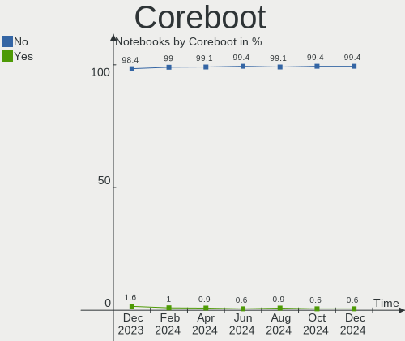
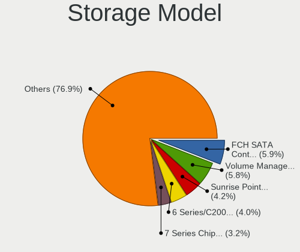

Ubuntu Hardware Trends (Notebook)
---------------------------------

A project to identify most popular hardware characteristics and track their change
over time based on data collected by Ubuntu users at https://Linux-Hardware.org.

Anyone can contribute to the study by uploading probes of their computers by
the [hw-probe](https://github.com/linuxhw/hw-probe) tool:

    sudo -E hw-probe -all -upload

Full-feature report is available here: https://linux-hardware.org/?view=trends&formfactor=notebook

Period: Feb, 2021.

Contents
--------

- [ OS                       ](#os)
- [ OS Family                ](#os-family)
- [ Kernel                   ](#kernel)
- [ Kernel Family            ](#kernel-family)
- [ Kernel Major Ver.        ](#kernel-major-ver)
- [ Arch                     ](#arch)
- [ DE                       ](#de)
- [ Display Server           ](#display-server)
- [ Display Manager          ](#display-manager)
- [ OS Lang                  ](#os-lang)
- [ Boot Mode                ](#boot-mode)
- [ Filesystem               ](#filesystem)
- [ Part. scheme             ](#part-scheme)
- [ Dual Boot with Linux/BSD ](#dual-boot-with-linux/bsd)
- [ Dual Boot (Win)          ](#dual-boot-win)
- [ Country                  ](#country)
- [ City                     ](#city)
- [ Vendor                   ](#vendor)
- [ Model                    ](#model)
- [ Model Family             ](#model-family)
- [ MFG Year                 ](#mfg-year)
- [ Form Factor              ](#form-factor)
- [ Secure Boot              ](#secure-boot)
- [ Coreboot                 ](#coreboot)
- [ RAM Size                 ](#ram-size)
- [ RAM Used                 ](#ram-used)
- [ Has CD-ROM               ](#has-cd-rom)
- [ Total Drives             ](#total-drives)
- [ Has Ethernet             ](#has-ethernet)
- [ Drive Vendor             ](#drive-vendor)
- [ Drive Model              ](#drive-model)
- [ HDD Vendor               ](#hdd-vendor)
- [ SSD Vendor               ](#ssd-vendor)
- [ Drive Kind               ](#drive-kind)
- [ Drive Connector          ](#drive-connector)
- [ Drive Size               ](#drive-size)
- [ Space Total              ](#space-total)
- [ Space Used               ](#space-used)
- [ Malfunc. Drives          ](#malfunc-drives)
- [ Malfunc. Drive Vendor    ](#malfunc-drive-vendor)
- [ Malfunc. HDD Vendor      ](#malfunc-hdd-vendor)
- [ Malfunc. Drive Kind      ](#malfunc-drive-kind)
- [ Failed Drives            ](#failed-drives)
- [ Failed Drive Vendor      ](#failed-drive-vendor)
- [ Drive Status             ](#drive-status)
- [ Storage Vendor           ](#storage-vendor)
- [ Storage Model            ](#storage-model)
- [ Storage Kind             ](#storage-kind)
- [ CPU Vendor               ](#cpu-vendor)
- [ CPU Model                ](#cpu-model)
- [ CPU Model Family         ](#cpu-model-family)
- [ CPU Cores                ](#cpu-cores)
- [ CPU Sockets              ](#cpu-sockets)
- [ CPU Threads              ](#cpu-threads)
- [ CPU Op-Modes             ](#cpu-op-modes)
- [ CPU Microcode            ](#cpu-microcode)
- [ CPU Microarch            ](#cpu-microarch)
- [ GPU Vendor               ](#gpu-vendor)
- [ GPU Model                ](#gpu-model)
- [ GPU Combo                ](#gpu-combo)
- [ GPU Driver               ](#gpu-driver)
- [ GPU Memory               ](#gpu-memory)
- [ Monitor Vendor           ](#monitor-vendor)
- [ Monitor Model            ](#monitor-model)
- [ Monitor Resolution       ](#monitor-resolution)
- [ Monitor Diagonal         ](#monitor-diagonal)
- [ Monitor Width            ](#monitor-width)
- [ Aspect Ratio             ](#aspect-ratio)
- [ Monitor Area             ](#monitor-area)
- [ Pixel Density            ](#pixel-density)
- [ Multiple Monitors        ](#multiple-monitors)
- [ Net Controller Vendor    ](#net-controller-vendor)
- [ Net Controller Model     ](#net-controller-model)
- [ Wireless Vendor          ](#wireless-vendor)
- [ Wireless Model           ](#wireless-model)
- [ Ethernet Vendor          ](#ethernet-vendor)
- [ Ethernet Model           ](#ethernet-model)
- [ Net Controller Kind      ](#net-controller-kind)
- [ Used Controller          ](#used-controller)
- [ NICs                     ](#nics)
- [ Memory Vendor            ](#memory-vendor)
- [ Memory Model             ](#memory-model)
- [ Memory Kind              ](#memory-kind)
- [ Memory Form Factor       ](#memory-form-factor)
- [ Memory Size              ](#memory-size)
- [ Memory Speed             ](#memory-speed)
- [ Sound Vendor             ](#sound-vendor)
- [ Sound Model              ](#sound-model)
- [ Camera Vendor            ](#camera-vendor)
- [ Camera Model             ](#camera-model)
- [ Fingerprint Vendor       ](#fingerprint-vendor)
- [ Fingerprint Model        ](#fingerprint-model)
- [ Chipcard Vendor          ](#chipcard-vendor)
- [ Chipcard Model           ](#chipcard-model)
- [ Printer Vendor           ](#printer-vendor)
- [ Printer Model            ](#printer-model)
- [ Scanner Vendor           ](#scanner-vendor)
- [ Scanner Model            ](#scanner-model)
- [ Bluetooth Vendor         ](#bluetooth-vendor)
- [ Bluetooth Model          ](#bluetooth-model)
- [ Unsupported Devices      ](#unsupported-devices)
- [ Unsupported Device Types ](#unsupported-device-types)

OS
--

Installed operating systems

| Name         | Notebooks | Percent |
|--------------|-----------|---------|
| Ubuntu 20.04 | 673       | 69.52%  |
| Ubuntu 20.10 | 178       | 18.39%  |
| Ubuntu 18.04 | 91        | 9.4%    |
| Ubuntu 16.04 | 12        | 1.24%   |
| Ubuntu 21.04 | 3         | 0.31%   |
| Ubuntu 19.10 | 3         | 0.31%   |
| Ubuntu 18.10 | 3         | 0.31%   |
| Ubuntu       | 3         | 0.31%   |
| Ubuntu 2020  | 1         | 0.1%    |
| Ubuntu 19.04 | 1         | 0.1%    |

OS Family
---------

OS without a version

| Name   | Notebooks | Percent |
|--------|-----------|---------|
| Ubuntu | 968       | 100%    |

Kernel
------

Version of the Linux kernel

| Version                        | Notebooks | Percent |
|--------------------------------|-----------|---------|
| 5.8.0-43-generic               | 292       | 30.17%  |
| 5.8.0-41-generic               | 185       | 19.11%  |
| 5.4.0-65-generic               | 167       | 17.25%  |
| 5.8.0-44-generic               | 79        | 8.16%   |
| 5.4.0-42-generic               | 22        | 2.27%   |
| 5.4.0-66-generic               | 20        | 2.07%   |
| 4.15.0-135-generic             | 20        | 2.07%   |
| 5.4.0-65-lowlatency            | 15        | 1.55%   |
| 5.8.0-40-generic               | 8         | 0.83%   |
| 5.11.0-051100-generic          | 8         | 0.83%   |
| 4.15.0-136-generic             | 8         | 0.83%   |
| 5.8.0-38-generic               | 7         | 0.72%   |
| 5.4.0-26-generic               | 7         | 0.72%   |
| 5.8.0-42-generic               | 6         | 0.62%   |
| 5.8.0-25-generic               | 6         | 0.62%   |
| 4.15.0-133-generic             | 6         | 0.62%   |
| 5.4.0-64-generic               | 5         | 0.52%   |
| 5.4.0-62-generic               | 5         | 0.52%   |
| 5.8.0-36-generic               | 4         | 0.41%   |
| 5.8.0-33-generic               | 4         | 0.41%   |
| 5.4.0-58-generic               | 4         | 0.41%   |
| 5.6.0-1047-oem                 | 3         | 0.31%   |
| 5.4.0-54-generic               | 3         | 0.31%   |
| 5.10.0-14-generic              | 3         | 0.31%   |
| 5.10.0-051000-generic          | 3         | 0.31%   |
| 4.4.0-201-generic              | 3         | 0.31%   |
| 5.9.6-050906-generic           | 2         | 0.21%   |
| 5.8.0-7630-generic             | 2         | 0.21%   |
| 5.8.0-45-generic               | 2         | 0.21%   |
| 5.8.0-29-generic               | 2         | 0.21%   |
| 5.6.0-1042-oem                 | 2         | 0.21%   |
| 5.4.0-60-generic               | 2         | 0.21%   |
| 5.4.0-56-generic               | 2         | 0.21%   |
| 5.4.0-52-generic               | 2         | 0.21%   |
| 5.4.0-47-generic               | 2         | 0.21%   |
| 5.10.0-1008-oem                | 2         | 0.21%   |
| 5.0.0-23-generic               | 2         | 0.21%   |
| 5.9.11-microtech               | 1         | 0.1%    |
| 5.9.10-050910-generic          | 1         | 0.1%    |
| 5.9.0-0.bpo.2-amd64            | 1         | 0.1%    |
| 5.8.18-050818-generic          | 1         | 0.1%    |
| 5.8.0-7642-generic             | 1         | 0.1%    |
| 5.8.0-44-lowlatency            | 1         | 0.1%    |
| 5.8.0-43-lowlatency            | 1         | 0.1%    |
| 5.8.0-34-generic               | 1         | 0.1%    |
| 5.6.0-7-generic                | 1         | 0.1%    |
| 5.6.0-1048-oem                 | 1         | 0.1%    |
| 5.4.72-microsoft-standard-WSL2 | 1         | 0.1%    |
| 5.4.0-67-generic               | 1         | 0.1%    |
| 5.4.0-59-generic               | 1         | 0.1%    |
| 5.4.0-53-generic               | 1         | 0.1%    |
| 5.4.0-48-generic               | 1         | 0.1%    |
| 5.4.0-40-generic               | 1         | 0.1%    |
| 5.4.0-39-generic               | 1         | 0.1%    |
| 5.4.0-33-generic               | 1         | 0.1%    |
| 5.4.0-29-generic               | 1         | 0.1%    |
| 5.3.0-64-generic               | 1         | 0.1%    |
| 5.3.0-62-generic               | 1         | 0.1%    |
| 5.3.0-42-generic               | 1         | 0.1%    |
| 5.3.0-40-lowlatency            | 1         | 0.1%    |

Kernel Family
-------------

Linux kernel without a distro release

| Version  | Notebooks | Percent |
|----------|-----------|---------|
| 5.8.0    | 601       | 62.09%  |
| 5.4.0    | 264       | 27.27%  |
| 4.15.0   | 42        | 4.34%   |
| 5.10.0   | 10        | 1.03%   |
| 5.11.0   | 9         | 0.93%   |
| 5.6.0    | 7         | 0.72%   |
| 5.3.0    | 5         | 0.52%   |
| 4.4.0    | 5         | 0.52%   |
| 4.18.0   | 5         | 0.52%   |
| 5.0.0    | 3         | 0.31%   |
| 5.9.6    | 2         | 0.21%   |
| 5.10.13  | 2         | 0.21%   |
| 5.9.11   | 1         | 0.1%    |
| 5.9.10   | 1         | 0.1%    |
| 5.9.0    | 1         | 0.1%    |
| 5.8.18   | 1         | 0.1%    |
| 5.4.72   | 1         | 0.1%    |
| 5.10.17  | 1         | 0.1%    |
| 5.10.15  | 1         | 0.1%    |
| 5.10.14  | 1         | 0.1%    |
| 5.10.11  | 1         | 0.1%    |
| 5.10.10  | 1         | 0.1%    |
| 4.17.3   | 1         | 0.1%    |
| 4.14.221 | 1         | 0.1%    |
| 4.14.219 | 1         | 0.1%    |

Kernel Major Ver.
-----------------

Linux kernel major version

| Version | Notebooks | Percent |
|---------|-----------|---------|
| 5.8     | 602       | 62.19%  |
| 5.4     | 265       | 27.38%  |
| 4.15    | 42        | 4.34%   |
| 5.10    | 17        | 1.76%   |
| 5.11    | 9         | 0.93%   |
| 5.6     | 7         | 0.72%   |
| 5.9     | 5         | 0.52%   |
| 5.3     | 5         | 0.52%   |
| 4.4     | 5         | 0.52%   |
| 4.18    | 5         | 0.52%   |
| 5.0     | 3         | 0.31%   |
| 4.14    | 2         | 0.21%   |
| 4.17    | 1         | 0.1%    |

Arch
----

OS architecture (x86_64, i586, etc.)

| Name   | Notebooks | Percent |
|--------|-----------|---------|
| x86_64 | 949       | 98.04%  |
| i686   | 19        | 1.96%   |

DE
--

Desktop Environment

| Name            | Notebooks | Percent |
|-----------------|-----------|---------|
| GNOME           | 717       | 74.07%  |
| Unknown         | 71        | 7.33%   |
| XFCE            | 62        | 6.4%    |
| KDE             | 21        | 2.17%   |
| MATE            | 18        | 1.86%   |
| KDE5            | 17        | 1.76%   |
| Budgie          | 16        | 1.65%   |
| Unity           | 15        | 1.55%   |
| LXQt            | 15        | 1.55%   |
| X-Cinnamon      | 7         | 0.72%   |
| LXDE            | 4         | 0.41%   |
| GNOME Flashback | 3         | 0.31%   |
| Cinnamon        | 2         | 0.21%   |

Display Server
--------------

X11 or Wayland

| Name    | Notebooks | Percent |
|---------|-----------|---------|
| X11     | 882       | 91.12%  |
| Unknown | 43        | 4.44%   |
| Wayland | 38        | 3.93%   |
| Tty     | 5         | 0.52%   |

Display Manager
---------------

SDDM, LightDM, etc.

| Name    | Notebooks | Percent |
|---------|-----------|---------|
| Unknown | 732       | 75.62%  |
| GDM     | 180       | 18.6%   |
| TDM     | 29        | 3%      |
| SDDM    | 23        | 2.38%   |
| GDM3    | 2         | 0.21%   |
| XDM     | 1         | 0.1%    |
| LightDM | 1         | 0.1%    |

OS Lang
-------

Language

| Lang    | Notebooks | Percent |
|---------|-----------|---------|
| en_US   | 377       | 38.95%  |
| de_DE   | 119       | 12.29%  |
| fr_FR   | 71        | 7.33%   |
| en_GB   | 49        | 5.06%   |
| pt_BR   | 41        | 4.24%   |
| ru_RU   | 33        | 3.41%   |
| it_IT   | 28        | 2.89%   |
| es_ES   | 26        | 2.69%   |
| en_IN   | 26        | 2.69%   |
| en_CA   | 23        | 2.38%   |
| pl_PL   | 13        | 1.34%   |
| nl_NL   | 13        | 1.34%   |
| C       | 10        | 1.03%   |
| es_MX   | 9         | 0.93%   |
| Unknown | 9         | 0.93%   |
| hu_HU   | 8         | 0.83%   |
| sv_SE   | 7         | 0.72%   |
| en_AU   | 7         | 0.72%   |
| pt_PT   | 6         | 0.62%   |
| id_ID   | 5         | 0.52%   |
| es_AR   | 5         | 0.52%   |
| en_ZA   | 5         | 0.52%   |
| de_AT   | 5         | 0.52%   |
| cs_CZ   | 5         | 0.52%   |
| uk_UA   | 4         | 0.41%   |
| ru_UA   | 4         | 0.41%   |
| ja_JP   | 4         | 0.41%   |
| fr_BE   | 4         | 0.41%   |
| fi_FI   | 4         | 0.41%   |
| es_CL   | 4         | 0.41%   |
| en_NZ   | 4         | 0.41%   |
| en_IL   | 4         | 0.41%   |
| sk_SK   | 3         | 0.31%   |
| ro_RO   | 3         | 0.31%   |
| ca_ES   | 3         | 0.31%   |
| tr_TR   | 2         | 0.21%   |
| sl_SI   | 2         | 0.21%   |
| nl_BE   | 2         | 0.21%   |
| en_SG   | 2         | 0.21%   |
| en_IE   | 2         | 0.21%   |
| de_CH   | 2         | 0.21%   |
| zh_CN   | 1         | 0.1%    |
| nb_NO   | 1         | 0.1%    |
| lt_LT   | 1         | 0.1%    |
| ko_KR   | 1         | 0.1%    |
| gl_ES   | 1         | 0.1%    |
| fr_CA   | 1         | 0.1%    |
| es_PE   | 1         | 0.1%    |
| es_CO   | 1         | 0.1%    |
| en_ZM   | 1         | 0.1%    |
| en_NG   | 1         | 0.1%    |
| el_GR   | 1         | 0.1%    |
| da_DK   | 1         | 0.1%    |
| bg_BG   | 1         | 0.1%    |
| be_BY   | 1         | 0.1%    |
| ar_EG   | 1         | 0.1%    |

Boot Mode
---------

EFI or BIOS

| Mode | Notebooks | Percent |
|------|-----------|---------|
| BIOS | 537       | 55.48%  |
| EFI  | 431       | 44.52%  |

Filesystem
----------

Type of filesystem

| Type    | Notebooks | Percent |
|---------|-----------|---------|
| Ext4    | 915       | 94.52%  |
| Overlay | 27        | 2.79%   |
| Zfs     | 12        | 1.24%   |
| Btrfs   | 7         | 0.72%   |
| Ext3    | 3         | 0.31%   |
| Xfs     | 2         | 0.21%   |
| Ext2    | 2         | 0.21%   |

Part. scheme
------------

Scheme of partitioning

| Type    | Notebooks | Percent |
|---------|-----------|---------|
| Unknown | 730       | 75.41%  |
| GPT     | 183       | 18.9%   |
| MBR     | 55        | 5.68%   |

Dual Boot with Linux/BSD
------------------------

Hosting more than one Linux/BSD

| Dual boot | Notebooks | Percent |
|-----------|-----------|---------|
| No        | 877       | 90.6%   |
| Yes       | 91        | 9.4%    |

Dual Boot (Win)
---------------

Hosting Linux and Windows

| Dual boot | Notebooks | Percent |
|-----------|-----------|---------|
| No        | 614       | 63.43%  |
| Yes       | 354       | 36.57%  |

Country
-------

Geographic location (country)

| Country        | Notebooks | Percent |
|----------------|-----------|---------|
| USA            | 145       | 14.98%  |
| Germany        | 134       | 13.84%  |
| France         | 74        | 7.64%   |
| Brazil         | 56        | 5.79%   |
| UK             | 40        | 4.13%   |
| Russia         | 36        | 3.72%   |
| Spain          | 31        | 3.2%    |
| Italy          | 31        | 3.2%    |
| India          | 31        | 3.2%    |
| Canada         | 30        | 3.1%    |
| Netherlands    | 24        | 2.48%   |
| Ukraine        | 18        | 1.86%   |
| Mexico         | 17        | 1.76%   |
| Poland         | 14        | 1.45%   |
| Belgium        | 14        | 1.45%   |
| Sweden         | 12        | 1.24%   |
| Hungary        | 10        | 1.03%   |
| Austria        | 10        | 1.03%   |
| Argentina      | 10        | 1.03%   |
| Turkey         | 9         | 0.93%   |
| South Africa   | 9         | 0.93%   |
| Romania        | 9         | 0.93%   |
| Portugal       | 9         | 0.93%   |
| Norway         | 8         | 0.83%   |
| Japan          | 8         | 0.83%   |
| Indonesia      | 8         | 0.83%   |
| Finland        | 8         | 0.83%   |
| Australia      | 8         | 0.83%   |
| Greece         | 7         | 0.72%   |
| Czech Republic | 7         | 0.72%   |
| Colombia       | 7         | 0.72%   |
| Switzerland    | 6         | 0.62%   |
| Pakistan       | 6         | 0.62%   |
| Bulgaria       | 6         | 0.62%   |
| Vietnam        | 5         | 0.52%   |
| New Zealand    | 5         | 0.52%   |
| Iran           | 5         | 0.52%   |
| Chile          | 5         | 0.52%   |
| Slovenia       | 4         | 0.41%   |
| Slovakia       | 4         | 0.41%   |
| Saudi Arabia   | 4         | 0.41%   |
| Morocco        | 4         | 0.41%   |
| Israel         | 4         | 0.41%   |
| Ireland        | 4         | 0.41%   |
| Egypt          | 4         | 0.41%   |
| Croatia        | 4         | 0.41%   |
| Armenia        | 4         | 0.41%   |
| Singapore      | 3         | 0.31%   |
| Denmark        | 3         | 0.31%   |
| Belarus        | 3         | 0.31%   |
| Algeria        | 3         | 0.31%   |
| Sri Lanka      | 2         | 0.21%   |
| Lithuania      | 2         | 0.21%   |
| Kenya          | 2         | 0.21%   |
| Jordan         | 2         | 0.21%   |
| Ecuador        | 2         | 0.21%   |
| China          | 2         | 0.21%   |
| Zambia         | 1         | 0.1%    |
| Venezuela      | 1         | 0.1%    |
| Vatican        | 1         | 0.1%    |

City
----

Geographic location (city)

| City              | Notebooks | Percent |
|-------------------|-----------|---------|
| Berlin            | 20        | 2.07%   |
| Paris             | 12        | 1.24%   |
| Rome              | 9         | 0.93%   |
| Moscow            | 9         | 0.93%   |
| Kyiv              | 9         | 0.93%   |
| Prague            | 6         | 0.62%   |
| Madrid            | 6         | 0.62%   |
| Pune              | 5         | 0.52%   |
| London            | 5         | 0.52%   |
| Hamburg           | 5         | 0.52%   |
| Budapest          | 5         | 0.52%   |
| Bogotá           | 5         | 0.52%   |
| Amsterdam         | 5         | 0.52%   |
| Zagreb            | 4         | 0.41%   |
| Vienna            | 4         | 0.41%   |
| Toronto           | 4         | 0.41%   |
| São Paulo        | 4         | 0.41%   |
| Stuttgart         | 4         | 0.41%   |
| Sofia             | 4         | 0.41%   |
| Munich            | 4         | 0.41%   |
| Mexico City       | 4         | 0.41%   |
| Leeds             | 4         | 0.41%   |
| Frankfurt am Main | 4         | 0.41%   |
| Ekaterinburg      | 4         | 0.41%   |
| Düsseldorf       | 4         | 0.41%   |
| Buenos Aires      | 4         | 0.41%   |
| Brasília         | 4         | 0.41%   |
| Yerevan           | 3         | 0.31%   |
| Warsaw            | 3         | 0.31%   |
| Thessaloniki      | 3         | 0.31%   |
| St Petersburg     | 3         | 0.31%   |
| Singapore         | 3         | 0.31%   |
| Riyadh            | 3         | 0.31%   |
| Mumbai            | 3         | 0.31%   |
| Montreal          | 3         | 0.31%   |
| Los Angeles       | 3         | 0.31%   |
| Karachi           | 3         | 0.31%   |
| Johannesburg      | 3         | 0.31%   |
| Jakarta           | 3         | 0.31%   |
| Istanbul          | 3         | 0.31%   |
| Ho Chi Minh City  | 3         | 0.31%   |
| Guadalajara       | 3         | 0.31%   |
| Gothenburg        | 3         | 0.31%   |
| Essen             | 3         | 0.31%   |
| Curitiba          | 3         | 0.31%   |
| Chatou            | 3         | 0.31%   |
| Cape Town         | 3         | 0.31%   |
| Calgary           | 3         | 0.31%   |
| Bucharest         | 3         | 0.31%   |
| Boston            | 3         | 0.31%   |
| Bengaluru         | 3         | 0.31%   |
| Auckland          | 3         | 0.31%   |
| Alt Meteln        | 3         | 0.31%   |
| Zurich            | 2         | 0.21%   |
| Wuppertal         | 2         | 0.21%   |
| Vancouver         | 2         | 0.21%   |
| Tucson            | 2         | 0.21%   |
| Toulouse          | 2         | 0.21%   |
| Tel Aviv          | 2         | 0.21%   |
| Tehran            | 2         | 0.21%   |

Vendor
------

Motherboard manufacturer

| Name                   | Notebooks | Percent |
|------------------------|-----------|---------|
| Hewlett-Packard        | 185       | 19.11%  |
| Dell                   | 185       | 19.11%  |
| Lenovo                 | 181       | 18.7%   |
| ASUSTek Computer       | 100       | 10.33%  |
| Acer                   | 90        | 9.3%    |
| Toshiba                | 35        | 3.62%   |
| Sony                   | 26        | 2.69%   |
| Apple                  | 19        | 1.96%   |
| Samsung Electronics    | 17        | 1.76%   |
| MSI                    | 15        | 1.55%   |
| Medion                 | 12        | 1.24%   |
| Notebook               | 10        | 1.03%   |
| Fujitsu                | 9         | 0.93%   |
| Fujitsu Siemens        | 8         | 0.83%   |
| Packard Bell           | 7         | 0.72%   |
| Timi                   | 5         | 0.52%   |
| HUAWEI                 | 4         | 0.41%   |
| Unknown                | 4         | 0.41%   |
| System76               | 3         | 0.31%   |
| Semp Toshiba           | 3         | 0.31%   |
| NEC Computers          | 3         | 0.31%   |
| Wortmann AG            | 2         | 0.21%   |
| TUXEDO                 | 2         | 0.21%   |
| Positivo               | 2         | 0.21%   |
| Panasonic              | 2         | 0.21%   |
| Maibenben              | 2         | 0.21%   |
| LG Electronics         | 2         | 0.21%   |
| Gateway                | 2         | 0.21%   |
| Clevo                  | 2         | 0.21%   |
| AVITA                  | 2         | 0.21%   |
| YIFANG                 | 1         | 0.1%    |
| WYSE                   | 1         | 0.1%    |
| VINGA                  | 1         | 0.1%    |
| Trenton Systems        | 1         | 0.1%    |
| Star Labs              | 1         | 0.1%    |
| SLIMBOOK               | 1         | 0.1%    |
| Razer                  | 1         | 0.1%    |
| Pixus                  | 1         | 0.1%    |
| ODM                    | 1         | 0.1%    |
| Novatech               | 1         | 0.1%    |
| Motion Computing       | 1         | 0.1%    |
| Microtech              | 1         | 0.1%    |
| Jumper                 | 1         | 0.1%    |
| Itautec                | 1         | 0.1%    |
| Intel                  | 1         | 0.1%    |
| GPU Company            | 1         | 0.1%    |
| Google                 | 1         | 0.1%    |
| Gigabyte Technology    | 1         | 0.1%    |
| EVOO Products Company  | 1         | 0.1%    |
| Entroware              | 1         | 0.1%    |
| DBM                    | 1         | 0.1%    |
| Compal                 | 1         | 0.1%    |
| Chuwi                  | 1         | 0.1%    |
| BESSTAR Tech           | 1         | 0.1%    |
| BEL MICRO COMPUTADORES | 1         | 0.1%    |
| BAKED                  | 1         | 0.1%    |
| Alienware              | 1         | 0.1%    |
| Advent                 | 1         | 0.1%    |
| 10ZIG Technology.      | 1         | 0.1%    |

Model
-----

Motherboard model

| Name                                     | Notebooks | Percent |
|------------------------------------------|-----------|---------|
| Unknown                                  | 12        | 1.24%   |
| HP Pavilion dv6                          | 6         | 0.62%   |
| Dell Precision M4800                     | 6         | 0.62%   |
| HP Notebook                              | 5         | 0.52%   |
| Dell XPS 13 7390                         | 5         | 0.52%   |
| Dell Latitude E6420                      | 5         | 0.52%   |
| Dell Latitude E4310                      | 5         | 0.52%   |
| Packard Bell EasyNote TS11HR             | 4         | 0.41%   |
| HP Pavilion dv7                          | 4         | 0.41%   |
| Dell XPS 15 7590                         | 4         | 0.41%   |
| Dell Latitude 7490                       | 4         | 0.41%   |
| Toshiba Satellite C55-C                  | 3         | 0.31%   |
| Lenovo G510 20238                        | 3         | 0.31%   |
| HP ProBook 455 G7                        | 3         | 0.31%   |
| HP Pavilion Notebook                     | 3         | 0.31%   |
| HP Pavilion g6                           | 3         | 0.31%   |
| HP Pavilion dv5                          | 3         | 0.31%   |
| HP Laptop 15-dw1xxx                      | 3         | 0.31%   |
| HP Laptop 15-da1xxx                      | 3         | 0.31%   |
| HP EliteBook 850 G7 Notebook PC          | 3         | 0.31%   |
| HP EliteBook 8470p                       | 3         | 0.31%   |
| HP EliteBook 840 G2                      | 3         | 0.31%   |
| HP 15                                    | 3         | 0.31%   |
| Dell XPS 13 9370                         | 3         | 0.31%   |
| Dell Vostro 3480                         | 3         | 0.31%   |
| Dell Latitude E6510                      | 3         | 0.31%   |
| Dell Inspiron 5537                       | 3         | 0.31%   |
| Dell Inspiron 3542                       | 3         | 0.31%   |
| Dell Inspiron 15-3567                    | 3         | 0.31%   |
| ASUS T100HAN                             | 3         | 0.31%   |
| Apple MacBookPro9,2                      | 3         | 0.31%   |
| Toshiba Satellite C75D-B                 | 2         | 0.21%   |
| Toshiba Satellite C55D-B                 | 2         | 0.21%   |
| Timi Mi Laptop Pro 15 2020               | 2         | 0.21%   |
| Maibenben XiaoMai6 Plus                  | 2         | 0.21%   |
| Lenovo V155-15API 81V5                   | 2         | 0.21%   |
| Lenovo ThinkPad X1 Carbon 6th 20KHCTO1WW | 2         | 0.21%   |
| Lenovo ThinkBook 14-IML 20RV             | 2         | 0.21%   |
| Lenovo IdeaPad Z580                      | 2         | 0.21%   |
| Lenovo IdeaPad S340-14IIL 81VV           | 2         | 0.21%   |
| Lenovo IdeaPad S145-15IWL 81S9           | 2         | 0.21%   |
| Lenovo IdeaPad 530S-15IKB 81EV           | 2         | 0.21%   |
| Lenovo G50-30 80G0                       | 2         | 0.21%   |
| Lenovo G40-70 80GA                       | 2         | 0.21%   |
| Lenovo Flex 2-15 20405                   | 2         | 0.21%   |
| HUAWEI NBLK-WAX9X                        | 2         | 0.21%   |
| HP Stream Notebook PC 11                 | 2         | 0.21%   |
| HP Pavilion x2 Detachable                | 2         | 0.21%   |
| HP Pavilion g7                           | 2         | 0.21%   |
| HP Pavilion 17                           | 2         | 0.21%   |
| HP Pavilion 15                           | 2         | 0.21%   |
| HP Laptop 17-ca1xxx                      | 2         | 0.21%   |
| HP Laptop 15-db0xxx                      | 2         | 0.21%   |
| HP Laptop 15-da0xxx                      | 2         | 0.21%   |
| HP ENVY Notebook                         | 2         | 0.21%   |
| HP EliteBook 8440p                       | 2         | 0.21%   |
| HP EliteBook 820 G3                      | 2         | 0.21%   |
| HP Compaq 6735b                          | 2         | 0.21%   |
| HP 240 G6 Notebook PC                    | 2         | 0.21%   |
| HP 14                                    | 2         | 0.21%   |

Model Family
------------

Motherboard model prefix

| Name                     | Notebooks | Percent |
|--------------------------|-----------|---------|
| Lenovo ThinkPad          | 100       | 10.33%  |
| Acer Aspire              | 61        | 6.3%    |
| Dell Latitude            | 58        | 5.99%   |
| Dell Inspiron            | 51        | 5.27%   |
| HP Pavilion              | 49        | 5.06%   |
| Lenovo IdeaPad           | 38        | 3.93%   |
| Toshiba Satellite        | 30        | 3.1%    |
| HP EliteBook             | 26        | 2.69%   |
| HP ProBook               | 25        | 2.58%   |
| HP Laptop                | 23        | 2.38%   |
| Dell XPS                 | 22        | 2.27%   |
| Dell Vostro              | 22        | 2.27%   |
| Dell Precision           | 18        | 1.86%   |
| Unknown                  | 12        | 1.24%   |
| ASUS VivoBook            | 10        | 1.03%   |
| ASUS ZenBook             | 9         | 0.93%   |
| Fujitsu LIFEBOOK         | 8         | 0.83%   |
| Acer Swift               | 8         | 0.83%   |
| Packard Bell EasyNote    | 7         | 0.72%   |
| Lenovo ThinkBook         | 7         | 0.72%   |
| HP Compaq                | 7         | 0.72%   |
| Dell Studio              | 7         | 0.72%   |
| Acer Nitro               | 6         | 0.62%   |
| HP ZBook                 | 5         | 0.52%   |
| HP Notebook              | 5         | 0.52%   |
| Timi Mi                  | 4         | 0.41%   |
| HP Stream                | 4         | 0.41%   |
| HP Presario              | 4         | 0.41%   |
| HP ENVY                  | 4         | 0.41%   |
| HP 15                    | 4         | 0.41%   |
| Acer TravelMate          | 4         | 0.41%   |
| Lenovo G510              | 3         | 0.31%   |
| HP OMEN                  | 3         | 0.31%   |
| Fujitsu Siemens ESPRIMO  | 3         | 0.31%   |
| Fujitsu Siemens AMILO    | 3         | 0.31%   |
| Dell G3                  | 3         | 0.31%   |
| ASUS TUF                 | 3         | 0.31%   |
| ASUS T100HAN             | 3         | 0.31%   |
| Apple MacBookPro9        | 3         | 0.31%   |
| Acer Extensa             | 3         | 0.31%   |
| Toshiba PORTEGE          | 2         | 0.21%   |
| Semp Toshiba IS          | 2         | 0.21%   |
| Notebook W54             | 2         | 0.21%   |
| Maibenben XiaoMai6       | 2         | 0.21%   |
| Lenovo Yoga              | 2         | 0.21%   |
| Lenovo V155-15API        | 2         | 0.21%   |
| Lenovo Legion            | 2         | 0.21%   |
| Lenovo G50-80            | 2         | 0.21%   |
| Lenovo G50-30            | 2         | 0.21%   |
| Lenovo G40-70            | 2         | 0.21%   |
| Lenovo Flex              | 2         | 0.21%   |
| Lenovo B50-30            | 2         | 0.21%   |
| HUAWEI NBLK-WAX9X        | 2         | 0.21%   |
| HP 250                   | 2         | 0.21%   |
| HP 240                   | 2         | 0.21%   |
| HP 14                    | 2         | 0.21%   |
| Fujitsu Siemens LIFEBOOK | 2         | 0.21%   |
| Dell G5                  | 2         | 0.21%   |
| ASUS X510UNR             | 2         | 0.21%   |
| ASUS ROG                 | 2         | 0.21%   |

MFG Year
--------

Motherboard manufacture year

| Year    | Notebooks | Percent |
|---------|-----------|---------|
| 2020    | 224       | 23.14%  |
| 2019    | 108       | 11.16%  |
| 2012    | 77        | 7.95%   |
| 2013    | 71        | 7.33%   |
| 2018    | 67        | 6.92%   |
| 2015    | 61        | 6.3%    |
| 2011    | 57        | 5.89%   |
| 2014    | 49        | 5.06%   |
| 2008    | 47        | 4.86%   |
| 2010    | 46        | 4.75%   |
| 2017    | 44        | 4.55%   |
| 2009    | 43        | 4.44%   |
| 2016    | 42        | 4.34%   |
| 2007    | 19        | 1.96%   |
| 2021    | 7         | 0.72%   |
| 2006    | 5         | 0.52%   |
| Unknown | 1         | 0.1%    |

Form Factor
-----------

Physical design of the computer

| Name     | Notebooks | Percent |
|----------|-----------|---------|
| Notebook | 968       | 100%    |

Secure Boot
-----------

Enabled or disabled

| State    | Notebooks | Percent |
|----------|-----------|---------|
| Disabled | 849       | 87.71%  |
| Enabled  | 119       | 12.29%  |

Coreboot
--------

Have coreboot on board

| Used | Notebooks | Percent |
|------|-----------|---------|
| No   | 965       | 99.69%  |
| Yes  | 3         | 0.31%   |

RAM Size
--------

Total RAM memory

| Size in GB  | Notebooks | Percent |
|-------------|-----------|---------|
| 4.01-8.0    | 282       | 29.13%  |
| 3.01-4.0    | 256       | 26.45%  |
| 8.01-16.0   | 165       | 17.05%  |
| 16.01-24.0  | 154       | 15.91%  |
| 1.01-2.0    | 47        | 4.86%   |
| 32.01-64.0  | 26        | 2.69%   |
| 2.01-3.0    | 19        | 1.96%   |
| 24.01-32.0  | 8         | 0.83%   |
| 64.01-256.0 | 7         | 0.72%   |
| 0.51-1.0    | 4         | 0.41%   |

RAM Used
--------

Used RAM memory

| Used GB    | Notebooks | Percent |
|------------|-----------|---------|
| 1.01-2.0   | 369       | 38.12%  |
| 2.01-3.0   | 254       | 26.24%  |
| 4.01-8.0   | 136       | 14.05%  |
| 3.01-4.0   | 136       | 14.05%  |
| 0.51-1.0   | 35        | 3.62%   |
| 8.01-16.0  | 33        | 3.41%   |
| 0.01-0.5   | 4         | 0.41%   |
| 16.01-24.0 | 1         | 0.1%    |

Has CD-ROM
----------

Has CD-ROM on board

| Presented | Notebooks | Percent |
|-----------|-----------|---------|
| No        | 551       | 56.92%  |
| Yes       | 417       | 43.08%  |

Total Drives
------------

Number of drives on board

| Drives | Notebooks | Percent |
|--------|-----------|---------|
| 1      | 693       | 71.59%  |
| 2      | 221       | 22.83%  |
| 3      | 40        | 4.13%   |
| 0      | 9         | 0.93%   |
| 4      | 4         | 0.41%   |
| 5      | 1         | 0.1%    |

Has Ethernet
------------

Has Ethernet on board

| Presented | Notebooks | Percent |
|-----------|-----------|---------|
| Yes       | 824       | 85.12%  |
| No        | 144       | 14.88%  |

Drive Vendor
------------

Hard drive vendors

| Vendor                    | Notebooks | Drives | Percent |
|---------------------------|-----------|--------|---------|
| Samsung Electronics       | 189       | 197    | 15.96%  |
| Seagate                   | 156       | 160    | 13.18%  |
| WDC                       | 150       | 159    | 12.67%  |
| Toshiba                   | 104       | 106    | 8.78%   |
| Sandisk                   | 69        | 70     | 5.83%   |
| Kingston                  | 63        | 66     | 5.32%   |
| Unknown                   | 62        | 71     | 5.24%   |
| Intel                     | 48        | 51     | 4.05%   |
| Hitachi                   | 43        | 43     | 3.63%   |
| HGST                      | 43        | 43     | 3.63%   |
| SK Hynix                  | 38        | 40     | 3.21%   |
| Crucial                   | 38        | 39     | 3.21%   |
| Micron Technology         | 21        | 21     | 1.77%   |
| A-DATA Technology         | 15        | 15     | 1.27%   |
| Fujitsu                   | 11        | 11     | 0.93%   |
| LITEON                    | 10        | 10     | 0.84%   |
| KIOXIA                    | 10        | 10     | 0.84%   |
| Apple                     | 9         | 10     | 0.76%   |
| Intenso                   | 8         | 8      | 0.68%   |
| PNY                       | 7         | 7      | 0.59%   |
| LITEONIT                  | 7         | 7      | 0.59%   |
| China                     | 6         | 6      | 0.51%   |
| OCZ                       | 5         | 5      | 0.42%   |
| Patriot                   | 4         | 4      | 0.34%   |
| JMicron                   | 4         | 6      | 0.34%   |
| GOODRAM                   | 4         | 4      | 0.34%   |
| Realtek Semiconductor     | 3         | 3      | 0.25%   |
| Phison                    | 3         | 3      | 0.25%   |
| Transcend                 | 2         | 2      | 0.17%   |
| SPCC                      | 2         | 2      | 0.17%   |
| Silicon Motion            | 2         | 2      | 0.17%   |
| SABRENT                   | 2         | 2      | 0.17%   |
| PLEXTOR                   | 2         | 2      | 0.17%   |
| Netac                     | 2         | 2      | 0.17%   |
| Lexar                     | 2         | 2      | 0.17%   |
| Leven                     | 2         | 2      | 0.17%   |
| Lenovo                    | 2         | 2      | 0.17%   |
| KingSpec                  | 2         | 2      | 0.17%   |
| KingFast                  | 2         | 2      | 0.17%   |
| FORESEE                   | 2         | 2      | 0.17%   |
| External                  | 2         | 3      | 0.17%   |
| Apacer                    | 2         | 2      | 0.17%   |
| W800S                     | 1         | 1      | 0.08%   |
| V-GeN                     | 1         | 1      | 0.08%   |
| Team                      | 1         | 1      | 0.08%   |
| TCSUNBOW                  | 1         | 1      | 0.08%   |
| Star                      | 1         | 1      | 0.08%   |
| SSSTC                     | 1         | 1      | 0.08%   |
| Solid State Storage       | 1         | 1      | 0.08%   |
| SDVPSA18                  | 1         | 1      | 0.08%   |
| OWC                       | 1         | 1      | 0.08%   |
| Mushkin                   | 1         | 1      | 0.08%   |
| Msft                      | 1         | 4      | 0.08%   |
| Micron/Crucial Technology | 1         | 1      | 0.08%   |
| Maxtor                    | 1         | 1      | 0.08%   |
| LaCie                     | 1         | 1      | 0.08%   |
| KingDian                  | 1         | 1      | 0.08%   |
| Integral                  | 1         | 1      | 0.08%   |
| HUAWEI                    | 1         | 1      | 0.08%   |
| HS-SSD-C100               | 1         | 1      | 0.08%   |

Drive Model
-----------

Hard drive models

| Model                               | Notebooks | Percent |
|-------------------------------------|-----------|---------|
| Unknown MMC Card  32GB              | 17        | 1.4%    |
| Seagate ST500LT012-1DG142 500GB     | 17        | 1.4%    |
| Seagate ST1000LM035-1RK172 1TB      | 17        | 1.4%    |
| Toshiba MQ01ABD100 1TB              | 14        | 1.15%   |
| Seagate ST1000LM024 HN-M101MBB 1TB  | 14        | 1.15%   |
| Kingston SA400S37240G 240GB SSD     | 14        | 1.15%   |
| Unknown MMC Card  64GB              | 13        | 1.07%   |
| Sandisk NVMe SSD Drive 256GB        | 13        | 1.07%   |
| Samsung SSD 860 EVO 250GB           | 13        | 1.07%   |
| Samsung NVMe SSD Drive 512GB        | 13        | 1.07%   |
| HGST HTS545050A7E680 500GB          | 13        | 1.07%   |
| Toshiba MQ04ABF100 1TB              | 11        | 0.9%    |
| Seagate ST9500325AS 500GB           | 11        | 0.9%    |
| Samsung SSD 850 EVO 250GB           | 11        | 0.9%    |
| Toshiba MQ01ABF050 500GB            | 10        | 0.82%   |
| Sandisk NVMe SSD Drive 512GB        | 10        | 0.82%   |
| Samsung SSD 860 EVO 500GB           | 10        | 0.82%   |
| HGST HTS541010A9E680 1TB            | 10        | 0.82%   |
| Crucial CT500MX500SSD1 500GB        | 10        | 0.82%   |
| SK Hynix NVMe SSD Drive 256GB       | 8         | 0.66%   |
| Samsung NVMe SSD Drive 256GB        | 8         | 0.66%   |
| Kingston SV300S37A120G 120GB SSD    | 8         | 0.66%   |
| Intel NVMe SSD Drive 512GB          | 8         | 0.66%   |
| WDC WD10SPZX-60Z10T0 1TB            | 7         | 0.58%   |
| Seagate ST2000LM007-1R8174 2TB      | 7         | 0.58%   |
| Seagate ST1000LM048-2E7172 1TB      | 7         | 0.58%   |
| Kingston SA400S37480G 480GB SSD     | 7         | 0.58%   |
| HGST HTS721010A9E630 1TB            | 7         | 0.58%   |
| WDC WD10JPVX-75JC3T0 1TB            | 6         | 0.49%   |
| Unknown MMC Card  16GB              | 6         | 0.49%   |
| Toshiba MQ01ABD075 752GB            | 6         | 0.49%   |
| Samsung SSD 850 EVO 500GB           | 6         | 0.49%   |
| Samsung SSD 840 EVO 250GB           | 6         | 0.49%   |
| Samsung NVMe SSD Drive 1024GB       | 6         | 0.49%   |
| Kingston SA400S37120G 120GB SSD     | 6         | 0.49%   |
| Intel SSDPEKNW512G8 512GB           | 6         | 0.49%   |
| Intel NVMe SSD Drive 1024GB         | 6         | 0.49%   |
| WDC WD10JPVX-22JC3T0 1TB            | 5         | 0.41%   |
| Unknown MMC Card  128GB             | 5         | 0.41%   |
| Toshiba MQ01ABD050 500GB            | 5         | 0.41%   |
| SK Hynix NVMe SSD Drive 512GB       | 5         | 0.41%   |
| Seagate ST9750420AS 752GB           | 5         | 0.41%   |
| Seagate ST9320325AS 320GB           | 5         | 0.41%   |
| Seagate ST1000LM049-2GH172 1TB      | 5         | 0.41%   |
| Hitachi HTS547575A9E384 752GB       | 5         | 0.41%   |
| Hitachi HTS545050A7E380 500GB       | 5         | 0.41%   |
| Crucial CT250MX500SSD1 250GB        | 5         | 0.41%   |
| Crucial CT240BX500SSD1 240GB        | 5         | 0.41%   |
| WDC WDS240G2G0A-00JH30 240GB SSD    | 4         | 0.33%   |
| WDC WD3200BEVT-22ZCT0 320GB         | 4         | 0.33%   |
| Unknown SD/MMC/MS PRO 64GB          | 4         | 0.33%   |
| Toshiba NVMe SSD Drive 512GB        | 4         | 0.33%   |
| Seagate ST500LT012-9WS142 500GB     | 4         | 0.33%   |
| Seagate ST500LM021-1KJ152 500GB     | 4         | 0.33%   |
| Seagate ST500LM012 HN-M500MBB 500GB | 4         | 0.33%   |
| Seagate ST500LM000-1EJ162 500GB     | 4         | 0.33%   |
| Seagate ST2000LX001-1RG174 2TB      | 4         | 0.33%   |
| SanDisk SSD PLUS 240GB              | 4         | 0.33%   |
| SanDisk SDSSDA240G 240GB            | 4         | 0.33%   |
| Sandisk NVMe SSD Drive 500GB        | 4         | 0.33%   |

HDD Vendor
----------

Hard disk drive vendors

| Vendor              | Notebooks | Drives | Percent |
|---------------------|-----------|--------|---------|
| Seagate             | 151       | 155    | 32.47%  |
| WDC                 | 123       | 125    | 26.45%  |
| Toshiba             | 76        | 76     | 16.34%  |
| Hitachi             | 43        | 43     | 9.25%   |
| HGST                | 43        | 43     | 9.25%   |
| Samsung Electronics | 11        | 11     | 2.37%   |
| Fujitsu             | 10        | 10     | 2.15%   |
| Intenso             | 2         | 2      | 0.43%   |
| Apple               | 2         | 2      | 0.43%   |
| Msft                | 1         | 4      | 0.22%   |
| LaCie               | 1         | 1      | 0.22%   |
| ASMT                | 1         | 2      | 0.22%   |
| ASMedia             | 1         | 1      | 0.22%   |

SSD Vendor
----------

Solid state drive vendors

| Vendor              | Notebooks | Drives | Percent |
|---------------------|-----------|--------|---------|
| Samsung Electronics | 111       | 114    | 27.68%  |
| Kingston            | 54        | 56     | 13.47%  |
| SanDisk             | 38        | 39     | 9.48%   |
| Crucial             | 36        | 37     | 8.98%   |
| WDC                 | 16        | 17     | 3.99%   |
| Intel               | 15        | 15     | 3.74%   |
| Micron Technology   | 13        | 13     | 3.24%   |
| A-DATA Technology   | 12        | 12     | 2.99%   |
| Toshiba             | 10        | 10     | 2.49%   |
| LITEON              | 9         | 9      | 2.24%   |
| SK Hynix            | 8         | 8      | 2%      |
| PNY                 | 7         | 7      | 1.75%   |
| LITEONIT            | 7         | 7      | 1.75%   |
| OCZ                 | 5         | 5      | 1.25%   |
| Intenso             | 5         | 5      | 1.25%   |
| China               | 5         | 5      | 1.25%   |
| Patriot             | 4         | 4      | 1%      |
| GOODRAM             | 4         | 4      | 1%      |
| Apple               | 4         | 4      | 1%      |
| Transcend           | 2         | 2      | 0.5%    |
| SPCC                | 2         | 2      | 0.5%    |
| Seagate             | 2         | 2      | 0.5%    |
| SABRENT             | 2         | 2      | 0.5%    |
| PLEXTOR             | 2         | 2      | 0.5%    |
| Lexar               | 2         | 2      | 0.5%    |
| JMicron             | 2         | 4      | 0.5%    |
| FORESEE             | 2         | 2      | 0.5%    |
| External            | 2         | 3      | 0.5%    |
| Apacer              | 2         | 2      | 0.5%    |
| W800S               | 1         | 1      | 0.25%   |
| Unknown             | 1         | 1      | 0.25%   |
| Team                | 1         | 1      | 0.25%   |
| TCSUNBOW            | 1         | 1      | 0.25%   |
| Star                | 1         | 1      | 0.25%   |
| OWC                 | 1         | 1      | 0.25%   |
| Netac               | 1         | 1      | 0.25%   |
| Mushkin             | 1         | 1      | 0.25%   |
| Maxtor              | 1         | 1      | 0.25%   |
| Leven               | 1         | 1      | 0.25%   |
| KingSpec            | 1         | 1      | 0.25%   |
| KingFast            | 1         | 1      | 0.25%   |
| KingDian            | 1         | 1      | 0.25%   |
| Integral            | 1         | 1      | 0.25%   |
| DOGFISH             | 1         | 1      | 0.25%   |
| CT1000MX            | 1         | 1      | 0.25%   |
| BIWIN               | 1         | 1      | 0.25%   |
| Biostar             | 1         | 1      | 0.25%   |

Drive Kind
----------

HDD or SSD

| Kind    | Notebooks | Drives | Percent |
|---------|-----------|--------|---------|
| HDD     | 454       | 475    | 39.75%  |
| SSD     | 372       | 412    | 32.57%  |
| NVMe    | 235       | 259    | 20.58%  |
| MMC     | 59        | 65     | 5.17%   |
| Unknown | 22        | 23     | 1.93%   |

Drive Connector
---------------

SATA, SAS, NVMe, etc.

| Type | Notebooks | Drives | Percent |
|------|-----------|--------|---------|
| SATA | 741       | 864    | 69.12%  |
| NVMe | 235       | 259    | 21.92%  |
| MMC  | 59        | 65     | 5.5%    |
| SAS  | 37        | 46     | 3.45%   |

Drive Size
----------

Size of hard drive

| Size in TB | Notebooks | Drives | Percent |
|------------|-----------|--------|---------|
| 0.01-0.5   | 560       | 622    | 68.97%  |
| 0.51-1.0   | 218       | 226    | 26.85%  |
| 1.01-2.0   | 29        | 33     | 3.57%   |
| 4.01-10.0  | 3         | 3      | 0.37%   |
| 3.01-4.0   | 2         | 3      | 0.25%   |

Space Total
-----------

Amount of disk space available on the file system

| Size in GB     | Notebooks | Percent |
|----------------|-----------|---------|
| 101-250        | 344       | 35.54%  |
| 251-500        | 261       | 26.96%  |
| 501-1000       | 117       | 12.09%  |
| 51-100         | 82        | 8.47%   |
| 21-50          | 51        | 5.27%   |
| 1001-2000      | 51        | 5.27%   |
| 1-20           | 31        | 3.2%    |
| 2001-3000      | 12        | 1.24%   |
| Unknown        | 10        | 1.03%   |
| More than 3000 | 9         | 0.93%   |

Space Used
----------

Amount of used disk space

| Used GB        | Notebooks | Percent |
|----------------|-----------|---------|
| 1-20           | 406       | 41.94%  |
| 21-50          | 179       | 18.49%  |
| 101-250        | 153       | 15.81%  |
| 51-100         | 119       | 12.29%  |
| 251-500        | 55        | 5.68%   |
| 501-1000       | 27        | 2.79%   |
| 1001-2000      | 13        | 1.34%   |
| Unknown        | 10        | 1.03%   |
| More than 3000 | 5         | 0.52%   |
| 2001-3000      | 1         | 0.1%    |

Malfunc. Drives
---------------

Drive models with a malfunction

| Model                                          | Notebooks | Drives | Percent |
|------------------------------------------------|-----------|--------|---------|
| Toshiba MQ01ACF050 500GB                       | 2         | 2      | 6.45%   |
| Seagate ST500LT012-1DG142 500GB                | 2         | 2      | 6.45%   |
| HGST HTS541010A9E680 1TB                       | 2         | 2      | 6.45%   |
| WDC WD5000LPCX-21VHAT0 500GB                   | 1         | 1      | 3.23%   |
| WDC WD3200BEKT-60PVMT0 320GB                   | 1         | 1      | 3.23%   |
| WDC WD10JPVX-75JC3T0 1TB                       | 1         | 1      | 3.23%   |
| WDC WD10JPVX-60JC3T0 1TB                       | 1         | 1      | 3.23%   |
| WDC PC SN520 SDAPMUW-512G-1001 512GB           | 1         | 1      | 3.23%   |
| Toshiba MQ01ABD100 1TB                         | 1         | 1      | 3.23%   |
| Toshiba MK3265GSX 320GB                        | 1         | 1      | 3.23%   |
| Toshiba MK1011GAH 100GB                        | 1         | 1      | 3.23%   |
| Seagate ST9750420AS 752GB                      | 1         | 1      | 3.23%   |
| Seagate ST9500420ASG 500GB                     | 1         | 1      | 3.23%   |
| Seagate ST9250410AS 250GB                      | 1         | 1      | 3.23%   |
| Seagate ST9250315AS 250GB                      | 1         | 1      | 3.23%   |
| Seagate ST500LT012-9WS142 500GB                | 1         | 1      | 3.23%   |
| SanDisk SD7UB3Q256G1001 256GB SSD              | 1         | 1      | 3.23%   |
| Samsung Electronics SSD PM810 2.5 7mm 256GB    | 1         | 1      | 3.23%   |
| Samsung Electronics HM320JI 320GB              | 1         | 1      | 3.23%   |
| Micron Technology 1100_MTFDDAV512TBN 512GB SSD | 1         | 1      | 3.23%   |
| Hitachi HTS545025B9SA02 250GB                  | 1         | 1      | 3.23%   |
| Hitachi HTS541075A9E680 752GB                  | 1         | 1      | 3.23%   |
| HGST HTS545050A7E680 500GB                     | 1         | 1      | 3.23%   |
| Fujitsu MHY2250BH 250GB                        | 1         | 1      | 3.23%   |
| Crucial CT525MX300SSD4 528GB                   | 1         | 1      | 3.23%   |
| Crucial CT500P1SSD8 500GB                      | 1         | 1      | 3.23%   |
| Crucial CT256M550SSD3 256GB                    | 1         | 1      | 3.23%   |
| A-DATA Technology SP900 64GB SSD               | 1         | 1      | 3.23%   |

Malfunc. Drive Vendor
---------------------

Vendors of faulty drives

| Vendor              | Notebooks | Drives | Percent |
|---------------------|-----------|--------|---------|
| Seagate             | 7         | 7      | 22.58%  |
| WDC                 | 5         | 5      | 16.13%  |
| Toshiba             | 5         | 5      | 16.13%  |
| HGST                | 3         | 3      | 9.68%   |
| Crucial             | 3         | 3      | 9.68%   |
| Samsung Electronics | 2         | 2      | 6.45%   |
| Hitachi             | 2         | 2      | 6.45%   |
| SanDisk             | 1         | 1      | 3.23%   |
| Micron Technology   | 1         | 1      | 3.23%   |
| Fujitsu             | 1         | 1      | 3.23%   |
| A-DATA Technology   | 1         | 1      | 3.23%   |

Malfunc. HDD Vendor
-------------------

Vendors of faulty HDD drives

| Vendor              | Notebooks | Drives | Percent |
|---------------------|-----------|--------|---------|
| Seagate             | 7         | 7      | 30.43%  |
| Toshiba             | 5         | 5      | 21.74%  |
| WDC                 | 4         | 4      | 17.39%  |
| HGST                | 3         | 3      | 13.04%  |
| Hitachi             | 2         | 2      | 8.7%    |
| Samsung Electronics | 1         | 1      | 4.35%   |
| Fujitsu             | 1         | 1      | 4.35%   |

Malfunc. Drive Kind
-------------------

Kinds of faulty drives

| Kind | Notebooks | Drives | Percent |
|------|-----------|--------|---------|
| HDD  | 23        | 23     | 74.19%  |
| SSD  | 6         | 6      | 19.35%  |
| NVMe | 2         | 2      | 6.45%   |

Failed Drives
-------------

Failed drive models

| Model                         | Notebooks | Drives | Percent |
|-------------------------------|-----------|--------|---------|
| Hitachi HTS545050A7E380 500GB | 1         | 1      | 100%    |

Failed Drive Vendor
-------------------

Failed drive vendors

| Vendor  | Notebooks | Drives | Percent |
|---------|-----------|--------|---------|
| Hitachi | 1         | 1      | 100%    |

Drive Status
------------

Number of failed and malfunc. drives

| Status   | Notebooks | Drives | Percent |
|----------|-----------|--------|---------|
| Detected | 716       | 902    | 72.4%   |
| Works    | 242       | 300    | 24.47%  |
| Malfunc  | 30        | 31     | 3.03%   |
| Failed   | 1         | 1      | 0.1%    |

Storage Vendor
--------------

Storage controller vendors

| Vendor                           | Notebooks | Percent |
|----------------------------------|-----------|---------|
| Intel                            | 738       | 67.83%  |
| AMD                              | 114       | 10.48%  |
| Samsung Electronics              | 72        | 6.62%   |
| Sandisk                          | 46        | 4.23%   |
| SK Hynix                         | 29        | 2.67%   |
| Toshiba America Info Systems     | 20        | 1.84%   |
| KIOXIA                           | 10        | 0.92%   |
| Kingston Technology Company      | 9         | 0.83%   |
| Micron Technology                | 8         | 0.74%   |
| Nvidia                           | 7         | 0.64%   |
| Phison Electronics               | 5         | 0.46%   |
| Realtek Semiconductor            | 4         | 0.37%   |
| Silicon Integrated Systems [SiS] | 3         | 0.28%   |
| Silicon Image                    | 3         | 0.28%   |
| Micron/Crucial Technology        | 3         | 0.28%   |
| ASMedia Technology               | 3         | 0.28%   |
| Silicon Motion                   | 2         | 0.18%   |
| Lenovo                           | 2         | 0.18%   |
| JMicron Technology               | 2         | 0.18%   |
| Apple                            | 2         | 0.18%   |
| ADATA Technology                 | 2         | 0.18%   |
| VIA Technologies                 | 1         | 0.09%   |
| Solid State Storage Technology   | 1         | 0.09%   |
| Shenzhen Longsys Electronics     | 1         | 0.09%   |
| Lite-On Technology               | 1         | 0.09%   |

Storage Model
-------------

Storage controller models

| Model                                                                            | Notebooks | Percent |
|----------------------------------------------------------------------------------|-----------|---------|
| AMD FCH SATA Controller [AHCI mode]                                              | 88        | 7.42%   |
| Intel 7 Series Chipset Family 6-port SATA Controller [AHCI mode]                 | 85        | 7.17%   |
| Intel Sunrise Point-LP SATA Controller [AHCI mode]                               | 74        | 6.24%   |
| Intel 82801 Mobile SATA Controller [RAID mode]                                   | 70        | 5.9%    |
| Intel 6 Series/C200 Series Chipset Family 6 port Mobile SATA AHCI Controller     | 60        | 5.06%   |
| Intel 82801IBM/IEM (ICH9M/ICH9M-E) 4 port SATA Controller [AHCI mode]            | 57        | 4.81%   |
| Samsung NVMe SSD Controller SM981/PM981/PM983                                    | 45        | 3.79%   |
| Intel 8 Series SATA Controller 1 [AHCI mode]                                     | 37        | 3.12%   |
| Intel 82801HM/HEM (ICH8M/ICH8M-E) IDE Controller                                 | 35        | 2.95%   |
| Intel Wildcat Point-LP SATA Controller [AHCI Mode]                               | 31        | 2.61%   |
| Intel 8 Series/C220 Series Chipset Family 6-port SATA Controller 1 [AHCI mode]   | 28        | 2.36%   |
| Intel Cannon Lake Mobile PCH SATA AHCI Controller                                | 27        | 2.28%   |
| Intel 82801HM/HEM (ICH8M/ICH8M-E) SATA Controller [AHCI mode]                    | 25        | 2.11%   |
| Intel Comet Lake SATA AHCI Controller                                            | 24        | 2.02%   |
| Intel 5 Series/3400 Series Chipset 4 port SATA AHCI Controller                   | 24        | 2.02%   |
| Intel 5 Series/3400 Series Chipset 6 port SATA AHCI Controller                   | 21        | 1.77%   |
| Intel SSD 660P Series                                                            | 20        | 1.69%   |
| Intel Cannon Point-LP SATA Controller [AHCI Mode]                                | 18        | 1.52%   |
| Intel Atom Processor E3800 Series SATA AHCI Controller                           | 18        | 1.52%   |
| AMD SB7x0/SB8x0/SB9x0 SATA Controller [AHCI mode]                                | 15        | 1.26%   |
| Sandisk WD Blue SN500 / PC SN520 NVMe SSD                                        | 14        | 1.18%   |
| Samsung Electronics Non-Volatile memory controller                               | 14        | 1.18%   |
| Intel Q170/Q150/B150/H170/H110/Z170/CM236 Chipset SATA Controller [AHCI Mode]    | 14        | 1.18%   |
| Intel Ice Lake-LP SATA Controller [AHCI mode]                                    | 12        | 1.01%   |
| Intel HM170/QM170 Chipset SATA Controller [AHCI Mode]                            | 12        | 1.01%   |
| Intel 82801G (ICH7 Family) IDE Controller                                        | 11        | 0.93%   |
| Toshiba America Info Systems XG6 NVMe SSD Controller                             | 10        | 0.84%   |
| Sandisk PC SN520 NVMe SSD                                                        | 10        | 0.84%   |
| KIOXIA Non-Volatile memory controller                                            | 10        | 0.84%   |
| Intel 82801HM/HEM (ICH8M/ICH8M-E) SATA Controller [IDE mode]                     | 10        | 0.84%   |
| SK Hynix Non-Volatile memory controller                                          | 9         | 0.76%   |
| SK Hynix BC511                                                                   | 9         | 0.76%   |
| SK Hynix BC501 NVMe Solid State Drive 512GB                                      | 9         | 0.76%   |
| Samsung NVMe SSD Controller SM961/PM961/SM963                                    | 8         | 0.67%   |
| Micron Non-Volatile memory controller                                            | 8         | 0.67%   |
| Intel Volume Management Device NVMe RAID Controller                              | 8         | 0.67%   |
| Intel Atom/Celeron/Pentium Processor x5-E8000/J3xxx/N3xxx Series SATA Controller | 8         | 0.67%   |
| Intel 82801GBM/GHM (ICH7-M Family) SATA Controller [IDE mode]                    | 8         | 0.67%   |
| Intel 82801GBM/GHM (ICH7-M Family) SATA Controller [AHCI mode]                   | 8         | 0.67%   |
| Sandisk WD Black SN750 / PC SN730 NVMe SSD                                       | 7         | 0.59%   |
| Intel 7 Series Chipset Family 4-port SATA Controller [IDE mode]                  | 7         | 0.59%   |
| Intel 7 Series Chipset Family 2-port SATA Controller [IDE mode]                  | 7         | 0.59%   |
| AMD SB600 Non-Raid-5 SATA                                                        | 7         | 0.59%   |
| AMD SB600 IDE                                                                    | 7         | 0.59%   |
| Sandisk WD Blue SN550 NVMe SSD                                                   | 6         | 0.51%   |
| Sandisk WD Black 2018/SN750 / PC SN720 NVMe SSD                                  | 6         | 0.51%   |
| Intel Celeron/Pentium Silver Processor SATA Controller                           | 6         | 0.51%   |
| Intel 400 Series Chipset Family SATA AHCI Controller                             | 6         | 0.51%   |
| Toshiba America Info Systems Toshiba America Info Non-Volatile memory controller | 5         | 0.42%   |
| Intel SSD Pro 7600p/760p/E 6100p Series                                          | 5         | 0.42%   |
| Intel NM10/ICH7 Family SATA Controller [AHCI mode]                               | 5         | 0.42%   |
| Intel Celeron N3350/Pentium N4200/Atom E3900 Series SATA AHCI Controller         | 5         | 0.42%   |
| AMD SB7x0/SB8x0/SB9x0 IDE Controller                                             | 5         | 0.42%   |
| Phison E12 NVMe Controller                                                       | 4         | 0.34%   |
| Nvidia MCP79 AHCI Controller                                                     | 4         | 0.34%   |
| Kingston Company Company Non-Volatile memory controller                          | 4         | 0.34%   |
| Intel SSD 600P Series                                                            | 4         | 0.34%   |
| Intel 82801IBM/IEM (ICH9M/ICH9M-E) 2 port SATA Controller [IDE mode]             | 4         | 0.34%   |
| Toshiba America Info Systems BG3 NVMe SSD Controller                             | 3         | 0.25%   |
| Silicon Integrated Systems [SiS] SATA Controller / IDE mode                      | 3         | 0.25%   |

Storage Kind
------------

Kind of storage controller (IDE, SATA, NVMe, SAS, ...)

| Kind | Notebooks | Percent |
|------|-----------|---------|
| SATA | 733       | 64.07%  |
| NVMe | 238       | 20.8%   |
| IDE  | 88        | 7.69%   |
| RAID | 85        | 7.43%   |

CPU Vendor
----------

Processor vendors

| Vendor | Notebooks | Percent |
|--------|-----------|---------|
| Intel  | 833       | 86.05%  |
| AMD    | 135       | 13.95%  |

CPU Model
---------

Processor models

| Model                                         | Notebooks | Percent |
|-----------------------------------------------|-----------|---------|
| Intel Core i7-10510U CPU @ 1.80GHz            | 27        | 2.79%   |
| Intel Core i5-8250U CPU @ 1.60GHz             | 22        | 2.27%   |
| Intel Core i5-7200U CPU @ 2.50GHz             | 17        | 1.76%   |
| Intel Core i7-8565U CPU @ 1.80GHz             | 15        | 1.55%   |
| Intel Core i7-8550U CPU @ 1.80GHz             | 15        | 1.55%   |
| Intel Core i7-9750H CPU @ 2.60GHz             | 14        | 1.45%   |
| Intel Core i7-8750H CPU @ 2.20GHz             | 13        | 1.34%   |
| Intel Core i5-5200U CPU @ 2.20GHz             | 12        | 1.24%   |
| Intel Core i5-3320M CPU @ 2.60GHz             | 12        | 1.24%   |
| Intel Core i7-7500U CPU @ 2.70GHz             | 11        | 1.14%   |
| Intel Core i5-8265U CPU @ 1.60GHz             | 11        | 1.14%   |
| Intel Core i5-6200U CPU @ 2.30GHz             | 11        | 1.14%   |
| Intel Core i5-3210M CPU @ 2.50GHz             | 11        | 1.14%   |
| Intel Core i5-2520M CPU @ 2.50GHz             | 11        | 1.14%   |
| Intel Core i5-1035G1 CPU @ 1.00GHz            | 11        | 1.14%   |
| AMD Ryzen 5 3500U with Radeon Vega Mobile Gfx | 11        | 1.14%   |
| Intel Core i5-2450M CPU @ 2.50GHz             | 10        | 1.03%   |
| Intel Core i5-10210U CPU @ 1.60GHz            | 10        | 1.03%   |
| Intel Core i3 CPU M 370 @ 2.40GHz             | 10        | 1.03%   |
| Intel Celeron CPU N2840 @ 2.16GHz             | 10        | 1.03%   |
| Intel Core i3-4005U CPU @ 1.70GHz             | 9         | 0.93%   |
| Intel Core i5-3230M CPU @ 2.60GHz             | 8         | 0.83%   |
| Intel Core i5-2410M CPU @ 2.30GHz             | 8         | 0.83%   |
| Intel Core 2 Duo CPU T7500 @ 2.20GHz          | 8         | 0.83%   |
| Intel Pentium Dual CPU T3400 @ 2.16GHz        | 7         | 0.72%   |
| Intel Core i7-6820HQ CPU @ 2.70GHz            | 7         | 0.72%   |
| Intel Core i5-4200U CPU @ 1.60GHz             | 7         | 0.72%   |
| Intel Core i3-2350M CPU @ 2.30GHz             | 7         | 0.72%   |
| Intel 11th Gen Core i5-1135G7 @ 2.40GHz       | 7         | 0.72%   |
| AMD Ryzen 7 4800H with Radeon Graphics        | 7         | 0.72%   |
| Intel Pentium CPU N3540 @ 2.16GHz             | 6         | 0.62%   |
| Intel Pentium CPU 2020M @ 2.40GHz             | 6         | 0.62%   |
| Intel Core i7-6700HQ CPU @ 2.60GHz            | 6         | 0.62%   |
| Intel Core i7-2670QM CPU @ 2.20GHz            | 6         | 0.62%   |
| Intel Core i7 CPU Q 720 @ 1.60GHz             | 6         | 0.62%   |
| Intel Core i5-4300U CPU @ 1.90GHz             | 6         | 0.62%   |
| Intel Core i5 CPU M 520 @ 2.40GHz             | 6         | 0.62%   |
| Intel Core i3-5005U CPU @ 2.00GHz             | 6         | 0.62%   |
| Intel Core i3-3217U CPU @ 1.80GHz             | 6         | 0.62%   |
| Intel Core i3-10110U CPU @ 2.10GHz            | 6         | 0.62%   |
| Intel Core 2 Duo CPU P8700 @ 2.53GHz          | 6         | 0.62%   |
| Intel 11th Gen Core i7-1165G7 @ 2.80GHz       | 6         | 0.62%   |
| AMD Ryzen 7 4700U with Radeon Graphics        | 6         | 0.62%   |
| Intel Core i7-8650U CPU @ 1.90GHz             | 5         | 0.52%   |
| Intel Core i7-4500U CPU @ 1.80GHz             | 5         | 0.52%   |
| Intel Core i7-3630QM CPU @ 2.40GHz            | 5         | 0.52%   |
| Intel Core i7-10750H CPU @ 2.60GHz            | 5         | 0.52%   |
| Intel Core i7-1065G7 CPU @ 1.30GHz            | 5         | 0.52%   |
| Intel Core i5-9300H CPU @ 2.40GHz             | 5         | 0.52%   |
| Intel Core i5-6300U CPU @ 2.40GHz             | 5         | 0.52%   |
| Intel Core i5-5300U CPU @ 2.30GHz             | 5         | 0.52%   |
| Intel Core i5-4210U CPU @ 1.70GHz             | 5         | 0.52%   |
| Intel Core i5-2430M CPU @ 2.40GHz             | 5         | 0.52%   |
| Intel Core i3-8145U CPU @ 2.10GHz             | 5         | 0.52%   |
| Intel Core 2 Duo CPU T9400 @ 2.53GHz          | 5         | 0.52%   |
| Intel Core 2 Duo CPU P8600 @ 2.40GHz          | 5         | 0.52%   |
| Intel Celeron CPU N3050 @ 1.60GHz             | 5         | 0.52%   |
| AMD Ryzen 5 2500U with Radeon Vega Mobile Gfx | 5         | 0.52%   |
| AMD A8-6410 APU with AMD Radeon R5 Graphics   | 5         | 0.52%   |
| Intel Pentium Dual-Core CPU T4400 @ 2.20GHz   | 4         | 0.41%   |

CPU Model Family
----------------

Processor model prefix

| Model                          | Notebooks | Percent |
|--------------------------------|-----------|---------|
| Intel Core i5                  | 255       | 26.34%  |
| Intel Core i7                  | 243       | 25.1%   |
| Intel Core i3                  | 96        | 9.92%   |
| Intel Core 2 Duo               | 76        | 7.85%   |
| Intel Celeron                  | 44        | 4.55%   |
| Intel Pentium                  | 33        | 3.41%   |
| AMD Ryzen 5                    | 21        | 2.17%   |
| Other                          | 19        | 1.96%   |
| Intel Atom                     | 19        | 1.96%   |
| AMD Ryzen 7                    | 19        | 1.96%   |
| Intel Pentium Dual             | 14        | 1.45%   |
| AMD A6                         | 13        | 1.34%   |
| Intel Pentium Dual-Core        | 11        | 1.14%   |
| Intel Core 2                   | 11        | 1.14%   |
| AMD Turion 64 X2 Mobile        | 8         | 0.83%   |
| AMD A8                         | 8         | 0.83%   |
| AMD A4                         | 8         | 0.83%   |
| AMD E2                         | 6         | 0.62%   |
| AMD E1                         | 6         | 0.62%   |
| AMD A10                        | 6         | 0.62%   |
| Intel Genuine                  | 4         | 0.41%   |
| AMD Athlon                     | 4         | 0.41%   |
| Intel Core i9                  | 3         | 0.31%   |
| Intel Celeron M                | 3         | 0.31%   |
| AMD Turion X2 Dual-Core Mobile | 3         | 0.31%   |
| AMD Ryzen 5 PRO                | 3         | 0.31%   |
| AMD Ryzen 3                    | 3         | 0.31%   |
| AMD E                          | 3         | 0.31%   |
| AMD Athlon II                  | 3         | 0.31%   |
| AMD A12                        | 3         | 0.31%   |
| Intel Core m3                  | 2         | 0.21%   |
| Intel Core M                   | 2         | 0.21%   |
| AMD Turion II                  | 2         | 0.21%   |
| AMD Ryzen 7 PRO                | 2         | 0.21%   |
| AMD Athlon X2                  | 2         | 0.21%   |
| AMD Athlon II Dual-Core        | 2         | 0.21%   |
| Intel Pentium Silver           | 1         | 0.1%    |
| Intel Core 2 Extreme           | 1         | 0.1%    |
| Intel Celeron Dual-Core        | 1         | 0.1%    |
| AMD Ryzen 9                    | 1         | 0.1%    |
| AMD Phenom II                  | 1         | 0.1%    |
| AMD G                          | 1         | 0.1%    |
| AMD C-60                       | 1         | 0.1%    |
| AMD C-50                       | 1         | 0.1%    |

CPU Cores
---------

Number of processor cores

| Number | Notebooks | Percent |
|--------|-----------|---------|
| 2      | 567       | 58.57%  |
| 4      | 313       | 32.33%  |
| 6      | 49        | 5.06%   |
| 1      | 20        | 2.07%   |
| 8      | 19        | 1.96%   |

CPU Sockets
-----------

Number of sockets

| Number | Notebooks | Percent |
|--------|-----------|---------|
| 1      | 968       | 100%    |

CPU Threads
-----------

Threads per core (Hyper-Threading)

| Number | Notebooks | Percent |
|--------|-----------|---------|
| 2      | 678       | 70.04%  |
| 1      | 290       | 29.96%  |

CPU Op-Modes
------------

CPU Operation Modes (32-bit, 64-bit)

| Op mode        | Notebooks | Percent |
|----------------|-----------|---------|
| 32-bit, 64-bit | 961       | 99.28%  |
| 32-bit         | 7         | 0.72%   |

CPU Microcode
-------------

Microcode number

| Number     | Notebooks | Percent |
|------------|-----------|---------|
| Unknown    | 185       | 19.11%  |
| 0x206a7    | 72        | 7.44%   |
| 0x306a9    | 67        | 6.92%   |
| 0x806ec    | 55        | 5.68%   |
| 0x806ea    | 38        | 3.93%   |
| 0x1067a    | 37        | 3.82%   |
| 0x40651    | 34        | 3.51%   |
| 0x806e9    | 32        | 3.31%   |
| 0x20655    | 32        | 3.31%   |
| 0x906ea    | 31        | 3.2%    |
| 0x306d4    | 26        | 2.69%   |
| 0x306c3    | 25        | 2.58%   |
| 0x6fd      | 22        | 2.27%   |
| 0x406e3    | 19        | 1.96%   |
| 0x30678    | 18        | 1.86%   |
| 0x706e5    | 15        | 1.55%   |
| 0x506e3    | 14        | 1.45%   |
| 0x806eb    | 13        | 1.34%   |
| 0x806c1    | 13        | 1.34%   |
| 0x10676    | 13        | 1.34%   |
| 0xa0652    | 11        | 1.14%   |
| 0x906e9    | 11        | 1.14%   |
| 0x406c3    | 11        | 1.14%   |
| 0x08108109 | 11        | 1.14%   |
| 0x08108102 | 11        | 1.14%   |
| 0x6fb      | 10        | 1.03%   |
| 0x6f6      | 8         | 0.83%   |
| 0x106e5    | 8         | 0.83%   |
| 0x07030105 | 8         | 0.83%   |
| 0x08600103 | 7         | 0.72%   |
| 0x20652    | 6         | 0.62%   |
| 0x08600106 | 6         | 0.62%   |
| 0x06006705 | 6         | 0.62%   |
| 0x906ed    | 5         | 0.52%   |
| 0x706a1    | 5         | 0.52%   |
| 0x106c2    | 5         | 0.52%   |
| 0x0700010f | 5         | 0.52%   |
| 0x06001119 | 5         | 0.52%   |
| 0x010000c8 | 5         | 0.52%   |
| 0xa0660    | 4         | 0.41%   |
| 0x406c4    | 4         | 0.41%   |
| 0x05000119 | 4         | 0.41%   |
| 0x03000027 | 4         | 0.41%   |
| 0x506c9    | 3         | 0.31%   |
| 0x07030106 | 3         | 0.31%   |
| 0x06006704 | 3         | 0.31%   |
| 0x02000032 | 3         | 0.31%   |
| 0x706a8    | 2         | 0.21%   |
| 0x6fa      | 2         | 0.21%   |
| 0x6f2      | 2         | 0.21%   |
| 0x6e8      | 2         | 0.21%   |
| 0x40661    | 2         | 0.21%   |
| 0x106ca    | 2         | 0.21%   |
| 0x10661    | 2         | 0.21%   |
| 0x08600104 | 2         | 0.21%   |
| 0x08600102 | 2         | 0.21%   |
| 0x0810100b | 2         | 0.21%   |
| 0x08101007 | 2         | 0.21%   |
| 0x06003106 | 2         | 0.21%   |
| 0x02000057 | 2         | 0.21%   |

CPU Microarch
-------------

Microarchitecture

| Name            | Notebooks | Percent |
|-----------------|-----------|---------|
| KabyLake        | 223       | 23.04%  |
| SandyBridge     | 84        | 8.68%   |
| IvyBridge       | 84        | 8.68%   |
| Haswell         | 77        | 7.95%   |
| Penryn          | 65        | 6.71%   |
| Core            | 56        | 5.79%   |
| Westmere        | 43        | 4.44%   |
| Skylake         | 42        | 4.34%   |
| Silvermont      | 40        | 4.13%   |
| Broadwell       | 33        | 3.41%   |
| Zen+            | 26        | 2.69%   |
| Zen 2           | 21        | 2.17%   |
| IceLake         | 20        | 2.07%   |
| Puma            | 17        | 1.76%   |
| CometLake       | 17        | 1.76%   |
| Excavator       | 16        | 1.65%   |
| TigerLake       | 14        | 1.45%   |
| Bonnell         | 10        | 1.03%   |
| K8 Hammer       | 9         | 0.93%   |
| Piledriver      | 8         | 0.83%   |
| Nehalem         | 8         | 0.83%   |
| K10             | 8         | 0.83%   |
| Goldmont plus   | 8         | 0.83%   |
| Bobcat          | 8         | 0.83%   |
| Goldmont        | 6         | 0.62%   |
| Zen             | 5         | 0.52%   |
| K8 & K10 hybrid | 5         | 0.52%   |
| Jaguar          | 5         | 0.52%   |
| K10 Llano       | 4         | 0.41%   |
| Steamroller     | 3         | 0.31%   |
| P6              | 3         | 0.31%   |

GPU Vendor
----------

Vendors of graphics cards

| Vendor                           | Notebooks | Percent |
|----------------------------------|-----------|---------|
| Intel                            | 731       | 59.67%  |
| Nvidia                           | 266       | 21.71%  |
| AMD                              | 225       | 18.37%  |
| VIA Technologies                 | 1         | 0.08%   |
| Silicon Integrated Systems [SiS] | 1         | 0.08%   |
| ASPEED Technology                | 1         | 0.08%   |

GPU Model
---------

Graphics card models

| Model                                                                                    | Notebooks | Percent |
|------------------------------------------------------------------------------------------|-----------|---------|
| Intel 3rd Gen Core processor Graphics Controller                                         | 81        | 6.38%   |
| Intel 2nd Generation Core Processor Family Integrated Graphics Controller                | 77        | 6.06%   |
| Intel UHD Graphics 620                                                                   | 46        | 3.62%   |
| Intel CometLake-U GT2 [UHD Graphics]                                                     | 46        | 3.62%   |
| Intel Haswell-ULT Integrated Graphics Controller                                         | 41        | 3.23%   |
| Intel Mobile 4 Series Chipset Integrated Graphics Controller                             | 40        | 3.15%   |
| Intel CoffeeLake-H GT2 [UHD Graphics 630]                                                | 37        | 2.91%   |
| Intel HD Graphics 620                                                                    | 36        | 2.83%   |
| Intel 4th Gen Core Processor Integrated Graphics Controller                              | 33        | 2.6%    |
| Intel WhiskeyLake-U GT2 [UHD Graphics 620]                                               | 31        | 2.44%   |
| Intel Core Processor Integrated Graphics Controller                                      | 31        | 2.44%   |
| Intel HD Graphics 5500                                                                   | 30        | 2.36%   |
| AMD Picasso                                                                              | 25        | 1.97%   |
| Intel Skylake GT2 [HD Graphics 520]                                                      | 23        | 1.81%   |
| Intel Atom Processor Z36xxx/Z37xxx Series Graphics & Display                             | 22        | 1.73%   |
| Intel Mobile GM965/GL960 Integrated Graphics Controller (secondary)                      | 20        | 1.57%   |
| Intel Mobile GM965/GL960 Integrated Graphics Controller (primary)                        | 20        | 1.57%   |
| AMD Renoir                                                                               | 20        | 1.57%   |
| Intel Atom/Celeron/Pentium Processor x5-E8000/J3xxx/N3xxx Integrated Graphics Controller | 18        | 1.42%   |
| Intel TigerLake GT2 [Iris Xe Graphics]                                                   | 13        | 1.02%   |
| Intel Iris Plus Graphics G1 (Ice Lake)                                                   | 13        | 1.02%   |
| Intel HD Graphics 530                                                                    | 13        | 1.02%   |
| Nvidia TU117M [GeForce GTX 1650 Mobile / Max-Q]                                          | 12        | 0.94%   |
| Intel CometLake-H GT2 [UHD Graphics]                                                     | 12        | 0.94%   |
| Nvidia GP108M [GeForce MX250]                                                            | 11        | 0.87%   |
| Nvidia GM108M [GeForce 940MX]                                                            | 11        | 0.87%   |
| Intel Mobile 945GM/GMS/GME, 943/940GML Express Integrated Graphics Controller            | 11        | 0.87%   |
| Intel HD Graphics 630                                                                    | 11        | 0.87%   |
| AMD Stoney [Radeon R2/R3/R4/R5 Graphics]                                                 | 11        | 0.87%   |
| AMD Sun XT [Radeon HD 8670A/8670M/8690M / R5 M330 / M430 / Radeon 520 Mobile]            | 9         | 0.71%   |
| AMD Mullins [Radeon R4/R5 Graphics]                                                      | 9         | 0.71%   |
| Nvidia GP108M [GeForce MX150]                                                            | 8         | 0.63%   |
| Nvidia GP107M [GeForce GTX 1050 Mobile]                                                  | 8         | 0.63%   |
| AMD Thames [Radeon HD 7500M/7600M Series]                                                | 8         | 0.63%   |
| AMD RV635/M86 [Mobility Radeon HD 3650]                                                  | 8         | 0.63%   |
| AMD RS880M [Mobility Radeon HD 4225/4250]                                                | 8         | 0.63%   |
| Nvidia TU116M [GeForce GTX 1660 Ti Mobile]                                               | 7         | 0.55%   |
| Nvidia GM108M [GeForce MX130]                                                            | 7         | 0.55%   |
| Nvidia GF117M [GeForce 610M/710M/810M/820M / GT 620M/625M/630M/720M]                     | 7         | 0.55%   |
| Intel GeminiLake [UHD Graphics 600]                                                      | 7         | 0.55%   |
| AMD Seymour [Radeon HD 6400M/7400M Series]                                               | 7         | 0.55%   |
| AMD RV710/M92 [Mobility Radeon HD 4530/4570/545v]                                        | 7         | 0.55%   |
| Nvidia GP107M [GeForce GTX 1050 Ti Mobile]                                               | 6         | 0.47%   |
| Nvidia GP106M [GeForce GTX 1060 Mobile]                                                  | 6         | 0.47%   |
| Nvidia GF108M [GeForce GT 540M]                                                          | 6         | 0.47%   |
| Nvidia G84M [GeForce 8600M GT]                                                           | 6         | 0.47%   |
| Intel Mobile 945GM/GMS, 943/940GML Express Integrated Graphics Controller                | 6         | 0.47%   |
| Nvidia TU106M [GeForce RTX 2060 Mobile]                                                  | 5         | 0.39%   |
| Nvidia GM108M [GeForce 840M]                                                             | 5         | 0.39%   |
| Nvidia GM107GLM [Quadro M1000M]                                                          | 5         | 0.39%   |
| Nvidia GF108M [GeForce GT 620M/630M/635M/640M LE]                                        | 5         | 0.39%   |
| Nvidia G96CM [GeForce 9600M GT]                                                          | 5         | 0.39%   |
| Intel UHD Graphics                                                                       | 5         | 0.39%   |
| Intel Mobile 945GSE Express Integrated Graphics Controller                               | 5         | 0.39%   |
| Intel Iris Plus Graphics G7                                                              | 5         | 0.39%   |
| AMD Wani [Radeon R5/R6/R7 Graphics]                                                      | 5         | 0.39%   |
| AMD Venus XT [Radeon HD 8870M / R9 M270X/M370X]                                          | 5         | 0.39%   |
| AMD Venus PRO [Radeon HD 8850M / R9 M265X]                                               | 5         | 0.39%   |
| AMD RV620/M82 [Mobility Radeon HD 3450/3470]                                             | 5         | 0.39%   |
| AMD RS690M [Radeon Xpress 1200/1250/1270]                                                | 5         | 0.39%   |

GPU Combo
---------

Combinations of graphics cards

| Name           | Notebooks | Percent |
|----------------|-----------|---------|
| 1 x Intel      | 483       | 49.9%   |
| Intel + Nvidia | 193       | 19.94%  |
| 1 x AMD        | 147       | 15.19%  |
| 1 x Nvidia     | 63        | 6.51%   |
| Intel + AMD    | 54        | 5.58%   |
| 2 x AMD        | 14        | 1.45%   |
| AMD + Nvidia   | 10        | 1.03%   |
| Other          | 1         | 0.1%    |
| 1 x VIA        | 1         | 0.1%    |
| 1 x SiS        | 1         | 0.1%    |
| Intel + ASPEED | 1         | 0.1%    |

GPU Driver
----------

Free vs proprietary

| Driver      | Notebooks | Percent |
|-------------|-----------|---------|
| Free        | 804       | 83.06%  |
| Proprietary | 137       | 14.15%  |
| Unknown     | 27        | 2.79%   |

GPU Memory
----------

Total video memory

| Size in GB | Notebooks | Percent |
|------------|-----------|---------|
| Unknown    | 616       | 63.64%  |
| 0.01-0.5   | 119       | 12.29%  |
| 1.01-2.0   | 116       | 11.98%  |
| 3.01-4.0   | 50        | 5.17%   |
| 0.51-1.0   | 48        | 4.96%   |
| 5.01-6.0   | 13        | 1.34%   |
| 7.01-8.0   | 3         | 0.31%   |
| 2.01-3.0   | 3         | 0.31%   |

Monitor Vendor
--------------

Monitor vendors

| Vendor                                | Notebooks | Percent |
|---------------------------------------|-----------|---------|
| AU Optronics                          | 211       | 19.63%  |
| LG Display                            | 181       | 16.84%  |
| Samsung Electronics                   | 133       | 12.37%  |
| BOE                                   | 125       | 11.63%  |
| Chimei Innolux                        | 116       | 10.79%  |
| Chi Mei Optoelectronics               | 34        | 3.16%   |
| Sharp                                 | 27        | 2.51%   |
| Dell                                  | 26        | 2.42%   |
| LG Philips                            | 22        | 2.05%   |
| Lenovo                                | 22        | 2.05%   |
| Goldstar                              | 22        | 2.05%   |
| Apple                                 | 20        | 1.86%   |
| Philips                               | 10        | 0.93%   |
| Acer                                  | 10        | 0.93%   |
| PANDA                                 | 8         | 0.74%   |
| Hewlett-Packard                       | 8         | 0.74%   |
| HannStar                              | 7         | 0.65%   |
| BenQ                                  | 7         | 0.65%   |
| ViewSonic                             | 6         | 0.56%   |
| CPT                                   | 6         | 0.56%   |
| ASUSTek Computer                      | 6         | 0.56%   |
| Iiyama                                | 5         | 0.47%   |
| AOC                                   | 5         | 0.47%   |
| Toshiba                               | 4         | 0.37%   |
| InfoVision                            | 4         | 0.37%   |
| Ancor Communications                  | 4         | 0.37%   |
| Seiko/Epson                           | 3         | 0.28%   |
| Panasonic                             | 3         | 0.28%   |
| InnoLux Display                       | 3         | 0.28%   |
| Unknown                               | 2         | 0.19%   |
| Sony                                  | 2         | 0.19%   |
| Nvidia                                | 2         | 0.19%   |
| NEC Computers                         | 2         | 0.19%   |
| LGD                                   | 2         | 0.19%   |
| Fujitsu Siemens                       | 2         | 0.19%   |
| Xiaomi                                | 1         | 0.09%   |
| Vizio                                 | 1         | 0.09%   |
| Toshiba Matsushita Display Technology | 1         | 0.09%   |
| SKY                                   | 1         | 0.09%   |
| Quanta Display                        | 1         | 0.09%   |
| Olevia                                | 1         | 0.09%   |
| NCS                                   | 1         | 0.09%   |
| MTD                                   | 1         | 0.09%   |
| MStar                                 | 1         | 0.09%   |
| Medion Akoya                          | 1         | 0.09%   |
| LTM                                   | 1         | 0.09%   |
| LPL                                   | 1         | 0.09%   |
| Lenovo Group Limited                  | 1         | 0.09%   |
| LAC                                   | 1         | 0.09%   |
| KDC                                   | 1         | 0.09%   |
| JDI                                   | 1         | 0.09%   |
| Insignia                              | 1         | 0.09%   |
| HYD                                   | 1         | 0.09%   |
| Hitachi                               | 1         | 0.09%   |
| GKK                                   | 1         | 0.09%   |
| GDH                                   | 1         | 0.09%   |
| Elo Touch                             | 1         | 0.09%   |
| AZALEA                                | 1         | 0.09%   |
| AOpen                                 | 1         | 0.09%   |
| 5DCT2                                 | 1         | 0.09%   |

Monitor Model
-------------

Monitor models

| Model                                                                    | Notebooks | Percent |
|--------------------------------------------------------------------------|-----------|---------|
| Samsung Electronics LCD Monitor SEC5441 1366x768 344x194mm 15.5-inch     | 11        | 1.01%   |
| AU Optronics LCD Monitor AUO21ED 1920x1080 344x194mm 15.5-inch           | 11        | 1.01%   |
| Chimei Innolux LCD Monitor CMN14D4 1920x1080 309x173mm 13.9-inch         | 9         | 0.83%   |
| Chimei Innolux LCD Monitor CMN15F5 1920x1080 344x193mm 15.5-inch         | 8         | 0.74%   |
| AU Optronics LCD Monitor AUO403D 1920x1080 309x173mm 13.9-inch           | 8         | 0.74%   |
| AU Optronics LCD Monitor AUO26EC 1366x768 344x193mm 15.5-inch            | 8         | 0.74%   |
| LG Display LCD Monitor LGD046F 1920x1080 344x194mm 15.5-inch             | 7         | 0.65%   |
| Chi Mei Optoelectronics LCD Monitor CMO15A7 1366x768 350x190mm 15.7-inch | 7         | 0.65%   |
| AU Optronics LCD Monitor AUO61ED 1920x1080 340x190mm 15.3-inch           | 7         | 0.65%   |
| LG Display LCD Monitor LGD0456 1366x768 344x194mm 15.5-inch              | 6         | 0.55%   |
| LG Display LCD Monitor LGD033A 1366x768 340x190mm 15.3-inch              | 6         | 0.55%   |
| LG Display LCD Monitor LGD05E5 1920x1080 344x194mm 15.5-inch             | 5         | 0.46%   |
| LG Display LCD Monitor LGD02DC 1366x768 344x194mm 15.5-inch              | 5         | 0.46%   |
| Chimei Innolux LCD Monitor CMN15DB 1366x768 344x193mm 15.5-inch          | 5         | 0.46%   |
| AU Optronics LCD Monitor AUO45EC 1366x768 340x190mm 15.3-inch            | 5         | 0.46%   |
| AU Optronics LCD Monitor AUO38ED 1920x1080 340x190mm 15.3-inch           | 5         | 0.46%   |
| LG Display LCD Monitor LGD024D 1366x768 294x166mm 13.3-inch              | 4         | 0.37%   |
| Chimei Innolux LCD Monitor CMN15E8 1920x1080 344x193mm 15.5-inch         | 4         | 0.37%   |
| Chimei Innolux LCD Monitor CMN15E7 1920x1080 344x193mm 15.5-inch         | 4         | 0.37%   |
| Chimei Innolux LCD Monitor CMN14C3 1366x768 309x173mm 13.9-inch          | 4         | 0.37%   |
| BOE LCD Monitor BOE0687 1920x1080 344x193mm 15.5-inch                    | 4         | 0.37%   |
| AU Optronics LCD Monitor AUO70EC 1366x768 340x190mm 15.3-inch            | 4         | 0.37%   |
| AU Optronics LCD Monitor AUO41EC 1366x768 340x190mm 15.3-inch            | 4         | 0.37%   |
| AU Optronics LCD Monitor AUO22EC 1366x768 344x193mm 15.5-inch            | 4         | 0.37%   |
| AU Optronics LCD Monitor AUO193C 1366x768 309x173mm 13.9-inch            | 4         | 0.37%   |
| AU Optronics LCD Monitor AUO109D 1920x1080 381x214mm 17.2-inch           | 4         | 0.37%   |
| Sharp LQ156M1JW01 SHP14C3 1920x1080 344x194mm 15.5-inch                  | 3         | 0.28%   |
| Sharp LCD Monitor SHP14B9 3840x2160 344x194mm 15.5-inch                  | 3         | 0.28%   |
| Sharp LCD Monitor SHP1484 1920x1080 294x165mm 13.3-inch                  | 3         | 0.28%   |
| Samsung Electronics LCD Monitor SEC544B 1600x900 382x214mm 17.2-inch     | 3         | 0.28%   |
| Samsung Electronics LCD Monitor SEC504B 1600x900 382x215mm 17.3-inch     | 3         | 0.28%   |
| Samsung Electronics LCD Monitor SEC3846 1680x1050 331x207mm 15.4-inch    | 3         | 0.28%   |
| Samsung Electronics LCD Monitor SEC3651 1366x768 344x194mm 15.5-inch     | 3         | 0.28%   |
| Samsung Electronics LCD Monitor SEC324C 1366x768 353x198mm 15.9-inch     | 3         | 0.28%   |
| Samsung Electronics LCD Monitor SEC324A 1366x768 344x194mm 15.5-inch     | 3         | 0.28%   |
| Panasonic VVX13F009G00 MEI96A2 1920x1080 290x170mm 13.2-inch             | 3         | 0.28%   |
| LG Display LCD Monitor LGD065A 1920x1080 344x194mm 15.5-inch             | 3         | 0.28%   |
| LG Display LCD Monitor LGD033E 1366x768 309x174mm 14.0-inch              | 3         | 0.28%   |
| LG Display LCD Monitor LGD033B 1366x768 344x194mm 15.5-inch              | 3         | 0.28%   |
| LG Display LCD Monitor LGD02F8 1366x768 309x174mm 14.0-inch              | 3         | 0.28%   |
| LG Display LCD Monitor LGD0259 1920x1080 350x190mm 15.7-inch             | 3         | 0.28%   |
| Lenovo LCD Monitor LEN40BA 1920x1080 344x194mm 15.5-inch                 | 3         | 0.28%   |
| Lenovo LCD Monitor LEN40B1 1600x900 344x194mm 15.5-inch                  | 3         | 0.28%   |
| Lenovo LCD Monitor LEN4011 1280x800 261x163mm 12.1-inch                  | 3         | 0.28%   |
| HannStar LCD Monitor HSD03E9 1024x600 220x129mm 10.0-inch                | 3         | 0.28%   |
| Chimei Innolux LCD Monitor CMN1738 1920x1080 381x214mm 17.2-inch         | 3         | 0.28%   |
| Chimei Innolux LCD Monitor CMN1136 1366x768 256x144mm 11.6-inch          | 3         | 0.28%   |
| Chi Mei Optoelectronics LCD Monitor CMO15A2 1366x768 344x193mm 15.5-inch | 3         | 0.28%   |
| Chi Mei Optoelectronics LCD Monitor CMO1592 1366x768 344x193mm 15.5-inch | 3         | 0.28%   |
| BOE LCD Monitor BOE097D 1920x1080 344x194mm 15.5-inch                    | 3         | 0.28%   |
| BOE LCD Monitor BOE0864 1920x1080 344x194mm 15.5-inch                    | 3         | 0.28%   |
| BOE LCD Monitor BOE084E 1920x1080 382x215mm 17.3-inch                    | 3         | 0.28%   |
| BOE LCD Monitor BOE0812 1920x1080 344x194mm 15.5-inch                    | 3         | 0.28%   |
| BOE LCD Monitor BOE07B5 1366x768 309x173mm 13.9-inch                     | 3         | 0.28%   |
| BOE LCD Monitor BOE06A4 1366x768 344x194mm 15.5-inch                     | 3         | 0.28%   |
| BOE LCD Monitor BOE0697 1366x768 309x173mm 13.9-inch                     | 3         | 0.28%   |
| BOE LCD Monitor BOE0691 1920x1080 280x165mm 12.8-inch                    | 3         | 0.28%   |
| BOE LCD Monitor BOE0672 1366x768 344x194mm 15.5-inch                     | 3         | 0.28%   |
| BOE LCD Monitor BOE0671 1366x768 344x194mm 15.5-inch                     | 3         | 0.28%   |
| AU Optronics LCD Monitor AUO8174 1280x800 331x207mm 15.4-inch            | 3         | 0.28%   |

Monitor Resolution
------------------

Monitor screen resolution

| Resolution         | Notebooks | Percent |
|--------------------|-----------|---------|
| 1920x1080 (FHD)    | 375       | 36.69%  |
| 1366x768 (WXGA)    | 352       | 34.44%  |
| 1600x900 (HD+)     | 74        | 7.24%   |
| 1280x800 (WXGA)    | 53        | 5.19%   |
| 3840x2160 (4K)     | 36        | 3.52%   |
| 1440x900 (WXGA+)   | 26        | 2.54%   |
| 1680x1050 (WSXGA+) | 22        | 2.15%   |
| 2560x1440 (QHD)    | 15        | 1.47%   |
| 1280x1024 (SXGA)   | 11        | 1.08%   |
| 1024x600           | 9         | 0.88%   |
| 1920x1200 (WUXGA)  | 8         | 0.78%   |
| 2880x1800          | 5         | 0.49%   |
| 3440x1440          | 3         | 0.29%   |
| 3200x1800 (QHD+)   | 3         | 0.29%   |
| 2560x1080          | 3         | 0.29%   |
| 1360x768           | 3         | 0.29%   |
| 1024x768 (XGA)     | 3         | 0.29%   |
| Unknown            | 3         | 0.29%   |
| 3840x2400          | 2         | 0.2%    |
| 2256x1504          | 2         | 0.2%    |
| 2160x1440          | 2         | 0.2%    |
| 1080x2160          | 2         | 0.2%    |
| 5440x1800          | 1         | 0.1%    |
| 3840x1100          | 1         | 0.1%    |
| 3840x1080          | 1         | 0.1%    |
| 3286x1080          | 1         | 0.1%    |
| 3000x2000          | 1         | 0.1%    |
| 2560x1600          | 1         | 0.1%    |
| 1920x540           | 1         | 0.1%    |
| 1680x945           | 1         | 0.1%    |
| 1600x1200          | 1         | 0.1%    |
| 1400x1050          | 1         | 0.1%    |

Monitor Diagonal
----------------

Diagonal size in inches

| Inches  | Notebooks | Percent |
|---------|-----------|---------|
| 15      | 469       | 43.67%  |
| 13      | 142       | 13.22%  |
| 14      | 114       | 10.61%  |
| 17      | 101       | 9.4%    |
| 23      | 33        | 3.07%   |
| 27      | 31        | 2.89%   |
| 24      | 28        | 2.61%   |
| 12      | 27        | 2.51%   |
| Unknown | 22        | 2.05%   |
| 21      | 16        | 1.49%   |
| 10      | 13        | 1.21%   |
| 11      | 12        | 1.12%   |
| 19      | 10        | 0.93%   |
| 18      | 7         | 0.65%   |
| 34      | 6         | 0.56%   |
| 22      | 6         | 0.56%   |
| 20      | 6         | 0.56%   |
| 54      | 5         | 0.47%   |
| 31      | 4         | 0.37%   |
| 40      | 3         | 0.28%   |
| 16      | 3         | 0.28%   |
| 65      | 2         | 0.19%   |
| 48      | 2         | 0.19%   |
| 39      | 2         | 0.19%   |
| 5       | 2         | 0.19%   |
| 74      | 1         | 0.09%   |
| 52      | 1         | 0.09%   |
| 47      | 1         | 0.09%   |
| 46      | 1         | 0.09%   |
| 37      | 1         | 0.09%   |
| 36      | 1         | 0.09%   |
| 33      | 1         | 0.09%   |
| 32      | 1         | 0.09%   |

Monitor Width
-------------

Physical width

| Width in mm | Notebooks | Percent |
|-------------|-----------|---------|
| 301-350     | 651       | 61.01%  |
| 351-400     | 126       | 11.81%  |
| 201-300     | 108       | 10.12%  |
| 501-600     | 80        | 7.5%    |
| 401-500     | 41        | 3.84%   |
| Unknown     | 22        | 2.06%   |
| 1001-1500   | 12        | 1.12%   |
| 701-800     | 9         | 0.84%   |
| 601-700     | 9         | 0.84%   |
| 801-900     | 6         | 0.56%   |
| 1-100       | 2         | 0.19%   |
| 1501-2000   | 1         | 0.09%   |

Aspect Ratio
------------

Proportional relationship between the width and the height

| Ratio   | Notebooks | Percent |
|---------|-----------|---------|
| 16/9    | 798       | 83.3%   |
| 16/10   | 108       | 11.27%  |
| Unknown | 15        | 1.57%   |
| 3/2     | 12        | 1.25%   |
| 5/4     | 9         | 0.94%   |
| 4/3     | 6         | 0.63%   |
| 21/9    | 6         | 0.63%   |
| 0.46    | 2         | 0.21%   |
| 3.40    | 1         | 0.1%    |
| 1.96    | 1         | 0.1%    |

Monitor Area
------------

Area in inch²

| Area in inch² | Notebooks | Percent |
|----------------|-----------|---------|
| 101-110        | 469       | 43.79%  |
| 81-90          | 206       | 19.23%  |
| 121-130        | 80        | 7.47%   |
| 201-250        | 66        | 6.16%   |
| 71-80          | 52        | 4.86%   |
| 301-350        | 31        | 2.89%   |
| 61-70          | 22        | 2.05%   |
| 151-200        | 22        | 2.05%   |
| Unknown        | 22        | 2.05%   |
| 131-140        | 19        | 1.77%   |
| 51-60          | 14        | 1.31%   |
| 41-50          | 12        | 1.12%   |
| 351-500        | 11        | 1.03%   |
| More than 1000 | 10        | 0.93%   |
| 141-150        | 10        | 0.93%   |
| 501-1000       | 10        | 0.93%   |
| 251-300        | 8         | 0.75%   |
| 91-100         | 3         | 0.28%   |
| 1-40           | 2         | 0.19%   |
| 111-120        | 2         | 0.19%   |

Pixel Density
-------------

Pixels per inch

| Density       | Notebooks | Percent |
|---------------|-----------|---------|
| 101-120       | 387       | 36.75%  |
| 121-160       | 357       | 33.9%   |
| 51-100        | 198       | 18.8%   |
| 161-240       | 49        | 4.65%   |
| More than 240 | 26        | 2.47%   |
| Unknown       | 22        | 2.09%   |
| 1-50          | 14        | 1.33%   |

Multiple Monitors
-----------------

Total monitors connected

| Total | Notebooks | Percent |
|-------|-----------|---------|
| 1     | 780       | 80.58%  |
| 2     | 143       | 14.77%  |
| 0     | 23        | 2.38%   |
| 3     | 21        | 2.17%   |
| 4     | 1         | 0.1%    |

Net Controller Vendor
---------------------

Controller vendors

| Vendor                                 | Notebooks | Percent |
|----------------------------------------|-----------|---------|
| Realtek Semiconductor                  | 506       | 32.69%  |
| Intel                                  | 504       | 32.56%  |
| Qualcomm Atheros                       | 247       | 15.96%  |
| Broadcom Inc. and subsidiaries         | 107       | 6.91%   |
| Broadcom Limited                       | 33        | 2.13%   |
| Marvell Technology Group               | 27        | 1.74%   |
| Ralink                                 | 22        | 1.42%   |
| Dell                                   | 10        | 0.65%   |
| TP-Link                                | 8         | 0.52%   |
| Ralink Technology                      | 8         | 0.52%   |
| JMicron Technology                     | 6         | 0.39%   |
| DisplayLink                            | 6         | 0.39%   |
| Broadcom                               | 6         | 0.39%   |
| Nvidia                                 | 5         | 0.32%   |
| Huawei Technologies                    | 5         | 0.32%   |
| Ericsson Business Mobile Networks      | 5         | 0.32%   |
| ASIX Electronics                       | 5         | 0.32%   |
| Samsung Electronics                    | 4         | 0.26%   |
| NetGear                                | 4         | 0.26%   |
| Sierra Wireless                        | 3         | 0.19%   |
| Xiaomi                                 | 2         | 0.13%   |
| Silicon Integrated Systems [SiS]       | 2         | 0.13%   |
| Lenovo                                 | 2         | 0.13%   |
| D-Link                                 | 2         | 0.13%   |
| ASUSTek Computer                       | 2         | 0.13%   |
| VIA Technologies                       | 1         | 0.06%   |
| U-Blox                                 | 1         | 0.06%   |
| Sony Ericsson Mobile Communications AB | 1         | 0.06%   |
| Quanta                                 | 1         | 0.06%   |
| Qualcomm Atheros Communications        | 1         | 0.06%   |
| Qualcomm                               | 1         | 0.06%   |
| PLANEX                                 | 1         | 0.06%   |
| Motorola PCS                           | 1         | 0.06%   |
| MediaTek                               | 1         | 0.06%   |
| LG Electronics                         | 1         | 0.06%   |
| ICS Advent                             | 1         | 0.06%   |
| Hewlett-Packard                        | 1         | 0.06%   |
| Fujitsu Siemens Computers              | 1         | 0.06%   |
| Fibocom                                | 1         | 0.06%   |
| BUFFALO                                | 1         | 0.06%   |
| Aquantia                               | 1         | 0.06%   |
| 802.11g Adapter [Linksys WUSB54GC v3]  | 1         | 0.06%   |

Net Controller Model
--------------------

Controller models

| Model                                                                     | Notebooks | Percent |
|---------------------------------------------------------------------------|-----------|---------|
| Realtek RTL8111/8168/8411 PCI Express Gigabit Ethernet Controller         | 324       | 17.42%  |
| Realtek RTL810xE PCI Express Fast Ethernet controller                     | 126       | 6.77%   |
| Intel Wi-Fi 6 AX200                                                       | 43        | 2.31%   |
| Qualcomm Atheros QCA9377 802.11ac Wireless Network Adapter                | 42        | 2.26%   |
| Intel Wireless 8265 / 8275                                                | 38        | 2.04%   |
| Intel 82579LM Gigabit Network Connection (Lewisville)                     | 38        | 2.04%   |
| Qualcomm Atheros AR9485 Wireless Network Adapter                          | 36        | 1.94%   |
| Intel Comet Lake PCH-LP CNVi WiFi                                         | 32        | 1.72%   |
| Qualcomm Atheros QCA9565 / AR9565 Wireless Network Adapter                | 31        | 1.67%   |
| Qualcomm Atheros AR9285 Wireless Network Adapter (PCI-Express)            | 31        | 1.67%   |
| Intel Wireless 7260                                                       | 31        | 1.67%   |
| Intel Wireless 8260                                                       | 27        | 1.45%   |
| Realtek RTL8723BE PCIe Wireless Network Adapter                           | 26        | 1.4%    |
| Qualcomm Atheros QCA6174 802.11ac Wireless Network Adapter                | 25        | 1.34%   |
| Intel Wireless 7265                                                       | 25        | 1.34%   |
| Broadcom Inc. and subsidiaries BCM43142 802.11b/g/n                       | 25        | 1.34%   |
| Realtek RTL8821CE 802.11ac PCIe Wireless Network Adapter                  | 24        | 1.29%   |
| Intel Wireless 3165                                                       | 23        | 1.24%   |
| Intel PRO/Wireless 3945ABG [Golan] Network Connection                     | 21        | 1.13%   |
| Intel WiFi Link 5100                                                      | 20        | 1.08%   |
| Realtek RTL8822CE 802.11ac PCIe Wireless Network Adapter                  | 19        | 1.02%   |
| Intel Centrino Advanced-N 6205 [Taylor Peak]                              | 19        | 1.02%   |
| Qualcomm Atheros AR242x / AR542x Wireless Network Adapter (PCI-Express)   | 17        | 0.91%   |
| Intel Cannon Point-LP CNVi [Wireless-AC]                                  | 17        | 0.91%   |
| Intel 82577LM Gigabit Network Connection                                  | 17        | 0.91%   |
| Realtek RTL8153 Gigabit Ethernet Adapter                                  | 15        | 0.81%   |
| Intel Wireless-AC 9560 [Jefferson Peak]                                   | 15        | 0.81%   |
| Intel PRO/Wireless 4965 AG or AGN [Kedron] Network Connection             | 15        | 0.81%   |
| Intel Ethernet Connection (4) I219-LM                                     | 15        | 0.81%   |
| Qualcomm Atheros AR8151 v2.0 Gigabit Ethernet                             | 14        | 0.75%   |
| Broadcom Inc. and subsidiaries BCM4313 802.11bgn Wireless Network Adapter | 14        | 0.75%   |
| Intel Centrino Ultimate-N 6300                                            | 13        | 0.7%    |
| Realtek RTL8822BE 802.11a/b/g/n/ac WiFi adapter                           | 12        | 0.65%   |
| Realtek RTL8188CE 802.11b/g/n WiFi Adapter                                | 12        | 0.65%   |
| Qualcomm Atheros AR9287 Wireless Network Adapter (PCI-Express)            | 12        | 0.65%   |
| Intel Dual Band Wireless-AC 3165 Plus Bluetooth                           | 12        | 0.65%   |
| Intel Centrino Advanced-N 6200                                            | 12        | 0.65%   |
| Realtek RTL8188EE Wireless Network Adapter                                | 11        | 0.59%   |
| Ralink RT3290 Wireless 802.11n 1T/1R PCIe                                 | 11        | 0.59%   |
| Intel Killer Wi-Fi 6 AX1650i 160MHz Wireless Network Adapter (201NGW)     | 11        | 0.59%   |
| Intel Ethernet Connection I217-LM                                         | 11        | 0.59%   |
| Intel Comet Lake PCH CNVi WiFi                                            | 11        | 0.59%   |
| Intel Centrino Advanced-N 6235                                            | 11        | 0.59%   |
| Intel 82567LM Gigabit Network Connection                                  | 11        | 0.59%   |
| Marvell Group 88E8055 PCI-E Gigabit Ethernet Controller                   | 10        | 0.54%   |
| Intel Wireless-AC 9260                                                    | 10        | 0.54%   |
| Intel Wireless 3160                                                       | 10        | 0.54%   |
| Intel Wi-Fi 6 AX201                                                       | 10        | 0.54%   |
| Intel Ethernet Connection (3) I218-LM                                     | 10        | 0.54%   |
| Broadcom Inc. and subsidiaries NetLink BCM57785 Gigabit Ethernet PCIe     | 10        | 0.54%   |
| Qualcomm Atheros AR928X Wireless Network Adapter (PCI-Express)            | 9         | 0.48%   |
| Intel Centrino Wireless-N 2230                                            | 9         | 0.48%   |
| Broadcom Limited BCM4312 802.11b/g LP-PHY                                 | 9         | 0.48%   |
| Qualcomm Atheros AR9462 Wireless Network Adapter                          | 8         | 0.43%   |
| Qualcomm Atheros AR8161 Gigabit Ethernet                                  | 8         | 0.43%   |
| Intel Ethernet Connection I219-LM                                         | 8         | 0.43%   |
| Intel Ethernet Connection I218-LM                                         | 8         | 0.43%   |
| Intel Ethernet Connection (2) I219-LM                                     | 8         | 0.43%   |
| Intel Centrino Wireless-N 1030 [Rainbow Peak]                             | 8         | 0.43%   |
| Intel Centrino Wireless-N 1000 [Condor Peak]                              | 8         | 0.43%   |

Wireless Vendor
---------------

Wireless vendors

| Vendor                                | Notebooks | Percent |
|---------------------------------------|-----------|---------|
| Intel                                 | 481       | 48.49%  |
| Qualcomm Atheros                      | 214       | 21.57%  |
| Realtek Semiconductor                 | 138       | 13.91%  |
| Broadcom Inc. and subsidiaries        | 75        | 7.56%   |
| Broadcom Limited                      | 23        | 2.32%   |
| Ralink                                | 22        | 2.22%   |
| Ralink Technology                     | 8         | 0.81%   |
| Dell                                  | 6         | 0.6%    |
| TP-Link                               | 5         | 0.5%    |
| NetGear                               | 4         | 0.4%    |
| Sierra Wireless                       | 3         | 0.3%    |
| Broadcom                              | 3         | 0.3%    |
| D-Link                                | 2         | 0.2%    |
| Qualcomm Atheros Communications       | 1         | 0.1%    |
| Qualcomm                              | 1         | 0.1%    |
| PLANEX                                | 1         | 0.1%    |
| Fujitsu Siemens Computers             | 1         | 0.1%    |
| Fibocom                               | 1         | 0.1%    |
| BUFFALO                               | 1         | 0.1%    |
| ASUSTek Computer                      | 1         | 0.1%    |
| 802.11g Adapter [Linksys WUSB54GC v3] | 1         | 0.1%    |

Wireless Model
--------------

Wireless models

| Model                                                                     | Notebooks | Percent |
|---------------------------------------------------------------------------|-----------|---------|
| Intel Wi-Fi 6 AX200                                                       | 43        | 4.32%   |
| Qualcomm Atheros QCA9377 802.11ac Wireless Network Adapter                | 42        | 4.22%   |
| Intel Wireless 8265 / 8275                                                | 38        | 3.82%   |
| Qualcomm Atheros AR9485 Wireless Network Adapter                          | 36        | 3.62%   |
| Intel Comet Lake PCH-LP CNVi WiFi                                         | 32        | 3.22%   |
| Qualcomm Atheros QCA9565 / AR9565 Wireless Network Adapter                | 31        | 3.12%   |
| Qualcomm Atheros AR9285 Wireless Network Adapter (PCI-Express)            | 31        | 3.12%   |
| Intel Wireless 7260                                                       | 31        | 3.12%   |
| Intel Wireless 8260                                                       | 27        | 2.71%   |
| Realtek RTL8723BE PCIe Wireless Network Adapter                           | 26        | 2.61%   |
| Qualcomm Atheros QCA6174 802.11ac Wireless Network Adapter                | 25        | 2.51%   |
| Intel Wireless 7265                                                       | 25        | 2.51%   |
| Broadcom Inc. and subsidiaries BCM43142 802.11b/g/n                       | 25        | 2.51%   |
| Realtek RTL8821CE 802.11ac PCIe Wireless Network Adapter                  | 24        | 2.41%   |
| Intel Wireless 3165                                                       | 23        | 2.31%   |
| Intel PRO/Wireless 3945ABG [Golan] Network Connection                     | 21        | 2.11%   |
| Intel WiFi Link 5100                                                      | 20        | 2.01%   |
| Realtek RTL8822CE 802.11ac PCIe Wireless Network Adapter                  | 19        | 1.91%   |
| Intel Centrino Advanced-N 6205 [Taylor Peak]                              | 19        | 1.91%   |
| Qualcomm Atheros AR242x / AR542x Wireless Network Adapter (PCI-Express)   | 17        | 1.71%   |
| Intel Cannon Point-LP CNVi [Wireless-AC]                                  | 17        | 1.71%   |
| Intel Wireless-AC 9560 [Jefferson Peak]                                   | 15        | 1.51%   |
| Intel PRO/Wireless 4965 AG or AGN [Kedron] Network Connection             | 15        | 1.51%   |
| Broadcom Inc. and subsidiaries BCM4313 802.11bgn Wireless Network Adapter | 14        | 1.41%   |
| Intel Centrino Ultimate-N 6300                                            | 13        | 1.31%   |
| Realtek RTL8822BE 802.11a/b/g/n/ac WiFi adapter                           | 12        | 1.21%   |
| Realtek RTL8188CE 802.11b/g/n WiFi Adapter                                | 12        | 1.21%   |
| Qualcomm Atheros AR9287 Wireless Network Adapter (PCI-Express)            | 12        | 1.21%   |
| Intel Dual Band Wireless-AC 3165 Plus Bluetooth                           | 12        | 1.21%   |
| Intel Centrino Advanced-N 6200                                            | 12        | 1.21%   |
| Realtek RTL8188EE Wireless Network Adapter                                | 11        | 1.11%   |
| Ralink RT3290 Wireless 802.11n 1T/1R PCIe                                 | 11        | 1.11%   |
| Intel Killer Wi-Fi 6 AX1650i 160MHz Wireless Network Adapter (201NGW)     | 11        | 1.11%   |
| Intel Comet Lake PCH CNVi WiFi                                            | 11        | 1.11%   |
| Intel Centrino Advanced-N 6235                                            | 11        | 1.11%   |
| Intel Wireless-AC 9260                                                    | 10        | 1.01%   |
| Intel Wireless 3160                                                       | 10        | 1.01%   |
| Intel Wi-Fi 6 AX201                                                       | 10        | 1.01%   |
| Qualcomm Atheros AR928X Wireless Network Adapter (PCI-Express)            | 9         | 0.9%    |
| Intel Centrino Wireless-N 2230                                            | 9         | 0.9%    |
| Broadcom Limited BCM4312 802.11b/g LP-PHY                                 | 9         | 0.9%    |
| Qualcomm Atheros AR9462 Wireless Network Adapter                          | 8         | 0.8%    |
| Intel Centrino Wireless-N 1030 [Rainbow Peak]                             | 8         | 0.8%    |
| Intel Centrino Wireless-N 1000 [Condor Peak]                              | 8         | 0.8%    |
| Broadcom Inc. and subsidiaries BCM4312 802.11b/g LP-PHY                   | 8         | 0.8%    |
| Ralink RT3090 Wireless 802.11n 1T/1R PCIe                                 | 6         | 0.6%    |
| Intel Ultimate N WiFi Link 5300                                           | 6         | 0.6%    |
| Intel PRO/Wireless 5100 AGN [Shiloh] Network Connection                   | 6         | 0.6%    |
| Intel Dual Band Wireless-AC 3168NGW [Stone Peak]                          | 6         | 0.6%    |
| Ralink RT2870/RT3070 Wireless Adapter                                     | 5         | 0.5%    |
| Dell DW5811e Snapdragon™ X7 LTE                                      | 5         | 0.5%    |
| Broadcom Inc. and subsidiaries BCM4331 802.11a/b/g/n                      | 5         | 0.5%    |
| Broadcom Inc. and subsidiaries BCM43224 802.11a/b/g/n                     | 5         | 0.5%    |
| Realtek RTL8821AE 802.11ac PCIe Wireless Network Adapter                  | 4         | 0.4%    |
| Realtek RTL8723DE Wireless Network Adapter                                | 4         | 0.4%    |
| Realtek RTL8188EUS 802.11n Wireless Network Adapter                       | 4         | 0.4%    |
| Intel Centrino Wireless-N 2200                                            | 4         | 0.4%    |
| Broadcom Limited BCM4360 802.11ac Wireless Network Adapter                | 4         | 0.4%    |
| Broadcom Limited BCM4352 802.11ac Wireless Network Adapter                | 4         | 0.4%    |
| Broadcom Inc. and subsidiaries BCM43228 802.11a/b/g/n                     | 4         | 0.4%    |

Ethernet Vendor
---------------

Ethernet vendors

| Vendor                                 | Notebooks | Percent |
|----------------------------------------|-----------|---------|
| Realtek Semiconductor                  | 471       | 55.61%  |
| Intel                                  | 184       | 21.72%  |
| Qualcomm Atheros                       | 62        | 7.32%   |
| Broadcom Inc. and subsidiaries         | 40        | 4.72%   |
| Marvell Technology Group               | 27        | 3.19%   |
| Broadcom Limited                       | 12        | 1.42%   |
| JMicron Technology                     | 6         | 0.71%   |
| DisplayLink                            | 6         | 0.71%   |
| Nvidia                                 | 5         | 0.59%   |
| ASIX Electronics                       | 5         | 0.59%   |
| Samsung Electronics                    | 4         | 0.47%   |
| Huawei Technologies                    | 4         | 0.47%   |
| Broadcom                               | 4         | 0.47%   |
| TP-Link                                | 3         | 0.35%   |
| Xiaomi                                 | 2         | 0.24%   |
| Silicon Integrated Systems [SiS]       | 2         | 0.24%   |
| Lenovo                                 | 2         | 0.24%   |
| VIA Technologies                       | 1         | 0.12%   |
| Sony Ericsson Mobile Communications AB | 1         | 0.12%   |
| Quanta                                 | 1         | 0.12%   |
| Motorola PCS                           | 1         | 0.12%   |
| MediaTek                               | 1         | 0.12%   |
| LG Electronics                         | 1         | 0.12%   |
| ICS Advent                             | 1         | 0.12%   |
| Aquantia                               | 1         | 0.12%   |

Ethernet Model
--------------

Ethernet models

| Model                                                                          | Notebooks | Percent |
|--------------------------------------------------------------------------------|-----------|---------|
| Realtek RTL8111/8168/8411 PCI Express Gigabit Ethernet Controller              | 324       | 38.03%  |
| Realtek RTL810xE PCI Express Fast Ethernet controller                          | 126       | 14.79%  |
| Intel 82579LM Gigabit Network Connection (Lewisville)                          | 38        | 4.46%   |
| Intel 82577LM Gigabit Network Connection                                       | 17        | 2%      |
| Realtek RTL8153 Gigabit Ethernet Adapter                                       | 15        | 1.76%   |
| Intel Ethernet Connection (4) I219-LM                                          | 15        | 1.76%   |
| Qualcomm Atheros AR8151 v2.0 Gigabit Ethernet                                  | 14        | 1.64%   |
| Intel Ethernet Connection I217-LM                                              | 11        | 1.29%   |
| Intel 82567LM Gigabit Network Connection                                       | 11        | 1.29%   |
| Marvell Group 88E8055 PCI-E Gigabit Ethernet Controller                        | 10        | 1.17%   |
| Intel Ethernet Connection (3) I218-LM                                          | 10        | 1.17%   |
| Broadcom Inc. and subsidiaries NetLink BCM57785 Gigabit Ethernet PCIe          | 10        | 1.17%   |
| Qualcomm Atheros AR8161 Gigabit Ethernet                                       | 8         | 0.94%   |
| Intel Ethernet Connection I219-LM                                              | 8         | 0.94%   |
| Intel Ethernet Connection I218-LM                                              | 8         | 0.94%   |
| Intel Ethernet Connection (2) I219-LM                                          | 8         | 0.94%   |
| Qualcomm Atheros QCA8172 Fast Ethernet                                         | 6         | 0.7%    |
| Intel Ethernet Connection (4) I219-V                                           | 6         | 0.7%    |
| Broadcom Inc. and subsidiaries NetLink BCM57780 Gigabit Ethernet PCIe          | 6         | 0.7%    |
| Realtek RTL8152 Fast Ethernet Adapter                                          | 5         | 0.59%   |
| Qualcomm Atheros AR8132 Fast Ethernet                                          | 5         | 0.59%   |
| Marvell Group 88E8040 PCI-E Fast Ethernet Controller                           | 5         | 0.59%   |
| Intel Ethernet Connection (7) I219-LM                                          | 5         | 0.59%   |
| Intel Ethernet Connection (5) I219-LM                                          | 5         | 0.59%   |
| Intel Ethernet Connection (10) I219-V                                          | 5         | 0.59%   |
| Broadcom Inc. and subsidiaries NetXtreme BCM57765 Gigabit Ethernet PCIe        | 5         | 0.59%   |
| Qualcomm Atheros Killer E2400 Gigabit Ethernet Controller                      | 4         | 0.47%   |
| Qualcomm Atheros AR8162 Fast Ethernet                                          | 4         | 0.47%   |
| Qualcomm Atheros AR8152 v2.0 Fast Ethernet                                     | 4         | 0.47%   |
| Qualcomm Atheros AR8131 Gigabit Ethernet                                       | 4         | 0.47%   |
| Qualcomm Atheros AR8121/AR8113/AR8114 Gigabit or Fast Ethernet                 | 4         | 0.47%   |
| JMicron JMC250 PCI Express Gigabit Ethernet Controller                         | 4         | 0.47%   |
| Intel Ethernet Connection I219-V                                               | 4         | 0.47%   |
| Intel 82579V Gigabit Network Connection                                        | 4         | 0.47%   |
| TP-Link UE300 10/100/1000 LAN (ethernet mode) [Realtek RTL8153]                | 3         | 0.35%   |
| Samsung GT-I9070 (network tethering, USB debugging enabled)                    | 3         | 0.35%   |
| Qualcomm Atheros AR8152 v1.1 Fast Ethernet                                     | 3         | 0.35%   |
| Marvell Group 88E8057 PCI-E Gigabit Ethernet Controller                        | 3         | 0.35%   |
| Marvell Group 88E8039 PCI-E Fast Ethernet Controller                           | 3         | 0.35%   |
| Intel PRO/100 VE Network Connection                                            | 3         | 0.35%   |
| Intel Ethernet Connection (7) I219-V                                           | 3         | 0.35%   |
| Intel Ethernet Connection (6) I219-V                                           | 3         | 0.35%   |
| Intel Ethernet Connection (10) I219-LM                                         | 3         | 0.35%   |
| Intel 82573L Gigabit Ethernet Controller                                       | 3         | 0.35%   |
| Broadcom Limited NetLink BCM5787M Gigabit Ethernet PCI Express                 | 3         | 0.35%   |
| Broadcom Inc. and subsidiaries NetLink BCM5787M Gigabit Ethernet PCI Express   | 3         | 0.35%   |
| Broadcom Inc. and subsidiaries NetLink BCM5784M Gigabit Ethernet PCIe          | 3         | 0.35%   |
| Broadcom Inc. and subsidiaries BCM4401-B0 100Base-TX                           | 3         | 0.35%   |
| ASIX AX88179 Gigabit Ethernet                                                  | 3         | 0.35%   |
| Xiaomi Mi/Redmi series (RNDIS)                                                 | 2         | 0.23%   |
| Silicon Integrated Systems [SiS] 191 Gigabit Ethernet Adapter                  | 2         | 0.23%   |
| Realtek RTL-8100/8101L/8139 PCI Fast Ethernet Adapter                          | 2         | 0.23%   |
| Realtek Killer E2500 Gigabit Ethernet Controller                               | 2         | 0.23%   |
| Qualcomm Atheros QCA8171 Gigabit Ethernet                                      | 2         | 0.23%   |
| Qualcomm Atheros Killer E220x Gigabit Ethernet Controller                      | 2         | 0.23%   |
| Nvidia MCP79 Ethernet                                                          | 2         | 0.23%   |
| Nvidia MCP51 Ethernet Controller                                               | 2         | 0.23%   |
| Marvell Group Yukon Optima 88E8059 [PCIe Gigabit Ethernet Controller with AVB] | 2         | 0.23%   |
| JMicron JMC260 PCI Express Fast Ethernet Controller                            | 2         | 0.23%   |
| Intel I210 Gigabit Network Connection                                          | 2         | 0.23%   |

Net Controller Kind
-------------------

Ethernet, WiFi or modem

| Kind     | Notebooks | Percent |
|----------|-----------|---------|
| WiFi     | 950       | 53.22%  |
| Ethernet | 822       | 46.05%  |
| Modem    | 12        | 0.67%   |
| Unknown  | 1         | 0.06%   |

Used Controller
---------------

Currently used network controller

| Kind     | Notebooks | Percent |
|----------|-----------|---------|
| WiFi     | 808       | 72.34%  |
| Ethernet | 308       | 27.57%  |
| Unknown  | 1         | 0.09%   |

NICs
----

Total network controllers on board

| Total | Notebooks | Percent |
|-------|-----------|---------|
| 2     | 776       | 80.17%  |
| 1     | 180       | 18.6%   |
| 0     | 9         | 0.93%   |
| 3     | 3         | 0.31%   |

Memory Vendor
-------------

Memory module vendors

| Vendor              | Notebooks | Percent |
|---------------------|-----------|---------|
| Samsung Electronics | 129       | 28.29%  |
| SK Hynix            | 113       | 24.78%  |
| Micron Technology   | 55        | 12.06%  |
| Kingston            | 42        | 9.21%   |
| Unknown             | 26        | 5.7%    |
| Crucial             | 16        | 3.51%   |
| A-DATA Technology   | 12        | 2.63%   |
| Ramaxel Technology  | 9         | 1.97%   |
| Nanya Technology    | 9         | 1.97%   |
| Corsair             | 9         | 1.97%   |
| Elpida              | 8         | 1.75%   |
| Smart               | 5         | 1.1%    |
| Qimonda             | 3         | 0.66%   |
| Unknown (ABCD)      | 2         | 0.44%   |
| SMART Brazil        | 2         | 0.44%   |
| GOODRAM             | 2         | 0.44%   |
| CSX                 | 2         | 0.44%   |
| Unknown (8A76)      | 1         | 0.22%   |
| Unknown (89D0)      | 1         | 0.22%   |
| Unknown (768A)      | 1         | 0.22%   |
| Unknown (09D5)      | 1         | 0.22%   |
| Transcend           | 1         | 0.22%   |
| Teikon              | 1         | 0.22%   |
| Silicon Power       | 1         | 0.22%   |
| High Bridge         | 1         | 0.22%   |
| Goldkey             | 1         | 0.22%   |
| G.Skill             | 1         | 0.22%   |
| Avant               | 1         | 0.22%   |
| Apacer              | 1         | 0.22%   |

Memory Model
------------

Memory module models

| Model                                                               | Notebooks | Percent |
|---------------------------------------------------------------------|-----------|---------|
| SK Hynix RAM HMA81GS6AFR8N-UH 8GB SODIMM DDR4 2667MT/s              | 9         | 1.85%   |
| SK Hynix RAM HMT451S6BFR8A-PB 4GB SODIMM DDR3 1600MT/s              | 8         | 1.65%   |
| Samsung RAM M471A1K43DB1-CWE 8192MB SODIMM DDR4 3200MT/s            | 8         | 1.65%   |
| SK Hynix RAM HMA81GS6JJR8N-VK 8192MB SODIMM DDR4 2667MT/s           | 7         | 1.44%   |
| Samsung RAM M471B5173DB0-YK0 4GB SODIMM DDR3 1600MT/s               | 7         | 1.44%   |
| SK Hynix RAM H9CCNNNCLGALAR-NVD 8GB Row Of Chips LPDDR3 2133MT/s    | 6         | 1.23%   |
| Samsung RAM M471A5244CB0-CTD 4GB SODIMM DDR4 2667MT/s               | 6         | 1.23%   |
| Samsung RAM M471A1K43DB1-CTD 8GB SODIMM DDR4 2667MT/s               | 6         | 1.23%   |
| Nanya RAM NT4GC64B8HB0NS-CG 4GB SODIMM DDR3 1334MT/s                | 6         | 1.23%   |
| SK Hynix RAM HMT41GS6BFR8A-PB 8GB SODIMM DDR3 1600MT/s              | 5         | 1.03%   |
| SK Hynix RAM HMA851S6CJR6N-VK 4096MB SODIMM DDR4 2667MT/s           | 4         | 0.82%   |
| SK Hynix RAM HMA851S6AFR6N-UH 4096MB SODIMM DDR4 2667MT/s           | 4         | 0.82%   |
| SK Hynix RAM HMA81GS6DJR8N-XN 8GB SODIMM DDR4 3200MT/s              | 4         | 0.82%   |
| SK Hynix RAM HMA81GS6CJR8N-VK 8192MB SODIMM DDR4 2667MT/s           | 4         | 0.82%   |
| Samsung RAM M471B5773CHS-CH9 2GB SODIMM DDR3 4199MT/s               | 4         | 0.82%   |
| Samsung RAM M471B5673FH0-CF8 2GB SODIMM DDR3 1067MT/s               | 4         | 0.82%   |
| Samsung RAM M471B5273DH0-CH9 4096MB SODIMM DDR3 1334MT/s            | 4         | 0.82%   |
| Samsung RAM M471B5173EB0-YK0 4096MB SODIMM DDR3 1600MT/s            | 4         | 0.82%   |
| Samsung RAM M471B1G73QH0-YK0 8192MB SODIMM DDR3 1600MT/s            | 4         | 0.82%   |
| Samsung RAM M471A5244CB0-CRC 4GB SODIMM DDR4 2667MT/s               | 4         | 0.82%   |
| Samsung RAM M471A2K43CB1-CRC 16384MB SODIMM DDR4 2667MT/s           | 4         | 0.82%   |
| Samsung RAM M471A1K43CB1-CRC 8192MB SODIMM DDR4 2667MT/s            | 4         | 0.82%   |
| Samsung RAM K4EBE304EB-EGCG 8192MB Row Of Chips LPDDR3 2133MT/s     | 4         | 0.82%   |
| Ramaxel RAM RMSA3260ME78HAF-2666 8192MB SODIMM DDR4 2667MT/s        | 4         | 0.82%   |
| Micron RAM 4ATF51264HZ-2G6E1 4GB SODIMM DDR4 2667MT/s               | 4         | 0.82%   |
| Micron RAM 16ATF2G64HZ-2G6E1 16GB SODIMM DDR4 2667MT/s              | 4         | 0.82%   |
| Unknown RAM Module 4096MB SODIMM DDR3                               | 3         | 0.62%   |
| SK Hynix RAM HMT351S6CFR8A-PB 4096MB SODIMM DDR3 1600MT/s           | 3         | 0.62%   |
| SK Hynix RAM HMA851S6JJR6N-VK 4GB SODIMM DDR4 2667MT/s              | 3         | 0.62%   |
| SK Hynix RAM HMA851S6JJR6N-VK 4096MB SODIMM DDR4 2667MT/s           | 3         | 0.62%   |
| Samsung RAM M471B5273DH0-CK0 4GB SODIMM DDR3 1600MT/s               | 3         | 0.62%   |
| Samsung RAM M471A5244CB0-CWE 4GB SODIMM DDR4 3200MT/s               | 3         | 0.62%   |
| Samsung RAM M471A2K43CB1-CTD 16384MB SODIMM DDR4 2667MT/s           | 3         | 0.62%   |
| Samsung RAM M471A1K43BB0-CPB 8192MB SODIMM DDR4 2133MT/s            | 3         | 0.62%   |
| Samsung RAM M471A1G44AB0-CWE 8192MB SODIMM DDR4 3200MT/s            | 3         | 0.62%   |
| Samsung RAM M471A1G44AB0-CTD 8GB SODIMM DDR4 2667MT/s               | 3         | 0.62%   |
| Samsung RAM K4EBE304EC-EGCG 8192MB Row Of Chips LPDDR3 2133MT/s     | 3         | 0.62%   |
| Micron RAM 8ATF1G64HZ-2G6E1 8GB SODIMM DDR4 2667MT/s                | 3         | 0.62%   |
| Micron RAM 4ATF1G64HZ-3G2E1 8192MB SODIMM DDR4 3200MT/s             | 3         | 0.62%   |
| Unknown RAM Module 2GB SODIMM DDR2 667MT/s                          | 2         | 0.41%   |
| Unknown RAM Module 2048MB SODIMM DDR2                               | 2         | 0.41%   |
| Unknown RAM Module 1GB SODIMM DDR2                                  | 2         | 0.41%   |
| Unknown (ABCD) RAM 123456789012345678 2048MB SODIMM LPDDR4 2400MT/s | 2         | 0.41%   |
| SMART Brazil RAM SMS4TDC3C0K0446SCG 4GB SODIMM DDR4 2667MT/s        | 2         | 0.41%   |
| SK Hynix RAM Module 8GB SODIMM DDR3 1600MT/s                        | 2         | 0.41%   |
| SK Hynix RAM HYMP125S64CP8-S6 2048MB SODIMM DDR2 975MT/s            | 2         | 0.41%   |
| SK Hynix RAM HMT351S6CFR8C-PB 4GB SODIMM DDR3 1600MT/s              | 2         | 0.41%   |
| SK Hynix RAM HMT325S6CFR8C-PB 2048MB SODIMM DDR3 1600MT/s           | 2         | 0.41%   |
| SK Hynix RAM HMA851S6CJR6N-VK 4GB SODIMM DDR4 2667MT/s              | 2         | 0.41%   |
| SK Hynix RAM HMA851S6CJR6N-VK 4GB Row Of Chips DDR4 2667MT/s        | 2         | 0.41%   |
| SK Hynix RAM HMA82GS6JJR8N-VK 16384MB SODIMM DDR4 2667MT/s          | 2         | 0.41%   |
| Samsung RAM Module 8192MB SODIMM DDR4 3200MT/s                      | 2         | 0.41%   |
| Samsung RAM Module 8192MB SODIMM DDR4 2667MT/s                      | 2         | 0.41%   |
| Samsung RAM Module 8192MB SODIMM DDR4 2133MT/s                      | 2         | 0.41%   |
| Samsung RAM M471B5273CH0-CH9 4096MB SODIMM DDR3 1334MT/s            | 2         | 0.41%   |
| Samsung RAM M471B5173QH0-YK0 4096MB SODIMM DDR3 1600MT/s            | 2         | 0.41%   |
| Samsung RAM M471A5244CB0-CWE 4096MB Row Of Chips DDR4 3200MT/s      | 2         | 0.41%   |
| Samsung RAM M471A4G43MB1-CTD 32GB SODIMM DDR4 2667MT/s              | 2         | 0.41%   |
| Samsung RAM M471A2K43DB1-CWE 16GB SODIMM DDR4 3200MT/s              | 2         | 0.41%   |
| Samsung RAM M471A2G44AM0-CWE 16GB SODIMM DDR4 3200MT/s              | 2         | 0.41%   |

Memory Kind
-----------

Memory module kinds

| Kind    | Notebooks | Percent |
|---------|-----------|---------|
| DDR4    | 187       | 47.34%  |
| DDR3    | 139       | 35.19%  |
| LPDDR3  | 24        | 6.08%   |
| DDR2    | 18        | 4.56%   |
| LPDDR4  | 13        | 3.29%   |
| SDRAM   | 9         | 2.28%   |
| Unknown | 3         | 0.76%   |
| DDR     | 2         | 0.51%   |

Memory Form Factor
------------------

Physical design of the memory module

| Name         | Notebooks | Percent |
|--------------|-----------|---------|
| SODIMM       | 351       | 89.54%  |
| Row Of Chips | 36        | 9.18%   |
| Chip         | 3         | 0.77%   |
| Unknown      | 2         | 0.51%   |

Memory Size
-----------

Memory module size

| Size  | Notebooks | Percent |
|-------|-----------|---------|
| 8192  | 167       | 38.66%  |
| 4096  | 134       | 31.02%  |
| 2048  | 64        | 14.81%  |
| 16384 | 45        | 10.42%  |
| 1024  | 14        | 3.24%   |
| 32768 | 7         | 1.62%   |
| 512   | 1         | 0.23%   |

Memory Speed
------------

Memory module speed

| Speed   | Notebooks | Percent |
|---------|-----------|---------|
| 2667    | 119       | 27.8%   |
| 1600    | 96        | 22.43%  |
| 3200    | 45        | 10.51%  |
| 2133    | 36        | 8.41%   |
| 2400    | 26        | 6.07%   |
| 1334    | 21        | 4.91%   |
| 1333    | 20        | 4.67%   |
| 1067    | 12        | 2.8%    |
| 667     | 9         | 2.1%    |
| Unknown | 9         | 2.1%    |
| 1867    | 6         | 1.4%    |
| 2048    | 5         | 1.17%   |
| 4267    | 4         | 0.93%   |
| 4199    | 4         | 0.93%   |
| 1066    | 3         | 0.7%    |
| 800     | 3         | 0.7%    |
| 3733    | 2         | 0.47%   |
| 2933    | 2         | 0.47%   |
| 975     | 2         | 0.47%   |
| 533     | 2         | 0.47%   |
| 2       | 1         | 0.23%   |
| 1       | 1         | 0.23%   |

Sound Vendor
------------

Sound card vendors

| Vendor                             | Notebooks | Percent |
|------------------------------------|-----------|---------|
| Intel                              | 812       | 69.88%  |
| AMD                                | 175       | 15.06%  |
| Nvidia                             | 123       | 10.59%  |
| C-Media Electronics                | 8         | 0.69%   |
| Realtek Semiconductor              | 5         | 0.43%   |
| Logitech                           | 5         | 0.43%   |
| Plantronics                        | 4         | 0.34%   |
| Creative Technology                | 4         | 0.34%   |
| Silicon Integrated Systems [SiS]   | 3         | 0.26%   |
| GN Netcom                          | 3         | 0.26%   |
| Yamaha                             | 2         | 0.17%   |
| Lenovo                             | 2         | 0.17%   |
| BEHRINGER International            | 2         | 0.17%   |
| Apple                              | 2         | 0.17%   |
| VIA Technologies                   | 1         | 0.09%   |
| Samsung Electronics                | 1         | 0.09%   |
| ROCCAT                             | 1         | 0.09%   |
| Orbbec 3D Technology International | 1         | 0.09%   |
| Microsoft                          | 1         | 0.09%   |
| Mad Catz                           | 1         | 0.09%   |
| M-Audio                            | 1         | 0.09%   |
| JMTek                              | 1         | 0.09%   |
| Generalplus Technology             | 1         | 0.09%   |
| Cambridge Silicon Radio            | 1         | 0.09%   |
| Blue Microphones                   | 1         | 0.09%   |
| Audio-Technica                     | 1         | 0.09%   |

Sound Model
-----------

Sound card models

| Model                                                                                             | Notebooks | Percent |
|---------------------------------------------------------------------------------------------------|-----------|---------|
| Intel Sunrise Point-LP HD Audio                                                                   | 112       | 8.09%   |
| Intel 7 Series/C216 Chipset Family High Definition Audio Controller                               | 100       | 7.22%   |
| Intel 6 Series/C200 Series Chipset Family High Definition Audio Controller                        | 68        | 4.91%   |
| Intel 82801I (ICH9 Family) HD Audio Controller                                                    | 64        | 4.62%   |
| Intel Comet Lake PCH-LP cAVS                                                                      | 51        | 3.68%   |
| AMD Family 17h (Models 10h-1fh) HD Audio Controller                                               | 51        | 3.68%   |
| Intel 5 Series/3400 Series Chipset High Definition Audio                                          | 50        | 3.61%   |
| Intel Cannon Lake PCH cAVS                                                                        | 42        | 3.03%   |
| Intel Haswell-ULT HD Audio Controller                                                             | 41        | 2.96%   |
| Intel 8 Series HD Audio Controller                                                                | 41        | 2.96%   |
| AMD FCH Azalia Controller                                                                         | 40        | 2.89%   |
| Intel 82801H (ICH8 Family) HD Audio Controller                                                    | 37        | 2.67%   |
| Intel 8 Series/C220 Series Chipset High Definition Audio Controller                               | 36        | 2.6%    |
| Intel Xeon E3-1200 v3/4th Gen Core Processor HD Audio Controller                                  | 33        | 2.38%   |
| Intel Cannon Point-LP High Definition Audio Controller                                            | 33        | 2.38%   |
| Intel Broadwell-U Audio Controller                                                                | 33        | 2.38%   |
| Intel Wildcat Point-LP High Definition Audio Controller                                           | 32        | 2.31%   |
| AMD Raven/Raven2/Fenghuang HDMI/DP Audio Controller                                               | 28        | 2.02%   |
| AMD Kabini HDMI/DP Audio                                                                          | 27        | 1.95%   |
| AMD SBx00 Azalia (Intel HDA)                                                                      | 25        | 1.81%   |
| Intel NM10/ICH7 Family High Definition Audio Controller                                           | 23        | 1.66%   |
| Intel Atom Processor Z36xxx/Z37xxx Series High Definition Audio Controller                        | 21        | 1.52%   |
| Nvidia GF108 High Definition Audio Controller                                                     | 20        | 1.44%   |
| Intel Ice Lake-LP Smart Sound Technology Audio Controller                                         | 19        | 1.37%   |
| Intel 100 Series/C230 Series Chipset Family HD Audio Controller                                   | 19        | 1.37%   |
| AMD Renoir Radeon High Definition Audio Controller                                                | 16        | 1.16%   |
| AMD Family 15h (Models 60h-6fh) Audio Controller                                                  | 16        | 1.16%   |
| Nvidia TU107 GeForce GTX 1650 High Definition Audio Controller                                    | 14        | 1.01%   |
| Nvidia GP107GL High Definition Audio Controller                                                   | 14        | 1.01%   |
| Intel Tiger Lake-LP Smart Sound Technology Audio Controller                                       | 14        | 1.01%   |
| Intel Comet Lake PCH cAVS                                                                         | 13        | 0.94%   |
| Intel CM238 HD Audio Controller                                                                   | 11        | 0.79%   |
| AMD High Definition Audio Controller                                                              | 11        | 0.79%   |
| Intel Atom/Celeron/Pentium Processor x5-E8000/J3xxx/N3xxx Series High Definition Audio Controller | 10        | 0.72%   |
| AMD RV710/730 HDMI Audio [Radeon HD 4000 series]                                                  | 10        | 0.72%   |
| Nvidia TU106 High Definition Audio Controller                                                     | 8         | 0.58%   |
| Nvidia GM107 High Definition Audio Controller [GeForce 940MX]                                     | 8         | 0.58%   |
| Nvidia GK107 HDMI Audio Controller                                                                | 8         | 0.58%   |
| Intel Celeron/Pentium Silver Processor High Definition Audio                                      | 8         | 0.58%   |
| AMD Trinity HDMI Audio Controller                                                                 | 8         | 0.58%   |
| Nvidia TU116 High Definition Audio Controller                                                     | 7         | 0.51%   |
| Nvidia GP106 High Definition Audio Controller                                                     | 7         | 0.51%   |
| AMD Wrestler HDMI Audio                                                                           | 7         | 0.51%   |
| AMD RV635 HDMI Audio [Radeon HD 3650/3730/3750]                                                   | 7         | 0.51%   |
| Nvidia High Definition Audio Controller                                                           | 6         | 0.43%   |
| Intel Celeron N3350/Pentium N4200/Atom E3900 Series Audio Cluster                                 | 6         | 0.43%   |
| AMD RS880 HDMI Audio [Radeon HD 4200 Series]                                                      | 6         | 0.43%   |
| AMD Cedar HDMI Audio [Radeon HD 5400/6300/7300 Series]                                            | 6         | 0.43%   |
| Realtek Semiconductor USB Audio                                                                   | 5         | 0.36%   |
| AMD Redwood HDMI Audio [Radeon HD 5000 Series]                                                    | 5         | 0.36%   |
| AMD Oland/Hainan/Cape Verde/Pitcairn HDMI Audio [Radeon HD 7000 Series]                           | 5         | 0.36%   |
| Nvidia MCP79 High Definition Audio                                                                | 4         | 0.29%   |
| Nvidia GT216 HDMI Audio Controller                                                                | 4         | 0.29%   |
| Nvidia GK106 HDMI Audio Controller                                                                | 4         | 0.29%   |
| AMD RV620 HDMI Audio [Radeon HD 3450/3470/3550/3570]                                              | 4         | 0.29%   |
| AMD BeaverCreek HDMI Audio [Radeon HD 6500D and 6400G-6600G series]                               | 4         | 0.29%   |
| Silicon Integrated Systems [SiS] Azalia Audio Controller                                          | 3         | 0.22%   |
| Nvidia GM204 High Definition Audio Controller                                                     | 3         | 0.22%   |
| Nvidia GK208 HDMI/DP Audio Controller                                                             | 3         | 0.22%   |
| Nvidia GF119 HDMI Audio Controller                                                                | 3         | 0.22%   |

Camera Vendor
-------------

Camera device vendors

| Vendor                                 | Notebooks | Percent |
|----------------------------------------|-----------|---------|
| Chicony Electronics                    | 202       | 23.43%  |
| Microdia                               | 92        | 10.67%  |
| IMC Networks                           | 87        | 10.09%  |
| Realtek Semiconductor                  | 73        | 8.47%   |
| Acer                                   | 71        | 8.24%   |
| Suyin                                  | 47        | 5.45%   |
| Sunplus Innovation Technology          | 47        | 5.45%   |
| Cheng Uei Precision Industry (Foxlink) | 40        | 4.64%   |
| Quanta                                 | 35        | 4.06%   |
| Syntek                                 | 23        | 2.67%   |
| Lite-On Technology                     | 20        | 2.32%   |
| Apple                                  | 19        | 2.2%    |
| Ricoh                                  | 15        | 1.74%   |
| Silicon Motion                         | 12        | 1.39%   |
| Logitech                               | 12        | 1.39%   |
| Alcor Micro                            | 10        | 1.16%   |
| Primax Electronics                     | 8         | 0.93%   |
| Luxvisions Innotech Limited            | 8         | 0.93%   |
| Samsung Electronics                    | 5         | 0.58%   |
| OmniVision Technologies                | 5         | 0.58%   |
| Lenovo                                 | 5         | 0.58%   |
| Importek                               | 4         | 0.46%   |
| Z-Star Microelectronics                | 3         | 0.35%   |
| Sunplus Technology                     | 3         | 0.35%   |
| ALi                                    | 3         | 0.35%   |
| Sonix Technology                       | 2         | 0.23%   |
| DigiTech                               | 2         | 0.23%   |
| Y Media                                | 1         | 0.12%   |
| Orbbec 3D Technology International     | 1         | 0.12%   |
| Nokia Mobile Phones                    | 1         | 0.12%   |
| MSD                                    | 1         | 0.12%   |
| LG Electronics                         | 1         | 0.12%   |
| Generalplus Technology                 | 1         | 0.12%   |
| eMPIA Technology                       | 1         | 0.12%   |
| Aveo Technology                        | 1         | 0.12%   |
| Alpha Imaging Technology               | 1         | 0.12%   |

Camera Model
------------

Camera device models

| Model                                                          | Notebooks | Percent |
|----------------------------------------------------------------|-----------|---------|
| Microdia Integrated_Webcam_HD                                  | 39        | 4.5%    |
| Chicony Integrated Camera                                      | 30        | 3.46%   |
| Realtek Integrated_Webcam_HD                                   | 28        | 3.23%   |
| IMC Networks Integrated Camera                                 | 25        | 2.89%   |
| IMC Networks USB2.0 HD UVC WebCam                              | 17        | 1.96%   |
| Chicony HD WebCam                                              | 16        | 1.85%   |
| Acer Integrated Camera                                         | 16        | 1.85%   |
| Acer BisonCam, NB Pro                                          | 12        | 1.39%   |
| Sunplus Integrated_Webcam_HD                                   | 11        | 1.27%   |
| Microdia Integrated Webcam                                     | 11        | 1.27%   |
| Chicony TOSHIBA Web Camera - HD                                | 11        | 1.27%   |
| Acer SunplusIT Integrated Camera                               | 11        | 1.27%   |
| Syntek Integrated Camera                                       | 10        | 1.15%   |
| Chicony HP Truevision HD                                       | 10        | 1.15%   |
| Acer Lenovo EasyCamera                                         | 9         | 1.04%   |
| Chicony USB 2.0 Camera                                         | 8         | 0.92%   |
| Realtek USB Camera                                             | 7         | 0.81%   |
| Quanta HP TrueVision HD Camera                                 | 7         | 0.81%   |
| Microdia Laptop_Integrated_Webcam_HD                           | 7         | 0.81%   |
| Lite-On Integrated Camera                                      | 7         | 0.81%   |
| IMC Networks USB2.0 VGA UVC WebCam                             | 7         | 0.81%   |
| Chicony USB2.0 Camera                                          | 7         | 0.81%   |
| Chicony Integrated Camera (1280x720@30)                        | 7         | 0.81%   |
| Chicony HP TrueVision HD Camera                                | 7         | 0.81%   |
| Chicony HD User Facing                                         | 7         | 0.81%   |
| Cheng Uei Precision Industry (Foxlink) Webcam                  | 7         | 0.81%   |
| Apple iPhone 5/5C/5S/6/SE                                      | 7         | 0.81%   |
| Suyin HP TrueVision HD                                         | 6         | 0.69%   |
| Quanta HP HD Camera                                            | 6         | 0.69%   |
| Microdia Laptop_Integrated_Webcam_2M                           | 6         | 0.69%   |
| Lite-On HP HD Camera                                           | 6         | 0.69%   |
| IMC Networks UVC VGA Webcam                                    | 6         | 0.69%   |
| IMC Networks USB2.0 UVC HD Webcam                              | 6         | 0.69%   |
| Chicony USB2.0 HD UVC WebCam                                   | 6         | 0.69%   |
| Chicony HP Webcam                                              | 6         | 0.69%   |
| Chicony HP HD Camera                                           | 6         | 0.69%   |
| Acer Lenovo Integrated Webcam                                  | 6         | 0.69%   |
| Syntek Lenovo EasyCamera                                       | 5         | 0.58%   |
| Suyin Acer/HP Integrated Webcam [CN0314]                       | 5         | 0.58%   |
| Suyin 1.3M HD WebCam                                           | 5         | 0.58%   |
| Sunplus Laptop_Integrated_Webcam_FHD                           | 5         | 0.58%   |
| Samsung Galaxy A5 (MTP)                                        | 5         | 0.58%   |
| Quanta VGA WebCam                                              | 5         | 0.58%   |
| Quanta HP Webcam                                               | 5         | 0.58%   |
| OmniVision OV2640 Webcam                                       | 5         | 0.58%   |
| Microdia Sonix USB 2.0 Camera                                  | 5         | 0.58%   |
| Logitech Webcam C270                                           | 5         | 0.58%   |
| IMC Networks Integrated Webcam                                 | 5         | 0.58%   |
| Chicony USB2.0 VGA UVC WebCam                                  | 5         | 0.58%   |
| Cheng Uei Precision Industry (Foxlink) HP Webcam               | 5         | 0.58%   |
| Cheng Uei Precision Industry (Foxlink) HP TrueVision HD Camera | 5         | 0.58%   |
| Apple FaceTime HD Camera                                       | 5         | 0.58%   |
| Acer EasyCamera                                                | 5         | 0.58%   |
| Suyin Acer CrystalEye Webcam                                   | 4         | 0.46%   |
| Sunplus Laptop Integrated WebCam HD                            | 4         | 0.46%   |
| Realtek Lenovo EasyCamera                                      | 4         | 0.46%   |
| Realtek Acer 640 x 480 laptop camera                           | 4         | 0.46%   |
| Quanta HD Webcam                                               | 4         | 0.46%   |
| Quanta HD User Facing                                          | 4         | 0.46%   |
| Primax HP HD Webcam [Fixed]                                    | 4         | 0.46%   |

Fingerprint Vendor
------------------

Fingerprint sensor vendors

| Vendor                     | Notebooks | Percent |
|----------------------------|-----------|---------|
| Validity Sensors           | 61        | 30.96%  |
| Synaptics                  | 48        | 24.37%  |
| Shenzhen Goodix Technology | 26        | 13.2%   |
| AuthenTec                  | 23        | 11.68%  |
| Upek                       | 13        | 6.6%    |
| LighTuning Technology      | 11        | 5.58%   |
| Elan Microelectronics      | 7         | 3.55%   |
| STMicroelectronics         | 6         | 3.05%   |
| Samsung Electronics        | 1         | 0.51%   |
| Focal-systems.Corp         | 1         | 0.51%   |

Fingerprint Model
-----------------

Fingerprint sensor models

| Model                                                       | Notebooks | Percent |
|-------------------------------------------------------------|-----------|---------|
| Synaptics Metallica MIS Touch Fingerprint Reader            | 14        | 7.11%   |
| Unknown                                                     | 14        | 7.11%   |
| Upek Biometric Touchchip/Touchstrip Fingerprint Sensor      | 13        | 6.6%    |
| Validity Sensors VFS495 Fingerprint Reader                  | 12        | 6.09%   |
| Shenzhen Goodix Fingerprint Reader                          | 12        | 6.09%   |
| Shenzhen Goodix  Fingerprint Device                         | 11        | 5.58%   |
| AuthenTec AES2810                                           | 10        | 5.08%   |
| Synaptics Prometheus MIS Touch Fingerprint Reader           | 9         | 4.57%   |
| Validity Sensors VFS5011 Fingerprint Reader                 | 8         | 4.06%   |
| Synaptics Metallica MOH Touch Fingerprint Reader            | 7         | 3.55%   |
| LighTuning EgisTec Touch Fingerprint Sensor                 | 7         | 3.55%   |
| Elan ELAN:Fingerprint                                       | 7         | 3.55%   |
| Validity Sensors VFS 5011 fingerprint sensor                | 6         | 3.05%   |
| STMicroelectronics Fingerprint Reader                       | 6         | 3.05%   |
| AuthenTec AES2501 Fingerprint Sensor                        | 6         | 3.05%   |
| Validity Sensors VFS491                                     | 5         | 2.54%   |
| AuthenTec AES1600                                           | 5         | 2.54%   |
| Validity Sensors VFS471 Fingerprint Reader                  | 4         | 2.03%   |
| Validity Sensors VFS101 Fingerprint Reader                  | 4         | 2.03%   |
| Validity Sensors Synaptics WBDI                             | 4         | 2.03%   |
| Validity Sensors Fingerprint scanner                        | 4         | 2.03%   |
| LighTuning ES603 Swipe Fingerprint Sensor                   | 4         | 2.03%   |
| Validity Sensors VFS7500 Touch Fingerprint Sensor           | 3         | 1.52%   |
| Validity Sensors VFS301 Fingerprint Reader                  | 3         | 1.52%   |
| Shenzhen Goodix FingerPrint                                 | 3         | 1.52%   |
| Validity Sensors VFS451 Fingerprint Reader                  | 2         | 1.02%   |
| Validity Sensors VFS300 Fingerprint Reader                  | 2         | 1.02%   |
| Validity Sensors Swipe Fingerprint Sensor                   | 2         | 1.02%   |
| Synaptics  VFS7552 Touch Fingerprint Sensor with PurePrint  | 2         | 1.02%   |
| Validity Sensors VFS7552 Touch Fingerprint Sensor           | 1         | 0.51%   |
| Validity Sensors Synaptics VFS7552 Touch Fingerprint Sensor | 1         | 0.51%   |
| Synaptics WBDI Device                                       | 1         | 0.51%   |
| Synaptics  WBDI                                             | 1         | 0.51%   |
| Samsung Fingerprint Device                                  | 1         | 0.51%   |
| Focal-systems.Corp FT9201Fingerprint.                       | 1         | 0.51%   |
| AuthenTec Fingerprint Sensor                                | 1         | 0.51%   |
| AuthenTec AES2550 Fingerprint Sensor                        | 1         | 0.51%   |

Chipcard Vendor
---------------

Chipcard module vendors

| Vendor                | Notebooks | Percent |
|-----------------------|-----------|---------|
| Broadcom              | 51        | 53.13%  |
| Alcor Micro           | 18        | 18.75%  |
| O2 Micro              | 12        | 12.5%   |
| Upek                  | 5         | 5.21%   |
| Lenovo                | 5         | 5.21%   |
| Gemalto (was Gemplus) | 2         | 2.08%   |
| SCM Microsystems      | 1         | 1.04%   |
| OmniKey               | 1         | 1.04%   |
| Clay Logic            | 1         | 1.04%   |

Chipcard Model
--------------

Chipcard module models

| Model                                                                        | Notebooks | Percent |
|------------------------------------------------------------------------------|-----------|---------|
| Broadcom BCM5880 Secure Applications Processor                               | 23        | 23.96%  |
| Alcor Micro AU9540 Smartcard Reader                                          | 18        | 18.75%  |
| O2 Micro OZ776 CCID Smartcard Reader                                         | 12        | 12.5%   |
| Broadcom 5880                                                                | 12        | 12.5%   |
| Broadcom BCM5880 Secure Applications Processor with fingerprint swipe sensor | 9         | 9.38%   |
| Upek TouchChip Fingerprint Coprocessor (WBF advanced mode)                   | 5         | 5.21%   |
| Lenovo Integrated Smart Card Reader                                          | 5         | 5.21%   |
| Broadcom 58200                                                               | 4         | 4.17%   |
| Broadcom BCM5880 Secure Applications Processor with fingerprint touch sensor | 3         | 3.13%   |
| SCM Microsystems SCR3340 - ExpressCard54 Smart Card Reader                   | 1         | 1.04%   |
| OmniKey CardMan 4321                                                         | 1         | 1.04%   |
| Gemalto (was Gemplus) GemPC Twin SmartCard Reader                            | 1         | 1.04%   |
| Gemalto (was Gemplus) GemPC Key SmartCard Reader                             | 1         | 1.04%   |
| Clay Logic Nitrokey Pro                                                      | 1         | 1.04%   |

Printer Vendor
--------------

Printer device vendors

| Vendor                | Notebooks | Percent |
|-----------------------|-----------|---------|
| Hewlett-Packard       | 7         | 46.67%  |
| Canon                 | 3         | 20%     |
| Brother Industries    | 3         | 20%     |
| Lexmark International | 1         | 6.67%   |
| Kyocera               | 1         | 6.67%   |

Printer Model
-------------

Printer device models

| Model                              | Notebooks | Percent |
|------------------------------------|-----------|---------|
| HP ENVY 4520 series                | 2         | 13.33%  |
| Lexmark International Lexmark C544 | 1         | 6.67%   |
| Kyocera Mita FS-920                | 1         | 6.67%   |
| HP LaserJet P1005                  | 1         | 6.67%   |
| HP LaserJet 1020                   | 1         | 6.67%   |
| HP LaserJet 1012                   | 1         | 6.67%   |
| HP Deskjet F4500 series            | 1         | 6.67%   |
| HP DeskJet F2100 Printer series    | 1         | 6.67%   |
| Canon TR8500 series                | 1         | 6.67%   |
| Canon PIXMA MP495                  | 1         | 6.67%   |
| Canon PIXMA MG2500 Series          | 1         | 6.67%   |
| Brother MFC-L2710DW series         | 1         | 6.67%   |
| Brother HL-2270DW Laser Printer    | 1         | 6.67%   |
| Brother DCP-T300                   | 1         | 6.67%   |

Scanner Vendor
--------------

Scanner device vendors

| Vendor          | Notebooks | Percent |
|-----------------|-----------|---------|
| Seiko Epson     | 1         | 33.33%  |
| Hewlett-Packard | 1         | 33.33%  |
| Canon           | 1         | 33.33%  |

Scanner Model
-------------

Scanner device models

| Model                                                       | Notebooks | Percent |
|-------------------------------------------------------------|-----------|---------|
| Seiko Epson GT-8200U/GT-8200UF [Perfection 1650/1650 PHOTO] | 1         | 33.33%  |
| HP scanjet 8270                                             | 1         | 33.33%  |
| Canon CanoScan LiDE 600F                                    | 1         | 33.33%  |

Bluetooth Vendor
----------------

Controller vendors

| Vendor                          | Notebooks | Percent |
|---------------------------------|-----------|---------|
| Intel                           | 324       | 47.23%  |
| Realtek Semiconductor           | 65        | 9.48%   |
| Qualcomm Atheros Communications | 65        | 9.48%   |
| Lite-On Technology              | 36        | 5.25%   |
| Broadcom                        | 36        | 5.25%   |
| Dell                            | 24        | 3.5%    |
| Foxconn / Hon Hai               | 22        | 3.21%   |
| IMC Networks                    | 21        | 3.06%   |
| Apple                           | 17        | 2.48%   |
| Hewlett-Packard                 | 14        | 2.04%   |
| Ralink                          | 11        | 1.6%    |
| Cambridge Silicon Radio         | 11        | 1.6%    |
| Toshiba                         | 9         | 1.31%   |
| ASUSTek Computer                | 8         | 1.17%   |
| Foxconn International           | 7         | 1.02%   |
| Alps Electric                   | 7         | 1.02%   |
| Realtek                         | 3         | 0.44%   |
| Ralink Technology               | 3         | 0.44%   |
| Taiyo Yuden                     | 1         | 0.15%   |
| Dynex                           | 1         | 0.15%   |
| D-Link System                   | 1         | 0.15%   |

Bluetooth Model
---------------

Controller models

| Model                                                                               | Notebooks | Percent |
|-------------------------------------------------------------------------------------|-----------|---------|
| Intel Bluetooth wireless interface                                                  | 149       | 21.72%  |
| Intel Bluetooth Device                                                              | 52        | 7.58%   |
| Intel Bluetooth 9460/9560 Jefferson Peak (JfP)                                      | 50        | 7.29%   |
| Intel AX200 Bluetooth                                                               | 41        | 5.98%   |
| Qualcomm Atheros  Bluetooth Device                                                  | 37        | 5.39%   |
| Realtek Bluetooth Radio                                                             | 35        | 5.1%    |
| Realtek  Bluetooth 4.2 Adapter                                                      | 17        | 2.48%   |
| Intel Centrino Bluetooth Wireless Transceiver                                       | 17        | 2.48%   |
| Lite-On Bluetooth Device                                                            | 15        | 2.19%   |
| Ralink RT3290 Bluetooth                                                             | 11        | 1.6%    |
| Cambridge Silicon Radio Bluetooth Dongle (HCI mode)                                 | 11        | 1.6%    |
| Intel Wireless-AC 9260 Bluetooth Adapter                                            | 10        | 1.46%   |
| Qualcomm Atheros AR9462 Bluetooth                                                   | 9         | 1.31%   |
| Lite-On Qualcomm Atheros QCA9377 Bluetooth                                          | 9         | 1.31%   |
| IMC Networks Bluetooth Radio                                                        | 9         | 1.31%   |
| Foxconn / Hon Hai Bluetooth Device                                                  | 9         | 1.31%   |
| HP Bluetooth 2.0 Interface [Broadcom BCM2045]                                       | 8         | 1.17%   |
| Realtek RTL8723B Bluetooth                                                          | 7         | 1.02%   |
| Qualcomm Atheros AR3012 Bluetooth 4.0                                               | 7         | 1.02%   |
| Foxconn International BCM43142A0 Bluetooth module                                   | 7         | 1.02%   |
| Apple Bluetooth USB Host Controller                                                 | 7         | 1.02%   |
| Apple Bluetooth Host Controller                                                     | 7         | 1.02%   |
| Realtek RTL8822BE Bluetooth 4.2 Adapter                                             | 6         | 0.87%   |
| Qualcomm Atheros AR3011 Bluetooth                                                   | 6         | 0.87%   |
| IMC Networks Bluetooth Device                                                       | 6         | 0.87%   |
| HP Broadcom 2070 Bluetooth Combo                                                    | 6         | 0.87%   |
| Broadcom BCM20702 Bluetooth 4.0 [ThinkPad]                                          | 6         | 0.87%   |
| Intel Wireless-AC 3168 Bluetooth                                                    | 5         | 0.73%   |
| Broadcom BCM2045B (BDC-2.1)                                                         | 5         | 0.73%   |
| Toshiba Bluetooth Device                                                            | 4         | 0.58%   |
| Qualcomm Atheros QCA61x4 Bluetooth 4.0                                              | 4         | 0.58%   |
| Foxconn / Hon Hai BCM43142A0                                                        | 4         | 0.58%   |
| Dell Wireless 370 Bluetooth Mini-card                                               | 4         | 0.58%   |
| Dell Wireless 365 Bluetooth                                                         | 4         | 0.58%   |
| Dell DW375 Bluetooth Module                                                         | 4         | 0.58%   |
| Dell BCM20702A0 Bluetooth Module                                                    | 4         | 0.58%   |
| Broadcom BCM2045B (BDC-2.1) [Bluetooth Controller]                                  | 4         | 0.58%   |
| Broadcom BCM2045 Bluetooth                                                          | 4         | 0.58%   |
| Toshiba BCM43142A0                                                                  | 3         | 0.44%   |
| Realtek Bluetooth Radio                                                             | 3         | 0.44%   |
| Ralink Motorola BC4 Bluetooth 3.0+HS Adapter                                        | 3         | 0.44%   |
| Lite-On BCM43142A0                                                                  | 3         | 0.44%   |
| Lite-On Atheros AR3012 Bluetooth                                                    | 3         | 0.44%   |
| IMC Networks Atheros AR3012 Bluetooth 4.0 Adapter                                   | 3         | 0.44%   |
| Foxconn / Hon Hai Bluetooth USB Host Controller                                     | 3         | 0.44%   |
| Foxconn / Hon Hai BCM20702A0                                                        | 3         | 0.44%   |
| Dell Wireless 360 Bluetooth                                                         | 3         | 0.44%   |
| Broadcom HP Portable SoftSailing                                                    | 3         | 0.44%   |
| Broadcom BCM43142 Bluetooth 4.0                                                     | 3         | 0.44%   |
| Alps Electric Bluetooth Controller (ALPS/UGPZ6)                                     | 3         | 0.44%   |
| Qualcomm Atheros Bluetooth                                                          | 2         | 0.29%   |
| Lite-On Broadcom BCM43142A0 Bluetooth Device                                        | 2         | 0.29%   |
| Lite-On Atheros Bluetooth                                                           | 2         | 0.29%   |
| Foxconn / Hon Hai Foxconn T77H114 BCM2070 [Single-Chip Bluetooth 2.1 + EDR Adapter] | 2         | 0.29%   |
| Dell Wireless 355 Bluetooth                                                         | 2         | 0.29%   |
| Dell BCM20702A0                                                                     | 2         | 0.29%   |
| Broadcom Bluetooth 2.1 Device                                                       | 2         | 0.29%   |
| Broadcom BCM43142A0 Bluetooth Device                                                | 2         | 0.29%   |
| Broadcom BCM20702A0 Bluetooth 4.0                                                   | 2         | 0.29%   |
| ASUS BT-270 Bluetooth Adapter                                                       | 2         | 0.29%   |

Unsupported Devices
-------------------

Total unsupported devices on board

| Total | Notebooks | Percent |
|-------|-----------|---------|
| 0     | 605       | 62.5%   |
| 1     | 296       | 30.58%  |
| 2     | 54        | 5.58%   |
| 3     | 8         | 0.83%   |
| 7     | 2         | 0.21%   |
| 4     | 2         | 0.21%   |
| 8     | 1         | 0.1%    |

Unsupported Device Types
------------------------

Types of unsupported devices

| Type                     | Notebooks | Percent |
|--------------------------|-----------|---------|
| Fingerprint reader       | 189       | 41.81%  |
| Chipcard                 | 89        | 19.69%  |
| Graphics card            | 63        | 13.94%  |
| Net/wireless             | 41        | 9.07%   |
| Storage                  | 16        | 3.54%   |
| Bluetooth                | 15        | 3.32%   |
| Camera                   | 11        | 2.43%   |
| Multimedia controller    | 7         | 1.55%   |
| Communication controller | 6         | 1.33%   |
| Sound                    | 4         | 0.88%   |
| Card reader              | 4         | 0.88%   |
| Net/ethernet             | 2         | 0.44%   |
| Unassigned class         | 1         | 0.22%   |
| Modem                    | 1         | 0.22%   |
| Flash memory             | 1         | 0.22%   |
| Firewire controller      | 1         | 0.22%   |
| Dvb card                 | 1         | 0.22%   |

