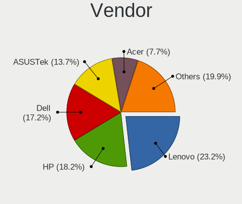
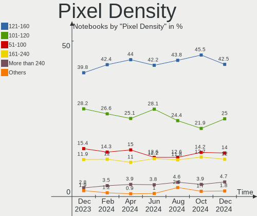
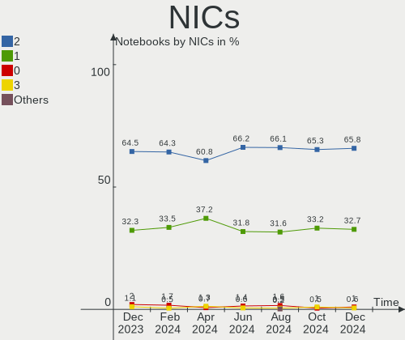
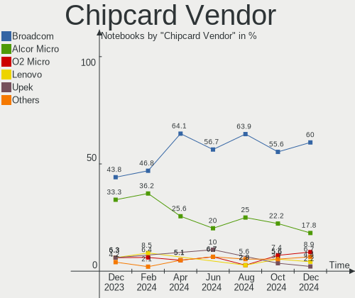

Ubuntu Hardware Trends (Notebooks)
----------------------------------

A project to identify most popular hardware characteristics and track their change
over time based on data collected by Ubuntu users at https://Linux-Hardware.org.

Anyone can contribute to this report by the [hw-probe](https://github.com/linuxhw/hw-probe) tool:

    sudo -E hw-probe -all -upload

Full-feature report is available here: https://linux-hardware.org/?view=trends&formfactor=notebook

Period: Oct, 2021.

Contents
--------

* [ System ](#system)
  - [ OS                       ](#os)
  - [ OS Family                ](#os-family)
  - [ Kernel                   ](#kernel)
  - [ Kernel Family            ](#kernel-family)
  - [ Kernel Major Ver.        ](#kernel-major-ver)
  - [ Arch                     ](#arch)
  - [ DE                       ](#de)
  - [ Display Server           ](#display-server)
  - [ Display Manager          ](#display-manager)
  - [ OS Lang                  ](#os-lang)
  - [ Boot Mode                ](#boot-mode)
  - [ Filesystem               ](#filesystem)
  - [ Part. scheme             ](#part-scheme)
  - [ Dual Boot with Linux/BSD ](#dual-boot-with-linuxbsd)
  - [ Dual Boot (Win)          ](#dual-boot-win)

* [ Board ](#board)
  - [ Vendor                   ](#vendor)
  - [ Model                    ](#model)
  - [ Model Family             ](#model-family)
  - [ MFG Year                 ](#mfg-year)
  - [ Form Factor              ](#form-factor)
  - [ Secure Boot              ](#secure-boot)
  - [ Coreboot                 ](#coreboot)
  - [ RAM Size                 ](#ram-size)
  - [ RAM Used                 ](#ram-used)
  - [ Total Drives             ](#total-drives)
  - [ Has CD-ROM               ](#has-cd-rom)
  - [ Has Ethernet             ](#has-ethernet)
  - [ Has WiFi                 ](#has-wifi)
  - [ Has Bluetooth            ](#has-bluetooth)

* [ Location ](#location)
  - [ Country                  ](#country)
  - [ City                     ](#city)

* [ Drives ](#drives)
  - [ Drive Vendor             ](#drive-vendor)
  - [ Drive Model              ](#drive-model)
  - [ HDD Vendor               ](#hdd-vendor)
  - [ SSD Vendor               ](#ssd-vendor)
  - [ Drive Kind               ](#drive-kind)
  - [ Drive Connector          ](#drive-connector)
  - [ Drive Size               ](#drive-size)
  - [ Space Total              ](#space-total)
  - [ Space Used               ](#space-used)
  - [ Malfunc. Drives          ](#malfunc-drives)
  - [ Malfunc. Drive Vendor    ](#malfunc-drive-vendor)
  - [ Malfunc. HDD Vendor      ](#malfunc-hdd-vendor)
  - [ Malfunc. Drive Kind      ](#malfunc-drive-kind)
  - [ Failed Drives            ](#failed-drives)
  - [ Failed Drive Vendor      ](#failed-drive-vendor)
  - [ Drive Status             ](#drive-status)

* [ Storage controller ](#storage-controller)
  - [ Storage Vendor           ](#storage-vendor)
  - [ Storage Model            ](#storage-model)
  - [ Storage Kind             ](#storage-kind)

* [ Processor ](#processor)
  - [ CPU Vendor               ](#cpu-vendor)
  - [ CPU Model                ](#cpu-model)
  - [ CPU Model Family         ](#cpu-model-family)
  - [ CPU Cores                ](#cpu-cores)
  - [ CPU Sockets              ](#cpu-sockets)
  - [ CPU Threads              ](#cpu-threads)
  - [ CPU Op-Modes             ](#cpu-op-modes)
  - [ CPU Microcode            ](#cpu-microcode)
  - [ CPU Microarch            ](#cpu-microarch)

* [ Graphics ](#graphics)
  - [ GPU Vendor               ](#gpu-vendor)
  - [ GPU Model                ](#gpu-model)
  - [ GPU Combo                ](#gpu-combo)
  - [ GPU Driver               ](#gpu-driver)
  - [ GPU Memory               ](#gpu-memory)

* [ Monitor ](#monitor)
  - [ Monitor Vendor           ](#monitor-vendor)
  - [ Monitor Model            ](#monitor-model)
  - [ Monitor Resolution       ](#monitor-resolution)
  - [ Monitor Diagonal         ](#monitor-diagonal)
  - [ Monitor Width            ](#monitor-width)
  - [ Aspect Ratio             ](#aspect-ratio)
  - [ Monitor Area             ](#monitor-area)
  - [ Pixel Density            ](#pixel-density)
  - [ Multiple Monitors        ](#multiple-monitors)

* [ Network ](#network)
  - [ Net Controller Vendor    ](#net-controller-vendor)
  - [ Net Controller Model     ](#net-controller-model)
  - [ Wireless Vendor          ](#wireless-vendor)
  - [ Wireless Model           ](#wireless-model)
  - [ Ethernet Vendor          ](#ethernet-vendor)
  - [ Ethernet Model           ](#ethernet-model)
  - [ Net Controller Kind      ](#net-controller-kind)
  - [ Used Controller          ](#used-controller)
  - [ NICs                     ](#nics)
  - [ IPv6                     ](#ipv6)

* [ Bluetooth ](#bluetooth)
  - [ Bluetooth Vendor         ](#bluetooth-vendor)
  - [ Bluetooth Model          ](#bluetooth-model)

* [ Sound ](#sound)
  - [ Sound Vendor             ](#sound-vendor)
  - [ Sound Model              ](#sound-model)

* [ Memory ](#memory)
  - [ Memory Vendor            ](#memory-vendor)
  - [ Memory Model             ](#memory-model)
  - [ Memory Kind              ](#memory-kind)
  - [ Memory Form Factor       ](#memory-form-factor)
  - [ Memory Size              ](#memory-size)
  - [ Memory Speed             ](#memory-speed)

* [ Printers & scanners ](#printers--scanners)
  - [ Printer Vendor           ](#printer-vendor)
  - [ Printer Model            ](#printer-model)
  - [ Scanner Vendor           ](#scanner-vendor)
  - [ Scanner Model            ](#scanner-model)

* [ Camera ](#camera)
  - [ Camera Vendor            ](#camera-vendor)
  - [ Camera Model             ](#camera-model)

* [ Security ](#security)
  - [ Fingerprint Vendor       ](#fingerprint-vendor)
  - [ Fingerprint Model        ](#fingerprint-model)
  - [ Chipcard Vendor          ](#chipcard-vendor)
  - [ Chipcard Model           ](#chipcard-model)

* [ Unsupported ](#unsupported)
  - [ Unsupported Devices      ](#unsupported-devices)
  - [ Unsupported Device Types ](#unsupported-device-types)

System
------

OS
--

Installed operating systems

| Name         | Notebooks | Percent |
|--------------|-----------|---------|
| Ubuntu 20.04 | 532       | 64.02%  |
| Ubuntu 21.10 | 134       | 16.13%  |
| Ubuntu 21.04 | 116       | 13.96%  |
| Ubuntu 18.04 | 30        | 3.61%   |
| Ubuntu 20.10 | 10        | 1.2%    |
| Ubuntu 16.04 | 7         | 0.84%   |
| Ubuntu 18.10 | 1         | 0.12%   |
| Ubuntu 13.04 | 1         | 0.12%   |

OS Family
---------

OS without a version

| Name   | Notebooks | Percent |
|--------|-----------|---------|
| Ubuntu | 831       | 100%    |

Kernel
------

Version of the Linux kernel

| Version                  | Notebooks | Percent |
|--------------------------|-----------|---------|
| 5.11.0-37-generic        | 291       | 35.02%  |
| 5.11.0-38-generic        | 197       | 23.71%  |
| 5.13.0-20-generic        | 67        | 8.06%   |
| 5.13.0-19-generic        | 47        | 5.66%   |
| 5.4.0-88-generic         | 34        | 4.09%   |
| 5.11.0-27-generic        | 22        | 2.65%   |
| 5.4.0-89-generic         | 15        | 1.81%   |
| 5.11.0-36-generic        | 14        | 1.68%   |
| 5.4.0-87-generic         | 12        | 1.44%   |
| 5.8.0-63-generic         | 8         | 0.96%   |
| 5.11.0-40-generic        | 8         | 0.96%   |
| 5.8.0-43-generic         | 7         | 0.84%   |
| 5.11.0-34-generic        | 6         | 0.72%   |
| 5.4.0-42-generic         | 5         | 0.6%    |
| 5.13.0-16-generic        | 5         | 0.6%    |
| 5.11.0-16-generic        | 5         | 0.6%    |
| 5.10.0-1050-oem          | 5         | 0.6%    |
| 5.14.9-051409-generic    | 4         | 0.48%   |
| 5.13.0-21-generic        | 4         | 0.48%   |
| 4.15.0-159-generic       | 4         | 0.48%   |
| 5.8.0-59-generic         | 3         | 0.36%   |
| 5.11.0-25-generic        | 3         | 0.36%   |
| 5.10.0-1049-oem          | 3         | 0.36%   |
| 4.4.0-210-generic        | 3         | 0.36%   |
| 4.15.0-142-generic       | 3         | 0.36%   |
| 5.8.0-50-generic         | 2         | 0.24%   |
| 5.4.0-88-lowlatency      | 2         | 0.24%   |
| 5.4.0-84-generic         | 2         | 0.24%   |
| 5.4.0-77-generic         | 2         | 0.24%   |
| 5.15.0-051500rc7-generic | 2         | 0.24%   |
| 5.15.0-051500rc5-generic | 2         | 0.24%   |
| 5.14.2-051402-generic    | 2         | 0.24%   |
| 5.13.0-1017-oem          | 2         | 0.24%   |
| 4.15.0-162-generic       | 2         | 0.24%   |
| 5.8.0-61-generic         | 1         | 0.12%   |
| 5.8.0-53-generic         | 1         | 0.12%   |
| 5.8.0-41-generic         | 1         | 0.12%   |
| 5.8.0-38-generic         | 1         | 0.12%   |
| 5.8.0-25-generic         | 1         | 0.12%   |
| 5.4.0-90-generic         | 1         | 0.12%   |
| 5.4.0-86-generic         | 1         | 0.12%   |
| 5.4.0-81-generic         | 1         | 0.12%   |
| 5.4.0-65-generic         | 1         | 0.12%   |
| 5.4.0-59-generic         | 1         | 0.12%   |
| 5.4.0-47-generic         | 1         | 0.12%   |
| 5.4.0-41-generic         | 1         | 0.12%   |
| 5.4.0-26-generic         | 1         | 0.12%   |
| 5.2.21-050221-generic    | 1         | 0.12%   |
| 5.15.0-051500rc3-generic | 1         | 0.12%   |
| 5.14.8-051408-generic    | 1         | 0.12%   |
| 5.14.14-051414-generic   | 1         | 0.12%   |
| 5.14.0-1005-oem          | 1         | 0.12%   |
| 5.14.0-051400-lowlatency | 1         | 0.12%   |
| 5.13.1-051301-generic    | 1         | 0.12%   |
| 5.13.0-7614-generic      | 1         | 0.12%   |
| 5.13.0-20-lowlatency     | 1         | 0.12%   |
| 5.13.0-1014-oem          | 1         | 0.12%   |
| 5.13.0-1012-oem          | 1         | 0.12%   |
| 5.12.19-051219-generic   | 1         | 0.12%   |
| 5.11.0-37-lowlatency     | 1         | 0.12%   |

Kernel Family
-------------

Linux kernel without a distro release

| Version | Notebooks | Percent |
|---------|-----------|---------|
| 5.11.0  | 550       | 66.19%  |
| 5.13.0  | 129       | 15.52%  |
| 5.4.0   | 80        | 9.63%   |
| 5.8.0   | 25        | 3.01%   |
| 4.15.0  | 12        | 1.44%   |
| 5.10.0  | 8         | 0.96%   |
| 5.15.0  | 5         | 0.6%    |
| 5.14.9  | 4         | 0.48%   |
| 4.4.0   | 3         | 0.36%   |
| 5.14.2  | 2         | 0.24%   |
| 5.14.0  | 2         | 0.24%   |
| 5.2.21  | 1         | 0.12%   |
| 5.14.8  | 1         | 0.12%   |
| 5.14.14 | 1         | 0.12%   |
| 5.13.1  | 1         | 0.12%   |
| 5.12.19 | 1         | 0.12%   |
| 5.10.69 | 1         | 0.12%   |
| 5.10.67 | 1         | 0.12%   |
| 5.10.63 | 1         | 0.12%   |
| 5.10.32 | 1         | 0.12%   |
| 4.18.0  | 1         | 0.12%   |
| 4.16.18 | 1         | 0.12%   |

Kernel Major Ver.
-----------------

Linux kernel major version

| Version | Notebooks | Percent |
|---------|-----------|---------|
| 5.11    | 550       | 66.19%  |
| 5.13    | 130       | 15.64%  |
| 5.4     | 80        | 9.63%   |
| 5.8     | 25        | 3.01%   |
| 5.10    | 12        | 1.44%   |
| 4.15    | 12        | 1.44%   |
| 5.14    | 10        | 1.2%    |
| 5.15    | 5         | 0.6%    |
| 4.4     | 3         | 0.36%   |
| 5.2     | 1         | 0.12%   |
| 5.12    | 1         | 0.12%   |
| 4.18    | 1         | 0.12%   |
| 4.16    | 1         | 0.12%   |

Arch
----

OS architecture (x86_64, i586, etc.)

| Name    | Notebooks | Percent |
|---------|-----------|---------|
| x86_64  | 821       | 98.8%   |
| i686    | 9         | 1.08%   |
| aarch64 | 1         | 0.12%   |

DE
--

Desktop Environment

| Name            | Notebooks | Percent |
|-----------------|-----------|---------|
| GNOME           | 758       | 91.22%  |
| Unknown         | 49        | 5.9%    |
| Unity           | 9         | 1.08%   |
| X-Cinnamon      | 5         | 0.6%    |
| GNOME Flashback | 4         | 0.48%   |
| i3              | 2         | 0.24%   |
| GNOME Classic   | 2         | 0.24%   |
| Deepin          | 2         | 0.24%   |

Display Server
--------------

X11 or Wayland

| Name    | Notebooks | Percent |
|---------|-----------|---------|
| X11     | 607       | 73.04%  |
| Wayland | 192       | 23.1%   |
| Unknown | 28        | 3.37%   |
| Tty     | 4         | 0.48%   |

Display Manager
---------------

SDDM, LightDM, etc.

| Name    | Notebooks | Percent |
|---------|-----------|---------|
| GDM3    | 528       | 63.54%  |
| GDM     | 231       | 27.8%   |
| Unknown | 37        | 4.45%   |
| LightDM | 31        | 3.73%   |
| SDDM    | 3         | 0.36%   |
| Ly      | 1         | 0.12%   |

OS Lang
-------

Language

| Lang    | Notebooks | Percent |
|---------|-----------|---------|
| en_US   | 357       | 42.96%  |
| de_DE   | 95        | 11.43%  |
| fr_FR   | 52        | 6.26%   |
| en_GB   | 44        | 5.29%   |
| pt_BR   | 32        | 3.85%   |
| en_IN   | 30        | 3.61%   |
| ru_RU   | 22        | 2.65%   |
| en_CA   | 21        | 2.53%   |
| it_IT   | 19        | 2.29%   |
| es_ES   | 17        | 2.05%   |
| en_AU   | 14        | 1.68%   |
| C       | 12        | 1.44%   |
| pl_PL   | 11        | 1.32%   |
| cs_CZ   | 10        | 1.2%    |
| de_AT   | 8         | 0.96%   |
| nl_NL   | 7         | 0.84%   |
| en_ZA   | 7         | 0.84%   |
| ja_JP   | 6         | 0.72%   |
| en_NZ   | 6         | 0.72%   |
| pt_PT   | 5         | 0.6%    |
| es_CO   | 5         | 0.6%    |
| Unknown | 5         | 0.6%    |
| tr_TR   | 4         | 0.48%   |
| zh_CN   | 3         | 0.36%   |
| es_AR   | 3         | 0.36%   |
| en_SG   | 3         | 0.36%   |
| de_CH   | 3         | 0.36%   |
| da_DK   | 3         | 0.36%   |
| nl_BE   | 2         | 0.24%   |
| nb_NO   | 2         | 0.24%   |
| hu_HU   | 2         | 0.24%   |
| fr_CA   | 2         | 0.24%   |
| fr_BE   | 2         | 0.24%   |
| fi_FI   | 2         | 0.24%   |
| uk_UA   | 1         | 0.12%   |
| sv_SE   | 1         | 0.12%   |
| sl_SI   | 1         | 0.12%   |
| sk_SK   | 1         | 0.12%   |
| ru_UA   | 1         | 0.12%   |
| ro_RO   | 1         | 0.12%   |
| he_IL   | 1         | 0.12%   |
| es_UY   | 1         | 0.12%   |
| es_PE   | 1         | 0.12%   |
| es_MX   | 1         | 0.12%   |
| es_CL   | 1         | 0.12%   |
| en_IE   | 1         | 0.12%   |
| el_GR   | 1         | 0.12%   |
| bg_BG   | 1         | 0.12%   |
| ar_SA   | 1         | 0.12%   |

Boot Mode
---------

EFI or BIOS

| Mode | Notebooks | Percent |
|------|-----------|---------|
| EFI  | 430       | 51.74%  |
| BIOS | 401       | 48.26%  |

Filesystem
----------

Type of filesystem

| Type     | Notebooks | Percent |
|----------|-----------|---------|
| Ext4     | 779       | 93.74%  |
| Overlay  | 26        | 3.13%   |
| Zfs      | 12        | 1.44%   |
| Btrfs    | 7         | 0.84%   |
| Ext3     | 3         | 0.36%   |
| Xfs      | 2         | 0.24%   |
| Reiserfs | 1         | 0.12%   |
| Ext2     | 1         | 0.12%   |

Part. scheme
------------

Scheme of partitioning

| Type    | Notebooks | Percent |
|---------|-----------|---------|
| Unknown | 578       | 69.55%  |
| GPT     | 216       | 25.99%  |
| MBR     | 37        | 4.45%   |

Dual Boot with Linux/BSD
------------------------

Hosting more than one Linux/BSD

| Dual boot | Notebooks | Percent |
|-----------|-----------|---------|
| No        | 771       | 92.78%  |
| Yes       | 60        | 7.22%   |

Dual Boot (Win)
---------------

Hosting Linux and Windows

| Dual boot | Notebooks | Percent |
|-----------|-----------|---------|
| No        | 526       | 63.3%   |
| Yes       | 305       | 36.7%   |

Board
-----

Vendor
------

Motherboard manufacturer

| Name                    | Notebooks | Percent |
|-------------------------|-----------|---------|
| Lenovo                  | 177       | 21.3%   |
| Hewlett-Packard         | 160       | 19.25%  |
| Dell                    | 148       | 17.81%  |
| Acer                    | 77        | 9.27%   |
| ASUSTek Computer        | 65        | 7.82%   |
| Toshiba                 | 31        | 3.73%   |
| Apple                   | 22        | 2.65%   |
| Samsung Electronics     | 18        | 2.17%   |
| MSI                     | 18        | 2.17%   |
| Sony                    | 13        | 1.56%   |
| Packard Bell            | 10        | 1.2%    |
| HUAWEI                  | 10        | 1.2%    |
| Medion                  | 9         | 1.08%   |
| Fujitsu                 | 8         | 0.96%   |
| Notebook                | 5         | 0.6%    |
| Alienware               | 4         | 0.48%   |
| TUXEDO                  | 3         | 0.36%   |
| realme                  | 3         | 0.36%   |
| Google                  | 3         | 0.36%   |
| Unknown                 | 3         | 0.36%   |
| Wortmann AG             | 2         | 0.24%   |
| Timi                    | 2         | 0.24%   |
| System76                | 2         | 0.24%   |
| Schenker                | 2         | 0.24%   |
| Positivo                | 2         | 0.24%   |
| HONOR                   | 2         | 0.24%   |
| Gateway                 | 2         | 0.24%   |
| Fujitsu Siemens         | 2         | 0.24%   |
| Framework               | 2         | 0.24%   |
| win element             | 1         | 0.12%   |
| whyopencomputing        | 1         | 0.12%   |
| TrekStor                | 1         | 0.12%   |
| SHENZHEN X&F TECHNOLOGY | 1         | 0.12%   |
| Razer                   | 1         | 0.12%   |
| Pine Microsystems       | 1         | 0.12%   |
| Panasonic               | 1         | 0.12%   |
| OEM                     | 1         | 0.12%   |
| Motion Computing        | 1         | 0.12%   |
| Microtech               | 1         | 0.12%   |
| LG Electronics          | 1         | 0.12%   |
| Intel                   | 1         | 0.12%   |
| Hampoo                  | 1         | 0.12%   |
| Haier                   | 1         | 0.12%   |
| Gigabyte Technology     | 1         | 0.12%   |
| GEO                     | 1         | 0.12%   |
| eMachines               | 1         | 0.12%   |
| Durabook                | 1         | 0.12%   |
| Dixonsxp                | 1         | 0.12%   |
| Direkt-Tek              | 1         | 0.12%   |
| Datto                   | 1         | 0.12%   |
| Clevo                   | 1         | 0.12%   |
| Biostar                 | 1         | 0.12%   |
| BESSTAR Tech            | 1         | 0.12%   |
| AMI                     | 1         | 0.12%   |
| AKL                     | 1         | 0.12%   |

Model
-----

Motherboard model

| Name                                     | Notebooks | Percent |
|------------------------------------------|-----------|---------|
| HP Notebook                              | 7         | 0.84%   |
| Unknown                                  | 7         | 0.84%   |
| HP Pavilion dv6                          | 6         | 0.72%   |
| Dell XPS 15 7590                         | 5         | 0.6%    |
| Acer Aspire 5741G                        | 5         | 0.6%    |
| Lenovo ThinkBook 14 G2 ITL 20VD          | 4         | 0.48%   |
| HP ProBook 450 G7                        | 4         | 0.48%   |
| HP Pavilion dv7                          | 4         | 0.48%   |
| HP 15                                    | 4         | 0.48%   |
| Dell XPS 15 9570                         | 4         | 0.48%   |
| Dell XPS 13 9310                         | 4         | 0.48%   |
| Dell XPS 13 7390                         | 4         | 0.48%   |
| Dell Latitude 5400                       | 4         | 0.48%   |
| Apple MacBookPro12,1                     | 4         | 0.48%   |
| Acer Swift SF314-43                      | 4         | 0.48%   |
| realme RMNBXXXX                          | 3         | 0.36%   |
| HUAWEI KLVL-WXX9                         | 3         | 0.36%   |
| HP Pavilion Notebook                     | 3         | 0.36%   |
| HP Pavilion Gaming Laptop 15-ec2xxx      | 3         | 0.36%   |
| HP Pavilion g6                           | 3         | 0.36%   |
| HP Laptop 15-da0xxx                      | 3         | 0.36%   |
| HP EliteBook Folio 9470m                 | 3         | 0.36%   |
| HP EliteBook 840 G3                      | 3         | 0.36%   |
| HP EliteBook 840 G2                      | 3         | 0.36%   |
| HP 250 G3                                | 3         | 0.36%   |
| Dell Latitude E7250                      | 3         | 0.36%   |
| Dell Latitude E5430 non-vPro             | 3         | 0.36%   |
| Dell Inspiron N5110                      | 3         | 0.36%   |
| Apple MacBookPro9,2                      | 3         | 0.36%   |
| Apple MacBookPro8,1                      | 3         | 0.36%   |
| TUXEDO Pulse 15 Gen1                     | 2         | 0.24%   |
| Toshiba Satellite C875D                  | 2         | 0.24%   |
| Samsung 550XCJ/550XCR                    | 2         | 0.24%   |
| Positivo C14CR21                         | 2         | 0.24%   |
| Packard Bell EasyNote TV44HC             | 2         | 0.24%   |
| Packard Bell EasyNote TS11HR             | 2         | 0.24%   |
| Packard Bell EasyNote TJ66               | 2         | 0.24%   |
| Lenovo V330-14ARR 81B1                   | 2         | 0.24%   |
| Lenovo ThinkPad X1 Carbon 6th 20KHCTO1WW | 2         | 0.24%   |
| Lenovo ThinkBook 15 G2 ITL 20VE          | 2         | 0.24%   |
| Lenovo ThinkBook 14-IIL 20SL             | 2         | 0.24%   |
| Lenovo Legion Y530-15ICH 81FV            | 2         | 0.24%   |
| Lenovo IdeaPad Z570 HuronRiver Platform  | 2         | 0.24%   |
| Lenovo IdeaPad S145-15API 81V7           | 2         | 0.24%   |
| Lenovo IdeaPad Gaming 3 15IMH05 81Y4     | 2         | 0.24%   |
| Lenovo IdeaPad 5 15ITL05 82FG            | 2         | 0.24%   |
| Lenovo IdeaPad 5 14ITL05 82FE            | 2         | 0.24%   |
| Lenovo IdeaPad 5 14ARE05 81YM            | 2         | 0.24%   |
| Lenovo IdeaPad 3 15IIL05 81WE            | 2         | 0.24%   |
| Lenovo IdeaPad 3 15ALC6 82KU             | 2         | 0.24%   |
| Lenovo G550 2958                         | 2         | 0.24%   |
| Lenovo G50-70 20351                      | 2         | 0.24%   |
| Lenovo G50-45 80E3                       | 2         | 0.24%   |
| HUAWEI BOHK-WAX9X                        | 2         | 0.24%   |
| HP ZBook Studio G4                       | 2         | 0.24%   |
| HP ZBook Power G7 Mobile Workstation     | 2         | 0.24%   |
| HP ZBook 17 G3                           | 2         | 0.24%   |
| HP ZBook 14u G6                          | 2         | 0.24%   |
| HP Stream Laptop 14-ax0XX                | 2         | 0.24%   |
| HP ProBook 450 G8 Notebook PC            | 2         | 0.24%   |

Model Family
------------

Motherboard model prefix

| Name                  | Notebooks | Percent |
|-----------------------|-----------|---------|
| Lenovo ThinkPad       | 93        | 11.19%  |
| Dell Latitude         | 52        | 6.26%   |
| Acer Aspire           | 51        | 6.14%   |
| Lenovo IdeaPad        | 41        | 4.93%   |
| HP Pavilion           | 38        | 4.57%   |
| Dell Inspiron         | 36        | 4.33%   |
| Dell XPS              | 33        | 3.97%   |
| HP EliteBook          | 27        | 3.25%   |
| Toshiba Satellite     | 24        | 2.89%   |
| HP ProBook            | 20        | 2.41%   |
| HP Laptop             | 19        | 2.29%   |
| ASUS VivoBook         | 13        | 1.56%   |
| HP ZBook              | 12        | 1.44%   |
| Acer Swift            | 12        | 1.44%   |
| Lenovo ThinkBook      | 11        | 1.32%   |
| Packard Bell EasyNote | 10        | 1.2%    |
| Dell Precision        | 10        | 1.2%    |
| Dell Vostro           | 9         | 1.08%   |
| Lenovo Legion         | 8         | 0.96%   |
| Fujitsu LIFEBOOK      | 8         | 0.96%   |
| HP Notebook           | 7         | 0.84%   |
| ASUS ROG              | 7         | 0.84%   |
| Unknown               | 7         | 0.84%   |
| HP Stream             | 5         | 0.6%    |
| HP ENVY               | 5         | 0.6%    |
| Apple MacBookPro8     | 5         | 0.6%    |
| Acer Nitro            | 5         | 0.6%    |
| HP Compaq             | 4         | 0.48%   |
| HP 15                 | 4         | 0.48%   |
| Dell System           | 4         | 0.48%   |
| Apple MacBookPro12    | 4         | 0.48%   |
| Acer Extensa          | 4         | 0.48%   |
| realme RMNBXXXX       | 3         | 0.36%   |
| HUAWEI KLVL-WXX9      | 3         | 0.36%   |
| HP OMEN               | 3         | 0.36%   |
| HP 250                | 3         | 0.36%   |
| Apple MacBookPro9     | 3         | 0.36%   |
| Apple MacBookPro11    | 3         | 0.36%   |
| Wortmann AG TERRA     | 2         | 0.24%   |
| TUXEDO Pulse          | 2         | 0.24%   |
| Toshiba QOSMIO        | 2         | 0.24%   |
| Toshiba dynabook      | 2         | 0.24%   |
| Samsung 550XCJ        | 2         | 0.24%   |
| Samsung 530U3C        | 2         | 0.24%   |
| Positivo C14CR21      | 2         | 0.24%   |
| MSI GF63              | 2         | 0.24%   |
| MSI GE62              | 2         | 0.24%   |
| Medion Akoya          | 2         | 0.24%   |
| Lenovo V330-14ARR     | 2         | 0.24%   |
| Lenovo G550           | 2         | 0.24%   |
| Lenovo G50-70         | 2         | 0.24%   |
| Lenovo G50-45         | 2         | 0.24%   |
| HUAWEI BOHK-WAX9X     | 2         | 0.24%   |
| HP Presario           | 2         | 0.24%   |
| HP 255                | 2         | 0.24%   |
| Framework Laptop      | 2         | 0.24%   |
| Dell G3               | 2         | 0.24%   |
| ASUS ZenBook          | 2         | 0.24%   |
| ASUS X550LD           | 2         | 0.24%   |
| ASUS U56E             | 2         | 0.24%   |

MFG Year
--------

Motherboard manufacture year

| Year    | Notebooks | Percent |
|---------|-----------|---------|
| 2021    | 210       | 25.27%  |
| 2020    | 108       | 13%     |
| 2019    | 81        | 9.75%   |
| 2018    | 57        | 6.86%   |
| 2011    | 53        | 6.38%   |
| 2013    | 44        | 5.29%   |
| 2012    | 43        | 5.17%   |
| 2015    | 40        | 4.81%   |
| 2014    | 39        | 4.69%   |
| 2010    | 35        | 4.21%   |
| 2009    | 32        | 3.85%   |
| 2017    | 30        | 3.61%   |
| 2016    | 30        | 3.61%   |
| 2008    | 19        | 2.29%   |
| 2007    | 7         | 0.84%   |
| Unknown | 2         | 0.24%   |
| 2006    | 1         | 0.12%   |

Form Factor
-----------

Physical design of the computer

| Name     | Notebooks | Percent |
|----------|-----------|---------|
| Notebook | 831       | 100%    |

Secure Boot
-----------

Enabled or disabled

| State    | Notebooks | Percent |
|----------|-----------|---------|
| Disabled | 676       | 81.35%  |
| Enabled  | 155       | 18.65%  |

Coreboot
--------

Have coreboot on board

| Used | Notebooks | Percent |
|------|-----------|---------|
| No   | 828       | 99.64%  |
| Yes  | 3         | 0.36%   |

RAM Size
--------

Total RAM memory

| Size in GB  | Notebooks | Percent |
|-------------|-----------|---------|
| 4.01-8.0    | 268       | 32.25%  |
| 3.01-4.0    | 176       | 21.18%  |
| 16.01-24.0  | 155       | 18.65%  |
| 8.01-16.0   | 132       | 15.88%  |
| 32.01-64.0  | 60        | 7.22%   |
| 1.01-2.0    | 21        | 2.53%   |
| 2.01-3.0    | 9         | 1.08%   |
| 64.01-256.0 | 7         | 0.84%   |
| 24.01-32.0  | 2         | 0.24%   |
| 0.51-1.0    | 1         | 0.12%   |

RAM Used
--------

Used RAM memory

| Used GB    | Notebooks | Percent |
|------------|-----------|---------|
| 1.01-2.0   | 315       | 37.91%  |
| 2.01-3.0   | 235       | 28.28%  |
| 4.01-8.0   | 117       | 14.08%  |
| 3.01-4.0   | 113       | 13.6%   |
| 8.01-16.0  | 29        | 3.49%   |
| 0.51-1.0   | 19        | 2.29%   |
| 16.01-24.0 | 3         | 0.36%   |

Total Drives
------------

Number of drives on board

| Drives | Notebooks | Percent |
|--------|-----------|---------|
| 1      | 624       | 75.09%  |
| 2      | 168       | 20.22%  |
| 3      | 29        | 3.49%   |
| 0      | 6         | 0.72%   |
| 4      | 3         | 0.36%   |
| 7      | 1         | 0.12%   |

Has CD-ROM
----------

Has CD-ROM on board

| Presented | Notebooks | Percent |
|-----------|-----------|---------|
| No        | 528       | 63.54%  |
| Yes       | 303       | 36.46%  |

Has Ethernet
------------

Has Ethernet on board

| Presented | Notebooks | Percent |
|-----------|-----------|---------|
| Yes       | 674       | 81.11%  |
| No        | 157       | 18.89%  |

Has WiFi
--------

Has WiFi module

| Presented | Notebooks | Percent |
|-----------|-----------|---------|
| Yes       | 820       | 98.68%  |
| No        | 11        | 1.32%   |

Has Bluetooth
-------------

Has Bluetooth module

| Presented | Notebooks | Percent |
|-----------|-----------|---------|
| Yes       | 633       | 76.17%  |
| No        | 198       | 23.83%  |

Location
--------

Country
-------

Geographic location (country)

| Country      | Notebooks | Percent |
|--------------|-----------|---------|
| USA          | 131       | 15.76%  |
| Germany      | 105       | 12.64%  |
| France       | 62        | 7.46%   |
| Brazil       | 43        | 5.17%   |
| UK           | 37        | 4.45%   |
| India        | 34        | 4.09%   |
| Italy        | 29        | 3.49%   |
| Russia       | 28        | 3.37%   |
| Poland       | 22        | 2.65%   |
| Canada       | 22        | 2.65%   |
| Spain        | 21        | 2.53%   |
| Netherlands  | 16        | 1.93%   |
| Ukraine      | 15        | 1.81%   |
| Czechia      | 15        | 1.81%   |
| Australia    | 15        | 1.81%   |
| Austria      | 13        | 1.56%   |
| Romania      | 10        | 1.2%    |
| Hungary      | 9         | 1.08%   |
| Belgium      | 9         | 1.08%   |
| Switzerland  | 8         | 0.96%   |
| South Africa | 8         | 0.96%   |
| Portugal     | 8         | 0.96%   |
| Indonesia    | 8         | 0.96%   |
| Greece       | 8         | 0.96%   |
| Sweden       | 7         | 0.84%   |
| Pakistan     | 7         | 0.84%   |
| Mexico       | 7         | 0.84%   |
| Egypt        | 7         | 0.84%   |
| Turkey       | 6         | 0.72%   |
| New Zealand  | 6         | 0.72%   |
| Denmark      | 6         | 0.72%   |
| Argentina    | 6         | 0.72%   |
| Japan        | 5         | 0.6%    |
| Iran         | 5         | 0.6%    |
| Finland      | 5         | 0.6%    |
| Colombia     | 5         | 0.6%    |
| Vietnam      | 4         | 0.48%   |
| Norway       | 4         | 0.48%   |
| Tunisia      | 3         | 0.36%   |
| Singapore    | 3         | 0.36%   |
| Puerto Rico  | 3         | 0.36%   |
| Jordan       | 3         | 0.36%   |
| Cyprus       | 3         | 0.36%   |
| China        | 3         | 0.36%   |
| Bulgaria     | 3         | 0.36%   |
| Belarus      | 3         | 0.36%   |
| Serbia       | 2         | 0.24%   |
| Saudi Arabia | 2         | 0.24%   |
| Kenya        | 2         | 0.24%   |
| Israel       | 2         | 0.24%   |
| Ireland      | 2         | 0.24%   |
| Iceland      | 2         | 0.24%   |
| Hong Kong    | 2         | 0.24%   |
| Chile        | 2         | 0.24%   |
| Cameroon     | 2         | 0.24%   |
| Burkina Faso | 2         | 0.24%   |
| Yemen        | 1         | 0.12%   |
| Venezuela    | 1         | 0.12%   |
| Uzbekistan   | 1         | 0.12%   |
| Uruguay      | 1         | 0.12%   |

City
----

Geographic location (city)

| City              | Notebooks | Percent |
|-------------------|-----------|---------|
| Paris             | 11        | 1.32%   |
| Berlin            | 11        | 1.32%   |
| Vienna            | 9         | 1.08%   |
| Moscow            | 9         | 1.08%   |
| Warsaw            | 8         | 0.96%   |
| Kyiv              | 8         | 0.96%   |
| Budapest          | 7         | 0.84%   |
| S??o Paulo        | 6         | 0.72%   |
| Prague            | 6         | 0.72%   |
| Phoenix           | 5         | 0.6%    |
| Munich            | 5         | 0.6%    |
| Madrid            | 5         | 0.6%    |
| Istanbul          | 5         | 0.6%    |
| Bengaluru         | 5         | 0.6%    |
| Valencia          | 4         | 0.48%   |
| Tehran            | 4         | 0.48%   |
| Seattle           | 4         | 0.48%   |
| Rome              | 4         | 0.48%   |
| Melbourne         | 4         | 0.48%   |
| Leipzig           | 4         | 0.48%   |
| Krakow            | 4         | 0.48%   |
| Helsinki          | 4         | 0.48%   |
| Cairo             | 4         | 0.48%   |
| Auckland          | 4         | 0.48%   |
| Athens            | 4         | 0.48%   |
| Yekaterinburg     | 3         | 0.36%   |
| Turin             | 3         | 0.36%   |
| Singapore         | 3         | 0.36%   |
| Milan             | 3         | 0.36%   |
| Lucknow           | 3         | 0.36%   |
| Lahore            | 3         | 0.36%   |
| Hyderabad         | 3         | 0.36%   |
| Frankfurt am Main | 3         | 0.36%   |
| Edmonton          | 3         | 0.36%   |
| Denver            | 3         | 0.36%   |
| Delhi             | 3         | 0.36%   |
| Cologne           | 3         | 0.36%   |
| Canberra          | 3         | 0.36%   |
| Buenos Aires      | 3         | 0.36%   |
| Bogot??           | 3         | 0.36%   |
| Austin            | 3         | 0.36%   |
| Amman             | 3         | 0.36%   |
| Yaound?©          | 2         | 0.24%   |
| Walthamstow       | 2         | 0.24%   |
| Vancouver         | 2         | 0.24%   |
| Uberl??ndia       | 2         | 0.24%   |
| Tunis             | 2         | 0.24%   |
| Surabaya          | 2         | 0.24%   |
| Stockholm         | 2         | 0.24%   |
| Sorocaba          | 2         | 0.24%   |
| Sofia             | 2         | 0.24%   |
| San Jose          | 2         | 0.24%   |
| Saint-Herblain    | 2         | 0.24%   |
| Rio de Janeiro    | 2         | 0.24%   |
| Pretoria          | 2         | 0.24%   |
| Pasadena          | 2         | 0.24%   |
| Oxford            | 2         | 0.24%   |
| Ouagadougou       | 2         | 0.24%   |
| Oslo              | 2         | 0.24%   |
| Noida             | 2         | 0.24%   |

Drives
------

Drive Vendor
------------

Hard drive vendors

| Vendor                         | Notebooks | Drives | Percent |
|--------------------------------|-----------|--------|---------|
| Samsung Electronics            | 151       | 164    | 15.31%  |
| WDC                            | 123       | 125    | 12.47%  |
| Seagate                        | 108       | 113    | 10.95%  |
| Toshiba                        | 98        | 101    | 9.94%   |
| Sandisk                        | 61        | 62     | 6.19%   |
| Unknown                        | 51        | 58     | 5.17%   |
| SK Hynix                       | 43        | 43     | 4.36%   |
| Kingston                       | 39        | 40     | 3.96%   |
| Hitachi                        | 35        | 36     | 3.55%   |
| HGST                           | 31        | 31     | 3.14%   |
| Crucial                        | 28        | 28     | 2.84%   |
| Intel                          | 27        | 30     | 2.74%   |
| Micron Technology              | 26        | 26     | 2.64%   |
| KIOXIA                         | 23        | 25     | 2.33%   |
| Apple                          | 11        | 12     | 1.12%   |
| LITEON                         | 9         | 9      | 0.91%   |
| A-DATA Technology              | 8         | 8      | 0.81%   |
| SPCC                           | 6         | 7      | 0.61%   |
| Phison                         | 6         | 6      | 0.61%   |
| JMicron                        | 6         | 9      | 0.61%   |
| Micron/Crucial Technology      | 5         | 5      | 0.51%   |
| LITEONIT                       | 5         | 5      | 0.51%   |
| GOODRAM                        | 5         | 5      | 0.51%   |
| Fujitsu                        | 5         | 6      | 0.51%   |
| Transcend                      | 4         | 4      | 0.41%   |
| PNY                            | 4         | 4      | 0.41%   |
| Lexar                          | 4         | 4      | 0.41%   |
| Intenso                        | 4         | 4      | 0.41%   |
| UMIS                           | 3         | 3      | 0.3%    |
| Team                           | 3         | 3      | 0.3%    |
| Silicon Motion                 | 3         | 4      | 0.3%    |
| China                          | 3         | 3      | 0.3%    |
| ASMT                           | 3         | 3      | 0.3%    |
| OCZ                            | 2         | 2      | 0.2%    |
| Lenovo                         | 2         | 2      | 0.2%    |
| KingSpec                       | 2         | 2      | 0.2%    |
| Hewlett-Packard                | 2         | 2      | 0.2%    |
| Gigabyte Technology            | 2         | 2      | 0.2%    |
| Apacer                         | 2         | 2      | 0.2%    |
| XSTAR                          | 1         | 1      | 0.1%    |
| Verbatim                       | 1         | 1      | 0.1%    |
| VC-500                         | 1         | 1      | 0.1%    |
| Vaseky                         | 1         | 1      | 0.1%    |
| USB                            | 1         | 1      | 0.1%    |
| UDinfo                         | 1         | 1      | 0.1%    |
| TCSUNBOW                       | 1         | 1      | 0.1%    |
| SUNEAST                        | 1         | 1      | 0.1%    |
| SSSTC                          | 1         | 1      | 0.1%    |
| SSK                            | 1         | 1      | 0.1%    |
| Solid State Storage Technology | 1         | 1      | 0.1%    |
| SABRENT                        | 1         | 1      | 0.1%    |
| Realtek Semiconductor          | 1         | 1      | 0.1%    |
| PLEXTOR                        | 1         | 1      | 0.1%    |
| PHISON S                       | 1         | 1      | 0.1%    |
| Patriot                        | 1         | 1      | 0.1%    |
| OSCOO                          | 1         | 1      | 0.1%    |
| Netac                          | 1         | 1      | 0.1%    |
| Maximus                        | 1         | 1      | 0.1%    |
| Lite-On                        | 1         | 1      | 0.1%    |
| Lanbo                          | 1         | 1      | 0.1%    |

Drive Model
-----------

Hard drive models

| Model                                  | Notebooks | Percent |
|----------------------------------------|-----------|---------|
| Seagate ST1000LM035-1RK172 1TB         | 15        | 1.47%   |
| Samsung PM963 2.5" NVMe PCIe SSD 512GB | 15        | 1.47%   |
| Unknown MMC Card  32GB                 | 14        | 1.37%   |
| Toshiba MQ01ABD100 1TB                 | 14        | 1.37%   |
| Seagate ST1000LM024 HN-M101MBB 1TB     | 13        | 1.27%   |
| Toshiba MQ04ABF100 1TB                 | 12        | 1.18%   |
| Samsung NVMe SSD Drive 256GB           | 12        | 1.18%   |
| Toshiba NVMe SSD Drive 512GB           | 10        | 0.98%   |
| Toshiba MQ01ABF050 500GB               | 10        | 0.98%   |
| Seagate ST9500325AS 500GB              | 9         | 0.88%   |
| Sandisk NVMe SSD Drive 256GB           | 9         | 0.88%   |
| Samsung SSD 860 EVO 500GB              | 9         | 0.88%   |
| Samsung NVMe SSD Drive 1024GB          | 9         | 0.88%   |
| Unknown MMC Card  64GB                 | 8         | 0.78%   |
| Sandisk NVMe SSD Drive 512GB           | 8         | 0.78%   |
| Kingston SA400S37240G 240GB SSD        | 7         | 0.69%   |
| Intel SSDPEKNW512G8H 512GB             | 7         | 0.69%   |
| HGST HTS721010A9E630 1TB               | 7         | 0.69%   |
| WDC WD10SPZX-24Z10 1TB                 | 6         | 0.59%   |
| Seagate ST500LT012-1DG142 500GB        | 6         | 0.59%   |
| Seagate Expansion 1TB                  | 6         | 0.59%   |
| KIOXIA NVMe SSD Drive 256GB            | 6         | 0.59%   |
| HGST HTS545050A7E680 500GB             | 6         | 0.59%   |
| WDC WD5000LPVX-22V0TT0 500GB           | 5         | 0.49%   |
| Unknown SD/MMC/MS PRO 128GB            | 5         | 0.49%   |
| SK Hynix NVMe SSD Drive 512GB          | 5         | 0.49%   |
| SK Hynix NVMe SSD Drive 256GB          | 5         | 0.49%   |
| SanDisk SSD PLUS 240GB                 | 5         | 0.49%   |
| Sandisk NVMe SSD Drive 1024GB          | 5         | 0.49%   |
| Samsung SSD 850 EVO 250GB              | 5         | 0.49%   |
| Samsung NVMe SSD Drive 1TB             | 5         | 0.49%   |
| Kingston SA400S37120G 120GB SSD        | 5         | 0.49%   |
| Kingston OM8PDP3512B-AA1 512GB         | 5         | 0.49%   |
| HGST HTS725050A7E630 500GB             | 5         | 0.49%   |
| HGST HTS541010A9E680 1TB               | 5         | 0.49%   |
| Crucial CT240BX500SSD1 240GB           | 5         | 0.49%   |
| WDC WDS500G2B0A-00SM50 500GB SSD       | 4         | 0.39%   |
| WDC WDS240G2G0A-00JH30 240GB SSD       | 4         | 0.39%   |
| Unknown MMC Card  16GB                 | 4         | 0.39%   |
| Unknown MMC Card  128GB                | 4         | 0.39%   |
| Seagate ST1000LX015-1U7172 1TB         | 4         | 0.39%   |
| Samsung SSD 860 EVO 1TB                | 4         | 0.39%   |
| Samsung MZVLQ512HALU-000H1 512GB       | 4         | 0.39%   |
| Samsung MZALQ512HALU-000L2 512GB       | 4         | 0.39%   |
| Samsung HM500JI 500GB                  | 4         | 0.39%   |
| Micron NVMe SSD Drive 512GB            | 4         | 0.39%   |
| KIOXIA KBG40ZNS512G NVMe 512GB         | 4         | 0.39%   |
| Hitachi HTS547550A9E384 500GB          | 4         | 0.39%   |
| WDC WD10SPZX-60Z10T0 1TB               | 3         | 0.29%   |
| WDC WD10SPZX-21Z10T0 1TB               | 3         | 0.29%   |
| WDC PC SN530 SDBPNPZ-512G-1027 512GB   | 3         | 0.29%   |
| Toshiba NVMe SSD Drive 256GB           | 3         | 0.29%   |
| Toshiba MQ01ABD032 320GB               | 3         | 0.29%   |
| SK Hynix PC711 NVMe 1TB                | 3         | 0.29%   |
| Seagate ST9500420AS 500GB              | 3         | 0.29%   |
| Seagate ST500LT012-9WS142 500GB        | 3         | 0.29%   |
| Seagate ST500LM030-2E717D 500GB        | 3         | 0.29%   |
| Seagate ST500LM021-1KJ152 500GB        | 3         | 0.29%   |
| Seagate ST500LM012 HN-M500MBB 500GB    | 3         | 0.29%   |
| Seagate ST1000LM049-2GH172 1TB         | 3         | 0.29%   |

HDD Vendor
----------

Hard disk drive vendors

| Vendor              | Notebooks | Drives | Percent |
|---------------------|-----------|--------|---------|
| Seagate             | 105       | 109    | 30.35%  |
| WDC                 | 80        | 81     | 23.12%  |
| Toshiba             | 65        | 66     | 18.79%  |
| Hitachi             | 35        | 36     | 10.12%  |
| HGST                | 31        | 31     | 8.96%   |
| Samsung Electronics | 11        | 11     | 3.18%   |
| Unknown             | 5         | 5      | 1.45%   |
| Fujitsu             | 5         | 6      | 1.45%   |
| JMicron             | 4         | 6      | 1.16%   |
| USB                 | 1         | 1      | 0.29%   |
| SABRENT             | 1         | 1      | 0.29%   |
| Intenso             | 1         | 1      | 0.29%   |
| ASMT                | 1         | 1      | 0.29%   |
| Apple               | 1         | 1      | 0.29%   |

SSD Vendor
----------

Solid state drive vendors

| Vendor              | Notebooks | Drives | Percent |
|---------------------|-----------|--------|---------|
| Samsung Electronics | 53        | 54     | 19.27%  |
| SanDisk             | 32        | 32     | 11.64%  |
| Kingston            | 27        | 27     | 9.82%   |
| Crucial             | 23        | 23     | 8.36%   |
| WDC                 | 18        | 18     | 6.55%   |
| Micron Technology   | 12        | 12     | 4.36%   |
| Toshiba             | 10        | 10     | 3.64%   |
| SK Hynix            | 10        | 10     | 3.64%   |
| LITEON              | 8         | 8      | 2.91%   |
| Apple               | 8         | 8      | 2.91%   |
| Intel               | 6         | 6      | 2.18%   |
| SPCC                | 5         | 6      | 1.82%   |
| LITEONIT            | 5         | 5      | 1.82%   |
| GOODRAM             | 5         | 5      | 1.82%   |
| Transcend           | 4         | 4      | 1.45%   |
| PNY                 | 4         | 4      | 1.45%   |
| Lexar               | 4         | 4      | 1.45%   |
| A-DATA Technology   | 4         | 4      | 1.45%   |
| Team                | 3         | 3      | 1.09%   |
| Intenso             | 3         | 3      | 1.09%   |
| China               | 3         | 3      | 1.09%   |
| OCZ                 | 2         | 2      | 0.73%   |
| KingSpec            | 2         | 2      | 0.73%   |
| Hewlett-Packard     | 2         | 2      | 0.73%   |
| Apacer              | 2         | 2      | 0.73%   |
| XSTAR               | 1         | 1      | 0.36%   |
| Verbatim            | 1         | 1      | 0.36%   |
| Vaseky              | 1         | 1      | 0.36%   |
| TCSUNBOW            | 1         | 1      | 0.36%   |
| SUNEAST             | 1         | 1      | 0.36%   |
| PLEXTOR             | 1         | 1      | 0.36%   |
| Patriot             | 1         | 1      | 0.36%   |
| OSCOO               | 1         | 1      | 0.36%   |
| Netac               | 1         | 1      | 0.36%   |
| Maximus             | 1         | 1      | 0.36%   |
| Lanbo               | 1         | 1      | 0.36%   |
| KIOXIA-EXCERIA      | 1         | 1      | 0.36%   |
| KingPower128G       | 1         | 1      | 0.36%   |
| Gigabyte Technology | 1         | 1      | 0.36%   |
| CT500MX5            | 1         | 1      | 0.36%   |
| BR                  | 1         | 1      | 0.36%   |
| Biostar             | 1         | 1      | 0.36%   |
| ASMT                | 1         | 1      | 0.36%   |
| AMD                 | 1         | 1      | 0.36%   |
| Unknown             | 1         | 1      | 0.36%   |

Drive Kind
----------

HDD or SSD

| Kind    | Notebooks | Drives | Percent |
|---------|-----------|--------|---------|
| HDD     | 334       | 356    | 34.76%  |
| NVMe    | 302       | 330    | 31.43%  |
| SSD     | 265       | 277    | 27.58%  |
| MMC     | 46        | 52     | 4.79%   |
| Unknown | 14        | 16     | 1.46%   |

Drive Connector
---------------

SATA, SAS, NVMe, etc.

| Type | Notebooks | Drives | Percent |
|------|-----------|--------|---------|
| SATA | 547       | 603    | 58.63%  |
| NVMe | 302       | 330    | 32.37%  |
| MMC  | 46        | 52     | 4.93%   |
| SAS  | 38        | 46     | 4.07%   |

Drive Size
----------

Size of hard drive

| Size in TB | Notebooks | Drives | Percent |
|------------|-----------|--------|---------|
| 0.01-0.5   | 389       | 419    | 66.16%  |
| 0.51-1.0   | 183       | 196    | 31.12%  |
| 1.01-2.0   | 13        | 15     | 2.21%   |
| 3.01-4.0   | 3         | 3      | 0.51%   |

Space Total
-----------

Amount of disk space available on the file system

| Size in GB     | Notebooks | Percent |
|----------------|-----------|---------|
| 251-500        | 282       | 33.94%  |
| 101-250        | 254       | 30.57%  |
| 501-1000       | 111       | 13.36%  |
| 51-100         | 63        | 7.58%   |
| 1001-2000      | 36        | 4.33%   |
| 1-20           | 30        | 3.61%   |
| 21-50          | 28        | 3.37%   |
| More than 3000 | 13        | 1.56%   |
| 2001-3000      | 7         | 0.84%   |
| Unknown        | 7         | 0.84%   |

Space Used
----------

Amount of used disk space

| Used GB        | Notebooks | Percent |
|----------------|-----------|---------|
| 1-20           | 343       | 41.28%  |
| 21-50          | 176       | 21.18%  |
| 101-250        | 114       | 13.72%  |
| 51-100         | 102       | 12.27%  |
| 251-500        | 48        | 5.78%   |
| 501-1000       | 24        | 2.89%   |
| 1001-2000      | 10        | 1.2%    |
| Unknown        | 7         | 0.84%   |
| More than 3000 | 5         | 0.6%    |
| 2001-3000      | 2         | 0.24%   |

Malfunc. Drives
---------------

Drive models with a malfunction

| Model                                    | Notebooks | Drives | Percent |
|------------------------------------------|-----------|--------|---------|
| Hitachi HTS543232L9A300 320GB            | 2         | 2      | 7.14%   |
| HGST HTS725050A7E630 500GB               | 2         | 2      | 7.14%   |
| HGST HTS545050A7E680 500GB               | 2         | 2      | 7.14%   |
| WDC WD7500BPVT-80HXZT3 752GB             | 1         | 1      | 3.57%   |
| WDC WD5000LPVX-22V0TT0 500GB             | 1         | 1      | 3.57%   |
| WDC WD5000BEVT-26A0RT0 500GB             | 1         | 1      | 3.57%   |
| WDC WD2500BEVS-60UST0 250GB              | 1         | 1      | 3.57%   |
| WDC WD10JPVT-08A1YT2 1TB                 | 1         | 1      | 3.57%   |
| Toshiba THNSNK256GVN8 M.2 2280 256GB SSD | 1         | 1      | 3.57%   |
| Toshiba MQ01ABF050 500GB                 | 1         | 1      | 3.57%   |
| SK Hynix PC711 HFS512GDE9X073N 512GB     | 1         | 1      | 3.57%   |
| Seagate ST500VT000-1DK142 500GB          | 1         | 1      | 3.57%   |
| Seagate ST500LT012-9WS142 500GB          | 1         | 1      | 3.57%   |
| Seagate ST500LM021-1KJ152 500GB          | 1         | 1      | 3.57%   |
| SanDisk SD8SNAT256G1002 256GB SSD        | 1         | 1      | 3.57%   |
| Intel SSDSC2KG480G7 480GB                | 1         | 1      | 3.57%   |
| Hitachi HTS725032A9A364 320GB            | 1         | 1      | 3.57%   |
| Hitachi HTS723232A7A364 320GB            | 1         | 1      | 3.57%   |
| Hitachi HTS547550A9E384 500GB            | 1         | 1      | 3.57%   |
| Hitachi HTS543232A7A384 320GB            | 1         | 1      | 3.57%   |
| Hitachi HTS543216L9A300 160GB            | 1         | 1      | 3.57%   |
| HGST HTS545050A7E380 500GB               | 1         | 1      | 3.57%   |
| Fujitsu MHY2120BH 120GB                  | 1         | 1      | 3.57%   |
| Crucial CT1000MX500SSD1 1TB              | 1         | 1      | 3.57%   |
| A-DATA Technology SU650 120GB SSD        | 1         | 1      | 3.57%   |

Malfunc. Drive Vendor
---------------------

Vendors of faulty drives

| Vendor            | Notebooks | Drives | Percent |
|-------------------|-----------|--------|---------|
| Hitachi           | 7         | 7      | 25%     |
| WDC               | 5         | 5      | 17.86%  |
| HGST              | 5         | 5      | 17.86%  |
| Seagate           | 3         | 3      | 10.71%  |
| Toshiba           | 2         | 2      | 7.14%   |
| SK Hynix          | 1         | 1      | 3.57%   |
| SanDisk           | 1         | 1      | 3.57%   |
| Intel             | 1         | 1      | 3.57%   |
| Fujitsu           | 1         | 1      | 3.57%   |
| Crucial           | 1         | 1      | 3.57%   |
| A-DATA Technology | 1         | 1      | 3.57%   |

Malfunc. HDD Vendor
-------------------

Vendors of faulty HDD drives

| Vendor  | Notebooks | Drives | Percent |
|---------|-----------|--------|---------|
| Hitachi | 7         | 7      | 31.82%  |
| WDC     | 5         | 5      | 22.73%  |
| HGST    | 5         | 5      | 22.73%  |
| Seagate | 3         | 3      | 13.64%  |
| Toshiba | 1         | 1      | 4.55%   |
| Fujitsu | 1         | 1      | 4.55%   |

Malfunc. Drive Kind
-------------------

Kinds of faulty drives

| Kind | Notebooks | Drives | Percent |
|------|-----------|--------|---------|
| HDD  | 22        | 22     | 78.57%  |
| SSD  | 5         | 5      | 17.86%  |
| NVMe | 1         | 1      | 3.57%   |

Failed Drives
-------------

Failed drive models

Zero info for selected period =(

Failed Drive Vendor
-------------------

Failed drive vendors

Zero info for selected period =(

Drive Status
------------

Number of failed and malfunc. drives

| Status   | Notebooks | Drives | Percent |
|----------|-----------|--------|---------|
| Detected | 560       | 703    | 65.8%   |
| Works    | 263       | 300    | 30.9%   |
| Malfunc  | 28        | 28     | 3.29%   |

Storage controller
------------------

Storage Vendor
--------------

Storage controller vendors

| Vendor                           | Notebooks | Percent |
|----------------------------------|-----------|---------|
| Intel                            | 574       | 58.04%  |
| AMD                              | 109       | 11.02%  |
| Samsung Electronics              | 97        | 9.81%   |
| Sandisk                          | 52        | 5.26%   |
| SK Hynix                         | 32        | 3.24%   |
| Toshiba America Info Systems     | 25        | 2.53%   |
| KIOXIA                           | 21        | 2.12%   |
| Micron Technology                | 14        | 1.42%   |
| Kingston Technology Company      | 12        | 1.21%   |
| Phison Electronics               | 9         | 0.91%   |
| Micron/Crucial Technology        | 9         | 0.91%   |
| Nvidia                           | 7         | 0.71%   |
| Silicon Motion                   | 4         | 0.4%    |
| ADATA Technology                 | 4         | 0.4%    |
| Union Memory (Shenzhen)          | 3         | 0.3%    |
| Silicon Integrated Systems [SiS] | 3         | 0.3%    |
| Lite-On Technology               | 2         | 0.2%    |
| Lenovo                           | 2         | 0.2%    |
| JMicron Technology               | 2         | 0.2%    |
| Apple                            | 2         | 0.2%    |
| Unknown                          | 1         | 0.1%    |
| Solid State Storage Technology   | 1         | 0.1%    |
| Silicon Image                    | 1         | 0.1%    |
| Seagate Technology               | 1         | 0.1%    |
| Realtek Semiconductor            | 1         | 0.1%    |
| Marvell Technology Group         | 1         | 0.1%    |

Storage Model
-------------

Storage controller models

| Model                                                                                  | Notebooks | Percent |
|----------------------------------------------------------------------------------------|-----------|---------|
| AMD FCH SATA Controller [AHCI mode]                                                    | 95        | 9%      |
| Intel 7 Series Chipset Family 6-port SATA Controller [AHCI mode]                       | 60        | 5.68%   |
| Intel 6 Series/C200 Series Chipset Family 6 port Mobile SATA AHCI Controller           | 55        | 5.21%   |
| Intel 82801 Mobile SATA Controller [RAID mode]                                         | 54        | 5.11%   |
| Intel Sunrise Point-LP SATA Controller [AHCI mode]                                     | 48        | 4.55%   |
| Samsung NVMe SSD Controller 980                                                        | 40        | 3.79%   |
| Samsung NVMe SSD Controller SM981/PM981/PM983                                          | 39        | 3.69%   |
| Intel Volume Management Device NVMe RAID Controller                                    | 32        | 3.03%   |
| Intel 82801IBM/IEM (ICH9M/ICH9M-E) 4 port SATA Controller [AHCI mode]                  | 32        | 3.03%   |
| Intel 8 Series SATA Controller 1 [AHCI mode]                                           | 27        | 2.56%   |
| Intel Cannon Lake Mobile PCH SATA AHCI Controller                                      | 25        | 2.37%   |
| Intel Wildcat Point-LP SATA Controller [AHCI Mode]                                     | 24        | 2.27%   |
| Intel 5 Series/3400 Series Chipset 4 port SATA AHCI Controller                         | 23        | 2.18%   |
| KIOXIA Non-Volatile memory controller                                                  | 21        | 1.99%   |
| Intel Comet Lake SATA AHCI Controller                                                  | 20        | 1.89%   |
| Intel 8 Series/C220 Series Chipset Family 6-port SATA Controller 1 [AHCI mode]         | 17        | 1.61%   |
| Sandisk WD Blue SN550 NVMe SSD                                                         | 15        | 1.42%   |
| Intel HM170/QM170 Chipset SATA Controller [AHCI Mode]                                  | 15        | 1.42%   |
| Intel Atom Processor E3800 Series SATA AHCI Controller                                 | 15        | 1.42%   |
| Micron Non-Volatile memory controller                                                  | 14        | 1.33%   |
| Intel Tiger Lake-LP SATA Controller [AHCI mode]                                        | 14        | 1.33%   |
| Sandisk WD Black SN750 / PC SN730 NVMe SSD                                             | 13        | 1.23%   |
| Intel Q170/Q150/B150/H170/H110/Z170/CM236 Chipset SATA Controller [AHCI Mode]          | 13        | 1.23%   |
| Intel Cannon Point-LP SATA Controller [AHCI Mode]                                      | 13        | 1.23%   |
| Intel Ice Lake-LP SATA Controller [AHCI mode]                                          | 12        | 1.14%   |
| Intel 82801HM/HEM (ICH8M/ICH8M-E) IDE Controller                                       | 12        | 1.14%   |
| Toshiba America Info Systems XG6 NVMe SSD Controller                                   | 11        | 1.04%   |
| SK Hynix Gold P31 SSD                                                                  | 11        | 1.04%   |
| Intel 82801HM/HEM (ICH8M/ICH8M-E) SATA Controller [AHCI mode]                          | 11        | 1.04%   |
| Intel SSD 660P Series                                                                  | 10        | 0.95%   |
| Intel 5 Series/3400 Series Chipset 6 port SATA AHCI Controller                         | 10        | 0.95%   |
| AMD SB7x0/SB8x0/SB9x0 SATA Controller [AHCI mode]                                      | 10        | 0.95%   |
| Sandisk WD Blue SN500 / PC SN520 NVMe SSD                                              | 8         | 0.76%   |
| Sandisk WD Black 2018/SN750 / PC SN720 NVMe SSD                                        | 8         | 0.76%   |
| Intel Atom/Celeron/Pentium Processor x5-E8000/J3xxx/N3xxx Series SATA Controller       | 8         | 0.76%   |
| SK Hynix Non-Volatile memory controller                                                | 7         | 0.66%   |
| SK Hynix BC511                                                                         | 7         | 0.66%   |
| Samsung NVMe SSD Controller SM961/PM961/SM963                                          | 7         | 0.66%   |
| Toshiba America Info Systems Toshiba America Info Non-Volatile memory controller       | 6         | 0.57%   |
| Samsung NVMe SSD Controller PM9A1/PM9A3/980PRO                                         | 6         | 0.57%   |
| Kingston Company OM3PDP3 NVMe SSD                                                      | 6         | 0.57%   |
| Intel Celeron/Pentium Silver Processor SATA Controller                                 | 6         | 0.57%   |
| Intel 400 Series Chipset Family SATA AHCI Controller                                   | 6         | 0.57%   |
| Toshiba America Info Systems BG3 NVMe SSD Controller                                   | 5         | 0.47%   |
| SK Hynix BC501 NVMe Solid State Drive                                                  | 5         | 0.47%   |
| Samsung Electronics SATA controller                                                    | 5         | 0.47%   |
| Phison PS5013 E13 NVMe Controller                                                      | 5         | 0.47%   |
| Micron/Crucial P2 NVMe PCIe SSD                                                        | 5         | 0.47%   |
| Intel Non-Volatile memory controller                                                   | 5         | 0.47%   |
| Intel 82801IBM/IEM (ICH9M/ICH9M-E) 2 port SATA Controller [IDE mode]                   | 5         | 0.47%   |
| Intel 6 Series/C200 Series Chipset Family Mobile SATA Controller (IDE mode, ports 0-3) | 5         | 0.47%   |
| Intel 500 Series Chipset Family SATA AHCI Controller                                   | 5         | 0.47%   |
| Silicon Motion SM2263EN/SM2263XT SSD Controller                                        | 4         | 0.38%   |
| Sandisk PC SN520 NVMe SSD                                                              | 4         | 0.38%   |
| Sandisk Non-Volatile memory controller                                                 | 4         | 0.38%   |
| Intel 82801GBM/GHM (ICH7-M Family) SATA Controller [IDE mode]                          | 4         | 0.38%   |
| Intel 6 Series/C200 Series Chipset Family Mobile SATA Controller (IDE mode, ports 4-5) | 4         | 0.38%   |
| AMD SB7x0/SB8x0/SB9x0 IDE Controller                                                   | 4         | 0.38%   |
| Union Memory (Shenzhen) Non-Volatile memory controller                                 | 3         | 0.28%   |
| Silicon Integrated Systems [SiS] SATA Controller / IDE mode                            | 3         | 0.28%   |

Storage Kind
------------

Kind of storage controller (IDE, SATA, NVMe, SAS, ...)

| Kind | Notebooks | Percent |
|------|-----------|---------|
| SATA | 589       | 57.35%  |
| NVMe | 299       | 29.11%  |
| RAID | 90        | 8.76%   |
| IDE  | 49        | 4.77%   |

Processor
---------

CPU Vendor
----------

Processor vendors

| Vendor | Notebooks | Percent |
|--------|-----------|---------|
| Intel  | 687       | 82.67%  |
| AMD    | 143       | 17.21%  |
| ARM    | 1         | 0.12%   |

CPU Model
---------

Processor models

| Model                                         | Notebooks | Percent |
|-----------------------------------------------|-----------|---------|
| Intel 11th Gen Core i7-1165G7 @ 2.80GHz       | 21        | 2.53%   |
| Intel 11th Gen Core i5-1135G7 @ 2.40GHz       | 20        | 2.41%   |
| Intel Core i7-10510U CPU @ 1.80GHz            | 16        | 1.93%   |
| Intel Core i5-8250U CPU @ 1.60GHz             | 13        | 1.56%   |
| Intel Core i5-7200U CPU @ 2.50GHz             | 12        | 1.44%   |
| Intel Core i5-10210U CPU @ 1.60GHz            | 12        | 1.44%   |
| Intel Core i7-8750H CPU @ 2.20GHz             | 11        | 1.32%   |
| Intel Core i7-10750H CPU @ 2.60GHz            | 11        | 1.32%   |
| AMD Ryzen 5 3500U with Radeon Vega Mobile Gfx | 11        | 1.32%   |
| Intel Core i7-9750H CPU @ 2.60GHz             | 10        | 1.2%    |
| Intel Core i7-8565U CPU @ 1.80GHz             | 10        | 1.2%    |
| Intel Core i5-8265U CPU @ 1.60GHz             | 9         | 1.08%   |
| Intel Core i5-6300U CPU @ 2.40GHz             | 9         | 1.08%   |
| Intel Core i5-5300U CPU @ 2.30GHz             | 9         | 1.08%   |
| Intel Core i5-5200U CPU @ 2.20GHz             | 9         | 1.08%   |
| AMD Ryzen 7 4800H with Radeon Graphics        | 9         | 1.08%   |
| AMD Ryzen 7 4700U with Radeon Graphics        | 9         | 1.08%   |
| Intel Core i7-8550U CPU @ 1.80GHz             | 8         | 0.96%   |
| Intel Core i7-7700HQ CPU @ 2.80GHz            | 8         | 0.96%   |
| Intel Core i7-1065G7 CPU @ 1.30GHz            | 8         | 0.96%   |
| Intel Core i5-3210M CPU @ 2.50GHz             | 8         | 0.96%   |
| Intel Core i5-2520M CPU @ 2.50GHz             | 8         | 0.96%   |
| Intel Core i5-1035G1 CPU @ 1.00GHz            | 8         | 0.96%   |
| Intel Celeron CPU N3060 @ 1.60GHz             | 8         | 0.96%   |
| Intel Core i7-6700HQ CPU @ 2.60GHz            | 7         | 0.84%   |
| Intel Core i5-3320M CPU @ 2.60GHz             | 7         | 0.84%   |
| Intel Core i5 CPU M 430 @ 2.27GHz             | 7         | 0.84%   |
| Intel Core i3-1005G1 CPU @ 1.20GHz            | 7         | 0.84%   |
| Intel Celeron CPU N2840 @ 2.16GHz             | 7         | 0.84%   |
| Intel 11th Gen Core i7-1185G7 @ 3.00GHz       | 7         | 0.84%   |
| Intel 11th Gen Core i7-11800H @ 2.30GHz       | 7         | 0.84%   |
| AMD Ryzen 7 5700U with Radeon Graphics        | 7         | 0.84%   |
| Intel Core i7-2670QM CPU @ 2.20GHz            | 6         | 0.72%   |
| Intel Core i5-6200U CPU @ 2.30GHz             | 6         | 0.72%   |
| Intel Core i5-4300U CPU @ 1.90GHz             | 6         | 0.72%   |
| Intel Core i5-4210U CPU @ 1.70GHz             | 6         | 0.72%   |
| Intel Core i5-2410M CPU @ 2.30GHz             | 6         | 0.72%   |
| Intel Core i3-2330M CPU @ 2.20GHz             | 6         | 0.72%   |
| Intel Core 2 Duo CPU P8700 @ 2.53GHz          | 6         | 0.72%   |
| AMD Ryzen 7 5800H with Radeon Graphics        | 6         | 0.72%   |
| Intel Core i7-6820HQ CPU @ 2.70GHz            | 5         | 0.6%    |
| Intel Core i7-6600U CPU @ 2.60GHz             | 5         | 0.6%    |
| Intel Core i7-5600U CPU @ 2.60GHz             | 5         | 0.6%    |
| Intel Core i7-3630QM CPU @ 2.40GHz            | 5         | 0.6%    |
| Intel Core i7-2630QM CPU @ 2.00GHz            | 5         | 0.6%    |
| Intel Core i5-4200U CPU @ 1.60GHz             | 5         | 0.6%    |
| Intel Core i5-2430M CPU @ 2.40GHz             | 5         | 0.6%    |
| Intel Core i5 CPU M 520 @ 2.40GHz             | 5         | 0.6%    |
| Intel Core i3-3110M CPU @ 2.40GHz             | 5         | 0.6%    |
| Intel Core i3-2310M CPU @ 2.10GHz             | 5         | 0.6%    |
| Intel Core i3-10110U CPU @ 2.10GHz            | 5         | 0.6%    |
| Intel Core i3 CPU M 380 @ 2.53GHz             | 5         | 0.6%    |
| Intel Atom x5-Z8350 CPU @ 1.44GHz             | 5         | 0.6%    |
| AMD Ryzen 5 5500U with Radeon Graphics        | 5         | 0.6%    |
| AMD Ryzen 5 4600H with Radeon Graphics        | 5         | 0.6%    |
| Intel Pentium Dual-Core CPU T4300 @ 2.10GHz   | 4         | 0.48%   |
| Intel Core i7-8665U CPU @ 1.90GHz             | 4         | 0.48%   |
| Intel Core i7-4700MQ CPU @ 2.40GHz            | 4         | 0.48%   |
| Intel Core i7-4510U CPU @ 2.00GHz             | 4         | 0.48%   |
| Intel Core i7-10875H CPU @ 2.30GHz            | 4         | 0.48%   |

CPU Model Family
----------------

Processor model prefix

| Model                                | Notebooks | Percent |
|--------------------------------------|-----------|---------|
| Intel Core i5                        | 212       | 25.51%  |
| Intel Core i7                        | 191       | 22.98%  |
| Other                                | 74        | 8.9%    |
| Intel Core i3                        | 72        | 8.66%   |
| Intel Core 2 Duo                     | 42        | 5.05%   |
| Intel Celeron                        | 39        | 4.69%   |
| AMD Ryzen 5                          | 38        | 4.57%   |
| AMD Ryzen 7                          | 34        | 4.09%   |
| Intel Pentium                        | 14        | 1.68%   |
| Intel Atom                           | 12        | 1.44%   |
| Intel Pentium Dual-Core              | 9         | 1.08%   |
| AMD A6                               | 9         | 1.08%   |
| AMD A10                              | 8         | 0.96%   |
| AMD E2                               | 7         | 0.84%   |
| AMD A8                               | 6         | 0.72%   |
| Intel Pentium Dual                   | 5         | 0.6%    |
| Intel Core i9                        | 5         | 0.6%    |
| Intel Core 2                         | 5         | 0.6%    |
| AMD E1                               | 5         | 0.6%    |
| Intel Xeon                           | 4         | 0.48%   |
| Intel Pentium Silver                 | 4         | 0.48%   |
| AMD Ryzen 3                          | 4         | 0.48%   |
| AMD Athlon II                        | 4         | 0.48%   |
| AMD Athlon                           | 4         | 0.48%   |
| AMD E                                | 3         | 0.36%   |
| AMD A4                               | 3         | 0.36%   |
| Intel Genuine                        | 2         | 0.24%   |
| AMD Turion X2 Dual-Core Mobile       | 2         | 0.24%   |
| AMD Sempron                          | 2         | 0.24%   |
| AMD Ryzen 9                          | 2         | 0.24%   |
| Intel Core m3                        | 1         | 0.12%   |
| Intel Celeron M                      | 1         | 0.12%   |
| AMD V140                             | 1         | 0.12%   |
| AMD Turion X2 Ultra Dual-Core Mobile | 1         | 0.12%   |
| AMD Turion 64 X2 Mobile              | 1         | 0.12%   |
| AMD Ryzen 7 PRO                      | 1         | 0.12%   |
| AMD Ryzen 5 PRO                      | 1         | 0.12%   |
| AMD GX                               | 1         | 0.12%   |
| AMD C-60                             | 1         | 0.12%   |
| AMD A12                              | 1         | 0.12%   |

CPU Cores
---------

Number of processor cores

| Number | Notebooks | Percent |
|--------|-----------|---------|
| 2      | 412       | 49.58%  |
| 4      | 291       | 35.02%  |
| 6      | 64        | 7.7%    |
| 8      | 53        | 6.38%   |
| 1      | 11        | 1.32%   |

CPU Sockets
-----------

Number of sockets

| Number | Notebooks | Percent |
|--------|-----------|---------|
| 1      | 830       | 99.88%  |
| 2      | 1         | 0.12%   |

CPU Threads
-----------

Threads per core (Hyper-Threading)

| Number | Notebooks | Percent |
|--------|-----------|---------|
| 2      | 630       | 75.81%  |
| 1      | 201       | 24.19%  |

CPU Op-Modes
------------

CPU Operation Modes (32-bit, 64-bit)

| Op mode        | Notebooks | Percent |
|----------------|-----------|---------|
| 32-bit, 64-bit | 830       | 99.88%  |
| 32-bit         | 1         | 0.12%   |

CPU Microcode
-------------

Microcode number

| Number     | Notebooks | Percent |
|------------|-----------|---------|
| Unknown    | 207       | 24.91%  |
| 0x206a7    | 51        | 6.14%   |
| 0x806c1    | 49        | 5.9%    |
| 0x306a9    | 49        | 5.9%    |
| 0x806ec    | 36        | 4.33%   |
| 0x40651    | 23        | 2.77%   |
| 0xa0652    | 21        | 2.53%   |
| 0x906ea    | 21        | 2.53%   |
| 0x806ea    | 21        | 2.53%   |
| 0x706e5    | 21        | 2.53%   |
| 0x306d4    | 21        | 2.53%   |
| 0x806e9    | 19        | 2.29%   |
| 0x406e3    | 18        | 2.17%   |
| 0x306c3    | 15        | 1.81%   |
| 0x30678    | 15        | 1.81%   |
| 0x1067a    | 15        | 1.81%   |
| 0x6fd      | 14        | 1.68%   |
| 0x20655    | 14        | 1.68%   |
| 0x906e9    | 13        | 1.56%   |
| 0x08108109 | 13        | 1.56%   |
| 0x20652    | 12        | 1.44%   |
| 0x806d1    | 10        | 1.2%    |
| 0x406c4    | 10        | 1.2%    |
| 0x0a50000c | 10        | 1.2%    |
| 0x08600106 | 10        | 1.2%    |
| 0x506e3    | 9         | 1.08%   |
| 0x10676    | 7         | 0.84%   |
| 0x08108102 | 7         | 0.84%   |
| 0x08608102 | 6         | 0.72%   |
| 0x08600103 | 6         | 0.72%   |
| 0x08608103 | 5         | 0.6%    |
| 0x07030105 | 5         | 0.6%    |
| 0x806eb    | 4         | 0.48%   |
| 0x706a1    | 4         | 0.48%   |
| 0x406c3    | 4         | 0.48%   |
| 0x08600102 | 4         | 0.48%   |
| 0x06001119 | 4         | 0.48%   |
| 0x05000119 | 4         | 0.48%   |
| 0x906ed    | 3         | 0.36%   |
| 0x6f6      | 3         | 0.36%   |
| 0x08600104 | 3         | 0.36%   |
| 0x0700010f | 3         | 0.36%   |
| 0x06006705 | 3         | 0.36%   |
| 0x010000c8 | 3         | 0.36%   |
| 0x506c9    | 2         | 0.24%   |
| 0x40661    | 2         | 0.24%   |
| 0x106ca    | 2         | 0.24%   |
| 0x0810100b | 2         | 0.24%   |
| 0x07000110 | 2         | 0.24%   |
| 0x06003106 | 2         | 0.24%   |
| 0x03000027 | 2         | 0.24%   |
| 0x02000032 | 2         | 0.24%   |
| 0xa0660    | 1         | 0.12%   |
| 0x806c2    | 1         | 0.12%   |
| 0x706a8    | 1         | 0.12%   |
| 0x6fa      | 1         | 0.12%   |
| 0x6f2      | 1         | 0.12%   |
| 0x40671    | 1         | 0.12%   |
| 0x30661    | 1         | 0.12%   |
| 0x106e5    | 1         | 0.12%   |

CPU Microarch
-------------

Microarchitecture

| Name            | Notebooks | Percent |
|-----------------|-----------|---------|
| KabyLake        | 160       | 19.25%  |
| SandyBridge     | 72        | 8.66%   |
| IvyBridge       | 62        | 7.46%   |
| TigerLake       | 57        | 6.86%   |
| Haswell         | 48        | 5.78%   |
| Skylake         | 40        | 4.81%   |
| Penryn          | 37        | 4.45%   |
| Westmere        | 35        | 4.21%   |
| Silvermont      | 35        | 4.21%   |
| Icelake         | 33        | 3.97%   |
| Broadwell       | 33        | 3.97%   |
| Zen 2           | 32        | 3.85%   |
| Core            | 28        | 3.37%   |
| CometLake       | 28        | 3.37%   |
| Zen+            | 23        | 2.77%   |
| Unknown         | 16        | 1.93%   |
| Zen 3           | 13        | 1.56%   |
| Excavator       | 11        | 1.32%   |
| Puma            | 10        | 1.2%    |
| Jaguar          | 9         | 1.08%   |
| Goldmont plus   | 8         | 0.96%   |
| Bobcat          | 7         | 0.84%   |
| Piledriver      | 5         | 0.6%    |
| K8 & K10 hybrid | 5         | 0.6%    |
| K10             | 5         | 0.6%    |
| Zen             | 4         | 0.48%   |
| Steamroller     | 3         | 0.36%   |
| K10 Llano       | 3         | 0.36%   |
| Goldmont        | 3         | 0.36%   |
| Bonnell         | 3         | 0.36%   |
| P6              | 1         | 0.12%   |
| Nehalem         | 1         | 0.12%   |
| K8 Hammer       | 1         | 0.12%   |

Graphics
--------

GPU Vendor
----------

Vendors of graphics cards

| Vendor                           | Notebooks | Percent |
|----------------------------------|-----------|---------|
| Intel                            | 627       | 59.83%  |
| Nvidia                           | 225       | 21.47%  |
| AMD                              | 193       | 18.42%  |
| Silicon Integrated Systems [SiS] | 3         | 0.29%   |

GPU Model
---------

Graphics card models

| Model                                                                                    | Notebooks | Percent |
|------------------------------------------------------------------------------------------|-----------|---------|
| Intel 2nd Generation Core Processor Family Integrated Graphics Controller                | 68        | 6.35%   |
| Intel 3rd Gen Core processor Graphics Controller                                         | 58        | 5.42%   |
| Intel TigerLake-LP GT2 [Iris Xe Graphics]                                                | 54        | 5.04%   |
| Intel CometLake-U GT2 [UHD Graphics]                                                     | 34        | 3.17%   |
| AMD Renoir                                                                               | 30        | 2.8%    |
| Intel Haswell-ULT Integrated Graphics Controller                                         | 29        | 2.71%   |
| Intel HD Graphics 5500                                                                   | 28        | 2.61%   |
| Intel CoffeeLake-H GT2 [UHD Graphics 630]                                                | 28        | 2.61%   |
| Intel WhiskeyLake-U GT2 [UHD Graphics 620]                                               | 26        | 2.43%   |
| Intel UHD Graphics 620                                                                   | 25        | 2.33%   |
| Intel Skylake GT2 [HD Graphics 520]                                                      | 24        | 2.24%   |
| Intel Mobile 4 Series Chipset Integrated Graphics Controller                             | 24        | 2.24%   |
| Intel HD Graphics 620                                                                    | 23        | 2.15%   |
| Intel CometLake-H GT2 [UHD Graphics]                                                     | 23        | 2.15%   |
| AMD Picasso                                                                              | 23        | 2.15%   |
| Intel Core Processor Integrated Graphics Controller                                      | 20        | 1.87%   |
| Intel Atom Processor Z36xxx/Z37xxx Series Graphics & Display                             | 18        | 1.68%   |
| Intel Atom/Celeron/Pentium Processor x5-E8000/J3xxx/N3xxx Integrated Graphics Controller | 17        | 1.59%   |
| Intel 4th Gen Core Processor Integrated Graphics Controller                              | 16        | 1.49%   |
| Intel Iris Plus Graphics G1 (Ice Lake)                                                   | 15        | 1.4%    |
| Intel HD Graphics 630                                                                    | 14        | 1.31%   |
| Nvidia GP107M [GeForce GTX 1050 Ti Mobile]                                               | 12        | 1.12%   |
| Nvidia GP107M [GeForce GTX 1050 Mobile]                                                  | 12        | 1.12%   |
| Intel TigerLake-H GT1 [UHD Graphics]                                                     | 12        | 1.12%   |
| Intel HD Graphics 530                                                                    | 12        | 1.12%   |
| AMD Lucienne                                                                             | 12        | 1.12%   |
| AMD Cezanne                                                                              | 12        | 1.12%   |
| Nvidia TU117M [GeForce GTX 1650 Mobile / Max-Q]                                          | 11        | 1.03%   |
| AMD Park [Mobility Radeon HD 5430/5450/5470]                                             | 9         | 0.84%   |
| Intel Mobile GM965/GL960 Integrated Graphics Controller (secondary)                      | 8         | 0.75%   |
| Intel Mobile GM965/GL960 Integrated Graphics Controller (primary)                        | 8         | 0.75%   |
| Intel Iris Plus Graphics G7                                                              | 8         | 0.75%   |
| AMD Stoney [Radeon R2/R3/R4/R5 Graphics]                                                 | 7         | 0.65%   |
| AMD Mullins [Radeon R4/R5 Graphics]                                                      | 7         | 0.65%   |
| Nvidia TU117M [GeForce GTX 1650 Ti Mobile]                                               | 6         | 0.56%   |
| Nvidia GP108M [GeForce MX150]                                                            | 6         | 0.56%   |
| Nvidia GF108M [GeForce GT 540M]                                                          | 6         | 0.56%   |
| Nvidia GA107M [GeForce RTX 3050 Mobile]                                                  | 6         | 0.56%   |
| Nvidia GA104M [GeForce RTX 3070 Mobile / Max-Q]                                          | 6         | 0.56%   |
| AMD Sun XT [Radeon HD 8670A/8670M/8690M / R5 M330 / M430 / Radeon 520 Mobile]            | 6         | 0.56%   |
| Nvidia TU117M                                                                            | 5         | 0.47%   |
| Nvidia TU116M [GeForce GTX 1660 Ti Mobile]                                               | 5         | 0.47%   |
| Nvidia GF108M [GeForce GT 620M/630M/635M/640M LE]                                        | 5         | 0.47%   |
| Intel Mobile 945GM/GMS/GME, 943/940GML Express Integrated Graphics Controller            | 5         | 0.47%   |
| Intel Mobile 945GM/GMS, 943/940GML Express Integrated Graphics Controller                | 5         | 0.47%   |
| AMD Seymour [Radeon HD 6400M/7400M Series]                                               | 5         | 0.47%   |
| AMD RS880M [Mobility Radeon HD 4225/4250]                                                | 5         | 0.47%   |
| AMD Lexa [Radeon 540X/550X/630 / RX 640 / E9171 MCM]                                     | 5         | 0.47%   |
| Nvidia TU106M [GeForce RTX 2060 Mobile]                                                  | 4         | 0.37%   |
| Nvidia GP108M [GeForce MX330]                                                            | 4         | 0.37%   |
| Nvidia GP108M [GeForce MX250]                                                            | 4         | 0.37%   |
| Nvidia GP108M [GeForce MX230]                                                            | 4         | 0.37%   |
| Nvidia GM108M [GeForce 940M]                                                             | 4         | 0.37%   |
| Nvidia GM108M [GeForce 940MX]                                                            | 4         | 0.37%   |
| Nvidia GM107M [GeForce GTX 960M]                                                         | 4         | 0.37%   |
| Nvidia GF117M [GeForce 610M/710M/810M/820M / GT 620M/625M/630M/720M]                     | 4         | 0.37%   |
| Nvidia GF108M [GeForce GT 525M]                                                          | 4         | 0.37%   |
| Nvidia G96CM [GeForce 9600M GT]                                                          | 4         | 0.37%   |
| Intel Iris Graphics 6100                                                                 | 4         | 0.37%   |
| Intel GeminiLake [UHD Graphics 605]                                                      | 4         | 0.37%   |

GPU Combo
---------

Combinations of graphics cards

| Name                     | Notebooks | Percent |
|--------------------------|-----------|---------|
| 1 x Intel                | 428       | 51.5%   |
| Intel + Nvidia           | 165       | 19.86%  |
| 1 x AMD                  | 133       | 16%     |
| 1 x Nvidia               | 39        | 4.69%   |
| Intel + AMD              | 33        | 3.97%   |
| AMD + Nvidia             | 18        | 2.17%   |
| 2 x AMD                  | 8         | 0.96%   |
| 1 x SiS                  | 3         | 0.36%   |
| 2 x Nvidia               | 2         | 0.24%   |
| Other                    | 1         | 0.12%   |
| Intel + AMD + 1 x Nvidia | 1         | 0.12%   |

GPU Driver
----------

Free vs proprietary

| Driver      | Notebooks | Percent |
|-------------|-----------|---------|
| Free        | 703       | 84.6%   |
| Proprietary | 99        | 11.91%  |
| Unknown     | 29        | 3.49%   |

GPU Memory
----------

Total video memory

| Size in GB | Notebooks | Percent |
|------------|-----------|---------|
| Unknown    | 604       | 72.68%  |
| 0.01-0.5   | 77        | 9.27%   |
| 1.01-2.0   | 59        | 7.1%    |
| 3.01-4.0   | 39        | 4.69%   |
| 0.51-1.0   | 35        | 4.21%   |
| 7.01-8.0   | 9         | 1.08%   |
| 5.01-6.0   | 5         | 0.6%    |
| 2.01-3.0   | 2         | 0.24%   |
| 8.01-16.0  | 1         | 0.12%   |

Monitor
-------

Monitor Vendor
--------------

Monitor vendors

| Vendor                  | Notebooks | Percent |
|-------------------------|-----------|---------|
| AU Optronics            | 191       | 20.76%  |
| LG Display              | 131       | 14.24%  |
| Chimei Innolux          | 130       | 14.13%  |
| BOE                     | 122       | 13.26%  |
| Samsung Electronics     | 85        | 9.24%   |
| Sharp                   | 33        | 3.59%   |
| Chi Mei Optoelectronics | 25        | 2.72%   |
| Lenovo                  | 24        | 2.61%   |
| Dell                    | 22        | 2.39%   |
| Apple                   | 21        | 2.28%   |
| Goldstar                | 19        | 2.07%   |
| Hewlett-Packard         | 15        | 1.63%   |
| PANDA                   | 10        | 1.09%   |
| Philips                 | 8         | 0.87%   |
| LG Philips              | 8         | 0.87%   |
| AOC                     | 8         | 0.87%   |
| Acer                    | 8         | 0.87%   |
| BenQ                    | 7         | 0.76%   |
| Sony                    | 6         | 0.65%   |
| InfoVision              | 4         | 0.43%   |
| Iiyama                  | 4         | 0.43%   |
| Eizo                    | 4         | 0.43%   |
| Ancor Communications    | 4         | 0.43%   |
| CSO                     | 3         | 0.33%   |
| Panasonic               | 2         | 0.22%   |
| NEC Computers           | 2         | 0.22%   |
| KDC                     | 2         | 0.22%   |
| CPT                     | 2         | 0.22%   |
| ViewSonic               | 1         | 0.11%   |
| Unknown                 | 1         | 0.11%   |
| Sceptre Tech            | 1         | 0.11%   |
| Sanyo                   | 1         | 0.11%   |
| RTK                     | 1         | 0.11%   |
| Plain Tree Systems      | 1         | 0.11%   |
| MStar                   | 1         | 0.11%   |
| MSI                     | 1         | 0.11%   |
| Medion                  | 1         | 0.11%   |
| JDI                     | 1         | 0.11%   |
| InnoLux Display         | 1         | 0.11%   |
| HannStar                | 1         | 0.11%   |
| GKK                     | 1         | 0.11%   |
| GDH                     | 1         | 0.11%   |
| Gateway                 | 1         | 0.11%   |
| eMachines               | 1         | 0.11%   |
| DZX                     | 1         | 0.11%   |
| Denver                  | 1         | 0.11%   |
| BOE Technology Group    | 1         | 0.11%   |
| ASUSTek Computer        | 1         | 0.11%   |

Monitor Model
-------------

Monitor models

| Model                                                                    | Notebooks | Percent |
|--------------------------------------------------------------------------|-----------|---------|
| AU Optronics LCD Monitor AUO21ED 1920x1080 344x194mm 15.5-inch           | 9         | 0.96%   |
| Samsung Electronics LCD Monitor SEC5441 1366x768 344x194mm 15.5-inch     | 8         | 0.86%   |
| Chimei Innolux LCD Monitor CMN15F5 1920x1080 344x193mm 15.5-inch         | 8         | 0.86%   |
| Chimei Innolux LCD Monitor CMN14D4 1920x1080 309x173mm 13.9-inch         | 8         | 0.86%   |
| AU Optronics LCD Monitor AUO61ED 1920x1080 340x190mm 15.3-inch           | 8         | 0.86%   |
| AU Optronics LCD Monitor AUO38ED 1920x1080 340x190mm 15.3-inch           | 7         | 0.75%   |
| AU Optronics LCD Monitor AUO22EC 1366x768 344x193mm 15.5-inch            | 7         | 0.75%   |
| AU Optronics LCD Monitor AUO403D 1920x1080 309x173mm 13.9-inch           | 6         | 0.64%   |
| LG Display LCD Monitor LGD039F 1366x768 345x194mm 15.6-inch              | 5         | 0.54%   |
| LG Display LCD Monitor LGD02DC 1366x768 344x194mm 15.5-inch              | 5         | 0.54%   |
| BOE LCD Monitor BOE0687 1920x1080 344x193mm 15.5-inch                    | 5         | 0.54%   |
| Sharp LCD Monitor SHP14BA 1920x1080 344x194mm 15.5-inch                  | 4         | 0.43%   |
| Samsung Electronics LCD Monitor SEC4251 1366x768 344x194mm 15.5-inch     | 4         | 0.43%   |
| Samsung Electronics C24F390 SAM0D2C 1920x1080 520x290mm 23.4-inch        | 4         | 0.43%   |
| LG Display LCD Monitor LGD05F6 1920x1080 309x174mm 14.0-inch             | 4         | 0.43%   |
| Lenovo LCD Monitor LEN40BA 1920x1080 344x194mm 15.5-inch                 | 4         | 0.43%   |
| Chimei Innolux LCD Monitor CMN1735 1920x1080 382x215mm 17.3-inch         | 4         | 0.43%   |
| Chimei Innolux LCD Monitor CMN14D6 1366x768 309x173mm 13.9-inch          | 4         | 0.43%   |
| BOE LCD Monitor BOE07F6 1920x1080 309x174mm 14.0-inch                    | 4         | 0.43%   |
| BOE LCD Monitor BOE0697 1366x768 309x173mm 13.9-inch                     | 4         | 0.43%   |
| AU Optronics LCD Monitor AUO10EC 1366x768 340x190mm 15.3-inch            | 4         | 0.43%   |
| Apple LCD Monitor APP9CC5 1280x800 286x179mm 13.3-inch                   | 4         | 0.43%   |
| Sharp LQ156M1JW01 SHP14C3 1920x1080 344x194mm 15.5-inch                  | 3         | 0.32%   |
| Sharp LCD Monitor SHP149A 1920x1080 344x194mm 15.5-inch                  | 3         | 0.32%   |
| Samsung Electronics LCD Monitor SEC504B 1600x900 382x215mm 17.3-inch     | 3         | 0.32%   |
| Samsung Electronics LCD Monitor SEC4E45 1280x800 331x207mm 15.4-inch     | 3         | 0.32%   |
| Samsung Electronics LCD Monitor SDC4C48 1920x1080 409x230mm 18.5-inch    | 3         | 0.32%   |
| Samsung Electronics C27F390 SAM0D32 1920x1080 600x340mm 27.2-inch        | 3         | 0.32%   |
| PANDA LCD Monitor NCP004D 1920x1080 344x194mm 15.5-inch                  | 3         | 0.32%   |
| LG Display LP156WH2-TLE1 LGDCF01 1366x768 344x194mm 15.5-inch            | 3         | 0.32%   |
| LG Display LCD Monitor LGD0590 1920x1080 344x194mm 15.5-inch             | 3         | 0.32%   |
| LG Display LCD Monitor LGD033A 1366x768 340x190mm 15.3-inch              | 3         | 0.32%   |
| Lenovo LCD Monitor LEN40A0 1366x768 309x174mm 14.0-inch                  | 3         | 0.32%   |
| Chimei Innolux P140ZKA-BZ1 CMN8C03 2160x1440 296x197mm 14.0-inch         | 3         | 0.32%   |
| Chimei Innolux LCD Monitor CMN1738 1920x1080 381x214mm 17.2-inch         | 3         | 0.32%   |
| Chimei Innolux LCD Monitor CMN15E7 1920x1080 344x193mm 15.5-inch         | 3         | 0.32%   |
| Chimei Innolux LCD Monitor CMN15E6 1366x768 344x193mm 15.5-inch          | 3         | 0.32%   |
| Chimei Innolux LCD Monitor CMN15DB 1366x768 344x193mm 15.5-inch          | 3         | 0.32%   |
| Chimei Innolux LCD Monitor CMN15CA 1366x768 340x190mm 15.3-inch          | 3         | 0.32%   |
| Chimei Innolux LCD Monitor CMN15C9 1366x768 344x193mm 15.5-inch          | 3         | 0.32%   |
| Chimei Innolux LCD Monitor CMN15B7 1366x768 340x190mm 15.3-inch          | 3         | 0.32%   |
| Chimei Innolux LCD Monitor CMN14E7 1920x1080 309x173mm 13.9-inch         | 3         | 0.32%   |
| Chi Mei Optoelectronics LCD Monitor CMO1590 1366x768 344x194mm 15.5-inch | 3         | 0.32%   |
| BOE LCD Monitor BOE0893 2160x1440 296x197mm 14.0-inch                    | 3         | 0.32%   |
| BOE LCD Monitor BOE0853 1920x1080 344x194mm 15.5-inch                    | 3         | 0.32%   |
| BOE LCD Monitor BOE06DF 1920x1080 309x173mm 13.9-inch                    | 3         | 0.32%   |
| AU Optronics LCD Monitor AUO70EC 1366x768 340x190mm 15.3-inch            | 3         | 0.32%   |
| AU Optronics LCD Monitor AUO5B2D 1920x1080 293x162mm 13.2-inch           | 3         | 0.32%   |
| AU Optronics LCD Monitor AUO45EC 1366x768 340x190mm 15.3-inch            | 3         | 0.32%   |
| AU Optronics LCD Monitor AUO2992 1920x1080 344x193mm 15.5-inch           | 3         | 0.32%   |
| AU Optronics LCD Monitor AUO26EC 1366x768 344x193mm 15.5-inch            | 3         | 0.32%   |
| AU Optronics LCD Monitor AUO219D 1920x1080 381x214mm 17.2-inch           | 3         | 0.32%   |
| AU Optronics LCD Monitor AUO213E 1600x900 309x174mm 14.0-inch            | 3         | 0.32%   |
| Apple Color LCD APPA029 2560x1600 290x180mm 13.4-inch                    | 3         | 0.32%   |
| Sony Nvidia Defaul SNY05FA 1366x768 290x170mm 13.2-inch                  | 2         | 0.21%   |
| Sharp LCD Monitor SHP14FA 3840x2400 288x180mm 13.4-inch                  | 2         | 0.21%   |
| Sharp LCD Monitor SHP14F9 1920x1200 288x180mm 13.4-inch                  | 2         | 0.21%   |
| Sharp LCD Monitor SHP14D1 1920x1200 336x210mm 15.6-inch                  | 2         | 0.21%   |
| Sharp LCD Monitor SHP14AE 1920x1080 294x165mm 13.3-inch                  | 2         | 0.21%   |
| Samsung Electronics LCD Monitor SEC544B 1600x900 382x214mm 17.2-inch     | 2         | 0.21%   |

Monitor Resolution
------------------

Monitor screen resolution

| Resolution         | Notebooks | Percent |
|--------------------|-----------|---------|
| 1920x1080 (FHD)    | 369       | 42.71%  |
| 1366x768 (WXGA)    | 271       | 31.37%  |
| 1600x900 (HD+)     | 49        | 5.67%   |
| 1280x800 (WXGA)    | 40        | 4.63%   |
| 3840x2160 (4K)     | 29        | 3.36%   |
| 2560x1440 (QHD)    | 21        | 2.43%   |
| 1920x1200 (WUXGA)  | 12        | 1.39%   |
| 3840x2400          | 8         | 0.93%   |
| 2560x1600          | 8         | 0.93%   |
| 1440x900 (WXGA+)   | 8         | 0.93%   |
| 2160x1440          | 7         | 0.81%   |
| 1680x1050 (WSXGA+) | 6         | 0.69%   |
| 1280x1024 (SXGA)   | 6         | 0.69%   |
| 2880x1800          | 3         | 0.35%   |
| 2560x1080          | 3         | 0.35%   |
| 1360x768           | 3         | 0.35%   |
| 3440x1440          | 2         | 0.23%   |
| 3072x1920          | 2         | 0.23%   |
| 3000x2000          | 2         | 0.23%   |
| 2256x1504          | 2         | 0.23%   |
| 1024x600           | 2         | 0.23%   |
| 7680x2160          | 1         | 0.12%   |
| 3840x1600          | 1         | 0.12%   |
| 3200x1800 (QHD+)   | 1         | 0.12%   |
| 2880x1920          | 1         | 0.12%   |
| 2288x1287          | 1         | 0.12%   |
| 1920x540           | 1         | 0.12%   |
| 1920x2160          | 1         | 0.12%   |
| 1600x1200          | 1         | 0.12%   |
| 1360x765           | 1         | 0.12%   |
| 1024x768 (XGA)     | 1         | 0.12%   |
| Unknown            | 1         | 0.12%   |

Monitor Diagonal
----------------

Diagonal size in inches

| Inches  | Notebooks | Percent |
|---------|-----------|---------|
| 15      | 390       | 42.44%  |
| 13      | 135       | 14.69%  |
| 14      | 126       | 13.71%  |
| 17      | 69        | 7.51%   |
| 27      | 39        | 4.24%   |
| 24      | 32        | 3.48%   |
| 23      | 19        | 2.07%   |
| 12      | 19        | 2.07%   |
| 21      | 12        | 1.31%   |
| 11      | 11        | 1.2%    |
| 19      | 9         | 0.98%   |
| 18      | 6         | 0.65%   |
| 16      | 6         | 0.65%   |
| Unknown | 6         | 0.65%   |
| 34      | 5         | 0.54%   |
| 22      | 5         | 0.54%   |
| 72      | 4         | 0.44%   |
| 31      | 4         | 0.44%   |
| 20      | 4         | 0.44%   |
| 84      | 3         | 0.33%   |
| 10      | 3         | 0.33%   |
| 35      | 2         | 0.22%   |
| 25      | 2         | 0.22%   |
| 142     | 1         | 0.11%   |
| 54      | 1         | 0.11%   |
| 52      | 1         | 0.11%   |
| 40      | 1         | 0.11%   |
| 37      | 1         | 0.11%   |
| 32      | 1         | 0.11%   |
| 28      | 1         | 0.11%   |
| 26      | 1         | 0.11%   |

Monitor Width
-------------

Physical width

| Width in mm    | Notebooks | Percent |
|----------------|-----------|---------|
| 301-350        | 572       | 62.86%  |
| 201-300        | 101       | 11.1%   |
| 351-400        | 88        | 9.67%   |
| 501-600        | 87        | 9.56%   |
| 401-500        | 29        | 3.19%   |
| 701-800        | 7         | 0.77%   |
| 601-700        | 7         | 0.77%   |
| 1501-2000      | 7         | 0.77%   |
| Unknown        | 6         | 0.66%   |
| 801-900        | 3         | 0.33%   |
| 1001-1500      | 2         | 0.22%   |
| More than 2000 | 1         | 0.11%   |

Aspect Ratio
------------

Proportional relationship between the width and the height

| Ratio   | Notebooks | Percent |
|---------|-----------|---------|
| 16/9    | 688       | 84.52%  |
| 16/10   | 87        | 10.69%  |
| 3/2     | 14        | 1.72%   |
| 21/9    | 8         | 0.98%   |
| 5/4     | 7         | 0.86%   |
| Unknown | 4         | 0.49%   |
| 4/3     | 2         | 0.25%   |
| 32/9    | 1         | 0.12%   |
| 2.01    | 1         | 0.12%   |
| 1.00    | 1         | 0.12%   |
| 0.89    | 1         | 0.12%   |

Monitor Area
------------

Area in inch²

| Area in inch² | Notebooks | Percent |
|----------------|-----------|---------|
| 101-110        | 388       | 42.22%  |
| 81-90          | 216       | 23.5%   |
| 201-250        | 58        | 6.31%   |
| 121-130        | 58        | 6.31%   |
| 71-80          | 46        | 5.01%   |
| 301-350        | 40        | 4.35%   |
| 61-70          | 19        | 2.07%   |
| 151-200        | 13        | 1.41%   |
| 51-60          | 12        | 1.31%   |
| 351-500        | 12        | 1.31%   |
| 251-300        | 12        | 1.31%   |
| More than 1000 | 10        | 1.09%   |
| 131-140        | 9         | 0.98%   |
| 141-150        | 8         | 0.87%   |
| Unknown        | 6         | 0.65%   |
| 111-120        | 4         | 0.44%   |
| 91-100         | 4         | 0.44%   |
| 41-50          | 2         | 0.22%   |
| 501-1000       | 2         | 0.22%   |

Pixel Density
-------------

Pixels per inch

| Density       | Notebooks | Percent |
|---------------|-----------|---------|
| 121-160       | 355       | 39.36%  |
| 101-120       | 311       | 34.48%  |
| 51-100        | 143       | 15.85%  |
| 161-240       | 57        | 6.32%   |
| More than 240 | 24        | 2.66%   |
| 1-50          | 6         | 0.67%   |
| Unknown       | 6         | 0.67%   |

Multiple Monitors
-----------------

Total monitors connected

| Total | Notebooks | Percent |
|-------|-----------|---------|
| 1     | 658       | 79.18%  |
| 2     | 125       | 15.04%  |
| 0     | 28        | 3.37%   |
| 3     | 19        | 2.29%   |
| 4     | 1         | 0.12%   |

Network
-------

Net Controller Vendor
---------------------

Controller vendors

| Vendor                            | Notebooks | Percent |
|-----------------------------------|-----------|---------|
| Intel                             | 449       | 34.41%  |
| Realtek Semiconductor             | 423       | 32.41%  |
| Qualcomm Atheros                  | 200       | 15.33%  |
| Broadcom                          | 89        | 6.82%   |
| Marvell Technology Group          | 18        | 1.38%   |
| Ralink                            | 14        | 1.07%   |
| MEDIATEK                          | 14        | 1.07%   |
| Broadcom Limited                  | 13        | 1%      |
| DisplayLink                       | 8         | 0.61%   |
| TP-Link                           | 6         | 0.46%   |
| Sierra Wireless                   | 6         | 0.46%   |
| Ralink Technology                 | 6         | 0.46%   |
| Nvidia                            | 6         | 0.46%   |
| Dell                              | 6         | 0.46%   |
| Lenovo                            | 5         | 0.38%   |
| Samsung Electronics               | 4         | 0.31%   |
| JMicron Technology                | 4         | 0.31%   |
| Ericsson Business Mobile Networks | 4         | 0.31%   |
| Silicon Integrated Systems [SiS]  | 3         | 0.23%   |
| Qualcomm Atheros Communications   | 3         | 0.23%   |
| Hewlett-Packard                   | 3         | 0.23%   |
| Xiaomi                            | 2         | 0.15%   |
| Qualcomm                          | 2         | 0.15%   |
| ASIX Electronics                  | 2         | 0.15%   |
| Apple                             | 2         | 0.15%   |
| Texas Instruments                 | 1         | 0.08%   |
| SEGGER                            | 1         | 0.08%   |
| OPPO Electronics                  | 1         | 0.08%   |
| NetGear                           | 1         | 0.08%   |
| Motorola PCS                      | 1         | 0.08%   |
| Huawei Technologies               | 1         | 0.08%   |
| Fibocom                           | 1         | 0.08%   |
| Edimax Technology                 | 1         | 0.08%   |
| D-Link System                     | 1         | 0.08%   |
| D-Link                            | 1         | 0.08%   |
| ASUSTek Computer                  | 1         | 0.08%   |
| Arduino SA                        | 1         | 0.08%   |
| Aquantia                          | 1         | 0.08%   |

Net Controller Model
--------------------

Controller models

| Model                                                                   | Notebooks | Percent |
|-------------------------------------------------------------------------|-----------|---------|
| Realtek RTL8111/8168/8411 PCI Express Gigabit Ethernet Controller       | 263       | 16.61%  |
| Realtek RTL810xE PCI Express Fast Ethernet controller                   | 79        | 4.99%   |
| Intel Wi-Fi 6 AX201                                                     | 45        | 2.84%   |
| Intel Wi-Fi 6 AX200                                                     | 44        | 2.78%   |
| Qualcomm Atheros QCA9377 802.11ac Wireless Network Adapter              | 35        | 2.21%   |
| Qualcomm Atheros QCA9565 / AR9565 Wireless Network Adapter              | 34        | 2.15%   |
| Intel 82579LM Gigabit Network Connection (Lewisville)                   | 33        | 2.08%   |
| Realtek RTL8153 Gigabit Ethernet Adapter                                | 30        | 1.9%    |
| Intel Wireless 8265 / 8275                                              | 29        | 1.83%   |
| Intel Wireless 7265                                                     | 29        | 1.83%   |
| Intel Comet Lake PCH-LP CNVi WiFi                                       | 27        | 1.71%   |
| Qualcomm Atheros AR9285 Wireless Network Adapter (PCI-Express)          | 25        | 1.58%   |
| Intel Wireless 8260                                                     | 24        | 1.52%   |
| Intel Comet Lake PCH CNVi WiFi                                          | 24        | 1.52%   |
| Realtek RTL8821CE 802.11ac PCIe Wireless Network Adapter                | 23        | 1.45%   |
| Qualcomm Atheros AR9485 Wireless Network Adapter                        | 23        | 1.45%   |
| Realtek RTL8822CE 802.11ac PCIe Wireless Network Adapter                | 21        | 1.33%   |
| Qualcomm Atheros QCA6174 802.11ac Wireless Network Adapter              | 21        | 1.33%   |
| Intel Wireless 7260                                                     | 19        | 1.2%    |
| Intel Centrino Advanced-N 6205 [Taylor Peak]                            | 16        | 1.01%   |
| Broadcom BCM4313 802.11bgn Wireless Network Adapter                     | 16        | 1.01%   |
| Intel Ice Lake-LP PCH CNVi WiFi                                         | 15        | 0.95%   |
| Intel Ethernet Connection (3) I218-LM                                   | 14        | 0.88%   |
| Intel Cannon Point-LP CNVi [Wireless-AC]                                | 14        | 0.88%   |
| Intel Ethernet Connection I219-LM                                       | 13        | 0.82%   |
| Realtek RTL8723BE PCIe Wireless Network Adapter                         | 12        | 0.76%   |
| Qualcomm Atheros AR8151 v2.0 Gigabit Ethernet                           | 12        | 0.76%   |
| MEDIATEK Network controller                                             | 12        | 0.76%   |
| Qualcomm Atheros AR9287 Wireless Network Adapter (PCI-Express)          | 11        | 0.69%   |
| Intel Wireless 3160                                                     | 11        | 0.69%   |
| Intel Centrino Ultimate-N 6300                                          | 11        | 0.69%   |
| Intel Cannon Lake PCH CNVi WiFi                                         | 11        | 0.69%   |
| Qualcomm Atheros AR242x / AR542x Wireless Network Adapter (PCI-Express) | 10        | 0.63%   |
| Intel WiFi Link 5100                                                    | 10        | 0.63%   |
| Broadcom NetLink BCM57780 Gigabit Ethernet PCIe                         | 10        | 0.63%   |
| Realtek RTL8822BE 802.11a/b/g/n/ac WiFi adapter                         | 9         | 0.57%   |
| Realtek RTL8188CE 802.11b/g/n WiFi Adapter                              | 9         | 0.57%   |
| Qualcomm Atheros QCA8171 Gigabit Ethernet                               | 9         | 0.57%   |
| Qualcomm Atheros AR928X Wireless Network Adapter (PCI-Express)          | 9         | 0.57%   |
| Intel Wireless 3165                                                     | 9         | 0.57%   |
| Intel Tiger Lake PCH CNVi WiFi                                          | 9         | 0.57%   |
| Broadcom BCM43142 802.11b/g/n                                           | 9         | 0.57%   |
| Realtek RTL8188EE Wireless Network Adapter                              | 8         | 0.51%   |
| Intel PRO/Wireless 3945ABG [Golan] Network Connection                   | 8         | 0.51%   |
| Intel Ethernet Connection (4) I219-LM                                   | 8         | 0.51%   |
| Intel Ethernet Connection (2) I219-LM                                   | 8         | 0.51%   |
| Intel Ethernet Connection (10) I219-V                                   | 8         | 0.51%   |
| Intel Centrino Wireless-N 2230                                          | 8         | 0.51%   |
| Intel Centrino Wireless-N 1030 [Rainbow Peak]                           | 8         | 0.51%   |
| Intel 82577LM Gigabit Network Connection                                | 8         | 0.51%   |
| Broadcom NetXtreme BCM57765 Gigabit Ethernet PCIe                       | 8         | 0.51%   |
| Broadcom BCM4331 802.11a/b/g/n                                          | 8         | 0.51%   |
| Realtek RTL8852AE 802.11ax PCIe Wireless Network Adapter                | 7         | 0.44%   |
| Intel Wireless-AC 9260                                                  | 7         | 0.44%   |
| Intel PRO/Wireless 5100 AGN [Shiloh] Network Connection                 | 7         | 0.44%   |
| Intel Ethernet Connection (6) I219-V                                    | 7         | 0.44%   |
| Intel Centrino Advanced-N 6235                                          | 7         | 0.44%   |
| Broadcom NetLink BCM57785 Gigabit Ethernet PCIe                         | 7         | 0.44%   |
| Ralink RT3290 Wireless 802.11n 1T/1R PCIe                               | 6         | 0.38%   |
| Marvell Group 88E8040 PCI-E Fast Ethernet Controller                    | 6         | 0.38%   |

Wireless Vendor
---------------

Wireless vendors

| Vendor                          | Notebooks | Percent |
|---------------------------------|-----------|---------|
| Intel                           | 434       | 50.52%  |
| Qualcomm Atheros                | 174       | 20.26%  |
| Realtek Semiconductor           | 118       | 13.74%  |
| Broadcom                        | 67        | 7.8%    |
| Ralink                          | 14        | 1.63%   |
| MEDIATEK                        | 14        | 1.63%   |
| Broadcom Limited                | 7         | 0.81%   |
| Sierra Wireless                 | 6         | 0.7%    |
| Ralink Technology               | 6         | 0.7%    |
| TP-Link                         | 4         | 0.47%   |
| Qualcomm Atheros Communications | 3         | 0.35%   |
| Dell                            | 3         | 0.35%   |
| Qualcomm                        | 2         | 0.23%   |
| NetGear                         | 1         | 0.12%   |
| Hewlett-Packard                 | 1         | 0.12%   |
| Fibocom                         | 1         | 0.12%   |
| Edimax Technology               | 1         | 0.12%   |
| D-Link System                   | 1         | 0.12%   |
| D-Link                          | 1         | 0.12%   |
| ASUSTek Computer                | 1         | 0.12%   |

Wireless Model
--------------

Wireless models

| Model                                                                   | Notebooks | Percent |
|-------------------------------------------------------------------------|-----------|---------|
| Intel Wi-Fi 6 AX201                                                     | 45        | 5.2%    |
| Intel Wi-Fi 6 AX200                                                     | 44        | 5.08%   |
| Qualcomm Atheros QCA9377 802.11ac Wireless Network Adapter              | 35        | 4.04%   |
| Qualcomm Atheros QCA9565 / AR9565 Wireless Network Adapter              | 34        | 3.93%   |
| Intel Wireless 8265 / 8275                                              | 29        | 3.35%   |
| Intel Wireless 7265                                                     | 29        | 3.35%   |
| Intel Comet Lake PCH-LP CNVi WiFi                                       | 27        | 3.12%   |
| Qualcomm Atheros AR9285 Wireless Network Adapter (PCI-Express)          | 25        | 2.89%   |
| Intel Wireless 8260                                                     | 24        | 2.77%   |
| Intel Comet Lake PCH CNVi WiFi                                          | 24        | 2.77%   |
| Realtek RTL8821CE 802.11ac PCIe Wireless Network Adapter                | 23        | 2.66%   |
| Qualcomm Atheros AR9485 Wireless Network Adapter                        | 23        | 2.66%   |
| Realtek RTL8822CE 802.11ac PCIe Wireless Network Adapter                | 21        | 2.42%   |
| Qualcomm Atheros QCA6174 802.11ac Wireless Network Adapter              | 21        | 2.42%   |
| Intel Wireless 7260                                                     | 19        | 2.19%   |
| Intel Centrino Advanced-N 6205 [Taylor Peak]                            | 16        | 1.85%   |
| Broadcom BCM4313 802.11bgn Wireless Network Adapter                     | 16        | 1.85%   |
| Intel Ice Lake-LP PCH CNVi WiFi                                         | 15        | 1.73%   |
| Intel Cannon Point-LP CNVi [Wireless-AC]                                | 14        | 1.62%   |
| Realtek RTL8723BE PCIe Wireless Network Adapter                         | 12        | 1.39%   |
| MEDIATEK Network controller                                             | 12        | 1.39%   |
| Qualcomm Atheros AR9287 Wireless Network Adapter (PCI-Express)          | 11        | 1.27%   |
| Intel Wireless 3160                                                     | 11        | 1.27%   |
| Intel Centrino Ultimate-N 6300                                          | 11        | 1.27%   |
| Intel Cannon Lake PCH CNVi WiFi                                         | 11        | 1.27%   |
| Qualcomm Atheros AR242x / AR542x Wireless Network Adapter (PCI-Express) | 10        | 1.15%   |
| Intel WiFi Link 5100                                                    | 10        | 1.15%   |
| Realtek RTL8822BE 802.11a/b/g/n/ac WiFi adapter                         | 9         | 1.04%   |
| Realtek RTL8188CE 802.11b/g/n WiFi Adapter                              | 9         | 1.04%   |
| Qualcomm Atheros AR928X Wireless Network Adapter (PCI-Express)          | 9         | 1.04%   |
| Intel Wireless 3165                                                     | 9         | 1.04%   |
| Intel Tiger Lake PCH CNVi WiFi                                          | 9         | 1.04%   |
| Broadcom BCM43142 802.11b/g/n                                           | 9         | 1.04%   |
| Realtek RTL8188EE Wireless Network Adapter                              | 8         | 0.92%   |
| Intel PRO/Wireless 3945ABG [Golan] Network Connection                   | 8         | 0.92%   |
| Intel Centrino Wireless-N 2230                                          | 8         | 0.92%   |
| Intel Centrino Wireless-N 1030 [Rainbow Peak]                           | 8         | 0.92%   |
| Broadcom BCM4331 802.11a/b/g/n                                          | 8         | 0.92%   |
| Realtek RTL8852AE 802.11ax PCIe Wireless Network Adapter                | 7         | 0.81%   |
| Intel Wireless-AC 9260                                                  | 7         | 0.81%   |
| Intel PRO/Wireless 5100 AGN [Shiloh] Network Connection                 | 7         | 0.81%   |
| Intel Centrino Advanced-N 6235                                          | 7         | 0.81%   |
| Ralink RT3290 Wireless 802.11n 1T/1R PCIe                               | 6         | 0.69%   |
| Intel Dual Band Wireless-AC 3165 Plus Bluetooth                         | 6         | 0.69%   |
| Intel Centrino Advanced-N 6200                                          | 6         | 0.69%   |
| Broadcom BCM43602 802.11ac Wireless LAN SoC                             | 6         | 0.69%   |
| Broadcom BCM4322 802.11a/b/g/n Wireless LAN Controller                  | 6         | 0.69%   |
| Intel Centrino Wireless-N 1000 [Condor Peak]                            | 5         | 0.58%   |
| Broadcom BCM43228 802.11a/b/g/n                                         | 5         | 0.58%   |
| Broadcom BCM4312 802.11b/g LP-PHY                                       | 5         | 0.58%   |
| Sierra Wireless EM7455                                                  | 4         | 0.46%   |
| Realtek RTL8723AE PCIe Wireless Network Adapter                         | 4         | 0.46%   |
| Realtek RTL8191SEvB Wireless LAN Controller                             | 4         | 0.46%   |
| Realtek 802.11ac NIC                                                    | 4         | 0.46%   |
| Ralink MT7601U Wireless Adapter                                         | 4         | 0.46%   |
| Intel Wi-Fi 6 AX210/AX211/AX411 160MHz                                  | 4         | 0.46%   |
| Realtek RTL8723DE Wireless Network Adapter                              | 3         | 0.35%   |
| Realtek RTL8188EUS 802.11n Wireless Network Adapter                     | 3         | 0.35%   |
| Ralink RT5390 Wireless 802.11n 1T/1R PCIe                               | 3         | 0.35%   |
| Qualcomm Atheros AR9271 802.11n                                         | 3         | 0.35%   |

Ethernet Vendor
---------------

Ethernet vendors

| Vendor                           | Notebooks | Percent |
|----------------------------------|-----------|---------|
| Realtek Semiconductor            | 371       | 53.23%  |
| Intel                            | 164       | 23.53%  |
| Qualcomm Atheros                 | 53        | 7.6%    |
| Broadcom                         | 41        | 5.88%   |
| Marvell Technology Group         | 18        | 2.58%   |
| DisplayLink                      | 8         | 1.15%   |
| Nvidia                           | 6         | 0.86%   |
| Broadcom Limited                 | 6         | 0.86%   |
| Lenovo                           | 5         | 0.72%   |
| Samsung Electronics              | 4         | 0.57%   |
| JMicron Technology               | 4         | 0.57%   |
| Silicon Integrated Systems [SiS] | 3         | 0.43%   |
| Xiaomi                           | 2         | 0.29%   |
| TP-Link                          | 2         | 0.29%   |
| ASIX Electronics                 | 2         | 0.29%   |
| Apple                            | 2         | 0.29%   |
| OPPO Electronics                 | 1         | 0.14%   |
| Motorola PCS                     | 1         | 0.14%   |
| MediaTek                         | 1         | 0.14%   |
| Huawei Technologies              | 1         | 0.14%   |
| Hewlett-Packard                  | 1         | 0.14%   |
| Aquantia                         | 1         | 0.14%   |

Ethernet Model
--------------

Ethernet models

| Model                                                                          | Notebooks | Percent |
|--------------------------------------------------------------------------------|-----------|---------|
| Realtek RTL8111/8168/8411 PCI Express Gigabit Ethernet Controller              | 263       | 37.3%   |
| Realtek RTL810xE PCI Express Fast Ethernet controller                          | 79        | 11.21%  |
| Intel 82579LM Gigabit Network Connection (Lewisville)                          | 33        | 4.68%   |
| Realtek RTL8153 Gigabit Ethernet Adapter                                       | 30        | 4.26%   |
| Intel Ethernet Connection (3) I218-LM                                          | 14        | 1.99%   |
| Intel Ethernet Connection I219-LM                                              | 13        | 1.84%   |
| Qualcomm Atheros AR8151 v2.0 Gigabit Ethernet                                  | 12        | 1.7%    |
| Broadcom NetLink BCM57780 Gigabit Ethernet PCIe                                | 10        | 1.42%   |
| Qualcomm Atheros QCA8171 Gigabit Ethernet                                      | 9         | 1.28%   |
| Intel Ethernet Connection (4) I219-LM                                          | 8         | 1.13%   |
| Intel Ethernet Connection (2) I219-LM                                          | 8         | 1.13%   |
| Intel Ethernet Connection (10) I219-V                                          | 8         | 1.13%   |
| Intel 82577LM Gigabit Network Connection                                       | 8         | 1.13%   |
| Broadcom NetXtreme BCM57765 Gigabit Ethernet PCIe                              | 8         | 1.13%   |
| Intel Ethernet Connection (6) I219-V                                           | 7         | 0.99%   |
| Broadcom NetLink BCM57785 Gigabit Ethernet PCIe                                | 7         | 0.99%   |
| Marvell Group 88E8040 PCI-E Fast Ethernet Controller                           | 6         | 0.85%   |
| Qualcomm Atheros Killer E2400 Gigabit Ethernet Controller                      | 5         | 0.71%   |
| Qualcomm Atheros AR8162 Fast Ethernet                                          | 5         | 0.71%   |
| Intel Ethernet Connection (6) I219-LM                                          | 5         | 0.71%   |
| Intel Ethernet Connection (4) I219-V                                           | 5         | 0.71%   |
| Intel 82567LM Gigabit Network Connection                                       | 5         | 0.71%   |
| Samsung Galaxy series, misc. (tethering mode)                                  | 4         | 0.57%   |
| Qualcomm Atheros AR8161 Gigabit Ethernet                                       | 4         | 0.57%   |
| Qualcomm Atheros AR8152 v2.0 Fast Ethernet                                     | 4         | 0.57%   |
| JMicron JMC250 PCI Express Gigabit Ethernet Controller                         | 4         | 0.57%   |
| Intel Ethernet Connection I218-LM                                              | 4         | 0.57%   |
| Intel Ethernet Connection (13) I219-LM                                         | 4         | 0.57%   |
| Intel Ethernet Connection (10) I219-LM                                         | 4         | 0.57%   |
| Intel 82579V Gigabit Network Connection                                        | 4         | 0.57%   |
| Broadcom NetXtreme BCM5761 Gigabit Ethernet PCIe                               | 4         | 0.57%   |
| Silicon Integrated Systems [SiS] 191 Gigabit Ethernet Adapter                  | 3         | 0.43%   |
| Realtek RTL8152 Fast Ethernet Adapter                                          | 3         | 0.43%   |
| Realtek Killer E2600 Gigabit Ethernet Controller                               | 3         | 0.43%   |
| Qualcomm Atheros Killer E220x Gigabit Ethernet Controller                      | 3         | 0.43%   |
| Qualcomm Atheros AR8132 Fast Ethernet                                          | 3         | 0.43%   |
| Qualcomm Atheros AR8131 Gigabit Ethernet                                       | 3         | 0.43%   |
| Nvidia MCP79 Ethernet                                                          | 3         | 0.43%   |
| Intel Ethernet Connection I217-V                                               | 3         | 0.43%   |
| Intel Ethernet Connection (5) I219-LM                                          | 3         | 0.43%   |
| Intel Ethernet Connection (14) I219-LM                                         | 3         | 0.43%   |
| Intel Ethernet Connection (13) I219-V                                          | 3         | 0.43%   |
| Intel Ethernet Connection (11) I219-LM                                         | 3         | 0.43%   |
| Broadcom NetLink BCM5784M Gigabit Ethernet PCIe                                | 3         | 0.43%   |
| Xiaomi Mi/Redmi series (RNDIS)                                                 | 2         | 0.28%   |
| TP-Link UE300 10/100/1000 LAN (ethernet mode) [Realtek RTL8153]                | 2         | 0.28%   |
| Nvidia MCP77 Ethernet                                                          | 2         | 0.28%   |
| Marvell Group Yukon Optima 88E8059 [PCIe Gigabit Ethernet Controller with AVB] | 2         | 0.28%   |
| Marvell Group 88E8057 PCI-E Gigabit Ethernet Controller                        | 2         | 0.28%   |
| Marvell Group 88E8055 PCI-E Gigabit Ethernet Controller                        | 2         | 0.28%   |
| Marvell Group 88E8036 PCI-E Fast Ethernet Controller                           | 2         | 0.28%   |
| Lenovo USB-C Dock Ethernet                                                     | 2         | 0.28%   |
| Lenovo ThinkPad Lan                                                            | 2         | 0.28%   |
| Intel Ethernet Connection I217-LM                                              | 2         | 0.28%   |
| Intel Ethernet Connection (7) I219-LM                                          | 2         | 0.28%   |
| Intel 82567LF Gigabit Network Connection                                       | 2         | 0.28%   |
| Intel 82566MM Gigabit Network Connection                                       | 2         | 0.28%   |
| DisplayLink USB-C Hybrid UHD Video Dock                                        | 2         | 0.28%   |
| DisplayLink Dell Universal Dock D6000                                          | 2         | 0.28%   |
| DisplayLink Dell D3100 Docking Station                                         | 2         | 0.28%   |

Net Controller Kind
-------------------

Ethernet, WiFi or modem

| Kind     | Notebooks | Percent |
|----------|-----------|---------|
| WiFi     | 820       | 54.67%  |
| Ethernet | 668       | 44.53%  |
| Modem    | 11        | 0.73%   |
| Unknown  | 1         | 0.07%   |

Used Controller
---------------

Currently used network controller

| Kind     | Notebooks | Percent |
|----------|-----------|---------|
| WiFi     | 733       | 73.08%  |
| Ethernet | 270       | 26.92%  |

NICs
----

Total network controllers on board

| Total | Notebooks | Percent |
|-------|-----------|---------|
| 2     | 624       | 75.09%  |
| 1     | 193       | 23.23%  |
| 3     | 7         | 0.84%   |
| 0     | 7         | 0.84%   |

IPv6
----

IPv6 vs IPv4

| Used | Notebooks | Percent |
|------|-----------|---------|
| No   | 590       | 71%     |
| Yes  | 241       | 29%     |

Bluetooth
---------

Bluetooth Vendor
----------------

Controller vendors

| Vendor                          | Notebooks | Percent |
|---------------------------------|-----------|---------|
| Intel                           | 336       | 52.58%  |
| Qualcomm Atheros Communications | 60        | 9.39%   |
| Realtek Semiconductor           | 52        | 8.14%   |
| Lite-On Technology              | 37        | 5.79%   |
| Broadcom                        | 37        | 5.79%   |
| IMC Networks                    | 21        | 3.29%   |
| Foxconn / Hon Hai               | 20        | 3.13%   |
| Apple                           | 20        | 3.13%   |
| Toshiba                         | 9         | 1.41%   |
| Realtek                         | 9         | 1.41%   |
| Dell                            | 9         | 1.41%   |
| Cambridge Silicon Radio         | 9         | 1.41%   |
| Ralink                          | 6         | 0.94%   |
| Hewlett-Packard                 | 5         | 0.78%   |
| Ralink Technology               | 2         | 0.31%   |
| ASUSTek Computer                | 2         | 0.31%   |
| Alps Electric                   | 2         | 0.31%   |
| Primax Electronics              | 1         | 0.16%   |
| Edimax Technology               | 1         | 0.16%   |
| Askey Computer                  | 1         | 0.16%   |

Bluetooth Model
---------------

Controller models

| Model                                               | Notebooks | Percent |
|-----------------------------------------------------|-----------|---------|
| Intel AX201 Bluetooth                               | 93        | 14.55%  |
| Intel Bluetooth wireless interface                  | 69        | 10.8%   |
| Intel Bluetooth Device                              | 69        | 10.8%   |
| Intel Bluetooth 9460/9560 Jefferson Peak (JfP)      | 49        | 7.67%   |
| Intel AX200 Bluetooth                               | 43        | 6.73%   |
| Realtek Bluetooth Radio                             | 30        | 4.69%   |
| Qualcomm Atheros  Bluetooth Device                  | 29        | 4.54%   |
| Realtek  Bluetooth 4.2 Adapter                      | 15        | 2.35%   |
| Lite-On Bluetooth Device                            | 15        | 2.35%   |
| Apple Bluetooth Host Controller                     | 15        | 2.35%   |
| Lite-On Atheros AR3012 Bluetooth                    | 11        | 1.72%   |
| Realtek Bluetooth Radio                             | 9         | 1.41%   |
| Qualcomm Atheros AR3011 Bluetooth                   | 9         | 1.41%   |
| Cambridge Silicon Radio Bluetooth Dongle (HCI mode) | 9         | 1.41%   |
| Qualcomm Atheros QCA61x4 Bluetooth 4.0              | 8         | 1.25%   |
| Qualcomm Atheros AR3012 Bluetooth 4.0               | 8         | 1.25%   |
| IMC Networks Bluetooth Radio                        | 7         | 1.1%    |
| Broadcom BCM20702 Bluetooth 4.0 [ThinkPad]          | 7         | 1.1%    |
| Broadcom BCM2045B (BDC-2.1)                         | 7         | 1.1%    |
| Ralink RT3290 Bluetooth                             | 6         | 0.94%   |
| Intel Wireless-AC 9260 Bluetooth Adapter            | 6         | 0.94%   |
| Foxconn / Hon Hai Bluetooth Device                  | 6         | 0.94%   |
| Lite-On Wireless_Device                             | 5         | 0.78%   |
| IMC Networks Wireless_Device                        | 5         | 0.78%   |
| IMC Networks Bluetooth Device                       | 5         | 0.78%   |
| Realtek RTL8723B Bluetooth                          | 4         | 0.63%   |
| Qualcomm Atheros AR9462 Bluetooth                   | 4         | 0.63%   |
| Intel AX210 Bluetooth                               | 4         | 0.63%   |
| Foxconn / Hon Hai BCM20702A0                        | 4         | 0.63%   |
| Dell BCM20702A0 Bluetooth Module                    | 4         | 0.63%   |
| Broadcom HP Portable SoftSailing                    | 4         | 0.63%   |
| Apple Bluetooth USB Host Controller                 | 4         | 0.63%   |
| Toshiba RT Bluetooth Radio                          | 3         | 0.47%   |
| Realtek RTL8822BE Bluetooth 4.2 Adapter             | 3         | 0.47%   |
| Lite-On Broadcom BCM43142A0 Bluetooth Device        | 3         | 0.47%   |
| Intel Wireless-AC 3168 Bluetooth                    | 3         | 0.47%   |
| HP Broadcom 2070 Bluetooth Combo                    | 3         | 0.47%   |
| Foxconn / Hon Hai Broadcom Bluetooth 2.1 Device     | 3         | 0.47%   |
| Broadcom BCM2070 Bluetooth 2.1 + EDR                | 3         | 0.47%   |
| Broadcom BCM2045B (BDC-2.1) [Bluetooth Controller]  | 3         | 0.47%   |
| Broadcom BCM2045 Bluetooth                          | 3         | 0.47%   |
| Toshiba Bluetooth Device                            | 2         | 0.31%   |
| Toshiba Atheros AR3012 Bluetooth                    | 2         | 0.31%   |
| Qualcomm Atheros Bluetooth USB Host Controller      | 2         | 0.31%   |
| Lite-On Bluetooth Radio                             | 2         | 0.31%   |
| IMC Networks Atheros AR3012 Bluetooth 4.0 Adapter   | 2         | 0.31%   |
| HP Bluetooth 2.0 Interface [Broadcom BCM2045]       | 2         | 0.31%   |
| Foxconn / Hon Hai Wireless_Device                   | 2         | 0.31%   |
| Foxconn / Hon Hai Bluetooth USB Host Controller     | 2         | 0.31%   |
| Dell Wireless 365 Bluetooth                         | 2         | 0.31%   |
| Dell DW375 Bluetooth Module                         | 2         | 0.31%   |
| Broadcom BCM43142A0 Bluetooth Device                | 2         | 0.31%   |
| Broadcom BCM43142A0 Bluetooth 4.0                   | 2         | 0.31%   |
| Toshiba Integrated Bluetooth HCI                    | 1         | 0.16%   |
| Toshiba Askey Bluetooth Module                      | 1         | 0.16%   |
| Ralink Motorola BC4 Bluetooth 3.0+HS Adapter        | 1         | 0.16%   |
| Ralink CSR BS8510                                   | 1         | 0.16%   |
| Primax Rocketfish RF-FLBTAD Bluetooth Adapter       | 1         | 0.16%   |
| Lite-On Qualcomm Atheros Bluetooth                  | 1         | 0.16%   |
| IMC Networks Bluetooth module                       | 1         | 0.16%   |

Sound
-----

Sound Vendor
------------

Sound card vendors

| Vendor                           | Notebooks | Percent |
|----------------------------------|-----------|---------|
| Intel                            | 669       | 66.43%  |
| AMD                              | 167       | 16.58%  |
| Nvidia                           | 117       | 11.62%  |
| Logitech                         | 6         | 0.6%    |
| GN Netcom                        | 6         | 0.6%    |
| C-Media Electronics              | 5         | 0.5%    |
| Plantronics                      | 4         | 0.4%    |
| Lenovo                           | 4         | 0.4%    |
| Hewlett-Packard                  | 4         | 0.4%    |
| Silicon Integrated Systems [SiS] | 3         | 0.3%    |
| Realtek Semiconductor            | 3         | 0.3%    |
| Creative Technology              | 3         | 0.3%    |
| Sennheiser Communications        | 2         | 0.2%    |
| JMTek                            | 2         | 0.2%    |
| TerraTec Electronic              | 1         | 0.1%    |
| Tenx Technology                  | 1         | 0.1%    |
| SteelSeries ApS                  | 1         | 0.1%    |
| RODE Microphones                 | 1         | 0.1%    |
| PreSonus Audio Electronics       | 1         | 0.1%    |
| Numark                           | 1         | 0.1%    |
| Focusrite-Novation               | 1         | 0.1%    |
| Conexant                         | 1         | 0.1%    |
| Blue Microphones                 | 1         | 0.1%    |
| BEHRINGER International          | 1         | 0.1%    |
| Apple                            | 1         | 0.1%    |
| AKAI Professional M.I.           | 1         | 0.1%    |

Sound Model
-----------

Sound card models

| Model                                                                                             | Notebooks | Percent |
|---------------------------------------------------------------------------------------------------|-----------|---------|
| AMD Family 17h (Models 10h-1fh) HD Audio Controller                                               | 81        | 6.72%   |
| Intel Sunrise Point-LP HD Audio                                                                   | 78        | 6.47%   |
| Intel 7 Series/C216 Chipset Family High Definition Audio Controller                               | 72        | 5.98%   |
| Intel 6 Series/C200 Series Chipset Family High Definition Audio Controller                        | 62        | 5.15%   |
| Intel Tiger Lake-LP Smart Sound Technology Audio Controller                                       | 57        | 4.73%   |
| AMD Renoir Radeon High Definition Audio Controller                                                | 44        | 3.65%   |
| Intel 82801I (ICH9 Family) HD Audio Controller                                                    | 39        | 3.24%   |
| Intel Comet Lake PCH-LP cAVS                                                                      | 37        | 3.07%   |
| Intel 5 Series/3400 Series Chipset High Definition Audio                                          | 36        | 2.99%   |
| AMD FCH Azalia Controller                                                                         | 34        | 2.82%   |
| Intel Broadwell-U Audio Controller                                                                | 33        | 2.74%   |
| Intel Wildcat Point-LP High Definition Audio Controller                                           | 32        | 2.66%   |
| Intel Haswell-ULT HD Audio Controller                                                             | 29        | 2.41%   |
| Intel Cannon Lake PCH cAVS                                                                        | 29        | 2.41%   |
| Intel 8 Series HD Audio Controller                                                                | 29        | 2.41%   |
| Intel Cannon Point-LP High Definition Audio Controller                                            | 26        | 2.16%   |
| AMD Raven/Raven2/Fenghuang HDMI/DP Audio Controller                                               | 26        | 2.16%   |
| Intel Comet Lake PCH cAVS                                                                         | 25        | 2.07%   |
| Intel Ice Lake-LP Smart Sound Technology Audio Controller                                         | 23        | 1.91%   |
| AMD Kabini HDMI/DP Audio                                                                          | 23        | 1.91%   |
| Intel 8 Series/C220 Series Chipset High Definition Audio Controller                               | 20        | 1.66%   |
| Intel CM238 HD Audio Controller                                                                   | 18        | 1.49%   |
| Nvidia GF108 High Definition Audio Controller                                                     | 17        | 1.41%   |
| Nvidia TU107 GeForce GTX 1650 High Definition Audio Controller                                    | 16        | 1.33%   |
| Intel Xeon E3-1200 v3/4th Gen Core Processor HD Audio Controller                                  | 16        | 1.33%   |
| Intel Atom Processor Z36xxx/Z37xxx Series High Definition Audio Controller                        | 15        | 1.24%   |
| Intel 100 Series/C230 Series Chipset Family HD Audio Controller                                   | 14        | 1.16%   |
| Intel Tiger Lake-H HD Audio Controller                                                            | 13        | 1.08%   |
| Intel 82801H (ICH8 Family) HD Audio Controller                                                    | 12        | 1%      |
| AMD SBx00 Azalia (Intel HDA)                                                                      | 12        | 1%      |
| Nvidia GP107GL High Definition Audio Controller                                                   | 11        | 0.91%   |
| Intel Atom/Celeron/Pentium Processor x5-E8000/J3xxx/N3xxx Series High Definition Audio Controller | 11        | 0.91%   |
| Nvidia TU106 High Definition Audio Controller                                                     | 10        | 0.83%   |
| AMD Family 15h (Models 60h-6fh) Audio Controller                                                  | 10        | 0.83%   |
| Intel NM10/ICH7 Family High Definition Audio Controller                                           | 9         | 0.75%   |
| AMD Cedar HDMI Audio [Radeon HD 5400/6300/7300 Series]                                            | 9         | 0.75%   |
| Intel Celeron/Pentium Silver Processor High Definition Audio                                      | 8         | 0.66%   |
| Nvidia GA104 High Definition Audio Controller                                                     | 7         | 0.58%   |
| AMD High Definition Audio Controller                                                              | 7         | 0.58%   |
| Nvidia TU116 High Definition Audio Controller                                                     | 6         | 0.5%    |
| Nvidia GM107 High Definition Audio Controller [GeForce 940MX]                                     | 6         | 0.5%    |
| Nvidia Audio device                                                                               | 6         | 0.5%    |
| AMD Wrestler HDMI Audio                                                                           | 6         | 0.5%    |
| Nvidia High Definition Audio Controller                                                           | 5         | 0.41%   |
| AMD Trinity HDMI Audio Controller                                                                 | 5         | 0.41%   |
| AMD Redwood HDMI Audio [Radeon HD 5000 Series]                                                    | 5         | 0.41%   |
| Nvidia GK107 HDMI Audio Controller                                                                | 4         | 0.33%   |
| Hewlett-Packard USB Audio                                                                         | 4         | 0.33%   |
| AMD Turks HDMI Audio [Radeon HD 6500/6600 / 6700M Series]                                         | 4         | 0.33%   |
| AMD RV710/730 HDMI Audio [Radeon HD 4000 series]                                                  | 4         | 0.33%   |
| Silicon Integrated Systems [SiS] Azalia Audio Controller                                          | 3         | 0.25%   |
| Realtek Semiconductor USB Audio                                                                   | 3         | 0.25%   |
| Nvidia TU104 HD Audio Controller                                                                  | 3         | 0.25%   |
| Nvidia MCP79 High Definition Audio                                                                | 3         | 0.25%   |
| Nvidia MCP72XE/MCP72P/MCP78U/MCP78S High Definition Audio                                         | 3         | 0.25%   |
| Nvidia GT216 HDMI Audio Controller                                                                | 3         | 0.25%   |
| Nvidia GP106 High Definition Audio Controller                                                     | 3         | 0.25%   |
| Nvidia GP104 High Definition Audio Controller                                                     | 3         | 0.25%   |
| Nvidia GK208 HDMI/DP Audio Controller                                                             | 3         | 0.25%   |
| Lenovo ThinkPad USB-C Dock Gen2 USB Audio                                                         | 3         | 0.25%   |

Memory
------

Memory Vendor
-------------

Memory module vendors

| Vendor              | Notebooks | Percent |
|---------------------|-----------|---------|
| Samsung Electronics | 134       | 28.94%  |
| SK Hynix            | 126       | 27.21%  |
| Micron Technology   | 55        | 11.88%  |
| Kingston            | 41        | 8.86%   |
| Unknown             | 25        | 5.4%    |
| Crucial             | 17        | 3.67%   |
| Ramaxel Technology  | 14        | 3.02%   |
| A-DATA Technology   | 10        | 2.16%   |
| Nanya Technology    | 9         | 1.94%   |
| Corsair             | 7         | 1.51%   |
| G.Skill             | 6         | 1.3%    |
| Elpida              | 4         | 0.86%   |
| Smart               | 3         | 0.65%   |
| Teikon              | 2         | 0.43%   |
| Qimonda             | 2         | 0.43%   |
| GOODRAM             | 2         | 0.43%   |
| AMD                 | 2         | 0.43%   |
| Unknown (01F3)      | 1         | 0.22%   |
| SMART Brazil        | 1         | 0.22%   |
| SHARETRONIC         | 1         | 0.22%   |
| Lexar               | 1         | 0.22%   |

Memory Model
------------

Memory module models

| Model                                                           | Notebooks | Percent |
|-----------------------------------------------------------------|-----------|---------|
| Samsung RAM M471A1G44AB0-CWE 8GB SODIMM DDR4 3200MT/s           | 10        | 2.08%   |
| SK Hynix RAM HMA81GS6AFR8N-UH 8GB SODIMM DDR4 2667MT/s          | 8         | 1.67%   |
| Samsung RAM M471A5244CB0-CTD 4GB SODIMM DDR4 3266MT/s           | 7         | 1.46%   |
| Samsung RAM M471A1K43DB1-CWE 8GB SODIMM DDR4 3200MT/s           | 7         | 1.46%   |
| SK Hynix RAM HMAA1GS6CJR6N-XN 8GB SODIMM DDR4 3200MT/s          | 6         | 1.25%   |
| Samsung RAM M471A1G44AB0-CWE 8192MB Row Of Chips DDR4 3200MT/s  | 6         | 1.25%   |
| Micron RAM 4ATF1G64HZ-3G2E2 8GB SODIMM DDR4 3200MT/s            | 6         | 1.25%   |
| Samsung RAM Module 16384MB SODIMM DDR4 2667MT/s                 | 5         | 1.04%   |
| Samsung RAM M471A1K43CB1-CTD 8GB SODIMM DDR4 2667MT/s           | 5         | 1.04%   |
| Micron RAM 4ATF51264HZ-2G6E1 4096MB SODIMM DDR4 2667MT/s        | 5         | 1.04%   |
| SK Hynix RAM HMAA2GS6CJR8N-XN 16384MB SODIMM DDR4 3200MT/s      | 4         | 0.83%   |
| SK Hynix RAM HMA81GS6DJR8N-XN 8GB SODIMM DDR4 3200MT/s          | 4         | 0.83%   |
| SK Hynix RAM HMA41GS6AFR8N-TF 8192MB SODIMM DDR4 2667MT/s       | 4         | 0.83%   |
| Samsung RAM Module 8GB SODIMM DDR4 3200MT/s                     | 4         | 0.83%   |
| Samsung RAM M471B5273DH0-CH9 4GB SODIMM DDR3 1334MT/s           | 4         | 0.83%   |
| Samsung RAM M471A5244CB0-CWE 4GB SODIMM DDR4 3200MT/s           | 4         | 0.83%   |
| Samsung RAM M471A5244CB0-CRC 4GB SODIMM DDR4 2667MT/s           | 4         | 0.83%   |
| Micron RAM 8ATF2G64HZ-3G2E2 16GB SODIMM DDR4 3200MT/s           | 4         | 0.83%   |
| Micron RAM 8ATF1G64HZ-3G2J1 8GB SODIMM DDR4 3200MT/s            | 4         | 0.83%   |
| Micron RAM 8ATF1G64HZ-2G6E1 8GB SODIMM DDR4 2667MT/s            | 4         | 0.83%   |
| Unknown RAM Module 2GB SODIMM DDR2                              | 3         | 0.63%   |
| SK Hynix RAM Module 8192MB SODIMM DDR4 2133MT/s                 | 3         | 0.63%   |
| SK Hynix RAM HMT451S6BFR8A-PB 4096MB SODIMM DDR3 1600MT/s       | 3         | 0.63%   |
| SK Hynix RAM HMA851S6JJR6N-VK 4096MB SODIMM DDR4 2667MT/s       | 3         | 0.63%   |
| SK Hynix RAM HMA851S6CJR6N-VK 4GB Row Of Chips DDR4 2667MT/s    | 3         | 0.63%   |
| SK Hynix RAM HMA851S6AFR6N-UH 4GB SODIMM DDR4 2667MT/s          | 3         | 0.63%   |
| SK Hynix RAM HMA82GS6DJR8N-VK 16GB SODIMM DDR4 2667MT/s         | 3         | 0.63%   |
| Samsung RAM U6E3S4AA-MGCR 1GB Row Of Chips LPDDR4 4267MT/s      | 3         | 0.63%   |
| Samsung RAM Module 4096MB SODIMM DDR3 1600MT/s                  | 3         | 0.63%   |
| Samsung RAM M471B5273CH0-CH9 4096MB SODIMM DDR3 1334MT/s        | 3         | 0.63%   |
| Samsung RAM M471A5244BB0-CRC 4096MB SODIMM DDR4 2667MT/s        | 3         | 0.63%   |
| Samsung RAM M471A2K43CB1-CRC 16384MB SODIMM DDR4 2667MT/s       | 3         | 0.63%   |
| Samsung RAM M471A1K43CB1-CRC 8GB SODIMM DDR4 2667MT/s           | 3         | 0.63%   |
| Samsung RAM M471A1K43BB1-CRC 8GB SODIMM DDR4 2667MT/s           | 3         | 0.63%   |
| Ramaxel RAM RMT3020EC58E9F1333 4GB SODIMM DDR3 4199MT/s         | 3         | 0.63%   |
| Ramaxel RAM RMSA3300ME78HBF-2666 16384MB SODIMM DDR4 2667MT/s   | 3         | 0.63%   |
| Micron RAM MT53E1G32D2NP-046 8GB SODIMM LPDDR4 4266MT/s         | 3         | 0.63%   |
| Kingston RAM 99U5428-018.A00LF 8192MB SODIMM DDR3 1600MT/s      | 3         | 0.63%   |
| G.Skill RAM F4-2400C16-16GRS 16GB SODIMM DDR4 2667MT/s          | 3         | 0.63%   |
| Unknown RAM Module 8192MB SODIMM DDR3 1333MT/s                  | 2         | 0.42%   |
| Unknown RAM Module 4GB Row Of Chips LPDDR4 4267MT/s             | 2         | 0.42%   |
| Unknown RAM Module 2048MB Row Of Chips LPDDR4 4267MT/s          | 2         | 0.42%   |
| SK Hynix RAM Module 4GB SODIMM DDR3 1867MT/s                    | 2         | 0.42%   |
| SK Hynix RAM Module 4GB DIMM DDR3 1600MT/s                      | 2         | 0.42%   |
| SK Hynix RAM Module 2GB DIMM DDR3 1066MT/s                      | 2         | 0.42%   |
| SK Hynix RAM Module 16GB SODIMM DDR4 3200MT/s                   | 2         | 0.42%   |
| SK Hynix RAM HYMP125S64CP8-S6 2GB SODIMM DDR2 975MT/s           | 2         | 0.42%   |
| SK Hynix RAM HMT451S6MFR8C-PB 4GB SODIMM DDR3 1600MT/s          | 2         | 0.42%   |
| SK Hynix RAM HMT451S6DFR8A-PB 4GB SODIMM DDR3 1600MT/s          | 2         | 0.42%   |
| SK Hynix RAM HMT451S6BFR8A-PB 4GB SODIMM DDR3 1600MT/s          | 2         | 0.42%   |
| SK Hynix RAM HMT41GS6BFR8A-PB 8GB SODIMM DDR3 1600MT/s          | 2         | 0.42%   |
| SK Hynix RAM HMT41GS6BFR8A-PB 8192MB SODIMM DDR3 1600MT/s       | 2         | 0.42%   |
| SK Hynix RAM HMT351S6CFR8C-PB 4096MB SODIMM DDR3 1600MT/s       | 2         | 0.42%   |
| SK Hynix RAM HMAA2GS6AJR8N-XN 16GB SODIMM DDR4 3200MT/s         | 2         | 0.42%   |
| SK Hynix RAM HMAA1GS6CJR6N-XN 8192MB Row Of Chips DDR4 3200MT/s | 2         | 0.42%   |
| SK Hynix RAM HMA851S6DJR6N-XN 4GB SODIMM DDR4 3200MT/s          | 2         | 0.42%   |
| SK Hynix RAM HMA851S6CJR6N-XN 4GB Row Of Chips DDR4 3200MT/s    | 2         | 0.42%   |
| SK Hynix RAM HMA851S6CJR6N-VK 4GB SODIMM DDR4 2667MT/s          | 2         | 0.42%   |
| SK Hynix RAM HMA82GS6JJR8N-VK 16GB SODIMM DDR4 2667MT/s         | 2         | 0.42%   |
| SK Hynix RAM HMA82GS6DJR8N-XN 16GB SODIMM DDR4 3200MT/s         | 2         | 0.42%   |

Memory Kind
-----------

Memory module kinds

| Kind   | Notebooks | Percent |
|--------|-----------|---------|
| DDR4   | 231       | 59.38%  |
| DDR3   | 101       | 25.96%  |
| LPDDR4 | 27        | 6.94%   |
| LPDDR3 | 13        | 3.34%   |
| SDRAM  | 8         | 2.06%   |
| DDR2   | 8         | 2.06%   |
| DDR    | 1         | 0.26%   |

Memory Form Factor
------------------

Physical design of the memory module

| Name         | Notebooks | Percent |
|--------------|-----------|---------|
| SODIMM       | 331       | 84.01%  |
| Row Of Chips | 53        | 13.45%  |
| DIMM         | 4         | 1.02%   |
| Chip         | 4         | 1.02%   |
| Unknown      | 2         | 0.51%   |

Memory Size
-----------

Memory module size

| Size  | Notebooks | Percent |
|-------|-----------|---------|
| 8192  | 178       | 43%     |
| 4096  | 123       | 29.71%  |
| 16384 | 64        | 15.46%  |
| 2048  | 38        | 9.18%   |
| 32768 | 7         | 1.69%   |
| 1024  | 4         | 0.97%   |

Memory Speed
------------

Memory module speed

| Speed   | Notebooks | Percent |
|---------|-----------|---------|
| 2667    | 106       | 24.88%  |
| 3200    | 105       | 24.65%  |
| 1600    | 72        | 16.9%   |
| 2400    | 26        | 6.1%    |
| 2133    | 22        | 5.16%   |
| 4267    | 15        | 3.52%   |
| 1334    | 15        | 3.52%   |
| 1333    | 13        | 3.05%   |
| 1867    | 8         | 1.88%   |
| 4266    | 7         | 1.64%   |
| 3266    | 7         | 1.64%   |
| 4199    | 5         | 1.17%   |
| Unknown | 5         | 1.17%   |
| 2048    | 3         | 0.7%    |
| 800     | 3         | 0.7%    |
| 3733    | 2         | 0.47%   |
| 1067    | 2         | 0.47%   |
| 1066    | 2         | 0.47%   |
| 975     | 2         | 0.47%   |
| 667     | 2         | 0.47%   |
| 3000    | 1         | 0.23%   |
| 1866    | 1         | 0.23%   |
| 1777    | 1         | 0.23%   |
| 533     | 1         | 0.23%   |

Printers & scanners
-------------------

Printer Vendor
--------------

Printer device vendors

| Vendor              | Notebooks | Percent |
|---------------------|-----------|---------|
| Brother Industries  | 4         | 57.14%  |
| Hewlett-Packard     | 2         | 28.57%  |
| Samsung Electronics | 1         | 14.29%  |

Printer Model
-------------

Printer device models

| Model                      | Notebooks | Percent |
|----------------------------|-----------|---------|
| Samsung Composite Device   | 1         | 14.29%  |
| HP LaserJet 400 M401n      | 1         | 14.29%  |
| HP DeskJet 2700 series     | 1         | 14.29%  |
| Brother MFC-L2710DW series | 1         | 14.29%  |
| Brother MFC-J6945DW        | 1         | 14.29%  |
| Brother DCP-L2550DW series | 1         | 14.29%  |
| Brother DCP-1510           | 1         | 14.29%  |

Scanner Vendor
--------------

Scanner device vendors

| Vendor | Notebooks | Percent |
|--------|-----------|---------|
| Canon  | 1         | 100%    |

Scanner Model
-------------

Scanner device models

| Model                  | Notebooks | Percent |
|------------------------|-----------|---------|
| Canon CanoScan LIDE 25 | 1         | 100%    |

Camera
------

Camera Vendor
-------------

Camera device vendors

| Vendor                                 | Notebooks | Percent |
|----------------------------------------|-----------|---------|
| Chicony Electronics                    | 186       | 24.09%  |
| Microdia                               | 78        | 10.1%   |
| Realtek Semiconductor                  | 65        | 8.42%   |
| Acer                                   | 63        | 8.16%   |
| IMC Networks                           | 62        | 8.03%   |
| Sunplus Innovation Technology          | 43        | 5.57%   |
| Quanta                                 | 43        | 5.57%   |
| Cheng Uei Precision Industry (Foxlink) | 36        | 4.66%   |
| Suyin                                  | 33        | 4.27%   |
| Lite-On Technology                     | 28        | 3.63%   |
| Apple                                  | 25        | 3.24%   |
| Syntek                                 | 17        | 2.2%    |
| Silicon Motion                         | 14        | 1.81%   |
| Logitech                               | 8         | 1.04%   |
| Lenovo                                 | 7         | 0.91%   |
| ALi                                    | 6         | 0.78%   |
| Samsung Electronics                    | 5         | 0.65%   |
| Alcor Micro                            | 5         | 0.65%   |
| Ricoh                                  | 4         | 0.52%   |
| Luxvisions Innotech Limited            | 4         | 0.52%   |
| Generalplus Technology                 | 4         | 0.52%   |
| Z-Star Microelectronics                | 3         | 0.39%   |
| SunplusIT                              | 3         | 0.39%   |
| Importek                               | 3         | 0.39%   |
| 8SSC20F27114V1SR0C71XEG                | 3         | 0.39%   |
| Unknown                                | 2         | 0.26%   |
| Primax Electronics                     | 2         | 0.26%   |
| OmniVision Technologies                | 2         | 0.26%   |
| DJKANA1RSF34LM                         | 2         | 0.26%   |
| Creative Technology                    | 2         | 0.26%   |
| ARC International                      | 2         | 0.26%   |
| webcam vendor                          | 1         | 0.13%   |
| Sunplus Technology                     | 1         | 0.13%   |
| Sonix Technology                       | 1         | 0.13%   |
| Microsoft                              | 1         | 0.13%   |
| Jieli Technology                       | 1         | 0.13%   |
| GenesysLogic Technology                | 1         | 0.13%   |
| Genesys Logic                          | 1         | 0.13%   |
| GEMBIRD                                | 1         | 0.13%   |
| Epiphan Systems                        | 1         | 0.13%   |
| DJJHPA19IF16HL                         | 1         | 0.13%   |
| DigiTech                               | 1         | 0.13%   |
| AVerMedia Technologies                 | 1         | 0.13%   |

Camera Model
------------

Camera device models

| Model                                                          | Notebooks | Percent |
|----------------------------------------------------------------|-----------|---------|
| Microdia Integrated_Webcam_HD                                  | 42        | 5.43%   |
| Chicony Integrated Camera                                      | 38        | 4.91%   |
| Realtek Integrated_Webcam_HD                                   | 24        | 3.1%    |
| IMC Networks Integrated Camera                                 | 23        | 2.97%   |
| Sunplus Integrated_Webcam_HD                                   | 21        | 2.71%   |
| Chicony HD WebCam                                              | 21        | 2.71%   |
| Acer Integrated Camera                                         | 21        | 2.71%   |
| IMC Networks USB2.0 HD UVC WebCam                              | 13        | 1.68%   |
| Syntek Integrated Camera                                       | 12        | 1.55%   |
| Quanta HD User Facing                                          | 12        | 1.55%   |
| Apple iPhone 5/5C/5S/6/SE                                      | 12        | 1.55%   |
| Lite-On HP HD Camera                                           | 10        | 1.29%   |
| Chicony HP HD Camera                                           | 10        | 1.29%   |
| Quanta HP HD Camera                                            | 9         | 1.16%   |
| Chicony USB 2.0 Camera                                         | 9         | 1.16%   |
| IMC Networks USB2.0 VGA UVC WebCam                             | 8         | 1.03%   |
| Chicony TOSHIBA Web Camera - HD                                | 8         | 1.03%   |
| Apple FaceTime HD Camera                                       | 8         | 1.03%   |
| Suyin HP TrueVision HD Integrated Webcam                       | 7         | 0.9%    |
| Sunplus HD WebCam                                              | 7         | 0.9%    |
| Quanta HP TrueVision HD Camera                                 | 7         | 0.9%    |
| Lite-On Integrated Camera                                      | 7         | 0.9%    |
| Chicony USB2.0 VGA UVC WebCam                                  | 7         | 0.9%    |
| Acer Lenovo EasyCamera                                         | 7         | 0.9%    |
| Chicony VGA Webcam                                             | 6         | 0.78%   |
| Chicony HP Webcam                                              | 6         | 0.78%   |
| Chicony HD User Facing                                         | 6         | 0.78%   |
| Chicony FJ Camera                                              | 6         | 0.78%   |
| ALi Gateway Webcam                                             | 6         | 0.78%   |
| Acer SunplusIT Integrated Camera                               | 6         | 0.78%   |
| Acer HD Webcam                                                 | 6         | 0.78%   |
| Samsung Galaxy A5 (MTP)                                        | 5         | 0.65%   |
| Realtek USB Camera                                             | 5         | 0.65%   |
| Lite-On HP HD Webcam                                           | 5         | 0.65%   |
| Chicony EasyCamera                                             | 5         | 0.65%   |
| Cheng Uei Precision Industry (Foxlink) HP TrueVision HD Camera | 5         | 0.65%   |
| Cheng Uei Precision Industry (Foxlink) HP TrueVision HD        | 5         | 0.65%   |
| Cheng Uei Precision Industry (Foxlink) HD Camera               | 5         | 0.65%   |
| Sunplus Laptop_Integrated_Webcam_FHD                           | 4         | 0.52%   |
| Quanta VGA WebCam                                              | 4         | 0.52%   |
| Microdia Integrated Webcam                                     | 4         | 0.52%   |
| Logitech HD Pro Webcam C920                                    | 4         | 0.52%   |
| IMC Networks UVC VGA Webcam                                    | 4         | 0.52%   |
| Generalplus GENERAL WEBCAM                                     | 4         | 0.52%   |
| Chicony USB2.0 HD UVC WebCam                                   | 4         | 0.52%   |
| Chicony USB 2.0 Webcam Device                                  | 4         | 0.52%   |
| Chicony Integrated Camera (1280x720@30)                        | 4         | 0.52%   |
| Chicony HP TrueVision HD Camera                                | 4         | 0.52%   |
| Chicony HP Truevision HD                                       | 4         | 0.52%   |
| Apple Built-in iSight                                          | 4         | 0.52%   |
| Syntek EasyCamera                                              | 3         | 0.39%   |
| Suyin Acer/HP Integrated Webcam [CN0314]                       | 3         | 0.39%   |
| Suyin 1.3M WebCam (notebook emachines E730, Acer sub-brand)    | 3         | 0.39%   |
| Suyin 1.3M HD WebCam                                           | 3         | 0.39%   |
| SunplusIT 720p HD Camera                                       | 3         | 0.39%   |
| Silicon Motion Web Camera                                      | 3         | 0.39%   |
| Realtek USB2.0 VGA UVC WebCam                                  | 3         | 0.39%   |
| Realtek Lenovo EasyCamera                                      | 3         | 0.39%   |
| Realtek HP Webcam                                              | 3         | 0.39%   |
| Realtek HD Webcam - Realtek                                    | 3         | 0.39%   |

Security
--------

Fingerprint Vendor
------------------

Fingerprint sensor vendors

| Vendor                     | Notebooks | Percent |
|----------------------------|-----------|---------|
| Validity Sensors           | 52        | 32.1%   |
| Shenzhen Goodix Technology | 40        | 24.69%  |
| Synaptics                  | 32        | 19.75%  |
| Upek                       | 10        | 6.17%   |
| LighTuning Technology      | 10        | 6.17%   |
| AuthenTec                  | 9         | 5.56%   |
| Elan Microelectronics      | 5         | 3.09%   |
| STMicroelectronics         | 3         | 1.85%   |
| Samsung Electronics        | 1         | 0.62%   |

Fingerprint Model
-----------------

Fingerprint sensor models

| Model                                                                      | Notebooks | Percent |
|----------------------------------------------------------------------------|-----------|---------|
| Shenzhen Goodix  FingerPrint Device                                        | 23        | 14.2%   |
| Validity Sensors VFS495 Fingerprint Reader                                 | 12        | 7.41%   |
| Upek Biometric Touchchip/Touchstrip Fingerprint Sensor                     | 10        | 6.17%   |
| Synaptics Prometheus MIS Touch Fingerprint Reader                          | 10        | 6.17%   |
| Validity Sensors Fingerprint scanner                                       | 9         | 5.56%   |
| Shenzhen Goodix FingerPrint                                                | 9         | 5.56%   |
| Shenzhen Goodix Fingerprint Reader                                         | 8         | 4.94%   |
| Synaptics Metallica MIS Touch Fingerprint Reader                           | 6         | 3.7%    |
| LighTuning EgisTec Touch Fingerprint Sensor                                | 6         | 3.7%    |
| Validity Sensors VFS7500 Touch Fingerprint Sensor                          | 5         | 3.09%   |
| Validity Sensors VFS491                                                    | 5         | 3.09%   |
| Synaptics  FS7604 Touch Fingerprint Sensor with PurePrint                  | 5         | 3.09%   |
| Elan ELAN:Fingerprint                                                      | 5         | 3.09%   |
| Validity Sensors VFS471 Fingerprint Reader                                 | 4         | 2.47%   |
| Validity Sensors VFS 5011 fingerprint sensor                               | 4         | 2.47%   |
| Validity Sensors Synaptics WBDI                                            | 4         | 2.47%   |
| AuthenTec AES2810                                                          | 4         | 2.47%   |
| Unknown                                                                    | 4         | 2.47%   |
| Synaptics  VFS7552 Touch Fingerprint Sensor with PurePrint                 | 3         | 1.85%   |
| STMicroelectronics Fingerprint Reader                                      | 3         | 1.85%   |
| LighTuning ES603 Swipe Fingerprint Sensor                                  | 3         | 1.85%   |
| Validity Sensors VFS5011 Fingerprint Reader                                | 2         | 1.23%   |
| Validity Sensors VFS451 Fingerprint Reader                                 | 2         | 1.23%   |
| Validity Sensors Synaptics VFS7552 Touch Fingerprint Sensor with PurePrint | 2         | 1.23%   |
| Synaptics Metallica MOH Touch Fingerprint Reader                           | 2         | 1.23%   |
| AuthenTec AES1600                                                          | 2         | 1.23%   |
| Validity Sensors VFS101 Fingerprint Reader                                 | 1         | 0.62%   |
| Validity Sensors VFS Fingerprint sensor                                    | 1         | 0.62%   |
| Validity Sensors Synaptics VFS7552 Touch Fingerprint Sensor                | 1         | 0.62%   |
| Synaptics WBDI Device                                                      | 1         | 0.62%   |
| Synaptics  WBDI                                                            | 1         | 0.62%   |
| Samsung Fingerprint Sensor Device - 730B                                   | 1         | 0.62%   |
| LighTuning Fingerprint Reader                                              | 1         | 0.62%   |
| AuthenTec Fingerprint Sensor                                               | 1         | 0.62%   |
| AuthenTec AES2550 Fingerprint Sensor                                       | 1         | 0.62%   |
| AuthenTec AES2501 Fingerprint Sensor                                       | 1         | 0.62%   |

Chipcard Vendor
---------------

Chipcard module vendors

| Vendor      | Notebooks | Percent |
|-------------|-----------|---------|
| Broadcom    | 34        | 51.52%  |
| Alcor Micro | 16        | 24.24%  |
| O2 Micro    | 7         | 10.61%  |
| Upek        | 5         | 7.58%   |
| Lenovo      | 3         | 4.55%   |
| BIT4ID      | 1         | 1.52%   |

Chipcard Model
--------------

Chipcard module models

| Model                                                                        | Notebooks | Percent |
|------------------------------------------------------------------------------|-----------|---------|
| Alcor Micro AU9540 Smartcard Reader                                          | 16        | 24.24%  |
| Broadcom BCM5880 Secure Applications Processor                               | 13        | 19.7%   |
| Broadcom 5880                                                                | 9         | 13.64%  |
| Broadcom 58200                                                               | 8         | 12.12%  |
| Upek TouchChip Fingerprint Coprocessor (WBF advanced mode)                   | 5         | 7.58%   |
| O2 Micro OZ776 CCID Smartcard Reader                                         | 5         | 7.58%   |
| Broadcom BCM5880 Secure Applications Processor with fingerprint swipe sensor | 4         | 6.06%   |
| Lenovo Integrated Smart Card Reader                                          | 3         | 4.55%   |
| O2 Micro Oz776 SmartCard Reader                                              | 2         | 3.03%   |
| BIT4ID miniLector EVO                                                        | 1         | 1.52%   |

Unsupported
-----------

Unsupported Devices
-------------------

Total unsupported devices on board

| Total | Notebooks | Percent |
|-------|-----------|---------|
| 0     | 509       | 61.25%  |
| 1     | 268       | 32.25%  |
| 2     | 42        | 5.05%   |
| 3     | 9         | 1.08%   |
| 10    | 1         | 0.12%   |
| 8     | 1         | 0.12%   |
| 4     | 1         | 0.12%   |

Unsupported Device Types
------------------------

Types of unsupported devices

| Type                     | Notebooks | Percent |
|--------------------------|-----------|---------|
| Fingerprint reader       | 159       | 41.19%  |
| Graphics card            | 78        | 20.21%  |
| Chipcard                 | 64        | 16.58%  |
| Net/wireless             | 34        | 8.81%   |
| Storage                  | 12        | 3.11%   |
| Bluetooth                | 11        | 2.85%   |
| Multimedia controller    | 8         | 2.07%   |
| Card reader              | 5         | 1.3%    |
| Sound                    | 4         | 1.04%   |
| Communication controller | 3         | 0.78%   |
| Camera                   | 3         | 0.78%   |
| Network                  | 2         | 0.52%   |
| Net/ethernet             | 2         | 0.52%   |
| Dvb card                 | 1         | 0.26%   |

