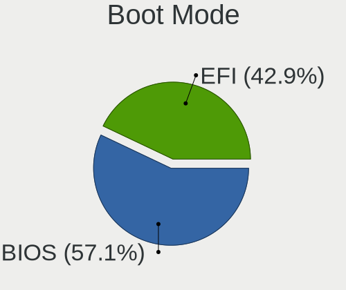
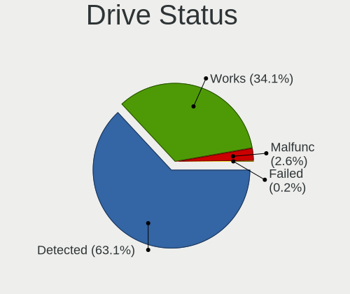

Ubuntu Hardware Trends (Notebooks)
----------------------------------

A project to identify most popular hardware characteristics and track their change
over time based on data collected by Ubuntu users at https://Linux-Hardware.org.

Anyone can contribute to this report by the [hw-probe](https://github.com/linuxhw/hw-probe) tool:

    sudo -E hw-probe -all -upload

Full-feature report is available here: https://linux-hardware.org/?view=trends

Period: Mar, 2022.

Contents
--------

* [ System ](#system)
  - [ OS                       ](#os)
  - [ OS Family                ](#os-family)
  - [ Kernel                   ](#kernel)
  - [ Kernel Family            ](#kernel-family)
  - [ Kernel Major Ver.        ](#kernel-major-ver)
  - [ Arch                     ](#arch)
  - [ DE                       ](#de)
  - [ Display Server           ](#display-server)
  - [ Display Manager          ](#display-manager)
  - [ OS Lang                  ](#os-lang)
  - [ Boot Mode                ](#boot-mode)
  - [ Filesystem               ](#filesystem)
  - [ Part. scheme             ](#part-scheme)
  - [ Dual Boot with Linux/BSD ](#dual-boot-with-linuxbsd)
  - [ Dual Boot (Win)          ](#dual-boot-win)

* [ Board ](#board)
  - [ Vendor                   ](#vendor)
  - [ Model                    ](#model)
  - [ Model Family             ](#model-family)
  - [ MFG Year                 ](#mfg-year)
  - [ Form Factor              ](#form-factor)
  - [ Secure Boot              ](#secure-boot)
  - [ Coreboot                 ](#coreboot)
  - [ RAM Size                 ](#ram-size)
  - [ RAM Used                 ](#ram-used)
  - [ Total Drives             ](#total-drives)
  - [ Has CD-ROM               ](#has-cd-rom)
  - [ Has Ethernet             ](#has-ethernet)
  - [ Has WiFi                 ](#has-wifi)
  - [ Has Bluetooth            ](#has-bluetooth)

* [ Location ](#location)
  - [ Country                  ](#country)
  - [ City                     ](#city)

* [ Drives ](#drives)
  - [ Drive Vendor             ](#drive-vendor)
  - [ Drive Model              ](#drive-model)
  - [ HDD Vendor               ](#hdd-vendor)
  - [ SSD Vendor               ](#ssd-vendor)
  - [ Drive Kind               ](#drive-kind)
  - [ Drive Connector          ](#drive-connector)
  - [ Drive Size               ](#drive-size)
  - [ Space Total              ](#space-total)
  - [ Space Used               ](#space-used)
  - [ Malfunc. Drives          ](#malfunc-drives)
  - [ Malfunc. Drive Vendor    ](#malfunc-drive-vendor)
  - [ Malfunc. HDD Vendor      ](#malfunc-hdd-vendor)
  - [ Malfunc. Drive Kind      ](#malfunc-drive-kind)
  - [ Failed Drives            ](#failed-drives)
  - [ Failed Drive Vendor      ](#failed-drive-vendor)
  - [ Drive Status             ](#drive-status)

* [ Storage controller ](#storage-controller)
  - [ Storage Vendor           ](#storage-vendor)
  - [ Storage Model            ](#storage-model)
  - [ Storage Kind             ](#storage-kind)

* [ Processor ](#processor)
  - [ CPU Vendor               ](#cpu-vendor)
  - [ CPU Model                ](#cpu-model)
  - [ CPU Model Family         ](#cpu-model-family)
  - [ CPU Cores                ](#cpu-cores)
  - [ CPU Sockets              ](#cpu-sockets)
  - [ CPU Threads              ](#cpu-threads)
  - [ CPU Op-Modes             ](#cpu-op-modes)
  - [ CPU Microcode            ](#cpu-microcode)
  - [ CPU Microarch            ](#cpu-microarch)

* [ Graphics ](#graphics)
  - [ GPU Vendor               ](#gpu-vendor)
  - [ GPU Model                ](#gpu-model)
  - [ GPU Combo                ](#gpu-combo)
  - [ GPU Driver               ](#gpu-driver)
  - [ GPU Memory               ](#gpu-memory)

* [ Monitor ](#monitor)
  - [ Monitor Vendor           ](#monitor-vendor)
  - [ Monitor Model            ](#monitor-model)
  - [ Monitor Resolution       ](#monitor-resolution)
  - [ Monitor Diagonal         ](#monitor-diagonal)
  - [ Monitor Width            ](#monitor-width)
  - [ Aspect Ratio             ](#aspect-ratio)
  - [ Monitor Area             ](#monitor-area)
  - [ Pixel Density            ](#pixel-density)
  - [ Multiple Monitors        ](#multiple-monitors)

* [ Network ](#network)
  - [ Net Controller Vendor    ](#net-controller-vendor)
  - [ Net Controller Model     ](#net-controller-model)
  - [ Wireless Vendor          ](#wireless-vendor)
  - [ Wireless Model           ](#wireless-model)
  - [ Ethernet Vendor          ](#ethernet-vendor)
  - [ Ethernet Model           ](#ethernet-model)
  - [ Net Controller Kind      ](#net-controller-kind)
  - [ Used Controller          ](#used-controller)
  - [ NICs                     ](#nics)
  - [ IPv6                     ](#ipv6)

* [ Bluetooth ](#bluetooth)
  - [ Bluetooth Vendor         ](#bluetooth-vendor)
  - [ Bluetooth Model          ](#bluetooth-model)

* [ Sound ](#sound)
  - [ Sound Vendor             ](#sound-vendor)
  - [ Sound Model              ](#sound-model)

* [ Memory ](#memory)
  - [ Memory Vendor            ](#memory-vendor)
  - [ Memory Model             ](#memory-model)
  - [ Memory Kind              ](#memory-kind)
  - [ Memory Form Factor       ](#memory-form-factor)
  - [ Memory Size              ](#memory-size)
  - [ Memory Speed             ](#memory-speed)

* [ Printers & scanners ](#printers--scanners)
  - [ Printer Vendor           ](#printer-vendor)
  - [ Printer Model            ](#printer-model)
  - [ Scanner Vendor           ](#scanner-vendor)
  - [ Scanner Model            ](#scanner-model)

* [ Camera ](#camera)
  - [ Camera Vendor            ](#camera-vendor)
  - [ Camera Model             ](#camera-model)

* [ Security ](#security)
  - [ Fingerprint Vendor       ](#fingerprint-vendor)
  - [ Fingerprint Model        ](#fingerprint-model)
  - [ Chipcard Vendor          ](#chipcard-vendor)
  - [ Chipcard Model           ](#chipcard-model)

* [ Unsupported ](#unsupported)
  - [ Unsupported Devices      ](#unsupported-devices)
  - [ Unsupported Device Types ](#unsupported-device-types)

System
------

OS
--

Installed operating systems

| Name         | Notebooks | Percent |
|--------------|-----------|---------|
| Ubuntu 20.04 | 347       | 62.19%  |
| Ubuntu 21.10 | 152       | 27.24%  |
| Ubuntu 18.04 | 27        | 4.84%   |
| Ubuntu 22.04 | 19        | 3.41%   |
| Ubuntu 21.04 | 8         | 1.43%   |
| Ubuntu 20.10 | 3         | 0.54%   |
| Ubuntu 19.10 | 1         | 0.18%   |
| Ubuntu 16.04 | 1         | 0.18%   |

OS Family
---------

OS without a version

| Name   | Notebooks | Percent |
|--------|-----------|---------|
| Ubuntu | 558       | 100%    |

Kernel
------

Version of the Linux kernel

| Version                    | Notebooks | Percent |
|----------------------------|-----------|---------|
| 5.13.0-35-generic          | 145       | 25.99%  |
| 5.13.0-30-generic          | 117       | 20.97%  |
| 5.13.0-37-generic          | 89        | 15.95%  |
| 5.4.0-104-generic          | 21        | 3.76%   |
| 5.13.0-39-generic          | 20        | 3.58%   |
| 5.4.0-100-generic          | 14        | 2.51%   |
| 5.4.0-105-generic          | 12        | 2.15%   |
| 5.13.0-28-generic          | 9         | 1.61%   |
| 5.8.0-43-generic           | 8         | 1.43%   |
| 5.15.0-23-generic          | 8         | 1.43%   |
| 4.15.0-171-generic         | 8         | 1.43%   |
| 5.13.0-32-generic          | 7         | 1.25%   |
| 5.13.0-19-generic          | 7         | 1.25%   |
| 5.14.0-1024-oem            | 6         | 1.08%   |
| 5.11.0-49-generic          | 6         | 1.08%   |
| 5.15.0-22-generic          | 5         | 0.9%    |
| 5.15.0-18-generic          | 5         | 0.9%    |
| 5.14.0-1027-oem            | 5         | 0.9%    |
| 5.14.0-1029-oem            | 4         | 0.72%   |
| 5.13.0-36-generic          | 4         | 0.72%   |
| 4.15.0-169-generic         | 4         | 0.72%   |
| 5.17.0-051700-generic      | 3         | 0.54%   |
| 5.13.0-38-generic          | 3         | 0.54%   |
| 5.13.0-10035-tuxedo        | 2         | 0.36%   |
| 5.11.0-41-generic          | 2         | 0.36%   |
| 5.8.0-63-generic           | 1         | 0.18%   |
| 5.8.0-50-generic           | 1         | 0.18%   |
| 5.8.0-45-generic           | 1         | 0.18%   |
| 5.8.0-38-generic           | 1         | 0.18%   |
| 5.8.0-25-generic           | 1         | 0.18%   |
| 5.4.184-0504184-generic    | 1         | 0.18%   |
| 5.4.0-99-generic           | 1         | 0.18%   |
| 5.4.0-962202022022-generic | 1         | 0.18%   |
| 5.4.0-91-generic           | 1         | 0.18%   |
| 5.4.0-84-generic           | 1         | 0.18%   |
| 5.4.0-72-generic           | 1         | 0.18%   |
| 5.4.0-65-generic           | 1         | 0.18%   |
| 5.4.0-42-generic           | 1         | 0.18%   |
| 5.4.0-1045-fips            | 1         | 0.18%   |
| 5.4.0-102-generic          | 1         | 0.18%   |
| 5.4.0-1007-fips            | 1         | 0.18%   |
| 5.3.0-51-generic           | 1         | 0.18%   |
| 5.17.0-051700rc7-generic   | 1         | 0.18%   |
| 5.16.12-051612-generic     | 1         | 0.18%   |
| 5.16.11-76051611-generic   | 1         | 0.18%   |
| 5.16.0-rc1-tgl             | 1         | 0.18%   |
| 5.15.6-051506-generic      | 1         | 0.18%   |
| 5.15.4-051504-generic      | 1         | 0.18%   |
| 5.15.27-051527-generic     | 1         | 0.18%   |
| 5.14.0-1031-oem            | 1         | 0.18%   |
| 5.13.0-40-generic          | 1         | 0.18%   |
| 5.13.0-37-lowlatency       | 1         | 0.18%   |
| 5.13.0-35-lowlatency       | 1         | 0.18%   |
| 5.13.0-29-generic          | 1         | 0.18%   |
| 5.13.0-27-generic          | 1         | 0.18%   |
| 5.13.0-22-generic          | 1         | 0.18%   |
| 5.13.0-21-generic          | 1         | 0.18%   |
| 5.13.0-1009-intel          | 1         | 0.18%   |
| 5.11.0-46-generic          | 1         | 0.18%   |
| 5.11.0-44-generic          | 1         | 0.18%   |

Kernel Family
-------------

Linux kernel without a distro release

| Version | Notebooks | Percent |
|---------|-----------|---------|
| 5.13.0  | 411       | 73.66%  |
| 5.4.0   | 57        | 10.22%  |
| 5.15.0  | 18        | 3.23%   |
| 5.14.0  | 16        | 2.87%   |
| 5.11.0  | 15        | 2.69%   |
| 4.15.0  | 14        | 2.51%   |
| 5.8.0   | 13        | 2.33%   |
| 5.17.0  | 4         | 0.72%   |
| 5.4.184 | 1         | 0.18%   |
| 5.3.0   | 1         | 0.18%   |
| 5.16.12 | 1         | 0.18%   |
| 5.16.11 | 1         | 0.18%   |
| 5.16.0  | 1         | 0.18%   |
| 5.15.6  | 1         | 0.18%   |
| 5.15.4  | 1         | 0.18%   |
| 5.15.27 | 1         | 0.18%   |
| 5.0.0   | 1         | 0.18%   |
| 4.4.0   | 1         | 0.18%   |

Kernel Major Ver.
-----------------

Linux kernel major version

| Version | Notebooks | Percent |
|---------|-----------|---------|
| 5.13    | 411       | 73.66%  |
| 5.4     | 58        | 10.39%  |
| 5.15    | 21        | 3.76%   |
| 5.14    | 16        | 2.87%   |
| 5.11    | 15        | 2.69%   |
| 4.15    | 14        | 2.51%   |
| 5.8     | 13        | 2.33%   |
| 5.17    | 4         | 0.72%   |
| 5.16    | 3         | 0.54%   |
| 5.3     | 1         | 0.18%   |
| 5.0     | 1         | 0.18%   |
| 4.4     | 1         | 0.18%   |

Arch
----

OS architecture (x86_64, i586, etc.)

| Name   | Notebooks | Percent |
|--------|-----------|---------|
| x86_64 | 551       | 98.75%  |
| i686   | 7         | 1.25%   |

DE
--

Desktop Environment

| Name            | Notebooks | Percent |
|-----------------|-----------|---------|
| GNOME           | 529       | 94.8%   |
| Unknown         | 13        | 2.33%   |
| Unity           | 7         | 1.25%   |
| X-Cinnamon      | 4         | 0.72%   |
| GNOME Flashback | 4         | 0.72%   |
| Enlightenment   | 1         | 0.18%   |

Display Server
--------------

X11 or Wayland

| Name    | Notebooks | Percent |
|---------|-----------|---------|
| X11     | 415       | 74.37%  |
| Wayland | 134       | 24.01%  |
| Unknown | 5         | 0.9%    |
| Tty     | 4         | 0.72%   |

Display Manager
---------------

SDDM, LightDM, etc.

| Name    | Notebooks | Percent |
|---------|-----------|---------|
| GDM3    | 345       | 61.83%  |
| GDM     | 161       | 28.85%  |
| Unknown | 39        | 6.99%   |
| LightDM | 12        | 2.15%   |
| SDDM    | 1         | 0.18%   |

OS Lang
-------

Language

| Lang    | Notebooks | Percent |
|---------|-----------|---------|
| en_US   | 265       | 47.49%  |
| de_DE   | 47        | 8.42%   |
| fr_FR   | 30        | 5.38%   |
| en_GB   | 28        | 5.02%   |
| pt_BR   | 22        | 3.94%   |
| it_IT   | 20        | 3.58%   |
| ru_RU   | 18        | 3.23%   |
| en_CA   | 16        | 2.87%   |
| en_IN   | 14        | 2.51%   |
| es_ES   | 9         | 1.61%   |
| zh_CN   | 7         | 1.25%   |
| en_AU   | 7         | 1.25%   |
| cs_CZ   | 5         | 0.9%    |
| C       | 5         | 0.9%    |
| nl_NL   | 4         | 0.72%   |
| es_MX   | 4         | 0.72%   |
| en_ZA   | 4         | 0.72%   |
| fr_CA   | 3         | 0.54%   |
| da_DK   | 3         | 0.54%   |
| Unknown | 3         | 0.54%   |
| zh_TW   | 2         | 0.36%   |
| tr_TR   | 2         | 0.36%   |
| sk_SK   | 2         | 0.36%   |
| pt_PT   | 2         | 0.36%   |
| pl_PL   | 2         | 0.36%   |
| fr_BE   | 2         | 0.36%   |
| es_EC   | 2         | 0.36%   |
| es_AR   | 2         | 0.36%   |
| en_NZ   | 2         | 0.36%   |
| en_IL   | 2         | 0.36%   |
| en_HK   | 2         | 0.36%   |
| el_GR   | 2         | 0.36%   |
| de_CH   | 2         | 0.36%   |
| de_AT   | 2         | 0.36%   |
| sv_SE   | 1         | 0.18%   |
| ro_RO   | 1         | 0.18%   |
| nb_NO   | 1         | 0.18%   |
| ja_JP   | 1         | 0.18%   |
| hu_HU   | 1         | 0.18%   |
| fi_FI   | 1         | 0.18%   |
| fa_IR   | 1         | 0.18%   |
| es_UY   | 1         | 0.18%   |
| es_PE   | 1         | 0.18%   |
| es_DO   | 1         | 0.18%   |
| es_CO   | 1         | 0.18%   |
| en_SG   | 1         | 0.18%   |
| en_PH   | 1         | 0.18%   |
| en_IE   | 1         | 0.18%   |
| de_IT   | 1         | 0.18%   |
| ar_EG   | 1         | 0.18%   |

Boot Mode
---------

EFI or BIOS

| Mode | Notebooks | Percent |
|------|-----------|---------|
| EFI  | 300       | 53.76%  |
| BIOS | 258       | 46.24%  |

Filesystem
----------

Type of filesystem

| Type    | Notebooks | Percent |
|---------|-----------|---------|
| Ext4    | 520       | 93.19%  |
| Overlay | 17        | 3.05%   |
| Zfs     | 11        | 1.97%   |
| Ext2    | 5         | 0.9%    |
| Ext3    | 4         | 0.72%   |
| Btrfs   | 1         | 0.18%   |

Part. scheme
------------

Scheme of partitioning

| Type    | Notebooks | Percent |
|---------|-----------|---------|
| Unknown | 371       | 66.49%  |
| GPT     | 160       | 28.67%  |
| MBR     | 27        | 4.84%   |

Dual Boot with Linux/BSD
------------------------

Hosting more than one Linux/BSD

| Dual boot | Notebooks | Percent |
|-----------|-----------|---------|
| No        | 512       | 91.76%  |
| Yes       | 46        | 8.24%   |

Dual Boot (Win)
---------------

Hosting Linux and Windows

| Dual boot | Notebooks | Percent |
|-----------|-----------|---------|
| No        | 350       | 62.72%  |
| Yes       | 208       | 37.28%  |

Board
-----

Vendor
------

Motherboard manufacturer

| Name                           | Notebooks | Percent |
|--------------------------------|-----------|---------|
| Hewlett-Packard                | 117       | 20.97%  |
| Dell                           | 106       | 19%     |
| Lenovo                         | 95        | 17.03%  |
| ASUSTek Computer               | 60        | 10.75%  |
| Acer                           | 43        | 7.71%   |
| Toshiba                        | 21        | 3.76%   |
| HUAWEI                         | 14        | 2.51%   |
| Samsung Electronics            | 12        | 2.15%   |
| Apple                          | 10        | 1.79%   |
| MSI                            | 9         | 1.61%   |
| Sony                           | 8         | 1.43%   |
| Medion                         | 5         | 0.9%    |
| Fujitsu                        | 5         | 0.9%    |
| Timi                           | 4         | 0.72%   |
| Positivo                       | 4         | 0.72%   |
| Unknown                        | 4         | 0.72%   |
| Panasonic                      | 3         | 0.54%   |
| Alienware                      | 3         | 0.54%   |
| TUXEDO                         | 2         | 0.36%   |
| Thomson                        | 2         | 0.36%   |
| System76                       | 2         | 0.36%   |
| Packard Bell                   | 2         | 0.36%   |
| Notebook                       | 2         | 0.36%   |
| Matsushita Electric Industrial | 2         | 0.36%   |
| GPU Company                    | 2         | 0.36%   |
| eMachines                      | 2         | 0.36%   |
| Clevo                          | 2         | 0.36%   |
| Schenker                       | 1         | 0.18%   |
| SANTECH                        | 1         | 0.18%   |
| R.W.C                          | 1         | 0.18%   |
| OEM                            | 1         | 0.18%   |
| NSX                            | 1         | 0.18%   |
| Noblex                         | 1         | 0.18%   |
| Microtech                      | 1         | 0.18%   |
| LG Electronics                 | 1         | 0.18%   |
| KOGAN                          | 1         | 0.18%   |
| Irbis                          | 1         | 0.18%   |
| Getac                          | 1         | 0.18%   |
| Fujitsu Siemens                | 1         | 0.18%   |
| Framework                      | 1         | 0.18%   |
| DNS                            | 1         | 0.18%   |
| Chuwi                          | 1         | 0.18%   |
| AWOW                           | 1         | 0.18%   |
| Avell High Performance         | 1         | 0.18%   |

Model
-----

Motherboard model

| Name                                 | Notebooks | Percent |
|--------------------------------------|-----------|---------|
| HP Pavilion g6                       | 6         | 1.08%   |
| HP Notebook                          | 5         | 0.9%    |
| Dell Latitude E6420                  | 4         | 0.72%   |
| Unknown                              | 4         | 0.72%   |
| Lenovo ThinkBook 16p Gen 2 20YM      | 3         | 0.54%   |
| HUAWEI HVY-WXX9                      | 3         | 0.54%   |
| HP Pavilion dv7                      | 3         | 0.54%   |
| HP Pavilion dv6                      | 3         | 0.54%   |
| HP Laptop 15-bs0xx                   | 3         | 0.54%   |
| HP EliteBook 840 G3                  | 3         | 0.54%   |
| Dell Latitude 5520                   | 3         | 0.54%   |
| Toshiba Satellite C55-B              | 2         | 0.36%   |
| Samsung 950XDB/951XDB/950XDY         | 2         | 0.36%   |
| MSI Prestige 15 A11SCS               | 2         | 0.36%   |
| Lenovo V145-15AST 81MT               | 2         | 0.36%   |
| Lenovo ThinkBook 15 G2 ITL 20VE      | 2         | 0.36%   |
| Lenovo IdeaPad Gaming 3 15ARH05 82EY | 2         | 0.36%   |
| Lenovo IdeaPad 5 Pro 14ACN6 82L7     | 2         | 0.36%   |
| Lenovo G505s 20255                   | 2         | 0.36%   |
| HUAWEI CREM-WXX9                     | 2         | 0.36%   |
| HP Stream Laptop 11-ak0xxx           | 2         | 0.36%   |
| HP Pavilion Notebook                 | 2         | 0.36%   |
| HP Pavilion 17                       | 2         | 0.36%   |
| HP Laptop 15-dw3xxx                  | 2         | 0.36%   |
| HP Laptop 15-dw1xxx                  | 2         | 0.36%   |
| HP Laptop 15-db0xxx                  | 2         | 0.36%   |
| HP EliteBook 850 G8 Notebook PC      | 2         | 0.36%   |
| HP EliteBook 8470p                   | 2         | 0.36%   |
| HP EliteBook 2740p                   | 2         | 0.36%   |
| HP 255 G7 Notebook PC                | 2         | 0.36%   |
| HP 250 G7 Notebook PC                | 2         | 0.36%   |
| HP 15 Notebook PC                    | 2         | 0.36%   |
| eMachines eM350                      | 2         | 0.36%   |
| Dell XPS 13 9370                     | 2         | 0.36%   |
| Dell Precision 3561                  | 2         | 0.36%   |
| Dell Latitude E7470                  | 2         | 0.36%   |
| Dell Latitude E7450                  | 2         | 0.36%   |
| Dell Latitude E6330                  | 2         | 0.36%   |
| Dell Latitude E5450                  | 2         | 0.36%   |
| Dell Latitude D630                   | 2         | 0.36%   |
| Dell Latitude 7420                   | 2         | 0.36%   |
| Dell Latitude 5420                   | 2         | 0.36%   |
| Dell Latitude 3410                   | 2         | 0.36%   |
| Dell Inspiron 7520                   | 2         | 0.36%   |
| Dell Inspiron 3583                   | 2         | 0.36%   |
| Dell Inspiron 1764                   | 2         | 0.36%   |
| Dell Inspiron 16 7610                | 2         | 0.36%   |
| Dell Inspiron 1545                   | 2         | 0.36%   |
| Dell Inspiron 15-3567                | 2         | 0.36%   |
| ASUS N750JK                          | 2         | 0.36%   |
| Acer Predator G3-572                 | 2         | 0.36%   |
| Acer Aspire 5742                     | 2         | 0.36%   |
| Acer Aspire 4750                     | 2         | 0.36%   |
| TUXEDO Pulse 15 Gen1                 | 1         | 0.18%   |
| TUXEDO P95_HR                        | 1         | 0.18%   |
| Toshiba TECRA M11                    | 1         | 0.18%   |
| Toshiba Satellite S50-B              | 1         | 0.18%   |
| Toshiba Satellite Radius L10W-C      | 1         | 0.18%   |
| Toshiba Satellite Pro S500           | 1         | 0.18%   |
| Toshiba Satellite P755               | 1         | 0.18%   |

Model Family
------------

Motherboard model prefix

| Name                  | Notebooks | Percent |
|-----------------------|-----------|---------|
| Lenovo ThinkPad       | 44        | 7.89%   |
| Dell Latitude         | 43        | 7.71%   |
| Dell Inspiron         | 34        | 6.09%   |
| Acer Aspire           | 29        | 5.2%    |
| HP Pavilion           | 26        | 4.66%   |
| Lenovo IdeaPad        | 23        | 4.12%   |
| HP EliteBook          | 23        | 4.12%   |
| HP Laptop             | 19        | 3.41%   |
| Toshiba Satellite     | 18        | 3.23%   |
| HP ProBook            | 11        | 1.97%   |
| ASUS VivoBook         | 11        | 1.97%   |
| Dell XPS              | 9         | 1.61%   |
| Dell Precision        | 9         | 1.61%   |
| Lenovo ThinkBook      | 8         | 1.43%   |
| HP ZBook              | 6         | 1.08%   |
| Acer Swift            | 6         | 1.08%   |
| HP Notebook           | 5         | 0.9%    |
| Fujitsu LIFEBOOK      | 5         | 0.9%    |
| ASUS ROG              | 5         | 0.9%    |
| HP Stream             | 4         | 0.72%   |
| HP OMEN               | 4         | 0.72%   |
| HP 250                | 4         | 0.72%   |
| Dell Vostro           | 4         | 0.72%   |
| ASUS ZenBook          | 4         | 0.72%   |
| Acer TravelMate       | 4         | 0.72%   |
| Unknown               | 4         | 0.72%   |
| Lenovo Legion         | 3         | 0.54%   |
| HUAWEI HVY-WXX9       | 3         | 0.54%   |
| HP 255                | 3         | 0.54%   |
| Dell System           | 3         | 0.54%   |
| Toshiba PORTEGE       | 2         | 0.36%   |
| Timi RedmiBook        | 2         | 0.36%   |
| Samsung 950XDB        | 2         | 0.36%   |
| Packard Bell EasyNote | 2         | 0.36%   |
| MSI Prestige          | 2         | 0.36%   |
| Lenovo V145-15AST     | 2         | 0.36%   |
| Lenovo G505s          | 2         | 0.36%   |
| HUAWEI CREM-WXX9      | 2         | 0.36%   |
| HP ENVY               | 2         | 0.36%   |
| HP 15                 | 2         | 0.36%   |
| eMachines eM350       | 2         | 0.36%   |
| ASUS TUF              | 2         | 0.36%   |
| ASUS N750JK           | 2         | 0.36%   |
| ASUS ASUS             | 2         | 0.36%   |
| Acer Predator         | 2         | 0.36%   |
| TUXEDO Pulse          | 1         | 0.18%   |
| TUXEDO P95            | 1         | 0.18%   |
| Toshiba TECRA         | 1         | 0.18%   |
| Timi TM1703           | 1         | 0.18%   |
| Timi TM1613           | 1         | 0.18%   |
| Thomson NEO14-2.32BS  | 1         | 0.18%   |
| Thomson N14C4WH64     | 1         | 0.18%   |
| System76 Pangolin     | 1         | 0.18%   |
| System76 Bonobo       | 1         | 0.18%   |
| Sony VPCS111FM        | 1         | 0.18%   |
| Sony VPCEG30EL        | 1         | 0.18%   |
| Sony VPCEB3PGX        | 1         | 0.18%   |
| Sony VPCCW2UFX        | 1         | 0.18%   |
| Sony VGN-NS38E        | 1         | 0.18%   |
| Sony VGN-FZ21M        | 1         | 0.18%   |

MFG Year
--------

Motherboard manufacture year

| Year    | Notebooks | Percent |
|---------|-----------|---------|
| 2020    | 74        | 13.26%  |
| 2021    | 72        | 12.9%   |
| 2019    | 47        | 8.42%   |
| 2018    | 47        | 8.42%   |
| 2011    | 47        | 8.42%   |
| 2017    | 37        | 6.63%   |
| 2014    | 36        | 6.45%   |
| 2010    | 31        | 5.56%   |
| 2012    | 30        | 5.38%   |
| 2013    | 29        | 5.2%    |
| 2015    | 28        | 5.02%   |
| 2016    | 27        | 4.84%   |
| 2008    | 24        | 4.3%    |
| 2009    | 15        | 2.69%   |
| 2007    | 7         | 1.25%   |
| 2006    | 3         | 0.54%   |
| 2022    | 2         | 0.36%   |
| 2005    | 1         | 0.18%   |
| Unknown | 1         | 0.18%   |

Form Factor
-----------

Physical design of the computer

| Name     | Notebooks | Percent |
|----------|-----------|---------|
| Notebook | 558       | 100%    |

Secure Boot
-----------

Enabled or disabled

| State    | Notebooks | Percent |
|----------|-----------|---------|
| Disabled | 456       | 81.72%  |
| Enabled  | 102       | 18.28%  |

Coreboot
--------

Have coreboot on board

| Used | Notebooks | Percent |
|------|-----------|---------|
| No   | 557       | 99.82%  |
| Yes  | 1         | 0.18%   |

RAM Size
--------

Total RAM memory

| Size in GB  | Notebooks | Percent |
|-------------|-----------|---------|
| 4.01-8.0    | 162       | 29.03%  |
| 3.01-4.0    | 113       | 20.25%  |
| 8.01-16.0   | 98        | 17.56%  |
| 16.01-24.0  | 90        | 16.13%  |
| 32.01-64.0  | 51        | 9.14%   |
| 1.01-2.0    | 19        | 3.41%   |
| 2.01-3.0    | 10        | 1.79%   |
| 64.01-256.0 | 9         | 1.61%   |
| 24.01-32.0  | 5         | 0.9%    |
| 0.51-1.0    | 1         | 0.18%   |

RAM Used
--------

Used RAM memory

| Used GB    | Notebooks | Percent |
|------------|-----------|---------|
| 1.01-2.0   | 182       | 32.62%  |
| 2.01-3.0   | 159       | 28.49%  |
| 4.01-8.0   | 98        | 17.56%  |
| 3.01-4.0   | 68        | 12.19%  |
| 8.01-16.0  | 26        | 4.66%   |
| 0.51-1.0   | 18        | 3.23%   |
| 16.01-24.0 | 3         | 0.54%   |
| 0.01-0.5   | 3         | 0.54%   |
| 24.01-32.0 | 1         | 0.18%   |

Total Drives
------------

Number of drives on board

| Drives | Notebooks | Percent |
|--------|-----------|---------|
| 1      | 416       | 74.55%  |
| 2      | 123       | 22.04%  |
| 3      | 10        | 1.79%   |
| 0      | 6         | 1.08%   |
| 6      | 1         | 0.18%   |
| 5      | 1         | 0.18%   |
| 4      | 1         | 0.18%   |

Has CD-ROM
----------

Has CD-ROM on board

| Presented | Notebooks | Percent |
|-----------|-----------|---------|
| No        | 362       | 64.87%  |
| Yes       | 196       | 35.13%  |

Has Ethernet
------------

Has Ethernet on board

| Presented | Notebooks | Percent |
|-----------|-----------|---------|
| Yes       | 446       | 79.93%  |
| No        | 112       | 20.07%  |

Has WiFi
--------

Has WiFi module

| Presented | Notebooks | Percent |
|-----------|-----------|---------|
| Yes       | 548       | 98.21%  |
| No        | 10        | 1.79%   |

Has Bluetooth
-------------

Has Bluetooth module

| Presented | Notebooks | Percent |
|-----------|-----------|---------|
| Yes       | 433       | 77.6%   |
| No        | 125       | 22.4%   |

Location
--------

Country
-------

Geographic location (country)

| Country             | Notebooks | Percent |
|---------------------|-----------|---------|
| USA                 | 103       | 18.46%  |
| Germany             | 57        | 10.22%  |
| France              | 34        | 6.09%   |
| Brazil              | 32        | 5.73%   |
| Russia              | 28        | 5.02%   |
| Italy               | 25        | 4.48%   |
| Canada              | 20        | 3.58%   |
| UK                  | 18        | 3.23%   |
| Spain               | 17        | 3.05%   |
| India               | 17        | 3.05%   |
| China               | 12        | 2.15%   |
| Romania             | 11        | 1.97%   |
| Netherlands         | 9         | 1.61%   |
| Switzerland         | 8         | 1.43%   |
| Czechia             | 8         | 1.43%   |
| Australia           | 8         | 1.43%   |
| Ukraine             | 7         | 1.25%   |
| Colombia            | 7         | 1.25%   |
| Argentina           | 7         | 1.25%   |
| Austria             | 6         | 1.08%   |
| Turkey              | 5         | 0.9%    |
| Portugal            | 5         | 0.9%    |
| Iran                | 5         | 0.9%    |
| Indonesia           | 5         | 0.9%    |
| Belgium             | 5         | 0.9%    |
| Sweden              | 4         | 0.72%   |
| South Africa        | 4         | 0.72%   |
| Mexico              | 4         | 0.72%   |
| Japan               | 4         | 0.72%   |
| Hong Kong           | 4         | 0.72%   |
| Greece              | 4         | 0.72%   |
| Denmark             | 4         | 0.72%   |
| Slovenia            | 3         | 0.54%   |
| Slovakia            | 3         | 0.54%   |
| Puerto Rico         | 3         | 0.54%   |
| Poland              | 3         | 0.54%   |
| New Zealand         | 3         | 0.54%   |
| Malaysia            | 3         | 0.54%   |
| Finland             | 3         | 0.54%   |
| Uruguay             | 2         | 0.36%   |
| Tunisia             | 2         | 0.36%   |
| Senegal             | 2         | 0.36%   |
| Pakistan            | 2         | 0.36%   |
| Israel              | 2         | 0.36%   |
| Hungary             | 2         | 0.36%   |
| Egypt               | 2         | 0.36%   |
| Ecuador             | 2         | 0.36%   |
| Chile               | 2         | 0.36%   |
| Cambodia            | 2         | 0.36%   |
| Bulgaria            | 2         | 0.36%   |
| Belarus             | 2         | 0.36%   |
| Bangladesh          | 2         | 0.36%   |
| Uzbekistan          | 1         | 0.18%   |
| Trinidad and Tobago | 1         | 0.18%   |
| Thailand            | 1         | 0.18%   |
| Taiwan              | 1         | 0.18%   |
| South Korea         | 1         | 0.18%   |
| Singapore           | 1         | 0.18%   |
| Serbia              | 1         | 0.18%   |
| Saudi Arabia        | 1         | 0.18%   |

City
----

Geographic location (city)

| City                     | Notebooks | Percent |
|--------------------------|-----------|---------|
| Moscow                   | 11        | 1.97%   |
| Berlin                   | 10        | 1.79%   |
| Paris                    | 5         | 0.9%    |
| Montreal                 | 5         | 0.9%    |
| St Petersburg            | 4         | 0.72%   |
| São Paulo               | 4         | 0.72%   |
| Rio de Janeiro           | 4         | 0.72%   |
| Reşiţa                 | 4         | 0.72%   |
| New Delhi                | 4         | 0.72%   |
| Milan                    | 4         | 0.72%   |
| Istanbul                 | 4         | 0.72%   |
| Frankfurt am Main        | 4         | 0.72%   |
| Bucharest                | 4         | 0.72%   |
| Prague                   | 3         | 0.54%   |
| Philadelphia             | 3         | 0.54%   |
| Mons                     | 3         | 0.54%   |
| Lviv                     | 3         | 0.54%   |
| Jakarta                  | 3         | 0.54%   |
| Brisbane                 | 3         | 0.54%   |
| Athens                   | 3         | 0.54%   |
| Worms                    | 2         | 0.36%   |
| Wellington               | 2         | 0.36%   |
| Vienna                   | 2         | 0.36%   |
| Vancouver                | 2         | 0.36%   |
| Tucson                   | 2         | 0.36%   |
| Toronto                  | 2         | 0.36%   |
| Tehran                   | 2         | 0.36%   |
| Strasbourg               | 2         | 0.36%   |
| Spokane                  | 2         | 0.36%   |
| Sorocaba                 | 2         | 0.36%   |
| Santiago                 | 2         | 0.36%   |
| San Juan                 | 2         | 0.36%   |
| Rome                     | 2         | 0.36%   |
| Quito                    | 2         | 0.36%   |
| Portland                 | 2         | 0.36%   |
| Phnom Penh               | 2         | 0.36%   |
| Pereira                  | 2         | 0.36%   |
| Palau-solita i Plegamans | 2         | 0.36%   |
| Oroszlany                | 2         | 0.36%   |
| New York                 | 2         | 0.36%   |
| Naples                   | 2         | 0.36%   |
| Montevideo               | 2         | 0.36%   |
| Minsk                    | 2         | 0.36%   |
| Marseille                | 2         | 0.36%   |
| Ljubljana                | 2         | 0.36%   |
| Lisbon                   | 2         | 0.36%   |
| Kuala Lumpur             | 2         | 0.36%   |
| Hudson                   | 2         | 0.36%   |
| Houston                  | 2         | 0.36%   |
| Hanover                  | 2         | 0.36%   |
| Hackney                  | 2         | 0.36%   |
| Guangzhou                | 2         | 0.36%   |
| Glasgow                  | 2         | 0.36%   |
| Fremont                  | 2         | 0.36%   |
| Dakar                    | 2         | 0.36%   |
| Chateauguay              | 2         | 0.36%   |
| Changsha                 | 2         | 0.36%   |
| Central                  | 2         | 0.36%   |
| Buenos Aires             | 2         | 0.36%   |
| Bratislava               | 2         | 0.36%   |

Drives
------

Drive Vendor
------------

Hard drive vendors

| Vendor                      | Notebooks | Drives | Percent |
|-----------------------------|-----------|--------|---------|
| Samsung Electronics         | 104       | 116    | 16.12%  |
| Toshiba                     | 80        | 81     | 12.4%   |
| WDC                         | 77        | 80     | 11.94%  |
| Seagate                     | 62        | 64     | 9.61%   |
| SK Hynix                    | 35        | 36     | 5.43%   |
| SanDisk                     | 31        | 31     | 4.81%   |
| Unknown                     | 30        | 35     | 4.65%   |
| Kingston                    | 29        | 32     | 4.5%    |
| Intel                       | 22        | 23     | 3.41%   |
| Micron Technology           | 18        | 19     | 2.79%   |
| HGST                        | 18        | 18     | 2.79%   |
| Crucial                     | 17        | 17     | 2.64%   |
| KIOXIA                      | 12        | 12     | 1.86%   |
| Hitachi                     | 10        | 10     | 1.55%   |
| Fujitsu                     | 6         | 6      | 0.93%   |
| Apple                       | 6         | 9      | 0.93%   |
| China                       | 5         | 5      | 0.78%   |
| A-DATA Technology           | 5         | 5      | 0.78%   |
| Unknown                     | 5         | 5      | 0.78%   |
| SPCC                        | 4         | 4      | 0.62%   |
| Silicon Motion              | 3         | 3      | 0.47%   |
| PNY                         | 3         | 3      | 0.47%   |
| Patriot                     | 3         | 3      | 0.47%   |
| Netac                       | 3         | 3      | 0.47%   |
| YMTC                        | 2         | 2      | 0.31%   |
| UMIS                        | 2         | 2      | 0.31%   |
| SSSTC                       | 2         | 2      | 0.31%   |
| Realtek Semiconductor       | 2         | 2      | 0.31%   |
| Phison                      | 2         | 2      | 0.31%   |
| OCZ                         | 2         | 2      | 0.31%   |
| LITEONIT                    | 2         | 2      | 0.31%   |
| LITEON                      | 2         | 2      | 0.31%   |
| KingFast                    | 2         | 2      | 0.31%   |
| JMicron                     | 2         | 5      | 0.31%   |
| Intenso                     | 2         | 2      | 0.31%   |
| Hikvision                   | 2         | 2      | 0.31%   |
| Hewlett-Packard             | 2         | 2      | 0.31%   |
| BIWIN                       | 2         | 2      | 0.31%   |
| ADATA Technology            | 2         | 2      | 0.31%   |
| Yangtze Memory Technologies | 1         | 1      | 0.16%   |
| VIVA300s                    | 1         | 1      | 0.16%   |
| USB3.0                      | 1         | 1      | 0.16%   |
| Union Memory (Shenzhen)     | 1         | 1      | 0.16%   |
| Transcend                   | 1         | 1      | 0.16%   |
| Team                        | 1         | 1      | 0.16%   |
| StoreJet                    | 1         | 1      | 0.16%   |
| RSH-339                     | 1         | 1      | 0.16%   |
| PIONEER                     | 1         | 1      | 0.16%   |
| OWC                         | 1         | 1      | 0.16%   |
| OEM                         | 1         | 1      | 0.16%   |
| NV-2242A                    | 1         | 1      | 0.16%   |
| Microtech                   | 1         | 1      | 0.16%   |
| Micron/Crucial Technology   | 1         | 1      | 0.16%   |
| MaxDigital                  | 1         | 1      | 0.16%   |
| Lite-On                     | 1         | 1      | 0.16%   |
| Lexar                       | 1         | 1      | 0.16%   |
| KODAK                       | 1         | 1      | 0.16%   |
| KLEVV                       | 1         | 1      | 0.16%   |
| KingSpec                    | 1         | 1      | 0.16%   |
| KINGBANK                    | 1         | 1      | 0.16%   |

Drive Model
-----------

Hard drive models

| Model                                | Notebooks | Percent |
|--------------------------------------|-----------|---------|
| Toshiba MQ04ABF100 1TB               | 11        | 1.63%   |
| Toshiba MQ01ABD100 1TB               | 10        | 1.48%   |
| Unknown MMC Card  32GB               | 9         | 1.33%   |
| Samsung NVMe SSD Drive 256GB         | 9         | 1.33%   |
| Seagate ST1000LM035-1RK172 1TB       | 8         | 1.19%   |
| Kingston SA400S37480G 480GB SSD      | 8         | 1.19%   |
| Intel NVMe SSD Drive 512GB           | 8         | 1.19%   |
| Unknown MMC Card  64GB               | 7         | 1.04%   |
| Seagate ST1000LM024 HN-M101MBB 1TB   | 7         | 1.04%   |
| HGST HTS721010A9E630 1TB             | 7         | 1.04%   |
| Seagate ST9500325AS 500GB            | 6         | 0.89%   |
| Seagate ST500LT012-1DG142 500GB      | 6         | 0.89%   |
| Sandisk NVMe SSD Drive 512GB         | 6         | 0.89%   |
| SK Hynix NVMe SSD Drive 512GB        | 5         | 0.74%   |
| Samsung NVMe SSD Drive 512GB         | 5         | 0.74%   |
| Kingston SA400S37240G 240GB SSD      | 5         | 0.74%   |
| Unknown                              | 5         | 0.74%   |
| Unknown MMC Card  16GB               | 4         | 0.59%   |
| Toshiba MQ01ABF050 500GB             | 4         | 0.59%   |
| SK Hynix NVMe SSD Drive 256GB        | 4         | 0.59%   |
| Seagate ST2000LM007-1R8174 2TB       | 4         | 0.59%   |
| SanDisk SD8SNAT128G1002 128GB SSD    | 4         | 0.59%   |
| Samsung SSD 860 EVO 1TB              | 4         | 0.59%   |
| Kingston SA400S37120G 120GB SSD      | 4         | 0.59%   |
| Crucial CT240BX500SSD1 240GB         | 4         | 0.59%   |
| WDC WDS500G2B0A-00SM50 500GB SSD     | 3         | 0.44%   |
| WDC WDS240G2G0B-00EPW0 240GB SSD     | 3         | 0.44%   |
| WDC WD10SPZX-24Z10 1TB               | 3         | 0.44%   |
| Unknown SD/MMC/MS PRO 32GB           | 3         | 0.44%   |
| Toshiba NVMe SSD Drive 512GB         | 3         | 0.44%   |
| Toshiba MQ01ABD050V 500GB            | 3         | 0.44%   |
| Toshiba MQ01ABD050 500GB             | 3         | 0.44%   |
| Silicon Motion NVMe SSD Drive 256GB  | 3         | 0.44%   |
| Sandisk NVMe SSD Drive 1024GB        | 3         | 0.44%   |
| Samsung SSD 860 EVO 250GB            | 3         | 0.44%   |
| Samsung PM991a NVMe 512GB            | 3         | 0.44%   |
| Samsung NVMe SSD Drive 1TB           | 3         | 0.44%   |
| Samsung NVMe SSD Drive 1024GB        | 3         | 0.44%   |
| Samsung MZVLB512HAJQ-000H1 512GB     | 3         | 0.44%   |
| Samsung MZNLN256HCHP-00000 256GB SSD | 3         | 0.44%   |
| Netac SSD 256GB                      | 3         | 0.44%   |
| Micron NVMe SSD Drive 512GB          | 3         | 0.44%   |
| KIOXIA NVMe SSD Drive 256GB          | 3         | 0.44%   |
| Kingston NVMe SSD Drive 512GB        | 3         | 0.44%   |
| Kingston NVMe SSD Drive 500GB        | 3         | 0.44%   |
| HGST HTS725050A7E630 500GB           | 3         | 0.44%   |
| HGST HTS541010A9E680 1TB             | 3         | 0.44%   |
| YMTC PC005 512GB                     | 2         | 0.3%    |
| WDC WDS240G2G0A-00JH30 240GB SSD     | 2         | 0.3%    |
| WDC WDS100T1X0E-00AFY0 1TB           | 2         | 0.3%    |
| WDC WD7500BPVT-22HXZT1 752GB         | 2         | 0.3%    |
| WDC WD5000BPKT-75PK4T0 500GB         | 2         | 0.3%    |
| WDC WD10JPVX-22JC3T0 1TB             | 2         | 0.3%    |
| WDC PC SN730 SDBPNTY-512G-1027 512GB | 2         | 0.3%    |
| WDC PC SN530 NVMe 512GB              | 2         | 0.3%    |
| UMIS RPJTJ256MEE1OWX 256GB           | 2         | 0.3%    |
| Toshiba MQ01ACF050 500GB             | 2         | 0.3%    |
| Toshiba MQ01ABD100V 1TB              | 2         | 0.3%    |
| Toshiba MQ01ABD075 752GB             | 2         | 0.3%    |
| Toshiba MQ01ABD032 320GB             | 2         | 0.3%    |

HDD Vendor
----------

Hard disk drive vendors

| Vendor              | Notebooks | Drives | Percent |
|---------------------|-----------|--------|---------|
| Seagate             | 59        | 60     | 27.7%   |
| Toshiba             | 54        | 54     | 25.35%  |
| WDC                 | 49        | 50     | 23%     |
| HGST                | 18        | 18     | 8.45%   |
| Samsung Electronics | 10        | 10     | 4.69%   |
| Hitachi             | 10        | 10     | 4.69%   |
| Fujitsu             | 5         | 5      | 2.35%   |
| Unknown             | 3         | 3      | 1.41%   |
| StoreJet            | 1         | 1      | 0.47%   |
| RSH-339             | 1         | 1      | 0.47%   |
| JMicron             | 1         | 3      | 0.47%   |
| Intenso             | 1         | 1      | 0.47%   |
| Apple               | 1         | 1      | 0.47%   |

SSD Vendor
----------

Solid state drive vendors

| Vendor              | Notebooks | Drives | Percent |
|---------------------|-----------|--------|---------|
| Samsung Electronics | 44        | 47     | 23.4%   |
| Kingston            | 22        | 22     | 11.7%   |
| SanDisk             | 18        | 18     | 9.57%   |
| Crucial             | 15        | 15     | 7.98%   |
| WDC                 | 13        | 13     | 6.91%   |
| Toshiba             | 7         | 7      | 3.72%   |
| SK Hynix            | 7         | 7      | 3.72%   |
| Micron Technology   | 6         | 6      | 3.19%   |
| China               | 5         | 5      | 2.66%   |
| Intel               | 4         | 4      | 2.13%   |
| A-DATA Technology   | 4         | 4      | 2.13%   |
| SPCC                | 3         | 3      | 1.6%    |
| PNY                 | 3         | 3      | 1.6%    |
| Patriot             | 3         | 3      | 1.6%    |
| Netac               | 3         | 3      | 1.6%    |
| OCZ                 | 2         | 2      | 1.06%   |
| LITEONIT            | 2         | 2      | 1.06%   |
| LITEON              | 2         | 2      | 1.06%   |
| KingFast            | 2         | 2      | 1.06%   |
| Hewlett-Packard     | 2         | 2      | 1.06%   |
| Apple               | 2         | 2      | 1.06%   |
| USB3.0              | 1         | 1      | 0.53%   |
| Unknown             | 1         | 1      | 0.53%   |
| Transcend           | 1         | 1      | 0.53%   |
| Team                | 1         | 1      | 0.53%   |
| Seagate             | 1         | 1      | 0.53%   |
| OWC                 | 1         | 1      | 0.53%   |
| Microtech           | 1         | 1      | 0.53%   |
| Lexar               | 1         | 1      | 0.53%   |
| KODAK               | 1         | 1      | 0.53%   |
| KLEVV               | 1         | 1      | 0.53%   |
| KingSpec            | 1         | 1      | 0.53%   |
| JMicron             | 1         | 1      | 0.53%   |
| Intenso             | 1         | 1      | 0.53%   |
| Hikvision           | 1         | 1      | 0.53%   |
| GOODRAM             | 1         | 1      | 0.53%   |
| Fujitsu             | 1         | 1      | 0.53%   |
| Drevo               | 1         | 1      | 0.53%   |
| Axiom               | 1         | 1      | 0.53%   |
| Unknown             | 1         | 1      | 0.53%   |

Drive Kind
----------

HDD or SSD

| Kind    | Notebooks | Drives | Percent |
|---------|-----------|--------|---------|
| HDD     | 208       | 217    | 32.91%  |
| NVMe    | 204       | 229    | 32.28%  |
| SSD     | 180       | 191    | 28.48%  |
| MMC     | 29        | 32     | 4.59%   |
| Unknown | 11        | 11     | 1.74%   |

Drive Connector
---------------

SATA, SAS, NVMe, etc.

| Type | Notebooks | Drives | Percent |
|------|-----------|--------|---------|
| SATA | 361       | 394    | 58.79%  |
| NVMe | 203       | 227    | 33.06%  |
| MMC  | 29        | 32     | 4.72%   |
| SAS  | 21        | 27     | 3.42%   |

Drive Size
----------

Size of hard drive

| Size in TB | Notebooks | Drives | Percent |
|------------|-----------|--------|---------|
| 0.01-0.5   | 246       | 260    | 63.08%  |
| 0.51-1.0   | 126       | 130    | 32.31%  |
| 1.01-2.0   | 12        | 12     | 3.08%   |
| 3.01-4.0   | 3         | 3      | 0.77%   |
| 2.01-3.0   | 2         | 2      | 0.51%   |
| 4.01-10.0  | 1         | 1      | 0.26%   |

Space Total
-----------

Amount of disk space available on the file system

| Size in GB     | Notebooks | Percent |
|----------------|-----------|---------|
| 101-250        | 177       | 31.72%  |
| 251-500        | 157       | 28.14%  |
| 501-1000       | 92        | 16.49%  |
| 51-100         | 39        | 6.99%   |
| 21-50          | 30        | 5.38%   |
| 1-20           | 28        | 5.02%   |
| 1001-2000      | 22        | 3.94%   |
| More than 3000 | 5         | 0.9%    |
| 2001-3000      | 4         | 0.72%   |
| Unknown        | 4         | 0.72%   |

Space Used
----------

Amount of used disk space

| Used GB        | Notebooks | Percent |
|----------------|-----------|---------|
| 1-20           | 225       | 40.32%  |
| 21-50          | 114       | 20.43%  |
| 101-250        | 85        | 15.23%  |
| 51-100         | 64        | 11.47%  |
| 251-500        | 40        | 7.17%   |
| 501-1000       | 21        | 3.76%   |
| Unknown        | 4         | 0.72%   |
| More than 3000 | 3         | 0.54%   |
| 2001-3000      | 1         | 0.18%   |
| 1001-2000      | 1         | 0.18%   |

Malfunc. Drives
---------------

Drive models with a malfunction

| Model                                   | Notebooks | Drives | Percent |
|-----------------------------------------|-----------|--------|---------|
| WDC WD7500BPVT-24HXZT3 752GB            | 1         | 1      | 8.33%   |
| Toshiba MK2555GSX 250GB                 | 1         | 1      | 8.33%   |
| SK Hynix HFS256G32MND-2200A 256GB SSD   | 1         | 1      | 8.33%   |
| SK Hynix HFS250G32TND-N1A2A 250GB SSD   | 1         | 1      | 8.33%   |
| SK Hynix BC711 HFM512GD3JX013N 512GB    | 1         | 1      | 8.33%   |
| SK Hynix BC511 HFM256GDJTNI-82A0A 256GB | 1         | 1      | 8.33%   |
| Seagate ST1000LX015-1U7172-SSHD 1TB     | 1         | 1      | 8.33%   |
| Samsung Electronics SSD 840 EVO 1TB     | 1         | 1      | 8.33%   |
| Samsung Electronics HM160HI 160GB       | 1         | 1      | 8.33%   |
| Kingston SA400S37240G 240GB SSD         | 1         | 1      | 8.33%   |
| Kingston SA400S37 256G SSD              | 1         | 1      | 8.33%   |
| HGST HTS721010A9E630 1TB                | 1         | 1      | 8.33%   |

Malfunc. Drive Vendor
---------------------

Vendors of faulty drives

| Vendor              | Notebooks | Drives | Percent |
|---------------------|-----------|--------|---------|
| SK Hynix            | 4         | 4      | 33.33%  |
| Samsung Electronics | 2         | 2      | 16.67%  |
| Kingston            | 2         | 2      | 16.67%  |
| WDC                 | 1         | 1      | 8.33%   |
| Toshiba             | 1         | 1      | 8.33%   |
| Seagate             | 1         | 1      | 8.33%   |
| HGST                | 1         | 1      | 8.33%   |

Malfunc. HDD Vendor
-------------------

Vendors of faulty HDD drives

| Vendor              | Notebooks | Drives | Percent |
|---------------------|-----------|--------|---------|
| WDC                 | 1         | 1      | 20%     |
| Toshiba             | 1         | 1      | 20%     |
| Seagate             | 1         | 1      | 20%     |
| Samsung Electronics | 1         | 1      | 20%     |
| HGST                | 1         | 1      | 20%     |

Malfunc. Drive Kind
-------------------

Kinds of faulty drives

| Kind | Notebooks | Drives | Percent |
|------|-----------|--------|---------|
| SSD  | 5         | 5      | 41.67%  |
| HDD  | 5         | 5      | 41.67%  |
| NVMe | 2         | 2      | 16.67%  |

Failed Drives
-------------

Failed drive models

Zero info for selected period =(

Failed Drive Vendor
-------------------

Failed drive vendors

Zero info for selected period =(

Drive Status
------------

Number of failed and malfunc. drives

| Status   | Notebooks | Drives | Percent |
|----------|-----------|--------|---------|
| Detected | 375       | 449    | 65.79%  |
| Works    | 183       | 219    | 32.11%  |
| Malfunc  | 12        | 12     | 2.11%   |

Storage controller
------------------

Storage Vendor
--------------

Storage controller vendors

| Vendor                         | Notebooks | Percent |
|--------------------------------|-----------|---------|
| Intel                          | 388       | 58.35%  |
| AMD                            | 75        | 11.28%  |
| Samsung Electronics            | 58        | 8.72%   |
| Sandisk                        | 29        | 4.36%   |
| SK Hynix                       | 28        | 4.21%   |
| Toshiba America Info Systems   | 19        | 2.86%   |
| Micron Technology              | 12        | 1.8%    |
| KIOXIA                         | 11        | 1.65%   |
| Kingston Technology Company    | 9         | 1.35%   |
| Silicon Motion                 | 5         | 0.75%   |
| Phison Electronics             | 4         | 0.6%    |
| Yangtze Memory Technologies    | 3         | 0.45%   |
| Union Memory (Shenzhen)        | 3         | 0.45%   |
| Micron/Crucial Technology      | 3         | 0.45%   |
| ADATA Technology               | 3         | 0.45%   |
| Solid State Storage Technology | 2         | 0.3%    |
| Realtek Semiconductor          | 2         | 0.3%    |
| Nvidia                         | 2         | 0.3%    |
| MAXIO Technology (Hangzhou)    | 2         | 0.3%    |
| Marvell Technology Group       | 2         | 0.3%    |
| Biwin Storage Technology       | 2         | 0.3%    |
| Apple                          | 2         | 0.3%    |
| Lite-On Technology             | 1         | 0.15%   |

Storage Model
-------------

Storage controller models

| Model                                                                            | Notebooks | Percent |
|----------------------------------------------------------------------------------|-----------|---------|
| AMD FCH SATA Controller [AHCI mode]                                              | 68        | 9.66%   |
| Intel Sunrise Point-LP SATA Controller [AHCI mode]                               | 44        | 6.25%   |
| Intel 82801 Mobile SATA Controller [RAID mode]                                   | 34        | 4.83%   |
| Intel 6 Series/C200 Series Chipset Family 6 port Mobile SATA AHCI Controller     | 34        | 4.83%   |
| Intel 7 Series Chipset Family 6-port SATA Controller [AHCI mode]                 | 33        | 4.69%   |
| Intel Volume Management Device NVMe RAID Controller                              | 28        | 3.98%   |
| Samsung NVMe SSD Controller SM981/PM981/PM983                                    | 24        | 3.41%   |
| Intel 5 Series/3400 Series Chipset 4 port SATA AHCI Controller                   | 21        | 2.98%   |
| Intel 82801IBM/IEM (ICH9M/ICH9M-E) 4 port SATA Controller [AHCI mode]            | 20        | 2.84%   |
| Samsung NVMe SSD Controller 980                                                  | 18        | 2.56%   |
| Intel 8 Series SATA Controller 1 [AHCI mode]                                     | 18        | 2.56%   |
| Intel HM170/QM170 Chipset SATA Controller [AHCI Mode]                            | 15        | 2.13%   |
| Intel 8 Series/C220 Series Chipset Family 6-port SATA Controller 1 [AHCI mode]   | 13        | 1.85%   |
| Micron Non-Volatile memory controller                                            | 12        | 1.7%    |
| Intel Wildcat Point-LP SATA Controller [AHCI Mode]                               | 12        | 1.7%    |
| Intel Tiger Lake-LP SATA Controller [AHCI mode]                                  | 12        | 1.7%    |
| SK Hynix Gold P31 SSD                                                            | 11        | 1.56%   |
| Sandisk WD Black SN750 / PC SN730 NVMe SSD                                       | 10        | 1.42%   |
| KIOXIA Non-Volatile memory controller                                            | 10        | 1.42%   |
| Intel SSD 660P Series                                                            | 10        | 1.42%   |
| Intel Comet Lake SATA AHCI Controller                                            | 10        | 1.42%   |
| Intel Atom Processor E3800 Series SATA AHCI Controller                           | 10        | 1.42%   |
| Intel 82801HM/HEM (ICH8M/ICH8M-E) IDE Controller                                 | 10        | 1.42%   |
| Toshiba America Info Systems XG6 NVMe SSD Controller                             | 9         | 1.28%   |
| Samsung NVMe SSD Controller SM961/PM961/SM963                                    | 9         | 1.28%   |
| Intel Celeron/Pentium Silver Processor SATA Controller                           | 9         | 1.28%   |
| Intel Cannon Lake Mobile PCH SATA AHCI Controller                                | 9         | 1.28%   |
| Intel 82801HM/HEM (ICH8M/ICH8M-E) SATA Controller [AHCI mode]                    | 9         | 1.28%   |
| Intel 5 Series/3400 Series Chipset 6 port SATA AHCI Controller                   | 9         | 1.28%   |
| SK Hynix Non-Volatile memory controller                                          | 8         | 1.14%   |
| Sandisk Non-Volatile memory controller                                           | 6         | 0.85%   |
| Intel Cannon Point-LP SATA Controller [AHCI Mode]                                | 6         | 0.85%   |
| Intel 400 Series Chipset Family SATA AHCI Controller                             | 6         | 0.85%   |
| SK Hynix BC511                                                                   | 5         | 0.71%   |
| Sandisk WD Blue SN550 NVMe SSD                                                   | 5         | 0.71%   |
| Intel Celeron N3350/Pentium N4200/Atom E3900 Series SATA AHCI Controller         | 5         | 0.71%   |
| AMD SB7x0/SB8x0/SB9x0 SATA Controller [AHCI mode]                                | 5         | 0.71%   |
| Toshiba America Info Systems Toshiba America Info Non-Volatile memory controller | 4         | 0.57%   |
| Silicon Motion SM2263EN/SM2263XT SSD Controller                                  | 4         | 0.57%   |
| Samsung NVMe SSD Controller PM9A1/PM9A3/980PRO                                   | 4         | 0.57%   |
| Kingston Company SNVS2000G [NV1 NVMe PCIe SSD 2TB]                               | 4         | 0.57%   |
| Intel Q170/Q150/B150/H170/H110/Z170/CM236 Chipset SATA Controller [AHCI Mode]    | 4         | 0.57%   |
| Intel Atom/Celeron/Pentium Processor x5-E8000/J3xxx/N3xxx Series SATA Controller | 4         | 0.57%   |
| Yangtze Memory Non-Volatile memory controller                                    | 3         | 0.43%   |
| Union Memory (Shenzhen) Non-Volatile memory controller                           | 3         | 0.43%   |
| Toshiba America Info Systems XG4 NVMe SSD Controller                             | 3         | 0.43%   |
| Toshiba America Info Systems BG3 NVMe SSD Controller                             | 3         | 0.43%   |
| Sandisk WD Blue SN500 / PC SN520 NVMe SSD                                        | 3         | 0.43%   |
| Sandisk WD Black 2018/SN750 / PC SN720 NVMe SSD                                  | 3         | 0.43%   |
| Intel SSD Pro 7600p/760p/E 6100p Series                                          | 3         | 0.43%   |
| Intel Non-Volatile memory controller                                             | 3         | 0.43%   |
| Intel Ice Lake-LP SATA Controller [AHCI mode]                                    | 3         | 0.43%   |
| Intel 82801GBM/GHM (ICH7-M Family) SATA Controller [IDE mode]                    | 3         | 0.43%   |
| Intel 500 Series Chipset Family SATA AHCI Controller                             | 3         | 0.43%   |
| ADATA Non-Volatile memory controller                                             | 3         | 0.43%   |
| Solid State Storage Non-Volatile memory controller                               | 2         | 0.28%   |
| SK Hynix BC501 NVMe Solid State Drive                                            | 2         | 0.28%   |
| Sandisk WD PC SN810 / Black SN850 NVMe SSD                                       | 2         | 0.28%   |
| Phison E12 NVMe Controller                                                       | 2         | 0.28%   |
| Micron/Crucial Non-Volatile memory controller                                    | 2         | 0.28%   |

Storage Kind
------------

Kind of storage controller (IDE, SATA, NVMe, SAS, ...)

| Kind | Notebooks | Percent |
|------|-----------|---------|
| SATA | 391       | 57.25%  |
| NVMe | 203       | 29.72%  |
| RAID | 64        | 9.37%   |
| IDE  | 25        | 3.66%   |

Processor
---------

CPU Vendor
----------

Processor vendors

| Vendor | Notebooks | Percent |
|--------|-----------|---------|
| Intel  | 452       | 81%     |
| AMD    | 106       | 19%     |

CPU Model
---------

Processor models

| Model                                         | Notebooks | Percent |
|-----------------------------------------------|-----------|---------|
| Intel 11th Gen Core i7-1165G7 @ 2.80GHz       | 13        | 2.33%   |
| Intel 11th Gen Core i5-1135G7 @ 2.40GHz       | 13        | 2.33%   |
| Intel Core i7-7700HQ CPU @ 2.80GHz            | 11        | 1.97%   |
| Intel Core i5-8250U CPU @ 1.60GHz             | 10        | 1.79%   |
| Intel Core i5-7200U CPU @ 2.50GHz             | 9         | 1.61%   |
| Intel Core i5-8265U CPU @ 1.60GHz             | 8         | 1.43%   |
| Intel 11th Gen Core i7-1185G7 @ 3.00GHz       | 8         | 1.43%   |
| AMD Ryzen 5 4600H with Radeon Graphics        | 8         | 1.43%   |
| AMD Ryzen 7 5800H with Radeon Graphics        | 7         | 1.25%   |
| Intel Core i7-8565U CPU @ 1.80GHz             | 6         | 1.08%   |
| Intel Core i7-8550U CPU @ 1.80GHz             | 6         | 1.08%   |
| Intel Core i7-6500U CPU @ 2.50GHz             | 6         | 1.08%   |
| Intel Core i7-10750H CPU @ 2.60GHz            | 6         | 1.08%   |
| Intel Core i7-10510U CPU @ 1.80GHz            | 6         | 1.08%   |
| Intel Core i5-3320M CPU @ 2.60GHz             | 6         | 1.08%   |
| Intel Core i5-2430M CPU @ 2.40GHz             | 6         | 1.08%   |
| Intel 11th Gen Core i7-11800H @ 2.30GHz       | 6         | 1.08%   |
| Intel Core i7-7500U CPU @ 2.70GHz             | 5         | 0.9%    |
| Intel Core i7-6700HQ CPU @ 2.60GHz            | 5         | 0.9%    |
| Intel Core i5-6200U CPU @ 2.30GHz             | 5         | 0.9%    |
| Intel Core i5-5200U CPU @ 2.20GHz             | 5         | 0.9%    |
| Intel Core i5-3210M CPU @ 2.50GHz             | 5         | 0.9%    |
| Intel Core i5-2520M CPU @ 2.50GHz             | 5         | 0.9%    |
| Intel Core i5-10210U CPU @ 1.60GHz            | 5         | 0.9%    |
| AMD Ryzen 7 5700U with Radeon Graphics        | 5         | 0.9%    |
| AMD Ryzen 5 2500U with Radeon Vega Mobile Gfx | 5         | 0.9%    |
| Intel Pentium CPU N3540 @ 2.16GHz             | 4         | 0.72%   |
| Intel Core i7-9750H CPU @ 2.60GHz             | 4         | 0.72%   |
| Intel Core i7-8750H CPU @ 2.20GHz             | 4         | 0.72%   |
| Intel Core i7-6600U CPU @ 2.60GHz             | 4         | 0.72%   |
| Intel Core i5-4300U CPU @ 1.90GHz             | 4         | 0.72%   |
| Intel Core i5-2410M CPU @ 2.30GHz             | 4         | 0.72%   |
| Intel Core i5 CPU M 540 @ 2.53GHz             | 4         | 0.72%   |
| Intel Core i5 CPU M 520 @ 2.40GHz             | 4         | 0.72%   |
| Intel Core i5 CPU M 430 @ 2.27GHz             | 4         | 0.72%   |
| Intel Core i3-2330M CPU @ 2.20GHz             | 4         | 0.72%   |
| Intel Core i3 CPU M 370 @ 2.40GHz             | 4         | 0.72%   |
| Intel Core 2 Duo CPU P8400 @ 2.26GHz          | 4         | 0.72%   |
| Intel Celeron N4020 CPU @ 1.10GHz             | 4         | 0.72%   |
| Intel Celeron CPU N3350 @ 1.10GHz             | 4         | 0.72%   |
| Intel 11th Gen Core i5-1145G7 @ 2.60GHz       | 4         | 0.72%   |
| Intel 11th Gen Core i3-1115G4 @ 3.00GHz       | 4         | 0.72%   |
| AMD Ryzen 5 3500U with Radeon Vega Mobile Gfx | 4         | 0.72%   |
| AMD A4-9125 RADEON R3, 4 COMPUTE CORES 2C+2G  | 4         | 0.72%   |
| Intel Pentium Dual-Core CPU T4200 @ 2.00GHz   | 3         | 0.54%   |
| Intel Core i7-5600U CPU @ 2.60GHz             | 3         | 0.54%   |
| Intel Core i7-4710HQ CPU @ 2.50GHz            | 3         | 0.54%   |
| Intel Core i7-4700HQ CPU @ 2.40GHz            | 3         | 0.54%   |
| Intel Core i7-4510U CPU @ 2.00GHz             | 3         | 0.54%   |
| Intel Core i7-2670QM CPU @ 2.20GHz            | 3         | 0.54%   |
| Intel Core i7 CPU Q 740 @ 1.73GHz             | 3         | 0.54%   |
| Intel Core i5-6300U CPU @ 2.40GHz             | 3         | 0.54%   |
| Intel Core i5-5300U CPU @ 2.30GHz             | 3         | 0.54%   |
| Intel Core i5-4200U CPU @ 1.60GHz             | 3         | 0.54%   |
| Intel Core i5-1035G1 CPU @ 1.00GHz            | 3         | 0.54%   |
| Intel Core i3-2310M CPU @ 2.10GHz             | 3         | 0.54%   |
| Intel Core i3 CPU M 380 @ 2.53GHz             | 3         | 0.54%   |
| Intel Core i3 CPU M 330 @ 2.13GHz             | 3         | 0.54%   |
| Intel Core 2 Duo CPU P8700 @ 2.53GHz          | 3         | 0.54%   |
| Intel Core 2 Duo CPU P7350 @ 2.00GHz          | 3         | 0.54%   |

CPU Model Family
----------------

Processor model prefix

| Model                   | Notebooks | Percent |
|-------------------------|-----------|---------|
| Intel Core i5           | 136       | 24.37%  |
| Intel Core i7           | 123       | 22.04%  |
| Other                   | 62        | 11.11%  |
| Intel Core i3           | 38        | 6.81%   |
| Intel Core 2 Duo        | 27        | 4.84%   |
| AMD Ryzen 5             | 27        | 4.84%   |
| Intel Celeron           | 26        | 4.66%   |
| AMD Ryzen 7             | 22        | 3.94%   |
| Intel Pentium           | 17        | 3.05%   |
| AMD A4                  | 11        | 1.97%   |
| Intel Atom              | 8         | 1.43%   |
| AMD A10                 | 8         | 1.43%   |
| Intel Pentium Dual-Core | 7         | 1.25%   |
| AMD A6                  | 6         | 1.08%   |
| AMD Ryzen 7 PRO         | 5         | 0.9%    |
| Intel Core i9           | 4         | 0.72%   |
| AMD Ryzen 3             | 4         | 0.72%   |
| AMD A8                  | 4         | 0.72%   |
| AMD E                   | 3         | 0.54%   |
| Intel Pentium Silver    | 2         | 0.36%   |
| Intel Core 2            | 2         | 0.36%   |
| AMD Ryzen 9             | 2         | 0.36%   |
| AMD E2                  | 2         | 0.36%   |
| Intel Xeon              | 1         | 0.18%   |
| Intel Pentium Dual      | 1         | 0.18%   |
| Intel Genuine           | 1         | 0.18%   |
| Intel Core m3           | 1         | 0.18%   |
| Intel Core M            | 1         | 0.18%   |
| AMD Turion 64 Mobile    | 1         | 0.18%   |
| AMD Ryzen 3 PRO         | 1         | 0.18%   |
| AMD Quad-Core           | 1         | 0.18%   |
| AMD C-60                | 1         | 0.18%   |
| AMD Athlon II Dual-Core | 1         | 0.18%   |
| AMD Athlon              | 1         | 0.18%   |
| AMD A12                 | 1         | 0.18%   |

CPU Cores
---------

Number of processor cores

| Number | Notebooks | Percent |
|--------|-----------|---------|
| 2      | 280       | 50.18%  |
| 4      | 190       | 34.05%  |
| 8      | 44        | 7.89%   |
| 6      | 35        | 6.27%   |
| 1      | 6         | 1.08%   |
| 14     | 3         | 0.54%   |

CPU Sockets
-----------

Number of sockets

| Number | Notebooks | Percent |
|--------|-----------|---------|
| 1      | 558       | 100%    |

CPU Threads
-----------

Threads per core (Hyper-Threading)

| Number | Notebooks | Percent |
|--------|-----------|---------|
| 2      | 429       | 76.88%  |
| 1      | 129       | 23.12%  |

CPU Op-Modes
------------

CPU Operation Modes (32-bit, 64-bit)

| Op mode        | Notebooks | Percent |
|----------------|-----------|---------|
| 32-bit, 64-bit | 556       | 99.64%  |
| 32-bit         | 2         | 0.36%   |

CPU Microcode
-------------

Microcode number

| Number     | Notebooks | Percent |
|------------|-----------|---------|
| Unknown    | 137       | 24.55%  |
| 0x806c1    | 35        | 6.27%   |
| 0x206a7    | 33        | 5.91%   |
| 0x806ec    | 25        | 4.48%   |
| 0x306a9    | 23        | 4.12%   |
| 0x806ea    | 16        | 2.87%   |
| 0x406e3    | 16        | 2.87%   |
| 0x1067a    | 16        | 2.87%   |
| 0x806e9    | 15        | 2.69%   |
| 0x906e9    | 13        | 2.33%   |
| 0x0a50000c | 13        | 2.33%   |
| 0x20655    | 12        | 2.15%   |
| 0x306d4    | 11        | 1.97%   |
| 0xa0652    | 10        | 1.79%   |
| 0x306c3    | 10        | 1.79%   |
| 0x30678    | 10        | 1.79%   |
| 0x20652    | 10        | 1.79%   |
| 0x906ea    | 9         | 1.61%   |
| 0x806d1    | 9         | 1.61%   |
| 0x40651    | 9         | 1.61%   |
| 0x08600106 | 8         | 1.43%   |
| 0x08108109 | 8         | 1.43%   |
| 0x906ed    | 7         | 1.25%   |
| 0x506e3    | 7         | 1.25%   |
| 0x06006705 | 6         | 1.08%   |
| 0x03000027 | 6         | 1.08%   |
| 0x706e5    | 5         | 0.9%    |
| 0x706a8    | 5         | 0.9%    |
| 0x6fd      | 5         | 0.9%    |
| 0x406c4    | 5         | 0.9%    |
| 0x08608103 | 5         | 0.9%    |
| 0x07030105 | 4         | 0.72%   |
| 0x06001119 | 4         | 0.72%   |
| 0x906a3    | 3         | 0.54%   |
| 0x706a1    | 3         | 0.54%   |
| 0x506c9    | 3         | 0.54%   |
| 0x406c3    | 3         | 0.54%   |
| 0x08600104 | 3         | 0.54%   |
| 0x05000119 | 3         | 0.54%   |
| 0x806eb    | 2         | 0.36%   |
| 0x6fb      | 2         | 0.36%   |
| 0x106ca    | 2         | 0.36%   |
| 0x10676    | 2         | 0.36%   |
| 0x08200103 | 2         | 0.36%   |
| 0x08108102 | 2         | 0.36%   |
| 0x08101007 | 2         | 0.36%   |
| 0x0700010f | 2         | 0.36%   |
| 0x06006704 | 2         | 0.36%   |
| 0xa0660    | 1         | 0.18%   |
| 0x806c2    | 1         | 0.18%   |
| 0x6fa      | 1         | 0.18%   |
| 0x6f6      | 1         | 0.18%   |
| 0x6e8      | 1         | 0.18%   |
| 0x40661    | 1         | 0.18%   |
| 0x106e5    | 1         | 0.18%   |
| 0x106c2    | 1         | 0.18%   |
| 0x10661    | 1         | 0.18%   |
| 0x0a50000b | 1         | 0.18%   |
| 0x08608102 | 1         | 0.18%   |
| 0x08600103 | 1         | 0.18%   |

CPU Microarch
-------------

Microarchitecture

| Name             | Notebooks | Percent |
|------------------|-----------|---------|
| KabyLake         | 102       | 18.28%  |
| TigerLake        | 44        | 7.89%   |
| SandyBridge      | 42        | 7.53%   |
| Haswell          | 35        | 6.27%   |
| IvyBridge        | 34        | 6.09%   |
| Skylake          | 30        | 5.38%   |
| Westmere         | 29        | 5.2%    |
| Penryn           | 26        | 4.66%   |
| Silvermont       | 23        | 4.12%   |
| Zen 3            | 18        | 3.23%   |
| Zen 2            | 18        | 3.23%   |
| Excavator        | 17        | 3.05%   |
| Broadwell        | 17        | 3.05%   |
| Icelake          | 16        | 2.87%   |
| CometLake        | 14        | 2.51%   |
| Zen+             | 12        | 2.15%   |
| Core             | 12        | 2.15%   |
| Goldmont plus    | 11        | 1.97%   |
| Unknown          | 10        | 1.79%   |
| Zen              | 8         | 1.43%   |
| K10 Llano        | 6         | 1.08%   |
| Piledriver       | 5         | 0.9%    |
| Goldmont         | 5         | 0.9%    |
| Puma             | 4         | 0.72%   |
| Nehalem          | 4         | 0.72%   |
| Jaguar           | 4         | 0.72%   |
| Bobcat           | 4         | 0.72%   |
| Bonnell          | 3         | 0.54%   |
| Alderlake Hybrid | 2         | 0.36%   |
| P6               | 1         | 0.18%   |
| K8 Hammer        | 1         | 0.18%   |
| K10              | 1         | 0.18%   |

Graphics
--------

GPU Vendor
----------

Vendors of graphics cards

| Vendor | Notebooks | Percent |
|--------|-----------|---------|
| Intel  | 411       | 58.22%  |
| Nvidia | 151       | 21.39%  |
| AMD    | 144       | 20.4%   |

GPU Model
---------

Graphics card models

| Model                                                                                    | Notebooks | Percent |
|------------------------------------------------------------------------------------------|-----------|---------|
| Intel 2nd Generation Core Processor Family Integrated Graphics Controller                | 42        | 5.78%   |
| Intel TigerLake-LP GT2 [Iris Xe Graphics]                                                | 40        | 5.5%    |
| Intel 3rd Gen Core processor Graphics Controller                                         | 31        | 4.26%   |
| Intel Core Processor Integrated Graphics Controller                                      | 24        | 3.3%    |
| Intel Skylake GT2 [HD Graphics 520]                                                      | 22        | 3.03%   |
| Intel UHD Graphics 620                                                                   | 21        | 2.89%   |
| Intel Mobile 4 Series Chipset Integrated Graphics Controller                             | 18        | 2.48%   |
| Intel Haswell-ULT Integrated Graphics Controller                                         | 18        | 2.48%   |
| AMD Cezanne                                                                              | 18        | 2.48%   |
| AMD Renoir                                                                               | 17        | 2.34%   |
| Intel WhiskeyLake-U GT2 [UHD Graphics 620]                                               | 16        | 2.2%    |
| Intel HD Graphics 620                                                                    | 16        | 2.2%    |
| Intel HD Graphics 5500                                                                   | 14        | 1.93%   |
| AMD Picasso/Raven 2 [Radeon Vega Series / Radeon Vega Mobile Series]                     | 14        | 1.93%   |
| Intel CometLake-U GT2 [UHD Graphics]                                                     | 13        | 1.79%   |
| Intel 4th Gen Core Processor Integrated Graphics Controller                              | 13        | 1.79%   |
| Intel HD Graphics 630                                                                    | 12        | 1.65%   |
| Intel CometLake-H GT2 [UHD Graphics]                                                     | 12        | 1.65%   |
| Intel Atom/Celeron/Pentium Processor x5-E8000/J3xxx/N3xxx Integrated Graphics Controller | 12        | 1.65%   |
| Intel Atom Processor Z36xxx/Z37xxx Series Graphics & Display                             | 11        | 1.51%   |
| AMD Stoney [Radeon R2/R3/R4/R5 Graphics]                                                 | 11        | 1.51%   |
| Intel TigerLake-H GT1 [UHD Graphics]                                                     | 10        | 1.38%   |
| Intel CoffeeLake-H GT2 [UHD Graphics 630]                                                | 10        | 1.38%   |
| Intel GeminiLake [UHD Graphics 600]                                                      | 9         | 1.24%   |
| Nvidia TU117M                                                                            | 8         | 1.1%    |
| AMD Sun XT [Radeon HD 8670A/8670M/8690M / R5 M330 / M430 / Radeon 520 Mobile]            | 8         | 1.1%    |
| AMD Lucienne                                                                             | 8         | 1.1%    |
| Nvidia GP107M [GeForce GTX 1050 Mobile]                                                  | 7         | 0.96%   |
| Nvidia GA106M [GeForce RTX 3060 Mobile / Max-Q]                                          | 7         | 0.96%   |
| Intel Mobile GM965/GL960 Integrated Graphics Controller (secondary)                      | 7         | 0.96%   |
| Intel Mobile GM965/GL960 Integrated Graphics Controller (primary)                        | 7         | 0.96%   |
| Intel HD Graphics 530                                                                    | 7         | 0.96%   |
| Nvidia GM108M [GeForce 940MX]                                                            | 6         | 0.83%   |
| AMD Wani [Radeon R5/R6/R7 Graphics]                                                      | 6         | 0.83%   |
| AMD Raven Ridge [Radeon Vega Series / Radeon Vega Mobile Series]                         | 6         | 0.83%   |
| Nvidia GP106M [GeForce GTX 1060 Mobile]                                                  | 5         | 0.69%   |
| Intel Iris Plus Graphics G1 (Ice Lake)                                                   | 5         | 0.69%   |
| AMD Topaz XT [Radeon R7 M260/M265 / M340/M360 / M440/M445 / 530/535 / 620/625 Mobile]    | 5         | 0.69%   |
| Nvidia TU117M [GeForce GTX 1650 Ti Mobile]                                               | 4         | 0.55%   |
| Nvidia TU117M [GeForce GTX 1650 Mobile / Max-Q]                                          | 4         | 0.55%   |
| Nvidia TU106M [GeForce RTX 2060 Mobile]                                                  | 4         | 0.55%   |
| Nvidia GA107M [GeForce RTX 3050 Ti Mobile]                                               | 4         | 0.55%   |
| Intel Tiger Lake UHD Graphics                                                            | 4         | 0.55%   |
| Intel HD Graphics 500                                                                    | 4         | 0.55%   |
| AMD Whistler [Radeon HD 6730M/6770M/7690M XT]                                            | 4         | 0.55%   |
| AMD Seymour [Radeon HD 6400M/7400M Series]                                               | 4         | 0.55%   |
| Nvidia GP108M [GeForce MX150]                                                            | 3         | 0.41%   |
| Nvidia GM108M [GeForce 940M]                                                             | 3         | 0.41%   |
| Nvidia GM107M [GeForce GTX 850M]                                                         | 3         | 0.41%   |
| Nvidia GM107GLM [Quadro M1200 Mobile]                                                    | 3         | 0.41%   |
| Nvidia GF117M [GeForce 610M/710M/810M/820M / GT 620M/625M/630M/720M]                     | 3         | 0.41%   |
| Nvidia GF108M [GeForce GT 540M]                                                          | 3         | 0.41%   |
| Intel Comet Lake UHD Graphics                                                            | 3         | 0.41%   |
| Intel Alder Lake-P Integrated Graphics Controller                                        | 3         | 0.41%   |
| AMD Richland [Radeon HD 8650G]                                                           | 3         | 0.41%   |
| AMD Mullins [Radeon R4/R5 Graphics]                                                      | 3         | 0.41%   |
| Nvidia TU117M [GeForce MX450]                                                            | 2         | 0.28%   |
| Nvidia TU117GLM [T1200 Laptop GPU]                                                       | 2         | 0.28%   |
| Nvidia TU117GLM [Quadro T1000 Mobile]                                                    | 2         | 0.28%   |
| Nvidia TU116M [GeForce GTX 1660 Ti Mobile]                                               | 2         | 0.28%   |

GPU Combo
---------

Combinations of graphics cards

| Name               | Notebooks | Percent |
|--------------------|-----------|---------|
| 1 x Intel          | 277       | 49.64%  |
| Intel + Nvidia     | 109       | 19.53%  |
| 1 x AMD            | 94        | 16.85%  |
| 1 x Nvidia         | 27        | 4.84%   |
| Intel + AMD        | 24        | 4.3%    |
| AMD + Nvidia       | 14        | 2.51%   |
| 2 x AMD            | 12        | 2.15%   |
| Intel + 2 x Nvidia | 1         | 0.18%   |

GPU Driver
----------

Free vs proprietary

| Driver      | Notebooks | Percent |
|-------------|-----------|---------|
| Free        | 466       | 83.51%  |
| Proprietary | 73        | 13.08%  |
| Unknown     | 19        | 3.41%   |

GPU Memory
----------

Total video memory

| Size in GB | Notebooks | Percent |
|------------|-----------|---------|
| Unknown    | 381       | 68.28%  |
| 0.01-0.5   | 62        | 11.11%  |
| 1.01-2.0   | 46        | 8.24%   |
| 3.01-4.0   | 27        | 4.84%   |
| 0.51-1.0   | 27        | 4.84%   |
| 5.01-6.0   | 10        | 1.79%   |
| 7.01-8.0   | 5         | 0.9%    |

Monitor
-------

Monitor Vendor
--------------

Monitor vendors

| Vendor                  | Notebooks | Percent |
|-------------------------|-----------|---------|
| AU Optronics            | 129       | 19.82%  |
| Chimei Innolux          | 92        | 14.13%  |
| LG Display              | 89        | 13.67%  |
| BOE                     | 87        | 13.36%  |
| Samsung Electronics     | 63        | 9.68%   |
| Dell                    | 25        | 3.84%   |
| Sharp                   | 18        | 2.76%   |
| Lenovo                  | 16        | 2.46%   |
| Goldstar                | 15        | 2.3%    |
| PANDA                   | 11        | 1.69%   |
| Chi Mei Optoelectronics | 10        | 1.54%   |
| Apple                   | 10        | 1.54%   |
| Hewlett-Packard         | 9         | 1.38%   |
| BenQ                    | 8         | 1.23%   |
| ViewSonic               | 7         | 1.08%   |
| InfoVision              | 6         | 0.92%   |
| Philips                 | 4         | 0.61%   |
| LG Philips              | 4         | 0.61%   |
| Sony                    | 3         | 0.46%   |
| Iiyama                  | 3         | 0.46%   |
| CPT                     | 3         | 0.46%   |
| Ancor Communications    | 3         | 0.46%   |
| Unknown                 | 2         | 0.31%   |
| TMX                     | 2         | 0.31%   |
| InnoLux Display         | 2         | 0.31%   |
| AOC                     | 2         | 0.31%   |
| Acer                    | 2         | 0.31%   |
| YCT                     | 1         | 0.15%   |
| Yamaha                  | 1         | 0.15%   |
| Vestel Elektronik       | 1         | 0.15%   |
| Unknown (XXX)           | 1         | 0.15%   |
| Toshiba                 | 1         | 0.15%   |
| STA                     | 1         | 0.15%   |
| Sanyo                   | 1         | 0.15%   |
| Quanta Display          | 1         | 0.15%   |
| Plain Tree Systems      | 1         | 0.15%   |
| OOO                     | 1         | 0.15%   |
| MStar                   | 1         | 0.15%   |
| Mi                      | 1         | 0.15%   |
| KDB                     | 1         | 0.15%   |
| JDI                     | 1         | 0.15%   |
| ITE                     | 1         | 0.15%   |
| HUAWEI                  | 1         | 0.15%   |
| HKC                     | 1         | 0.15%   |
| GJX                     | 1         | 0.15%   |
| Gateway                 | 1         | 0.15%   |
| Fujitsu Siemens         | 1         | 0.15%   |
| eMachines               | 1         | 0.15%   |
| DZX                     | 1         | 0.15%   |
| Denver                  | 1         | 0.15%   |
| CSO                     | 1         | 0.15%   |
| CMN                     | 1         | 0.15%   |
| ASUSTek Computer        | 1         | 0.15%   |

Monitor Model
-------------

Monitor models

| Model                                                                 | Notebooks | Percent |
|-----------------------------------------------------------------------|-----------|---------|
| AU Optronics LCD Monitor AUO22EC 1366x768 344x193mm 15.5-inch         | 9         | 1.38%   |
| LG Display LCD Monitor LGD02DC 1366x768 344x194mm 15.5-inch           | 7         | 1.07%   |
| Chimei Innolux LCD Monitor CMN15DB 1366x768 344x193mm 15.5-inch       | 6         | 0.92%   |
| Chimei Innolux LCD Monitor CMN14D4 1920x1080 309x173mm 13.9-inch      | 6         | 0.92%   |
| Samsung Electronics LCD Monitor SEC5441 1366x768 256x144mm 11.6-inch  | 5         | 0.77%   |
| AU Optronics LCD Monitor AUO10EC 1366x768 344x193mm 15.5-inch         | 5         | 0.77%   |
| Chimei Innolux LCD Monitor CMN1735 1920x1080 382x215mm 17.3-inch      | 4         | 0.61%   |
| BOE LCD Monitor BOE0687 1920x1080 344x193mm 15.5-inch                 | 4         | 0.61%   |
| AU Optronics LCD Monitor AUO70EC 1366x768 344x193mm 15.5-inch         | 4         | 0.61%   |
| Samsung Electronics LCD Monitor SEC544B 1600x900 310x174mm 14.0-inch  | 3         | 0.46%   |
| LG Display LCD Monitor LGD05E5 1920x1080 344x194mm 15.5-inch          | 3         | 0.46%   |
| LG Display LCD Monitor LGD033A 1366x768 344x194mm 15.5-inch           | 3         | 0.46%   |
| LG Display LCD Monitor LGD02F2 1366x768 344x194mm 15.5-inch           | 3         | 0.46%   |
| LG Display LCD Monitor LGD02EB 1366x768 309x174mm 14.0-inch           | 3         | 0.46%   |
| Chimei Innolux LCD Monitor CMN1738 1920x1080 381x214mm 17.2-inch      | 3         | 0.46%   |
| Chimei Innolux LCD Monitor CMN15F5 1920x1080 344x193mm 15.5-inch      | 3         | 0.46%   |
| Chimei Innolux LCD Monitor CMN15E7 1920x1080 344x193mm 15.5-inch      | 3         | 0.46%   |
| Chimei Innolux LCD Monitor CMN15E6 1366x768 344x193mm 15.5-inch       | 3         | 0.46%   |
| BOE LCD Monitor BOE08A0 1280x800 261x163mm 12.1-inch                  | 3         | 0.46%   |
| BOE LCD Monitor BOE0819 1920x1080 344x194mm 15.5-inch                 | 3         | 0.46%   |
| AU Optronics LCD Monitor AUOA48F 1920x1080 309x174mm 14.0-inch        | 3         | 0.46%   |
| AU Optronics LCD Monitor AUO183C 1366x768 309x173mm 13.9-inch         | 3         | 0.46%   |
| Unknown LCD Monitor FFFF 2288x1287 2550x2550mm 142.0-inch             | 2         | 0.31%   |
| TMX TL156MDMP01-0 TMX1560 3200x2000 336x210mm 15.6-inch               | 2         | 0.31%   |
| Sharp LCD Monitor SHP14B9 3840x2160 344x194mm 15.5-inch               | 2         | 0.31%   |
| Sharp LCD Monitor SHP1476 3840x2160 346x194mm 15.6-inch               | 2         | 0.31%   |
| Samsung Electronics LCD Monitor SEC504B 1600x900 382x215mm 17.3-inch  | 2         | 0.31%   |
| Samsung Electronics LCD Monitor SEC4251 1366x768 344x194mm 15.5-inch  | 2         | 0.31%   |
| Samsung Electronics LCD Monitor SEC3945 1280x800 331x207mm 15.4-inch  | 2         | 0.31%   |
| Samsung Electronics LCD Monitor SDC5441 1366x768 344x194mm 15.5-inch  | 2         | 0.31%   |
| Samsung Electronics LCD Monitor SDC4159 1920x1080 344x194mm 15.5-inch | 2         | 0.31%   |
| Samsung Electronics LCD Monitor SDC4146 1366x768 344x194mm 15.5-inch  | 2         | 0.31%   |
| Samsung Electronics C27F390 SAM0D32 1920x1080 598x336mm 27.0-inch     | 2         | 0.31%   |
| Samsung Electronics C24F390 SAM0D2C 1920x1080 521x293mm 23.5-inch     | 2         | 0.31%   |
| PANDA LCD Monitor NCP0036 1920x1080 344x194mm 15.5-inch               | 2         | 0.31%   |
| LG Display LP156WH1-TLA3 LGD01C2 1366x768 344x194mm 15.5-inch         | 2         | 0.31%   |
| LG Display LCD Monitor LGD0538 1920x1080 344x194mm 15.5-inch          | 2         | 0.31%   |
| LG Display LCD Monitor LGD046F 1920x1080 345x194mm 15.6-inch          | 2         | 0.31%   |
| LG Display LCD Monitor LGD0385 1366x768 309x174mm 14.0-inch           | 2         | 0.31%   |
| LG Display LCD Monitor LGD02DF 1600x900 310x174mm 14.0-inch           | 2         | 0.31%   |
| LG Display LCD Monitor LGD021D 1600x900 382x215mm 17.3-inch           | 2         | 0.31%   |
| Lenovo LCD Monitor LEN40B2 1920x1080 340x190mm 15.3-inch              | 2         | 0.31%   |
| Lenovo LCD Monitor LEN4035 1280x800 304x190mm 14.1-inch               | 2         | 0.31%   |
| Lenovo D27-30 LEN66B8 1920x1080 597x336mm 27.0-inch                   | 2         | 0.31%   |
| InfoVision LCD Monitor IVO057D 1920x1080 309x174mm 14.0-inch          | 2         | 0.31%   |
| Goldstar ULTRAWIDE GSM59F1 2560x1080 673x284mm 28.8-inch              | 2         | 0.31%   |
| Goldstar FULL HD GSM5B55 1920x1080 480x270mm 21.7-inch                | 2         | 0.31%   |
| Chimei Innolux P130ZFA-BA1 CMN8201 2160x1440 275x183mm 13.0-inch      | 2         | 0.31%   |
| Chimei Innolux LCD Monitor CMN1728 1600x900 382x215mm 17.3-inch       | 2         | 0.31%   |
| Chimei Innolux LCD Monitor CMN1604 1920x1080 355x199mm 16.0-inch      | 2         | 0.31%   |
| Chimei Innolux LCD Monitor CMN15E8 1920x1080 340x190mm 15.3-inch      | 2         | 0.31%   |
| Chimei Innolux LCD Monitor CMN15E5 1920x1080 344x193mm 15.5-inch      | 2         | 0.31%   |
| Chimei Innolux LCD Monitor CMN15D5 1920x1080 344x193mm 15.5-inch      | 2         | 0.31%   |
| Chimei Innolux LCD Monitor CMN15CA 1366x768 344x193mm 15.5-inch       | 2         | 0.31%   |
| Chimei Innolux LCD Monitor CMN15C4 1920x1080 344x193mm 15.5-inch      | 2         | 0.31%   |
| Chimei Innolux LCD Monitor CMN15BE 1366x768 344x194mm 15.5-inch       | 2         | 0.31%   |
| Chimei Innolux LCD Monitor CMN153B 1920x1080 344x193mm 15.5-inch      | 2         | 0.31%   |
| Chimei Innolux LCD Monitor CMN1526 1920x1080 344x193mm 15.5-inch      | 2         | 0.31%   |
| Chimei Innolux LCD Monitor CMN14D6 1366x768 309x173mm 13.9-inch       | 2         | 0.31%   |
| Chimei Innolux LCD Monitor CMN1490 1366x768 309x173mm 13.9-inch       | 2         | 0.31%   |

Monitor Resolution
------------------

Monitor screen resolution

| Resolution         | Notebooks | Percent |
|--------------------|-----------|---------|
| 1920x1080 (FHD)    | 250       | 41.46%  |
| 1366x768 (WXGA)    | 177       | 29.35%  |
| 1600x900 (HD+)     | 43        | 7.13%   |
| 3840x2160 (4K)     | 29        | 4.81%   |
| 1280x800 (WXGA)    | 22        | 3.65%   |
| 2560x1440 (QHD)    | 11        | 1.82%   |
| 1920x1200 (WUXGA)  | 10        | 1.66%   |
| 1440x900 (WXGA+)   | 6         | 1%      |
| 2560x1600          | 5         | 0.83%   |
| 1280x1024 (SXGA)   | 5         | 0.83%   |
| 3440x1440          | 3         | 0.5%    |
| 3072x1920          | 3         | 0.5%    |
| 2560x1080          | 3         | 0.5%    |
| 2160x1440          | 3         | 0.5%    |
| 1680x1050 (WSXGA+) | 3         | 0.5%    |
| 1024x600           | 3         | 0.5%    |
| 3840x2400          | 2         | 0.33%   |
| 3200x2000          | 2         | 0.33%   |
| 2880x1800          | 2         | 0.33%   |
| 2520x1680          | 2         | 0.33%   |
| 2288x1287          | 2         | 0.33%   |
| 2240x1400          | 2         | 0.33%   |
| 1920x540           | 2         | 0.33%   |
| 1024x768 (XGA)     | 2         | 0.33%   |
| 3840x1600          | 1         | 0.17%   |
| 3840x1080          | 1         | 0.17%   |
| 3456x2160          | 1         | 0.17%   |
| 3200x1800 (QHD+)   | 1         | 0.17%   |
| 3000x2000          | 1         | 0.17%   |
| 2304x1440          | 1         | 0.17%   |
| 2256x1504          | 1         | 0.17%   |
| 1920x515           | 1         | 0.17%   |
| 1920x1280          | 1         | 0.17%   |
| 1400x1050          | 1         | 0.17%   |
| Unknown            | 1         | 0.17%   |

Monitor Diagonal
----------------

Diagonal size in inches

| Inches  | Notebooks | Percent |
|---------|-----------|---------|
| 15      | 261       | 40.4%   |
| 14      | 84        | 13%     |
| 13      | 80        | 12.38%  |
| 17      | 53        | 8.2%    |
| 24      | 28        | 4.33%   |
| 27      | 23        | 3.56%   |
| 21      | 17        | 2.63%   |
| 23      | 14        | 2.17%   |
| 16      | 13        | 2.01%   |
| 11      | 11        | 1.7%    |
| 12      | 10        | 1.55%   |
| Unknown | 8         | 1.24%   |
| 34      | 6         | 0.93%   |
| 19      | 5         | 0.77%   |
| 10      | 5         | 0.77%   |
| 31      | 3         | 0.46%   |
| 20      | 3         | 0.46%   |
| 18      | 3         | 0.46%   |
| 142     | 2         | 0.31%   |
| 84      | 2         | 0.31%   |
| 72      | 2         | 0.31%   |
| 40      | 2         | 0.31%   |
| 22      | 2         | 0.31%   |
| 54      | 1         | 0.15%   |
| 52      | 1         | 0.15%   |
| 47      | 1         | 0.15%   |
| 43      | 1         | 0.15%   |
| 37      | 1         | 0.15%   |
| 32      | 1         | 0.15%   |
| 26      | 1         | 0.15%   |
| 25      | 1         | 0.15%   |
| 8       | 1         | 0.15%   |

Monitor Width
-------------

Physical width

| Width in mm    | Notebooks | Percent |
|----------------|-----------|---------|
| 301-350        | 392       | 61.44%  |
| 351-400        | 65        | 10.19%  |
| 501-600        | 63        | 9.87%   |
| 201-300        | 59        | 9.25%   |
| 401-500        | 26        | 4.08%   |
| Unknown        | 8         | 1.25%   |
| 701-800        | 7         | 1.1%    |
| 601-700        | 4         | 0.63%   |
| 1501-2000      | 4         | 0.63%   |
| 801-900        | 3         | 0.47%   |
| 1001-1500      | 3         | 0.47%   |
| More than 2000 | 2         | 0.31%   |
| 101-200        | 1         | 0.16%   |
| 901-1000       | 1         | 0.16%   |

Aspect Ratio
------------

Proportional relationship between the width and the height

| Ratio   | Notebooks | Percent |
|---------|-----------|---------|
| 16/9    | 468       | 83.13%  |
| 16/10   | 62        | 11.01%  |
| 3/2     | 9         | 1.6%    |
| 21/9    | 7         | 1.24%   |
| 5/4     | 4         | 0.71%   |
| 4/3     | 4         | 0.71%   |
| 6/5     | 2         | 0.36%   |
| 32/9    | 2         | 0.36%   |
| 1.00    | 2         | 0.36%   |
| Unknown | 2         | 0.36%   |
| 3.73    | 1         | 0.18%   |

Monitor Area
------------

Area in inch²

| Area in inch² | Notebooks | Percent |
|----------------|-----------|---------|
| 101-110        | 262       | 40.81%  |
| 81-90          | 137       | 21.34%  |
| 121-130        | 46        | 7.17%   |
| 201-250        | 42        | 6.54%   |
| 71-80          | 27        | 4.21%   |
| 301-350        | 24        | 3.74%   |
| 151-200        | 14        | 2.18%   |
| 51-60          | 11        | 1.71%   |
| 351-500        | 11        | 1.71%   |
| 251-300        | 11        | 1.71%   |
| 61-70          | 10        | 1.56%   |
| 111-120        | 9         | 1.4%    |
| More than 1000 | 8         | 1.25%   |
| Unknown        | 8         | 1.25%   |
| 131-140        | 6         | 0.93%   |
| 41-50          | 5         | 0.78%   |
| 501-1000       | 4         | 0.62%   |
| 141-150        | 3         | 0.47%   |
| 91-100         | 3         | 0.47%   |
| 1-40           | 1         | 0.16%   |

Pixel Density
-------------

Pixels per inch

| Density       | Notebooks | Percent |
|---------------|-----------|---------|
| 121-160       | 245       | 38.46%  |
| 101-120       | 218       | 34.22%  |
| 51-100        | 91        | 14.29%  |
| 161-240       | 45        | 7.06%   |
| More than 240 | 22        | 3.45%   |
| 1-50          | 8         | 1.26%   |
| Unknown       | 8         | 1.26%   |

Multiple Monitors
-----------------

Total monitors connected

| Total | Notebooks | Percent |
|-------|-----------|---------|
| 1     | 423       | 75.81%  |
| 2     | 102       | 18.28%  |
| 0     | 20        | 3.58%   |
| 3     | 13        | 2.33%   |

Network
-------

Net Controller Vendor
---------------------

Controller vendors

| Vendor                            | Notebooks | Percent |
|-----------------------------------|-----------|---------|
| Intel                             | 303       | 34.47%  |
| Realtek Semiconductor             | 297       | 33.79%  |
| Qualcomm Atheros                  | 126       | 14.33%  |
| Broadcom                          | 49        | 5.57%   |
| MEDIATEK                          | 11        | 1.25%   |
| Marvell Technology Group          | 11        | 1.25%   |
| Broadcom Limited                  | 10        | 1.14%   |
| Ralink                            | 9         | 1.02%   |
| TP-Link                           | 6         | 0.68%   |
| Samsung Electronics               | 6         | 0.68%   |
| JMicron Technology                | 6         | 0.68%   |
| Ralink Technology                 | 5         | 0.57%   |
| Xiaomi                            | 4         | 0.46%   |
| Sierra Wireless                   | 4         | 0.46%   |
| Lenovo                            | 4         | 0.46%   |
| ASIX Electronics                  | 4         | 0.46%   |
| Hewlett-Packard                   | 3         | 0.34%   |
| Dell                              | 3         | 0.34%   |
| Qualcomm                          | 2         | 0.23%   |
| DisplayLink                       | 2         | 0.23%   |
| Toshiba                           | 1         | 0.11%   |
| Sitecom Europe                    | 1         | 0.11%   |
| Shenzhen Goodix Technology        | 1         | 0.11%   |
| Qualcomm Atheros Communications   | 1         | 0.11%   |
| Ortur                             | 1         | 0.11%   |
| Nvidia                            | 1         | 0.11%   |
| Motorola PCS                      | 1         | 0.11%   |
| Microsoft                         | 1         | 0.11%   |
| Huawei Technologies               | 1         | 0.11%   |
| FIBOCOM                           | 1         | 0.11%   |
| Ericsson Business Mobile Networks | 1         | 0.11%   |
| Edimax Technology                 | 1         | 0.11%   |
| D-Link                            | 1         | 0.11%   |
| Belkin Components                 | 1         | 0.11%   |

Net Controller Model
--------------------

Controller models

| Model                                                                   | Notebooks | Percent |
|-------------------------------------------------------------------------|-----------|---------|
| Realtek RTL8111/8168/8411 PCI Express Gigabit Ethernet Controller       | 165       | 15.64%  |
| Realtek RTL810xE PCI Express Fast Ethernet controller                   | 62        | 5.88%   |
| Intel Wi-Fi 6 AX201                                                     | 31        | 2.94%   |
| Intel Wi-Fi 6 AX200                                                     | 30        | 2.84%   |
| Realtek RTL8821CE 802.11ac PCIe Wireless Network Adapter                | 25        | 2.37%   |
| Qualcomm Atheros QCA9565 / AR9565 Wireless Network Adapter              | 22        | 2.09%   |
| Intel Wireless 8265 / 8275                                              | 22        | 2.09%   |
| Realtek RTL8153 Gigabit Ethernet Adapter                                | 21        | 1.99%   |
| Qualcomm Atheros QCA9377 802.11ac Wireless Network Adapter              | 20        | 1.9%    |
| Intel 82579LM Gigabit Network Connection (Lewisville)                   | 20        | 1.9%    |
| Realtek RTL8822CE 802.11ac PCIe Wireless Network Adapter                | 19        | 1.8%    |
| Intel Wireless 7265                                                     | 17        | 1.61%   |
| Qualcomm Atheros QCA6174 802.11ac Wireless Network Adapter              | 16        | 1.52%   |
| Intel Wireless 8260                                                     | 16        | 1.52%   |
| Qualcomm Atheros AR9285 Wireless Network Adapter (PCI-Express)          | 15        | 1.42%   |
| Intel Centrino Advanced-N 6205 [Taylor Peak]                            | 15        | 1.42%   |
| Qualcomm Atheros AR9485 Wireless Network Adapter                        | 14        | 1.33%   |
| Intel Wireless 7260                                                     | 14        | 1.33%   |
| Intel Comet Lake PCH CNVi WiFi                                          | 12        | 1.14%   |
| Intel Wireless 3165                                                     | 11        | 1.04%   |
| Intel Wi-Fi 6 AX210/AX211/AX411 160MHz                                  | 11        | 1.04%   |
| Qualcomm Atheros AR9287 Wireless Network Adapter (PCI-Express)          | 9         | 0.85%   |
| Intel Comet Lake PCH-LP CNVi WiFi                                       | 9         | 0.85%   |
| Intel Centrino Advanced-N 6200                                          | 9         | 0.85%   |
| Realtek RTL8188EE Wireless Network Adapter                              | 8         | 0.76%   |
| Realtek RTL8188CE 802.11b/g/n WiFi Adapter                              | 8         | 0.76%   |
| Intel WiFi Link 5100                                                    | 8         | 0.76%   |
| Intel Ethernet Connection I219-LM                                       | 8         | 0.76%   |
| Intel 82577LM Gigabit Network Connection                                | 8         | 0.76%   |
| Broadcom NetLink BCM57785 Gigabit Ethernet PCIe                         | 8         | 0.76%   |
| Broadcom BCM4313 802.11bgn Wireless Network Adapter                     | 8         | 0.76%   |
| Realtek RTL8723BE PCIe Wireless Network Adapter                         | 7         | 0.66%   |
| Qualcomm Atheros AR8151 v2.0 Gigabit Ethernet                           | 7         | 0.66%   |
| Intel Wireless 3160                                                     | 7         | 0.66%   |
| Intel Tiger Lake PCH CNVi WiFi                                          | 7         | 0.66%   |
| Intel Cannon Point-LP CNVi [Wireless-AC]                                | 7         | 0.66%   |
| Intel Cannon Lake PCH CNVi WiFi                                         | 7         | 0.66%   |
| Realtek RTL8822BE 802.11a/b/g/n/ac WiFi adapter                         | 6         | 0.57%   |
| MEDIATEK MT7921 802.11ax PCI Express Wireless Network Adapter           | 6         | 0.57%   |
| JMicron JMC250 PCI Express Gigabit Ethernet Controller                  | 6         | 0.57%   |
| Intel PRO/Wireless 3945ABG [Golan] Network Connection                   | 6         | 0.57%   |
| Intel Ethernet Connection I218-LM                                       | 6         | 0.57%   |
| Intel Ethernet Connection (3) I218-LM                                   | 6         | 0.57%   |
| Qualcomm Atheros AR8152 v2.0 Fast Ethernet                              | 5         | 0.47%   |
| Qualcomm Atheros AR242x / AR542x Wireless Network Adapter (PCI-Express) | 5         | 0.47%   |
| Intel Ethernet Connection I217-LM                                       | 5         | 0.47%   |
| Intel Ethernet Connection (7) I219-LM                                   | 5         | 0.47%   |
| Intel Ethernet Connection (6) I219-V                                    | 5         | 0.47%   |
| Intel Ethernet Connection (4) I219-LM                                   | 5         | 0.47%   |
| Broadcom BCM43142 802.11b/g/n                                           | 5         | 0.47%   |
| Samsung Galaxy series, misc. (tethering mode)                           | 4         | 0.38%   |
| Realtek RTL8852AE 802.11ax PCIe Wireless Network Adapter                | 4         | 0.38%   |
| Realtek RTL8723DE Wireless Network Adapter                              | 4         | 0.38%   |
| Realtek RTL8125 2.5GbE Controller                                       | 4         | 0.38%   |
| Realtek 802.11n WLAN Adapter                                            | 4         | 0.38%   |
| Ralink RT3290 Wireless 802.11n 1T/1R PCIe                               | 4         | 0.38%   |
| Qualcomm Atheros AR8131 Gigabit Ethernet                                | 4         | 0.38%   |
| Intel WiMAX Connection 2400m                                            | 4         | 0.38%   |
| Intel PRO/Wireless 5100 AGN [Shiloh] Network Connection                 | 4         | 0.38%   |
| Intel PRO/Wireless 4965 AG or AGN [Kedron] Network Connection           | 4         | 0.38%   |

Wireless Vendor
---------------

Wireless vendors

| Vendor                            | Notebooks | Percent |
|-----------------------------------|-----------|---------|
| Intel                             | 287       | 49.91%  |
| Qualcomm Atheros                  | 107       | 18.61%  |
| Realtek Semiconductor             | 100       | 17.39%  |
| Broadcom                          | 32        | 5.57%   |
| MediaTek                          | 11        | 1.91%   |
| Ralink                            | 9         | 1.57%   |
| Broadcom Limited                  | 6         | 1.04%   |
| Ralink Technology                 | 5         | 0.87%   |
| TP-Link                           | 4         | 0.7%    |
| Sierra Wireless                   | 4         | 0.7%    |
| Qualcomm                          | 2         | 0.35%   |
| Sitecom Europe                    | 1         | 0.17%   |
| Qualcomm Atheros Communications   | 1         | 0.17%   |
| Microsoft                         | 1         | 0.17%   |
| FIBOCOM                           | 1         | 0.17%   |
| Ericsson Business Mobile Networks | 1         | 0.17%   |
| Edimax Technology                 | 1         | 0.17%   |
| Dell                              | 1         | 0.17%   |
| D-Link                            | 1         | 0.17%   |

Wireless Model
--------------

Wireless models

| Model                                                                   | Notebooks | Percent |
|-------------------------------------------------------------------------|-----------|---------|
| Intel Wi-Fi 6 AX201                                                     | 31        | 5.37%   |
| Intel Wi-Fi 6 AX200                                                     | 30        | 5.2%    |
| Realtek RTL8821CE 802.11ac PCIe Wireless Network Adapter                | 25        | 4.33%   |
| Qualcomm Atheros QCA9565 / AR9565 Wireless Network Adapter              | 22        | 3.81%   |
| Intel Wireless 8265 / 8275                                              | 22        | 3.81%   |
| Qualcomm Atheros QCA9377 802.11ac Wireless Network Adapter              | 20        | 3.47%   |
| Realtek RTL8822CE 802.11ac PCIe Wireless Network Adapter                | 19        | 3.29%   |
| Intel Wireless 7265                                                     | 17        | 2.95%   |
| Qualcomm Atheros QCA6174 802.11ac Wireless Network Adapter              | 16        | 2.77%   |
| Intel Wireless 8260                                                     | 16        | 2.77%   |
| Qualcomm Atheros AR9285 Wireless Network Adapter (PCI-Express)          | 15        | 2.6%    |
| Intel Centrino Advanced-N 6205 [Taylor Peak]                            | 15        | 2.6%    |
| Qualcomm Atheros AR9485 Wireless Network Adapter                        | 14        | 2.43%   |
| Intel Wireless 7260                                                     | 14        | 2.43%   |
| Intel Comet Lake PCH CNVi WiFi                                          | 12        | 2.08%   |
| Intel Wireless 3165                                                     | 11        | 1.91%   |
| Intel Wi-Fi 6 AX210/AX211/AX411 160MHz                                  | 10        | 1.73%   |
| Qualcomm Atheros AR9287 Wireless Network Adapter (PCI-Express)          | 9         | 1.56%   |
| Intel Comet Lake PCH-LP CNVi WiFi                                       | 9         | 1.56%   |
| Intel Centrino Advanced-N 6200                                          | 9         | 1.56%   |
| Realtek RTL8188EE Wireless Network Adapter                              | 8         | 1.39%   |
| Realtek RTL8188CE 802.11b/g/n WiFi Adapter                              | 8         | 1.39%   |
| Intel WiFi Link 5100                                                    | 8         | 1.39%   |
| Broadcom BCM4313 802.11bgn Wireless Network Adapter                     | 8         | 1.39%   |
| Realtek RTL8723BE PCIe Wireless Network Adapter                         | 7         | 1.21%   |
| Intel Wireless 3160                                                     | 7         | 1.21%   |
| Intel Tiger Lake PCH CNVi WiFi                                          | 7         | 1.21%   |
| Intel Cannon Point-LP CNVi [Wireless-AC]                                | 7         | 1.21%   |
| Intel Cannon Lake PCH CNVi WiFi                                         | 7         | 1.21%   |
| Realtek RTL8822BE 802.11a/b/g/n/ac WiFi adapter                         | 6         | 1.04%   |
| MEDIATEK MT7921 802.11ax PCI Express Wireless Network Adapter           | 6         | 1.04%   |
| Intel PRO/Wireless 3945ABG [Golan] Network Connection                   | 6         | 1.04%   |
| Qualcomm Atheros AR242x / AR542x Wireless Network Adapter (PCI-Express) | 5         | 0.87%   |
| Broadcom BCM43142 802.11b/g/n                                           | 5         | 0.87%   |
| Realtek RTL8852AE 802.11ax PCIe Wireless Network Adapter                | 4         | 0.69%   |
| Realtek RTL8723DE Wireless Network Adapter                              | 4         | 0.69%   |
| Realtek 802.11n WLAN Adapter                                            | 4         | 0.69%   |
| Ralink RT3290 Wireless 802.11n 1T/1R PCIe                               | 4         | 0.69%   |
| Intel PRO/Wireless 5100 AGN [Shiloh] Network Connection                 | 4         | 0.69%   |
| Intel PRO/Wireless 4965 AG or AGN [Kedron] Network Connection           | 4         | 0.69%   |
| Intel Dual Band Wireless-AC 3168NGW [Stone Peak]                        | 4         | 0.69%   |
| Intel Dual Band Wireless-AC 3165 Plus Bluetooth                         | 4         | 0.69%   |
| Intel Centrino Advanced-N 6235                                          | 4         | 0.69%   |
| Broadcom Limited BCM4312 802.11b/g LP-PHY                               | 4         | 0.69%   |
| Broadcom BCM43224 802.11a/b/g/n                                         | 4         | 0.69%   |
| Realtek RTL88x2bu [AC1200 Techkey]                                      | 3         | 0.52%   |
| Realtek RTL8723AE PCIe Wireless Network Adapter                         | 3         | 0.52%   |
| Ralink RT5390 Wireless 802.11n 1T/1R PCIe                               | 3         | 0.52%   |
| Qualcomm Atheros AR9462 Wireless Network Adapter                        | 3         | 0.52%   |
| Qualcomm Atheros AR928X Wireless Network Adapter (PCI-Express)          | 3         | 0.52%   |
| MEDIATEK MT7630e 802.11bgn Wireless Network Adapter                     | 3         | 0.52%   |
| Intel Wireless-AC 9260                                                  | 3         | 0.52%   |
| Intel Ice Lake-LP PCH CNVi WiFi                                         | 3         | 0.52%   |
| Intel Centrino Wireless-N 1000 [Condor Peak]                            | 3         | 0.52%   |
| Intel Centrino Ultimate-N 6300                                          | 3         | 0.52%   |
| Intel Centrino Advanced-N 6230 [Rainbow Peak]                           | 3         | 0.52%   |
| Intel Centrino Advanced-N + WiMAX 6250 [Kilmer Peak]                    | 3         | 0.52%   |
| Intel Alder Lake-P PCH CNVi WiFi                                        | 3         | 0.52%   |
| Broadcom BCM4312 802.11b/g LP-PHY                                       | 3         | 0.52%   |
| TP-Link AC600 wireless Realtek RTL8811AU [Archer T2U Nano]              | 2         | 0.35%   |

Ethernet Vendor
---------------

Ethernet vendors

| Vendor                   | Notebooks | Percent |
|--------------------------|-----------|---------|
| Realtek Semiconductor    | 257       | 54.68%  |
| Intel                    | 108       | 22.98%  |
| Qualcomm Atheros         | 30        | 6.38%   |
| Broadcom                 | 26        | 5.53%   |
| Marvell Technology Group | 11        | 2.34%   |
| Samsung Electronics      | 6         | 1.28%   |
| JMicron Technology       | 6         | 1.28%   |
| Xiaomi                   | 4         | 0.85%   |
| Lenovo                   | 4         | 0.85%   |
| Broadcom Limited         | 4         | 0.85%   |
| ASIX Electronics         | 4         | 0.85%   |
| TP-Link                  | 2         | 0.43%   |
| Hewlett-Packard          | 2         | 0.43%   |
| DisplayLink              | 2         | 0.43%   |
| Nvidia                   | 1         | 0.21%   |
| Motorola PCS             | 1         | 0.21%   |
| Huawei Technologies      | 1         | 0.21%   |
| Belkin Components        | 1         | 0.21%   |

Ethernet Model
--------------

Ethernet models

| Model                                                             | Notebooks | Percent |
|-------------------------------------------------------------------|-----------|---------|
| Realtek RTL8111/8168/8411 PCI Express Gigabit Ethernet Controller | 165       | 35.03%  |
| Realtek RTL810xE PCI Express Fast Ethernet controller             | 62        | 13.16%  |
| Realtek RTL8153 Gigabit Ethernet Adapter                          | 21        | 4.46%   |
| Intel 82579LM Gigabit Network Connection (Lewisville)             | 20        | 4.25%   |
| Intel Ethernet Connection I219-LM                                 | 8         | 1.7%    |
| Intel 82577LM Gigabit Network Connection                          | 8         | 1.7%    |
| Broadcom NetLink BCM57785 Gigabit Ethernet PCIe                   | 8         | 1.7%    |
| Qualcomm Atheros AR8151 v2.0 Gigabit Ethernet                     | 7         | 1.49%   |
| JMicron JMC250 PCI Express Gigabit Ethernet Controller            | 6         | 1.27%   |
| Intel Ethernet Connection I218-LM                                 | 6         | 1.27%   |
| Intel Ethernet Connection (3) I218-LM                             | 6         | 1.27%   |
| Qualcomm Atheros AR8152 v2.0 Fast Ethernet                        | 5         | 1.06%   |
| Intel Ethernet Connection I217-LM                                 | 5         | 1.06%   |
| Intel Ethernet Connection (7) I219-LM                             | 5         | 1.06%   |
| Intel Ethernet Connection (6) I219-V                              | 5         | 1.06%   |
| Intel Ethernet Connection (4) I219-LM                             | 5         | 1.06%   |
| Samsung Galaxy series, misc. (tethering mode)                     | 4         | 0.85%   |
| Realtek RTL8125 2.5GbE Controller                                 | 4         | 0.85%   |
| Qualcomm Atheros AR8131 Gigabit Ethernet                          | 4         | 0.85%   |
| Intel WiMAX Connection 2400m                                      | 4         | 0.85%   |
| Intel Ethernet Connection (4) I219-V                              | 4         | 0.85%   |
| Intel Ethernet Connection (13) I219-LM                            | 4         | 0.85%   |
| Intel 82567LM Gigabit Network Connection                          | 4         | 0.85%   |
| ASIX AX88179 Gigabit Ethernet                                     | 4         | 0.85%   |
| Qualcomm Atheros QCA8172 Fast Ethernet                            | 3         | 0.64%   |
| Marvell Group 88E8055 PCI-E Gigabit Ethernet Controller           | 3         | 0.64%   |
| Marvell Group 88E8040 PCI-E Fast Ethernet Controller              | 3         | 0.64%   |
| Lenovo USB-C Dock Ethernet                                        | 3         | 0.64%   |
| Intel 82579V Gigabit Network Connection                           | 3         | 0.64%   |
| Broadcom NetLink BCM57780 Gigabit Ethernet PCIe                   | 3         | 0.64%   |
| Xiaomi Mi/Redmi series (RNDIS)                                    | 2         | 0.42%   |
| Xiaomi Mi/Redmi series (RNDIS + ADB)                              | 2         | 0.42%   |
| TP-Link UE300 10/100/1000 LAN (ethernet mode) [Realtek RTL8153]   | 2         | 0.42%   |
| Samsung GT-I9070 (network tethering, USB debugging enabled)       | 2         | 0.42%   |
| Realtek RTL8152 Fast Ethernet Adapter                             | 2         | 0.42%   |
| Realtek Killer E2600 Gigabit Ethernet Controller                  | 2         | 0.42%   |
| Qualcomm Atheros Killer E2500 Gigabit Ethernet Controller         | 2         | 0.42%   |
| Qualcomm Atheros Killer E2400 Gigabit Ethernet Controller         | 2         | 0.42%   |
| Qualcomm Atheros AR8162 Fast Ethernet                             | 2         | 0.42%   |
| Qualcomm Atheros AR8132 Fast Ethernet                             | 2         | 0.42%   |
| Intel Ethernet Connection I219-V                                  | 2         | 0.42%   |
| Intel Ethernet Connection (6) I219-LM                             | 2         | 0.42%   |
| Intel Ethernet Connection (2) I219-LM                             | 2         | 0.42%   |
| Intel Ethernet Connection (14) I219-LM                            | 2         | 0.42%   |
| Intel Ethernet Connection (13) I219-V                             | 2         | 0.42%   |
| Intel Ethernet Connection (10) I219-V                             | 2         | 0.42%   |
| Intel 82567LF Gigabit Network Connection                          | 2         | 0.42%   |
| HP lt4120 Snapdragon X5 LTE                                       | 2         | 0.42%   |
| Broadcom NetXtreme BCM5764M Gigabit Ethernet PCIe                 | 2         | 0.42%   |
| Broadcom NetXtreme BCM5761e Gigabit Ethernet PCIe                 | 2         | 0.42%   |
| Broadcom NetXtreme BCM5761 Gigabit Ethernet PCIe                  | 2         | 0.42%   |
| Broadcom NetLink BCM5906M Fast Ethernet PCI Express               | 2         | 0.42%   |
| Broadcom NetLink BCM5787M Gigabit Ethernet PCI Express            | 2         | 0.42%   |
| Broadcom Limited BCM4401-B0 100Base-TX                            | 2         | 0.42%   |
| Realtek RTL-8100/8101L/8139 PCI Fast Ethernet Adapter             | 1         | 0.21%   |
| Qualcomm Atheros QCA8171 Gigabit Ethernet                         | 1         | 0.21%   |
| Qualcomm Atheros AR8152 v1.1 Fast Ethernet                        | 1         | 0.21%   |
| Qualcomm Atheros AR8151 v1.0 Gigabit Ethernet                     | 1         | 0.21%   |
| Nvidia MCP79 Ethernet                                             | 1         | 0.21%   |
| Motorola PCS moto g(7) optimo maxx(XT1955DL)                      | 1         | 0.21%   |

Net Controller Kind
-------------------

Ethernet, WiFi or modem

| Kind     | Notebooks | Percent |
|----------|-----------|---------|
| WiFi     | 550       | 54.84%  |
| Ethernet | 446       | 44.47%  |
| Modem    | 5         | 0.5%    |
| Unknown  | 2         | 0.2%    |

Used Controller
---------------

Currently used network controller

| Kind     | Notebooks | Percent |
|----------|-----------|---------|
| WiFi     | 469       | 68.77%  |
| Ethernet | 213       | 31.23%  |

NICs
----

Total network controllers on board

| Total | Notebooks | Percent |
|-------|-----------|---------|
| 2     | 406       | 72.76%  |
| 1     | 138       | 24.73%  |
| 0     | 10        | 1.79%   |
| 3     | 4         | 0.72%   |

IPv6
----

IPv6 vs IPv4

| Used | Notebooks | Percent |
|------|-----------|---------|
| No   | 401       | 71.86%  |
| Yes  | 157       | 28.14%  |

Bluetooth
---------

Bluetooth Vendor
----------------

Controller vendors

| Vendor                          | Notebooks | Percent |
|---------------------------------|-----------|---------|
| Intel                           | 224       | 51.73%  |
| Realtek Semiconductor           | 51        | 11.78%  |
| Qualcomm Atheros Communications | 44        | 10.16%  |
| IMC Networks                    | 19        | 4.39%   |
| Broadcom                        | 19        | 4.39%   |
| Foxconn / Hon Hai               | 15        | 3.46%   |
| Lite-On Technology              | 12        | 2.77%   |
| Toshiba                         | 9         | 2.08%   |
| Dell                            | 9         | 2.08%   |
| Apple                           | 7         | 1.62%   |
| Realtek                         | 5         | 1.15%   |
| Ralink                          | 4         | 0.92%   |
| Hewlett-Packard                 | 4         | 0.92%   |
| Cambridge Silicon Radio         | 4         | 0.92%   |
| Ralink Technology               | 2         | 0.46%   |
| Alps Electric                   | 2         | 0.46%   |
| Opticis                         | 1         | 0.23%   |
| MediaTek                        | 1         | 0.23%   |
| Chicony Electronics             | 1         | 0.23%   |

Bluetooth Model
---------------

Controller models

| Model                                                                               | Notebooks | Percent |
|-------------------------------------------------------------------------------------|-----------|---------|
| Intel Bluetooth wireless interface                                                  | 89        | 20.55%  |
| Intel AX201 Bluetooth                                                               | 51        | 11.78%  |
| Realtek Bluetooth Radio                                                             | 34        | 7.85%   |
| Intel AX200 Bluetooth                                                               | 29        | 6.7%    |
| Qualcomm Atheros  Bluetooth Device                                                  | 22        | 5.08%   |
| Intel Bluetooth 9460/9560 Jefferson Peak (JfP)                                      | 22        | 5.08%   |
| Realtek  Bluetooth 4.2 Adapter                                                      | 14        | 3.23%   |
| Intel AX210 Bluetooth                                                               | 11        | 2.54%   |
| IMC Networks Bluetooth Device                                                       | 9         | 2.08%   |
| Qualcomm Atheros AR3012 Bluetooth 4.0                                               | 7         | 1.62%   |
| Intel Centrino Bluetooth Wireless Transceiver                                       | 7         | 1.62%   |
| Dell DW375 Bluetooth Module                                                         | 7         | 1.62%   |
| Intel Centrino Advanced-N 6230 Bluetooth adapter                                    | 6         | 1.39%   |
| Realtek Bluetooth Radio                                                             | 5         | 1.15%   |
| Qualcomm Atheros AR3011 Bluetooth                                                   | 5         | 1.15%   |
| Intel Bluetooth Device                                                              | 5         | 1.15%   |
| IMC Networks Bluetooth Radio                                                        | 5         | 1.15%   |
| Apple Bluetooth Host Controller                                                     | 5         | 1.15%   |
| Toshiba Bluetooth Device                                                            | 4         | 0.92%   |
| Ralink RT3290 Bluetooth                                                             | 4         | 0.92%   |
| Qualcomm Atheros QCA61x4 Bluetooth 4.0                                              | 4         | 0.92%   |
| Lite-On Bluetooth Device                                                            | 4         | 0.92%   |
| Lite-On Atheros AR3012 Bluetooth                                                    | 4         | 0.92%   |
| Intel Wireless-AC 3168 Bluetooth                                                    | 4         | 0.92%   |
| Cambridge Silicon Radio Bluetooth Dongle (HCI mode)                                 | 4         | 0.92%   |
| Broadcom BCM20702 Bluetooth 4.0 [ThinkPad]                                          | 4         | 0.92%   |
| Broadcom BCM2045 Bluetooth                                                          | 4         | 0.92%   |
| Toshiba Integrated Bluetooth HCI                                                    | 3         | 0.69%   |
| Qualcomm Atheros Bluetooth USB Host Controller                                      | 3         | 0.69%   |
| Lite-On Qualcomm Atheros QCA9377 Bluetooth                                          | 3         | 0.69%   |
| IMC Networks Wireless_Device                                                        | 3         | 0.69%   |
| Foxconn / Hon Hai BCM20702A0                                                        | 3         | 0.69%   |
| Broadcom HP Portable SoftSailing                                                    | 3         | 0.69%   |
| Broadcom BCM43142A0 Bluetooth 4.0                                                   | 3         | 0.69%   |
| Toshiba RT Bluetooth Radio                                                          | 2         | 0.46%   |
| Ralink CSR BS8510                                                                   | 2         | 0.46%   |
| Qualcomm Atheros AR9462 Bluetooth                                                   | 2         | 0.46%   |
| HP Broadcom 2070 Bluetooth Combo                                                    | 2         | 0.46%   |
| HP Bluetooth 2.0 Interface [Broadcom BCM2045]                                       | 2         | 0.46%   |
| Foxconn / Hon Hai Wireless_Device                                                   | 2         | 0.46%   |
| Foxconn / Hon Hai Foxconn T77H114 BCM2070 [Single-Chip Bluetooth 2.1 + EDR Adapter] | 2         | 0.46%   |
| Foxconn / Hon Hai BT                                                                | 2         | 0.46%   |
| Foxconn / Hon Hai Bluetooth USB Host Controller                                     | 2         | 0.46%   |
| Foxconn / Hon Hai Bluetooth Device                                                  | 2         | 0.46%   |
| Broadcom BCM43142 Bluetooth 4.0                                                     | 2         | 0.46%   |
| Realtek RTL8821A Bluetooth                                                          | 1         | 0.23%   |
| Realtek RTL8723B Bluetooth                                                          | 1         | 0.23%   |
| Realtek RTL8723A Bluetooth                                                          | 1         | 0.23%   |
| Qualcomm Atheros AR3012 Bluetooth                                                   | 1         | 0.23%   |
| Opticis Bluetooth Radio                                                             | 1         | 0.23%   |
| MediaTek BT                                                                         | 1         | 0.23%   |
| Lite-On Wireless_Device                                                             | 1         | 0.23%   |
| IMC Networks Bluetooth USB Host Controller                                          | 1         | 0.23%   |
| IMC Networks Bluetooth Module                                                       | 1         | 0.23%   |
| Foxconn / Hon Hai Broadcom Bluetooth 2.1 Device                                     | 1         | 0.23%   |
| Foxconn / Hon Hai Acer Module                                                       | 1         | 0.23%   |
| Dell Wireless 370 Bluetooth Mini-card                                               | 1         | 0.23%   |
| Dell BCM20702A0 Bluetooth Module                                                    | 1         | 0.23%   |
| Chicony Bluetooth Radio                                                             | 1         | 0.23%   |
| Broadcom BCM92045B3 ROM                                                             | 1         | 0.23%   |

Sound
-----

Sound Vendor
------------

Sound card vendors

| Vendor                    | Notebooks | Percent |
|---------------------------|-----------|---------|
| Intel                     | 442       | 65.38%  |
| AMD                       | 118       | 17.46%  |
| Nvidia                    | 87        | 12.87%  |
| Realtek Semiconductor     | 3         | 0.44%   |
| Logitech                  | 3         | 0.44%   |
| Lenovo                    | 3         | 0.44%   |
| Hewlett-Packard           | 2         | 0.3%    |
| GN Netcom                 | 2         | 0.3%    |
| Corsair                   | 2         | 0.3%    |
| C-Media Electronics       | 2         | 0.3%    |
| Texas Instruments         | 1         | 0.15%   |
| Tenx Technology           | 1         | 0.15%   |
| Sennheiser Communications | 1         | 0.15%   |
| No brand                  | 1         | 0.15%   |
| Magic Control Technology  | 1         | 0.15%   |
| M-Audio                   | 1         | 0.15%   |
| Kingston Technology       | 1         | 0.15%   |
| JMTek                     | 1         | 0.15%   |
| Generalplus Technology    | 1         | 0.15%   |
| Focusrite-Novation        | 1         | 0.15%   |
| Creative Technology       | 1         | 0.15%   |
| Apple                     | 1         | 0.15%   |

Sound Model
-----------

Sound card models

| Model                                                                                             | Notebooks | Percent |
|---------------------------------------------------------------------------------------------------|-----------|---------|
| AMD Family 17h/19h HD Audio Controller                                                            | 61        | 7.48%   |
| Intel Sunrise Point-LP HD Audio                                                                   | 58        | 7.12%   |
| Intel Tiger Lake-LP Smart Sound Technology Audio Controller                                       | 44        | 5.4%    |
| Intel 6 Series/C200 Series Chipset Family High Definition Audio Controller                        | 39        | 4.79%   |
| Intel 7 Series/C216 Chipset Family High Definition Audio Controller                               | 37        | 4.54%   |
| AMD Renoir Radeon High Definition Audio Controller                                                | 36        | 4.42%   |
| Intel 5 Series/3400 Series Chipset High Definition Audio                                          | 33        | 4.05%   |
| Intel 82801I (ICH9 Family) HD Audio Controller                                                    | 23        | 2.82%   |
| AMD FCH Azalia Controller                                                                         | 19        | 2.33%   |
| Intel Haswell-ULT HD Audio Controller                                                             | 18        | 2.21%   |
| Intel 8 Series HD Audio Controller                                                                | 18        | 2.21%   |
| AMD Raven/Raven2/Fenghuang HDMI/DP Audio Controller                                               | 18        | 2.21%   |
| Intel Wildcat Point-LP High Definition Audio Controller                                           | 17        | 2.09%   |
| Intel Broadwell-U Audio Controller                                                                | 17        | 2.09%   |
| Intel 8 Series/C220 Series Chipset High Definition Audio Controller                               | 17        | 2.09%   |
| AMD Family 15h (Models 60h-6fh) Audio Controller                                                  | 17        | 2.09%   |
| Intel Comet Lake PCH-LP cAVS                                                                      | 16        | 1.96%   |
| Intel Cannon Point-LP High Definition Audio Controller                                            | 16        | 1.96%   |
| Intel Cannon Lake PCH cAVS                                                                        | 16        | 1.96%   |
| Intel CM238 HD Audio Controller                                                                   | 15        | 1.84%   |
| AMD Kabini HDMI/DP Audio                                                                          | 14        | 1.72%   |
| Nvidia TU107 GeForce GTX 1650 High Definition Audio Controller                                    | 13        | 1.6%    |
| Intel Xeon E3-1200 v3/4th Gen Core Processor HD Audio Controller                                  | 13        | 1.6%    |
| Intel Comet Lake PCH cAVS                                                                         | 13        | 1.6%    |
| Intel Celeron/Pentium Silver Processor High Definition Audio                                      | 11        | 1.35%   |
| Intel Atom Processor Z36xxx/Z37xxx Series High Definition Audio Controller                        | 11        | 1.35%   |
| Intel 82801H (ICH8 Family) HD Audio Controller                                                    | 11        | 1.35%   |
| AMD High Definition Audio Controller                                                              | 11        | 1.35%   |
| Nvidia Audio device                                                                               | 10        | 1.23%   |
| Intel Tiger Lake-H HD Audio Controller                                                            | 10        | 1.23%   |
| Intel 100 Series/C230 Series Chipset Family HD Audio Controller                                   | 9         | 1.1%    |
| Nvidia TU106 High Definition Audio Controller                                                     | 8         | 0.98%   |
| Intel Ice Lake-LP Smart Sound Technology Audio Controller                                         | 7         | 0.86%   |
| Intel Atom/Celeron/Pentium Processor x5-E8000/J3xxx/N3xxx Series High Definition Audio Controller | 7         | 0.86%   |
| Nvidia GP106 High Definition Audio Controller                                                     | 6         | 0.74%   |
| Nvidia GM107 High Definition Audio Controller [GeForce 940MX]                                     | 6         | 0.74%   |
| Nvidia GF108 High Definition Audio Controller                                                     | 6         | 0.74%   |
| Intel NM10/ICH7 Family High Definition Audio Controller                                           | 6         | 0.74%   |
| AMD BeaverCreek HDMI Audio [Radeon HD 6500D and 6400G-6600G series]                               | 6         | 0.74%   |
| Nvidia GP107GL High Definition Audio Controller                                                   | 5         | 0.61%   |
| Nvidia GA104 High Definition Audio Controller                                                     | 5         | 0.61%   |
| Intel Celeron N3350/Pentium N4200/Atom E3900 Series Audio Cluster                                 | 5         | 0.61%   |
| AMD Trinity HDMI Audio Controller                                                                 | 5         | 0.61%   |
| AMD SBx00 Azalia (Intel HDA)                                                                      | 5         | 0.61%   |
| Nvidia GP104 High Definition Audio Controller                                                     | 4         | 0.49%   |
| Nvidia GM204 High Definition Audio Controller                                                     | 4         | 0.49%   |
| Realtek Semiconductor USB Audio                                                                   | 3         | 0.37%   |
| Nvidia High Definition Audio Controller                                                           | 3         | 0.37%   |
| Lenovo ThinkPad USB-C Dock Gen2 USB Audio                                                         | 3         | 0.37%   |
| Intel Alder Lake PCH-P High Definition Audio Controller                                           | 3         | 0.37%   |
| AMD Turks HDMI Audio [Radeon HD 6500/6600 / 6700M Series]                                         | 3         | 0.37%   |
| AMD Cedar HDMI Audio [Radeon HD 5400/6300/7300 Series]                                            | 3         | 0.37%   |
| Nvidia TU116 High Definition Audio Controller                                                     | 2         | 0.25%   |
| Nvidia GT216 HDMI Audio Controller                                                                | 2         | 0.25%   |
| Nvidia GK104 HDMI Audio Controller                                                                | 2         | 0.25%   |
| Nvidia GF119 HDMI Audio Controller                                                                | 2         | 0.25%   |
| Nvidia GF106 High Definition Audio Controller                                                     | 2         | 0.25%   |
| Hewlett-Packard USB Audio                                                                         | 2         | 0.25%   |
| AMD Wrestler HDMI Audio                                                                           | 2         | 0.25%   |
| AMD RV710/730 HDMI Audio [Radeon HD 4000 series]                                                  | 2         | 0.25%   |

Memory
------

Memory Vendor
-------------

Memory module vendors

| Vendor              | Notebooks | Percent |
|---------------------|-----------|---------|
| Samsung Electronics | 95        | 31.35%  |
| SK Hynix            | 76        | 25.08%  |
| Micron Technology   | 34        | 11.22%  |
| Kingston            | 21        | 6.93%   |
| Crucial             | 17        | 5.61%   |
| Unknown             | 13        | 4.29%   |
| Ramaxel Technology  | 10        | 3.3%    |
| Elpida              | 6         | 1.98%   |
| A-DATA Technology   | 5         | 1.65%   |
| Unknown (ABCD)      | 3         | 0.99%   |
| Nanya Technology    | 3         | 0.99%   |
| Smart               | 2         | 0.66%   |
| G.Skill             | 2         | 0.66%   |
| Unknown (0B38)      | 1         | 0.33%   |
| Unknown (08C8)      | 1         | 0.33%   |
| Timetec             | 1         | 0.33%   |
| Teikon              | 1         | 0.33%   |
| Team                | 1         | 0.33%   |
| Smart Brazil        | 1         | 0.33%   |
| SHARETRONIC         | 1         | 0.33%   |
| Qimonda             | 1         | 0.33%   |
| Patriot             | 1         | 0.33%   |
| Lenovo              | 1         | 0.33%   |
| Hikvision           | 1         | 0.33%   |
| GOODRAM             | 1         | 0.33%   |
| Essencore Limited   | 1         | 0.33%   |
| Corsair             | 1         | 0.33%   |
| Centon              | 1         | 0.33%   |
| Unknown             | 1         | 0.33%   |

Memory Model
------------

Memory module models

| Model                                                               | Notebooks | Percent |
|---------------------------------------------------------------------|-----------|---------|
| Samsung RAM M471B1G73QH0-YK0 8GB SODIMM DDR3 1600MT/s               | 6         | 1.94%   |
| Samsung RAM M471A4G43AB1-CWE 32GB SODIMM DDR4 3200MT/s              | 5         | 1.61%   |
| Samsung RAM M471A1K43DB1-CWE 8192MB SODIMM DDR4 3200MT/s            | 5         | 1.61%   |
| Samsung RAM M471A1G44AB0-CWE 8GB SODIMM DDR4 3200MT/s               | 5         | 1.61%   |
| Samsung RAM M471A1G44AB0-CWE 8GB Row Of Chips DDR4 3200MT/s         | 5         | 1.61%   |
| SK Hynix RAM HMAA1GS6CJR6N-XN 8GB SODIMM DDR4 3200MT/s              | 4         | 1.29%   |
| SK Hynix RAM HMA82GS6AFR8N-UH 16GB SODIMM DDR4 2667MT/s             | 4         | 1.29%   |
| SK Hynix RAM HMA81GS6AFR8N-UH 8GB SODIMM DDR4 2667MT/s              | 4         | 1.29%   |
| Samsung RAM M471A1K43CB1-CRC 8GB SODIMM DDR4 2667MT/s               | 4         | 1.29%   |
| Unknown (ABCD) RAM 123456789012345678 2048MB SODIMM LPDDR4 2400MT/s | 3         | 0.97%   |
| SK Hynix RAM HMA82GS6CJR8N-VK 16GB SODIMM DDR4 2667MT/s             | 3         | 0.97%   |
| SK Hynix RAM HMA81GS6DJR8N-XN 8GB SODIMM DDR4 3200MT/s              | 3         | 0.97%   |
| Samsung RAM M471A1K43CB1-CTD 8192MB SODIMM DDR4 2667MT/s            | 3         | 0.97%   |
| Samsung RAM M471A1K43BB0-CPB 8GB SODIMM DDR4 2133MT/s               | 3         | 0.97%   |
| Micron RAM 8ATF1G64HZ-3G2J1 8GB SODIMM DDR4 3200MT/s                | 3         | 0.97%   |
| Micron RAM 4ATF1G64HZ-3G2E1 8GB SODIMM DDR4 3200MT/s                | 3         | 0.97%   |
| Micron RAM 4ATF1G64HZ-3G2E1 8GB Row Of Chips DDR4 3200MT/s          | 3         | 0.97%   |
| Unknown RAM Module 8GB SODIMM DDR3 1333MT/s                         | 2         | 0.65%   |
| Unknown RAM Module 2GB SODIMM DDR2                                  | 2         | 0.65%   |
| Unknown RAM Module 2048MB SODIMM DDR2 667MT/s                       | 2         | 0.65%   |
| SK Hynix RAM Module 8GB SODIMM DDR4 2400MT/s                        | 2         | 0.65%   |
| SK Hynix RAM HMT451S6BFR8A-PB 4GB SODIMM DDR3 1600MT/s              | 2         | 0.65%   |
| SK Hynix RAM HMT41GS6BFR8A-PB 8192MB SODIMM DDR3 1600MT/s           | 2         | 0.65%   |
| SK Hynix RAM HMT351S6CFR8C-PB 4GB SODIMM DDR3 1600MT/s              | 2         | 0.65%   |
| SK Hynix RAM HMAB2GS6AMR6N-XN 16GB SODIMM DDR4 3200MT/s             | 2         | 0.65%   |
| SK Hynix RAM HMAA2GS6CJR8N-XN 16GB SODIMM DDR4 3200MT/s             | 2         | 0.65%   |
| SK Hynix RAM HMAA1GS6CMR6N-VK 8192MB SODIMM DDR4 2667MT/s           | 2         | 0.65%   |
| SK Hynix RAM HMA851S6AFR6N-UH 4096MB SODIMM DDR4 2667MT/s           | 2         | 0.65%   |
| SK Hynix RAM HMA81GS6JJR8N-VK 8GB SODIMM DDR4 2667MT/s              | 2         | 0.65%   |
| SK Hynix RAM HMA81GS6CJR8N-VK 8192MB SODIMM DDR4 2667MT/s           | 2         | 0.65%   |
| SK Hynix RAM HCNNNFAMMLXR-NEE 4GB Row Of Chips LPDDR4 4267MT/s      | 2         | 0.65%   |
| SK Hynix RAM HCNNNCPMMLXR-NEE 2GB Row Of Chips LPDDR4 4267MT/s      | 2         | 0.65%   |
| SK Hynix RAM HCNNNCPMBLHR-NEE 2GB Row Of Chips LPDDR4 4267MT/s      | 2         | 0.65%   |
| Samsung RAM UBE3D4AA-MGCR 8GB Row Of Chips LPDDR4 4267MT/s          | 2         | 0.65%   |
| Samsung RAM Module 32GB SODIMM DDR4 3200MT/s                        | 2         | 0.65%   |
| Samsung RAM M471B5273DH0-CK0 4GB SODIMM DDR3 1600MT/s               | 2         | 0.65%   |
| Samsung RAM M471B5173QH0-YK0 4096MB SODIMM DDR3 1600MT/s            | 2         | 0.65%   |
| Samsung RAM M471A5244CB0-CWE 4GB SODIMM DDR4 3200MT/s               | 2         | 0.65%   |
| Samsung RAM M471A5244CB0-CRC 4GB SODIMM DDR4 2667MT/s               | 2         | 0.65%   |
| Samsung RAM M471A2K43EB1-CWE 16GB SODIMM DDR4 3200MT/s              | 2         | 0.65%   |
| Samsung RAM M471A2K43DB1-CTD 16384MB SODIMM DDR4 2667MT/s           | 2         | 0.65%   |
| Samsung RAM M471A2G43AB2-CWE 16GB SODIMM DDR4 3200MT/s              | 2         | 0.65%   |
| Samsung RAM M471A1K43EB1-CWE 8GB SODIMM DDR4 3200MT/s               | 2         | 0.65%   |
| Samsung RAM M471A1K43DB1-CTD 8192MB SODIMM DDR4 2667MT/s            | 2         | 0.65%   |
| Samsung RAM M471A1K43BB1-CRC 8GB SODIMM DDR4 2667MT/s               | 2         | 0.65%   |
| Ramaxel RAM RMSA3260ME78HAF-2666 8GB SODIMM DDR4 2667MT/s           | 2         | 0.65%   |
| Micron RAM MT52L1G32D4PG-093 8GB Row Of Chips LPDDR3 2133MT/s       | 2         | 0.65%   |
| Micron RAM 53E512M32D2NP-046 1GB Row Of Chips LPDDR4 4267MT/s       | 2         | 0.65%   |
| Micron RAM 4ATF1G64HZ-3G2E2 8192MB SODIMM DDR4 3200MT/s             | 2         | 0.65%   |
| Kingston RAM 9905428-155.A00LF 8192MB SODIMM DDR3 1600MT/s          | 2         | 0.65%   |
| Elpida RAM EBJ41UF8BCS0-DJ-F 4096MB SODIMM DDR3 1334MT/s            | 2         | 0.65%   |
| Crucial RAM CT102464BF160B.M16 8192MB SODIMM DDR3 1600MT/s          | 2         | 0.65%   |
| Unknown RAM Module 8192MB SODIMM DDR4 2667MT/s                      | 1         | 0.32%   |
| Unknown RAM Module 8192MB SODIMM DDR3 1600MT/s                      | 1         | 0.32%   |
| Unknown RAM Module 8192MB SODIMM DDR3 1334MT/s                      | 1         | 0.32%   |
| Unknown RAM Module 4GB Row Of Chips LPDDR4 4267MT/s                 | 1         | 0.32%   |
| Unknown RAM Module 2GB SODIMM DDR3                                  | 1         | 0.32%   |
| Unknown RAM Module 2GB DIMM DDR3 1066MT/s                           | 1         | 0.32%   |
| Unknown RAM Module 1GB SODIMM LPDDR4 2400MT/s                       | 1         | 0.32%   |
| Unknown (0B38) RAM GSA8G4SCL176P-24 8192MB SODIMM DDR4 2400MT/s     | 1         | 0.32%   |

Memory Kind
-----------

Memory module kinds

| Kind    | Notebooks | Percent |
|---------|-----------|---------|
| DDR4    | 153       | 58.85%  |
| DDR3    | 66        | 25.38%  |
| LPDDR4  | 20        | 7.69%   |
| LPDDR3  | 8         | 3.08%   |
| DDR2    | 8         | 3.08%   |
| Unknown | 3         | 1.15%   |
| SDRAM   | 2         | 0.77%   |

Memory Form Factor
------------------

Physical design of the memory module

| Name         | Notebooks | Percent |
|--------------|-----------|---------|
| SODIMM       | 221       | 83.4%   |
| Row Of Chips | 40        | 15.09%  |
| Chip         | 2         | 0.75%   |
| DIMM         | 1         | 0.38%   |
| Unknown      | 1         | 0.38%   |

Memory Size
-----------

Memory module size

| Size  | Notebooks | Percent |
|-------|-----------|---------|
| 8192  | 134       | 48.55%  |
| 4096  | 61        | 22.1%   |
| 16384 | 42        | 15.22%  |
| 2048  | 21        | 7.61%   |
| 32768 | 14        | 5.07%   |
| 1024  | 4         | 1.45%   |

Memory Speed
------------

Memory module speed

| Speed   | Notebooks | Percent |
|---------|-----------|---------|
| 3200    | 71        | 26.01%  |
| 2667    | 70        | 25.64%  |
| 1600    | 42        | 15.38%  |
| 2400    | 20        | 7.33%   |
| 2133    | 15        | 5.49%   |
| 4267    | 12        | 4.4%    |
| 1334    | 8         | 2.93%   |
| 1333    | 6         | 2.2%    |
| 667     | 5         | 1.83%   |
| 1067    | 4         | 1.47%   |
| 4800    | 3         | 1.1%    |
| 1867    | 3         | 1.1%    |
| 1066    | 3         | 1.1%    |
| Unknown | 3         | 1.1%    |
| 8400    | 1         | 0.37%   |
| 4266    | 1         | 0.37%   |
| 4199    | 1         | 0.37%   |
| 3733    | 1         | 0.37%   |
| 3266    | 1         | 0.37%   |
| 2933    | 1         | 0.37%   |
| 2048    | 1         | 0.37%   |
| 975     | 1         | 0.37%   |

Printers & scanners
-------------------

Printer Vendor
--------------

Printer device vendors

| Vendor             | Notebooks | Percent |
|--------------------|-----------|---------|
| Canon              | 4         | 44.44%  |
| Hewlett-Packard    | 2         | 22.22%  |
| Brother Industries | 2         | 22.22%  |
| Seiko Epson        | 1         | 11.11%  |

Printer Model
-------------

Printer device models

| Model                      | Notebooks | Percent |
|----------------------------|-----------|---------|
| Seiko Epson ET-2720 Series | 1         | 11.11%  |
| HP ENVY 6000 series        | 1         | 11.11%  |
| HP Deskjet 1050 J410       | 1         | 11.11%  |
| Canon TR8500 series        | 1         | 11.11%  |
| Canon PIXMA MX490 Series   | 1         | 11.11%  |
| Canon PIXMA iX6850 Printer | 1         | 11.11%  |
| Canon MF3110               | 1         | 11.11%  |
| Brother MFC-8910DW         | 1         | 11.11%  |
| Brother HL-L2300D series   | 1         | 11.11%  |

Scanner Vendor
--------------

Scanner device vendors

Zero info for selected period =(

Scanner Model
-------------

Scanner device models

Zero info for selected period =(

Camera
------

Camera Vendor
-------------

Camera device vendors

| Vendor                                 | Notebooks | Percent |
|----------------------------------------|-----------|---------|
| Chicony Electronics                    | 104       | 20.55%  |
| IMC Networks                           | 51        | 10.08%  |
| Microdia                               | 48        | 9.49%   |
| Realtek Semiconductor                  | 43        | 8.5%    |
| Acer                                   | 38        | 7.51%   |
| Cheng Uei Precision Industry (Foxlink) | 34        | 6.72%   |
| Sunplus Innovation Technology          | 31        | 6.13%   |
| Quanta                                 | 30        | 5.93%   |
| Suyin                                  | 17        | 3.36%   |
| Syntek                                 | 14        | 2.77%   |
| Apple                                  | 12        | 2.37%   |
| Luxvisions Innotech Limited            | 10        | 1.98%   |
| Lite-On Technology                     | 10        | 1.98%   |
| Silicon Motion                         | 9         | 1.78%   |
| Ricoh                                  | 8         | 1.58%   |
| Alcor Micro                            | 7         | 1.38%   |
| Logitech                               | 4         | 0.79%   |
| Importek                               | 4         | 0.79%   |
| Lenovo                                 | 3         | 0.59%   |
| GEMBIRD                                | 3         | 0.59%   |
| ALi                                    | 3         | 0.59%   |
| 8SSC21B70095V1SR1BS026P                | 3         | 0.59%   |
| USB Camera                             | 2         | 0.4%    |
| Unknown                                | 2         | 0.4%    |
| Samsung Electronics                    | 2         | 0.4%    |
| Y Media                                | 1         | 0.2%    |
| SunplusIT                              | 1         | 0.2%    |
| Sunplus Technology                     | 1         | 0.2%    |
| Sonix Technology                       | 1         | 0.2%    |
| ShineTech                              | 1         | 0.2%    |
| OmniVision Technologies                | 1         | 0.2%    |
| Motorola PCS                           | 1         | 0.2%    |
| lihappe8                               | 1         | 0.2%    |
| Jieli Technology                       | 1         | 0.2%    |
| Intel                                  | 1         | 0.2%    |
| HD WEBCAM                              | 1         | 0.2%    |
| Generalplus Technology                 | 1         | 0.2%    |
| Creative Technology                    | 1         | 0.2%    |
| 8SSC20F27134V1SR16F1068                | 1         | 0.2%    |

Camera Model
------------

Camera device models

| Model                                                                      | Notebooks | Percent |
|----------------------------------------------------------------------------|-----------|---------|
| Chicony Integrated Camera                                                  | 22        | 4.34%   |
| Microdia Integrated_Webcam_HD                                              | 20        | 3.94%   |
| Realtek Integrated_Webcam_HD                                               | 17        | 3.35%   |
| Sunplus Integrated_Webcam_HD                                               | 14        | 2.76%   |
| IMC Networks USB2.0 HD UVC WebCam                                          | 13        | 2.56%   |
| IMC Networks Integrated Camera                                             | 9         | 1.78%   |
| Syntek Integrated Camera                                                   | 8         | 1.58%   |
| Chicony HP HD Camera                                                       | 8         | 1.58%   |
| Apple iPhone 5/5C/5S/6/SE                                                  | 8         | 1.58%   |
| Acer Integrated Camera                                                     | 8         | 1.58%   |
| IMC Networks USB2.0 VGA UVC WebCam                                         | 7         | 1.38%   |
| Chicony HP TrueVision HD                                                   | 6         | 1.18%   |
| Chicony EasyCamera                                                         | 6         | 1.18%   |
| Cheng Uei Precision Industry (Foxlink) HP TrueVision HD Camera             | 6         | 1.18%   |
| Realtek USB2.0 VGA UVC WebCam                                              | 5         | 0.99%   |
| Quanta HP HD Camera                                                        | 5         | 0.99%   |
| Chicony TOSHIBA Web Camera - HD                                            | 5         | 0.99%   |
| Chicony HD Webcam                                                          | 5         | 0.99%   |
| Cheng Uei Precision Industry (Foxlink) HD Camera                           | 5         | 0.99%   |
| Acer BisonCam, NB Pro                                                      | 5         | 0.99%   |
| Sunplus Integrated_Webcam_FHD                                              | 4         | 0.79%   |
| Sunplus HD WebCam                                                          | 4         | 0.79%   |
| Realtek Integrated Webcam HD                                               | 4         | 0.79%   |
| Quanta HP TrueVision HD Camera                                             | 4         | 0.79%   |
| Quanta HD Webcam                                                           | 4         | 0.79%   |
| Quanta HD User Facing                                                      | 4         | 0.79%   |
| Microdia Laptop_Integrated_Webcam_HD                                       | 4         | 0.79%   |
| Microdia Integrated Webcam                                                 | 4         | 0.79%   |
| Luxvisions Innotech Limited HP TrueVision HD Camera                        | 4         | 0.79%   |
| Luxvisions Innotech Limited HP HD Camera                                   | 4         | 0.79%   |
| Lite-On HP HD Camera                                                       | 4         | 0.79%   |
| IMC Networks HD Camera                                                     | 4         | 0.79%   |
| Chicony Integrated Camera (1280x720@30)                                    | 4         | 0.79%   |
| Cheng Uei Precision Industry (Foxlink) HP Wide Vision HD Integrated Webcam | 4         | 0.79%   |
| Acer Lenovo EasyCamera                                                     | 4         | 0.79%   |
| Acer HD Webcam                                                             | 4         | 0.79%   |
| Suyin HP Truevision HD                                                     | 3         | 0.59%   |
| Ricoh Laptop_Integrated_Webcam_FHD                                         | 3         | 0.59%   |
| Realtek USB2.0 HD UVC WebCam                                               | 3         | 0.59%   |
| GEMBIRD Generic UVC 1.00 camera [AppoTech AX2311]                          | 3         | 0.59%   |
| Chicony HP TrueVision HD Camera                                            | 3         | 0.59%   |
| Chicony HP HD Webcam [Fixed]                                               | 3         | 0.59%   |
| Chicony HD WebCam (Asus N-series)                                          | 3         | 0.59%   |
| Chicony HD User Facing                                                     | 3         | 0.59%   |
| Chicony FJ Camera                                                          | 3         | 0.59%   |
| Cheng Uei Precision Industry (Foxlink) HP Webcam-101                       | 3         | 0.59%   |
| Cheng Uei Precision Industry (Foxlink) HP Webcam                           | 3         | 0.59%   |
| Cheng Uei Precision Industry (Foxlink) HP Truevision HD                    | 3         | 0.59%   |
| Cheng Uei Precision Industry (Foxlink) HP HD Camera                        | 3         | 0.59%   |
| Alcor Micro USB 2.0 PC cam                                                 | 3         | 0.59%   |
| Acer SunplusIT Integrated Camera                                           | 3         | 0.59%   |
| Acer HD Camera                                                             | 3         | 0.59%   |
| Acer BisonCam,NB Pro                                                       | 3         | 0.59%   |
| 8SSC21B70095V1SR1BS026P Integrated Camera                                  | 3         | 0.59%   |
| USB Camera USB Camera                                                      | 2         | 0.39%   |
| Unknown 720p HD Camera                                                     | 2         | 0.39%   |
| Syntek Lenovo EasyCamera                                                   | 2         | 0.39%   |
| Syntek EasyCamera                                                          | 2         | 0.39%   |
| Suyin HP TrueVision HD Integrated Webcam                                   | 2         | 0.39%   |
| Suyin Acer CrystalEye Webcam                                               | 2         | 0.39%   |

Security
--------

Fingerprint Vendor
------------------

Fingerprint sensor vendors

| Vendor                     | Notebooks | Percent |
|----------------------------|-----------|---------|
| Validity Sensors           | 38        | 36.54%  |
| Shenzhen Goodix Technology | 24        | 23.08%  |
| Synaptics                  | 22        | 21.15%  |
| LighTuning Technology      | 6         | 5.77%   |
| AuthenTec                  | 6         | 5.77%   |
| Elan Microelectronics      | 4         | 3.85%   |
| Upek                       | 3         | 2.88%   |
| Focal-systems.Corp         | 1         | 0.96%   |

Fingerprint Model
-----------------

Fingerprint sensor models

| Model                                                                      | Notebooks | Percent |
|----------------------------------------------------------------------------|-----------|---------|
| Shenzhen Goodix  FingerPrint Device                                        | 18        | 17.31%  |
| Validity Sensors VFS495 Fingerprint Reader                                 | 12        | 11.54%  |
| Unknown                                                                    | 8         | 7.69%   |
| Validity Sensors VFS 5011 fingerprint sensor                               | 5         | 4.81%   |
| Validity Sensors Fingerprint scanner                                       | 4         | 3.85%   |
| Shenzhen Goodix Fingerprint Reader                                         | 4         | 3.85%   |
| Validity Sensors VFS491                                                    | 3         | 2.88%   |
| Validity Sensors VFS451 Fingerprint Reader                                 | 3         | 2.88%   |
| Validity Sensors Synaptics WBDI                                            | 3         | 2.88%   |
| Upek Biometric Touchchip/Touchstrip Fingerprint Sensor                     | 3         | 2.88%   |
| Synaptics  FS7604 Touch Fingerprint Sensor with PurePrint                  | 3         | 2.88%   |
| Synaptics Prometheus MIS Touch Fingerprint Reader                          | 3         | 2.88%   |
| Synaptics Metallica MOH Touch Fingerprint Reader                           | 3         | 2.88%   |
| Synaptics Metallica MIS Touch Fingerprint Reader                           | 3         | 2.88%   |
| LighTuning ES603 Swipe Fingerprint Sensor                                  | 3         | 2.88%   |
| Validity Sensors VFS7500 Touch Fingerprint Sensor                          | 2         | 1.92%   |
| Validity Sensors VFS5011 Fingerprint Reader                                | 2         | 1.92%   |
| Shenzhen Goodix FingerPrint                                                | 2         | 1.92%   |
| LighTuning Fingerprint Reader                                              | 2         | 1.92%   |
| Elan ELAN:Fingerprint                                                      | 2         | 1.92%   |
| Elan ELAN:ARM-M4                                                           | 2         | 1.92%   |
| AuthenTec Fingerprint Sensor                                               | 2         | 1.92%   |
| AuthenTec AES1600                                                          | 2         | 1.92%   |
| Validity Sensors VFS471 Fingerprint Reader                                 | 1         | 0.96%   |
| Validity Sensors VFS101 Fingerprint Reader                                 | 1         | 0.96%   |
| Validity Sensors Synaptics VFS7552 Touch Fingerprint Sensor with PurePrint | 1         | 0.96%   |
| Validity Sensors Swipe Fingerprint Sensor                                  | 1         | 0.96%   |
| Synaptics WBDI Device                                                      | 1         | 0.96%   |
| Synaptics  VFS7552 Touch Fingerprint Sensor with PurePrint                 | 1         | 0.96%   |
| LighTuning EgisTec Touch Fingerprint Sensor                                | 1         | 0.96%   |
| Focal-systems.Corp FT9201Fingerprint.                                      | 1         | 0.96%   |
| AuthenTec AES2810                                                          | 1         | 0.96%   |
| AuthenTec AES2501 Fingerprint Sensor                                       | 1         | 0.96%   |

Chipcard Vendor
---------------

Chipcard module vendors

| Vendor                    | Notebooks | Percent |
|---------------------------|-----------|---------|
| Broadcom                  | 31        | 65.96%  |
| Alcor Micro               | 7         | 14.89%  |
| O2 Micro                  | 4         | 8.51%   |
| Upek                      | 1         | 2.13%   |
| SCM Microsystems          | 1         | 2.13%   |
| Gemalto (was Gemplus)     | 1         | 2.13%   |
| Chicony Electronics       | 1         | 2.13%   |
| Aladdin Knowledge Systems | 1         | 2.13%   |

Chipcard Model
--------------

Chipcard module models

| Model                                                                        | Notebooks | Percent |
|------------------------------------------------------------------------------|-----------|---------|
| Broadcom BCM5880 Secure Applications Processor                               | 11        | 23.4%   |
| Broadcom 58200                                                               | 10        | 21.28%  |
| Alcor Micro AU9540 Smartcard Reader                                          | 7         | 14.89%  |
| Broadcom 5880                                                                | 6         | 12.77%  |
| O2 Micro OZ776 CCID Smartcard Reader                                         | 4         | 8.51%   |
| Broadcom BCM5880 Secure Applications Processor with fingerprint swipe sensor | 4         | 8.51%   |
| Upek TouchChip Fingerprint Coprocessor (WBF advanced mode)                   | 1         | 2.13%   |
| SCM Microsystems SCR35xx Smart Card Reader                                   | 1         | 2.13%   |
| Gemalto (was Gemplus) GemPC Twin SmartCard Reader                            | 1         | 2.13%   |
| Chicony Electronics HP Skylab USB Smartcard Keyboard                         | 1         | 2.13%   |
| Aladdin Knowledge Systems Token JC                                           | 1         | 2.13%   |

Unsupported
-----------

Unsupported Devices
-------------------

Total unsupported devices on board

| Total | Notebooks | Percent |
|-------|-----------|---------|
| 0     | 351       | 62.9%   |
| 1     | 171       | 30.65%  |
| 2     | 31        | 5.56%   |
| 3     | 3         | 0.54%   |
| 7     | 1         | 0.18%   |
| 5     | 1         | 0.18%   |

Unsupported Device Types
------------------------

Types of unsupported devices

| Type                     | Notebooks | Percent |
|--------------------------|-----------|---------|
| Fingerprint reader       | 103       | 41.37%  |
| Graphics card            | 49        | 19.68%  |
| Chipcard                 | 44        | 17.67%  |
| Net/wireless             | 13        | 5.22%   |
| Multimedia controller    | 8         | 3.21%   |
| Bluetooth                | 8         | 3.21%   |
| Storage                  | 7         | 2.81%   |
| Sound                    | 4         | 1.61%   |
| Communication controller | 4         | 1.61%   |
| Card reader              | 4         | 1.61%   |
| Network                  | 2         | 0.8%    |
| Camera                   | 2         | 0.8%    |
| Flash memory             | 1         | 0.4%    |

