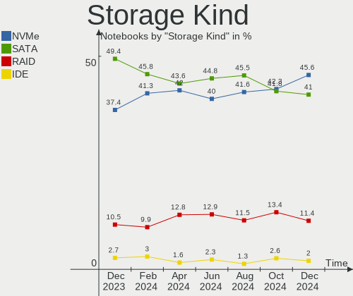
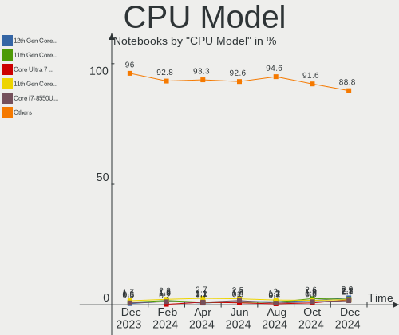
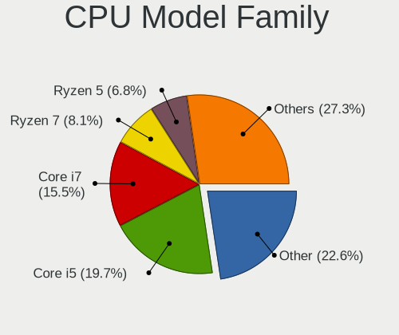
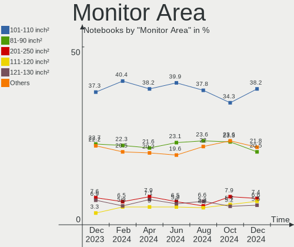
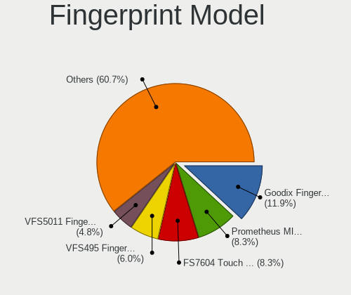

Ubuntu - Hardware Trends (Notebooks)
------------------------------------

A project to identify most popular hardware characteristics and track their change
over time based on data collected by Linux users at https://Linux-Hardware.org.

Anyone can contribute to this report by the [hw-probe](https://github.com/linuxhw/hw-probe) tool:

    sudo -E hw-probe -all -upload

This report is for one last month. Overall report since the beginning of time: [TestCoverage](https://github.com/linuxhw/TestCoverage)

Period: Nov, 2022.

Contents
--------

* [ System ](#system)
  - [ OS                       ](#os)
  - [ OS Family                ](#os-family)
  - [ Kernel                   ](#kernel)
  - [ Kernel Family            ](#kernel-family)
  - [ Kernel Major Ver.        ](#kernel-major-ver)
  - [ Arch                     ](#arch)
  - [ DE                       ](#de)
  - [ Display Server           ](#display-server)
  - [ Display Manager          ](#display-manager)
  - [ OS Lang                  ](#os-lang)
  - [ Boot Mode                ](#boot-mode)
  - [ Filesystem               ](#filesystem)
  - [ Part. scheme             ](#part-scheme)
  - [ Dual Boot with Linux/BSD ](#dual-boot-with-linuxbsd)
  - [ Dual Boot (Win)          ](#dual-boot-win)

* [ Board ](#board)
  - [ Vendor                   ](#vendor)
  - [ Model                    ](#model)
  - [ Model Family             ](#model-family)
  - [ MFG Year                 ](#mfg-year)
  - [ Form Factor              ](#form-factor)
  - [ Secure Boot              ](#secure-boot)
  - [ Coreboot                 ](#coreboot)
  - [ RAM Size                 ](#ram-size)
  - [ RAM Used                 ](#ram-used)
  - [ Total Drives             ](#total-drives)
  - [ Has CD-ROM               ](#has-cd-rom)
  - [ Has Ethernet             ](#has-ethernet)
  - [ Has WiFi                 ](#has-wifi)
  - [ Has Bluetooth            ](#has-bluetooth)

* [ Location ](#location)
  - [ Country                  ](#country)
  - [ City                     ](#city)

* [ Drives ](#drives)
  - [ Drive Vendor             ](#drive-vendor)
  - [ Drive Model              ](#drive-model)
  - [ HDD Vendor               ](#hdd-vendor)
  - [ SSD Vendor               ](#ssd-vendor)
  - [ Drive Kind               ](#drive-kind)
  - [ Drive Connector          ](#drive-connector)
  - [ Drive Size               ](#drive-size)
  - [ Space Total              ](#space-total)
  - [ Space Used               ](#space-used)
  - [ Malfunc. Drives          ](#malfunc-drives)
  - [ Malfunc. Drive Vendor    ](#malfunc-drive-vendor)
  - [ Malfunc. HDD Vendor      ](#malfunc-hdd-vendor)
  - [ Malfunc. Drive Kind      ](#malfunc-drive-kind)
  - [ Failed Drives            ](#failed-drives)
  - [ Failed Drive Vendor      ](#failed-drive-vendor)
  - [ Drive Status             ](#drive-status)

* [ Storage controller ](#storage-controller)
  - [ Storage Vendor           ](#storage-vendor)
  - [ Storage Model            ](#storage-model)
  - [ Storage Kind             ](#storage-kind)

* [ Processor ](#processor)
  - [ CPU Vendor               ](#cpu-vendor)
  - [ CPU Model                ](#cpu-model)
  - [ CPU Model Family         ](#cpu-model-family)
  - [ CPU Cores                ](#cpu-cores)
  - [ CPU Sockets              ](#cpu-sockets)
  - [ CPU Threads              ](#cpu-threads)
  - [ CPU Op-Modes             ](#cpu-op-modes)
  - [ CPU Microcode            ](#cpu-microcode)
  - [ CPU Microarch            ](#cpu-microarch)

* [ Graphics ](#graphics)
  - [ GPU Vendor               ](#gpu-vendor)
  - [ GPU Model                ](#gpu-model)
  - [ GPU Combo                ](#gpu-combo)
  - [ GPU Driver               ](#gpu-driver)
  - [ GPU Memory               ](#gpu-memory)

* [ Monitor ](#monitor)
  - [ Monitor Vendor           ](#monitor-vendor)
  - [ Monitor Model            ](#monitor-model)
  - [ Monitor Resolution       ](#monitor-resolution)
  - [ Monitor Diagonal         ](#monitor-diagonal)
  - [ Monitor Width            ](#monitor-width)
  - [ Aspect Ratio             ](#aspect-ratio)
  - [ Monitor Area             ](#monitor-area)
  - [ Pixel Density            ](#pixel-density)
  - [ Multiple Monitors        ](#multiple-monitors)

* [ Network ](#network)
  - [ Net Controller Vendor    ](#net-controller-vendor)
  - [ Net Controller Model     ](#net-controller-model)
  - [ Wireless Vendor          ](#wireless-vendor)
  - [ Wireless Model           ](#wireless-model)
  - [ Ethernet Vendor          ](#ethernet-vendor)
  - [ Ethernet Model           ](#ethernet-model)
  - [ Net Controller Kind      ](#net-controller-kind)
  - [ Used Controller          ](#used-controller)
  - [ NICs                     ](#nics)
  - [ IPv6                     ](#ipv6)

* [ Bluetooth ](#bluetooth)
  - [ Bluetooth Vendor         ](#bluetooth-vendor)
  - [ Bluetooth Model          ](#bluetooth-model)

* [ Sound ](#sound)
  - [ Sound Vendor             ](#sound-vendor)
  - [ Sound Model              ](#sound-model)

* [ Memory ](#memory)
  - [ Memory Vendor            ](#memory-vendor)
  - [ Memory Model             ](#memory-model)
  - [ Memory Kind              ](#memory-kind)
  - [ Memory Form Factor       ](#memory-form-factor)
  - [ Memory Size              ](#memory-size)
  - [ Memory Speed             ](#memory-speed)

* [ Printers & scanners ](#printers--scanners)
  - [ Printer Vendor           ](#printer-vendor)
  - [ Printer Model            ](#printer-model)
  - [ Scanner Vendor           ](#scanner-vendor)
  - [ Scanner Model            ](#scanner-model)

* [ Camera ](#camera)
  - [ Camera Vendor            ](#camera-vendor)
  - [ Camera Model             ](#camera-model)

* [ Security ](#security)
  - [ Fingerprint Vendor       ](#fingerprint-vendor)
  - [ Fingerprint Model        ](#fingerprint-model)
  - [ Chipcard Vendor          ](#chipcard-vendor)
  - [ Chipcard Model           ](#chipcard-model)

* [ Unsupported ](#unsupported)
  - [ Unsupported Devices      ](#unsupported-devices)
  - [ Unsupported Device Types ](#unsupported-device-types)

System
------

OS
--

Installed operating systems

| Name           | Notebooks | Percent |
|----------------|-----------|---------|
| Ubuntu 22.04   | 466       | 64.01%  |
| Ubuntu 22.10   | 131       | 17.99%  |
| Ubuntu 20.04   | 101       | 13.87%  |
| Ubuntu 18.04   | 18        | 2.47%   |
| Ubuntu 21.10   | 4         | 0.55%   |
| Ubuntu 23.04   | 3         | 0.41%   |
| Ubuntu 21.04   | 2         | 0.27%   |
| Ubuntu Core 18 | 1         | 0.14%   |
| Ubuntu 20.10   | 1         | 0.14%   |
| Ubuntu 14.04   | 1         | 0.14%   |

OS Family
---------

OS without a version

| Name   | Notebooks | Percent |
|--------|-----------|---------|
| Ubuntu | 728       | 100%    |

Kernel
------

Version of the Linux kernel

| Version                 | Notebooks | Percent |
|-------------------------|-----------|---------|
| 5.15.0-52-generic       | 229       | 31.46%  |
| 5.15.0-53-generic       | 207       | 28.43%  |
| 5.19.0-23-generic       | 100       | 13.74%  |
| 5.15.0-43-generic       | 30        | 4.12%   |
| 5.19.0-21-generic       | 18        | 2.47%   |
| 5.15.0-50-generic       | 9         | 1.24%   |
| 5.14.0-1054-oem         | 9         | 1.24%   |
| 5.4.0-131-generic       | 8         | 1.1%    |
| 5.19.0-24-generic       | 8         | 1.1%    |
| 5.15.0-54-generic       | 8         | 1.1%    |
| 5.15.0-25-generic       | 8         | 1.1%    |
| 5.4.0-132-generic       | 7         | 0.96%   |
| 5.15.0-48-generic       | 7         | 0.96%   |
| 5.15.0-46-generic       | 5         | 0.69%   |
| 5.15.0-10052-tuxedo     | 4         | 0.55%   |
| 4.15.0-197-generic      | 4         | 0.55%   |
| 5.17.0-1021-oem         | 3         | 0.41%   |
| 5.13.0-30-generic       | 3         | 0.41%   |
| 4.15.0-196-generic      | 3         | 0.41%   |
| 6.0.9-060009-generic    | 2         | 0.27%   |
| 6.0.8-060008-generic    | 2         | 0.27%   |
| 6.0.7-060007-generic    | 2         | 0.27%   |
| 6.0.6-060006-generic    | 2         | 0.27%   |
| 6.0.3-060003-generic    | 2         | 0.27%   |
| 5.4.0-128-generic       | 2         | 0.27%   |
| 5.17.0-1020-oem         | 2         | 0.27%   |
| 5.17.0-1019-oem         | 2         | 0.27%   |
| 5.14.0-1047-oem         | 2         | 0.27%   |
| 5.13.0-52-generic       | 2         | 0.27%   |
| 5.11.0-49-generic       | 2         | 0.27%   |
| 5.11.0-27-generic       | 2         | 0.27%   |
| 6.1.0-060100rc5-generic | 1         | 0.14%   |
| 6.1.0-060100rc1-generic | 1         | 0.14%   |
| 6.0.6-76060006-generic  | 1         | 0.14%   |
| 6.0.2-76060002-generic  | 1         | 0.14%   |
| 5.8.0-53-generic        | 1         | 0.14%   |
| 5.8.0-25-generic        | 1         | 0.14%   |
| 5.5.19-bp0              | 1         | 0.14%   |
| 5.5.19-050519-generic   | 1         | 0.14%   |
| 5.4.0-72-generic        | 1         | 0.14%   |

Kernel Family
-------------

Linux kernel without a distro release

| Version | Notebooks | Percent |
|---------|-----------|---------|
| 5.15.0  | 510       | 70.05%  |
| 5.19.0  | 126       | 17.31%  |
| 5.4.0   | 24        | 3.3%    |
| 5.14.0  | 12        | 1.65%   |
| 5.17.0  | 9         | 1.24%   |
| 4.15.0  | 9         | 1.24%   |
| 5.13.0  | 7         | 0.96%   |
| 5.11.0  | 6         | 0.82%   |
| 6.0.6   | 3         | 0.41%   |
| 6.1.0   | 2         | 0.27%   |
| 6.0.9   | 2         | 0.27%   |
| 6.0.8   | 2         | 0.27%   |
| 6.0.7   | 2         | 0.27%   |
| 6.0.3   | 2         | 0.27%   |
| 5.8.0   | 2         | 0.27%   |
| 5.5.19  | 2         | 0.27%   |
| 6.0.2   | 1         | 0.14%   |
| 5.3.0   | 1         | 0.14%   |
| 5.19.5  | 1         | 0.14%   |
| 5.18.19 | 1         | 0.14%   |
| 5.18.16 | 1         | 0.14%   |
| 5.17.5  | 1         | 0.14%   |
| 5.15.78 | 1         | 0.14%   |
| 4.4.0   | 1         | 0.14%   |

Kernel Major Ver.
-----------------

Linux kernel major version

| Version | Notebooks | Percent |
|---------|-----------|---------|
| 5.15    | 511       | 70.19%  |
| 5.19    | 127       | 17.45%  |
| 5.4     | 24        | 3.3%    |
| 6.0     | 12        | 1.65%   |
| 5.14    | 12        | 1.65%   |
| 5.17    | 10        | 1.37%   |
| 4.15    | 9         | 1.24%   |
| 5.13    | 7         | 0.96%   |
| 5.11    | 6         | 0.82%   |
| 6.1     | 2         | 0.27%   |
| 5.8     | 2         | 0.27%   |
| 5.5     | 2         | 0.27%   |
| 5.18    | 2         | 0.27%   |
| 5.3     | 1         | 0.14%   |
| 4.4     | 1         | 0.14%   |

Arch
----

OS architecture (x86_64, i586, etc.)

| Name    | Notebooks | Percent |
|---------|-----------|---------|
| x86_64  | 722       | 99.18%  |
| i686    | 5         | 0.69%   |
| aarch64 | 1         | 0.14%   |

DE
--

Desktop Environment

| Name            | Notebooks | Percent |
|-----------------|-----------|---------|
| GNOME           | 688       | 94.51%  |
| Unknown         | 20        | 2.75%   |
| GNOME Flashback | 6         | 0.82%   |
| X-Cinnamon      | 4         | 0.55%   |
| i3              | 2         | 0.27%   |
| GNOME Classic   | 2         | 0.27%   |
| Enlightenment   | 2         | 0.27%   |
| awesome         | 2         | 0.27%   |
| openbox         | 1         | 0.14%   |
| Cinnamon        | 1         | 0.14%   |

Display Server
--------------

X11 or Wayland

| Name    | Notebooks | Percent |
|---------|-----------|---------|
| Wayland | 424       | 58.24%  |
| X11     | 281       | 38.6%   |
| Unknown | 17        | 2.34%   |
| Tty     | 6         | 0.82%   |

Display Manager
---------------

SDDM, LightDM, etc.

| Name    | Notebooks | Percent |
|---------|-----------|---------|
| GDM3    | 622       | 85.44%  |
| GDM     | 52        | 7.14%   |
| Unknown | 37        | 5.08%   |
| LightDM | 16        | 2.2%    |
| SDDM    | 1         | 0.14%   |

OS Lang
-------

Language

| Lang    | Notebooks | Percent |
|---------|-----------|---------|
| en_US   | 343       | 47.12%  |
| de_DE   | 61        | 8.38%   |
| fr_FR   | 49        | 6.73%   |
| it_IT   | 40        | 5.49%   |
| en_GB   | 35        | 4.81%   |
| pt_BR   | 24        | 3.3%    |
| es_ES   | 19        | 2.61%   |
| ru_RU   | 18        | 2.47%   |
| en_CA   | 14        | 1.92%   |
| en_IN   | 13        | 1.79%   |
| pl_PL   | 8         | 1.1%    |
| nl_NL   | 7         | 0.96%   |
| en_AU   | 7         | 0.96%   |
| zh_CN   | 5         | 0.69%   |
| es_MX   | 5         | 0.69%   |
| en_ZA   | 5         | 0.69%   |
| C       | 5         | 0.69%   |
| hu_HU   | 4         | 0.55%   |
| cs_CZ   | 4         | 0.55%   |
| uk_UA   | 3         | 0.41%   |
| pt_PT   | 3         | 0.41%   |
| ko_KR   | 3         | 0.41%   |
| es_AR   | 3         | 0.41%   |
| en_PH   | 3         | 0.41%   |
| en_IL   | 3         | 0.41%   |
| el_GR   | 3         | 0.41%   |
| de_AT   | 3         | 0.41%   |
| Unknown | 3         | 0.41%   |
| nl_BE   | 2         | 0.27%   |
| fr_CA   | 2         | 0.27%   |
| et_EE   | 2         | 0.27%   |
| es_PE   | 2         | 0.27%   |
| es_CO   | 2         | 0.27%   |
| en_NZ   | 2         | 0.27%   |
| en_NG   | 2         | 0.27%   |
| en_HK   | 2         | 0.27%   |
| de_CH   | 2         | 0.27%   |
| bg_BG   | 2         | 0.27%   |
| zh_TW   | 1         | 0.14%   |
| tr_TR   | 1         | 0.14%   |

Boot Mode
---------

EFI or BIOS

| Mode | Notebooks | Percent |
|------|-----------|---------|
| BIOS | 378       | 51.92%  |
| EFI  | 350       | 48.08%  |

Filesystem
----------

Type of filesystem

| Type    | Notebooks | Percent |
|---------|-----------|---------|
| Ext4    | 668       | 91.76%  |
| Zfs     | 23        | 3.16%   |
| Overlay | 22        | 3.02%   |
| Btrfs   | 12        | 1.65%   |
| Ext2    | 2         | 0.27%   |
| Ext3    | 1         | 0.14%   |

Part. scheme
------------

Scheme of partitioning

| Type    | Notebooks | Percent |
|---------|-----------|---------|
| GPT     | 616       | 84.62%  |
| MBR     | 71        | 9.75%   |
| Unknown | 41        | 5.63%   |

Dual Boot with Linux/BSD
------------------------

Hosting more than one Linux/BSD

| Dual boot | Notebooks | Percent |
|-----------|-----------|---------|
| No        | 660       | 90.66%  |
| Yes       | 68        | 9.34%   |

Dual Boot (Win)
---------------

Hosting Linux and Windows

| Dual boot | Notebooks | Percent |
|-----------|-----------|---------|
| No        | 473       | 64.97%  |
| Yes       | 255       | 35.03%  |

Board
-----

Vendor
------

Motherboard manufacturer

| Name                           | Notebooks | Percent |
|--------------------------------|-----------|---------|
| Lenovo                         | 136       | 18.68%  |
| Dell                           | 136       | 18.68%  |
| Hewlett-Packard                | 129       | 17.72%  |
| ASUSTek Computer               | 66        | 9.07%   |
| Acer                           | 61        | 8.38%   |
| Apple                          | 29        | 3.98%   |
| HUAWEI                         | 25        | 3.43%   |
| Samsung Electronics            | 18        | 2.47%   |
| MSI                            | 17        | 2.34%   |
| Sony                           | 11        | 1.51%   |
| Toshiba                        | 8         | 1.1%    |
| Google                         | 6         | 0.82%   |
| Notebook                       | 5         | 0.69%   |
| Fujitsu                        | 5         | 0.69%   |
| Unknown                        | 5         | 0.69%   |
| TUXEDO                         | 4         | 0.55%   |
| Packard Bell                   | 4         | 0.55%   |
| Timi                           | 3         | 0.41%   |
| System76                       | 3         | 0.41%   |
| LG Electronics                 | 3         | 0.41%   |
| Intel                          | 3         | 0.41%   |
| Chuwi                          | 3         | 0.41%   |
| Alienware                      | 3         | 0.41%   |
| Shanghai Zhaoxin Semiconductor | 2         | 0.27%   |
| Semp Toshiba                   | 2         | 0.27%   |
| Positivo                       | 2         | 0.27%   |
| Medion                         | 2         | 0.27%   |
| UNOWHY                         | 1         | 0.14%   |
| Thomson                        | 1         | 0.14%   |
| Standard                       | 1         | 0.14%   |
| SmbiosType1_SystemManufacturer | 1         | 0.14%   |
| SHENZHEN YOUDISI E-COMMERCE    | 1         | 0.14%   |
| Schenker                       | 1         | 0.14%   |
| RIZZEN                         | 1         | 0.14%   |
| Razer                          | 1         | 0.14%   |
| Positivo Bahia - VAIO          | 1         | 0.14%   |
| PC Specialist                  | 1         | 0.14%   |
| Panasonic                      | 1         | 0.14%   |
| Monster                        | 1         | 0.14%   |
| Mediacom                       | 1         | 0.14%   |

Model
-----

Motherboard model

| Name                                        | Notebooks | Percent |
|---------------------------------------------|-----------|---------|
| Unknown                                     | 8         | 1.1%    |
| Dell XPS 15 7590                            | 5         | 0.69%   |
| HUAWEI HVY-WXX9                             | 4         | 0.55%   |
| TUXEDO Pulse 15 Gen1                        | 3         | 0.41%   |
| Lenovo ThinkPad W541 20EGS1PL00             | 3         | 0.41%   |
| Lenovo ThinkPad P70 20ESS04S00              | 3         | 0.41%   |
| HUAWEI NBLK-WAX9X                           | 3         | 0.41%   |
| HUAWEI CREM-WXX9                            | 3         | 0.41%   |
| HUAWEI BOD-WXX9                             | 3         | 0.41%   |
| HP Stream Laptop 14-cb1xxx                  | 3         | 0.41%   |
| HP ProBook 6470b                            | 3         | 0.41%   |
| HP ProBook 450 G8 Notebook PC               | 3         | 0.41%   |
| HP Pavilion g7                              | 3         | 0.41%   |
| HP Pavilion dv6                             | 3         | 0.41%   |
| HP Notebook                                 | 3         | 0.41%   |
| Dell XPS 9320                               | 3         | 0.41%   |
| Dell XPS 13 7390                            | 3         | 0.41%   |
| Dell Latitude 7310                          | 3         | 0.41%   |
| Dell Latitude 5420                          | 3         | 0.41%   |
| Dell G5 5587                                | 3         | 0.41%   |
| Dell G15 5511                               | 3         | 0.41%   |
| Apple MacBookPro9,2                         | 3         | 0.41%   |
| Apple MacBookPro11,5                        | 3         | 0.41%   |
| Timi TM1701                                 | 2         | 0.27%   |
| System76 Gazelle                            | 2         | 0.27%   |
| Shanghai Zhaoxin ZXE CRB                    | 2         | 0.27%   |
| Samsung RV411/RV511/E3511/S3511/RV711/E3411 | 2         | 0.27%   |
| Samsung 350V5C/351V5C/3540VC/3440VC         | 2         | 0.27%   |
| Samsung 300E4A/300E5A/300E7A/3430EA/3530EA  | 2         | 0.27%   |
| Lenovo ThinkPad E15 Gen 4 21EES00100        | 2         | 0.27%   |
| Lenovo ThinkBook 15 G3 ACL 21A4             | 2         | 0.27%   |
| Lenovo ThinkBook 14 G2 ITL 20VD             | 2         | 0.27%   |
| Lenovo IdeaPad Gaming 3 15ACH6 82K2         | 2         | 0.27%   |
| Lenovo IdeaPad 5 15ITL05 82FG               | 2         | 0.27%   |
| Lenovo IdeaPad 320-15AST 80XV               | 2         | 0.27%   |
| Lenovo IdeaPad 3 15ITL6 82H8                | 2         | 0.27%   |
| Lenovo IdeaPad 3 15ALC6 82MF                | 2         | 0.27%   |
| Lenovo IdeaPad 3 15ADA05 81W1               | 2         | 0.27%   |
| Intel SandyBridge Platform                  | 2         | 0.27%   |
| HUAWEI KLVL-WXX9                            | 2         | 0.27%   |

Model Family
------------

Motherboard model prefix

| Name                  | Notebooks | Percent |
|-----------------------|-----------|---------|
| Lenovo ThinkPad       | 66        | 9.07%   |
| Dell Latitude         | 48        | 6.59%   |
| Acer Aspire           | 43        | 5.91%   |
| Lenovo IdeaPad        | 39        | 5.36%   |
| HP EliteBook          | 35        | 4.81%   |
| HP Pavilion           | 28        | 3.85%   |
| Dell Inspiron         | 27        | 3.71%   |
| Dell XPS              | 22        | 3.02%   |
| ASUS VivoBook         | 17        | 2.34%   |
| HP ProBook            | 15        | 2.06%   |
| Dell Precision        | 15        | 2.06%   |
| HP Laptop             | 13        | 1.79%   |
| Dell Vostro           | 9         | 1.24%   |
| Unknown               | 8         | 1.1%    |
| HP ZBook              | 7         | 0.96%   |
| ASUS ZenBook          | 7         | 0.96%   |
| Acer Swift            | 7         | 0.96%   |
| Lenovo ThinkBook      | 6         | 0.82%   |
| Lenovo Legion         | 6         | 0.82%   |
| Toshiba Satellite     | 5         | 0.69%   |
| Fujitsu LIFEBOOK      | 5         | 0.69%   |
| ASUS ROG              | 5         | 0.69%   |
| Apple MacBookPro11    | 5         | 0.69%   |
| Packard Bell EasyNote | 4         | 0.55%   |
| HUAWEI HVY-WXX9       | 4         | 0.55%   |
| HP Stream             | 4         | 0.55%   |
| HP 250                | 4         | 0.55%   |
| Dell G5               | 4         | 0.55%   |
| Acer Nitro            | 4         | 0.55%   |
| TUXEDO Pulse          | 3         | 0.41%   |
| Lenovo Yoga           | 3         | 0.41%   |
| HUAWEI NBLK-WAX9X     | 3         | 0.41%   |
| HUAWEI CREM-WXX9      | 3         | 0.41%   |
| HUAWEI BOD-WXX9       | 3         | 0.41%   |
| HP Presario           | 3         | 0.41%   |
| HP OMEN               | 3         | 0.41%   |
| HP Notebook           | 3         | 0.41%   |
| HP 15                 | 3         | 0.41%   |
| Dell G15              | 3         | 0.41%   |
| ASUS ASUS             | 3         | 0.41%   |

MFG Year
--------

Motherboard manufacture year

| Year | Notebooks | Percent |
|------|-----------|---------|
| 2021 | 98        | 13.46%  |
| 2020 | 78        | 10.71%  |
| 2022 | 71        | 9.75%   |
| 2019 | 69        | 9.48%   |
| 2018 | 55        | 7.55%   |
| 2015 | 46        | 6.32%   |
| 2012 | 46        | 6.32%   |
| 2013 | 45        | 6.18%   |
| 2017 | 40        | 5.49%   |
| 2016 | 40        | 5.49%   |
| 2011 | 38        | 5.22%   |
| 2014 | 32        | 4.4%    |
| 2010 | 29        | 3.98%   |
| 2008 | 15        | 2.06%   |
| 2009 | 14        | 1.92%   |
| 2007 | 8         | 1.1%    |
| 2006 | 3         | 0.41%   |
| 2005 | 1         | 0.14%   |

Form Factor
-----------

Physical design of the computer

| Name     | Notebooks | Percent |
|----------|-----------|---------|
| Notebook | 728       | 100%    |

Secure Boot
-----------

Enabled or disabled

| State    | Notebooks | Percent |
|----------|-----------|---------|
| Disabled | 622       | 85.44%  |
| Enabled  | 106       | 14.56%  |

Coreboot
--------

Have coreboot on board

| Used | Notebooks | Percent |
|------|-----------|---------|
| No   | 720       | 98.9%   |
| Yes  | 8         | 1.1%    |

RAM Size
--------

Total RAM memory

| Size in GB  | Notebooks | Percent |
|-------------|-----------|---------|
| 4.01-8.0    | 208       | 28.57%  |
| 16.01-24.0  | 158       | 21.7%   |
| 3.01-4.0    | 135       | 18.54%  |
| 8.01-16.0   | 114       | 15.66%  |
| 32.01-64.0  | 64        | 8.79%   |
| 64.01-256.0 | 16        | 2.2%    |
| 24.01-32.0  | 11        | 1.51%   |
| 2.01-3.0    | 11        | 1.51%   |
| 1.01-2.0    | 11        | 1.51%   |

RAM Used
--------

Used RAM memory

| Used GB    | Notebooks | Percent |
|------------|-----------|---------|
| 2.01-3.0   | 216       | 29.67%  |
| 1.01-2.0   | 215       | 29.53%  |
| 4.01-8.0   | 126       | 17.31%  |
| 3.01-4.0   | 118       | 16.21%  |
| 8.01-16.0  | 39        | 5.36%   |
| 0.51-1.0   | 6         | 0.82%   |
| 16.01-24.0 | 5         | 0.69%   |
| 24.01-32.0 | 2         | 0.27%   |
| 0.01-0.5   | 1         | 0.14%   |

Total Drives
------------

Number of drives on board

| Drives | Notebooks | Percent |
|--------|-----------|---------|
| 1      | 569       | 78.16%  |
| 2      | 136       | 18.68%  |
| 3      | 16        | 2.2%    |
| 0      | 4         | 0.55%   |
| 4      | 3         | 0.41%   |

Has CD-ROM
----------

Has CD-ROM on board

| Presented | Notebooks | Percent |
|-----------|-----------|---------|
| No        | 526       | 72.25%  |
| Yes       | 202       | 27.75%  |

Has Ethernet
------------

Has Ethernet on board

| Presented | Notebooks | Percent |
|-----------|-----------|---------|
| Yes       | 553       | 75.96%  |
| No        | 175       | 24.04%  |

Has WiFi
--------

Has WiFi module

| Presented | Notebooks | Percent |
|-----------|-----------|---------|
| Yes       | 719       | 98.76%  |
| No        | 9         | 1.24%   |

Has Bluetooth
-------------

Has Bluetooth module

| Presented | Notebooks | Percent |
|-----------|-----------|---------|
| Yes       | 588       | 80.77%  |
| No        | 140       | 19.23%  |

Location
--------

Country
-------

Geographic location (country)

| Country      | Notebooks | Percent |
|--------------|-----------|---------|
| USA          | 98        | 13.46%  |
| Germany      | 75        | 10.3%   |
| France       | 62        | 8.52%   |
| Italy        | 59        | 8.1%    |
| Brazil       | 34        | 4.67%   |
| UK           | 30        | 4.12%   |
| Spain        | 24        | 3.3%    |
| Russia       | 23        | 3.16%   |
| Poland       | 23        | 3.16%   |
| India        | 17        | 2.34%   |
| Canada       | 17        | 2.34%   |
| Netherlands  | 13        | 1.79%   |
| Mexico       | 13        | 1.79%   |
| Turkey       | 11        | 1.51%   |
| Portugal     | 10        | 1.37%   |
| Indonesia    | 9         | 1.24%   |
| Greece       | 9         | 1.24%   |
| China        | 9         | 1.24%   |
| Switzerland  | 8         | 1.1%    |
| Denmark      | 8         | 1.1%    |
| Sweden       | 7         | 0.96%   |
| Romania      | 7         | 0.96%   |
| Austria      | 7         | 0.96%   |
| Hungary      | 6         | 0.82%   |
| Czechia      | 6         | 0.82%   |
| Belgium      | 6         | 0.82%   |
| Australia    | 6         | 0.82%   |
| South Africa | 5         | 0.69%   |
| Serbia       | 5         | 0.69%   |
| Estonia      | 5         | 0.69%   |
| Egypt        | 5         | 0.69%   |
| Argentina    | 5         | 0.69%   |
| Ukraine      | 4         | 0.55%   |
| Kenya        | 4         | 0.55%   |
| Kazakhstan   | 4         | 0.55%   |
| Finland      | 4         | 0.55%   |
| Colombia     | 4         | 0.55%   |
| Bulgaria     | 4         | 0.55%   |
| Armenia      | 4         | 0.55%   |
| Vietnam      | 3         | 0.41%   |

City
----

Geographic location (city)

| City              | Notebooks | Percent |
|-------------------|-----------|---------|
| Berlin            | 11        | 1.51%   |
| Paris             | 9         | 1.24%   |
| Milan             | 7         | 0.96%   |
| St Petersburg     | 6         | 0.82%   |
| San Diego         | 6         | 0.82%   |
| Rome              | 6         | 0.82%   |
| Champs-sur-Marne  | 6         | 0.82%   |
| Madrid            | 5         | 0.69%   |
| Istanbul          | 5         | 0.69%   |
| Bucharest         | 5         | 0.69%   |
| Sao Paulo         | 4         | 0.55%   |
| Munich            | 4         | 0.55%   |
| Los Angeles       | 4         | 0.55%   |
| London            | 4         | 0.55%   |
| Liverpool         | 4         | 0.55%   |
| Lisbon            | 4         | 0.55%   |
| Hamburg           | 4         | 0.55%   |
| Frankfurt am Main | 4         | 0.55%   |
| Cape Town         | 4         | 0.55%   |
| Belgrade          | 4         | 0.55%   |
| Athens            | 4         | 0.55%   |
| Zurich            | 3         | 0.41%   |
| Yerevan           | 3         | 0.41%   |
| Valenciennes      | 3         | 0.41%   |
| Rio de Janeiro    | 3         | 0.41%   |
| Oslo              | 3         | 0.41%   |
| Nairobi           | 3         | 0.41%   |
| Moscow            | 3         | 0.41%   |
| Krakow            | 3         | 0.41%   |
| Jakarta           | 3         | 0.41%   |
| Helsinki          | 3         | 0.41%   |
| Fortaleza         | 3         | 0.41%   |
| Cologne           | 3         | 0.41%   |
| Central           | 3         | 0.41%   |
| Cairo             | 3         | 0.41%   |
| Budapest          | 3         | 0.41%   |
| Bengaluru         | 3         | 0.41%   |
| Auckland          | 3         | 0.41%   |
| Wroclaw           | 2         | 0.27%   |
| Warsaw            | 2         | 0.27%   |

Drives
------

Drive Vendor
------------

Hard drive vendors

| Vendor                      | Notebooks | Drives | Percent |
|-----------------------------|-----------|--------|---------|
| Samsung Electronics         | 158       | 166    | 18.1%   |
| Seagate                     | 78        | 81     | 8.93%   |
| WDC                         | 68        | 68     | 7.79%   |
| SanDisk                     | 61        | 63     | 6.99%   |
| Toshiba                     | 55        | 55     | 6.3%    |
| SK hynix                    | 46        | 46     | 5.27%   |
| Unknown                     | 39        | 41     | 4.47%   |
| Intel                       | 37        | 40     | 4.24%   |
| Micron Technology           | 32        | 32     | 3.67%   |
| Kingston                    | 32        | 33     | 3.67%   |
| HGST                        | 28        | 30     | 3.21%   |
| Crucial                     | 28        | 29     | 3.21%   |
| Apple                       | 19        | 20     | 2.18%   |
| KIOXIA                      | 16        | 16     | 1.83%   |
| Hitachi                     | 16        | 16     | 1.83%   |
| LITEON                      | 13        | 13     | 1.49%   |
| China                       | 13        | 13     | 1.49%   |
| Silicon Motion              | 10        | 10     | 1.15%   |
| Solid State Storage         | 6         | 6      | 0.69%   |
| Phison Electronics          | 6         | 6      | 0.69%   |
| Kingston Technology Company | 6         | 6      | 0.69%   |
| Phison                      | 5         | 5      | 0.57%   |
| A-DATA Technology           | 5         | 5      | 0.57%   |
| Unknown                     | 5         | 5      | 0.57%   |
| Micron/Crucial Technology   | 4         | 4      | 0.46%   |
| Intenso                     | 4         | 4      | 0.46%   |
| UMIS                        | 3         | 3      | 0.34%   |
| Transcend                   | 3         | 3      | 0.34%   |
| SSSTC                       | 3         | 3      | 0.34%   |
| SABRENT                     | 3         | 3      | 0.34%   |
| PNY                         | 3         | 3      | 0.34%   |
| Patriot                     | 3         | 3      | 0.34%   |
| Netac                       | 3         | 3      | 0.34%   |
| LITEONIT                    | 3         | 3      | 0.34%   |
| JMicron Technology          | 3         | 3      | 0.34%   |
| GOODRAM                     | 3         | 3      | 0.34%   |
| BIWIN                       | 3         | 3      | 0.34%   |
| ASMT                        | 3         | 3      | 0.34%   |
| Lexar                       | 2         | 2      | 0.23%   |
| Fujitsu                     | 2         | 2      | 0.23%   |

Drive Model
-----------

Hard drive models

| Model                                                | Notebooks | Percent |
|------------------------------------------------------|-----------|---------|
| Samsung NVMe SSD Controller SM981/PM981/PM983 1TB    | 16        | 1.81%   |
| Unknown MMC Card  32GB                               | 14        | 1.58%   |
| Seagate ST1000LM035-1RK172 1TB                       | 13        | 1.47%   |
| Toshiba MQ01ABD100 1TB                               | 12        | 1.35%   |
| Unknown MMC Card  64GB                               | 11        | 1.24%   |
| Seagate ST1000LM024 HN-M101MBB 1TB                   | 10        | 1.13%   |
| HGST HTS721010A9E630 1TB                             | 10        | 1.13%   |
| Samsung NVMe SSD Controller PM9A1/PM9A3/980PRO 250GB | 9         | 1.02%   |
| Kingston SA400S37240G 240GB SSD                      | 8         | 0.9%    |
| Toshiba MQ01ABF050 500GB                             | 7         | 0.79%   |
| Sandisk WD Black SN750 / PC SN730 NVMe SSD 1024GB    | 7         | 0.79%   |
| KIOXIA KBG40ZNS512G NVMe 512GB                       | 7         | 0.79%   |
| Seagate ST500LT012-1DG142 500GB                      | 6         | 0.68%   |
| Sandisk WD Blue SN550 NVMe SSD 1TB                   | 6         | 0.68%   |
| Micron 2450_MTFDKBA512TFK 512GB                      | 6         | 0.68%   |
| Crucial CT1000MX500SSD1 1TB                          | 6         | 0.68%   |
| WDC WD10JPVX-22JC3T0 1TB                             | 5         | 0.56%   |
| SK hynix PC801 NVMe 1TB                              | 5         | 0.56%   |
| Silicon Motion PCIe-8 SSD 512GB                      | 5         | 0.56%   |
| Seagate ST500LM012 HN-M500MBB 500GB                  | 5         | 0.56%   |
| Samsung SSD 970 EVO Plus 2TB                         | 5         | 0.56%   |
| Samsung SSD 870 QVO 1TB                              | 5         | 0.56%   |
| Phison 311CD0512GB                                   | 5         | 0.56%   |
| Intel SSDPEKNU010TZ 1TB                              | 5         | 0.56%   |
| HGST HTS541010A9E680 1TB                             | 5         | 0.56%   |
| Unknown                                              | 5         | 0.56%   |
| Toshiba MQ04ABF100 1TB                               | 4         | 0.45%   |
| Toshiba KXG50ZNV512G NVMe 512GB                      | 4         | 0.45%   |
| Solid State Storage SSSTC CL1-4D256 256GB            | 4         | 0.45%   |
| SK hynix HFM512GD3JX013N 512GB                       | 4         | 0.45%   |
| SK hynix BC711 NVMe 512GB                            | 4         | 0.45%   |
| SK hynix BC711 HFM512GD3JX013N 512GB                 | 4         | 0.45%   |
| Seagate ST9500325AS 500GB                            | 4         | 0.45%   |
| Seagate ST2000LM007-1R8174 2TB                       | 4         | 0.45%   |
| Sandisk WD Blue SN500 / PC SN520 NVMe SSD 512GB      | 4         | 0.45%   |
| Sandisk PC SN520 NVMe SSD 256GB                      | 4         | 0.45%   |
| Samsung SSD 980 PRO 1TB                              | 4         | 0.45%   |
| Samsung NVMe SSD Controller SM961/PM961/SM963 250GB  | 4         | 0.45%   |
| KIOXIA KBG40ZNV256G 256GB                            | 4         | 0.45%   |
| Kingston SA400S37480G 480GB SSD                      | 4         | 0.45%   |

HDD Vendor
----------

Hard disk drive vendors

| Vendor              | Notebooks | Drives | Percent |
|---------------------|-----------|--------|---------|
| Seagate             | 73        | 75     | 35.1%   |
| WDC                 | 43        | 43     | 20.67%  |
| Toshiba             | 36        | 36     | 17.31%  |
| HGST                | 28        | 30     | 13.46%  |
| Hitachi             | 16        | 16     | 7.69%   |
| Samsung Electronics | 3         | 4      | 1.44%   |
| Fujitsu             | 2         | 2      | 0.96%   |
| ASMedia             | 2         | 2      | 0.96%   |
| Apple               | 2         | 2      | 0.96%   |
| USB3.0              | 1         | 1      | 0.48%   |
| Unknown             | 1         | 1      | 0.48%   |
| Intenso             | 1         | 1      | 0.48%   |

SSD Vendor
----------

Solid state drive vendors

| Vendor              | Notebooks | Drives | Percent |
|---------------------|-----------|--------|---------|
| Samsung Electronics | 62        | 65     | 23.13%  |
| SanDisk             | 30        | 31     | 11.19%  |
| Kingston            | 27        | 28     | 10.07%  |
| Crucial             | 24        | 25     | 8.96%   |
| China               | 12        | 12     | 4.48%   |
| Apple               | 12        | 12     | 4.48%   |
| LITEON              | 11        | 11     | 4.1%    |
| WDC                 | 10        | 10     | 3.73%   |
| SK hynix            | 8         | 8      | 2.99%   |
| Micron Technology   | 8         | 8      | 2.99%   |
| Intel               | 7         | 7      | 2.61%   |
| Transcend           | 3         | 3      | 1.12%   |
| Toshiba             | 3         | 3      | 1.12%   |
| PNY                 | 3         | 3      | 1.12%   |
| Patriot             | 3         | 3      | 1.12%   |
| Netac               | 3         | 3      | 1.12%   |
| LITEONIT            | 3         | 3      | 1.12%   |
| GOODRAM             | 3         | 3      | 1.12%   |
| ASMT                | 3         | 3      | 1.12%   |
| Seagate             | 2         | 2      | 0.75%   |
| Lexar               | 2         | 2      | 0.75%   |
| JMicron Technology  | 2         | 2      | 0.75%   |
| BIWIN               | 2         | 2      | 0.75%   |
| WALRAM              | 1         | 1      | 0.37%   |
| Vaseky              | 1         | 1      | 0.37%   |
| Value               | 1         | 1      | 0.37%   |
| Super Talent        | 1         | 1      | 0.37%   |
| SSSTC               | 1         | 1      | 0.37%   |
| SPCC                | 1         | 1      | 0.37%   |
| OCZ                 | 1         | 1      | 0.37%   |
| Microtech           | 1         | 1      | 0.37%   |
| Leven               | 1         | 1      | 0.37%   |
| LDLC                | 1         | 1      | 0.37%   |
| KingSpec            | 1         | 1      | 0.37%   |
| Intenso             | 1         | 1      | 0.37%   |
| Hikvision           | 1         | 1      | 0.37%   |
| Gigabyte Technology | 1         | 1      | 0.37%   |
| Freecom             | 1         | 1      | 0.37%   |
| FORESEE             | 1         | 1      | 0.37%   |
| CT1000BX            | 1         | 1      | 0.37%   |

Drive Kind
----------

HDD or SSD

| Kind    | Notebooks | Drives | Percent |
|---------|-----------|--------|---------|
| NVMe    | 326       | 348    | 38.67%  |
| SSD     | 255       | 275    | 30.25%  |
| HDD     | 203       | 213    | 24.08%  |
| MMC     | 41        | 43     | 4.86%   |
| Unknown | 18        | 18     | 2.14%   |

Drive Connector
---------------

SATA, SAS, NVMe, etc.

| Type | Notebooks | Drives | Percent |
|------|-----------|--------|---------|
| SATA | 411       | 479    | 51.12%  |
| NVMe | 322       | 343    | 40.05%  |
| MMC  | 41        | 43     | 5.1%    |
| SAS  | 30        | 32     | 3.73%   |

Drive Size
----------

Size of hard drive

| Size in TB | Notebooks | Drives | Percent |
|------------|-----------|--------|---------|
| 0.01-0.5   | 289       | 313    | 64.65%  |
| 0.51-1.0   | 143       | 159    | 31.99%  |
| 1.01-2.0   | 12        | 13     | 2.68%   |
| 2.01-3.0   | 2         | 2      | 0.45%   |
| 4.01-10.0  | 1         | 1      | 0.22%   |

Space Total
-----------

Amount of disk space available on the file system

| Size in GB     | Notebooks | Percent |
|----------------|-----------|---------|
| 101-250        | 223       | 30.63%  |
| 251-500        | 205       | 28.16%  |
| 501-1000       | 126       | 17.31%  |
| 1-20           | 43        | 5.91%   |
| 1001-2000      | 39        | 5.36%   |
| 51-100         | 38        | 5.22%   |
| 21-50          | 32        | 4.4%    |
| More than 3000 | 9         | 1.24%   |
| 2001-3000      | 8         | 1.1%    |
| Unknown        | 5         | 0.69%   |

Space Used
----------

Amount of used disk space

| Used GB        | Notebooks | Percent |
|----------------|-----------|---------|
| 1-20           | 261       | 35.85%  |
| 21-50          | 154       | 21.15%  |
| 101-250        | 109       | 14.97%  |
| 51-100         | 93        | 12.77%  |
| 251-500        | 56        | 7.69%   |
| 501-1000       | 34        | 4.67%   |
| 1001-2000      | 12        | 1.65%   |
| Unknown        | 5         | 0.69%   |
| More than 3000 | 3         | 0.41%   |
| 2001-3000      | 1         | 0.14%   |

Malfunc. Drives
---------------

Drive models with a malfunction

| Model                                                            | Notebooks | Drives | Percent |
|------------------------------------------------------------------|-----------|--------|---------|
| HGST HTS541010A9E680 1TB                                         | 3         | 3      | 8.57%   |
| SK hynix BC711 HFM512GD3JX013N 512GB                             | 2         | 2      | 5.71%   |
| SanDisk SD8TN8U-256G-1006 256GB SSD                              | 2         | 2      | 5.71%   |
| HGST HTS721010A9E630 1TB                                         | 2         | 2      | 5.71%   |
| HGST HTS541010A7E630 1TB                                         | 2         | 3      | 5.71%   |
| WDC WD10SPZX-22Z10T0 1TB                                         | 1         | 1      | 2.86%   |
| WALRAM SSD 256GB                                                 | 1         | 1      | 2.86%   |
| Toshiba MQ01ABD100 1TB                                           | 1         | 1      | 2.86%   |
| Toshiba MQ01ABD075 752GB                                         | 1         | 1      | 2.86%   |
| Toshiba MK3256GSY 320GB                                          | 1         | 1      | 2.86%   |
| Super Talent FTM56N325H 256GB SSD                                | 1         | 1      | 2.86%   |
| SK hynix HFS256G32MND-2200A 256GB SSD                            | 1         | 1      | 2.86%   |
| SK hynix HFS128G32TND-N210A 128GB SSD                            | 1         | 1      | 2.86%   |
| Seagate ST9320423AS 320GB                                        | 1         | 1      | 2.86%   |
| Seagate ST500LT012-9WS142 500GB                                  | 1         | 1      | 2.86%   |
| Seagate ST500LT012-1DG142 500GB                                  | 1         | 1      | 2.86%   |
| Seagate ST1000LM035-1RK172 1TB                                   | 1         | 1      | 2.86%   |
| Seagate ST1000LM024 HN-M101MBB 1TB                               | 1         | 1      | 2.86%   |
| Seagate ST1000LM014-1EJ164 1TB                                   | 1         | 1      | 2.86%   |
| SanDisk SSD PLUS 1000GB                                          | 1         | 1      | 2.86%   |
| SanDisk SD8SN8U-512G-1006 512GB SSD                              | 1         | 1      | 2.86%   |
| Samsung Electronics SSD 970 EVO Plus 2TB                         | 1         | 1      | 2.86%   |
| Samsung Electronics NVMe SSD Controller PM9A1/PM9A3/980PRO 250GB | 1         | 1      | 2.86%   |
| LITEON LJH-128V2G-11 M.2 2260 128GB SSD                          | 1         | 1      | 2.86%   |
| LITEON CA1-8D128-HP 128GB                                        | 1         | 1      | 2.86%   |
| HGST HTS721075A9E630 752GB                                       | 1         | 1      | 2.86%   |
| Apple HDD HTS547550A9E384 500GB                                  | 1         | 1      | 2.86%   |
| A-DATA Technology IM2P33F8ABR1-1TB                               | 1         | 1      | 2.86%   |
| Unknown                                                          | 1         | 1      | 2.86%   |

Malfunc. Drive Vendor
---------------------

Vendors of faulty drives

| Vendor              | Notebooks | Drives | Percent |
|---------------------|-----------|--------|---------|
| HGST                | 8         | 9      | 22.86%  |
| Seagate             | 6         | 6      | 17.14%  |
| SK hynix            | 4         | 4      | 11.43%  |
| SanDisk             | 4         | 4      | 11.43%  |
| Toshiba             | 3         | 3      | 8.57%   |
| Samsung Electronics | 2         | 2      | 5.71%   |
| LITEON              | 2         | 2      | 5.71%   |
| WDC                 | 1         | 1      | 2.86%   |
| WALRAM              | 1         | 1      | 2.86%   |
| Super Talent        | 1         | 1      | 2.86%   |
| Apple               | 1         | 1      | 2.86%   |
| A-DATA Technology   | 1         | 1      | 2.86%   |
| Unknown             | 1         | 1      | 2.86%   |

Malfunc. HDD Vendor
-------------------

Vendors of faulty HDD drives

| Vendor  | Notebooks | Drives | Percent |
|---------|-----------|--------|---------|
| HGST    | 8         | 9      | 42.11%  |
| Seagate | 6         | 6      | 31.58%  |
| Toshiba | 3         | 3      | 15.79%  |
| WDC     | 1         | 1      | 5.26%   |
| Apple   | 1         | 1      | 5.26%   |

Malfunc. Drive Kind
-------------------

Kinds of faulty drives

| Kind | Notebooks | Drives | Percent |
|------|-----------|--------|---------|
| HDD  | 19        | 20     | 54.29%  |
| SSD  | 10        | 10     | 28.57%  |
| NVMe | 6         | 6      | 17.14%  |

Failed Drives
-------------

Failed drive models

| Model                                                           | Notebooks | Drives | Percent |
|-----------------------------------------------------------------|-----------|--------|---------|
| WDC WD5000BEVT-22A0RT0 500GB                                    | 1         | 1      | 33.33%  |
| Samsung Electronics NVMe SSD Controller SM961/PM961/SM963 250GB | 1         | 1      | 33.33%  |
| HGST HTS721010A9E630 1TB                                        | 1         | 1      | 33.33%  |

Failed Drive Vendor
-------------------

Failed drive vendors

| Vendor              | Notebooks | Drives | Percent |
|---------------------|-----------|--------|---------|
| WDC                 | 1         | 1      | 33.33%  |
| Samsung Electronics | 1         | 1      | 33.33%  |
| HGST                | 1         | 1      | 33.33%  |

Drive Status
------------

Number of failed and malfunc. drives

| Status   | Notebooks | Drives | Percent |
|----------|-----------|--------|---------|
| Detected | 437       | 533    | 58.03%  |
| Works    | 279       | 325    | 37.05%  |
| Malfunc  | 34        | 36     | 4.52%   |
| Failed   | 3         | 3      | 0.4%    |

Storage controller
------------------

Storage Vendor
--------------

Storage controller vendors

| Vendor                           | Notebooks | Percent |
|----------------------------------|-----------|---------|
| Intel                            | 472       | 53.7%   |
| Samsung Electronics              | 102       | 11.6%   |
| AMD                              | 77        | 8.76%   |
| SanDisk                          | 46        | 5.23%   |
| SK hynix                         | 38        | 4.32%   |
| Micron Technology                | 25        | 2.84%   |
| Toshiba America Info Systems     | 17        | 1.93%   |
| KIOXIA                           | 16        | 1.82%   |
| Silicon Motion                   | 13        | 1.48%   |
| Phison Electronics               | 11        | 1.25%   |
| Kingston Technology Company      | 11        | 1.25%   |
| Solid State Storage Technology   | 9         | 1.02%   |
| Micron/Crucial Technology        | 7         | 0.8%    |
| Nvidia                           | 5         | 0.57%   |
| Union Memory (Shenzhen)          | 4         | 0.46%   |
| Realtek Semiconductor            | 4         | 0.46%   |
| Apple                            | 4         | 0.46%   |
| Marvell Technology Group         | 3         | 0.34%   |
| Lite-On Technology               | 3         | 0.34%   |
| ADATA Technology                 | 3         | 0.34%   |
| Zhaoxin                          | 2         | 0.23%   |
| Silicon Integrated Systems [SiS] | 2         | 0.23%   |
| Biwin Storage Technology         | 2         | 0.23%   |
| MAXIO Technology (Hangzhou)      | 1         | 0.11%   |
| JMicron Technology               | 1         | 0.11%   |
| ASMedia Technology               | 1         | 0.11%   |

Storage Model
-------------

Storage controller models

| Model                                                                          | Notebooks | Percent |
|--------------------------------------------------------------------------------|-----------|---------|
| AMD FCH SATA Controller [AHCI mode]                                            | 70        | 7.49%   |
| Intel Volume Management Device NVMe RAID Controller                            | 54        | 5.78%   |
| Intel Sunrise Point-LP SATA Controller [AHCI mode]                             | 53        | 5.67%   |
| Samsung NVMe SSD Controller SM981/PM981/PM983                                  | 41        | 4.39%   |
| Intel 7 Series Chipset Family 6-port SATA Controller [AHCI mode]               | 40        | 4.28%   |
| Intel 82801 Mobile SATA Controller [RAID mode]                                 | 36        | 3.85%   |
| Intel 8 Series SATA Controller 1 [AHCI mode]                                   | 32        | 3.42%   |
| Intel 6 Series/C200 Series Chipset Family 6 port Mobile SATA AHCI Controller   | 32        | 3.42%   |
| Samsung NVMe SSD Controller PM9A1/PM9A3/980PRO                                 | 27        | 2.89%   |
| Micron Non-Volatile memory controller                                          | 25        | 2.67%   |
| SK hynix Gold P31/PC711 NVMe Solid State Drive                                 | 20        | 2.14%   |
| Intel Cannon Lake Mobile PCH SATA AHCI Controller                              | 20        | 2.14%   |
| Intel Wildcat Point-LP SATA Controller [AHCI Mode]                             | 19        | 2.03%   |
| Intel Tiger Lake-LP SATA Controller                                            | 19        | 2.03%   |
| Intel 8 Series/C220 Series Chipset Family 6-port SATA Controller 1 [AHCI mode] | 19        | 2.03%   |
| Samsung NVMe SSD Controller 980                                                | 18        | 1.93%   |
| Intel Non-Volatile memory controller                                           | 18        | 1.93%   |
| KIOXIA NVMe SSD Controller BG4                                                 | 15        | 1.6%    |
| Intel 5 Series/3400 Series Chipset 4 port SATA AHCI Controller                 | 14        | 1.5%    |
| SanDisk WD Black SN750 / PC SN730 NVMe SSD                                     | 13        | 1.39%   |
| Intel Celeron/Pentium Silver Processor SATA Controller                         | 13        | 1.39%   |
| SK hynix Non-Volatile memory controller                                        | 11        | 1.18%   |
| Intel Atom Processor E3800 Series SATA AHCI Controller                         | 11        | 1.18%   |
| Intel 82801IBM/IEM (ICH9M/ICH9M-E) 4 port SATA Controller [AHCI mode]          | 11        | 1.18%   |
| SanDisk Non-Volatile memory controller                                         | 10        | 1.07%   |
| Intel Comet Lake SATA AHCI Controller                                          | 10        | 1.07%   |
| Intel 82801HM/HEM (ICH8M/ICH8M-E) IDE Controller                               | 10        | 1.07%   |
| Solid State Storage Non-Volatile memory controller                             | 9         | 0.96%   |
| SanDisk WD Blue SN550 NVMe SSD                                                 | 9         | 0.96%   |
| Intel Q170/Q150/B150/H170/H110/Z170/CM236 Chipset SATA Controller [AHCI Mode]  | 9         | 0.96%   |
| Intel Alder Lake-P SATA AHCI Controller                                        | 9         | 0.96%   |
| Intel 82801HM/HEM (ICH8M/ICH8M-E) SATA Controller [AHCI mode]                  | 9         | 0.96%   |
| Intel 5 Series/3400 Series Chipset 6 port SATA AHCI Controller                 | 9         | 0.96%   |
| Phison PS5013 E13 NVMe Controller                                              | 8         | 0.86%   |
| Intel HM170/QM170 Chipset SATA Controller [AHCI Mode]                          | 8         | 0.86%   |
| Intel 500 Series Chipset Family SATA AHCI Controller                           | 8         | 0.86%   |
| Silicon Motion Non-Volatile memory controller                                  | 7         | 0.75%   |
| Samsung NVMe SSD Controller SM961/PM961/SM963                                  | 7         | 0.75%   |
| Samsung Electronics SATA controller                                            | 7         | 0.75%   |
| Intel Cannon Point-LP SATA Controller [AHCI Mode]                              | 7         | 0.75%   |

Storage Kind
------------

Kind of storage controller (IDE, SATA, NVMe, SAS, ...)

| Kind | Notebooks | Percent |
|------|-----------|---------|
| SATA | 465       | 51.32%  |
| NVMe | 323       | 35.65%  |
| RAID | 91        | 10.04%  |
| IDE  | 27        | 2.98%   |

Processor
---------

CPU Vendor
----------

Processor vendors

| Vendor       | Notebooks | Percent |
|--------------|-----------|---------|
| Intel        | 594       | 81.59%  |
| AMD          | 131       | 17.99%  |
| CentaurHauls | 2         | 0.27%   |
| Phytium      | 1         | 0.14%   |

CPU Model
---------

Processor models

| Model                                         | Notebooks | Percent |
|-----------------------------------------------|-----------|---------|
| Intel 11th Gen Core i7-1165G7 @ 2.80GHz       | 20        | 2.75%   |
| Intel 11th Gen Core i5-1135G7 @ 2.40GHz       | 16        | 2.2%    |
| Intel Core i7-8550U CPU @ 1.80GHz             | 11        | 1.51%   |
| Intel 11th Gen Core i7-11800H @ 2.30GHz       | 11        | 1.51%   |
| Intel Core i7-8565U CPU @ 1.80GHz             | 10        | 1.37%   |
| AMD Ryzen 7 4800H with Radeon Graphics        | 10        | 1.37%   |
| Intel Core i5-8250U CPU @ 1.60GHz             | 9         | 1.24%   |
| Intel Core i5-6300U CPU @ 2.40GHz             | 9         | 1.24%   |
| Intel Core i5-10210U CPU @ 1.60GHz            | 9         | 1.24%   |
| AMD Ryzen 5 3500U with Radeon Vega Mobile Gfx | 9         | 1.24%   |
| Intel Core i7-9750H CPU @ 2.60GHz             | 8         | 1.1%    |
| Intel Core i7-8750H CPU @ 2.20GHz             | 8         | 1.1%    |
| Intel Celeron N4020 CPU @ 1.10GHz             | 8         | 1.1%    |
| AMD Ryzen 7 5700U with Radeon Graphics        | 8         | 1.1%    |
| Intel Core i7-6600U CPU @ 2.60GHz             | 7         | 0.96%   |
| Intel Core i7-10510U CPU @ 1.80GHz            | 7         | 0.96%   |
| Intel Core i5-4210U CPU @ 1.70GHz             | 7         | 0.96%   |
| Intel 12th Gen Core i7-12700H                 | 7         | 0.96%   |
| Intel 11th Gen Core i3-1115G4 @ 3.00GHz       | 7         | 0.96%   |
| AMD Ryzen 5 5500U with Radeon Graphics        | 7         | 0.96%   |
| AMD Ryzen 5 4600H with Radeon Graphics        | 7         | 0.96%   |
| Intel Core i7-10750H CPU @ 2.60GHz            | 6         | 0.82%   |
| Intel Core i5-7300U CPU @ 2.60GHz             | 6         | 0.82%   |
| Intel Core i5-7200U CPU @ 2.50GHz             | 6         | 0.82%   |
| Intel Core i5-5200U CPU @ 2.20GHz             | 6         | 0.82%   |
| Intel Core i5-4200U CPU @ 1.60GHz             | 6         | 0.82%   |
| Intel Core i5-2520M CPU @ 2.50GHz             | 6         | 0.82%   |
| Intel Celeron N4000 CPU @ 1.10GHz             | 6         | 0.82%   |
| Intel 12th Gen Core i5-12500H                 | 6         | 0.82%   |
| AMD Ryzen 7 5800H with Radeon Graphics        | 6         | 0.82%   |
| Intel Core i7-6820HQ CPU @ 2.70GHz            | 5         | 0.69%   |
| Intel Core i7-4500U CPU @ 1.80GHz             | 5         | 0.69%   |
| Intel Core i5-8265U CPU @ 1.60GHz             | 5         | 0.69%   |
| Intel Core i3-2310M CPU @ 2.10GHz             | 5         | 0.69%   |
| Intel 12th Gen Core i7-1260P                  | 5         | 0.69%   |
| Intel 12th Gen Core i7-1255U                  | 5         | 0.69%   |
| Intel 12th Gen Core i5-1235U                  | 5         | 0.69%   |
| Intel Core i7-7700HQ CPU @ 2.80GHz            | 4         | 0.55%   |
| Intel Core i7-7600U CPU @ 2.80GHz             | 4         | 0.55%   |
| Intel Core i7-5500U CPU @ 2.40GHz             | 4         | 0.55%   |

CPU Model Family
----------------

Processor model prefix

| Model                   | Notebooks | Percent |
|-------------------------|-----------|---------|
| Intel Core i7           | 164       | 22.53%  |
| Intel Core i5           | 155       | 21.29%  |
| Other                   | 121       | 16.62%  |
| Intel Core i3           | 44        | 6.04%   |
| Intel Celeron           | 41        | 5.63%   |
| AMD Ryzen 7             | 36        | 4.95%   |
| AMD Ryzen 5             | 32        | 4.4%    |
| Intel Core 2 Duo        | 21        | 2.88%   |
| Intel Pentium           | 14        | 1.92%   |
| AMD Ryzen 3             | 12        | 1.65%   |
| Intel Atom              | 8         | 1.1%    |
| AMD Ryzen 9             | 8         | 1.1%    |
| AMD A6                  | 8         | 1.1%    |
| Intel Core i9           | 7         | 0.96%   |
| AMD Ryzen 7 PRO         | 5         | 0.69%   |
| AMD A4                  | 5         | 0.69%   |
| Intel Xeon              | 4         | 0.55%   |
| Intel Pentium Dual-Core | 4         | 0.55%   |
| Intel Pentium Dual      | 4         | 0.55%   |
| Intel Core m3           | 3         | 0.41%   |
| Intel Core 2            | 3         | 0.41%   |
| AMD E2                  | 3         | 0.41%   |
| AMD E1                  | 3         | 0.41%   |
| AMD A8                  | 3         | 0.41%   |
| Intel Genuine           | 2         | 0.27%   |
| Intel Core M            | 2         | 0.27%   |
| AMD V140                | 2         | 0.27%   |
| AMD E                   | 2         | 0.27%   |
| AMD A10                 | 2         | 0.27%   |
| Intel Pentium M         | 1         | 0.14%   |
| Intel Pentium Gold      | 1         | 0.14%   |
| Intel Celeron M         | 1         | 0.14%   |
| AMD V160                | 1         | 0.14%   |
| AMD Ryzen 5 PRO         | 1         | 0.14%   |
| AMD PRO A10             | 1         | 0.14%   |
| AMD Athlon X2           | 1         | 0.14%   |
| AMD Athlon II Dual-Core | 1         | 0.14%   |
| AMD Athlon II           | 1         | 0.14%   |
| AMD A12                 | 1         | 0.14%   |

CPU Cores
---------

Number of processor cores

| Number | Notebooks | Percent |
|--------|-----------|---------|
| 2      | 317       | 43.54%  |
| 4      | 238       | 32.69%  |
| 8      | 73        | 10.03%  |
| 6      | 50        | 6.87%   |
| 12     | 16        | 2.2%    |
| 14     | 14        | 1.92%   |
| 10     | 11        | 1.51%   |
| 1      | 8         | 1.1%    |
| 5      | 1         | 0.14%   |

CPU Sockets
-----------

Number of sockets

| Number | Notebooks | Percent |
|--------|-----------|---------|
| 1      | 728       | 100%    |

CPU Threads
-----------

Threads per core (Hyper-Threading)

| Number | Notebooks | Percent |
|--------|-----------|---------|
| 2      | 571       | 78.43%  |
| 1      | 157       | 21.57%  |

CPU Op-Modes
------------

CPU Operation Modes (32-bit, 64-bit)

| Op mode        | Notebooks | Percent |
|----------------|-----------|---------|
| 32-bit, 64-bit | 726       | 99.73%  |
| 32-bit         | 2         | 0.27%   |

CPU Microcode
-------------

Microcode number

| Number     | Notebooks | Percent |
|------------|-----------|---------|
| Unknown    | 336       | 46.15%  |
| 0x806c1    | 33        | 4.53%   |
| 0x806ec    | 29        | 3.98%   |
| 0x906a3    | 25        | 3.43%   |
| 0x206a7    | 21        | 2.88%   |
| 0x806e9    | 16        | 2.2%    |
| 0x306d4    | 16        | 2.2%    |
| 0x306a9    | 16        | 2.2%    |
| 0x306c3    | 15        | 2.06%   |
| 0x806d1    | 14        | 1.92%   |
| 0x0a50000c | 13        | 1.79%   |
| 0xa0652    | 12        | 1.65%   |
| 0x906ea    | 12        | 1.65%   |
| 0x806ea    | 12        | 1.65%   |
| 0x40651    | 12        | 1.65%   |
| 0x08608103 | 10        | 1.37%   |
| 0x08600106 | 9         | 1.24%   |
| 0x906a4    | 8         | 1.1%    |
| 0x406e3    | 8         | 1.1%    |
| 0x706a8    | 7         | 0.96%   |
| 0x506e3    | 7         | 0.96%   |
| 0x30678    | 7         | 0.96%   |
| 0x20655    | 6         | 0.82%   |
| 0x0a404102 | 6         | 0.82%   |
| 0x08108109 | 6         | 0.82%   |
| 0x1067a    | 5         | 0.69%   |
| 0x10676    | 5         | 0.69%   |
| 0x08108102 | 5         | 0.69%   |
| 0x906ed    | 4         | 0.55%   |
| 0x906e9    | 3         | 0.41%   |
| 0x706e5    | 3         | 0.41%   |
| 0x706a1    | 3         | 0.41%   |
| 0x406c4    | 3         | 0.41%   |
| 0x906c0    | 2         | 0.27%   |
| 0x6fd      | 2         | 0.27%   |
| 0x506c9    | 2         | 0.27%   |
| 0x40661    | 2         | 0.27%   |
| 0x106e5    | 2         | 0.27%   |
| 0x0810100b | 2         | 0.27%   |
| 0x0700010f | 2         | 0.27%   |

CPU Microarch
-------------

Microarchitecture

| Name             | Notebooks | Percent |
|------------------|-----------|---------|
| KabyLake         | 139       | 19.09%  |
| Haswell          | 62        | 8.52%   |
| TigerLake        | 56        | 7.69%   |
| SandyBridge      | 44        | 6.04%   |
| Unknown          | 44        | 6.04%   |
| IvyBridge        | 42        | 5.77%   |
| Skylake          | 35        | 4.81%   |
| Alderlake Hybrid | 32        | 4.4%    |
| Zen 2            | 24        | 3.3%    |
| Silvermont       | 24        | 3.3%    |
| Broadwell        | 24        | 3.3%    |
| Westmere         | 23        | 3.16%   |
| Zen+             | 21        | 2.88%   |
| Zen 3            | 21        | 2.88%   |
| Penryn           | 21        | 2.88%   |
| Icelake          | 19        | 2.61%   |
| Goldmont plus    | 17        | 2.34%   |
| Core             | 15        | 2.06%   |
| CometLake        | 14        | 1.92%   |
| Excavator        | 13        | 1.79%   |
| Puma             | 6         | 0.82%   |
| Zen              | 5         | 0.69%   |
| K10              | 5         | 0.69%   |
| Nehalem          | 4         | 0.55%   |
| Bobcat           | 4         | 0.55%   |
| Tremont          | 2         | 0.27%   |
| Steamroller      | 2         | 0.27%   |
| K10 Llano        | 2         | 0.27%   |
| Jaguar           | 2         | 0.27%   |
| Goldmont         | 2         | 0.27%   |
| Piledriver       | 1         | 0.14%   |
| P6               | 1         | 0.14%   |
| K8 & K10 hybrid  | 1         | 0.14%   |
| Bonnell          | 1         | 0.14%   |

Graphics
--------

GPU Vendor
----------

Vendors of graphics cards

| Vendor                           | Notebooks | Percent |
|----------------------------------|-----------|---------|
| Intel                            | 541       | 58.36%  |
| Nvidia                           | 205       | 22.11%  |
| AMD                              | 176       | 18.99%  |
| Zhaoxin                          | 2         | 0.22%   |
| Silicon Integrated Systems [SiS] | 2         | 0.22%   |
| Silicon Motion                   | 1         | 0.11%   |

GPU Model
---------

Graphics card models

| Model                                                                                    | Notebooks | Percent |
|------------------------------------------------------------------------------------------|-----------|---------|
| Intel TigerLake-LP GT2 [Iris Xe Graphics]                                                | 48        | 5.07%   |
| Intel 2nd Generation Core Processor Family Integrated Graphics Controller                | 40        | 4.23%   |
| Intel 3rd Gen Core processor Graphics Controller                                         | 36        | 3.81%   |
| Intel Haswell-ULT Integrated Graphics Controller                                         | 33        | 3.49%   |
| Intel UHD Graphics 620                                                                   | 28        | 2.96%   |
| Intel Alder Lake-P Integrated Graphics Controller                                        | 28        | 2.96%   |
| Intel CoffeeLake-H GT2 [UHD Graphics 630]                                                | 26        | 2.75%   |
| Intel Skylake GT2 [HD Graphics 520]                                                      | 25        | 2.64%   |
| Intel CometLake-U GT2 [UHD Graphics]                                                     | 23        | 2.43%   |
| AMD Renoir                                                                               | 23        | 2.43%   |
| AMD Picasso/Raven 2 [Radeon Vega Series / Radeon Vega Mobile Series]                     | 22        | 2.33%   |
| Intel WhiskeyLake-U GT2 [UHD Graphics 620]                                               | 21        | 2.22%   |
| Intel HD Graphics 620                                                                    | 21        | 2.22%   |
| Intel 4th Gen Core Processor Integrated Graphics Controller                              | 21        | 2.22%   |
| Intel HD Graphics 5500                                                                   | 19        | 2.01%   |
| Intel TigerLake-H GT1 [UHD Graphics]                                                     | 18        | 1.9%    |
| AMD Cezanne [Radeon Vega Series / Radeon Vega Mobile Series]                             | 18        | 1.9%    |
| Intel GeminiLake [UHD Graphics 600]                                                      | 17        | 1.8%    |
| Intel Core Processor Integrated Graphics Controller                                      | 17        | 1.8%    |
| AMD Lucienne                                                                             | 16        | 1.69%   |
| Intel Atom Processor Z36xxx/Z37xxx Series Graphics & Display                             | 14        | 1.48%   |
| Nvidia GA107M [GeForce RTX 3050 Ti Mobile]                                               | 11        | 1.16%   |
| Nvidia GA107M [GeForce RTX 3050 Mobile]                                                  | 11        | 1.16%   |
| Nvidia TU117M [GeForce GTX 1650 Mobile / Max-Q]                                          | 10        | 1.06%   |
| Intel Mobile 4 Series Chipset Integrated Graphics Controller                             | 10        | 1.06%   |
| Intel CometLake-H GT2 [UHD Graphics]                                                     | 10        | 1.06%   |
| Intel Atom/Celeron/Pentium Processor x5-E8000/J3xxx/N3xxx Integrated Graphics Controller | 10        | 1.06%   |
| AMD Stoney [Radeon R2/R3/R4/R5 Graphics]                                                 | 10        | 1.06%   |
| Nvidia GA106M [GeForce RTX 3060 Mobile / Max-Q]                                          | 9         | 0.95%   |
| Intel HD Graphics 630                                                                    | 9         | 0.95%   |
| Intel Tiger Lake-LP GT2 [UHD Graphics G4]                                                | 8         | 0.85%   |
| AMD Rembrandt [Radeon 680M]                                                              | 8         | 0.85%   |
| Nvidia GP108M [GeForce MX150]                                                            | 7         | 0.74%   |
| Nvidia GP107M [GeForce GTX 1050 Mobile]                                                  | 7         | 0.74%   |
| Intel Mobile GM965/GL960 Integrated Graphics Controller (secondary)                      | 7         | 0.74%   |
| Intel Mobile GM965/GL960 Integrated Graphics Controller (primary)                        | 7         | 0.74%   |
| Intel Alder Lake-UP3 GT2 [Iris Xe Graphics]                                              | 7         | 0.74%   |
| AMD Topaz XT [Radeon R7 M260/M265 / M340/M360 / M440/M445 / 530/535 / 620/625 Mobile]    | 7         | 0.74%   |
| Nvidia TU106M [GeForce RTX 2060 Mobile]                                                  | 6         | 0.63%   |
| Nvidia GK208M [GeForce GT 740M]                                                          | 6         | 0.63%   |

GPU Combo
---------

Combinations of graphics cards

| Name               | Notebooks | Percent |
|--------------------|-----------|---------|
| 1 x Intel          | 358       | 49.18%  |
| Intel + Nvidia     | 158       | 21.7%   |
| 1 x AMD            | 129       | 17.72%  |
| 1 x Nvidia         | 29        | 3.98%   |
| Intel + AMD        | 24        | 3.3%    |
| AMD + Nvidia       | 16        | 2.2%    |
| 2 x AMD            | 7         | 0.96%   |
| 1 x Zhaoxin        | 2         | 0.27%   |
| 1 x SiS            | 2         | 0.27%   |
| Other              | 1         | 0.14%   |
| 2 x Nvidia         | 1         | 0.14%   |
| 1 x Silicon Motion | 1         | 0.14%   |

GPU Driver
----------

Free vs proprietary

| Driver      | Notebooks | Percent |
|-------------|-----------|---------|
| Free        | 604       | 82.97%  |
| Proprietary | 106       | 14.56%  |
| Unknown     | 18        | 2.47%   |

GPU Memory
----------

Total video memory

| Size in GB | Notebooks | Percent |
|------------|-----------|---------|
| Unknown    | 585       | 80.36%  |
| 1.01-2.0   | 45        | 6.18%   |
| 0.01-0.5   | 40        | 5.49%   |
| 3.01-4.0   | 24        | 3.3%    |
| 0.51-1.0   | 23        | 3.16%   |
| 5.01-6.0   | 7         | 0.96%   |
| 7.01-8.0   | 3         | 0.41%   |
| 2.01-3.0   | 1         | 0.14%   |

Monitor
-------

Monitor Vendor
--------------

Monitor vendors

| Vendor                  | Notebooks | Percent |
|-------------------------|-----------|---------|
| AU Optronics            | 145       | 16.78%  |
| Chimei Innolux          | 132       | 15.28%  |
| BOE                     | 131       | 15.16%  |
| LG Display              | 92        | 10.65%  |
| Samsung Electronics     | 86        | 9.95%   |
| Sharp                   | 37        | 4.28%   |
| Dell                    | 33        | 3.82%   |
| Apple                   | 30        | 3.47%   |
| Goldstar                | 21        | 2.43%   |
| Chi Mei Optoelectronics | 21        | 2.43%   |
| InfoVision              | 14        | 1.62%   |
| Lenovo                  | 12        | 1.39%   |
| Iiyama                  | 11        | 1.27%   |
| Hewlett-Packard         | 11        | 1.27%   |
| PANDA                   | 8         | 0.93%   |
| CSO                     | 8         | 0.93%   |
| Acer                    | 8         | 0.93%   |
| Philips                 | 7         | 0.81%   |
| AOC                     | 7         | 0.81%   |
| Ancor Communications    | 7         | 0.81%   |
| ASUSTek Computer        | 6         | 0.69%   |
| BenQ                    | 5         | 0.58%   |
| LG Philips              | 4         | 0.46%   |
| ViewSonic               | 3         | 0.35%   |
| TMX                     | 3         | 0.35%   |
| Panasonic               | 2         | 0.23%   |
| Mi                      | 2         | 0.23%   |
| Fujitsu Siemens         | 2         | 0.23%   |
| TR_                     | 1         | 0.12%   |
| STA                     | 1         | 0.12%   |
| SSD                     | 1         | 0.12%   |
| Sony                    | 1         | 0.12%   |
| SKY                     | 1         | 0.12%   |
| SGT                     | 1         | 0.12%   |
| Sceptre Tech            | 1         | 0.12%   |
| RTK                     | 1         | 0.12%   |
| MSI                     | 1         | 0.12%   |
| KEB                     | 1         | 0.12%   |
| KDC                     | 1         | 0.12%   |
| HUAWEI                  | 1         | 0.12%   |

Monitor Model
-------------

Monitor models

| Model                                                                    | Notebooks | Percent |
|--------------------------------------------------------------------------|-----------|---------|
| Chimei Innolux LCD Monitor CMN15F5 1920x1080 344x193mm 15.5-inch         | 9         | 1.02%   |
| Chimei Innolux LCD Monitor CMN14D4 1920x1080 309x173mm 13.9-inch         | 8         | 0.91%   |
| Chimei Innolux LCD Monitor CMN1490 1366x768 309x173mm 13.9-inch          | 6         | 0.68%   |
| BOE LCD Monitor BOE0872 1920x1080 344x194mm 15.5-inch                    | 6         | 0.68%   |
| Samsung Electronics LCD Monitor SDC415D 3840x2400 344x215mm 16.0-inch    | 5         | 0.57%   |
| Goldstar LG ULTRAWIDE GSM59F1 2560x1080 670x280mm 28.6-inch              | 5         | 0.57%   |
| Chimei Innolux LCD Monitor CMN15E7 1920x1080 344x193mm 15.5-inch         | 5         | 0.57%   |
| Chimei Innolux LCD Monitor CMN15E6 1366x768 344x193mm 15.5-inch          | 5         | 0.57%   |
| Chimei Innolux LCD Monitor CMN15C3 1920x1080 344x193mm 15.5-inch         | 5         | 0.57%   |
| BOE LCD Monitor BOE0878 1920x1080 355x200mm 16.0-inch                    | 5         | 0.57%   |
| AU Optronics LCD Monitor AUO403D 1920x1080 309x173mm 13.9-inch           | 5         | 0.57%   |
| AU Optronics LCD Monitor AUO38ED 1920x1080 344x193mm 15.5-inch           | 5         | 0.57%   |
| Sharp LCD Monitor SHP1453 1920x1080 346x194mm 15.6-inch                  | 4         | 0.45%   |
| LG Display LCD Monitor LGD046F 1920x1080 345x194mm 15.6-inch             | 4         | 0.45%   |
| Chimei Innolux LCD Monitor CMN15DB 1366x768 344x193mm 15.5-inch          | 4         | 0.45%   |
| Chimei Innolux LCD Monitor CMN15CA 1366x768 344x193mm 15.5-inch          | 4         | 0.45%   |
| BOE LCD Monitor BOE0802 1920x1080 344x193mm 15.5-inch                    | 4         | 0.45%   |
| AU Optronics LCD Monitor AUO21ED 1920x1080 344x193mm 15.5-inch           | 4         | 0.45%   |
| Apple Color LCD APPA02E 2880x1800 331x207mm 15.4-inch                    | 4         | 0.45%   |
| Sharp LQ156M1JW01 SHP14C3 1920x1080 344x194mm 15.5-inch                  | 3         | 0.34%   |
| Sharp LCD Monitor SHP14D0 3840x2400 336x210mm 15.6-inch                  | 3         | 0.34%   |
| Sharp LCD Monitor SHP14BA 1920x1080 344x194mm 15.5-inch                  | 3         | 0.34%   |
| Samsung Electronics LCD Monitor SEC5441 1366x768 344x194mm 15.5-inch     | 3         | 0.34%   |
| Samsung Electronics LCD Monitor SDC3256 1920x1080 382x215mm 17.3-inch    | 3         | 0.34%   |
| LG Display LCD Monitor LGD053F 1920x1080 344x194mm 15.5-inch             | 3         | 0.34%   |
| LG Display LCD Monitor LGD02DC 1366x768 344x194mm 15.5-inch              | 3         | 0.34%   |
| InfoVision LCD Monitor IVO061F 1920x1080 344x194mm 15.5-inch             | 3         | 0.34%   |
| Dell U2412M DELA07B 1920x1200 518x324mm 24.1-inch                        | 3         | 0.34%   |
| Chimei Innolux LCD Monitor CMN15C4 1920x1080 344x193mm 15.5-inch         | 3         | 0.34%   |
| Chi Mei Optoelectronics LCD Monitor CMO1592 1366x768 344x193mm 15.5-inch | 3         | 0.34%   |
| Chi Mei Optoelectronics LCD Monitor CMO1590 1366x768 344x194mm 15.5-inch | 3         | 0.34%   |
| BOE LCD Monitor BOE092F 2520x1680 338x226mm 16.0-inch                    | 3         | 0.34%   |
| BOE LCD Monitor BOE0893 2160x1440 296x197mm 14.0-inch                    | 3         | 0.34%   |
| BOE LCD Monitor BOE0812 1920x1080 344x194mm 15.5-inch                    | 3         | 0.34%   |
| BOE LCD Monitor BOE075A 1366x768 309x173mm 13.9-inch                     | 3         | 0.34%   |
| AU Optronics LCD Monitor AUO71EC 1366x768 344x193mm 15.5-inch            | 3         | 0.34%   |
| AU Optronics LCD Monitor AUO313C 1366x768 309x173mm 13.9-inch            | 3         | 0.34%   |
| AU Optronics LCD Monitor AUO305C 1366x768 256x144mm 11.6-inch            | 3         | 0.34%   |
| AU Optronics LCD Monitor AUO233C 1366x768 309x173mm 13.9-inch            | 3         | 0.34%   |
| AU Optronics LCD Monitor AUO22EC 1366x768 344x193mm 15.5-inch            | 3         | 0.34%   |

Monitor Resolution
------------------

Monitor screen resolution

| Resolution         | Notebooks | Percent |
|--------------------|-----------|---------|
| 1920x1080 (FHD)    | 358       | 43.71%  |
| 1366x768 (WXGA)    | 197       | 24.05%  |
| 1600x900 (HD+)     | 42        | 5.13%   |
| 2560x1440 (QHD)    | 33        | 4.03%   |
| 1920x1200 (WUXGA)  | 29        | 3.54%   |
| 3840x2160 (4K)     | 28        | 3.42%   |
| 1280x800 (WXGA)    | 21        | 2.56%   |
| 3440x1440          | 14        | 1.71%   |
| 2880x1800          | 13        | 1.59%   |
| 1440x900 (WXGA+)   | 12        | 1.47%   |
| 3840x2400          | 11        | 1.34%   |
| 2560x1600          | 11        | 1.34%   |
| 1680x1050 (WSXGA+) | 8         | 0.98%   |
| 2560x1080          | 7         | 0.85%   |
| 2160x1440          | 5         | 0.61%   |
| 2520x1680          | 4         | 0.49%   |
| 1280x1024 (SXGA)   | 4         | 0.49%   |
| 3200x1800 (QHD+)   | 3         | 0.37%   |
| 1360x768           | 3         | 0.37%   |
| 3840x1080          | 2         | 0.24%   |
| 3000x2000          | 2         | 0.24%   |
| 1024x768 (XGA)     | 2         | 0.24%   |
| 3840x1600          | 1         | 0.12%   |
| 3456x2160          | 1         | 0.12%   |
| 2256x1504          | 1         | 0.12%   |
| 2240x1400          | 1         | 0.12%   |
| 2160x1350          | 1         | 0.12%   |
| 1920x515           | 1         | 0.12%   |
| 1920x2520          | 1         | 0.12%   |
| 1920x1280          | 1         | 0.12%   |
| 1400x1050          | 1         | 0.12%   |
| 1280x720 (HD)      | 1         | 0.12%   |

Monitor Diagonal
----------------

Diagonal size in inches

| Inches  | Notebooks | Percent |
|---------|-----------|---------|
| 15      | 319       | 36.75%  |
| 13      | 126       | 14.52%  |
| 14      | 107       | 12.33%  |
| 17      | 75        | 8.64%   |
| 27      | 40        | 4.61%   |
| 24      | 35        | 4.03%   |
| 16      | 27        | 3.11%   |
| 34      | 20        | 2.3%    |
| 11      | 17        | 1.96%   |
| 21      | 15        | 1.73%   |
| 23      | 14        | 1.61%   |
| 12      | 14        | 1.61%   |
| 31      | 11        | 1.27%   |
| 18      | 11        | 1.27%   |
| Unknown | 7         | 0.81%   |
| 22      | 4         | 0.46%   |
| 20      | 4         | 0.46%   |
| 84      | 3         | 0.35%   |
| 48      | 3         | 0.35%   |
| 40      | 3         | 0.35%   |
| 54      | 2         | 0.23%   |
| 37      | 2         | 0.23%   |
| 26      | 2         | 0.23%   |
| 19      | 2         | 0.23%   |
| 58      | 1         | 0.12%   |
| 38      | 1         | 0.12%   |
| 32      | 1         | 0.12%   |
| 28      | 1         | 0.12%   |
| 25      | 1         | 0.12%   |

Monitor Width
-------------

Physical width

| Width in mm | Notebooks | Percent |
|-------------|-----------|---------|
| 301-350     | 497       | 57.86%  |
| 201-300     | 104       | 12.11%  |
| 351-400     | 84        | 9.78%   |
| 501-600     | 81        | 9.43%   |
| 401-500     | 35        | 4.07%   |
| 701-800     | 21        | 2.44%   |
| 601-700     | 15        | 1.75%   |
| Unknown     | 7         | 0.81%   |
| 801-900     | 6         | 0.7%    |
| 1001-1500   | 6         | 0.7%    |
| 1501-2000   | 3         | 0.35%   |

Aspect Ratio
------------

Proportional relationship between the width and the height

| Ratio   | Notebooks | Percent |
|---------|-----------|---------|
| 16/9    | 608       | 79.06%  |
| 16/10   | 109       | 14.17%  |
| 21/9    | 21        | 2.73%   |
| 3/2     | 16        | 2.08%   |
| 5/4     | 4         | 0.52%   |
| Unknown | 4         | 0.52%   |
| 4/3     | 3         | 0.39%   |
| 32/9    | 2         | 0.26%   |
| 6/5     | 1         | 0.13%   |
| 3.73    | 1         | 0.13%   |

Monitor Area
------------

Area in inch

| Area in inch | Notebooks | Percent |
|----------------|-----------|---------|
| 101-110        | 318       | 36.59%  |
| 81-90          | 176       | 20.25%  |
| 121-130        | 65        | 7.48%   |
| 71-80          | 55        | 6.33%   |
| 201-250        | 53        | 6.1%    |
| 301-350        | 42        | 4.83%   |
| 351-500        | 34        | 3.91%   |
| 111-120        | 26        | 2.99%   |
| 51-60          | 17        | 1.96%   |
| 251-300        | 15        | 1.73%   |
| 61-70          | 13        | 1.5%    |
| 141-150        | 12        | 1.38%   |
| 151-200        | 9         | 1.04%   |
| 131-140        | 9         | 1.04%   |
| More than 1000 | 7         | 0.81%   |
| 501-1000       | 7         | 0.81%   |
| Unknown        | 7         | 0.81%   |
| 91-100         | 4         | 0.46%   |

Pixel Density
-------------

Pixels per inch

| Density       | Notebooks | Percent |
|---------------|-----------|---------|
| 121-160       | 336       | 39.72%  |
| 101-120       | 242       | 28.61%  |
| 51-100        | 132       | 15.6%   |
| 161-240       | 86        | 10.17%  |
| More than 240 | 36        | 4.26%   |
| 1-50          | 7         | 0.83%   |
| Unknown       | 7         | 0.83%   |

Multiple Monitors
-----------------

Total monitors connected

| Total | Notebooks | Percent |
|-------|-----------|---------|
| 1     | 549       | 75.41%  |
| 2     | 136       | 18.68%  |
| 3     | 21        | 2.88%   |
| 0     | 19        | 2.61%   |
| 4     | 2         | 0.27%   |
| 6     | 1         | 0.14%   |

Network
-------

Net Controller Vendor
---------------------

Controller vendors

| Vendor                            | Notebooks | Percent |
|-----------------------------------|-----------|---------|
| Intel                             | 399       | 34.79%  |
| Realtek Semiconductor             | 370       | 32.26%  |
| Qualcomm Atheros                  | 149       | 12.99%  |
| Broadcom                          | 75        | 6.54%   |
| MediaTek                          | 29        | 2.53%   |
| Broadcom Limited                  | 16        | 1.39%   |
| ASIX Electronics                  | 14        | 1.22%   |
| TP-Link                           | 10        | 0.87%   |
| Ralink                            | 10        | 0.87%   |
| Marvell Technology Group          | 8         | 0.7%    |
| Samsung Electronics               | 6         | 0.52%   |
| Ralink Technology                 | 5         | 0.44%   |
| NetGear                           | 5         | 0.44%   |
| Qualcomm                          | 4         | 0.35%   |
| Hewlett-Packard                   | 4         | 0.35%   |
| Ericsson Business Mobile Networks | 4         | 0.35%   |
| DisplayLink                       | 4         | 0.35%   |
| Dell                              | 4         | 0.35%   |
| Sierra Wireless                   | 3         | 0.26%   |
| Nvidia                            | 3         | 0.26%   |
| Lenovo                            | 3         | 0.26%   |
| Xiaomi                            | 2         | 0.17%   |
| U-Blox                            | 2         | 0.17%   |
| Silicon Integrated Systems [SiS]  | 2         | 0.17%   |
| Apple                             | 2         | 0.17%   |
| ZTE WCDMA Technologies MSM        | 1         | 0.09%   |
| Texas Instruments                 | 1         | 0.09%   |
| Spreadtrum Communications         | 1         | 0.09%   |
| Qualcomm Atheros Communications   | 1         | 0.09%   |
| OPPO Electronics                  | 1         | 0.09%   |
| OnePlus Technology (Shenzhen)     | 1         | 0.09%   |
| Micro Star International          | 1         | 0.09%   |
| Manta                             | 1         | 0.09%   |
| Linksys                           | 1         | 0.09%   |
| Huawei Technologies               | 1         | 0.09%   |
| Fibocom                           | 1         | 0.09%   |
| Edimax Technology                 | 1         | 0.09%   |
| D-Link                            | 1         | 0.09%   |
| AVM                               | 1         | 0.09%   |

Net Controller Model
--------------------

Controller models

| Model                                                             | Notebooks | Percent |
|-------------------------------------------------------------------|-----------|---------|
| Realtek RTL8111/8168/8411 PCI Express Gigabit Ethernet Controller | 196       | 14.45%  |
| Realtek RTL810xE PCI Express Fast Ethernet controller             | 57        | 4.2%    |
| Realtek RTL8153 Gigabit Ethernet Adapter                          | 47        | 3.47%   |
| Intel Wi-Fi 6 AX201                                               | 40        | 2.95%   |
| Intel Wi-Fi 6 AX200                                               | 39        | 2.88%   |
| Qualcomm Atheros QCA9377 802.11ac Wireless Network Adapter        | 38        | 2.8%    |
| Intel Wireless 8265 / 8275                                        | 35        | 2.58%   |
| Intel Alder Lake-P PCH CNVi WiFi                                  | 32        | 2.36%   |
| Realtek RTL8822CE 802.11ac PCIe Wireless Network Adapter          | 26        | 1.92%   |
| Intel Wireless 8260                                               | 26        | 1.92%   |
| Intel 82579LM Gigabit Network Connection (Lewisville)             | 25        | 1.84%   |
| Intel Wireless 7265                                               | 24        | 1.77%   |
| Qualcomm Atheros QCA9565 / AR9565 Wireless Network Adapter        | 22        | 1.62%   |
| Qualcomm Atheros AR9485 Wireless Network Adapter                  | 22        | 1.62%   |
| Intel Wireless 7260                                               | 22        | 1.62%   |
| MediaTek MT7921 802.11ax PCI Express Wireless Network Adapter     | 20        | 1.47%   |
| Realtek RTL8821CE 802.11ac PCIe Wireless Network Adapter          | 19        | 1.4%    |
| Qualcomm Atheros QCA6174 802.11ac Wireless Network Adapter        | 19        | 1.4%    |
| Intel Comet Lake PCH-LP CNVi WiFi                                 | 18        | 1.33%   |
| Intel Ethernet Connection I219-LM                                 | 16        | 1.18%   |
| Intel Ethernet Connection (4) I219-LM                             | 15        | 1.11%   |
| Intel Tiger Lake PCH CNVi WiFi                                    | 13        | 0.96%   |
| Intel Centrino Advanced-N 6205 [Taylor Peak]                      | 13        | 0.96%   |
| ASIX AX88179 Gigabit Ethernet                                     | 13        | 0.96%   |
| Intel Cannon Lake PCH CNVi WiFi                                   | 12        | 0.88%   |
| Intel Comet Lake PCH CNVi WiFi                                    | 11        | 0.81%   |
| Broadcom BCM4313 802.11bgn Wireless Network Adapter               | 11        | 0.81%   |
| Qualcomm Atheros AR9285 Wireless Network Adapter (PCI-Express)    | 10        | 0.74%   |
| Intel Cannon Point-LP CNVi [Wireless-AC]                          | 10        | 0.74%   |
| Intel Ethernet Connection I217-LM                                 | 9         | 0.66%   |
| Intel Ethernet Connection (3) I218-LM                             | 9         | 0.66%   |
| Qualcomm Atheros AR8151 v2.0 Gigabit Ethernet                     | 8         | 0.59%   |
| Intel Wireless-AC 9260                                            | 8         | 0.59%   |
| Intel Ethernet Connection I218-LM                                 | 8         | 0.59%   |
| Intel Centrino Advanced-N 6235                                    | 8         | 0.59%   |
| Broadcom BCM43228 802.11a/b/g/n                                   | 8         | 0.59%   |
| Broadcom BCM43142 802.11b/g/n                                     | 8         | 0.59%   |
| Realtek RTL8152 Fast Ethernet Adapter                             | 7         | 0.52%   |
| Intel Wi-Fi 6 AX210/AX211/AX411 160MHz                            | 7         | 0.52%   |
| Intel Ethernet Connection (4) I219-V                              | 7         | 0.52%   |

Wireless Vendor
---------------

Wireless vendors

| Vendor                          | Notebooks | Percent |
|---------------------------------|-----------|---------|
| Intel                           | 383       | 50.8%   |
| Qualcomm Atheros                | 126       | 16.71%  |
| Realtek Semiconductor           | 98        | 13%     |
| Broadcom                        | 65        | 8.62%   |
| MediaTek                        | 29        | 3.85%   |
| Ralink                          | 10        | 1.33%   |
| Broadcom Limited                | 9         | 1.19%   |
| TP-Link                         | 6         | 0.8%    |
| Ralink Technology               | 5         | 0.66%   |
| NetGear                         | 5         | 0.66%   |
| Sierra Wireless                 | 3         | 0.4%    |
| Qualcomm                        | 3         | 0.4%    |
| Dell                            | 3         | 0.4%    |
| Hewlett-Packard                 | 2         | 0.27%   |
| Qualcomm Atheros Communications | 1         | 0.13%   |
| Micro Star International        | 1         | 0.13%   |
| Linksys                         | 1         | 0.13%   |
| Fibocom                         | 1         | 0.13%   |
| Edimax Technology               | 1         | 0.13%   |
| D-Link                          | 1         | 0.13%   |
| AVM                             | 1         | 0.13%   |

Wireless Model
--------------

Wireless models

| Model                                                          | Notebooks | Percent |
|----------------------------------------------------------------|-----------|---------|
| Intel Wi-Fi 6 AX201                                            | 40        | 5.26%   |
| Intel Wi-Fi 6 AX200                                            | 39        | 5.13%   |
| Qualcomm Atheros QCA9377 802.11ac Wireless Network Adapter     | 38        | 5%      |
| Intel Wireless 8265 / 8275                                     | 35        | 4.61%   |
| Intel Alder Lake-P PCH CNVi WiFi                               | 32        | 4.21%   |
| Realtek RTL8822CE 802.11ac PCIe Wireless Network Adapter       | 26        | 3.42%   |
| Intel Wireless 8260                                            | 26        | 3.42%   |
| Intel Wireless 7265                                            | 24        | 3.16%   |
| Qualcomm Atheros QCA9565 / AR9565 Wireless Network Adapter     | 22        | 2.89%   |
| Qualcomm Atheros AR9485 Wireless Network Adapter               | 22        | 2.89%   |
| Intel Wireless 7260                                            | 22        | 2.89%   |
| MediaTek MT7921 802.11ax PCI Express Wireless Network Adapter  | 20        | 2.63%   |
| Realtek RTL8821CE 802.11ac PCIe Wireless Network Adapter       | 19        | 2.5%    |
| Qualcomm Atheros QCA6174 802.11ac Wireless Network Adapter     | 19        | 2.5%    |
| Intel Comet Lake PCH-LP CNVi WiFi                              | 18        | 2.37%   |
| Intel Tiger Lake PCH CNVi WiFi                                 | 13        | 1.71%   |
| Intel Centrino Advanced-N 6205 [Taylor Peak]                   | 13        | 1.71%   |
| Intel Cannon Lake PCH CNVi WiFi                                | 12        | 1.58%   |
| Intel Comet Lake PCH CNVi WiFi                                 | 11        | 1.45%   |
| Broadcom BCM4313 802.11bgn Wireless Network Adapter            | 11        | 1.45%   |
| Qualcomm Atheros AR9285 Wireless Network Adapter (PCI-Express) | 10        | 1.32%   |
| Intel Cannon Point-LP CNVi [Wireless-AC]                       | 10        | 1.32%   |
| Intel Wireless-AC 9260                                         | 8         | 1.05%   |
| Intel Centrino Advanced-N 6235                                 | 8         | 1.05%   |
| Broadcom BCM43228 802.11a/b/g/n                                | 8         | 1.05%   |
| Broadcom BCM43142 802.11b/g/n                                  | 8         | 1.05%   |
| Intel Wi-Fi 6 AX210/AX211/AX411 160MHz                         | 7         | 0.92%   |
| Intel Dual Band Wireless-AC 3165 Plus Bluetooth                | 7         | 0.92%   |
| Intel Centrino Ultimate-N 6300                                 | 7         | 0.92%   |
| Broadcom BCM43602 802.11ac Wireless LAN SoC                    | 7         | 0.92%   |
| Realtek RTL8852AE 802.11ax PCIe Wireless Network Adapter       | 6         | 0.79%   |
| Realtek RTL8822BE 802.11a/b/g/n/ac WiFi adapter                | 6         | 0.79%   |
| Ralink RT3290 Wireless 802.11n 1T/1R PCIe                      | 6         | 0.79%   |
| Qualcomm Atheros AR928X Wireless Network Adapter (PCI-Express) | 6         | 0.79%   |
| Intel Wireless 3165                                            | 6         | 0.79%   |
| Intel PRO/Wireless 3945ABG [Golan] Network Connection          | 6         | 0.79%   |
| Broadcom BCM4331 802.11a/b/g/n                                 | 6         | 0.79%   |
| Realtek RTL8723BE PCIe Wireless Network Adapter                | 5         | 0.66%   |
| Realtek RTL8188EE Wireless Network Adapter                     | 5         | 0.66%   |
| Realtek RTL8188CE 802.11b/g/n WiFi Adapter                     | 5         | 0.66%   |

Ethernet Vendor
---------------

Ethernet vendors

| Vendor                           | Notebooks | Percent |
|----------------------------------|-----------|---------|
| Realtek Semiconductor            | 320       | 55.75%  |
| Intel                            | 138       | 24.04%  |
| Qualcomm Atheros                 | 35        | 6.1%    |
| Broadcom                         | 21        | 3.66%   |
| ASIX Electronics                 | 14        | 2.44%   |
| Marvell Technology Group         | 8         | 1.39%   |
| Broadcom Limited                 | 7         | 1.22%   |
| Samsung Electronics              | 6         | 1.05%   |
| TP-Link                          | 4         | 0.7%    |
| DisplayLink                      | 4         | 0.7%    |
| Nvidia                           | 3         | 0.52%   |
| Lenovo                           | 3         | 0.52%   |
| Xiaomi                           | 2         | 0.35%   |
| Silicon Integrated Systems [SiS] | 2         | 0.35%   |
| Apple                            | 2         | 0.35%   |
| ZTE WCDMA Technologies MSM       | 1         | 0.17%   |
| Spreadtrum Communications        | 1         | 0.17%   |
| Qualcomm                         | 1         | 0.17%   |
| OPPO Electronics                 | 1         | 0.17%   |
| OnePlus Technology (Shenzhen)    | 1         | 0.17%   |

Ethernet Model
--------------

Ethernet models

| Model                                                             | Notebooks | Percent |
|-------------------------------------------------------------------|-----------|---------|
| Realtek RTL8111/8168/8411 PCI Express Gigabit Ethernet Controller | 196       | 33.62%  |
| Realtek RTL810xE PCI Express Fast Ethernet controller             | 57        | 9.78%   |
| Realtek RTL8153 Gigabit Ethernet Adapter                          | 47        | 8.06%   |
| Intel 82579LM Gigabit Network Connection (Lewisville)             | 25        | 4.29%   |
| Intel Ethernet Connection I219-LM                                 | 16        | 2.74%   |
| Intel Ethernet Connection (4) I219-LM                             | 15        | 2.57%   |
| ASIX AX88179 Gigabit Ethernet                                     | 13        | 2.23%   |
| Intel Ethernet Connection I217-LM                                 | 9         | 1.54%   |
| Intel Ethernet Connection (3) I218-LM                             | 9         | 1.54%   |
| Qualcomm Atheros AR8151 v2.0 Gigabit Ethernet                     | 8         | 1.37%   |
| Intel Ethernet Connection I218-LM                                 | 8         | 1.37%   |
| Realtek RTL8152 Fast Ethernet Adapter                             | 7         | 1.2%    |
| Intel Ethernet Connection (4) I219-V                              | 7         | 1.2%    |
| Realtek RTL8125 2.5GbE Controller                                 | 6         | 1.03%   |
| Broadcom NetXtreme BCM57765 Gigabit Ethernet PCIe                 | 6         | 1.03%   |
| Samsung Galaxy series, misc. (tethering mode)                     | 5         | 0.86%   |
| Intel Ethernet Connection (13) I219-LM                            | 5         | 0.86%   |
| Intel 82579V Gigabit Network Connection                           | 5         | 0.86%   |
| Intel 82577LM Gigabit Network Connection                          | 5         | 0.86%   |
| Realtek Killer E2600 Gigabit Ethernet Controller                  | 4         | 0.69%   |
| Qualcomm Atheros Killer E2400 Gigabit Ethernet Controller         | 4         | 0.69%   |
| Qualcomm Atheros AR8131 Gigabit Ethernet                          | 4         | 0.69%   |
| Intel Ethernet Connection (7) I219-LM                             | 4         | 0.69%   |
| Intel Ethernet Connection (2) I219-LM                             | 4         | 0.69%   |
| Broadcom NetLink BCM57780 Gigabit Ethernet PCIe                   | 4         | 0.69%   |
| Broadcom Limited NetLink BCM57780 Gigabit Ethernet PCIe           | 4         | 0.69%   |
| Realtek Realtek Ethernet controller                               | 3         | 0.51%   |
| Realtek Killer E2500 Gigabit Ethernet Controller                  | 3         | 0.51%   |
| Qualcomm Atheros QCA8172 Fast Ethernet                            | 3         | 0.51%   |
| Qualcomm Atheros AR8161 Gigabit Ethernet                          | 3         | 0.51%   |
| Qualcomm Atheros AR8121/AR8113/AR8114 Gigabit or Fast Ethernet    | 3         | 0.51%   |
| Nvidia MCP79 Ethernet                                             | 3         | 0.51%   |
| Marvell Group 88E8055 PCI-E Gigabit Ethernet Controller           | 3         | 0.51%   |
| Intel Ethernet Connection (10) I219-V                             | 3         | 0.51%   |
| Xiaomi Mi/Redmi series (RNDIS)                                    | 2         | 0.34%   |
| TP-Link USB 10/100 LAN                                            | 2         | 0.34%   |
| Samsung GT-I9070 (network tethering, USB debugging enabled)       | 2         | 0.34%   |
| Realtek USB 10/100/1G/2.5G LAN                                    | 2         | 0.34%   |
| Realtek Killer E3000 2.5GbE Controller                            | 2         | 0.34%   |
| Qualcomm Atheros QCA8171 Gigabit Ethernet                         | 2         | 0.34%   |

Net Controller Kind
-------------------

Ethernet, WiFi or modem

| Kind     | Notebooks | Percent |
|----------|-----------|---------|
| WiFi     | 719       | 56.08%  |
| Ethernet | 550       | 42.9%   |
| Modem    | 11        | 0.86%   |
| Unknown  | 2         | 0.16%   |

Used Controller
---------------

Currently used network controller

| Kind     | Notebooks | Percent |
|----------|-----------|---------|
| WiFi     | 607       | 78.42%  |
| Ethernet | 167       | 21.58%  |

NICs
----

Total network controllers on board

| Total | Notebooks | Percent |
|-------|-----------|---------|
| 2     | 470       | 64.56%  |
| 1     | 239       | 32.83%  |
| 0     | 13        | 1.79%   |
| 3     | 6         | 0.82%   |

IPv6
----

IPv6 vs IPv4

| Used | Notebooks | Percent |
|------|-----------|---------|
| No   | 523       | 71.84%  |
| Yes  | 205       | 28.16%  |

Bluetooth
---------

Bluetooth Vendor
----------------

Controller vendors

| Vendor                          | Notebooks | Percent |
|---------------------------------|-----------|---------|
| Intel                           | 313       | 52.34%  |
| Qualcomm Atheros Communications | 54        | 9.03%   |
| Realtek Semiconductor           | 51        | 8.53%   |
| Broadcom                        | 31        | 5.18%   |
| Lite-On Technology              | 27        | 4.52%   |
| Foxconn / Hon Hai               | 27        | 4.52%   |
| IMC Networks                    | 26        | 4.35%   |
| Apple                           | 24        | 4.01%   |
| Realtek                         | 14        | 2.34%   |
| Dell                            | 7         | 1.17%   |
| Ralink                          | 6         | 1%      |
| Hewlett-Packard                 | 4         | 0.67%   |
| ASUSTek Computer                | 3         | 0.5%    |
| Toshiba                         | 2         | 0.33%   |
| Alps Electric                   | 2         | 0.33%   |
| USI                             | 1         | 0.17%   |
| TP-Link                         | 1         | 0.17%   |
| Ralink Technology               | 1         | 0.17%   |
| Micro Star International        | 1         | 0.17%   |
| MediaTek                        | 1         | 0.17%   |
| Foxconn International           | 1         | 0.17%   |
| Cambridge Silicon Radio         | 1         | 0.17%   |

Bluetooth Model
---------------

Controller models

| Model                                          | Notebooks | Percent |
|------------------------------------------------|-----------|---------|
| Intel Bluetooth wireless interface             | 107       | 17.89%  |
| Intel AX201 Bluetooth                          | 78        | 13.04%  |
| Intel AX200 Bluetooth                          | 37        | 6.19%   |
| Intel Bluetooth 9460/9560 Jefferson Peak (JfP) | 36        | 6.02%   |
| Realtek Bluetooth Radio                        | 35        | 5.85%   |
| Qualcomm Atheros  Bluetooth Device             | 30        | 5.02%   |
| Intel Bluetooth Device                         | 21        | 3.51%   |
| Realtek Bluetooth Radio                        | 14        | 2.34%   |
| Apple Bluetooth Host Controller                | 14        | 2.34%   |
| Realtek  Bluetooth 4.2 Adapter                 | 13        | 2.17%   |
| Intel Centrino Bluetooth Wireless Transceiver  | 12        | 2.01%   |
| IMC Networks Wireless_Device                   | 12        | 2.01%   |
| Foxconn / Hon Hai Bluetooth Device             | 11        | 1.84%   |
| Qualcomm Atheros AR3012 Bluetooth 4.0          | 10        | 1.67%   |
| Lite-On Qualcomm Atheros QCA9377 Bluetooth     | 10        | 1.67%   |
| Foxconn / Hon Hai Wireless_Device              | 9         | 1.51%   |
| Intel Wireless-AC 9260 Bluetooth Adapter       | 8         | 1.34%   |
| Intel AX210 Bluetooth                          | 7         | 1.17%   |
| Ralink RT3290 Bluetooth                        | 6         | 1%      |
| Qualcomm Atheros QCA61x4 Bluetooth 4.0         | 6         | 1%      |
| Lite-On Wireless_Device                        | 6         | 1%      |
| Lite-On Bluetooth Device                       | 6         | 1%      |
| Apple Bluetooth USB Host Controller            | 6         | 1%      |
| Intel Wireless-AC 3168 Bluetooth               | 5         | 0.84%   |
| IMC Networks Bluetooth Radio                   | 4         | 0.67%   |
| IMC Networks Bluetooth Device                  | 4         | 0.67%   |
| Broadcom HP Portable SoftSailing               | 4         | 0.67%   |
| Qualcomm Atheros AR9462 Bluetooth              | 3         | 0.5%    |
| Lite-On Atheros AR3012 Bluetooth               | 3         | 0.5%    |
| HP Broadcom 2070 Bluetooth Combo               | 3         | 0.5%    |
| Foxconn / Hon Hai Acer Bluetooth module        | 3         | 0.5%    |
| Dell DW375 Bluetooth Module                    | 3         | 0.5%    |
| Dell BCM20702A0 Bluetooth Module               | 3         | 0.5%    |
| Broadcom BCM43142A0 Bluetooth Device           | 3         | 0.5%    |
| Broadcom BCM43142A0 Bluetooth 4.0              | 3         | 0.5%    |
| Broadcom BCM20702 Bluetooth 4.0 [ThinkPad]     | 3         | 0.5%    |
| Broadcom BCM2070 Bluetooth 2.1 + EDR           | 3         | 0.5%    |
| Toshiba Bluetooth Device                       | 2         | 0.33%   |
| Realtek RTL8723B Bluetooth                     | 2         | 0.33%   |
| Qualcomm Atheros Bluetooth USB Host Controller | 2         | 0.33%   |

Sound
-----

Sound Vendor
------------

Sound card vendors

| Vendor                                       | Notebooks | Percent |
|----------------------------------------------|-----------|---------|
| Intel                                        | 575       | 62.91%  |
| AMD                                          | 154       | 16.85%  |
| Nvidia                                       | 113       | 12.36%  |
| Realtek Semiconductor                        | 15        | 1.64%   |
| Logitech                                     | 9         | 0.98%   |
| C-Media Electronics                          | 8         | 0.88%   |
| Plantronics                                  | 3         | 0.33%   |
| JMTek                                        | 3         | 0.33%   |
| GN Netcom                                    | 3         | 0.33%   |
| Corsair                                      | 3         | 0.33%   |
| Apple                                        | 3         | 0.33%   |
| Zhaoxin                                      | 2         | 0.22%   |
| WL80                                         | 2         | 0.22%   |
| SteelSeries ApS                              | 2         | 0.22%   |
| Silicon Integrated Systems [SiS]             | 2         | 0.22%   |
| Generalplus Technology                       | 2         | 0.22%   |
| Creative Technology                          | 2         | 0.22%   |
| Zoran Co. Personal Media Division (Nogatech) | 1         | 0.11%   |
| Texas Instruments                            | 1         | 0.11%   |
| Syntek                                       | 1         | 0.11%   |
| Samson Technologies                          | 1         | 0.11%   |
| RODE Microphones                             | 1         | 0.11%   |
| Microsoft                                    | 1         | 0.11%   |
| Mark of the Unicorn                          | 1         | 0.11%   |
| Lenovo                                       | 1         | 0.11%   |
| JBL                                          | 1         | 0.11%   |
| Hewlett-Packard                              | 1         | 0.11%   |
| Focusrite-Novation                           | 1         | 0.11%   |
| fifine Microphones                           | 1         | 0.11%   |
| ASUSTek Computer                             | 1         | 0.11%   |

Sound Model
-----------

Sound card models

| Model                                                                      | Notebooks | Percent |
|----------------------------------------------------------------------------|-----------|---------|
| AMD Family 17h/19h HD Audio Controller                                     | 86        | 7.73%   |
| Intel Sunrise Point-LP HD Audio                                            | 79        | 7.1%    |
| Intel Tiger Lake-LP Smart Sound Technology Audio Controller                | 56        | 5.04%   |
| AMD Renoir Radeon High Definition Audio Controller                         | 55        | 4.95%   |
| Intel 7 Series/C216 Chipset Family High Definition Audio Controller        | 48        | 4.32%   |
| Intel Alder Lake PCH-P High Definition Audio Controller                    | 41        | 3.69%   |
| Intel 6 Series/C200 Series Chipset Family High Definition Audio Controller | 36        | 3.24%   |
| Intel Haswell-ULT HD Audio Controller                                      | 35        | 3.15%   |
| Intel 8 Series HD Audio Controller                                         | 35        | 3.15%   |
| Intel Cannon Lake PCH cAVS                                                 | 28        | 2.52%   |
| Intel 8 Series/C220 Series Chipset High Definition Audio Controller        | 27        | 2.43%   |
| Intel 5 Series/3400 Series Chipset High Definition Audio                   | 26        | 2.34%   |
| AMD Raven/Raven2/Fenghuang HDMI/DP Audio Controller                        | 26        | 2.34%   |
| Intel Comet Lake PCH-LP cAVS                                               | 24        | 2.16%   |
| Intel Broadwell-U Audio Controller                                         | 24        | 2.16%   |
| Intel Wildcat Point-LP High Definition Audio Controller                    | 23        | 2.07%   |
| Intel Cannon Point-LP High Definition Audio Controller                     | 23        | 2.07%   |
| Intel Tiger Lake-H HD Audio Controller                                     | 19        | 1.71%   |
| Intel Xeon E3-1200 v3/4th Gen Core Processor HD Audio Controller           | 18        | 1.62%   |
| Intel Celeron/Pentium Silver Processor High Definition Audio               | 17        | 1.53%   |
| AMD FCH Azalia Controller                                                  | 17        | 1.53%   |
| Nvidia Audio device                                                        | 16        | 1.44%   |
| Realtek Semiconductor USB Audio                                            | 15        | 1.35%   |
| Intel Comet Lake PCH cAVS                                                  | 13        | 1.17%   |
| Intel 82801I (ICH9 Family) HD Audio Controller                             | 13        | 1.17%   |
| Intel 82801H (ICH8 Family) HD Audio Controller                             | 13        | 1.17%   |
| Intel Atom Processor Z36xxx/Z37xxx Series High Definition Audio Controller | 12        | 1.08%   |
| AMD Family 15h (Models 60h-6fh) Audio Controller                           | 12        | 1.08%   |
| AMD Kabini HDMI/DP Audio                                                   | 11        | 0.99%   |
| Nvidia GF108 High Definition Audio Controller                              | 10        | 0.9%    |
| Intel 100 Series/C230 Series Chipset Family HD Audio Controller            | 10        | 0.9%    |
| AMD High Definition Audio Controller                                       | 10        | 0.9%    |
| Nvidia TU106 High Definition Audio Controller                              | 9         | 0.81%   |
| Nvidia GA106 High Definition Audio Controller                              | 9         | 0.81%   |
| Intel CM238 HD Audio Controller                                            | 9         | 0.81%   |
| Nvidia GP107GL High Definition Audio Controller                            | 8         | 0.72%   |
| Nvidia GA104 High Definition Audio Controller                              | 8         | 0.72%   |
| Nvidia TU107 GeForce GTX 1650 High Definition Audio Controller             | 7         | 0.63%   |
| AMD SBx00 Azalia (Intel HDA)                                               | 7         | 0.63%   |
| AMD Rembrandt Radeon High Definition Audio Controller                      | 7         | 0.63%   |

Memory
------

Memory Vendor
-------------

Memory module vendors

| Vendor              | Notebooks | Percent |
|---------------------|-----------|---------|
| Samsung Electronics | 141       | 31.47%  |
| SK hynix            | 115       | 25.67%  |
| Micron Technology   | 56        | 12.5%   |
| Kingston            | 32        | 7.14%   |
| Unknown             | 17        | 3.79%   |
| Crucial             | 13        | 2.9%    |
| Unknown             | 9         | 2.01%   |
| Nanya Technology    | 8         | 1.79%   |
| Elpida              | 6         | 1.34%   |
| Corsair             | 6         | 1.34%   |
| A-DATA Technology   | 6         | 1.34%   |
| Unknown (ABCD)      | 5         | 1.12%   |
| Ramaxel Technology  | 5         | 1.12%   |
| Smart Brazil        | 3         | 0.67%   |
| Smart               | 2         | 0.45%   |
| Shenzhen WODPOSIT   | 2         | 0.45%   |
| Neo Forza           | 2         | 0.45%   |
| GOODRAM             | 2         | 0.45%   |
| G.Skill             | 2         | 0.45%   |
| ChangXin Memory     | 2         | 0.45%   |
| Wilk                | 1         | 0.22%   |
| Unknown (CB83)      | 1         | 0.22%   |
| Unknown (8CAB)      | 1         | 0.22%   |
| Unknown (8A5D)      | 1         | 0.22%   |
| Unknown (08C8)      | 1         | 0.22%   |
| Transcend           | 1         | 0.22%   |
| Teikon              | 1         | 0.22%   |
| Qimonda             | 1         | 0.22%   |
| Patriot             | 1         | 0.22%   |
| High Bridge         | 1         | 0.22%   |
| Goldkey             | 1         | 0.22%   |
| Foxline             | 1         | 0.22%   |
| ASint Technology    | 1         | 0.22%   |
| 4ea5                | 1         | 0.22%   |

Memory Model
------------

Memory module models

| Model                                                            | Notebooks | Percent |
|------------------------------------------------------------------|-----------|---------|
| Samsung RAM M471A1G44AB0-CWE 8GB SODIMM DDR4 3200MT/s            | 11        | 2.37%   |
| Unknown                                                          | 9         | 1.94%   |
| SK hynix RAM HMAA1GS6CJR6N-XN 8GB SODIMM DDR4 3200MT/s           | 8         | 1.72%   |
| Micron RAM 4ATF1G64HZ-3G2E1 8GB Row Of Chips DDR4 3200MT/s       | 7         | 1.51%   |
| SK hynix RAM HMT451S6AFR8A-PB 4GB SODIMM DDR3 1600MT/s           | 6         | 1.29%   |
| Samsung RAM M471B1G73DB0-YK0 8GB SODIMM DDR3 1600MT/s            | 6         | 1.29%   |
| Samsung RAM M471A5244CB0-CTD 4GB SODIMM DDR4 3266MT/s            | 6         | 1.29%   |
| Unknown (ABCD) RAM 123456789012345678 2GB SODIMM LPDDR4 2400MT/s | 5         | 1.08%   |
| SK hynix RAM HMT451S6BFR8A-PB 4GB SODIMM DDR3 1600MT/s           | 5         | 1.08%   |
| SK hynix RAM HMA81GS6AFR8N-UH 8GB SODIMM DDR4 2667MT/s           | 5         | 1.08%   |
| Samsung RAM M471B5173QH0-YK0 4GB SODIMM DDR3 1600MT/s            | 5         | 1.08%   |
| Samsung RAM M471B5173DB0-YK0 4096MB SODIMM DDR3 1600MT/s         | 5         | 1.08%   |
| Samsung RAM M471A1G44BB0-CWE 8GB SODIMM DDR4 3200MT/s            | 5         | 1.08%   |
| Samsung RAM M471B1G73EB0-YK0 8GB SODIMM DDR3 1600MT/s            | 4         | 0.86%   |
| Samsung RAM M471A5244CB0-CWE 4GB Row Of Chips DDR4 3200MT/s      | 4         | 0.86%   |
| Samsung RAM M471A5244CB0-CWE 4096MB SODIMM DDR4 3200MT/s         | 4         | 0.86%   |
| Samsung RAM M471A5244CB0-CTD 4GB Row Of Chips DDR4 2667MT/s      | 4         | 0.86%   |
| Samsung RAM M471A1K43EB1-CWE 8GB SODIMM DDR4 3200MT/s            | 4         | 0.86%   |
| Micron RAM 8KTF51264HZ-1G6E1 4GB SODIMM DDR3 1600MT/s            | 4         | 0.86%   |
| SK hynix RAM Module 8GB SODIMM DDR3 1600MT/s                     | 3         | 0.65%   |
| SK hynix RAM HMT351S6CFR8C-PB 4GB SODIMM DDR3 1600MT/s           | 3         | 0.65%   |
| SK hynix RAM HMAA2GS6AJR8N-XN 16GB SODIMM DDR4 3200MT/s          | 3         | 0.65%   |
| SK hynix RAM HMAA1GS6CJR6N-XN 8GB Row Of Chips DDR4 3200MT/s     | 3         | 0.65%   |
| SK hynix RAM HMA851S6CJR6N-XN 4GB Row Of Chips DDR4 3200MT/s     | 3         | 0.65%   |
| SK hynix RAM HMA851S6CJR6N-VK 4GB SODIMM DDR4 2667MT/s           | 3         | 0.65%   |
| SK hynix RAM HMA851S6AFR6N-UH 4GB SODIMM DDR4 2400MT/s           | 3         | 0.65%   |
| SK hynix RAM HMA81GS6JJR8N-VK 8GB SODIMM DDR4 2667MT/s           | 3         | 0.65%   |
| SK hynix RAM HMA81GS6CJR8N-VK 8GB SODIMM DDR4 2667MT/s           | 3         | 0.65%   |
| SK hynix RAM H9HCNNNCPMMLXR-NEE 2GB Row Of Chips LPDDR4 4267MT/s | 3         | 0.65%   |
| Samsung RAM Module 8GB SODIMM DDR4 2133MT/s                      | 3         | 0.65%   |
| Samsung RAM M471B5273CH0-CH9 4GB SODIMM DDR3 1334MT/s            | 3         | 0.65%   |
| Samsung RAM M471B5173EB0-YK0 4GB SODIMM DDR3 1600MT/s            | 3         | 0.65%   |
| Samsung RAM M471A2K43CB1-CRC 16GB SODIMM DDR4 2667MT/s           | 3         | 0.65%   |
| Samsung RAM M471A2G43AB2-CWE 16GB SODIMM DDR4 3200MT/s           | 3         | 0.65%   |
| Samsung RAM M471A1K43DB1-CTD 8GB SODIMM DDR4 2667MT/s            | 3         | 0.65%   |
| Samsung RAM M471A1K43CB1-CTD 8GB SODIMM DDR4 2667MT/s            | 3         | 0.65%   |
| Nanya RAM NT2GC64B88B0NS-CG 2GB SODIMM DDR3 1334MT/s             | 3         | 0.65%   |
| Micron RAM 16ATF2G64HZ-2G1A1 16384MB SODIMM DDR4 2133MT/s        | 3         | 0.65%   |
| Crucial RAM CT16G4SFRA32A.M8FF 16GB SODIMM DDR4 3200MT/s         | 3         | 0.65%   |
| Unknown RAM Module 8GB SODIMM DDR3 1600MT/s                      | 2         | 0.43%   |

Memory Kind
-----------

Memory module kinds

| Kind    | Notebooks | Percent |
|---------|-----------|---------|
| DDR4    | 203       | 53%     |
| DDR3    | 99        | 25.85%  |
| LPDDR4  | 28        | 7.31%   |
| LPDDR3  | 18        | 4.7%    |
| DDR5    | 14        | 3.66%   |
| LPDDR5  | 9         | 2.35%   |
| SDRAM   | 5         | 1.31%   |
| DDR2    | 5         | 1.31%   |
| DRAM    | 1         | 0.26%   |
| Unknown | 1         | 0.26%   |

Memory Form Factor
------------------

Physical design of the memory module

| Name         | Notebooks | Percent |
|--------------|-----------|---------|
| SODIMM       | 317       | 80.87%  |
| Row Of Chips | 70        | 17.86%  |
| Unknown      | 4         | 1.02%   |
| DIMM         | 1         | 0.26%   |

Memory Size
-----------

Memory module size

| Size  | Notebooks | Percent |
|-------|-----------|---------|
| 8192  | 169       | 41.12%  |
| 4096  | 108       | 26.28%  |
| 16384 | 76        | 18.49%  |
| 2048  | 40        | 9.73%   |
| 32768 | 14        | 3.41%   |
| 1024  | 4         | 0.97%   |

Memory Speed
------------

Memory module speed

| Speed   | Notebooks | Percent |
|---------|-----------|---------|
| 3200    | 102       | 25.25%  |
| 1600    | 80        | 19.8%   |
| 2667    | 76        | 18.81%  |
| 2400    | 25        | 6.19%   |
| 2133    | 22        | 5.45%   |
| 1334    | 17        | 4.21%   |
| 4800    | 14        | 3.47%   |
| 4267    | 13        | 3.22%   |
| 6400    | 10        | 2.48%   |
| 3266    | 6         | 1.49%   |
| 1867    | 6         | 1.49%   |
| 1333    | 5         | 1.24%   |
| Unknown | 5         | 1.24%   |
| 4266    | 3         | 0.74%   |
| 3733    | 3         | 0.74%   |
| 667     | 3         | 0.74%   |
| 4199    | 2         | 0.5%    |
| 2666    | 2         | 0.5%    |
| 2048    | 2         | 0.5%    |
| 1067    | 2         | 0.5%    |
| 1066    | 2         | 0.5%    |
| 8400    | 1         | 0.25%   |
| 2933    | 1         | 0.25%   |
| 1866    | 1         | 0.25%   |
| 800     | 1         | 0.25%   |

Printers & scanners
-------------------

Printer Vendor
--------------

Printer device vendors

| Vendor                | Notebooks | Percent |
|-----------------------|-----------|---------|
| Hewlett-Packard       | 2         | 28.57%  |
| Brother Industries    | 2         | 28.57%  |
| Samsung Electronics   | 1         | 14.29%  |
| Lexmark International | 1         | 14.29%  |
| Unknown               | 1         | 14.29%  |

Printer Model
-------------

Printer device models

| Model                              | Notebooks | Percent |
|------------------------------------|-----------|---------|
| Samsung ML-1610 Mono Laser Printer | 1         | 14.29%  |
| Lexmark International 640 Series   | 1         | 14.29%  |
| HP Laser 107a                      | 1         | 14.29%  |
| HP DeskJet 2700 series             | 1         | 14.29%  |
| Brother DCP-L2510D series          | 1         | 14.29%  |
| Brother DCP-J132W                  | 1         | 14.29%  |
| Unknown                            | 1         | 14.29%  |

Scanner Vendor
--------------

Scanner device vendors

| Vendor      | Notebooks | Percent |
|-------------|-----------|---------|
| Seiko Epson | 1         | 100%    |

Scanner Model
-------------

Scanner device models

| Model                        | Notebooks | Percent |
|------------------------------|-----------|---------|
| Seiko Epson ES-D200 [GT-S50] | 1         | 100%    |

Camera
------

Camera Vendor
-------------

Camera device vendors

| Vendor                                 | Notebooks | Percent |
|----------------------------------------|-----------|---------|
| Chicony Electronics                    | 137       | 20.88%  |
| Microdia                               | 72        | 10.98%  |
| IMC Networks                           | 69        | 10.52%  |
| Realtek Semiconductor                  | 47        | 7.16%   |
| Acer                                   | 47        | 7.16%   |
| Sunplus Innovation Technology          | 46        | 7.01%   |
| Quanta                                 | 37        | 5.64%   |
| Cheng Uei Precision Industry (Foxlink) | 37        | 5.64%   |
| Suyin                                  | 22        | 3.35%   |
| Logitech                               | 17        | 2.59%   |
| Lite-On Technology                     | 16        | 2.44%   |
| Apple                                  | 16        | 2.44%   |
| Syntek                                 | 15        | 2.29%   |
| Luxvisions Innotech Limited            | 12        | 1.83%   |
| Samsung Electronics                    | 9         | 1.37%   |
| Silicon Motion                         | 8         | 1.22%   |
| Ricoh                                  | 7         | 1.07%   |
| Z-Star Microelectronics                | 5         | 0.76%   |
| USB Camera                             | 5         | 0.76%   |
| Sonix Technology                       | 5         | 0.76%   |
| Alcor Micro                            | 4         | 0.61%   |
| Unknown                                | 3         | 0.46%   |
| Lenovo                                 | 3         | 0.46%   |
| Y Media                                | 2         | 0.3%    |
| SunplusIT                              | 2         | 0.3%    |
| Primax Electronics                     | 2         | 0.3%    |
| ALi                                    | 2         | 0.3%    |
| Unknown (3730304231393931415053)       | 1         | 0.15%   |
| Sunplus Technology                     | 1         | 0.15%   |
| ShineTech                              | 1         | 0.15%   |
| S1F0009330LB620L4100030N               | 1         | 0.15%   |
| Nebraska Furniture Mart                | 1         | 0.15%   |
| Creative Technology                    | 1         | 0.15%   |
| ANYKA                                  | 1         | 0.15%   |
| 8SSC21D67456V1SR27F6050                | 1         | 0.15%   |
| Unknown                                | 1         | 0.15%   |

Camera Model
------------

Camera device models

| Model                                               | Notebooks | Percent |
|-----------------------------------------------------|-----------|---------|
| Microdia Integrated_Webcam_HD                       | 45        | 6.77%   |
| Chicony Integrated Camera                           | 26        | 3.91%   |
| Chicony HD Webcam                                   | 20        | 3.01%   |
| Sunplus Integrated_Webcam_HD                        | 19        | 2.86%   |
| Realtek Integrated_Webcam_HD                        | 19        | 2.86%   |
| IMC Networks USB2.0 HD UVC WebCam                   | 19        | 2.86%   |
| Acer Integrated Camera                              | 19        | 2.86%   |
| IMC Networks Integrated Camera                      | 18        | 2.71%   |
| Syntek Integrated Camera                            | 10        | 1.5%    |
| Samsung Galaxy series, misc. (MTP mode)             | 9         | 1.35%   |
| IMC Networks HD Camera                              | 9         | 1.35%   |
| Quanta HP HD Camera                                 | 7         | 1.05%   |
| Lite-On Integrated Camera                           | 7         | 1.05%   |
| Realtek USB Camera                                  | 6         | 0.9%    |
| Chicony USB2.0 Camera                               | 6         | 0.9%    |
| Chicony HP Truevision HD camera                     | 6         | 0.9%    |
| Chicony HP HD Camera                                | 6         | 0.9%    |
| Cheng Uei Precision Industry (Foxlink) HP HD Camera | 6         | 0.9%    |
| Cheng Uei Precision Industry (Foxlink) HD Camera    | 6         | 0.9%    |
| Acer Lenovo EasyCamera                              | 6         | 0.9%    |
| USB Camera USB Camera                               | 5         | 0.75%   |
| Luxvisions Innotech Limited HP HD Camera            | 5         | 0.75%   |
| IMC Networks USB2.0 VGA UVC WebCam                  | 5         | 0.75%   |
| IMC Networks ov9734_azurewave_camera                | 5         | 0.75%   |
| Chicony VGA WebCam                                  | 5         | 0.75%   |
| Chicony HD User Facing                              | 5         | 0.75%   |
| Apple FaceTime HD Camera                            | 5         | 0.75%   |
| Apple Built-in iSight                               | 5         | 0.75%   |
| Sunplus Laptop Integrated Webcam HD                 | 4         | 0.6%    |
| Sunplus HD WebCam                                   | 4         | 0.6%    |
| Sonix USB2.0 HD UVC WebCam                          | 4         | 0.6%    |
| Realtek USB2.0 HD UVC WebCam                        | 4         | 0.6%    |
| Quanta HP Wide Vision HD Camera                     | 4         | 0.6%    |
| Quanta HD User Facing                               | 4         | 0.6%    |
| Quanta ACER HD User Facing                          | 4         | 0.6%    |
| Microdia USB 2.0 Camera                             | 4         | 0.6%    |
| Microdia Laptop_Integrated_Webcam_HD                | 4         | 0.6%    |
| Logitech Webcam C270                                | 4         | 0.6%    |
| Chicony USB 2.0 Camera                              | 4         | 0.6%    |
| Chicony HP HD Webcam                                | 4         | 0.6%    |

Security
--------

Fingerprint Vendor
------------------

Fingerprint sensor vendors

| Vendor                             | Notebooks | Percent |
|------------------------------------|-----------|---------|
| Validity Sensors                   | 51        | 32.69%  |
| Shenzhen Goodix Technology         | 42        | 26.92%  |
| Synaptics                          | 33        | 21.15%  |
| Elan Microelectronics              | 12        | 7.69%   |
| AuthenTec                          | 6         | 3.85%   |
| Upek                               | 4         | 2.56%   |
| Realtek USB2.0 Finger Print Bridge | 2         | 1.28%   |
| LighTuning Technology              | 2         | 1.28%   |
| Focal-systems.Corp                 | 2         | 1.28%   |
| STMicroelectronics                 | 1         | 0.64%   |
| Samsung Electronics                | 1         | 0.64%   |

Fingerprint Model
-----------------

Fingerprint sensor models

| Model                                                                      | Notebooks | Percent |
|----------------------------------------------------------------------------|-----------|---------|
| Shenzhen Goodix  Fingerprint Device                                        | 31        | 19.87%  |
| Validity Sensors VFS495 Fingerprint Reader                                 | 20        | 12.82%  |
| Unknown                                                                    | 8         | 5.13%   |
| Synaptics Metallica MIS Touch Fingerprint Reader                           | 7         | 4.49%   |
| Elan ELAN:ARM-M4                                                           | 7         | 4.49%   |
| Validity Sensors VFS5011 Fingerprint Reader                                | 6         | 3.85%   |
| Synaptics Prometheus MIS Touch Fingerprint Reader                          | 6         | 3.85%   |
| Shenzhen Goodix Fingerprint Reader                                         | 6         | 3.85%   |
| Validity Sensors VFS 5011 fingerprint sensor                               | 5         | 3.21%   |
| Validity Sensors Synaptics WBDI                                            | 5         | 3.21%   |
| Shenzhen Goodix FingerPrint                                                | 5         | 3.21%   |
| Elan ELAN:Fingerprint                                                      | 5         | 3.21%   |
| Upek Biometric Touchchip/Touchstrip Fingerprint Sensor                     | 4         | 2.56%   |
| Synaptics  VFS7552 Touch Fingerprint Sensor with PurePrint                 | 4         | 2.56%   |
| Synaptics  FS7604 Touch Fingerprint Sensor with PurePrint                  | 4         | 2.56%   |
| Validity Sensors VFS471 Fingerprint Reader                                 | 3         | 1.92%   |
| Validity Sensors Fingerprint scanner                                       | 3         | 1.92%   |
| Validity Sensors VFS7500 Touch Fingerprint Sensor                          | 2         | 1.28%   |
| Validity Sensors Synaptics VFS7552 Touch Fingerprint Sensor with PurePrint | 2         | 1.28%   |
| Validity Sensors Swipe Fingerprint Sensor                                  | 2         | 1.28%   |
| Synaptics  WBDI                                                            | 2         | 1.28%   |
| Synaptics Metallica MOH Touch Fingerprint Reader                           | 2         | 1.28%   |
| Realtek USB2.0 Finger Print Bridge FocalTech Fingerprint Device            | 2         | 1.28%   |
| LighTuning EgisTec Touch Fingerprint Sensor                                | 2         | 1.28%   |
| Focal-systems.Corp FT9201Fingerprint.                                      | 2         | 1.28%   |
| AuthenTec Fingerprint Sensor                                               | 2         | 1.28%   |
| AuthenTec AES2810                                                          | 2         | 1.28%   |
| AuthenTec AES1600                                                          | 2         | 1.28%   |
| Validity Sensors VFS491                                                    | 1         | 0.64%   |
| Validity Sensors VFS451 Fingerprint Reader                                 | 1         | 0.64%   |
| Validity Sensors VFS301 Fingerprint Reader                                 | 1         | 0.64%   |
| STMicroelectronics Fingerprint Reader                                      | 1         | 0.64%   |
| Samsung Fingerprint Sensor Device - 730B                                   | 1         | 0.64%   |

Chipcard Vendor
---------------

Chipcard module vendors

| Vendor                | Notebooks | Percent |
|-----------------------|-----------|---------|
| Broadcom              | 28        | 50.91%  |
| Alcor Micro           | 18        | 32.73%  |
| O2 Micro              | 3         | 5.45%   |
| Gemalto (was Gemplus) | 3         | 5.45%   |
| Lenovo                | 2         | 3.64%   |
| Upek                  | 1         | 1.82%   |

Chipcard Model
--------------

Chipcard module models

| Model                                                                        | Notebooks | Percent |
|------------------------------------------------------------------------------|-----------|---------|
| Alcor Micro AU9540 Smartcard Reader                                          | 18        | 32.73%  |
| Broadcom BCM5880 Secure Applications Processor                               | 8         | 14.55%  |
| Broadcom 58200                                                               | 8         | 14.55%  |
| Broadcom 5880                                                                | 6         | 10.91%  |
| Broadcom BCM5880 Secure Applications Processor with fingerprint swipe sensor | 5         | 9.09%   |
| O2 Micro OZ776 CCID Smartcard Reader                                         | 3         | 5.45%   |
| Lenovo Integrated Smart Card Reader                                          | 2         | 3.64%   |
| Gemalto (was Gemplus) GemPC Twin SmartCard Reader                            | 2         | 3.64%   |
| Upek TouchChip Fingerprint Coprocessor (WBF advanced mode)                   | 1         | 1.82%   |
| Gemalto (was Gemplus) GemPC Key SmartCard Reader                             | 1         | 1.82%   |
| Broadcom BCM5880 Secure Applications Processor with fingerprint touch sensor | 1         | 1.82%   |

Unsupported
-----------

Unsupported Devices
-------------------

Total unsupported devices on board

| Total | Notebooks | Percent |
|-------|-----------|---------|
| 0     | 420       | 57.69%  |
| 1     | 239       | 32.83%  |
| 2     | 62        | 8.52%   |
| 3     | 5         | 0.69%   |
| 6     | 1         | 0.14%   |
| 4     | 1         | 0.14%   |

Unsupported Device Types
------------------------

Types of unsupported devices

| Type                     | Notebooks | Percent |
|--------------------------|-----------|---------|
| Fingerprint reader       | 152       | 39.38%  |
| Graphics card            | 88        | 22.8%   |
| Chipcard                 | 51        | 13.21%  |
| Net/wireless             | 27        | 6.99%   |
| Multimedia controller    | 18        | 4.66%   |
| Camera                   | 15        | 3.89%   |
| Bluetooth                | 11        | 2.85%   |
| Sound                    | 8         | 2.07%   |
| Storage                  | 4         | 1.04%   |
| Communication controller | 4         | 1.04%   |
| Network                  | 2         | 0.52%   |
| Net/ethernet             | 2         | 0.52%   |
| Card reader              | 2         | 0.52%   |
| Modem                    | 1         | 0.26%   |
| Dvb card                 | 1         | 0.26%   |

