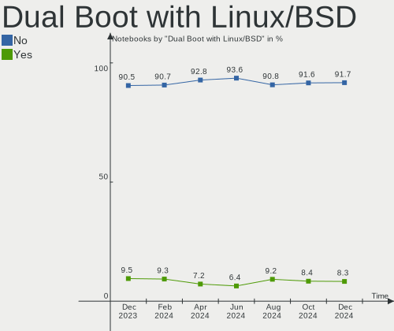
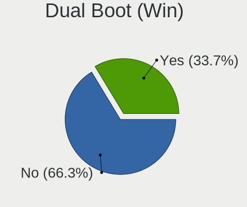
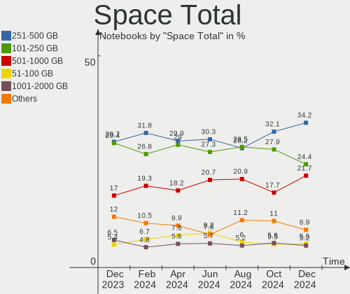
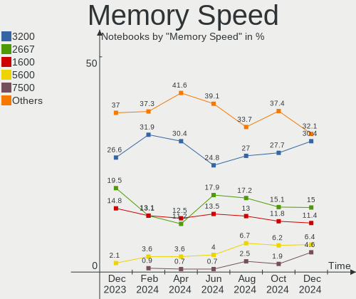

Ubuntu - Hardware Trends (Notebooks)
------------------------------------

A project to identify most popular hardware characteristics and track their change
over time based on data collected by Linux users at https://Linux-Hardware.org.

Anyone can contribute to this report by the [hw-probe](https://github.com/linuxhw/hw-probe) tool:

    sudo -E hw-probe -all -upload

This report is for one last month. Overall report since the beginning of time: [TestCoverage](https://github.com/linuxhw/TestCoverage)

Period: Jan, 2023.

Contents
--------

* [ System ](#system)
  - [ OS                       ](#os)
  - [ OS Family                ](#os-family)
  - [ Kernel                   ](#kernel)
  - [ Kernel Family            ](#kernel-family)
  - [ Kernel Major Ver.        ](#kernel-major-ver)
  - [ Arch                     ](#arch)
  - [ DE                       ](#de)
  - [ Display Server           ](#display-server)
  - [ Display Manager          ](#display-manager)
  - [ OS Lang                  ](#os-lang)
  - [ Boot Mode                ](#boot-mode)
  - [ Filesystem               ](#filesystem)
  - [ Part. scheme             ](#part-scheme)
  - [ Dual Boot with Linux/BSD ](#dual-boot-with-linuxbsd)
  - [ Dual Boot (Win)          ](#dual-boot-win)

* [ Board ](#board)
  - [ Vendor                   ](#vendor)
  - [ Model                    ](#model)
  - [ Model Family             ](#model-family)
  - [ MFG Year                 ](#mfg-year)
  - [ Form Factor              ](#form-factor)
  - [ Secure Boot              ](#secure-boot)
  - [ Coreboot                 ](#coreboot)
  - [ RAM Size                 ](#ram-size)
  - [ RAM Used                 ](#ram-used)
  - [ Total Drives             ](#total-drives)
  - [ Has CD-ROM               ](#has-cd-rom)
  - [ Has Ethernet             ](#has-ethernet)
  - [ Has WiFi                 ](#has-wifi)
  - [ Has Bluetooth            ](#has-bluetooth)

* [ Location ](#location)
  - [ Country                  ](#country)
  - [ City                     ](#city)

* [ Drives ](#drives)
  - [ Drive Vendor             ](#drive-vendor)
  - [ Drive Model              ](#drive-model)
  - [ HDD Vendor               ](#hdd-vendor)
  - [ SSD Vendor               ](#ssd-vendor)
  - [ Drive Kind               ](#drive-kind)
  - [ Drive Connector          ](#drive-connector)
  - [ Drive Size               ](#drive-size)
  - [ Space Total              ](#space-total)
  - [ Space Used               ](#space-used)
  - [ Malfunc. Drives          ](#malfunc-drives)
  - [ Malfunc. Drive Vendor    ](#malfunc-drive-vendor)
  - [ Malfunc. HDD Vendor      ](#malfunc-hdd-vendor)
  - [ Malfunc. Drive Kind      ](#malfunc-drive-kind)
  - [ Failed Drives            ](#failed-drives)
  - [ Failed Drive Vendor      ](#failed-drive-vendor)
  - [ Drive Status             ](#drive-status)

* [ Storage controller ](#storage-controller)
  - [ Storage Vendor           ](#storage-vendor)
  - [ Storage Model            ](#storage-model)
  - [ Storage Kind             ](#storage-kind)

* [ Processor ](#processor)
  - [ CPU Vendor               ](#cpu-vendor)
  - [ CPU Model                ](#cpu-model)
  - [ CPU Model Family         ](#cpu-model-family)
  - [ CPU Cores                ](#cpu-cores)
  - [ CPU Sockets              ](#cpu-sockets)
  - [ CPU Threads              ](#cpu-threads)
  - [ CPU Op-Modes             ](#cpu-op-modes)
  - [ CPU Microcode            ](#cpu-microcode)
  - [ CPU Microarch            ](#cpu-microarch)

* [ Graphics ](#graphics)
  - [ GPU Vendor               ](#gpu-vendor)
  - [ GPU Model                ](#gpu-model)
  - [ GPU Combo                ](#gpu-combo)
  - [ GPU Driver               ](#gpu-driver)
  - [ GPU Memory               ](#gpu-memory)

* [ Monitor ](#monitor)
  - [ Monitor Vendor           ](#monitor-vendor)
  - [ Monitor Model            ](#monitor-model)
  - [ Monitor Resolution       ](#monitor-resolution)
  - [ Monitor Diagonal         ](#monitor-diagonal)
  - [ Monitor Width            ](#monitor-width)
  - [ Aspect Ratio             ](#aspect-ratio)
  - [ Monitor Area             ](#monitor-area)
  - [ Pixel Density            ](#pixel-density)
  - [ Multiple Monitors        ](#multiple-monitors)

* [ Network ](#network)
  - [ Net Controller Vendor    ](#net-controller-vendor)
  - [ Net Controller Model     ](#net-controller-model)
  - [ Wireless Vendor          ](#wireless-vendor)
  - [ Wireless Model           ](#wireless-model)
  - [ Ethernet Vendor          ](#ethernet-vendor)
  - [ Ethernet Model           ](#ethernet-model)
  - [ Net Controller Kind      ](#net-controller-kind)
  - [ Used Controller          ](#used-controller)
  - [ NICs                     ](#nics)
  - [ IPv6                     ](#ipv6)

* [ Bluetooth ](#bluetooth)
  - [ Bluetooth Vendor         ](#bluetooth-vendor)
  - [ Bluetooth Model          ](#bluetooth-model)

* [ Sound ](#sound)
  - [ Sound Vendor             ](#sound-vendor)
  - [ Sound Model              ](#sound-model)

* [ Memory ](#memory)
  - [ Memory Vendor            ](#memory-vendor)
  - [ Memory Model             ](#memory-model)
  - [ Memory Kind              ](#memory-kind)
  - [ Memory Form Factor       ](#memory-form-factor)
  - [ Memory Size              ](#memory-size)
  - [ Memory Speed             ](#memory-speed)

* [ Printers & scanners ](#printers--scanners)
  - [ Printer Vendor           ](#printer-vendor)
  - [ Printer Model            ](#printer-model)
  - [ Scanner Vendor           ](#scanner-vendor)
  - [ Scanner Model            ](#scanner-model)

* [ Camera ](#camera)
  - [ Camera Vendor            ](#camera-vendor)
  - [ Camera Model             ](#camera-model)

* [ Security ](#security)
  - [ Fingerprint Vendor       ](#fingerprint-vendor)
  - [ Fingerprint Model        ](#fingerprint-model)
  - [ Chipcard Vendor          ](#chipcard-vendor)
  - [ Chipcard Model           ](#chipcard-model)

* [ Unsupported ](#unsupported)
  - [ Unsupported Devices      ](#unsupported-devices)
  - [ Unsupported Device Types ](#unsupported-device-types)

System
------

OS
--

Installed operating systems

| Name         | Notebooks | Percent |
|--------------|-----------|---------|
| Ubuntu 22.04 | 447       | 61.32%  |
| Ubuntu 22.10 | 162       | 22.22%  |
| Ubuntu 20.04 | 95        | 13.03%  |
| Ubuntu 18.04 | 20        | 2.74%   |
| Ubuntu 23.04 | 2         | 0.27%   |
| Ubuntu 20.10 | 1         | 0.14%   |
| Ubuntu 19.10 | 1         | 0.14%   |
| Ubuntu 16.04 | 1         | 0.14%   |

OS Family
---------

OS without a version

| Name   | Notebooks | Percent |
|--------|-----------|---------|
| Ubuntu | 729       | 100%    |

Kernel
------

Version of the Linux kernel

| Version                  | Notebooks | Percent |
|--------------------------|-----------|---------|
| 5.15.0-58-generic        | 237       | 32.51%  |
| 5.15.0-56-generic        | 101       | 13.85%  |
| 5.15.0-57-generic        | 84        | 11.52%  |
| 5.19.0-29-generic        | 73        | 10.01%  |
| 5.19.0-28-generic        | 32        | 4.39%   |
| 5.15.0-43-generic        | 21        | 2.88%   |
| 5.19.0-26-generic        | 20        | 2.74%   |
| 5.4.0-137-generic        | 17        | 2.33%   |
| 5.19.0-21-generic        | 15        | 2.06%   |
| 5.15.0-59-generic        | 12        | 1.65%   |
| 5.19.0-30-generic        | 7         | 0.96%   |
| 5.4.0-135-generic        | 6         | 0.82%   |
| 5.15.0-53-generic        | 6         | 0.82%   |
| 5.4.0-136-generic        | 5         | 0.69%   |
| 4.15.0-202-generic       | 5         | 0.69%   |
| 6.0.9-060009-generic     | 4         | 0.55%   |
| 5.19.0-31-generic        | 4         | 0.55%   |
| 5.15.0-52-generic        | 4         | 0.55%   |
| 5.15.0-60-generic        | 3         | 0.41%   |
| 5.14.0-1056-oem          | 3         | 0.41%   |
| 5.14.0-1054-oem          | 3         | 0.41%   |
| 6.1.4-060104-generic     | 2         | 0.27%   |
| 5.4.0-128-generic        | 2         | 0.27%   |
| 5.18.10-76051810-generic | 2         | 0.27%   |
| 5.17.0-1025-oem          | 2         | 0.27%   |
| 5.15.0-41-generic        | 2         | 0.27%   |
| 5.15.0-1021-intel-iotg   | 2         | 0.27%   |
| 5.14.0-1055-oem          | 2         | 0.27%   |
| 5.13.0-51-generic        | 2         | 0.27%   |
| 6.1.8-060108-generic     | 1         | 0.14%   |
| 6.1.7-060107-generic     | 1         | 0.14%   |
| 6.1.5-060105-generic     | 1         | 0.14%   |
| 6.1.2-tkg-cfs            | 1         | 0.14%   |
| 6.1.0-rc2-void22         | 1         | 0.14%   |
| 6.1.0-1004-oem           | 1         | 0.14%   |
| 6.0.8-060008-generic     | 1         | 0.14%   |
| 6.0.7-060007-generic     | 1         | 0.14%   |
| 6.0.6-060006-generic     | 1         | 0.14%   |
| 6.0.12-76060006-generic  | 1         | 0.14%   |
| 6.0.0-1009-oem           | 1         | 0.14%   |

Kernel Family
-------------

Linux kernel without a distro release

| Version | Notebooks | Percent |
|---------|-----------|---------|
| 5.15.0  | 480       | 65.84%  |
| 5.19.0  | 152       | 20.85%  |
| 5.4.0   | 36        | 4.94%   |
| 5.14.0  | 10        | 1.37%   |
| 4.15.0  | 8         | 1.1%    |
| 5.13.0  | 6         | 0.82%   |
| 5.17.0  | 5         | 0.69%   |
| 6.0.9   | 4         | 0.55%   |
| 5.8.0   | 3         | 0.41%   |
| 6.1.4   | 2         | 0.27%   |
| 6.1.0   | 2         | 0.27%   |
| 6.0.0   | 2         | 0.27%   |
| 5.19.5  | 2         | 0.27%   |
| 5.18.10 | 2         | 0.27%   |
| 5.11.0  | 2         | 0.27%   |
| 6.1.8   | 1         | 0.14%   |
| 6.1.7   | 1         | 0.14%   |
| 6.1.5   | 1         | 0.14%   |
| 6.1.2   | 1         | 0.14%   |
| 6.0.8   | 1         | 0.14%   |
| 6.0.7   | 1         | 0.14%   |
| 6.0.6   | 1         | 0.14%   |
| 6.0.12  | 1         | 0.14%   |
| 5.3.0   | 1         | 0.14%   |
| 5.19.17 | 1         | 0.14%   |
| 5.17.1  | 1         | 0.14%   |
| 5.10.0  | 1         | 0.14%   |
| 4.10.0  | 1         | 0.14%   |

Kernel Major Ver.
-----------------

Linux kernel major version

| Version | Notebooks | Percent |
|---------|-----------|---------|
| 5.15    | 480       | 65.84%  |
| 5.19    | 155       | 21.26%  |
| 5.4     | 36        | 4.94%   |
| 6.0     | 10        | 1.37%   |
| 5.14    | 10        | 1.37%   |
| 6.1     | 8         | 1.1%    |
| 4.15    | 8         | 1.1%    |
| 5.17    | 6         | 0.82%   |
| 5.13    | 6         | 0.82%   |
| 5.8     | 3         | 0.41%   |
| 5.18    | 2         | 0.27%   |
| 5.11    | 2         | 0.27%   |
| 5.3     | 1         | 0.14%   |
| 5.10    | 1         | 0.14%   |
| 4.10    | 1         | 0.14%   |

Arch
----

OS architecture (x86_64, i586, etc.)

| Name   | Notebooks | Percent |
|--------|-----------|---------|
| x86_64 | 723       | 99.18%  |
| i686   | 6         | 0.82%   |

DE
--

Desktop Environment

| Name            | Notebooks | Percent |
|-----------------|-----------|---------|
| GNOME           | 694       | 95.2%   |
| Unknown         | 17        | 2.33%   |
| GNOME Flashback | 6         | 0.82%   |
| X-Cinnamon      | 5         | 0.69%   |
| Pantheon        | 1         | 0.14%   |
| openbox         | 1         | 0.14%   |
| Lubuntu         | 1         | 0.14%   |
| fluxbox         | 1         | 0.14%   |
| Enlightenment   | 1         | 0.14%   |
| dwm             | 1         | 0.14%   |
| Cinnamon        | 1         | 0.14%   |

Display Server
--------------

X11 or Wayland

| Name    | Notebooks | Percent |
|---------|-----------|---------|
| Wayland | 437       | 59.95%  |
| X11     | 273       | 37.45%  |
| Unknown | 13        | 1.78%   |
| Tty     | 6         | 0.82%   |

Display Manager
---------------

SDDM, LightDM, etc.

| Name    | Notebooks | Percent |
|---------|-----------|---------|
| GDM3    | 629       | 86.28%  |
| Unknown | 55        | 7.54%   |
| GDM     | 32        | 4.39%   |
| LightDM | 11        | 1.51%   |
| SLiM    | 1         | 0.14%   |
| SDDM    | 1         | 0.14%   |

OS Lang
-------

Language

| Lang    | Notebooks | Percent |
|---------|-----------|---------|
| en_US   | 337       | 46.23%  |
| de_DE   | 66        | 9.05%   |
| fr_FR   | 51        | 7%      |
| en_GB   | 32        | 4.39%   |
| ru_RU   | 27        | 3.7%    |
| it_IT   | 26        | 3.57%   |
| en_CA   | 20        | 2.74%   |
| pt_BR   | 19        | 2.61%   |
| es_ES   | 17        | 2.33%   |
| en_IN   | 16        | 2.19%   |
| pl_PL   | 13        | 1.78%   |
| nl_NL   | 11        | 1.51%   |
| en_AU   | 8         | 1.1%    |
| hu_HU   | 6         | 0.82%   |
| cs_CZ   | 6         | 0.82%   |
| zh_CN   | 5         | 0.69%   |
| es_CO   | 5         | 0.69%   |
| en_ZA   | 5         | 0.69%   |
| Unknown | 5         | 0.69%   |
| sv_SE   | 4         | 0.55%   |
| es_MX   | 4         | 0.55%   |
| C       | 4         | 0.55%   |
| fr_CA   | 3         | 0.41%   |
| en_NZ   | 3         | 0.41%   |
| en_IL   | 3         | 0.41%   |
| de_CH   | 3         | 0.41%   |
| tr_TR   | 2         | 0.27%   |
| nb_NO   | 2         | 0.27%   |
| lv_LV   | 2         | 0.27%   |
| hr_HR   | 2         | 0.27%   |
| en_SG   | 2         | 0.27%   |
| en_PH   | 2         | 0.27%   |
| en_IE   | 2         | 0.27%   |
| de_AT   | 2         | 0.27%   |
| uk_UA   | 1         | 0.14%   |
| sl_SI   | 1         | 0.14%   |
| ru_UA   | 1         | 0.14%   |
| ro_RO   | 1         | 0.14%   |
| ko_KR   | 1         | 0.14%   |
| fr_BE   | 1         | 0.14%   |

Boot Mode
---------

EFI or BIOS

| Mode | Notebooks | Percent |
|------|-----------|---------|
| BIOS | 421       | 57.75%  |
| EFI  | 308       | 42.25%  |

Filesystem
----------

Type of filesystem

| Type    | Notebooks | Percent |
|---------|-----------|---------|
| Ext4    | 673       | 92.32%  |
| Btrfs   | 22        | 3.02%   |
| Overlay | 19        | 2.61%   |
| Zfs     | 12        | 1.65%   |
| Xfs     | 1         | 0.14%   |
| Tmpfs   | 1         | 0.14%   |
| Ext3    | 1         | 0.14%   |

Part. scheme
------------

Scheme of partitioning

| Type    | Notebooks | Percent |
|---------|-----------|---------|
| GPT     | 578       | 79.29%  |
| MBR     | 98        | 13.44%  |
| Unknown | 53        | 7.27%   |

Dual Boot with Linux/BSD
------------------------

Hosting more than one Linux/BSD

| Dual boot | Notebooks | Percent |
|-----------|-----------|---------|
| No        | 662       | 90.81%  |
| Yes       | 67        | 9.19%   |

Dual Boot (Win)
---------------

Hosting Linux and Windows

| Dual boot | Notebooks | Percent |
|-----------|-----------|---------|
| No        | 490       | 67.22%  |
| Yes       | 239       | 32.78%  |

Board
-----

Vendor
------

Motherboard manufacturer

| Name                           | Notebooks | Percent |
|--------------------------------|-----------|---------|
| Lenovo                         | 145       | 19.89%  |
| Dell                           | 137       | 18.79%  |
| Hewlett-Packard                | 136       | 18.66%  |
| ASUSTek Computer               | 76        | 10.43%  |
| Acer                           | 62        | 8.5%    |
| Apple                          | 32        | 4.39%   |
| Samsung Electronics            | 15        | 2.06%   |
| Toshiba                        | 14        | 1.92%   |
| MSI                            | 13        | 1.78%   |
| HUAWEI                         | 10        | 1.37%   |
| Google                         | 9         | 1.23%   |
| Timi                           | 7         | 0.96%   |
| Sony                           | 7         | 0.96%   |
| Unknown                        | 6         | 0.82%   |
| System76                       | 5         | 0.69%   |
| Notebook                       | 5         | 0.69%   |
| LG Electronics                 | 4         | 0.55%   |
| Fujitsu                        | 4         | 0.55%   |
| Alienware                      | 4         | 0.55%   |
| Packard Bell                   | 3         | 0.41%   |
| Medion                         | 3         | 0.41%   |
| Gigabyte Technology            | 3         | 0.41%   |
| TUXEDO                         | 2         | 0.27%   |
| Schenker                       | 2         | 0.27%   |
| HONOR                          | 2         | 0.27%   |
| Gateway                        | 2         | 0.27%   |
| Framework                      | 2         | 0.27%   |
| Wortmann AG                    | 1         | 0.14%   |
| UNOWHY                         | 1         | 0.14%   |
| Razer                          | 1         | 0.14%   |
| PC Specialist                  | 1         | 0.14%   |
| Panasonic                      | 1         | 0.14%   |
| Neousys Technology             | 1         | 0.14%   |
| Motion Computing               | 1         | 0.14%   |
| Matsushita Electric Industrial | 1         | 0.14%   |
| Jumper                         | 1         | 0.14%   |
| ITI LIMITED                    | 1         | 0.14%   |
| GPU Company                    | 1         | 0.14%   |
| GMKtec                         | 1         | 0.14%   |
| Digibras                       | 1         | 0.14%   |

Model
-----

Motherboard model

| Name                                | Notebooks | Percent |
|-------------------------------------|-----------|---------|
| Unknown                             | 9         | 1.23%   |
| HP Notebook                         | 6         | 0.82%   |
| Apple MacBookPro8,1                 | 6         | 0.82%   |
| HP Laptop 17-cp0xxx                 | 5         | 0.69%   |
| HP EliteBook 8460p                  | 4         | 0.55%   |
| Dell Latitude E6420                 | 4         | 0.55%   |
| HP Pavilion g7                      | 3         | 0.41%   |
| HP Pavilion dv7                     | 3         | 0.41%   |
| HP EliteBook 840 G3                 | 3         | 0.41%   |
| Dell XPS 13 9380                    | 3         | 0.41%   |
| Dell G15 5510                       | 3         | 0.41%   |
| ASUS Zenbook UM3402YA_UM3402YA      | 3         | 0.41%   |
| Apple MacBookPro8,2                 | 3         | 0.41%   |
| Apple MacBookPro5,5                 | 3         | 0.41%   |
| Acer Aspire V3-772G                 | 3         | 0.41%   |
| Timi TM1701                         | 2         | 0.27%   |
| Samsung 350V5C/351V5C/3540VC/3440VC | 2         | 0.27%   |
| Lenovo V14-IIL 82C4                 | 2         | 0.27%   |
| Lenovo ThinkPad T470s 20HGS36U00    | 2         | 0.27%   |
| Lenovo ThinkBook 15 G2 ITL 20VE     | 2         | 0.27%   |
| Lenovo ThinkBook 14 G2 ITL 20VD     | 2         | 0.27%   |
| Lenovo ThinkBook 13s G2 ITL 20V9    | 2         | 0.27%   |
| Lenovo N22 80S6                     | 2         | 0.27%   |
| Lenovo Legion 5 Pro 16ACH6H 82JQ    | 2         | 0.27%   |
| Lenovo IdeaPad S145-15IIL 82DJ      | 2         | 0.27%   |
| Lenovo IdeaPad 700-15ISK 80RU       | 2         | 0.27%   |
| Lenovo IdeaPad 5 15ITL05 82FG       | 2         | 0.27%   |
| Lenovo IdeaPad 5 15ARE05 81YQ       | 2         | 0.27%   |
| Lenovo IdeaPad 3 15ITL6 82H8        | 2         | 0.27%   |
| Lenovo IdeaPad 3 15ALC6 82MF        | 2         | 0.27%   |
| HUAWEI BOD-WXX9                     | 2         | 0.27%   |
| HONOR NBR-WAX9                      | 2         | 0.27%   |
| HP ZBook 15                         | 2         | 0.27%   |
| HP ProBook 6560b                    | 2         | 0.27%   |
| HP ProBook 650 G1                   | 2         | 0.27%   |
| HP Pavilion Notebook                | 2         | 0.27%   |
| HP Pavilion Laptop 15-eh2xxx        | 2         | 0.27%   |
| HP Pavilion Laptop 15-eh1xxx        | 2         | 0.27%   |
| HP Pavilion Laptop 15-eg0xxx        | 2         | 0.27%   |
| HP Pavilion Laptop 15-cc5xx         | 2         | 0.27%   |

Model Family
------------

Motherboard model prefix

| Name                  | Notebooks | Percent |
|-----------------------|-----------|---------|
| Lenovo ThinkPad       | 79        | 10.84%  |
| Dell Latitude         | 53        | 7.27%   |
| Acer Aspire           | 45        | 6.17%   |
| Lenovo IdeaPad        | 35        | 4.8%    |
| Dell Inspiron         | 29        | 3.98%   |
| HP Pavilion           | 28        | 3.84%   |
| HP EliteBook          | 28        | 3.84%   |
| Dell XPS              | 24        | 3.29%   |
| HP Laptop             | 21        | 2.88%   |
| HP ProBook            | 18        | 2.47%   |
| Dell Precision        | 14        | 1.92%   |
| ASUS VivoBook         | 14        | 1.92%   |
| Toshiba Satellite     | 11        | 1.51%   |
| Lenovo ThinkBook      | 9         | 1.23%   |
| HP ZBook              | 9         | 1.23%   |
| Apple MacBookPro8     | 9         | 1.23%   |
| Unknown               | 9         | 1.23%   |
| Lenovo Legion         | 8         | 1.1%    |
| Dell Vostro           | 8         | 1.1%    |
| Acer Swift            | 8         | 1.1%    |
| HP ENVY               | 7         | 0.96%   |
| HP Notebook           | 6         | 0.82%   |
| ASUS ROG              | 6         | 0.82%   |
| Apple MacBookPro5     | 6         | 0.82%   |
| ASUS Zenbook          | 5         | 0.69%   |
| ASUS ASUS             | 5         | 0.69%   |
| Fujitsu LIFEBOOK      | 4         | 0.55%   |
| Dell G15              | 4         | 0.55%   |
| Packard Bell EasyNote | 3         | 0.41%   |
| ASUS TUF              | 3         | 0.41%   |
| Apple MacBookPro9     | 3         | 0.41%   |
| Timi TM1701           | 2         | 0.27%   |
| System76 Bonobo       | 2         | 0.27%   |
| Samsung 350V5C        | 2         | 0.27%   |
| MSI Raider            | 2         | 0.27%   |
| MSI GF63              | 2         | 0.27%   |
| Lenovo V14-IIL        | 2         | 0.27%   |
| Lenovo N22            | 2         | 0.27%   |
| HUAWEI BOD-WXX9       | 2         | 0.27%   |
| HONOR NBR-WAX9        | 2         | 0.27%   |

MFG Year
--------

Motherboard manufacture year

| Year    | Notebooks | Percent |
|---------|-----------|---------|
| 2021    | 103       | 14.13%  |
| 2020    | 84        | 11.52%  |
| 2022    | 64        | 8.78%   |
| 2011    | 62        | 8.5%    |
| 2012    | 54        | 7.41%   |
| 2019    | 52        | 7.13%   |
| 2017    | 47        | 6.45%   |
| 2016    | 44        | 6.04%   |
| 2013    | 42        | 5.76%   |
| 2018    | 38        | 5.21%   |
| 2014    | 36        | 4.94%   |
| 2015    | 32        | 4.39%   |
| 2010    | 32        | 4.39%   |
| 2009    | 19        | 2.61%   |
| 2008    | 11        | 1.51%   |
| 2007    | 5         | 0.69%   |
| 2005    | 2         | 0.27%   |
| 2006    | 1         | 0.14%   |
| Unknown | 1         | 0.14%   |

Form Factor
-----------

Physical design of the computer

| Name     | Notebooks | Percent |
|----------|-----------|---------|
| Notebook | 729       | 100%    |

Secure Boot
-----------

Enabled or disabled

| State    | Notebooks | Percent |
|----------|-----------|---------|
| Disabled | 640       | 87.79%  |
| Enabled  | 89        | 12.21%  |

Coreboot
--------

Have coreboot on board

| Used | Notebooks | Percent |
|------|-----------|---------|
| No   | 718       | 98.49%  |
| Yes  | 11        | 1.51%   |

RAM Size
--------

Total RAM memory

| Size in GB  | Notebooks | Percent |
|-------------|-----------|---------|
| 4.01-8.0    | 214       | 29.36%  |
| 16.01-24.0  | 158       | 21.67%  |
| 3.01-4.0    | 129       | 17.7%   |
| 8.01-16.0   | 112       | 15.36%  |
| 32.01-64.0  | 70        | 9.6%    |
| 64.01-256.0 | 17        | 2.33%   |
| 1.01-2.0    | 13        | 1.78%   |
| 24.01-32.0  | 8         | 1.1%    |
| 2.01-3.0    | 8         | 1.1%    |

RAM Used
--------

Used RAM memory

| Used GB    | Notebooks | Percent |
|------------|-----------|---------|
| 2.01-3.0   | 224       | 30.73%  |
| 1.01-2.0   | 217       | 29.77%  |
| 4.01-8.0   | 139       | 19.07%  |
| 3.01-4.0   | 88        | 12.07%  |
| 8.01-16.0  | 42        | 5.76%   |
| 0.51-1.0   | 14        | 1.92%   |
| 16.01-24.0 | 4         | 0.55%   |
| 24.01-32.0 | 1         | 0.14%   |

Total Drives
------------

Number of drives on board

| Drives | Notebooks | Percent |
|--------|-----------|---------|
| 1      | 577       | 79.15%  |
| 2      | 134       | 18.38%  |
| 3      | 10        | 1.37%   |
| 0      | 6         | 0.82%   |
| 4      | 2         | 0.27%   |

Has CD-ROM
----------

Has CD-ROM on board

| Presented | Notebooks | Percent |
|-----------|-----------|---------|
| No        | 498       | 68.31%  |
| Yes       | 231       | 31.69%  |

Has Ethernet
------------

Has Ethernet on board

| Presented | Notebooks | Percent |
|-----------|-----------|---------|
| Yes       | 564       | 77.37%  |
| No        | 165       | 22.63%  |

Has WiFi
--------

Has WiFi module

| Presented | Notebooks | Percent |
|-----------|-----------|---------|
| Yes       | 718       | 98.49%  |
| No        | 11        | 1.51%   |

Has Bluetooth
-------------

Has Bluetooth module

| Presented | Notebooks | Percent |
|-----------|-----------|---------|
| Yes       | 591       | 81.07%  |
| No        | 138       | 18.93%  |

Location
--------

Country
-------

Geographic location (country)

| Country      | Notebooks | Percent |
|--------------|-----------|---------|
| USA          | 128       | 17.56%  |
| Germany      | 87        | 11.93%  |
| France       | 56        | 7.68%   |
| Italy        | 37        | 5.08%   |
| Russia       | 29        | 3.98%   |
| Brazil       | 29        | 3.98%   |
| UK           | 25        | 3.43%   |
| Canada       | 25        | 3.43%   |
| Netherlands  | 24        | 3.29%   |
| Spain        | 22        | 3.02%   |
| Poland       | 22        | 3.02%   |
| India        | 17        | 2.33%   |
| Switzerland  | 10        | 1.37%   |
| Turkey       | 9         | 1.23%   |
| Czechia      | 9         | 1.23%   |
| Sweden       | 8         | 1.1%    |
| Mexico       | 8         | 1.1%    |
| Denmark      | 8         | 1.1%    |
| Australia    | 8         | 1.1%    |
| Hungary      | 7         | 0.96%   |
| Austria      | 7         | 0.96%   |
| South Africa | 6         | 0.82%   |
| Indonesia    | 6         | 0.82%   |
| Greece       | 6         | 0.82%   |
| Colombia     | 6         | 0.82%   |
| Belgium      | 6         | 0.82%   |
| Romania      | 5         | 0.69%   |
| Kenya        | 5         | 0.69%   |
| China        | 5         | 0.69%   |
| Argentina    | 5         | 0.69%   |
| Ukraine      | 4         | 0.55%   |
| Slovenia     | 4         | 0.55%   |
| Serbia       | 4         | 0.55%   |
| Norway       | 4         | 0.55%   |
| New Zealand  | 4         | 0.55%   |
| Israel       | 4         | 0.55%   |
| Ireland      | 4         | 0.55%   |
| Finland      | 4         | 0.55%   |
| Tunisia      | 3         | 0.41%   |
| Taiwan       | 3         | 0.41%   |

City
----

Geographic location (city)

| City              | Notebooks | Percent |
|-------------------|-----------|---------|
| Moscow            | 11        | 1.51%   |
| Warsaw            | 6         | 0.82%   |
| St Petersburg     | 6         | 0.82%   |
| Rome              | 5         | 0.69%   |
| Nairobi           | 5         | 0.69%   |
| Madrid            | 5         | 0.69%   |
| Denver            | 5         | 0.69%   |
| Vienna            | 4         | 0.55%   |
| Prague            | 4         | 0.55%   |
| Paris             | 4         | 0.55%   |
| Milan             | 4         | 0.55%   |
| Hamburg           | 4         | 0.55%   |
| Berlin            | 4         | 0.55%   |
| Belgrade          | 4         | 0.55%   |
| Auckland          | 4         | 0.55%   |
| Venice            | 3         | 0.41%   |
| Toronto           | 3         | 0.41%   |
| Sydney            | 3         | 0.41%   |
| Philadelphia      | 3         | 0.41%   |
| Munich            | 3         | 0.41%   |
| Montreal          | 3         | 0.41%   |
| London            | 3         | 0.41%   |
| Jakarta           | 3         | 0.41%   |
| Istanbul          | 3         | 0.41%   |
| Helsinki          | 3         | 0.41%   |
| Frankfurt am Main | 3         | 0.41%   |
| Dublin            | 3         | 0.41%   |
| Cologne           | 3         | 0.41%   |
| Canterbury        | 3         | 0.41%   |
| Cairo             | 3         | 0.41%   |
| Budapest          | 3         | 0.41%   |
| Bogotá           | 3         | 0.41%   |
| Bengaluru         | 3         | 0.41%   |
| Bargteheide       | 3         | 0.41%   |
| Barcelona         | 3         | 0.41%   |
| Athens            | 3         | 0.41%   |
| Zurich            | 2         | 0.27%   |
| Varzea Paulista   | 2         | 0.27%   |
| Turin             | 2         | 0.27%   |
| Tunis             | 2         | 0.27%   |

Drives
------

Drive Vendor
------------

Hard drive vendors

| Vendor                      | Notebooks | Drives | Percent |
|-----------------------------|-----------|--------|---------|
| Samsung Electronics         | 153       | 170    | 18.15%  |
| WDC                         | 90        | 92     | 10.68%  |
| Seagate                     | 68        | 71     | 8.07%   |
| SanDisk                     | 59        | 60     | 7%      |
| Toshiba                     | 56        | 56     | 6.64%   |
| SK hynix                    | 47        | 47     | 5.58%   |
| Unknown                     | 44        | 47     | 5.22%   |
| Kingston                    | 40        | 40     | 4.74%   |
| Intel                       | 34        | 34     | 4.03%   |
| Crucial                     | 31        | 32     | 3.68%   |
| Micron Technology           | 29        | 29     | 3.44%   |
| KIOXIA                      | 24        | 24     | 2.85%   |
| Hitachi                     | 24        | 24     | 2.85%   |
| HGST                        | 14        | 14     | 1.66%   |
| LITEON                      | 11        | 11     | 1.3%    |
| Apple                       | 10        | 11     | 1.19%   |
| Phison Electronics          | 8         | 8      | 0.95%   |
| A-DATA Technology           | 8         | 8      | 0.95%   |
| China                       | 7         | 7      | 0.83%   |
| SPCC                        | 6         | 6      | 0.71%   |
| Netac                       | 5         | 5      | 0.59%   |
| Phison                      | 4         | 4      | 0.47%   |
| ADATA Technology            | 4         | 4      | 0.47%   |
| Unknown                     | 4         | 4      | 0.47%   |
| TO Exter                    | 3         | 3      | 0.36%   |
| SSSTC                       | 3         | 4      | 0.36%   |
| Kingston Technology Company | 3         | 3      | 0.36%   |
| Transcend                   | 2         | 2      | 0.24%   |
| Team                        | 2         | 2      | 0.24%   |
| Solid State Storage         | 2         | 2      | 0.24%   |
| PNY                         | 2         | 2      | 0.24%   |
| OCZ                         | 2         | 2      | 0.24%   |
| Maxtor                      | 2         | 2      | 0.24%   |
| JMicron Technology          | 2         | 2      | 0.24%   |
| Intenso                     | 2         | 2      | 0.24%   |
| Fujitsu                     | 2         | 2      | 0.24%   |
| Zheino                      | 1         | 1      | 0.12%   |
| Union Memory                | 1         | 1      | 0.12%   |
| StoreJet                    | 1         | 1      | 0.12%   |
| SSK                         | 1         | 1      | 0.12%   |

Drive Model
-----------

Hard drive models

| Model                                                | Notebooks | Percent |
|------------------------------------------------------|-----------|---------|
| Samsung NVMe SSD Controller SM981/PM981/PM983 500GB  | 21        | 2.44%   |
| Unknown MMC Card  64GB                               | 15        | 1.74%   |
| Samsung NVMe SSD Controller PM9A1/PM9A3/980PRO 512GB | 10        | 1.16%   |
| Unknown MMC Card  32GB                               | 9         | 1.05%   |
| Seagate ST1000LM035-1RK172 1TB                       | 9         | 1.05%   |
| Toshiba MQ04ABF100 1TB                               | 8         | 0.93%   |
| Toshiba MQ01ABF050 500GB                             | 8         | 0.93%   |
| Kingston SA400S37240G 240GB SSD                      | 8         | 0.93%   |
| Intel SSDPEKNU512GZ 512GB                            | 8         | 0.93%   |
| Crucial CT240BX500SSD1 240GB                         | 8         | 0.93%   |
| Toshiba MQ01ABD100 1TB                               | 7         | 0.81%   |
| Seagate ST9500325AS 500GB                            | 7         | 0.81%   |
| Intel SSD 660P Series 512GB                          | 7         | 0.81%   |
| Seagate ST1000LM024 HN-M101MBB 1TB                   | 6         | 0.7%    |
| Sandisk WD Black SN850 2TB                           | 6         | 0.7%    |
| Sandisk WD Black SN750 / PC SN730 NVMe SSD 1TB       | 6         | 0.7%    |
| Samsung SSD 850 EVO 250GB                            | 6         | 0.7%    |
| Kingston SA400S37480G 480GB SSD                      | 6         | 0.7%    |
| WDC WD10JPVX-22JC3T0 1TB                             | 5         | 0.58%   |
| Unknown MMC Card  16GB                               | 5         | 0.58%   |
| Samsung SSD 860 EVO 500GB                            | 5         | 0.58%   |
| Samsung MZALQ512HALU-000L2 512GB                     | 5         | 0.58%   |
| Micron 2450_MTFDKBA512TFK 512GB                      | 5         | 0.58%   |
| KIOXIA KBG40ZNS512G NVMe 512GB                       | 5         | 0.58%   |
| KIOXIA KBG40ZNS256G NVMe 256GB                       | 5         | 0.58%   |
| Seagate ST500LM021-1KJ152 500GB                      | 4         | 0.46%   |
| Seagate ST1000LM049-2GH172 1TB                       | 4         | 0.46%   |
| Sandisk WD Blue SN550 NVMe SSD 1TB                   | 4         | 0.46%   |
| Samsung SSD 850 EVO 500GB                            | 4         | 0.46%   |
| Samsung MZVL21T0HCLR-00B00 1TB                       | 4         | 0.46%   |
| Phison PS5013 E13 NVMe Controller 256GB              | 4         | 0.46%   |
| HGST HTS721010A9E630 1TB                             | 4         | 0.46%   |
| HGST HTS541010A9E680 1TB                             | 4         | 0.46%   |
| Unknown                                              | 4         | 0.46%   |
| WDC WDS240G2G0A-00JH30 240GB SSD                     | 3         | 0.35%   |
| WDC WD10SPZX-60Z10T0 1TB                             | 3         | 0.35%   |
| Toshiba KSG60ZMV256G M.2 2280 256GB SSD              | 3         | 0.35%   |
| TO Exter nal USB 3.0 500GB                           | 3         | 0.35%   |
| SPCC Solid State Disk 256GB                          | 3         | 0.35%   |
| SK hynix BC711 HFM512GD3JX013N 512GB                 | 3         | 0.35%   |

HDD Vendor
----------

Hard disk drive vendors

| Vendor              | Notebooks | Drives | Percent |
|---------------------|-----------|--------|---------|
| Seagate             | 64        | 67     | 31.07%  |
| WDC                 | 52        | 52     | 25.24%  |
| Toshiba             | 38        | 38     | 18.45%  |
| Hitachi             | 24        | 24     | 11.65%  |
| HGST                | 14        | 14     | 6.8%    |
| Samsung Electronics | 5         | 5      | 2.43%   |
| Fujitsu             | 2         | 2      | 0.97%   |
| Unknown             | 1         | 1      | 0.49%   |
| SABRENT             | 1         | 1      | 0.49%   |
| Phison              | 1         | 1      | 0.49%   |
| JMicron Technology  | 1         | 1      | 0.49%   |
| HGST HTS            | 1         | 1      | 0.49%   |
| ASMT                | 1         | 2      | 0.49%   |
| Apple               | 1         | 1      | 0.49%   |

SSD Vendor
----------

Solid state drive vendors

| Vendor              | Notebooks | Drives | Percent |
|---------------------|-----------|--------|---------|
| Samsung Electronics | 54        | 57     | 21.26%  |
| SanDisk             | 29        | 30     | 11.42%  |
| Kingston            | 28        | 28     | 11.02%  |
| Crucial             | 26        | 27     | 10.24%  |
| WDC                 | 18        | 18     | 7.09%   |
| LITEON              | 11        | 11     | 4.33%   |
| Micron Technology   | 7         | 7      | 2.76%   |
| Intel               | 7         | 7      | 2.76%   |
| China               | 7         | 7      | 2.76%   |
| SPCC                | 6         | 6      | 2.36%   |
| SK hynix            | 6         | 6      | 2.36%   |
| Apple               | 6         | 6      | 2.36%   |
| Toshiba             | 5         | 5      | 1.97%   |
| Netac               | 5         | 5      | 1.97%   |
| A-DATA Technology   | 4         | 4      | 1.57%   |
| TO Exter            | 3         | 3      | 1.18%   |
| Unknown             | 3         | 3      | 1.18%   |
| Transcend           | 2         | 2      | 0.79%   |
| PNY                 | 2         | 2      | 0.79%   |
| OCZ                 | 2         | 2      | 0.79%   |
| Maxtor              | 2         | 2      | 0.79%   |
| Zheino              | 1         | 1      | 0.39%   |
| Team                | 1         | 1      | 0.39%   |
| Seagate             | 1         | 1      | 0.39%   |
| PNY CS90            | 1         | 1      | 0.39%   |
| Plextor             | 1         | 1      | 0.39%   |
| Patriot             | 1         | 1      | 0.39%   |
| OWC                 | 1         | 1      | 0.39%   |
| ORTIAL              | 1         | 1      | 0.39%   |
| LITEONIT            | 1         | 1      | 0.39%   |
| KIOXIA-EXCERIA      | 1         | 1      | 0.39%   |
| JMicron Technology  | 1         | 1      | 0.39%   |
| Intenso             | 1         | 1      | 0.39%   |
| Integral            | 1         | 1      | 0.39%   |
| Inland              | 1         | 1      | 0.39%   |
| HS-SSD-E100         | 1         | 1      | 0.39%   |
| Hewlett-Packard     | 1         | 1      | 0.39%   |
| Emtec               | 1         | 1      | 0.39%   |
| Dogfish             | 1         | 1      | 0.39%   |
| Corsair             | 1         | 1      | 0.39%   |

Drive Kind
----------

HDD or SSD

| Kind    | Notebooks | Drives | Percent |
|---------|-----------|--------|---------|
| NVMe    | 322       | 343    | 38.84%  |
| SSD     | 245       | 259    | 29.55%  |
| HDD     | 204       | 210    | 24.61%  |
| MMC     | 44        | 47     | 5.31%   |
| Unknown | 14        | 14     | 1.69%   |

Drive Connector
---------------

SATA, SAS, NVMe, etc.

| Type | Notebooks | Drives | Percent |
|------|-----------|--------|---------|
| SATA | 413       | 456    | 51.43%  |
| NVMe | 322       | 343    | 40.1%   |
| MMC  | 44        | 47     | 5.48%   |
| SAS  | 24        | 27     | 2.99%   |

Drive Size
----------

Size of hard drive

| Size in TB | Notebooks | Drives | Percent |
|------------|-----------|--------|---------|
| 0.01-0.5   | 299       | 314    | 66.89%  |
| 0.51-1.0   | 135       | 141    | 30.2%   |
| 1.01-2.0   | 9         | 10     | 2.01%   |
| 3.01-4.0   | 2         | 2      | 0.45%   |
| 4.01-10.0  | 1         | 1      | 0.22%   |
| 0          | 1         | 1      | 0.22%   |

Space Total
-----------

Amount of disk space available on the file system

| Size in GB     | Notebooks | Percent |
|----------------|-----------|---------|
| 101-250        | 240       | 32.92%  |
| 251-500        | 217       | 29.77%  |
| 501-1000       | 123       | 16.87%  |
| 51-100         | 46        | 6.31%   |
| 1001-2000      | 32        | 4.39%   |
| 1-20           | 30        | 4.12%   |
| 21-50          | 21        | 2.88%   |
| Unknown        | 8         | 1.1%    |
| More than 3000 | 6         | 0.82%   |
| 2001-3000      | 6         | 0.82%   |

Space Used
----------

Amount of used disk space

| Used GB        | Notebooks | Percent |
|----------------|-----------|---------|
| 1-20           | 253       | 34.71%  |
| 21-50          | 171       | 23.46%  |
| 101-250        | 127       | 17.42%  |
| 51-100         | 92        | 12.62%  |
| 251-500        | 44        | 6.04%   |
| 501-1000       | 25        | 3.43%   |
| Unknown        | 8         | 1.1%    |
| 1001-2000      | 6         | 0.82%   |
| More than 3000 | 2         | 0.27%   |
| 2001-3000      | 1         | 0.14%   |

Malfunc. Drives
---------------

Drive models with a malfunction

| Model                                       | Notebooks | Drives | Percent |
|---------------------------------------------|-----------|--------|---------|
| SK hynix BC711 HFM512GD3JX013N 512GB        | 3         | 3      | 12.5%   |
| WDC WDS480G2G0A-00JH30 480GB SSD            | 1         | 1      | 4.17%   |
| WDC WD10JPVX-60JC3T0 1TB                    | 1         | 1      | 4.17%   |
| WDC WD Green M.2 2280 240GB SSD             | 1         | 1      | 4.17%   |
| Toshiba MQ04ABF100 1TB                      | 1         | 1      | 4.17%   |
| Toshiba MQ01ABD100 1TB                      | 1         | 1      | 4.17%   |
| Toshiba MQ01ABD050 500GB                    | 1         | 1      | 4.17%   |
| Toshiba MK3261GSYN 320GB                    | 1         | 1      | 4.17%   |
| Toshiba MK3256GSY 320GB                     | 1         | 1      | 4.17%   |
| SK hynix HFS256G39TND-N210A 256GB SSD       | 1         | 1      | 4.17%   |
| Seagate ST9500325AS 500GB                   | 1         | 1      | 4.17%   |
| Seagate ST500LM012 HN-M500MBB 500GB         | 1         | 1      | 4.17%   |
| Seagate ST320LT007-9ZV142 320GB             | 1         | 1      | 4.17%   |
| Seagate ST1000LM 035-1RK172 1TB             | 1         | 1      | 4.17%   |
| SanDisk SSD PLUS 1000GB                     | 1         | 1      | 4.17%   |
| Samsung Electronics SSD PM830 2.5 7mm 256GB | 1         | 1      | 4.17%   |
| Samsung Electronics SSD 840 EVO 250GB       | 1         | 1      | 4.17%   |
| Samsung Electronics PM9A1 NVMe 2048GB       | 1         | 1      | 4.17%   |
| Netac SSD 256GB                             | 1         | 1      | 4.17%   |
| Hitachi HTS547550A9E384 500GB               | 1         | 1      | 4.17%   |
| Hitachi HTS545050A7E380 500GB               | 1         | 1      | 4.17%   |
| Crucial CT275MX300SSD4 275GB                | 1         | 1      | 4.17%   |

Malfunc. Drive Vendor
---------------------

Vendors of faulty drives

| Vendor              | Notebooks | Drives | Percent |
|---------------------|-----------|--------|---------|
| Toshiba             | 5         | 5      | 20.83%  |
| SK hynix            | 4         | 4      | 16.67%  |
| Seagate             | 4         | 4      | 16.67%  |
| WDC                 | 3         | 3      | 12.5%   |
| Samsung Electronics | 3         | 3      | 12.5%   |
| Hitachi             | 2         | 2      | 8.33%   |
| SanDisk             | 1         | 1      | 4.17%   |
| Netac               | 1         | 1      | 4.17%   |
| Crucial             | 1         | 1      | 4.17%   |

Malfunc. HDD Vendor
-------------------

Vendors of faulty HDD drives

| Vendor  | Notebooks | Drives | Percent |
|---------|-----------|--------|---------|
| Toshiba | 5         | 5      | 41.67%  |
| Seagate | 4         | 4      | 33.33%  |
| Hitachi | 2         | 2      | 16.67%  |
| WDC     | 1         | 1      | 8.33%   |

Malfunc. Drive Kind
-------------------

Kinds of faulty drives

| Kind | Notebooks | Drives | Percent |
|------|-----------|--------|---------|
| HDD  | 12        | 12     | 50%     |
| SSD  | 8         | 8      | 33.33%  |
| NVMe | 4         | 4      | 16.67%  |

Failed Drives
-------------

Failed drive models

Zero info for selected period =(

Failed Drive Vendor
-------------------

Failed drive vendors

Zero info for selected period =(

Drive Status
------------

Number of failed and malfunc. drives

| Status   | Notebooks | Drives | Percent |
|----------|-----------|--------|---------|
| Detected | 470       | 548    | 62.58%  |
| Works    | 257       | 301    | 34.22%  |
| Malfunc  | 24        | 24     | 3.2%    |

Storage controller
------------------

Storage Vendor
--------------

Storage controller vendors

| Vendor                           | Notebooks | Percent |
|----------------------------------|-----------|---------|
| Intel                            | 479       | 54.99%  |
| Samsung Electronics              | 100       | 11.48%  |
| AMD                              | 71        | 8.15%   |
| SanDisk                          | 50        | 5.74%   |
| SK hynix                         | 41        | 4.71%   |
| KIOXIA                           | 25        | 2.87%   |
| Micron Technology                | 22        | 2.53%   |
| Kingston Technology Company      | 15        | 1.72%   |
| Toshiba America Info Systems     | 13        | 1.49%   |
| Nvidia                           | 12        | 1.38%   |
| Phison Electronics               | 10        | 1.15%   |
| ADATA Technology                 | 8         | 0.92%   |
| Solid State Storage Technology   | 6         | 0.69%   |
| Micron/Crucial Technology        | 5         | 0.57%   |
| Apple                            | 3         | 0.34%   |
| Silicon Motion                   | 2         | 0.23%   |
| Union Memory (Shenzhen)          | 1         | 0.11%   |
| Silicon Integrated Systems [SiS] | 1         | 0.11%   |
| Shenzhen Longsys Electronics     | 1         | 0.11%   |
| MAXIO Technology (Hangzhou)      | 1         | 0.11%   |
| Marvell Technology Group         | 1         | 0.11%   |
| Lite-On Technology               | 1         | 0.11%   |
| JMicron Technology               | 1         | 0.11%   |
| Biwin Storage Technology         | 1         | 0.11%   |
| ASMedia Technology               | 1         | 0.11%   |

Storage Model
-------------

Storage controller models

| Model                                                                            | Notebooks | Percent |
|----------------------------------------------------------------------------------|-----------|---------|
| AMD FCH SATA Controller [AHCI mode]                                              | 61        | 6.61%   |
| Intel Volume Management Device NVMe RAID Controller                              | 51        | 5.53%   |
| Intel 7 Series Chipset Family 6-port SATA Controller [AHCI mode]                 | 50        | 5.42%   |
| Intel 6 Series/C200 Series Chipset Family 6 port Mobile SATA AHCI Controller     | 50        | 5.42%   |
| Intel Sunrise Point-LP SATA Controller [AHCI mode]                               | 45        | 4.88%   |
| Intel 82801 Mobile SATA Controller [RAID mode]                                   | 45        | 4.88%   |
| Samsung NVMe SSD Controller SM981/PM981/PM983                                    | 40        | 4.33%   |
| Intel 8 Series/C220 Series Chipset Family 6-port SATA Controller 1 [AHCI mode]   | 27        | 2.93%   |
| Samsung NVMe SSD Controller 980                                                  | 24        | 2.6%    |
| SK hynix Gold P31/PC711 NVMe Solid State Drive                                   | 23        | 2.49%   |
| Samsung NVMe SSD Controller PM9A1/PM9A3/980PRO                                   | 22        | 2.38%   |
| Micron Non-Volatile memory controller                                            | 22        | 2.38%   |
| KIOXIA NVMe SSD Controller BG4                                                   | 18        | 1.95%   |
| Intel Wildcat Point-LP SATA Controller [AHCI Mode]                               | 17        | 1.84%   |
| Intel Tiger Lake-LP SATA Controller                                              | 17        | 1.84%   |
| Intel 8 Series SATA Controller 1 [AHCI mode]                                     | 16        | 1.73%   |
| Intel 5 Series/3400 Series Chipset 4 port SATA AHCI Controller                   | 14        | 1.52%   |
| Samsung NVMe SSD Controller SM961/PM961/SM963                                    | 13        | 1.41%   |
| Intel Non-Volatile memory controller                                             | 13        | 1.41%   |
| Intel HM170/QM170 Chipset SATA Controller [AHCI Mode]                            | 13        | 1.41%   |
| Intel Cannon Lake Mobile PCH SATA AHCI Controller                                | 13        | 1.41%   |
| Intel 82801IBM/IEM (ICH9M/ICH9M-E) 4 port SATA Controller [AHCI mode]            | 13        | 1.41%   |
| SanDisk WD Black SN750 / PC SN730 NVMe SSD                                       | 12        | 1.3%    |
| SanDisk Non-Volatile memory controller                                           | 12        | 1.3%    |
| Intel Comet Lake SATA AHCI Controller                                            | 11        | 1.19%   |
| Intel Celeron/Pentium Silver Processor SATA Controller                           | 11        | 1.19%   |
| Intel Q170/Q150/B150/H170/H110/Z170/CM236 Chipset SATA Controller [AHCI Mode]    | 10        | 1.08%   |
| Intel SSD 660P Series                                                            | 9         | 0.98%   |
| Intel Cannon Point-LP SATA Controller [AHCI Mode]                                | 9         | 0.98%   |
| SanDisk WD PC SN810 / Black SN850 NVMe SSD                                       | 8         | 0.87%   |
| SanDisk WD Blue SN550 NVMe SSD                                                   | 8         | 0.87%   |
| Nvidia MCP79 AHCI Controller                                                     | 8         | 0.87%   |
| Kingston Company Company Non-Volatile memory controller                          | 8         | 0.87%   |
| Intel Ice Lake-LP SATA Controller [AHCI mode]                                    | 8         | 0.87%   |
| Intel Atom/Celeron/Pentium Processor x5-E8000/J3xxx/N3xxx Series SATA Controller | 8         | 0.87%   |
| Intel 5 Series/3400 Series Chipset 6 port SATA AHCI Controller                   | 8         | 0.87%   |
| Intel 400 Series Chipset Family SATA AHCI Controller                             | 8         | 0.87%   |
| KIOXIA Non-Volatile memory controller                                            | 7         | 0.76%   |
| Solid State Storage Non-Volatile memory controller                               | 6         | 0.65%   |
| SK hynix Non-Volatile memory controller                                          | 6         | 0.65%   |

Storage Kind
------------

Kind of storage controller (IDE, SATA, NVMe, SAS, ...)

| Kind | Notebooks | Percent |
|------|-----------|---------|
| SATA | 451       | 50.39%  |
| NVMe | 322       | 35.98%  |
| RAID | 97        | 10.84%  |
| IDE  | 25        | 2.79%   |

Processor
---------

CPU Vendor
----------

Processor vendors

| Vendor | Notebooks | Percent |
|--------|-----------|---------|
| Intel  | 618       | 84.77%  |
| AMD    | 111       | 15.23%  |

CPU Model
---------

Processor models

| Model                                   | Notebooks | Percent |
|-----------------------------------------|-----------|---------|
| Intel 11th Gen Core i5-1135G7 @ 2.40GHz | 19        | 2.61%   |
| Intel 11th Gen Core i7-1165G7 @ 2.80GHz | 18        | 2.47%   |
| Intel Core i5-8250U CPU @ 1.60GHz       | 14        | 1.92%   |
| Intel 12th Gen Core i7-12700H           | 13        | 1.78%   |
| Intel Core i5-2520M CPU @ 2.50GHz       | 11        | 1.51%   |
| AMD Ryzen 5 5500U with Radeon Graphics  | 11        | 1.51%   |
| Intel Core i7-8550U CPU @ 1.80GHz       | 10        | 1.37%   |
| Intel Core i7-6700HQ CPU @ 2.60GHz      | 10        | 1.37%   |
| Intel 11th Gen Core i7-1185G7 @ 3.00GHz | 10        | 1.37%   |
| Intel Core i5-8265U CPU @ 1.60GHz       | 9         | 1.23%   |
| Intel Core i5-6200U CPU @ 2.30GHz       | 9         | 1.23%   |
| Intel Core i5-10210U CPU @ 1.60GHz      | 9         | 1.23%   |
| Intel 11th Gen Core i7-11800H @ 2.30GHz | 9         | 1.23%   |
| Intel Core i7-8565U CPU @ 1.80GHz       | 8         | 1.1%    |
| Intel Core i7-7700HQ CPU @ 2.80GHz      | 8         | 1.1%    |
| Intel Core i5-7200U CPU @ 2.50GHz       | 8         | 1.1%    |
| Intel Core i5-6300U CPU @ 2.40GHz       | 7         | 0.96%   |
| Intel Core i7-9750H CPU @ 2.60GHz       | 6         | 0.82%   |
| Intel Core i7-7500U CPU @ 2.70GHz       | 6         | 0.82%   |
| Intel Core i7-10750H CPU @ 2.60GHz      | 6         | 0.82%   |
| Intel Core i7-1065G7 CPU @ 1.30GHz      | 6         | 0.82%   |
| Intel Core i7-10510U CPU @ 1.80GHz      | 6         | 0.82%   |
| Intel Core i5-2540M CPU @ 2.60GHz       | 6         | 0.82%   |
| Intel 11th Gen Core i3-1115G4 @ 3.00GHz | 6         | 0.82%   |
| AMD Ryzen 7 5700U with Radeon Graphics  | 6         | 0.82%   |
| Intel Core i7-5500U CPU @ 2.40GHz       | 5         | 0.69%   |
| Intel Core i5-8350U CPU @ 1.70GHz       | 5         | 0.69%   |
| Intel Core i5-4210U CPU @ 1.70GHz       | 5         | 0.69%   |
| Intel Core i5-3320M CPU @ 2.60GHz       | 5         | 0.69%   |
| Intel Core i5-3210M CPU @ 2.50GHz       | 5         | 0.69%   |
| Intel Core i5-2430M CPU @ 2.40GHz       | 5         | 0.69%   |
| Intel Core i3-3217U CPU @ 1.80GHz       | 5         | 0.69%   |
| Intel Core i3-2310M CPU @ 2.10GHz       | 5         | 0.69%   |
| Intel Core i3 CPU M 370 @ 2.40GHz       | 5         | 0.69%   |
| Intel Celeron CPU N3350 @ 1.10GHz       | 5         | 0.69%   |
| Intel Celeron CPU N3060 @ 1.60GHz       | 5         | 0.69%   |
| Intel 12th Gen Core i7-1260P            | 5         | 0.69%   |
| Intel 12th Gen Core i5-1240P            | 5         | 0.69%   |
| AMD Ryzen 7 5800H with Radeon Graphics  | 5         | 0.69%   |
| Intel Core i7-8750H CPU @ 2.20GHz       | 4         | 0.55%   |

CPU Model Family
----------------

Processor model prefix

| Model                   | Notebooks | Percent |
|-------------------------|-----------|---------|
| Intel Core i5           | 175       | 24.01%  |
| Intel Core i7           | 160       | 21.95%  |
| Other                   | 130       | 17.83%  |
| Intel Core i3           | 61        | 8.37%   |
| Intel Celeron           | 38        | 5.21%   |
| AMD Ryzen 5             | 27        | 3.7%    |
| Intel Core 2 Duo        | 22        | 3.02%   |
| AMD Ryzen 7             | 21        | 2.88%   |
| Intel Pentium           | 10        | 1.37%   |
| Intel Atom              | 8         | 1.1%    |
| AMD Ryzen 9             | 7         | 0.96%   |
| AMD E1                  | 6         | 0.82%   |
| AMD A8                  | 6         | 0.82%   |
| AMD A10                 | 6         | 0.82%   |
| Intel Pentium Dual-Core | 5         | 0.69%   |
| AMD A4                  | 5         | 0.69%   |
| AMD Ryzen 7 PRO         | 4         | 0.55%   |
| AMD Ryzen 3             | 4         | 0.55%   |
| Intel Pentium M         | 3         | 0.41%   |
| Intel Core i9           | 3         | 0.41%   |
| AMD E2                  | 3         | 0.41%   |
| AMD Athlon              | 3         | 0.41%   |
| AMD A6                  | 3         | 0.41%   |
| Intel Pentium Silver    | 2         | 0.27%   |
| Intel Core M            | 2         | 0.27%   |
| AMD Turion 64 X2 Mobile | 2         | 0.27%   |
| AMD Ryzen 5 PRO         | 2         | 0.27%   |
| AMD E                   | 2         | 0.27%   |
| AMD A12                 | 2         | 0.27%   |
| Intel Xeon              | 1         | 0.14%   |
| Intel Genuine           | 1         | 0.14%   |
| Intel Celeron Dual-Core | 1         | 0.14%   |
| AMD Turion Dual-Core    | 1         | 0.14%   |
| AMD C-60                | 1         | 0.14%   |
| AMD Athlon II           | 1         | 0.14%   |
| AMD Athlon 64 X2        | 1         | 0.14%   |

CPU Cores
---------

Number of processor cores

| Number | Notebooks | Percent |
|--------|-----------|---------|
| 2      | 335       | 45.95%  |
| 4      | 246       | 33.74%  |
| 8      | 52        | 7.13%   |
| 6      | 48        | 6.58%   |
| 14     | 17        | 2.33%   |
| 12     | 13        | 1.78%   |
| 10     | 10        | 1.37%   |
| 1      | 6         | 0.82%   |
| 16     | 2         | 0.27%   |

CPU Sockets
-----------

Number of sockets

| Number | Notebooks | Percent |
|--------|-----------|---------|
| 1      | 729       | 100%    |

CPU Threads
-----------

Threads per core (Hyper-Threading)

| Number | Notebooks | Percent |
|--------|-----------|---------|
| 2      | 575       | 78.88%  |
| 1      | 154       | 21.12%  |

CPU Op-Modes
------------

CPU Operation Modes (32-bit, 64-bit)

| Op mode        | Notebooks | Percent |
|----------------|-----------|---------|
| 32-bit, 64-bit | 726       | 99.59%  |
| 32-bit         | 3         | 0.41%   |

CPU Microcode
-------------

Microcode number

| Number     | Notebooks | Percent |
|------------|-----------|---------|
| Unknown    | 368       | 50.48%  |
| 0x806c1    | 39        | 5.35%   |
| 0x206a7    | 27        | 3.7%    |
| 0x906a3    | 20        | 2.74%   |
| 0x306a9    | 18        | 2.47%   |
| 0x806ec    | 16        | 2.19%   |
| 0xa0652    | 15        | 2.06%   |
| 0x806ea    | 14        | 1.92%   |
| 0x806d1    | 13        | 1.78%   |
| 0x1067a    | 11        | 1.51%   |
| 0x906ea    | 10        | 1.37%   |
| 0x806e9    | 10        | 1.37%   |
| 0x406e3    | 10        | 1.37%   |
| 0x306d4    | 10        | 1.37%   |
| 0x506e3    | 9         | 1.23%   |
| 0x306c3    | 9         | 1.23%   |
| 0x20655    | 9         | 1.23%   |
| 0x0a50000c | 9         | 1.23%   |
| 0x08608103 | 9         | 1.23%   |
| 0x906e9    | 8         | 1.1%    |
| 0x706e5    | 7         | 0.96%   |
| 0x906a4    | 6         | 0.82%   |
| 0x806eb    | 6         | 0.82%   |
| 0x40651    | 6         | 0.82%   |
| 0x08108109 | 6         | 0.82%   |
| 0x706a8    | 4         | 0.55%   |
| 0x406c3    | 4         | 0.55%   |
| 0x6fd      | 3         | 0.41%   |
| 0x0a50000d | 3         | 0.41%   |
| 0x0810100b | 3         | 0.41%   |
| 0x0700010f | 3         | 0.41%   |
| 0x806c2    | 2         | 0.27%   |
| 0x6d8      | 2         | 0.27%   |
| 0x506c9    | 2         | 0.27%   |
| 0x406c4    | 2         | 0.27%   |
| 0x30678    | 2         | 0.27%   |
| 0x106ca    | 2         | 0.27%   |
| 0x10676    | 2         | 0.27%   |
| 0x0a50000b | 2         | 0.27%   |
| 0x0a404101 | 2         | 0.27%   |

CPU Microarch
-------------

Microarchitecture

| Name             | Notebooks | Percent |
|------------------|-----------|---------|
| KabyLake         | 125       | 17.15%  |
| SandyBridge      | 69        | 9.47%   |
| TigerLake        | 63        | 8.64%   |
| IvyBridge        | 51        | 7%      |
| Haswell          | 49        | 6.72%   |
| Unknown          | 49        | 6.72%   |
| Skylake          | 42        | 5.76%   |
| Penryn           | 26        | 3.57%   |
| Alderlake Hybrid | 26        | 3.57%   |
| Westmere         | 25        | 3.43%   |
| Icelake          | 25        | 3.43%   |
| CometLake        | 22        | 3.02%   |
| Broadwell        | 20        | 2.74%   |
| Silvermont       | 19        | 2.61%   |
| Zen 3            | 17        | 2.33%   |
| Zen+             | 15        | 2.06%   |
| Goldmont plus    | 13        | 1.78%   |
| Zen 2            | 10        | 1.37%   |
| Excavator        | 10        | 1.37%   |
| Puma             | 6         | 0.82%   |
| K10 Llano        | 6         | 0.82%   |
| Jaguar           | 6         | 0.82%   |
| Goldmont         | 5         | 0.69%   |
| Bobcat           | 5         | 0.69%   |
| Zen              | 4         | 0.55%   |
| Steamroller      | 3         | 0.41%   |
| P6               | 3         | 0.41%   |
| K8 Hammer        | 3         | 0.41%   |
| Core             | 3         | 0.41%   |
| Bonnell          | 3         | 0.41%   |
| Piledriver       | 2         | 0.27%   |
| Tremont          | 1         | 0.14%   |
| Nehalem          | 1         | 0.14%   |
| K8 & K10 hybrid  | 1         | 0.14%   |
| K10              | 1         | 0.14%   |

Graphics
--------

GPU Vendor
----------

Vendors of graphics cards

| Vendor                           | Notebooks | Percent |
|----------------------------------|-----------|---------|
| Intel                            | 574       | 60.61%  |
| Nvidia                           | 222       | 23.44%  |
| AMD                              | 150       | 15.84%  |
| Silicon Integrated Systems [SiS] | 1         | 0.11%   |

GPU Model
---------

Graphics card models

| Model                                                                                    | Notebooks | Percent |
|------------------------------------------------------------------------------------------|-----------|---------|
| Intel 2nd Generation Core Processor Family Integrated Graphics Controller                | 66        | 6.85%   |
| Intel TigerLake-LP GT2 [Iris Xe Graphics]                                                | 56        | 5.82%   |
| Intel 3rd Gen Core processor Graphics Controller                                         | 48        | 4.98%   |
| Intel UHD Graphics 620                                                                   | 32        | 3.32%   |
| Intel Alder Lake-P Integrated Graphics Controller                                        | 30        | 3.12%   |
| Intel 4th Gen Core Processor Integrated Graphics Controller                              | 26        | 2.7%    |
| Intel Skylake GT2 [HD Graphics 520]                                                      | 23        | 2.39%   |
| Intel CometLake-U GT2 [UHD Graphics]                                                     | 23        | 2.39%   |
| Intel HD Graphics 620                                                                    | 22        | 2.28%   |
| Intel WhiskeyLake-U GT2 [UHD Graphics 620]                                               | 20        | 2.08%   |
| Intel Haswell-ULT Integrated Graphics Controller                                         | 20        | 2.08%   |
| Intel CometLake-H GT2 [UHD Graphics]                                                     | 20        | 2.08%   |
| Intel TigerLake-H GT1 [UHD Graphics]                                                     | 19        | 1.97%   |
| Intel Core Processor Integrated Graphics Controller                                      | 19        | 1.97%   |
| AMD Lucienne                                                                             | 18        | 1.87%   |
| Intel HD Graphics 5500                                                                   | 17        | 1.77%   |
| AMD Picasso/Raven 2 [Radeon Vega Series / Radeon Vega Mobile Series]                     | 16        | 1.66%   |
| Intel HD Graphics 530                                                                    | 15        | 1.56%   |
| Intel Atom/Celeron/Pentium Processor x5-E8000/J3xxx/N3xxx Integrated Graphics Controller | 15        | 1.56%   |
| Nvidia GA106M [GeForce RTX 3060 Mobile / Max-Q]                                          | 14        | 1.45%   |
| Intel CoffeeLake-H GT2 [UHD Graphics 630]                                                | 12        | 1.25%   |
| Intel GeminiLake [UHD Graphics 600]                                                      | 11        | 1.14%   |
| AMD Cezanne [Radeon Vega Series / Radeon Vega Mobile Series]                             | 11        | 1.14%   |
| Intel Mobile 4 Series Chipset Integrated Graphics Controller                             | 10        | 1.04%   |
| Intel HD Graphics 630                                                                    | 10        | 1.04%   |
| AMD Renoir                                                                               | 10        | 1.04%   |
| AMD Seymour [Radeon HD 6400M/7400M Series]                                               | 9         | 0.93%   |
| Nvidia GF117M [GeForce 610M/710M/810M/820M / GT 620M/625M/630M/720M]                     | 8         | 0.83%   |
| Nvidia C79 [GeForce 9400M]                                                               | 8         | 0.83%   |
| AMD Whistler [Radeon HD 6630M/6650M/6750M/7670M/7690M]                                   | 8         | 0.83%   |
| Nvidia TU117M [GeForce GTX 1650 Mobile / Max-Q]                                          | 7         | 0.73%   |
| Nvidia GA107M [GeForce RTX 3050 Mobile]                                                  | 7         | 0.73%   |
| Intel Tiger Lake-LP GT2 [UHD Graphics G4]                                                | 7         | 0.73%   |
| Nvidia TU117M [GeForce MX450]                                                            | 6         | 0.62%   |
| Nvidia TU117M                                                                            | 6         | 0.62%   |
| Nvidia TU106M [GeForce RTX 2060 Max-Q]                                                   | 6         | 0.62%   |
| Nvidia GP107M [GeForce GTX 1050 Mobile]                                                  | 6         | 0.62%   |
| Nvidia GM108M [GeForce 940MX]                                                            | 6         | 0.62%   |
| Nvidia GA104M [GeForce RTX 3080 Mobile / Max-Q 8GB/16GB]                                 | 6         | 0.62%   |
| Intel Iris Plus Graphics G7                                                              | 6         | 0.62%   |

GPU Combo
---------

Combinations of graphics cards

| Name           | Notebooks | Percent |
|----------------|-----------|---------|
| 1 x Intel      | 368       | 50.48%  |
| Intel + Nvidia | 174       | 23.87%  |
| 1 x AMD        | 95        | 13.03%  |
| 1 x Nvidia     | 33        | 4.53%   |
| Intel + AMD    | 29        | 3.98%   |
| AMD + Nvidia   | 13        | 1.78%   |
| 2 x AMD        | 12        | 1.65%   |
| Other          | 2         | 0.27%   |
| 2 x Nvidia     | 2         | 0.27%   |
| 1 x SiS        | 1         | 0.14%   |

GPU Driver
----------

Free vs proprietary

| Driver      | Notebooks | Percent |
|-------------|-----------|---------|
| Free        | 608       | 83.4%   |
| Proprietary | 107       | 14.68%  |
| Unknown     | 14        | 1.92%   |

GPU Memory
----------

Total video memory

| Size in GB | Notebooks | Percent |
|------------|-----------|---------|
| Unknown    | 599       | 82.17%  |
| 0.01-0.5   | 46        | 6.31%   |
| 1.01-2.0   | 35        | 4.8%    |
| 0.51-1.0   | 19        | 2.61%   |
| 3.01-4.0   | 15        | 2.06%   |
| 5.01-6.0   | 8         | 1.1%    |
| 7.01-8.0   | 6         | 0.82%   |
| 2.01-3.0   | 1         | 0.14%   |

Monitor
-------

Monitor Vendor
--------------

Monitor vendors

| Vendor                  | Notebooks | Percent |
|-------------------------|-----------|---------|
| AU Optronics            | 147       | 17.19%  |
| LG Display              | 130       | 15.2%   |
| BOE                     | 130       | 15.2%   |
| Chimei Innolux          | 99        | 11.58%  |
| Samsung Electronics     | 78        | 9.12%   |
| Sharp                   | 33        | 3.86%   |
| Dell                    | 29        | 3.39%   |
| Apple                   | 29        | 3.39%   |
| Goldstar                | 18        | 2.11%   |
| PANDA                   | 17        | 1.99%   |
| Chi Mei Optoelectronics | 15        | 1.75%   |
| Lenovo                  | 14        | 1.64%   |
| Hewlett-Packard         | 14        | 1.64%   |
| Ancor Communications    | 10        | 1.17%   |
| InfoVision              | 8         | 0.94%   |
| CSO                     | 8         | 0.94%   |
| Philips                 | 5         | 0.58%   |
| ASUSTek Computer        | 5         | 0.58%   |
| AOC                     | 5         | 0.58%   |
| ViewSonic               | 4         | 0.47%   |
| Sony                    | 4         | 0.47%   |
| BenQ                    | 4         | 0.47%   |
| Acer                    | 4         | 0.47%   |
| Vizio                   | 3         | 0.35%   |
| TMX                     | 3         | 0.35%   |
| LG Philips              | 3         | 0.35%   |
| Iiyama                  | 3         | 0.35%   |
| Eizo                    | 3         | 0.35%   |
| CPT                     | 3         | 0.35%   |
| Vestel Elektronik       | 2         | 0.23%   |
| HannStar                | 2         | 0.23%   |
| Fujitsu Siemens         | 2         | 0.23%   |
| UTV                     | 1         | 0.12%   |
| Unknown                 | 1         | 0.12%   |
| Toshiba                 | 1         | 0.12%   |
| Sun                     | 1         | 0.12%   |
| Seiko/Epson             | 1         | 0.12%   |
| RTK                     | 1         | 0.12%   |
| Quanta Display          | 1         | 0.12%   |
| Panasonic               | 1         | 0.12%   |

Monitor Model
-------------

Monitor models

| Model                                                                    | Notebooks | Percent |
|--------------------------------------------------------------------------|-----------|---------|
| Samsung Electronics LCD Monitor SEC5441 1366x768 344x194mm 15.5-inch     | 9         | 1.04%   |
| Chimei Innolux LCD Monitor CMN14D4 1920x1080 309x173mm 13.9-inch         | 7         | 0.81%   |
| AU Optronics LCD Monitor AUO38ED 1920x1080 344x193mm 15.5-inch           | 7         | 0.81%   |
| Samsung Electronics LCD Monitor SDC4171 2880x1800 302x189mm 14.0-inch    | 6         | 0.69%   |
| PANDA LCD Monitor NCP004D 1920x1080 344x194mm 15.5-inch                  | 5         | 0.58%   |
| LG Display LCD Monitor LGD02DC 1366x768 344x194mm 15.5-inch              | 5         | 0.58%   |
| LG Display LCD Monitor LGD05E5 1920x1080 344x194mm 15.5-inch             | 4         | 0.46%   |
| LG Display LCD Monitor LGD046F 1920x1080 344x194mm 15.5-inch             | 4         | 0.46%   |
| LG Display LCD Monitor LGD027A 1600x900 382x215mm 17.3-inch              | 4         | 0.46%   |
| Lenovo LCD Monitor LEN40BA 1920x1080 344x194mm 15.5-inch                 | 4         | 0.46%   |
| Chimei Innolux LCD Monitor CMN15E7 1920x1080 344x193mm 15.5-inch         | 4         | 0.46%   |
| Chi Mei Optoelectronics LCD Monitor CMO15A7 1366x768 344x193mm 15.5-inch | 4         | 0.46%   |
| BOE LCD Monitor BOE0747 1920x1080 344x194mm 15.5-inch                    | 4         | 0.46%   |
| AU Optronics LCD Monitor AUO22EC 1366x768 344x193mm 15.5-inch            | 4         | 0.46%   |
| AU Optronics LCD Monitor AUO223E 1600x900 309x174mm 14.0-inch            | 4         | 0.46%   |
| Apple LCD Monitor APP9CC5 1280x800 286x179mm 13.3-inch                   | 4         | 0.46%   |
| Sharp LCD Monitor SHP1515 1920x1200 336x210mm 15.6-inch                  | 3         | 0.35%   |
| Samsung Electronics LCD Monitor SEC544B 1600x900 310x174mm 14.0-inch     | 3         | 0.35%   |
| Samsung Electronics LCD Monitor SDC4154 2880x1800 302x189mm 14.0-inch    | 3         | 0.35%   |
| PANDA LCD Monitor NCP0040 1920x1080 344x194mm 15.5-inch                  | 3         | 0.35%   |
| LG Display LCD Monitor LGD40A0 1366x768 310x174mm 14.0-inch              | 3         | 0.35%   |
| LG Display LCD Monitor LGD0521 1920x1080 309x174mm 14.0-inch             | 3         | 0.35%   |
| LG Display LCD Monitor LGD0335 1366x768 310x174mm 14.0-inch              | 3         | 0.35%   |
| Lenovo LCD Monitor LEN40B1 1600x900 344x193mm 15.5-inch                  | 3         | 0.35%   |
| Chimei Innolux LCD Monitor CMN1735 1920x1080 382x215mm 17.3-inch         | 3         | 0.35%   |
| Chimei Innolux LCD Monitor CMN15F5 1920x1080 344x193mm 15.5-inch         | 3         | 0.35%   |
| Chimei Innolux LCD Monitor CMN15BF 1366x768 344x194mm 15.5-inch          | 3         | 0.35%   |
| Chimei Innolux LCD Monitor CMN14D6 1366x768 309x173mm 13.9-inch          | 3         | 0.35%   |
| Chimei Innolux LCD Monitor CMN14D5 1920x1080 309x173mm 13.9-inch         | 3         | 0.35%   |
| Chimei Innolux LCD Monitor CMN14C3 1366x768 309x173mm 13.9-inch          | 3         | 0.35%   |
| Chimei Innolux LCD Monitor CMN140A 1920x1080 309x173mm 13.9-inch         | 3         | 0.35%   |
| BOE LCD Monitor BOE0928 1920x1080 344x194mm 15.5-inch                    | 3         | 0.35%   |
| BOE LCD Monitor BOE0872 1920x1080 344x194mm 15.5-inch                    | 3         | 0.35%   |
| BOE LCD Monitor BOE0812 1920x1080 344x194mm 15.5-inch                    | 3         | 0.35%   |
| AU Optronics LCD Monitor AUO723C 1366x768 309x173mm 13.9-inch            | 3         | 0.35%   |
| AU Optronics LCD Monitor AUO71EC 1366x768 344x193mm 15.5-inch            | 3         | 0.35%   |
| AU Optronics LCD Monitor AUO70EC 1366x768 344x193mm 15.5-inch            | 3         | 0.35%   |
| AU Optronics LCD Monitor AUO5B2D 1920x1080 293x162mm 13.2-inch           | 3         | 0.35%   |
| AU Optronics LCD Monitor AUO5799 1920x1080 344x194mm 15.5-inch           | 3         | 0.35%   |
| AU Optronics LCD Monitor AUO47EC 1366x768 344x193mm 15.5-inch            | 3         | 0.35%   |

Monitor Resolution
------------------

Monitor screen resolution

| Resolution         | Notebooks | Percent |
|--------------------|-----------|---------|
| 1920x1080 (FHD)    | 352       | 43.67%  |
| 1366x768 (WXGA)    | 196       | 24.32%  |
| 1600x900 (HD+)     | 50        | 6.2%    |
| 3840x2160 (4K)     | 36        | 4.47%   |
| 2560x1440 (QHD)    | 27        | 3.35%   |
| 1280x800 (WXGA)    | 24        | 2.98%   |
| 1920x1200 (WUXGA)  | 19        | 2.36%   |
| 2560x1600          | 16        | 1.99%   |
| 1440x900 (WXGA+)   | 14        | 1.74%   |
| 1680x1050 (WSXGA+) | 11        | 1.36%   |
| 2880x1800          | 10        | 1.24%   |
| 3840x2400          | 9         | 1.12%   |
| 3440x1440          | 7         | 0.87%   |
| 1280x1024 (SXGA)   | 6         | 0.74%   |
| 2560x1080          | 5         | 0.62%   |
| 2160x1440          | 3         | 0.37%   |
| 1024x768 (XGA)     | 3         | 0.37%   |
| 3840x1600          | 2         | 0.25%   |
| 3456x2160          | 2         | 0.25%   |
| 3200x2000          | 2         | 0.25%   |
| 2256x1504          | 2         | 0.25%   |
| 1360x768           | 2         | 0.25%   |
| 1024x600           | 2         | 0.25%   |
| 3200x1800 (QHD+)   | 1         | 0.12%   |
| 2560x2880          | 1         | 0.12%   |
| 2520x1680          | 1         | 0.12%   |
| 2304x1440          | 1         | 0.12%   |
| 1792x768           | 1         | 0.12%   |
| 1680x945           | 1         | 0.12%   |

Monitor Diagonal
----------------

Diagonal size in inches

| Inches  | Notebooks | Percent |
|---------|-----------|---------|
| 15      | 341       | 39.88%  |
| 13      | 134       | 15.67%  |
| 14      | 108       | 12.63%  |
| 17      | 66        | 7.72%   |
| 27      | 34        | 3.98%   |
| 24      | 28        | 3.27%   |
| 16      | 19        | 2.22%   |
| 23      | 18        | 2.11%   |
| 21      | 13        | 1.52%   |
| 11      | 12        | 1.4%    |
| 34      | 10        | 1.17%   |
| 12      | 9         | 1.05%   |
| 31      | 8         | 0.94%   |
| 22      | 7         | 0.82%   |
| 10      | 6         | 0.7%    |
| 40      | 5         | 0.58%   |
| 18      | 5         | 0.58%   |
| 84      | 4         | 0.47%   |
| 72      | 4         | 0.47%   |
| 19      | 4         | 0.47%   |
| 54      | 2         | 0.23%   |
| 37      | 2         | 0.23%   |
| 32      | 2         | 0.23%   |
| 20      | 2         | 0.23%   |
| Unknown | 2         | 0.23%   |
| 64      | 1         | 0.12%   |
| 57      | 1         | 0.12%   |
| 49      | 1         | 0.12%   |
| 46      | 1         | 0.12%   |
| 38      | 1         | 0.12%   |
| 35      | 1         | 0.12%   |
| 29      | 1         | 0.12%   |
| 28      | 1         | 0.12%   |
| 25      | 1         | 0.12%   |
| 8       | 1         | 0.12%   |

Monitor Width
-------------

Physical width

| Width in mm | Notebooks | Percent |
|-------------|-----------|---------|
| 301-350     | 517       | 60.9%   |
| 201-300     | 96        | 11.31%  |
| 351-400     | 81        | 9.54%   |
| 501-600     | 74        | 8.72%   |
| 401-500     | 30        | 3.53%   |
| 601-700     | 13        | 1.53%   |
| 701-800     | 12        | 1.41%   |
| 801-900     | 9         | 1.06%   |
| 1501-2000   | 8         | 0.94%   |
| 1001-1500   | 6         | 0.71%   |
| Unknown     | 2         | 0.24%   |
| 101-200     | 1         | 0.12%   |

Aspect Ratio
------------

Proportional relationship between the width and the height

| Ratio   | Notebooks | Percent |
|---------|-----------|---------|
| 16/9    | 614       | 80.9%   |
| 16/10   | 111       | 14.62%  |
| 21/9    | 16        | 2.11%   |
| 3/2     | 6         | 0.79%   |
| 5/4     | 5         | 0.66%   |
| 4/3     | 3         | 0.4%    |
| Unknown | 2         | 0.26%   |
| 0.89    | 1         | 0.13%   |
| 0.62    | 1         | 0.13%   |

Monitor Area
------------

Area in inch²

| Area in inch² | Notebooks | Percent |
|----------------|-----------|---------|
| 101-110        | 341       | 39.98%  |
| 81-90          | 190       | 22.27%  |
| 121-130        | 61        | 7.15%   |
| 71-80          | 53        | 6.21%   |
| 201-250        | 53        | 6.21%   |
| 301-350        | 33        | 3.87%   |
| 351-500        | 22        | 2.58%   |
| 111-120        | 19        | 2.23%   |
| More than 1000 | 13        | 1.52%   |
| 51-60          | 13        | 1.52%   |
| 251-300        | 13        | 1.52%   |
| 501-1000       | 9         | 1.06%   |
| 61-70          | 8         | 0.94%   |
| 151-200        | 7         | 0.82%   |
| 141-150        | 7         | 0.82%   |
| 41-50          | 5         | 0.59%   |
| 131-140        | 3         | 0.35%   |
| Unknown        | 2         | 0.23%   |
| 1-40           | 1         | 0.12%   |

Pixel Density
-------------

Pixels per inch

| Density       | Notebooks | Percent |
|---------------|-----------|---------|
| 121-160       | 346       | 41.09%  |
| 101-120       | 248       | 29.45%  |
| 51-100        | 123       | 14.61%  |
| 161-240       | 70        | 8.31%   |
| More than 240 | 43        | 5.11%   |
| 1-50          | 10        | 1.19%   |
| Unknown       | 2         | 0.24%   |

Multiple Monitors
-----------------

Total monitors connected

| Total | Notebooks | Percent |
|-------|-----------|---------|
| 1     | 577       | 79.15%  |
| 2     | 120       | 16.46%  |
| 3     | 19        | 2.61%   |
| 0     | 13        | 1.78%   |

Network
-------

Net Controller Vendor
---------------------

Controller vendors

| Vendor                                 | Notebooks | Percent |
|----------------------------------------|-----------|---------|
| Intel                                  | 419       | 37.28%  |
| Realtek Semiconductor                  | 373       | 33.19%  |
| Qualcomm Atheros                       | 124       | 11.03%  |
| Broadcom                               | 84        | 7.47%   |
| MediaTek                               | 22        | 1.96%   |
| Broadcom Limited                       | 14        | 1.25%   |
| Ralink                                 | 11        | 0.98%   |
| ASIX Electronics                       | 11        | 0.98%   |
| Nvidia                                 | 9         | 0.8%    |
| Marvell Technology Group               | 5         | 0.44%   |
| Dell                                   | 5         | 0.44%   |
| TP-Link                                | 4         | 0.36%   |
| Samsung Electronics                    | 4         | 0.36%   |
| Qualcomm                               | 4         | 0.36%   |
| Lenovo                                 | 4         | 0.36%   |
| DisplayLink                            | 4         | 0.36%   |
| Sierra Wireless                        | 3         | 0.27%   |
| Ralink Technology                      | 2         | 0.18%   |
| Qualcomm Atheros Communications        | 2         | 0.18%   |
| OPPO Electronics                       | 2         | 0.18%   |
| Hewlett-Packard                        | 2         | 0.18%   |
| Xiaomi                                 | 1         | 0.09%   |
| U-Blox                                 | 1         | 0.09%   |
| Sony Ericsson Mobile Communications AB | 1         | 0.09%   |
| Silicon Integrated Systems [SiS]       | 1         | 0.09%   |
| NetGear                                | 1         | 0.09%   |
| Mercucys                               | 1         | 0.09%   |
| LG Electronics                         | 1         | 0.09%   |
| JMicron Technology                     | 1         | 0.09%   |
| ICS Advent                             | 1         | 0.09%   |
| Huawei Technologies                    | 1         | 0.09%   |
| Google                                 | 1         | 0.09%   |
| Fibocom                                | 1         | 0.09%   |
| Ericsson Business Mobile Networks      | 1         | 0.09%   |
| Attansic Technology                    | 1         | 0.09%   |
| Arduino SA                             | 1         | 0.09%   |
| Apple                                  | 1         | 0.09%   |

Net Controller Model
--------------------

Controller models

| Model                                                             | Notebooks | Percent |
|-------------------------------------------------------------------|-----------|---------|
| Realtek RTL8111/8168/8411 PCI Express Gigabit Ethernet Controller | 211       | 15.63%  |
| Realtek RTL810xE PCI Express Fast Ethernet controller             | 57        | 4.22%   |
| Intel Wi-Fi 6 AX201                                               | 46        | 3.41%   |
| Realtek RTL8153 Gigabit Ethernet Adapter                          | 39        | 2.89%   |
| Intel Wireless 8265 / 8275                                        | 39        | 2.89%   |
| Intel Alder Lake-P PCH CNVi WiFi                                  | 32        | 2.37%   |
| Intel 82579LM Gigabit Network Connection (Lewisville)             | 28        | 2.07%   |
| Qualcomm Atheros QCA9565 / AR9565 Wireless Network Adapter        | 23        | 1.7%    |
| Intel Wireless 7265                                               | 21        | 1.56%   |
| Intel Wi-Fi 6 AX200                                               | 21        | 1.56%   |
| Qualcomm Atheros QCA6174 802.11ac Wireless Network Adapter        | 20        | 1.48%   |
| Qualcomm Atheros AR9485 Wireless Network Adapter                  | 20        | 1.48%   |
| Intel Wireless 8260                                               | 20        | 1.48%   |
| Realtek RTL8821CE 802.11ac PCIe Wireless Network Adapter          | 19        | 1.41%   |
| Realtek RTL8822CE 802.11ac PCIe Wireless Network Adapter          | 18        | 1.33%   |
| Intel Wireless 7260                                               | 18        | 1.33%   |
| Intel Comet Lake PCH-LP CNVi WiFi                                 | 18        | 1.33%   |
| Intel Comet Lake PCH CNVi WiFi                                    | 18        | 1.33%   |
| Broadcom BCM4313 802.11bgn Wireless Network Adapter               | 18        | 1.33%   |
| Intel Centrino Advanced-N 6205 [Taylor Peak]                      | 17        | 1.26%   |
| Qualcomm Atheros AR9285 Wireless Network Adapter (PCI-Express)    | 16        | 1.19%   |
| Qualcomm Atheros QCA9377 802.11ac Wireless Network Adapter        | 15        | 1.11%   |
| MediaTek MT7921 802.11ax PCI Express Wireless Network Adapter     | 15        | 1.11%   |
| Intel Ethernet Connection (4) I219-LM                             | 14        | 1.04%   |
| Intel Wireless 3165                                               | 12        | 0.89%   |
| Intel Tiger Lake PCH CNVi WiFi                                    | 12        | 0.89%   |
| Broadcom NetXtreme BCM57765 Gigabit Ethernet PCIe                 | 12        | 0.89%   |
| Broadcom BCM4331 802.11a/b/g/n                                    | 12        | 0.89%   |
| Qualcomm Atheros AR8151 v2.0 Gigabit Ethernet                     | 11        | 0.81%   |
| Intel Ethernet Connection I217-LM                                 | 11        | 0.81%   |
| Intel Wireless-AC 9260                                            | 10        | 0.74%   |
| Intel Wi-Fi 6 AX210/AX211/AX411 160MHz                            | 10        | 0.74%   |
| Intel Ethernet Connection I219-LM                                 | 10        | 0.74%   |
| Broadcom BCM43228 802.11a/b/g/n                                   | 10        | 0.74%   |
| Broadcom BCM4322 802.11a/b/g/n Wireless LAN Controller            | 10        | 0.74%   |
| ASIX AX88179 Gigabit Ethernet                                     | 10        | 0.74%   |
| Intel Centrino Wireless-N 2230                                    | 9         | 0.67%   |
| Realtek RTL8852AE 802.11ax PCIe Wireless Network Adapter          | 8         | 0.59%   |
| Realtek RTL8188CE 802.11b/g/n WiFi Adapter                        | 8         | 0.59%   |
| Realtek Realtek Network controller                                | 8         | 0.59%   |

Wireless Vendor
---------------

Wireless vendors

| Vendor                          | Notebooks | Percent |
|---------------------------------|-----------|---------|
| Intel                           | 396       | 53.23%  |
| Qualcomm Atheros                | 108       | 14.52%  |
| Realtek Semiconductor           | 107       | 14.38%  |
| Broadcom                        | 72        | 9.68%   |
| MediaTek                        | 22        | 2.96%   |
| Ralink                          | 11        | 1.48%   |
| Broadcom Limited                | 9         | 1.21%   |
| Qualcomm                        | 4         | 0.54%   |
| TP-Link                         | 3         | 0.4%    |
| Sierra Wireless                 | 3         | 0.4%    |
| Ralink Technology               | 2         | 0.27%   |
| Qualcomm Atheros Communications | 2         | 0.27%   |
| Dell                            | 2         | 0.27%   |
| NetGear                         | 1         | 0.13%   |
| Mercucys                        | 1         | 0.13%   |
| Fibocom                         | 1         | 0.13%   |

Wireless Model
--------------

Wireless models

| Model                                                          | Notebooks | Percent |
|----------------------------------------------------------------|-----------|---------|
| Intel Wi-Fi 6 AX201                                            | 46        | 6.16%   |
| Intel Wireless 8265 / 8275                                     | 39        | 5.22%   |
| Intel Alder Lake-P PCH CNVi WiFi                               | 32        | 4.28%   |
| Qualcomm Atheros QCA9565 / AR9565 Wireless Network Adapter     | 23        | 3.08%   |
| Intel Wireless 7265                                            | 21        | 2.81%   |
| Intel Wi-Fi 6 AX200                                            | 21        | 2.81%   |
| Qualcomm Atheros QCA6174 802.11ac Wireless Network Adapter     | 20        | 2.68%   |
| Qualcomm Atheros AR9485 Wireless Network Adapter               | 20        | 2.68%   |
| Intel Wireless 8260                                            | 20        | 2.68%   |
| Realtek RTL8821CE 802.11ac PCIe Wireless Network Adapter       | 19        | 2.54%   |
| Realtek RTL8822CE 802.11ac PCIe Wireless Network Adapter       | 18        | 2.41%   |
| Intel Wireless 7260                                            | 18        | 2.41%   |
| Intel Comet Lake PCH-LP CNVi WiFi                              | 18        | 2.41%   |
| Intel Comet Lake PCH CNVi WiFi                                 | 18        | 2.41%   |
| Broadcom BCM4313 802.11bgn Wireless Network Adapter            | 18        | 2.41%   |
| Intel Centrino Advanced-N 6205 [Taylor Peak]                   | 17        | 2.28%   |
| Qualcomm Atheros AR9285 Wireless Network Adapter (PCI-Express) | 16        | 2.14%   |
| Qualcomm Atheros QCA9377 802.11ac Wireless Network Adapter     | 15        | 2.01%   |
| MediaTek MT7921 802.11ax PCI Express Wireless Network Adapter  | 15        | 2.01%   |
| Intel Wireless 3165                                            | 12        | 1.61%   |
| Intel Tiger Lake PCH CNVi WiFi                                 | 12        | 1.61%   |
| Broadcom BCM4331 802.11a/b/g/n                                 | 12        | 1.61%   |
| Intel Wireless-AC 9260                                         | 10        | 1.34%   |
| Intel Wi-Fi 6 AX210/AX211/AX411 160MHz                         | 10        | 1.34%   |
| Broadcom BCM43228 802.11a/b/g/n                                | 10        | 1.34%   |
| Broadcom BCM4322 802.11a/b/g/n Wireless LAN Controller         | 10        | 1.34%   |
| Intel Centrino Wireless-N 2230                                 | 9         | 1.2%    |
| Realtek RTL8852AE 802.11ax PCIe Wireless Network Adapter       | 8         | 1.07%   |
| Realtek RTL8188CE 802.11b/g/n WiFi Adapter                     | 8         | 1.07%   |
| Realtek Realtek Network controller                             | 8         | 1.07%   |
| Intel Ice Lake-LP PCH CNVi WiFi                                | 8         | 1.07%   |
| Intel Dual Band Wireless-AC 3165 Plus Bluetooth                | 8         | 1.07%   |
| Intel Centrino Advanced-N 6235                                 | 8         | 1.07%   |
| Intel Cannon Point-LP CNVi [Wireless-AC]                       | 8         | 1.07%   |
| Realtek RTL8723BE PCIe Wireless Network Adapter                | 7         | 0.94%   |
| Intel Dual Band Wireless-AC 3168NGW [Stone Peak]               | 7         | 0.94%   |
| Broadcom BCM43142 802.11b/g/n                                  | 7         | 0.94%   |
| Realtek RTL8723DE Wireless Network Adapter                     | 6         | 0.8%    |
| Intel Cannon Lake PCH CNVi WiFi                                | 6         | 0.8%    |
| Realtek RTL8822BE 802.11a/b/g/n/ac WiFi adapter                | 5         | 0.67%   |

Ethernet Vendor
---------------

Ethernet vendors

| Vendor                           | Notebooks | Percent |
|----------------------------------|-----------|---------|
| Realtek Semiconductor            | 324       | 55.01%  |
| Intel                            | 143       | 24.28%  |
| Broadcom                         | 35        | 5.94%   |
| Qualcomm Atheros                 | 32        | 5.43%   |
| ASIX Electronics                 | 11        | 1.87%   |
| Nvidia                           | 9         | 1.53%   |
| Marvell Technology Group         | 5         | 0.85%   |
| Broadcom Limited                 | 5         | 0.85%   |
| Lenovo                           | 4         | 0.68%   |
| DisplayLink                      | 4         | 0.68%   |
| Samsung Electronics              | 3         | 0.51%   |
| OPPO Electronics                 | 2         | 0.34%   |
| Hewlett-Packard                  | 2         | 0.34%   |
| Xiaomi                           | 1         | 0.17%   |
| TP-Link                          | 1         | 0.17%   |
| Silicon Integrated Systems [SiS] | 1         | 0.17%   |
| LG Electronics                   | 1         | 0.17%   |
| JMicron Technology               | 1         | 0.17%   |
| ICS Advent                       | 1         | 0.17%   |
| Huawei Technologies              | 1         | 0.17%   |
| Google                           | 1         | 0.17%   |
| Attansic Technology              | 1         | 0.17%   |
| Apple                            | 1         | 0.17%   |

Ethernet Model
--------------

Ethernet models

| Model                                                             | Notebooks | Percent |
|-------------------------------------------------------------------|-----------|---------|
| Realtek RTL8111/8168/8411 PCI Express Gigabit Ethernet Controller | 211       | 35.52%  |
| Realtek RTL810xE PCI Express Fast Ethernet controller             | 57        | 9.6%    |
| Realtek RTL8153 Gigabit Ethernet Adapter                          | 39        | 6.57%   |
| Intel 82579LM Gigabit Network Connection (Lewisville)             | 28        | 4.71%   |
| Intel Ethernet Connection (4) I219-LM                             | 14        | 2.36%   |
| Broadcom NetXtreme BCM57765 Gigabit Ethernet PCIe                 | 12        | 2.02%   |
| Qualcomm Atheros AR8151 v2.0 Gigabit Ethernet                     | 11        | 1.85%   |
| Intel Ethernet Connection I217-LM                                 | 11        | 1.85%   |
| Intel Ethernet Connection I219-LM                                 | 10        | 1.68%   |
| ASIX AX88179 Gigabit Ethernet                                     | 10        | 1.68%   |
| Nvidia MCP79 Ethernet                                             | 8         | 1.35%   |
| Intel Ethernet Connection (4) I219-V                              | 7         | 1.18%   |
| Intel 82577LM Gigabit Network Connection                          | 7         | 1.18%   |
| Realtek Killer E3000 2.5GbE Controller                            | 6         | 1.01%   |
| Intel Ethernet Connection I218-LM                                 | 6         | 1.01%   |
| Intel Ethernet Connection (2) I219-LM                             | 6         | 1.01%   |
| Qualcomm Atheros QCA8171 Gigabit Ethernet                         | 5         | 0.84%   |
| Intel Ethernet Connection (3) I218-LM                             | 5         | 0.84%   |
| Broadcom NetLink BCM57785 Gigabit Ethernet PCIe                   | 5         | 0.84%   |
| Qualcomm Atheros AR8152 v2.0 Fast Ethernet                        | 4         | 0.67%   |
| Intel Ethernet Connection (16) I219-LM                            | 4         | 0.67%   |
| Intel Ethernet Connection (13) I219-LM                            | 4         | 0.67%   |
| Broadcom NetXtreme BCM57786 Gigabit Ethernet PCIe                 | 4         | 0.67%   |
| Broadcom NetLink BCM57780 Gigabit Ethernet PCIe                   | 4         | 0.67%   |
| Samsung Galaxy series, misc. (tethering mode)                     | 3         | 0.51%   |
| Realtek RTL8125 2.5GbE Controller                                 | 3         | 0.51%   |
| Realtek Killer E2600 Gigabit Ethernet Controller                  | 3         | 0.51%   |
| Intel Ethernet Connection I219-V                                  | 3         | 0.51%   |
| Intel Ethernet Connection I217-V                                  | 3         | 0.51%   |
| Intel Ethernet Connection (6) I219-LM                             | 3         | 0.51%   |
| Intel Ethernet Connection (14) I219-LM                            | 3         | 0.51%   |
| Intel Ethernet Connection (13) I219-V                             | 3         | 0.51%   |
| Intel Ethernet Connection (10) I219-V                             | 3         | 0.51%   |
| Intel Ethernet Connection (10) I219-LM                            | 3         | 0.51%   |
| Broadcom NetLink BCM5784M Gigabit Ethernet PCIe                   | 3         | 0.51%   |
| Broadcom Limited NetLink BCM57780 Gigabit Ethernet PCIe           | 3         | 0.51%   |
| Realtek USB 10/100/1G/2.5G LAN                                    | 2         | 0.34%   |
| Realtek RTL8152 Fast Ethernet Adapter                             | 2         | 0.34%   |
| Realtek Killer E2500 Gigabit Ethernet Controller                  | 2         | 0.34%   |
| Qualcomm Atheros Killer E2500 Gigabit Ethernet Controller         | 2         | 0.34%   |

Net Controller Kind
-------------------

Ethernet, WiFi or modem

| Kind     | Notebooks | Percent |
|----------|-----------|---------|
| WiFi     | 718       | 55.7%   |
| Ethernet | 562       | 43.6%   |
| Modem    | 8         | 0.62%   |
| Unknown  | 1         | 0.08%   |

Used Controller
---------------

Currently used network controller

| Kind     | Notebooks | Percent |
|----------|-----------|---------|
| WiFi     | 604       | 77.54%  |
| Ethernet | 175       | 22.46%  |

NICs
----

Total network controllers on board

| Total | Notebooks | Percent |
|-------|-----------|---------|
| 2     | 501       | 68.72%  |
| 1     | 217       | 29.77%  |
| 0     | 6         | 0.82%   |
| 3     | 5         | 0.69%   |

IPv6
----

IPv6 vs IPv4

| Used | Notebooks | Percent |
|------|-----------|---------|
| No   | 513       | 70.37%  |
| Yes  | 216       | 29.63%  |

Bluetooth
---------

Bluetooth Vendor
----------------

Controller vendors

| Vendor                          | Notebooks | Percent |
|---------------------------------|-----------|---------|
| Intel                           | 327       | 54.96%  |
| Realtek Semiconductor           | 58        | 9.75%   |
| Qualcomm Atheros Communications | 36        | 6.05%   |
| IMC Networks                    | 34        | 5.71%   |
| Apple                           | 29        | 4.87%   |
| Lite-On Technology              | 26        | 4.37%   |
| Foxconn / Hon Hai               | 20        | 3.36%   |
| Broadcom                        | 18        | 3.03%   |
| Hewlett-Packard                 | 11        | 1.85%   |
| Dell                            | 7         | 1.18%   |
| Toshiba                         | 6         | 1.01%   |
| Ralink                          | 5         | 0.84%   |
| Realtek                         | 4         | 0.67%   |
| ASUSTek Computer                | 3         | 0.5%    |
| Opticis                         | 2         | 0.34%   |
| Cambridge Silicon Radio         | 2         | 0.34%   |
| Alps Electric                   | 2         | 0.34%   |
| USI                             | 1         | 0.17%   |
| Ralink Technology               | 1         | 0.17%   |
| MediaTek                        | 1         | 0.17%   |
| Foxconn International           | 1         | 0.17%   |
| Askey Computer                  | 1         | 0.17%   |

Bluetooth Model
---------------

Controller models

| Model                                            | Notebooks | Percent |
|--------------------------------------------------|-----------|---------|
| Intel Bluetooth Device                           | 124       | 20.84%  |
| Intel Bluetooth wireless interface               | 109       | 18.32%  |
| Realtek Bluetooth Radio                          | 40        | 6.72%   |
| Intel Bluetooth 9460/9560 Jefferson Peak (JfP)   | 27        | 4.54%   |
| Intel AX200 Bluetooth                            | 21        | 3.53%   |
| Apple Bluetooth Host Controller                  | 18        | 3.03%   |
| Qualcomm Atheros  Bluetooth Device               | 17        | 2.86%   |
| Intel Centrino Bluetooth Wireless Transceiver    | 16        | 2.69%   |
| IMC Networks Wireless_Device                     | 13        | 2.18%   |
| Realtek  Bluetooth 4.2 Adapter                   | 12        | 2.02%   |
| Lite-On Bluetooth Device                         | 12        | 2.02%   |
| Intel Wireless-AC 9260 Bluetooth Adapter         | 10        | 1.68%   |
| IMC Networks Bluetooth Radio                     | 10        | 1.68%   |
| Intel AX210 Bluetooth                            | 8         | 1.34%   |
| HP Broadcom 2070 Bluetooth Combo                 | 8         | 1.34%   |
| Foxconn / Hon Hai Bluetooth Device               | 8         | 1.34%   |
| Lite-On Atheros AR3012 Bluetooth                 | 7         | 1.18%   |
| Intel Wireless-AC 3168 Bluetooth                 | 7         | 1.18%   |
| Apple Bluetooth USB Host Controller              | 7         | 1.18%   |
| Qualcomm Atheros QCA61x4 Bluetooth 4.0           | 6         | 1.01%   |
| IMC Networks Bluetooth Device                    | 6         | 1.01%   |
| Ralink RT3290 Bluetooth                          | 5         | 0.84%   |
| Qualcomm Atheros AR3011 Bluetooth                | 5         | 0.84%   |
| Intel Centrino Advanced-N 6230 Bluetooth adapter | 5         | 0.84%   |
| Dell DW375 Bluetooth Module                      | 5         | 0.84%   |
| Toshiba BCM43142A0                               | 4         | 0.67%   |
| Realtek Bluetooth Radio                          | 4         | 0.67%   |
| Foxconn / Hon Hai Wireless_Device                | 4         | 0.67%   |
| Foxconn / Hon Hai BCM20702A0                     | 4         | 0.67%   |
| Broadcom HP Portable Bumble Bee                  | 4         | 0.67%   |
| Apple Built-in Bluetooth 2.0+EDR HCI             | 4         | 0.67%   |
| Realtek RTL8822BE Bluetooth 4.2 Adapter          | 3         | 0.5%    |
| Qualcomm Atheros AR9462 Bluetooth                | 3         | 0.5%    |
| Qualcomm Atheros AR3012 Bluetooth 4.0            | 3         | 0.5%    |
| Lite-On Wireless_Device                          | 3         | 0.5%    |
| HP Bluetooth 2.0 Interface [Broadcom BCM2045]    | 3         | 0.5%    |
| Broadcom BCM2045B (BDC-2.1)                      | 3         | 0.5%    |
| Toshiba RT Bluetooth Radio                       | 2         | 0.34%   |
| Realtek RTL8723B Bluetooth                       | 2         | 0.34%   |
| Opticis Bluetooth Radio                          | 2         | 0.34%   |

Sound
-----

Sound Vendor
------------

Sound card vendors

| Vendor                                       | Notebooks | Percent |
|----------------------------------------------|-----------|---------|
| Intel                                        | 601       | 65.83%  |
| AMD                                          | 133       | 14.57%  |
| Nvidia                                       | 125       | 13.69%  |
| GN Netcom                                    | 7         | 0.77%   |
| Lenovo                                       | 6         | 0.66%   |
| Plantronics                                  | 5         | 0.55%   |
| Generalplus Technology                       | 5         | 0.55%   |
| C-Media Electronics                          | 5         | 0.55%   |
| Realtek Semiconductor                        | 4         | 0.44%   |
| Logitech                                     | 4         | 0.44%   |
| Kingston Technology                          | 3         | 0.33%   |
| Hewlett-Packard                              | 3         | 0.33%   |
| Zoran Co. Personal Media Division (Nogatech) | 1         | 0.11%   |
| Sony                                         | 1         | 0.11%   |
| Silicon Integrated Systems [SiS]             | 1         | 0.11%   |
| Sennheiser Communications                    | 1         | 0.11%   |
| RODE Microphones                             | 1         | 0.11%   |
| Elitegroup Computer Systems (ECS)            | 1         | 0.11%   |
| DSEA A/S                                     | 1         | 0.11%   |
| Dell                                         | 1         | 0.11%   |
| Creative Technology                          | 1         | 0.11%   |
| ASUSTek Computer                             | 1         | 0.11%   |
| Apple                                        | 1         | 0.11%   |
| Unknown                                      | 1         | 0.11%   |

Sound Model
-----------

Sound card models

| Model                                                                                             | Notebooks | Percent |
|---------------------------------------------------------------------------------------------------|-----------|---------|
| Intel Sunrise Point-LP HD Audio                                                                   | 81        | 7.53%   |
| AMD Family 17h/19h HD Audio Controller                                                            | 65        | 6.04%   |
| Intel Tiger Lake-LP Smart Sound Technology Audio Controller                                       | 63        | 5.86%   |
| Intel 7 Series/C216 Chipset Family High Definition Audio Controller                               | 62        | 5.76%   |
| Intel 6 Series/C200 Series Chipset Family High Definition Audio Controller                        | 58        | 5.39%   |
| AMD Renoir Radeon High Definition Audio Controller                                                | 41        | 3.81%   |
| Intel Alder Lake PCH-P High Definition Audio Controller                                           | 40        | 3.72%   |
| Intel 8 Series/C220 Series Chipset High Definition Audio Controller                               | 29        | 2.7%    |
| Intel 5 Series/3400 Series Chipset High Definition Audio                                          | 26        | 2.42%   |
| Intel Comet Lake PCH-LP cAVS                                                                      | 24        | 2.23%   |
| AMD FCH Azalia Controller                                                                         | 24        | 2.23%   |
| Intel Xeon E3-1200 v3/4th Gen Core Processor HD Audio Controller                                  | 23        | 2.14%   |
| Intel Comet Lake PCH cAVS                                                                         | 21        | 1.95%   |
| Intel Tiger Lake-H HD Audio Controller                                                            | 20        | 1.86%   |
| Intel Haswell-ULT HD Audio Controller                                                             | 20        | 1.86%   |
| Intel Cannon Point-LP High Definition Audio Controller                                            | 20        | 1.86%   |
| Intel Broadwell-U Audio Controller                                                                | 20        | 1.86%   |
| Intel 8 Series HD Audio Controller                                                                | 20        | 1.86%   |
| Intel Wildcat Point-LP High Definition Audio Controller                                           | 19        | 1.77%   |
| AMD Kabini HDMI/DP Audio                                                                          | 18        | 1.67%   |
| Intel 100 Series/C230 Series Chipset Family HD Audio Controller                                   | 17        | 1.58%   |
| AMD Raven/Raven2/Fenghuang HDMI/DP Audio Controller                                               | 17        | 1.58%   |
| Intel 82801I (ICH9 Family) HD Audio Controller                                                    | 16        | 1.49%   |
| Nvidia GA106 High Definition Audio Controller                                                     | 14        | 1.3%    |
| Nvidia GA104 High Definition Audio Controller                                                     | 13        | 1.21%   |
| Intel Celeron/Pentium Silver Processor High Definition Audio                                      | 13        | 1.21%   |
| Intel Cannon Lake PCH cAVS                                                                        | 13        | 1.21%   |
| Nvidia TU107 GeForce GTX 1650 High Definition Audio Controller                                    | 12        | 1.12%   |
| Intel Ice Lake-LP Smart Sound Technology Audio Controller                                         | 12        | 1.12%   |
| Intel CM238 HD Audio Controller                                                                   | 12        | 1.12%   |
| Intel Atom/Celeron/Pentium Processor x5-E8000/J3xxx/N3xxx Series High Definition Audio Controller | 12        | 1.12%   |
| Nvidia TU106 High Definition Audio Controller                                                     | 11        | 1.02%   |
| Nvidia GM107 High Definition Audio Controller [GeForce 940MX]                                     | 10        | 0.93%   |
| AMD Family 15h (Models 60h-6fh) Audio Controller                                                  | 10        | 0.93%   |
| Nvidia MCP79 High Definition Audio                                                                | 9         | 0.84%   |
| Nvidia GK107 HDMI Audio Controller                                                                | 9         | 0.84%   |
| Nvidia Audio device                                                                               | 8         | 0.74%   |
| AMD SBx00 Azalia (Intel HDA)                                                                      | 8         | 0.74%   |
| Nvidia GF108 High Definition Audio Controller                                                     | 7         | 0.65%   |
| AMD BeaverCreek HDMI Audio [Radeon HD 6500D and 6400G-6600G series]                               | 6         | 0.56%   |

Memory
------

Memory Vendor
-------------

Memory module vendors

| Vendor              | Notebooks | Percent |
|---------------------|-----------|---------|
| Samsung Electronics | 135       | 32.69%  |
| SK hynix            | 92        | 22.28%  |
| Micron Technology   | 70        | 16.95%  |
| Kingston            | 27        | 6.54%   |
| Unknown             | 16        | 3.87%   |
| Crucial             | 16        | 3.87%   |
| A-DATA Technology   | 8         | 1.94%   |
| Nanya Technology    | 7         | 1.69%   |
| Elpida              | 7         | 1.69%   |
| Unknown (ABCD)      | 4         | 0.97%   |
| Smart               | 3         | 0.73%   |
| G.Skill             | 3         | 0.73%   |
| Unknown             | 3         | 0.73%   |
| Wilk                | 2         | 0.48%   |
| Transcend           | 2         | 0.48%   |
| Smart Brazil        | 2         | 0.48%   |
| Ramaxel Technology  | 2         | 0.48%   |
| Goldkey             | 2         | 0.48%   |
| Corsair             | 2         | 0.48%   |
| V-GeN               | 1         | 0.24%   |
| Unknown (82B5)      | 1         | 0.24%   |
| Unknown (0x0B5E)    | 1         | 0.24%   |
| Super Talent        | 1         | 0.24%   |
| Silicon Power       | 1         | 0.24%   |
| OM Nanotech         | 1         | 0.24%   |
| Lexar               | 1         | 0.24%   |
| fef5                | 1         | 0.24%   |
| ChangXin Memory     | 1         | 0.24%   |
| Apacer              | 1         | 0.24%   |

Memory Model
------------

Memory module models

| Model                                                            | Notebooks | Percent |
|------------------------------------------------------------------|-----------|---------|
| Samsung RAM M471B5273DH0-CH9 4GB SODIMM DDR3 1334MT/s            | 7         | 1.6%    |
| Samsung RAM M471A5244CB0-CWE 4GB SODIMM DDR4 3200MT/s            | 6         | 1.37%   |
| Samsung RAM M471A2G43AB2-CWE 16GB SODIMM DDR4 3200MT/s           | 6         | 1.37%   |
| Samsung RAM M471A1G44AB0-CWE 8GB SODIMM DDR4 3200MT/s            | 6         | 1.37%   |
| Micron RAM 4ATF1G64HZ-3G2E2 8GB SODIMM DDR4 3200MT/s             | 6         | 1.37%   |
| SK hynix RAM HMA81GS6AFR8N-UH 8192MB SODIMM DDR4 2667MT/s        | 5         | 1.14%   |
| Samsung RAM M471B1G73DB0-YK0 8GB SODIMM DDR3 1600MT/s            | 5         | 1.14%   |
| Samsung RAM M471A5244CB0-CTD 4GB SODIMM DDR4 3266MT/s            | 5         | 1.14%   |
| Samsung RAM M471A2K43CB1-CRC 16GB SODIMM DDR4 2667MT/s           | 5         | 1.14%   |
| Micron RAM 8ATF1G64HZ-3G2R1 8192MB SODIMM DDR4 3200MT/s          | 5         | 1.14%   |
| SK hynix RAM HMA81GS6DJR8N-XN 8GB SODIMM DDR4 3200MT/s           | 4         | 0.91%   |
| Samsung RAM M471B5173QH0-YK0 4GB SODIMM DDR3 1600MT/s            | 4         | 0.91%   |
| Samsung RAM M471B5173EB0-YK0 4GB SODIMM DDR3 1600MT/s            | 4         | 0.91%   |
| Samsung RAM M471A2G44AM0-CWE 16GB SODIMM DDR4 3200MT/s           | 4         | 0.91%   |
| Samsung RAM M471A1G44BB0-CWE 8GB SODIMM DDR4 3200MT/s            | 4         | 0.91%   |
| Samsung RAM M471A1G44AB0-CWE 8GB Row Of Chips DDR4 3200MT/s      | 4         | 0.91%   |
| Micron RAM 4ATF51264HZ-2G6E1 4GB SODIMM DDR4 2667MT/s            | 4         | 0.91%   |
| Micron RAM 4ATF1G64HZ-3G2E1 8GB SODIMM DDR4 3200MT/s             | 4         | 0.91%   |
| Unknown (ABCD) RAM 123456789012345678 2GB SODIMM LPDDR4 2400MT/s | 3         | 0.68%   |
| SK hynix RAM Module 4GB SODIMM DDR3 1600MT/s                     | 3         | 0.68%   |
| SK hynix RAM HMCG78MEBSA092N 16GB SODIMM DDR5 4800MT/s           | 3         | 0.68%   |
| SK hynix RAM HMAA1GS6CJR6N-XN 8GB SODIMM DDR4 3200MT/s           | 3         | 0.68%   |
| SK hynix RAM HMA41GS6AFR8N-TF 8GB SODIMM DDR4 2667MT/s           | 3         | 0.68%   |
| SK hynix RAM H9CCNNNCLGALAR-NVD 8GB Row Of Chips LPDDR3 2133MT/s | 3         | 0.68%   |
| Samsung RAM M471A2K43EB1-CWE 16GB SODIMM DDR4 3200MT/s           | 3         | 0.68%   |
| Samsung RAM M471A2K43DB1-CWE 16GB SODIMM DDR4 3200MT/s           | 3         | 0.68%   |
| Samsung RAM M471A2K43DB1-CTD 16GB SODIMM DDR4 2667MT/s           | 3         | 0.68%   |
| Samsung RAM M471A1K43EB1-CWE 8GB SODIMM DDR4 3200MT/s            | 3         | 0.68%   |
| Samsung RAM M471A1K43DB1-CTD 8GB SODIMM DDR4 2667MT/s            | 3         | 0.68%   |
| Samsung RAM M471A1K43CB1-CTD 8GB SODIMM DDR4 2667MT/s            | 3         | 0.68%   |
| Samsung RAM M471A1K43BB1-CRC 8GB SODIMM DDR4 2667MT/s            | 3         | 0.68%   |
| Samsung RAM M425R1GB4BB0-CQKOL 8GB SODIMM DDR5 4800MT/s          | 3         | 0.68%   |
| Micron RAM 8KTF51264HZ-1G6E1 4GB SODIMM DDR3 1600MT/s            | 3         | 0.68%   |
| Micron RAM 8ATF1G64HZ-3G2J1 8GB SODIMM DDR4 3200MT/s             | 3         | 0.68%   |
| Micron RAM 8ATF1G64HZ-2G3B1 8GB SODIMM DDR4 2400MT/s             | 3         | 0.68%   |
| Micron RAM 4ATF1G64HZ-3G2E1 8GB Row Of Chips DDR4 3200MT/s       | 3         | 0.68%   |
| Unknown                                                          | 3         | 0.68%   |
| Wilk RAM GR3200S464L22/16G 16GB SODIMM DDR4 3200MT/s             | 2         | 0.46%   |
| Unknown RAM Module 2GB SODIMM DDR2                               | 2         | 0.46%   |
| Unknown RAM Module 2GB Row Of Chips LPDDR4 4267MT/s              | 2         | 0.46%   |

Memory Kind
-----------

Memory module kinds

| Kind    | Notebooks | Percent |
|---------|-----------|---------|
| DDR4    | 198       | 55%     |
| DDR3    | 89        | 24.72%  |
| LPDDR4  | 31        | 8.61%   |
| DDR5    | 13        | 3.61%   |
| LPDDR3  | 9         | 2.5%    |
| LPDDR5  | 7         | 1.94%   |
| SDRAM   | 6         | 1.67%   |
| DDR2    | 6         | 1.67%   |
| Unknown | 1         | 0.28%   |

Memory Form Factor
------------------

Physical design of the memory module

| Name         | Notebooks | Percent |
|--------------|-----------|---------|
| SODIMM       | 301       | 82.92%  |
| Row Of Chips | 55        | 15.15%  |
| Chip         | 3         | 0.83%   |
| Unknown      | 3         | 0.83%   |
| DIMM         | 1         | 0.28%   |

Memory Size
-----------

Memory module size

| Size  | Notebooks | Percent |
|-------|-----------|---------|
| 8192  | 157       | 40.36%  |
| 4096  | 107       | 27.51%  |
| 16384 | 70        | 17.99%  |
| 2048  | 32        | 8.23%   |
| 32768 | 15        | 3.86%   |
| 1024  | 8         | 2.06%   |

Memory Speed
------------

Memory module speed

| Speed   | Notebooks | Percent |
|---------|-----------|---------|
| 3200    | 108       | 28.2%   |
| 2667    | 64        | 16.71%  |
| 1600    | 62        | 16.19%  |
| 2400    | 36        | 9.4%    |
| 2133    | 16        | 4.18%   |
| 4800    | 15        | 3.92%   |
| 1334    | 14        | 3.66%   |
| 4267    | 13        | 3.39%   |
| 1333    | 13        | 3.39%   |
| 6400    | 7         | 1.83%   |
| 3266    | 5         | 1.31%   |
| 4266    | 4         | 1.04%   |
| 1067    | 4         | 1.04%   |
| Unknown | 4         | 1.04%   |
| 1867    | 3         | 0.78%   |
| 4199    | 2         | 0.52%   |
| 2933    | 2         | 0.52%   |
| 2048    | 2         | 0.52%   |
| 975     | 2         | 0.52%   |
| 8400    | 1         | 0.26%   |
| 3733    | 1         | 0.26%   |
| 1639    | 1         | 0.26%   |
| 1200    | 1         | 0.26%   |
| 800     | 1         | 0.26%   |
| 667     | 1         | 0.26%   |
| 333     | 1         | 0.26%   |

Printers & scanners
-------------------

Printer Vendor
--------------

Printer device vendors

| Vendor          | Notebooks | Percent |
|-----------------|-----------|---------|
| Hewlett-Packard | 4         | 57.14%  |
| Canon           | 3         | 42.86%  |

Printer Model
-------------

Printer device models

| Model                       | Notebooks | Percent |
|-----------------------------|-----------|---------|
| HP LaserJet 1020            | 1         | 14.29%  |
| HP LaserJet 1018            | 1         | 14.29%  |
| HP EWS UPD                  | 1         | 14.29%  |
| HP DeskJet F2492 All-in-One | 1         | 14.29%  |
| Canon SELPHY CP400          | 1         | 14.29%  |
| Canon PIXMA MG2500 Series   | 1         | 14.29%  |
| Canon MF4100 series         | 1         | 14.29%  |

Scanner Vendor
--------------

Scanner device vendors

| Vendor      | Notebooks | Percent |
|-------------|-----------|---------|
| Seiko Epson | 1         | 50%     |
| Canon       | 1         | 50%     |

Scanner Model
-------------

Scanner device models

| Model                                             | Notebooks | Percent |
|---------------------------------------------------|-----------|---------|
| Seiko Epson GT-7300U [Perfection 1260/1260 PHOTO] | 1         | 50%     |
| Canon CanoScan LiDE 110                           | 1         | 50%     |

Camera
------

Camera Vendor
-------------

Camera device vendors

| Vendor                                 | Notebooks | Percent |
|----------------------------------------|-----------|---------|
| Chicony Electronics                    | 155       | 23.17%  |
| Microdia                               | 75        | 11.21%  |
| IMC Networks                           | 71        | 10.61%  |
| Acer                                   | 49        | 7.32%   |
| Realtek Semiconductor                  | 45        | 6.73%   |
| Sunplus Innovation Technology          | 36        | 5.38%   |
| Quanta                                 | 36        | 5.38%   |
| Apple                                  | 30        | 4.48%   |
| Cheng Uei Precision Industry (Foxlink) | 25        | 3.74%   |
| Lite-On Technology                     | 21        | 3.14%   |
| Syntek                                 | 20        | 2.99%   |
| Luxvisions Innotech Limited            | 16        | 2.39%   |
| Suyin                                  | 15        | 2.24%   |
| Silicon Motion                         | 12        | 1.79%   |
| Alcor Micro                            | 9         | 1.35%   |
| Ricoh                                  | 8         | 1.2%    |
| Logitech                               | 8         | 1.2%    |
| Primax Electronics                     | 6         | 0.9%    |
| Sonix Technology                       | 4         | 0.6%    |
| SunplusIT                              | 3         | 0.45%   |
| Microsoft                              | 3         | 0.45%   |
| Lenovo                                 | 3         | 0.45%   |
| Importek                               | 3         | 0.45%   |
| icSpring                               | 3         | 0.45%   |
| ALi                                    | 2         | 0.3%    |
| Z-Star Microelectronics                | 1         | 0.15%   |
| Yealink Network Technology             | 1         | 0.15%   |
| Y Media                                | 1         | 0.15%   |
| Xiaomi                                 | 1         | 0.15%   |
| WaveRider Communications               | 1         | 0.15%   |
| Trust                                  | 1         | 0.15%   |
| OmniVision Technologies                | 1         | 0.15%   |
| ezcap                                  | 1         | 0.15%   |
| DigiTech                               | 1         | 0.15%   |
| Alpha Imaging Technology               | 1         | 0.15%   |
| 8SSC20F27142V1SR22V24EV                | 1         | 0.15%   |

Camera Model
------------

Camera device models

| Model                                                | Notebooks | Percent |
|------------------------------------------------------|-----------|---------|
| Microdia Integrated_Webcam_HD                        | 49        | 7.31%   |
| Chicony Integrated Camera                            | 34        | 5.07%   |
| IMC Networks USB2.0 HD UVC WebCam                    | 21        | 3.13%   |
| IMC Networks Integrated Camera                       | 19        | 2.84%   |
| Chicony HD WebCam                                    | 19        | 2.84%   |
| Syntek Integrated Camera                             | 16        | 2.39%   |
| Realtek Integrated_Webcam_HD                         | 16        | 2.39%   |
| Acer Integrated Camera                               | 14        | 2.09%   |
| Sunplus Integrated_Webcam_HD                         | 13        | 1.94%   |
| Apple FaceTime HD Camera                             | 11        | 1.64%   |
| Apple Built-in iSight                                | 10        | 1.49%   |
| Lite-On HP HD Camera                                 | 8         | 1.19%   |
| Chicony HP Webcam                                    | 8         | 1.19%   |
| Sunplus HD WebCam                                    | 7         | 1.04%   |
| Chicony HP Wide Vision HD Camera                     | 7         | 1.04%   |
| Quanta HP Wide Vision HD Camera                      | 6         | 0.9%    |
| Quanta HD User Facing                                | 6         | 0.9%    |
| Microdia Integrated_Webcam_FHD                       | 6         | 0.9%    |
| Lite-On HP HD Webcam                                 | 6         | 0.9%    |
| IMC Networks USB2.0 VGA UVC WebCam                   | 6         | 0.9%    |
| Chicony USB2.0 Camera                                | 6         | 0.9%    |
| Chicony HP TrueVision HD                             | 6         | 0.9%    |
| Chicony HP HD Camera                                 | 6         | 0.9%    |
| Quanta HD Camera                                     | 5         | 0.75%   |
| Luxvisions Innotech Limited HP TrueVision HD Camera  | 5         | 0.75%   |
| Lite-On Integrated Camera                            | 5         | 0.75%   |
| Chicony USB 2.0 Camera                               | 5         | 0.75%   |
| Chicony Integrated Camera (1280x720@30)              | 5         | 0.75%   |
| Acer BisonCam,NB Pro                                 | 5         | 0.75%   |
| Silicon Motion WebCam SC-0311139N                    | 4         | 0.6%    |
| Ricoh Laptop_Integrated_Webcam_FHD                   | 4         | 0.6%    |
| Quanta HP HD Camera                                  | 4         | 0.6%    |
| Quanta ACER HD User Facing                           | 4         | 0.6%    |
| Primax HP HD Webcam [Fixed]                          | 4         | 0.6%    |
| Luxvisions Innotech Limited HP Wide Vision HD Camera | 4         | 0.6%    |
| IMC Networks Lenovo EasyCamera                       | 4         | 0.6%    |
| Chicony USB2.0 VGA UVC WebCam                        | 4         | 0.6%    |
| Chicony USB2.0 HD UVC WebCam                         | 4         | 0.6%    |
| Chicony Lenovo EasyCamera                            | 4         | 0.6%    |
| Cheng Uei Precision Industry (Foxlink) HP Webcam     | 4         | 0.6%    |

Security
--------

Fingerprint Vendor
------------------

Fingerprint sensor vendors

| Vendor                             | Notebooks | Percent |
|------------------------------------|-----------|---------|
| Validity Sensors                   | 51        | 30.91%  |
| Synaptics                          | 42        | 25.45%  |
| Shenzhen Goodix Technology         | 27        | 16.36%  |
| Elan Microelectronics              | 22        | 13.33%  |
| LighTuning Technology              | 8         | 4.85%   |
| Upek                               | 6         | 3.64%   |
| AuthenTec                          | 5         | 3.03%   |
| Realtek USB2.0 Finger Print Bridge | 2         | 1.21%   |
| Samsung Electronics                | 1         | 0.61%   |
| HOLTEK                             | 1         | 0.61%   |

Fingerprint Model
-----------------

Fingerprint sensor models

| Model                                                                      | Notebooks | Percent |
|----------------------------------------------------------------------------|-----------|---------|
| Shenzhen Goodix  Fingerprint Device                                        | 18        | 10.91%  |
| Unknown                                                                    | 17        | 10.3%   |
| Validity Sensors VFS495 Fingerprint Reader                                 | 15        | 9.09%   |
| Elan ELAN:ARM-M4                                                           | 15        | 9.09%   |
| Synaptics Prometheus MIS Touch Fingerprint Reader                          | 8         | 4.85%   |
| Validity Sensors VFS471 Fingerprint Reader                                 | 7         | 4.24%   |
| Elan ELAN:Fingerprint                                                      | 7         | 4.24%   |
| Upek Biometric Touchchip/Touchstrip Fingerprint Sensor                     | 6         | 3.64%   |
| Shenzhen Goodix FingerPrint                                                | 6         | 3.64%   |
| Validity Sensors VFS 5011 fingerprint sensor                               | 5         | 3.03%   |
| Validity Sensors Synaptics WBDI                                            | 5         | 3.03%   |
| Synaptics Metallica MIS Touch Fingerprint Reader                           | 5         | 3.03%   |
| LighTuning EgisTec Touch Fingerprint Sensor                                | 5         | 3.03%   |
| Validity Sensors VFS7500 Touch Fingerprint Sensor                          | 4         | 2.42%   |
| Validity Sensors VFS5011 Fingerprint Reader                                | 4         | 2.42%   |
| Validity Sensors Synaptics VFS7552 Touch Fingerprint Sensor with PurePrint | 4         | 2.42%   |
| Validity Sensors Fingerprint scanner                                       | 4         | 2.42%   |
| Synaptics Metallica MOH Touch Fingerprint Reader                           | 4         | 2.42%   |
| Synaptics  FS7604 Touch Fingerprint Sensor with PurePrint                  | 3         | 1.82%   |
| Shenzhen Goodix Fingerprint Reader                                         | 3         | 1.82%   |
| Synaptics  VFS7552 Touch Fingerprint Sensor with PurePrint                 | 2         | 1.21%   |
| Realtek USB2.0 Finger Print Bridge FocalTech Fingerprint Device            | 2         | 1.21%   |
| LighTuning ES603 Swipe Fingerprint Sensor                                  | 2         | 1.21%   |
| AuthenTec Fingerprint Sensor                                               | 2         | 1.21%   |
| AuthenTec AES2810                                                          | 2         | 1.21%   |
| Validity Sensors VFS491                                                    | 1         | 0.61%   |
| Validity Sensors VFS301 Fingerprint Reader                                 | 1         | 0.61%   |
| Validity Sensors VFS Fingerprint sensor                                    | 1         | 0.61%   |
| Synaptics WBDI Device                                                      | 1         | 0.61%   |
| Synaptics  WBDI Fingerprint Reader - USB 052                               | 1         | 0.61%   |
| Synaptics  WBDI                                                            | 1         | 0.61%   |
| Samsung Fingerprint Device                                                 | 1         | 0.61%   |
| LighTuning Fingerprint Reader                                              | 1         | 0.61%   |
| HOLTEK FocalTech Fingerprint Device                                        | 1         | 0.61%   |
| AuthenTec AES2550 Fingerprint Sensor                                       | 1         | 0.61%   |

Chipcard Vendor
---------------

Chipcard module vendors

| Vendor                    | Notebooks | Percent |
|---------------------------|-----------|---------|
| Broadcom                  | 33        | 55.93%  |
| Alcor Micro               | 18        | 30.51%  |
| O2 Micro                  | 4         | 6.78%   |
| Upek                      | 1         | 1.69%   |
| Lenovo                    | 1         | 1.69%   |
| Fujitsu Siemens Computers | 1         | 1.69%   |
| Aladdin Knowledge Systems | 1         | 1.69%   |

Chipcard Model
--------------

Chipcard module models

| Model                                                                        | Notebooks | Percent |
|------------------------------------------------------------------------------|-----------|---------|
| Alcor Micro AU9540 Smartcard Reader                                          | 18        | 30.51%  |
| Broadcom 58200                                                               | 12        | 20.34%  |
| Broadcom BCM5880 Secure Applications Processor                               | 8         | 13.56%  |
| Broadcom 5880                                                                | 8         | 13.56%  |
| Broadcom BCM5880 Secure Applications Processor with fingerprint swipe sensor | 5         | 8.47%   |
| O2 Micro OZ776 CCID Smartcard Reader                                         | 4         | 6.78%   |
| Upek TouchChip Fingerprint Coprocessor (WBF advanced mode)                   | 1         | 1.69%   |
| Lenovo Integrated Smart Card Reader                                          | 1         | 1.69%   |
| Fujitsu Siemens Computers Keyboard KB SCR                                    | 1         | 1.69%   |
| Aladdin Knowledge Systems Token JC                                           | 1         | 1.69%   |

Unsupported
-----------

Unsupported Devices
-------------------

Total unsupported devices on board

| Total | Notebooks | Percent |
|-------|-----------|---------|
| 0     | 411       | 56.38%  |
| 1     | 241       | 33.06%  |
| 2     | 65        | 8.92%   |
| 3     | 9         | 1.23%   |
| 9     | 1         | 0.14%   |
| 5     | 1         | 0.14%   |
| 4     | 1         | 0.14%   |

Unsupported Device Types
------------------------

Types of unsupported devices

| Type                     | Notebooks | Percent |
|--------------------------|-----------|---------|
| Fingerprint reader       | 163       | 39.76%  |
| Graphics card            | 97        | 23.66%  |
| Chipcard                 | 55        | 13.41%  |
| Net/wireless             | 26        | 6.34%   |
| Camera                   | 24        | 5.85%   |
| Multimedia controller    | 11        | 2.68%   |
| Bluetooth                | 10        | 2.44%   |
| Storage                  | 9         | 2.2%    |
| Sound                    | 5         | 1.22%   |
| Card reader              | 5         | 1.22%   |
| Net/ethernet             | 2         | 0.49%   |
| Communication controller | 2         | 0.49%   |
| Modem                    | 1         | 0.24%   |

