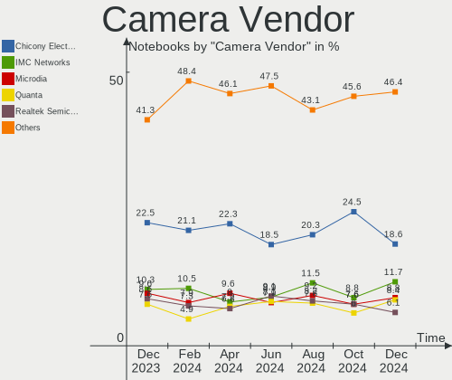

Ubuntu - Hardware Trends (Notebooks)
------------------------------------

A project to identify most popular hardware characteristics and track their change
over time based on data collected by Linux users at https://Linux-Hardware.org.

Anyone can contribute to this report by the [hw-probe](https://github.com/linuxhw/hw-probe) tool:

    sudo -E hw-probe -all -upload

This report is for one last month. Overall report since the beginning of time: [TestCoverage](https://github.com/linuxhw/TestCoverage)

Period: Sep, 2022.

Contents
--------

* [ System ](#system)
  - [ OS                       ](#os)
  - [ OS Family                ](#os-family)
  - [ Kernel                   ](#kernel)
  - [ Kernel Family            ](#kernel-family)
  - [ Kernel Major Ver.        ](#kernel-major-ver)
  - [ Arch                     ](#arch)
  - [ DE                       ](#de)
  - [ Display Server           ](#display-server)
  - [ Display Manager          ](#display-manager)
  - [ OS Lang                  ](#os-lang)
  - [ Boot Mode                ](#boot-mode)
  - [ Filesystem               ](#filesystem)
  - [ Part. scheme             ](#part-scheme)
  - [ Dual Boot with Linux/BSD ](#dual-boot-with-linuxbsd)
  - [ Dual Boot (Win)          ](#dual-boot-win)

* [ Board ](#board)
  - [ Vendor                   ](#vendor)
  - [ Model                    ](#model)
  - [ Model Family             ](#model-family)
  - [ MFG Year                 ](#mfg-year)
  - [ Form Factor              ](#form-factor)
  - [ Secure Boot              ](#secure-boot)
  - [ Coreboot                 ](#coreboot)
  - [ RAM Size                 ](#ram-size)
  - [ RAM Used                 ](#ram-used)
  - [ Total Drives             ](#total-drives)
  - [ Has CD-ROM               ](#has-cd-rom)
  - [ Has Ethernet             ](#has-ethernet)
  - [ Has WiFi                 ](#has-wifi)
  - [ Has Bluetooth            ](#has-bluetooth)

* [ Location ](#location)
  - [ Country                  ](#country)
  - [ City                     ](#city)

* [ Drives ](#drives)
  - [ Drive Vendor             ](#drive-vendor)
  - [ Drive Model              ](#drive-model)
  - [ HDD Vendor               ](#hdd-vendor)
  - [ SSD Vendor               ](#ssd-vendor)
  - [ Drive Kind               ](#drive-kind)
  - [ Drive Connector          ](#drive-connector)
  - [ Drive Size               ](#drive-size)
  - [ Space Total              ](#space-total)
  - [ Space Used               ](#space-used)
  - [ Malfunc. Drives          ](#malfunc-drives)
  - [ Malfunc. Drive Vendor    ](#malfunc-drive-vendor)
  - [ Malfunc. HDD Vendor      ](#malfunc-hdd-vendor)
  - [ Malfunc. Drive Kind      ](#malfunc-drive-kind)
  - [ Failed Drives            ](#failed-drives)
  - [ Failed Drive Vendor      ](#failed-drive-vendor)
  - [ Drive Status             ](#drive-status)

* [ Storage controller ](#storage-controller)
  - [ Storage Vendor           ](#storage-vendor)
  - [ Storage Model            ](#storage-model)
  - [ Storage Kind             ](#storage-kind)

* [ Processor ](#processor)
  - [ CPU Vendor               ](#cpu-vendor)
  - [ CPU Model                ](#cpu-model)
  - [ CPU Model Family         ](#cpu-model-family)
  - [ CPU Cores                ](#cpu-cores)
  - [ CPU Sockets              ](#cpu-sockets)
  - [ CPU Threads              ](#cpu-threads)
  - [ CPU Op-Modes             ](#cpu-op-modes)
  - [ CPU Microcode            ](#cpu-microcode)
  - [ CPU Microarch            ](#cpu-microarch)

* [ Graphics ](#graphics)
  - [ GPU Vendor               ](#gpu-vendor)
  - [ GPU Model                ](#gpu-model)
  - [ GPU Combo                ](#gpu-combo)
  - [ GPU Driver               ](#gpu-driver)
  - [ GPU Memory               ](#gpu-memory)

* [ Monitor ](#monitor)
  - [ Monitor Vendor           ](#monitor-vendor)
  - [ Monitor Model            ](#monitor-model)
  - [ Monitor Resolution       ](#monitor-resolution)
  - [ Monitor Diagonal         ](#monitor-diagonal)
  - [ Monitor Width            ](#monitor-width)
  - [ Aspect Ratio             ](#aspect-ratio)
  - [ Monitor Area             ](#monitor-area)
  - [ Pixel Density            ](#pixel-density)
  - [ Multiple Monitors        ](#multiple-monitors)

* [ Network ](#network)
  - [ Net Controller Vendor    ](#net-controller-vendor)
  - [ Net Controller Model     ](#net-controller-model)
  - [ Wireless Vendor          ](#wireless-vendor)
  - [ Wireless Model           ](#wireless-model)
  - [ Ethernet Vendor          ](#ethernet-vendor)
  - [ Ethernet Model           ](#ethernet-model)
  - [ Net Controller Kind      ](#net-controller-kind)
  - [ Used Controller          ](#used-controller)
  - [ NICs                     ](#nics)
  - [ IPv6                     ](#ipv6)

* [ Bluetooth ](#bluetooth)
  - [ Bluetooth Vendor         ](#bluetooth-vendor)
  - [ Bluetooth Model          ](#bluetooth-model)

* [ Sound ](#sound)
  - [ Sound Vendor             ](#sound-vendor)
  - [ Sound Model              ](#sound-model)

* [ Memory ](#memory)
  - [ Memory Vendor            ](#memory-vendor)
  - [ Memory Model             ](#memory-model)
  - [ Memory Kind              ](#memory-kind)
  - [ Memory Form Factor       ](#memory-form-factor)
  - [ Memory Size              ](#memory-size)
  - [ Memory Speed             ](#memory-speed)

* [ Printers & scanners ](#printers--scanners)
  - [ Printer Vendor           ](#printer-vendor)
  - [ Printer Model            ](#printer-model)
  - [ Scanner Vendor           ](#scanner-vendor)
  - [ Scanner Model            ](#scanner-model)

* [ Camera ](#camera)
  - [ Camera Vendor            ](#camera-vendor)
  - [ Camera Model             ](#camera-model)

* [ Security ](#security)
  - [ Fingerprint Vendor       ](#fingerprint-vendor)
  - [ Fingerprint Model        ](#fingerprint-model)
  - [ Chipcard Vendor          ](#chipcard-vendor)
  - [ Chipcard Model           ](#chipcard-model)

* [ Unsupported ](#unsupported)
  - [ Unsupported Devices      ](#unsupported-devices)
  - [ Unsupported Device Types ](#unsupported-device-types)

System
------

OS
--

Installed operating systems

| Name           | Notebooks | Percent |
|----------------|-----------|---------|
| Ubuntu 22.04   | 478       | 78.88%  |
| Ubuntu 20.04   | 95        | 15.68%  |
| Ubuntu 18.04   | 22        | 3.63%   |
| Ubuntu 22.10   | 4         | 0.66%   |
| Ubuntu 21.10   | 3         | 0.5%    |
| Ubuntu 20.10   | 3         | 0.5%    |
| Ubuntu Core 18 | 1         | 0.17%   |

OS Family
---------

OS without a version

| Name   | Notebooks | Percent |
|--------|-----------|---------|
| Ubuntu | 606       | 100%    |

Kernel
------

Version of the Linux kernel

| Version                   | Notebooks | Percent |
|---------------------------|-----------|---------|
| 5.15.0-47-generic         | 242       | 39.93%  |
| 5.15.0-48-generic         | 155       | 25.58%  |
| 5.15.0-46-generic         | 61        | 10.07%  |
| 5.15.0-43-generic         | 28        | 4.62%   |
| 5.4.0-125-generic         | 14        | 2.31%   |
| 5.4.0-126-generic         | 9         | 1.49%   |
| 5.15.0-50-generic         | 9         | 1.49%   |
| 5.14.0-1051-oem           | 7         | 1.16%   |
| 5.4.0-124-generic         | 5         | 0.83%   |
| 5.19.5-051905-generic     | 4         | 0.66%   |
| 5.8.0-43-generic          | 3         | 0.5%    |
| 5.19.0-15-generic         | 3         | 0.5%    |
| 5.17.0-1016-oem           | 3         | 0.5%    |
| 5.13.0-40-generic         | 3         | 0.5%    |
| 6.0.0-060000rc3-generic   | 2         | 0.33%   |
| 5.8.0-25-generic          | 2         | 0.33%   |
| 5.4.0-122-generic         | 2         | 0.33%   |
| 5.19.11-051911-generic    | 2         | 0.33%   |
| 5.15.0-25-generic         | 2         | 0.33%   |
| 5.14.0-1052-oem           | 2         | 0.33%   |
| 5.13.0-52-generic         | 2         | 0.33%   |
| 5.13.0-51-generic         | 2         | 0.33%   |
| 5.13.0-30-generic         | 2         | 0.33%   |
| 5.13.0-27-generic         | 2         | 0.33%   |
| 5.13.0-19-generic         | 2         | 0.33%   |
| 4.15.0-192-generic        | 2         | 0.33%   |
| 6.0.0-rc3-lemon           | 1         | 0.17%   |
| 6.0.0-060000rc7-generic   | 1         | 0.17%   |
| 5.4.0-97-generic          | 1         | 0.17%   |
| 5.4.0-84-generic          | 1         | 0.17%   |
| 5.4.0-109-generic         | 1         | 0.17%   |
| 5.19.6-t2                 | 1         | 0.17%   |
| 5.19.2-051902-generic     | 1         | 0.17%   |
| 5.19.1-051901-generic     | 1         | 0.17%   |
| 5.19.0-8.1-liquorix-amd64 | 1         | 0.17%   |
| 5.19.0-7.1-liquorix-amd64 | 1         | 0.17%   |
| 5.19.0-051900-generic     | 1         | 0.17%   |
| 5.18.10-76051810-generic  | 1         | 0.17%   |
| 5.18.0-051800-generic     | 1         | 0.17%   |
| 5.17.0-rc1+               | 1         | 0.17%   |

Kernel Family
-------------

Linux kernel without a distro release

| Version | Notebooks | Percent |
|---------|-----------|---------|
| 5.15.0  | 503       | 83%     |
| 5.4.0   | 33        | 5.45%   |
| 5.13.0  | 13        | 2.15%   |
| 5.14.0  | 12        | 1.98%   |
| 5.17.0  | 8         | 1.32%   |
| 5.19.0  | 6         | 0.99%   |
| 5.8.0   | 5         | 0.83%   |
| 6.0.0   | 4         | 0.66%   |
| 5.19.5  | 4         | 0.66%   |
| 4.15.0  | 3         | 0.5%    |
| 5.19.11 | 2         | 0.33%   |
| 5.19.6  | 1         | 0.17%   |
| 5.19.2  | 1         | 0.17%   |
| 5.19.1  | 1         | 0.17%   |
| 5.18.10 | 1         | 0.17%   |
| 5.18.0  | 1         | 0.17%   |
| 5.16.0  | 1         | 0.17%   |
| 5.15.70 | 1         | 0.17%   |
| 5.15.67 | 1         | 0.17%   |
| 5.15.64 | 1         | 0.17%   |
| 5.15.2  | 1         | 0.17%   |
| 5.15.10 | 1         | 0.17%   |
| 5.13.19 | 1         | 0.17%   |
| 5.11.0  | 1         | 0.17%   |

Kernel Major Ver.
-----------------

Linux kernel major version

| Version | Notebooks | Percent |
|---------|-----------|---------|
| 5.15    | 508       | 83.83%  |
| 5.4     | 33        | 5.45%   |
| 5.19    | 15        | 2.48%   |
| 5.13    | 14        | 2.31%   |
| 5.14    | 12        | 1.98%   |
| 5.17    | 8         | 1.32%   |
| 5.8     | 5         | 0.83%   |
| 6.0     | 4         | 0.66%   |
| 4.15    | 3         | 0.5%    |
| 5.18    | 2         | 0.33%   |
| 5.16    | 1         | 0.17%   |
| 5.11    | 1         | 0.17%   |

Arch
----

OS architecture (x86_64, i586, etc.)

| Name   | Notebooks | Percent |
|--------|-----------|---------|
| x86_64 | 603       | 99.5%   |
| i686   | 3         | 0.5%    |

DE
--

Desktop Environment

| Name            | Notebooks | Percent |
|-----------------|-----------|---------|
| GNOME           | 576       | 95.05%  |
| Unknown         | 17        | 2.81%   |
| GNOME Flashback | 5         | 0.83%   |
| i3              | 4         | 0.66%   |
| X-Cinnamon      | 2         | 0.33%   |
| Enlightenment   | 1         | 0.17%   |
| dwm             | 1         | 0.17%   |

Display Server
--------------

X11 or Wayland

| Name    | Notebooks | Percent |
|---------|-----------|---------|
| Wayland | 339       | 55.94%  |
| X11     | 258       | 42.57%  |
| Unknown | 6         | 0.99%   |
| Tty     | 3         | 0.5%    |

Display Manager
---------------

SDDM, LightDM, etc.

| Name    | Notebooks | Percent |
|---------|-----------|---------|
| GDM3    | 500       | 82.51%  |
| GDM     | 47        | 7.76%   |
| Unknown | 44        | 7.26%   |
| LightDM | 13        | 2.15%   |
| SDDM    | 2         | 0.33%   |

OS Lang
-------

Language

| Lang    | Notebooks | Percent |
|---------|-----------|---------|
| en_US   | 273       | 45.05%  |
| de_DE   | 55        | 9.08%   |
| en_GB   | 29        | 4.79%   |
| pt_BR   | 28        | 4.62%   |
| fr_FR   | 27        | 4.46%   |
| it_IT   | 23        | 3.8%    |
| es_ES   | 18        | 2.97%   |
| en_IN   | 18        | 2.97%   |
| pl_PL   | 13        | 2.15%   |
| ru_RU   | 12        | 1.98%   |
| en_CA   | 9         | 1.49%   |
| es_MX   | 8         | 1.32%   |
| en_AU   | 8         | 1.32%   |
| zh_CN   | 5         | 0.83%   |
| nl_NL   | 5         | 0.83%   |
| en_ZA   | 5         | 0.83%   |
| de_AT   | 5         | 0.83%   |
| cs_CZ   | 5         | 0.83%   |
| Unknown | 5         | 0.83%   |
| es_AR   | 4         | 0.66%   |
| C       | 4         | 0.66%   |
| tr_TR   | 3         | 0.5%    |
| ro_RO   | 3         | 0.5%    |
| pt_PT   | 3         | 0.5%    |
| fr_BE   | 3         | 0.5%    |
| es_CL   | 3         | 0.5%    |
| en_PH   | 3         | 0.5%    |
| da_DK   | 3         | 0.5%    |
| sv_SE   | 2         | 0.33%   |
| nb_NO   | 2         | 0.33%   |
| hu_HU   | 2         | 0.33%   |
| es_VE   | 2         | 0.33%   |
| en_SG   | 2         | 0.33%   |
| en_HK   | 2         | 0.33%   |
| uk_UA   | 1         | 0.17%   |
| ja_JP   | 1         | 0.17%   |
| it_CH   | 1         | 0.17%   |
| id_ID   | 1         | 0.17%   |
| fr_CA   | 1         | 0.17%   |
| es_CO   | 1         | 0.17%   |

Boot Mode
---------

EFI or BIOS

| Mode | Notebooks | Percent |
|------|-----------|---------|
| BIOS | 331       | 54.62%  |
| EFI  | 275       | 45.38%  |

Filesystem
----------

Type of filesystem

| Type    | Notebooks | Percent |
|---------|-----------|---------|
| Ext4    | 565       | 93.23%  |
| Overlay | 18        | 2.97%   |
| Zfs     | 10        | 1.65%   |
| Btrfs   | 7         | 1.16%   |
| Xfs     | 2         | 0.33%   |
| Ext3    | 2         | 0.33%   |
| Ext2    | 2         | 0.33%   |

Part. scheme
------------

Scheme of partitioning

| Type    | Notebooks | Percent |
|---------|-----------|---------|
| Unknown | 372       | 61.39%  |
| GPT     | 213       | 35.15%  |
| MBR     | 21        | 3.47%   |

Dual Boot with Linux/BSD
------------------------

Hosting more than one Linux/BSD

| Dual boot | Notebooks | Percent |
|-----------|-----------|---------|
| No        | 556       | 91.75%  |
| Yes       | 50        | 8.25%   |

Dual Boot (Win)
---------------

Hosting Linux and Windows

| Dual boot | Notebooks | Percent |
|-----------|-----------|---------|
| No        | 375       | 61.88%  |
| Yes       | 231       | 38.12%  |

Board
-----

Vendor
------

Motherboard manufacturer

| Name                           | Notebooks | Percent |
|--------------------------------|-----------|---------|
| Hewlett-Packard                | 137       | 22.61%  |
| Dell                           | 115       | 18.98%  |
| Lenovo                         | 111       | 18.32%  |
| Acer                           | 54        | 8.91%   |
| ASUSTek Computer               | 51        | 8.42%   |
| Toshiba                        | 14        | 2.31%   |
| HUAWEI                         | 11        | 1.82%   |
| Samsung Electronics            | 10        | 1.65%   |
| MSI                            | 10        | 1.65%   |
| Apple                          | 10        | 1.65%   |
| Chuwi                          | 6         | 0.99%   |
| Unknown                        | 5         | 0.83%   |
| Timi                           | 4         | 0.66%   |
| Notebook                       | 4         | 0.66%   |
| Alienware                      | 4         | 0.66%   |
| System76                       | 3         | 0.5%    |
| Sony                           | 3         | 0.5%    |
| Positivo                       | 3         | 0.5%    |
| Google                         | 3         | 0.5%    |
| Gigabyte Technology            | 3         | 0.5%    |
| Avell High Performance         | 3         | 0.5%    |
| Razer                          | 2         | 0.33%   |
| Packard Bell                   | 2         | 0.33%   |
| NEC Computers                  | 2         | 0.33%   |
| Medion                         | 2         | 0.33%   |
| LG Electronics                 | 2         | 0.33%   |
| HONOR                          | 2         | 0.33%   |
| Fujitsu                        | 2         | 0.33%   |
| BESSTAR Tech                   | 2         | 0.33%   |
| TUXEDO                         | 1         | 0.17%   |
| TrekStor                       | 1         | 0.17%   |
| SKIKK                          | 1         | 0.17%   |
| SIEMENS                        | 1         | 0.17%   |
| Shanghai Zhaoxin Semiconductor | 1         | 0.17%   |
| Semp Toshiba                   | 1         | 0.17%   |
| Schenker                       | 1         | 0.17%   |
| SANTECH                        | 1         | 0.17%   |
| Philco                         | 1         | 0.17%   |
| OEM                            | 1         | 0.17%   |
| NSX                            | 1         | 0.17%   |

Model
-----

Motherboard model

| Name                                  | Notebooks | Percent |
|---------------------------------------|-----------|---------|
| Unknown                               | 9         | 1.49%   |
| Timi TM1701                           | 3         | 0.5%    |
| HUAWEI HVY-WXX9                       | 3         | 0.5%    |
| HP ProBook 6560b                      | 3         | 0.5%    |
| HP Laptop 15-db0xxx                   | 3         | 0.5%    |
| HP EliteBook 850 G3                   | 3         | 0.5%    |
| HP EliteBook 840 G3                   | 3         | 0.5%    |
| Dell XPS 15 9500                      | 3         | 0.5%    |
| Dell Latitude 7420                    | 3         | 0.5%    |
| Dell Inspiron N5050                   | 3         | 0.5%    |
| ASUS X553MA                           | 3         | 0.5%    |
| MSI Modern 14 A10M                    | 2         | 0.33%   |
| Lenovo ThinkPad P14s Gen 1 20Y1000AGE | 2         | 0.33%   |
| Lenovo ThinkBook 15-IIL 20SM          | 2         | 0.33%   |
| Lenovo ThinkBook 15 G2 ITL 20VE       | 2         | 0.33%   |
| Lenovo ThinkBook 14 G2 ITL 20VD       | 2         | 0.33%   |
| Lenovo IdeaPad 330-15AST 81D6         | 2         | 0.33%   |
| Lenovo IdeaPad 3 15ALC6 82MF          | 2         | 0.33%   |
| Lenovo G50-80 80E5                    | 2         | 0.33%   |
| Lenovo E50-80 80J2                    | 2         | 0.33%   |
| HUAWEI KLVL-WXXW                      | 2         | 0.33%   |
| HUAWEI BOHK-WAX9X                     | 2         | 0.33%   |
| HP ProBook 6460b                      | 2         | 0.33%   |
| HP ProBook 4540s                      | 2         | 0.33%   |
| HP ProBook 450 G5                     | 2         | 0.33%   |
| HP ProBook 450 G2                     | 2         | 0.33%   |
| HP ProBook 440 G8 Notebook PC         | 2         | 0.33%   |
| HP Presario CQ56                      | 2         | 0.33%   |
| HP Pavilion Notebook                  | 2         | 0.33%   |
| HP Pavilion dv6                       | 2         | 0.33%   |
| HP Pavilion 17                        | 2         | 0.33%   |
| HP Pavilion 15                        | 2         | 0.33%   |
| HP OMEN by Laptop 15-ce0xx            | 2         | 0.33%   |
| HP Laptop 15s-eq2xxx                  | 2         | 0.33%   |
| HP Laptop 15s-eq0xxx                  | 2         | 0.33%   |
| HP Laptop 15-da0xxx                   | 2         | 0.33%   |
| HP Laptop 15-bw0xx                    | 2         | 0.33%   |
| HP ENVY Laptop 13-ba1xxx              | 2         | 0.33%   |
| HP EliteBook 840 G2                   | 2         | 0.33%   |
| HP EliteBook 840 G1                   | 2         | 0.33%   |

Model Family
------------

Motherboard model prefix

| Name                  | Notebooks | Percent |
|-----------------------|-----------|---------|
| Lenovo ThinkPad       | 49        | 8.09%   |
| Dell Latitude         | 44        | 7.26%   |
| Acer Aspire           | 41        | 6.77%   |
| Lenovo IdeaPad        | 27        | 4.46%   |
| HP EliteBook          | 27        | 4.46%   |
| HP Pavilion           | 26        | 4.29%   |
| HP ProBook            | 25        | 4.13%   |
| Dell Inspiron         | 25        | 4.13%   |
| HP Laptop             | 18        | 2.97%   |
| Dell XPS              | 18        | 2.97%   |
| Dell Precision        | 14        | 2.31%   |
| Toshiba Satellite     | 13        | 2.15%   |
| ASUS VivoBook         | 13        | 2.15%   |
| Lenovo ThinkBook      | 10        | 1.65%   |
| ASUS Zenbook          | 9         | 1.49%   |
| Unknown               | 9         | 1.49%   |
| HP ENVY               | 8         | 1.32%   |
| Dell Vostro           | 7         | 1.16%   |
| Lenovo Legion         | 5         | 0.83%   |
| Acer Swift            | 5         | 0.83%   |
| Lenovo Yoga           | 4         | 0.66%   |
| HP OMEN               | 4         | 0.66%   |
| HP 255                | 4         | 0.66%   |
| Timi TM1701           | 3         | 0.5%    |
| HUAWEI HVY-WXX9       | 3         | 0.5%    |
| HP ZBook              | 3         | 0.5%    |
| HP Compaq             | 3         | 0.5%    |
| HP 250                | 3         | 0.5%    |
| HP 15                 | 3         | 0.5%    |
| Gigabyte AORUS        | 3         | 0.5%    |
| Dell G15              | 3         | 0.5%    |
| ASUS X553MA           | 3         | 0.5%    |
| ASUS ROG              | 3         | 0.5%    |
| ASUS ASUS             | 3         | 0.5%    |
| Razer Blade           | 2         | 0.33%   |
| Packard Bell EasyNote | 2         | 0.33%   |
| MSI Prestige          | 2         | 0.33%   |
| MSI Modern            | 2         | 0.33%   |
| Lenovo G50-80         | 2         | 0.33%   |
| Lenovo E50-80         | 2         | 0.33%   |

MFG Year
--------

Motherboard manufacture year

| Year    | Notebooks | Percent |
|---------|-----------|---------|
| 2021    | 92        | 15.18%  |
| 2020    | 77        | 12.71%  |
| 2018    | 55        | 9.08%   |
| 2019    | 48        | 7.92%   |
| 2011    | 44        | 7.26%   |
| 2022    | 43        | 7.1%    |
| 2013    | 36        | 5.94%   |
| 2017    | 33        | 5.45%   |
| 2015    | 32        | 5.28%   |
| 2014    | 32        | 5.28%   |
| 2012    | 32        | 5.28%   |
| 2016    | 25        | 4.13%   |
| 2010    | 21        | 3.47%   |
| 2008    | 18        | 2.97%   |
| 2009    | 9         | 1.49%   |
| 2007    | 7         | 1.16%   |
| 2006    | 1         | 0.17%   |
| Unknown | 1         | 0.17%   |

Form Factor
-----------

Physical design of the computer

| Name     | Notebooks | Percent |
|----------|-----------|---------|
| Notebook | 606       | 100%    |

Secure Boot
-----------

Enabled or disabled

| State    | Notebooks | Percent |
|----------|-----------|---------|
| Disabled | 527       | 86.96%  |
| Enabled  | 79        | 13.04%  |

Coreboot
--------

Have coreboot on board

| Used | Notebooks | Percent |
|------|-----------|---------|
| No   | 601       | 99.17%  |
| Yes  | 5         | 0.83%   |

RAM Size
--------

Total RAM memory

| Size in GB  | Notebooks | Percent |
|-------------|-----------|---------|
| 4.01-8.0    | 192       | 31.68%  |
| 16.01-24.0  | 122       | 20.13%  |
| 3.01-4.0    | 109       | 17.99%  |
| 8.01-16.0   | 90        | 14.85%  |
| 32.01-64.0  | 59        | 9.74%   |
| 1.01-2.0    | 15        | 2.48%   |
| 64.01-256.0 | 10        | 1.65%   |
| 24.01-32.0  | 6         | 0.99%   |
| 2.01-3.0    | 2         | 0.33%   |
| 0.51-1.0    | 1         | 0.17%   |

RAM Used
--------

Used RAM memory

| Used GB    | Notebooks | Percent |
|------------|-----------|---------|
| 1.01-2.0   | 175       | 28.88%  |
| 2.01-3.0   | 172       | 28.38%  |
| 4.01-8.0   | 123       | 20.3%   |
| 3.01-4.0   | 95        | 15.68%  |
| 8.01-16.0  | 33        | 5.45%   |
| 16.01-24.0 | 3         | 0.5%    |
| 0.51-1.0   | 3         | 0.5%    |
| 24.01-32.0 | 1         | 0.17%   |
| 0.01-0.5   | 1         | 0.17%   |

Total Drives
------------

Number of drives on board

| Drives | Notebooks | Percent |
|--------|-----------|---------|
| 1      | 459       | 75.74%  |
| 2      | 134       | 22.11%  |
| 3      | 8         | 1.32%   |
| 0      | 4         | 0.66%   |
| 4      | 1         | 0.17%   |

Has CD-ROM
----------

Has CD-ROM on board

| Presented | Notebooks | Percent |
|-----------|-----------|---------|
| No        | 431       | 71.12%  |
| Yes       | 175       | 28.88%  |

Has Ethernet
------------

Has Ethernet on board

| Presented | Notebooks | Percent |
|-----------|-----------|---------|
| Yes       | 466       | 76.9%   |
| No        | 140       | 23.1%   |

Has WiFi
--------

Has WiFi module

| Presented | Notebooks | Percent |
|-----------|-----------|---------|
| Yes       | 599       | 98.84%  |
| No        | 7         | 1.16%   |

Has Bluetooth
-------------

Has Bluetooth module

| Presented | Notebooks | Percent |
|-----------|-----------|---------|
| Yes       | 491       | 81.02%  |
| No        | 115       | 18.98%  |

Location
--------

Country
-------

Geographic location (country)

| Country      | Notebooks | Percent |
|--------------|-----------|---------|
| USA          | 86        | 14.19%  |
| Germany      | 61        | 10.07%  |
| Italy        | 42        | 6.93%   |
| Brazil       | 36        | 5.94%   |
| France       | 35        | 5.78%   |
| Spain        | 24        | 3.96%   |
| UK           | 23        | 3.8%    |
| Poland       | 23        | 3.8%    |
| Russia       | 22        | 3.63%   |
| India        | 18        | 2.97%   |
| Netherlands  | 13        | 2.15%   |
| Canada       | 11        | 1.82%   |
| Portugal     | 9         | 1.49%   |
| Pakistan     | 9         | 1.49%   |
| Mexico       | 9         | 1.49%   |
| Sweden       | 8         | 1.32%   |
| Iran         | 8         | 1.32%   |
| China        | 8         | 1.32%   |
| Belgium      | 8         | 1.32%   |
| Austria      | 8         | 1.32%   |
| Argentina    | 8         | 1.32%   |
| Turkey       | 7         | 1.16%   |
| Hungary      | 7         | 1.16%   |
| Czechia      | 7         | 1.16%   |
| Romania      | 6         | 0.99%   |
| Switzerland  | 5         | 0.83%   |
| South Africa | 5         | 0.83%   |
| Egypt        | 5         | 0.83%   |
| Australia    | 5         | 0.83%   |
| Singapore    | 4         | 0.66%   |
| Norway       | 4         | 0.66%   |
| Indonesia    | 4         | 0.66%   |
| Chile        | 4         | 0.66%   |
| Bulgaria     | 4         | 0.66%   |
| Vietnam      | 3         | 0.5%    |
| Taiwan       | 3         | 0.5%    |
| Serbia       | 3         | 0.5%    |
| Philippines  | 3         | 0.5%    |
| Japan        | 3         | 0.5%    |
| Hong Kong    | 3         | 0.5%    |

City
----

Geographic location (city)

| City           | Notebooks | Percent |
|----------------|-----------|---------|
| Moscow         | 9         | 1.49%   |
| Milan          | 7         | 1.16%   |
| Warsaw         | 6         | 0.99%   |
| Vienna         | 6         | 0.99%   |
| Madrid         | 6         | 0.99%   |
| Rome           | 5         | 0.83%   |
| Budapest       | 5         | 0.83%   |
| Tehran         | 4         | 0.66%   |
| Singapore      | 4         | 0.66%   |
| Sao Paulo      | 4         | 0.66%   |
| Mirpur         | 4         | 0.66%   |
| Lisbon         | 4         | 0.66%   |
| Krakow         | 4         | 0.66%   |
| Istanbul       | 4         | 0.66%   |
| Cairo          | 4         | 0.66%   |
| Bengaluru      | 4         | 0.66%   |
| Taipei         | 3         | 0.5%    |
| St Petersburg  | 3         | 0.5%    |
| Rio de Janeiro | 3         | 0.5%    |
| Raleigh        | 3         | 0.5%    |
| Paris          | 3         | 0.5%    |
| Naples         | 3         | 0.5%    |
| Munich         | 3         | 0.5%    |
| Mumbai         | 3         | 0.5%    |
| Mexico City    | 3         | 0.5%    |
| London         | 3         | 0.5%    |
| Hamburg        | 3         | 0.5%    |
| Bucharest      | 3         | 0.5%    |
| Belgrade       | 3         | 0.5%    |
| Beijing        | 3         | 0.5%    |
| York           | 2         | 0.33%   |
| The Hague      | 2         | 0.33%   |
| Tamworth       | 2         | 0.33%   |
| Sofia          | 2         | 0.33%   |
| Santa Rosa     | 2         | 0.33%   |
| San Francisco  | 2         | 0.33%   |
| Rho            | 2         | 0.33%   |
| Quezon City    | 2         | 0.33%   |
| Prague         | 2         | 0.33%   |
| Poznan         | 2         | 0.33%   |

Drives
------

Drive Vendor
------------

Hard drive vendors

| Vendor                         | Notebooks | Drives | Percent |
|--------------------------------|-----------|--------|---------|
| Samsung Electronics            | 120       | 133    | 16.67%  |
| WDC                            | 86        | 87     | 11.94%  |
| Toshiba                        | 63        | 63     | 8.75%   |
| Seagate                        | 53        | 53     | 7.36%   |
| Kingston                       | 49        | 49     | 6.81%   |
| SanDisk                        | 46        | 47     | 6.39%   |
| Unknown                        | 28        | 31     | 3.89%   |
| SK hynix                       | 27        | 27     | 3.75%   |
| Micron Technology              | 23        | 24     | 3.19%   |
| Intel                          | 21        | 25     | 2.92%   |
| HGST                           | 19        | 19     | 2.64%   |
| KIOXIA                         | 18        | 18     | 2.5%    |
| Crucial                        | 15        | 16     | 2.08%   |
| A-DATA Technology              | 15        | 16     | 2.08%   |
| Hitachi                        | 14        | 14     | 1.94%   |
| China                          | 7         | 7      | 0.97%   |
| Unknown                        | 7         | 7      | 0.97%   |
| PNY                            | 6         | 6      | 0.83%   |
| Phison                         | 6         | 6      | 0.83%   |
| Apple                          | 6         | 7      | 0.83%   |
| Netac                          | 5         | 5      | 0.69%   |
| LITEON                         | 5         | 5      | 0.69%   |
| Intenso                        | 5         | 5      | 0.69%   |
| Hewlett-Packard                | 4         | 4      | 0.56%   |
| Transcend                      | 3         | 3      | 0.42%   |
| SPCC                           | 3         | 3      | 0.42%   |
| Solid State Storage Technology | 3         | 3      | 0.42%   |
| Silicon Motion                 | 3         | 3      | 0.42%   |
| Lite-On                        | 3         | 3      | 0.42%   |
| Kingston Technology Company    | 3         | 3      | 0.42%   |
| GOODRAM                        | 3         | 3      | 0.42%   |
| Team                           | 2         | 2      | 0.28%   |
| SSSTC                          | 2         | 2      | 0.28%   |
| SSK                            | 2         | 2      | 0.28%   |
| Solid State Storage            | 2         | 2      | 0.28%   |
| Phison Electronics             | 2         | 2      | 0.28%   |
| Lexar                          | 2         | 2      | 0.28%   |
| KingFast                       | 2         | 2      | 0.28%   |
| Fujitsu                        | 2         | 2      | 0.28%   |
| Corsair                        | 2         | 2      | 0.28%   |

Drive Model
-----------

Hard drive models

| Model                                               | Notebooks | Percent |
|-----------------------------------------------------|-----------|---------|
| Toshiba MQ01ABD100 1TB                              | 13        | 1.75%   |
| Seagate ST1000LM035-1RK172 1TB                      | 11        | 1.48%   |
| Kingston SA400S37240G 240GB SSD                     | 11        | 1.48%   |
| Samsung NVMe SSD Drive 512GB                        | 10        | 1.35%   |
| Samsung NVMe SSD Controller SM981/PM981/PM983 256GB | 10        | 1.35%   |
| SanDisk NVMe SSD Drive 512GB                        | 7         | 0.94%   |
| Unknown                                             | 7         | 0.94%   |
| WDC WDS500G2B0A-00SM50 500GB SSD                    | 5         | 0.67%   |
| Toshiba MQ04ABF100 1TB                              | 5         | 0.67%   |
| Toshiba MQ01ABD050 500GB                            | 5         | 0.67%   |
| Seagate ST1000LM024 HN-M101MBB 1TB                  | 5         | 0.67%   |
| Samsung MZALQ512HALU-000L2 512GB                    | 5         | 0.67%   |
| Kingston SA400S37120G 120GB SSD                     | 5         | 0.67%   |
| HGST HTS545050A7E680 500GB                          | 5         | 0.67%   |
| WDC WD10SPZX-21Z10T0 1TB                            | 4         | 0.54%   |
| WDC WD10JPCX-24UE4T0 1TB                            | 4         | 0.54%   |
| Unknown MMC Card  32GB                              | 4         | 0.54%   |
| Seagate ST9500325AS 500GB                           | 4         | 0.54%   |
| SanDisk NVMe SSD Drive 1TB                          | 4         | 0.54%   |
| Samsung SSD 970 EVO Plus 1TB                        | 4         | 0.54%   |
| Samsung SSD 860 EVO 500GB                           | 4         | 0.54%   |
| Samsung NVMe SSD Drive 256GB                        | 4         | 0.54%   |
| Samsung NVMe SSD Drive 1024GB                       | 4         | 0.54%   |
| KIOXIA NVMe SSD Drive 256GB                         | 4         | 0.54%   |
| Kingston SA400S37480G 480GB SSD                     | 4         | 0.54%   |
| Hitachi HTS543232A7A384 320GB                       | 4         | 0.54%   |
| WDC WDS240G2G0A-00JH30 240GB SSD                    | 3         | 0.4%    |
| WDC PC SN530 SDBPNPZ-256G-1002 256GB                | 3         | 0.4%    |
| Unknown MMC Card  64GB                              | 3         | 0.4%    |
| Toshiba NVMe SSD Drive 256GB                        | 3         | 0.4%    |
| Toshiba MQ01ABF050 500GB                            | 3         | 0.4%    |
| Toshiba MK3263GSX 320GB                             | 3         | 0.4%    |
| SK hynix NVMe SSD Drive 512GB                       | 3         | 0.4%    |
| Seagate ST1000LX015-1U7172 1TB                      | 3         | 0.4%    |
| SanDisk SSD PLUS 1000GB                             | 3         | 0.4%    |
| Sandisk PC SN520 NVMe SSD 256GB                     | 3         | 0.4%    |
| Samsung SSD 970 EVO Plus 500GB                      | 3         | 0.4%    |
| Samsung SSD 970 EVO Plus 250GB                      | 3         | 0.4%    |
| Samsung SSD 850 EVO 500GB                           | 3         | 0.4%    |
| Samsung PM9A1 NVMe 512GB                            | 3         | 0.4%    |

HDD Vendor
----------

Hard disk drive vendors

| Vendor              | Notebooks | Drives | Percent |
|---------------------|-----------|--------|---------|
| Seagate             | 51        | 51     | 27.57%  |
| Toshiba             | 48        | 48     | 25.95%  |
| WDC                 | 46        | 47     | 24.86%  |
| HGST                | 19        | 19     | 10.27%  |
| Hitachi             | 14        | 14     | 7.57%   |
| Unknown             | 2         | 2      | 1.08%   |
| Samsung Electronics | 2         | 2      | 1.08%   |
| Fujitsu             | 2         | 2      | 1.08%   |
| Apple               | 1         | 1      | 0.54%   |

SSD Vendor
----------

Solid state drive vendors

| Vendor              | Notebooks | Drives | Percent |
|---------------------|-----------|--------|---------|
| Kingston            | 34        | 34     | 16.83%  |
| Samsung Electronics | 30        | 34     | 14.85%  |
| SanDisk             | 21        | 22     | 10.4%   |
| WDC                 | 17        | 17     | 8.42%   |
| Crucial             | 11        | 12     | 5.45%   |
| Micron Technology   | 8         | 8      | 3.96%   |
| China               | 7         | 7      | 3.47%   |
| PNY                 | 6         | 6      | 2.97%   |
| A-DATA Technology   | 6         | 6      | 2.97%   |
| Netac               | 5         | 5      | 2.48%   |
| LITEON              | 5         | 5      | 2.48%   |
| SK hynix            | 4         | 4      | 1.98%   |
| Intenso             | 4         | 4      | 1.98%   |
| Transcend           | 3         | 3      | 1.49%   |
| SPCC                | 3         | 3      | 1.49%   |
| Intel               | 3         | 3      | 1.49%   |
| GOODRAM             | 3         | 3      | 1.49%   |
| Toshiba             | 2         | 2      | 0.99%   |
| Team                | 2         | 2      | 0.99%   |
| Lexar               | 2         | 2      | 0.99%   |
| Hewlett-Packard     | 2         | 2      | 0.99%   |
| Corsair             | 2         | 2      | 0.99%   |
| Apacer              | 2         | 2      | 0.99%   |
| VISIPRO             | 1         | 1      | 0.5%    |
| V-GeN               | 1         | 1      | 0.5%    |
| Unknown             | 1         | 1      | 0.5%    |
| TrekStor            | 1         | 1      | 0.5%    |
| Super Talent        | 1         | 1      | 0.5%    |
| ShiJi               | 1         | 1      | 0.5%    |
| Seagate             | 1         | 1      | 0.5%    |
| Ramaxel Technology  | 1         | 1      | 0.5%    |
| Patriot             | 1         | 1      | 0.5%    |
| LITEONIT            | 1         | 1      | 0.5%    |
| Lenovo              | 1         | 1      | 0.5%    |
| KingSpec            | 1         | 1      | 0.5%    |
| Indilinx            | 1         | 1      | 0.5%    |
| Gigabyte Technology | 1         | 1      | 0.5%    |
| G-DRIVE             | 1         | 1      | 0.5%    |
| Drevo               | 1         | 1      | 0.5%    |
| BIWIN               | 1         | 1      | 0.5%    |

Drive Kind
----------

HDD or SSD

| Kind    | Notebooks | Drives | Percent |
|---------|-----------|--------|---------|
| NVMe    | 282       | 305    | 40.58%  |
| SSD     | 189       | 208    | 27.19%  |
| HDD     | 180       | 186    | 25.9%   |
| MMC     | 30        | 33     | 4.32%   |
| Unknown | 14        | 15     | 2.01%   |

Drive Connector
---------------

SATA, SAS, NVMe, etc.

| Type | Notebooks | Drives | Percent |
|------|-----------|--------|---------|
| SATA | 342       | 388    | 50.59%  |
| NVMe | 282       | 304    | 41.72%  |
| MMC  | 30        | 33     | 4.44%   |
| SAS  | 22        | 22     | 3.25%   |

Drive Size
----------

Size of hard drive

| Size in TB | Notebooks | Drives | Percent |
|------------|-----------|--------|---------|
| 0.01-0.5   | 240       | 264    | 65.57%  |
| 0.51-1.0   | 117       | 121    | 31.97%  |
| 1.01-2.0   | 7         | 7      | 1.91%   |
| 4.01-10.0  | 2         | 2      | 0.55%   |

Space Total
-----------

Amount of disk space available on the file system

| Size in GB     | Notebooks | Percent |
|----------------|-----------|---------|
| 101-250        | 192       | 31.68%  |
| 251-500        | 171       | 28.22%  |
| 501-1000       | 111       | 18.32%  |
| 51-100         | 34        | 5.61%   |
| 1-20           | 28        | 4.62%   |
| 21-50          | 27        | 4.46%   |
| 1001-2000      | 24        | 3.96%   |
| Unknown        | 9         | 1.49%   |
| More than 3000 | 6         | 0.99%   |
| 2001-3000      | 4         | 0.66%   |

Space Used
----------

Amount of used disk space

| Used GB        | Notebooks | Percent |
|----------------|-----------|---------|
| 1-20           | 193       | 31.85%  |
| 21-50          | 131       | 21.62%  |
| 101-250        | 105       | 17.33%  |
| 51-100         | 87        | 14.36%  |
| 251-500        | 48        | 7.92%   |
| 501-1000       | 27        | 4.46%   |
| Unknown        | 9         | 1.49%   |
| 1001-2000      | 3         | 0.5%    |
| 2001-3000      | 2         | 0.33%   |
| More than 3000 | 1         | 0.17%   |

Malfunc. Drives
---------------

Drive models with a malfunction

| Model                                   | Notebooks | Drives | Percent |
|-----------------------------------------|-----------|--------|---------|
| Seagate ST1000LM035-1RK172 1TB          | 3         | 3      | 10%     |
| Toshiba MQ01ABD100 1TB                  | 2         | 2      | 6.67%   |
| WDC WDS240G2G0A-00JH30 240GB SSD        | 1         | 1      | 3.33%   |
| WDC WD2500BEKT-75A25T0 250GB            | 1         | 1      | 3.33%   |
| WDC WD10SPZX-24Z10 1TB                  | 1         | 1      | 3.33%   |
| WDC WD10JPCX-24UE4T0 1TB                | 1         | 1      | 3.33%   |
| VISIPRO SSD 256GB                       | 1         | 1      | 3.33%   |
| Toshiba MQ04ABF100 1TB                  | 1         | 1      | 3.33%   |
| Toshiba MQ01ABD050 500GB                | 1         | 1      | 3.33%   |
| Toshiba MK5065GSXN 500GB                | 1         | 1      | 3.33%   |
| Toshiba KSG60ZMV256G M.2 2280 256GB SSD | 1         | 1      | 3.33%   |
| SK hynix HFS256GD9TNG-62A0A 256GB       | 1         | 1      | 3.33%   |
| SK hynix HFS128G32MND-2200A 128GB SSD   | 1         | 1      | 3.33%   |
| Seagate ST1000LM014-SSHD-8GB            | 1         | 1      | 3.33%   |
| Seagate ST1000LM014-1EJ164 1TB          | 1         | 1      | 3.33%   |
| LITEON LCH-256V2S 256GB SSD             | 1         | 1      | 3.33%   |
| Kingston SA400S37120G 120GB SSD         | 1         | 1      | 3.33%   |
| Intenso SSD SATAIII 120GB               | 1         | 1      | 3.33%   |
| Intel SSDSC2BF180A5L 180GB              | 1         | 1      | 3.33%   |
| Hitachi HTS725050A9A364 500GB           | 1         | 1      | 3.33%   |
| Hitachi HTS725050A7E630 500GB           | 1         | 1      | 3.33%   |
| Hitachi HTS543232A7A384 320GB           | 1         | 1      | 3.33%   |
| HGST HTS725032A7E630 320GB              | 1         | 1      | 3.33%   |
| HGST HTS541075A9E680 752GB              | 1         | 1      | 3.33%   |
| HGST HTS541010A9E680 1TB                | 1         | 1      | 3.33%   |
| A-DATA Technology SX8200PNP 256GB       | 1         | 1      | 3.33%   |
| A-DATA Technology SX8200PNP 1TB         | 1         | 1      | 3.33%   |

Malfunc. Drive Vendor
---------------------

Vendors of faulty drives

| Vendor            | Notebooks | Drives | Percent |
|-------------------|-----------|--------|---------|
| Toshiba           | 6         | 6      | 20%     |
| Seagate           | 5         | 5      | 16.67%  |
| WDC               | 4         | 4      | 13.33%  |
| Hitachi           | 3         | 3      | 10%     |
| HGST              | 3         | 3      | 10%     |
| SK hynix          | 2         | 2      | 6.67%   |
| A-DATA Technology | 2         | 2      | 6.67%   |
| VISIPRO           | 1         | 1      | 3.33%   |
| LITEON            | 1         | 1      | 3.33%   |
| Kingston          | 1         | 1      | 3.33%   |
| Intenso           | 1         | 1      | 3.33%   |
| Intel             | 1         | 1      | 3.33%   |

Malfunc. HDD Vendor
-------------------

Vendors of faulty HDD drives

| Vendor  | Notebooks | Drives | Percent |
|---------|-----------|--------|---------|
| Toshiba | 5         | 5      | 26.32%  |
| Seagate | 5         | 5      | 26.32%  |
| WDC     | 3         | 3      | 15.79%  |
| Hitachi | 3         | 3      | 15.79%  |
| HGST    | 3         | 3      | 15.79%  |

Malfunc. Drive Kind
-------------------

Kinds of faulty drives

| Kind | Notebooks | Drives | Percent |
|------|-----------|--------|---------|
| HDD  | 19        | 19     | 63.33%  |
| SSD  | 8         | 8      | 26.67%  |
| NVMe | 3         | 3      | 10%     |

Failed Drives
-------------

Failed drive models

Zero info for selected period =(

Failed Drive Vendor
-------------------

Failed drive vendors

Zero info for selected period =(

Drive Status
------------

Number of failed and malfunc. drives

| Status   | Notebooks | Drives | Percent |
|----------|-----------|--------|---------|
| Detected | 382       | 473    | 60.93%  |
| Works    | 215       | 244    | 34.29%  |
| Malfunc  | 30        | 30     | 4.78%   |

Storage controller
------------------

Storage Vendor
--------------

Storage controller vendors

| Vendor                         | Notebooks | Percent |
|--------------------------------|-----------|---------|
| Intel                          | 393       | 53.04%  |
| Samsung Electronics            | 95        | 12.82%  |
| AMD                            | 69        | 9.31%   |
| SanDisk                        | 45        | 6.07%   |
| SK hynix                       | 23        | 3.1%    |
| Kingston Technology Company    | 18        | 2.43%   |
| Toshiba America Info Systems   | 17        | 2.29%   |
| Micron Technology              | 15        | 2.02%   |
| KIOXIA                         | 14        | 1.89%   |
| ADATA Technology               | 10        | 1.35%   |
| Phison Electronics             | 9         | 1.21%   |
| Solid State Storage Technology | 8         | 1.08%   |
| Silicon Motion                 | 5         | 0.67%   |
| Micron/Crucial Technology      | 5         | 0.67%   |
| Apple                          | 4         | 0.54%   |
| Lite-On Technology             | 3         | 0.4%    |
| Nvidia                         | 2         | 0.27%   |
| Zhaoxin                        | 1         | 0.13%   |
| Yangtze Memory Technologies    | 1         | 0.13%   |
| Union Memory (Shenzhen)        | 1         | 0.13%   |
| Seagate Technology             | 1         | 0.13%   |
| Realtek Semiconductor          | 1         | 0.13%   |
| ASMedia Technology             | 1         | 0.13%   |

Storage Model
-------------

Storage controller models

| Model                                                                          | Notebooks | Percent |
|--------------------------------------------------------------------------------|-----------|---------|
| AMD FCH SATA Controller [AHCI mode]                                            | 62        | 7.92%   |
| Intel Sunrise Point-LP SATA Controller [AHCI mode]                             | 49        | 6.26%   |
| Intel Volume Management Device NVMe RAID Controller                            | 44        | 5.62%   |
| Samsung NVMe SSD Controller SM981/PM981/PM983                                  | 41        | 5.24%   |
| Intel 82801 Mobile SATA Controller [RAID mode]                                 | 36        | 4.6%    |
| Intel 7 Series Chipset Family 6-port SATA Controller [AHCI mode]               | 32        | 4.09%   |
| Intel 6 Series/C200 Series Chipset Family 6 port Mobile SATA AHCI Controller   | 31        | 3.96%   |
| Samsung NVMe SSD Controller 980                                                | 28        | 3.58%   |
| Intel Wildcat Point-LP SATA Controller [AHCI Mode]                             | 26        | 3.32%   |
| Samsung NVMe SSD Controller PM9A1/PM9A3/980PRO                                 | 18        | 2.3%    |
| Intel 82801IBM/IEM (ICH9M/ICH9M-E) 4 port SATA Controller [AHCI mode]          | 18        | 2.3%    |
| Intel 8 Series SATA Controller 1 [AHCI mode]                                   | 16        | 2.04%   |
| Micron Non-Volatile memory controller                                          | 15        | 1.92%   |
| Intel Tiger Lake-LP SATA Controller                                            | 13        | 1.66%   |
| Intel 8 Series/C220 Series Chipset Family 6-port SATA Controller 1 [AHCI mode] | 13        | 1.66%   |
| SanDisk WD Blue SN550 NVMe SSD                                                 | 12        | 1.53%   |
| KIOXIA NVMe SSD Controller BG4                                                 | 11        | 1.4%    |
| Intel Atom Processor E3800 Series SATA AHCI Controller                         | 11        | 1.4%    |
| Toshiba America Info Systems XG6 NVMe SSD Controller                           | 9         | 1.15%   |
| SK hynix Non-Volatile memory controller                                        | 9         | 1.15%   |
| SanDisk WD Black SN750 / PC SN730 NVMe SSD                                     | 9         | 1.15%   |
| Samsung NVMe SSD Controller SM961/PM961/SM963                                  | 9         | 1.15%   |
| Intel Ice Lake-LP SATA Controller [AHCI mode]                                  | 9         | 1.15%   |
| Intel Cannon Point-LP SATA Controller [AHCI Mode]                              | 9         | 1.15%   |
| Intel Cannon Lake Mobile PCH SATA AHCI Controller                              | 9         | 1.15%   |
| Intel 5 Series/3400 Series Chipset 4 port SATA AHCI Controller                 | 9         | 1.15%   |
| Solid State Storage Non-Volatile memory controller                             | 8         | 1.02%   |
| SK hynix Gold P31 SSD                                                          | 8         | 1.02%   |
| Kingston Company Company Non-Volatile memory controller                        | 8         | 1.02%   |
| Intel SSD 660P Series                                                          | 8         | 1.02%   |
| Intel Comet Lake SATA AHCI Controller                                          | 8         | 1.02%   |
| Intel Celeron N3350/Pentium N4200/Atom E3900 Series SATA AHCI Controller       | 8         | 1.02%   |
| Intel 82801HM/HEM (ICH8M/ICH8M-E) SATA Controller [AHCI mode]                  | 8         | 1.02%   |
| Intel 82801HM/HEM (ICH8M/ICH8M-E) IDE Controller                               | 8         | 1.02%   |
| SanDisk WD Blue SN500 / PC SN520 NVMe SSD                                      | 7         | 0.89%   |
| SanDisk Non-Volatile memory controller                                         | 7         | 0.89%   |
| Intel Non-Volatile memory controller                                           | 7         | 0.89%   |
| Intel Celeron/Pentium Silver Processor SATA Controller                         | 7         | 0.89%   |
| Intel 500 Series Chipset Family SATA AHCI Controller                           | 7         | 0.89%   |
| Intel 5 Series/3400 Series Chipset 6 port SATA AHCI Controller                 | 7         | 0.89%   |

Storage Kind
------------

Kind of storage controller (IDE, SATA, NVMe, SAS, ...)

| Kind | Notebooks | Percent |
|------|-----------|---------|
| SATA | 382       | 49.93%  |
| NVMe | 283       | 36.99%  |
| RAID | 81        | 10.59%  |
| IDE  | 19        | 2.48%   |

Processor
---------

CPU Vendor
----------

Processor vendors

| Vendor       | Notebooks | Percent |
|--------------|-----------|---------|
| Intel        | 493       | 81.35%  |
| AMD          | 112       | 18.48%  |
| CentaurHauls | 1         | 0.17%   |

CPU Model
---------

Processor models

| Model                                         | Notebooks | Percent |
|-----------------------------------------------|-----------|---------|
| Intel 11th Gen Core i5-1135G7 @ 2.40GHz       | 14        | 2.31%   |
| Intel 11th Gen Core i7-1165G7 @ 2.80GHz       | 13        | 2.15%   |
| Intel Core i5-8250U CPU @ 1.60GHz             | 11        | 1.82%   |
| Intel Core i5-8265U CPU @ 1.60GHz             | 10        | 1.65%   |
| Intel 11th Gen Core i7-11800H @ 2.30GHz       | 10        | 1.65%   |
| Intel Core i7-8550U CPU @ 1.80GHz             | 9         | 1.49%   |
| Intel Core i5-7200U CPU @ 2.50GHz             | 9         | 1.49%   |
| Intel Core i5-5200U CPU @ 2.20GHz             | 9         | 1.49%   |
| AMD Ryzen 7 5700U with Radeon Graphics        | 9         | 1.49%   |
| Intel Core i7-8650U CPU @ 1.90GHz             | 8         | 1.32%   |
| Intel Core i7-8565U CPU @ 1.80GHz             | 8         | 1.32%   |
| Intel Core i7-10750H CPU @ 2.60GHz            | 8         | 1.32%   |
| Intel Core i5-6200U CPU @ 2.30GHz             | 8         | 1.32%   |
| Intel Core i5-10210U CPU @ 1.60GHz            | 8         | 1.32%   |
| Intel Core i3-5005U CPU @ 2.00GHz             | 8         | 1.32%   |
| Intel 12th Gen Core i7-12700H                 | 8         | 1.32%   |
| AMD Ryzen 7 5800H with Radeon Graphics        | 8         | 1.32%   |
| AMD Ryzen 5 3500U with Radeon Vega Mobile Gfx | 8         | 1.32%   |
| Intel Core i7-10510U CPU @ 1.80GHz            | 7         | 1.16%   |
| Intel Core i5-1035G1 CPU @ 1.00GHz            | 7         | 1.16%   |
| Intel Core i7-9750H CPU @ 2.60GHz             | 6         | 0.99%   |
| Intel Core i5-2520M CPU @ 2.50GHz             | 6         | 0.99%   |
| Intel Core i5-2430M CPU @ 2.40GHz             | 6         | 0.99%   |
| Intel Core i3-3110M CPU @ 2.40GHz             | 6         | 0.99%   |
| Intel Celeron CPU N3350 @ 1.10GHz             | 6         | 0.99%   |
| Intel 11th Gen Core i7-1185G7 @ 3.00GHz       | 6         | 0.99%   |
| AMD Ryzen 5 5500U with Radeon Graphics        | 6         | 0.99%   |
| Intel Core i7-6600U CPU @ 2.60GHz             | 5         | 0.83%   |
| Intel Core i5-6300U CPU @ 2.40GHz             | 5         | 0.83%   |
| Intel Core i5-4200U CPU @ 1.60GHz             | 5         | 0.83%   |
| Intel 11th Gen Core i7-11850H @ 2.50GHz       | 5         | 0.83%   |
| Intel 11th Gen Core i5-1145G7 @ 2.60GHz       | 5         | 0.83%   |
| AMD Ryzen 5 4600H with Radeon Graphics        | 5         | 0.83%   |
| Intel Pentium CPU B960 @ 2.20GHz              | 4         | 0.66%   |
| Intel Core i7-5600U CPU @ 2.60GHz             | 4         | 0.66%   |
| Intel Core i7-5500U CPU @ 2.40GHz             | 4         | 0.66%   |
| Intel Core i7-1065G7 CPU @ 1.30GHz            | 4         | 0.66%   |
| Intel Core i5-5300U CPU @ 2.30GHz             | 4         | 0.66%   |
| Intel Core i5-4210U CPU @ 1.70GHz             | 4         | 0.66%   |
| Intel Core i5-3210M CPU @ 2.50GHz             | 4         | 0.66%   |

CPU Model Family
----------------

Processor model prefix

| Model                   | Notebooks | Percent |
|-------------------------|-----------|---------|
| Intel Core i5           | 147       | 24.26%  |
| Intel Core i7           | 121       | 19.97%  |
| Other                   | 95        | 15.68%  |
| Intel Core i3           | 46        | 7.59%   |
| AMD Ryzen 7             | 30        | 4.95%   |
| Intel Celeron           | 27        | 4.46%   |
| AMD Ryzen 5             | 27        | 4.46%   |
| Intel Core 2 Duo        | 20        | 3.3%    |
| Intel Pentium           | 17        | 2.81%   |
| Intel Atom              | 9         | 1.49%   |
| AMD Ryzen 9             | 6         | 0.99%   |
| AMD A6                  | 6         | 0.99%   |
| Intel Core i9           | 5         | 0.83%   |
| AMD Ryzen 3             | 5         | 0.83%   |
| AMD E2                  | 5         | 0.83%   |
| AMD A4                  | 5         | 0.83%   |
| Intel Pentium Dual      | 4         | 0.66%   |
| AMD Ryzen 7 PRO         | 4         | 0.66%   |
| AMD A8                  | 4         | 0.66%   |
| AMD A10                 | 3         | 0.5%    |
| Intel Pentium Dual-Core | 2         | 0.33%   |
| Intel Genuine           | 2         | 0.33%   |
| Intel Core m3           | 2         | 0.33%   |
| AMD E1                  | 2         | 0.33%   |
| AMD E                   | 2         | 0.33%   |
| AMD Athlon II           | 2         | 0.33%   |
| Intel Pentium Silver    | 1         | 0.17%   |
| Intel Pentium Gold      | 1         | 0.17%   |
| Intel Core 2 Solo       | 1         | 0.17%   |
| Intel Celeron Dual-Core | 1         | 0.17%   |
| AMD V160                | 1         | 0.17%   |
| AMD Turion 64 X2 Mobile | 1         | 0.17%   |
| AMD Ryzen 5 PRO         | 1         | 0.17%   |
| AMD Athlon II Dual-Core | 1         | 0.17%   |

CPU Cores
---------

Number of processor cores

| Number | Notebooks | Percent |
|--------|-----------|---------|
| 2      | 270       | 44.55%  |
| 4      | 198       | 32.67%  |
| 8      | 59        | 9.74%   |
| 6      | 45        | 7.43%   |
| 14     | 11        | 1.82%   |
| 1      | 9         | 1.49%   |
| 12     | 8         | 1.32%   |
| 10     | 6         | 0.99%   |

CPU Sockets
-----------

Number of sockets

| Number | Notebooks | Percent |
|--------|-----------|---------|
| 1      | 606       | 100%    |

CPU Threads
-----------

Threads per core (Hyper-Threading)

| Number | Notebooks | Percent |
|--------|-----------|---------|
| 2      | 470       | 77.56%  |
| 1      | 136       | 22.44%  |

CPU Op-Modes
------------

CPU Operation Modes (32-bit, 64-bit)

| Op mode        | Notebooks | Percent |
|----------------|-----------|---------|
| 32-bit, 64-bit | 604       | 99.67%  |
| 32-bit         | 2         | 0.33%   |

CPU Microcode
-------------

Microcode number

| Number     | Notebooks | Percent |
|------------|-----------|---------|
| Unknown    | 274       | 45.21%  |
| 0x806c1    | 30        | 4.95%   |
| 0x806ea    | 24        | 3.96%   |
| 0x206a7    | 24        | 3.96%   |
| 0x806ec    | 19        | 3.14%   |
| 0x406e3    | 15        | 2.48%   |
| 0xa0652    | 14        | 2.31%   |
| 0x306a9    | 14        | 2.31%   |
| 0x806d1    | 12        | 1.98%   |
| 0x306d4    | 12        | 1.98%   |
| 0x906a3    | 10        | 1.65%   |
| 0x706e5    | 10        | 1.65%   |
| 0x0a50000c | 10        | 1.65%   |
| 0x40651    | 9         | 1.49%   |
| 0x906ea    | 8         | 1.32%   |
| 0x806e9    | 8         | 1.32%   |
| 0x08608103 | 8         | 1.32%   |
| 0x306c3    | 7         | 1.16%   |
| 0x30678    | 7         | 1.16%   |
| 0x906a4    | 6         | 0.99%   |
| 0x08600106 | 5         | 0.83%   |
| 0x906ed    | 4         | 0.66%   |
| 0x08600104 | 4         | 0.66%   |
| 0x08108109 | 4         | 0.66%   |
| 0x806c2    | 3         | 0.5%    |
| 0x706a8    | 3         | 0.5%    |
| 0x6fd      | 3         | 0.5%    |
| 0x506c9    | 3         | 0.5%    |
| 0x20655    | 3         | 0.5%    |
| 0x20652    | 3         | 0.5%    |
| 0x1067a    | 3         | 0.5%    |
| 0x10676    | 3         | 0.5%    |
| 0x08608102 | 3         | 0.5%    |
| 0x06006704 | 3         | 0.5%    |
| 0x906e9    | 2         | 0.33%   |
| 0x806eb    | 2         | 0.33%   |
| 0x506ca    | 2         | 0.33%   |
| 0x106e5    | 2         | 0.33%   |
| 0x106ca    | 2         | 0.33%   |
| 0x0a50000b | 2         | 0.33%   |

CPU Microarch
-------------

Microarchitecture

| Name             | Notebooks | Percent |
|------------------|-----------|---------|
| KabyLake         | 115       | 18.98%  |
| TigerLake        | 48        | 7.92%   |
| SandyBridge      | 46        | 7.59%   |
| Unknown          | 38        | 6.27%   |
| Haswell          | 32        | 5.28%   |
| Skylake          | 30        | 4.95%   |
| Broadwell        | 30        | 4.95%   |
| IvyBridge        | 29        | 4.79%   |
| Icelake          | 27        | 4.46%   |
| Silvermont       | 22        | 3.63%   |
| Penryn           | 21        | 3.47%   |
| Zen 2            | 19        | 3.14%   |
| Zen 3            | 18        | 2.97%   |
| CometLake        | 18        | 2.97%   |
| Westmere         | 16        | 2.64%   |
| Alderlake Hybrid | 14        | 2.31%   |
| Zen+             | 13        | 2.15%   |
| Excavator        | 13        | 2.15%   |
| Goldmont         | 9         | 1.49%   |
| Core             | 9         | 1.49%   |
| Puma             | 7         | 1.16%   |
| Goldmont plus    | 7         | 1.16%   |
| Piledriver       | 4         | 0.66%   |
| K10              | 4         | 0.66%   |
| Bonnell          | 3         | 0.5%    |
| Bobcat           | 3         | 0.5%    |
| Zen              | 2         | 0.33%   |
| Nehalem          | 2         | 0.33%   |
| K10 Llano        | 2         | 0.33%   |
| Jaguar           | 2         | 0.33%   |
| Steamroller      | 1         | 0.17%   |
| P6               | 1         | 0.17%   |
| K8 Hammer        | 1         | 0.17%   |

Graphics
--------

GPU Vendor
----------

Vendors of graphics cards

| Vendor  | Notebooks | Percent |
|---------|-----------|---------|
| Intel   | 458       | 60.34%  |
| Nvidia  | 157       | 20.69%  |
| AMD     | 143       | 18.84%  |
| Zhaoxin | 1         | 0.13%   |

GPU Model
---------

Graphics card models

| Model                                                                                    | Notebooks | Percent |
|------------------------------------------------------------------------------------------|-----------|---------|
| Intel TigerLake-LP GT2 [Iris Xe Graphics]                                                | 44        | 5.7%    |
| Intel 2nd Generation Core Processor Family Integrated Graphics Controller                | 38        | 4.92%   |
| Intel UHD Graphics 620                                                                   | 31        | 4.02%   |
| Intel HD Graphics 5500                                                                   | 29        | 3.76%   |
| Intel 3rd Gen Core processor Graphics Controller                                         | 28        | 3.63%   |
| Intel Skylake GT2 [HD Graphics 520]                                                      | 23        | 2.98%   |
| Intel WhiskeyLake-U GT2 [UHD Graphics 620]                                               | 21        | 2.72%   |
| Intel Alder Lake-P Integrated Graphics Controller                                        | 19        | 2.46%   |
| Intel HD Graphics 620                                                                    | 18        | 2.33%   |
| AMD Renoir                                                                               | 18        | 2.33%   |
| AMD Lucienne                                                                             | 18        | 2.33%   |
| Intel Haswell-ULT Integrated Graphics Controller                                         | 17        | 2.2%    |
| Intel CometLake-U GT2 [UHD Graphics]                                                     | 16        | 2.07%   |
| Intel CometLake-H GT2 [UHD Graphics]                                                     | 16        | 2.07%   |
| Intel CoffeeLake-H GT2 [UHD Graphics 630]                                                | 15        | 1.94%   |
| AMD Picasso/Raven 2 [Radeon Vega Series / Radeon Vega Mobile Series]                     | 15        | 1.94%   |
| Intel TigerLake-H GT1 [UHD Graphics]                                                     | 14        | 1.81%   |
| Intel Atom Processor Z36xxx/Z37xxx Series Graphics & Display                             | 14        | 1.81%   |
| AMD Cezanne                                                                              | 14        | 1.81%   |
| Intel Mobile 4 Series Chipset Integrated Graphics Controller                             | 13        | 1.68%   |
| Intel 4th Gen Core Processor Integrated Graphics Controller                              | 13        | 1.68%   |
| Intel Iris Plus Graphics G1 (Ice Lake)                                                   | 11        | 1.42%   |
| Intel Core Processor Integrated Graphics Controller                                      | 11        | 1.42%   |
| AMD Stoney [Radeon R2/R3/R4/R5 Graphics]                                                 | 11        | 1.42%   |
| Nvidia GA106M [GeForce RTX 3060 Mobile / Max-Q]                                          | 10        | 1.3%    |
| Nvidia GP108M [GeForce MX150]                                                            | 9         | 1.17%   |
| Intel Atom/Celeron/Pentium Processor x5-E8000/J3xxx/N3xxx Integrated Graphics Controller | 8         | 1.04%   |
| Nvidia GA104M [GeForce RTX 3070 Mobile / Max-Q]                                          | 7         | 0.91%   |
| Intel HD Graphics 500                                                                    | 7         | 0.91%   |
| AMD Seymour [Radeon HD 6400M/7400M Series]                                               | 7         | 0.91%   |
| Nvidia TU117M [GeForce GTX 1650 Ti Mobile]                                               | 6         | 0.78%   |
| Nvidia GA107M [GeForce RTX 3050 Mobile]                                                  | 6         | 0.78%   |
| Intel VGA compatible controller                                                          | 6         | 0.78%   |
| Intel GeminiLake [UHD Graphics 600]                                                      | 6         | 0.78%   |
| AMD Sun XT [Radeon HD 8670A/8670M/8690M / R5 M330 / M430 / Radeon 520 Mobile]            | 6         | 0.78%   |
| Intel HD Graphics 530                                                                    | 5         | 0.65%   |
| AMD Rembrandt [Radeon 680M]                                                              | 5         | 0.65%   |
| AMD Mullins [Radeon R4/R5 Graphics]                                                      | 5         | 0.65%   |
| Nvidia TU117M [GeForce GTX 1650 Mobile / Max-Q]                                          | 4         | 0.52%   |
| Nvidia TU117GLM [Quadro T2000 Mobile / Max-Q]                                            | 4         | 0.52%   |

GPU Combo
---------

Combinations of graphics cards

| Name           | Notebooks | Percent |
|----------------|-----------|---------|
| 1 x Intel      | 316       | 52.15%  |
| Intel + Nvidia | 118       | 19.47%  |
| 1 x AMD        | 101       | 16.67%  |
| 1 x Nvidia     | 27        | 4.46%   |
| Intel + AMD    | 23        | 3.8%    |
| AMD + Nvidia   | 12        | 1.98%   |
| 2 x AMD        | 7         | 1.16%   |
| Other          | 1         | 0.17%   |
| 1 x Zhaoxin    | 1         | 0.17%   |

GPU Driver
----------

Free vs proprietary

| Driver      | Notebooks | Percent |
|-------------|-----------|---------|
| Free        | 509       | 83.99%  |
| Proprietary | 87        | 14.36%  |
| Unknown     | 10        | 1.65%   |

GPU Memory
----------

Total video memory

| Size in GB | Notebooks | Percent |
|------------|-----------|---------|
| Unknown    | 480       | 79.21%  |
| 0.01-0.5   | 44        | 7.26%   |
| 1.01-2.0   | 31        | 5.12%   |
| 0.51-1.0   | 19        | 3.14%   |
| 3.01-4.0   | 17        | 2.81%   |
| 5.01-6.0   | 7         | 1.16%   |
| 7.01-8.0   | 5         | 0.83%   |
| 2.01-3.0   | 2         | 0.33%   |
| 8.01-16.0  | 1         | 0.17%   |

Monitor
-------

Monitor Vendor
--------------

Monitor vendors

| Vendor                                | Notebooks | Percent |
|---------------------------------------|-----------|---------|
| AU Optronics                          | 129       | 17.7%   |
| BOE                                   | 114       | 15.64%  |
| LG Display                            | 104       | 14.27%  |
| Chimei Innolux                        | 94        | 12.89%  |
| Samsung Electronics                   | 68        | 9.33%   |
| Sharp                                 | 24        | 3.29%   |
| Goldstar                              | 19        | 2.61%   |
| Chi Mei Optoelectronics               | 18        | 2.47%   |
| Lenovo                                | 17        | 2.33%   |
| Dell                                  | 17        | 2.33%   |
| Apple                                 | 11        | 1.51%   |
| Hewlett-Packard                       | 10        | 1.37%   |
| Philips                               | 9         | 1.23%   |
| Acer                                  | 9         | 1.23%   |
| CSO                                   | 7         | 0.96%   |
| PANDA                                 | 6         | 0.82%   |
| ASUSTek Computer                      | 6         | 0.82%   |
| InfoVision                            | 5         | 0.69%   |
| BenQ                                  | 5         | 0.69%   |
| AOC                                   | 5         | 0.69%   |
| Sony                                  | 3         | 0.41%   |
| LGD                                   | 3         | 0.41%   |
| Iiyama                                | 3         | 0.41%   |
| Ancor Communications                  | 3         | 0.41%   |
| Vizio                                 | 2         | 0.27%   |
| ViewSonic                             | 2         | 0.27%   |
| Toshiba                               | 2         | 0.27%   |
| NEC Computers                         | 2         | 0.27%   |
| LG Philips                            | 2         | 0.27%   |
| HUAWEI                                | 2         | 0.27%   |
| HannStar                              | 2         | 0.27%   |
| Fujitsu Siemens                       | 2         | 0.27%   |
| WYT                                   | 1         | 0.14%   |
| Vita                                  | 1         | 0.14%   |
| VIE                                   | 1         | 0.14%   |
| Vestel Elektronik                     | 1         | 0.14%   |
| Unknown (XXX)                         | 1         | 0.14%   |
| Unknown (AAA)                         | 1         | 0.14%   |
| Toshiba Matsushita Display Technology | 1         | 0.14%   |
| TMX                                   | 1         | 0.14%   |

Monitor Model
-------------

Monitor models

| Model                                                                    | Notebooks | Percent |
|--------------------------------------------------------------------------|-----------|---------|
| Samsung Electronics LCD Monitor SEC5441 1366x768 353x198mm 15.9-inch     | 8         | 1.09%   |
| LG Display LCD Monitor LGD02DC 1366x768 344x194mm 15.5-inch              | 6         | 0.82%   |
| Chimei Innolux LCD Monitor CMN15F5 1920x1080 344x193mm 15.5-inch         | 6         | 0.82%   |
| Chimei Innolux LCD Monitor CMN15DC 1366x768 344x193mm 15.5-inch          | 5         | 0.68%   |
| Chimei Innolux LCD Monitor CMN15DB 1366x768 344x193mm 15.5-inch          | 5         | 0.68%   |
| Chimei Innolux LCD Monitor CMN14D5 1920x1080 309x173mm 13.9-inch         | 5         | 0.68%   |
| LG Display LCD Monitor LGD02F1 1366x768 344x194mm 15.5-inch              | 4         | 0.55%   |
| Lenovo LCD Monitor LEN40BA 1920x1080 344x194mm 15.5-inch                 | 4         | 0.55%   |
| Chimei Innolux LCD Monitor CMN14D4 1920x1080 309x173mm 13.9-inch         | 4         | 0.55%   |
| BOE LCD Monitor BOE0878 1920x1080 355x200mm 16.0-inch                    | 4         | 0.55%   |
| AU Optronics LCD Monitor AUO403D 1920x1080 309x174mm 14.0-inch           | 4         | 0.55%   |
| Sharp LCD Monitor SHP14D0 3840x2400 336x210mm 15.6-inch                  | 3         | 0.41%   |
| InfoVision LCD Monitor IVO057D 1920x1080 309x174mm 14.0-inch             | 3         | 0.41%   |
| Goldstar ULTRAWIDE GSM59F1 2560x1080 673x284mm 28.8-inch                 | 3         | 0.41%   |
| Goldstar FULL HD GSM5B55 1920x1080 480x270mm 21.7-inch                   | 3         | 0.41%   |
| Chimei Innolux LCD Monitor CMN15D5 1920x1080 344x193mm 15.5-inch         | 3         | 0.41%   |
| Chi Mei Optoelectronics LCD Monitor CMO15A7 1366x768 344x193mm 15.5-inch | 3         | 0.41%   |
| Chi Mei Optoelectronics LCD Monitor CMO1592 1366x768 344x193mm 15.5-inch | 3         | 0.41%   |
| BOE LCD Monitor BOE0747 1920x1080 344x194mm 15.5-inch                    | 3         | 0.41%   |
| AU Optronics LCD Monitor AUO61ED 1920x1080 344x194mm 15.5-inch           | 3         | 0.41%   |
| AU Optronics LCD Monitor AUO4599 1920x1080 344x194mm 15.5-inch           | 3         | 0.41%   |
| AU Optronics LCD Monitor AUO40EC 1366x768 344x193mm 15.5-inch            | 3         | 0.41%   |
| AU Optronics LCD Monitor AUO408D 1920x1080 309x174mm 14.0-inch           | 3         | 0.41%   |
| AU Optronics LCD Monitor AUO35ED 1920x1080 344x193mm 15.5-inch           | 3         | 0.41%   |
| AU Optronics LCD Monitor AUO305C 1366x768 256x144mm 11.6-inch            | 3         | 0.41%   |
| AU Optronics LCD Monitor AUO23ED 1920x1080 344x194mm 15.5-inch           | 3         | 0.41%   |
| AU Optronics LCD Monitor AUO22EC 1366x768 344x193mm 15.5-inch            | 3         | 0.41%   |
| AU Optronics LCD Monitor AUO21ED 1920x1080 344x193mm 15.5-inch           | 3         | 0.41%   |
| Sharp LQ156M1JW03 SHP14C5 1920x1080 344x194mm 15.5-inch                  | 2         | 0.27%   |
| Sharp LQ156M1JW01 SHP14C3 1920x1080 344x194mm 15.5-inch                  | 2         | 0.27%   |
| Sharp LCD Monitor SHP1548 1920x1200 288x180mm 13.4-inch                  | 2         | 0.27%   |
| Sharp LCD Monitor SHP1518 1920x1200 366x229mm 17.0-inch                  | 2         | 0.27%   |
| Sharp LCD Monitor SHP1515 1920x1200 336x210mm 15.6-inch                  | 2         | 0.27%   |
| Sharp LCD Monitor SHP148D 3840x2160 344x194mm 15.5-inch                  | 2         | 0.27%   |
| Samsung Electronics LCD Monitor SEC3245 1366x768 344x194mm 15.5-inch     | 2         | 0.27%   |
| Samsung Electronics LCD Monitor SDC4171 2880x1800 302x189mm 14.0-inch    | 2         | 0.27%   |
| Samsung Electronics LCD Monitor SDC3854 1920x1080 382x215mm 17.3-inch    | 2         | 0.27%   |
| Samsung Electronics LCD Monitor SDC3654 1600x900 382x215mm 17.3-inch     | 2         | 0.27%   |
| Samsung Electronics LCD Monitor SDC354A 1366x768 344x194mm 15.5-inch     | 2         | 0.27%   |
| Samsung Electronics LCD Monitor SAM0D4F 1920x1080 1210x680mm 54.6-inch   | 2         | 0.27%   |

Monitor Resolution
------------------

Monitor screen resolution

| Resolution         | Notebooks | Percent |
|--------------------|-----------|---------|
| 1920x1080 (FHD)    | 296       | 43.21%  |
| 1366x768 (WXGA)    | 186       | 27.15%  |
| 1600x900 (HD+)     | 32        | 4.67%   |
| 3840x2160 (4K)     | 29        | 4.23%   |
| 2560x1440 (QHD)    | 24        | 3.5%    |
| 1920x1200 (WUXGA)  | 23        | 3.36%   |
| 1280x800 (WXGA)    | 21        | 3.07%   |
| 2560x1600          | 11        | 1.61%   |
| 1440x900 (WXGA+)   | 9         | 1.31%   |
| 2560x1080          | 7         | 1.02%   |
| 2160x1440          | 7         | 1.02%   |
| 3840x2400          | 6         | 0.88%   |
| 2880x1800          | 6         | 0.88%   |
| 3440x1440          | 3         | 0.44%   |
| 1680x1050 (WSXGA+) | 3         | 0.44%   |
| 1024x600           | 3         | 0.44%   |
| Unknown            | 3         | 0.44%   |
| 3072x1920          | 2         | 0.29%   |
| 1280x1024 (SXGA)   | 2         | 0.29%   |
| 3840x1200          | 1         | 0.15%   |
| 3840x1080          | 1         | 0.15%   |
| 3520x1200          | 1         | 0.15%   |
| 3200x2000          | 1         | 0.15%   |
| 3200x1800 (QHD+)   | 1         | 0.15%   |
| 3000x2000          | 1         | 0.15%   |
| 2944x1080          | 1         | 0.15%   |
| 2520x1680          | 1         | 0.15%   |
| 2304x1440          | 1         | 0.15%   |
| 1920x540           | 1         | 0.15%   |
| 1920x515           | 1         | 0.15%   |
| 1360x768           | 1         | 0.15%   |

Monitor Diagonal
----------------

Diagonal size in inches

| Inches  | Notebooks | Percent |
|---------|-----------|---------|
| 15      | 296       | 40.77%  |
| 14      | 93        | 12.81%  |
| 13      | 93        | 12.81%  |
| 17      | 45        | 6.2%    |
| 24      | 32        | 4.41%   |
| 27      | 25        | 3.44%   |
| 23      | 17        | 2.34%   |
| 16      | 16        | 2.2%    |
| 11      | 16        | 2.2%    |
| 21      | 14        | 1.93%   |
| 12      | 14        | 1.93%   |
| 31      | 10        | 1.38%   |
| Unknown | 9         | 1.24%   |
| 34      | 7         | 0.96%   |
| 18      | 6         | 0.83%   |
| 84      | 4         | 0.55%   |
| 54      | 4         | 0.55%   |
| 10      | 4         | 0.55%   |
| 19      | 3         | 0.41%   |
| 72      | 2         | 0.28%   |
| 65      | 2         | 0.28%   |
| 47      | 2         | 0.28%   |
| 43      | 2         | 0.28%   |
| 22      | 2         | 0.28%   |
| 8       | 2         | 0.28%   |
| 74      | 1         | 0.14%   |
| 49      | 1         | 0.14%   |
| 35      | 1         | 0.14%   |
| 29      | 1         | 0.14%   |
| 26      | 1         | 0.14%   |
| 20      | 1         | 0.14%   |

Monitor Width
-------------

Physical width

| Width in mm | Notebooks | Percent |
|-------------|-----------|---------|
| 301-350     | 429       | 59.5%   |
| 201-300     | 87        | 12.07%  |
| 501-600     | 69        | 9.57%   |
| 351-400     | 61        | 8.46%   |
| 401-500     | 25        | 3.47%   |
| 601-700     | 13        | 1.8%    |
| 1001-1500   | 10        | 1.39%   |
| Unknown     | 9         | 1.25%   |
| 701-800     | 7         | 0.97%   |
| 1501-2000   | 7         | 0.97%   |
| 101-200     | 2         | 0.28%   |
| 801-900     | 1         | 0.14%   |
| 901-1000    | 1         | 0.14%   |

Aspect Ratio
------------

Proportional relationship between the width and the height

| Ratio   | Notebooks | Percent |
|---------|-----------|---------|
| 16/9    | 521       | 82.05%  |
| 16/10   | 83        | 13.07%  |
| 3/2     | 10        | 1.57%   |
| 21/9    | 9         | 1.42%   |
| Unknown | 6         | 0.94%   |
| 6/5     | 2         | 0.31%   |
| 32/9    | 1         | 0.16%   |
| 3.73    | 1         | 0.16%   |
| 3.20    | 1         | 0.16%   |
| 0.62    | 1         | 0.16%   |

Monitor Area
------------

Area in inch

| Area in inch | Notebooks | Percent |
|----------------|-----------|---------|
| 101-110        | 296       | 40.83%  |
| 81-90          | 143       | 19.72%  |
| 201-250        | 50        | 6.9%    |
| 71-80          | 43        | 5.93%   |
| 121-130        | 39        | 5.38%   |
| 301-350        | 27        | 3.72%   |
| 351-500        | 18        | 2.48%   |
| 51-60          | 16        | 2.21%   |
| 111-120        | 14        | 1.93%   |
| More than 1000 | 13        | 1.79%   |
| 61-70          | 13        | 1.79%   |
| 251-300        | 10        | 1.38%   |
| 151-200        | 10        | 1.38%   |
| Unknown        | 9         | 1.24%   |
| 131-140        | 7         | 0.97%   |
| 501-1000       | 5         | 0.69%   |
| 41-50          | 4         | 0.55%   |
| 141-150        | 4         | 0.55%   |
| 1-40           | 2         | 0.28%   |
| 91-100         | 2         | 0.28%   |

Pixel Density
-------------

Pixels per inch

| Density       | Notebooks | Percent |
|---------------|-----------|---------|
| 121-160       | 294       | 41.35%  |
| 101-120       | 190       | 26.72%  |
| 51-100        | 126       | 17.72%  |
| 161-240       | 57        | 8.02%   |
| More than 240 | 27        | 3.8%    |
| Unknown       | 9         | 1.27%   |
| 1-50          | 8         | 1.13%   |

Multiple Monitors
-----------------

Total monitors connected

| Total | Notebooks | Percent |
|-------|-----------|---------|
| 1     | 467       | 77.06%  |
| 2     | 116       | 19.14%  |
| 3     | 12        | 1.98%   |
| 0     | 10        | 1.65%   |
| 4     | 1         | 0.17%   |

Network
-------

Net Controller Vendor
---------------------

Controller vendors

| Vendor                          | Notebooks | Percent |
|---------------------------------|-----------|---------|
| Intel                           | 338       | 35.96%  |
| Realtek Semiconductor           | 329       | 35%     |
| Qualcomm Atheros                | 102       | 10.85%  |
| Broadcom                        | 61        | 6.49%   |
| Broadcom Limited                | 17        | 1.81%   |
| MediaTek                        | 10        | 1.06%   |
| TP-Link                         | 9         | 0.96%   |
| Ralink                          | 8         | 0.85%   |
| Dell                            | 8         | 0.85%   |
| ASIX Electronics                | 7         | 0.74%   |
| Ralink Technology               | 5         | 0.53%   |
| DisplayLink                     | 5         | 0.53%   |
| Qualcomm                        | 4         | 0.43%   |
| Marvell Technology Group        | 4         | 0.43%   |
| Hewlett-Packard                 | 4         | 0.43%   |
| Xiaomi                          | 3         | 0.32%   |
| Samsung Electronics             | 3         | 0.32%   |
| Nvidia                          | 3         | 0.32%   |
| NetGear                         | 3         | 0.32%   |
| Lenovo                          | 3         | 0.32%   |
| Apple                           | 3         | 0.32%   |
| U-Blox                          | 1         | 0.11%   |
| TRENDnet                        | 1         | 0.11%   |
| Sierra Wireless                 | 1         | 0.11%   |
| Qualcomm Atheros Communications | 1         | 0.11%   |
| OnePlus Technology (Shenzhen)   | 1         | 0.11%   |
| Motorola PCS                    | 1         | 0.11%   |
| InterBiometrics                 | 1         | 0.11%   |
| Huawei Technologies             | 1         | 0.11%   |
| Google                          | 1         | 0.11%   |
| Edimax Technology               | 1         | 0.11%   |
| Dresden Elektronik              | 1         | 0.11%   |

Net Controller Model
--------------------

Controller models

| Model                                                             | Notebooks | Percent |
|-------------------------------------------------------------------|-----------|---------|
| Realtek RTL8111/8168/8411 PCI Express Gigabit Ethernet Controller | 181       | 15.99%  |
| Realtek RTL810xE PCI Express Fast Ethernet controller             | 59        | 5.21%   |
| Intel Wi-Fi 6 AX201                                               | 37        | 3.27%   |
| Realtek RTL8153 Gigabit Ethernet Adapter                          | 35        | 3.09%   |
| Realtek RTL8821CE 802.11ac PCIe Wireless Network Adapter          | 32        | 2.83%   |
| Intel Wi-Fi 6 AX200                                               | 30        | 2.65%   |
| Intel Wireless 8265 / 8275                                        | 28        | 2.47%   |
| Intel Wireless 7265                                               | 25        | 2.21%   |
| Intel Alder Lake-P PCH CNVi WiFi                                  | 23        | 2.03%   |
| Qualcomm Atheros QCA9565 / AR9565 Wireless Network Adapter        | 22        | 1.94%   |
| Qualcomm Atheros AR9485 Wireless Network Adapter                  | 21        | 1.86%   |
| Intel 82579LM Gigabit Network Connection (Lewisville)             | 18        | 1.59%   |
| Realtek RTL8822CE 802.11ac PCIe Wireless Network Adapter          | 17        | 1.5%    |
| Qualcomm Atheros QCA9377 802.11ac Wireless Network Adapter        | 17        | 1.5%    |
| Intel Wireless 8260                                               | 17        | 1.5%    |
| Qualcomm Atheros AR9285 Wireless Network Adapter (PCI-Express)    | 16        | 1.41%   |
| Intel Wireless 7260                                               | 15        | 1.33%   |
| Intel Comet Lake PCH CNVi WiFi                                    | 15        | 1.33%   |
| Broadcom BCM4313 802.11bgn Wireless Network Adapter               | 14        | 1.24%   |
| Intel Ethernet Connection (4) I219-LM                             | 13        | 1.15%   |
| Intel Comet Lake PCH-LP CNVi WiFi                                 | 13        | 1.15%   |
| Broadcom NetLink BCM57785 Gigabit Ethernet PCIe                   | 12        | 1.06%   |
| Intel Tiger Lake PCH CNVi WiFi                                    | 11        | 0.97%   |
| Intel Cannon Point-LP CNVi [Wireless-AC]                          | 11        | 0.97%   |
| Realtek RTL8852AE 802.11ax PCIe Wireless Network Adapter          | 10        | 0.88%   |
| Intel Wireless 3160                                               | 10        | 0.88%   |
| Intel Ethernet Connection I219-LM                                 | 10        | 0.88%   |
| Realtek RTL8125 2.5GbE Controller                                 | 9         | 0.8%    |
| Intel Ice Lake-LP PCH CNVi WiFi                                   | 9         | 0.8%    |
| Realtek RTL8723BE PCIe Wireless Network Adapter                   | 8         | 0.71%   |
| Intel Ethernet Connection (3) I218-LM                             | 8         | 0.71%   |
| Intel Centrino Ultimate-N 6300                                    | 8         | 0.71%   |
| Intel Centrino Advanced-N 6205 [Taylor Peak]                      | 8         | 0.71%   |
| Qualcomm Atheros QCA6174 802.11ac Wireless Network Adapter        | 7         | 0.62%   |
| Intel Dual Band Wireless-AC 3165 Plus Bluetooth                   | 7         | 0.62%   |
| Intel Cannon Lake PCH CNVi WiFi                                   | 7         | 0.62%   |
| Intel 82577LM Gigabit Network Connection                          | 7         | 0.62%   |
| MediaTek MT7921 802.11ax PCI Express Wireless Network Adapter     | 6         | 0.53%   |
| Intel WiFi Link 5100                                              | 6         | 0.53%   |
| Intel Ethernet Connection I218-LM                                 | 6         | 0.53%   |

Wireless Vendor
---------------

Wireless vendors

| Vendor                          | Notebooks | Percent |
|---------------------------------|-----------|---------|
| Intel                           | 317       | 51.13%  |
| Realtek Semiconductor           | 107       | 17.26%  |
| Qualcomm Atheros                | 94        | 15.16%  |
| Broadcom                        | 47        | 7.58%   |
| Broadcom Limited                | 13        | 2.1%    |
| MediaTek                        | 9         | 1.45%   |
| Ralink                          | 8         | 1.29%   |
| TP-Link                         | 5         | 0.81%   |
| Ralink Technology               | 5         | 0.81%   |
| Qualcomm                        | 4         | 0.65%   |
| Dell                            | 3         | 0.48%   |
| NetGear                         | 2         | 0.32%   |
| Hewlett-Packard                 | 2         | 0.32%   |
| TRENDnet                        | 1         | 0.16%   |
| Sierra Wireless                 | 1         | 0.16%   |
| Qualcomm Atheros Communications | 1         | 0.16%   |
| Edimax Technology               | 1         | 0.16%   |

Wireless Model
--------------

Wireless models

| Model                                                          | Notebooks | Percent |
|----------------------------------------------------------------|-----------|---------|
| Intel Wi-Fi 6 AX201                                            | 37        | 5.93%   |
| Realtek RTL8821CE 802.11ac PCIe Wireless Network Adapter       | 32        | 5.13%   |
| Intel Wi-Fi 6 AX200                                            | 30        | 4.81%   |
| Intel Wireless 8265 / 8275                                     | 28        | 4.49%   |
| Intel Wireless 7265                                            | 25        | 4.01%   |
| Intel Alder Lake-P PCH CNVi WiFi                               | 23        | 3.69%   |
| Qualcomm Atheros QCA9565 / AR9565 Wireless Network Adapter     | 22        | 3.53%   |
| Qualcomm Atheros AR9485 Wireless Network Adapter               | 21        | 3.37%   |
| Realtek RTL8822CE 802.11ac PCIe Wireless Network Adapter       | 17        | 2.72%   |
| Qualcomm Atheros QCA9377 802.11ac Wireless Network Adapter     | 17        | 2.72%   |
| Intel Wireless 8260                                            | 17        | 2.72%   |
| Qualcomm Atheros AR9285 Wireless Network Adapter (PCI-Express) | 16        | 2.56%   |
| Intel Wireless 7260                                            | 15        | 2.4%    |
| Intel Comet Lake PCH CNVi WiFi                                 | 15        | 2.4%    |
| Broadcom BCM4313 802.11bgn Wireless Network Adapter            | 14        | 2.24%   |
| Intel Comet Lake PCH-LP CNVi WiFi                              | 13        | 2.08%   |
| Intel Tiger Lake PCH CNVi WiFi                                 | 11        | 1.76%   |
| Intel Cannon Point-LP CNVi [Wireless-AC]                       | 11        | 1.76%   |
| Realtek RTL8852AE 802.11ax PCIe Wireless Network Adapter       | 10        | 1.6%    |
| Intel Wireless 3160                                            | 10        | 1.6%    |
| Intel Ice Lake-LP PCH CNVi WiFi                                | 9         | 1.44%   |
| Realtek RTL8723BE PCIe Wireless Network Adapter                | 8         | 1.28%   |
| Intel Centrino Ultimate-N 6300                                 | 8         | 1.28%   |
| Intel Centrino Advanced-N 6205 [Taylor Peak]                   | 8         | 1.28%   |
| Qualcomm Atheros QCA6174 802.11ac Wireless Network Adapter     | 7         | 1.12%   |
| Intel Dual Band Wireless-AC 3165 Plus Bluetooth                | 7         | 1.12%   |
| Intel Cannon Lake PCH CNVi WiFi                                | 7         | 1.12%   |
| MediaTek MT7921 802.11ax PCI Express Wireless Network Adapter  | 6         | 0.96%   |
| Intel WiFi Link 5100                                           | 6         | 0.96%   |
| Broadcom BCM43142 802.11b/g/n                                  | 6         | 0.96%   |
| Realtek RTL8723DE Wireless Network Adapter                     | 5         | 0.8%    |
| Realtek Realtek Network controller                             | 5         | 0.8%    |
| Realtek 802.11ac NIC                                           | 5         | 0.8%    |
| Qualcomm Atheros AR9462 Wireless Network Adapter               | 5         | 0.8%    |
| Intel Wireless-AC 9260                                         | 5         | 0.8%    |
| Intel Centrino Advanced-N 6200                                 | 5         | 0.8%    |
| Realtek RTL8822BE 802.11a/b/g/n/ac WiFi adapter                | 4         | 0.64%   |
| Realtek RTL8188EE Wireless Network Adapter                     | 4         | 0.64%   |
| Ralink RT3290 Wireless 802.11n 1T/1R PCIe                      | 4         | 0.64%   |
| Intel Wireless 3165                                            | 4         | 0.64%   |

Ethernet Vendor
---------------

Ethernet vendors

| Vendor                        | Notebooks | Percent |
|-------------------------------|-----------|---------|
| Realtek Semiconductor         | 284       | 58.32%  |
| Intel                         | 118       | 24.23%  |
| Broadcom                      | 24        | 4.93%   |
| Qualcomm Atheros              | 17        | 3.49%   |
| ASIX Electronics              | 7         | 1.44%   |
| DisplayLink                   | 5         | 1.03%   |
| Broadcom Limited              | 5         | 1.03%   |
| TP-Link                       | 4         | 0.82%   |
| Marvell Technology Group      | 4         | 0.82%   |
| Xiaomi                        | 3         | 0.62%   |
| Samsung Electronics           | 3         | 0.62%   |
| Lenovo                        | 3         | 0.62%   |
| Apple                         | 3         | 0.62%   |
| Nvidia                        | 2         | 0.41%   |
| OnePlus Technology (Shenzhen) | 1         | 0.21%   |
| NetGear                       | 1         | 0.21%   |
| Motorola PCS                  | 1         | 0.21%   |
| Huawei Technologies           | 1         | 0.21%   |
| Google                        | 1         | 0.21%   |

Ethernet Model
--------------

Ethernet models

| Model                                                             | Notebooks | Percent |
|-------------------------------------------------------------------|-----------|---------|
| Realtek RTL8111/8168/8411 PCI Express Gigabit Ethernet Controller | 181       | 36.49%  |
| Realtek RTL810xE PCI Express Fast Ethernet controller             | 59        | 11.9%   |
| Realtek RTL8153 Gigabit Ethernet Adapter                          | 35        | 7.06%   |
| Intel 82579LM Gigabit Network Connection (Lewisville)             | 18        | 3.63%   |
| Intel Ethernet Connection (4) I219-LM                             | 13        | 2.62%   |
| Broadcom NetLink BCM57785 Gigabit Ethernet PCIe                   | 12        | 2.42%   |
| Intel Ethernet Connection I219-LM                                 | 10        | 2.02%   |
| Realtek RTL8125 2.5GbE Controller                                 | 9         | 1.81%   |
| Intel Ethernet Connection (3) I218-LM                             | 8         | 1.61%   |
| Intel 82577LM Gigabit Network Connection                          | 7         | 1.41%   |
| Intel Ethernet Connection I218-LM                                 | 6         | 1.21%   |
| Intel 82567LM Gigabit Network Connection                          | 5         | 1.01%   |
| ASIX AX88179 Gigabit Ethernet                                     | 5         | 1.01%   |
| Intel Ethernet Connection I217-LM                                 | 4         | 0.81%   |
| Intel Ethernet Connection (7) I219-LM                             | 4         | 0.81%   |
| Intel Ethernet Connection (6) I219-V                              | 4         | 0.81%   |
| Intel Ethernet Connection (14) I219-LM                            | 4         | 0.81%   |
| Intel Ethernet Connection (13) I219-LM                            | 4         | 0.81%   |
| Intel Ethernet Connection (11) I219-LM                            | 4         | 0.81%   |
| Intel 82579V Gigabit Network Connection                           | 4         | 0.81%   |
| TP-Link UE300 10/100/1000 LAN (ethernet mode) [Realtek RTL8153]   | 3         | 0.6%    |
| Qualcomm Atheros QCA8172 Fast Ethernet                            | 3         | 0.6%    |
| Qualcomm Atheros AR8131 Gigabit Ethernet                          | 3         | 0.6%    |
| Marvell Group 88E8040 PCI-E Fast Ethernet Controller              | 3         | 0.6%    |
| Intel Ethernet Connection I219-V                                  | 3         | 0.6%    |
| Intel Ethernet Connection (4) I219-V                              | 3         | 0.6%    |
| DisplayLink Dell Universal Dock D6000                             | 3         | 0.6%    |
| Apple iBridge                                                     | 3         | 0.6%    |
| Xiaomi Mi/Redmi series (RNDIS + ADB)                              | 2         | 0.4%    |
| Samsung GT-I9070 (network tethering, USB debugging enabled)       | 2         | 0.4%    |
| Realtek RTL8152 Fast Ethernet Adapter                             | 2         | 0.4%    |
| Realtek Killer E2600 Gigabit Ethernet Controller                  | 2         | 0.4%    |
| Qualcomm Atheros AR8162 Fast Ethernet                             | 2         | 0.4%    |
| Qualcomm Atheros AR8151 v2.0 Gigabit Ethernet                     | 2         | 0.4%    |
| Intel Ethernet Connection I217-V                                  | 2         | 0.4%    |
| Intel Ethernet Connection (2) I219-LM                             | 2         | 0.4%    |
| Intel Ethernet Connection (16) I219-LM                            | 2         | 0.4%    |
| Intel Ethernet Connection (13) I219-V                             | 2         | 0.4%    |
| Intel Ethernet Connection (11) I219-V                             | 2         | 0.4%    |
| Intel Ethernet Connection (10) I219-V                             | 2         | 0.4%    |

Net Controller Kind
-------------------

Ethernet, WiFi or modem

| Kind     | Notebooks | Percent |
|----------|-----------|---------|
| WiFi     | 599       | 55.77%  |
| Ethernet | 464       | 43.2%   |
| Modem    | 11        | 1.02%   |

Used Controller
---------------

Currently used network controller

| Kind     | Notebooks | Percent |
|----------|-----------|---------|
| WiFi     | 503       | 79.34%  |
| Ethernet | 131       | 20.66%  |

NICs
----

Total network controllers on board

| Total | Notebooks | Percent |
|-------|-----------|---------|
| 2     | 412       | 67.99%  |
| 1     | 180       | 29.7%   |
| 0     | 11        | 1.82%   |
| 3     | 3         | 0.5%    |

IPv6
----

IPv6 vs IPv4

| Used | Notebooks | Percent |
|------|-----------|---------|
| No   | 427       | 70.46%  |
| Yes  | 179       | 29.54%  |

Bluetooth
---------

Bluetooth Vendor
----------------

Controller vendors

| Vendor                          | Notebooks | Percent |
|---------------------------------|-----------|---------|
| Intel                           | 271       | 54.75%  |
| Realtek Semiconductor           | 67        | 13.54%  |
| Qualcomm Atheros Communications | 29        | 5.86%   |
| Lite-On Technology              | 25        | 5.05%   |
| Broadcom                        | 19        | 3.84%   |
| IMC Networks                    | 15        | 3.03%   |
| Foxconn / Hon Hai               | 13        | 2.63%   |
| Dell                            | 12        | 2.42%   |
| Realtek                         | 8         | 1.62%   |
| Hewlett-Packard                 | 8         | 1.62%   |
| Toshiba                         | 7         | 1.41%   |
| Cambridge Silicon Radio         | 6         | 1.21%   |
| Apple                           | 6         | 1.21%   |
| Ralink                          | 4         | 0.81%   |
| USI                             | 1         | 0.2%    |
| Ralink Technology               | 1         | 0.2%    |
| Integrated System Solution      | 1         | 0.2%    |
| ASUSTek Computer                | 1         | 0.2%    |
| Askey Computer                  | 1         | 0.2%    |

Bluetooth Model
---------------

Controller models

| Model                                               | Notebooks | Percent |
|-----------------------------------------------------|-----------|---------|
| Intel Bluetooth wireless interface                  | 100       | 20.2%   |
| Intel AX201 Bluetooth                               | 74        | 14.95%  |
| Realtek Bluetooth Radio                             | 43        | 8.69%   |
| Intel Bluetooth 9460/9560 Jefferson Peak (JfP)      | 30        | 6.06%   |
| Intel AX200 Bluetooth                               | 30        | 6.06%   |
| Realtek  Bluetooth 4.2 Adapter                      | 19        | 3.84%   |
| Intel Bluetooth Device                              | 18        | 3.64%   |
| Qualcomm Atheros  Bluetooth Device                  | 13        | 2.63%   |
| Realtek Bluetooth Radio                             | 8         | 1.62%   |
| Lite-On Qualcomm Atheros QCA9377 Bluetooth          | 8         | 1.62%   |
| Intel Centrino Bluetooth Wireless Transceiver       | 7         | 1.41%   |
| HP Broadcom 2070 Bluetooth Combo                    | 7         | 1.41%   |
| Qualcomm Atheros AR3011 Bluetooth                   | 6         | 1.21%   |
| Lite-On Bluetooth Device                            | 6         | 1.21%   |
| Foxconn / Hon Hai Bluetooth Device                  | 6         | 1.21%   |
| Cambridge Silicon Radio Bluetooth Dongle (HCI mode) | 6         | 1.21%   |
| Qualcomm Atheros AR3012 Bluetooth 4.0               | 5         | 1.01%   |
| Lite-On Atheros AR3012 Bluetooth                    | 5         | 1.01%   |
| Intel Wireless-AC 9260 Bluetooth Adapter            | 5         | 1.01%   |
| IMC Networks Wireless_Device                        | 5         | 1.01%   |
| Dell DW375 Bluetooth Module                         | 5         | 1.01%   |
| Ralink RT3290 Bluetooth                             | 4         | 0.81%   |
| Intel AX210 Bluetooth                               | 4         | 0.81%   |
| IMC Networks Bluetooth Radio                        | 4         | 0.81%   |
| IMC Networks Bluetooth Device                       | 4         | 0.81%   |
| Dell BCM20702A0 Bluetooth Module                    | 4         | 0.81%   |
| Broadcom BCM2070 Bluetooth 2.1 + EDR                | 4         | 0.81%   |
| Apple Bluetooth USB Host Controller                 | 4         | 0.81%   |
| Realtek RTL8723B Bluetooth                          | 3         | 0.61%   |
| Intel Centrino Advanced-N 6230 Bluetooth adapter    | 3         | 0.61%   |
| Foxconn / Hon Hai Wireless_Device                   | 3         | 0.61%   |
| Broadcom BCM43142A0 Bluetooth Device                | 3         | 0.61%   |
| Toshiba RT Bluetooth Radio                          | 2         | 0.4%    |
| Toshiba Bluetooth Device                            | 2         | 0.4%    |
| Qualcomm Atheros QCA61x4 Bluetooth 4.0              | 2         | 0.4%    |
| Qualcomm Atheros AR9462 Bluetooth                   | 2         | 0.4%    |
| Lite-On Broadcom BCM43142A0 Bluetooth Device        | 2         | 0.4%    |
| Dell Wireless 365 Bluetooth                         | 2         | 0.4%    |
| Broadcom BCM2045B (BDC-2.1) [Bluetooth Controller]  | 2         | 0.4%    |
| Broadcom BCM2045A0                                  | 2         | 0.4%    |

Sound
-----

Sound Vendor
------------

Sound card vendors

| Vendor                         | Notebooks | Percent |
|--------------------------------|-----------|---------|
| Intel                          | 486       | 65.94%  |
| AMD                            | 122       | 16.55%  |
| Nvidia                         | 76        | 10.31%  |
| Realtek Semiconductor          | 6         | 0.81%   |
| GN Netcom                      | 5         | 0.68%   |
| C-Media Electronics            | 5         | 0.68%   |
| Logitech                       | 4         | 0.54%   |
| Hewlett-Packard                | 4         | 0.54%   |
| Lenovo                         | 3         | 0.41%   |
| Kingston Technology            | 3         | 0.41%   |
| Apple                          | 3         | 0.41%   |
| Plantronics                    | 2         | 0.27%   |
| Creative Technology            | 2         | 0.27%   |
| Zhaoxin                        | 1         | 0.14%   |
| X-TENSIONS                     | 1         | 0.14%   |
| Texas Instruments              | 1         | 0.14%   |
| Sennheiser Communications      | 1         | 0.14%   |
| RODE Microphones               | 1         | 0.14%   |
| Razer USA                      | 1         | 0.14%   |
| OPPO Electronics               | 1         | 0.14%   |
| Medeli Electronics             | 1         | 0.14%   |
| Kawai Musical Instruments Mfg. | 1         | 0.14%   |
| JMTek                          | 1         | 0.14%   |
| Google                         | 1         | 0.14%   |
| DSEA A/S                       | 1         | 0.14%   |
| DCMT Technology                | 1         | 0.14%   |
| Corsair                        | 1         | 0.14%   |
| Cooler Master                  | 1         | 0.14%   |
| ASUSTek Computer               | 1         | 0.14%   |

Sound Model
-----------

Sound card models

| Model                                                                      | Notebooks | Percent |
|----------------------------------------------------------------------------|-----------|---------|
| Intel Sunrise Point-LP HD Audio                                            | 78        | 8.72%   |
| AMD Family 17h/19h HD Audio Controller                                     | 69        | 7.71%   |
| Intel Tiger Lake-LP Smart Sound Technology Audio Controller                | 48        | 5.36%   |
| AMD Renoir Radeon High Definition Audio Controller                         | 47        | 5.25%   |
| Intel 6 Series/C200 Series Chipset Family High Definition Audio Controller | 38        | 4.25%   |
| Intel 7 Series/C216 Chipset Family High Definition Audio Controller        | 37        | 4.13%   |
| Intel Broadwell-U Audio Controller                                         | 30        | 3.35%   |
| Intel Wildcat Point-LP High Definition Audio Controller                    | 29        | 3.24%   |
| Intel Cannon Point-LP High Definition Audio Controller                     | 25        | 2.79%   |
| Intel Alder Lake PCH-P High Definition Audio Controller                    | 24        | 2.68%   |
| Intel 82801I (ICH9 Family) HD Audio Controller                             | 21        | 2.35%   |
| Intel Comet Lake PCH-LP cAVS                                               | 18        | 2.01%   |
| Intel Haswell-ULT HD Audio Controller                                      | 17        | 1.9%    |
| Intel Comet Lake PCH cAVS                                                  | 17        | 1.9%    |
| Intel 8 Series HD Audio Controller                                         | 17        | 1.9%    |
| Intel 5 Series/3400 Series Chipset High Definition Audio                   | 17        | 1.9%    |
| AMD FCH Azalia Controller                                                  | 17        | 1.9%    |
| Intel Tiger Lake-H HD Audio Controller                                     | 15        | 1.68%   |
| Intel Ice Lake-LP Smart Sound Technology Audio Controller                  | 15        | 1.68%   |
| Intel Cannon Lake PCH cAVS                                                 | 15        | 1.68%   |
| Intel 8 Series/C220 Series Chipset High Definition Audio Controller        | 15        | 1.68%   |
| AMD Raven/Raven2/Fenghuang HDMI/DP Audio Controller                        | 15        | 1.68%   |
| Intel Atom Processor Z36xxx/Z37xxx Series High Definition Audio Controller | 14        | 1.56%   |
| AMD Family 15h (Models 60h-6fh) Audio Controller                           | 13        | 1.45%   |
| Intel Xeon E3-1200 v3/4th Gen Core Processor HD Audio Controller           | 12        | 1.34%   |
| Nvidia TU107 GeForce GTX 1650 High Definition Audio Controller             | 11        | 1.23%   |
| AMD Kabini HDMI/DP Audio                                                   | 11        | 1.23%   |
| AMD High Definition Audio Controller                                       | 11        | 1.23%   |
| Nvidia GA106 High Definition Audio Controller                              | 10        | 1.12%   |
| Nvidia GA104 High Definition Audio Controller                              | 9         | 1.01%   |
| Intel Celeron N3350/Pentium N4200/Atom E3900 Series Audio Cluster          | 9         | 1.01%   |
| Nvidia TU106 High Definition Audio Controller                              | 8         | 0.89%   |
| Nvidia Audio device                                                        | 8         | 0.89%   |
| Intel 82801H (ICH8 Family) HD Audio Controller                             | 8         | 0.89%   |
| Intel Celeron/Pentium Silver Processor High Definition Audio               | 7         | 0.78%   |
| Realtek Semiconductor USB Audio                                            | 6         | 0.67%   |
| AMD SBx00 Azalia (Intel HDA)                                               | 6         | 0.67%   |
| Intel 100 Series/C230 Series Chipset Family HD Audio Controller            | 5         | 0.56%   |
| AMD Rembrandt Radeon High Definition Audio Controller                      | 5         | 0.56%   |
| Nvidia GP107GL High Definition Audio Controller                            | 4         | 0.45%   |

Memory
------

Memory Vendor
-------------

Memory module vendors

| Vendor                       | Notebooks | Percent |
|------------------------------|-----------|---------|
| Samsung Electronics          | 114       | 30.56%  |
| SK hynix                     | 100       | 26.81%  |
| Micron Technology            | 43        | 11.53%  |
| Kingston                     | 27        | 7.24%   |
| Crucial                      | 18        | 4.83%   |
| Unknown                      | 10        | 2.68%   |
| Ramaxel Technology           | 10        | 2.68%   |
| A-DATA Technology            | 9         | 2.41%   |
| Unknown (ABCD)               | 6         | 1.61%   |
| Unknown                      | 5         | 1.34%   |
| Nanya Technology             | 4         | 1.07%   |
| Elpida                       | 4         | 1.07%   |
| Corsair                      | 3         | 0.8%    |
| Smart                        | 2         | 0.54%   |
| Goldkey                      | 2         | 0.54%   |
| Transcend                    | 1         | 0.27%   |
| Toshiba                      | 1         | 0.27%   |
| Timetec                      | 1         | 0.27%   |
| Smart Brazil                 | 1         | 0.27%   |
| Shenzhen WODPOSIT            | 1         | 0.27%   |
| PNY                          | 1         | 0.27%   |
| Patriot Memory (PDP Systems) | 1         | 0.27%   |
| Patriot                      | 1         | 0.27%   |
| Neo Forza                    | 1         | 0.27%   |
| Memox                        | 1         | 0.27%   |
| Kllisre                      | 1         | 0.27%   |
| Hewlett-Packard              | 1         | 0.27%   |
| G.Skill                      | 1         | 0.27%   |
| fef5                         | 1         | 0.27%   |
| CSX                          | 1         | 0.27%   |
| Avant                        | 1         | 0.27%   |

Memory Model
------------

Memory module models

| Model                                                            | Notebooks | Percent |
|------------------------------------------------------------------|-----------|---------|
| Samsung RAM M471A1G44AB0-CWE 8GB SODIMM DDR4 3200MT/s            | 12        | 3.09%   |
| SK hynix RAM HMAA1GS6CJR6N-XN 8GB SODIMM DDR4 3200MT/s           | 8         | 2.06%   |
| Unknown (ABCD) RAM 123456789012345678 1GB SODIMM LPDDR4 2400MT/s | 5         | 1.29%   |
| Samsung RAM M471A5244CB0-CWE 4GB SODIMM DDR4 3200MT/s            | 5         | 1.29%   |
| Samsung RAM M471A1K43DB1-CWE 8192MB SODIMM DDR4 3200MT/s         | 5         | 1.29%   |
| Micron RAM 4ATF1G64HZ-3G2E1 8GB Row Of Chips DDR4 3200MT/s       | 5         | 1.29%   |
| Unknown                                                          | 5         | 1.29%   |
| SK hynix RAM HMA851S6AFR6N-UH 4GB SODIMM DDR4 2667MT/s           | 4         | 1.03%   |
| Samsung RAM M471B5173DB0-YK0 4GB SODIMM DDR3 1600MT/s            | 4         | 1.03%   |
| Samsung RAM M471A5244CB0-CTD 4GB SODIMM DDR4 3266MT/s            | 4         | 1.03%   |
| Samsung RAM M471A2K43DB1-CWE 16GB SODIMM DDR4 3200MT/s           | 4         | 1.03%   |
| SK hynix RAM HMT351S6EFR8A-PB 4GB SODIMM DDR3 1600MT/s           | 3         | 0.77%   |
| SK hynix RAM HMT351S6CFR8C-H9 4096MB SODIMM DDR3 1333MT/s        | 3         | 0.77%   |
| SK hynix RAM HMAA1GS6CJR6N-XN 8GB Row Of Chips DDR4 3200MT/s     | 3         | 0.77%   |
| SK hynix RAM HMA81GS6AFR8N-UH 8192MB SODIMM DDR4 2667MT/s        | 3         | 0.77%   |
| SK hynix RAM HCNNNCPMMLXR-NEE 2GB Row Of Chips LPDDR4 4267MT/s   | 3         | 0.77%   |
| SK hynix RAM H9CCNNNCLGALAR-NVD 8GB Row Of Chips LPDDR3 2133MT/s | 3         | 0.77%   |
| Samsung RAM M471B5273DH0-CH9 4GB SODIMM DDR3 1334MT/s            | 3         | 0.77%   |
| Samsung RAM M471A2G43BB2-CWE 16GB SODIMM DDR4 3200MT/s           | 3         | 0.77%   |
| Samsung RAM M471A1K43CB1-CRC 8GB SODIMM DDR4 2667MT/s            | 3         | 0.77%   |
| Samsung RAM M471A1K43BB1-CRC 8GB SODIMM DDR4 2667MT/s            | 3         | 0.77%   |
| Micron RAM 8ATF1G64HZ-3G2J1 8GB SODIMM DDR4 3200MT/s             | 3         | 0.77%   |
| Crucial RAM CT16G4SFRA32A.C16FR 16GB SODIMM DDR4 3200MT/s        | 3         | 0.77%   |
| Unknown RAM Module 2GB SODIMM DDR2 667MT/s                       | 2         | 0.52%   |
| SK hynix RAM Module 4GB SODIMM DDR3 1600MT/s                     | 2         | 0.52%   |
| SK hynix RAM HMT451S6BFR8A-PB 4096MB SODIMM DDR3 1600MT/s        | 2         | 0.52%   |
| SK hynix RAM HMT425S6AFR6A-PB 2GB SODIMM DDR3 1600MT/s           | 2         | 0.52%   |
| SK hynix RAM HMT351S6CFR8C-H9 4GB SODIMM DDR3 1334MT/s           | 2         | 0.52%   |
| SK hynix RAM HMCG78MEBSA095N 16GB SODIMM DDR5 4800MT/s           | 2         | 0.52%   |
| SK hynix RAM HMAA4GS6AJR8N-XN 32GB SODIMM DDR4 3200MT/s          | 2         | 0.52%   |
| SK hynix RAM HMAA2GS6CJR8N-XN 16GB SODIMM DDR4 3200MT/s          | 2         | 0.52%   |
| SK hynix RAM HMAA2GS6AJR8N-XN 16GB SODIMM DDR4 3200MT/s          | 2         | 0.52%   |
| SK hynix RAM HMA851S6DJR6N-XN 4GB SODIMM DDR4 3200MT/s           | 2         | 0.52%   |
| SK hynix RAM HMA851S6CJR6N-VK 4GB SODIMM DDR4 2667MT/s           | 2         | 0.52%   |
| SK hynix RAM HMA82GS6CJR8N-VK 16GB SODIMM DDR4 2667MT/s          | 2         | 0.52%   |
| SK hynix RAM HMA81GS6DJR8N-XN 8GB SODIMM DDR4 3200MT/s           | 2         | 0.52%   |
| SK hynix RAM HMA81GS6DJR8N-VK 8GB SODIMM DDR4 2667MT/s           | 2         | 0.52%   |
| SK hynix RAM H5ANAG6NCJR-XNC 8GB SODIMM DDR4 3200MT/s            | 2         | 0.52%   |
| Samsung RAM UBE3D4AA-MGCR 2GB Row Of Chips LPDDR4 4267MT/s       | 2         | 0.52%   |
| Samsung RAM Module 8GB SODIMM DDR4 2133MT/s                      | 2         | 0.52%   |

Memory Kind
-----------

Memory module kinds

| Kind    | Notebooks | Percent |
|---------|-----------|---------|
| DDR4    | 172       | 55.31%  |
| DDR3    | 70        | 22.51%  |
| LPDDR4  | 21        | 6.75%   |
| LPDDR3  | 19        | 6.11%   |
| DDR2    | 8         | 2.57%   |
| LPDDR5  | 7         | 2.25%   |
| Unknown | 7         | 2.25%   |
| DDR5    | 5         | 1.61%   |
| SDRAM   | 2         | 0.64%   |

Memory Form Factor
------------------

Physical design of the memory module

| Name         | Notebooks | Percent |
|--------------|-----------|---------|
| SODIMM       | 254       | 81.41%  |
| Row Of Chips | 51        | 16.35%  |
| DIMM         | 3         | 0.96%   |
| Chip         | 3         | 0.96%   |
| Unknown      | 1         | 0.32%   |

Memory Size
-----------

Memory module size

| Size  | Notebooks | Percent |
|-------|-----------|---------|
| 8192  | 124       | 37.01%  |
| 4096  | 101       | 30.15%  |
| 16384 | 69        | 20.6%   |
| 2048  | 25        | 7.46%   |
| 32768 | 12        | 3.58%   |
| 1024  | 3         | 0.9%    |
| 512   | 1         | 0.3%    |

Memory Speed
------------

Memory module speed

| Speed   | Notebooks | Percent |
|---------|-----------|---------|
| 3200    | 97        | 29.22%  |
| 2667    | 56        | 16.87%  |
| 1600    | 52        | 15.66%  |
| 2400    | 27        | 8.13%   |
| 2133    | 19        | 5.72%   |
| 1334    | 14        | 4.22%   |
| 6400    | 10        | 3.01%   |
| 1333    | 10        | 3.01%   |
| 4267    | 8         | 2.41%   |
| 4800    | 7         | 2.11%   |
| 1867    | 7         | 2.11%   |
| 3266    | 4         | 1.2%    |
| 1066    | 3         | 0.9%    |
| 667     | 3         | 0.9%    |
| 4266    | 2         | 0.6%    |
| 4199    | 2         | 0.6%    |
| 1866    | 2         | 0.6%    |
| 1067    | 2         | 0.6%    |
| 533     | 2         | 0.6%    |
| 2933    | 1         | 0.3%    |
| 2666    | 1         | 0.3%    |
| 975     | 1         | 0.3%    |
| 800     | 1         | 0.3%    |
| Unknown | 1         | 0.3%    |

Printers & scanners
-------------------

Printer Vendor
--------------

Printer device vendors

| Vendor             | Notebooks | Percent |
|--------------------|-----------|---------|
| Hewlett-Packard    | 6         | 60%     |
| Canon              | 2         | 20%     |
| Brother Industries | 2         | 20%     |

Printer Model
-------------

Printer device models

| Model                              | Notebooks | Percent |
|------------------------------------|-----------|---------|
| HP Officejet 4630 series           | 1         | 10%     |
| HP LaserJet 1300                   | 1         | 10%     |
| HP LaserJet 1020                   | 1         | 10%     |
| HP DeskJet 6980 series             | 1         | 10%     |
| HP DeskJet 2620 All-in-One Printer | 1         | 10%     |
| HP Deskjet 1050 J410               | 1         | 10%     |
| Canon PIXMA MX330                  | 1         | 10%     |
| Canon LBP6030w/6018w               | 1         | 10%     |
| Brother MFC-L2710DN series         | 1         | 10%     |
| Brother MFC-L2700DW                | 1         | 10%     |

Scanner Vendor
--------------

Scanner device vendors

| Vendor          | Notebooks | Percent |
|-----------------|-----------|---------|
| Hewlett-Packard | 1         | 50%     |
| Canon           | 1         | 50%     |

Scanner Model
-------------

Scanner device models

| Model                  | Notebooks | Percent |
|------------------------|-----------|---------|
| HP OfficeJet 6110      | 1         | 50%     |
| Canon CanoScan LIDE 25 | 1         | 50%     |

Camera
------

Camera Vendor
-------------

Camera device vendors

| Vendor                                 | Notebooks | Percent |
|----------------------------------------|-----------|---------|
| Chicony Electronics                    | 112       | 19.86%  |
| IMC Networks                           | 63        | 11.17%  |
| Microdia                               | 59        | 10.46%  |
| Sunplus Innovation Technology          | 49        | 8.69%   |
| Realtek Semiconductor                  | 44        | 7.8%    |
| Acer                                   | 39        | 6.91%   |
| Quanta                                 | 32        | 5.67%   |
| Cheng Uei Precision Industry (Foxlink) | 29        | 5.14%   |
| Suyin                                  | 19        | 3.37%   |
| Luxvisions Innotech Limited            | 18        | 3.19%   |
| Lite-On Technology                     | 14        | 2.48%   |
| Logitech                               | 11        | 1.95%   |
| Syntek                                 | 9         | 1.6%    |
| Apple                                  | 9         | 1.6%    |
| Silicon Motion                         | 8         | 1.42%   |
| Alcor Micro                            | 6         | 1.06%   |
| Samsung Electronics                    | 4         | 0.71%   |
| Y Media                                | 3         | 0.53%   |
| OmniVision Technologies                | 3         | 0.53%   |
| Lenovo                                 | 3         | 0.53%   |
| icSpring                               | 3         | 0.53%   |
| ALi                                    | 3         | 0.53%   |
| Xiaomi                                 | 2         | 0.35%   |
| SunplusIT                              | 2         | 0.35%   |
| Sunplus Technology                     | 2         | 0.35%   |
| Sonix Technology                       | 2         | 0.35%   |
| Ricoh                                  | 2         | 0.35%   |
| Primax Electronics                     | 2         | 0.35%   |
| Jieli Technology                       | 2         | 0.35%   |
| Z-Star Microelectronics                | 1         | 0.18%   |
| USB Camera CS                          | 1         | 0.18%   |
| The Imaging Source Europe              | 1         | 0.18%   |
| ShineTech                              | 1         | 0.18%   |
| Intel                                  | 1         | 0.18%   |
| Importek                               | 1         | 0.18%   |
| Goodong                                | 1         | 0.18%   |
| DigiTech                               | 1         | 0.18%   |
| ARC International                      | 1         | 0.18%   |
| 8SSC21D67422V1SR25503GH                | 1         | 0.18%   |

Camera Model
------------

Camera device models

| Model                                                          | Notebooks | Percent |
|----------------------------------------------------------------|-----------|---------|
| Microdia Integrated_Webcam_HD                                  | 32        | 5.62%   |
| Chicony Integrated Camera                                      | 20        | 3.51%   |
| IMC Networks USB2.0 HD UVC WebCam                              | 19        | 3.34%   |
| Chicony HD WebCam                                              | 19        | 3.34%   |
| IMC Networks Integrated Camera                                 | 16        | 2.81%   |
| Acer Integrated Camera                                         | 15        | 2.64%   |
| Realtek Integrated_Webcam_HD                                   | 13        | 2.28%   |
| Sunplus Integrated_Webcam_HD                                   | 10        | 1.76%   |
| Chicony HP HD Camera                                           | 10        | 1.76%   |
| Luxvisions Innotech Limited HP TrueVision HD Camera            | 8         | 1.41%   |
| Sunplus HD WebCam                                              | 7         | 1.23%   |
| Realtek Integrated Webcam                                      | 7         | 1.23%   |
| Quanta HP TrueVision HD Camera                                 | 6         | 1.05%   |
| Microdia Integrated Webcam                                     | 6         | 1.05%   |
| Syntek Integrated Camera                                       | 5         | 0.88%   |
| Sunplus Laptop Integrated WebCam HD                            | 5         | 0.88%   |
| Sunplus Integrated_Webcam_FHD                                  | 5         | 0.88%   |
| Realtek USB Camera                                             | 5         | 0.88%   |
| Quanta HP HD Camera                                            | 5         | 0.88%   |
| Lite-On HP HD Webcam                                           | 5         | 0.88%   |
| IMC Networks USB2.0 VGA UVC WebCam                             | 5         | 0.88%   |
| Sunplus HK 1080P K20Pro                                        | 4         | 0.7%    |
| Samsung Galaxy A5 (MTP)                                        | 4         | 0.7%    |
| Quanta HP Wide Vision HD Camera                                | 4         | 0.7%    |
| Quanta HD User Facing                                          | 4         | 0.7%    |
| Microdia Webcam Vitade AF                                      | 4         | 0.7%    |
| Lite-On HP HD Camera                                           | 4         | 0.7%    |
| IMC Networks USB2.0 HD IR UVC WebCam                           | 4         | 0.7%    |
| IMC Networks HD Camera                                         | 4         | 0.7%    |
| Chicony VGA WebCam                                             | 4         | 0.7%    |
| Chicony USB2.0 Camera                                          | 4         | 0.7%    |
| Chicony Integrated IR Camera                                   | 4         | 0.7%    |
| Chicony HP HD Webcam [Fixed]                                   | 4         | 0.7%    |
| Cheng Uei Precision Industry (Foxlink) HP TrueVision HD Camera | 4         | 0.7%    |
| Apple FaceTime HD Camera (Built-in)                            | 4         | 0.7%    |
| Acer EasyCamera                                                | 4         | 0.7%    |
| Acer BisonCam,NB Pro                                           | 4         | 0.7%    |
| Y Media USB Camera                                             | 3         | 0.53%   |
| Suyin HP Truevision HD                                         | 3         | 0.53%   |
| Suyin 1.3M HD WebCam                                           | 3         | 0.53%   |

Security
--------

Fingerprint Vendor
------------------

Fingerprint sensor vendors

| Vendor                     | Notebooks | Percent |
|----------------------------|-----------|---------|
| Validity Sensors           | 47        | 34.31%  |
| Synaptics                  | 35        | 25.55%  |
| Shenzhen Goodix Technology | 27        | 19.71%  |
| Elan Microelectronics      | 13        | 9.49%   |
| Upek                       | 6         | 4.38%   |
| LighTuning Technology      | 4         | 2.92%   |
| AuthenTec                  | 3         | 2.19%   |
| STMicroelectronics         | 2         | 1.46%   |

Fingerprint Model
-----------------

Fingerprint sensor models

| Model                                                                      | Notebooks | Percent |
|----------------------------------------------------------------------------|-----------|---------|
| Validity Sensors VFS495 Fingerprint Reader                                 | 16        | 11.68%  |
| Shenzhen Goodix  Fingerprint Device                                        | 16        | 11.68%  |
| Unknown                                                                    | 12        | 8.76%   |
| Validity Sensors VFS471 Fingerprint Reader                                 | 9         | 6.57%   |
| Synaptics Metallica MIS Touch Fingerprint Reader                           | 9         | 6.57%   |
| Synaptics Prometheus MIS Touch Fingerprint Reader                          | 8         | 5.84%   |
| Elan ELAN:Fingerprint                                                      | 7         | 5.11%   |
| Upek Biometric Touchchip/Touchstrip Fingerprint Sensor                     | 6         | 4.38%   |
| Shenzhen Goodix Fingerprint Reader                                         | 6         | 4.38%   |
| Elan ELAN:ARM-M4                                                           | 6         | 4.38%   |
| Shenzhen Goodix FingerPrint                                                | 5         | 3.65%   |
| Validity Sensors VFS5011 Fingerprint Reader                                | 4         | 2.92%   |
| Validity Sensors VFS491                                                    | 4         | 2.92%   |
| Validity Sensors Fingerprint scanner                                       | 3         | 2.19%   |
| Synaptics  VFS7552 Touch Fingerprint Sensor with PurePrint                 | 3         | 2.19%   |
| Validity Sensors VFS451 Fingerprint Reader                                 | 2         | 1.46%   |
| Validity Sensors Synaptics WBDI                                            | 2         | 1.46%   |
| Validity Sensors Synaptics VFS7552 Touch Fingerprint Sensor with PurePrint | 2         | 1.46%   |
| Synaptics  FS7604 Touch Fingerprint Sensor with PurePrint                  | 2         | 1.46%   |
| STMicroelectronics Fingerprint Reader                                      | 2         | 1.46%   |
| LighTuning ES603 Swipe Fingerprint Sensor                                  | 2         | 1.46%   |
| LighTuning EgisTec Touch Fingerprint Sensor                                | 2         | 1.46%   |
| AuthenTec AES1600                                                          | 2         | 1.46%   |
| Validity Sensors VFS7500 Touch Fingerprint Sensor                          | 1         | 0.73%   |
| Validity Sensors VFS Fingerprint sensor                                    | 1         | 0.73%   |
| Validity Sensors VFS 5011 fingerprint sensor                               | 1         | 0.73%   |
| Validity Sensors Synaptics VFS7552 Touch Fingerprint Sensor                | 1         | 0.73%   |
| Validity Sensors Swipe Fingerprint Sensor                                  | 1         | 0.73%   |
| Synaptics Metallica MOH Touch Fingerprint Reader                           | 1         | 0.73%   |
| AuthenTec AES2501 Fingerprint Sensor                                       | 1         | 0.73%   |

Chipcard Vendor
---------------

Chipcard module vendors

| Vendor                | Notebooks | Percent |
|-----------------------|-----------|---------|
| Broadcom              | 35        | 68.63%  |
| Alcor Micro           | 11        | 21.57%  |
| Yubico.com            | 1         | 1.96%   |
| Watchdata             | 1         | 1.96%   |
| Upek                  | 1         | 1.96%   |
| Lenovo                | 1         | 1.96%   |
| Gemalto (was Gemplus) | 1         | 1.96%   |

Chipcard Model
--------------

Chipcard module models

| Model                                                                        | Notebooks | Percent |
|------------------------------------------------------------------------------|-----------|---------|
| Broadcom 58200                                                               | 14        | 27.45%  |
| Broadcom BCM5880 Secure Applications Processor                               | 12        | 23.53%  |
| Alcor Micro AU9540 Smartcard Reader                                          | 11        | 21.57%  |
| Broadcom 5880                                                                | 5         | 9.8%    |
| Broadcom BCM5880 Secure Applications Processor with fingerprint swipe sensor | 4         | 7.84%   |
| Yubico.com Yubikey 4/5 U2F+CCID                                              | 1         | 1.96%   |
| Watchdata USB Key                                                            | 1         | 1.96%   |
| Upek TouchChip Fingerprint Coprocessor (WBF advanced mode)                   | 1         | 1.96%   |
| Lenovo Integrated Smart Card Reader                                          | 1         | 1.96%   |
| Gemalto (was Gemplus) Compact Smart Card Reader Writer                       | 1         | 1.96%   |

Unsupported
-----------

Unsupported Devices
-------------------

Total unsupported devices on board

| Total | Notebooks | Percent |
|-------|-----------|---------|
| 0     | 346       | 57.1%   |
| 1     | 218       | 35.97%  |
| 2     | 37        | 6.11%   |
| 3     | 3         | 0.5%    |
| 5     | 2         | 0.33%   |

Unsupported Device Types
------------------------

Types of unsupported devices

| Type                     | Notebooks | Percent |
|--------------------------|-----------|---------|
| Fingerprint reader       | 135       | 43.83%  |
| Graphics card            | 50        | 16.23%  |
| Chipcard                 | 48        | 15.58%  |
| Net/wireless             | 28        | 9.09%   |
| Camera                   | 16        | 5.19%   |
| Bluetooth                | 6         | 1.95%   |
| Storage                  | 5         | 1.62%   |
| Sound                    | 5         | 1.62%   |
| Multimedia controller    | 5         | 1.62%   |
| Card reader              | 4         | 1.3%    |
| Net/ethernet             | 3         | 0.97%   |
| Communication controller | 3         | 0.97%   |

