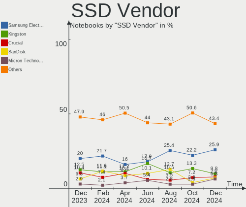
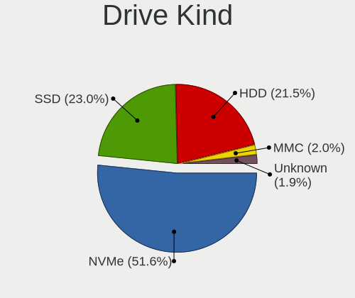
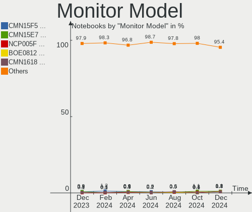
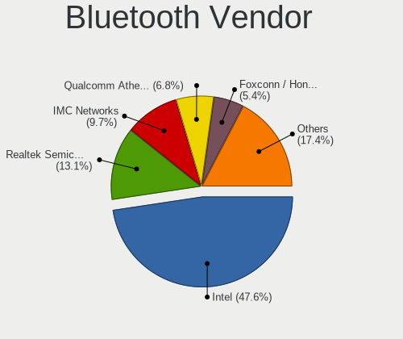
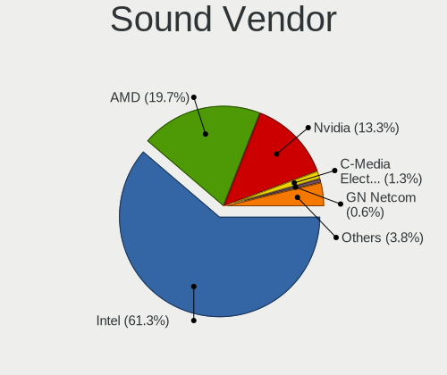

Ubuntu - Hardware Trends (Notebooks)
------------------------------------

A project to identify most popular hardware characteristics and track their change
over time based on data collected by Linux users at https://Linux-Hardware.org.

Anyone can contribute to this report by the [hw-probe](https://github.com/linuxhw/hw-probe) tool:

    sudo -E hw-probe -all -upload

This report is for one last month. Overall report since the beginning of time: [TestDays](https://github.com/linuxhw/TestDays)

Period: May, 2023.

Contents
--------

* [ System ](#system)
  - [ OS                       ](#os)
  - [ OS Family                ](#os-family)
  - [ Kernel                   ](#kernel)
  - [ Kernel Family            ](#kernel-family)
  - [ Kernel Major Ver.        ](#kernel-major-ver)
  - [ Arch                     ](#arch)
  - [ DE                       ](#de)
  - [ Display Server           ](#display-server)
  - [ Display Manager          ](#display-manager)
  - [ OS Lang                  ](#os-lang)
  - [ Boot Mode                ](#boot-mode)
  - [ Filesystem               ](#filesystem)
  - [ Part. scheme             ](#part-scheme)
  - [ Dual Boot with Linux/BSD ](#dual-boot-with-linuxbsd)
  - [ Dual Boot (Win)          ](#dual-boot-win)

* [ Board ](#board)
  - [ Vendor                   ](#vendor)
  - [ Model                    ](#model)
  - [ Model Family             ](#model-family)
  - [ MFG Year                 ](#mfg-year)
  - [ Form Factor              ](#form-factor)
  - [ Secure Boot              ](#secure-boot)
  - [ Coreboot                 ](#coreboot)
  - [ RAM Size                 ](#ram-size)
  - [ RAM Used                 ](#ram-used)
  - [ Total Drives             ](#total-drives)
  - [ Has CD-ROM               ](#has-cd-rom)
  - [ Has Ethernet             ](#has-ethernet)
  - [ Has WiFi                 ](#has-wifi)
  - [ Has Bluetooth            ](#has-bluetooth)

* [ Location ](#location)
  - [ Country                  ](#country)
  - [ City                     ](#city)

* [ Drives ](#drives)
  - [ Drive Vendor             ](#drive-vendor)
  - [ Drive Model              ](#drive-model)
  - [ HDD Vendor               ](#hdd-vendor)
  - [ SSD Vendor               ](#ssd-vendor)
  - [ Drive Kind               ](#drive-kind)
  - [ Drive Connector          ](#drive-connector)
  - [ Drive Size               ](#drive-size)
  - [ Space Total              ](#space-total)
  - [ Space Used               ](#space-used)
  - [ Malfunc. Drives          ](#malfunc-drives)
  - [ Malfunc. Drive Vendor    ](#malfunc-drive-vendor)
  - [ Malfunc. HDD Vendor      ](#malfunc-hdd-vendor)
  - [ Malfunc. Drive Kind      ](#malfunc-drive-kind)
  - [ Failed Drives            ](#failed-drives)
  - [ Failed Drive Vendor      ](#failed-drive-vendor)
  - [ Drive Status             ](#drive-status)

* [ Storage controller ](#storage-controller)
  - [ Storage Vendor           ](#storage-vendor)
  - [ Storage Model            ](#storage-model)
  - [ Storage Kind             ](#storage-kind)

* [ Processor ](#processor)
  - [ CPU Vendor               ](#cpu-vendor)
  - [ CPU Model                ](#cpu-model)
  - [ CPU Model Family         ](#cpu-model-family)
  - [ CPU Cores                ](#cpu-cores)
  - [ CPU Sockets              ](#cpu-sockets)
  - [ CPU Threads              ](#cpu-threads)
  - [ CPU Op-Modes             ](#cpu-op-modes)
  - [ CPU Microcode            ](#cpu-microcode)
  - [ CPU Microarch            ](#cpu-microarch)

* [ Graphics ](#graphics)
  - [ GPU Vendor               ](#gpu-vendor)
  - [ GPU Model                ](#gpu-model)
  - [ GPU Combo                ](#gpu-combo)
  - [ GPU Driver               ](#gpu-driver)
  - [ GPU Memory               ](#gpu-memory)

* [ Monitor ](#monitor)
  - [ Monitor Vendor           ](#monitor-vendor)
  - [ Monitor Model            ](#monitor-model)
  - [ Monitor Resolution       ](#monitor-resolution)
  - [ Monitor Diagonal         ](#monitor-diagonal)
  - [ Monitor Width            ](#monitor-width)
  - [ Aspect Ratio             ](#aspect-ratio)
  - [ Monitor Area             ](#monitor-area)
  - [ Pixel Density            ](#pixel-density)
  - [ Multiple Monitors        ](#multiple-monitors)

* [ Network ](#network)
  - [ Net Controller Vendor    ](#net-controller-vendor)
  - [ Net Controller Model     ](#net-controller-model)
  - [ Wireless Vendor          ](#wireless-vendor)
  - [ Wireless Model           ](#wireless-model)
  - [ Ethernet Vendor          ](#ethernet-vendor)
  - [ Ethernet Model           ](#ethernet-model)
  - [ Net Controller Kind      ](#net-controller-kind)
  - [ Used Controller          ](#used-controller)
  - [ NICs                     ](#nics)
  - [ IPv6                     ](#ipv6)

* [ Bluetooth ](#bluetooth)
  - [ Bluetooth Vendor         ](#bluetooth-vendor)
  - [ Bluetooth Model          ](#bluetooth-model)

* [ Sound ](#sound)
  - [ Sound Vendor             ](#sound-vendor)
  - [ Sound Model              ](#sound-model)

* [ Memory ](#memory)
  - [ Memory Vendor            ](#memory-vendor)
  - [ Memory Model             ](#memory-model)
  - [ Memory Kind              ](#memory-kind)
  - [ Memory Form Factor       ](#memory-form-factor)
  - [ Memory Size              ](#memory-size)
  - [ Memory Speed             ](#memory-speed)

* [ Printers & scanners ](#printers--scanners)
  - [ Printer Vendor           ](#printer-vendor)
  - [ Printer Model            ](#printer-model)
  - [ Scanner Vendor           ](#scanner-vendor)
  - [ Scanner Model            ](#scanner-model)

* [ Camera ](#camera)
  - [ Camera Vendor            ](#camera-vendor)
  - [ Camera Model             ](#camera-model)

* [ Security ](#security)
  - [ Fingerprint Vendor       ](#fingerprint-vendor)
  - [ Fingerprint Model        ](#fingerprint-model)
  - [ Chipcard Vendor          ](#chipcard-vendor)
  - [ Chipcard Model           ](#chipcard-model)

* [ Unsupported ](#unsupported)
  - [ Unsupported Devices      ](#unsupported-devices)
  - [ Unsupported Device Types ](#unsupported-device-types)

System
------

OS
--

Installed operating systems

| Name           | Notebooks | Percent |
|----------------|-----------|---------|
| Ubuntu 22.04   | 364       | 58.24%  |
| Ubuntu 23.04   | 157       | 25.12%  |
| Ubuntu 20.04   | 64        | 10.24%  |
| Ubuntu 22.10   | 25        | 4%      |
| Ubuntu 18.04   | 10        | 1.6%    |
| Ubuntu Core 18 | 1         | 0.16%   |
| Ubuntu 23.10   | 1         | 0.16%   |
| Ubuntu 21.10   | 1         | 0.16%   |
| Ubuntu 21.04   | 1         | 0.16%   |
| Ubuntu 20.10   | 1         | 0.16%   |

OS Family
---------

OS without a version

| Name   | Notebooks | Percent |
|--------|-----------|---------|
| Ubuntu | 625       | 100%    |

Kernel
------

Version of the Linux kernel

| Version               | Notebooks | Percent |
|-----------------------|-----------|---------|
| 5.19.0-41-generic     | 226       | 36.16%  |
| 6.2.0-20-generic      | 144       | 23.04%  |
| 5.19.0-42-generic     | 69        | 11.04%  |
| 5.15.0-71-generic     | 43        | 6.88%   |
| 5.15.0-72-generic     | 25        | 4%      |
| 5.19.0-32-generic     | 22        | 3.52%   |
| 5.4.0-148-generic     | 11        | 1.76%   |
| 5.19.0-40-generic     | 10        | 1.6%    |
| 6.3.1-060301-generic  | 6         | 0.96%   |
| 5.19.0-38-generic     | 4         | 0.64%   |
| 5.19.0-43-generic     | 3         | 0.48%   |
| 5.15.0-67-generic     | 3         | 0.48%   |
| 4.15.0-211-generic    | 3         | 0.48%   |
| 6.3.3-060303-generic  | 2         | 0.32%   |
| 6.3.2-060302-generic  | 2         | 0.32%   |
| 6.2.0-10005-tuxedo    | 2         | 0.32%   |
| 5.4.0-144-generic     | 2         | 0.32%   |
| 5.19.0-21-generic     | 2         | 0.32%   |
| 5.15.0-69-generic     | 2         | 0.32%   |
| 6.3.5-060305-generic  | 1         | 0.16%   |
| 6.3.3-t2-jammy        | 1         | 0.16%   |
| 6.3.2-tkg-cfs         | 1         | 0.16%   |
| 6.3.1-x64v3-xanmod1   | 1         | 0.16%   |
| 6.3.1-tkg-cfs         | 1         | 0.16%   |
| 6.3.0-060300-generic  | 1         | 0.16%   |
| 6.2.9-060209-generic  | 1         | 0.16%   |
| 6.2.14-060214-generic | 1         | 0.16%   |
| 6.2.12-060212-generic | 1         | 0.16%   |
| 6.2.11-060211-generic | 1         | 0.16%   |
| 6.2.10-060210-generic | 1         | 0.16%   |
| 6.2.0-21-generic      | 1         | 0.16%   |
| 6.2.0-1003-lowlatency | 1         | 0.16%   |
| 6.2.0-10007-tuxedo    | 1         | 0.16%   |
| 6.1.0-1013-oem        | 1         | 0.16%   |
| 6.1.0-1012-oem        | 1         | 0.16%   |
| 6.1.0-1008-oem        | 1         | 0.16%   |
| 5.8.0-43-generic      | 1         | 0.16%   |
| 5.8.0-25-generic      | 1         | 0.16%   |
| 5.4.0-79-generic      | 1         | 0.16%   |
| 5.4.0-47-generic      | 1         | 0.16%   |

Kernel Family
-------------

Linux kernel without a distro release

| Version | Notebooks | Percent |
|---------|-----------|---------|
| 5.19.0  | 337       | 53.92%  |
| 6.2.0   | 149       | 23.84%  |
| 5.15.0  | 82        | 13.12%  |
| 5.4.0   | 19        | 3.04%   |
| 6.3.1   | 8         | 1.28%   |
| 4.15.0  | 5         | 0.8%    |
| 6.3.3   | 3         | 0.48%   |
| 6.3.2   | 3         | 0.48%   |
| 6.1.0   | 3         | 0.48%   |
| 5.8.0   | 2         | 0.32%   |
| 5.17.0  | 2         | 0.32%   |
| 5.13.0  | 2         | 0.32%   |
| 6.3.5   | 1         | 0.16%   |
| 6.3.0   | 1         | 0.16%   |
| 6.2.9   | 1         | 0.16%   |
| 6.2.14  | 1         | 0.16%   |
| 6.2.12  | 1         | 0.16%   |
| 6.2.11  | 1         | 0.16%   |
| 6.2.10  | 1         | 0.16%   |
| 5.16.5  | 1         | 0.16%   |
| 5.14.0  | 1         | 0.16%   |
| 5.11.0  | 1         | 0.16%   |

Kernel Major Ver.
-----------------

Linux kernel major version

| Version | Notebooks | Percent |
|---------|-----------|---------|
| 5.19    | 337       | 53.92%  |
| 6.2     | 154       | 24.64%  |
| 5.15    | 82        | 13.12%  |
| 5.4     | 19        | 3.04%   |
| 6.3     | 16        | 2.56%   |
| 4.15    | 5         | 0.8%    |
| 6.1     | 3         | 0.48%   |
| 5.8     | 2         | 0.32%   |
| 5.17    | 2         | 0.32%   |
| 5.13    | 2         | 0.32%   |
| 5.16    | 1         | 0.16%   |
| 5.14    | 1         | 0.16%   |
| 5.11    | 1         | 0.16%   |

Arch
----

OS architecture (x86_64, i586, etc.)

| Name   | Notebooks | Percent |
|--------|-----------|---------|
| x86_64 | 622       | 99.52%  |
| i686   | 3         | 0.48%   |

DE
--

Desktop Environment

| Name            | Notebooks | Percent |
|-----------------|-----------|---------|
| GNOME           | 598       | 95.68%  |
| Unknown         | 13        | 2.08%   |
| GNOME Flashback | 7         | 1.12%   |
| X-Cinnamon      | 4         | 0.64%   |
| i3              | 2         | 0.32%   |
| sway            | 1         | 0.16%   |

Display Server
--------------

X11 or Wayland

| Name    | Notebooks | Percent |
|---------|-----------|---------|
| Wayland | 377       | 60.32%  |
| X11     | 232       | 37.12%  |
| Unknown | 13        | 2.08%   |
| Tty     | 3         | 0.48%   |

Display Manager
---------------

SDDM, LightDM, etc.

| Name    | Notebooks | Percent |
|---------|-----------|---------|
| GDM3    | 525       | 84%     |
| Unknown | 62        | 9.92%   |
| GDM     | 27        | 4.32%   |
| LightDM | 11        | 1.76%   |

OS Lang
-------

Language

| Lang    | Notebooks | Percent |
|---------|-----------|---------|
| en_US   | 270       | 43.2%   |
| fr_FR   | 53        | 8.48%   |
| de_DE   | 45        | 7.2%    |
| en_IN   | 30        | 4.8%    |
| en_GB   | 29        | 4.64%   |
| it_IT   | 28        | 4.48%   |
| pt_BR   | 21        | 3.36%   |
| es_ES   | 19        | 3.04%   |
| en_CA   | 13        | 2.08%   |
| ru_RU   | 11        | 1.76%   |
| pl_PL   | 10        | 1.6%    |
| Unknown | 9         | 1.44%   |
| en_AU   | 8         | 1.28%   |
| nl_NL   | 6         | 0.96%   |
| en_ZA   | 6         | 0.96%   |
| C       | 6         | 0.96%   |
| zh_CN   | 5         | 0.8%    |
| hu_HU   | 5         | 0.8%    |
| es_MX   | 5         | 0.8%    |
| sv_SE   | 4         | 0.64%   |
| ja_JP   | 3         | 0.48%   |
| es_AR   | 3         | 0.48%   |
| el_GR   | 3         | 0.48%   |
| tr_TR   | 2         | 0.32%   |
| pt_PT   | 2         | 0.32%   |
| nl_BE   | 2         | 0.32%   |
| fr_CA   | 2         | 0.32%   |
| uk_UA   | 1         | 0.16%   |
| sr_RS   | 1         | 0.16%   |
| ro_RO   | 1         | 0.16%   |
| ko_KR   | 1         | 0.16%   |
| fr_CH   | 1         | 0.16%   |
| fi_FI   | 1         | 0.16%   |
| et_EE   | 1         | 0.16%   |
| es_VE   | 1         | 0.16%   |
| es_UY   | 1         | 0.16%   |
| es_NI   | 1         | 0.16%   |
| es_GT   | 1         | 0.16%   |
| es_CR   | 1         | 0.16%   |
| es_CO   | 1         | 0.16%   |

Boot Mode
---------

EFI or BIOS

| Mode | Notebooks | Percent |
|------|-----------|---------|
| BIOS | 333       | 53.28%  |
| EFI  | 292       | 46.72%  |

Filesystem
----------

Type of filesystem

| Type    | Notebooks | Percent |
|---------|-----------|---------|
| Ext4    | 347       | 55.52%  |
| Tmpfs   | 248       | 39.68%  |
| Btrfs   | 15        | 2.4%    |
| Overlay | 11        | 1.76%   |
| Zfs     | 3         | 0.48%   |
| Xfs     | 1         | 0.16%   |

Part. scheme
------------

Scheme of partitioning

| Type    | Notebooks | Percent |
|---------|-----------|---------|
| GPT     | 527       | 84.32%  |
| Unknown | 50        | 8%      |
| MBR     | 48        | 7.68%   |

Dual Boot with Linux/BSD
------------------------

Hosting more than one Linux/BSD

| Dual boot | Notebooks | Percent |
|-----------|-----------|---------|
| No        | 578       | 92.48%  |
| Yes       | 47        | 7.52%   |

Dual Boot (Win)
---------------

Hosting Linux and Windows

| Dual boot | Notebooks | Percent |
|-----------|-----------|---------|
| No        | 414       | 66.24%  |
| Yes       | 211       | 33.76%  |

Board
-----

Vendor
------

Motherboard manufacturer

| Name                           | Notebooks | Percent |
|--------------------------------|-----------|---------|
| Hewlett-Packard                | 127       | 20.32%  |
| Lenovo                         | 111       | 17.76%  |
| Dell                           | 96        | 15.36%  |
| ASUSTek Computer               | 69        | 11.04%  |
| Acer                           | 49        | 7.84%   |
| Apple                          | 25        | 4%      |
| HUAWEI                         | 22        | 3.52%   |
| MSI                            | 20        | 3.2%    |
| Toshiba                        | 15        | 2.4%    |
| Sony                           | 9         | 1.44%   |
| Samsung Electronics            | 9         | 1.44%   |
| Unknown                        | 7         | 1.12%   |
| TUXEDO                         | 5         | 0.8%    |
| Packard Bell                   | 4         | 0.64%   |
| Medion                         | 4         | 0.64%   |
| Notebook                       | 3         | 0.48%   |
| HONOR                          | 3         | 0.48%   |
| Google                         | 3         | 0.48%   |
| Alienware                      | 3         | 0.48%   |
| Timi                           | 2         | 0.32%   |
| Razer                          | 2         | 0.32%   |
| Panasonic                      | 2         | 0.32%   |
| Gigabyte Technology            | 2         | 0.32%   |
| Fujitsu                        | 2         | 0.32%   |
| Framework                      | 2         | 0.32%   |
| Digma                          | 2         | 0.32%   |
| Chuwi                          | 2         | 0.32%   |
| AVITA                          | 2         | 0.32%   |
| VALE                           | 1         | 0.16%   |
| Thomson                        | 1         | 0.16%   |
| Shuttle                        | 1         | 0.16%   |
| Shanghai Zhaoxin Semiconductor | 1         | 0.16%   |
| Semp Toshiba                   | 1         | 0.16%   |
| Rombica                        | 1         | 0.16%   |
| Quanta                         | 1         | 0.16%   |
| Olivetti                       | 1         | 0.16%   |
| Mediacom                       | 1         | 0.16%   |
| LG Electronics                 | 1         | 0.16%   |
| Lanix America                  | 1         | 0.16%   |
| Jumper                         | 1         | 0.16%   |

Model
-----

Motherboard model

| Name                                   | Notebooks | Percent |
|----------------------------------------|-----------|---------|
| Unknown                                | 10        | 1.6%    |
| HP Pavilion g6                         | 5         | 0.8%    |
| HP Notebook                            | 4         | 0.64%   |
| HUAWEI KLVD-WXX9                       | 3         | 0.48%   |
| HUAWEI BOHB-WAX9                       | 3         | 0.48%   |
| HUAWEI BOD-WXX9                        | 3         | 0.48%   |
| HP ZBook Studio G3                     | 3         | 0.48%   |
| HP Pavilion 15                         | 3         | 0.48%   |
| HP Laptop 15s-fq5xxx                   | 3         | 0.48%   |
| HP Laptop 15-db0xxx                    | 3         | 0.48%   |
| HP Laptop 14-dq2xxx                    | 3         | 0.48%   |
| HP EliteBook 840 G3                    | 3         | 0.48%   |
| ASUS X550CC                            | 3         | 0.48%   |
| Apple MacBookPro6,2                    | 3         | 0.48%   |
| Acer Nitro AN517-54                    | 3         | 0.48%   |
| MSI Raider GE76 12UE                   | 2         | 0.32%   |
| Lenovo V130-15IKB 81HN                 | 2         | 0.32%   |
| Lenovo Legion 5 15ACH6H 82JU           | 2         | 0.32%   |
| Lenovo IdeaPad 5 14ALC05 82LM          | 2         | 0.32%   |
| Lenovo IdeaPad 320-15AST 80XV          | 2         | 0.32%   |
| Lenovo IdeaPad 1 15ADA7 82R1           | 2         | 0.32%   |
| HUAWEI NBLB-WAX9N                      | 2         | 0.32%   |
| HUAWEI KLVL-WXXW                       | 2         | 0.32%   |
| HONOR BBR-WAX9                         | 2         | 0.32%   |
| HP Pavilion Notebook                   | 2         | 0.32%   |
| HP Pavilion dv6                        | 2         | 0.32%   |
| HP Pavilion Aero Laptop 13-be0xxx      | 2         | 0.32%   |
| HP Meep                                | 2         | 0.32%   |
| HP Laptop 17-cn2xxx                    | 2         | 0.32%   |
| HP Laptop 15s-fq4xxx                   | 2         | 0.32%   |
| HP ENVY 15                             | 2         | 0.32%   |
| HP EliteBook 850 G8 Notebook PC        | 2         | 0.32%   |
| HP EliteBook 850 G6                    | 2         | 0.32%   |
| HP EliteBook 840 G8 Notebook PC        | 2         | 0.32%   |
| HP 625                                 | 2         | 0.32%   |
| HP 255 G8 Notebook PC                  | 2         | 0.32%   |
| HP 15                                  | 2         | 0.32%   |
| Framework Laptop (12th Gen Intel Core) | 2         | 0.32%   |
| Dell Vostro 5402                       | 2         | 0.32%   |
| Dell Latitude E5570                    | 2         | 0.32%   |

Model Family
------------

Motherboard model prefix

| Name                  | Notebooks | Percent |
|-----------------------|-----------|---------|
| Lenovo ThinkPad       | 57        | 9.12%   |
| Dell Latitude         | 38        | 6.08%   |
| Lenovo IdeaPad        | 31        | 4.96%   |
| Acer Aspire           | 31        | 4.96%   |
| HP Pavilion           | 30        | 4.8%    |
| Dell Inspiron         | 26        | 4.16%   |
| HP EliteBook          | 24        | 3.84%   |
| ASUS VivoBook         | 22        | 3.52%   |
| HP Laptop             | 21        | 3.36%   |
| Toshiba Satellite     | 13        | 2.08%   |
| Dell Vostro           | 11        | 1.76%   |
| Unknown               | 10        | 1.6%    |
| HP ZBook              | 9         | 1.44%   |
| HP ProBook            | 9         | 1.44%   |
| HP ENVY               | 9         | 1.44%   |
| Acer Nitro            | 9         | 1.44%   |
| Dell XPS              | 7         | 1.12%   |
| Dell Precision        | 7         | 1.12%   |
| Lenovo ThinkBook      | 6         | 0.96%   |
| Lenovo Legion         | 5         | 0.8%    |
| ASUS Zenbook          | 5         | 0.8%    |
| Acer Swift            | 5         | 0.8%    |
| Packard Bell EasyNote | 4         | 0.64%   |
| MSI Katana            | 4         | 0.64%   |
| HP Notebook           | 4         | 0.64%   |
| ASUS ROG              | 4         | 0.64%   |
| ASUS ASUS             | 4         | 0.64%   |
| Apple MacBookPro11    | 4         | 0.64%   |
| MSI Stealth           | 3         | 0.48%   |
| HUAWEI KLVD-WXX9      | 3         | 0.48%   |
| HUAWEI BOHB-WAX9      | 3         | 0.48%   |
| HUAWEI BOD-WXX9       | 3         | 0.48%   |
| ASUS X550CC           | 3         | 0.48%   |
| Apple MacBookPro6     | 3         | 0.48%   |
| TUXEDO Pulse          | 2         | 0.32%   |
| Toshiba PORTEGE       | 2         | 0.32%   |
| Timi Xiaomi           | 2         | 0.32%   |
| Razer Blade           | 2         | 0.32%   |
| MSI Raider            | 2         | 0.32%   |
| MSI GF63              | 2         | 0.32%   |

MFG Year
--------

Motherboard manufacture year

| Year    | Notebooks | Percent |
|---------|-----------|---------|
| 2021    | 93        | 14.88%  |
| 2022    | 79        | 12.64%  |
| 2020    | 66        | 10.56%  |
| 2019    | 46        | 7.36%   |
| 2018    | 44        | 7.04%   |
| 2016    | 37        | 5.92%   |
| 2013    | 35        | 5.6%    |
| 2012    | 34        | 5.44%   |
| 2017    | 31        | 4.96%   |
| 2011    | 31        | 4.96%   |
| 2010    | 31        | 4.96%   |
| 2015    | 26        | 4.16%   |
| 2014    | 25        | 4%      |
| 2008    | 15        | 2.4%    |
| 2023    | 14        | 2.24%   |
| 2009    | 10        | 1.6%    |
| 2007    | 4         | 0.64%   |
| 2006    | 2         | 0.32%   |
| 2004    | 1         | 0.16%   |
| Unknown | 1         | 0.16%   |

Form Factor
-----------

Physical design of the computer

| Name     | Notebooks | Percent |
|----------|-----------|---------|
| Notebook | 625       | 100%    |

Secure Boot
-----------

Enabled or disabled

| State    | Notebooks | Percent |
|----------|-----------|---------|
| Disabled | 539       | 86.24%  |
| Enabled  | 86        | 13.76%  |

Coreboot
--------

Have coreboot on board

| Used | Notebooks | Percent |
|------|-----------|---------|
| No   | 620       | 99.2%   |
| Yes  | 5         | 0.8%    |

RAM Size
--------

Total RAM memory

| Size in GB  | Notebooks | Percent |
|-------------|-----------|---------|
| 4.01-8.0    | 182       | 29.12%  |
| 16.01-24.0  | 128       | 20.48%  |
| 3.01-4.0    | 110       | 17.6%   |
| 8.01-16.0   | 109       | 17.44%  |
| 32.01-64.0  | 57        | 9.12%   |
| 24.01-32.0  | 13        | 2.08%   |
| 1.01-2.0    | 12        | 1.92%   |
| 64.01-256.0 | 11        | 1.76%   |
| 2.01-3.0    | 3         | 0.48%   |

RAM Used
--------

Used RAM memory

| Used GB    | Notebooks | Percent |
|------------|-----------|---------|
| 2.01-3.0   | 190       | 30.4%   |
| 1.01-2.0   | 164       | 26.24%  |
| 4.01-8.0   | 127       | 20.32%  |
| 3.01-4.0   | 109       | 17.44%  |
| 8.01-16.0  | 26        | 4.16%   |
| 0.51-1.0   | 5         | 0.8%    |
| 16.01-24.0 | 3         | 0.48%   |
| 24.01-32.0 | 1         | 0.16%   |

Total Drives
------------

Number of drives on board

| Drives | Notebooks | Percent |
|--------|-----------|---------|
| 1      | 494       | 79.04%  |
| 2      | 117       | 18.72%  |
| 3      | 9         | 1.44%   |
| 0      | 4         | 0.64%   |
| 7      | 1         | 0.16%   |

Has CD-ROM
----------

Has CD-ROM on board

| Presented | Notebooks | Percent |
|-----------|-----------|---------|
| No        | 452       | 72.32%  |
| Yes       | 173       | 27.68%  |

Has Ethernet
------------

Has Ethernet on board

| Presented | Notebooks | Percent |
|-----------|-----------|---------|
| Yes       | 453       | 72.48%  |
| No        | 172       | 27.52%  |

Has WiFi
--------

Has WiFi module

| Presented | Notebooks | Percent |
|-----------|-----------|---------|
| Yes       | 615       | 98.4%   |
| No        | 10        | 1.6%    |

Has Bluetooth
-------------

Has Bluetooth module

| Presented | Notebooks | Percent |
|-----------|-----------|---------|
| Yes       | 525       | 84%     |
| No        | 100       | 16%     |

Location
--------

Country
-------

Geographic location (country)

| Country      | Notebooks | Percent |
|--------------|-----------|---------|
| USA          | 96        | 15.36%  |
| France       | 56        | 8.96%   |
| Germany      | 54        | 8.64%   |
| Italy        | 39        | 6.24%   |
| Brazil       | 37        | 5.92%   |
| India        | 34        | 5.44%   |
| UK           | 25        | 4%      |
| Russia       | 22        | 3.52%   |
| Spain        | 18        | 2.88%   |
| Canada       | 17        | 2.72%   |
| Netherlands  | 12        | 1.92%   |
| Poland       | 10        | 1.6%    |
| Australia    | 10        | 1.6%    |
| Mexico       | 9         | 1.44%   |
| Belgium      | 9         | 1.44%   |
| Switzerland  | 7         | 1.12%   |
| Sweden       | 7         | 1.12%   |
| Pakistan     | 7         | 1.12%   |
| Hungary      | 7         | 1.12%   |
| China        | 7         | 1.12%   |
| Turkey       | 6         | 0.96%   |
| South Africa | 6         | 0.96%   |
| Romania      | 6         | 0.96%   |
| Argentina    | 6         | 0.96%   |
| Serbia       | 5         | 0.8%    |
| Portugal     | 5         | 0.8%    |
| Egypt        | 5         | 0.8%    |
| Chile        | 5         | 0.8%    |
| Norway       | 4         | 0.64%   |
| Greece       | 4         | 0.64%   |
| Finland      | 4         | 0.64%   |
| Austria      | 4         | 0.64%   |
| Vietnam      | 3         | 0.48%   |
| Uruguay      | 3         | 0.48%   |
| UAE          | 3         | 0.48%   |
| Philippines  | 3         | 0.48%   |
| Kenya        | 3         | 0.48%   |
| Japan        | 3         | 0.48%   |
| Israel       | 3         | 0.48%   |
| Iran         | 3         | 0.48%   |

City
----

Geographic location (city)

| City              | Notebooks | Percent |
|-------------------|-----------|---------|
| Paris             | 11        | 1.76%   |
| Milan             | 8         | 1.28%   |
| Sao Paulo         | 6         | 0.96%   |
| Moscow            | 6         | 0.96%   |
| Rome              | 5         | 0.8%    |
| Mumbai            | 5         | 0.8%    |
| Madrid            | 5         | 0.8%    |
| Berlin            | 5         | 0.8%    |
| Turin             | 4         | 0.64%   |
| Rio de Janeiro    | 4         | 0.64%   |
| Cologne           | 4         | 0.64%   |
| Valencia          | 3         | 0.48%   |
| Trivandrum        | 3         | 0.48%   |
| Tehran            | 3         | 0.48%   |
| St Petersburg     | 3         | 0.48%   |
| Santiago          | 3         | 0.48%   |
| San Francisco     | 3         | 0.48%   |
| Nairobi           | 3         | 0.48%   |
| Montreal          | 3         | 0.48%   |
| Montevideo        | 3         | 0.48%   |
| Lahore            | 3         | 0.48%   |
| Helsinki          | 3         | 0.48%   |
| Guadalajara       | 3         | 0.48%   |
| Gothenburg        | 3         | 0.48%   |
| Frankfurt am Main | 3         | 0.48%   |
| Eureka            | 3         | 0.48%   |
| Curitiba          | 3         | 0.48%   |
| Columbia          | 3         | 0.48%   |
| Cape Town         | 3         | 0.48%   |
| Campinas          | 3         | 0.48%   |
| Budapest          | 3         | 0.48%   |
| Brussels          | 3         | 0.48%   |
| Brisbane          | 3         | 0.48%   |
| Bengaluru         | 3         | 0.48%   |
| Belgrade          | 3         | 0.48%   |
| Barcelona         | 3         | 0.48%   |
| Zurich            | 2         | 0.32%   |
| Warsaw            | 2         | 0.32%   |
| Vienna            | 2         | 0.32%   |
| Uberlândia       | 2         | 0.32%   |

Drives
------

Drive Vendor
------------

Hard drive vendors

| Vendor                      | Notebooks | Drives | Percent |
|-----------------------------|-----------|--------|---------|
| Samsung Electronics         | 122       | 128    | 16.55%  |
| WDC                         | 74        | 75     | 10.04%  |
| Seagate                     | 58        | 62     | 7.87%   |
| Sandisk                     | 49        | 52     | 6.65%   |
| Toshiba                     | 43        | 43     | 5.83%   |
| Micron Technology           | 40        | 40     | 5.43%   |
| SK hynix                    | 38        | 38     | 5.16%   |
| Kingston                    | 36        | 37     | 4.88%   |
| Unknown                     | 30        | 32     | 4.07%   |
| Intel                       | 28        | 28     | 3.8%    |
| Crucial                     | 27        | 27     | 3.66%   |
| HGST                        | 19        | 19     | 2.58%   |
| KIOXIA                      | 17        | 17     | 2.31%   |
| Hitachi                     | 17        | 18     | 2.31%   |
| Apple                       | 12        | 14     | 1.63%   |
| Phison Electronics          | 10        | 11     | 1.36%   |
| China                       | 9         | 9      | 1.22%   |
| Phison                      | 8         | 8      | 1.09%   |
| A-DATA Technology           | 8         | 8      | 1.09%   |
| Kingston Technology Company | 7         | 7      | 0.95%   |
| LITEONIT                    | 5         | 5      | 0.68%   |
| SPCC                        | 4         | 4      | 0.54%   |
| Netac                       | 4         | 4      | 0.54%   |
| Unknown                     | 4         | 4      | 0.54%   |
| Team                        | 3         | 3      | 0.41%   |
| LITEON                      | 3         | 3      | 0.41%   |
| Lexar                       | 3         | 3      | 0.41%   |
| Intenso                     | 3         | 4      | 0.41%   |
| GOODRAM                     | 3         | 3      | 0.41%   |
| ADATA Technology            | 3         | 3      | 0.41%   |
| UMIS                        | 2         | 2      | 0.27%   |
| Solid State Storage         | 2         | 2      | 0.27%   |
| Silicon Motion              | 2         | 2      | 0.27%   |
| Realtek Semiconductor       | 2         | 2      | 0.27%   |
| PNY                         | 2         | 2      | 0.27%   |
| Lenovo                      | 2         | 2      | 0.27%   |
| JMicron Technology          | 2         | 2      | 0.27%   |
| FORESEE                     | 2         | 2      | 0.27%   |
| Zheino                      | 1         | 1      | 0.14%   |
| Yangtze Memory Technologies | 1         | 1      | 0.14%   |

Drive Model
-----------

Hard drive models

| Model                                               | Notebooks | Percent |
|-----------------------------------------------------|-----------|---------|
| Seagate ST1000LM035-1RK172 1TB                      | 13        | 1.73%   |
| Samsung NVMe SSD Controller SM981/PM981/PM983 256GB | 11        | 1.46%   |
| Samsung NVMe SSD Controller PM9A1/PM9A3/980PRO 1TB  | 10        | 1.33%   |
| Unknown MMC Card  32GB                              | 9         | 1.2%    |
| Seagate ST1000LM024 HN-M101MBB 1TB                  | 8         | 1.07%   |
| Kingston SA400S37480G 480GB SSD                     | 7         | 0.93%   |
| HGST HTS541010A9E680 1TB                            | 7         | 0.93%   |
| Unknown MMC Card  64GB                              | 6         | 0.8%    |
| Toshiba MQ01ABD100 1TB                              | 6         | 0.8%    |
| Sandisk WD Blue SN550 NVMe SSD 512GB                | 6         | 0.8%    |
| Sandisk WD Black SN750 / PC SN730 NVMe SSD 256GB    | 6         | 0.8%    |
| Toshiba MQ04ABF100 1TB                              | 5         | 0.67%   |
| Phison PS5013 E13 NVMe Controller 512GB             | 5         | 0.67%   |
| Phison E12 NVMe Controller 256GB                    | 5         | 0.67%   |
| Kingston SA400S37240G 240GB SSD                     | 5         | 0.67%   |
| WDC WD5000LPVX-22V0TT0 500GB                        | 4         | 0.53%   |
| Unknown MMC Card  16GB                              | 4         | 0.53%   |
| SK hynix HFS256G39TND-N210A 256GB SSD               | 4         | 0.53%   |
| SK hynix BC711 HFM512GD3JX013N 512GB                | 4         | 0.53%   |
| SanDisk NVMe SSD Drive 512GB                        | 4         | 0.53%   |
| Samsung SSD 970 EVO Plus 1TB                        | 4         | 0.53%   |
| Samsung SSD 870 QVO 1TB                             | 4         | 0.53%   |
| Samsung SSD 850 EVO 250GB                           | 4         | 0.53%   |
| Micron MTFDHBA512QFD 512GB                          | 4         | 0.53%   |
| KIOXIA KBG50ZNV512G 512GB                           | 4         | 0.53%   |
| Intel SSDPEKNW512GZL 512GB                          | 4         | 0.53%   |
| HGST HTS725050A7E630 500GB                          | 4         | 0.53%   |
| HGST HTS545050A7E680 500GB                          | 4         | 0.53%   |
| Unknown                                             | 4         | 0.53%   |
| WDC WD10SPZX-60Z10T0 1TB                            | 3         | 0.4%    |
| WDC PC SN530 SDBPNPZ-256G-1006 256GB                | 3         | 0.4%    |
| Unknown MMC Card  128GB                             | 3         | 0.4%    |
| Toshiba MQ01ABF050 500GB                            | 3         | 0.4%    |
| SK hynix HFM512GD3JX013N 512GB                      | 3         | 0.4%    |
| Seagate ST2000LM007-1R8174 2TB                      | 3         | 0.4%    |
| Sandisk WDC PC SN530 SDBPMPZ-512G-1101 512GB        | 3         | 0.4%    |
| Samsung SSD 870 EVO 500GB                           | 3         | 0.4%    |
| Samsung SSD 860 EVO 500GB                           | 3         | 0.4%    |
| Samsung SSD 860 EVO 250GB                           | 3         | 0.4%    |
| Samsung MZVLQ512HALU-000H1 512GB                    | 3         | 0.4%    |

HDD Vendor
----------

Hard disk drive vendors

| Vendor              | Notebooks | Drives | Percent |
|---------------------|-----------|--------|---------|
| Seagate             | 56        | 59     | 32.75%  |
| WDC                 | 41        | 41     | 23.98%  |
| Toshiba             | 29        | 29     | 16.96%  |
| HGST                | 19        | 19     | 11.11%  |
| Hitachi             | 17        | 18     | 9.94%   |
| Samsung Electronics | 3         | 3      | 1.75%   |
| Unknown             | 2         | 2      | 1.17%   |
| LaCie               | 1         | 1      | 0.58%   |
| Inateck             | 1         | 1      | 0.58%   |
| Fujitsu             | 1         | 1      | 0.58%   |
| Apple               | 1         | 1      | 0.58%   |

SSD Vendor
----------

Solid state drive vendors

| Vendor              | Notebooks | Drives | Percent |
|---------------------|-----------|--------|---------|
| Samsung Electronics | 44        | 47     | 20.66%  |
| Kingston            | 22        | 23     | 10.33%  |
| Crucial             | 21        | 21     | 9.86%   |
| SanDisk             | 18        | 19     | 8.45%   |
| WDC                 | 15        | 15     | 7.04%   |
| SK hynix            | 12        | 12     | 5.63%   |
| China               | 8         | 8      | 3.76%   |
| Micron Technology   | 6         | 6      | 2.82%   |
| LITEONIT            | 5         | 5      | 2.35%   |
| Apple               | 5         | 5      | 2.35%   |
| SPCC                | 4         | 4      | 1.88%   |
| Intel               | 4         | 4      | 1.88%   |
| Team                | 3         | 3      | 1.41%   |
| Netac               | 3         | 3      | 1.41%   |
| LITEON              | 3         | 3      | 1.41%   |
| Lexar               | 3         | 3      | 1.41%   |
| PNY                 | 2         | 2      | 0.94%   |
| JMicron Technology  | 2         | 2      | 0.94%   |
| Intenso             | 2         | 2      | 0.94%   |
| GOODRAM             | 2         | 2      | 0.94%   |
| FORESEE             | 2         | 2      | 0.94%   |
| A-DATA Technology   | 2         | 2      | 0.94%   |
| WDC WDS2            | 1         | 1      | 0.47%   |
| VISIPRO             | 1         | 1      | 0.47%   |
| USB                 | 1         | 1      | 0.47%   |
| Transcend           | 1         | 1      | 0.47%   |
| Smartbuy            | 1         | 1      | 0.47%   |
| Seagate             | 1         | 1      | 0.47%   |
| Rogueware           | 1         | 1      | 0.47%   |
| Ramaxel Technology  | 1         | 1      | 0.47%   |
| PNY CS90            | 1         | 1      | 0.47%   |
| Platinet            | 1         | 1      | 0.47%   |
| Phison              | 1         | 1      | 0.47%   |
| ORTIAL              | 1         | 1      | 0.47%   |
| NT-512              | 1         | 1      | 0.47%   |
| Lenovo              | 1         | 1      | 0.47%   |
| KIOXIA-EXCERIA      | 1         | 1      | 0.47%   |
| KingSpec            | 1         | 1      | 0.47%   |
| KINGBANK            | 1         | 1      | 0.47%   |
| INTEL SS            | 1         | 2      | 0.47%   |

Drive Kind
----------

HDD or SSD

| Kind    | Notebooks | Drives | Percent |
|---------|-----------|--------|---------|
| NVMe    | 302       | 326    | 42.72%  |
| SSD     | 202       | 219    | 28.57%  |
| HDD     | 165       | 175    | 23.34%  |
| MMC     | 30        | 32     | 4.24%   |
| Unknown | 8         | 8      | 1.13%   |

Drive Connector
---------------

SATA, SAS, NVMe, etc.

| Type | Notebooks | Drives | Percent |
|------|-----------|--------|---------|
| SATA | 332       | 374    | 48.33%  |
| NVMe | 302       | 325    | 43.96%  |
| MMC  | 30        | 32     | 4.37%   |
| SAS  | 23        | 29     | 3.35%   |

Drive Size
----------

Size of hard drive

| Size in TB | Notebooks | Drives | Percent |
|------------|-----------|--------|---------|
| 0.01-0.5   | 228       | 250    | 62.3%   |
| 0.51-1.0   | 122       | 126    | 33.33%  |
| 1.01-2.0   | 12        | 12     | 3.28%   |
| 3.01-4.0   | 2         | 4      | 0.55%   |
| 4.01-10.0  | 2         | 2      | 0.55%   |

Space Total
-----------

Amount of disk space available on the file system

| Size in GB     | Notebooks | Percent |
|----------------|-----------|---------|
| 251-500        | 209       | 33.44%  |
| 101-250        | 195       | 31.2%   |
| 501-1000       | 95        | 15.2%   |
| 51-100         | 38        | 6.08%   |
| 1001-2000      | 25        | 4%      |
| 1-20           | 20        | 3.2%    |
| 21-50          | 19        | 3.04%   |
| More than 3000 | 10        | 1.6%    |
| Unknown        | 10        | 1.6%    |
| 2001-3000      | 4         | 0.64%   |

Space Used
----------

Amount of used disk space

| Used GB        | Notebooks | Percent |
|----------------|-----------|---------|
| 1-20           | 201       | 32.16%  |
| 21-50          | 142       | 22.72%  |
| 101-250        | 102       | 16.32%  |
| 51-100         | 88        | 14.08%  |
| 251-500        | 51        | 8.16%   |
| 501-1000       | 19        | 3.04%   |
| Unknown        | 10        | 1.6%    |
| 1001-2000      | 6         | 0.96%   |
| More than 3000 | 3         | 0.48%   |
| 2001-3000      | 3         | 0.48%   |

Malfunc. Drives
---------------

Drive models with a malfunction

| Model                                  | Notebooks | Drives | Percent |
|----------------------------------------|-----------|--------|---------|
| SK hynix HFS256G39TND-N210A 256GB SSD  | 2         | 2      | 8.7%    |
| Seagate ST1000LM035-1RK172 1TB         | 2         | 2      | 8.7%    |
| Hitachi HTS547564A9E384 640GB          | 2         | 2      | 8.7%    |
| WDC WD5000BEKT-75KA9T0 500GB           | 1         | 1      | 4.35%   |
| WDC WD Green M.2 2280 240GB SSD        | 1         | 1      | 4.35%   |
| Toshiba MQ04ABF100 1TB                 | 1         | 1      | 4.35%   |
| SK hynix SC308 SATA 512GB SSD          | 1         | 1      | 4.35%   |
| Seagate ST9160827AS 160GB              | 1         | 1      | 4.35%   |
| Seagate ST500LT012-9WS142 500GB        | 1         | 1      | 4.35%   |
| Seagate ST1000LX015-1U7172 1TB         | 1         | 1      | 4.35%   |
| Seagate ST1000LM024 HN-M101MBB 1TB     | 1         | 1      | 4.35%   |
| Netac SSD 128GB                        | 1         | 1      | 4.35%   |
| Kingston SA400S37480G 480GB SSD        | 1         | 1      | 4.35%   |
| Kingston SA400S37120G 120GB SSD        | 1         | 1      | 4.35%   |
| Hitachi HTS547575A9E384 752GB          | 1         | 1      | 4.35%   |
| Hitachi HTS547550A9E384 500GB          | 1         | 1      | 4.35%   |
| HGST HTS721010A9E630 1TB               | 1         | 1      | 4.35%   |
| Fujitsu MJA2250BH FFS G1 250GB         | 1         | 1      | 4.35%   |
| A-DATA Technology IM2P33F3A NVMe 256GB | 1         | 1      | 4.35%   |
| Unknown                                | 1         | 1      | 4.35%   |

Malfunc. Drive Vendor
---------------------

Vendors of faulty drives

| Vendor            | Notebooks | Drives | Percent |
|-------------------|-----------|--------|---------|
| Seagate           | 6         | 6      | 26.09%  |
| Hitachi           | 4         | 4      | 17.39%  |
| SK hynix          | 3         | 3      | 13.04%  |
| WDC               | 2         | 2      | 8.7%    |
| Kingston          | 2         | 2      | 8.7%    |
| Toshiba           | 1         | 1      | 4.35%   |
| Netac             | 1         | 1      | 4.35%   |
| HGST              | 1         | 1      | 4.35%   |
| Fujitsu           | 1         | 1      | 4.35%   |
| A-DATA Technology | 1         | 1      | 4.35%   |
| Unknown           | 1         | 1      | 4.35%   |

Malfunc. HDD Vendor
-------------------

Vendors of faulty HDD drives

| Vendor  | Notebooks | Drives | Percent |
|---------|-----------|--------|---------|
| Seagate | 6         | 6      | 42.86%  |
| Hitachi | 4         | 4      | 28.57%  |
| WDC     | 1         | 1      | 7.14%   |
| Toshiba | 1         | 1      | 7.14%   |
| HGST    | 1         | 1      | 7.14%   |
| Fujitsu | 1         | 1      | 7.14%   |

Malfunc. Drive Kind
-------------------

Kinds of faulty drives

| Kind | Notebooks | Drives | Percent |
|------|-----------|--------|---------|
| HDD  | 14        | 14     | 60.87%  |
| SSD  | 8         | 8      | 34.78%  |
| NVMe | 1         | 1      | 4.35%   |

Failed Drives
-------------

Failed drive models

Zero info for selected period =(

Failed Drive Vendor
-------------------

Failed drive vendors

Zero info for selected period =(

Drive Status
------------

Number of failed and malfunc. drives

| Status   | Notebooks | Drives | Percent |
|----------|-----------|--------|---------|
| Detected | 367       | 448    | 56.9%   |
| Works    | 255       | 289    | 39.53%  |
| Malfunc  | 23        | 23     | 3.57%   |

Storage controller
------------------

Storage Vendor
--------------

Storage controller vendors

| Vendor                                  | Notebooks | Percent |
|-----------------------------------------|-----------|---------|
| Intel                                   | 399       | 51.68%  |
| Samsung Electronics                     | 79        | 10.23%  |
| AMD                                     | 68        | 8.81%   |
| SanDisk                                 | 48        | 6.22%   |
| Micron Technology                       | 34        | 4.4%    |
| SK hynix                                | 24        | 3.11%   |
| Kingston Technology Company             | 20        | 2.59%   |
| Phison Electronics                      | 18        | 2.33%   |
| Toshiba America Info Systems            | 17        | 2.2%    |
| KIOXIA                                  | 15        | 1.94%   |
| ADATA Technology                        | 10        | 1.3%    |
| Micron/Crucial Technology               | 8         | 1.04%   |
| Nvidia                                  | 7         | 0.91%   |
| Apple                                   | 6         | 0.78%   |
| Solid State Storage Technology          | 3         | 0.39%   |
| Silicon Motion                          | 3         | 0.39%   |
| Union Memory (Shenzhen)                 | 2         | 0.26%   |
| Realtek Semiconductor                   | 2         | 0.26%   |
| ASMedia Technology                      | 2         | 0.26%   |
| Zhaoxin                                 | 1         | 0.13%   |
| Yangtze Memory Technologies             | 1         | 0.13%   |
| Shenzhen Unionmemory Information System | 1         | 0.13%   |
| Shenzhen Longsys Electronics            | 1         | 0.13%   |
| Ramaxel Technology(Shenzhen) Limited    | 1         | 0.13%   |
| Lenovo                                  | 1         | 0.13%   |
| JMicron Technology                      | 1         | 0.13%   |

Storage Model
-------------

Storage controller models

| Model                                                                          | Notebooks | Percent |
|--------------------------------------------------------------------------------|-----------|---------|
| Intel Sunrise Point-LP SATA Controller [AHCI mode]                             | 60        | 7.27%   |
| AMD FCH SATA Controller [AHCI mode]                                            | 59        | 7.15%   |
| Intel Volume Management Device NVMe RAID Controller                            | 50        | 6.06%   |
| Intel 7 Series Chipset Family 6-port SATA Controller [AHCI mode]               | 35        | 4.24%   |
| Micron NVMe Storage Controller                                                 | 30        | 3.64%   |
| Intel 82801 Mobile SATA Controller [RAID mode]                                 | 28        | 3.39%   |
| Samsung NVMe SSD Controller SM981/PM981/PM983                                  | 27        | 3.27%   |
| Intel 6 Series/C200 Series Chipset Family 6 port Mobile SATA AHCI Controller   | 25        | 3.03%   |
| Intel Wildcat Point-LP SATA Controller [AHCI Mode]                             | 22        | 2.67%   |
| Samsung NVMe SSD Controller PM9A1/PM9A3/980PRO                                 | 21        | 2.55%   |
| Intel 8 Series SATA Controller 1 [AHCI mode]                                   | 20        | 2.42%   |
| Intel 5 Series/3400 Series Chipset 4 port SATA AHCI Controller                 | 18        | 2.18%   |
| Samsung NVMe SSD Controller 980                                                | 16        | 1.94%   |
| Intel Tiger Lake-LP SATA Controller                                            | 15        | 1.82%   |
| Intel Celeron/Pentium Silver Processor SATA Controller                         | 15        | 1.82%   |
| SanDisk WD Blue SN550 NVMe SSD                                                 | 13        | 1.58%   |
| SK hynix Gold P31/PC711 NVMe Solid State Drive                                 | 12        | 1.45%   |
| SanDisk WD Black SN750 / PC SN730 NVMe SSD                                     | 12        | 1.45%   |
| Intel Comet Lake SATA AHCI Controller                                          | 12        | 1.45%   |
| Intel Cannon Lake Mobile PCH SATA AHCI Controller                              | 12        | 1.45%   |
| Phison PS5013 E13 NVMe Controller                                              | 11        | 1.33%   |
| Intel Non-Volatile memory controller                                           | 11        | 1.33%   |
| Intel Alder Lake-P SATA AHCI Controller                                        | 11        | 1.33%   |
| Intel 8 Series/C220 Series Chipset Family 6-port SATA Controller 1 [AHCI mode] | 11        | 1.33%   |
| Toshiba America Info Systems XG6 NVMe SSD Controller                           | 9         | 1.09%   |
| Sandisk Non-Volatile memory controller                                         | 9         | 1.09%   |
| Intel 82801IBM/IEM (ICH9M/ICH9M-E) 4 port SATA Controller [AHCI mode]          | 9         | 1.09%   |
| KIOXIA NVMe SSD Controller BG4                                                 | 8         | 0.97%   |
| Intel SSD 660P Series                                                          | 8         | 0.97%   |
| Intel 82801HM/HEM (ICH8M/ICH8M-E) IDE Controller                               | 8         | 0.97%   |
| SK hynix Non-Volatile memory controller                                        | 7         | 0.85%   |
| Samsung NVMe SSD Controller SM961/PM961/SM963                                  | 7         | 0.85%   |
| Micron/Crucial P2 NVMe PCIe SSD                                                | 7         | 0.85%   |
| KIOXIA Non-Volatile memory controller                                          | 7         | 0.85%   |
| Kingston Company Company Non-Volatile memory controller                        | 6         | 0.73%   |
| Intel Atom Processor E3800 Series SATA AHCI Controller                         | 6         | 0.73%   |
| Intel 82801HM/HEM (ICH8M/ICH8M-E) SATA Controller [AHCI mode]                  | 6         | 0.73%   |
| Intel 500 Series Chipset Family SATA AHCI Controller                           | 6         | 0.73%   |
| Intel 400 Series Chipset Family SATA AHCI Controller                           | 6         | 0.73%   |
| SanDisk WD PC SN810 / Black SN850 NVMe SSD                                     | 5         | 0.61%   |

Storage Kind
------------

Kind of storage controller (IDE, SATA, NVMe, SAS, ...)

| Kind | Notebooks | Percent |
|------|-----------|---------|
| SATA | 392       | 49.25%  |
| NVMe | 300       | 37.69%  |
| RAID | 85        | 10.68%  |
| IDE  | 19        | 2.39%   |

Processor
---------

CPU Vendor
----------

Processor vendors

| Vendor       | Notebooks | Percent |
|--------------|-----------|---------|
| Intel        | 506       | 80.96%  |
| AMD          | 118       | 18.88%  |
| CentaurHauls | 1         | 0.16%   |

CPU Model
---------

Processor models

| Model                                         | Notebooks | Percent |
|-----------------------------------------------|-----------|---------|
| Intel 11th Gen Core i5-1135G7 @ 2.40GHz       | 17        | 2.72%   |
| Intel Core i5-7200U CPU @ 2.50GHz             | 11        | 1.76%   |
| Intel Core i5-6300U CPU @ 2.40GHz             | 11        | 1.76%   |
| Intel 11th Gen Core i7-1165G7 @ 2.80GHz       | 11        | 1.76%   |
| Intel Core i7-8565U CPU @ 1.80GHz             | 10        | 1.6%    |
| Intel Core i7-8550U CPU @ 1.80GHz             | 9         | 1.44%   |
| Intel Core i5-5200U CPU @ 2.20GHz             | 9         | 1.44%   |
| Intel 12th Gen Core i7-12700H                 | 9         | 1.44%   |
| Intel 12th Gen Core i7-1260P                  | 9         | 1.44%   |
| Intel Core i5-8250U CPU @ 1.60GHz             | 8         | 1.28%   |
| Intel Celeron N4020 CPU @ 1.10GHz             | 8         | 1.28%   |
| Intel 12th Gen Core i7-1255U                  | 8         | 1.28%   |
| Intel 12th Gen Core i5-1235U                  | 8         | 1.28%   |
| AMD Ryzen 7 5700U with Radeon Graphics        | 8         | 1.28%   |
| AMD Ryzen 5 5500U with Radeon Graphics        | 8         | 1.28%   |
| Intel Core i7-10510U CPU @ 1.80GHz            | 7         | 1.12%   |
| Intel Core i7-8650U CPU @ 1.90GHz             | 6         | 0.96%   |
| Intel Core i5-10210U CPU @ 1.60GHz            | 6         | 0.96%   |
| AMD Ryzen 7 5800H with Radeon Graphics        | 6         | 0.96%   |
| Intel Core i7-10750H CPU @ 2.60GHz            | 5         | 0.8%    |
| Intel Core i3-4030U CPU @ 1.90GHz             | 5         | 0.8%    |
| Intel Core i3 CPU M 370 @ 2.40GHz             | 5         | 0.8%    |
| Intel 12th Gen Core i5-1240P                  | 5         | 0.8%    |
| Intel 11th Gen Core i5-11400H @ 2.70GHz       | 5         | 0.8%    |
| Intel 11th Gen Core i3-1115G4 @ 3.00GHz       | 5         | 0.8%    |
| AMD Ryzen 5 5600H with Radeon Graphics        | 5         | 0.8%    |
| AMD Ryzen 5 4600H with Radeon Graphics        | 5         | 0.8%    |
| AMD Ryzen 5 3500U with Radeon Vega Mobile Gfx | 5         | 0.8%    |
| Intel Core i7-6700HQ CPU @ 2.60GHz            | 4         | 0.64%   |
| Intel Core i7-6600U CPU @ 2.60GHz             | 4         | 0.64%   |
| Intel Core i7-5500U CPU @ 2.40GHz             | 4         | 0.64%   |
| Intel Core i7-4700MQ CPU @ 2.40GHz            | 4         | 0.64%   |
| Intel Core i5-9300H CPU @ 2.40GHz             | 4         | 0.64%   |
| Intel Core i5-8265U CPU @ 1.60GHz             | 4         | 0.64%   |
| Intel Core i5-4200U CPU @ 1.60GHz             | 4         | 0.64%   |
| Intel Core i5-3210M CPU @ 2.50GHz             | 4         | 0.64%   |
| Intel Core i5-2450M CPU @ 2.50GHz             | 4         | 0.64%   |
| Intel Core i3-10110U CPU @ 2.10GHz            | 4         | 0.64%   |
| Intel Core i3 CPU M 330 @ 2.13GHz             | 4         | 0.64%   |
| Intel Pentium CPU B950 @ 2.10GHz              | 3         | 0.48%   |

CPU Model Family
----------------

Processor model prefix

| Model                   | Notebooks | Percent |
|-------------------------|-----------|---------|
| Intel Core i5           | 127       | 20.32%  |
| Other                   | 123       | 19.68%  |
| Intel Core i7           | 118       | 18.88%  |
| Intel Core i3           | 54        | 8.64%   |
| AMD Ryzen 5             | 37        | 5.92%   |
| Intel Celeron           | 29        | 4.64%   |
| AMD Ryzen 7             | 28        | 4.48%   |
| Intel Core 2 Duo        | 19        | 3.04%   |
| Intel Pentium           | 17        | 2.72%   |
| AMD Ryzen 9             | 9         | 1.44%   |
| AMD A6                  | 8         | 1.28%   |
| AMD Athlon              | 5         | 0.8%    |
| AMD Ryzen 7 PRO         | 4         | 0.64%   |
| AMD A4                  | 4         | 0.64%   |
| Intel Pentium Silver    | 3         | 0.48%   |
| Intel Core M            | 3         | 0.48%   |
| Intel Atom              | 3         | 0.48%   |
| AMD E2                  | 3         | 0.48%   |
| AMD A8                  | 3         | 0.48%   |
| Intel Xeon              | 2         | 0.32%   |
| Intel Genuine           | 2         | 0.32%   |
| Intel Core i9           | 2         | 0.32%   |
| AMD Ryzen 3             | 2         | 0.32%   |
| AMD Athlon II           | 2         | 0.32%   |
| AMD A10                 | 2         | 0.32%   |
| Intel Pentium Gold      | 1         | 0.16%   |
| Intel Pentium Dual-Core | 1         | 0.16%   |
| Intel Pentium Dual      | 1         | 0.16%   |
| Intel Core m7           | 1         | 0.16%   |
| Intel Core m5           | 1         | 0.16%   |
| Intel Core 2 Quad       | 1         | 0.16%   |
| Intel Core 2            | 1         | 0.16%   |
| AMD Turion II           | 1         | 0.16%   |
| AMD Turion 64 X2 Mobile | 1         | 0.16%   |
| AMD Turion 64 Mobile    | 1         | 0.16%   |
| AMD Ryzen 3 PRO         | 1         | 0.16%   |
| AMD PRO A10             | 1         | 0.16%   |
| AMD E1                  | 1         | 0.16%   |
| AMD E                   | 1         | 0.16%   |
| AMD C-70                | 1         | 0.16%   |

CPU Cores
---------

Number of processor cores

| Number | Notebooks | Percent |
|--------|-----------|---------|
| 2      | 271       | 43.36%  |
| 4      | 201       | 32.16%  |
| 6      | 48        | 7.68%   |
| 8      | 43        | 6.88%   |
| 10     | 20        | 3.2%    |
| 14     | 18        | 2.88%   |
| 12     | 16        | 2.56%   |
| 1      | 4         | 0.64%   |
| 24     | 2         | 0.32%   |
| 16     | 2         | 0.32%   |

CPU Sockets
-----------

Number of sockets

| Number | Notebooks | Percent |
|--------|-----------|---------|
| 1      | 625       | 100%    |

CPU Threads
-----------

Threads per core (Hyper-Threading)

| Number | Notebooks | Percent |
|--------|-----------|---------|
| 2      | 490       | 78.4%   |
| 1      | 135       | 21.6%   |

CPU Op-Modes
------------

CPU Operation Modes (32-bit, 64-bit)

| Op mode        | Notebooks | Percent |
|----------------|-----------|---------|
| 32-bit, 64-bit | 625       | 100%    |

CPU Microcode
-------------

Microcode number

| Number     | Notebooks | Percent |
|------------|-----------|---------|
| Unknown    | 353       | 56.48%  |
| 0x806c1    | 29        | 4.64%   |
| 0x806ec    | 18        | 2.88%   |
| 0x906a3    | 14        | 2.24%   |
| 0x806ea    | 14        | 2.24%   |
| 0x206a7    | 14        | 2.24%   |
| 0x906a4    | 12        | 1.92%   |
| 0x406e3    | 11        | 1.76%   |
| 0x40651    | 11        | 1.76%   |
| 0x306a9    | 11        | 1.76%   |
| 0x08608103 | 9         | 1.44%   |
| 0x08108109 | 9         | 1.44%   |
| 0x0a50000c | 8         | 1.28%   |
| 0x806e9    | 7         | 1.12%   |
| 0xa0652    | 6         | 0.96%   |
| 0x306d4    | 6         | 0.96%   |
| 0x0a50000d | 6         | 0.96%   |
| 0x906ea    | 4         | 0.64%   |
| 0x806eb    | 4         | 0.64%   |
| 0x806d1    | 4         | 0.64%   |
| 0x20655    | 4         | 0.64%   |
| 0x0a404102 | 4         | 0.64%   |
| 0x0a404101 | 4         | 0.64%   |
| 0x08600106 | 4         | 0.64%   |
| 0x706e5    | 3         | 0.48%   |
| 0x706a8    | 3         | 0.48%   |
| 0x706a1    | 3         | 0.48%   |
| 0x506e3    | 3         | 0.48%   |
| 0x306c3    | 3         | 0.48%   |
| 0x1067a    | 3         | 0.48%   |
| 0xb0671    | 2         | 0.32%   |
| 0x906e9    | 2         | 0.32%   |
| 0x506c9    | 2         | 0.32%   |
| 0x20652    | 2         | 0.32%   |
| 0x10676    | 2         | 0.32%   |
| 0x08608102 | 2         | 0.32%   |
| 0x08600104 | 2         | 0.32%   |
| 0x08108102 | 2         | 0.32%   |
| 0x0700010f | 2         | 0.32%   |
| 0x06006705 | 2         | 0.32%   |

CPU Microarch
-------------

Microarchitecture

| Name             | Notebooks | Percent |
|------------------|-----------|---------|
| KabyLake         | 109       | 17.44%  |
| Unknown          | 55        | 8.8%    |
| TigerLake        | 52        | 8.32%   |
| Skylake          | 41        | 6.56%   |
| IvyBridge        | 39        | 6.24%   |
| Alderlake Hybrid | 39        | 6.24%   |
| Haswell          | 36        | 5.76%   |
| SandyBridge      | 29        | 4.64%   |
| Broadwell        | 25        | 4%      |
| Westmere         | 23        | 3.68%   |
| Zen 3            | 22        | 3.52%   |
| Goldmont plus    | 19        | 3.04%   |
| Penryn           | 17        | 2.72%   |
| Zen+             | 16        | 2.56%   |
| Zen 2            | 15        | 2.4%    |
| Icelake          | 13        | 2.08%   |
| CometLake        | 12        | 1.92%   |
| Silvermont       | 11        | 1.76%   |
| Excavator        | 11        | 1.76%   |
| Core             | 8         | 1.28%   |
| Goldmont         | 5         | 0.8%    |
| Bobcat           | 4         | 0.64%   |
| Zen              | 3         | 0.48%   |
| Piledriver       | 3         | 0.48%   |
| K8 Hammer        | 3         | 0.48%   |
| K8 & K10 hybrid  | 3         | 0.48%   |
| K10 Llano        | 3         | 0.48%   |
| K10              | 3         | 0.48%   |
| Jaguar           | 3         | 0.48%   |
| Puma             | 2         | 0.32%   |
| Nehalem          | 1         | 0.16%   |

Graphics
--------

GPU Vendor
----------

Vendors of graphics cards

| Vendor  | Notebooks | Percent |
|---------|-----------|---------|
| Intel   | 466       | 57.96%  |
| Nvidia  | 187       | 23.26%  |
| AMD     | 150       | 18.66%  |
| Zhaoxin | 1         | 0.12%   |

GPU Model
---------

Graphics card models

| Model                                                                     | Notebooks | Percent |
|---------------------------------------------------------------------------|-----------|---------|
| Intel TigerLake-LP GT2 [Iris Xe Graphics]                                 | 42        | 5.15%   |
| Intel 3rd Gen Core processor Graphics Controller                          | 36        | 4.41%   |
| Intel Alder Lake-P Integrated Graphics Controller                         | 29        | 3.55%   |
| Intel UHD Graphics 620                                                    | 26        | 3.19%   |
| Intel 2nd Generation Core Processor Family Integrated Graphics Controller | 26        | 3.19%   |
| Intel Skylake GT2 [HD Graphics 520]                                       | 25        | 3.06%   |
| Intel HD Graphics 620                                                     | 23        | 2.82%   |
| Intel Haswell-ULT Integrated Graphics Controller                          | 21        | 2.57%   |
| Intel HD Graphics 5500                                                    | 20        | 2.45%   |
| Intel CometLake-U GT2 [UHD Graphics]                                      | 19        | 2.33%   |
| Intel WhiskeyLake-U GT2 [UHD Graphics 620]                                | 18        | 2.21%   |
| Intel GeminiLake [UHD Graphics 600]                                       | 16        | 1.96%   |
| AMD Picasso/Raven 2 [Radeon Vega Series / Radeon Vega Mobile Series]      | 16        | 1.96%   |
| AMD Lucienne                                                              | 16        | 1.96%   |
| AMD Cezanne [Radeon Vega Series / Radeon Vega Mobile Series]              | 16        | 1.96%   |
| AMD Renoir                                                                | 14        | 1.72%   |
| Intel CoffeeLake-H GT2 [UHD Graphics 630]                                 | 13        | 1.59%   |
| Intel Alder Lake-UP3 GT2 [Iris Xe Graphics]                               | 13        | 1.59%   |
| Nvidia TU117M [GeForce GTX 1650 Mobile / Max-Q]                           | 12        | 1.47%   |
| Nvidia GA106M [GeForce RTX 3060 Mobile / Max-Q]                           | 12        | 1.47%   |
| Intel Core Processor Integrated Graphics Controller                       | 11        | 1.35%   |
| Intel CometLake-H GT2 [UHD Graphics]                                      | 11        | 1.35%   |
| Intel 4th Gen Core Processor Integrated Graphics Controller               | 11        | 1.35%   |
| AMD Rembrandt [Radeon 680M]                                               | 9         | 1.1%    |
| Nvidia GP108M [GeForce MX150]                                             | 8         | 0.98%   |
| Intel Tiger Lake-LP GT2 [UHD Graphics G4]                                 | 8         | 0.98%   |
| Intel Mobile 4 Series Chipset Integrated Graphics Controller              | 8         | 0.98%   |
| AMD Stoney [Radeon R2/R3/R4/R5 Graphics]                                  | 8         | 0.98%   |
| Nvidia GF117M [GeForce 610M/710M/810M/820M / GT 620M/625M/630M/720M]      | 7         | 0.86%   |
| Nvidia GA107M [GeForce RTX 3050 Mobile]                                   | 7         | 0.86%   |
| Intel TigerLake-H GT1 [UHD Graphics]                                      | 7         | 0.86%   |
| Intel Atom Processor Z36xxx/Z37xxx Series Graphics & Display              | 7         | 0.86%   |
| AMD Park [Mobility Radeon HD 5430/5450/5470]                              | 7         | 0.86%   |
| Nvidia TU117M                                                             | 6         | 0.74%   |
| Intel Iris Plus Graphics G1 (Ice Lake)                                    | 6         | 0.74%   |
| AMD Barcelo                                                               | 6         | 0.74%   |
| Nvidia GT216M [GeForce GT 330M]                                           | 5         | 0.61%   |
| Nvidia GP108M [GeForce MX330]                                             | 5         | 0.61%   |
| Nvidia GP108M [GeForce MX250]                                             | 5         | 0.61%   |
| Nvidia GP107M [GeForce GTX 1050 Mobile]                                   | 5         | 0.61%   |

GPU Combo
---------

Combinations of graphics cards

| Name           | Notebooks | Percent |
|----------------|-----------|---------|
| 1 x Intel      | 310       | 49.6%   |
| Intel + Nvidia | 135       | 21.6%   |
| 1 x AMD        | 99        | 15.84%  |
| 1 x Nvidia     | 29        | 4.64%   |
| AMD + Nvidia   | 22        | 3.52%   |
| Intel + AMD    | 20        | 3.2%    |
| 2 x AMD        | 8         | 1.28%   |
| Other          | 1         | 0.16%   |
| 1 x Zhaoxin    | 1         | 0.16%   |

GPU Driver
----------

Free vs proprietary

| Driver      | Notebooks | Percent |
|-------------|-----------|---------|
| Free        | 502       | 80.32%  |
| Proprietary | 113       | 18.08%  |
| Unknown     | 10        | 1.6%    |

GPU Memory
----------

Total video memory

| Size in GB | Notebooks | Percent |
|------------|-----------|---------|
| Unknown    | 513       | 82.08%  |
| 0.01-0.5   | 52        | 8.32%   |
| 1.01-2.0   | 30        | 4.8%    |
| 3.01-4.0   | 15        | 2.4%    |
| 0.51-1.0   | 11        | 1.76%   |
| 5.01-6.0   | 3         | 0.48%   |
| 2.01-3.0   | 1         | 0.16%   |

Monitor
-------

Monitor Vendor
--------------

Monitor vendors

| Vendor                  | Notebooks | Percent |
|-------------------------|-----------|---------|
| AU Optronics            | 136       | 18.94%  |
| Chimei Innolux          | 113       | 15.74%  |
| BOE                     | 107       | 14.9%   |
| LG Display              | 83        | 11.56%  |
| Samsung Electronics     | 65        | 9.05%   |
| Dell                    | 29        | 4.04%   |
| Apple                   | 24        | 3.34%   |
| Sharp                   | 20        | 2.79%   |
| Goldstar                | 18        | 2.51%   |
| PANDA                   | 10        | 1.39%   |
| Lenovo                  | 10        | 1.39%   |
| Chi Mei Optoelectronics | 10        | 1.39%   |
| InfoVision              | 9         | 1.25%   |
| CSO                     | 8         | 1.11%   |
| Sony                    | 7         | 0.97%   |
| Hewlett-Packard         | 6         | 0.84%   |
| BenQ                    | 6         | 0.84%   |
| AOC                     | 6         | 0.84%   |
| Ancor Communications    | 6         | 0.84%   |
| Philips                 | 5         | 0.7%    |
| ViewSonic               | 3         | 0.42%   |
| MSI                     | 3         | 0.42%   |
| LG Philips              | 3         | 0.42%   |
| Iiyama                  | 3         | 0.42%   |
| Tianma XM               | 2         | 0.28%   |
| Panasonic               | 2         | 0.28%   |
| KDC                     | 2         | 0.28%   |
| Acer                    | 2         | 0.28%   |
| Wacom                   | 1         | 0.14%   |
| Vizio                   | 1         | 0.14%   |
| Vestel Elektronik       | 1         | 0.14%   |
| Toshiba                 | 1         | 0.14%   |
| TMX                     | 1         | 0.14%   |
| SPC                     | 1         | 0.14%   |
| SLD                     | 1         | 0.14%   |
| Quanta Display          | 1         | 0.14%   |
| MStar                   | 1         | 0.14%   |
| Mi                      | 1         | 0.14%   |
| Medion Akoya            | 1         | 0.14%   |
| Medion                  | 1         | 0.14%   |

Monitor Model
-------------

Monitor models

| Model                                                                 | Notebooks | Percent |
|-----------------------------------------------------------------------|-----------|---------|
| BOE LCD Monitor BOE0872 1920x1080 344x194mm 15.5-inch                 | 10        | 1.38%   |
| Chimei Innolux LCD Monitor CMN15F5 1920x1080 344x193mm 15.5-inch      | 9         | 1.24%   |
| LG Display LCD Monitor LGD02DC 1366x768 344x194mm 15.5-inch           | 8         | 1.1%    |
| Chimei Innolux LCD Monitor CMN15DB 1366x768 344x193mm 15.5-inch       | 8         | 1.1%    |
| Chimei Innolux LCD Monitor CMN14D4 1920x1080 309x173mm 13.9-inch      | 7         | 0.96%   |
| AU Optronics LCD Monitor AUO243D 1920x1080 309x173mm 13.9-inch        | 7         | 0.96%   |
| BOE LCD Monitor BOE0893 2160x1440 296x197mm 14.0-inch                 | 6         | 0.83%   |
| Samsung Electronics LCD Monitor SEC5441 1280x800 331x207mm 15.4-inch  | 5         | 0.69%   |
| Chimei Innolux LCD Monitor CMN15E7 1920x1080 344x193mm 15.5-inch      | 5         | 0.69%   |
| Chimei Innolux LCD Monitor CMN15AB 1366x768 344x193mm 15.5-inch       | 5         | 0.69%   |
| AU Optronics LCD Monitor AUO978F 1920x1080 382x215mm 17.3-inch        | 5         | 0.69%   |
| AU Optronics LCD Monitor AUO21ED 1920x1080 344x194mm 15.5-inch        | 5         | 0.69%   |
| Chimei Innolux LCD Monitor CMN151E 1920x1080 344x193mm 15.5-inch      | 4         | 0.55%   |
| Samsung Electronics LCD Monitor SDC4171 2880x1800 302x189mm 14.0-inch | 3         | 0.41%   |
| Samsung Electronics LCD Monitor SDC4161 1920x1080 344x194mm 15.5-inch | 3         | 0.41%   |
| PANDA LCD Monitor NCP004D 1920x1080 344x194mm 15.5-inch               | 3         | 0.41%   |
| LG Display LCD Monitor LGD062E 1920x1080 344x194mm 15.5-inch          | 3         | 0.41%   |
| LG Display LCD Monitor LGD060F 1920x1080 310x170mm 13.9-inch          | 3         | 0.41%   |
| LG Display LCD Monitor LGD02F2 1366x768 344x194mm 15.5-inch           | 3         | 0.41%   |
| Chimei Innolux LCD Monitor CMN14D2 1920x1080 309x173mm 13.9-inch      | 3         | 0.41%   |
| Chimei Innolux LCD Monitor CMN14C4 1366x768 309x173mm 13.9-inch       | 3         | 0.41%   |
| Chimei Innolux LCD Monitor CMN14C3 1366x768 309x173mm 13.9-inch       | 3         | 0.41%   |
| Chimei Innolux LCD Monitor CMN1470 1366x768 309x174mm 14.0-inch       | 3         | 0.41%   |
| AU Optronics LCD Monitor AUOAF90 1920x1080 344x193mm 15.5-inch        | 3         | 0.41%   |
| AU Optronics LCD Monitor AUO38ED 1920x1080 344x193mm 15.5-inch        | 3         | 0.41%   |
| AU Optronics LCD Monitor AUO23ED 1920x1080 344x193mm 15.5-inch        | 3         | 0.41%   |
| Apple LCD Monitor APP9CC3 1280x800 286x179mm 13.3-inch                | 3         | 0.41%   |
| Tianma XM LCD Monitor TLX1388 3000x2000 293x196mm 13.9-inch           | 2         | 0.28%   |
| Sony Nvidia Defaul t Flat Panel MS_0025 1920x1080 360x200mm 16.2-inch | 2         | 0.28%   |
| Sony LCD Monitor SNY05FA 1366x768 310x170mm 13.9-inch                 | 2         | 0.28%   |
| Sony BW8 MS_9001 2560x1600                                            | 2         | 0.28%   |
| Sharp LCD Monitor SHP14D1 1920x1200 336x210mm 15.6-inch               | 2         | 0.28%   |
| Sharp LCD Monitor SHP1453 1920x1080 346x194mm 15.6-inch               | 2         | 0.28%   |
| Samsung Electronics LCD Monitor SDC4C48 1920x1080 239x134mm 10.8-inch | 2         | 0.28%   |
| Samsung Electronics LCD Monitor SDC4152 2880x1800 302x189mm 14.0-inch | 2         | 0.28%   |
| Samsung Electronics C24F390 SAM0D2C 1920x1080 521x293mm 23.5-inch     | 2         | 0.28%   |
| MSI MP241X MSI3BA9 1920x1080 527x296mm 23.8-inch                      | 2         | 0.28%   |
| LG Display LCD Monitor LGD0521 1920x1080 309x174mm 14.0-inch          | 2         | 0.28%   |
| LG Display LCD Monitor LGD046F 1920x1080 345x194mm 15.6-inch          | 2         | 0.28%   |
| LG Display LCD Monitor LGD039F 1366x768 345x194mm 15.6-inch           | 2         | 0.28%   |

Monitor Resolution
------------------

Monitor screen resolution

| Resolution         | Notebooks | Percent |
|--------------------|-----------|---------|
| 1920x1080 (FHD)    | 301       | 44.53%  |
| 1366x768 (WXGA)    | 174       | 25.74%  |
| 1600x900 (HD+)     | 27        | 3.99%   |
| 3840x2160 (4K)     | 24        | 3.55%   |
| 1920x1200 (WUXGA)  | 22        | 3.25%   |
| 2560x1440 (QHD)    | 20        | 2.96%   |
| 2880x1800          | 17        | 2.51%   |
| 1280x800 (WXGA)    | 15        | 2.22%   |
| 2560x1600          | 13        | 1.92%   |
| 2160x1440          | 7         | 1.04%   |
| 1440x900 (WXGA+)   | 7         | 1.04%   |
| 3440x1440          | 6         | 0.89%   |
| 1680x1050 (WSXGA+) | 6         | 0.89%   |
| 2560x1080          | 5         | 0.74%   |
| 1280x1024 (SXGA)   | 5         | 0.74%   |
| 3840x2400          | 4         | 0.59%   |
| 2256x1504          | 3         | 0.44%   |
| 3200x2000          | 2         | 0.3%    |
| 3000x2000          | 2         | 0.3%    |
| 2240x1400          | 2         | 0.3%    |
| 1920x1280          | 2         | 0.3%    |
| 1360x768           | 2         | 0.3%    |
| 3840x1600          | 1         | 0.15%   |
| 3200x1800 (QHD+)   | 1         | 0.15%   |
| 3072x1920          | 1         | 0.15%   |
| 2880x1620          | 1         | 0.15%   |
| 2560x1700          | 1         | 0.15%   |
| 2520x1680          | 1         | 0.15%   |
| 2304x1440          | 1         | 0.15%   |
| 1920x540           | 1         | 0.15%   |
| 1680x945           | 1         | 0.15%   |
| 1280x720 (HD)      | 1         | 0.15%   |

Monitor Diagonal
----------------

Diagonal size in inches

| Inches  | Notebooks | Percent |
|---------|-----------|---------|
| 15      | 287       | 40.08%  |
| 13      | 108       | 15.08%  |
| 14      | 97        | 13.55%  |
| 17      | 51        | 7.12%   |
| 27      | 27        | 3.77%   |
| 16      | 19        | 2.65%   |
| 24      | 17        | 2.37%   |
| 23      | 17        | 2.37%   |
| 11      | 13        | 1.82%   |
| 21      | 12        | 1.68%   |
| 12      | 12        | 1.68%   |
| 31      | 9         | 1.26%   |
| 34      | 8         | 1.12%   |
| 18      | 6         | 0.84%   |
| Unknown | 5         | 0.7%    |
| 32      | 3         | 0.42%   |
| 22      | 3         | 0.42%   |
| 10      | 3         | 0.42%   |
| 84      | 2         | 0.28%   |
| 19      | 2         | 0.28%   |
| 8       | 2         | 0.28%   |
| 72      | 1         | 0.14%   |
| 58      | 1         | 0.14%   |
| 54      | 1         | 0.14%   |
| 52      | 1         | 0.14%   |
| 42      | 1         | 0.14%   |
| 40      | 1         | 0.14%   |
| 39      | 1         | 0.14%   |
| 37      | 1         | 0.14%   |
| 35      | 1         | 0.14%   |
| 28      | 1         | 0.14%   |
| 26      | 1         | 0.14%   |
| 25      | 1         | 0.14%   |
| 20      | 1         | 0.14%   |

Monitor Width
-------------

Physical width

| Width in mm | Notebooks | Percent |
|-------------|-----------|---------|
| 301-350     | 437       | 61.29%  |
| 201-300     | 89        | 12.48%  |
| 351-400     | 64        | 8.98%   |
| 501-600     | 60        | 8.42%   |
| 401-500     | 23        | 3.23%   |
| 701-800     | 11        | 1.54%   |
| 601-700     | 11        | 1.54%   |
| Unknown     | 5         | 0.7%    |
| 801-900     | 3         | 0.42%   |
| 1501-2000   | 3         | 0.42%   |
| 1001-1500   | 3         | 0.42%   |
| 101-200     | 2         | 0.28%   |
| 901-1000    | 2         | 0.28%   |

Aspect Ratio
------------

Proportional relationship between the width and the height

| Ratio   | Notebooks | Percent |
|---------|-----------|---------|
| 16/9    | 511       | 80.6%   |
| 16/10   | 86        | 13.56%  |
| 3/2     | 16        | 2.52%   |
| 21/9    | 12        | 1.89%   |
| 5/4     | 4         | 0.63%   |
| 4/3     | 2         | 0.32%   |
| 0.62    | 2         | 0.32%   |
| Unknown | 1         | 0.16%   |

Monitor Area
------------

Area in inch²

| Area in inch² | Notebooks | Percent |
|----------------|-----------|---------|
| 101-110        | 287       | 40.03%  |
| 81-90          | 166       | 23.15%  |
| 121-130        | 47        | 6.56%   |
| 201-250        | 43        | 6%      |
| 71-80          | 38        | 5.3%    |
| 301-350        | 28        | 3.91%   |
| 351-500        | 20        | 2.79%   |
| 111-120        | 15        | 2.09%   |
| 51-60          | 13        | 1.81%   |
| 61-70          | 11        | 1.53%   |
| 141-150        | 9         | 1.26%   |
| More than 1000 | 6         | 0.84%   |
| 151-200        | 6         | 0.84%   |
| 91-100         | 6         | 0.84%   |
| 251-300        | 5         | 0.7%    |
| Unknown        | 5         | 0.7%    |
| 501-1000       | 4         | 0.56%   |
| 41-50          | 3         | 0.42%   |
| 131-140        | 3         | 0.42%   |
| 1-40           | 2         | 0.28%   |

Pixel Density
-------------

Pixels per inch

| Density       | Notebooks | Percent |
|---------------|-----------|---------|
| 121-160       | 302       | 42.6%   |
| 101-120       | 195       | 27.5%   |
| 51-100        | 104       | 14.67%  |
| 161-240       | 76        | 10.72%  |
| More than 240 | 23        | 3.24%   |
| Unknown       | 5         | 0.71%   |
| 1-50          | 4         | 0.56%   |

Multiple Monitors
-----------------

Total monitors connected

| Total | Notebooks | Percent |
|-------|-----------|---------|
| 1     | 500       | 80%     |
| 2     | 96        | 15.36%  |
| 0     | 14        | 2.24%   |
| 3     | 13        | 2.08%   |
| 5     | 1         | 0.16%   |
| 4     | 1         | 0.16%   |

Network
-------

Net Controller Vendor
---------------------

Controller vendors

| Vendor                            | Notebooks | Percent |
|-----------------------------------|-----------|---------|
| Intel                             | 332       | 34.55%  |
| Realtek Semiconductor             | 325       | 33.82%  |
| Qualcomm Atheros                  | 123       | 12.8%   |
| Broadcom                          | 55        | 5.72%   |
| MediaTek                          | 30        | 3.12%   |
| Marvell Technology Group          | 10        | 1.04%   |
| DisplayLink                       | 10        | 1.04%   |
| Xiaomi                            | 7         | 0.73%   |
| Broadcom Limited                  | 7         | 0.73%   |
| Samsung Electronics               | 6         | 0.62%   |
| Nvidia                            | 5         | 0.52%   |
| Lenovo                            | 5         | 0.52%   |
| Ericsson Business Mobile Networks | 5         | 0.52%   |
| ASIX Electronics                  | 5         | 0.52%   |
| TP-Link                           | 4         | 0.42%   |
| Dell                              | 4         | 0.42%   |
| Sierra Wireless                   | 3         | 0.31%   |
| JMicron Technology                | 3         | 0.31%   |
| Ralink                            | 2         | 0.21%   |
| Qualcomm                          | 2         | 0.21%   |
| OPPO Electronics                  | 2         | 0.21%   |
| Motorola PCS                      | 2         | 0.21%   |
| Huawei Technologies               | 2         | 0.21%   |
| Hewlett-Packard                   | 2         | 0.21%   |
| D-Link                            | 2         | 0.21%   |
| TRENDnet                          | 1         | 0.1%    |
| Ralink Technology                 | 1         | 0.1%    |
| Quectel Wireless Solutions        | 1         | 0.1%    |
| NetGear                           | 1         | 0.1%    |
| Microsoft                         | 1         | 0.1%    |
| Fujitsu Siemens Computers         | 1         | 0.1%    |
| Belkin Components                 | 1         | 0.1%    |
| Apple                             | 1         | 0.1%    |

Net Controller Model
--------------------

Controller models

| Model                                                             | Notebooks | Percent |
|-------------------------------------------------------------------|-----------|---------|
| Realtek RTL8111/8168/8411 PCI Express Gigabit Ethernet Controller | 177       | 15.38%  |
| Realtek RTL810xE PCI Express Fast Ethernet controller             | 43        | 3.74%   |
| Intel Wi-Fi 6 AX201                                               | 40        | 3.48%   |
| Intel Alder Lake-P PCH CNVi WiFi                                  | 36        | 3.13%   |
| Intel Wireless 8265 / 8275                                        | 29        | 2.52%   |
| Realtek RTL8822CE 802.11ac PCIe Wireless Network Adapter          | 27        | 2.35%   |
| Realtek RTL8153 Gigabit Ethernet Adapter                          | 25        | 2.17%   |
| Qualcomm Atheros QCA9377 802.11ac Wireless Network Adapter        | 23        | 2%      |
| Qualcomm Atheros AR9485 Wireless Network Adapter                  | 21        | 1.82%   |
| Intel Wireless 8260                                               | 21        | 1.82%   |
| Realtek RTL8821CE 802.11ac PCIe Wireless Network Adapter          | 18        | 1.56%   |
| Qualcomm Atheros QCA9565 / AR9565 Wireless Network Adapter        | 17        | 1.48%   |
| Intel Wi-Fi 6 AX200                                               | 17        | 1.48%   |
| Qualcomm Atheros AR9285 Wireless Network Adapter (PCI-Express)    | 16        | 1.39%   |
| Intel Wireless 7265                                               | 16        | 1.39%   |
| Intel Ethernet Connection I219-LM                                 | 16        | 1.39%   |
| Intel Ethernet Connection (4) I219-LM                             | 16        | 1.39%   |
| Intel Comet Lake PCH-LP CNVi WiFi                                 | 16        | 1.39%   |
| MediaTek MT7921 802.11ax PCI Express Wireless Network Adapter     | 14        | 1.22%   |
| Qualcomm Atheros QCA6174 802.11ac Wireless Network Adapter        | 12        | 1.04%   |
| Realtek RTL8852BE PCIe 802.11ax Wireless Network Controller       | 11        | 0.96%   |
| Intel Wireless 7260                                               | 11        | 0.96%   |
| Intel Comet Lake PCH CNVi WiFi                                    | 11        | 0.96%   |
| Intel 82579LM Gigabit Network Connection (Lewisville)             | 11        | 0.96%   |
| MediaTek MT7922 802.11ax PCI Express Wireless Network Adapter     | 10        | 0.87%   |
| Realtek RTL8188CE 802.11b/g/n WiFi Adapter                        | 9         | 0.78%   |
| Realtek Killer E2600 Gigabit Ethernet Controller                  | 9         | 0.78%   |
| Intel Cannon Point-LP CNVi [Wireless-AC]                          | 9         | 0.78%   |
| Broadcom BCM43142 802.11b/g/n                                     | 9         | 0.78%   |
| Realtek RTL8852AE 802.11ax PCIe Wireless Network Adapter          | 8         | 0.7%    |
| Realtek RTL8723BE PCIe Wireless Network Adapter                   | 8         | 0.7%    |
| Realtek RTL8125 2.5GbE Controller                                 | 7         | 0.61%   |
| Intel Wireless-AC 9260                                            | 7         | 0.61%   |
| Intel Tiger Lake PCH CNVi WiFi                                    | 7         | 0.61%   |
| Intel Ice Lake-LP PCH CNVi WiFi                                   | 7         | 0.61%   |
| Intel Centrino Advanced-N 6205 [Taylor Peak]                      | 7         | 0.61%   |
| Intel Cannon Lake PCH CNVi WiFi                                   | 7         | 0.61%   |
| Broadcom BCM4313 802.11bgn Wireless Network Adapter               | 7         | 0.61%   |
| Realtek 802.11n WLAN Adapter                                      | 6         | 0.52%   |
| Intel Wireless 3165                                               | 6         | 0.52%   |

Wireless Vendor
---------------

Wireless vendors

| Vendor                     | Notebooks | Percent |
|----------------------------|-----------|---------|
| Intel                      | 316       | 49.61%  |
| Realtek Semiconductor      | 119       | 18.68%  |
| Qualcomm Atheros           | 102       | 16.01%  |
| Broadcom                   | 47        | 7.38%   |
| MediaTek                   | 28        | 4.4%    |
| Broadcom Limited           | 6         | 0.94%   |
| TP-Link                    | 4         | 0.63%   |
| Sierra Wireless            | 3         | 0.47%   |
| Ralink                     | 2         | 0.31%   |
| Qualcomm                   | 2         | 0.31%   |
| TRENDnet                   | 1         | 0.16%   |
| Ralink Technology          | 1         | 0.16%   |
| Quectel Wireless Solutions | 1         | 0.16%   |
| NetGear                    | 1         | 0.16%   |
| Fujitsu Siemens Computers  | 1         | 0.16%   |
| Dell                       | 1         | 0.16%   |
| D-Link                     | 1         | 0.16%   |
| Belkin Components          | 1         | 0.16%   |

Wireless Model
--------------

Wireless models

| Model                                                                   | Notebooks | Percent |
|-------------------------------------------------------------------------|-----------|---------|
| Intel Wi-Fi 6 AX201                                                     | 40        | 6.17%   |
| Intel Alder Lake-P PCH CNVi WiFi                                        | 36        | 5.56%   |
| Intel Wireless 8265 / 8275                                              | 29        | 4.48%   |
| Realtek RTL8822CE 802.11ac PCIe Wireless Network Adapter                | 27        | 4.17%   |
| Qualcomm Atheros QCA9377 802.11ac Wireless Network Adapter              | 23        | 3.55%   |
| Qualcomm Atheros AR9485 Wireless Network Adapter                        | 21        | 3.24%   |
| Intel Wireless 8260                                                     | 21        | 3.24%   |
| Realtek RTL8821CE 802.11ac PCIe Wireless Network Adapter                | 18        | 2.78%   |
| Qualcomm Atheros QCA9565 / AR9565 Wireless Network Adapter              | 17        | 2.62%   |
| Intel Wi-Fi 6 AX200                                                     | 17        | 2.62%   |
| Qualcomm Atheros AR9285 Wireless Network Adapter (PCI-Express)          | 16        | 2.47%   |
| Intel Wireless 7265                                                     | 16        | 2.47%   |
| Intel Comet Lake PCH-LP CNVi WiFi                                       | 16        | 2.47%   |
| MediaTek MT7921 802.11ax PCI Express Wireless Network Adapter           | 14        | 2.16%   |
| Qualcomm Atheros QCA6174 802.11ac Wireless Network Adapter              | 12        | 1.85%   |
| Realtek RTL8852BE PCIe 802.11ax Wireless Network Controller             | 11        | 1.7%    |
| Intel Wireless 7260                                                     | 11        | 1.7%    |
| Intel Comet Lake PCH CNVi WiFi                                          | 11        | 1.7%    |
| MediaTek MT7922 802.11ax PCI Express Wireless Network Adapter           | 10        | 1.54%   |
| Realtek RTL8188CE 802.11b/g/n WiFi Adapter                              | 9         | 1.39%   |
| Intel Cannon Point-LP CNVi [Wireless-AC]                                | 9         | 1.39%   |
| Broadcom BCM43142 802.11b/g/n                                           | 9         | 1.39%   |
| Realtek RTL8852AE 802.11ax PCIe Wireless Network Adapter                | 8         | 1.23%   |
| Realtek RTL8723BE PCIe Wireless Network Adapter                         | 8         | 1.23%   |
| Intel Wireless-AC 9260                                                  | 7         | 1.08%   |
| Intel Tiger Lake PCH CNVi WiFi                                          | 7         | 1.08%   |
| Intel Ice Lake-LP PCH CNVi WiFi                                         | 7         | 1.08%   |
| Intel Centrino Advanced-N 6205 [Taylor Peak]                            | 7         | 1.08%   |
| Intel Cannon Lake PCH CNVi WiFi                                         | 7         | 1.08%   |
| Broadcom BCM4313 802.11bgn Wireless Network Adapter                     | 7         | 1.08%   |
| Realtek 802.11n WLAN Adapter                                            | 6         | 0.93%   |
| Intel Wireless 3165                                                     | 6         | 0.93%   |
| Intel WiFi Link 5100                                                    | 6         | 0.93%   |
| Intel Gemini Lake PCH CNVi WiFi                                         | 6         | 0.93%   |
| Intel Dual Band Wireless-AC 3168NGW [Stone Peak]                        | 6         | 0.93%   |
| Intel Dual Band Wireless-AC 3165 Plus Bluetooth                         | 6         | 0.93%   |
| Qualcomm Atheros AR242x / AR542x Wireless Network Adapter (PCI-Express) | 5         | 0.77%   |
| Intel Wireless 3160                                                     | 5         | 0.77%   |
| Intel Centrino Wireless-N 2230                                          | 5         | 0.77%   |
| Intel Alder Lake-U CNVi: Wireless-AC                                    | 5         | 0.77%   |

Ethernet Vendor
---------------

Ethernet vendors

| Vendor                   | Notebooks | Percent |
|--------------------------|-----------|---------|
| Realtek Semiconductor    | 260       | 53.83%  |
| Intel                    | 110       | 22.77%  |
| Qualcomm Atheros         | 32        | 6.63%   |
| Broadcom                 | 18        | 3.73%   |
| Marvell Technology Group | 10        | 2.07%   |
| DisplayLink              | 10        | 2.07%   |
| Xiaomi                   | 7         | 1.45%   |
| Nvidia                   | 5         | 1.04%   |
| Lenovo                   | 5         | 1.04%   |
| ASIX Electronics         | 5         | 1.04%   |
| Samsung Electronics      | 4         | 0.83%   |
| JMicron Technology       | 3         | 0.62%   |
| OPPO Electronics         | 2         | 0.41%   |
| MediaTek                 | 2         | 0.41%   |
| Huawei Technologies      | 2         | 0.41%   |
| Broadcom Limited         | 2         | 0.41%   |
| TP-Link                  | 1         | 0.21%   |
| Motorola PCS             | 1         | 0.21%   |
| Microsoft                | 1         | 0.21%   |
| Hewlett-Packard          | 1         | 0.21%   |
| D-Link                   | 1         | 0.21%   |
| Apple                    | 1         | 0.21%   |

Ethernet Model
--------------

Ethernet models

| Model                                                             | Notebooks | Percent |
|-------------------------------------------------------------------|-----------|---------|
| Realtek RTL8111/8168/8411 PCI Express Gigabit Ethernet Controller | 177       | 36.05%  |
| Realtek RTL810xE PCI Express Fast Ethernet controller             | 43        | 8.76%   |
| Realtek RTL8153 Gigabit Ethernet Adapter                          | 25        | 5.09%   |
| Intel Ethernet Connection I219-LM                                 | 16        | 3.26%   |
| Intel Ethernet Connection (4) I219-LM                             | 16        | 3.26%   |
| Intel 82579LM Gigabit Network Connection (Lewisville)             | 11        | 2.24%   |
| Realtek Killer E2600 Gigabit Ethernet Controller                  | 9         | 1.83%   |
| Realtek RTL8125 2.5GbE Controller                                 | 7         | 1.43%   |
| Intel Ethernet Connection (4) I219-V                              | 6         | 1.22%   |
| Xiaomi Mi/Redmi series (RNDIS)                                    | 5         | 1.02%   |
| Qualcomm Atheros AR8151 v2.0 Gigabit Ethernet                     | 5         | 1.02%   |
| Intel Ethernet Connection I218-LM                                 | 5         | 1.02%   |
| Broadcom NetXtreme BCM5764M Gigabit Ethernet PCIe                 | 5         | 1.02%   |
| ASIX AX88179 Gigabit Ethernet                                     | 5         | 1.02%   |
| Samsung Galaxy series, misc. (tethering mode)                     | 4         | 0.81%   |
| Realtek Killer E3000 2.5GbE Controller                            | 4         | 0.81%   |
| Qualcomm Atheros AR8161 Gigabit Ethernet                          | 4         | 0.81%   |
| Qualcomm Atheros AR8131 Gigabit Ethernet                          | 4         | 0.81%   |
| Intel Ethernet Connection (3) I218-LM                             | 4         | 0.81%   |
| Intel Ethernet Connection (2) I219-LM                             | 4         | 0.81%   |
| Intel Ethernet Connection (13) I219-LM                            | 4         | 0.81%   |
| Qualcomm Atheros QCA8171 Gigabit Ethernet                         | 3         | 0.61%   |
| Qualcomm Atheros AR8152 v2.0 Fast Ethernet                        | 3         | 0.61%   |
| Qualcomm Atheros AR8152 v1.1 Fast Ethernet                        | 3         | 0.61%   |
| Marvell Group 88E8058 PCI-E Gigabit Ethernet Controller           | 3         | 0.61%   |
| JMicron JMC250 PCI Express Gigabit Ethernet Controller            | 3         | 0.61%   |
| Intel Ethernet Connection I217-LM                                 | 3         | 0.61%   |
| Intel Ethernet Connection (6) I219-V                              | 3         | 0.61%   |
| Intel Ethernet Connection (6) I219-LM                             | 3         | 0.61%   |
| Intel Ethernet Connection (16) I219-V                             | 3         | 0.61%   |
| Intel Ethernet Connection (10) I219-V                             | 3         | 0.61%   |
| Intel 82567LM Gigabit Network Connection                          | 3         | 0.61%   |
| DisplayLink USB3.0 5K Graphic Docking                             | 3         | 0.61%   |
| DisplayLink StarTech USB3DOCKHDPC                                 | 3         | 0.61%   |
| Xiaomi Mi/Redmi series (RNDIS + ADB)                              | 2         | 0.41%   |
| Qualcomm Atheros Killer E2400 Gigabit Ethernet Controller         | 2         | 0.41%   |
| Qualcomm Atheros AR8162 Fast Ethernet                             | 2         | 0.41%   |
| Qualcomm Atheros AR8132 Fast Ethernet                             | 2         | 0.41%   |
| OPPO SM8150-MTP _SN:487017FC                                      | 2         | 0.41%   |
| Nvidia MCP79 Ethernet                                             | 2         | 0.41%   |

Net Controller Kind
-------------------

Ethernet, WiFi or modem

| Kind     | Notebooks | Percent |
|----------|-----------|---------|
| WiFi     | 616       | 57.04%  |
| Ethernet | 452       | 41.85%  |
| Modem    | 10        | 0.93%   |
| Unknown  | 2         | 0.19%   |

Used Controller
---------------

Currently used network controller

| Kind     | Notebooks | Percent |
|----------|-----------|---------|
| WiFi     | 525       | 82.16%  |
| Ethernet | 114       | 17.84%  |

NICs
----

Total network controllers on board

| Total | Notebooks | Percent |
|-------|-----------|---------|
| 2     | 404       | 64.64%  |
| 1     | 207       | 33.12%  |
| 0     | 9         | 1.44%   |
| 3     | 5         | 0.8%    |

IPv6
----

IPv6 vs IPv4

| Used | Notebooks | Percent |
|------|-----------|---------|
| No   | 429       | 68.64%  |
| Yes  | 196       | 31.36%  |

Bluetooth
---------

Bluetooth Vendor
----------------

Controller vendors

| Vendor                          | Notebooks | Percent |
|---------------------------------|-----------|---------|
| Intel                           | 271       | 51.13%  |
| Realtek Semiconductor           | 65        | 12.26%  |
| Qualcomm Atheros Communications | 47        | 8.87%   |
| IMC Networks                    | 30        | 5.66%   |
| Foxconn / Hon Hai               | 22        | 4.15%   |
| Broadcom                        | 22        | 4.15%   |
| Apple                           | 20        | 3.77%   |
| Lite-On Technology              | 18        | 3.4%    |
| Realtek                         | 8         | 1.51%   |
| Dell                            | 8         | 1.51%   |
| Hewlett-Packard                 | 5         | 0.94%   |
| Toshiba                         | 3         | 0.57%   |
| Cambridge Silicon Radio         | 3         | 0.57%   |
| Opticis                         | 2         | 0.38%   |
| USI                             | 1         | 0.19%   |
| Ralink                          | 1         | 0.19%   |
| MediaTek                        | 1         | 0.19%   |
| Fujitsu                         | 1         | 0.19%   |
| ASUSTek Computer                | 1         | 0.19%   |
| Askey Computer                  | 1         | 0.19%   |

Bluetooth Model
---------------

Controller models

| Model                                                                               | Notebooks | Percent |
|-------------------------------------------------------------------------------------|-----------|---------|
| Intel Bluetooth wireless interface                                                  | 84        | 15.85%  |
| Intel AX201 Bluetooth                                                               | 73        | 13.77%  |
| Realtek Bluetooth Radio                                                             | 53        | 10%     |
| Intel Bluetooth 9460/9560 Jefferson Peak (JfP)                                      | 43        | 8.11%   |
| Intel Bluetooth Device                                                              | 31        | 5.85%   |
| Qualcomm Atheros  Bluetooth Device                                                  | 22        | 4.15%   |
| Intel AX200 Bluetooth                                                               | 16        | 3.02%   |
| Apple Bluetooth Host Controller                                                     | 14        | 2.64%   |
| IMC Networks Wireless_Device                                                        | 11        | 2.08%   |
| IMC Networks Bluetooth Radio                                                        | 9         | 1.7%    |
| Realtek Bluetooth Radio                                                             | 8         | 1.51%   |
| Qualcomm Atheros AR3011 Bluetooth                                                   | 8         | 1.51%   |
| Intel Wireless-AC 9260 Bluetooth Adapter                                            | 7         | 1.32%   |
| Intel Centrino Bluetooth Wireless Transceiver                                       | 7         | 1.32%   |
| IMC Networks Bluetooth Device                                                       | 7         | 1.32%   |
| Realtek  Bluetooth 4.2 Adapter                                                      | 6         | 1.13%   |
| Intel Wireless-AC 3168 Bluetooth                                                    | 6         | 1.13%   |
| Foxconn / Hon Hai Wireless_Device                                                   | 6         | 1.13%   |
| Qualcomm Atheros QCA61x4 Bluetooth 4.0                                              | 5         | 0.94%   |
| Qualcomm Atheros AR3012 Bluetooth 4.0                                               | 5         | 0.94%   |
| Lite-On Wireless_Device                                                             | 5         | 0.94%   |
| Lite-On Qualcomm Atheros QCA9377 Bluetooth                                          | 5         | 0.94%   |
| Qualcomm Atheros AR9462 Bluetooth                                                   | 4         | 0.75%   |
| Intel AX210 Bluetooth                                                               | 4         | 0.75%   |
| Foxconn / Hon Hai MediaTek Bluetooth Adapter                                        | 4         | 0.75%   |
| Foxconn / Hon Hai Foxconn T77H114 BCM2070 [Single-Chip Bluetooth 2.1 + EDR Adapter] | 4         | 0.75%   |
| Broadcom BCM43142A0 Bluetooth Device                                                | 4         | 0.75%   |
| Realtek RTL8821A Bluetooth                                                          | 3         | 0.57%   |
| Lite-On Atheros AR3012 Bluetooth                                                    | 3         | 0.57%   |
| HP Broadcom 2070 Bluetooth Combo                                                    | 3         | 0.57%   |
| Dell BCM20702A0 Bluetooth Module                                                    | 3         | 0.57%   |
| Cambridge Silicon Radio Bluetooth Dongle (HCI mode)                                 | 3         | 0.57%   |
| Broadcom BCM43142A0 Bluetooth 4.0                                                   | 3         | 0.57%   |
| Broadcom BCM2045B (BDC-2.1)                                                         | 3         | 0.57%   |
| Apple Bluetooth HCI                                                                 | 3         | 0.57%   |
| Realtek RTL8822BE Bluetooth 4.2 Adapter                                             | 2         | 0.38%   |
| Qualcomm Atheros Bluetooth                                                          | 2         | 0.38%   |
| Opticis Bluetooth Radio                                                             | 2         | 0.38%   |
| Lite-On Bluetooth Radio                                                             | 2         | 0.38%   |
| Lite-On Bluetooth Device                                                            | 2         | 0.38%   |

Sound
-----

Sound Vendor
------------

Sound card vendors

| Vendor                     | Notebooks | Percent |
|----------------------------|-----------|---------|
| Intel                      | 498       | 64.42%  |
| AMD                        | 130       | 16.82%  |
| Nvidia                     | 99        | 12.81%  |
| C-Media Electronics        | 5         | 0.65%   |
| Logitech                   | 4         | 0.52%   |
| Lenovo                     | 4         | 0.52%   |
| JMTek                      | 3         | 0.39%   |
| Hewlett-Packard            | 3         | 0.39%   |
| GN Netcom                  | 3         | 0.39%   |
| Apple                      | 3         | 0.39%   |
| Realtek Semiconductor      | 2         | 0.26%   |
| Razer USA                  | 2         | 0.26%   |
| Generalplus Technology     | 2         | 0.26%   |
| Focusrite-Novation         | 2         | 0.26%   |
| DSEA A/S                   | 2         | 0.26%   |
| Zhaoxin                    | 1         | 0.13%   |
| Texas Instruments          | 1         | 0.13%   |
| PreSonus Audio Electronics | 1         | 0.13%   |
| Plantronics                | 1         | 0.13%   |
| Native Instruments         | 1         | 0.13%   |
| Kingston Technology        | 1         | 0.13%   |
| fifine Microphones         | 1         | 0.13%   |
| EDFIER                     | 1         | 0.13%   |
| Corsair                    | 1         | 0.13%   |
| BR23                       | 1         | 0.13%   |
| Antlion Audio              | 1         | 0.13%   |

Sound Model
-----------

Sound card models

| Model                                                                      | Notebooks | Percent |
|----------------------------------------------------------------------------|-----------|---------|
| Intel Sunrise Point-LP HD Audio                                            | 86        | 9.21%   |
| AMD Family 17h/19h HD Audio Controller                                     | 77        | 8.24%   |
| Intel Tiger Lake-LP Smart Sound Technology Audio Controller                | 52        | 5.57%   |
| Intel Alder Lake PCH-P High Definition Audio Controller                    | 51        | 5.46%   |
| AMD Renoir Radeon High Definition Audio Controller                         | 47        | 5.03%   |
| Intel 7 Series/C216 Chipset Family High Definition Audio Controller        | 40        | 4.28%   |
| Intel 6 Series/C200 Series Chipset Family High Definition Audio Controller | 28        | 3%      |
| Intel Broadwell-U Audio Controller                                         | 25        | 2.68%   |
| Intel Wildcat Point-LP High Definition Audio Controller                    | 24        | 2.57%   |
| Intel 5 Series/3400 Series Chipset High Definition Audio                   | 24        | 2.57%   |
| Intel Haswell-ULT HD Audio Controller                                      | 22        | 2.36%   |
| Intel 8 Series HD Audio Controller                                         | 22        | 2.36%   |
| Intel Comet Lake PCH-LP cAVS                                               | 19        | 2.03%   |
| Intel Celeron/Pentium Silver Processor High Definition Audio               | 19        | 2.03%   |
| Intel Cannon Point-LP High Definition Audio Controller                     | 18        | 1.93%   |
| AMD Raven/Raven2/Fenghuang HDMI/DP Audio Controller                        | 17        | 1.82%   |
| Nvidia TU107 GeForce GTX 1650 High Definition Audio Controller             | 15        | 1.61%   |
| Nvidia Audio device                                                        | 14        | 1.5%    |
| Intel Cannon Lake PCH cAVS                                                 | 14        | 1.5%    |
| Intel 8 Series/C220 Series Chipset High Definition Audio Controller        | 14        | 1.5%    |
| AMD FCH Azalia Controller                                                  | 13        | 1.39%   |
| Nvidia GA106 High Definition Audio Controller                              | 12        | 1.28%   |
| Intel Comet Lake PCH cAVS                                                  | 12        | 1.28%   |
| Intel 82801I (ICH9 Family) HD Audio Controller                             | 12        | 1.28%   |
| Intel Xeon E3-1200 v3/4th Gen Core Processor HD Audio Controller           | 11        | 1.18%   |
| AMD Family 15h (Models 60h-6fh) Audio Controller                           | 11        | 1.18%   |
| Intel Tiger Lake-H HD Audio Controller                                     | 9         | 0.96%   |
| AMD Rembrandt Radeon High Definition Audio Controller                      | 9         | 0.96%   |
| Intel Ice Lake-LP Smart Sound Technology Audio Controller                  | 8         | 0.86%   |
| Intel 82801H (ICH8 Family) HD Audio Controller                             | 8         | 0.86%   |
| Intel 100 Series/C230 Series Chipset Family HD Audio Controller            | 8         | 0.86%   |
| AMD Kabini HDMI/DP Audio                                                   | 8         | 0.86%   |
| AMD High Definition Audio Controller                                       | 8         | 0.86%   |
| Nvidia GA104 High Definition Audio Controller                              | 7         | 0.75%   |
| AMD SBx00 Azalia (Intel HDA)                                               | 7         | 0.75%   |
| AMD Cedar HDMI Audio [Radeon HD 5400/6300/7300 Series]                     | 7         | 0.75%   |
| Nvidia GT216 HDMI Audio Controller                                         | 6         | 0.64%   |
| Intel Atom Processor Z36xxx/Z37xxx Series High Definition Audio Controller | 6         | 0.64%   |
| Intel Alder Lake-U cAVS (Audio, Voice, Speech)                             | 6         | 0.64%   |
| Nvidia TU106 High Definition Audio Controller                              | 5         | 0.54%   |

Memory
------

Memory Vendor
-------------

Memory module vendors

| Vendor              | Notebooks | Percent |
|---------------------|-----------|---------|
| Samsung Electronics | 96        | 26.3%   |
| SK hynix            | 84        | 23.01%  |
| Micron Technology   | 67        | 18.36%  |
| Kingston            | 28        | 7.67%   |
| Crucial             | 25        | 6.85%   |
| Unknown             | 13        | 3.56%   |
| Unknown (ABCD)      | 10        | 2.74%   |
| A-DATA Technology   | 10        | 2.74%   |
| Elpida              | 7         | 1.92%   |
| Ramaxel Technology  | 6         | 1.64%   |
| Corsair             | 4         | 1.1%    |
| Team                | 3         | 0.82%   |
| Unknown             | 2         | 0.55%   |
| Unknown (0x0CDC)    | 1         | 0.27%   |
| Transcend           | 1         | 0.27%   |
| Timetec             | 1         | 0.27%   |
| Smart               | 1         | 0.27%   |
| Shenzhen WODPOSIT   | 1         | 0.27%   |
| SHARETRONIC         | 1         | 0.27%   |
| Nanya Technology    | 1         | 0.27%   |
| GOODRAM             | 1         | 0.27%   |
| G.Skill             | 1         | 0.27%   |
| ChangXin Memory     | 1         | 0.27%   |

Memory Model
------------

Memory module models

| Model                                                            | Notebooks | Percent |
|------------------------------------------------------------------|-----------|---------|
| Unknown (ABCD) RAM 123456789012345678 2GB SODIMM LPDDR4 2400MT/s | 10        | 2.65%   |
| Samsung RAM M471A5244CB0-CWE 4GB SODIMM DDR4 3200MT/s            | 9         | 2.39%   |
| Samsung RAM M471A1K43EB1-CWE 8GB SODIMM DDR4 3200MT/s            | 6         | 1.59%   |
| SK hynix RAM HMAA1GS6CJR6N-XN 8192MB SODIMM DDR4 3200MT/s        | 4         | 1.06%   |
| SK hynix RAM HMA81GS6DJR8N-XN 8GB SODIMM DDR4 3200MT/s           | 4         | 1.06%   |
| SK hynix RAM HMA81GS6AFR8N-UH 8GB SODIMM DDR4 2667MT/s           | 4         | 1.06%   |
| Samsung RAM M471B5173DB0-YK0 4GB SODIMM DDR3 1600MT/s            | 4         | 1.06%   |
| Micron RAM 4ATF51264HZ-3G2J1 4GB SODIMM DDR4 3200MT/s            | 4         | 1.06%   |
| SK hynix RAM Module 16GB SODIMM DDR4 3200MT/s                    | 3         | 0.8%    |
| SK hynix RAM HMT351S6CFR8C-PB 4GB SODIMM DDR3 1600MT/s           | 3         | 0.8%    |
| SK hynix RAM HMCG78MEBSA095N 16GB SODIMM DDR5 4800MT/s           | 3         | 0.8%    |
| SK hynix RAM HMCG78MEBSA092N 16GB SODIMM DDR5 4800MT/s           | 3         | 0.8%    |
| SK hynix RAM HMAB2GS6AMR6N-XN 16GB SODIMM DDR4 3200MT/s          | 3         | 0.8%    |
| Samsung RAM M471A1K43CB1-CTD 8GB SODIMM DDR4 2667MT/s            | 3         | 0.8%    |
| Samsung RAM M425R1GB4BB0-CQKOL 8GB SODIMM DDR5 4800MT/s          | 3         | 0.8%    |
| Samsung RAM K3LKBKB@BM-MGCP 2GB Row Of Chips LPDDR5 6400MT/s     | 3         | 0.8%    |
| Micron RAM 8KTF51264HZ-1G6E1 4GB SODIMM DDR3 1600MT/s            | 3         | 0.8%    |
| Micron RAM 8ATF1G64HZ-2G6E1 8GB SODIMM DDR4 2667MT/s             | 3         | 0.8%    |
| Micron RAM 4ATF1G64HZ-3G2E2 8GB SODIMM DDR4 3200MT/s             | 3         | 0.8%    |
| Micron RAM 4ATF1G64HZ-3G2E1 8GB SODIMM DDR4 3200MT/s             | 3         | 0.8%    |
| Micron RAM 4ATF1G64HZ-3G2E1 8GB Row Of Chips DDR4 3200MT/s       | 3         | 0.8%    |
| Unknown RAM Module 4GB SODIMM DDR4 2400MT/s                      | 2         | 0.53%   |
| Team RAM TEAMGROUP-SD4-3200 32GB SODIMM DDR4 3200MT/s            | 2         | 0.53%   |
| SK hynix RAM Module 2GB Row Of Chips LPDDR4 4267MT/s             | 2         | 0.53%   |
| SK hynix RAM HMT451S6BFR8A-PB 4GB SODIMM DDR3 1600MT/s           | 2         | 0.53%   |
| SK hynix RAM HMT351S6EFR8A-PB 4GB SODIMM DDR3 1600MT/s           | 2         | 0.53%   |
| SK hynix RAM HMCG66MEBSA092N 8GB SODIMM DDR5 4800MT/s            | 2         | 0.53%   |
| SK hynix RAM HMAA2GS6AJR8N-XN 16GB SODIMM DDR4 3200MT/s          | 2         | 0.53%   |
| SK hynix RAM HMAA1GS6CJR6N-XN 8GB SODIMM DDR4 3200MT/s           | 2         | 0.53%   |
| SK hynix RAM HMAA1GS6CJR6N-XN 8GB Row Of Chips DDR4 3200MT/s     | 2         | 0.53%   |
| SK hynix RAM HMA851S6DJR6N-XN 4GB SODIMM DDR4 3200MT/s           | 2         | 0.53%   |
| SK hynix RAM HMA851S6DJR6N-XN 4GB Row Of Chips DDR4 3200MT/s     | 2         | 0.53%   |
| SK hynix RAM HMA851S6AFR6N-UH 4GB SODIMM DDR4 2667MT/s           | 2         | 0.53%   |
| SK hynix RAM HMA82GS6JJR8N-VK 16GB SODIMM DDR4 2667MT/s          | 2         | 0.53%   |
| SK hynix RAM H9HCNNNCPMMLXR-NEE 8GB SODIMM LPDDR4 4266MT/s       | 2         | 0.53%   |
| SK hynix RAM H5AN8G6NCJR-VKC 4GB SODIMM DDR4 2667MT/s            | 2         | 0.53%   |
| Samsung RAM Module 8GB SODIMM DDR4 2133MT/s                      | 2         | 0.53%   |
| Samsung RAM Module 16GB SODIMM DDR4 2133MT/s                     | 2         | 0.53%   |
| Samsung RAM M471B5273DH0-CK0 4GB SODIMM DDR3 1600MT/s            | 2         | 0.53%   |
| Samsung RAM M471B5273DH0-CH9 4GB SODIMM DDR3 1334MT/s            | 2         | 0.53%   |

Memory Kind
-----------

Memory module kinds

| Kind   | Notebooks | Percent |
|--------|-----------|---------|
| DDR4   | 178       | 55.97%  |
| DDR3   | 60        | 18.87%  |
| LPDDR4 | 27        | 8.49%   |
| DDR5   | 19        | 5.97%   |
| LPDDR5 | 14        | 4.4%    |
| LPDDR3 | 14        | 4.4%    |
| DDR2   | 5         | 1.57%   |
| SDRAM  | 1         | 0.31%   |

Memory Form Factor
------------------

Physical design of the memory module

| Name         | Notebooks | Percent |
|--------------|-----------|---------|
| SODIMM       | 267       | 83.44%  |
| Row Of Chips | 49        | 15.31%  |
| Chip         | 3         | 0.94%   |
| Unknown      | 1         | 0.31%   |

Memory Size
-----------

Memory module size

| Size  | Notebooks | Percent |
|-------|-----------|---------|
| 8192  | 148       | 42.77%  |
| 4096  | 87        | 25.14%  |
| 16384 | 77        | 22.25%  |
| 2048  | 17        | 4.91%   |
| 32768 | 12        | 3.47%   |
| 1024  | 4         | 1.16%   |
| 1536  | 1         | 0.29%   |

Memory Speed
------------

Memory module speed

| Speed   | Notebooks | Percent |
|---------|-----------|---------|
| 3200    | 105       | 31.07%  |
| 2667    | 52        | 15.38%  |
| 1600    | 48        | 14.2%   |
| 2400    | 28        | 8.28%   |
| 2133    | 22        | 6.51%   |
| 4800    | 17        | 5.03%   |
| 6400    | 14        | 4.14%   |
| 1334    | 10        | 2.96%   |
| 4267    | 9         | 2.66%   |
| 1333    | 7         | 2.07%   |
| 4266    | 4         | 1.18%   |
| 8400    | 3         | 0.89%   |
| 1867    | 3         | 0.89%   |
| 667     | 3         | 0.89%   |
| 5600    | 2         | 0.59%   |
| 3733    | 2         | 0.59%   |
| Unknown | 2         | 0.59%   |
| 5200    | 1         | 0.3%    |
| 4199    | 1         | 0.3%    |
| 3266    | 1         | 0.3%    |
| 2800    | 1         | 0.3%    |
| 2666    | 1         | 0.3%    |
| 1067    | 1         | 0.3%    |
| 975     | 1         | 0.3%    |

Printers & scanners
-------------------

Printer Vendor
--------------

Printer device vendors

| Vendor              | Notebooks | Percent |
|---------------------|-----------|---------|
| Canon               | 2         | 33.33%  |
| STMicroelectronics  | 1         | 16.67%  |
| Samsung Electronics | 1         | 16.67%  |
| QinHeng Electronics | 1         | 16.67%  |
| Hewlett-Packard     | 1         | 16.67%  |

Printer Model
-------------

Printer device models

| Model                                                     | Notebooks | Percent |
|-----------------------------------------------------------|-----------|---------|
| STMicroelectronics LED badge -- mini LED display -- 11x44 | 1         | 16.67%  |
| Samsung ML-216x Series Laser Printer                      | 1         | 16.67%  |
| QinHeng CH340S                                            | 1         | 16.67%  |
| HP LaserJet Pro M201dw                                    | 1         | 16.67%  |
| Canon MF3110                                              | 1         | 16.67%  |
| Canon G2010 series                                        | 1         | 16.67%  |

Scanner Vendor
--------------

Scanner device vendors

| Vendor             | Notebooks | Percent |
|--------------------|-----------|---------|
| Canon              | 2         | 66.67%  |
| Ultima Electronics | 1         | 33.33%  |

Scanner Model
-------------

Scanner device models

| Model                                                                                 | Notebooks | Percent |
|---------------------------------------------------------------------------------------|-----------|---------|
| Ultima Artec Ultima 2000 (GT6801 based)/Lifetec LT9385/ScanMagic 1200 UB Plus Scanner | 1         | 33.33%  |
| Canon CanoScan LIDE 25                                                                | 1         | 33.33%  |
| Canon CanoScan LiDE 110                                                               | 1         | 33.33%  |

Camera
------

Camera Vendor
-------------

Camera device vendors

| Vendor                                 | Notebooks | Percent |
|----------------------------------------|-----------|---------|
| Chicony Electronics                    | 102       | 17.59%  |
| IMC Networks                           | 68        | 11.72%  |
| Quanta                                 | 55        | 9.48%   |
| Microdia                               | 55        | 9.48%   |
| Realtek Semiconductor                  | 50        | 8.62%   |
| Sunplus Innovation Technology          | 29        | 5%      |
| Bison Electronics                      | 24        | 4.14%   |
| Luxvisions Innotech Limited            | 23        | 3.97%   |
| Cheng Uei Precision Industry (Foxlink) | 23        | 3.97%   |
| Acer                                   | 21        | 3.62%   |
| Apple                                  | 18        | 3.1%    |
| Suyin                                  | 17        | 2.93%   |
| Lite-On Technology                     | 14        | 2.41%   |
| Sonix Technology                       | 13        | 2.24%   |
| Syntek                                 | 10        | 1.72%   |
| Alcor Micro                            | 10        | 1.72%   |
| Logitech                               | 8         | 1.38%   |
| Silicon Motion                         | 7         | 1.21%   |
| Importek                               | 6         | 1.03%   |
| Samsung Electronics                    | 4         | 0.69%   |
| Ricoh                                  | 4         | 0.69%   |
| Y Media                                | 2         | 0.34%   |
| SunplusIT                              | 2         | 0.34%   |
| Lenovo                                 | 2         | 0.34%   |
| icSpring                               | 2         | 0.34%   |
| Z-Star Microelectronics                | 1         | 0.17%   |
| Primax Electronics                     | 1         | 0.17%   |
| Pixart Imaging                         | 1         | 0.17%   |
| Microsoft                              | 1         | 0.17%   |
| HD WEBCAM                              | 1         | 0.17%   |
| Goodong                                | 1         | 0.17%   |
| GenesysLogic Technology                | 1         | 0.17%   |
| Genesys Logic                          | 1         | 0.17%   |
| Generalplus Technology                 | 1         | 0.17%   |
| BRS 2Mp Camera                         | 1         | 0.17%   |
| BKX-210918                             | 1         | 0.17%   |

Camera Model
------------

Camera device models

| Model                                                           | Notebooks | Percent |
|-----------------------------------------------------------------|-----------|---------|
| Microdia Integrated_Webcam_HD                                   | 26        | 4.45%   |
| Realtek Integrated_Webcam_HD                                    | 20        | 3.42%   |
| IMC Networks Integrated Camera                                  | 20        | 3.42%   |
| Chicony Integrated Camera                                       | 20        | 3.42%   |
| IMC Networks USB2.0 HD UVC WebCam                               | 18        | 3.08%   |
| Chicony HP HD Camera                                            | 13        | 2.23%   |
| Sunplus Integrated_Webcam_HD                                    | 11        | 1.88%   |
| Quanta HD User Facing                                           | 11        | 1.88%   |
| Luxvisions Innotech Limited HP TrueVision HD Camera             | 10        | 1.71%   |
| IMC Networks HD Camera                                          | 10        | 1.71%   |
| Realtek USB Camera                                              | 9         | 1.54%   |
| Bison Integrated Camera                                         | 9         | 1.54%   |
| Acer Integrated Camera                                          | 9         | 1.54%   |
| Quanta HP TrueVision HD Camera                                  | 8         | 1.37%   |
| Quanta HP HD Camera                                             | 7         | 1.2%    |
| Chicony HD WebCam                                               | 7         | 1.2%    |
| Apple Built-in iSight                                           | 7         | 1.2%    |
| Syntek Integrated Camera                                        | 6         | 1.03%   |
| Sonix USB2.0 HD UVC WebCam                                      | 6         | 1.03%   |
| Sonix USB2.0 FHD UVC WebCam                                     | 6         | 1.03%   |
| Quanta HD Camera                                                | 6         | 1.03%   |
| Quanta ACER HD User Facing                                      | 6         | 1.03%   |
| Lite-On Integrated Camera                                       | 6         | 1.03%   |
| Chicony HP TrueVision HD Camera                                 | 6         | 1.03%   |
| Suyin HP Truevision HD                                          | 5         | 0.86%   |
| IMC Networks USB2.0 VGA UVC WebCam                              | 5         | 0.86%   |
| Chicony USB2.0 VGA UVC WebCam                                   | 5         | 0.86%   |
| Chicony USB2.0 Camera                                           | 5         | 0.86%   |
| Acer HD Webcam                                                  | 5         | 0.86%   |
| Sunplus HD WebCam                                               | 4         | 0.68%   |
| Samsung Galaxy series, misc. (MTP mode)                         | 4         | 0.68%   |
| Realtek Integrated Webcam                                       | 4         | 0.68%   |
| Quanta HP Wide Vision HD Camera                                 | 4         | 0.68%   |
| Microdia Laptop_Integrated_Webcam_HD                            | 4         | 0.68%   |
| Lite-On HP HD Camera                                            | 4         | 0.68%   |
| Chicony USB2.0 HD UVC WebCam                                    | 4         | 0.68%   |
| Cheng Uei Precision Industry (Foxlink) HP Wide Vision HD Camera | 4         | 0.68%   |
| Apple iPhone 5/5C/5S/6/SE/7/8/X                                 | 4         | 0.68%   |
| Alcor Micro USB 2.0 Camera                                      | 4         | 0.68%   |
| Acer Integrated RGB Camera                                      | 4         | 0.68%   |

Security
--------

Fingerprint Vendor
------------------

Fingerprint sensor vendors

| Vendor                             | Notebooks | Percent |
|------------------------------------|-----------|---------|
| Validity Sensors                   | 42        | 31.58%  |
| Synaptics                          | 36        | 27.07%  |
| Shenzhen Goodix Technology         | 26        | 19.55%  |
| Elan Microelectronics              | 15        | 11.28%  |
| Upek                               | 7         | 5.26%   |
| Realtek USB2.0 Finger Print Bridge | 3         | 2.26%   |
| Samsung Electronics                | 1         | 0.75%   |
| LighTuning Technology              | 1         | 0.75%   |
| Focal-systems.Corp                 | 1         | 0.75%   |
| AuthenTec                          | 1         | 0.75%   |

Fingerprint Model
-----------------

Fingerprint sensor models

| Model                                                                      | Notebooks | Percent |
|----------------------------------------------------------------------------|-----------|---------|
| Shenzhen Goodix  FingerPrint Device                                        | 21        | 15.79%  |
| Validity Sensors VFS495 Fingerprint Reader                                 | 12        | 9.02%   |
| Elan ELAN:ARM-M4                                                           | 11        | 8.27%   |
| Synaptics Prometheus MIS Touch Fingerprint Reader                          | 8         | 6.02%   |
| Synaptics FS7604 Touch Fingerprint Sensor with PurePrint                   | 8         | 6.02%   |
| Validity Sensors VFS 5011 fingerprint sensor                               | 6         | 4.51%   |
| Synaptics Metallica MIS Touch Fingerprint Reader                           | 6         | 4.51%   |
| Validity Sensors VFS5011 Fingerprint Reader                                | 4         | 3.01%   |
| Validity Sensors Synaptics WBDI                                            | 4         | 3.01%   |
| Validity Sensors Swipe Fingerprint Sensor                                  | 4         | 3.01%   |
| Upek Biometric Touchchip/Touchstrip Fingerprint Sensor                     | 4         | 3.01%   |
| Elan ELAN:Fingerprint                                                      | 4         | 3.01%   |
| Validity Sensors VFS491                                                    | 3         | 2.26%   |
| Validity Sensors Fingerprint scanner                                       | 3         | 2.26%   |
| Upek TCS5B Fingerprint sensor                                              | 3         | 2.26%   |
| Synaptics UWP WBDI Device                                                  | 3         | 2.26%   |
| Synaptics  VFS7552 Touch Fingerprint Sensor with PurePrint                 | 3         | 2.26%   |
| Shenzhen Goodix FingerPrint                                                | 3         | 2.26%   |
| Realtek USB2.0 Finger Print Bridge FocalTech Fingerprint Device            | 3         | 2.26%   |
| Validity Sensors VFS101 Fingerprint Reader                                 | 2         | 1.5%    |
| Validity Sensors Synaptics VFS7552 Touch Fingerprint Sensor with PurePrint | 2         | 1.5%    |
| Synaptics  FS7604 Touch Fingerprint Sensor with PurePrint                  | 2         | 1.5%    |
| Shenzhen Goodix Fingerprint Reader                                         | 2         | 1.5%    |
| Unknown                                                                    | 2         | 1.5%    |
| Validity Sensors VFS7500 Touch Fingerprint Sensor                          | 1         | 0.75%   |
| Validity Sensors VFS Fingerprint sensor                                    | 1         | 0.75%   |
| Synaptics WBDI Fingerprint Reader USB 086                                  | 1         | 0.75%   |
| Synaptics WBDI                                                             | 1         | 0.75%   |
| Synaptics UWP WBDI                                                         | 1         | 0.75%   |
| Synaptics Metallica MOH Touch Fingerprint Reader                           | 1         | 0.75%   |
| Samsung Fingerprint Device                                                 | 1         | 0.75%   |
| LighTuning ES603 Swipe Fingerprint Sensor                                  | 1         | 0.75%   |
| Focal-systems.Corp FT9201Fingerprint.                                      | 1         | 0.75%   |
| AuthenTec Fingerprint Sensor                                               | 1         | 0.75%   |

Chipcard Vendor
---------------

Chipcard module vendors

| Vendor                | Notebooks | Percent |
|-----------------------|-----------|---------|
| Broadcom              | 21        | 51.22%  |
| Alcor Micro           | 13        | 31.71%  |
| O2 Micro              | 3         | 7.32%   |
| Upek                  | 1         | 2.44%   |
| Lenovo                | 1         | 2.44%   |
| Hewlett-Packard       | 1         | 2.44%   |
| Gemalto (was Gemplus) | 1         | 2.44%   |

Chipcard Model
--------------

Chipcard module models

| Model                                                                        | Notebooks | Percent |
|------------------------------------------------------------------------------|-----------|---------|
| Alcor Micro AU9540 Smartcard Reader                                          | 13        | 31.71%  |
| Broadcom 5880                                                                | 9         | 21.95%  |
| Broadcom 58200                                                               | 7         | 17.07%  |
| Broadcom BCM5880 Secure Applications Processor                               | 4         | 9.76%   |
| O2 Micro OZ776 CCID Smartcard Reader                                         | 2         | 4.88%   |
| Upek TouchChip Fingerprint Coprocessor (WBF advanced mode)                   | 1         | 2.44%   |
| O2 Micro Oz776 SmartCard Reader                                              | 1         | 2.44%   |
| Lenovo Integrated Smart Card Reader                                          | 1         | 2.44%   |
| Hewlett-Packard SC Keyboard - Apollo (Liteon)                                | 1         | 2.44%   |
| Gemalto (was Gemplus) GemPC Twin SmartCard Reader                            | 1         | 2.44%   |
| Broadcom BCM5880 Secure Applications Processor with fingerprint swipe sensor | 1         | 2.44%   |

Unsupported
-----------

Unsupported Devices
-------------------

Total unsupported devices on board

| Total | Notebooks | Percent |
|-------|-----------|---------|
| 0     | 358       | 57.28%  |
| 1     | 197       | 31.52%  |
| 2     | 58        | 9.28%   |
| 3     | 8         | 1.28%   |
| 4     | 2         | 0.32%   |
| 8     | 1         | 0.16%   |
| 6     | 1         | 0.16%   |

Unsupported Device Types
------------------------

Types of unsupported devices

| Type                     | Notebooks | Percent |
|--------------------------|-----------|---------|
| Fingerprint reader       | 133       | 38.55%  |
| Graphics card            | 60        | 17.39%  |
| Chipcard                 | 39        | 11.3%   |
| Camera                   | 33        | 9.57%   |
| Net/wireless             | 26        | 7.54%   |
| Multimedia controller    | 18        | 5.22%   |
| Sound                    | 8         | 2.32%   |
| Bluetooth                | 7         | 2.03%   |
| Storage                  | 5         | 1.45%   |
| Card reader              | 5         | 1.45%   |
| Net/ethernet             | 4         | 1.16%   |
| Communication controller | 4         | 1.16%   |
| Network                  | 2         | 0.58%   |
| Flash memory             | 1         | 0.29%   |

