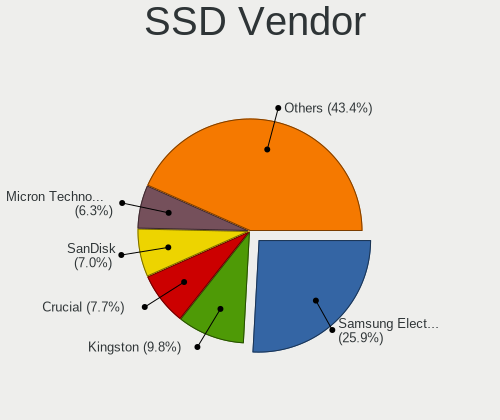
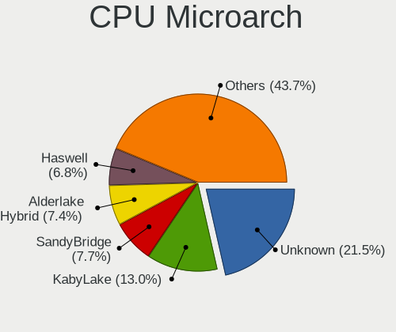
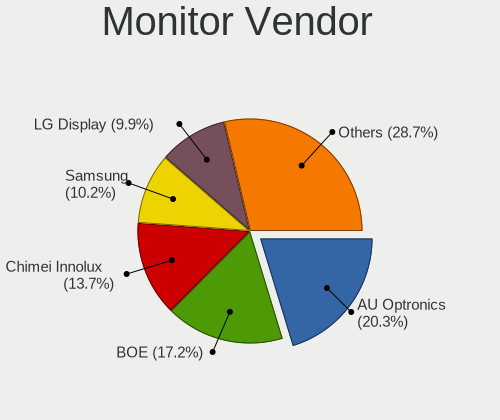
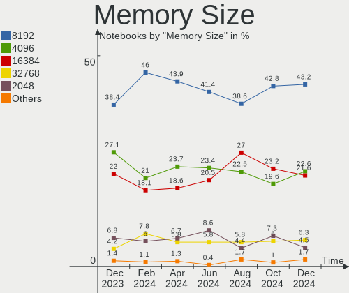

Ubuntu Hardware Trends (Notebook)
---------------------------------

A project to identify most popular hardware characteristics and track their change
over time based on data collected by Ubuntu users at https://Linux-Hardware.org.

Anyone can contribute to the study by uploading probes of their computers by
the [hw-probe](https://github.com/linuxhw/hw-probe) tool:

    sudo -E hw-probe -all -upload

Full-feature report is available here: https://linux-hardware.org/?view=trends&formfactor=notebook

Period: Dec, 2020.

Contents
--------

- [ OS                       ](#os)
- [ OS Family                ](#os-family)
- [ Kernel                   ](#kernel)
- [ Kernel Family            ](#kernel-family)
- [ Kernel Major Ver.        ](#kernel-major-ver)
- [ Arch                     ](#arch)
- [ DE                       ](#de)
- [ Display Server           ](#display-server)
- [ Display Manager          ](#display-manager)
- [ OS Lang                  ](#os-lang)
- [ Boot Mode                ](#boot-mode)
- [ Filesystem               ](#filesystem)
- [ Part. scheme             ](#part-scheme)
- [ Dual Boot with Linux/BSD ](#dual-boot-with-linux/bsd)
- [ Dual Boot (Win)          ](#dual-boot-win)
- [ Country                  ](#country)
- [ City                     ](#city)
- [ Vendor                   ](#vendor)
- [ Model                    ](#model)
- [ Model Family             ](#model-family)
- [ MFG Year                 ](#mfg-year)
- [ Form Factor              ](#form-factor)
- [ Secure Boot              ](#secure-boot)
- [ Coreboot                 ](#coreboot)
- [ RAM Size                 ](#ram-size)
- [ RAM Used                 ](#ram-used)
- [ Has CD-ROM               ](#has-cd-rom)
- [ Total Drives             ](#total-drives)
- [ Has Ethernet             ](#has-ethernet)
- [ Drive Vendor             ](#drive-vendor)
- [ Drive Model              ](#drive-model)
- [ HDD Vendor               ](#hdd-vendor)
- [ SSD Vendor               ](#ssd-vendor)
- [ Drive Kind               ](#drive-kind)
- [ Drive Connector          ](#drive-connector)
- [ Drive Size               ](#drive-size)
- [ Space Total              ](#space-total)
- [ Space Used               ](#space-used)
- [ Malfunc. Drives          ](#malfunc-drives)
- [ Malfunc. Drive Vendor    ](#malfunc-drive-vendor)
- [ Malfunc. HDD Vendor      ](#malfunc-hdd-vendor)
- [ Malfunc. Drive Kind      ](#malfunc-drive-kind)
- [ Failed Drives            ](#failed-drives)
- [ Failed Drive Vendor      ](#failed-drive-vendor)
- [ Drive Status             ](#drive-status)
- [ Storage Vendor           ](#storage-vendor)
- [ Storage Model            ](#storage-model)
- [ Storage Kind             ](#storage-kind)
- [ CPU Vendor               ](#cpu-vendor)
- [ CPU Model                ](#cpu-model)
- [ CPU Model Family         ](#cpu-model-family)
- [ CPU Cores                ](#cpu-cores)
- [ CPU Sockets              ](#cpu-sockets)
- [ CPU Threads              ](#cpu-threads)
- [ CPU Op-Modes             ](#cpu-op-modes)
- [ CPU Microcode            ](#cpu-microcode)
- [ CPU Microarch            ](#cpu-microarch)
- [ GPU Vendor               ](#gpu-vendor)
- [ GPU Model                ](#gpu-model)
- [ GPU Combo                ](#gpu-combo)
- [ GPU Driver               ](#gpu-driver)
- [ GPU Memory               ](#gpu-memory)
- [ Monitor Vendor           ](#monitor-vendor)
- [ Monitor Model            ](#monitor-model)
- [ Monitor Resolution       ](#monitor-resolution)
- [ Monitor Diagonal         ](#monitor-diagonal)
- [ Monitor Width            ](#monitor-width)
- [ Aspect Ratio             ](#aspect-ratio)
- [ Monitor Area             ](#monitor-area)
- [ Pixel Density            ](#pixel-density)
- [ Multiple Monitors        ](#multiple-monitors)
- [ Net Controller Vendor    ](#net-controller-vendor)
- [ Net Controller Model     ](#net-controller-model)
- [ Wireless Vendor          ](#wireless-vendor)
- [ Wireless Model           ](#wireless-model)
- [ Ethernet Vendor          ](#ethernet-vendor)
- [ Ethernet Model           ](#ethernet-model)
- [ Net Controller Kind      ](#net-controller-kind)
- [ Used Controller          ](#used-controller)
- [ NICs                     ](#nics)
- [ Memory Vendor            ](#memory-vendor)
- [ Memory Model             ](#memory-model)
- [ Memory Kind              ](#memory-kind)
- [ Memory Form Factor       ](#memory-form-factor)
- [ Memory Size              ](#memory-size)
- [ Memory Speed             ](#memory-speed)
- [ Sound Vendor             ](#sound-vendor)
- [ Sound Model              ](#sound-model)
- [ Camera Vendor            ](#camera-vendor)
- [ Camera Model             ](#camera-model)
- [ Fingerprint Vendor       ](#fingerprint-vendor)
- [ Fingerprint Model        ](#fingerprint-model)
- [ Chipcard Vendor          ](#chipcard-vendor)
- [ Chipcard Model           ](#chipcard-model)
- [ Printer Vendor           ](#printer-vendor)
- [ Printer Model            ](#printer-model)
- [ Scanner Vendor           ](#scanner-vendor)
- [ Scanner Model            ](#scanner-model)
- [ Bluetooth Vendor         ](#bluetooth-vendor)
- [ Bluetooth Model          ](#bluetooth-model)
- [ Unsupported Devices      ](#unsupported-devices)
- [ Unsupported Device Types ](#unsupported-device-types)

OS
--

Installed operating systems

| Name           | Notebooks | Percent |
|----------------|-----------|---------|
| Ubuntu 20.04   | 822       | 66.5%   |
| Ubuntu 20.10   | 227       | 18.37%  |
| Ubuntu 18.04   | 144       | 11.65%  |
| Ubuntu 16.04   | 21        | 1.7%    |
| Ubuntu 21.04   | 5         | 0.4%    |
| Ubuntu 19.10   | 4         | 0.32%   |
| Ubuntu         | 4         | 0.32%   |
| Ubuntu 19.04   | 2         | 0.16%   |
| Ubuntu 18.10   | 2         | 0.16%   |
| Ubuntu Core 16 | 1         | 0.08%   |
| Ubuntu 2020    | 1         | 0.08%   |
| Ubuntu 17.10   | 1         | 0.08%   |
| Ubuntu 16.10   | 1         | 0.08%   |
| Ubuntu 14.04   | 1         | 0.08%   |

OS Family
---------

OS without a version

| Name   | Notebooks | Percent |
|--------|-----------|---------|
| Ubuntu | 1236      | 100%    |

Kernel
------

Version of the Linux kernel

| Version                   | Notebooks | Percent |
|---------------------------|-----------|---------|
| 5.4.0-58-generic          | 389       | 31.47%  |
| 5.4.0-56-generic          | 270       | 21.84%  |
| 5.8.0-33-generic          | 107       | 8.66%   |
| 5.4.0-54-generic          | 67        | 5.42%   |
| 5.8.0-31-generic          | 52        | 4.21%   |
| 5.4.0-42-generic          | 43        | 3.48%   |
| 5.8.0-32-generic          | 27        | 2.18%   |
| 4.15.0-128-generic        | 24        | 1.94%   |
| 5.8.0-29-generic          | 20        | 1.62%   |
| 5.8.0-34-generic          | 16        | 1.29%   |
| 5.4.0-26-generic          | 12        | 0.97%   |
| 5.8.0-25-generic          | 11        | 0.89%   |
| 5.4.0-52-generic          | 11        | 0.89%   |
| 4.15.0-126-generic        | 11        | 0.89%   |
| 5.4.0-59-generic          | 10        | 0.81%   |
| 5.4.0-58-lowlatency       | 10        | 0.81%   |
| 5.4.0-53-generic          | 10        | 0.81%   |
| 5.10.2-051002-generic     | 8         | 0.65%   |
| 5.4.0-57-generic          | 6         | 0.49%   |
| 5.4.0-48-generic          | 6         | 0.49%   |
| 4.4.0-197-generic         | 6         | 0.49%   |
| 5.9.12-050912-generic     | 5         | 0.4%    |
| 4.15.0-127-generic        | 5         | 0.4%    |
| 5.6.0-1034-oem            | 4         | 0.32%   |
| 5.10.1-051001-generic     | 4         | 0.32%   |
| 4.15.0-123-generic        | 4         | 0.32%   |
| 4.15.0-124-generic        | 3         | 0.24%   |
| 4.15.0-122-generic        | 3         | 0.24%   |
| 4.15.0-112-generic        | 3         | 0.24%   |
| 5.9.10-050910-generic     | 2         | 0.16%   |
| 5.8.0-33-lowlatency       | 2         | 0.16%   |
| 5.8.0-28-generic          | 2         | 0.16%   |
| 5.7.1-050701-generic      | 2         | 0.16%   |
| 5.6.0-1036-oem            | 2         | 0.16%   |
| 5.4.0-57-lowlatency       | 2         | 0.16%   |
| 5.4.0-56-lowlatency       | 2         | 0.16%   |
| 5.4.0-51-generic          | 2         | 0.16%   |
| 5.4.0-47-generic          | 2         | 0.16%   |
| 5.4.0-28-generic          | 2         | 0.16%   |
| 5.3.0-62-generic          | 2         | 0.16%   |
| 5.3.0-59-generic          | 2         | 0.16%   |
| 5.3.0-18-generic          | 2         | 0.16%   |
| 5.0.0-38-generic          | 2         | 0.16%   |
| 4.15.0-29-generic         | 2         | 0.16%   |
| 5.9.6-050906-generic      | 1         | 0.08%   |
| 5.9.16-050916-generic     | 1         | 0.08%   |
| 5.9.15-xanmod1            | 1         | 0.08%   |
| 5.9.12-050912-lowlatency  | 1         | 0.08%   |
| 5.9.1-050901-generic      | 1         | 0.08%   |
| 5.9.0-rc4+                | 1         | 0.08%   |
| 5.9.0-050900rc4-generic   | 1         | 0.08%   |
| 5.9.0-050900-generic      | 1         | 0.08%   |
| 5.8.18-050818-generic     | 1         | 0.08%   |
| 5.8.0-z580140             | 1         | 0.08%   |
| 5.8.0-7630-generic        | 1         | 0.08%   |
| 5.8.0-34-lowlatency       | 1         | 0.08%   |
| 5.8.0-31-lowlatency       | 1         | 0.08%   |
| 5.8.0-30-generic          | 1         | 0.08%   |
| 5.8.0-28-lowlatency       | 1         | 0.08%   |
| 5.8.0-17.2-liquorix-amd64 | 1         | 0.08%   |

Kernel Family
-------------

Linux kernel without a distro release

| Version  | Notebooks | Percent |
|----------|-----------|---------|
| 5.4.0    | 850       | 68.77%  |
| 5.8.0    | 246       | 19.9%   |
| 4.15.0   | 66        | 5.34%   |
| 5.3.0    | 11        | 0.89%   |
| 5.10.2   | 9         | 0.73%   |
| 4.4.0    | 9         | 0.73%   |
| 5.6.0    | 8         | 0.65%   |
| 5.9.12   | 6         | 0.49%   |
| 5.10.1   | 4         | 0.32%   |
| 5.10.0   | 4         | 0.32%   |
| 5.9.0    | 3         | 0.24%   |
| 5.0.0    | 3         | 0.24%   |
| 4.18.0   | 3         | 0.24%   |
| 5.9.10   | 2         | 0.16%   |
| 5.7.1    | 2         | 0.16%   |
| 4.13.0   | 2         | 0.16%   |
| 5.9.6    | 1         | 0.08%   |
| 5.9.16   | 1         | 0.08%   |
| 5.9.15   | 1         | 0.08%   |
| 5.9.1    | 1         | 0.08%   |
| 5.8.18   | 1         | 0.08%   |
| 5.10.4   | 1         | 0.08%   |
| 4.19.104 | 1         | 0.08%   |
| 4.16.0   | 1         | 0.08%   |

Kernel Major Ver.
-----------------

Linux kernel major version

| Version | Notebooks | Percent |
|---------|-----------|---------|
| 5.4     | 850       | 68.77%  |
| 5.8     | 247       | 19.98%  |
| 4.15    | 66        | 5.34%   |
| 5.10    | 18        | 1.46%   |
| 5.9     | 15        | 1.21%   |
| 5.3     | 11        | 0.89%   |
| 4.4     | 9         | 0.73%   |
| 5.6     | 8         | 0.65%   |
| 5.0     | 3         | 0.24%   |
| 4.18    | 3         | 0.24%   |
| 5.7     | 2         | 0.16%   |
| 4.13    | 2         | 0.16%   |
| 4.19    | 1         | 0.08%   |
| 4.16    | 1         | 0.08%   |

Arch
----

OS architecture (x86_64, i586, etc.)

| Name   | Notebooks | Percent |
|--------|-----------|---------|
| x86_64 | 1197      | 96.84%  |
| i686   | 39        | 3.16%   |

DE
--

Desktop Environment

| Name            | Notebooks | Percent |
|-----------------|-----------|---------|
| GNOME           | 895       | 72.41%  |
| XFCE            | 97        | 7.85%   |
| Unknown         | 53        | 4.29%   |
| KDE             | 45        | 3.64%   |
| KDE5            | 34        | 2.75%   |
| Unity           | 29        | 2.35%   |
| MATE            | 22        | 1.78%   |
| LXQt            | 15        | 1.21%   |
| Budgie          | 14        | 1.13%   |
| X-Cinnamon      | 10        | 0.81%   |
| GNOME Flashback | 7         | 0.57%   |
| Cinnamon        | 5         | 0.4%    |
| LXDE            | 4         | 0.32%   |
| GNOME Classic   | 3         | 0.24%   |
| i3              | 2         | 0.16%   |
| Deepin          | 1         | 0.08%   |

Display Server
--------------

X11 or Wayland

| Name    | Notebooks | Percent |
|---------|-----------|---------|
| X11     | 1164      | 94.17%  |
| Wayland | 47        | 3.8%    |
| Unknown | 21        | 1.7%    |
| Tty     | 4         | 0.32%   |

Display Manager
---------------

SDDM, LightDM, etc.

| Name    | Notebooks | Percent |
|---------|-----------|---------|
| Unknown | 932       | 75.4%   |
| GDM     | 218       | 17.64%  |
| TDM     | 44        | 3.56%   |
| SDDM    | 39        | 3.16%   |
| XDM     | 1         | 0.08%   |
| LightDM | 1         | 0.08%   |
| GDM3    | 1         | 0.08%   |

OS Lang
-------

Language

| Lang    | Notebooks | Percent |
|---------|-----------|---------|
| en_US   | 498       | 40.29%  |
| de_DE   | 144       | 11.65%  |
| fr_FR   | 64        | 5.18%   |
| en_GB   | 63        | 5.1%    |
| it_IT   | 56        | 4.53%   |
| pt_BR   | 47        | 3.8%    |
| en_IN   | 39        | 3.16%   |
| es_ES   | 32        | 2.59%   |
| ru_RU   | 27        | 2.18%   |
| en_CA   | 25        | 2.02%   |
| pl_PL   | 22        | 1.78%   |
| en_AU   | 17        | 1.38%   |
| nl_NL   | 15        | 1.21%   |
| C       | 13        | 1.05%   |
| hu_HU   | 12        | 0.97%   |
| ja_JP   | 11        | 0.89%   |
| de_CH   | 9         | 0.73%   |
| cs_CZ   | 9         | 0.73%   |
| es_MX   | 8         | 0.65%   |
| Unknown | 8         | 0.65%   |
| tr_TR   | 7         | 0.57%   |
| sv_SE   | 7         | 0.57%   |
| fi_FI   | 7         | 0.57%   |
| pt_PT   | 6         | 0.49%   |
| nl_BE   | 6         | 0.49%   |
| es_AR   | 6         | 0.49%   |
| es_CO   | 5         | 0.4%    |
| es_CL   | 5         | 0.4%    |
| el_GR   | 5         | 0.4%    |
| sk_SK   | 4         | 0.32%   |
| ru_UA   | 4         | 0.32%   |
| ro_RO   | 4         | 0.32%   |
| hr_HR   | 4         | 0.32%   |
| en_IL   | 4         | 0.32%   |
| de_AT   | 4         | 0.32%   |
| fr_CA   | 3         | 0.24%   |
| nb_NO   | 2         | 0.16%   |
| ko_KR   | 2         | 0.16%   |
| fr_BE   | 2         | 0.16%   |
| es_EC   | 2         | 0.16%   |
| en_ZA   | 2         | 0.16%   |
| en_IE   | 2         | 0.16%   |
| da_DK   | 2         | 0.16%   |
| bg_BG   | 2         | 0.16%   |
| zh_TW   | 1         | 0.08%   |
| zh_CN   | 1         | 0.08%   |
| sl_SI   | 1         | 0.08%   |
| nds_DE  | 1         | 0.08%   |
| id_ID   | 1         | 0.08%   |
| he_IL   | 1         | 0.08%   |
| gl_ES   | 1         | 0.08%   |
| fr_CH   | 1         | 0.08%   |
| fa_IR   | 1         | 0.08%   |
| et_EE   | 1         | 0.08%   |
| es_UY   | 1         | 0.08%   |
| es_PE   | 1         | 0.08%   |
| es_HN   | 1         | 0.08%   |
| en_SG   | 1         | 0.08%   |
| en_PH   | 1         | 0.08%   |
| en_NL   | 1         | 0.08%   |

Boot Mode
---------

EFI or BIOS

| Mode | Notebooks | Percent |
|------|-----------|---------|
| BIOS | 654       | 52.91%  |
| EFI  | 582       | 47.09%  |

Filesystem
----------

Type of filesystem

| Type    | Notebooks | Percent |
|---------|-----------|---------|
| Ext4    | 1162      | 94.01%  |
| Overlay | 32        | 2.59%   |
| Zfs     | 19        | 1.54%   |
| Btrfs   | 13        | 1.05%   |
| Ext3    | 3         | 0.24%   |
| Ext2    | 3         | 0.24%   |
| Xfs     | 2         | 0.16%   |
| Unknown | 2         | 0.16%   |

Part. scheme
------------

Scheme of partitioning

| Type    | Notebooks | Percent |
|---------|-----------|---------|
| Unknown | 926       | 74.92%  |
| GPT     | 247       | 19.98%  |
| MBR     | 63        | 5.1%    |

Dual Boot with Linux/BSD
------------------------

Hosting more than one Linux/BSD

| Dual boot | Notebooks | Percent |
|-----------|-----------|---------|
| No        | 1126      | 91.1%   |
| Yes       | 110       | 8.9%    |

Dual Boot (Win)
---------------

Hosting Linux and Windows

| Dual boot | Notebooks | Percent |
|-----------|-----------|---------|
| No        | 845       | 68.37%  |
| Yes       | 391       | 31.63%  |

Country
-------

Geographic location (country)

| Country                   | Notebooks | Percent |
|---------------------------|-----------|---------|
| USA                       | 193       | 15.61%  |
| Germany                   | 171       | 13.83%  |
| France                    | 71        | 5.74%   |
| Brazil                    | 66        | 5.34%   |
| Italy                     | 63        | 5.1%    |
| UK                        | 49        | 3.96%   |
| Spain                     | 48        | 3.88%   |
| India                     | 42        | 3.4%    |
| Russia                    | 41        | 3.32%   |
| Netherlands               | 32        | 2.59%   |
| Canada                    | 28        | 2.27%   |
| Poland                    | 27        | 2.18%   |
| Belgium                   | 24        | 1.94%   |
| Turkey                    | 21        | 1.7%    |
| Ukraine                   | 20        | 1.62%   |
| Hungary                   | 16        | 1.29%   |
| Mexico                    | 15        | 1.21%   |
| Austria                   | 15        | 1.21%   |
| Australia                 | 15        | 1.21%   |
| Switzerland               | 14        | 1.13%   |
| Sweden                    | 14        | 1.13%   |
| Finland                   | 13        | 1.05%   |
| Czech Republic            | 13        | 1.05%   |
| Romania                   | 12        | 0.97%   |
| Portugal                  | 11        | 0.89%   |
| Japan                     | 11        | 0.89%   |
| Indonesia                 | 9         | 0.73%   |
| Greece                    | 9         | 0.73%   |
| Egypt                     | 9         | 0.73%   |
| Colombia                  | 9         | 0.73%   |
| Chile                     | 8         | 0.65%   |
| Argentina                 | 8         | 0.65%   |
| Bulgaria                  | 7         | 0.57%   |
| Slovenia                  | 6         | 0.49%   |
| Slovakia                  | 6         | 0.49%   |
| Serbia                    | 6         | 0.49%   |
| Iran                      | 6         | 0.49%   |
| Denmark                   | 6         | 0.49%   |
| Croatia                   | 6         | 0.49%   |
| Tunisia                   | 5         | 0.4%    |
| Korea, Republic of        | 5         | 0.4%    |
| Israel                    | 5         | 0.4%    |
| Norway                    | 4         | 0.32%   |
| Morocco                   | 4         | 0.32%   |
| UAE                       | 3         | 0.24%   |
| Sri Lanka                 | 3         | 0.24%   |
| South Africa              | 3         | 0.24%   |
| Malaysia                  | 3         | 0.24%   |
| Ireland                   | 3         | 0.24%   |
| Ecuador                   | 3         | 0.24%   |
| Cameroon                  | 3         | 0.24%   |
| Vietnam                   | 2         | 0.16%   |
| Singapore                 | 2         | 0.16%   |
| Philippines               | 2         | 0.16%   |
| New Zealand               | 2         | 0.16%   |
| Nepal                     | 2         | 0.16%   |
| Lithuania                 | 2         | 0.16%   |
| Latvia                    | 2         | 0.16%   |
| Iran, Islamic Republic of | 2         | 0.16%   |
| Estonia                   | 2         | 0.16%   |

City
----

Geographic location (city)

| City           | Notebooks | Percent |
|----------------|-----------|---------|
| Berlin         | 16        | 1.29%   |
| Paris          | 14        | 1.13%   |
| Rome           | 11        | 0.89%   |
| Vienna         | 10        | 0.81%   |
| Kyiv           | 9         | 0.73%   |
| Istanbul       | 9         | 0.73%   |
| Munich         | 8         | 0.65%   |
| Madrid         | 8         | 0.65%   |
| Tehran         | 7         | 0.57%   |
| Chennai        | 7         | 0.57%   |
| Warsaw         | 6         | 0.49%   |
| São Paulo     | 6         | 0.49%   |
| Sofia          | 6         | 0.49%   |
| Prague         | 6         | 0.49%   |
| Moscow         | 6         | 0.49%   |
| Budapest       | 6         | 0.49%   |
| Stuttgart      | 5         | 0.4%    |
| Milan          | 5         | 0.4%    |
| Essen          | 5         | 0.4%    |
| Düsseldorf    | 5         | 0.4%    |
| Chicago        | 5         | 0.4%    |
| Cairo          | 5         | 0.4%    |
| Bengaluru      | 5         | 0.4%    |
| Barcelona      | 5         | 0.4%    |
| Athens         | 5         | 0.4%    |
| Zurich         | 4         | 0.32%   |
| Zagreb         | 4         | 0.32%   |
| Washington     | 4         | 0.32%   |
| St Petersburg  | 4         | 0.32%   |
| Seattle        | 4         | 0.32%   |
| Santiago       | 4         | 0.32%   |
| Rio de Janeiro | 4         | 0.32%   |
| Naples         | 4         | 0.32%   |
| Madison        | 4         | 0.32%   |
| Hyderabad      | 4         | 0.32%   |
| Freiburg       | 4         | 0.32%   |
| Dresden        | 4         | 0.32%   |
| Dortmund       | 4         | 0.32%   |
| Bogotá        | 4         | 0.32%   |
| Belgrade       | 4         | 0.32%   |
| Austin         | 4         | 0.32%   |
| Tyumen         | 3         | 0.24%   |
| Sydney         | 3         | 0.24%   |
| Mumbai         | 3         | 0.24%   |
| Ljubljana      | 3         | 0.24%   |
| Leipzig        | 3         | 0.24%   |
| Le Mans        | 3         | 0.24%   |
| Krasnodar      | 3         | 0.24%   |
| Kolkata        | 3         | 0.24%   |
| Houston        | 3         | 0.24%   |
| Edmonton       | 3         | 0.24%   |
| Dublin         | 3         | 0.24%   |
| Curitiba       | 3         | 0.24%   |
| Copenhagen     | 3         | 0.24%   |
| Cologne        | 3         | 0.24%   |
| Bucharest      | 3         | 0.24%   |
| Brno           | 3         | 0.24%   |
| Bratislava     | 3         | 0.24%   |
| Bamberg        | 3         | 0.24%   |
| Yaroslavl      | 2         | 0.16%   |

Vendor
------

Motherboard manufacturer

| Name                        | Notebooks | Percent |
|-----------------------------|-----------|---------|
| Lenovo                      | 241       | 19.5%   |
| Dell                        | 231       | 18.69%  |
| Hewlett-Packard             | 224       | 18.12%  |
| Acer                        | 126       | 10.19%  |
| ASUSTek Computer            | 115       | 9.3%    |
| Toshiba                     | 47        | 3.8%    |
| Samsung Electronics         | 29        | 2.35%   |
| MSI                         | 27        | 2.18%   |
| Apple                       | 24        | 1.94%   |
| Sony                        | 20        | 1.62%   |
| Fujitsu                     | 16        | 1.29%   |
| Unknown                     | 13        | 1.05%   |
| HUAWEI                      | 12        | 0.97%   |
| Notebook                    | 11        | 0.89%   |
| Medion                      | 10        | 0.81%   |
| TUXEDO                      | 6         | 0.49%   |
| Fujitsu Siemens             | 5         | 0.4%    |
| Timi                        | 4         | 0.32%   |
| Positivo                    | 4         | 0.32%   |
| PC Specialist               | 4         | 0.32%   |
| Packard Bell                | 4         | 0.32%   |
| System76                    | 3         | 0.24%   |
| LG Electronics              | 3         | 0.24%   |
| Gateway                     | 3         | 0.24%   |
| Avell High Performance      | 3         | 0.24%   |
| Alienware                   | 3         | 0.24%   |
| Teclast                     | 2         | 0.16%   |
| Panasonic                   | 2         | 0.16%   |
| Monster                     | 2         | 0.16%   |
| Intel                       | 2         | 0.16%   |
| eMachines                   | 2         | 0.16%   |
| Compal                      | 2         | 0.16%   |
| Clevo                       | 2         | 0.16%   |
| XMG                         | 1         | 0.08%   |
| Wortmann AG                 | 1         | 0.08%   |
| TrekStor                    | 1         | 0.08%   |
| Thomson                     | 1         | 0.08%   |
| Thirdwave Diginnos          | 1         | 0.08%   |
| TaNix                       | 1         | 0.08%   |
| Star Labs                   | 1         | 0.08%   |
| Standard                    | 1         | 0.08%   |
| Sole                        | 1         | 0.08%   |
| SLIMBOOK                    | 1         | 0.08%   |
| Semp Toshiba                | 1         | 0.08%   |
| Razer                       | 1         | 0.08%   |
| Quanta                      | 1         | 0.08%   |
| Pegatron                    | 1         | 0.08%   |
| ONE-NETBOOK TECHNOLOGY      | 1         | 0.08%   |
| NEC Computers               | 1         | 0.08%   |
| Motion Computing            | 1         | 0.08%   |
| Megaware                    | 1         | 0.08%   |
| MAIBENBEN                   | 1         | 0.08%   |
| IGEL Technology             | 1         | 0.08%   |
| I-Life Digital Technologies | 1         | 0.08%   |
| Hannspree                   | 1         | 0.08%   |
| Google                      | 1         | 0.08%   |
| Gigabyte Technology         | 1         | 0.08%   |
| EUROCOM                     | 1         | 0.08%   |
| essentielb                  | 1         | 0.08%   |
| Entroware                   | 1         | 0.08%   |

Model
-----

Motherboard model

| Name                                | Notebooks | Percent |
|-------------------------------------|-----------|---------|
| Unknown                             | 18        | 1.46%   |
| HP Notebook                         | 11        | 0.89%   |
| Dell Inspiron 1545                  | 8         | 0.65%   |
| HP Pavilion g6                      | 6         | 0.49%   |
| HP EliteBook 8460p                  | 6         | 0.49%   |
| HP 15                               | 6         | 0.49%   |
| Dell XPS 15 9500                    | 6         | 0.49%   |
| Dell XPS 13 9310                    | 6         | 0.49%   |
| HUAWEI NBLK-WAX9X                   | 5         | 0.4%    |
| HP Pavilion Notebook                | 5         | 0.4%    |
| HP Pavilion dv6                     | 5         | 0.4%    |
| Dell XPS 13 9380                    | 5         | 0.4%    |
| Dell Latitude D630                  | 5         | 0.4%    |
| HP ProBook 4540s                    | 4         | 0.32%   |
| HP Pavilion dv7                     | 4         | 0.32%   |
| HP Pavilion 17                      | 4         | 0.32%   |
| HP Laptop 15-db0xxx                 | 4         | 0.32%   |
| HP Laptop 15-bs0xx                  | 4         | 0.32%   |
| HP 255 G7 Notebook PC               | 4         | 0.32%   |
| Dell Latitude E6500                 | 4         | 0.32%   |
| Dell Latitude E6430                 | 4         | 0.32%   |
| Dell Latitude E6420                 | 4         | 0.32%   |
| Dell Latitude E6400                 | 4         | 0.32%   |
| Dell Inspiron 3543                  | 4         | 0.32%   |
| Acer Aspire A715-75G                | 4         | 0.32%   |
| TUXEDO Pulse 15 Gen1                | 3         | 0.24%   |
| Samsung 550P5C/550P7C               | 3         | 0.24%   |
| MSI GL65 Leopard 10SDK              | 3         | 0.24%   |
| MSI GE66 Raider 10SFS               | 3         | 0.24%   |
| Lenovo Z50-70 20354                 | 3         | 0.24%   |
| Lenovo IdeaPad 5 14ARE05 81YM       | 3         | 0.24%   |
| Lenovo IdeaPad 3 15IIL05 81WE       | 3         | 0.24%   |
| HUAWEI KLVL-WXX9                    | 3         | 0.24%   |
| HP ZBook 15                         | 3         | 0.24%   |
| HP Pavilion dv6700                  | 3         | 0.24%   |
| HP Pavilion dv5                     | 3         | 0.24%   |
| HP Laptop 15-da0xxx                 | 3         | 0.24%   |
| HP EliteBook 8470p                  | 3         | 0.24%   |
| HP EliteBook 840 G3                 | 3         | 0.24%   |
| HP EliteBook 840 G2                 | 3         | 0.24%   |
| HP 2000                             | 3         | 0.24%   |
| Dell XPS 15 9570                    | 3         | 0.24%   |
| Dell XPS 15 7590                    | 3         | 0.24%   |
| Dell XPS 13 9370                    | 3         | 0.24%   |
| Dell Precision M6500                | 3         | 0.24%   |
| Dell Latitude E7440                 | 3         | 0.24%   |
| Dell Latitude E6540                 | 3         | 0.24%   |
| Dell Latitude E5470                 | 3         | 0.24%   |
| Dell Inspiron 3583                  | 3         | 0.24%   |
| Dell G3 3579                        | 3         | 0.24%   |
| ASUS X510UNR                        | 3         | 0.24%   |
| Apple MacBookPro9,2                 | 3         | 0.24%   |
| Apple MacBookPro8,1                 | 3         | 0.24%   |
| Acer Aspire A515-43                 | 3         | 0.24%   |
| Toshiba Satellite Pro L500          | 2         | 0.16%   |
| Toshiba Satellite C50-A-19T         | 2         | 0.16%   |
| Timi TM1701                         | 2         | 0.16%   |
| Samsung R780/R778                   | 2         | 0.16%   |
| Samsung 900X3C/900X3D/900X4C/900X4D | 2         | 0.16%   |
| MSI MS-1688                         | 2         | 0.16%   |

Model Family
------------

Motherboard model prefix

| Name                    | Notebooks | Percent |
|-------------------------|-----------|---------|
| Lenovo ThinkPad         | 135       | 10.92%  |
| Acer Aspire             | 87        | 7.04%   |
| Dell Latitude           | 83        | 6.72%   |
| Dell Inspiron           | 72        | 5.83%   |
| HP Pavilion             | 58        | 4.69%   |
| Lenovo IdeaPad          | 55        | 4.45%   |
| HP EliteBook            | 44        | 3.56%   |
| Toshiba Satellite       | 38        | 3.07%   |
| Dell XPS                | 38        | 3.07%   |
| HP ProBook              | 25        | 2.02%   |
| HP Laptop               | 23        | 1.86%   |
| Unknown                 | 18        | 1.46%   |
| Dell Precision          | 17        | 1.38%   |
| ASUS VivoBook           | 14        | 1.13%   |
| HP ZBook                | 12        | 0.97%   |
| Fujitsu LIFEBOOK        | 12        | 0.97%   |
| HP Notebook             | 11        | 0.89%   |
| Dell Vostro             | 10        | 0.81%   |
| Acer Swift              | 9         | 0.73%   |
| HP 15                   | 8         | 0.65%   |
| Acer Nitro              | 8         | 0.65%   |
| Acer Extensa            | 8         | 0.65%   |
| Lenovo Legion           | 7         | 0.57%   |
| HP 255                  | 7         | 0.57%   |
| HP ENVY                 | 6         | 0.49%   |
| HP Compaq               | 6         | 0.49%   |
| Dell G3                 | 6         | 0.49%   |
| ASUS ZenBook            | 6         | 0.49%   |
| Acer TravelMate         | 6         | 0.49%   |
| Lenovo Yoga             | 5         | 0.4%    |
| HUAWEI NBLK-WAX9X       | 5         | 0.4%    |
| Apple MacBookPro8       | 5         | 0.4%    |
| Packard Bell EasyNote   | 4         | 0.32%   |
| MSI GL65                | 4         | 0.32%   |
| Lenovo ThinkBook        | 4         | 0.32%   |
| HP 250                  | 4         | 0.32%   |
| Fujitsu Siemens ESPRIMO | 4         | 0.32%   |
| TUXEDO Pulse            | 3         | 0.24%   |
| Toshiba TECRA           | 3         | 0.24%   |
| Samsung 900X3C          | 3         | 0.24%   |
| Samsung 550P5C          | 3         | 0.24%   |
| MSI GE66                | 3         | 0.24%   |
| MSI CX62                | 3         | 0.24%   |
| Medion Akoya            | 3         | 0.24%   |
| Lenovo Z50-70           | 3         | 0.24%   |
| HUAWEI KLVL-WXX9        | 3         | 0.24%   |
| HP Stream               | 3         | 0.24%   |
| HP OMEN                 | 3         | 0.24%   |
| HP 2000                 | 3         | 0.24%   |
| ASUS X510UNR            | 3         | 0.24%   |
| ASUS TUF                | 3         | 0.24%   |
| Apple MacBookPro9       | 3         | 0.24%   |
| Toshiba PORTEGE         | 2         | 0.16%   |
| Toshiba dynabook        | 2         | 0.16%   |
| Timi TM1701             | 2         | 0.16%   |
| Samsung R780            | 2         | 0.16%   |
| Samsung 300E5EV         | 2         | 0.16%   |
| Samsung 300E4A          | 2         | 0.16%   |
| Notebook W54            | 2         | 0.16%   |
| MSI MS-1688             | 2         | 0.16%   |

MFG Year
--------

Motherboard manufacture year

| Year    | Notebooks | Percent |
|---------|-----------|---------|
| 2020    | 288       | 23.3%   |
| 2019    | 159       | 12.86%  |
| 2018    | 94        | 7.61%   |
| 2014    | 83        | 6.72%   |
| 2013    | 83        | 6.72%   |
| 2012    | 77        | 6.23%   |
| 2015    | 76        | 6.15%   |
| 2011    | 72        | 5.83%   |
| 2010    | 62        | 5.02%   |
| 2017    | 60        | 4.85%   |
| 2009    | 50        | 4.05%   |
| 2016    | 48        | 3.88%   |
| 2008    | 47        | 3.8%    |
| 2007    | 26        | 2.1%    |
| 2006    | 4         | 0.32%   |
| 2005    | 4         | 0.32%   |
| Unknown | 2         | 0.16%   |
| 2004    | 1         | 0.08%   |

Form Factor
-----------

Physical design of the computer

| Name     | Notebooks | Percent |
|----------|-----------|---------|
| Notebook | 1236      | 100%    |

Secure Boot
-----------

Enabled or disabled

| State    | Notebooks | Percent |
|----------|-----------|---------|
| Disabled | 1080      | 87.38%  |
| Enabled  | 156       | 12.62%  |

Coreboot
--------

Have coreboot on board

| Used | Notebooks | Percent |
|------|-----------|---------|
| No   | 1235      | 99.92%  |
| Yes  | 1         | 0.08%   |

RAM Size
--------

Total RAM memory

| Size in GB  | Notebooks | Percent |
|-------------|-----------|---------|
| 4.01-8.0    | 331       | 26.78%  |
| 3.01-4.0    | 316       | 25.57%  |
| 8.01-16.0   | 199       | 16.1%   |
| 16.01-24.0  | 187       | 15.13%  |
| 1.01-2.0    | 75        | 6.07%   |
| 32.01-64.0  | 71        | 5.74%   |
| 2.01-3.0    | 27        | 2.18%   |
| 24.01-32.0  | 14        | 1.13%   |
| 64.01-256.0 | 8         | 0.65%   |
| 0.51-1.0    | 8         | 0.65%   |

RAM Used
--------

Used RAM memory

| Used GB    | Notebooks | Percent |
|------------|-----------|---------|
| 1.01-2.0   | 486       | 39.32%  |
| 2.01-3.0   | 345       | 27.91%  |
| 4.01-8.0   | 158       | 12.78%  |
| 3.01-4.0   | 148       | 11.97%  |
| 0.51-1.0   | 57        | 4.61%   |
| 8.01-16.0  | 34        | 2.75%   |
| 0.01-0.5   | 7         | 0.57%   |
| 16.01-24.0 | 1         | 0.08%   |

Has CD-ROM
----------

Has CD-ROM on board

| Presented | Notebooks | Percent |
|-----------|-----------|---------|
| No        | 686       | 55.5%   |
| Yes       | 550       | 44.5%   |

Total Drives
------------

Number of drives on board

| Drives | Notebooks | Percent |
|--------|-----------|---------|
| 1      | 929       | 75.16%  |
| 2      | 273       | 22.09%  |
| 3      | 22        | 1.78%   |
| 0      | 6         | 0.49%   |
| 4      | 3         | 0.24%   |
| 5      | 2         | 0.16%   |
| 8      | 1         | 0.08%   |

Has Ethernet
------------

Has Ethernet on board

| Presented | Notebooks | Percent |
|-----------|-----------|---------|
| Yes       | 1065      | 86.17%  |
| No        | 171       | 13.83%  |

Drive Vendor
------------

Hard drive vendors

| Vendor                    | Notebooks | Drives | Percent |
|---------------------------|-----------|--------|---------|
| Samsung Electronics       | 226       | 239    | 15.51%  |
| WDC                       | 202       | 209    | 13.86%  |
| Seagate                   | 184       | 191    | 12.63%  |
| Toshiba                   | 143       | 145    | 9.81%   |
| Kingston                  | 84        | 85     | 5.77%   |
| SanDisk                   | 72        | 73     | 4.94%   |
| Unknown                   | 67        | 77     | 4.6%    |
| SK Hynix                  | 65        | 68     | 4.46%   |
| Hitachi                   | 50        | 50     | 3.43%   |
| HGST                      | 48        | 49     | 3.29%   |
| Intel                     | 42        | 44     | 2.88%   |
| Crucial                   | 42        | 44     | 2.88%   |
| Micron Technology         | 29        | 30     | 1.99%   |
| A-DATA Technology         | 15        | 15     | 1.03%   |
| Fujitsu                   | 14        | 14     | 0.96%   |
| Apple                     | 13        | 15     | 0.89%   |
| LITEON                    | 10        | 10     | 0.69%   |
| China                     | 10        | 10     | 0.69%   |
| Phison                    | 8         | 9      | 0.55%   |
| OCZ                       | 7         | 7      | 0.48%   |
| KIOXIA                    | 7         | 7      | 0.48%   |
| Transcend                 | 6         | 6      | 0.41%   |
| Silicon Motion            | 6         | 7      | 0.41%   |
| SPCC                      | 5         | 5      | 0.34%   |
| PATRIOT                   | 5         | 5      | 0.34%   |
| Intenso                   | 5         | 5      | 0.34%   |
| PNY                       | 4         | 4      | 0.27%   |
| PLEXTOR                   | 4         | 4      | 0.27%   |
| LITEONIT                  | 4         | 4      | 0.27%   |
| Lexar                     | 4         | 4      | 0.27%   |
| StoreJet                  | 3         | 3      | 0.21%   |
| Micron/Crucial Technology | 3         | 3      | 0.21%   |
| Lenovo                    | 3         | 4      | 0.21%   |
| KingDian                  | 3         | 3      | 0.21%   |
| JMicron                   | 3         | 3      | 0.21%   |
| ASMT                      | 3         | 6      | 0.21%   |
| Apacer                    | 3         | 3      | 0.21%   |
| ADATA Technology          | 3         | 3      | 0.21%   |
| XrayDisk                  | 2         | 3      | 0.14%   |
| Union Memory              | 2         | 2      | 0.14%   |
| TO Exter                  | 2         | 2      | 0.14%   |
| Team                      | 2         | 2      | 0.14%   |
| SUNEAST                   | 2         | 2      | 0.14%   |
| SABRENT                   | 2         | 2      | 0.14%   |
| Realtek Semiconductor     | 2         | 2      | 0.14%   |
| Pioneer                   | 2         | 2      | 0.14%   |
| Hewlett-Packard           | 2         | 2      | 0.14%   |
| Gigabyte Technology       | 2         | 2      | 0.14%   |
| Corsair                   | 2         | 2      | 0.14%   |
| ZTE                       | 1         | 1      | 0.07%   |
| Zheino                    | 1         | 1      | 0.07%   |
| XPG                       | 1         | 1      | 0.07%   |
| WD MediaMax               | 1         | 1      | 0.07%   |
| Vaseky                    | 1         | 1      | 0.07%   |
| Union Memory (Shenzhen)   | 1         | 1      | 0.07%   |
| Teclast                   | 1         | 1      | 0.07%   |
| Super Talent              | 1         | 1      | 0.07%   |
| STEC                      | 1         | 1      | 0.07%   |
| Solid State Storage       | 1         | 1      | 0.07%   |
| sobetter                  | 1         | 1      | 0.07%   |

Drive Model
-----------

Hard drive models

| Model                                 | Notebooks | Percent |
|---------------------------------------|-----------|---------|
| Seagate ST1000LM024 HN-M101MBB 1TB    | 23        | 1.53%   |
| Toshiba MQ01ABD100 1TB                | 18        | 1.2%    |
| Seagate ST1000LM035-1RK172 1TB        | 17        | 1.13%   |
| Kingston SA400S37240G 240GB SSD       | 17        | 1.13%   |
| Unknown MMC Card  32GB                | 16        | 1.07%   |
| Samsung NVMe SSD Drive 256GB          | 15        | 1%      |
| Kingston SA400S37480G 480GB SSD       | 15        | 1%      |
| Toshiba MQ01ABF050 500GB              | 14        | 0.93%   |
| Sandisk NVMe SSD Drive 512GB          | 14        | 0.93%   |
| Samsung SSD 860 EVO 500GB             | 14        | 0.93%   |
| Samsung NVMe SSD Drive 512GB          | 14        | 0.93%   |
| Toshiba MQ04ABF100 1TB                | 13        | 0.87%   |
| HGST HTS545050A7E680 500GB            | 13        | 0.87%   |
| Unknown MMC Card  64GB                | 12        | 0.8%    |
| SK Hynix NVMe SSD Drive 512GB         | 12        | 0.8%    |
| Seagate ST500LT012-1DG142 500GB       | 12        | 0.8%    |
| Samsung SSD 860 EVO 1TB               | 11        | 0.73%   |
| Samsung SSD 850 EVO 250GB             | 11        | 0.73%   |
| Crucial CT500MX500SSD1 500GB          | 11        | 0.73%   |
| Unknown MMC Card  16GB                | 10        | 0.67%   |
| Seagate ST1000LM048-2E7172 1TB        | 10        | 0.67%   |
| Intel NVMe SSD Drive 512GB            | 10        | 0.67%   |
| HGST HTS721010A9E630 1TB              | 10        | 0.67%   |
| WDC WD10SPZX-21Z10T0 1TB              | 9         | 0.6%    |
| SK Hynix NVMe SSD Drive 256GB         | 9         | 0.6%    |
| Seagate ST9500325AS 500GB             | 9         | 0.6%    |
| Seagate ST1000LM049-2GH172 1TB        | 8         | 0.53%   |
| Samsung SSD 850 EVO 500GB             | 8         | 0.53%   |
| HGST HTS725050A7E630 500GB            | 8         | 0.53%   |
| Seagate Expansion+ 4TB                | 7         | 0.47%   |
| Kingston SV300S37A120G 120GB SSD      | 7         | 0.47%   |
| WDC WD5000LPVX-22V0TT0 500GB          | 6         | 0.4%    |
| Seagate ST9320423AS 320GB             | 6         | 0.4%    |
| Seagate ST500LM012 HN-M500MBB 500GB   | 6         | 0.4%    |
| SanDisk SSD PLUS 240GB                | 6         | 0.4%    |
| Samsung SSD 860 EVO 250GB             | 6         | 0.4%    |
| Hitachi HTS545032B9A300 320GB         | 6         | 0.4%    |
| HGST HTS541010A9E680 1TB              | 6         | 0.4%    |
| WDC WD10SPZX-24Z10 1TB                | 5         | 0.33%   |
| WDC WD10JPVX-22JC3T0 1TB              | 5         | 0.33%   |
| Toshiba NVMe SSD Drive 512GB          | 5         | 0.33%   |
| Toshiba NVMe SSD Drive 256GB          | 5         | 0.33%   |
| Toshiba MQ01ABD075 752GB              | 5         | 0.33%   |
| SK Hynix HFS256G39TND-N210A 256GB SSD | 5         | 0.33%   |
| Seagate ST500LT012-9WS142 500GB       | 5         | 0.33%   |
| Seagate ST1000LX015-1U7172 1TB        | 5         | 0.33%   |
| Sandisk NVMe SSD Drive 1024GB         | 5         | 0.33%   |
| Kingston SV300S37A240G 240GB SSD      | 5         | 0.33%   |
| Hitachi HTS541612J9SA00 120GB         | 5         | 0.33%   |
| Crucial CT250MX500SSD1 250GB          | 5         | 0.33%   |
| Crucial CT240BX500SSD1 240GB          | 5         | 0.33%   |
| WDC WDS240G2G0B-00EPW0 240GB SSD      | 4         | 0.27%   |
| WDC WD5000LPCX-24C6HT0 500GB          | 4         | 0.27%   |
| WDC WD3200BEVT-22ZCT0 320GB           | 4         | 0.27%   |
| WDC WD1600BEVT-22ZCT0 160GB           | 4         | 0.27%   |
| WDC PC SN730 SDBQNTY-512G-1001 512GB  | 4         | 0.27%   |
| Unknown MMC Card  128GB               | 4         | 0.27%   |
| Seagate ST500LM000-1EJ162 500GB       | 4         | 0.27%   |
| Samsung SSD 970 EVO 1TB               | 4         | 0.27%   |
| Samsung SSD 860 EVO M.2 500GB         | 4         | 0.27%   |

HDD Vendor
----------

Hard disk drive vendors

| Vendor              | Notebooks | Drives | Percent |
|---------------------|-----------|--------|---------|
| Seagate             | 183       | 186    | 32.33%  |
| WDC                 | 150       | 151    | 26.5%   |
| Toshiba             | 102       | 102    | 18.02%  |
| Hitachi             | 50        | 50     | 8.83%   |
| HGST                | 48        | 49     | 8.48%   |
| Fujitsu             | 14        | 14     | 2.47%   |
| Samsung Electronics | 10        | 10     | 1.77%   |
| Apple               | 4         | 4      | 0.71%   |
| TO Exter            | 2         | 2      | 0.35%   |
| Msft                | 1         | 1      | 0.18%   |
| IBM/Hitachi         | 1         | 1      | 0.18%   |
| ASMT                | 1         | 1      | 0.18%   |

SSD Vendor
----------

Solid state drive vendors

| Vendor              | Notebooks | Drives | Percent |
|---------------------|-----------|--------|---------|
| Samsung Electronics | 139       | 144    | 27.58%  |
| Kingston            | 68        | 68     | 13.49%  |
| SanDisk             | 47        | 48     | 9.33%   |
| Crucial             | 40        | 42     | 7.94%   |
| WDC                 | 23        | 24     | 4.56%   |
| SK Hynix            | 18        | 18     | 3.57%   |
| Intel               | 18        | 18     | 3.57%   |
| Micron Technology   | 17        | 17     | 3.37%   |
| A-DATA Technology   | 12        | 12     | 2.38%   |
| Toshiba             | 11        | 11     | 2.18%   |
| China               | 10        | 10     | 1.98%   |
| LITEON              | 8         | 8      | 1.59%   |
| OCZ                 | 7         | 7      | 1.39%   |
| Apple               | 7         | 7      | 1.39%   |
| Transcend           | 6         | 6      | 1.19%   |
| SPCC                | 5         | 5      | 0.99%   |
| Patriot             | 5         | 5      | 0.99%   |
| Intenso             | 5         | 5      | 0.99%   |
| PNY                 | 4         | 4      | 0.79%   |
| PLEXTOR             | 4         | 4      | 0.79%   |
| LITEONIT            | 4         | 4      | 0.79%   |
| Lexar               | 4         | 4      | 0.79%   |
| Unknown             | 3         | 3      | 0.6%    |
| KingDian            | 3         | 3      | 0.6%    |
| JMicron             | 3         | 3      | 0.6%    |
| Apacer              | 3         | 3      | 0.6%    |
| Team                | 2         | 2      | 0.4%    |
| SUNEAST             | 2         | 2      | 0.4%    |
| SABRENT             | 2         | 2      | 0.4%    |
| Pioneer             | 2         | 2      | 0.4%    |
| Hewlett-Packard     | 2         | 2      | 0.4%    |
| Corsair             | 2         | 2      | 0.4%    |
| Zheino              | 1         | 1      | 0.2%    |
| XrayDisk            | 1         | 2      | 0.2%    |
| Vaseky              | 1         | 1      | 0.2%    |
| Teclast             | 1         | 1      | 0.2%    |
| SMART               | 1         | 1      | 0.2%    |
| Seagate             | 1         | 1      | 0.2%    |
| OWC                 | 1         | 1      | 0.2%    |
| Netac               | 1         | 1      | 0.2%    |
| INNOVATION IT       | 1         | 1      | 0.2%    |
| GOODRAM             | 1         | 1      | 0.2%    |
| Gigabyte Technology | 1         | 1      | 0.2%    |
| External            | 1         | 1      | 0.2%    |
| Emtec               | 1         | 1      | 0.2%    |
| Dogfish             | 1         | 1      | 0.2%    |
| Colorful            | 1         | 1      | 0.2%    |
| BHT                 | 1         | 1      | 0.2%    |
| BAITITON            | 1         | 1      | 0.2%    |
| AMD                 | 1         | 1      | 0.2%    |

Drive Kind
----------

HDD or SSD

| Kind    | Notebooks | Drives | Percent |
|---------|-----------|--------|---------|
| HDD     | 552       | 571    | 38.93%  |
| SSD     | 476       | 514    | 33.57%  |
| NVMe    | 308       | 335    | 21.72%  |
| MMC     | 61        | 70     | 4.3%    |
| Unknown | 21        | 26     | 1.48%   |

Drive Connector
---------------

SATA, SAS, NVMe, etc.

| Type | Notebooks | Drives | Percent |
|------|-----------|--------|---------|
| SATA | 950       | 1056   | 69.5%   |
| NVMe | 308       | 335    | 22.53%  |
| MMC  | 61        | 70     | 4.46%   |
| SAS  | 48        | 55     | 3.51%   |

Drive Size
----------

Size of hard drive

| Size in TB | Notebooks | Drives | Percent |
|------------|-----------|--------|---------|
| 0.01-0.5   | 707       | 755    | 68.98%  |
| 0.51-1.0   | 289       | 301    | 28.2%   |
| 1.01-2.0   | 21        | 21     | 2.05%   |
| 3.01-4.0   | 7         | 7      | 0.68%   |
| 0          | 1         | 1      | 0.1%    |

Space Total
-----------

Amount of disk space available on the file system

| Size in GB     | Notebooks | Percent |
|----------------|-----------|---------|
| 101-250        | 408       | 33.01%  |
| 251-500        | 348       | 28.16%  |
| 501-1000       | 196       | 15.86%  |
| 51-100         | 98        | 7.93%   |
| 21-50          | 67        | 5.42%   |
| 1-20           | 43        | 3.48%   |
| 1001-2000      | 42        | 3.4%    |
| More than 3000 | 12        | 0.97%   |
| 2001-3000      | 11        | 0.89%   |
| Unknown        | 11        | 0.89%   |

Space Used
----------

Amount of used disk space

| Used GB        | Notebooks | Percent |
|----------------|-----------|---------|
| 1-20           | 533       | 43.12%  |
| 21-50          | 226       | 18.28%  |
| 101-250        | 191       | 15.45%  |
| 51-100         | 150       | 12.14%  |
| 251-500        | 71        | 5.74%   |
| 501-1000       | 42        | 3.4%    |
| Unknown        | 11        | 0.89%   |
| 1001-2000      | 8         | 0.65%   |
| More than 3000 | 2         | 0.16%   |
| 2001-3000      | 2         | 0.16%   |

Malfunc. Drives
---------------

Drive models with a malfunction

| Model                                          | Notebooks | Drives | Percent |
|------------------------------------------------|-----------|--------|---------|
| Toshiba MQ04ABF100 1TB                         | 3         | 3      | 7.14%   |
| HGST HTS545050A7E680 500GB                     | 2         | 2      | 4.76%   |
| HGST HTS541075A9E680 752GB                     | 2         | 2      | 4.76%   |
| Crucial CT500P1SSD8 500GB                      | 2         | 2      | 4.76%   |
| WDC WDS240G2G0B-00EPW0 240GB SSD               | 1         | 1      | 2.38%   |
| WDC WD7500BPVT-80HXZT1 752GB                   | 1         | 1      | 2.38%   |
| WDC WD5000LPLX-00ZNTT0 500GB                   | 1         | 1      | 2.38%   |
| WDC WD5000BEVT-60ZAT1 500GB                    | 1         | 1      | 2.38%   |
| WDC WD3200BEVT-60A23T0 320GB                   | 1         | 1      | 2.38%   |
| WDC WD10JPVX-75JC3T0 1TB                       | 1         | 1      | 2.38%   |
| Toshiba MQ01ABD100 1TB                         | 1         | 1      | 2.38%   |
| SK Hynix PC401 NVMe 512GB                      | 1         | 1      | 2.38%   |
| SK Hynix HFS256G39TND-N210A 256GB SSD          | 1         | 1      | 2.38%   |
| Seagate ST9500325AS 500GB                      | 1         | 1      | 2.38%   |
| Seagate ST500LT012-9WS142 500GB                | 1         | 1      | 2.38%   |
| Seagate ST500LT012-1DG142 500GB                | 1         | 1      | 2.38%   |
| Seagate ST500LM021-1KJ152 500GB                | 1         | 1      | 2.38%   |
| Seagate ST500LM012 HN-M500MBB 500GB            | 1         | 1      | 2.38%   |
| Seagate ST1000LM049-2GH172 1TB                 | 1         | 1      | 2.38%   |
| Seagate ST1000LM035-1RK172 1TB                 | 1         | 1      | 2.38%   |
| Seagate ST1000LM024 HN-M101MBB 1TB             | 1         | 1      | 2.38%   |
| Seagate ST1000LM 035-1RK172 1TB                | 1         | 1      | 2.38%   |
| SanDisk SD6SN1M-256G-1006 256GB SSD            | 1         | 1      | 2.38%   |
| OWC Mercury Electra 6G SSD                     | 1         | 1      | 2.38%   |
| OCZ AGILITY3 120GB SSD                         | 1         | 1      | 2.38%   |
| Micron Technology MTFDDAT256MAM-1K2 256GB SSD  | 1         | 1      | 2.38%   |
| Micron Technology 1100_MTFDDAV256TBN 256GB SSD | 1         | 1      | 2.38%   |
| Kingston SA400S37240G 240GB SSD                | 1         | 1      | 2.38%   |
| Intel SSDSC2KW240H6 240GB                      | 1         | 1      | 2.38%   |
| Intel SSDSC2BF240A4L 240GB                     | 1         | 1      | 2.38%   |
| Intel SSDSA2M080G2GC 80GB                      | 1         | 1      | 2.38%   |
| Hitachi HTS545050A7E380 500GB                  | 1         | 1      | 2.38%   |
| Hitachi HTS545016B9A300 160GB                  | 1         | 1      | 2.38%   |
| Hitachi HTS541010A9E680 1TB                    | 1         | 1      | 2.38%   |
| HGST HTS725050A7E630 500GB                     | 1         | 1      | 2.38%   |
| Crucial CT525MX300SSD1 528GB                   | 1         | 1      | 2.38%   |
| A-DATA Technology SP920SS 128GB SSD            | 1         | 1      | 2.38%   |

Malfunc. Drive Vendor
---------------------

Vendors of faulty drives

| Vendor            | Notebooks | Drives | Percent |
|-------------------|-----------|--------|---------|
| Seagate           | 9         | 9      | 21.43%  |
| WDC               | 6         | 6      | 14.29%  |
| HGST              | 5         | 5      | 11.9%   |
| Toshiba           | 4         | 4      | 9.52%   |
| Intel             | 3         | 3      | 7.14%   |
| Hitachi           | 3         | 3      | 7.14%   |
| Crucial           | 3         | 3      | 7.14%   |
| SK Hynix          | 2         | 2      | 4.76%   |
| Micron Technology | 2         | 2      | 4.76%   |
| SanDisk           | 1         | 1      | 2.38%   |
| OWC               | 1         | 1      | 2.38%   |
| OCZ               | 1         | 1      | 2.38%   |
| Kingston          | 1         | 1      | 2.38%   |
| A-DATA Technology | 1         | 1      | 2.38%   |

Malfunc. HDD Vendor
-------------------

Vendors of faulty HDD drives

| Vendor  | Notebooks | Drives | Percent |
|---------|-----------|--------|---------|
| Seagate | 9         | 9      | 34.62%  |
| WDC     | 5         | 5      | 19.23%  |
| HGST    | 5         | 5      | 19.23%  |
| Toshiba | 4         | 4      | 15.38%  |
| Hitachi | 3         | 3      | 11.54%  |

Malfunc. Drive Kind
-------------------

Kinds of faulty drives

| Kind | Notebooks | Drives | Percent |
|------|-----------|--------|---------|
| HDD  | 26        | 26     | 61.9%   |
| SSD  | 13        | 13     | 30.95%  |
| NVMe | 3         | 3      | 7.14%   |

Failed Drives
-------------

Failed drive models

Zero info for selected period =(

Failed Drive Vendor
-------------------

Failed drive vendors

Zero info for selected period =(

Drive Status
------------

Number of failed and malfunc. drives

| Status   | Notebooks | Drives | Percent |
|----------|-----------|--------|---------|
| Detected | 925       | 1123   | 72.83%  |
| Works    | 302       | 350    | 23.78%  |
| Malfunc  | 42        | 42     | 3.31%   |
| Limited  | 1         | 1      | 0.08%   |

Storage Vendor
--------------

Storage controller vendors

| Vendor                           | Notebooks | Percent |
|----------------------------------|-----------|---------|
| Intel                            | 923       | 66.45%  |
| AMD                              | 147       | 10.58%  |
| Samsung Electronics              | 86        | 6.19%   |
| Sandisk                          | 57        | 4.1%    |
| SK Hynix                         | 47        | 3.38%   |
| Toshiba America Info Systems     | 30        | 2.16%   |
| Kingston Technology Company      | 17        | 1.22%   |
| Nvidia                           | 12        | 0.86%   |
| Micron Technology                | 11        | 0.79%   |
| Phison Electronics               | 9         | 0.65%   |
| KIOXIA                           | 8         | 0.58%   |
| ADATA Technology                 | 7         | 0.5%    |
| Silicon Motion                   | 6         | 0.43%   |
| Silicon Integrated Systems [SiS] | 5         | 0.36%   |
| Micron/Crucial Technology        | 5         | 0.36%   |
| Union Memory (Shenzhen)          | 3         | 0.22%   |
| Lenovo                           | 3         | 0.22%   |
| Solid State Storage Technology   | 2         | 0.14%   |
| Realtek Semiconductor            | 2         | 0.14%   |
| Lite-On Technology               | 2         | 0.14%   |
| ASMedia Technology               | 2         | 0.14%   |
| Apple                            | 2         | 0.14%   |
| VIA Technologies                 | 1         | 0.07%   |
| ULi Electronics                  | 1         | 0.07%   |
| Shenzhen Longsys Electronics     | 1         | 0.07%   |

Storage Model
-------------

Storage controller models

| Model                                                                            | Notebooks | Percent |
|----------------------------------------------------------------------------------|-----------|---------|
| AMD FCH SATA Controller [AHCI mode]                                              | 118       | 7.89%   |
| Intel Sunrise Point-LP SATA Controller [AHCI mode]                               | 102       | 6.82%   |
| Intel 7 Series Chipset Family 6-port SATA Controller [AHCI mode]                 | 101       | 6.76%   |
| Intel 6 Series/C200 Series Chipset Family 6 port Mobile SATA AHCI Controller     | 80        | 5.35%   |
| Intel 82801 Mobile SATA Controller [RAID mode]                                   | 79        | 5.28%   |
| Intel 82801IBM/IEM (ICH9M/ICH9M-E) 4 port SATA Controller [AHCI mode]            | 62        | 4.15%   |
| Intel 8 Series SATA Controller 1 [AHCI mode]                                     | 59        | 3.95%   |
| Samsung NVMe SSD Controller SM981/PM981/PM983                                    | 54        | 3.61%   |
| Intel Cannon Lake Mobile PCH SATA AHCI Controller                                | 47        | 3.14%   |
| Intel Wildcat Point-LP SATA Controller [AHCI Mode]                               | 45        | 3.01%   |
| Intel 8 Series/C220 Series Chipset Family 6-port SATA Controller 1 [AHCI mode]   | 38        | 2.54%   |
| Intel 82801HM/HEM (ICH8M/ICH8M-E) IDE Controller                                 | 35        | 2.34%   |
| Intel 5 Series/3400 Series Chipset 4 port SATA AHCI Controller                   | 35        | 2.34%   |
| Intel 82801HM/HEM (ICH8M/ICH8M-E) SATA Controller [AHCI mode]                    | 28        | 1.87%   |
| Intel 5 Series/3400 Series Chipset 6 port SATA AHCI Controller                   | 25        | 1.67%   |
| SK Hynix Non-Volatile memory controller                                          | 23        | 1.54%   |
| Sandisk WD Black SN750 / PC SN730 NVMe SSD                                       | 23        | 1.54%   |
| Intel Atom Processor E3800 Series SATA AHCI Controller                           | 22        | 1.47%   |
| Intel HM170/QM170 Chipset SATA Controller [AHCI Mode]                            | 21        | 1.4%    |
| Intel Comet Lake SATA AHCI Controller                                            | 21        | 1.4%    |
| SK Hynix BC501 NVMe Solid State Drive 512GB                                      | 20        | 1.34%   |
| Sandisk WD Blue SN500 / PC SN520 NVMe SSD                                        | 19        | 1.27%   |
| Samsung NVMe SSD Controller SM961/PM961/SM963                                    | 16        | 1.07%   |
| Intel Cannon Point-LP SATA Controller [AHCI Mode]                                | 16        | 1.07%   |
| Intel SSD 660P Series                                                            | 15        | 1%      |
| AMD SB7x0/SB8x0/SB9x0 SATA Controller [AHCI mode]                                | 15        | 1%      |
| Toshiba America Info Systems XG6 NVMe SSD Controller                             | 14        | 0.94%   |
| Intel 400 Series Chipset Family SATA AHCI Controller                             | 14        | 0.94%   |
| Intel Atom/Celeron/Pentium Processor x5-E8000/J3xxx/N3xxx Series SATA Controller | 13        | 0.87%   |
| Intel 82801HM/HEM (ICH8M/ICH8M-E) SATA Controller [IDE mode]                     | 13        | 0.87%   |
| Micron Non-Volatile memory controller                                            | 11        | 0.74%   |
| Intel Ice Lake-LP SATA Controller [AHCI mode]                                    | 11        | 0.74%   |
| Intel 82801IBM/IEM (ICH9M/ICH9M-E) 2 port SATA Controller [IDE mode]             | 10        | 0.67%   |
| Intel 82801GBM/GHM (ICH7-M Family) SATA Controller [IDE mode]                    | 10        | 0.67%   |
| Kingston Company U-SNS8154P3 NVMe SSD                                            | 9         | 0.6%    |
| Intel 82801G (ICH7 Family) IDE Controller                                        | 9         | 0.6%    |
| Intel 7 Series Chipset Family 4-port SATA Controller [IDE mode]                  | 9         | 0.6%    |
| Intel 7 Series Chipset Family 2-port SATA Controller [IDE mode]                  | 9         | 0.6%    |
| Toshiba America Info Systems Toshiba America Info Non-Volatile memory controller | 8         | 0.54%   |
| Samsung Electronics Non-Volatile memory controller                               | 8         | 0.54%   |
| KIOXIA Non-Volatile memory controller                                            | 8         | 0.54%   |
| Intel Volume Management Device NVMe RAID Controller                              | 8         | 0.54%   |
| Intel Mobile 4 Series Chipset PT IDER Controller                                 | 7         | 0.47%   |
| Toshiba America Info Systems BG3 NVMe SSD Controller                             | 6         | 0.4%    |
| Sandisk WD Blue SN550 NVMe SSD                                                   | 6         | 0.4%    |
| Phison E12 NVMe Controller                                                       | 6         | 0.4%    |
| Intel NM10/ICH7 Family SATA Controller [AHCI mode]                               | 6         | 0.4%    |
| Intel Celeron/Pentium Silver Processor SATA Controller                           | 6         | 0.4%    |
| Silicon Motion SM2263EN/SM2263XT SSD Controller                                  | 5         | 0.33%   |
| Silicon Integrated Systems [SiS] 5513 IDE Controller                             | 5         | 0.33%   |
| Samsung NVMe SSD Controller SM951/PM951                                          | 5         | 0.33%   |
| Kingston Company Company Non-Volatile memory controller                          | 5         | 0.33%   |
| Intel 82801GBM/GHM (ICH7-M Family) SATA Controller [AHCI mode]                   | 5         | 0.33%   |
| AMD SB600 Non-Raid-5 SATA                                                        | 5         | 0.33%   |
| AMD SB600 IDE                                                                    | 5         | 0.33%   |
| AMD IXP SB4x0 IDE Controller                                                     | 5         | 0.33%   |
| SK Hynix PC401 NVMe Solid State Drive 256GB                                      | 4         | 0.27%   |
| Silicon Integrated Systems [SiS] SATA Controller / IDE mode                      | 4         | 0.27%   |
| Sandisk PC SN520 NVMe SSD                                                        | 4         | 0.27%   |
| Intel SSD Pro 7600p/760p/E 6100p Series                                          | 4         | 0.27%   |

Storage Kind
------------

Kind of storage controller (IDE, SATA, NVMe, SAS, ...)

| Kind | Notebooks | Percent |
|------|-----------|---------|
| SATA | 923       | 63.83%  |
| NVMe | 307       | 21.23%  |
| IDE  | 127       | 8.78%   |
| RAID | 89        | 6.15%   |

CPU Vendor
----------

Processor vendors

| Vendor       | Notebooks | Percent |
|--------------|-----------|---------|
| Intel        | 1039      | 84.06%  |
| AMD          | 196       | 15.86%  |
| CentaurHauls | 1         | 0.08%   |

CPU Model
---------

Processor models

| Model                                         | Notebooks | Percent |
|-----------------------------------------------|-----------|---------|
| Intel Core i7-8565U CPU @ 1.80GHz             | 24        | 1.94%   |
| Intel Core i5-7200U CPU @ 2.50GHz             | 23        | 1.86%   |
| Intel Core i5-8250U CPU @ 1.60GHz             | 22        | 1.78%   |
| Intel Core i7-8550U CPU @ 1.80GHz             | 19        | 1.54%   |
| AMD Ryzen 5 3500U with Radeon Vega Mobile Gfx | 19        | 1.54%   |
| Intel Core i7-10750H CPU @ 2.60GHz            | 18        | 1.46%   |
| Intel Core i7-10510U CPU @ 1.80GHz            | 17        | 1.38%   |
| Intel Core i5-6200U CPU @ 2.30GHz             | 16        | 1.29%   |
| Intel Core i5-3320M CPU @ 2.60GHz             | 16        | 1.29%   |
| Intel Core i5-8265U CPU @ 1.60GHz             | 15        | 1.21%   |
| Intel Core i5-2520M CPU @ 2.50GHz             | 15        | 1.21%   |
| Intel Core i5-10210U CPU @ 1.60GHz            | 15        | 1.21%   |
| AMD Ryzen 7 4800H with Radeon Graphics        | 15        | 1.21%   |
| Intel Core i7-7700HQ CPU @ 2.80GHz            | 14        | 1.13%   |
| Intel Core i7-9750H CPU @ 2.60GHz             | 13        | 1.05%   |
| Intel Core i7-8750H CPU @ 2.20GHz             | 13        | 1.05%   |
| Intel Core i5-2410M CPU @ 2.30GHz             | 13        | 1.05%   |
| Intel Core i5-9300H CPU @ 2.40GHz             | 12        | 0.97%   |
| Intel Core i7-6500U CPU @ 2.50GHz             | 11        | 0.89%   |
| Intel Core i7-5500U CPU @ 2.40GHz             | 11        | 0.89%   |
| Intel Core i5-3210M CPU @ 2.50GHz             | 11        | 0.89%   |
| Intel Core i5-1035G1 CPU @ 1.00GHz            | 11        | 0.89%   |
| Intel Core 2 Duo CPU P8600 @ 2.40GHz          | 11        | 0.89%   |
| Intel Core i5-5300U CPU @ 2.30GHz             | 10        | 0.81%   |
| Intel Core i5-4210U CPU @ 1.70GHz             | 10        | 0.81%   |
| Intel 11th Gen Core i7-1165G7 @ 2.80GHz       | 10        | 0.81%   |
| Intel Core i5-8300H CPU @ 2.30GHz             | 9         | 0.73%   |
| Intel Core i5-5200U CPU @ 2.20GHz             | 9         | 0.73%   |
| Intel Core i5-4200U CPU @ 1.60GHz             | 9         | 0.73%   |
| Intel Pentium Dual-Core CPU T4400 @ 2.20GHz   | 8         | 0.65%   |
| Intel Core i7-6700HQ CPU @ 2.60GHz            | 8         | 0.65%   |
| Intel Core i7-4500U CPU @ 1.80GHz             | 8         | 0.65%   |
| Intel Core i7-3630QM CPU @ 2.40GHz            | 8         | 0.65%   |
| Intel Core i7-2670QM CPU @ 2.20GHz            | 8         | 0.65%   |
| Intel Pentium CPU N3540 @ 2.16GHz             | 7         | 0.57%   |
| Intel Core i7-8850H CPU @ 2.60GHz             | 7         | 0.57%   |
| Intel Core i7-8665U CPU @ 1.90GHz             | 7         | 0.57%   |
| Intel Core i7-7500U CPU @ 2.70GHz             | 7         | 0.57%   |
| Intel Core i7-2620M CPU @ 2.70GHz             | 7         | 0.57%   |
| Intel Core i5-3337U CPU @ 1.80GHz             | 7         | 0.57%   |
| Intel Core i5-2450M CPU @ 2.50GHz             | 7         | 0.57%   |
| Intel Core i3-7100U CPU @ 2.40GHz             | 7         | 0.57%   |
| Intel Core i3 CPU M 370 @ 2.40GHz             | 7         | 0.57%   |
| Intel Core i3 CPU M 330 @ 2.13GHz             | 7         | 0.57%   |
| Intel Celeron CPU N3060 @ 1.60GHz             | 7         | 0.57%   |
| AMD Ryzen 7 PRO 4750U with Radeon Graphics    | 7         | 0.57%   |
| AMD Ryzen 7 4700U with Radeon Graphics        | 7         | 0.57%   |
| AMD Ryzen 7 3700U with Radeon Vega Mobile Gfx | 7         | 0.57%   |
| Intel Pentium Dual-Core CPU T4300 @ 2.10GHz   | 6         | 0.49%   |
| Intel Pentium CPU B960 @ 2.20GHz              | 6         | 0.49%   |
| Intel Core i7-4700MQ CPU @ 2.40GHz            | 6         | 0.49%   |
| Intel Core i7-4600U CPU @ 2.10GHz             | 6         | 0.49%   |
| Intel Core i7-4510U CPU @ 2.00GHz             | 6         | 0.49%   |
| Intel Core i5-6300U CPU @ 2.40GHz             | 6         | 0.49%   |
| Intel Core i5-4300U CPU @ 1.90GHz             | 6         | 0.49%   |
| Intel Core i5-3317U CPU @ 1.70GHz             | 6         | 0.49%   |
| Intel Core i3-4005U CPU @ 1.70GHz             | 6         | 0.49%   |
| Intel Core i3 CPU M 350 @ 2.27GHz             | 6         | 0.49%   |
| AMD Ryzen 5 4500U with Radeon Graphics        | 6         | 0.49%   |
| AMD E-450 APU with Radeon HD Graphics         | 6         | 0.49%   |

CPU Model Family
----------------

Processor model prefix

| Model                          | Notebooks | Percent |
|--------------------------------|-----------|---------|
| Intel Core i5                  | 333       | 26.94%  |
| Intel Core i7                  | 324       | 26.21%  |
| Intel Core i3                  | 103       | 8.33%   |
| Intel Core 2 Duo               | 85        | 6.88%   |
| Intel Celeron                  | 47        | 3.8%    |
| Intel Pentium                  | 43        | 3.48%   |
| AMD Ryzen 5                    | 34        | 2.75%   |
| AMD Ryzen 7                    | 33        | 2.67%   |
| Intel Atom                     | 22        | 1.78%   |
| Intel Pentium Dual-Core        | 21        | 1.7%    |
| Other                          | 16        | 1.29%   |
| AMD A8                         | 16        | 1.29%   |
| AMD A6                         | 16        | 1.29%   |
| Intel Genuine                  | 10        | 0.81%   |
| AMD Ryzen 3                    | 10        | 0.81%   |
| AMD A4                         | 10        | 0.81%   |
| AMD Ryzen 7 PRO                | 9         | 0.73%   |
| Intel Pentium Dual             | 8         | 0.65%   |
| AMD E                          | 8         | 0.65%   |
| Intel Core 2                   | 7         | 0.57%   |
| AMD Turion 64 X2 Mobile        | 7         | 0.57%   |
| AMD E1                         | 7         | 0.57%   |
| Intel Core i9                  | 6         | 0.49%   |
| AMD E2                         | 5         | 0.4%    |
| AMD Athlon                     | 5         | 0.4%    |
| AMD A12                        | 5         | 0.4%    |
| Intel Celeron M                | 4         | 0.32%   |
| AMD A10                        | 4         | 0.32%   |
| Intel Pentium M                | 3         | 0.24%   |
| Intel Core m3                  | 3         | 0.24%   |
| Intel Celeron Dual-Core        | 3         | 0.24%   |
| AMD Turion X2 Dual-Core Mobile | 3         | 0.24%   |
| AMD Athlon X2                  | 3         | 0.24%   |
| Intel Xeon                     | 2         | 0.16%   |
| AMD Turion 64 Mobile           | 2         | 0.16%   |
| AMD Mobile Sempron             | 2         | 0.16%   |
| Intel Pentium Silver           | 1         | 0.08%   |
| Intel Core m5                  | 1         | 0.08%   |
| Intel Core M                   | 1         | 0.08%   |
| Intel Core Duo                 | 1         | 0.08%   |
| Intel Core 2 Solo              | 1         | 0.08%   |
| CentaurHauls VIA Eden          | 1         | 0.08%   |
| AMD V140                       | 1         | 0.08%   |
| AMD Turion II Neo              | 1         | 0.08%   |
| AMD Sempron                    | 1         | 0.08%   |
| AMD Ryzen 5 PRO                | 1         | 0.08%   |
| AMD FX                         | 1         | 0.08%   |
| AMD C-60                       | 1         | 0.08%   |
| AMD C-50                       | 1         | 0.08%   |
| AMD Athlon II Neo              | 1         | 0.08%   |
| AMD Athlon II                  | 1         | 0.08%   |
| AMD Athlon 64 X2               | 1         | 0.08%   |
| AMD Athlon 64                  | 1         | 0.08%   |

CPU Cores
---------

Number of processor cores

| Number | Notebooks | Percent |
|--------|-----------|---------|
| 2      | 703       | 56.88%  |
| 4      | 385       | 31.15%  |
| 6      | 72        | 5.83%   |
| 1      | 40        | 3.24%   |
| 8      | 36        | 2.91%   |

CPU Sockets
-----------

Number of sockets

| Number | Notebooks | Percent |
|--------|-----------|---------|
| 1      | 1236      | 100%    |

CPU Threads
-----------

Threads per core (Hyper-Threading)

| Number | Notebooks | Percent |
|--------|-----------|---------|
| 2      | 888       | 71.84%  |
| 1      | 348       | 28.16%  |

CPU Op-Modes
------------

CPU Operation Modes (32-bit, 64-bit)

| Op mode        | Notebooks | Percent |
|----------------|-----------|---------|
| 32-bit, 64-bit | 1223      | 98.95%  |
| 32-bit         | 13        | 1.05%   |

CPU Microcode
-------------

Microcode number

| Number     | Notebooks | Percent |
|------------|-----------|---------|
| Unknown    | 229       | 18.53%  |
| 0x206a7    | 84        | 6.8%    |
| 0x306a9    | 80        | 6.47%   |
| 0x806ec    | 56        | 4.53%   |
| 0x40651    | 52        | 4.21%   |
| 0x1067a    | 51        | 4.13%   |
| 0x906ea    | 49        | 3.96%   |
| 0x806ea    | 42        | 3.4%    |
| 0x806e9    | 41        | 3.32%   |
| 0x406e3    | 39        | 3.16%   |
| 0x306c3    | 38        | 3.07%   |
| 0x306d4    | 37        | 2.99%   |
| 0x20655    | 35        | 2.83%   |
| 0xa0652    | 30        | 2.43%   |
| 0x6fd      | 27        | 2.18%   |
| 0x30678    | 23        | 1.86%   |
| 0x10676    | 21        | 1.7%    |
| 0x08108109 | 20        | 1.62%   |
| 0x20652    | 17        | 1.38%   |
| 0x08108102 | 17        | 1.38%   |
| 0x706e5    | 15        | 1.21%   |
| 0x06006705 | 13        | 1.05%   |
| 0x906e9    | 12        | 0.97%   |
| 0x806eb    | 12        | 0.97%   |
| 0x406c4    | 11        | 0.89%   |
| 0x05000119 | 11        | 0.89%   |
| 0x506e3    | 10        | 0.81%   |
| 0x08600106 | 10        | 0.81%   |
| 0x806c1    | 9         | 0.73%   |
| 0x08600103 | 9         | 0.73%   |
| 0x906ed    | 8         | 0.65%   |
| 0x406c3    | 8         | 0.65%   |
| 0x08600104 | 8         | 0.65%   |
| 0x07030105 | 8         | 0.65%   |
| 0x106e5    | 7         | 0.57%   |
| 0x106ca    | 6         | 0.49%   |
| 0x0700010f | 6         | 0.49%   |
| 0x06001119 | 6         | 0.49%   |
| 0x706a1    | 5         | 0.4%    |
| 0x6f6      | 5         | 0.4%    |
| 0x08600102 | 5         | 0.4%    |
| 0x06006704 | 5         | 0.4%    |
| 0x6d8      | 4         | 0.32%   |
| 0x10661    | 4         | 0.32%   |
| 0x0810100b | 4         | 0.32%   |
| 0x0600611a | 4         | 0.32%   |
| 0x010000c8 | 4         | 0.32%   |
| 0x6fb      | 3         | 0.24%   |
| 0x6ec      | 3         | 0.24%   |
| 0x06003106 | 3         | 0.24%   |
| 0x02000032 | 3         | 0.24%   |
| 0x6f2      | 2         | 0.16%   |
| 0x506c9    | 2         | 0.16%   |
| 0x30673    | 2         | 0.16%   |
| 0x106c2    | 2         | 0.16%   |
| 0x08101007 | 2         | 0.16%   |
| 0x06006118 | 2         | 0.16%   |
| 0x03000027 | 2         | 0.16%   |
| 0x02000057 | 2         | 0.16%   |
| 0xa0660    | 1         | 0.08%   |

CPU Microarch
-------------

Microarchitecture

| Name            | Notebooks | Percent |
|-----------------|-----------|---------|
| KabyLake        | 267       | 21.6%   |
| Haswell         | 108       | 8.74%   |
| SandyBridge     | 107       | 8.66%   |
| IvyBridge       | 100       | 8.09%   |
| Penryn          | 88        | 7.12%   |
| Westmere        | 59        | 4.77%   |
| Skylake         | 59        | 4.77%   |
| Silvermont      | 52        | 4.21%   |
| Core            | 51        | 4.13%   |
| Broadwell       | 49        | 3.96%   |
| Zen+            | 43        | 3.48%   |
| Zen 2           | 38        | 3.07%   |
| CometLake       | 33        | 2.67%   |
| Excavator       | 26        | 2.1%    |
| IceLake         | 19        | 1.54%   |
| Puma            | 16        | 1.29%   |
| K8 Hammer       | 15        | 1.21%   |
| Bobcat          | 14        | 1.13%   |
| Zen             | 10        | 0.81%   |
| TigerLake       | 10        | 0.81%   |
| Piledriver      | 10        | 0.81%   |
| Bonnell         | 10        | 0.81%   |
| P6              | 9         | 0.73%   |
| Jaguar          | 8         | 0.65%   |
| Nehalem         | 7         | 0.57%   |
| Goldmont plus   | 7         | 0.57%   |
| K8 & K10 hybrid | 6         | 0.49%   |
| K10             | 4         | 0.32%   |
| Goldmont        | 4         | 0.32%   |
| Steamroller     | 3         | 0.24%   |
| K10 Llano       | 3         | 0.24%   |
| Unknown         | 1         | 0.08%   |

GPU Vendor
----------

Vendors of graphics cards

| Vendor                           | Notebooks | Percent |
|----------------------------------|-----------|---------|
| Intel                            | 927       | 59.61%  |
| Nvidia                           | 347       | 22.32%  |
| AMD                              | 276       | 17.75%  |
| Silicon Integrated Systems [SiS] | 4         | 0.26%   |
| VIA Technologies                 | 1         | 0.06%   |

GPU Model
---------

Graphics card models

| Model                                                                                    | Notebooks | Percent |
|------------------------------------------------------------------------------------------|-----------|---------|
| Intel 3rd Gen Core processor Graphics Controller                                         | 97        | 6%      |
| Intel 2nd Generation Core Processor Family Integrated Graphics Controller                | 94        | 5.81%   |
| Intel UHD Graphics                                                                       | 68        | 4.21%   |
| Intel Haswell-ULT Integrated Graphics Controller                                         | 64        | 3.96%   |
| Intel Mobile 4 Series Chipset Integrated Graphics Controller                             | 56        | 3.46%   |
| Intel UHD Graphics 630 (Mobile)                                                          | 55        | 3.4%    |
| Intel UHD Graphics 620                                                                   | 53        | 3.28%   |
| Intel UHD Graphics 620 (Whiskey Lake)                                                    | 45        | 2.78%   |
| AMD Picasso                                                                              | 44        | 2.72%   |
| Intel HD Graphics 620                                                                    | 43        | 2.66%   |
| Intel Skylake GT2 [HD Graphics 520]                                                      | 42        | 2.6%    |
| Intel HD Graphics 5500                                                                   | 42        | 2.6%    |
| Intel Core Processor Integrated Graphics Controller                                      | 40        | 2.47%   |
| Intel 4th Gen Core Processor Integrated Graphics Controller                              | 38        | 2.35%   |
| AMD Renoir                                                                               | 38        | 2.35%   |
| Intel Atom Processor Z36xxx/Z37xxx Series Graphics & Display                             | 27        | 1.67%   |
| Intel Mobile GM965/GL960 Integrated Graphics Controller (secondary)                      | 26        | 1.61%   |
| Intel Mobile GM965/GL960 Integrated Graphics Controller (primary)                        | 26        | 1.61%   |
| Intel Atom/Celeron/Pentium Processor x5-E8000/J3xxx/N3xxx Integrated Graphics Controller | 25        | 1.55%   |
| Nvidia GP108M [GeForce MX150]                                                            | 18        | 1.11%   |
| AMD Stoney [Radeon R2/R3/R4/R5 Graphics]                                                 | 18        | 1.11%   |
| Nvidia TU117M [GeForce GTX 1650 Mobile / Max-Q]                                          | 16        | 0.99%   |
| Nvidia GP107M [GeForce GTX 1050 Mobile]                                                  | 15        | 0.93%   |
| Nvidia GP107M [GeForce GTX 1050 Ti Mobile]                                               | 14        | 0.87%   |
| Nvidia GF117M [GeForce 610M/710M/810M/820M / GT 620M/625M/630M/720M]                     | 13        | 0.8%    |
| Intel Mobile 945GM/GMS/GME, 943/940GML Express Integrated Graphics Controller            | 13        | 0.8%    |
| Intel Iris Plus Graphics G1 (Ice Lake)                                                   | 13        | 0.8%    |
| Intel HD Graphics 630                                                                    | 13        | 0.8%    |
| AMD Mullins [Radeon R4/R5 Graphics]                                                      | 13        | 0.8%    |
| Intel HD Graphics 530                                                                    | 12        | 0.74%   |
| Intel Mobile 945GM/GMS, 943/940GML Express Integrated Graphics Controller                | 11        | 0.68%   |
| AMD Topaz XT [Radeon R7 M260/M265 / M340/M360 / M440/M445 / 530/535 / 620/625 Mobile]    | 11        | 0.68%   |
| Intel Iris Xe Graphics                                                                   | 10        | 0.62%   |
| AMD Sun XT [Radeon HD 8670A/8670M/8690M / R5 M330 / M430 / Radeon 520 Mobile]            | 10        | 0.62%   |
| Nvidia GM108M [GeForce 940MX]                                                            | 9         | 0.56%   |
| AMD Raven Ridge [Radeon Vega Series / Radeon Vega Mobile Series]                         | 9         | 0.56%   |
| Nvidia TU106M [GeForce RTX 2060 Mobile]                                                  | 8         | 0.49%   |
| Nvidia GP108M [GeForce MX250]                                                            | 8         | 0.49%   |
| AMD Wani [Radeon R5/R6/R7 Graphics]                                                      | 8         | 0.49%   |
| AMD Seymour [Radeon HD 6400M/7400M Series]                                               | 8         | 0.49%   |
| Nvidia TU117M [GeForce GTX 1650 Ti Mobile]                                               | 7         | 0.43%   |
| Nvidia GP106M [GeForce GTX 1060 Mobile]                                                  | 7         | 0.43%   |
| Nvidia GM108M [GeForce MX130]                                                            | 7         | 0.43%   |
| Nvidia GK208BM [GeForce 920M]                                                            | 7         | 0.43%   |
| Intel UHD Graphics 605                                                                   | 7         | 0.43%   |
| AMD Whistler [Radeon HD 6630M/6650M/6750M/7670M/7690M]                                   | 7         | 0.43%   |
| AMD Lexa [Radeon 540X/550X/630 / RX 640 / E9171 MCM]                                     | 7         | 0.43%   |
| Nvidia TU117M                                                                            | 6         | 0.37%   |
| Nvidia TU116M [GeForce GTX 1660 Ti Mobile]                                               | 6         | 0.37%   |
| Nvidia GM108M [GeForce 840M]                                                             | 6         | 0.37%   |
| Nvidia GF108M [GeForce GT 540M]                                                          | 6         | 0.37%   |
| Intel Atom Processor D4xx/D5xx/N4xx/N5xx Integrated Graphics Controller                  | 6         | 0.37%   |
| Nvidia TU117GLM [Quadro T2000 Mobile / Max-Q]                                            | 5         | 0.31%   |
| Nvidia GT218M [NVS 3100M]                                                                | 5         | 0.31%   |
| Nvidia GT216M [GeForce GT 330M]                                                          | 5         | 0.31%   |
| Nvidia GP108BM [GeForce MX250]                                                           | 5         | 0.31%   |
| Nvidia GF108M [GeForce GT 620M/630M/635M/640M LE]                                        | 5         | 0.31%   |
| Nvidia GF108M [GeForce GT 525M]                                                          | 5         | 0.31%   |
| Intel Iris Plus Graphics G7                                                              | 5         | 0.31%   |
| AMD Wrestler [Radeon HD 6320]                                                            | 5         | 0.31%   |

GPU Combo
---------

Combinations of graphics cards

| Name           | Notebooks | Percent |
|----------------|-----------|---------|
| 1 x Intel      | 618       | 50%     |
| Intel + Nvidia | 253       | 20.47%  |
| 1 x AMD        | 187       | 15.13%  |
| 1 x Nvidia     | 84        | 6.8%    |
| Intel + AMD    | 55        | 4.45%   |
| 2 x AMD        | 23        | 1.86%   |
| AMD + Nvidia   | 10        | 0.81%   |
| 1 x SiS        | 4         | 0.32%   |
| Other          | 1         | 0.08%   |
| 1 x VIA        | 1         | 0.08%   |

GPU Driver
----------

Free vs proprietary

| Driver      | Notebooks | Percent |
|-------------|-----------|---------|
| Free        | 1029      | 83.25%  |
| Proprietary | 174       | 14.08%  |
| Unknown     | 33        | 2.67%   |

GPU Memory
----------

Total video memory

| Size in GB | Notebooks | Percent |
|------------|-----------|---------|
| Unknown    | 767       | 62.06%  |
| 1.01-2.0   | 152       | 12.3%   |
| 0.01-0.5   | 149       | 12.06%  |
| 0.51-1.0   | 80        | 6.47%   |
| 3.01-4.0   | 60        | 4.85%   |
| 5.01-6.0   | 17        | 1.38%   |
| 7.01-8.0   | 7         | 0.57%   |
| 2.01-3.0   | 3         | 0.24%   |
| 8.01-16.0  | 1         | 0.08%   |

Monitor Vendor
--------------

Monitor vendors

| Vendor                  | Notebooks | Percent |
|-------------------------|-----------|---------|
| AU Optronics            | 295       | 21.63%  |
| LG Display              | 235       | 17.23%  |
| Chimei Innolux          | 161       | 11.8%   |
| Samsung Electronics     | 159       | 11.66%  |
| BOE                     | 135       | 9.9%    |
| Chi Mei Optoelectronics | 48        | 3.52%   |
| Sharp                   | 43        | 3.15%   |
| Dell                    | 33        | 2.42%   |
| Lenovo                  | 29        | 2.13%   |
| Apple                   | 26        | 1.91%   |
| Goldstar                | 23        | 1.69%   |
| Hewlett-Packard         | 15        | 1.1%    |
| Acer                    | 15        | 1.1%    |
| LG Philips              | 14        | 1.03%   |
| Philips                 | 13        | 0.95%   |
| PANDA                   | 13        | 0.95%   |
| AOC                     | 11        | 0.81%   |
| InfoVision              | 9         | 0.66%   |
| Sony                    | 6         | 0.44%   |
| LGD                     | 5         | 0.37%   |
| Ancor Communications    | 5         | 0.37%   |
| Iiyama                  | 4         | 0.29%   |
| ASUSTek Computer        | 4         | 0.29%   |
| Vizio                   | 3         | 0.22%   |
| ViewSonic               | 3         | 0.22%   |
| Seiko/Epson             | 3         | 0.22%   |
| Nvidia                  | 3         | 0.22%   |
| LPL                     | 3         | 0.22%   |
| InnoLux Display         | 3         | 0.22%   |
| HannStar                | 3         | 0.22%   |
| BenQ                    | 3         | 0.22%   |
| Unknown                 | 2         | 0.15%   |
| Toshiba                 | 2         | 0.15%   |
| Sceptre Tech            | 2         | 0.15%   |
| Quanta Display          | 2         | 0.15%   |
| Panasonic               | 2         | 0.15%   |
| MSI                     | 2         | 0.15%   |
| JDI                     | 2         | 0.15%   |
| Eizo                    | 2         | 0.15%   |
| CPT                     | 2         | 0.15%   |
| SYM                     | 1         | 0.07%   |
| SII                     | 1         | 0.07%   |
| RIS                     | 1         | 0.07%   |
| NSO                     | 1         | 0.07%   |
| LNG                     | 1         | 0.07%   |
| Lenovo Group Limited    | 1         | 0.07%   |
| ITE                     | 1         | 0.07%   |
| IBM                     | 1         | 0.07%   |
| HKC                     | 1         | 0.07%   |
| Hitachi                 | 1         | 0.07%   |
| Grundig                 | 1         | 0.07%   |
| FL_                     | 1         | 0.07%   |
| eMachines               | 1         | 0.07%   |
| Element                 | 1         | 0.07%   |
| EIG                     | 1         | 0.07%   |
| Denver                  | 1         | 0.07%   |
| CVT                     | 1         | 0.07%   |
| CMN                     | 1         | 0.07%   |
| CHR                     | 1         | 0.07%   |
| AZALEA                  | 1         | 0.07%   |

Monitor Model
-------------

Monitor models

| Model                                                                     | Notebooks | Percent |
|---------------------------------------------------------------------------|-----------|---------|
| LG Display LCD Monitor LGD02DC 1366x768 344x194mm 15.5-inch               | 12        | 0.87%   |
| Samsung Electronics LCD Monitor SEC5441 1366x768 344x194mm 15.5-inch      | 11        | 0.8%    |
| Chimei Innolux LCD Monitor CMN14D4 1920x1080 309x173mm 13.9-inch          | 11        | 0.8%    |
| AU Optronics LCD Monitor AUO38ED 1920x1080 340x190mm 15.3-inch            | 11        | 0.8%    |
| Chi Mei Optoelectronics LCD Monitor CMO15A7 1366x768 350x190mm 15.7-inch  | 8         | 0.58%   |
| LG Display LCD Monitor LGD065A 1920x1080 344x194mm 15.5-inch              | 7         | 0.51%   |
| Chimei Innolux LCD Monitor CMN15F5 1920x1080 344x193mm 15.5-inch          | 7         | 0.51%   |
| AU Optronics LCD Monitor AUO70EC 1366x768 340x190mm 15.3-inch             | 7         | 0.51%   |
| AU Optronics LCD Monitor AUO61ED 1920x1080 340x190mm 15.3-inch            | 7         | 0.51%   |
| AU Optronics LCD Monitor AUO22EC 1366x768 344x193mm 15.5-inch             | 7         | 0.51%   |
| AU Optronics LCD Monitor AUO21ED 1920x1080 344x194mm 15.5-inch            | 7         | 0.51%   |
| Lenovo LCD Monitor LEN40B1 1600x900 344x194mm 15.5-inch                   | 6         | 0.44%   |
| Chimei Innolux LCD Monitor CMN15C9 1366x768 344x193mm 15.5-inch           | 6         | 0.44%   |
| BOE LCD Monitor BOE06A5 1366x768 344x194mm 15.5-inch                      | 6         | 0.44%   |
| BOE LCD Monitor BOE06A4 1366x768 344x194mm 15.5-inch                      | 6         | 0.44%   |
| AU Optronics LCD Monitor AUO8174 1280x800 331x207mm 15.4-inch             | 6         | 0.44%   |
| AU Optronics LCD Monitor AUO106C 1366x768 277x156mm 12.5-inch             | 6         | 0.44%   |
| Sharp LCD Monitor SHP14FA 3840x2400 288x180mm 13.4-inch                   | 5         | 0.36%   |
| Sharp LCD Monitor SHP14D1 1920x1200 336x210mm 15.6-inch                   | 5         | 0.36%   |
| LG Display LCD Monitor LGD053F 1920x1080 344x194mm 15.5-inch              | 5         | 0.36%   |
| Chimei Innolux LCD Monitor CMN1735 1920x1080 382x215mm 17.3-inch          | 5         | 0.36%   |
| Chimei Innolux LCD Monitor CMN15DB 1366x768 344x193mm 15.5-inch           | 5         | 0.36%   |
| Chimei Innolux LCD Monitor CMN15C4 1920x1080 344x193mm 15.5-inch          | 5         | 0.36%   |
| Chimei Innolux LCD Monitor CMN15BF 1366x768 344x193mm 15.5-inch           | 5         | 0.36%   |
| BOE LCD Monitor BOE0687 1920x1080 344x193mm 15.5-inch                     | 5         | 0.36%   |
| AU Optronics LCD Monitor AUO5B2D 1920x1080 293x162mm 13.2-inch            | 5         | 0.36%   |
| AU Optronics LCD Monitor AUO45EC 1366x768 340x190mm 15.3-inch             | 5         | 0.36%   |
| AU Optronics LCD Monitor AUO403D 1920x1080 309x173mm 13.9-inch            | 5         | 0.36%   |
| AU Optronics LCD Monitor AUO313C 1366x768 310x170mm 13.9-inch             | 5         | 0.36%   |
| AU Optronics LCD Monitor AUO26EC 1366x768 344x193mm 15.5-inch             | 5         | 0.36%   |
| AU Optronics LCD Monitor AUO23EC 1366x768 344x193mm 15.5-inch             | 5         | 0.36%   |
| AU Optronics LCD Monitor AUO21EC 1366x768 340x190mm 15.3-inch             | 5         | 0.36%   |
| AU Optronics LCD Monitor AUO123D 1920x1080 309x173mm 13.9-inch            | 5         | 0.36%   |
| AU Optronics LCD Monitor AUO10EC 1366x768 340x190mm 15.3-inch             | 5         | 0.36%   |
| Sharp LQ156M1JW03 SHP14C5 1920x1080 344x194mm 15.5-inch                   | 4         | 0.29%   |
| Samsung Electronics LCD Monitor SEC324A 1366x768 344x194mm 15.5-inch      | 4         | 0.29%   |
| Samsung Electronics LCD Monitor SDC5441 1366x768 340x190mm 15.3-inch      | 4         | 0.29%   |
| Samsung Electronics LCD Monitor SDC4C48 1920x1080 409x230mm 18.5-inch     | 4         | 0.29%   |
| LG Display LCD Monitor LGD058B 2560x1440 309x174mm 14.0-inch              | 4         | 0.29%   |
| LG Display LCD Monitor LGD0563 1920x1080 344x194mm 15.5-inch              | 4         | 0.29%   |
| LG Display LCD Monitor LGD046F 1920x1080 344x194mm 15.5-inch              | 4         | 0.29%   |
| LG Display LCD Monitor LGD046C 1920x1080 380x210mm 17.1-inch              | 4         | 0.29%   |
| LG Display LCD Monitor LGD045C 1366x768 350x190mm 15.7-inch               | 4         | 0.29%   |
| LG Display LCD Monitor LGD0456 1366x768 344x194mm 15.5-inch               | 4         | 0.29%   |
| LG Display LCD Monitor LGD039F 1366x768 345x194mm 15.6-inch               | 4         | 0.29%   |
| LG Display LCD Monitor LGD033E 1366x768 309x174mm 14.0-inch               | 4         | 0.29%   |
| LG Display LCD Monitor LGD033A 1366x768 340x190mm 15.3-inch               | 4         | 0.29%   |
| LG Display LCD Monitor LGD02F2 1366x768 344x194mm 15.5-inch               | 4         | 0.29%   |
| LG Display LCD Monitor LGD02D8 1366x768 277x156mm 12.5-inch               | 4         | 0.29%   |
| Goldstar FULL HD GSM5B55 1920x1080 480x270mm 21.7-inch                    | 4         | 0.29%   |
| Chimei Innolux LCD Monitor CMN15D3 1920x1080 344x193mm 15.5-inch          | 4         | 0.29%   |
| Chimei Innolux LCD Monitor CMN15CA 1366x768 340x190mm 15.3-inch           | 4         | 0.29%   |
| Chimei Innolux LCD Monitor CMN15AB 1366x768 350x190mm 15.7-inch           | 4         | 0.29%   |
| Chimei Innolux LCD Monitor CMN14D5 1920x1080 309x173mm 13.9-inch          | 4         | 0.29%   |
| Chimei Innolux LCD Monitor CMN14C3 1366x768 309x173mm 13.9-inch           | 4         | 0.29%   |
| Chi Mei Optoelectronics LCD Monitor CMO1720 1920x1080 382x215mm 17.3-inch | 4         | 0.29%   |
| BOE LCD Monitor BOE0700 1920x1080 344x194mm 15.5-inch                     | 4         | 0.29%   |
| AU Optronics LCD Monitor AUOAF90 1920x1080 344x193mm 15.5-inch            | 4         | 0.29%   |
| AU Optronics LCD Monitor AUO71EC 1366x768 340x190mm 15.3-inch             | 4         | 0.29%   |
| AU Optronics LCD Monitor AUO573D 1920x1080 309x174mm 14.0-inch            | 4         | 0.29%   |

Monitor Resolution
------------------

Monitor screen resolution

| Resolution         | Notebooks | Percent |
|--------------------|-----------|---------|
| 1920x1080 (FHD)    | 500       | 38.4%   |
| 1366x768 (WXGA)    | 445       | 34.18%  |
| 1600x900 (HD+)     | 80        | 6.14%   |
| 1280x800 (WXGA)    | 71        | 5.45%   |
| 3840x2160 (4K)     | 35        | 2.69%   |
| 1440x900 (WXGA+)   | 29        | 2.23%   |
| 1920x1200 (WUXGA)  | 22        | 1.69%   |
| 2560x1440 (QHD)    | 18        | 1.38%   |
| 1680x1050 (WSXGA+) | 14        | 1.08%   |
| 1280x1024 (SXGA)   | 13        | 1%      |
| 3840x2400          | 8         | 0.61%   |
| 3440x1440          | 8         | 0.61%   |
| 1024x768 (XGA)     | 8         | 0.61%   |
| 1024x600           | 7         | 0.54%   |
| 3200x1800 (QHD+)   | 5         | 0.38%   |
| 1360x768           | 5         | 0.38%   |
| 2560x1600          | 3         | 0.23%   |
| 2560x1080          | 3         | 0.23%   |
| 2160x1440          | 3         | 0.23%   |
| Unknown            | 3         | 0.23%   |
| 3000x2000          | 2         | 0.15%   |
| 2880x1800          | 2         | 0.15%   |
| 1920x540           | 2         | 0.15%   |
| 1920x1280          | 2         | 0.15%   |
| 1720x1440          | 2         | 0.15%   |
| 1680x945           | 2         | 0.15%   |
| 1280x768           | 2         | 0.15%   |
| 6400x2160          | 1         | 0.08%   |
| 3840x1600          | 1         | 0.08%   |
| 3840x1080          | 1         | 0.08%   |
| 3200x1080          | 1         | 0.08%   |
| 2880x1024          | 1         | 0.08%   |
| 2304x1440          | 1         | 0.08%   |
| 1600x1200          | 1         | 0.08%   |
| 1080x2160          | 1         | 0.08%   |

Monitor Diagonal
----------------

Diagonal size in inches

| Inches  | Notebooks | Percent |
|---------|-----------|---------|
| 15      | 609       | 44.58%  |
| 13      | 185       | 13.54%  |
| 14      | 162       | 11.86%  |
| 17      | 97        | 7.1%    |
| 12      | 40        | 2.93%   |
| 23      | 33        | 2.42%   |
| Unknown | 33        | 2.42%   |
| 27      | 30        | 2.2%    |
| 24      | 29        | 2.12%   |
| 21      | 24        | 1.76%   |
| 11      | 21        | 1.54%   |
| 18      | 15        | 1.1%    |
| 34      | 11        | 0.81%   |
| 31      | 9         | 0.66%   |
| 19      | 9         | 0.66%   |
| 10      | 9         | 0.66%   |
| 84      | 5         | 0.37%   |
| 54      | 5         | 0.37%   |
| 72      | 4         | 0.29%   |
| 32      | 4         | 0.29%   |
| 22      | 4         | 0.29%   |
| 20      | 4         | 0.29%   |
| 65      | 2         | 0.15%   |
| 55      | 2         | 0.15%   |
| 46      | 2         | 0.15%   |
| 40      | 2         | 0.15%   |
| 37      | 2         | 0.15%   |
| 16      | 2         | 0.15%   |
| 8       | 2         | 0.15%   |
| 74      | 1         | 0.07%   |
| 64      | 1         | 0.07%   |
| 60      | 1         | 0.07%   |
| 52      | 1         | 0.07%   |
| 47      | 1         | 0.07%   |
| 43      | 1         | 0.07%   |
| 38      | 1         | 0.07%   |
| 26      | 1         | 0.07%   |
| 25      | 1         | 0.07%   |
| 5       | 1         | 0.07%   |

Monitor Width
-------------

Physical width

| Width in mm | Notebooks | Percent |
|-------------|-----------|---------|
| 301-350     | 856       | 62.85%  |
| 201-300     | 157       | 11.53%  |
| 351-400     | 114       | 8.37%   |
| 501-600     | 89        | 6.53%   |
| 401-500     | 52        | 3.82%   |
| Unknown     | 33        | 2.42%   |
| 701-800     | 15        | 1.1%    |
| 1001-1500   | 15        | 1.1%    |
| 601-700     | 12        | 0.88%   |
| 1501-2000   | 10        | 0.73%   |
| 801-900     | 5         | 0.37%   |
| 101-200     | 2         | 0.15%   |
| 901-1000    | 1         | 0.07%   |
| 1-100       | 1         | 0.07%   |

Aspect Ratio
------------

Proportional relationship between the width and the height

| Ratio   | Notebooks | Percent |
|---------|-----------|---------|
| 16/9    | 1019      | 82.91%  |
| 16/10   | 138       | 11.23%  |
| Unknown | 23        | 1.87%   |
| 5/4     | 13        | 1.06%   |
| 21/9    | 12        | 0.98%   |
| 4/3     | 11        | 0.9%    |
| 3/2     | 9         | 0.73%   |
| 6/5     | 1         | 0.08%   |
| 32/9    | 1         | 0.08%   |
| 0.62    | 1         | 0.08%   |
| 0.46    | 1         | 0.08%   |

Monitor Area
------------

Area in inch²

| Area in inch² | Notebooks | Percent |
|----------------|-----------|---------|
| 101-110        | 607       | 44.37%  |
| 81-90          | 274       | 20.03%  |
| 121-130        | 78        | 5.7%    |
| 201-250        | 72        | 5.26%   |
| 71-80          | 71        | 5.19%   |
| 61-70          | 39        | 2.85%   |
| Unknown        | 33        | 2.41%   |
| 301-350        | 30        | 2.19%   |
| 351-500        | 24        | 1.75%   |
| 141-150        | 23        | 1.68%   |
| More than 1000 | 22        | 1.61%   |
| 51-60          | 22        | 1.61%   |
| 151-200        | 19        | 1.39%   |
| 251-300        | 14        | 1.02%   |
| 131-140        | 12        | 0.88%   |
| 501-1000       | 9         | 0.66%   |
| 41-50          | 8         | 0.58%   |
| 91-100         | 6         | 0.44%   |
| 1-40           | 3         | 0.22%   |
| 111-120        | 2         | 0.15%   |

Pixel Density
-------------

Pixels per inch

| Density       | Notebooks | Percent |
|---------------|-----------|---------|
| 101-120       | 482       | 35.92%  |
| 121-160       | 478       | 35.62%  |
| 51-100        | 224       | 16.69%  |
| 161-240       | 65        | 4.84%   |
| More than 240 | 38        | 2.83%   |
| Unknown       | 33        | 2.46%   |
| 1-50          | 22        | 1.64%   |

Multiple Monitors
-----------------

Total monitors connected

| Total | Notebooks | Percent |
|-------|-----------|---------|
| 1     | 1012      | 81.88%  |
| 2     | 182       | 14.72%  |
| 0     | 28        | 2.27%   |
| 3     | 13        | 1.05%   |
| 4     | 1         | 0.08%   |

Net Controller Vendor
---------------------

Controller vendors

| Vendor                            | Notebooks | Percent |
|-----------------------------------|-----------|---------|
| Intel                             | 659       | 32.93%  |
| Realtek Semiconductor             | 643       | 32.13%  |
| Qualcomm Atheros                  | 310       | 15.49%  |
| Broadcom Inc. and subsidiaries    | 146       | 7.3%    |
| Broadcom Limited                  | 35        | 1.75%   |
| Marvell Technology Group          | 29        | 1.45%   |
| Ralink                            | 16        | 0.8%    |
| TP-Link                           | 12        | 0.6%    |
| Sierra Wireless                   | 12        | 0.6%    |
| Broadcom                          | 12        | 0.6%    |
| Dell                              | 11        | 0.55%   |
| Ralink Technology                 | 9         | 0.45%   |
| Nvidia                            | 8         | 0.4%    |
| JMicron Technology                | 8         | 0.4%    |
| Hewlett-Packard                   | 7         | 0.35%   |
| MediaTek                          | 6         | 0.3%    |
| Ericsson Business Mobile Networks | 6         | 0.3%    |
| Xiaomi                            | 5         | 0.25%   |
| Silicon Integrated Systems [SiS]  | 5         | 0.25%   |
| Qualcomm                          | 5         | 0.25%   |
| Samsung Electronics               | 4         | 0.2%    |
| Qualcomm Atheros Communications   | 4         | 0.2%    |
| Huawei Technologies               | 4         | 0.2%    |
| Lenovo                            | 3         | 0.15%   |
| ICS Advent                        | 3         | 0.15%   |
| D-Link                            | 3         | 0.15%   |
| ASIX Electronics                  | 3         | 0.15%   |
| ZTE WCDMA Technologies MSM        | 2         | 0.1%    |
| NetGear                           | 2         | 0.1%    |
| Motorola PCS                      | 2         | 0.1%    |
| Linksys                           | 2         | 0.1%    |
| Fibocom                           | 2         | 0.1%    |
| Edimax Technology                 | 2         | 0.1%    |
| DisplayLink                       | 2         | 0.1%    |
| ASUSTek Computer                  | 2         | 0.1%    |
| AMD                               | 2         | 0.1%    |
| ZyDAS                             | 1         | 0.05%   |
| ULi Electronics                   | 1         | 0.05%   |
| Texas Instruments                 | 1         | 0.05%   |
| STMicroelectronics                | 1         | 0.05%   |
| Sitecom Europe                    | 1         | 0.05%   |
| PEAK-System Technik               | 1         | 0.05%   |
| LG Electronics                    | 1         | 0.05%   |
| D-Link System                     | 1         | 0.05%   |
| Curitel Communications            | 1         | 0.05%   |
| BUFFALO                           | 1         | 0.05%   |
| Arduino SA                        | 1         | 0.05%   |
| Aquantia                          | 1         | 0.05%   |
| Apple                             | 1         | 0.05%   |
| Android                           | 1         | 0.05%   |
| ADMtek                            | 1         | 0.05%   |

Net Controller Model
--------------------

Controller models

| Model                                                                     | Notebooks | Percent |
|---------------------------------------------------------------------------|-----------|---------|
| Realtek RTL8111/8168/8411 PCI Express Gigabit Ethernet Controller         | 387       | 16.03%  |
| Realtek RTL810xE PCI Express Fast Ethernet controller                     | 156       | 6.46%   |
| Intel 82579LM Gigabit Network Connection (Lewisville)                     | 59        | 2.44%   |
| Qualcomm Atheros QCA9565 / AR9565 Wireless Network Adapter                | 55        | 2.28%   |
| Intel Wireless 8265 / 8275                                                | 54        | 2.24%   |
| Intel Wi-Fi 6 AX200                                                       | 53        | 2.2%    |
| Intel Wireless 7260                                                       | 51        | 2.11%   |
| Qualcomm Atheros AR9285 Wireless Network Adapter (PCI-Express)            | 46        | 1.91%   |
| Qualcomm Atheros AR9485 Wireless Network Adapter                          | 40        | 1.66%   |
| Intel Centrino Advanced-N 6205 [Taylor Peak]                              | 40        | 1.66%   |
| Qualcomm Atheros QCA6174 802.11ac Wireless Network Adapter                | 39        | 1.62%   |
| Intel Wireless 7265                                                       | 39        | 1.62%   |
| Qualcomm Atheros QCA9377 802.11ac Wireless Network Adapter                | 34        | 1.41%   |
| Broadcom Inc. and subsidiaries BCM4313 802.11bgn Wireless Network Adapter | 32        | 1.33%   |
| Intel Comet Lake PCH CNVi WiFi                                            | 31        | 1.28%   |
| Realtek RTL8821CE 802.11ac PCIe Wireless Network Adapter                  | 30        | 1.24%   |
| Intel Wireless-AC 9560 [Jefferson Peak]                                   | 30        | 1.24%   |
| Realtek RTL8153 Gigabit Ethernet Adapter                                  | 29        | 1.2%    |
| Intel Comet Lake PCH-LP CNVi WiFi                                         | 28        | 1.16%   |
| Intel Wireless 8260                                                       | 27        | 1.12%   |
| Intel Cannon Point-LP CNVi [Wireless-AC]                                  | 27        | 1.12%   |
| Intel Centrino Advanced-N 6235                                            | 26        | 1.08%   |
| Realtek RTL8822CE 802.11ac PCIe Wireless Network Adapter                  | 24        | 0.99%   |
| Intel Wireless 3160                                                       | 23        | 0.95%   |
| Intel Ethernet Connection I217-LM                                         | 21        | 0.87%   |
| Realtek RTL8723BE PCIe Wireless Network Adapter                           | 19        | 0.79%   |
| Intel 82577LM Gigabit Network Connection                                  | 19        | 0.79%   |
| Broadcom Inc. and subsidiaries BCM43142 802.11b/g/n                       | 19        | 0.79%   |
| Intel PRO/Wireless 3945ABG [Golan] Network Connection                     | 18        | 0.75%   |
| Marvell Group 88E8040 PCI-E Fast Ethernet Controller                      | 17        | 0.7%    |
| Intel WiFi Link 5100                                                      | 17        | 0.7%    |
| Intel Ethernet Connection I218-LM                                         | 17        | 0.7%    |
| Intel 82567LM Gigabit Network Connection                                  | 17        | 0.7%    |
| Realtek RTL8188EE Wireless Network Adapter                                | 15        | 0.62%   |
| Qualcomm Atheros AR928X Wireless Network Adapter (PCI-Express)            | 15        | 0.62%   |
| Qualcomm Atheros AR8151 v2.0 Gigabit Ethernet                             | 15        | 0.62%   |
| Intel Wireless-AC 9260                                                    | 15        | 0.62%   |
| Intel Wireless 3165                                                       | 15        | 0.62%   |
| Intel Ethernet Connection (4) I219-V                                      | 15        | 0.62%   |
| Intel Ethernet Connection (3) I218-LM                                     | 15        | 0.62%   |
| Intel Centrino Advanced-N 6200                                            | 15        | 0.62%   |
| Realtek RTL8822BE 802.11a/b/g/n/ac WiFi adapter                           | 14        | 0.58%   |
| Realtek RTL8188CE 802.11b/g/n WiFi Adapter                                | 14        | 0.58%   |
| Intel Killer Wi-Fi 6 AX1650i 160MHz Wireless Network Adapter (201NGW)     | 14        | 0.58%   |
| Intel Ethernet Connection (4) I219-LM                                     | 14        | 0.58%   |
| Qualcomm Atheros AR8131 Gigabit Ethernet                                  | 13        | 0.54%   |
| Qualcomm Atheros AR242x / AR542x Wireless Network Adapter (PCI-Express)   | 13        | 0.54%   |
| Intel Ethernet Connection (7) I219-LM                                     | 13        | 0.54%   |
| Intel PRO/Wireless 5100 AGN [Shiloh] Network Connection                   | 11        | 0.46%   |
| Intel PRO/Wireless 4965 AG or AGN [Kedron] Network Connection             | 11        | 0.46%   |
| Intel Ethernet Connection I219-V                                          | 11        | 0.46%   |
| Intel Dual Band Wireless-AC 3168NGW [Stone Peak]                          | 11        | 0.46%   |
| Intel Dual Band Wireless-AC 3165 Plus Bluetooth                           | 11        | 0.46%   |
| Intel Centrino Ultimate-N 6300                                            | 11        | 0.46%   |
| Broadcom Limited BCM4312 802.11b/g LP-PHY                                 | 11        | 0.46%   |
| Ralink RT3290 Wireless 802.11n 1T/1R PCIe                                 | 10        | 0.41%   |
| Qualcomm Atheros AR9462 Wireless Network Adapter                          | 10        | 0.41%   |
| Qualcomm Atheros AR9287 Wireless Network Adapter (PCI-Express)            | 10        | 0.41%   |
| Broadcom Inc. and subsidiaries BCM43228 802.11a/b/g/n                     | 10        | 0.41%   |
| Broadcom Inc. and subsidiaries BCM4312 802.11b/g LP-PHY                   | 10        | 0.41%   |

Wireless Vendor
---------------

Wireless vendors

| Vendor                          | Notebooks | Percent |
|---------------------------------|-----------|---------|
| Intel                           | 626       | 48.94%  |
| Qualcomm Atheros                | 269       | 21.03%  |
| Realtek Semiconductor           | 170       | 13.29%  |
| Broadcom Inc. and subsidiaries  | 108       | 8.44%   |
| Broadcom Limited                | 24        | 1.88%   |
| Ralink                          | 16        | 1.25%   |
| Sierra Wireless                 | 12        | 0.94%   |
| Ralink Technology               | 9         | 0.7%    |
| TP-Link                         | 7         | 0.55%   |
| MEDIATEK                        | 5         | 0.39%   |
| Qualcomm Atheros Communications | 4         | 0.31%   |
| Qualcomm                        | 4         | 0.31%   |
| Dell                            | 4         | 0.31%   |
| Broadcom                        | 4         | 0.31%   |
| D-Link                          | 3         | 0.23%   |
| NetGear                         | 2         | 0.16%   |
| Linksys                         | 2         | 0.16%   |
| Fibocom                         | 2         | 0.16%   |
| Edimax Technology               | 2         | 0.16%   |
| ASUSTek Computer                | 2         | 0.16%   |
| ZyDAS                           | 1         | 0.08%   |
| Sitecom Europe                  | 1         | 0.08%   |
| D-Link System                   | 1         | 0.08%   |
| BUFFALO                         | 1         | 0.08%   |

Wireless Model
--------------

Wireless models

| Model                                                                     | Notebooks | Percent |
|---------------------------------------------------------------------------|-----------|---------|
| Qualcomm Atheros QCA9565 / AR9565 Wireless Network Adapter                | 55        | 4.28%   |
| Intel Wireless 8265 / 8275                                                | 54        | 4.21%   |
| Intel Wi-Fi 6 AX200                                                       | 53        | 4.13%   |
| Intel Wireless 7260                                                       | 51        | 3.97%   |
| Qualcomm Atheros AR9285 Wireless Network Adapter (PCI-Express)            | 46        | 3.58%   |
| Qualcomm Atheros AR9485 Wireless Network Adapter                          | 40        | 3.12%   |
| Intel Centrino Advanced-N 6205 [Taylor Peak]                              | 40        | 3.12%   |
| Qualcomm Atheros QCA6174 802.11ac Wireless Network Adapter                | 39        | 3.04%   |
| Intel Wireless 7265                                                       | 39        | 3.04%   |
| Qualcomm Atheros QCA9377 802.11ac Wireless Network Adapter                | 34        | 2.65%   |
| Broadcom Inc. and subsidiaries BCM4313 802.11bgn Wireless Network Adapter | 32        | 2.49%   |
| Intel Comet Lake PCH CNVi WiFi                                            | 31        | 2.41%   |
| Realtek RTL8821CE 802.11ac PCIe Wireless Network Adapter                  | 30        | 2.34%   |
| Intel Wireless-AC 9560 [Jefferson Peak]                                   | 30        | 2.34%   |
| Intel Comet Lake PCH-LP CNVi WiFi                                         | 28        | 2.18%   |
| Intel Wireless 8260                                                       | 27        | 2.1%    |
| Intel Cannon Point-LP CNVi [Wireless-AC]                                  | 27        | 2.1%    |
| Intel Centrino Advanced-N 6235                                            | 26        | 2.02%   |
| Realtek RTL8822CE 802.11ac PCIe Wireless Network Adapter                  | 24        | 1.87%   |
| Intel Wireless 3160                                                       | 23        | 1.79%   |
| Realtek RTL8723BE PCIe Wireless Network Adapter                           | 19        | 1.48%   |
| Broadcom Inc. and subsidiaries BCM43142 802.11b/g/n                       | 19        | 1.48%   |
| Intel PRO/Wireless 3945ABG [Golan] Network Connection                     | 18        | 1.4%    |
| Intel WiFi Link 5100                                                      | 17        | 1.32%   |
| Realtek RTL8188EE Wireless Network Adapter                                | 15        | 1.17%   |
| Qualcomm Atheros AR928X Wireless Network Adapter (PCI-Express)            | 15        | 1.17%   |
| Intel Wireless-AC 9260                                                    | 15        | 1.17%   |
| Intel Wireless 3165                                                       | 15        | 1.17%   |
| Intel Centrino Advanced-N 6200                                            | 15        | 1.17%   |
| Realtek RTL8822BE 802.11a/b/g/n/ac WiFi adapter                           | 14        | 1.09%   |
| Realtek RTL8188CE 802.11b/g/n WiFi Adapter                                | 14        | 1.09%   |
| Intel Killer Wi-Fi 6 AX1650i 160MHz Wireless Network Adapter (201NGW)     | 14        | 1.09%   |
| Qualcomm Atheros AR242x / AR542x Wireless Network Adapter (PCI-Express)   | 13        | 1.01%   |
| Intel PRO/Wireless 5100 AGN [Shiloh] Network Connection                   | 11        | 0.86%   |
| Intel PRO/Wireless 4965 AG or AGN [Kedron] Network Connection             | 11        | 0.86%   |
| Intel Dual Band Wireless-AC 3168NGW [Stone Peak]                          | 11        | 0.86%   |
| Intel Dual Band Wireless-AC 3165 Plus Bluetooth                           | 11        | 0.86%   |
| Intel Centrino Ultimate-N 6300                                            | 11        | 0.86%   |
| Broadcom Limited BCM4312 802.11b/g LP-PHY                                 | 11        | 0.86%   |
| Ralink RT3290 Wireless 802.11n 1T/1R PCIe                                 | 10        | 0.78%   |
| Qualcomm Atheros AR9462 Wireless Network Adapter                          | 10        | 0.78%   |
| Qualcomm Atheros AR9287 Wireless Network Adapter (PCI-Express)            | 10        | 0.78%   |
| Broadcom Inc. and subsidiaries BCM43228 802.11a/b/g/n                     | 10        | 0.78%   |
| Broadcom Inc. and subsidiaries BCM4312 802.11b/g LP-PHY                   | 10        | 0.78%   |
| Realtek RTL8723DE Wireless Network Adapter                                | 8         | 0.62%   |
| Intel Centrino Wireless-N 2230                                            | 8         | 0.62%   |
| Intel Centrino Wireless-N 1000 [Condor Peak]                              | 8         | 0.62%   |
| Broadcom Inc. and subsidiaries BCM4331 802.11a/b/g/n                      | 8         | 0.62%   |
| Realtek RTL8723AE PCIe Wireless Network Adapter                           | 7         | 0.55%   |
| Realtek RTL8191SEvB Wireless LAN Controller                               | 7         | 0.55%   |
| Intel Wi-Fi 6 AX201                                                       | 7         | 0.55%   |
| Intel Ultimate N WiFi Link 5300                                           | 6         | 0.47%   |
| Intel Centrino Wireless-N 100                                             | 6         | 0.47%   |
| Broadcom Inc. and subsidiaries BCM4311 802.11b/g WLAN                     | 6         | 0.47%   |
| Sierra Wireless EM8805                                                    | 5         | 0.39%   |
| Realtek RTL8188EUS 802.11n Wireless Network Adapter                       | 5         | 0.39%   |
| Realtek RTL8188CUS 802.11n WLAN Adapter                                   | 5         | 0.39%   |
| MEDIATEK MT7630e 802.11bgn Wireless Network Adapter                       | 5         | 0.39%   |
| Broadcom Inc. and subsidiaries BCM43224 802.11a/b/g/n                     | 5         | 0.39%   |
| Realtek RTL8821AE 802.11ac PCIe Wireless Network Adapter                  | 4         | 0.31%   |

Ethernet Vendor
---------------

Ethernet vendors

| Vendor                           | Notebooks | Percent |
|----------------------------------|-----------|---------|
| Realtek Semiconductor            | 584       | 53.33%  |
| Intel                            | 270       | 24.66%  |
| Qualcomm Atheros                 | 76        | 6.94%   |
| Broadcom Inc. and subsidiaries   | 55        | 5.02%   |
| Marvell Technology Group         | 29        | 2.65%   |
| Broadcom Limited                 | 12        | 1.1%    |
| JMicron Technology               | 8         | 0.73%   |
| Broadcom                         | 8         | 0.73%   |
| Nvidia                           | 7         | 0.64%   |
| Xiaomi                           | 5         | 0.46%   |
| TP-Link                          | 5         | 0.46%   |
| Silicon Integrated Systems [SiS] | 5         | 0.46%   |
| Samsung Electronics              | 4         | 0.37%   |
| Lenovo                           | 3         | 0.27%   |
| ICS Advent                       | 3         | 0.27%   |
| Huawei Technologies              | 3         | 0.27%   |
| ASIX Electronics                 | 3         | 0.27%   |
| Motorola PCS                     | 2         | 0.18%   |
| Hewlett-Packard                  | 2         | 0.18%   |
| DisplayLink                      | 2         | 0.18%   |
| ZTE WCDMA Technologies MSM       | 1         | 0.09%   |
| ULi Electronics                  | 1         | 0.09%   |
| Qualcomm                         | 1         | 0.09%   |
| MediaTek                         | 1         | 0.09%   |
| LG Electronics                   | 1         | 0.09%   |
| Aquantia                         | 1         | 0.09%   |
| Apple                            | 1         | 0.09%   |
| Android                          | 1         | 0.09%   |
| ADMtek                           | 1         | 0.09%   |

Ethernet Model
--------------

Ethernet models

| Model                                                                          | Notebooks | Percent |
|--------------------------------------------------------------------------------|-----------|---------|
| Realtek RTL8111/8168/8411 PCI Express Gigabit Ethernet Controller              | 387       | 35.21%  |
| Realtek RTL810xE PCI Express Fast Ethernet controller                          | 156       | 14.19%  |
| Intel 82579LM Gigabit Network Connection (Lewisville)                          | 59        | 5.37%   |
| Realtek RTL8153 Gigabit Ethernet Adapter                                       | 29        | 2.64%   |
| Intel Ethernet Connection I217-LM                                              | 21        | 1.91%   |
| Intel 82577LM Gigabit Network Connection                                       | 19        | 1.73%   |
| Marvell Group 88E8040 PCI-E Fast Ethernet Controller                           | 17        | 1.55%   |
| Intel Ethernet Connection I218-LM                                              | 17        | 1.55%   |
| Intel 82567LM Gigabit Network Connection                                       | 17        | 1.55%   |
| Qualcomm Atheros AR8151 v2.0 Gigabit Ethernet                                  | 15        | 1.36%   |
| Intel Ethernet Connection (4) I219-V                                           | 15        | 1.36%   |
| Intel Ethernet Connection (3) I218-LM                                          | 15        | 1.36%   |
| Intel Ethernet Connection (4) I219-LM                                          | 14        | 1.27%   |
| Qualcomm Atheros AR8131 Gigabit Ethernet                                       | 13        | 1.18%   |
| Intel Ethernet Connection (7) I219-LM                                          | 13        | 1.18%   |
| Intel Ethernet Connection I219-V                                               | 11        | 1%      |
| Realtek RTL-8100/8101L/8139 PCI Fast Ethernet Adapter                          | 9         | 0.82%   |
| Qualcomm Atheros QCA8171 Gigabit Ethernet                                      | 9         | 0.82%   |
| Intel Ethernet Connection I219-LM                                              | 9         | 0.82%   |
| Broadcom Inc. and subsidiaries NetXtreme BCM57765 Gigabit Ethernet PCIe        | 8         | 0.73%   |
| JMicron JMC250 PCI Express Gigabit Ethernet Controller                         | 7         | 0.64%   |
| Intel 82579V Gigabit Network Connection                                        | 7         | 0.64%   |
| Broadcom Inc. and subsidiaries NetXtreme BCM5755M Gigabit Ethernet PCI Express | 7         | 0.64%   |
| Broadcom Inc. and subsidiaries NetLink BCM57785 Gigabit Ethernet PCIe          | 7         | 0.64%   |
| Qualcomm Atheros QCA8172 Fast Ethernet                                         | 6         | 0.55%   |
| Qualcomm Atheros AR8161 Gigabit Ethernet                                       | 6         | 0.55%   |
| Broadcom Inc. and subsidiaries NetXtreme BCM5764M Gigabit Ethernet PCIe        | 6         | 0.55%   |
| Xiaomi Mi/Redmi series (RNDIS)                                                 | 5         | 0.45%   |
| TP-Link USB 10/100/1000 LAN                                                    | 5         | 0.45%   |
| Silicon Integrated Systems [SiS] 191 Gigabit Ethernet Adapter                  | 5         | 0.45%   |
| Intel Ethernet Connection I218-V                                               | 5         | 0.45%   |
| Intel Ethernet Connection (6) I219-V                                           | 5         | 0.45%   |
| Intel Ethernet Connection (10) I219-V                                          | 5         | 0.45%   |
| Broadcom Inc. and subsidiaries NetLink BCM5787M Gigabit Ethernet PCI Express   | 5         | 0.45%   |
| Broadcom Inc. and subsidiaries NetLink BCM57780 Gigabit Ethernet PCIe          | 5         | 0.45%   |
| Qualcomm Atheros Killer E220x Gigabit Ethernet Controller                      | 4         | 0.36%   |
| Qualcomm Atheros AR8152 v2.0 Fast Ethernet                                     | 4         | 0.36%   |
| Qualcomm Atheros AR8132 Fast Ethernet                                          | 4         | 0.36%   |
| Qualcomm Atheros AR8121/AR8113/AR8114 Gigabit or Fast Ethernet                 | 4         | 0.36%   |
| Intel Ethernet controller                                                      | 4         | 0.36%   |
| Intel Ethernet Connection (6) I219-LM                                          | 4         | 0.36%   |
| Intel Ethernet Connection (2) I219-LM                                          | 4         | 0.36%   |
| Intel Ethernet Connection (11) I219-LM                                         | 4         | 0.36%   |
| Intel 82566MM Gigabit Network Connection                                       | 4         | 0.36%   |
| Broadcom Limited NetLink BCM57780 Gigabit Ethernet PCIe                        | 4         | 0.36%   |
| Broadcom Inc. and subsidiaries NetXtreme BCM57786 Gigabit Ethernet PCIe        | 4         | 0.36%   |
| Broadcom Inc. and subsidiaries NetLink BCM5784M Gigabit Ethernet PCIe          | 4         | 0.36%   |
| Samsung Galaxy series, misc. (tethering mode)                                  | 3         | 0.27%   |
| Realtek Killer E2600 Gigabit Ethernet Controller                               | 3         | 0.27%   |
| Qualcomm Atheros Killer E2500 Gigabit Ethernet Controller                      | 3         | 0.27%   |
| Nvidia MCP79 Ethernet                                                          | 3         | 0.27%   |
| Marvell Group 88E8055 PCI-E Gigabit Ethernet Controller                        | 3         | 0.27%   |
| Intel PRO/100 VE Network Connection                                            | 3         | 0.27%   |
| Intel I210 Gigabit Network Connection                                          | 3         | 0.27%   |
| Intel 82577LC Gigabit Network Connection                                       | 3         | 0.27%   |
| ICS Advent DM9601 Fast Ethernet Adapter                                        | 3         | 0.27%   |
| Huawei SNE-LX1                                                                 | 3         | 0.27%   |
| Broadcom NetXtreme BCM5761e Gigabit Ethernet PCIe                              | 3         | 0.27%   |
| Broadcom Inc. and subsidiaries NetXtreme BCM5761 Gigabit Ethernet PCIe         | 3         | 0.27%   |
| Qualcomm Atheros Killer E2400 Gigabit Ethernet Controller                      | 2         | 0.18%   |

Net Controller Kind
-------------------

Ethernet, WiFi or modem

| Kind     | Notebooks | Percent |
|----------|-----------|---------|
| WiFi     | 1217      | 52.59%  |
| Ethernet | 1066      | 46.07%  |
| Modem    | 30        | 1.3%    |
| Unknown  | 1         | 0.04%   |

Used Controller
---------------

Currently used network controller

| Kind     | Notebooks | Percent |
|----------|-----------|---------|
| WiFi     | 1053      | 72.02%  |
| Ethernet | 409       | 27.98%  |

NICs
----

Total network controllers on board

| Total | Notebooks | Percent |
|-------|-----------|---------|
| 2     | 999       | 80.83%  |
| 1     | 217       | 17.56%  |
| 0     | 12        | 0.97%   |
| 3     | 8         | 0.65%   |

Memory Vendor
-------------

Memory module vendors

| Vendor              | Notebooks | Percent |
|---------------------|-----------|---------|
| Samsung Electronics | 186       | 32.29%  |
| SK Hynix            | 131       | 22.74%  |
| Micron Technology   | 60        | 10.42%  |
| Kingston            | 49        | 8.51%   |
| Unknown             | 46        | 7.99%   |
| Crucial             | 24        | 4.17%   |
| Elpida              | 15        | 2.6%    |
| Ramaxel Technology  | 11        | 1.91%   |
| A-DATA Technology   | 11        | 1.91%   |
| Corsair             | 9         | 1.56%   |
| Nanya Technology    | 7         | 1.22%   |
| Smart               | 6         | 1.04%   |
| G.Skill             | 4         | 0.69%   |
| Teikon              | 3         | 0.52%   |
| Unknown (ABCD)      | 2         | 0.35%   |
| Transcend           | 2         | 0.35%   |
| Unknown (0B2C)      | 1         | 0.17%   |
| Team                | 1         | 0.17%   |
| Smart Brazil        | 1         | 0.17%   |
| Silicon Power       | 1         | 0.17%   |
| SanMax              | 1         | 0.17%   |
| Netlist             | 1         | 0.17%   |
| Magnum Tech         | 1         | 0.17%   |
| Goldkey             | 1         | 0.17%   |
| Golden Empire       | 1         | 0.17%   |
| Apacer              | 1         | 0.17%   |

Memory Model
------------

Memory module models

| Model                                                               | Notebooks | Percent |
|---------------------------------------------------------------------|-----------|---------|
| Samsung RAM M471A1K43CB1-CTD 8GB SODIMM DDR4 2667MT/s               | 14        | 2.28%   |
| Samsung RAM M471A5244CB0-CTD 4096MB SODIMM DDR4 2667MT/s            | 10        | 1.63%   |
| Samsung RAM M471B5173DB0-YK0 4GB SODIMM DDR3 1600MT/s               | 9         | 1.47%   |
| Samsung RAM M471A2K43DB1-CWE 16384MB SODIMM DDR4 3200MT/s           | 9         | 1.47%   |
| Samsung RAM M471A1K43DB1-CTD 8GB SODIMM DDR4 2667MT/s               | 9         | 1.47%   |
| SK Hynix RAM HMA81GS6JJR8N-VK 8192MB SODIMM DDR4 2667MT/s           | 7         | 1.14%   |
| SK Hynix RAM HMA81GS6AFR8N-UH 8GB SODIMM DDR4 2667MT/s              | 7         | 1.14%   |
| Samsung RAM M471A5244CB0-CRC 4096MB SODIMM DDR4 2667MT/s            | 7         | 1.14%   |
| Samsung RAM M471A2K43CB1-CTD 16GB SODIMM DDR4 2667MT/s              | 7         | 1.14%   |
| SK Hynix RAM HMT351S6EFR8A-PB 4096MB SODIMM DDR3 1600MT/s           | 6         | 0.98%   |
| SK Hynix RAM HMT351S6CFR8C-PB 4096MB SODIMM DDR3 1600MT/s           | 6         | 0.98%   |
| SK Hynix RAM HMA81GS6DJR8N-XN 8192MB SODIMM DDR4 3200MT/s           | 6         | 0.98%   |
| Samsung RAM M471B5173QH0-YK0 4096MB SODIMM DDR3 1600MT/s            | 6         | 0.98%   |
| Samsung RAM M471B1G73DB0-YK0 8GB SODIMM DDR3 1600MT/s               | 6         | 0.98%   |
| Samsung RAM M471A1K43CB1-CRC 8192MB SODIMM DDR4 2667MT/s            | 6         | 0.98%   |
| SK Hynix RAM HMT41GS6BFR8A-PB 8192MB SODIMM DDR3 1600MT/s           | 5         | 0.81%   |
| Samsung RAM M471B5273DH0-CH9 4GB SODIMM DDR3 1334MT/s               | 5         | 0.81%   |
| Samsung RAM M471B1G73QH0-YK0 8GB SODIMM DDR3 1600MT/s               | 5         | 0.81%   |
| Samsung RAM K4EBE304EC-EGCG 8192MB Row Of Chips LPDDR3 2133MT/s     | 5         | 0.81%   |
| SK Hynix RAM HMT451S6BFR8A-PB 4GB SODIMM DDR3 1600MT/s              | 4         | 0.65%   |
| SK Hynix RAM HMT451S6BFR8A-PB 4096MB SODIMM DDR3 1600MT/s           | 4         | 0.65%   |
| SK Hynix RAM HMA851S6AFR6N-UH 4GB SODIMM DDR4 2667MT/s              | 4         | 0.65%   |
| SK Hynix RAM HMA82GS6AFR8N-UH 16GB SODIMM DDR4 2400MT/s             | 4         | 0.65%   |
| SK Hynix RAM HMA81GS6CJR8N-VK 8192MB SODIMM DDR4 2667MT/s           | 4         | 0.65%   |
| Samsung RAM M471A5244CB0-CTD 4096MB Row Of Chips DDR4 2667MT/s      | 4         | 0.65%   |
| Samsung RAM M471A2K43DB1-CTD 16GB SODIMM DDR4 2667MT/s              | 4         | 0.65%   |
| Samsung RAM M471A2K43CB1-CRC 16384MB SODIMM DDR4 2667MT/s           | 4         | 0.65%   |
| Samsung RAM K4E6E304EB-EGCG 4096MB Row Of Chips LPDDR3 2133MT/s     | 4         | 0.65%   |
| Unknown RAM Module 4GB SODIMM DDR3                                  | 3         | 0.49%   |
| Unknown RAM Module 4096MB Row Of Chips LPDDR4 4267MT/s              | 3         | 0.49%   |
| Unknown RAM Module 2048MB SODIMM DDR2 667MT/s                       | 3         | 0.49%   |
| SK Hynix RAM HMA82GS6DJR8N-XN 16384MB SODIMM DDR4 3200MT/s          | 3         | 0.49%   |
| Samsung RAM M471B1G73EB0-YK0 8GB SODIMM DDR3 1600MT/s               | 3         | 0.49%   |
| Samsung RAM M471A5244CB0-CWE 4096MB SODIMM DDR4 3200MT/s            | 3         | 0.49%   |
| Samsung RAM M471A1K43BB1-CRC 8192MB SODIMM DDR4 2667MT/s            | 3         | 0.49%   |
| Samsung RAM M471A1G44AB0-CTD 8GB SODIMM DDR4 2667MT/s               | 3         | 0.49%   |
| Samsung RAM M471A1G44AB0-CTD 8192MB Row Of Chips DDR4 2667MT/s      | 3         | 0.49%   |
| Nanya RAM NT2GC64B88B0NS-CG 2GB SODIMM DDR3 1334MT/s                | 3         | 0.49%   |
| Micron RAM MT52L1G32D4PG-093 8GB Row Of Chips LPDDR3 2133MT/s       | 3         | 0.49%   |
| Micron RAM 8ATF1G64HZ-2G6E1 8192MB SODIMM DDR4 2667MT/s             | 3         | 0.49%   |
| Micron RAM 8ATF1G64HZ-2G3E1 8192MB SODIMM DDR4 2400MT/s             | 3         | 0.49%   |
| Micron RAM 16KTF1G64HZ-1G6E1 8192MB SODIMM DDR3 1600MT/s            | 3         | 0.49%   |
| Micron RAM 16JSF51264HZ-1G4D1 4GB SODIMM DDR3 1334MT/s              | 3         | 0.49%   |
| Kingston RAM LV32D4S2S8HD-8 8GB SODIMM DDR4 3200MT/s                | 3         | 0.49%   |
| Kingston RAM HP16D3LS1KBG/4G 4GB SODIMM DDR3 1600MT/s               | 3         | 0.49%   |
| Kingston RAM 9905428-417.A00LF 8192MB SODIMM DDR3 1600MT/s          | 3         | 0.49%   |
| G.Skill RAM F4-2400C16-8GRS 8192MB SODIMM DDR4 2400MT/s             | 3         | 0.49%   |
| Crucial RAM CT102464BF160B.C16 8GB SODIMM DDR3 1600MT/s             | 3         | 0.49%   |
| Unknown RAM Module 4GB SODIMM DDR3 1600MT/s                         | 2         | 0.33%   |
| Unknown RAM Module 2GB SODIMM DDR2 667MT/s                          | 2         | 0.33%   |
| Unknown RAM Module 2048MB SODIMM DDR2                               | 2         | 0.33%   |
| Unknown RAM Module 2048MB Row Of Chips LPDDR4 4267MT/s              | 2         | 0.33%   |
| Unknown RAM Module 1GB SODIMM DDR2                                  | 2         | 0.33%   |
| Unknown RAM Module 16384MB Row Of Chips LPDDR4 3733MT/s             | 2         | 0.33%   |
| Unknown RAM Module 1024MB SODIMM DDR2 667MT/s                       | 2         | 0.33%   |
| Unknown (ABCD) RAM 123456789012345678 2048MB SODIMM LPDDR4 2400MT/s | 2         | 0.33%   |
| Smart RAM SH564128FH8NZPHSCG 4GB SODIMM DDR3 1333MT/s               | 2         | 0.33%   |
| SK Hynix RAM Module 4GB SODIMM DDR3 1066MT/s                        | 2         | 0.33%   |
| SK Hynix RAM Module 2GB SODIMM DDR3 1600MT/s                        | 2         | 0.33%   |
| SK Hynix RAM Module 16GB SODIMM DDR4 2667MT/s                       | 2         | 0.33%   |

Memory Kind
-----------

Memory module kinds

| Kind    | Notebooks | Percent |
|---------|-----------|---------|
| DDR4    | 252       | 50.91%  |
| DDR3    | 161       | 32.53%  |
| LPDDR3  | 30        | 6.06%   |
| DDR2    | 25        | 5.05%   |
| LPDDR4  | 15        | 3.03%   |
| SDRAM   | 8         | 1.62%   |
| DDR     | 2         | 0.4%    |
| Unknown | 2         | 0.4%    |

Memory Form Factor
------------------

Physical design of the memory module

| Name         | Notebooks | Percent |
|--------------|-----------|---------|
| SODIMM       | 435       | 88.06%  |
| Row Of Chips | 49        | 9.92%   |
| Chip         | 7         | 1.42%   |
| DIMM         | 3         | 0.61%   |

Memory Size
-----------

Memory module size

| Size  | Notebooks | Percent |
|-------|-----------|---------|
| 8192  | 193       | 35.48%  |
| 4096  | 185       | 34.01%  |
| 16384 | 87        | 15.99%  |
| 2048  | 53        | 9.74%   |
| 1024  | 18        | 3.31%   |
| 32768 | 7         | 1.29%   |
| 512   | 1         | 0.18%   |

Memory Speed
------------

Memory module speed

| Speed   | Notebooks | Percent |
|---------|-----------|---------|
| 2667    | 153       | 29.14%  |
| 1600    | 114       | 21.71%  |
| 3200    | 57        | 10.86%  |
| 2400    | 46        | 8.76%   |
| 2133    | 40        | 7.62%   |
| 1334    | 22        | 4.19%   |
| 1333    | 22        | 4.19%   |
| 667     | 15        | 2.86%   |
| Unknown | 9         | 1.71%   |
| 1066    | 8         | 1.52%   |
| 1867    | 7         | 1.33%   |
| 4267    | 6         | 1.14%   |
| 1067    | 6         | 1.14%   |
| 2048    | 5         | 0.95%   |
| 800     | 4         | 0.76%   |
| 975     | 3         | 0.57%   |
| 4199    | 2         | 0.38%   |
| 3733    | 2         | 0.38%   |
| 4266    | 1         | 0.19%   |
| 1866    | 1         | 0.19%   |
| 1639    | 1         | 0.19%   |
| 533     | 1         | 0.19%   |

Sound Vendor
------------

Sound card vendors

| Vendor                            | Notebooks | Percent |
|-----------------------------------|-----------|---------|
| Intel                             | 1012      | 68.7%   |
| AMD                               | 224       | 15.21%  |
| Nvidia                            | 168       | 11.41%  |
| Realtek Semiconductor             | 8         | 0.54%   |
| C-Media Electronics               | 8         | 0.54%   |
| GN Netcom                         | 6         | 0.41%   |
| Silicon Integrated Systems [SiS]  | 5         | 0.34%   |
| Creative Technology               | 5         | 0.34%   |
| Plantronics                       | 4         | 0.27%   |
| Logitech                          | 4         | 0.27%   |
| Sennheiser Communications         | 3         | 0.2%    |
| Lenovo                            | 3         | 0.2%    |
| Hewlett-Packard                   | 2         | 0.14%   |
| Focusrite-Novation                | 2         | 0.14%   |
| Conexant Systems                  | 2         | 0.14%   |
| CalDigit                          | 2         | 0.14%   |
| VIA Technologies                  | 1         | 0.07%   |
| ULi Electronics                   | 1         | 0.07%   |
| Syntek                            | 1         | 0.07%   |
| SteelSeries ApS                   | 1         | 0.07%   |
| Shenzhen Riitek Technology        | 1         | 0.07%   |
| Pioneer DJ                        | 1         | 0.07%   |
| Microchip Technology              | 1         | 0.07%   |
| JMTek                             | 1         | 0.07%   |
| Generalplus Technology            | 1         | 0.07%   |
| Elitegroup Computer Systems (ECS) | 1         | 0.07%   |
| Elite Silicon                     | 1         | 0.07%   |
| Cambridge Audio                   | 1         | 0.07%   |
| Belkin Components                 | 1         | 0.07%   |
| Audio-Technica                    | 1         | 0.07%   |
| Apple                             | 1         | 0.07%   |

Sound Model
-----------

Sound card models

| Model                                                                                             | Notebooks | Percent |
|---------------------------------------------------------------------------------------------------|-----------|---------|
| Intel Sunrise Point-LP HD Audio                                                                   | 150       | 8.38%   |
| Intel 7 Series/C216 Chipset Family High Definition Audio Controller                               | 120       | 6.7%    |
| AMD Family 17h (Models 10h-1fh) HD Audio Controller                                               | 91        | 5.08%   |
| Intel 6 Series/C200 Series Chipset Family High Definition Audio Controller                        | 86        | 4.8%    |
| Intel 82801I (ICH9 Family) HD Audio Controller                                                    | 76        | 4.24%   |
| Intel 5 Series/3400 Series Chipset High Definition Audio                                          | 66        | 3.69%   |
| Intel 8 Series HD Audio Controller                                                                | 64        | 3.57%   |
| Intel Haswell-ULT HD Audio Controller                                                             | 63        | 3.52%   |
| Intel Cannon Lake PCH cAVS                                                                        | 63        | 3.52%   |
| AMD Raven/Raven2/Fenghuang HDMI/DP Audio Controller                                               | 51        | 2.85%   |
| Intel Wildcat Point-LP High Definition Audio Controller                                           | 49        | 2.74%   |
| Intel Broadwell-U Audio Controller                                                                | 49        | 2.74%   |
| Intel Cannon Point-LP High Definition Audio Controller                                            | 47        | 2.62%   |
| AMD FCH Azalia Controller                                                                         | 46        | 2.57%   |
| Intel 8 Series/C220 Series Chipset High Definition Audio Controller                               | 42        | 2.35%   |
| Intel 82801H (ICH8 Family) HD Audio Controller                                                    | 41        | 2.29%   |
| Intel Comet Lake PCH-LP cAVS                                                                      | 36        | 2.01%   |
| Intel Xeon E3-1200 v3/4th Gen Core Processor HD Audio Controller                                  | 34        | 1.9%    |
| Intel Comet Lake PCH cAVS                                                                         | 32        | 1.79%   |
| AMD Kabini HDMI/DP Audio                                                                          | 32        | 1.79%   |
| AMD Renoir Radeon High Definition Audio Controller                                                | 30        | 1.68%   |
| Nvidia TU107 GeForce GTX 1650 High Definition Audio Controller                                    | 26        | 1.45%   |
| AMD Family 15h (Models 60h-6fh) Audio Controller                                                  | 25        | 1.4%    |
| Nvidia GF108 High Definition Audio Controller                                                     | 24        | 1.34%   |
| Intel NM10/ICH7 Family High Definition Audio Controller                                           | 23        | 1.28%   |
| Intel Atom Processor Z36xxx/Z37xxx Series High Definition Audio Controller                        | 23        | 1.28%   |
| AMD SBx00 Azalia (Intel HDA)                                                                      | 23        | 1.28%   |
| Nvidia GP107GL High Definition Audio Controller                                                   | 21        | 1.17%   |
| Intel Ice Lake-LP Smart Sound Technology Audio Controller                                         | 19        | 1.06%   |
| AMD High Definition Audio Controller                                                              | 18        | 1.01%   |
| Intel CM238 HD Audio Controller                                                                   | 17        | 0.95%   |
| Intel Atom/Celeron/Pentium Processor x5-E8000/J3xxx/N3xxx Series High Definition Audio Controller | 17        | 0.95%   |
| Nvidia TU106 High Definition Audio Controller                                                     | 15        | 0.84%   |
| Intel 100 Series/C230 Series Chipset Family HD Audio Controller                                   | 12        | 0.67%   |
| Intel Tiger Lake-LP Smart Sound Technology Audio Controller                                       | 10        | 0.56%   |
| AMD Wrestler HDMI Audio                                                                           | 10        | 0.56%   |
| AMD Trinity HDMI Audio Controller                                                                 | 10        | 0.56%   |
| Nvidia GT216 HDMI Audio Controller                                                                | 9         | 0.5%    |
| Nvidia GK107 HDMI Audio Controller                                                                | 9         | 0.5%    |
| Realtek Semiconductor USB Audio                                                                   | 8         | 0.45%   |
| Nvidia High Definition Audio Controller                                                           | 8         | 0.45%   |
| Nvidia GK208 HDMI/DP Audio Controller                                                             | 7         | 0.39%   |
| Intel Celeron/Pentium Silver Processor High Definition Audio                                      | 7         | 0.39%   |
| Nvidia MCP79 High Definition Audio                                                                | 6         | 0.34%   |
| Nvidia GF119 HDMI Audio Controller                                                                | 6         | 0.34%   |
| AMD RV710/730 HDMI Audio [Radeon HD 4000 series]                                                  | 6         | 0.34%   |
| AMD Cedar HDMI Audio [Radeon HD 5400/6300/7300 Series]                                            | 6         | 0.34%   |
| Silicon Integrated Systems [SiS] Azalia Audio Controller                                          | 5         | 0.28%   |
| Nvidia TU116 High Definition Audio Controller                                                     | 5         | 0.28%   |
| Nvidia TU104 HD Audio Controller                                                                  | 5         | 0.28%   |
| Nvidia GP106 High Definition Audio Controller                                                     | 5         | 0.28%   |
| AMD Turks HDMI Audio [Radeon HD 6500/6600 / 6700M Series]                                         | 5         | 0.28%   |
| Nvidia GK106 HDMI Audio Controller                                                                | 4         | 0.22%   |
| Intel Celeron N3350/Pentium N4200/Atom E3900 Series Audio Cluster                                 | 4         | 0.22%   |
| AMD Redwood HDMI Audio [Radeon HD 5000 Series]                                                    | 4         | 0.22%   |
| AMD Caicos HDMI Audio [Radeon HD 6450 / 7450/8450/8490 OEM / R5 230/235/235X OEM]                 | 4         | 0.22%   |
| Nvidia GP104 High Definition Audio Controller                                                     | 3         | 0.17%   |
| Nvidia GM107 High Definition Audio Controller [GeForce 940MX]                                     | 3         | 0.17%   |
| AMD RV635 HDMI Audio [Radeon HD 3650/3730/3750]                                                   | 3         | 0.17%   |
| AMD RV620 HDMI Audio [Radeon HD 3450/3470/3550/3570]                                              | 3         | 0.17%   |

Camera Vendor
-------------

Camera device vendors

| Vendor                                 | Notebooks | Percent |
|----------------------------------------|-----------|---------|
| Chicony Electronics                    | 287       | 26.6%   |
| Microdia                               | 102       | 9.45%   |
| Realtek Semiconductor                  | 100       | 9.27%   |
| Acer                                   | 100       | 9.27%   |
| IMC Networks                           | 94        | 8.71%   |
| Sunplus Innovation Technology          | 59        | 5.47%   |
| Suyin                                  | 50        | 4.63%   |
| Cheng Uei Precision Industry (Foxlink) | 42        | 3.89%   |
| Quanta                                 | 37        | 3.43%   |
| Lite-On Technology                     | 34        | 3.15%   |
| Apple                                  | 23        | 2.13%   |
| Syntek                                 | 20        | 1.85%   |
| Silicon Motion                         | 18        | 1.67%   |
| Ricoh                                  | 18        | 1.67%   |
| Alcor Micro                            | 17        | 1.58%   |
| Logitech                               | 11        | 1.02%   |
| Lenovo                                 | 10        | 0.93%   |
| Samsung Electronics                    | 7         | 0.65%   |
| Importek                               | 7         | 0.65%   |
| Z-Star Microelectronics                | 6         | 0.56%   |
| Primax Electronics                     | 4         | 0.37%   |
| DigiTech                               | 4         | 0.37%   |
| OmniVision Technologies                | 3         | 0.28%   |
| Luxvisions Innotech Limited            | 3         | 0.28%   |
| GEMBIRD                                | 3         | 0.28%   |
| Unknown                                | 2         | 0.19%   |
| Intel                                  | 2         | 0.19%   |
| Creative Technology                    | 2         | 0.19%   |
| ALi                                    | 2         | 0.19%   |
| Trust                                  | 1         | 0.09%   |
| SunplusIT                              | 1         | 0.09%   |
| Sunplus Technology                     | 1         | 0.09%   |
| Nintendo                               | 1         | 0.09%   |
| kingcome                               | 1         | 0.09%   |
| Jieli Technology                       | 1         | 0.09%   |
| HTC (High Tech Computer)               | 1         | 0.09%   |
| Generalplus Technology                 | 1         | 0.09%   |
| Elecom                                 | 1         | 0.09%   |
| Dynex                                  | 1         | 0.09%   |
| Cubeternet                             | 1         | 0.09%   |
| Asuscom Network                        | 1         | 0.09%   |

Camera Model
------------

Camera device models

| Model                                                   | Notebooks | Percent |
|---------------------------------------------------------|-----------|---------|
| Microdia Integrated_Webcam_HD                           | 49        | 4.5%    |
| Realtek Integrated_Webcam_HD                            | 41        | 3.76%   |
| Chicony Integrated Camera                               | 39        | 3.58%   |
| Chicony HD Webcam                                       | 30        | 2.75%   |
| Acer Integrated Camera                                  | 28        | 2.57%   |
| IMC Networks Integrated Camera                          | 24        | 2.2%    |
| Acer Lenovo EasyCamera                                  | 22        | 2.02%   |
| Sunplus Integrated_Webcam_HD                            | 17        | 1.56%   |
| IMC Networks USB2.0 HD UVC WebCam                       | 17        | 1.56%   |
| Chicony HD User Facing                                  | 15        | 1.38%   |
| Microdia Integrated Webcam                              | 14        | 1.28%   |
| Lite-On Integrated Camera                               | 14        | 1.28%   |
| Syntek Integrated Camera                                | 12        | 1.1%    |
| Quanta HD User Facing                                   | 11        | 1.01%   |
| Sunplus HD WebCam                                       | 10        | 0.92%   |
| IMC Networks USB2.0 VGA UVC WebCam                      | 10        | 0.92%   |
| Chicony TOSHIBA Web Camera - HD                         | 10        | 0.92%   |
| Suyin HP Truevision HD                                  | 9         | 0.83%   |
| Suyin Acer/HP Integrated Webcam [CN0314]                | 9         | 0.83%   |
| Realtek USB Camera                                      | 9         | 0.83%   |
| Microdia Laptop_Integrated_Webcam_HD                    | 9         | 0.83%   |
| Lite-On HP HD Camera                                    | 9         | 0.83%   |
| Chicony USB2.0 Camera                                   | 9         | 0.83%   |
| Chicony HP Truevision HD                                | 9         | 0.83%   |
| Chicony FJ Camera                                       | 9         | 0.83%   |
| Chicony USB2.0 VGA UVC WebCam                           | 8         | 0.73%   |
| Chicony USB2.0 HD UVC WebCam                            | 8         | 0.73%   |
| Chicony USB 2.0 Camera                                  | 8         | 0.73%   |
| Chicony HP Wide Vision HD Camera                        | 8         | 0.73%   |
| Chicony HP Truevision HD camera                         | 8         | 0.73%   |
| Chicony EasyCamera                                      | 8         | 0.73%   |
| Cheng Uei Precision Industry (Foxlink) HP Webcam        | 8         | 0.73%   |
| Apple FaceTime HD Camera                                | 8         | 0.73%   |
| Acer BisonCam, NB Pro                                   | 8         | 0.73%   |
| Samsung Galaxy A5 (MTP)                                 | 7         | 0.64%   |
| Quanta HP TrueVision HD Camera                          | 7         | 0.64%   |
| Lenovo Integrated Webcam [R5U877]                       | 7         | 0.64%   |
| IMC Networks Integrated Webcam                          | 7         | 0.64%   |
| Chicony Integrated HP HD Webcam                         | 7         | 0.64%   |
| Chicony Integrated Camera (1280x720@30)                 | 7         | 0.64%   |
| Chicony HP HD Camera                                    | 7         | 0.64%   |
| Chicony Acer CrystalEye Webcam                          | 7         | 0.64%   |
| Alcor Micro Asus Integrated Webcam                      | 7         | 0.64%   |
| Acer HD Webcam                                          | 7         | 0.64%   |
| Realtek Lenovo EasyCamera                               | 6         | 0.55%   |
| Realtek Integrated Webcam HD                            | 6         | 0.55%   |
| IMC Networks ov9734_azurewave_camera                    | 6         | 0.55%   |
| Chicony VGA Webcam                                      | 6         | 0.55%   |
| Chicony HP Webcam                                       | 6         | 0.55%   |
| Chicony HP HD Webcam                                    | 6         | 0.55%   |
| Cheng Uei Precision Industry (Foxlink) HP Truevision HD | 6         | 0.55%   |
| Apple iPhone 5/5C/5S/6/SE                               | 6         | 0.55%   |
| Sunplus HP HD Webcam [Fixed]                            | 5         | 0.46%   |
| Ricoh USB2.0 Camera                                     | 5         | 0.46%   |
| Realtek USB2.0 HD UVC WebCam                            | 5         | 0.46%   |
| Realtek Acer 640 x 480 laptop camera                    | 5         | 0.46%   |
| IMC Networks USB2.0 UVC HD Webcam                       | 5         | 0.46%   |
| IMC Networks Lenovo EasyCamera                          | 5         | 0.46%   |
| Chicony Integrated Camera [ThinkPad]                    | 5         | 0.46%   |
| Apple Built-in iSight                                   | 5         | 0.46%   |

Fingerprint Vendor
------------------

Fingerprint sensor vendors

| Vendor                     | Notebooks | Percent |
|----------------------------|-----------|---------|
| Validity Sensors           | 85        | 36.48%  |
| Synaptics                  | 53        | 22.75%  |
| Shenzhen Goodix Technology | 23        | 9.87%   |
| AuthenTec                  | 23        | 9.87%   |
| Upek                       | 17        | 7.3%    |
| LighTuning Technology      | 13        | 5.58%   |
| Elan Microelectronics      | 10        | 4.29%   |
| STMicroelectronics         | 5         | 2.15%   |
| Samsung Electronics        | 2         | 0.86%   |
| Focal-systems.Corp         | 2         | 0.86%   |

Fingerprint Model
-----------------

Fingerprint sensor models

| Model                                                                      | Notebooks | Percent |
|----------------------------------------------------------------------------|-----------|---------|
| Validity Sensors VFS495 Fingerprint Reader                                 | 17        | 7.3%    |
| Upek Biometric Touchchip/Touchstrip Fingerprint Sensor                     | 17        | 7.3%    |
| Synaptics Prometheus MIS Touch Fingerprint Reader                          | 15        | 6.44%   |
| Shenzhen Goodix  Fingerprint Device                                        | 15        | 6.44%   |
| Validity Sensors VFS 5011 fingerprint sensor                               | 13        | 5.58%   |
| Synaptics Metallica MIS Touch Fingerprint Reader                           | 12        | 5.15%   |
| Unknown                                                                    | 11        | 4.72%   |
| Elan ELAN:Fingerprint                                                      | 10        | 4.29%   |
| Validity Sensors VFS491                                                    | 9         | 3.86%   |
| LighTuning EgisTec Touch Fingerprint Sensor                                | 9         | 3.86%   |
| Shenzhen Goodix Fingerprint Reader                                         | 8         | 3.43%   |
| AuthenTec AES2810                                                          | 8         | 3.43%   |
| Validity Sensors VFS471 Fingerprint Reader                                 | 7         | 3%      |
| Validity Sensors VFS5011 Fingerprint Reader                                | 6         | 2.58%   |
| Validity Sensors Swipe Fingerprint Sensor                                  | 6         | 2.58%   |
| Validity Sensors VFS451 Fingerprint Reader                                 | 5         | 2.15%   |
| Validity Sensors VFS101 Fingerprint Reader                                 | 5         | 2.15%   |
| Synaptics  WBDI                                                            | 5         | 2.15%   |
| Synaptics Metallica MOH Touch Fingerprint Reader                           | 5         | 2.15%   |
| STMicroelectronics Fingerprint Reader                                      | 5         | 2.15%   |
| AuthenTec Fingerprint Sensor                                               | 5         | 2.15%   |
| Validity Sensors VFS Fingerprint sensor                                    | 4         | 1.72%   |
| Validity Sensors Synaptics WBDI                                            | 4         | 1.72%   |
| Validity Sensors Fingerprint scanner                                       | 4         | 1.72%   |
| Synaptics  VFS7552 Touch Fingerprint Sensor with PurePrint                 | 4         | 1.72%   |
| LighTuning ES603 Swipe Fingerprint Sensor                                  | 4         | 1.72%   |
| AuthenTec AES2501 Fingerprint Sensor                                       | 4         | 1.72%   |
| Validity Sensors VFS7500 Touch Fingerprint Sensor                          | 3         | 1.29%   |
| AuthenTec AES2550 Fingerprint Sensor                                       | 3         | 1.29%   |
| AuthenTec AES1600                                                          | 3         | 1.29%   |
| Validity Sensors Synaptics VFS7552 Touch Fingerprint Sensor with PurePrint | 2         | 0.86%   |
| Samsung Fingerprint Device                                                 | 2         | 0.86%   |
| Focal-systems.Corp FT9201Fingerprint.                                      | 2         | 0.86%   |
| Synaptics WBDI Device                                                      | 1         | 0.43%   |

Chipcard Vendor
---------------

Chipcard module vendors

| Vendor                | Notebooks | Percent |
|-----------------------|-----------|---------|
| Broadcom              | 48        | 44.04%  |
| Alcor Micro           | 28        | 25.69%  |
| O2 Micro              | 15        | 13.76%  |
| Upek                  | 9         | 8.26%   |
| Lenovo                | 3         | 2.75%   |
| Yubico.com            | 2         | 1.83%   |
| SCM Microsystems      | 1         | 0.92%   |
| Gemalto (was Gemplus) | 1         | 0.92%   |
| C3PO                  | 1         | 0.92%   |
| BIT4ID                | 1         | 0.92%   |

Chipcard Model
--------------

Chipcard module models

| Model                                                                        | Notebooks | Percent |
|------------------------------------------------------------------------------|-----------|---------|
| Alcor Micro AU9540 Smartcard Reader                                          | 28        | 25.69%  |
| Broadcom BCM5880 Secure Applications Processor                               | 22        | 20.18%  |
| O2 Micro OZ776 CCID Smartcard Reader                                         | 14        | 12.84%  |
| Broadcom BCM5880 Secure Applications Processor with fingerprint swipe sensor | 12        | 11.01%  |
| Upek TouchChip Fingerprint Coprocessor (WBF advanced mode)                   | 9         | 8.26%   |
| Broadcom 58200                                                               | 7         | 6.42%   |
| Broadcom 5880                                                                | 6         | 5.5%    |
| Lenovo Integrated Smart Card Reader                                          | 3         | 2.75%   |
| Yubico.com Yubikey 4/5 U2F+CCID                                              | 2         | 1.83%   |
| SCM Microsystems SCR3340 - ExpressCard54 Smart Card Reader                   | 1         | 0.92%   |
| O2 Micro Oz776 SmartCard Reader                                              | 1         | 0.92%   |
| Gemalto (was Gemplus) Compact Smart Card Reader Writer                       | 1         | 0.92%   |
| C3PO LTC31v2                                                                 | 1         | 0.92%   |
| Broadcom BCM5880 Secure Applications Processor with fingerprint touch sensor | 1         | 0.92%   |
| BIT4ID miniLector EVO                                                        | 1         | 0.92%   |

Printer Vendor
--------------

Printer device vendors

| Vendor              | Notebooks | Percent |
|---------------------|-----------|---------|
| Samsung Electronics | 5         | 35.71%  |
| Canon               | 4         | 28.57%  |
| Hewlett-Packard     | 2         | 14.29%  |
| Brother Industries  | 2         | 14.29%  |
| Prolific Technology | 1         | 7.14%   |

Printer Model
-------------

Printer device models

| Model                                                 | Notebooks | Percent |
|-------------------------------------------------------|-----------|---------|
| Samsung SCX-3400 Series                               | 1         | 7.14%   |
| Samsung M2020 Series                                  | 1         | 7.14%   |
| Samsung Composite Device                              | 1         | 7.14%   |
| Samsung Color Laser Printer                           | 1         | 7.14%   |
| Samsung C48x Series Color Laser Multifunction Printer | 1         | 7.14%   |
| Prolific PL2305 Parallel Port                         | 1         | 7.14%   |
| HP Printing Support                                   | 1         | 7.14%   |
| HP Deskjet F2280 series                               | 1         | 7.14%   |
| Canon TS6100 series                                   | 1         | 7.14%   |
| Canon PIXMA MG3100 Series                             | 1         | 7.14%   |
| Canon MF3010                                          | 1         | 7.14%   |
| Canon G1010 series                                    | 1         | 7.14%   |
| Brother MFC-L2710DW series                            | 1         | 7.14%   |
| Brother MFC-7320                                      | 1         | 7.14%   |

Scanner Vendor
--------------

Scanner device vendors

| Vendor          | Notebooks | Percent |
|-----------------|-----------|---------|
| Canon           | 5         | 62.5%   |
| Seiko Epson     | 2         | 25%     |
| Hewlett-Packard | 1         | 12.5%   |

Scanner Model
-------------

Scanner device models

| Model                                                   | Notebooks | Percent |
|---------------------------------------------------------|-----------|---------|
| Canon CanoScan LiDE 110                                 | 3         | 37.5%   |
| Seiko Epson GT-X820 [Perfection V600 Photo]             | 1         | 12.5%   |
| Seiko Epson GT-F730 [GT-S630/Perfection V33/V330 Photo] | 1         | 12.5%   |
| HP ScanJet 4300c                                        | 1         | 12.5%   |
| Canon CanoScan LiDE 600F                                | 1         | 12.5%   |
| Canon CanoScan LiDE 210                                 | 1         | 12.5%   |

Bluetooth Vendor
----------------

Controller vendors

| Vendor                          | Notebooks | Percent |
|---------------------------------|-----------|---------|
| Intel                           | 441       | 49.61%  |
| Qualcomm Atheros Communications | 85        | 9.56%   |
| Realtek Semiconductor           | 77        | 8.66%   |
| Broadcom                        | 63        | 7.09%   |
| Lite-On Technology              | 44        | 4.95%   |
| Foxconn / Hon Hai               | 36        | 4.05%   |
| IMC Networks                    | 25        | 2.81%   |
| Apple                           | 22        | 2.47%   |
| Dell                            | 17        | 1.91%   |
| Hewlett-Packard                 | 14        | 1.57%   |
| Realtek                         | 12        | 1.35%   |
| Cambridge Silicon Radio         | 11        | 1.24%   |
| Ralink                          | 10        | 1.12%   |
| Toshiba                         | 9         | 1.01%   |
| ASUSTek Computer                | 7         | 0.79%   |
| Alps Electric                   | 6         | 0.67%   |
| Askey Computer                  | 4         | 0.45%   |
| MediaTek                        | 2         | 0.22%   |
| Foxconn International           | 2         | 0.22%   |
| Syntek                          | 1         | 0.11%   |
| Integrated System Solution      | 1         | 0.11%   |

Bluetooth Model
---------------

Controller models

| Model                                               | Notebooks | Percent |
|-----------------------------------------------------|-----------|---------|
| Intel Bluetooth Device                              | 185       | 20.81%  |
| Intel Bluetooth wireless interface                  | 125       | 14.06%  |
| Intel Bluetooth 9460/9560 Jefferson Peak (JfP)      | 67        | 7.54%   |
| Realtek Bluetooth Radio                             | 40        | 4.5%    |
| Qualcomm Atheros  Bluetooth Device                  | 34        | 3.82%   |
| Intel Centrino Bluetooth Wireless Transceiver       | 34        | 3.82%   |
| Realtek  Bluetooth 4.2 Adapter                      | 26        | 2.92%   |
| Lite-On Bluetooth Device                            | 18        | 2.02%   |
| Foxconn / Hon Hai Bluetooth Device                  | 17        | 1.91%   |
| Intel Wireless-AC 9260 Bluetooth Adapter            | 14        | 1.57%   |
| Lite-On Qualcomm Atheros QCA9377 Bluetooth          | 13        | 1.46%   |
| Realtek Bluetooth Radio                             | 12        | 1.35%   |
| Qualcomm Atheros QCA61x4 Bluetooth 4.0              | 12        | 1.35%   |
| Qualcomm Atheros AR3011 Bluetooth                   | 12        | 1.35%   |
| Qualcomm Atheros AR3012 Bluetooth 4.0               | 11        | 1.24%   |
| Intel Wireless-AC 3168 Bluetooth                    | 11        | 1.24%   |
| Cambridge Silicon Radio Bluetooth Dongle (HCI mode) | 11        | 1.24%   |
| Apple Bluetooth Host Controller                     | 11        | 1.24%   |
| Ralink RT3290 Bluetooth                             | 10        | 1.12%   |
| Lite-On Atheros AR3012 Bluetooth                    | 10        | 1.12%   |
| IMC Networks Bluetooth Device                       | 9         | 1.01%   |
| Broadcom BCM2045B (BDC-2.1)                         | 9         | 1.01%   |
| Qualcomm Atheros AR9462 Bluetooth                   | 8         | 0.9%    |
| IMC Networks Bluetooth Radio                        | 8         | 0.9%    |
| Broadcom BCM2045 Bluetooth                          | 8         | 0.9%    |
| HP Broadcom 2070 Bluetooth Combo                    | 7         | 0.79%   |
| HP Bluetooth 2.0 Interface [Broadcom BCM2045]       | 7         | 0.79%   |
| Broadcom BCM20702 Bluetooth 4.0 [ThinkPad]          | 7         | 0.79%   |
| Realtek RTL8822BE Bluetooth 4.2 Adapter             | 6         | 0.67%   |
| Dell BCM20702A0 Bluetooth Module                    | 6         | 0.67%   |
| Broadcom HP Portable SoftSailing                    | 6         | 0.67%   |
| Apple Bluetooth USB Host Controller                 | 6         | 0.67%   |
| Intel Centrino Advanced-N 6230 Bluetooth adapter    | 5         | 0.56%   |
| Broadcom BCM43142A0 Bluetooth 4.0                   | 5         | 0.56%   |
| Broadcom BCM2070 Bluetooth 2.1 + EDR                | 5         | 0.56%   |
| ASUS BT-253 Bluetooth Adapter                       | 5         | 0.56%   |
| Realtek RTL8723B Bluetooth                          | 4         | 0.45%   |
| Qualcomm Atheros Bluetooth USB Host Controller      | 4         | 0.45%   |
| Askey Bluetooth Device                              | 4         | 0.45%   |
| Toshiba Askey Bluetooth Module                      | 3         | 0.34%   |
| IMC Networks Bluetooth                              | 3         | 0.34%   |
| Foxconn / Hon Hai Broadcom Bluetooth 2.1 Device     | 3         | 0.34%   |
| Foxconn / Hon Hai BCM43142A0 broadcom bluetooth     | 3         | 0.34%   |
| Dell Wireless 370 Bluetooth Mini-card               | 3         | 0.34%   |
| Dell Wireless 365 Bluetooth                         | 3         | 0.34%   |
| Dell DW375 Bluetooth Module                         | 3         | 0.34%   |
| Broadcom BCM43142A0 Bluetooth Device                | 3         | 0.34%   |
| Broadcom BCM20702A0 Bluetooth 4.0                   | 3         | 0.34%   |
| Broadcom BCM2070 Bluetooth Device                   | 3         | 0.34%   |
| Broadcom BCM2045B (BDC-2.1) [Bluetooth Controller]  | 3         | 0.34%   |
| Apple Bluetooth HCI                                 | 3         | 0.34%   |
| Alps Electric Bluetooth Controller (ALPS/UGPZ6)     | 3         | 0.34%   |
| Toshiba RT Bluetooth Radio                          | 2         | 0.22%   |
| Toshiba Integrated Bluetooth HCI                    | 2         | 0.22%   |
| Toshiba Bluetooth Device                            | 2         | 0.22%   |
| Qualcomm Atheros Bluetooth                          | 2         | 0.22%   |
| Qualcomm Atheros AR3012 Bluetooth                   | 2         | 0.22%   |
| MediaTek BT                                         | 2         | 0.22%   |
| IMC Networks Atheros AR3012 Bluetooth 4.0 Adapter   | 2         | 0.22%   |
| Foxconn International BCM43142A0 Bluetooth module   | 2         | 0.22%   |

Unsupported Devices
-------------------

Total unsupported devices on board

| Total | Notebooks | Percent |
|-------|-----------|---------|
| 0     | 771       | 62.38%  |
| 1     | 389       | 31.47%  |
| 2     | 65        | 5.26%   |
| 3     | 8         | 0.65%   |
| 7     | 2         | 0.16%   |
| 4     | 1         | 0.08%   |

Unsupported Device Types
------------------------

Types of unsupported devices

| Type                     | Notebooks | Percent |
|--------------------------|-----------|---------|
| Fingerprint reader       | 232       | 42.18%  |
| Chipcard                 | 100       | 18.18%  |
| Graphics card            | 96        | 17.45%  |
| Net/wireless             | 44        | 8%      |
| Storage                  | 16        | 2.91%   |
| Bluetooth                | 15        | 2.73%   |
| Multimedia controller    | 8         | 1.45%   |
| Communication controller | 7         | 1.27%   |
| Camera                   | 7         | 1.27%   |
| Modem                    | 5         | 0.91%   |
| Flash memory             | 5         | 0.91%   |
| Card reader              | 5         | 0.91%   |
| Sound                    | 4         | 0.73%   |
| Network                  | 3         | 0.55%   |
| Net/ethernet             | 2         | 0.36%   |
| Unassigned class         | 1         | 0.18%   |

