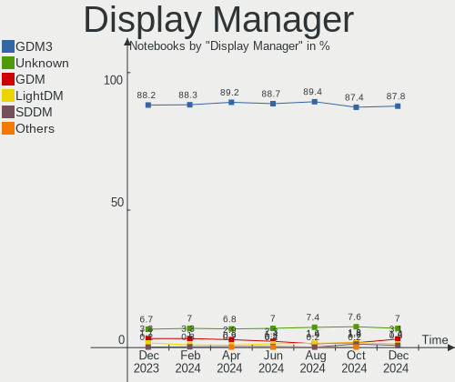
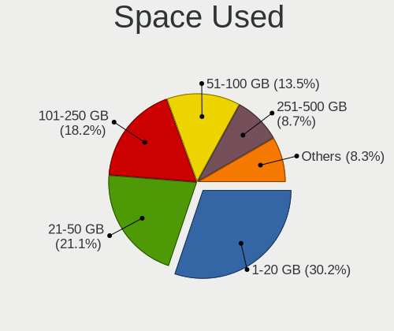

Ubuntu Hardware Trends (Notebooks)
----------------------------------

A project to identify most popular hardware characteristics and track their change
over time based on data collected by Ubuntu users at https://Linux-Hardware.org.

Anyone can contribute to this report by the [hw-probe](https://github.com/linuxhw/hw-probe) tool:

    sudo -E hw-probe -all -upload

Full-feature report is available here: https://linux-hardware.org/?view=trends

Period: Jan, 2022.

Contents
--------

* [ System ](#system)
  - [ OS                       ](#os)
  - [ OS Family                ](#os-family)
  - [ Kernel                   ](#kernel)
  - [ Kernel Family            ](#kernel-family)
  - [ Kernel Major Ver.        ](#kernel-major-ver)
  - [ Arch                     ](#arch)
  - [ DE                       ](#de)
  - [ Display Server           ](#display-server)
  - [ Display Manager          ](#display-manager)
  - [ OS Lang                  ](#os-lang)
  - [ Boot Mode                ](#boot-mode)
  - [ Filesystem               ](#filesystem)
  - [ Part. scheme             ](#part-scheme)
  - [ Dual Boot with Linux/BSD ](#dual-boot-with-linuxbsd)
  - [ Dual Boot (Win)          ](#dual-boot-win)

* [ Board ](#board)
  - [ Vendor                   ](#vendor)
  - [ Model                    ](#model)
  - [ Model Family             ](#model-family)
  - [ MFG Year                 ](#mfg-year)
  - [ Form Factor              ](#form-factor)
  - [ Secure Boot              ](#secure-boot)
  - [ Coreboot                 ](#coreboot)
  - [ RAM Size                 ](#ram-size)
  - [ RAM Used                 ](#ram-used)
  - [ Total Drives             ](#total-drives)
  - [ Has CD-ROM               ](#has-cd-rom)
  - [ Has Ethernet             ](#has-ethernet)
  - [ Has WiFi                 ](#has-wifi)
  - [ Has Bluetooth            ](#has-bluetooth)

* [ Location ](#location)
  - [ Country                  ](#country)
  - [ City                     ](#city)

* [ Drives ](#drives)
  - [ Drive Vendor             ](#drive-vendor)
  - [ Drive Model              ](#drive-model)
  - [ HDD Vendor               ](#hdd-vendor)
  - [ SSD Vendor               ](#ssd-vendor)
  - [ Drive Kind               ](#drive-kind)
  - [ Drive Connector          ](#drive-connector)
  - [ Drive Size               ](#drive-size)
  - [ Space Total              ](#space-total)
  - [ Space Used               ](#space-used)
  - [ Malfunc. Drives          ](#malfunc-drives)
  - [ Malfunc. Drive Vendor    ](#malfunc-drive-vendor)
  - [ Malfunc. HDD Vendor      ](#malfunc-hdd-vendor)
  - [ Malfunc. Drive Kind      ](#malfunc-drive-kind)
  - [ Failed Drives            ](#failed-drives)
  - [ Failed Drive Vendor      ](#failed-drive-vendor)
  - [ Drive Status             ](#drive-status)

* [ Storage controller ](#storage-controller)
  - [ Storage Vendor           ](#storage-vendor)
  - [ Storage Model            ](#storage-model)
  - [ Storage Kind             ](#storage-kind)

* [ Processor ](#processor)
  - [ CPU Vendor               ](#cpu-vendor)
  - [ CPU Model                ](#cpu-model)
  - [ CPU Model Family         ](#cpu-model-family)
  - [ CPU Cores                ](#cpu-cores)
  - [ CPU Sockets              ](#cpu-sockets)
  - [ CPU Threads              ](#cpu-threads)
  - [ CPU Op-Modes             ](#cpu-op-modes)
  - [ CPU Microcode            ](#cpu-microcode)
  - [ CPU Microarch            ](#cpu-microarch)

* [ Graphics ](#graphics)
  - [ GPU Vendor               ](#gpu-vendor)
  - [ GPU Model                ](#gpu-model)
  - [ GPU Combo                ](#gpu-combo)
  - [ GPU Driver               ](#gpu-driver)
  - [ GPU Memory               ](#gpu-memory)

* [ Monitor ](#monitor)
  - [ Monitor Vendor           ](#monitor-vendor)
  - [ Monitor Model            ](#monitor-model)
  - [ Monitor Resolution       ](#monitor-resolution)
  - [ Monitor Diagonal         ](#monitor-diagonal)
  - [ Monitor Width            ](#monitor-width)
  - [ Aspect Ratio             ](#aspect-ratio)
  - [ Monitor Area             ](#monitor-area)
  - [ Pixel Density            ](#pixel-density)
  - [ Multiple Monitors        ](#multiple-monitors)

* [ Network ](#network)
  - [ Net Controller Vendor    ](#net-controller-vendor)
  - [ Net Controller Model     ](#net-controller-model)
  - [ Wireless Vendor          ](#wireless-vendor)
  - [ Wireless Model           ](#wireless-model)
  - [ Ethernet Vendor          ](#ethernet-vendor)
  - [ Ethernet Model           ](#ethernet-model)
  - [ Net Controller Kind      ](#net-controller-kind)
  - [ Used Controller          ](#used-controller)
  - [ NICs                     ](#nics)
  - [ IPv6                     ](#ipv6)

* [ Bluetooth ](#bluetooth)
  - [ Bluetooth Vendor         ](#bluetooth-vendor)
  - [ Bluetooth Model          ](#bluetooth-model)

* [ Sound ](#sound)
  - [ Sound Vendor             ](#sound-vendor)
  - [ Sound Model              ](#sound-model)

* [ Memory ](#memory)
  - [ Memory Vendor            ](#memory-vendor)
  - [ Memory Model             ](#memory-model)
  - [ Memory Kind              ](#memory-kind)
  - [ Memory Form Factor       ](#memory-form-factor)
  - [ Memory Size              ](#memory-size)
  - [ Memory Speed             ](#memory-speed)

* [ Printers & scanners ](#printers--scanners)
  - [ Printer Vendor           ](#printer-vendor)
  - [ Printer Model            ](#printer-model)
  - [ Scanner Vendor           ](#scanner-vendor)
  - [ Scanner Model            ](#scanner-model)

* [ Camera ](#camera)
  - [ Camera Vendor            ](#camera-vendor)
  - [ Camera Model             ](#camera-model)

* [ Security ](#security)
  - [ Fingerprint Vendor       ](#fingerprint-vendor)
  - [ Fingerprint Model        ](#fingerprint-model)
  - [ Chipcard Vendor          ](#chipcard-vendor)
  - [ Chipcard Model           ](#chipcard-model)

* [ Unsupported ](#unsupported)
  - [ Unsupported Devices      ](#unsupported-devices)
  - [ Unsupported Device Types ](#unsupported-device-types)

System
------

OS
--

Installed operating systems

| Name         | Notebooks | Percent |
|--------------|-----------|---------|
| Ubuntu 20.04 | 428       | 63.98%  |
| Ubuntu 21.10 | 183       | 27.35%  |
| Ubuntu 18.04 | 29        | 4.33%   |
| Ubuntu 21.04 | 15        | 2.24%   |
| Ubuntu 22.04 | 10        | 1.49%   |
| Ubuntu 16.04 | 3         | 0.45%   |
| Ubuntu 20.10 | 1         | 0.15%   |

OS Family
---------

OS without a version

| Name   | Notebooks | Percent |
|--------|-----------|---------|
| Ubuntu | 669       | 100%    |

Kernel
------

Version of the Linux kernel

| Version                  | Notebooks | Percent |
|--------------------------|-----------|---------|
| 5.13.0-27-generic        | 160       | 23.92%  |
| 5.11.0-44-generic        | 73        | 10.91%  |
| 5.11.0-46-generic        | 71        | 10.61%  |
| 5.13.0-25-generic        | 54        | 8.07%   |
| 5.11.0-43-generic        | 53        | 7.92%   |
| 5.13.0-23-generic        | 32        | 4.78%   |
| 5.4.0-96-generic         | 24        | 3.59%   |
| 5.13.0-22-generic        | 22        | 3.29%   |
| 5.4.0-92-generic         | 19        | 2.84%   |
| 5.11.0-27-generic        | 19        | 2.84%   |
| 5.4.0-94-generic         | 12        | 1.79%   |
| 5.4.0-91-generic         | 11        | 1.64%   |
| 5.13.0-19-generic        | 10        | 1.49%   |
| 5.13.0-28-generic        | 9         | 1.35%   |
| 5.11.0-41-generic        | 9         | 1.35%   |
| 4.15.0-166-generic       | 6         | 0.9%    |
| 5.15.0-17-generic        | 5         | 0.75%   |
| 5.4.0-42-generic         | 4         | 0.6%    |
| 5.10.0-1053-oem          | 4         | 0.6%    |
| 5.13.0-24-generic        | 3         | 0.45%   |
| 5.11.0-40-generic        | 3         | 0.45%   |
| 5.11.0-38-generic        | 3         | 0.45%   |
| 5.11.0-37-generic        | 3         | 0.45%   |
| 5.11.0-34-generic        | 3         | 0.45%   |
| 5.10.0-1057-oem          | 3         | 0.45%   |
| 4.4.0-210-generic        | 3         | 0.45%   |
| 5.4.0-90-generic         | 2         | 0.3%    |
| 5.4.0-88-generic         | 2         | 0.3%    |
| 5.15.0-18-generic        | 2         | 0.3%    |
| 5.11.0-49-generic        | 2         | 0.3%    |
| 5.10.0-1055-oem          | 2         | 0.3%    |
| 5.10.0-1052-oem          | 2         | 0.3%    |
| 4.15.0-163-generic       | 2         | 0.3%    |
| 5.8.18-050818-generic    | 1         | 0.15%   |
| 5.8.0-63-generic         | 1         | 0.15%   |
| 5.8.0-55-generic         | 1         | 0.15%   |
| 5.8.0-41-generic         | 1         | 0.15%   |
| 5.8.0-050800-generic     | 1         | 0.15%   |
| 5.6.0-1036-oem           | 1         | 0.15%   |
| 5.4.0-84-generic         | 1         | 0.15%   |
| 5.4.0-77-generic         | 1         | 0.15%   |
| 5.4.0-70-generic         | 1         | 0.15%   |
| 5.4.0-60-generic         | 1         | 0.15%   |
| 5.4.0-050400-generic     | 1         | 0.15%   |
| 5.16.4-051604-generic    | 1         | 0.15%   |
| 5.16.1-051601-generic    | 1         | 0.15%   |
| 5.16.0-051600rc8-generic | 1         | 0.15%   |
| 5.16.0-051600-generic    | 1         | 0.15%   |
| 5.15.5-051505-generic    | 1         | 0.15%   |
| 5.15.18-051518-generic   | 1         | 0.15%   |
| 5.15.17-xanmod2          | 1         | 0.15%   |
| 5.15.13-051513-generic   | 1         | 0.15%   |
| 5.15.12-051512-generic   | 1         | 0.15%   |
| 5.15.0-051500-generic    | 1         | 0.15%   |
| 5.14.9-051409-generic    | 1         | 0.15%   |
| 5.14.0-1013-oem          | 1         | 0.15%   |
| 5.13.15-t2-j-bigsur      | 1         | 0.15%   |
| 5.13.0-27-lowlatency     | 1         | 0.15%   |
| 5.13.0-21-generic        | 1         | 0.15%   |
| 5.13.0-1028-oem          | 1         | 0.15%   |

Kernel Family
-------------

Linux kernel without a distro release

| Version | Notebooks | Percent |
|---------|-----------|---------|
| 5.13.0  | 295       | 44.1%   |
| 5.11.0  | 241       | 36.02%  |
| 5.4.0   | 79        | 11.81%  |
| 5.10.0  | 11        | 1.64%   |
| 4.15.0  | 11        | 1.64%   |
| 5.15.0  | 8         | 1.2%    |
| 5.8.0   | 4         | 0.6%    |
| 4.4.0   | 3         | 0.45%   |
| 5.16.0  | 2         | 0.3%    |
| 5.8.18  | 1         | 0.15%   |
| 5.6.0   | 1         | 0.15%   |
| 5.16.4  | 1         | 0.15%   |
| 5.16.1  | 1         | 0.15%   |
| 5.15.5  | 1         | 0.15%   |
| 5.15.18 | 1         | 0.15%   |
| 5.15.17 | 1         | 0.15%   |
| 5.15.13 | 1         | 0.15%   |
| 5.15.12 | 1         | 0.15%   |
| 5.14.9  | 1         | 0.15%   |
| 5.14.0  | 1         | 0.15%   |
| 5.13.15 | 1         | 0.15%   |
| 5.12.11 | 1         | 0.15%   |
| 4.18.0  | 1         | 0.15%   |
| Unknown | 1         | 0.15%   |

Kernel Major Ver.
-----------------

Linux kernel major version

| Version | Notebooks | Percent |
|---------|-----------|---------|
| 5.13    | 296       | 44.25%  |
| 5.11    | 241       | 36.02%  |
| 5.4     | 79        | 11.81%  |
| 5.15    | 13        | 1.94%   |
| 5.10    | 11        | 1.64%   |
| 4.15    | 11        | 1.64%   |
| 5.8     | 5         | 0.75%   |
| 5.16    | 4         | 0.6%    |
| 4.4     | 3         | 0.45%   |
| 5.14    | 2         | 0.3%    |
| 5.6     | 1         | 0.15%   |
| 5.12    | 1         | 0.15%   |
| 4.18    | 1         | 0.15%   |
| Unknown | 1         | 0.15%   |

Arch
----

OS architecture (x86_64, i586, etc.)

| Name    | Notebooks | Percent |
|---------|-----------|---------|
| x86_64  | 660       | 98.65%  |
| i686    | 8         | 1.2%    |
| Unknown | 1         | 0.15%   |

DE
--

Desktop Environment

| Name            | Notebooks | Percent |
|-----------------|-----------|---------|
| GNOME           | 638       | 95.37%  |
| Unknown         | 14        | 2.09%   |
| Unity           | 7         | 1.05%   |
| X-Cinnamon      | 3         | 0.45%   |
| GNOME Flashback | 3         | 0.45%   |
| i3              | 1         | 0.15%   |
| Enlightenment   | 1         | 0.15%   |
| Deepin          | 1         | 0.15%   |
| Cinnamon        | 1         | 0.15%   |

Display Server
--------------

X11 or Wayland

| Name    | Notebooks | Percent |
|---------|-----------|---------|
| X11     | 488       | 72.94%  |
| Wayland | 169       | 25.26%  |
| Unknown | 8         | 1.2%    |
| Tty     | 4         | 0.6%    |

Display Manager
---------------

SDDM, LightDM, etc.

| Name    | Notebooks | Percent |
|---------|-----------|---------|
| GDM3    | 359       | 53.66%  |
| GDM     | 259       | 38.71%  |
| Unknown | 32        | 4.78%   |
| LightDM | 19        | 2.84%   |

OS Lang
-------

Language

| Lang    | Notebooks | Percent |
|---------|-----------|---------|
| en_US   | 287       | 42.9%   |
| de_DE   | 76        | 11.36%  |
| fr_FR   | 51        | 7.62%   |
| en_GB   | 35        | 5.23%   |
| en_IN   | 25        | 3.74%   |
| it_IT   | 20        | 2.99%   |
| pt_BR   | 17        | 2.54%   |
| ru_RU   | 16        | 2.39%   |
| en_CA   | 16        | 2.39%   |
| es_ES   | 14        | 2.09%   |
| pl_PL   | 10        | 1.49%   |
| hu_HU   | 9         | 1.35%   |
| en_AU   | 9         | 1.35%   |
| nl_NL   | 8         | 1.2%    |
| C       | 7         | 1.05%   |
| ja_JP   | 5         | 0.75%   |
| es_MX   | 5         | 0.75%   |
| cs_CZ   | 5         | 0.75%   |
| fr_BE   | 4         | 0.6%    |
| es_AR   | 4         | 0.6%    |
| de_CH   | 4         | 0.6%    |
| Unknown | 4         | 0.6%    |
| pt_PT   | 3         | 0.45%   |
| fr_CA   | 3         | 0.45%   |
| en_ZA   | 3         | 0.45%   |
| el_GR   | 3         | 0.45%   |
| da_DK   | 3         | 0.45%   |
| sv_SE   | 2         | 0.3%    |
| nl_BE   | 2         | 0.3%    |
| en_SG   | 2         | 0.3%    |
| de_AT   | 2         | 0.3%    |
| sk_SK   | 1         | 0.15%   |
| ru_UA   | 1         | 0.15%   |
| ro_RO   | 1         | 0.15%   |
| nb_NO   | 1         | 0.15%   |
| id_ID   | 1         | 0.15%   |
| fr_LU   | 1         | 0.15%   |
| fi_FI   | 1         | 0.15%   |
| es_PE   | 1         | 0.15%   |
| es_CO   | 1         | 0.15%   |
| es_CL   | 1         | 0.15%   |
| en_NZ   | 1         | 0.15%   |
| en_IL   | 1         | 0.15%   |
| en_IE   | 1         | 0.15%   |
| ca_ES   | 1         | 0.15%   |
| bg_BG   | 1         | 0.15%   |

Boot Mode
---------

EFI or BIOS

| Mode | Notebooks | Percent |
|------|-----------|---------|
| EFI  | 381       | 56.95%  |
| BIOS | 288       | 43.05%  |

Filesystem
----------

Type of filesystem

| Type    | Notebooks | Percent |
|---------|-----------|---------|
| Ext4    | 629       | 94.02%  |
| Overlay | 18        | 2.69%   |
| Zfs     | 8         | 1.2%    |
| Ext3    | 5         | 0.75%   |
| Btrfs   | 5         | 0.75%   |
| Xfs     | 3         | 0.45%   |
| Unknown | 1         | 0.15%   |

Part. scheme
------------

Scheme of partitioning

| Type    | Notebooks | Percent |
|---------|-----------|---------|
| Unknown | 395       | 59.04%  |
| GPT     | 239       | 35.72%  |
| MBR     | 35        | 5.23%   |

Dual Boot with Linux/BSD
------------------------

Hosting more than one Linux/BSD

| Dual boot | Notebooks | Percent |
|-----------|-----------|---------|
| No        | 614       | 91.78%  |
| Yes       | 55        | 8.22%   |

Dual Boot (Win)
---------------

Hosting Linux and Windows

| Dual boot | Notebooks | Percent |
|-----------|-----------|---------|
| No        | 409       | 61.14%  |
| Yes       | 260       | 38.86%  |

Board
-----

Vendor
------

Motherboard manufacturer

| Name                | Notebooks | Percent |
|---------------------|-----------|---------|
| Dell                | 140       | 20.93%  |
| Lenovo              | 132       | 19.73%  |
| Hewlett-Packard     | 129       | 19.28%  |
| ASUSTek Computer    | 64        | 9.57%   |
| Acer                | 56        | 8.37%   |
| MSI                 | 20        | 2.99%   |
| HUAWEI              | 13        | 1.94%   |
| Apple               | 13        | 1.94%   |
| Toshiba             | 12        | 1.79%   |
| Samsung Electronics | 10        | 1.49%   |
| Packard Bell        | 9         | 1.35%   |
| Timi                | 8         | 1.2%    |
| Sony                | 5         | 0.75%   |
| Unknown             | 5         | 0.75%   |
| Medion              | 4         | 0.6%    |
| Fujitsu             | 4         | 0.6%    |
| Google              | 3         | 0.45%   |
| Gateway             | 3         | 0.45%   |
| Wortmann AG         | 2         | 0.3%    |
| TUXEDO              | 2         | 0.3%    |
| Razer               | 2         | 0.3%    |
| Positivo            | 2         | 0.3%    |
| Notebook            | 2         | 0.3%    |
| HONOR               | 2         | 0.3%    |
| Fujitsu Siemens     | 2         | 0.3%    |
| Clevo               | 2         | 0.3%    |
| Chuwi               | 2         | 0.3%    |
| AMI                 | 2         | 0.3%    |
| Teclast             | 1         | 0.15%   |
| PC Specialist       | 1         | 0.15%   |
| Panasonic           | 1         | 0.15%   |
| NCS-Tech            | 1         | 0.15%   |
| MOTILE              | 1         | 0.15%   |
| Mediacom            | 1         | 0.15%   |
| Maibenben           | 1         | 0.15%   |
| LG Electronics      | 1         | 0.15%   |
| KOUZIRO             | 1         | 0.15%   |
| Hungaro Flotta Kft  | 1         | 0.15%   |
| GPU Company         | 1         | 0.15%   |
| GPD                 | 1         | 0.15%   |
| Gadnic              | 1         | 0.15%   |
| Framework           | 1         | 0.15%   |
| Dynabook            | 1         | 0.15%   |
| DukaPC              | 1         | 0.15%   |
| BANGHO              | 1         | 0.15%   |
| AVITA               | 1         | 0.15%   |
| Alienware           | 1         | 0.15%   |

Model
-----

Motherboard model

| Name                                  | Notebooks | Percent |
|---------------------------------------|-----------|---------|
| HP Notebook                           | 6         | 0.9%    |
| Unknown                               | 6         | 0.9%    |
| Dell Inspiron 5570                    | 5         | 0.75%   |
| HP EliteBook 8470p                    | 4         | 0.6%    |
| HUAWEI NBLK-WAX9X                     | 3         | 0.45%   |
| HP ProBook 445 G7                     | 3         | 0.45%   |
| HP ProBook 440 G7                     | 3         | 0.45%   |
| HP Pavilion Gaming Laptop 15-cx0xxx   | 3         | 0.45%   |
| HP Pavilion g6                        | 3         | 0.45%   |
| HP Pavilion Aero Laptop 13-be0xxx     | 3         | 0.45%   |
| Dell XPS 15 7590                      | 3         | 0.45%   |
| Dell XPS 13 9360                      | 3         | 0.45%   |
| Dell Latitude 7490                    | 3         | 0.45%   |
| Dell Inspiron 3501                    | 3         | 0.45%   |
| Dell Inspiron 1545                    | 3         | 0.45%   |
| ASUS ROG Zephyrus G14 GA401QM_GA401QM | 3         | 0.45%   |
| Apple MacBookPro9,2                   | 3         | 0.45%   |
| Acer Swift SF315-41                   | 3         | 0.45%   |
| Wortmann AG TERRA_MOBILE_1512/1712    | 2         | 0.3%    |
| Packard Bell EasyNote MH36            | 2         | 0.3%    |
| Lenovo IdeaPad S145-15API 81V7        | 2         | 0.3%    |
| Lenovo IdeaPad 5 15ARE05 81YQ         | 2         | 0.3%    |
| Lenovo IdeaPad 330-15IKB 81DE         | 2         | 0.3%    |
| Lenovo IdeaPad 3 15IIL05 81WE         | 2         | 0.3%    |
| Lenovo G50-70 20351                   | 2         | 0.3%    |
| HUAWEI NBLB-WAX9N                     | 2         | 0.3%    |
| HUAWEI HVY-WXX9                       | 2         | 0.3%    |
| HP ZBook 15v G5                       | 2         | 0.3%    |
| HP ProBook 6560b                      | 2         | 0.3%    |
| HP ProBook 6550b                      | 2         | 0.3%    |
| HP ProBook 455 G7                     | 2         | 0.3%    |
| HP Pavilion g7                        | 2         | 0.3%    |
| HP Pavilion dv6                       | 2         | 0.3%    |
| HP Pavilion 17                        | 2         | 0.3%    |
| HP Laptop 15s-fq1xxx                  | 2         | 0.3%    |
| HP Laptop 15-db0xxx                   | 2         | 0.3%    |
| HP EliteBook 8540p                    | 2         | 0.3%    |
| HP EliteBook 2570p                    | 2         | 0.3%    |
| HP EliteBook 1050 G1                  | 2         | 0.3%    |
| HP Compaq Presario CQ70               | 2         | 0.3%    |
| HP Compaq 8710w                       | 2         | 0.3%    |
| HP 255 G7 Notebook PC                 | 2         | 0.3%    |
| HP 250 G7 Notebook PC                 | 2         | 0.3%    |
| Dell XPS 15 9570                      | 2         | 0.3%    |
| Dell XPS 15 9550                      | 2         | 0.3%    |
| Dell XPS 15 9500                      | 2         | 0.3%    |
| Dell XPS 13 9310                      | 2         | 0.3%    |
| Dell XPS 13 9305                      | 2         | 0.3%    |
| Dell XPS 13 7390                      | 2         | 0.3%    |
| Dell Vostro 3500                      | 2         | 0.3%    |
| Dell System Vostro 3750               | 2         | 0.3%    |
| Dell Precision 5550                   | 2         | 0.3%    |
| Dell Latitude E6510                   | 2         | 0.3%    |
| Dell Latitude E5530 non-vPro          | 2         | 0.3%    |
| Dell Latitude E5440                   | 2         | 0.3%    |
| Dell Latitude 7520                    | 2         | 0.3%    |
| Dell Latitude 7480                    | 2         | 0.3%    |
| Dell Latitude 7280                    | 2         | 0.3%    |
| Dell Latitude 5520                    | 2         | 0.3%    |
| Dell Latitude 3410                    | 2         | 0.3%    |

Model Family
------------

Motherboard model prefix

| Name                  | Notebooks | Percent |
|-----------------------|-----------|---------|
| Lenovo ThinkPad       | 74        | 11.06%  |
| Dell Inspiron         | 45        | 6.73%   |
| Dell Latitude         | 44        | 6.58%   |
| Acer Aspire           | 39        | 5.83%   |
| HP Pavilion           | 29        | 4.33%   |
| Lenovo IdeaPad        | 27        | 4.04%   |
| HP ProBook            | 27        | 4.04%   |
| HP EliteBook          | 26        | 3.89%   |
| Dell XPS              | 23        | 3.44%   |
| HP Laptop             | 14        | 2.09%   |
| Dell Precision        | 12        | 1.79%   |
| Packard Bell EasyNote | 9         | 1.35%   |
| Acer Swift            | 9         | 1.35%   |
| HP Compaq             | 8         | 1.2%    |
| Dell Vostro           | 8         | 1.2%    |
| ASUS VivoBook         | 8         | 1.2%    |
| ASUS ROG              | 8         | 1.2%    |
| Toshiba Satellite     | 6         | 0.9%    |
| HP Notebook           | 6         | 0.9%    |
| Unknown               | 6         | 0.9%    |
| Timi RedmiBook        | 4         | 0.6%    |
| Lenovo ThinkBook      | 4         | 0.6%    |
| Lenovo Legion         | 4         | 0.6%    |
| HP 255                | 4         | 0.6%    |
| ASUS ZenBook          | 4         | 0.6%    |
| HUAWEI NBLK-WAX9X     | 3         | 0.45%   |
| HP ZBook              | 3         | 0.45%   |
| HP ENVY               | 3         | 0.45%   |
| Fujitsu LIFEBOOK      | 3         | 0.45%   |
| Dell G5               | 3         | 0.45%   |
| ASUS ASUS             | 3         | 0.45%   |
| Apple MacBookPro9     | 3         | 0.45%   |
| Apple MacBookPro16    | 3         | 0.45%   |
| Acer TravelMate       | 3         | 0.45%   |
| Acer Nitro            | 3         | 0.45%   |
| Wortmann AG TERRA     | 2         | 0.3%    |
| Toshiba TECRA         | 2         | 0.3%    |
| Toshiba PORTEGE       | 2         | 0.3%    |
| Razer Blade           | 2         | 0.3%    |
| MSI Prestige          | 2         | 0.3%    |
| MSI Modern            | 2         | 0.3%    |
| MSI GT70              | 2         | 0.3%    |
| MSI GF75              | 2         | 0.3%    |
| MSI Creator           | 2         | 0.3%    |
| Lenovo Yoga           | 2         | 0.3%    |
| Lenovo G580           | 2         | 0.3%    |
| Lenovo G50-70         | 2         | 0.3%    |
| HUAWEI NBLB-WAX9N     | 2         | 0.3%    |
| HUAWEI HVY-WXX9       | 2         | 0.3%    |
| HP 250                | 2         | 0.3%    |
| Dell System           | 2         | 0.3%    |
| ASUS TUF              | 2         | 0.3%    |
| ASUS GL752VW          | 2         | 0.3%    |
| ASUS E200HA           | 2         | 0.3%    |
| Apple MacBook5        | 2         | 0.3%    |
| Acer Predator         | 2         | 0.3%    |
| TUXEDO BC1510         | 1         | 0.15%   |
| TUXEDO Aura           | 1         | 0.15%   |
| Toshiba EQUIUM        | 1         | 0.15%   |
| Toshiba dynabook      | 1         | 0.15%   |

MFG Year
--------

Motherboard manufacture year

| Year | Notebooks | Percent |
|------|-----------|---------|
| 2021 | 103       | 15.4%   |
| 2020 | 85        | 12.71%  |
| 2019 | 72        | 10.76%  |
| 2018 | 59        | 8.82%   |
| 2017 | 47        | 7.03%   |
| 2013 | 43        | 6.43%   |
| 2012 | 42        | 6.28%   |
| 2011 | 41        | 6.13%   |
| 2014 | 34        | 5.08%   |
| 2016 | 30        | 4.48%   |
| 2010 | 27        | 4.04%   |
| 2015 | 26        | 3.89%   |
| 2008 | 22        | 3.29%   |
| 2009 | 21        | 3.14%   |
| 2007 | 14        | 2.09%   |
| 2006 | 3         | 0.45%   |

Form Factor
-----------

Physical design of the computer

| Name     | Notebooks | Percent |
|----------|-----------|---------|
| Notebook | 669       | 100%    |

Secure Boot
-----------

Enabled or disabled

| State    | Notebooks | Percent |
|----------|-----------|---------|
| Disabled | 532       | 79.52%  |
| Enabled  | 137       | 20.48%  |

Coreboot
--------

Have coreboot on board

| Used | Notebooks | Percent |
|------|-----------|---------|
| No   | 666       | 99.55%  |
| Yes  | 3         | 0.45%   |

RAM Size
--------

Total RAM memory

| Size in GB  | Notebooks | Percent |
|-------------|-----------|---------|
| 4.01-8.0    | 212       | 31.69%  |
| 3.01-4.0    | 126       | 18.83%  |
| 16.01-24.0  | 121       | 18.09%  |
| 8.01-16.0   | 98        | 14.65%  |
| 32.01-64.0  | 56        | 8.37%   |
| 1.01-2.0    | 19        | 2.84%   |
| 24.01-32.0  | 11        | 1.64%   |
| 2.01-3.0    | 11        | 1.64%   |
| 64.01-256.0 | 9         | 1.35%   |
| 0.51-1.0    | 5         | 0.75%   |
| Unknown     | 1         | 0.15%   |

RAM Used
--------

Used RAM memory

| Used GB    | Notebooks | Percent |
|------------|-----------|---------|
| 1.01-2.0   | 238       | 35.58%  |
| 2.01-3.0   | 198       | 29.6%   |
| 4.01-8.0   | 107       | 15.99%  |
| 3.01-4.0   | 77        | 11.51%  |
| 8.01-16.0  | 23        | 3.44%   |
| 0.51-1.0   | 18        | 2.69%   |
| 16.01-24.0 | 4         | 0.6%    |
| 24.01-32.0 | 3         | 0.45%   |
| Unknown    | 1         | 0.15%   |

Total Drives
------------

Number of drives on board

| Drives | Notebooks | Percent |
|--------|-----------|---------|
| 1      | 492       | 73.54%  |
| 2      | 150       | 22.42%  |
| 3      | 23        | 3.44%   |
| 0      | 3         | 0.45%   |
| 4      | 1         | 0.15%   |

Has CD-ROM
----------

Has CD-ROM on board

| Presented | Notebooks | Percent |
|-----------|-----------|---------|
| No        | 441       | 65.92%  |
| Yes       | 228       | 34.08%  |

Has Ethernet
------------

Has Ethernet on board

| Presented | Notebooks | Percent |
|-----------|-----------|---------|
| Yes       | 528       | 78.92%  |
| No        | 141       | 21.08%  |

Has WiFi
--------

Has WiFi module

| Presented | Notebooks | Percent |
|-----------|-----------|---------|
| Yes       | 659       | 98.51%  |
| No        | 10        | 1.49%   |

Has Bluetooth
-------------

Has Bluetooth module

| Presented | Notebooks | Percent |
|-----------|-----------|---------|
| Yes       | 531       | 79.37%  |
| No        | 138       | 20.63%  |

Location
--------

Country
-------

Geographic location (country)

| Country      | Notebooks | Percent |
|--------------|-----------|---------|
| Germany      | 92        | 13.75%  |
| USA          | 91        | 13.6%   |
| France       | 59        | 8.82%   |
| India        | 31        | 4.63%   |
| Italy        | 27        | 4.04%   |
| UK           | 22        | 3.29%   |
| Spain        | 22        | 3.29%   |
| Brazil       | 22        | 3.29%   |
| Canada       | 21        | 3.14%   |
| Poland       | 20        | 2.99%   |
| Russia       | 17        | 2.54%   |
| Ukraine      | 13        | 1.94%   |
| Netherlands  | 13        | 1.94%   |
| Hungary      | 11        | 1.64%   |
| Czechia      | 11        | 1.64%   |
| Belgium      | 11        | 1.64%   |
| Mexico       | 10        | 1.49%   |
| Denmark      | 10        | 1.49%   |
| Austria      | 10        | 1.49%   |
| Australia    | 9         | 1.35%   |
| Sweden       | 7         | 1.05%   |
| Greece       | 7         | 1.05%   |
| Turkey       | 6         | 0.9%    |
| Switzerland  | 6         | 0.9%    |
| Portugal     | 6         | 0.9%    |
| Romania      | 5         | 0.75%   |
| Japan        | 5         | 0.75%   |
| Argentina    | 5         | 0.75%   |
| Morocco      | 4         | 0.6%    |
| Malaysia     | 4         | 0.6%    |
| Indonesia    | 4         | 0.6%    |
| Finland      | 4         | 0.6%    |
| Bulgaria     | 4         | 0.6%    |
| Belarus      | 4         | 0.6%    |
| South Africa | 3         | 0.45%   |
| Singapore    | 3         | 0.45%   |
| Norway       | 3         | 0.45%   |
| Egypt        | 3         | 0.45%   |
| Chile        | 3         | 0.45%   |
| Tunisia      | 2         | 0.3%    |
| Thailand     | 2         | 0.3%    |
| Taiwan       | 2         | 0.3%    |
| Slovakia     | 2         | 0.3%    |
| Serbia       | 2         | 0.3%    |
| Nepal        | 2         | 0.3%    |
| Luxembourg   | 2         | 0.3%    |
| Latvia       | 2         | 0.3%    |
| Ireland      | 2         | 0.3%    |
| Iran         | 2         | 0.3%    |
| Ecuador      | 2         | 0.3%    |
| Cyprus       | 2         | 0.3%    |
| Cuba         | 2         | 0.3%    |
| Colombia     | 2         | 0.3%    |
| China        | 2         | 0.3%    |
| Bangladesh   | 2         | 0.3%    |
| Algeria      | 2         | 0.3%    |
| Vietnam      | 1         | 0.15%   |
| Uganda       | 1         | 0.15%   |
| UAE          | 1         | 0.15%   |
| Syria        | 1         | 0.15%   |

City
----

Geographic location (city)

| City          | Notebooks | Percent |
|---------------|-----------|---------|
| Berlin        | 10        | 1.49%   |
| Paris         | 7         | 1.05%   |
| Vienna        | 6         | 0.9%    |
| Prague        | 6         | 0.9%    |
| Warsaw        | 5         | 0.75%   |
| Stuttgart     | 5         | 0.75%   |
| Moscow        | 4         | 0.6%    |
| Melbourne     | 4         | 0.6%    |
| Madrid        | 4         | 0.6%    |
| Lille         | 4         | 0.6%    |
| Kyiv          | 4         | 0.6%    |
| Kharkiv       | 4         | 0.6%    |
| Budapest      | 4         | 0.6%    |
| Athens        | 4         | 0.6%    |
| Singapore     | 3         | 0.45%   |
| Poznan        | 3         | 0.45%   |
| Munich        | 3         | 0.45%   |
| Milan         | 3         | 0.45%   |
| Mexico City   | 3         | 0.45%   |
| Marseille     | 3         | 0.45%   |
| Krakow        | 3         | 0.45%   |
| Essen         | 3         | 0.45%   |
| Delhi         | 3         | 0.45%   |
| Chennai       | 3         | 0.45%   |
| Bengaluru     | 3         | 0.45%   |
| Augsburg      | 3         | 0.45%   |
| Zurich        | 2         | 0.3%    |
| Winterthur    | 2         | 0.3%    |
| Washington    | 2         | 0.3%    |
| Venice        | 2         | 0.3%    |
| Turku         | 2         | 0.3%    |
| Tehran        | 2         | 0.3%    |
| Stockholm     | 2         | 0.3%    |
| St Louis      | 2         | 0.3%    |
| Sofia         | 2         | 0.3%    |
| Sindelfingen  | 2         | 0.3%    |
| S??o Paulo    | 2         | 0.3%    |
| Santiago      | 2         | 0.3%    |
| Riga          | 2         | 0.3%    |
| Pune          | 2         | 0.3%    |
| Portland      | 2         | 0.3%    |
| Petaling Jaya | 2         | 0.3%    |
| Oslo          | 2         | 0.3%    |
| Novosibirsk   | 2         | 0.3%    |
| Newtown       | 2         | 0.3%    |
| New Taipei    | 2         | 0.3%    |
| Nantes        | 2         | 0.3%    |
| Mumbai        | 2         | 0.3%    |
| Montreal      | 2         | 0.3%    |
| Montpellier   | 2         | 0.3%    |
| London        | 2         | 0.3%    |
| Leipzig       | 2         | 0.3%    |
| La Riche      | 2         | 0.3%    |
| Kathmandu     | 2         | 0.3%    |
| Jonesborough  | 2         | 0.3%    |
| Istanbul      | 2         | 0.3%    |
| Havana        | 2         | 0.3%    |
| Hamburg       | 2         | 0.3%    |
| Guayaquil     | 2         | 0.3%    |
| Graz          | 2         | 0.3%    |

Drives
------

Drive Vendor
------------

Hard drive vendors

| Vendor                      | Notebooks | Drives | Percent |
|-----------------------------|-----------|--------|---------|
| Samsung Electronics         | 146       | 159    | 18%     |
| WDC                         | 113       | 120    | 13.93%  |
| Seagate                     | 74        | 75     | 9.12%   |
| Toshiba                     | 69        | 70     | 8.51%   |
| SanDisk                     | 53        | 53     | 6.54%   |
| SK Hynix                    | 47        | 48     | 5.8%    |
| Unknown                     | 44        | 48     | 5.43%   |
| Kingston                    | 36        | 37     | 4.44%   |
| Intel                       | 28        | 29     | 3.45%   |
| Crucial                     | 28        | 28     | 3.45%   |
| Micron Technology           | 22        | 22     | 2.71%   |
| KIOXIA                      | 18        | 20     | 2.22%   |
| Hitachi                     | 18        | 18     | 2.22%   |
| HGST                        | 16        | 16     | 1.97%   |
| A-DATA Technology           | 10        | 10     | 1.23%   |
| LITEON                      | 9         | 9      | 1.11%   |
| Intenso                     | 9         | 9      | 1.11%   |
| Apple                       | 6         | 6      | 0.74%   |
| Phison                      | 4         | 4      | 0.49%   |
| China                       | 4         | 4      | 0.49%   |
| SSSTC                       | 3         | 3      | 0.37%   |
| Silicon Motion              | 3         | 3      | 0.37%   |
| Patriot                     | 3         | 3      | 0.37%   |
| Netac                       | 3         | 3      | 0.37%   |
| Fujitsu                     | 3         | 3      | 0.37%   |
| YMTC                        | 2         | 2      | 0.25%   |
| Teclast                     | 2         | 2      | 0.25%   |
| SABRENT                     | 2         | 2      | 0.25%   |
| PNY                         | 2         | 2      | 0.25%   |
| Lite-On                     | 2         | 2      | 0.25%   |
| Leven                       | 2         | 2      | 0.25%   |
| External                    | 2         | 3      | 0.25%   |
| Yangtze Memory Technologies | 1         | 1      | 0.12%   |
| UMIS                        | 1         | 1      | 0.12%   |
| TYPEC 1T                    | 1         | 1      | 0.12%   |
| Transcend                   | 1         | 1      | 0.12%   |
| Team                        | 1         | 1      | 0.12%   |
| SPCC                        | 1         | 1      | 0.12%   |
| Realtek                     | 1         | 1      | 0.12%   |
| OSCOO                       | 1         | 1      | 0.12%   |
| OCZ                         | 1         | 1      | 0.12%   |
| Micron/Crucial Technology   | 1         | 1      | 0.12%   |
| LaCie                       | 1         | 1      | 0.12%   |
| Kingmax                     | 1         | 1      | 0.12%   |
| KingFast                    | 1         | 1      | 0.12%   |
| KingDian                    | 1         | 1      | 0.12%   |
| INTEL SS                    | 1         | 1      | 0.12%   |
| Indilinx                    | 1         | 1      | 0.12%   |
| Hoodisk                     | 1         | 1      | 0.12%   |
| GOODRAM                     | 1         | 1      | 0.12%   |
| Gigabyte Technology         | 1         | 1      | 0.12%   |
| FORESEE                     | 1         | 1      | 0.12%   |
| Emtec                       | 1         | 1      | 0.12%   |
| DRVEO                       | 1         | 1      | 0.12%   |
| Dogfish                     | 1         | 1      | 0.12%   |
| CT120BX5                    | 1         | 1      | 0.12%   |
| Corsair                     | 1         | 1      | 0.12%   |
| Apricorn                    | 1         | 1      | 0.12%   |
| Apacer                      | 1         | 1      | 0.12%   |
| Unknown                     | 1         | 1      | 0.12%   |

Drive Model
-----------

Hard drive models

| Model                                   | Notebooks | Percent |
|-----------------------------------------|-----------|---------|
| Samsung NVMe SSD Drive 512GB            | 19        | 2.28%   |
| Seagate ST1000LM035-1RK172 1TB          | 13        | 1.56%   |
| Unknown MMC Card  32GB                  | 12        | 1.44%   |
| Sandisk NVMe SSD Drive 512GB            | 11        | 1.32%   |
| Toshiba MQ04ABF100 1TB                  | 9         | 1.08%   |
| Samsung SSD 860 EVO 500GB               | 9         | 1.08%   |
| Samsung NVMe SSD Drive 1024GB           | 9         | 1.08%   |
| Toshiba MQ01ABD100 1TB                  | 8         | 0.96%   |
| Seagate ST1000LM024 HN-M101MBB 1TB      | 7         | 0.84%   |
| Samsung NVMe SSD Drive 256GB            | 7         | 0.84%   |
| HGST HTS725050A7E630 500GB              | 7         | 0.84%   |
| Crucial CT240BX500SSD1 240GB            | 7         | 0.84%   |
| Unknown MMC Card  128GB                 | 6         | 0.72%   |
| SK Hynix NVMe SSD Drive 512GB           | 6         | 0.72%   |
| Seagate ST9500325AS 500GB               | 6         | 0.72%   |
| Unknown MMC Card  64GB                  | 5         | 0.6%    |
| Toshiba MQ01ABF050 500GB                | 5         | 0.6%    |
| SK Hynix PC711 NVMe 512GB               | 5         | 0.6%    |
| Seagate ST500LT012-1DG142 500GB         | 5         | 0.6%    |
| KIOXIA KBG40ZNS512G NVMe 512GB          | 5         | 0.6%    |
| WDC WDS240G2G0A-00JH30 240GB SSD        | 4         | 0.48%   |
| WDC WD10SPZX-21Z10T0 1TB                | 4         | 0.48%   |
| Unknown MMC Card  16GB                  | 4         | 0.48%   |
| SK Hynix NVMe SSD Drive 1024GB          | 4         | 0.48%   |
| Seagate ST2000LM007-1R8174 2TB          | 4         | 0.48%   |
| Sandisk NVMe SSD Drive 256GB            | 4         | 0.48%   |
| Samsung SSD 860 EVO 250GB               | 4         | 0.48%   |
| Samsung NVMe SSD Drive 1TB              | 4         | 0.48%   |
| KIOXIA KBG40ZNV512G 512GB               | 4         | 0.48%   |
| Kingston SA400S37480G 480GB SSD         | 4         | 0.48%   |
| Kingston SA400S37240G 240GB SSD         | 4         | 0.48%   |
| Intel SSDPEKKW256G7 256GB               | 4         | 0.48%   |
| Intel NVMe SSD Drive 512GB              | 4         | 0.48%   |
| HGST HTS721010A9E630 1TB                | 4         | 0.48%   |
| Crucial CT500MX500SSD1 500GB            | 4         | 0.48%   |
| WDC WDS120G2G0B-00EPW0 120GB SSD        | 3         | 0.36%   |
| WDC WD10JPVX-22JC3T0 1TB                | 3         | 0.36%   |
| WDC PC SN730 SDBQNTY-512G-1001 512GB    | 3         | 0.36%   |
| WDC PC SN730 NVMe 1024GB                | 3         | 0.36%   |
| Unknown SD/MMC/MS PRO 128GB             | 3         | 0.36%   |
| Toshiba NVMe SSD Drive 512GB            | 3         | 0.36%   |
| Toshiba MQ01ABD075 752GB                | 3         | 0.36%   |
| Toshiba KSG60ZMV256G M.2 2280 256GB SSD | 3         | 0.36%   |
| Seagate ST750LM022 HN-M750MBB 752GB     | 3         | 0.36%   |
| Seagate ST500LT012-9WS142 500GB         | 3         | 0.36%   |
| Seagate ST500LM000-1EJ162 500GB         | 3         | 0.36%   |
| Sandisk NVMe SSD Drive 1024GB           | 3         | 0.36%   |
| Samsung SSD 970 EVO Plus 1TB            | 3         | 0.36%   |
| Samsung SSD 870 QVO 1TB                 | 3         | 0.36%   |
| Samsung SSD 860 EVO 1TB                 | 3         | 0.36%   |
| Samsung SSD 850 EVO 500GB               | 3         | 0.36%   |
| Samsung SSD 840 PRO Series 128GB        | 3         | 0.36%   |
| Samsung MZVLW256HEHP-000L7 256GB        | 3         | 0.36%   |
| Samsung MZVLB1T0HBLR-000L7 1TB          | 3         | 0.36%   |
| Micron 3400_MTFDKBA1T0TFH 1TB           | 3         | 0.36%   |
| KIOXIA NVMe SSD Drive 512GB             | 3         | 0.36%   |
| Kingston NVMe SSD Drive 500GB           | 3         | 0.36%   |
| Crucial CT250MX500SSD1 250GB            | 3         | 0.36%   |
| YMTC PC005 512GB                        | 2         | 0.24%   |
| WDC WDS500G2B0C-00PXH0 500GB            | 2         | 0.24%   |

HDD Vendor
----------

Hard disk drive vendors

| Vendor              | Notebooks | Drives | Percent |
|---------------------|-----------|--------|---------|
| Seagate             | 73        | 74     | 31.88%  |
| WDC                 | 63        | 64     | 27.51%  |
| Toshiba             | 44        | 45     | 19.21%  |
| Hitachi             | 18        | 18     | 7.86%   |
| HGST                | 16        | 16     | 6.99%   |
| Unknown             | 3         | 3      | 1.31%   |
| Samsung Electronics | 3         | 3      | 1.31%   |
| Fujitsu             | 3         | 3      | 1.31%   |
| Intenso             | 2         | 2      | 0.87%   |
| External            | 2         | 3      | 0.87%   |
| SABRENT             | 1         | 1      | 0.44%   |
| LaCie               | 1         | 1      | 0.44%   |

SSD Vendor
----------

Solid state drive vendors

| Vendor              | Notebooks | Drives | Percent |
|---------------------|-----------|--------|---------|
| Samsung Electronics | 58        | 61     | 23.97%  |
| SanDisk             | 28        | 28     | 11.57%  |
| Crucial             | 25        | 25     | 10.33%  |
| Kingston            | 23        | 24     | 9.5%    |
| WDC                 | 17        | 17     | 7.02%   |
| Micron Technology   | 9         | 9      | 3.72%   |
| Toshiba             | 8         | 8      | 3.31%   |
| LITEON              | 8         | 8      | 3.31%   |
| Intel               | 8         | 8      | 3.31%   |
| SK Hynix            | 7         | 7      | 2.89%   |
| A-DATA Technology   | 7         | 7      | 2.89%   |
| Intenso             | 6         | 6      | 2.48%   |
| China               | 4         | 4      | 1.65%   |
| Patriot             | 3         | 3      | 1.24%   |
| Netac               | 3         | 3      | 1.24%   |
| Teclast             | 2         | 2      | 0.83%   |
| Leven               | 2         | 2      | 0.83%   |
| Apple               | 2         | 2      | 0.83%   |
| Unknown             | 1         | 1      | 0.41%   |
| TYPEC 1T            | 1         | 1      | 0.41%   |
| Transcend           | 1         | 1      | 0.41%   |
| Team                | 1         | 1      | 0.41%   |
| SABRENT             | 1         | 1      | 0.41%   |
| PNY                 | 1         | 1      | 0.41%   |
| OSCOO               | 1         | 1      | 0.41%   |
| OCZ                 | 1         | 1      | 0.41%   |
| Kingmax             | 1         | 1      | 0.41%   |
| KingDian            | 1         | 1      | 0.41%   |
| INTEL SS            | 1         | 1      | 0.41%   |
| Indilinx            | 1         | 1      | 0.41%   |
| Hoodisk             | 1         | 1      | 0.41%   |
| GOODRAM             | 1         | 1      | 0.41%   |
| Gigabyte Technology | 1         | 1      | 0.41%   |
| FORESEE             | 1         | 1      | 0.41%   |
| Emtec               | 1         | 1      | 0.41%   |
| DRVEO               | 1         | 1      | 0.41%   |
| Dogfish             | 1         | 1      | 0.41%   |
| CT120BX5            | 1         | 1      | 0.41%   |
| Corsair             | 1         | 1      | 0.41%   |
| Apacer              | 1         | 1      | 0.41%   |

Drive Kind
----------

HDD or SSD

| Kind    | Notebooks | Drives | Percent |
|---------|-----------|--------|---------|
| NVMe    | 285       | 311    | 36.31%  |
| SSD     | 227       | 246    | 28.92%  |
| HDD     | 225       | 233    | 28.66%  |
| MMC     | 43        | 48     | 5.48%   |
| Unknown | 5         | 5      | 0.64%   |

Drive Connector
---------------

SATA, SAS, NVMe, etc.

| Type | Notebooks | Drives | Percent |
|------|-----------|--------|---------|
| SATA | 404       | 458    | 53.3%   |
| NVMe | 285       | 310    | 37.6%   |
| MMC  | 43        | 48     | 5.67%   |
| SAS  | 26        | 27     | 3.43%   |

Drive Size
----------

Size of hard drive

| Size in TB | Notebooks | Drives | Percent |
|------------|-----------|--------|---------|
| 0.01-0.5   | 301       | 332    | 68.41%  |
| 0.51-1.0   | 121       | 129    | 27.5%   |
| 1.01-2.0   | 16        | 16     | 3.64%   |
| 4.01-10.0  | 2         | 2      | 0.45%   |

Space Total
-----------

Amount of disk space available on the file system

| Size in GB     | Notebooks | Percent |
|----------------|-----------|---------|
| 101-250        | 226       | 33.78%  |
| 251-500        | 192       | 28.7%   |
| 501-1000       | 102       | 15.25%  |
| 51-100         | 52        | 7.77%   |
| 21-50          | 32        | 4.78%   |
| 1-20           | 26        | 3.89%   |
| 1001-2000      | 19        | 2.84%   |
| More than 3000 | 8         | 1.2%    |
| 2001-3000      | 7         | 1.05%   |
| Unknown        | 5         | 0.75%   |

Space Used
----------

Amount of used disk space

| Used GB        | Notebooks | Percent |
|----------------|-----------|---------|
| 1-20           | 262       | 39.16%  |
| 21-50          | 136       | 20.33%  |
| 101-250        | 105       | 15.7%   |
| 51-100         | 97        | 14.5%   |
| 251-500        | 33        | 4.93%   |
| 501-1000       | 16        | 2.39%   |
| 1001-2000      | 12        | 1.79%   |
| Unknown        | 5         | 0.75%   |
| 2001-3000      | 2         | 0.3%    |
| More than 3000 | 1         | 0.15%   |

Malfunc. Drives
---------------

Drive models with a malfunction

| Model                                   | Notebooks | Drives | Percent |
|-----------------------------------------|-----------|--------|---------|
| Toshiba MQ01ABD100 1TB                  | 3         | 3      | 9.38%   |
| WDC WD5000LPCX-60VHAT1 500GB            | 1         | 1      | 3.13%   |
| WDC WD5000LPCX-60VHAT0 500GB            | 1         | 1      | 3.13%   |
| WDC WD2500LPVX-22V0TT0 250GB            | 1         | 1      | 3.13%   |
| WDC WD10JPVX-60JC3T0 1TB                | 1         | 1      | 3.13%   |
| WDC WD10JPCX-24UE4T0 1TB                | 1         | 1      | 3.13%   |
| Toshiba MQ04ABF100 1TB                  | 1         | 1      | 3.13%   |
| Toshiba MQ01ABF050 500GB                | 1         | 1      | 3.13%   |
| Toshiba MQ01ABD100M 1TB                 | 1         | 1      | 3.13%   |
| Toshiba MQ01ABD075 752GB                | 1         | 1      | 3.13%   |
| Toshiba MK3276GSX 320GB                 | 1         | 1      | 3.13%   |
| Toshiba KSG60ZMV256G M.2 2280 256GB SSD | 1         | 1      | 3.13%   |
| Seagate ST9250827AS 250GB               | 1         | 1      | 3.13%   |
| Seagate ST500LT012-9WS142 500GB         | 1         | 1      | 3.13%   |
| Seagate ST500LM021-1KJ152 500GB         | 1         | 1      | 3.13%   |
| Seagate ST320LM001 HN-M320MBB 320GB     | 1         | 1      | 3.13%   |
| Seagate ST1000LM035-1RK172 1TB          | 1         | 1      | 3.13%   |
| Seagate ST1000LM024 HN-M101MBB 1TB      | 1         | 2      | 3.13%   |
| LITEON CV8-8E128-HP 128GB SSD           | 1         | 1      | 3.13%   |
| LITEON CS1-SP32-11 M.2 2242 32GB SSD    | 1         | 1      | 3.13%   |
| Kingston RBU-SNS8350DES3128GP 128GB SSD | 1         | 1      | 3.13%   |
| Intel SSDSC2BF180A4H 180GB              | 1         | 1      | 3.13%   |
| Hitachi HTS543225L9A300 250GB           | 1         | 1      | 3.13%   |
| HGST HTS725050A7E630 500GB              | 1         | 1      | 3.13%   |
| HGST HTS725032A7E630 320GB              | 1         | 1      | 3.13%   |
| HGST HTS721010A9E630 1TB                | 1         | 1      | 3.13%   |
| HGST HTS545050A7E380 500GB              | 1         | 1      | 3.13%   |
| HGST HTS541010A9E680 1TB                | 1         | 1      | 3.13%   |
| Crucial CT1050MX300SSD1 1050GB          | 1         | 1      | 3.13%   |
| A-DATA Technology SX8100NP 512GB        | 1         | 1      | 3.13%   |

Malfunc. Drive Vendor
---------------------

Vendors of faulty drives

| Vendor            | Notebooks | Drives | Percent |
|-------------------|-----------|--------|---------|
| Toshiba           | 9         | 9      | 28.13%  |
| Seagate           | 6         | 7      | 18.75%  |
| WDC               | 5         | 5      | 15.63%  |
| HGST              | 5         | 5      | 15.63%  |
| LITEON            | 2         | 2      | 6.25%   |
| Kingston          | 1         | 1      | 3.13%   |
| Intel             | 1         | 1      | 3.13%   |
| Hitachi           | 1         | 1      | 3.13%   |
| Crucial           | 1         | 1      | 3.13%   |
| A-DATA Technology | 1         | 1      | 3.13%   |

Malfunc. HDD Vendor
-------------------

Vendors of faulty HDD drives

| Vendor  | Notebooks | Drives | Percent |
|---------|-----------|--------|---------|
| Toshiba | 8         | 8      | 32%     |
| Seagate | 6         | 7      | 24%     |
| WDC     | 5         | 5      | 20%     |
| HGST    | 5         | 5      | 20%     |
| Hitachi | 1         | 1      | 4%      |

Malfunc. Drive Kind
-------------------

Kinds of faulty drives

| Kind | Notebooks | Drives | Percent |
|------|-----------|--------|---------|
| HDD  | 25        | 26     | 78.13%  |
| SSD  | 6         | 6      | 18.75%  |
| NVMe | 1         | 1      | 3.13%   |

Failed Drives
-------------

Failed drive models

| Model                                      | Notebooks | Drives | Percent |
|--------------------------------------------|-----------|--------|---------|
| WDC WD7500BPVT-22HXZT1 752GB               | 1         | 1      | 50%     |
| Samsung Electronics MZVLB1T0HALR-00000 1TB | 1         | 1      | 50%     |

Failed Drive Vendor
-------------------

Failed drive vendors

| Vendor              | Notebooks | Drives | Percent |
|---------------------|-----------|--------|---------|
| WDC                 | 1         | 1      | 50%     |
| Samsung Electronics | 1         | 1      | 50%     |

Drive Status
------------

Number of failed and malfunc. drives

| Status   | Notebooks | Drives | Percent |
|----------|-----------|--------|---------|
| Detected | 406       | 502    | 58.59%  |
| Works    | 254       | 306    | 36.65%  |
| Malfunc  | 31        | 33     | 4.47%   |
| Failed   | 2         | 2      | 0.29%   |

Storage controller
------------------

Storage Vendor
--------------

Storage controller vendors

| Vendor                         | Notebooks | Percent |
|--------------------------------|-----------|---------|
| Intel                          | 446       | 55.82%  |
| Samsung Electronics            | 88        | 11.01%  |
| AMD                            | 70        | 8.76%   |
| Sandisk                        | 60        | 7.51%   |
| SK Hynix                       | 39        | 4.88%   |
| KIOXIA                         | 18        | 2.25%   |
| Toshiba America Info Systems   | 17        | 2.13%   |
| Micron Technology              | 13        | 1.63%   |
| Kingston Technology Company    | 13        | 1.63%   |
| Phison Electronics             | 6         | 0.75%   |
| Nvidia                         | 4         | 0.5%    |
| Micron/Crucial Technology      | 4         | 0.5%    |
| Yangtze Memory Technologies    | 3         | 0.38%   |
| Silicon Motion                 | 3         | 0.38%   |
| Lite-On Technology             | 3         | 0.38%   |
| Apple                          | 3         | 0.38%   |
| Solid State Storage Technology | 2         | 0.25%   |
| Realtek Semiconductor          | 2         | 0.25%   |
| ASMedia Technology             | 2         | 0.25%   |
| VIA Technologies               | 1         | 0.13%   |
| Union Memory (Shenzhen)        | 1         | 0.13%   |
| ADATA Technology               | 1         | 0.13%   |

Storage Model
-------------

Storage controller models

| Model                                                                                  | Notebooks | Percent |
|----------------------------------------------------------------------------------------|-----------|---------|
| AMD FCH SATA Controller [AHCI mode]                                                    | 62        | 7.18%   |
| Intel 7 Series Chipset Family 6-port SATA Controller [AHCI mode]                       | 49        | 5.67%   |
| Intel Sunrise Point-LP SATA Controller [AHCI mode]                                     | 45        | 5.21%   |
| Samsung NVMe SSD Controller SM981/PM981/PM983                                          | 44        | 5.09%   |
| Intel 82801 Mobile SATA Controller [RAID mode]                                         | 38        | 4.4%    |
| Samsung NVMe SSD Controller 980                                                        | 32        | 3.7%    |
| Intel Volume Management Device NVMe RAID Controller                                    | 28        | 3.24%   |
| Intel 8 Series SATA Controller 1 [AHCI mode]                                           | 28        | 3.24%   |
| Intel Cannon Lake Mobile PCH SATA AHCI Controller                                      | 25        | 2.89%   |
| Intel 82801IBM/IEM (ICH9M/ICH9M-E) 4 port SATA Controller [AHCI mode]                  | 25        | 2.89%   |
| Intel 6 Series/C200 Series Chipset Family 6 port Mobile SATA AHCI Controller           | 24        | 2.78%   |
| Intel Tiger Lake-LP SATA Controller [AHCI mode]                                        | 20        | 2.31%   |
| SK Hynix Gold P31 SSD                                                                  | 19        | 2.2%    |
| Sandisk WD Black SN750 / PC SN730 NVMe SSD                                             | 18        | 2.08%   |
| KIOXIA Non-Volatile memory controller                                                  | 18        | 2.08%   |
| Intel 82801HM/HEM (ICH8M/ICH8M-E) IDE Controller                                       | 17        | 1.97%   |
| Sandisk Non-Volatile memory controller                                                 | 15        | 1.74%   |
| Intel Comet Lake SATA AHCI Controller                                                  | 15        | 1.74%   |
| Micron Non-Volatile memory controller                                                  | 13        | 1.5%    |
| Intel 8 Series/C220 Series Chipset Family 6-port SATA Controller 1 [AHCI mode]         | 13        | 1.5%    |
| Sandisk WD Blue SN550 NVMe SSD                                                         | 12        | 1.39%   |
| Intel 82801HM/HEM (ICH8M/ICH8M-E) SATA Controller [AHCI mode]                          | 12        | 1.39%   |
| Intel 5 Series/3400 Series Chipset 4 port SATA AHCI Controller                         | 12        | 1.39%   |
| Samsung NVMe SSD Controller SM961/PM961/SM963                                          | 11        | 1.27%   |
| Intel Atom Processor E3800 Series SATA AHCI Controller                                 | 11        | 1.27%   |
| Intel 5 Series/3400 Series Chipset 6 port SATA AHCI Controller                         | 11        | 1.27%   |
| Intel Wildcat Point-LP SATA Controller [AHCI Mode]                                     | 10        | 1.16%   |
| Intel HM170/QM170 Chipset SATA Controller [AHCI Mode]                                  | 10        | 1.16%   |
| SK Hynix Non-Volatile memory controller                                                | 8         | 0.93%   |
| Intel Celeron/Pentium Silver Processor SATA Controller                                 | 8         | 0.93%   |
| Intel Cannon Point-LP SATA Controller [AHCI Mode]                                      | 8         | 0.93%   |
| Intel 400 Series Chipset Family SATA AHCI Controller                                   | 8         | 0.93%   |
| Toshiba America Info Systems Toshiba America Info Non-Volatile memory controller       | 7         | 0.81%   |
| SK Hynix BC511                                                                         | 7         | 0.81%   |
| Sandisk WD Blue SN500 / PC SN520 NVMe SSD                                              | 7         | 0.81%   |
| Intel SSD 660P Series                                                                  | 7         | 0.81%   |
| Intel Ice Lake-LP SATA Controller [AHCI mode]                                          | 7         | 0.81%   |
| Toshiba America Info Systems XG6 NVMe SSD Controller                                   | 6         | 0.69%   |
| Intel 7 Series Chipset Family 4-port SATA Controller [IDE mode]                        | 6         | 0.69%   |
| Intel 7 Series Chipset Family 2-port SATA Controller [IDE mode]                        | 6         | 0.69%   |
| Sandisk WD Black 2018/SN750 / PC SN720 NVMe SSD                                        | 5         | 0.58%   |
| Intel SSD 600P Series                                                                  | 5         | 0.58%   |
| Intel Non-Volatile memory controller                                                   | 5         | 0.58%   |
| Intel 82801IBM/IEM (ICH9M/ICH9M-E) 2 port SATA Controller [IDE mode]                   | 5         | 0.58%   |
| Intel 82801HM/HEM (ICH8M/ICH8M-E) SATA Controller [IDE mode]                           | 5         | 0.58%   |
| AMD SB7x0/SB8x0/SB9x0 SATA Controller [AHCI mode]                                      | 5         | 0.58%   |
| SK Hynix BC501 NVMe Solid State Drive                                                  | 4         | 0.46%   |
| Kingston Company OM3PDP3 NVMe SSD                                                      | 4         | 0.46%   |
| Intel 6 Series/C200 Series Chipset Family Mobile SATA Controller (IDE mode, ports 0-3) | 4         | 0.46%   |
| Yangtze Memory Non-Volatile memory controller                                          | 3         | 0.35%   |
| Toshiba America Info Systems BG3 NVMe SSD Controller                                   | 3         | 0.35%   |
| Sandisk PC SN520 NVMe SSD                                                              | 3         | 0.35%   |
| Nvidia MCP79 AHCI Controller                                                           | 3         | 0.35%   |
| Micron/Crucial P1 NVMe PCIe SSD                                                        | 3         | 0.35%   |
| Lite-On Non-Volatile memory controller                                                 | 3         | 0.35%   |
| Kingston Company SNVS2000G [NV1 NVMe PCIe SSD 2TB]                                     | 3         | 0.35%   |
| Kingston Company A2000 NVMe SSD                                                        | 3         | 0.35%   |
| Intel SSD Pro 7600p/760p/E 6100p Series                                                | 3         | 0.35%   |
| Intel Mobile PM965/GM965 PT IDER Controller                                            | 3         | 0.35%   |
| Intel Celeron N3350/Pentium N4200/Atom E3900 Series SATA AHCI Controller               | 3         | 0.35%   |

Storage Kind
------------

Kind of storage controller (IDE, SATA, NVMe, SAS, ...)

| Kind | Notebooks | Percent |
|------|-----------|---------|
| SATA | 427       | 51.69%  |
| NVMe | 285       | 34.5%   |
| RAID | 68        | 8.23%   |
| IDE  | 46        | 5.57%   |

Processor
---------

CPU Vendor
----------

Processor vendors

| Vendor | Notebooks | Percent |
|--------|-----------|---------|
| Intel  | 542       | 81.02%  |
| AMD    | 127       | 18.98%  |

CPU Model
---------

Processor models

| Model                                           | Notebooks | Percent |
|-------------------------------------------------|-----------|---------|
| Intel 11th Gen Core i5-1135G7 @ 2.40GHz         | 22        | 3.29%   |
| Intel Core i7-8550U CPU @ 1.80GHz               | 16        | 2.39%   |
| Intel 11th Gen Core i7-1165G7 @ 2.80GHz         | 15        | 2.24%   |
| Intel Core i5-8250U CPU @ 1.60GHz               | 11        | 1.64%   |
| Intel Core i5-10210U CPU @ 1.60GHz              | 11        | 1.64%   |
| AMD Ryzen 5 3500U with Radeon Vega Mobile Gfx   | 11        | 1.64%   |
| Intel Core i5-8265U CPU @ 1.60GHz               | 10        | 1.49%   |
| Intel Core i5-7200U CPU @ 2.50GHz               | 10        | 1.49%   |
| Intel Core i7-9750H CPU @ 2.60GHz               | 9         | 1.35%   |
| Intel Core i7-8750H CPU @ 2.20GHz               | 9         | 1.35%   |
| Intel Core i5-4210U CPU @ 1.70GHz               | 8         | 1.2%    |
| AMD Ryzen 5 5500U with Radeon Graphics          | 8         | 1.2%    |
| Intel Core i7-8650U CPU @ 1.90GHz               | 7         | 1.05%   |
| Intel Core i5-2520M CPU @ 2.50GHz               | 7         | 1.05%   |
| Intel Core i5-2410M CPU @ 2.30GHz               | 7         | 1.05%   |
| Intel Core i5-1035G1 CPU @ 1.00GHz              | 7         | 1.05%   |
| AMD Ryzen 7 4700U with Radeon Graphics          | 7         | 1.05%   |
| Intel Core i7-10510U CPU @ 1.80GHz              | 6         | 0.9%    |
| Intel Core i5-3320M CPU @ 2.60GHz               | 6         | 0.9%    |
| Intel Core i5-3230M CPU @ 2.60GHz               | 6         | 0.9%    |
| Intel 11th Gen Core i7-11800H @ 2.30GHz         | 6         | 0.9%    |
| AMD Ryzen 7 5700U with Radeon Graphics          | 6         | 0.9%    |
| AMD Ryzen 5 4600H with Radeon Graphics          | 6         | 0.9%    |
| Intel Core i7-6700HQ CPU @ 2.60GHz              | 5         | 0.75%   |
| Intel Core i7-3520M CPU @ 2.90GHz               | 5         | 0.75%   |
| Intel Core i5-6200U CPU @ 2.30GHz               | 5         | 0.75%   |
| Intel Core i5-3210M CPU @ 2.50GHz               | 5         | 0.75%   |
| Intel Core i3-4030U CPU @ 1.90GHz               | 5         | 0.75%   |
| AMD Ryzen 7 3700U with Radeon Vega Mobile Gfx   | 5         | 0.75%   |
| AMD Ryzen 5 2500U with Radeon Vega Mobile Gfx   | 5         | 0.75%   |
| Intel Pentium Dual CPU T3400 @ 2.16GHz          | 4         | 0.6%    |
| Intel Core i7-7700HQ CPU @ 2.80GHz              | 4         | 0.6%    |
| Intel Core i7-7600U CPU @ 2.80GHz               | 4         | 0.6%    |
| Intel Core i7-7500U CPU @ 2.70GHz               | 4         | 0.6%    |
| Intel Core i7-4702MQ CPU @ 2.20GHz              | 4         | 0.6%    |
| Intel Core i7-10850H CPU @ 2.70GHz              | 4         | 0.6%    |
| Intel Core i7-10750H CPU @ 2.60GHz              | 4         | 0.6%    |
| Intel Core i5-8300H CPU @ 2.30GHz               | 4         | 0.6%    |
| Intel Core i5-6300U CPU @ 2.40GHz               | 4         | 0.6%    |
| Intel Core i5-4300U CPU @ 1.90GHz               | 4         | 0.6%    |
| Intel Core i5 CPU M 560 @ 2.67GHz               | 4         | 0.6%    |
| Intel Core i5 CPU M 520 @ 2.40GHz               | 4         | 0.6%    |
| Intel Core i3-5005U CPU @ 2.00GHz               | 4         | 0.6%    |
| Intel Core i3-3217U CPU @ 1.80GHz               | 4         | 0.6%    |
| Intel Celeron N4000 CPU @ 1.10GHz               | 4         | 0.6%    |
| Intel 11th Gen Core i7-1185G7 @ 3.00GHz         | 4         | 0.6%    |
| AMD Ryzen 7 5800H with Radeon Graphics          | 4         | 0.6%    |
| AMD Ryzen 5 4500U with Radeon Graphics          | 4         | 0.6%    |
| AMD A10-9600P RADEON R5, 10 COMPUTE CORES 4C+6G | 4         | 0.6%    |
| Intel Pentium Dual CPU T3200 @ 2.00GHz          | 3         | 0.45%   |
| Intel Pentium CPU N3540 @ 2.16GHz               | 3         | 0.45%   |
| Intel Pentium CPU B960 @ 2.20GHz                | 3         | 0.45%   |
| Intel Core i9-8950HK CPU @ 2.90GHz              | 3         | 0.45%   |
| Intel Core i7-9850H CPU @ 2.60GHz               | 3         | 0.45%   |
| Intel Core i7-8565U CPU @ 1.80GHz               | 3         | 0.45%   |
| Intel Core i7-6600U CPU @ 2.60GHz               | 3         | 0.45%   |
| Intel Core i7-6500U CPU @ 2.50GHz               | 3         | 0.45%   |
| Intel Core i7-4710HQ CPU @ 2.50GHz              | 3         | 0.45%   |
| Intel Core i7-3630QM CPU @ 2.40GHz              | 3         | 0.45%   |
| Intel Core i7-10710U CPU @ 1.10GHz              | 3         | 0.45%   |

CPU Model Family
----------------

Processor model prefix

| Model                          | Notebooks | Percent |
|--------------------------------|-----------|---------|
| Intel Core i5                  | 162       | 24.22%  |
| Intel Core i7                  | 142       | 21.23%  |
| Other                          | 67        | 10.01%  |
| Intel Core i3                  | 50        | 7.47%   |
| AMD Ryzen 5                    | 45        | 6.73%   |
| Intel Celeron                  | 37        | 5.53%   |
| Intel Core 2 Duo               | 34        | 5.08%   |
| AMD Ryzen 7                    | 29        | 4.33%   |
| Intel Pentium                  | 15        | 2.24%   |
| Intel Pentium Dual             | 9         | 1.35%   |
| Intel Atom                     | 8         | 1.2%    |
| Intel Core i9                  | 7         | 1.05%   |
| AMD Ryzen 9                    | 7         | 1.05%   |
| AMD Ryzen 7 PRO                | 6         | 0.9%    |
| AMD Ryzen 3                    | 6         | 0.9%    |
| AMD A10                        | 5         | 0.75%   |
| Intel Pentium Dual-Core        | 4         | 0.6%    |
| AMD A8                         | 4         | 0.6%    |
| AMD A6                         | 4         | 0.6%    |
| Intel Xeon                     | 3         | 0.45%   |
| AMD E2                         | 3         | 0.45%   |
| AMD A4                         | 3         | 0.45%   |
| Intel Pentium Silver           | 2         | 0.3%    |
| AMD E1                         | 2         | 0.3%    |
| Intel Genuine                  | 1         | 0.15%   |
| Intel Core 2                   | 1         | 0.15%   |
| Intel Celeron M                | 1         | 0.15%   |
| AMD Turion X2 Dual-Core Mobile | 1         | 0.15%   |
| AMD Turion 64 X2 Mobile        | 1         | 0.15%   |
| AMD Ryzen 5 PRO                | 1         | 0.15%   |
| AMD QC                         | 1         | 0.15%   |
| AMD Mobile Sempron             | 1         | 0.15%   |
| AMD E                          | 1         | 0.15%   |
| AMD C-70                       | 1         | 0.15%   |
| AMD C-60                       | 1         | 0.15%   |
| AMD Athlon X2                  | 1         | 0.15%   |
| AMD Athlon II Dual-Core        | 1         | 0.15%   |
| AMD Athlon 64 X2               | 1         | 0.15%   |
| AMD Athlon                     | 1         | 0.15%   |

CPU Cores
---------

Number of processor cores

| Number  | Notebooks | Percent |
|---------|-----------|---------|
| 2       | 298       | 44.54%  |
| 4       | 247       | 36.92%  |
| 6       | 65        | 9.72%   |
| 8       | 50        | 7.47%   |
| 1       | 8         | 1.2%    |
| Unknown | 1         | 0.15%   |

CPU Sockets
-----------

Number of sockets

| Number  | Notebooks | Percent |
|---------|-----------|---------|
| 1       | 668       | 99.85%  |
| Unknown | 1         | 0.15%   |

CPU Threads
-----------

Threads per core (Hyper-Threading)

| Number  | Notebooks | Percent |
|---------|-----------|---------|
| 2       | 516       | 77.13%  |
| 1       | 152       | 22.72%  |
| Unknown | 1         | 0.15%   |

CPU Op-Modes
------------

CPU Operation Modes (32-bit, 64-bit)

| Op mode        | Notebooks | Percent |
|----------------|-----------|---------|
| 32-bit, 64-bit | 667       | 99.7%   |
| 32-bit         | 1         | 0.15%   |
| Unknown        | 1         | 0.15%   |

CPU Microcode
-------------

Microcode number

| Number     | Notebooks | Percent |
|------------|-----------|---------|
| Unknown    | 150       | 22.42%  |
| 0x806c1    | 43        | 6.43%   |
| 0x306a9    | 39        | 5.83%   |
| 0x806ea    | 31        | 4.63%   |
| 0x206a7    | 29        | 4.33%   |
| 0x806ec    | 26        | 3.89%   |
| 0x906ea    | 23        | 3.44%   |
| 0x40651    | 22        | 3.29%   |
| 0x0a50000c | 19        | 2.84%   |
| 0x806e9    | 16        | 2.39%   |
| 0x406e3    | 14        | 2.09%   |
| 0x1067a    | 14        | 2.09%   |
| 0x08608103 | 13        | 1.94%   |
| 0xa0652    | 12        | 1.79%   |
| 0x6fd      | 12        | 1.79%   |
| 0x306c3    | 12        | 1.79%   |
| 0x08108109 | 12        | 1.79%   |
| 0x20655    | 11        | 1.64%   |
| 0x706e5    | 10        | 1.49%   |
| 0x506e3    | 10        | 1.49%   |
| 0x306d4    | 10        | 1.49%   |
| 0x08108102 | 10        | 1.49%   |
| 0x806d1    | 9         | 1.35%   |
| 0x406c4    | 7         | 1.05%   |
| 0x30678    | 7         | 1.05%   |
| 0x20652    | 7         | 1.05%   |
| 0x08600106 | 7         | 1.05%   |
| 0x906e9    | 6         | 0.9%    |
| 0x806c2    | 6         | 0.9%    |
| 0x10676    | 6         | 0.9%    |
| 0x806eb    | 5         | 0.75%   |
| 0x906c0    | 4         | 0.6%    |
| 0x706a8    | 4         | 0.6%    |
| 0x406c3    | 4         | 0.6%    |
| 0x08600102 | 4         | 0.6%    |
| 0x07030105 | 4         | 0.6%    |
| 0x906ed    | 3         | 0.45%   |
| 0x08600104 | 3         | 0.45%   |
| 0x08600103 | 3         | 0.45%   |
| 0x06006705 | 3         | 0.45%   |
| 0x0600611a | 3         | 0.45%   |
| 0x06001119 | 3         | 0.45%   |
| 0x05000119 | 3         | 0.45%   |
| 0x03000027 | 3         | 0.45%   |
| 0xa0660    | 2         | 0.3%    |
| 0x706a1    | 2         | 0.3%    |
| 0x6fb      | 2         | 0.3%    |
| 0x506c9    | 2         | 0.3%    |
| 0x30673    | 2         | 0.3%    |
| 0x106e5    | 2         | 0.3%    |
| 0x106ca    | 2         | 0.3%    |
| 0x0810100b | 2         | 0.3%    |
| 0x08101007 | 2         | 0.3%    |
| 0x6fa      | 1         | 0.15%   |
| 0x6f2      | 1         | 0.15%   |
| 0x6e8      | 1         | 0.15%   |
| 0x506ca    | 1         | 0.15%   |
| 0x0a50000b | 1         | 0.15%   |
| 0x08608102 | 1         | 0.15%   |
| 0x0700010f | 1         | 0.15%   |

CPU Microarch
-------------

Microarchitecture

| Name            | Notebooks | Percent |
|-----------------|-----------|---------|
| KabyLake        | 144       | 21.52%  |
| TigerLake       | 56        | 8.37%   |
| IvyBridge       | 53        | 7.92%   |
| Haswell         | 48        | 7.17%   |
| SandyBridge     | 38        | 5.68%   |
| Penryn          | 29        | 4.33%   |
| Skylake         | 28        | 4.19%   |
| Zen+            | 27        | 4.04%   |
| Westmere        | 25        | 3.74%   |
| Silvermont      | 24        | 3.59%   |
| Zen 2           | 23        | 3.44%   |
| Zen 3           | 22        | 3.29%   |
| IceLake         | 22        | 3.29%   |
| Core            | 22        | 3.29%   |
| CometLake       | 19        | 2.84%   |
| Unknown         | 18        | 2.69%   |
| Broadwell       | 11        | 1.64%   |
| Goldmont plus   | 9         | 1.35%   |
| Excavator       | 8         | 1.2%    |
| Zen             | 7         | 1.05%   |
| Puma            | 5         | 0.75%   |
| Bobcat          | 5         | 0.75%   |
| Tremont         | 4         | 0.6%    |
| K8 Hammer       | 4         | 0.6%    |
| Piledriver      | 3         | 0.45%   |
| K10 Llano       | 3         | 0.45%   |
| Goldmont        | 3         | 0.45%   |
| Nehalem         | 2         | 0.3%    |
| Jaguar          | 2         | 0.3%    |
| Bonnell         | 2         | 0.3%    |
| P6              | 1         | 0.15%   |
| K8 & K10 hybrid | 1         | 0.15%   |
| K10             | 1         | 0.15%   |

Graphics
--------

GPU Vendor
----------

Vendors of graphics cards

| Vendor           | Notebooks | Percent |
|------------------|-----------|---------|
| Intel            | 487       | 58.6%   |
| Nvidia           | 173       | 20.82%  |
| AMD              | 170       | 20.46%  |
| VIA Technologies | 1         | 0.12%   |

GPU Model
---------

Graphics card models

| Model                                                                                    | Notebooks | Percent |
|------------------------------------------------------------------------------------------|-----------|---------|
| Intel TigerLake-LP GT2 [Iris Xe Graphics]                                                | 52        | 6.14%   |
| Intel 3rd Gen Core processor Graphics Controller                                         | 47        | 5.55%   |
| Intel UHD Graphics 620                                                                   | 39        | 4.6%    |
| Intel 2nd Generation Core Processor Family Integrated Graphics Controller                | 35        | 4.13%   |
| Intel Haswell-ULT Integrated Graphics Controller                                         | 30        | 3.54%   |
| Intel CoffeeLake-H GT2 [UHD Graphics 630]                                                | 28        | 3.31%   |
| AMD Picasso/Raven 2 [Radeon Vega Series / Radeon Vega Mobile Series]                     | 27        | 3.19%   |
| Intel CometLake-U GT2 [UHD Graphics]                                                     | 24        | 2.83%   |
| AMD Renoir                                                                               | 23        | 2.72%   |
| AMD Cezanne                                                                              | 23        | 2.72%   |
| Intel HD Graphics 620                                                                    | 21        | 2.48%   |
| Intel Mobile 4 Series Chipset Integrated Graphics Controller                             | 19        | 2.24%   |
| Intel Skylake GT2 [HD Graphics 520]                                                      | 18        | 2.13%   |
| Intel 4th Gen Core Processor Integrated Graphics Controller                              | 18        | 2.13%   |
| Intel WhiskeyLake-U GT2 [UHD Graphics 620]                                               | 16        | 1.89%   |
| Intel Core Processor Integrated Graphics Controller                                      | 16        | 1.89%   |
| AMD Lucienne                                                                             | 15        | 1.77%   |
| Intel CometLake-H GT2 [UHD Graphics]                                                     | 13        | 1.53%   |
| Intel Atom/Celeron/Pentium Processor x5-E8000/J3xxx/N3xxx Integrated Graphics Controller | 12        | 1.42%   |
| Intel Atom Processor Z36xxx/Z37xxx Series Graphics & Display                             | 12        | 1.42%   |
| Intel TigerLake-H GT1 [UHD Graphics]                                                     | 10        | 1.18%   |
| Nvidia GF117M [GeForce 610M/710M/810M/820M / GT 620M/625M/630M/720M]                     | 9         | 1.06%   |
| Intel Iris Plus Graphics G1 (Ice Lake)                                                   | 9         | 1.06%   |
| Intel HD Graphics 5500                                                                   | 9         | 1.06%   |
| Intel HD Graphics 530                                                                    | 9         | 1.06%   |
| AMD Topaz XT [Radeon R7 M260/M265 / M340/M360 / M440/M445 / 530/535 / 620/625 Mobile]    | 9         | 1.06%   |
| Nvidia TU117M [GeForce GTX 1650 Mobile / Max-Q]                                          | 8         | 0.94%   |
| Nvidia GP108M [GeForce MX150]                                                            | 8         | 0.94%   |
| Nvidia GP107M [GeForce GTX 1050 Ti Mobile]                                               | 8         | 0.94%   |
| Intel GeminiLake [UHD Graphics 600]                                                      | 8         | 0.94%   |
| Nvidia GP106M [GeForce GTX 1060 Mobile]                                                  | 7         | 0.83%   |
| Intel HD Graphics 630                                                                    | 7         | 0.83%   |
| AMD Raven Ridge [Radeon Vega Series / Radeon Vega Mobile Series]                         | 7         | 0.83%   |
| Nvidia GP107M [GeForce GTX 1050 Mobile]                                                  | 6         | 0.71%   |
| Nvidia GM107M [GeForce GTX 960M]                                                         | 6         | 0.71%   |
| Nvidia GA106M [GeForce RTX 3060 Mobile / Max-Q]                                          | 6         | 0.71%   |
| Intel Mobile GM965/GL960 Integrated Graphics Controller (secondary)                      | 6         | 0.71%   |
| Intel Mobile GM965/GL960 Integrated Graphics Controller (primary)                        | 6         | 0.71%   |
| Nvidia TU106M [GeForce RTX 2060 Mobile]                                                  | 4         | 0.47%   |
| Nvidia GP108M [GeForce MX330]                                                            | 4         | 0.47%   |
| Nvidia GA107M [GeForce RTX 3050 Ti Mobile]                                               | 4         | 0.47%   |
| Nvidia GA104M [GeForce RTX 3080 Mobile / Max-Q 8GB/16GB]                                 | 4         | 0.47%   |
| Nvidia G84GLM [Quadro FX 1600M]                                                          | 4         | 0.47%   |
| Intel JasperLake [UHD Graphics]                                                          | 4         | 0.47%   |
| AMD Wani [Radeon R5/R6/R7 Graphics]                                                      | 4         | 0.47%   |
| AMD Stoney [Radeon R2/R3/R4/R5 Graphics]                                                 | 4         | 0.47%   |
| AMD Seymour [Radeon HD 6400M/7400M Series]                                               | 4         | 0.47%   |
| AMD RV710/M92 [Mobility Radeon HD 4530/4570/545v]                                        | 4         | 0.47%   |
| Nvidia TU117M [GeForce MX450]                                                            | 3         | 0.35%   |
| Nvidia TU117M [GeForce GTX 1650 Ti Mobile]                                               | 3         | 0.35%   |
| Nvidia TU117M                                                                            | 3         | 0.35%   |
| Nvidia TU117GLM [Quadro T2000 Mobile / Max-Q]                                            | 3         | 0.35%   |
| Nvidia TU117GLM [Quadro T1000 Mobile]                                                    | 3         | 0.35%   |
| Nvidia TU116M [GeForce GTX 1660 Ti Mobile]                                               | 3         | 0.35%   |
| Nvidia GP107GLM [Quadro P620]                                                            | 3         | 0.35%   |
| Nvidia GF108M [GeForce GT 620M/630M/635M/640M LE]                                        | 3         | 0.35%   |
| Nvidia GA104M [GeForce RTX 3070 Mobile / Max-Q]                                          | 3         | 0.35%   |
| Nvidia G84M [GeForce 8600M GT]                                                           | 3         | 0.35%   |
| Intel Tiger Lake UHD Graphics                                                            | 3         | 0.35%   |
| Intel Iris Plus Graphics G7                                                              | 3         | 0.35%   |

GPU Combo
---------

Combinations of graphics cards

| Name           | Notebooks | Percent |
|----------------|-----------|---------|
| 1 x Intel      | 340       | 50.82%  |
| Intel + Nvidia | 123       | 18.39%  |
| 1 x AMD        | 122       | 18.24%  |
| 1 x Nvidia     | 35        | 5.23%   |
| Intel + AMD    | 24        | 3.59%   |
| AMD + Nvidia   | 15        | 2.24%   |
| 2 x AMD        | 9         | 1.35%   |
| 1 x VIA        | 1         | 0.15%   |

GPU Driver
----------

Free vs proprietary

| Driver      | Notebooks | Percent |
|-------------|-----------|---------|
| Free        | 556       | 83.11%  |
| Proprietary | 91        | 13.6%   |
| Unknown     | 22        | 3.29%   |

GPU Memory
----------

Total video memory

| Size in GB | Notebooks | Percent |
|------------|-----------|---------|
| Unknown    | 445       | 66.52%  |
| 0.01-0.5   | 72        | 10.76%  |
| 1.01-2.0   | 64        | 9.57%   |
| 0.51-1.0   | 42        | 6.28%   |
| 3.01-4.0   | 34        | 5.08%   |
| 5.01-6.0   | 6         | 0.9%    |
| 7.01-8.0   | 5         | 0.75%   |
| 2.01-3.0   | 1         | 0.15%   |

Monitor
-------

Monitor Vendor
--------------

Monitor vendors

| Vendor                  | Notebooks | Percent |
|-------------------------|-----------|---------|
| AU Optronics            | 148       | 19.6%   |
| Chimei Innolux          | 114       | 15.1%   |
| LG Display              | 112       | 14.83%  |
| BOE                     | 101       | 13.38%  |
| Samsung Electronics     | 61        | 8.08%   |
| Sharp                   | 28        | 3.71%   |
| Dell                    | 22        | 2.91%   |
| Goldstar                | 20        | 2.65%   |
| Chi Mei Optoelectronics | 18        | 2.38%   |
| Apple                   | 14        | 1.85%   |
| Hewlett-Packard         | 13        | 1.72%   |
| LG Philips              | 9         | 1.19%   |
| Lenovo                  | 9         | 1.19%   |
| PANDA                   | 8         | 1.06%   |
| Acer                    | 8         | 1.06%   |
| Philips                 | 7         | 0.93%   |
| Sony                    | 6         | 0.79%   |
| BenQ                    | 6         | 0.79%   |
| AOC                     | 6         | 0.79%   |
| TMX                     | 5         | 0.66%   |
| InfoVision              | 5         | 0.66%   |
| CSO                     | 3         | 0.4%    |
| Toshiba                 | 2         | 0.26%   |
| KDC                     | 2         | 0.26%   |
| Iiyama                  | 2         | 0.26%   |
| ASUSTek Computer        | 2         | 0.26%   |
| Ancor Communications    | 2         | 0.26%   |
| Vizio                   | 1         | 0.13%   |
| ViewSonic               | 1         | 0.13%   |
| SLD                     | 1         | 0.13%   |
| Seiko/Epson             | 1         | 0.13%   |
| RTK                     | 1         | 0.13%   |
| Princeton               | 1         | 0.13%   |
| Plain Tree Systems      | 1         | 0.13%   |
| Panasonic               | 1         | 0.13%   |
| Packard Bell            | 1         | 0.13%   |
| ONN                     | 1         | 0.13%   |
| NEC Computers           | 1         | 0.13%   |
| MStar                   | 1         | 0.13%   |
| MSI                     | 1         | 0.13%   |
| Mi                      | 1         | 0.13%   |
| LLL                     | 1         | 0.13%   |
| Hitachi                 | 1         | 0.13%   |
| HannStar                | 1         | 0.13%   |
| Eizo                    | 1         | 0.13%   |
| CVT                     | 1         | 0.13%   |
| CTO                     | 1         | 0.13%   |
| CPT                     | 1         | 0.13%   |
| AOpen                   | 1         | 0.13%   |

Monitor Model
-------------

Monitor models

| Model                                                                    | Notebooks | Percent |
|--------------------------------------------------------------------------|-----------|---------|
| LG Display LCD Monitor LGD02DC 1366x768 344x194mm 15.5-inch              | 10        | 1.32%   |
| Chimei Innolux LCD Monitor CMN14D4 1920x1080 309x173mm 13.9-inch         | 10        | 1.32%   |
| Chimei Innolux LCD Monitor CMN15E6 1366x768 344x193mm 15.5-inch          | 7         | 0.92%   |
| Chimei Innolux LCD Monitor CMN15F5 1920x1080 344x193mm 15.5-inch         | 6         | 0.79%   |
| Chimei Innolux LCD Monitor CMN15DB 1366x768 344x193mm 15.5-inch          | 6         | 0.79%   |
| BOE LCD Monitor BOE0877 1920x1080 309x173mm 13.9-inch                    | 6         | 0.79%   |
| TMX TL156VDXP01 TMX1560 1920x1080 344x194mm 15.5-inch                    | 4         | 0.53%   |
| Samsung Electronics LCD Monitor SEC5441 1366x768 344x194mm 15.5-inch     | 4         | 0.53%   |
| LG Display LCD Monitor LGD033A 1366x768 344x194mm 15.5-inch              | 4         | 0.53%   |
| Chimei Innolux LCD Monitor CMN1735 1920x1080 382x215mm 17.3-inch         | 4         | 0.53%   |
| Chimei Innolux LCD Monitor CMN15E5 1920x1080 344x193mm 15.5-inch         | 4         | 0.53%   |
| Chimei Innolux LCD Monitor CMN14C9 1920x1080 309x173mm 13.9-inch         | 4         | 0.53%   |
| BOE LCD Monitor BOE084E 1920x1080 382x215mm 17.3-inch                    | 4         | 0.53%   |
| BOE LCD Monitor BOE07A1 1920x1080 344x193mm 15.5-inch                    | 4         | 0.53%   |
| BOE LCD Monitor BOE06A9 1920x1080 344x193mm 15.5-inch                    | 4         | 0.53%   |
| AU Optronics LCD Monitor AUO21ED 1920x1080 344x193mm 15.5-inch           | 4         | 0.53%   |
| Sharp LCD Monitor SHP14D1 1920x1200 336x210mm 15.6-inch                  | 3         | 0.39%   |
| Sharp LCD Monitor SHP14BA 1920x1080 344x194mm 15.5-inch                  | 3         | 0.39%   |
| Sharp LCD Monitor SHP1449 1920x1080 294x165mm 13.3-inch                  | 3         | 0.39%   |
| LG Display LCD Monitor LGD056D 1920x1080 382x215mm 17.3-inch             | 3         | 0.39%   |
| LG Display LCD Monitor LGD0395 1366x768 344x194mm 15.5-inch              | 3         | 0.39%   |
| LG Display LCD Monitor LGD038E 1366x768 344x194mm 15.5-inch              | 3         | 0.39%   |
| Lenovo LCD Monitor LEN40BA 1920x1080 344x194mm 15.5-inch                 | 3         | 0.39%   |
| Chimei Innolux P130ZDZ-EF1 CMN8201 2160x1440 275x183mm 13.0-inch         | 3         | 0.39%   |
| Chimei Innolux LCD Monitor CMN15E7 1920x1080 344x193mm 15.5-inch         | 3         | 0.39%   |
| Chimei Innolux LCD Monitor CMN14D5 1920x1080 309x173mm 13.9-inch         | 3         | 0.39%   |
| Chimei Innolux LCD Monitor CMN1482 1600x900 309x174mm 14.0-inch          | 3         | 0.39%   |
| Chi Mei Optoelectronics LCD Monitor CMO15A7 1366x768 344x193mm 15.5-inch | 3         | 0.39%   |
| Chi Mei Optoelectronics LCD Monitor CMO1592 1366x768 344x193mm 15.5-inch | 3         | 0.39%   |
| BOE LCD Monitor BOE0747 1920x1080 344x194mm 15.5-inch                    | 3         | 0.39%   |
| BOE LCD Monitor BOE0687 1920x1080 344x193mm 15.5-inch                    | 3         | 0.39%   |
| AU Optronics LCD Monitor AUO71EC 1366x768 344x193mm 15.5-inch            | 3         | 0.39%   |
| AU Optronics LCD Monitor AUO70EC 1366x768 344x193mm 15.5-inch            | 3         | 0.39%   |
| AU Optronics LCD Monitor AUO61ED 1920x1080 344x194mm 15.5-inch           | 3         | 0.39%   |
| AU Optronics LCD Monitor AUO313C 1366x768 309x173mm 13.9-inch            | 3         | 0.39%   |
| AU Optronics LCD Monitor AUO26EC 1366x768 344x193mm 15.5-inch            | 3         | 0.39%   |
| AU Optronics LCD Monitor AUO205C 1366x768 256x144mm 11.6-inch            | 3         | 0.39%   |
| AU Optronics LCD Monitor AUO119E 1600x900 382x214mm 17.2-inch            | 3         | 0.39%   |
| AU Optronics LCD Monitor AUO10EC 1366x768 344x193mm 15.5-inch            | 3         | 0.39%   |
| AU Optronics LCD Monitor AUO109B 3840x2160 382x214mm 17.2-inch           | 3         | 0.39%   |
| Sharp LCD Monitor SHP14F9 1920x1200 288x180mm 13.4-inch                  | 2         | 0.26%   |
| Sharp LCD Monitor SHP14AE 1920x1080 294x165mm 13.3-inch                  | 2         | 0.26%   |
| Sharp LCD Monitor SHP148D 3840x2160 344x194mm 15.5-inch                  | 2         | 0.26%   |
| Sharp LCD Monitor SHP1453 1920x1080 346x194mm 15.6-inch                  | 2         | 0.26%   |
| Sharp LCD Monitor SHP143E 3840x2160 346x194mm 15.6-inch                  | 2         | 0.26%   |
| Samsung Electronics U28E590 SAM0C4C 3840x2160 608x345mm 27.5-inch        | 2         | 0.26%   |
| Samsung Electronics S24F350 SAM0D20 1920x1080 521x293mm 23.5-inch        | 2         | 0.26%   |
| Samsung Electronics LCD Monitor SEC4149 1366x768 292x174mm 13.4-inch     | 2         | 0.26%   |
| Samsung Electronics LCD Monitor SEC3847 1440x900 367x230mm 17.1-inch     | 2         | 0.26%   |
| Samsung Electronics LCD Monitor SDC4852 1366x768 344x194mm 15.5-inch     | 2         | 0.26%   |
| Samsung Electronics LCD Monitor SDC4642 1366x768 309x174mm 14.0-inch     | 2         | 0.26%   |
| Samsung Electronics LCD Monitor SDC4141 3840x2160 344x194mm 15.5-inch    | 2         | 0.26%   |
| Samsung Electronics Color LCD SDCA029 2160x1440 252x168mm 11.9-inch      | 2         | 0.26%   |
| Philips PHL 272P7VU PHL093A 3840x2160 597x336mm 27.0-inch                | 2         | 0.26%   |
| LG Philips LCD Monitor LPLF700 1920x1200 370x230mm 17.2-inch             | 2         | 0.26%   |
| LG Philips LCD Monitor LPL3B01 1280x800 331x207mm 15.4-inch              | 2         | 0.26%   |
| LG Display LCD Monitor LGD06FF 1920x1080 344x194mm 15.5-inch             | 2         | 0.26%   |
| LG Display LCD Monitor LGD0685 1920x1080 309x174mm 14.0-inch             | 2         | 0.26%   |
| LG Display LCD Monitor LGD064C 1920x1080 344x194mm 15.5-inch             | 2         | 0.26%   |
| LG Display LCD Monitor LGD062E 1920x1080 344x194mm 15.5-inch             | 2         | 0.26%   |

Monitor Resolution
------------------

Monitor screen resolution

| Resolution         | Notebooks | Percent |
|--------------------|-----------|---------|
| 1920x1080 (FHD)    | 311       | 44.05%  |
| 1366x768 (WXGA)    | 202       | 28.61%  |
| 1600x900 (HD+)     | 35        | 4.96%   |
| 3840x2160 (4K)     | 29        | 4.11%   |
| 2560x1440 (QHD)    | 23        | 3.26%   |
| 1280x800 (WXGA)    | 21        | 2.97%   |
| 1920x1200 (WUXGA)  | 18        | 2.55%   |
| 1440x900 (WXGA+)   | 16        | 2.27%   |
| 2560x1600          | 9         | 1.27%   |
| 3440x1440          | 5         | 0.71%   |
| 1280x1024 (SXGA)   | 5         | 0.71%   |
| 3200x2000          | 4         | 0.57%   |
| 2160x1440          | 4         | 0.57%   |
| 1680x1050 (WSXGA+) | 4         | 0.57%   |
| 3072x1920          | 3         | 0.42%   |
| 3840x2400          | 2         | 0.28%   |
| 3840x1080          | 2         | 0.28%   |
| 2880x1800          | 2         | 0.28%   |
| 2560x1080          | 2         | 0.28%   |
| 3840x1100          | 1         | 0.14%   |
| 2256x1504          | 1         | 0.14%   |
| 2240x1400          | 1         | 0.14%   |
| 1920x540           | 1         | 0.14%   |
| 1680x945           | 1         | 0.14%   |
| 1600x1200          | 1         | 0.14%   |
| 1400x1050          | 1         | 0.14%   |
| 1024x600           | 1         | 0.14%   |
| Unknown            | 1         | 0.14%   |

Monitor Diagonal
----------------

Diagonal size in inches

| Inches  | Notebooks | Percent |
|---------|-----------|---------|
| 15      | 315       | 41.83%  |
| 13      | 116       | 15.41%  |
| 14      | 86        | 11.42%  |
| 17      | 61        | 8.1%    |
| 24      | 26        | 3.45%   |
| 27      | 25        | 3.32%   |
| 23      | 21        | 2.79%   |
| 11      | 16        | 2.12%   |
| 16      | 12        | 1.59%   |
| 12      | 11        | 1.46%   |
| 21      | 8         | 1.06%   |
| 18      | 7         | 0.93%   |
| 72      | 6         | 0.8%    |
| 34      | 5         | 0.66%   |
| 31      | 5         | 0.66%   |
| 22      | 4         | 0.53%   |
| 19      | 4         | 0.53%   |
| 10      | 4         | 0.53%   |
| 20      | 3         | 0.4%    |
| Unknown | 3         | 0.4%    |
| 84      | 2         | 0.27%   |
| 40      | 2         | 0.27%   |
| 26      | 2         | 0.27%   |
| 54      | 1         | 0.13%   |
| 52      | 1         | 0.13%   |
| 48      | 1         | 0.13%   |
| 44      | 1         | 0.13%   |
| 35      | 1         | 0.13%   |
| 33      | 1         | 0.13%   |
| 32      | 1         | 0.13%   |
| 28      | 1         | 0.13%   |
| 25      | 1         | 0.13%   |

Monitor Width
-------------

Physical width

| Width in mm | Notebooks | Percent |
|-------------|-----------|---------|
| 301-350     | 454       | 60.86%  |
| 201-300     | 95        | 12.73%  |
| 351-400     | 72        | 9.65%   |
| 501-600     | 68        | 9.12%   |
| 401-500     | 24        | 3.22%   |
| 601-700     | 8         | 1.07%   |
| 1501-2000   | 8         | 1.07%   |
| 701-800     | 7         | 0.94%   |
| 801-900     | 3         | 0.4%    |
| 1001-1500   | 3         | 0.4%    |
| Unknown     | 3         | 0.4%    |
| 901-1000    | 1         | 0.13%   |

Aspect Ratio
------------

Proportional relationship between the width and the height

| Ratio   | Notebooks | Percent |
|---------|-----------|---------|
| 16/9    | 565       | 84.96%  |
| 16/10   | 78        | 11.73%  |
| 21/9    | 6         | 0.9%    |
| 3/2     | 5         | 0.75%   |
| 5/4     | 3         | 0.45%   |
| 4/3     | 3         | 0.45%   |
| Unknown | 2         | 0.3%    |
| 6/5     | 1         | 0.15%   |
| 32/9    | 1         | 0.15%   |
| 3.40    | 1         | 0.15%   |

Monitor Area
------------

Area in inch

| Area in inch | Notebooks | Percent |
|----------------|-----------|---------|
| 101-110        | 316       | 42.19%  |
| 81-90          | 144       | 19.23%  |
| 71-80          | 57        | 7.61%   |
| 201-250        | 49        | 6.54%   |
| 121-130        | 48        | 6.41%   |
| 301-350        | 25        | 3.34%   |
| 51-60          | 17        | 2.27%   |
| 351-500        | 14        | 1.87%   |
| 131-140        | 12        | 1.6%    |
| 61-70          | 11        | 1.47%   |
| 151-200        | 11        | 1.47%   |
| More than 1000 | 10        | 1.34%   |
| 251-300        | 8         | 1.07%   |
| 111-120        | 8         | 1.07%   |
| 141-150        | 5         | 0.67%   |
| 41-50          | 4         | 0.53%   |
| 501-1000       | 4         | 0.53%   |
| 91-100         | 3         | 0.4%    |
| Unknown        | 3         | 0.4%    |

Pixel Density
-------------

Pixels per inch

| Density       | Notebooks | Percent |
|---------------|-----------|---------|
| 121-160       | 306       | 41.18%  |
| 101-120       | 213       | 28.67%  |
| 51-100        | 121       | 16.29%  |
| 161-240       | 70        | 9.42%   |
| More than 240 | 22        | 2.96%   |
| 1-50          | 8         | 1.08%   |
| Unknown       | 3         | 0.4%    |

Multiple Monitors
-----------------

Total monitors connected

| Total | Notebooks | Percent |
|-------|-----------|---------|
| 1     | 535       | 79.97%  |
| 2     | 105       | 15.7%   |
| 0     | 17        | 2.54%   |
| 3     | 11        | 1.64%   |
| 4     | 1         | 0.15%   |

Network
-------

Net Controller Vendor
---------------------

Controller vendors

| Vendor                            | Notebooks | Percent |
|-----------------------------------|-----------|---------|
| Intel                             | 372       | 35.43%  |
| Realtek Semiconductor             | 347       | 33.05%  |
| Qualcomm Atheros                  | 143       | 13.62%  |
| Broadcom                          | 58        | 5.52%   |
| Broadcom Limited                  | 18        | 1.71%   |
| MEDIATEK                          | 15        | 1.43%   |
| Marvell Technology Group          | 13        | 1.24%   |
| Ralink                            | 9         | 0.86%   |
| TP-Link                           | 7         | 0.67%   |
| Ralink Technology                 | 7         | 0.67%   |
| Sierra Wireless                   | 5         | 0.48%   |
| Samsung Electronics               | 5         | 0.48%   |
| Ericsson Business Mobile Networks | 5         | 0.48%   |
| DisplayLink                       | 5         | 0.48%   |
| Hewlett-Packard                   | 4         | 0.38%   |
| Dell                              | 4         | 0.38%   |
| Toshiba                           | 3         | 0.29%   |
| Nvidia                            | 3         | 0.29%   |
| Motorola PCS                      | 3         | 0.29%   |
| ASIX Electronics                  | 3         | 0.29%   |
| Apple                             | 3         | 0.29%   |
| Qualcomm                          | 2         | 0.19%   |
| JMicron Technology                | 2         | 0.19%   |
| ICS Advent                        | 2         | 0.19%   |
| VIA Technologies                  | 1         | 0.1%    |
| Qualcomm Atheros Communications   | 1         | 0.1%    |
| NetGear                           | 1         | 0.1%    |
| Mad Catz                          | 1         | 0.1%    |
| Lenovo                            | 1         | 0.1%    |
| Huawei Technologies               | 1         | 0.1%    |
| Fujitsu Siemens Computers         | 1         | 0.1%    |
| Fibocom                           | 1         | 0.1%    |
| D-Link                            | 1         | 0.1%    |
| ASUSTek Computer                  | 1         | 0.1%    |
| Arduino SA                        | 1         | 0.1%    |
| Aquantia                          | 1         | 0.1%    |

Net Controller Model
--------------------

Controller models

| Model                                                                   | Notebooks | Percent |
|-------------------------------------------------------------------------|-----------|---------|
| Realtek RTL8111/8168/8411 PCI Express Gigabit Ethernet Controller       | 196       | 15.58%  |
| Realtek RTL810xE PCI Express Fast Ethernet controller                   | 67        | 5.33%   |
| Intel Wi-Fi 6 AX200                                                     | 39        | 3.1%    |
| Qualcomm Atheros QCA9377 802.11ac Wireless Network Adapter              | 38        | 3.02%   |
| Intel Wireless 8265 / 8275                                              | 36        | 2.86%   |
| Intel Wi-Fi 6 AX201                                                     | 36        | 2.86%   |
| Realtek RTL8153 Gigabit Ethernet Adapter                                | 34        | 2.7%    |
| Intel 82579LM Gigabit Network Connection (Lewisville)                   | 30        | 2.38%   |
| Realtek RTL8821CE 802.11ac PCIe Wireless Network Adapter                | 28        | 2.23%   |
| Intel Comet Lake PCH-LP CNVi WiFi                                       | 24        | 1.91%   |
| Qualcomm Atheros QCA9565 / AR9565 Wireless Network Adapter              | 21        | 1.67%   |
| Qualcomm Atheros QCA6174 802.11ac Wireless Network Adapter              | 20        | 1.59%   |
| Intel Ethernet Connection (4) I219-LM                                   | 20        | 1.59%   |
| Intel Wireless 7260                                                     | 19        | 1.51%   |
| Intel Centrino Advanced-N 6205 [Taylor Peak]                            | 17        | 1.35%   |
| Qualcomm Atheros AR9285 Wireless Network Adapter (PCI-Express)          | 15        | 1.19%   |
| Intel Wi-Fi 6 AX210/AX211/AX411 160MHz                                  | 15        | 1.19%   |
| Intel Cannon Lake PCH CNVi WiFi                                         | 15        | 1.19%   |
| Realtek RTL8822CE 802.11ac PCIe Wireless Network Adapter                | 14        | 1.11%   |
| Intel Comet Lake PCH CNVi WiFi                                          | 14        | 1.11%   |
| Realtek RTL8852AE 802.11ax PCIe Wireless Network Adapter                | 13        | 1.03%   |
| Realtek RTL8723BE PCIe Wireless Network Adapter                         | 13        | 1.03%   |
| Qualcomm Atheros AR9485 Wireless Network Adapter                        | 13        | 1.03%   |
| MEDIATEK MT7921 802.11ax PCI Express Wireless Network Adapter           | 13        | 1.03%   |
| Intel Wireless 8260                                                     | 12        | 0.95%   |
| Intel WiFi Link 5100                                                    | 11        | 0.87%   |
| Broadcom BCM4313 802.11bgn Wireless Network Adapter                     | 11        | 0.87%   |
| Intel Wireless-AC 9260                                                  | 10        | 0.79%   |
| Intel Centrino Ultimate-N 6300                                          | 10        | 0.79%   |
| Intel Ice Lake-LP PCH CNVi WiFi                                         | 9         | 0.72%   |
| Intel Centrino Wireless-N 2230                                          | 9         | 0.72%   |
| Intel 82577LM Gigabit Network Connection                                | 9         | 0.72%   |
| Marvell Group 88E8040 PCI-E Fast Ethernet Controller                    | 8         | 0.64%   |
| Broadcom NetLink BCM57785 Gigabit Ethernet PCIe                         | 8         | 0.64%   |
| Intel Ethernet Connection I218-LM                                       | 7         | 0.56%   |
| Intel Centrino Advanced-N 6200                                          | 7         | 0.56%   |
| Qualcomm Atheros AR242x / AR542x Wireless Network Adapter (PCI-Express) | 6         | 0.48%   |
| Intel Wireless 7265                                                     | 6         | 0.48%   |
| Intel Wireless 3165                                                     | 6         | 0.48%   |
| Intel Wireless 3160                                                     | 6         | 0.48%   |
| Intel PRO/Wireless 4965 AG or AGN [Kedron] Network Connection           | 6         | 0.48%   |
| Intel Ethernet Connection (7) I219-LM                                   | 6         | 0.48%   |
| Intel Ethernet Connection (13) I219-V                                   | 6         | 0.48%   |
| Intel Cannon Point-LP CNVi [Wireless-AC]                                | 6         | 0.48%   |
| Realtek RTL8822BE 802.11a/b/g/n/ac WiFi adapter                         | 5         | 0.4%    |
| Ralink RT5390 Wireless 802.11n 1T/1R PCIe                               | 5         | 0.4%    |
| Qualcomm Atheros AR8151 v2.0 Gigabit Ethernet                           | 5         | 0.4%    |
| Intel Ethernet Connection I219-LM                                       | 5         | 0.4%    |
| Intel Ethernet Connection (4) I219-V                                    | 5         | 0.4%    |
| Intel Dual Band Wireless-AC 3165 Plus Bluetooth                         | 5         | 0.4%    |
| Broadcom BCM43142 802.11b/g/n                                           | 5         | 0.4%    |
| Broadcom BCM4312 802.11b/g LP-PHY                                       | 5         | 0.4%    |
| TP-Link UE300 10/100/1000 LAN (ethernet mode) [Realtek RTL8153]         | 4         | 0.32%   |
| Realtek RTL8191SEvB Wireless LAN Controller                             | 4         | 0.32%   |
| Realtek RTL8188EE Wireless Network Adapter                              | 4         | 0.32%   |
| Realtek RTL8188CE 802.11b/g/n WiFi Adapter                              | 4         | 0.32%   |
| Realtek RTL8152 Fast Ethernet Adapter                                   | 4         | 0.32%   |
| Realtek 802.11ac NIC                                                    | 4         | 0.32%   |
| Qualcomm Atheros QCA8171 Gigabit Ethernet                               | 4         | 0.32%   |
| Qualcomm Atheros Killer E2400 Gigabit Ethernet Controller               | 4         | 0.32%   |

Wireless Vendor
---------------

Wireless vendors

| Vendor                          | Notebooks | Percent |
|---------------------------------|-----------|---------|
| Intel                           | 355       | 52.21%  |
| Qualcomm Atheros                | 126       | 18.53%  |
| Realtek Semiconductor           | 102       | 15%     |
| Broadcom                        | 43        | 6.32%   |
| MEDIATEK                        | 14        | 2.06%   |
| Ralink                          | 9         | 1.32%   |
| Ralink Technology               | 7         | 1.03%   |
| Broadcom Limited                | 7         | 1.03%   |
| Sierra Wireless                 | 5         | 0.74%   |
| TP-Link                         | 3         | 0.44%   |
| Dell                            | 2         | 0.29%   |
| Qualcomm Atheros Communications | 1         | 0.15%   |
| Qualcomm                        | 1         | 0.15%   |
| NetGear                         | 1         | 0.15%   |
| Hewlett-Packard                 | 1         | 0.15%   |
| Fujitsu Siemens Computers       | 1         | 0.15%   |
| Fibocom                         | 1         | 0.15%   |
| ASUSTek Computer                | 1         | 0.15%   |

Wireless Model
--------------

Wireless models

| Model                                                                   | Notebooks | Percent |
|-------------------------------------------------------------------------|-----------|---------|
| Intel Wi-Fi 6 AX200                                                     | 39        | 5.7%    |
| Qualcomm Atheros QCA9377 802.11ac Wireless Network Adapter              | 38        | 5.56%   |
| Intel Wireless 8265 / 8275                                              | 36        | 5.26%   |
| Intel Wi-Fi 6 AX201                                                     | 36        | 5.26%   |
| Realtek RTL8821CE 802.11ac PCIe Wireless Network Adapter                | 28        | 4.09%   |
| Intel Comet Lake PCH-LP CNVi WiFi                                       | 24        | 3.51%   |
| Qualcomm Atheros QCA9565 / AR9565 Wireless Network Adapter              | 21        | 3.07%   |
| Qualcomm Atheros QCA6174 802.11ac Wireless Network Adapter              | 20        | 2.92%   |
| Intel Wireless 7260                                                     | 19        | 2.78%   |
| Intel Centrino Advanced-N 6205 [Taylor Peak]                            | 17        | 2.49%   |
| Qualcomm Atheros AR9285 Wireless Network Adapter (PCI-Express)          | 15        | 2.19%   |
| Intel Wi-Fi 6 AX210/AX211/AX411 160MHz                                  | 15        | 2.19%   |
| Intel Cannon Lake PCH CNVi WiFi                                         | 15        | 2.19%   |
| Realtek RTL8822CE 802.11ac PCIe Wireless Network Adapter                | 14        | 2.05%   |
| Intel Comet Lake PCH CNVi WiFi                                          | 14        | 2.05%   |
| Realtek RTL8852AE 802.11ax PCIe Wireless Network Adapter                | 13        | 1.9%    |
| Realtek RTL8723BE PCIe Wireless Network Adapter                         | 13        | 1.9%    |
| Qualcomm Atheros AR9485 Wireless Network Adapter                        | 13        | 1.9%    |
| MEDIATEK MT7921 802.11ax PCI Express Wireless Network Adapter           | 13        | 1.9%    |
| Intel Wireless 8260                                                     | 12        | 1.75%   |
| Intel WiFi Link 5100                                                    | 11        | 1.61%   |
| Broadcom BCM4313 802.11bgn Wireless Network Adapter                     | 11        | 1.61%   |
| Intel Wireless-AC 9260                                                  | 10        | 1.46%   |
| Intel Centrino Ultimate-N 6300                                          | 10        | 1.46%   |
| Intel Ice Lake-LP PCH CNVi WiFi                                         | 9         | 1.32%   |
| Intel Centrino Wireless-N 2230                                          | 9         | 1.32%   |
| Intel Centrino Advanced-N 6200                                          | 7         | 1.02%   |
| Qualcomm Atheros AR242x / AR542x Wireless Network Adapter (PCI-Express) | 6         | 0.88%   |
| Intel Wireless 7265                                                     | 6         | 0.88%   |
| Intel Wireless 3165                                                     | 6         | 0.88%   |
| Intel Wireless 3160                                                     | 6         | 0.88%   |
| Intel PRO/Wireless 4965 AG or AGN [Kedron] Network Connection           | 6         | 0.88%   |
| Intel Cannon Point-LP CNVi [Wireless-AC]                                | 6         | 0.88%   |
| Realtek RTL8822BE 802.11a/b/g/n/ac WiFi adapter                         | 5         | 0.73%   |
| Ralink RT5390 Wireless 802.11n 1T/1R PCIe                               | 5         | 0.73%   |
| Intel Dual Band Wireless-AC 3165 Plus Bluetooth                         | 5         | 0.73%   |
| Broadcom BCM43142 802.11b/g/n                                           | 5         | 0.73%   |
| Broadcom BCM4312 802.11b/g LP-PHY                                       | 5         | 0.73%   |
| Realtek RTL8191SEvB Wireless LAN Controller                             | 4         | 0.58%   |
| Realtek RTL8188EE Wireless Network Adapter                              | 4         | 0.58%   |
| Realtek RTL8188CE 802.11b/g/n WiFi Adapter                              | 4         | 0.58%   |
| Realtek 802.11ac NIC                                                    | 4         | 0.58%   |
| Qualcomm Atheros AR9287 Wireless Network Adapter (PCI-Express)          | 4         | 0.58%   |
| Intel PRO/Wireless 3945ABG [Golan] Network Connection                   | 4         | 0.58%   |
| Intel Dual Band Wireless-AC 3168NGW [Stone Peak]                        | 4         | 0.58%   |
| Intel Centrino Wireless-N 135                                           | 4         | 0.58%   |
| Intel Centrino Wireless-N 1030 [Rainbow Peak]                           | 4         | 0.58%   |
| Broadcom BCM4331 802.11a/b/g/n                                          | 4         | 0.58%   |
| Broadcom BCM43228 802.11a/b/g/n                                         | 4         | 0.58%   |
| Realtek RTL8821AE 802.11ac PCIe Wireless Network Adapter                | 3         | 0.44%   |
| Realtek RTL8723BU 802.11b/g/n WLAN Adapter                              | 3         | 0.44%   |
| Ralink RT5370 Wireless Adapter                                          | 3         | 0.44%   |
| Ralink RT3290 Wireless 802.11n 1T/1R PCIe                               | 3         | 0.44%   |
| Qualcomm Atheros AR9462 Wireless Network Adapter                        | 3         | 0.44%   |
| Qualcomm Atheros AR928X Wireless Network Adapter (PCI-Express)          | 3         | 0.44%   |
| Intel Tiger Lake PCH CNVi WiFi                                          | 3         | 0.44%   |
| Intel Centrino Advanced-N 6235                                          | 3         | 0.44%   |
| Intel Centrino Advanced-N 6230 [Rainbow Peak]                           | 3         | 0.44%   |
| Broadcom Limited BCM4312 802.11b/g LP-PHY                               | 3         | 0.44%   |
| Broadcom BCM4364 802.11ac Wireless Network Adapter                      | 3         | 0.44%   |

Ethernet Vendor
---------------

Ethernet vendors

| Vendor                   | Notebooks | Percent |
|--------------------------|-----------|---------|
| Realtek Semiconductor    | 305       | 55.25%  |
| Intel                    | 134       | 24.28%  |
| Qualcomm Atheros         | 28        | 5.07%   |
| Broadcom                 | 24        | 4.35%   |
| Marvell Technology Group | 13        | 2.36%   |
| Broadcom Limited         | 12        | 2.17%   |
| Samsung Electronics      | 5         | 0.91%   |
| DisplayLink              | 5         | 0.91%   |
| TP-Link                  | 4         | 0.72%   |
| Nvidia                   | 3         | 0.54%   |
| Motorola PCS             | 3         | 0.54%   |
| ASIX Electronics         | 3         | 0.54%   |
| Apple                    | 3         | 0.54%   |
| JMicron Technology       | 2         | 0.36%   |
| ICS Advent               | 2         | 0.36%   |
| VIA Technologies         | 1         | 0.18%   |
| MediaTek                 | 1         | 0.18%   |
| Lenovo                   | 1         | 0.18%   |
| Huawei Technologies      | 1         | 0.18%   |
| D-Link                   | 1         | 0.18%   |
| Aquantia                 | 1         | 0.18%   |

Ethernet Model
--------------

Ethernet models

| Model                                                             | Notebooks | Percent |
|-------------------------------------------------------------------|-----------|---------|
| Realtek RTL8111/8168/8411 PCI Express Gigabit Ethernet Controller | 196       | 35.13%  |
| Realtek RTL810xE PCI Express Fast Ethernet controller             | 67        | 12.01%  |
| Realtek RTL8153 Gigabit Ethernet Adapter                          | 34        | 6.09%   |
| Intel 82579LM Gigabit Network Connection (Lewisville)             | 30        | 5.38%   |
| Intel Ethernet Connection (4) I219-LM                             | 20        | 3.58%   |
| Intel 82577LM Gigabit Network Connection                          | 9         | 1.61%   |
| Marvell Group 88E8040 PCI-E Fast Ethernet Controller              | 8         | 1.43%   |
| Broadcom NetLink BCM57785 Gigabit Ethernet PCIe                   | 8         | 1.43%   |
| Intel Ethernet Connection I218-LM                                 | 7         | 1.25%   |
| Intel Ethernet Connection (7) I219-LM                             | 6         | 1.08%   |
| Intel Ethernet Connection (13) I219-V                             | 6         | 1.08%   |
| Qualcomm Atheros AR8151 v2.0 Gigabit Ethernet                     | 5         | 0.9%    |
| Intel Ethernet Connection I219-LM                                 | 5         | 0.9%    |
| Intel Ethernet Connection (4) I219-V                              | 5         | 0.9%    |
| TP-Link UE300 10/100/1000 LAN (ethernet mode) [Realtek RTL8153]   | 4         | 0.72%   |
| Realtek RTL8152 Fast Ethernet Adapter                             | 4         | 0.72%   |
| Qualcomm Atheros QCA8171 Gigabit Ethernet                         | 4         | 0.72%   |
| Qualcomm Atheros Killer E2400 Gigabit Ethernet Controller         | 4         | 0.72%   |
| Qualcomm Atheros AR8131 Gigabit Ethernet                          | 4         | 0.72%   |
| Intel Ethernet Connection I217-LM                                 | 4         | 0.72%   |
| Intel Ethernet Connection (11) I219-LM                            | 4         | 0.72%   |
| Intel 82566MM Gigabit Network Connection                          | 4         | 0.72%   |
| Broadcom NetXtreme BCM57765 Gigabit Ethernet PCIe                 | 4         | 0.72%   |
| Realtek RTL8125 2.5GbE Controller                                 | 3         | 0.54%   |
| Realtek Realtek Ethernet controller                               | 3         | 0.54%   |
| Qualcomm Atheros AR8162 Fast Ethernet                             | 3         | 0.54%   |
| Motorola PCS Moto G (4)                                           | 3         | 0.54%   |
| Intel Ethernet Connection I217-V                                  | 3         | 0.54%   |
| Intel Ethernet Connection (10) I219-V                             | 3         | 0.54%   |
| Intel 82579V Gigabit Network Connection                           | 3         | 0.54%   |
| Intel 82577LC Gigabit Network Connection                          | 3         | 0.54%   |
| Intel 82567LM Gigabit Network Connection                          | 3         | 0.54%   |
| Broadcom Limited NetLink BCM57780 Gigabit Ethernet PCIe           | 3         | 0.54%   |
| Samsung Kiera                                                     | 2         | 0.36%   |
| Samsung Galaxy series, misc. (tethering mode)                     | 2         | 0.36%   |
| Qualcomm Atheros QCA8172 Fast Ethernet                            | 2         | 0.36%   |
| Qualcomm Atheros Killer E220x Gigabit Ethernet Controller         | 2         | 0.36%   |
| Qualcomm Atheros AR8161 Gigabit Ethernet                          | 2         | 0.36%   |
| Qualcomm Atheros AR8132 Fast Ethernet                             | 2         | 0.36%   |
| Nvidia MCP79 Ethernet                                             | 2         | 0.36%   |
| Marvell Group 88E8072 PCI-E Gigabit Ethernet Controller           | 2         | 0.36%   |
| Marvell Group 88E8055 PCI-E Gigabit Ethernet Controller           | 2         | 0.36%   |
| JMicron JMC250 PCI Express Gigabit Ethernet Controller            | 2         | 0.36%   |
| Intel Ethernet Connection I219-V                                  | 2         | 0.36%   |
| Intel Ethernet Connection I218-V                                  | 2         | 0.36%   |
| Intel Ethernet Connection (7) I219-V                              | 2         | 0.36%   |
| Intel Ethernet Connection (6) I219-LM                             | 2         | 0.36%   |
| Intel Ethernet Connection (14) I219-LM                            | 2         | 0.36%   |
| DisplayLink LAPDOCK                                               | 2         | 0.36%   |
| DisplayLink Dell Universal Dock D6000                             | 2         | 0.36%   |
| Broadcom NetXtreme BCM57786 Gigabit Ethernet PCIe                 | 2         | 0.36%   |
| Broadcom NetXtreme BCM5764M Gigabit Ethernet PCIe                 | 2         | 0.36%   |
| Broadcom NetXtreme BCM5761 Gigabit Ethernet PCIe                  | 2         | 0.36%   |
| Broadcom NetLink BCM5784M Gigabit Ethernet PCIe                   | 2         | 0.36%   |
| Broadcom NetLink BCM57780 Gigabit Ethernet PCIe                   | 2         | 0.36%   |
| Broadcom Limited NetLink BCM5787M Gigabit Ethernet PCI Express    | 2         | 0.36%   |
| Broadcom Limited NetLink BCM5784M Gigabit Ethernet PCIe           | 2         | 0.36%   |
| Broadcom Limited BCM4401-B0 100Base-TX                            | 2         | 0.36%   |
| ASIX AX88179 Gigabit Ethernet                                     | 2         | 0.36%   |
| Apple T2 Controller                                               | 2         | 0.36%   |

Net Controller Kind
-------------------

Ethernet, WiFi or modem

| Kind     | Notebooks | Percent |
|----------|-----------|---------|
| WiFi     | 659       | 54.87%  |
| Ethernet | 526       | 43.8%   |
| Modem    | 14        | 1.17%   |
| Unknown  | 2         | 0.17%   |

Used Controller
---------------

Currently used network controller

| Kind     | Notebooks | Percent |
|----------|-----------|---------|
| WiFi     | 619       | 58.01%  |
| Ethernet | 445       | 41.71%  |
| Modem    | 3         | 0.28%   |

NICs
----

Total network controllers on board

| Total | Notebooks | Percent |
|-------|-----------|---------|
| 2     | 473       | 70.7%   |
| 1     | 181       | 27.06%  |
| 0     | 9         | 1.35%   |
| 3     | 6         | 0.9%    |

IPv6
----

IPv6 vs IPv4

| Used | Notebooks | Percent |
|------|-----------|---------|
| No   | 458       | 68.46%  |
| Yes  | 211       | 31.54%  |

Bluetooth
---------

Bluetooth Vendor
----------------

Controller vendors

| Vendor                          | Notebooks | Percent |
|---------------------------------|-----------|---------|
| Intel                           | 269       | 50.56%  |
| Realtek Semiconductor           | 67        | 12.59%  |
| Qualcomm Atheros Communications | 49        | 9.21%   |
| Lite-On Technology              | 26        | 4.89%   |
| IMC Networks                    | 24        | 4.51%   |
| Broadcom                        | 22        | 4.14%   |
| Foxconn / Hon Hai               | 14        | 2.63%   |
| Hewlett-Packard                 | 12        | 2.26%   |
| Dell                            | 10        | 1.88%   |
| Apple                           | 9         | 1.69%   |
| Realtek                         | 7         | 1.32%   |
| Cambridge Silicon Radio         | 7         | 1.32%   |
| Toshiba                         | 4         | 0.75%   |
| ASUSTek Computer                | 4         | 0.75%   |
| Ralink                          | 3         | 0.56%   |
| Opticis                         | 1         | 0.19%   |
| MediaTek                        | 1         | 0.19%   |
| Foxconn International           | 1         | 0.19%   |
| Chicony Electronics             | 1         | 0.19%   |
| Alps Electric                   | 1         | 0.19%   |

Bluetooth Model
---------------

Controller models

| Model                                                                               | Notebooks | Percent |
|-------------------------------------------------------------------------------------|-----------|---------|
| Intel Bluetooth Device                                                              | 144       | 27.07%  |
| Realtek Bluetooth Radio                                                             | 48        | 9.02%   |
| Intel Bluetooth wireless interface                                                  | 41        | 7.71%   |
| Intel Bluetooth 9460/9560 Jefferson Peak (JfP)                                      | 38        | 7.14%   |
| Qualcomm Atheros  Bluetooth Device                                                  | 27        | 5.08%   |
| Intel AX210 Bluetooth                                                               | 15        | 2.82%   |
| Intel Centrino Bluetooth Wireless Transceiver                                       | 14        | 2.63%   |
| Realtek  Bluetooth 4.2 Adapter                                                      | 13        | 2.44%   |
| Qualcomm Atheros QCA61x4 Bluetooth 4.0                                              | 10        | 1.88%   |
| Lite-On Bluetooth Device                                                            | 10        | 1.88%   |
| Lite-On Qualcomm Atheros QCA9377 Bluetooth                                          | 8         | 1.5%    |
| Intel Wireless-AC 9260 Bluetooth Adapter                                            | 8         | 1.5%    |
| IMC Networks Wireless_Device                                                        | 8         | 1.5%    |
| IMC Networks Bluetooth Device                                                       | 8         | 1.5%    |
| Broadcom HP Portable SoftSailing                                                    | 8         | 1.5%    |
| Realtek Bluetooth Radio                                                             | 7         | 1.32%   |
| HP Broadcom 2070 Bluetooth Combo                                                    | 7         | 1.32%   |
| Cambridge Silicon Radio Bluetooth Dongle (HCI mode)                                 | 7         | 1.32%   |
| Qualcomm Atheros AR3012 Bluetooth 4.0                                               | 5         | 0.94%   |
| Intel Centrino Advanced-N 6230 Bluetooth adapter                                    | 5         | 0.94%   |
| HP Bluetooth 2.0 Interface [Broadcom BCM2045]                                       | 5         | 0.94%   |
| Realtek RTL8723B Bluetooth                                                          | 4         | 0.75%   |
| Intel Wireless-AC 3168 Bluetooth                                                    | 4         | 0.75%   |
| Foxconn / Hon Hai Wireless_Device                                                   | 4         | 0.75%   |
| Foxconn / Hon Hai Bluetooth Device                                                  | 4         | 0.75%   |
| Broadcom BCM2045B (BDC-2.1)                                                         | 4         | 0.75%   |
| Apple Bluetooth USB Host Controller                                                 | 4         | 0.75%   |
| Apple Bluetooth Host Controller                                                     | 4         | 0.75%   |
| Ralink RT3290 Bluetooth                                                             | 3         | 0.56%   |
| Qualcomm Atheros AR9462 Bluetooth                                                   | 3         | 0.56%   |
| Lite-On Atheros AR3012 Bluetooth                                                    | 3         | 0.56%   |
| IMC Networks Bluetooth Radio                                                        | 3         | 0.56%   |
| Dell Wireless 365 Bluetooth                                                         | 3         | 0.56%   |
| Dell DW375 Bluetooth Module                                                         | 3         | 0.56%   |
| Broadcom BCM20702 Bluetooth 4.0 [ThinkPad]                                          | 3         | 0.56%   |
| Toshiba Bluetooth Device                                                            | 2         | 0.38%   |
| Qualcomm Atheros AR3011 Bluetooth                                                   | 2         | 0.38%   |
| Lite-On Wireless_Device                                                             | 2         | 0.38%   |
| IMC Networks Bluetooth module                                                       | 2         | 0.38%   |
| Foxconn / Hon Hai Broadcom Bluetooth 2.1 Device                                     | 2         | 0.38%   |
| Foxconn / Hon Hai Broadcom BCM20702 Bluetooth                                       | 2         | 0.38%   |
| Dell Wireless 360 Bluetooth                                                         | 2         | 0.38%   |
| ASUS BT-270 Bluetooth Adapter                                                       | 2         | 0.38%   |
| Toshiba Integrated Bluetooth HCI                                                    | 1         | 0.19%   |
| Toshiba Askey Bluetooth Module                                                      | 1         | 0.19%   |
| Realtek RTL8822BE Bluetooth 4.2 Adapter                                             | 1         | 0.19%   |
| Realtek RTL8821A Bluetooth                                                          | 1         | 0.19%   |
| Qualcomm Atheros Bluetooth USB Host Controller                                      | 1         | 0.19%   |
| Qualcomm Atheros AR3012 Bluetooth                                                   | 1         | 0.19%   |
| Opticis Bluetooth Radio                                                             | 1         | 0.19%   |
| MediaTek Wireless_Device                                                            | 1         | 0.19%   |
| Lite-On Broadcom BCM43142A0 Bluetooth Device                                        | 1         | 0.19%   |
| Lite-On BCM43142A0                                                                  | 1         | 0.19%   |
| Lite-On BCM20702A0                                                                  | 1         | 0.19%   |
| IMC Networks Bluetooth USB Host Controller                                          | 1         | 0.19%   |
| IMC Networks Bluetooth                                                              | 1         | 0.19%   |
| IMC Networks BCM20702A0                                                             | 1         | 0.19%   |
| Foxconn International BCM43142A0 Bluetooth module                                   | 1         | 0.19%   |
| Foxconn / Hon Hai Foxconn T77H114 BCM2070 [Single-Chip Bluetooth 2.1 + EDR Adapter] | 1         | 0.19%   |
| Foxconn / Hon Hai Bluetooth USB Host Controller                                     | 1         | 0.19%   |

Sound
-----

Sound Vendor
------------

Sound card vendors

| Vendor                                       | Notebooks | Percent |
|----------------------------------------------|-----------|---------|
| Intel                                        | 531       | 65.64%  |
| AMD                                          | 147       | 18.17%  |
| Nvidia                                       | 84        | 10.38%  |
| Logitech                                     | 6         | 0.74%   |
| Realtek Semiconductor                        | 5         | 0.62%   |
| C-Media Electronics                          | 5         | 0.62%   |
| Plantronics                                  | 4         | 0.49%   |
| Apple                                        | 3         | 0.37%   |
| SteelSeries ApS                              | 2         | 0.25%   |
| Hewlett-Packard                              | 2         | 0.25%   |
| GN Netcom                                    | 2         | 0.25%   |
| Generalplus Technology                       | 2         | 0.25%   |
| FiiO Electronics Technology                  | 2         | 0.25%   |
| Zoran Co. Personal Media Division (Nogatech) | 1         | 0.12%   |
| VIA Technologies                             | 1         | 0.12%   |
| Texas Instruments                            | 1         | 0.12%   |
| Razer USA                                    | 1         | 0.12%   |
| Orbbec 3D Technology International           | 1         | 0.12%   |
| Microsoft                                    | 1         | 0.12%   |
| M-Audio                                      | 1         | 0.12%   |
| Lenovo                                       | 1         | 0.12%   |
| Kingston Technology                          | 1         | 0.12%   |
| JMTek                                        | 1         | 0.12%   |
| Focusrite-Novation                           | 1         | 0.12%   |
| Dell                                         | 1         | 0.12%   |
| CalDigit                                     | 1         | 0.12%   |
| Unknown                                      | 1         | 0.12%   |

Sound Model
-----------

Sound card models

| Model                                                                                             | Notebooks | Percent |
|---------------------------------------------------------------------------------------------------|-----------|---------|
| AMD Family 17h (Models 10h-1fh) HD Audio Controller                                               | 93        | 9.48%   |
| Intel Sunrise Point-LP HD Audio                                                                   | 79        | 8.05%   |
| Intel 7 Series/C216 Chipset Family High Definition Audio Controller                               | 60        | 6.12%   |
| Intel Tiger Lake-LP Smart Sound Technology Audio Controller                                       | 56        | 5.71%   |
| AMD Renoir Radeon High Definition Audio Controller                                                | 55        | 5.61%   |
| Intel Cannon Lake PCH cAVS                                                                        | 33        | 3.36%   |
| AMD Raven/Raven2/Fenghuang HDMI/DP Audio Controller                                               | 33        | 3.36%   |
| Intel Haswell-ULT HD Audio Controller                                                             | 30        | 3.06%   |
| Intel 82801I (ICH9 Family) HD Audio Controller                                                    | 30        | 3.06%   |
| Intel 6 Series/C200 Series Chipset Family High Definition Audio Controller                        | 30        | 3.06%   |
| Intel 8 Series HD Audio Controller                                                                | 29        | 2.96%   |
| Intel Comet Lake PCH-LP cAVS                                                                      | 27        | 2.75%   |
| Intel 5 Series/3400 Series Chipset High Definition Audio                                          | 27        | 2.75%   |
| Intel 8 Series/C220 Series Chipset High Definition Audio Controller                               | 18        | 1.83%   |
| Intel Xeon E3-1200 v3/4th Gen Core Processor HD Audio Controller                                  | 17        | 1.73%   |
| Intel Cannon Point-LP High Definition Audio Controller                                            | 17        | 1.73%   |
| Intel 82801H (ICH8 Family) HD Audio Controller                                                    | 17        | 1.73%   |
| Intel Comet Lake PCH cAVS                                                                         | 16        | 1.63%   |
| AMD FCH Azalia Controller                                                                         | 16        | 1.63%   |
| Nvidia GP107GL High Definition Audio Controller                                                   | 13        | 1.33%   |
| Intel Ice Lake-LP Smart Sound Technology Audio Controller                                         | 12        | 1.22%   |
| Intel Atom Processor Z36xxx/Z37xxx Series High Definition Audio Controller                        | 12        | 1.22%   |
| Intel Wildcat Point-LP High Definition Audio Controller                                           | 11        | 1.12%   |
| Intel Tiger Lake-H HD Audio Controller                                                            | 11        | 1.12%   |
| Intel Broadwell-U Audio Controller                                                                | 11        | 1.12%   |
| AMD Kabini HDMI/DP Audio                                                                          | 11        | 1.12%   |
| Intel 100 Series/C230 Series Chipset Family HD Audio Controller                                   | 10        | 1.02%   |
| Nvidia TU107 GeForce GTX 1650 High Definition Audio Controller                                    | 9         | 0.92%   |
| Intel Celeron/Pentium Silver Processor High Definition Audio                                      | 9         | 0.92%   |
| Nvidia GA104 High Definition Audio Controller                                                     | 8         | 0.82%   |
| Nvidia Audio device                                                                               | 8         | 0.82%   |
| AMD Family 15h (Models 60h-6fh) Audio Controller                                                  | 8         | 0.82%   |
| Nvidia GP106 High Definition Audio Controller                                                     | 7         | 0.71%   |
| Nvidia GF108 High Definition Audio Controller                                                     | 7         | 0.71%   |
| Intel CM238 HD Audio Controller                                                                   | 7         | 0.71%   |
| Intel Atom/Celeron/Pentium Processor x5-E8000/J3xxx/N3xxx Series High Definition Audio Controller | 6         | 0.61%   |
| AMD SBx00 Azalia (Intel HDA)                                                                      | 6         | 0.61%   |
| Realtek Semiconductor USB Audio                                                                   | 5         | 0.51%   |
| Nvidia TU106 High Definition Audio Controller                                                     | 5         | 0.51%   |
| AMD Wrestler HDMI Audio                                                                           | 5         | 0.51%   |
| AMD RV710/730 HDMI Audio [Radeon HD 4000 series]                                                  | 5         | 0.51%   |
| Nvidia GT216 HDMI Audio Controller                                                                | 4         | 0.41%   |
| Intel Jasper Lake HD Audio                                                                        | 4         | 0.41%   |
| AMD Turks HDMI Audio [Radeon HD 6500/6600 / 6700M Series]                                         | 4         | 0.41%   |
| AMD High Definition Audio Controller                                                              | 4         | 0.41%   |
| Nvidia TU116 High Definition Audio Controller                                                     | 3         | 0.31%   |
| Nvidia MCP79 High Definition Audio                                                                | 3         | 0.31%   |
| Nvidia High Definition Audio Controller                                                           | 3         | 0.31%   |
| Nvidia GK107 HDMI Audio Controller                                                                | 3         | 0.31%   |
| Intel NM10/ICH7 Family High Definition Audio Controller                                           | 3         | 0.31%   |
| Intel Celeron N3350/Pentium N4200/Atom E3900 Series Audio Cluster                                 | 3         | 0.31%   |
| Apple Audio Device                                                                                | 3         | 0.31%   |
| AMD Trinity HDMI Audio Controller                                                                 | 3         | 0.31%   |
| AMD Navi 10 HDMI Audio                                                                            | 3         | 0.31%   |
| AMD BeaverCreek HDMI Audio [Radeon HD 6500D and 6400G-6600G series]                               | 3         | 0.31%   |
| Plantronics BT600                                                                                 | 2         | 0.2%    |
| Nvidia GM107 High Definition Audio Controller [GeForce 940MX]                                     | 2         | 0.2%    |
| Nvidia GK208 HDMI/DP Audio Controller                                                             | 2         | 0.2%    |
| Nvidia GK104 HDMI Audio Controller                                                                | 2         | 0.2%    |
| Nvidia GF119 HDMI Audio Controller                                                                | 2         | 0.2%    |

Memory
------

Memory Vendor
-------------

Memory module vendors

| Vendor              | Notebooks | Percent |
|---------------------|-----------|---------|
| Samsung Electronics | 127       | 30.9%   |
| SK Hynix            | 109       | 26.52%  |
| Micron Technology   | 61        | 14.84%  |
| Kingston            | 25        | 6.08%   |
| Crucial             | 20        | 4.87%   |
| Unknown             | 19        | 4.62%   |
| A-DATA Technology   | 9         | 2.19%   |
| Ramaxel Technology  | 7         | 1.7%    |
| Elpida              | 7         | 1.7%    |
| Corsair             | 6         | 1.46%   |
| Unknown (ABCD)      | 4         | 0.97%   |
| Smart               | 3         | 0.73%   |
| Patriot             | 2         | 0.49%   |
| GOODRAM             | 2         | 0.49%   |
| G.Skill             | 2         | 0.49%   |
| V-GeN               | 1         | 0.24%   |
| Team                | 1         | 0.24%   |
| Strontium           | 1         | 0.24%   |
| PNY                 | 1         | 0.24%   |
| Lexar               | 1         | 0.24%   |
| CSX                 | 1         | 0.24%   |
| 48spaces            | 1         | 0.24%   |
| Unknown             | 1         | 0.24%   |

Memory Model
------------

Memory module models

| Model                                                             | Notebooks | Percent |
|-------------------------------------------------------------------|-----------|---------|
| Samsung RAM M471A1G44AB0-CWE 8192MB SODIMM DDR4 3200MT/s          | 12        | 2.78%   |
| Micron RAM 4ATF1G64HZ-3G2E1 8GB SODIMM DDR4 3200MT/s              | 10        | 2.31%   |
| Samsung RAM M471A2K43DB1-CWE 16GB SODIMM DDR4 3200MT/s            | 9         | 2.08%   |
| SK Hynix RAM HMA81GS6AFR8N-UH 8192MB SODIMM DDR4 2667MT/s         | 8         | 1.85%   |
| Samsung RAM M471A5244CB0-CRC 4096MB SODIMM DDR4 2667MT/s          | 6         | 1.39%   |
| Samsung RAM M471A2K43CB1-CTD 16384MB SODIMM DDR4 2667MT/s         | 6         | 1.39%   |
| SK Hynix RAM HMA82GS6JJR8N-VK 16384MB SODIMM DDR4 2667MT/s        | 5         | 1.16%   |
| SK Hynix RAM HMA82GS6AFR8N-UH 16GB SODIMM DDR4 2667MT/s           | 5         | 1.16%   |
| SK Hynix RAM HMA81GS6DJR8N-XN 8GB SODIMM DDR4 3200MT/s            | 5         | 1.16%   |
| SK Hynix RAM HMA81GS6CJR8N-VK 8GB SODIMM DDR4 2667MT/s            | 5         | 1.16%   |
| Samsung RAM M471B1G73DB0-YK0 8GB SODIMM DDR3 1600MT/s             | 5         | 1.16%   |
| Samsung RAM M471A1K43DB1-CWE 8GB SODIMM DDR4 3200MT/s             | 5         | 1.16%   |
| SK Hynix RAM HMAA4GS6AJR8N-XN 32GB SODIMM DDR4 3200MT/s           | 4         | 0.93%   |
| Samsung RAM M471B5773CHS-CH9 2GB SODIMM DDR3 4199MT/s             | 4         | 0.93%   |
| Samsung RAM M471B5173QH0-YK0 4GB SODIMM DDR3 1600MT/s             | 4         | 0.93%   |
| Samsung RAM M471B5173DB0-YK0 4GB SODIMM DDR3 1600MT/s             | 4         | 0.93%   |
| Samsung RAM M471A5244CB0-CWE 4GB SODIMM DDR4 3200MT/s             | 4         | 0.93%   |
| Unknown (ABCD) RAM 123456789012345678 4GB SODIMM LPDDR3 2400MT/s  | 3         | 0.69%   |
| SK Hynix RAM HMT451S6AFR8A-PB 4GB SODIMM DDR3 1600MT/s            | 3         | 0.69%   |
| SK Hynix RAM HMT351S6EFR8A-PB 4096MB SODIMM DDR3 1600MT/s         | 3         | 0.69%   |
| SK Hynix RAM HMAA2GS6CJR8N-XN 16GB SODIMM DDR4 3200MT/s           | 3         | 0.69%   |
| SK Hynix RAM HMA82GS6CJR8N-VK 16384MB SODIMM DDR4 2667MT/s        | 3         | 0.69%   |
| SK Hynix RAM HMA81GS6JJR8N-VK 8GB SODIMM DDR4 2667MT/s            | 3         | 0.69%   |
| Samsung RAM Module 16384MB SODIMM DDR4 3200MT/s                   | 3         | 0.69%   |
| Samsung RAM M471B5173EB0-YK0 4GB SODIMM DDR3 1600MT/s             | 3         | 0.69%   |
| Samsung RAM M471A4G43MB1-CTD 32GB SODIMM DDR4 2667MT/s            | 3         | 0.69%   |
| Samsung RAM M471A2K43CB1-CRC 16GB SODIMM DDR4 2667MT/s            | 3         | 0.69%   |
| Samsung RAM M471A1K43EB1-CWE 8192MB SODIMM DDR4 3200MT/s          | 3         | 0.69%   |
| Samsung RAM M471A1K43CB1-CRC 8GB SODIMM DDR4 2667MT/s             | 3         | 0.69%   |
| Samsung RAM M471A1K43BB1-CRC 8192MB SODIMM DDR4 2667MT/s          | 3         | 0.69%   |
| Samsung RAM M471A1G44BB0-CWE 8192MB SODIMM DDR4 3200MT/s          | 3         | 0.69%   |
| Samsung RAM M471A1G44AB0-CWE 8GB Row Of Chips DDR4 3200MT/s       | 3         | 0.69%   |
| Micron RAM MT52L512M32D2PF-09 4096MB Row Of Chips LPDDR3 2133MT/s | 3         | 0.69%   |
| Micron RAM 4ATF51264HZ-3G2J1 4GB SODIMM DDR4 3200MT/s             | 3         | 0.69%   |
| Micron RAM 4ATF51264HZ-3G2J1 4GB Row Of Chips DDR4 3200MT/s       | 3         | 0.69%   |
| Micron RAM 4ATF51264HZ-2G6E1 4GB SODIMM DDR4 2667MT/s             | 3         | 0.69%   |
| Crucial RAM CT16G4SFRA32A.M16FRS 16GB SODIMM DDR4 3200MT/s        | 3         | 0.69%   |
| SK Hynix RAM Module 4GB SODIMM DDR3 1600MT/s                      | 2         | 0.46%   |
| SK Hynix RAM HMT451S6BFR8A-PB 4096MB SODIMM DDR3 1600MT/s         | 2         | 0.46%   |
| SK Hynix RAM HMT41GS6BFR8A-PB 8192MB SODIMM DDR3 1600MT/s         | 2         | 0.46%   |
| SK Hynix RAM HMT41GS6AFR8A-PB 8192MB SODIMM DDR3 1600MT/s         | 2         | 0.46%   |
| SK Hynix RAM HMAA2GS6AJR8N-XN 16384MB SODIMM DDR4 3200MT/s        | 2         | 0.46%   |
| SK Hynix RAM HMAA1GS6CJR6N-XN 8192MB SODIMM DDR4 3200MT/s         | 2         | 0.46%   |
| SK Hynix RAM HMA851S6JJR6N-VK 4GB SODIMM DDR4 2667MT/s            | 2         | 0.46%   |
| SK Hynix RAM HMA851S6DJR6N-XN 4096MB SODIMM DDR4 3200MT/s         | 2         | 0.46%   |
| SK Hynix RAM HMA851S6CJR6N-VK 4GB SODIMM DDR4 2667MT/s            | 2         | 0.46%   |
| SK Hynix RAM HMA851S6CJR6N-VK 4096MB Row Of Chips DDR4 2667MT/s   | 2         | 0.46%   |
| SK Hynix RAM HMA851S6AFR6N-UH 4096MB SODIMM DDR4 2667MT/s         | 2         | 0.46%   |
| SK Hynix RAM HMA851S6AFR6N-UH 4096MB SODIMM DDR4 2400MT/s         | 2         | 0.46%   |
| SK Hynix RAM HMA82GS6DJR8N-XN 16384MB SODIMM DDR4 3200MT/s        | 2         | 0.46%   |
| SK Hynix RAM HCNNNFAMMLXR-NEE 4GB Row Of Chips LPDDR4 4267MT/s    | 2         | 0.46%   |
| SK Hynix RAM H9HCNNNCPMMLXR-NEE 8192MB SODIMM LPDDR4 4266MT/s     | 2         | 0.46%   |
| Samsung RAM M471B5773DH0-CH9 2GB SODIMM DDR3 1600MT/s             | 2         | 0.46%   |
| Samsung RAM M471A5244CB0-CWE 4GB Row Of Chips DDR4 3200MT/s       | 2         | 0.46%   |
| Samsung RAM M471A5244CB0-CTD 4GB SODIMM DDR4 3266MT/s             | 2         | 0.46%   |
| Samsung RAM M471A2K43EB1-CWE 16384MB SODIMM DDR4 3200MT/s         | 2         | 0.46%   |
| Samsung RAM M471A2K43DB1-CTD 16GB SODIMM DDR4 2667MT/s            | 2         | 0.46%   |
| Samsung RAM M471A2G44AM0-CWE 16GB SODIMM DDR4 3200MT/s            | 2         | 0.46%   |
| Samsung RAM M471A1K43DB1-CTD 8GB SODIMM DDR4 2667MT/s             | 2         | 0.46%   |
| Samsung RAM M471A1K43CB1-CTD 8GB SODIMM DDR4 2667MT/s             | 2         | 0.46%   |

Memory Kind
-----------

Memory module kinds

| Kind    | Notebooks | Percent |
|---------|-----------|---------|
| DDR4    | 218       | 63.01%  |
| DDR3    | 68        | 19.65%  |
| LPDDR4  | 28        | 8.09%   |
| LPDDR3  | 11        | 3.18%   |
| DDR2    | 10        | 2.89%   |
| SDRAM   | 7         | 2.02%   |
| Unknown | 2         | 0.58%   |
| DRAM    | 1         | 0.29%   |
| DDR     | 1         | 0.29%   |

Memory Form Factor
------------------

Physical design of the memory module

| Name         | Notebooks | Percent |
|--------------|-----------|---------|
| SODIMM       | 298       | 86.38%  |
| Row Of Chips | 42        | 12.17%  |
| DIMM         | 2         | 0.58%   |
| Chip         | 2         | 0.58%   |
| Unknown      | 1         | 0.29%   |

Memory Size
-----------

Memory module size

| Size  | Notebooks | Percent |
|-------|-----------|---------|
| 8192  | 159       | 41.84%  |
| 4096  | 95        | 25%     |
| 16384 | 72        | 18.95%  |
| 2048  | 32        | 8.42%   |
| 32768 | 13        | 3.42%   |
| 1024  | 8         | 2.11%   |
| 512   | 1         | 0.26%   |

Memory Speed
------------

Memory module speed

| Speed   | Notebooks | Percent |
|---------|-----------|---------|
| 3200    | 107       | 29.08%  |
| 2667    | 94        | 25.54%  |
| 1600    | 54        | 14.67%  |
| 2400    | 29        | 7.88%   |
| 2133    | 19        | 5.16%   |
| 4267    | 13        | 3.53%   |
| 667     | 10        | 2.72%   |
| 1334    | 8         | 2.17%   |
| 4266    | 6         | 1.63%   |
| 1333    | 6         | 1.63%   |
| 4199    | 5         | 1.36%   |
| Unknown | 3         | 0.82%   |
| 3266    | 2         | 0.54%   |
| 2048    | 2         | 0.54%   |
| 1066    | 2         | 0.54%   |
| 3000    | 1         | 0.27%   |
| 2933    | 1         | 0.27%   |
| 1867    | 1         | 0.27%   |
| 1776    | 1         | 0.27%   |
| 1200    | 1         | 0.27%   |
| 1067    | 1         | 0.27%   |
| 975     | 1         | 0.27%   |
| 533     | 1         | 0.27%   |

Printers & scanners
-------------------

Printer Vendor
--------------

Printer device vendors

| Vendor             | Notebooks | Percent |
|--------------------|-----------|---------|
| Zebra              | 1         | 25%     |
| Seiko Epson        | 1         | 25%     |
| Hewlett-Packard    | 1         | 25%     |
| Brother Industries | 1         | 25%     |

Printer Model
-------------

Printer device models

| Model                        | Notebooks | Percent |
|------------------------------|-----------|---------|
| Zebra ZTC GX420t             | 1         | 25%     |
| Seiko Epson WF-2010 Series   | 1         | 25%     |
| HP Deskjet 3050A             | 1         | 25%     |
| Brother MFC Composite Device | 1         | 25%     |

Scanner Vendor
--------------

Scanner device vendors

| Vendor      | Notebooks | Percent |
|-------------|-----------|---------|
| Seiko Epson | 2         | 50%     |
| Canon       | 2         | 50%     |

Scanner Model
-------------

Scanner device models

| Model                                             | Notebooks | Percent |
|---------------------------------------------------|-----------|---------|
| Seiko Epson Scanner                               | 1         | 25%     |
| Seiko Epson GT-7200U [Perfection 1250/1250 PHOTO] | 1         | 25%     |
| Canon CanoScan N670U/N676U/LiDE 20                | 1         | 25%     |
| Canon CanoScan LIDE 25                            | 1         | 25%     |

Camera
------

Camera Vendor
-------------

Camera device vendors

| Vendor                                 | Notebooks | Percent |
|----------------------------------------|-----------|---------|
| Chicony Electronics                    | 139       | 22.79%  |
| Microdia                               | 65        | 10.66%  |
| IMC Networks                           | 61        | 10%     |
| Realtek Semiconductor                  | 52        | 8.52%   |
| Sunplus Innovation Technology          | 50        | 8.2%    |
| Acer                                   | 43        | 7.05%   |
| Quanta                                 | 41        | 6.72%   |
| Cheng Uei Precision Industry (Foxlink) | 24        | 3.93%   |
| Suyin                                  | 17        | 2.79%   |
| Lite-On Technology                     | 15        | 2.46%   |
| Apple                                  | 12        | 1.97%   |
| Syntek                                 | 11        | 1.8%    |
| Luxvisions Innotech Limited            | 11        | 1.8%    |
| Alcor Micro                            | 10        | 1.64%   |
| Silicon Motion                         | 9         | 1.48%   |
| Ricoh                                  | 9         | 1.48%   |
| Logitech                               | 8         | 1.31%   |
| OmniVision Technologies                | 4         | 0.66%   |
| USB2.0 Webcamera                       | 2         | 0.33%   |
| Unknown                                | 2         | 0.33%   |
| Sonix Technology                       | 2         | 0.33%   |
| Samsung Electronics                    | 2         | 0.33%   |
| Microsoft                              | 2         | 0.33%   |
| Lenovo                                 | 2         | 0.33%   |
| Tobii Technology AB                    | 1         | 0.16%   |
| SHENZHEN EMEET TECHNOLOGY              | 1         | 0.16%   |
| RYS                                    | 1         | 0.16%   |
| Primax Electronics                     | 1         | 0.16%   |
| PC-LM1E                                | 1         | 0.16%   |
| Orbbec 3D Technology International     | 1         | 0.16%   |
| Jieli Technology                       | 1         | 0.16%   |
| Importek                               | 1         | 0.16%   |
| GEMBIRD                                | 1         | 0.16%   |
| DLUPCA1UIFL9ZS                         | 1         | 0.16%   |
| DJJHFA1BIEW726                         | 1         | 0.16%   |
| Creative Technology                    | 1         | 0.16%   |
| ARC International                      | 1         | 0.16%   |
| ALi                                    | 1         | 0.16%   |
| 8SSC21B70095V1SR18Z088E                | 1         | 0.16%   |
| 8SSC20F27145V1SR19311WW                | 1         | 0.16%   |
| 8SSC20F27114V1SR0BM1TEX                | 1         | 0.16%   |

Camera Model
------------

Camera device models

| Model                                                                      | Notebooks | Percent |
|----------------------------------------------------------------------------|-----------|---------|
| Microdia Integrated_Webcam_HD                                              | 44        | 7.19%   |
| Chicony integrated camera                                                  | 36        | 5.88%   |
| IMC Networks Integrated Camera                                             | 21        | 3.43%   |
| Realtek Integrated_Webcam_HD                                               | 19        | 3.1%    |
| Chicony HD WebCam                                                          | 16        | 2.61%   |
| Acer Integrated Camera                                                     | 16        | 2.61%   |
| Sunplus Integrated_Webcam_HD                                               | 14        | 2.29%   |
| Quanta HD User Facing                                                      | 11        | 1.8%    |
| IMC Networks USB2.0 HD UVC WebCam                                          | 10        | 1.63%   |
| Quanta HP HD Camera                                                        | 9         | 1.47%   |
| IMC Networks USB2.0 VGA UVC WebCam                                         | 8         | 1.31%   |
| IMC Networks HD Camera                                                     | 8         | 1.31%   |
| Sunplus HD WebCam                                                          | 7         | 1.14%   |
| Quanta HP TrueVision HD Camera                                             | 6         | 0.98%   |
| Luxvisions Innotech Limited HP TrueVision HD Camera                        | 6         | 0.98%   |
| Chicony USB2.0 HD UVC WebCam                                               | 6         | 0.98%   |
| Chicony HP HD Camera                                                       | 6         | 0.98%   |
| Acer HD Webcam                                                             | 6         | 0.98%   |
| Quanta HD Webcam                                                           | 5         | 0.82%   |
| Luxvisions Innotech Limited HP Wide Vision HD Camera                       | 5         | 0.82%   |
| Lite-On HP HD Camera                                                       | 5         | 0.82%   |
| Chicony Integrated Camera (1280x720@30)                                    | 5         | 0.82%   |
| Chicony EasyCamera                                                         | 5         | 0.82%   |
| Cheng Uei Precision Industry (Foxlink) XiaoMi USB 2.0 Webcam               | 5         | 0.82%   |
| Cheng Uei Precision Industry (Foxlink) HP HD Camera                        | 5         | 0.82%   |
| Acer SunplusIT Integrated Camera                                           | 5         | 0.82%   |
| Acer Lenovo EasyCamera                                                     | 5         | 0.82%   |
| Syntek Lenovo EasyCamera                                                   | 4         | 0.65%   |
| Syntek Integrated Camera                                                   | 4         | 0.65%   |
| Sunplus FHD Camera Microphone                                              | 4         | 0.65%   |
| Realtek Integrated Webcam                                                  | 4         | 0.65%   |
| Realtek HD WebCam                                                          | 4         | 0.65%   |
| Quanta ov9734_techfront_camera                                             | 4         | 0.65%   |
| OmniVision OV2640 Webcam                                                   | 4         | 0.65%   |
| Chicony USB 2.0 Camera                                                     | 4         | 0.65%   |
| Chicony Lenovo EasyCamera                                                  | 4         | 0.65%   |
| Chicony HP Wide Vision HD Camera                                           | 4         | 0.65%   |
| Chicony HP Webcam [2 MP Macro]                                             | 4         | 0.65%   |
| Chicony HP Truevision HD camera                                            | 4         | 0.65%   |
| Cheng Uei Precision Industry (Foxlink) HP Wide Vision HD Integrated Webcam | 4         | 0.65%   |
| Alcor Micro USB 2.0 Web Camera                                             | 4         | 0.65%   |
| Acer HD Camera                                                             | 4         | 0.65%   |
| Suyin Acer/HP Integrated Webcam [CN0314]                                   | 3         | 0.49%   |
| Sunplus Integrated_Webcam_FHD                                              | 3         | 0.49%   |
| Sunplus HP HD Webcam [Fixed]                                               | 3         | 0.49%   |
| Sunplus Dell HD Webcam                                                     | 3         | 0.49%   |
| Realtek USB2.0 VGA UVC WebCam                                              | 3         | 0.49%   |
| Realtek USB Camera                                                         | 3         | 0.49%   |
| Microdia USB 2.0 Camera                                                    | 3         | 0.49%   |
| Lite-On Integrated Camera                                                  | 3         | 0.49%   |
| Chicony USB2.0 VGA UVC WebCam                                              | 3         | 0.49%   |
| Chicony TOSHIBA Web Camera - HD                                            | 3         | 0.49%   |
| Chicony HP Webcam                                                          | 3         | 0.49%   |
| Chicony HP Truevision HD                                                   | 3         | 0.49%   |
| Chicony HD User Facing                                                     | 3         | 0.49%   |
| Cheng Uei Precision Industry (Foxlink) Webcam                              | 3         | 0.49%   |
| Apple iPhone 5/5C/5S/6/SE                                                  | 3         | 0.49%   |
| Apple FaceTime HD Camera (Built-in)                                        | 3         | 0.49%   |
| Apple FaceTime HD Camera                                                   | 3         | 0.49%   |
| USB2.0 Webcamera USB2.0 Webcamera                                          | 2         | 0.33%   |

Security
--------

Fingerprint Vendor
------------------

Fingerprint sensor vendors

| Vendor                     | Notebooks | Percent |
|----------------------------|-----------|---------|
| Validity Sensors           | 49        | 32.03%  |
| Synaptics                  | 42        | 27.45%  |
| Shenzhen Goodix Technology | 27        | 17.65%  |
| AuthenTec                  | 9         | 5.88%   |
| LighTuning Technology      | 7         | 4.58%   |
| Elan Microelectronics      | 7         | 4.58%   |
| STMicroelectronics         | 6         | 3.92%   |
| Upek                       | 4         | 2.61%   |
| Samsung Electronics        | 2         | 1.31%   |

Fingerprint Model
-----------------

Fingerprint sensor models

| Model                                                                      | Notebooks | Percent |
|----------------------------------------------------------------------------|-----------|---------|
| Shenzhen Goodix  Fingerprint Device                                        | 15        | 9.8%    |
| Synaptics Prometheus MIS Touch Fingerprint Reader                          | 14        | 9.15%   |
| Validity Sensors VFS495 Fingerprint Reader                                 | 9         | 5.88%   |
| Unknown                                                                    | 9         | 5.88%   |
| Synaptics Metallica MIS Touch Fingerprint Reader                           | 8         | 5.23%   |
| Validity Sensors VFS5011 Fingerprint Reader                                | 7         | 4.58%   |
| Elan ELAN:Fingerprint                                                      | 7         | 4.58%   |
| Validity Sensors VFS451 Fingerprint Reader                                 | 6         | 3.92%   |
| Validity Sensors VFS 5011 fingerprint sensor                               | 6         | 3.92%   |
| STMicroelectronics Fingerprint Reader                                      | 6         | 3.92%   |
| Shenzhen Goodix Fingerprint Reader                                         | 6         | 3.92%   |
| Shenzhen Goodix FingerPrint                                                | 6         | 3.92%   |
| Synaptics Metallica MOH Touch Fingerprint Reader                           | 5         | 3.27%   |
| LighTuning EgisTec Touch Fingerprint Sensor                                | 5         | 3.27%   |
| Validity Sensors VFS491                                                    | 4         | 2.61%   |
| Validity Sensors Synaptics VFS7552 Touch Fingerprint Sensor with PurePrint | 4         | 2.61%   |
| Synaptics  FS7604 Touch Fingerprint Sensor with PurePrint                  | 4         | 2.61%   |
| Validity Sensors Fingerprint scanner                                       | 3         | 1.96%   |
| Upek Biometric Touchchip/Touchstrip Fingerprint Sensor                     | 3         | 1.96%   |
| AuthenTec Fingerprint Sensor                                               | 3         | 1.96%   |
| AuthenTec AES2501 Fingerprint Sensor                                       | 3         | 1.96%   |
| Validity Sensors VFS7500 Touch Fingerprint Sensor                          | 2         | 1.31%   |
| Validity Sensors VFS471 Fingerprint Reader                                 | 2         | 1.31%   |
| Validity Sensors Synaptics WBDI                                            | 2         | 1.31%   |
| Validity Sensors Swipe Fingerprint Sensor                                  | 2         | 1.31%   |
| Synaptics  VFS7552 Touch Fingerprint Sensor with PurePrint                 | 2         | 1.31%   |
| Samsung Fingerprint Device                                                 | 2         | 1.31%   |
| AuthenTec AES1600                                                          | 2         | 1.31%   |
| Validity Sensors VFS7552 Touch Fingerprint Sensor                          | 1         | 0.65%   |
| Validity Sensors VFS Fingerprint sensor                                    | 1         | 0.65%   |
| Upek TCS5B Fingerprint sensor                                              | 1         | 0.65%   |
| LighTuning Fingerprint Reader                                              | 1         | 0.65%   |
| LighTuning ES603 Swipe Fingerprint Sensor                                  | 1         | 0.65%   |
| AuthenTec AES2810                                                          | 1         | 0.65%   |

Chipcard Vendor
---------------

Chipcard module vendors

| Vendor                            | Notebooks | Percent |
|-----------------------------------|-----------|---------|
| Broadcom                          | 28        | 50%     |
| Alcor Micro                       | 15        | 26.79%  |
| O2 Micro                          | 5         | 8.93%   |
| Lenovo                            | 4         | 7.14%   |
| Upek                              | 2         | 3.57%   |
| VASCO Data Security International | 1         | 1.79%   |
| Giesecke & Devrient               | 1         | 1.79%   |

Chipcard Model
--------------

Chipcard module models

| Model                                                                        | Notebooks | Percent |
|------------------------------------------------------------------------------|-----------|---------|
| Alcor Micro AU9540 Smartcard Reader                                          | 14        | 25%     |
| Broadcom 5880                                                                | 13        | 23.21%  |
| Broadcom BCM5880 Secure Applications Processor                               | 7         | 12.5%   |
| Broadcom 58200                                                               | 7         | 12.5%   |
| O2 Micro OZ776 CCID Smartcard Reader                                         | 5         | 8.93%   |
| Lenovo Integrated Smart Card Reader                                          | 4         | 7.14%   |
| Upek TouchChip Fingerprint Coprocessor (WBF advanced mode)                   | 2         | 3.57%   |
| VASCO Data Security International DIGIPASS 870                               | 1         | 1.79%   |
| Giesecke & Devrient StarSign CUT S                                           | 1         | 1.79%   |
| Broadcom BCM5880 Secure Applications Processor with fingerprint swipe sensor | 1         | 1.79%   |
| Alcor Micro Watchdata W 1981                                                 | 1         | 1.79%   |

Unsupported
-----------

Unsupported Devices
-------------------

Total unsupported devices on board

| Total | Notebooks | Percent |
|-------|-----------|---------|
| 0     | 402       | 60.09%  |
| 1     | 218       | 32.59%  |
| 2     | 41        | 6.13%   |
| 3     | 6         | 0.9%    |
| 6     | 1         | 0.15%   |
| 4     | 1         | 0.15%   |

Unsupported Device Types
------------------------

Types of unsupported devices

| Type                     | Notebooks | Percent |
|--------------------------|-----------|---------|
| Fingerprint reader       | 150       | 46.15%  |
| Graphics card            | 56        | 17.23%  |
| Chipcard                 | 53        | 16.31%  |
| Net/wireless             | 35        | 10.77%  |
| Storage                  | 5         | 1.54%   |
| Net/ethernet             | 5         | 1.54%   |
| Multimedia controller    | 5         | 1.54%   |
| Communication controller | 5         | 1.54%   |
| Sound                    | 3         | 0.92%   |
| Card reader              | 3         | 0.92%   |
| Camera                   | 2         | 0.62%   |
| Bluetooth                | 2         | 0.62%   |
| Network                  | 1         | 0.31%   |

