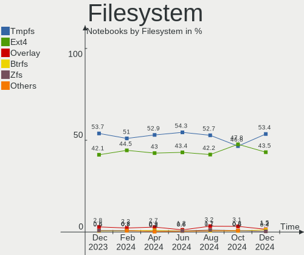
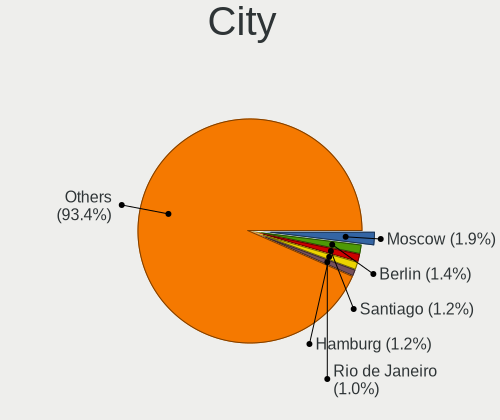

Ubuntu - Hardware Trends (Notebooks)
------------------------------------

A project to identify most popular hardware characteristics and track their change
over time based on data collected by Linux users at https://Linux-Hardware.org.

Anyone can contribute to this report by the [hw-probe](https://github.com/linuxhw/hw-probe) tool:

    sudo -E hw-probe -all -upload

This report is for one last month. Overall report since the beginning of time: [TestDays](https://github.com/linuxhw/TestDays)

Period: Jul, 2023.

Contents
--------

* [ System ](#system)
  - [ OS                       ](#os)
  - [ OS Family                ](#os-family)
  - [ Kernel                   ](#kernel)
  - [ Kernel Family            ](#kernel-family)
  - [ Kernel Major Ver.        ](#kernel-major-ver)
  - [ Arch                     ](#arch)
  - [ DE                       ](#de)
  - [ Display Server           ](#display-server)
  - [ Display Manager          ](#display-manager)
  - [ OS Lang                  ](#os-lang)
  - [ Boot Mode                ](#boot-mode)
  - [ Filesystem               ](#filesystem)
  - [ Part. scheme             ](#part-scheme)
  - [ Dual Boot with Linux/BSD ](#dual-boot-with-linuxbsd)
  - [ Dual Boot (Win)          ](#dual-boot-win)

* [ Board ](#board)
  - [ Vendor                   ](#vendor)
  - [ Model                    ](#model)
  - [ Model Family             ](#model-family)
  - [ MFG Year                 ](#mfg-year)
  - [ Form Factor              ](#form-factor)
  - [ Secure Boot              ](#secure-boot)
  - [ Coreboot                 ](#coreboot)
  - [ RAM Size                 ](#ram-size)
  - [ RAM Used                 ](#ram-used)
  - [ Total Drives             ](#total-drives)
  - [ Has CD-ROM               ](#has-cd-rom)
  - [ Has Ethernet             ](#has-ethernet)
  - [ Has WiFi                 ](#has-wifi)
  - [ Has Bluetooth            ](#has-bluetooth)

* [ Location ](#location)
  - [ Country                  ](#country)
  - [ City                     ](#city)

* [ Drives ](#drives)
  - [ Drive Vendor             ](#drive-vendor)
  - [ Drive Model              ](#drive-model)
  - [ HDD Vendor               ](#hdd-vendor)
  - [ SSD Vendor               ](#ssd-vendor)
  - [ Drive Kind               ](#drive-kind)
  - [ Drive Connector          ](#drive-connector)
  - [ Drive Size               ](#drive-size)
  - [ Space Total              ](#space-total)
  - [ Space Used               ](#space-used)
  - [ Malfunc. Drives          ](#malfunc-drives)
  - [ Malfunc. Drive Vendor    ](#malfunc-drive-vendor)
  - [ Malfunc. HDD Vendor      ](#malfunc-hdd-vendor)
  - [ Malfunc. Drive Kind      ](#malfunc-drive-kind)
  - [ Failed Drives            ](#failed-drives)
  - [ Failed Drive Vendor      ](#failed-drive-vendor)
  - [ Drive Status             ](#drive-status)

* [ Storage controller ](#storage-controller)
  - [ Storage Vendor           ](#storage-vendor)
  - [ Storage Model            ](#storage-model)
  - [ Storage Kind             ](#storage-kind)

* [ Processor ](#processor)
  - [ CPU Vendor               ](#cpu-vendor)
  - [ CPU Model                ](#cpu-model)
  - [ CPU Model Family         ](#cpu-model-family)
  - [ CPU Cores                ](#cpu-cores)
  - [ CPU Sockets              ](#cpu-sockets)
  - [ CPU Threads              ](#cpu-threads)
  - [ CPU Op-Modes             ](#cpu-op-modes)
  - [ CPU Microcode            ](#cpu-microcode)
  - [ CPU Microarch            ](#cpu-microarch)

* [ Graphics ](#graphics)
  - [ GPU Vendor               ](#gpu-vendor)
  - [ GPU Model                ](#gpu-model)
  - [ GPU Combo                ](#gpu-combo)
  - [ GPU Driver               ](#gpu-driver)
  - [ GPU Memory               ](#gpu-memory)

* [ Monitor ](#monitor)
  - [ Monitor Vendor           ](#monitor-vendor)
  - [ Monitor Model            ](#monitor-model)
  - [ Monitor Resolution       ](#monitor-resolution)
  - [ Monitor Diagonal         ](#monitor-diagonal)
  - [ Monitor Width            ](#monitor-width)
  - [ Aspect Ratio             ](#aspect-ratio)
  - [ Monitor Area             ](#monitor-area)
  - [ Pixel Density            ](#pixel-density)
  - [ Multiple Monitors        ](#multiple-monitors)

* [ Network ](#network)
  - [ Net Controller Vendor    ](#net-controller-vendor)
  - [ Net Controller Model     ](#net-controller-model)
  - [ Wireless Vendor          ](#wireless-vendor)
  - [ Wireless Model           ](#wireless-model)
  - [ Ethernet Vendor          ](#ethernet-vendor)
  - [ Ethernet Model           ](#ethernet-model)
  - [ Net Controller Kind      ](#net-controller-kind)
  - [ Used Controller          ](#used-controller)
  - [ NICs                     ](#nics)
  - [ IPv6                     ](#ipv6)

* [ Bluetooth ](#bluetooth)
  - [ Bluetooth Vendor         ](#bluetooth-vendor)
  - [ Bluetooth Model          ](#bluetooth-model)

* [ Sound ](#sound)
  - [ Sound Vendor             ](#sound-vendor)
  - [ Sound Model              ](#sound-model)

* [ Memory ](#memory)
  - [ Memory Vendor            ](#memory-vendor)
  - [ Memory Model             ](#memory-model)
  - [ Memory Kind              ](#memory-kind)
  - [ Memory Form Factor       ](#memory-form-factor)
  - [ Memory Size              ](#memory-size)
  - [ Memory Speed             ](#memory-speed)

* [ Printers & scanners ](#printers--scanners)
  - [ Printer Vendor           ](#printer-vendor)
  - [ Printer Model            ](#printer-model)
  - [ Scanner Vendor           ](#scanner-vendor)
  - [ Scanner Model            ](#scanner-model)

* [ Camera ](#camera)
  - [ Camera Vendor            ](#camera-vendor)
  - [ Camera Model             ](#camera-model)

* [ Security ](#security)
  - [ Fingerprint Vendor       ](#fingerprint-vendor)
  - [ Fingerprint Model        ](#fingerprint-model)
  - [ Chipcard Vendor          ](#chipcard-vendor)
  - [ Chipcard Model           ](#chipcard-model)

* [ Unsupported ](#unsupported)
  - [ Unsupported Devices      ](#unsupported-devices)
  - [ Unsupported Device Types ](#unsupported-device-types)

System
------

OS
--

Installed operating systems

| Name         | Notebooks | Percent |
|--------------|-----------|---------|
| Ubuntu 22.04 | 330       | 59.35%  |
| Ubuntu 23.04 | 140       | 25.18%  |
| Ubuntu 20.04 | 52        | 9.35%   |
| Ubuntu 22.10 | 24        | 4.32%   |
| Ubuntu 18.04 | 8         | 1.44%   |
| Ubuntu 21.10 | 1         | 0.18%   |
| Ubuntu 21.04 | 1         | 0.18%   |

OS Family
---------

OS without a version

| Name   | Notebooks | Percent |
|--------|-----------|---------|
| Ubuntu | 556       | 100%    |

Kernel
------

Version of the Linux kernel

| Version                 | Notebooks | Percent |
|-------------------------|-----------|---------|
| 5.19.0-46-generic       | 233       | 41.91%  |
| 6.2.0-25-generic        | 53        | 9.53%   |
| 6.2.0-24-generic        | 43        | 7.73%   |
| 5.15.0-76-generic       | 42        | 7.55%   |
| 5.19.0-50-generic       | 40        | 7.19%   |
| 5.19.0-32-generic       | 20        | 3.6%    |
| 6.2.0-26-generic        | 14        | 2.52%   |
| 6.2.0-20-generic        | 13        | 2.34%   |
| 5.15.0-78-generic       | 9         | 1.62%   |
| 6.4.0-060400-generic    | 7         | 1.26%   |
| 5.19.0-45-generic       | 7         | 1.26%   |
| 5.4.0-150-generic       | 5         | 0.9%    |
| 5.19.0-43-generic       | 5         | 0.9%    |
| 6.2.0-23-generic        | 4         | 0.72%   |
| 6.1.0-1015-oem          | 3         | 0.54%   |
| 5.4.0-153-generic       | 3         | 0.54%   |
| 5.19.0-41-generic       | 3         | 0.54%   |
| 5.15.0-67-generic       | 3         | 0.54%   |
| 6.2.0-1008-lowlatency   | 2         | 0.36%   |
| 6.1.0-1016-oem          | 2         | 0.36%   |
| 5.4.0-152-generic       | 2         | 0.36%   |
| 5.19.0-47-generic       | 2         | 0.36%   |
| 5.19.0-38-generic       | 2         | 0.36%   |
| 5.15.0-75-generic       | 2         | 0.36%   |
| 5.15.0-43-generic       | 2         | 0.36%   |
| 6.5.0-060500rc3-generic | 1         | 0.18%   |
| 6.4.6-060406-generic    | 1         | 0.18%   |
| 6.4.5-x64v3-xanmod1     | 1         | 0.18%   |
| 6.4.3-060403-generic    | 1         | 0.18%   |
| 6.4.2-tkg-cfs           | 1         | 0.18%   |
| 6.3.4-060304-generic    | 1         | 0.18%   |
| 6.3.1-060301-generic    | 1         | 0.18%   |
| 6.2.12-t2-jammy         | 1         | 0.18%   |
| 6.2.0-10014-tuxedo      | 1         | 0.18%   |
| 6.2.0-10010-tuxedo      | 1         | 0.18%   |
| 6.1.37-t2-jammy         | 1         | 0.18%   |
| 6.1.0-1010-oem          | 1         | 0.18%   |
| 5.4.0-91-generic        | 1         | 0.18%   |
| 5.4.0-26-generic        | 1         | 0.18%   |
| 5.4.0-148-generic       | 1         | 0.18%   |

Kernel Family
-------------

Linux kernel without a distro release

| Version | Notebooks | Percent |
|---------|-----------|---------|
| 5.19.0  | 315       | 56.65%  |
| 6.2.0   | 131       | 23.56%  |
| 5.15.0  | 63        | 11.33%  |
| 5.4.0   | 14        | 2.52%   |
| 6.4.0   | 7         | 1.26%   |
| 6.1.0   | 6         | 1.08%   |
| 5.13.0  | 3         | 0.54%   |
| 5.14.0  | 2         | 0.36%   |
| 5.11.0  | 2         | 0.36%   |
| 4.15.0  | 2         | 0.36%   |
| 6.5.0   | 1         | 0.18%   |
| 6.4.6   | 1         | 0.18%   |
| 6.4.5   | 1         | 0.18%   |
| 6.4.3   | 1         | 0.18%   |
| 6.4.2   | 1         | 0.18%   |
| 6.3.4   | 1         | 0.18%   |
| 6.3.1   | 1         | 0.18%   |
| 6.2.12  | 1         | 0.18%   |
| 6.1.37  | 1         | 0.18%   |
| 5.17.15 | 1         | 0.18%   |
| 5.15.23 | 1         | 0.18%   |

Kernel Major Ver.
-----------------

Linux kernel major version

| Version | Notebooks | Percent |
|---------|-----------|---------|
| 5.19    | 315       | 56.65%  |
| 6.2     | 132       | 23.74%  |
| 5.15    | 64        | 11.51%  |
| 5.4     | 14        | 2.52%   |
| 6.4     | 11        | 1.98%   |
| 6.1     | 7         | 1.26%   |
| 5.13    | 3         | 0.54%   |
| 6.3     | 2         | 0.36%   |
| 5.14    | 2         | 0.36%   |
| 5.11    | 2         | 0.36%   |
| 4.15    | 2         | 0.36%   |
| 6.5     | 1         | 0.18%   |
| 5.17    | 1         | 0.18%   |

Arch
----

OS architecture (x86_64, i586, etc.)

| Name   | Notebooks | Percent |
|--------|-----------|---------|
| x86_64 | 554       | 99.64%  |
| i686   | 2         | 0.36%   |

DE
--

Desktop Environment

| Name          | Notebooks | Percent |
|---------------|-----------|---------|
| GNOME         | 541       | 97.3%   |
| X-Cinnamon    | 8         | 1.44%   |
| Enlightenment | 2         | 0.36%   |
| Unknown       | 2         | 0.36%   |
| sway          | 1         | 0.18%   |
| i3            | 1         | 0.18%   |
| GNOME Classic | 1         | 0.18%   |

Display Server
--------------

X11 or Wayland

| Name    | Notebooks | Percent |
|---------|-----------|---------|
| Wayland | 338       | 60.79%  |
| X11     | 210       | 37.77%  |
| Unknown | 6         | 1.08%   |
| Tty     | 2         | 0.36%   |

Display Manager
---------------

SDDM, LightDM, etc.

| Name    | Notebooks | Percent |
|---------|-----------|---------|
| GDM3    | 469       | 84.35%  |
| Unknown | 48        | 8.63%   |
| GDM     | 22        | 3.96%   |
| LightDM | 14        | 2.52%   |
| SDDM    | 2         | 0.36%   |
| GREETD  | 1         | 0.18%   |

OS Lang
-------

Language

| Lang  | Notebooks | Percent |
|-------|-----------|---------|
| en_US | 259       | 46.58%  |
| de_DE | 43        | 7.73%   |
| fr_FR | 29        | 5.22%   |
| en_IN | 25        | 4.5%    |
| pt_BR | 24        | 4.32%   |
| ru_RU | 21        | 3.78%   |
| es_ES | 20        | 3.6%    |
| it_IT | 19        | 3.42%   |
| en_GB | 15        | 2.7%    |
| en_CA | 10        | 1.8%    |
| pl_PL | 9         | 1.62%   |
| C     | 9         | 1.62%   |
| zh_CN | 7         | 1.26%   |
| en_AU | 7         | 1.26%   |
| nl_NL | 5         | 0.9%    |
| es_MX | 4         | 0.72%   |
| hu_HU | 3         | 0.54%   |
| es_CL | 3         | 0.54%   |
| en_ZA | 3         | 0.54%   |
| de_AT | 3         | 0.54%   |
| th_TH | 2         | 0.36%   |
| nb_NO | 2         | 0.36%   |
| ja_JP | 2         | 0.36%   |
| fi_FI | 2         | 0.36%   |
| es_DO | 2         | 0.36%   |
| en_NZ | 2         | 0.36%   |
| en_IL | 2         | 0.36%   |
| el_GR | 2         | 0.36%   |
| da_DK | 2         | 0.36%   |
| cs_CZ | 2         | 0.36%   |
| bg_BG | 2         | 0.36%   |
| zh_TW | 1         | 0.18%   |
| sv_SE | 1         | 0.18%   |
| sk_SK | 1         | 0.18%   |
| pt_PT | 1         | 0.18%   |
| nn_NO | 1         | 0.18%   |
| ko_KR | 1         | 0.18%   |
| fr_CH | 1         | 0.18%   |
| fr_CA | 1         | 0.18%   |
| es_CR | 1         | 0.18%   |

Boot Mode
---------

EFI or BIOS

| Mode | Notebooks | Percent |
|------|-----------|---------|
| BIOS | 337       | 60.61%  |
| EFI  | 219       | 39.39%  |

Filesystem
----------

Type of filesystem

| Type    | Notebooks | Percent |
|---------|-----------|---------|
| Tmpfs   | 297       | 53.42%  |
| Ext4    | 221       | 39.75%  |
| Btrfs   | 20        | 3.6%    |
| Overlay | 12        | 2.16%   |
| Zfs     | 6         | 1.08%   |

Part. scheme
------------

Scheme of partitioning

| Type    | Notebooks | Percent |
|---------|-----------|---------|
| GPT     | 448       | 80.58%  |
| MBR     | 59        | 10.61%  |
| Unknown | 49        | 8.81%   |

Dual Boot with Linux/BSD
------------------------

Hosting more than one Linux/BSD

| Dual boot | Notebooks | Percent |
|-----------|-----------|---------|
| No        | 513       | 92.27%  |
| Yes       | 43        | 7.73%   |

Dual Boot (Win)
---------------

Hosting Linux and Windows

| Dual boot | Notebooks | Percent |
|-----------|-----------|---------|
| No        | 355       | 63.85%  |
| Yes       | 201       | 36.15%  |

Board
-----

Vendor
------

Motherboard manufacturer

| Name                        | Notebooks | Percent |
|-----------------------------|-----------|---------|
| Lenovo                      | 115       | 20.68%  |
| Hewlett-Packard             | 105       | 18.88%  |
| Dell                        | 96        | 17.27%  |
| ASUSTek Computer            | 60        | 10.79%  |
| Acer                        | 39        | 7.01%   |
| Apple                       | 27        | 4.86%   |
| MSI                         | 12        | 2.16%   |
| HUAWEI                      | 10        | 1.8%    |
| Samsung Electronics         | 9         | 1.62%   |
| Toshiba                     | 8         | 1.44%   |
| Sony                        | 8         | 1.44%   |
| Notebook                    | 6         | 1.08%   |
| Google                      | 6         | 1.08%   |
| Timi                        | 5         | 0.9%    |
| TUXEDO                      | 4         | 0.72%   |
| Medion                      | 4         | 0.72%   |
| Fujitsu                     | 4         | 0.72%   |
| Positivo                    | 3         | 0.54%   |
| Gigabyte Technology         | 3         | 0.54%   |
| MECHREVO                    | 2         | 0.36%   |
| Intel Client Systems        | 2         | 0.36%   |
| GPU Company                 | 2         | 0.36%   |
| Unknown                     | 2         | 0.36%   |
| VPU Company                 | 1         | 0.18%   |
| TR                          | 1         | 0.18%   |
| TECNO                       | 1         | 0.18%   |
| System76                    | 1         | 0.18%   |
| SLIMBOOK                    | 1         | 0.18%   |
| Shenzhen PLOYER electronics | 1         | 0.18%   |
| rombica                     | 1         | 0.18%   |
| Packard Bell                | 1         | 0.18%   |
| Olivetti                    | 1         | 0.18%   |
| Minix                       | 1         | 0.18%   |
| LG Electronics              | 1         | 0.18%   |
| Infinix                     | 1         | 0.18%   |
| Hungaro Flotta Kft          | 1         | 0.18%   |
| HONOR                       | 1         | 0.18%   |
| F-Plus Mobile               | 1         | 0.18%   |
| Clevo                       | 1         | 0.18%   |
| Chuwi                       | 1         | 0.18%   |

Model
-----

Motherboard model

| Name                                        | Notebooks | Percent |
|---------------------------------------------|-----------|---------|
| Dell Latitude E6410                         | 4         | 0.72%   |
| Apple MacBookPro8,1                         | 4         | 0.72%   |
| HUAWEI BOD-WXX9                             | 3         | 0.54%   |
| HP Pavilion dv6                             | 3         | 0.54%   |
| HP Notebook                                 | 3         | 0.54%   |
| Dell Precision M4800                        | 3         | 0.54%   |
| Apple MacBookPro11,1                        | 3         | 0.54%   |
| Unknown                                     | 3         | 0.54%   |
| Timi Mi NoteBook Ultra                      | 2         | 0.36%   |
| Samsung 700T                                | 2         | 0.36%   |
| MSI GF63 Thin 11UC                          | 2         | 0.36%   |
| MSI Cyborg 15 A12VF                         | 2         | 0.36%   |
| Lenovo Z50-70 20354                         | 2         | 0.36%   |
| Lenovo ThinkPad X1 Carbon Gen 10 21CBCTO1WW | 2         | 0.36%   |
| Lenovo IdeaPad 520-15IKB 81BF               | 2         | 0.36%   |
| Lenovo IdeaPad 5 15ITL05 82FG               | 2         | 0.36%   |
| Lenovo IdeaPad 5 15ARE05 81YQ               | 2         | 0.36%   |
| Lenovo IdeaPad 3 15ADA05 81W1               | 2         | 0.36%   |
| Lenovo IdeaPad 100-15IBY 80MJ               | 2         | 0.36%   |
| Lenovo G50-70 20351                         | 2         | 0.36%   |
| HUAWEI HVY-WXX9                             | 2         | 0.36%   |
| HP ProBook 6570b                            | 2         | 0.36%   |
| HP ProBook 455 15.6 inch G9 Notebook PC     | 2         | 0.36%   |
| HP ProBook 4540s                            | 2         | 0.36%   |
| HP Pavilion Laptop 15-eh1xxx                | 2         | 0.36%   |
| HP Pavilion 17                              | 2         | 0.36%   |
| HP Laptop 17-cp0xxx                         | 2         | 0.36%   |
| HP Laptop 15-fc0xxx                         | 2         | 0.36%   |
| HP EliteBook 840 G2                         | 2         | 0.36%   |
| Dell XPS 15 9570                            | 2         | 0.36%   |
| Dell XPS 15 7590                            | 2         | 0.36%   |
| Dell Latitude E6420                         | 2         | 0.36%   |
| Dell Latitude 7480                          | 2         | 0.36%   |
| Dell Latitude 7440                          | 2         | 0.36%   |
| Dell Latitude 5540                          | 2         | 0.36%   |
| Dell Latitude 3520                          | 2         | 0.36%   |
| ASUS ROG Strix G733PZ_G733PZ                | 2         | 0.36%   |
| Apple MacBookPro9,2                         | 2         | 0.36%   |
| Apple MacBookAir9,1                         | 2         | 0.36%   |
| Acer Swift SF314-71                         | 2         | 0.36%   |

Model Family
------------

Motherboard model prefix

| Name                | Notebooks | Percent |
|---------------------|-----------|---------|
| Lenovo ThinkPad     | 66        | 11.87%  |
| Dell Latitude       | 39        | 7.01%   |
| HP Pavilion         | 26        | 4.68%   |
| Dell Inspiron       | 26        | 4.68%   |
| Lenovo IdeaPad      | 25        | 4.5%    |
| ASUS VivoBook       | 22        | 3.96%   |
| Acer Aspire         | 22        | 3.96%   |
| HP EliteBook        | 18        | 3.24%   |
| HP Laptop           | 15        | 2.7%    |
| HP ProBook          | 13        | 2.34%   |
| Dell XPS            | 11        | 1.98%   |
| Dell Precision      | 10        | 1.8%    |
| ASUS ROG            | 10        | 1.8%    |
| Lenovo Legion       | 9         | 1.62%   |
| Acer Nitro          | 7         | 1.26%   |
| Toshiba Satellite   | 6         | 1.08%   |
| ASUS Zenbook        | 6         | 1.08%   |
| ASUS ASUS           | 6         | 1.08%   |
| Apple MacBookPro8   | 5         | 0.9%    |
| HP ENVY             | 4         | 0.72%   |
| HP 250              | 4         | 0.72%   |
| Apple MacBookPro11  | 4         | 0.72%   |
| Timi Mi             | 3         | 0.54%   |
| MSI GF63            | 3         | 0.54%   |
| Lenovo ThinkBook    | 3         | 0.54%   |
| HUAWEI BOD-WXX9     | 3         | 0.54%   |
| HP ZBook            | 3         | 0.54%   |
| HP OMEN             | 3         | 0.54%   |
| HP Notebook         | 3         | 0.54%   |
| HP Compaq           | 3         | 0.54%   |
| Fujitsu LIFEBOOK    | 3         | 0.54%   |
| Dell Vostro         | 3         | 0.54%   |
| Dell G15            | 3         | 0.54%   |
| Apple MacBookPro9   | 3         | 0.54%   |
| Acer Swift          | 3         | 0.54%   |
| Unknown             | 3         | 0.54%   |
| TUXEDO InfinityBook | 2         | 0.36%   |
| Samsung 700T        | 2         | 0.36%   |
| MSI Cyborg          | 2         | 0.36%   |
| Lenovo Z50-70       | 2         | 0.36%   |

MFG Year
--------

Motherboard manufacture year

| Year | Notebooks | Percent |
|------|-----------|---------|
| 2021 | 71        | 12.77%  |
| 2022 | 58        | 10.43%  |
| 2020 | 55        | 9.89%   |
| 2019 | 41        | 7.37%   |
| 2023 | 39        | 7.01%   |
| 2012 | 37        | 6.65%   |
| 2015 | 32        | 5.76%   |
| 2014 | 31        | 5.58%   |
| 2013 | 31        | 5.58%   |
| 2018 | 30        | 5.4%    |
| 2017 | 29        | 5.22%   |
| 2016 | 24        | 4.32%   |
| 2010 | 24        | 4.32%   |
| 2011 | 20        | 3.6%    |
| 2008 | 15        | 2.7%    |
| 2009 | 13        | 2.34%   |
| 2007 | 3         | 0.54%   |
| 2006 | 3         | 0.54%   |

Form Factor
-----------

Physical design of the computer

| Name     | Notebooks | Percent |
|----------|-----------|---------|
| Notebook | 556       | 100%    |

Secure Boot
-----------

Enabled or disabled

| State    | Notebooks | Percent |
|----------|-----------|---------|
| Disabled | 488       | 87.77%  |
| Enabled  | 68        | 12.23%  |

Coreboot
--------

Have coreboot on board

| Used | Notebooks | Percent |
|------|-----------|---------|
| No   | 549       | 98.74%  |
| Yes  | 7         | 1.26%   |

RAM Size
--------

Total RAM memory

| Size in GB  | Notebooks | Percent |
|-------------|-----------|---------|
| 4.01-8.0    | 152       | 27.34%  |
| 16.01-24.0  | 109       | 19.6%   |
| 3.01-4.0    | 108       | 19.42%  |
| 8.01-16.0   | 106       | 19.06%  |
| 32.01-64.0  | 53        | 9.53%   |
| 24.01-32.0  | 9         | 1.62%   |
| 64.01-256.0 | 9         | 1.62%   |
| 2.01-3.0    | 5         | 0.9%    |
| 1.01-2.0    | 5         | 0.9%    |

RAM Used
--------

Used RAM memory

| Used GB    | Notebooks | Percent |
|------------|-----------|---------|
| 2.01-3.0   | 173       | 31.12%  |
| 1.01-2.0   | 150       | 26.98%  |
| 3.01-4.0   | 104       | 18.71%  |
| 4.01-8.0   | 101       | 18.17%  |
| 8.01-16.0  | 24        | 4.32%   |
| 0.51-1.0   | 2         | 0.36%   |
| 24.01-32.0 | 1         | 0.18%   |
| 16.01-24.0 | 1         | 0.18%   |

Total Drives
------------

Number of drives on board

| Drives | Notebooks | Percent |
|--------|-----------|---------|
| 1      | 427       | 76.8%   |
| 2      | 113       | 20.32%  |
| 3      | 12        | 2.16%   |
| 0      | 3         | 0.54%   |
| 4      | 1         | 0.18%   |

Has CD-ROM
----------

Has CD-ROM on board

| Presented | Notebooks | Percent |
|-----------|-----------|---------|
| No        | 404       | 72.66%  |
| Yes       | 152       | 27.34%  |

Has Ethernet
------------

Has Ethernet on board

| Presented | Notebooks | Percent |
|-----------|-----------|---------|
| Yes       | 424       | 76.26%  |
| No        | 132       | 23.74%  |

Has WiFi
--------

Has WiFi module

| Presented | Notebooks | Percent |
|-----------|-----------|---------|
| Yes       | 545       | 98.02%  |
| No        | 11        | 1.98%   |

Has Bluetooth
-------------

Has Bluetooth module

| Presented | Notebooks | Percent |
|-----------|-----------|---------|
| Yes       | 466       | 83.81%  |
| No        | 90        | 16.19%  |

Location
--------

Country
-------

Geographic location (country)

| Country            | Notebooks | Percent |
|--------------------|-----------|---------|
| USA                | 100       | 17.99%  |
| Germany            | 50        | 8.99%   |
| France             | 37        | 6.65%   |
| Brazil             | 33        | 5.94%   |
| Russia             | 30        | 5.4%    |
| India              | 30        | 5.4%    |
| Italy              | 21        | 3.78%   |
| Spain              | 19        | 3.42%   |
| UK                 | 16        | 2.88%   |
| Netherlands        | 15        | 2.7%    |
| Canada             | 12        | 2.16%   |
| Poland             | 11        | 1.98%   |
| Australia          | 9         | 1.62%   |
| Sweden             | 8         | 1.44%   |
| Mexico             | 7         | 1.26%   |
| China              | 7         | 1.26%   |
| Norway             | 6         | 1.08%   |
| Indonesia          | 6         | 1.08%   |
| Greece             | 6         | 1.08%   |
| Czechia            | 6         | 1.08%   |
| Chile              | 6         | 1.08%   |
| Switzerland        | 5         | 0.9%    |
| Malaysia           | 5         | 0.9%    |
| Japan              | 5         | 0.9%    |
| Belgium            | 5         | 0.9%    |
| South Africa       | 4         | 0.72%   |
| Romania            | 4         | 0.72%   |
| Portugal           | 4         | 0.72%   |
| New Zealand        | 4         | 0.72%   |
| Hungary            | 4         | 0.72%   |
| Finland            | 4         | 0.72%   |
| Bulgaria           | 4         | 0.72%   |
| Thailand           | 3         | 0.54%   |
| Taiwan             | 3         | 0.54%   |
| Israel             | 3         | 0.54%   |
| Georgia            | 3         | 0.54%   |
| Egypt              | 3         | 0.54%   |
| Dominican Republic | 3         | 0.54%   |
| Denmark            | 3         | 0.54%   |
| Colombia           | 3         | 0.54%   |

City
----

Geographic location (city)

| City                       | Notebooks | Percent |
|----------------------------|-----------|---------|
| St Petersburg              | 8         | 1.44%   |
| Paris                      | 7         | 1.26%   |
| Moscow                     | 7         | 1.26%   |
| Berlin                     | 7         | 1.26%   |
| Sao Paulo                  | 6         | 1.08%   |
| Toronto                    | 5         | 0.9%    |
| Madrid                     | 5         | 0.9%    |
| Bengaluru                  | 5         | 0.9%    |
| Warsaw                     | 4         | 0.72%   |
| Stockholm                  | 4         | 0.72%   |
| Munich                     | 4         | 0.72%   |
| Vienna                     | 3         | 0.54%   |
| Sydney                     | 3         | 0.54%   |
| Sofia                      | 3         | 0.54%   |
| Seville                    | 3         | 0.54%   |
| Oslo                       | 3         | 0.54%   |
| Milano                     | 3         | 0.54%   |
| Melbourne                  | 3         | 0.54%   |
| Denver                     | 3         | 0.54%   |
| Delhi                      | 3         | 0.54%   |
| Chennai                    | 3         | 0.54%   |
| Auckland                   | 3         | 0.54%   |
| Atlanta                    | 3         | 0.54%   |
| Zagreb                     | 2         | 0.36%   |
| Ufa                        | 2         | 0.36%   |
| The Hague                  | 2         | 0.36%   |
| Tbilisi                    | 2         | 0.36%   |
| Tacoma                     | 2         | 0.36%   |
| Taby                       | 2         | 0.36%   |
| Sungai Petani              | 2         | 0.36%   |
| Solothurn                  | 2         | 0.36%   |
| Singapore                  | 2         | 0.36%   |
| Seattle                    | 2         | 0.36%   |
| Santiago de los Caballeros | 2         | 0.36%   |
| Santiago                   | 2         | 0.36%   |
| San Juan                   | 2         | 0.36%   |
| Rotterdam                  | 2         | 0.36%   |
| Recife                     | 2         | 0.36%   |
| Prague                     | 2         | 0.36%   |
| New York                   | 2         | 0.36%   |

Drives
------

Drive Vendor
------------

Hard drive vendors

| Vendor                       | Notebooks | Drives | Percent |
|------------------------------|-----------|--------|---------|
| Samsung Electronics          | 116       | 118    | 17.08%  |
| Sandisk                      | 60        | 61     | 8.84%   |
| Seagate                      | 55        | 60     | 8.1%    |
| WDC                          | 54        | 55     | 7.95%   |
| Toshiba                      | 38        | 38     | 5.6%    |
| Intel                        | 36        | 38     | 5.3%    |
| Kingston                     | 34        | 34     | 5.01%   |
| SK hynix                     | 32        | 32     | 4.71%   |
| Micron Technology            | 31        | 32     | 4.57%   |
| Unknown                      | 29        | 30     | 4.27%   |
| Crucial                      | 19        | 19     | 2.8%    |
| KIOXIA                       | 15        | 15     | 2.21%   |
| Hitachi                      | 14        | 14     | 2.06%   |
| Apple                        | 14        | 14     | 2.06%   |
| HGST                         | 11        | 11     | 1.62%   |
| Phison Electronics           | 8         | 8      | 1.18%   |
| Silicon Motion               | 7         | 7      | 1.03%   |
| Unknown                      | 7         | 7      | 1.03%   |
| Kingston Technology Company  | 6         | 6      | 0.88%   |
| Micron/Crucial Technology    | 5         | 5      | 0.74%   |
| LITEON                       | 5         | 6      | 0.74%   |
| Fujitsu                      | 5         | 5      | 0.74%   |
| China                        | 5         | 6      | 0.74%   |
| A-DATA Technology            | 5         | 5      | 0.74%   |
| PNY                          | 4         | 4      | 0.59%   |
| Netac                        | 4         | 4      | 0.59%   |
| Intenso                      | 4         | 4      | 0.59%   |
| GOODRAM                      | 4         | 4      | 0.59%   |
| Union Memory (Shenzhen)      | 3         | 3      | 0.44%   |
| Shenzhen Longsys Electronics | 3         | 3      | 0.44%   |
| Apacer                       | 3         | 3      | 0.44%   |
| Transcend                    | 2         | 2      | 0.29%   |
| SSSTC                        | 2         | 2      | 0.29%   |
| SPCC                         | 2         | 2      | 0.29%   |
| Phison                       | 2         | 2      | 0.29%   |
| MAXIO Technology (Hangzhou)  | 2         | 2      | 0.29%   |
| Gigabyte Technology          | 2         | 2      | 0.29%   |
| FORESEE                      | 2         | 2      | 0.29%   |
| External                     | 2         | 3      | 0.29%   |
| Emtec                        | 2         | 2      | 0.29%   |

Drive Model
-----------

Hard drive models

| Model                                                 | Notebooks | Percent |
|-------------------------------------------------------|-----------|---------|
| Samsung NVMe SSD Controller PM9A1/PM9A3/980PRO 1TB    | 10        | 1.45%   |
| Kingston SA400S37240G 240GB SSD                       | 9         | 1.31%   |
| Samsung NVMe SSD Controller SM981/PM981/PM983 500GB   | 8         | 1.16%   |
| Intel SSD 660P Series 1024GB                          | 8         | 1.16%   |
| Unknown MMC Card  32GB                                | 7         | 1.02%   |
| Sandisk WD Blue SN500 / PC SN520 NVMe SSD 512GB       | 7         | 1.02%   |
| Intel SSDPEKNU512GZ 512GB                             | 7         | 1.02%   |
| Unknown                                               | 7         | 1.02%   |
| Seagate ST1000LM035-1RK172 1TB                        | 6         | 0.87%   |
| Seagate ST1000LM024 HN-M101MBB 1TB                    | 6         | 0.87%   |
| Samsung SSD 850 EVO 500GB                             | 6         | 0.87%   |
| Unknown MMC Card  64GB                                | 5         | 0.73%   |
| Sandisk WD Black SN750 / PC SN730 NVMe SSD 1024GB     | 5         | 0.73%   |
| Samsung MZVLQ512HBLU-00BH1 512GB                      | 5         | 0.73%   |
| Phison PS5013 E13 NVMe Controller 256GB               | 5         | 0.73%   |
| Micron/Crucial P2 NVMe PCIe SSD 1TB                   | 5         | 0.73%   |
| Micron 2450_MTFDKBA512TFK 512GB                       | 5         | 0.73%   |
| Kingston SA400S37480G 480GB SSD                       | 5         | 0.73%   |
| Unknown MMC Card  128GB                               | 4         | 0.58%   |
| Toshiba MQ01ABD100 1TB                                | 4         | 0.58%   |
| Silicon Motion SM2263EN/SM2263XT SSD Controller 500GB | 4         | 0.58%   |
| Seagate ST500LT012-1DG142 500GB                       | 4         | 0.58%   |
| Seagate ST1000LM048-2E7172 1TB                        | 4         | 0.58%   |
| Samsung SSD 980 1TB                                   | 4         | 0.58%   |
| Samsung SSD 870 EVO 1TB                               | 4         | 0.58%   |
| Samsung MZALQ512HALU-000L2 512GB                      | 4         | 0.58%   |
| KIOXIA KBG40ZNV512G 512GB                             | 4         | 0.58%   |
| KIOXIA KBG40ZNS256G NVMe 256GB                        | 4         | 0.58%   |
| WDC WD5000LPVX-22V0TT0 500GB                          | 3         | 0.44%   |
| Unknown MMC Card  2GB                                 | 3         | 0.44%   |
| Toshiba XG6 NVMe SSD Controller 512GB                 | 3         | 0.44%   |
| Toshiba MQ04ABF100 1TB                                | 3         | 0.44%   |
| Toshiba MQ01ABF050 500GB                              | 3         | 0.44%   |
| Seagate Expansion 1TB                                 | 3         | 0.44%   |
| Sandisk WD Blue SN550 NVMe SSD 250GB                  | 3         | 0.44%   |
| SanDisk NVMe SSD Drive 512GB                          | 3         | 0.44%   |
| SanDisk NVMe SSD Drive 2TB                            | 3         | 0.44%   |
| Samsung SSD 860 EVO M.2 500GB                         | 3         | 0.44%   |
| Samsung MZVLB512HBJQ-00000 512GB                      | 3         | 0.44%   |
| Micron 2450_MTFDKBA1T0TFK 1TB                         | 3         | 0.44%   |

HDD Vendor
----------

Hard disk drive vendors

| Vendor              | Notebooks | Drives | Percent |
|---------------------|-----------|--------|---------|
| Seagate             | 51        | 56     | 34%     |
| WDC                 | 34        | 34     | 22.67%  |
| Toshiba             | 25        | 25     | 16.67%  |
| Hitachi             | 14        | 14     | 9.33%   |
| HGST                | 11        | 11     | 7.33%   |
| Fujitsu             | 5         | 5      | 3.33%   |
| Samsung Electronics | 4         | 4      | 2.67%   |
| Unknown             | 3         | 3      | 2%      |
| External            | 2         | 3      | 1.33%   |
| Apple               | 1         | 1      | 0.67%   |

SSD Vendor
----------

Solid state drive vendors

| Vendor              | Notebooks | Drives | Percent |
|---------------------|-----------|--------|---------|
| Samsung Electronics | 40        | 41     | 20.3%   |
| SanDisk             | 24        | 24     | 12.18%  |
| Kingston            | 24        | 24     | 12.18%  |
| Crucial             | 18        | 18     | 9.14%   |
| WDC                 | 11        | 11     | 5.58%   |
| Intel               | 8         | 8      | 4.06%   |
| Apple               | 6         | 6      | 3.05%   |
| Toshiba             | 5         | 5      | 2.54%   |
| SK hynix            | 5         | 5      | 2.54%   |
| LITEON              | 5         | 6      | 2.54%   |
| China               | 5         | 6      | 2.54%   |
| Micron Technology   | 4         | 4      | 2.03%   |
| PNY                 | 3         | 3      | 1.52%   |
| Netac               | 3         | 3      | 1.52%   |
| GOODRAM             | 3         | 3      | 1.52%   |
| Apacer              | 3         | 3      | 1.52%   |
| A-DATA Technology   | 3         | 3      | 1.52%   |
| Unknown             | 3         | 3      | 1.52%   |
| Transcend           | 2         | 2      | 1.02%   |
| SPCC                | 2         | 2      | 1.02%   |
| Intenso             | 2         | 2      | 1.02%   |
| XrayDisk            | 1         | 1      | 0.51%   |
| Verbatim            | 1         | 1      | 0.51%   |
| Team                | 1         | 1      | 0.51%   |
| Seagate             | 1         | 1      | 0.51%   |
| PNY CS90            | 1         | 1      | 0.51%   |
| Plextor             | 1         | 1      | 0.51%   |
| Phison              | 1         | 1      | 0.51%   |
| Patriot             | 1         | 1      | 0.51%   |
| PALIDE              | 1         | 1      | 0.51%   |
| OWC                 | 1         | 1      | 0.51%   |
| Neo                 | 1         | 1      | 0.51%   |
| LITEONIT            | 1         | 1      | 0.51%   |
| KingSpec            | 1         | 1      | 0.51%   |
| Gigabyte Technology | 1         | 1      | 0.51%   |
| EVM                 | 1         | 1      | 0.51%   |
| Emtec               | 1         | 1      | 0.51%   |
| CONSISTENT          | 1         | 1      | 0.51%   |
| AMD                 | 1         | 1      | 0.51%   |

Drive Kind
----------

HDD or SSD

| Kind    | Notebooks | Drives | Percent |
|---------|-----------|--------|---------|
| NVMe    | 269       | 293    | 41.77%  |
| SSD     | 184       | 200    | 28.57%  |
| HDD     | 148       | 156    | 22.98%  |
| MMC     | 30        | 32     | 4.66%   |
| Unknown | 13        | 14     | 2.02%   |

Drive Connector
---------------

SATA, SAS, NVMe, etc.

| Type | Notebooks | Drives | Percent |
|------|-----------|--------|---------|
| SATA | 299       | 343    | 48.15%  |
| NVMe | 268       | 291    | 43.16%  |
| MMC  | 30        | 32     | 4.83%   |
| SAS  | 24        | 29     | 3.86%   |

Drive Size
----------

Size of hard drive

| Size in TB | Notebooks | Drives | Percent |
|------------|-----------|--------|---------|
| 0.01-0.5   | 226       | 247    | 68.48%  |
| 0.51-1.0   | 94        | 98     | 28.48%  |
| 1.01-2.0   | 6         | 6      | 1.82%   |
| 4.01-10.0  | 4         | 5      | 1.21%   |

Space Total
-----------

Amount of disk space available on the file system

| Size in GB     | Notebooks | Percent |
|----------------|-----------|---------|
| 251-500        | 193       | 34.71%  |
| 101-250        | 170       | 30.58%  |
| 501-1000       | 80        | 14.39%  |
| 51-100         | 33        | 5.94%   |
| 1-20           | 24        | 4.32%   |
| 1001-2000      | 21        | 3.78%   |
| More than 3000 | 13        | 2.34%   |
| 21-50          | 13        | 2.34%   |
| 2001-3000      | 8         | 1.44%   |
| Unknown        | 1         | 0.18%   |

Space Used
----------

Amount of used disk space

| Used GB        | Notebooks | Percent |
|----------------|-----------|---------|
| 1-20           | 164       | 29.5%   |
| 21-50          | 143       | 25.72%  |
| 51-100         | 90        | 16.19%  |
| 101-250        | 87        | 15.65%  |
| 251-500        | 40        | 7.19%   |
| 501-1000       | 18        | 3.24%   |
| 1001-2000      | 7         | 1.26%   |
| More than 3000 | 4         | 0.72%   |
| 2001-3000      | 2         | 0.36%   |
| Unknown        | 1         | 0.18%   |

Malfunc. Drives
---------------

Drive models with a malfunction

| Model                                               | Notebooks | Drives | Percent |
|-----------------------------------------------------|-----------|--------|---------|
| WDC WD5000LPVT-22G33T0 500GB                        | 1         | 1      | 6.67%   |
| WDC WD5000BEVT-55A0RT0 500GB                        | 1         | 1      | 6.67%   |
| WDC WD10JPCX-24UE4T0 1TB                            | 1         | 1      | 6.67%   |
| Toshiba MK5065GSXF 500GB                            | 1         | 1      | 6.67%   |
| Toshiba MK1234GSX 120GB                             | 1         | 1      | 6.67%   |
| SanDisk SSD PLUS 240GB                              | 1         | 1      | 6.67%   |
| SanDisk SSD i100 16GB                               | 1         | 1      | 6.67%   |
| SanDisk SDSSDX120GG25 120GB                         | 1         | 1      | 6.67%   |
| Samsung Electronics SSD 980 1TB                     | 1         | 1      | 6.67%   |
| Samsung Electronics SSD 870 EVO 500GB               | 1         | 1      | 6.67%   |
| Micron Technology MTFDDAK512TBN-1AR15ABHA 512GB SSD | 1         | 1      | 6.67%   |
| Micron Technology MTFDDAK128MAM-1J1 128GB SSD       | 1         | 1      | 6.67%   |
| Hitachi HTS541610J9SA00 100GB                       | 1         | 1      | 6.67%   |
| Crucial CT525MX300SSD4 528GB                        | 1         | 1      | 6.67%   |
| Crucial CT256MX100SSD1 256GB                        | 1         | 1      | 6.67%   |

Malfunc. Drive Vendor
---------------------

Vendors of faulty drives

| Vendor              | Notebooks | Drives | Percent |
|---------------------|-----------|--------|---------|
| WDC                 | 3         | 3      | 20%     |
| SanDisk             | 3         | 3      | 20%     |
| Toshiba             | 2         | 2      | 13.33%  |
| Samsung Electronics | 2         | 2      | 13.33%  |
| Micron Technology   | 2         | 2      | 13.33%  |
| Crucial             | 2         | 2      | 13.33%  |
| Hitachi             | 1         | 1      | 6.67%   |

Malfunc. HDD Vendor
-------------------

Vendors of faulty HDD drives

| Vendor  | Notebooks | Drives | Percent |
|---------|-----------|--------|---------|
| WDC     | 3         | 3      | 50%     |
| Toshiba | 2         | 2      | 33.33%  |
| Hitachi | 1         | 1      | 16.67%  |

Malfunc. Drive Kind
-------------------

Kinds of faulty drives

| Kind | Notebooks | Drives | Percent |
|------|-----------|--------|---------|
| SSD  | 8         | 8      | 57.14%  |
| HDD  | 5         | 6      | 35.71%  |
| NVMe | 1         | 1      | 7.14%   |

Failed Drives
-------------

Failed drive models

Zero info for selected period =(

Failed Drive Vendor
-------------------

Failed drive vendors

Zero info for selected period =(

Drive Status
------------

Number of failed and malfunc. drives

| Status   | Notebooks | Drives | Percent |
|----------|-----------|--------|---------|
| Detected | 375       | 466    | 65.22%  |
| Works    | 186       | 214    | 32.35%  |
| Malfunc  | 14        | 15     | 2.43%   |

Storage controller
------------------

Storage Vendor
--------------

Storage controller vendors

| Vendor                                  | Notebooks | Percent |
|-----------------------------------------|-----------|---------|
| Intel                                   | 360       | 53.41%  |
| Samsung Electronics                     | 75        | 11.13%  |
| AMD                                     | 46        | 6.82%   |
| SanDisk                                 | 43        | 6.38%   |
| Micron Technology                       | 27        | 4.01%   |
| SK hynix                                | 26        | 3.86%   |
| KIOXIA                                  | 16        | 2.37%   |
| Kingston Technology Company             | 15        | 2.23%   |
| Phison Electronics                      | 12        | 1.78%   |
| Silicon Motion                          | 9         | 1.34%   |
| Toshiba America Info Systems            | 8         | 1.19%   |
| Micron/Crucial Technology               | 6         | 0.89%   |
| Apple                                   | 6         | 0.89%   |
| Shenzhen Longsys Electronics            | 4         | 0.59%   |
| Nvidia                                  | 4         | 0.59%   |
| ADATA Technology                        | 3         | 0.45%   |
| Union Memory (Shenzhen)                 | 2         | 0.3%    |
| Solid State Storage Technology          | 2         | 0.3%    |
| MAXIO Technology (Hangzhou)             | 2         | 0.3%    |
| Marvell Technology Group                | 2         | 0.3%    |
| VIA Technologies                        | 1         | 0.15%   |
| Silicon Integrated Systems [SiS]        | 1         | 0.15%   |
| Shenzhen Unionmemory Information System | 1         | 0.15%   |
| Realtek Semiconductor                   | 1         | 0.15%   |
| Jiangsu Huacun Elec.                    | 1         | 0.15%   |
| ASMedia Technology                      | 1         | 0.15%   |

Storage Model
-------------

Storage controller models

| Model                                                                          | Notebooks | Percent |
|--------------------------------------------------------------------------------|-----------|---------|
| AMD FCH SATA Controller [AHCI mode]                                            | 44        | 6.12%   |
| Intel Sunrise Point-LP SATA Controller [AHCI mode]                             | 41        | 5.7%    |
| Intel 82801 Mobile SATA Controller [RAID mode]                                 | 37        | 5.15%   |
| Intel Volume Management Device NVMe RAID Controller                            | 35        | 4.87%   |
| Intel 7 Series Chipset Family 6-port SATA Controller [AHCI mode]               | 31        | 4.31%   |
| Samsung NVMe SSD Controller 980                                                | 22        | 3.06%   |
| Samsung NVMe SSD Controller SM981/PM981/PM983                                  | 21        | 2.92%   |
| Intel 82801IBM/IEM (ICH9M/ICH9M-E) 4 port SATA Controller [AHCI mode]          | 20        | 2.78%   |
| Intel 8 Series SATA Controller 1 [AHCI mode]                                   | 19        | 2.64%   |
| Intel 6 Series/C200 Series Chipset Family 6 port Mobile SATA AHCI Controller   | 19        | 2.64%   |
| Intel Wildcat Point-LP SATA Controller [AHCI Mode]                             | 16        | 2.23%   |
| Samsung NVMe SSD Controller PM9A1/PM9A3/980PRO                                 | 15        | 2.09%   |
| Intel Cannon Lake Mobile PCH SATA AHCI Controller                              | 15        | 2.09%   |
| Intel 5 Series/3400 Series Chipset 4 port SATA AHCI Controller                 | 14        | 1.95%   |
| Intel Tiger Lake-LP SATA Controller                                            | 13        | 1.81%   |
| SK hynix Gold P31/BC711/PC711 NVMe Solid State Drive                           | 12        | 1.67%   |
| Intel SSD 670p Series [Keystone Harbor]                                        | 12        | 1.67%   |
| Intel Comet Lake SATA AHCI Controller                                          | 12        | 1.67%   |
| Micron 2450 NVMe SSD [HendrixV] (DRAM-less)                                    | 11        | 1.53%   |
| SanDisk WD Blue SN500 / PC SN520 NVMe SSD                                      | 10        | 1.39%   |
| KIOXIA NVMe SSD Controller BG4 (DRAM-less)                                     | 10        | 1.39%   |
| Intel SSD 660P Series                                                          | 10        | 1.39%   |
| Intel 8 Series/C220 Series Chipset Family 6-port SATA Controller 1 [AHCI mode] | 10        | 1.39%   |
| SanDisk WD Black SN750 / PC SN730 NVMe SSD                                     | 8         | 1.11%   |
| Intel Tiger Lake SATA AHCI Controller                                          | 8         | 1.11%   |
| Intel Celeron/Pentium Silver Processor SATA Controller                         | 8         | 1.11%   |
| Phison PS5013 E13 NVMe Controller                                              | 7         | 0.97%   |
| Intel Volume Management Device NVMe RAID Controller Intel Corporation          | 7         | 0.97%   |
| Intel HM170/QM170 Chipset SATA Controller [AHCI Mode]                          | 7         | 0.97%   |
| SanDisk WD Blue SN550 NVMe SSD                                                 | 6         | 0.83%   |
| Samsung NVMe SSD Controller PM9B1                                              | 6         | 0.83%   |
| Micron/Crucial P2 [Nick P2] / P3 / P3 Plus NVMe PCIe SSD (DRAM-less)           | 6         | 0.83%   |
| Intel Ice Lake-LP SATA Controller [AHCI mode]                                  | 6         | 0.83%   |
| Intel Alder Lake-P SATA AHCI Controller                                        | 6         | 0.83%   |
| Intel 5 Series/3400 Series Chipset 6 port SATA AHCI Controller                 | 6         | 0.83%   |
| SK hynix Platinum P41/PC801 NVMe Solid State Drive                             | 5         | 0.7%    |
| Silicon Motion SM2263EN/SM2263XT (DRAM-less) NVMe SSD Controllers              | 5         | 0.7%    |
| KIOXIA NVMe SSD Controller BG5 (DRAM-less)                                     | 5         | 0.7%    |
| Intel Atom Processor E3800 Series SATA AHCI Controller                         | 5         | 0.7%    |
| Apple ANS2 NVMe Controller                                                     | 5         | 0.7%    |

Storage Kind
------------

Kind of storage controller (IDE, SATA, NVMe, SAS, ...)

| Kind | Notebooks | Percent |
|------|-----------|---------|
| SATA | 329       | 47.41%  |
| NVMe | 266       | 38.33%  |
| RAID | 82        | 11.82%  |
| IDE  | 17        | 2.45%   |

Processor
---------

CPU Vendor
----------

Processor vendors

| Vendor | Notebooks | Percent |
|--------|-----------|---------|
| Intel  | 443       | 79.68%  |
| AMD    | 113       | 20.32%  |

CPU Model
---------

Processor models

| Model                                         | Notebooks | Percent |
|-----------------------------------------------|-----------|---------|
| Intel 12th Gen Core i7-12700H                 | 11        | 1.98%   |
| Intel 11th Gen Core i7-1165G7 @ 2.80GHz       | 11        | 1.98%   |
| Intel Core i5-7200U CPU @ 2.50GHz             | 10        | 1.8%    |
| Intel Core i7-9750H CPU @ 2.60GHz             | 9         | 1.62%   |
| Intel Core i5-6300U CPU @ 2.40GHz             | 9         | 1.62%   |
| Intel Core i7-10510U CPU @ 1.80GHz            | 8         | 1.44%   |
| AMD Ryzen 5 5500U with Radeon Graphics        | 8         | 1.44%   |
| Intel Core i7-6500U CPU @ 2.50GHz             | 7         | 1.26%   |
| Intel 11th Gen Core i5-1135G7 @ 2.40GHz       | 7         | 1.26%   |
| Intel 11th Gen Core i3-1115G4 @ 3.00GHz       | 7         | 1.26%   |
| Intel Core i7-8550U CPU @ 1.80GHz             | 6         | 1.08%   |
| Intel Core i5-5200U CPU @ 2.20GHz             | 6         | 1.08%   |
| Intel Core i5-10210U CPU @ 1.60GHz            | 6         | 1.08%   |
| AMD Ryzen 7 5700U with Radeon Graphics        | 6         | 1.08%   |
| Intel Core i7-7700HQ CPU @ 2.80GHz            | 5         | 0.9%    |
| Intel Core i7-6600U CPU @ 2.60GHz             | 5         | 0.9%    |
| Intel Core i7-1065G7 CPU @ 1.30GHz            | 5         | 0.9%    |
| Intel Core i5-3210M CPU @ 2.50GHz             | 5         | 0.9%    |
| Intel Core i5-1035G1 CPU @ 1.00GHz            | 5         | 0.9%    |
| Intel Core i3-6100U CPU @ 2.30GHz             | 5         | 0.9%    |
| Intel Core i3-3110M CPU @ 2.40GHz             | 5         | 0.9%    |
| Intel Celeron N4020 CPU @ 1.10GHz             | 5         | 0.9%    |
| Intel 13th Gen Core i9-13900H                 | 5         | 0.9%    |
| Intel 11th Gen Core i7-1185G7 @ 3.00GHz       | 5         | 0.9%    |
| AMD Ryzen 7 5800H with Radeon Graphics        | 5         | 0.9%    |
| AMD Ryzen 5 3500U with Radeon Vega Mobile Gfx | 5         | 0.9%    |
| Intel Core i7-7500U CPU @ 2.70GHz             | 4         | 0.72%   |
| Intel Core i5-9300H CPU @ 2.40GHz             | 4         | 0.72%   |
| Intel Core i5-8265U CPU @ 1.60GHz             | 4         | 0.72%   |
| Intel Core i5-8250U CPU @ 1.60GHz             | 4         | 0.72%   |
| Intel Core i5-6200U CPU @ 2.30GHz             | 4         | 0.72%   |
| Intel Core i5-4210U CPU @ 1.70GHz             | 4         | 0.72%   |
| Intel Core i5-3320M CPU @ 2.60GHz             | 4         | 0.72%   |
| Intel Core i3 CPU M 370 @ 2.40GHz             | 4         | 0.72%   |
| Intel 11th Gen Core i7-11800H @ 2.30GHz       | 4         | 0.72%   |
| AMD Ryzen 5 5625U with Radeon Graphics        | 4         | 0.72%   |
| AMD Ryzen 5 4600H with Radeon Graphics        | 4         | 0.72%   |
| Intel Core i7-8650U CPU @ 1.90GHz             | 3         | 0.54%   |
| Intel Core i7-8565U CPU @ 1.80GHz             | 3         | 0.54%   |
| Intel Core i7-6700HQ CPU @ 2.60GHz            | 3         | 0.54%   |

CPU Model Family
----------------

Processor model prefix

| Model                   | Notebooks | Percent |
|-------------------------|-----------|---------|
| Intel Core i5           | 132       | 23.74%  |
| Other                   | 102       | 18.35%  |
| Intel Core i7           | 102       | 18.35%  |
| Intel Core i3           | 42        | 7.55%   |
| AMD Ryzen 7             | 34        | 6.12%   |
| AMD Ryzen 5             | 33        | 5.94%   |
| Intel Celeron           | 21        | 3.78%   |
| Intel Core 2 Duo        | 19        | 3.42%   |
| Intel Pentium           | 8         | 1.44%   |
| AMD Ryzen 9             | 7         | 1.26%   |
| Intel Pentium Dual-Core | 5         | 0.9%    |
| AMD Ryzen 5 PRO         | 5         | 0.9%    |
| AMD Ryzen 3             | 5         | 0.9%    |
| AMD A6                  | 5         | 0.9%    |
| Intel Pentium Dual      | 4         | 0.72%   |
| AMD Ryzen 7 PRO         | 4         | 0.72%   |
| Intel Core M            | 3         | 0.54%   |
| Intel Core 2            | 3         | 0.54%   |
| Intel Atom              | 3         | 0.54%   |
| AMD E2                  | 3         | 0.54%   |
| AMD A8                  | 3         | 0.54%   |
| AMD A4                  | 3         | 0.54%   |
| AMD E1                  | 2         | 0.36%   |
| AMD Athlon              | 2         | 0.36%   |
| AMD A10                 | 2         | 0.36%   |
| Intel Core i9           | 1         | 0.18%   |
| AMD Turion Neo X2       | 1         | 0.18%   |
| AMD Turion 64 X2 Mobile | 1         | 0.18%   |
| AMD Sempron             | 1         | 0.18%   |

CPU Cores
---------

Number of processor cores

| Number | Notebooks | Percent |
|--------|-----------|---------|
| 2      | 245       | 44.06%  |
| 4      | 156       | 28.06%  |
| 8      | 50        | 8.99%   |
| 6      | 48        | 8.63%   |
| 14     | 20        | 3.6%    |
| 10     | 16        | 2.88%   |
| 12     | 10        | 1.8%    |
| 16     | 4         | 0.72%   |
| 1      | 4         | 0.72%   |
| 24     | 3         | 0.54%   |

CPU Sockets
-----------

Number of sockets

| Number | Notebooks | Percent |
|--------|-----------|---------|
| 1      | 556       | 100%    |

CPU Threads
-----------

Threads per core (Hyper-Threading)

| Number | Notebooks | Percent |
|--------|-----------|---------|
| 2      | 444       | 79.86%  |
| 1      | 112       | 20.14%  |

CPU Op-Modes
------------

CPU Operation Modes (32-bit, 64-bit)

| Op mode        | Notebooks | Percent |
|----------------|-----------|---------|
| 32-bit, 64-bit | 556       | 100%    |

CPU Microcode
-------------

Microcode number

| Number     | Notebooks | Percent |
|------------|-----------|---------|
| Unknown    | 357       | 64.21%  |
| 0x806c1    | 16        | 2.88%   |
| 0x806ec    | 14        | 2.52%   |
| 0x1067a    | 9         | 1.62%   |
| 0x08608103 | 9         | 1.62%   |
| 0x906a3    | 8         | 1.44%   |
| 0x906ea    | 7         | 1.26%   |
| 0x806ea    | 7         | 1.26%   |
| 0x306a9    | 7         | 1.26%   |
| 0xb06a3    | 6         | 1.08%   |
| 0x806e9    | 6         | 1.08%   |
| 0x706e5    | 6         | 1.08%   |
| 0x206a7    | 6         | 1.08%   |
| 0x0a404102 | 6         | 1.08%   |
| 0xb06a2    | 5         | 0.9%    |
| 0x806d1    | 5         | 0.9%    |
| 0x406e3    | 5         | 0.9%    |
| 0x0a50000d | 5         | 0.9%    |
| 0x0a50000c | 5         | 0.9%    |
| 0x306d4    | 4         | 0.72%   |
| 0x30678    | 4         | 0.72%   |
| 0x20655    | 4         | 0.72%   |
| 0x08600106 | 4         | 0.72%   |
| 0x08108109 | 4         | 0.72%   |
| 0xa0652    | 3         | 0.54%   |
| 0x906e9    | 3         | 0.54%   |
| 0x306c3    | 3         | 0.54%   |
| 0x20652    | 3         | 0.54%   |
| 0x0a601203 | 3         | 0.54%   |
| 0x806c2    | 2         | 0.36%   |
| 0x6f6      | 2         | 0.36%   |
| 0x40651    | 2         | 0.36%   |
| 0x0a404101 | 2         | 0.36%   |
| 0x08101016 | 2         | 0.36%   |
| 0x07030105 | 2         | 0.36%   |
| 0xb0671    | 1         | 0.18%   |
| 0x906ed    | 1         | 0.18%   |
| 0x906a4    | 1         | 0.18%   |
| 0x90672    | 1         | 0.18%   |
| 0x6fd      | 1         | 0.18%   |

CPU Microarch
-------------

Microarchitecture

| Name             | Notebooks | Percent |
|------------------|-----------|---------|
| KabyLake         | 89        | 16.01%  |
| Unknown          | 70        | 12.59%  |
| Haswell          | 37        | 6.65%   |
| TigerLake        | 36        | 6.47%   |
| Skylake          | 36        | 6.47%   |
| IvyBridge        | 32        | 5.76%   |
| Alderlake Hybrid | 27        | 4.86%   |
| SandyBridge      | 26        | 4.68%   |
| Zen 3            | 23        | 4.14%   |
| Westmere         | 22        | 3.96%   |
| Penryn           | 21        | 3.78%   |
| IceLake          | 21        | 3.78%   |
| Broadwell        | 20        | 3.6%    |
| Zen+             | 14        | 2.52%   |
| Zen 2            | 11        | 1.98%   |
| Silvermont       | 11        | 1.98%   |
| Core             | 11        | 1.98%   |
| Goldmont plus    | 10        | 1.8%    |
| CometLake        | 7         | 1.26%   |
| Puma             | 5         | 0.9%    |
| Excavator        | 5         | 0.9%    |
| Zen              | 4         | 0.72%   |
| Piledriver       | 4         | 0.72%   |
| Nehalem          | 3         | 0.54%   |
| Goldmont         | 3         | 0.54%   |
| K8 Hammer        | 2         | 0.36%   |
| Jaguar           | 2         | 0.36%   |
| Bobcat           | 2         | 0.36%   |
| K8 & K10 hybrid  | 1         | 0.18%   |
| K10 Llano        | 1         | 0.18%   |

Graphics
--------

GPU Vendor
----------

Vendors of graphics cards

| Vendor           | Notebooks | Percent |
|------------------|-----------|---------|
| Intel            | 407       | 58.48%  |
| Nvidia           | 146       | 20.98%  |
| AMD              | 142       | 20.4%   |
| VIA Technologies | 1         | 0.14%   |

GPU Model
---------

Graphics card models

| Model                                                                     | Notebooks | Percent |
|---------------------------------------------------------------------------|-----------|---------|
| Intel Skylake GT2 [HD Graphics 520]                                       | 30        | 4.24%   |
| Intel 3rd Gen Core processor Graphics Controller                          | 30        | 4.24%   |
| Intel TigerLake-LP GT2 [Iris Xe Graphics]                                 | 28        | 3.96%   |
| Intel 2nd Generation Core Processor Family Integrated Graphics Controller | 26        | 3.68%   |
| Intel Haswell-ULT Integrated Graphics Controller                          | 25        | 3.54%   |
| Intel Alder Lake-P Integrated Graphics Controller                         | 20        | 2.83%   |
| Intel HD Graphics 620                                                     | 19        | 2.69%   |
| Intel CoffeeLake-H GT2 [UHD Graphics 630]                                 | 18        | 2.55%   |
| AMD Lucienne                                                              | 17        | 2.4%    |
| Intel CometLake-U GT2 [UHD Graphics]                                      | 16        | 2.26%   |
| AMD Picasso/Raven 2 [Radeon Vega Series / Radeon Vega Mobile Series]      | 15        | 2.12%   |
| Intel Raptor Lake-P [Iris Xe Graphics]                                    | 14        | 1.98%   |
| Intel HD Graphics 5500                                                    | 14        | 1.98%   |
| Intel Core Processor Integrated Graphics Controller                       | 14        | 1.98%   |
| Intel UHD Graphics 620                                                    | 13        | 1.84%   |
| AMD Rembrandt [Radeon 680M]                                               | 13        | 1.84%   |
| Intel Mobile 4 Series Chipset Integrated Graphics Controller              | 12        | 1.7%    |
| Intel 4th Gen Core Processor Integrated Graphics Controller               | 11        | 1.56%   |
| AMD Renoir                                                                | 11        | 1.56%   |
| Nvidia GA106M [GeForce RTX 3060 Mobile / Max-Q]                           | 10        | 1.41%   |
| Intel TigerLake-H GT1 [UHD Graphics]                                      | 10        | 1.41%   |
| Intel GeminiLake [UHD Graphics 600]                                       | 10        | 1.41%   |
| AMD Cezanne [Radeon Vega Series / Radeon Vega Mobile Series]              | 10        | 1.41%   |
| AMD Barcelo                                                               | 10        | 1.41%   |
| Intel WhiskeyLake-U GT2 [UHD Graphics 620]                                | 9         | 1.27%   |
| Intel Atom Processor Z36xxx/Z37xxx Series Graphics & Display              | 9         | 1.27%   |
| Nvidia TU117M [GeForce GTX 1650 Mobile / Max-Q]                           | 8         | 1.13%   |
| Nvidia GA107M [GeForce RTX 3050 Mobile]                                   | 8         | 1.13%   |
| Intel Tiger Lake-LP GT2 [UHD Graphics G4]                                 | 8         | 1.13%   |
| Nvidia AD107M [GeForce RTX 4060 Max-Q / Mobile]                           | 7         | 0.99%   |
| Intel Iris Plus Graphics G1 (Ice Lake)                                    | 7         | 0.99%   |
| Intel HD Graphics 630                                                     | 6         | 0.85%   |
| Intel CometLake-H GT2 [UHD Graphics]                                      | 6         | 0.85%   |
| Intel Iris Plus Graphics G7                                               | 5         | 0.71%   |
| Intel HD Graphics 530                                                     | 5         | 0.71%   |
| Intel Alder Lake-UP3 GT2 [Iris Xe Graphics]                               | 5         | 0.71%   |
| Nvidia TU116M [GeForce GTX 1660 Ti Mobile]                                | 4         | 0.57%   |
| Nvidia GM108M [GeForce 940MX]                                             | 4         | 0.57%   |
| Nvidia AD104M [GeForce RTX 4080 Max-Q / Mobile]                           | 4         | 0.57%   |
| Intel Mobile GM965/GL960 Integrated Graphics Controller (secondary)       | 4         | 0.57%   |

GPU Combo
---------

Combinations of graphics cards

| Name           | Notebooks | Percent |
|----------------|-----------|---------|
| 1 x Intel      | 288       | 51.8%   |
| Intel + Nvidia | 100       | 17.99%  |
| 1 x AMD        | 99        | 17.81%  |
| 1 x Nvidia     | 22        | 3.96%   |
| AMD + Nvidia   | 22        | 3.96%   |
| Intel + AMD    | 16        | 2.88%   |
| 2 x AMD        | 5         | 0.9%    |
| Other          | 1         | 0.18%   |
| 2 x Nvidia     | 1         | 0.18%   |
| 2 x Intel      | 1         | 0.18%   |
| 1 x VIA        | 1         | 0.18%   |

GPU Driver
----------

Free vs proprietary

| Driver      | Notebooks | Percent |
|-------------|-----------|---------|
| Free        | 453       | 81.47%  |
| Proprietary | 84        | 15.11%  |
| Unknown     | 19        | 3.42%   |

GPU Memory
----------

Total video memory

| Size in GB | Notebooks | Percent |
|------------|-----------|---------|
| Unknown    | 474       | 85.25%  |
| 0.01-0.5   | 35        | 6.29%   |
| 1.01-2.0   | 16        | 2.88%   |
| 0.51-1.0   | 16        | 2.88%   |
| 3.01-4.0   | 9         | 1.62%   |
| 7.01-8.0   | 3         | 0.54%   |
| 5.01-6.0   | 1         | 0.18%   |
| 2.01-3.0   | 1         | 0.18%   |
| 8.01-16.0  | 1         | 0.18%   |

Monitor
-------

Monitor Vendor
--------------

Monitor vendors

| Vendor                  | Notebooks | Percent |
|-------------------------|-----------|---------|
| AU Optronics            | 107       | 17.07%  |
| BOE                     | 94        | 14.99%  |
| LG Display              | 80        | 12.76%  |
| Chimei Innolux          | 80        | 12.76%  |
| Samsung Electronics     | 63        | 10.05%  |
| Apple                   | 28        | 4.47%   |
| Sharp                   | 16        | 2.55%   |
| Goldstar                | 16        | 2.55%   |
| Dell                    | 14        | 2.23%   |
| Acer                    | 11        | 1.75%   |
| PANDA                   | 10        | 1.59%   |
| Lenovo                  | 10        | 1.59%   |
| InfoVision              | 9         | 1.44%   |
| CSO                     | 9         | 1.44%   |
| Chi Mei Optoelectronics | 8         | 1.28%   |
| BenQ                    | 8         | 1.28%   |
| TMX                     | 7         | 1.12%   |
| Sony                    | 6         | 0.96%   |
| Hewlett-Packard         | 6         | 0.96%   |
| AOC                     | 5         | 0.8%    |
| Iiyama                  | 3         | 0.48%   |
| ASUSTek Computer        | 3         | 0.48%   |
| Toshiba                 | 2         | 0.32%   |
| Sceptre Tech            | 2         | 0.32%   |
| MStar                   | 2         | 0.32%   |
| HKC                     | 2         | 0.32%   |
| Denver                  | 2         | 0.32%   |
| CPT                     | 2         | 0.32%   |
| Ancor Communications    | 2         | 0.32%   |
| ViewSonic               | 1         | 0.16%   |
| Vestel Elektronik       | 1         | 0.16%   |
| Philips                 | 1         | 0.16%   |
| Orion                   | 1         | 0.16%   |
| ONN                     | 1         | 0.16%   |
| NEC Computers           | 1         | 0.16%   |
| NCS                     | 1         | 0.16%   |
| MSI                     | 1         | 0.16%   |
| MiTAC                   | 1         | 0.16%   |
| Mi                      | 1         | 0.16%   |
| LGD                     | 1         | 0.16%   |

Monitor Model
-------------

Monitor models

| Model                                                                 | Notebooks | Percent |
|-----------------------------------------------------------------------|-----------|---------|
| Chimei Innolux LCD Monitor CMN14D4 1920x1080 309x173mm 13.9-inch      | 7         | 1.11%   |
| Samsung Electronics LCD Monitor SDC4171 2880x1800 302x189mm 14.0-inch | 5         | 0.79%   |
| BOE LCD Monitor BOE0872 1920x1080 344x194mm 15.5-inch                 | 5         | 0.79%   |
| Samsung Electronics LCD Monitor SEC5441 1366x768 344x194mm 15.5-inch  | 4         | 0.63%   |
| Chimei Innolux LCD Monitor CMN15E8 1920x1080 344x193mm 15.5-inch      | 4         | 0.63%   |
| Chimei Innolux LCD Monitor CMN1521 1920x1080 344x193mm 15.5-inch      | 4         | 0.63%   |
| BOE LCD Monitor BOE0672 1366x768 344x194mm 15.5-inch                  | 4         | 0.63%   |
| AU Optronics LCD Monitor AUO21ED 1920x1080 344x194mm 15.5-inch        | 4         | 0.63%   |
| PANDA LCD Monitor NCP004D 1920x1080 344x194mm 15.5-inch               | 3         | 0.47%   |
| LG Display LCD Monitor LGD0521 1920x1080 309x174mm 14.0-inch          | 3         | 0.47%   |
| LG Display LCD Monitor LGD046F 1920x1080 344x194mm 15.5-inch          | 3         | 0.47%   |
| Chimei Innolux LCD Monitor CMN15E7 1920x1080 344x193mm 15.5-inch      | 3         | 0.47%   |
| Chimei Innolux LCD Monitor CMN15DB 1366x768 344x193mm 15.5-inch       | 3         | 0.47%   |
| Chimei Innolux LCD Monitor CMN14E5 1920x1080 309x173mm 13.9-inch      | 3         | 0.47%   |
| AU Optronics LCD Monitor AUO61ED 1920x1080 344x193mm 15.5-inch        | 3         | 0.47%   |
| AU Optronics LCD Monitor AUO243D 1920x1080 309x173mm 13.9-inch        | 3         | 0.47%   |
| AU Optronics LCD Monitor AUO21EC 1366x768 344x193mm 15.5-inch         | 3         | 0.47%   |
| AU Optronics LCD Monitor AUO10EC 1366x768 344x193mm 15.5-inch         | 3         | 0.47%   |
| Apple LCD Monitor APP9CC5 1280x800 286x179mm 13.3-inch                | 3         | 0.47%   |
| Apple Color LCD APPA020 2560x1600 286x179mm 13.3-inch                 | 3         | 0.47%   |
| TMX TL156MDMP01-0 TMX1560 3200x2000 336x210mm 15.6-inch               | 2         | 0.32%   |
| Samsung Electronics LCD Monitor SEC4F45 1280x800 331x207mm 15.4-inch  | 2         | 0.32%   |
| Samsung Electronics LCD Monitor SEC325A 1366x768 344x194mm 15.5-inch  | 2         | 0.32%   |
| Samsung Electronics LCD Monitor SDCA029 3840x2160 344x194mm 15.5-inch | 2         | 0.32%   |
| Samsung Electronics LCD Monitor SDC4A52 1366x768 344x194mm 15.5-inch  | 2         | 0.32%   |
| Samsung Electronics LCD Monitor SDC4852 1920x1080 344x194mm 15.5-inch | 2         | 0.32%   |
| Samsung Electronics LCD Monitor SDC416D 2880x1800 312x195mm 14.5-inch | 2         | 0.32%   |
| PANDA LCD Monitor NCP0046 1920x1080 344x194mm 15.5-inch               | 2         | 0.32%   |
| MStar TV MST0030 1920x1080 708x398mm 32.0-inch                        | 2         | 0.32%   |
| LG Display LCD Monitor LGD063B 1920x1080 382x215mm 17.3-inch          | 2         | 0.32%   |
| LG Display LCD Monitor LGD062E 1920x1080 344x194mm 15.5-inch          | 2         | 0.32%   |
| LG Display LCD Monitor LGD0620 1920x1080 382x215mm 17.3-inch          | 2         | 0.32%   |
| LG Display LCD Monitor LGD0456 1366x768 344x194mm 15.5-inch           | 2         | 0.32%   |
| LG Display LCD Monitor LGD03A3 1366x768 277x156mm 12.5-inch           | 2         | 0.32%   |
| LG Display LCD Monitor LGD0395 1366x768 344x194mm 15.5-inch           | 2         | 0.32%   |
| LG Display LCD Monitor LGD0385 1366x768 309x174mm 14.0-inch           | 2         | 0.32%   |
| LG Display LCD Monitor LGD033B 1366x768 344x194mm 15.5-inch           | 2         | 0.32%   |
| LG Display LCD Monitor LGD02DF 1600x900 310x174mm 14.0-inch           | 2         | 0.32%   |
| Lenovo LEN T24i-10 LEN61CE 1920x1080 527x296mm 23.8-inch              | 2         | 0.32%   |
| Lenovo LCD Monitor LEN40BA 1920x1080 344x194mm 15.5-inch              | 2         | 0.32%   |

Monitor Resolution
------------------

Monitor screen resolution

| Resolution         | Notebooks | Percent |
|--------------------|-----------|---------|
| 1920x1080 (FHD)    | 254       | 43.64%  |
| 1366x768 (WXGA)    | 134       | 23.02%  |
| 3840x2160 (4K)     | 26        | 4.47%   |
| 1600x900 (HD+)     | 26        | 4.47%   |
| 2560x1600          | 22        | 3.78%   |
| 1920x1200 (WUXGA)  | 21        | 3.61%   |
| 1280x800 (WXGA)    | 21        | 3.61%   |
| 2560x1440 (QHD)    | 19        | 3.26%   |
| 2880x1800          | 13        | 2.23%   |
| 1440x900 (WXGA+)   | 10        | 1.72%   |
| 1680x1050 (WSXGA+) | 5         | 0.86%   |
| 2560x1080          | 4         | 0.69%   |
| 3840x2400          | 3         | 0.52%   |
| 3200x1800 (QHD+)   | 3         | 0.52%   |
| 1360x768           | 3         | 0.52%   |
| 1280x1024 (SXGA)   | 3         | 0.52%   |
| 3440x1440          | 2         | 0.34%   |
| 3200x2000          | 2         | 0.34%   |
| 1920x540           | 2         | 0.34%   |
| 3456x2160          | 1         | 0.17%   |
| 3072x1920          | 1         | 0.17%   |
| 3000x2000          | 1         | 0.17%   |
| 2880x1620          | 1         | 0.17%   |
| 2520x1680          | 1         | 0.17%   |
| 2304x1440          | 1         | 0.17%   |
| 2160x1440          | 1         | 0.17%   |
| 1920x1280          | 1         | 0.17%   |
| 1680x945           | 1         | 0.17%   |

Monitor Diagonal
----------------

Diagonal size in inches

| Inches  | Notebooks | Percent |
|---------|-----------|---------|
| 15      | 248       | 39.37%  |
| 13      | 90        | 14.29%  |
| 14      | 85        | 13.49%  |
| 17      | 43        | 6.83%   |
| 27      | 27        | 4.29%   |
| 24      | 21        | 3.33%   |
| 16      | 20        | 3.17%   |
| 12      | 14        | 2.22%   |
| 21      | 12        | 1.9%    |
| 23      | 10        | 1.59%   |
| 11      | 10        | 1.59%   |
| 31      | 8         | 1.27%   |
| Unknown | 6         | 0.95%   |
| 18      | 5         | 0.79%   |
| 34      | 4         | 0.63%   |
| 72      | 3         | 0.48%   |
| 26      | 3         | 0.48%   |
| 22      | 3         | 0.48%   |
| 52      | 2         | 0.32%   |
| 40      | 2         | 0.32%   |
| 29      | 2         | 0.32%   |
| 19      | 2         | 0.32%   |
| 84      | 1         | 0.16%   |
| 55      | 1         | 0.16%   |
| 46      | 1         | 0.16%   |
| 42      | 1         | 0.16%   |
| 39      | 1         | 0.16%   |
| 35      | 1         | 0.16%   |
| 32      | 1         | 0.16%   |
| 28      | 1         | 0.16%   |
| 20      | 1         | 0.16%   |
| 10      | 1         | 0.16%   |

Monitor Width
-------------

Physical width

| Width in mm | Notebooks | Percent |
|-------------|-----------|---------|
| 301-350     | 383       | 61.18%  |
| 201-300     | 76        | 12.14%  |
| 501-600     | 55        | 8.79%   |
| 351-400     | 53        | 8.47%   |
| 401-500     | 22        | 3.51%   |
| 601-700     | 13        | 2.08%   |
| Unknown     | 6         | 0.96%   |
| 701-800     | 5         | 0.8%    |
| 801-900     | 4         | 0.64%   |
| 1501-2000   | 4         | 0.64%   |
| 1001-1500   | 4         | 0.64%   |
| 901-1000    | 1         | 0.16%   |

Aspect Ratio
------------

Proportional relationship between the width and the height

| Ratio   | Notebooks | Percent |
|---------|-----------|---------|
| 16/9    | 429       | 78.72%  |
| 16/10   | 99        | 18.17%  |
| 21/9    | 6         | 1.1%    |
| 3/2     | 4         | 0.73%   |
| 5/4     | 3         | 0.55%   |
| 4/3     | 3         | 0.55%   |
| Unknown | 1         | 0.18%   |

Monitor Area
------------

Area in inch

| Area in inch | Notebooks | Percent |
|----------------|-----------|---------|
| 101-110        | 248       | 39.49%  |
| 81-90          | 135       | 21.5%   |
| 71-80          | 39        | 6.21%   |
| 201-250        | 39        | 6.21%   |
| 121-130        | 37        | 5.89%   |
| 301-350        | 31        | 4.94%   |
| 111-120        | 18        | 2.87%   |
| 351-500        | 16        | 2.55%   |
| 61-70          | 12        | 1.91%   |
| 51-60          | 10        | 1.59%   |
| More than 1000 | 7         | 1.11%   |
| 151-200        | 6         | 0.96%   |
| 141-150        | 6         | 0.96%   |
| Unknown        | 6         | 0.96%   |
| 501-1000       | 5         | 0.8%    |
| 91-100         | 5         | 0.8%    |
| 131-140        | 4         | 0.64%   |
| 251-300        | 3         | 0.48%   |
| 41-50          | 1         | 0.16%   |

Pixel Density
-------------

Pixels per inch

| Density       | Notebooks | Percent |
|---------------|-----------|---------|
| 121-160       | 259       | 41.84%  |
| 101-120       | 156       | 25.2%   |
| 51-100        | 90        | 14.54%  |
| 161-240       | 75        | 12.12%  |
| More than 240 | 27        | 4.36%   |
| 1-50          | 6         | 0.97%   |
| Unknown       | 6         | 0.97%   |

Multiple Monitors
-----------------

Total monitors connected

| Total | Notebooks | Percent |
|-------|-----------|---------|
| 1     | 421       | 75.72%  |
| 2     | 96        | 17.27%  |
| 0     | 28        | 5.04%   |
| 3     | 11        | 1.98%   |

Network
-------

Net Controller Vendor
---------------------

Controller vendors

| Vendor                            | Notebooks | Percent |
|-----------------------------------|-----------|---------|
| Realtek Semiconductor             | 297       | 33.67%  |
| Intel                             | 291       | 32.99%  |
| Qualcomm Atheros                  | 89        | 10.09%  |
| Broadcom                          | 51        | 5.78%   |
| MediaTek                          | 37        | 4.2%    |
| Broadcom Limited                  | 17        | 1.93%   |
| ASIX Electronics                  | 13        | 1.47%   |
| TP-Link                           | 10        | 1.13%   |
| Marvell Technology Group          | 10        | 1.13%   |
| Sierra Wireless                   | 6         | 0.68%   |
| Apple                             | 5         | 0.57%   |
| Xiaomi                            | 4         | 0.45%   |
| Qualcomm                          | 4         | 0.45%   |
| Ralink                            | 3         | 0.34%   |
| OPPO Electronics                  | 3         | 0.34%   |
| Nvidia                            | 3         | 0.34%   |
| DisplayLink                       | 3         | 0.34%   |
| Dell                              | 3         | 0.34%   |
| Motorola PCS                      | 2         | 0.23%   |
| Linksys                           | 2         | 0.23%   |
| Lenovo                            | 2         | 0.23%   |
| ICS Advent                        | 2         | 0.23%   |
| Huawei Technologies               | 2         | 0.23%   |
| Google                            | 2         | 0.23%   |
| Fibocom                           | 2         | 0.23%   |
| Ericsson Business Mobile Networks | 2         | 0.23%   |
| VIA Technologies                  | 1         | 0.11%   |
| TRENDnet                          | 1         | 0.11%   |
| Texas Instruments                 | 1         | 0.11%   |
| Tenda                             | 1         | 0.11%   |
| Silicon Integrated Systems [SiS]  | 1         | 0.11%   |
| Sigma Designs                     | 1         | 0.11%   |
| Samsung Electronics               | 1         | 0.11%   |
| Qualcomm Atheros Communications   | 1         | 0.11%   |
| QinHeng Electronics               | 1         | 0.11%   |
| NetGear                           | 1         | 0.11%   |
| MicroPython                       | 1         | 0.11%   |
| Microchip Technology              | 1         | 0.11%   |
| Manta                             | 1         | 0.11%   |
| JMicron Technology                | 1         | 0.11%   |

Net Controller Model
--------------------

Controller models

| Model                                                             | Notebooks | Percent |
|-------------------------------------------------------------------|-----------|---------|
| Realtek RTL8111/8168/8411 PCI Express Gigabit Ethernet Controller | 168       | 15.92%  |
| Realtek RTL810xE PCI Express Fast Ethernet controller             | 42        | 3.98%   |
| Intel Alder Lake-P PCH CNVi WiFi                                  | 30        | 2.84%   |
| Realtek RTL8153 Gigabit Ethernet Adapter                          | 29        | 2.75%   |
| Intel Wireless 8265 / 8275                                        | 25        | 2.37%   |
| Intel Wi-Fi 6 AX201                                               | 25        | 2.37%   |
| Realtek RTL8822CE 802.11ac PCIe Wireless Network Adapter          | 20        | 1.9%    |
| Realtek RTL8821CE 802.11ac PCIe Wireless Network Adapter          | 20        | 1.9%    |
| Qualcomm Atheros QCA6174 802.11ac Wireless Network Adapter        | 18        | 1.71%   |
| Intel Wireless 8260                                               | 18        | 1.71%   |
| Qualcomm Atheros QCA9377 802.11ac Wireless Network Adapter        | 17        | 1.61%   |
| MediaTek MT7922 802.11ax PCI Express Wireless Network Adapter     | 17        | 1.61%   |
| Intel Wi-Fi 6 AX200                                               | 16        | 1.52%   |
| Qualcomm Atheros QCA9565 / AR9565 Wireless Network Adapter        | 14        | 1.33%   |
| Qualcomm Atheros AR9485 Wireless Network Adapter                  | 13        | 1.23%   |
| Intel Raptor Lake PCH CNVi WiFi                                   | 13        | 1.23%   |
| Intel 82579LM Gigabit Network Connection (Lewisville)             | 13        | 1.23%   |
| Intel Wireless 7265                                               | 12        | 1.14%   |
| Intel Comet Lake PCH-LP CNVi WiFi                                 | 12        | 1.14%   |
| ASIX AX88179 Gigabit Ethernet                                     | 12        | 1.14%   |
| Intel Tiger Lake PCH CNVi WiFi                                    | 11        | 1.04%   |
| Intel Centrino Advanced-N 6205 [Taylor Peak]                      | 11        | 1.04%   |
| Realtek RTL8723BE PCIe Wireless Network Adapter                   | 10        | 0.95%   |
| MediaTek MT7921 802.11ax PCI Express Wireless Network Adapter     | 10        | 0.95%   |
| Intel Ethernet Connection I219-LM                                 | 10        | 0.95%   |
| Realtek RTL8852BE PCIe 802.11ax Wireless Network Controller       | 9         | 0.85%   |
| Intel Wireless 7260                                               | 9         | 0.85%   |
| Intel Wi-Fi 6 AX210/AX211/AX411 160MHz                            | 9         | 0.85%   |
| Broadcom BCM43142 802.11b/g/n                                     | 9         | 0.85%   |
| Realtek Killer E2600 Gigabit Ethernet Controller                  | 8         | 0.76%   |
| Intel Ethernet Connection (4) I219-LM                             | 8         | 0.76%   |
| Intel Cannon Lake PCH CNVi WiFi                                   | 8         | 0.76%   |
| Broadcom NetXtreme BCM57765 Gigabit Ethernet PCIe                 | 8         | 0.76%   |
| Broadcom BCM4331 802.11a/b/g/n                                    | 8         | 0.76%   |
| Realtek RTL8125 2.5GbE Controller                                 | 7         | 0.66%   |
| Qualcomm Atheros AR9285 Wireless Network Adapter (PCI-Express)    | 7         | 0.66%   |
| Intel Ice Lake-LP PCH CNVi WiFi                                   | 7         | 0.66%   |
| Intel Ethernet Connection (4) I219-V                              | 7         | 0.66%   |
| Intel 82577LM Gigabit Network Connection                          | 7         | 0.66%   |
| Qualcomm Atheros AR928X Wireless Network Adapter (PCI-Express)    | 6         | 0.57%   |

Wireless Vendor
---------------

Wireless vendors

| Vendor                          | Notebooks | Percent |
|---------------------------------|-----------|---------|
| Intel                           | 279       | 48.1%   |
| Realtek Semiconductor           | 91        | 15.69%  |
| Qualcomm Atheros                | 82        | 14.14%  |
| Broadcom                        | 46        | 7.93%   |
| MediaTek                        | 36        | 6.21%   |
| Broadcom Limited                | 15        | 2.59%   |
| TP-Link                         | 9         | 1.55%   |
| Sierra Wireless                 | 6         | 1.03%   |
| Ralink                          | 3         | 0.52%   |
| Qualcomm                        | 2         | 0.34%   |
| Linksys                         | 2         | 0.34%   |
| Fibocom                         | 2         | 0.34%   |
| Dell                            | 2         | 0.34%   |
| TRENDnet                        | 1         | 0.17%   |
| Qualcomm Atheros Communications | 1         | 0.17%   |
| NetGear                         | 1         | 0.17%   |
| Guillemot                       | 1         | 0.17%   |
| ASUSTek Computer                | 1         | 0.17%   |

Wireless Model
--------------

Wireless models

| Model                                                          | Notebooks | Percent |
|----------------------------------------------------------------|-----------|---------|
| Intel Alder Lake-P PCH CNVi WiFi                               | 30        | 5.15%   |
| Intel Wireless 8265 / 8275                                     | 25        | 4.3%    |
| Intel Wi-Fi 6 AX201                                            | 25        | 4.3%    |
| Realtek RTL8822CE 802.11ac PCIe Wireless Network Adapter       | 20        | 3.44%   |
| Realtek RTL8821CE 802.11ac PCIe Wireless Network Adapter       | 20        | 3.44%   |
| Qualcomm Atheros QCA6174 802.11ac Wireless Network Adapter     | 18        | 3.09%   |
| Intel Wireless 8260                                            | 18        | 3.09%   |
| Qualcomm Atheros QCA9377 802.11ac Wireless Network Adapter     | 17        | 2.92%   |
| MediaTek MT7922 802.11ax PCI Express Wireless Network Adapter  | 17        | 2.92%   |
| Intel Wi-Fi 6 AX200                                            | 16        | 2.75%   |
| Qualcomm Atheros QCA9565 / AR9565 Wireless Network Adapter     | 14        | 2.41%   |
| Qualcomm Atheros AR9485 Wireless Network Adapter               | 13        | 2.23%   |
| Intel Raptor Lake PCH CNVi WiFi                                | 13        | 2.23%   |
| Intel Wireless 7265                                            | 12        | 2.06%   |
| Intel Comet Lake PCH-LP CNVi WiFi                              | 12        | 2.06%   |
| Intel Tiger Lake PCH CNVi WiFi                                 | 11        | 1.89%   |
| Intel Centrino Advanced-N 6205 [Taylor Peak]                   | 11        | 1.89%   |
| Realtek RTL8723BE PCIe Wireless Network Adapter                | 10        | 1.72%   |
| MediaTek MT7921 802.11ax PCI Express Wireless Network Adapter  | 10        | 1.72%   |
| Realtek RTL8852BE PCIe 802.11ax Wireless Network Controller    | 9         | 1.55%   |
| Intel Wireless 7260                                            | 9         | 1.55%   |
| Intel Wi-Fi 6 AX210/AX211/AX411 160MHz                         | 9         | 1.55%   |
| Broadcom BCM43142 802.11b/g/n                                  | 9         | 1.55%   |
| Intel Cannon Lake PCH CNVi WiFi                                | 8         | 1.37%   |
| Broadcom BCM4331 802.11a/b/g/n                                 | 8         | 1.37%   |
| Qualcomm Atheros AR9285 Wireless Network Adapter (PCI-Express) | 7         | 1.2%    |
| Intel Ice Lake-LP PCH CNVi WiFi                                | 7         | 1.2%    |
| Qualcomm Atheros AR928X Wireless Network Adapter (PCI-Express) | 6         | 1.03%   |
| Intel Wireless 3165                                            | 6         | 1.03%   |
| Intel PRO/Wireless 5100 AGN [Shiloh] Network Connection        | 6         | 1.03%   |
| Intel Centrino Advanced-N 6200                                 | 6         | 1.03%   |
| Broadcom Limited BCM4360 802.11ac Wireless Network Adapter     | 6         | 1.03%   |
| Realtek RTL8852AE 802.11ax PCIe Wireless Network Adapter       | 5         | 0.86%   |
| Realtek 802.11ac NIC                                           | 5         | 0.86%   |
| Intel Wireless 3160                                            | 5         | 0.86%   |
| Intel Dual Band Wireless-AC 3168NGW [Stone Peak]               | 5         | 0.86%   |
| Intel Comet Lake PCH CNVi WiFi                                 | 5         | 0.86%   |
| Intel Cannon Point-LP CNVi [Wireless-AC]                       | 5         | 0.86%   |
| Broadcom Limited BCM4352 802.11ac Wireless Network Adapter     | 5         | 0.86%   |
| Broadcom BCM43224 802.11a/b/g/n                                | 5         | 0.86%   |

Ethernet Vendor
---------------

Ethernet vendors

| Vendor                           | Notebooks | Percent |
|----------------------------------|-----------|---------|
| Realtek Semiconductor            | 255       | 55.92%  |
| Intel                            | 109       | 23.9%   |
| Broadcom                         | 16        | 3.51%   |
| Qualcomm Atheros                 | 13        | 2.85%   |
| ASIX Electronics                 | 13        | 2.85%   |
| Marvell Technology Group         | 10        | 2.19%   |
| Apple                            | 5         | 1.1%    |
| Xiaomi                           | 4         | 0.88%   |
| Broadcom Limited                 | 4         | 0.88%   |
| OPPO Electronics                 | 3         | 0.66%   |
| Nvidia                           | 3         | 0.66%   |
| DisplayLink                      | 3         | 0.66%   |
| Qualcomm                         | 2         | 0.44%   |
| Motorola PCS                     | 2         | 0.44%   |
| Lenovo                           | 2         | 0.44%   |
| ICS Advent                       | 2         | 0.44%   |
| Google                           | 2         | 0.44%   |
| VIA Technologies                 | 1         | 0.22%   |
| TP-Link                          | 1         | 0.22%   |
| Tenda                            | 1         | 0.22%   |
| Silicon Integrated Systems [SiS] | 1         | 0.22%   |
| Samsung Electronics              | 1         | 0.22%   |
| Microchip Technology             | 1         | 0.22%   |
| MediaTek                         | 1         | 0.22%   |
| JMicron Technology               | 1         | 0.22%   |

Ethernet Model
--------------

Ethernet models

| Model                                                                          | Notebooks | Percent |
|--------------------------------------------------------------------------------|-----------|---------|
| Realtek RTL8111/8168/8411 PCI Express Gigabit Ethernet Controller              | 168       | 36.6%   |
| Realtek RTL810xE PCI Express Fast Ethernet controller                          | 42        | 9.15%   |
| Realtek RTL8153 Gigabit Ethernet Adapter                                       | 29        | 6.32%   |
| Intel 82579LM Gigabit Network Connection (Lewisville)                          | 13        | 2.83%   |
| ASIX AX88179 Gigabit Ethernet                                                  | 12        | 2.61%   |
| Intel Ethernet Connection I219-LM                                              | 10        | 2.18%   |
| Realtek Killer E2600 Gigabit Ethernet Controller                               | 8         | 1.74%   |
| Intel Ethernet Connection (4) I219-LM                                          | 8         | 1.74%   |
| Broadcom NetXtreme BCM57765 Gigabit Ethernet PCIe                              | 8         | 1.74%   |
| Realtek RTL8125 2.5GbE Controller                                              | 7         | 1.53%   |
| Intel Ethernet Connection (4) I219-V                                           | 7         | 1.53%   |
| Intel 82577LM Gigabit Network Connection                                       | 7         | 1.53%   |
| Intel Ethernet Connection I217-LM                                              | 6         | 1.31%   |
| Intel 82567LM Gigabit Network Connection                                       | 6         | 1.31%   |
| Xiaomi Mi/Redmi series (RNDIS)                                                 | 4         | 0.87%   |
| Intel Ethernet Connection I219-V                                               | 4         | 0.87%   |
| Intel Ethernet Connection I218-LM                                              | 4         | 0.87%   |
| Intel Ethernet Connection (3) I218-LM                                          | 4         | 0.87%   |
| Intel Ethernet Connection (16) I219-V                                          | 4         | 0.87%   |
| Realtek RTL8152 Fast Ethernet Adapter                                          | 3         | 0.65%   |
| Qualcomm Atheros Killer E2400 Gigabit Ethernet Controller                      | 3         | 0.65%   |
| Qualcomm Atheros Killer E220x Gigabit Ethernet Controller                      | 3         | 0.65%   |
| OPPO SM6375-QRD _SN:F4A23F05                                                   | 3         | 0.65%   |
| Marvell Group Yukon Optima 88E8059 [PCIe Gigabit Ethernet Controller with AVB] | 3         | 0.65%   |
| Marvell Group 88E8040 PCI-E Fast Ethernet Controller                           | 3         | 0.65%   |
| Intel Ethernet Controller I219-LM                                              | 3         | 0.65%   |
| Intel Ethernet Connection (13) I219-V                                          | 3         | 0.65%   |
| Intel Ethernet Connection (13) I219-LM                                         | 3         | 0.65%   |
| Broadcom NetXtreme BCM5764M Gigabit Ethernet PCIe                              | 3         | 0.65%   |
| Qualcomm Atheros AR8151 v2.0 Gigabit Ethernet                                  | 2         | 0.44%   |
| Nvidia MCP79 Ethernet                                                          | 2         | 0.44%   |
| Motorola PCS XT1032                                                            | 2         | 0.44%   |
| Intel Ethernet Controller I225-V                                               | 2         | 0.44%   |
| Intel Ethernet Controller I219-V                                               | 2         | 0.44%   |
| Intel Ethernet Connection I217-V                                               | 2         | 0.44%   |
| Intel Ethernet Connection (7) I219-LM                                          | 2         | 0.44%   |
| Intel Ethernet Connection (5) I219-LM                                          | 2         | 0.44%   |
| Intel Ethernet Connection (2) I219-LM                                          | 2         | 0.44%   |
| Intel Ethernet Connection (14) I219-LM                                         | 2         | 0.44%   |
| Intel 82579V Gigabit Network Connection                                        | 2         | 0.44%   |

Net Controller Kind
-------------------

Ethernet, WiFi or modem

| Kind     | Notebooks | Percent |
|----------|-----------|---------|
| WiFi     | 545       | 55.61%  |
| Ethernet | 423       | 43.16%  |
| Modem    | 8         | 0.82%   |
| Unknown  | 4         | 0.41%   |

Used Controller
---------------

Currently used network controller

| Kind     | Notebooks | Percent |
|----------|-----------|---------|
| WiFi     | 448       | 77.24%  |
| Ethernet | 132       | 22.76%  |

NICs
----

Total network controllers on board

| Total | Notebooks | Percent |
|-------|-----------|---------|
| 2     | 368       | 66.19%  |
| 1     | 179       | 32.19%  |
| 3     | 5         | 0.9%    |
| 0     | 4         | 0.72%   |

IPv6
----

IPv6 vs IPv4

| Used | Notebooks | Percent |
|------|-----------|---------|
| No   | 358       | 64.39%  |
| Yes  | 198       | 35.61%  |

Bluetooth
---------

Bluetooth Vendor
----------------

Controller vendors

| Vendor                          | Notebooks | Percent |
|---------------------------------|-----------|---------|
| Intel                           | 231       | 49.04%  |
| Realtek Semiconductor           | 54        | 11.46%  |
| Qualcomm Atheros Communications | 34        | 7.22%   |
| Foxconn / Hon Hai               | 27        | 5.73%   |
| IMC Networks                    | 22        | 4.67%   |
| Apple                           | 20        | 4.25%   |
| Lite-On Technology              | 18        | 3.82%   |
| Broadcom                        | 17        | 3.61%   |
| Cambridge Silicon Radio         | 9         | 1.91%   |
| Hewlett-Packard                 | 7         | 1.49%   |
| Dell                            | 7         | 1.49%   |
| Realtek                         | 6         | 1.27%   |
| MediaTek                        | 4         | 0.85%   |
| Ralink                          | 3         | 0.64%   |
| Toshiba                         | 2         | 0.42%   |
| Chicony Electronics             | 2         | 0.42%   |
| ASUSTek Computer                | 2         | 0.42%   |
| USI                             | 1         | 0.21%   |
| Smart Modular Technologies      | 1         | 0.21%   |
| Opticis                         | 1         | 0.21%   |
| Foxconn International           | 1         | 0.21%   |
| Edimax Technology               | 1         | 0.21%   |
| Actions                         | 1         | 0.21%   |

Bluetooth Model
---------------

Controller models

| Model                                                                               | Notebooks | Percent |
|-------------------------------------------------------------------------------------|-----------|---------|
| Intel Bluetooth wireless interface                                                  | 71        | 15.07%  |
| Intel AX201 Bluetooth                                                               | 54        | 11.46%  |
| Realtek Bluetooth Radio                                                             | 42        | 8.92%   |
| Intel Bluetooth Device                                                              | 34        | 7.22%   |
| Intel Bluetooth 9460/9560 Jefferson Peak (JfP)                                      | 30        | 6.37%   |
| Qualcomm Atheros  Bluetooth Device                                                  | 19        | 4.03%   |
| Intel AX200 Bluetooth                                                               | 16        | 3.4%    |
| Apple Bluetooth Host Controller                                                     | 14        | 2.97%   |
| Foxconn / Hon Hai Wireless_Device                                                   | 13        | 2.76%   |
| Intel AX210 Bluetooth                                                               | 9         | 1.91%   |
| IMC Networks Wireless_Device                                                        | 9         | 1.91%   |
| Cambridge Silicon Radio Bluetooth Dongle (HCI mode)                                 | 9         | 1.91%   |
| Realtek  Bluetooth 4.2 Adapter                                                      | 8         | 1.7%    |
| Qualcomm Atheros QCA61x4 Bluetooth 4.0                                              | 7         | 1.49%   |
| IMC Networks Bluetooth Radio                                                        | 7         | 1.49%   |
| Realtek 802.11ac WLAN Adapter                                                       | 6         | 1.27%   |
| Lite-On Qualcomm Atheros QCA9377 Bluetooth                                          | 6         | 1.27%   |
| Intel Centrino Bluetooth Wireless Transceiver                                       | 6         | 1.27%   |
| Apple Bluetooth USB Host Controller                                                 | 6         | 1.27%   |
| Qualcomm Atheros AR9462 Bluetooth                                                   | 5         | 1.06%   |
| Lite-On Bluetooth Device                                                            | 5         | 1.06%   |
| Intel Wireless-AC 3168 Bluetooth                                                    | 5         | 1.06%   |
| Foxconn / Hon Hai MediaTek Bluetooth Adapter                                        | 5         | 1.06%   |
| MediaTek Wireless_Device                                                            | 4         | 0.85%   |
| Lite-On Wireless_Device                                                             | 4         | 0.85%   |
| Intel Centrino Advanced-N 6230 Bluetooth adapter                                    | 4         | 0.85%   |
| IMC Networks Atheros AR3012 Bluetooth 4.0 Adapter                                   | 4         | 0.85%   |
| Realtek RTL8723B Bluetooth                                                          | 3         | 0.64%   |
| Ralink RT3290 Bluetooth                                                             | 3         | 0.64%   |
| HP Broadcom 2070 Bluetooth Combo                                                    | 3         | 0.64%   |
| HP Bluetooth 2.0 Interface [Broadcom BCM2045]                                       | 3         | 0.64%   |
| Foxconn / Hon Hai Foxconn T77H114 BCM2070 [Single-Chip Bluetooth 2.1 + EDR Adapter] | 3         | 0.64%   |
| Foxconn / Hon Hai Bluetooth Device                                                  | 3         | 0.64%   |
| Dell DW375 Bluetooth Module                                                         | 3         | 0.64%   |
| Broadcom BCM43142A0 Bluetooth Device                                                | 3         | 0.64%   |
| Broadcom BCM2045B (BDC-2.1)                                                         | 3         | 0.64%   |
| Intel Wireless-AC 9260 Bluetooth Adapter                                            | 2         | 0.42%   |
| Dell Wireless 370 Bluetooth Mini-card                                               | 2         | 0.42%   |
| Chicony Bluetooth (RTL8723BE)                                                       | 2         | 0.42%   |
| Broadcom HP Portable SoftSailing                                                    | 2         | 0.42%   |

Sound
-----

Sound Vendor
------------

Sound card vendors

| Vendor                            | Notebooks | Percent |
|-----------------------------------|-----------|---------|
| Intel                             | 434       | 60.96%  |
| AMD                               | 125       | 17.56%  |
| Nvidia                            | 98        | 13.76%  |
| C-Media Electronics               | 5         | 0.7%    |
| Apple                             | 5         | 0.7%    |
| Texas Instruments                 | 3         | 0.42%   |
| Logitech                          | 3         | 0.42%   |
| GN Netcom                         | 3         | 0.42%   |
| VIA Technologies                  | 2         | 0.28%   |
| Sony                              | 2         | 0.28%   |
| Realtek Semiconductor             | 2         | 0.28%   |
| Razer USA                         | 2         | 0.28%   |
| Plantronics                       | 2         | 0.28%   |
| Lenovo                            | 2         | 0.28%   |
| Kingston Technology               | 2         | 0.28%   |
| Generalplus Technology            | 2         | 0.28%   |
| Corsair                           | 2         | 0.28%   |
| Conexant Systems                  | 2         | 0.28%   |
| Turtle Beach                      | 1         | 0.14%   |
| Silicon Integrated Systems [SiS]  | 1         | 0.14%   |
| Schiit Audio                      | 1         | 0.14%   |
| Samsung Electronics               | 1         | 0.14%   |
| PreSonus Audio Electronics        | 1         | 0.14%   |
| Native Instruments                | 1         | 0.14%   |
| Microsoft                         | 1         | 0.14%   |
| MediaTek                          | 1         | 0.14%   |
| JMTek                             | 1         | 0.14%   |
| Hewlett-Packard                   | 1         | 0.14%   |
| Focusrite-Novation                | 1         | 0.14%   |
| FDUCE PRO AUDIO MADE              | 1         | 0.14%   |
| Elitegroup Computer Systems (ECS) | 1         | 0.14%   |
| Creative Technology               | 1         | 0.14%   |
| CMX Systems                       | 1         | 0.14%   |
| Barco Display Systems             | 1         | 0.14%   |

Sound Model
-----------

Sound card models

| Model                                                                      | Notebooks | Percent |
|----------------------------------------------------------------------------|-----------|---------|
| AMD Family 17h/19h HD Audio Controller                                     | 87        | 10.09%  |
| Intel Sunrise Point-LP HD Audio                                            | 64        | 7.42%   |
| AMD Renoir Radeon High Definition Audio Controller                         | 44        | 5.1%    |
| Intel Tiger Lake-LP Smart Sound Technology Audio Controller                | 36        | 4.18%   |
| Intel 7 Series/C216 Chipset Family High Definition Audio Controller        | 36        | 4.18%   |
| Intel Alder Lake PCH-P High Definition Audio Controller                    | 31        | 3.6%    |
| Intel Haswell-ULT HD Audio Controller                                      | 25        | 2.9%    |
| Intel 8 Series HD Audio Controller                                         | 25        | 2.9%    |
| Intel 5 Series/3400 Series Chipset High Definition Audio                   | 25        | 2.9%    |
| Intel 6 Series/C200 Series Chipset Family High Definition Audio Controller | 22        | 2.55%   |
| Intel 82801I (ICH9 Family) HD Audio Controller                             | 21        | 2.44%   |
| Intel Broadwell-U Audio Controller                                         | 20        | 2.32%   |
| Nvidia Audio device                                                        | 19        | 2.2%    |
| Intel Wildcat Point-LP High Definition Audio Controller                    | 19        | 2.2%    |
| Intel Cannon Lake PCH cAVS                                                 | 18        | 2.09%   |
| Intel Raptor Lake-P/U/H cAVS                                               | 17        | 1.97%   |
| AMD Rembrandt Radeon High Definition Audio Controller                      | 17        | 1.97%   |
| AMD Raven/Raven2/Fenghuang HDMI/DP Audio Controller                        | 17        | 1.97%   |
| Intel Comet Lake PCH-LP cAVS                                               | 16        | 1.86%   |
| AMD FCH Azalia Controller                                                  | 14        | 1.62%   |
| Intel 8 Series/C220 Series Chipset High Definition Audio Controller        | 13        | 1.51%   |
| Nvidia TU107 GeForce GTX 1650 High Definition Audio Controller             | 12        | 1.39%   |
| Intel Ice Lake-LP Smart Sound Technology Audio Controller                  | 12        | 1.39%   |
| Intel Tiger Lake-H HD Audio Controller                                     | 11        | 1.28%   |
| Intel Cannon Point-LP High Definition Audio Controller                     | 11        | 1.28%   |
| Nvidia GA106 High Definition Audio Controller                              | 10        | 1.16%   |
| Intel Xeon E3-1200 v3/4th Gen Core Processor HD Audio Controller           | 10        | 1.16%   |
| Intel Celeron/Pentium Silver Processor High Definition Audio               | 10        | 1.16%   |
| Nvidia GA104 High Definition Audio Controller                              | 8         | 0.93%   |
| Intel CM238 HD Audio Controller                                            | 8         | 0.93%   |
| AMD Kabini HDMI/DP Audio                                                   | 8         | 0.93%   |
| Intel Comet Lake PCH cAVS                                                  | 7         | 0.81%   |
| Intel Atom Processor Z36xxx/Z37xxx Series High Definition Audio Controller | 7         | 0.81%   |
| Intel 100 Series/C230 Series Chipset Family HD Audio Controller            | 7         | 0.81%   |
| Nvidia TU116 High Definition Audio Controller                              | 5         | 0.58%   |
| Nvidia High Definition Audio Controller                                    | 5         | 0.58%   |
| Nvidia GP107GL High Definition Audio Controller                            | 5         | 0.58%   |
| Nvidia GK208 HDMI/DP Audio Controller                                      | 5         | 0.58%   |
| Apple Audio Device                                                         | 5         | 0.58%   |
| Nvidia GM107 High Definition Audio Controller [GeForce 940MX]              | 4         | 0.46%   |

Memory
------

Memory Vendor
-------------

Memory module vendors

| Vendor              | Notebooks | Percent |
|---------------------|-----------|---------|
| Samsung Electronics | 98        | 34.03%  |
| SK hynix            | 58        | 20.14%  |
| Micron Technology   | 43        | 14.93%  |
| Kingston            | 21        | 7.29%   |
| Crucial             | 15        | 5.21%   |
| Unknown             | 13        | 4.51%   |
| Unknown             | 8         | 2.78%   |
| A-DATA Technology   | 6         | 2.08%   |
| Ramaxel Technology  | 4         | 1.39%   |
| Smart               | 3         | 1.04%   |
| Teikon              | 2         | 0.69%   |
| Team                | 2         | 0.69%   |
| GOODRAM             | 2         | 0.69%   |
| G.Skill             | 2         | 0.69%   |
| Elpida              | 2         | 0.69%   |
| Corsair             | 2         | 0.69%   |
| Transcend           | 1         | 0.35%   |
| Smart Brazil        | 1         | 0.35%   |
| Neo Forza           | 1         | 0.35%   |
| Nanya Technology    | 1         | 0.35%   |
| ChangXin Memory     | 1         | 0.35%   |
| Avant               | 1         | 0.35%   |
| AMD                 | 1         | 0.35%   |

Memory Model
------------

Memory module models

| Model                                                           | Notebooks | Percent |
|-----------------------------------------------------------------|-----------|---------|
| Samsung RAM M471A1K43EB1-CWE 8GB SODIMM DDR4 3200MT/s           | 8         | 2.64%   |
| Unknown                                                         | 8         | 2.64%   |
| Samsung RAM M471A5244CB0-CWE 4GB SODIMM DDR4 3200MT/s           | 6         | 1.98%   |
| Samsung RAM M471A1K43CB1-CTD 8GB SODIMM DDR4 2667MT/s           | 5         | 1.65%   |
| Samsung RAM M471A1G44BB0-CWE 8GB SODIMM DDR4 3200MT/s           | 5         | 1.65%   |
| SK hynix RAM HMT41GS6BFR8A-PB 8GB SODIMM DDR3 1600MT/s          | 4         | 1.32%   |
| SK hynix RAM HMA81GS6DJR8N-XN 8GB SODIMM DDR4 3200MT/s          | 4         | 1.32%   |
| SK hynix RAM H9JCNNNCP3MLYR-N6E 2GB Row Of Chips 6400MT/s       | 4         | 1.32%   |
| Samsung RAM M471B5173QH0-YK0 4096MB SODIMM DDR3 1600MT/s        | 4         | 1.32%   |
| Samsung RAM M471A1K43DB1-CTD 8GB SODIMM DDR4 2667MT/s           | 4         | 1.32%   |
| Samsung RAM M471A1G44AB0-CWE 8GB SODIMM DDR4 3200MT/s           | 4         | 1.32%   |
| Micron RAM 4ATF1G64HZ-3G2E1 8GB Row Of Chips DDR4 3200MT/s      | 4         | 1.32%   |
| SK hynix RAM HMCG78MEBSA092N 16GB SODIMM DDR5 4800MT/s          | 3         | 0.99%   |
| SK hynix RAM HMAA1GS6CJR6N-XN 8GB SODIMM DDR4 3200MT/s          | 3         | 0.99%   |
| SK hynix RAM HMA851S6DJR6N-XN 4GB SODIMM DDR4 3200MT/s          | 3         | 0.99%   |
| Samsung RAM Module 16GB SODIMM DDR4 3200MT/s                    | 3         | 0.99%   |
| Samsung RAM M471A5244CB0-CTD 4GB SODIMM DDR4 3266MT/s           | 3         | 0.99%   |
| Samsung RAM M471A2K43EB1-CWE 16GB SODIMM DDR4 3200MT/s          | 3         | 0.99%   |
| Samsung RAM M471A2G44AM0-CWE 16GB SODIMM DDR4 3200MT/s          | 3         | 0.99%   |
| Micron RAM 4ATF1G64HZ-3G2E1 8GB SODIMM DDR4 3200MT/s            | 3         | 0.99%   |
| SK hynix RAM Module 8GB SODIMM DDR4 2133MT/s                    | 2         | 0.66%   |
| SK hynix RAM HMAA2GS6CJR8N-XN 16GB SODIMM DDR4 3200MT/s         | 2         | 0.66%   |
| SK hynix RAM HMA851S6CJR6N-VK 4GB SODIMM DDR4 2667MT/s          | 2         | 0.66%   |
| SK hynix RAM HMA851S6CJR6N-VK 4GB Row Of Chips DDR4 2667MT/s    | 2         | 0.66%   |
| SK hynix RAM HMA851S6AFR6N-UH 4096MB SODIMM DDR4 2667MT/s       | 2         | 0.66%   |
| SK hynix RAM HMA81GS6JJR8N-VK 8GB SODIMM DDR4 2667MT/s          | 2         | 0.66%   |
| SK hynix RAM HMA81GS6AFR8N-UH 8GB SODIMM DDR4 2667MT/s          | 2         | 0.66%   |
| Samsung RAM M471B5273DH0-CK0 4GB SODIMM DDR3 1600MT/s           | 2         | 0.66%   |
| Samsung RAM M471B5273CH0-CH9 4GB SODIMM DDR3 1334MT/s           | 2         | 0.66%   |
| Samsung RAM M471B5173DB0-YK0 4GB SODIMM DDR3 1600MT/s           | 2         | 0.66%   |
| Samsung RAM M471B1G73EB0-YK0 8GB SODIMM DDR3 1600MT/s           | 2         | 0.66%   |
| Samsung RAM M471A2K43CB1-CRC 16GB SODIMM DDR4 2667MT/s          | 2         | 0.66%   |
| Samsung RAM M471A2G43BB2-CWE 16GB SODIMM DDR4 3200MT/s          | 2         | 0.66%   |
| Samsung RAM M471A2G43AB2-CWE 16GB SODIMM DDR4 3200MT/s          | 2         | 0.66%   |
| Samsung RAM M471A1K43DB1-CWE 8192MB SODIMM DDR4 3200MT/s        | 2         | 0.66%   |
| Samsung RAM M471A1K43BB1-CRC 8GB SODIMM DDR4 2667MT/s           | 2         | 0.66%   |
| Samsung RAM M471A1G44AB0-CWE 8GB Row Of Chips DDR4 3200MT/s     | 2         | 0.66%   |
| Samsung RAM M425R1GB4BB0-CQKOL 8GB SODIMM DDR5 4800MT/s         | 2         | 0.66%   |
| Ramaxel RAM RMSA3300ME78HBF-2666 16GB SODIMM DDR4 2667MT/s      | 2         | 0.66%   |
| Micron RAM MT62F512M32D2DR-031 1GB Row Of Chips LPDDR5 6400MT/s | 2         | 0.66%   |

Memory Kind
-----------

Memory module kinds

| Kind    | Notebooks | Percent |
|---------|-----------|---------|
| DDR4    | 133       | 52.36%  |
| DDR3    | 53        | 20.87%  |
| LPDDR5  | 18        | 7.09%   |
| DDR5    | 14        | 5.51%   |
| LPDDR4  | 13        | 5.12%   |
| LPDDR3  | 11        | 4.33%   |
| DDR2    | 6         | 2.36%   |
| Unknown | 3         | 1.18%   |
| SDRAM   | 2         | 0.79%   |
| DDR     | 1         | 0.39%   |

Memory Form Factor
------------------

Physical design of the memory module

| Name         | Notebooks | Percent |
|--------------|-----------|---------|
| SODIMM       | 211       | 81.78%  |
| Row Of Chips | 43        | 16.67%  |
| Chip         | 2         | 0.78%   |
| DIMM         | 1         | 0.39%   |
| Unknown      | 1         | 0.39%   |

Memory Size
-----------

Memory module size

| Size  | Notebooks | Percent |
|-------|-----------|---------|
| 8192  | 112       | 40.73%  |
| 4096  | 66        | 24%     |
| 16384 | 59        | 21.45%  |
| 2048  | 24        | 8.73%   |
| 32768 | 8         | 2.91%   |
| 1024  | 5         | 1.82%   |
| 12288 | 1         | 0.36%   |

Memory Speed
------------

Memory module speed

| Speed   | Notebooks | Percent |
|---------|-----------|---------|
| 3200    | 79        | 29.81%  |
| 2667    | 43        | 16.23%  |
| 1600    | 42        | 15.85%  |
| 6400    | 18        | 6.79%   |
| 4800    | 14        | 5.28%   |
| 2400    | 13        | 4.91%   |
| 2133    | 12        | 4.53%   |
| 4267    | 6         | 2.26%   |
| 1334    | 6         | 2.26%   |
| 1333    | 5         | 1.89%   |
| Unknown | 4         | 1.51%   |
| 3733    | 3         | 1.13%   |
| 3266    | 3         | 1.13%   |
| 800     | 3         | 1.13%   |
| 5600    | 2         | 0.75%   |
| 2048    | 2         | 0.75%   |
| 1867    | 2         | 0.75%   |
| 5500    | 1         | 0.38%   |
| 1866    | 1         | 0.38%   |
| 1777    | 1         | 0.38%   |
| 1067    | 1         | 0.38%   |
| 1066    | 1         | 0.38%   |
| 975     | 1         | 0.38%   |
| 667     | 1         | 0.38%   |
| 533     | 1         | 0.38%   |

Printers & scanners
-------------------

Printer Vendor
--------------

Printer device vendors

| Vendor             | Notebooks | Percent |
|--------------------|-----------|---------|
| Hewlett-Packard    | 4         | 44.44%  |
| Canon              | 3         | 33.33%  |
| Brother Industries | 2         | 22.22%  |

Printer Model
-------------

Printer device models

| Model                           | Notebooks | Percent |
|---------------------------------|-----------|---------|
| HP LaserJet P2015 series        | 1         | 11.11%  |
| HP LaserJet P1102               | 1         | 11.11%  |
| HP DeskJet 4100 series          | 1         | 11.11%  |
| HP Deskjet 2540 series          | 1         | 11.11%  |
| Canon Pixma iP4500 Printer      | 1         | 11.11%  |
| Canon MF3110                    | 1         | 11.11%  |
| Canon G3010 series              | 1         | 11.11%  |
| Brother HL-2250DN Laser Printer | 1         | 11.11%  |
| Brother DCP-L2520DW             | 1         | 11.11%  |

Scanner Vendor
--------------

Scanner device vendors

| Vendor                      | Notebooks | Percent |
|-----------------------------|-----------|---------|
| KYE Systems (Mouse Systems) | 1         | 50%     |
| Canon                       | 1         | 50%     |

Scanner Model
-------------

Scanner device models

| Model                                       | Notebooks | Percent |
|---------------------------------------------|-----------|---------|
| KYE Systems (Mouse Systems) ColorPage-SF600 | 1         | 50%     |
| Canon CanoScan 8800F                        | 1         | 50%     |

Camera
------

Camera Vendor
-------------

Camera device vendors

| Vendor                                 | Notebooks | Percent |
|----------------------------------------|-----------|---------|
| Chicony Electronics                    | 111       | 22.24%  |
| Microdia                               | 51        | 10.22%  |
| IMC Networks                           | 50        | 10.02%  |
| Quanta                                 | 38        | 7.62%   |
| Realtek Semiconductor                  | 31        | 6.21%   |
| Bison Electronics                      | 27        | 5.41%   |
| Sunplus Innovation Technology          | 26        | 5.21%   |
| Apple                                  | 20        | 4.01%   |
| Acer                                   | 20        | 4.01%   |
| Cheng Uei Precision Industry (Foxlink) | 18        | 3.61%   |
| Luxvisions Innotech Limited            | 17        | 3.41%   |
| Sonix Technology                       | 10        | 2%      |
| Syntek                                 | 9         | 1.8%    |
| Suyin                                  | 9         | 1.8%    |
| Lite-On Technology                     | 8         | 1.6%    |
| Silicon Motion                         | 7         | 1.4%    |
| Logitech                               | 7         | 1.4%    |
| SunplusIT                              | 5         | 1%      |
| Ricoh                                  | 5         | 1%      |
| Samsung Electronics                    | 4         | 0.8%    |
| ShineTech                              | 3         | 0.6%    |
| DigiTech                               | 3         | 0.6%    |
| Alcor Micro                            | 3         | 0.6%    |
| Microsoft                              | 2         | 0.4%    |
| Lenovo                                 | 2         | 0.4%    |
| Sony Ericsson Mobile Communications AB | 1         | 0.2%    |
| Shine-optics                           | 1         | 0.2%    |
| Razer USA                              | 1         | 0.2%    |
| Primax Electronics                     | 1         | 0.2%    |
| OPPO Electronics                       | 1         | 0.2%    |
| Novatek Microelectronics               | 1         | 0.2%    |
| MacroSilicon                           | 1         | 0.2%    |
| Intel                                  | 1         | 0.2%    |
| Importek                               | 1         | 0.2%    |
| Hewlett-Packard                        | 1         | 0.2%    |
| Google                                 | 1         | 0.2%    |
| DX-220914-A                            | 1         | 0.2%    |
| ALi                                    | 1         | 0.2%    |

Camera Model
------------

Camera device models

| Model                                                   | Notebooks | Percent |
|---------------------------------------------------------|-----------|---------|
| Chicony Integrated Camera                               | 32        | 6.39%   |
| Microdia Integrated_Webcam_HD                           | 27        | 5.39%   |
| IMC Networks USB2.0 HD UVC WebCam                       | 19        | 3.79%   |
| IMC Networks Integrated Camera                          | 15        | 2.99%   |
| Realtek Integrated_Webcam_HD                            | 12        | 2.4%    |
| Apple FaceTime HD Camera                                | 8         | 1.6%    |
| Syntek Integrated Camera                                | 7         | 1.4%    |
| Quanta HP TrueVision HD Camera                          | 7         | 1.4%    |
| Chicony HP Wide Vision HD Camera                        | 7         | 1.4%    |
| Acer Integrated Camera                                  | 7         | 1.4%    |
| Acer BisonCam,NB Pro                                    | 7         | 1.4%    |
| Sunplus Integrated_Webcam_HD                            | 6         | 1.2%    |
| Sonix USB2.0 FHD UVC WebCam                             | 6         | 1.2%    |
| Bison Integrated Camera                                 | 6         | 1.2%    |
| Apple iPhone 5/5C/5S/6/SE/7/8/X                         | 6         | 1.2%    |
| Quanta HP HD Camera                                     | 5         | 1%      |
| Quanta ACER HD User Facing                              | 5         | 1%      |
| Luxvisions Innotech Limited Integrated Camera           | 5         | 1%      |
| Luxvisions Innotech Limited HP TrueVision HD Camera     | 5         | 1%      |
| Lite-On Integrated Camera                               | 5         | 1%      |
| IMC Networks USB2.0 VGA UVC WebCam                      | 5         | 1%      |
| Chicony HP Truevision HD                                | 5         | 1%      |
| Chicony HP HD Camera                                    | 5         | 1%      |
| Chicony HD User Facing                                  | 5         | 1%      |
| Sunplus HD WebCam                                       | 4         | 0.8%    |
| Sunplus Asus Webcam                                     | 4         | 0.8%    |
| Sonix USB2.0 HD UVC WebCam                              | 4         | 0.8%    |
| Samsung Galaxy series, misc. (MTP mode)                 | 4         | 0.8%    |
| Realtek Integrated Webcam HD                            | 4         | 0.8%    |
| Quanta VGA WebCam                                       | 4         | 0.8%    |
| Quanta HD User Facing                                   | 4         | 0.8%    |
| Microdia USB 2.0 Camera                                 | 4         | 0.8%    |
| Microdia Integrated Webcam                              | 4         | 0.8%    |
| Chicony USB2.0 HD UVC WebCam                            | 4         | 0.8%    |
| Chicony USB2.0 Camera                                   | 4         | 0.8%    |
| Chicony HP Truevision HD camera                         | 4         | 0.8%    |
| Cheng Uei Precision Industry (Foxlink) Webcam           | 4         | 0.8%    |
| Cheng Uei Precision Industry (Foxlink) HP Truevision HD | 4         | 0.8%    |
| Bison EasyCamera                                        | 4         | 0.8%    |
| Apple Built-in iSight                                   | 4         | 0.8%    |

Security
--------

Fingerprint Vendor
------------------

Fingerprint sensor vendors

| Vendor                             | Notebooks | Percent |
|------------------------------------|-----------|---------|
| Validity Sensors                   | 41        | 35.96%  |
| Synaptics                          | 25        | 21.93%  |
| Shenzhen Goodix Technology         | 20        | 17.54%  |
| Elan Microelectronics              | 8         | 7.02%   |
| AuthenTec                          | 8         | 7.02%   |
| Upek                               | 3         | 2.63%   |
| Realtek USB2.0 Finger Print Bridge | 3         | 2.63%   |
| Focal-systems.Corp                 | 3         | 2.63%   |
| STMicroelectronics                 | 1         | 0.88%   |
| LighTuning Technology              | 1         | 0.88%   |
| GDMicroelectronics                 | 1         | 0.88%   |

Fingerprint Model
-----------------

Fingerprint sensor models

| Model                                                                      | Notebooks | Percent |
|----------------------------------------------------------------------------|-----------|---------|
| Shenzhen Goodix  FingerPrint Device                                        | 17        | 14.91%  |
| Validity Sensors VFS495 Fingerprint Reader                                 | 10        | 8.77%   |
| Synaptics Prometheus MIS Touch Fingerprint Reader                          | 8         | 7.02%   |
| Elan ELAN:ARM-M4                                                           | 6         | 5.26%   |
| Validity Sensors VFS 5011 fingerprint sensor                               | 5         | 4.39%   |
| Synaptics FS7604 Touch Fingerprint Sensor with PurePrint                   | 5         | 4.39%   |
| AuthenTec AES2810                                                          | 5         | 4.39%   |
| Validity Sensors Synaptics WBDI                                            | 4         | 3.51%   |
| Validity Sensors Swipe Fingerprint Sensor                                  | 4         | 3.51%   |
| Validity Sensors VFS7500 Touch Fingerprint Sensor                          | 3         | 2.63%   |
| Validity Sensors VFS451 Fingerprint Reader                                 | 3         | 2.63%   |
| Validity Sensors Synaptics VFS7552 Touch Fingerprint Sensor with PurePrint | 3         | 2.63%   |
| Upek Biometric Touchchip/Touchstrip Fingerprint Sensor                     | 3         | 2.63%   |
| Synaptics UWP WBDI Device                                                  | 3         | 2.63%   |
| Synaptics Metallica MIS Touch Fingerprint Reader                           | 3         | 2.63%   |
| Realtek USB2.0 Finger Print Bridge FocalTech Fingerprint Device            | 3         | 2.63%   |
| Focal-systems.Corp FT9201Fingerprint.                                      | 3         | 2.63%   |
| Validity Sensors VFS5011 Fingerprint Reader                                | 2         | 1.75%   |
| Validity Sensors VFS301 Fingerprint Reader                                 | 2         | 1.75%   |
| Validity Sensors Fingerprint scanner                                       | 2         | 1.75%   |
| Shenzhen Goodix Fingerprint Reader                                         | 2         | 1.75%   |
| Elan ELAN:Fingerprint                                                      | 2         | 1.75%   |
| AuthenTec AES1660 Fingerprint Sensor                                       | 2         | 1.75%   |
| Unknown                                                                    | 2         | 1.75%   |
| Validity Sensors VFS491                                                    | 1         | 0.88%   |
| Validity Sensors VFS300 Fingerprint Reader                                 | 1         | 0.88%   |
| Validity Sensors VFS101 Fingerprint Reader                                 | 1         | 0.88%   |
| Synaptics WBDI Fingerprint Reader USB 086                                  | 1         | 0.88%   |
| Synaptics UWP WBDI                                                         | 1         | 0.88%   |
| Synaptics  WBDI                                                            | 1         | 0.88%   |
| Synaptics Metallica MOH Touch Fingerprint Reader                           | 1         | 0.88%   |
| STMicroelectronics Fingerprint Reader                                      | 1         | 0.88%   |
| Shenzhen Goodix FingerPrint                                                | 1         | 0.88%   |
| LighTuning EgisTec Touch Fingerprint Sensor                                | 1         | 0.88%   |
| GDMicroelectronics Touch Fingerprint Sensor                                | 1         | 0.88%   |
| AuthenTec Fingerprint Sensor                                               | 1         | 0.88%   |

Chipcard Vendor
---------------

Chipcard module vendors

| Vendor           | Notebooks | Percent |
|------------------|-----------|---------|
| Broadcom         | 26        | 66.67%  |
| Alcor Micro      | 6         | 15.38%  |
| Upek             | 2         | 5.13%   |
| SCM Microsystems | 2         | 5.13%   |
| O2 Micro         | 2         | 5.13%   |
| Lenovo           | 1         | 2.56%   |

Chipcard Model
--------------

Chipcard module models

| Model                                                                        | Notebooks | Percent |
|------------------------------------------------------------------------------|-----------|---------|
| Broadcom BCM5880 Secure Applications Processor                               | 10        | 25.64%  |
| Broadcom 58200                                                               | 8         | 20.51%  |
| Broadcom 5880                                                                | 7         | 17.95%  |
| Alcor Micro AU9540 Smartcard Reader                                          | 6         | 15.38%  |
| Upek TouchChip Fingerprint Coprocessor (WBF advanced mode)                   | 2         | 5.13%   |
| SCM Microsystems SCR3340 - ExpressCard54 Smart Card Reader                   | 1         | 2.56%   |
| SCM Microsystems SCR331-LC1 / SCR3310 SmartCard Reader                       | 1         | 2.56%   |
| O2 Micro Oz776 SmartCard Reader                                              | 1         | 2.56%   |
| O2 Micro OZ776 CCID Smartcard Reader                                         | 1         | 2.56%   |
| Lenovo Integrated Smart Card Reader                                          | 1         | 2.56%   |
| Broadcom BCM5880 Secure Applications Processor with fingerprint swipe sensor | 1         | 2.56%   |

Unsupported
-----------

Unsupported Devices
-------------------

Total unsupported devices on board

| Total | Notebooks | Percent |
|-------|-----------|---------|
| 0     | 309       | 55.58%  |
| 1     | 201       | 36.15%  |
| 2     | 36        | 6.47%   |
| 3     | 7         | 1.26%   |
| 4     | 2         | 0.36%   |
| 5     | 1         | 0.18%   |

Unsupported Device Types
------------------------

Types of unsupported devices

| Type                     | Notebooks | Percent |
|--------------------------|-----------|---------|
| Fingerprint reader       | 113       | 37.54%  |
| Graphics card            | 63        | 20.93%  |
| Chipcard                 | 38        | 12.62%  |
| Net/wireless             | 31        | 10.3%   |
| Multimedia controller    | 18        | 5.98%   |
| Camera                   | 15        | 4.98%   |
| Sound                    | 6         | 1.99%   |
| Storage                  | 5         | 1.66%   |
| Bluetooth                | 5         | 1.66%   |
| Network                  | 2         | 0.66%   |
| Communication controller | 2         | 0.66%   |
| Unassigned class         | 1         | 0.33%   |
| Net/ethernet             | 1         | 0.33%   |
| Flash memory             | 1         | 0.33%   |

