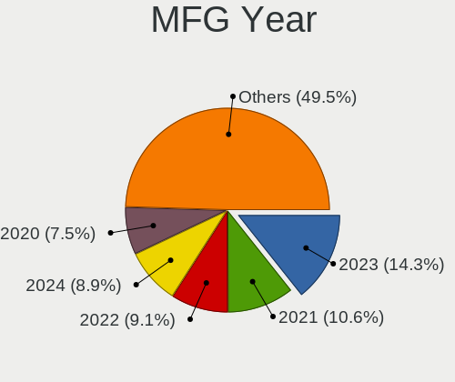
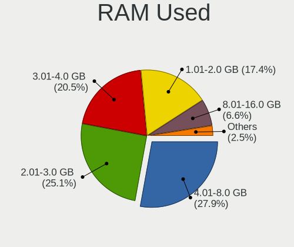
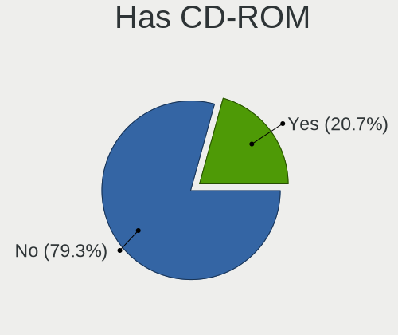
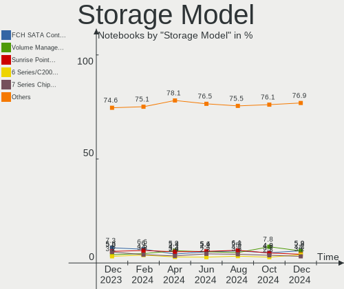
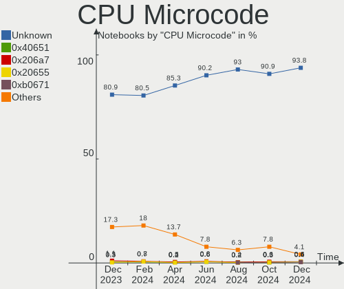
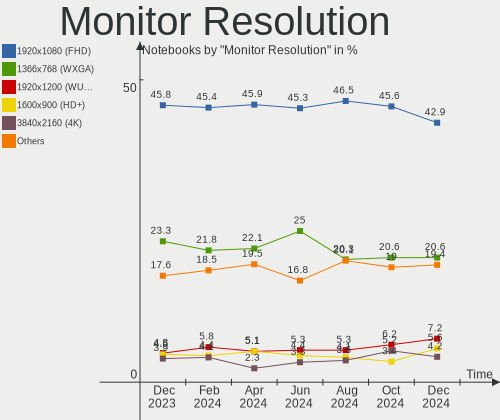
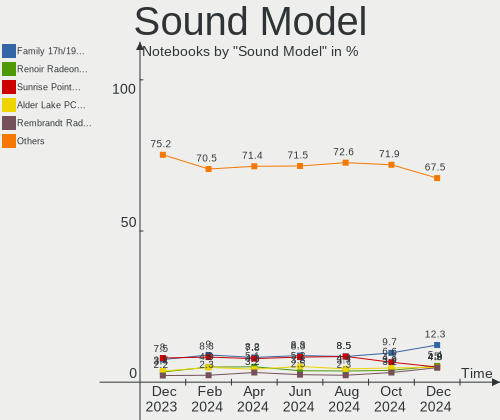

Ubuntu - Hardware Trends (Notebooks)
------------------------------------

A project to identify most popular hardware characteristics and track their change
over time based on data collected by Linux users at https://Linux-Hardware.org.

Anyone can contribute to this report by the [hw-probe](https://github.com/linuxhw/hw-probe) tool:

    sudo -E hw-probe -all -upload

This report is for one last month. Overall report since the beginning of time: [TestDays](https://github.com/linuxhw/TestDays)

Period: Mar, 2023.

Contents
--------

* [ System ](#system)
  - [ OS                       ](#os)
  - [ OS Family                ](#os-family)
  - [ Kernel                   ](#kernel)
  - [ Kernel Family            ](#kernel-family)
  - [ Kernel Major Ver.        ](#kernel-major-ver)
  - [ Arch                     ](#arch)
  - [ DE                       ](#de)
  - [ Display Server           ](#display-server)
  - [ Display Manager          ](#display-manager)
  - [ OS Lang                  ](#os-lang)
  - [ Boot Mode                ](#boot-mode)
  - [ Filesystem               ](#filesystem)
  - [ Part. scheme             ](#part-scheme)
  - [ Dual Boot with Linux/BSD ](#dual-boot-with-linuxbsd)
  - [ Dual Boot (Win)          ](#dual-boot-win)

* [ Board ](#board)
  - [ Vendor                   ](#vendor)
  - [ Model                    ](#model)
  - [ Model Family             ](#model-family)
  - [ MFG Year                 ](#mfg-year)
  - [ Form Factor              ](#form-factor)
  - [ Secure Boot              ](#secure-boot)
  - [ Coreboot                 ](#coreboot)
  - [ RAM Size                 ](#ram-size)
  - [ RAM Used                 ](#ram-used)
  - [ Total Drives             ](#total-drives)
  - [ Has CD-ROM               ](#has-cd-rom)
  - [ Has Ethernet             ](#has-ethernet)
  - [ Has WiFi                 ](#has-wifi)
  - [ Has Bluetooth            ](#has-bluetooth)

* [ Location ](#location)
  - [ Country                  ](#country)
  - [ City                     ](#city)

* [ Drives ](#drives)
  - [ Drive Vendor             ](#drive-vendor)
  - [ Drive Model              ](#drive-model)
  - [ HDD Vendor               ](#hdd-vendor)
  - [ SSD Vendor               ](#ssd-vendor)
  - [ Drive Kind               ](#drive-kind)
  - [ Drive Connector          ](#drive-connector)
  - [ Drive Size               ](#drive-size)
  - [ Space Total              ](#space-total)
  - [ Space Used               ](#space-used)
  - [ Malfunc. Drives          ](#malfunc-drives)
  - [ Malfunc. Drive Vendor    ](#malfunc-drive-vendor)
  - [ Malfunc. HDD Vendor      ](#malfunc-hdd-vendor)
  - [ Malfunc. Drive Kind      ](#malfunc-drive-kind)
  - [ Failed Drives            ](#failed-drives)
  - [ Failed Drive Vendor      ](#failed-drive-vendor)
  - [ Drive Status             ](#drive-status)

* [ Storage controller ](#storage-controller)
  - [ Storage Vendor           ](#storage-vendor)
  - [ Storage Model            ](#storage-model)
  - [ Storage Kind             ](#storage-kind)

* [ Processor ](#processor)
  - [ CPU Vendor               ](#cpu-vendor)
  - [ CPU Model                ](#cpu-model)
  - [ CPU Model Family         ](#cpu-model-family)
  - [ CPU Cores                ](#cpu-cores)
  - [ CPU Sockets              ](#cpu-sockets)
  - [ CPU Threads              ](#cpu-threads)
  - [ CPU Op-Modes             ](#cpu-op-modes)
  - [ CPU Microcode            ](#cpu-microcode)
  - [ CPU Microarch            ](#cpu-microarch)

* [ Graphics ](#graphics)
  - [ GPU Vendor               ](#gpu-vendor)
  - [ GPU Model                ](#gpu-model)
  - [ GPU Combo                ](#gpu-combo)
  - [ GPU Driver               ](#gpu-driver)
  - [ GPU Memory               ](#gpu-memory)

* [ Monitor ](#monitor)
  - [ Monitor Vendor           ](#monitor-vendor)
  - [ Monitor Model            ](#monitor-model)
  - [ Monitor Resolution       ](#monitor-resolution)
  - [ Monitor Diagonal         ](#monitor-diagonal)
  - [ Monitor Width            ](#monitor-width)
  - [ Aspect Ratio             ](#aspect-ratio)
  - [ Monitor Area             ](#monitor-area)
  - [ Pixel Density            ](#pixel-density)
  - [ Multiple Monitors        ](#multiple-monitors)

* [ Network ](#network)
  - [ Net Controller Vendor    ](#net-controller-vendor)
  - [ Net Controller Model     ](#net-controller-model)
  - [ Wireless Vendor          ](#wireless-vendor)
  - [ Wireless Model           ](#wireless-model)
  - [ Ethernet Vendor          ](#ethernet-vendor)
  - [ Ethernet Model           ](#ethernet-model)
  - [ Net Controller Kind      ](#net-controller-kind)
  - [ Used Controller          ](#used-controller)
  - [ NICs                     ](#nics)
  - [ IPv6                     ](#ipv6)

* [ Bluetooth ](#bluetooth)
  - [ Bluetooth Vendor         ](#bluetooth-vendor)
  - [ Bluetooth Model          ](#bluetooth-model)

* [ Sound ](#sound)
  - [ Sound Vendor             ](#sound-vendor)
  - [ Sound Model              ](#sound-model)

* [ Memory ](#memory)
  - [ Memory Vendor            ](#memory-vendor)
  - [ Memory Model             ](#memory-model)
  - [ Memory Kind              ](#memory-kind)
  - [ Memory Form Factor       ](#memory-form-factor)
  - [ Memory Size              ](#memory-size)
  - [ Memory Speed             ](#memory-speed)

* [ Printers & scanners ](#printers--scanners)
  - [ Printer Vendor           ](#printer-vendor)
  - [ Printer Model            ](#printer-model)
  - [ Scanner Vendor           ](#scanner-vendor)
  - [ Scanner Model            ](#scanner-model)

* [ Camera ](#camera)
  - [ Camera Vendor            ](#camera-vendor)
  - [ Camera Model             ](#camera-model)

* [ Security ](#security)
  - [ Fingerprint Vendor       ](#fingerprint-vendor)
  - [ Fingerprint Model        ](#fingerprint-model)
  - [ Chipcard Vendor          ](#chipcard-vendor)
  - [ Chipcard Model           ](#chipcard-model)

* [ Unsupported ](#unsupported)
  - [ Unsupported Devices      ](#unsupported-devices)
  - [ Unsupported Device Types ](#unsupported-device-types)

System
------

OS
--

Installed operating systems

| Name           | Notebooks | Percent |
|----------------|-----------|---------|
| Ubuntu 22.04   | 470       | 66.38%  |
| Ubuntu 22.10   | 141       | 19.92%  |
| Ubuntu 20.04   | 69        | 9.75%   |
| Ubuntu 18.04   | 13        | 1.84%   |
| Ubuntu 23.04   | 10        | 1.41%   |
| Ubuntu Core 18 | 3         | 0.42%   |
| Ubuntu 21.10   | 1         | 0.14%   |
| Ubuntu 20.10   | 1         | 0.14%   |

OS Family
---------

OS without a version

| Name   | Notebooks | Percent |
|--------|-----------|---------|
| Ubuntu | 708       | 100%    |

Kernel
------

Version of the Linux kernel

| Version                | Notebooks | Percent |
|------------------------|-----------|---------|
| 5.19.0-35-generic      | 349       | 49.29%  |
| 5.19.0-32-generic      | 65        | 9.18%   |
| 5.19.0-38-generic      | 62        | 8.76%   |
| 5.15.0-67-generic      | 47        | 6.64%   |
| 5.15.0-60-generic      | 16        | 2.26%   |
| 5.19.0-31-generic      | 12        | 1.69%   |
| 5.19.0-37-generic      | 11        | 1.55%   |
| 5.15.0-69-generic      | 11        | 1.55%   |
| 5.4.0-144-generic      | 9         | 1.27%   |
| 5.19.0-21-generic      | 9         | 1.27%   |
| 5.15.0-58-generic      | 6         | 0.85%   |
| 5.15.0-43-generic      | 6         | 0.85%   |
| 6.2.8-060208-generic   | 5         | 0.71%   |
| 6.2.2-060202-generic   | 4         | 0.56%   |
| 6.1.0-16-generic       | 4         | 0.56%   |
| 5.15.0-46-generic      | 4         | 0.56%   |
| 5.15.0-56-generic      | 3         | 0.42%   |
| 5.15.0-52-generic      | 3         | 0.42%   |
| 5.14.0-1058-oem        | 3         | 0.42%   |
| 5.14.0-1048-oem        | 3         | 0.42%   |
| 4.15.0-206-generic     | 3         | 0.42%   |
| 6.2.9-060209-generic   | 2         | 0.28%   |
| 6.2.7-060207-generic   | 2         | 0.28%   |
| 6.2.2-t2-jammy         | 2         | 0.28%   |
| 6.2.0-18-generic       | 2         | 0.28%   |
| 6.1.12-060112-generic  | 2         | 0.28%   |
| 6.1.0-1009-tuxedo      | 2         | 0.28%   |
| 6.0.0-1012-oem         | 2         | 0.28%   |
| 5.4.0-146-generic      | 2         | 0.28%   |
| 5.15.0-1032-realtime   | 2         | 0.28%   |
| 5.15.0-1026-intel-iotg | 2         | 0.28%   |
| 5.14.0-1054-oem        | 2         | 0.28%   |
| 6.2.6-060206-generic   | 1         | 0.14%   |
| 6.2.5-t2-jammy         | 1         | 0.14%   |
| 6.2.5-060205-generic   | 1         | 0.14%   |
| 6.2.3-060203-generic   | 1         | 0.14%   |
| 6.2.2-x64v3-xanmod1    | 1         | 0.14%   |
| 6.2.1-tkg-cfs          | 1         | 0.14%   |
| 6.2.1-t2-jammy         | 1         | 0.14%   |
| 6.2.1-rdc              | 1         | 0.14%   |

Kernel Family
-------------

Linux kernel without a distro release

| Version | Notebooks | Percent |
|---------|-----------|---------|
| 5.19.0  | 509       | 71.89%  |
| 5.15.0  | 108       | 15.25%  |
| 5.4.0   | 20        | 2.82%   |
| 5.14.0  | 9         | 1.27%   |
| 6.2.2   | 7         | 0.99%   |
| 6.1.0   | 7         | 0.99%   |
| 6.2.8   | 5         | 0.71%   |
| 4.15.0  | 5         | 0.71%   |
| 6.2.0   | 4         | 0.56%   |
| 6.2.1   | 3         | 0.42%   |
| 5.8.0   | 3         | 0.42%   |
| 5.13.0  | 3         | 0.42%   |
| 6.2.9   | 2         | 0.28%   |
| 6.2.7   | 2         | 0.28%   |
| 6.2.5   | 2         | 0.28%   |
| 6.1.12  | 2         | 0.28%   |
| 6.0.0   | 2         | 0.28%   |
| 5.17.0  | 2         | 0.28%   |
| 6.2.6   | 1         | 0.14%   |
| 6.2.3   | 1         | 0.14%   |
| 6.1.9   | 1         | 0.14%   |
| 6.1.13  | 1         | 0.14%   |
| 6.0.9   | 1         | 0.14%   |
| 6.0.6   | 1         | 0.14%   |
| 6.0.2   | 1         | 0.14%   |
| 5.4.41  | 1         | 0.14%   |
| 5.19.17 | 1         | 0.14%   |
| 5.19.16 | 1         | 0.14%   |
| 5.17.5  | 1         | 0.14%   |
| 5.11.0  | 1         | 0.14%   |
| 5.0.0   | 1         | 0.14%   |

Kernel Major Ver.
-----------------

Linux kernel major version

| Version | Notebooks | Percent |
|---------|-----------|---------|
| 5.19    | 511       | 72.18%  |
| 5.15    | 108       | 15.25%  |
| 6.2     | 27        | 3.81%   |
| 5.4     | 21        | 2.97%   |
| 6.1     | 11        | 1.55%   |
| 5.14    | 9         | 1.27%   |
| 6.0     | 5         | 0.71%   |
| 4.15    | 5         | 0.71%   |
| 5.8     | 3         | 0.42%   |
| 5.17    | 3         | 0.42%   |
| 5.13    | 3         | 0.42%   |
| 5.11    | 1         | 0.14%   |
| 5.0     | 1         | 0.14%   |

Arch
----

OS architecture (x86_64, i586, etc.)

| Name   | Notebooks | Percent |
|--------|-----------|---------|
| x86_64 | 705       | 99.58%  |
| i686   | 3         | 0.42%   |

DE
--

Desktop Environment

| Name            | Notebooks | Percent |
|-----------------|-----------|---------|
| GNOME           | 678       | 95.76%  |
| Unknown         | 14        | 1.98%   |
| X-Cinnamon      | 7         | 0.99%   |
| GNOME Flashback | 3         | 0.42%   |
| i3              | 2         | 0.28%   |
| xsession        | 1         | 0.14%   |
| sway            | 1         | 0.14%   |
| GNOME Classic   | 1         | 0.14%   |
| DWM             | 1         | 0.14%   |

Display Server
--------------

X11 or Wayland

| Name    | Notebooks | Percent |
|---------|-----------|---------|
| Wayland | 427       | 60.31%  |
| X11     | 261       | 36.86%  |
| Unknown | 14        | 1.98%   |
| Tty     | 6         | 0.85%   |

Display Manager
---------------

SDDM, LightDM, etc.

| Name    | Notebooks | Percent |
|---------|-----------|---------|
| GDM3    | 599       | 84.6%   |
| Unknown | 66        | 9.32%   |
| GDM     | 33        | 4.66%   |
| LightDM | 8         | 1.13%   |
| SDDM    | 2         | 0.28%   |

OS Lang
-------

Language

| Lang    | Notebooks | Percent |
|---------|-----------|---------|
| en_US   | 317       | 44.77%  |
| de_DE   | 78        | 11.02%  |
| fr_FR   | 40        | 5.65%   |
| en_GB   | 40        | 5.65%   |
| pt_BR   | 25        | 3.53%   |
| en_IN   | 22        | 3.11%   |
| it_IT   | 20        | 2.82%   |
| ru_RU   | 16        | 2.26%   |
| en_CA   | 16        | 2.26%   |
| es_ES   | 14        | 1.98%   |
| Unknown | 9         | 1.27%   |
| en_AU   | 8         | 1.13%   |
| pl_PL   | 7         | 0.99%   |
| nl_NL   | 7         | 0.99%   |
| C       | 6         | 0.85%   |
| pt_PT   | 5         | 0.71%   |
| hu_HU   | 5         | 0.71%   |
| es_MX   | 5         | 0.71%   |
| de_CH   | 5         | 0.71%   |
| cs_CZ   | 5         | 0.71%   |
| zh_CN   | 4         | 0.56%   |
| tr_TR   | 4         | 0.56%   |
| en_ZA   | 4         | 0.56%   |
| sk_SK   | 3         | 0.42%   |
| nb_NO   | 3         | 0.42%   |
| es_CO   | 3         | 0.42%   |
| es_AR   | 3         | 0.42%   |
| en_PH   | 3         | 0.42%   |
| en_IE   | 3         | 0.42%   |
| de_AT   | 3         | 0.42%   |
| sv_SE   | 2         | 0.28%   |
| ro_RO   | 2         | 0.28%   |
| es_CL   | 2         | 0.28%   |
| da_DK   | 2         | 0.28%   |
| zh_TW   | 1         | 0.14%   |
| uk_UA   | 1         | 0.14%   |
| nl_BE   | 1         | 0.14%   |
| mn_MN   | 1         | 0.14%   |
| mk_MK   | 1         | 0.14%   |
| ja_JP   | 1         | 0.14%   |

Boot Mode
---------

EFI or BIOS

| Mode | Notebooks | Percent |
|------|-----------|---------|
| BIOS | 384       | 54.24%  |
| EFI  | 324       | 45.76%  |

Filesystem
----------

Type of filesystem

| Type    | Notebooks | Percent |
|---------|-----------|---------|
| Ext4    | 643       | 90.82%  |
| Overlay | 22        | 3.11%   |
| Btrfs   | 20        | 2.82%   |
| Zfs     | 18        | 2.54%   |
| Ext2    | 2         | 0.28%   |
| Xfs     | 1         | 0.14%   |
| Ext3    | 1         | 0.14%   |
| Unknown | 1         | 0.14%   |

Part. scheme
------------

Scheme of partitioning

| Type    | Notebooks | Percent |
|---------|-----------|---------|
| GPT     | 572       | 80.79%  |
| MBR     | 78        | 11.02%  |
| Unknown | 58        | 8.19%   |

Dual Boot with Linux/BSD
------------------------

Hosting more than one Linux/BSD

| Dual boot | Notebooks | Percent |
|-----------|-----------|---------|
| No        | 636       | 89.83%  |
| Yes       | 72        | 10.17%  |

Dual Boot (Win)
---------------

Hosting Linux and Windows

| Dual boot | Notebooks | Percent |
|-----------|-----------|---------|
| No        | 462       | 65.25%  |
| Yes       | 246       | 34.75%  |

Board
-----

Vendor
------

Motherboard manufacturer

| Name                           | Notebooks | Percent |
|--------------------------------|-----------|---------|
| Lenovo                         | 164       | 23.16%  |
| Hewlett-Packard                | 135       | 19.07%  |
| Dell                           | 112       | 15.82%  |
| ASUSTek Computer               | 57        | 8.05%   |
| Acer                           | 53        | 7.49%   |
| Apple                          | 23        | 3.25%   |
| MSI                            | 20        | 2.82%   |
| HUAWEI                         | 19        | 2.68%   |
| Toshiba                        | 13        | 1.84%   |
| Samsung Electronics            | 12        | 1.69%   |
| Sony                           | 10        | 1.41%   |
| Notebook                       | 8         | 1.13%   |
| Timi                           | 5         | 0.71%   |
| Google                         | 5         | 0.71%   |
| Unknown                        | 5         | 0.71%   |
| Positivo                       | 4         | 0.56%   |
| Medion                         | 4         | 0.56%   |
| Intel                          | 4         | 0.56%   |
| HONOR                          | 4         | 0.56%   |
| Fujitsu                        | 4         | 0.56%   |
| TUXEDO                         | 3         | 0.42%   |
| LG Electronics                 | 3         | 0.42%   |
| Avell High Performance         | 3         | 0.42%   |
| Alienware                      | 3         | 0.42%   |
| Teclast                        | 2         | 0.28%   |
| Shanghai Zhaoxin Semiconductor | 2         | 0.28%   |
| Schenker                       | 2         | 0.28%   |
| Hampoo                         | 2         | 0.28%   |
| Gigabyte Technology            | 2         | 0.28%   |
| Framework                      | 2         | 0.28%   |
| VALE                           | 1         | 0.14%   |
| Tactus                         | 1         | 0.14%   |
| Star Labs                      | 1         | 0.14%   |
| Razer                          | 1         | 0.14%   |
| Prestigio                      | 1         | 0.14%   |
| Packard Bell                   | 1         | 0.14%   |
| OEGStone                       | 1         | 0.14%   |
| New IT Project                 | 1         | 0.14%   |
| Matsushita Electric Industrial | 1         | 0.14%   |
| LTD Delovoy Office             | 1         | 0.14%   |

Model
-----

Motherboard model

| Name                                 | Notebooks | Percent |
|--------------------------------------|-----------|---------|
| HUAWEI NBLB-WAX9N                    | 5         | 0.71%   |
| Unknown                              | 5         | 0.71%   |
| Apple MacBookPro9,2                  | 4         | 0.56%   |
| Samsung 550XDA                       | 3         | 0.42%   |
| Dell XPS 15 9510                     | 3         | 0.42%   |
| Dell Latitude 7420                   | 3         | 0.42%   |
| Dell Latitude 5400                   | 3         | 0.42%   |
| Dell Inspiron 3442                   | 3         | 0.42%   |
| Dell G15 5510                        | 3         | 0.42%   |
| Timi Xiaomi NoteBook Pro             | 2         | 0.28%   |
| Shanghai Zhaoxin ZXE CRB             | 2         | 0.28%   |
| MSI GF63 Thin 10SC                   | 2         | 0.28%   |
| Lenovo Y520-15IKBN 80WK              | 2         | 0.28%   |
| Lenovo Legion Y530-15ICH 81FV        | 2         | 0.28%   |
| Lenovo IdeaPad Gaming 3 15ARH05 82EY | 2         | 0.28%   |
| Lenovo IdeaPad 320-15AST 80XV        | 2         | 0.28%   |
| Lenovo IdeaPad 3 15ITL6 82H8         | 2         | 0.28%   |
| HUAWEI RLEF-XX                       | 2         | 0.28%   |
| HUAWEI NBLK-WAX9X                    | 2         | 0.28%   |
| HUAWEI BOD-WXX9                      | 2         | 0.28%   |
| HONOR HYM-WXX                        | 2         | 0.28%   |
| HP ZBook Studio G3                   | 2         | 0.28%   |
| HP ProBook 450 G8 Notebook PC        | 2         | 0.28%   |
| HP ProBook 450 G5                    | 2         | 0.28%   |
| HP ProBook 450 G2                    | 2         | 0.28%   |
| HP ProBook 430 G4                    | 2         | 0.28%   |
| HP Presario CQ57                     | 2         | 0.28%   |
| HP Pavilion Gaming Laptop 15-ec2xxx  | 2         | 0.28%   |
| HP Pavilion Gaming Laptop 15-ec0xxx  | 2         | 0.28%   |
| HP Pavilion g7                       | 2         | 0.28%   |
| HP Pavilion dv7                      | 2         | 0.28%   |
| HP Pavilion dv6                      | 2         | 0.28%   |
| HP Pavilion 17                       | 2         | 0.28%   |
| HP Laptop 15s-eq1xxx                 | 2         | 0.28%   |
| HP Laptop 15-bs0xx                   | 2         | 0.28%   |
| HP Laptop 14-dq2xxx                  | 2         | 0.28%   |
| HP EliteBook 8470p                   | 2         | 0.28%   |
| HP EliteBook 845 G7 Notebook PC      | 2         | 0.28%   |
| HP EliteBook 840 G5                  | 2         | 0.28%   |
| HP EliteBook 2570p                   | 2         | 0.28%   |

Model Family
------------

Motherboard model prefix

| Name                | Notebooks | Percent |
|---------------------|-----------|---------|
| Lenovo ThinkPad     | 93        | 13.14%  |
| Dell Latitude       | 41        | 5.79%   |
| Acer Aspire         | 34        | 4.8%    |
| Lenovo IdeaPad      | 32        | 4.52%   |
| HP Pavilion         | 29        | 4.1%    |
| Dell Inspiron       | 24        | 3.39%   |
| HP ProBook          | 23        | 3.25%   |
| HP Laptop           | 23        | 3.25%   |
| HP EliteBook        | 20        | 2.82%   |
| ASUS VivoBook       | 17        | 2.4%    |
| Dell XPS            | 16        | 2.26%   |
| Dell Precision      | 14        | 1.98%   |
| Dell Vostro         | 11        | 1.55%   |
| Toshiba Satellite   | 9         | 1.27%   |
| HP ZBook            | 8         | 1.13%   |
| HP 250              | 6         | 0.85%   |
| ASUS ROG            | 6         | 0.85%   |
| ASUS ASUS           | 6         | 0.85%   |
| Acer Swift          | 6         | 0.85%   |
| Lenovo ThinkBook    | 5         | 0.71%   |
| HUAWEI NBLB-WAX9N   | 5         | 0.71%   |
| HP OMEN             | 5         | 0.71%   |
| HP Compaq           | 5         | 0.71%   |
| Dell G15            | 5         | 0.71%   |
| Apple MacBookPro9   | 5         | 0.71%   |
| Unknown             | 5         | 0.71%   |
| Lenovo Yoga         | 4         | 0.56%   |
| Lenovo Legion       | 4         | 0.56%   |
| HP Presario         | 4         | 0.56%   |
| Acer TravelMate     | 4         | 0.56%   |
| Acer Extensa        | 4         | 0.56%   |
| TUXEDO InfinityBook | 3         | 0.42%   |
| Samsung 550XDA      | 3         | 0.42%   |
| MSI GF63            | 3         | 0.42%   |
| HP 255              | 3         | 0.42%   |
| Fujitsu LIFEBOOK    | 3         | 0.42%   |
| ASUS TUF            | 3         | 0.42%   |
| Apple MacBookPro16  | 3         | 0.42%   |
| Apple MacBookPro15  | 3         | 0.42%   |
| Toshiba TECRA       | 2         | 0.28%   |

MFG Year
--------

Motherboard manufacture year

| Year | Notebooks | Percent |
|------|-----------|---------|
| 2021 | 100       | 14.12%  |
| 2020 | 84        | 11.86%  |
| 2022 | 66        | 9.32%   |
| 2019 | 66        | 9.32%   |
| 2018 | 53        | 7.49%   |
| 2012 | 47        | 6.64%   |
| 2016 | 40        | 5.65%   |
| 2013 | 39        | 5.51%   |
| 2011 | 39        | 5.51%   |
| 2015 | 36        | 5.08%   |
| 2017 | 34        | 4.8%    |
| 2010 | 33        | 4.66%   |
| 2014 | 28        | 3.95%   |
| 2009 | 16        | 2.26%   |
| 2008 | 14        | 1.98%   |
| 2007 | 6         | 0.85%   |
| 2023 | 4         | 0.56%   |
| 2006 | 3         | 0.42%   |

Form Factor
-----------

Physical design of the computer

| Name     | Notebooks | Percent |
|----------|-----------|---------|
| Notebook | 708       | 100%    |

Secure Boot
-----------

Enabled or disabled

| State    | Notebooks | Percent |
|----------|-----------|---------|
| Disabled | 633       | 89.41%  |
| Enabled  | 75        | 10.59%  |

Coreboot
--------

Have coreboot on board

| Used | Notebooks | Percent |
|------|-----------|---------|
| No   | 702       | 99.15%  |
| Yes  | 6         | 0.85%   |

RAM Size
--------

Total RAM memory

| Size in GB  | Notebooks | Percent |
|-------------|-----------|---------|
| 4.01-8.0    | 199       | 28.11%  |
| 16.01-24.0  | 149       | 21.05%  |
| 8.01-16.0   | 120       | 16.95%  |
| 3.01-4.0    | 119       | 16.81%  |
| 32.01-64.0  | 66        | 9.32%   |
| 2.01-3.0    | 16        | 2.26%   |
| 24.01-32.0  | 14        | 1.98%   |
| 1.01-2.0    | 13        | 1.84%   |
| 64.01-256.0 | 10        | 1.41%   |
| 0.51-1.0    | 2         | 0.28%   |

RAM Used
--------

Used RAM memory

| Used GB    | Notebooks | Percent |
|------------|-----------|---------|
| 2.01-3.0   | 199       | 28.11%  |
| 1.01-2.0   | 199       | 28.11%  |
| 4.01-8.0   | 148       | 20.9%   |
| 3.01-4.0   | 97        | 13.7%   |
| 8.01-16.0  | 44        | 6.21%   |
| 0.51-1.0   | 11        | 1.55%   |
| 16.01-24.0 | 9         | 1.27%   |
| 0.01-0.5   | 1         | 0.14%   |

Total Drives
------------

Number of drives on board

| Drives | Notebooks | Percent |
|--------|-----------|---------|
| 1      | 542       | 76.55%  |
| 2      | 142       | 20.06%  |
| 3      | 17        | 2.4%    |
| 4      | 3         | 0.42%   |
| 5      | 2         | 0.28%   |
| 0      | 2         | 0.28%   |

Has CD-ROM
----------

Has CD-ROM on board

| Presented | Notebooks | Percent |
|-----------|-----------|---------|
| No        | 515       | 72.74%  |
| Yes       | 193       | 27.26%  |

Has Ethernet
------------

Has Ethernet on board

| Presented | Notebooks | Percent |
|-----------|-----------|---------|
| Yes       | 556       | 78.53%  |
| No        | 152       | 21.47%  |

Has WiFi
--------

Has WiFi module

| Presented | Notebooks | Percent |
|-----------|-----------|---------|
| Yes       | 691       | 97.6%   |
| No        | 17        | 2.4%    |

Has Bluetooth
-------------

Has Bluetooth module

| Presented | Notebooks | Percent |
|-----------|-----------|---------|
| Yes       | 577       | 81.5%   |
| No        | 131       | 18.5%   |

Location
--------

Country
-------

Geographic location (country)

| Country      | Notebooks | Percent |
|--------------|-----------|---------|
| Germany      | 98        | 13.84%  |
| USA          | 89        | 12.57%  |
| France       | 57        | 8.05%   |
| Brazil       | 42        | 5.93%   |
| UK           | 33        | 4.66%   |
| Italy        | 28        | 3.95%   |
| India        | 27        | 3.81%   |
| Spain        | 26        | 3.67%   |
| Russia       | 25        | 3.53%   |
| Poland       | 23        | 3.25%   |
| Canada       | 19        | 2.68%   |
| Switzerland  | 13        | 1.84%   |
| Turkey       | 12        | 1.69%   |
| Netherlands  | 12        | 1.69%   |
| Australia    | 9         | 1.27%   |
| Portugal     | 8         | 1.13%   |
| Hungary      | 8         | 1.13%   |
| Argentina    | 8         | 1.13%   |
| Sweden       | 7         | 0.99%   |
| Romania      | 6         | 0.85%   |
| Mexico       | 6         | 0.85%   |
| Ireland      | 6         | 0.85%   |
| Indonesia    | 6         | 0.85%   |
| Denmark      | 6         | 0.85%   |
| Belarus      | 6         | 0.85%   |
| Austria      | 6         | 0.85%   |
| Ukraine      | 5         | 0.71%   |
| Japan        | 5         | 0.71%   |
| Egypt        | 5         | 0.71%   |
| Czechia      | 5         | 0.71%   |
| Colombia     | 5         | 0.71%   |
| China        | 5         | 0.71%   |
| Chile        | 5         | 0.71%   |
| Bulgaria     | 5         | 0.71%   |
| South Africa | 4         | 0.56%   |
| Slovakia     | 4         | 0.56%   |
| Philippines  | 4         | 0.56%   |
| Kenya        | 4         | 0.56%   |
| Belgium      | 4         | 0.56%   |
| Vietnam      | 3         | 0.42%   |

City
----

Geographic location (city)

| City              | Notebooks | Percent |
|-------------------|-----------|---------|
| Berlin            | 12        | 1.69%   |
| Madrid            | 10        | 1.41%   |
| Moscow            | 9         | 1.27%   |
| Paris             | 8         | 1.13%   |
| London            | 6         | 0.85%   |
| Warsaw            | 5         | 0.71%   |
| Sao Paulo         | 5         | 0.71%   |
| Frankfurt am Main | 5         | 0.71%   |
| Sydney            | 4         | 0.56%   |
| Nairobi           | 4         | 0.56%   |
| Dublin            | 4         | 0.56%   |
| Denver            | 4         | 0.56%   |
| Budapest          | 4         | 0.56%   |
| Barcelona         | 4         | 0.56%   |
| Zurich            | 3         | 0.42%   |
| Vancouver         | 3         | 0.42%   |
| Tehran            | 3         | 0.42%   |
| Strasbourg        | 3         | 0.42%   |
| Stockholm         | 3         | 0.42%   |
| Santiago          | 3         | 0.42%   |
| Rome              | 3         | 0.42%   |
| Rio de Janeiro    | 3         | 0.42%   |
| Porto             | 3         | 0.42%   |
| New York          | 3         | 0.42%   |
| Milano            | 3         | 0.42%   |
| Milan             | 3         | 0.42%   |
| Melbourne         | 3         | 0.42%   |
| Luxembourg        | 3         | 0.42%   |
| Lisbon            | 3         | 0.42%   |
| Leipzig           | 3         | 0.42%   |
| Kosekoy           | 3         | 0.42%   |
| Hamburg           | 3         | 0.42%   |
| Bogotá           | 3         | 0.42%   |
| Bengaluru         | 3         | 0.42%   |
| Turin             | 2         | 0.28%   |
| The Hague         | 2         | 0.28%   |
| Tallinn           | 2         | 0.28%   |
| Talcahuano        | 2         | 0.28%   |
| Sumter            | 2         | 0.28%   |
| Stuttgart         | 2         | 0.28%   |

Drives
------

Drive Vendor
------------

Hard drive vendors

| Vendor                      | Notebooks | Drives | Percent |
|-----------------------------|-----------|--------|---------|
| Samsung Electronics         | 180       | 193    | 20.71%  |
| WDC                         | 95        | 100    | 10.93%  |
| Seagate                     | 79        | 83     | 9.09%   |
| Toshiba                     | 69        | 70     | 7.94%   |
| SanDisk                     | 51        | 51     | 5.87%   |
| SK hynix                    | 40        | 40     | 4.6%    |
| Kingston                    | 38        | 39     | 4.37%   |
| Unknown                     | 36        | 38     | 4.14%   |
| Micron Technology           | 27        | 27     | 3.11%   |
| Crucial                     | 25        | 25     | 2.88%   |
| Intel                       | 23        | 23     | 2.65%   |
| Hitachi                     | 19        | 19     | 2.19%   |
| HGST                        | 17        | 17     | 1.96%   |
| KIOXIA                      | 16        | 16     | 1.84%   |
| China                       | 12        | 12     | 1.38%   |
| Apple                       | 12        | 13     | 1.38%   |
| A-DATA Technology           | 11        | 12     | 1.27%   |
| Gigabyte Technology         | 7         | 7      | 0.81%   |
| SSSTC                       | 5         | 5      | 0.58%   |
| SPCC                        | 5         | 5      | 0.58%   |
| Intenso                     | 5         | 5      | 0.58%   |
| Unknown                     | 5         | 5      | 0.58%   |
| Silicon Motion              | 4         | 4      | 0.46%   |
| Micron/Crucial Technology   | 4         | 4      | 0.46%   |
| Kingston Technology Company | 4         | 4      | 0.46%   |
| Teclast                     | 3         | 3      | 0.35%   |
| PNY                         | 3         | 3      | 0.35%   |
| Phison Electronics          | 3         | 4      | 0.35%   |
| Phison                      | 3         | 3      | 0.35%   |
| LITEONIT                    | 3         | 3      | 0.35%   |
| JMicron Technology          | 3         | 3      | 0.35%   |
| YMTC                        | 2         | 2      | 0.23%   |
| Union Memory (Shenzhen)     | 2         | 2      | 0.23%   |
| Team                        | 2         | 2      | 0.23%   |
| Netac                       | 2         | 2      | 0.23%   |
| Kimtigo                     | 2         | 2      | 0.23%   |
| GOODRAM                     | 2         | 2      | 0.23%   |
| FORESEE                     | 2         | 2      | 0.23%   |
| Fanxiang                    | 2         | 2      | 0.23%   |
| Corsair                     | 2         | 2      | 0.23%   |

Drive Model
-----------

Hard drive models

| Model                                               | Notebooks | Percent |
|-----------------------------------------------------|-----------|---------|
| Samsung NVMe SSD Controller SM981/PM981/PM983 250GB | 15        | 1.68%   |
| Toshiba MQ01ABF050 500GB                            | 11        | 1.23%   |
| Unknown MMC Card  64GB                              | 10        | 1.12%   |
| Seagate ST1000LM035-1RK172 1TB                      | 10        | 1.12%   |
| Samsung NVMe SSD Controller PM9A1/PM9A3/980PRO 1TB  | 9         | 1.01%   |
| Unknown MMC Card  32GB                              | 8         | 0.9%    |
| Toshiba MQ04ABF100 1TB                              | 8         | 0.9%    |
| Kingston SA400S37480G 480GB SSD                     | 8         | 0.9%    |
| WDC WD10SPZX-60Z10T0 1TB                            | 7         | 0.79%   |
| Toshiba MQ01ABD100 1TB                              | 7         | 0.79%   |
| Seagate ST9500325AS 500GB                           | 7         | 0.79%   |
| Seagate ST500LT012-1DG142 500GB                     | 7         | 0.79%   |
| Seagate ST1000LM024 HN-M101MBB 1TB                  | 7         | 0.79%   |
| Samsung SSD 860 EVO 500GB                           | 7         | 0.79%   |
| Samsung NVMe SSD Controller SM961/PM961/SM963 256GB | 7         | 0.79%   |
| HGST HTS721010A9E630 1TB                            | 6         | 0.67%   |
| Unknown SD/MMC/MS PRO 64GB                          | 5         | 0.56%   |
| Samsung SSD 980 500GB                               | 5         | 0.56%   |
| KIOXIA KBG40ZNS512G NVMe 512GB                      | 5         | 0.56%   |
| Kingston SA400S37240G 240GB SSD                     | 5         | 0.56%   |
| Intel SSDPEKNU512GZ 512GB                           | 5         | 0.56%   |
| Unknown                                             | 5         | 0.56%   |
| WDC WD10SPZX-08Z10 1TB                              | 4         | 0.45%   |
| Toshiba XG6 NVMe SSD Controller 512GB               | 4         | 0.45%   |
| SK hynix PC801 NVMe 1TB                             | 4         | 0.45%   |
| Seagate ST500LM012 HN-M500MBB 500GB                 | 4         | 0.45%   |
| Seagate Expansion+ 2TB                              | 4         | 0.45%   |
| SanDisk NVMe SSD Drive 512GB                        | 4         | 0.45%   |
| Samsung SSD 850 EVO 500GB                           | 4         | 0.45%   |
| Samsung SSD 850 EVO 250GB                           | 4         | 0.45%   |
| Samsung NVMe SSD Controller SM951/PM951 128GB       | 4         | 0.45%   |
| Samsung MZVLB512HBJQ-000L7 512GB                    | 4         | 0.45%   |
| HGST HTS725050A7E630 500GB                          | 4         | 0.45%   |
| Crucial CT250MX500SSD1 250GB                        | 4         | 0.45%   |
| Crucial CT1000MX500SSD1 1TB                         | 4         | 0.45%   |
| WDC WD10SPZX-00Z10T0 1TB                            | 3         | 0.34%   |
| WDC WD10JPVX-75JC3T0 1TB                            | 3         | 0.34%   |
| WDC WD10JPCX-24UE4T0 1TB                            | 3         | 0.34%   |
| Toshiba MQ01ABD075 752GB                            | 3         | 0.34%   |
| SK hynix PC711 NVMe 1TB                             | 3         | 0.34%   |

HDD Vendor
----------

Hard disk drive vendors

| Vendor              | Notebooks | Drives | Percent |
|---------------------|-----------|--------|---------|
| Seagate             | 74        | 78     | 33.04%  |
| WDC                 | 57        | 58     | 25.45%  |
| Toshiba             | 45        | 45     | 20.09%  |
| Hitachi             | 19        | 19     | 8.48%   |
| HGST                | 17        | 17     | 7.59%   |
| Unknown             | 5         | 5      | 2.23%   |
| Samsung Electronics | 5         | 5      | 2.23%   |
| USB3.0              | 1         | 1      | 0.45%   |
| PHD 3.0             | 1         | 1      | 0.45%   |

SSD Vendor
----------

Solid state drive vendors

| Vendor              | Notebooks | Drives | Percent |
|---------------------|-----------|--------|---------|
| Samsung Electronics | 61        | 64     | 24.11%  |
| Kingston            | 28        | 29     | 11.07%  |
| SanDisk             | 24        | 24     | 9.49%   |
| Crucial             | 23        | 23     | 9.09%   |
| WDC                 | 13        | 13     | 5.14%   |
| China               | 11        | 11     | 4.35%   |
| Gigabyte Technology | 7         | 7      | 2.77%   |
| Toshiba             | 6         | 7      | 2.37%   |
| SK hynix            | 5         | 5      | 1.98%   |
| Intel               | 5         | 5      | 1.98%   |
| SPCC                | 4         | 4      | 1.58%   |
| Micron Technology   | 4         | 4      | 1.58%   |
| Apple               | 4         | 4      | 1.58%   |
| Teclast             | 3         | 3      | 1.19%   |
| Seagate             | 3         | 3      | 1.19%   |
| PNY                 | 3         | 3      | 1.19%   |
| LITEONIT            | 3         | 3      | 1.19%   |
| Intenso             | 3         | 3      | 1.19%   |
| A-DATA Technology   | 3         | 3      | 1.19%   |
| Team                | 2         | 2      | 0.79%   |
| Netac               | 2         | 2      | 0.79%   |
| Kimtigo             | 2         | 2      | 0.79%   |
| JMicron Technology  | 2         | 2      | 0.79%   |
| GOODRAM             | 2         | 2      | 0.79%   |
| Fanxiang            | 2         | 2      | 0.79%   |
| Corsair             | 2         | 2      | 0.79%   |
| BHT                 | 2         | 2      | 0.79%   |
| Wibtek              | 1         | 1      | 0.4%    |
| Vaseky              | 1         | 1      | 0.4%    |
| Transcend           | 1         | 1      | 0.4%    |
| ShiJi               | 1         | 1      | 0.4%    |
| PNY CS90            | 1         | 1      | 0.4%    |
| Patriot             | 1         | 1      | 0.4%    |
| ORTIAL              | 1         | 1      | 0.4%    |
| OCZ                 | 1         | 1      | 0.4%    |
| My                  | 1         | 1      | 0.4%    |
| Maxtor              | 1         | 1      | 0.4%    |
| LT                  | 1         | 1      | 0.4%    |
| LITEON              | 1         | 1      | 0.4%    |
| Lexar               | 1         | 1      | 0.4%    |

Drive Kind
----------

HDD or SSD

| Kind    | Notebooks | Drives | Percent |
|---------|-----------|--------|---------|
| NVMe    | 331       | 363    | 40.17%  |
| SSD     | 234       | 258    | 28.4%   |
| HDD     | 213       | 229    | 25.85%  |
| MMC     | 33        | 36     | 4%      |
| Unknown | 13        | 14     | 1.58%   |

Drive Connector
---------------

SATA, SAS, NVMe, etc.

| Type | Notebooks | Drives | Percent |
|------|-----------|--------|---------|
| SATA | 401       | 468    | 50.63%  |
| NVMe | 330       | 361    | 41.67%  |
| MMC  | 33        | 36     | 4.17%   |
| SAS  | 28        | 35     | 3.54%   |

Drive Size
----------

Size of hard drive

| Size in TB | Notebooks | Drives | Percent |
|------------|-----------|--------|---------|
| 0.01-0.5   | 281       | 314    | 63.57%  |
| 0.51-1.0   | 137       | 145    | 31%     |
| 1.01-2.0   | 20        | 23     | 4.52%   |
| 4.01-10.0  | 3         | 3      | 0.68%   |
| 2.01-3.0   | 1         | 2      | 0.23%   |

Space Total
-----------

Amount of disk space available on the file system

| Size in GB     | Notebooks | Percent |
|----------------|-----------|---------|
| 251-500        | 228       | 32.2%   |
| 101-250        | 209       | 29.52%  |
| 501-1000       | 121       | 17.09%  |
| 51-100         | 46        | 6.5%    |
| 1-20           | 32        | 4.52%   |
| 1001-2000      | 24        | 3.39%   |
| 21-50          | 23        | 3.25%   |
| Unknown        | 12        | 1.69%   |
| 2001-3000      | 7         | 0.99%   |
| More than 3000 | 6         | 0.85%   |

Space Used
----------

Amount of used disk space

| Used GB        | Notebooks | Percent |
|----------------|-----------|---------|
| 1-20           | 216       | 30.51%  |
| 21-50          | 157       | 22.18%  |
| 101-250        | 117       | 16.53%  |
| 51-100         | 108       | 15.25%  |
| 251-500        | 59        | 8.33%   |
| 501-1000       | 26        | 3.67%   |
| Unknown        | 12        | 1.69%   |
| 1001-2000      | 9         | 1.27%   |
| More than 3000 | 2         | 0.28%   |
| 2001-3000      | 2         | 0.28%   |

Malfunc. Drives
---------------

Drive models with a malfunction

| Model                                  | Notebooks | Drives | Percent |
|----------------------------------------|-----------|--------|---------|
| Toshiba MQ04ABF100 1TB                 | 2         | 2      | 5.71%   |
| Seagate ST500LM012 HN-M500MBB 500GB    | 2         | 2      | 5.71%   |
| WDC WD6000HLHX-01JJPV0 600GB           | 1         | 1      | 2.86%   |
| WDC WD5000BPKT-60PK4T0 500GB           | 1         | 1      | 2.86%   |
| WDC WD3200BPVT-22ZEST0 320GB           | 1         | 1      | 2.86%   |
| WDC WD10JPCX-24UE4T0 1TB               | 1         | 1      | 2.86%   |
| Toshiba MQ01ABF050 500GB               | 1         | 1      | 2.86%   |
| Toshiba MQ01ABD100 1TB                 | 1         | 1      | 2.86%   |
| SSSTC CL1-4D256 256GB                  | 1         | 1      | 2.86%   |
| SK hynix PC611 NVMe 512GB              | 1         | 1      | 2.86%   |
| SK hynix HFS256G39TND-N210A 256GB SSD  | 1         | 1      | 2.86%   |
| SK hynix HFS128G39TND-N210A 128GB SSD  | 1         | 1      | 2.86%   |
| Seagate ST95005620AS 500GB             | 1         | 1      | 2.86%   |
| Seagate ST9500325AS 500GB              | 1         | 2      | 2.86%   |
| Seagate ST9320325AS 320GB              | 1         | 1      | 2.86%   |
| Seagate ST9160827AS 160GB              | 1         | 1      | 2.86%   |
| Seagate ST1000LX015-1U7172 1TB         | 1         | 1      | 2.86%   |
| Seagate ST1000LM049-2GH172 1TB         | 1         | 1      | 2.86%   |
| Seagate ST1000LM024 HN-M101MBB 1TB     | 1         | 1      | 2.86%   |
| Seagate ST1000LM014-SSHD-8GB           | 1         | 1      | 2.86%   |
| Seagate ST1000LM 035-1RK172 1TB        | 1         | 1      | 2.86%   |
| SanDisk SSD PLUS 120GB                 | 1         | 1      | 2.86%   |
| Samsung Electronics SSD 870 EVO 500GB  | 1         | 1      | 2.86%   |
| Micron Technology 1100 SATA 256GB SSD  | 1         | 1      | 2.86%   |
| Kingston SH103S3240G 240GB SSD         | 1         | 1      | 2.86%   |
| Intel SSDSC2BF180A4L 180GB             | 1         | 1      | 2.86%   |
| Intel SSDSA1M160G2HP 160GB             | 1         | 1      | 2.86%   |
| Hitachi HTS545050A7E380 500GB          | 1         | 1      | 2.86%   |
| HGST HTS721010A9E630 1TB               | 1         | 1      | 2.86%   |
| Crucial CT275MX300SSD1 275GB           | 1         | 1      | 2.86%   |
| China SATA SSD 20GB                    | 1         | 1      | 2.86%   |
| China G521N256GB SSD                   | 1         | 1      | 2.86%   |
| A-DATA Technology IM2P33F3A NVMe 256GB | 1         | 1      | 2.86%   |

Malfunc. Drive Vendor
---------------------

Vendors of faulty drives

| Vendor              | Notebooks | Drives | Percent |
|---------------------|-----------|--------|---------|
| Seagate             | 11        | 12     | 31.43%  |
| WDC                 | 4         | 4      | 11.43%  |
| Toshiba             | 4         | 4      | 11.43%  |
| SK hynix            | 3         | 3      | 8.57%   |
| Intel               | 2         | 2      | 5.71%   |
| China               | 2         | 2      | 5.71%   |
| SSSTC               | 1         | 1      | 2.86%   |
| SanDisk             | 1         | 1      | 2.86%   |
| Samsung Electronics | 1         | 1      | 2.86%   |
| Micron Technology   | 1         | 1      | 2.86%   |
| Kingston            | 1         | 1      | 2.86%   |
| Hitachi             | 1         | 1      | 2.86%   |
| HGST                | 1         | 1      | 2.86%   |
| Crucial             | 1         | 1      | 2.86%   |
| A-DATA Technology   | 1         | 1      | 2.86%   |

Malfunc. HDD Vendor
-------------------

Vendors of faulty HDD drives

| Vendor  | Notebooks | Drives | Percent |
|---------|-----------|--------|---------|
| Seagate | 11        | 12     | 52.38%  |
| WDC     | 4         | 4      | 19.05%  |
| Toshiba | 4         | 4      | 19.05%  |
| Hitachi | 1         | 1      | 4.76%   |
| HGST    | 1         | 1      | 4.76%   |

Malfunc. Drive Kind
-------------------

Kinds of faulty drives

| Kind | Notebooks | Drives | Percent |
|------|-----------|--------|---------|
| HDD  | 21        | 22     | 60%     |
| SSD  | 11        | 11     | 31.43%  |
| NVMe | 3         | 3      | 8.57%   |

Failed Drives
-------------

Failed drive models

Zero info for selected period =(

Failed Drive Vendor
-------------------

Failed drive vendors

Zero info for selected period =(

Drive Status
------------

Number of failed and malfunc. drives

| Status   | Notebooks | Drives | Percent |
|----------|-----------|--------|---------|
| Detected | 416       | 529    | 56.37%  |
| Works    | 288       | 335    | 39.02%  |
| Malfunc  | 34        | 36     | 4.61%   |

Storage controller
------------------

Storage Vendor
--------------

Storage controller vendors

| Vendor                           | Notebooks | Percent |
|----------------------------------|-----------|---------|
| Intel                            | 475       | 54.1%   |
| Samsung Electronics              | 120       | 13.67%  |
| AMD                              | 69        | 7.86%   |
| SanDisk                          | 53        | 6.04%   |
| SK hynix                         | 34        | 3.87%   |
| Micron Technology                | 23        | 2.62%   |
| Toshiba America Info Systems     | 18        | 2.05%   |
| KIOXIA                           | 16        | 1.82%   |
| Kingston Technology Company      | 14        | 1.59%   |
| ADATA Technology                 | 9         | 1.03%   |
| Apple                            | 8         | 0.91%   |
| Solid State Storage Technology   | 6         | 0.68%   |
| Phison Electronics               | 6         | 0.68%   |
| Micron/Crucial Technology        | 6         | 0.68%   |
| Silicon Motion                   | 5         | 0.57%   |
| Yangtze Memory Technologies      | 3         | 0.34%   |
| Union Memory (Shenzhen)          | 3         | 0.34%   |
| Zhaoxin                          | 2         | 0.23%   |
| Nvidia                           | 2         | 0.23%   |
| Shenzhen Shichuangyi Electronics | 1         | 0.11%   |
| Shenzhen Longsys Electronics     | 1         | 0.11%   |
| Seagate Technology               | 1         | 0.11%   |
| Realtek Semiconductor            | 1         | 0.11%   |
| Biwin Storage Technology         | 1         | 0.11%   |
| ASMedia Technology               | 1         | 0.11%   |

Storage Model
-------------

Storage controller models

| Model                                                                            | Notebooks | Percent |
|----------------------------------------------------------------------------------|-----------|---------|
| AMD FCH SATA Controller [AHCI mode]                                              | 57        | 6.18%   |
| Intel 7 Series Chipset Family 6-port SATA Controller [AHCI mode]                 | 49        | 5.31%   |
| Intel 82801 Mobile SATA Controller [RAID mode]                                   | 45        | 4.88%   |
| Intel Sunrise Point-LP SATA Controller [AHCI mode]                               | 44        | 4.77%   |
| Samsung NVMe SSD Controller 980                                                  | 39        | 4.23%   |
| Samsung NVMe SSD Controller SM981/PM981/PM983                                    | 37        | 4.01%   |
| Intel Volume Management Device NVMe RAID Controller                              | 35        | 3.79%   |
| Intel 6 Series/C200 Series Chipset Family 6 port Mobile SATA AHCI Controller     | 32        | 3.47%   |
| Intel Cannon Lake Mobile PCH SATA AHCI Controller                                | 25        | 2.71%   |
| Samsung NVMe SSD Controller PM9A1/PM9A3/980PRO                                   | 24        | 2.6%    |
| Micron NVMe Storage Controller                                                   | 23        | 2.49%   |
| Intel Comet Lake SATA AHCI Controller                                            | 21        | 2.28%   |
| SK hynix Gold P31/PC711 NVMe Solid State Drive                                   | 19        | 2.06%   |
| Intel Tiger Lake-LP SATA Controller                                              | 19        | 2.06%   |
| Intel 8 Series/C220 Series Chipset Family 6-port SATA Controller 1 [AHCI mode]   | 19        | 2.06%   |
| Intel 8 Series SATA Controller 1 [AHCI mode]                                     | 18        | 1.95%   |
| Samsung NVMe SSD Controller SM961/PM961/SM963                                    | 16        | 1.73%   |
| Intel 5 Series/3400 Series Chipset 4 port SATA AHCI Controller                   | 16        | 1.73%   |
| Intel Wildcat Point-LP SATA Controller [AHCI Mode]                               | 15        | 1.63%   |
| Intel 82801IBM/IEM (ICH9M/ICH9M-E) 4 port SATA Controller [AHCI mode]            | 15        | 1.63%   |
| KIOXIA NVMe SSD Controller BG4                                                   | 13        | 1.41%   |
| SanDisk WD Blue SN550 NVMe SSD                                                   | 12        | 1.3%    |
| SanDisk WD Black SN750 / PC SN730 NVMe SSD                                       | 12        | 1.3%    |
| Intel 5 Series/3400 Series Chipset 6 port SATA AHCI Controller                   | 12        | 1.3%    |
| Intel 400 Series Chipset Family SATA AHCI Controller                             | 12        | 1.3%    |
| Intel Celeron/Pentium Silver Processor SATA Controller                           | 11        | 1.19%   |
| Intel Atom/Celeron/Pentium Processor x5-E8000/J3xxx/N3xxx Series SATA Controller | 11        | 1.19%   |
| Intel Non-Volatile memory controller                                             | 10        | 1.08%   |
| Toshiba America Info Systems XG6 NVMe SSD Controller                             | 9         | 0.98%   |
| Intel Cannon Point-LP SATA Controller [AHCI Mode]                                | 9         | 0.98%   |
| Intel Q170/Q150/B150/H170/H110/Z170/CM236 Chipset SATA Controller [AHCI Mode]    | 8         | 0.87%   |
| Intel 82801HM/HEM (ICH8M/ICH8M-E) IDE Controller                                 | 8         | 0.87%   |
| Intel 7 Series Chipset Family 4-port SATA Controller [IDE mode]                  | 8         | 0.87%   |
| Intel 7 Series Chipset Family 2-port SATA Controller [IDE mode]                  | 8         | 0.87%   |
| AMD SB7x0/SB8x0/SB9x0 SATA Controller [AHCI mode]                                | 8         | 0.87%   |
| Intel Atom Processor E3800 Series SATA AHCI Controller                           | 7         | 0.76%   |
| Apple ANS2 NVMe Controller                                                       | 7         | 0.76%   |
| Solid State Storage Non-Volatile memory controller                               | 6         | 0.65%   |
| SanDisk NVMe Controller                                                          | 6         | 0.65%   |
| Sandisk Non-Volatile memory controller                                           | 6         | 0.65%   |

Storage Kind
------------

Kind of storage controller (IDE, SATA, NVMe, SAS, ...)

| Kind | Notebooks | Percent |
|------|-----------|---------|
| SATA | 448       | 50.68%  |
| NVMe | 327       | 36.99%  |
| RAID | 83        | 9.39%   |
| IDE  | 26        | 2.94%   |

Processor
---------

CPU Vendor
----------

Processor vendors

| Vendor       | Notebooks | Percent |
|--------------|-----------|---------|
| Intel        | 587       | 82.91%  |
| AMD          | 119       | 16.81%  |
| CentaurHauls | 2         | 0.28%   |

CPU Model
---------

Processor models

| Model                                         | Notebooks | Percent |
|-----------------------------------------------|-----------|---------|
| Intel 11th Gen Core i5-1135G7 @ 2.40GHz       | 22        | 3.11%   |
| Intel 11th Gen Core i7-1165G7 @ 2.80GHz       | 16        | 2.26%   |
| Intel Core i5-10210U CPU @ 1.60GHz            | 12        | 1.69%   |
| Intel Core i7-8565U CPU @ 1.80GHz             | 11        | 1.55%   |
| Intel Core i7-10510U CPU @ 1.80GHz            | 11        | 1.55%   |
| Intel Core i5-7200U CPU @ 2.50GHz             | 11        | 1.55%   |
| Intel Core i7-9750H CPU @ 2.60GHz             | 10        | 1.41%   |
| Intel 11th Gen Core i7-1185G7 @ 3.00GHz       | 10        | 1.41%   |
| Intel Core i7-8550U CPU @ 1.80GHz             | 9         | 1.27%   |
| Intel Core i5-8265U CPU @ 1.60GHz             | 9         | 1.27%   |
| Intel Core i5-8250U CPU @ 1.60GHz             | 9         | 1.27%   |
| Intel 11th Gen Core i7-11800H @ 2.30GHz       | 8         | 1.13%   |
| Intel Core i7-8750H CPU @ 2.20GHz             | 7         | 0.99%   |
| Intel Core i5-6300U CPU @ 2.40GHz             | 7         | 0.99%   |
| Intel Core i5-5200U CPU @ 2.20GHz             | 7         | 0.99%   |
| Intel Celeron N4020 CPU @ 1.10GHz             | 7         | 0.99%   |
| Intel 12th Gen Core i7-12700H                 | 7         | 0.99%   |
| Intel Core i7-6820HQ CPU @ 2.70GHz            | 6         | 0.85%   |
| Intel Core i7-10750H CPU @ 2.60GHz            | 6         | 0.85%   |
| Intel Core i5-3320M CPU @ 2.60GHz             | 6         | 0.85%   |
| Intel Core i5-3210M CPU @ 2.50GHz             | 6         | 0.85%   |
| Intel Core i5-2520M CPU @ 2.50GHz             | 6         | 0.85%   |
| AMD Ryzen 7 5800H with Radeon Graphics        | 6         | 0.85%   |
| AMD Ryzen 5 3500U with Radeon Vega Mobile Gfx | 6         | 0.85%   |
| Intel Core i7-6600U CPU @ 2.60GHz             | 5         | 0.71%   |
| Intel Core i7-6500U CPU @ 2.50GHz             | 5         | 0.71%   |
| Intel Core i7-10870H CPU @ 2.20GHz            | 5         | 0.71%   |
| Intel Core i5-8300H CPU @ 2.30GHz             | 5         | 0.71%   |
| Intel Core i5-4210U CPU @ 1.70GHz             | 5         | 0.71%   |
| Intel Core i5-3337U CPU @ 1.80GHz             | 5         | 0.71%   |
| Intel Core i3 CPU M 370 @ 2.40GHz             | 5         | 0.71%   |
| Intel 11th Gen Core i3-1115G4 @ 3.00GHz       | 5         | 0.71%   |
| AMD Ryzen 9 5900HX with Radeon Graphics       | 5         | 0.71%   |
| AMD Ryzen 7 5825U with Radeon Graphics        | 5         | 0.71%   |
| AMD Ryzen 5 5600H with Radeon Graphics        | 5         | 0.71%   |
| Intel Pentium CPU 2020M @ 2.40GHz             | 4         | 0.56%   |
| Intel Core i7-9850H CPU @ 2.60GHz             | 4         | 0.56%   |
| Intel Core i5-7300U CPU @ 2.60GHz             | 4         | 0.56%   |
| Intel Core i5-6200U CPU @ 2.30GHz             | 4         | 0.56%   |
| Intel Core i5-3230M CPU @ 2.60GHz             | 4         | 0.56%   |

CPU Model Family
----------------

Processor model prefix

| Model                   | Notebooks | Percent |
|-------------------------|-----------|---------|
| Intel Core i5           | 170       | 24.01%  |
| Intel Core i7           | 155       | 21.89%  |
| Other                   | 115       | 16.24%  |
| Intel Core i3           | 46        | 6.5%    |
| Intel Celeron           | 38        | 5.37%   |
| AMD Ryzen 7             | 33        | 4.66%   |
| AMD Ryzen 5             | 27        | 3.81%   |
| Intel Pentium           | 22        | 3.11%   |
| Intel Core 2 Duo        | 19        | 2.68%   |
| Intel Atom              | 8         | 1.13%   |
| AMD Ryzen 7 PRO         | 7         | 0.99%   |
| AMD Ryzen 9             | 6         | 0.85%   |
| AMD Ryzen 3             | 6         | 0.85%   |
| AMD E2                  | 5         | 0.71%   |
| AMD A6                  | 5         | 0.71%   |
| AMD Ryzen 5 PRO         | 4         | 0.56%   |
| AMD A8                  | 4         | 0.56%   |
| AMD A10                 | 4         | 0.56%   |
| Intel Pentium Dual-Core | 3         | 0.42%   |
| Intel Xeon              | 2         | 0.28%   |
| Intel Pentium Silver    | 2         | 0.28%   |
| Intel Pentium Dual      | 2         | 0.28%   |
| Intel Core m3           | 2         | 0.28%   |
| Intel Core i9           | 2         | 0.28%   |
| Intel Celeron Dual-Core | 2         | 0.28%   |
| AMD Turion 64 X2 Mobile | 2         | 0.28%   |
| AMD Phenom II           | 2         | 0.28%   |
| AMD E                   | 2         | 0.28%   |
| AMD A4                  | 2         | 0.28%   |
| Intel Pentium M         | 1         | 0.14%   |
| Intel Genuine           | 1         | 0.14%   |
| Intel Core M            | 1         | 0.14%   |
| Intel Core 2 Quad       | 1         | 0.14%   |
| AMD Turion              | 1         | 0.14%   |
| AMD Sempron             | 1         | 0.14%   |
| AMD GX                  | 1         | 0.14%   |
| AMD C-50                | 1         | 0.14%   |
| AMD Athlon II Dual-Core | 1         | 0.14%   |
| AMD Athlon II           | 1         | 0.14%   |
| AMD A12                 | 1         | 0.14%   |

CPU Cores
---------

Number of processor cores

| Number | Notebooks | Percent |
|--------|-----------|---------|
| 2      | 288       | 40.68%  |
| 4      | 265       | 37.43%  |
| 8      | 64        | 9.04%   |
| 6      | 58        | 8.19%   |
| 14     | 10        | 1.41%   |
| 12     | 10        | 1.41%   |
| 10     | 8         | 1.13%   |
| 1      | 4         | 0.56%   |
| 16     | 1         | 0.14%   |

CPU Sockets
-----------

Number of sockets

| Number | Notebooks | Percent |
|--------|-----------|---------|
| 1      | 708       | 100%    |

CPU Threads
-----------

Threads per core (Hyper-Threading)

| Number | Notebooks | Percent |
|--------|-----------|---------|
| 2      | 558       | 78.81%  |
| 1      | 150       | 21.19%  |

CPU Op-Modes
------------

CPU Operation Modes (32-bit, 64-bit)

| Op mode        | Notebooks | Percent |
|----------------|-----------|---------|
| 32-bit, 64-bit | 706       | 99.72%  |
| 32-bit         | 2         | 0.28%   |

CPU Microcode
-------------

Microcode number

| Number     | Notebooks | Percent |
|------------|-----------|---------|
| Unknown    | 367       | 51.84%  |
| 0x806c1    | 40        | 5.65%   |
| 0x806ec    | 29        | 4.1%    |
| 0x306a9    | 22        | 3.11%   |
| 0x0a50000c | 19        | 2.68%   |
| 0xa0652    | 15        | 2.12%   |
| 0x806ea    | 15        | 2.12%   |
| 0x206a7    | 15        | 2.12%   |
| 0x906a3    | 12        | 1.69%   |
| 0x40651    | 11        | 1.55%   |
| 0x906ea    | 9         | 1.27%   |
| 0x406e3    | 9         | 1.27%   |
| 0x20655    | 9         | 1.27%   |
| 0x08108109 | 9         | 1.27%   |
| 0x906a4    | 8         | 1.13%   |
| 0x706a8    | 8         | 1.13%   |
| 0x806eb    | 7         | 0.99%   |
| 0x306d4    | 7         | 0.99%   |
| 0x306c3    | 7         | 0.99%   |
| 0x706e5    | 6         | 0.85%   |
| 0x906e9    | 5         | 0.71%   |
| 0x506e3    | 5         | 0.71%   |
| 0x08608103 | 5         | 0.71%   |
| 0x08600106 | 5         | 0.71%   |
| 0x906ed    | 4         | 0.56%   |
| 0x806d1    | 4         | 0.56%   |
| 0x1067a    | 4         | 0.56%   |
| 0x08600104 | 4         | 0.56%   |
| 0x806e9    | 3         | 0.42%   |
| 0x30678    | 3         | 0.42%   |
| 0x0a50000d | 3         | 0.42%   |
| 0x0a404102 | 3         | 0.42%   |
| 0x08108102 | 3         | 0.42%   |
| 0x906c0    | 2         | 0.28%   |
| 0x406c4    | 2         | 0.28%   |
| 0x406c3    | 2         | 0.28%   |
| 0x06006705 | 2         | 0.28%   |
| 0xb06a2    | 1         | 0.14%   |
| 0x90672    | 1         | 0.14%   |
| 0x806c2    | 1         | 0.14%   |

CPU Microarch
-------------

Microarchitecture

| Name             | Notebooks | Percent |
|------------------|-----------|---------|
| KabyLake         | 143       | 20.2%   |
| TigerLake        | 63        | 8.9%    |
| IvyBridge        | 55        | 7.77%   |
| SandyBridge      | 43        | 6.07%   |
| Haswell          | 42        | 5.93%   |
| Unknown          | 41        | 5.79%   |
| Skylake          | 37        | 5.23%   |
| Zen 3            | 31        | 4.38%   |
| Westmere         | 26        | 3.67%   |
| Silvermont       | 25        | 3.53%   |
| Alderlake Hybrid | 23        | 3.25%   |
| CometLake        | 22        | 3.11%   |
| Penryn           | 19        | 2.68%   |
| Zen+             | 17        | 2.4%    |
| Zen 2            | 16        | 2.26%   |
| IceLake          | 16        | 2.26%   |
| Broadwell        | 16        | 2.26%   |
| Goldmont plus    | 14        | 1.98%   |
| Excavator        | 11        | 1.55%   |
| Core             | 8         | 1.13%   |
| Puma             | 7         | 0.99%   |
| Goldmont         | 5         | 0.71%   |
| K10              | 4         | 0.56%   |
| Bobcat           | 4         | 0.56%   |
| Zen              | 3         | 0.42%   |
| Piledriver       | 3         | 0.42%   |
| Nehalem          | 3         | 0.42%   |
| Tremont          | 2         | 0.28%   |
| P6               | 2         | 0.28%   |
| K8 Hammer        | 2         | 0.28%   |
| K8 & K10 hybrid  | 2         | 0.28%   |
| Steamroller      | 1         | 0.14%   |
| K10 Llano        | 1         | 0.14%   |
| Bonnell          | 1         | 0.14%   |

Graphics
--------

GPU Vendor
----------

Vendors of graphics cards

| Vendor  | Notebooks | Percent |
|---------|-----------|---------|
| Intel   | 548       | 60.29%  |
| Nvidia  | 199       | 21.89%  |
| AMD     | 160       | 17.6%   |
| Zhaoxin | 2         | 0.22%   |

GPU Model
---------

Graphics card models

| Model                                                                                    | Notebooks | Percent |
|------------------------------------------------------------------------------------------|-----------|---------|
| Intel TigerLake-LP GT2 [Iris Xe Graphics]                                                | 55        | 5.98%   |
| Intel 3rd Gen Core processor Graphics Controller                                         | 51        | 5.55%   |
| Intel 2nd Generation Core Processor Family Integrated Graphics Controller                | 41        | 4.46%   |
| Intel CometLake-U GT2 [UHD Graphics]                                                     | 30        | 3.26%   |
| Intel CoffeeLake-H GT2 [UHD Graphics 630]                                                | 29        | 3.16%   |
| Intel WhiskeyLake-U GT2 [UHD Graphics 620]                                               | 25        | 2.72%   |
| Intel UHD Graphics 620                                                                   | 24        | 2.61%   |
| Intel Skylake GT2 [HD Graphics 520]                                                      | 22        | 2.39%   |
| AMD Cezanne [Radeon Vega Series / Radeon Vega Mobile Series]                             | 22        | 2.39%   |
| Intel CometLake-H GT2 [UHD Graphics]                                                     | 21        | 2.29%   |
| Intel Core Processor Integrated Graphics Controller                                      | 20        | 2.18%   |
| Intel Haswell-ULT Integrated Graphics Controller                                         | 19        | 2.07%   |
| Intel Alder Lake-P Integrated Graphics Controller                                        | 19        | 2.07%   |
| Intel 4th Gen Core Processor Integrated Graphics Controller                              | 19        | 2.07%   |
| Intel HD Graphics 620                                                                    | 18        | 1.96%   |
| AMD Picasso/Raven 2 [Radeon Vega Series / Radeon Vega Mobile Series]                     | 18        | 1.96%   |
| Intel Atom/Celeron/Pentium Processor x5-E8000/J3xxx/N3xxx Integrated Graphics Controller | 17        | 1.85%   |
| AMD Renoir                                                                               | 15        | 1.63%   |
| Intel HD Graphics 5500                                                                   | 14        | 1.52%   |
| Intel TigerLake-H GT1 [UHD Graphics]                                                     | 13        | 1.41%   |
| Nvidia TU117M [GeForce GTX 1650 Mobile / Max-Q]                                          | 12        | 1.31%   |
| Intel Mobile 4 Series Chipset Integrated Graphics Controller                             | 12        | 1.31%   |
| Intel GeminiLake [UHD Graphics 600]                                                      | 12        | 1.31%   |
| Nvidia GA106M [GeForce RTX 3060 Mobile / Max-Q]                                          | 11        | 1.2%    |
| Nvidia GP107M [GeForce GTX 1050 Mobile]                                                  | 10        | 1.09%   |
| Nvidia GA107M [GeForce RTX 3050 Ti Mobile]                                               | 10        | 1.09%   |
| AMD Lucienne                                                                             | 9         | 0.98%   |
| Intel Tiger Lake-LP GT2 [UHD Graphics G4]                                                | 8         | 0.87%   |
| Intel Atom Processor Z36xxx/Z37xxx Series Graphics & Display                             | 8         | 0.87%   |
| AMD Stoney [Radeon R2/R3/R4/R5 Graphics]                                                 | 8         | 0.87%   |
| AMD Barcelo                                                                              | 8         | 0.87%   |
| Intel Iris Plus Graphics G1 (Ice Lake)                                                   | 7         | 0.76%   |
| Intel Alder Lake-UP3 GT2 [Iris Xe Graphics]                                              | 7         | 0.76%   |
| AMD Rembrandt [Radeon 680M]                                                              | 7         | 0.76%   |
| Nvidia TU117M [GeForce GTX 1650 Ti Mobile]                                               | 6         | 0.65%   |
| Nvidia TU117M                                                                            | 6         | 0.65%   |
| Nvidia GP108M [GeForce MX250]                                                            | 6         | 0.65%   |
| Nvidia GF117M [GeForce 610M/710M/810M/820M / GT 620M/625M/630M/720M]                     | 6         | 0.65%   |
| Nvidia GA107M [GeForce RTX 3050 Mobile]                                                  | 6         | 0.65%   |
| Intel HD Graphics 630                                                                    | 6         | 0.65%   |

GPU Combo
---------

Combinations of graphics cards

| Name           | Notebooks | Percent |
|----------------|-----------|---------|
| 1 x Intel      | 366       | 51.69%  |
| Intel + Nvidia | 152       | 21.47%  |
| 1 x AMD        | 107       | 15.11%  |
| Intel + AMD    | 28        | 3.95%   |
| 1 x Nvidia     | 26        | 3.67%   |
| AMD + Nvidia   | 20        | 2.82%   |
| 2 x AMD        | 5         | 0.71%   |
| Other          | 2         | 0.28%   |
| 1 x Zhaoxin    | 2         | 0.28%   |

GPU Driver
----------

Free vs proprietary

| Driver      | Notebooks | Percent |
|-------------|-----------|---------|
| Free        | 593       | 83.76%  |
| Proprietary | 98        | 13.84%  |
| Unknown     | 17        | 2.4%    |

GPU Memory
----------

Total video memory

| Size in GB | Notebooks | Percent |
|------------|-----------|---------|
| Unknown    | 579       | 81.78%  |
| 0.01-0.5   | 41        | 5.79%   |
| 1.01-2.0   | 39        | 5.51%   |
| 3.01-4.0   | 22        | 3.11%   |
| 0.51-1.0   | 19        | 2.68%   |
| 5.01-6.0   | 6         | 0.85%   |
| 7.01-8.0   | 2         | 0.28%   |

Monitor
-------

Monitor Vendor
--------------

Monitor vendors

| Vendor                  | Notebooks | Percent |
|-------------------------|-----------|---------|
| AU Optronics            | 144       | 17.29%  |
| LG Display              | 119       | 14.29%  |
| BOE                     | 117       | 14.05%  |
| Chimei Innolux          | 107       | 12.85%  |
| Samsung Electronics     | 82        | 9.84%   |
| Dell                    | 31        | 3.72%   |
| Sharp                   | 21        | 2.52%   |
| Chi Mei Optoelectronics | 20        | 2.4%    |
| Apple                   | 20        | 2.4%    |
| Goldstar                | 17        | 2.04%   |
| Acer                    | 17        | 2.04%   |
| PANDA                   | 13        | 1.56%   |
| Lenovo                  | 11        | 1.32%   |
| Hewlett-Packard         | 10        | 1.2%    |
| CSO                     | 8         | 0.96%   |
| AOC                     | 8         | 0.96%   |
| ViewSonic               | 7         | 0.84%   |
| Philips                 | 7         | 0.84%   |
| InfoVision              | 7         | 0.84%   |
| Ancor Communications    | 6         | 0.72%   |
| Mi                      | 5         | 0.6%    |
| BenQ                    | 5         | 0.6%    |
| HKC                     | 4         | 0.48%   |
| ASUSTek Computer        | 4         | 0.48%   |
| TMX                     | 3         | 0.36%   |
| LGD                     | 3         | 0.36%   |
| Iiyama                  | 3         | 0.36%   |
| Eizo                    | 3         | 0.36%   |
| Toshiba                 | 2         | 0.24%   |
| Sony                    | 2         | 0.24%   |
| Panasonic               | 2         | 0.24%   |
| MSI                     | 2         | 0.24%   |
| LG Philips              | 2         | 0.24%   |
| JRY                     | 2         | 0.24%   |
| Wacom                   | 1         | 0.12%   |
| VST                     | 1         | 0.12%   |
| Vizio                   | 1         | 0.12%   |
| Tianma XM               | 1         | 0.12%   |
| TCL                     | 1         | 0.12%   |
| SNC                     | 1         | 0.12%   |

Monitor Model
-------------

Monitor models

| Model                                                                 | Notebooks | Percent |
|-----------------------------------------------------------------------|-----------|---------|
| Chimei Innolux LCD Monitor CMN15F5 1920x1080 344x193mm 15.5-inch      | 8         | 0.95%   |
| AU Optronics LCD Monitor AUO21ED 1920x1080 344x194mm 15.5-inch        | 8         | 0.95%   |
| Chimei Innolux LCD Monitor CMN14D4 1920x1080 309x173mm 13.9-inch      | 7         | 0.83%   |
| AU Optronics LCD Monitor AUO61ED 1920x1080 344x194mm 15.5-inch        | 7         | 0.83%   |
| Chimei Innolux LCD Monitor CMN15DB 1366x768 344x193mm 15.5-inch       | 5         | 0.6%    |
| BOE LCD Monitor BOE0877 1920x1080 309x173mm 13.9-inch                 | 5         | 0.6%    |
| Samsung Electronics LCD Monitor SEC5441 1366x768 344x194mm 15.5-inch  | 4         | 0.48%   |
| LG Display LCD Monitor LGD06B3 1920x1200 336x210mm 15.6-inch          | 4         | 0.48%   |
| LG Display LCD Monitor LGD033B 1366x768 344x194mm 15.5-inch           | 4         | 0.48%   |
| Dell P2217H DELA0D8 1920x1080 476x267mm 21.5-inch                     | 4         | 0.48%   |
| Chimei Innolux LCD Monitor CMN15E6 1366x768 344x193mm 15.5-inch       | 4         | 0.48%   |
| BOE LCD Monitor BOE091D 1920x1080 309x174mm 14.0-inch                 | 4         | 0.48%   |
| BOE LCD Monitor BOE08E2 1920x1080 344x194mm 15.5-inch                 | 4         | 0.48%   |
| AU Optronics LCD Monitor AUO38ED 1920x1080 344x193mm 15.5-inch        | 4         | 0.48%   |
| ViewSonic VP2756-2K VSCE63B 2560x1440 597x336mm 27.0-inch             | 3         | 0.36%   |
| Samsung Electronics LCD Monitor SDC5441 1366x768 309x174mm 14.0-inch  | 3         | 0.36%   |
| Samsung Electronics LCD Monitor SDC415D 3840x2400 344x215mm 16.0-inch | 3         | 0.36%   |
| LG Display LCD Monitor LGD0465 1366x768 344x194mm 15.5-inch           | 3         | 0.36%   |
| LG Display LCD Monitor LGD033A 1366x768 344x194mm 15.5-inch           | 3         | 0.36%   |
| LG Display LCD Monitor LGD02DF 1600x900 310x174mm 14.0-inch           | 3         | 0.36%   |
| LG Display LCD Monitor LGD02D8 1366x768 277x156mm 12.5-inch           | 3         | 0.36%   |
| Lenovo LCD Monitor LEN40BA 1920x1080 344x194mm 15.5-inch              | 3         | 0.36%   |
| Dell P2419H DELD0DA 1920x1080 527x296mm 23.8-inch                     | 3         | 0.36%   |
| Chimei Innolux LCD Monitor CMN1734 1600x900 382x214mm 17.2-inch       | 3         | 0.36%   |
| Chimei Innolux LCD Monitor CMN1728 1600x900 382x215mm 17.3-inch       | 3         | 0.36%   |
| Chimei Innolux LCD Monitor CMN15E7 1920x1080 344x193mm 15.5-inch      | 3         | 0.36%   |
| Chimei Innolux LCD Monitor CMN1521 1920x1080 344x193mm 15.5-inch      | 3         | 0.36%   |
| Chimei Innolux LCD Monitor CMN14F2 1920x1080 309x173mm 13.9-inch      | 3         | 0.36%   |
| Chimei Innolux LCD Monitor CMN14D2 1920x1080 309x173mm 13.9-inch      | 3         | 0.36%   |
| Chimei Innolux LCD Monitor CMN1492 1366x768 309x174mm 14.0-inch       | 3         | 0.36%   |
| Chimei Innolux LCD Monitor CMN1490 1366x768 309x173mm 13.9-inch       | 3         | 0.36%   |
| Chimei Innolux LCD Monitor CMN1404 1920x1080 309x173mm 13.9-inch      | 3         | 0.36%   |
| Chimei Innolux LCD Monitor CMN1132 1366x768 256x144mm 11.6-inch       | 3         | 0.36%   |
| BOE LCD Monitor BOE09DE 1920x1080 309x174mm 14.0-inch                 | 3         | 0.36%   |
| BOE LCD Monitor BOE0872 1920x1080 344x194mm 15.5-inch                 | 3         | 0.36%   |
| AU Optronics LCD Monitor AUOE48D 1920x1080 344x194mm 15.5-inch        | 3         | 0.36%   |
| AU Optronics LCD Monitor AUOD1ED 1920x1080 344x193mm 15.5-inch        | 3         | 0.36%   |
| AU Optronics LCD Monitor AUOAF90 1920x1080 344x193mm 15.5-inch        | 3         | 0.36%   |
| AU Optronics LCD Monitor AUO5B2D 1920x1080 293x162mm 13.2-inch        | 3         | 0.36%   |
| AU Optronics LCD Monitor AUO559C 1920x1080 309x174mm 14.0-inch        | 3         | 0.36%   |

Monitor Resolution
------------------

Monitor screen resolution

| Resolution         | Notebooks | Percent |
|--------------------|-----------|---------|
| 1920x1080 (FHD)    | 361       | 46.82%  |
| 1366x768 (WXGA)    | 184       | 23.87%  |
| 1600x900 (HD+)     | 45        | 5.84%   |
| 3840x2160 (4K)     | 28        | 3.63%   |
| 2560x1440 (QHD)    | 24        | 3.11%   |
| 1920x1200 (WUXGA)  | 21        | 2.72%   |
| 2560x1600          | 16        | 2.08%   |
| 1280x800 (WXGA)    | 16        | 2.08%   |
| 1440x900 (WXGA+)   | 10        | 1.3%    |
| 2880x1800          | 9         | 1.17%   |
| 3840x2400          | 8         | 1.04%   |
| 1680x1050 (WSXGA+) | 7         | 0.91%   |
| 3440x1440          | 6         | 0.78%   |
| 2560x1080          | 5         | 0.65%   |
| 2160x1440          | 5         | 0.65%   |
| 1280x1024 (SXGA)   | 4         | 0.52%   |
| 3840x1080          | 3         | 0.39%   |
| 3072x1920          | 2         | 0.26%   |
| 2880x1620          | 2         | 0.26%   |
| 2256x1504          | 2         | 0.26%   |
| 2240x1400          | 2         | 0.26%   |
| 1680x945           | 2         | 0.26%   |
| 1360x768           | 2         | 0.26%   |
| 3200x2000          | 1         | 0.13%   |
| 3200x1800 (QHD+)   | 1         | 0.13%   |
| 3000x2000          | 1         | 0.13%   |
| 2520x1680          | 1         | 0.13%   |
| 2400x1600          | 1         | 0.13%   |
| 1792x768           | 1         | 0.13%   |
| Unknown            | 1         | 0.13%   |

Monitor Diagonal
----------------

Diagonal size in inches

| Inches  | Notebooks | Percent |
|---------|-----------|---------|
| 15      | 325       | 38.92%  |
| 13      | 114       | 13.65%  |
| 14      | 100       | 11.98%  |
| 17      | 63        | 7.54%   |
| 27      | 34        | 4.07%   |
| 24      | 32        | 3.83%   |
| 21      | 27        | 3.23%   |
| 16      | 25        | 2.99%   |
| 23      | 22        | 2.63%   |
| 12      | 13        | 1.56%   |
| 11      | 11        | 1.32%   |
| 34      | 8         | 0.96%   |
| 31      | 8         | 0.96%   |
| 18      | 8         | 0.96%   |
| 22      | 7         | 0.84%   |
| Unknown | 7         | 0.84%   |
| 19      | 6         | 0.72%   |
| 54      | 3         | 0.36%   |
| 84      | 2         | 0.24%   |
| 72      | 2         | 0.24%   |
| 49      | 2         | 0.24%   |
| 40      | 2         | 0.24%   |
| 28      | 2         | 0.24%   |
| 10      | 2         | 0.24%   |
| 65      | 1         | 0.12%   |
| 58      | 1         | 0.12%   |
| 52      | 1         | 0.12%   |
| 48      | 1         | 0.12%   |
| 43      | 1         | 0.12%   |
| 33      | 1         | 0.12%   |
| 32      | 1         | 0.12%   |
| 29      | 1         | 0.12%   |
| 26      | 1         | 0.12%   |
| 25      | 1         | 0.12%   |

Monitor Width
-------------

Physical width

| Width in mm | Notebooks | Percent |
|-------------|-----------|---------|
| 301-350     | 498       | 59.86%  |
| 501-600     | 83        | 9.98%   |
| 201-300     | 81        | 9.74%   |
| 351-400     | 77        | 9.25%   |
| 401-500     | 46        | 5.53%   |
| 601-700     | 14        | 1.68%   |
| 701-800     | 10        | 1.2%    |
| 1001-1500   | 9         | 1.08%   |
| Unknown     | 7         | 0.84%   |
| 1501-2000   | 4         | 0.48%   |
| 801-900     | 2         | 0.24%   |
| 901-1000    | 1         | 0.12%   |

Aspect Ratio
------------

Proportional relationship between the width and the height

| Ratio   | Notebooks | Percent |
|---------|-----------|---------|
| 16/9    | 595       | 82.41%  |
| 16/10   | 90        | 12.47%  |
| 3/2     | 12        | 1.66%   |
| 21/9    | 12        | 1.66%   |
| Unknown | 7         | 0.97%   |
| 5/4     | 4         | 0.55%   |
| 32/9    | 2         | 0.28%   |

Monitor Area
------------

Area in inch²

| Area in inch² | Notebooks | Percent |
|----------------|-----------|---------|
| 101-110        | 329       | 39.45%  |
| 81-90          | 173       | 20.74%  |
| 201-250        | 78        | 9.35%   |
| 121-130        | 50        | 6%      |
| 71-80          | 41        | 4.92%   |
| 301-350        | 35        | 4.2%    |
| 111-120        | 21        | 2.52%   |
| 351-500        | 18        | 2.16%   |
| 61-70          | 13        | 1.56%   |
| 131-140        | 12        | 1.44%   |
| 51-60          | 11        | 1.32%   |
| 151-200        | 11        | 1.32%   |
| More than 1000 | 10        | 1.2%    |
| 141-150        | 9         | 1.08%   |
| 251-300        | 8         | 0.96%   |
| Unknown        | 7         | 0.84%   |
| 501-1000       | 5         | 0.6%    |
| 41-50          | 2         | 0.24%   |
| 91-100         | 1         | 0.12%   |

Pixel Density
-------------

Pixels per inch

| Density       | Notebooks | Percent |
|---------------|-----------|---------|
| 121-160       | 350       | 43.1%   |
| 101-120       | 233       | 28.69%  |
| 51-100        | 121       | 14.9%   |
| 161-240       | 66        | 8.13%   |
| More than 240 | 26        | 3.2%    |
| 1-50          | 9         | 1.11%   |
| Unknown       | 7         | 0.86%   |

Multiple Monitors
-----------------

Total monitors connected

| Total | Notebooks | Percent |
|-------|-----------|---------|
| 1     | 528       | 74.58%  |
| 2     | 142       | 20.06%  |
| 0     | 22        | 3.11%   |
| 3     | 16        | 2.26%   |

Network
-------

Net Controller Vendor
---------------------

Controller vendors

| Vendor                            | Notebooks | Percent |
|-----------------------------------|-----------|---------|
| Intel                             | 392       | 36.2%   |
| Realtek Semiconductor             | 363       | 33.52%  |
| Qualcomm Atheros                  | 129       | 11.91%  |
| Broadcom                          | 72        | 6.65%   |
| MediaTek                          | 27        | 2.49%   |
| Broadcom Limited                  | 12        | 1.11%   |
| Samsung Electronics               | 8         | 0.74%   |
| Marvell Technology Group          | 8         | 0.74%   |
| Ralink                            | 7         | 0.65%   |
| Qualcomm                          | 7         | 0.65%   |
| ASIX Electronics                  | 7         | 0.65%   |
| Lenovo                            | 6         | 0.55%   |
| DisplayLink                       | 5         | 0.46%   |
| TP-Link                           | 4         | 0.37%   |
| Sierra Wireless                   | 4         | 0.37%   |
| Xiaomi                            | 3         | 0.28%   |
| Ralink Technology                 | 3         | 0.28%   |
| Apple                             | 3         | 0.28%   |
| Nvidia                            | 2         | 0.18%   |
| JMicron Technology                | 2         | 0.18%   |
| Hewlett-Packard                   | 2         | 0.18%   |
| Ericsson Business Mobile Networks | 2         | 0.18%   |
| D-Link System                     | 2         | 0.18%   |
| D-Link                            | 2         | 0.18%   |
| Uniden                            | 1         | 0.09%   |
| Spreadtrum Communications         | 1         | 0.09%   |
| Research In Motion                | 1         | 0.09%   |
| Qualcomm Atheros Communications   | 1         | 0.09%   |
| OnePlus Technology (Shenzhen)     | 1         | 0.09%   |
| NetGear                           | 1         | 0.09%   |
| Motorola PCS                      | 1         | 0.09%   |
| Microchip Technology              | 1         | 0.09%   |
| ICS Advent                        | 1         | 0.09%   |
| Google                            | 1         | 0.09%   |
| Dell                              | 1         | 0.09%   |

Net Controller Model
--------------------

Controller models

| Model                                                             | Notebooks | Percent |
|-------------------------------------------------------------------|-----------|---------|
| Realtek RTL8111/8168/8411 PCI Express Gigabit Ethernet Controller | 230       | 17.37%  |
| Intel Wi-Fi 6 AX201                                               | 52        | 3.93%   |
| Realtek RTL8153 Gigabit Ethernet Adapter                          | 42        | 3.17%   |
| Realtek RTL810xE PCI Express Fast Ethernet controller             | 42        | 3.17%   |
| Realtek RTL8822CE 802.11ac PCIe Wireless Network Adapter          | 29        | 2.19%   |
| Intel Wireless 8265 / 8275                                        | 27        | 2.04%   |
| Intel 82579LM Gigabit Network Connection (Lewisville)             | 26        | 1.96%   |
| Realtek RTL8821CE 802.11ac PCIe Wireless Network Adapter          | 25        | 1.89%   |
| Intel Comet Lake PCH-LP CNVi WiFi                                 | 25        | 1.89%   |
| Qualcomm Atheros QCA9565 / AR9565 Wireless Network Adapter        | 24        | 1.81%   |
| Intel Wi-Fi 6 AX200                                               | 23        | 1.74%   |
| Intel Alder Lake-P PCH CNVi WiFi                                  | 23        | 1.74%   |
| Intel Wireless 8260                                               | 19        | 1.44%   |
| Intel Wireless 7265                                               | 19        | 1.44%   |
| Intel Centrino Advanced-N 6205 [Taylor Peak]                      | 19        | 1.44%   |
| Qualcomm Atheros AR9485 Wireless Network Adapter                  | 18        | 1.36%   |
| MediaTek MT7921 802.11ax PCI Express Wireless Network Adapter     | 18        | 1.36%   |
| Intel Comet Lake PCH CNVi WiFi                                    | 18        | 1.36%   |
| Qualcomm Atheros QCA9377 802.11ac Wireless Network Adapter        | 17        | 1.28%   |
| Qualcomm Atheros QCA6174 802.11ac Wireless Network Adapter        | 17        | 1.28%   |
| Intel Wireless 7260                                               | 16        | 1.21%   |
| Qualcomm Atheros AR9285 Wireless Network Adapter (PCI-Express)    | 15        | 1.13%   |
| Intel Cannon Lake PCH CNVi WiFi                                   | 15        | 1.13%   |
| Broadcom BCM4313 802.11bgn Wireless Network Adapter               | 14        | 1.06%   |
| Intel Cannon Point-LP CNVi [Wireless-AC]                          | 12        | 0.91%   |
| Intel Ethernet Connection I219-LM                                 | 11        | 0.83%   |
| Intel Ethernet Connection (4) I219-LM                             | 10        | 0.76%   |
| Intel Wireless 3165                                               | 9         | 0.68%   |
| Intel Tiger Lake PCH CNVi WiFi                                    | 9         | 0.68%   |
| Realtek RTL8852BE PCIe 802.11ax Wireless Network Controller       | 8         | 0.6%    |
| Realtek RTL8125 2.5GbE Controller                                 | 8         | 0.6%    |
| Intel Dual Band Wireless-AC 3168NGW [Stone Peak]                  | 8         | 0.6%    |
| Intel Dual Band Wireless-AC 3165 Plus Bluetooth                   | 8         | 0.6%    |
| Qualcomm QCNFA765 Wireless Network Adapter                        | 7         | 0.53%   |
| Intel Ethernet Connection (2) I219-LM                             | 7         | 0.53%   |
| Intel Ethernet Connection (13) I219-LM                            | 7         | 0.53%   |
| Intel 82577LM Gigabit Network Connection                          | 7         | 0.53%   |
| Broadcom BCM4331 802.11a/b/g/n                                    | 7         | 0.53%   |
| Broadcom BCM43142 802.11b/g/n                                     | 7         | 0.53%   |
| ASIX AX88179 Gigabit Ethernet                                     | 7         | 0.53%   |

Wireless Vendor
---------------

Wireless vendors

| Vendor                          | Notebooks | Percent |
|---------------------------------|-----------|---------|
| Intel                           | 374       | 52.6%   |
| Realtek Semiconductor           | 110       | 15.47%  |
| Qualcomm Atheros                | 106       | 14.91%  |
| Broadcom                        | 57        | 8.02%   |
| MediaTek                        | 26        | 3.66%   |
| Ralink                          | 7         | 0.98%   |
| Qualcomm                        | 7         | 0.98%   |
| Broadcom Limited                | 7         | 0.98%   |
| TP-Link                         | 4         | 0.56%   |
| Sierra Wireless                 | 4         | 0.56%   |
| Ralink Technology               | 3         | 0.42%   |
| D-Link System                   | 2         | 0.28%   |
| Qualcomm Atheros Communications | 1         | 0.14%   |
| NetGear                         | 1         | 0.14%   |
| Dell                            | 1         | 0.14%   |
| D-Link                          | 1         | 0.14%   |

Wireless Model
--------------

Wireless models

| Model                                                          | Notebooks | Percent |
|----------------------------------------------------------------|-----------|---------|
| Intel Wi-Fi 6 AX201                                            | 52        | 7.24%   |
| Realtek RTL8822CE 802.11ac PCIe Wireless Network Adapter       | 29        | 4.04%   |
| Intel Wireless 8265 / 8275                                     | 27        | 3.76%   |
| Realtek RTL8821CE 802.11ac PCIe Wireless Network Adapter       | 25        | 3.48%   |
| Intel Comet Lake PCH-LP CNVi WiFi                              | 25        | 3.48%   |
| Qualcomm Atheros QCA9565 / AR9565 Wireless Network Adapter     | 24        | 3.34%   |
| Intel Wi-Fi 6 AX200                                            | 23        | 3.2%    |
| Intel Alder Lake-P PCH CNVi WiFi                               | 23        | 3.2%    |
| Intel Wireless 8260                                            | 19        | 2.65%   |
| Intel Wireless 7265                                            | 19        | 2.65%   |
| Intel Centrino Advanced-N 6205 [Taylor Peak]                   | 19        | 2.65%   |
| Qualcomm Atheros AR9485 Wireless Network Adapter               | 18        | 2.51%   |
| MediaTek MT7921 802.11ax PCI Express Wireless Network Adapter  | 18        | 2.51%   |
| Intel Comet Lake PCH CNVi WiFi                                 | 18        | 2.51%   |
| Qualcomm Atheros QCA9377 802.11ac Wireless Network Adapter     | 17        | 2.37%   |
| Qualcomm Atheros QCA6174 802.11ac Wireless Network Adapter     | 17        | 2.37%   |
| Intel Wireless 7260                                            | 16        | 2.23%   |
| Qualcomm Atheros AR9285 Wireless Network Adapter (PCI-Express) | 15        | 2.09%   |
| Intel Cannon Lake PCH CNVi WiFi                                | 15        | 2.09%   |
| Broadcom BCM4313 802.11bgn Wireless Network Adapter            | 14        | 1.95%   |
| Intel Cannon Point-LP CNVi [Wireless-AC]                       | 12        | 1.67%   |
| Intel Wireless 3165                                            | 9         | 1.25%   |
| Intel Tiger Lake PCH CNVi WiFi                                 | 9         | 1.25%   |
| Realtek RTL8852BE PCIe 802.11ax Wireless Network Controller    | 8         | 1.11%   |
| Intel Dual Band Wireless-AC 3168NGW [Stone Peak]               | 8         | 1.11%   |
| Intel Dual Band Wireless-AC 3165 Plus Bluetooth                | 8         | 1.11%   |
| Qualcomm QCNFA765 Wireless Network Adapter                     | 7         | 0.97%   |
| Broadcom BCM4331 802.11a/b/g/n                                 | 7         | 0.97%   |
| Broadcom BCM43142 802.11b/g/n                                  | 7         | 0.97%   |
| Realtek RTL8822BE 802.11a/b/g/n/ac WiFi adapter                | 6         | 0.84%   |
| Realtek RTL8188CE 802.11b/g/n WiFi Adapter                     | 6         | 0.84%   |
| Intel Wireless-AC 9260                                         | 6         | 0.84%   |
| Intel WiFi Link 5100                                           | 6         | 0.84%   |
| Intel Wi-Fi 6 AX210/AX211/AX411 160MHz                         | 6         | 0.84%   |
| Intel Centrino Advanced-N 6235                                 | 6         | 0.84%   |
| Broadcom BCM4364 802.11ac Wireless Network Adapter             | 6         | 0.84%   |
| Broadcom BCM4312 802.11b/g LP-PHY                              | 6         | 0.84%   |
| Realtek RTL8852AE 802.11ax PCIe Wireless Network Adapter       | 5         | 0.7%    |
| Realtek RTL8821AE 802.11ac PCIe Wireless Network Adapter       | 5         | 0.7%    |
| Realtek RTL8723BE PCIe Wireless Network Adapter                | 5         | 0.7%    |

Ethernet Vendor
---------------

Ethernet vendors

| Vendor                        | Notebooks | Percent |
|-------------------------------|-----------|---------|
| Realtek Semiconductor         | 320       | 54.42%  |
| Intel                         | 142       | 24.15%  |
| Qualcomm Atheros              | 40        | 6.8%    |
| Broadcom                      | 28        | 4.76%   |
| Samsung Electronics           | 8         | 1.36%   |
| Marvell Technology Group      | 8         | 1.36%   |
| ASIX Electronics              | 7         | 1.19%   |
| Lenovo                        | 6         | 1.02%   |
| DisplayLink                   | 5         | 0.85%   |
| Broadcom Limited              | 5         | 0.85%   |
| Xiaomi                        | 3         | 0.51%   |
| Apple                         | 3         | 0.51%   |
| Nvidia                        | 2         | 0.34%   |
| JMicron Technology            | 2         | 0.34%   |
| Spreadtrum Communications     | 1         | 0.17%   |
| Research In Motion            | 1         | 0.17%   |
| OnePlus Technology (Shenzhen) | 1         | 0.17%   |
| Motorola PCS                  | 1         | 0.17%   |
| Microchip Technology          | 1         | 0.17%   |
| MediaTek                      | 1         | 0.17%   |
| ICS Advent                    | 1         | 0.17%   |
| Google                        | 1         | 0.17%   |
| D-Link                        | 1         | 0.17%   |

Ethernet Model
--------------

Ethernet models

| Model                                                             | Notebooks | Percent |
|-------------------------------------------------------------------|-----------|---------|
| Realtek RTL8111/8168/8411 PCI Express Gigabit Ethernet Controller | 230       | 38.33%  |
| Realtek RTL8153 Gigabit Ethernet Adapter                          | 42        | 7%      |
| Realtek RTL810xE PCI Express Fast Ethernet controller             | 42        | 7%      |
| Intel 82579LM Gigabit Network Connection (Lewisville)             | 26        | 4.33%   |
| Intel Ethernet Connection I219-LM                                 | 11        | 1.83%   |
| Intel Ethernet Connection (4) I219-LM                             | 10        | 1.67%   |
| Realtek RTL8125 2.5GbE Controller                                 | 8         | 1.33%   |
| Intel Ethernet Connection (2) I219-LM                             | 7         | 1.17%   |
| Intel Ethernet Connection (13) I219-LM                            | 7         | 1.17%   |
| Intel 82577LM Gigabit Network Connection                          | 7         | 1.17%   |
| ASIX AX88179 Gigabit Ethernet                                     | 7         | 1.17%   |
| Qualcomm Atheros QCA8172 Fast Ethernet                            | 6         | 1%      |
| Intel Ethernet Connection I218-LM                                 | 6         | 1%      |
| Intel Ethernet Connection (7) I219-LM                             | 6         | 1%      |
| Intel Ethernet Connection (16) I219-V                             | 6         | 1%      |
| Broadcom NetXtreme BCM57765 Gigabit Ethernet PCIe                 | 6         | 1%      |
| Broadcom NetLink BCM57785 Gigabit Ethernet PCIe                   | 6         | 1%      |
| Intel Ethernet Connection I217-LM                                 | 5         | 0.83%   |
| Intel Ethernet Connection (3) I218-LM                             | 5         | 0.83%   |
| Samsung GT-I9070 (network tethering, USB debugging enabled)       | 4         | 0.67%   |
| Samsung Galaxy series, misc. (tethering mode)                     | 4         | 0.67%   |
| Realtek Killer E2600 Gigabit Ethernet Controller                  | 4         | 0.67%   |
| Qualcomm Atheros Killer E220x Gigabit Ethernet Controller         | 4         | 0.67%   |
| Qualcomm Atheros AR8162 Fast Ethernet                             | 4         | 0.67%   |
| Qualcomm Atheros AR8151 v2.0 Gigabit Ethernet                     | 4         | 0.67%   |
| Qualcomm Atheros AR8151 v1.0 Gigabit Ethernet                     | 4         | 0.67%   |
| Intel Ethernet Connection (6) I219-LM                             | 4         | 0.67%   |
| Xiaomi Mi/Redmi series (RNDIS)                                    | 3         | 0.5%    |
| Realtek RTL8152 Fast Ethernet Adapter                             | 3         | 0.5%    |
| Qualcomm Atheros QCA8171 Gigabit Ethernet                         | 3         | 0.5%    |
| Qualcomm Atheros Killer E2500 Gigabit Ethernet Controller         | 3         | 0.5%    |
| Qualcomm Atheros AR8161 Gigabit Ethernet                          | 3         | 0.5%    |
| Qualcomm Atheros AR8152 v2.0 Fast Ethernet                        | 3         | 0.5%    |
| Lenovo ThinkPad TBT 3 Dock                                        | 3         | 0.5%    |
| Intel Ethernet Connection I219-V                                  | 3         | 0.5%    |
| Intel Ethernet Connection I217-V                                  | 3         | 0.5%    |
| Intel Ethernet Connection (7) I219-V                              | 3         | 0.5%    |
| Intel Ethernet Connection (6) I219-V                              | 3         | 0.5%    |
| Intel Ethernet Connection (4) I219-V                              | 3         | 0.5%    |
| Intel Ethernet Connection (13) I219-V                             | 3         | 0.5%    |

Net Controller Kind
-------------------

Ethernet, WiFi or modem

| Kind     | Notebooks | Percent |
|----------|-----------|---------|
| WiFi     | 692       | 55.23%  |
| Ethernet | 555       | 44.29%  |
| Modem    | 4         | 0.32%   |
| Unknown  | 2         | 0.16%   |

Used Controller
---------------

Currently used network controller

| Kind     | Notebooks | Percent |
|----------|-----------|---------|
| WiFi     | 582       | 78.97%  |
| Ethernet | 155       | 21.03%  |

NICs
----

Total network controllers on board

| Total | Notebooks | Percent |
|-------|-----------|---------|
| 2     | 498       | 70.34%  |
| 1     | 194       | 27.4%   |
| 0     | 11        | 1.55%   |
| 3     | 5         | 0.71%   |

IPv6
----

IPv6 vs IPv4

| Used | Notebooks | Percent |
|------|-----------|---------|
| No   | 485       | 68.5%   |
| Yes  | 223       | 31.5%   |

Bluetooth
---------

Bluetooth Vendor
----------------

Controller vendors

| Vendor                          | Notebooks | Percent |
|---------------------------------|-----------|---------|
| Intel                           | 309       | 53.46%  |
| Realtek Semiconductor           | 73        | 12.63%  |
| Qualcomm Atheros Communications | 47        | 8.13%   |
| Broadcom                        | 26        | 4.5%    |
| IMC Networks                    | 23        | 3.98%   |
| Foxconn / Hon Hai               | 23        | 3.98%   |
| Lite-On Technology              | 13        | 2.25%   |
| Apple                           | 13        | 2.25%   |
| Dell                            | 9         | 1.56%   |
| Hewlett-Packard                 | 8         | 1.38%   |
| Realtek                         | 6         | 1.04%   |
| Cambridge Silicon Radio         | 5         | 0.87%   |
| Toshiba                         | 4         | 0.69%   |
| USI                             | 3         | 0.52%   |
| Alps Electric                   | 3         | 0.52%   |
| Ralink                          | 2         | 0.35%   |
| Opticis                         | 2         | 0.35%   |
| MediaTek                        | 2         | 0.35%   |
| Roper                           | 1         | 0.17%   |
| Ralink Technology               | 1         | 0.17%   |
| Qcom                            | 1         | 0.17%   |
| Integrated System Solution      | 1         | 0.17%   |
| Fujitsu                         | 1         | 0.17%   |
| Foxconn International           | 1         | 0.17%   |
| Askey Computer                  | 1         | 0.17%   |

Bluetooth Model
---------------

Controller models

| Model                                               | Notebooks | Percent |
|-----------------------------------------------------|-----------|---------|
| Intel AX201 Bluetooth                               | 95        | 16.44%  |
| Intel Bluetooth wireless interface                  | 91        | 15.74%  |
| Intel Bluetooth 9460/9560 Jefferson Peak (JfP)      | 55        | 9.52%   |
| Realtek Bluetooth Radio                             | 50        | 8.65%   |
| Intel AX200 Bluetooth                               | 23        | 3.98%   |
| Qualcomm Atheros  Bluetooth Device                  | 19        | 3.29%   |
| IMC Networks Wireless_Device                        | 14        | 2.42%   |
| Realtek  Bluetooth 4.2 Adapter                      | 13        | 2.25%   |
| Intel Bluetooth Device                              | 13        | 2.25%   |
| Qualcomm Atheros AR3012 Bluetooth 4.0               | 12        | 2.08%   |
| Intel Centrino Bluetooth Wireless Transceiver       | 11        | 1.9%    |
| Foxconn / Hon Hai Bluetooth Device                  | 11        | 1.9%    |
| Foxconn / Hon Hai Wireless_Device                   | 9         | 1.56%   |
| Intel Wireless-AC 3168 Bluetooth                    | 8         | 1.38%   |
| HP Broadcom 2070 Bluetooth Combo                    | 7         | 1.21%   |
| Realtek Bluetooth Radio                             | 6         | 1.04%   |
| Qualcomm Atheros QCA61x4 Bluetooth 4.0              | 6         | 1.04%   |
| Intel Wireless-AC 9260 Bluetooth Adapter            | 6         | 1.04%   |
| Apple Bluetooth USB Host Controller                 | 6         | 1.04%   |
| Apple Bluetooth Host Controller                     | 6         | 1.04%   |
| Realtek RTL8822BE Bluetooth 4.2 Adapter             | 5         | 0.87%   |
| Intel AX210 Bluetooth                               | 5         | 0.87%   |
| IMC Networks Bluetooth Radio                        | 5         | 0.87%   |
| Cambridge Silicon Radio Bluetooth Dongle (HCI mode) | 5         | 0.87%   |
| Broadcom BCM20702 Bluetooth 4.0 [ThinkPad]          | 5         | 0.87%   |
| Broadcom BCM2045B (BDC-2.1)                         | 5         | 0.87%   |
| Realtek RTL8821A Bluetooth                          | 4         | 0.69%   |
| Qualcomm Atheros AR9462 Bluetooth                   | 4         | 0.69%   |
| Qualcomm Atheros AR3011 Bluetooth                   | 4         | 0.69%   |
| IMC Networks Bluetooth Device                       | 4         | 0.69%   |
| USI Bluetooth Device                                | 3         | 0.52%   |
| Lite-On Qualcomm Atheros QCA9377 Bluetooth          | 3         | 0.52%   |
| Lite-On Bluetooth Device                            | 3         | 0.52%   |
| Lite-On Atheros AR3012 Bluetooth                    | 3         | 0.52%   |
| Dell DW375 Bluetooth Module                         | 3         | 0.52%   |
| Broadcom HP Portable SoftSailing                    | 3         | 0.52%   |
| Broadcom BCM20702A0                                 | 3         | 0.52%   |
| Broadcom BCM2070 Bluetooth 2.1 + EDR                | 3         | 0.52%   |
| Toshiba Integrated Bluetooth HCI                    | 2         | 0.35%   |
| Ralink RT3290 Bluetooth                             | 2         | 0.35%   |

Sound
-----

Sound Vendor
------------

Sound card vendors

| Vendor                    | Notebooks | Percent |
|---------------------------|-----------|---------|
| Intel                     | 576       | 63.44%  |
| AMD                       | 140       | 15.42%  |
| Nvidia                    | 103       | 11.34%  |
| Realtek Semiconductor     | 9         | 0.99%   |
| Lenovo                    | 8         | 0.88%   |
| Hewlett-Packard           | 8         | 0.88%   |
| C-Media Electronics       | 8         | 0.88%   |
| Plantronics               | 7         | 0.77%   |
| GN Netcom                 | 7         | 0.77%   |
| Apple                     | 7         | 0.77%   |
| Razer USA                 | 4         | 0.44%   |
| Logitech                  | 4         | 0.44%   |
| JMTek                     | 3         | 0.33%   |
| Zhaoxin                   | 2         | 0.22%   |
| Trust                     | 2         | 0.22%   |
| Sony                      | 2         | 0.22%   |
| Sennheiser Communications | 2         | 0.22%   |
| Kingston Technology       | 2         | 0.22%   |
| Generalplus Technology    | 2         | 0.22%   |
| Turtle Beach              | 1         | 0.11%   |
| Tenx Technology           | 1         | 0.11%   |
| SteelSeries ApS           | 1         | 0.11%   |
| Samsung Electronics       | 1         | 0.11%   |
| ROCCAT                    | 1         | 0.11%   |
| fifine Microphones        | 1         | 0.11%   |
| EDIFIER                   | 1         | 0.11%   |
| DSEA A/S                  | 1         | 0.11%   |
| Creative Technology       | 1         | 0.11%   |
| Corsair                   | 1         | 0.11%   |
| CMX Systems               | 1         | 0.11%   |
| BR36                      | 1         | 0.11%   |

Sound Model
-----------

Sound card models

| Model                                                                                             | Notebooks | Percent |
|---------------------------------------------------------------------------------------------------|-----------|---------|
| AMD Family 17h/19h HD Audio Controller                                                            | 81        | 7.63%   |
| Intel Sunrise Point-LP HD Audio                                                                   | 69        | 6.5%    |
| Intel Tiger Lake-LP Smart Sound Technology Audio Controller                                       | 63        | 5.94%   |
| Intel 7 Series/C216 Chipset Family High Definition Audio Controller                               | 63        | 5.94%   |
| AMD Renoir Radeon High Definition Audio Controller                                                | 46        | 4.34%   |
| Intel 6 Series/C200 Series Chipset Family High Definition Audio Controller                        | 35        | 3.3%    |
| Intel Alder Lake PCH-P High Definition Audio Controller                                           | 32        | 3.02%   |
| Intel Cannon Lake PCH cAVS                                                                        | 31        | 2.92%   |
| Intel Comet Lake PCH-LP cAVS                                                                      | 30        | 2.83%   |
| Intel 5 Series/3400 Series Chipset High Definition Audio                                          | 29        | 2.73%   |
| Intel Cannon Point-LP High Definition Audio Controller                                            | 28        | 2.64%   |
| Intel 8 Series/C220 Series Chipset High Definition Audio Controller                               | 23        | 2.17%   |
| Nvidia TU107 GeForce GTX 1650 High Definition Audio Controller                                    | 22        | 2.07%   |
| Intel Comet Lake PCH cAVS                                                                         | 22        | 2.07%   |
| Intel Haswell-ULT HD Audio Controller                                                             | 19        | 1.79%   |
| Intel 8 Series HD Audio Controller                                                                | 19        | 1.79%   |
| Intel 82801I (ICH9 Family) HD Audio Controller                                                    | 17        | 1.6%    |
| Intel Xeon E3-1200 v3/4th Gen Core Processor HD Audio Controller                                  | 16        | 1.51%   |
| Intel Broadwell-U Audio Controller                                                                | 16        | 1.51%   |
| AMD Raven/Raven2/Fenghuang HDMI/DP Audio Controller                                               | 16        | 1.51%   |
| Intel Wildcat Point-LP High Definition Audio Controller                                           | 15        | 1.41%   |
| Intel Tiger Lake-H HD Audio Controller                                                            | 14        | 1.32%   |
| Intel Celeron/Pentium Silver Processor High Definition Audio                                      | 14        | 1.32%   |
| AMD FCH Azalia Controller                                                                         | 13        | 1.23%   |
| Nvidia GA106 High Definition Audio Controller                                                     | 11        | 1.04%   |
| Intel Atom/Celeron/Pentium Processor x5-E8000/J3xxx/N3xxx Series High Definition Audio Controller | 11        | 1.04%   |
| Intel 100 Series/C230 Series Chipset Family HD Audio Controller                                   | 11        | 1.04%   |
| AMD Family 15h (Models 60h-6fh) Audio Controller                                                  | 11        | 1.04%   |
| AMD SBx00 Azalia (Intel HDA)                                                                      | 10        | 0.94%   |
| AMD Kabini HDMI/DP Audio                                                                          | 10        | 0.94%   |
| Nvidia GP107GL High Definition Audio Controller                                                   | 9         | 0.85%   |
| Intel Ice Lake-LP Smart Sound Technology Audio Controller                                         | 8         | 0.75%   |
| Intel CM238 HD Audio Controller                                                                   | 8         | 0.75%   |
| Intel 82801H (ICH8 Family) HD Audio Controller                                                    | 8         | 0.75%   |
| AMD High Definition Audio Controller                                                              | 8         | 0.75%   |
| Realtek Semiconductor USB Audio                                                                   | 7         | 0.66%   |
| Nvidia GK107 HDMI Audio Controller                                                                | 7         | 0.66%   |
| Nvidia GA104 High Definition Audio Controller                                                     | 7         | 0.66%   |
| Nvidia Audio device                                                                               | 7         | 0.66%   |
| Intel Atom Processor Z36xxx/Z37xxx Series High Definition Audio Controller                        | 7         | 0.66%   |

Memory
------

Memory Vendor
-------------

Memory module vendors

| Vendor              | Notebooks | Percent |
|---------------------|-----------|---------|
| Samsung Electronics | 137       | 30.51%  |
| SK hynix            | 96        | 21.38%  |
| Micron Technology   | 77        | 17.15%  |
| Crucial             | 31        | 6.9%    |
| Kingston            | 28        | 6.24%   |
| Unknown             | 16        | 3.56%   |
| A-DATA Technology   | 9         | 2%      |
| Unknown (ABCD)      | 6         | 1.34%   |
| Ramaxel Technology  | 5         | 1.11%   |
| Corsair             | 5         | 1.11%   |
| Nanya Technology    | 3         | 0.67%   |
| Elpida              | 3         | 0.67%   |
| Unknown             | 3         | 0.67%   |
| Transcend           | 2         | 0.45%   |
| Team                | 2         | 0.45%   |
| Shenzhen WODPOSIT   | 2         | 0.45%   |
| GOODRAM             | 2         | 0.45%   |
| ff                  | 2         | 0.45%   |
| Apacer              | 2         | 0.45%   |
| 4ea5                | 2         | 0.45%   |
| Unknown (F785)      | 1         | 0.22%   |
| Unknown (0x0B5E)    | 1         | 0.22%   |
| Teikon              | 1         | 0.22%   |
| Smart Modular       | 1         | 0.22%   |
| Smart Brazil        | 1         | 0.22%   |
| Smart               | 1         | 0.22%   |
| Silicon Power       | 1         | 0.22%   |
| Qumo                | 1         | 0.22%   |
| PNY                 | 1         | 0.22%   |
| Patriot             | 1         | 0.22%   |
| KINGBANK            | 1         | 0.22%   |
| GSkill              | 1         | 0.22%   |
| G.Skill             | 1         | 0.22%   |
| ChangXin Memory     | 1         | 0.22%   |
| Atermiter           | 1         | 0.22%   |
| 8CFD000080AD        | 1         | 0.22%   |

Memory Model
------------

Memory module models

| Model                                                            | Notebooks | Percent |
|------------------------------------------------------------------|-----------|---------|
| SK hynix RAM HMAA1GS6CJR6N-XN 8GB SODIMM DDR4 3200MT/s           | 8         | 1.69%   |
| Samsung RAM M471A1G44BB0-CWE 8GB SODIMM DDR4 3200MT/s            | 7         | 1.48%   |
| Unknown (ABCD) RAM 123456789012345678 2GB SODIMM LPDDR4 2400MT/s | 6         | 1.27%   |
| Micron RAM 8ATF1G64HZ-3G2R1 8GB SODIMM DDR4 3200MT/s             | 6         | 1.27%   |
| SK hynix RAM HMA81GS6DJR8N-XN 8GB SODIMM DDR4 3200MT/s           | 5         | 1.05%   |
| Samsung RAM M471A1K43EB1-CWE 8GB SODIMM DDR4 3200MT/s            | 5         | 1.05%   |
| Micron RAM 4ATF51264HZ-3G2J1 4GB SODIMM DDR4 3200MT/s            | 5         | 1.05%   |
| Micron RAM 4ATF1G64HZ-3G2F1 8GB SODIMM DDR4 3200MT/s             | 5         | 1.05%   |
| SK hynix RAM HMT451S6BFR8A-PB 4GB SODIMM DDR3 1600MT/s           | 4         | 0.84%   |
| SK hynix RAM HMT41GS6BFR8A-PB 8GB SODIMM DDR3 1600MT/s           | 4         | 0.84%   |
| SK hynix RAM HMA82GS6JJR8N-VK 16GB SODIMM DDR4 2667MT/s          | 4         | 0.84%   |
| Samsung RAM M471B1G73QH0-YK0 8GB SODIMM DDR3 1867MT/s            | 4         | 0.84%   |
| Samsung RAM M471A5244CB0-CTD 4GB SODIMM DDR4 3266MT/s            | 4         | 0.84%   |
| Samsung RAM M471A5244CB0-CRC 4GB SODIMM DDR4 2667MT/s            | 4         | 0.84%   |
| Samsung RAM M471A2G44AM0-CWE 16GB SODIMM DDR4 3200MT/s           | 4         | 0.84%   |
| Samsung RAM M471A2G43AB2-CWE 16384MB SODIMM DDR4 3200MT/s        | 4         | 0.84%   |
| Samsung RAM M471A1K43CB1-CRC 8GB SODIMM DDR4 2667MT/s            | 4         | 0.84%   |
| Samsung RAM M471A1K43BB0-CPB 8GB SODIMM DDR4 2133MT/s            | 4         | 0.84%   |
| Samsung RAM M471A1G44AB0-CWE 8GB SODIMM DDR4 3200MT/s            | 4         | 0.84%   |
| Micron RAM 4ATF1G64HZ-3G2E1 8GB SODIMM DDR4 3200MT/s             | 4         | 0.84%   |
| Unknown RAM Module 2GB Row Of Chips LPDDR4 4267MT/s              | 3         | 0.63%   |
| SK hynix RAM HMT351S6CFR8C-PB 4GB SODIMM DDR3 1600MT/s           | 3         | 0.63%   |
| SK hynix RAM HMAA2GS6CJR8N-XN 16384MB SODIMM DDR4 3200MT/s       | 3         | 0.63%   |
| SK hynix RAM HMA82GS6AFR8N-UH 16GB SODIMM DDR4 2667MT/s          | 3         | 0.63%   |
| SK hynix RAM HMA81GS6JJR8N-VK 8GB SODIMM DDR4 2667MT/s           | 3         | 0.63%   |
| SK hynix RAM HMA81GS6CJR8N-VK 8GB SODIMM DDR4 2667MT/s           | 3         | 0.63%   |
| SK hynix RAM HCNNNFAMMLXR-NEE 4GB Row Of Chips LPDDR4 4267MT/s   | 3         | 0.63%   |
| SK hynix RAM H9CCNNNCLGALAR-NVD 8GB Row Of Chips LPDDR3 2133MT/s | 3         | 0.63%   |
| Samsung RAM Module 8GB SODIMM DDR4 2400MT/s                      | 3         | 0.63%   |
| Samsung RAM Module 4GB SODIMM DDR3 1600MT/s                      | 3         | 0.63%   |
| Samsung RAM Module 16GB SODIMM DDR4 2667MT/s                     | 3         | 0.63%   |
| Samsung RAM M471B5273DH0-CK0 4GB SODIMM DDR3 1600MT/s            | 3         | 0.63%   |
| Samsung RAM M471A5244CB0-CWE 4GB SODIMM DDR4 3200MT/s            | 3         | 0.63%   |
| Samsung RAM M471A2K43DB1-CWE 16GB SODIMM DDR4 3200MT/s           | 3         | 0.63%   |
| Samsung RAM M471A2K43DB1-CTD 16GB SODIMM DDR4 2667MT/s           | 3         | 0.63%   |
| Samsung RAM M471A2G43BB2-CWE 16GB SODIMM DDR4 3200MT/s           | 3         | 0.63%   |
| Samsung RAM M471A1K43DB1-CWE 8GB SODIMM DDR4 3200MT/s            | 3         | 0.63%   |
| Samsung RAM M471A1K43DB1-CTD 8GB SODIMM DDR4 2667MT/s            | 3         | 0.63%   |
| Samsung RAM K3LKBKB@BM-MGCP 2GB Row Of Chips LPDDR5 6400MT/s     | 3         | 0.63%   |
| Micron RAM 4ATF51264HZ-3G2R1 4GB SODIMM DDR4 3200MT/s            | 3         | 0.63%   |

Memory Kind
-----------

Memory module kinds

| Kind    | Notebooks | Percent |
|---------|-----------|---------|
| DDR4    | 223       | 58.84%  |
| DDR3    | 87        | 22.96%  |
| LPDDR4  | 33        | 8.71%   |
| LPDDR5  | 9         | 2.37%   |
| LPDDR3  | 9         | 2.37%   |
| DDR5    | 8         | 2.11%   |
| DDR2    | 6         | 1.58%   |
| SDRAM   | 3         | 0.79%   |
| Unknown | 1         | 0.26%   |

Memory Form Factor
------------------

Physical design of the memory module

| Name            | Notebooks | Percent |
|-----------------|-----------|---------|
| SODIMM          | 318       | 82.17%  |
| Row Of Chips    | 56        | 14.47%  |
| Chip            | 6         | 1.55%   |
| Unknown         | 4         | 1.03%   |
| DIMM            | 2         | 0.52%   |
| Proprietary Car | 1         | 0.26%   |

Memory Size
-----------

Memory module size

| Size   | Notebooks | Percent |
|--------|-----------|---------|
| 8192   | 174       | 42.65%  |
| 4096   | 97        | 23.77%  |
| 16384  | 87        | 21.32%  |
| 2048   | 27        | 6.62%   |
| 32768  | 11        | 2.7%    |
| 1024   | 11        | 2.7%    |
| 131072 | 1         | 0.25%   |

Memory Speed
------------

Memory module speed

| Speed | Notebooks | Percent |
|-------|-----------|---------|
| 3200  | 130       | 31.78%  |
| 2667  | 79        | 19.32%  |
| 1600  | 61        | 14.91%  |
| 2400  | 29        | 7.09%   |
| 2133  | 21        | 5.13%   |
| 4267  | 12        | 2.93%   |
| 1334  | 12        | 2.93%   |
| 1333  | 11        | 2.69%   |
| 6400  | 10        | 2.44%   |
| 4800  | 8         | 1.96%   |
| 3733  | 5         | 1.22%   |
| 667   | 5         | 1.22%   |
| 4266  | 4         | 0.98%   |
| 3266  | 4         | 0.98%   |
| 1067  | 4         | 0.98%   |
| 4199  | 3         | 0.73%   |
| 1867  | 3         | 0.73%   |
| 2666  | 2         | 0.49%   |
| 1066  | 2         | 0.49%   |
| 3000  | 1         | 0.24%   |
| 2800  | 1         | 0.24%   |
| 1777  | 1         | 0.24%   |
| 533   | 1         | 0.24%   |

Printers & scanners
-------------------

Printer Vendor
--------------

Printer device vendors

| Vendor              | Notebooks | Percent |
|---------------------|-----------|---------|
| Seiko Epson         | 2         | 25%     |
| Hewlett-Packard     | 2         | 25%     |
| Brother Industries  | 2         | 25%     |
| Samsung Electronics | 1         | 12.5%   |
| Canon               | 1         | 12.5%   |

Printer Model
-------------

Printer device models

| Model                                  | Notebooks | Percent |
|----------------------------------------|-----------|---------|
| Seiko Epson Stylus NX230/SX235W Series | 1         | 12.5%   |
| Seiko Epson FX-2190IIN                 | 1         | 12.5%   |
| Samsung M2020 Series                   | 1         | 12.5%   |
| HP LaserJet 400 M401a                  | 1         | 12.5%   |
| HP DeskJet 2300 series                 | 1         | 12.5%   |
| Canon MF3110                           | 1         | 12.5%   |
| Brother MFC-1810                       | 1         | 12.5%   |
| Brother HL-2170W series                | 1         | 12.5%   |

Scanner Vendor
--------------

Scanner device vendors

| Vendor | Notebooks | Percent |
|--------|-----------|---------|
| Canon  | 1         | 100%    |

Scanner Model
-------------

Scanner device models

| Model                   | Notebooks | Percent |
|-------------------------|-----------|---------|
| Canon CanoScan LiDE 110 | 1         | 100%    |

Camera
------

Camera Vendor
-------------

Camera device vendors

| Vendor                                 | Notebooks | Percent |
|----------------------------------------|-----------|---------|
| Chicony Electronics                    | 149       | 22.54%  |
| IMC Networks                           | 80        | 12.1%   |
| Microdia                               | 64        | 9.68%   |
| Realtek Semiconductor                  | 53        | 8.02%   |
| Acer                                   | 44        | 6.66%   |
| Quanta                                 | 36        | 5.45%   |
| Sunplus Innovation Technology          | 35        | 5.3%    |
| Cheng Uei Precision Industry (Foxlink) | 24        | 3.63%   |
| Suyin                                  | 19        | 2.87%   |
| Syntek                                 | 18        | 2.72%   |
| Luxvisions Innotech Limited            | 18        | 2.72%   |
| Apple                                  | 17        | 2.57%   |
| Lite-On Technology                     | 16        | 2.42%   |
| Logitech                               | 15        | 2.27%   |
| Bison Electronics                      | 8         | 1.21%   |
| Sonix Technology                       | 7         | 1.06%   |
| Silicon Motion                         | 7         | 1.06%   |
| Alcor Micro                            | 7         | 1.06%   |
| SunplusIT                              | 6         | 0.91%   |
| Ricoh                                  | 6         | 0.91%   |
| Lenovo                                 | 5         | 0.76%   |
| USB Camera                             | 4         | 0.61%   |
| Samsung Electronics                    | 4         | 0.61%   |
| Primax Electronics                     | 3         | 0.45%   |
| Sunplus Technology                     | 2         | 0.3%    |
| Importek                               | 2         | 0.3%    |
| Z-Star Microelectronics                | 1         | 0.15%   |
| Y Media                                | 1         | 0.15%   |
| Shenzhen Kingcome Optoelectronic       | 1         | 0.15%   |
| Sensor Technology                      | 1         | 0.15%   |
| Razer USA                              | 1         | 0.15%   |
| kingcome                               | 1         | 0.15%   |
| Intel                                  | 1         | 0.15%   |
| Foxconn / Hon Hai                      | 1         | 0.15%   |
| eMPIA Technology                       | 1         | 0.15%   |
| DigiTech                               | 1         | 0.15%   |
| Creative Technology                    | 1         | 0.15%   |
| BKX-210918                             | 1         | 0.15%   |

Camera Model
------------

Camera device models

| Model                                                       | Notebooks | Percent |
|-------------------------------------------------------------|-----------|---------|
| Microdia Integrated_Webcam_HD                               | 34        | 5.14%   |
| Chicony Integrated Camera                                   | 34        | 5.14%   |
| IMC Networks Integrated Camera                              | 23        | 3.47%   |
| IMC Networks USB2.0 HD UVC WebCam                           | 20        | 3.02%   |
| Realtek Integrated_Webcam_HD                                | 18        | 2.72%   |
| Syntek Integrated Camera                                    | 15        | 2.27%   |
| Chicony HP HD Camera                                        | 12        | 1.81%   |
| Chicony HD WebCam                                           | 11        | 1.66%   |
| Sunplus Integrated_Webcam_HD                                | 9         | 1.36%   |
| Acer Integrated Camera                                      | 9         | 1.36%   |
| Luxvisions Innotech Limited HP TrueVision HD Camera         | 8         | 1.21%   |
| IMC Networks ov9734_azurewave_camera                        | 8         | 1.21%   |
| Quanta HP TrueVision HD Camera                              | 7         | 1.06%   |
| Acer Lenovo Integrated Webcam                               | 7         | 1.06%   |
| Acer HD Webcam                                              | 7         | 1.06%   |
| Quanta HP HD Camera                                         | 6         | 0.91%   |
| Quanta HD User Facing                                       | 6         | 0.91%   |
| IMC Networks HD Camera                                      | 6         | 0.91%   |
| Chicony USB2.0 Camera                                       | 6         | 0.91%   |
| Chicony HD User Facing                                      | 6         | 0.91%   |
| Apple FaceTime HD Camera                                    | 6         | 0.91%   |
| Realtek Lenovo EasyCamera                                   | 5         | 0.76%   |
| Quanta HP Wide Vision HD Camera                             | 5         | 0.76%   |
| Microdia Integrated_Webcam_FHD                              | 5         | 0.76%   |
| IMC Networks USB2.0 VGA UVC WebCam                          | 5         | 0.76%   |
| IMC Networks HP TrueVision HD Camera                        | 5         | 0.76%   |
| Chicony Integrated Camera (1280x720@30)                     | 5         | 0.76%   |
| Chicony HP TrueVision HD Camera                             | 5         | 0.76%   |
| Cheng Uei Precision Industry (Foxlink) HP HD Camera         | 5         | 0.76%   |
| Bison Integrated Camera                                     | 5         | 0.76%   |
| Apple FaceTime HD Camera (Built-in)                         | 5         | 0.76%   |
| USB Camera USB Camera                                       | 4         | 0.6%    |
| Suyin 1.3M WebCam (notebook emachines E730, Acer sub-brand) | 4         | 0.6%    |
| Samsung Galaxy A5 (MTP)                                     | 4         | 0.6%    |
| Realtek USB Camera                                          | 4         | 0.6%    |
| Microdia Integrated Webcam                                  | 4         | 0.6%    |
| Lite-On HP Webcam                                           | 4         | 0.6%    |
| Chicony Lenovo Integrated Camera (0.3MP)                    | 4         | 0.6%    |
| Apple iPhone 5/5C/5S/6/SE/7/8/X                             | 4         | 0.6%    |
| Acer SunplusIT Integrated Camera                            | 4         | 0.6%    |

Security
--------

Fingerprint Vendor
------------------

Fingerprint sensor vendors

| Vendor                             | Notebooks | Percent |
|------------------------------------|-----------|---------|
| Validity Sensors                   | 57        | 37.01%  |
| Synaptics                          | 37        | 24.03%  |
| Shenzhen Goodix Technology         | 24        | 15.58%  |
| Elan Microelectronics              | 11        | 7.14%   |
| AuthenTec                          | 8         | 5.19%   |
| Upek                               | 6         | 3.9%    |
| LighTuning Technology              | 5         | 3.25%   |
| Realtek USB2.0 Finger Print Bridge | 4         | 2.6%    |
| Samsung Electronics                | 1         | 0.65%   |
| HOLTEK                             | 1         | 0.65%   |

Fingerprint Model
-----------------

Fingerprint sensor models

| Model                                                                      | Notebooks | Percent |
|----------------------------------------------------------------------------|-----------|---------|
| Shenzhen Goodix  FingerPrint Device                                        | 19        | 12.34%  |
| Validity Sensors VFS495 Fingerprint Reader                                 | 15        | 9.74%   |
| Synaptics Prometheus MIS Touch Fingerprint Reader                          | 14        | 9.09%   |
| Validity Sensors VFS7500 Touch Fingerprint Sensor                          | 6         | 3.9%    |
| Validity Sensors VFS 5011 fingerprint sensor                               | 6         | 3.9%    |
| Upek Biometric Touchchip/Touchstrip Fingerprint Sensor                     | 6         | 3.9%    |
| Elan ELAN:ARM-M4                                                           | 6         | 3.9%    |
| Validity Sensors VFS5011 Fingerprint Reader                                | 5         | 3.25%   |
| Validity Sensors VFS471 Fingerprint Reader                                 | 5         | 3.25%   |
| Validity Sensors Synaptics WBDI                                            | 5         | 3.25%   |
| Synaptics Metallica MIS Touch Fingerprint Reader                           | 5         | 3.25%   |
| Elan ELAN:Fingerprint                                                      | 5         | 3.25%   |
| Validity Sensors Synaptics VFS7552 Touch Fingerprint Sensor with PurePrint | 4         | 2.6%    |
| Synaptics  FS7604 Touch Fingerprint Sensor with PurePrint                  | 4         | 2.6%    |
| Realtek USB2.0 Finger Print Bridge FocalTech Fingerprint Device            | 4         | 2.6%    |
| Validity Sensors VFS491                                                    | 3         | 1.95%   |
| Synaptics UWP WBDI Device                                                  | 3         | 1.95%   |
| Synaptics Metallica MOH Touch Fingerprint Reader                           | 3         | 1.95%   |
| Shenzhen Goodix FingerPrint                                                | 3         | 1.95%   |
| LighTuning EgisTec Touch Fingerprint Sensor                                | 3         | 1.95%   |
| Validity Sensors VFS451 Fingerprint Reader                                 | 2         | 1.3%    |
| Validity Sensors VFS301 Fingerprint Reader                                 | 2         | 1.3%    |
| Validity Sensors VFS Fingerprint sensor                                    | 2         | 1.3%    |
| Synaptics  WBDI                                                            | 2         | 1.3%    |
| Synaptics FS7604 Touch Fingerprint Sensor with PurePrint                   | 2         | 1.3%    |
| Shenzhen Goodix Fingerprint Reader                                         | 2         | 1.3%    |
| LighTuning Fingerprint Reader                                              | 2         | 1.3%    |
| AuthenTec Fingerprint Sensor                                               | 2         | 1.3%    |
| AuthenTec AES2810                                                          | 2         | 1.3%    |
| AuthenTec AES2550 Fingerprint Sensor                                       | 2         | 1.3%    |
| Unknown                                                                    | 2         | 1.3%    |
| Validity Sensors VFS101 Fingerprint Reader                                 | 1         | 0.65%   |
| Validity Sensors Fingerprint scanner                                       | 1         | 0.65%   |
| Synaptics WBDI                                                             | 1         | 0.65%   |
| Synaptics  VFS7552 Touch Fingerprint Sensor with PurePrint                 | 1         | 0.65%   |
| Samsung Fingerprint Sensor Device - 730B                                   | 1         | 0.65%   |
| HOLTEK FocalTech Fingerprint Device                                        | 1         | 0.65%   |
| AuthenTec AES2501 Fingerprint Sensor                                       | 1         | 0.65%   |
| AuthenTec AES1600                                                          | 1         | 0.65%   |

Chipcard Vendor
---------------

Chipcard module vendors

| Vendor      | Notebooks | Percent |
|-------------|-----------|---------|
| Broadcom    | 32        | 49.23%  |
| Alcor Micro | 17        | 26.15%  |
| O2 Micro    | 6         | 9.23%   |
| Upek        | 5         | 7.69%   |
| Cherry      | 2         | 3.08%   |
| Yubico.com  | 1         | 1.54%   |
| OmniKey     | 1         | 1.54%   |
| Lenovo      | 1         | 1.54%   |

Chipcard Model
--------------

Chipcard module models

| Model                                                                        | Notebooks | Percent |
|------------------------------------------------------------------------------|-----------|---------|
| Broadcom 58200                                                               | 17        | 26.15%  |
| Alcor Micro AU9540 Smartcard Reader                                          | 17        | 26.15%  |
| Broadcom 5880                                                                | 8         | 12.31%  |
| O2 Micro OZ776 CCID Smartcard Reader                                         | 6         | 9.23%   |
| Upek TouchChip Fingerprint Coprocessor (WBF advanced mode)                   | 5         | 7.69%   |
| Broadcom BCM5880 Secure Applications Processor                               | 4         | 6.15%   |
| Broadcom BCM5880 Secure Applications Processor with fingerprint swipe sensor | 3         | 4.62%   |
| Cherry SmartCard Reader Keyboard KC 1000 SC                                  | 2         | 3.08%   |
| Yubico.com Yubikey 4/5 U2F+CCID                                              | 1         | 1.54%   |
| OmniKey CardMan 3121 (HID Technologies)                                      | 1         | 1.54%   |
| Lenovo Integrated Smart Card Reader                                          | 1         | 1.54%   |

Unsupported
-----------

Unsupported Devices
-------------------

Total unsupported devices on board

| Total | Notebooks | Percent |
|-------|-----------|---------|
| 0     | 404       | 57.06%  |
| 1     | 242       | 34.18%  |
| 2     | 53        | 7.49%   |
| 3     | 8         | 1.13%   |
| 8     | 1         | 0.14%   |

Unsupported Device Types
------------------------

Types of unsupported devices

| Type                     | Notebooks | Percent |
|--------------------------|-----------|---------|
| Fingerprint reader       | 149       | 39.84%  |
| Graphics card            | 78        | 20.86%  |
| Chipcard                 | 60        | 16.04%  |
| Net/wireless             | 31        | 8.29%   |
| Camera                   | 17        | 4.55%   |
| Multimedia controller    | 10        | 2.67%   |
| Sound                    | 7         | 1.87%   |
| Storage                  | 6         | 1.6%    |
| Net/ethernet             | 4         | 1.07%   |
| Bluetooth                | 4         | 1.07%   |
| Card reader              | 3         | 0.8%    |
| Communication controller | 2         | 0.53%   |
| Wireless                 | 1         | 0.27%   |
| Network                  | 1         | 0.27%   |
| Flash memory             | 1         | 0.27%   |

