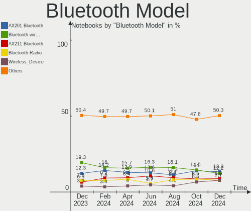
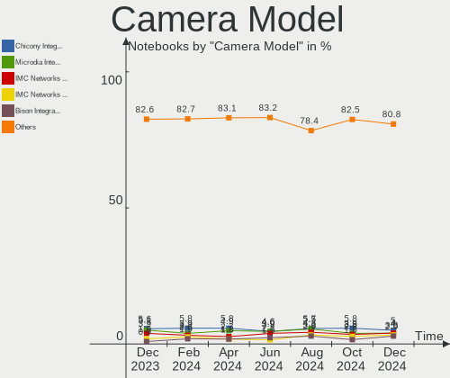

Ubuntu Hardware Trends (Notebooks)
----------------------------------

A project to identify most popular hardware characteristics and track their change
over time based on data collected by Ubuntu users at https://Linux-Hardware.org.

Anyone can contribute to this report by the [hw-probe](https://github.com/linuxhw/hw-probe) tool:

    sudo -E hw-probe -all -upload

Full-feature report is available here: https://linux-hardware.org/?view=trends

Period: Nov, 2021.

Contents
--------

* [ System ](#system)
  - [ OS                       ](#os)
  - [ OS Family                ](#os-family)
  - [ Kernel                   ](#kernel)
  - [ Kernel Family            ](#kernel-family)
  - [ Kernel Major Ver.        ](#kernel-major-ver)
  - [ Arch                     ](#arch)
  - [ DE                       ](#de)
  - [ Display Server           ](#display-server)
  - [ Display Manager          ](#display-manager)
  - [ OS Lang                  ](#os-lang)
  - [ Boot Mode                ](#boot-mode)
  - [ Filesystem               ](#filesystem)
  - [ Part. scheme             ](#part-scheme)
  - [ Dual Boot with Linux/BSD ](#dual-boot-with-linuxbsd)
  - [ Dual Boot (Win)          ](#dual-boot-win)

* [ Board ](#board)
  - [ Vendor                   ](#vendor)
  - [ Model                    ](#model)
  - [ Model Family             ](#model-family)
  - [ MFG Year                 ](#mfg-year)
  - [ Form Factor              ](#form-factor)
  - [ Secure Boot              ](#secure-boot)
  - [ Coreboot                 ](#coreboot)
  - [ RAM Size                 ](#ram-size)
  - [ RAM Used                 ](#ram-used)
  - [ Total Drives             ](#total-drives)
  - [ Has CD-ROM               ](#has-cd-rom)
  - [ Has Ethernet             ](#has-ethernet)
  - [ Has WiFi                 ](#has-wifi)
  - [ Has Bluetooth            ](#has-bluetooth)

* [ Location ](#location)
  - [ Country                  ](#country)
  - [ City                     ](#city)

* [ Drives ](#drives)
  - [ Drive Vendor             ](#drive-vendor)
  - [ Drive Model              ](#drive-model)
  - [ HDD Vendor               ](#hdd-vendor)
  - [ SSD Vendor               ](#ssd-vendor)
  - [ Drive Kind               ](#drive-kind)
  - [ Drive Connector          ](#drive-connector)
  - [ Drive Size               ](#drive-size)
  - [ Space Total              ](#space-total)
  - [ Space Used               ](#space-used)
  - [ Malfunc. Drives          ](#malfunc-drives)
  - [ Malfunc. Drive Vendor    ](#malfunc-drive-vendor)
  - [ Malfunc. HDD Vendor      ](#malfunc-hdd-vendor)
  - [ Malfunc. Drive Kind      ](#malfunc-drive-kind)
  - [ Failed Drives            ](#failed-drives)
  - [ Failed Drive Vendor      ](#failed-drive-vendor)
  - [ Drive Status             ](#drive-status)

* [ Storage controller ](#storage-controller)
  - [ Storage Vendor           ](#storage-vendor)
  - [ Storage Model            ](#storage-model)
  - [ Storage Kind             ](#storage-kind)

* [ Processor ](#processor)
  - [ CPU Vendor               ](#cpu-vendor)
  - [ CPU Model                ](#cpu-model)
  - [ CPU Model Family         ](#cpu-model-family)
  - [ CPU Cores                ](#cpu-cores)
  - [ CPU Sockets              ](#cpu-sockets)
  - [ CPU Threads              ](#cpu-threads)
  - [ CPU Op-Modes             ](#cpu-op-modes)
  - [ CPU Microcode            ](#cpu-microcode)
  - [ CPU Microarch            ](#cpu-microarch)

* [ Graphics ](#graphics)
  - [ GPU Vendor               ](#gpu-vendor)
  - [ GPU Model                ](#gpu-model)
  - [ GPU Combo                ](#gpu-combo)
  - [ GPU Driver               ](#gpu-driver)
  - [ GPU Memory               ](#gpu-memory)

* [ Monitor ](#monitor)
  - [ Monitor Vendor           ](#monitor-vendor)
  - [ Monitor Model            ](#monitor-model)
  - [ Monitor Resolution       ](#monitor-resolution)
  - [ Monitor Diagonal         ](#monitor-diagonal)
  - [ Monitor Width            ](#monitor-width)
  - [ Aspect Ratio             ](#aspect-ratio)
  - [ Monitor Area             ](#monitor-area)
  - [ Pixel Density            ](#pixel-density)
  - [ Multiple Monitors        ](#multiple-monitors)

* [ Network ](#network)
  - [ Net Controller Vendor    ](#net-controller-vendor)
  - [ Net Controller Model     ](#net-controller-model)
  - [ Wireless Vendor          ](#wireless-vendor)
  - [ Wireless Model           ](#wireless-model)
  - [ Ethernet Vendor          ](#ethernet-vendor)
  - [ Ethernet Model           ](#ethernet-model)
  - [ Net Controller Kind      ](#net-controller-kind)
  - [ Used Controller          ](#used-controller)
  - [ NICs                     ](#nics)
  - [ IPv6                     ](#ipv6)

* [ Bluetooth ](#bluetooth)
  - [ Bluetooth Vendor         ](#bluetooth-vendor)
  - [ Bluetooth Model          ](#bluetooth-model)

* [ Sound ](#sound)
  - [ Sound Vendor             ](#sound-vendor)
  - [ Sound Model              ](#sound-model)

* [ Memory ](#memory)
  - [ Memory Vendor            ](#memory-vendor)
  - [ Memory Model             ](#memory-model)
  - [ Memory Kind              ](#memory-kind)
  - [ Memory Form Factor       ](#memory-form-factor)
  - [ Memory Size              ](#memory-size)
  - [ Memory Speed             ](#memory-speed)

* [ Printers & scanners ](#printers--scanners)
  - [ Printer Vendor           ](#printer-vendor)
  - [ Printer Model            ](#printer-model)
  - [ Scanner Vendor           ](#scanner-vendor)
  - [ Scanner Model            ](#scanner-model)

* [ Camera ](#camera)
  - [ Camera Vendor            ](#camera-vendor)
  - [ Camera Model             ](#camera-model)

* [ Security ](#security)
  - [ Fingerprint Vendor       ](#fingerprint-vendor)
  - [ Fingerprint Model        ](#fingerprint-model)
  - [ Chipcard Vendor          ](#chipcard-vendor)
  - [ Chipcard Model           ](#chipcard-model)

* [ Unsupported ](#unsupported)
  - [ Unsupported Devices      ](#unsupported-devices)
  - [ Unsupported Device Types ](#unsupported-device-types)

System
------

OS
--

Installed operating systems

| Name           | Notebooks | Percent |
|----------------|-----------|---------|
| Ubuntu 20.04   | 493       | 60.42%  |
| Ubuntu 21.10   | 229       | 28.06%  |
| Ubuntu 18.04   | 44        | 5.39%   |
| Ubuntu 21.04   | 30        | 3.68%   |
| Ubuntu 16.04   | 7         | 0.86%   |
| Ubuntu 22.04   | 5         | 0.61%   |
| Ubuntu 20.10   | 5         | 0.61%   |
| Ubuntu Core 18 | 1         | 0.12%   |
| Ubuntu 19.10   | 1         | 0.12%   |
| Ubuntu 19.04   | 1         | 0.12%   |

OS Family
---------

OS without a version

| Name   | Notebooks | Percent |
|--------|-----------|---------|
| Ubuntu | 816       | 100%    |

Kernel
------

Version of the Linux kernel

| Version                   | Notebooks | Percent |
|---------------------------|-----------|---------|
| 5.11.0-40-generic         | 240       | 29.41%  |
| 5.13.0-21-generic         | 141       | 17.28%  |
| 5.11.0-38-generic         | 137       | 16.79%  |
| 5.4.0-90-generic          | 48        | 5.88%   |
| 5.13.0-20-generic         | 41        | 5.02%   |
| 5.11.0-27-generic         | 24        | 2.94%   |
| 5.4.0-89-generic          | 20        | 2.45%   |
| 5.13.0-19-generic         | 17        | 2.08%   |
| 5.13.0-22-generic         | 13        | 1.59%   |
| 5.11.0-41-generic         | 12        | 1.47%   |
| 5.11.0-37-generic         | 11        | 1.35%   |
| 4.15.0-161-generic        | 7         | 0.86%   |
| 5.10.0-1051-oem           | 6         | 0.74%   |
| 5.4.0-42-generic          | 5         | 0.61%   |
| 5.8.0-43-generic          | 4         | 0.49%   |
| 5.15.2-051502-generic     | 4         | 0.49%   |
| 4.15.0-162-generic        | 4         | 0.49%   |
| 4.15.0-142-generic        | 4         | 0.49%   |
| 5.8.0-55-generic          | 3         | 0.37%   |
| 5.4.0-91-generic          | 3         | 0.37%   |
| 5.15.4-051504-generic     | 3         | 0.37%   |
| 5.15.1-051501-generic     | 3         | 0.37%   |
| 5.13.0-1019-oem           | 3         | 0.37%   |
| 5.8.0-63-generic          | 2         | 0.25%   |
| 5.4.0-90-lowlatency       | 2         | 0.25%   |
| 5.4.0-88-generic          | 2         | 0.25%   |
| 5.4.0-84-generic          | 2         | 0.25%   |
| 5.16.0-051600rc2-generic  | 2         | 0.25%   |
| 5.15.0-051500-generic     | 2         | 0.25%   |
| 5.11.0-36-generic         | 2         | 0.25%   |
| 5.10.0-1050-oem           | 2         | 0.25%   |
| 5.8.0-63-lowlatency       | 1         | 0.12%   |
| 5.8.0-59-generic          | 1         | 0.12%   |
| 5.8.0-53-generic          | 1         | 0.12%   |
| 5.8.0-38-generic          | 1         | 0.12%   |
| 5.8.0-25-generic          | 1         | 0.12%   |
| 5.7.1-050701-generic      | 1         | 0.12%   |
| 5.4.117+                  | 1         | 0.12%   |
| 5.4.0-73-generic          | 1         | 0.12%   |
| 5.4.0-65-generic          | 1         | 0.12%   |
| 5.4.0-59-generic          | 1         | 0.12%   |
| 5.4.0-54-generic          | 1         | 0.12%   |
| 5.4.0-52-generic          | 1         | 0.12%   |
| 5.4.0-26-generic          | 1         | 0.12%   |
| 5.3.0-64-generic          | 1         | 0.12%   |
| 5.3.0-24-generic          | 1         | 0.12%   |
| 5.16.0-051600rc1-generic  | 1         | 0.12%   |
| 5.15.5-051505-generic     | 1         | 0.12%   |
| 5.15.0-5.4-liquorix-amd64 | 1         | 0.12%   |
| 5.15.0-12-generic         | 1         | 0.12%   |
| 5.15.0-11-generic         | 1         | 0.12%   |
| 5.14.6-051406-generic     | 1         | 0.12%   |
| 5.14.17-xanmod1           | 1         | 0.12%   |
| 5.14.17-051417-generic    | 1         | 0.12%   |
| 5.14.15-051415-generic    | 1         | 0.12%   |
| 5.14.13-051413-generic    | 1         | 0.12%   |
| 5.14.11-051411-generic    | 1         | 0.12%   |
| 5.14.10-051410-generic    | 1         | 0.12%   |
| 5.13.2-051302-generic     | 1         | 0.12%   |
| 5.13.0-21-lowlatency      | 1         | 0.12%   |

Kernel Family
-------------

Linux kernel without a distro release

| Version | Notebooks | Percent |
|---------|-----------|---------|
| 5.11.0  | 429       | 52.57%  |
| 5.13.0  | 218       | 26.72%  |
| 5.4.0   | 88        | 10.78%  |
| 4.15.0  | 18        | 2.21%   |
| 5.8.0   | 14        | 1.72%   |
| 5.10.0  | 10        | 1.23%   |
| 5.15.0  | 5         | 0.61%   |
| 5.15.2  | 4         | 0.49%   |
| 5.16.0  | 3         | 0.37%   |
| 5.15.4  | 3         | 0.37%   |
| 5.15.1  | 3         | 0.37%   |
| 5.3.0   | 2         | 0.25%   |
| 5.14.17 | 2         | 0.25%   |
| 4.4.0   | 2         | 0.25%   |
| 5.7.1   | 1         | 0.12%   |
| 5.4.117 | 1         | 0.12%   |
| 5.15.5  | 1         | 0.12%   |
| 5.14.6  | 1         | 0.12%   |
| 5.14.15 | 1         | 0.12%   |
| 5.14.13 | 1         | 0.12%   |
| 5.14.11 | 1         | 0.12%   |
| 5.14.10 | 1         | 0.12%   |
| 5.13.2  | 1         | 0.12%   |
| 5.12.5  | 1         | 0.12%   |
| 5.10.77 | 1         | 0.12%   |
| 5.10.67 | 1         | 0.12%   |
| 5.10.65 | 1         | 0.12%   |
| 5.0.0   | 1         | 0.12%   |
| 4.16.18 | 1         | 0.12%   |

Kernel Major Ver.
-----------------

Linux kernel major version

| Version | Notebooks | Percent |
|---------|-----------|---------|
| 5.11    | 429       | 52.57%  |
| 5.13    | 219       | 26.84%  |
| 5.4     | 89        | 10.91%  |
| 4.15    | 18        | 2.21%   |
| 5.15    | 16        | 1.96%   |
| 5.8     | 14        | 1.72%   |
| 5.10    | 13        | 1.59%   |
| 5.14    | 7         | 0.86%   |
| 5.16    | 3         | 0.37%   |
| 5.3     | 2         | 0.25%   |
| 4.4     | 2         | 0.25%   |
| 5.7     | 1         | 0.12%   |
| 5.12    | 1         | 0.12%   |
| 5.0     | 1         | 0.12%   |
| 4.16    | 1         | 0.12%   |

Arch
----

OS architecture (x86_64, i586, etc.)

| Name   | Notebooks | Percent |
|--------|-----------|---------|
| x86_64 | 810       | 99.26%  |
| i686   | 6         | 0.74%   |

DE
--

Desktop Environment

| Name            | Notebooks | Percent |
|-----------------|-----------|---------|
| GNOME           | 739       | 90.56%  |
| Unknown         | 50        | 6.13%   |
| Unity           | 12        | 1.47%   |
| GNOME Flashback | 5         | 0.61%   |
| i3              | 3         | 0.37%   |
| X-Cinnamon      | 2         | 0.25%   |
| Cinnamon        | 2         | 0.25%   |
| ICEWM           | 1         | 0.12%   |
| Enlightenment   | 1         | 0.12%   |
| awesome         | 1         | 0.12%   |

Display Server
--------------

X11 or Wayland

| Name    | Notebooks | Percent |
|---------|-----------|---------|
| X11     | 561       | 68.75%  |
| Wayland | 223       | 27.33%  |
| Unknown | 31        | 3.8%    |
| Tty     | 1         | 0.12%   |

Display Manager
---------------

SDDM, LightDM, etc.

| Name    | Notebooks | Percent |
|---------|-----------|---------|
| GDM3    | 479       | 58.7%   |
| GDM     | 265       | 32.48%  |
| Unknown | 40        | 4.9%    |
| LightDM | 28        | 3.43%   |
| SDDM    | 4         | 0.49%   |

OS Lang
-------

Language

| Lang    | Notebooks | Percent |
|---------|-----------|---------|
| en_US   | 352       | 43.14%  |
| de_DE   | 80        | 9.8%    |
| fr_FR   | 65        | 7.97%   |
| en_GB   | 40        | 4.9%    |
| en_IN   | 34        | 4.17%   |
| it_IT   | 24        | 2.94%   |
| pt_BR   | 22        | 2.7%    |
| ru_RU   | 17        | 2.08%   |
| en_CA   | 16        | 1.96%   |
| es_ES   | 15        | 1.84%   |
| en_AU   | 14        | 1.72%   |
| nl_NL   | 13        | 1.59%   |
| cs_CZ   | 10        | 1.23%   |
| Unknown | 10        | 1.23%   |
| hu_HU   | 8         | 0.98%   |
| zh_CN   | 6         | 0.74%   |
| tr_TR   | 6         | 0.74%   |
| en_ZA   | 6         | 0.74%   |
| pt_PT   | 5         | 0.61%   |
| pl_PL   | 5         | 0.61%   |
| es_MX   | 5         | 0.61%   |
| C       | 5         | 0.61%   |
| sv_SE   | 4         | 0.49%   |
| es_AR   | 4         | 0.49%   |
| de_AT   | 4         | 0.49%   |
| fr_CA   | 3         | 0.37%   |
| fi_FI   | 3         | 0.37%   |
| en_IL   | 3         | 0.37%   |
| bg_BG   | 3         | 0.37%   |
| nb_NO   | 2         | 0.25%   |
| lt_LT   | 2         | 0.25%   |
| ja_JP   | 2         | 0.25%   |
| es_CO   | 2         | 0.25%   |
| es_CL   | 2         | 0.25%   |
| en_PH   | 2         | 0.25%   |
| en_NZ   | 2         | 0.25%   |
| en_IE   | 2         | 0.25%   |
| en_HK   | 2         | 0.25%   |
| zh_TW   | 1         | 0.12%   |
| uk_UA   | 1         | 0.12%   |
| sl_SI   | 1         | 0.12%   |
| sk_SK   | 1         | 0.12%   |
| ru_UA   | 1         | 0.12%   |
| ro_RO   | 1         | 0.12%   |
| nl_BE   | 1         | 0.12%   |
| my_MM   | 1         | 0.12%   |
| ko_KR   | 1         | 0.12%   |
| hr_HR   | 1         | 0.12%   |
| es_VE   | 1         | 0.12%   |
| es_DO   | 1         | 0.12%   |
| en_ZW   | 1         | 0.12%   |
| en_NG   | 1         | 0.12%   |
| de_IT   | 1         | 0.12%   |
| ar_EG   | 1         | 0.12%   |

Boot Mode
---------

EFI or BIOS

| Mode | Notebooks | Percent |
|------|-----------|---------|
| EFI  | 429       | 52.57%  |
| BIOS | 387       | 47.43%  |

Filesystem
----------

Type of filesystem

| Type    | Notebooks | Percent |
|---------|-----------|---------|
| Ext4    | 772       | 94.61%  |
| Overlay | 20        | 2.45%   |
| Zfs     | 11        | 1.35%   |
| Btrfs   | 10        | 1.23%   |
| Ext3    | 3         | 0.37%   |

Part. scheme
------------

Scheme of partitioning

| Type    | Notebooks | Percent |
|---------|-----------|---------|
| Unknown | 528       | 64.71%  |
| GPT     | 241       | 29.53%  |
| MBR     | 47        | 5.76%   |

Dual Boot with Linux/BSD
------------------------

Hosting more than one Linux/BSD

| Dual boot | Notebooks | Percent |
|-----------|-----------|---------|
| No        | 749       | 91.79%  |
| Yes       | 67        | 8.21%   |

Dual Boot (Win)
---------------

Hosting Linux and Windows

| Dual boot | Notebooks | Percent |
|-----------|-----------|---------|
| No        | 533       | 65.32%  |
| Yes       | 283       | 34.68%  |

Board
-----

Vendor
------

Motherboard manufacturer

| Name                                         | Notebooks | Percent |
|----------------------------------------------|-----------|---------|
| Hewlett-Packard                              | 172       | 21.08%  |
| Lenovo                                       | 171       | 20.96%  |
| Dell                                         | 167       | 20.47%  |
| ASUSTek Computer                             | 80        | 9.8%    |
| Acer                                         | 57        | 6.99%   |
| Toshiba                                      | 23        | 2.82%   |
| Apple                                        | 19        | 2.33%   |
| Samsung Electronics                          | 12        | 1.47%   |
| Timi                                         | 11        | 1.35%   |
| Packard Bell                                 | 10        | 1.23%   |
| HUAWEI                                       | 10        | 1.23%   |
| Notebook                                     | 9         | 1.1%    |
| Sony                                         | 7         | 0.86%   |
| MSI                                          | 7         | 0.86%   |
| Medion                                       | 7         | 0.86%   |
| Fujitsu                                      | 6         | 0.74%   |
| Unknown                                      | 5         | 0.61%   |
| Google                                       | 3         | 0.37%   |
| System76                                     | 2         | 0.25%   |
| Razer                                        | 2         | 0.25%   |
| Positivo                                     | 2         | 0.25%   |
| PC Specialist                                | 2         | 0.25%   |
| LG Electronics                               | 2         | 0.25%   |
| Jumper                                       | 2         | 0.25%   |
| GPU Company                                  | 2         | 0.25%   |
| Gigabyte Technology                          | 2         | 0.25%   |
| Alienware                                    | 2         | 0.25%   |
| win element                                  | 1         | 0.12%   |
| TUXEDO                                       | 1         | 0.12%   |
| TrekStor                                     | 1         | 0.12%   |
| SLIMBOOK                                     | 1         | 0.12%   |
| Panasonic                                    | 1         | 0.12%   |
| MOTILE                                       | 1         | 0.12%   |
| Mediacom                                     | 1         | 0.12%   |
| Maibenben                                    | 1         | 0.12%   |
| LattePanda                                   | 1         | 0.12%   |
| Jemper                                       | 1         | 0.12%   |
| I-Life Digital Technologies                  | 1         | 0.12%   |
| Haier                                        | 1         | 0.12%   |
| Fujitsu Siemens                              | 1         | 0.12%   |
| Framework                                    | 1         | 0.12%   |
| Exo                                          | 1         | 0.12%   |
| eMachines                                    | 1         | 0.12%   |
| Datto                                        | 1         | 0.12%   |
| Coconics Private Limited                     | 1         | 0.12%   |
| CHUWI Innovation And Technology(ShenZhen)c0. | 1         | 0.12%   |
| Avell High Performance                       | 1         | 0.12%   |
| AMI                                          | 1         | 0.12%   |
| Allview                                      | 1         | 0.12%   |

Model
-----

Motherboard model

| Name                                 | Notebooks | Percent |
|--------------------------------------|-----------|---------|
| Unknown                              | 10        | 1.23%   |
| HP Notebook                          | 6         | 0.74%   |
| Dell Latitude 5520                   | 6         | 0.74%   |
| HP Pavilion Notebook                 | 5         | 0.61%   |
| HP 15                                | 5         | 0.61%   |
| Dell XPS 15 9500                     | 5         | 0.61%   |
| HP Pavilion Laptop 15-eg0xxx         | 4         | 0.49%   |
| HP Pavilion g6                       | 4         | 0.49%   |
| HP Pavilion dv6                      | 4         | 0.49%   |
| HP Laptop 14-fq1xxx                  | 4         | 0.49%   |
| Dell XPS 15 9510                     | 4         | 0.49%   |
| Dell XPS 13 9310                     | 4         | 0.49%   |
| Dell Inspiron 5570                   | 4         | 0.49%   |
| Dell Inspiron 15-3567                | 4         | 0.49%   |
| Acer Swift SF314-42                  | 4         | 0.49%   |
| Timi RedmiBook 16                    | 3         | 0.37%   |
| Lenovo IdeaPad 3 14ITL6 82H7         | 3         | 0.37%   |
| HP Pavilion Aero Laptop 13-be0xxx    | 3         | 0.37%   |
| HP EliteBook 850 G8 Notebook PC      | 3         | 0.37%   |
| HP EliteBook 8460p                   | 3         | 0.37%   |
| Dell XPS 15 9570                     | 3         | 0.37%   |
| Dell Vostro 3500                     | 3         | 0.37%   |
| Dell Latitude E7240                  | 3         | 0.37%   |
| Dell Latitude E6410                  | 3         | 0.37%   |
| Dell Latitude 7420                   | 3         | 0.37%   |
| Dell Inspiron 1545                   | 3         | 0.37%   |
| Toshiba Satellite L50-B              | 2         | 0.25%   |
| Timi TM1701                          | 2         | 0.25%   |
| Timi A35S                            | 2         | 0.25%   |
| System76 Gazelle                     | 2         | 0.25%   |
| Lenovo Z50-70 20354                  | 2         | 0.25%   |
| Lenovo ThinkPad E15 Gen 2 20TD0005GE | 2         | 0.25%   |
| Lenovo ThinkBook 15-IML 20RW         | 2         | 0.25%   |
| Lenovo Legion Y530-15ICH 81FV        | 2         | 0.25%   |
| Lenovo Legion 5 15ACH6H 82JU         | 2         | 0.25%   |
| Lenovo IdeaPad S145-15IIL 81W8       | 2         | 0.25%   |
| Lenovo IdeaPad 5 14ARE05 81YM        | 2         | 0.25%   |
| Lenovo IdeaPad 330S-14IKB 81F4       | 2         | 0.25%   |
| Lenovo IdeaPad 3 15ITL6 82H8         | 2         | 0.25%   |
| Lenovo G505s 20255                   | 2         | 0.25%   |
| Lenovo G500 20236                    | 2         | 0.25%   |
| Jumper EZbook                        | 2         | 0.25%   |
| HUAWEI KLVL-WXX9                     | 2         | 0.25%   |
| HUAWEI KLVD-WXX9                     | 2         | 0.25%   |
| HUAWEI HVY-WXX9                      | 2         | 0.25%   |
| HP ProBook 650 G1                    | 2         | 0.25%   |
| HP ProBook 4540s                     | 2         | 0.25%   |
| HP ProBook 450 G8 Notebook PC        | 2         | 0.25%   |
| HP ProBook 445 G7                    | 2         | 0.25%   |
| HP ProBook 440 G4                    | 2         | 0.25%   |
| HP Pavilion Gaming Laptop 15-ec2xxx  | 2         | 0.25%   |
| HP Pavilion dv5                      | 2         | 0.25%   |
| HP Pavilion 15                       | 2         | 0.25%   |
| HP Laptop 15-db1xxx                  | 2         | 0.25%   |
| HP Laptop 15-bs0xx                   | 2         | 0.25%   |
| HP G62                               | 2         | 0.25%   |
| HP EliteBook 840 G5                  | 2         | 0.25%   |
| HP EliteBook 840 G3                  | 2         | 0.25%   |
| HP EliteBook 840 G2                  | 2         | 0.25%   |
| Dell XPS 13 9360                     | 2         | 0.25%   |

Model Family
------------

Motherboard model prefix

| Name                  | Notebooks | Percent |
|-----------------------|-----------|---------|
| Lenovo ThinkPad       | 78        | 9.56%   |
| Dell Latitude         | 59        | 7.23%   |
| Dell Inspiron         | 47        | 5.76%   |
| Lenovo IdeaPad        | 41        | 5.02%   |
| HP Pavilion           | 40        | 4.9%    |
| Acer Aspire           | 37        | 4.53%   |
| HP ProBook            | 35        | 4.29%   |
| HP EliteBook          | 31        | 3.8%    |
| Dell XPS              | 28        | 3.43%   |
| HP Laptop             | 23        | 2.82%   |
| Toshiba Satellite     | 20        | 2.45%   |
| Dell Precision        | 13        | 1.59%   |
| Acer Swift            | 12        | 1.47%   |
| ASUS VivoBook         | 11        | 1.35%   |
| Lenovo Legion         | 10        | 1.23%   |
| Dell Vostro           | 10        | 1.23%   |
| Unknown               | 10        | 1.23%   |
| Packard Bell EasyNote | 9         | 1.1%    |
| ASUS TUF              | 8         | 0.98%   |
| Lenovo ThinkBook      | 7         | 0.86%   |
| HP ZBook              | 6         | 0.74%   |
| HP Notebook           | 6         | 0.74%   |
| Fujitsu LIFEBOOK      | 6         | 0.74%   |
| ASUS ROG              | 6         | 0.74%   |
| HP 15                 | 5         | 0.61%   |
| Timi RedmiBook        | 4         | 0.49%   |
| HP Stream             | 4         | 0.49%   |
| HP ENVY               | 4         | 0.49%   |
| Acer Nitro            | 4         | 0.49%   |
| Lenovo Yoga           | 3         | 0.37%   |
| Dell System           | 3         | 0.37%   |
| Dell G3               | 3         | 0.37%   |
| Apple MacBookPro8     | 3         | 0.37%   |
| Apple MacBookPro5     | 3         | 0.37%   |
| Timi TM1701           | 2         | 0.25%   |
| Timi A35S             | 2         | 0.25%   |
| System76 Gazelle      | 2         | 0.25%   |
| Razer Blade           | 2         | 0.25%   |
| Medion Akoya          | 2         | 0.25%   |
| Lenovo Z50-70         | 2         | 0.25%   |
| Lenovo G780           | 2         | 0.25%   |
| Lenovo G505s          | 2         | 0.25%   |
| Lenovo G500           | 2         | 0.25%   |
| Jumper EZbook         | 2         | 0.25%   |
| HUAWEI KLVL-WXX9      | 2         | 0.25%   |
| HUAWEI KLVD-WXX9      | 2         | 0.25%   |
| HUAWEI HVY-WXX9       | 2         | 0.25%   |
| HP G62                | 2         | 0.25%   |
| HP Compaq             | 2         | 0.25%   |
| Dell G15              | 2         | 0.25%   |
| ASUS ZenBook          | 2         | 0.25%   |
| ASUS UX303LAB         | 2         | 0.25%   |
| ASUS K501UQ           | 2         | 0.25%   |
| ASUS ASUS             | 2         | 0.25%   |
| Apple MacBookPro9     | 2         | 0.25%   |
| Apple MacBook4        | 2         | 0.25%   |
| Acer TravelMate       | 2         | 0.25%   |
| Acer Extensa          | 2         | 0.25%   |
| win element MoreFine  | 1         | 0.12%   |
| TUXEDO P65xRP         | 1         | 0.12%   |

MFG Year
--------

Motherboard manufacture year

| Year    | Notebooks | Percent |
|---------|-----------|---------|
| 2021    | 228       | 27.94%  |
| 2020    | 99        | 12.13%  |
| 2019    | 71        | 8.7%    |
| 2012    | 50        | 6.13%   |
| 2018    | 48        | 5.88%   |
| 2014    | 46        | 5.64%   |
| 2015    | 43        | 5.27%   |
| 2013    | 43        | 5.27%   |
| 2017    | 38        | 4.66%   |
| 2011    | 38        | 4.66%   |
| 2016    | 32        | 3.92%   |
| 2010    | 30        | 3.68%   |
| 2009    | 26        | 3.19%   |
| 2008    | 18        | 2.21%   |
| 2007    | 4         | 0.49%   |
| 2006    | 1         | 0.12%   |
| Unknown | 1         | 0.12%   |

Form Factor
-----------

Physical design of the computer

| Name     | Notebooks | Percent |
|----------|-----------|---------|
| Notebook | 816       | 100%    |

Secure Boot
-----------

Enabled or disabled

| State    | Notebooks | Percent |
|----------|-----------|---------|
| Disabled | 681       | 83.46%  |
| Enabled  | 135       | 16.54%  |

Coreboot
--------

Have coreboot on board

| Used | Notebooks | Percent |
|------|-----------|---------|
| No   | 812       | 99.51%  |
| Yes  | 4         | 0.49%   |

RAM Size
--------

Total RAM memory

| Size in GB  | Notebooks | Percent |
|-------------|-----------|---------|
| 4.01-8.0    | 241       | 29.53%  |
| 3.01-4.0    | 164       | 20.1%   |
| 16.01-24.0  | 159       | 19.49%  |
| 8.01-16.0   | 135       | 16.54%  |
| 32.01-64.0  | 58        | 7.11%   |
| 1.01-2.0    | 23        | 2.82%   |
| 2.01-3.0    | 13        | 1.59%   |
| 64.01-256.0 | 12        | 1.47%   |
| 24.01-32.0  | 9         | 1.1%    |
| 0.51-1.0    | 2         | 0.25%   |

RAM Used
--------

Used RAM memory

| Used GB    | Notebooks | Percent |
|------------|-----------|---------|
| 1.01-2.0   | 318       | 38.97%  |
| 2.01-3.0   | 245       | 30.02%  |
| 4.01-8.0   | 102       | 12.5%   |
| 3.01-4.0   | 91        | 11.15%  |
| 8.01-16.0  | 38        | 4.66%   |
| 0.51-1.0   | 18        | 2.21%   |
| 16.01-24.0 | 2         | 0.25%   |
| 0.01-0.5   | 2         | 0.25%   |

Total Drives
------------

Number of drives on board

| Drives | Notebooks | Percent |
|--------|-----------|---------|
| 1      | 626       | 76.72%  |
| 2      | 164       | 20.1%   |
| 3      | 17        | 2.08%   |
| 0      | 8         | 0.98%   |
| 4      | 1         | 0.12%   |

Has CD-ROM
----------

Has CD-ROM on board

| Presented | Notebooks | Percent |
|-----------|-----------|---------|
| No        | 515       | 63.11%  |
| Yes       | 301       | 36.89%  |

Has Ethernet
------------

Has Ethernet on board

| Presented | Notebooks | Percent |
|-----------|-----------|---------|
| Yes       | 644       | 78.92%  |
| No        | 172       | 21.08%  |

Has WiFi
--------

Has WiFi module

| Presented | Notebooks | Percent |
|-----------|-----------|---------|
| Yes       | 804       | 98.53%  |
| No        | 12        | 1.47%   |

Has Bluetooth
-------------

Has Bluetooth module

| Presented | Notebooks | Percent |
|-----------|-----------|---------|
| Yes       | 632       | 77.45%  |
| No        | 184       | 22.55%  |

Location
--------

Country
-------

Geographic location (country)

| Country      | Notebooks | Percent |
|--------------|-----------|---------|
| USA          | 109       | 13.36%  |
| Germany      | 104       | 12.75%  |
| France       | 79        | 9.68%   |
| Italy        | 39        | 4.78%   |
| India        | 38        | 4.66%   |
| Russia       | 33        | 4.04%   |
| UK           | 30        | 3.68%   |
| Netherlands  | 25        | 3.06%   |
| Brazil       | 25        | 3.06%   |
| Canada       | 20        | 2.45%   |
| Ukraine      | 18        | 2.21%   |
| Spain        | 15        | 1.84%   |
| Australia    | 15        | 1.84%   |
| Czechia      | 14        | 1.72%   |
| Poland       | 12        | 1.47%   |
| Portugal     | 11        | 1.35%   |
| Hungary      | 10        | 1.23%   |
| Switzerland  | 9         | 1.1%    |
| Austria      | 9         | 1.1%    |
| Turkey       | 8         | 0.98%   |
| Romania      | 8         | 0.98%   |
| Mexico       | 8         | 0.98%   |
| Croatia      | 8         | 0.98%   |
| Sweden       | 7         | 0.86%   |
| South Africa | 7         | 0.86%   |
| Indonesia    | 7         | 0.86%   |
| Vietnam      | 6         | 0.74%   |
| Pakistan     | 6         | 0.74%   |
| Japan        | 6         | 0.74%   |
| Finland      | 6         | 0.74%   |
| Belgium      | 6         | 0.74%   |
| Argentina    | 6         | 0.74%   |
| Bulgaria     | 5         | 0.61%   |
| Slovakia     | 4         | 0.49%   |
| Norway       | 4         | 0.49%   |
| Israel       | 4         | 0.49%   |
| Denmark      | 4         | 0.49%   |
| Colombia     | 4         | 0.49%   |
| China        | 4         | 0.49%   |
| Chile        | 4         | 0.49%   |
| Uzbekistan   | 3         | 0.37%   |
| UAE          | 3         | 0.37%   |
| Tunisia      | 3         | 0.37%   |
| Slovenia     | 3         | 0.37%   |
| Saudi Arabia | 3         | 0.37%   |
| New Zealand  | 3         | 0.37%   |
| Morocco      | 3         | 0.37%   |
| Hong Kong    | 3         | 0.37%   |
| Greece       | 3         | 0.37%   |
| Bangladesh   | 3         | 0.37%   |
| Thailand     | 2         | 0.25%   |
| Taiwan       | 2         | 0.25%   |
| Serbia       | 2         | 0.25%   |
| Philippines  | 2         | 0.25%   |
| Lithuania    | 2         | 0.25%   |
| Kenya        | 2         | 0.25%   |
| Ireland      | 2         | 0.25%   |
| Iran         | 2         | 0.25%   |
| Guadeloupe   | 2         | 0.25%   |
| El Salvador  | 2         | 0.25%   |

City
----

Geographic location (city)

| City             | Notebooks | Percent |
|------------------|-----------|---------|
| Berlin           | 15        | 1.84%   |
| Paris            | 11        | 1.35%   |
| Moscow           | 11        | 1.35%   |
| Bengaluru        | 8         | 0.98%   |
| Prague           | 7         | 0.86%   |
| Madrid           | 7         | 0.86%   |
| Chennai          | 7         | 0.86%   |
| Zagreb           | 6         | 0.74%   |
| Kyiv             | 6         | 0.74%   |
| Brisbane         | 6         | 0.74%   |
| Vienna           | 5         | 0.61%   |
| Rome             | 5         | 0.61%   |
| Lyon             | 5         | 0.61%   |
| Istanbul         | 5         | 0.61%   |
| Amsterdam        | 5         | 0.61%   |
| St Petersburg    | 4         | 0.49%   |
| Munich           | 4         | 0.49%   |
| Milan            | 4         | 0.49%   |
| Houston          | 4         | 0.49%   |
| Hamburg          | 4         | 0.49%   |
| Bucharest        | 4         | 0.49%   |
| Bras?­lia        | 4         | 0.49%   |
| Tel Aviv         | 3         | 0.37%   |
| Tashkent         | 3         | 0.37%   |
| Sofia            | 3         | 0.37%   |
| Santiago         | 3         | 0.37%   |
| Porto Alegre     | 3         | 0.37%   |
| New Delhi        | 3         | 0.37%   |
| Monheim am Rhein | 3         | 0.37%   |
| Mexico City      | 3         | 0.37%   |
| London           | 3         | 0.37%   |
| Lisbon           | 3         | 0.37%   |
| Leipzig          | 3         | 0.37%   |
| Lahore           | 3         | 0.37%   |
| Krasnodar        | 3         | 0.37%   |
| Helsinki         | 3         | 0.37%   |
| Hanoi            | 3         | 0.37%   |
| Dhaka            | 3         | 0.37%   |
| D??sseldorf      | 3         | 0.37%   |
| Buenos Aires     | 3         | 0.37%   |
| Budapest         | 3         | 0.37%   |
| Brescia          | 3         | 0.37%   |
| Braunschweig     | 3         | 0.37%   |
| Bratislava       | 3         | 0.37%   |
| Athens           | 3         | 0.37%   |
| Wellington       | 2         | 0.25%   |
| Warsaw           | 2         | 0.25%   |
| Turin            | 2         | 0.25%   |
| The Hague        | 2         | 0.25%   |
| Szczecin         | 2         | 0.25%   |
| Sydney           | 2         | 0.25%   |
| Stuttgart        | 2         | 0.25%   |
| Springfield      | 2         | 0.25%   |
| Spokane          | 2         | 0.25%   |
| Seattle          | 2         | 0.25%   |
| San Antonio      | 2         | 0.25%   |
| Samara           | 2         | 0.25%   |
| Saint Paul       | 2         | 0.25%   |
| Saarbr??cken     | 2         | 0.25%   |
| Qu?©bec          | 2         | 0.25%   |

Drives
------

Drive Vendor
------------

Hard drive vendors

| Vendor                         | Notebooks | Drives | Percent |
|--------------------------------|-----------|--------|---------|
| Samsung Electronics            | 178       | 188    | 18.54%  |
| Seagate                        | 123       | 126    | 12.81%  |
| WDC                            | 119       | 121    | 12.4%   |
| Toshiba                        | 73        | 73     | 7.6%    |
| SanDisk                        | 56        | 57     | 5.83%   |
| SK Hynix                       | 48        | 48     | 5%      |
| Kingston                       | 45        | 46     | 4.69%   |
| Unknown                        | 38        | 42     | 3.96%   |
| Intel                          | 35        | 41     | 3.65%   |
| Micron Technology              | 32        | 32     | 3.33%   |
| Crucial                        | 27        | 27     | 2.81%   |
| HGST                           | 21        | 21     | 2.19%   |
| Hitachi                        | 20        | 20     | 2.08%   |
| KIOXIA                         | 19        | 19     | 1.98%   |
| A-DATA Technology              | 12        | 13     | 1.25%   |
| LITEON                         | 9         | 9      | 0.94%   |
| Apple                          | 8         | 11     | 0.83%   |
| Intenso                        | 6         | 6      | 0.63%   |
| Fujitsu                        | 6         | 6      | 0.63%   |
| Phison                         | 5         | 6      | 0.52%   |
| Patriot                        | 5         | 5      | 0.52%   |
| SPCC                           | 3         | 3      | 0.31%   |
| PNY                            | 3         | 3      | 0.31%   |
| China                          | 3         | 3      | 0.31%   |
| YMTC                           | 2         | 2      | 0.21%   |
| Yangtze Memory Technologies    | 2         | 2      | 0.21%   |
| Transcend                      | 2         | 2      | 0.21%   |
| Solid State Storage Technology | 2         | 2      | 0.21%   |
| Silicon Motion                 | 2         | 2      | 0.21%   |
| SABRENT                        | 2         | 2      | 0.21%   |
| OCZ                            | 2         | 2      | 0.21%   |
| Netac                          | 2         | 2      | 0.21%   |
| Micron/Crucial Technology      | 2         | 2      | 0.21%   |
| LITEONIT                       | 2         | 2      | 0.21%   |
| LDLC                           | 2         | 2      | 0.21%   |
| KingSpec                       | 2         | 2      | 0.21%   |
| KingFast                       | 2         | 2      | 0.21%   |
| Hewlett-Packard                | 2         | 2      | 0.21%   |
| BHT                            | 2         | 2      | 0.21%   |
| Unknown                        | 2         | 2      | 0.21%   |
| W800S                          | 1         | 1      | 0.1%    |
| USB3.0                         | 1         | 1      | 0.1%    |
| Union Memory (Shenzhen)        | 1         | 1      | 0.1%    |
| UMIS                           | 1         | 1      | 0.1%    |
| TAMMUZ                         | 1         | 1      | 0.1%    |
| SSSTC                          | 1         | 1      | 0.1%    |
| ShanDianZhe                    | 1         | 1      | 0.1%    |
| Realtek Semiconductor          | 1         | 1      | 0.1%    |
| Realtek                        | 1         | 1      | 0.1%    |
| RCESSD                         | 1         | 1      | 0.1%    |
| PNY CS90                       | 1         | 1      | 0.1%    |
| PLEXTOR                        | 1         | 1      | 0.1%    |
| PHD 3.0                        | 1         | 1      | 0.1%    |
| OSCOO                          | 1         | 1      | 0.1%    |
| MicroDream                     | 1         | 1      | 0.1%    |
| Lenovo                         | 1         | 1      | 0.1%    |
| KIOXIA-EXCERIA                 | 1         | 1      | 0.1%    |
| KINGSTONG                      | 1         | 1      | 0.1%    |
| KINGBANK                       | 1         | 1      | 0.1%    |
| JMicron                        | 1         | 1      | 0.1%    |

Drive Model
-----------

Hard drive models

| Model                                 | Notebooks | Percent |
|---------------------------------------|-----------|---------|
| Samsung NVMe SSD Drive 512GB          | 20        | 2.03%   |
| Seagate ST1000LM035-1RK172 1TB        | 16        | 1.62%   |
| Seagate ST1000LM024 HN-M101MBB 1TB    | 16        | 1.62%   |
| Sandisk NVMe SSD Drive 512GB          | 10        | 1.01%   |
| Toshiba MQ04ABF100 1TB                | 9         | 0.91%   |
| Sandisk NVMe SSD Drive 256GB          | 9         | 0.91%   |
| Samsung NVMe SSD Drive 256GB          | 9         | 0.91%   |
| Intel NVMe SSD Drive 512GB            | 8         | 0.81%   |
| HGST HTS541010A9E680 1TB              | 8         | 0.81%   |
| WDC WDS500G2B0A-00SM50 500GB SSD      | 7         | 0.71%   |
| Unknown MMC Card  64GB                | 7         | 0.71%   |
| Unknown MMC Card  32GB                | 7         | 0.71%   |
| Toshiba MQ01ABF050 500GB              | 7         | 0.71%   |
| Toshiba MQ01ABD100 1TB                | 7         | 0.71%   |
| Seagate ST9500325AS 500GB             | 7         | 0.71%   |
| Seagate ST500LT012-1DG142 500GB       | 7         | 0.71%   |
| Seagate ST2000LM007-1R8174 2TB        | 7         | 0.71%   |
| Kingston SA400S37240G 240GB SSD       | 7         | 0.71%   |
| SK Hynix NVMe SSD Drive 256GB         | 6         | 0.61%   |
| SK Hynix NVMe SSD Drive 1024GB        | 6         | 0.61%   |
| Seagate ST1000LM048-2E7172 1TB        | 6         | 0.61%   |
| Sandisk NVMe SSD Drive 1024GB         | 6         | 0.61%   |
| Samsung SSD 850 EVO 250GB             | 6         | 0.61%   |
| Micron NVMe SSD Drive 512GB           | 6         | 0.61%   |
| WDC WDS240G2G0A-00JH30 240GB SSD      | 5         | 0.51%   |
| Toshiba NVMe SSD Drive 512GB          | 5         | 0.51%   |
| SK Hynix PC711 NVMe 1TB               | 5         | 0.51%   |
| Seagate ST9320423AS 320GB             | 5         | 0.51%   |
| Seagate ST2000LM015-2E8174 2TB        | 5         | 0.51%   |
| Samsung SSD 860 EVO 250GB             | 5         | 0.51%   |
| Crucial CT500MX500SSD1 500GB          | 5         | 0.51%   |
| WDC WD5000LPVX-22V0TT0 500GB          | 4         | 0.41%   |
| WDC WD10SPZX-08Z10 1TB                | 4         | 0.41%   |
| Unknown MMC Card  128GB               | 4         | 0.41%   |
| Toshiba NVMe SSD Drive 256GB          | 4         | 0.41%   |
| SK Hynix BC711 NVMe 512GB             | 4         | 0.41%   |
| Seagate ST9320325AS 320GB             | 4         | 0.41%   |
| SanDisk SD8SN8U-256G-1006 256GB SSD   | 4         | 0.41%   |
| Samsung SSD 860 EVO 500GB             | 4         | 0.41%   |
| Samsung NVMe SSD Drive 1TB            | 4         | 0.41%   |
| Samsung MZVLB512HBJQ-000L7 512GB      | 4         | 0.41%   |
| KIOXIA NVMe SSD Drive 512GB           | 4         | 0.41%   |
| KIOXIA KBG40ZNV256G 256GB             | 4         | 0.41%   |
| Kingston SA2000M81000G 1TB            | 4         | 0.41%   |
| Intel SSDPEKNW512G8 512GB             | 4         | 0.41%   |
| HGST HTS721010A9E630 1TB              | 4         | 0.41%   |
| HGST HTS545050A7E380 500GB            | 4         | 0.41%   |
| WDC WD3200BPVT-00ZEST0 320GB          | 3         | 0.3%    |
| WDC WD10SPZX-60Z10T0 1TB              | 3         | 0.3%    |
| WDC WD10SPZX-21Z10T0 1TB              | 3         | 0.3%    |
| WDC WD10SPCX-24HWST1 1TB              | 3         | 0.3%    |
| WDC WD10JPVX-22JC3T0 1TB              | 3         | 0.3%    |
| Unknown MMC Card  8GB                 | 3         | 0.3%    |
| Unknown MMC Card  7GB                 | 3         | 0.3%    |
| Toshiba MQ01ABD075 752GB              | 3         | 0.3%    |
| SK Hynix HFS256G39TND-N210A 256GB SSD | 3         | 0.3%    |
| SK Hynix HFM512GDJTNI-82A0A 512GB     | 3         | 0.3%    |
| Seagate Expansion 1TB                 | 3         | 0.3%    |
| Seagate BUP Slim 1TB                  | 3         | 0.3%    |
| Sandisk NVMe SSD Drive 1TB            | 3         | 0.3%    |

HDD Vendor
----------

Hard disk drive vendors

| Vendor              | Notebooks | Drives | Percent |
|---------------------|-----------|--------|---------|
| Seagate             | 121       | 124    | 38.78%  |
| WDC                 | 72        | 73     | 23.08%  |
| Toshiba             | 56        | 56     | 17.95%  |
| HGST                | 21        | 21     | 6.73%   |
| Hitachi             | 20        | 20     | 6.41%   |
| Samsung Electronics | 8         | 8      | 2.56%   |
| Fujitsu             | 6         | 6      | 1.92%   |
| Unknown             | 2         | 2      | 0.64%   |
| Intenso             | 2         | 2      | 0.64%   |
| USB3.0              | 1         | 1      | 0.32%   |
| PHD 3.0             | 1         | 1      | 0.32%   |
| External            | 1         | 1      | 0.32%   |
| ASMT                | 1         | 1      | 0.32%   |

SSD Vendor
----------

Solid state drive vendors

| Vendor              | Notebooks | Drives | Percent |
|---------------------|-----------|--------|---------|
| Samsung Electronics | 71        | 73     | 26.49%  |
| Kingston            | 29        | 30     | 10.82%  |
| Crucial             | 26        | 26     | 9.7%    |
| SanDisk             | 24        | 25     | 8.96%   |
| WDC                 | 22        | 23     | 8.21%   |
| Micron Technology   | 10        | 10     | 3.73%   |
| LITEON              | 8         | 8      | 2.99%   |
| Intel               | 8         | 9      | 2.99%   |
| A-DATA Technology   | 8         | 8      | 2.99%   |
| SK Hynix            | 6         | 6      | 2.24%   |
| Patriot             | 5         | 5      | 1.87%   |
| Intenso             | 4         | 4      | 1.49%   |
| Apple               | 4         | 4      | 1.49%   |
| SPCC                | 3         | 3      | 1.12%   |
| PNY                 | 3         | 3      | 1.12%   |
| China               | 3         | 3      | 1.12%   |
| Transcend           | 2         | 2      | 0.75%   |
| OCZ                 | 2         | 2      | 0.75%   |
| LITEONIT            | 2         | 2      | 0.75%   |
| LDLC                | 2         | 2      | 0.75%   |
| KingSpec            | 2         | 2      | 0.75%   |
| Hewlett-Packard     | 2         | 2      | 0.75%   |
| BHT                 | 2         | 2      | 0.75%   |
| W800S               | 1         | 1      | 0.37%   |
| TAMMUZ              | 1         | 1      | 0.37%   |
| RCESSD              | 1         | 1      | 0.37%   |
| PNY CS90            | 1         | 1      | 0.37%   |
| PLEXTOR             | 1         | 1      | 0.37%   |
| OSCOO               | 1         | 1      | 0.37%   |
| Netac               | 1         | 1      | 0.37%   |
| MicroDream          | 1         | 1      | 0.37%   |
| KIOXIA-EXCERIA      | 1         | 1      | 0.37%   |
| KINGSTONG           | 1         | 1      | 0.37%   |
| KingFast            | 1         | 1      | 0.37%   |
| JMicron             | 1         | 1      | 0.37%   |
| INDMEM              | 1         | 1      | 0.37%   |
| Freecom             | 1         | 1      | 0.37%   |
| FORESEE             | 1         | 1      | 0.37%   |
| Emtec               | 1         | 1      | 0.37%   |
| DRVEO               | 1         | 1      | 0.37%   |
| DREVO               | 1         | 1      | 0.37%   |
| ASUS-PHISON         | 1         | 2      | 0.37%   |
| AMD                 | 1         | 1      | 0.37%   |

Drive Kind
----------

HDD or SSD

| Kind    | Notebooks | Drives | Percent |
|---------|-----------|--------|---------|
| NVMe    | 315       | 350    | 34.35%  |
| HDD     | 301       | 316    | 32.82%  |
| SSD     | 252       | 275    | 27.48%  |
| MMC     | 39        | 42     | 4.25%   |
| Unknown | 10        | 10     | 1.09%   |

Drive Connector
---------------

SATA, SAS, NVMe, etc.

| Type | Notebooks | Drives | Percent |
|------|-----------|--------|---------|
| SATA | 509       | 572    | 57.06%  |
| NVMe | 314       | 347    | 35.2%   |
| MMC  | 39        | 42     | 4.37%   |
| SAS  | 30        | 32     | 3.36%   |

Drive Size
----------

Size of hard drive

| Size in TB | Notebooks | Drives | Percent |
|------------|-----------|--------|---------|
| 0.01-0.5   | 358       | 385    | 64.74%  |
| 0.51-1.0   | 172       | 182    | 31.1%   |
| 1.01-2.0   | 21        | 22     | 3.8%    |
| 3.01-4.0   | 1         | 1      | 0.18%   |
| 4.01-10.0  | 1         | 1      | 0.18%   |

Space Total
-----------

Amount of disk space available on the file system

| Size in GB     | Notebooks | Percent |
|----------------|-----------|---------|
| 101-250        | 258       | 31.62%  |
| 251-500        | 244       | 29.9%   |
| 501-1000       | 135       | 16.54%  |
| 51-100         | 52        | 6.37%   |
| 1001-2000      | 36        | 4.41%   |
| 1-20           | 36        | 4.41%   |
| 21-50          | 28        | 3.43%   |
| 2001-3000      | 12        | 1.47%   |
| Unknown        | 9         | 1.1%    |
| More than 3000 | 6         | 0.74%   |

Space Used
----------

Amount of used disk space

| Used GB        | Notebooks | Percent |
|----------------|-----------|---------|
| 1-20           | 347       | 42.52%  |
| 21-50          | 153       | 18.75%  |
| 51-100         | 107       | 13.11%  |
| 101-250        | 105       | 12.87%  |
| 251-500        | 55        | 6.74%   |
| 501-1000       | 26        | 3.19%   |
| 1001-2000      | 11        | 1.35%   |
| Unknown        | 9         | 1.1%    |
| More than 3000 | 2         | 0.25%   |
| 2001-3000      | 1         | 0.12%   |

Malfunc. Drives
---------------

Drive models with a malfunction

| Model                                          | Notebooks | Drives | Percent |
|------------------------------------------------|-----------|--------|---------|
| SK Hynix HFS256G39TND-N210A 256GB SSD          | 2         | 2      | 6.25%   |
| Seagate ST9500325AS 500GB                      | 2         | 2      | 6.25%   |
| LITEON CV8-8E128-HP 128GB SSD                  | 2         | 2      | 6.25%   |
| HGST HTS541010A9E680 1TB                       | 2         | 2      | 6.25%   |
| WDC WD5000BEVT-22A0RT0 500GB                   | 1         | 1      | 3.13%   |
| WDC WD2500BEKT-75A25T0 250GB                   | 1         | 1      | 3.13%   |
| Toshiba MK5055GSX 500GB                        | 1         | 1      | 3.13%   |
| Seagate ST9750423AS 752GB                      | 1         | 1      | 3.13%   |
| Seagate ST9320325AS 320GB                      | 1         | 1      | 3.13%   |
| Seagate ST9160821AS 160GB                      | 1         | 1      | 3.13%   |
| Seagate ST500LT032-1E9142 500GB                | 1         | 1      | 3.13%   |
| Seagate ST500LT012-9WS142 500GB                | 1         | 1      | 3.13%   |
| Seagate ST500LM021-1KJ152 500GB                | 1         | 1      | 3.13%   |
| Seagate ST1000LM048-2E7172 1TB                 | 1         | 1      | 3.13%   |
| Seagate ST1000LM035-1RK172 1TB                 | 1         | 1      | 3.13%   |
| Seagate ST1000LM024 HN-M101MBB 1TB             | 1         | 1      | 3.13%   |
| Seagate ST1000LM014-1EJ164 1TB                 | 1         | 1      | 3.13%   |
| SanDisk SDSSDA240G 240GB                       | 1         | 1      | 3.13%   |
| SanDisk SD8SNAT256G1002 256GB SSD              | 1         | 1      | 3.13%   |
| Samsung Electronics HM161JJ 160GB              | 1         | 1      | 3.13%   |
| OCZ VERTEX3 120GB SSD                          | 1         | 1      | 3.13%   |
| Micron Technology 1100_MTFDDAV512TBN 512GB SSD | 1         | 1      | 3.13%   |
| Kingston SV300S37A120G 120GB SSD               | 1         | 2      | 3.13%   |
| Kingston SNS4151S332GD 32GB SSD                | 1         | 1      | 3.13%   |
| Kingston SA400S37120G 120GB SSD                | 1         | 1      | 3.13%   |
| Intel SSDSCKKF256G8H 256GB                     | 1         | 1      | 3.13%   |
| Hitachi HTS723216L9SA60 160GB                  | 1         | 1      | 3.13%   |
| ASMT 2115 250GB                                | 1         | 1      | 3.13%   |

Malfunc. Drive Vendor
---------------------

Vendors of faulty drives

| Vendor              | Notebooks | Drives | Percent |
|---------------------|-----------|--------|---------|
| Seagate             | 12        | 12     | 37.5%   |
| Kingston            | 3         | 4      | 9.38%   |
| WDC                 | 2         | 2      | 6.25%   |
| SK Hynix            | 2         | 2      | 6.25%   |
| SanDisk             | 2         | 2      | 6.25%   |
| LITEON              | 2         | 2      | 6.25%   |
| HGST                | 2         | 2      | 6.25%   |
| Toshiba             | 1         | 1      | 3.13%   |
| Samsung Electronics | 1         | 1      | 3.13%   |
| OCZ                 | 1         | 1      | 3.13%   |
| Micron Technology   | 1         | 1      | 3.13%   |
| Intel               | 1         | 1      | 3.13%   |
| Hitachi             | 1         | 1      | 3.13%   |
| ASMT                | 1         | 1      | 3.13%   |

Malfunc. HDD Vendor
-------------------

Vendors of faulty HDD drives

| Vendor              | Notebooks | Drives | Percent |
|---------------------|-----------|--------|---------|
| Seagate             | 12        | 12     | 60%     |
| WDC                 | 2         | 2      | 10%     |
| HGST                | 2         | 2      | 10%     |
| Toshiba             | 1         | 1      | 5%      |
| Samsung Electronics | 1         | 1      | 5%      |
| Hitachi             | 1         | 1      | 5%      |
| ASMT                | 1         | 1      | 5%      |

Malfunc. Drive Kind
-------------------

Kinds of faulty drives

| Kind | Notebooks | Drives | Percent |
|------|-----------|--------|---------|
| HDD  | 19        | 20     | 61.29%  |
| SSD  | 12        | 13     | 38.71%  |

Failed Drives
-------------

Failed drive models

| Model                           | Notebooks | Drives | Percent |
|---------------------------------|-----------|--------|---------|
| Seagate ST500LT012-1DG142 500GB | 1         | 1      | 100%    |

Failed Drive Vendor
-------------------

Failed drive vendors

| Vendor  | Notebooks | Drives | Percent |
|---------|-----------|--------|---------|
| Seagate | 1         | 1      | 100%    |

Drive Status
------------

Number of failed and malfunc. drives

| Status   | Notebooks | Drives | Percent |
|----------|-----------|--------|---------|
| Detected | 523       | 635    | 62.63%  |
| Works    | 280       | 324    | 33.53%  |
| Malfunc  | 31        | 33     | 3.71%   |
| Failed   | 1         | 1      | 0.12%   |

Storage controller
------------------

Storage Vendor
--------------

Storage controller vendors

| Vendor                           | Notebooks | Percent |
|----------------------------------|-----------|---------|
| Intel                            | 579       | 58.84%  |
| Samsung Electronics              | 106       | 10.77%  |
| AMD                              | 92        | 9.35%   |
| Sandisk                          | 54        | 5.49%   |
| SK Hynix                         | 41        | 4.17%   |
| Toshiba America Info Systems     | 21        | 2.13%   |
| Micron Technology                | 21        | 2.13%   |
| Kingston Technology Company      | 16        | 1.63%   |
| KIOXIA                           | 14        | 1.42%   |
| Nvidia                           | 6         | 0.61%   |
| Phison Electronics               | 5         | 0.51%   |
| Yangtze Memory Technologies      | 4         | 0.41%   |
| Apple                            | 4         | 0.41%   |
| ADATA Technology                 | 4         | 0.41%   |
| Solid State Storage Technology   | 3         | 0.3%    |
| Silicon Motion                   | 3         | 0.3%    |
| Union Memory (Shenzhen)          | 2         | 0.2%    |
| Silicon Integrated Systems [SiS] | 2         | 0.2%    |
| Micron/Crucial Technology        | 2         | 0.2%    |
| ASMedia Technology               | 2         | 0.2%    |
| Realtek Semiconductor            | 1         | 0.1%    |
| Lite-On Technology               | 1         | 0.1%    |
| Lenovo                           | 1         | 0.1%    |

Storage Model
-------------

Storage controller models

| Model                                                                                  | Notebooks | Percent |
|----------------------------------------------------------------------------------------|-----------|---------|
| AMD FCH SATA Controller [AHCI mode]                                                    | 79        | 7.42%   |
| Intel Sunrise Point-LP SATA Controller [AHCI mode]                                     | 73        | 6.86%   |
| Intel 7 Series Chipset Family 6-port SATA Controller [AHCI mode]                       | 56        | 5.26%   |
| Intel 82801 Mobile SATA Controller [RAID mode]                                         | 47        | 4.42%   |
| Intel Volume Management Device NVMe RAID Controller                                    | 46        | 4.32%   |
| Samsung NVMe SSD Controller SM981/PM981/PM983                                          | 41        | 3.85%   |
| Intel 6 Series/C200 Series Chipset Family 6 port Mobile SATA AHCI Controller           | 40        | 3.76%   |
| Samsung NVMe SSD Controller 980                                                        | 37        | 3.48%   |
| Intel 82801IBM/IEM (ICH9M/ICH9M-E) 4 port SATA Controller [AHCI mode]                  | 35        | 3.29%   |
| Intel 8 Series SATA Controller 1 [AHCI mode]                                           | 31        | 2.91%   |
| Intel Tiger Lake-LP SATA Controller [AHCI mode]                                        | 27        | 2.54%   |
| Intel Wildcat Point-LP SATA Controller [AHCI Mode]                                     | 26        | 2.44%   |
| Intel 5 Series/3400 Series Chipset 4 port SATA AHCI Controller                         | 23        | 2.16%   |
| SK Hynix Gold P31 SSD                                                                  | 22        | 2.07%   |
| Intel Cannon Lake Mobile PCH SATA AHCI Controller                                      | 22        | 2.07%   |
| Micron Non-Volatile memory controller                                                  | 21        | 1.97%   |
| Intel 8 Series/C220 Series Chipset Family 6-port SATA Controller 1 [AHCI mode]         | 20        | 1.88%   |
| Sandisk WD Blue SN550 NVMe SSD                                                         | 18        | 1.69%   |
| Sandisk WD Black SN750 / PC SN730 NVMe SSD                                             | 16        | 1.5%    |
| Intel Comet Lake SATA AHCI Controller                                                  | 16        | 1.5%    |
| KIOXIA Non-Volatile memory controller                                                  | 14        | 1.32%   |
| Samsung NVMe SSD Controller PM9A1/PM9A3/980PRO                                         | 13        | 1.22%   |
| Intel SSD 660P Series                                                                  | 13        | 1.22%   |
| Intel Ice Lake-LP SATA Controller [AHCI mode]                                          | 13        | 1.22%   |
| Intel 5 Series/3400 Series Chipset 6 port SATA AHCI Controller                         | 13        | 1.22%   |
| Intel Atom Processor E3800 Series SATA AHCI Controller                                 | 12        | 1.13%   |
| Intel HM170/QM170 Chipset SATA Controller [AHCI Mode]                                  | 11        | 1.03%   |
| Intel Celeron/Pentium Silver Processor SATA Controller                                 | 11        | 1.03%   |
| Intel 82801HM/HEM (ICH8M/ICH8M-E) IDE Controller                                       | 11        | 1.03%   |
| Samsung NVMe SSD Controller SM961/PM961/SM963                                          | 10        | 0.94%   |
| Toshiba America Info Systems XG6 NVMe SSD Controller                                   | 9         | 0.85%   |
| SK Hynix BC511                                                                         | 9         | 0.85%   |
| Intel Atom/Celeron/Pentium Processor x5-E8000/J3xxx/N3xxx Series SATA Controller       | 9         | 0.85%   |
| Intel 82801HM/HEM (ICH8M/ICH8M-E) SATA Controller [AHCI mode]                          | 9         | 0.85%   |
| AMD SB7x0/SB8x0/SB9x0 SATA Controller [AHCI mode]                                      | 9         | 0.85%   |
| Sandisk Non-Volatile memory controller                                                 | 8         | 0.75%   |
| Intel Cannon Point-LP SATA Controller [AHCI Mode]                                      | 8         | 0.75%   |
| Intel 400 Series Chipset Family SATA AHCI Controller                                   | 8         | 0.75%   |
| SK Hynix Non-Volatile memory controller                                                | 7         | 0.66%   |
| Sandisk WD Blue SN500 / PC SN520 NVMe SSD                                              | 7         | 0.66%   |
| Kingston Company A2000 NVMe SSD                                                        | 7         | 0.66%   |
| Toshiba America Info Systems Toshiba America Info Non-Volatile memory controller       | 5         | 0.47%   |
| Sandisk PC SN520 NVMe SSD                                                              | 5         | 0.47%   |
| Nvidia MCP79 AHCI Controller                                                           | 5         | 0.47%   |
| Kingston Company U-SNS8154P3 NVMe SSD                                                  | 5         | 0.47%   |
| Intel SSD Pro 7600p/760p/E 6100p Series                                                | 5         | 0.47%   |
| Intel Non-Volatile memory controller                                                   | 5         | 0.47%   |
| Intel 5 Series/3400 Series Chipset 4 port SATA IDE Controller                          | 5         | 0.47%   |
| Intel 5 Series/3400 Series Chipset 2 port SATA IDE Controller                          | 5         | 0.47%   |
| Yangtze Memory Non-Volatile memory controller                                          | 4         | 0.38%   |
| Toshiba America Info Systems BG3 NVMe SSD Controller                                   | 4         | 0.38%   |
| Intel Q170/Q150/B150/H170/H110/Z170/CM236 Chipset SATA Controller [AHCI Mode]          | 4         | 0.38%   |
| Intel 82801IBM/IEM (ICH9M/ICH9M-E) 2 port SATA Controller [IDE mode]                   | 4         | 0.38%   |
| Intel 82801GBM/GHM (ICH7-M Family) SATA Controller [IDE mode]                          | 4         | 0.38%   |
| Intel 6 Series/C200 Series Chipset Family Mobile SATA Controller (IDE mode, ports 4-5) | 4         | 0.38%   |
| Intel 6 Series/C200 Series Chipset Family Mobile SATA Controller (IDE mode, ports 0-3) | 4         | 0.38%   |
| Intel 500 Series Chipset Family SATA AHCI Controller                                   | 4         | 0.38%   |
| ADATA Non-Volatile memory controller                                                   | 4         | 0.38%   |
| Toshiba America Info Systems XG4 NVMe SSD Controller                                   | 3         | 0.28%   |
| Solid State Storage Non-Volatile memory controller                                     | 3         | 0.28%   |

Storage Kind
------------

Kind of storage controller (IDE, SATA, NVMe, SAS, ...)

| Kind | Notebooks | Percent |
|------|-----------|---------|
| SATA | 576       | 56.09%  |
| NVMe | 314       | 30.57%  |
| RAID | 94        | 9.15%   |
| IDE  | 43        | 4.19%   |

Processor
---------

CPU Vendor
----------

Processor vendors

| Vendor | Notebooks | Percent |
|--------|-----------|---------|
| Intel  | 678       | 83.09%  |
| AMD    | 138       | 16.91%  |

CPU Model
---------

Processor models

| Model                                         | Notebooks | Percent |
|-----------------------------------------------|-----------|---------|
| Intel 11th Gen Core i7-1165G7 @ 2.80GHz       | 24        | 2.94%   |
| Intel 11th Gen Core i5-1135G7 @ 2.40GHz       | 21        | 2.57%   |
| Intel Core i5-7200U CPU @ 2.50GHz             | 16        | 1.96%   |
| Intel Core i7-8550U CPU @ 1.80GHz             | 15        | 1.84%   |
| Intel Core i5-8250U CPU @ 1.60GHz             | 14        | 1.72%   |
| Intel Core i5-5200U CPU @ 2.20GHz             | 14        | 1.72%   |
| Intel Core i7-10750H CPU @ 2.60GHz            | 13        | 1.59%   |
| Intel Core i7-9750H CPU @ 2.60GHz             | 11        | 1.35%   |
| Intel Core i5-6300U CPU @ 2.40GHz             | 11        | 1.35%   |
| Intel Core i5-6200U CPU @ 2.30GHz             | 11        | 1.35%   |
| Intel Core i5-2520M CPU @ 2.50GHz             | 11        | 1.35%   |
| Intel 11th Gen Core i7-1185G7 @ 3.00GHz       | 11        | 1.35%   |
| Intel 11th Gen Core i7-11800H @ 2.30GHz       | 11        | 1.35%   |
| Intel Core i7-8565U CPU @ 1.80GHz             | 10        | 1.23%   |
| Intel Core i7-10510U CPU @ 1.80GHz            | 10        | 1.23%   |
| Intel Core i7-7700HQ CPU @ 2.80GHz            | 9         | 1.1%    |
| Intel Core i5-8265U CPU @ 1.60GHz             | 9         | 1.1%    |
| Intel Core i5-10210U CPU @ 1.60GHz            | 9         | 1.1%    |
| Intel Core i3-3110M CPU @ 2.40GHz             | 9         | 1.1%    |
| AMD Ryzen 5 5500U with Radeon Graphics        | 9         | 1.1%    |
| Intel Core i7-7500U CPU @ 2.70GHz             | 8         | 0.98%   |
| Intel Core i5 CPU M 430 @ 2.27GHz             | 8         | 0.98%   |
| AMD Ryzen 5 4500U with Radeon Graphics        | 8         | 0.98%   |
| AMD Ryzen 5 3500U with Radeon Vega Mobile Gfx | 8         | 0.98%   |
| Intel Core i5-3230M CPU @ 2.60GHz             | 7         | 0.86%   |
| Intel Core i5-3210M CPU @ 2.50GHz             | 7         | 0.86%   |
| Intel Core i5-1035G1 CPU @ 1.00GHz            | 7         | 0.86%   |
| Intel Core i3-1005G1 CPU @ 1.20GHz            | 7         | 0.86%   |
| Intel Core i7-8750H CPU @ 2.20GHz             | 6         | 0.74%   |
| Intel Core i7-2670QM CPU @ 2.20GHz            | 6         | 0.74%   |
| Intel Core i7-2620M CPU @ 2.70GHz             | 6         | 0.74%   |
| Intel Core i7-1065G7 CPU @ 1.30GHz            | 6         | 0.74%   |
| Intel Core i5-4210U CPU @ 1.70GHz             | 6         | 0.74%   |
| Intel Celeron N4020 CPU @ 1.10GHz             | 6         | 0.74%   |
| Intel 11th Gen Core i7-11370H @ 3.30GHz       | 6         | 0.74%   |
| AMD Ryzen 7 5700U with Radeon Graphics        | 6         | 0.74%   |
| AMD Ryzen 7 4800H with Radeon Graphics        | 6         | 0.74%   |
| AMD Ryzen 7 4700U with Radeon Graphics        | 6         | 0.74%   |
| Intel Core i7-6700HQ CPU @ 2.60GHz            | 5         | 0.61%   |
| Intel Core i7-5500U CPU @ 2.40GHz             | 5         | 0.61%   |
| Intel Core i5 CPU M 520 @ 2.40GHz             | 5         | 0.61%   |
| Intel Core i3-6006U CPU @ 2.00GHz             | 5         | 0.61%   |
| Intel Core i3-4030U CPU @ 1.90GHz             | 5         | 0.61%   |
| Intel Core i3-4005U CPU @ 1.70GHz             | 5         | 0.61%   |
| Intel Core i3 CPU M 380 @ 2.53GHz             | 5         | 0.61%   |
| Intel Core 2 Duo CPU P8400 @ 2.26GHz          | 5         | 0.61%   |
| Intel Atom x5-Z8350 CPU @ 1.44GHz             | 5         | 0.61%   |
| AMD Ryzen 7 3750H with Radeon Vega Mobile Gfx | 5         | 0.61%   |
| Intel Pentium CPU N3700 @ 1.60GHz             | 4         | 0.49%   |
| Intel Core i7-4510U CPU @ 2.00GHz             | 4         | 0.49%   |
| Intel Core i7-2630QM CPU @ 2.00GHz            | 4         | 0.49%   |
| Intel Core i5-2540M CPU @ 2.60GHz             | 4         | 0.49%   |
| Intel Core i3-8130U CPU @ 2.20GHz             | 4         | 0.49%   |
| Intel Core i3-2310M CPU @ 2.10GHz             | 4         | 0.49%   |
| Intel Core 2 Duo CPU T9600 @ 2.80GHz          | 4         | 0.49%   |
| Intel Core 2 Duo CPU T6400 @ 2.00GHz          | 4         | 0.49%   |
| AMD Ryzen 7 PRO 4750U with Radeon Graphics    | 4         | 0.49%   |
| AMD Ryzen 7 5800H with Radeon Graphics        | 4         | 0.49%   |
| AMD Ryzen 5 5600U with Radeon Graphics        | 4         | 0.49%   |
| AMD Ryzen 5 5600H with Radeon Graphics        | 4         | 0.49%   |

CPU Model Family
----------------

Processor model prefix

| Model                          | Notebooks | Percent |
|--------------------------------|-----------|---------|
| Intel Core i5                  | 199       | 24.39%  |
| Intel Core i7                  | 171       | 20.96%  |
| Other                          | 87        | 10.66%  |
| Intel Core i3                  | 76        | 9.31%   |
| Intel Celeron                  | 49        | 6%      |
| AMD Ryzen 5                    | 43        | 5.27%   |
| Intel Core 2 Duo               | 40        | 4.9%    |
| AMD Ryzen 7                    | 31        | 3.8%    |
| Intel Pentium                  | 18        | 2.21%   |
| AMD Ryzen 7 PRO                | 11        | 1.35%   |
| AMD A10                        | 10        | 1.23%   |
| AMD A6                         | 8         | 0.98%   |
| Intel Atom                     | 7         | 0.86%   |
| Intel Pentium Dual-Core        | 6         | 0.74%   |
| Intel Core i9                  | 5         | 0.61%   |
| Intel Pentium Dual             | 4         | 0.49%   |
| Intel Genuine                  | 4         | 0.49%   |
| Intel Core 2                   | 4         | 0.49%   |
| AMD Ryzen 9                    | 4         | 0.49%   |
| AMD Ryzen 5 PRO                | 3         | 0.37%   |
| AMD E1                         | 3         | 0.37%   |
| AMD E                          | 3         | 0.37%   |
| AMD A8                         | 3         | 0.37%   |
| AMD A4                         | 3         | 0.37%   |
| Intel Pentium Silver           | 2         | 0.25%   |
| AMD Ryzen 3                    | 2         | 0.25%   |
| AMD E2                         | 2         | 0.25%   |
| AMD Athlon II                  | 2         | 0.25%   |
| Intel Xeon                     | 1         | 0.12%   |
| Intel Core m7                  | 1         | 0.12%   |
| Intel Core m5                  | 1         | 0.12%   |
| Intel Core m3                  | 1         | 0.12%   |
| Intel Core 2 Solo              | 1         | 0.12%   |
| Intel Core 2 Quad              | 1         | 0.12%   |
| Intel Core 2 Extreme           | 1         | 0.12%   |
| Intel Celeron M                | 1         | 0.12%   |
| AMD Turion X2 Dual-Core Mobile | 1         | 0.12%   |
| AMD Turion 64 X2 Mobile        | 1         | 0.12%   |
| AMD Turion 64 Mobile           | 1         | 0.12%   |
| AMD Sempron                    | 1         | 0.12%   |
| AMD PRO A8                     | 1         | 0.12%   |
| AMD Phenom II                  | 1         | 0.12%   |
| AMD GX                         | 1         | 0.12%   |
| AMD Athlon Neo                 | 1         | 0.12%   |

CPU Cores
---------

Number of processor cores

| Number | Notebooks | Percent |
|--------|-----------|---------|
| 2      | 399       | 48.9%   |
| 4      | 283       | 34.68%  |
| 6      | 66        | 8.09%   |
| 8      | 56        | 6.86%   |
| 1      | 12        | 1.47%   |

CPU Sockets
-----------

Number of sockets

| Number | Notebooks | Percent |
|--------|-----------|---------|
| 1      | 816       | 100%    |

CPU Threads
-----------

Threads per core (Hyper-Threading)

| Number | Notebooks | Percent |
|--------|-----------|---------|
| 2      | 632       | 77.45%  |
| 1      | 184       | 22.55%  |

CPU Op-Modes
------------

CPU Operation Modes (32-bit, 64-bit)

| Op mode        | Notebooks | Percent |
|----------------|-----------|---------|
| 32-bit, 64-bit | 814       | 99.75%  |
| 32-bit         | 2         | 0.25%   |

CPU Microcode
-------------

Microcode number

| Number     | Notebooks | Percent |
|------------|-----------|---------|
| Unknown    | 194       | 23.77%  |
| 0x806c1    | 58        | 7.11%   |
| 0x206a7    | 40        | 4.9%    |
| 0x306a9    | 35        | 4.29%   |
| 0x406e3    | 30        | 3.68%   |
| 0x806ea    | 29        | 3.55%   |
| 0x40651    | 29        | 3.55%   |
| 0x806ec    | 28        | 3.43%   |
| 0x1067a    | 27        | 3.31%   |
| 0x306d4    | 24        | 2.94%   |
| 0xa0652    | 21        | 2.57%   |
| 0x806e9    | 21        | 2.57%   |
| 0x706e5    | 18        | 2.21%   |
| 0x306c3    | 18        | 2.21%   |
| 0x20655    | 18        | 2.21%   |
| 0x906ea    | 16        | 1.96%   |
| 0x0a50000c | 15        | 1.84%   |
| 0x806d1    | 14        | 1.72%   |
| 0x08600106 | 13        | 1.59%   |
| 0x08108102 | 12        | 1.47%   |
| 0x6fd      | 11        | 1.35%   |
| 0x20652    | 11        | 1.35%   |
| 0x506e3    | 9         | 1.1%    |
| 0x806eb    | 8         | 0.98%   |
| 0x08608103 | 8         | 0.98%   |
| 0x706a8    | 7         | 0.86%   |
| 0x30678    | 7         | 0.86%   |
| 0x906e9    | 6         | 0.74%   |
| 0x406c3    | 6         | 0.74%   |
| 0x08600104 | 6         | 0.74%   |
| 0x406c4    | 5         | 0.61%   |
| 0x07030105 | 5         | 0.61%   |
| 0x10676    | 4         | 0.49%   |
| 0x08108109 | 4         | 0.49%   |
| 0x706a1    | 3         | 0.37%   |
| 0x6f2      | 3         | 0.37%   |
| 0x506c9    | 3         | 0.37%   |
| 0x0a50000b | 3         | 0.37%   |
| 0x08608102 | 3         | 0.37%   |
| 0x06006705 | 3         | 0.37%   |
| 0x06001119 | 3         | 0.37%   |
| 0x05000119 | 3         | 0.37%   |
| 0x03000027 | 3         | 0.37%   |
| 0x010000c8 | 3         | 0.37%   |
| 0x30673    | 2         | 0.25%   |
| 0x106e5    | 2         | 0.25%   |
| 0x08600102 | 2         | 0.25%   |
| 0x08101007 | 2         | 0.25%   |
| 0x0700010f | 2         | 0.25%   |
| 0x0600611a | 2         | 0.25%   |
| 0x06006110 | 2         | 0.25%   |
| 0xa0660    | 1         | 0.12%   |
| 0x906ed    | 1         | 0.12%   |
| 0x906c0    | 1         | 0.12%   |
| 0x806c2    | 1         | 0.12%   |
| 0x6fb      | 1         | 0.12%   |
| 0x6f6      | 1         | 0.12%   |
| 0x6ec      | 1         | 0.12%   |
| 0x6d8      | 1         | 0.12%   |
| 0x08701013 | 1         | 0.12%   |

CPU Microarch
-------------

Microarchitecture

| Name            | Notebooks | Percent |
|-----------------|-----------|---------|
| KabyLake        | 150       | 18.38%  |
| TigerLake       | 68        | 8.33%   |
| SandyBridge     | 61        | 7.48%   |
| Haswell         | 55        | 6.74%   |
| Skylake         | 48        | 5.88%   |
| IvyBridge       | 48        | 5.88%   |
| Penryn          | 43        | 5.27%   |
| Westmere        | 40        | 4.9%    |
| Icelake         | 35        | 4.29%   |
| Zen 2           | 31        | 3.8%    |
| Silvermont      | 31        | 3.8%    |
| Broadwell       | 30        | 3.68%   |
| Zen+            | 23        | 2.82%   |
| CometLake       | 23        | 2.82%   |
| Core            | 21        | 2.57%   |
| Zen 3           | 20        | 2.45%   |
| Unknown         | 20        | 2.45%   |
| Goldmont plus   | 12        | 1.47%   |
| Excavator       | 10        | 1.23%   |
| Puma            | 8         | 0.98%   |
| Zen             | 5         | 0.61%   |
| Piledriver      | 5         | 0.61%   |
| K10 Llano       | 4         | 0.49%   |
| Bobcat          | 4         | 0.49%   |
| K8 Hammer       | 3         | 0.37%   |
| K10             | 3         | 0.37%   |
| Jaguar          | 3         | 0.37%   |
| Goldmont        | 3         | 0.37%   |
| Steamroller     | 2         | 0.25%   |
| P6              | 2         | 0.25%   |
| Nehalem         | 2         | 0.25%   |
| K8 & K10 hybrid | 2         | 0.25%   |
| Tremont         | 1         | 0.12%   |

Graphics
--------

GPU Vendor
----------

Vendors of graphics cards

| Vendor                           | Notebooks | Percent |
|----------------------------------|-----------|---------|
| Intel                            | 625       | 59.69%  |
| Nvidia                           | 226       | 21.59%  |
| AMD                              | 195       | 18.62%  |
| Silicon Integrated Systems [SiS] | 1         | 0.1%    |

GPU Model
---------

Graphics card models

| Model                                                                                    | Notebooks | Percent |
|------------------------------------------------------------------------------------------|-----------|---------|
| Intel TigerLake-LP GT2 [Iris Xe Graphics]                                                | 65        | 6.09%   |
| Intel 2nd Generation Core Processor Family Integrated Graphics Controller                | 59        | 5.53%   |
| Intel 3rd Gen Core processor Graphics Controller                                         | 47        | 4.4%    |
| Intel UHD Graphics 620                                                                   | 37        | 3.47%   |
| Intel Skylake GT2 [HD Graphics 520]                                                      | 34        | 3.19%   |
| Intel Haswell-ULT Integrated Graphics Controller                                         | 34        | 3.19%   |
| Intel HD Graphics 620                                                                    | 29        | 2.72%   |
| AMD Renoir                                                                               | 29        | 2.72%   |
| Intel HD Graphics 5500                                                                   | 28        | 2.62%   |
| Intel Mobile 4 Series Chipset Integrated Graphics Controller                             | 27        | 2.53%   |
| Intel Core Processor Integrated Graphics Controller                                      | 25        | 2.34%   |
| AMD Picasso/Raven 2 [Radeon Vega Series / Radeon Vega Mobile Series]                     | 23        | 2.16%   |
| Intel CometLake-U GT2 [UHD Graphics]                                                     | 22        | 2.06%   |
| Intel CoffeeLake-H GT2 [UHD Graphics 630]                                                | 22        | 2.06%   |
| Intel WhiskeyLake-U GT2 [UHD Graphics 620]                                               | 21        | 1.97%   |
| Intel CometLake-H GT2 [UHD Graphics]                                                     | 21        | 1.97%   |
| Intel 4th Gen Core Processor Integrated Graphics Controller                              | 17        | 1.59%   |
| Intel TigerLake-H GT1 [UHD Graphics]                                                     | 16        | 1.5%    |
| Intel Atom/Celeron/Pentium Processor x5-E8000/J3xxx/N3xxx Integrated Graphics Controller | 16        | 1.5%    |
| AMD Cezanne                                                                              | 16        | 1.5%    |
| Intel Atom Processor Z36xxx/Z37xxx Series Graphics & Display                             | 15        | 1.41%   |
| AMD Lucienne                                                                             | 15        | 1.41%   |
| Intel Iris Plus Graphics G1 (Ice Lake)                                                   | 14        | 1.31%   |
| AMD Topaz XT [Radeon R7 M260/M265 / M340/M360 / M440/M445 / 530/535 / 620/625 Mobile]    | 12        | 1.12%   |
| Nvidia TU117M [GeForce MX450]                                                            | 11        | 1.03%   |
| Intel GeminiLake [UHD Graphics 600]                                                      | 11        | 1.03%   |
| AMD Park [Mobility Radeon HD 5430/5450/5470]                                             | 11        | 1.03%   |
| Intel HD Graphics 530                                                                    | 10        | 0.94%   |
| Nvidia TU117M [GeForce GTX 1650 Mobile / Max-Q]                                          | 9         | 0.84%   |
| Nvidia TU116M [GeForce GTX 1660 Ti Mobile]                                               | 9         | 0.84%   |
| Nvidia GP107M [GeForce GTX 1050 Mobile]                                                  | 9         | 0.84%   |
| Nvidia GA106M [GeForce RTX 3060 Mobile / Max-Q]                                          | 9         | 0.84%   |
| Intel Mobile GM965/GL960 Integrated Graphics Controller (secondary)                      | 9         | 0.84%   |
| Intel Mobile GM965/GL960 Integrated Graphics Controller (primary)                        | 9         | 0.84%   |
| Nvidia TU117M [GeForce GTX 1650 Ti Mobile]                                               | 8         | 0.75%   |
| Nvidia GM108M [GeForce 840M]                                                             | 8         | 0.75%   |
| Intel HD Graphics 630                                                                    | 8         | 0.75%   |
| Nvidia GP107M [GeForce GTX 1050 Ti Mobile]                                               | 7         | 0.66%   |
| Nvidia GF117M [GeForce 610M/710M/810M/820M / GT 620M/625M/630M/720M]                     | 7         | 0.66%   |
| Nvidia GP108M [GeForce MX150]                                                            | 6         | 0.56%   |
| Nvidia GM108M [GeForce 940MX]                                                            | 6         | 0.56%   |
| Nvidia GA107M [GeForce RTX 3050 Ti Mobile]                                               | 6         | 0.56%   |
| Intel Iris Plus Graphics G7                                                              | 6         | 0.56%   |
| AMD Wani [Radeon R5/R6/R7 Graphics]                                                      | 6         | 0.56%   |
| AMD Sun XT [Radeon HD 8670A/8670M/8690M / R5 M330 / M430 / Radeon 520 Mobile]            | 6         | 0.56%   |
| Nvidia TU117M                                                                            | 5         | 0.47%   |
| Nvidia GP108M [GeForce MX250]                                                            | 5         | 0.47%   |
| Nvidia GK208M [GeForce GT 740M]                                                          | 5         | 0.47%   |
| Nvidia GF108M [GeForce GT 620M/630M/635M/640M LE]                                        | 5         | 0.47%   |
| Nvidia G96CM [GeForce 9600M GT]                                                          | 5         | 0.47%   |
| AMD Seymour [Radeon HD 6400M/7400M Series]                                               | 5         | 0.47%   |
| AMD Raven Ridge [Radeon Vega Series / Radeon Vega Mobile Series]                         | 5         | 0.47%   |
| Nvidia GP107M [GeForce MX350]                                                            | 4         | 0.37%   |
| Nvidia GM107M [GeForce GTX 960M]                                                         | 4         | 0.37%   |
| Intel Comet Lake UHD Graphics                                                            | 4         | 0.37%   |
| AMD Sumo [Radeon HD 6520G]                                                               | 4         | 0.37%   |
| AMD Stoney [Radeon R2/R3/R4/R5 Graphics]                                                 | 4         | 0.37%   |
| AMD RV620/M82 [Mobility Radeon HD 3450/3470]                                             | 4         | 0.37%   |
| AMD Mullins [Radeon R4/R5 Graphics]                                                      | 4         | 0.37%   |
| Nvidia TU106M [GeForce RTX 2060 Mobile]                                                  | 3         | 0.28%   |

GPU Combo
---------

Combinations of graphics cards

| Name           | Notebooks | Percent |
|----------------|-----------|---------|
| 1 x Intel      | 412       | 50.49%  |
| Intel + Nvidia | 171       | 20.96%  |
| 1 x AMD        | 129       | 15.81%  |
| Intel + AMD    | 42        | 5.15%   |
| 1 x Nvidia     | 35        | 4.29%   |
| AMD + Nvidia   | 18        | 2.21%   |
| 2 x AMD        | 6         | 0.74%   |
| 2 x Nvidia     | 2         | 0.25%   |
| 1 x SiS        | 1         | 0.12%   |

GPU Driver
----------

Free vs proprietary

| Driver      | Notebooks | Percent |
|-------------|-----------|---------|
| Free        | 696       | 85.29%  |
| Proprietary | 105       | 12.87%  |
| Unknown     | 15        | 1.84%   |

GPU Memory
----------

Total video memory

| Size in GB | Notebooks | Percent |
|------------|-----------|---------|
| Unknown    | 554       | 67.89%  |
| 0.01-0.5   | 88        | 10.78%  |
| 1.01-2.0   | 82        | 10.05%  |
| 3.01-4.0   | 41        | 5.02%   |
| 0.51-1.0   | 34        | 4.17%   |
| 5.01-6.0   | 11        | 1.35%   |
| 7.01-8.0   | 4         | 0.49%   |
| 2.01-3.0   | 1         | 0.12%   |
| 8.01-16.0  | 1         | 0.12%   |

Monitor
-------

Monitor Vendor
--------------

Monitor vendors

| Vendor                  | Notebooks | Percent |
|-------------------------|-----------|---------|
| AU Optronics            | 164       | 17.85%  |
| LG Display              | 148       | 16.1%   |
| Chimei Innolux          | 131       | 14.25%  |
| BOE                     | 130       | 14.15%  |
| Samsung Electronics     | 82        | 8.92%   |
| Sharp                   | 32        | 3.48%   |
| Dell                    | 27        | 2.94%   |
| Apple                   | 20        | 2.18%   |
| Lenovo                  | 19        | 2.07%   |
| Hewlett-Packard         | 19        | 2.07%   |
| Goldstar                | 18        | 1.96%   |
| PANDA                   | 14        | 1.52%   |
| Chi Mei Optoelectronics | 13        | 1.41%   |
| InfoVision              | 9         | 0.98%   |
| Iiyama                  | 8         | 0.87%   |
| Acer                    | 7         | 0.76%   |
| Philips                 | 6         | 0.65%   |
| LG Philips              | 6         | 0.65%   |
| CSO                     | 6         | 0.65%   |
| Ancor Communications    | 6         | 0.65%   |
| BenQ                    | 5         | 0.54%   |
| AOC                     | 5         | 0.54%   |
| Sony                    | 4         | 0.44%   |
| Mi                      | 3         | 0.33%   |
| CPT                     | 3         | 0.33%   |
| Unknown                 | 2         | 0.22%   |
| STA                     | 2         | 0.22%   |
| Panasonic               | 2         | 0.22%   |
| Fujitsu Siemens         | 2         | 0.22%   |
| ASUSTek Computer        | 2         | 0.22%   |
| Westinghouse            | 1         | 0.11%   |
| ViewSonic               | 1         | 0.11%   |
| Unknown (XXX)           | 1         | 0.11%   |
| UGD                     | 1         | 0.11%   |
| TMX                     | 1         | 0.11%   |
| TIANMA XM               | 1         | 0.11%   |
| TCL                     | 1         | 0.11%   |
| Seiko/Epson             | 1         | 0.11%   |
| Sceptre Tech            | 1         | 0.11%   |
| Quanta Display          | 1         | 0.11%   |
| Plain Tree Systems      | 1         | 0.11%   |
| ONN                     | 1         | 0.11%   |
| LTM                     | 1         | 0.11%   |
| LGD                     | 1         | 0.11%   |
| KTC                     | 1         | 0.11%   |
| KDC                     | 1         | 0.11%   |
| InnoLux Display         | 1         | 0.11%   |
| IBM                     | 1         | 0.11%   |
| HUAWEI                  | 1         | 0.11%   |
| HKC                     | 1         | 0.11%   |
| HannStar                | 1         | 0.11%   |
| EXP                     | 1         | 0.11%   |
| Denver                  | 1         | 0.11%   |
| Achieva Shimian         | 1         | 0.11%   |

Monitor Model
-------------

Monitor models

| Model                                                                    | Notebooks | Percent |
|--------------------------------------------------------------------------|-----------|---------|
| LG Display LCD Monitor LGD02DC 1366x768 344x194mm 15.5-inch              | 10        | 1.08%   |
| Samsung Electronics LCD Monitor SEC5441 1366x768 344x194mm 15.5-inch     | 7         | 0.75%   |
| LG Display LCD Monitor LGD060F 1920x1080 309x174mm 14.0-inch             | 7         | 0.75%   |
| Chimei Innolux LCD Monitor CMN15F5 1920x1080 344x193mm 15.5-inch         | 7         | 0.75%   |
| Chimei Innolux LCD Monitor CMN14D4 1920x1080 309x173mm 13.9-inch         | 7         | 0.75%   |
| LG Display LCD Monitor LGD05E5 1920x1080 344x194mm 15.5-inch             | 6         | 0.65%   |
| AU Optronics LCD Monitor AUO38ED 1920x1080 340x190mm 15.3-inch           | 6         | 0.65%   |
| AU Optronics LCD Monitor AUO21ED 1920x1080 344x194mm 15.5-inch           | 6         | 0.65%   |
| AU Optronics LCD Monitor AUO21EC 1366x768 340x190mm 15.3-inch            | 6         | 0.65%   |
| Sharp LCD Monitor SHP14D1 1920x1200 336x210mm 15.6-inch                  | 5         | 0.54%   |
| Chimei Innolux LCD Monitor CMN1521 1920x1080 344x193mm 15.5-inch         | 5         | 0.54%   |
| BOE LCD Monitor BOE0893 2160x1440 296x197mm 14.0-inch                    | 5         | 0.54%   |
| AU Optronics LCD Monitor AUO3892 1920x1080 344x194mm 15.5-inch           | 5         | 0.54%   |
| Samsung Electronics LCD Monitor SDC4150 3456x2160 336x210mm 15.6-inch    | 4         | 0.43%   |
| PANDA LCD Monitor NCP002D 1920x1080 344x194mm 15.5-inch                  | 4         | 0.43%   |
| LG Display LCD Monitor LGD039F 1366x768 345x194mm 15.6-inch              | 4         | 0.43%   |
| LG Display LCD Monitor LGD033A 1366x768 340x190mm 15.3-inch              | 4         | 0.43%   |
| Chimei Innolux LCD Monitor CMN1735 1920x1080 382x215mm 17.3-inch         | 4         | 0.43%   |
| Chimei Innolux LCD Monitor CMN1512 1920x1080 344x193mm 15.5-inch         | 4         | 0.43%   |
| Chimei Innolux LCD Monitor CMN14D6 1366x768 309x173mm 13.9-inch          | 4         | 0.43%   |
| BOE LCD Monitor BOE08D7 1920x1080 309x174mm 14.0-inch                    | 4         | 0.43%   |
| BOE LCD Monitor BOE0687 1920x1080 344x193mm 15.5-inch                    | 4         | 0.43%   |
| AU Optronics LCD Monitor AUO26EC 1366x768 344x193mm 15.5-inch            | 4         | 0.43%   |
| AU Optronics LCD Monitor AUO106C 1366x768 277x156mm 12.5-inch            | 4         | 0.43%   |
| Sharp LCD Monitor SHP14F9 1920x1200 288x180mm 13.4-inch                  | 3         | 0.32%   |
| Sharp LCD Monitor SHP148D 3840x2160 344x194mm 15.5-inch                  | 3         | 0.32%   |
| Samsung Electronics LCD Monitor SEC544B 1600x900 382x214mm 17.2-inch     | 3         | 0.32%   |
| LG Display LCD Monitor LGD065A 1920x1080 344x194mm 15.5-inch             | 3         | 0.32%   |
| LG Display LCD Monitor LGD062E 1920x1080 344x194mm 15.5-inch             | 3         | 0.32%   |
| LG Display LCD Monitor LGD0521 1920x1080 309x174mm 14.0-inch             | 3         | 0.32%   |
| LG Display LCD Monitor LGD046F 1920x1080 344x194mm 15.5-inch             | 3         | 0.32%   |
| LG Display LCD Monitor LGD02F2 1366x768 344x194mm 15.5-inch              | 3         | 0.32%   |
| Lenovo LCD Monitor LEN40B1 1600x900 344x194mm 15.5-inch                  | 3         | 0.32%   |
| CSO LCD Monitor CSO1500 3840x2160 344x194mm 15.5-inch                    | 3         | 0.32%   |
| Chimei Innolux LCD Monitor CMN1738 1920x1080 381x214mm 17.2-inch         | 3         | 0.32%   |
| Chimei Innolux LCD Monitor CMN1733 1600x900 382x215mm 17.3-inch          | 3         | 0.32%   |
| Chimei Innolux LCD Monitor CMN1728 1600x900 382x215mm 17.3-inch          | 3         | 0.32%   |
| Chimei Innolux LCD Monitor CMN1608 1920x1080 355x199mm 16.0-inch         | 3         | 0.32%   |
| Chimei Innolux LCD Monitor CMN15C9 1366x768 344x193mm 15.5-inch          | 3         | 0.32%   |
| Chimei Innolux LCD Monitor CMN14C3 1366x768 309x173mm 13.9-inch          | 3         | 0.32%   |
| Chimei Innolux LCD Monitor CMN14A7 1920x1080 308x173mm 13.9-inch         | 3         | 0.32%   |
| Chimei Innolux LCD Monitor CMN1490 1366x768 309x173mm 13.9-inch          | 3         | 0.32%   |
| Chi Mei Optoelectronics LCD Monitor CMO15A7 1366x768 350x190mm 15.7-inch | 3         | 0.32%   |
| BOE LCD Monitor BOE0819 1920x1080 344x194mm 15.5-inch                    | 3         | 0.32%   |
| BOE LCD Monitor BOE0812 1920x1080 344x194mm 15.5-inch                    | 3         | 0.32%   |
| BOE LCD Monitor BOE06A9 1920x1080 344x193mm 15.5-inch                    | 3         | 0.32%   |
| BOE LCD Monitor BOE0697 1366x768 309x173mm 13.9-inch                     | 3         | 0.32%   |
| BOE LCD Monitor BOE0610 1920x1080 344x193mm 15.5-inch                    | 3         | 0.32%   |
| AU Optronics LCD Monitor AUO61ED 1920x1080 340x190mm 15.3-inch           | 3         | 0.32%   |
| AU Optronics LCD Monitor AUO45EC 1366x768 340x190mm 15.3-inch            | 3         | 0.32%   |
| AU Optronics LCD Monitor AUO403D 1920x1080 309x173mm 13.9-inch           | 3         | 0.32%   |
| AU Optronics LCD Monitor AUO323C 1366x768 310x170mm 13.9-inch            | 3         | 0.32%   |
| AU Optronics LCD Monitor AUO22EC 1366x768 344x193mm 15.5-inch            | 3         | 0.32%   |
| AU Optronics LCD Monitor AUO206C 1366x768 277x156mm 12.5-inch            | 3         | 0.32%   |
| AU Optronics LCD Monitor AUO203D 1920x1080 309x174mm 14.0-inch           | 3         | 0.32%   |
| AU Optronics LCD Monitor AUO133D 1920x1080 309x173mm 13.9-inch           | 3         | 0.32%   |
| AU Optronics LCD Monitor AUO119E 1600x900 382x214mm 17.2-inch            | 3         | 0.32%   |
| STA XR140EA1T STA0450 1366x768 310x174mm 14.0-inch                       | 2         | 0.22%   |
| Sharp LCD Monitor SHP1517 3840x2400 366x229mm 17.0-inch                  | 2         | 0.22%   |
| Sharp LCD Monitor SHP1515 1920x1200 336x210mm 15.6-inch                  | 2         | 0.22%   |

Monitor Resolution
------------------

Monitor screen resolution

| Resolution         | Notebooks | Percent |
|--------------------|-----------|---------|
| 1920x1080 (FHD)    | 390       | 44.52%  |
| 1366x768 (WXGA)    | 243       | 27.74%  |
| 1600x900 (HD+)     | 54        | 6.16%   |
| 3840x2160 (4K)     | 28        | 3.2%    |
| 1920x1200 (WUXGA)  | 26        | 2.97%   |
| 1280x800 (WXGA)    | 26        | 2.97%   |
| 2560x1440 (QHD)    | 24        | 2.74%   |
| 1440x900 (WXGA+)   | 15        | 1.71%   |
| 3440x1440          | 7         | 0.8%    |
| 2560x1600          | 7         | 0.8%    |
| 3840x2400          | 6         | 0.68%   |
| 2160x1440          | 6         | 0.68%   |
| 2560x1080          | 5         | 0.57%   |
| 1680x1050 (WSXGA+) | 5         | 0.57%   |
| 1280x1024 (SXGA)   | 5         | 0.57%   |
| 3456x2160          | 4         | 0.46%   |
| 3200x1800 (QHD+)   | 3         | 0.34%   |
| 1360x768           | 3         | 0.34%   |
| 3072x1920          | 2         | 0.23%   |
| 2880x1800          | 2         | 0.23%   |
| 1024x768 (XGA)     | 2         | 0.23%   |
| 3840x1080          | 1         | 0.11%   |
| 3200x2000          | 1         | 0.11%   |
| 3000x2000          | 1         | 0.11%   |
| 2304x1440          | 1         | 0.11%   |
| 2288x1287          | 1         | 0.11%   |
| 2256x1504          | 1         | 0.11%   |
| 2048x1152          | 1         | 0.11%   |
| 1x1                | 1         | 0.11%   |
| 1920x540           | 1         | 0.11%   |
| 1920x1280          | 1         | 0.11%   |
| 1720x1440          | 1         | 0.11%   |
| 1680x945           | 1         | 0.11%   |
| Unknown            | 1         | 0.11%   |

Monitor Diagonal
----------------

Diagonal size in inches

| Inches  | Notebooks | Percent |
|---------|-----------|---------|
| 15      | 393       | 42.67%  |
| 13      | 131       | 14.22%  |
| 14      | 120       | 13.03%  |
| 17      | 72        | 7.82%   |
| 24      | 36        | 3.91%   |
| 27      | 28        | 3.04%   |
| 23      | 21        | 2.28%   |
| 12      | 21        | 2.28%   |
| 21      | 18        | 1.95%   |
| 11      | 12        | 1.3%    |
| 16      | 11        | 1.19%   |
| 34      | 10        | 1.09%   |
| 19      | 7         | 0.76%   |
| 32      | 6         | 0.65%   |
| 31      | 5         | 0.54%   |
| Unknown | 5         | 0.54%   |
| 18      | 4         | 0.43%   |
| 28      | 3         | 0.33%   |
| 54      | 2         | 0.22%   |
| 40      | 2         | 0.22%   |
| 20      | 2         | 0.22%   |
| 10      | 2         | 0.22%   |
| 142     | 1         | 0.11%   |
| 84      | 1         | 0.11%   |
| 72      | 1         | 0.11%   |
| 52      | 1         | 0.11%   |
| 46      | 1         | 0.11%   |
| 35      | 1         | 0.11%   |
| 33      | 1         | 0.11%   |
| 26      | 1         | 0.11%   |
| 25      | 1         | 0.11%   |
| 22      | 1         | 0.11%   |

Monitor Width
-------------

Physical width

| Width in mm    | Notebooks | Percent |
|----------------|-----------|---------|
| 301-350        | 579       | 63.49%  |
| 201-300        | 94        | 10.31%  |
| 351-400        | 89        | 9.76%   |
| 501-600        | 78        | 8.55%   |
| 401-500        | 29        | 3.18%   |
| 701-800        | 17        | 1.86%   |
| 601-700        | 10        | 1.1%    |
| Unknown        | 5         | 0.55%   |
| 1001-1500      | 4         | 0.44%   |
| 801-900        | 3         | 0.33%   |
| 1501-2000      | 2         | 0.22%   |
| More than 2000 | 1         | 0.11%   |
| 1-100          | 1         | 0.11%   |

Aspect Ratio
------------

Proportional relationship between the width and the height

| Ratio   | Notebooks | Percent |
|---------|-----------|---------|
| 16/9    | 683       | 83.6%   |
| 16/10   | 97        | 11.87%  |
| 21/9    | 12        | 1.47%   |
| 3/2     | 11        | 1.35%   |
| 5/4     | 5         | 0.61%   |
| Unknown | 4         | 0.49%   |
| 4/3     | 2         | 0.24%   |
| 1.96    | 1         | 0.12%   |
| 1.00    | 1         | 0.12%   |
| 0.00    | 1         | 0.12%   |

Monitor Area
------------

Area in inch²

| Area in inch² | Notebooks | Percent |
|----------------|-----------|---------|
| 101-110        | 397       | 43.15%  |
| 81-90          | 207       | 22.5%   |
| 201-250        | 60        | 6.52%   |
| 121-130        | 57        | 6.2%    |
| 71-80          | 45        | 4.89%   |
| 301-350        | 28        | 3.04%   |
| 351-500        | 25        | 2.72%   |
| 61-70          | 21        | 2.28%   |
| 131-140        | 14        | 1.52%   |
| 251-300        | 13        | 1.41%   |
| 151-200        | 13        | 1.41%   |
| 51-60          | 12        | 1.3%    |
| More than 1000 | 6         | 0.65%   |
| 111-120        | 6         | 0.65%   |
| Unknown        | 6         | 0.65%   |
| 141-150        | 5         | 0.54%   |
| 501-1000       | 3         | 0.33%   |
| 41-50          | 1         | 0.11%   |
| 91-100         | 1         | 0.11%   |

Pixel Density
-------------

Pixels per inch

| Density       | Notebooks | Percent |
|---------------|-----------|---------|
| 121-160       | 386       | 42.56%  |
| 101-120       | 284       | 31.31%  |
| 51-100        | 138       | 15.21%  |
| 161-240       | 54        | 5.95%   |
| More than 240 | 32        | 3.53%   |
| 1-50          | 8         | 0.88%   |
| Unknown       | 5         | 0.55%   |

Multiple Monitors
-----------------

Total monitors connected

| Total | Notebooks | Percent |
|-------|-----------|---------|
| 1     | 651       | 79.78%  |
| 2     | 133       | 16.3%   |
| 0     | 20        | 2.45%   |
| 3     | 11        | 1.35%   |
| 6     | 1         | 0.12%   |

Network
-------

Net Controller Vendor
---------------------

Controller vendors

| Vendor                            | Notebooks | Percent |
|-----------------------------------|-----------|---------|
| Intel                             | 450       | 35.41%  |
| Realtek Semiconductor             | 426       | 33.52%  |
| Qualcomm Atheros                  | 167       | 13.14%  |
| Broadcom                          | 78        | 6.14%   |
| Broadcom Limited                  | 18        | 1.42%   |
| Marvell Technology Group          | 15        | 1.18%   |
| Ralink                            | 14        | 1.1%    |
| TP-Link                           | 13        | 1.02%   |
| MEDIATEK                          | 12        | 0.94%   |
| Lenovo                            | 7         | 0.55%   |
| DisplayLink                       | 6         | 0.47%   |
| Ralink Technology                 | 5         | 0.39%   |
| Nvidia                            | 5         | 0.39%   |
| JMicron Technology                | 5         | 0.39%   |
| Hewlett-Packard                   | 5         | 0.39%   |
| Xiaomi                            | 4         | 0.31%   |
| Qualcomm                          | 4         | 0.31%   |
| Ericsson Business Mobile Networks | 4         | 0.31%   |
| Dell                              | 4         | 0.31%   |
| OnePlus Technology (Shenzhen)     | 3         | 0.24%   |
| ASIX Electronics                  | 3         | 0.24%   |
| Silicon Integrated Systems [SiS]  | 2         | 0.16%   |
| Sierra Wireless                   | 2         | 0.16%   |
| ICS Advent                        | 2         | 0.16%   |
| Fibocom                           | 2         | 0.16%   |
| Edimax Technology                 | 2         | 0.16%   |
| Arduino SA                        | 2         | 0.16%   |
| TRENDnet                          | 1         | 0.08%   |
| Toshiba                           | 1         | 0.08%   |
| Motorola PCS                      | 1         | 0.08%   |
| Microsoft                         | 1         | 0.08%   |
| Microchip Technology              | 1         | 0.08%   |
| Linksys                           | 1         | 0.08%   |
| Huawei Technologies               | 1         | 0.08%   |
| Google                            | 1         | 0.08%   |
| Exar                              | 1         | 0.08%   |
| Comneon                           | 1         | 0.08%   |
| ASUSTek Computer                  | 1         | 0.08%   |

Net Controller Model
--------------------

Controller models

| Model                                                                   | Notebooks | Percent |
|-------------------------------------------------------------------------|-----------|---------|
| Realtek RTL8111/8168/8411 PCI Express Gigabit Ethernet Controller       | 260       | 17.03%  |
| Realtek RTL810xE PCI Express Fast Ethernet controller                   | 80        | 5.24%   |
| Intel Wi-Fi 6 AX201                                                     | 53        | 3.47%   |
| Intel Wi-Fi 6 AX200                                                     | 40        | 2.62%   |
| Realtek RTL8153 Gigabit Ethernet Adapter                                | 37        | 2.42%   |
| Realtek RTL8822CE 802.11ac PCIe Wireless Network Adapter                | 31        | 2.03%   |
| Intel Wireless 7265                                                     | 31        | 2.03%   |
| Intel 82579LM Gigabit Network Connection (Lewisville)                   | 31        | 2.03%   |
| Qualcomm Atheros QCA9377 802.11ac Wireless Network Adapter              | 29        | 1.9%    |
| Intel Wireless 8265 / 8275                                              | 28        | 1.83%   |
| Qualcomm Atheros QCA9565 / AR9565 Wireless Network Adapter              | 27        | 1.77%   |
| Intel Wireless 8260                                                     | 24        | 1.57%   |
| Intel Wireless 7260                                                     | 23        | 1.51%   |
| Realtek RTL8821CE 802.11ac PCIe Wireless Network Adapter                | 20        | 1.31%   |
| Qualcomm Atheros AR9285 Wireless Network Adapter (PCI-Express)          | 20        | 1.31%   |
| Intel Centrino Advanced-N 6205 [Taylor Peak]                            | 20        | 1.31%   |
| Qualcomm Atheros QCA6174 802.11ac Wireless Network Adapter              | 19        | 1.24%   |
| Qualcomm Atheros AR9485 Wireless Network Adapter                        | 19        | 1.24%   |
| Intel Comet Lake PCH-LP CNVi WiFi                                       | 19        | 1.24%   |
| Intel Wireless 3160                                                     | 18        | 1.18%   |
| Intel Comet Lake PCH CNVi WiFi                                          | 17        | 1.11%   |
| Intel Cannon Point-LP CNVi [Wireless-AC]                                | 17        | 1.11%   |
| Broadcom BCM4313 802.11bgn Wireless Network Adapter                     | 17        | 1.11%   |
| Realtek RTL8723BE PCIe Wireless Network Adapter                         | 15        | 0.98%   |
| Intel Wireless 3165                                                     | 14        | 0.92%   |
| Intel Tiger Lake PCH CNVi WiFi                                          | 14        | 0.92%   |
| Intel Ethernet Connection I219-LM                                       | 13        | 0.85%   |
| Intel Cannon Lake PCH CNVi WiFi                                         | 12        | 0.79%   |
| Intel 82567LM Gigabit Network Connection                                | 12        | 0.79%   |
| Broadcom BCM43142 802.11b/g/n                                           | 12        | 0.79%   |
| Realtek RTL8188CE 802.11b/g/n WiFi Adapter                              | 11        | 0.72%   |
| Qualcomm Atheros AR928X Wireless Network Adapter (PCI-Express)          | 10        | 0.65%   |
| Intel WiFi Link 5100                                                    | 10        | 0.65%   |
| Intel 82577LM Gigabit Network Connection                                | 10        | 0.65%   |
| Realtek RTL8852AE 802.11ax PCIe Wireless Network Adapter                | 9         | 0.59%   |
| Intel Dual Band Wireless-AC 3165 Plus Bluetooth                         | 9         | 0.59%   |
| Qualcomm Atheros AR8151 v2.0 Gigabit Ethernet                           | 8         | 0.52%   |
| Qualcomm Atheros AR8131 Gigabit Ethernet                                | 8         | 0.52%   |
| Qualcomm Atheros AR242x / AR542x Wireless Network Adapter (PCI-Express) | 8         | 0.52%   |
| MEDIATEK Network controller                                             | 8         | 0.52%   |
| Intel Ice Lake-LP PCH CNVi WiFi                                         | 8         | 0.52%   |
| Intel Centrino Wireless-N 2230                                          | 8         | 0.52%   |
| Intel Centrino Advanced-N 6200                                          | 8         | 0.52%   |
| Marvell Group 88E8040 PCI-E Fast Ethernet Controller                    | 7         | 0.46%   |
| Intel Wireless-AC 9260                                                  | 7         | 0.46%   |
| Intel Ethernet Connection (4) I219-LM                                   | 7         | 0.46%   |
| Intel Ethernet Connection (3) I218-LM                                   | 7         | 0.46%   |
| Intel Centrino Ultimate-N 6300                                          | 7         | 0.46%   |
| Broadcom NetLink BCM57780 Gigabit Ethernet PCIe                         | 7         | 0.46%   |
| TP-Link AC600 wireless Realtek RTL8811AU [Archer T2U Nano]              | 6         | 0.39%   |
| Realtek RTL8822BE 802.11a/b/g/n/ac WiFi adapter                         | 6         | 0.39%   |
| Realtek RTL8188EE Wireless Network Adapter                              | 6         | 0.39%   |
| Ralink RT3290 Wireless 802.11n 1T/1R PCIe                               | 6         | 0.39%   |
| Qualcomm Atheros QCA8172 Fast Ethernet                                  | 6         | 0.39%   |
| Qualcomm Atheros AR8162 Fast Ethernet                                   | 6         | 0.39%   |
| Intel PRO/Wireless 3945ABG [Golan] Network Connection                   | 6         | 0.39%   |
| Intel Ethernet Connection I218-LM                                       | 6         | 0.39%   |
| Intel Ethernet Connection (4) I219-V                                    | 6         | 0.39%   |
| Broadcom NetLink BCM57785 Gigabit Ethernet PCIe                         | 6         | 0.39%   |
| Realtek RTL8723DE Wireless Network Adapter                              | 5         | 0.33%   |

Wireless Vendor
---------------

Wireless vendors

| Vendor                | Notebooks | Percent |
|-----------------------|-----------|---------|
| Intel                 | 433       | 51.73%  |
| Qualcomm Atheros      | 141       | 16.85%  |
| Realtek Semiconductor | 128       | 15.29%  |
| Broadcom              | 65        | 7.77%   |
| Ralink                | 14        | 1.67%   |
| TP-Link               | 11        | 1.31%   |
| MEDIATEK              | 11        | 1.31%   |
| Broadcom Limited      | 11        | 1.31%   |
| Ralink Technology     | 5         | 0.6%    |
| Qualcomm              | 4         | 0.48%   |
| Dell                  | 3         | 0.36%   |
| Sierra Wireless       | 2         | 0.24%   |
| Fibocom               | 2         | 0.24%   |
| Edimax Technology     | 2         | 0.24%   |
| TRENDnet              | 1         | 0.12%   |
| Microsoft             | 1         | 0.12%   |
| Linksys               | 1         | 0.12%   |
| Hewlett-Packard       | 1         | 0.12%   |
| ASUSTek Computer      | 1         | 0.12%   |

Wireless Model
--------------

Wireless models

| Model                                                                   | Notebooks | Percent |
|-------------------------------------------------------------------------|-----------|---------|
| Intel Wi-Fi 6 AX201                                                     | 53        | 6.3%    |
| Intel Wi-Fi 6 AX200                                                     | 40        | 4.76%   |
| Realtek RTL8822CE 802.11ac PCIe Wireless Network Adapter                | 31        | 3.69%   |
| Intel Wireless 7265                                                     | 31        | 3.69%   |
| Qualcomm Atheros QCA9377 802.11ac Wireless Network Adapter              | 29        | 3.45%   |
| Intel Wireless 8265 / 8275                                              | 28        | 3.33%   |
| Qualcomm Atheros QCA9565 / AR9565 Wireless Network Adapter              | 27        | 3.21%   |
| Intel Wireless 8260                                                     | 24        | 2.85%   |
| Intel Wireless 7260                                                     | 23        | 2.73%   |
| Realtek RTL8821CE 802.11ac PCIe Wireless Network Adapter                | 20        | 2.38%   |
| Qualcomm Atheros AR9285 Wireless Network Adapter (PCI-Express)          | 20        | 2.38%   |
| Intel Centrino Advanced-N 6205 [Taylor Peak]                            | 20        | 2.38%   |
| Qualcomm Atheros QCA6174 802.11ac Wireless Network Adapter              | 19        | 2.26%   |
| Qualcomm Atheros AR9485 Wireless Network Adapter                        | 19        | 2.26%   |
| Intel Comet Lake PCH-LP CNVi WiFi                                       | 19        | 2.26%   |
| Intel Wireless 3160                                                     | 18        | 2.14%   |
| Intel Comet Lake PCH CNVi WiFi                                          | 17        | 2.02%   |
| Intel Cannon Point-LP CNVi [Wireless-AC]                                | 17        | 2.02%   |
| Broadcom BCM4313 802.11bgn Wireless Network Adapter                     | 17        | 2.02%   |
| Realtek RTL8723BE PCIe Wireless Network Adapter                         | 15        | 1.78%   |
| Intel Wireless 3165                                                     | 14        | 1.66%   |
| Intel Tiger Lake PCH CNVi WiFi                                          | 14        | 1.66%   |
| Intel Cannon Lake PCH CNVi WiFi                                         | 12        | 1.43%   |
| Broadcom BCM43142 802.11b/g/n                                           | 12        | 1.43%   |
| Realtek RTL8188CE 802.11b/g/n WiFi Adapter                              | 11        | 1.31%   |
| Qualcomm Atheros AR928X Wireless Network Adapter (PCI-Express)          | 10        | 1.19%   |
| Intel WiFi Link 5100                                                    | 10        | 1.19%   |
| Realtek RTL8852AE 802.11ax PCIe Wireless Network Adapter                | 9         | 1.07%   |
| Intel Dual Band Wireless-AC 3165 Plus Bluetooth                         | 9         | 1.07%   |
| Qualcomm Atheros AR242x / AR542x Wireless Network Adapter (PCI-Express) | 8         | 0.95%   |
| MEDIATEK Network controller                                             | 8         | 0.95%   |
| Intel Ice Lake-LP PCH CNVi WiFi                                         | 8         | 0.95%   |
| Intel Centrino Wireless-N 2230                                          | 8         | 0.95%   |
| Intel Centrino Advanced-N 6200                                          | 8         | 0.95%   |
| Intel Wireless-AC 9260                                                  | 7         | 0.83%   |
| Intel Centrino Ultimate-N 6300                                          | 7         | 0.83%   |
| TP-Link AC600 wireless Realtek RTL8811AU [Archer T2U Nano]              | 6         | 0.71%   |
| Realtek RTL8822BE 802.11a/b/g/n/ac WiFi adapter                         | 6         | 0.71%   |
| Realtek RTL8188EE Wireless Network Adapter                              | 6         | 0.71%   |
| Ralink RT3290 Wireless 802.11n 1T/1R PCIe                               | 6         | 0.71%   |
| Intel PRO/Wireless 3945ABG [Golan] Network Connection                   | 6         | 0.71%   |
| Realtek RTL8723DE Wireless Network Adapter                              | 5         | 0.59%   |
| Realtek RTL8191SEvB Wireless LAN Controller                             | 5         | 0.59%   |
| Qualcomm Atheros AR9287 Wireless Network Adapter (PCI-Express)          | 5         | 0.59%   |
| Intel Ultimate N WiFi Link 5300                                         | 5         | 0.59%   |
| Intel Dual Band Wireless-AC 3168NGW [Stone Peak]                        | 5         | 0.59%   |
| Broadcom BCM4331 802.11a/b/g/n                                          | 5         | 0.59%   |
| Broadcom BCM4322 802.11a/b/g/n Wireless LAN Controller                  | 5         | 0.59%   |
| Broadcom BCM4312 802.11b/g LP-PHY                                       | 5         | 0.59%   |
| Realtek Realtek Network controller                                      | 4         | 0.48%   |
| Ralink RT5390 Wireless 802.11n 1T/1R PCIe                               | 4         | 0.48%   |
| Qualcomm QCA6390 Wireless Network Adapter [AX500-DBS (2x2)]             | 4         | 0.48%   |
| Intel PRO/Wireless 5100 AGN [Shiloh] Network Connection                 | 4         | 0.48%   |
| Intel Centrino Wireless-N 1000 [Condor Peak]                            | 4         | 0.48%   |
| Broadcom BCM43225 802.11b/g/n                                           | 4         | 0.48%   |
| Realtek RTL8821AE 802.11ac PCIe Wireless Network Adapter                | 3         | 0.36%   |
| Ralink RT3090 Wireless 802.11n 1T/1R PCIe                               | 3         | 0.36%   |
| Qualcomm Atheros AR9462 Wireless Network Adapter                        | 3         | 0.36%   |
| MEDIATEK MT7630e 802.11bgn Wireless Network Adapter                     | 3         | 0.36%   |
| Intel Gemini Lake PCH CNVi WiFi                                         | 3         | 0.36%   |

Ethernet Vendor
---------------

Ethernet vendors

| Vendor                           | Notebooks | Percent |
|----------------------------------|-----------|---------|
| Realtek Semiconductor            | 374       | 56.93%  |
| Intel                            | 150       | 22.83%  |
| Qualcomm Atheros                 | 44        | 6.7%    |
| Broadcom                         | 24        | 3.65%   |
| Marvell Technology Group         | 15        | 2.28%   |
| Lenovo                           | 7         | 1.07%   |
| Broadcom Limited                 | 7         | 1.07%   |
| DisplayLink                      | 6         | 0.91%   |
| Nvidia                           | 5         | 0.76%   |
| JMicron Technology               | 5         | 0.76%   |
| Xiaomi                           | 4         | 0.61%   |
| OnePlus Technology (Shenzhen)    | 3         | 0.46%   |
| ASIX Electronics                 | 3         | 0.46%   |
| TP-Link                          | 2         | 0.3%    |
| Silicon Integrated Systems [SiS] | 2         | 0.3%    |
| ICS Advent                       | 2         | 0.3%    |
| Motorola PCS                     | 1         | 0.15%   |
| MediaTek                         | 1         | 0.15%   |
| Huawei Technologies              | 1         | 0.15%   |
| Google                           | 1         | 0.15%   |

Ethernet Model
--------------

Ethernet models

| Model                                                             | Notebooks | Percent |
|-------------------------------------------------------------------|-----------|---------|
| Realtek RTL8111/8168/8411 PCI Express Gigabit Ethernet Controller | 260       | 38.75%  |
| Realtek RTL810xE PCI Express Fast Ethernet controller             | 80        | 11.92%  |
| Realtek RTL8153 Gigabit Ethernet Adapter                          | 37        | 5.51%   |
| Intel 82579LM Gigabit Network Connection (Lewisville)             | 31        | 4.62%   |
| Intel Ethernet Connection I219-LM                                 | 13        | 1.94%   |
| Intel 82567LM Gigabit Network Connection                          | 12        | 1.79%   |
| Intel 82577LM Gigabit Network Connection                          | 10        | 1.49%   |
| Qualcomm Atheros AR8151 v2.0 Gigabit Ethernet                     | 8         | 1.19%   |
| Qualcomm Atheros AR8131 Gigabit Ethernet                          | 8         | 1.19%   |
| Marvell Group 88E8040 PCI-E Fast Ethernet Controller              | 7         | 1.04%   |
| Intel Ethernet Connection (4) I219-LM                             | 7         | 1.04%   |
| Intel Ethernet Connection (3) I218-LM                             | 7         | 1.04%   |
| Broadcom NetLink BCM57780 Gigabit Ethernet PCIe                   | 7         | 1.04%   |
| Qualcomm Atheros QCA8172 Fast Ethernet                            | 6         | 0.89%   |
| Qualcomm Atheros AR8162 Fast Ethernet                             | 6         | 0.89%   |
| Intel Ethernet Connection I218-LM                                 | 6         | 0.89%   |
| Intel Ethernet Connection (4) I219-V                              | 6         | 0.89%   |
| Broadcom NetLink BCM57785 Gigabit Ethernet PCIe                   | 6         | 0.89%   |
| Qualcomm Atheros QCA8171 Gigabit Ethernet                         | 5         | 0.75%   |
| JMicron JMC250 PCI Express Gigabit Ethernet Controller            | 5         | 0.75%   |
| Intel Ethernet Connection I217-V                                  | 5         | 0.75%   |
| Intel Ethernet Connection (6) I219-V                              | 5         | 0.75%   |
| Intel Ethernet Connection (13) I219-V                             | 5         | 0.75%   |
| Intel Ethernet Connection (13) I219-LM                            | 5         | 0.75%   |
| Qualcomm Atheros AR8161 Gigabit Ethernet                          | 4         | 0.6%    |
| Nvidia MCP79 Ethernet                                             | 4         | 0.6%    |
| Intel Ethernet Connection I217-LM                                 | 4         | 0.6%    |
| Intel Ethernet Connection (10) I219-V                             | 4         | 0.6%    |
| Broadcom NetXtreme BCM57765 Gigabit Ethernet PCIe                 | 4         | 0.6%    |
| Xiaomi Mi/Redmi series (RNDIS)                                    | 3         | 0.45%   |
| Realtek RTL8125 2.5GbE Controller                                 | 3         | 0.45%   |
| OnePlus (Shenzhen) OnePlus                                        | 3         | 0.45%   |
| Lenovo USB-C Dock Ethernet                                        | 3         | 0.45%   |
| Intel Ethernet Connection (7) I219-LM                             | 3         | 0.45%   |
| Intel Ethernet Connection (2) I219-LM                             | 3         | 0.45%   |
| Intel 82579V Gigabit Network Connection                           | 3         | 0.45%   |
| DisplayLink USB3.0 Dual Video Dock                                | 3         | 0.45%   |
| ASIX AX88179 Gigabit Ethernet                                     | 3         | 0.45%   |
| TP-Link UE300 10/100/1000 LAN (ethernet mode) [Realtek RTL8153]   | 2         | 0.3%    |
| Silicon Integrated Systems [SiS] 191 Gigabit Ethernet Adapter     | 2         | 0.3%    |
| Realtek RTL-8100/8101L/8139 PCI Fast Ethernet Adapter             | 2         | 0.3%    |
| Realtek Killer E2600 Gigabit Ethernet Controller                  | 2         | 0.3%    |
| Qualcomm Atheros AR8152 v2.0 Fast Ethernet                        | 2         | 0.3%    |
| Qualcomm Atheros AR8121/AR8113/AR8114 Gigabit or Fast Ethernet    | 2         | 0.3%    |
| Marvell Group 88E8072 PCI-E Gigabit Ethernet Controller           | 2         | 0.3%    |
| Marvell Group 88E8058 PCI-E Gigabit Ethernet Controller           | 2         | 0.3%    |
| Marvell Group 88E8057 PCI-E Gigabit Ethernet Controller           | 2         | 0.3%    |
| Intel I210 Gigabit Network Connection                             | 2         | 0.3%    |
| Intel Ethernet Connection I219-V                                  | 2         | 0.3%    |
| Intel Ethernet Connection (3) I218-V                              | 2         | 0.3%    |
| Intel Ethernet Connection (14) I219-LM                            | 2         | 0.3%    |
| Intel 82577LC Gigabit Network Connection                          | 2         | 0.3%    |
| Broadcom NetXtreme BCM5755M Gigabit Ethernet PCI Express          | 2         | 0.3%    |
| Broadcom Limited NetLink BCM57780 Gigabit Ethernet PCIe           | 2         | 0.3%    |
| Xiaomi Mi/Redmi series (RNDIS + ADB)                              | 1         | 0.15%   |
| Realtek RTL8152 Fast Ethernet Adapter                             | 1         | 0.15%   |
| Realtek Realtek Ethernet controller                               | 1         | 0.15%   |
| Realtek Killer E3000 2.5GbE Controller                            | 1         | 0.15%   |
| Realtek Killer E2500 Gigabit Ethernet Controller                  | 1         | 0.15%   |
| Qualcomm Atheros Killer E2500 Gigabit Ethernet Controller         | 1         | 0.15%   |

Net Controller Kind
-------------------

Ethernet, WiFi or modem

| Kind     | Notebooks | Percent |
|----------|-----------|---------|
| WiFi     | 804       | 55.11%  |
| Ethernet | 640       | 43.87%  |
| Modem    | 14        | 0.96%   |
| Unknown  | 1         | 0.07%   |

Used Controller
---------------

Currently used network controller

| Kind     | Notebooks | Percent |
|----------|-----------|---------|
| WiFi     | 712       | 72.51%  |
| Ethernet | 268       | 27.29%  |
| Modem    | 2         | 0.2%    |

NICs
----

Total network controllers on board

| Total | Notebooks | Percent |
|-------|-----------|---------|
| 2     | 584       | 71.57%  |
| 1     | 210       | 25.74%  |
| 0     | 13        | 1.59%   |
| 3     | 9         | 1.1%    |

IPv6
----

IPv6 vs IPv4

| Used | Notebooks | Percent |
|------|-----------|---------|
| No   | 562       | 68.87%  |
| Yes  | 254       | 31.13%  |

Bluetooth
---------

Bluetooth Vendor
----------------

Controller vendors

| Vendor                          | Notebooks | Percent |
|---------------------------------|-----------|---------|
| Intel                           | 342       | 53.69%  |
| Realtek Semiconductor           | 76        | 11.93%  |
| Qualcomm Atheros Communications | 58        | 9.11%   |
| Broadcom                        | 29        | 4.55%   |
| Lite-On Technology              | 23        | 3.61%   |
| IMC Networks                    | 20        | 3.14%   |
| Foxconn / Hon Hai               | 20        | 3.14%   |
| Apple                           | 15        | 2.35%   |
| Dell                            | 14        | 2.2%    |
| Hewlett-Packard                 | 7         | 1.1%    |
| Toshiba                         | 6         | 0.94%   |
| Ralink                          | 6         | 0.94%   |
| Realtek                         | 5         | 0.78%   |
| Cambridge Silicon Radio         | 5         | 0.78%   |
| Ralink Technology               | 4         | 0.63%   |
| ASUSTek Computer                | 3         | 0.47%   |
| Foxconn International           | 2         | 0.31%   |
| Askey Computer                  | 1         | 0.16%   |
| Alps Electric                   | 1         | 0.16%   |

Bluetooth Model
---------------

Controller models

| Model                                               | Notebooks | Percent |
|-----------------------------------------------------|-----------|---------|
| Intel Bluetooth wireless interface                  | 132       | 20.72%  |
| Intel Bluetooth Device                              | 104       | 16.33%  |
| Realtek Bluetooth Radio                             | 55        | 8.63%   |
| Intel Bluetooth 9460/9560 Jefferson Peak (JfP)      | 47        | 7.38%   |
| Intel AX200 Bluetooth                               | 40        | 6.28%   |
| Qualcomm Atheros  Bluetooth Device                  | 30        | 4.71%   |
| IMC Networks Bluetooth Radio                        | 10        | 1.57%   |
| Qualcomm Atheros QCA61x4 Bluetooth 4.0              | 9         | 1.41%   |
| Realtek  Bluetooth 4.2 Adapter                      | 8         | 1.26%   |
| Lite-On Bluetooth Device                            | 8         | 1.26%   |
| Broadcom BCM20702 Bluetooth 4.0 [ThinkPad]          | 8         | 1.26%   |
| Apple Bluetooth Host Controller                     | 8         | 1.26%   |
| Qualcomm Atheros AR3011 Bluetooth                   | 7         | 1.1%    |
| HP Broadcom 2070 Bluetooth Combo                    | 7         | 1.1%    |
| Ralink RT3290 Bluetooth                             | 6         | 0.94%   |
| Intel Wireless-AC 9260 Bluetooth Adapter            | 6         | 0.94%   |
| Intel Centrino Advanced-N 6230 Bluetooth adapter    | 6         | 0.94%   |
| Foxconn / Hon Hai Bluetooth Device                  | 6         | 0.94%   |
| Realtek Bluetooth Radio                             | 5         | 0.78%   |
| Qualcomm Atheros AR3012 Bluetooth 4.0               | 5         | 0.78%   |
| Lite-On Atheros AR3012 Bluetooth                    | 5         | 0.78%   |
| Intel Wireless-AC 3168 Bluetooth                    | 5         | 0.78%   |
| Dell Wireless 365 Bluetooth                         | 5         | 0.78%   |
| Cambridge Silicon Radio Bluetooth Dongle (HCI mode) | 5         | 0.78%   |
| Realtek RTL8723B Bluetooth                          | 4         | 0.63%   |
| Realtek 802.11n WLAN Adapter                        | 4         | 0.63%   |
| Qualcomm Atheros AR9462 Bluetooth                   | 4         | 0.63%   |
| Lite-On Qualcomm Atheros QCA9377 Bluetooth          | 4         | 0.63%   |
| IMC Networks Bluetooth Device                       | 4         | 0.63%   |
| Apple Bluetooth USB Host Controller                 | 4         | 0.63%   |
| Toshiba Bluetooth Device                            | 3         | 0.47%   |
| Realtek RTL8822BE Bluetooth 4.2 Adapter             | 3         | 0.47%   |
| Ralink Motorola BC4 Bluetooth 3.0+HS Adapter        | 3         | 0.47%   |
| Qualcomm Atheros Bluetooth                          | 3         | 0.47%   |
| IMC Networks Wireless_Device                        | 3         | 0.47%   |
| Foxconn / Hon Hai Wireless_Device                   | 3         | 0.47%   |
| Broadcom BCM43142A0 Bluetooth 4.0                   | 3         | 0.47%   |
| Broadcom BCM20702A0 Bluetooth 4.0                   | 3         | 0.47%   |
| Broadcom BCM2070 Bluetooth 2.1 + EDR                | 3         | 0.47%   |
| Broadcom BCM2045B (BDC-2.1)                         | 3         | 0.47%   |
| Toshiba Integrated Bluetooth HCI                    | 2         | 0.31%   |
| Realtek RTL8821A Bluetooth                          | 2         | 0.31%   |
| Lite-On Wireless_Device                             | 2         | 0.31%   |
| Lite-On Bluetooth Radio                             | 2         | 0.31%   |
| Intel AX210 Bluetooth                               | 2         | 0.31%   |
| IMC Networks Bluetooth USB Host Controller          | 2         | 0.31%   |
| Foxconn International BCM43142A0 Bluetooth module   | 2         | 0.31%   |
| Foxconn / Hon Hai BT                                | 2         | 0.31%   |
| Foxconn / Hon Hai Broadcom BCM20702 Bluetooth       | 2         | 0.31%   |
| Foxconn / Hon Hai Bluetooth USB Host Controller     | 2         | 0.31%   |
| Foxconn / Hon Hai BCM20702A0                        | 2         | 0.31%   |
| Dell Wireless 355 Bluetooth                         | 2         | 0.31%   |
| Dell DW375 Bluetooth Module                         | 2         | 0.31%   |
| Dell BCM20702A0                                     | 2         | 0.31%   |
| Apple Bluetooth HCI                                 | 2         | 0.31%   |
| Toshiba RT Bluetooth Radio                          | 1         | 0.16%   |
| Ralink CSR BS8510                                   | 1         | 0.16%   |
| Lite-On Broadcom BCM43142A0 Bluetooth Device        | 1         | 0.16%   |
| Lite-On BCM43142A0                                  | 1         | 0.16%   |
| IMC Networks Bluetooth Module                       | 1         | 0.16%   |

Sound
-----

Sound Vendor
------------

Sound card vendors

| Vendor                           | Notebooks | Percent |
|----------------------------------|-----------|---------|
| Intel                            | 663       | 67.86%  |
| AMD                              | 163       | 16.68%  |
| Nvidia                           | 100       | 10.24%  |
| C-Media Electronics              | 7         | 0.72%   |
| GN Netcom                        | 6         | 0.61%   |
| Lenovo                           | 5         | 0.51%   |
| Logitech                         | 4         | 0.41%   |
| Realtek Semiconductor            | 3         | 0.31%   |
| Silicon Integrated Systems [SiS] | 2         | 0.2%    |
| Sennheiser Communications        | 2         | 0.2%    |
| JMTek                            | 2         | 0.2%    |
| Generalplus Technology           | 2         | 0.2%    |
| Texas Instruments                | 1         | 0.1%    |
| TerraTec Electronic              | 1         | 0.1%    |
| SteelSeries ApS                  | 1         | 0.1%    |
| SAVITECH                         | 1         | 0.1%    |
| Samson Technologies              | 1         | 0.1%    |
| RME                              | 1         | 0.1%    |
| Razer USA                        | 1         | 0.1%    |
| Plantronics                      | 1         | 0.1%    |
| OnePlus Technology               | 1         | 0.1%    |
| No brand                         | 1         | 0.1%    |
| Hewlett-Packard                  | 1         | 0.1%    |
| FiiO Electronics Technology      | 1         | 0.1%    |
| ELMCU                            | 1         | 0.1%    |
| Dell                             | 1         | 0.1%    |
| Creative Technology              | 1         | 0.1%    |
| Blue Microphones                 | 1         | 0.1%    |
| Barco Display Systems            | 1         | 0.1%    |
| Apple                            | 1         | 0.1%    |

Sound Model
-----------

Sound card models

| Model                                                                                             | Notebooks | Percent |
|---------------------------------------------------------------------------------------------------|-----------|---------|
| Intel Sunrise Point-LP HD Audio                                                                   | 106       | 9.03%   |
| AMD Family 17h (Models 10h-1fh) HD Audio Controller                                               | 89        | 7.58%   |
| Intel Tiger Lake-LP Smart Sound Technology Audio Controller                                       | 68        | 5.79%   |
| Intel 7 Series/C216 Chipset Family High Definition Audio Controller                               | 63        | 5.37%   |
| AMD Renoir Radeon High Definition Audio Controller                                                | 56        | 4.77%   |
| Intel 6 Series/C200 Series Chipset Family High Definition Audio Controller                        | 46        | 3.92%   |
| Intel 5 Series/3400 Series Chipset High Definition Audio                                          | 42        | 3.58%   |
| Intel 82801I (ICH9 Family) HD Audio Controller                                                    | 40        | 3.41%   |
| Intel Haswell-ULT HD Audio Controller                                                             | 35        | 2.98%   |
| Intel 8 Series HD Audio Controller                                                                | 35        | 2.98%   |
| Intel Wildcat Point-LP High Definition Audio Controller                                           | 30        | 2.56%   |
| Intel Broadwell-U Audio Controller                                                                | 30        | 2.56%   |
| Intel Comet Lake PCH-LP cAVS                                                                      | 26        | 2.21%   |
| Intel Cannon Lake PCH cAVS                                                                        | 24        | 2.04%   |
| AMD Raven/Raven2/Fenghuang HDMI/DP Audio Controller                                               | 23        | 1.96%   |
| AMD FCH Azalia Controller                                                                         | 23        | 1.96%   |
| Intel Comet Lake PCH cAVS                                                                         | 22        | 1.87%   |
| Intel Cannon Point-LP High Definition Audio Controller                                            | 22        | 1.87%   |
| Intel Ice Lake-LP Smart Sound Technology Audio Controller                                         | 21        | 1.79%   |
| Intel 8 Series/C220 Series Chipset High Definition Audio Controller                               | 20        | 1.7%    |
| Intel Xeon E3-1200 v3/4th Gen Core Processor HD Audio Controller                                  | 18        | 1.53%   |
| Intel Tiger Lake-H HD Audio Controller                                                            | 17        | 1.45%   |
| Nvidia TU107 GeForce GTX 1650 High Definition Audio Controller                                    | 16        | 1.36%   |
| AMD Kabini HDMI/DP Audio                                                                          | 16        | 1.36%   |
| Nvidia Audio device                                                                               | 13        | 1.11%   |
| Intel Atom Processor Z36xxx/Z37xxx Series High Definition Audio Controller                        | 13        | 1.11%   |
| Intel Celeron/Pentium Silver Processor High Definition Audio                                      | 12        | 1.02%   |
| Intel 82801H (ICH8 Family) HD Audio Controller                                                    | 12        | 1.02%   |
| AMD Cedar HDMI Audio [Radeon HD 5400/6300/7300 Series]                                            | 12        | 1.02%   |
| Intel CM238 HD Audio Controller                                                                   | 11        | 0.94%   |
| Intel Atom/Celeron/Pentium Processor x5-E8000/J3xxx/N3xxx Series High Definition Audio Controller | 11        | 0.94%   |
| Nvidia TU116 High Definition Audio Controller                                                     | 10        | 0.85%   |
| Nvidia GP107GL High Definition Audio Controller                                                   | 10        | 0.85%   |
| AMD SBx00 Azalia (Intel HDA)                                                                      | 10        | 0.85%   |
| AMD Family 15h (Models 60h-6fh) Audio Controller                                                  | 10        | 0.85%   |
| Nvidia GF108 High Definition Audio Controller                                                     | 9         | 0.77%   |
| Intel 100 Series/C230 Series Chipset Family HD Audio Controller                                   | 9         | 0.77%   |
| Nvidia TU106 High Definition Audio Controller                                                     | 6         | 0.51%   |
| Nvidia MCP79 High Definition Audio                                                                | 5         | 0.43%   |
| Intel NM10/ICH7 Family High Definition Audio Controller                                           | 5         | 0.43%   |
| AMD Trinity HDMI Audio Controller                                                                 | 5         | 0.43%   |
| Nvidia GP106 High Definition Audio Controller                                                     | 4         | 0.34%   |
| Nvidia GM107 High Definition Audio Controller [GeForce 940MX]                                     | 4         | 0.34%   |
| Nvidia GA104 High Definition Audio Controller                                                     | 4         | 0.34%   |
| C-Media Electronics Audio Adapter (Unitek Y-247A)                                                 | 4         | 0.34%   |
| AMD High Definition Audio Controller                                                              | 4         | 0.34%   |
| AMD BeaverCreek HDMI Audio [Radeon HD 6500D and 6400G-6600G series]                               | 4         | 0.34%   |
| Realtek Semiconductor USB Audio                                                                   | 3         | 0.26%   |
| Nvidia GT216 HDMI Audio Controller                                                                | 3         | 0.26%   |
| Nvidia GK208 HDMI/DP Audio Controller                                                             | 3         | 0.26%   |
| Nvidia GK107 HDMI Audio Controller                                                                | 3         | 0.26%   |
| Lenovo ThinkPad USB-C Dock Gen2 USB Audio                                                         | 3         | 0.26%   |
| Intel Jasper Lake HD Graphics SGPC                                                                | 3         | 0.26%   |
| Intel Celeron N3350/Pentium N4200/Atom E3900 Series Audio Cluster                                 | 3         | 0.26%   |
| AMD Wrestler HDMI Audio                                                                           | 3         | 0.26%   |
| AMD Turks HDMI Audio [Radeon HD 6500/6600 / 6700M Series]                                         | 3         | 0.26%   |
| AMD RV710/730 HDMI Audio [Radeon HD 4000 series]                                                  | 3         | 0.26%   |
| AMD Redwood HDMI Audio [Radeon HD 5000 Series]                                                    | 3         | 0.26%   |
| Silicon Integrated Systems [SiS] Azalia Audio Controller                                          | 2         | 0.17%   |
| Nvidia TU104 HD Audio Controller                                                                  | 2         | 0.17%   |

Memory
------

Memory Vendor
-------------

Memory module vendors

| Vendor              | Notebooks | Percent |
|---------------------|-----------|---------|
| Samsung Electronics | 143       | 29.18%  |
| SK Hynix            | 111       | 22.65%  |
| Micron Technology   | 72        | 14.69%  |
| Kingston            | 36        | 7.35%   |
| Crucial             | 28        | 5.71%   |
| Unknown             | 26        | 5.31%   |
| Ramaxel Technology  | 15        | 3.06%   |
| Nanya Technology    | 9         | 1.84%   |
| A-DATA Technology   | 8         | 1.63%   |
| Smart               | 5         | 1.02%   |
| G.Skill             | 5         | 1.02%   |
| ELPIDA              | 5         | 1.02%   |
| Transcend           | 4         | 0.82%   |
| Team                | 3         | 0.61%   |
| Corsair             | 3         | 0.61%   |
| Unknown (ABCD)      | 2         | 0.41%   |
| Apacer              | 2         | 0.41%   |
| Unknown             | 2         | 0.41%   |
| Unifosa             | 1         | 0.2%    |
| Smart Modular       | 1         | 0.2%    |
| Silicon Power       | 1         | 0.2%    |
| SHARETRONIC         | 1         | 0.2%    |
| Qimonda             | 1         | 0.2%    |
| PNY                 | 1         | 0.2%    |
| Patriot             | 1         | 0.2%    |
| Neo Forza           | 1         | 0.2%    |
| Goldkey             | 1         | 0.2%    |
| Avant               | 1         | 0.2%    |
| 8001000080AD        | 1         | 0.2%    |

Memory Model
------------

Memory module models

| Model                                                          | Notebooks | Percent |
|----------------------------------------------------------------|-----------|---------|
| Samsung RAM M471A1G44AB0-CWE 8192MB SODIMM DDR4 3200MT/s       | 18        | 3.5%    |
| SK Hynix RAM HMA81GS6AFR8N-UH 8192MB SODIMM DDR4 2667MT/s      | 12        | 2.33%   |
| SK Hynix RAM HMAA1GS6CJR6N-XN 8GB SODIMM DDR4 3200MT/s         | 9         | 1.75%   |
| SK Hynix RAM HMAA2GS6CJR8N-XN 16384MB SODIMM DDR4 3200MT/s     | 8         | 1.56%   |
| Micron RAM 4ATF1G64HZ-3G2E2 8192MB SODIMM DDR4 3200MT/s        | 8         | 1.56%   |
| SK Hynix RAM HMT451S6BFR8A-PB 4GB SODIMM DDR3 1600MT/s         | 5         | 0.97%   |
| SK Hynix RAM HMT41GS6BFR8A-PB 8GB SODIMM DDR3 1600MT/s         | 5         | 0.97%   |
| Samsung RAM M471B5173DB0-YK0 4GB SODIMM DDR3 1600MT/s          | 5         | 0.97%   |
| Samsung RAM M471A5244CB0-CWE 4GB Row Of Chips DDR4 3200MT/s    | 5         | 0.97%   |
| Samsung RAM M471A1K43DB1-CWE 8GB SODIMM DDR4 3200MT/s          | 5         | 0.97%   |
| Samsung RAM M471A1K43DB1-CTD 8GB SODIMM DDR4 2667MT/s          | 5         | 0.97%   |
| Samsung RAM M471A1G44AB0-CWE 8192MB Row Of Chips DDR4 3200MT/s | 5         | 0.97%   |
| Micron RAM 8ATF1G64HZ-3G2J1 8GB SODIMM DDR4 3200MT/s           | 5         | 0.97%   |
| Unknown RAM Module 2GB Row Of Chips LPDDR4 4267MT/s            | 4         | 0.78%   |
| SK Hynix RAM HMA851S6AFR6N-UH 4096MB SODIMM DDR4 2667MT/s      | 4         | 0.78%   |
| Samsung RAM M471A1K43CB1-CTD 8192MB SODIMM DDR4 2667MT/s       | 4         | 0.78%   |
| Samsung RAM M471A1K43BB0-CPB 8GB SODIMM DDR4 2133MT/s          | 4         | 0.78%   |
| Micron RAM 8ATF1G64HZ-2G6E1 8GB SODIMM DDR4 2667MT/s           | 4         | 0.78%   |
| Micron RAM 4ATF1G64HZ-3G2E1 8192MB Row Of Chips DDR4 3200MT/s  | 4         | 0.78%   |
| Unknown RAM Module 4096MB SODIMM DDR3 1333MT/s                 | 3         | 0.58%   |
| Unknown RAM Module 2GB SODIMM DDR2 667MT/s                     | 3         | 0.58%   |
| SK Hynix RAM HMA851S6JJR6N-VK 4GB SODIMM DDR4 2667MT/s         | 3         | 0.58%   |
| SK Hynix RAM HMA851S6DJR6N-XN 4GB SODIMM DDR4 3200MT/s         | 3         | 0.58%   |
| SK Hynix RAM HMA851S6CJR6N-VK 4096MB SODIMM DDR4 2667MT/s      | 3         | 0.58%   |
| SK Hynix RAM HMA82GS6JJR8N-VK 16GB SODIMM DDR4 2667MT/s        | 3         | 0.58%   |
| SK Hynix RAM HMA81GS6DJR8N-XN 8GB SODIMM DDR4 3200MT/s         | 3         | 0.58%   |
| Samsung RAM M471B5273DH0-CH9 4096MB SODIMM DDR3 1334MT/s       | 3         | 0.58%   |
| Samsung RAM M471B1G73QH0-YK0 8192MB SODIMM DDR3 2667MT/s       | 3         | 0.58%   |
| Samsung RAM M471A5244CB0-CWE 4GB SODIMM DDR4 3200MT/s          | 3         | 0.58%   |
| Samsung RAM M471A5244CB0-CTD 4GB SODIMM DDR4 3266MT/s          | 3         | 0.58%   |
| Samsung RAM M471A5244CB0-CTD 4GB Row Of Chips DDR4 2667MT/s    | 3         | 0.58%   |
| Samsung RAM M471A2K43DB1-CTD 16384MB SODIMM DDR4 2667MT/s      | 3         | 0.58%   |
| Samsung RAM M471A1K43EB1-CWE 8192MB SODIMM DDR4 3200MT/s       | 3         | 0.58%   |
| Samsung RAM M471A1K43CB1-CRC 8GB SODIMM DDR4 2667MT/s          | 3         | 0.58%   |
| Samsung RAM M471A1K43BB1-CRC 8GB SODIMM DDR4 2667MT/s          | 3         | 0.58%   |
| Samsung RAM M471A1G44AB0-CTD 8GB SODIMM DDR4 2667MT/s          | 3         | 0.58%   |
| Ramaxel RAM RMT3170MN68F9F1600 4GB SODIMM DDR3 1600MT/s        | 3         | 0.58%   |
| Nanya RAM NT4GC64B8HG0NS-DI 4GB SODIMM DDR3 1600MT/s           | 3         | 0.58%   |
| Micron RAM 4ATF51264HZ-2G6E! 4GB SODIMM DDR4 2400MT/s          | 3         | 0.58%   |
| Team RAM TEAMGROUP-SD4-3200 16384MB SODIMM DDR4 3200MT/s       | 2         | 0.39%   |
| Smart RAM SH564128FJ8NWRNSQG 4GB SODIMM DDR3 1600MT/s          | 2         | 0.39%   |
| Smart RAM SF4641G8CK8IEHLSBG 8192MB SODIMM DDR4 2667MT/s       | 2         | 0.39%   |
| SK Hynix RAM Module 16GB SODIMM DDR4 3200MT/s                  | 2         | 0.39%   |
| SK Hynix RAM HMT41GS6AFR8A-PB 8GB SODIMM DDR3 1600MT/s         | 2         | 0.39%   |
| SK Hynix RAM HMT351S6CFR8C-PB 4GB SODIMM DDR3 1600MT/s         | 2         | 0.39%   |
| SK Hynix RAM HMT351S6CFR8C-H9 4096MB SODIMM DDR3 1333MT/s      | 2         | 0.39%   |
| SK Hynix RAM HMT125S6BFR8C-H9 2GB SODIMM DDR3 1333MT/s         | 2         | 0.39%   |
| SK Hynix RAM HMAA1GS6CJR6N-XN 8GB Row Of Chips DDR4 3200MT/s   | 2         | 0.39%   |
| Samsung RAM Module 8192MB SODIMM DDR4 2667MT/s                 | 2         | 0.39%   |
| Samsung RAM Module 4096MB SODIMM DDR3 1600MT/s                 | 2         | 0.39%   |
| Samsung RAM Module 32GB SODIMM DDR4 3200MT/s                   | 2         | 0.39%   |
| Samsung RAM Module 16GB SODIMM DDR4 3200MT/s                   | 2         | 0.39%   |
| Samsung RAM M471B5173EB0-YK0 4096MB SODIMM DDR3 1600MT/s       | 2         | 0.39%   |
| Samsung RAM M471B1G73DB0-YK0 8GB SODIMM DDR3 1600MT/s          | 2         | 0.39%   |
| Samsung RAM M471A5244CB0-CRC 4GB SODIMM DDR4 2667MT/s          | 2         | 0.39%   |
| Samsung RAM M471A5244BB0-CRC 4GB SODIMM DDR4 2667MT/s          | 2         | 0.39%   |
| Samsung RAM M471A5244BB0-CPB 4096MB SODIMM DDR4 2400MT/s       | 2         | 0.39%   |
| Samsung RAM M471A2K43CB1-CRC 16GB SODIMM DDR4 2667MT/s         | 2         | 0.39%   |
| Samsung RAM M471A2K43BB1-CRC 16384MB SODIMM DDR4 2400MT/s      | 2         | 0.39%   |
| Samsung RAM M471A2G43AB2-CWE 16384MB SODIMM DDR4 3200MT/s      | 2         | 0.39%   |

Memory Kind
-----------

Memory module kinds

| Kind    | Notebooks | Percent |
|---------|-----------|---------|
| DDR4    | 255       | 61%     |
| DDR3    | 103       | 24.64%  |
| LPDDR4  | 28        | 6.7%    |
| LPDDR3  | 12        | 2.87%   |
| DDR2    | 12        | 2.87%   |
| SDRAM   | 6         | 1.44%   |
| DDR     | 1         | 0.24%   |
| Unknown | 1         | 0.24%   |

Memory Form Factor
------------------

Physical design of the memory module

| Name         | Notebooks | Percent |
|--------------|-----------|---------|
| SODIMM       | 368       | 87%     |
| Row Of Chips | 51        | 12.06%  |
| DIMM         | 2         | 0.47%   |
| Unknown      | 2         | 0.47%   |

Memory Size
-----------

Memory module size

| Size  | Notebooks | Percent |
|-------|-----------|---------|
| 8192  | 190       | 42.13%  |
| 4096  | 124       | 27.49%  |
| 16384 | 74        | 16.41%  |
| 2048  | 38        | 8.43%   |
| 32768 | 16        | 3.55%   |
| 1024  | 9         | 2%      |

Memory Speed
------------

Memory module speed

| Speed | Notebooks | Percent |
|-------|-----------|---------|
| 3200  | 122       | 27.54%  |
| 2667  | 102       | 23.02%  |
| 1600  | 74        | 16.7%   |
| 2400  | 36        | 8.13%   |
| 2133  | 24        | 5.42%   |
| 1333  | 16        | 3.61%   |
| 4267  | 14        | 3.16%   |
| 1334  | 12        | 2.71%   |
| 667   | 8         | 1.81%   |
| 1067  | 6         | 1.35%   |
| 4199  | 4         | 0.9%    |
| 1867  | 4         | 0.9%    |
| 4266  | 3         | 0.68%   |
| 3733  | 3         | 0.68%   |
| 3266  | 3         | 0.68%   |
| 975   | 3         | 0.68%   |
| 800   | 3         | 0.68%   |
| 1066  | 2         | 0.45%   |
| 2048  | 1         | 0.23%   |
| 1639  | 1         | 0.23%   |
| 400   | 1         | 0.23%   |
| 333   | 1         | 0.23%   |

Printers & scanners
-------------------

Printer Vendor
--------------

Printer device vendors

| Vendor              | Notebooks | Percent |
|---------------------|-----------|---------|
| Brother Industries  | 3         | 27.27%  |
| Samsung Electronics | 2         | 18.18%  |
| Hewlett-Packard     | 2         | 18.18%  |
| Canon               | 2         | 18.18%  |
| Seiko Epson         | 1         | 9.09%   |
| QinHeng Electronics | 1         | 9.09%   |

Printer Model
-------------

Printer device models

| Model                                                 | Notebooks | Percent |
|-------------------------------------------------------|-----------|---------|
| Brother DCP-7030                                      | 2         | 18.18%  |
| Seiko Epson XP-4100 Series                            | 1         | 9.09%   |
| Samsung M2070 Series                                  | 1         | 9.09%   |
| Samsung C48x Series Color Laser Multifunction Printer | 1         | 9.09%   |
| QinHeng CH340S                                        | 1         | 9.09%   |
| HP LaserJet 1022                                      | 1         | 9.09%   |
| HP ENVY Photo 7800 series                             | 1         | 9.09%   |
| Canon PIXMA MX390 Series                              | 1         | 9.09%   |
| Canon PIXMA MG3600 Series                             | 1         | 9.09%   |
| Brother DCP-1600                                      | 1         | 9.09%   |

Scanner Vendor
--------------

Scanner device vendors

| Vendor | Notebooks | Percent |
|--------|-----------|---------|
| Canon  | 1         | 100%    |

Scanner Model
-------------

Scanner device models

| Model                   | Notebooks | Percent |
|-------------------------|-----------|---------|
| Canon CanoScan LiDE 220 | 1         | 100%    |

Camera
------

Camera Vendor
-------------

Camera device vendors

| Vendor                                 | Notebooks | Percent |
|----------------------------------------|-----------|---------|
| Chicony Electronics                    | 188       | 24.9%   |
| IMC Networks                           | 87        | 11.52%  |
| Realtek Semiconductor                  | 77        | 10.2%   |
| Microdia                               | 71        | 9.4%    |
| Acer                                   | 54        | 7.15%   |
| Sunplus Innovation Technology          | 52        | 6.89%   |
| Cheng Uei Precision Industry (Foxlink) | 37        | 4.9%    |
| Quanta                                 | 35        | 4.64%   |
| Apple                                  | 17        | 2.25%   |
| Suyin                                  | 16        | 2.12%   |
| Lite-On Technology                     | 16        | 2.12%   |
| Syntek                                 | 14        | 1.85%   |
| Luxvisions Innotech Limited            | 12        | 1.59%   |
| Silicon Motion                         | 11        | 1.46%   |
| Logitech                               | 11        | 1.46%   |
| Ricoh                                  | 7         | 0.93%   |
| Lenovo                                 | 7         | 0.93%   |
| Alcor Micro                            | 6         | 0.79%   |
| ALi                                    | 3         | 0.4%    |
| WaveRider Communications               | 2         | 0.26%   |
| Unknown                                | 2         | 0.26%   |
| Primax Electronics                     | 2         | 0.26%   |
| Intel                                  | 2         | 0.26%   |
| DLEQNA14PF8SVW                         | 2         | 0.26%   |
| DigiTech                               | 2         | 0.26%   |
| Z-Star Microelectronics                | 1         | 0.13%   |
| Tobii AB                               | 1         | 0.13%   |
| SunplusIT                              | 1         | 0.13%   |
| Sunplus Technology                     | 1         | 0.13%   |
| SHENZHEN Fullhan                       | 1         | 0.13%   |
| Ruision                                | 1         | 0.13%   |
| Pixart Imaging                         | 1         | 0.13%   |
| OmniVision Technologies                | 1         | 0.13%   |
| Novatek Microelectronics               | 1         | 0.13%   |
| Nebraska Furniture Mart                | 1         | 0.13%   |
| Jieli Technology                       | 1         | 0.13%   |
| Importek                               | 1         | 0.13%   |
| icSpring                               | 1         | 0.13%   |
| Google                                 | 1         | 0.13%   |
| Genesys Logic                          | 1         | 0.13%   |
| Generalplus Technology                 | 1         | 0.13%   |
| Creative Technology                    | 1         | 0.13%   |
| CKCamera                               | 1         | 0.13%   |
| ARC International                      | 1         | 0.13%   |
| Anker                                  | 1         | 0.13%   |
| Alpha Imaging Technology               | 1         | 0.13%   |
| 8SSC21B70095V1SR17900E1                | 1         | 0.13%   |

Camera Model
------------

Camera device models

| Model                                                           | Notebooks | Percent |
|-----------------------------------------------------------------|-----------|---------|
| Microdia Integrated_Webcam_HD                                   | 43        | 5.68%   |
| IMC Networks Integrated Camera                                  | 34        | 4.49%   |
| Chicony Integrated Camera                                       | 34        | 4.49%   |
| Realtek Integrated_Webcam_HD                                    | 28        | 3.7%    |
| Chicony HD WebCam                                               | 22        | 2.91%   |
| Acer Integrated Camera                                          | 22        | 2.91%   |
| Sunplus Integrated_Webcam_HD                                    | 20        | 2.64%   |
| Chicony HP HD Camera                                            | 16        | 2.11%   |
| IMC Networks USB2.0 HD UVC WebCam                               | 15        | 1.98%   |
| Quanta HD User Facing                                           | 11        | 1.45%   |
| IMC Networks USB2.0 VGA UVC WebCam                              | 11        | 1.45%   |
| Chicony USB 2.0 Camera                                          | 9         | 1.19%   |
| Realtek Integrated Webcam                                       | 8         | 1.06%   |
| Quanta HP HD Camera                                             | 8         | 1.06%   |
| Acer Lenovo EasyCamera                                          | 8         | 1.06%   |
| Syntek Integrated Camera                                        | 7         | 0.92%   |
| Realtek USB Camera                                              | 7         | 0.92%   |
| Lite-On HP HD Camera                                            | 7         | 0.92%   |
| Chicony USB2.0 HD UVC WebCam                                    | 7         | 0.92%   |
| Chicony HP Truevision HD camera                                 | 7         | 0.92%   |
| Chicony EasyCamera                                              | 7         | 0.92%   |
| Microdia Integrated Webcam                                      | 6         | 0.79%   |
| Luxvisions Innotech Limited HP HD Camera                        | 6         | 0.79%   |
| Chicony TOSHIBA Web Camera - HD                                 | 6         | 0.79%   |
| Apple iPhone 5/5C/5S/6/SE                                       | 6         | 0.79%   |
| Acer EasyCamera                                                 | 6         | 0.79%   |
| Syntek Lenovo EasyCamera                                        | 5         | 0.66%   |
| Realtek USB2.0 VGA UVC WebCam                                   | 5         | 0.66%   |
| Quanta HP TrueVision HD Camera                                  | 5         | 0.66%   |
| Lenovo Integrated Webcam                                        | 5         | 0.66%   |
| IMC Networks HD Camera                                          | 5         | 0.66%   |
| Chicony HP Truevision HD                                        | 5         | 0.66%   |
| Chicony HP HD Webcam                                            | 5         | 0.66%   |
| Chicony FJ Camera                                               | 5         | 0.66%   |
| Chicony Acer CrystalEye Webcam                                  | 5         | 0.66%   |
| Cheng Uei Precision Industry (Foxlink) Webcam                   | 5         | 0.66%   |
| Cheng Uei Precision Industry (Foxlink) HP TrueVision HD Camera  | 5         | 0.66%   |
| Cheng Uei Precision Industry (Foxlink) HP HD Camera             | 5         | 0.66%   |
| Apple FaceTime HD Camera                                        | 5         | 0.66%   |
| Acer BisonCam,NB Pro                                            | 5         | 0.66%   |
| Sunplus HP HD Webcam [Fixed]                                    | 4         | 0.53%   |
| Sunplus HD WebCam                                               | 4         | 0.53%   |
| Realtek Lenovo EasyCamera                                       | 4         | 0.53%   |
| Realtek Integrated Webcam HD                                    | 4         | 0.53%   |
| Quanta VGA WebCam                                               | 4         | 0.53%   |
| Luxvisions Innotech Limited HP Wide Vision HD Camera            | 4         | 0.53%   |
| Logitech HD Pro Webcam C920                                     | 4         | 0.53%   |
| IMC Networks XiaoMi Webcam                                      | 4         | 0.53%   |
| IMC Networks HP TrueVision HD Camera                            | 4         | 0.53%   |
| Chicony USB2.0 VGA UVC WebCam                                   | 4         | 0.53%   |
| Chicony HP Wide Vision HD Camera                                | 4         | 0.53%   |
| Cheng Uei Precision Industry (Foxlink) HP Wide Vision HD Camera | 4         | 0.53%   |
| Cheng Uei Precision Industry (Foxlink) HP Webcam                | 4         | 0.53%   |
| Apple Built-in iSight                                           | 4         | 0.53%   |
| Suyin Acer/HP Integrated Webcam [CN0314]                        | 3         | 0.4%    |
| Sunplus Integrated_Webcam_FHD                                   | 3         | 0.4%    |
| Sunplus FHD Camera Microphone                                   | 3         | 0.4%    |
| Sunplus Asus Webcam                                             | 3         | 0.4%    |
| Realtek USB2.0 HD UVC WebCam                                    | 3         | 0.4%    |
| Realtek HP Webcam                                               | 3         | 0.4%    |

Security
--------

Fingerprint Vendor
------------------

Fingerprint sensor vendors

| Vendor                     | Notebooks | Percent |
|----------------------------|-----------|---------|
| Validity Sensors           | 58        | 35.58%  |
| Shenzhen Goodix Technology | 38        | 23.31%  |
| Synaptics                  | 32        | 19.63%  |
| AuthenTec                  | 12        | 7.36%   |
| LighTuning Technology      | 10        | 6.13%   |
| Upek                       | 6         | 3.68%   |
| Elan Microelectronics      | 4         | 2.45%   |
| STMicroelectronics         | 2         | 1.23%   |
| Samsung Electronics        | 1         | 0.61%   |

Fingerprint Model
-----------------

Fingerprint sensor models

| Model                                                                      | Notebooks | Percent |
|----------------------------------------------------------------------------|-----------|---------|
| Shenzhen Goodix  FingerPrint Device                                        | 23        | 14.11%  |
| Validity Sensors VFS495 Fingerprint Reader                                 | 17        | 10.43%  |
| Synaptics Prometheus MIS Touch Fingerprint Reader                          | 14        | 8.59%   |
| Shenzhen Goodix FingerPrint                                                | 12        | 7.36%   |
| AuthenTec AES2810                                                          | 7         | 4.29%   |
| Unknown                                                                    | 7         | 4.29%   |
| Validity Sensors VFS451 Fingerprint Reader                                 | 6         | 3.68%   |
| Upek Biometric Touchchip/Touchstrip Fingerprint Sensor                     | 6         | 3.68%   |
| LighTuning EgisTec Touch Fingerprint Sensor                                | 6         | 3.68%   |
| Validity Sensors VFS5011 Fingerprint Reader                                | 5         | 3.07%   |
| Validity Sensors Synaptics WBDI                                            | 5         | 3.07%   |
| Validity Sensors VFS471 Fingerprint Reader                                 | 4         | 2.45%   |
| Validity Sensors VFS 5011 fingerprint sensor                               | 4         | 2.45%   |
| Validity Sensors Synaptics VFS7552 Touch Fingerprint Sensor with PurePrint | 4         | 2.45%   |
| Validity Sensors Fingerprint scanner                                       | 4         | 2.45%   |
| Synaptics  WBDI                                                            | 4         | 2.45%   |
| Elan ELAN:Fingerprint                                                      | 4         | 2.45%   |
| Synaptics  FS7604 Touch Fingerprint Sensor with PurePrint                  | 3         | 1.84%   |
| Shenzhen Goodix Fingerprint Reader                                         | 3         | 1.84%   |
| Validity Sensors VFS7500 Touch Fingerprint Sensor                          | 2         | 1.23%   |
| Validity Sensors Synaptics VFS7552 Touch Fingerprint Sensor                | 2         | 1.23%   |
| Synaptics  VFS7552 Touch Fingerprint Sensor with PurePrint                 | 2         | 1.23%   |
| Synaptics Metallica MIS Touch Fingerprint Reader                           | 2         | 1.23%   |
| STMicroelectronics Fingerprint Reader                                      | 2         | 1.23%   |
| LighTuning Fingerprint Reader                                              | 2         | 1.23%   |
| LighTuning ES603 Swipe Fingerprint Sensor                                  | 2         | 1.23%   |
| AuthenTec AES2550 Fingerprint Sensor                                       | 2         | 1.23%   |
| Validity Sensors VFS491                                                    | 1         | 0.61%   |
| Validity Sensors VFS300 Fingerprint Reader                                 | 1         | 0.61%   |
| Validity Sensors VFS101 Fingerprint Reader                                 | 1         | 0.61%   |
| Validity Sensors VFS Fingerprint sensor                                    | 1         | 0.61%   |
| Validity Sensors Swipe Fingerprint Sensor                                  | 1         | 0.61%   |
| Samsung Fingerprint Sensor Device - 730B                                   | 1         | 0.61%   |
| AuthenTec Fingerprint Sensor                                               | 1         | 0.61%   |
| AuthenTec AES2501 Fingerprint Sensor                                       | 1         | 0.61%   |
| AuthenTec AES1600                                                          | 1         | 0.61%   |

Chipcard Vendor
---------------

Chipcard module vendors

| Vendor                    | Notebooks | Percent |
|---------------------------|-----------|---------|
| Broadcom                  | 39        | 52.7%   |
| Alcor Micro               | 14        | 18.92%  |
| O2 Micro                  | 7         | 9.46%   |
| Lenovo                    | 7         | 9.46%   |
| Upek                      | 5         | 6.76%   |
| Gemalto (was Gemplus)     | 1         | 1.35%   |
| Aladdin Knowledge Systems | 1         | 1.35%   |

Chipcard Model
--------------

Chipcard module models

| Model                                                                        | Notebooks | Percent |
|------------------------------------------------------------------------------|-----------|---------|
| Broadcom 58200                                                               | 15        | 20.27%  |
| Alcor Micro AU9540 Smartcard Reader                                          | 14        | 18.92%  |
| Broadcom 5880                                                                | 10        | 13.51%  |
| Broadcom BCM5880 Secure Applications Processor                               | 8         | 10.81%  |
| Lenovo Integrated Smart Card Reader                                          | 7         | 9.46%   |
| O2 Micro OZ776 CCID Smartcard Reader                                         | 6         | 8.11%   |
| Broadcom BCM5880 Secure Applications Processor with fingerprint swipe sensor | 6         | 8.11%   |
| Upek TouchChip Fingerprint Coprocessor (WBF advanced mode)                   | 5         | 6.76%   |
| O2 Micro Oz776 SmartCard Reader                                              | 1         | 1.35%   |
| Gemalto (was Gemplus) Compact Smart Card Reader Writer                       | 1         | 1.35%   |
| Aladdin Knowledge Systems Token JC                                           | 1         | 1.35%   |

Unsupported
-----------

Unsupported Devices
-------------------

Total unsupported devices on board

| Total | Notebooks | Percent |
|-------|-----------|---------|
| 0     | 492       | 60.29%  |
| 1     | 271       | 33.21%  |
| 2     | 46        | 5.64%   |
| 3     | 6         | 0.74%   |
| 4     | 1         | 0.12%   |

Unsupported Device Types
------------------------

Types of unsupported devices

| Type                     | Notebooks | Percent |
|--------------------------|-----------|---------|
| Fingerprint reader       | 162       | 42.74%  |
| Chipcard                 | 73        | 19.26%  |
| Graphics card            | 63        | 16.62%  |
| Net/wireless             | 38        | 10.03%  |
| Multimedia controller    | 8         | 2.11%   |
| Bluetooth                | 8         | 2.11%   |
| Storage                  | 7         | 1.85%   |
| Card reader              | 6         | 1.58%   |
| Camera                   | 4         | 1.06%   |
| Sound                    | 3         | 0.79%   |
| Net/ethernet             | 3         | 0.79%   |
| Communication controller | 2         | 0.53%   |
| Modem                    | 1         | 0.26%   |
| Flash memory             | 1         | 0.26%   |

