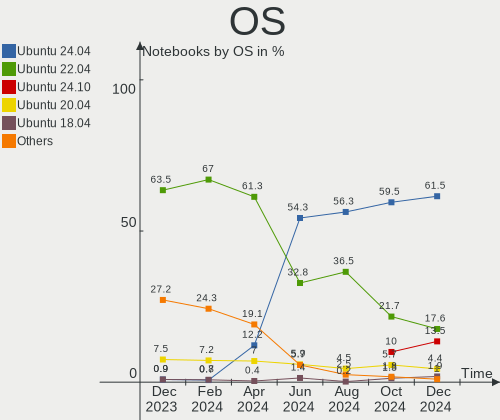
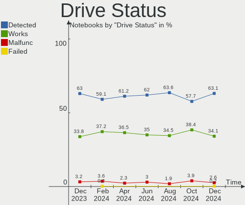
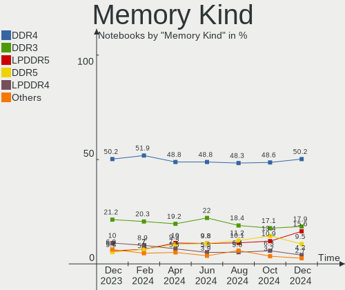

Ubuntu - Hardware Trends (Notebooks)
------------------------------------

A project to identify most popular hardware characteristics and track their change
over time based on data collected by Linux users at https://Linux-Hardware.org.

Anyone can contribute to this report by the [hw-probe](https://github.com/linuxhw/hw-probe) tool:

    sudo -E hw-probe -all -upload

This report is for one last month. Overall report since the beginning of time: [TestCoverage](https://github.com/linuxhw/TestCoverage)

Period: May, 2022.

Contents
--------

* [ System ](#system)
  - [ OS                       ](#os)
  - [ OS Family                ](#os-family)
  - [ Kernel                   ](#kernel)
  - [ Kernel Family            ](#kernel-family)
  - [ Kernel Major Ver.        ](#kernel-major-ver)
  - [ Arch                     ](#arch)
  - [ DE                       ](#de)
  - [ Display Server           ](#display-server)
  - [ Display Manager          ](#display-manager)
  - [ OS Lang                  ](#os-lang)
  - [ Boot Mode                ](#boot-mode)
  - [ Filesystem               ](#filesystem)
  - [ Part. scheme             ](#part-scheme)
  - [ Dual Boot with Linux/BSD ](#dual-boot-with-linuxbsd)
  - [ Dual Boot (Win)          ](#dual-boot-win)

* [ Board ](#board)
  - [ Vendor                   ](#vendor)
  - [ Model                    ](#model)
  - [ Model Family             ](#model-family)
  - [ MFG Year                 ](#mfg-year)
  - [ Form Factor              ](#form-factor)
  - [ Secure Boot              ](#secure-boot)
  - [ Coreboot                 ](#coreboot)
  - [ RAM Size                 ](#ram-size)
  - [ RAM Used                 ](#ram-used)
  - [ Total Drives             ](#total-drives)
  - [ Has CD-ROM               ](#has-cd-rom)
  - [ Has Ethernet             ](#has-ethernet)
  - [ Has WiFi                 ](#has-wifi)
  - [ Has Bluetooth            ](#has-bluetooth)

* [ Location ](#location)
  - [ Country                  ](#country)
  - [ City                     ](#city)

* [ Drives ](#drives)
  - [ Drive Vendor             ](#drive-vendor)
  - [ Drive Model              ](#drive-model)
  - [ HDD Vendor               ](#hdd-vendor)
  - [ SSD Vendor               ](#ssd-vendor)
  - [ Drive Kind               ](#drive-kind)
  - [ Drive Connector          ](#drive-connector)
  - [ Drive Size               ](#drive-size)
  - [ Space Total              ](#space-total)
  - [ Space Used               ](#space-used)
  - [ Malfunc. Drives          ](#malfunc-drives)
  - [ Malfunc. Drive Vendor    ](#malfunc-drive-vendor)
  - [ Malfunc. HDD Vendor      ](#malfunc-hdd-vendor)
  - [ Malfunc. Drive Kind      ](#malfunc-drive-kind)
  - [ Failed Drives            ](#failed-drives)
  - [ Failed Drive Vendor      ](#failed-drive-vendor)
  - [ Drive Status             ](#drive-status)

* [ Storage controller ](#storage-controller)
  - [ Storage Vendor           ](#storage-vendor)
  - [ Storage Model            ](#storage-model)
  - [ Storage Kind             ](#storage-kind)

* [ Processor ](#processor)
  - [ CPU Vendor               ](#cpu-vendor)
  - [ CPU Model                ](#cpu-model)
  - [ CPU Model Family         ](#cpu-model-family)
  - [ CPU Cores                ](#cpu-cores)
  - [ CPU Sockets              ](#cpu-sockets)
  - [ CPU Threads              ](#cpu-threads)
  - [ CPU Op-Modes             ](#cpu-op-modes)
  - [ CPU Microcode            ](#cpu-microcode)
  - [ CPU Microarch            ](#cpu-microarch)

* [ Graphics ](#graphics)
  - [ GPU Vendor               ](#gpu-vendor)
  - [ GPU Model                ](#gpu-model)
  - [ GPU Combo                ](#gpu-combo)
  - [ GPU Driver               ](#gpu-driver)
  - [ GPU Memory               ](#gpu-memory)

* [ Monitor ](#monitor)
  - [ Monitor Vendor           ](#monitor-vendor)
  - [ Monitor Model            ](#monitor-model)
  - [ Monitor Resolution       ](#monitor-resolution)
  - [ Monitor Diagonal         ](#monitor-diagonal)
  - [ Monitor Width            ](#monitor-width)
  - [ Aspect Ratio             ](#aspect-ratio)
  - [ Monitor Area             ](#monitor-area)
  - [ Pixel Density            ](#pixel-density)
  - [ Multiple Monitors        ](#multiple-monitors)

* [ Network ](#network)
  - [ Net Controller Vendor    ](#net-controller-vendor)
  - [ Net Controller Model     ](#net-controller-model)
  - [ Wireless Vendor          ](#wireless-vendor)
  - [ Wireless Model           ](#wireless-model)
  - [ Ethernet Vendor          ](#ethernet-vendor)
  - [ Ethernet Model           ](#ethernet-model)
  - [ Net Controller Kind      ](#net-controller-kind)
  - [ Used Controller          ](#used-controller)
  - [ NICs                     ](#nics)
  - [ IPv6                     ](#ipv6)

* [ Bluetooth ](#bluetooth)
  - [ Bluetooth Vendor         ](#bluetooth-vendor)
  - [ Bluetooth Model          ](#bluetooth-model)

* [ Sound ](#sound)
  - [ Sound Vendor             ](#sound-vendor)
  - [ Sound Model              ](#sound-model)

* [ Memory ](#memory)
  - [ Memory Vendor            ](#memory-vendor)
  - [ Memory Model             ](#memory-model)
  - [ Memory Kind              ](#memory-kind)
  - [ Memory Form Factor       ](#memory-form-factor)
  - [ Memory Size              ](#memory-size)
  - [ Memory Speed             ](#memory-speed)

* [ Printers & scanners ](#printers--scanners)
  - [ Printer Vendor           ](#printer-vendor)
  - [ Printer Model            ](#printer-model)
  - [ Scanner Vendor           ](#scanner-vendor)
  - [ Scanner Model            ](#scanner-model)

* [ Camera ](#camera)
  - [ Camera Vendor            ](#camera-vendor)
  - [ Camera Model             ](#camera-model)

* [ Security ](#security)
  - [ Fingerprint Vendor       ](#fingerprint-vendor)
  - [ Fingerprint Model        ](#fingerprint-model)
  - [ Chipcard Vendor          ](#chipcard-vendor)
  - [ Chipcard Model           ](#chipcard-model)

* [ Unsupported ](#unsupported)
  - [ Unsupported Devices      ](#unsupported-devices)
  - [ Unsupported Device Types ](#unsupported-device-types)

System
------

OS
--

Installed operating systems

| Name           | Notebooks | Percent |
|----------------|-----------|---------|
| Ubuntu 22.04   | 349       | 55.48%  |
| Ubuntu 20.04   | 225       | 35.77%  |
| Ubuntu 21.10   | 25        | 3.97%   |
| Ubuntu 18.04   | 15        | 2.38%   |
| Ubuntu 16.04   | 8         | 1.27%   |
| Ubuntu 21.04   | 3         | 0.48%   |
| Ubuntu Core 18 | 2         | 0.32%   |
| Ubuntu 14.04   | 2         | 0.32%   |

OS Family
---------

OS without a version

| Name   | Notebooks | Percent |
|--------|-----------|---------|
| Ubuntu | 629       | 100%    |

Kernel
------

Version of the Linux kernel

| Version                   | Notebooks | Percent |
|---------------------------|-----------|---------|
| 5.15.0-27-generic         | 128       | 20.35%  |
| 5.15.0-30-generic         | 86        | 13.67%  |
| 5.13.0-40-generic         | 81        | 12.88%  |
| 5.15.0-33-generic         | 72        | 11.45%  |
| 5.13.0-41-generic         | 57        | 9.06%   |
| 5.13.0-44-generic         | 27        | 4.29%   |
| 5.15.0-25-generic         | 17        | 2.7%    |
| 5.4.0-110-generic         | 14        | 2.23%   |
| 5.4.0-109-generic         | 14        | 2.23%   |
| 5.4.0-113-generic         | 8         | 1.27%   |
| 5.15.0-28-generic         | 7         | 1.11%   |
| 5.13.0-39-generic         | 7         | 1.11%   |
| 5.15.0-32-generic         | 4         | 0.64%   |
| 5.14.0-1036-oem           | 4         | 0.64%   |
| 5.14.0-1034-oem           | 4         | 0.64%   |
| 5.13.0-30-generic         | 4         | 0.64%   |
| 5.4.0-84-generic          | 3         | 0.48%   |
| 5.17.9-051709-generic     | 3         | 0.48%   |
| 5.14.0-1038-oem           | 3         | 0.48%   |
| 4.15.0-142-generic        | 3         | 0.48%   |
| 5.4.0-42-generic          | 2         | 0.32%   |
| 5.4.0-104-generic         | 2         | 0.32%   |
| 5.17.8-051708-generic     | 2         | 0.32%   |
| 5.17.6-051706-generic     | 2         | 0.32%   |
| 5.17.5-051705-generic     | 2         | 0.32%   |
| 5.17.0-1004-oem           | 2         | 0.32%   |
| 5.15.0-35-generic         | 2         | 0.32%   |
| 5.15.0-10025-tuxedo       | 2         | 0.32%   |
| 5.13.0-35-generic         | 2         | 0.32%   |
| 5.13.0-27-generic         | 2         | 0.32%   |
| 5.11.0-49-generic         | 2         | 0.32%   |
| 4.4.0-210-generic         | 2         | 0.32%   |
| 4.15.0-177-generic        | 2         | 0.32%   |
| 5.8.0-63-generic          | 1         | 0.16%   |
| 5.8.0-43-generic          | 1         | 0.16%   |
| 5.6.0-1036-oem            | 1         | 0.16%   |
| 5.4.0-99-generic          | 1         | 0.16%   |
| 5.4.0-92-generic          | 1         | 0.16%   |
| 5.4.0-73-generic          | 1         | 0.16%   |
| 5.4.0-72-generic          | 1         | 0.16%   |
| 5.4.0-60-generic          | 1         | 0.16%   |
| 5.4.0-40-generic          | 1         | 0.16%   |
| 5.4.0-1071-gke            | 1         | 0.16%   |
| 5.18.0-051800rc7-generic  | 1         | 0.16%   |
| 5.18.0-051800rc1-generic  | 1         | 0.16%   |
| 5.18.0-051800-generic     | 1         | 0.16%   |
| 5.17.8-xanmod1            | 1         | 0.16%   |
| 5.17.5-xanmod1            | 1         | 0.16%   |
| 5.17.2-051702-generic     | 1         | 0.16%   |
| 5.17.1-051701-generic     | 1         | 0.16%   |
| 5.17.0-9.1-liquorix-amd64 | 1         | 0.16%   |
| 5.17.0-1006-oem           | 1         | 0.16%   |
| 5.17.0-051700rc7-generic  | 1         | 0.16%   |
| 5.17.0-051700-generic     | 1         | 0.16%   |
| 5.16.9-051609-generic     | 1         | 0.16%   |
| 5.16.4-051604-generic     | 1         | 0.16%   |
| 5.16.2-051602-generic     | 1         | 0.16%   |
| 5.15.39-051539-generic    | 1         | 0.16%   |
| 5.15.13-051513-generic    | 1         | 0.16%   |
| 5.15.0-33-lowlatency      | 1         | 0.16%   |

Kernel Family
-------------

Linux kernel without a distro release

| Version | Notebooks | Percent |
|---------|-----------|---------|
| 5.15.0  | 324       | 51.51%  |
| 5.13.0  | 186       | 29.57%  |
| 5.4.0   | 50        | 7.95%   |
| 5.14.0  | 15        | 2.38%   |
| 5.11.0  | 8         | 1.27%   |
| 4.15.0  | 8         | 1.27%   |
| 5.17.0  | 6         | 0.95%   |
| 5.18.0  | 3         | 0.48%   |
| 5.17.9  | 3         | 0.48%   |
| 5.17.8  | 3         | 0.48%   |
| 5.17.5  | 3         | 0.48%   |
| 4.4.0   | 3         | 0.48%   |
| 5.8.0   | 2         | 0.32%   |
| 5.17.6  | 2         | 0.32%   |
| 5.6.0   | 1         | 0.16%   |
| 5.17.2  | 1         | 0.16%   |
| 5.17.1  | 1         | 0.16%   |
| 5.16.9  | 1         | 0.16%   |
| 5.16.4  | 1         | 0.16%   |
| 5.16.2  | 1         | 0.16%   |
| 5.15.39 | 1         | 0.16%   |
| 5.15.13 | 1         | 0.16%   |
| 5.13.19 | 1         | 0.16%   |
| 5.11.20 | 1         | 0.16%   |
| 4.4.178 | 1         | 0.16%   |
| 4.10.0  | 1         | 0.16%   |
| 3.13.0  | 1         | 0.16%   |

Kernel Major Ver.
-----------------

Linux kernel major version

| Version | Notebooks | Percent |
|---------|-----------|---------|
| 5.15    | 326       | 51.83%  |
| 5.13    | 187       | 29.73%  |
| 5.4     | 50        | 7.95%   |
| 5.17    | 19        | 3.02%   |
| 5.14    | 15        | 2.38%   |
| 5.11    | 9         | 1.43%   |
| 4.15    | 8         | 1.27%   |
| 4.4     | 4         | 0.64%   |
| 5.18    | 3         | 0.48%   |
| 5.16    | 3         | 0.48%   |
| 5.8     | 2         | 0.32%   |
| 5.6     | 1         | 0.16%   |
| 4.10    | 1         | 0.16%   |
| 3.13    | 1         | 0.16%   |

Arch
----

OS architecture (x86_64, i586, etc.)

| Name   | Notebooks | Percent |
|--------|-----------|---------|
| x86_64 | 624       | 99.21%  |
| i686   | 5         | 0.79%   |

DE
--

Desktop Environment

| Name            | Notebooks | Percent |
|-----------------|-----------|---------|
| GNOME           | 581       | 92.37%  |
| Unknown         | 24        | 3.82%   |
| Unity           | 10        | 1.59%   |
| X-Cinnamon      | 5         | 0.79%   |
| i3              | 3         | 0.48%   |
| GNOME Flashback | 3         | 0.48%   |
| awesome         | 2         | 0.32%   |
| GNOME Classic   | 1         | 0.16%   |

Display Server
--------------

X11 or Wayland

| Name    | Notebooks | Percent |
|---------|-----------|---------|
| X11     | 340       | 54.05%  |
| Wayland | 273       | 43.4%   |
| Unknown | 12        | 1.91%   |
| Tty     | 4         | 0.64%   |

Display Manager
---------------

SDDM, LightDM, etc.

| Name    | Notebooks | Percent |
|---------|-----------|---------|
| GDM3    | 474       | 75.36%  |
| GDM     | 95        | 15.1%   |
| Unknown | 41        | 6.52%   |
| LightDM | 18        | 2.86%   |
| XDM     | 1         | 0.16%   |

OS Lang
-------

Language

| Lang    | Notebooks | Percent |
|---------|-----------|---------|
| en_US   | 297       | 47.22%  |
| de_DE   | 40        | 6.36%   |
| fr_FR   | 31        | 4.93%   |
| en_IN   | 27        | 4.29%   |
| es_ES   | 25        | 3.97%   |
| pt_BR   | 21        | 3.34%   |
| en_GB   | 19        | 3.02%   |
| ru_RU   | 16        | 2.54%   |
| en_CA   | 13        | 2.07%   |
| it_IT   | 12        | 1.91%   |
| pl_PL   | 11        | 1.75%   |
| Unknown | 11        | 1.75%   |
| zh_CN   | 9         | 1.43%   |
| es_MX   | 6         | 0.95%   |
| es_AR   | 5         | 0.79%   |
| en_AU   | 5         | 0.79%   |
| de_CH   | 5         | 0.79%   |
| tr_TR   | 4         | 0.64%   |
| sv_SE   | 4         | 0.64%   |
| pt_PT   | 4         | 0.64%   |
| ja_JP   | 4         | 0.64%   |
| es_CO   | 4         | 0.64%   |
| en_IL   | 4         | 0.64%   |
| da_DK   | 4         | 0.64%   |
| cs_CZ   | 4         | 0.64%   |
| bg_BG   | 4         | 0.64%   |
| nl_NL   | 3         | 0.48%   |
| ko_KR   | 3         | 0.48%   |
| fr_BE   | 3         | 0.48%   |
| en_NZ   | 3         | 0.48%   |
| ru_UA   | 2         | 0.32%   |
| nb_NO   | 2         | 0.32%   |
| hu_HU   | 2         | 0.32%   |
| fi_FI   | 2         | 0.32%   |
| es_PE   | 2         | 0.32%   |
| es_EC   | 2         | 0.32%   |
| en_ZA   | 2         | 0.32%   |
| de_AT   | 2         | 0.32%   |
| zh_TW   | 1         | 0.16%   |
| sl_SI   | 1         | 0.16%   |
| ro_RO   | 1         | 0.16%   |
| nl_BE   | 1         | 0.16%   |
| hr_HR   | 1         | 0.16%   |
| fr_CH   | 1         | 0.16%   |
| es_DO   | 1         | 0.16%   |
| es_CU   | 1         | 0.16%   |
| es_CL   | 1         | 0.16%   |
| en_PH   | 1         | 0.16%   |
| en_IE   | 1         | 0.16%   |
| C       | 1         | 0.16%   |

Boot Mode
---------

EFI or BIOS

| Mode | Notebooks | Percent |
|------|-----------|---------|
| BIOS | 316       | 50.24%  |
| EFI  | 313       | 49.76%  |

Filesystem
----------

Type of filesystem

| Type    | Notebooks | Percent |
|---------|-----------|---------|
| Ext4    | 606       | 96.34%  |
| Zfs     | 12        | 1.91%   |
| Overlay | 5         | 0.79%   |
| Btrfs   | 3         | 0.48%   |
| Xfs     | 2         | 0.32%   |
| Ext3    | 1         | 0.16%   |

Part. scheme
------------

Scheme of partitioning

| Type    | Notebooks | Percent |
|---------|-----------|---------|
| Unknown | 362       | 57.55%  |
| GPT     | 241       | 38.31%  |
| MBR     | 26        | 4.13%   |

Dual Boot with Linux/BSD
------------------------

Hosting more than one Linux/BSD

| Dual boot | Notebooks | Percent |
|-----------|-----------|---------|
| No        | 584       | 92.85%  |
| Yes       | 45        | 7.15%   |

Dual Boot (Win)
---------------

Hosting Linux and Windows

| Dual boot | Notebooks | Percent |
|-----------|-----------|---------|
| No        | 399       | 63.43%  |
| Yes       | 230       | 36.57%  |

Board
-----

Vendor
------

Motherboard manufacturer

| Name                   | Notebooks | Percent |
|------------------------|-----------|---------|
| Hewlett-Packard        | 136       | 21.62%  |
| Lenovo                 | 121       | 19.24%  |
| Dell                   | 119       | 18.92%  |
| ASUSTek Computer       | 66        | 10.49%  |
| Acer                   | 49        | 7.79%   |
| Toshiba                | 23        | 3.66%   |
| MSI                    | 16        | 2.54%   |
| HUAWEI                 | 12        | 1.91%   |
| Samsung Electronics    | 8         | 1.27%   |
| Apple                  | 8         | 1.27%   |
| Alienware              | 7         | 1.11%   |
| Sony                   | 5         | 0.79%   |
| Notebook               | 5         | 0.79%   |
| Medion                 | 5         | 0.79%   |
| Google                 | 4         | 0.64%   |
| TUXEDO                 | 3         | 0.48%   |
| LG Electronics         | 3         | 0.48%   |
| Gateway                | 3         | 0.48%   |
| Chuwi                  | 3         | 0.48%   |
| Unknown                | 3         | 0.48%   |
| Positivo               | 2         | 0.32%   |
| PC Specialist          | 2         | 0.32%   |
| Packard Bell           | 2         | 0.32%   |
| Lex                    | 2         | 0.32%   |
| Entroware              | 2         | 0.32%   |
| Avell High Performance | 2         | 0.32%   |
| Vestel                 | 1         | 0.16%   |
| Teclast                | 1         | 0.16%   |
| SLIMBOOK               | 1         | 0.16%   |
| SANTECH                | 1         | 0.16%   |
| Panasonic              | 1         | 0.16%   |
| mPTech                 | 1         | 0.16%   |
| MouseComputer          | 1         | 0.16%   |
| Microtech              | 1         | 0.16%   |
| Maibenben              | 1         | 0.16%   |
| Hometech               | 1         | 0.16%   |
| Fujitsu Siemens        | 1         | 0.16%   |
| Fujitsu                | 1         | 0.16%   |
| Framework              | 1         | 0.16%   |
| BenQ                   | 1         | 0.16%   |
| AXIOO                  | 1         | 0.16%   |
| AVITA                  | 1         | 0.16%   |
| AMI                    | 1         | 0.16%   |
| Allview                | 1         | 0.16%   |

Model
-----

Motherboard model

| Name                                  | Notebooks | Percent |
|---------------------------------------|-----------|---------|
| HP Pavilion g6                        | 4         | 0.64%   |
| HP Notebook                           | 4         | 0.64%   |
| ASUS ROG Zephyrus G14 GA401QM_GA401QM | 4         | 0.64%   |
| Unknown                               | 4         | 0.64%   |
| Lenovo Z50-75 80EC                    | 3         | 0.48%   |
| Lenovo ThinkBook 14-IML 20RV          | 3         | 0.48%   |
| HP Pavilion dv6                       | 3         | 0.48%   |
| HP Laptop 15-bs0xx                    | 3         | 0.48%   |
| HP 15                                 | 3         | 0.48%   |
| Dell XPS 15 9570                      | 3         | 0.48%   |
| Dell Vostro 3500                      | 3         | 0.48%   |
| Dell Latitude 5420                    | 3         | 0.48%   |
| ASUS ZenBook UX325EA_UX325EA          | 3         | 0.48%   |
| ASUS N550JV                           | 3         | 0.48%   |
| Alienware x17 R2                      | 3         | 0.48%   |
| Notebook NS50_70MU                    | 2         | 0.32%   |
| Lex 3I610DW                           | 2         | 0.32%   |
| Lenovo ThinkPad E595 20NFA000AU       | 2         | 0.32%   |
| Lenovo IdeaPad 320-15IKB 80XL         | 2         | 0.32%   |
| HUAWEI HVY-WXX9                       | 2         | 0.32%   |
| HUAWEI BOM-WXX9                       | 2         | 0.32%   |
| HUAWEI BOHK-WAX9X                     | 2         | 0.32%   |
| HP ZBook 15 G6                        | 2         | 0.32%   |
| HP ZBook 15 G5                        | 2         | 0.32%   |
| HP ProBook 650 G2                     | 2         | 0.32%   |
| HP ProBook 650 G1                     | 2         | 0.32%   |
| HP ProBook 470 G1                     | 2         | 0.32%   |
| HP ProBook 455 G8 Notebook PC         | 2         | 0.32%   |
| HP ProBook 4520s                      | 2         | 0.32%   |
| HP ProBook 450 G8 Notebook PC         | 2         | 0.32%   |
| HP ProBook 430 G1                     | 2         | 0.32%   |
| HP Pavilion Notebook                  | 2         | 0.32%   |
| HP Pavilion Aero Laptop 13-be0xxx     | 2         | 0.32%   |
| HP Pavilion 14                        | 2         | 0.32%   |
| HP Laptop 15-dw3xxx                   | 2         | 0.32%   |
| HP Laptop 15-da0xxx                   | 2         | 0.32%   |
| HP EliteBook 850 G6                   | 2         | 0.32%   |
| HP EliteBook 840 G8 Notebook PC       | 2         | 0.32%   |
| HP EliteBook 840 G5                   | 2         | 0.32%   |
| HP EliteBook 840 G3                   | 2         | 0.32%   |
| HP EliteBook 2560p                    | 2         | 0.32%   |
| HP 250 G8 Notebook PC                 | 2         | 0.32%   |
| Dell XPS 15 9510                      | 2         | 0.32%   |
| Dell Vostro 15 3515                   | 2         | 0.32%   |
| Dell Precision 7530                   | 2         | 0.32%   |
| Dell Precision 5560                   | 2         | 0.32%   |
| Dell Latitude E6420                   | 2         | 0.32%   |
| Dell Latitude E6410                   | 2         | 0.32%   |
| Dell Latitude 7420                    | 2         | 0.32%   |
| Dell Latitude 5520                    | 2         | 0.32%   |
| Dell Latitude 3490                    | 2         | 0.32%   |
| Dell Inspiron 3541                    | 2         | 0.32%   |
| Dell Inspiron 15 3511                 | 2         | 0.32%   |
| Dell Inspiron 14 7420 2-in-1          | 2         | 0.32%   |
| Apple MacBookPro5,5                   | 2         | 0.32%   |
| Acer Nitro AN515-54                   | 2         | 0.32%   |
| Acer Aspire E5-575G                   | 2         | 0.32%   |
| Acer Aspire E5-571                    | 2         | 0.32%   |
| Acer Aspire A715-75G                  | 2         | 0.32%   |
| Acer Aspire A317-32                   | 2         | 0.32%   |

Model Family
------------

Motherboard model prefix

| Name                  | Notebooks | Percent |
|-----------------------|-----------|---------|
| Lenovo ThinkPad       | 61        | 9.7%    |
| Dell Inspiron         | 38        | 6.04%   |
| Dell Latitude         | 35        | 5.56%   |
| HP Pavilion           | 31        | 4.93%   |
| Acer Aspire           | 26        | 4.13%   |
| Lenovo IdeaPad        | 25        | 3.97%   |
| HP ProBook            | 24        | 3.82%   |
| HP Laptop             | 22        | 3.5%    |
| Toshiba Satellite     | 21        | 3.34%   |
| ASUS VivoBook         | 20        | 3.18%   |
| HP EliteBook          | 19        | 3.02%   |
| Dell Precision        | 14        | 2.23%   |
| Dell XPS              | 12        | 1.91%   |
| Dell Vostro           | 12        | 1.91%   |
| HP ZBook              | 10        | 1.59%   |
| Acer Swift            | 9         | 1.43%   |
| ASUS ROG              | 8         | 1.27%   |
| Lenovo Legion         | 7         | 1.11%   |
| Lenovo ThinkBook      | 6         | 0.95%   |
| ASUS ZenBook          | 5         | 0.79%   |
| Acer TravelMate       | 5         | 0.79%   |
| Acer Nitro            | 5         | 0.79%   |
| HP Notebook           | 4         | 0.64%   |
| ASUS ASUS             | 4         | 0.64%   |
| Unknown               | 4         | 0.64%   |
| Lenovo Z50-75         | 3         | 0.48%   |
| Lenovo Yoga           | 3         | 0.48%   |
| HP Compaq             | 3         | 0.48%   |
| HP 250                | 3         | 0.48%   |
| HP 15                 | 3         | 0.48%   |
| Dell G3               | 3         | 0.48%   |
| ASUS N550JV           | 3         | 0.48%   |
| Alienware x17         | 3         | 0.48%   |
| Packard Bell EasyNote | 2         | 0.32%   |
| Notebook NS50         | 2         | 0.32%   |
| MSI Stealth           | 2         | 0.32%   |
| MSI Prestige          | 2         | 0.32%   |
| MSI GF63              | 2         | 0.32%   |
| Lex 3I610DW           | 2         | 0.32%   |
| HUAWEI HVY-WXX9       | 2         | 0.32%   |
| HUAWEI BOM-WXX9       | 2         | 0.32%   |
| HUAWEI BOHK-WAX9X     | 2         | 0.32%   |
| HP Presario           | 2         | 0.32%   |
| HP OMEN               | 2         | 0.32%   |
| HP Mini               | 2         | 0.32%   |
| HP 255                | 2         | 0.32%   |
| Dell Studio           | 2         | 0.32%   |
| Dell G15              | 2         | 0.32%   |
| Chuwi GemiBook        | 2         | 0.32%   |
| Apple MacBookPro8     | 2         | 0.32%   |
| Apple MacBookPro5     | 2         | 0.32%   |
| Alienware m15         | 2         | 0.32%   |
| Vestel V              | 1         | 0.16%   |
| TUXEDO Pulse          | 1         | 0.16%   |
| TUXEDO P95            | 1         | 0.16%   |
| TUXEDO N2x0WU         | 1         | 0.16%   |
| Toshiba PORTEGE       | 1         | 0.16%   |
| Toshiba dynabook      | 1         | 0.16%   |
| Teclast F15           | 1         | 0.16%   |
| Sony VPCS13V9E        | 1         | 0.16%   |

MFG Year
--------

Motherboard manufacture year

| Year | Notebooks | Percent |
|------|-----------|---------|
| 2021 | 95        | 15.1%   |
| 2020 | 84        | 13.35%  |
| 2019 | 63        | 10.02%  |
| 2018 | 55        | 8.74%   |
| 2011 | 41        | 6.52%   |
| 2017 | 40        | 6.36%   |
| 2013 | 39        | 6.2%    |
| 2010 | 34        | 5.41%   |
| 2014 | 33        | 5.25%   |
| 2012 | 31        | 4.93%   |
| 2016 | 29        | 4.61%   |
| 2015 | 22        | 3.5%    |
| 2022 | 21        | 3.34%   |
| 2008 | 17        | 2.7%    |
| 2009 | 16        | 2.54%   |
| 2007 | 7         | 1.11%   |
| 2006 | 2         | 0.32%   |

Form Factor
-----------

Physical design of the computer

| Name     | Notebooks | Percent |
|----------|-----------|---------|
| Notebook | 629       | 100%    |

Secure Boot
-----------

Enabled or disabled

| State    | Notebooks | Percent |
|----------|-----------|---------|
| Disabled | 535       | 85.06%  |
| Enabled  | 94        | 14.94%  |

Coreboot
--------

Have coreboot on board

| Used | Notebooks | Percent |
|------|-----------|---------|
| No   | 625       | 99.36%  |
| Yes  | 4         | 0.64%   |

RAM Size
--------

Total RAM memory

| Size in GB  | Notebooks | Percent |
|-------------|-----------|---------|
| 4.01-8.0    | 191       | 30.37%  |
| 16.01-24.0  | 120       | 19.08%  |
| 8.01-16.0   | 116       | 18.44%  |
| 3.01-4.0    | 114       | 18.12%  |
| 32.01-64.0  | 50        | 7.95%   |
| 64.01-256.0 | 12        | 1.91%   |
| 1.01-2.0    | 12        | 1.91%   |
| 24.01-32.0  | 9         | 1.43%   |
| 2.01-3.0    | 5         | 0.79%   |

RAM Used
--------

Used RAM memory

| Used GB    | Notebooks | Percent |
|------------|-----------|---------|
| 1.01-2.0   | 198       | 31.48%  |
| 2.01-3.0   | 183       | 29.09%  |
| 4.01-8.0   | 106       | 16.85%  |
| 3.01-4.0   | 93        | 14.79%  |
| 8.01-16.0  | 37        | 5.88%   |
| 0.51-1.0   | 5         | 0.79%   |
| 32.01-64.0 | 2         | 0.32%   |
| 16.01-24.0 | 2         | 0.32%   |
| 0.01-0.5   | 2         | 0.32%   |
| Unknown    | 1         | 0.16%   |

Total Drives
------------

Number of drives on board

| Drives | Notebooks | Percent |
|--------|-----------|---------|
| 1      | 478       | 75.99%  |
| 2      | 138       | 21.94%  |
| 3      | 8         | 1.27%   |
| 0      | 3         | 0.48%   |
| 7      | 1         | 0.16%   |
| 4      | 1         | 0.16%   |

Has CD-ROM
----------

Has CD-ROM on board

| Presented | Notebooks | Percent |
|-----------|-----------|---------|
| No        | 420       | 66.77%  |
| Yes       | 209       | 33.23%  |

Has Ethernet
------------

Has Ethernet on board

| Presented | Notebooks | Percent |
|-----------|-----------|---------|
| Yes       | 497       | 79.01%  |
| No        | 132       | 20.99%  |

Has WiFi
--------

Has WiFi module

| Presented | Notebooks | Percent |
|-----------|-----------|---------|
| Yes       | 622       | 98.89%  |
| No        | 7         | 1.11%   |

Has Bluetooth
-------------

Has Bluetooth module

| Presented | Notebooks | Percent |
|-----------|-----------|---------|
| Yes       | 519       | 82.51%  |
| No        | 110       | 17.49%  |

Location
--------

Country
-------

Geographic location (country)

| Country     | Notebooks | Percent |
|-------------|-----------|---------|
| USA         | 104       | 16.53%  |
| Germany     | 54        | 8.59%   |
| France      | 37        | 5.88%   |
| India       | 30        | 4.77%   |
| Brazil      | 30        | 4.77%   |
| Russia      | 26        | 4.13%   |
| Spain       | 22        | 3.5%    |
| Italy       | 22        | 3.5%    |
| UK          | 18        | 2.86%   |
| Poland      | 18        | 2.86%   |
| Netherlands | 17        | 2.7%    |
| Canada      | 14        | 2.23%   |
| Mexico      | 13        | 2.07%   |
| China       | 11        | 1.75%   |
| Sweden      | 10        | 1.59%   |
| Portugal    | 9         | 1.43%   |
| Denmark     | 8         | 1.27%   |
| Australia   | 8         | 1.27%   |
| Turkey      | 7         | 1.11%   |
| Romania     | 7         | 1.11%   |
| Colombia    | 7         | 1.11%   |
| Bulgaria    | 7         | 1.11%   |
| Belgium     | 7         | 1.11%   |
| Austria     | 7         | 1.11%   |
| Argentina   | 7         | 1.11%   |
| Finland     | 6         | 0.95%   |
| Taiwan      | 5         | 0.79%   |
| Switzerland | 5         | 0.79%   |
| Japan       | 5         | 0.79%   |
| Israel      | 5         | 0.79%   |
| Iran        | 5         | 0.79%   |
| Indonesia   | 5         | 0.79%   |
| Czechia     | 5         | 0.79%   |
| South Korea | 4         | 0.64%   |
| Hungary     | 4         | 0.64%   |
| Ukraine     | 3         | 0.48%   |
| Thailand    | 3         | 0.48%   |
| Peru        | 3         | 0.48%   |
| Norway      | 3         | 0.48%   |
| New Zealand | 3         | 0.48%   |
| Ivory Coast | 3         | 0.48%   |
| Ecuador     | 3         | 0.48%   |
| Croatia     | 3         | 0.48%   |
| Armenia     | 3         | 0.48%   |
| Uruguay     | 2         | 0.32%   |
| Slovakia    | 2         | 0.32%   |
| Singapore   | 2         | 0.32%   |
| Serbia      | 2         | 0.32%   |
| Nigeria     | 2         | 0.32%   |
| Nepal       | 2         | 0.32%   |
| Morocco     | 2         | 0.32%   |
| Kenya       | 2         | 0.32%   |
| Ireland     | 2         | 0.32%   |
| Greece      | 2         | 0.32%   |
| Estonia     | 2         | 0.32%   |
| Cyprus      | 2         | 0.32%   |
| Bangladesh  | 2         | 0.32%   |
| Zimbabwe    | 1         | 0.16%   |
| Vietnam     | 1         | 0.16%   |
| Venezuela   | 1         | 0.16%   |

City
----

Geographic location (city)

| City              | Notebooks | Percent |
|-------------------|-----------|---------|
| Moscow            | 10        | 1.59%   |
| Berlin            | 7         | 1.11%   |
| Madrid            | 6         | 0.95%   |
| St Petersburg     | 5         | 0.79%   |
| Bucharest         | 5         | 0.79%   |
| Sydney            | 4         | 0.64%   |
| Sao Paulo         | 4         | 0.64%   |
| Milan             | 4         | 0.64%   |
| Hyderabad         | 4         | 0.64%   |
| Helsinki          | 4         | 0.64%   |
| Barcelona         | 4         | 0.64%   |
| Amsterdam         | 4         | 0.64%   |
| Zagreb            | 3         | 0.48%   |
| Yerevan           | 3         | 0.48%   |
| Warsaw            | 3         | 0.48%   |
| The Hague         | 3         | 0.48%   |
| Tehran            | 3         | 0.48%   |
| Sofia             | 3         | 0.48%   |
| Rome              | 3         | 0.48%   |
| Paris             | 3         | 0.48%   |
| New Taipei        | 3         | 0.48%   |
| Jakarta           | 3         | 0.48%   |
| Houston           | 3         | 0.48%   |
| Frankfurt am Main | 3         | 0.48%   |
| Dallas            | 3         | 0.48%   |
| Chicago           | 3         | 0.48%   |
| Chennai           | 3         | 0.48%   |
| Buenos Aires      | 3         | 0.48%   |
| Arequipa          | 3         | 0.48%   |
| Abidjan           | 3         | 0.48%   |
| Zhytomyr          | 2         | 0.32%   |
| Wroclaw           | 2         | 0.32%   |
| Valencia          | 2         | 0.32%   |
| Ulm               | 2         | 0.32%   |
| Toronto           | 2         | 0.32%   |
| Tel Aviv          | 2         | 0.32%   |
| Tartu             | 2         | 0.32%   |
| Springfield       | 2         | 0.32%   |
| Singapore         | 2         | 0.32%   |
| Shanghai          | 2         | 0.32%   |
| Setúbal          | 2         | 0.32%   |
| Santiago de Cali  | 2         | 0.32%   |
| Recife            | 2         | 0.32%   |
| Poznan            | 2         | 0.32%   |
| Ostrzeszow        | 2         | 0.32%   |
| Norwich           | 2         | 0.32%   |
| Nairobi           | 2         | 0.32%   |
| Münster          | 2         | 0.32%   |
| Mumbai            | 2         | 0.32%   |
| Montevideo        | 2         | 0.32%   |
| Lisbon            | 2         | 0.32%   |
| Leipzig           | 2         | 0.32%   |
| Le Mans           | 2         | 0.32%   |
| Lagos             | 2         | 0.32%   |
| Krakow            | 2         | 0.32%   |
| Karlsruhe         | 2         | 0.32%   |
| Kansas City       | 2         | 0.32%   |
| Kanpur            | 2         | 0.32%   |
| Himeji            | 2         | 0.32%   |
| Hamburg           | 2         | 0.32%   |

Drives
------

Drive Vendor
------------

Hard drive vendors

| Vendor                         | Notebooks | Drives | Percent |
|--------------------------------|-----------|--------|---------|
| Samsung Electronics            | 120       | 136    | 16.17%  |
| WDC                            | 88        | 91     | 11.86%  |
| Seagate                        | 72        | 76     | 9.7%    |
| Toshiba                        | 63        | 63     | 8.49%   |
| SK Hynix                       | 51        | 51     | 6.87%   |
| Sandisk                        | 40        | 42     | 5.39%   |
| Kingston                       | 37        | 38     | 4.99%   |
| Micron Technology              | 32        | 32     | 4.31%   |
| Unknown                        | 30        | 32     | 4.04%   |
| Intel                          | 27        | 30     | 3.64%   |
| HGST                           | 22        | 22     | 2.96%   |
| Crucial                        | 19        | 19     | 2.56%   |
| Hitachi                        | 16        | 16     | 2.16%   |
| KIOXIA                         | 14        | 14     | 1.89%   |
| Phison                         | 10        | 10     | 1.35%   |
| A-DATA Technology              | 10        | 10     | 1.35%   |
| Unknown                        | 10        | 10     | 1.35%   |
| Silicon Motion                 | 5         | 5      | 0.67%   |
| Netac                          | 4         | 4      | 0.54%   |
| Solid State Storage Technology | 3         | 3      | 0.4%    |
| PNY                            | 3         | 3      | 0.4%    |
| Hewlett-Packard                | 3         | 3      | 0.4%    |
| GOODRAM                        | 3         | 3      | 0.4%    |
| Apple                          | 3         | 3      | 0.4%    |
| ADATA Technology               | 3         | 3      | 0.4%    |
| Teclast                        | 2         | 2      | 0.27%   |
| Patriot                        | 2         | 2      | 0.27%   |
| OCZ                            | 2         | 2      | 0.27%   |
| MAXTOR                         | 2         | 2      | 0.27%   |
| LITEONIT                       | 2         | 2      | 0.27%   |
| Lexar                          | 2         | 2      | 0.27%   |
| Lenovo                         | 2         | 2      | 0.27%   |
| KIOXIA-EXCERIA                 | 2         | 2      | 0.27%   |
| JMicron                        | 2         | 2      | 0.27%   |
| Intenso                        | 2         | 3      | 0.27%   |
| Fujitsu                        | 2         | 2      | 0.27%   |
| BHT                            | 2         | 2      | 0.27%   |
| YMTC                           | 1         | 1      | 0.13%   |
| Verbatim                       | 1         | 1      | 0.13%   |
| USB                            | 1         | 1      | 0.13%   |
| Union Memory (Shenzhen)        | 1         | 1      | 0.13%   |
| UMIS                           | 1         | 1      | 0.13%   |
| TU100Pro                       | 1         | 1      | 0.13%   |
| Transcend                      | 1         | 1      | 0.13%   |
| TAMMUZ                         | 1         | 1      | 0.13%   |
| StoreJet                       | 1         | 1      | 0.13%   |
| sobetter                       | 1         | 1      | 0.13%   |
| S3+                            | 1         | 1      | 0.13%   |
| Realtek                        | 1         | 1      | 0.13%   |
| PLEXTOR                        | 1         | 1      | 0.13%   |
| OEM                            | 1         | 1      | 0.13%   |
| MAXIO Technology (Hangzhou)    | 1         | 1      | 0.13%   |
| LONDISK                        | 1         | 1      | 0.13%   |
| LITEON                         | 1         | 1      | 0.13%   |
| KLEVV                          | 1         | 1      | 0.13%   |
| KingSpec                       | 1         | 1      | 0.13%   |
| imation                        | 1         | 1      | 0.13%   |
| HS-SSD-C100                    | 1         | 1      | 0.13%   |
| EAGET                          | 1         | 1      | 0.13%   |
| E535N                          | 1         | 1      | 0.13%   |

Drive Model
-----------

Hard drive models

| Model                                 | Notebooks | Percent |
|---------------------------------------|-----------|---------|
| Toshiba MQ01ABD100 1TB                | 14        | 1.82%   |
| Seagate ST1000LM035-1RK172 1TB        | 12        | 1.56%   |
| Seagate ST1000LM024 HN-M101MBB 1TB    | 11        | 1.43%   |
| Unknown                               | 10        | 1.3%    |
| Toshiba MQ04ABF100 1TB                | 8         | 1.04%   |
| Samsung NVMe SSD Drive 512GB          | 8         | 1.04%   |
| Micron NVMe SSD Drive 512GB           | 8         | 1.04%   |
| Seagate ST500LT012-1DG142 500GB       | 6         | 0.78%   |
| Seagate ST2000LM007-1R8174 2TB        | 6         | 0.78%   |
| Samsung SSD 860 EVO 500GB             | 6         | 0.78%   |
| Samsung NVMe SSD Drive 256GB          | 6         | 0.78%   |
| Intel SSDPEKNW512G8 512GB             | 6         | 0.78%   |
| Intel NVMe SSD Drive 512GB            | 6         | 0.78%   |
| HGST HTS545050A7E680 500GB            | 6         | 0.78%   |
| Toshiba NVMe SSD Drive 512GB          | 5         | 0.65%   |
| Toshiba MQ01ABF050 500GB              | 5         | 0.65%   |
| SK Hynix NVMe SSD Drive 256GB         | 5         | 0.65%   |
| Samsung NVMe SSD Drive 1024GB         | 5         | 0.65%   |
| Kingston SA400S37480G 480GB SSD       | 5         | 0.65%   |
| HGST HTS541010A9E680 1TB              | 5         | 0.65%   |
| SK Hynix NVMe SSD Drive 512GB         | 4         | 0.52%   |
| SK Hynix HFM001TD3JX013N 1TB          | 4         | 0.52%   |
| Seagate ST9500325AS 500GB             | 4         | 0.52%   |
| Sandisk NVMe SSD Drive 512GB          | 4         | 0.52%   |
| Samsung MZVLQ512HALU-000H1 512GB      | 4         | 0.52%   |
| Samsung MZVLB512HBJQ-000L7 512GB      | 4         | 0.52%   |
| Samsung MZVLB512HBJQ-000L2 512GB      | 4         | 0.52%   |
| Kingston SA400S37240G 240GB SSD       | 4         | 0.52%   |
| Crucial CT240BX500SSD1 240GB          | 4         | 0.52%   |
| WDC WDBNCE5000PNC 500GB SSD           | 3         | 0.39%   |
| WDC WD10SPZX-60Z10T0 1TB              | 3         | 0.39%   |
| WDC WD10JPVX-22JC3T0 1TB              | 3         | 0.39%   |
| Unknown SD/MMC/MS PRO 999GB           | 3         | 0.39%   |
| Toshiba MQ01ABD075 752GB              | 3         | 0.39%   |
| Toshiba KBG30ZMS128G 128GB NVMe SSD   | 3         | 0.39%   |
| SK Hynix NVMe SSD Drive 1024GB        | 3         | 0.39%   |
| SK Hynix HFS256G39TND-N210A 256GB SSD | 3         | 0.39%   |
| Seagate ST500LM012 HN-M500MBB 500GB   | 3         | 0.39%   |
| Seagate ST1000LM048-2E7172 1TB        | 3         | 0.39%   |
| SanDisk SL32G  32GB                   | 3         | 0.39%   |
| Sandisk NVMe SSD Drive 256GB          | 3         | 0.39%   |
| Sandisk NVMe SSD Drive 1TB            | 3         | 0.39%   |
| Samsung SSD 980 1TB                   | 3         | 0.39%   |
| Samsung SSD 970 EVO Plus 2TB          | 3         | 0.39%   |
| Samsung SSD 860 EVO 250GB             | 3         | 0.39%   |
| Samsung MZVLB512HAJQ-000L7 512GB      | 3         | 0.39%   |
| Samsung MZVLB1T0HBLR-000L2 1TB        | 3         | 0.39%   |
| Phison 311CD0512GB                    | 3         | 0.39%   |
| Kingston RBUSNS8154P3256GJ1 256GB     | 3         | 0.39%   |
| Kingston NVMe SSD Drive 512GB         | 3         | 0.39%   |
| Intel SSDPEKNW512G8H 512GB            | 3         | 0.39%   |
| Hitachi HTS547550A9E384 500GB         | 3         | 0.39%   |
| HGST HTS721010A9E630 1TB              | 3         | 0.39%   |
| HGST HTS541010B7E610 1TB              | 3         | 0.39%   |
| Crucial CT500MX500SSD1 500GB          | 3         | 0.39%   |
| WDC WDS500G2B0A-00SM50 500GB SSD      | 2         | 0.26%   |
| WDC WDS240G2G0B-00EPW0 240GB SSD      | 2         | 0.26%   |
| WDC WDS120G2G0A-00JH30 120GB SSD      | 2         | 0.26%   |
| WDC WD5000LPLX-08ZNTT0 500GB          | 2         | 0.26%   |
| WDC WD5000LPCX-60VHAT0 500GB          | 2         | 0.26%   |

HDD Vendor
----------

Hard disk drive vendors

| Vendor              | Notebooks | Drives | Percent |
|---------------------|-----------|--------|---------|
| Seagate             | 70        | 74     | 30.7%   |
| WDC                 | 56        | 57     | 24.56%  |
| Toshiba             | 47        | 47     | 20.61%  |
| HGST                | 22        | 22     | 9.65%   |
| Hitachi             | 15        | 15     | 6.58%   |
| Samsung Electronics | 8         | 8      | 3.51%   |
| Unknown             | 3         | 3      | 1.32%   |
| Fujitsu             | 2         | 2      | 0.88%   |
| Apple               | 2         | 2      | 0.88%   |
| USB                 | 1         | 1      | 0.44%   |
| StoreJet            | 1         | 1      | 0.44%   |
| Intenso             | 1         | 1      | 0.44%   |

SSD Vendor
----------

Solid state drive vendors

| Vendor              | Notebooks | Drives | Percent |
|---------------------|-----------|--------|---------|
| Samsung Electronics | 36        | 39     | 18.85%  |
| Kingston            | 25        | 26     | 13.09%  |
| SanDisk             | 19        | 19     | 9.95%   |
| Crucial             | 14        | 14     | 7.33%   |
| WDC                 | 13        | 13     | 6.81%   |
| SK Hynix            | 11        | 11     | 5.76%   |
| Micron Technology   | 8         | 8      | 4.19%   |
| A-DATA Technology   | 6         | 6      | 3.14%   |
| Unknown             | 5         | 5      | 2.62%   |
| Netac               | 4         | 4      | 2.09%   |
| Intel               | 4         | 4      | 2.09%   |
| PNY                 | 3         | 3      | 1.57%   |
| GOODRAM             | 3         | 3      | 1.57%   |
| Toshiba             | 2         | 2      | 1.05%   |
| Teclast             | 2         | 2      | 1.05%   |
| Patriot             | 2         | 2      | 1.05%   |
| OCZ                 | 2         | 2      | 1.05%   |
| MAXTOR              | 2         | 2      | 1.05%   |
| LITEONIT            | 2         | 2      | 1.05%   |
| Lexar               | 2         | 2      | 1.05%   |
| Hewlett-Packard     | 2         | 2      | 1.05%   |
| BHT                 | 2         | 2      | 1.05%   |
| Verbatim            | 1         | 1      | 0.52%   |
| Transcend           | 1         | 1      | 0.52%   |
| TAMMUZ              | 1         | 1      | 0.52%   |
| Seagate             | 1         | 1      | 0.52%   |
| S3+                 | 1         | 1      | 0.52%   |
| PLEXTOR             | 1         | 1      | 0.52%   |
| LONDISK             | 1         | 1      | 0.52%   |
| LITEON              | 1         | 1      | 0.52%   |
| KLEVV               | 1         | 1      | 0.52%   |
| KIOXIA-EXCERIA      | 1         | 1      | 0.52%   |
| KingSpec            | 1         | 1      | 0.52%   |
| JMicron             | 1         | 1      | 0.52%   |
| Intenso             | 1         | 2      | 0.52%   |
| Hitachi             | 1         | 1      | 0.52%   |
| EAGET               | 1         | 1      | 0.52%   |
| E535N               | 1         | 1      | 0.52%   |
| Dell                | 1         | 1      | 0.52%   |
| BIWIN               | 1         | 1      | 0.52%   |
| AXIOM               | 1         | 1      | 0.52%   |
| ASMT                | 1         | 1      | 0.52%   |
| Apple               | 1         | 1      | 0.52%   |
| 1TB                 | 1         | 1      | 0.52%   |

Drive Kind
----------

HDD or SSD

| Kind    | Notebooks | Drives | Percent |
|---------|-----------|--------|---------|
| NVMe    | 268       | 296    | 37.43%  |
| HDD     | 223       | 233    | 31.15%  |
| SSD     | 178       | 196    | 24.86%  |
| MMC     | 39        | 41     | 5.45%   |
| Unknown | 8         | 8      | 1.12%   |

Drive Connector
---------------

SATA, SAS, NVMe, etc.

| Type | Notebooks | Drives | Percent |
|------|-----------|--------|---------|
| SATA | 369       | 417    | 53.25%  |
| NVMe | 267       | 295    | 38.53%  |
| MMC  | 39        | 41     | 5.63%   |
| SAS  | 18        | 21     | 2.6%    |

Drive Size
----------

Size of hard drive

| Size in TB | Notebooks | Drives | Percent |
|------------|-----------|--------|---------|
| 0.01-0.5   | 257       | 276    | 63.77%  |
| 0.51-1.0   | 133       | 138    | 33%     |
| 1.01-2.0   | 10        | 10     | 2.48%   |
| 3.01-4.0   | 2         | 2      | 0.5%    |
| 4.01-10.0  | 1         | 3      | 0.25%   |

Space Total
-----------

Amount of disk space available on the file system

| Size in GB     | Notebooks | Percent |
|----------------|-----------|---------|
| 101-250        | 212       | 33.7%   |
| 251-500        | 199       | 31.64%  |
| 501-1000       | 89        | 14.15%  |
| 51-100         | 40        | 6.36%   |
| 1001-2000      | 29        | 4.61%   |
| 21-50          | 21        | 3.34%   |
| 1-20           | 17        | 2.7%    |
| Unknown        | 11        | 1.75%   |
| 2001-3000      | 7         | 1.11%   |
| More than 3000 | 4         | 0.64%   |

Space Used
----------

Amount of used disk space

| Used GB        | Notebooks | Percent |
|----------------|-----------|---------|
| 1-20           | 225       | 35.77%  |
| 21-50          | 138       | 21.94%  |
| 101-250        | 94        | 14.94%  |
| 51-100         | 89        | 14.15%  |
| 251-500        | 42        | 6.68%   |
| 501-1000       | 21        | 3.34%   |
| Unknown        | 11        | 1.75%   |
| 1001-2000      | 6         | 0.95%   |
| More than 3000 | 3         | 0.48%   |

Malfunc. Drives
---------------

Drive models with a malfunction

| Model                                        | Notebooks | Drives | Percent |
|----------------------------------------------|-----------|--------|---------|
| Toshiba MQ01ABD100 1TB                       | 2         | 2      | 6.67%   |
| Seagate ST1000LM035-1RK172 1TB               | 2         | 2      | 6.67%   |
| Seagate ST1000LM024 HN-M101MBB 1TB           | 2         | 2      | 6.67%   |
| HGST HTS541010A9E680 1TB                     | 2         | 2      | 6.67%   |
| WDC WD5000LPLX-60ZNTT1 500GB                 | 1         | 1      | 3.33%   |
| WDC WD5000LPCX-60VHAT0 500GB                 | 1         | 1      | 3.33%   |
| WDC WD5000BEVT-00A0RT0 500GB                 | 1         | 1      | 3.33%   |
| WDC WD10JPVX-00JC3T0 1TB                     | 1         | 1      | 3.33%   |
| Toshiba MQ04ABF100 1TB                       | 1         | 1      | 3.33%   |
| Toshiba MQ01ABD075 752GB                     | 1         | 1      | 3.33%   |
| Toshiba MK5065GSX 500GB                      | 1         | 1      | 3.33%   |
| Toshiba MK3263GSX 320GB                      | 1         | 1      | 3.33%   |
| Toshiba MK3256GSY 320GB                      | 1         | 1      | 3.33%   |
| SK Hynix SC210 2.5 7MM 128GB SSD             | 1         | 1      | 3.33%   |
| Seagate ST9500325AS 500GB                    | 1         | 1      | 3.33%   |
| Seagate ST750LX003-1AC15 752GB               | 1         | 1      | 3.33%   |
| Seagate ST500LT012-1DG142 500GB              | 1         | 1      | 3.33%   |
| Seagate ST320LT020-9YG142 320GB              | 1         | 1      | 3.33%   |
| Seagate ST250LT007-9ZV14C 250GB              | 1         | 1      | 3.33%   |
| Seagate ST1000LM014-SSHD-8GB                 | 1         | 1      | 3.33%   |
| SanDisk SD8SBAT256G1122 256GB SSD            | 1         | 1      | 3.33%   |
| Samsung Electronics SSD SM871 2.5 7mm 256GB  | 1         | 1      | 3.33%   |
| Samsung Electronics SSD 980 1TB              | 1         | 1      | 3.33%   |
| Samsung Electronics SSD 830 Series 512GB     | 1         | 1      | 3.33%   |
| Micron Technology MTFDDAT064MAM-1J2 64GB SSD | 1         | 1      | 3.33%   |
| HGST HTS545050A7E680 500GB                   | 1         | 1      | 3.33%   |

Malfunc. Drive Vendor
---------------------

Vendors of faulty drives

| Vendor              | Notebooks | Drives | Percent |
|---------------------|-----------|--------|---------|
| Seagate             | 10        | 10     | 33.33%  |
| Toshiba             | 7         | 7      | 23.33%  |
| WDC                 | 4         | 4      | 13.33%  |
| Samsung Electronics | 3         | 3      | 10%     |
| HGST                | 3         | 3      | 10%     |
| SK Hynix            | 1         | 1      | 3.33%   |
| SanDisk             | 1         | 1      | 3.33%   |
| Micron Technology   | 1         | 1      | 3.33%   |

Malfunc. HDD Vendor
-------------------

Vendors of faulty HDD drives

| Vendor  | Notebooks | Drives | Percent |
|---------|-----------|--------|---------|
| Seagate | 10        | 10     | 41.67%  |
| Toshiba | 7         | 7      | 29.17%  |
| WDC     | 4         | 4      | 16.67%  |
| HGST    | 3         | 3      | 12.5%   |

Malfunc. Drive Kind
-------------------

Kinds of faulty drives

| Kind | Notebooks | Drives | Percent |
|------|-----------|--------|---------|
| HDD  | 24        | 24     | 80%     |
| SSD  | 5         | 5      | 16.67%  |
| NVMe | 1         | 1      | 3.33%   |

Failed Drives
-------------

Failed drive models

Zero info for selected period =(

Failed Drive Vendor
-------------------

Failed drive vendors

Zero info for selected period =(

Drive Status
------------

Number of failed and malfunc. drives

| Status   | Notebooks | Drives | Percent |
|----------|-----------|--------|---------|
| Detected | 372       | 458    | 57.23%  |
| Works    | 248       | 286    | 38.15%  |
| Malfunc  | 30        | 30     | 4.62%   |

Storage controller
------------------

Storage Vendor
--------------

Storage controller vendors

| Vendor                         | Notebooks | Percent |
|--------------------------------|-----------|---------|
| Intel                          | 432       | 56.4%   |
| Samsung Electronics            | 79        | 10.31%  |
| AMD                            | 72        | 9.4%    |
| SK Hynix                       | 38        | 4.96%   |
| Sandisk                        | 34        | 4.44%   |
| Micron Technology              | 24        | 3.13%   |
| Toshiba America Info Systems   | 17        | 2.22%   |
| Phison Electronics             | 12        | 1.57%   |
| KIOXIA                         | 12        | 1.57%   |
| Kingston Technology Company    | 12        | 1.57%   |
| Silicon Motion                 | 7         | 0.91%   |
| ADATA Technology               | 7         | 0.91%   |
| Nvidia                         | 6         | 0.78%   |
| Micron/Crucial Technology      | 5         | 0.65%   |
| Solid State Storage Technology | 3         | 0.39%   |
| Union Memory (Shenzhen)        | 2         | 0.26%   |
| Lenovo                         | 2         | 0.26%   |
| Yangtze Memory Technologies    | 1         | 0.13%   |
| MAXIO Technology (Hangzhou)    | 1         | 0.13%   |

Storage Model
-------------

Storage controller models

| Model                                                                            | Notebooks | Percent |
|----------------------------------------------------------------------------------|-----------|---------|
| AMD FCH SATA Controller [AHCI mode]                                              | 62        | 7.68%   |
| Intel Sunrise Point-LP SATA Controller [AHCI mode]                               | 52        | 6.44%   |
| Samsung NVMe SSD Controller SM981/PM981/PM983                                    | 40        | 4.96%   |
| Intel Volume Management Device NVMe RAID Controller                              | 38        | 4.71%   |
| Intel 82801 Mobile SATA Controller [RAID mode]                                   | 33        | 4.09%   |
| Intel 7 Series Chipset Family 6-port SATA Controller [AHCI mode]                 | 33        | 4.09%   |
| Intel 6 Series/C200 Series Chipset Family 6 port Mobile SATA AHCI Controller     | 31        | 3.84%   |
| Samsung NVMe SSD Controller 980                                                  | 28        | 3.47%   |
| Intel Cannon Lake Mobile PCH SATA AHCI Controller                                | 26        | 3.22%   |
| Micron Non-Volatile memory controller                                            | 24        | 2.97%   |
| Intel 8 Series SATA Controller 1 [AHCI mode]                                     | 23        | 2.85%   |
| SK Hynix Gold P31 SSD                                                            | 21        | 2.6%    |
| Intel Celeron/Pentium Silver Processor SATA Controller                           | 19        | 2.35%   |
| Intel 82801IBM/IEM (ICH9M/ICH9M-E) 4 port SATA Controller [AHCI mode]            | 17        | 2.11%   |
| Intel 8 Series/C220 Series Chipset Family 6-port SATA Controller 1 [AHCI mode]   | 17        | 2.11%   |
| Intel Tiger Lake-LP SATA Controller [AHCI mode]                                  | 15        | 1.86%   |
| Intel SSD 660P Series                                                            | 14        | 1.73%   |
| Intel Wildcat Point-LP SATA Controller [AHCI Mode]                               | 13        | 1.61%   |
| Intel 5 Series/3400 Series Chipset 4 port SATA AHCI Controller                   | 13        | 1.61%   |
| KIOXIA Non-Volatile memory controller                                            | 12        | 1.49%   |
| Intel Cannon Point-LP SATA Controller [AHCI Mode]                                | 12        | 1.49%   |
| Intel 82801HM/HEM (ICH8M/ICH8M-E) IDE Controller                                 | 11        | 1.36%   |
| Sandisk WD Blue SN550 NVMe SSD                                                   | 9         | 1.12%   |
| Intel HM170/QM170 Chipset SATA Controller [AHCI Mode]                            | 9         | 1.12%   |
| Intel Comet Lake SATA AHCI Controller                                            | 9         | 1.12%   |
| Intel 82801HM/HEM (ICH8M/ICH8M-E) SATA Controller [AHCI mode]                    | 8         | 0.99%   |
| AMD SB7x0/SB8x0/SB9x0 SATA Controller [AHCI mode]                                | 8         | 0.99%   |
| Toshiba America Info Systems Toshiba America Info Non-Volatile memory controller | 7         | 0.87%   |
| Sandisk Non-Volatile memory controller                                           | 7         | 0.87%   |
| Phison PS5013 E13 NVMe Controller                                                | 7         | 0.87%   |
| Intel Atom Processor E3800 Series SATA AHCI Controller                           | 7         | 0.87%   |
| Intel 5 Series/3400 Series Chipset 6 port SATA AHCI Controller                   | 7         | 0.87%   |
| ADATA Non-Volatile memory controller                                             | 7         | 0.87%   |
| SK Hynix BC511                                                                   | 6         | 0.74%   |
| Silicon Motion SM2263EN/SM2263XT SSD Controller                                  | 6         | 0.74%   |
| Sandisk WD Black SN750 / PC SN730 NVMe SSD                                       | 6         | 0.74%   |
| Samsung NVMe SSD Controller PM9A1/PM9A3/980PRO                                   | 6         | 0.74%   |
| Intel SSD Pro 7600p/760p/E 6100p Series                                          | 6         | 0.74%   |
| Toshiba America Info Systems XG6 NVMe SSD Controller                             | 5         | 0.62%   |
| SK Hynix BC501 NVMe Solid State Drive                                            | 5         | 0.62%   |
| Kingston Company U-SNS8154P3 NVMe SSD                                            | 5         | 0.62%   |
| Intel Ice Lake-LP SATA Controller [AHCI mode]                                    | 5         | 0.62%   |
| Intel Atom/Celeron/Pentium Processor x5-E8000/J3xxx/N3xxx Series SATA Controller | 5         | 0.62%   |
| Intel 500 Series Chipset Family SATA AHCI Controller                             | 5         | 0.62%   |
| SK Hynix PC401 NVMe Solid State Drive 256GB                                      | 4         | 0.5%    |
| Sandisk WD PC SN810 / Black SN850 NVMe SSD                                       | 4         | 0.5%    |
| Sandisk PC SN520 NVMe SSD                                                        | 4         | 0.5%    |
| Kingston Company Company Non-Volatile memory controller                          | 4         | 0.5%    |
| Intel 82801IBM/IEM (ICH9M/ICH9M-E) 2 port SATA Controller [IDE mode]             | 4         | 0.5%    |
| Intel 5 Series/3400 Series Chipset 4 port SATA IDE Controller                    | 4         | 0.5%    |
| Intel 5 Series/3400 Series Chipset 2 port SATA IDE Controller                    | 4         | 0.5%    |
| Solid State Storage Non-Volatile memory controller                               | 3         | 0.37%   |
| Sandisk WD Blue SN500 / PC SN520 NVMe SSD                                        | 3         | 0.37%   |
| Samsung NVMe SSD Controller SM961/PM961/SM963                                    | 3         | 0.37%   |
| Phison E16 PCIe4 NVMe Controller                                                 | 3         | 0.37%   |
| Micron/Crucial P2 NVMe PCIe SSD                                                  | 3         | 0.37%   |
| Intel Q170/Q150/B150/H170/H110/Z170/CM236 Chipset SATA Controller [AHCI Mode]    | 3         | 0.37%   |
| Intel Non-Volatile memory controller                                             | 3         | 0.37%   |
| Intel Celeron N3350/Pentium N4200/Atom E3900 Series SATA AHCI Controller         | 3         | 0.37%   |
| Intel 82801HM/HEM (ICH8M/ICH8M-E) SATA Controller [IDE mode]                     | 3         | 0.37%   |

Storage Kind
------------

Kind of storage controller (IDE, SATA, NVMe, SAS, ...)

| Kind | Notebooks | Percent |
|------|-----------|---------|
| SATA | 414       | 52.74%  |
| NVMe | 267       | 34.01%  |
| RAID | 73        | 9.3%    |
| IDE  | 31        | 3.95%   |

Processor
---------

CPU Vendor
----------

Processor vendors

| Vendor | Notebooks | Percent |
|--------|-----------|---------|
| Intel  | 505       | 80.29%  |
| AMD    | 124       | 19.71%  |

CPU Model
---------

Processor models

| Model                                         | Notebooks | Percent |
|-----------------------------------------------|-----------|---------|
| Intel 11th Gen Core i7-1165G7 @ 2.80GHz       | 22        | 3.5%    |
| Intel Core i5-8265U CPU @ 1.60GHz             | 14        | 2.23%   |
| Intel Core i5-7200U CPU @ 2.50GHz             | 14        | 2.23%   |
| Intel 11th Gen Core i5-1135G7 @ 2.40GHz       | 13        | 2.07%   |
| Intel Core i7-8750H CPU @ 2.20GHz             | 10        | 1.59%   |
| Intel Core i5-8250U CPU @ 1.60GHz             | 10        | 1.59%   |
| Intel Celeron N4020 CPU @ 1.10GHz             | 10        | 1.59%   |
| Intel 11th Gen Core i7-1185G7 @ 3.00GHz       | 10        | 1.59%   |
| AMD Ryzen 5 3500U with Radeon Vega Mobile Gfx | 9         | 1.43%   |
| Intel Core i7-8550U CPU @ 1.80GHz             | 8         | 1.27%   |
| Intel Core i5-1035G1 CPU @ 1.00GHz            | 8         | 1.27%   |
| AMD Ryzen 7 5800H with Radeon Graphics        | 8         | 1.27%   |
| Intel Core i7-7700HQ CPU @ 2.80GHz            | 7         | 1.11%   |
| Intel Core i5-9300H CPU @ 2.40GHz             | 7         | 1.11%   |
| Intel Core i5-2520M CPU @ 2.50GHz             | 7         | 1.11%   |
| Intel Core i7-9750H CPU @ 2.60GHz             | 6         | 0.95%   |
| Intel Core i7-8565U CPU @ 1.80GHz             | 6         | 0.95%   |
| Intel Core i5-6200U CPU @ 2.30GHz             | 6         | 0.95%   |
| Intel Core i5-3230M CPU @ 2.60GHz             | 6         | 0.95%   |
| Intel Core i5-3210M CPU @ 2.50GHz             | 6         | 0.95%   |
| Intel Core i5-10210U CPU @ 1.60GHz            | 6         | 0.95%   |
| AMD Ryzen 7 5700U with Radeon Graphics        | 6         | 0.95%   |
| AMD Ryzen 5 4600H with Radeon Graphics        | 6         | 0.95%   |
| Intel Core i7-6700HQ CPU @ 2.60GHz            | 5         | 0.79%   |
| Intel Core i5-5200U CPU @ 2.20GHz             | 5         | 0.79%   |
| Intel 11th Gen Core i7-11800H @ 2.30GHz       | 5         | 0.79%   |
| AMD Ryzen 5 5500U with Radeon Graphics        | 5         | 0.79%   |
| Intel Core i7-10510U CPU @ 1.80GHz            | 4         | 0.64%   |
| Intel Core i5-8350U CPU @ 1.70GHz             | 4         | 0.64%   |
| Intel Core i5-6300U CPU @ 2.40GHz             | 4         | 0.64%   |
| Intel Core i5-4210U CPU @ 1.70GHz             | 4         | 0.64%   |
| Intel Core i5-4200U CPU @ 1.60GHz             | 4         | 0.64%   |
| Intel Core i5-4200M CPU @ 2.50GHz             | 4         | 0.64%   |
| Intel Core i5-2410M CPU @ 2.30GHz             | 4         | 0.64%   |
| Intel Core i5-10300H CPU @ 2.50GHz            | 4         | 0.64%   |
| Intel Core i3-6006U CPU @ 2.00GHz             | 4         | 0.64%   |
| Intel Core i3-1005G1 CPU @ 1.20GHz            | 4         | 0.64%   |
| Intel Core i3 CPU M 380 @ 2.53GHz             | 4         | 0.64%   |
| Intel Core 2 Duo CPU P8700 @ 2.53GHz          | 4         | 0.64%   |
| Intel Celeron N4000 CPU @ 1.10GHz             | 4         | 0.64%   |
| Intel 11th Gen Core i7-11850H @ 2.50GHz       | 4         | 0.64%   |
| AMD Ryzen 9 5900HS with Radeon Graphics       | 4         | 0.64%   |
| AMD Ryzen 7 4800H with Radeon Graphics        | 4         | 0.64%   |
| AMD Ryzen 5 4500U with Radeon Graphics        | 4         | 0.64%   |
| Intel Pentium Silver N5030 CPU @ 1.10GHz      | 3         | 0.48%   |
| Intel Core i7-9850H CPU @ 2.60GHz             | 3         | 0.48%   |
| Intel Core i7-8850H CPU @ 2.60GHz             | 3         | 0.48%   |
| Intel Core i7-8665U CPU @ 1.90GHz             | 3         | 0.48%   |
| Intel Core i7-7500U CPU @ 2.70GHz             | 3         | 0.48%   |
| Intel Core i7-4700HQ CPU @ 2.40GHz            | 3         | 0.48%   |
| Intel Core i7-4510U CPU @ 2.00GHz             | 3         | 0.48%   |
| Intel Core i7-3632QM CPU @ 2.20GHz            | 3         | 0.48%   |
| Intel Core i7-2670QM CPU @ 2.20GHz            | 3         | 0.48%   |
| Intel Core i7-10750H CPU @ 2.60GHz            | 3         | 0.48%   |
| Intel Core i5-2450M CPU @ 2.50GHz             | 3         | 0.48%   |
| Intel Core i5-2430M CPU @ 2.40GHz             | 3         | 0.48%   |
| Intel Core i3-8130U CPU @ 2.20GHz             | 3         | 0.48%   |
| Intel Core i3-5005U CPU @ 2.00GHz             | 3         | 0.48%   |
| Intel Core i3-3110M CPU @ 2.40GHz             | 3         | 0.48%   |
| Intel Core i3-2350M CPU @ 2.30GHz             | 3         | 0.48%   |

CPU Model Family
----------------

Processor model prefix

| Model                          | Notebooks | Percent |
|--------------------------------|-----------|---------|
| Intel Core i5                  | 160       | 25.44%  |
| Intel Core i7                  | 115       | 18.28%  |
| Other                          | 85        | 13.51%  |
| Intel Core i3                  | 48        | 7.63%   |
| Intel Celeron                  | 37        | 5.88%   |
| AMD Ryzen 7                    | 30        | 4.77%   |
| AMD Ryzen 5                    | 29        | 4.61%   |
| Intel Core 2 Duo               | 26        | 4.13%   |
| Intel Pentium                  | 14        | 2.23%   |
| AMD A6                         | 10        | 1.59%   |
| AMD A10                        | 10        | 1.59%   |
| AMD Ryzen 9                    | 6         | 0.95%   |
| AMD A4                         | 6         | 0.95%   |
| Intel Pentium Dual-Core        | 5         | 0.79%   |
| AMD Ryzen 3                    | 4         | 0.64%   |
| AMD A8                         | 4         | 0.64%   |
| Intel Pentium Silver           | 3         | 0.48%   |
| Intel Pentium Dual             | 3         | 0.48%   |
| Intel Core i9                  | 3         | 0.48%   |
| Intel Atom                     | 3         | 0.48%   |
| AMD Ryzen 7 PRO                | 3         | 0.48%   |
| AMD Athlon                     | 3         | 0.48%   |
| AMD Turion X2 Dual-Core Mobile | 2         | 0.32%   |
| AMD Ryzen 5 PRO                | 2         | 0.32%   |
| AMD E                          | 2         | 0.32%   |
| Intel Xeon                     | 1         | 0.16%   |
| Intel Pentium Gold             | 1         | 0.16%   |
| Intel Genuine                  | 1         | 0.16%   |
| Intel Core m3                  | 1         | 0.16%   |
| Intel Core M                   | 1         | 0.16%   |
| Intel Core 2                   | 1         | 0.16%   |
| Intel Core                     | 1         | 0.16%   |
| AMD Turion 64 X2 Mobile        | 1         | 0.16%   |
| AMD Phenom II                  | 1         | 0.16%   |
| AMD Mobile Sempron             | 1         | 0.16%   |
| AMD FX                         | 1         | 0.16%   |
| AMD E2                         | 1         | 0.16%   |
| AMD E1                         | 1         | 0.16%   |
| AMD C-50                       | 1         | 0.16%   |
| AMD Athlon Neo X2              | 1         | 0.16%   |
| AMD Athlon II                  | 1         | 0.16%   |

CPU Cores
---------

Number of processor cores

| Number | Notebooks | Percent |
|--------|-----------|---------|
| 2      | 291       | 46.26%  |
| 4      | 219       | 34.82%  |
| 8      | 52        | 8.27%   |
| 6      | 49        | 7.79%   |
| 14     | 9         | 1.43%   |
| 1      | 6         | 0.95%   |
| 10     | 2         | 0.32%   |
| 12     | 1         | 0.16%   |

CPU Sockets
-----------

Number of sockets

| Number | Notebooks | Percent |
|--------|-----------|---------|
| 1      | 629       | 100%    |

CPU Threads
-----------

Threads per core (Hyper-Threading)

| Number | Notebooks | Percent |
|--------|-----------|---------|
| 2      | 491       | 78.06%  |
| 1      | 138       | 21.94%  |

CPU Op-Modes
------------

CPU Operation Modes (32-bit, 64-bit)

| Op mode        | Notebooks | Percent |
|----------------|-----------|---------|
| 32-bit, 64-bit | 628       | 99.84%  |
| 32-bit         | 1         | 0.16%   |

CPU Microcode
-------------

Microcode number

| Number     | Notebooks | Percent |
|------------|-----------|---------|
| Unknown    | 229       | 36.41%  |
| 0x806c1    | 40        | 6.36%   |
| 0x206a7    | 23        | 3.66%   |
| 0x806ec    | 22        | 3.5%    |
| 0x306a9    | 22        | 3.5%    |
| 0x906ea    | 19        | 3.02%   |
| 0x0a50000c | 19        | 3.02%   |
| 0x806ea    | 18        | 2.86%   |
| 0x40651    | 15        | 2.38%   |
| 0x806e9    | 13        | 2.07%   |
| 0x706a8    | 13        | 2.07%   |
| 0x406e3    | 11        | 1.75%   |
| 0x306d4    | 11        | 1.75%   |
| 0x306c3    | 11        | 1.75%   |
| 0x1067a    | 11        | 1.75%   |
| 0x20655    | 10        | 1.59%   |
| 0x906a3    | 9         | 1.43%   |
| 0x806eb    | 9         | 1.43%   |
| 0x6fd      | 9         | 1.43%   |
| 0x706e5    | 8         | 1.27%   |
| 0x806d1    | 7         | 1.11%   |
| 0x08108109 | 7         | 1.11%   |
| 0x906e9    | 6         | 0.95%   |
| 0x08608103 | 6         | 0.95%   |
| 0x08600106 | 6         | 0.95%   |
| 0x08600104 | 5         | 0.79%   |
| 0x08108102 | 5         | 0.79%   |
| 0x06001119 | 5         | 0.79%   |
| 0xa0652    | 4         | 0.64%   |
| 0x906ed    | 4         | 0.64%   |
| 0x706a1    | 4         | 0.64%   |
| 0x506e3    | 4         | 0.64%   |
| 0x506c9    | 3         | 0.48%   |
| 0x406c3    | 3         | 0.48%   |
| 0x20652    | 3         | 0.48%   |
| 0x10676    | 3         | 0.48%   |
| 0x08600103 | 3         | 0.48%   |
| 0x07030105 | 3         | 0.48%   |
| 0x30678    | 2         | 0.32%   |
| 0x08101007 | 2         | 0.32%   |
| 0x06003106 | 2         | 0.32%   |
| 0x03000027 | 2         | 0.32%   |
| 0xa0671    | 1         | 0.16%   |
| 0x906c0    | 1         | 0.16%   |
| 0x906a4    | 1         | 0.16%   |
| 0x806c2    | 1         | 0.16%   |
| 0x406c4    | 1         | 0.16%   |
| 0x40661    | 1         | 0.16%   |
| 0x30673    | 1         | 0.16%   |
| 0x106e5    | 1         | 0.16%   |
| 0x106ca    | 1         | 0.16%   |
| 0x106c2    | 1         | 0.16%   |
| 0x0a50000b | 1         | 0.16%   |
| 0x08608102 | 1         | 0.16%   |
| 0x07030106 | 1         | 0.16%   |
| 0x0700010f | 1         | 0.16%   |
| 0x06006705 | 1         | 0.16%   |
| 0x0600611a | 1         | 0.16%   |
| 0x06006110 | 1         | 0.16%   |
| 0x05000119 | 1         | 0.16%   |

CPU Microarch
-------------

Microarchitecture

| Name             | Notebooks | Percent |
|------------------|-----------|---------|
| KabyLake         | 132       | 20.99%  |
| TigerLake        | 55        | 8.74%   |
| Haswell          | 45        | 7.15%   |
| SandyBridge      | 36        | 5.72%   |
| IvyBridge        | 34        | 5.41%   |
| Skylake          | 30        | 4.77%   |
| Zen 3            | 28        | 4.45%   |
| Penryn           | 26        | 4.13%   |
| Icelake          | 23        | 3.66%   |
| Westmere         | 22        | 3.5%    |
| Goldmont plus    | 22        | 3.5%    |
| Unknown          | 20        | 3.18%   |
| Zen+             | 18        | 2.86%   |
| Zen 2            | 18        | 2.86%   |
| Broadwell        | 16        | 2.54%   |
| Silvermont       | 15        | 2.38%   |
| Core             | 11        | 1.75%   |
| Excavator        | 10        | 1.59%   |
| CometLake        | 10        | 1.59%   |
| Alderlake Hybrid | 9         | 1.43%   |
| Puma             | 8         | 1.27%   |
| Piledriver       | 7         | 1.11%   |
| Zen              | 4         | 0.64%   |
| K10 Llano        | 4         | 0.64%   |
| Goldmont         | 4         | 0.64%   |
| Bobcat           | 4         | 0.64%   |
| Steamroller      | 3         | 0.48%   |
| Nehalem          | 3         | 0.48%   |
| K8 Hammer        | 3         | 0.48%   |
| K8 & K10 hybrid  | 2         | 0.32%   |
| K10              | 2         | 0.32%   |
| Jaguar           | 2         | 0.32%   |
| Bonnell          | 2         | 0.32%   |
| Tremont          | 1         | 0.16%   |

Graphics
--------

GPU Vendor
----------

Vendors of graphics cards

| Vendor | Notebooks | Percent |
|--------|-----------|---------|
| Intel  | 464       | 58.29%  |
| Nvidia | 171       | 21.48%  |
| AMD    | 161       | 20.23%  |

GPU Model
---------

Graphics card models

| Model                                                                                    | Notebooks | Percent |
|------------------------------------------------------------------------------------------|-----------|---------|
| Intel TigerLake-LP GT2 [Iris Xe Graphics]                                                | 52        | 6.38%   |
| Intel 3rd Gen Core processor Graphics Controller                                         | 33        | 4.05%   |
| Intel 2nd Generation Core Processor Family Integrated Graphics Controller                | 31        | 3.8%    |
| Intel CoffeeLake-H GT2 [UHD Graphics 630]                                                | 27        | 3.31%   |
| Intel UHD Graphics 620                                                                   | 26        | 3.19%   |
| Intel WhiskeyLake-U GT2 [UHD Graphics 620]                                               | 25        | 3.07%   |
| Intel Haswell-ULT Integrated Graphics Controller                                         | 24        | 2.94%   |
| AMD Cezanne                                                                              | 24        | 2.94%   |
| Intel HD Graphics 620                                                                    | 20        | 2.45%   |
| AMD Picasso/Raven 2 [Radeon Vega Series / Radeon Vega Mobile Series]                     | 20        | 2.45%   |
| Intel GeminiLake [UHD Graphics 600]                                                      | 19        | 2.33%   |
| Intel 4th Gen Core Processor Integrated Graphics Controller                              | 19        | 2.33%   |
| Intel Core Processor Integrated Graphics Controller                                      | 18        | 2.21%   |
| AMD Renoir                                                                               | 18        | 2.21%   |
| Intel Skylake GT2 [HD Graphics 520]                                                      | 15        | 1.84%   |
| Intel CometLake-U GT2 [UHD Graphics]                                                     | 15        | 1.84%   |
| Intel TigerLake-H GT1 [UHD Graphics]                                                     | 14        | 1.72%   |
| Intel Mobile 4 Series Chipset Integrated Graphics Controller                             | 14        | 1.72%   |
| Intel HD Graphics 5500                                                                   | 13        | 1.6%    |
| Nvidia GA106M [GeForce RTX 3060 Mobile / Max-Q]                                          | 12        | 1.47%   |
| Intel Iris Plus Graphics G1 (Ice Lake)                                                   | 12        | 1.47%   |
| AMD Lucienne                                                                             | 11        | 1.35%   |
| Intel Alder Lake-P Integrated Graphics Controller                                        | 10        | 1.23%   |
| Intel CometLake-H GT2 [UHD Graphics]                                                     | 9         | 1.1%    |
| Nvidia GP107M [GeForce GTX 1050 Mobile]                                                  | 8         | 0.98%   |
| Intel HD Graphics 630                                                                    | 8         | 0.98%   |
| Intel Atom/Celeron/Pentium Processor x5-E8000/J3xxx/N3xxx Integrated Graphics Controller | 8         | 0.98%   |
| Intel Atom Processor Z36xxx/Z37xxx Series Graphics & Display                             | 7         | 0.86%   |
| AMD Topaz XT [Radeon R7 M260/M265 / M340/M360 / M440/M445 / 530/535 / 620/625 Mobile]    | 7         | 0.86%   |
| AMD Stoney [Radeon R2/R3/R4/R5 Graphics]                                                 | 7         | 0.86%   |
| Nvidia GA107M [GeForce RTX 3050 Mobile]                                                  | 6         | 0.74%   |
| Intel Mobile GM965/GL960 Integrated Graphics Controller (secondary)                      | 6         | 0.74%   |
| Intel Mobile GM965/GL960 Integrated Graphics Controller (primary)                        | 6         | 0.74%   |
| AMD Mullins [Radeon R4/R5 Graphics]                                                      | 6         | 0.74%   |
| AMD Mars [Radeon HD 8670A/8670M/8750M / R7 M370]                                         | 6         | 0.74%   |
| Nvidia TU117M [GeForce GTX 1650 Ti Mobile]                                               | 5         | 0.61%   |
| Nvidia TU117M                                                                            | 5         | 0.61%   |
| Nvidia TU116M [GeForce GTX 1660 Ti Mobile]                                               | 5         | 0.61%   |
| Nvidia GP107M [GeForce GTX 1050 Ti Mobile]                                               | 5         | 0.61%   |
| Nvidia GM108M [GeForce MX130]                                                            | 5         | 0.61%   |
| Intel HD Graphics 530                                                                    | 5         | 0.61%   |
| AMD Seymour [Radeon HD 6400M/7400M Series]                                               | 5         | 0.61%   |
| Nvidia TU117M [GeForce GTX 1650 Mobile / Max-Q]                                          | 4         | 0.49%   |
| Nvidia GM107M [GeForce GTX 950M]                                                         | 4         | 0.49%   |
| Nvidia GF117M [GeForce 610M/710M/810M/820M / GT 620M/625M/630M/720M]                     | 4         | 0.49%   |
| Nvidia GA107M [GeForce RTX 3050 Ti Mobile]                                               | 4         | 0.49%   |
| Intel HD Graphics 510                                                                    | 4         | 0.49%   |
| AMD Barcelo                                                                              | 4         | 0.49%   |
| Nvidia TU117M [GeForce MX450]                                                            | 3         | 0.37%   |
| Nvidia TU117GLM [Quadro T1000 Mobile]                                                    | 3         | 0.37%   |
| Nvidia GM108M [GeForce 940MX]                                                            | 3         | 0.37%   |
| Nvidia GK208M [GeForce GT 740M]                                                          | 3         | 0.37%   |
| Nvidia GK107M [GeForce GT 750M]                                                          | 3         | 0.37%   |
| Nvidia GF119M [NVS 4200M]                                                                | 3         | 0.37%   |
| Nvidia GA104M [GeForce RTX 3080 Mobile / Max-Q 8GB/16GB]                                 | 3         | 0.37%   |
| Nvidia GA103M [GeForce RTX 3080 Ti Laptop GPU]                                           | 3         | 0.37%   |
| Nvidia C79 [GeForce 9400M]                                                               | 3         | 0.37%   |
| Intel Tiger Lake UHD Graphics                                                            | 3         | 0.37%   |
| Intel HD Graphics 500                                                                    | 3         | 0.37%   |
| Intel GeminiLake [UHD Graphics 605]                                                      | 3         | 0.37%   |

GPU Combo
---------

Combinations of graphics cards

| Name           | Notebooks | Percent |
|----------------|-----------|---------|
| 1 x Intel      | 311       | 49.44%  |
| Intel + Nvidia | 122       | 19.4%   |
| 1 x AMD        | 106       | 16.85%  |
| 1 x Nvidia     | 32        | 5.09%   |
| Intel + AMD    | 27        | 4.29%   |
| AMD + Nvidia   | 17        | 2.7%    |
| 2 x AMD        | 11        | 1.75%   |
| Other          | 3         | 0.48%   |

GPU Driver
----------

Free vs proprietary

| Driver      | Notebooks | Percent |
|-------------|-----------|---------|
| Free        | 519       | 82.51%  |
| Proprietary | 91        | 14.47%  |
| Unknown     | 19        | 3.02%   |

GPU Memory
----------

Total video memory

| Size in GB | Notebooks | Percent |
|------------|-----------|---------|
| Unknown    | 486       | 77.27%  |
| 0.01-0.5   | 49        | 7.79%   |
| 1.01-2.0   | 43        | 6.84%   |
| 0.51-1.0   | 20        | 3.18%   |
| 3.01-4.0   | 19        | 3.02%   |
| 5.01-6.0   | 6         | 0.95%   |
| 7.01-8.0   | 2         | 0.32%   |
| 2.01-3.0   | 2         | 0.32%   |
| 8.01-16.0  | 2         | 0.32%   |

Monitor
-------

Monitor Vendor
--------------

Monitor vendors

| Vendor                  | Notebooks | Percent |
|-------------------------|-----------|---------|
| AU Optronics            | 138       | 19.25%  |
| BOE                     | 111       | 15.48%  |
| Samsung Electronics     | 97        | 13.53%  |
| LG Display              | 92        | 12.83%  |
| Chimei Innolux          | 87        | 12.13%  |
| Dell                    | 21        | 2.93%   |
| Sharp                   | 20        | 2.79%   |
| Lenovo                  | 18        | 2.51%   |
| PANDA                   | 13        | 1.81%   |
| Hewlett-Packard         | 12        | 1.67%   |
| Chi Mei Optoelectronics | 9         | 1.26%   |
| Philips                 | 8         | 1.12%   |
| InfoVision              | 8         | 1.12%   |
| Goldstar                | 7         | 0.98%   |
| Apple                   | 7         | 0.98%   |
| Acer                    | 7         | 0.98%   |
| AOC                     | 6         | 0.84%   |
| ASUSTek Computer        | 5         | 0.7%    |
| Toshiba                 | 3         | 0.42%   |
| LG Philips              | 3         | 0.42%   |
| HannStar                | 3         | 0.42%   |
| BenQ                    | 3         | 0.42%   |
| Sony                    | 2         | 0.28%   |
| Pixio                   | 2         | 0.28%   |
| InnoLux Display         | 2         | 0.28%   |
| Iiyama                  | 2         | 0.28%   |
| Denver                  | 2         | 0.28%   |
| CPT                     | 2         | 0.28%   |
| ViewSonic               | 1         | 0.14%   |
| Vestel Elektronik       | 1         | 0.14%   |
| Unknown (XXX)           | 1         | 0.14%   |
| Unknown                 | 1         | 0.14%   |
| TMX                     | 1         | 0.14%   |
| Sun                     | 1         | 0.14%   |
| SLD                     | 1         | 0.14%   |
| Seiko/Epson             | 1         | 0.14%   |
| Sanyo                   | 1         | 0.14%   |
| Ruijiang                | 1         | 0.14%   |
| Quanta Display          | 1         | 0.14%   |
| Panasonic               | 1         | 0.14%   |
| MSI                     | 1         | 0.14%   |
| Medion                  | 1         | 0.14%   |
| LG Electronics          | 1         | 0.14%   |
| KDB                     | 1         | 0.14%   |
| JDI                     | 1         | 0.14%   |
| HUAWEI                  | 1         | 0.14%   |
| HKN                     | 1         | 0.14%   |
| HB@                     | 1         | 0.14%   |
| Fujitsu Siemens         | 1         | 0.14%   |
| DENON                   | 1         | 0.14%   |
| CVT                     | 1         | 0.14%   |
| CS_                     | 1         | 0.14%   |
| CSO                     | 1         | 0.14%   |
| CHI                     | 1         | 0.14%   |
| CCE                     | 1         | 0.14%   |

Monitor Model
-------------

Monitor models

| Model                                                                 | Notebooks | Percent |
|-----------------------------------------------------------------------|-----------|---------|
| Samsung Electronics LCD Monitor SEC5441 1366x768 309x174mm 14.0-inch  | 8         | 1.1%    |
| AU Optronics LCD Monitor AUO26EC 1366x768 344x193mm 15.5-inch         | 8         | 1.1%    |
| Chimei Innolux LCD Monitor CMN15F5 1920x1080 344x193mm 15.5-inch      | 7         | 0.97%   |
| Lenovo LCD Monitor LEN40BA 1920x1080 344x194mm 15.5-inch              | 5         | 0.69%   |
| Chimei Innolux LCD Monitor CMN14D4 1920x1080 309x173mm 13.9-inch      | 5         | 0.69%   |
| AU Optronics LCD Monitor AUO21ED 1920x1080 344x194mm 15.5-inch        | 5         | 0.69%   |
| Samsung Electronics LCD Monitor SDC4852 1366x768 344x194mm 15.5-inch  | 4         | 0.55%   |
| PANDA LCD Monitor NCP004D 1920x1080 344x194mm 15.5-inch               | 4         | 0.55%   |
| LG Display LCD Monitor LGD02DC 1366x768 344x194mm 15.5-inch           | 4         | 0.55%   |
| Chimei Innolux LCD Monitor CMN140A 1920x1080 309x173mm 13.9-inch      | 4         | 0.55%   |
| BOE LCD Monitor BOE091D 1920x1080 309x174mm 14.0-inch                 | 4         | 0.55%   |
| BOE LCD Monitor BOE0872 1920x1080 344x194mm 15.5-inch                 | 4         | 0.55%   |
| BOE LCD Monitor BOE06A4 1366x768 344x194mm 15.5-inch                  | 4         | 0.55%   |
| AU Optronics LCD Monitor AUO45EC 1366x768 344x193mm 15.5-inch         | 4         | 0.55%   |
| Samsung Electronics LCD Monitor SEC544B 1600x900 310x174mm 14.0-inch  | 3         | 0.41%   |
| Samsung Electronics LCD Monitor SEC304C 1366x768 350x200mm 15.9-inch  | 3         | 0.41%   |
| LG Display LCD Monitor LGD0521 1920x1080 309x174mm 14.0-inch          | 3         | 0.41%   |
| LG Display LCD Monitor LGD0465 1366x768 344x194mm 15.5-inch           | 3         | 0.41%   |
| LG Display LCD Monitor LGD0456 1366x768 344x194mm 15.5-inch           | 3         | 0.41%   |
| LG Display LCD Monitor LGD033A 1366x768 344x194mm 15.5-inch           | 3         | 0.41%   |
| Hewlett-Packard E232 HWP327A 1920x1080 509x286mm 23.0-inch            | 3         | 0.41%   |
| Chimei Innolux LCD Monitor CMN15DB 1366x768 344x193mm 15.5-inch       | 3         | 0.41%   |
| Chimei Innolux LCD Monitor CMN15CC 1366x768 344x193mm 15.5-inch       | 3         | 0.41%   |
| Chimei Innolux LCD Monitor CMN1526 1920x1080 344x193mm 15.5-inch      | 3         | 0.41%   |
| BOE LCD Monitor BOE097D 1920x1080 344x194mm 15.5-inch                 | 3         | 0.41%   |
| BOE LCD Monitor BOE0812 1920x1080 344x194mm 15.5-inch                 | 3         | 0.41%   |
| AU Optronics LCD Monitor AUO70EC 1366x768 344x193mm 15.5-inch         | 3         | 0.41%   |
| AU Optronics LCD Monitor AUO46EC 1366x768 344x193mm 15.5-inch         | 3         | 0.41%   |
| AU Optronics LCD Monitor AUO38ED 1920x1080 344x193mm 15.5-inch        | 3         | 0.41%   |
| AU Optronics LCD Monitor AUO229E 1600x900 382x214mm 17.2-inch         | 3         | 0.41%   |
| Sharp LCD Monitor SHP1515 1920x1200 340x210mm 15.7-inch               | 2         | 0.28%   |
| Sharp LCD Monitor SHP149A 1920x1080 344x194mm 15.5-inch               | 2         | 0.28%   |
| Sharp LCD Monitor SHP1453 1920x1080 346x194mm 15.6-inch               | 2         | 0.28%   |
| Samsung Electronics U32R59x SAM0F94 3840x2160 697x392mm 31.5-inch     | 2         | 0.28%   |
| Samsung Electronics LCD Monitor SEC5541 1366x768 344x193mm 15.5-inch  | 2         | 0.28%   |
| Samsung Electronics LCD Monitor SEC444E 1600x900 310x174mm 14.0-inch  | 2         | 0.28%   |
| Samsung Electronics LCD Monitor SEC324C 1600x900 310x174mm 14.0-inch  | 2         | 0.28%   |
| Samsung Electronics LCD Monitor SEC315A 1366x768 344x194mm 15.5-inch  | 2         | 0.28%   |
| Samsung Electronics LCD Monitor SEC3152 1366x768 344x194mm 15.5-inch  | 2         | 0.28%   |
| Samsung Electronics LCD Monitor SDC4651 1366x768 344x194mm 15.5-inch  | 2         | 0.28%   |
| Samsung Electronics LCD Monitor SDC434B 3840x2160 344x194mm 15.5-inch | 2         | 0.28%   |
| Samsung Electronics LCD Monitor SDC4171 2880x1800 302x189mm 14.0-inch | 2         | 0.28%   |
| Samsung Electronics LCD Monitor SDC4161 1920x1080 344x194mm 15.5-inch | 2         | 0.28%   |
| Samsung Electronics LCD Monitor SDC4158 1920x1080 294x165mm 13.3-inch | 2         | 0.28%   |
| Samsung Electronics LCD Monitor SDC4154 2880x1800 302x189mm 14.0-inch | 2         | 0.28%   |
| Samsung Electronics LCD Monitor SDC4141 3840x2160 344x194mm 15.5-inch | 2         | 0.28%   |
| Samsung Electronics LCD Monitor SDC324C 1920x1080 344x194mm 15.5-inch | 2         | 0.28%   |
| Philips PHL 288P6L PHL08F2 3840x2160 621x341mm 27.9-inch              | 2         | 0.28%   |
| PANDA LCD Monitor NCP005F 1920x1080 344x194mm 15.5-inch               | 2         | 0.28%   |
| PANDA LCD Monitor NCP002D 1920x1080 344x194mm 15.5-inch               | 2         | 0.28%   |
| LG Display LCD Monitor LGD065A 1920x1080 344x194mm 15.5-inch          | 2         | 0.28%   |
| LG Display LCD Monitor LGD0563 1920x1080 344x194mm 15.5-inch          | 2         | 0.28%   |
| LG Display LCD Monitor LGD049B 1920x1080 344x194mm 15.5-inch          | 2         | 0.28%   |
| LG Display LCD Monitor LGD0323 1920x1080 345x194mm 15.6-inch          | 2         | 0.28%   |
| LG Display LCD Monitor LGD02F2 1366x768 344x194mm 15.5-inch           | 2         | 0.28%   |
| LG Display LCD Monitor LGD02F1 1366x768 344x194mm 15.5-inch           | 2         | 0.28%   |
| LG Display LCD Monitor LGD0259 1920x1080 345x194mm 15.6-inch          | 2         | 0.28%   |
| InfoVision LCD Monitor IVO8C78 1920x1080 309x174mm 14.0-inch          | 2         | 0.28%   |
| Chimei Innolux LCD Monitor CMN15F6 1920x1080 344x193mm 15.5-inch      | 2         | 0.28%   |
| Chimei Innolux LCD Monitor CMN15D5 1920x1080 344x193mm 15.5-inch      | 2         | 0.28%   |

Monitor Resolution
------------------

Monitor screen resolution

| Resolution         | Notebooks | Percent |
|--------------------|-----------|---------|
| 1920x1080 (FHD)    | 308       | 46.04%  |
| 1366x768 (WXGA)    | 190       | 28.4%   |
| 1600x900 (HD+)     | 41        | 6.13%   |
| 3840x2160 (4K)     | 37        | 5.53%   |
| 2560x1440 (QHD)    | 17        | 2.54%   |
| 1280x800 (WXGA)    | 17        | 2.54%   |
| 1920x1200 (WUXGA)  | 11        | 1.64%   |
| 1680x1050 (WSXGA+) | 7         | 1.05%   |
| 1440x900 (WXGA+)   | 6         | 0.9%    |
| 2880x1800          | 5         | 0.75%   |
| 1280x1024 (SXGA)   | 5         | 0.75%   |
| 3440x1440          | 4         | 0.6%    |
| 3840x2400          | 3         | 0.45%   |
| 2560x1600          | 3         | 0.45%   |
| 2160x1440          | 3         | 0.45%   |
| 3456x2160          | 1         | 0.15%   |
| 3000x2000          | 1         | 0.15%   |
| 2560x1080          | 1         | 0.15%   |
| 2520x1680          | 1         | 0.15%   |
| 2256x1504          | 1         | 0.15%   |
| 1920x540           | 1         | 0.15%   |
| 1680x945           | 1         | 0.15%   |
| 1600x1200          | 1         | 0.15%   |
| 1360x768           | 1         | 0.15%   |
| 1024x600           | 1         | 0.15%   |
| 1024x576           | 1         | 0.15%   |
| Unknown            | 1         | 0.15%   |

Monitor Diagonal
----------------

Diagonal size in inches

| Inches  | Notebooks | Percent |
|---------|-----------|---------|
| 15      | 325       | 45.08%  |
| 14      | 97        | 13.45%  |
| 13      | 86        | 11.93%  |
| 17      | 51        | 7.07%   |
| 23      | 25        | 3.47%   |
| 27      | 22        | 3.05%   |
| 24      | 21        | 2.91%   |
| 21      | 13        | 1.8%    |
| 12      | 11        | 1.53%   |
| 11      | 9         | 1.25%   |
| 31      | 7         | 0.97%   |
| Unknown | 7         | 0.97%   |
| 84      | 6         | 0.83%   |
| 18      | 6         | 0.83%   |
| 16      | 6         | 0.83%   |
| 22      | 5         | 0.69%   |
| 34      | 4         | 0.55%   |
| 20      | 3         | 0.42%   |
| 54      | 2         | 0.28%   |
| 32      | 2         | 0.28%   |
| 10      | 2         | 0.28%   |
| 86      | 1         | 0.14%   |
| 72      | 1         | 0.14%   |
| 57      | 1         | 0.14%   |
| 47      | 1         | 0.14%   |
| 43      | 1         | 0.14%   |
| 40      | 1         | 0.14%   |
| 39      | 1         | 0.14%   |
| 37      | 1         | 0.14%   |
| 35      | 1         | 0.14%   |
| 26      | 1         | 0.14%   |
| 19      | 1         | 0.14%   |

Monitor Width
-------------

Physical width

| Width in mm | Notebooks | Percent |
|-------------|-----------|---------|
| 301-350     | 455       | 63.46%  |
| 351-400     | 66        | 9.21%   |
| 201-300     | 66        | 9.21%   |
| 501-600     | 59        | 8.23%   |
| 401-500     | 29        | 4.04%   |
| 601-700     | 12        | 1.67%   |
| 1501-2000   | 8         | 1.12%   |
| Unknown     | 7         | 0.98%   |
| 701-800     | 6         | 0.84%   |
| 801-900     | 4         | 0.56%   |
| 1001-1500   | 4         | 0.56%   |
| 901-1000    | 1         | 0.14%   |

Aspect Ratio
------------

Proportional relationship between the width and the height

| Ratio   | Notebooks | Percent |
|---------|-----------|---------|
| 16/9    | 543       | 87.58%  |
| 16/10   | 55        | 8.87%   |
| 3/2     | 7         | 1.13%   |
| 21/9    | 5         | 0.81%   |
| 5/4     | 3         | 0.48%   |
| 4/3     | 3         | 0.48%   |
| Unknown | 3         | 0.48%   |
| 6/5     | 1         | 0.16%   |

Monitor Area
------------

Area in inch²

| Area in inch² | Notebooks | Percent |
|----------------|-----------|---------|
| 101-110        | 324       | 44.88%  |
| 81-90          | 148       | 20.5%   |
| 201-250        | 52        | 7.2%    |
| 121-130        | 43        | 5.96%   |
| 71-80          | 35        | 4.85%   |
| 301-350        | 23        | 3.19%   |
| 351-500        | 14        | 1.94%   |
| More than 1000 | 11        | 1.52%   |
| 61-70          | 11        | 1.52%   |
| 51-60          | 9         | 1.25%   |
| 151-200        | 9         | 1.25%   |
| 251-300        | 8         | 1.11%   |
| 141-150        | 7         | 0.97%   |
| Unknown        | 7         | 0.97%   |
| 131-140        | 6         | 0.83%   |
| 111-120        | 6         | 0.83%   |
| 501-1000       | 5         | 0.69%   |
| 41-50          | 2         | 0.28%   |
| 91-100         | 2         | 0.28%   |

Pixel Density
-------------

Pixels per inch

| Density       | Notebooks | Percent |
|---------------|-----------|---------|
| 121-160       | 301       | 42.63%  |
| 101-120       | 224       | 31.73%  |
| 51-100        | 105       | 14.87%  |
| 161-240       | 41        | 5.81%   |
| More than 240 | 22        | 3.12%   |
| Unknown       | 7         | 0.99%   |
| 1-50          | 6         | 0.85%   |

Multiple Monitors
-----------------

Total monitors connected

| Total | Notebooks | Percent |
|-------|-----------|---------|
| 1     | 483       | 76.79%  |
| 2     | 117       | 18.6%   |
| 0     | 22        | 3.5%    |
| 3     | 6         | 0.95%   |
| 4     | 1         | 0.16%   |

Network
-------

Net Controller Vendor
---------------------

Controller vendors

| Vendor                                 | Notebooks | Percent |
|----------------------------------------|-----------|---------|
| Realtek Semiconductor                  | 350       | 35.9%   |
| Intel                                  | 330       | 33.85%  |
| Qualcomm Atheros                       | 138       | 14.15%  |
| Broadcom                               | 42        | 4.31%   |
| MEDIATEK                               | 19        | 1.95%   |
| Broadcom Limited                       | 18        | 1.85%   |
| Marvell Technology Group               | 9         | 0.92%   |
| TP-Link                                | 7         | 0.72%   |
| Ralink                                 | 7         | 0.72%   |
| Nvidia                                 | 5         | 0.51%   |
| DisplayLink                            | 5         | 0.51%   |
| ASIX Electronics                       | 5         | 0.51%   |
| Ralink Technology                      | 4         | 0.41%   |
| Lenovo                                 | 4         | 0.41%   |
| Ericsson Business Mobile Networks      | 4         | 0.41%   |
| U-Blox                                 | 2         | 0.21%   |
| Sierra Wireless                        | 2         | 0.21%   |
| Samsung Electronics                    | 2         | 0.21%   |
| Qualcomm                               | 2         | 0.21%   |
| OPPO Electronics                       | 2         | 0.21%   |
| Huawei Technologies                    | 2         | 0.21%   |
| Fibocom                                | 2         | 0.21%   |
| ZyXEL Communications                   | 1         | 0.1%    |
| VeriFone                               | 1         | 0.1%    |
| U.S. Robotics                          | 1         | 0.1%    |
| Sony Ericsson Mobile Communications AB | 1         | 0.1%    |
| SEGGER                                 | 1         | 0.1%    |
| Qualcomm Atheros Communications        | 1         | 0.1%    |
| Lego Group                             | 1         | 0.1%    |
| Lab126                                 | 1         | 0.1%    |
| JMicron Technology                     | 1         | 0.1%    |
| IMC Networks                           | 1         | 0.1%    |
| ICS Advent                             | 1         | 0.1%    |
| HMD Global                             | 1         | 0.1%    |
| Hewlett-Packard                        | 1         | 0.1%    |
| Beceem Communications                  | 1         | 0.1%    |

Net Controller Model
--------------------

Controller models

| Model                                                             | Notebooks | Percent |
|-------------------------------------------------------------------|-----------|---------|
| Realtek RTL8111/8168/8411 PCI Express Gigabit Ethernet Controller | 201       | 16.96%  |
| Realtek RTL810xE PCI Express Fast Ethernet controller             | 58        | 4.89%   |
| Intel Wi-Fi 6 AX201                                               | 44        | 3.71%   |
| Intel Wi-Fi 6 AX200                                               | 36        | 3.04%   |
| Realtek RTL8821CE 802.11ac PCIe Wireless Network Adapter          | 31        | 2.62%   |
| Qualcomm Atheros QCA9565 / AR9565 Wireless Network Adapter        | 31        | 2.62%   |
| Realtek RTL8822CE 802.11ac PCIe Wireless Network Adapter          | 29        | 2.45%   |
| Realtek RTL8153 Gigabit Ethernet Adapter                          | 27        | 2.28%   |
| Intel 82579LM Gigabit Network Connection (Lewisville)             | 22        | 1.86%   |
| Intel Wireless 8265 / 8275                                        | 21        | 1.77%   |
| Qualcomm Atheros QCA9377 802.11ac Wireless Network Adapter        | 19        | 1.6%    |
| Qualcomm Atheros QCA6174 802.11ac Wireless Network Adapter        | 19        | 1.6%    |
| Qualcomm Atheros AR9485 Wireless Network Adapter                  | 19        | 1.6%    |
| MEDIATEK MT7921 802.11ax PCI Express Wireless Network Adapter     | 17        | 1.43%   |
| Qualcomm Atheros AR9285 Wireless Network Adapter (PCI-Express)    | 16        | 1.35%   |
| Intel Wireless 7260                                               | 15        | 1.27%   |
| Intel Cannon Point-LP CNVi [Wireless-AC]                          | 14        | 1.18%   |
| Intel Cannon Lake PCH CNVi WiFi                                   | 14        | 1.18%   |
| Intel Wireless 8260                                               | 12        | 1.01%   |
| Intel Tiger Lake PCH CNVi WiFi                                    | 12        | 1.01%   |
| Intel Centrino Advanced-N 6205 [Taylor Peak]                      | 12        | 1.01%   |
| Intel Alder Lake-P PCH CNVi WiFi                                  | 12        | 1.01%   |
| Realtek RTL8723BE PCIe Wireless Network Adapter                   | 11        | 0.93%   |
| Realtek RTL8188CE 802.11b/g/n WiFi Adapter                        | 11        | 0.93%   |
| Intel Wireless 7265                                               | 11        | 0.93%   |
| Broadcom BCM4313 802.11bgn Wireless Network Adapter               | 11        | 0.93%   |
| Intel Wireless 3165                                               | 10        | 0.84%   |
| Intel Comet Lake PCH CNVi WiFi                                    | 9         | 0.76%   |
| Realtek RTL8852AE 802.11ax PCIe Wireless Network Adapter          | 8         | 0.68%   |
| Intel Wireless-AC 9260                                            | 8         | 0.68%   |
| Intel Ice Lake-LP PCH CNVi WiFi                                   | 8         | 0.68%   |
| Realtek Killer E3000 2.5GbE Controller                            | 7         | 0.59%   |
| Intel Ethernet Connection I218-LM                                 | 7         | 0.59%   |
| Intel Ethernet Connection (7) I219-LM                             | 7         | 0.59%   |
| Intel Ethernet Connection (4) I219-LM                             | 7         | 0.59%   |
| Intel Dual Band Wireless-AC 3165 Plus Bluetooth                   | 7         | 0.59%   |
| Intel Comet Lake PCH-LP CNVi WiFi                                 | 7         | 0.59%   |
| Intel Centrino Ultimate-N 6300                                    | 7         | 0.59%   |
| Broadcom BCM43142 802.11b/g/n                                     | 7         | 0.59%   |
| Realtek RTL8822BE 802.11a/b/g/n/ac WiFi adapter                   | 6         | 0.51%   |
| Ralink RT3290 Wireless 802.11n 1T/1R PCIe                         | 6         | 0.51%   |
| Qualcomm Atheros AR8152 v2.0 Fast Ethernet                        | 6         | 0.51%   |
| Intel Ethernet Connection (6) I219-V                              | 6         | 0.51%   |
| Intel Ethernet Connection (4) I219-V                              | 6         | 0.51%   |
| Intel Ethernet Connection (13) I219-LM                            | 6         | 0.51%   |
| Intel Centrino Advanced-N 6235                                    | 6         | 0.51%   |
| Realtek Killer E2600 Gigabit Ethernet Controller                  | 5         | 0.42%   |
| Qualcomm Atheros AR8151 v2.0 Gigabit Ethernet                     | 5         | 0.42%   |
| Intel Wireless 3160                                               | 5         | 0.42%   |
| Intel WiFi Link 5100                                              | 5         | 0.42%   |
| Intel PRO/Wireless 4965 AG or AGN [Kedron] Network Connection     | 5         | 0.42%   |
| Intel PRO/Wireless 3945ABG [Golan] Network Connection             | 5         | 0.42%   |
| Intel Ethernet Connection I219-V                                  | 5         | 0.42%   |
| Intel Ethernet Connection I219-LM                                 | 5         | 0.42%   |
| Intel Ethernet Connection I217-LM                                 | 5         | 0.42%   |
| Intel Centrino Advanced-N 6200                                    | 5         | 0.42%   |
| Realtek RTL8723DE Wireless Network Adapter                        | 4         | 0.34%   |
| Realtek RTL8723BU 802.11b/g/n WLAN Adapter                        | 4         | 0.34%   |
| Realtek RTL8188EUS 802.11n Wireless Network Adapter               | 4         | 0.34%   |
| Realtek RTL8152 Fast Ethernet Adapter                             | 4         | 0.34%   |

Wireless Vendor
---------------

Wireless vendors

| Vendor                          | Notebooks | Percent |
|---------------------------------|-----------|---------|
| Intel                           | 317       | 49.15%  |
| Realtek Semiconductor           | 123       | 19.07%  |
| Qualcomm Atheros                | 118       | 18.29%  |
| Broadcom                        | 34        | 5.27%   |
| MEDIATEK                        | 19        | 2.95%   |
| Broadcom Limited                | 9         | 1.4%    |
| Ralink                          | 7         | 1.09%   |
| TP-Link                         | 5         | 0.78%   |
| Ralink Technology               | 4         | 0.62%   |
| Sierra Wireless                 | 2         | 0.31%   |
| Fibocom                         | 2         | 0.31%   |
| ZyXEL Communications            | 1         | 0.16%   |
| U.S. Robotics                   | 1         | 0.16%   |
| Qualcomm Atheros Communications | 1         | 0.16%   |
| Qualcomm                        | 1         | 0.16%   |
| IMC Networks                    | 1         | 0.16%   |

Wireless Model
--------------

Wireless models

| Model                                                                   | Notebooks | Percent |
|-------------------------------------------------------------------------|-----------|---------|
| Intel Wi-Fi 6 AX201                                                     | 44        | 6.78%   |
| Intel Wi-Fi 6 AX200                                                     | 36        | 5.55%   |
| Realtek RTL8821CE 802.11ac PCIe Wireless Network Adapter                | 31        | 4.78%   |
| Qualcomm Atheros QCA9565 / AR9565 Wireless Network Adapter              | 31        | 4.78%   |
| Realtek RTL8822CE 802.11ac PCIe Wireless Network Adapter                | 29        | 4.47%   |
| Intel Wireless 8265 / 8275                                              | 21        | 3.24%   |
| Qualcomm Atheros QCA9377 802.11ac Wireless Network Adapter              | 19        | 2.93%   |
| Qualcomm Atheros QCA6174 802.11ac Wireless Network Adapter              | 19        | 2.93%   |
| Qualcomm Atheros AR9485 Wireless Network Adapter                        | 19        | 2.93%   |
| MEDIATEK MT7921 802.11ax PCI Express Wireless Network Adapter           | 17        | 2.62%   |
| Qualcomm Atheros AR9285 Wireless Network Adapter (PCI-Express)          | 16        | 2.47%   |
| Intel Wireless 7260                                                     | 15        | 2.31%   |
| Intel Cannon Point-LP CNVi [Wireless-AC]                                | 14        | 2.16%   |
| Intel Cannon Lake PCH CNVi WiFi                                         | 14        | 2.16%   |
| Intel Wireless 8260                                                     | 12        | 1.85%   |
| Intel Tiger Lake PCH CNVi WiFi                                          | 12        | 1.85%   |
| Intel Centrino Advanced-N 6205 [Taylor Peak]                            | 12        | 1.85%   |
| Intel Alder Lake-P PCH CNVi WiFi                                        | 12        | 1.85%   |
| Realtek RTL8723BE PCIe Wireless Network Adapter                         | 11        | 1.69%   |
| Realtek RTL8188CE 802.11b/g/n WiFi Adapter                              | 11        | 1.69%   |
| Intel Wireless 7265                                                     | 11        | 1.69%   |
| Broadcom BCM4313 802.11bgn Wireless Network Adapter                     | 11        | 1.69%   |
| Intel Wireless 3165                                                     | 10        | 1.54%   |
| Intel Comet Lake PCH CNVi WiFi                                          | 9         | 1.39%   |
| Realtek RTL8852AE 802.11ax PCIe Wireless Network Adapter                | 8         | 1.23%   |
| Intel Wireless-AC 9260                                                  | 8         | 1.23%   |
| Intel Ice Lake-LP PCH CNVi WiFi                                         | 8         | 1.23%   |
| Intel Dual Band Wireless-AC 3165 Plus Bluetooth                         | 7         | 1.08%   |
| Intel Comet Lake PCH-LP CNVi WiFi                                       | 7         | 1.08%   |
| Intel Centrino Ultimate-N 6300                                          | 7         | 1.08%   |
| Broadcom BCM43142 802.11b/g/n                                           | 7         | 1.08%   |
| Realtek RTL8822BE 802.11a/b/g/n/ac WiFi adapter                         | 6         | 0.92%   |
| Ralink RT3290 Wireless 802.11n 1T/1R PCIe                               | 6         | 0.92%   |
| Intel Centrino Advanced-N 6235                                          | 6         | 0.92%   |
| Intel Wireless 3160                                                     | 5         | 0.77%   |
| Intel WiFi Link 5100                                                    | 5         | 0.77%   |
| Intel PRO/Wireless 4965 AG or AGN [Kedron] Network Connection           | 5         | 0.77%   |
| Intel PRO/Wireless 3945ABG [Golan] Network Connection                   | 5         | 0.77%   |
| Intel Centrino Advanced-N 6200                                          | 5         | 0.77%   |
| Realtek RTL8723DE Wireless Network Adapter                              | 4         | 0.62%   |
| Realtek RTL8723BU 802.11b/g/n WLAN Adapter                              | 4         | 0.62%   |
| Realtek RTL8188EUS 802.11n Wireless Network Adapter                     | 4         | 0.62%   |
| Qualcomm Atheros AR9462 Wireless Network Adapter                        | 4         | 0.62%   |
| Qualcomm Atheros AR9287 Wireless Network Adapter (PCI-Express)          | 4         | 0.62%   |
| Intel PRO/Wireless 5100 AGN [Shiloh] Network Connection                 | 4         | 0.62%   |
| Intel Centrino Wireless-N 2230                                          | 4         | 0.62%   |
| Broadcom Limited BCM4312 802.11b/g LP-PHY                               | 4         | 0.62%   |
| Broadcom BCM4312 802.11b/g LP-PHY                                       | 4         | 0.62%   |
| Realtek RTL8821AE 802.11ac PCIe Wireless Network Adapter                | 3         | 0.46%   |
| Qualcomm Atheros AR242x / AR542x Wireless Network Adapter (PCI-Express) | 3         | 0.46%   |
| Intel Wi-Fi 6 AX210/AX211/AX411 160MHz                                  | 3         | 0.46%   |
| Intel Gemini Lake PCH CNVi WiFi                                         | 3         | 0.46%   |
| Intel Centrino Wireless-N 2200                                          | 3         | 0.46%   |
| Broadcom Limited BCM4313 802.11bgn Wireless Network Adapter             | 3         | 0.46%   |
| Broadcom BCM43225 802.11b/g/n                                           | 3         | 0.46%   |
| TP-Link TL-WN823N v2/v3 [Realtek RTL8192EU]                             | 2         | 0.31%   |
| TP-Link Archer T3U [Realtek RTL8812BU]                                  | 2         | 0.31%   |
| Realtek RTL8188EE Wireless Network Adapter                              | 2         | 0.31%   |
| Realtek 802.11n WLAN Adapter                                            | 2         | 0.31%   |
| Ralink MT7601U Wireless Adapter                                         | 2         | 0.31%   |

Ethernet Vendor
---------------

Ethernet vendors

| Vendor                                 | Notebooks | Percent |
|----------------------------------------|-----------|---------|
| Realtek Semiconductor                  | 300       | 57.69%  |
| Intel                                  | 115       | 22.12%  |
| Qualcomm Atheros                       | 38        | 7.31%   |
| Broadcom                               | 14        | 2.69%   |
| Broadcom Limited                       | 11        | 2.12%   |
| Marvell Technology Group               | 9         | 1.73%   |
| Nvidia                                 | 5         | 0.96%   |
| DisplayLink                            | 5         | 0.96%   |
| ASIX Electronics                       | 5         | 0.96%   |
| Lenovo                                 | 4         | 0.77%   |
| TP-Link                                | 2         | 0.38%   |
| Samsung Electronics                    | 2         | 0.38%   |
| OPPO Electronics                       | 2         | 0.38%   |
| Sony Ericsson Mobile Communications AB | 1         | 0.19%   |
| Qualcomm                               | 1         | 0.19%   |
| Lab126                                 | 1         | 0.19%   |
| JMicron Technology                     | 1         | 0.19%   |
| ICS Advent                             | 1         | 0.19%   |
| Huawei Technologies                    | 1         | 0.19%   |
| HMD Global                             | 1         | 0.19%   |
| Hewlett-Packard                        | 1         | 0.19%   |

Ethernet Model
--------------

Ethernet models

| Model                                                             | Notebooks | Percent |
|-------------------------------------------------------------------|-----------|---------|
| Realtek RTL8111/8168/8411 PCI Express Gigabit Ethernet Controller | 201       | 38.36%  |
| Realtek RTL810xE PCI Express Fast Ethernet controller             | 58        | 11.07%  |
| Realtek RTL8153 Gigabit Ethernet Adapter                          | 27        | 5.15%   |
| Intel 82579LM Gigabit Network Connection (Lewisville)             | 22        | 4.2%    |
| Realtek Killer E3000 2.5GbE Controller                            | 7         | 1.34%   |
| Intel Ethernet Connection I218-LM                                 | 7         | 1.34%   |
| Intel Ethernet Connection (7) I219-LM                             | 7         | 1.34%   |
| Intel Ethernet Connection (4) I219-LM                             | 7         | 1.34%   |
| Qualcomm Atheros AR8152 v2.0 Fast Ethernet                        | 6         | 1.15%   |
| Intel Ethernet Connection (6) I219-V                              | 6         | 1.15%   |
| Intel Ethernet Connection (4) I219-V                              | 6         | 1.15%   |
| Intel Ethernet Connection (13) I219-LM                            | 6         | 1.15%   |
| Realtek Killer E2600 Gigabit Ethernet Controller                  | 5         | 0.95%   |
| Qualcomm Atheros AR8151 v2.0 Gigabit Ethernet                     | 5         | 0.95%   |
| Intel Ethernet Connection I219-V                                  | 5         | 0.95%   |
| Intel Ethernet Connection I219-LM                                 | 5         | 0.95%   |
| Intel Ethernet Connection I217-LM                                 | 5         | 0.95%   |
| Realtek RTL8152 Fast Ethernet Adapter                             | 4         | 0.76%   |
| Intel 82577LM Gigabit Network Connection                          | 4         | 0.76%   |
| Broadcom NetLink BCM57785 Gigabit Ethernet PCIe                   | 4         | 0.76%   |
| Qualcomm Atheros QCA8171 Gigabit Ethernet                         | 3         | 0.57%   |
| Qualcomm Atheros Killer E2500 Gigabit Ethernet Controller         | 3         | 0.57%   |
| Qualcomm Atheros Killer E220x Gigabit Ethernet Controller         | 3         | 0.57%   |
| Qualcomm Atheros AR8162 Fast Ethernet                             | 3         | 0.57%   |
| Qualcomm Atheros AR8152 v1.1 Fast Ethernet                        | 3         | 0.57%   |
| Qualcomm Atheros AR8132 Fast Ethernet                             | 3         | 0.57%   |
| Qualcomm Atheros AR8131 Gigabit Ethernet                          | 3         | 0.57%   |
| Nvidia MCP79 Ethernet                                             | 3         | 0.57%   |
| Intel Ethernet Connection I217-V                                  | 3         | 0.57%   |
| Intel Ethernet Connection (3) I218-LM                             | 3         | 0.57%   |
| Intel Ethernet Connection (10) I219-V                             | 3         | 0.57%   |
| Intel 82567LM Gigabit Network Connection                          | 3         | 0.57%   |
| DisplayLink Dell Universal Dock D6000                             | 3         | 0.57%   |
| ASIX AX88179 Gigabit Ethernet                                     | 3         | 0.57%   |
| Samsung Galaxy series, misc. (tethering mode)                     | 2         | 0.38%   |
| Realtek RTL8125 2.5GbE Controller                                 | 2         | 0.38%   |
| Qualcomm Atheros QCA8172 Fast Ethernet                            | 2         | 0.38%   |
| Qualcomm Atheros Killer E2400 Gigabit Ethernet Controller         | 2         | 0.38%   |
| OPPO realme X50 5G                                                | 2         | 0.38%   |
| Marvell Group 88E8072 PCI-E Gigabit Ethernet Controller           | 2         | 0.38%   |
| Marvell Group 88E8055 PCI-E Gigabit Ethernet Controller           | 2         | 0.38%   |
| Marvell Group 88E8040 PCI-E Fast Ethernet Controller              | 2         | 0.38%   |
| Lenovo ThinkPad Lan                                               | 2         | 0.38%   |
| Intel I211 Gigabit Network Connection                             | 2         | 0.38%   |
| Intel Ethernet Connection (7) I219-V                              | 2         | 0.38%   |
| Intel Ethernet Connection (6) I219-LM                             | 2         | 0.38%   |
| Intel Ethernet Connection (2) I219-LM                             | 2         | 0.38%   |
| Intel Ethernet Connection (14) I219-LM                            | 2         | 0.38%   |
| Intel Ethernet Connection (10) I219-LM                            | 2         | 0.38%   |
| Intel 82577LC Gigabit Network Connection                          | 2         | 0.38%   |
| Broadcom NetXtreme BCM57765 Gigabit Ethernet PCIe                 | 2         | 0.38%   |
| Broadcom NetLink BCM57780 Gigabit Ethernet PCIe                   | 2         | 0.38%   |
| Broadcom Limited NetLink BCM5787M Gigabit Ethernet PCI Express    | 2         | 0.38%   |
| Broadcom Limited NetLink BCM57780 Gigabit Ethernet PCIe           | 2         | 0.38%   |
| TP-Link USB 10/100/1000 LAN                                       | 1         | 0.19%   |
| TP-Link USB 10/100 LAN                                            | 1         | 0.19%   |
| Sony Ericsson Mobile AB G3212                                     | 1         | 0.19%   |
| Qualcomm M2012K11AG                                               | 1         | 0.19%   |
| Qualcomm Atheros AR8161 Gigabit Ethernet                          | 1         | 0.19%   |
| Qualcomm Atheros AR8121/AR8113/AR8114 Gigabit or Fast Ethernet    | 1         | 0.19%   |

Net Controller Kind
-------------------

Ethernet, WiFi or modem

| Kind     | Notebooks | Percent |
|----------|-----------|---------|
| WiFi     | 622       | 55.09%  |
| Ethernet | 495       | 43.84%  |
| Modem    | 10        | 0.89%   |
| Unknown  | 2         | 0.18%   |

Used Controller
---------------

Currently used network controller

| Kind     | Notebooks | Percent |
|----------|-----------|---------|
| WiFi     | 518       | 77.66%  |
| Ethernet | 149       | 22.34%  |

NICs
----

Total network controllers on board

| Total | Notebooks | Percent |
|-------|-----------|---------|
| 2     | 455       | 72.34%  |
| 1     | 165       | 26.23%  |
| 0     | 5         | 0.79%   |
| 3     | 4         | 0.64%   |

IPv6
----

IPv6 vs IPv4

| Used | Notebooks | Percent |
|------|-----------|---------|
| No   | 449       | 71.38%  |
| Yes  | 180       | 28.62%  |

Bluetooth
---------

Bluetooth Vendor
----------------

Controller vendors

| Vendor                          | Notebooks | Percent |
|---------------------------------|-----------|---------|
| Intel                           | 251       | 47.81%  |
| Realtek Semiconductor           | 69        | 13.14%  |
| Qualcomm Atheros Communications | 52        | 9.9%    |
| IMC Networks                    | 35        | 6.67%   |
| Broadcom                        | 25        | 4.76%   |
| Lite-On Technology              | 17        | 3.24%   |
| Foxconn / Hon Hai               | 14        | 2.67%   |
| Dell                            | 13        | 2.48%   |
| Cambridge Silicon Radio         | 11        | 2.1%    |
| Realtek                         | 10        | 1.9%    |
| Toshiba                         | 9         | 1.71%   |
| Apple                           | 7         | 1.33%   |
| Ralink                          | 6         | 1.14%   |
| Hewlett-Packard                 | 4         | 0.76%   |
| ASUSTek Computer                | 1         | 0.19%   |
| Alps Electric                   | 1         | 0.19%   |

Bluetooth Model
---------------

Controller models

| Model                                               | Notebooks | Percent |
|-----------------------------------------------------|-----------|---------|
| Intel Bluetooth wireless interface                  | 72        | 13.69%  |
| Intel AX201 Bluetooth                               | 67        | 12.74%  |
| Realtek Bluetooth Radio                             | 42        | 7.98%   |
| Intel Bluetooth 9460/9560 Jefferson Peak (JfP)      | 41        | 7.79%   |
| Intel AX200 Bluetooth                               | 36        | 6.84%   |
| Qualcomm Atheros  Bluetooth Device                  | 27        | 5.13%   |
| Realtek  Bluetooth 4.2 Adapter                      | 15        | 2.85%   |
| IMC Networks Wireless_Device                        | 13        | 2.47%   |
| IMC Networks Bluetooth Radio                        | 12        | 2.28%   |
| Realtek 802.11ac WLAN Adapter                       | 11        | 2.09%   |
| Intel Bluetooth Device                              | 11        | 2.09%   |
| Cambridge Silicon Radio Bluetooth Dongle (HCI mode) | 11        | 2.09%   |
| Realtek Bluetooth Radio                             | 10        | 1.9%    |
| Intel Centrino Bluetooth Wireless Transceiver       | 10        | 1.9%    |
| Qualcomm Atheros QCA61x4 Bluetooth 4.0              | 8         | 1.52%   |
| Qualcomm Atheros AR3012 Bluetooth 4.0               | 7         | 1.33%   |
| Lite-On Qualcomm Atheros QCA9377 Bluetooth          | 7         | 1.33%   |
| Intel Wireless-AC 9260 Bluetooth Adapter            | 7         | 1.33%   |
| Foxconn / Hon Hai Bluetooth Device                  | 7         | 1.33%   |
| Apple Bluetooth Host Controller                     | 7         | 1.33%   |
| Ralink RT3290 Bluetooth                             | 6         | 1.14%   |
| IMC Networks Bluetooth Device                       | 6         | 1.14%   |
| Qualcomm Atheros AR3011 Bluetooth                   | 5         | 0.95%   |
| Broadcom BCM2070 Bluetooth 2.1 + EDR                | 5         | 0.95%   |
| Toshiba Bluetooth Device                            | 4         | 0.76%   |
| Toshiba BCM43142A0                                  | 4         | 0.76%   |
| Dell Wireless 365 Bluetooth                         | 4         | 0.76%   |
| Broadcom BCM20702 Bluetooth 4.0 [ThinkPad]          | 4         | 0.76%   |
| Lite-On Atheros AR3012 Bluetooth                    | 3         | 0.57%   |
| Intel AX210 Bluetooth                               | 3         | 0.57%   |
| IMC Networks Bluetooth USB Host Controller          | 3         | 0.57%   |
| HP Broadcom 2070 Bluetooth Combo                    | 3         | 0.57%   |
| Foxconn / Hon Hai Wireless_Device                   | 3         | 0.57%   |
| Dell DW375 Bluetooth Module                         | 3         | 0.57%   |
| Broadcom BCM2045B (BDC-2.1)                         | 3         | 0.57%   |
| Realtek RTL8822BE Bluetooth 4.2 Adapter             | 2         | 0.38%   |
| Qualcomm Atheros AR3012 Bluetooth                   | 2         | 0.38%   |
| Lite-On Wireless_Device                             | 2         | 0.38%   |
| Lite-On Qualcomm Atheros Bluetooth                  | 2         | 0.38%   |
| Lite-On Bluetooth Device                            | 2         | 0.38%   |
| Intel Wireless-AC 3168 Bluetooth                    | 2         | 0.38%   |
| Intel Centrino Advanced-N 6230 Bluetooth adapter    | 2         | 0.38%   |
| Foxconn / Hon Hai Broadcom BCM20702 Bluetooth       | 2         | 0.38%   |
| Dell Wireless 355 Bluetooth                         | 2         | 0.38%   |
| Dell BCM20702A0 Bluetooth Module                    | 2         | 0.38%   |
| Broadcom BCM20702A0 Bluetooth 4.0                   | 2         | 0.38%   |
| Broadcom BCM2070 Bluetooth Device                   | 2         | 0.38%   |
| Toshiba Integrated Bluetooth HCI                    | 1         | 0.19%   |
| Qualcomm Atheros Bluetooth USB Host Controller      | 1         | 0.19%   |
| Qualcomm Atheros Bluetooth (AR3011)                 | 1         | 0.19%   |
| Qualcomm Atheros Bluetooth                          | 1         | 0.19%   |
| Lite-On BCM20702A0                                  | 1         | 0.19%   |
| IMC Networks Bluetooth                              | 1         | 0.19%   |
| HP Bluetooth 2.0 Interface [Broadcom BCM2045]       | 1         | 0.19%   |
| Foxconn / Hon Hai BT                                | 1         | 0.19%   |
| Foxconn / Hon Hai Bluetooth USB Host Controller     | 1         | 0.19%   |
| Dell Wireless 370 Bluetooth Mini-card               | 1         | 0.19%   |
| Dell Wireless 360 Bluetooth                         | 1         | 0.19%   |
| Broadcom HP Portable SoftSailing                    | 1         | 0.19%   |
| Broadcom HP Portable Bumble Bee                     | 1         | 0.19%   |

Sound
-----

Sound Vendor
------------

Sound card vendors

| Vendor                               | Notebooks | Percent |
|--------------------------------------|-----------|---------|
| Intel                                | 499       | 64.97%  |
| AMD                                  | 130       | 16.93%  |
| Nvidia                               | 98        | 12.76%  |
| Logitech                             | 5         | 0.65%   |
| Plantronics                          | 4         | 0.52%   |
| Realtek Semiconductor                | 3         | 0.39%   |
| GN Netcom                            | 3         | 0.39%   |
| Creative Technology                  | 3         | 0.39%   |
| Corsair                              | 3         | 0.39%   |
| Lenovo                               | 2         | 0.26%   |
| JMTek                                | 2         | 0.26%   |
| Generalplus Technology               | 2         | 0.26%   |
| Thesycon Systemsoftware & Consulting | 1         | 0.13%   |
| Texas Instruments                    | 1         | 0.13%   |
| SteelSeries ApS                      | 1         | 0.13%   |
| Sennheiser Communications            | 1         | 0.13%   |
| Razer USA                            | 1         | 0.13%   |
| Polycom                              | 1         | 0.13%   |
| Kingston Technology                  | 1         | 0.13%   |
| Jieli Technology                     | 1         | 0.13%   |
| Huawei Technologies                  | 1         | 0.13%   |
| Hewlett-Packard                      | 1         | 0.13%   |
| Focusrite-Novation                   | 1         | 0.13%   |
| Conexant Systems                     | 1         | 0.13%   |
| Cambridge Silicon Radio              | 1         | 0.13%   |
| BEHRINGER International              | 1         | 0.13%   |

Sound Model
-----------

Sound card models

| Model                                                                                             | Notebooks | Percent |
|---------------------------------------------------------------------------------------------------|-----------|---------|
| AMD Family 17h/19h HD Audio Controller                                                            | 74        | 7.91%   |
| Intel Sunrise Point-LP HD Audio                                                                   | 72        | 7.69%   |
| Intel Tiger Lake-LP Smart Sound Technology Audio Controller                                       | 55        | 5.88%   |
| AMD Renoir Radeon High Definition Audio Controller                                                | 50        | 5.34%   |
| Intel 7 Series/C216 Chipset Family High Definition Audio Controller                               | 36        | 3.85%   |
| Intel 6 Series/C200 Series Chipset Family High Definition Audio Controller                        | 34        | 3.63%   |
| Intel Cannon Lake PCH cAVS                                                                        | 33        | 3.53%   |
| Intel Haswell-ULT HD Audio Controller                                                             | 25        | 2.67%   |
| Intel Cannon Point-LP High Definition Audio Controller                                            | 25        | 2.67%   |
| Intel 8 Series HD Audio Controller                                                                | 25        | 2.67%   |
| AMD FCH Azalia Controller                                                                         | 25        | 2.67%   |
| Intel 5 Series/3400 Series Chipset High Definition Audio                                          | 24        | 2.56%   |
| Intel Celeron/Pentium Silver Processor High Definition Audio                                      | 22        | 2.35%   |
| AMD Raven/Raven2/Fenghuang HDMI/DP Audio Controller                                               | 22        | 2.35%   |
| Intel 82801I (ICH9 Family) HD Audio Controller                                                    | 21        | 2.24%   |
| Intel 8 Series/C220 Series Chipset High Definition Audio Controller                               | 21        | 2.24%   |
| Nvidia Audio device                                                                               | 20        | 2.14%   |
| Intel Xeon E3-1200 v3/4th Gen Core Processor HD Audio Controller                                  | 18        | 1.92%   |
| Intel Broadwell-U Audio Controller                                                                | 16        | 1.71%   |
| Intel Wildcat Point-LP High Definition Audio Controller                                           | 15        | 1.6%    |
| Intel Tiger Lake-H HD Audio Controller                                                            | 15        | 1.6%    |
| Intel Comet Lake PCH-LP cAVS                                                                      | 15        | 1.6%    |
| Nvidia TU107 GeForce GTX 1650 High Definition Audio Controller                                    | 14        | 1.5%    |
| Intel Ice Lake-LP Smart Sound Technology Audio Controller                                         | 14        | 1.5%    |
| AMD Kabini HDMI/DP Audio                                                                          | 13        | 1.39%   |
| Intel Alder Lake PCH-P High Definition Audio Controller                                           | 12        | 1.28%   |
| Intel 82801H (ICH8 Family) HD Audio Controller                                                    | 11        | 1.18%   |
| Intel Comet Lake PCH cAVS                                                                         | 10        | 1.07%   |
| Intel CM238 HD Audio Controller                                                                   | 10        | 1.07%   |
| AMD Family 15h (Models 60h-6fh) Audio Controller                                                  | 10        | 1.07%   |
| Nvidia GP107GL High Definition Audio Controller                                                   | 9         | 0.96%   |
| AMD SBx00 Azalia (Intel HDA)                                                                      | 8         | 0.85%   |
| Nvidia GF108 High Definition Audio Controller                                                     | 7         | 0.75%   |
| Intel Atom/Celeron/Pentium Processor x5-E8000/J3xxx/N3xxx Series High Definition Audio Controller | 7         | 0.75%   |
| Intel Atom Processor Z36xxx/Z37xxx Series High Definition Audio Controller                        | 7         | 0.75%   |
| Intel 100 Series/C230 Series Chipset Family HD Audio Controller                                   | 7         | 0.75%   |
| AMD Trinity HDMI Audio Controller                                                                 | 7         | 0.75%   |
| AMD High Definition Audio Controller                                                              | 7         | 0.75%   |
| Nvidia TU106 High Definition Audio Controller                                                     | 6         | 0.64%   |
| Nvidia TU116 High Definition Audio Controller                                                     | 5         | 0.53%   |
| Nvidia GM107 High Definition Audio Controller [GeForce 940MX]                                     | 5         | 0.53%   |
| Nvidia GA104 High Definition Audio Controller                                                     | 5         | 0.53%   |
| Nvidia High Definition Audio Controller                                                           | 4         | 0.43%   |
| Nvidia GP106 High Definition Audio Controller                                                     | 4         | 0.43%   |
| Nvidia GF119 HDMI Audio Controller                                                                | 4         | 0.43%   |
| Intel Celeron N3350/Pentium N4200/Atom E3900 Series Audio Cluster                                 | 4         | 0.43%   |
| AMD BeaverCreek HDMI Audio [Radeon HD 6500D and 6400G-6600G series]                               | 4         | 0.43%   |
| Realtek Semiconductor USB Audio                                                                   | 3         | 0.32%   |
| Plantronics BT600                                                                                 | 3         | 0.32%   |
| Nvidia MCP79 High Definition Audio                                                                | 3         | 0.32%   |
| Nvidia GP104 High Definition Audio Controller                                                     | 3         | 0.32%   |
| Intel NM10/ICH7 Family High Definition Audio Controller                                           | 3         | 0.32%   |
| AMD Wrestler HDMI Audio                                                                           | 3         | 0.32%   |
| AMD Turks HDMI Audio [Radeon HD 6500/6600 / 6700M Series]                                         | 3         | 0.32%   |
| AMD Kaveri HDMI/DP Audio Controller                                                               | 3         | 0.32%   |
| AMD Cedar HDMI Audio [Radeon HD 5400/6300/7300 Series]                                            | 3         | 0.32%   |
| Nvidia GK106 HDMI Audio Controller                                                                | 2         | 0.21%   |
| Generalplus Technology Usb Audio Device                                                           | 2         | 0.21%   |
| Thesycon Systemsoftware & Consulting E30                                                          | 1         | 0.11%   |
| Texas Instruments PCM2704 16-bit stereo audio DAC                                                 | 1         | 0.11%   |

Memory
------

Memory Vendor
-------------

Memory module vendors

| Vendor                     | Notebooks | Percent |
|----------------------------|-----------|---------|
| Samsung Electronics        | 119       | 30.67%  |
| SK Hynix                   | 86        | 22.16%  |
| Micron Technology          | 56        | 14.43%  |
| Kingston                   | 33        | 8.51%   |
| Crucial                    | 21        | 5.41%   |
| Unknown                    | 10        | 2.58%   |
| Ramaxel Technology         | 10        | 2.58%   |
| A-DATA Technology          | 10        | 2.58%   |
| Unknown (ABCD)             | 9         | 2.32%   |
| Nanya Technology           | 4         | 1.03%   |
| Elpida                     | 4         | 1.03%   |
| Team                       | 3         | 0.77%   |
| Smart                      | 3         | 0.77%   |
| Corsair                    | 3         | 0.77%   |
| Wilk                       | 2         | 0.52%   |
| G-Alantic                  | 2         | 0.52%   |
| AMD                        | 2         | 0.52%   |
| Unknown (7F7F7F94FFFFFFFF) | 1         | 0.26%   |
| Silicon Power              | 1         | 0.26%   |
| SanMax                     | 1         | 0.26%   |
| Patriot                    | 1         | 0.26%   |
| Lexar                      | 1         | 0.26%   |
| Kllisre                    | 1         | 0.26%   |
| G.Skill                    | 1         | 0.26%   |
| fef5                       | 1         | 0.26%   |
| Apacer                     | 1         | 0.26%   |
| A-TECH                     | 1         | 0.26%   |
| Unknown                    | 1         | 0.26%   |

Memory Model
------------

Memory module models

| Model                                                            | Notebooks | Percent |
|------------------------------------------------------------------|-----------|---------|
| Samsung RAM M471A1G44AB0-CWE 8GB SODIMM DDR4 3200MT/s            | 12        | 2.93%   |
| Unknown (ABCD) RAM 123456789012345678 2GB SODIMM DDR4 2400MT/s   | 9         | 2.2%    |
| Micron RAM 4ATF1G64HZ-3G2E1 8GB SODIMM DDR4 3200MT/s             | 7         | 1.71%   |
| SK Hynix RAM HMA81GS6CJR8N-VK 8192MB SODIMM DDR4 2667MT/s        | 5         | 1.22%   |
| SK Hynix RAM HMA81GS6AFR8N-UH 8GB SODIMM DDR4 2667MT/s           | 5         | 1.22%   |
| Micron RAM 4ATF1G64HZ-3G2E1 8192MB Row Of Chips DDR4 3200MT/s    | 5         | 1.22%   |
| SK Hynix RAM HMT351S6CFR8C-PB 4GB SODIMM DDR3 1600MT/s           | 4         | 0.98%   |
| SK Hynix RAM HMAA2GS6CJR8N-XN 16384MB SODIMM DDR4 3200MT/s       | 4         | 0.98%   |
| SK Hynix RAM HMAA1GS6CJR6N-XN 8GB SODIMM DDR4 3200MT/s           | 4         | 0.98%   |
| SK Hynix RAM HMA851S6CJR6N-VK 4GB SODIMM DDR4 2667MT/s           | 4         | 0.98%   |
| Samsung RAM M471B5273DH0-CH9 4GB SODIMM DDR3 1334MT/s            | 4         | 0.98%   |
| Samsung RAM M471B5173QH0-YK0 4GB SODIMM DDR3 1600MT/s            | 4         | 0.98%   |
| Samsung RAM M471A5244CB0-CRC 4GB SODIMM DDR4 2667MT/s            | 4         | 0.98%   |
| Samsung RAM M471A2G43BB2-CWE 16384MB SODIMM DDR4 3200MT/s        | 4         | 0.98%   |
| Samsung RAM M471A1K43EB1-CWE 8GB SODIMM DDR4 3200MT/s            | 4         | 0.98%   |
| Samsung RAM M471A1K43CB1-CRC 8GB SODIMM DDR4 2667MT/s            | 4         | 0.98%   |
| SK Hynix RAM HMA851S6DJR6N-XN 4GB SODIMM DDR4 3200MT/s           | 3         | 0.73%   |
| SK Hynix RAM HMA81GS6DJR8N-XN 8GB SODIMM DDR4 3200MT/s           | 3         | 0.73%   |
| Samsung RAM Module 16GB SODIMM DDR4 2667MT/s                     | 3         | 0.73%   |
| Samsung RAM M471B5273CH0-CH9 4GB SODIMM DDR3 1334MT/s            | 3         | 0.73%   |
| Samsung RAM M471B5173DB0-YK0 4GB SODIMM DDR3 1600MT/s            | 3         | 0.73%   |
| Samsung RAM M471B1G73DB0-YK0 8192MB SODIMM DDR3 1600MT/s         | 3         | 0.73%   |
| Samsung RAM M471A5244CB0-CTD 4GB SODIMM DDR4 3266MT/s            | 3         | 0.73%   |
| Samsung RAM M471A2G43AB2-CWE 16GB SODIMM DDR4 3200MT/s           | 3         | 0.73%   |
| Samsung RAM M471A1K43DB1-CWE 8GB SODIMM DDR4 3200MT/s            | 3         | 0.73%   |
| Samsung RAM M471A1K43CB1-CTD 8GB SODIMM DDR4 2667MT/s            | 3         | 0.73%   |
| Samsung RAM M471A1G44BB0-CWE 8192MB SODIMM DDR4 3200MT/s         | 3         | 0.73%   |
| Samsung RAM M425R4GA3BB0-CQKOD 32GB SODIMM 4800MT/s              | 3         | 0.73%   |
| Samsung RAM K4A8G165WC-BCTD 4GB Row Of Chips DDR4 2667MT/s       | 3         | 0.73%   |
| Micron RAM 8ATF1G64HZ-2G6E1 8GB SODIMM DDR4 2667MT/s             | 3         | 0.73%   |
| Micron RAM 4ATS1G64HZ-2G6E1 8192MB SODIMM DDR4 2667MT/s          | 3         | 0.73%   |
| Micron RAM 4ATF51264HZ-2G3B1 4GB SODIMM DDR4 2400MT/s            | 3         | 0.73%   |
| Micron RAM 16KTF1G64HZ-1G6E1 8192MB SODIMM DDR3 1600MT/s         | 3         | 0.73%   |
| Wilk RAM GR3200S464L22S/8G 8192MB SODIMM DDR4 3200MT/s           | 2         | 0.49%   |
| Unknown RAM Module 4GB SODIMM DDR3                               | 2         | 0.49%   |
| Unknown RAM Module 2GB SODIMM DDR3                               | 2         | 0.49%   |
| Unknown RAM Module 2GB SODIMM DDR2 533MT/s                       | 2         | 0.49%   |
| Unknown RAM Module 2GB Row Of Chips LPDDR4 4267MT/s              | 2         | 0.49%   |
| Team RAM TEAMGROUP-SD4-3200 16GB SODIMM DDR4 3200MT/s            | 2         | 0.49%   |
| SK Hynix RAM Module 8GB SODIMM DDR4 2133MT/s                     | 2         | 0.49%   |
| SK Hynix RAM HMT451S6BFR8A-PB 4GB SODIMM DDR3 1600MT/s           | 2         | 0.49%   |
| SK Hynix RAM HMT41GS6BFR8A-PB 8GB SODIMM DDR3 1600MT/s           | 2         | 0.49%   |
| SK Hynix RAM HMT41GS6AFR8A-PB 8GB SODIMM DDR3 1600MT/s           | 2         | 0.49%   |
| SK Hynix RAM HMT325S6CFR8C-PB 2GB SODIMM DDR3 1600MT/s           | 2         | 0.49%   |
| SK Hynix RAM HMAA4GS6AJR8N-XN 32GB SODIMM DDR4 3200MT/s          | 2         | 0.49%   |
| SK Hynix RAM HMA851S6AFR6N-UH 4GB SODIMM DDR4 2667MT/s           | 2         | 0.49%   |
| SK Hynix RAM HMA851S6AFR6N-UH 4GB SODIMM DDR4 2400MT/s           | 2         | 0.49%   |
| SK Hynix RAM HMA82GS6DJR8N-VK 16384MB SODIMM DDR4 2667MT/s       | 2         | 0.49%   |
| SK Hynix RAM HMA81GS6JJR8N-VK 8GB SODIMM DDR4 2667MT/s           | 2         | 0.49%   |
| SK Hynix RAM HMA81GS6CJR8N-XN 8192MB SODIMM DDR4 3200MT/s        | 2         | 0.49%   |
| SK Hynix RAM HMA81GS6CJR8N-VK 8GB SODIMM DDR4 2667MT/s           | 2         | 0.49%   |
| SK Hynix RAM H9CCNNNCLGALAR-NVD 8GB Row Of Chips LPDDR3 2133MT/s | 2         | 0.49%   |
| Samsung RAM Module 8GB SODIMM DDR4 2667MT/s                      | 2         | 0.49%   |
| Samsung RAM Module 8192MB SODIMM DDR4 2400MT/s                   | 2         | 0.49%   |
| Samsung RAM Module 16GB SODIMM DDR4 3200MT/s                     | 2         | 0.49%   |
| Samsung RAM M471B5773DH0-CH9 2GB SODIMM DDR3 1600MT/s            | 2         | 0.49%   |
| Samsung RAM M471B5773CHS-CH9 2GB SODIMM DDR3 4199MT/s            | 2         | 0.49%   |
| Samsung RAM M471B5173EB0-YK0 4GB SODIMM DDR3 1600MT/s            | 2         | 0.49%   |
| Samsung RAM M471A5244CB0-CWE 4GB SODIMM DDR4 3200MT/s            | 2         | 0.49%   |
| Samsung RAM M471A4G43MB1-CTD 32GB SODIMM DDR4 2667MT/s           | 2         | 0.49%   |

Memory Kind
-----------

Memory module kinds

| Kind    | Notebooks | Percent |
|---------|-----------|---------|
| DDR4    | 204       | 61.45%  |
| DDR3    | 74        | 22.29%  |
| LPDDR4  | 26        | 7.83%   |
| LPDDR3  | 10        | 3.01%   |
| Unknown | 9         | 2.71%   |
| SDRAM   | 4         | 1.2%    |
| DDR2    | 4         | 1.2%    |
| DDR     | 1         | 0.3%    |

Memory Form Factor
------------------

Physical design of the memory module

| Name         | Notebooks | Percent |
|--------------|-----------|---------|
| SODIMM       | 291       | 87.39%  |
| Row Of Chips | 38        | 11.41%  |
| Unknown      | 3         | 0.9%    |
| Chip         | 1         | 0.3%    |

Memory Size
-----------

Memory module size

| Size  | Notebooks | Percent |
|-------|-----------|---------|
| 8192  | 158       | 43.77%  |
| 4096  | 108       | 29.92%  |
| 16384 | 45        | 12.47%  |
| 2048  | 28        | 7.76%   |
| 32768 | 18        | 4.99%   |
| 1024  | 3         | 0.83%   |
| 6144  | 1         | 0.28%   |

Memory Speed
------------

Memory module speed

| Speed   | Notebooks | Percent |
|---------|-----------|---------|
| 3200    | 91        | 25.85%  |
| 2667    | 88        | 25%     |
| 1600    | 60        | 17.05%  |
| 2400    | 38        | 10.8%   |
| 2133    | 21        | 5.97%   |
| 1334    | 13        | 3.69%   |
| 4267    | 11        | 3.13%   |
| 4800    | 7         | 1.99%   |
| 4199    | 3         | 0.85%   |
| 3266    | 3         | 0.85%   |
| Unknown | 3         | 0.85%   |
| 4266    | 2         | 0.57%   |
| 1867    | 2         | 0.57%   |
| 1333    | 2         | 0.57%   |
| 800     | 2         | 0.57%   |
| 533     | 2         | 0.57%   |
| 2933    | 1         | 0.28%   |
| 1067    | 1         | 0.28%   |
| 975     | 1         | 0.28%   |
| 667     | 1         | 0.28%   |

Printers & scanners
-------------------

Printer Vendor
--------------

Printer device vendors

| Vendor              | Notebooks | Percent |
|---------------------|-----------|---------|
| Hewlett-Packard     | 3         | 42.86%  |
| Canon               | 2         | 28.57%  |
| Samsung Electronics | 1         | 14.29%  |
| Brother Industries  | 1         | 14.29%  |

Printer Model
-------------

Printer device models

| Model                                | Notebooks | Percent |
|--------------------------------------|-----------|---------|
| Samsung C43x Series                  | 1         | 14.29%  |
| HP LaserJet M14-M17                  | 1         | 14.29%  |
| HP ENVY 6000 series                  | 1         | 14.29%  |
| HP DeskJet 2700 series               | 1         | 14.29%  |
| Canon PIXMA MP270 All-In-One Printer | 1         | 14.29%  |
| Canon MF3110                         | 1         | 14.29%  |
| Brother DCP-1510                     | 1         | 14.29%  |

Scanner Vendor
--------------

Scanner device vendors

| Vendor | Notebooks | Percent |
|--------|-----------|---------|
| Canon  | 1         | 100%    |

Scanner Model
-------------

Scanner device models

| Model                   | Notebooks | Percent |
|-------------------------|-----------|---------|
| Canon CanoScan LiDE 120 | 1         | 100%    |

Camera
------

Camera Vendor
-------------

Camera device vendors

| Vendor                                 | Notebooks | Percent |
|----------------------------------------|-----------|---------|
| Chicony Electronics                    | 124       | 21.12%  |
| IMC Networks                           | 66        | 11.24%  |
| Microdia                               | 62        | 10.56%  |
| Realtek Semiconductor                  | 53        | 9.03%   |
| Acer                                   | 50        | 8.52%   |
| Sunplus Innovation Technology          | 37        | 6.3%    |
| Quanta                                 | 32        | 5.45%   |
| Cheng Uei Precision Industry (Foxlink) | 25        | 4.26%   |
| Suyin                                  | 21        | 3.58%   |
| Syntek                                 | 20        | 3.41%   |
| Lite-On Technology                     | 15        | 2.56%   |
| Luxvisions Innotech Limited            | 14        | 2.39%   |
| Apple                                  | 9         | 1.53%   |
| Silicon Motion                         | 8         | 1.36%   |
| Ricoh                                  | 8         | 1.36%   |
| Samsung Electronics                    | 6         | 1.02%   |
| Logitech                               | 5         | 0.85%   |
| Alcor Micro                            | 5         | 0.85%   |
| Sonix Technology                       | 3         | 0.51%   |
| Importek                               | 3         | 0.51%   |
| USB Camera                             | 2         | 0.34%   |
| Lenovo                                 | 2         | 0.34%   |
| KYE Systems (Mouse Systems)            | 2         | 0.34%   |
| Jieli Technology                       | 2         | 0.34%   |
| Unknown                                | 2         | 0.34%   |
| WCM_USB                                | 1         | 0.17%   |
| SunplusIT                              | 1         | 0.17%   |
| ShineTech                              | 1         | 0.17%   |
| Primax Electronics                     | 1         | 0.17%   |
| OmniVision Technologies                | 1         | 0.17%   |
| Novatek Microelectronics               | 1         | 0.17%   |
| Microsoft                              | 1         | 0.17%   |
| Guillemot                              | 1         | 0.17%   |
| DLUPCA1RSFZKI5                         | 1         | 0.17%   |
| ALi                                    | 1         | 0.17%   |
| Alcorlink                              | 1         | 0.17%   |

Camera Model
------------

Camera device models

| Model                                                                      | Notebooks | Percent |
|----------------------------------------------------------------------------|-----------|---------|
| Microdia Integrated_Webcam_HD                                              | 35        | 5.93%   |
| Chicony Integrated Camera                                                  | 25        | 4.24%   |
| IMC Networks USB2.0 HD UVC WebCam                                          | 17        | 2.88%   |
| IMC Networks Integrated Camera                                             | 17        | 2.88%   |
| Realtek Integrated_Webcam_HD                                               | 16        | 2.71%   |
| Sunplus Integrated_Webcam_HD                                               | 13        | 2.2%    |
| Chicony HD WebCam                                                          | 11        | 1.86%   |
| Acer Integrated Camera                                                     | 11        | 1.86%   |
| Chicony TOSHIBA Web Camera - HD                                            | 10        | 1.69%   |
| Syntek Integrated Camera                                                   | 8         | 1.36%   |
| IMC Networks USB2.0 VGA UVC WebCam                                         | 8         | 1.36%   |
| Chicony HP HD Camera                                                       | 8         | 1.36%   |
| Realtek HD WebCam                                                          | 7         | 1.19%   |
| Quanta HP HD Camera                                                        | 7         | 1.19%   |
| IMC Networks HP TrueVision HD Camera                                       | 7         | 1.19%   |
| Syntek EasyCamera                                                          | 6         | 1.02%   |
| Samsung Galaxy A5 (MTP)                                                    | 6         | 1.02%   |
| Realtek USB Camera                                                         | 6         | 1.02%   |
| Realtek Integrated Webcam                                                  | 6         | 1.02%   |
| Quanta HD User Facing                                                      | 6         | 1.02%   |
| Microdia Integrated Webcam                                                 | 6         | 1.02%   |
| Lite-On HP HD Camera                                                       | 6         | 1.02%   |
| IMC Networks HD Camera                                                     | 6         | 1.02%   |
| Chicony Lenovo EasyCamera                                                  | 6         | 1.02%   |
| Chicony HP TrueVision HD Camera                                            | 6         | 1.02%   |
| Cheng Uei Precision Industry (Foxlink) Webcam                              | 6         | 1.02%   |
| Acer BisonCam,NB Pro                                                       | 6         | 1.02%   |
| Syntek Lenovo EasyCamera                                                   | 5         | 0.85%   |
| Sunplus HK 1080P K20Pro                                                    | 5         | 0.85%   |
| Sunplus HD WebCam                                                          | 5         | 0.85%   |
| Quanta HP Wide Vision HD Camera                                            | 5         | 0.85%   |
| Luxvisions Innotech Limited Integrated Camera                              | 5         | 0.85%   |
| Chicony HP HD Webcam                                                       | 5         | 0.85%   |
| Chicony HD User Facing                                                     | 5         | 0.85%   |
| Suyin HP TrueVision HD                                                     | 4         | 0.68%   |
| Quanta HP TrueVision HD Camera                                             | 4         | 0.68%   |
| Luxvisions Innotech Limited HP Wide Vision HD Camera                       | 4         | 0.68%   |
| Lite-On Integrated Camera                                                  | 4         | 0.68%   |
| IMC Networks ov9734_azurewave_camera                                       | 4         | 0.68%   |
| Chicony USB2.0 HD UVC WebCam                                               | 4         | 0.68%   |
| Chicony USB2.0 Camera                                                      | 4         | 0.68%   |
| Chicony ThinkPad T490 Webcam                                               | 4         | 0.68%   |
| Apple iPhone 5/5C/5S/6/SE                                                  | 4         | 0.68%   |
| Acer Lenovo EasyCamera                                                     | 4         | 0.68%   |
| Suyin Acer/HP Integrated Webcam [CN0314]                                   | 3         | 0.51%   |
| Sunplus Laptop_Integrated_Webcam_FHD                                       | 3         | 0.51%   |
| Ricoh HD Webcam                                                            | 3         | 0.51%   |
| Realtek HP Webcam                                                          | 3         | 0.51%   |
| Quanta HP Webcam                                                           | 3         | 0.51%   |
| Microdia Dell Laptop Integrated Webcam HD                                  | 3         | 0.51%   |
| Luxvisions Innotech Limited HP HD Camera                                   | 3         | 0.51%   |
| Logitech HD Pro Webcam C920                                                | 3         | 0.51%   |
| Lite-On HP HD Webcam                                                       | 3         | 0.51%   |
| Chicony USB 2.0 Camera                                                     | 3         | 0.51%   |
| Chicony HP Wide Vision HD Camera                                           | 3         | 0.51%   |
| Chicony HP TrueVision HD                                                   | 3         | 0.51%   |
| Cheng Uei Precision Industry (Foxlink) HP Wide Vision HD Integrated Webcam | 3         | 0.51%   |
| Cheng Uei Precision Industry (Foxlink) HP TrueVision HD Camera             | 3         | 0.51%   |
| Apple Built-in iSight                                                      | 3         | 0.51%   |
| Acer ThinkPad Integrated Camera                                            | 3         | 0.51%   |

Security
--------

Fingerprint Vendor
------------------

Fingerprint sensor vendors

| Vendor                     | Notebooks | Percent |
|----------------------------|-----------|---------|
| Validity Sensors           | 39        | 26.71%  |
| Synaptics                  | 39        | 26.71%  |
| Shenzhen Goodix Technology | 33        | 22.6%   |
| Elan Microelectronics      | 11        | 7.53%   |
| LighTuning Technology      | 8         | 5.48%   |
| Upek                       | 7         | 4.79%   |
| AuthenTec                  | 7         | 4.79%   |
| STMicroelectronics         | 1         | 0.68%   |
| Focal-systems.Corp         | 1         | 0.68%   |

Fingerprint Model
-----------------

Fingerprint sensor models

| Model                                                                      | Notebooks | Percent |
|----------------------------------------------------------------------------|-----------|---------|
| Shenzhen Goodix  Fingerprint Device                                        | 25        | 17.12%  |
| Unknown                                                                    | 15        | 10.27%  |
| Validity Sensors VFS495 Fingerprint Reader                                 | 14        | 9.59%   |
| Synaptics Prometheus MIS Touch Fingerprint Reader                          | 11        | 7.53%   |
| Elan ELAN:ARM-M4                                                           | 10        | 6.85%   |
| Upek Biometric Touchchip/Touchstrip Fingerprint Sensor                     | 6         | 4.11%   |
| Shenzhen Goodix Fingerprint Reader                                         | 6         | 4.11%   |
| LighTuning EgisTec Touch Fingerprint Sensor                                | 6         | 4.11%   |
| Validity Sensors VFS 5011 fingerprint sensor                               | 5         | 3.42%   |
| Synaptics  VFS7552 Touch Fingerprint Sensor with PurePrint                 | 5         | 3.42%   |
| Synaptics Metallica MIS Touch Fingerprint Reader                           | 5         | 3.42%   |
| Validity Sensors Synaptics VFS7552 Touch Fingerprint Sensor with PurePrint | 4         | 2.74%   |
| Validity Sensors VFS471 Fingerprint Reader                                 | 3         | 2.05%   |
| Validity Sensors Fingerprint scanner                                       | 3         | 2.05%   |
| AuthenTec Fingerprint Sensor                                               | 3         | 2.05%   |
| Validity Sensors VFS7500 Touch Fingerprint Sensor                          | 2         | 1.37%   |
| Validity Sensors VFS5011 Fingerprint Reader                                | 2         | 1.37%   |
| Validity Sensors VFS451 Fingerprint Reader                                 | 2         | 1.37%   |
| Shenzhen Goodix FingerPrint                                                | 2         | 1.37%   |
| AuthenTec AES2810                                                          | 2         | 1.37%   |
| Validity Sensors VFS491                                                    | 1         | 0.68%   |
| Validity Sensors VFS301 Fingerprint Reader                                 | 1         | 0.68%   |
| Validity Sensors Synaptics WBDI                                            | 1         | 0.68%   |
| Validity Sensors Synaptics VFS7552 Touch Fingerprint Sensor                | 1         | 0.68%   |
| Upek TCS5B Fingerprint sensor                                              | 1         | 0.68%   |
| Synaptics WBDI Device                                                      | 1         | 0.68%   |
| Synaptics  FS7604 Touch Fingerprint Sensor with PurePrint                  | 1         | 0.68%   |
| Synaptics Metallica MOH Touch Fingerprint Reader                           | 1         | 0.68%   |
| STMicroelectronics Fingerprint Reader                                      | 1         | 0.68%   |
| LighTuning Fingerprint Reader                                              | 1         | 0.68%   |
| LighTuning ES603 Swipe Fingerprint Sensor                                  | 1         | 0.68%   |
| Focal-systems.Corp FT9201Fingerprint.                                      | 1         | 0.68%   |
| Elan ELAN:Fingerprint                                                      | 1         | 0.68%   |
| AuthenTec AES2501 Fingerprint Sensor                                       | 1         | 0.68%   |
| AuthenTec AES1600                                                          | 1         | 0.68%   |

Chipcard Vendor
---------------

Chipcard module vendors

| Vendor             | Notebooks | Percent |
|--------------------|-----------|---------|
| Broadcom           | 26        | 57.78%  |
| Alcor Micro        | 13        | 28.89%  |
| Upek               | 2         | 4.44%   |
| O2 Micro           | 2         | 4.44%   |
| NXP Semiconductors | 1         | 2.22%   |
| Lenovo             | 1         | 2.22%   |

Chipcard Model
--------------

Chipcard module models

| Model                                                                        | Notebooks | Percent |
|------------------------------------------------------------------------------|-----------|---------|
| Alcor Micro AU9540 Smartcard Reader                                          | 13        | 28.89%  |
| Broadcom BCM5880 Secure Applications Processor                               | 10        | 22.22%  |
| Broadcom 58200                                                               | 7         | 15.56%  |
| Broadcom 5880                                                                | 5         | 11.11%  |
| Broadcom BCM5880 Secure Applications Processor with fingerprint swipe sensor | 4         | 8.89%   |
| Upek TouchChip Fingerprint Coprocessor (WBF advanced mode)                   | 2         | 4.44%   |
| O2 Micro OZ776 CCID Smartcard Reader                                         | 2         | 4.44%   |
| NXP Semiconductors PR533                                                     | 1         | 2.22%   |
| Lenovo Integrated Smart Card Reader                                          | 1         | 2.22%   |

Unsupported
-----------

Unsupported Devices
-------------------

Total unsupported devices on board

| Total | Notebooks | Percent |
|-------|-----------|---------|
| 0     | 373       | 59.3%   |
| 1     | 206       | 32.75%  |
| 2     | 40        | 6.36%   |
| 3     | 7         | 1.11%   |
| 8     | 1         | 0.16%   |
| 7     | 1         | 0.16%   |
| 5     | 1         | 0.16%   |

Unsupported Device Types
------------------------

Types of unsupported devices

| Type                     | Notebooks | Percent |
|--------------------------|-----------|---------|
| Fingerprint reader       | 143       | 44.69%  |
| Graphics card            | 62        | 19.38%  |
| Chipcard                 | 40        | 12.5%   |
| Net/wireless             | 18        | 5.63%   |
| Bluetooth                | 15        | 4.69%   |
| Storage                  | 11        | 3.44%   |
| Camera                   | 8         | 2.5%    |
| Sound                    | 7         | 2.19%   |
| Multimedia controller    | 5         | 1.56%   |
| Card reader              | 5         | 1.56%   |
| Communication controller | 4         | 1.25%   |
| Network                  | 1         | 0.31%   |
| Net/ethernet             | 1         | 0.31%   |

