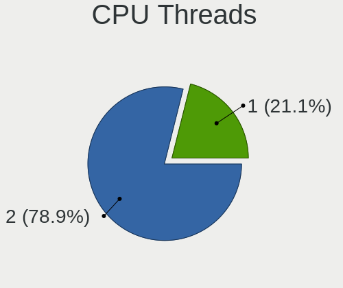
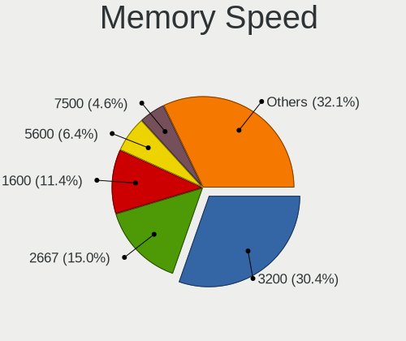

Ubuntu Hardware Trends (Notebooks)
----------------------------------

A project to identify most popular hardware characteristics and track their change
over time based on data collected by Ubuntu users at https://Linux-Hardware.org.

Anyone can contribute to this report by the [hw-probe](https://github.com/linuxhw/hw-probe) tool:

    sudo -E hw-probe -all -upload

Full-feature report is available here: https://linux-hardware.org/?view=trends

Period: Dec, 2021.

Contents
--------

* [ System ](#system)
  - [ OS                       ](#os)
  - [ OS Family                ](#os-family)
  - [ Kernel                   ](#kernel)
  - [ Kernel Family            ](#kernel-family)
  - [ Kernel Major Ver.        ](#kernel-major-ver)
  - [ Arch                     ](#arch)
  - [ DE                       ](#de)
  - [ Display Server           ](#display-server)
  - [ Display Manager          ](#display-manager)
  - [ OS Lang                  ](#os-lang)
  - [ Boot Mode                ](#boot-mode)
  - [ Filesystem               ](#filesystem)
  - [ Part. scheme             ](#part-scheme)
  - [ Dual Boot with Linux/BSD ](#dual-boot-with-linuxbsd)
  - [ Dual Boot (Win)          ](#dual-boot-win)

* [ Board ](#board)
  - [ Vendor                   ](#vendor)
  - [ Model                    ](#model)
  - [ Model Family             ](#model-family)
  - [ MFG Year                 ](#mfg-year)
  - [ Form Factor              ](#form-factor)
  - [ Secure Boot              ](#secure-boot)
  - [ Coreboot                 ](#coreboot)
  - [ RAM Size                 ](#ram-size)
  - [ RAM Used                 ](#ram-used)
  - [ Total Drives             ](#total-drives)
  - [ Has CD-ROM               ](#has-cd-rom)
  - [ Has Ethernet             ](#has-ethernet)
  - [ Has WiFi                 ](#has-wifi)
  - [ Has Bluetooth            ](#has-bluetooth)

* [ Location ](#location)
  - [ Country                  ](#country)
  - [ City                     ](#city)

* [ Drives ](#drives)
  - [ Drive Vendor             ](#drive-vendor)
  - [ Drive Model              ](#drive-model)
  - [ HDD Vendor               ](#hdd-vendor)
  - [ SSD Vendor               ](#ssd-vendor)
  - [ Drive Kind               ](#drive-kind)
  - [ Drive Connector          ](#drive-connector)
  - [ Drive Size               ](#drive-size)
  - [ Space Total              ](#space-total)
  - [ Space Used               ](#space-used)
  - [ Malfunc. Drives          ](#malfunc-drives)
  - [ Malfunc. Drive Vendor    ](#malfunc-drive-vendor)
  - [ Malfunc. HDD Vendor      ](#malfunc-hdd-vendor)
  - [ Malfunc. Drive Kind      ](#malfunc-drive-kind)
  - [ Failed Drives            ](#failed-drives)
  - [ Failed Drive Vendor      ](#failed-drive-vendor)
  - [ Drive Status             ](#drive-status)

* [ Storage controller ](#storage-controller)
  - [ Storage Vendor           ](#storage-vendor)
  - [ Storage Model            ](#storage-model)
  - [ Storage Kind             ](#storage-kind)

* [ Processor ](#processor)
  - [ CPU Vendor               ](#cpu-vendor)
  - [ CPU Model                ](#cpu-model)
  - [ CPU Model Family         ](#cpu-model-family)
  - [ CPU Cores                ](#cpu-cores)
  - [ CPU Sockets              ](#cpu-sockets)
  - [ CPU Threads              ](#cpu-threads)
  - [ CPU Op-Modes             ](#cpu-op-modes)
  - [ CPU Microcode            ](#cpu-microcode)
  - [ CPU Microarch            ](#cpu-microarch)

* [ Graphics ](#graphics)
  - [ GPU Vendor               ](#gpu-vendor)
  - [ GPU Model                ](#gpu-model)
  - [ GPU Combo                ](#gpu-combo)
  - [ GPU Driver               ](#gpu-driver)
  - [ GPU Memory               ](#gpu-memory)

* [ Monitor ](#monitor)
  - [ Monitor Vendor           ](#monitor-vendor)
  - [ Monitor Model            ](#monitor-model)
  - [ Monitor Resolution       ](#monitor-resolution)
  - [ Monitor Diagonal         ](#monitor-diagonal)
  - [ Monitor Width            ](#monitor-width)
  - [ Aspect Ratio             ](#aspect-ratio)
  - [ Monitor Area             ](#monitor-area)
  - [ Pixel Density            ](#pixel-density)
  - [ Multiple Monitors        ](#multiple-monitors)

* [ Network ](#network)
  - [ Net Controller Vendor    ](#net-controller-vendor)
  - [ Net Controller Model     ](#net-controller-model)
  - [ Wireless Vendor          ](#wireless-vendor)
  - [ Wireless Model           ](#wireless-model)
  - [ Ethernet Vendor          ](#ethernet-vendor)
  - [ Ethernet Model           ](#ethernet-model)
  - [ Net Controller Kind      ](#net-controller-kind)
  - [ Used Controller          ](#used-controller)
  - [ NICs                     ](#nics)
  - [ IPv6                     ](#ipv6)

* [ Bluetooth ](#bluetooth)
  - [ Bluetooth Vendor         ](#bluetooth-vendor)
  - [ Bluetooth Model          ](#bluetooth-model)

* [ Sound ](#sound)
  - [ Sound Vendor             ](#sound-vendor)
  - [ Sound Model              ](#sound-model)

* [ Memory ](#memory)
  - [ Memory Vendor            ](#memory-vendor)
  - [ Memory Model             ](#memory-model)
  - [ Memory Kind              ](#memory-kind)
  - [ Memory Form Factor       ](#memory-form-factor)
  - [ Memory Size              ](#memory-size)
  - [ Memory Speed             ](#memory-speed)

* [ Printers & scanners ](#printers--scanners)
  - [ Printer Vendor           ](#printer-vendor)
  - [ Printer Model            ](#printer-model)
  - [ Scanner Vendor           ](#scanner-vendor)
  - [ Scanner Model            ](#scanner-model)

* [ Camera ](#camera)
  - [ Camera Vendor            ](#camera-vendor)
  - [ Camera Model             ](#camera-model)

* [ Security ](#security)
  - [ Fingerprint Vendor       ](#fingerprint-vendor)
  - [ Fingerprint Model        ](#fingerprint-model)
  - [ Chipcard Vendor          ](#chipcard-vendor)
  - [ Chipcard Model           ](#chipcard-model)

* [ Unsupported ](#unsupported)
  - [ Unsupported Devices      ](#unsupported-devices)
  - [ Unsupported Device Types ](#unsupported-device-types)

System
------

OS
--

Installed operating systems

| Name         | Notebooks | Percent |
|--------------|-----------|---------|
| Ubuntu 20.04 | 482       | 66.57%  |
| Ubuntu 21.10 | 171       | 23.62%  |
| Ubuntu 21.04 | 32        | 4.42%   |
| Ubuntu 18.04 | 29        | 4.01%   |
| Ubuntu 22.04 | 6         | 0.83%   |
| Ubuntu 16.04 | 2         | 0.28%   |
| Ubuntu 20.10 | 1         | 0.14%   |
| Ubuntu 19.10 | 1         | 0.14%   |

OS Family
---------

OS without a version

| Name   | Notebooks | Percent |
|--------|-----------|---------|
| Ubuntu | 724       | 100%    |

Kernel
------

Version of the Linux kernel

| Version                  | Notebooks | Percent |
|--------------------------|-----------|---------|
| 5.11.0-41-generic        | 178       | 24.59%  |
| 5.11.0-43-generic        | 162       | 22.38%  |
| 5.13.0-22-generic        | 135       | 18.65%  |
| 5.4.0-91-generic         | 61        | 8.43%   |
| 5.11.0-27-generic        | 28        | 3.87%   |
| 5.11.0-40-generic        | 18        | 2.49%   |
| 5.13.0-19-generic        | 16        | 2.21%   |
| 5.11.0-42-generic        | 14        | 1.93%   |
| 5.11.0-44-generic        | 13        | 1.8%    |
| 5.13.0-23-generic        | 12        | 1.66%   |
| 5.11.0-38-generic        | 6         | 0.83%   |
| 5.10.0-1052-oem          | 5         | 0.69%   |
| 5.13.0-21-generic        | 4         | 0.55%   |
| 5.4.0-92-generic         | 3         | 0.41%   |
| 5.4.0-90-generic         | 3         | 0.41%   |
| 4.15.0-163-generic       | 3         | 0.41%   |
| 5.8.0-55-generic         | 2         | 0.28%   |
| 5.4.0-73-generic         | 2         | 0.28%   |
| 5.4.0-65-generic         | 2         | 0.28%   |
| 5.4.0-42-generic         | 2         | 0.28%   |
| 5.15.7-051507-generic    | 2         | 0.28%   |
| 5.13.0-1020-oem          | 2         | 0.28%   |
| 4.15.0-166-generic       | 2         | 0.28%   |
| 4.15.0-159-generic       | 2         | 0.28%   |
| 4.15.0-142-generic       | 2         | 0.28%   |
| 5.8.0-63-generic         | 1         | 0.14%   |
| 5.8.0-59-generic         | 1         | 0.14%   |
| 5.8.0-50-generic         | 1         | 0.14%   |
| 5.8.0-43-generic         | 1         | 0.14%   |
| 5.6.0-1036-oem           | 1         | 0.14%   |
| 5.5.5-050505-generic     | 1         | 0.14%   |
| 5.4.0-90-lowlatency      | 1         | 0.14%   |
| 5.4.0-84-generic         | 1         | 0.14%   |
| 5.4.0-81-lowlatency      | 1         | 0.14%   |
| 5.4.0-81-generic         | 1         | 0.14%   |
| 5.4.0-77-generic         | 1         | 0.14%   |
| 5.4.0-74-lowlatency      | 1         | 0.14%   |
| 5.4.0-74-generic         | 1         | 0.14%   |
| 5.4.0-66-generic         | 1         | 0.14%   |
| 5.4.0-48-generic         | 1         | 0.14%   |
| 5.4.0-26-generic         | 1         | 0.14%   |
| 5.3.0-64-generic         | 1         | 0.14%   |
| 5.3.0-28-generic         | 1         | 0.14%   |
| 5.16.0-051600rc3-generic | 1         | 0.14%   |
| 5.15.8-051508-generic    | 1         | 0.14%   |
| 5.15.6-051506-generic    | 1         | 0.14%   |
| 5.15.5-051505-generic    | 1         | 0.14%   |
| 5.15.2-051502-generic    | 1         | 0.14%   |
| 5.15.12-xanmod1          | 1         | 0.14%   |
| 5.15.12-051512-generic   | 1         | 0.14%   |
| 5.15.10-051510-generic   | 1         | 0.14%   |
| 5.15.1-051501-generic    | 1         | 0.14%   |
| 5.15.0-14-generic        | 1         | 0.14%   |
| 5.15.0-13-generic        | 1         | 0.14%   |
| 5.15.0-051500-generic    | 1         | 0.14%   |
| 5.14.0-1011-oem          | 1         | 0.14%   |
| 5.13.11-051311-generic   | 1         | 0.14%   |
| 5.13.0-23-lowlatency     | 1         | 0.14%   |
| 5.13.0-20-generic        | 1         | 0.14%   |
| 5.13.0-1022-oem          | 1         | 0.14%   |

Kernel Family
-------------

Linux kernel without a distro release

| Version | Notebooks | Percent |
|---------|-----------|---------|
| 5.11.0  | 423       | 58.43%  |
| 5.13.0  | 173       | 23.9%   |
| 5.4.0   | 83        | 11.46%  |
| 4.15.0  | 11        | 1.52%   |
| 5.8.0   | 6         | 0.83%   |
| 5.10.0  | 6         | 0.83%   |
| 5.15.0  | 3         | 0.41%   |
| 5.3.0   | 2         | 0.28%   |
| 5.15.7  | 2         | 0.28%   |
| 5.15.12 | 2         | 0.28%   |
| 5.6.0   | 1         | 0.14%   |
| 5.5.5   | 1         | 0.14%   |
| 5.16.0  | 1         | 0.14%   |
| 5.15.8  | 1         | 0.14%   |
| 5.15.6  | 1         | 0.14%   |
| 5.15.5  | 1         | 0.14%   |
| 5.15.2  | 1         | 0.14%   |
| 5.15.10 | 1         | 0.14%   |
| 5.15.1  | 1         | 0.14%   |
| 5.14.0  | 1         | 0.14%   |
| 5.13.11 | 1         | 0.14%   |
| 5.12.0  | 1         | 0.14%   |
| 5.10.32 | 1         | 0.14%   |

Kernel Major Ver.
-----------------

Linux kernel major version

| Version | Notebooks | Percent |
|---------|-----------|---------|
| 5.11    | 423       | 58.43%  |
| 5.13    | 174       | 24.03%  |
| 5.4     | 83        | 11.46%  |
| 5.15    | 13        | 1.8%    |
| 4.15    | 11        | 1.52%   |
| 5.10    | 7         | 0.97%   |
| 5.8     | 6         | 0.83%   |
| 5.3     | 2         | 0.28%   |
| 5.6     | 1         | 0.14%   |
| 5.5     | 1         | 0.14%   |
| 5.16    | 1         | 0.14%   |
| 5.14    | 1         | 0.14%   |
| 5.12    | 1         | 0.14%   |

Arch
----

OS architecture (x86_64, i586, etc.)

| Name   | Notebooks | Percent |
|--------|-----------|---------|
| x86_64 | 719       | 99.31%  |
| i686   | 5         | 0.69%   |

DE
--

Desktop Environment

| Name              | Notebooks | Percent |
|-------------------|-----------|---------|
| GNOME             | 683       | 94.34%  |
| Unknown           | 19        | 2.62%   |
| X-Cinnamon        | 7         | 0.97%   |
| Unity             | 7         | 0.97%   |
| GNOME Flashback   | 3         | 0.41%   |
| i3                | 2         | 0.28%   |
| Yaru:ubuntu:GNOME | 1         | 0.14%   |
| GNOME Classic     | 1         | 0.14%   |
| Cinnamon          | 1         | 0.14%   |

Display Server
--------------

X11 or Wayland

| Name    | Notebooks | Percent |
|---------|-----------|---------|
| X11     | 551       | 76.1%   |
| Wayland | 161       | 22.24%  |
| Unknown | 7         | 0.97%   |
| Tty     | 5         | 0.69%   |

Display Manager
---------------

SDDM, LightDM, etc.

| Name    | Notebooks | Percent |
|---------|-----------|---------|
| GDM3    | 422       | 58.29%  |
| GDM     | 249       | 34.39%  |
| Unknown | 38        | 5.25%   |
| LightDM | 13        | 1.8%    |
| SDDM    | 2         | 0.28%   |

OS Lang
-------

Language

| Lang    | Notebooks | Percent |
|---------|-----------|---------|
| en_US   | 303       | 41.85%  |
| de_DE   | 79        | 10.91%  |
| fr_FR   | 58        | 8.01%   |
| en_GB   | 41        | 5.66%   |
| en_IN   | 31        | 4.28%   |
| ru_RU   | 28        | 3.87%   |
| es_ES   | 21        | 2.9%    |
| pt_BR   | 19        | 2.62%   |
| it_IT   | 16        | 2.21%   |
| en_CA   | 15        | 2.07%   |
| pl_PL   | 9         | 1.24%   |
| en_AU   | 9         | 1.24%   |
| nl_NL   | 7         | 0.97%   |
| en_ZA   | 7         | 0.97%   |
| zh_CN   | 6         | 0.83%   |
| es_MX   | 5         | 0.69%   |
| Unknown | 5         | 0.69%   |
| hu_HU   | 4         | 0.55%   |
| de_CH   | 4         | 0.55%   |
| de_AT   | 4         | 0.55%   |
| da_DK   | 4         | 0.55%   |
| cs_CZ   | 4         | 0.55%   |
| sv_SE   | 3         | 0.41%   |
| ru_UA   | 3         | 0.41%   |
| nb_NO   | 3         | 0.41%   |
| es_CL   | 3         | 0.41%   |
| es_AR   | 3         | 0.41%   |
| C       | 3         | 0.41%   |
| zh_TW   | 2         | 0.28%   |
| tr_TR   | 2         | 0.28%   |
| pt_PT   | 2         | 0.28%   |
| ko_KR   | 2         | 0.28%   |
| fr_BE   | 2         | 0.28%   |
| en_SG   | 2         | 0.28%   |
| ro_RO   | 1         | 0.14%   |
| nl_BE   | 1         | 0.14%   |
| ja_JP   | 1         | 0.14%   |
| hr_HR   | 1         | 0.14%   |
| fr_CA   | 1         | 0.14%   |
| fi_FI   | 1         | 0.14%   |
| es_UY   | 1         | 0.14%   |
| es_PE   | 1         | 0.14%   |
| es_DO   | 1         | 0.14%   |
| es_CO   | 1         | 0.14%   |
| en_NG   | 1         | 0.14%   |
| en_DE   | 1         | 0.14%   |
| el_GR   | 1         | 0.14%   |
| bg_BG   | 1         | 0.14%   |
| ar_EG   | 1         | 0.14%   |

Boot Mode
---------

EFI or BIOS

| Mode | Notebooks | Percent |
|------|-----------|---------|
| EFI  | 385       | 53.18%  |
| BIOS | 339       | 46.82%  |

Filesystem
----------

Type of filesystem

| Type    | Notebooks | Percent |
|---------|-----------|---------|
| Ext4    | 679       | 93.78%  |
| Overlay | 23        | 3.18%   |
| Zfs     | 11        | 1.52%   |
| Ext2    | 5         | 0.69%   |
| Btrfs   | 5         | 0.69%   |
| Unknown | 1         | 0.14%   |

Part. scheme
------------

Scheme of partitioning

| Type    | Notebooks | Percent |
|---------|-----------|---------|
| Unknown | 456       | 62.98%  |
| GPT     | 231       | 31.91%  |
| MBR     | 37        | 5.11%   |

Dual Boot with Linux/BSD
------------------------

Hosting more than one Linux/BSD

| Dual boot | Notebooks | Percent |
|-----------|-----------|---------|
| No        | 660       | 91.16%  |
| Yes       | 64        | 8.84%   |

Dual Boot (Win)
---------------

Hosting Linux and Windows

| Dual boot | Notebooks | Percent |
|-----------|-----------|---------|
| No        | 455       | 62.85%  |
| Yes       | 269       | 37.15%  |

Board
-----

Vendor
------

Motherboard manufacturer

| Name                   | Notebooks | Percent |
|------------------------|-----------|---------|
| Hewlett-Packard        | 145       | 20.03%  |
| Lenovo                 | 142       | 19.61%  |
| Dell                   | 137       | 18.92%  |
| ASUSTek Computer       | 66        | 9.12%   |
| Acer                   | 61        | 8.43%   |
| Toshiba                | 23        | 3.18%   |
| MSI                    | 19        | 2.62%   |
| Apple                  | 19        | 2.62%   |
| Sony                   | 16        | 2.21%   |
| HUAWEI                 | 14        | 1.93%   |
| Samsung Electronics    | 11        | 1.52%   |
| Fujitsu                | 10        | 1.38%   |
| Medion                 | 6         | 0.83%   |
| Packard Bell           | 4         | 0.55%   |
| Unknown                | 4         | 0.55%   |
| Razer                  | 3         | 0.41%   |
| Fujitsu Siemens        | 3         | 0.41%   |
| Clevo                  | 3         | 0.41%   |
| Avell High Performance | 3         | 0.41%   |
| Alienware              | 3         | 0.41%   |
| Mediacom               | 2         | 0.28%   |
| LG Electronics         | 2         | 0.28%   |
| HONOR                  | 2         | 0.28%   |
| Google                 | 2         | 0.28%   |
| Gateway                | 2         | 0.28%   |
| eMachines              | 2         | 0.28%   |
| YJKC                   | 1         | 0.14%   |
| Wortmann AG            | 1         | 0.14%   |
| UNOWHY                 | 1         | 0.14%   |
| TUXEDO                 | 1         | 0.14%   |
| Timi                   | 1         | 0.14%   |
| SLIMBOOK               | 1         | 0.14%   |
| Schenker               | 1         | 0.14%   |
| Panasonic              | 1         | 0.14%   |
| OEM                    | 1         | 0.14%   |
| Notebook               | 1         | 0.14%   |
| Jooyontech Computer    | 1         | 0.14%   |
| iOTA                   | 1         | 0.14%   |
| Intel                  | 1         | 0.14%   |
| Framework              | 1         | 0.14%   |
| Dynabook               | 1         | 0.14%   |
| DukaPC                 | 1         | 0.14%   |
| Dream Machines         | 1         | 0.14%   |
| Chuwi                  | 1         | 0.14%   |
| AVITA                  | 1         | 0.14%   |
| Acidanthera            | 1         | 0.14%   |

Model
-----

Motherboard model

| Name                                                  | Notebooks | Percent |
|-------------------------------------------------------|-----------|---------|
| HP Pavilion g6                                        | 5         | 0.69%   |
| HP Notebook                                           | 5         | 0.69%   |
| HP EliteBook 840 G6                                   | 4         | 0.55%   |
| HP 255 G8 Notebook PC                                 | 4         | 0.55%   |
| Unknown                                               | 4         | 0.55%   |
| HUAWEI BOHK-WAX9X                                     | 3         | 0.41%   |
| HP ProBook 450 G8 Notebook PC                         | 3         | 0.41%   |
| HP Pavilion Notebook                                  | 3         | 0.41%   |
| HP Pavilion dv7                                       | 3         | 0.41%   |
| HP Pavilion dv6                                       | 3         | 0.41%   |
| HP Pavilion 15                                        | 3         | 0.41%   |
| HP EliteBook 840 G2                                   | 3         | 0.41%   |
| Dell Latitude E7470                                   | 3         | 0.41%   |
| Dell Latitude E6430                                   | 3         | 0.41%   |
| Dell Latitude E6410                                   | 3         | 0.41%   |
| Dell Latitude E6400                                   | 3         | 0.41%   |
| Dell Inspiron 1545                                    | 3         | 0.41%   |
| Apple MacBookPro7,1                                   | 3         | 0.41%   |
| Razer Blade 15 Advanced Model (Early 2020) - RZ09-033 | 2         | 0.28%   |
| MSI GE66 Raider 10SFS                                 | 2         | 0.28%   |
| Mediacom GTZS                                         | 2         | 0.28%   |
| Lenovo ThinkPad W520 42844LG                          | 2         | 0.28%   |
| Lenovo ThinkPad L15 Gen 2 20X3CTO1WW                  | 2         | 0.28%   |
| Lenovo ThinkBook 15 G3 ACL 21A4                       | 2         | 0.28%   |
| Lenovo ThinkBook 14p Gen 2 20YN                       | 2         | 0.28%   |
| Lenovo IdeaPad S145-15IWL 81MV                        | 2         | 0.28%   |
| Lenovo IdeaPad 5 15ITL05 82FG                         | 2         | 0.28%   |
| Lenovo IdeaPad 3 14ALC6 82KT                          | 2         | 0.28%   |
| HUAWEI NBLK-WAX9X                                     | 2         | 0.28%   |
| HUAWEI KLVL-WXX9                                      | 2         | 0.28%   |
| HUAWEI HVY-WXX9                                       | 2         | 0.28%   |
| HUAWEI BOHB-WAX9                                      | 2         | 0.28%   |
| HP ZBook 15 G3                                        | 2         | 0.28%   |
| HP ProBook 6550b                                      | 2         | 0.28%   |
| HP ProBook 650 G8 Notebook PC                         | 2         | 0.28%   |
| HP ProBook 6450b                                      | 2         | 0.28%   |
| HP ProBook 470 G3                                     | 2         | 0.28%   |
| HP ProBook 440 G6                                     | 2         | 0.28%   |
| HP Pavilion x2 Detachable                             | 2         | 0.28%   |
| HP Pavilion Gaming Laptop 15-ec2xxx                   | 2         | 0.28%   |
| HP Pavilion Gaming Laptop 15-dk1xxx                   | 2         | 0.28%   |
| HP Pavilion g7                                        | 2         | 0.28%   |
| HP Laptop 15s-eq1xxx                                  | 2         | 0.28%   |
| HP Laptop 15-dy1xxx                                   | 2         | 0.28%   |
| HP Laptop 15-da0xxx                                   | 2         | 0.28%   |
| HP G60                                                | 2         | 0.28%   |
| HP ENVY Laptop 13-ad1xx                               | 2         | 0.28%   |
| HP ENVY 17                                            | 2         | 0.28%   |
| HP EliteBook 840 G5                                   | 2         | 0.28%   |
| HP EliteBook 2570p                                    | 2         | 0.28%   |
| HP 250 G5 Notebook PC                                 | 2         | 0.28%   |
| HP 15                                                 | 2         | 0.28%   |
| Fujitsu LIFEBOOK S782                                 | 2         | 0.28%   |
| Dell XPS 17 9710                                      | 2         | 0.28%   |
| Dell XPS 15 9500                                      | 2         | 0.28%   |
| Dell XPS 13 9370                                      | 2         | 0.28%   |
| Dell XPS 13 9310                                      | 2         | 0.28%   |
| Dell XPS 13 7390                                      | 2         | 0.28%   |
| Dell Vostro 3500                                      | 2         | 0.28%   |
| Dell Precision 5560                                   | 2         | 0.28%   |

Model Family
------------

Motherboard model prefix

| Name                        | Notebooks | Percent |
|-----------------------------|-----------|---------|
| Lenovo ThinkPad             | 70        | 9.67%   |
| Dell Latitude               | 50        | 6.91%   |
| Dell Inspiron               | 40        | 5.52%   |
| Acer Aspire                 | 40        | 5.52%   |
| Lenovo IdeaPad              | 33        | 4.56%   |
| HP Pavilion                 | 33        | 4.56%   |
| HP EliteBook                | 26        | 3.59%   |
| HP ProBook                  | 22        | 3.04%   |
| HP Laptop                   | 18        | 2.49%   |
| Toshiba Satellite           | 17        | 2.35%   |
| Dell XPS                    | 15        | 2.07%   |
| Dell Precision              | 12        | 1.66%   |
| ASUS VivoBook               | 12        | 1.66%   |
| Acer Swift                  | 11        | 1.52%   |
| Fujitsu LIFEBOOK            | 10        | 1.38%   |
| Dell Vostro                 | 9         | 1.24%   |
| Lenovo ThinkBook            | 8         | 1.1%    |
| HP ZBook                    | 8         | 1.1%    |
| ASUS ROG                    | 7         | 0.97%   |
| HP ENVY                     | 6         | 0.83%   |
| HP Notebook                 | 5         | 0.69%   |
| HP 255                      | 5         | 0.69%   |
| ASUS ZenBook                | 5         | 0.69%   |
| Packard Bell EasyNote       | 4         | 0.55%   |
| Lenovo Legion               | 4         | 0.55%   |
| HP Compaq                   | 4         | 0.55%   |
| ASUS ASUS                   | 4         | 0.55%   |
| Unknown                     | 4         | 0.55%   |
| Toshiba TECRA               | 3         | 0.41%   |
| Razer Blade                 | 3         | 0.41%   |
| MSI Prestige                | 3         | 0.41%   |
| MSI GE66                    | 3         | 0.41%   |
| HUAWEI BOHK-WAX9X           | 3         | 0.41%   |
| HP 250                      | 3         | 0.41%   |
| HP 15                       | 3         | 0.41%   |
| Dell System                 | 3         | 0.41%   |
| Dell G3                     | 3         | 0.41%   |
| Apple MacBookPro7           | 3         | 0.41%   |
| Acer Extensa                | 3         | 0.41%   |
| Toshiba PORTEGE             | 2         | 0.28%   |
| Samsung 355V4C              | 2         | 0.28%   |
| MSI Modern                  | 2         | 0.28%   |
| MSI GF65                    | 2         | 0.28%   |
| Mediacom GTZS               | 2         | 0.28%   |
| Lenovo B590                 | 2         | 0.28%   |
| HUAWEI NBLK-WAX9X           | 2         | 0.28%   |
| HUAWEI KLVL-WXX9            | 2         | 0.28%   |
| HUAWEI HVY-WXX9             | 2         | 0.28%   |
| HUAWEI BOHB-WAX9            | 2         | 0.28%   |
| HP Stream                   | 2         | 0.28%   |
| HP G60                      | 2         | 0.28%   |
| Fujitsu Siemens AMILO       | 2         | 0.28%   |
| Dell G15                    | 2         | 0.28%   |
| Avell High Performance B.ON | 2         | 0.28%   |
| ASUS X550VX                 | 2         | 0.28%   |
| ASUS TUF                    | 2         | 0.28%   |
| Apple MacBookPro9           | 2         | 0.28%   |
| Apple MacBookPro8           | 2         | 0.28%   |
| Apple MacBookAir6           | 2         | 0.28%   |
| Apple MacBookAir3           | 2         | 0.28%   |

MFG Year
--------

Motherboard manufacture year

| Year | Notebooks | Percent |
|------|-----------|---------|
| 2021 | 209       | 28.87%  |
| 2020 | 75        | 10.36%  |
| 2019 | 67        | 9.25%   |
| 2011 | 49        | 6.77%   |
| 2018 | 46        | 6.35%   |
| 2012 | 44        | 6.08%   |
| 2016 | 35        | 4.83%   |
| 2014 | 34        | 4.7%    |
| 2013 | 32        | 4.42%   |
| 2017 | 31        | 4.28%   |
| 2010 | 29        | 4.01%   |
| 2015 | 27        | 3.73%   |
| 2008 | 22        | 3.04%   |
| 2009 | 19        | 2.62%   |
| 2007 | 5         | 0.69%   |

Form Factor
-----------

Physical design of the computer

| Name     | Notebooks | Percent |
|----------|-----------|---------|
| Notebook | 724       | 100%    |

Secure Boot
-----------

Enabled or disabled

| State    | Notebooks | Percent |
|----------|-----------|---------|
| Disabled | 599       | 82.73%  |
| Enabled  | 125       | 17.27%  |

Coreboot
--------

Have coreboot on board

| Used | Notebooks | Percent |
|------|-----------|---------|
| No   | 722       | 99.72%  |
| Yes  | 2         | 0.28%   |

RAM Size
--------

Total RAM memory

| Size in GB  | Notebooks | Percent |
|-------------|-----------|---------|
| 4.01-8.0    | 227       | 31.35%  |
| 3.01-4.0    | 167       | 23.07%  |
| 16.01-24.0  | 116       | 16.02%  |
| 8.01-16.0   | 115       | 15.88%  |
| 32.01-64.0  | 48        | 6.63%   |
| 1.01-2.0    | 25        | 3.45%   |
| 2.01-3.0    | 14        | 1.93%   |
| 64.01-256.0 | 7         | 0.97%   |
| 24.01-32.0  | 4         | 0.55%   |
| 0.51-1.0    | 1         | 0.14%   |

RAM Used
--------

Used RAM memory

| Used GB    | Notebooks | Percent |
|------------|-----------|---------|
| 1.01-2.0   | 278       | 38.4%   |
| 2.01-3.0   | 198       | 27.35%  |
| 4.01-8.0   | 102       | 14.09%  |
| 3.01-4.0   | 94        | 12.98%  |
| 8.01-16.0  | 39        | 5.39%   |
| 0.51-1.0   | 10        | 1.38%   |
| 0.01-0.5   | 2         | 0.28%   |
| 16.01-24.0 | 1         | 0.14%   |

Total Drives
------------

Number of drives on board

| Drives | Notebooks | Percent |
|--------|-----------|---------|
| 1      | 548       | 75.69%  |
| 2      | 149       | 20.58%  |
| 3      | 19        | 2.62%   |
| 0      | 7         | 0.97%   |
| 4      | 1         | 0.14%   |

Has CD-ROM
----------

Has CD-ROM on board

| Presented | Notebooks | Percent |
|-----------|-----------|---------|
| No        | 455       | 62.85%  |
| Yes       | 269       | 37.15%  |

Has Ethernet
------------

Has Ethernet on board

| Presented | Notebooks | Percent |
|-----------|-----------|---------|
| Yes       | 578       | 79.83%  |
| No        | 146       | 20.17%  |

Has WiFi
--------

Has WiFi module

| Presented | Notebooks | Percent |
|-----------|-----------|---------|
| Yes       | 712       | 98.34%  |
| No        | 12        | 1.66%   |

Has Bluetooth
-------------

Has Bluetooth module

| Presented | Notebooks | Percent |
|-----------|-----------|---------|
| Yes       | 568       | 78.45%  |
| No        | 156       | 21.55%  |

Location
--------

Country
-------

Geographic location (country)

| Country            | Notebooks | Percent |
|--------------------|-----------|---------|
| USA                | 105       | 14.5%   |
| Germany            | 92        | 12.71%  |
| France             | 64        | 8.84%   |
| UK                 | 35        | 4.83%   |
| India              | 32        | 4.42%   |
| Brazil             | 32        | 4.42%   |
| Russia             | 31        | 4.28%   |
| Spain              | 27        | 3.73%   |
| Italy              | 25        | 3.45%   |
| Poland             | 19        | 2.62%   |
| Canada             | 14        | 1.93%   |
| Sweden             | 12        | 1.66%   |
| Australia          | 11        | 1.52%   |
| Ukraine            | 10        | 1.38%   |
| Switzerland        | 10        | 1.38%   |
| Mexico             | 10        | 1.38%   |
| Austria            | 10        | 1.38%   |
| Netherlands        | 9         | 1.24%   |
| Czechia            | 9         | 1.24%   |
| Turkey             | 8         | 1.1%    |
| South Africa       | 8         | 1.1%    |
| Denmark            | 8         | 1.1%    |
| Belgium            | 8         | 1.1%    |
| Romania            | 7         | 0.97%   |
| Iran               | 6         | 0.83%   |
| Bulgaria           | 6         | 0.83%   |
| Argentina          | 6         | 0.83%   |
| Serbia             | 5         | 0.69%   |
| Portugal           | 5         | 0.69%   |
| Greece             | 5         | 0.69%   |
| Finland            | 5         | 0.69%   |
| Taiwan             | 4         | 0.55%   |
| Croatia            | 4         | 0.55%   |
| Vietnam            | 3         | 0.41%   |
| South Korea        | 3         | 0.41%   |
| Singapore          | 3         | 0.41%   |
| Saudi Arabia       | 3         | 0.41%   |
| Norway             | 3         | 0.41%   |
| Nepal              | 3         | 0.41%   |
| Dominican Republic | 3         | 0.41%   |
| China              | 3         | 0.41%   |
| Chile              | 3         | 0.41%   |
| Slovenia           | 2         | 0.28%   |
| Peru               | 2         | 0.28%   |
| Pakistan           | 2         | 0.28%   |
| Malaysia           | 2         | 0.28%   |
| Lebanon            | 2         | 0.28%   |
| Kenya              | 2         | 0.28%   |
| Japan              | 2         | 0.28%   |
| Indonesia          | 2         | 0.28%   |
| Hungary            | 2         | 0.28%   |
| Guadeloupe         | 2         | 0.28%   |
| Georgia            | 2         | 0.28%   |
| Egypt              | 2         | 0.28%   |
| Colombia           | 2         | 0.28%   |
| Cameroon           | 2         | 0.28%   |
| Uruguay            | 1         | 0.14%   |
| Uganda             | 1         | 0.14%   |
| UAE                | 1         | 0.14%   |
| Tunisia            | 1         | 0.14%   |

City
----

Geographic location (city)

| City               | Notebooks | Percent |
|--------------------|-----------|---------|
| Paris              | 10        | 1.38%   |
| Berlin             | 9         | 1.24%   |
| Moscow             | 8         | 1.1%    |
| S??o Paulo         | 7         | 0.97%   |
| Mumbai             | 6         | 0.83%   |
| Madrid             | 6         | 0.83%   |
| Warsaw             | 5         | 0.69%   |
| New Delhi          | 5         | 0.69%   |
| Milan              | 5         | 0.69%   |
| Kyiv               | 5         | 0.69%   |
| Chennai            | 5         | 0.69%   |
| Cape Town          | 5         | 0.69%   |
| Barcelona          | 5         | 0.69%   |
| Vlasikha           | 4         | 0.55%   |
| Vienna             | 4         | 0.55%   |
| Tehran             | 4         | 0.55%   |
| St Petersburg      | 4         | 0.55%   |
| Prague             | 4         | 0.55%   |
| Mexico City        | 4         | 0.55%   |
| London             | 4         | 0.55%   |
| Istanbul           | 4         | 0.55%   |
| Hamburg            | 4         | 0.55%   |
| Gothenburg         | 4         | 0.55%   |
| Dudley             | 4         | 0.55%   |
| Bucharest          | 4         | 0.55%   |
| Athens             | 4         | 0.55%   |
| Zagreb             | 3         | 0.41%   |
| Toulouse           | 3         | 0.41%   |
| Toronto            | 3         | 0.41%   |
| Sydney             | 3         | 0.41%   |
| Springfield        | 3         | 0.41%   |
| Singapore          | 3         | 0.41%   |
| Santiago           | 3         | 0.41%   |
| Rome               | 3         | 0.41%   |
| Pune               | 3         | 0.41%   |
| Portland           | 3         | 0.41%   |
| Philadelphia       | 3         | 0.41%   |
| New York           | 3         | 0.41%   |
| Munich             | 3         | 0.41%   |
| Mannheim           | 3         | 0.41%   |
| Manchester         | 3         | 0.41%   |
| Dresden            | 3         | 0.41%   |
| Brisbane           | 3         | 0.41%   |
| Belgrade           | 3         | 0.41%   |
| Beijing            | 3         | 0.41%   |
| Augsburg           | 3         | 0.41%   |
| Ankara             | 3         | 0.41%   |
| Zurich             | 2         | 0.28%   |
| Zheleznogorsk      | 2         | 0.28%   |
| Tula               | 2         | 0.28%   |
| Tucson             | 2         | 0.28%   |
| Stuttgart          | 2         | 0.28%   |
| Sofia              | 2         | 0.28%   |
| Seattle            | 2         | 0.28%   |
| Santo Domingo Este | 2         | 0.28%   |
| San Juan           | 2         | 0.28%   |
| San Fernando       | 2         | 0.28%   |
| San Antonio        | 2         | 0.28%   |
| Samara             | 2         | 0.28%   |
| Rostov-on-Don      | 2         | 0.28%   |

Drives
------

Drive Vendor
------------

Hard drive vendors

| Vendor                         | Notebooks | Drives | Percent |
|--------------------------------|-----------|--------|---------|
| WDC                            | 125       | 129    | 14.67%  |
| Samsung Electronics            | 113       | 123    | 13.26%  |
| Seagate                        | 92        | 96     | 10.8%   |
| Toshiba                        | 87        | 88     | 10.21%  |
| Sandisk                        | 53        | 53     | 6.22%   |
| Kingston                       | 48        | 48     | 5.63%   |
| Unknown                        | 40        | 45     | 4.69%   |
| SK Hynix                       | 40        | 41     | 4.69%   |
| Hitachi                        | 30        | 30     | 3.52%   |
| HGST                           | 25        | 25     | 2.93%   |
| Intel                          | 24        | 26     | 2.82%   |
| Crucial                        | 22        | 22     | 2.58%   |
| Micron Technology              | 17        | 17     | 2%      |
| KIOXIA                         | 14        | 14     | 1.64%   |
| Apple                          | 10        | 14     | 1.17%   |
| A-DATA Technology              | 10        | 11     | 1.17%   |
| LITEON                         | 9         | 9      | 1.06%   |
| Fujitsu                        | 8         | 8      | 0.94%   |
| Phison                         | 7         | 8      | 0.82%   |
| China                          | 5         | 5      | 0.59%   |
| Solid State Storage Technology | 4         | 4      | 0.47%   |
| Netac                          | 4         | 4      | 0.47%   |
| ADATA Technology               | 4         | 4      | 0.47%   |
| Intenso                        | 3         | 3      | 0.35%   |
| YMTC                           | 2         | 2      | 0.23%   |
| Transcend                      | 2         | 2      | 0.23%   |
| Team                           | 2         | 2      | 0.23%   |
| TCSUNBOW                       | 2         | 2      | 0.23%   |
| SSSTC                          | 2         | 2      | 0.23%   |
| PNY                            | 2         | 2      | 0.23%   |
| OCZ                            | 2         | 2      | 0.23%   |
| Mass                           | 2         | 2      | 0.23%   |
| LITEONIT                       | 2         | 2      | 0.23%   |
| Lexar                          | 2         | 2      | 0.23%   |
| KIOXIA-EXCERIA                 | 2         | 2      | 0.23%   |
| Indilinx                       | 2         | 2      | 0.23%   |
| Hewlett-Packard                | 2         | 2      | 0.23%   |
| Corsair                        | 2         | 2      | 0.23%   |
| ASMT                           | 2         | 2      | 0.23%   |
| Unknown                        | 2         | 2      | 0.23%   |
| Yangtze Memory Technologies    | 1         | 1      | 0.12%   |
| XPG                            | 1         | 2      | 0.12%   |
| Verbatim                       | 1         | 1      | 0.12%   |
| ValueTech                      | 1         | 1      | 0.12%   |
| Union Memory                   | 1         | 1      | 0.12%   |
| UMIS                           | 1         | 1      | 0.12%   |
| SABRENT                        | 1         | 1      | 0.12%   |
| Realtek Semiconductor          | 1         | 1      | 0.12%   |
| Realtek                        | 1         | 1      | 0.12%   |
| Patriot                        | 1         | 1      | 0.12%   |
| ORTIAL                         | 1         | 1      | 0.12%   |
| Micron/Crucial Technology      | 1         | 1      | 0.12%   |
| Leven                          | 1         | 1      | 0.12%   |
| Lenovo                         | 1         | 1      | 0.12%   |
| KINGSTONG                      | 1         | 1      | 0.12%   |
| KingSpec                       | 1         | 1      | 0.12%   |
| KingDian                       | 1         | 1      | 0.12%   |
| JMicron                        | 1         | 1      | 0.12%   |
| HUAWEI                         | 1         | 1      | 0.12%   |
| GOODRAM                        | 1         | 1      | 0.12%   |

Drive Model
-----------

Hard drive models

| Model                                | Notebooks | Percent |
|--------------------------------------|-----------|---------|
| Seagate ST1000LM035-1RK172 1TB       | 20        | 2.28%   |
| Toshiba MQ04ABF100 1TB               | 11        | 1.25%   |
| Toshiba MQ01ABF050 500GB             | 11        | 1.25%   |
| Toshiba MQ01ABD100 1TB               | 11        | 1.25%   |
| Seagate ST9500325AS 500GB            | 11        | 1.25%   |
| Unknown MMC Card  32GB               | 10        | 1.14%   |
| Sandisk NVMe SSD Drive 256GB         | 10        | 1.14%   |
| Kingston SA400S37240G 240GB SSD      | 9         | 1.03%   |
| Seagate ST1000LM024 HN-M101MBB 1TB   | 8         | 0.91%   |
| Samsung NVMe SSD Drive 512GB         | 8         | 0.91%   |
| Unknown MMC Card  64GB               | 7         | 0.8%    |
| Toshiba NVMe SSD Drive 256GB         | 6         | 0.68%   |
| Sandisk NVMe SSD Drive 512GB         | 6         | 0.68%   |
| Samsung NVMe SSD Drive 256GB         | 6         | 0.68%   |
| Kingston SA400S37480G 480GB SSD      | 6         | 0.68%   |
| WDC WD10JPVX-22JC3T0 1TB             | 5         | 0.57%   |
| SK Hynix NVMe SSD Drive 512GB        | 5         | 0.57%   |
| Seagate ST500LT012-1DG142 500GB      | 5         | 0.57%   |
| SanDisk SD8SN8U-256G-1006 256GB SSD  | 5         | 0.57%   |
| Samsung SSD 970 EVO Plus 1TB         | 5         | 0.57%   |
| Intel NVMe SSD Drive 512GB           | 5         | 0.57%   |
| HGST HTS725050A7E630 500GB           | 5         | 0.57%   |
| HGST HTS721010A9E630 1TB             | 5         | 0.57%   |
| HGST HTS541010A9E680 1TB             | 5         | 0.57%   |
| Crucial CT240BX500SSD1 240GB         | 5         | 0.57%   |
| WDC WDS100T2B0A-00SM50 1TB SSD       | 4         | 0.46%   |
| WDC WD5000LPCX-24VHAT0 500GB         | 4         | 0.46%   |
| Unknown MMC Card  16GB               | 4         | 0.46%   |
| Toshiba NVMe SSD Drive 512GB         | 4         | 0.46%   |
| SK Hynix PC711 NVMe 1TB              | 4         | 0.46%   |
| Seagate BUP Slim 1TB                 | 4         | 0.46%   |
| Samsung SSD 860 EVO 500GB            | 4         | 0.46%   |
| Hitachi HTS547550A9E384 500GB        | 4         | 0.46%   |
| HGST HTS545050A7E680 500GB           | 4         | 0.46%   |
| WDC WDS500G2B0B-00YS70 500GB SSD     | 3         | 0.34%   |
| WDC WDS240G2G0A-00JH30 240GB SSD     | 3         | 0.34%   |
| WDC WD10SPZX-21Z10T0 1TB             | 3         | 0.34%   |
| WDC PC SN730 SDBQNTY-1T00-1001 1TB   | 3         | 0.34%   |
| WDC PC SN530 SDBPMPZ-512G-1101 512GB | 3         | 0.34%   |
| Unknown SD/MMC/MS PRO 7GB            | 3         | 0.34%   |
| Toshiba MQ01ACF050 500GB             | 3         | 0.34%   |
| Toshiba MQ01ABD075 752GB             | 3         | 0.34%   |
| Seagate ST2000LM007-1R8174 2TB       | 3         | 0.34%   |
| Seagate ST1000LM049-2GH172 1TB       | 3         | 0.34%   |
| Sandisk NVMe SSD Drive 1024GB        | 3         | 0.34%   |
| Samsung SSD 870 QVO 1TB              | 3         | 0.34%   |
| Samsung SSD 860 EVO 1TB              | 3         | 0.34%   |
| Samsung SSD 850 EVO 500GB            | 3         | 0.34%   |
| Samsung SSD 850 EVO 250GB            | 3         | 0.34%   |
| Samsung NVMe SSD Drive 1024GB        | 3         | 0.34%   |
| Samsung MZNLN128HAHQ-000H1 128GB SSD | 3         | 0.34%   |
| KIOXIA KXG60ZNV512G 512GB            | 3         | 0.34%   |
| Kingston NVMe SSD Drive 512GB        | 3         | 0.34%   |
| Kingston NVMe SSD Drive 256GB        | 3         | 0.34%   |
| Intel SSDPEKNW010T8 1TB              | 3         | 0.34%   |
| Hitachi HTS547575A9E384 752GB        | 3         | 0.34%   |
| Hitachi HTS543216L9A300 160GB        | 3         | 0.34%   |
| HGST HTS545050A7E380 500GB           | 3         | 0.34%   |
| Crucial CT500MX500SSD1 500GB         | 3         | 0.34%   |
| Crucial CT1000MX500SSD1 1TB          | 3         | 0.34%   |

HDD Vendor
----------

Hard disk drive vendors

| Vendor              | Notebooks | Drives | Percent |
|---------------------|-----------|--------|---------|
| Seagate             | 89        | 92     | 30.07%  |
| WDC                 | 71        | 71     | 23.99%  |
| Toshiba             | 58        | 58     | 19.59%  |
| Hitachi             | 30        | 30     | 10.14%  |
| HGST                | 25        | 25     | 8.45%   |
| Samsung Electronics | 10        | 10     | 3.38%   |
| Fujitsu             | 8         | 8      | 2.7%    |
| Unknown             | 3         | 3      | 1.01%   |
| SABRENT             | 1         | 1      | 0.34%   |
| Apple               | 1         | 1      | 0.34%   |

SSD Vendor
----------

Solid state drive vendors

| Vendor              | Notebooks | Drives | Percent |
|---------------------|-----------|--------|---------|
| Samsung Electronics | 51        | 53     | 20.56%  |
| Kingston            | 31        | 31     | 12.5%   |
| SanDisk             | 30        | 30     | 12.1%   |
| Crucial             | 21        | 21     | 8.47%   |
| WDC                 | 19        | 19     | 7.66%   |
| Micron Technology   | 9         | 9      | 3.63%   |
| LITEON              | 9         | 9      | 3.63%   |
| SK Hynix            | 7         | 7      | 2.82%   |
| Toshiba             | 6         | 6      | 2.42%   |
| Intel               | 5         | 5      | 2.02%   |
| China               | 5         | 5      | 2.02%   |
| Apple               | 5         | 5      | 2.02%   |
| Netac               | 4         | 4      | 1.61%   |
| A-DATA Technology   | 4         | 5      | 1.61%   |
| Intenso             | 3         | 3      | 1.21%   |
| Transcend           | 2         | 2      | 0.81%   |
| Team                | 2         | 2      | 0.81%   |
| Seagate             | 2         | 2      | 0.81%   |
| PNY                 | 2         | 2      | 0.81%   |
| OCZ                 | 2         | 2      | 0.81%   |
| LITEONIT            | 2         | 2      | 0.81%   |
| Lexar               | 2         | 2      | 0.81%   |
| KIOXIA-EXCERIA      | 2         | 2      | 0.81%   |
| Indilinx            | 2         | 2      | 0.81%   |
| Hewlett-Packard     | 2         | 2      | 0.81%   |
| Corsair             | 2         | 2      | 0.81%   |
| ASMT                | 2         | 2      | 0.81%   |
| Verbatim            | 1         | 1      | 0.4%    |
| ValueTech           | 1         | 1      | 0.4%    |
| TCSUNBOW            | 1         | 1      | 0.4%    |
| SSSTC               | 1         | 1      | 0.4%    |
| Patriot             | 1         | 1      | 0.4%    |
| ORTIAL              | 1         | 1      | 0.4%    |
| Leven               | 1         | 1      | 0.4%    |
| KINGSTONG           | 1         | 1      | 0.4%    |
| KingSpec            | 1         | 1      | 0.4%    |
| KingDian            | 1         | 1      | 0.4%    |
| JMicron             | 1         | 1      | 0.4%    |
| GOODRAM             | 1         | 1      | 0.4%    |
| BIWIN               | 1         | 1      | 0.4%    |
| Aura                | 1         | 1      | 0.4%    |
| ADATA SU            | 1         | 1      | 0.4%    |

Drive Kind
----------

HDD or SSD

| Kind    | Notebooks | Drives | Percent |
|---------|-----------|--------|---------|
| HDD     | 289       | 299    | 34.95%  |
| NVMe    | 254       | 281    | 30.71%  |
| SSD     | 235       | 251    | 28.42%  |
| MMC     | 40        | 45     | 4.84%   |
| Unknown | 9         | 10     | 1.09%   |

Drive Connector
---------------

SATA, SAS, NVMe, etc.

| Type | Notebooks | Drives | Percent |
|------|-----------|--------|---------|
| SATA | 483       | 536    | 60.45%  |
| NVMe | 252       | 279    | 31.54%  |
| MMC  | 40        | 45     | 5.01%   |
| SAS  | 24        | 26     | 3%      |

Drive Size
----------

Size of hard drive

| Size in TB | Notebooks | Drives | Percent |
|------------|-----------|--------|---------|
| 0.01-0.5   | 357       | 381    | 68.26%  |
| 0.51-1.0   | 149       | 151    | 28.49%  |
| 1.01-2.0   | 15        | 16     | 2.87%   |
| 2.01-3.0   | 1         | 1      | 0.19%   |
| 4.01-10.0  | 1         | 1      | 0.19%   |

Space Total
-----------

Amount of disk space available on the file system

| Size in GB     | Notebooks | Percent |
|----------------|-----------|---------|
| 101-250        | 245       | 33.84%  |
| 251-500        | 184       | 25.41%  |
| 501-1000       | 113       | 15.61%  |
| 51-100         | 63        | 8.7%    |
| 21-50          | 36        | 4.97%   |
| 1001-2000      | 36        | 4.97%   |
| 1-20           | 26        | 3.59%   |
| 2001-3000      | 11        | 1.52%   |
| Unknown        | 7         | 0.97%   |
| More than 3000 | 3         | 0.41%   |

Space Used
----------

Amount of used disk space

| Used GB        | Notebooks | Percent |
|----------------|-----------|---------|
| 1-20           | 283       | 39.09%  |
| 21-50          | 176       | 24.31%  |
| 51-100         | 97        | 13.4%   |
| 101-250        | 90        | 12.43%  |
| 251-500        | 40        | 5.52%   |
| 501-1000       | 23        | 3.18%   |
| Unknown        | 7         | 0.97%   |
| 1001-2000      | 6         | 0.83%   |
| More than 3000 | 1         | 0.14%   |
| 2001-3000      | 1         | 0.14%   |

Malfunc. Drives
---------------

Drive models with a malfunction

| Model                                               | Notebooks | Drives | Percent |
|-----------------------------------------------------|-----------|--------|---------|
| Seagate ST1000LM035-1RK172 1TB                      | 4         | 4      | 11.76%  |
| Samsung Electronics HM250HI 250GB                   | 2         | 2      | 5.88%   |
| WDC WD5000LPCX-60VHAT0 500GB                        | 1         | 1      | 2.94%   |
| WDC WD5000BEVT-22A0RT0 500GB                        | 1         | 1      | 2.94%   |
| Toshiba THNSNK128GVN8 M.2 2280 128GB SSD            | 1         | 1      | 2.94%   |
| Toshiba MQ04ABF100 1TB                              | 1         | 1      | 2.94%   |
| Toshiba MK6459GSXP 640GB                            | 1         | 1      | 2.94%   |
| SK Hynix PC711 HFS512GDE9X073N 512GB                | 1         | 1      | 2.94%   |
| SK Hynix PC401 NVMe 512GB                           | 1         | 1      | 2.94%   |
| Seagate ST9500325AS 500GB                           | 1         | 1      | 2.94%   |
| Seagate ST9320325AS 320GB                           | 1         | 1      | 2.94%   |
| Seagate ST9250410ASG 250GB                          | 1         | 1      | 2.94%   |
| Seagate ST320LT020-9YG142 320GB                     | 1         | 1      | 2.94%   |
| Seagate ST2000LM007-1R8174 2TB                      | 1         | 1      | 2.94%   |
| Seagate ST1000LM024 HN-M101MBB 1TB                  | 1         | 1      | 2.94%   |
| SanDisk SD9SN8W-256G-1006 256GB SSD                 | 1         | 1      | 2.94%   |
| SanDisk SD7SN3Q-256G-1006 256GB SSD                 | 1         | 1      | 2.94%   |
| Samsung Electronics SSD 980 1TB                     | 1         | 1      | 2.94%   |
| Samsung Electronics SSD 840 EVO 120GB mSATA         | 1         | 1      | 2.94%   |
| Samsung Electronics HM641JI 640GB                   | 1         | 1      | 2.94%   |
| Samsung Electronics HM160HI 160GB                   | 1         | 1      | 2.94%   |
| Micron Technology MTFDDAK128MAY-1AH1ZABHA 128GB SSD | 1         | 1      | 2.94%   |
| Kingston RBU-SNS8350DES3128GP 128GB SSD             | 1         | 1      | 2.94%   |
| Hitachi HTS725032A9A364 320GB                       | 1         | 1      | 2.94%   |
| Hitachi HTS543232L9A300 320GB                       | 1         | 1      | 2.94%   |
| Hitachi HTS543216L9A300 160GB                       | 1         | 1      | 2.94%   |
| HGST HTS725050A7E630 500GB                          | 1         | 1      | 2.94%   |
| HGST HTS545050A7E680 500GB                          | 1         | 1      | 2.94%   |
| HGST HTS541010A9E680 1TB                            | 1         | 1      | 2.94%   |
| A-DATA Technology IM2P33F3A NVMe 256GB              | 1         | 1      | 2.94%   |

Malfunc. Drive Vendor
---------------------

Vendors of faulty drives

| Vendor              | Notebooks | Drives | Percent |
|---------------------|-----------|--------|---------|
| Seagate             | 10        | 10     | 29.41%  |
| Samsung Electronics | 6         | 6      | 17.65%  |
| Toshiba             | 3         | 3      | 8.82%   |
| Hitachi             | 3         | 3      | 8.82%   |
| HGST                | 3         | 3      | 8.82%   |
| WDC                 | 2         | 2      | 5.88%   |
| SK Hynix            | 2         | 2      | 5.88%   |
| SanDisk             | 2         | 2      | 5.88%   |
| Micron Technology   | 1         | 1      | 2.94%   |
| Kingston            | 1         | 1      | 2.94%   |
| A-DATA Technology   | 1         | 1      | 2.94%   |

Malfunc. HDD Vendor
-------------------

Vendors of faulty HDD drives

| Vendor              | Notebooks | Drives | Percent |
|---------------------|-----------|--------|---------|
| Seagate             | 10        | 10     | 41.67%  |
| Samsung Electronics | 4         | 4      | 16.67%  |
| Hitachi             | 3         | 3      | 12.5%   |
| HGST                | 3         | 3      | 12.5%   |
| WDC                 | 2         | 2      | 8.33%   |
| Toshiba             | 2         | 2      | 8.33%   |

Malfunc. Drive Kind
-------------------

Kinds of faulty drives

| Kind | Notebooks | Drives | Percent |
|------|-----------|--------|---------|
| HDD  | 24        | 24     | 70.59%  |
| SSD  | 6         | 6      | 17.65%  |
| NVMe | 4         | 4      | 11.76%  |

Failed Drives
-------------

Failed drive models

Zero info for selected period =(

Failed Drive Vendor
-------------------

Failed drive vendors

Zero info for selected period =(

Drive Status
------------

Number of failed and malfunc. drives

| Status   | Notebooks | Drives | Percent |
|----------|-----------|--------|---------|
| Detected | 466       | 560    | 62.05%  |
| Works    | 251       | 292    | 33.42%  |
| Malfunc  | 34        | 34     | 4.53%   |

Storage controller
------------------

Storage Vendor
--------------

Storage controller vendors

| Vendor                         | Notebooks | Percent |
|--------------------------------|-----------|---------|
| Intel                          | 506       | 59.81%  |
| AMD                            | 83        | 9.81%   |
| Sandisk                        | 58        | 6.86%   |
| Samsung Electronics            | 57        | 6.74%   |
| SK Hynix                       | 34        | 4.02%   |
| Toshiba America Info Systems   | 25        | 2.96%   |
| Kingston Technology Company    | 17        | 2.01%   |
| KIOXIA                         | 12        | 1.42%   |
| Nvidia                         | 9         | 1.06%   |
| ADATA Technology               | 9         | 1.06%   |
| Micron Technology              | 8         | 0.95%   |
| Phison Electronics             | 7         | 0.83%   |
| Solid State Storage Technology | 5         | 0.59%   |
| Realtek Semiconductor          | 3         | 0.35%   |
| Marvell Technology Group       | 3         | 0.35%   |
| Apple                          | 3         | 0.35%   |
| Yangtze Memory Technologies    | 2         | 0.24%   |
| Micron/Crucial Technology      | 2         | 0.24%   |
| Union Memory (Shenzhen)        | 1         | 0.12%   |
| Shenzhen Longsys Electronics   | 1         | 0.12%   |
| Lenovo                         | 1         | 0.12%   |

Storage Model
-------------

Storage controller models

| Model                                                                            | Notebooks | Percent |
|----------------------------------------------------------------------------------|-----------|---------|
| AMD FCH SATA Controller [AHCI mode]                                              | 72        | 7.92%   |
| Intel Sunrise Point-LP SATA Controller [AHCI mode]                               | 56        | 6.16%   |
| Intel 7 Series Chipset Family 6-port SATA Controller [AHCI mode]                 | 54        | 5.94%   |
| Intel 82801 Mobile SATA Controller [RAID mode]                                   | 50        | 5.5%    |
| Intel 6 Series/C200 Series Chipset Family 6 port Mobile SATA AHCI Controller     | 40        | 4.4%    |
| Intel Volume Management Device NVMe RAID Controller                              | 36        | 3.96%   |
| Intel 8 Series SATA Controller 1 [AHCI mode]                                     | 31        | 3.41%   |
| Intel 82801IBM/IEM (ICH9M/ICH9M-E) 4 port SATA Controller [AHCI mode]            | 27        | 2.97%   |
| Intel Wildcat Point-LP SATA Controller [AHCI Mode]                               | 25        | 2.75%   |
| Samsung NVMe SSD Controller SM981/PM981/PM983                                    | 21        | 2.31%   |
| Samsung NVMe SSD Controller 980                                                  | 20        | 2.2%    |
| Intel 5 Series/3400 Series Chipset 4 port SATA AHCI Controller                   | 20        | 2.2%    |
| SK Hynix Gold P31 SSD                                                            | 17        | 1.87%   |
| Sandisk WD Blue SN550 NVMe SSD                                                   | 17        | 1.87%   |
| Intel Comet Lake SATA AHCI Controller                                            | 17        | 1.87%   |
| Sandisk WD Black SN750 / PC SN730 NVMe SSD                                       | 16        | 1.76%   |
| Intel 82801HM/HEM (ICH8M/ICH8M-E) IDE Controller                                 | 15        | 1.65%   |
| Intel Tiger Lake-LP SATA Controller [AHCI mode]                                  | 14        | 1.54%   |
| Intel 8 Series/C220 Series Chipset Family 6-port SATA Controller 1 [AHCI mode]   | 14        | 1.54%   |
| Intel 5 Series/3400 Series Chipset 6 port SATA AHCI Controller                   | 13        | 1.43%   |
| Intel Cannon Point-LP SATA Controller [AHCI Mode]                                | 12        | 1.32%   |
| Intel 82801HM/HEM (ICH8M/ICH8M-E) SATA Controller [AHCI mode]                    | 12        | 1.32%   |
| Toshiba America Info Systems XG6 NVMe SSD Controller                             | 11        | 1.21%   |
| Sandisk Non-Volatile memory controller                                           | 11        | 1.21%   |
| KIOXIA Non-Volatile memory controller                                            | 11        | 1.21%   |
| Intel SSD 660P Series                                                            | 11        | 1.21%   |
| Intel HM170/QM170 Chipset SATA Controller [AHCI Mode]                            | 10        | 1.1%    |
| Intel Celeron N3350/Pentium N4200/Atom E3900 Series SATA AHCI Controller         | 10        | 1.1%    |
| Intel Cannon Lake Mobile PCH SATA AHCI Controller                                | 10        | 1.1%    |
| Intel Atom Processor E3800 Series SATA AHCI Controller                           | 10        | 1.1%    |
| SK Hynix Non-Volatile memory controller                                          | 9         | 0.99%   |
| Sandisk WD Blue SN500 / PC SN520 NVMe SSD                                        | 8         | 0.88%   |
| Micron Non-Volatile memory controller                                            | 8         | 0.88%   |
| Kingston Company Company Non-Volatile memory controller                          | 8         | 0.88%   |
| AMD SB7x0/SB8x0/SB9x0 SATA Controller [AHCI mode]                                | 8         | 0.88%   |
| Toshiba America Info Systems Toshiba America Info Non-Volatile memory controller | 7         | 0.77%   |
| Samsung NVMe SSD Controller SM961/PM961/SM963                                    | 7         | 0.77%   |
| Samsung NVMe SSD Controller PM9A1/PM9A3/980PRO                                   | 7         | 0.77%   |
| ADATA Non-Volatile memory controller                                             | 7         | 0.77%   |
| Toshiba America Info Systems BG3 NVMe SSD Controller                             | 6         | 0.66%   |
| SK Hynix BC511                                                                   | 6         | 0.66%   |
| Intel Non-Volatile memory controller                                             | 6         | 0.66%   |
| Intel Celeron/Pentium Silver Processor SATA Controller                           | 6         | 0.66%   |
| Solid State Storage Non-Volatile memory controller                               | 5         | 0.55%   |
| Sandisk WD Black 2018/SN750 / PC SN720 NVMe SSD                                  | 5         | 0.55%   |
| Nvidia MCP89 SATA Controller (AHCI mode)                                         | 5         | 0.55%   |
| Intel Atom/Celeron/Pentium Processor x5-E8000/J3xxx/N3xxx Series SATA Controller | 5         | 0.55%   |
| Intel 400 Series Chipset Family SATA AHCI Controller                             | 5         | 0.55%   |
| Phison PS5013 E13 NVMe Controller                                                | 4         | 0.44%   |
| Kingston Company OM3PDP3 NVMe SSD                                                | 4         | 0.44%   |
| Intel Q170/Q150/B150/H170/H110/Z170/CM236 Chipset SATA Controller [AHCI Mode]    | 4         | 0.44%   |
| Intel 500 Series Chipset Family SATA AHCI Controller                             | 4         | 0.44%   |
| Marvell Group 88SS9183 PCIe SSD Controller                                       | 3         | 0.33%   |
| Kingston Company U-SNS8154P3 NVMe SSD                                            | 3         | 0.33%   |
| Intel Mobile 4 Series Chipset PT IDER Controller                                 | 3         | 0.33%   |
| Intel Ice Lake-LP SATA Controller [AHCI mode]                                    | 3         | 0.33%   |
| Intel 82801IBM/IEM (ICH9M/ICH9M-E) 2 port SATA Controller [IDE mode]             | 3         | 0.33%   |
| Intel 82801HM/HEM (ICH8M/ICH8M-E) SATA Controller [IDE mode]                     | 3         | 0.33%   |
| Intel 82801GBM/GHM (ICH7-M Family) SATA Controller [AHCI mode]                   | 3         | 0.33%   |
| Intel 82801G (ICH7 Family) IDE Controller                                        | 3         | 0.33%   |

Storage Kind
------------

Kind of storage controller (IDE, SATA, NVMe, SAS, ...)

| Kind | Notebooks | Percent |
|------|-----------|---------|
| SATA | 500       | 56.69%  |
| NVMe | 253       | 28.68%  |
| RAID | 88        | 9.98%   |
| IDE  | 41        | 4.65%   |

Processor
---------

CPU Vendor
----------

Processor vendors

| Vendor | Notebooks | Percent |
|--------|-----------|---------|
| Intel  | 603       | 83.29%  |
| AMD    | 121       | 16.71%  |

CPU Model
---------

Processor models

| Model                                         | Notebooks | Percent |
|-----------------------------------------------|-----------|---------|
| Intel 11th Gen Core i7-1165G7 @ 2.80GHz       | 24        | 3.31%   |
| Intel Core i7-8550U CPU @ 1.80GHz             | 17        | 2.35%   |
| Intel 11th Gen Core i5-1135G7 @ 2.40GHz       | 17        | 2.35%   |
| Intel Core i5-8250U CPU @ 1.60GHz             | 14        | 1.93%   |
| Intel Core i7-8565U CPU @ 1.80GHz             | 12        | 1.66%   |
| Intel Core i5-3210M CPU @ 2.50GHz             | 12        | 1.66%   |
| AMD Ryzen 5 3500U with Radeon Vega Mobile Gfx | 11        | 1.52%   |
| Intel Core i7-10510U CPU @ 1.80GHz            | 10        | 1.38%   |
| Intel Core i5-7200U CPU @ 2.50GHz             | 10        | 1.38%   |
| Intel Core i5-10210U CPU @ 1.60GHz            | 9         | 1.24%   |
| Intel 11th Gen Core i7-1185G7 @ 3.00GHz       | 8         | 1.1%    |
| AMD Ryzen 5 5500U with Radeon Graphics        | 8         | 1.1%    |
| Intel Core i5-5200U CPU @ 2.20GHz             | 7         | 0.97%   |
| Intel Core i5-4300U CPU @ 1.90GHz             | 7         | 0.97%   |
| Intel Core i7-6500U CPU @ 2.50GHz             | 6         | 0.83%   |
| Intel Core i7-4510U CPU @ 2.00GHz             | 6         | 0.83%   |
| Intel Core i7-10750H CPU @ 2.60GHz            | 6         | 0.83%   |
| Intel Core i5-6200U CPU @ 2.30GHz             | 6         | 0.83%   |
| Intel Core i5-5300U CPU @ 2.30GHz             | 6         | 0.83%   |
| Intel Core i5-3320M CPU @ 2.60GHz             | 6         | 0.83%   |
| Intel Core i5-2520M CPU @ 2.50GHz             | 6         | 0.83%   |
| Intel Core i5-2410M CPU @ 2.30GHz             | 6         | 0.83%   |
| Intel Core i5 CPU M 520 @ 2.40GHz             | 6         | 0.83%   |
| Intel Core i3-6006U CPU @ 2.00GHz             | 6         | 0.83%   |
| Intel 11th Gen Core i7-11800H @ 2.30GHz       | 6         | 0.83%   |
| Intel Core i7-3520M CPU @ 2.90GHz             | 5         | 0.69%   |
| Intel Core i5-8265U CPU @ 1.60GHz             | 5         | 0.69%   |
| Intel Core i5 CPU M 480 @ 2.67GHz             | 5         | 0.69%   |
| Intel Core i3-2350M CPU @ 2.30GHz             | 5         | 0.69%   |
| Intel Core i3-2310M CPU @ 2.10GHz             | 5         | 0.69%   |
| Intel Core i3 CPU M 380 @ 2.53GHz             | 5         | 0.69%   |
| Intel Core i3 CPU M 350 @ 2.27GHz             | 5         | 0.69%   |
| Intel Core 2 Duo CPU P8600 @ 2.40GHz          | 5         | 0.69%   |
| Intel Celeron CPU N3350 @ 1.10GHz             | 5         | 0.69%   |
| AMD Ryzen 7 5700U with Radeon Graphics        | 5         | 0.69%   |
| AMD Ryzen 7 4800H with Radeon Graphics        | 5         | 0.69%   |
| AMD Ryzen 5 4600H with Radeon Graphics        | 5         | 0.69%   |
| Intel Core i7-7700HQ CPU @ 2.80GHz            | 4         | 0.55%   |
| Intel Core i7-7500U CPU @ 2.70GHz             | 4         | 0.55%   |
| Intel Core i7-2670QM CPU @ 2.20GHz            | 4         | 0.55%   |
| Intel Core i7-10875H CPU @ 2.30GHz            | 4         | 0.55%   |
| Intel Core i5-4210U CPU @ 1.70GHz             | 4         | 0.55%   |
| Intel Core i5-4200U CPU @ 1.60GHz             | 4         | 0.55%   |
| Intel Core i5-3230M CPU @ 2.60GHz             | 4         | 0.55%   |
| Intel Core i5-2450M CPU @ 2.50GHz             | 4         | 0.55%   |
| Intel Core i5-1035G1 CPU @ 1.00GHz            | 4         | 0.55%   |
| Intel Core i5-10300H CPU @ 2.50GHz            | 4         | 0.55%   |
| Intel Core i5 CPU M 560 @ 2.67GHz             | 4         | 0.55%   |
| Intel Core i3-1005G1 CPU @ 1.20GHz            | 4         | 0.55%   |
| Intel Celeron CPU N3060 @ 1.60GHz             | 4         | 0.55%   |
| Intel Celeron CPU N2840 @ 2.16GHz             | 4         | 0.55%   |
| AMD A8-6410 APU with AMD Radeon R5 Graphics   | 4         | 0.55%   |
| Intel Pentium Silver N5000 CPU @ 1.10GHz      | 3         | 0.41%   |
| Intel Pentium Dual-Core CPU T4500 @ 2.30GHz   | 3         | 0.41%   |
| Intel Pentium Dual-Core CPU T4300 @ 2.10GHz   | 3         | 0.41%   |
| Intel Core i7-9850H CPU @ 2.60GHz             | 3         | 0.41%   |
| Intel Core i7-9750H CPU @ 2.60GHz             | 3         | 0.41%   |
| Intel Core i7-8750H CPU @ 2.20GHz             | 3         | 0.41%   |
| Intel Core i7-7820HQ CPU @ 2.90GHz            | 3         | 0.41%   |
| Intel Core i7-6700HQ CPU @ 2.60GHz            | 3         | 0.41%   |

CPU Model Family
----------------

Processor model prefix

| Model                          | Notebooks | Percent |
|--------------------------------|-----------|---------|
| Intel Core i5                  | 188       | 25.97%  |
| Intel Core i7                  | 144       | 19.89%  |
| Other                          | 78        | 10.77%  |
| Intel Core i3                  | 62        | 8.56%   |
| Intel Core 2 Duo               | 40        | 5.52%   |
| Intel Celeron                  | 38        | 5.25%   |
| AMD Ryzen 5                    | 36        | 4.97%   |
| AMD Ryzen 7                    | 21        | 2.9%    |
| Intel Pentium                  | 15        | 2.07%   |
| Intel Atom                     | 10        | 1.38%   |
| AMD A6                         | 10        | 1.38%   |
| Intel Pentium Dual-Core        | 9         | 1.24%   |
| AMD Ryzen 9                    | 7         | 0.97%   |
| AMD A8                         | 7         | 0.97%   |
| Intel Pentium Silver           | 5         | 0.69%   |
| Intel Core i9                  | 5         | 0.69%   |
| Intel Pentium Dual             | 4         | 0.55%   |
| AMD A10                        | 4         | 0.55%   |
| Intel Core M                   | 3         | 0.41%   |
| Intel Core 2                   | 3         | 0.41%   |
| AMD Turion 64 X2 Mobile        | 3         | 0.41%   |
| AMD Ryzen 3                    | 3         | 0.41%   |
| AMD A4                         | 3         | 0.41%   |
| Intel Xeon                     | 2         | 0.28%   |
| Intel Core m3                  | 2         | 0.28%   |
| AMD Ryzen 7 PRO                | 2         | 0.28%   |
| AMD Phenom II                  | 2         | 0.28%   |
| AMD E2                         | 2         | 0.28%   |
| AMD E                          | 2         | 0.28%   |
| AMD Athlon                     | 2         | 0.28%   |
| Intel Core m7                  | 1         | 0.14%   |
| Intel Celeron M                | 1         | 0.14%   |
| Intel Celeron Dual-Core        | 1         | 0.14%   |
| AMD Turion X2 Dual-Core Mobile | 1         | 0.14%   |
| AMD Turion II Dual-Core        | 1         | 0.14%   |
| AMD Ryzen 5 PRO                | 1         | 0.14%   |
| AMD Ryzen 3 PRO                | 1         | 0.14%   |
| AMD PRO A10                    | 1         | 0.14%   |
| AMD FX                         | 1         | 0.14%   |
| AMD E1                         | 1         | 0.14%   |
| AMD Athlon II Dual-Core        | 1         | 0.14%   |
| AMD Athlon II                  | 1         | 0.14%   |

CPU Cores
---------

Number of processor cores

| Number | Notebooks | Percent |
|--------|-----------|---------|
| 2      | 381       | 52.62%  |
| 4      | 248       | 34.25%  |
| 8      | 47        | 6.49%   |
| 6      | 39        | 5.39%   |
| 1      | 8         | 1.1%    |
| 3      | 1         | 0.14%   |

CPU Sockets
-----------

Number of sockets

| Number | Notebooks | Percent |
|--------|-----------|---------|
| 1      | 724       | 100%    |

CPU Threads
-----------

Threads per core (Hyper-Threading)

| Number | Notebooks | Percent |
|--------|-----------|---------|
| 2      | 548       | 75.69%  |
| 1      | 176       | 24.31%  |

CPU Op-Modes
------------

CPU Operation Modes (32-bit, 64-bit)

| Op mode        | Notebooks | Percent |
|----------------|-----------|---------|
| 32-bit, 64-bit | 723       | 99.86%  |
| 32-bit         | 1         | 0.14%   |

CPU Microcode
-------------

Microcode number

| Number     | Notebooks | Percent |
|------------|-----------|---------|
| Unknown    | 172       | 23.76%  |
| 0x806c1    | 46        | 6.35%   |
| 0x306a9    | 41        | 5.66%   |
| 0x206a7    | 34        | 4.7%    |
| 0x806ec    | 30        | 4.14%   |
| 0x1067a    | 30        | 4.14%   |
| 0x806ea    | 29        | 4.01%   |
| 0x406e3    | 26        | 3.59%   |
| 0x40651    | 25        | 3.45%   |
| 0x306d4    | 22        | 3.04%   |
| 0x806e9    | 20        | 2.76%   |
| 0x20655    | 18        | 2.49%   |
| 0xa0652    | 16        | 2.21%   |
| 0x0a50000c | 12        | 1.66%   |
| 0x08600106 | 12        | 1.66%   |
| 0x08108109 | 12        | 1.66%   |
| 0x706e5    | 11        | 1.52%   |
| 0x08608103 | 11        | 1.52%   |
| 0x306c3    | 10        | 1.38%   |
| 0x806d1    | 9         | 1.24%   |
| 0x6fd      | 9         | 1.24%   |
| 0x30678    | 9         | 1.24%   |
| 0x20652    | 8         | 1.1%    |
| 0x506c9    | 7         | 0.97%   |
| 0x906ea    | 6         | 0.83%   |
| 0x406c4    | 6         | 0.83%   |
| 0x406c3    | 6         | 0.83%   |
| 0x906e9    | 5         | 0.69%   |
| 0x806eb    | 5         | 0.69%   |
| 0x10676    | 5         | 0.69%   |
| 0x08600104 | 5         | 0.69%   |
| 0x08108102 | 5         | 0.69%   |
| 0x06006705 | 5         | 0.69%   |
| 0x506e3    | 4         | 0.55%   |
| 0x07030105 | 4         | 0.55%   |
| 0x06001119 | 4         | 0.55%   |
| 0x906c0    | 3         | 0.41%   |
| 0x6f6      | 3         | 0.41%   |
| 0x106ca    | 3         | 0.41%   |
| 0x906ed    | 2         | 0.28%   |
| 0x706a8    | 2         | 0.28%   |
| 0x706a1    | 2         | 0.28%   |
| 0x6fa      | 2         | 0.28%   |
| 0x506ca    | 2         | 0.28%   |
| 0x10661    | 2         | 0.28%   |
| 0x08608102 | 2         | 0.28%   |
| 0x08200103 | 2         | 0.28%   |
| 0x07030106 | 2         | 0.28%   |
| 0x0700010f | 2         | 0.28%   |
| 0x03000027 | 2         | 0.28%   |
| 0x010000c8 | 2         | 0.28%   |
| 0x806c2    | 1         | 0.14%   |
| 0x106e5    | 1         | 0.14%   |
| 0x106c2    | 1         | 0.14%   |
| 0x08600103 | 1         | 0.14%   |
| 0x08600102 | 1         | 0.14%   |
| 0x0810100b | 1         | 0.14%   |
| 0x08101007 | 1         | 0.14%   |
| 0x06006704 | 1         | 0.14%   |
| 0x06006115 | 1         | 0.14%   |

CPU Microarch
-------------

Microarchitecture

| Name            | Notebooks | Percent |
|-----------------|-----------|---------|
| KabyLake        | 129       | 17.82%  |
| TigerLake       | 59        | 8.15%   |
| IvyBridge       | 55        | 7.6%    |
| SandyBridge     | 52        | 7.18%   |
| Haswell         | 51        | 7.04%   |
| Penryn          | 42        | 5.8%    |
| Westmere        | 39        | 5.39%   |
| Skylake         | 37        | 5.11%   |
| Broadwell       | 27        | 3.73%   |
| Zen 2           | 23        | 3.18%   |
| Silvermont      | 23        | 3.18%   |
| IceLake         | 21        | 2.9%    |
| Zen+            | 20        | 2.76%   |
| Core            | 20        | 2.76%   |
| CometLake       | 20        | 2.76%   |
| Unknown         | 18        | 2.49%   |
| Zen 3           | 12        | 1.66%   |
| Excavator       | 12        | 1.66%   |
| Goldmont        | 10        | 1.38%   |
| Puma            | 9         | 1.24%   |
| Zen             | 7         | 0.97%   |
| Goldmont plus   | 7         | 0.97%   |
| K10             | 5         | 0.69%   |
| Piledriver      | 4         | 0.55%   |
| Jaguar          | 4         | 0.55%   |
| Bonnell         | 4         | 0.55%   |
| K8 Hammer       | 3         | 0.41%   |
| K10 Llano       | 3         | 0.41%   |
| Bobcat          | 3         | 0.41%   |
| Tremont         | 2         | 0.28%   |
| Steamroller     | 1         | 0.14%   |
| Nehalem         | 1         | 0.14%   |
| K8 & K10 hybrid | 1         | 0.14%   |

Graphics
--------

GPU Vendor
----------

Vendors of graphics cards

| Vendor | Notebooks | Percent |
|--------|-----------|---------|
| Intel  | 555       | 60.92%  |
| Nvidia | 186       | 20.42%  |
| AMD    | 170       | 18.66%  |

GPU Model
---------

Graphics card models

| Model                                                                                    | Notebooks | Percent |
|------------------------------------------------------------------------------------------|-----------|---------|
| Intel TigerLake-LP GT2 [Iris Xe Graphics]                                                | 55        | 5.86%   |
| Intel 3rd Gen Core processor Graphics Controller                                         | 52        | 5.54%   |
| Intel 2nd Generation Core Processor Family Integrated Graphics Controller                | 48        | 5.11%   |
| Intel UHD Graphics 620                                                                   | 36        | 3.83%   |
| Intel Haswell-ULT Integrated Graphics Controller                                         | 34        | 3.62%   |
| Intel Mobile 4 Series Chipset Integrated Graphics Controller                             | 28        | 2.98%   |
| Intel Skylake GT2 [HD Graphics 520]                                                      | 26        | 2.77%   |
| Intel Core Processor Integrated Graphics Controller                                      | 26        | 2.77%   |
| Intel CometLake-U GT2 [UHD Graphics]                                                     | 25        | 2.66%   |
| AMD Renoir                                                                               | 23        | 2.45%   |
| AMD Picasso/Raven 2 [Radeon Vega Series / Radeon Vega Mobile Series]                     | 23        | 2.45%   |
| Intel HD Graphics 5500                                                                   | 22        | 2.34%   |
| Intel WhiskeyLake-U GT2 [UHD Graphics 620]                                               | 19        | 2.02%   |
| Intel HD Graphics 620                                                                    | 19        | 2.02%   |
| Intel CometLake-H GT2 [UHD Graphics]                                                     | 18        | 1.92%   |
| AMD Lucienne                                                                             | 14        | 1.49%   |
| Intel CoffeeLake-H GT2 [UHD Graphics 630]                                                | 13        | 1.38%   |
| Intel Atom/Celeron/Pentium Processor x5-E8000/J3xxx/N3xxx Integrated Graphics Controller | 13        | 1.38%   |
| Intel 4th Gen Core Processor Integrated Graphics Controller                              | 12        | 1.28%   |
| AMD Cezanne                                                                              | 12        | 1.28%   |
| Intel TigerLake-H GT1 [UHD Graphics]                                                     | 11        | 1.17%   |
| Intel Mobile GM965/GL960 Integrated Graphics Controller (secondary)                      | 11        | 1.17%   |
| Intel Mobile GM965/GL960 Integrated Graphics Controller (primary)                        | 11        | 1.17%   |
| Intel Atom Processor Z36xxx/Z37xxx Series Graphics & Display                             | 10        | 1.06%   |
| AMD Topaz XT [Radeon R7 M260/M265 / M340/M360 / M440/M445 / 530/535 / 620/625 Mobile]    | 10        | 1.06%   |
| Nvidia GP108M [GeForce MX150]                                                            | 9         | 0.96%   |
| Nvidia GF117M [GeForce 610M/710M/810M/820M / GT 620M/625M/630M/720M]                     | 9         | 0.96%   |
| AMD Stoney [Radeon R2/R3/R4/R5 Graphics]                                                 | 9         | 0.96%   |
| Nvidia GA106M [GeForce RTX 3060 Mobile / Max-Q]                                          | 8         | 0.85%   |
| Intel Iris Plus Graphics G1 (Ice Lake)                                                   | 8         | 0.85%   |
| Intel HD Graphics 630                                                                    | 8         | 0.85%   |
| Intel HD Graphics 500                                                                    | 8         | 0.85%   |
| AMD Sun XT [Radeon HD 8670A/8670M/8690M / R5 M330 / M430 / Radeon 520 Mobile]            | 8         | 0.85%   |
| AMD Mullins [Radeon R4/R5 Graphics]                                                      | 8         | 0.85%   |
| AMD Seymour [Radeon HD 6400M/7400M Series]                                               | 7         | 0.75%   |
| Nvidia TU117M [GeForce GTX 1650 Ti Mobile]                                               | 6         | 0.64%   |
| Intel HD Graphics 530                                                                    | 6         | 0.64%   |
| AMD Thames [Radeon HD 7500M/7600M Series]                                                | 6         | 0.64%   |
| Nvidia TU117M [GeForce GTX 1650 Mobile / Max-Q]                                          | 5         | 0.53%   |
| Nvidia MCP89 [GeForce 320M]                                                              | 5         | 0.53%   |
| Nvidia GP107M [GeForce GTX 1050 Mobile]                                                  | 5         | 0.53%   |
| AMD Madison [Mobility Radeon HD 5650/5750 / 6530M/6550M]                                 | 5         | 0.53%   |
| Nvidia TU117GLM [Quadro T1000 Mobile]                                                    | 4         | 0.43%   |
| Nvidia GT218M [GeForce 310M]                                                             | 4         | 0.43%   |
| Nvidia GM108M [GeForce 920MX]                                                            | 4         | 0.43%   |
| Nvidia GM107M [GeForce GTX 950M]                                                         | 4         | 0.43%   |
| Nvidia GF108M [GeForce GT 540M]                                                          | 4         | 0.43%   |
| Intel Tiger Lake UHD Graphics                                                            | 4         | 0.43%   |
| Intel GeminiLake [UHD Graphics 600]                                                      | 4         | 0.43%   |
| AMD Raven Ridge [Radeon Vega Series / Radeon Vega Mobile Series]                         | 4         | 0.43%   |
| AMD Park [Mobility Radeon HD 5430/5450/5470]                                             | 4         | 0.43%   |
| Nvidia TU117M                                                                            | 3         | 0.32%   |
| Nvidia TU116M [GeForce GTX 1660 Ti Mobile]                                               | 3         | 0.32%   |
| Nvidia TU106M [GeForce RTX 2060 Mobile]                                                  | 3         | 0.32%   |
| Nvidia TU104M [GeForce RTX 2070 SUPER Mobile / Max-Q]                                    | 3         | 0.32%   |
| Nvidia GT216M [GeForce GT 330M]                                                          | 3         | 0.32%   |
| Nvidia GP107M [GeForce MX350]                                                            | 3         | 0.32%   |
| Nvidia GM108M [GeForce 840M]                                                             | 3         | 0.32%   |
| Nvidia GM107GLM [Quadro M2000M]                                                          | 3         | 0.32%   |
| Nvidia GK208M [GeForce GT 740M]                                                          | 3         | 0.32%   |

GPU Combo
---------

Combinations of graphics cards

| Name           | Notebooks | Percent |
|----------------|-----------|---------|
| 1 x Intel      | 383       | 52.9%   |
| Intel + Nvidia | 132       | 18.23%  |
| 1 x AMD        | 103       | 14.23%  |
| 1 x Nvidia     | 39        | 5.39%   |
| Intel + AMD    | 38        | 5.25%   |
| AMD + Nvidia   | 15        | 2.07%   |
| 2 x AMD        | 14        | 1.93%   |

GPU Driver
----------

Free vs proprietary

| Driver      | Notebooks | Percent |
|-------------|-----------|---------|
| Free        | 619       | 85.5%   |
| Proprietary | 93        | 12.85%  |
| Unknown     | 12        | 1.66%   |

GPU Memory
----------

Total video memory

| Size in GB | Notebooks | Percent |
|------------|-----------|---------|
| Unknown    | 509       | 70.3%   |
| 0.01-0.5   | 67        | 9.25%   |
| 1.01-2.0   | 61        | 8.43%   |
| 0.51-1.0   | 44        | 6.08%   |
| 3.01-4.0   | 28        | 3.87%   |
| 5.01-6.0   | 8         | 1.1%    |
| 7.01-8.0   | 5         | 0.69%   |
| 2.01-3.0   | 1         | 0.14%   |
| 8.01-16.0  | 1         | 0.14%   |

Monitor
-------

Monitor Vendor
--------------

Monitor vendors

| Vendor                  | Notebooks | Percent |
|-------------------------|-----------|---------|
| AU Optronics            | 171       | 20.63%  |
| LG Display              | 123       | 14.84%  |
| BOE                     | 115       | 13.87%  |
| Chimei Innolux          | 109       | 13.15%  |
| Samsung Electronics     | 74        | 8.93%   |
| Sharp                   | 26        | 3.14%   |
| Dell                    | 23        | 2.77%   |
| Apple                   | 21        | 2.53%   |
| Chi Mei Optoelectronics | 20        | 2.41%   |
| Goldstar                | 17        | 2.05%   |
| Lenovo                  | 14        | 1.69%   |
| PANDA                   | 13        | 1.57%   |
| InfoVision              | 9         | 1.09%   |
| Hewlett-Packard         | 9         | 1.09%   |
| Iiyama                  | 7         | 0.84%   |
| Sony                    | 6         | 0.72%   |
| LG Philips              | 6         | 0.72%   |
| Philips                 | 5         | 0.6%    |
| AOC                     | 5         | 0.6%    |
| ViewSonic               | 4         | 0.48%   |
| BenQ                    | 4         | 0.48%   |
| Acer                    | 4         | 0.48%   |
| Panasonic               | 3         | 0.36%   |
| CSO                     | 3         | 0.36%   |
| Ancor Communications    | 3         | 0.36%   |
| Toshiba                 | 2         | 0.24%   |
| Seiko/Epson             | 2         | 0.24%   |
| InnoLux Display         | 2         | 0.24%   |
| Hitachi                 | 2         | 0.24%   |
| CVT                     | 2         | 0.24%   |
| CMN                     | 2         | 0.24%   |
| CHD                     | 2         | 0.24%   |
| ASUSTek Computer        | 2         | 0.24%   |
| Unknown (XXX)           | 1         | 0.12%   |
| Sceptre Tech            | 1         | 0.12%   |
| Orion                   | 1         | 0.12%   |
| ONN                     | 1         | 0.12%   |
| NEC Computers           | 1         | 0.12%   |
| MStar                   | 1         | 0.12%   |
| MSI                     | 1         | 0.12%   |
| Microstep               | 1         | 0.12%   |
| Mi                      | 1         | 0.12%   |
| LGD                     | 1         | 0.12%   |
| KEB                     | 1         | 0.12%   |
| JXC                     | 1         | 0.12%   |
| JDI                     | 1         | 0.12%   |
| ITE                     | 1         | 0.12%   |
| IPS                     | 1         | 0.12%   |
| IBM                     | 1         | 0.12%   |
| HannStar                | 1         | 0.12%   |
| Eizo                    | 1         | 0.12%   |
| DZX                     | 1         | 0.12%   |

Monitor Model
-------------

Monitor models

| Model                                                                    | Notebooks | Percent |
|--------------------------------------------------------------------------|-----------|---------|
| Chimei Innolux LCD Monitor CMN14D4 1920x1080 309x173mm 13.9-inch         | 11        | 1.32%   |
| Chimei Innolux LCD Monitor CMN15E7 1920x1080 344x193mm 15.5-inch         | 8         | 0.96%   |
| AU Optronics LCD Monitor AUO45EC 1366x768 340x190mm 15.3-inch            | 8         | 0.96%   |
| Dell P2419H DELD0DA 1920x1080 527x296mm 23.8-inch                        | 6         | 0.72%   |
| Chi Mei Optoelectronics LCD Monitor CMO15A7 1366x768 350x190mm 15.7-inch | 6         | 0.72%   |
| AU Optronics LCD Monitor AUO21ED 1920x1080 344x194mm 15.5-inch           | 6         | 0.72%   |
| Samsung Electronics LCD Monitor SEC5441 1366x768 344x194mm 15.5-inch     | 5         | 0.6%    |
| BOE LCD Monitor BOE0872 1920x1080 344x194mm 15.5-inch                    | 5         | 0.6%    |
| LG Display LCD Monitor LGD02DC 1366x768 344x194mm 15.5-inch              | 4         | 0.48%   |
| Chimei Innolux LCD Monitor CMN1735 1920x1080 382x215mm 17.3-inch         | 4         | 0.48%   |
| Chimei Innolux LCD Monitor CMN15C4 1920x1080 344x193mm 15.5-inch         | 4         | 0.48%   |
| Chimei Innolux LCD Monitor CMN15BE 1366x768 340x190mm 15.3-inch          | 4         | 0.48%   |
| Chimei Innolux LCD Monitor CMN1521 1920x1080 344x193mm 15.5-inch         | 4         | 0.48%   |
| BOE LCD Monitor BOE0877 1920x1080 309x173mm 13.9-inch                    | 4         | 0.48%   |
| BOE LCD Monitor BOE06A4 1366x768 344x194mm 15.5-inch                     | 4         | 0.48%   |
| BOE LCD Monitor BOE0687 1920x1080 344x193mm 15.5-inch                    | 4         | 0.48%   |
| AU Optronics LCD Monitor AUO81EC 1366x768 344x193mm 15.5-inch            | 4         | 0.48%   |
| AU Optronics LCD Monitor AUO26EC 1366x768 344x193mm 15.5-inch            | 4         | 0.48%   |
| AU Optronics LCD Monitor AUO22EC 1366x768 344x193mm 15.5-inch            | 4         | 0.48%   |
| AU Optronics LCD Monitor AUO20EC 1366x768 344x193mm 15.5-inch            | 4         | 0.48%   |
| AU Optronics LCD Monitor AUO11ED 1920x1080 344x193mm 15.5-inch           | 4         | 0.48%   |
| Apple LCD Monitor APP9CC5 1280x800 286x179mm 13.3-inch                   | 4         | 0.48%   |
| Sony Nvidia Defaul SNY05FA 1366x768 290x170mm 13.2-inch                  | 3         | 0.36%   |
| Sharp LQ156M1JW03 SHP14C5 1920x1080 344x194mm 15.5-inch                  | 3         | 0.36%   |
| Samsung Electronics LCD Monitor SEC3945 1280x800 331x207mm 15.4-inch     | 3         | 0.36%   |
| PANDA LCD Monitor NCP004D 1920x1080 344x194mm 15.5-inch                  | 3         | 0.36%   |
| LG Display LCD Monitor LGD0599 1920x1080 309x174mm 14.0-inch             | 3         | 0.36%   |
| LG Display LCD Monitor LGD046F 1920x1080 344x194mm 15.5-inch             | 3         | 0.36%   |
| LG Display LCD Monitor LGD0395 1366x768 344x194mm 15.5-inch              | 3         | 0.36%   |
| LG Display LCD Monitor LGD033A 1366x768 340x190mm 15.3-inch              | 3         | 0.36%   |
| LG Display LCD Monitor LGD0335 1366x768 310x174mm 14.0-inch              | 3         | 0.36%   |
| LG Display LCD Monitor LGD02E9 1366x768 309x174mm 14.0-inch              | 3         | 0.36%   |
| Chimei Innolux LCD Monitor CMN15F5 1920x1080 344x193mm 15.5-inch         | 3         | 0.36%   |
| Chimei Innolux LCD Monitor CMN15DB 1366x768 344x193mm 15.5-inch          | 3         | 0.36%   |
| Chimei Innolux LCD Monitor CMN14D5 1920x1080 309x173mm 13.9-inch         | 3         | 0.36%   |
| BOE LCD Monitor BOE08E2 1920x1080 344x194mm 15.5-inch                    | 3         | 0.36%   |
| BOE LCD Monitor BOE0878 1920x1080 355x200mm 16.0-inch                    | 3         | 0.36%   |
| BOE LCD Monitor BOE0868 1920x1080 309x174mm 14.0-inch                    | 3         | 0.36%   |
| BOE LCD Monitor BOE085E 1920x1080 344x194mm 15.5-inch                    | 3         | 0.36%   |
| BOE LCD Monitor BOE06DF 1920x1080 309x173mm 13.9-inch                    | 3         | 0.36%   |
| BOE LCD Monitor BOE0672 1366x768 344x194mm 15.5-inch                     | 3         | 0.36%   |
| BOE LCD Monitor BOE0618 1366x768 277x156mm 12.5-inch                     | 3         | 0.36%   |
| AU Optronics LCD Monitor AUO408D 1920x1080 309x174mm 14.0-inch           | 3         | 0.36%   |
| AU Optronics LCD Monitor AUO403D 1920x1080 309x173mm 13.9-inch           | 3         | 0.36%   |
| AU Optronics LCD Monitor AUO38ED 1920x1080 340x190mm 15.3-inch           | 3         | 0.36%   |
| AU Optronics LCD Monitor AUO2E3C 1366x768 309x173mm 13.9-inch            | 3         | 0.36%   |
| AU Optronics LCD Monitor AUO243D 1920x1080 309x173mm 13.9-inch           | 3         | 0.36%   |
| AU Optronics LCD Monitor AUO219E 1600x900 382x214mm 17.2-inch            | 3         | 0.36%   |
| AU Optronics LCD Monitor AUO213D 1920x1080 309x173mm 13.9-inch           | 3         | 0.36%   |
| AU Optronics LCD Monitor AUO149E 1600x900 382x214mm 17.2-inch            | 3         | 0.36%   |
| AU Optronics LCD Monitor AUO119E 1600x900 382x214mm 17.2-inch            | 3         | 0.36%   |
| AU Optronics LCD Monitor AUO10EC 1366x768 340x190mm 15.3-inch            | 3         | 0.36%   |
| Apple Color LCD APP9CF0 1440x900 290x180mm 13.4-inch                     | 3         | 0.36%   |
| Toshiba LCD Monitor LCD2207 1280x800 287x180mm 13.3-inch                 | 2         | 0.24%   |
| Sharp LCD Monitor SHP1517 3840x2400 366x229mm 17.0-inch                  | 2         | 0.24%   |
| Sharp LCD Monitor SHP14F9 1920x1200 288x180mm 13.4-inch                  | 2         | 0.24%   |
| Sharp LCD Monitor SHP14D1 1920x1200 336x210mm 15.6-inch                  | 2         | 0.24%   |
| Sharp LCD Monitor SHP1484 1920x1080 294x165mm 13.3-inch                  | 2         | 0.24%   |
| Samsung Electronics S24B300 SAM08CC 1920x1080 521x293mm 23.5-inch        | 2         | 0.24%   |
| Samsung Electronics LCD Monitor SEC544B 1600x900 382x214mm 17.2-inch     | 2         | 0.24%   |

Monitor Resolution
------------------

Monitor screen resolution

| Resolution         | Notebooks | Percent |
|--------------------|-----------|---------|
| 1920x1080 (FHD)    | 332       | 42.35%  |
| 1366x768 (WXGA)    | 236       | 30.1%   |
| 1600x900 (HD+)     | 53        | 6.76%   |
| 1280x800 (WXGA)    | 29        | 3.7%    |
| 3840x2160 (4K)     | 25        | 3.19%   |
| 2560x1440 (QHD)    | 21        | 2.68%   |
| 1440x900 (WXGA+)   | 17        | 2.17%   |
| 1920x1200 (WUXGA)  | 14        | 1.79%   |
| 1680x1050 (WSXGA+) | 9         | 1.15%   |
| 2560x1600          | 7         | 0.89%   |
| 3440x1440          | 6         | 0.77%   |
| 1280x1024 (SXGA)   | 6         | 0.77%   |
| 3840x2400          | 5         | 0.64%   |
| 2880x1800          | 4         | 0.51%   |
| 1024x600           | 3         | 0.38%   |
| 2240x1400          | 2         | 0.26%   |
| 2160x1440          | 2         | 0.26%   |
| 6400x2160          | 1         | 0.13%   |
| 3200x1800 (QHD+)   | 1         | 0.13%   |
| 3000x2000          | 1         | 0.13%   |
| 2880x1920          | 1         | 0.13%   |
| 2560x1080          | 1         | 0.13%   |
| 2304x1440          | 1         | 0.13%   |
| 2256x1504          | 1         | 0.13%   |
| 1920x540           | 1         | 0.13%   |
| 1920x515           | 1         | 0.13%   |
| 1680x945           | 1         | 0.13%   |
| 1600x1200          | 1         | 0.13%   |
| 1360x768           | 1         | 0.13%   |
| Unknown            | 1         | 0.13%   |

Monitor Diagonal
----------------

Diagonal size in inches

| Inches  | Notebooks | Percent |
|---------|-----------|---------|
| 15      | 336       | 40.63%  |
| 13      | 119       | 14.39%  |
| 14      | 113       | 13.66%  |
| 17      | 72        | 8.71%   |
| 24      | 27        | 3.26%   |
| 27      | 26        | 3.14%   |
| 12      | 18        | 2.18%   |
| 23      | 14        | 1.69%   |
| 21      | 13        | 1.57%   |
| 11      | 13        | 1.57%   |
| 18      | 11        | 1.33%   |
| Unknown | 10        | 1.21%   |
| 31      | 9         | 1.09%   |
| 34      | 7         | 0.85%   |
| 16      | 6         | 0.73%   |
| 10      | 6         | 0.73%   |
| 22      | 5         | 0.6%    |
| 20      | 5         | 0.6%    |
| 84      | 2         | 0.24%   |
| 72      | 2         | 0.24%   |
| 26      | 2         | 0.24%   |
| 19      | 2         | 0.24%   |
| 54      | 1         | 0.12%   |
| 52      | 1         | 0.12%   |
| 47      | 1         | 0.12%   |
| 39      | 1         | 0.12%   |
| 33      | 1         | 0.12%   |
| 32      | 1         | 0.12%   |
| 28      | 1         | 0.12%   |
| 25      | 1         | 0.12%   |
| 8       | 1         | 0.12%   |

Monitor Width
-------------

Physical width

| Width in mm | Notebooks | Percent |
|-------------|-----------|---------|
| 301-350     | 505       | 61.59%  |
| 201-300     | 96        | 11.71%  |
| 351-400     | 80        | 9.76%   |
| 501-600     | 64        | 7.8%    |
| 401-500     | 34        | 4.15%   |
| 601-700     | 13        | 1.59%   |
| Unknown     | 10        | 1.22%   |
| 701-800     | 9         | 1.1%    |
| 1501-2000   | 4         | 0.49%   |
| 1001-1500   | 3         | 0.37%   |
| 801-900     | 1         | 0.12%   |
| 101-200     | 1         | 0.12%   |

Aspect Ratio
------------

Proportional relationship between the width and the height

| Ratio   | Notebooks | Percent |
|---------|-----------|---------|
| 16/9    | 619       | 84.1%   |
| 16/10   | 86        | 11.68%  |
| 21/9    | 7         | 0.95%   |
| Unknown | 7         | 0.95%   |
| 5/4     | 6         | 0.82%   |
| 3/2     | 6         | 0.82%   |
| 4/3     | 2         | 0.27%   |
| 6/5     | 1         | 0.14%   |
| 32/9    | 1         | 0.14%   |
| 3.73    | 1         | 0.14%   |

Monitor Area
------------

Area in inch

| Area in inch | Notebooks | Percent |
|----------------|-----------|---------|
| 101-110        | 335       | 40.51%  |
| 81-90          | 189       | 22.85%  |
| 121-130        | 56        | 6.77%   |
| 201-250        | 49        | 5.93%   |
| 71-80          | 42        | 5.08%   |
| 301-350        | 27        | 3.26%   |
| 351-500        | 19        | 2.3%    |
| 61-70          | 18        | 2.18%   |
| 141-150        | 14        | 1.69%   |
| 51-60          | 13        | 1.57%   |
| 151-200        | 12        | 1.45%   |
| 131-140        | 12        | 1.45%   |
| Unknown        | 10        | 1.21%   |
| 251-300        | 9         | 1.09%   |
| More than 1000 | 6         | 0.73%   |
| 41-50          | 6         | 0.73%   |
| 91-100         | 4         | 0.48%   |
| 111-120        | 3         | 0.36%   |
| 501-1000       | 2         | 0.24%   |
| 1-40           | 1         | 0.12%   |

Pixel Density
-------------

Pixels per inch

| Density       | Notebooks | Percent |
|---------------|-----------|---------|
| 121-160       | 333       | 40.96%  |
| 101-120       | 272       | 33.46%  |
| 51-100        | 126       | 15.5%   |
| 161-240       | 44        | 5.41%   |
| More than 240 | 24        | 2.95%   |
| Unknown       | 10        | 1.23%   |
| 1-50          | 4         | 0.49%   |

Multiple Monitors
-----------------

Total monitors connected

| Total | Notebooks | Percent |
|-------|-----------|---------|
| 1     | 588       | 81.22%  |
| 2     | 111       | 15.33%  |
| 3     | 14        | 1.93%   |
| 0     | 10        | 1.38%   |
| 4     | 1         | 0.14%   |

Network
-------

Net Controller Vendor
---------------------

Controller vendors

| Vendor                            | Notebooks | Percent |
|-----------------------------------|-----------|---------|
| Intel                             | 383       | 33.54%  |
| Realtek Semiconductor             | 370       | 32.4%   |
| Qualcomm Atheros                  | 166       | 14.54%  |
| Broadcom                          | 78        | 6.83%   |
| Broadcom Limited                  | 20        | 1.75%   |
| Ralink                            | 14        | 1.23%   |
| Marvell Technology Group          | 13        | 1.14%   |
| MEDIATEK                          | 11        | 0.96%   |
| Dell                              | 11        | 0.96%   |
| Sierra Wireless                   | 7         | 0.61%   |
| Hewlett-Packard                   | 7         | 0.61%   |
| JMicron Technology                | 5         | 0.44%   |
| Ericsson Business Mobile Networks | 5         | 0.44%   |
| ASIX Electronics                  | 5         | 0.44%   |
| Nvidia                            | 3         | 0.26%   |
| Lenovo                            | 3         | 0.26%   |
| Xiaomi                            | 2         | 0.18%   |
| U-Blox                            | 2         | 0.18%   |
| TP-Link                           | 2         | 0.18%   |
| Toshiba                           | 2         | 0.18%   |
| Samsung Electronics               | 2         | 0.18%   |
| Ralink Technology                 | 2         | 0.18%   |
| Qualcomm                          | 2         | 0.18%   |
| Huawei Technologies               | 2         | 0.18%   |
| FIBOCOM                           | 2         | 0.18%   |
| Edimax Technology                 | 2         | 0.18%   |
| DisplayLink                       | 2         | 0.18%   |
| Belkin Components                 | 2         | 0.18%   |
| Arduino SA                        | 2         | 0.18%   |
| ZTE WCDMA Technologies MSM        | 1         | 0.09%   |
| Qualcomm Atheros Communications   | 1         | 0.09%   |
| OPPO Electronics                  | 1         | 0.09%   |
| OnePlus                           | 1         | 0.09%   |
| NetGear                           | 1         | 0.09%   |
| Microsoft                         | 1         | 0.09%   |
| Linksys                           | 1         | 0.09%   |
| LG Electronics                    | 1         | 0.09%   |
| HMD Global                        | 1         | 0.09%   |
| Google                            | 1         | 0.09%   |
| Franklin Wireless                 | 1         | 0.09%   |
| Foxconn / Hon Hai                 | 1         | 0.09%   |
| D-Link                            | 1         | 0.09%   |
| ASUSTek Computer                  | 1         | 0.09%   |
| Aquantia                          | 1         | 0.09%   |

Net Controller Model
--------------------

Controller models

| Model                                                                   | Notebooks | Percent |
|-------------------------------------------------------------------------|-----------|---------|
| Realtek RTL8111/8168/8411 PCI Express Gigabit Ethernet Controller       | 213       | 15.36%  |
| Realtek RTL810xE PCI Express Fast Ethernet controller                   | 80        | 5.77%   |
| Intel Wi-Fi 6 AX201                                                     | 46        | 3.32%   |
| Intel Wi-Fi 6 AX200                                                     | 35        | 2.52%   |
| Qualcomm Atheros QCA9377 802.11ac Wireless Network Adapter              | 31        | 2.24%   |
| Intel 82579LM Gigabit Network Connection (Lewisville)                   | 29        | 2.09%   |
| Realtek RTL8821CE 802.11ac PCIe Wireless Network Adapter                | 28        | 2.02%   |
| Intel Wireless 7260                                                     | 28        | 2.02%   |
| Qualcomm Atheros AR9285 Wireless Network Adapter (PCI-Express)          | 27        | 1.95%   |
| Intel Wireless 8265 / 8275                                              | 27        | 1.95%   |
| Qualcomm Atheros QCA9565 / AR9565 Wireless Network Adapter              | 26        | 1.87%   |
| Realtek RTL8153 Gigabit Ethernet Adapter                                | 23        | 1.66%   |
| Qualcomm Atheros QCA6174 802.11ac Wireless Network Adapter              | 23        | 1.66%   |
| Intel Wireless 7265                                                     | 21        | 1.51%   |
| Realtek RTL8822CE 802.11ac PCIe Wireless Network Adapter                | 20        | 1.44%   |
| Intel Comet Lake PCH-LP CNVi WiFi                                       | 20        | 1.44%   |
| Broadcom BCM43142 802.11b/g/n                                           | 18        | 1.3%    |
| Qualcomm Atheros AR9485 Wireless Network Adapter                        | 17        | 1.23%   |
| Intel Comet Lake PCH CNVi WiFi                                          | 17        | 1.23%   |
| Realtek RTL8723BE PCIe Wireless Network Adapter                         | 16        | 1.15%   |
| Intel Centrino Advanced-N 6205 [Taylor Peak]                            | 14        | 1.01%   |
| Intel Wireless 8260                                                     | 13        | 0.94%   |
| Intel Ethernet Connection I218-LM                                       | 13        | 0.94%   |
| Intel Centrino Advanced-N 6200                                          | 12        | 0.87%   |
| Intel Cannon Point-LP CNVi [Wireless-AC]                                | 12        | 0.87%   |
| Intel 82577LM Gigabit Network Connection                                | 12        | 0.87%   |
| Broadcom BCM4313 802.11bgn Wireless Network Adapter                     | 12        | 0.87%   |
| MEDIATEK Network controller                                             | 11        | 0.79%   |
| Realtek RTL8188CE 802.11b/g/n WiFi Adapter                              | 10        | 0.72%   |
| Intel Wireless 3165                                                     | 10        | 0.72%   |
| Intel WiFi Link 5100                                                    | 10        | 0.72%   |
| Intel Tiger Lake PCH CNVi WiFi                                          | 9         | 0.65%   |
| Intel Ethernet Connection (4) I219-LM                                   | 9         | 0.65%   |
| Intel Ethernet Connection (3) I218-LM                                   | 9         | 0.65%   |
| Intel Centrino Ultimate-N 6300                                          | 9         | 0.65%   |
| Intel 82567LM Gigabit Network Connection                                | 9         | 0.65%   |
| Marvell Group 88E8040 PCI-E Fast Ethernet Controller                    | 8         | 0.58%   |
| Intel PRO/Wireless 3945ABG [Golan] Network Connection                   | 8         | 0.58%   |
| Intel Ethernet Connection (6) I219-V                                    | 8         | 0.58%   |
| Realtek RTL8852AE 802.11ax PCIe Wireless Network Adapter                | 7         | 0.5%    |
| Ralink RT3290 Wireless 802.11n 1T/1R PCIe                               | 7         | 0.5%    |
| Qualcomm Atheros AR8151 v2.0 Gigabit Ethernet                           | 7         | 0.5%    |
| Qualcomm Atheros AR242x / AR542x Wireless Network Adapter (PCI-Express) | 7         | 0.5%    |
| Intel Ethernet Connection (13) I219-V                                   | 7         | 0.5%    |
| Intel Dual Band Wireless-AC 3165 Plus Bluetooth                         | 7         | 0.5%    |
| Intel Centrino Wireless-N 2230                                          | 7         | 0.5%    |
| Realtek RTL8822BE 802.11a/b/g/n/ac WiFi adapter                         | 6         | 0.43%   |
| Intel Wi-Fi 6 AX210/AX211/AX411 160MHz                                  | 6         | 0.43%   |
| Intel Ice Lake-LP PCH CNVi WiFi                                         | 6         | 0.43%   |
| Intel Ethernet Connection I219-LM                                       | 6         | 0.43%   |
| Intel Ethernet Connection (4) I219-V                                    | 6         | 0.43%   |
| Intel Centrino Advanced-N 6235                                          | 6         | 0.43%   |
| Qualcomm Atheros AR928X Wireless Network Adapter (PCI-Express)          | 5         | 0.36%   |
| Qualcomm Atheros AR9287 Wireless Network Adapter (PCI-Express)          | 5         | 0.36%   |
| JMicron JMC250 PCI Express Gigabit Ethernet Controller                  | 5         | 0.36%   |
| Intel Ethernet Connection I217-LM                                       | 5         | 0.36%   |
| Intel Centrino Wireless-N 1030 [Rainbow Peak]                           | 5         | 0.36%   |
| Broadcom NetXtreme BCM5764M Gigabit Ethernet PCIe                       | 5         | 0.36%   |
| Broadcom Limited BCM4312 802.11b/g LP-PHY                               | 5         | 0.36%   |
| Broadcom BCM4331 802.11a/b/g/n                                          | 5         | 0.36%   |

Wireless Vendor
---------------

Wireless vendors

| Vendor                          | Notebooks | Percent |
|---------------------------------|-----------|---------|
| Intel                           | 359       | 47.68%  |
| Qualcomm Atheros                | 144       | 19.12%  |
| Realtek Semiconductor           | 117       | 15.54%  |
| Broadcom                        | 60        | 7.97%   |
| Broadcom Limited                | 16        | 2.12%   |
| Ralink                          | 14        | 1.86%   |
| MEDIATEK                        | 11        | 1.46%   |
| Dell                            | 6         | 0.8%    |
| Sierra Wireless                 | 5         | 0.66%   |
| Hewlett-Packard                 | 4         | 0.53%   |
| Ralink Technology               | 2         | 0.27%   |
| Qualcomm                        | 2         | 0.27%   |
| FIBOCOM                         | 2         | 0.27%   |
| Edimax Technology               | 2         | 0.27%   |
| Belkin Components               | 2         | 0.27%   |
| TP-Link                         | 1         | 0.13%   |
| Qualcomm Atheros Communications | 1         | 0.13%   |
| NetGear                         | 1         | 0.13%   |
| Microsoft                       | 1         | 0.13%   |
| Linksys                         | 1         | 0.13%   |
| D-Link                          | 1         | 0.13%   |
| ASUSTek Computer                | 1         | 0.13%   |

Wireless Model
--------------

Wireless models

| Model                                                                   | Notebooks | Percent |
|-------------------------------------------------------------------------|-----------|---------|
| Intel Wi-Fi 6 AX201                                                     | 46        | 6.05%   |
| Intel Wi-Fi 6 AX200                                                     | 35        | 4.61%   |
| Qualcomm Atheros QCA9377 802.11ac Wireless Network Adapter              | 31        | 4.08%   |
| Realtek RTL8821CE 802.11ac PCIe Wireless Network Adapter                | 28        | 3.68%   |
| Intel Wireless 7260                                                     | 28        | 3.68%   |
| Qualcomm Atheros AR9285 Wireless Network Adapter (PCI-Express)          | 27        | 3.55%   |
| Intel Wireless 8265 / 8275                                              | 27        | 3.55%   |
| Qualcomm Atheros QCA9565 / AR9565 Wireless Network Adapter              | 26        | 3.42%   |
| Qualcomm Atheros QCA6174 802.11ac Wireless Network Adapter              | 23        | 3.03%   |
| Intel Wireless 7265                                                     | 21        | 2.76%   |
| Realtek RTL8822CE 802.11ac PCIe Wireless Network Adapter                | 20        | 2.63%   |
| Intel Comet Lake PCH-LP CNVi WiFi                                       | 20        | 2.63%   |
| Broadcom BCM43142 802.11b/g/n                                           | 18        | 2.37%   |
| Qualcomm Atheros AR9485 Wireless Network Adapter                        | 17        | 2.24%   |
| Intel Comet Lake PCH CNVi WiFi                                          | 17        | 2.24%   |
| Realtek RTL8723BE PCIe Wireless Network Adapter                         | 16        | 2.11%   |
| Intel Centrino Advanced-N 6205 [Taylor Peak]                            | 14        | 1.84%   |
| Intel Wireless 8260                                                     | 13        | 1.71%   |
| Intel Centrino Advanced-N 6200                                          | 12        | 1.58%   |
| Intel Cannon Point-LP CNVi [Wireless-AC]                                | 12        | 1.58%   |
| Broadcom BCM4313 802.11bgn Wireless Network Adapter                     | 12        | 1.58%   |
| MEDIATEK Network controller                                             | 11        | 1.45%   |
| Realtek RTL8188CE 802.11b/g/n WiFi Adapter                              | 10        | 1.32%   |
| Intel Wireless 3165                                                     | 10        | 1.32%   |
| Intel WiFi Link 5100                                                    | 10        | 1.32%   |
| Intel Tiger Lake PCH CNVi WiFi                                          | 9         | 1.18%   |
| Intel Centrino Ultimate-N 6300                                          | 9         | 1.18%   |
| Intel PRO/Wireless 3945ABG [Golan] Network Connection                   | 8         | 1.05%   |
| Realtek RTL8852AE 802.11ax PCIe Wireless Network Adapter                | 7         | 0.92%   |
| Ralink RT3290 Wireless 802.11n 1T/1R PCIe                               | 7         | 0.92%   |
| Qualcomm Atheros AR242x / AR542x Wireless Network Adapter (PCI-Express) | 7         | 0.92%   |
| Intel Dual Band Wireless-AC 3165 Plus Bluetooth                         | 7         | 0.92%   |
| Intel Centrino Wireless-N 2230                                          | 7         | 0.92%   |
| Realtek RTL8822BE 802.11a/b/g/n/ac WiFi adapter                         | 6         | 0.79%   |
| Intel Ice Lake-LP PCH CNVi WiFi                                         | 6         | 0.79%   |
| Intel Centrino Advanced-N 6235                                          | 6         | 0.79%   |
| Qualcomm Atheros AR928X Wireless Network Adapter (PCI-Express)          | 5         | 0.66%   |
| Qualcomm Atheros AR9287 Wireless Network Adapter (PCI-Express)          | 5         | 0.66%   |
| Intel Wi-Fi 6 AX210/AX211/AX411 160MHz                                  | 5         | 0.66%   |
| Intel Centrino Wireless-N 1030 [Rainbow Peak]                           | 5         | 0.66%   |
| Broadcom Limited BCM4312 802.11b/g LP-PHY                               | 5         | 0.66%   |
| Broadcom BCM4331 802.11a/b/g/n                                          | 5         | 0.66%   |
| Broadcom BCM4312 802.11b/g LP-PHY                                       | 5         | 0.66%   |
| Realtek RTL8821AE 802.11ac PCIe Wireless Network Adapter                | 4         | 0.53%   |
| Realtek 802.11ac NIC                                                    | 4         | 0.53%   |
| Intel Wireless-AC 9260                                                  | 4         | 0.53%   |
| Intel Ultimate N WiFi Link 5300                                         | 4         | 0.53%   |
| Intel Dual Band Wireless-AC 3168NGW [Stone Peak]                        | 4         | 0.53%   |
| Broadcom Limited BCM4360 802.11ac Wireless Network Adapter              | 4         | 0.53%   |
| Broadcom Limited BCM4313 802.11bgn Wireless Network Adapter             | 4         | 0.53%   |
| Broadcom BCM4322 802.11a/b/g/n Wireless LAN Controller                  | 4         | 0.53%   |
| Sierra Wireless EM7305 Modem                                            | 3         | 0.39%   |
| Realtek RTL8723DE Wireless Network Adapter                              | 3         | 0.39%   |
| Realtek RTL8191SEvB Wireless LAN Controller                             | 3         | 0.39%   |
| Realtek RTL8188EE Wireless Network Adapter                              | 3         | 0.39%   |
| Ralink RT5390 Wireless 802.11n 1T/1R PCIe                               | 3         | 0.39%   |
| Qualcomm Atheros AR9462 Wireless Network Adapter                        | 3         | 0.39%   |
| Intel Wireless 3160                                                     | 3         | 0.39%   |
| Intel PRO/Wireless 4965 AG or AGN [Kedron] Network Connection           | 3         | 0.39%   |
| Intel Centrino Wireless-N 1000 [Condor Peak]                            | 3         | 0.39%   |

Ethernet Vendor
---------------

Ethernet vendors

| Vendor                     | Notebooks | Percent |
|----------------------------|-----------|---------|
| Realtek Semiconductor      | 319       | 53.26%  |
| Intel                      | 162       | 27.05%  |
| Qualcomm Atheros           | 39        | 6.51%   |
| Broadcom                   | 30        | 5.01%   |
| Marvell Technology Group   | 13        | 2.17%   |
| JMicron Technology         | 5         | 0.83%   |
| ASIX Electronics           | 5         | 0.83%   |
| Broadcom Limited           | 4         | 0.67%   |
| Nvidia                     | 3         | 0.5%    |
| Lenovo                     | 3         | 0.5%    |
| Xiaomi                     | 2         | 0.33%   |
| Sierra Wireless            | 2         | 0.33%   |
| DisplayLink                | 2         | 0.33%   |
| ZTE WCDMA Technologies MSM | 1         | 0.17%   |
| TP-Link                    | 1         | 0.17%   |
| Samsung Electronics        | 1         | 0.17%   |
| OPPO Electronics           | 1         | 0.17%   |
| OnePlus                    | 1         | 0.17%   |
| LG Electronics             | 1         | 0.17%   |
| Huawei Technologies        | 1         | 0.17%   |
| HMD Global                 | 1         | 0.17%   |
| Foxconn / Hon Hai          | 1         | 0.17%   |
| Aquantia                   | 1         | 0.17%   |

Ethernet Model
--------------

Ethernet models

| Model                                                                          | Notebooks | Percent |
|--------------------------------------------------------------------------------|-----------|---------|
| Realtek RTL8111/8168/8411 PCI Express Gigabit Ethernet Controller              | 213       | 35.26%  |
| Realtek RTL810xE PCI Express Fast Ethernet controller                          | 80        | 13.25%  |
| Intel 82579LM Gigabit Network Connection (Lewisville)                          | 29        | 4.8%    |
| Realtek RTL8153 Gigabit Ethernet Adapter                                       | 23        | 3.81%   |
| Intel Ethernet Connection I218-LM                                              | 13        | 2.15%   |
| Intel 82577LM Gigabit Network Connection                                       | 12        | 1.99%   |
| Intel Ethernet Connection (4) I219-LM                                          | 9         | 1.49%   |
| Intel Ethernet Connection (3) I218-LM                                          | 9         | 1.49%   |
| Intel 82567LM Gigabit Network Connection                                       | 9         | 1.49%   |
| Marvell Group 88E8040 PCI-E Fast Ethernet Controller                           | 8         | 1.32%   |
| Intel Ethernet Connection (6) I219-V                                           | 8         | 1.32%   |
| Qualcomm Atheros AR8151 v2.0 Gigabit Ethernet                                  | 7         | 1.16%   |
| Intel Ethernet Connection (13) I219-V                                          | 7         | 1.16%   |
| Intel Ethernet Connection I219-LM                                              | 6         | 0.99%   |
| Intel Ethernet Connection (4) I219-V                                           | 6         | 0.99%   |
| JMicron JMC250 PCI Express Gigabit Ethernet Controller                         | 5         | 0.83%   |
| Intel Ethernet Connection I217-LM                                              | 5         | 0.83%   |
| Broadcom NetXtreme BCM5764M Gigabit Ethernet PCIe                              | 5         | 0.83%   |
| Qualcomm Atheros QCA8172 Fast Ethernet                                         | 4         | 0.66%   |
| Qualcomm Atheros AR8152 v1.1 Fast Ethernet                                     | 4         | 0.66%   |
| Qualcomm Atheros AR8132 Fast Ethernet                                          | 4         | 0.66%   |
| Intel Ethernet Connection (7) I219-LM                                          | 4         | 0.66%   |
| Intel Ethernet Connection (13) I219-LM                                         | 4         | 0.66%   |
| Intel Ethernet Connection (10) I219-LM                                         | 4         | 0.66%   |
| Intel 82577LC Gigabit Network Connection                                       | 4         | 0.66%   |
| Broadcom NetXtreme BCM57765 Gigabit Ethernet PCIe                              | 4         | 0.66%   |
| Broadcom NetLink BCM5787M Gigabit Ethernet PCI Express                         | 4         | 0.66%   |
| ASIX AX88179 Gigabit Ethernet                                                  | 4         | 0.66%   |
| Realtek RTL8125 2.5GbE Controller                                              | 3         | 0.5%    |
| Qualcomm Atheros QCA8171 Gigabit Ethernet                                      | 3         | 0.5%    |
| Qualcomm Atheros Killer E2400 Gigabit Ethernet Controller                      | 3         | 0.5%    |
| Qualcomm Atheros AR8161 Gigabit Ethernet                                       | 3         | 0.5%    |
| Qualcomm Atheros AR8151 v1.0 Gigabit Ethernet                                  | 3         | 0.5%    |
| Qualcomm Atheros AR8131 Gigabit Ethernet                                       | 3         | 0.5%    |
| Intel Ethernet controller                                                      | 3         | 0.5%    |
| Intel Ethernet Connection I219-V                                               | 3         | 0.5%    |
| Intel Ethernet Connection I218-V                                               | 3         | 0.5%    |
| Intel Ethernet Connection (2) I219-LM                                          | 3         | 0.5%    |
| Broadcom NetLink BCM5784M Gigabit Ethernet PCIe                                | 3         | 0.5%    |
| Broadcom NetLink BCM57785 Gigabit Ethernet PCIe                                | 3         | 0.5%    |
| Xiaomi Mi/Redmi series (RNDIS)                                                 | 2         | 0.33%   |
| Sierra Wireless EM7345 4G LTE                                                  | 2         | 0.33%   |
| Realtek Killer E3000 2.5GbE Controller                                         | 2         | 0.33%   |
| Qualcomm Atheros AR8162 Fast Ethernet                                          | 2         | 0.33%   |
| Marvell Group Yukon Optima 88E8059 [PCIe Gigabit Ethernet Controller with AVB] | 2         | 0.33%   |
| Lenovo ThinkPad TBT 3 Dock                                                     | 2         | 0.33%   |
| Intel Ethernet Connection (6) I219-LM                                          | 2         | 0.33%   |
| Intel Ethernet Connection (5) I219-LM                                          | 2         | 0.33%   |
| Intel Ethernet Connection (10) I219-V                                          | 2         | 0.33%   |
| Intel 82579V Gigabit Network Connection                                        | 2         | 0.33%   |
| Intel 82573L Gigabit Ethernet Controller                                       | 2         | 0.33%   |
| Broadcom NetXtreme BCM57786 Gigabit Ethernet PCIe                              | 2         | 0.33%   |
| ZTE WCDMA MSM USB SCSI CD-ROM                                                  | 1         | 0.17%   |
| TP-Link USB 10/100/1000 LAN                                                    | 1         | 0.17%   |
| Samsung Galaxy series, misc. (tethering mode)                                  | 1         | 0.17%   |
| Realtek RTL8152 Fast Ethernet Adapter                                          | 1         | 0.17%   |
| Realtek Realtek Ethernet controller                                            | 1         | 0.17%   |
| Realtek Killer E2500 Gigabit Ethernet Controller                               | 1         | 0.17%   |
| Qualcomm Atheros Killer E2500 Gigabit Ethernet Controller                      | 1         | 0.17%   |
| Qualcomm Atheros Killer E220x Gigabit Ethernet Controller                      | 1         | 0.17%   |

Net Controller Kind
-------------------

Ethernet, WiFi or modem

| Kind     | Notebooks | Percent |
|----------|-----------|---------|
| WiFi     | 713       | 54.39%  |
| Ethernet | 576       | 43.94%  |
| Modem    | 20        | 1.53%   |
| Unknown  | 2         | 0.15%   |

Used Controller
---------------

Currently used network controller

| Kind     | Notebooks | Percent |
|----------|-----------|---------|
| WiFi     | 684       | 57.72%  |
| Ethernet | 497       | 41.94%  |
| Modem    | 2         | 0.17%   |
| Unknown  | 2         | 0.17%   |

NICs
----

Total network controllers on board

| Total | Notebooks | Percent |
|-------|-----------|---------|
| 2     | 538       | 74.31%  |
| 1     | 173       | 23.9%   |
| 3     | 6         | 0.83%   |
| 0     | 6         | 0.83%   |
| 4     | 1         | 0.14%   |

IPv6
----

IPv6 vs IPv4

| Used | Notebooks | Percent |
|------|-----------|---------|
| No   | 511       | 70.58%  |
| Yes  | 213       | 29.42%  |

Bluetooth
---------

Bluetooth Vendor
----------------

Controller vendors

| Vendor                          | Notebooks | Percent |
|---------------------------------|-----------|---------|
| Intel                           | 276       | 48.42%  |
| Qualcomm Atheros Communications | 59        | 10.35%  |
| Realtek Semiconductor           | 57        | 10%     |
| Lite-On Technology              | 28        | 4.91%   |
| Broadcom                        | 28        | 4.91%   |
| IMC Networks                    | 27        | 4.74%   |
| Foxconn / Hon Hai               | 22        | 3.86%   |
| Apple                           | 15        | 2.63%   |
| Dell                            | 12        | 2.11%   |
| Realtek                         | 9         | 1.58%   |
| Toshiba                         | 7         | 1.23%   |
| Ralink                          | 7         | 1.23%   |
| Cambridge Silicon Radio         | 7         | 1.23%   |
| Hewlett-Packard                 | 5         | 0.88%   |
| Chicony Electronics             | 2         | 0.35%   |
| Askey Computer                  | 2         | 0.35%   |
| Taiyo Yuden                     | 1         | 0.18%   |
| SINO WEALTH                     | 1         | 0.18%   |
| Ralink Technology               | 1         | 0.18%   |
| Integrated System Solution      | 1         | 0.18%   |
| Foxconn International           | 1         | 0.18%   |
| ASUSTek Computer                | 1         | 0.18%   |
| Alps Electric                   | 1         | 0.18%   |

Bluetooth Model
---------------

Controller models

| Model                                                                               | Notebooks | Percent |
|-------------------------------------------------------------------------------------|-----------|---------|
| Intel Bluetooth Device                                                              | 156       | 27.37%  |
| Intel Bluetooth wireless interface                                                  | 64        | 11.23%  |
| Qualcomm Atheros  Bluetooth Device                                                  | 38        | 6.67%   |
| Realtek Bluetooth Radio                                                             | 36        | 6.32%   |
| Intel AX200 Bluetooth                                                               | 29        | 5.09%   |
| Realtek  Bluetooth 4.2 Adapter                                                      | 15        | 2.63%   |
| Intel Centrino Bluetooth Wireless Transceiver                                       | 12        | 2.11%   |
| Qualcomm Atheros AR3012 Bluetooth 4.0                                               | 10        | 1.75%   |
| Realtek Bluetooth Radio                                                             | 9         | 1.58%   |
| Lite-On Bluetooth Device                                                            | 9         | 1.58%   |
| IMC Networks Bluetooth Radio                                                        | 9         | 1.58%   |
| IMC Networks Bluetooth Device                                                       | 9         | 1.58%   |
| Ralink RT3290 Bluetooth                                                             | 7         | 1.23%   |
| Intel Centrino Advanced-N 6230 Bluetooth adapter                                    | 7         | 1.23%   |
| Cambridge Silicon Radio Bluetooth Dongle (HCI mode)                                 | 7         | 1.23%   |
| Apple Bluetooth USB Host Controller                                                 | 7         | 1.23%   |
| Apple Bluetooth Host Controller                                                     | 7         | 1.23%   |
| Lite-On Qualcomm Atheros QCA9377 Bluetooth                                          | 6         | 1.05%   |
| Qualcomm Atheros AR3011 Bluetooth                                                   | 5         | 0.88%   |
| IMC Networks Wireless_Device                                                        | 5         | 0.88%   |
| Foxconn / Hon Hai Bluetooth Device                                                  | 5         | 0.88%   |
| Dell DW375 Bluetooth Module                                                         | 5         | 0.88%   |
| Broadcom HP Portable SoftSailing                                                    | 5         | 0.88%   |
| Broadcom BCM20702 Bluetooth 4.0 [ThinkPad]                                          | 5         | 0.88%   |
| Lite-On Atheros AR3012 Bluetooth                                                    | 4         | 0.7%    |
| Intel Wireless-AC 9260 Bluetooth Adapter                                            | 4         | 0.7%    |
| Intel Wireless-AC 3168 Bluetooth                                                    | 4         | 0.7%    |
| Foxconn / Hon Hai Wireless_Device                                                   | 4         | 0.7%    |
| Foxconn / Hon Hai Foxconn T77H114 BCM2070 [Single-Chip Bluetooth 2.1 + EDR Adapter] | 4         | 0.7%    |
| Broadcom BCM2045B (BDC-2.1)                                                         | 4         | 0.7%    |
| Toshiba Integrated Bluetooth HCI                                                    | 3         | 0.53%   |
| Realtek RTL8822BE Bluetooth 4.2 Adapter                                             | 3         | 0.53%   |
| Realtek RTL8723B Bluetooth                                                          | 3         | 0.53%   |
| HP Broadcom 2070 Bluetooth Combo                                                    | 3         | 0.53%   |
| Foxconn / Hon Hai BCM20702A0                                                        | 3         | 0.53%   |
| Dell BCM20702A0 Bluetooth Module                                                    | 3         | 0.53%   |
| Broadcom BCM43142A0 Bluetooth Device                                                | 3         | 0.53%   |
| Broadcom BCM20702A0 Bluetooth 4.0                                                   | 3         | 0.53%   |
| Toshiba BCM43142A0                                                                  | 2         | 0.35%   |
| Toshiba Askey Bluetooth Module                                                      | 2         | 0.35%   |
| Qualcomm Atheros Bluetooth                                                          | 2         | 0.35%   |
| Qualcomm Atheros AR9462 Bluetooth                                                   | 2         | 0.35%   |
| Lite-On Wireless_Device                                                             | 2         | 0.35%   |
| Lite-On Broadcom BCM43142A0 Bluetooth Device                                        | 2         | 0.35%   |
| Lite-On Bluetooth Radio                                                             | 2         | 0.35%   |
| Lite-On BCM43142A0                                                                  | 2         | 0.35%   |
| IMC Networks Bluetooth                                                              | 2         | 0.35%   |
| HP Bluetooth 2.0 Interface [Broadcom BCM2045]                                       | 2         | 0.35%   |
| Foxconn / Hon Hai BCM43142A0                                                        | 2         | 0.35%   |
| Chicony Bluetooth (RTL8723BE)                                                       | 2         | 0.35%   |
| Broadcom BCM43142 Bluetooth 4.0                                                     | 2         | 0.35%   |
| Broadcom BCM2070 Bluetooth 2.1 + EDR                                                | 2         | 0.35%   |
| Askey Bluetooth Device                                                              | 2         | 0.35%   |
| Taiyo Yuden Bluetooth Device (V2.1+EDR)                                             | 1         | 0.18%   |
| SINO WEALTH RK Bluetooth Keyboar                                                    | 1         | 0.18%   |
| Ralink CSR BS8510                                                                   | 1         | 0.18%   |
| Qualcomm Atheros Bluetooth USB Host Controller                                      | 1         | 0.18%   |
| Qualcomm Atheros AR3012 Bluetooth                                                   | 1         | 0.18%   |
| Lite-On Qualcomm Atheros Bluetooth                                                  | 1         | 0.18%   |
| Integrated System Solution KY-BT100 Bluetooth Adapter                               | 1         | 0.18%   |

Sound
-----

Sound Vendor
------------

Sound card vendors

| Vendor                    | Notebooks | Percent |
|---------------------------|-----------|---------|
| Intel                     | 590       | 67.97%  |
| AMD                       | 135       | 15.55%  |
| Nvidia                    | 105       | 12.1%   |
| Logitech                  | 10        | 1.15%   |
| Realtek Semiconductor     | 6         | 0.69%   |
| Lenovo                    | 3         | 0.35%   |
| Plantronics               | 2         | 0.23%   |
| Generalplus Technology    | 2         | 0.23%   |
| C-Media Electronics       | 2         | 0.23%   |
| SteelSeries ApS           | 1         | 0.12%   |
| Sennheiser Communications | 1         | 0.12%   |
| Razer USA                 | 1         | 0.12%   |
| Microsoft                 | 1         | 0.12%   |
| Kingston Technology       | 1         | 0.12%   |
| Hewlett-Packard           | 1         | 0.12%   |
| Google                    | 1         | 0.12%   |
| Focusrite-Novation        | 1         | 0.12%   |
| Dell                      | 1         | 0.12%   |
| Corsair                   | 1         | 0.12%   |
| Conexant Systems          | 1         | 0.12%   |
| Cambridge Silicon Radio   | 1         | 0.12%   |
| Apple                     | 1         | 0.12%   |

Sound Model
-----------

Sound card models

| Model                                                                                             | Notebooks | Percent |
|---------------------------------------------------------------------------------------------------|-----------|---------|
| Intel Sunrise Point-LP HD Audio                                                                   | 87        | 8.27%   |
| AMD Family 17h (Models 10h-1fh) HD Audio Controller                                               | 73        | 6.94%   |
| Intel 7 Series/C216 Chipset Family High Definition Audio Controller                               | 62        | 5.89%   |
| Intel Tiger Lake-LP Smart Sound Technology Audio Controller                                       | 59        | 5.61%   |
| Intel 6 Series/C200 Series Chipset Family High Definition Audio Controller                        | 44        | 4.18%   |
| AMD Renoir Radeon High Definition Audio Controller                                                | 43        | 4.09%   |
| Intel 5 Series/3400 Series Chipset High Definition Audio                                          | 40        | 3.8%    |
| Intel Haswell-ULT HD Audio Controller                                                             | 37        | 3.52%   |
| Intel 8 Series HD Audio Controller                                                                | 37        | 3.52%   |
| Intel 82801I (ICH9 Family) HD Audio Controller                                                    | 36        | 3.42%   |
| AMD Raven/Raven2/Fenghuang HDMI/DP Audio Controller                                               | 27        | 2.57%   |
| Intel Comet Lake PCH-LP cAVS                                                                      | 26        | 2.47%   |
| Intel Broadwell-U Audio Controller                                                                | 26        | 2.47%   |
| Intel Wildcat Point-LP High Definition Audio Controller                                           | 25        | 2.38%   |
| AMD FCH Azalia Controller                                                                         | 22        | 2.09%   |
| Intel Cannon Point-LP High Definition Audio Controller                                            | 21        | 2%      |
| Intel Comet Lake PCH cAVS                                                                         | 20        | 1.9%    |
| AMD Kabini HDMI/DP Audio                                                                          | 16        | 1.52%   |
| Nvidia TU107 GeForce GTX 1650 High Definition Audio Controller                                    | 15        | 1.43%   |
| Intel Cannon Lake PCH cAVS                                                                        | 15        | 1.43%   |
| Intel 82801H (ICH8 Family) HD Audio Controller                                                    | 15        | 1.43%   |
| Intel 8 Series/C220 Series Chipset High Definition Audio Controller                               | 15        | 1.43%   |
| Nvidia GF108 High Definition Audio Controller                                                     | 13        | 1.24%   |
| Intel Xeon E3-1200 v3/4th Gen Core Processor HD Audio Controller                                  | 13        | 1.24%   |
| Nvidia Audio device                                                                               | 12        | 1.14%   |
| Intel Tiger Lake-H HD Audio Controller                                                            | 12        | 1.14%   |
| AMD Family 15h (Models 60h-6fh) Audio Controller                                                  | 12        | 1.14%   |
| Intel Ice Lake-LP Smart Sound Technology Audio Controller                                         | 11        | 1.05%   |
| Intel Celeron N3350/Pentium N4200/Atom E3900 Series Audio Cluster                                 | 10        | 0.95%   |
| Intel Atom Processor Z36xxx/Z37xxx Series High Definition Audio Controller                        | 10        | 0.95%   |
| Intel 100 Series/C230 Series Chipset Family HD Audio Controller                                   | 9         | 0.86%   |
| AMD SBx00 Azalia (Intel HDA)                                                                      | 9         | 0.86%   |
| AMD High Definition Audio Controller                                                              | 9         | 0.86%   |
| Intel NM10/ICH7 Family High Definition Audio Controller                                           | 8         | 0.76%   |
| Intel CM238 HD Audio Controller                                                                   | 8         | 0.76%   |
| Nvidia TU106 High Definition Audio Controller                                                     | 7         | 0.67%   |
| Intel Celeron/Pentium Silver Processor High Definition Audio                                      | 7         | 0.67%   |
| Intel Atom/Celeron/Pentium Processor x5-E8000/J3xxx/N3xxx Series High Definition Audio Controller | 7         | 0.67%   |
| Realtek Semiconductor USB Audio                                                                   | 6         | 0.57%   |
| Nvidia GK107 HDMI Audio Controller                                                                | 6         | 0.57%   |
| Nvidia GA104 High Definition Audio Controller                                                     | 6         | 0.57%   |
| Nvidia MCP89 High Definition Audio                                                                | 5         | 0.48%   |
| Nvidia High Definition Audio Controller                                                           | 5         | 0.48%   |
| Nvidia GT216 HDMI Audio Controller                                                                | 5         | 0.48%   |
| Nvidia GP107GL High Definition Audio Controller                                                   | 5         | 0.48%   |
| Nvidia GM107 High Definition Audio Controller [GeForce 940MX]                                     | 5         | 0.48%   |
| AMD Redwood HDMI Audio [Radeon HD 5000 Series]                                                    | 5         | 0.48%   |
| Nvidia TU104 HD Audio Controller                                                                  | 4         | 0.38%   |
| AMD Trinity HDMI Audio Controller                                                                 | 4         | 0.38%   |
| AMD RV710/730 HDMI Audio [Radeon HD 4000 series]                                                  | 4         | 0.38%   |
| AMD Cedar HDMI Audio [Radeon HD 5400/6300/7300 Series]                                            | 4         | 0.38%   |
| Nvidia TU116 High Definition Audio Controller                                                     | 3         | 0.29%   |
| Nvidia GP106 High Definition Audio Controller                                                     | 3         | 0.29%   |
| Intel Jasper Lake HD Graphics SGPC                                                                | 3         | 0.29%   |
| AMD Turks HDMI Audio [Radeon HD 6500/6600 / 6700M Series]                                         | 3         | 0.29%   |
| AMD BeaverCreek HDMI Audio [Radeon HD 6500D and 6400G-6600G series]                               | 3         | 0.29%   |
| Nvidia MCP79 High Definition Audio                                                                | 2         | 0.19%   |
| Nvidia GP104 High Definition Audio Controller                                                     | 2         | 0.19%   |
| Nvidia GM204 High Definition Audio Controller                                                     | 2         | 0.19%   |
| Nvidia GK208 HDMI/DP Audio Controller                                                             | 2         | 0.19%   |

Memory
------

Memory Vendor
-------------

Memory module vendors

| Vendor              | Notebooks | Percent |
|---------------------|-----------|---------|
| Samsung Electronics | 114       | 29.46%  |
| SK Hynix            | 98        | 25.32%  |
| Micron Technology   | 53        | 13.7%   |
| Unknown             | 28        | 7.24%   |
| Kingston            | 25        | 6.46%   |
| Crucial             | 15        | 3.88%   |
| Ramaxel Technology  | 9         | 2.33%   |
| A-DATA Technology   | 6         | 1.55%   |
| Unknown (ABCD)      | 5         | 1.29%   |
| Corsair             | 4         | 1.03%   |
| Patriot             | 3         | 0.78%   |
| Elpida              | 3         | 0.78%   |
| Transcend           | 2         | 0.52%   |
| Smart               | 2         | 0.52%   |
| SHARETRONIC         | 2         | 0.52%   |
| Nanya Technology    | 2         | 0.52%   |
| G.Skill             | 2         | 0.52%   |
| Apacer              | 2         | 0.52%   |
| Unknown (768A)      | 1         | 0.26%   |
| Smart Modular       | 1         | 0.26%   |
| SMART Brazil        | 1         | 0.26%   |
| Sesame              | 1         | 0.26%   |
| Neo Forza           | 1         | 0.26%   |
| Kllisre             | 1         | 0.26%   |
| Golden Empire       | 1         | 0.26%   |
| EUDAR               | 1         | 0.26%   |
| ASint Technology    | 1         | 0.26%   |
| A-TECH              | 1         | 0.26%   |
| 48spaces            | 1         | 0.26%   |
| Unknown             | 1         | 0.26%   |

Memory Model
------------

Memory module models

| Model                                                           | Notebooks | Percent |
|-----------------------------------------------------------------|-----------|---------|
| Samsung RAM M471A1G44AB0-CWE 8GB SODIMM DDR4 3200MT/s           | 10        | 2.41%   |
| SK Hynix RAM HMA81GS6DJR8N-XN 8192MB SODIMM DDR4 3200MT/s       | 7         | 1.69%   |
| Samsung RAM M471A1K43DB1-CWE 8192MB SODIMM DDR4 3200MT/s        | 7         | 1.69%   |
| Samsung RAM M471A5244CB0-CRC 4096MB SODIMM DDR4 2667MT/s        | 6         | 1.45%   |
| Samsung RAM M471A1G44AB0-CWE 8GB Row Of Chips DDR4 3200MT/s     | 6         | 1.45%   |
| SK Hynix RAM HMAA2GS6CJR8N-XN 16384MB SODIMM DDR4 3200MT/s      | 5         | 1.2%    |
| Samsung RAM M471B5173QH0-YK0 4GB SODIMM DDR3 1600MT/s           | 5         | 1.2%    |
| Micron RAM 4ATF1G64HZ-3G2E2 8192MB SODIMM DDR4 3200MT/s         | 5         | 1.2%    |
| Unknown (ABCD) RAM 123456789012345678 4GB DIMM DDR4 2400MT/s    | 4         | 0.96%   |
| SK Hynix RAM HMA81GS6AFR8N-UH 8GB SODIMM DDR4 2667MT/s          | 4         | 0.96%   |
| SK Hynix RAM HMA41GS6AFR8N-TF 8GB SODIMM DDR4 2667MT/s          | 4         | 0.96%   |
| Samsung RAM M471B5173EB0-YK0 4GB SODIMM DDR3 1600MT/s           | 4         | 0.96%   |
| Samsung RAM M471B1G73EB0-YK0 8GB SODIMM DDR3 1600MT/s           | 4         | 0.96%   |
| Samsung RAM M471A2K43DB1-CWE 16384MB SODIMM DDR4 3200MT/s       | 4         | 0.96%   |
| SK Hynix RAM Module 4096MB SODIMM DDR3 1600MT/s                 | 3         | 0.72%   |
| SK Hynix RAM HYMP125S64CP8-S6 2048MB SODIMM DDR2 975MT/s        | 3         | 0.72%   |
| SK Hynix RAM HMT41GS6BFR8A-PB 8192MB SODIMM DDR3 1600MT/s       | 3         | 0.72%   |
| SK Hynix RAM HMAA1GS6CJR6N-XN 8GB SODIMM DDR4 3200MT/s          | 3         | 0.72%   |
| SK Hynix RAM HMA851S6DJR6N-XN 4096MB SODIMM DDR4 3200MT/s       | 3         | 0.72%   |
| SK Hynix RAM HCNNNCPMMLXR-NEE 2GB Row Of Chips LPDDR4 4267MT/s  | 3         | 0.72%   |
| Samsung RAM M471B5673EH1-CF8 2048MB SODIMM DDR3 4199MT/s        | 3         | 0.72%   |
| Samsung RAM M471A5244CB0-CWE 4GB Row Of Chips DDR4 3200MT/s     | 3         | 0.72%   |
| Samsung RAM M471A5244CB0-CTD 4GB SODIMM DDR4 3266MT/s           | 3         | 0.72%   |
| Ramaxel RAM RMSA3320ME88HBF-3200 16384MB SODIMM DDR4 3200MT/s   | 3         | 0.72%   |
| Micron RAM 8ATF1G64HZ-3G2J1 8GB SODIMM DDR4 3200MT/s            | 3         | 0.72%   |
| Micron RAM 4ATF51264HZ-3G2J1 4096MB SODIMM DDR4 3200MT/s        | 3         | 0.72%   |
| Micron RAM 4ATF51264HZ-2G3B1 4GB SODIMM DDR4 2400MT/s           | 3         | 0.72%   |
| Micron RAM 4ATF1G64HZ-3G2E1 8GB Row Of Chips DDR4 3200MT/s      | 3         | 0.72%   |
| Unknown RAM Module 8GB SODIMM DDR4 3200MT/s                     | 2         | 0.48%   |
| Unknown RAM Module 4GB SODIMM DDR3 1333MT/s                     | 2         | 0.48%   |
| Unknown RAM Module 4GB SODIMM DDR3                              | 2         | 0.48%   |
| Unknown RAM Module 4096MB SODIMM DDR3                           | 2         | 0.48%   |
| Unknown RAM Module 2048MB SODIMM DDR2 667MT/s                   | 2         | 0.48%   |
| Unknown RAM Module 2048MB DIMM LPDDR4 1600MT/s                  | 2         | 0.48%   |
| Unknown RAM Module 1024MB SODIMM DDR3 1600MT/s                  | 2         | 0.48%   |
| SK Hynix RAM HMT41GS6AFR8A-PB 8192MB SODIMM DDR3 1600MT/s       | 2         | 0.48%   |
| SK Hynix RAM HMT351S6CFR8C-PB 4GB SODIMM DDR3 1600MT/s          | 2         | 0.48%   |
| SK Hynix RAM HMAA2GS6CJR8N-XN 16GB SODIMM DDR4 3200MT/s         | 2         | 0.48%   |
| SK Hynix RAM HMAA2GS6AJR8N-XN 16GB SODIMM DDR4 3200MT/s         | 2         | 0.48%   |
| SK Hynix RAM HMAA1GS6CMR6N-XN 8192MB Row Of Chips DDR4 3200MT/s | 2         | 0.48%   |
| SK Hynix RAM HMAA1GS6CJR6N-XN 8192MB SODIMM DDR4 3200MT/s       | 2         | 0.48%   |
| SK Hynix RAM HMA851S6DJR6N-XN 4GB Row Of Chips DDR4 3200MT/s    | 2         | 0.48%   |
| SK Hynix RAM HMA81GS6DJR8N-VK 8GB SODIMM DDR4 2667MT/s          | 2         | 0.48%   |
| SK Hynix RAM HMA81GS6CJR8N-VK 8GB SODIMM DDR4 2667MT/s          | 2         | 0.48%   |
| SK Hynix RAM H5AN8G6NCJR-VKC 4GB SODIMM DDR4 2667MT/s           | 2         | 0.48%   |
| SHARETRONIC RAM Module 4GB SODIMM DDR3 1333MT/s                 | 2         | 0.48%   |
| Samsung RAM Module 8192MB SODIMM DDR4 3200MT/s                  | 2         | 0.48%   |
| Samsung RAM Module 8192MB SODIMM DDR4 2400MT/s                  | 2         | 0.48%   |
| Samsung RAM Module 8192MB SODIMM DDR4 2133MT/s                  | 2         | 0.48%   |
| Samsung RAM M471B5273DH0-CH9 4096MB SODIMM DDR3 1334MT/s        | 2         | 0.48%   |
| Samsung RAM M471B5273CH0-CH9 4GB SODIMM DDR3 1334MT/s           | 2         | 0.48%   |
| Samsung RAM M471B5173DB0-YK0 4096MB SODIMM DDR3 1600MT/s        | 2         | 0.48%   |
| Samsung RAM M471B1G73QH0-YK0 8192MB SODIMM DDR3 2667MT/s        | 2         | 0.48%   |
| Samsung RAM M471A5244CB0-CWE 4GB SODIMM DDR4 3200MT/s           | 2         | 0.48%   |
| Samsung RAM M471A2G43AB2-CWE 16GB SODIMM DDR4 3200MT/s          | 2         | 0.48%   |
| Samsung RAM M471A1K43DB1-CTD 8GB SODIMM DDR4 2667MT/s           | 2         | 0.48%   |
| Samsung RAM M471A1K43CB1-CWE 8192MB SODIMM DDR4 3200MT/s        | 2         | 0.48%   |
| Micron RAM MT52L512M32D2PF-10 4GB Row Of Chips LPDDR3 1867MT/s  | 2         | 0.48%   |
| Micron RAM MT52L1G32D4PG-093 8GB Row Of Chips LPDDR3 2133MT/s   | 2         | 0.48%   |
| Micron RAM 8ATF1G64HZ-2G6E1 8GB SODIMM DDR4 2667MT/s            | 2         | 0.48%   |

Memory Kind
-----------

Memory module kinds

| Kind    | Notebooks | Percent |
|---------|-----------|---------|
| DDR4    | 190       | 57.06%  |
| DDR3    | 81        | 24.32%  |
| LPDDR4  | 28        | 8.41%   |
| LPDDR3  | 14        | 4.2%    |
| DDR2    | 13        | 3.9%    |
| SDRAM   | 5         | 1.5%    |
| DRAM    | 1         | 0.3%    |
| Unknown | 1         | 0.3%    |

Memory Form Factor
------------------

Physical design of the memory module

| Name         | Notebooks | Percent |
|--------------|-----------|---------|
| SODIMM       | 275       | 81.36%  |
| Row Of Chips | 54        | 15.98%  |
| DIMM         | 5         | 1.48%   |
| Chip         | 2         | 0.59%   |
| Unknown      | 2         | 0.59%   |

Memory Size
-----------

Memory module size

| Size  | Notebooks | Percent |
|-------|-----------|---------|
| 8192  | 141       | 38.84%  |
| 4096  | 106       | 29.2%   |
| 16384 | 54        | 14.88%  |
| 2048  | 44        | 12.12%  |
| 1024  | 9         | 2.48%   |
| 32768 | 8         | 2.2%    |
| 512   | 1         | 0.28%   |

Memory Speed
------------

Memory module speed

| Speed   | Notebooks | Percent |
|---------|-----------|---------|
| 3200    | 102       | 28.81%  |
| 2667    | 67        | 18.93%  |
| 1600    | 61        | 17.23%  |
| 2400    | 27        | 7.63%   |
| 4267    | 19        | 5.37%   |
| 2133    | 14        | 3.95%   |
| 1333    | 13        | 3.67%   |
| 1867    | 8         | 2.26%   |
| 1334    | 7         | 1.98%   |
| 667     | 6         | 1.69%   |
| Unknown | 6         | 1.69%   |
| 4199    | 4         | 1.13%   |
| 800     | 4         | 1.13%   |
| 4266    | 3         | 0.85%   |
| 3266    | 3         | 0.85%   |
| 975     | 3         | 0.85%   |
| 1066    | 2         | 0.56%   |
| 533     | 2         | 0.56%   |
| 2933    | 1         | 0.28%   |
| 2048    | 1         | 0.28%   |
| 1067    | 1         | 0.28%   |

Printers & scanners
-------------------

Printer Vendor
--------------

Printer device vendors

| Vendor              | Notebooks | Percent |
|---------------------|-----------|---------|
| Seiko Epson         | 1         | 16.67%  |
| Samsung Electronics | 1         | 16.67%  |
| Ricoh               | 1         | 16.67%  |
| Konica Minolta      | 1         | 16.67%  |
| Hewlett-Packard     | 1         | 16.67%  |
| Canon               | 1         | 16.67%  |

Printer Model
-------------

Printer device models

| Model                                                 | Notebooks | Percent |
|-------------------------------------------------------|-----------|---------|
| Seiko Epson XP-255 257 Series                         | 1         | 16.67%  |
| Samsung C48x Series Color Laser Multifunction Printer | 1         | 16.67%  |
| Ricoh SP 111SU                                        | 1         | 16.67%  |
| Konica Minolta Printer                                | 1         | 16.67%  |
| HP LaserJet 1010                                      | 1         | 16.67%  |
| Canon iX6500 series                                   | 1         | 16.67%  |

Scanner Vendor
--------------

Scanner device vendors

| Vendor      | Notebooks | Percent |
|-------------|-----------|---------|
| Canon       | 3         | 75%     |
| Seiko Epson | 1         | 25%     |

Scanner Model
-------------

Scanner device models

| Model                                                   | Notebooks | Percent |
|---------------------------------------------------------|-----------|---------|
| Canon CanoScan LiDE 110                                 | 2         | 50%     |
| Seiko Epson GT-F730 [GT-S630/Perfection V33/V330 Photo] | 1         | 25%     |
| Canon CanoScan N670U/N676U/LiDE 20                      | 1         | 25%     |

Camera
------

Camera Vendor
-------------

Camera device vendors

| Vendor                                            | Notebooks | Percent |
|---------------------------------------------------|-----------|---------|
| Chicony Electronics                               | 150       | 22.56%  |
| IMC Networks                                      | 73        | 10.98%  |
| Microdia                                          | 65        | 9.77%   |
| Realtek Semiconductor                             | 60        | 9.02%   |
| Acer                                              | 54        | 8.12%   |
| Sunplus Innovation Technology                     | 35        | 5.26%   |
| Quanta                                            | 31        | 4.66%   |
| Cheng Uei Precision Industry (Foxlink)            | 31        | 4.66%   |
| Suyin                                             | 24        | 3.61%   |
| Lite-On Technology                                | 20        | 3.01%   |
| Syntek                                            | 16        | 2.41%   |
| Apple                                             | 16        | 2.41%   |
| Silicon Motion                                    | 8         | 1.2%    |
| Logitech                                          | 8         | 1.2%    |
| Alcor Micro                                       | 8         | 1.2%    |
| Ricoh                                             | 7         | 1.05%   |
| Primax Electronics                                | 5         | 0.75%   |
| DLEQNA1G4FA2WJ                                    | 5         | 0.75%   |
| Samsung Electronics                               | 4         | 0.6%    |
| Microsoft                                         | 4         | 0.6%    |
| Luxvisions Innotech Limited                       | 4         | 0.6%    |
| USB Camera                                        | 3         | 0.45%   |
| Lenovo                                            | 3         | 0.45%   |
| Importek                                          | 3         | 0.45%   |
| ALi                                               | 3         | 0.45%   |
| Sunplus Technology                                | 2         | 0.3%    |
| Sonix Technology                                  | 2         | 0.3%    |
| OmniVision Technologies                           | 2         | 0.3%    |
| Genesys Logic                                     | 2         | 0.3%    |
| Generalplus Technology                            | 2         | 0.3%    |
| Z-Star Microelectronics                           | 1         | 0.15%   |
| Xiaomi                                            | 1         | 0.15%   |
| STMicroelectronics Imaging Division (VLSI Vision) | 1         | 0.15%   |
| MacroSilicon                                      | 1         | 0.15%   |
| LG Electronics                                    | 1         | 0.15%   |
| Intel                                             | 1         | 0.15%   |
| Foxconn / Hon Hai                                 | 1         | 0.15%   |
| DJJHNA29IE9J88                                    | 1         | 0.15%   |
| DigiTech                                          | 1         | 0.15%   |
| Aveo Technology                                   | 1         | 0.15%   |
| ARC International                                 | 1         | 0.15%   |
| Anker                                             | 1         | 0.15%   |
| Anchor C&C                                        | 1         | 0.15%   |
| 8SSC21B70095V1SR17900E1                           | 1         | 0.15%   |
| 8SSC20F27114V1SR0CV12SG                           | 1         | 0.15%   |

Camera Model
------------

Camera device models

| Model                                                          | Notebooks | Percent |
|----------------------------------------------------------------|-----------|---------|
| Chicony Integrated Camera                                      | 31        | 4.63%   |
| Microdia Integrated_Webcam_HD                                  | 30        | 4.48%   |
| IMC Networks Integrated Camera                                 | 25        | 3.74%   |
| Realtek Integrated_Webcam_HD                                   | 23        | 3.44%   |
| IMC Networks USB2.0 HD UVC WebCam                              | 22        | 3.29%   |
| Acer Integrated Camera                                         | 22        | 3.29%   |
| Sunplus Integrated_Webcam_HD                                   | 18        | 2.69%   |
| Chicony HD WebCam                                              | 14        | 2.09%   |
| Lite-On HP HD Camera                                           | 10        | 1.49%   |
| Quanta HD User Facing                                          | 9         | 1.35%   |
| Chicony VGA WebCam                                             | 8         | 1.2%    |
| Syntek Lenovo EasyCamera                                       | 7         | 1.05%   |
| Quanta HP HD Camera                                            | 7         | 1.05%   |
| IMC Networks HD Camera                                         | 7         | 1.05%   |
| Microdia Integrated Webcam                                     | 6         | 0.9%    |
| Chicony FJ Camera                                              | 6         | 0.9%    |
| Chicony EasyCamera                                             | 6         | 0.9%    |
| Suyin Acer/HP Integrated Webcam [CN0314]                       | 5         | 0.75%   |
| Microdia USB 2.0 Camera                                        | 5         | 0.75%   |
| DLEQNA1G4FA2WJ HP TrueVision HD Camera                         | 5         | 0.75%   |
| Chicony USB2.0 VGA UVC WebCam                                  | 5         | 0.75%   |
| Chicony TOSHIBA Web Camera - HD                                | 5         | 0.75%   |
| Chicony HP Truevision HD camera                                | 5         | 0.75%   |
| Chicony HP HD Camera                                           | 5         | 0.75%   |
| Cheng Uei Precision Industry (Foxlink) HP Webcam               | 5         | 0.75%   |
| Apple iPhone 5/5C/5S/6/SE                                      | 5         | 0.75%   |
| Acer HD Webcam                                                 | 5         | 0.75%   |
| Syntek Integrated Camera                                       | 4         | 0.6%    |
| Samsung Galaxy A5 (MTP)                                        | 4         | 0.6%    |
| Realtek USB2.0 VGA UVC WebCam                                  | 4         | 0.6%    |
| Realtek Integrated Webcam HD                                   | 4         | 0.6%    |
| Realtek Integrated Webcam                                      | 4         | 0.6%    |
| IMC Networks USB2.0 VGA UVC WebCam                             | 4         | 0.6%    |
| IMC Networks ov9734_azurewave_camera                           | 4         | 0.6%    |
| Chicony HP Webcam                                              | 4         | 0.6%    |
| Chicony HP TrueVision HD                                       | 4         | 0.6%    |
| Chicony HD User Facing                                         | 4         | 0.6%    |
| Cheng Uei Precision Industry (Foxlink) HP TrueVision HD Camera | 4         | 0.6%    |
| Apple FaceTime HD Camera                                       | 4         | 0.6%    |
| Acer Lenovo EasyCamera                                         | 4         | 0.6%    |
| Acer BisonCam, NB Pro                                          | 4         | 0.6%    |
| USB Camera USB Camera                                          | 3         | 0.45%   |
| Syntek EasyCamera                                              | 3         | 0.45%   |
| Suyin HP TrueVision HD Integrated Webcam                       | 3         | 0.45%   |
| Suyin 1.3M WebCam (notebook emachines E730, Acer sub-brand)    | 3         | 0.45%   |
| Sunplus Laptop Integrated WebCam HD                            | 3         | 0.45%   |
| Silicon Motion WebCam SC-13HDL11939N                           | 3         | 0.45%   |
| Ricoh Sony Visual Communication Camera                         | 3         | 0.45%   |
| Realtek USB2.0 HD UVC WebCam                                   | 3         | 0.45%   |
| Realtek USB Camera                                             | 3         | 0.45%   |
| Quanta HP TrueVision HD Camera                                 | 3         | 0.45%   |
| Microdia Dell Integrated HD Webcam                             | 3         | 0.45%   |
| Luxvisions Innotech Limited HP TrueVision HD Camera            | 3         | 0.45%   |
| IMC Networks Lenovo EasyCamera                                 | 3         | 0.45%   |
| Chicony Lenovo Integrated Camera (0.3MP)                       | 3         | 0.45%   |
| Chicony HP HD Webcam [Fixed]                                   | 3         | 0.45%   |
| Chicony HP HD Webcam                                           | 3         | 0.45%   |
| Chicony CNF9055 Toshiba Webcam                                 | 3         | 0.45%   |
| Chicony Acer CrystalEye Webcam                                 | 3         | 0.45%   |
| Cheng Uei Precision Industry (Foxlink) Webcam                  | 3         | 0.45%   |

Security
--------

Fingerprint Vendor
------------------

Fingerprint sensor vendors

| Vendor                     | Notebooks | Percent |
|----------------------------|-----------|---------|
| Validity Sensors           | 51        | 32.9%   |
| Synaptics                  | 33        | 21.29%  |
| Shenzhen Goodix Technology | 32        | 20.65%  |
| AuthenTec                  | 16        | 10.32%  |
| Upek                       | 8         | 5.16%   |
| LighTuning Technology      | 8         | 5.16%   |
| Elan Microelectronics      | 5         | 3.23%   |
| STMicroelectronics         | 2         | 1.29%   |

Fingerprint Model
-----------------

Fingerprint sensor models

| Model                                                                      | Notebooks | Percent |
|----------------------------------------------------------------------------|-----------|---------|
| Shenzhen Goodix  FingerPrint Device                                        | 22        | 14.19%  |
| Validity Sensors VFS495 Fingerprint Reader                                 | 17        | 10.97%  |
| Unknown                                                                    | 10        | 6.45%   |
| Synaptics  VFS7552 Touch Fingerprint Sensor with PurePrint                 | 8         | 5.16%   |
| Synaptics Prometheus MIS Touch Fingerprint Reader                          | 8         | 5.16%   |
| Validity Sensors VFS5011 Fingerprint Reader                                | 7         | 4.52%   |
| LighTuning EgisTec Touch Fingerprint Sensor                                | 7         | 4.52%   |
| Upek Biometric Touchchip/Touchstrip Fingerprint Sensor                     | 6         | 3.87%   |
| Shenzhen Goodix FingerPrint                                                | 6         | 3.87%   |
| Validity Sensors Synaptics VFS7552 Touch Fingerprint Sensor with PurePrint | 5         | 3.23%   |
| Elan ELAN:Fingerprint                                                      | 5         | 3.23%   |
| Validity Sensors VFS491                                                    | 4         | 2.58%   |
| Validity Sensors VFS451 Fingerprint Reader                                 | 4         | 2.58%   |
| Validity Sensors Synaptics WBDI                                            | 4         | 2.58%   |
| Shenzhen Goodix Fingerprint Reader                                         | 4         | 2.58%   |
| AuthenTec Fingerprint Sensor                                               | 4         | 2.58%   |
| AuthenTec AES2810                                                          | 4         | 2.58%   |
| AuthenTec AES1600                                                          | 4         | 2.58%   |
| Validity Sensors VFS 5011 fingerprint sensor                               | 3         | 1.94%   |
| Synaptics  WBDI                                                            | 3         | 1.94%   |
| Validity Sensors Swipe Fingerprint Sensor                                  | 2         | 1.29%   |
| Validity Sensors Fingerprint scanner                                       | 2         | 1.29%   |
| Upek TCS5B Fingerprint sensor                                              | 2         | 1.29%   |
| Synaptics Metallica MIS Touch Fingerprint Reader                           | 2         | 1.29%   |
| STMicroelectronics Fingerprint Reader                                      | 2         | 1.29%   |
| AuthenTec AES2501 Fingerprint Sensor                                       | 2         | 1.29%   |
| Validity Sensors VFS7500 Touch Fingerprint Sensor                          | 1         | 0.65%   |
| Validity Sensors VFS471 Fingerprint Reader                                 | 1         | 0.65%   |
| Validity Sensors VFS301 Fingerprint Reader                                 | 1         | 0.65%   |
| Synaptics  FS7604 Touch Fingerprint Sensor with PurePrint                  | 1         | 0.65%   |
| Synaptics Metallica MOH Touch Fingerprint Reader                           | 1         | 0.65%   |
| LighTuning Fingerprint Reader                                              | 1         | 0.65%   |
| AuthenTec AES2550 Fingerprint Sensor                                       | 1         | 0.65%   |
| AuthenTec AES1660 Fingerprint Sensor                                       | 1         | 0.65%   |

Chipcard Vendor
---------------

Chipcard module vendors

| Vendor                    | Notebooks | Percent |
|---------------------------|-----------|---------|
| Broadcom                  | 34        | 57.63%  |
| O2 Micro                  | 8         | 13.56%  |
| Alcor Micro               | 8         | 13.56%  |
| Lenovo                    | 3         | 5.08%   |
| Upek                      | 2         | 3.39%   |
| NXP Semiconductors        | 1         | 1.69%   |
| Hewlett-Packard           | 1         | 1.69%   |
| Aladdin Knowledge Systems | 1         | 1.69%   |
| Advanced Card Systems     | 1         | 1.69%   |

Chipcard Model
--------------

Chipcard module models

| Model                                                                        | Notebooks | Percent |
|------------------------------------------------------------------------------|-----------|---------|
| Broadcom BCM5880 Secure Applications Processor                               | 13        | 22.03%  |
| Broadcom 5880                                                                | 8         | 13.56%  |
| Alcor Micro AU9540 Smartcard Reader                                          | 8         | 13.56%  |
| O2 Micro OZ776 CCID Smartcard Reader                                         | 7         | 11.86%  |
| Broadcom 58200                                                               | 7         | 11.86%  |
| Broadcom BCM5880 Secure Applications Processor with fingerprint swipe sensor | 6         | 10.17%  |
| Lenovo Integrated Smart Card Reader                                          | 3         | 5.08%   |
| Upek TouchChip Fingerprint Coprocessor (WBF advanced mode)                   | 2         | 3.39%   |
| O2 Micro Oz776 SmartCard Reader                                              | 1         | 1.69%   |
| NXP Semiconductors PR533                                                     | 1         | 1.69%   |
| Hewlett-Packard SC Keyboard - Apollo (Liteon)                                | 1         | 1.69%   |
| Aladdin Knowledge Systems Token JC                                           | 1         | 1.69%   |
| Advanced Card Systems ACR122U                                                | 1         | 1.69%   |

Unsupported
-----------

Unsupported Devices
-------------------

Total unsupported devices on board

| Total | Notebooks | Percent |
|-------|-----------|---------|
| 0     | 445       | 61.46%  |
| 1     | 235       | 32.46%  |
| 2     | 40        | 5.52%   |
| 3     | 4         | 0.55%   |

Unsupported Device Types
------------------------

Types of unsupported devices

| Type                     | Notebooks | Percent |
|--------------------------|-----------|---------|
| Fingerprint reader       | 153       | 47.52%  |
| Chipcard                 | 56        | 17.39%  |
| Graphics card            | 51        | 15.84%  |
| Net/wireless             | 26        | 8.07%   |
| Multimedia controller    | 11        | 3.42%   |
| Bluetooth                | 7         | 2.17%   |
| Storage                  | 5         | 1.55%   |
| Communication controller | 4         | 1.24%   |
| Net/ethernet             | 3         | 0.93%   |
| Camera                   | 3         | 0.93%   |
| Sound                    | 2         | 0.62%   |
| Card reader              | 1         | 0.31%   |

