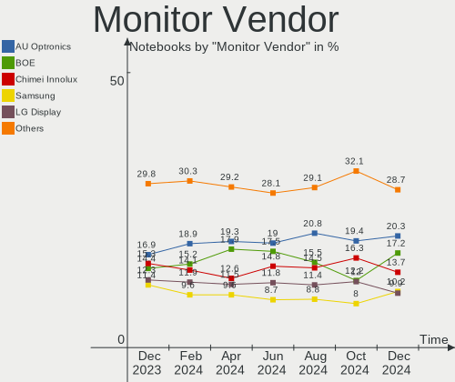
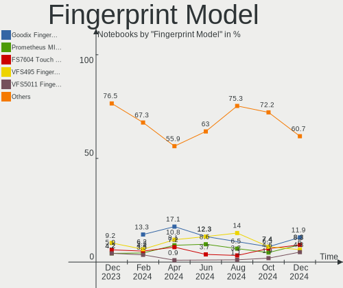
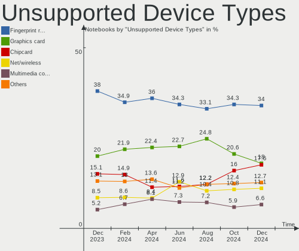

Ubuntu - Hardware Trends (Notebooks)
------------------------------------

A project to identify most popular hardware characteristics and track their change
over time based on data collected by Linux users at https://Linux-Hardware.org.

Anyone can contribute to this report by the [hw-probe](https://github.com/linuxhw/hw-probe) tool:

    sudo -E hw-probe -all -upload

This report is for one last month. Overall report since the beginning of time: [TestDays](https://github.com/linuxhw/TestDays)

Period: Feb, 2023.

Contents
--------

* [ System ](#system)
  - [ OS                       ](#os)
  - [ OS Family                ](#os-family)
  - [ Kernel                   ](#kernel)
  - [ Kernel Family            ](#kernel-family)
  - [ Kernel Major Ver.        ](#kernel-major-ver)
  - [ Arch                     ](#arch)
  - [ DE                       ](#de)
  - [ Display Server           ](#display-server)
  - [ Display Manager          ](#display-manager)
  - [ OS Lang                  ](#os-lang)
  - [ Boot Mode                ](#boot-mode)
  - [ Filesystem               ](#filesystem)
  - [ Part. scheme             ](#part-scheme)
  - [ Dual Boot with Linux/BSD ](#dual-boot-with-linuxbsd)
  - [ Dual Boot (Win)          ](#dual-boot-win)

* [ Board ](#board)
  - [ Vendor                   ](#vendor)
  - [ Model                    ](#model)
  - [ Model Family             ](#model-family)
  - [ MFG Year                 ](#mfg-year)
  - [ Form Factor              ](#form-factor)
  - [ Secure Boot              ](#secure-boot)
  - [ Coreboot                 ](#coreboot)
  - [ RAM Size                 ](#ram-size)
  - [ RAM Used                 ](#ram-used)
  - [ Total Drives             ](#total-drives)
  - [ Has CD-ROM               ](#has-cd-rom)
  - [ Has Ethernet             ](#has-ethernet)
  - [ Has WiFi                 ](#has-wifi)
  - [ Has Bluetooth            ](#has-bluetooth)

* [ Location ](#location)
  - [ Country                  ](#country)
  - [ City                     ](#city)

* [ Drives ](#drives)
  - [ Drive Vendor             ](#drive-vendor)
  - [ Drive Model              ](#drive-model)
  - [ HDD Vendor               ](#hdd-vendor)
  - [ SSD Vendor               ](#ssd-vendor)
  - [ Drive Kind               ](#drive-kind)
  - [ Drive Connector          ](#drive-connector)
  - [ Drive Size               ](#drive-size)
  - [ Space Total              ](#space-total)
  - [ Space Used               ](#space-used)
  - [ Malfunc. Drives          ](#malfunc-drives)
  - [ Malfunc. Drive Vendor    ](#malfunc-drive-vendor)
  - [ Malfunc. HDD Vendor      ](#malfunc-hdd-vendor)
  - [ Malfunc. Drive Kind      ](#malfunc-drive-kind)
  - [ Failed Drives            ](#failed-drives)
  - [ Failed Drive Vendor      ](#failed-drive-vendor)
  - [ Drive Status             ](#drive-status)

* [ Storage controller ](#storage-controller)
  - [ Storage Vendor           ](#storage-vendor)
  - [ Storage Model            ](#storage-model)
  - [ Storage Kind             ](#storage-kind)

* [ Processor ](#processor)
  - [ CPU Vendor               ](#cpu-vendor)
  - [ CPU Model                ](#cpu-model)
  - [ CPU Model Family         ](#cpu-model-family)
  - [ CPU Cores                ](#cpu-cores)
  - [ CPU Sockets              ](#cpu-sockets)
  - [ CPU Threads              ](#cpu-threads)
  - [ CPU Op-Modes             ](#cpu-op-modes)
  - [ CPU Microcode            ](#cpu-microcode)
  - [ CPU Microarch            ](#cpu-microarch)

* [ Graphics ](#graphics)
  - [ GPU Vendor               ](#gpu-vendor)
  - [ GPU Model                ](#gpu-model)
  - [ GPU Combo                ](#gpu-combo)
  - [ GPU Driver               ](#gpu-driver)
  - [ GPU Memory               ](#gpu-memory)

* [ Monitor ](#monitor)
  - [ Monitor Vendor           ](#monitor-vendor)
  - [ Monitor Model            ](#monitor-model)
  - [ Monitor Resolution       ](#monitor-resolution)
  - [ Monitor Diagonal         ](#monitor-diagonal)
  - [ Monitor Width            ](#monitor-width)
  - [ Aspect Ratio             ](#aspect-ratio)
  - [ Monitor Area             ](#monitor-area)
  - [ Pixel Density            ](#pixel-density)
  - [ Multiple Monitors        ](#multiple-monitors)

* [ Network ](#network)
  - [ Net Controller Vendor    ](#net-controller-vendor)
  - [ Net Controller Model     ](#net-controller-model)
  - [ Wireless Vendor          ](#wireless-vendor)
  - [ Wireless Model           ](#wireless-model)
  - [ Ethernet Vendor          ](#ethernet-vendor)
  - [ Ethernet Model           ](#ethernet-model)
  - [ Net Controller Kind      ](#net-controller-kind)
  - [ Used Controller          ](#used-controller)
  - [ NICs                     ](#nics)
  - [ IPv6                     ](#ipv6)

* [ Bluetooth ](#bluetooth)
  - [ Bluetooth Vendor         ](#bluetooth-vendor)
  - [ Bluetooth Model          ](#bluetooth-model)

* [ Sound ](#sound)
  - [ Sound Vendor             ](#sound-vendor)
  - [ Sound Model              ](#sound-model)

* [ Memory ](#memory)
  - [ Memory Vendor            ](#memory-vendor)
  - [ Memory Model             ](#memory-model)
  - [ Memory Kind              ](#memory-kind)
  - [ Memory Form Factor       ](#memory-form-factor)
  - [ Memory Size              ](#memory-size)
  - [ Memory Speed             ](#memory-speed)

* [ Printers & scanners ](#printers--scanners)
  - [ Printer Vendor           ](#printer-vendor)
  - [ Printer Model            ](#printer-model)
  - [ Scanner Vendor           ](#scanner-vendor)
  - [ Scanner Model            ](#scanner-model)

* [ Camera ](#camera)
  - [ Camera Vendor            ](#camera-vendor)
  - [ Camera Model             ](#camera-model)

* [ Security ](#security)
  - [ Fingerprint Vendor       ](#fingerprint-vendor)
  - [ Fingerprint Model        ](#fingerprint-model)
  - [ Chipcard Vendor          ](#chipcard-vendor)
  - [ Chipcard Model           ](#chipcard-model)

* [ Unsupported ](#unsupported)
  - [ Unsupported Devices      ](#unsupported-devices)
  - [ Unsupported Device Types ](#unsupported-device-types)

System
------

OS
--

Installed operating systems

| Name         | Notebooks | Percent |
|--------------|-----------|---------|
| Ubuntu 22.04 | 476       | 67.14%  |
| Ubuntu 22.10 | 134       | 18.9%   |
| Ubuntu 20.04 | 69        | 9.73%   |
| Ubuntu 18.04 | 14        | 1.97%   |
| Ubuntu 23.04 | 11        | 1.55%   |
| Ubuntu 20.10 | 2         | 0.28%   |
| Ubuntu 21.10 | 1         | 0.14%   |
| Ubuntu 21.04 | 1         | 0.14%   |
| Ubuntu 16.04 | 1         | 0.14%   |

OS Family
---------

OS without a version

| Name   | Notebooks | Percent |
|--------|-----------|---------|
| Ubuntu | 709       | 100%    |

Kernel
------

Version of the Linux kernel

| Version                 | Notebooks | Percent |
|-------------------------|-----------|---------|
| 5.19.0-32-generic       | 166       | 23.41%  |
| 5.15.0-58-generic       | 148       | 20.87%  |
| 5.15.0-60-generic       | 135       | 19.04%  |
| 5.19.0-31-generic       | 75        | 10.58%  |
| 5.19.0-29-generic       | 31        | 4.37%   |
| 5.15.0-43-generic       | 22        | 3.1%    |
| 5.19.0-21-generic       | 15        | 2.12%   |
| 5.19.0-35-generic       | 11        | 1.55%   |
| 5.4.0-139-generic       | 10        | 1.41%   |
| 5.4.0-137-generic       | 8         | 1.13%   |
| 5.15.0-56-generic       | 5         | 0.71%   |
| 5.15.0-25-generic       | 4         | 0.56%   |
| 5.15.0-57-generic       | 3         | 0.42%   |
| 5.14.0-1057-oem         | 3         | 0.42%   |
| 5.14.0-1056-oem         | 3         | 0.42%   |
| 5.14.0-1054-oem         | 3         | 0.42%   |
| 4.15.0-204-generic      | 3         | 0.42%   |
| 4.15.0-202-generic      | 3         | 0.42%   |
| 6.2.1-060201-generic    | 2         | 0.28%   |
| 6.1.9-060109-generic    | 2         | 0.28%   |
| 6.1.7-060107-generic    | 2         | 0.28%   |
| 6.1.12-060112-generic   | 2         | 0.28%   |
| 5.8.0-43-generic        | 2         | 0.28%   |
| 5.4.0-131-generic       | 2         | 0.28%   |
| 5.19.0-28-generic       | 2         | 0.28%   |
| 5.17.0-1020-oem         | 2         | 0.28%   |
| 5.15.0-59-generic       | 2         | 0.28%   |
| 5.15.0-58-lowlatency    | 2         | 0.28%   |
| 5.15.0-52-generic       | 2         | 0.28%   |
| 5.15.0-41-generic       | 2         | 0.28%   |
| 5.15.0-1025-intel-iotg  | 2         | 0.28%   |
| 5.13.0-40-generic       | 2         | 0.28%   |
| 6.2.0-060200-generic    | 1         | 0.14%   |
| 6.1.8-060108-generic    | 1         | 0.14%   |
| 6.1.6-060106-generic    | 1         | 0.14%   |
| 6.1.12                  | 1         | 0.14%   |
| 6.1.11-060111-generic   | 1         | 0.14%   |
| 6.1.0-1007-oem          | 1         | 0.14%   |
| 6.1.0-1006-oem          | 1         | 0.14%   |
| 6.0.12-76060006-generic | 1         | 0.14%   |

Kernel Family
-------------

Linux kernel without a distro release

| Version | Notebooks | Percent |
|---------|-----------|---------|
| 5.15.0  | 334       | 47.11%  |
| 5.19.0  | 301       | 42.45%  |
| 5.4.0   | 23        | 3.24%   |
| 5.14.0  | 9         | 1.27%   |
| 4.15.0  | 6         | 0.85%   |
| 6.0.0   | 4         | 0.56%   |
| 5.8.0   | 4         | 0.56%   |
| 5.13.0  | 4         | 0.56%   |
| 6.1.12  | 3         | 0.42%   |
| 5.17.0  | 3         | 0.42%   |
| 6.2.1   | 2         | 0.28%   |
| 6.1.9   | 2         | 0.28%   |
| 6.1.7   | 2         | 0.28%   |
| 6.1.0   | 2         | 0.28%   |
| 5.11.0  | 2         | 0.28%   |
| 6.2.0   | 1         | 0.14%   |
| 6.1.8   | 1         | 0.14%   |
| 6.1.6   | 1         | 0.14%   |
| 6.1.11  | 1         | 0.14%   |
| 6.0.12  | 1         | 0.14%   |
| 5.17.1  | 1         | 0.14%   |
| 5.0.0   | 1         | 0.14%   |
| 4.4.0   | 1         | 0.14%   |

Kernel Major Ver.
-----------------

Linux kernel major version

| Version | Notebooks | Percent |
|---------|-----------|---------|
| 5.15    | 334       | 47.11%  |
| 5.19    | 301       | 42.45%  |
| 5.4     | 23        | 3.24%   |
| 6.1     | 12        | 1.69%   |
| 5.14    | 9         | 1.27%   |
| 4.15    | 6         | 0.85%   |
| 6.0     | 5         | 0.71%   |
| 5.8     | 4         | 0.56%   |
| 5.17    | 4         | 0.56%   |
| 5.13    | 4         | 0.56%   |
| 6.2     | 3         | 0.42%   |
| 5.11    | 2         | 0.28%   |
| 5.0     | 1         | 0.14%   |
| 4.4     | 1         | 0.14%   |

Arch
----

OS architecture (x86_64, i586, etc.)

| Name   | Notebooks | Percent |
|--------|-----------|---------|
| x86_64 | 707       | 99.72%  |
| i686   | 2         | 0.28%   |

DE
--

Desktop Environment

| Name            | Notebooks | Percent |
|-----------------|-----------|---------|
| GNOME           | 680       | 95.91%  |
| Unknown         | 12        | 1.69%   |
| GNOME Flashback | 7         | 0.99%   |
| X-Cinnamon      | 4         | 0.56%   |
| sway            | 2         | 0.28%   |
| i3              | 2         | 0.28%   |
| Cinnamon        | 2         | 0.28%   |

Display Server
--------------

X11 or Wayland

| Name    | Notebooks | Percent |
|---------|-----------|---------|
| Wayland | 451       | 63.61%  |
| X11     | 240       | 33.85%  |
| Unknown | 15        | 2.12%   |
| Tty     | 3         | 0.42%   |

Display Manager
---------------

SDDM, LightDM, etc.

| Name    | Notebooks | Percent |
|---------|-----------|---------|
| GDM3    | 605       | 85.33%  |
| Unknown | 51        | 7.19%   |
| GDM     | 37        | 5.22%   |
| LightDM | 14        | 1.97%   |
| SDDM    | 1         | 0.14%   |
| GREETD  | 1         | 0.14%   |

OS Lang
-------

Language

| Lang    | Notebooks | Percent |
|---------|-----------|---------|
| en_US   | 324       | 45.7%   |
| de_DE   | 72        | 10.16%  |
| fr_FR   | 40        | 5.64%   |
| en_GB   | 35        | 4.94%   |
| it_IT   | 30        | 4.23%   |
| pt_BR   | 24        | 3.39%   |
| ru_RU   | 23        | 3.24%   |
| en_IN   | 21        | 2.96%   |
| es_ES   | 18        | 2.54%   |
| pl_PL   | 16        | 2.26%   |
| en_CA   | 15        | 2.12%   |
| Unknown | 8         | 1.13%   |
| cs_CZ   | 7         | 0.99%   |
| en_AU   | 6         | 0.85%   |
| hu_HU   | 5         | 0.71%   |
| es_MX   | 5         | 0.71%   |
| es_AR   | 5         | 0.71%   |
| de_AT   | 4         | 0.56%   |
| pt_PT   | 3         | 0.42%   |
| nl_NL   | 3         | 0.42%   |
| fi_FI   | 3         | 0.42%   |
| en_NZ   | 3         | 0.42%   |
| de_CH   | 3         | 0.42%   |
| zh_TW   | 2         | 0.28%   |
| zh_CN   | 2         | 0.28%   |
| tr_TR   | 2         | 0.28%   |
| sv_SE   | 2         | 0.28%   |
| nb_NO   | 2         | 0.28%   |
| es_UY   | 2         | 0.28%   |
| es_PE   | 2         | 0.28%   |
| es_CO   | 2         | 0.28%   |
| en_ZA   | 2         | 0.28%   |
| en_PH   | 2         | 0.28%   |
| en_HK   | 2         | 0.28%   |
| da_DK   | 2         | 0.28%   |
| C       | 2         | 0.28%   |
| ru_UA   | 1         | 0.14%   |
| ko_KR   | 1         | 0.14%   |
| ja_JP   | 1         | 0.14%   |
| fr_BE   | 1         | 0.14%   |

Boot Mode
---------

EFI or BIOS

| Mode | Notebooks | Percent |
|------|-----------|---------|
| BIOS | 402       | 56.7%   |
| EFI  | 307       | 43.3%   |

Filesystem
----------

Type of filesystem

| Type    | Notebooks | Percent |
|---------|-----------|---------|
| Ext4    | 660       | 93.09%  |
| Zfs     | 18        | 2.54%   |
| Btrfs   | 16        | 2.26%   |
| Overlay | 11        | 1.55%   |
| Ext2    | 2         | 0.28%   |
| Xfs     | 1         | 0.14%   |
| Tmpfs   | 1         | 0.14%   |

Part. scheme
------------

Scheme of partitioning

| Type    | Notebooks | Percent |
|---------|-----------|---------|
| GPT     | 580       | 81.81%  |
| MBR     | 85        | 11.99%  |
| Unknown | 44        | 6.21%   |

Dual Boot with Linux/BSD
------------------------

Hosting more than one Linux/BSD

| Dual boot | Notebooks | Percent |
|-----------|-----------|---------|
| No        | 652       | 91.96%  |
| Yes       | 57        | 8.04%   |

Dual Boot (Win)
---------------

Hosting Linux and Windows

| Dual boot | Notebooks | Percent |
|-----------|-----------|---------|
| No        | 467       | 65.87%  |
| Yes       | 242       | 34.13%  |

Board
-----

Vendor
------

Motherboard manufacturer

| Name                           | Notebooks | Percent |
|--------------------------------|-----------|---------|
| Lenovo                         | 163       | 22.99%  |
| Hewlett-Packard                | 134       | 18.9%   |
| Dell                           | 125       | 17.63%  |
| ASUSTek Computer               | 63        | 8.89%   |
| Acer                           | 50        | 7.05%   |
| Apple                          | 24        | 3.39%   |
| Toshiba                        | 17        | 2.4%    |
| MSI                            | 15        | 2.12%   |
| HUAWEI                         | 13        | 1.83%   |
| Samsung Electronics            | 11        | 1.55%   |
| Unknown                        | 11        | 1.55%   |
| Fujitsu                        | 9         | 1.27%   |
| Timi                           | 8         | 1.13%   |
| Sony                           | 8         | 1.13%   |
| Google                         | 6         | 0.85%   |
| Notebook                       | 5         | 0.71%   |
| Alienware                      | 5         | 0.71%   |
| TUXEDO                         | 3         | 0.42%   |
| Chuwi                          | 3         | 0.42%   |
| Packard Bell                   | 2         | 0.28%   |
| Gateway                        | 2         | 0.28%   |
| UMAX                           | 1         | 0.14%   |
| TrekStor                       | 1         | 0.14%   |
| Thomson                        | 1         | 0.14%   |
| Teclast                        | 1         | 0.14%   |
| TCL Communication              | 1         | 0.14%   |
| Tactus                         | 1         | 0.14%   |
| System76                       | 1         | 0.14%   |
| SmbiosType1_SystemManufacturer | 1         | 0.14%   |
| Semp Toshiba                   | 1         | 0.14%   |
| Schenker                       | 1         | 0.14%   |
| Pegatron                       | 1         | 0.14%   |
| Panasonic                      | 1         | 0.14%   |
| Monster                        | 1         | 0.14%   |
| Micro Electronics              | 1         | 0.14%   |
| Medion                         | 1         | 0.14%   |
| Mediacom                       | 1         | 0.14%   |
| Machcreator                    | 1         | 0.14%   |
| Irbis                          | 1         | 0.14%   |
| Intel                          | 1         | 0.14%   |

Model
-----

Motherboard model

| Name                                              | Notebooks | Percent |
|---------------------------------------------------|-----------|---------|
| Unknown                                           | 12        | 1.69%   |
| HP Notebook                                       | 5         | 0.71%   |
| HP 15 Notebook PC                                 | 4         | 0.56%   |
| Dell Latitude E6320                               | 4         | 0.56%   |
| Lenovo IdeaPad 5 Pro 16ACH6 82L5                  | 3         | 0.42%   |
| HP Pavilion dv7                                   | 3         | 0.42%   |
| HP ENVY 17                                        | 3         | 0.42%   |
| HP EliteBook 840 14 inch G9 Notebook PC           | 3         | 0.42%   |
| HP 15                                             | 3         | 0.42%   |
| Dell XPS 13 9370                                  | 3         | 0.42%   |
| Timi TM1701                                       | 2         | 0.28%   |
| Samsung 530U3C/530U4C/532U3C                      | 2         | 0.28%   |
| Notebook NL5xNU                                   | 2         | 0.28%   |
| Lenovo ThinkPad E495 20NEA001GE                   | 2         | 0.28%   |
| Lenovo ThinkBook 15 G2 ITL 20VE                   | 2         | 0.28%   |
| Lenovo Legion Y530-15ICH 81FV                     | 2         | 0.28%   |
| Lenovo Legion 5 Pro 16ITH6H 82JD                  | 2         | 0.28%   |
| Lenovo IdeaPad Gaming 3 15IMH05 81Y4              | 2         | 0.28%   |
| Lenovo IdeaPad 5 Pro 16ARH7 82SN                  | 2         | 0.28%   |
| Lenovo IdeaPad 3 15ALC6 82MF                      | 2         | 0.28%   |
| Lenovo IdeaPad 3 15ADA05 81W1                     | 2         | 0.28%   |
| Lenovo G780 2182                                  | 2         | 0.28%   |
| HUAWEI NBLK-WAX9X                                 | 2         | 0.28%   |
| HUAWEI BOM-WXX9                                   | 2         | 0.28%   |
| HUAWEI BOHK-WAX9X                                 | 2         | 0.28%   |
| HUAWEI BOD-WXX9                                   | 2         | 0.28%   |
| HP ZBook Firefly 14 inch G9 Mobile Workstation PC | 2         | 0.28%   |
| HP Victus by Laptop 16-e0xxx                      | 2         | 0.28%   |
| HP ProBook 450 G8 Notebook PC                     | 2         | 0.28%   |
| HP ProBook 440 G7                                 | 2         | 0.28%   |
| HP ProBook 430 G4                                 | 2         | 0.28%   |
| HP ProBook 430 G3                                 | 2         | 0.28%   |
| HP Pavilion Laptop 15-cc5xx                       | 2         | 0.28%   |
| HP Pavilion g6                                    | 2         | 0.28%   |
| HP Pavilion 15                                    | 2         | 0.28%   |
| HP ENVY 15                                        | 2         | 0.28%   |
| HP EliteBook 8570w                                | 2         | 0.28%   |
| HP EliteBook 850 G8 Notebook PC                   | 2         | 0.28%   |
| HP EliteBook 840 G5                               | 2         | 0.28%   |
| HP EliteBook 840 G2                               | 2         | 0.28%   |

Model Family
------------

Motherboard model prefix

| Name               | Notebooks | Percent |
|--------------------|-----------|---------|
| Lenovo ThinkPad    | 91        | 12.83%  |
| Dell Latitude      | 46        | 6.49%   |
| Acer Aspire        | 37        | 5.22%   |
| Lenovo IdeaPad     | 35        | 4.94%   |
| Dell Inspiron      | 29        | 4.09%   |
| HP Pavilion        | 26        | 3.67%   |
| HP EliteBook       | 25        | 3.53%   |
| HP Laptop          | 19        | 2.68%   |
| HP ProBook         | 17        | 2.4%    |
| Toshiba Satellite  | 16        | 2.26%   |
| Dell XPS           | 16        | 2.26%   |
| ASUS VivoBook      | 15        | 2.12%   |
| Dell Vostro        | 12        | 1.69%   |
| Unknown            | 12        | 1.69%   |
| Dell Precision     | 10        | 1.41%   |
| HP ENVY            | 8         | 1.13%   |
| Lenovo ThinkBook   | 7         | 0.99%   |
| Lenovo Legion      | 7         | 0.99%   |
| HP 15              | 7         | 0.99%   |
| Fujitsu LIFEBOOK   | 7         | 0.99%   |
| ASUS ROG           | 7         | 0.99%   |
| HP OMEN            | 6         | 0.85%   |
| ASUS ZenBook       | 6         | 0.85%   |
| HP ZBook           | 5         | 0.71%   |
| HP Notebook        | 5         | 0.71%   |
| Dell G15           | 5         | 0.71%   |
| Acer Swift         | 5         | 0.71%   |
| HP 250             | 4         | 0.56%   |
| Apple MacBookPro15 | 4         | 0.56%   |
| Timi RedmiBook     | 3         | 0.42%   |
| Lenovo Yoga        | 3         | 0.42%   |
| HP Victus          | 3         | 0.42%   |
| ASUS TUF           | 3         | 0.42%   |
| Apple MacBookPro8  | 3         | 0.42%   |
| Apple MacBookPro16 | 3         | 0.42%   |
| Acer Predator      | 3         | 0.42%   |
| TUXEDO Pulse       | 2         | 0.28%   |
| Timi TM1701        | 2         | 0.28%   |
| Samsung 530U3C     | 2         | 0.28%   |
| Notebook NL5xNU    | 2         | 0.28%   |

MFG Year
--------

Motherboard manufacture year

| Year | Notebooks | Percent |
|------|-----------|---------|
| 2021 | 108       | 15.23%  |
| 2020 | 69        | 9.73%   |
| 2022 | 60        | 8.46%   |
| 2019 | 59        | 8.32%   |
| 2018 | 49        | 6.91%   |
| 2011 | 47        | 6.63%   |
| 2013 | 46        | 6.49%   |
| 2016 | 44        | 6.21%   |
| 2017 | 43        | 6.06%   |
| 2012 | 43        | 6.06%   |
| 2015 | 36        | 5.08%   |
| 2010 | 33        | 4.65%   |
| 2014 | 31        | 4.37%   |
| 2009 | 18        | 2.54%   |
| 2008 | 13        | 1.83%   |
| 2007 | 6         | 0.85%   |
| 2023 | 2         | 0.28%   |
| 2006 | 2         | 0.28%   |

Form Factor
-----------

Physical design of the computer

| Name     | Notebooks | Percent |
|----------|-----------|---------|
| Notebook | 709       | 100%    |

Secure Boot
-----------

Enabled or disabled

| State    | Notebooks | Percent |
|----------|-----------|---------|
| Disabled | 626       | 88.29%  |
| Enabled  | 83        | 11.71%  |

Coreboot
--------

Have coreboot on board

| Used | Notebooks | Percent |
|------|-----------|---------|
| No   | 702       | 99.01%  |
| Yes  | 7         | 0.99%   |

RAM Size
--------

Total RAM memory

| Size in GB  | Notebooks | Percent |
|-------------|-----------|---------|
| 4.01-8.0    | 215       | 30.32%  |
| 16.01-24.0  | 150       | 21.16%  |
| 3.01-4.0    | 124       | 17.49%  |
| 8.01-16.0   | 118       | 16.64%  |
| 32.01-64.0  | 52        | 7.33%   |
| 1.01-2.0    | 15        | 2.12%   |
| 64.01-256.0 | 14        | 1.97%   |
| 24.01-32.0  | 13        | 1.83%   |
| 2.01-3.0    | 8         | 1.13%   |

RAM Used
--------

Used RAM memory

| Used GB    | Notebooks | Percent |
|------------|-----------|---------|
| 1.01-2.0   | 233       | 32.86%  |
| 2.01-3.0   | 216       | 30.47%  |
| 4.01-8.0   | 122       | 17.21%  |
| 3.01-4.0   | 91        | 12.83%  |
| 8.01-16.0  | 38        | 5.36%   |
| 16.01-24.0 | 4         | 0.56%   |
| 24.01-32.0 | 2         | 0.28%   |
| 0.51-1.0   | 2         | 0.28%   |
| 32.01-64.0 | 1         | 0.14%   |

Total Drives
------------

Number of drives on board

| Drives | Notebooks | Percent |
|--------|-----------|---------|
| 1      | 542       | 76.45%  |
| 2      | 150       | 21.16%  |
| 3      | 10        | 1.41%   |
| 0      | 6         | 0.85%   |
| 4      | 1         | 0.14%   |

Has CD-ROM
----------

Has CD-ROM on board

| Presented | Notebooks | Percent |
|-----------|-----------|---------|
| No        | 494       | 69.68%  |
| Yes       | 215       | 30.32%  |

Has Ethernet
------------

Has Ethernet on board

| Presented | Notebooks | Percent |
|-----------|-----------|---------|
| Yes       | 552       | 77.86%  |
| No        | 157       | 22.14%  |

Has WiFi
--------

Has WiFi module

| Presented | Notebooks | Percent |
|-----------|-----------|---------|
| Yes       | 701       | 98.87%  |
| No        | 8         | 1.13%   |

Has Bluetooth
-------------

Has Bluetooth module

| Presented | Notebooks | Percent |
|-----------|-----------|---------|
| Yes       | 579       | 81.66%  |
| No        | 130       | 18.34%  |

Location
--------

Country
-------

Geographic location (country)

| Country     | Notebooks | Percent |
|-------------|-----------|---------|
| USA         | 114       | 16.08%  |
| Germany     | 92        | 12.98%  |
| France      | 45        | 6.35%   |
| Italy       | 37        | 5.22%   |
| Brazil      | 37        | 5.22%   |
| UK          | 31        | 4.37%   |
| Poland      | 30        | 4.23%   |
| Russia      | 28        | 3.95%   |
| Spain       | 22        | 3.1%    |
| India       | 22        | 3.1%    |
| Netherlands | 15        | 2.12%   |
| Canada      | 14        | 1.97%   |
| Turkey      | 13        | 1.83%   |
| Argentina   | 10        | 1.41%   |
| Mexico      | 9         | 1.27%   |
| Czechia     | 9         | 1.27%   |
| Switzerland | 8         | 1.13%   |
| Romania     | 8         | 1.13%   |
| Indonesia   | 7         | 0.99%   |
| Hungary     | 7         | 0.99%   |
| Australia   | 7         | 0.99%   |
| Sweden      | 6         | 0.85%   |
| Portugal    | 6         | 0.85%   |
| Finland     | 6         | 0.85%   |
| Denmark     | 6         | 0.85%   |
| Austria     | 6         | 0.85%   |
| Norway      | 5         | 0.71%   |
| Japan       | 5         | 0.71%   |
| Greece      | 5         | 0.71%   |
| Colombia    | 5         | 0.71%   |
| Chile       | 5         | 0.71%   |
| Belgium     | 5         | 0.71%   |
| Belarus     | 5         | 0.71%   |
| Pakistan    | 4         | 0.56%   |
| Ireland     | 4         | 0.56%   |
| Hong Kong   | 4         | 0.56%   |
| Ukraine     | 3         | 0.42%   |
| New Zealand | 3         | 0.42%   |
| Israel      | 3         | 0.42%   |
| Iran        | 3         | 0.42%   |

City
----

Geographic location (city)

| City              | Notebooks | Percent |
|-------------------|-----------|---------|
| St Petersburg     | 10        | 1.41%   |
| Warsaw            | 9         | 1.27%   |
| Berlin            | 9         | 1.27%   |
| Milan             | 8         | 1.13%   |
| Paris             | 7         | 0.99%   |
| Barcelona         | 7         | 0.99%   |
| Moscow            | 6         | 0.85%   |
| Vienna            | 5         | 0.71%   |
| Munich            | 5         | 0.71%   |
| Istanbul          | 5         | 0.71%   |
| Amsterdam         | 5         | 0.71%   |
| Rome              | 4         | 0.56%   |
| Rio de Janeiro    | 4         | 0.56%   |
| London            | 4         | 0.56%   |
| Helsinki          | 4         | 0.56%   |
| Frankfurt am Main | 4         | 0.56%   |
| Bengaluru         | 4         | 0.56%   |
| Vancouver         | 3         | 0.42%   |
| Talcahuano        | 3         | 0.42%   |
| Sydney            | 3         | 0.42%   |
| Sao Paulo         | 3         | 0.42%   |
| San José         | 3         | 0.42%   |
| Poznan            | 3         | 0.42%   |
| Minsk             | 3         | 0.42%   |
| Mexico City       | 3         | 0.42%   |
| Ludwigsburg       | 3         | 0.42%   |
| Lisbon            | 3         | 0.42%   |
| Houston           | 3         | 0.42%   |
| Dublin            | 3         | 0.42%   |
| Denver            | 3         | 0.42%   |
| Dallas            | 3         | 0.42%   |
| Cologne           | 3         | 0.42%   |
| Central           | 3         | 0.42%   |
| Bogotá           | 3         | 0.42%   |
| Athens            | 3         | 0.42%   |
| Zurich            | 2         | 0.28%   |
| Yogyakarta        | 2         | 0.28%   |
| Wuppertal         | 2         | 0.28%   |
| Wroclaw           | 2         | 0.28%   |
| Tbilisi           | 2         | 0.28%   |

Drives
------

Drive Vendor
------------

Hard drive vendors

| Vendor                      | Notebooks | Drives | Percent |
|-----------------------------|-----------|--------|---------|
| Samsung Electronics         | 150       | 162    | 17.71%  |
| Seagate                     | 85        | 85     | 10.04%  |
| WDC                         | 80        | 82     | 9.45%   |
| Toshiba                     | 67        | 67     | 7.91%   |
| Kingston                    | 49        | 50     | 5.79%   |
| Sandisk                     | 48        | 49     | 5.67%   |
| Unknown                     | 45        | 47     | 5.31%   |
| SK hynix                    | 33        | 33     | 3.9%    |
| Micron Technology           | 32        | 32     | 3.78%   |
| Intel                       | 31        | 32     | 3.66%   |
| Crucial                     | 24        | 24     | 2.83%   |
| Hitachi                     | 21        | 21     | 2.48%   |
| KIOXIA                      | 18        | 18     | 2.13%   |
| China                       | 14        | 15     | 1.65%   |
| Apple                       | 13        | 13     | 1.53%   |
| HGST                        | 12        | 12     | 1.42%   |
| A-DATA Technology           | 7         | 7      | 0.83%   |
| Phison                      | 6         | 6      | 0.71%   |
| LITEON                      | 6         | 6      | 0.71%   |
| Kingston Technology Company | 6         | 6      | 0.71%   |
| Silicon Motion              | 5         | 5      | 0.59%   |
| Netac                       | 5         | 6      | 0.59%   |
| Unknown                     | 5         | 5      | 0.59%   |
| Solid State Storage         | 4         | 4      | 0.47%   |
| Micron/Crucial Technology   | 4         | 4      | 0.47%   |
| LITEONIT                    | 4         | 4      | 0.47%   |
| Intenso                     | 4         | 4      | 0.47%   |
| Fujitsu                     | 4         | 4      | 0.47%   |
| Apacer                      | 4         | 4      | 0.47%   |
| SPCC                        | 3         | 3      | 0.35%   |
| GOODRAM                     | 3         | 3      | 0.35%   |
| XPG                         | 2         | 2      | 0.24%   |
| Transcend                   | 2         | 2      | 0.24%   |
| Team                        | 2         | 2      | 0.24%   |
| SSSTC                       | 2         | 2      | 0.24%   |
| PNY                         | 2         | 2      | 0.24%   |
| Phison Electronics          | 2         | 2      | 0.24%   |
| KingFast                    | 2         | 2      | 0.24%   |
| EVM                         | 2         | 2      | 0.24%   |
| Dogfish                     | 2         | 2      | 0.24%   |

Drive Model
-----------

Hard drive models

| Model                                                | Notebooks | Percent |
|------------------------------------------------------|-----------|---------|
| Samsung NVMe SSD Controller SM981/PM981/PM983 250GB  | 17        | 1.97%   |
| Toshiba MQ01ABD100 1TB                               | 13        | 1.51%   |
| Seagate ST1000LM035-1RK172 1TB                       | 13        | 1.51%   |
| Unknown MMC Card  64GB                               | 10        | 1.16%   |
| Kingston SA400S37240G 240GB SSD                      | 10        | 1.16%   |
| Kingston SA400S37480G 480GB SSD                      | 9         | 1.04%   |
| Unknown MMC Card  128GB                              | 7         | 0.81%   |
| Toshiba MQ01ABF050 500GB                             | 7         | 0.81%   |
| Samsung NVMe SSD Controller PM9A1/PM9A3/980PRO 960GB | 7         | 0.81%   |
| Unknown MMC Card  32GB                               | 6         | 0.7%    |
| Toshiba MQ04ABF100 1TB                               | 6         | 0.7%    |
| Seagate ST500LT012-1DG142 500GB                      | 6         | 0.7%    |
| Seagate ST500LM021-1KJ152 500GB                      | 6         | 0.7%    |
| Seagate ST1000LM024 HN-M101MBB 1TB                   | 6         | 0.7%    |
| Sandisk WD Blue SN550 NVMe SSD 1TB                   | 6         | 0.7%    |
| Sandisk WD Black SN750 / PC SN730 NVMe SSD 512GB     | 6         | 0.7%    |
| Samsung NVMe SSD Controller SM961/PM961/SM963 512GB  | 6         | 0.7%    |
| Intel SSD 660P Series 1024GB                         | 6         | 0.7%    |
| HGST HTS545050A7E680 500GB                           | 6         | 0.7%    |
| WDC WD10JPCX-24UE4T0 1TB                             | 5         | 0.58%   |
| Unknown SD/MMC/MS PRO 16GB                           | 5         | 0.58%   |
| Seagate Expansion 1TB                                | 5         | 0.58%   |
| Hitachi HTS545032B9A300 320GB                        | 5         | 0.58%   |
| Crucial CT500MX500SSD1 500GB                         | 5         | 0.58%   |
| Crucial CT1000MX500SSD1 1TB                          | 5         | 0.58%   |
| Unknown                                              | 5         | 0.58%   |
| WDC WD10SPZX-60Z10T0 1TB                             | 4         | 0.46%   |
| WDC WD10JPVX-22JC3T0 1TB                             | 4         | 0.46%   |
| SK hynix SKHynix_HFS512GDE9X081N 512GB               | 4         | 0.46%   |
| Seagate ST9500325AS 500GB                            | 4         | 0.46%   |
| Seagate ST2000LM015-2E8174 2TB                       | 4         | 0.46%   |
| Samsung MZALQ512HALU-000L2 512GB                     | 4         | 0.46%   |
| KIOXIA KBG40ZNV512G 512GB                            | 4         | 0.46%   |
| KIOXIA KBG40ZNS256G NVMe 256GB                       | 4         | 0.46%   |
| Kingston SUV400S37240G 240GB SSD                     | 4         | 0.46%   |
| Crucial CT240BX500SSD1 240GB                         | 4         | 0.46%   |
| China SATA SSD 120GB                                 | 4         | 0.46%   |
| WDC WDS500G2B0A-00SM50 500GB SSD                     | 3         | 0.35%   |
| Toshiba XG4 NVMe SSD Controller 512GB                | 3         | 0.35%   |
| Solid State Storage SSSTC CL1-4D256 256GB            | 3         | 0.35%   |

HDD Vendor
----------

Hard disk drive vendors

| Vendor              | Notebooks | Drives | Percent |
|---------------------|-----------|--------|---------|
| Seagate             | 84        | 84     | 36.36%  |
| WDC                 | 52        | 52     | 22.51%  |
| Toshiba             | 44        | 44     | 19.05%  |
| Hitachi             | 21        | 21     | 9.09%   |
| HGST                | 12        | 12     | 5.19%   |
| Samsung Electronics | 6         | 6      | 2.6%    |
| Unknown             | 5         | 5      | 2.16%   |
| Fujitsu             | 4         | 4      | 1.73%   |
| LaCie               | 1         | 1      | 0.43%   |
| Intenso             | 1         | 1      | 0.43%   |
| ASMT                | 1         | 1      | 0.43%   |

SSD Vendor
----------

Solid state drive vendors

| Vendor              | Notebooks | Drives | Percent |
|---------------------|-----------|--------|---------|
| Samsung Electronics | 45        | 46     | 18.44%  |
| Kingston            | 37        | 38     | 15.16%  |
| SanDisk             | 25        | 25     | 10.25%  |
| Crucial             | 22        | 22     | 9.02%   |
| China               | 14        | 15     | 5.74%   |
| WDC                 | 13        | 13     | 5.33%   |
| Micron Technology   | 8         | 8      | 3.28%   |
| Intel               | 8         | 8      | 3.28%   |
| LITEON              | 6         | 6      | 2.46%   |
| Netac               | 5         | 5      | 2.05%   |
| Toshiba             | 4         | 4      | 1.64%   |
| SK hynix            | 4         | 4      | 1.64%   |
| LITEONIT            | 4         | 4      | 1.64%   |
| Apple               | 4         | 4      | 1.64%   |
| Apacer              | 4         | 4      | 1.64%   |
| Intenso             | 3         | 3      | 1.23%   |
| A-DATA Technology   | 3         | 3      | 1.23%   |
| Transcend           | 2         | 2      | 0.82%   |
| Team                | 2         | 2      | 0.82%   |
| SPCC                | 2         | 2      | 0.82%   |
| PNY                 | 2         | 2      | 0.82%   |
| GOODRAM             | 2         | 2      | 0.82%   |
| EVM                 | 2         | 2      | 0.82%   |
| Dogfish             | 2         | 2      | 0.82%   |
| TO Exter            | 1         | 1      | 0.41%   |
| Teclast             | 1         | 1      | 0.41%   |
| T-FORCE             | 1         | 1      | 0.41%   |
| Super Talent        | 1         | 1      | 0.41%   |
| SSSTC               | 1         | 1      | 0.41%   |
| Smartbuy            | 1         | 1      | 0.41%   |
| Ramaxel Technology  | 1         | 1      | 0.41%   |
| PNY CS90            | 1         | 1      | 0.41%   |
| Patriot             | 1         | 1      | 0.41%   |
| OSCOO               | 1         | 1      | 0.41%   |
| OCZ                 | 1         | 1      | 0.41%   |
| MACROVIP            | 1         | 1      | 0.41%   |
| Leven               | 1         | 1      | 0.41%   |
| LDLC                | 1         | 1      | 0.41%   |
| KingSpec            | 1         | 1      | 0.41%   |
| HS-SSD-E100N        | 1         | 1      | 0.41%   |

Drive Kind
----------

HDD or SSD

| Kind    | Notebooks | Drives | Percent |
|---------|-----------|--------|---------|
| NVMe    | 312       | 336    | 38.33%  |
| SSD     | 228       | 247    | 28.01%  |
| HDD     | 222       | 231    | 27.27%  |
| MMC     | 44        | 46     | 5.41%   |
| Unknown | 8         | 8      | 0.98%   |

Drive Connector
---------------

SATA, SAS, NVMe, etc.

| Type | Notebooks | Drives | Percent |
|------|-----------|--------|---------|
| SATA | 410       | 463    | 51.96%  |
| NVMe | 312       | 336    | 39.54%  |
| MMC  | 44        | 46     | 5.58%   |
| SAS  | 23        | 23     | 2.92%   |

Drive Size
----------

Size of hard drive

| Size in TB | Notebooks | Drives | Percent |
|------------|-----------|--------|---------|
| 0.01-0.5   | 285       | 309    | 63.9%   |
| 0.51-1.0   | 143       | 150    | 32.06%  |
| 1.01-2.0   | 16        | 16     | 3.59%   |
| 2.01-3.0   | 2         | 3      | 0.45%   |

Space Total
-----------

Amount of disk space available on the file system

| Size in GB     | Notebooks | Percent |
|----------------|-----------|---------|
| 101-250        | 218       | 30.75%  |
| 251-500        | 200       | 28.21%  |
| 501-1000       | 140       | 19.75%  |
| 51-100         | 41        | 5.78%   |
| 1001-2000      | 33        | 4.65%   |
| 1-20           | 31        | 4.37%   |
| 21-50          | 25        | 3.53%   |
| Unknown        | 10        | 1.41%   |
| 2001-3000      | 7         | 0.99%   |
| More than 3000 | 4         | 0.56%   |

Space Used
----------

Amount of used disk space

| Used GB        | Notebooks | Percent |
|----------------|-----------|---------|
| 1-20           | 237       | 33.43%  |
| 21-50          | 167       | 23.55%  |
| 101-250        | 109       | 15.37%  |
| 51-100         | 92        | 12.98%  |
| 251-500        | 54        | 7.62%   |
| 501-1000       | 32        | 4.51%   |
| Unknown        | 10        | 1.41%   |
| 1001-2000      | 5         | 0.71%   |
| More than 3000 | 2         | 0.28%   |
| 2001-3000      | 1         | 0.14%   |

Malfunc. Drives
---------------

Drive models with a malfunction

| Model                                               | Notebooks | Drives | Percent |
|-----------------------------------------------------|-----------|--------|---------|
| Seagate ST500LM021-1KJ152 500GB                     | 2         | 2      | 6.25%   |
| Seagate ST1000LX015-1U7172 1TB                      | 2         | 2      | 6.25%   |
| Seagate ST1000LM035-1RK172 1TB                      | 2         | 2      | 6.25%   |
| Yangtze Memory Technologies YMTC PC005 256GB        | 1         | 1      | 3.13%   |
| WDC WD7500BPVT-24HXZT3 752GB                        | 1         | 1      | 3.13%   |
| WDC WD3200BEVT-08A23T1 320GB                        | 1         | 1      | 3.13%   |
| WDC WD10SPZX-60Z10T0 1TB                            | 1         | 1      | 3.13%   |
| Toshiba MQ04ABF100 1TB                              | 1         | 1      | 3.13%   |
| Toshiba MQ01ABD050 500GB                            | 1         | 1      | 3.13%   |
| Toshiba MK7575GSX 752GB                             | 1         | 1      | 3.13%   |
| SK hynix HFS256G39MND-2300A 256GB SSD               | 1         | 1      | 3.13%   |
| SK hynix BC711 HFM512GD3JX013N 512GB                | 1         | 1      | 3.13%   |
| Seagate ST9500420ASG 500GB                          | 1         | 1      | 3.13%   |
| Seagate ST9500325AS 500GB                           | 1         | 1      | 3.13%   |
| Seagate ST9320325AS 320GB                           | 1         | 1      | 3.13%   |
| Seagate ST500LT012-1DG142 500GB                     | 1         | 1      | 3.13%   |
| Seagate ST1000LX015-1U71 1TB                        | 1         | 1      | 3.13%   |
| Samsung Electronics SSD 870 EVO 500GB               | 1         | 1      | 3.13%   |
| Samsung Electronics HM500JI 500GB                   | 1         | 1      | 3.13%   |
| Micron Technology MTFDDAV256TDL-1AW1ZABHA 256GB SSD | 1         | 1      | 3.13%   |
| Micron Technology 1100_MTFDDAV512TBN 512GB SSD      | 1         | 1      | 3.13%   |
| Kingston SMS200S3120G 120GB SSD                     | 1         | 1      | 3.13%   |
| KingSpec NT-256 256GB SSD                           | 1         | 1      | 3.13%   |
| Intel SSDSC2BF180A5L 180GB                          | 1         | 1      | 3.13%   |
| HS-SSD-E100 SSD 1024G                               | 1         | 1      | 3.13%   |
| Hitachi HTS547575A9E384 752GB                       | 1         | 1      | 3.13%   |
| Hitachi HTS543232A7A384 320GB                       | 1         | 1      | 3.13%   |
| Crucial CT525MX300SSD1 528GB                        | 1         | 1      | 3.13%   |
| A-DATA Technology IM2P33F3A NVMe 256GB              | 1         | 1      | 3.13%   |

Malfunc. Drive Vendor
---------------------

Vendors of faulty drives

| Vendor                      | Notebooks | Drives | Percent |
|-----------------------------|-----------|--------|---------|
| Seagate                     | 11        | 11     | 34.38%  |
| WDC                         | 3         | 3      | 9.38%   |
| Toshiba                     | 3         | 3      | 9.38%   |
| SK hynix                    | 2         | 2      | 6.25%   |
| Samsung Electronics         | 2         | 2      | 6.25%   |
| Micron Technology           | 2         | 2      | 6.25%   |
| Hitachi                     | 2         | 2      | 6.25%   |
| Yangtze Memory Technologies | 1         | 1      | 3.13%   |
| Kingston                    | 1         | 1      | 3.13%   |
| KingSpec                    | 1         | 1      | 3.13%   |
| Intel                       | 1         | 1      | 3.13%   |
| HS-SSD-E100                 | 1         | 1      | 3.13%   |
| Crucial                     | 1         | 1      | 3.13%   |
| A-DATA Technology           | 1         | 1      | 3.13%   |

Malfunc. HDD Vendor
-------------------

Vendors of faulty HDD drives

| Vendor              | Notebooks | Drives | Percent |
|---------------------|-----------|--------|---------|
| Seagate             | 11        | 11     | 55%     |
| WDC                 | 3         | 3      | 15%     |
| Toshiba             | 3         | 3      | 15%     |
| Hitachi             | 2         | 2      | 10%     |
| Samsung Electronics | 1         | 1      | 5%      |

Malfunc. Drive Kind
-------------------

Kinds of faulty drives

| Kind | Notebooks | Drives | Percent |
|------|-----------|--------|---------|
| HDD  | 20        | 20     | 62.5%   |
| SSD  | 9         | 9      | 28.13%  |
| NVMe | 3         | 3      | 9.38%   |

Failed Drives
-------------

Failed drive models

| Model                        | Notebooks | Drives | Percent |
|------------------------------|-----------|--------|---------|
| Crucial M4-CT256M4SSD3 256GB | 1         | 1      | 100%    |

Failed Drive Vendor
-------------------

Failed drive vendors

| Vendor  | Notebooks | Drives | Percent |
|---------|-----------|--------|---------|
| Crucial | 1         | 1      | 100%    |

Drive Status
------------

Number of failed and malfunc. drives

| Status   | Notebooks | Drives | Percent |
|----------|-----------|--------|---------|
| Detected | 437       | 521    | 59.86%  |
| Works    | 261       | 314    | 35.75%  |
| Malfunc  | 31        | 32     | 4.25%   |
| Failed   | 1         | 1      | 0.14%   |

Storage controller
------------------

Storage Vendor
--------------

Storage controller vendors

| Vendor                         | Notebooks | Percent |
|--------------------------------|-----------|---------|
| Intel                          | 474       | 54.99%  |
| Samsung Electronics            | 104       | 12.06%  |
| AMD                            | 80        | 9.28%   |
| SanDisk                        | 38        | 4.41%   |
| SK hynix                       | 28        | 3.25%   |
| Micron Technology              | 24        | 2.78%   |
| KIOXIA                         | 20        | 2.32%   |
| Kingston Technology Company    | 18        | 2.09%   |
| Toshiba America Info Systems   | 17        | 1.97%   |
| Silicon Motion                 | 8         | 0.93%   |
| Phison Electronics             | 8         | 0.93%   |
| ADATA Technology               | 8         | 0.93%   |
| Apple                          | 7         | 0.81%   |
| Micron/Crucial Technology      | 6         | 0.7%    |
| Solid State Storage Technology | 5         | 0.58%   |
| Nvidia                         | 5         | 0.58%   |
| Shenzhen Longsys Electronics   | 2         | 0.23%   |
| Marvell Technology Group       | 2         | 0.23%   |
| Yangtze Memory Technologies    | 1         | 0.12%   |
| Union Memory (Shenzhen)        | 1         | 0.12%   |
| Seagate Technology             | 1         | 0.12%   |
| Realtek Semiconductor          | 1         | 0.12%   |
| Netac Technology               | 1         | 0.12%   |
| Lite-On Technology             | 1         | 0.12%   |
| Biwin Storage Technology       | 1         | 0.12%   |
| Unknown                        | 1         | 0.12%   |

Storage Model
-------------

Storage controller models

| Model                                                                            | Notebooks | Percent |
|----------------------------------------------------------------------------------|-----------|---------|
| AMD FCH SATA Controller [AHCI mode]                                              | 75        | 8.2%    |
| Intel Sunrise Point-LP SATA Controller [AHCI mode]                               | 61        | 6.67%   |
| Intel 82801 Mobile SATA Controller [RAID mode]                                   | 44        | 4.81%   |
| Samsung NVMe SSD Controller SM981/PM981/PM983                                    | 38        | 4.15%   |
| Intel Volume Management Device NVMe RAID Controller                              | 38        | 4.15%   |
| Intel 7 Series Chipset Family 6-port SATA Controller [AHCI mode]                 | 38        | 4.15%   |
| Intel 6 Series/C200 Series Chipset Family 6 port Mobile SATA AHCI Controller     | 37        | 4.04%   |
| Intel 8 Series SATA Controller 1 [AHCI mode]                                     | 31        | 3.39%   |
| Samsung NVMe SSD Controller PM9A1/PM9A3/980PRO                                   | 27        | 2.95%   |
| Samsung NVMe SSD Controller 980                                                  | 26        | 2.84%   |
| Micron Non-Volatile memory controller                                            | 24        | 2.62%   |
| SK hynix Gold P31/PC711 NVMe Solid State Drive                                   | 16        | 1.75%   |
| Intel Wildcat Point-LP SATA Controller [AHCI Mode]                               | 16        | 1.75%   |
| Intel Tiger Lake-LP SATA Controller                                              | 15        | 1.64%   |
| Intel 82801IBM/IEM (ICH9M/ICH9M-E) 4 port SATA Controller [AHCI mode]            | 15        | 1.64%   |
| Intel 5 Series/3400 Series Chipset 4 port SATA AHCI Controller                   | 15        | 1.64%   |
| KIOXIA NVMe SSD Controller BG4                                                   | 14        | 1.53%   |
| Intel 8 Series/C220 Series Chipset Family 6-port SATA Controller 1 [AHCI mode]   | 14        | 1.53%   |
| SanDisk WD Black SN750 / PC SN730 NVMe SSD                                       | 13        | 1.42%   |
| Samsung NVMe SSD Controller SM961/PM961/SM963                                    | 12        | 1.31%   |
| Intel Celeron/Pentium Silver Processor SATA Controller                           | 12        | 1.31%   |
| SanDisk Non-Volatile memory controller                                           | 11        | 1.2%    |
| Intel Comet Lake SATA AHCI Controller                                            | 11        | 1.2%    |
| Intel Cannon Lake Mobile PCH SATA AHCI Controller                                | 11        | 1.2%    |
| Intel 82801HM/HEM (ICH8M/ICH8M-E) IDE Controller                                 | 11        | 1.2%    |
| Intel SSD 660P Series                                                            | 10        | 1.09%   |
| Intel 5 Series/3400 Series Chipset 6 port SATA AHCI Controller                   | 10        | 1.09%   |
| Intel HM170/QM170 Chipset SATA Controller [AHCI Mode]                            | 9         | 0.98%   |
| Intel Celeron N3350/Pentium N4200/Atom E3900 Series SATA AHCI Controller         | 9         | 0.98%   |
| Intel 82801HM/HEM (ICH8M/ICH8M-E) SATA Controller [AHCI mode]                    | 9         | 0.98%   |
| Kingston Company Company Non-Volatile memory controller                          | 8         | 0.87%   |
| Intel Non-Volatile memory controller                                             | 8         | 0.87%   |
| Intel Cannon Point-LP SATA Controller [AHCI Mode]                                | 8         | 0.87%   |
| Intel Atom/Celeron/Pentium Processor x5-E8000/J3xxx/N3xxx Series SATA Controller | 8         | 0.87%   |
| Intel Atom Processor E3800 Series SATA AHCI Controller                           | 8         | 0.87%   |
| Intel 500 Series Chipset Family SATA AHCI Controller                             | 8         | 0.87%   |
| Intel 400 Series Chipset Family SATA AHCI Controller                             | 8         | 0.87%   |
| Silicon Motion SM2263EN/SM2263XT SSD Controller                                  | 7         | 0.77%   |
| Kingston Company OM3PDP3 NVMe SSD                                                | 7         | 0.77%   |
| Apple ANS2 NVMe Controller                                                       | 7         | 0.77%   |

Storage Kind
------------

Kind of storage controller (IDE, SATA, NVMe, SAS, ...)

| Kind | Notebooks | Percent |
|------|-----------|---------|
| SATA | 457       | 51.7%   |
| NVMe | 312       | 35.29%  |
| RAID | 83        | 9.39%   |
| IDE  | 32        | 3.62%   |

Processor
---------

CPU Vendor
----------

Processor vendors

| Vendor | Notebooks | Percent |
|--------|-----------|---------|
| Intel  | 580       | 81.81%  |
| AMD    | 129       | 18.19%  |

CPU Model
---------

Processor models

| Model                                         | Notebooks | Percent |
|-----------------------------------------------|-----------|---------|
| Intel 11th Gen Core i5-1135G7 @ 2.40GHz       | 17        | 2.4%    |
| Intel Core i5-7200U CPU @ 2.50GHz             | 15        | 2.12%   |
| Intel 11th Gen Core i7-1165G7 @ 2.80GHz       | 14        | 1.97%   |
| Intel Core i7-8550U CPU @ 1.80GHz             | 11        | 1.55%   |
| Intel Core i7-8750H CPU @ 2.20GHz             | 10        | 1.41%   |
| Intel Core i5-8265U CPU @ 1.60GHz             | 10        | 1.41%   |
| Intel Core i5-6300U CPU @ 2.40GHz             | 10        | 1.41%   |
| AMD Ryzen 7 5800H with Radeon Graphics        | 10        | 1.41%   |
| AMD Ryzen 5 3500U with Radeon Vega Mobile Gfx | 10        | 1.41%   |
| Intel Core i7-8565U CPU @ 1.80GHz             | 9         | 1.27%   |
| Intel Core i7-6700HQ CPU @ 2.60GHz            | 9         | 1.27%   |
| Intel Core i5-6200U CPU @ 2.30GHz             | 9         | 1.27%   |
| Intel Core i5-2520M CPU @ 2.50GHz             | 9         | 1.27%   |
| Intel Celeron CPU N3350 @ 1.10GHz             | 9         | 1.27%   |
| Intel 12th Gen Core i7-1260P                  | 9         | 1.27%   |
| AMD Ryzen 5 5500U with Radeon Graphics        | 9         | 1.27%   |
| Intel Core i5-4200U CPU @ 1.60GHz             | 8         | 1.13%   |
| Intel Core i5-1035G1 CPU @ 1.00GHz            | 8         | 1.13%   |
| Intel Core i5-10210U CPU @ 1.60GHz            | 8         | 1.13%   |
| Intel Celeron N4020 CPU @ 1.10GHz             | 8         | 1.13%   |
| Intel Core i7-6600U CPU @ 2.60GHz             | 7         | 0.99%   |
| Intel Core i5-8250U CPU @ 1.60GHz             | 7         | 0.99%   |
| AMD Ryzen 7 5700U with Radeon Graphics        | 7         | 0.99%   |
| Intel Core i7-7500U CPU @ 2.70GHz             | 6         | 0.85%   |
| Intel Core i7-10750H CPU @ 2.60GHz            | 6         | 0.85%   |
| Intel 11th Gen Core i7-11800H @ 2.30GHz       | 6         | 0.85%   |
| Intel Core i7-6500U CPU @ 2.50GHz             | 5         | 0.71%   |
| Intel Core i7-5500U CPU @ 2.40GHz             | 5         | 0.71%   |
| Intel Core i7-3520M CPU @ 2.90GHz             | 5         | 0.71%   |
| Intel Core i7-1065G7 CPU @ 1.30GHz            | 5         | 0.71%   |
| Intel Core i5-3320M CPU @ 2.60GHz             | 5         | 0.71%   |
| Intel Core i5-3210M CPU @ 2.50GHz             | 5         | 0.71%   |
| Intel Core i5-2540M CPU @ 2.60GHz             | 5         | 0.71%   |
| Intel Core i5-2450M CPU @ 2.50GHz             | 5         | 0.71%   |
| Intel Core i5 CPU M 520 @ 2.40GHz             | 5         | 0.71%   |
| Intel Core i3-10110U CPU @ 2.10GHz            | 5         | 0.71%   |
| Intel 11th Gen Core i7-1185G7 @ 3.00GHz       | 5         | 0.71%   |
| Intel 11th Gen Core i3-1115G4 @ 3.00GHz       | 5         | 0.71%   |
| AMD Ryzen 9 5900HX with Radeon Graphics       | 5         | 0.71%   |
| Intel Core i7-4510U CPU @ 2.00GHz             | 4         | 0.56%   |

CPU Model Family
----------------

Processor model prefix

| Model                   | Notebooks | Percent |
|-------------------------|-----------|---------|
| Intel Core i5           | 175       | 24.68%  |
| Intel Core i7           | 152       | 21.44%  |
| Other                   | 101       | 14.25%  |
| Intel Celeron           | 45        | 6.35%   |
| Intel Core i3           | 40        | 5.64%   |
| AMD Ryzen 7             | 36        | 5.08%   |
| AMD Ryzen 5             | 33        | 4.65%   |
| Intel Core 2 Duo        | 26        | 3.67%   |
| Intel Pentium           | 20        | 2.82%   |
| AMD Ryzen 9             | 11        | 1.55%   |
| AMD A8                  | 7         | 0.99%   |
| AMD A4                  | 7         | 0.99%   |
| AMD Ryzen 3             | 6         | 0.85%   |
| Intel Core i9           | 5         | 0.71%   |
| AMD Ryzen 7 PRO         | 5         | 0.71%   |
| AMD A6                  | 5         | 0.71%   |
| Intel Pentium Dual-Core | 4         | 0.56%   |
| Intel Atom              | 4         | 0.56%   |
| AMD E1                  | 4         | 0.56%   |
| AMD E                   | 3         | 0.42%   |
| Intel Xeon              | 2         | 0.28%   |
| Intel Pentium Dual      | 2         | 0.28%   |
| Intel Core M            | 2         | 0.28%   |
| AMD Ryzen 3 PRO         | 2         | 0.28%   |
| AMD E2                  | 2         | 0.28%   |
| AMD A10                 | 2         | 0.28%   |
| Intel Genuine           | 1         | 0.14%   |
| Intel Core 2            | 1         | 0.14%   |
| Intel Celeron Dual-Core | 1         | 0.14%   |
| AMD Ryzen 5 PRO         | 1         | 0.14%   |
| AMD PRO A10             | 1         | 0.14%   |
| AMD Phenom II           | 1         | 0.14%   |
| AMD GX                  | 1         | 0.14%   |
| AMD A12                 | 1         | 0.14%   |

CPU Cores
---------

Number of processor cores

| Number | Notebooks | Percent |
|--------|-----------|---------|
| 2      | 331       | 46.69%  |
| 4      | 228       | 32.16%  |
| 8      | 59        | 8.32%   |
| 6      | 52        | 7.33%   |
| 12     | 13        | 1.83%   |
| 10     | 11        | 1.55%   |
| 14     | 10        | 1.41%   |
| 1      | 4         | 0.56%   |
| 3      | 1         | 0.14%   |

CPU Sockets
-----------

Number of sockets

| Number | Notebooks | Percent |
|--------|-----------|---------|
| 1      | 709       | 100%    |

CPU Threads
-----------

Threads per core (Hyper-Threading)

| Number | Notebooks | Percent |
|--------|-----------|---------|
| 2      | 562       | 79.27%  |
| 1      | 147       | 20.73%  |

CPU Op-Modes
------------

CPU Operation Modes (32-bit, 64-bit)

| Op mode        | Notebooks | Percent |
|----------------|-----------|---------|
| 32-bit, 64-bit | 708       | 99.86%  |
| 32-bit         | 1         | 0.14%   |

CPU Microcode
-------------

Microcode number

| Number     | Notebooks | Percent |
|------------|-----------|---------|
| Unknown    | 355       | 50.07%  |
| 0x806c1    | 30        | 4.23%   |
| 0x806ec    | 25        | 3.53%   |
| 0x306a9    | 21        | 2.96%   |
| 0x906a3    | 16        | 2.26%   |
| 0x40651    | 16        | 2.26%   |
| 0x806ea    | 15        | 2.12%   |
| 0x806e9    | 14        | 1.97%   |
| 0x0a50000c | 14        | 1.97%   |
| 0x906ea    | 12        | 1.69%   |
| 0x406e3    | 12        | 1.69%   |
| 0x206a7    | 11        | 1.55%   |
| 0x08608103 | 11        | 1.55%   |
| 0x506e3    | 10        | 1.41%   |
| 0xa0652    | 9         | 1.27%   |
| 0x706e5    | 9         | 1.27%   |
| 0x306d4    | 9         | 1.27%   |
| 0x906a4    | 8         | 1.13%   |
| 0x806d1    | 8         | 1.13%   |
| 0x1067a    | 8         | 1.13%   |
| 0x706a8    | 7         | 0.99%   |
| 0x506c9    | 7         | 0.99%   |
| 0x20655    | 7         | 0.99%   |
| 0x08108109 | 6         | 0.85%   |
| 0x306c3    | 5         | 0.71%   |
| 0x30678    | 5         | 0.71%   |
| 0x0a404101 | 5         | 0.71%   |
| 0x806c2    | 4         | 0.56%   |
| 0x906ed    | 3         | 0.42%   |
| 0x08600106 | 3         | 0.42%   |
| 0x08600104 | 3         | 0.42%   |
| 0x0810100b | 3         | 0.42%   |
| 0x906e9    | 2         | 0.28%   |
| 0x806eb    | 2         | 0.28%   |
| 0x706a1    | 2         | 0.28%   |
| 0x6fd      | 2         | 0.28%   |
| 0x20652    | 2         | 0.28%   |
| 0x10676    | 2         | 0.28%   |
| 0x0a404102 | 2         | 0.28%   |
| 0x08608102 | 2         | 0.28%   |

CPU Microarch
-------------

Microarchitecture

| Name             | Notebooks | Percent |
|------------------|-----------|---------|
| KabyLake         | 127       | 17.91%  |
| TigerLake        | 54        | 7.62%   |
| SandyBridge      | 50        | 7.05%   |
| Skylake          | 49        | 6.91%   |
| Haswell          | 48        | 6.77%   |
| Unknown          | 41        | 5.78%   |
| IvyBridge        | 40        | 5.64%   |
| Zen 3            | 34        | 4.8%    |
| Westmere         | 30        | 4.23%   |
| IceLake          | 27        | 3.81%   |
| Penryn           | 24        | 3.39%   |
| Alderlake Hybrid | 24        | 3.39%   |
| Silvermont       | 21        | 2.96%   |
| Zen+             | 17        | 2.4%    |
| Broadwell        | 17        | 2.4%    |
| CometLake        | 16        | 2.26%   |
| Goldmont plus    | 14        | 1.97%   |
| Zen 2            | 13        | 1.83%   |
| Goldmont         | 11        | 1.55%   |
| Core             | 11        | 1.55%   |
| Puma             | 10        | 1.41%   |
| Piledriver       | 7         | 0.99%   |
| Jaguar           | 6         | 0.85%   |
| Zen              | 5         | 0.71%   |
| Excavator        | 4         | 0.56%   |
| Bobcat           | 4         | 0.56%   |
| K10 Llano        | 2         | 0.28%   |
| Tremont          | 1         | 0.14%   |
| P6               | 1         | 0.14%   |
| K10              | 1         | 0.14%   |

Graphics
--------

GPU Vendor
----------

Vendors of graphics cards

| Vendor | Notebooks | Percent |
|--------|-----------|---------|
| Intel  | 536       | 59.03%  |
| Nvidia | 199       | 21.92%  |
| AMD    | 173       | 19.05%  |

GPU Model
---------

Graphics card models

| Model                                                                                    | Notebooks | Percent |
|------------------------------------------------------------------------------------------|-----------|---------|
| Intel 2nd Generation Core Processor Family Integrated Graphics Controller                | 49        | 5.31%   |
| Intel TigerLake-LP GT2 [Iris Xe Graphics]                                                | 47        | 5.1%    |
| Intel Skylake GT2 [HD Graphics 520]                                                      | 36        | 3.9%    |
| Intel 3rd Gen Core processor Graphics Controller                                         | 36        | 3.9%    |
| Intel Haswell-ULT Integrated Graphics Controller                                         | 33        | 3.58%   |
| Intel HD Graphics 620                                                                    | 30        | 3.25%   |
| AMD Cezanne [Radeon Vega Series / Radeon Vega Mobile Series]                             | 26        | 2.82%   |
| Intel Alder Lake-P Integrated Graphics Controller                                        | 23        | 2.49%   |
| Intel WhiskeyLake-U GT2 [UHD Graphics 620]                                               | 22        | 2.39%   |
| Intel UHD Graphics 620                                                                   | 22        | 2.39%   |
| Intel Core Processor Integrated Graphics Controller                                      | 20        | 2.17%   |
| Intel CometLake-U GT2 [UHD Graphics]                                                     | 18        | 1.95%   |
| Intel CoffeeLake-H GT2 [UHD Graphics 630]                                                | 18        | 1.95%   |
| AMD Picasso/Raven 2 [Radeon Vega Series / Radeon Vega Mobile Series]                     | 18        | 1.95%   |
| AMD Lucienne                                                                             | 18        | 1.95%   |
| Intel HD Graphics 5500                                                                   | 15        | 1.63%   |
| Intel CometLake-H GT2 [UHD Graphics]                                                     | 15        | 1.63%   |
| Intel GeminiLake [UHD Graphics 600]                                                      | 14        | 1.52%   |
| Intel 4th Gen Core Processor Integrated Graphics Controller                              | 14        | 1.52%   |
| Intel Mobile 4 Series Chipset Integrated Graphics Controller                             | 12        | 1.3%    |
| Intel Atom/Celeron/Pentium Processor x5-E8000/J3xxx/N3xxx Integrated Graphics Controller | 12        | 1.3%    |
| AMD Renoir                                                                               | 12        | 1.3%    |
| Intel Iris Plus Graphics G1 (Ice Lake)                                                   | 11        | 1.19%   |
| Nvidia GA106M [GeForce RTX 3060 Mobile / Max-Q]                                          | 10        | 1.08%   |
| Intel TigerLake-H GT1 [UHD Graphics]                                                     | 10        | 1.08%   |
| Intel HD Graphics 500                                                                    | 10        | 1.08%   |
| Nvidia GM108M [GeForce 940MX]                                                            | 9         | 0.98%   |
| Intel Atom Processor Z36xxx/Z37xxx Series Graphics & Display                             | 9         | 0.98%   |
| Intel HD Graphics 530                                                                    | 8         | 0.87%   |
| AMD Rembrandt [Radeon 680M]                                                              | 8         | 0.87%   |
| AMD Barcelo                                                                              | 8         | 0.87%   |
| Nvidia TU117M [GeForce GTX 1650 Mobile / Max-Q]                                          | 7         | 0.76%   |
| Nvidia TU117M                                                                            | 7         | 0.76%   |
| Nvidia GA107M [GeForce RTX 3050 Ti Mobile]                                               | 7         | 0.76%   |
| Nvidia GA107M [GeForce RTX 3050 Mobile]                                                  | 7         | 0.76%   |
| Intel Tiger Lake-LP GT2 [UHD Graphics G4]                                                | 7         | 0.76%   |
| Intel Mobile GM965/GL960 Integrated Graphics Controller (secondary)                      | 7         | 0.76%   |
| Intel Mobile GM965/GL960 Integrated Graphics Controller (primary)                        | 7         | 0.76%   |
| Intel Iris Plus Graphics G7                                                              | 7         | 0.76%   |
| Intel Alder Lake-UP3 GT2 [Iris Xe Graphics]                                              | 7         | 0.76%   |

GPU Combo
---------

Combinations of graphics cards

| Name           | Notebooks | Percent |
|----------------|-----------|---------|
| 1 x Intel      | 362       | 51.06%  |
| Intel + Nvidia | 141       | 19.89%  |
| 1 x AMD        | 111       | 15.66%  |
| 1 x Nvidia     | 29        | 4.09%   |
| Intel + AMD    | 29        | 4.09%   |
| AMD + Nvidia   | 28        | 3.95%   |
| 2 x AMD        | 5         | 0.71%   |
| Other          | 3         | 0.42%   |
| 2 x Nvidia     | 1         | 0.14%   |

GPU Driver
----------

Free vs proprietary

| Driver      | Notebooks | Percent |
|-------------|-----------|---------|
| Free        | 594       | 83.78%  |
| Proprietary | 102       | 14.39%  |
| Unknown     | 13        | 1.83%   |

GPU Memory
----------

Total video memory

| Size in GB | Notebooks | Percent |
|------------|-----------|---------|
| Unknown    | 574       | 80.96%  |
| 1.01-2.0   | 45        | 6.35%   |
| 0.01-0.5   | 43        | 6.06%   |
| 0.51-1.0   | 22        | 3.1%    |
| 3.01-4.0   | 16        | 2.26%   |
| 7.01-8.0   | 4         | 0.56%   |
| 5.01-6.0   | 4         | 0.56%   |
| 8.01-16.0  | 1         | 0.14%   |

Monitor
-------

Monitor Vendor
--------------

Monitor vendors

| Vendor                  | Notebooks | Percent |
|-------------------------|-----------|---------|
| AU Optronics            | 145       | 18.42%  |
| BOE                     | 126       | 16.01%  |
| LG Display              | 115       | 14.61%  |
| Chimei Innolux          | 99        | 12.58%  |
| Samsung Electronics     | 70        | 8.89%   |
| Dell                    | 27        | 3.43%   |
| Apple                   | 24        | 3.05%   |
| Sharp                   | 20        | 2.54%   |
| PANDA                   | 18        | 2.29%   |
| Lenovo                  | 14        | 1.78%   |
| CSO                     | 13        | 1.65%   |
| Goldstar                | 12        | 1.52%   |
| Chi Mei Optoelectronics | 10        | 1.27%   |
| InfoVision              | 9         | 1.14%   |
| Hewlett-Packard         | 8         | 1.02%   |
| AOC                     | 7         | 0.89%   |
| Ancor Communications    | 6         | 0.76%   |
| BenQ                    | 5         | 0.64%   |
| Acer                    | 5         | 0.64%   |
| TMX                     | 4         | 0.51%   |
| Philips                 | 4         | 0.51%   |
| LG Philips              | 4         | 0.51%   |
| Vizio                   | 3         | 0.38%   |
| Sony                    | 3         | 0.38%   |
| Iiyama                  | 3         | 0.38%   |
| Panasonic               | 2         | 0.25%   |
| Gigabyte Technology     | 2         | 0.25%   |
| Fujitsu Siemens         | 2         | 0.25%   |
| Denver                  | 2         | 0.25%   |
| CPT                     | 2         | 0.25%   |
| Xiaomi                  | 1         | 0.13%   |
| ViewSonic               | 1         | 0.13%   |
| Vestel Elektronik       | 1         | 0.13%   |
| UTV                     | 1         | 0.13%   |
| Unknown                 | 1         | 0.13%   |
| TCL                     | 1         | 0.13%   |
| OLT                     | 1         | 0.13%   |
| NEC Computers           | 1         | 0.13%   |
| NCS                     | 1         | 0.13%   |
| MS_ Nvidia              | 1         | 0.13%   |

Monitor Model
-------------

Monitor models

| Model                                                                    | Notebooks | Percent |
|--------------------------------------------------------------------------|-----------|---------|
| Samsung Electronics LCD Monitor SEC5441 1366x768 293x165mm 13.2-inch     | 7         | 0.88%   |
| Chimei Innolux LCD Monitor CMN15F5 1920x1080 344x193mm 15.5-inch         | 6         | 0.75%   |
| BOE LCD Monitor BOE0872 1920x1080 344x194mm 15.5-inch                    | 6         | 0.75%   |
| AU Optronics LCD Monitor AUO38ED 1920x1080 344x193mm 15.5-inch           | 6         | 0.75%   |
| BOE LCD Monitor BOE0700 1920x1080 344x194mm 15.5-inch                    | 5         | 0.63%   |
| Samsung Electronics C24F390 SAM0D2C 1920x1080 521x293mm 23.5-inch        | 4         | 0.5%    |
| PANDA LCD Monitor NCP0035 1920x1080 344x194mm 15.5-inch                  | 4         | 0.5%    |
| LG Display LCD Monitor LGD02DC 1366x768 344x194mm 15.5-inch              | 4         | 0.5%    |
| Chimei Innolux LCD Monitor CMN15E7 1920x1080 344x193mm 15.5-inch         | 4         | 0.5%    |
| Chimei Innolux LCD Monitor CMN1490 1366x768 309x173mm 13.9-inch          | 4         | 0.5%    |
| Chimei Innolux LCD Monitor CMN140A 1920x1080 309x173mm 13.9-inch         | 4         | 0.5%    |
| Chi Mei Optoelectronics LCD Monitor CMO15A7 1366x768 344x193mm 15.5-inch | 4         | 0.5%    |
| AU Optronics LCD Monitor AUO61ED 1920x1080 344x193mm 15.5-inch           | 4         | 0.5%    |
| AU Optronics LCD Monitor AUO403D 1920x1080 309x173mm 13.9-inch           | 4         | 0.5%    |
| AU Optronics LCD Monitor AUO2E3C 1366x768 309x173mm 13.9-inch            | 4         | 0.5%    |
| AU Optronics LCD Monitor AUO243D 1920x1080 309x173mm 13.9-inch           | 4         | 0.5%    |
| AU Optronics LCD Monitor AUO21ED 1920x1080 344x193mm 15.5-inch           | 4         | 0.5%    |
| AU Optronics LCD Monitor AUO123D 1920x1080 309x173mm 13.9-inch           | 4         | 0.5%    |
| Samsung Electronics LCD Monitor SEC544B 1600x900 382x214mm 17.2-inch     | 3         | 0.38%   |
| LG Display LCD Monitor LGD0465 1366x768 344x194mm 15.5-inch              | 3         | 0.38%   |
| LG Display LCD Monitor LGD0456 1366x768 344x194mm 15.5-inch              | 3         | 0.38%   |
| LG Display LCD Monitor LGD033A 1366x768 344x194mm 15.5-inch              | 3         | 0.38%   |
| LG Display LCD Monitor LGD02D8 1366x768 277x156mm 12.5-inch              | 3         | 0.38%   |
| LG Display LCD Monitor LGD027A 1600x900 382x215mm 17.3-inch              | 3         | 0.38%   |
| LG Display LCD Monitor LGD01E9 1920x1080 345x194mm 15.6-inch             | 3         | 0.38%   |
| InfoVision LCD Monitor IVO057D 1920x1080 309x174mm 14.0-inch             | 3         | 0.38%   |
| Chimei Innolux LCD Monitor CMN15E6 1366x768 344x193mm 15.5-inch          | 3         | 0.38%   |
| Chimei Innolux LCD Monitor CMN15DC 1366x768 344x193mm 15.5-inch          | 3         | 0.38%   |
| Chimei Innolux LCD Monitor CMN14D5 1920x1080 309x173mm 13.9-inch         | 3         | 0.38%   |
| BOE LCD Monitor BOE0893 2160x1440 296x197mm 14.0-inch                    | 3         | 0.38%   |
| BOE LCD Monitor BOE07C9 1920x1080 309x173mm 13.9-inch                    | 3         | 0.38%   |
| BOE LCD Monitor BOE0742 1920x1080 309x173mm 13.9-inch                    | 3         | 0.38%   |
| BOE LCD Monitor BOE0687 1920x1080 344x193mm 15.5-inch                    | 3         | 0.38%   |
| AU Optronics LCD Monitor AUOED8F 1920x1080 344x193mm 15.5-inch           | 3         | 0.38%   |
| AU Optronics LCD Monitor AUO573D 1920x1080 309x174mm 14.0-inch           | 3         | 0.38%   |
| AU Optronics LCD Monitor AUO47EC 1366x768 344x193mm 15.5-inch            | 3         | 0.38%   |
| AU Optronics LCD Monitor AUO26EC 1366x768 344x193mm 15.5-inch            | 3         | 0.38%   |
| AU Optronics LCD Monitor AUO219D 1920x1080 381x214mm 17.2-inch           | 3         | 0.38%   |
| Apple Color LCD APP9CC7 1280x800 286x179mm 13.3-inch                     | 3         | 0.38%   |
| TMX TL140BDXP01-0 TMX1400 2560x1440 310x174mm 14.0-inch                  | 2         | 0.25%   |

Monitor Resolution
------------------

Monitor screen resolution

| Resolution         | Notebooks | Percent |
|--------------------|-----------|---------|
| 1920x1080 (FHD)    | 352       | 46.87%  |
| 1366x768 (WXGA)    | 187       | 24.9%   |
| 1600x900 (HD+)     | 37        | 4.93%   |
| 2560x1440 (QHD)    | 28        | 3.73%   |
| 3840x2160 (4K)     | 27        | 3.6%    |
| 2560x1600          | 21        | 2.8%    |
| 1920x1200 (WUXGA)  | 18        | 2.4%    |
| 1280x800 (WXGA)    | 18        | 2.4%    |
| 1680x1050 (WSXGA+) | 10        | 1.33%   |
| 1440x900 (WXGA+)   | 9         | 1.2%    |
| 2880x1800          | 6         | 0.8%    |
| 3440x1440          | 5         | 0.67%   |
| 3840x2400          | 4         | 0.53%   |
| 2560x1080          | 3         | 0.4%    |
| 2160x1440          | 3         | 0.4%    |
| 3456x2160          | 2         | 0.27%   |
| 3072x1920          | 2         | 0.27%   |
| 1360x768           | 2         | 0.27%   |
| 1280x1024 (SXGA)   | 2         | 0.27%   |
| Unknown            | 2         | 0.27%   |
| 3926x1080          | 1         | 0.13%   |
| 3840x1080          | 1         | 0.13%   |
| 3300x2200          | 1         | 0.13%   |
| 3200x2000          | 1         | 0.13%   |
| 3200x1800 (QHD+)   | 1         | 0.13%   |
| 3120x2080          | 1         | 0.13%   |
| 2880x1620          | 1         | 0.13%   |
| 2560x1700          | 1         | 0.13%   |
| 2520x1680          | 1         | 0.13%   |
| 2256x1504          | 1         | 0.13%   |
| 1680x945           | 1         | 0.13%   |
| 1400x1050          | 1         | 0.13%   |
| 1280x960           | 1         | 0.13%   |

Monitor Diagonal
----------------

Diagonal size in inches

| Inches  | Notebooks | Percent |
|---------|-----------|---------|
| 15      | 310       | 39.34%  |
| 13      | 122       | 15.48%  |
| 14      | 105       | 13.32%  |
| 17      | 60        | 7.61%   |
| 23      | 27        | 3.43%   |
| 27      | 23        | 2.92%   |
| 24      | 23        | 2.92%   |
| 12      | 21        | 2.66%   |
| 16      | 17        | 2.16%   |
| 21      | 16        | 2.03%   |
| 11      | 9         | 1.14%   |
| 18      | 7         | 0.89%   |
| Unknown | 7         | 0.89%   |
| 34      | 6         | 0.76%   |
| 31      | 5         | 0.63%   |
| 22      | 5         | 0.63%   |
| 19      | 4         | 0.51%   |
| 54      | 3         | 0.38%   |
| 84      | 2         | 0.25%   |
| 40      | 2         | 0.25%   |
| 32      | 2         | 0.25%   |
| 25      | 2         | 0.25%   |
| 20      | 2         | 0.25%   |
| 72      | 1         | 0.13%   |
| 65      | 1         | 0.13%   |
| 60      | 1         | 0.13%   |
| 43      | 1         | 0.13%   |
| 38      | 1         | 0.13%   |
| 35      | 1         | 0.13%   |
| 28      | 1         | 0.13%   |
| 10      | 1         | 0.13%   |

Monitor Width
-------------

Physical width

| Width in mm | Notebooks | Percent |
|-------------|-----------|---------|
| 301-350     | 478       | 61.2%   |
| 201-300     | 95        | 12.16%  |
| 351-400     | 74        | 9.48%   |
| 501-600     | 66        | 8.45%   |
| 401-500     | 31        | 3.97%   |
| 601-700     | 9         | 1.15%   |
| 701-800     | 8         | 1.02%   |
| Unknown     | 7         | 0.9%    |
| 1001-1500   | 5         | 0.64%   |
| 801-900     | 4         | 0.51%   |
| 1501-2000   | 3         | 0.38%   |
| 901-1000    | 1         | 0.13%   |

Aspect Ratio
------------

Proportional relationship between the width and the height

| Ratio   | Notebooks | Percent |
|---------|-----------|---------|
| 16/9    | 591       | 83.36%  |
| 16/10   | 92        | 12.98%  |
| 3/2     | 9         | 1.27%   |
| 21/9    | 8         | 1.13%   |
| Unknown | 5         | 0.71%   |
| 5/4     | 2         | 0.28%   |
| 4/3     | 2         | 0.28%   |

Monitor Area
------------

Area in inch²

| Area in inch² | Notebooks | Percent |
|----------------|-----------|---------|
| 101-110        | 312       | 39.75%  |
| 81-90          | 175       | 22.29%  |
| 201-250        | 64        | 8.15%   |
| 121-130        | 53        | 6.75%   |
| 71-80          | 52        | 6.62%   |
| 301-350        | 23        | 2.93%   |
| 61-70          | 19        | 2.42%   |
| 351-500        | 14        | 1.78%   |
| 111-120        | 14        | 1.78%   |
| 51-60          | 9         | 1.15%   |
| More than 1000 | 7         | 0.89%   |
| 251-300        | 7         | 0.89%   |
| 151-200        | 7         | 0.89%   |
| 141-150        | 7         | 0.89%   |
| 131-140        | 7         | 0.89%   |
| Unknown        | 7         | 0.89%   |
| 501-1000       | 4         | 0.51%   |
| 91-100         | 3         | 0.38%   |
| 41-50          | 1         | 0.13%   |

Pixel Density
-------------

Pixels per inch

| Density       | Notebooks | Percent |
|---------------|-----------|---------|
| 121-160       | 333       | 43.25%  |
| 101-120       | 212       | 27.53%  |
| 51-100        | 107       | 13.9%   |
| 161-240       | 82        | 10.65%  |
| More than 240 | 25        | 3.25%   |
| Unknown       | 7         | 0.91%   |
| 1-50          | 4         | 0.52%   |

Multiple Monitors
-----------------

Total monitors connected

| Total | Notebooks | Percent |
|-------|-----------|---------|
| 1     | 569       | 80.25%  |
| 2     | 102       | 14.39%  |
| 0     | 21        | 2.96%   |
| 3     | 17        | 2.4%    |

Network
-------

Net Controller Vendor
---------------------

Controller vendors

| Vendor                            | Notebooks | Percent |
|-----------------------------------|-----------|---------|
| Intel                             | 389       | 35.17%  |
| Realtek Semiconductor             | 377       | 34.09%  |
| Qualcomm Atheros                  | 139       | 12.57%  |
| Broadcom                          | 69        | 6.24%   |
| ASIX Electronics                  | 17        | 1.54%   |
| MediaTek                          | 16        | 1.45%   |
| Broadcom Limited                  | 13        | 1.18%   |
| Ralink                            | 10        | 0.9%    |
| Marvell Technology Group          | 8         | 0.72%   |
| Sierra Wireless                   | 7         | 0.63%   |
| Dell                              | 7         | 0.63%   |
| Samsung Electronics               | 6         | 0.54%   |
| TP-Link                           | 5         | 0.45%   |
| Ericsson Business Mobile Networks | 5         | 0.45%   |
| Ralink Technology                 | 4         | 0.36%   |
| Nvidia                            | 4         | 0.36%   |
| Xiaomi                            | 3         | 0.27%   |
| Qualcomm Atheros Communications   | 3         | 0.27%   |
| Lenovo                            | 3         | 0.27%   |
| DisplayLink                       | 3         | 0.27%   |
| JMicron Technology                | 2         | 0.18%   |
| ICS Advent                        | 2         | 0.18%   |
| Hewlett-Packard                   | 2         | 0.18%   |
| Fibocom                           | 2         | 0.18%   |
| Texas Instruments                 | 1         | 0.09%   |
| Qualcomm                          | 1         | 0.09%   |
| OnePlus Technology (Shenzhen)     | 1         | 0.09%   |
| Netchip Technology                | 1         | 0.09%   |
| Huawei Technologies               | 1         | 0.09%   |
| HMD Global                        | 1         | 0.09%   |
| Google                            | 1         | 0.09%   |
| Edimax Technology                 | 1         | 0.09%   |
| Dresden Elektronik                | 1         | 0.09%   |
| Apple                             | 1         | 0.09%   |

Net Controller Model
--------------------

Controller models

| Model                                                             | Notebooks | Percent |
|-------------------------------------------------------------------|-----------|---------|
| Realtek RTL8111/8168/8411 PCI Express Gigabit Ethernet Controller | 207       | 15.46%  |
| Realtek RTL810xE PCI Express Fast Ethernet controller             | 63        | 4.71%   |
| Intel Wi-Fi 6 AX201                                               | 36        | 2.69%   |
| Intel Wireless 8265 / 8275                                        | 32        | 2.39%   |
| Intel Alder Lake-P PCH CNVi WiFi                                  | 32        | 2.39%   |
| Realtek RTL8153 Gigabit Ethernet Adapter                          | 31        | 2.32%   |
| Intel Wi-Fi 6 AX200                                               | 28        | 2.09%   |
| Intel 82579LM Gigabit Network Connection (Lewisville)             | 28        | 2.09%   |
| Realtek RTL8822CE 802.11ac PCIe Wireless Network Adapter          | 26        | 1.94%   |
| Realtek RTL8821CE 802.11ac PCIe Wireless Network Adapter          | 26        | 1.94%   |
| Qualcomm Atheros QCA9565 / AR9565 Wireless Network Adapter        | 26        | 1.94%   |
| Qualcomm Atheros QCA6174 802.11ac Wireless Network Adapter        | 24        | 1.79%   |
| Intel Wireless 8260                                               | 22        | 1.64%   |
| Intel Wireless 7265                                               | 22        | 1.64%   |
| Qualcomm Atheros QCA9377 802.11ac Wireless Network Adapter        | 21        | 1.57%   |
| Intel Centrino Advanced-N 6205 [Taylor Peak]                      | 21        | 1.57%   |
| Qualcomm Atheros AR9285 Wireless Network Adapter (PCI-Express)    | 20        | 1.49%   |
| Qualcomm Atheros AR9485 Wireless Network Adapter                  | 17        | 1.27%   |
| ASIX AX88179 Gigabit Ethernet                                     | 17        | 1.27%   |
| Intel Wireless 7260                                               | 15        | 1.12%   |
| Intel Comet Lake PCH-LP CNVi WiFi                                 | 15        | 1.12%   |
| Intel Comet Lake PCH CNVi WiFi                                    | 15        | 1.12%   |
| Intel Ethernet Connection I219-LM                                 | 14        | 1.05%   |
| Intel Cannon Point-LP CNVi [Wireless-AC]                          | 14        | 1.05%   |
| Intel Ethernet Connection (4) I219-LM                             | 13        | 0.97%   |
| MediaTek MT7921 802.11ax PCI Express Wireless Network Adapter     | 12        | 0.9%    |
| Broadcom BCM43142 802.11b/g/n                                     | 12        | 0.9%    |
| Realtek RTL8852AE 802.11ax PCIe Wireless Network Adapter          | 11        | 0.82%   |
| Realtek Realtek Network controller                                | 10        | 0.75%   |
| Intel Wireless 3165                                               | 10        | 0.75%   |
| Intel Tiger Lake PCH CNVi WiFi                                    | 10        | 0.75%   |
| Intel Cannon Lake PCH CNVi WiFi                                   | 10        | 0.75%   |
| Realtek RTL8125 2.5GbE Controller                                 | 9         | 0.67%   |
| Qualcomm Atheros AR9462 Wireless Network Adapter                  | 9         | 0.67%   |
| Intel Wireless-AC 9260                                            | 9         | 0.67%   |
| Broadcom BCM4313 802.11bgn Wireless Network Adapter               | 9         | 0.67%   |
| Intel Centrino Ultimate-N 6300                                    | 8         | 0.6%    |
| Intel 82577LM Gigabit Network Connection                          | 8         | 0.6%    |
| Intel Ethernet Connection I217-LM                                 | 7         | 0.52%   |
| Intel Ethernet Connection (4) I219-V                              | 7         | 0.52%   |

Wireless Vendor
---------------

Wireless vendors

| Vendor                            | Notebooks | Percent |
|-----------------------------------|-----------|---------|
| Intel                             | 375       | 50.88%  |
| Realtek Semiconductor             | 128       | 17.37%  |
| Qualcomm Atheros                  | 124       | 16.82%  |
| Broadcom                          | 50        | 6.78%   |
| MediaTek                          | 14        | 1.9%    |
| Ralink                            | 10        | 1.36%   |
| Broadcom Limited                  | 8         | 1.09%   |
| Sierra Wireless                   | 7         | 0.95%   |
| Dell                              | 5         | 0.68%   |
| TP-Link                           | 4         | 0.54%   |
| Ralink Technology                 | 4         | 0.54%   |
| Qualcomm Atheros Communications   | 3         | 0.41%   |
| Fibocom                           | 2         | 0.27%   |
| Ericsson Business Mobile Networks | 2         | 0.27%   |
| Edimax Technology                 | 1         | 0.14%   |

Wireless Model
--------------

Wireless models

| Model                                                          | Notebooks | Percent |
|----------------------------------------------------------------|-----------|---------|
| Intel Wi-Fi 6 AX201                                            | 36        | 4.85%   |
| Intel Wireless 8265 / 8275                                     | 32        | 4.31%   |
| Intel Alder Lake-P PCH CNVi WiFi                               | 32        | 4.31%   |
| Intel Wi-Fi 6 AX200                                            | 28        | 3.77%   |
| Realtek RTL8822CE 802.11ac PCIe Wireless Network Adapter       | 26        | 3.5%    |
| Realtek RTL8821CE 802.11ac PCIe Wireless Network Adapter       | 26        | 3.5%    |
| Qualcomm Atheros QCA9565 / AR9565 Wireless Network Adapter     | 26        | 3.5%    |
| Qualcomm Atheros QCA6174 802.11ac Wireless Network Adapter     | 24        | 3.23%   |
| Intel Wireless 8260                                            | 22        | 2.96%   |
| Intel Wireless 7265                                            | 22        | 2.96%   |
| Qualcomm Atheros QCA9377 802.11ac Wireless Network Adapter     | 21        | 2.83%   |
| Intel Centrino Advanced-N 6205 [Taylor Peak]                   | 21        | 2.83%   |
| Qualcomm Atheros AR9285 Wireless Network Adapter (PCI-Express) | 20        | 2.7%    |
| Qualcomm Atheros AR9485 Wireless Network Adapter               | 17        | 2.29%   |
| Intel Wireless 7260                                            | 15        | 2.02%   |
| Intel Comet Lake PCH-LP CNVi WiFi                              | 15        | 2.02%   |
| Intel Comet Lake PCH CNVi WiFi                                 | 15        | 2.02%   |
| Intel Cannon Point-LP CNVi [Wireless-AC]                       | 14        | 1.89%   |
| Broadcom BCM43142 802.11b/g/n                                  | 12        | 1.62%   |
| Realtek RTL8852AE 802.11ax PCIe Wireless Network Adapter       | 11        | 1.48%   |
| MediaTek MT7921 802.11ax PCI Express Wireless Network Adapter  | 11        | 1.48%   |
| Realtek Realtek Network controller                             | 10        | 1.35%   |
| Intel Wireless 3165                                            | 10        | 1.35%   |
| Intel Tiger Lake PCH CNVi WiFi                                 | 10        | 1.35%   |
| Intel Cannon Lake PCH CNVi WiFi                                | 10        | 1.35%   |
| Qualcomm Atheros AR9462 Wireless Network Adapter               | 9         | 1.21%   |
| Intel Wireless-AC 9260                                         | 9         | 1.21%   |
| Broadcom BCM4313 802.11bgn Wireless Network Adapter            | 9         | 1.21%   |
| Intel Centrino Ultimate-N 6300                                 | 8         | 1.08%   |
| Intel Dual Band Wireless-AC 3168NGW [Stone Peak]               | 7         | 0.94%   |
| Intel Dual Band Wireless-AC 3165 Plus Bluetooth                | 7         | 0.94%   |
| Realtek RTL8188EE Wireless Network Adapter                     | 6         | 0.81%   |
| Realtek RTL8188CE 802.11b/g/n WiFi Adapter                     | 6         | 0.81%   |
| Intel Wireless 3160                                            | 6         | 0.81%   |
| Intel PRO/Wireless 3945ABG [Golan] Network Connection          | 6         | 0.81%   |
| Intel Ice Lake-LP PCH CNVi WiFi                                | 6         | 0.81%   |
| Intel Centrino Advanced-N 6200                                 | 6         | 0.81%   |
| Broadcom BCM4364 802.11ac Wireless Network Adapter             | 6         | 0.81%   |
| Broadcom BCM4331 802.11a/b/g/n                                 | 6         | 0.81%   |
| Realtek RTL8723AE PCIe Wireless Network Adapter                | 5         | 0.67%   |

Ethernet Vendor
---------------

Ethernet vendors

| Vendor                        | Notebooks | Percent |
|-------------------------------|-----------|---------|
| Realtek Semiconductor         | 314       | 53.95%  |
| Intel                         | 145       | 24.91%  |
| Qualcomm Atheros              | 30        | 5.15%   |
| Broadcom                      | 29        | 4.98%   |
| ASIX Electronics              | 17        | 2.92%   |
| Marvell Technology Group      | 8         | 1.37%   |
| Samsung Electronics           | 6         | 1.03%   |
| Broadcom Limited              | 6         | 1.03%   |
| Nvidia                        | 4         | 0.69%   |
| Xiaomi                        | 3         | 0.52%   |
| Lenovo                        | 3         | 0.52%   |
| DisplayLink                   | 3         | 0.52%   |
| MediaTek                      | 2         | 0.34%   |
| JMicron Technology            | 2         | 0.34%   |
| ICS Advent                    | 2         | 0.34%   |
| TP-Link                       | 1         | 0.17%   |
| Qualcomm                      | 1         | 0.17%   |
| OnePlus Technology (Shenzhen) | 1         | 0.17%   |
| Netchip Technology            | 1         | 0.17%   |
| Huawei Technologies           | 1         | 0.17%   |
| HMD Global                    | 1         | 0.17%   |
| Google                        | 1         | 0.17%   |
| Apple                         | 1         | 0.17%   |

Ethernet Model
--------------

Ethernet models

| Model                                                             | Notebooks | Percent |
|-------------------------------------------------------------------|-----------|---------|
| Realtek RTL8111/8168/8411 PCI Express Gigabit Ethernet Controller | 207       | 35.26%  |
| Realtek RTL810xE PCI Express Fast Ethernet controller             | 63        | 10.73%  |
| Realtek RTL8153 Gigabit Ethernet Adapter                          | 31        | 5.28%   |
| Intel 82579LM Gigabit Network Connection (Lewisville)             | 28        | 4.77%   |
| ASIX AX88179 Gigabit Ethernet                                     | 17        | 2.9%    |
| Intel Ethernet Connection I219-LM                                 | 14        | 2.39%   |
| Intel Ethernet Connection (4) I219-LM                             | 13        | 2.21%   |
| Realtek RTL8125 2.5GbE Controller                                 | 9         | 1.53%   |
| Intel 82577LM Gigabit Network Connection                          | 8         | 1.36%   |
| Intel Ethernet Connection I217-LM                                 | 7         | 1.19%   |
| Intel Ethernet Connection (4) I219-V                              | 7         | 1.19%   |
| Samsung Galaxy series, misc. (tethering mode)                     | 6         | 1.02%   |
| Intel Ethernet Connection (6) I219-V                              | 6         | 1.02%   |
| Broadcom NetXtreme BCM57786 Gigabit Ethernet PCIe                 | 6         | 1.02%   |
| Qualcomm Atheros AR8151 v2.0 Gigabit Ethernet                     | 5         | 0.85%   |
| Intel Ethernet Connection (13) I219-V                             | 5         | 0.85%   |
| Broadcom NetXtreme BCM57765 Gigabit Ethernet PCIe                 | 5         | 0.85%   |
| Broadcom NetLink BCM57785 Gigabit Ethernet PCIe                   | 5         | 0.85%   |
| Qualcomm Atheros Killer E2400 Gigabit Ethernet Controller         | 4         | 0.68%   |
| Qualcomm Atheros AR8152 v2.0 Fast Ethernet                        | 4         | 0.68%   |
| Nvidia MCP79 Ethernet                                             | 4         | 0.68%   |
| Intel Ethernet Connection I218-LM                                 | 4         | 0.68%   |
| Intel Ethernet Connection (3) I218-LM                             | 4         | 0.68%   |
| Intel Ethernet Connection (2) I219-LM                             | 4         | 0.68%   |
| Intel Ethernet Connection (16) I219-V                             | 4         | 0.68%   |
| Intel Ethernet Connection (16) I219-LM                            | 4         | 0.68%   |
| Intel Ethernet Connection (10) I219-V                             | 4         | 0.68%   |
| Xiaomi Mi/Redmi series (RNDIS)                                    | 3         | 0.51%   |
| Realtek RTL8152 Fast Ethernet Adapter                             | 3         | 0.51%   |
| Realtek Killer E3000 2.5GbE Controller                            | 3         | 0.51%   |
| Qualcomm Atheros QCA8171 Gigabit Ethernet                         | 3         | 0.51%   |
| Qualcomm Atheros AR8162 Fast Ethernet                             | 3         | 0.51%   |
| Qualcomm Atheros AR8161 Gigabit Ethernet                          | 3         | 0.51%   |
| Qualcomm Atheros AR8131 Gigabit Ethernet                          | 3         | 0.51%   |
| Marvell Group 88E8057 PCI-E Gigabit Ethernet Controller           | 3         | 0.51%   |
| Intel Ethernet Connection I219-V                                  | 3         | 0.51%   |
| Intel Ethernet Connection (7) I219-LM                             | 3         | 0.51%   |
| Intel Ethernet Connection (6) I219-LM                             | 3         | 0.51%   |
| Intel Ethernet Connection (13) I219-LM                            | 3         | 0.51%   |
| Intel 82579V Gigabit Network Connection                           | 3         | 0.51%   |

Net Controller Kind
-------------------

Ethernet, WiFi or modem

| Kind     | Notebooks | Percent |
|----------|-----------|---------|
| WiFi     | 703       | 55.66%  |
| Ethernet | 550       | 43.55%  |
| Modem    | 9         | 0.71%   |
| Unknown  | 1         | 0.08%   |

Used Controller
---------------

Currently used network controller

| Kind     | Notebooks | Percent |
|----------|-----------|---------|
| WiFi     | 598       | 79.95%  |
| Ethernet | 150       | 20.05%  |

NICs
----

Total network controllers on board

| Total | Notebooks | Percent |
|-------|-----------|---------|
| 2     | 492       | 69.39%  |
| 1     | 197       | 27.79%  |
| 0     | 11        | 1.55%   |
| 3     | 9         | 1.27%   |

IPv6
----

IPv6 vs IPv4

| Used | Notebooks | Percent |
|------|-----------|---------|
| No   | 489       | 68.97%  |
| Yes  | 220       | 31.03%  |

Bluetooth
---------

Bluetooth Vendor
----------------

Controller vendors

| Vendor                          | Notebooks | Percent |
|---------------------------------|-----------|---------|
| Intel                           | 298       | 51.2%   |
| Realtek Semiconductor           | 69        | 11.86%  |
| Qualcomm Atheros Communications | 47        | 8.08%   |
| Broadcom                        | 33        | 5.67%   |
| Foxconn / Hon Hai               | 27        | 4.64%   |
| Lite-On Technology              | 26        | 4.47%   |
| IMC Networks                    | 23        | 3.95%   |
| Dell                            | 17        | 2.92%   |
| Apple                           | 15        | 2.58%   |
| Realtek                         | 9         | 1.55%   |
| Toshiba                         | 3         | 0.52%   |
| Ralink                          | 3         | 0.52%   |
| Hewlett-Packard                 | 2         | 0.34%   |
| Cambridge Silicon Radio         | 2         | 0.34%   |
| ASUSTek Computer                | 2         | 0.34%   |
| Alps Electric                   | 2         | 0.34%   |
| Ralink Technology               | 1         | 0.17%   |
| Opticis                         | 1         | 0.17%   |
| Foxconn International           | 1         | 0.17%   |
| Askey Computer                  | 1         | 0.17%   |

Bluetooth Model
---------------

Controller models

| Model                                                                               | Notebooks | Percent |
|-------------------------------------------------------------------------------------|-----------|---------|
| Intel Bluetooth wireless interface                                                  | 105       | 18.04%  |
| Intel AX201 Bluetooth                                                               | 73        | 12.54%  |
| Realtek Bluetooth Radio                                                             | 52        | 8.93%   |
| Intel Bluetooth 9460/9560 Jefferson Peak (JfP)                                      | 35        | 6.01%   |
| Intel AX200 Bluetooth                                                               | 28        | 4.81%   |
| Qualcomm Atheros  Bluetooth Device                                                  | 25        | 4.3%    |
| Intel Bluetooth Device                                                              | 25        | 4.3%    |
| Realtek  Bluetooth 4.2 Adapter                                                      | 13        | 2.23%   |
| Lite-On Atheros AR3012 Bluetooth                                                    | 11        | 1.89%   |
| Foxconn / Hon Hai Bluetooth Device                                                  | 10        | 1.72%   |
| Apple Bluetooth Host Controller                                                     | 10        | 1.72%   |
| IMC Networks Wireless_Device                                                        | 9         | 1.55%   |
| Realtek 802.11ac WLAN Adapter                                                       | 8         | 1.37%   |
| Qualcomm Atheros QCA61x4 Bluetooth 4.0                                              | 8         | 1.37%   |
| Lite-On Qualcomm Atheros QCA9377 Bluetooth                                          | 8         | 1.37%   |
| Intel Wireless-AC 9260 Bluetooth Adapter                                            | 8         | 1.37%   |
| Intel Centrino Bluetooth Wireless Transceiver                                       | 8         | 1.37%   |
| Intel Wireless-AC 3168 Bluetooth                                                    | 7         | 1.2%    |
| Dell DW375 Bluetooth Module                                                         | 7         | 1.2%    |
| Broadcom BCM2045B (BDC-2.1)                                                         | 7         | 1.2%    |
| Qualcomm Atheros AR3012 Bluetooth 4.0                                               | 5         | 0.86%   |
| Qualcomm Atheros AR3011 Bluetooth                                                   | 5         | 0.86%   |
| Intel AX210 Bluetooth                                                               | 5         | 0.86%   |
| IMC Networks Bluetooth Radio                                                        | 5         | 0.86%   |
| Broadcom BCM43142A0 Bluetooth Device                                                | 5         | 0.86%   |
| Lite-On Bluetooth Device                                                            | 4         | 0.69%   |
| Intel Centrino Advanced-N 6230 Bluetooth adapter                                    | 4         | 0.69%   |
| IMC Networks Bluetooth Device                                                       | 4         | 0.69%   |
| Dell Wireless 355 Bluetooth                                                         | 4         | 0.69%   |
| Broadcom HP Portable SoftSailing                                                    | 4         | 0.69%   |
| Broadcom BCM20702 Bluetooth 4.0 [ThinkPad]                                          | 4         | 0.69%   |
| Realtek RTL8822BE Bluetooth 4.2 Adapter                                             | 3         | 0.52%   |
| Ralink RT3290 Bluetooth                                                             | 3         | 0.52%   |
| Qualcomm Atheros AR9462 Bluetooth                                                   | 3         | 0.52%   |
| IMC Networks Bluetooth                                                              | 3         | 0.52%   |
| Foxconn / Hon Hai Wireless_Device                                                   | 3         | 0.52%   |
| Foxconn / Hon Hai Foxconn T77H114 BCM2070 [Single-Chip Bluetooth 2.1 + EDR Adapter] | 3         | 0.52%   |
| Foxconn / Hon Hai BCM20702A0                                                        | 3         | 0.52%   |
| Broadcom BCM2045 Bluetooth                                                          | 3         | 0.52%   |
| Apple Bluetooth USB Host Controller                                                 | 3         | 0.52%   |

Sound
-----

Sound Vendor
------------

Sound card vendors

| Vendor                                       | Notebooks | Percent |
|----------------------------------------------|-----------|---------|
| Intel                                        | 568       | 63.39%  |
| AMD                                          | 150       | 16.74%  |
| Nvidia                                       | 111       | 12.39%  |
| C-Media Electronics                          | 10        | 1.12%   |
| Apple                                        | 8         | 0.89%   |
| Realtek Semiconductor                        | 6         | 0.67%   |
| Lenovo                                       | 5         | 0.56%   |
| Plantronics                                  | 4         | 0.45%   |
| Logitech                                     | 4         | 0.45%   |
| Hewlett-Packard                              | 4         | 0.45%   |
| Texas Instruments                            | 3         | 0.33%   |
| DSEA A/S                                     | 3         | 0.33%   |
| Kingston Technology                          | 2         | 0.22%   |
| GN Netcom                                    | 2         | 0.22%   |
| Generalplus Technology                       | 2         | 0.22%   |
| ASUSTek Computer                             | 2         | 0.22%   |
| Zoran Co. Personal Media Division (Nogatech) | 1         | 0.11%   |
| Yamaha                                       | 1         | 0.11%   |
| Turtle Beach                                 | 1         | 0.11%   |
| Syntek                                       | 1         | 0.11%   |
| Roland                                       | 1         | 0.11%   |
| Jieli Technology                             | 1         | 0.11%   |
| Elgato Systems                               | 1         | 0.11%   |
| Dell                                         | 1         | 0.11%   |
| DCMT Technology                              | 1         | 0.11%   |
| Creative Technology                          | 1         | 0.11%   |
| Corsair                                      | 1         | 0.11%   |
| Anlya.cn                                     | 1         | 0.11%   |

Sound Model
-----------

Sound card models

| Model                                                                                             | Notebooks | Percent |
|---------------------------------------------------------------------------------------------------|-----------|---------|
| AMD Family 17h/19h HD Audio Controller                                                            | 92        | 8.62%   |
| Intel Sunrise Point-LP HD Audio                                                                   | 90        | 8.43%   |
| AMD Renoir Radeon High Definition Audio Controller                                                | 56        | 5.25%   |
| Intel Tiger Lake-LP Smart Sound Technology Audio Controller                                       | 54        | 5.06%   |
| Intel 7 Series/C216 Chipset Family High Definition Audio Controller                               | 47        | 4.4%    |
| Intel 6 Series/C200 Series Chipset Family High Definition Audio Controller                        | 43        | 4.03%   |
| Intel Alder Lake PCH-P High Definition Audio Controller                                           | 35        | 3.28%   |
| Intel Haswell-ULT HD Audio Controller                                                             | 33        | 3.09%   |
| Intel 8 Series HD Audio Controller                                                                | 33        | 3.09%   |
| Intel 5 Series/3400 Series Chipset High Definition Audio                                          | 30        | 2.81%   |
| Intel Cannon Point-LP High Definition Audio Controller                                            | 26        | 2.44%   |
| AMD FCH Azalia Controller                                                                         | 26        | 2.44%   |
| Intel Cannon Lake PCH cAVS                                                                        | 21        | 1.97%   |
| AMD Raven/Raven2/Fenghuang HDMI/DP Audio Controller                                               | 19        | 1.78%   |
| Intel Comet Lake PCH-LP cAVS                                                                      | 18        | 1.69%   |
| AMD Kabini HDMI/DP Audio                                                                          | 18        | 1.69%   |
| Nvidia TU107 GeForce GTX 1650 High Definition Audio Controller                                    | 17        | 1.59%   |
| Intel Broadwell-U Audio Controller                                                                | 17        | 1.59%   |
| Intel 82801I (ICH9 Family) HD Audio Controller                                                    | 17        | 1.59%   |
| Intel Ice Lake-LP Smart Sound Technology Audio Controller                                         | 16        | 1.5%    |
| Intel Comet Lake PCH cAVS                                                                         | 16        | 1.5%    |
| Intel 8 Series/C220 Series Chipset High Definition Audio Controller                               | 15        | 1.41%   |
| Intel Xeon E3-1200 v3/4th Gen Core Processor HD Audio Controller                                  | 14        | 1.31%   |
| Intel Wildcat Point-LP High Definition Audio Controller                                           | 14        | 1.31%   |
| Intel Celeron/Pentium Silver Processor High Definition Audio                                      | 14        | 1.31%   |
| Intel 82801H (ICH8 Family) HD Audio Controller                                                    | 12        | 1.12%   |
| Intel 100 Series/C230 Series Chipset Family HD Audio Controller                                   | 12        | 1.12%   |
| Nvidia TU106 High Definition Audio Controller                                                     | 11        | 1.03%   |
| Nvidia GF108 High Definition Audio Controller                                                     | 11        | 1.03%   |
| Intel Tiger Lake-H HD Audio Controller                                                            | 11        | 1.03%   |
| Intel Celeron N3350/Pentium N4200/Atom E3900 Series Audio Cluster                                 | 11        | 1.03%   |
| Nvidia GA106 High Definition Audio Controller                                                     | 10        | 0.94%   |
| Nvidia GA104 High Definition Audio Controller                                                     | 9         | 0.84%   |
| Intel Atom/Celeron/Pentium Processor x5-E8000/J3xxx/N3xxx Series High Definition Audio Controller | 9         | 0.84%   |
| Intel Atom Processor Z36xxx/Z37xxx Series High Definition Audio Controller                        | 8         | 0.75%   |
| Nvidia High Definition Audio Controller                                                           | 7         | 0.66%   |
| Nvidia GP107GL High Definition Audio Controller                                                   | 7         | 0.66%   |
| Apple Audio Device                                                                                | 7         | 0.66%   |
| AMD Trinity HDMI Audio Controller                                                                 | 7         | 0.66%   |
| Nvidia Audio device                                                                               | 6         | 0.56%   |

Memory
------

Memory Vendor
-------------

Memory module vendors

| Vendor                             | Notebooks | Percent |
|------------------------------------|-----------|---------|
| Samsung Electronics                | 141       | 33.81%  |
| SK hynix                           | 92        | 22.06%  |
| Micron Technology                  | 55        | 13.19%  |
| Kingston                           | 25        | 6%      |
| Crucial                            | 23        | 5.52%   |
| Unknown                            | 15        | 3.6%    |
| Ramaxel Technology                 | 15        | 3.6%    |
| Unknown (ABCD)                     | 9         | 2.16%   |
| Unknown                            | 7         | 1.68%   |
| Corsair                            | 6         | 1.44%   |
| A-DATA Technology                  | 6         | 1.44%   |
| Elpida                             | 3         | 0.72%   |
| Smart                              | 2         | 0.48%   |
| G.Skill                            | 2         | 0.48%   |
| Unknown (8AD6)                     | 1         | 0.24%   |
| Unknown (000000008A91)             | 1         | 0.24%   |
| Transcend                          | 1         | 0.24%   |
| Toshiba                            | 1         | 0.24%   |
| Teikon                             | 1         | 0.24%   |
| SHARETRONIC                        | 1         | 0.24%   |
| PNY                                | 1         | 0.24%   |
| Nanya Technology                   | 1         | 0.24%   |
| Lexar                              | 1         | 0.24%   |
| Kimtigo Semiconductor (HK) Limited | 1         | 0.24%   |
| GOODRAM                            | 1         | 0.24%   |
| Goldkey                            | 1         | 0.24%   |
| ff                                 | 1         | 0.24%   |
| fef5                               | 1         | 0.24%   |
| ChangXin Memory                    | 1         | 0.24%   |
| 4ea5                               | 1         | 0.24%   |

Memory Model
------------

Memory module models

| Model                                                            | Notebooks | Percent |
|------------------------------------------------------------------|-----------|---------|
| SK hynix RAM HMA81GS6DJR8N-XN 8GB SODIMM DDR4 3200MT/s           | 8         | 1.8%    |
| Samsung RAM M471A1G44AB0-CWE 8GB SODIMM DDR4 3200MT/s            | 8         | 1.8%    |
| Unknown (ABCD) RAM 123456789012345678 2GB SODIMM LPDDR4 2400MT/s | 7         | 1.58%   |
| Samsung RAM M471A1K43DB1-CTD 8GB SODIMM DDR4 2667MT/s            | 7         | 1.58%   |
| Unknown                                                          | 7         | 1.58%   |
| SK hynix RAM HMAA1GS6CJR6N-XN 8GB Row Of Chips DDR4 3200MT/s     | 6         | 1.35%   |
| Samsung RAM M471A5244CB0-CTD 4GB SODIMM DDR4 3266MT/s            | 6         | 1.35%   |
| SK hynix RAM HMA81GS6AFR8N-UH 8GB SODIMM DDR4 2667MT/s           | 5         | 1.13%   |
| Samsung RAM M471B5173DB0-YK0 4GB SODIMM DDR3 1600MT/s            | 5         | 1.13%   |
| Samsung RAM M471A1K43DB1-CWE 8GB SODIMM DDR4 3200MT/s            | 5         | 1.13%   |
| Samsung RAM M471A1K43BB1-CRC 8GB SODIMM DDR4 2667MT/s            | 5         | 1.13%   |
| Samsung RAM M471A1G44BB0-CWE 8GB SODIMM DDR4 3200MT/s            | 5         | 1.13%   |
| Samsung RAM M471A1G44AB0-CWE 8GB Row Of Chips DDR4 3200MT/s      | 5         | 1.13%   |
| Crucial RAM CT102464BF160B.C16 8192MB SODIMM DDR3 1600MT/s       | 5         | 1.13%   |
| SK hynix RAM Module 8GB SODIMM DDR3 1600MT/s                     | 4         | 0.9%    |
| SK hynix RAM HMT351S6CFR8C-PB 4GB SODIMM DDR3 1600MT/s           | 4         | 0.9%    |
| Samsung RAM Module 8GB SODIMM DDR4 2400MT/s                      | 4         | 0.9%    |
| Samsung RAM M471B5273CH0-CH9 4GB SODIMM DDR3 1334MT/s            | 4         | 0.9%    |
| Samsung RAM M471A5244CB0-CWE 4GB SODIMM DDR4 3200MT/s            | 4         | 0.9%    |
| Samsung RAM M471A2G44AM0-CWE 16GB SODIMM DDR4 3200MT/s           | 4         | 0.9%    |
| Samsung RAM M471A2G43AB2-CWE 16GB SODIMM DDR4 3200MT/s           | 4         | 0.9%    |
| Samsung RAM M471A1K43CB1-CRC 8GB SODIMM DDR4 2667MT/s            | 4         | 0.9%    |
| Samsung RAM M425R2GA3BB0-CQKOL 16GB SODIMM DDR5 4800MT/s         | 4         | 0.9%    |
| Micron RAM 8ATF1G64HZ-3G2J1 8GB SODIMM DDR4 3200MT/s             | 4         | 0.9%    |
| SK hynix RAM HMT451S6AFR8C-PB 4GB SODIMM DDR3 1600MT/s           | 3         | 0.68%   |
| SK hynix RAM HMAA1GS6CJR6N-XN 8192MB SODIMM DDR4 3200MT/s        | 3         | 0.68%   |
| SK hynix RAM HMA81GS6CJR8N-VK 8GB SODIMM DDR4 2667MT/s           | 3         | 0.68%   |
| Samsung RAM M471A4G43AB1-CWE 32GB SODIMM DDR4 3200MT/s           | 3         | 0.68%   |
| Samsung RAM M471A2K43CB1-CTD 16GB SODIMM DDR4 8400MT/s           | 3         | 0.68%   |
| Samsung RAM M471A2G43BB2-CWE 16GB SODIMM DDR4 3200MT/s           | 3         | 0.68%   |
| Samsung RAM M471A1K43EB1-CWE 8GB SODIMM DDR4 3200MT/s            | 3         | 0.68%   |
| Samsung RAM M471A1K43BB0-CPB 8192MB SODIMM DDR4 2133MT/s         | 3         | 0.68%   |
| Micron RAM 4ATF1G64HZ-3G2E2 8GB SODIMM DDR4 3200MT/s             | 3         | 0.68%   |
| Micron RAM 4ATF1G64HZ-3G2E1 8GB SODIMM DDR4 3200MT/s             | 3         | 0.68%   |
| Unknown RAM Module 4GB SODIMM DDR3 1333MT/s                      | 2         | 0.45%   |
| Unknown RAM Module 2GB SODIMM DDR3                               | 2         | 0.45%   |
| Unknown (ABCD) RAM 123456789012345678 2GB DIMM LPDDR4 2400MT/s   | 2         | 0.45%   |
| SK hynix RAM Module 8GB SODIMM DDR4 2133MT/s                     | 2         | 0.45%   |
| SK hynix RAM Module 2GB SODIMM DDR3 1067MT/s                     | 2         | 0.45%   |
| SK hynix RAM Module 16GB SODIMM DDR4 3200MT/s                    | 2         | 0.45%   |

Memory Kind
-----------

Memory module kinds

| Kind    | Notebooks | Percent |
|---------|-----------|---------|
| DDR4    | 200       | 55.71%  |
| DDR3    | 78        | 21.73%  |
| LPDDR4  | 34        | 9.47%   |
| LPDDR3  | 14        | 3.9%    |
| DDR5    | 14        | 3.9%    |
| LPDDR5  | 8         | 2.23%   |
| DDR2    | 7         | 1.95%   |
| SDRAM   | 2         | 0.56%   |
| Unknown | 2         | 0.56%   |

Memory Form Factor
------------------

Physical design of the memory module

| Name         | Notebooks | Percent |
|--------------|-----------|---------|
| SODIMM       | 294       | 81.22%  |
| Row Of Chips | 59        | 16.3%   |
| Unknown      | 4         | 1.1%    |
| Chip         | 3         | 0.83%   |
| DIMM         | 2         | 0.55%   |

Memory Size
-----------

Memory module size

| Size  | Notebooks | Percent |
|-------|-----------|---------|
| 8192  | 182       | 46.79%  |
| 4096  | 89        | 22.88%  |
| 16384 | 68        | 17.48%  |
| 2048  | 27        | 6.94%   |
| 32768 | 13        | 3.34%   |
| 1024  | 9         | 2.31%   |
| 1536  | 1         | 0.26%   |

Memory Speed
------------

Memory module speed

| Speed   | Notebooks | Percent |
|---------|-----------|---------|
| 3200    | 113       | 29.97%  |
| 2667    | 63        | 16.71%  |
| 1600    | 62        | 16.45%  |
| 2400    | 28        | 7.43%   |
| 2133    | 24        | 6.37%   |
| 4800    | 16        | 4.24%   |
| 4267    | 10        | 2.65%   |
| 1334    | 9         | 2.39%   |
| 6400    | 8         | 2.12%   |
| 1333    | 7         | 1.86%   |
| 3266    | 6         | 1.59%   |
| 1067    | 5         | 1.33%   |
| 1867    | 4         | 1.06%   |
| 8400    | 3         | 0.8%    |
| 4266    | 3         | 0.8%    |
| 3733    | 3         | 0.8%    |
| Unknown | 3         | 0.8%    |
| 1066    | 2         | 0.53%   |
| 800     | 2         | 0.53%   |
| 667     | 2         | 0.53%   |
| 4199    | 1         | 0.27%   |
| 2048    | 1         | 0.27%   |
| 975     | 1         | 0.27%   |
| 333     | 1         | 0.27%   |

Printers & scanners
-------------------

Printer Vendor
--------------

Printer device vendors

| Vendor              | Notebooks | Percent |
|---------------------|-----------|---------|
| Hewlett-Packard     | 3         | 50%     |
| Samsung Electronics | 2         | 33.33%  |
| Canon               | 1         | 16.67%  |

Printer Model
-------------

Printer device models

| Model                                | Notebooks | Percent |
|--------------------------------------|-----------|---------|
| Samsung ML-216x Series Laser Printer | 1         | 14.29%  |
| Samsung M288x Series                 | 1         | 14.29%  |
| HP Officejet 4500 G510n-z            | 1         | 14.29%  |
| HP LaserJet P1005                    | 1         | 14.29%  |
| HP LaserJet 4250                     | 1         | 14.29%  |
| HP color LaserJet 5550               | 1         | 14.29%  |
| Canon MG2100 series                  | 1         | 14.29%  |

Scanner Vendor
--------------

Scanner device vendors

| Vendor | Notebooks | Percent |
|--------|-----------|---------|
| Canon  | 1         | 100%    |

Scanner Model
-------------

Scanner device models

| Model                  | Notebooks | Percent |
|------------------------|-----------|---------|
| Canon CanoScan LIDE 25 | 1         | 100%    |

Camera
------

Camera Vendor
-------------

Camera device vendors

| Vendor                                 | Notebooks | Percent |
|----------------------------------------|-----------|---------|
| Chicony Electronics                    | 148       | 23.02%  |
| IMC Networks                           | 64        | 9.95%   |
| Microdia                               | 58        | 9.02%   |
| Realtek Semiconductor                  | 52        | 8.09%   |
| Sunplus Innovation Technology          | 42        | 6.53%   |
| Quanta                                 | 42        | 6.53%   |
| Acer                                   | 41        | 6.38%   |
| Cheng Uei Precision Industry (Foxlink) | 30        | 4.67%   |
| Suyin                                  | 24        | 3.73%   |
| Luxvisions Innotech Limited            | 22        | 3.42%   |
| Apple                                  | 22        | 3.42%   |
| Lite-On Technology                     | 13        | 2.02%   |
| Syntek                                 | 12        | 1.87%   |
| Ricoh                                  | 9         | 1.4%    |
| Logitech                               | 8         | 1.24%   |
| Silicon Motion                         | 7         | 1.09%   |
| icSpring                               | 7         | 1.09%   |
| Alcor Micro                            | 7         | 1.09%   |
| Sonix Technology                       | 5         | 0.78%   |
| Lenovo                                 | 5         | 0.78%   |
| Primax Electronics                     | 4         | 0.62%   |
| SunplusIT                              | 2         | 0.31%   |
| Samsung Electronics                    | 2         | 0.31%   |
| OmniVision Technologies                | 2         | 0.31%   |
| DLEQNA19IFK6G2                         | 2         | 0.31%   |
| ALi                                    | 2         | 0.31%   |
| Z-Star Microelectronics                | 1         | 0.16%   |
| USB Camera CS                          | 1         | 0.16%   |
| ShineTech                              | 1         | 0.16%   |
| OPPO Electronics                       | 1         | 0.16%   |
| Microsoft                              | 1         | 0.16%   |
| Jieli Technology                       | 1         | 0.16%   |
| Importek                               | 1         | 0.16%   |
| Image Processor                        | 1         | 0.16%   |
| Goodong Industry                       | 1         | 0.16%   |
| Bison Electronics                      | 1         | 0.16%   |
| Alpha Imaging Technology               | 1         | 0.16%   |

Camera Model
------------

Camera device models

| Model                                                   | Notebooks | Percent |
|---------------------------------------------------------|-----------|---------|
| Chicony Integrated Camera                               | 40        | 6.19%   |
| Microdia Integrated_Webcam_HD                           | 30        | 4.64%   |
| IMC Networks Integrated Camera                          | 26        | 4.02%   |
| Realtek Integrated_Webcam_HD                            | 22        | 3.41%   |
| Chicony HD WebCam                                       | 19        | 2.94%   |
| IMC Networks USB2.0 HD UVC WebCam                       | 15        | 2.32%   |
| Acer Integrated Camera                                  | 13        | 2.01%   |
| Syntek Integrated Camera                                | 10        | 1.55%   |
| Sunplus Integrated_Webcam_HD                            | 10        | 1.55%   |
| Sunplus HD WebCam                                       | 10        | 1.55%   |
| Cheng Uei Precision Industry (Foxlink) HP Webcam        | 9         | 1.39%   |
| Quanta HP Wide Vision HD Camera                         | 7         | 1.08%   |
| Quanta HP HD Camera                                     | 7         | 1.08%   |
| icSpring camera                                         | 7         | 1.08%   |
| Chicony HP HD Camera                                    | 7         | 1.08%   |
| Suyin HP Truevision HD                                  | 6         | 0.93%   |
| Quanta HD User Facing                                   | 6         | 0.93%   |
| Luxvisions Innotech Limited HP TrueVision HD Camera     | 6         | 0.93%   |
| IMC Networks HD Camera                                  | 6         | 0.93%   |
| Chicony HP Wide Vision HD Camera                        | 6         | 0.93%   |
| Chicony HP Truevision HD                                | 6         | 0.93%   |
| Apple iPhone 5/5C/5S/6/SE                               | 6         | 0.93%   |
| Quanta USB2.0 HD UVC WebCam                             | 5         | 0.77%   |
| Microdia Integrated Webcam                              | 5         | 0.77%   |
| Luxvisions Innotech Limited HP HD Camera                | 5         | 0.77%   |
| Logitech Webcam C270                                    | 5         | 0.77%   |
| Chicony USB2.0 VGA UVC WebCam                           | 5         | 0.77%   |
| Chicony Lenovo Integrated Camera (0.3MP)                | 5         | 0.77%   |
| Apple Built-in iSight                                   | 5         | 0.77%   |
| Acer SunplusIT Integrated Camera                        | 5         | 0.77%   |
| Sonix USB2.0 HD UVC WebCam                              | 4         | 0.62%   |
| Realtek USB2.0 VGA UVC WebCam                           | 4         | 0.62%   |
| Realtek Integrated Webcam HD                            | 4         | 0.62%   |
| Quanta HP TrueVision HD Camera                          | 4         | 0.62%   |
| Primax HP HD Webcam [Fixed]                             | 4         | 0.62%   |
| Microdia Laptop Integrated Webcam HD (Composite Device) | 4         | 0.62%   |
| Luxvisions Innotech Limited Integrated RGB Camera       | 4         | 0.62%   |
| Lite-On HP HD Camera                                    | 4         | 0.62%   |
| IMC Networks ov9734_azurewave_camera                    | 4         | 0.62%   |
| Chicony VGA Webcam                                      | 4         | 0.62%   |

Security
--------

Fingerprint Vendor
------------------

Fingerprint sensor vendors

| Vendor                             | Notebooks | Percent |
|------------------------------------|-----------|---------|
| Synaptics                          | 45        | 31.69%  |
| Validity Sensors                   | 43        | 30.28%  |
| Shenzhen Goodix Technology         | 22        | 15.49%  |
| Elan Microelectronics              | 12        | 8.45%   |
| Upek                               | 7         | 4.93%   |
| AuthenTec                          | 6         | 4.23%   |
| LighTuning Technology              | 4         | 2.82%   |
| Realtek USB2.0 Finger Print Bridge | 2         | 1.41%   |
| STMicroelectronics                 | 1         | 0.7%    |

Fingerprint Model
-----------------

Fingerprint sensor models

| Model                                                                      | Notebooks | Percent |
|----------------------------------------------------------------------------|-----------|---------|
| Shenzhen Goodix  Fingerprint Device                                        | 20        | 14.08%  |
| Synaptics Prometheus MIS Touch Fingerprint Reader                          | 16        | 11.27%  |
| Unknown                                                                    | 16        | 11.27%  |
| Validity Sensors VFS495 Fingerprint Reader                                 | 9         | 6.34%   |
| Validity Sensors Swipe Fingerprint Sensor                                  | 7         | 4.93%   |
| Synaptics Metallica MIS Touch Fingerprint Reader                           | 7         | 4.93%   |
| Elan ELAN:ARM-M4                                                           | 7         | 4.93%   |
| Upek Biometric Touchchip/Touchstrip Fingerprint Sensor                     | 6         | 4.23%   |
| Synaptics Metallica MOH Touch Fingerprint Reader                           | 5         | 3.52%   |
| Elan ELAN:Fingerprint                                                      | 5         | 3.52%   |
| Validity Sensors VFS7500 Touch Fingerprint Sensor                          | 4         | 2.82%   |
| Validity Sensors VFS5011 Fingerprint Reader                                | 4         | 2.82%   |
| Validity Sensors VFS491                                                    | 4         | 2.82%   |
| Validity Sensors Synaptics VFS7552 Touch Fingerprint Sensor with PurePrint | 4         | 2.82%   |
| Validity Sensors Synaptics WBDI                                            | 3         | 2.11%   |
| Validity Sensors VFS 5011 fingerprint sensor                               | 2         | 1.41%   |
| Validity Sensors Fingerprint scanner                                       | 2         | 1.41%   |
| Shenzhen Goodix FingerPrint                                                | 2         | 1.41%   |
| Realtek USB2.0 Finger Print Bridge FocalTech Fingerprint Device            | 2         | 1.41%   |
| LighTuning Fingerprint Reader                                              | 2         | 1.41%   |
| AuthenTec Fingerprint Sensor                                               | 2         | 1.41%   |
| AuthenTec AES2810                                                          | 2         | 1.41%   |
| Validity Sensors VFS471 Fingerprint Reader                                 | 1         | 0.7%    |
| Validity Sensors VFS451 Fingerprint Reader                                 | 1         | 0.7%    |
| Validity Sensors VFS301 Fingerprint Reader                                 | 1         | 0.7%    |
| Validity Sensors VFS300 Fingerprint Reader                                 | 1         | 0.7%    |
| Upek TCS5B Fingerprint sensor                                              | 1         | 0.7%    |
| Synaptics  FS7604 Touch Fingerprint Sensor with PurePrint                  | 1         | 0.7%    |
| STMicroelectronics Fingerprint Reader                                      | 1         | 0.7%    |
| LighTuning ES603 Swipe Fingerprint Sensor                                  | 1         | 0.7%    |
| LighTuning EgisTec Touch Fingerprint Sensor                                | 1         | 0.7%    |
| AuthenTec AES2501 Fingerprint Sensor                                       | 1         | 0.7%    |
| AuthenTec AES1600                                                          | 1         | 0.7%    |

Chipcard Vendor
---------------

Chipcard module vendors

| Vendor                    | Notebooks | Percent |
|---------------------------|-----------|---------|
| Broadcom                  | 38        | 48.1%   |
| Alcor Micro               | 25        | 31.65%  |
| Lenovo                    | 5         | 6.33%   |
| Upek                      | 3         | 3.8%    |
| O2 Micro                  | 3         | 3.8%    |
| Watchdata                 | 1         | 1.27%   |
| SCM Microsystems          | 1         | 1.27%   |
| Gemalto (was Gemplus)     | 1         | 1.27%   |
| Chicony Electronics       | 1         | 1.27%   |
| Aladdin Knowledge Systems | 1         | 1.27%   |

Chipcard Model
--------------

Chipcard module models

| Model                                                                        | Notebooks | Percent |
|------------------------------------------------------------------------------|-----------|---------|
| Alcor Micro AU9540 Smartcard Reader                                          | 25        | 31.65%  |
| Broadcom BCM5880 Secure Applications Processor                               | 14        | 17.72%  |
| Broadcom 58200                                                               | 11        | 13.92%  |
| Broadcom 5880                                                                | 9         | 11.39%  |
| Lenovo Integrated Smart Card Reader                                          | 5         | 6.33%   |
| Broadcom BCM5880 Secure Applications Processor with fingerprint swipe sensor | 4         | 5.06%   |
| Upek TouchChip Fingerprint Coprocessor (WBF advanced mode)                   | 3         | 3.8%    |
| O2 Micro OZ776 CCID Smartcard Reader                                         | 2         | 2.53%   |
| Watchdata USB Key                                                            | 1         | 1.27%   |
| SCM Microsystems SCR331-LC1 / SCR3310 SmartCard Reader                       | 1         | 1.27%   |
| O2 Micro Oz776 SmartCard Reader                                              | 1         | 1.27%   |
| Gemalto (was Gemplus) Compact Smart Card Reader Writer                       | 1         | 1.27%   |
| Chicony Electronics HP Skylab USB Smartcard Keyboard                         | 1         | 1.27%   |
| Aladdin Knowledge Systems Token JC                                           | 1         | 1.27%   |

Unsupported
-----------

Unsupported Devices
-------------------

Total unsupported devices on board

| Total | Notebooks | Percent |
|-------|-----------|---------|
| 0     | 384       | 54.16%  |
| 1     | 259       | 36.53%  |
| 2     | 55        | 7.76%   |
| 3     | 10        | 1.41%   |
| 9     | 1         | 0.14%   |

Unsupported Device Types
------------------------

Types of unsupported devices

| Type                     | Notebooks | Percent |
|--------------------------|-----------|---------|
| Fingerprint reader       | 142       | 35.15%  |
| Graphics card            | 86        | 21.29%  |
| Chipcard                 | 74        | 18.32%  |
| Net/wireless             | 30        | 7.43%   |
| Camera                   | 16        | 3.96%   |
| Multimedia controller    | 12        | 2.97%   |
| Storage                  | 9         | 2.23%   |
| Sound                    | 9         | 2.23%   |
| Bluetooth                | 8         | 1.98%   |
| Network                  | 7         | 1.73%   |
| Card reader              | 5         | 1.24%   |
| Net/ethernet             | 4         | 0.99%   |
| Communication controller | 2         | 0.5%    |

