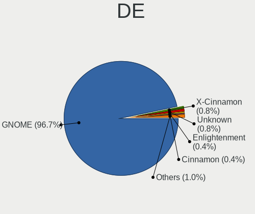
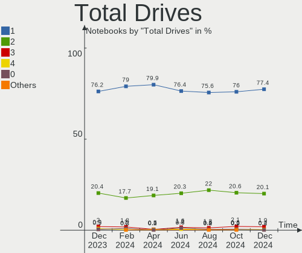
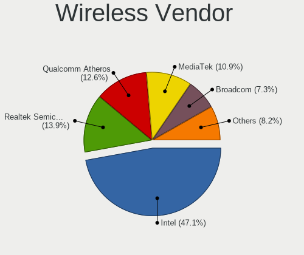

Ubuntu - Hardware Trends (Notebooks)
------------------------------------

A project to identify most popular hardware characteristics and track their change
over time based on data collected by Linux users at https://Linux-Hardware.org.

Anyone can contribute to this report by the [hw-probe](https://github.com/linuxhw/hw-probe) tool:

    sudo -E hw-probe -all -upload

This report is for one last month. Overall report since the beginning of time: [TestDays](https://github.com/linuxhw/TestDays)

Period: Jun, 2023.

Contents
--------

* [ System ](#system)
  - [ OS                       ](#os)
  - [ OS Family                ](#os-family)
  - [ Kernel                   ](#kernel)
  - [ Kernel Family            ](#kernel-family)
  - [ Kernel Major Ver.        ](#kernel-major-ver)
  - [ Arch                     ](#arch)
  - [ DE                       ](#de)
  - [ Display Server           ](#display-server)
  - [ Display Manager          ](#display-manager)
  - [ OS Lang                  ](#os-lang)
  - [ Boot Mode                ](#boot-mode)
  - [ Filesystem               ](#filesystem)
  - [ Part. scheme             ](#part-scheme)
  - [ Dual Boot with Linux/BSD ](#dual-boot-with-linuxbsd)
  - [ Dual Boot (Win)          ](#dual-boot-win)

* [ Board ](#board)
  - [ Vendor                   ](#vendor)
  - [ Model                    ](#model)
  - [ Model Family             ](#model-family)
  - [ MFG Year                 ](#mfg-year)
  - [ Form Factor              ](#form-factor)
  - [ Secure Boot              ](#secure-boot)
  - [ Coreboot                 ](#coreboot)
  - [ RAM Size                 ](#ram-size)
  - [ RAM Used                 ](#ram-used)
  - [ Total Drives             ](#total-drives)
  - [ Has CD-ROM               ](#has-cd-rom)
  - [ Has Ethernet             ](#has-ethernet)
  - [ Has WiFi                 ](#has-wifi)
  - [ Has Bluetooth            ](#has-bluetooth)

* [ Location ](#location)
  - [ Country                  ](#country)
  - [ City                     ](#city)

* [ Drives ](#drives)
  - [ Drive Vendor             ](#drive-vendor)
  - [ Drive Model              ](#drive-model)
  - [ HDD Vendor               ](#hdd-vendor)
  - [ SSD Vendor               ](#ssd-vendor)
  - [ Drive Kind               ](#drive-kind)
  - [ Drive Connector          ](#drive-connector)
  - [ Drive Size               ](#drive-size)
  - [ Space Total              ](#space-total)
  - [ Space Used               ](#space-used)
  - [ Malfunc. Drives          ](#malfunc-drives)
  - [ Malfunc. Drive Vendor    ](#malfunc-drive-vendor)
  - [ Malfunc. HDD Vendor      ](#malfunc-hdd-vendor)
  - [ Malfunc. Drive Kind      ](#malfunc-drive-kind)
  - [ Failed Drives            ](#failed-drives)
  - [ Failed Drive Vendor      ](#failed-drive-vendor)
  - [ Drive Status             ](#drive-status)

* [ Storage controller ](#storage-controller)
  - [ Storage Vendor           ](#storage-vendor)
  - [ Storage Model            ](#storage-model)
  - [ Storage Kind             ](#storage-kind)

* [ Processor ](#processor)
  - [ CPU Vendor               ](#cpu-vendor)
  - [ CPU Model                ](#cpu-model)
  - [ CPU Model Family         ](#cpu-model-family)
  - [ CPU Cores                ](#cpu-cores)
  - [ CPU Sockets              ](#cpu-sockets)
  - [ CPU Threads              ](#cpu-threads)
  - [ CPU Op-Modes             ](#cpu-op-modes)
  - [ CPU Microcode            ](#cpu-microcode)
  - [ CPU Microarch            ](#cpu-microarch)

* [ Graphics ](#graphics)
  - [ GPU Vendor               ](#gpu-vendor)
  - [ GPU Model                ](#gpu-model)
  - [ GPU Combo                ](#gpu-combo)
  - [ GPU Driver               ](#gpu-driver)
  - [ GPU Memory               ](#gpu-memory)

* [ Monitor ](#monitor)
  - [ Monitor Vendor           ](#monitor-vendor)
  - [ Monitor Model            ](#monitor-model)
  - [ Monitor Resolution       ](#monitor-resolution)
  - [ Monitor Diagonal         ](#monitor-diagonal)
  - [ Monitor Width            ](#monitor-width)
  - [ Aspect Ratio             ](#aspect-ratio)
  - [ Monitor Area             ](#monitor-area)
  - [ Pixel Density            ](#pixel-density)
  - [ Multiple Monitors        ](#multiple-monitors)

* [ Network ](#network)
  - [ Net Controller Vendor    ](#net-controller-vendor)
  - [ Net Controller Model     ](#net-controller-model)
  - [ Wireless Vendor          ](#wireless-vendor)
  - [ Wireless Model           ](#wireless-model)
  - [ Ethernet Vendor          ](#ethernet-vendor)
  - [ Ethernet Model           ](#ethernet-model)
  - [ Net Controller Kind      ](#net-controller-kind)
  - [ Used Controller          ](#used-controller)
  - [ NICs                     ](#nics)
  - [ IPv6                     ](#ipv6)

* [ Bluetooth ](#bluetooth)
  - [ Bluetooth Vendor         ](#bluetooth-vendor)
  - [ Bluetooth Model          ](#bluetooth-model)

* [ Sound ](#sound)
  - [ Sound Vendor             ](#sound-vendor)
  - [ Sound Model              ](#sound-model)

* [ Memory ](#memory)
  - [ Memory Vendor            ](#memory-vendor)
  - [ Memory Model             ](#memory-model)
  - [ Memory Kind              ](#memory-kind)
  - [ Memory Form Factor       ](#memory-form-factor)
  - [ Memory Size              ](#memory-size)
  - [ Memory Speed             ](#memory-speed)

* [ Printers & scanners ](#printers--scanners)
  - [ Printer Vendor           ](#printer-vendor)
  - [ Printer Model            ](#printer-model)
  - [ Scanner Vendor           ](#scanner-vendor)
  - [ Scanner Model            ](#scanner-model)

* [ Camera ](#camera)
  - [ Camera Vendor            ](#camera-vendor)
  - [ Camera Model             ](#camera-model)

* [ Security ](#security)
  - [ Fingerprint Vendor       ](#fingerprint-vendor)
  - [ Fingerprint Model        ](#fingerprint-model)
  - [ Chipcard Vendor          ](#chipcard-vendor)
  - [ Chipcard Model           ](#chipcard-model)

* [ Unsupported ](#unsupported)
  - [ Unsupported Devices      ](#unsupported-devices)
  - [ Unsupported Device Types ](#unsupported-device-types)

System
------

OS
--

Installed operating systems

| Name           | Notebooks | Percent |
|----------------|-----------|---------|
| Ubuntu 22.04   | 336       | 60.32%  |
| Ubuntu 23.04   | 136       | 24.42%  |
| Ubuntu 20.04   | 44        | 7.9%    |
| Ubuntu 22.10   | 30        | 5.39%   |
| Ubuntu 18.04   | 8         | 1.44%   |
| Ubuntu Core 22 | 1         | 0.18%   |
| Ubuntu 23.10   | 1         | 0.18%   |
| Ubuntu 20.10   | 1         | 0.18%   |

OS Family
---------

OS without a version

| Name   | Notebooks | Percent |
|--------|-----------|---------|
| Ubuntu | 557       | 100%    |

Kernel
------

Version of the Linux kernel

| Version                | Notebooks | Percent |
|------------------------|-----------|---------|
| 5.19.0-43-generic      | 168       | 30.16%  |
| 5.19.0-45-generic      | 107       | 19.21%  |
| 6.2.0-20-generic       | 74        | 13.29%  |
| 6.2.0-23-generic       | 40        | 7.18%   |
| 5.15.0-75-generic      | 21        | 3.77%   |
| 5.15.0-73-generic      | 20        | 3.59%   |
| 5.19.0-42-generic      | 14        | 2.51%   |
| 5.19.0-46-generic      | 13        | 2.33%   |
| 6.2.0-24-generic       | 10        | 1.8%    |
| 5.19.0-32-generic      | 10        | 1.8%    |
| 5.4.0-150-generic      | 4         | 0.72%   |
| 5.19.0-44-generic      | 4         | 0.72%   |
| 5.19.0-41-generic      | 4         | 0.72%   |
| 6.4.0-060400-generic   | 3         | 0.54%   |
| 5.15.0-76-generic      | 3         | 0.54%   |
| 5.14.0-1059-oem        | 3         | 0.54%   |
| 4.15.0-212-generic     | 3         | 0.54%   |
| 6.3.7-060307-generic   | 2         | 0.36%   |
| 6.3.5-060305-generic   | 2         | 0.36%   |
| 6.2.6-76060206-generic | 2         | 0.36%   |
| 5.4.0-152-generic      | 2         | 0.36%   |
| 5.19.0-40-generic      | 2         | 0.36%   |
| 5.15.0-72-generic      | 2         | 0.36%   |
| 5.15.0-69-generic      | 2         | 0.36%   |
| 5.15.0-56-generic      | 2         | 0.36%   |
| 5.15.0-52-generic      | 2         | 0.36%   |
| 6.3.8-x64v4-xanmod1    | 1         | 0.18%   |
| 6.3.5-tkg-cfs          | 1         | 0.18%   |
| 6.2.11-060211-generic  | 1         | 0.18%   |
| 6.2.0-21-generic       | 1         | 0.18%   |
| 6.2.0-1005-lowlatency  | 1         | 0.18%   |
| 6.2.0-060200-generic   | 1         | 0.18%   |
| 6.1.7-060107-generic   | 1         | 0.18%   |
| 6.0.7-060007-generic   | 1         | 0.18%   |
| 6.0.0-1018-oem         | 1         | 0.18%   |
| 5.8.0-25-generic       | 1         | 0.18%   |
| 5.4.0-91-generic       | 1         | 0.18%   |
| 5.4.0-26-generic       | 1         | 0.18%   |
| 5.4.0-153-generic      | 1         | 0.18%   |
| 5.4.0-149-generic      | 1         | 0.18%   |

Kernel Family
-------------

Linux kernel without a distro release

| Version | Notebooks | Percent |
|---------|-----------|---------|
| 5.19.0  | 328       | 58.89%  |
| 6.2.0   | 127       | 22.8%   |
| 5.15.0  | 60        | 10.77%  |
| 5.4.0   | 11        | 1.97%   |
| 5.14.0  | 7         | 1.26%   |
| 6.4.0   | 3         | 0.54%   |
| 6.3.5   | 3         | 0.54%   |
| 4.15.0  | 3         | 0.54%   |
| 6.3.7   | 2         | 0.36%   |
| 6.2.6   | 2         | 0.36%   |
| 5.17.0  | 2         | 0.36%   |
| 5.13.0  | 2         | 0.36%   |
| 6.3.8   | 1         | 0.18%   |
| 6.2.11  | 1         | 0.18%   |
| 6.1.7   | 1         | 0.18%   |
| 6.0.7   | 1         | 0.18%   |
| 6.0.0   | 1         | 0.18%   |
| 5.8.0   | 1         | 0.18%   |
| 5.3.0   | 1         | 0.18%   |

Kernel Major Ver.
-----------------

Linux kernel major version

| Version | Notebooks | Percent |
|---------|-----------|---------|
| 5.19    | 328       | 58.89%  |
| 6.2     | 130       | 23.34%  |
| 5.15    | 60        | 10.77%  |
| 5.4     | 11        | 1.97%   |
| 5.14    | 7         | 1.26%   |
| 6.3     | 6         | 1.08%   |
| 6.4     | 3         | 0.54%   |
| 4.15    | 3         | 0.54%   |
| 6.0     | 2         | 0.36%   |
| 5.17    | 2         | 0.36%   |
| 5.13    | 2         | 0.36%   |
| 6.1     | 1         | 0.18%   |
| 5.8     | 1         | 0.18%   |
| 5.3     | 1         | 0.18%   |

Arch
----

OS architecture (x86_64, i586, etc.)

| Name   | Notebooks | Percent |
|--------|-----------|---------|
| x86_64 | 554       | 99.46%  |
| i686   | 3         | 0.54%   |

DE
--

Desktop Environment

| Name            | Notebooks | Percent |
|-----------------|-----------|---------|
| GNOME           | 536       | 96.23%  |
| Unknown         | 10        | 1.8%    |
| X-Cinnamon      | 7         | 1.26%   |
| GNOME Classic   | 2         | 0.36%   |
| i3              | 1         | 0.18%   |
| GNOME Flashback | 1         | 0.18%   |

Display Server
--------------

X11 or Wayland

| Name    | Notebooks | Percent |
|---------|-----------|---------|
| Wayland | 368       | 66.07%  |
| X11     | 183       | 32.85%  |
| Tty     | 3         | 0.54%   |
| Unknown | 3         | 0.54%   |

Display Manager
---------------

SDDM, LightDM, etc.

| Name    | Notebooks | Percent |
|---------|-----------|---------|
| GDM3    | 478       | 85.82%  |
| Unknown | 50        | 8.98%   |
| GDM     | 18        | 3.23%   |
| LightDM | 8         | 1.44%   |
| SDDM    | 2         | 0.36%   |
| SLiM    | 1         | 0.18%   |

OS Lang
-------

Language

| Lang    | Notebooks | Percent |
|---------|-----------|---------|
| en_US   | 259       | 46.5%   |
| fr_FR   | 45        | 8.08%   |
| de_DE   | 41        | 7.36%   |
| en_GB   | 25        | 4.49%   |
| en_IN   | 22        | 3.95%   |
| es_ES   | 21        | 3.77%   |
| pt_BR   | 18        | 3.23%   |
| it_IT   | 17        | 3.05%   |
| ru_RU   | 10        | 1.8%    |
| nl_NL   | 8         | 1.44%   |
| en_CA   | 8         | 1.44%   |
| pl_PL   | 7         | 1.26%   |
| es_MX   | 7         | 1.26%   |
| Unknown | 7         | 1.26%   |
| C       | 6         | 1.08%   |
| hu_HU   | 5         | 0.9%    |
| en_AU   | 5         | 0.9%    |
| pt_PT   | 4         | 0.72%   |
| fi_FI   | 4         | 0.72%   |
| es_AR   | 4         | 0.72%   |
| cs_CZ   | 4         | 0.72%   |
| sv_SE   | 3         | 0.54%   |
| ko_KR   | 3         | 0.54%   |
| en_IL   | 3         | 0.54%   |
| en_IE   | 3         | 0.54%   |
| tr_TR   | 2         | 0.36%   |
| ja_JP   | 2         | 0.36%   |
| es_CL   | 2         | 0.36%   |
| da_DK   | 2         | 0.36%   |
| sk_SK   | 1         | 0.18%   |
| nb_NO   | 1         | 0.18%   |
| fr_CA   | 1         | 0.18%   |
| fr_BE   | 1         | 0.18%   |
| es_PY   | 1         | 0.18%   |
| en_ZA   | 1         | 0.18%   |
| en_HK   | 1         | 0.18%   |
| el_GR   | 1         | 0.18%   |
| de_AT   | 1         | 0.18%   |
| bg_BG   | 1         | 0.18%   |

Boot Mode
---------

EFI or BIOS

| Mode | Notebooks | Percent |
|------|-----------|---------|
| BIOS | 326       | 58.53%  |
| EFI  | 231       | 41.47%  |

Filesystem
----------

Type of filesystem

| Type    | Notebooks | Percent |
|---------|-----------|---------|
| Tmpfs   | 289       | 51.89%  |
| Ext4    | 237       | 42.55%  |
| Btrfs   | 16        | 2.87%   |
| Overlay | 10        | 1.8%    |
| Zfs     | 5         | 0.9%    |

Part. scheme
------------

Scheme of partitioning

| Type    | Notebooks | Percent |
|---------|-----------|---------|
| GPT     | 463       | 83.12%  |
| MBR     | 49        | 8.8%    |
| Unknown | 45        | 8.08%   |

Dual Boot with Linux/BSD
------------------------

Hosting more than one Linux/BSD

| Dual boot | Notebooks | Percent |
|-----------|-----------|---------|
| No        | 510       | 91.56%  |
| Yes       | 47        | 8.44%   |

Dual Boot (Win)
---------------

Hosting Linux and Windows

| Dual boot | Notebooks | Percent |
|-----------|-----------|---------|
| No        | 394       | 70.74%  |
| Yes       | 163       | 29.26%  |

Board
-----

Vendor
------

Motherboard manufacturer

| Name                | Notebooks | Percent |
|---------------------|-----------|---------|
| Lenovo              | 112       | 20.11%  |
| Dell                | 100       | 17.95%  |
| Hewlett-Packard     | 94        | 16.88%  |
| ASUSTek Computer    | 57        | 10.23%  |
| Acer                | 47        | 8.44%   |
| Apple               | 19        | 3.41%   |
| MSI                 | 16        | 2.87%   |
| Toshiba             | 14        | 2.51%   |
| HUAWEI              | 14        | 2.51%   |
| Samsung Electronics | 13        | 2.33%   |
| Sony                | 8         | 1.44%   |
| Notebook            | 6         | 1.08%   |
| Timi                | 5         | 0.9%    |
| Unknown             | 5         | 0.9%    |
| Medion              | 4         | 0.72%   |
| Razer               | 3         | 0.54%   |
| Packard Bell        | 3         | 0.54%   |
| Google              | 3         | 0.54%   |
| Gateway             | 3         | 0.54%   |
| Fujitsu             | 3         | 0.54%   |
| Alienware           | 3         | 0.54%   |
| UNOWHY              | 1         | 0.18%   |
| System76            | 1         | 0.18%   |
| Star Labs           | 1         | 0.18%   |
| Schenker            | 1         | 0.18%   |
| Positivo            | 1         | 0.18%   |
| PC Specialist       | 1         | 0.18%   |
| Panasonic           | 1         | 0.18%   |
| Onda TLC            | 1         | 0.18%   |
| NCS-Tech            | 1         | 0.18%   |
| Monster             | 1         | 0.18%   |
| Lanix               | 1         | 0.18%   |
| IP3 Tech            | 1         | 0.18%   |
| Intel               | 1         | 0.18%   |
| Infinix             | 1         | 0.18%   |
| HONOR               | 1         | 0.18%   |
| HASEE Computer      | 1         | 0.18%   |
| Hampoo              | 1         | 0.18%   |
| Gigabyte Technology | 1         | 0.18%   |
| Framework           | 1         | 0.18%   |

Model
-----

Motherboard model

| Name                                | Notebooks | Percent |
|-------------------------------------|-----------|---------|
| Unknown                             | 6         | 1.08%   |
| Dell XPS 9320                       | 5         | 0.9%    |
| HP Pavilion dv6                     | 4         | 0.72%   |
| HUAWEI BOHB-WAX9                    | 3         | 0.54%   |
| HP Pavilion Notebook                | 3         | 0.54%   |
| HP Notebook                         | 3         | 0.54%   |
| HP Laptop 15s-eq2xxx                | 3         | 0.54%   |
| Dell XPS 15 9570                    | 3         | 0.54%   |
| Apple MacBookPro8,2                 | 3         | 0.54%   |
| Apple MacBookPro5,5                 | 3         | 0.54%   |
| Toshiba Satellite Pro C70-B         | 2         | 0.36%   |
| Timi Redmi Book Pro 14 2022         | 2         | 0.36%   |
| Razer Blade 16 - RZ09-0483          | 2         | 0.36%   |
| MSI Stealth 15M B12UE               | 2         | 0.36%   |
| MSI Modern 14 B5M                   | 2         | 0.36%   |
| Lenovo Legion 5 15ACH6H 82JU        | 2         | 0.36%   |
| Lenovo Legion 5 15ACH6 82JW         | 2         | 0.36%   |
| Lenovo IdeaPad Gaming 3 16IAH7 82SA | 2         | 0.36%   |
| Lenovo IdeaPad 5 14ALC05 82LM       | 2         | 0.36%   |
| Lenovo IdeaPad 3 15IGL05 81WQ       | 2         | 0.36%   |
| Lenovo IdeaPad 3 14ITL6 82H7        | 2         | 0.36%   |
| HUAWEI NBLB-WAX9N                   | 2         | 0.36%   |
| HUAWEI HVY-WXX9                     | 2         | 0.36%   |
| HUAWEI BOM-WXX9                     | 2         | 0.36%   |
| HP Pavilion g6                      | 2         | 0.36%   |
| HP Laptop 15s-eq1xxx                | 2         | 0.36%   |
| HP Laptop 15-db0xxx                 | 2         | 0.36%   |
| HP Laptop 14s-dq2xxx                | 2         | 0.36%   |
| HP ENVY 17                          | 2         | 0.36%   |
| HP ENVY 15                          | 2         | 0.36%   |
| HP EliteBook 840 G3                 | 2         | 0.36%   |
| HP EliteBook 2560p                  | 2         | 0.36%   |
| HP 2000                             | 2         | 0.36%   |
| Dell XPS 15 9560                    | 2         | 0.36%   |
| Dell XPS 15 9500                    | 2         | 0.36%   |
| Dell Precision 5570                 | 2         | 0.36%   |
| Dell Latitude E7450                 | 2         | 0.36%   |
| Dell Latitude E7250                 | 2         | 0.36%   |
| Dell Latitude E6420                 | 2         | 0.36%   |
| Dell Latitude E6410                 | 2         | 0.36%   |

Model Family
------------

Motherboard model prefix

| Name                  | Notebooks | Percent |
|-----------------------|-----------|---------|
| Lenovo ThinkPad       | 62        | 11.13%  |
| Dell Latitude         | 39        | 7%      |
| Acer Aspire           | 35        | 6.28%   |
| Lenovo IdeaPad        | 27        | 4.85%   |
| Dell Inspiron         | 22        | 3.95%   |
| HP Pavilion           | 21        | 3.77%   |
| HP Laptop             | 21        | 3.77%   |
| ASUS VivoBook         | 20        | 3.59%   |
| HP EliteBook          | 18        | 3.23%   |
| Dell XPS              | 17        | 3.05%   |
| HP ProBook            | 12        | 2.15%   |
| Dell Precision        | 11        | 1.97%   |
| Toshiba Satellite     | 9         | 1.62%   |
| Lenovo Legion         | 8         | 1.44%   |
| Dell Vostro           | 7         | 1.26%   |
| ASUS ZenBook          | 6         | 1.08%   |
| Unknown               | 6         | 1.08%   |
| Lenovo ThinkBook      | 5         | 0.9%    |
| HP ENVY               | 5         | 0.9%    |
| Lenovo Yoga           | 4         | 0.72%   |
| HP ZBook              | 4         | 0.72%   |
| Acer Nitro            | 4         | 0.72%   |
| Toshiba PORTEGE       | 3         | 0.54%   |
| Razer Blade           | 3         | 0.54%   |
| MSI Stealth           | 3         | 0.54%   |
| MSI Prestige          | 3         | 0.54%   |
| HUAWEI BOHB-WAX9      | 3         | 0.54%   |
| HP Notebook           | 3         | 0.54%   |
| ASUS ROG              | 3         | 0.54%   |
| Apple MacBookPro8     | 3         | 0.54%   |
| Apple MacBookPro5     | 3         | 0.54%   |
| Acer Swift            | 3         | 0.54%   |
| Timi RedmiBook        | 2         | 0.36%   |
| Timi Redmi            | 2         | 0.36%   |
| Packard Bell EasyNote | 2         | 0.36%   |
| MSI Modern            | 2         | 0.36%   |
| MSI Katana            | 2         | 0.36%   |
| MSI GE66              | 2         | 0.36%   |
| HUAWEI NBLB-WAX9N     | 2         | 0.36%   |
| HUAWEI HVY-WXX9       | 2         | 0.36%   |

MFG Year
--------

Motherboard manufacture year

| Year | Notebooks | Percent |
|------|-----------|---------|
| 2021 | 73        | 13.11%  |
| 2022 | 70        | 12.57%  |
| 2020 | 60        | 10.77%  |
| 2019 | 44        | 7.9%    |
| 2011 | 34        | 6.1%    |
| 2018 | 32        | 5.75%   |
| 2017 | 32        | 5.75%   |
| 2016 | 30        | 5.39%   |
| 2010 | 29        | 5.21%   |
| 2014 | 28        | 5.03%   |
| 2015 | 25        | 4.49%   |
| 2012 | 24        | 4.31%   |
| 2013 | 23        | 4.13%   |
| 2008 | 21        | 3.77%   |
| 2023 | 17        | 3.05%   |
| 2009 | 13        | 2.33%   |
| 2007 | 2         | 0.36%   |

Form Factor
-----------

Physical design of the computer

| Name     | Notebooks | Percent |
|----------|-----------|---------|
| Notebook | 557       | 100%    |

Secure Boot
-----------

Enabled or disabled

| State    | Notebooks | Percent |
|----------|-----------|---------|
| Disabled | 487       | 87.43%  |
| Enabled  | 70        | 12.57%  |

Coreboot
--------

Have coreboot on board

| Used | Notebooks | Percent |
|------|-----------|---------|
| No   | 553       | 99.28%  |
| Yes  | 4         | 0.72%   |

RAM Size
--------

Total RAM memory

| Size in GB  | Notebooks | Percent |
|-------------|-----------|---------|
| 4.01-8.0    | 160       | 28.73%  |
| 8.01-16.0   | 109       | 19.57%  |
| 16.01-24.0  | 99        | 17.77%  |
| 3.01-4.0    | 92        | 16.52%  |
| 32.01-64.0  | 66        | 11.85%  |
| 64.01-256.0 | 9         | 1.62%   |
| 24.01-32.0  | 8         | 1.44%   |
| 2.01-3.0    | 7         | 1.26%   |
| 1.01-2.0    | 7         | 1.26%   |

RAM Used
--------

Used RAM memory

| Used GB    | Notebooks | Percent |
|------------|-----------|---------|
| 1.01-2.0   | 156       | 28.01%  |
| 2.01-3.0   | 150       | 26.93%  |
| 4.01-8.0   | 115       | 20.65%  |
| 3.01-4.0   | 93        | 16.7%   |
| 8.01-16.0  | 30        | 5.39%   |
| 16.01-24.0 | 5         | 0.9%    |
| 0.51-1.0   | 4         | 0.72%   |
| 24.01-32.0 | 2         | 0.36%   |
| 32.01-64.0 | 1         | 0.18%   |
| 0.01-0.5   | 1         | 0.18%   |

Total Drives
------------

Number of drives on board

| Drives | Notebooks | Percent |
|--------|-----------|---------|
| 1      | 446       | 80.07%  |
| 2      | 95        | 17.06%  |
| 3      | 11        | 1.97%   |
| 4      | 4         | 0.72%   |
| 0      | 1         | 0.18%   |

Has CD-ROM
----------

Has CD-ROM on board

| Presented | Notebooks | Percent |
|-----------|-----------|---------|
| No        | 406       | 72.89%  |
| Yes       | 151       | 27.11%  |

Has Ethernet
------------

Has Ethernet on board

| Presented | Notebooks | Percent |
|-----------|-----------|---------|
| Yes       | 399       | 71.63%  |
| No        | 158       | 28.37%  |

Has WiFi
--------

Has WiFi module

| Presented | Notebooks | Percent |
|-----------|-----------|---------|
| Yes       | 549       | 98.56%  |
| No        | 8         | 1.44%   |

Has Bluetooth
-------------

Has Bluetooth module

| Presented | Notebooks | Percent |
|-----------|-----------|---------|
| Yes       | 460       | 82.59%  |
| No        | 97        | 17.41%  |

Location
--------

Country
-------

Geographic location (country)

| Country     | Notebooks | Percent |
|-------------|-----------|---------|
| USA         | 82        | 14.72%  |
| Germany     | 53        | 9.52%   |
| France      | 45        | 8.08%   |
| India       | 26        | 4.67%   |
| Brazil      | 26        | 4.67%   |
| Italy       | 25        | 4.49%   |
| UK          | 22        | 3.95%   |
| Spain       | 21        | 3.77%   |
| Netherlands | 19        | 3.41%   |
| Poland      | 16        | 2.87%   |
| Canada      | 15        | 2.69%   |
| Russia      | 13        | 2.33%   |
| Mexico      | 13        | 2.33%   |
| Switzerland | 10        | 1.8%    |
| Argentina   | 10        | 1.8%    |
| Portugal    | 9         | 1.62%   |
| Sweden      | 8         | 1.44%   |
| Czechia     | 8         | 1.44%   |
| Turkey      | 7         | 1.26%   |
| Australia   | 7         | 1.26%   |
| Hungary     | 6         | 1.08%   |
| South Korea | 5         | 0.9%    |
| Pakistan    | 5         | 0.9%    |
| Norway      | 5         | 0.9%    |
| Finland     | 5         | 0.9%    |
| Chile       | 5         | 0.9%    |
| Austria     | 5         | 0.9%    |
| Romania     | 4         | 0.72%   |
| Israel      | 4         | 0.72%   |
| Greece      | 4         | 0.72%   |
| Bulgaria    | 4         | 0.72%   |
| Belgium     | 4         | 0.72%   |
| Serbia      | 3         | 0.54%   |
| Kazakhstan  | 3         | 0.54%   |
| Japan       | 3         | 0.54%   |
| Ireland     | 3         | 0.54%   |
| Egypt       | 3         | 0.54%   |
| Denmark     | 3         | 0.54%   |
| Vietnam     | 2         | 0.36%   |
| Thailand    | 2         | 0.36%   |

City
----

Geographic location (city)

| City         | Notebooks | Percent |
|--------------|-----------|---------|
| Sao Paulo    | 7         | 1.26%   |
| Milan        | 7         | 1.26%   |
| Amsterdam    | 6         | 1.08%   |
| Paris        | 5         | 0.9%    |
| Moscow       | 5         | 0.9%    |
| Melbourne    | 5         | 0.9%    |
| Zurich       | 4         | 0.72%   |
| Mumbai       | 4         | 0.72%   |
| Montreal     | 4         | 0.72%   |
| Istanbul     | 4         | 0.72%   |
| Budapest     | 4         | 0.72%   |
| Berlin       | 4         | 0.72%   |
| Warsaw       | 3         | 0.54%   |
| Toulouse     | 3         | 0.54%   |
| Toronto      | 3         | 0.54%   |
| Tel Aviv     | 3         | 0.54%   |
| Prague       | 3         | 0.54%   |
| Porto Alegre | 3         | 0.54%   |
| Madrid       | 3         | 0.54%   |
| Lucknow      | 3         | 0.54%   |
| Lisbon       | 3         | 0.54%   |
| Leipzig      | 3         | 0.54%   |
| Krakow       | 3         | 0.54%   |
| Helsinki     | 3         | 0.54%   |
| Gdansk       | 3         | 0.54%   |
| Chennai      | 3         | 0.54%   |
| Belgrade     | 3         | 0.54%   |
| Athens       | 3         | 0.54%   |
| Valencia     | 2         | 0.36%   |
| Toledo       | 2         | 0.36%   |
| Tbilisi      | 2         | 0.36%   |
| Stuttgart    | 2         | 0.36%   |
| Sofia        | 2         | 0.36%   |
| Seattle      | 2         | 0.36%   |
| Santiago     | 2         | 0.36%   |
| San Antonio  | 2         | 0.36%   |
| Rome         | 2         | 0.36%   |
| Puebla City  | 2         | 0.36%   |
| Obertshausen | 2         | 0.36%   |
| Nuremberg    | 2         | 0.36%   |

Drives
------

Drive Vendor
------------

Hard drive vendors

| Vendor                      | Notebooks | Drives | Percent |
|-----------------------------|-----------|--------|---------|
| Samsung Electronics         | 109       | 115    | 16.44%  |
| WDC                         | 60        | 61     | 9.05%   |
| SK hynix                    | 46        | 46     | 6.94%   |
| Sandisk                     | 43        | 43     | 6.49%   |
| Micron Technology           | 39        | 39     | 5.88%   |
| Toshiba                     | 37        | 37     | 5.58%   |
| Seagate                     | 37        | 39     | 5.58%   |
| Kingston                    | 32        | 32     | 4.83%   |
| Intel                       | 29        | 31     | 4.37%   |
| Unknown                     | 27        | 29     | 4.07%   |
| Crucial                     | 24        | 26     | 3.62%   |
| Hitachi                     | 17        | 17     | 2.56%   |
| HGST                        | 14        | 14     | 2.11%   |
| KIOXIA                      | 10        | 10     | 1.51%   |
| Apple                       | 8         | 10     | 1.21%   |
| SPCC                        | 7         | 7      | 1.06%   |
| A-DATA Technology           | 7         | 7      | 1.06%   |
| Silicon Motion              | 6         | 6      | 0.9%    |
| Kingston Technology Company | 6         | 6      | 0.9%    |
| China                       | 6         | 6      | 0.9%    |
| Transcend                   | 5         | 5      | 0.75%   |
| PNY                         | 5         | 5      | 0.75%   |
| Phison Electronics          | 5         | 5      | 0.75%   |
| LITEONIT                    | 5         | 5      | 0.75%   |
| LITEON                      | 5         | 5      | 0.75%   |
| Phison                      | 4         | 4      | 0.6%    |
| Unknown                     | 4         | 4      | 0.6%    |
| SSSTC                       | 3         | 3      | 0.45%   |
| Micron/Crucial Technology   | 3         | 3      | 0.45%   |
| JMicron Technology          | 3         | 3      | 0.45%   |
| Gigabyte Technology         | 3         | 3      | 0.45%   |
| Fujitsu                     | 3         | 3      | 0.45%   |
| ADATA Technology            | 3         | 3      | 0.45%   |
| Union Memory (Shenzhen)     | 2         | 2      | 0.3%    |
| Union Memory                | 2         | 2      | 0.3%    |
| UMIS                        | 2         | 2      | 0.3%    |
| Team                        | 2         | 2      | 0.3%    |
| Solid State Storage         | 2         | 2      | 0.3%    |
| Plextor                     | 2         | 2      | 0.3%    |
| Netac                       | 2         | 2      | 0.3%    |

Drive Model
-----------

Hard drive models

| Model                                                 | Notebooks | Percent |
|-------------------------------------------------------|-----------|---------|
| Samsung NVMe SSD Controller SM981/PM981/PM983 250GB   | 15        | 2.23%   |
| Unknown MMC Card  64GB                                | 9         | 1.34%   |
| Samsung NVMe SSD Controller PM9A1/PM9A3/980PRO 2TB    | 9         | 1.34%   |
| Seagate ST500LT012-1DG142 500GB                       | 6         | 0.89%   |
| Kingston SA400S37480G 480GB SSD                       | 6         | 0.89%   |
| Kingston SA400S37240G 240GB SSD                       | 6         | 0.89%   |
| Toshiba MQ04ABF100 1TB                                | 5         | 0.74%   |
| SK hynix PC801 NVMe 1TB                               | 5         | 0.74%   |
| Sandisk WD Blue SN550 NVMe SSD 1TB                    | 5         | 0.74%   |
| Sandisk WD Black SN750 / PC SN730 NVMe SSD 500GB      | 5         | 0.74%   |
| SanDisk NVMe SSD Drive 1TB                            | 5         | 0.74%   |
| Micron 2450_MTFDKBA512TFK 512GB                       | 5         | 0.74%   |
| Intel SSDPEKNU512GZ 512GB                             | 5         | 0.74%   |
| Intel SSD 660P Series 512GB                           | 5         | 0.74%   |
| HGST HTS721010A9E630 1TB                              | 5         | 0.74%   |
| Crucial CT500MX500SSD1 500GB                          | 5         | 0.74%   |
| Unknown MMC Card  32GB                                | 4         | 0.59%   |
| Unknown MMC Card  128GB                               | 4         | 0.59%   |
| Silicon Motion SM2263EN/SM2263XT SSD Controller 256GB | 4         | 0.59%   |
| Seagate ST1000LM035-1RK172 1TB                        | 4         | 0.59%   |
| SanDisk NVMe SSD Drive 512GB                          | 4         | 0.59%   |
| Samsung NVMe SSD Controller SM961/PM961/SM963 256GB   | 4         | 0.59%   |
| Micron 2450_MTFDKBA1T0TFK 1TB                         | 4         | 0.59%   |
| Unknown                                               | 4         | 0.59%   |
| WDC WD10SPZX-22Z10T1 1TB                              | 3         | 0.45%   |
| WDC WD10SPZX-21Z10T0 1TB                              | 3         | 0.45%   |
| WDC WD10JPVX-22JC3T0 1TB                              | 3         | 0.45%   |
| Toshiba MQ01ABF050 500GB                              | 3         | 0.45%   |
| Toshiba MQ01ABD050 500GB                              | 3         | 0.45%   |
| SK hynix SKHynix_HFS512GDE9X084N 512GB                | 3         | 0.45%   |
| SK hynix BC711 HFM256GD3JX013N 256GB                  | 3         | 0.45%   |
| Samsung SSD 980 1TB                                   | 3         | 0.45%   |
| Samsung SSD 870 QVO 1TB                               | 3         | 0.45%   |
| Samsung SSD 850 EVO 250GB                             | 3         | 0.45%   |
| Samsung MZVL21T0HCLR-00B00 1TB                        | 3         | 0.45%   |
| Samsung MZAL4512HBLU-00BL2 512GB                      | 3         | 0.45%   |
| Micron 2200V_MTFDHBA512TCK 512GB                      | 3         | 0.45%   |
| Kingston Company OM3PDP3 NVMe SSD 256GB               | 3         | 0.45%   |
| Kingston SA400S37120G 120GB SSD                       | 3         | 0.45%   |
| JMicron Generic 240GB                                 | 3         | 0.45%   |

HDD Vendor
----------

Hard disk drive vendors

| Vendor              | Notebooks | Drives | Percent |
|---------------------|-----------|--------|---------|
| WDC                 | 42        | 42     | 29.58%  |
| Seagate             | 36        | 38     | 25.35%  |
| Toshiba             | 23        | 23     | 16.2%   |
| Hitachi             | 17        | 17     | 11.97%  |
| HGST                | 14        | 14     | 9.86%   |
| Samsung Electronics | 4         | 4      | 2.82%   |
| Fujitsu             | 3         | 3      | 2.11%   |
| Unknown             | 1         | 1      | 0.7%    |
| ASMT                | 1         | 1      | 0.7%    |
| Apple               | 1         | 1      | 0.7%    |

SSD Vendor
----------

Solid state drive vendors

| Vendor              | Notebooks | Drives | Percent |
|---------------------|-----------|--------|---------|
| Samsung Electronics | 34        | 37     | 18.18%  |
| Kingston            | 24        | 24     | 12.83%  |
| Crucial             | 21        | 22     | 11.23%  |
| SanDisk             | 15        | 15     | 8.02%   |
| SPCC                | 7         | 7      | 3.74%   |
| SK hynix            | 7         | 7      | 3.74%   |
| Toshiba             | 6         | 6      | 3.21%   |
| Intel               | 6         | 6      | 3.21%   |
| WDC                 | 5         | 5      | 2.67%   |
| PNY                 | 5         | 5      | 2.67%   |
| LITEONIT            | 5         | 5      | 2.67%   |
| China               | 5         | 5      | 2.67%   |
| A-DATA Technology   | 5         | 5      | 2.67%   |
| Micron Technology   | 4         | 4      | 2.14%   |
| LITEON              | 4         | 4      | 2.14%   |
| Apple               | 4         | 4      | 2.14%   |
| Transcend           | 3         | 3      | 1.6%    |
| Team                | 2         | 2      | 1.07%   |
| Plextor             | 2         | 2      | 1.07%   |
| Phison              | 2         | 2      | 1.07%   |
| Netac               | 2         | 2      | 1.07%   |
| KingSpec            | 2         | 2      | 1.07%   |
| Gigabyte Technology | 2         | 2      | 1.07%   |
| Unknown             | 2         | 2      | 1.07%   |
| Verbatim            | 1         | 1      | 0.53%   |
| USB                 | 1         | 1      | 0.53%   |
| TYPEC 1T            | 1         | 1      | 0.53%   |
| Seagate             | 1         | 1      | 0.53%   |
| PNY CS90            | 1         | 1      | 0.53%   |
| Patriot             | 1         | 1      | 0.53%   |
| Lexar               | 1         | 1      | 0.53%   |
| KingDian            | 1         | 1      | 0.53%   |
| Intenso             | 1         | 1      | 0.53%   |
| Hewlett-Packard     | 1         | 2      | 0.53%   |
| Emtec               | 1         | 1      | 0.53%   |
| BHT                 | 1         | 1      | 0.53%   |
| 2-Power             | 1         | 1      | 0.53%   |

Drive Kind
----------

HDD or SSD

| Kind    | Notebooks | Drives | Percent |
|---------|-----------|--------|---------|
| NVMe    | 275       | 307    | 43.86%  |
| SSD     | 177       | 192    | 28.23%  |
| HDD     | 140       | 144    | 22.33%  |
| MMC     | 25        | 28     | 3.99%   |
| Unknown | 10        | 11     | 1.59%   |

Drive Connector
---------------

SATA, SAS, NVMe, etc.

| Type | Notebooks | Drives | Percent |
|------|-----------|--------|---------|
| SATA | 290       | 331    | 47.7%   |
| NVMe | 275       | 303    | 45.23%  |
| MMC  | 25        | 28     | 4.11%   |
| SAS  | 18        | 20     | 2.96%   |

Drive Size
----------

Size of hard drive

| Size in TB | Notebooks | Drives | Percent |
|------------|-----------|--------|---------|
| 0.01-0.5   | 212       | 230    | 67.52%  |
| 0.51-1.0   | 85        | 88     | 27.07%  |
| 1.01-2.0   | 13        | 14     | 4.14%   |
| 4.01-10.0  | 3         | 3      | 0.96%   |
| 3.01-4.0   | 1         | 1      | 0.32%   |

Space Total
-----------

Amount of disk space available on the file system

| Size in GB     | Notebooks | Percent |
|----------------|-----------|---------|
| 251-500        | 193       | 34.65%  |
| 101-250        | 162       | 29.08%  |
| 501-1000       | 93        | 16.7%   |
| 51-100         | 31        | 5.57%   |
| 1001-2000      | 23        | 4.13%   |
| 1-20           | 21        | 3.77%   |
| 21-50          | 14        | 2.51%   |
| 2001-3000      | 10        | 1.8%    |
| Unknown        | 6         | 1.08%   |
| More than 3000 | 4         | 0.72%   |

Space Used
----------

Amount of used disk space

| Used GB   | Notebooks | Percent |
|-----------|-----------|---------|
| 1-20      | 163       | 29.26%  |
| 21-50     | 154       | 27.65%  |
| 51-100    | 83        | 14.9%   |
| 101-250   | 82        | 14.72%  |
| 251-500   | 47        | 8.44%   |
| 501-1000  | 14        | 2.51%   |
| 1001-2000 | 7         | 1.26%   |
| Unknown   | 6         | 1.08%   |
| 2001-3000 | 1         | 0.18%   |

Malfunc. Drives
---------------

Drive models with a malfunction

| Model                                    | Notebooks | Drives | Percent |
|------------------------------------------|-----------|--------|---------|
| HGST HTS541010A9E680 1TB                 | 2         | 2      | 10%     |
| WDC WD10SPZX-21Z10T0 1TB                 | 1         | 1      | 5%      |
| Toshiba THNSN51T02DUK NVMe 1024GB        | 1         | 1      | 5%      |
| SK hynix BC711 HFM256GD3JX013N 256GB     | 1         | 1      | 5%      |
| Seagate ST9320320AS 320GB                | 1         | 1      | 5%      |
| SanDisk SD9SN8W-128G-1006 128GB SSD      | 1         | 1      | 5%      |
| SanDisk SD7SB3Q128G1001 128GB SSD        | 1         | 1      | 5%      |
| LITEONIT LCT-256M3S-41 7mm 256GB FDE SSD | 1         | 1      | 5%      |
| LITEON CV8-8E128-HP 128GB SSD            | 1         | 1      | 5%      |
| LITEON CA5-8D256 256GB                   | 1         | 1      | 5%      |
| Intel SSDSCKKF180H6H 180GB               | 1         | 1      | 5%      |
| Intel SSDSA2M160G2GC 160GB               | 1         | 1      | 5%      |
| Hitachi HTS725032A9A364 320GB            | 1         | 1      | 5%      |
| Hitachi HTS723232A7A364 320GB            | 1         | 1      | 5%      |
| Hitachi HTS723225A7A365 OPAL 250GB       | 1         | 1      | 5%      |
| Hitachi HTS547564A9E384 640GB            | 1         | 1      | 5%      |
| Hitachi HTS545032B9A300 320GB            | 1         | 1      | 5%      |
| HGST HTS721010A9E630 1TB                 | 1         | 1      | 5%      |
| Fujitsu MHW2160BH 160GB                  | 1         | 1      | 5%      |

Malfunc. Drive Vendor
---------------------

Vendors of faulty drives

| Vendor   | Notebooks | Drives | Percent |
|----------|-----------|--------|---------|
| Hitachi  | 5         | 5      | 25%     |
| HGST     | 3         | 3      | 15%     |
| SanDisk  | 2         | 2      | 10%     |
| LITEON   | 2         | 2      | 10%     |
| Intel    | 2         | 2      | 10%     |
| WDC      | 1         | 1      | 5%      |
| Toshiba  | 1         | 1      | 5%      |
| SK hynix | 1         | 1      | 5%      |
| Seagate  | 1         | 1      | 5%      |
| LITEONIT | 1         | 1      | 5%      |
| Fujitsu  | 1         | 1      | 5%      |

Malfunc. HDD Vendor
-------------------

Vendors of faulty HDD drives

| Vendor  | Notebooks | Drives | Percent |
|---------|-----------|--------|---------|
| Hitachi | 5         | 5      | 45.45%  |
| HGST    | 3         | 3      | 27.27%  |
| WDC     | 1         | 1      | 9.09%   |
| Seagate | 1         | 1      | 9.09%   |
| Fujitsu | 1         | 1      | 9.09%   |

Malfunc. Drive Kind
-------------------

Kinds of faulty drives

| Kind | Notebooks | Drives | Percent |
|------|-----------|--------|---------|
| HDD  | 11        | 11     | 55%     |
| SSD  | 6         | 6      | 30%     |
| NVMe | 3         | 3      | 15%     |

Failed Drives
-------------

Failed drive models

Zero info for selected period =(

Failed Drive Vendor
-------------------

Failed drive vendors

Zero info for selected period =(

Drive Status
------------

Number of failed and malfunc. drives

| Status   | Notebooks | Drives | Percent |
|----------|-----------|--------|---------|
| Detected | 360       | 447    | 62.83%  |
| Works    | 193       | 215    | 33.68%  |
| Malfunc  | 20        | 20     | 3.49%   |

Storage controller
------------------

Storage Vendor
--------------

Storage controller vendors

| Vendor                                  | Notebooks | Percent |
|-----------------------------------------|-----------|---------|
| Intel                                   | 372       | 53.07%  |
| Samsung Electronics                     | 71        | 10.13%  |
| AMD                                     | 50        | 7.13%   |
| SanDisk                                 | 42        | 5.99%   |
| SK hynix                                | 39        | 5.56%   |
| Micron Technology                       | 35        | 4.99%   |
| Kingston Technology Company             | 13        | 1.85%   |
| KIOXIA                                  | 11        | 1.57%   |
| Phison Electronics                      | 9         | 1.28%   |
| Toshiba America Info Systems            | 7         | 1%      |
| Solid State Storage Technology          | 6         | 0.86%   |
| Silicon Motion                          | 6         | 0.86%   |
| Micron/Crucial Technology               | 6         | 0.86%   |
| Union Memory (Shenzhen)                 | 5         | 0.71%   |
| Nvidia                                  | 5         | 0.71%   |
| ADATA Technology                        | 5         | 0.71%   |
| Transcend                               | 3         | 0.43%   |
| Apple                                   | 3         | 0.43%   |
| Shenzhen Longsys Electronics            | 2         | 0.29%   |
| Lite-On Technology                      | 2         | 0.29%   |
| Yangtze Memory Technologies             | 1         | 0.14%   |
| Silicon Integrated Systems [SiS]        | 1         | 0.14%   |
| Shenzhen Unionmemory Information System | 1         | 0.14%   |
| MAXIO Technology (Hangzhou)             | 1         | 0.14%   |
| Marvell Technology Group                | 1         | 0.14%   |
| Lenovo                                  | 1         | 0.14%   |
| INNOGRIT                                | 1         | 0.14%   |
| ASMedia Technology                      | 1         | 0.14%   |
| Unknown                                 | 1         | 0.14%   |

Storage Model
-------------

Storage controller models

| Model                                                                          | Notebooks | Percent |
|--------------------------------------------------------------------------------|-----------|---------|
| AMD FCH SATA Controller [AHCI mode]                                            | 46        | 6.19%   |
| Intel Volume Management Device NVMe RAID Controller                            | 41        | 5.52%   |
| Intel Sunrise Point-LP SATA Controller [AHCI mode]                             | 38        | 5.11%   |
| Intel 6 Series/C200 Series Chipset Family 6 port Mobile SATA AHCI Controller   | 30        | 4.04%   |
| Intel 82801 Mobile SATA Controller [RAID mode]                                 | 28        | 3.77%   |
| Samsung NVMe SSD Controller SM981/PM981/PM983                                  | 27        | 3.63%   |
| Intel 7 Series Chipset Family 6-port SATA Controller [AHCI mode]               | 25        | 3.36%   |
| Intel 8 Series SATA Controller 1 [AHCI mode]                                   | 21        | 2.83%   |
| Samsung NVMe SSD Controller PM9A1/PM9A3/980PRO                                 | 19        | 2.56%   |
| SK hynix Gold P31/BC711/PC711 NVMe Solid State Drive                           | 16        | 2.15%   |
| Intel Wildcat Point-LP SATA Controller [AHCI Mode]                             | 16        | 2.15%   |
| Micron NVMe Storage Controller                                                 | 15        | 2.02%   |
| Samsung NVMe SSD Controller 980                                                | 13        | 1.75%   |
| Intel Cannon Lake Mobile PCH SATA AHCI Controller                              | 13        | 1.75%   |
| Intel 5 Series/3400 Series Chipset 4 port SATA AHCI Controller                 | 13        | 1.75%   |
| Micron 2450 NVMe SSD (DRAM-less)                                               | 12        | 1.62%   |
| Intel Tiger Lake-LP SATA Controller                                            | 12        | 1.62%   |
| Intel Comet Lake SATA AHCI Controller                                          | 12        | 1.62%   |
| Intel 82801IBM/IEM (ICH9M/ICH9M-E) 4 port SATA Controller [AHCI mode]          | 12        | 1.62%   |
| SanDisk WD Black SN750 / PC SN730 NVMe SSD                                     | 11        | 1.48%   |
| Intel Alder Lake-P SATA AHCI Controller                                        | 11        | 1.48%   |
| Intel 5 Series/3400 Series Chipset 6 port SATA AHCI Controller                 | 11        | 1.48%   |
| Intel Non-Volatile memory controller                                           | 10        | 1.35%   |
| Intel Celeron N3350/Pentium N4200/Atom E3900 Series SATA AHCI Controller       | 10        | 1.35%   |
| SK hynix Platinum P41/PC801 NVMe Solid State Drive                             | 9         | 1.21%   |
| Intel HM170/QM170 Chipset SATA Controller [AHCI Mode]                          | 9         | 1.21%   |
| Intel Celeron/Pentium Silver Processor SATA Controller                         | 9         | 1.21%   |
| Intel 8 Series/C220 Series Chipset Family 6-port SATA Controller 1 [AHCI mode] | 9         | 1.21%   |
| Intel SSD 660P Series                                                          | 8         | 1.08%   |
| Intel 400 Series Chipset Family SATA AHCI Controller                           | 8         | 1.08%   |
| SanDisk WD Blue SN550 NVMe SSD                                                 | 7         | 0.94%   |
| Intel 82801HM/HEM (ICH8M/ICH8M-E) IDE Controller                               | 7         | 0.94%   |
| SanDisk Non-Volatile memory controller                                         | 6         | 0.81%   |
| Samsung NVMe SSD Controller SM961/PM961/SM963                                  | 6         | 0.81%   |
| KIOXIA NVMe SSD Controller BG4                                                 | 6         | 0.81%   |
| Intel Cannon Point-LP SATA Controller [AHCI Mode]                              | 6         | 0.81%   |
| Intel Atom Processor E3800 Series SATA AHCI Controller                         | 6         | 0.81%   |
| Solid State Storage CL1-3D256-Q11 NVMe SSD M.2                                 | 5         | 0.67%   |
| SK hynix Non-Volatile memory controller                                        | 5         | 0.67%   |
| SanDisk WD Black SN770 NVMe SSD                                                | 5         | 0.67%   |

Storage Kind
------------

Kind of storage controller (IDE, SATA, NVMe, SAS, ...)

| Kind | Notebooks | Percent |
|------|-----------|---------|
| SATA | 346       | 48.26%  |
| NVMe | 275       | 38.35%  |
| RAID | 76        | 10.6%   |
| IDE  | 20        | 2.79%   |

Processor
---------

CPU Vendor
----------

Processor vendors

| Vendor | Notebooks | Percent |
|--------|-----------|---------|
| Intel  | 460       | 82.59%  |
| AMD    | 97        | 17.41%  |

CPU Model
---------

Processor models

| Model                                   | Notebooks | Percent |
|-----------------------------------------|-----------|---------|
| Intel Core i5-8265U CPU @ 1.60GHz       | 10        | 1.8%    |
| Intel Core i5-7200U CPU @ 2.50GHz       | 10        | 1.8%    |
| Intel Core i5-5300U CPU @ 2.30GHz       | 9         | 1.62%   |
| AMD Ryzen 7 5700U with Radeon Graphics  | 9         | 1.62%   |
| Intel 12th Gen Core i7-12700H           | 8         | 1.44%   |
| Intel 12th Gen Core i5-1235U            | 8         | 1.44%   |
| Intel 11th Gen Core i5-1135G7 @ 2.40GHz | 8         | 1.44%   |
| AMD Ryzen 5 5600H with Radeon Graphics  | 8         | 1.44%   |
| Intel Core i7-8750H CPU @ 2.20GHz       | 7         | 1.26%   |
| Intel Core i7-8550U CPU @ 1.80GHz       | 7         | 1.26%   |
| Intel Core i5-6300U CPU @ 2.40GHz       | 7         | 1.26%   |
| Intel Core i5-4210U CPU @ 1.70GHz       | 7         | 1.26%   |
| Intel 12th Gen Core i7-1260P            | 7         | 1.26%   |
| Intel 11th Gen Core i7-1165G7 @ 2.80GHz | 7         | 1.26%   |
| Intel Core i7-9750H CPU @ 2.60GHz       | 6         | 1.08%   |
| Intel Core i7-7700HQ CPU @ 2.80GHz      | 6         | 1.08%   |
| Intel Core i5-7300U CPU @ 2.60GHz       | 6         | 1.08%   |
| Intel Core i5-10210U CPU @ 1.60GHz      | 6         | 1.08%   |
| Intel Core i3-10110U CPU @ 2.10GHz      | 6         | 1.08%   |
| Intel 12th Gen Core i7-1255U            | 6         | 1.08%   |
| AMD Ryzen 7 4700U with Radeon Graphics  | 6         | 1.08%   |
| AMD Ryzen 5 5500U with Radeon Graphics  | 6         | 1.08%   |
| Intel Core i7-6700HQ CPU @ 2.60GHz      | 5         | 0.9%    |
| Intel Core i7-2670QM CPU @ 2.20GHz      | 5         | 0.9%    |
| Intel Core i7-10510U CPU @ 1.80GHz      | 5         | 0.9%    |
| Intel Core i5-6200U CPU @ 2.30GHz       | 5         | 0.9%    |
| Intel Core i5-3210M CPU @ 2.50GHz       | 5         | 0.9%    |
| Intel Core i3-2310M CPU @ 2.10GHz       | 5         | 0.9%    |
| Intel Celeron CPU N3350 @ 1.10GHz       | 5         | 0.9%    |
| Intel 11th Gen Core i7-11800H @ 2.30GHz | 5         | 0.9%    |
| Intel 11th Gen Core i3-1115G4 @ 3.00GHz | 5         | 0.9%    |
| AMD Ryzen 7 5800H with Radeon Graphics  | 5         | 0.9%    |
| Intel Core i7-10750H CPU @ 2.60GHz      | 4         | 0.72%   |
| Intel Core i7 CPU Q 720 @ 1.60GHz       | 4         | 0.72%   |
| Intel Core i5-2520M CPU @ 2.50GHz       | 4         | 0.72%   |
| Intel Core i3-4030U CPU @ 1.90GHz       | 4         | 0.72%   |
| Intel Core i3 CPU M 370 @ 2.40GHz       | 4         | 0.72%   |
| Intel Celeron N4020 CPU @ 1.10GHz       | 4         | 0.72%   |
| Intel Celeron CPU N3450 @ 1.10GHz       | 4         | 0.72%   |
| Intel 12th Gen Core i7-1280P            | 4         | 0.72%   |

CPU Model Family
----------------

Processor model prefix

| Model                          | Notebooks | Percent |
|--------------------------------|-----------|---------|
| Intel Core i5                  | 123       | 22.08%  |
| Intel Core i7                  | 109       | 19.57%  |
| Other                          | 104       | 18.67%  |
| Intel Core i3                  | 48        | 8.62%   |
| AMD Ryzen 7                    | 32        | 5.75%   |
| Intel Celeron                  | 31        | 5.57%   |
| AMD Ryzen 5                    | 29        | 5.21%   |
| Intel Core 2 Duo               | 25        | 4.49%   |
| Intel Pentium                  | 9         | 1.62%   |
| AMD Ryzen 7 PRO                | 5         | 0.9%    |
| AMD Ryzen 3                    | 4         | 0.72%   |
| AMD E2                         | 4         | 0.72%   |
| AMD A10                        | 4         | 0.72%   |
| Intel Core i9                  | 3         | 0.54%   |
| AMD A8                         | 3         | 0.54%   |
| AMD A4                         | 3         | 0.54%   |
| Intel Pentium Dual-Core        | 2         | 0.36%   |
| Intel Genuine                  | 2         | 0.36%   |
| Intel Atom                     | 2         | 0.36%   |
| AMD Ryzen 5 PRO                | 2         | 0.36%   |
| AMD E1                         | 2         | 0.36%   |
| Intel Xeon                     | 1         | 0.18%   |
| Intel Pentium Silver           | 1         | 0.18%   |
| Intel Pentium Dual             | 1         | 0.18%   |
| Intel Core M                   | 1         | 0.18%   |
| AMD Turion X2 Dual-Core Mobile | 1         | 0.18%   |
| AMD Ryzen 9                    | 1         | 0.18%   |
| AMD Phenom II                  | 1         | 0.18%   |
| AMD FX                         | 1         | 0.18%   |
| AMD E                          | 1         | 0.18%   |
| AMD Athlon II                  | 1         | 0.18%   |
| AMD A6                         | 1         | 0.18%   |

CPU Cores
---------

Number of processor cores

| Number | Notebooks | Percent |
|--------|-----------|---------|
| 2      | 247       | 44.34%  |
| 4      | 143       | 25.67%  |
| 8      | 52        | 9.34%   |
| 6      | 49        | 8.8%    |
| 10     | 24        | 4.31%   |
| 14     | 19        | 3.41%   |
| 12     | 15        | 2.69%   |
| 16     | 3         | 0.54%   |
| 1      | 3         | 0.54%   |
| 24     | 2         | 0.36%   |

CPU Sockets
-----------

Number of sockets

| Number | Notebooks | Percent |
|--------|-----------|---------|
| 1      | 557       | 100%    |

CPU Threads
-----------

Threads per core (Hyper-Threading)

| Number | Notebooks | Percent |
|--------|-----------|---------|
| 2      | 435       | 78.1%   |
| 1      | 122       | 21.9%   |

CPU Op-Modes
------------

CPU Operation Modes (32-bit, 64-bit)

| Op mode        | Notebooks | Percent |
|----------------|-----------|---------|
| 32-bit, 64-bit | 556       | 99.82%  |
| 32-bit         | 1         | 0.18%   |

CPU Microcode
-------------

Microcode number

| Number     | Notebooks | Percent |
|------------|-----------|---------|
| Unknown    | 333       | 59.78%  |
| 0x906a3    | 23        | 4.13%   |
| 0x806c1    | 17        | 3.05%   |
| 0x806ec    | 16        | 2.87%   |
| 0x08600106 | 11        | 1.97%   |
| 0x906a4    | 10        | 1.8%    |
| 0x40651    | 10        | 1.8%    |
| 0x806e9    | 8         | 1.44%   |
| 0x206a7    | 8         | 1.44%   |
| 0x08608103 | 8         | 1.44%   |
| 0x406e3    | 7         | 1.26%   |
| 0x20655    | 7         | 1.26%   |
| 0x306a9    | 6         | 1.08%   |
| 0x906ea    | 5         | 0.9%    |
| 0x806d1    | 5         | 0.9%    |
| 0x706e5    | 5         | 0.9%    |
| 0x306d4    | 5         | 0.9%    |
| 0x306c3    | 5         | 0.9%    |
| 0x0a50000d | 5         | 0.9%    |
| 0x0a50000c | 5         | 0.9%    |
| 0xa0652    | 4         | 0.72%   |
| 0x506e3    | 4         | 0.72%   |
| 0x1067a    | 4         | 0.72%   |
| 0x906e9    | 3         | 0.54%   |
| 0xb06a3    | 2         | 0.36%   |
| 0x906ed    | 2         | 0.36%   |
| 0x806eb    | 2         | 0.36%   |
| 0x806c2    | 2         | 0.36%   |
| 0x706a8    | 2         | 0.36%   |
| 0x6fd      | 2         | 0.36%   |
| 0x0a404102 | 2         | 0.36%   |
| 0x08608104 | 2         | 0.36%   |
| 0x08608102 | 2         | 0.36%   |
| 0x06006705 | 2         | 0.36%   |
| 0xb06f2    | 1         | 0.18%   |
| 0xb0671    | 1         | 0.18%   |
| 0x806ea    | 1         | 0.18%   |
| 0x6fa      | 1         | 0.18%   |
| 0x406c4    | 1         | 0.18%   |
| 0x30678    | 1         | 0.18%   |

CPU Microarch
-------------

Microarchitecture

| Name             | Notebooks | Percent |
|------------------|-----------|---------|
| KabyLake         | 102       | 18.31%  |
| Unknown          | 49        | 8.8%    |
| Alderlake Hybrid | 46        | 8.26%   |
| SandyBridge      | 39        | 7%      |
| Haswell          | 33        | 5.92%   |
| TigerLake        | 29        | 5.21%   |
| Skylake          | 26        | 4.67%   |
| IvyBridge        | 26        | 4.67%   |
| Zen 3            | 23        | 4.13%   |
| Westmere         | 20        | 3.59%   |
| Penryn           | 20        | 3.59%   |
| Broadwell        | 20        | 3.59%   |
| Zen 2            | 17        | 3.05%   |
| CometLake        | 14        | 2.51%   |
| Icelake          | 13        | 2.33%   |
| Silvermont       | 11        | 1.97%   |
| Excavator        | 11        | 1.97%   |
| Goldmont plus    | 10        | 1.8%    |
| Goldmont         | 10        | 1.8%    |
| Core             | 10        | 1.8%    |
| Zen+             | 7         | 1.26%   |
| Nehalem          | 6         | 1.08%   |
| Puma             | 4         | 0.72%   |
| Piledriver       | 2         | 0.36%   |
| K10              | 2         | 0.36%   |
| Bobcat           | 2         | 0.36%   |
| Zen              | 1         | 0.18%   |
| Steamroller      | 1         | 0.18%   |
| K8 & K10 hybrid  | 1         | 0.18%   |
| Jaguar           | 1         | 0.18%   |
| Bonnell          | 1         | 0.18%   |

Graphics
--------

GPU Vendor
----------

Vendors of graphics cards

| Vendor | Notebooks | Percent |
|--------|-----------|---------|
| Intel  | 420       | 59.15%  |
| Nvidia | 165       | 23.24%  |
| AMD    | 125       | 17.61%  |

GPU Model
---------

Graphics card models

| Model                                                                     | Notebooks | Percent |
|---------------------------------------------------------------------------|-----------|---------|
| Intel 2nd Generation Core Processor Family Integrated Graphics Controller | 37        | 5.14%   |
| Intel Alder Lake-P Integrated Graphics Controller                         | 30        | 4.17%   |
| Intel HD Graphics 620                                                     | 25        | 3.47%   |
| Intel TigerLake-LP GT2 [Iris Xe Graphics]                                 | 22        | 3.06%   |
| Intel Haswell-ULT Integrated Graphics Controller                          | 22        | 3.06%   |
| Intel 3rd Gen Core processor Graphics Controller                          | 22        | 3.06%   |
| Intel CometLake-U GT2 [UHD Graphics]                                      | 19        | 2.64%   |
| Intel Skylake GT2 [HD Graphics 520]                                       | 17        | 2.36%   |
| Intel HD Graphics 5500                                                    | 16        | 2.22%   |
| Intel CoffeeLake-H GT2 [UHD Graphics 630]                                 | 16        | 2.22%   |
| AMD Renoir                                                                | 16        | 2.22%   |
| AMD Lucienne                                                              | 16        | 2.22%   |
| Nvidia GA106M [GeForce RTX 3060 Mobile / Max-Q]                           | 14        | 1.94%   |
| Intel WhiskeyLake-U GT2 [UHD Graphics 620]                                | 14        | 1.94%   |
| Intel Core Processor Integrated Graphics Controller                       | 14        | 1.94%   |
| AMD Cezanne [Radeon Vega Series / Radeon Vega Mobile Series]              | 14        | 1.94%   |
| Intel Mobile 4 Series Chipset Integrated Graphics Controller              | 13        | 1.81%   |
| Intel Alder Lake-UP3 GT2 [Iris Xe Graphics]                               | 12        | 1.67%   |
| Nvidia TU117M [GeForce GTX 1650 Mobile / Max-Q]                           | 11        | 1.53%   |
| Intel UHD Graphics 620                                                    | 11        | 1.53%   |
| Intel CometLake-H GT2 [UHD Graphics]                                      | 11        | 1.53%   |
| Intel 4th Gen Core Processor Integrated Graphics Controller               | 11        | 1.53%   |
| Intel HD Graphics 500                                                     | 9         | 1.25%   |
| Intel GeminiLake [UHD Graphics 600]                                       | 9         | 1.25%   |
| Intel TigerLake-H GT1 [UHD Graphics]                                      | 8         | 1.11%   |
| Intel Raptor Lake-P [Iris Xe Graphics]                                    | 8         | 1.11%   |
| Intel HD Graphics 630                                                     | 8         | 1.11%   |
| AMD Rembrandt [Radeon 680M]                                               | 8         | 1.11%   |
| Intel Tiger Lake-LP GT2 [UHD Graphics G4]                                 | 7         | 0.97%   |
| Intel Atom Processor Z36xxx/Z37xxx Series Graphics & Display              | 7         | 0.97%   |
| AMD Stoney [Radeon R2/R3/R4/R5 Graphics]                                  | 7         | 0.97%   |
| AMD Picasso/Raven 2 [Radeon Vega Series / Radeon Vega Mobile Series]      | 7         | 0.97%   |
| AMD Barcelo                                                               | 7         | 0.97%   |
| Nvidia GP107M [GeForce GTX 1050 Mobile]                                   | 6         | 0.83%   |
| Nvidia GA107M [GeForce RTX 3050 Mobile]                                   | 6         | 0.83%   |
| Intel Iris Plus Graphics G1 (Ice Lake)                                    | 6         | 0.83%   |
| Nvidia GM108M [GeForce 940MX]                                             | 5         | 0.69%   |
| Intel HD Graphics 530                                                     | 5         | 0.69%   |
| Intel Alder Lake-P GT1 [UHD Graphics]                                     | 5         | 0.69%   |
| Nvidia GP107M [GeForce GTX 1050 Ti Mobile]                                | 4         | 0.56%   |

GPU Combo
---------

Combinations of graphics cards

| Name           | Notebooks | Percent |
|----------------|-----------|---------|
| 1 x Intel      | 274       | 49.19%  |
| Intel + Nvidia | 125       | 22.44%  |
| 1 x AMD        | 93        | 16.7%   |
| 1 x Nvidia     | 31        | 5.57%   |
| Intel + AMD    | 19        | 3.41%   |
| AMD + Nvidia   | 9         | 1.62%   |
| 2 x AMD        | 4         | 0.72%   |
| Other          | 1         | 0.18%   |
| 2 x Intel      | 1         | 0.18%   |

GPU Driver
----------

Free vs proprietary

| Driver      | Notebooks | Percent |
|-------------|-----------|---------|
| Free        | 460       | 82.59%  |
| Proprietary | 86        | 15.44%  |
| Unknown     | 11        | 1.97%   |

GPU Memory
----------

Total video memory

| Size in GB | Notebooks | Percent |
|------------|-----------|---------|
| Unknown    | 461       | 82.76%  |
| 0.01-0.5   | 44        | 7.9%    |
| 1.01-2.0   | 18        | 3.23%   |
| 3.01-4.0   | 15        | 2.69%   |
| 0.51-1.0   | 12        | 2.15%   |
| 5.01-6.0   | 5         | 0.9%    |
| 7.01-8.0   | 1         | 0.18%   |
| 8.01-16.0  | 1         | 0.18%   |

Monitor
-------

Monitor Vendor
--------------

Monitor vendors

| Vendor                  | Notebooks | Percent |
|-------------------------|-----------|---------|
| AU Optronics            | 119       | 18.17%  |
| BOE                     | 104       | 15.88%  |
| Chimei Innolux          | 95        | 14.5%   |
| LG Display              | 81        | 12.37%  |
| Samsung Electronics     | 64        | 9.77%   |
| Sharp                   | 21        | 3.21%   |
| Apple                   | 19        | 2.9%    |
| Dell                    | 16        | 2.44%   |
| Chi Mei Optoelectronics | 12        | 1.83%   |
| Goldstar                | 11        | 1.68%   |
| Hewlett-Packard         | 9         | 1.37%   |
| CSO                     | 8         | 1.22%   |
| Lenovo                  | 6         | 0.92%   |
| InfoVision              | 6         | 0.92%   |
| AOC                     | 6         | 0.92%   |
| PANDA                   | 5         | 0.76%   |
| LG Philips              | 5         | 0.76%   |
| Iiyama                  | 5         | 0.76%   |
| Acer                    | 5         | 0.76%   |
| Sony                    | 4         | 0.61%   |
| Philips                 | 4         | 0.61%   |
| Ancor Communications    | 4         | 0.61%   |
| Vestel Elektronik       | 3         | 0.46%   |
| BenQ                    | 3         | 0.46%   |
| ASUSTek Computer        | 3         | 0.46%   |
| TMX                     | 2         | 0.31%   |
| Panasonic               | 2         | 0.31%   |
| MSI                     | 2         | 0.31%   |
| InnoLux Display         | 2         | 0.31%   |
| ZTR                     | 1         | 0.15%   |
| WIT                     | 1         | 0.15%   |
| Vizio                   | 1         | 0.15%   |
| Unknown (XXX)           | 1         | 0.15%   |
| Unknown                 | 1         | 0.15%   |
| Toshiba                 | 1         | 0.15%   |
| Tianma XM               | 1         | 0.15%   |
| Thomson                 | 1         | 0.15%   |
| SKY                     | 1         | 0.15%   |
| SKG                     | 1         | 0.15%   |
| Sceptre Tech            | 1         | 0.15%   |

Monitor Model
-------------

Monitor models

| Model                                                                 | Notebooks | Percent |
|-----------------------------------------------------------------------|-----------|---------|
| Chimei Innolux LCD Monitor CMN15E7 1920x1080 344x193mm 15.5-inch      | 8         | 1.21%   |
| LG Display LCD Monitor LGD02DC 1366x768 344x194mm 15.5-inch           | 5         | 0.76%   |
| Chimei Innolux LCD Monitor CMN15E6 1366x768 344x193mm 15.5-inch       | 5         | 0.76%   |
| BOE LCD Monitor BOE0872 1920x1080 344x194mm 15.5-inch                 | 5         | 0.76%   |
| AU Optronics LCD Monitor AUO61ED 1920x1080 344x194mm 15.5-inch        | 5         | 0.76%   |
| Vestel Elektronik 32FHD_LCD_TV VES3700 1920x1080 700x400mm 31.7-inch  | 3         | 0.46%   |
| Samsung Electronics LCD Monitor SEC5441 1366x768 293x165mm 13.2-inch  | 3         | 0.46%   |
| Samsung Electronics LCD Monitor SDC4C48 1920x1080 409x230mm 18.5-inch | 3         | 0.46%   |
| Samsung Electronics LCD Monitor SDC4161 1920x1080 344x194mm 15.5-inch | 3         | 0.46%   |
| LG Display LCD Monitor LGD06B3 1920x1200 336x210mm 15.6-inch          | 3         | 0.46%   |
| LG Display LCD Monitor LGD053B 1920x1080 294x165mm 13.3-inch          | 3         | 0.46%   |
| LG Display LCD Monitor LGD02DF 1600x900 310x174mm 14.0-inch           | 3         | 0.46%   |
| Chimei Innolux LCD Monitor CMN15DB 1366x768 344x193mm 15.5-inch       | 3         | 0.46%   |
| Chimei Innolux LCD Monitor CMN15C4 1920x1080 344x193mm 15.5-inch      | 3         | 0.46%   |
| Chimei Innolux LCD Monitor CMN14D6 1366x768 309x173mm 13.9-inch       | 3         | 0.46%   |
| Chimei Innolux LCD Monitor CMN14D4 1920x1080 309x173mm 13.9-inch      | 3         | 0.46%   |
| BOE LCD Monitor BOE08E2 1920x1080 344x194mm 15.5-inch                 | 3         | 0.46%   |
| AU Optronics LCD Monitor AUO403D 1920x1080 309x174mm 14.0-inch        | 3         | 0.46%   |
| AU Optronics LCD Monitor AUO2E3C 1366x768 309x173mm 13.9-inch         | 3         | 0.46%   |
| AU Optronics LCD Monitor AUO243D 1920x1080 309x173mm 13.9-inch        | 3         | 0.46%   |
| AU Optronics LCD Monitor AUO219D 1920x1080 381x214mm 17.2-inch        | 3         | 0.46%   |
| AU Optronics LCD Monitor AUO149E 1600x900 382x214mm 17.2-inch         | 3         | 0.46%   |
| AU Optronics LCD Monitor AUO10EC 1366x768 344x193mm 15.5-inch         | 3         | 0.46%   |
| AU Optronics LCD Monitor AUO106C 1366x768 277x156mm 12.5-inch         | 3         | 0.46%   |
| Sharp LQ156M1JW03 SHP14C5 1920x1080 344x194mm 15.5-inch               | 2         | 0.3%    |
| Sharp LCD Monitor SHP14D0 3840x2400 336x210mm 15.6-inch               | 2         | 0.3%    |
| Sharp LCD Monitor SHP149A 1920x1080 344x194mm 15.5-inch               | 2         | 0.3%    |
| Sharp LCD Monitor SHP1453 1920x1080 346x194mm 15.6-inch               | 2         | 0.3%    |
| Samsung Electronics LCD Monitor SEC5442 1440x900 303x190mm 14.1-inch  | 2         | 0.3%    |
| Samsung Electronics LCD Monitor SEC4251 1366x768 344x194mm 15.5-inch  | 2         | 0.3%    |
| Samsung Electronics LCD Monitor SEC364A 1366x768 344x194mm 15.5-inch  | 2         | 0.3%    |
| Samsung Electronics LCD Monitor SDC416E 2880x1620 344x194mm 15.5-inch | 2         | 0.3%    |
| Samsung Electronics LCD Monitor SDC4163 3456x2160 288x180mm 13.4-inch | 2         | 0.3%    |
| Samsung Electronics LCD Monitor SDC354A 1366x768 344x194mm 15.5-inch  | 2         | 0.3%    |
| LG Display LCD Monitor LGD06CE 1920x1200 288x180mm 13.4-inch          | 2         | 0.3%    |
| LG Display LCD Monitor LGD068D 1920x1080 309x174mm 14.0-inch          | 2         | 0.3%    |
| LG Display LCD Monitor LGD058B 2560x1440 309x174mm 14.0-inch          | 2         | 0.3%    |
| LG Display LCD Monitor LGD0563 1920x1080 344x194mm 15.5-inch          | 2         | 0.3%    |
| LG Display LCD Monitor LGD04B9 1920x1080 344x194mm 15.5-inch          | 2         | 0.3%    |
| LG Display LCD Monitor LGD0493 1366x768 344x194mm 15.5-inch           | 2         | 0.3%    |

Monitor Resolution
------------------

Monitor screen resolution

| Resolution         | Notebooks | Percent |
|--------------------|-----------|---------|
| 1920x1080 (FHD)    | 273       | 44.83%  |
| 1366x768 (WXGA)    | 150       | 24.63%  |
| 1600x900 (HD+)     | 32        | 5.25%   |
| 3840x2160 (4K)     | 23        | 3.78%   |
| 2560x1440 (QHD)    | 22        | 3.61%   |
| 1920x1200 (WUXGA)  | 19        | 3.12%   |
| 1280x800 (WXGA)    | 16        | 2.63%   |
| 2560x1600          | 13        | 2.13%   |
| 1440x900 (WXGA+)   | 13        | 2.13%   |
| 2880x1800          | 8         | 1.31%   |
| 3440x1440          | 7         | 1.15%   |
| 3840x2400          | 6         | 0.99%   |
| 1680x1050 (WSXGA+) | 5         | 0.82%   |
| 2560x1080          | 3         | 0.49%   |
| 3840x1600          | 2         | 0.33%   |
| 3456x2160          | 2         | 0.33%   |
| 3000x2000          | 2         | 0.33%   |
| 2880x1620          | 2         | 0.33%   |
| 2520x1680          | 2         | 0.33%   |
| 2256x1504          | 2         | 0.33%   |
| 1280x1024 (SXGA)   | 2         | 0.33%   |
| 2240x1400          | 1         | 0.16%   |
| 2160x1440          | 1         | 0.16%   |
| 1920x540           | 1         | 0.16%   |
| 1920x1280          | 1         | 0.16%   |
| 1024x600           | 1         | 0.16%   |

Monitor Diagonal
----------------

Diagonal size in inches

| Inches  | Notebooks | Percent |
|---------|-----------|---------|
| 15      | 266       | 40.67%  |
| 13      | 89        | 13.61%  |
| 14      | 84        | 12.84%  |
| 17      | 48        | 7.34%   |
| 27      | 24        | 3.67%   |
| 23      | 19        | 2.91%   |
| 16      | 18        | 2.75%   |
| 24      | 15        | 2.29%   |
| 12      | 15        | 2.29%   |
| 21      | 13        | 1.99%   |
| 34      | 9         | 1.38%   |
| 11      | 8         | 1.22%   |
| 18      | 6         | 0.92%   |
| 84      | 4         | 0.61%   |
| 31      | 4         | 0.61%   |
| 37      | 3         | 0.46%   |
| 32      | 3         | 0.46%   |
| 19      | 3         | 0.46%   |
| 72      | 2         | 0.31%   |
| 47      | 2         | 0.31%   |
| 43      | 2         | 0.31%   |
| 28      | 2         | 0.31%   |
| 20      | 2         | 0.31%   |
| Unknown | 2         | 0.31%   |
| 60      | 1         | 0.15%   |
| 54      | 1         | 0.15%   |
| 46      | 1         | 0.15%   |
| 42      | 1         | 0.15%   |
| 40      | 1         | 0.15%   |
| 38      | 1         | 0.15%   |
| 35      | 1         | 0.15%   |
| 26      | 1         | 0.15%   |
| 25      | 1         | 0.15%   |
| 22      | 1         | 0.15%   |
| 8       | 1         | 0.15%   |

Monitor Width
-------------

Physical width

| Width in mm | Notebooks | Percent |
|-------------|-----------|---------|
| 301-350     | 392       | 60.31%  |
| 201-300     | 78        | 12%     |
| 351-400     | 59        | 9.08%   |
| 501-600     | 56        | 8.62%   |
| 401-500     | 22        | 3.38%   |
| 701-800     | 12        | 1.85%   |
| 601-700     | 8         | 1.23%   |
| 801-900     | 6         | 0.92%   |
| 1501-2000   | 6         | 0.92%   |
| 1001-1500   | 5         | 0.77%   |
| 901-1000    | 3         | 0.46%   |
| Unknown     | 2         | 0.31%   |
| 101-200     | 1         | 0.15%   |

Aspect Ratio
------------

Proportional relationship between the width and the height

| Ratio   | Notebooks | Percent |
|---------|-----------|---------|
| 16/9    | 460       | 80.7%   |
| 16/10   | 83        | 14.56%  |
| 21/9    | 13        | 2.28%   |
| 3/2     | 9         | 1.58%   |
| 5/4     | 2         | 0.35%   |
| 6/5     | 1         | 0.18%   |
| 32/9    | 1         | 0.18%   |
| Unknown | 1         | 0.18%   |

Monitor Area
------------

Area in inch

| Area in inch | Notebooks | Percent |
|----------------|-----------|---------|
| 101-110        | 267       | 40.83%  |
| 81-90          | 131       | 20.03%  |
| 201-250        | 43        | 6.57%   |
| 71-80          | 39        | 5.96%   |
| 121-130        | 38        | 5.81%   |
| 301-350        | 25        | 3.82%   |
| 351-500        | 19        | 2.91%   |
| 111-120        | 16        | 2.45%   |
| 61-70          | 15        | 2.29%   |
| 131-140        | 11        | 1.68%   |
| 501-1000       | 10        | 1.53%   |
| More than 1000 | 8         | 1.22%   |
| 51-60          | 8         | 1.22%   |
| 151-200        | 7         | 1.07%   |
| 251-300        | 6         | 0.92%   |
| 141-150        | 5         | 0.76%   |
| 91-100         | 3         | 0.46%   |
| Unknown        | 2         | 0.31%   |
| 1-40           | 1         | 0.15%   |

Pixel Density
-------------

Pixels per inch

| Density       | Notebooks | Percent |
|---------------|-----------|---------|
| 121-160       | 268       | 41.88%  |
| 101-120       | 188       | 29.38%  |
| 51-100        | 90        | 14.06%  |
| 161-240       | 63        | 9.84%   |
| More than 240 | 22        | 3.44%   |
| 1-50          | 7         | 1.09%   |
| Unknown       | 2         | 0.31%   |

Multiple Monitors
-----------------

Total monitors connected

| Total | Notebooks | Percent |
|-------|-----------|---------|
| 1     | 434       | 77.92%  |
| 2     | 94        | 16.88%  |
| 0     | 16        | 2.87%   |
| 3     | 11        | 1.97%   |
| 4     | 2         | 0.36%   |

Network
-------

Net Controller Vendor
---------------------

Controller vendors

| Vendor                            | Notebooks | Percent |
|-----------------------------------|-----------|---------|
| Intel                             | 305       | 35.42%  |
| Realtek Semiconductor             | 269       | 31.24%  |
| Qualcomm Atheros                  | 100       | 11.61%  |
| Broadcom                          | 56        | 6.5%    |
| MediaTek                          | 29        | 3.37%   |
| Marvell Technology Group          | 11        | 1.28%   |
| Broadcom Limited                  | 11        | 1.28%   |
| ASIX Electronics                  | 8         | 0.93%   |
| TP-Link                           | 7         | 0.81%   |
| Sierra Wireless                   | 7         | 0.81%   |
| Ralink Technology                 | 7         | 0.81%   |
| DisplayLink                       | 7         | 0.81%   |
| Ralink                            | 5         | 0.58%   |
| Qualcomm                          | 5         | 0.58%   |
| Samsung Electronics               | 4         | 0.46%   |
| Xiaomi                            | 3         | 0.35%   |
| Nvidia                            | 3         | 0.35%   |
| Ericsson Business Mobile Networks | 3         | 0.35%   |
| Dell                              | 3         | 0.35%   |
| STMicroelectronics                | 2         | 0.23%   |
| NetGear                           | 2         | 0.23%   |
| Lenovo                            | 2         | 0.23%   |
| JMicron Technology                | 2         | 0.23%   |
| U-Blox                            | 1         | 0.12%   |
| Silicon Integrated Systems [SiS]  | 1         | 0.12%   |
| ICS Advent                        | 1         | 0.12%   |
| Huawei Technologies               | 1         | 0.12%   |
| Hewlett-Packard                   | 1         | 0.12%   |
| Guillemot                         | 1         | 0.12%   |
| Google                            | 1         | 0.12%   |
| Flipper Devices                   | 1         | 0.12%   |
| Edimax Technology                 | 1         | 0.12%   |
| Apple                             | 1         | 0.12%   |

Net Controller Model
--------------------

Controller models

| Model                                                             | Notebooks | Percent |
|-------------------------------------------------------------------|-----------|---------|
| Realtek RTL8111/8168/8411 PCI Express Gigabit Ethernet Controller | 156       | 15.28%  |
| Intel Alder Lake-P PCH CNVi WiFi                                  | 39        | 3.82%   |
| Realtek RTL810xE PCI Express Fast Ethernet controller             | 32        | 3.13%   |
| Intel Wireless 8265 / 8275                                        | 22        | 2.15%   |
| Realtek RTL8821CE 802.11ac PCIe Wireless Network Adapter          | 21        | 2.06%   |
| Intel Wi-Fi 6 AX201                                               | 21        | 2.06%   |
| Intel Wi-Fi 6 AX200                                               | 21        | 2.06%   |
| Intel Wireless 7265                                               | 20        | 1.96%   |
| Intel Comet Lake PCH-LP CNVi WiFi                                 | 20        | 1.96%   |
| Realtek RTL8153 Gigabit Ethernet Adapter                          | 19        | 1.86%   |
| Qualcomm Atheros QCA9377 802.11ac Wireless Network Adapter        | 18        | 1.76%   |
| MediaTek MT7921 802.11ax PCI Express Wireless Network Adapter     | 18        | 1.76%   |
| Realtek RTL8822CE 802.11ac PCIe Wireless Network Adapter          | 17        | 1.67%   |
| Qualcomm Atheros AR9285 Wireless Network Adapter (PCI-Express)    | 15        | 1.47%   |
| Qualcomm Atheros QCA6174 802.11ac Wireless Network Adapter        | 14        | 1.37%   |
| Qualcomm Atheros AR9485 Wireless Network Adapter                  | 12        | 1.18%   |
| Intel Centrino Advanced-N 6205 [Taylor Peak]                      | 12        | 1.18%   |
| Intel 82579LM Gigabit Network Connection (Lewisville)             | 12        | 1.18%   |
| Realtek RTL8852BE PCIe 802.11ax Wireless Network Controller       | 11        | 1.08%   |
| Intel Wireless 3165                                               | 11        | 1.08%   |
| Intel Comet Lake PCH CNVi WiFi                                    | 11        | 1.08%   |
| Broadcom BCM4313 802.11bgn Wireless Network Adapter               | 11        | 1.08%   |
| Qualcomm Atheros QCA9565 / AR9565 Wireless Network Adapter        | 10        | 0.98%   |
| Intel Wireless 8260                                               | 10        | 0.98%   |
| Intel Ethernet Connection (3) I218-LM                             | 10        | 0.98%   |
| Intel Ethernet Connection (6) I219-V                              | 9         | 0.88%   |
| Intel Ethernet Connection (16) I219-V                             | 9         | 0.88%   |
| Intel Cannon Lake PCH CNVi WiFi                                   | 9         | 0.88%   |
| Broadcom BCM43142 802.11b/g/n                                     | 9         | 0.88%   |
| Qualcomm Atheros AR9462 Wireless Network Adapter                  | 8         | 0.78%   |
| Intel Wireless 7260                                               | 8         | 0.78%   |
| Intel Ethernet Connection I219-LM                                 | 8         | 0.78%   |
| Intel Ethernet Connection (4) I219-LM                             | 8         | 0.78%   |
| Realtek RTL8852AE 802.11ax PCIe Wireless Network Adapter          | 7         | 0.69%   |
| Intel Wireless 3160                                               | 7         | 0.69%   |
| Intel Tiger Lake PCH CNVi WiFi                                    | 7         | 0.69%   |
| Intel Ethernet Connection I218-LM                                 | 7         | 0.69%   |
| Intel Centrino Advanced-N 6200                                    | 7         | 0.69%   |
| Intel Cannon Point-LP CNVi [Wireless-AC]                          | 7         | 0.69%   |
| Intel Alder Lake-U CNVi: Wireless-AC                              | 7         | 0.69%   |

Wireless Vendor
---------------

Wireless vendors

| Vendor                | Notebooks | Percent |
|-----------------------|-----------|---------|
| Intel                 | 294       | 50.26%  |
| Realtek Semiconductor | 92        | 15.73%  |
| Qualcomm Atheros      | 84        | 14.36%  |
| Broadcom              | 45        | 7.69%   |
| MediaTek              | 28        | 4.79%   |
| Broadcom Limited      | 8         | 1.37%   |
| Sierra Wireless       | 7         | 1.2%    |
| Ralink Technology     | 7         | 1.2%    |
| TP-Link               | 6         | 1.03%   |
| Ralink                | 5         | 0.85%   |
| Qualcomm              | 3         | 0.51%   |
| NetGear               | 2         | 0.34%   |
| Dell                  | 2         | 0.34%   |
| Guillemot             | 1         | 0.17%   |
| Edimax Technology     | 1         | 0.17%   |

Wireless Model
--------------

Wireless models

| Model                                                          | Notebooks | Percent |
|----------------------------------------------------------------|-----------|---------|
| Intel Alder Lake-P PCH CNVi WiFi                               | 39        | 6.63%   |
| Intel Wireless 8265 / 8275                                     | 22        | 3.74%   |
| Realtek RTL8821CE 802.11ac PCIe Wireless Network Adapter       | 21        | 3.57%   |
| Intel Wi-Fi 6 AX201                                            | 21        | 3.57%   |
| Intel Wi-Fi 6 AX200                                            | 21        | 3.57%   |
| Intel Wireless 7265                                            | 20        | 3.4%    |
| Intel Comet Lake PCH-LP CNVi WiFi                              | 20        | 3.4%    |
| Qualcomm Atheros QCA9377 802.11ac Wireless Network Adapter     | 18        | 3.06%   |
| MediaTek MT7921 802.11ax PCI Express Wireless Network Adapter  | 18        | 3.06%   |
| Realtek RTL8822CE 802.11ac PCIe Wireless Network Adapter       | 17        | 2.89%   |
| Qualcomm Atheros AR9285 Wireless Network Adapter (PCI-Express) | 15        | 2.55%   |
| Qualcomm Atheros QCA6174 802.11ac Wireless Network Adapter     | 14        | 2.38%   |
| Qualcomm Atheros AR9485 Wireless Network Adapter               | 12        | 2.04%   |
| Intel Centrino Advanced-N 6205 [Taylor Peak]                   | 12        | 2.04%   |
| Realtek RTL8852BE PCIe 802.11ax Wireless Network Controller    | 11        | 1.87%   |
| Intel Wireless 3165                                            | 11        | 1.87%   |
| Intel Comet Lake PCH CNVi WiFi                                 | 11        | 1.87%   |
| Broadcom BCM4313 802.11bgn Wireless Network Adapter            | 11        | 1.87%   |
| Qualcomm Atheros QCA9565 / AR9565 Wireless Network Adapter     | 10        | 1.7%    |
| Intel Wireless 8260                                            | 10        | 1.7%    |
| Intel Cannon Lake PCH CNVi WiFi                                | 9         | 1.53%   |
| Broadcom BCM43142 802.11b/g/n                                  | 9         | 1.53%   |
| Qualcomm Atheros AR9462 Wireless Network Adapter               | 8         | 1.36%   |
| Intel Wireless 7260                                            | 8         | 1.36%   |
| Realtek RTL8852AE 802.11ax PCIe Wireless Network Adapter       | 7         | 1.19%   |
| Intel Wireless 3160                                            | 7         | 1.19%   |
| Intel Tiger Lake PCH CNVi WiFi                                 | 7         | 1.19%   |
| Intel Centrino Advanced-N 6200                                 | 7         | 1.19%   |
| Intel Cannon Point-LP CNVi [Wireless-AC]                       | 7         | 1.19%   |
| Intel Alder Lake-U CNVi: Wireless-AC                           | 7         | 1.19%   |
| MediaTek MT7922 802.11ax PCI Express Wireless Network Adapter  | 6         | 1.02%   |
| Intel Wi-Fi 6 AX210/AX211/AX411 160MHz                         | 6         | 1.02%   |
| Intel Centrino Ultimate-N 6300                                 | 6         | 1.02%   |
| Realtek 802.11ac NIC                                           | 5         | 0.85%   |
| Intel PRO/Wireless 4965 AG or AGN [Kedron] Network Connection  | 5         | 0.85%   |
| Intel Centrino Advanced-N 6235                                 | 5         | 0.85%   |
| Broadcom BCM4322 802.11a/b/g/n Wireless LAN Controller         | 5         | 0.85%   |
| Sierra Wireless EM7455                                         | 4         | 0.68%   |
| Realtek RTL8723DE Wireless Network Adapter                     | 4         | 0.68%   |
| Realtek RTL8723BE PCIe Wireless Network Adapter                | 4         | 0.68%   |

Ethernet Vendor
---------------

Ethernet vendors

| Vendor                           | Notebooks | Percent |
|----------------------------------|-----------|---------|
| Realtek Semiconductor            | 217       | 51.67%  |
| Intel                            | 108       | 25.71%  |
| Qualcomm Atheros                 | 24        | 5.71%   |
| Broadcom                         | 19        | 4.52%   |
| Marvell Technology Group         | 11        | 2.62%   |
| ASIX Electronics                 | 8         | 1.9%    |
| DisplayLink                      | 7         | 1.67%   |
| Samsung Electronics              | 4         | 0.95%   |
| Xiaomi                           | 3         | 0.71%   |
| Nvidia                           | 3         | 0.71%   |
| Broadcom Limited                 | 3         | 0.71%   |
| Qualcomm                         | 2         | 0.48%   |
| Lenovo                           | 2         | 0.48%   |
| JMicron Technology               | 2         | 0.48%   |
| TP-Link                          | 1         | 0.24%   |
| Silicon Integrated Systems [SiS] | 1         | 0.24%   |
| MediaTek                         | 1         | 0.24%   |
| ICS Advent                       | 1         | 0.24%   |
| Huawei Technologies              | 1         | 0.24%   |
| Google                           | 1         | 0.24%   |
| Apple                            | 1         | 0.24%   |

Ethernet Model
--------------

Ethernet models

| Model                                                             | Notebooks | Percent |
|-------------------------------------------------------------------|-----------|---------|
| Realtek RTL8111/8168/8411 PCI Express Gigabit Ethernet Controller | 156       | 36.88%  |
| Realtek RTL810xE PCI Express Fast Ethernet controller             | 32        | 7.57%   |
| Realtek RTL8153 Gigabit Ethernet Adapter                          | 19        | 4.49%   |
| Intel 82579LM Gigabit Network Connection (Lewisville)             | 12        | 2.84%   |
| Intel Ethernet Connection (3) I218-LM                             | 10        | 2.36%   |
| Intel Ethernet Connection (6) I219-V                              | 9         | 2.13%   |
| Intel Ethernet Connection (16) I219-V                             | 9         | 2.13%   |
| Intel Ethernet Connection I219-LM                                 | 8         | 1.89%   |
| Intel Ethernet Connection (4) I219-LM                             | 8         | 1.89%   |
| Intel Ethernet Connection I218-LM                                 | 7         | 1.65%   |
| ASIX AX88179 Gigabit Ethernet                                     | 7         | 1.65%   |
| Intel 82577LM Gigabit Network Connection                          | 6         | 1.42%   |
| Realtek Killer E2600 Gigabit Ethernet Controller                  | 5         | 1.18%   |
| Qualcomm Atheros AR8151 v2.0 Gigabit Ethernet                     | 5         | 1.18%   |
| Intel Ethernet Connection (4) I219-V                              | 5         | 1.18%   |
| Samsung Galaxy series, misc. (tethering mode)                     | 4         | 0.95%   |
| Realtek RTL8125 2.5GbE Controller                                 | 4         | 0.95%   |
| Qualcomm Atheros AR8152 v2.0 Fast Ethernet                        | 4         | 0.95%   |
| Intel Ethernet Connection (16) I219-LM                            | 4         | 0.95%   |
| Broadcom NetXtreme BCM57765 Gigabit Ethernet PCIe                 | 4         | 0.95%   |
| Realtek Killer E3000 2.5GbE Controller                            | 3         | 0.71%   |
| Qualcomm Atheros QCA8171 Gigabit Ethernet                         | 3         | 0.71%   |
| Nvidia MCP79 Ethernet                                             | 3         | 0.71%   |
| Marvell Group 88E8057 PCI-E Gigabit Ethernet Controller           | 3         | 0.71%   |
| Marvell Group 88E8040 PCI-E Fast Ethernet Controller              | 3         | 0.71%   |
| Intel 82579V Gigabit Network Connection                           | 3         | 0.71%   |
| Intel 82567LM Gigabit Network Connection                          | 3         | 0.71%   |
| Broadcom NetXtreme BCM5764M Gigabit Ethernet PCIe                 | 3         | 0.71%   |
| Broadcom NetLink BCM57785 Gigabit Ethernet PCIe                   | 3         | 0.71%   |
| Xiaomi Mi/Redmi series (RNDIS + ADB)                              | 2         | 0.47%   |
| Qualcomm Atheros Killer E220x Gigabit Ethernet Controller         | 2         | 0.47%   |
| Qualcomm Atheros AR8152 v1.1 Fast Ethernet                        | 2         | 0.47%   |
| Qualcomm Atheros AR8131 Gigabit Ethernet                          | 2         | 0.47%   |
| Marvell Group 88E8058 PCI-E Gigabit Ethernet Controller           | 2         | 0.47%   |
| JMicron JMC250 PCI Express Gigabit Ethernet Controller            | 2         | 0.47%   |
| Intel Killer E3100X 2.5 Gigabit Ethernet Controller               | 2         | 0.47%   |
| Intel Ethernet Connection I217-LM                                 | 2         | 0.47%   |
| Intel Ethernet Connection (7) I219-LM                             | 2         | 0.47%   |
| Intel Ethernet Connection (5) I219-LM                             | 2         | 0.47%   |
| Intel Ethernet Connection (2) I219-LM                             | 2         | 0.47%   |

Net Controller Kind
-------------------

Ethernet, WiFi or modem

| Kind     | Notebooks | Percent |
|----------|-----------|---------|
| WiFi     | 549       | 57.37%  |
| Ethernet | 398       | 41.59%  |
| Modem    | 9         | 0.94%   |
| Unknown  | 1         | 0.1%    |

Used Controller
---------------

Currently used network controller

| Kind     | Notebooks | Percent |
|----------|-----------|---------|
| WiFi     | 472       | 81.94%  |
| Ethernet | 104       | 18.06%  |

NICs
----

Total network controllers on board

| Total | Notebooks | Percent |
|-------|-----------|---------|
| 2     | 360       | 64.63%  |
| 1     | 188       | 33.75%  |
| 0     | 6         | 1.08%   |
| 3     | 3         | 0.54%   |

IPv6
----

IPv6 vs IPv4

| Used | Notebooks | Percent |
|------|-----------|---------|
| No   | 383       | 68.76%  |
| Yes  | 174       | 31.24%  |

Bluetooth
---------

Bluetooth Vendor
----------------

Controller vendors

| Vendor                          | Notebooks | Percent |
|---------------------------------|-----------|---------|
| Intel                           | 244       | 53.04%  |
| Realtek Semiconductor           | 59        | 12.83%  |
| Qualcomm Atheros Communications | 29        | 6.3%    |
| Lite-On Technology              | 25        | 5.43%   |
| Broadcom                        | 20        | 4.35%   |
| IMC Networks                    | 16        | 3.48%   |
| Foxconn / Hon Hai               | 15        | 3.26%   |
| Apple                           | 15        | 3.26%   |
| Dell                            | 8         | 1.74%   |
| Hewlett-Packard                 | 7         | 1.52%   |
| Toshiba                         | 5         | 1.09%   |
| Realtek                         | 4         | 0.87%   |
| Cambridge Silicon Radio         | 4         | 0.87%   |
| TP-Link                         | 1         | 0.22%   |
| Taiyo Yuden                     | 1         | 0.22%   |
| Ralink Technology               | 1         | 0.22%   |
| Ralink                          | 1         | 0.22%   |
| Opticis                         | 1         | 0.22%   |
| MediaTek                        | 1         | 0.22%   |
| Integrated System Solution      | 1         | 0.22%   |
| Fujitsu                         | 1         | 0.22%   |
| Alps Electric                   | 1         | 0.22%   |

Bluetooth Model
---------------

Controller models

| Model                                               | Notebooks | Percent |
|-----------------------------------------------------|-----------|---------|
| Intel Bluetooth wireless interface                  | 78        | 16.92%  |
| Intel AX201 Bluetooth                               | 52        | 11.28%  |
| Realtek Bluetooth Radio                             | 44        | 9.54%   |
| Intel Bluetooth 9460/9560 Jefferson Peak (JfP)      | 43        | 9.33%   |
| Intel Bluetooth Device                              | 34        | 7.38%   |
| Intel AX200 Bluetooth                               | 21        | 4.56%   |
| Qualcomm Atheros  Bluetooth Device                  | 15        | 3.25%   |
| Realtek  Bluetooth 4.2 Adapter                      | 13        | 2.82%   |
| Lite-On Qualcomm Atheros QCA9377 Bluetooth          | 10        | 2.17%   |
| IMC Networks Wireless_Device                        | 9         | 1.95%   |
| Apple Bluetooth Host Controller                     | 9         | 1.95%   |
| Qualcomm Atheros QCA61x4 Bluetooth 4.0              | 6         | 1.3%    |
| Lite-On Wireless_Device                             | 6         | 1.3%    |
| Intel Centrino Bluetooth Wireless Transceiver       | 6         | 1.3%    |
| Intel AX210 Bluetooth                               | 6         | 1.3%    |
| HP Broadcom 2070 Bluetooth Combo                    | 6         | 1.3%    |
| Foxconn / Hon Hai MediaTek Bluetooth Adapter        | 6         | 1.3%    |
| Realtek Bluetooth Radio                             | 4         | 0.87%   |
| Qualcomm Atheros AR3011 Bluetooth                   | 4         | 0.87%   |
| Lite-On Bluetooth Device                            | 4         | 0.87%   |
| Lite-On Atheros AR3012 Bluetooth                    | 4         | 0.87%   |
| Cambridge Silicon Radio Bluetooth Dongle (HCI mode) | 4         | 0.87%   |
| IMC Networks Bluetooth Radio                        | 3         | 0.65%   |
| Foxconn / Hon Hai Wireless_Device                   | 3         | 0.65%   |
| Foxconn / Hon Hai Bluetooth Device                  | 3         | 0.65%   |
| Dell DW375 Bluetooth Module                         | 3         | 0.65%   |
| Broadcom BCM43142A0 Bluetooth Device                | 3         | 0.65%   |
| Broadcom BCM43142A0 Bluetooth 4.0                   | 3         | 0.65%   |
| Toshiba Integrated Bluetooth HCI                    | 2         | 0.43%   |
| Qualcomm Atheros AR3012 Bluetooth 4.0               | 2         | 0.43%   |
| Intel Wireless-AC 9260 Bluetooth Adapter            | 2         | 0.43%   |
| IMC Networks Bluetooth Device                       | 2         | 0.43%   |
| IMC Networks BCM20702A0                             | 2         | 0.43%   |
| Dell BCM20702A0 Bluetooth Module                    | 2         | 0.43%   |
| Broadcom BCM20702 Bluetooth 4.0 [ThinkPad]          | 2         | 0.43%   |
| Broadcom BCM2070 Bluetooth Device                   | 2         | 0.43%   |
| Broadcom BCM2045B (BDC-2.1) [Bluetooth Controller]  | 2         | 0.43%   |
| Broadcom BCM2045B (BDC-2.1)                         | 2         | 0.43%   |
| Apple Built-in Bluetooth 2.0+EDR HCI                | 2         | 0.43%   |
| Apple Bluetooth USB Host Controller                 | 2         | 0.43%   |

Sound
-----

Sound Vendor
------------

Sound card vendors

| Vendor                                       | Notebooks | Percent |
|----------------------------------------------|-----------|---------|
| Intel                                        | 453       | 65.27%  |
| AMD                                          | 111       | 15.99%  |
| Nvidia                                       | 92        | 13.26%  |
| GN Netcom                                    | 5         | 0.72%   |
| C-Media Electronics                          | 5         | 0.72%   |
| Hewlett-Packard                              | 3         | 0.43%   |
| Generalplus Technology                       | 3         | 0.43%   |
| Realtek Semiconductor                        | 2         | 0.29%   |
| Logitech                                     | 2         | 0.29%   |
| Lenovo                                       | 2         | 0.29%   |
| JMTek                                        | 2         | 0.29%   |
| Focusrite-Novation                           | 2         | 0.29%   |
| Zoran Co. Personal Media Division (Nogatech) | 1         | 0.14%   |
| Texas Instruments                            | 1         | 0.14%   |
| SteelSeries ApS                              | 1         | 0.14%   |
| Silicon Integrated Systems [SiS]             | 1         | 0.14%   |
| Sennheiser Communications                    | 1         | 0.14%   |
| Microsoft                                    | 1         | 0.14%   |
| Megawin Technology                           | 1         | 0.14%   |
| Fujitsu                                      | 1         | 0.14%   |
| DSEA A/S                                     | 1         | 0.14%   |
| Dell                                         | 1         | 0.14%   |
| Creative Technology                          | 1         | 0.14%   |
| Apple                                        | 1         | 0.14%   |

Sound Model
-----------

Sound card models

| Model                                                                      | Notebooks | Percent |
|----------------------------------------------------------------------------|-----------|---------|
| AMD Family 17h/19h HD Audio Controller                                     | 67        | 8.08%   |
| Intel Sunrise Point-LP HD Audio                                            | 57        | 6.88%   |
| Intel Alder Lake PCH-P High Definition Audio Controller                    | 51        | 6.15%   |
| AMD Renoir Radeon High Definition Audio Controller                         | 49        | 5.91%   |
| Intel 6 Series/C200 Series Chipset Family High Definition Audio Controller | 35        | 4.22%   |
| Intel 7 Series/C216 Chipset Family High Definition Audio Controller        | 30        | 3.62%   |
| Intel Tiger Lake-LP Smart Sound Technology Audio Controller                | 29        | 3.5%    |
| Intel 5 Series/3400 Series Chipset High Definition Audio                   | 26        | 3.14%   |
| Intel Haswell-ULT HD Audio Controller                                      | 22        | 2.65%   |
| Intel 8 Series HD Audio Controller                                         | 22        | 2.65%   |
| Intel Comet Lake PCH-LP cAVS                                               | 20        | 2.41%   |
| Intel Broadwell-U Audio Controller                                         | 20        | 2.41%   |
| Intel Wildcat Point-LP High Definition Audio Controller                    | 19        | 2.29%   |
| Intel Cannon Lake PCH cAVS                                                 | 18        | 2.17%   |
| Intel Cannon Point-LP High Definition Audio Controller                     | 16        | 1.93%   |
| Intel 82801I (ICH9 Family) HD Audio Controller                             | 16        | 1.93%   |
| Nvidia GA106 High Definition Audio Controller                              | 14        | 1.69%   |
| Nvidia Audio device                                                        | 14        | 1.69%   |
| Intel Comet Lake PCH cAVS                                                  | 13        | 1.57%   |
| Intel Xeon E3-1200 v3/4th Gen Core Processor HD Audio Controller           | 11        | 1.33%   |
| Intel CM238 HD Audio Controller                                            | 11        | 1.33%   |
| Intel 8 Series/C220 Series Chipset High Definition Audio Controller        | 11        | 1.33%   |
| Intel Celeron/Pentium Silver Processor High Definition Audio               | 10        | 1.21%   |
| Intel Celeron N3350/Pentium N4200/Atom E3900 Series Audio Cluster          | 10        | 1.21%   |
| AMD Family 15h (Models 60h-6fh) Audio Controller                           | 10        | 1.21%   |
| Nvidia TU107 GeForce GTX 1650 High Definition Audio Controller             | 9         | 1.09%   |
| Intel Tiger Lake-H HD Audio Controller                                     | 9         | 1.09%   |
| AMD Rembrandt Radeon High Definition Audio Controller                      | 9         | 1.09%   |
| AMD Kabini HDMI/DP Audio                                                   | 9         | 1.09%   |
| AMD FCH Azalia Controller                                                  | 9         | 1.09%   |
| Nvidia TU106 High Definition Audio Controller                              | 8         | 0.97%   |
| Intel Alder Lake-U cAVS (Audio, Voice, Speech)                             | 8         | 0.97%   |
| Intel Ice Lake-LP Smart Sound Technology Audio Controller                  | 7         | 0.84%   |
| Intel Atom Processor Z36xxx/Z37xxx Series High Definition Audio Controller | 7         | 0.84%   |
| Intel 82801H (ICH8 Family) HD Audio Controller                             | 7         | 0.84%   |
| Intel 100 Series/C230 Series Chipset Family HD Audio Controller            | 7         | 0.84%   |
| AMD Raven/Raven2/Fenghuang HDMI/DP Audio Controller                        | 7         | 0.84%   |
| AMD High Definition Audio Controller                                       | 7         | 0.84%   |
| Nvidia GF108 High Definition Audio Controller                              | 6         | 0.72%   |
| Nvidia GT216 HDMI Audio Controller                                         | 5         | 0.6%    |

Memory
------

Memory Vendor
-------------

Memory module vendors

| Vendor              | Notebooks | Percent |
|---------------------|-----------|---------|
| Samsung Electronics | 88        | 27.85%  |
| SK hynix            | 69        | 21.84%  |
| Micron Technology   | 61        | 19.3%   |
| Kingston            | 29        | 9.18%   |
| Unknown             | 12        | 3.8%    |
| Crucial             | 11        | 3.48%   |
| A-DATA Technology   | 10        | 3.16%   |
| Unknown             | 6         | 1.9%    |
| Ramaxel Technology  | 5         | 1.58%   |
| Unknown (ABCD)      | 3         | 0.95%   |
| Transcend           | 3         | 0.95%   |
| Nanya Technology    | 3         | 0.95%   |
| G.Skill             | 2         | 0.63%   |
| Timetec             | 1         | 0.32%   |
| Team                | 1         | 0.32%   |
| Smart Brazil        | 1         | 0.32%   |
| Smart               | 1         | 0.32%   |
| Saikano             | 1         | 0.32%   |
| PNY                 | 1         | 0.32%   |
| Patriot             | 1         | 0.32%   |
| Neo Forza           | 1         | 0.32%   |
| KLEVV               | 1         | 0.32%   |
| Kingmax             | 1         | 0.32%   |
| GOODRAM             | 1         | 0.32%   |
| Elpida              | 1         | 0.32%   |
| Corsair             | 1         | 0.32%   |
| ChangXin Memory     | 1         | 0.32%   |

Memory Model
------------

Memory module models

| Model                                                            | Notebooks | Percent |
|------------------------------------------------------------------|-----------|---------|
| Samsung RAM M471A1G44AB0-CWE 8GB SODIMM DDR4 3200MT/s            | 8         | 2.42%   |
| SK hynix RAM HMAA1GS6CJR6N-XN 8GB SODIMM DDR4 3200MT/s           | 6         | 1.81%   |
| Unknown                                                          | 6         | 1.81%   |
| SK hynix RAM HMT451S6BFR8A-PB 4GB SODIMM DDR3 1600MT/s           | 5         | 1.51%   |
| Micron RAM 4ATF1G64HZ-3G2E1 8GB Row Of Chips DDR4 3200MT/s       | 5         | 1.51%   |
| SK hynix RAM H9JCNNNFA5MLYR-N6E 4GB Row Of Chips LPDDR5 6400MT/s | 4         | 1.21%   |
| Samsung RAM M471B5273CH0-CH9 4GB SODIMM DDR3 1334MT/s            | 4         | 1.21%   |
| Samsung RAM M471B5173DB0-YK0 4GB SODIMM DDR3 1600MT/s            | 4         | 1.21%   |
| Samsung RAM M471B1G73DB0-YK0 8GB SODIMM DDR3 1600MT/s            | 4         | 1.21%   |
| Samsung RAM M471A1K43EB1-CWE 8GB SODIMM DDR4 3200MT/s            | 4         | 1.21%   |
| Unknown RAM Module 2GB SODIMM DDR2 667MT/s                       | 3         | 0.91%   |
| Unknown (ABCD) RAM 123456789012345678 3GB SODIMM LPDDR4 2400MT/s | 3         | 0.91%   |
| SK hynix RAM HMT41GS6BFR8A-PB 8GB SODIMM DDR3 1600MT/s           | 3         | 0.91%   |
| SK hynix RAM HMAA2GS6CJR8N-XN 16GB SODIMM DDR4 3200MT/s          | 3         | 0.91%   |
| SK hynix RAM HMA81GS6DJR8N-XN 8GB SODIMM DDR4 3200MT/s           | 3         | 0.91%   |
| SK hynix RAM HMA81GS6AFR8N-UH 8GB SODIMM DDR4 2667MT/s           | 3         | 0.91%   |
| Samsung RAM Module 8GB SODIMM DDR4 2133MT/s                      | 3         | 0.91%   |
| Samsung RAM M471B5173EB0-YK0 4096MB SODIMM DDR3 1600MT/s         | 3         | 0.91%   |
| Samsung RAM M471A5244CB0-CWE 4GB Row Of Chips DDR4 3200MT/s      | 3         | 0.91%   |
| Micron RAM MTC4C10163S1SC48BA1 8GB SODIMM DDR5 4800MT/s          | 3         | 0.91%   |
| Micron RAM 8ATF1G64HZ-3G2R1 8GB SODIMM DDR4 3200MT/s             | 3         | 0.91%   |
| Micron RAM 4ATF51264HZ-2G6E1 4GB SODIMM DDR4 2667MT/s            | 3         | 0.91%   |
| Micron RAM 4ATF1G64HZ-3G2E1 8GB SODIMM DDR4 3200MT/s             | 3         | 0.91%   |
| Micron RAM 16ATF2G64HZ-2G6E1 16GB SODIMM DDR4 2667MT/s           | 3         | 0.91%   |
| Transcend RAM JM3200HSE-32G 32GB SODIMM DDR4 3200MT/s            | 2         | 0.6%    |
| SK hynix RAM Module 16GB SODIMM DDR4 3200MT/s                    | 2         | 0.6%    |
| SK hynix RAM HMAA2GS6AJR8N-XN 16GB SODIMM DDR4 3200MT/s          | 2         | 0.6%    |
| SK hynix RAM HMAA1GS6CJR6N-XN 8GB Row Of Chips DDR4 3200MT/s     | 2         | 0.6%    |
| SK hynix RAM HMA82GS6DJR8N-XN 16GB SODIMM DDR4 3200MT/s          | 2         | 0.6%    |
| SK hynix RAM HMA82GS6AFR8N-UH 16GB SODIMM DDR4 2667MT/s          | 2         | 0.6%    |
| SK hynix RAM H9JCNNNCP3MLYR-N6E 2GB Row Of Chips LPDDR5 6400MT/s | 2         | 0.6%    |
| SK hynix RAM H5AN8G6NCJR-VKC 4GB SODIMM DDR4 2667MT/s            | 2         | 0.6%    |
| Samsung RAM Module 4GB SODIMM DDR3 1600MT/s                      | 2         | 0.6%    |
| Samsung RAM Module 16GB SODIMM DDR4 3200MT/s                     | 2         | 0.6%    |
| Samsung RAM M471A5244CB0-CTD 4GB SODIMM DDR4 3266MT/s            | 2         | 0.6%    |
| Samsung RAM M471A2K43EB1-CWE 16GB SODIMM DDR4 3200MT/s           | 2         | 0.6%    |
| Samsung RAM M471A2K43DB1-CWE 16GB SODIMM DDR4 3200MT/s           | 2         | 0.6%    |
| Samsung RAM M471A1K43DB1-CTD 8GB SODIMM DDR4 2667MT/s            | 2         | 0.6%    |
| Samsung RAM M471A1K43BB1-CTD 8192MB SODIMM DDR4 2667MT/s         | 2         | 0.6%    |
| Samsung RAM M471A1G44AB0-CWE 8GB Row Of Chips DDR4 3200MT/s      | 2         | 0.6%    |

Memory Kind
-----------

Memory module kinds

| Kind    | Notebooks | Percent |
|---------|-----------|---------|
| DDR4    | 141       | 52.42%  |
| DDR3    | 65        | 24.16%  |
| LPDDR5  | 18        | 6.69%   |
| LPDDR4  | 17        | 6.32%   |
| DDR5    | 12        | 4.46%   |
| LPDDR3  | 5         | 1.86%   |
| DDR2    | 5         | 1.86%   |
| SDRAM   | 4         | 1.49%   |
| Unknown | 2         | 0.74%   |

Memory Form Factor
------------------

Physical design of the memory module

| Name         | Notebooks | Percent |
|--------------|-----------|---------|
| SODIMM       | 218       | 79.85%  |
| Row Of Chips | 48        | 17.58%  |
| Chip         | 3         | 1.1%    |
| Unknown      | 3         | 1.1%    |
| DIMM         | 1         | 0.37%   |

Memory Size
-----------

Memory module size

| Size  | Notebooks | Percent |
|-------|-----------|---------|
| 8192  | 124       | 42.18%  |
| 4096  | 79        | 26.87%  |
| 16384 | 55        | 18.71%  |
| 2048  | 21        | 7.14%   |
| 32768 | 11        | 3.74%   |
| 1024  | 3         | 1.02%   |
| 1536  | 1         | 0.34%   |

Memory Speed
------------

Memory module speed

| Speed   | Notebooks | Percent |
|---------|-----------|---------|
| 3200    | 85        | 30.25%  |
| 1600    | 47        | 16.73%  |
| 2667    | 40        | 14.23%  |
| 6400    | 18        | 6.41%   |
| 2400    | 17        | 6.05%   |
| 4800    | 11        | 3.91%   |
| 1334    | 11        | 3.91%   |
| 2133    | 9         | 3.2%    |
| 4267    | 8         | 2.85%   |
| 1333    | 7         | 2.49%   |
| 4266    | 4         | 1.42%   |
| 667     | 4         | 1.42%   |
| 4199    | 3         | 1.07%   |
| 1067    | 3         | 1.07%   |
| 3733    | 2         | 0.71%   |
| 3266    | 2         | 0.71%   |
| 1867    | 2         | 0.71%   |
| 8400    | 1         | 0.36%   |
| 5600    | 1         | 0.36%   |
| 5500    | 1         | 0.36%   |
| 5200    | 1         | 0.36%   |
| 2048    | 1         | 0.36%   |
| 975     | 1         | 0.36%   |
| 800     | 1         | 0.36%   |
| Unknown | 1         | 0.36%   |

Printers & scanners
-------------------

Printer Vendor
--------------

Printer device vendors

| Vendor          | Notebooks | Percent |
|-----------------|-----------|---------|
| Hewlett-Packard | 2         | 50%     |
| Canon           | 2         | 50%     |

Printer Model
-------------

Printer device models

| Model                      | Notebooks | Percent |
|----------------------------|-----------|---------|
| HP OfficeJet 5600 (USBHUB) | 1         | 25%     |
| HP LaserJet 1020           | 1         | 25%     |
| Canon TS3100 series        | 1         | 25%     |
| Canon S200 Printer         | 1         | 25%     |

Scanner Vendor
--------------

Scanner device vendors

| Vendor          | Notebooks | Percent |
|-----------------|-----------|---------|
| Mustek Systems  | 1         | 50%     |
| AGFA-Gevaert NV | 1         | 50%     |

Scanner Model
-------------

Scanner device models

| Model                              | Notebooks | Percent |
|------------------------------------|-----------|---------|
| Mustek Systems BearPaw 2448 CU Pro | 1         | 50%     |
| AGFA-Gevaert NV SnapScan 1212U (?) | 1         | 50%     |

Camera
------

Camera Vendor
-------------

Camera device vendors

| Vendor                                 | Notebooks | Percent |
|----------------------------------------|-----------|---------|
| Chicony Electronics                    | 107       | 20.82%  |
| IMC Networks                           | 58        | 11.28%  |
| Microdia                               | 53        | 10.31%  |
| Realtek Semiconductor                  | 39        | 7.59%   |
| Quanta                                 | 33        | 6.42%   |
| Sunplus Innovation Technology          | 29        | 5.64%   |
| Bison Electronics                      | 23        | 4.47%   |
| Luxvisions Innotech Limited            | 19        | 3.7%    |
| Apple                                  | 17        | 3.31%   |
| Acer                                   | 17        | 3.31%   |
| Suyin                                  | 16        | 3.11%   |
| Cheng Uei Precision Industry (Foxlink) | 16        | 3.11%   |
| Lite-On Technology                     | 12        | 2.33%   |
| Syntek                                 | 11        | 2.14%   |
| Logitech                               | 7         | 1.36%   |
| Silicon Motion                         | 6         | 1.17%   |
| Alcor Micro                            | 6         | 1.17%   |
| Sonix Technology                       | 5         | 0.97%   |
| Samsung Electronics                    | 5         | 0.97%   |
| Ricoh                                  | 5         | 0.97%   |
| Importek                               | 5         | 0.97%   |
| Y Media                                | 3         | 0.58%   |
| SunplusIT                              | 3         | 0.58%   |
| Lenovo                                 | 3         | 0.58%   |
| Unknown (3730304231385631394831)       | 2         | 0.39%   |
| DigiTech                               | 2         | 0.39%   |
| Z-Star Microelectronics                | 1         | 0.19%   |
| USB Camera                             | 1         | 0.19%   |
| Sunplus Technology                     | 1         | 0.19%   |
| Shine-optics                           | 1         | 0.19%   |
| Shenzhen Kingcome Optoelectronic       | 1         | 0.19%   |
| SHENZHEN AONI ELECTRONIC               | 1         | 0.19%   |
| Primax Electronics                     | 1         | 0.19%   |
| Microsoft                              | 1         | 0.19%   |
| Foxconn / Hon Hai                      | 1         | 0.19%   |
| Alpha Imaging Technology               | 1         | 0.19%   |
| ALi                                    | 1         | 0.19%   |
| Unknown                                | 1         | 0.19%   |

Camera Model
------------

Camera device models

| Model                                               | Notebooks | Percent |
|-----------------------------------------------------|-----------|---------|
| Microdia Integrated_Webcam_HD                       | 33        | 6.4%    |
| Chicony Integrated Camera                           | 25        | 4.84%   |
| IMC Networks USB2.0 HD UVC WebCam                   | 22        | 4.26%   |
| IMC Networks Integrated Camera                      | 15        | 2.91%   |
| Syntek Integrated Camera                            | 10        | 1.94%   |
| Luxvisions Innotech Limited Integrated Camera       | 10        | 1.94%   |
| Sunplus Integrated_Webcam_HD                        | 9         | 1.74%   |
| Realtek Integrated_Webcam_HD                        | 9         | 1.74%   |
| Microdia Integrated Webcam                          | 8         | 1.55%   |
| Acer Integrated Camera                              | 8         | 1.55%   |
| Realtek USB Camera                                  | 7         | 1.36%   |
| Quanta ACER HD User Facing                          | 7         | 1.36%   |
| Lite-On Integrated Camera                           | 7         | 1.36%   |
| IMC Networks HD Camera                              | 7         | 1.36%   |
| Chicony HP Truevision HD                            | 7         | 1.36%   |
| Chicony HP HD Camera                                | 7         | 1.36%   |
| Bison Integrated Camera                             | 7         | 1.36%   |
| Quanta HP TrueVision HD Camera                      | 6         | 1.16%   |
| Chicony VGA Webcam                                  | 6         | 1.16%   |
| Chicony HD WebCam                                   | 6         | 1.16%   |
| Samsung Galaxy A5 (MTP)                             | 5         | 0.97%   |
| Luxvisions Innotech Limited HP TrueVision HD Camera | 5         | 0.97%   |
| Chicony USB2.0 HD UVC WebCam                        | 5         | 0.97%   |
| Chicony HP Truevision HD camera                     | 5         | 0.97%   |
| Bison BisonCam,NB Pro                               | 5         | 0.97%   |
| Apple iPhone 5/5C/5S/6/SE/7/8/X                     | 5         | 0.97%   |
| Apple Built-in iSight                               | 5         | 0.97%   |
| Acer HD Webcam                                      | 5         | 0.97%   |
| Suyin HP Truevision HD                              | 4         | 0.78%   |
| Sonix USB2.0 FHD UVC WebCam                         | 4         | 0.78%   |
| Quanta HP HD Camera                                 | 4         | 0.78%   |
| Quanta HD User Facing                               | 4         | 0.78%   |
| Microdia Integrated_Webcam_FHD                      | 4         | 0.78%   |
| Chicony TOSHIBA Web Camera - HD                     | 4         | 0.78%   |
| Chicony HD User Facing                              | 4         | 0.78%   |
| Apple FaceTime HD Camera                            | 4         | 0.78%   |
| Y Media USB Camera                                  | 3         | 0.58%   |
| Sunplus XiaoMi USB 2.0 Webcam                       | 3         | 0.58%   |
| Sunplus FHD Camera Microphone                       | 3         | 0.58%   |
| Realtek Integrated Webcam HD                        | 3         | 0.58%   |

Security
--------

Fingerprint Vendor
------------------

Fingerprint sensor vendors

| Vendor                             | Notebooks | Percent |
|------------------------------------|-----------|---------|
| Validity Sensors                   | 36        | 34.95%  |
| Synaptics                          | 28        | 27.18%  |
| Shenzhen Goodix Technology         | 19        | 18.45%  |
| Upek                               | 5         | 4.85%   |
| Elan Microelectronics              | 5         | 4.85%   |
| AuthenTec                          | 4         | 3.88%   |
| Realtek USB2.0 Finger Print Bridge | 3         | 2.91%   |
| STMicroelectronics                 | 1         | 0.97%   |
| Samsung Electronics                | 1         | 0.97%   |
| LighTuning Technology              | 1         | 0.97%   |

Fingerprint Model
-----------------

Fingerprint sensor models

| Model                                                           | Notebooks | Percent |
|-----------------------------------------------------------------|-----------|---------|
| Shenzhen Goodix  FingerPrint Device                             | 16        | 15.53%  |
| Synaptics Prometheus MIS Touch Fingerprint Reader               | 10        | 9.71%   |
| Validity Sensors VFS495 Fingerprint Reader                      | 7         | 6.8%    |
| Upek Biometric Touchchip/Touchstrip Fingerprint Sensor          | 5         | 4.85%   |
| Synaptics Metallica MIS Touch Fingerprint Reader                | 5         | 4.85%   |
| Validity Sensors VFS7500 Touch Fingerprint Sensor               | 4         | 3.88%   |
| Validity Sensors VFS471 Fingerprint Reader                      | 4         | 3.88%   |
| Validity Sensors Synaptics WBDI                                 | 4         | 3.88%   |
| Validity Sensors Swipe Fingerprint Sensor                       | 4         | 3.88%   |
| Validity Sensors VFS451 Fingerprint Reader                      | 3         | 2.91%   |
| Validity Sensors VFS 5011 fingerprint sensor                    | 3         | 2.91%   |
| Validity Sensors Fingerprint scanner                            | 3         | 2.91%   |
| Synaptics  VFS7552 Touch Fingerprint Sensor with PurePrint      | 3         | 2.91%   |
| Synaptics  FS7604 Touch Fingerprint Sensor with PurePrint       | 3         | 2.91%   |
| Synaptics Metallica MOH Touch Fingerprint Reader                | 3         | 2.91%   |
| Shenzhen Goodix FingerPrint                                     | 3         | 2.91%   |
| Realtek USB2.0 Finger Print Bridge FocalTech Fingerprint Device | 3         | 2.91%   |
| Elan ELAN:ARM-M4                                                | 3         | 2.91%   |
| Validity Sensors VFS5011 Fingerprint Reader                     | 2         | 1.94%   |
| Elan ELAN:Fingerprint                                           | 2         | 1.94%   |
| AuthenTec Fingerprint Sensor                                    | 2         | 1.94%   |
| Validity Sensors VFS301 Fingerprint Reader                      | 1         | 0.97%   |
| Validity Sensors Synaptics VFS7552 Touch Fingerprint Sensor     | 1         | 0.97%   |
| Synaptics WBDI Fingerprint Reader USB 086                       | 1         | 0.97%   |
| Synaptics WBDI                                                  | 1         | 0.97%   |
| Synaptics UWP WBDI Device                                       | 1         | 0.97%   |
| Synaptics UWP WBDI                                              | 1         | 0.97%   |
| STMicroelectronics Fingerprint Reader                           | 1         | 0.97%   |
| Samsung Fingerprint Sensor Device - 730B                        | 1         | 0.97%   |
| LighTuning ES603 Swipe Fingerprint Sensor                       | 1         | 0.97%   |
| AuthenTec AES2550 Fingerprint Sensor                            | 1         | 0.97%   |
| AuthenTec AES1600                                               | 1         | 0.97%   |

Chipcard Vendor
---------------

Chipcard module vendors

| Vendor      | Notebooks | Percent |
|-------------|-----------|---------|
| Broadcom    | 26        | 72.22%  |
| Alcor Micro | 6         | 16.67%  |
| Upek        | 3         | 8.33%   |
| O2 Micro    | 1         | 2.78%   |

Chipcard Model
--------------

Chipcard module models

| Model                                                                        | Notebooks | Percent |
|------------------------------------------------------------------------------|-----------|---------|
| Broadcom BCM5880 Secure Applications Processor                               | 9         | 25%     |
| Broadcom 58200                                                               | 8         | 22.22%  |
| Alcor Micro AU9540 Smartcard Reader                                          | 6         | 16.67%  |
| Broadcom BCM5880 Secure Applications Processor with fingerprint swipe sensor | 5         | 13.89%  |
| Broadcom 5880                                                                | 4         | 11.11%  |
| Upek TouchChip Fingerprint Coprocessor (WBF advanced mode)                   | 3         | 8.33%   |
| O2 Micro OZ776 CCID Smartcard Reader                                         | 1         | 2.78%   |

Unsupported
-----------

Unsupported Devices
-------------------

Total unsupported devices on board

| Total | Notebooks | Percent |
|-------|-----------|---------|
| 0     | 332       | 59.61%  |
| 1     | 185       | 33.21%  |
| 2     | 33        | 5.92%   |
| 3     | 4         | 0.72%   |
| 4     | 2         | 0.36%   |
| 8     | 1         | 0.18%   |

Unsupported Device Types
------------------------

Types of unsupported devices

| Type                     | Notebooks | Percent |
|--------------------------|-----------|---------|
| Fingerprint reader       | 99        | 36.13%  |
| Graphics card            | 61        | 22.26%  |
| Chipcard                 | 36        | 13.14%  |
| Net/wireless             | 25        | 9.12%   |
| Camera                   | 21        | 7.66%   |
| Multimedia controller    | 12        | 4.38%   |
| Storage                  | 6         | 2.19%   |
| Bluetooth                | 4         | 1.46%   |
| Sound                    | 3         | 1.09%   |
| Communication controller | 3         | 1.09%   |
| Net/ethernet             | 2         | 0.73%   |
| Network                  | 1         | 0.36%   |
| Card reader              | 1         | 0.36%   |

