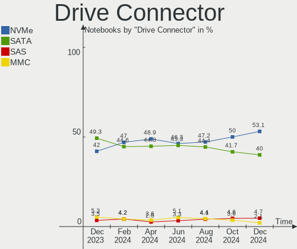
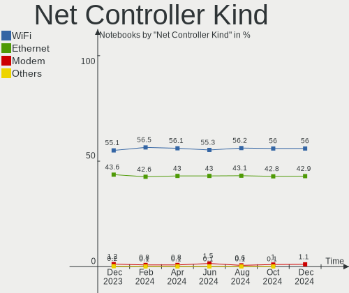

Ubuntu Hardware Trends (Notebook)
---------------------------------

A project to identify most popular hardware characteristics and track their change
over time based on data collected by Ubuntu users at https://Linux-Hardware.org.

Anyone can contribute to the study by uploading probes of their computers by
the [hw-probe](https://github.com/linuxhw/hw-probe) tool:

    sudo -E hw-probe -all -upload

Full-feature report is available here: https://linux-hardware.org/?view=trends&formfactor=notebook

Period: May, 2020.

Contents
--------

- [ OS                       ](#os)
- [ OS Family                ](#os-family)
- [ Kernel                   ](#kernel)
- [ Kernel Family            ](#kernel-family)
- [ Kernel Major Ver.        ](#kernel-major-ver)
- [ Arch                     ](#arch)
- [ DE                       ](#de)
- [ Display Server           ](#display-server)
- [ Display Manager          ](#display-manager)
- [ OS Lang                  ](#os-lang)
- [ Boot Mode                ](#boot-mode)
- [ Filesystem               ](#filesystem)
- [ Part. scheme             ](#part-scheme)
- [ Dual Boot with Linux/BSD ](#dual-boot-with-linux/bsd)
- [ Dual Boot (Win)          ](#dual-boot-win)
- [ Country                  ](#country)
- [ City                     ](#city)
- [ Vendor                   ](#vendor)
- [ Model                    ](#model)
- [ Model Family             ](#model-family)
- [ MFG Year                 ](#mfg-year)
- [ Form Factor              ](#form-factor)
- [ Secure Boot              ](#secure-boot)
- [ Coreboot                 ](#coreboot)
- [ RAM Size                 ](#ram-size)
- [ RAM Used                 ](#ram-used)
- [ Drive Vendor             ](#drive-vendor)
- [ Drive Model              ](#drive-model)
- [ Drive Kind               ](#drive-kind)
- [ Drive Connector          ](#drive-connector)
- [ Drive Size               ](#drive-size)
- [ Space Total              ](#space-total)
- [ Space Used               ](#space-used)
- [ Malfunc. Drives          ](#malfunc-drives)
- [ Malfunc. Drive Vendor    ](#malfunc-drive-vendor)
- [ Malfunc. HDD Vendor      ](#malfunc-hdd-vendor)
- [ Malfunc. Drive Kind      ](#malfunc-drive-kind)
- [ Failed Drives            ](#failed-drives)
- [ Failed Drive Vendor      ](#failed-drive-vendor)
- [ Drive Status             ](#drive-status)
- [ Storage Vendor           ](#storage-vendor)
- [ Storage Model            ](#storage-model)
- [ Storage Kind             ](#storage-kind)
- [ CPU Vendor               ](#cpu-vendor)
- [ CPU Model                ](#cpu-model)
- [ CPU Model Family         ](#cpu-model-family)
- [ CPU Cores                ](#cpu-cores)
- [ CPU Sockets              ](#cpu-sockets)
- [ CPU Threads              ](#cpu-threads)
- [ CPU Op-Modes             ](#cpu-op-modes)
- [ CPU Microcode            ](#cpu-microcode)
- [ CPU Microarch            ](#cpu-microarch)
- [ GPU Vendor               ](#gpu-vendor)
- [ GPU Model                ](#gpu-model)
- [ GPU Combo                ](#gpu-combo)
- [ GPU Driver               ](#gpu-driver)
- [ GPU Memory               ](#gpu-memory)
- [ Monitor Vendor           ](#monitor-vendor)
- [ Monitor Model            ](#monitor-model)
- [ Monitor Resolution       ](#monitor-resolution)
- [ Monitor Diagonal         ](#monitor-diagonal)
- [ Monitor Width            ](#monitor-width)
- [ Aspect Ratio             ](#aspect-ratio)
- [ Monitor Area             ](#monitor-area)
- [ Pixel Density            ](#pixel-density)
- [ Multiple Monitors        ](#multiple-monitors)
- [ Net Controller Vendor    ](#net-controller-vendor)
- [ Net Controller Model     ](#net-controller-model)
- [ Wireless Vendor          ](#wireless-vendor)
- [ Wireless Model           ](#wireless-model)
- [ Ethernet Vendor          ](#ethernet-vendor)
- [ Ethernet Model           ](#ethernet-model)
- [ Net Controller Kind      ](#net-controller-kind)
- [ Used Controller          ](#used-controller)
- [ NICs                     ](#nics)
- [ Bluetooth Vendor         ](#bluetooth-vendor)
- [ Bluetooth Model          ](#bluetooth-model)
- [ Unsupported Devices      ](#unsupported-devices)
- [ Unsupported Device Types ](#unsupported-device-types)

OS
--

Installed operating systems

| Name         | Computers | Percent |
|--------------|-----------|---------|
| Ubuntu 20.04 | 1434      | 74.26%  |
| Ubuntu 18.04 | 355       | 18.38%  |
| Ubuntu 19.10 | 83        | 4.3%    |
| Ubuntu 16.04 | 38        | 1.97%   |
| Ubuntu 19.04 | 11        | 0.57%   |
| Ubuntu 20.10 | 4         | 0.21%   |
| Ubuntu       | 4         | 0.21%   |
| Ubuntu 18.10 | 1         | 0.05%   |
| Ubuntu 14.04 | 1         | 0.05%   |

OS Family
---------

OS without a version

| Name   | Computers | Percent |
|--------|-----------|---------|
| Ubuntu | 1931      | 100%    |

Kernel
------

Version of the Linux kernel

| Version                  | Computers | Percent |
|--------------------------|-----------|---------|
| 5.4.0-29-generic         | 626       | 32.42%  |
| 5.4.0-31-generic         | 328       | 16.99%  |
| 5.4.0-28-generic         | 196       | 10.15%  |
| 5.3.0-51-generic         | 193       | 9.99%   |
| 5.4.0-26-generic         | 112       | 5.8%    |
| 5.4.0-33-generic         | 94        | 4.87%   |
| 4.15.0-99-generic        | 90        | 4.66%   |
| 5.3.0-53-generic         | 42        | 2.18%   |
| 4.15.0-101-generic       | 25        | 1.29%   |
| 5.3.0-46-generic         | 19        | 0.98%   |
| 5.4.0-29-lowlatency      | 14        | 0.73%   |
| 5.3.0-28-generic         | 11        | 0.57%   |
| 4.15.0-96-generic        | 11        | 0.57%   |
| 5.4.0-32-generic         | 8         | 0.41%   |
| 5.4.0-31-lowlatency      | 8         | 0.41%   |
| 5.3.0-55-generic         | 8         | 0.41%   |
| 5.4.0-30-generic         | 7         | 0.36%   |
| 5.4.0-34-generic         | 6         | 0.31%   |
| 5.4.0-28-lowlatency      | 5         | 0.26%   |
| 4.15.0-45-generic        | 5         | 0.26%   |
| 5.6.14-050614-generic    | 4         | 0.21%   |
| 5.3.0-42-generic         | 4         | 0.21%   |
| 5.0.0-38-generic         | 4         | 0.21%   |
| 4.4.0-178-generic        | 4         | 0.21%   |
| 4.15.0-91-generic        | 4         | 0.21%   |
| 4.15.0-100-generic       | 4         | 0.21%   |
| 5.6.0-1010-oem           | 3         | 0.16%   |
| 5.4.0-21-generic         | 3         | 0.16%   |
| 5.3.0-56-generic         | 3         | 0.16%   |
| 5.3.0-51-lowlatency      | 3         | 0.16%   |
| 5.3.0-26-generic         | 3         | 0.16%   |
| 5.3.0-18-generic         | 3         | 0.16%   |
| 5.0.0-13-generic         | 3         | 0.16%   |
| 4.4.0-177-generic        | 3         | 0.16%   |
| 4.18.0-15-generic        | 3         | 0.16%   |
| 4.15.0-99-lowlatency     | 3         | 0.16%   |
| 4.15.0-20-generic        | 3         | 0.16%   |
| 4.15.0-1080-oem          | 3         | 0.16%   |
| 5.4.0-7626-generic       | 2         | 0.1%    |
| 5.4.0-26-lowlatency      | 2         | 0.1%    |
| 5.4.0-24-generic         | 2         | 0.1%    |
| 5.3.0-52-generic         | 2         | 0.1%    |
| 5.3.0-40-generic         | 2         | 0.1%    |
| 5.0.0-37-generic         | 2         | 0.1%    |
| 5.0.0-31-generic         | 2         | 0.1%    |
| 5.0.0-29-generic         | 2         | 0.1%    |
| 4.15.0-72-generic        | 2         | 0.1%    |
| 4.15.0-65-generic        | 2         | 0.1%    |
| 4.15.0-29-generic        | 2         | 0.1%    |
| 4.15.0-1024-oem          | 2         | 0.1%    |
| 5.7.0-050700rc6-generic  | 1         | 0.05%   |
| 5.6.3-050603-generic     | 1         | 0.05%   |
| 5.6.13-050613-generic    | 1         | 0.05%   |
| 5.6.11-050611-generic    | 1         | 0.05%   |
| 5.6.0-1007-oem           | 1         | 0.05%   |
| 5.6.0-050600-generic     | 1         | 0.05%   |
| 5.5.0-2.1-liquorix-amd64 | 1         | 0.05%   |
| 5.5.0-050500-generic     | 1         | 0.05%   |
| 5.4.28-050428-generic    | 1         | 0.05%   |
| 5.4.0-34-lowlatency      | 1         | 0.05%   |

Kernel Family
-------------

Linux kernel without a distro release

| Version  | Computers | Percent |
|----------|-----------|---------|
| 5.4.0    | 1414      | 73.23%  |
| 5.3.0    | 296       | 15.33%  |
| 4.15.0   | 168       | 8.7%    |
| 5.0.0    | 16        | 0.83%   |
| 4.4.0    | 10        | 0.52%   |
| 4.18.0   | 6         | 0.31%   |
| 5.6.0    | 5         | 0.26%   |
| 5.6.14   | 4         | 0.21%   |
| 5.5.0    | 2         | 0.1%    |
| 5.7.0    | 1         | 0.05%   |
| 5.6.3    | 1         | 0.05%   |
| 5.6.13   | 1         | 0.05%   |
| 5.6.11   | 1         | 0.05%   |
| 5.4.28   | 1         | 0.05%   |
| 5.1.14   | 1         | 0.05%   |
| 5.1.1    | 1         | 0.05%   |
| 4.19.104 | 1         | 0.05%   |
| 4.16.5   | 1         | 0.05%   |
| 4.15.18  | 1         | 0.05%   |

Kernel Major Ver.
-----------------

Linux kernel major version

| Version | Computers | Percent |
|---------|-----------|---------|
| 5.4     | 1415      | 73.28%  |
| 5.3     | 296       | 15.33%  |
| 4.15    | 169       | 8.75%   |
| 5.0     | 16        | 0.83%   |
| 5.6     | 12        | 0.62%   |
| 4.4     | 10        | 0.52%   |
| 4.18    | 6         | 0.31%   |
| 5.5     | 2         | 0.1%    |
| 5.1     | 2         | 0.1%    |
| 5.7     | 1         | 0.05%   |
| 4.19    | 1         | 0.05%   |
| 4.16    | 1         | 0.05%   |

Arch
----

OS architecture (x86_64, i586, etc.)

| Name   | Computers | Percent |
|--------|-----------|---------|
| x86_64 | 1859      | 96.27%  |
| i686   | 72        | 3.73%   |

DE
--

Desktop Environment

| Name            | Computers | Percent |
|-----------------|-----------|---------|
| GNOME           | 1484      | 76.85%  |
| XFCE            | 146       | 7.56%   |
| Unknown         | 89        | 4.61%   |
| Unity           | 41        | 2.12%   |
| KDE             | 40        | 2.07%   |
| MATE            | 27        | 1.4%    |
| KDE5            | 22        | 1.14%   |
| Budgie          | 20        | 1.04%   |
| LXQt            | 18        | 0.93%   |
| X-Cinnamon      | 10        | 0.52%   |
| LXDE            | 10        | 0.52%   |
| Deepin          | 9         | 0.47%   |
| GNOME Flashback | 8         | 0.41%   |
| Cinnamon        | 2         | 0.1%    |
| xubuntu         | 1         | 0.05%   |
| Openbox         | 1         | 0.05%   |
| i3              | 1         | 0.05%   |
| GNOME Classic   | 1         | 0.05%   |
| Core            | 1         | 0.05%   |

Display Server
--------------

X11 or Wayland

| Name    | Computers | Percent |
|---------|-----------|---------|
| X11     | 1837      | 95.13%  |
| Unknown | 51        | 2.64%   |
| Wayland | 41        | 2.12%   |
| Tty     | 2         | 0.1%    |

Display Manager
---------------

SDDM, LightDM, etc.

| Name    | Computers | Percent |
|---------|-----------|---------|
| Unknown | 1743      | 90.26%  |
| GDM     | 120       | 6.21%   |
| LightDM | 45        | 2.33%   |
| SDDM    | 22        | 1.14%   |
| NODM    | 1         | 0.05%   |

OS Lang
-------

Language

| Lang    | Computers | Percent |
|---------|-----------|---------|
| en_US   | 756       | 39.15%  |
| de_DE   | 155       | 8.03%   |
| en_GB   | 109       | 5.64%   |
| it_IT   | 100       | 5.18%   |
| pt_BR   | 99        | 5.13%   |
| fr_FR   | 91        | 4.71%   |
| ru_RU   | 68        | 3.52%   |
| en_IN   | 67        | 3.47%   |
| es_ES   | 54        | 2.8%    |
| en_CA   | 47        | 2.43%   |
| pl_PL   | 37        | 1.92%   |
| en_AU   | 24        | 1.24%   |
| nl_NL   | 21        | 1.09%   |
| es_AR   | 18        | 0.93%   |
| C       | 18        | 0.93%   |
| pt_PT   | 17        | 0.88%   |
| hu_HU   | 15        | 0.78%   |
| tr_TR   | 12        | 0.62%   |
| en_ZA   | 12        | 0.62%   |
| es_MX   | 11        | 0.57%   |
| es_CL   | 11        | 0.57%   |
| cs_CZ   | 11        | 0.57%   |
| Unknown | 11        | 0.57%   |
| de_AT   | 10        | 0.52%   |
| ru_UA   | 9         | 0.47%   |
| el_GR   | 9         | 0.47%   |
| zh_CN   | 8         | 0.41%   |
| ja_JP   | 8         | 0.41%   |
| fr_BE   | 8         | 0.41%   |
| sv_SE   | 7         | 0.36%   |
| uk_UA   | 6         | 0.31%   |
| nb_NO   | 6         | 0.31%   |
| ko_KR   | 6         | 0.31%   |
| ca_ES   | 6         | 0.31%   |
| fr_CA   | 5         | 0.26%   |
| en_PH   | 5         | 0.26%   |
| en_NZ   | 5         | 0.26%   |
| en_IE   | 5         | 0.26%   |
| de_CH   | 5         | 0.26%   |
| en_SG   | 4         | 0.21%   |
| ro_RO   | 3         | 0.16%   |
| id_ID   | 3         | 0.16%   |
| es_DO   | 3         | 0.16%   |
| es_CO   | 3         | 0.16%   |
| en_HK   | 3         | 0.16%   |
| bg_BG   | 3         | 0.16%   |
| sl_SI   | 2         | 0.1%    |
| nl_BE   | 2         | 0.1%    |
| fi_FI   | 2         | 0.1%    |
| et_EE   | 2         | 0.1%    |
| es_VE   | 2         | 0.1%    |
| es_CU   | 2         | 0.1%    |
| en_IL   | 2         | 0.1%    |
| da_DK   | 2         | 0.1%    |
| ar_EG   | 2         | 0.1%    |
| th_TH   | 1         | 0.05%   |
| sr_RS   | 1         | 0.05%   |
| lt_LT   | 1         | 0.05%   |
| is_IS   | 1         | 0.05%   |
| hr_HR   | 1         | 0.05%   |

Boot Mode
---------

EFI or BIOS

| Mode | Computers | Percent |
|------|-----------|---------|
| BIOS | 1099      | 56.91%  |
| EFI  | 832       | 43.09%  |

Filesystem
----------

Type of filesystem

| Type     | Computers | Percent |
|----------|-----------|---------|
| Ext4     | 1813      | 93.89%  |
| Overlay  | 58        | 3%      |
| Zfs      | 34        | 1.76%   |
| Btrfs    | 9         | 0.47%   |
| Ext3     | 6         | 0.31%   |
| Xfs      | 4         | 0.21%   |
| Aufs     | 3         | 0.16%   |
| Ext2     | 2         | 0.1%    |
| SquasXfs | 1         | 0.05%   |
| Reiserfs | 1         | 0.05%   |

Part. scheme
------------

Scheme of partitioning

| Type    | Computers | Percent |
|---------|-----------|---------|
| Unknown | 1861      | 96.37%  |
| GPT     | 46        | 2.38%   |
| MBR     | 24        | 1.24%   |

Dual Boot with Linux/BSD
------------------------

Hosting more than one Linux/BSD

| Dual boot | Computers | Percent |
|-----------|-----------|---------|
| No        | 1758      | 91.04%  |
| Yes       | 173       | 8.96%   |

Dual Boot (Win)
---------------

Hosting Linux and Windows

| Dual boot | Computers | Percent |
|-----------|-----------|---------|
| No        | 1217      | 63.02%  |
| Yes       | 714       | 36.98%  |

Country
-------

Geographic location (country)

| Country            | Computers | Percent |
|--------------------|-----------|---------|
| USA                | 316       | 16.36%  |
| Germany            | 184       | 9.53%   |
| Brazil             | 131       | 6.78%   |
| Italy              | 118       | 6.11%   |
| France             | 98        | 5.08%   |
| UK                 | 95        | 4.92%   |
| Russia             | 78        | 4.04%   |
| India              | 73        | 3.78%   |
| Spain              | 65        | 3.37%   |
| Canada             | 58        | 3%      |
| Poland             | 50        | 2.59%   |
| Netherlands        | 40        | 2.07%   |
| Ukraine            | 35        | 1.81%   |
| Portugal           | 27        | 1.4%    |
| Australia          | 27        | 1.4%    |
| Argentina          | 27        | 1.4%    |
| Greece             | 22        | 1.14%   |
| Austria            | 21        | 1.09%   |
| Romania            | 20        | 1.04%   |
| Turkey             | 19        | 0.98%   |
| Hungary            | 19        | 0.98%   |
| Czech Republic     | 18        | 0.93%   |
| Belgium            | 17        | 0.88%   |
| South Africa       | 16        | 0.83%   |
| Sweden             | 15        | 0.78%   |
| Mexico             | 15        | 0.78%   |
| Chile              | 14        | 0.73%   |
| Switzerland        | 13        | 0.67%   |
| Norway             | 13        | 0.67%   |
| Bulgaria           | 13        | 0.67%   |
| Indonesia          | 12        | 0.62%   |
| Japan              | 11        | 0.57%   |
| Egypt              | 10        | 0.52%   |
| China              | 10        | 0.52%   |
| Serbia             | 9         | 0.47%   |
| Ireland            | 9         | 0.47%   |
| Colombia           | 9         | 0.47%   |
| Korea, Republic of | 7         | 0.36%   |
| Iran               | 7         | 0.36%   |
| Singapore          | 6         | 0.31%   |
| Dominican Republic | 6         | 0.31%   |
| Denmark            | 6         | 0.31%   |
| Bangladesh         | 6         | 0.31%   |
| Algeria            | 6         | 0.31%   |
| UAE                | 5         | 0.26%   |
| Slovenia           | 5         | 0.26%   |
| Philippines        | 5         | 0.26%   |
| Peru               | 5         | 0.26%   |
| New Zealand        | 5         | 0.26%   |
| Morocco            | 5         | 0.26%   |
| Israel             | 5         | 0.26%   |
| Hong Kong          | 5         | 0.26%   |
| Finland            | 5         | 0.26%   |
| Croatia            | 5         | 0.26%   |
| Thailand           | 4         | 0.21%   |
| Slovakia           | 4         | 0.21%   |
| Pakistan           | 4         | 0.21%   |
| Nepal              | 4         | 0.21%   |
| Lithuania          | 4         | 0.21%   |
| Kenya              | 4         | 0.21%   |

City
----

Geographic location (city)

| City              | Computers | Percent |
|-------------------|-----------|---------|
| Moscow            | 23        | 1.19%   |
| Rome              | 18        | 0.93%   |
| Berlin            | 18        | 0.93%   |
| São Paulo        | 17        | 0.88%   |
| Hamburg           | 16        | 0.83%   |
| Rio de Janeiro    | 14        | 0.73%   |
| Kyiv              | 13        | 0.67%   |
| Vienna            | 12        | 0.62%   |
| Paris             | 12        | 0.62%   |
| Madrid            | 12        | 0.62%   |
| Warsaw            | 11        | 0.57%   |
| Barcelona         | 11        | 0.57%   |
| Athens            | 11        | 0.57%   |
| Sofia             | 10        | 0.52%   |
| Budapest          | 10        | 0.52%   |
| Sydney            | 9         | 0.47%   |
| Santiago          | 9         | 0.47%   |
| Prague            | 9         | 0.47%   |
| Milan             | 9         | 0.47%   |
| Chennai           | 9         | 0.47%   |
| Bengaluru         | 9         | 0.47%   |
| Montreal          | 8         | 0.41%   |
| Lisbon            | 8         | 0.41%   |
| Turin             | 7         | 0.36%   |
| St Petersburg     | 7         | 0.36%   |
| Munich            | 7         | 0.36%   |
| Chicago           | 7         | 0.36%   |
| Cairo             | 7         | 0.36%   |
| Toronto           | 6         | 0.31%   |
| Pune              | 6         | 0.31%   |
| New Delhi         | 6         | 0.31%   |
| Dublin            | 6         | 0.31%   |
| Curitiba          | 6         | 0.31%   |
| Buenos Aires      | 6         | 0.31%   |
| Brasília         | 6         | 0.31%   |
| Bogotá           | 6         | 0.31%   |
| Stuttgart         | 5         | 0.26%   |
| Samara            | 5         | 0.26%   |
| Richmond          | 5         | 0.26%   |
| Los Angeles       | 5         | 0.26%   |
| London            | 5         | 0.26%   |
| Leipzig           | 5         | 0.26%   |
| Houston           | 5         | 0.26%   |
| Genoa             | 5         | 0.26%   |
| Dhaka             | 5         | 0.26%   |
| Bristol           | 5         | 0.26%   |
| Belo Horizonte    | 5         | 0.26%   |
| Ankara            | 5         | 0.26%   |
| Zagreb            | 4         | 0.21%   |
| Thessaloniki      | 4         | 0.21%   |
| Tel Aviv          | 4         | 0.21%   |
| Phoenix           | 4         | 0.21%   |
| Nîmes            | 4         | 0.21%   |
| Miami             | 4         | 0.21%   |
| Mexico City       | 4         | 0.21%   |
| Lima              | 4         | 0.21%   |
| Johannesburg      | 4         | 0.21%   |
| Goiânia          | 4         | 0.21%   |
| Frankfurt am Main | 4         | 0.21%   |
| Durban            | 4         | 0.21%   |

Vendor
------

Motherboard manufacturer

| Name                           | Computers | Percent |
|--------------------------------|-----------|---------|
| Hewlett-Packard                | 424       | 21.96%  |
| Lenovo                         | 343       | 17.76%  |
| Dell                           | 336       | 17.4%   |
| ASUSTek Computer               | 230       | 11.91%  |
| Acer                           | 148       | 7.66%   |
| Toshiba                        | 84        | 4.35%   |
| Samsung Electronics            | 55        | 2.85%   |
| Apple                          | 52        | 2.69%   |
| Sony                           | 43        | 2.23%   |
| MSI                            | 32        | 1.66%   |
| Positivo                       | 12        | 0.62%   |
| HUAWEI                         | 12        | 0.62%   |
| Packard Bell                   | 11        | 0.57%   |
| Medion                         | 11        | 0.57%   |
| Fujitsu                        | 11        | 0.57%   |
| Fujitsu Siemens                | 9         | 0.47%   |
| Notebook                       | 8         | 0.41%   |
| Clevo                          | 7         | 0.36%   |
| Unknown                        | 7         | 0.36%   |
| Gateway                        | 6         | 0.31%   |
| Timi                           | 5         | 0.26%   |
| Gigabyte Technology            | 5         | 0.26%   |
| Semp Toshiba                   | 4         | 0.21%   |
| LG Electronics                 | 4         | 0.21%   |
| Intel                          | 4         | 0.21%   |
| Google                         | 4         | 0.21%   |
| Alienware                      | 4         | 0.21%   |
| Panasonic                      | 3         | 0.16%   |
| Itautec                        | 3         | 0.16%   |
| Exo                            | 3         | 0.16%   |
| eMachines                      | 3         | 0.16%   |
| Chuwi                          | 3         | 0.16%   |
| TUXEDO                         | 2         | 0.1%    |
| System76                       | 2         | 0.1%    |
| Standard                       | 2         | 0.1%    |
| Razer                          | 2         | 0.1%    |
| Mediacom                       | 2         | 0.1%    |
| Matsushita Electric Industrial | 2         | 0.1%    |
| GPD                            | 2         | 0.1%    |
| Dixonsxp                       | 2         | 0.1%    |
| YJKC                           | 1         | 0.05%   |
| Wortmann AG                    | 1         | 0.05%   |
| VIT                            | 1         | 0.05%   |
| Thomson computing              | 1         | 0.05%   |
| Teclast                        | 1         | 0.05%   |
| sz                             | 1         | 0.05%   |
| RM                             | 1         | 0.05%   |
| Quanta                         | 1         | 0.05%   |
| Prestigio                      | 1         | 0.05%   |
| Pegatron                       | 1         | 0.05%   |
| PC Specialist                  | 1         | 0.05%   |
| OEM                            | 1         | 0.05%   |
| NEC Computers                  | 1         | 0.05%   |
| Microtech                      | 1         | 0.05%   |
| LIVEFAN                        | 1         | 0.05%   |
| Lex BayTrail                   | 1         | 0.05%   |
| Kruger&Matz                    | 1         | 0.05%   |
| IT Channel Pty                 | 1         | 0.05%   |
| Inter Sales A/S                | 1         | 0.05%   |
| IBM                            | 1         | 0.05%   |

Model
-----

Motherboard model

| Name                                     | Computers | Percent |
|------------------------------------------|-----------|---------|
| Unknown                                  | 23        | 1.19%   |
| HP Notebook                              | 20        | 1.04%   |
| HP Pavilion dv6                          | 17        | 0.88%   |
| HP Pavilion g6                           | 15        | 0.78%   |
| Dell XPS 15 7590                         | 12        | 0.62%   |
| HP Pavilion 15                           | 11        | 0.57%   |
| HP Pavilion dv7                          | 8         | 0.41%   |
| Dell XPS 13 9360                         | 8         | 0.41%   |
| Dell Latitude E6420                      | 7         | 0.36%   |
| Dell Latitude E6410                      | 7         | 0.36%   |
| Dell Inspiron 5570                       | 7         | 0.36%   |
| Lenovo V330-15IKB 81AX                   | 6         | 0.31%   |
| Lenovo IdeaPad 330-15IKB 81DE            | 6         | 0.31%   |
| HP Presario CQ57                         | 6         | 0.31%   |
| HP Laptop 15-da0xxx                      | 6         | 0.31%   |
| HP EliteBook 8460p                       | 6         | 0.31%   |
| HP EliteBook 840 G2                      | 6         | 0.31%   |
| HP 2000                                  | 6         | 0.31%   |
| Dell Latitude E7450                      | 6         | 0.31%   |
| Dell Inspiron 3521                       | 6         | 0.31%   |
| Apple MacBookPro8,2                      | 6         | 0.31%   |
| Toshiba Satellite L500                   | 5         | 0.26%   |
| HP Pavilion Notebook                     | 5         | 0.26%   |
| HP Pavilion dv4                          | 5         | 0.26%   |
| HP Laptop 15-bw0xx                       | 5         | 0.26%   |
| HP EliteBook 8570w                       | 5         | 0.26%   |
| HP 15 Notebook PC                        | 5         | 0.26%   |
| HP 15                                    | 5         | 0.26%   |
| Dell XPS 15 9570                         | 5         | 0.26%   |
| Dell Latitude 5400                       | 5         | 0.26%   |
| Dell Inspiron 5567                       | 5         | 0.26%   |
| Dell G3 3579                             | 5         | 0.26%   |
| ASUS X541SA                              | 5         | 0.26%   |
| Toshiba Satellite A200                   | 4         | 0.21%   |
| Positivo MOBILE                          | 4         | 0.21%   |
| Lenovo IdeaPad 330-15AST 81D6            | 4         | 0.21%   |
| Lenovo G50-70 20351                      | 4         | 0.21%   |
| Lenovo G50-45 80E3                       | 4         | 0.21%   |
| HP ProBook 6550b                         | 4         | 0.21%   |
| HP ProBook 450 G1                        | 4         | 0.21%   |
| HP EliteBook Folio 9470m                 | 4         | 0.21%   |
| HP 255 G7 Notebook PC                    | 4         | 0.21%   |
| HP 250 G5 Notebook PC                    | 4         | 0.21%   |
| Dell XPS L502X                           | 4         | 0.21%   |
| Dell XPS 13 9300                         | 4         | 0.21%   |
| Dell Latitude E6430                      | 4         | 0.21%   |
| Dell Latitude E6400                      | 4         | 0.21%   |
| Dell Latitude E5440                      | 4         | 0.21%   |
| Dell Inspiron 1545                       | 4         | 0.21%   |
| Dell Inspiron 15-3567                    | 4         | 0.21%   |
| ASUS X550CC                              | 4         | 0.21%   |
| ASUS K54C                                | 4         | 0.21%   |
| Apple MacBookPro8,1                      | 4         | 0.21%   |
| Apple MacBook4,1                         | 4         | 0.21%   |
| Semp Toshiba IS-1462                     | 3         | 0.16%   |
| Samsung Electronics 340XAA/350XAA/550XAA | 3         | 0.16%   |
| Lenovo G500 20236                        | 3         | 0.16%   |
| Itautec Infoway                          | 3         | 0.16%   |
| HUAWEI NBLK-WAX9X                        | 3         | 0.16%   |
| HUAWEI MACH-WX9                          | 3         | 0.16%   |

Model Family
------------

Motherboard model prefix

| Name                        | Computers | Percent |
|-----------------------------|-----------|---------|
| Lenovo ThinkPad             | 185       | 9.58%   |
| Dell Inspiron               | 115       | 5.96%   |
| Dell Latitude               | 114       | 5.9%    |
| Acer Aspire                 | 103       | 5.33%   |
| HP Pavilion                 | 102       | 5.28%   |
| Lenovo IdeaPad              | 72        | 3.73%   |
| HP EliteBook                | 72        | 3.73%   |
| Toshiba Satellite           | 69        | 3.57%   |
| HP ProBook                  | 66        | 3.42%   |
| Dell XPS                    | 44        | 2.28%   |
| HP Laptop                   | 34        | 1.76%   |
| Dell Vostro                 | 28        | 1.45%   |
| ASUS VivoBook               | 25        | 1.29%   |
| Unknown                     | 23        | 1.19%   |
| HP Notebook                 | 20        | 1.04%   |
| Dell Precision              | 19        | 0.98%   |
| HP ENVY                     | 15        | 0.78%   |
| Acer Swift                  | 14        | 0.73%   |
| HP Presario                 | 12        | 0.62%   |
| HP Compaq                   | 12        | 0.62%   |
| HP 15                       | 11        | 0.57%   |
| Apple MacBookPro8           | 11        | 0.57%   |
| Packard Bell EasyNote       | 10        | 0.52%   |
| HP 250                      | 10        | 0.52%   |
| Fujitsu LIFEBOOK            | 10        | 0.52%   |
| ASUS TUF                    | 10        | 0.52%   |
| HP 255                      | 8         | 0.41%   |
| ASUS ZenBook                | 8         | 0.41%   |
| HP ZBook                    | 7         | 0.36%   |
| Dell G3                     | 7         | 0.36%   |
| Acer TravelMate             | 7         | 0.36%   |
| Acer Nitro                  | 7         | 0.36%   |
| Lenovo V330-15IKB           | 6         | 0.31%   |
| Lenovo ThinkBook            | 6         | 0.31%   |
| HP OMEN                     | 6         | 0.31%   |
| HP 2000                     | 6         | 0.31%   |
| Acer Extensa                | 6         | 0.31%   |
| Toshiba TECRA               | 5         | 0.26%   |
| Toshiba PORTEGE             | 5         | 0.26%   |
| Dell G5                     | 5         | 0.26%   |
| ASUS X541SA                 | 5         | 0.26%   |
| Samsung Electronics 355V4C  | 4         | 0.21%   |
| Positivo MOBILE             | 4         | 0.21%   |
| MSI GE60                    | 4         | 0.21%   |
| Lenovo Yoga                 | 4         | 0.21%   |
| Lenovo G580                 | 4         | 0.21%   |
| Lenovo G50-70               | 4         | 0.21%   |
| Lenovo G50-45               | 4         | 0.21%   |
| Fujitsu Siemens AMILO       | 4         | 0.21%   |
| Dell Studio                 | 4         | 0.21%   |
| ASUS X550CC                 | 4         | 0.21%   |
| ASUS K54C                   | 4         | 0.21%   |
| Apple MacBookPro9           | 4         | 0.21%   |
| Apple MacBookPro5           | 4         | 0.21%   |
| Apple MacBook4              | 4         | 0.21%   |
| Semp Toshiba IS-1462        | 3         | 0.16%   |
| Samsung Electronics 340XAA  | 3         | 0.16%   |
| Samsung Electronics 300E5EV | 3         | 0.16%   |
| Medion Akoya                | 3         | 0.16%   |
| Lenovo Y50-70               | 3         | 0.16%   |

MFG Year
--------

Motherboard manufacture year

| Year    | Computers | Percent |
|---------|-----------|---------|
| 2019    | 404       | 20.92%  |
| 2018    | 197       | 10.2%   |
| 2013    | 162       | 8.39%   |
| 2011    | 155       | 8.03%   |
| 2012    | 154       | 7.98%   |
| 2020    | 124       | 6.42%   |
| 2016    | 112       | 5.8%    |
| 2015    | 110       | 5.7%    |
| 2010    | 106       | 5.49%   |
| 2014    | 99        | 5.13%   |
| 2009    | 92        | 4.76%   |
| 2017    | 90        | 4.66%   |
| 2008    | 61        | 3.16%   |
| 2007    | 42        | 2.18%   |
| 2006    | 11        | 0.57%   |
| 2005    | 5         | 0.26%   |
| Unknown | 4         | 0.21%   |
| 2002    | 2         | 0.1%    |
| 2003    | 1         | 0.05%   |

Form Factor
-----------

Physical design of the computer

| Name     | Computers | Percent |
|----------|-----------|---------|
| Notebook | 1931      | 100%    |

Secure Boot
-----------

Enabled or disabled

| State    | Computers | Percent |
|----------|-----------|---------|
| Disabled | 1680      | 87%     |
| Enabled  | 251       | 13%     |

Coreboot
--------

Have coreboot on board

| Used | Computers | Percent |
|------|-----------|---------|
| No   | 1926      | 99.74%  |
| Yes  | 5         | 0.26%   |

RAM Size
--------

Total RAM memory

| Size in GB  | Computers | Percent |
|-------------|-----------|---------|
| 4.01-8.0    | 559       | 28.95%  |
| 3.01-4.0    | 538       | 27.86%  |
| 8.01-16.0   | 291       | 15.07%  |
| 16.01-24.0  | 260       | 13.46%  |
| 1.01-2.0    | 135       | 6.99%   |
| 32.01-64.0  | 60        | 3.11%   |
| 2.01-3.0    | 42        | 2.18%   |
| 0.01-1.0    | 25        | 1.29%   |
| 24.01-32.0  | 15        | 0.78%   |
| 64.01-256.0 | 6         | 0.31%   |

RAM Used
--------

Used RAM memory

| Used GB    | Computers | Percent |
|------------|-----------|---------|
| 1.01-2.0   | 865       | 44.8%   |
| 2.01-3.0   | 522       | 27.03%  |
| 3.01-4.0   | 198       | 10.25%  |
| 4.01-8.0   | 195       | 10.1%   |
| 0.01-1.0   | 110       | 5.7%    |
| 8.01-16.0  | 37        | 1.92%   |
| 16.01-24.0 | 3         | 0.16%   |
| 24.01-32.0 | 1         | 0.05%   |

Drive Vendor
------------

Hard drive vendors

| Vendor                       | Computers | Drives | Percent |
|------------------------------|-----------|--------|---------|
| Seagate                      | 340       | 352    | 16.34%  |
| WDC                          | 282       | 287    | 13.55%  |
| Samsung Electronics          | 258       | 265    | 12.4%   |
| Toshiba                      | 244       | 244    | 11.73%  |
| Hitachi                      | 121       | 123    | 5.81%   |
| Unknown                      | 114       | 133    | 5.48%   |
| SanDisk                      | 98        | 99     | 4.71%   |
| HGST                         | 98        | 98     | 4.71%   |
| Kingston                     | 81        | 83     | 3.89%   |
| Crucial                      | 71        | 71     | 3.41%   |
| Intel                        | 41        | 43     | 1.97%   |
| SK Hynix                     | 28        | 28     | 1.35%   |
| Micron Technology            | 28        | 28     | 1.35%   |
| HL-DT-ST                     | 28        | 24     | 1.35%   |
| Fujitsu                      | 26        | 26     | 1.25%   |
| A-DATA Technology            | 25        | 25     | 1.2%    |
| China                        | 16        | 16     | 0.77%   |
| Apple                        | 14        | 14     | 0.67%   |
| Transcend                    | 12        | 12     | 0.58%   |
| LITEONIT                     | 11        | 12     | 0.53%   |
| LITEON                       | 10        | 10     | 0.48%   |
| PNY                          | 9         | 9      | 0.43%   |
| Intenso                      | 8         | 8      | 0.38%   |
| OCZ                          | 7         | 7      | 0.34%   |
| Apacer                       | 7         | 7      | 0.34%   |
| SPCC                         | 5         | 5      | 0.24%   |
| KingSpec                     | 5         | 5      | 0.24%   |
| JMicron                      | 5         | 5      | 0.24%   |
| PLEXTOR                      | 4         | 4      | 0.19%   |
| Generic                      | 4         | 4      | 0.19%   |
| Vaseky                       | 3         | 3      | 0.14%   |
| PHISON                       | 3         | 3      | 0.14%   |
| Hewlett-Packard              | 3         | 3      | 0.14%   |
| GOODRAM                      | 3         | 3      | 0.14%   |
| FORESEE                      | 3         | 3      | 0.14%   |
| Corsair                      | 3         | 3      | 0.14%   |
| ASMT                         | 3         | 3      | 0.14%   |
| TCSUNBOW                     | 2         | 2      | 0.1%    |
| StoreJet                     | 2         | 2      | 0.1%    |
| Smartbuy                     | 2         | 2      | 0.1%    |
| Sabrent                      | 2         | 3      | 0.1%    |
| Patriot                      | 2         | 2      | 0.1%    |
| KingDian                     | 2         | 2      | 0.1%    |
| IBM/Hitachi                  | 2         | 2      | 0.1%    |
| Zheino                       | 1         | 1      | 0.05%   |
| ViperTeq                     | 1         | 1      | 0.05%   |
| Verbatim                     | 1         | 1      | 0.05%   |
| USB3.0                       | 1         | 1      | 0.05%   |
| TSA                          | 1         | 1      | 0.05%   |
| Toshiba America Info Systems | 1         | 1      | 0.05%   |
| TO Exter                     | 1         | 1      | 0.05%   |
| THU SSD                      | 1         | 1      | 0.05%   |
| Team                         | 1         | 1      | 0.05%   |
| StarTech                     | 1         | 1      | 0.05%   |
| SSK                          | 1         | 1      | 0.05%   |
| sobetter                     | 1         | 1      | 0.05%   |
| SAMSWEET                     | 1         | 1      | 0.05%   |
| QGeeM                        | 1         | 1      | 0.05%   |
| Q200                         | 1         | 1      | 0.05%   |
| PM991 NV                     | 1         | 1      | 0.05%   |

Drive Model
-----------

Hard drive models

| Model                        | Computers | Percent |
|------------------------------|-----------|---------|
| ST1000LM035-1RK172 1TB       | 50        | 2.35%   |
| ST1000LM024 HN-M101MBB 1TB   | 45        | 2.11%   |
| MQ01ABF050 500GB             | 44        | 2.06%   |
| MMC Card  32GB               | 41        | 1.92%   |
| MQ01ABD100 1TB               | 37        | 1.74%   |
| ST9500325AS 500GB            | 30        | 1.41%   |
| MQ04ABF100 1TB               | 29        | 1.36%   |
| HTS721010A9E630 1TB          | 22        | 1.03%   |
| ST500LT012-1DG142 500GB      | 21        | 0.99%   |
| HTS545050A7E380 500GB        | 21        | 0.99%   |
| DVDRAM GUE1N 3GB             | 21        | 0.99%   |
| SSD 850 EVO 500GB            | 20        | 0.94%   |
| HTS541010A9E680 1TB          | 20        | 0.94%   |
| SA400S37240G 240GB SSD       | 19        | 0.89%   |
| MMC Card  64GB               | 16        | 0.75%   |
| SSD 860 EVO 500GB            | 15        | 0.7%    |
| MMC Card  128GB              | 15        | 0.7%    |
| HTS725050A7E630 500GB        | 15        | 0.7%    |
| HTS547575A9E384 752GB        | 15        | 0.7%    |
| HTS545050A7E680 500GB        | 14        | 0.66%   |
| SA400S37120G 120GB SSD       | 13        | 0.61%   |
| ST9500420AS 500GB            | 12        | 0.56%   |
| ST500LT012-9WS142 500GB      | 12        | 0.56%   |
| ST500LM021-1KJ152 500GB      | 12        | 0.56%   |
| ST500LM012 HN-M500MBB 500GB  | 12        | 0.56%   |
| MMC Card  16GB               | 12        | 0.56%   |
| SA400S37480G 480GB SSD       | 11        | 0.52%   |
| CT500MX500SSD1 500GB         | 11        | 0.52%   |
| SV300S37A120G 120GB SSD      | 10        | 0.47%   |
| SSD 850 EVO 250GB            | 10        | 0.47%   |
| SDSSDA120G 120GB             | 10        | 0.47%   |
| HTS545050B9A300 500GB        | 10        | 0.47%   |
| HM321HI 320GB                | 10        | 0.47%   |
| ST500LM000-1EJ162 500GB      | 9         | 0.42%   |
| MQ01ABD075 752GB             | 9         | 0.42%   |
| MMC Card  2GB                | 9         | 0.42%   |
| CT240BX500SSD1 240GB         | 9         | 0.42%   |
| WD10SPZX-60Z10T0 1TB         | 8         | 0.38%   |
| WD10SPZX-24Z10 1TB           | 8         | 0.38%   |
| WD10JPVX-22JC3T0 1TB         | 8         | 0.38%   |
| ST1000LM048-2E7172 1TB       | 8         | 0.38%   |
| SSD U100 24GB                | 8         | 0.38%   |
| SSD 860 QVO 1TB              | 8         | 0.38%   |
| SSD 860 EVO 250GB            | 8         | 0.38%   |
| SSD 860 EVO 1TB              | 8         | 0.38%   |
| SSD 840 EVO 250GB            | 8         | 0.38%   |
| MQ01ABD050 500GB             | 8         | 0.38%   |
| HTS545025B9A300 250GB        | 8         | 0.38%   |
| WD10JPVX-75JC3T0 1TB         | 7         | 0.33%   |
| ST1000LM049-2GH172 1TB       | 7         | 0.33%   |
| SSD PLUS 240GB               | 7         | 0.33%   |
| SATA SSD 120GB               | 7         | 0.33%   |
| Expansion 2TB                | 7         | 0.33%   |
| DVDRAM GUC0N 1GB             | 7         | 0.33%   |
| CT480BX500SSD1 480GB         | 7         | 0.33%   |
| WDS240G2G0A-00JH30 240GB SSD | 6         | 0.28%   |
| WD10SPZX-21Z10T0 1TB         | 6         | 0.28%   |
| WD10JPCX-24UE4T0 1TB         | 6         | 0.28%   |
| ST320LT007-9ZV142 320GB      | 6         | 0.28%   |
| ST2000LM007-1R8174 2TB       | 6         | 0.28%   |

Drive Kind
----------

HDD or SSD

| Kind    | Computers | Drives | Percent |
|---------|-----------|--------|---------|
| HDD     | 1068      | 1101   | 52.9%   |
| SSD     | 703       | 759    | 34.82%  |
| MMC     | 104       | 121    | 5.15%   |
| Unknown | 81        | 85     | 4.01%   |
| NVMe    | 63        | 65     | 3.12%   |

Drive Connector
---------------

SATA, SAS, NVMe, etc.

| Type | Computers | Drives | Percent |
|------|-----------|--------|---------|
| SATA | 1633      | 1840   | 86.04%  |
| MMC  | 104       | 121    | 5.48%   |
| SAS  | 98        | 105    | 5.16%   |
| NVMe | 63        | 65     | 3.32%   |

Drive Size
----------

Size of hard drive

| Size in TB | Computers | Drives | Percent |
|------------|-----------|--------|---------|
| 0.01-0.5   | 1344      | 1542   | 70%     |
| 0.51-1.0   | 522       | 533    | 27.19%  |
| 1.01-2.0   | 47        | 47     | 2.45%   |
| 4.01-10.0  | 5         | 7      | 0.26%   |
| 3.01-4.0   | 1         | 1      | 0.05%   |
| 0          | 1         | 1      | 0.05%   |

Space Total
-----------

Amount of disk space available on the file system

| Size in GB     | Computers | Percent |
|----------------|-----------|---------|
| 101-250        | 641       | 33.2%   |
| 251-500        | 568       | 29.41%  |
| 501-1000       | 249       | 12.89%  |
| 51-100         | 156       | 8.08%   |
| 21-50          | 112       | 5.8%    |
| 1-20           | 92        | 4.76%   |
| 1001-2000      | 72        | 3.73%   |
| More than 3000 | 15        | 0.78%   |
| 2001-3000      | 15        | 0.78%   |
| Unknown        | 11        | 0.57%   |

Space Used
----------

Amount of used disk space

| Used GB        | Computers | Percent |
|----------------|-----------|---------|
| 1-20           | 994       | 51.48%  |
| 21-50          | 325       | 16.83%  |
| 51-100         | 223       | 11.55%  |
| 101-250        | 195       | 10.1%   |
| 251-500        | 104       | 5.39%   |
| 501-1000       | 60        | 3.11%   |
| Unknown        | 11        | 0.57%   |
| 1001-2000      | 9         | 0.47%   |
| More than 3000 | 8         | 0.41%   |
| 2001-3000      | 2         | 0.1%    |

Malfunc. Drives
---------------

Drive models with a malfunction

| Model                             | Computers | Drives | Percent |
|-----------------------------------|-----------|--------|---------|
| ST9500325AS 500GB                 | 3         | 3      | 7.14%   |
| SSD 970 EVO 2TB                   | 2         | 2      | 4.76%   |
| MQ01ABD100 1TB                    | 2         | 2      | 4.76%   |
| HTS721010A9E630 1TB               | 2         | 2      | 4.76%   |
| HTS547575A9E384 752GB             | 2         | 2      | 4.76%   |
| HTS542516K9SA00 160GB             | 2         | 2      | 4.76%   |
| WDS240G2G0A-00JH30 240GB SSD      | 1         | 1      | 2.38%   |
| WD7500BPKT-75PK4T0 752GB          | 1         | 1      | 2.38%   |
| WD2500BEKT-75PVMT0 250GB          | 1         | 1      | 2.38%   |
| SU900 1TB SSD                     | 1         | 1      | 2.38%   |
| ST9750420AS 752GB                 | 1         | 1      | 2.38%   |
| ST9120822AS 120GB                 | 1         | 1      | 2.38%   |
| ST500LM021-1KJ152 500GB           | 1         | 1      | 2.38%   |
| ST500LM000-1EJ162 500GB           | 1         | 1      | 2.38%   |
| ST320LT007-9ZV142 320GB           | 1         | 1      | 2.38%   |
| ST1000LM024 HN-M101MBB 1TB        | 1         | 1      | 2.38%   |
| SSD 480GB                         | 1         | 1      | 2.38%   |
| SDSSDP128G 128GB                  | 1         | 1      | 2.38%   |
| SC210 2.5 7MM 256GB SSD           | 1         | 1      | 2.38%   |
| SA400S37120G 120GB SSD            | 1         | 1      | 2.38%   |
| MZVLW512HMJP-000L7 512GB          | 1         | 1      | 2.38%   |
| MTFDDAV256TBN-1AR15ABHA 256GB SSD | 1         | 1      | 2.38%   |
| MQ04ABF100 1TB                    | 1         | 1      | 2.38%   |
| MQ01ABF050 500GB                  | 1         | 1      | 2.38%   |
| MK3276GSX -63 320GB               | 1         | 1      | 2.38%   |
| MK3265GSX 320GB                   | 1         | 1      | 2.38%   |
| MK1652GSX 160GB                   | 1         | 1      | 2.38%   |
| HTS727575A9E364 752GB             | 1         | 1      | 2.38%   |
| HTS725050A7E630 500GB             | 1         | 1      | 2.38%   |
| HTS547564A9E384 640GB             | 1         | 1      | 2.38%   |
| HTS545050A7E680 500GB             | 1         | 1      | 2.38%   |
| HTS545032A7E380 320GB             | 1         | 1      | 2.38%   |
| HTS545025B9A300 250GB             | 1         | 1      | 2.38%   |
| HTS541010A9E680 1TB               | 1         | 1      | 2.38%   |
| HFS128G39TND-N210A 128GB SSD      | 1         | 1      | 2.38%   |

Malfunc. Drive Vendor
---------------------

Vendors of faulty drives

| Vendor              | Computers | Drives | Percent |
|---------------------|-----------|--------|---------|
| Seagate             | 9         | 9      | 21.43%  |
| Toshiba             | 7         | 7      | 16.67%  |
| Hitachi             | 7         | 7      | 16.67%  |
| HGST                | 6         | 6      | 14.29%  |
| WDC                 | 3         | 3      | 7.14%   |
| Samsung Electronics | 3         | 3      | 7.14%   |
| SK Hynix            | 2         | 2      | 4.76%   |
| SanDisk             | 1         | 1      | 2.38%   |
| Micron Technology   | 1         | 1      | 2.38%   |
| LDLC                | 1         | 1      | 2.38%   |
| Kingston            | 1         | 1      | 2.38%   |
| A-DATA Technology   | 1         | 1      | 2.38%   |

Malfunc. HDD Vendor
-------------------

Vendors of faulty HDD drives

| Vendor  | Computers | Drives | Percent |
|---------|-----------|--------|---------|
| Seagate | 9         | 9      | 29.03%  |
| Toshiba | 7         | 7      | 22.58%  |
| Hitachi | 7         | 7      | 22.58%  |
| HGST    | 6         | 6      | 19.35%  |
| WDC     | 2         | 2      | 6.45%   |

Malfunc. Drive Kind
-------------------

Kinds of faulty drives

| Kind | Computers | Drives | Percent |
|------|-----------|--------|---------|
| HDD  | 31        | 31     | 73.81%  |
| SSD  | 8         | 8      | 19.05%  |
| NVMe | 3         | 3      | 7.14%   |

Failed Drives
-------------

Failed drive models

| Model             | Computers | Drives | Percent |
|-------------------|-----------|--------|---------|
| ST9500325AS 500GB | 1         | 1      | 100%    |

Failed Drive Vendor
-------------------

Failed drive vendors

| Vendor  | Computers | Drives | Percent |
|---------|-----------|--------|---------|
| Seagate | 1         | 1      | 100%    |

Drive Status
------------

Number of failed and malfunc. drives

| Status   | Computers | Drives | Percent |
|----------|-----------|--------|---------|
| Detected | 1523      | 1847   | 86.05%  |
| Works    | 204       | 241    | 11.53%  |
| Malfunc  | 42        | 42     | 2.37%   |
| Failed   | 1         | 1      | 0.06%   |

Storage Vendor
--------------

Storage controller vendors

| Vendor                           | Computers | Percent |
|----------------------------------|-----------|---------|
| Intel                            | 1517      | 72.79%  |
| AMD                              | 233       | 11.18%  |
| Samsung Electronics              | 106       | 5.09%   |
| Sandisk                          | 53        | 2.54%   |
| SK Hynix                         | 38        | 1.82%   |
| Toshiba America Info Systems     | 33        | 1.58%   |
| Nvidia                           | 16        | 0.77%   |
| Kingston Technology Company      | 14        | 0.67%   |
| Silicon Integrated Systems [SiS] | 10        | 0.48%   |
| ADATA Technology                 | 9         | 0.43%   |
| Phison Electronics               | 7         | 0.34%   |
| VIA Technologies                 | 5         | 0.24%   |
| Silicon Motion                   | 5         | 0.24%   |
| Marvell Technology Group         | 5         | 0.24%   |
| Union Memory (Shenzhen)          | 4         | 0.19%   |
| Lite-On Technology               | 4         | 0.19%   |
| Lenovo                           | 4         | 0.19%   |
| KIOXIA                           | 4         | 0.19%   |
| Apple                            | 4         | 0.19%   |
| Micron Technology                | 3         | 0.14%   |
| JMicron Technology               | 3         | 0.14%   |
| Micron/Crucial Technology        | 2         | 0.1%    |
| ULi Electronics                  | 1         | 0.05%   |
| Silicon Image                    | 1         | 0.05%   |
| Shenzhen Longsys Electronics     | 1         | 0.05%   |
| Realtek Semiconductor            | 1         | 0.05%   |
| ASMedia Technology               | 1         | 0.05%   |

Storage Model
-------------

Storage controller models

| Model                                                                            | Computers | Percent |
|----------------------------------------------------------------------------------|-----------|---------|
| 7 Series Chipset Family 6-port SATA Controller [AHCI mode]                       | 187       | 8.28%   |
| FCH SATA Controller [AHCI mode]                                                  | 186       | 8.23%   |
| Sunrise Point-LP SATA Controller [AHCI mode]                                     | 174       | 7.7%    |
| 6 Series/C200 Series Chipset Family 6 port Mobile SATA AHCI Controller           | 172       | 7.61%   |
| 82801 Mobile SATA Controller [RAID mode]                                         | 140       | 6.2%    |
| 82801IBM/IEM (ICH9M/ICH9M-E) 4 port SATA Controller [AHCI mode]                  | 87        | 3.85%   |
| Non-Volatile memory controller                                                   | 85        | 3.76%   |
| 8 Series SATA Controller 1 [AHCI mode]                                           | 80        | 3.54%   |
| NVMe SSD Controller SM981/PM981/PM983                                            | 71        | 3.14%   |
| Wildcat Point-LP SATA Controller [AHCI Mode]                                     | 70        | 3.1%    |
| 5 Series/3400 Series Chipset 4 port SATA AHCI Controller                         | 66        | 2.92%   |
| 8 Series/C220 Series Chipset Family 6-port SATA Controller 1 [AHCI mode]         | 64        | 2.83%   |
| 82801HM/HEM (ICH8M/ICH8M-E) IDE Controller                                       | 63        | 2.79%   |
| Cannon Lake Mobile PCH SATA AHCI Controller                                      | 58        | 2.57%   |
| 82801HM/HEM (ICH8M/ICH8M-E) SATA Controller [AHCI mode]                          | 54        | 2.39%   |
| 5 Series/3400 Series Chipset 6 port SATA AHCI Controller                         | 52        | 2.3%    |
| Cannon Point-LP SATA Controller [AHCI Mode]                                      | 44        | 1.95%   |
| SB7x0/SB8x0/SB9x0 SATA Controller [AHCI mode]                                    | 30        | 1.33%   |
| HM170/QM170 Chipset SATA Controller [AHCI Mode]                                  | 29        | 1.28%   |
| Atom/Celeron/Pentium Processor x5-E8000/J3xxx/N3xxx Series SATA Controller       | 29        | 1.28%   |
| Atom Processor E3800 Series SATA AHCI Controller                                 | 24        | 1.06%   |
| NVMe SSD Controller SM961/PM961                                                  | 21        | 0.93%   |
| SSD 660P Series                                                                  | 20        | 0.89%   |
| BC501 NVMe Solid State Drive 512GB                                               | 17        | 0.75%   |
| 82801GBM/GHM (ICH7-M Family) SATA Controller [IDE mode]                          | 17        | 0.75%   |
| 82801GBM/GHM (ICH7-M Family) SATA Controller [AHCI mode]                         | 17        | 0.75%   |
| 82801G (ICH7 Family) IDE Controller                                              | 17        | 0.75%   |
| 82801IBM/IEM (ICH9M/ICH9M-E) 2 port SATA Controller [IDE mode]                   | 16        | 0.71%   |
| Toshiba America Info Non-Volatile memory controller                              | 15        | 0.66%   |
| NM10/ICH7 Family SATA Controller [AHCI mode]                                     | 15        | 0.66%   |
| Comet Lake SATA AHCI Controller                                                  | 15        | 0.66%   |
| 82801HM/HEM (ICH8M/ICH8M-E) SATA Controller [IDE mode]                           | 13        | 0.58%   |
| 6 Series/C200 Series Chipset Family Mobile SATA Controller (IDE mode, ports 0-3) | 12        | 0.53%   |
| WD Black 2018/PC SN720 NVMe SSD                                                  | 11        | 0.49%   |
| BG3 NVMe SSD Controller                                                          | 11        | 0.49%   |
| 6 Series/C200 Series Chipset Family Mobile SATA Controller (IDE mode, ports 4-5) | 11        | 0.49%   |
| WD Black 2018/PC SN520 NVMe SSD                                                  | 10        | 0.44%   |
| SATA controller                                                                  | 10        | 0.44%   |
| Celeron N3350/Pentium N4200/Atom E3900 Series SATA AHCI Controller               | 10        | 0.44%   |
| 5513 IDE Controller                                                              | 10        | 0.44%   |
| Electronics Non-Volatile memory controller                                       | 9         | 0.4%    |
| XPG SX8200 Pro PCIe Gen3x4 M.2 2280 Solid State Drive                            | 8         | 0.35%   |
| SATA Controller / IDE mode                                                       | 8         | 0.35%   |
| MCP79 AHCI Controller                                                            | 8         | 0.35%   |
| Ice Lake-LP SATA Controller [AHCI mode]                                          | 8         | 0.35%   |
| 7 Series Chipset Family 4-port SATA Controller [IDE mode]                        | 8         | 0.35%   |
| 7 Series Chipset Family 2-port SATA Controller [IDE mode]                        | 8         | 0.35%   |
| SB7x0/SB8x0/SB9x0 IDE Controller                                                 | 7         | 0.31%   |
| SB600 Non-Raid-5 SATA                                                            | 7         | 0.31%   |
| SB600 IDE                                                                        | 7         | 0.31%   |
| Q170/Q150/B150/H170/H110/Z170/CM236 Chipset SATA Controller [AHCI Mode]          | 7         | 0.31%   |
| XG4 NVMe SSD Controller                                                          | 6         | 0.27%   |
| Mobile 4 Series Chipset PT IDER Controller                                       | 6         | 0.27%   |
| Technology Company Non-Volatile memory controller                                | 5         | 0.22%   |
| SSD 600P Series                                                                  | 5         | 0.22%   |
| IXP SB4x0 IDE Controller                                                         | 5         | 0.22%   |
| Electronics SATA controller                                                      | 5         | 0.22%   |
| E12 NVMe Controller                                                              | 5         | 0.22%   |
| 5 Series/3400 Series Chipset 4 port SATA IDE Controller                          | 5         | 0.22%   |
| 5 Series/3400 Series Chipset 2 port SATA IDE Controller                          | 5         | 0.22%   |

Storage Kind
------------

Kind of storage controller (IDE, SATA, NVMe, SAS, ...)

| Kind | Computers | Percent |
|------|-----------|---------|
| SATA | 1522      | 69.69%  |
| NVMe | 314       | 14.38%  |
| IDE  | 203       | 9.29%   |
| RAID | 145       | 6.64%   |

CPU Vendor
----------

Processor vendors

| Vendor       | Computers | Percent |
|--------------|-----------|---------|
| Intel        | 1675      | 86.74%  |
| AMD          | 255       | 13.21%  |
| CentaurHauls | 1         | 0.05%   |

CPU Model
---------

Processor models

| Model                                         | Computers | Percent |
|-----------------------------------------------|-----------|---------|
| Intel Core i5-8250U CPU @ 1.60GHz             | 44        | 2.28%   |
| Intel Core i7-8550U CPU @ 1.80GHz             | 42        | 2.18%   |
| Intel Core i5-8265U CPU @ 1.60GHz             | 37        | 1.92%   |
| Intel Core i7-8565U CPU @ 1.80GHz             | 34        | 1.76%   |
| Intel Core i5-7200U CPU @ 2.50GHz             | 33        | 1.71%   |
| Intel Core i7-9750H CPU @ 2.60GHz             | 32        | 1.66%   |
| Intel Core i7-8750H CPU @ 2.20GHz             | 26        | 1.35%   |
| Intel Core i7-7500U CPU @ 2.70GHz             | 25        | 1.29%   |
| Intel Core i5-3320M CPU @ 2.60GHz             | 24        | 1.24%   |
| Intel Core i5-2520M CPU @ 2.50GHz             | 24        | 1.24%   |
| Intel Core i5-2410M CPU @ 2.30GHz             | 21        | 1.09%   |
| Intel Core i5-2450M CPU @ 2.50GHz             | 19        | 0.98%   |
| Intel Core i7-2630QM CPU @ 2.00GHz            | 18        | 0.93%   |
| Intel Core i5-5200U CPU @ 2.20GHz             | 17        | 0.88%   |
| Intel Core i5-3210M CPU @ 2.50GHz             | 17        | 0.88%   |
| Intel Core i3-5005U CPU @ 2.00GHz             | 17        | 0.88%   |
| Intel Core i7-5500U CPU @ 2.40GHz             | 16        | 0.83%   |
| Intel Core i5-6300U CPU @ 2.40GHz             | 16        | 0.83%   |
| Intel Core i7-6700HQ CPU @ 2.60GHz            | 15        | 0.78%   |
| Intel Core i7-6500U CPU @ 2.50GHz             | 15        | 0.78%   |
| Intel Core i3-3110M CPU @ 2.40GHz             | 15        | 0.78%   |
| Intel Core i5-6200U CPU @ 2.30GHz             | 14        | 0.73%   |
| Intel Core i5-3230M CPU @ 2.60GHz             | 14        | 0.73%   |
| Intel Core i3 CPU M 370 @ 2.40GHz             | 14        | 0.73%   |
| AMD Ryzen 5 3500U with Radeon Vega Mobile Gfx | 14        | 0.73%   |
| Intel Core i7-10510U CPU @ 1.80GHz            | 13        | 0.67%   |
| Intel Core i5-4210U CPU @ 1.70GHz             | 13        | 0.67%   |
| Intel Core i5-4200M CPU @ 2.50GHz             | 13        | 0.67%   |
| Intel Core 2 Duo CPU P8600 @ 2.40GHz          | 13        | 0.67%   |
| Intel Core i7-7700HQ CPU @ 2.80GHz            | 12        | 0.62%   |
| Intel Core i5-5300U CPU @ 2.30GHz             | 12        | 0.62%   |
| Intel Core i5-4200U CPU @ 1.60GHz             | 12        | 0.62%   |
| Intel Core i3-3217U CPU @ 1.80GHz             | 12        | 0.62%   |
| Intel Core i3-2350M CPU @ 2.30GHz             | 12        | 0.62%   |
| AMD A8-7410 APU with AMD Radeon R5 Graphics   | 12        | 0.62%   |
| Intel Pentium Dual-Core CPU T4500 @ 2.30GHz   | 11        | 0.57%   |
| Intel Pentium Dual-Core CPU T4200 @ 2.00GHz   | 11        | 0.57%   |
| Intel Core i7-3610QM CPU @ 2.30GHz            | 11        | 0.57%   |
| Intel Core i5-3317U CPU @ 1.70GHz             | 11        | 0.57%   |
| Intel Core i5-2430M CPU @ 2.40GHz             | 11        | 0.57%   |
| Intel Core i5 CPU M 520 @ 2.40GHz             | 11        | 0.57%   |
| Intel Core i5 CPU M 460 @ 2.53GHz             | 11        | 0.57%   |
| Intel Core i3-6006U CPU @ 2.00GHz             | 11        | 0.57%   |
| Intel Core i3-4005U CPU @ 1.70GHz             | 11        | 0.57%   |
| Intel Celeron CPU N3060 @ 1.60GHz             | 11        | 0.57%   |
| Intel Core i7-2760QM CPU @ 2.40GHz            | 10        | 0.52%   |
| Intel Core i7-2620M CPU @ 2.70GHz             | 10        | 0.52%   |
| Intel Core i5-8300H CPU @ 2.30GHz             | 10        | 0.52%   |
| Intel Core i5 CPU M 430 @ 2.27GHz             | 10        | 0.52%   |
| Intel Core 2 Duo CPU P8400 @ 2.26GHz          | 10        | 0.52%   |
| Intel Celeron CPU N3050 @ 1.60GHz             | 10        | 0.52%   |
| Intel Pentium Dual-Core CPU T4300 @ 2.10GHz   | 9         | 0.47%   |
| Intel Core i7-5600U CPU @ 2.60GHz             | 9         | 0.47%   |
| Intel Core i7-4710HQ CPU @ 2.50GHz            | 9         | 0.47%   |
| Intel Core i7 CPU Q 720 @ 1.60GHz             | 9         | 0.47%   |
| Intel Core i5-4300U CPU @ 1.90GHz             | 9         | 0.47%   |
| Intel Core i5-10210U CPU @ 1.60GHz            | 9         | 0.47%   |
| Intel Core i5 CPU M 480 @ 2.67GHz             | 9         | 0.47%   |
| Intel Core i3-7100U CPU @ 2.40GHz             | 9         | 0.47%   |
| Intel Core i3-2330M CPU @ 2.20GHz             | 9         | 0.47%   |

CPU Model Family
----------------

Processor model prefix

| Model                          | Computers | Percent |
|--------------------------------|-----------|---------|
| Intel Core i5                  | 542       | 28.07%  |
| Intel Core i7                  | 502       | 26%     |
| Intel Core i3                  | 193       | 9.99%   |
| Intel Core 2 Duo               | 119       | 6.16%   |
| Intel Celeron                  | 84        | 4.35%   |
| Intel Pentium                  | 62        | 3.21%   |
| Intel Atom                     | 51        | 2.64%   |
| Intel Pentium Dual-Core        | 35        | 1.81%   |
| AMD Ryzen 5                    | 33        | 1.71%   |
| AMD A6                         | 32        | 1.66%   |
| AMD A8                         | 24        | 1.24%   |
| Intel Pentium Dual             | 23        | 1.19%   |
| AMD A10                        | 21        | 1.09%   |
| AMD A4                         | 20        | 1.04%   |
| AMD E2                         | 16        | 0.83%   |
| AMD E1                         | 16        | 0.83%   |
| Intel Genuine                  | 12        | 0.62%   |
| Intel Core 2                   | 12        | 0.62%   |
| AMD E                          | 11        | 0.57%   |
| AMD Ryzen 7                    | 10        | 0.52%   |
| Other                          | 8         | 0.41%   |
| AMD Turion 64 X2 Mobile        | 8         | 0.41%   |
| AMD Ryzen 3                    | 8         | 0.41%   |
| Intel Celeron M                | 7         | 0.36%   |
| Intel Pentium Silver           | 5         | 0.26%   |
| AMD Turion 64 Mobile           | 5         | 0.26%   |
| Intel Xeon                     | 4         | 0.21%   |
| Intel Pentium M                | 4         | 0.21%   |
| Intel Core m3                  | 4         | 0.21%   |
| AMD Turion X2 Dual-Core Mobile | 4         | 0.21%   |
| Intel Core i9                  | 3         | 0.16%   |
| Intel Celeron Dual-Core        | 3         | 0.16%   |
| AMD Ryzen 7 PRO                | 3         | 0.16%   |
| AMD C-60                       | 3         | 0.16%   |
| AMD C-50                       | 3         | 0.16%   |
| AMD Athlon II Dual-Core        | 3         | 0.16%   |
| AMD Athlon II                  | 3         | 0.16%   |
| Intel Mobile Pentium 4         | 2         | 0.1%    |
| Intel Core Duo                 | 2         | 0.1%    |
| Intel Core 2 Quad              | 2         | 0.1%    |
| AMD V120                       | 2         | 0.1%    |
| AMD Ryzen 5 PRO                | 2         | 0.1%    |
| AMD Phenom II                  | 2         | 0.1%    |
| AMD Athlon X2                  | 2         | 0.1%    |
| AMD Athlon                     | 2         | 0.1%    |
| AMD A12                        | 2         | 0.1%    |
| Intel Pentium 4                | 1         | 0.05%   |
| Intel Core m5                  | 1         | 0.05%   |
| Intel Core M                   | 1         | 0.05%   |
| Intel Core 2 Solo              | 1         | 0.05%   |
| CentaurHauls VIA Nano          | 1         | 0.05%   |
| AMD V160                       | 1         | 0.05%   |
| AMD Turion II Dual-Core        | 1         | 0.05%   |
| AMD Turion 64 X2               | 1         | 0.05%   |
| AMD Ryzen 9                    | 1         | 0.05%   |
| AMD Quad-Core                  | 1         | 0.05%   |
| AMD PRO A10                    | 1         | 0.05%   |
| AMD Mobile Sempron             | 1         | 0.05%   |
| AMD GX                         | 1         | 0.05%   |
| AMD FX                         | 1         | 0.05%   |

CPU Cores
---------

Number of processor cores

| Number | Computers | Percent |
|--------|-----------|---------|
| 2      | 1195      | 61.89%  |
| 4      | 574       | 29.73%  |
| 1      | 79        | 4.09%   |
| 6      | 75        | 3.88%   |
| 8      | 7         | 0.36%   |
| 3      | 1         | 0.05%   |

CPU Sockets
-----------

Number of sockets

| Number | Computers | Percent |
|--------|-----------|---------|
| 1      | 1931      | 100%    |

CPU Threads
-----------

Threads per core (Hyper-Threading)

| Number | Computers | Percent |
|--------|-----------|---------|
| 2      | 1374      | 71.15%  |
| 1      | 557       | 28.85%  |

CPU Op-Modes
------------

CPU Operation Modes (32-bit, 64-bit)

| Op mode        | Computers | Percent |
|----------------|-----------|---------|
| 32-bit, 64-bit | 1895      | 98.14%  |
| 32-bit         | 35        | 1.81%   |
| Unknown        | 1         | 0.05%   |

CPU Microcode
-------------

Microcode number

| Number     | Computers | Percent |
|------------|-----------|---------|
| 0x206a7    | 207       | 10.72%  |
| Unknown    | 189       | 9.79%   |
| 0x306a9    | 169       | 8.75%   |
| 0x806ea    | 93        | 4.82%   |
| 0x40651    | 84        | 4.35%   |
| 0x1067a    | 83        | 4.3%    |
| 0x306d4    | 77        | 3.99%   |
| 0x20655    | 77        | 3.99%   |
| 0x806e9    | 73        | 3.78%   |
| 0x906ea    | 70        | 3.63%   |
| 0x806ec    | 66        | 3.42%   |
| 0x306c3    | 65        | 3.37%   |
| 0x406e3    | 63        | 3.26%   |
| 0x6fd      | 50        | 2.59%   |
| 0x10676    | 33        | 1.71%   |
| 0x08108102 | 33        | 1.71%   |
| 0x07030105 | 29        | 1.5%    |
| 0x30678    | 28        | 1.45%   |
| 0x20652    | 28        | 1.45%   |
| 0x806eb    | 27        | 1.4%    |
| 0x406c4    | 25        | 1.29%   |
| 0x506e3    | 23        | 1.19%   |
| 0x406c3    | 22        | 1.14%   |
| 0x06001119 | 21        | 1.09%   |
| 0x05000119 | 20        | 1.04%   |
| 0x906e9    | 19        | 0.98%   |
| 0x06006705 | 19        | 0.98%   |
| 0x706e5    | 14        | 0.73%   |
| 0x0700010f | 14        | 0.73%   |
| 0x106e5    | 12        | 0.62%   |
| 0x106ca    | 12        | 0.62%   |
| 0x0810100b | 12        | 0.62%   |
| 0x506c9    | 11        | 0.57%   |
| 0x6f6      | 10        | 0.52%   |
| 0x906ed    | 9         | 0.47%   |
| 0x106c2    | 9         | 0.47%   |
| 0x010000c8 | 9         | 0.47%   |
| 0x706a1    | 8         | 0.41%   |
| 0x6e8      | 8         | 0.41%   |
| 0x03000027 | 8         | 0.41%   |
| 0x10661    | 7         | 0.36%   |
| 0x6fb      | 6         | 0.31%   |
| 0x6fa      | 6         | 0.31%   |
| 0x08108109 | 6         | 0.31%   |
| 0x06006704 | 6         | 0.31%   |
| 0x0600611a | 6         | 0.31%   |
| 0x06003106 | 6         | 0.31%   |
| 0x05000029 | 6         | 0.31%   |
| 0x6ec      | 5         | 0.26%   |
| 0x6d8      | 5         | 0.26%   |
| 0x30661    | 5         | 0.26%   |
| 0x08600102 | 5         | 0.26%   |
| 0xa0660    | 4         | 0.21%   |
| 0x07030106 | 4         | 0.21%   |
| 0xa0652    | 3         | 0.16%   |
| 0x06006118 | 3         | 0.16%   |
| 0x02000057 | 3         | 0.16%   |
| 0xf27      | 2         | 0.1%    |
| 0x6f2      | 2         | 0.1%    |
| 0x30673    | 2         | 0.1%    |

CPU Microarch
-------------

Microarchitecture

| Name            | Computers | Percent |
|-----------------|-----------|---------|
| Skylake         | 439       | 22.73%  |
| SandyBridge     | 222       | 11.5%   |
| Core            | 198       | 10.25%  |
| IvyBridge       | 189       | 9.79%   |
| Haswell         | 166       | 8.6%    |
| Westmere        | 115       | 5.96%   |
| Silvermont      | 81        | 4.19%   |
| Broadwell       | 81        | 4.19%   |
| KabyLake        | 66        | 3.42%   |
| Zen+            | 40        | 2.07%   |
| Puma            | 37        | 1.92%   |
| Excavator       | 37        | 1.92%   |
| Piledriver      | 29        | 1.5%    |
| Bonnell         | 29        | 1.5%    |
| Bobcat          | 28        | 1.45%   |
| P6              | 18        | 0.93%   |
| Penryn          | 17        | 0.88%   |
| K8 Hammer       | 16        | 0.83%   |
| Jaguar          | 15        | 0.78%   |
| Icelake         | 14        | 0.73%   |
| Zen             | 13        | 0.67%   |
| K10             | 13        | 0.67%   |
| Nehalem         | 12        | 0.62%   |
| Goldmont        | 11        | 0.57%   |
| Goldmont plus   | 10        | 0.52%   |
| K10 Llano       | 9         | 0.47%   |
| Unknown         | 9         | 0.47%   |
| K8 & K10 hybrid | 7         | 0.36%   |
| Steamroller     | 6         | 0.31%   |
| NetBurst        | 3         | 0.16%   |
| CometLake       | 1         | 0.05%   |

GPU Vendor
----------

Vendors of graphics cards

| Vendor                           | Computers | Percent |
|----------------------------------|-----------|---------|
| Intel                            | 1463      | 61.06%  |
| Nvidia                           | 488       | 20.37%  |
| AMD                              | 434       | 18.11%  |
| Silicon Integrated Systems [SiS] | 6         | 0.25%   |
| VIA Technologies                 | 5         | 0.21%   |

GPU Model
---------

Graphics card models

| Model                                                                              | Computers | Percent |
|------------------------------------------------------------------------------------|-----------|---------|
| 2nd Generation Core Processor Family Integrated Graphics Controller                | 196       | 7.83%   |
| 3rd Gen Core processor Graphics Controller                                         | 174       | 6.95%   |
| UHD Graphics 620                                                                   | 95        | 3.8%    |
| Haswell-ULT Integrated Graphics Controller                                         | 89        | 3.56%   |
| UHD Graphics 620 (Whiskey Lake)                                                    | 87        | 3.48%   |
| Mobile 4 Series Chipset Integrated Graphics Controller                             | 81        | 3.24%   |
| UHD Graphics 630 (Mobile)                                                          | 78        | 3.12%   |
| HD Graphics 620                                                                    | 77        | 3.08%   |
| Core Processor Integrated Graphics Controller                                      | 74        | 2.96%   |
| HD Graphics 5500                                                                   | 73        | 2.92%   |
| 4th Gen Core Processor Integrated Graphics Controller                              | 71        | 2.84%   |
| Skylake GT2 [HD Graphics 520]                                                      | 61        | 2.44%   |
| Atom/Celeron/Pentium Processor x5-E8000/J3xxx/N3xxx Integrated Graphics Controller | 50        | 2%      |
| Picasso                                                                            | 40        | 1.6%    |
| Mobile GM965/GL960 Integrated Graphics Controller (secondary)                      | 40        | 1.6%    |
| Mobile GM965/GL960 Integrated Graphics Controller (primary)                        | 40        | 1.6%    |
| Atom Processor Z36xxx/Z37xxx Series Graphics & Display                             | 30        | 1.2%    |
| TU117M [GeForce GTX 1650 Mobile / Max-Q]                                           | 29        | 1.16%   |
| Mobile 945GM/GMS/GME, 943/940GML Express Integrated Graphics Controller            | 28        | 1.12%   |
| UHD Graphics                                                                       | 27        | 1.08%   |
| Seymour [Radeon HD 6400M/7400M Series]                                             | 26        | 1.04%   |
| GP107M [GeForce GTX 1050 Mobile]                                                   | 25        | 1%      |
| Stoney [Radeon R2/R3/R4/R5 Graphics]                                               | 24        | 0.96%   |
| Mullins [Radeon R4/R5 Graphics]                                                    | 22        | 0.88%   |
| Topaz XT [Radeon R7 M260/M265 / M340/M360 / M440/M445 / 530/535 / 620/625 Mobile]  | 21        | 0.84%   |
| GP108M [GeForce MX150]                                                             | 21        | 0.84%   |
| HD Graphics 530                                                                    | 20        | 0.8%    |
| HD Graphics 630                                                                    | 19        | 0.76%   |
| Sun XT [Radeon HD 8670A/8670M/8690M / R5 M330 / M430 / Radeon 520 Mobile]          | 18        | 0.72%   |
| Mobile 945GM/GMS, 943/940GML Express Integrated Graphics Controller                | 18        | 0.72%   |
| GF117M [GeForce 610M/710M/810M/820M / GT 620M/625M/630M/720M]                      | 17        | 0.68%   |
| Thames [Radeon HD 7500M/7600M Series]                                              | 15        | 0.6%    |
| GP107M [GeForce GTX 1050 Ti Mobile]                                                | 15        | 0.6%    |
| Raven Ridge [Radeon Vega Series / Radeon Vega Mobile Series]                       | 13        | 0.52%   |
| GP108M [GeForce MX250]                                                             | 13        | 0.52%   |
| GF108M [GeForce GT 620M/630M/635M/640M LE]                                         | 13        | 0.52%   |
| Wani [Radeon R5/R6/R7 Graphics]                                                    | 12        | 0.48%   |
| Park [Mobility Radeon HD 5430/5450/5470]                                           | 12        | 0.48%   |
| Atom Processor D4xx/D5xx/N4xx/N5xx Integrated Graphics Controller                  | 12        | 0.48%   |
| UHD Graphics 605                                                                   | 10        | 0.4%    |
| RV710/M92 [Mobility Radeon HD 4530/4570/545v]                                      | 10        | 0.4%    |
| Mullins [Radeon R3 Graphics]                                                       | 10        | 0.4%    |
| Mobile 945GSE Express Integrated Graphics Controller                               | 10        | 0.4%    |
| GM108M [GeForce 940MX]                                                             | 10        | 0.4%    |
| GK208BM [GeForce 920M]                                                             | 10        | 0.4%    |
| GF108M [GeForce GT 540M]                                                           | 10        | 0.4%    |
| TU106M [GeForce RTX 2060 Mobile]                                                   | 9         | 0.36%   |
| Madison [Mobility Radeon HD 5650/5750 / 6530M/6550M]                               | 9         | 0.36%   |
| Iris Plus Graphics G1 (Ice Lake)                                                   | 9         | 0.36%   |
| GP106M [GeForce GTX 1060 Mobile]                                                   | 9         | 0.36%   |
| GK208M [GeForce GT 740M]                                                           | 9         | 0.36%   |
| Wrestler [Radeon HD 6310]                                                          | 8         | 0.32%   |
| Sun LE [Radeon HD 8550M / R5 M230]                                                 | 8         | 0.32%   |
| RS880M [Mobility Radeon HD 4225/4250]                                              | 8         | 0.32%   |
| Mars [Radeon HD 8670A/8670M/8750M]                                                 | 8         | 0.32%   |
| Jet PRO [Radeon R5 M230 / R7 M260DX / Radeon 520 Mobile]                           | 8         | 0.32%   |
| HD Graphics 500                                                                    | 8         | 0.32%   |
| GM108M [GeForce MX130]                                                             | 8         | 0.32%   |
| GM108M [GeForce 840M]                                                              | 8         | 0.32%   |
| GM107M [GeForce GTX 950M]                                                          | 8         | 0.32%   |

GPU Combo
---------

Combinations of graphics cards

| Name           | Computers | Percent |
|----------------|-----------|---------|
| 1 x Intel      | 998       | 51.68%  |
| Intel + Nvidia | 367       | 19.01%  |
| 1 x AMD        | 282       | 14.6%   |
| 1 x Nvidia     | 112       | 5.8%    |
| Intel + AMD    | 109       | 5.64%   |
| 2 x AMD        | 36        | 1.86%   |
| AMD + Nvidia   | 12        | 0.62%   |
| 1 x SiS        | 6         | 0.31%   |
| 1 x VIA        | 5         | 0.26%   |
| 2 x Nvidia     | 3         | 0.16%   |
| Other          | 1         | 0.05%   |

GPU Driver
----------

Free vs proprietary

| Driver      | Computers | Percent |
|-------------|-----------|---------|
| Free        | 1584      | 82.03%  |
| Proprietary | 294       | 15.23%  |
| Unknown     | 53        | 2.74%   |

GPU Memory
----------

Total video memory

| Size in GB | Computers | Percent |
|------------|-----------|---------|
| Unknown    | 1087      | 56.29%  |
| 0.01-0.5   | 282       | 14.6%   |
| 1.01-2.0   | 274       | 14.19%  |
| 0.51-1.0   | 155       | 8.03%   |
| 3.01-4.0   | 95        | 4.92%   |
| 5.01-6.0   | 20        | 1.04%   |
| 2.01-3.0   | 13        | 0.67%   |
| 7.01-8.0   | 5         | 0.26%   |

Monitor Vendor
--------------

Monitor vendors

| Vendor                  | Computers | Percent |
|-------------------------|-----------|---------|
| AU Optronics            | 403       | 19.73%  |
| LG Display              | 385       | 18.84%  |
| Samsung Electronics     | 259       | 12.68%  |
| Chimei Innolux          | 214       | 10.47%  |
| BOE                     | 210       | 10.28%  |
| Chi Mei Optoelectronics | 70        | 3.43%   |
| Sharp                   | 51        | 2.5%    |
| Apple                   | 51        | 2.5%    |
| Lenovo                  | 39        | 1.91%   |
| Dell                    | 37        | 1.81%   |
| Goldstar                | 31        | 1.52%   |
| LG Philips              | 24        | 1.17%   |
| Hewlett-Packard         | 23        | 1.13%   |
| InfoVision              | 22        | 1.08%   |
| Acer                    | 20        | 0.98%   |
| PANDA                   | 17        | 0.83%   |
| HannStar                | 16        | 0.78%   |
| Ancor Communications    | 14        | 0.69%   |
| BenQ                    | 13        | 0.64%   |
| LGD                     | 12        | 0.59%   |
| AOC                     | 11        | 0.54%   |
| Seiko/Epson             | 9         | 0.44%   |
| Philips                 | 9         | 0.44%   |
| CPT                     | 9         | 0.44%   |
| Toshiba                 | 7         | 0.34%   |
| Sony                    | 7         | 0.34%   |
| InnoLux Display         | 7         | 0.34%   |
| NEC Computers           | 5         | 0.24%   |
| Quanta Display          | 4         | 0.2%    |
| ViewSonic               | 3         | 0.15%   |
| Panasonic               | 3         | 0.15%   |
| Nvidia                  | 3         | 0.15%   |
| Medion                  | 3         | 0.15%   |
| JDI                     | 3         | 0.15%   |
| Iiyama                  | 3         | 0.15%   |
| Unknown                 | 2         | 0.1%    |
| ONN                     | 2         | 0.1%    |
| MS_ Nvidia              | 2         | 0.1%    |
| LPL                     | 2         | 0.1%    |
| Lenovo Group Limited    | 2         | 0.1%    |
| IBM                     | 2         | 0.1%    |
| ASUSTek Computer        | 2         | 0.1%    |
| ___                     | 1         | 0.05%   |
| ZLX                     | 1         | 0.05%   |
| Westinghouse            | 1         | 0.05%   |
| TIANMA XM               | 1         | 0.05%   |
| Tatung                  | 1         | 0.05%   |
| STN                     | 1         | 0.05%   |
| Sceptre Tech            | 1         | 0.05%   |
| SAC                     | 1         | 0.05%   |
| PRISM+                  | 1         | 0.05%   |
| Positivo                | 1         | 0.05%   |
| Plain Tree Systems      | 1         | 0.05%   |
| Pioneer                 | 1         | 0.05%   |
| Orion                   | 1         | 0.05%   |
| Onkyo                   | 1         | 0.05%   |
| NEX                     | 1         | 0.05%   |
| NCS                     | 1         | 0.05%   |
| MTD                     | 1         | 0.05%   |
| ITE                     | 1         | 0.05%   |

Monitor Model
-------------

Monitor models

| Model                                             | Computers | Percent |
|---------------------------------------------------|-----------|---------|
| LCD Monitor AUO38ED 1920x1080 340x190mm 15.3-inch | 27        | 1.31%   |
| LCD Monitor SEC5441 1366x768 344x194mm 15.5-inch  | 21        | 1.02%   |
| LCD Monitor LGD02DC 1366x768 344x194mm 15.5-inch  | 20        | 0.97%   |
| LCD Monitor AUO22EC 1366x768 344x193mm 15.5-inch  | 20        | 0.97%   |
| LCD Monitor LGD033A 1366x768 340x190mm 15.3-inch  | 19        | 0.92%   |
| LCD Monitor CMN15DB 1366x768 344x193mm 15.5-inch  | 13        | 0.63%   |
| LCD Monitor AUO26EC 1366x768 344x193mm 15.5-inch  | 13        | 0.63%   |
| LCD Monitor AUO10EC 1366x768 340x190mm 15.3-inch  | 12        | 0.58%   |
| LCD Monitor 1920x1080                             | 12        | 0.58%   |
| LCD Monitor 1366x768                              | 12        | 0.58%   |
| LCD Monitor CMN15CA 1366x768 340x190mm 15.3-inch  | 11        | 0.53%   |
| LCD Monitor CMN14D4 1920x1080 309x173mm 13.9-inch | 11        | 0.53%   |
| LCD Monitor BOE06A5 1366x768 344x194mm 15.5-inch  | 11        | 0.53%   |
| LCD Monitor AUO45EC 1366x768 340x190mm 15.3-inch  | 11        | 0.53%   |
| LCD Monitor SEC4251 1366x768 344x194mm 15.5-inch  | 10        | 0.49%   |
| LCD Monitor BOE06A9 1920x1080 344x193mm 15.5-inch | 10        | 0.49%   |
| LCD Monitor BOE0687 1920x1080 344x193mm 15.5-inch | 10        | 0.49%   |
| LCD Monitor HSD03E9 1024x600 220x129mm 10.0-inch  | 9         | 0.44%   |
| LCD Monitor CMN15F5 1920x1080 344x193mm 15.5-inch | 9         | 0.44%   |
| LCD Monitor SHP14BA 1920x1080 344x194mm 15.5-inch | 8         | 0.39%   |
| LCD Monitor CMN15DC 1366x768 344x193mm 15.5-inch  | 8         | 0.39%   |
| LCD Monitor CMN15D5 1920x1080 340x190mm 15.3-inch | 8         | 0.39%   |
| LCD Monitor CMN15AB 1366x768 350x190mm 15.7-inch  | 8         | 0.39%   |
| LCD Monitor CMN14C3 1366x768 309x173mm 13.9-inch  | 8         | 0.39%   |
| LCD Monitor AUO70EC 1366x768 340x190mm 15.3-inch  | 8         | 0.39%   |
| LCD Monitor AUO21ED 1920x1080 344x194mm 15.5-inch | 8         | 0.39%   |
| LCD Monitor AUO21EC 1366x768 340x190mm 15.3-inch  | 8         | 0.39%   |
| LCD Monitor AUO139E 1600x900 382x214mm 17.2-inch  | 8         | 0.39%   |
| LCD Monitor LGD02F2 1366x768 344x194mm 15.5-inch  | 7         | 0.34%   |
| LCD Monitor LGD02E9 1366x768 309x174mm 14.0-inch  | 7         | 0.34%   |
| LCD Monitor CMN15E8 1920x1080 344x193mm 15.5-inch | 7         | 0.34%   |
| LCD Monitor AUO46EC 1366x768 344x193mm 15.5-inch  | 7         | 0.34%   |
| LCD Monitor NCP0036 1920x1080 344x194mm 15.5-inch | 6         | 0.29%   |
| LCD Monitor LGD0590 1920x1080 344x194mm 15.5-inch | 6         | 0.29%   |
| LCD Monitor LGD0563 1920x1080 344x194mm 15.5-inch | 6         | 0.29%   |
| LCD Monitor LGD046D 1920x1080 309x174mm 14.0-inch | 6         | 0.29%   |
| LCD Monitor LGD0465 1366x768 344x194mm 15.5-inch  | 6         | 0.29%   |
| LCD Monitor LGD039F 1366x768 345x194mm 15.6-inch  | 6         | 0.29%   |
| LCD Monitor LGD02D8 1366x768 277x156mm 12.5-inch  | 6         | 0.29%   |
| LCD Monitor LEN4011 1280x800 261x163mm 12.1-inch  | 6         | 0.29%   |
| LCD Monitor CMO15A7 1366x768 350x190mm 15.7-inch  | 6         | 0.29%   |
| LCD Monitor CMN15C9 1366x768 344x193mm 15.5-inch  | 6         | 0.29%   |
| LCD Monitor BOE07BB 1920x1080 309x173mm 13.9-inch | 6         | 0.29%   |
| LCD Monitor AUO313C 1366x768 310x170mm 13.9-inch  | 6         | 0.29%   |
| LCD Monitor AUO303C 1366x768 309x173mm 13.9-inch  | 6         | 0.29%   |
| LCD Monitor AUO133D 1920x1080 309x173mm 13.9-inch | 6         | 0.29%   |
| LCD Monitor AUO106C 1366x768 277x156mm 12.5-inch  | 6         | 0.29%   |
| LCD Monitor 1440x900                              | 6         | 0.29%   |
| M140NWR2 R1 IVO057A 1366x768 309x174mm 14.0-inch  | 5         | 0.24%   |
| LCD Monitor SHP149A 1920x1080 344x194mm 15.5-inch | 5         | 0.24%   |
| LCD Monitor SHP144A 3200x1800 294x165mm 13.3-inch | 5         | 0.24%   |
| LCD Monitor SEC544B 1600x900 382x214mm 17.2-inch  | 5         | 0.24%   |
| LCD Monitor SEC4149 1366x768 292x174mm 13.4-inch  | 5         | 0.24%   |
| LCD Monitor SEC3945 1280x800 331x207mm 15.4-inch  | 5         | 0.24%   |
| LCD Monitor SEC3245 1366x768 344x194mm 15.5-inch  | 5         | 0.24%   |
| LCD Monitor SDC4852 3840x2160 340x190mm 15.3-inch | 5         | 0.24%   |
| LCD Monitor LGD046F 1920x1080 344x194mm 15.5-inch | 5         | 0.24%   |
| LCD Monitor LGD0384 1366x768 344x194mm 15.5-inch  | 5         | 0.24%   |
| LCD Monitor LGD02E3 1366x768 344x194mm 15.5-inch  | 5         | 0.24%   |
| LCD Monitor LEN40B0 1366x768 344x194mm 15.5-inch  | 5         | 0.24%   |

Monitor Resolution
------------------

Monitor screen resolution

| Resolution         | Computers | Percent |
|--------------------|-----------|---------|
| 1366x768 (WXGA)    | 806       | 40.63%  |
| 1920x1080 (FHD)    | 653       | 32.91%  |
| 1280x800 (WXGA)    | 134       | 6.75%   |
| 1600x900 (HD+)     | 130       | 6.55%   |
| 3840x2160 (4K)     | 35        | 1.76%   |
| 1440x900 (WXGA+)   | 35        | 1.76%   |
| 1024x600           | 25        | 1.26%   |
| 1680x1050 (WSXGA+) | 23        | 1.16%   |
| 1280x1024 (SXGA)   | 20        | 1.01%   |
| 1920x1200 (WUXGA)  | 17        | 0.86%   |
| 2560x1440 (QHD)    | 14        | 0.71%   |
| 1360x768           | 14        | 0.71%   |
| 3200x1800 (QHD+)   | 11        | 0.55%   |
| Unknown            | 7         | 0.35%   |
| 3440x1440          | 6         | 0.3%    |
| 3000x2000          | 6         | 0.3%    |
| 2560x1600          | 6         | 0.3%    |
| 2880x1800          | 5         | 0.25%   |
| 1680x945           | 5         | 0.25%   |
| 2560x1080          | 4         | 0.2%    |
| 1920x540           | 4         | 0.2%    |
| 1024x768 (XGA)     | 4         | 0.2%    |
| 1600x1200          | 3         | 0.15%   |
| 1920x1280          | 2         | 0.1%    |
| 1280x720 (HD)      | 2         | 0.1%    |
| 3840x1600          | 1         | 0.05%   |
| 3840x1200          | 1         | 0.05%   |
| 3600x1080          | 1         | 0.05%   |
| 3360x1080          | 1         | 0.05%   |
| 3046x1050          | 1         | 0.05%   |
| 2806x900           | 1         | 0.05%   |
| 2624x900           | 1         | 0.05%   |
| 2560x1024          | 1         | 0.05%   |
| 2304x1440          | 1         | 0.05%   |
| 2160x1440          | 1         | 0.05%   |
| 1400x1050          | 1         | 0.05%   |
| 1080x2160          | 1         | 0.05%   |
| 1024x576           | 1         | 0.05%   |

Monitor Diagonal
----------------

Diagonal size in inches

| Inches  | Computers | Percent |
|---------|-----------|---------|
| 15      | 932       | 45.73%  |
| 13      | 296       | 14.52%  |
| 14      | 235       | 11.53%  |
| 17      | 140       | 6.87%   |
| 12      | 65        | 3.19%   |
| Unknown | 57        | 2.8%    |
| 23      | 45        | 2.21%   |
| 27      | 36        | 1.77%   |
| 21      | 33        | 1.62%   |
| 11      | 30        | 1.47%   |
| 18      | 28        | 1.37%   |
| 10      | 28        | 1.37%   |
| 24      | 27        | 1.32%   |
| 19      | 15        | 0.74%   |
| 22      | 12        | 0.59%   |
| 31      | 10        | 0.49%   |
| 34      | 6         | 0.29%   |
| 32      | 6         | 0.29%   |
| 20      | 6         | 0.29%   |
| 16      | 5         | 0.25%   |
| 72      | 4         | 0.2%    |
| 37      | 4         | 0.2%    |
| 84      | 2         | 0.1%    |
| 40      | 2         | 0.1%    |
| 29      | 2         | 0.1%    |
| 28      | 2         | 0.1%    |
| 26      | 2         | 0.1%    |
| 25      | 2         | 0.1%    |
| 61      | 1         | 0.05%   |
| 43      | 1         | 0.05%   |
| 35      | 1         | 0.05%   |
| 33      | 1         | 0.05%   |
| 8       | 1         | 0.05%   |
| 5       | 1         | 0.05%   |

Monitor Width
-------------

Physical width

| Width in mm | Computers | Percent |
|-------------|-----------|---------|
| 301-350     | 1330      | 65.48%  |
| 201-300     | 256       | 12.6%   |
| 351-400     | 155       | 7.63%   |
| 501-600     | 98        | 4.83%   |
| 401-500     | 82        | 4.04%   |
| Unknown     | 57        | 2.81%   |
| 601-700     | 23        | 1.13%   |
| 701-800     | 13        | 0.64%   |
| 801-900     | 7         | 0.34%   |
| 1501-2000   | 6         | 0.3%    |
| 101-200     | 1         | 0.05%   |
| 1001-1500   | 1         | 0.05%   |
| 901-1000    | 1         | 0.05%   |
| 1-100       | 1         | 0.05%   |

Aspect Ratio
------------

Proportional relationship between the width and the height

| Ratio   | Computers | Percent |
|---------|-----------|---------|
| 16/9    | 1560      | 83.29%  |
| 16/10   | 207       | 11.05%  |
| Unknown | 52        | 2.78%   |
| 5/4     | 19        | 1.01%   |
| 3/2     | 12        | 0.64%   |
| 4/3     | 10        | 0.53%   |
| 21/9    | 10        | 0.53%   |
| 6/5     | 1         | 0.05%   |
| 32/9    | 1         | 0.05%   |
| 0.50    | 1         | 0.05%   |

Monitor Area
------------

Area in inch²

| Area in inch² | Computers | Percent |
|----------------|-----------|---------|
| 101-110        | 923       | 45.25%  |
| 81-90          | 408       | 20%     |
| 71-80          | 124       | 6.08%   |
| 121-130        | 124       | 6.08%   |
| 201-250        | 85        | 4.17%   |
| 61-70          | 62        | 3.04%   |
| Unknown        | 57        | 2.79%   |
| 151-200        | 51        | 2.5%    |
| 301-350        | 36        | 1.76%   |
| 51-60          | 30        | 1.47%   |
| 41-50          | 28        | 1.37%   |
| 141-150        | 28        | 1.37%   |
| 351-500        | 25        | 1.23%   |
| 251-300        | 15        | 0.74%   |
| 91-100         | 15        | 0.74%   |
| 131-140        | 11        | 0.54%   |
| 501-1000       | 8         | 0.39%   |
| More than 1000 | 7         | 0.34%   |
| 1-40           | 2         | 0.1%    |
| 111-120        | 1         | 0.05%   |

Pixel Density
-------------

Pixels per inch

| Density       | Computers | Percent |
|---------------|-----------|---------|
| 101-120       | 925       | 46.11%  |
| 121-160       | 651       | 32.45%  |
| 51-100        | 236       | 11.76%  |
| 161-240       | 84        | 4.19%   |
| Unknown       | 57        | 2.84%   |
| More than 240 | 39        | 1.94%   |
| 1-50          | 14        | 0.7%    |

Multiple Monitors
-----------------

Total monitors connected

| Total | Computers | Percent |
|-------|-----------|---------|
| 1     | 1624      | 84.1%   |
| 2     | 238       | 12.33%  |
| 0     | 49        | 2.54%   |
| 3     | 20        | 1.04%   |

Net Controller Vendor
---------------------

Controller vendors

| Vendor                            | Computers | Percent |
|-----------------------------------|-----------|---------|
| Realtek Semiconductor             | 998       | 32%     |
| Intel                             | 934       | 29.95%  |
| Qualcomm Atheros                  | 541       | 17.35%  |
| Broadcom Inc. and subsidiaries    | 253       | 8.11%   |
| Broadcom Limited                  | 61        | 1.96%   |
| Marvell Technology Group          | 58        | 1.86%   |
| Ralink                            | 43        | 1.38%   |
| Ralink Technology                 | 21        | 0.67%   |
| TP-Link                           | 18        | 0.58%   |
| Hewlett-Packard                   | 14        | 0.45%   |
| Ericsson Business Mobile Networks | 14        | 0.45%   |
| Dell                              | 14        | 0.45%   |
| Nvidia                            | 12        | 0.38%   |
| ASIX Electronics                  | 11        | 0.35%   |
| Silicon Integrated Systems [SiS]  | 10        | 0.32%   |
| MEDIATEK                          | 10        | 0.32%   |
| JMicron Technology                | 9         | 0.29%   |
| DisplayLink                       | 9         | 0.29%   |
| Xiaomi                            | 8         | 0.26%   |
| Sierra Wireless                   | 7         | 0.22%   |
| Huawei Technologies               | 7         | 0.22%   |
| Samsung Electronics               | 6         | 0.19%   |
| Attansic Technology               | 6         | 0.19%   |
| Broadcom                          | 5         | 0.16%   |
| ASUSTek Computer                  | 5         | 0.16%   |
| VIA Technologies                  | 4         | 0.13%   |
| FIBOCOM                           | 4         | 0.13%   |
| ZTE WCDMA Technologies MSM        | 3         | 0.1%    |
| Qualcomm Atheros Communications   | 3         | 0.1%    |
| Qualcomm                          | 3         | 0.1%    |
| NetGear                           | 3         | 0.1%    |
| Lenovo                            | 2         | 0.06%   |
| D-Link System                     | 2         | 0.06%   |
| D-Link                            | 2         | 0.06%   |
| AVM                               | 2         | 0.06%   |
| Apple                             | 2         | 0.06%   |
| ULi Electronics                   | 1         | 0.03%   |
| Toshiba                           | 1         | 0.03%   |
| T & A Mobile Phones               | 1         | 0.03%   |
| Spreadtrum Communications         | 1         | 0.03%   |
| Sitecom Europe                    | 1         | 0.03%   |
| Realtek                           | 1         | 0.03%   |
| Qcom                              | 1         | 0.03%   |
| Motorola PCS                      | 1         | 0.03%   |
| Linksys                           | 1         | 0.03%   |
| Gemtek                            | 1         | 0.03%   |
| Edimax Technology                 | 1         | 0.03%   |
| Belkin Components                 | 1         | 0.03%   |
| Belkin                            | 1         | 0.03%   |
| AMD                               | 1         | 0.03%   |
| 3Com                              | 1         | 0.03%   |

Net Controller Model
--------------------

Controller models

| Model                                                     | Computers | Percent |
|-----------------------------------------------------------|-----------|---------|
| RTL8111/8168/8411 PCI Express Gigabit Ethernet Controller | 602       | 15.93%  |
| RTL810xE PCI Express Fast Ethernet controller             | 278       | 7.36%   |
| 82579LM Gigabit Network Connection (Lewisville)           | 104       | 2.75%   |
| AR9485 Wireless Network Adapter                           | 96        | 2.54%   |
| AR9285 Wireless Network Adapter (PCI-Express)             | 85        | 2.25%   |
| QCA9565 / AR9565 Wireless Network Adapter                 | 83        | 2.2%    |
| Wireless 8265 / 8275                                      | 79        | 2.09%   |
| Wireless 7260                                             | 74        | 1.96%   |
| QCA9377 802.11ac Wireless Network Adapter                 | 74        | 1.96%   |
| Centrino Advanced-N 6205 [Taylor Peak]                    | 73        | 1.93%   |
| Wireless 7265                                             | 68        | 1.8%    |
| Cannon Point-LP CNVi [Wireless-AC]                        | 60        | 1.59%   |
| BCM4313 802.11bgn Wireless Network Adapter                | 56        | 1.48%   |
| Wireless 3165                                             | 46        | 1.22%   |
| BCM43142 802.11b/g/n                                      | 45        | 1.19%   |
| Wireless-AC 9560 [Jefferson Peak]                         | 43        | 1.14%   |
| RTL8821CE 802.11ac PCIe Wireless Network Adapter          | 43        | 1.14%   |
| AR8151 v2.0 Gigabit Ethernet                              | 39        | 1.03%   |
| Wireless 8260                                             | 38        | 1.01%   |
| RTL8723BE PCIe Wireless Network Adapter                   | 35        | 0.93%   |
| QCA6174 802.11ac Wireless Network Adapter                 | 35        | 0.93%   |
| PRO/Wireless 3945ABG [Golan] Network Connection           | 34        | 0.9%    |
| Centrino Ultimate-N 6300                                  | 33        | 0.87%   |
| Wi-Fi 6 AX200                                             | 32        | 0.85%   |
| RTL8188CE 802.11b/g/n WiFi Adapter                        | 32        | 0.85%   |
| 82577LM Gigabit Network Connection                        | 30        | 0.79%   |
| BCM4312 802.11b/g LP-PHY                                  | 28        | 0.74%   |
| RTL8153 Gigabit Ethernet Adapter                          | 27        | 0.71%   |
| Ethernet Connection (3) I218-LM                           | 27        | 0.71%   |
| Wireless 3160                                             | 26        | 0.69%   |
| Ethernet Connection I218-LM                               | 26        | 0.69%   |
| RTL8188EE Wireless Network Adapter                        | 25        | 0.66%   |
| Centrino Advanced-N 6200                                  | 24        | 0.64%   |
| AR242x / AR542x Wireless Network Adapter (PCI-Express)    | 24        | 0.64%   |
| WiFi Link 5100                                            | 22        | 0.58%   |
| Dual Band Wireless-AC 3165 Plus Bluetooth                 | 22        | 0.58%   |
| Centrino Wireless-N 1000 [Condor Peak]                    | 22        | 0.58%   |
| NetLink BCM57780 Gigabit Ethernet PCIe                    | 21        | 0.56%   |
| Wireless-AC 9462                                          | 20        | 0.53%   |
| Ethernet Connection I219-LM                               | 20        | 0.53%   |
| Ethernet Connection (4) I219-V                            | 20        | 0.53%   |
| 82567LM Gigabit Network Connection                        | 20        | 0.53%   |
| RTL8723DE Wireless Network Adapter                        | 19        | 0.5%    |
| RTL8191SEvB Wireless LAN Controller                       | 19        | 0.5%    |
| PRO/Wireless 4965 AG or AGN [Kedron] Network Connection   | 19        | 0.5%    |
| Ethernet Connection I217-LM                               | 19        | 0.5%    |
| Centrino Advanced-N 6235                                  | 19        | 0.5%    |
| AR8131 Gigabit Ethernet                                   | 19        | 0.5%    |
| Wireless-AC 9260                                          | 18        | 0.48%   |
| RT3290 Wireless 802.11n 1T/1R PCIe                        | 18        | 0.48%   |
| PRO/Wireless 5100 AGN [Shiloh] Network Connection         | 18        | 0.48%   |
| NetLink BCM57785 Gigabit Ethernet PCIe                    | 18        | 0.48%   |
| AR9462 Wireless Network Adapter                           | 18        | 0.48%   |
| RTL8822CE 802.11ac PCIe Wireless Network Adapter          | 17        | 0.45%   |
| RTL8822BE 802.11a/b/g/n/ac WiFi adapter                   | 17        | 0.45%   |
| BCM4331 802.11a/b/g/n                                     | 17        | 0.45%   |
| BCM43225 802.11b/g/n                                      | 17        | 0.45%   |
| Ethernet Connection (6) I219-V                            | 16        | 0.42%   |
| Centrino Wireless-N 2230                                  | 16        | 0.42%   |
| AR8152 v2.0 Fast Ethernet                                 | 16        | 0.42%   |

Wireless Vendor
---------------

Wireless vendors

| Vendor                          | Computers | Percent |
|---------------------------------|-----------|---------|
| Intel                           | 890       | 44.84%  |
| Qualcomm Atheros                | 451       | 22.72%  |
| Realtek Semiconductor           | 267       | 13.45%  |
| Broadcom Inc. and subsidiaries  | 194       | 9.77%   |
| Broadcom Limited                | 44        | 2.22%   |
| Ralink                          | 43        | 2.17%   |
| Ralink Technology               | 21        | 1.06%   |
| TP-Link                         | 16        | 0.81%   |
| MEDIATEK                        | 8         | 0.4%    |
| Hewlett-Packard                 | 8         | 0.4%    |
| Sierra Wireless                 | 7         | 0.35%   |
| Dell                            | 5         | 0.25%   |
| FIBOCOM                         | 4         | 0.2%    |
| Broadcom                        | 4         | 0.2%    |
| ASUSTek Computer                | 4         | 0.2%    |
| Qualcomm Atheros Communications | 3         | 0.15%   |
| NetGear                         | 3         | 0.15%   |
| D-Link System                   | 2         | 0.1%    |
| D-Link                          | 2         | 0.1%    |
| AVM                             | 2         | 0.1%    |
| Sitecom Europe                  | 1         | 0.05%   |
| Realtek                         | 1         | 0.05%   |
| Qcom                            | 1         | 0.05%   |
| Linksys                         | 1         | 0.05%   |
| Edimax Technology               | 1         | 0.05%   |
| Belkin Components               | 1         | 0.05%   |
| Belkin                          | 1         | 0.05%   |

Wireless Model
--------------

Wireless models

| Model                                                           | Computers | Percent |
|-----------------------------------------------------------------|-----------|---------|
| AR9485 Wireless Network Adapter                                 | 96        | 4.83%   |
| AR9285 Wireless Network Adapter (PCI-Express)                   | 85        | 4.27%   |
| QCA9565 / AR9565 Wireless Network Adapter                       | 83        | 4.17%   |
| Wireless 8265 / 8275                                            | 79        | 3.97%   |
| Wireless 7260                                                   | 74        | 3.72%   |
| QCA9377 802.11ac Wireless Network Adapter                       | 74        | 3.72%   |
| Centrino Advanced-N 6205 [Taylor Peak]                          | 73        | 3.67%   |
| Wireless 7265                                                   | 68        | 3.42%   |
| Cannon Point-LP CNVi [Wireless-AC]                              | 60        | 3.02%   |
| BCM4313 802.11bgn Wireless Network Adapter                      | 56        | 2.82%   |
| Wireless 3165                                                   | 46        | 2.31%   |
| BCM43142 802.11b/g/n                                            | 45        | 2.26%   |
| Wireless-AC 9560 [Jefferson Peak]                               | 43        | 2.16%   |
| RTL8821CE 802.11ac PCIe Wireless Network Adapter                | 43        | 2.16%   |
| Wireless 8260                                                   | 38        | 1.91%   |
| RTL8723BE PCIe Wireless Network Adapter                         | 35        | 1.76%   |
| QCA6174 802.11ac Wireless Network Adapter                       | 35        | 1.76%   |
| PRO/Wireless 3945ABG [Golan] Network Connection                 | 34        | 1.71%   |
| Centrino Ultimate-N 6300                                        | 33        | 1.66%   |
| Wi-Fi 6 AX200                                                   | 32        | 1.61%   |
| RTL8188CE 802.11b/g/n WiFi Adapter                              | 32        | 1.61%   |
| BCM4312 802.11b/g LP-PHY                                        | 28        | 1.41%   |
| Wireless 3160                                                   | 26        | 1.31%   |
| RTL8188EE Wireless Network Adapter                              | 25        | 1.26%   |
| Centrino Advanced-N 6200                                        | 24        | 1.21%   |
| AR242x / AR542x Wireless Network Adapter (PCI-Express)          | 24        | 1.21%   |
| WiFi Link 5100                                                  | 22        | 1.11%   |
| Dual Band Wireless-AC 3165 Plus Bluetooth                       | 22        | 1.11%   |
| Centrino Wireless-N 1000 [Condor Peak]                          | 22        | 1.11%   |
| Wireless-AC 9462                                                | 20        | 1.01%   |
| RTL8723DE Wireless Network Adapter                              | 19        | 0.96%   |
| RTL8191SEvB Wireless LAN Controller                             | 19        | 0.96%   |
| PRO/Wireless 4965 AG or AGN [Kedron] Network Connection         | 19        | 0.96%   |
| Centrino Advanced-N 6235                                        | 19        | 0.96%   |
| Wireless-AC 9260                                                | 18        | 0.9%    |
| RT3290 Wireless 802.11n 1T/1R PCIe                              | 18        | 0.9%    |
| PRO/Wireless 5100 AGN [Shiloh] Network Connection               | 18        | 0.9%    |
| AR9462 Wireless Network Adapter                                 | 18        | 0.9%    |
| RTL8822CE 802.11ac PCIe Wireless Network Adapter                | 17        | 0.85%   |
| RTL8822BE 802.11a/b/g/n/ac WiFi adapter                         | 17        | 0.85%   |
| BCM4331 802.11a/b/g/n                                           | 17        | 0.85%   |
| BCM43225 802.11b/g/n                                            | 17        | 0.85%   |
| Centrino Wireless-N 2230                                        | 16        | 0.8%    |
| AR928X Wireless Network Adapter (PCI-Express)                   | 15        | 0.75%   |
| Dual Band Wireless-AC 3168NGW [Stone Peak]                      | 13        | 0.65%   |
| Centrino Wireless-N 1030 [Rainbow Peak]                         | 13        | 0.65%   |
| AR9287 Wireless Network Adapter (PCI-Express)                   | 12        | 0.6%    |
| RTL8723AE PCIe Wireless Network Adapter                         | 11        | 0.55%   |
| BCM43228 802.11a/b/g/n                                          | 11        | 0.55%   |
| Ultimate N WiFi Link 5300                                       | 10        | 0.5%    |
| RT5390 Wireless 802.11n 1T/1R PCIe                              | 10        | 0.5%    |
| Killer Wi-Fi 6 AX1650i 160MHz Wireless Network Adapter (201NGW) | 10        | 0.5%    |
| BCM4322 802.11a/b/g/n Wireless LAN Controller                   | 10        | 0.5%    |
| BCM4311 802.11b/g WLAN                                          | 10        | 0.5%    |
| BCM43224 802.11a/b/g/n                                          | 9         | 0.45%   |
| BCM4321 802.11a/b/g/n                                           | 9         | 0.45%   |
| RT2870/RT3070 Wireless Adapter                                  | 8         | 0.4%    |
| MT7630e 802.11bgn Wireless Network Adapter                      | 8         | 0.4%    |
| MT7601U Wireless Adapter                                        | 8         | 0.4%    |
| RTL8821AE 802.11ac PCIe Wireless Network Adapter                | 7         | 0.35%   |

Ethernet Vendor
---------------

Ethernet vendors

| Vendor                           | Computers | Percent |
|----------------------------------|-----------|---------|
| Realtek Semiconductor            | 926       | 53.34%  |
| Intel                            | 386       | 22.24%  |
| Qualcomm Atheros                 | 160       | 9.22%   |
| Broadcom Inc. and subsidiaries   | 94        | 5.41%   |
| Marvell Technology Group         | 58        | 3.34%   |
| Broadcom Limited                 | 17        | 0.98%   |
| Nvidia                           | 12        | 0.69%   |
| ASIX Electronics                 | 11        | 0.63%   |
| JMicron Technology               | 9         | 0.52%   |
| DisplayLink                      | 9         | 0.52%   |
| Xiaomi                           | 8         | 0.46%   |
| Silicon Integrated Systems [SiS] | 8         | 0.46%   |
| Samsung Electronics              | 6         | 0.35%   |
| Attansic Technology              | 6         | 0.35%   |
| VIA Technologies                 | 4         | 0.23%   |
| ZTE WCDMA Technologies MSM       | 3         | 0.17%   |
| Huawei Technologies              | 3         | 0.17%   |
| TP-Link                          | 2         | 0.12%   |
| Qualcomm                         | 2         | 0.12%   |
| Lenovo                           | 2         | 0.12%   |
| Apple                            | 2         | 0.12%   |
| T & A Mobile Phones              | 1         | 0.06%   |
| Spreadtrum Communications        | 1         | 0.06%   |
| Motorola PCS                     | 1         | 0.06%   |
| MediaTek                         | 1         | 0.06%   |
| Hewlett-Packard                  | 1         | 0.06%   |
| Broadcom                         | 1         | 0.06%   |
| ASUSTek Computer                 | 1         | 0.06%   |
| 3Com                             | 1         | 0.06%   |

Ethernet Model
--------------

Ethernet models

| Model                                                            | Computers | Percent |
|------------------------------------------------------------------|-----------|---------|
| RTL8111/8168/8411 PCI Express Gigabit Ethernet Controller        | 602       | 34.54%  |
| RTL810xE PCI Express Fast Ethernet controller                    | 278       | 15.95%  |
| 82579LM Gigabit Network Connection (Lewisville)                  | 104       | 5.97%   |
| AR8151 v2.0 Gigabit Ethernet                                     | 39        | 2.24%   |
| 82577LM Gigabit Network Connection                               | 30        | 1.72%   |
| RTL8153 Gigabit Ethernet Adapter                                 | 27        | 1.55%   |
| Ethernet Connection (3) I218-LM                                  | 27        | 1.55%   |
| Ethernet Connection I218-LM                                      | 26        | 1.49%   |
| NetLink BCM57780 Gigabit Ethernet PCIe                           | 21        | 1.2%    |
| Ethernet Connection I219-LM                                      | 20        | 1.15%   |
| Ethernet Connection (4) I219-V                                   | 20        | 1.15%   |
| 82567LM Gigabit Network Connection                               | 20        | 1.15%   |
| Ethernet Connection I217-LM                                      | 19        | 1.09%   |
| AR8131 Gigabit Ethernet                                          | 19        | 1.09%   |
| NetLink BCM57785 Gigabit Ethernet PCIe                           | 18        | 1.03%   |
| Ethernet Connection (6) I219-V                                   | 16        | 0.92%   |
| AR8152 v2.0 Fast Ethernet                                        | 16        | 0.92%   |
| 88E8040 PCI-E Fast Ethernet Controller                           | 16        | 0.92%   |
| RTL-8100/8101L/8139 PCI Fast Ethernet Adapter                    | 15        | 0.86%   |
| QCA8172 Fast Ethernet                                            | 15        | 0.86%   |
| NetXtreme BCM57765 Gigabit Ethernet PCIe                         | 15        | 0.86%   |
| Ethernet Connection (4) I219-LM                                  | 15        | 0.86%   |
| AR8161 Gigabit Ethernet                                          | 13        | 0.75%   |
| AR8162 Fast Ethernet                                             | 12        | 0.69%   |
| AR8132 Fast Ethernet                                             | 11        | 0.63%   |
| 82579V Gigabit Network Connection                                | 11        | 0.63%   |
| QCA8171 Gigabit Ethernet                                         | 10        | 0.57%   |
| NetXtreme BCM5761 Gigabit Ethernet PCIe                          | 10        | 0.57%   |
| NetLink BCM5787M Gigabit Ethernet PCI Express                    | 9         | 0.52%   |
| Ethernet Connection (7) I219-V                                   | 9         | 0.52%   |
| AX88179 Gigabit Ethernet                                         | 9         | 0.52%   |
| 88E8055 PCI-E Gigabit Ethernet Controller                        | 9         | 0.52%   |
| JMC250 PCI Express Gigabit Ethernet Controller                   | 8         | 0.46%   |
| Ethernet Connection (2) I219-LM                                  | 8         | 0.46%   |
| 191 Gigabit Ethernet Adapter                                     | 8         | 0.46%   |
| Mi/Redmi series (RNDIS)                                          | 7         | 0.4%    |
| Ethernet Connection (7) I219-LM                                  | 7         | 0.4%    |
| Ethernet Connection (6) I219-LM                                  | 7         | 0.4%    |
| AR8152 v1.1 Fast Ethernet                                        | 7         | 0.4%    |
| 88E8058 PCI-E Gigabit Ethernet Controller                        | 7         | 0.4%    |
| 82566MM Gigabit Network Connection                               | 7         | 0.4%    |
| NetXtreme BCM5764M Gigabit Ethernet PCIe                         | 6         | 0.34%   |
| NetLink BCM5906M Fast Ethernet PCI Express                       | 6         | 0.34%   |
| MCP79 Ethernet                                                   | 6         | 0.34%   |
| Killer E2400 Gigabit Ethernet Controller                         | 6         | 0.34%   |
| Killer E220x Gigabit Ethernet Controller                         | 6         | 0.34%   |
| BCM4401-B0 100Base-TX                                            | 6         | 0.34%   |
| Yukon Optima 88E8059 [PCIe Gigabit Ethernet Controller with AVB] | 5         | 0.29%   |
| Killer E2500 Gigabit Ethernet Controller                         | 5         | 0.29%   |
| Galaxy series, misc. (tethering mode)                            | 5         | 0.29%   |
| 88E8057 PCI-E Gigabit Ethernet Controller                        | 5         | 0.29%   |
| 82577LC Gigabit Network Connection                               | 5         | 0.29%   |
| 82573L Gigabit Ethernet Controller                               | 5         | 0.29%   |
| VT6102/VT6103 [Rhine-II]                                         | 4         | 0.23%   |
| NetXtreme BCM57786 Gigabit Ethernet PCIe                         | 4         | 0.23%   |
| NetXtreme BCM5755M Gigabit Ethernet PCI Express                  | 4         | 0.23%   |
| NetLink BCM5784M Gigabit Ethernet PCIe                           | 4         | 0.23%   |
| MCP67 Ethernet                                                   | 4         | 0.23%   |
| Ethernet Connection I219-V                                       | 4         | 0.23%   |
| Ethernet Connection I217-V                                       | 4         | 0.23%   |

Net Controller Kind
-------------------

Ethernet, WiFi or modem

| Kind     | Computers | Percent |
|----------|-----------|---------|
| WiFi     | 1903      | 52.27%  |
| Ethernet | 1691      | 46.44%  |
| Modem    | 40        | 1.1%    |
| Unknown  | 7         | 0.19%   |

Used Controller
---------------

Currently used network controller

| Kind     | Computers | Percent |
|----------|-----------|---------|
| WiFi     | 1616      | 80.68%  |
| Ethernet | 386       | 19.27%  |
| Unknown  | 1         | 0.05%   |

NICs
----

Total network controllers on board

| Total | Computers | Percent |
|-------|-----------|---------|
| 2     | 1609      | 83.32%  |
| 1     | 295       | 15.28%  |
| 0     | 21        | 1.09%   |
| 3     | 5         | 0.26%   |
| 4     | 1         | 0.05%   |

Bluetooth Vendor
----------------

Controller vendors

| Vendor                          | Computers | Percent |
|---------------------------------|-----------|---------|
| Intel                           | 564       | 42.03%  |
| Qualcomm Atheros Communications | 163       | 12.15%  |
| Broadcom                        | 107       | 7.97%   |
| Realtek Semiconductor           | 105       | 7.82%   |
| IMC Networks                    | 64        | 4.77%   |
| Dell                            | 48        | 3.58%   |
| Apple                           | 48        | 3.58%   |
| Lite-On Technology              | 47        | 3.5%    |
| Foxconn / Hon Hai               | 40        | 2.98%   |
| Hewlett-Packard                 | 36        | 2.68%   |
| Toshiba                         | 21        | 1.56%   |
| Cambridge Silicon Radio         | 21        | 1.56%   |
| Ralink                          | 18        | 1.34%   |
| Foxconn International           | 10        | 0.75%   |
| Realtek                         | 9         | 0.67%   |
| Qualcomm Atheros                | 8         | 0.6%    |
| ASUSTek Computer                | 8         | 0.6%    |
| MediaTek                        | 6         | 0.45%   |
| Alps Electric                   | 6         | 0.45%   |
| Askey Computer                  | 4         | 0.3%    |
| Taiyo Yuden                     | 2         | 0.15%   |
| Ralink Technology               | 2         | 0.15%   |
| USI                             | 1         | 0.07%   |
| Syntek                          | 1         | 0.07%   |
| Micro Star International        | 1         | 0.07%   |
| Integrated System Solution      | 1         | 0.07%   |
| Chicony Electronics             | 1         | 0.07%   |

Bluetooth Model
---------------

Controller models

| Model                                                             | Computers | Percent |
|-------------------------------------------------------------------|-----------|---------|
| Bluetooth Device                                                  | 642       | 47.84%  |
| Bluetooth Radio                                                   | 113       | 8.42%   |
| Qualcomm Atheros Bluetooth Device                                 | 99        | 7.38%   |
| AR3012 Bluetooth 4.0                                              | 34        | 2.53%   |
| Bluetooth USB Host Controller                                     | 31        | 2.31%   |
| Bluetooth Host Controller                                         | 24        | 1.79%   |
| AR3011 Bluetooth                                                  | 24        | 1.79%   |
| Broadcom 2070 Bluetooth Combo                                     | 22        | 1.64%   |
| Bluetooth Dongle (HCI mode)                                       | 21        | 1.56%   |
| DW375 Bluetooth Module                                            | 20        | 1.49%   |
| RT3290 Bluetooth                                                  | 18        | 1.34%   |
| BCM20702A0                                                        | 18        | 1.34%   |
| 802.11n WLAN Adapter                                              | 18        | 1.34%   |
| BCM2045B (BDC-2.1)                                                | 16        | 1.19%   |
| Bluetooth 2.0 Interface [Broadcom BCM2045]                        | 14        | 1.04%   |
| BCM20702 Bluetooth 4.0 [ThinkPad]                                 | 13        | 0.97%   |
| HP Portable SoftSailing                                           | 12        | 0.89%   |
| Atheros AR3012 Bluetooth 4.0 Adapter                              | 11        | 0.82%   |
| Atheros AR3012 Bluetooth                                          | 11        | 0.82%   |
| Bluetooth HCI                                                     | 10        | 0.75%   |
| BCM43142A0 Bluetooth module                                       | 10        | 0.75%   |
| BCM43142A0 Bluetooth 4.0                                          | 10        | 0.75%   |
| Foxconn T77H114 BCM2070 [Single-Chip Bluetooth 2.1 + EDR Adapter] | 8         | 0.6%    |
| BCM43142A0                                                        | 8         | 0.6%    |
| Wireless 365 Bluetooth                                            | 7         | 0.52%   |
| BCM2070 Bluetooth Device                                          | 7         | 0.52%   |
| HP Portable Bumble Bee                                            | 6         | 0.45%   |
| BCM43142 Bluetooth 4.0                                            | 6         | 0.45%   |
| BCM2070 Bluetooth 2.1 + EDR                                       | 6         | 0.45%   |
| Integrated Bluetooth HCI                                          | 5         | 0.37%   |
| BCM2045B (BDC-2.1) [Bluetooth Controller]                         | 5         | 0.37%   |
| RT Bluetooth Radio                                                | 4         | 0.3%    |
| MT7630e Bluetooth Adapter                                         | 4         | 0.3%    |
| HP Portable Valentine                                             | 4         | 0.3%    |
| Bluetooth                                                         | 4         | 0.3%    |
| BCM43142A0 Bluetooth Device                                       | 4         | 0.3%    |
| Wireless 360 Bluetooth                                            | 3         | 0.22%   |
| Wireless 355 Bluetooth                                            | 3         | 0.22%   |
| Built-in Bluetooth 2.0+EDR HCI                                    | 3         | 0.22%   |
| BT                                                                | 3         | 0.22%   |
| Broadcom BCM43142A0 Bluetooth Device                              | 3         | 0.22%   |
| Bluetooth module                                                  | 3         | 0.22%   |
| BCM20702A0 Bluetooth 4.0                                          | 3         | 0.22%   |
| BCM2045 Bluetooth                                                 | 3         | 0.22%   |
| Wireless 370 Bluetooth Mini-card                                  | 2         | 0.15%   |
| Wireless 350 Bluetooth                                            | 2         | 0.15%   |
| UGTZ4 Bluetooth                                                   | 2         | 0.15%   |
| Motorola BC4 Bluetooth 3.0+HS Adapter                             | 2         | 0.15%   |
| BT-270 Bluetooth Adapter                                          | 2         | 0.15%   |
| BT-253 Bluetooth Adapter                                          | 2         | 0.15%   |
| BT-183 Bluetooth 2.0+EDR adapter                                  | 2         | 0.15%   |
| Broadcom Bluetooth 2.1 Device                                     | 2         | 0.15%   |
| Broadcom Bluetooth 2.1                                            | 2         | 0.15%   |
| Broadcom BCM20702 Bluetooth                                       | 2         | 0.15%   |
| Bluetooth Device (V2.0+EDR)                                       | 2         | 0.15%   |
| Bluetooth Controller (ALPS/UGPZ6)                                 | 2         | 0.15%   |
| Bluetooth Adapter                                                 | 2         | 0.15%   |
| BCM20702A0 Bluetooth                                              | 2         | 0.15%   |
| BCM2045A0                                                         | 2         | 0.15%   |
| Atheros Bluetooth                                                 | 2         | 0.15%   |

Unsupported Devices
-------------------

Total unsupported devices on board

| Total | Computers | Percent |
|-------|-----------|---------|
| 0     | 1268      | 65.67%  |
| 1     | 550       | 28.48%  |
| 2     | 107       | 5.54%   |
| 3     | 3         | 0.16%   |
| 6     | 2         | 0.1%    |
| 4     | 1         | 0.05%   |

Unsupported Device Types
------------------------

Types of unsupported devices

| Type                     | Computers | Percent |
|--------------------------|-----------|---------|
| Fingerprint reader       | 355       | 46.1%   |
| Chipcard                 | 144       | 18.7%   |
| Graphics card            | 109       | 14.16%  |
| Net/wireless             | 50        | 6.49%   |
| Storage                  | 31        | 4.03%   |
| Bluetooth                | 26        | 3.38%   |
| Camera                   | 13        | 1.69%   |
| Multimedia controller    | 7         | 0.91%   |
| Modem                    | 7         | 0.91%   |
| Sound                    | 6         | 0.78%   |
| Flash memory             | 6         | 0.78%   |
| Communication controller | 6         | 0.78%   |
| Card reader              | 4         | 0.52%   |
| Network                  | 3         | 0.39%   |
| Net/ethernet             | 2         | 0.26%   |
| Unassigned class         | 1         | 0.13%   |

