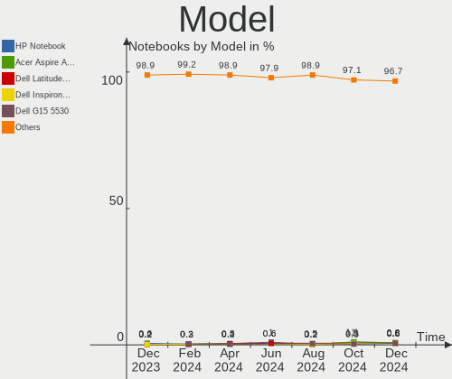
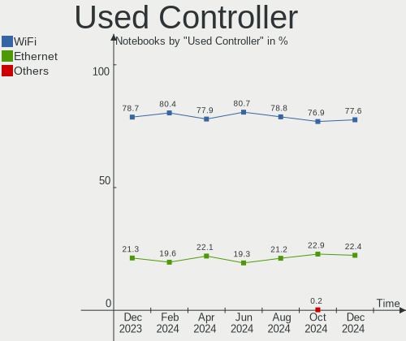

Ubuntu Hardware Trends (Notebook)
---------------------------------

A project to identify most popular hardware characteristics and track their change
over time based on data collected by Ubuntu users at https://Linux-Hardware.org.

Anyone can contribute to the study by uploading probes of their computers by
the [hw-probe](https://github.com/linuxhw/hw-probe) tool:

    sudo hw-probe -all -upload

Full-feature report is available here: https://linux-hardware.org/?view=trends&formfactor=notebook

Period: Nov, 2019.

Contents
--------

- [ OS                       ](#os)
- [ OS Family                ](#os-family)
- [ Kernel                   ](#kernel)
- [ Kernel Family            ](#kernel-family)
- [ Kernel Major Ver.        ](#kernel-major-ver)
- [ Arch                     ](#arch)
- [ DE                       ](#de)
- [ Display Server           ](#display-server)
- [ OS Lang                  ](#os-lang)
- [ Boot Mode                ](#boot-mode)
- [ Filesystem               ](#filesystem)
- [ Dual Boot with Linux     ](#dual-boot-with-linux)
- [ Dual Boot (Win)          ](#dual-boot-win)
- [ Country                  ](#country)
- [ City                     ](#city)
- [ Vendor                   ](#vendor)
- [ Model                    ](#model)
- [ Model Family             ](#model-family)
- [ MFG Year                 ](#mfg-year)
- [ Form Factor              ](#form-factor)
- [ Secure Boot              ](#secure-boot)
- [ Coreboot                 ](#coreboot)
- [ RAM Size                 ](#ram-size)
- [ RAM Used                 ](#ram-used)
- [ Drive Vendor             ](#drive-vendor)
- [ Drive Model              ](#drive-model)
- [ Drive Kind               ](#drive-kind)
- [ Drive Connector          ](#drive-connector)
- [ Drive Size               ](#drive-size)
- [ Space Total              ](#space-total)
- [ Space Used               ](#space-used)
- [ Malfunc. Drives          ](#malfunc-drives)
- [ Malfunc. Drive Vendor    ](#malfunc-drive-vendor)
- [ Malfunc. Drive Kind      ](#malfunc-drive-kind)
- [ Failed Drives            ](#failed-drives)
- [ Failed Drive Vendor      ](#failed-drive-vendor)
- [ Drive Status             ](#drive-status)
- [ CPU Vendor               ](#cpu-vendor)
- [ CPU Model                ](#cpu-model)
- [ CPU Model Family         ](#cpu-model-family)
- [ CPU Cores                ](#cpu-cores)
- [ CPU Sockets              ](#cpu-sockets)
- [ CPU Threads              ](#cpu-threads)
- [ CPU Op-Modes             ](#cpu-op-modes)
- [ CPU Microarch            ](#cpu-microarch)
- [ CPU Microcode            ](#cpu-microcode)
- [ GPU Vendor               ](#gpu-vendor)
- [ GPU Model                ](#gpu-model)
- [ GPU Combo                ](#gpu-combo)
- [ GPU Driver               ](#gpu-driver)
- [ GPU Memory               ](#gpu-memory)
- [ Monitor Vendor           ](#monitor-vendor)
- [ Monitor Model            ](#monitor-model)
- [ Monitor Resolution       ](#monitor-resolution)
- [ Monitor Diagonal         ](#monitor-diagonal)
- [ Monitor Width            ](#monitor-width)
- [ Aspect Ratio             ](#aspect-ratio)
- [ Monitor Area             ](#monitor-area)
- [ Pixel Density            ](#pixel-density)
- [ Multiple Monitors        ](#multiple-monitors)
- [ Net Controller Vendor    ](#net-controller-vendor)
- [ Net Controller Model     ](#net-controller-model)
- [ Net Controller Kind      ](#net-controller-kind)
- [ Used Controller          ](#used-controller)
- [ NICs                     ](#nics)
- [ Unsupported Devices      ](#unsupported-devices)
- [ Unsupported Device Types ](#unsupported-device-types)

OS
--

Installed operating systems

| Name         | Computers | Percent |
|--------------|-----------|---------|
| Ubuntu 18.04 | 285       | 59.62%  |
| Ubuntu 19.10 | 137       | 28.66%  |
| Ubuntu 19.04 | 32        | 6.69%   |
| Ubuntu 16.04 | 18        | 3.77%   |
| Ubuntu 18.10 | 5         | 1.05%   |
| Ubuntu 17.10 | 1         | 0.21%   |

OS Family
---------

OS without a version

| Name   | Computers | Percent |
|--------|-----------|---------|
| Ubuntu | 478       | 100%    |

Kernel
------

Version of the Linux kernel

| Version                 | Computers | Percent |
|-------------------------|-----------|---------|
| 5.0.0-32-generic        | 80        | 16.74%  |
| 5.0.0-36-generic        | 79        | 16.53%  |
| 5.3.0-23-generic        | 62        | 12.97%  |
| 4.15.0-70-generic       | 38        | 7.95%   |
| 5.3.0-19-generic        | 37        | 7.74%   |
| 5.0.0-23-generic        | 35        | 7.32%   |
| 4.15.0-66-generic       | 29        | 6.07%   |
| 5.0.0-31-generic        | 10        | 2.09%   |
| 5.3.0-18-generic        | 9         | 1.88%   |
| 4.18.0-25-generic       | 8         | 1.67%   |
| 5.3.0-24-generic        | 6         | 1.26%   |
| 5.0.0-13-generic        | 5         | 1.05%   |
| 5.3.0-19-lowlatency     | 4         | 0.84%   |
| 4.15.0-29-generic       | 4         | 0.84%   |
| 5.3.0-23-lowlatency     | 3         | 0.63%   |
| 5.3.0-22-generic        | 3         | 0.63%   |
| 5.3.0-21-generic        | 3         | 0.63%   |
| 5.3.0-20-generic        | 3         | 0.63%   |
| 5.0.0-37-generic        | 3         | 0.63%   |
| 5.0.0-34-generic        | 3         | 0.63%   |
| 4.15.0-65-generic       | 3         | 0.63%   |
| 4.15.0-55-generic       | 3         | 0.63%   |
| 5.0.0-35-generic        | 2         | 0.42%   |
| 5.0.0-32-lowlatency     | 2         | 0.42%   |
| 5.0.0-29-generic        | 2         | 0.42%   |
| 4.16.18-pa2-1bp5        | 2         | 0.42%   |
| 4.15.0-71-generic       | 2         | 0.42%   |
| 4.15.0-69-generic       | 2         | 0.42%   |
| 5.4.1-mykernel          | 1         | 0.21%   |
| 5.4.0-050400rc8-generic | 1         | 0.21%   |
| 5.4.0-050400rc6-generic | 1         | 0.21%   |
| 5.3.8-854.native        | 1         | 0.21%   |
| 5.3.8-050308-generic    | 1         | 0.21%   |
| 5.3.13-050313-generic   | 1         | 0.21%   |
| 5.3.11-050311-generic   | 1         | 0.21%   |
| 5.3.1-050301-generic    | 1         | 0.21%   |
| 5.3.0-24-lowlatency     | 1         | 0.21%   |
| 5.3.0-2-686             | 1         | 0.21%   |
| 5.2.20-050220-generic   | 1         | 0.21%   |
| 5.0.0-36-lowlatency     | 1         | 0.21%   |
| 5.0.0-27-generic        | 1         | 0.21%   |
| 5.0.0-17-generic        | 1         | 0.21%   |
| 5.0.0-1025-oem-osp1     | 1         | 0.21%   |
| 4.4.0-87-generic        | 1         | 0.21%   |
| 4.4.0-169-generic       | 1         | 0.21%   |
| 4.4.0-168-generic       | 1         | 0.21%   |
| 4.18.0-26-generic       | 1         | 0.21%   |
| 4.18.0-22-generic       | 1         | 0.21%   |
| 4.18.0-15-generic       | 1         | 0.21%   |
| 4.16.18-pa2-2bp1        | 1         | 0.21%   |
| 4.15.0-72-generic       | 1         | 0.21%   |
| 4.15.0-70-lowlatency    | 1         | 0.21%   |
| 4.15.0-68-lowlatency    | 1         | 0.21%   |
| 4.15.0-66-lowlatency    | 1         | 0.21%   |
| 4.15.0-62-generic       | 1         | 0.21%   |
| 4.15.0-58-generic       | 1         | 0.21%   |
| 4.15.0-54-generic       | 1         | 0.21%   |
| 4.15.0-47-generic       | 1         | 0.21%   |
| 4.15.0-43-generic       | 1         | 0.21%   |
| 4.15.0-23-generic       | 1         | 0.21%   |

Kernel Family
-------------

Linux kernel without a distro release

| Version | Computers | Percent |
|---------|-----------|---------|
| 5.0.0   | 225       | 47.07%  |
| 5.3.0   | 132       | 27.62%  |
| 4.15.0  | 93        | 19.46%  |
| 4.18.0  | 11        | 2.3%    |
| 4.4.0   | 3         | 0.63%   |
| 4.16.18 | 3         | 0.63%   |
| 5.4.0   | 2         | 0.42%   |
| 5.3.8   | 2         | 0.42%   |
| 4.13.0  | 2         | 0.42%   |
| 5.4.1   | 1         | 0.21%   |
| 5.3.13  | 1         | 0.21%   |
| 5.3.11  | 1         | 0.21%   |
| 5.3.1   | 1         | 0.21%   |
| 5.2.20  | 1         | 0.21%   |

Kernel Major Ver.
-----------------

Linux kernel major version

| Version | Computers | Percent |
|---------|-----------|---------|
| 5.0     | 225       | 47.07%  |
| 5.3     | 137       | 28.66%  |
| 4.15    | 93        | 19.46%  |
| 4.18    | 11        | 2.3%    |
| 5.4     | 3         | 0.63%   |
| 4.4     | 3         | 0.63%   |
| 4.16    | 3         | 0.63%   |
| 4.13    | 2         | 0.42%   |
| 5.2     | 1         | 0.21%   |

Arch
----

OS architecture (x86_64, i586, etc.)

| Name   | Computers | Percent |
|--------|-----------|---------|
| x86_64 | 447       | 93.51%  |
| i686   | 31        | 6.49%   |

DE
--

Desktop Environment

| Name            | Computers | Percent |
|-----------------|-----------|---------|
| GNOME           | 207       | 43.31%  |
| Unknown         | 198       | 41.42%  |
| XFCE            | 33        | 6.9%    |
| Unity           | 11        | 2.3%    |
| KDE             | 11        | 2.3%    |
| MATE            | 7         | 1.46%   |
| LXQt            | 4         | 0.84%   |
| GNOME Flashback | 3         | 0.63%   |
| X-Cinnamon      | 2         | 0.42%   |
| LXDE            | 1         | 0.21%   |
| Budgie          | 1         | 0.21%   |

Display Server
--------------

X11 or Wayland

| Name    | Computers | Percent |
|---------|-----------|---------|
| Unknown | 248       | 51.88%  |
| X11     | 226       | 47.28%  |
| Wayland | 4         | 0.84%   |

OS Lang
-------

Language

| Lang    | Computers | Percent |
|---------|-----------|---------|
| Unknown | 235       | 49.16%  |
| en_US   | 82        | 17.15%  |
| de_DE   | 27        | 5.65%   |
| it_IT   | 13        | 2.72%   |
| fr_FR   | 13        | 2.72%   |
| pt_BR   | 12        | 2.51%   |
| es_ES   | 12        | 2.51%   |
| en_GB   | 10        | 2.09%   |
| en_CA   | 8         | 1.67%   |
| ru_RU   | 7         | 1.46%   |
| pl_PL   | 7         | 1.46%   |
| C       | 6         | 1.26%   |
| en_IN   | 5         | 1.05%   |
| fr_CA   | 3         | 0.63%   |
| en_AU   | 3         | 0.63%   |
| sk_SK   | 2         | 0.42%   |
| hu_HU   | 2         | 0.42%   |
| es_UY   | 2         | 0.42%   |
| es_MX   | 2         | 0.42%   |
| es_CO   | 2         | 0.42%   |
| es_CL   | 2         | 0.42%   |
| en_ZA   | 2         | 0.42%   |
| el_GR   | 2         | 0.42%   |
| de_CH   | 2         | 0.42%   |
| de_AT   | 2         | 0.42%   |
| cs_CZ   | 2         | 0.42%   |
| zh_CN   | 1         | 0.21%   |
| th_TH   | 1         | 0.21%   |
| pt_PT   | 1         | 0.21%   |
| nl_NL   | 1         | 0.21%   |
| id_ID   | 1         | 0.21%   |
| fi_FI   | 1         | 0.21%   |
| es_VE   | 1         | 0.21%   |
| es_CR   | 1         | 0.21%   |
| es_AR   | 1         | 0.21%   |
| en_PH   | 1         | 0.21%   |
| en_NZ   | 1         | 0.21%   |
| en_IE   | 1         | 0.21%   |
| en_HK   | 1         | 0.21%   |

Boot Mode
---------

EFI or BIOS

| Mode | Computers | Percent |
|------|-----------|---------|
| BIOS | 246       | 51.46%  |
| EFI  | 232       | 48.54%  |

Filesystem
----------

Type of filesystem

| Type    | Computers | Percent |
|---------|-----------|---------|
| Ext4    | 451       | 94.35%  |
| Overlay | 22        | 4.6%    |
| Btrfs   | 3         | 0.63%   |
| Ext2    | 2         | 0.42%   |

Dual Boot with Linux
--------------------

Hosting more than one Linux

| Dual boot | Computers | Percent |
|-----------|-----------|---------|
| No        | 425       | 88.91%  |
| Yes       | 53        | 11.09%  |

Dual Boot (Win)
---------------

Hosting Linux and Windows

| Dual boot | Computers | Percent |
|-----------|-----------|---------|
| No        | 310       | 64.85%  |
| Yes       | 168       | 35.15%  |

Country
-------

Geographic location (country)

| Country                   | Computers | Percent |
|---------------------------|-----------|---------|
| USA                       | 69        | 14.44%  |
| Germany                   | 61        | 12.76%  |
| Brazil                    | 31        | 6.49%   |
| France                    | 24        | 5.02%   |
| Russia                    | 22        | 4.6%    |
| Italy                     | 22        | 4.6%    |
| UK                        | 21        | 4.39%   |
| Canada                    | 21        | 4.39%   |
| Spain                     | 17        | 3.56%   |
| India                     | 16        | 3.35%   |
| Poland                    | 11        | 2.3%    |
| Slovakia                  | 8         | 1.67%   |
| Netherlands               | 8         | 1.67%   |
| Switzerland               | 7         | 1.46%   |
| Romania                   | 7         | 1.46%   |
| Czech Republic            | 7         | 1.46%   |
| Australia                 | 7         | 1.46%   |
| Mexico                    | 6         | 1.26%   |
| Japan                     | 6         | 1.26%   |
| Egypt                     | 6         | 1.26%   |
| Belgium                   | 6         | 1.26%   |
| Ukraine                   | 5         | 1.05%   |
| Peru                      | 5         | 1.05%   |
| Hungary                   | 5         | 1.05%   |
| Austria                   | 5         | 1.05%   |
| Uruguay                   | 4         | 0.84%   |
| Portugal                  | 4         | 0.84%   |
| Finland                   | 4         | 0.84%   |
| Croatia                   | 4         | 0.84%   |
| Colombia                  | 4         | 0.84%   |
| Argentina                 | 4         | 0.84%   |
| Turkey                    | 3         | 0.63%   |
| Sweden                    | 3         | 0.63%   |
| South Africa              | 3         | 0.63%   |
| Chile                     | 3         | 0.63%   |
| Philippines               | 2         | 0.42%   |
| Norway                    | 2         | 0.42%   |
| Indonesia                 | 2         | 0.42%   |
| Hong Kong                 | 2         | 0.42%   |
| Greece                    | 2         | 0.42%   |
| Denmark                   | 2         | 0.42%   |
| China                     | 2         | 0.42%   |
| Bulgaria                  | 2         | 0.42%   |
| Algeria                   | 2         | 0.42%   |
| Venezuela                 | 1         | 0.21%   |
| Tunisia                   | 1         | 0.21%   |
| Thailand                  | 1         | 0.21%   |
| Paraguay                  | 1         | 0.21%   |
| New Zealand               | 1         | 0.21%   |
| Morocco                   | 1         | 0.21%   |
| Montenegro                | 1         | 0.21%   |
| Malaysia                  | 1         | 0.21%   |
| Macedonia                 | 1         | 0.21%   |
| Lithuania                 | 1         | 0.21%   |
| Israel                    | 1         | 0.21%   |
| Ireland                   | 1         | 0.21%   |
| Iran, Islamic Republic of | 1         | 0.21%   |
| Iran                      | 1         | 0.21%   |
| Iceland                   | 1         | 0.21%   |
| Guatemala                 | 1         | 0.21%   |

City
----

Geographic location (city)

| City                | Computers | Percent |
|---------------------|-----------|---------|
| Moscow              | 7         | 1.46%   |
| Berlin              | 7         | 1.46%   |
| Bengaluru           | 6         | 1.26%   |
| Zagreb              | 4         | 0.84%   |
| Warsaw              | 4         | 0.84%   |
| Rome                | 4         | 0.84%   |
| Prague              | 4         | 0.84%   |
| Paris               | 4         | 0.84%   |
| Lima                | 4         | 0.84%   |
| Hamburg             | 4         | 0.84%   |
| Frankfurt am Main   | 4         | 0.84%   |
| Cairo               | 4         | 0.84%   |
| Vienna              | 3         | 0.63%   |
| Vancouver           | 3         | 0.63%   |
| Ottawa              | 3         | 0.63%   |
| Montreal            | 3         | 0.63%   |
| Kyiv                | 3         | 0.63%   |
| Istanbul            | 3         | 0.63%   |
| Düsseldorf         | 3         | 0.63%   |
| Dublin              | 3         | 0.63%   |
| Budapest            | 3         | 0.63%   |
| Zurich              | 2         | 0.42%   |
| Toronto             | 2         | 0.42%   |
| São Paulo          | 2         | 0.42%   |
| Stuttgart           | 2         | 0.42%   |
| St Petersburg       | 2         | 0.42%   |
| Sofia               | 2         | 0.42%   |
| Saratov             | 2         | 0.42%   |
| Santiago            | 2         | 0.42%   |
| Salvador            | 2         | 0.42%   |
| Rio de Janeiro      | 2         | 0.42%   |
| Perth               | 2         | 0.42%   |
| Natal               | 2         | 0.42%   |
| Munich              | 2         | 0.42%   |
| Montevideo          | 2         | 0.42%   |
| Miami               | 2         | 0.42%   |
| McBee               | 2         | 0.42%   |
| Marlow              | 2         | 0.42%   |
| London              | 2         | 0.42%   |
| Indianapolis        | 2         | 0.42%   |
| Helsinki            | 2         | 0.42%   |
| Genoa               | 2         | 0.42%   |
| Francavilla Fontana | 2         | 0.42%   |
| Duluth              | 2         | 0.42%   |
| Curitiba            | 2         | 0.42%   |
| Crabtree            | 2         | 0.42%   |
| Chiyoda             | 2         | 0.42%   |
| Brno                | 2         | 0.42%   |
| Bern                | 2         | 0.42%   |
| Bad Oeynhausen      | 2         | 0.42%   |
| Arras               | 2         | 0.42%   |
| Amsterdam           | 2         | 0.42%   |
| Algiers             | 2         | 0.42%   |
| Alexandria          | 2         | 0.42%   |
| Élancourt          | 1         | 0.21%   |
| Zaragoza            | 1         | 0.21%   |
| Wyoming             | 1         | 0.21%   |
| Wunstorf            | 1         | 0.21%   |
| Worcester Park      | 1         | 0.21%   |
| Woodway             | 1         | 0.21%   |

Vendor
------

Motherboard manufacturer

| Name                   | Computers | Percent |
|------------------------|-----------|---------|
| Hewlett-Packard        | 109       | 22.8%   |
| Lenovo                 | 100       | 20.92%  |
| Dell                   | 70        | 14.64%  |
| Acer                   | 47        | 9.83%   |
| ASUSTek Computer       | 44        | 9.21%   |
| Toshiba                | 22        | 4.6%    |
| Sony                   | 13        | 2.72%   |
| MSI                    | 9         | 1.88%   |
| Samsung Electronics    | 7         | 1.46%   |
| Apple                  | 7         | 1.46%   |
| Fujitsu                | 5         | 1.05%   |
| Novastar               | 4         | 0.84%   |
| System76               | 3         | 0.63%   |
| Packard Bell           | 3         | 0.63%   |
| Notebook               | 3         | 0.63%   |
| eMachines              | 3         | 0.63%   |
| ECS                    | 3         | 0.63%   |
| Unknown                | 3         | 0.63%   |
| Positivo               | 2         | 0.42%   |
| Medion                 | 2         | 0.42%   |
| HUAWEI                 | 2         | 0.42%   |
| Clevo                  | 2         | 0.42%   |
| TR                     | 1         | 0.21%   |
| Timi                   | 1         | 0.21%   |
| Quanta                 | 1         | 0.21%   |
| PC Specialist          | 1         | 0.21%   |
| Panasonic              | 1         | 0.21%   |
| OEGStone               | 1         | 0.21%   |
| Microboard             | 1         | 0.21%   |
| Itautec                | 1         | 0.21%   |
| Intel                  | 1         | 0.21%   |
| Gateway                | 1         | 0.21%   |
| Fujitsu Siemens        | 1         | 0.21%   |
| Digma                  | 1         | 0.21%   |
| BESSTAR Tech           | 1         | 0.21%   |
| Avell High Performance | 1         | 0.21%   |
| AMI                    | 1         | 0.21%   |

Model
-----

Motherboard model

| Name                            | Computers | Percent |
|---------------------------------|-----------|---------|
| Unknown                         | 5         | 1.05%   |
| Laptop 15-bw0xx                 | 4         | 0.84%   |
| KL55                            | 4         | 0.84%   |
| SF20PA2                         | 3         | 0.63%   |
| ProBook 4530s                   | 3         | 0.63%   |
| Pavilion g6                     | 3         | 0.63%   |
| Pavilion 15                     | 3         | 0.63%   |
| Notebook                        | 3         | 0.63%   |
| Legion Y530-15ICH 81FV          | 3         | 0.63%   |
| Laptop 15-bs1xx                 | 3         | 0.63%   |
| XPS L502X                       | 2         | 0.42%   |
| Vostro V130                     | 2         | 0.42%   |
| ThinkPad T60 200764U            | 2         | 0.42%   |
| Strix GL504GM_GL504GM           | 2         | 0.42%   |
| Stream Laptop 11-y0XX           | 2         | 0.42%   |
| Satellite C55-B                 | 2         | 0.42%   |
| Q232A                           | 2         | 0.42%   |
| ProBook 6460b                   | 2         | 0.42%   |
| Pavilion g7                     | 2         | 0.42%   |
| Pavilion dv7                    | 2         | 0.42%   |
| Pavilion dv6                    | 2         | 0.42%   |
| OMEN by HP Laptop 17-cb0xxx     | 2         | 0.42%   |
| Latitude E6410                  | 2         | 0.42%   |
| Latitude E5520                  | 2         | 0.42%   |
| Laptop 15-db0xxx                | 2         | 0.42%   |
| Laptop 15-bs0xx                 | 2         | 0.42%   |
| K53SV                           | 2         | 0.42%   |
| K45A                            | 2         | 0.42%   |
| Inspiron N5110                  | 2         | 0.42%   |
| Inspiron 3543                   | 2         | 0.42%   |
| Inspiron 3442                   | 2         | 0.42%   |
| Inspiron 1545                   | 2         | 0.42%   |
| Inspiron 15-3567                | 2         | 0.42%   |
| IdeaPad S145-15IWL 81MV         | 2         | 0.42%   |
| IdeaPad 700-15ISK 80RU          | 2         | 0.42%   |
| GT70                            | 2         | 0.42%   |
| GL753VD                         | 2         | 0.42%   |
| Galago Pro                      | 2         | 0.42%   |
| G7 7790                         | 2         | 0.42%   |
| EliteBook 8470p                 | 2         | 0.42%   |
| EliteBook 8440p                 | 2         | 0.42%   |
| EliteBook 840 G6                | 2         | 0.42%   |
| EliteBook 840 G3                | 2         | 0.42%   |
| EliteBook 840 G1                | 2         | 0.42%   |
| EliteBook 2540p                 | 2         | 0.42%   |
| Aspire one 1-431                | 2         | 0.42%   |
| Aspire A515-51                  | 2         | 0.42%   |
| Aspire A315-21                  | 2         | 0.42%   |
| Aspire 5750Z                    | 2         | 0.42%   |
| 250 G7 Notebook PC              | 2         | 0.42%   |
| ZenBook Pro Duo UX581GV_UX581GV | 1         | 0.21%   |
| ZBook 17 G6                     | 1         | 0.21%   |
| ZBook 15 G3                     | 1         | 0.21%   |
| Z83-F                           | 1         | 0.21%   |
| Z50-70 20354                    | 1         | 0.21%   |
| Yoga 500-14ISK 80R5             | 1         | 0.21%   |
| Y70-70 Touch 80DU               | 1         | 0.21%   |
| Y520-15IKBN 80WK                | 1         | 0.21%   |
| Y50-70 20378                    | 1         | 0.21%   |
| XPS M1330                       | 1         | 0.21%   |

Model Family
------------

Motherboard model prefix

| Name                  | Computers | Percent |
|-----------------------|-----------|---------|
| Lenovo ThinkPad       | 49        | 10.25%  |
| Acer Aspire           | 39        | 8.16%   |
| Dell Inspiron         | 30        | 6.28%   |
| Lenovo IdeaPad        | 24        | 5.02%   |
| HP Pavilion           | 23        | 4.81%   |
| HP EliteBook          | 20        | 4.18%   |
| HP Laptop             | 19        | 3.97%   |
| Dell Latitude         | 19        | 3.97%   |
| Toshiba Satellite     | 17        | 3.56%   |
| HP ProBook            | 11        | 2.3%    |
| Dell Precision        | 7         | 1.46%   |
| Dell XPS              | 6         | 1.26%   |
| Lenovo Legion         | 5         | 1.05%   |
| Fujitsu LIFEBOOK      | 5         | 1.05%   |
| Unknown               | 5         | 1.05%   |
| Novastar KL55         | 4         | 0.84%   |
| HP Stream             | 4         | 0.84%   |
| HP OMEN               | 4         | 0.84%   |
| Dell Vostro           | 4         | 0.84%   |
| Packard Bell EasyNote | 3         | 0.63%   |
| HP Notebook           | 3         | 0.63%   |
| HP Compaq             | 3         | 0.63%   |
| HP 250                | 3         | 0.63%   |
| ECS SF20PA2           | 3         | 0.63%   |
| ASUS TUF              | 3         | 0.63%   |
| Acer Swift            | 3         | 0.63%   |
| System76 Galago       | 2         | 0.42%   |
| Positivo Q232A        | 2         | 0.42%   |
| MSI GT70              | 2         | 0.42%   |
| HP ZBook              | 2         | 0.42%   |
| HP Presario           | 2         | 0.42%   |
| HP Mini               | 2         | 0.42%   |
| Dell G7               | 2         | 0.42%   |
| ASUS Strix            | 2         | 0.42%   |
| ASUS K53SV            | 2         | 0.42%   |
| ASUS K45A             | 2         | 0.42%   |
| ASUS GL753VD          | 2         | 0.42%   |
| Apple MacBookPro8     | 2         | 0.42%   |
| Apple MacBookPro10    | 2         | 0.42%   |
| Acer TravelMate       | 2         | 0.42%   |
| TR 911                | 1         | 0.21%   |
| Toshiba Qosmio        | 1         | 0.21%   |
| Toshiba PORTEGE       | 1         | 0.21%   |
| Toshiba Portable      | 1         | 0.21%   |
| Toshiba NB205         | 1         | 0.21%   |
| Timi RedmiBook        | 1         | 0.21%   |
| System76 Serval       | 1         | 0.21%   |
| Sony VPCF13M0E        | 1         | 0.21%   |
| Sony VPCEH2J1E        | 1         | 0.21%   |
| Sony VPCEE2M1E        | 1         | 0.21%   |
| Sony VPCEB33FM        | 1         | 0.21%   |
| Sony VPCEA36FM        | 1         | 0.21%   |
| Sony VGN-AR61ZU       | 1         | 0.21%   |
| Sony SVF15N1C4E       | 1         | 0.21%   |
| Sony SVF1521P2EW      | 1         | 0.21%   |
| Sony SVF1521H1EW      | 1         | 0.21%   |
| Sony SVF1521D7EW      | 1         | 0.21%   |
| Sony SVE1713F1EW      | 1         | 0.21%   |
| Sony SVE14A2V1EW      | 1         | 0.21%   |
| Sony SVE14A1M6EW      | 1         | 0.21%   |

MFG Year
--------

Motherboard manufacture year

| Year    | Computers | Percent |
|---------|-----------|---------|
| 2019    | 101       | 21.13%  |
| 2018    | 71        | 14.85%  |
| 2012    | 39        | 8.16%   |
| 2017    | 37        | 7.74%   |
| 2011    | 37        | 7.74%   |
| 2013    | 36        | 7.53%   |
| 2015    | 30        | 6.28%   |
| 2010    | 28        | 5.86%   |
| 2014    | 26        | 5.44%   |
| 2016    | 23        | 4.81%   |
| 2009    | 18        | 3.77%   |
| 2008    | 18        | 3.77%   |
| 2007    | 9         | 1.88%   |
| 2006    | 3         | 0.63%   |
| 2005    | 1         | 0.21%   |
| Unknown | 1         | 0.21%   |

Form Factor
-----------

Physical design of the computer

| Name     | Computers | Percent |
|----------|-----------|---------|
| Notebook | 478       | 100%    |

Secure Boot
-----------

Enabled or disabled

| State    | Computers | Percent |
|----------|-----------|---------|
| Disabled | 427       | 89.33%  |
| Enabled  | 51        | 10.67%  |

Coreboot
--------

Have coreboot on board

| Used | Computers | Percent |
|------|-----------|---------|
| No   | 478       | 100%    |

RAM Size
--------

Total RAM memory

| Size in GB  | Computers | Percent |
|-------------|-----------|---------|
| 3.01-4.0    | 138       | 28.87%  |
| 4.01-8.0    | 136       | 28.45%  |
| 8.01-16.0   | 73        | 15.27%  |
| 16.01-24.0  | 62        | 12.97%  |
| 1.01-2.0    | 41        | 8.58%   |
| 32.01-64.0  | 14        | 2.93%   |
| 2.01-3.0    | 8         | 1.67%   |
| 0.01-1.0    | 3         | 0.63%   |
| 24.01-32.0  | 2         | 0.42%   |
| 64.01-256.0 | 1         | 0.21%   |

RAM Used
--------

Used RAM memory

| Used GB   | Computers | Percent |
|-----------|-----------|---------|
| 1.01-2.0  | 221       | 46.23%  |
| 2.01-3.0  | 136       | 28.45%  |
| 3.01-4.0  | 47        | 9.83%   |
| 0.01-1.0  | 39        | 8.16%   |
| 4.01-8.0  | 32        | 6.69%   |
| 8.01-16.0 | 3         | 0.63%   |

Drive Vendor
------------

Hard drive vendors

| Vendor              | Computers | Drives  | Percent |
|---------------------|-----------|---------|---------|
| Seagate             | 95        | 98      | 19.11%  |
| WDC                 | 69        | 70      | 13.88%  |
| Toshiba             | 65        | 65      | 13.08%  |
| Samsung Electronics | 48        | 51      | 9.66%   |
| Kingston            | 34        | 34      | 6.84%   |
| SanDisk             | 28        | 30      | 5.63%   |
| HGST                | 23        | 23      | 4.63%   |
| Unknown             | 22        | 25      | 4.43%   |
| Hitachi             | 21        | 21      | 4.23%   |
| Crucial             | 15        | 15      | 3.02%   |
| SK Hynix            | 9         | 9       | 1.81%   |
| A-DATA Technology   | 7         | 7       | 1.41%   |
| Micron Technology   | 6         | 6       | 1.21%   |
| Intel               | 6         | 6       | 1.21%   |
| LITEON              | 4         | 4       | 0.8%    |
| Fujitsu             | 4         | 4       | 0.8%    |
| Transcend           | 3         | 3       | 0.6%    |
| SPCC                | 3         | 3       | 0.6%    |
| LITEONIT            | 3         | 3       | 0.6%    |
| Intenso             | 3         | 3       | 0.6%    |
| HL-DT-ST            | 3         | Unknown | 0.6%    |
| Apacer              | 3         | 3       | 0.6%    |
| PNY                 | 2         | 2       | 0.4%    |
| Patriot             | 2         | 2       | 0.4%    |
| OCZ                 | 2         | 2       | 0.4%    |
| Generic             | 2         | 2       | 0.4%    |
| Vi550               | 1         | 1       | 0.2%    |
| Phison              | 1         | 1       | 0.2%    |
| OWC                 | 1         | 1       | 0.2%    |
| Netac               | 1         | 1       | 0.2%    |
| MARSHAL             | 1         | 1       | 0.2%    |
| LaCie               | 1         | 1       | 0.2%    |
| KingSpec            | 1         | 1       | 0.2%    |
| JMicron             | 1         | 1       | 0.2%    |
| IBM/Hitachi         | 1         | 1       | 0.2%    |
| HUAWEI              | 1         | 1       | 0.2%    |
| faspeed             | 1         | 1       | 0.2%    |
| Corsair             | 1         | 1       | 0.2%    |
| ASMT                | 1         | 1       | 0.2%    |
| asmedia             | 1         | 1       | 0.2%    |
| Apple               | 1         | 1       | 0.2%    |

Drive Model
-----------

Hard drive models

| Model                        | Computers | Percent |
|------------------------------|-----------|---------|
| ST1000LM035-1RK172 1TB       | 18        | 3.54%   |
| ST1000LM024 HN-M101MBB 1TB   | 12        | 2.36%   |
| MQ01ABF050 500GB             | 11        | 2.17%   |
| MQ01ABD100 1TB               | 10        | 1.97%   |
| SV300S37A120G 120GB SSD      | 9         | 1.77%   |
| HTS721010A9E630 1TB          | 8         | 1.57%   |
| ST500LT012-9WS142 500GB      | 7         | 1.38%   |
| ST500LT012-1DG142 500GB      | 7         | 1.38%   |
| MQ04ABF100 1TB               | 7         | 1.38%   |
| SA400S37240G 240GB SSD       | 6         | 1.18%   |
| SSD PLUS 240GB               | 5         | 0.98%   |
| SSD 850 EVO 250GB            | 5         | 0.98%   |
| SA400S37120G 120GB SSD       | 5         | 0.98%   |
| HTS545050A7E680 500GB        | 5         | 0.98%   |
| DF4032  31GB                 | 5         | 0.98%   |
| WD10JPVX-60JC3T1 1TB         | 4         | 0.79%   |
| WD10JPCX-24UE4T0 1TB         | 4         | 0.79%   |
| ST9500420AS 500GB            | 4         | 0.79%   |
| ST9320423AS 320GB            | 4         | 0.79%   |
| RBUSNS4180S3256GJ 256GB SSD  | 4         | 0.79%   |
| WD10JPVX-22JC3T0 1TB         | 3         | 0.59%   |
| ST9500325AS 500GB            | 3         | 0.59%   |
| ST1000LX015-1U7172 1TB       | 3         | 0.59%   |
| SSD 860 EVO 250GB            | 3         | 0.59%   |
| Solid State Disk 128GB       | 3         | 0.59%   |
| SDSSDA240G 240GB             | 3         | 0.59%   |
| HTS541010B7E610 1TB          | 3         | 0.59%   |
| HTS541010A9E680 1TB          | 3         | 0.59%   |
| DVDRAM GUC0N 1GB             | 3         | 0.59%   |
| CT500MX500SSD1 500GB         | 3         | 0.59%   |
| WDS240G2G0A-00JH30 240GB SSD | 2         | 0.39%   |
| WDS120G2G0B-00EPW0 120GB SSD | 2         | 0.39%   |
| WD5000LPCX-21VHAT0 500GB     | 2         | 0.39%   |
| WD3200BPVT-24JJ5T0 320GB     | 2         | 0.39%   |
| WD1600BEVT-22ZCT0 160GB      | 2         | 0.39%   |
| WD10SPZX-60Z10T0 1TB         | 2         | 0.39%   |
| WD10SPZX-24Z10 1TB           | 2         | 0.39%   |
| WD10SPZX-21Z10T0 1TB         | 2         | 0.39%   |
| WD10SPCX-24HWST1 1TB         | 2         | 0.39%   |
| WD10JPVX-08JC3T5 1TB         | 2         | 0.39%   |
| USD  15GB                    | 2         | 0.39%   |
| TR200 240GB SSD              | 2         | 0.39%   |
| SV300S37A240G 240GB SSD      | 2         | 0.39%   |
| SUV500M8240G 240GB SSD       | 2         | 0.39%   |
| ST9250827AS 250GB            | 2         | 0.39%   |
| ST9250315AS 250GB            | 2         | 0.39%   |
| ST9160821AS 160GB            | 2         | 0.39%   |
| ST750LM022 HN-M750MBB 750GB  | 2         | 0.39%   |
| ST500LM030-1RK17D 500GB      | 2         | 0.39%   |
| ST500LM021-1KJ152 500GB      | 2         | 0.39%   |
| ST500LM012 HN-M500MBB 500GB  | 2         | 0.39%   |
| ST500LM000-1EJ162 500GB      | 2         | 0.39%   |
| ST320LT020-9YG142 320GB      | 2         | 0.39%   |
| ST2000LM007-1R8174 2TB       | 2         | 0.39%   |
| ST1000LM014-1EJ164 1TB       | 2         | 0.39%   |
| SSD 860 EVO 500GB            | 2         | 0.39%   |
| SSD 850 PRO 256GB            | 2         | 0.39%   |
| SSD 850 EVO 500GB            | 2         | 0.39%   |
| SSD 850 EVO 120GB            | 2         | 0.39%   |
| SP920SS 512GB SSD            | 2         | 0.39%   |

Drive Kind
----------

HDD or SSD

| Kind    | Computers | Drives | Percent |
|---------|-----------|--------|---------|
| HDD     | 264       | 272    | 54.66%  |
| SSD     | 162       | 176    | 33.54%  |
| MMC     | 28        | 32     | 5.8%    |
| NVMe    | 15        | 15     | 3.11%   |
| Unknown | 14        | 11     | 2.9%    |

Drive Connector
---------------

SATA, SAS, NVMe, etc.

| Type | Computers | Drives | Percent |
|------|-----------|--------|---------|
| SATA | 397       | 444    | 87.06%  |
| MMC  | 28        | 32     | 6.14%   |
| SAS  | 16        | 15     | 3.51%   |
| NVMe | 15        | 15     | 3.29%   |

Drive Size
----------

Size of hard drive

| Size in TB | Computers | Drives | Percent |
|------------|-----------|--------|---------|
| 0.01-0.5   | 308       | 339    | 65.53%  |
| 0.51-1.0   | 146       | 150    | 31.06%  |
| 1.01-2.0   | 15        | 16     | 3.19%   |
| 3.01-4.0   | 1         | 1      | 0.21%   |

Space Total
-----------

Amount of disk space available on the file system

| Size in GB     | Computers | Percent |
|----------------|-----------|---------|
| 101-250        | 148       | 30.96%  |
| 251-500        | 136       | 28.45%  |
| 501-1000       | 80        | 16.74%  |
| 51-100         | 44        | 9.21%   |
| 21-50          | 35        | 7.32%   |
| 1-20           | 15        | 3.14%   |
| 1001-2000      | 10        | 2.09%   |
| More than 3000 | 4         | 0.84%   |
| 2001-3000      | 4         | 0.84%   |
| Unknown        | 2         | 0.42%   |

Space Used
----------

Amount of used disk space

| Used GB        | Computers | Percent |
|----------------|-----------|---------|
| 1-20           | 225       | 47.07%  |
| 21-50          | 90        | 18.83%  |
| 101-250        | 58        | 12.13%  |
| 51-100         | 58        | 12.13%  |
| 251-500        | 26        | 5.44%   |
| 501-1000       | 12        | 2.51%   |
| 1001-2000      | 4         | 0.84%   |
| More than 3000 | 2         | 0.42%   |
| Unknown        | 2         | 0.42%   |
| 2001-3000      | 1         | 0.21%   |

Malfunc. Drives
---------------

Drive models with a malfunction

| Model                          | Computers | Drives | Percent |
|--------------------------------|-----------|--------|---------|
| SV300S37A120G 120GB SSD        | 1         | 1      | 25%     |
| MQ01ABD100 1TB                 | 1         | 1      | 25%     |
| HTS543216L9SA02 160GB          | 1         | 1      | 25%     |
| BC501 HFM256GDJTNG-8310A 256GB | 1         | 1      | 25%     |

Malfunc. Drive Vendor
---------------------

Vendors of faulty drives

| Vendor   | Computers | Drives | Percent |
|----------|-----------|--------|---------|
| Toshiba  | 1         | 1      | 25%     |
| SK Hynix | 1         | 1      | 25%     |
| Kingston | 1         | 1      | 25%     |
| Hitachi  | 1         | 1      | 25%     |

Malfunc. Drive Kind
-------------------

Kinds of faulty drives

| Kind | Computers | Drives | Percent |
|------|-----------|--------|---------|
| HDD  | 2         | 2      | 50%     |
| NVMe | 1         | 1      | 25%     |
| SSD  | 1         | 1      | 25%     |

Failed Drives
-------------

Failed drive models

Zero info for selected period =(

Failed Drive Vendor
-------------------

Failed drive vendors

Zero info for selected period =(

Drive Status
------------

Number of failed and malfunc. drives

| Status   | Computers | Drives | Percent |
|----------|-----------|--------|---------|
| Detected | 402       | 469    | 92.63%  |
| Works    | 28        | 33     | 6.45%   |
| Malfunc  | 4         | 4      | 0.92%   |

CPU Vendor
----------

Processor vendors

| Vendor       | Computers | Percent |
|--------------|-----------|---------|
| Intel        | 412       | 86.19%  |
| AMD          | 65        | 13.6%   |
| CentaurHauls | 1         | 0.21%   |

CPU Model
---------

Processor models

| Model                                         | Computers | Percent |
|-----------------------------------------------|-----------|---------|
| Intel Core i5-8250U CPU @ 1.60GHz             | 12        | 2.51%   |
| Intel Core i7-8750H CPU @ 2.20GHz             | 10        | 2.09%   |
| Intel Core i5-7200U CPU @ 2.50GHz             | 10        | 2.09%   |
| Intel Core i5-2520M CPU @ 2.50GHz             | 10        | 2.09%   |
| Intel Core i5-8265U CPU @ 1.60GHz             | 9         | 1.88%   |
| Intel Core i7-9750H CPU @ 2.60GHz             | 8         | 1.67%   |
| Intel Core i7-8550U CPU @ 1.80GHz             | 8         | 1.67%   |
| Intel Core i5-3320M CPU @ 2.60GHz             | 7         | 1.46%   |
| Intel Core i7-8565U CPU @ 1.80GHz             | 6         | 1.26%   |
| Intel Core i5-6200U CPU @ 2.30GHz             | 6         | 1.26%   |
| Intel Core i5-5300U CPU @ 2.30GHz             | 6         | 1.26%   |
| Intel Core i5-5200U CPU @ 2.20GHz             | 6         | 1.26%   |
| Intel Core i5-3210M CPU @ 2.50GHz             | 6         | 1.26%   |
| Intel Core i5-2450M CPU @ 2.50GHz             | 6         | 1.26%   |
| Intel Celeron CPU N3060 @ 1.60GHz             | 6         | 1.26%   |
| Intel Atom x5-Z8350 CPU @ 1.44GHz             | 6         | 1.26%   |
| Intel Core i7-7500U CPU @ 2.70GHz             | 5         | 1.05%   |
| Intel Core i7-6700HQ CPU @ 2.60GHz            | 5         | 1.05%   |
| Intel Core i5-8300H CPU @ 2.30GHz             | 5         | 1.05%   |
| Intel Core i5-4210U CPU @ 1.70GHz             | 5         | 1.05%   |
| Intel Celeron CPU N3350 @ 1.10GHz             | 5         | 1.05%   |
| Intel Core i7-7700HQ CPU @ 2.80GHz            | 4         | 0.84%   |
| Intel Core i7-6500U CPU @ 2.50GHz             | 4         | 0.84%   |
| Intel Core i7-5500U CPU @ 2.40GHz             | 4         | 0.84%   |
| Intel Core i7-3630QM CPU @ 2.40GHz            | 4         | 0.84%   |
| Intel Core i7-2670QM CPU @ 2.20GHz            | 4         | 0.84%   |
| Intel Core i7-2630QM CPU @ 2.00GHz            | 4         | 0.84%   |
| Intel Core i5-3230M CPU @ 2.60GHz             | 4         | 0.84%   |
| Intel Core i5 CPU M 520 @ 2.40GHz             | 4         | 0.84%   |
| Intel Core i3-4005U CPU @ 1.70GHz             | 4         | 0.84%   |
| Intel Core i3-2350M CPU @ 2.30GHz             | 4         | 0.84%   |
| Intel Core i3 CPU M 370 @ 2.40GHz             | 4         | 0.84%   |
| Intel Celeron N4000 CPU @ 1.10GHz             | 4         | 0.84%   |
| Intel Core i7-3520M CPU @ 2.90GHz             | 3         | 0.63%   |
| Intel Core i7 CPU M 620 @ 2.67GHz             | 3         | 0.63%   |
| Intel Core i5-7300HQ CPU @ 2.50GHz            | 3         | 0.63%   |
| Intel Core i5-4200U CPU @ 1.60GHz             | 3         | 0.63%   |
| Intel Core i5-3337U CPU @ 1.80GHz             | 3         | 0.63%   |
| Intel Core i5-3317U CPU @ 1.70GHz             | 3         | 0.63%   |
| Intel Core i5-2410M CPU @ 2.30GHz             | 3         | 0.63%   |
| Intel Core i5 CPU M 540 @ 2.53GHz             | 3         | 0.63%   |
| Intel Core i5 CPU M 480 @ 2.67GHz             | 3         | 0.63%   |
| Intel Core i5 CPU M 430 @ 2.27GHz             | 3         | 0.63%   |
| Intel Core i3-7100U CPU @ 2.40GHz             | 3         | 0.63%   |
| Intel Core i3-3110M CPU @ 2.40GHz             | 3         | 0.63%   |
| Intel Core i3-2330M CPU @ 2.20GHz             | 3         | 0.63%   |
| AMD V140 Processor                            | 3         | 0.63%   |
| AMD Ryzen 5 3500U with Radeon Vega Mobile Gfx | 3         | 0.63%   |
| AMD Ryzen 5 2500U with Radeon Vega Mobile Gfx | 3         | 0.63%   |
| AMD Ryzen 3 2200U with Radeon Vega Mobile Gfx | 3         | 0.63%   |
| AMD Athlon II P320 Dual-Core Processor        | 3         | 0.63%   |
| AMD A8-7410 APU with AMD Radeon R5 Graphics   | 3         | 0.63%   |
| Intel Pentium Dual CPU T2330 @ 1.60GHz        | 2         | 0.42%   |
| Intel Pentium CPU N3710 @ 1.60GHz             | 2         | 0.42%   |
| Intel Pentium CPU B960 @ 2.20GHz              | 2         | 0.42%   |
| Intel Pentium CPU B940 @ 2.00GHz              | 2         | 0.42%   |
| Intel Pentium CPU 2117U @ 1.80GHz             | 2         | 0.42%   |
| Intel Genuine CPU T2400 @ 1.83GHz             | 2         | 0.42%   |
| Intel Genuine CPU T2250 @ 1.73GHz             | 2         | 0.42%   |
| Intel Core i9-9980HK CPU @ 2.40GHz            | 2         | 0.42%   |

CPU Model Family
----------------

Processor model prefix

| Model                   | Computers | Percent |
|-------------------------|-----------|---------|
| Intel Core i5           | 148       | 30.96%  |
| Intel Core i7           | 111       | 23.22%  |
| Intel Core i3           | 40        | 8.37%   |
| Intel Celeron           | 29        | 6.07%   |
| Intel Core 2 Duo        | 27        | 5.65%   |
| Intel Pentium           | 17        | 3.56%   |
| Intel Atom              | 14        | 2.93%   |
| AMD Ryzen 5             | 8         | 1.67%   |
| AMD A6                  | 8         | 1.67%   |
| Intel Genuine           | 5         | 1.05%   |
| AMD A8                  | 5         | 1.05%   |
| Other                   | 4         | 0.84%   |
| Intel Pentium Dual-Core | 4         | 0.84%   |
| Intel Pentium Dual      | 4         | 0.84%   |
| Intel Core i9           | 4         | 0.84%   |
| AMD Ryzen 3             | 4         | 0.84%   |
| AMD E                   | 4         | 0.84%   |
| AMD A4                  | 4         | 0.84%   |
| Intel Core 2            | 3         | 0.63%   |
| AMD V140                | 3         | 0.63%   |
| AMD Athlon II           | 3         | 0.63%   |
| AMD A10                 | 3         | 0.63%   |
| Intel Pentium M         | 2         | 0.42%   |
| AMD Turion 64 X2 Mobile | 2         | 0.42%   |
| AMD Sempron             | 2         | 0.42%   |
| AMD Ryzen 7             | 2         | 0.42%   |
| AMD Mobile Sempron      | 2         | 0.42%   |
| AMD E2                  | 2         | 0.42%   |
| AMD E1                  | 2         | 0.42%   |
| AMD C-60                | 2         | 0.42%   |
| AMD Athlon              | 2         | 0.42%   |
| Intel Xeon              | 1         | 0.21%   |
| Intel Pentium Silver    | 1         | 0.21%   |
| Intel Core 2 Quad       | 1         | 0.21%   |
| Intel Celeron M         | 1         | 0.21%   |
| CentaurHauls VIA C7     | 1         | 0.21%   |
| AMD Turion Dual-Core    | 1         | 0.21%   |
| AMD PRO A10             | 1         | 0.21%   |
| AMD Athlon 64 X2        | 1         | 0.21%   |

CPU Cores
---------

Number of processor cores

| Number | Computers | Percent |
|--------|-----------|---------|
| 2      | 302       | 63.18%  |
| 4      | 128       | 26.78%  |
| 1      | 22        | 4.6%    |
| 6      | 21        | 4.39%   |
| 8      | 5         | 1.05%   |

CPU Sockets
-----------

Number of sockets

| Number | Computers | Percent |
|--------|-----------|---------|
| 1      | 478       | 100%    |

CPU Threads
-----------

Threads per core (Hyper-Threading)

| Number | Computers | Percent |
|--------|-----------|---------|
| 2      | 327       | 68.41%  |
| 1      | 151       | 31.59%  |

CPU Op-Modes
------------

CPU Operation Modes (32-bit, 64-bit)

| Op mode        | Computers | Percent |
|----------------|-----------|---------|
| 32-bit, 64-bit | 461       | 96.44%  |
| 32-bit         | 11        | 2.3%    |
| Unknown        | 6         | 1.26%   |

CPU Microarch
-------------

Microarchitecture

| Name            | Computers | Percent |
|-----------------|-----------|---------|
| Skylake         | 122       | 25.52%  |
| SandyBridge     | 55        | 11.51%  |
| IvyBridge       | 43        | 9%      |
| Haswell         | 40        | 8.37%   |
| Core            | 39        | 8.16%   |
| Westmere        | 32        | 6.69%   |
| Silvermont      | 24        | 5.02%   |
| Broadwell       | 18        | 3.77%   |
| Excavator       | 12        | 2.51%   |
| P6              | 8         | 1.67%   |
| KabyLake        | 8         | 1.67%   |
| Zen+            | 7         | 1.46%   |
| Zen             | 7         | 1.46%   |
| Puma            | 7         | 1.46%   |
| K10             | 7         | 1.46%   |
| Bonnell         | 7         | 1.46%   |
| Bobcat          | 7         | 1.46%   |
| K8 Hammer       | 6         | 1.26%   |
| Goldmont plus   | 5         | 1.05%   |
| Goldmont        | 5         | 1.05%   |
| Piledriver      | 4         | 0.84%   |
| Jaguar          | 4         | 0.84%   |
| K8 & K10 hybrid | 3         | 0.63%   |
| Penryn          | 2         | 0.42%   |
| Unknown         | 2         | 0.42%   |
| Nehalem         | 1         | 0.21%   |
| K10 Llano       | 1         | 0.21%   |
| Icelake         | 1         | 0.21%   |
| CometLake       | 1         | 0.21%   |

CPU Microcode
-------------

Microcode number

| Number     | Computers | Percent |
|------------|-----------|---------|
| 0x206a7    | 52        | 10.88%  |
| 0x306a9    | 40        | 8.37%   |
| Unknown    | 36        | 7.53%   |
| 0x906ea    | 26        | 5.44%   |
| 0x40651    | 24        | 5.02%   |
| 0x806e9    | 23        | 4.81%   |
| 0x20655    | 23        | 4.81%   |
| 0x806ea    | 22        | 4.6%    |
| 0x306d4    | 17        | 3.56%   |
| 0x306c3    | 16        | 3.35%   |
| 0x1067a    | 15        | 3.14%   |
| 0x806ec    | 12        | 2.51%   |
| 0x6fd      | 12        | 2.51%   |
| 0x406c4    | 12        | 2.51%   |
| 0x406e3    | 11        | 2.3%    |
| 0x906e9    | 9         | 1.88%   |
| 0x506e3    | 9         | 1.88%   |
| 0x806eb    | 8         | 1.67%   |
| 0x20652    | 7         | 1.46%   |
| 0x08108102 | 6         | 1.26%   |
| 0x0810100b | 6         | 1.26%   |
| 0x07030105 | 6         | 1.26%   |
| 0x06006705 | 6         | 1.26%   |
| 0x010000c8 | 6         | 1.26%   |
| 0x706a1    | 5         | 1.05%   |
| 0x30678    | 5         | 1.05%   |
| 0x10676    | 5         | 1.05%   |
| 0x05000119 | 5         | 1.05%   |
| 0x906ed    | 4         | 0.84%   |
| 0x6e8      | 4         | 0.84%   |
| 0x106ca    | 4         | 0.84%   |
| 0x06001119 | 4         | 0.84%   |
| 0x6fb      | 3         | 0.63%   |
| 0x0700010f | 3         | 0.63%   |
| 0x06006704 | 3         | 0.63%   |
| 0x706e5    | 2         | 0.42%   |
| 0x6ec      | 2         | 0.42%   |
| 0x506c9    | 2         | 0.42%   |
| 0x406c3    | 2         | 0.42%   |
| 0x106c2    | 2         | 0.42%   |
| 0x0600611a | 2         | 0.42%   |
| 0x05000029 | 2         | 0.42%   |
| 0x02000032 | 2         | 0.42%   |
| 0xa0660    | 1         | 0.21%   |
| 0x6fa      | 1         | 0.21%   |
| 0x6f6      | 1         | 0.21%   |
| 0x6f2      | 1         | 0.21%   |
| 0x6d8      | 1         | 0.21%   |
| 0x695      | 1         | 0.21%   |
| 0x30673    | 1         | 0.21%   |
| 0x30661    | 1         | 0.21%   |
| 0x106e5    | 1         | 0.21%   |
| 0x07030104 | 1         | 0.21%   |
| 0x06006110 | 1         | 0.21%   |
| 0x03000027 | 1         | 0.21%   |
| 0x02000057 | 1         | 0.21%   |

GPU Vendor
----------

Vendors of graphics cards

| Vendor           | Computers | Percent |
|------------------|-----------|---------|
| Intel            | 363       | 59.12%  |
| Nvidia           | 140       | 22.8%   |
| AMD              | 109       | 17.75%  |
| VIA Technologies | 2         | 0.33%   |

GPU Model
---------

Graphics card models

| Model                                                                              | Computers | Percent |
|------------------------------------------------------------------------------------|-----------|---------|
| 2nd Generation Core Processor Family Integrated Graphics Controller                | 51        | 8.04%   |
| 3rd Gen Core processor Graphics Controller                                         | 41        | 6.47%   |
| UHD Graphics 630 (Mobile)                                                          | 27        | 4.26%   |
| Haswell-ULT Integrated Graphics Controller                                         | 24        | 3.79%   |
| UHD Graphics 620                                                                   | 23        | 3.63%   |
| Core Processor Integrated Graphics Controller                                      | 23        | 3.63%   |
| HD Graphics 620                                                                    | 19        | 3%      |
| HD Graphics 5500                                                                   | 18        | 2.84%   |
| UHD Graphics 620 (Whiskey Lake)                                                    | 17        | 2.68%   |
| Atom/Celeron/Pentium Processor x5-E8000/J3xxx/N3xxx Integrated Graphics Controller | 16        | 2.52%   |
| 4th Gen Core Processor Integrated Graphics Controller                              | 16        | 2.52%   |
| Skylake GT2 [HD Graphics 520]                                                      | 13        | 2.05%   |
| Mobile 4 Series Chipset Integrated Graphics Controller                             | 12        | 1.89%   |
| GP107M [GeForce GTX 1050 Mobile]                                                   | 10        | 1.58%   |
| Topaz XT [Radeon R7 M260/M265 / M340/M360 / M440/M445 / 530/535 / 620/625 Mobile]  | 9         | 1.42%   |
| Sun XT [Radeon HD 8670A/8670M/8690M / R5 M330 / M430 / Radeon 520 Mobile]          | 9         | 1.42%   |
| Stoney [Radeon R2/R3/R4/R5 Graphics]                                               | 9         | 1.42%   |
| HD Graphics 630                                                                    | 9         | 1.42%   |
| Mobile 945GM/GMS/GME, 943/940GML Express Integrated Graphics Controller            | 8         | 1.26%   |
| GF117M [GeForce 610M/710M/810M/820M / GT 620M/625M/630M/720M]                      | 8         | 1.26%   |
| Atom Processor Z36xxx/Z37xxx Series Graphics & Display                             | 8         | 1.26%   |
| Seymour [Radeon HD 6400M/7400M Series]                                             | 7         | 1.1%    |
| Raven Ridge [Radeon Vega Series / Radeon Vega Mobile Series]                       | 7         | 1.1%    |
| Picasso                                                                            | 7         | 1.1%    |
| RS880M [Mobility Radeon HD 4225/4250]                                              | 6         | 0.95%   |
| Mobile 945GM/GMS, 943/940GML Express Integrated Graphics Controller                | 6         | 0.95%   |
| HD Graphics 530                                                                    | 6         | 0.95%   |
| GF108M [GeForce GT 540M]                                                           | 6         | 0.95%   |
| UHD Graphics 605                                                                   | 5         | 0.79%   |
| Mullins [Radeon R4/R5 Graphics]                                                    | 5         | 0.79%   |
| Mobile GM965/GL960 Integrated Graphics Controller (secondary)                      | 5         | 0.79%   |
| Mobile GM965/GL960 Integrated Graphics Controller (primary)                        | 5         | 0.79%   |
| HD Graphics 500                                                                    | 5         | 0.79%   |
| GM108M [GeForce 940M]                                                              | 5         | 0.79%   |
| TU106M [GeForce RTX 2060 Mobile]                                                   | 4         | 0.63%   |
| Thames [Radeon HD 7500M/7600M Series]                                              | 4         | 0.63%   |
| RV710/M92 [Mobility Radeon HD 4530/4570/545v]                                      | 4         | 0.63%   |
| GP108M [GeForce MX150]                                                             | 4         | 0.63%   |
| GP107M [GeForce GTX 1050 Ti Mobile]                                                | 4         | 0.63%   |
| GP104BM [GeForce GTX 1070 Mobile]                                                  | 4         | 0.63%   |
| GM107M [GeForce GTX 950M]                                                          | 4         | 0.63%   |
| GK208M [GeForce GT 740M]                                                           | 4         | 0.63%   |
| Atom Processor D4xx/D5xx/N4xx/N5xx Integrated Graphics Controller                  | 4         | 0.63%   |
| Wrestler [Radeon HD 6310]                                                          | 3         | 0.47%   |
| Whistler [Radeon HD 6730M/6770M/7690M XT]                                          | 3         | 0.47%   |
| Wani [Radeon R5/R6/R7 Graphics]                                                    | 3         | 0.47%   |
| TU117M [GeForce GTX 1650 Mobile / Max-Q]                                           | 3         | 0.47%   |
| GT218M [NVS 3100M]                                                                 | 3         | 0.47%   |
| GP106M [GeForce GTX 1060 Mobile]                                                   | 3         | 0.47%   |
| GM107M [GeForce GTX 960M]                                                          | 3         | 0.47%   |
| GM107M [GeForce GTX 860M]                                                          | 3         | 0.47%   |
| C77 [GeForce 8200M G]                                                              | 3         | 0.47%   |
| Wrestler [Radeon HD 6290]                                                          | 2         | 0.32%   |
| Whistler [Radeon HD 6630M/6650M/6750M/7670M/7690M]                                 | 2         | 0.32%   |
| UHD Graphics                                                                       | 2         | 0.32%   |
| TU117GLM [Quadro T1000 Mobile]                                                     | 2         | 0.32%   |
| TU106M [GeForce RTX 2070 Mobile]                                                   | 2         | 0.32%   |
| TU106BM [GeForce RTX 2070 Mobile]                                                  | 2         | 0.32%   |
| Trinity 2 [Radeon HD 7520G]                                                        | 2         | 0.32%   |
| Thames [Radeon HD 7550M/7570M/7650M]                                               | 2         | 0.32%   |

GPU Combo
---------

Combinations of graphics cards

| Name           | Computers | Percent |
|----------------|-----------|---------|
| 1 x Intel      | 229       | 47.91%  |
| Intel + Nvidia | 104       | 21.76%  |
| 1 x AMD        | 67        | 14.02%  |
| 1 x Nvidia     | 34        | 7.11%   |
| Intel + AMD    | 33        | 6.9%    |
| 2 x AMD        | 7         | 1.46%   |
| 1 x VIA        | 2         | 0.42%   |
| AMD + Nvidia   | 2         | 0.42%   |

GPU Driver
----------

Free vs proprietary

| Driver      | Computers | Percent |
|-------------|-----------|---------|
| Free        | 407       | 85.15%  |
| Proprietary | 56        | 11.72%  |
| Unknown     | 15        | 3.14%   |

GPU Memory
----------

Total video memory

| Size in GB | Computers | Percent |
|------------|-----------|---------|
| Unknown    | 224       | 46.86%  |
| 1.01-2.0   | 91        | 19.04%  |
| 0.01-0.5   | 80        | 16.74%  |
| 3.01-4.0   | 36        | 7.53%   |
| 0.51-1.0   | 31        | 6.49%   |
| 5.01-6.0   | 8         | 1.67%   |
| 7.01-8.0   | 7         | 1.46%   |
| 2.01-3.0   | 1         | 0.21%   |

Monitor Vendor
--------------

Monitor vendors

| Vendor                  | Computers | Percent |
|-------------------------|-----------|---------|
| AU Optronics            | 89        | 17.87%  |
| LG Display              | 80        | 16.06%  |
| Samsung Electronics     | 78        | 15.66%  |
| Chimei Innolux          | 65        | 13.05%  |
| BOE                     | 57        | 11.45%  |
| Chi Mei Optoelectronics | 20        | 4.02%   |
| Lenovo                  | 15        | 3.01%   |
| Dell                    | 9         | 1.81%   |
| LG Philips              | 8         | 1.61%   |
| Goldstar                | 7         | 1.41%   |
| Sony                    | 5         | 1%      |
| Sharp                   | 5         | 1%      |
| Apple                   | 5         | 1%      |
| NOV                     | 4         | 0.8%    |
| InfoVision              | 4         | 0.8%    |
| HannStar                | 4         | 0.8%    |
| AOC                     | 4         | 0.8%    |
| PANDA                   | 3         | 0.6%    |
| Hewlett-Packard         | 3         | 0.6%    |
| CPT                     | 3         | 0.6%    |
| BenQ                    | 3         | 0.6%    |
| Lenovo Group Limited    | 2         | 0.4%    |
| Ancor Communications    | 2         | 0.4%    |
| Westinghouse            | 1         | 0.2%    |
| Vizio                   | 1         | 0.2%    |
| ViewSonic               | 1         | 0.2%    |
| Sceptre Tech            | 1         | 0.2%    |
| Quanta Display          | 1         | 0.2%    |
| Philips                 | 1         | 0.2%    |
| Nvidia                  | 1         | 0.2%    |
| NECCI                   | 1         | 0.2%    |
| NEC Computers           | 1         | 0.2%    |
| MTD                     | 1         | 0.2%    |
| MSI                     | 1         | 0.2%    |
| Mitsubishi              | 1         | 0.2%    |
| KDC                     | 1         | 0.2%    |
| JDI                     | 1         | 0.2%    |
| ITE                     | 1         | 0.2%    |
| Iiyama                  | 1         | 0.2%    |
| IBM                     | 1         | 0.2%    |
| HKC                     | 1         | 0.2%    |
| Element                 | 1         | 0.2%    |
| DTV                     | 1         | 0.2%    |
| Compal                  | 1         | 0.2%    |
| ASUSTek Computer        | 1         | 0.2%    |
| Acer                    | 1         | 0.2%    |

Monitor Model
-------------

Monitor models

| Model                                              | Computers | Percent |
|----------------------------------------------------|-----------|---------|
| LCD Monitor SEC5441 1366x768 344x194mm 15.5-inch   | 8         | 1.59%   |
| LCD Monitor CMN15DB 1366x768 344x193mm 15.5-inch   | 6         | 1.2%    |
| LCD Monitor AUO38ED 1920x1080 340x190mm 15.3-inch  | 6         | 1.2%    |
| NOVA HD CARD NOV0405 1920x1080 459x296mm 21.5-inch | 4         | 0.8%    |
| LCD Monitor SEC5541 1366x768 344x193mm 15.5-inch   | 4         | 0.8%    |
| LCD Monitor LGD039F 1366x768 345x194mm 15.6-inch   | 4         | 0.8%    |
| LCD Monitor LGD02DC 1366x768 344x194mm 15.5-inch   | 4         | 0.8%    |
| LCD Monitor CMN15CA 1366x768 340x190mm 15.3-inch   | 4         | 0.8%    |
| LCD Monitor BOE0687 1920x1080 344x193mm 15.5-inch  | 4         | 0.8%    |
| LCD Monitor AUO26EC 1366x768 344x193mm 15.5-inch   | 4         | 0.8%    |
| LCD Monitor AUO22EC 1366x768 344x193mm 15.5-inch   | 4         | 0.8%    |
| LCD Monitor SDC4E51 1366x768 340x190mm 15.3-inch   | 3         | 0.6%    |
| LCD Monitor SDC4951 1366x768 344x194mm 15.5-inch   | 3         | 0.6%    |
| LCD Monitor LEN40B2 1920x1080 344x193mm 15.5-inch  | 3         | 0.6%    |
| LCD Monitor CMO15A7 1366x768 350x190mm 15.7-inch   | 3         | 0.6%    |
| LCD Monitor CMN15DC 1366x768 344x193mm 15.5-inch   | 3         | 0.6%    |
| LCD Monitor CMN15C4 1920x1080 344x193mm 15.5-inch  | 3         | 0.6%    |
| LCD Monitor CMN14D4 1920x1080 309x173mm 13.9-inch  | 3         | 0.6%    |
| LCD Monitor CMN14C9 1920x1080 309x173mm 13.9-inch  | 3         | 0.6%    |
| LCD Monitor AUO2E3C 1366x768 309x173mm 13.9-inch   | 3         | 0.6%    |
| LCD Monitor AUO123D 1920x1080 309x173mm 13.9-inch  | 3         | 0.6%    |
| LCD Monitor AUO10EC 1366x768 340x190mm 15.3-inch   | 3         | 0.6%    |
| HDR WFHD GSM7714 2560x1080 798x334mm 34.1-inch     | 3         | 0.6%    |
| LCD Monitor SEC5842 1366x768 309x174mm 14.0-inch   | 2         | 0.4%    |
| LCD Monitor SEC3541 1366x768 344x194mm 15.5-inch   | 2         | 0.4%    |
| LCD Monitor SEC324A 1366x768 344x194mm 15.5-inch   | 2         | 0.4%    |
| LCD Monitor SEC3046 1366x768 340x190mm 15.3-inch   | 2         | 0.4%    |
| LCD Monitor NCP0036 1920x1080 344x194mm 15.5-inch  | 2         | 0.4%    |
| LCD Monitor LGD05E5 1920x1080 344x194mm 15.5-inch  | 2         | 0.4%    |
| LCD Monitor LGD056D 1920x1080 380x210mm 17.1-inch  | 2         | 0.4%    |
| LCD Monitor LGD04E8 1920x1080 382x215mm 17.3-inch  | 2         | 0.4%    |
| LCD Monitor LGD046F 1920x1080 344x194mm 15.5-inch  | 2         | 0.4%    |
| LCD Monitor LGD0469 1920x1080 382x215mm 17.3-inch  | 2         | 0.4%    |
| LCD Monitor LGD045E 1366x768 309x174mm 14.0-inch   | 2         | 0.4%    |
| LCD Monitor LGD044F 1920x1080 350x190mm 15.7-inch  | 2         | 0.4%    |
| LCD Monitor LGD033F 1366x768 309x174mm 14.0-inch   | 2         | 0.4%    |
| LCD Monitor LGD0258 1600x900 345x194mm 15.6-inch   | 2         | 0.4%    |
| LCD Monitor LEN40BA 1920x1080 344x194mm 15.5-inch  | 2         | 0.4%    |
| LCD Monitor LEN4020 1024x768 286x214mm 14.1-inch   | 2         | 0.4%    |
| LCD Monitor HSD03E9 1024x600 220x129mm 10.0-inch   | 2         | 0.4%    |
| LCD Monitor CMO1720 1920x1080 382x215mm 17.3-inch  | 2         | 0.4%    |
| LCD Monitor CMO15A3 1366x768 344x193mm 15.5-inch   | 2         | 0.4%    |
| LCD Monitor CMO1526 1280x800 331x207mm 15.4-inch   | 2         | 0.4%    |
| LCD Monitor CMN15E3 1920x1080 344x193mm 15.5-inch  | 2         | 0.4%    |
| LCD Monitor CMN15C9 1366x768 344x193mm 15.5-inch   | 2         | 0.4%    |
| LCD Monitor CMN15BC 1366x768 350x190mm 15.7-inch   | 2         | 0.4%    |
| LCD Monitor CMN15B7 1366x768 340x190mm 15.3-inch   | 2         | 0.4%    |
| LCD Monitor CMN15B6 1366x768 340x190mm 15.3-inch   | 2         | 0.4%    |
| LCD Monitor CMN1490 1366x768 309x173mm 13.9-inch   | 2         | 0.4%    |
| LCD Monitor BOE0802 1920x1080 344x193mm 15.5-inch  | 2         | 0.4%    |
| LCD Monitor BOE070D 1366x768 309x173mm 13.9-inch   | 2         | 0.4%    |
| LCD Monitor BOE0700 1920x1080 344x194mm 15.5-inch  | 2         | 0.4%    |
| LCD Monitor BOE06BD 1366x768 309x173mm 13.9-inch   | 2         | 0.4%    |
| LCD Monitor BOE06A4 1366x768 344x194mm 15.5-inch   | 2         | 0.4%    |
| LCD Monitor BOE069B 1600x900 382x215mm 17.3-inch   | 2         | 0.4%    |
| LCD Monitor BOE065D 1920x1080 344x194mm 15.5-inch  | 2         | 0.4%    |
| LCD Monitor BOE061D 1366x768 309x173mm 13.9-inch   | 2         | 0.4%    |
| LCD Monitor AUO82ED 1920x1080 344x194mm 15.5-inch  | 2         | 0.4%    |
| LCD Monitor AUO8174 1280x800 331x207mm 15.4-inch   | 2         | 0.4%    |
| LCD Monitor AUO70EC 1366x768 340x190mm 15.3-inch   | 2         | 0.4%    |

Monitor Resolution
------------------

Monitor screen resolution

| Resolution         | Computers | Percent |
|--------------------|-----------|---------|
| 1366x768 (WXGA)    | 201       | 41.7%   |
| 1920x1080 (FHD)    | 155       | 32.16%  |
| 1600x900 (HD+)     | 28        | 5.81%   |
| 1280x800 (WXGA)    | 28        | 5.81%   |
| 1440x900 (WXGA+)   | 13        | 2.7%    |
| 3840x2160 (4K)     | 8         | 1.66%   |
| 1024x600           | 8         | 1.66%   |
| 1680x1050 (WSXGA+) | 5         | 1.04%   |
| 1360x768           | 5         | 1.04%   |
| 1024x768 (XGA)     | 5         | 1.04%   |
| 1920x1200 (WUXGA)  | 4         | 0.83%   |
| 2560x1440 (QHD)    | 3         | 0.62%   |
| 2560x1080          | 3         | 0.62%   |
| 1280x1024 (SXGA)   | 3         | 0.62%   |
| 3200x1800 (QHD+)   | 2         | 0.41%   |
| 2880x1800          | 2         | 0.41%   |
| 3840x1100          | 1         | 0.21%   |
| 3360x1080          | 1         | 0.21%   |
| 3000x2000          | 1         | 0.21%   |
| 2880x1920          | 1         | 0.21%   |
| 2560x1600          | 1         | 0.21%   |
| 2160x1440          | 1         | 0.21%   |
| 1920x540           | 1         | 0.21%   |
| 1280x720 (HD)      | 1         | 0.21%   |
| Unknown            | 1         | 0.21%   |

Monitor Diagonal
----------------

Diagonal size in inches

| Inches  | Computers | Percent |
|---------|-----------|---------|
| 15      | 231       | 46.39%  |
| 13      | 66        | 13.25%  |
| 14      | 59        | 11.85%  |
| 17      | 38        | 7.63%   |
| 23      | 14        | 2.81%   |
| 12      | 14        | 2.81%   |
| 21      | 12        | 2.41%   |
| 10      | 10        | 2.01%   |
| 18      | 8         | 1.61%   |
| Unknown | 8         | 1.61%   |
| 11      | 7         | 1.41%   |
| 27      | 6         | 1.2%    |
| 24      | 5         | 1%      |
| 20      | 4         | 0.8%    |
| 19      | 4         | 0.8%    |
| 72      | 3         | 0.6%    |
| 34      | 3         | 0.6%    |
| 16      | 3         | 0.6%    |
| 64      | 1         | 0.2%    |
| 31      | 1         | 0.2%    |
| 25      | 1         | 0.2%    |

Monitor Width
-------------

Physical width

| Width in mm | Computers | Percent |
|-------------|-----------|---------|
| 301-350     | 335       | 67.68%  |
| 201-300     | 51        | 10.3%   |
| 351-400     | 43        | 8.69%   |
| 501-600     | 25        | 5.05%   |
| 401-500     | 24        | 4.85%   |
| Unknown     | 8         | 1.62%   |
| 701-800     | 3         | 0.61%   |
| 1501-2000   | 3         | 0.61%   |
| 601-700     | 2         | 0.4%    |
| 1001-1500   | 1         | 0.2%    |

Aspect Ratio
------------

Proportional relationship between the width and the height

| Ratio   | Computers | Percent |
|---------|-----------|---------|
| 16/9    | 379       | 83.11%  |
| 16/10   | 54        | 11.84%  |
| 4/3     | 6         | 1.32%   |
| Unknown | 5         | 1.1%    |
| 3/2     | 4         | 0.88%   |
| 5/4     | 3         | 0.66%   |
| 21/9    | 3         | 0.66%   |
| 32/9    | 1         | 0.22%   |
| 3.40    | 1         | 0.22%   |

Monitor Area
------------

Area in inch²

| Area in inch² | Computers | Percent |
|----------------|-----------|---------|
| 101-110        | 229       | 46.26%  |
| 81-90          | 104       | 21.01%  |
| 121-130        | 31        | 6.26%   |
| 201-250        | 23        | 4.65%   |
| 71-80          | 16        | 3.23%   |
| 151-200        | 16        | 3.23%   |
| 61-70          | 14        | 2.83%   |
| 41-50          | 10        | 2.02%   |
| 51-60          | 8         | 1.62%   |
| Unknown        | 8         | 1.62%   |
| 141-150        | 7         | 1.41%   |
| 301-350        | 6         | 1.21%   |
| 131-140        | 6         | 1.21%   |
| 91-100         | 5         | 1.01%   |
| More than 1000 | 4         | 0.81%   |
| 351-500        | 4         | 0.81%   |
| 251-300        | 3         | 0.61%   |
| 111-120        | 1         | 0.2%    |

Pixel Density
-------------

Pixels per inch

| Density       | Computers | Percent |
|---------------|-----------|---------|
| 101-120       | 230       | 46.94%  |
| 121-160       | 165       | 33.67%  |
| 51-100        | 62        | 12.65%  |
| More than 240 | 12        | 2.45%   |
| 161-240       | 9         | 1.84%   |
| Unknown       | 8         | 1.63%   |
| 1-50          | 4         | 0.82%   |

Multiple Monitors
-----------------

Total monitors connected

| Total | Computers | Percent |
|-------|-----------|---------|
| 1     | 401       | 83.89%  |
| 2     | 55        | 11.51%  |
| 0     | 17        | 3.56%   |
| 3     | 5         | 1.05%   |

Net Controller Vendor
---------------------

Controller vendors

| Vendor                                            | Computers | Percent |
|---------------------------------------------------|-----------|---------|
| Intel                                             | 82        | 62.12%  |
| Realtek Semiconductor                             | 21        | 15.91%  |
| Hewlett-Packard                                   | 5         | 3.79%   |
| Dell                                              | 5         | 3.79%   |
| Ericsson Business Mobile Networks                 | 4         | 3.03%   |
| Sierra Wireless                                   | 2         | 1.52%   |
| Samsung Electronics                               | 2         | 1.52%   |
| Huawei Technologies                               | 2         | 1.52%   |
| Broadcom Inc. and subsidiaries                    | 2         | 1.52%   |
| VIA Technologies                                  | 1         | 0.76%   |
| Qualcomm                                          | 1         | 0.76%   |
| Lenovo                                            | 1         | 0.76%   |
| Kontron (Industrial Computer Source / ICS Advent) | 1         | 0.76%   |
| FIBOCOM                                           | 1         | 0.76%   |
| DisplayLink                                       | 1         | 0.76%   |
| Android                                           | 1         | 0.76%   |

Net Controller Model
--------------------

Controller models

| Model                                                              | Computers | Percent |
|--------------------------------------------------------------------|-----------|---------|
| 82579LM Gigabit Network Connection (Lewisville)                    | 25        | 15.06%  |
| Centrino Advanced-N 6205 [Taylor Peak]                             | 22        | 13.25%  |
| 82577LM Gigabit Network Connection                                 | 13        | 7.83%   |
| RTL8723DE Wireless Network Adapter                                 | 12        | 7.23%   |
| Centrino Advanced-N 6200                                           | 12        | 7.23%   |
| Wi-Fi 6 AX200                                                      | 10        | 6.02%   |
| Wireless 8265 / 8275                                               | 7         | 4.22%   |
| RTL8153 Gigabit Ethernet Adapter                                   | 5         | 3.01%   |
| I211 Gigabit Network Connection                                    | 4         | 2.41%   |
| Centrino Ultimate-N 6300                                           | 4         | 2.41%   |
| DW5550                                                             | 3         | 1.81%   |
| 82579V Gigabit Network Connection                                  | 3         | 1.81%   |
| 82567LM Gigabit Network Connection                                 | 3         | 1.81%   |
| 82566MM Gigabit Network Connection                                 | 3         | 1.81%   |
| un2430 Mobile Broadband Module                                     | 2         | 1.2%    |
| hs2340 HSPA+ mobile broadband                                      | 2         | 1.2%    |
| GT-I9500 [Galaxy S4] / GT-I9250 [Galaxy Nexus] (network tethering) | 2         | 1.2%    |
| F3507g Mobile Broadband Module                                     | 2         | 1.2%    |
| Centrino Advanced-N 6235                                           | 2         | 1.2%    |
| Centrino Advanced-N + WiMAX 6250 [Kilmer Peak]                     | 2         | 1.2%    |
| Wireless-AC 9462                                                   | 1         | 0.6%    |
| VT6102/VT6103 [Rhine-II]                                           | 1         | 0.6%    |
| USB3.0 Dual Video Dock                                             | 1         | 0.6%    |
| USB-C Dock Ethernet                                                | 1         | 0.6%    |
| RTL8192EE PCIe Wireless Network Adapter                            | 1         | 0.6%    |
| RTL8187 Wireless LAN Adapter                                       | 1         | 0.6%    |
| RTL8152 Fast Ethernet Adapter                                      | 1         | 0.6%    |
| PRO/100 VE Network Connection                                      | 1         | 0.6%    |
| N5321 gw                                                           | 1         | 0.6%    |
| lt4120 Snapdragon X5 LTE                                           | 1         | 0.6%    |
| L830-EB-00                                                         | 1         | 0.6%    |
| I210 Gigabit Network Connection                                    | 1         | 0.6%    |
| Gobi 2000                                                          | 1         | 0.6%    |
| F5521gw                                                            | 1         | 0.6%    |
| F3307 Mobile Broadband Module                                      | 1         | 0.6%    |
| EM7455 Qualcomm Snapdragon X7 LTE-A                                | 1         | 0.6%    |
| EM7345 4G LTE                                                      | 1         | 0.6%    |
| E398 LTE/UMTS/GSM Modem/Networkcard                                | 1         | 0.6%    |
| DW5816e Snapdragon™ X7 LTE                                    | 1         | 0.6%    |
| DM9601 Fast Ethernet Adapter                                       | 1         | 0.6%    |
| DLI-TL20                                                           | 1         | 0.6%    |
| Centrino Advanced-N 6230 [Rainbow Peak]                            | 1         | 0.6%    |
| BCM4401-B0 100Base-TX                                              | 1         | 0.6%    |
| BCM4331 802.11a/b/g/n                                              | 1         | 0.6%    |
| Android                                                            | 1         | 0.6%    |
| 8822CE Wireless LAN 802.11ac PCIe NIC                              | 1         | 0.6%    |
| 82801FB/FBM/FR/FW/FRW (ICH6 Family) AC'97 Modem Controller         | 1         | 0.6%    |
| 82577LC Gigabit Network Connection                                 | 1         | 0.6%    |

Net Controller Kind
-------------------

Ethernet, WiFi or modem

| Kind     | Computers | Percent |
|----------|-----------|---------|
| WiFi     | 81        | 49.39%  |
| Ethernet | 69        | 42.07%  |
| Modem    | 12        | 7.32%   |
| Unknown  | 2         | 1.22%   |

Used Controller
---------------

Currently used network controller

| Kind     | Computers | Percent |
|----------|-----------|---------|
| WiFi     | 50        | 67.57%  |
| Ethernet | 24        | 32.43%  |

NICs
----

Total network controllers on board

| Total | Computers | Percent |
|-------|-----------|---------|
| 2     | 421       | 88.08%  |
| 1     | 49        | 10.25%  |
| 0     | 6         | 1.26%   |
| 3     | 2         | 0.42%   |

Unsupported Devices
-------------------

Total unsupported devices on board

| Total | Computers | Percent |
|-------|-----------|---------|
| 0     | 286       | 59.83%  |
| 1     | 150       | 31.38%  |
| 2     | 35        | 7.32%   |
| 3     | 5         | 1.05%   |
| 5     | 1         | 0.21%   |
| 4     | 1         | 0.21%   |

Unsupported Device Types
------------------------

Types of unsupported devices

| Type                     | Computers | Percent |
|--------------------------|-----------|---------|
| Fingerprint reader       | 85        | 36.64%  |
| Graphics card            | 41        | 17.67%  |
| Chipcard                 | 41        | 17.67%  |
| Net/wireless             | 22        | 9.48%   |
| Network                  | 14        | 6.03%   |
| Bluetooth                | 8         | 3.45%   |
| Storage                  | 6         | 2.59%   |
| Camera                   | 4         | 1.72%   |
| Flash memory             | 3         | 1.29%   |
| Communication controller | 3         | 1.29%   |
| Unassigned class         | 1         | 0.43%   |
| Sound                    | 1         | 0.43%   |
| Multimedia controller    | 1         | 0.43%   |
| Modem                    | 1         | 0.43%   |
| Firewire controller      | 1         | 0.43%   |

