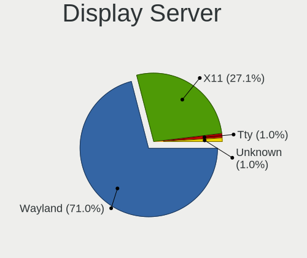
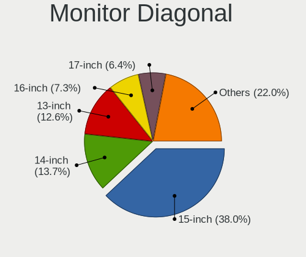
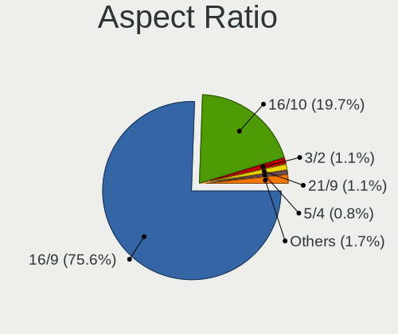

Ubuntu Hardware Trends (Notebook)
---------------------------------

A project to identify most popular hardware characteristics and track their change
over time based on data collected by Ubuntu users at https://Linux-Hardware.org.

Anyone can contribute to the study by uploading probes of their computers by
the [hw-probe](https://github.com/linuxhw/hw-probe) tool:

    sudo -E hw-probe -all -upload

Full-feature report is available here: https://linux-hardware.org/?view=trends&formfactor=notebook

Period: Mar, 2021.

Contents
--------

- [ OS                       ](#os)
- [ OS Family                ](#os-family)
- [ Kernel                   ](#kernel)
- [ Kernel Family            ](#kernel-family)
- [ Kernel Major Ver.        ](#kernel-major-ver)
- [ Arch                     ](#arch)
- [ DE                       ](#de)
- [ Display Server           ](#display-server)
- [ Display Manager          ](#display-manager)
- [ OS Lang                  ](#os-lang)
- [ Boot Mode                ](#boot-mode)
- [ Filesystem               ](#filesystem)
- [ Part. scheme             ](#part-scheme)
- [ Dual Boot with Linux/BSD ](#dual-boot-with-linux/bsd)
- [ Dual Boot (Win)          ](#dual-boot-win)
- [ Country                  ](#country)
- [ City                     ](#city)
- [ Vendor                   ](#vendor)
- [ Model                    ](#model)
- [ Model Family             ](#model-family)
- [ MFG Year                 ](#mfg-year)
- [ Form Factor              ](#form-factor)
- [ Secure Boot              ](#secure-boot)
- [ Coreboot                 ](#coreboot)
- [ RAM Size                 ](#ram-size)
- [ RAM Used                 ](#ram-used)
- [ Has CD-ROM               ](#has-cd-rom)
- [ Total Drives             ](#total-drives)
- [ Has Ethernet             ](#has-ethernet)
- [ Has WiFi                 ](#has-wifi)
- [ Has Bluetooth            ](#has-bluetooth)
- [ Drive Vendor             ](#drive-vendor)
- [ Drive Model              ](#drive-model)
- [ HDD Vendor               ](#hdd-vendor)
- [ SSD Vendor               ](#ssd-vendor)
- [ Drive Kind               ](#drive-kind)
- [ Drive Connector          ](#drive-connector)
- [ Drive Size               ](#drive-size)
- [ Space Total              ](#space-total)
- [ Space Used               ](#space-used)
- [ Malfunc. Drives          ](#malfunc-drives)
- [ Malfunc. Drive Vendor    ](#malfunc-drive-vendor)
- [ Malfunc. HDD Vendor      ](#malfunc-hdd-vendor)
- [ Malfunc. Drive Kind      ](#malfunc-drive-kind)
- [ Failed Drives            ](#failed-drives)
- [ Failed Drive Vendor      ](#failed-drive-vendor)
- [ Drive Status             ](#drive-status)
- [ Storage Vendor           ](#storage-vendor)
- [ Storage Model            ](#storage-model)
- [ Storage Kind             ](#storage-kind)
- [ CPU Vendor               ](#cpu-vendor)
- [ CPU Model                ](#cpu-model)
- [ CPU Model Family         ](#cpu-model-family)
- [ CPU Cores                ](#cpu-cores)
- [ CPU Sockets              ](#cpu-sockets)
- [ CPU Threads              ](#cpu-threads)
- [ CPU Op-Modes             ](#cpu-op-modes)
- [ CPU Microcode            ](#cpu-microcode)
- [ CPU Microarch            ](#cpu-microarch)
- [ GPU Vendor               ](#gpu-vendor)
- [ GPU Model                ](#gpu-model)
- [ GPU Combo                ](#gpu-combo)
- [ GPU Driver               ](#gpu-driver)
- [ GPU Memory               ](#gpu-memory)
- [ Monitor Vendor           ](#monitor-vendor)
- [ Monitor Model            ](#monitor-model)
- [ Monitor Resolution       ](#monitor-resolution)
- [ Monitor Diagonal         ](#monitor-diagonal)
- [ Monitor Width            ](#monitor-width)
- [ Aspect Ratio             ](#aspect-ratio)
- [ Monitor Area             ](#monitor-area)
- [ Pixel Density            ](#pixel-density)
- [ Multiple Monitors        ](#multiple-monitors)
- [ Net Controller Vendor    ](#net-controller-vendor)
- [ Net Controller Model     ](#net-controller-model)
- [ Wireless Vendor          ](#wireless-vendor)
- [ Wireless Model           ](#wireless-model)
- [ Ethernet Vendor          ](#ethernet-vendor)
- [ Ethernet Model           ](#ethernet-model)
- [ Net Controller Kind      ](#net-controller-kind)
- [ Used Controller          ](#used-controller)
- [ NICs                     ](#nics)
- [ IPv6                     ](#ipv6)
- [ Memory Vendor            ](#memory-vendor)
- [ Memory Model             ](#memory-model)
- [ Memory Kind              ](#memory-kind)
- [ Memory Form Factor       ](#memory-form-factor)
- [ Memory Size              ](#memory-size)
- [ Memory Speed             ](#memory-speed)
- [ Sound Vendor             ](#sound-vendor)
- [ Sound Model              ](#sound-model)
- [ Camera Vendor            ](#camera-vendor)
- [ Camera Model             ](#camera-model)
- [ Fingerprint Vendor       ](#fingerprint-vendor)
- [ Fingerprint Model        ](#fingerprint-model)
- [ Chipcard Vendor          ](#chipcard-vendor)
- [ Chipcard Model           ](#chipcard-model)
- [ Printer Vendor           ](#printer-vendor)
- [ Printer Model            ](#printer-model)
- [ Scanner Vendor           ](#scanner-vendor)
- [ Scanner Model            ](#scanner-model)
- [ Bluetooth Vendor         ](#bluetooth-vendor)
- [ Bluetooth Model          ](#bluetooth-model)
- [ Unsupported Devices      ](#unsupported-devices)
- [ Unsupported Device Types ](#unsupported-device-types)

OS
--

Installed operating systems

| Name           | Notebooks | Percent |
|----------------|-----------|---------|
| Ubuntu 20.04   | 568       | 70.82%  |
| Ubuntu 20.10   | 134       | 16.71%  |
| Ubuntu 18.04   | 79        | 9.85%   |
| Ubuntu 16.04   | 7         | 0.87%   |
| Ubuntu 21.04   | 6         | 0.75%   |
| Ubuntu         | 3         | 0.37%   |
| Ubuntu 10      | 2         | 0.25%   |
| Ubuntu Core 16 | 1         | 0.12%   |
| Ubuntu 2020    | 1         | 0.12%   |
| Ubuntu 19.04   | 1         | 0.12%   |

OS Family
---------

OS without a version

| Name   | Notebooks | Percent |
|--------|-----------|---------|
| Ubuntu | 802       | 100%    |

Kernel
------

Version of the Linux kernel

| Version                   | Notebooks | Percent |
|---------------------------|-----------|---------|
| 5.8.0-44-generic          | 244       | 30.42%  |
| 5.8.0-45-generic          | 142       | 17.71%  |
| 5.8.0-48-generic          | 108       | 13.47%  |
| 5.4.0-66-generic          | 70        | 8.73%   |
| 5.4.0-67-generic          | 46        | 5.74%   |
| 5.8.0-43-generic          | 29        | 3.62%   |
| 5.4.0-70-generic          | 18        | 2.24%   |
| 4.15.0-136-generic        | 13        | 1.62%   |
| 5.4.0-42-generic          | 12        | 1.5%    |
| 5.8.0-41-generic          | 8         | 1%      |
| 5.8.0-25-generic          | 7         | 0.87%   |
| 5.6.0-1048-oem            | 6         | 0.75%   |
| 5.4.0-58-generic          | 6         | 0.75%   |
| 4.15.0-139-generic        | 6         | 0.75%   |
| 5.4.0-65-generic          | 4         | 0.5%    |
| 5.4.0-26-generic          | 4         | 0.5%    |
| 5.11.0-11-generic         | 3         | 0.37%   |
| 5.11.0-051100-generic     | 3         | 0.37%   |
| 4.15.0-137-generic        | 3         | 0.37%   |
| 5.8.0-49-generic          | 2         | 0.25%   |
| 5.8.0-42-generic          | 2         | 0.25%   |
| 5.8.0-36-generic          | 2         | 0.25%   |
| 5.4.0-39-generic          | 2         | 0.25%   |
| 5.12.0-051200rc2-generic  | 2         | 0.25%   |
| 5.11.6-051106-generic     | 2         | 0.25%   |
| 5.11.3-051103-generic     | 2         | 0.25%   |
| 5.11.10-051110-generic    | 2         | 0.25%   |
| 4.4.0-204-generic         | 2         | 0.25%   |
| 4.15.0-45-generic         | 2         | 0.25%   |
| 4.15.0-135-generic        | 2         | 0.25%   |
| 4.15.0-128-generic        | 2         | 0.25%   |
| 4.15.0-112-generic        | 2         | 0.25%   |
| 5.9.0-050900-generic      | 1         | 0.12%   |
| 5.8.18-050818-generic     | 1         | 0.12%   |
| 5.8.14-amd64-desktop      | 1         | 0.12%   |
| 5.8.1-mbp                 | 1         | 0.12%   |
| 5.8.0-43-lowlatency       | 1         | 0.12%   |
| 5.8.0-38-generic          | 1         | 0.12%   |
| 5.8.0-14-generic          | 1         | 0.12%   |
| 5.8.0-1022-oracle         | 1         | 0.12%   |
| 5.7.1-050701-generic      | 1         | 0.12%   |
| 5.6.6-050606-generic      | 1         | 0.12%   |
| 5.6.10-mbp                | 1         | 0.12%   |
| 5.6.0-1052-oem            | 1         | 0.12%   |
| 5.6.0-1047-oem            | 1         | 0.12%   |
| 5.4.0-67-lowlatency       | 1         | 0.12%   |
| 5.4.0-60-generic          | 1         | 0.12%   |
| 5.4.0-56-generic          | 1         | 0.12%   |
| 5.4.0-53-generic          | 1         | 0.12%   |
| 5.4.0-48-generic          | 1         | 0.12%   |
| 5.4.0-47-generic          | 1         | 0.12%   |
| 5.4.0-45-generic          | 1         | 0.12%   |
| 5.3.0-28-generic          | 1         | 0.12%   |
| 5.12.0-051200rc3-generic  | 1         | 0.12%   |
| 5.11.5-051105-generic     | 1         | 0.12%   |
| 5.11.5                    | 1         | 0.12%   |
| 5.11.4-051104-generic     | 1         | 0.12%   |
| 5.11.0-1.1-liquorix-amd64 | 1         | 0.12%   |
| 5.11.0-051100-lowlatency  | 1         | 0.12%   |
| 5.10.4-051004-generic     | 1         | 0.12%   |

Kernel Family
-------------

Linux kernel without a distro release

| Version  | Notebooks | Percent |
|----------|-----------|---------|
| 5.8.0    | 548       | 68.33%  |
| 5.4.0    | 169       | 21.07%  |
| 4.15.0   | 35        | 4.36%   |
| 5.6.0    | 8         | 1%      |
| 5.11.0   | 8         | 1%      |
| 5.12.0   | 3         | 0.37%   |
| 4.4.0    | 3         | 0.37%   |
| 5.11.6   | 2         | 0.25%   |
| 5.11.5   | 2         | 0.25%   |
| 5.11.3   | 2         | 0.25%   |
| 5.11.10  | 2         | 0.25%   |
| 5.0.0    | 2         | 0.25%   |
| 5.9.0    | 1         | 0.12%   |
| 5.8.18   | 1         | 0.12%   |
| 5.8.14   | 1         | 0.12%   |
| 5.8.1    | 1         | 0.12%   |
| 5.7.1    | 1         | 0.12%   |
| 5.6.6    | 1         | 0.12%   |
| 5.6.10   | 1         | 0.12%   |
| 5.3.0    | 1         | 0.12%   |
| 5.11.4   | 1         | 0.12%   |
| 5.10.4   | 1         | 0.12%   |
| 5.10.24  | 1         | 0.12%   |
| 5.10.23  | 1         | 0.12%   |
| 5.10.21  | 1         | 0.12%   |
| 5.10.0   | 1         | 0.12%   |
| 4.19.177 | 1         | 0.12%   |
| 4.19.140 | 1         | 0.12%   |
| 4.18.0   | 1         | 0.12%   |
| 4.13.0   | 1         | 0.12%   |

Kernel Major Ver.
-----------------

Linux kernel major version

| Version | Notebooks | Percent |
|---------|-----------|---------|
| 5.8     | 551       | 68.7%   |
| 5.4     | 169       | 21.07%  |
| 4.15    | 35        | 4.36%   |
| 5.11    | 17        | 2.12%   |
| 5.6     | 10        | 1.25%   |
| 5.10    | 5         | 0.62%   |
| 5.12    | 3         | 0.37%   |
| 4.4     | 3         | 0.37%   |
| 5.0     | 2         | 0.25%   |
| 4.19    | 2         | 0.25%   |
| 5.9     | 1         | 0.12%   |
| 5.7     | 1         | 0.12%   |
| 5.3     | 1         | 0.12%   |
| 4.18    | 1         | 0.12%   |
| 4.13    | 1         | 0.12%   |

Arch
----

OS architecture (x86_64, i586, etc.)

| Name   | Notebooks | Percent |
|--------|-----------|---------|
| x86_64 | 789       | 98.38%  |
| i686   | 13        | 1.62%   |

DE
--

Desktop Environment

| Name            | Notebooks | Percent |
|-----------------|-----------|---------|
| GNOME           | 683       | 85.16%  |
| Unknown         | 87        | 10.85%  |
| Unity           | 12        | 1.5%    |
| X-Cinnamon      | 10        | 1.25%   |
| i3              | 3         | 0.37%   |
| GNOME Flashback | 3         | 0.37%   |
| ICEWM           | 1         | 0.12%   |
| enlightenment   | 1         | 0.12%   |
| Deepin          | 1         | 0.12%   |
| Cinnamon        | 1         | 0.12%   |

Display Server
--------------

X11 or Wayland

| Name    | Notebooks | Percent |
|---------|-----------|---------|
| X11     | 715       | 89.15%  |
| Unknown | 46        | 5.74%   |
| Wayland | 36        | 4.49%   |
| Tty     | 5         | 0.62%   |

Display Manager
---------------

SDDM, LightDM, etc.

| Name    | Notebooks | Percent |
|---------|-----------|---------|
| Unknown | 564       | 70.32%  |
| GDM     | 227       | 28.3%   |
| TDM     | 8         | 1%      |
| SDDM    | 1         | 0.12%   |
| LightDM | 1         | 0.12%   |
| GDM3    | 1         | 0.12%   |

OS Lang
-------

Language

| Lang    | Notebooks | Percent |
|---------|-----------|---------|
| en_US   | 325       | 40.52%  |
| de_DE   | 71        | 8.85%   |
| fr_FR   | 48        | 5.99%   |
| pt_BR   | 44        | 5.49%   |
| en_GB   | 44        | 5.49%   |
| en_IN   | 35        | 4.36%   |
| es_ES   | 25        | 3.12%   |
| ru_RU   | 24        | 2.99%   |
| it_IT   | 24        | 2.99%   |
| pl_PL   | 17        | 2.12%   |
| en_CA   | 15        | 1.87%   |
| en_AU   | 13        | 1.62%   |
| cs_CZ   | 10        | 1.25%   |
| nl_NL   | 8         | 1%      |
| hu_HU   | 6         | 0.75%   |
| es_MX   | 6         | 0.75%   |
| es_AR   | 6         | 0.75%   |
| tr_TR   | 5         | 0.62%   |
| es_CO   | 5         | 0.62%   |
| en_ZA   | 5         | 0.62%   |
| pt_PT   | 4         | 0.5%    |
| es_CL   | 4         | 0.5%    |
| C       | 4         | 0.5%    |
| Unknown | 4         | 0.5%    |
| zh_CN   | 3         | 0.37%   |
| sv_SE   | 3         | 0.37%   |
| ja_JP   | 3         | 0.37%   |
| fi_FI   | 3         | 0.37%   |
| de_CH   | 3         | 0.37%   |
| da_DK   | 3         | 0.37%   |
| ru_UA   | 2         | 0.25%   |
| ro_RO   | 2         | 0.25%   |
| fr_CA   | 2         | 0.25%   |
| fr_BE   | 2         | 0.25%   |
| es_PE   | 2         | 0.25%   |
| en_PH   | 2         | 0.25%   |
| en_NZ   | 2         | 0.25%   |
| en_IE   | 2         | 0.25%   |
| de_IT   | 2         | 0.25%   |
| ca_ES   | 2         | 0.25%   |
| zh_TW   | 1         | 0.12%   |
| sk_SK   | 1         | 0.12%   |
| lt_LT   | 1         | 0.12%   |
| id_ID   | 1         | 0.12%   |
| fr_CH   | 1         | 0.12%   |
| es_SV   | 1         | 0.12%   |
| es_CR   | 1         | 0.12%   |
| en_ZW   | 1         | 0.12%   |
| en_NG   | 1         | 0.12%   |
| en_IL   | 1         | 0.12%   |
| en_AG   | 1         | 0.12%   |
| de_AT   | 1         | 0.12%   |

Boot Mode
---------

EFI or BIOS

| Mode | Notebooks | Percent |
|------|-----------|---------|
| EFI  | 428       | 53.37%  |
| BIOS | 374       | 46.63%  |

Filesystem
----------

Type of filesystem

| Type     | Notebooks | Percent |
|----------|-----------|---------|
| Ext4     | 769       | 95.89%  |
| Overlay  | 15        | 1.87%   |
| Zfs      | 12        | 1.5%    |
| Ext2     | 2         | 0.25%   |
| Btrfs    | 2         | 0.25%   |
| Xfs      | 1         | 0.12%   |
| Reiserfs | 1         | 0.12%   |

Part. scheme
------------

Scheme of partitioning

| Type    | Notebooks | Percent |
|---------|-----------|---------|
| Unknown | 566       | 70.57%  |
| GPT     | 200       | 24.94%  |
| MBR     | 36        | 4.49%   |

Dual Boot with Linux/BSD
------------------------

Hosting more than one Linux/BSD

| Dual boot | Notebooks | Percent |
|-----------|-----------|---------|
| No        | 738       | 92.02%  |
| Yes       | 64        | 7.98%   |

Dual Boot (Win)
---------------

Hosting Linux and Windows

| Dual boot | Notebooks | Percent |
|-----------|-----------|---------|
| No        | 501       | 62.47%  |
| Yes       | 301       | 37.53%  |

Country
-------

Geographic location (country)

| Country      | Notebooks | Percent |
|--------------|-----------|---------|
| USA          | 125       | 15.59%  |
| Germany      | 89        | 11.1%   |
| Brazil       | 60        | 7.48%   |
| France       | 52        | 6.48%   |
| India        | 38        | 4.74%   |
| UK           | 34        | 4.24%   |
| Spain        | 33        | 4.11%   |
| Italy        | 30        | 3.74%   |
| Russia       | 27        | 3.37%   |
| Netherlands  | 19        | 2.37%   |
| Poland       | 18        | 2.24%   |
| Canada       | 18        | 2.24%   |
| Turkey       | 14        | 1.75%   |
| Czechia      | 14        | 1.75%   |
| Ukraine      | 13        | 1.62%   |
| Australia    | 11        | 1.37%   |
| Portugal     | 9         | 1.12%   |
| Mexico       | 9         | 1.12%   |
| Hungary      | 9         | 1.12%   |
| Finland      | 9         | 1.12%   |
| Sweden       | 7         | 0.87%   |
| South Africa | 7         | 0.87%   |
| Switzerland  | 6         | 0.75%   |
| Romania      | 6         | 0.75%   |
| Japan        | 6         | 0.75%   |
| Denmark      | 6         | 0.75%   |
| Colombia     | 6         | 0.75%   |
| Chile        | 6         | 0.75%   |
| Belgium      | 6         | 0.75%   |
| Austria      | 6         | 0.75%   |
| Argentina    | 6         | 0.75%   |
| Belarus      | 5         | 0.62%   |
| Vietnam      | 4         | 0.5%    |
| Pakistan     | 4         | 0.5%    |
| Norway       | 4         | 0.5%    |
| Israel       | 4         | 0.5%    |
| Ireland      | 4         | 0.5%    |
| Taiwan       | 3         | 0.37%   |
| Slovenia     | 3         | 0.37%   |
| Philippines  | 3         | 0.37%   |
| Kenya        | 3         | 0.37%   |
| Kazakhstan   | 3         | 0.37%   |
| Iran         | 3         | 0.37%   |
| Egypt        | 3         | 0.37%   |
| China        | 3         | 0.37%   |
| Bulgaria     | 3         | 0.37%   |
| Bangladesh   | 3         | 0.37%   |
| Singapore    | 2         | 0.25%   |
| Serbia       | 2         | 0.25%   |
| Peru         | 2         | 0.25%   |
| New Zealand  | 2         | 0.25%   |
| Morocco      | 2         | 0.25%   |
| Malta        | 2         | 0.25%   |
| Malaysia     | 2         | 0.25%   |
| Lithuania    | 2         | 0.25%   |
| Indonesia    | 2         | 0.25%   |
| Greenland    | 2         | 0.25%   |
| Georgia      | 2         | 0.25%   |
| Zimbabwe     | 1         | 0.12%   |
| Venezuela    | 1         | 0.12%   |

City
----

Geographic location (city)

| City              | Notebooks | Percent |
|-------------------|-----------|---------|
| São Paulo        | 12        | 1.5%    |
| Moscow            | 9         | 1.12%   |
| Madrid            | 9         | 1.12%   |
| Berlin            | 9         | 1.12%   |
| Istanbul          | 8         | 1%      |
| Paris             | 7         | 0.87%   |
| Frankfurt am Main | 7         | 0.87%   |
| Bengaluru         | 7         | 0.87%   |
| Prague            | 6         | 0.75%   |
| Montreal          | 5         | 0.62%   |
| London            | 5         | 0.62%   |
| Chennai           | 5         | 0.62%   |
| Warsaw            | 4         | 0.5%    |
| Vienna            | 4         | 0.5%    |
| St Petersburg     | 4         | 0.5%    |
| Minsk             | 4         | 0.5%    |
| Kyiv              | 4         | 0.5%    |
| Hamburg           | 4         | 0.5%    |
| Amsterdam         | 4         | 0.5%    |
| Rio de Janeiro    | 3         | 0.37%   |
| Nairobi           | 3         | 0.37%   |
| Medellín         | 3         | 0.37%   |
| Krakow            | 3         | 0.37%   |
| Johannesburg      | 3         | 0.37%   |
| Dublin            | 3         | 0.37%   |
| Cape Town         | 3         | 0.37%   |
| Bordeaux          | 3         | 0.37%   |
| Barcelona         | 3         | 0.37%   |
| Zurich            | 2         | 0.25%   |
| Yekaterinburg     | 2         | 0.25%   |
| Weiden            | 2         | 0.25%   |
| Veszprém         | 2         | 0.25%   |
| Toulouse          | 2         | 0.25%   |
| Ternopil          | 2         | 0.25%   |
| Tel Aviv          | 2         | 0.25%   |
| Tbilisi           | 2         | 0.25%   |
| Tampere           | 2         | 0.25%   |
| Stuttgart         | 2         | 0.25%   |
| Stockholm         | 2         | 0.25%   |
| Sofia             | 2         | 0.25%   |
| Singapore         | 2         | 0.25%   |
| Schenefeld        | 2         | 0.25%   |
| Santiago          | 2         | 0.25%   |
| Rome              | 2         | 0.25%   |
| Rheine            | 2         | 0.25%   |
| Pune              | 2         | 0.25%   |
| Porto             | 2         | 0.25%   |
| Plymouth          | 2         | 0.25%   |
| Perth             | 2         | 0.25%   |
| Nuuk              | 2         | 0.25%   |
| Nottingham        | 2         | 0.25%   |
| New York          | 2         | 0.25%   |
| New Taipei        | 2         | 0.25%   |
| New Delhi         | 2         | 0.25%   |
| Neu-Ulm           | 2         | 0.25%   |
| Neptune City      | 2         | 0.25%   |
| Munich            | 2         | 0.25%   |
| Mosbach           | 2         | 0.25%   |
| Milan             | 2         | 0.25%   |
| Miami             | 2         | 0.25%   |

Vendor
------

Motherboard manufacturer

| Name                             | Notebooks | Percent |
|----------------------------------|-----------|---------|
| Hewlett-Packard                  | 168       | 20.95%  |
| Dell                             | 156       | 19.45%  |
| Lenovo                           | 152       | 18.95%  |
| ASUSTek Computer                 | 86        | 10.72%  |
| Acer                             | 75        | 9.35%   |
| Toshiba                          | 23        | 2.87%   |
| Apple                            | 18        | 2.24%   |
| Sony                             | 16        | 2%      |
| MSI                              | 15        | 1.87%   |
| Samsung Electronics              | 11        | 1.37%   |
| Packard Bell                     | 7         | 0.87%   |
| Notebook                         | 5         | 0.62%   |
| Medion                           | 5         | 0.62%   |
| Google                           | 5         | 0.62%   |
| Fujitsu                          | 5         | 0.62%   |
| HUAWEI                           | 4         | 0.5%    |
| Unknown                          | 4         | 0.5%    |
| TUXEDO                           | 3         | 0.37%   |
| Timi                             | 3         | 0.37%   |
| Razer                            | 3         | 0.37%   |
| Fujitsu Siemens                  | 3         | 0.37%   |
| Clevo                            | 3         | 0.37%   |
| Alienware                        | 3         | 0.37%   |
| TrekStor                         | 2         | 0.25%   |
| System76                         | 2         | 0.25%   |
| Positivo                         | 2         | 0.25%   |
| IP3 Tech                         | 2         | 0.25%   |
| Gateway                          | 2         | 0.25%   |
| Semp Toshiba                     | 1         | 0.12%   |
| PC Specialist                    | 1         | 0.12%   |
| Panasonic                        | 1         | 0.12%   |
| ODM                              | 1         | 0.12%   |
| Minix                            | 1         | 0.12%   |
| Microtech                        | 1         | 0.12%   |
| Megaware                         | 1         | 0.12%   |
| Mediacom                         | 1         | 0.12%   |
| LG Electronics                   | 1         | 0.12%   |
| IDEALMAX                         | 1         | 0.12%   |
| FUJITSU CLIENT COMPUTING LIMITED | 1         | 0.12%   |
| Exo                              | 1         | 0.12%   |
| eMachines                        | 1         | 0.12%   |
| Dynabook                         | 1         | 0.12%   |
| Compal                           | 1         | 0.12%   |
| Chuwi                            | 1         | 0.12%   |
| AVITA                            | 1         | 0.12%   |
| ARCELIK                          | 1         | 0.12%   |
| Alcor                            | 1         | 0.12%   |

Model
-----

Motherboard model

| Name                                  | Notebooks | Percent |
|---------------------------------------|-----------|---------|
| HP Notebook                           | 11        | 1.37%   |
| Unknown                               | 7         | 0.87%   |
| HP Pavilion dv7                       | 4         | 0.5%    |
| Dell XPS 15 9500                      | 4         | 0.5%    |
| Lenovo Legion 5 15ARH05 82B5          | 3         | 0.37%   |
| Lenovo G400s VILG1                    | 3         | 0.37%   |
| HP Pavilion Notebook                  | 3         | 0.37%   |
| HP Pavilion g7                        | 3         | 0.37%   |
| HP Pavilion dv9700                    | 3         | 0.37%   |
| HP Pavilion dv6                       | 3         | 0.37%   |
| HP Pavilion 15                        | 3         | 0.37%   |
| HP Laptop 15-da0xxx                   | 3         | 0.37%   |
| HP EliteBook 8440p                    | 3         | 0.37%   |
| Dell XPS 15 7590                      | 3         | 0.37%   |
| Dell XPS 13 7390                      | 3         | 0.37%   |
| Dell Precision 5550                   | 3         | 0.37%   |
| Dell Latitude E6410                   | 3         | 0.37%   |
| Dell Latitude E5450                   | 3         | 0.37%   |
| Dell Latitude E5440                   | 3         | 0.37%   |
| Dell Latitude 7300                    | 3         | 0.37%   |
| Dell Inspiron 7577                    | 3         | 0.37%   |
| Dell G3 3500                          | 3         | 0.37%   |
| ASUS ROG Zephyrus G14 GA401IV_GA401IV | 3         | 0.37%   |
| Apple MacBookPro9,2                   | 3         | 0.37%   |
| Apple MacBookPro8,1                   | 3         | 0.37%   |
| Acer Aspire A515-44                   | 3         | 0.37%   |
| System76 Gazelle                      | 2         | 0.25%   |
| Razer Blade                           | 2         | 0.25%   |
| Positivo MOBILE                       | 2         | 0.25%   |
| Packard Bell EasyNote TS11HR          | 2         | 0.25%   |
| MSI GL65 9SD                          | 2         | 0.25%   |
| Lenovo V130-15IKB 81HN                | 2         | 0.25%   |
| Lenovo ThinkPad W530 24491D1          | 2         | 0.25%   |
| Lenovo ThinkPad T14 Gen 1 20UES2WA00  | 2         | 0.25%   |
| Lenovo IdeaPad S540-15IWL D 81NE      | 2         | 0.25%   |
| Lenovo IdeaPad L340-15IRH Gaming 81LK | 2         | 0.25%   |
| Lenovo IdeaPad 320S-14IKB 80X4        | 2         | 0.25%   |
| Lenovo G500 20236                     | 2         | 0.25%   |
| Lenovo G50-45 80E3                    | 2         | 0.25%   |
| IP3 Tech X30                          | 2         | 0.25%   |
| HUAWEI NBLK-WAX9X                     | 2         | 0.25%   |
| HP ZBook 15 G3                        | 2         | 0.25%   |
| HP ProBook 650 G5                     | 2         | 0.25%   |
| HP ProBook 640 G1                     | 2         | 0.25%   |
| HP ProBook 450 G6                     | 2         | 0.25%   |
| HP Pavilion g6                        | 2         | 0.25%   |
| HP Laptop 17-ca1xxx                   | 2         | 0.25%   |
| HP Laptop 15-dy1xxx                   | 2         | 0.25%   |
| HP Laptop 15-dw1xxx                   | 2         | 0.25%   |
| HP G62                                | 2         | 0.25%   |
| HP EliteBook 845 G7 Notebook PC       | 2         | 0.25%   |
| HP EliteBook 840 G7 Notebook PC       | 2         | 0.25%   |
| HP EliteBook 840 G4                   | 2         | 0.25%   |
| HP EliteBook 840 G3                   | 2         | 0.25%   |
| HP EliteBook 840 G2                   | 2         | 0.25%   |
| HP EliteBook 2560p                    | 2         | 0.25%   |
| HP Compaq 6710b (GR680ET#ABD)         | 2         | 0.25%   |
| HP 255 G7 Notebook PC                 | 2         | 0.25%   |
| HP 245 G7 Notebook PC                 | 2         | 0.25%   |
| Google Cyan                           | 2         | 0.25%   |

Model Family
------------

Motherboard model prefix

| Name                  | Notebooks | Percent |
|-----------------------|-----------|---------|
| Lenovo ThinkPad       | 81        | 10.1%   |
| Dell Latitude         | 53        | 6.61%   |
| Acer Aspire           | 52        | 6.48%   |
| Dell Inspiron         | 46        | 5.74%   |
| HP Pavilion           | 37        | 4.61%   |
| Lenovo IdeaPad        | 33        | 4.11%   |
| HP EliteBook          | 32        | 3.99%   |
| HP ProBook            | 25        | 3.12%   |
| Dell XPS              | 22        | 2.74%   |
| Toshiba Satellite     | 19        | 2.37%   |
| HP Laptop             | 15        | 1.87%   |
| Dell Precision        | 14        | 1.75%   |
| HP Notebook           | 11        | 1.37%   |
| Dell Vostro           | 10        | 1.25%   |
| HP ZBook              | 8         | 1%      |
| HP Compaq             | 8         | 1%      |
| ASUS ZenBook          | 8         | 1%      |
| ASUS VivoBook         | 8         | 1%      |
| Dell G3               | 7         | 0.87%   |
| Acer Swift            | 7         | 0.87%   |
| Unknown               | 7         | 0.87%   |
| Packard Bell EasyNote | 6         | 0.75%   |
| ASUS ROG              | 6         | 0.75%   |
| Lenovo Legion         | 5         | 0.62%   |
| Fujitsu LIFEBOOK      | 5         | 0.62%   |
| Lenovo ThinkBook      | 4         | 0.5%    |
| HP ENVY               | 4         | 0.5%    |
| HP 250                | 4         | 0.5%    |
| Acer TravelMate       | 4         | 0.5%    |
| Acer Nitro            | 4         | 0.5%    |
| Razer Blade           | 3         | 0.37%   |
| Lenovo G400s          | 3         | 0.37%   |
| ASUS ASUS             | 3         | 0.37%   |
| Apple MacBookPro9     | 3         | 0.37%   |
| Apple MacBookPro8     | 3         | 0.37%   |
| Acer Predator         | 3         | 0.37%   |
| TrekStor Surfbook     | 2         | 0.25%   |
| Toshiba PORTEGE       | 2         | 0.25%   |
| Toshiba dynabook      | 2         | 0.25%   |
| System76 Gazelle      | 2         | 0.25%   |
| Positivo Mobile       | 2         | 0.25%   |
| Notebook W65          | 2         | 0.25%   |
| MSI Modern            | 2         | 0.25%   |
| MSI GS75              | 2         | 0.25%   |
| MSI GL65              | 2         | 0.25%   |
| Medion Akoya          | 2         | 0.25%   |
| Lenovo Yoga           | 2         | 0.25%   |
| Lenovo V130-15IKB     | 2         | 0.25%   |
| Lenovo G500           | 2         | 0.25%   |
| Lenovo G50-80         | 2         | 0.25%   |
| Lenovo G50-45         | 2         | 0.25%   |
| IP3 Tech X30          | 2         | 0.25%   |
| HUAWEI NBLK-WAX9X     | 2         | 0.25%   |
| HP Stream             | 2         | 0.25%   |
| HP OMEN               | 2         | 0.25%   |
| HP G62                | 2         | 0.25%   |
| HP 255                | 2         | 0.25%   |
| HP 245                | 2         | 0.25%   |
| HP 240                | 2         | 0.25%   |
| HP 15                 | 2         | 0.25%   |

MFG Year
--------

Motherboard manufacture year

| Year | Notebooks | Percent |
|------|-----------|---------|
| 2020 | 199       | 24.81%  |
| 2019 | 105       | 13.09%  |
| 2018 | 69        | 8.6%    |
| 2011 | 57        | 7.11%   |
| 2013 | 51        | 6.36%   |
| 2017 | 45        | 5.61%   |
| 2012 | 43        | 5.36%   |
| 2014 | 40        | 4.99%   |
| 2016 | 38        | 4.74%   |
| 2010 | 38        | 4.74%   |
| 2021 | 29        | 3.62%   |
| 2015 | 29        | 3.62%   |
| 2008 | 27        | 3.37%   |
| 2009 | 22        | 2.74%   |
| 2007 | 7         | 0.87%   |
| 2006 | 3         | 0.37%   |

Form Factor
-----------

Physical design of the computer

| Name     | Notebooks | Percent |
|----------|-----------|---------|
| Notebook | 802       | 100%    |

Secure Boot
-----------

Enabled or disabled

| State    | Notebooks | Percent |
|----------|-----------|---------|
| Disabled | 675       | 84.16%  |
| Enabled  | 127       | 15.84%  |

Coreboot
--------

Have coreboot on board

| Used | Notebooks | Percent |
|------|-----------|---------|
| No   | 794       | 99%     |
| Yes  | 8         | 1%      |

RAM Size
--------

Total RAM memory

| Size in GB  | Notebooks | Percent |
|-------------|-----------|---------|
| 4.01-8.0    | 240       | 29.93%  |
| 3.01-4.0    | 184       | 22.94%  |
| 16.01-24.0  | 154       | 19.2%   |
| 8.01-16.0   | 134       | 16.71%  |
| 32.01-64.0  | 39        | 4.86%   |
| 1.01-2.0    | 30        | 3.74%   |
| 2.01-3.0    | 12        | 1.5%    |
| 24.01-32.0  | 5         | 0.62%   |
| 64.01-256.0 | 3         | 0.37%   |
| 0.51-1.0    | 1         | 0.12%   |

RAM Used
--------

Used RAM memory

| Used GB    | Notebooks | Percent |
|------------|-----------|---------|
| 1.01-2.0   | 314       | 39.15%  |
| 2.01-3.0   | 225       | 28.05%  |
| 4.01-8.0   | 117       | 14.59%  |
| 3.01-4.0   | 103       | 12.84%  |
| 8.01-16.0  | 26        | 3.24%   |
| 0.51-1.0   | 14        | 1.75%   |
| 16.01-24.0 | 2         | 0.25%   |
| 24.01-32.0 | 1         | 0.12%   |

Has CD-ROM
----------

Has CD-ROM on board

| Presented | Notebooks | Percent |
|-----------|-----------|---------|
| No        | 467       | 58.23%  |
| Yes       | 335       | 41.77%  |

Total Drives
------------

Number of drives on board

| Drives | Notebooks | Percent |
|--------|-----------|---------|
| 1      | 587       | 73.19%  |
| 2      | 189       | 23.57%  |
| 3      | 19        | 2.37%   |
| 0      | 5         | 0.62%   |
| 5      | 2         | 0.25%   |

Has Ethernet
------------

Has Ethernet on board

| Presented | Notebooks | Percent |
|-----------|-----------|---------|
| Yes       | 674       | 84.04%  |
| No        | 128       | 15.96%  |

Has WiFi
--------

Has WiFi module

| Presented | Notebooks | Percent |
|-----------|-----------|---------|
| Yes       | 793       | 98.88%  |
| No        | 9         | 1.12%   |

Has Bluetooth
-------------

Has Bluetooth module

| Presented | Notebooks | Percent |
|-----------|-----------|---------|
| Yes       | 607       | 75.69%  |
| No        | 195       | 24.31%  |

Drive Vendor
------------

Hard drive vendors

| Vendor                  | Notebooks | Drives | Percent |
|-------------------------|-----------|--------|---------|
| Samsung Electronics     | 148       | 160    | 15.2%   |
| WDC                     | 128       | 130    | 13.14%  |
| Seagate                 | 116       | 120    | 11.91%  |
| Toshiba                 | 99        | 102    | 10.16%  |
| Sandisk                 | 63        | 63     | 6.47%   |
| Kingston                | 49        | 50     | 5.03%   |
| Unknown                 | 45        | 48     | 4.62%   |
| Hitachi                 | 37        | 38     | 3.8%    |
| Crucial                 | 35        | 35     | 3.59%   |
| SK Hynix                | 33        | 33     | 3.39%   |
| Intel                   | 32        | 35     | 3.29%   |
| HGST                    | 27        | 27     | 2.77%   |
| Micron Technology       | 20        | 20     | 2.05%   |
| A-DATA Technology       | 16        | 16     | 1.64%   |
| LITEON                  | 13        | 13     | 1.33%   |
| KIOXIA                  | 9         | 9      | 0.92%   |
| China                   | 9         | 9      | 0.92%   |
| Apple                   | 9         | 9      | 0.92%   |
| Fujitsu                 | 6         | 6      | 0.62%   |
| PNY                     | 5         | 5      | 0.51%   |
| Intenso                 | 5         | 5      | 0.51%   |
| Solid State Storage     | 4         | 4      | 0.41%   |
| Patriot                 | 4         | 4      | 0.41%   |
| Union Memory (Shenzhen) | 3         | 3      | 0.31%   |
| Union Memory            | 3         | 3      | 0.31%   |
| Team                    | 3         | 3      | 0.31%   |
| SPCC                    | 3         | 3      | 0.31%   |
| Silicon Motion          | 3         | 3      | 0.31%   |
| LITEONIT                | 3         | 3      | 0.31%   |
| Lexar                   | 3         | 3      | 0.31%   |
| JMicron                 | 3         | 3      | 0.31%   |
| Gigabyte Technology     | 3         | 3      | 0.31%   |
| Transcend               | 2         | 2      | 0.21%   |
| Phison                  | 2         | 3      | 0.21%   |
| Mushkin                 | 2         | 2      | 0.21%   |
| Integral                | 2         | 2      | 0.21%   |
| GOODRAM                 | 2         | 2      | 0.21%   |
| External                | 2         | 2      | 0.21%   |
| Corsair                 | 2         | 2      | 0.21%   |
| XrayDisk                | 1         | 1      | 0.1%    |
| XPG                     | 1         | 1      | 0.1%    |
| WD MediaMax             | 1         | 1      | 0.1%    |
| W800S                   | 1         | 1      | 0.1%    |
| TrekStor                | 1         | 1      | 0.1%    |
| TO Exter                | 1         | 1      | 0.1%    |
| SSSTC                   | 1         | 1      | 0.1%    |
| SABRENT                 | 1         | 1      | 0.1%    |
| PLEXTOR                 | 1         | 1      | 0.1%    |
| MARSHAL                 | 1         | 1      | 0.1%    |
| LDLC                    | 1         | 1      | 0.1%    |
| LaCie                   | 1         | 1      | 0.1%    |
| KIOXIA-EXCERIA          | 1         | 1      | 0.1%    |
| KingSpec                | 1         | 1      | 0.1%    |
| KingFast                | 1         | 1      | 0.1%    |
| KingDian                | 1         | 1      | 0.1%    |
| INNOVATION IT           | 1         | 1      | 0.1%    |
| HS-SSD-E100             | 1         | 1      | 0.1%    |
| FORESEE                 | 1         | 1      | 0.1%    |
| BHT                     | 1         | 1      | 0.1%    |
| Apacer                  | 1         | 1      | 0.1%    |

Drive Model
-----------

Hard drive models

| Model                                              | Notebooks | Percent |
|----------------------------------------------------|-----------|---------|
| Seagate ST1000LM035-1RK172 1TB                     | 28        | 2.81%   |
| Toshiba MQ01ABD100 1TB                             | 18        | 1.81%   |
| Samsung NVMe SSD Drive 512GB                       | 15        | 1.51%   |
| Samsung SSD 860 EVO 500GB                          | 12        | 1.2%    |
| Seagate ST1000LM024 HN-M101MBB 1TB                 | 11        | 1.1%    |
| Unknown MMC Card  64GB                             | 10        | 1%      |
| Unknown MMC Card  32GB                             | 10        | 1%      |
| Toshiba MQ04ABF100 1TB                             | 10        | 1%      |
| Intel NVMe SSD Drive 512GB                         | 10        | 1%      |
| Sandisk NVMe SSD Drive 512GB                       | 9         | 0.9%    |
| Samsung NVMe SSD Drive 256GB                       | 9         | 0.9%    |
| Crucial CT240BX500SSD1 240GB                       | 9         | 0.9%    |
| Toshiba MQ01ABF050 500GB                           | 8         | 0.8%    |
| Kingston SA400S37240G 240GB SSD                    | 8         | 0.8%    |
| Toshiba NVMe SSD Drive 512GB                       | 7         | 0.7%    |
| SK Hynix NVMe SSD Drive 512GB                      | 7         | 0.7%    |
| Seagate ST500LM012 HN-M500MBB 500GB                | 7         | 0.7%    |
| Samsung SSD 850 EVO 500GB                          | 7         | 0.7%    |
| Kingston SA400S37480G 480GB SSD                    | 7         | 0.7%    |
| Hitachi HTS545050B9A300 500GB                      | 7         | 0.7%    |
| Seagate ST9500325AS 500GB                          | 6         | 0.6%    |
| Seagate ST1000LM048-2E7172 1TB                     | 6         | 0.6%    |
| Kingston SA400S37120G 120GB SSD                    | 6         | 0.6%    |
| HGST HTS721010A9E630 1TB                           | 6         | 0.6%    |
| WDC WD10JPVX-22JC3T0 1TB                           | 5         | 0.5%    |
| SanDisk SSD PLUS 240GB                             | 5         | 0.5%    |
| Samsung SSD 860 EVO 1TB                            | 5         | 0.5%    |
| WDC WD10JPCX-24UE4T0 1TB                           | 4         | 0.4%    |
| Unknown MMC Card  16GB                             | 4         | 0.4%    |
| Toshiba MQ01ABD075 752GB                           | 4         | 0.4%    |
| Seagate ST500LT012-1DG142 500GB                    | 4         | 0.4%    |
| Seagate ST2000LM007-1R8174 2TB                     | 4         | 0.4%    |
| SanDisk SSD PLUS 120GB                             | 4         | 0.4%    |
| SanDisk SSD PLUS 1000GB                            | 4         | 0.4%    |
| Sandisk NVMe SSD Drive 256GB                       | 4         | 0.4%    |
| Samsung SSD 870 QVO 1TB                            | 4         | 0.4%    |
| Samsung SSD 850 EVO 250GB                          | 4         | 0.4%    |
| Samsung NVMe SSD Drive 1024GB                      | 4         | 0.4%    |
| Intel SSDPEKNW512G8 512GB                          | 4         | 0.4%    |
| Hitachi HTS723232A7A364 320GB                      | 4         | 0.4%    |
| Hitachi HTS545050A7E380 500GB                      | 4         | 0.4%    |
| Hitachi HTS543232A7A384 320GB                      | 4         | 0.4%    |
| HGST HTS725050A7E630 500GB                         | 4         | 0.4%    |
| HGST HTS545050A7E680 500GB                         | 4         | 0.4%    |
| HGST HTS541010A9E680 1TB                           | 4         | 0.4%    |
| Crucial CT1000MX500SSD1 1TB                        | 4         | 0.4%    |
| WDC WDS240G2G0A-00JH30 240GB SSD                   | 3         | 0.3%    |
| WDC WD5000LPVX-75V0TT0 500GB                       | 3         | 0.3%    |
| WDC WD5000BEVT-22A0RT0 500GB                       | 3         | 0.3%    |
| WDC WD3200BEVT-60A23T0 320GB                       | 3         | 0.3%    |
| WDC WD10SPZX-60Z10T0 1TB                           | 3         | 0.3%    |
| WDC WD10JPVX-75JC3T0 1TB                           | 3         | 0.3%    |
| WDC PC SN530 SDBPNPZ-1T00-1002 1TB                 | 3         | 0.3%    |
| WDC PC SN520 SDAPNUW-256G-1006 256GB               | 3         | 0.3%    |
| Unknown MMC Card  8GB                              | 3         | 0.3%    |
| Unknown MMC Card  7GB                              | 3         | 0.3%    |
| Toshiba MQ01ACF050 500GB                           | 3         | 0.3%    |
| Solid State Storage CL1-3D256-Q11 NVMe SSSTC 256GB | 3         | 0.3%    |
| Seagate ST9500420AS 500GB                          | 3         | 0.3%    |
| Seagate ST500LT012-9WS142 500GB                    | 3         | 0.3%    |

HDD Vendor
----------

Hard disk drive vendors

| Vendor              | Notebooks | Drives | Percent |
|---------------------|-----------|--------|---------|
| Seagate             | 112       | 114    | 31.37%  |
| WDC                 | 89        | 90     | 24.93%  |
| Toshiba             | 71        | 71     | 19.89%  |
| Hitachi             | 37        | 38     | 10.36%  |
| HGST                | 27        | 27     | 7.56%   |
| Samsung Electronics | 8         | 8      | 2.24%   |
| Fujitsu             | 6         | 6      | 1.68%   |
| Intenso             | 2         | 2      | 0.56%   |
| Apple               | 2         | 2      | 0.56%   |
| TO Exter            | 1         | 1      | 0.28%   |
| MARSHAL             | 1         | 1      | 0.28%   |
| LaCie               | 1         | 1      | 0.28%   |

SSD Vendor
----------

Solid state drive vendors

| Vendor              | Notebooks | Drives | Percent |
|---------------------|-----------|--------|---------|
| Samsung Electronics | 75        | 82     | 23.73%  |
| Kingston            | 42        | 42     | 13.29%  |
| SanDisk             | 39        | 39     | 12.34%  |
| Crucial             | 33        | 33     | 10.44%  |
| WDC                 | 12        | 12     | 3.8%    |
| Micron Technology   | 12        | 12     | 3.8%    |
| LITEON              | 12        | 12     | 3.8%    |
| A-DATA Technology   | 11        | 11     | 3.48%   |
| SK Hynix            | 9         | 9      | 2.85%   |
| China               | 9         | 9      | 2.85%   |
| Intel               | 6         | 6      | 1.9%    |
| PNY                 | 5         | 5      | 1.58%   |
| Apple               | 5         | 5      | 1.58%   |
| Toshiba             | 4         | 4      | 1.27%   |
| Patriot             | 4         | 4      | 1.27%   |
| Team                | 3         | 3      | 0.95%   |
| LITEONIT            | 3         | 3      | 0.95%   |
| Lexar               | 3         | 3      | 0.95%   |
| Gigabyte Technology | 3         | 3      | 0.95%   |
| Transcend           | 2         | 2      | 0.63%   |
| SPCC                | 2         | 2      | 0.63%   |
| Mushkin             | 2         | 2      | 0.63%   |
| JMicron             | 2         | 2      | 0.63%   |
| GOODRAM             | 2         | 2      | 0.63%   |
| External            | 2         | 2      | 0.63%   |
| W800S               | 1         | 1      | 0.32%   |
| Unknown             | 1         | 1      | 0.32%   |
| Seagate             | 1         | 1      | 0.32%   |
| SABRENT             | 1         | 1      | 0.32%   |
| PLEXTOR             | 1         | 1      | 0.32%   |
| LDLC                | 1         | 1      | 0.32%   |
| KIOXIA-EXCERIA      | 1         | 1      | 0.32%   |
| KingDian            | 1         | 1      | 0.32%   |
| Intenso             | 1         | 1      | 0.32%   |
| Integral            | 1         | 1      | 0.32%   |
| INNOVATION IT       | 1         | 1      | 0.32%   |
| FORESEE             | 1         | 1      | 0.32%   |
| Corsair             | 1         | 1      | 0.32%   |
| Apacer              | 1         | 1      | 0.32%   |

Drive Kind
----------

HDD or SSD

| Kind    | Notebooks | Drives | Percent |
|---------|-----------|--------|---------|
| HDD     | 348       | 361    | 37.02%  |
| SSD     | 297       | 323    | 31.6%   |
| NVMe    | 236       | 257    | 25.11%  |
| MMC     | 42        | 45     | 4.47%   |
| Unknown | 17        | 18     | 1.81%   |

Drive Connector
---------------

SATA, SAS, NVMe, etc.

| Type | Notebooks | Drives | Percent |
|------|-----------|--------|---------|
| SATA | 587       | 670    | 65.66%  |
| NVMe | 236       | 257    | 26.4%   |
| MMC  | 42        | 45     | 4.7%    |
| SAS  | 29        | 32     | 3.24%   |

Drive Size
----------

Size of hard drive

| Size in TB | Notebooks | Drives | Percent |
|------------|-----------|--------|---------|
| 0.01-0.5   | 408       | 444    | 63.75%  |
| 0.51-1.0   | 214       | 221    | 33.44%  |
| 1.01-2.0   | 15        | 15     | 2.34%   |
| 4.01-10.0  | 3         | 4      | 0.47%   |

Space Total
-----------

Amount of disk space available on the file system

| Size in GB     | Notebooks | Percent |
|----------------|-----------|---------|
| 101-250        | 259       | 32.29%  |
| 251-500        | 229       | 28.55%  |
| 501-1000       | 125       | 15.59%  |
| 51-100         | 63        | 7.86%   |
| 21-50          | 42        | 5.24%   |
| 1001-2000      | 40        | 4.99%   |
| 1-20           | 27        | 3.37%   |
| More than 3000 | 7         | 0.87%   |
| 2001-3000      | 7         | 0.87%   |
| Unknown        | 3         | 0.37%   |

Space Used
----------

Amount of used disk space

| Used GB        | Notebooks | Percent |
|----------------|-----------|---------|
| 1-20           | 335       | 41.77%  |
| 21-50          | 151       | 18.83%  |
| 101-250        | 114       | 14.21%  |
| 51-100         | 103       | 12.84%  |
| 251-500        | 52        | 6.48%   |
| 501-1000       | 31        | 3.87%   |
| 1001-2000      | 8         | 1%      |
| More than 3000 | 4         | 0.5%    |
| Unknown        | 3         | 0.37%   |
| 2001-3000      | 1         | 0.12%   |

Malfunc. Drives
---------------

Drive models with a malfunction

| Model                                               | Notebooks | Drives | Percent |
|-----------------------------------------------------|-----------|--------|---------|
| Seagate ST1000LM035-1RK172 1TB                      | 2         | 2      | 5.26%   |
| Hitachi HTS723232A7A364 320GB                       | 2         | 2      | 5.26%   |
| Hitachi HTS545050B9A300 500GB                       | 2         | 2      | 5.26%   |
| WDC WD3200BPVT-80ZEST0 320GB                        | 1         | 1      | 2.63%   |
| WDC WD3200BEVT-60A23T0 320GB                        | 1         | 1      | 2.63%   |
| Toshiba MQ01ABF050 500GB                            | 1         | 1      | 2.63%   |
| Toshiba MQ01ABD100 1TB                              | 1         | 1      | 2.63%   |
| Toshiba MQ01ABD075 752GB                            | 1         | 1      | 2.63%   |
| Toshiba MQ01ABD050 500GB                            | 1         | 1      | 2.63%   |
| Toshiba MK3259GSXP 320GB                            | 1         | 1      | 2.63%   |
| Toshiba MK3252GSX 320GB                             | 1         | 1      | 2.63%   |
| SK Hynix SC401 SATA 512GB SSD                       | 1         | 1      | 2.63%   |
| Seagate ST9500420AS 500GB                           | 1         | 1      | 2.63%   |
| Seagate ST9500325AS 500GB                           | 1         | 1      | 2.63%   |
| Seagate ST500LT015-9WU142 500GB                     | 1         | 1      | 2.63%   |
| Seagate ST2000LM007-1R8174 2TB                      | 1         | 1      | 2.63%   |
| Seagate ST1000LM024 HN-M101MBB 1TB                  | 1         | 1      | 2.63%   |
| Seagate ST1000LM014-1EJ164 1TB                      | 1         | 1      | 2.63%   |
| SanDisk SSD PLUS 1000GB                             | 1         | 1      | 2.63%   |
| Samsung Electronics SSD PM810 mSATA 128GB           | 1         | 1      | 2.63%   |
| Samsung Electronics SSD 850 EVO 250GB               | 1         | 1      | 2.63%   |
| Samsung Electronics HM641JI 640GB                   | 1         | 1      | 2.63%   |
| Micron Technology MTFDDAK256MAY-1AH12ABHA 256GB SSD | 1         | 1      | 2.63%   |
| Micron Technology 1100_MTFDDAV256TBN 256GB SSD      | 1         | 1      | 2.63%   |
| Micron Technology 1100_MTFDDAK512TBN 512GB SSD      | 1         | 1      | 2.63%   |
| LITEON CV8-8E256-HP 256GB SSD                       | 1         | 1      | 2.63%   |
| Intel SSDSCKKF128G8 SATA 128GB                      | 1         | 1      | 2.63%   |
| Intel SSDSC2BF180A5L 180GB                          | 1         | 1      | 2.63%   |
| Hitachi HTS543225L9A300 250GB                       | 1         | 1      | 2.63%   |
| Hitachi HTS542512K9SA00 120GB                       | 1         | 1      | 2.63%   |
| HGST HTS725050A7E630 500GB                          | 1         | 1      | 2.63%   |
| HGST HTS721010A9E630 1TB                            | 1         | 1      | 2.63%   |
| HGST HTS545050A7E680 500GB                          | 1         | 1      | 2.63%   |
| Crucial CT120M500SSD1 120GB                         | 1         | 1      | 2.63%   |
| A-DATA Technology SSD DP900 128GB-DL3               | 1         | 1      | 2.63%   |

Malfunc. Drive Vendor
---------------------

Vendors of faulty drives

| Vendor              | Notebooks | Drives | Percent |
|---------------------|-----------|--------|---------|
| Seagate             | 8         | 8      | 21.05%  |
| Toshiba             | 6         | 6      | 15.79%  |
| Hitachi             | 6         | 6      | 15.79%  |
| Samsung Electronics | 3         | 3      | 7.89%   |
| Micron Technology   | 3         | 3      | 7.89%   |
| HGST                | 3         | 3      | 7.89%   |
| WDC                 | 2         | 2      | 5.26%   |
| Intel               | 2         | 2      | 5.26%   |
| SK Hynix            | 1         | 1      | 2.63%   |
| SanDisk             | 1         | 1      | 2.63%   |
| LITEON              | 1         | 1      | 2.63%   |
| Crucial             | 1         | 1      | 2.63%   |
| A-DATA Technology   | 1         | 1      | 2.63%   |

Malfunc. HDD Vendor
-------------------

Vendors of faulty HDD drives

| Vendor              | Notebooks | Drives | Percent |
|---------------------|-----------|--------|---------|
| Seagate             | 8         | 8      | 30.77%  |
| Toshiba             | 6         | 6      | 23.08%  |
| Hitachi             | 6         | 6      | 23.08%  |
| HGST                | 3         | 3      | 11.54%  |
| WDC                 | 2         | 2      | 7.69%   |
| Samsung Electronics | 1         | 1      | 3.85%   |

Malfunc. Drive Kind
-------------------

Kinds of faulty drives

| Kind | Notebooks | Drives | Percent |
|------|-----------|--------|---------|
| HDD  | 26        | 26     | 68.42%  |
| SSD  | 12        | 12     | 31.58%  |

Failed Drives
-------------

Failed drive models

Zero info for selected period =(

Failed Drive Vendor
-------------------

Failed drive vendors

Zero info for selected period =(

Drive Status
------------

Number of failed and malfunc. drives

| Status   | Notebooks | Drives | Percent |
|----------|-----------|--------|---------|
| Detected | 560       | 698    | 67.88%  |
| Works    | 227       | 268    | 27.52%  |
| Malfunc  | 38        | 38     | 4.61%   |

Storage Vendor
--------------

Storage controller vendors

| Vendor                           | Notebooks | Percent |
|----------------------------------|-----------|---------|
| Intel                            | 609       | 65.77%  |
| AMD                              | 87        | 9.4%    |
| Samsung Electronics              | 67        | 7.24%   |
| Sandisk                          | 52        | 5.62%   |
| SK Hynix                         | 24        | 2.59%   |
| Toshiba America Info Systems     | 22        | 2.38%   |
| KIOXIA                           | 11        | 1.19%   |
| Micron Technology                | 8         | 0.86%   |
| Nvidia                           | 7         | 0.76%   |
| Kingston Technology Company      | 7         | 0.76%   |
| Union Memory (Shenzhen)          | 6         | 0.65%   |
| Solid State Storage Technology   | 5         | 0.54%   |
| Silicon Motion                   | 5         | 0.54%   |
| ADATA Technology                 | 4         | 0.43%   |
| Phison Electronics               | 2         | 0.22%   |
| Micron/Crucial Technology        | 2         | 0.22%   |
| Apple                            | 2         | 0.22%   |
| VIA Technologies                 | 1         | 0.11%   |
| Silicon Integrated Systems [SiS] | 1         | 0.11%   |
| Realtek Semiconductor            | 1         | 0.11%   |
| Lite-On Technology               | 1         | 0.11%   |
| JMicron Technology               | 1         | 0.11%   |
| ASMedia Technology               | 1         | 0.11%   |

Storage Model
-------------

Storage controller models

| Model                                                                            | Notebooks | Percent |
|----------------------------------------------------------------------------------|-----------|---------|
| Intel 7 Series Chipset Family 6-port SATA Controller [AHCI mode]                 | 80        | 8.11%   |
| AMD FCH SATA Controller [AHCI mode]                                              | 79        | 8%      |
| Intel Sunrise Point-LP SATA Controller [AHCI mode]                               | 70        | 7.09%   |
| Intel 82801 Mobile SATA Controller [RAID mode]                                   | 68        | 6.89%   |
| Intel 6 Series/C200 Series Chipset Family 6 port Mobile SATA AHCI Controller     | 47        | 4.76%   |
| Samsung NVMe SSD Controller SM981/PM981/PM983                                    | 43        | 4.36%   |
| Intel 82801IBM/IEM (ICH9M/ICH9M-E) 4 port SATA Controller [AHCI mode]            | 35        | 3.55%   |
| Intel 5 Series/3400 Series Chipset 4 port SATA AHCI Controller                   | 27        | 2.74%   |
| Intel Wildcat Point-LP SATA Controller [AHCI Mode]                               | 26        | 2.63%   |
| Intel Cannon Lake Mobile PCH SATA AHCI Controller                                | 26        | 2.63%   |
| Intel 8 Series SATA Controller 1 [AHCI mode]                                     | 26        | 2.63%   |
| Intel 82801HM/HEM (ICH8M/ICH8M-E) IDE Controller                                 | 23        | 2.33%   |
| Intel 8 Series/C220 Series Chipset Family 6-port SATA Controller 1 [AHCI mode]   | 22        | 2.23%   |
| Intel 82801HM/HEM (ICH8M/ICH8M-E) SATA Controller [AHCI mode]                    | 21        | 2.13%   |
| Intel Cannon Point-LP SATA Controller [AHCI Mode]                                | 20        | 2.03%   |
| Sandisk WD Blue SN550 NVMe SSD                                                   | 18        | 1.82%   |
| Intel HM170/QM170 Chipset SATA Controller [AHCI Mode]                            | 17        | 1.72%   |
| Intel SSD 660P Series                                                            | 15        | 1.52%   |
| Intel Comet Lake SATA AHCI Controller                                            | 15        | 1.52%   |
| Intel 5 Series/3400 Series Chipset 6 port SATA AHCI Controller                   | 14        | 1.42%   |
| Toshiba America Info Systems XG6 NVMe SSD Controller                             | 13        | 1.32%   |
| Intel Volume Management Device NVMe RAID Controller                              | 13        | 1.32%   |
| SK Hynix BC511                                                                   | 12        | 1.22%   |
| Samsung NVMe Controller                                                          | 12        | 1.22%   |
| Sandisk WD Blue SN500 / PC SN520 NVMe SSD                                        | 11        | 1.11%   |
| KIOXIA Non-Volatile memory controller                                            | 11        | 1.11%   |
| Sandisk WD Black SN750 / PC SN730 NVMe SSD                                       | 10        | 1.01%   |
| Micron Non-Volatile memory controller                                            | 8         | 0.81%   |
| Intel Ice Lake-LP SATA Controller [AHCI mode]                                    | 8         | 0.81%   |
| Intel Atom Processor E3800 Series SATA AHCI Controller                           | 8         | 0.81%   |
| AMD SB7x0/SB8x0/SB9x0 SATA Controller [AHCI mode]                                | 8         | 0.81%   |
| Intel 400 Series Chipset Family SATA AHCI Controller                             | 7         | 0.71%   |
| Union Memory (Shenzhen) Non-Volatile memory controller                           | 6         | 0.61%   |
| SK Hynix Non-Volatile memory controller                                          | 6         | 0.61%   |
| Sandisk WD Black 2018/SN750 / PC SN720 NVMe SSD                                  | 6         | 0.61%   |
| Samsung NVMe SSD Controller SM961/PM961/SM963                                    | 6         | 0.61%   |
| Intel NM10/ICH7 Family SATA Controller [AHCI mode]                               | 6         | 0.61%   |
| Intel Celeron N3350/Pentium N4200/Atom E3900 Series SATA AHCI Controller         | 6         | 0.61%   |
| Intel 7 Series Chipset Family 4-port SATA Controller [IDE mode]                  | 6         | 0.61%   |
| Intel 7 Series Chipset Family 2-port SATA Controller [IDE mode]                  | 6         | 0.61%   |
| Solid State Storage Non-Volatile memory controller                               | 5         | 0.51%   |
| Samsung NVMe SSD Controller SM951/PM951                                          | 5         | 0.51%   |
| Intel 82801G (ICH7 Family) IDE Controller                                        | 5         | 0.51%   |
| Toshiba America Info Systems Toshiba America Info Non-Volatile memory controller | 4         | 0.41%   |
| SK Hynix NVMe SSD Controller                                                     | 4         | 0.41%   |
| Sandisk PC SN520 NVMe SSD                                                        | 4         | 0.41%   |
| Intel Q170/Q150/B150/H170/H110/Z170/CM236 Chipset SATA Controller [AHCI Mode]    | 4         | 0.41%   |
| Intel Celeron/Pentium Silver Processor SATA Controller                           | 4         | 0.41%   |
| Intel Atom/Celeron/Pentium Processor x5-E8000/J3xxx/N3xxx Series SATA Controller | 4         | 0.41%   |
| Intel 82801GBM/GHM (ICH7-M Family) SATA Controller [AHCI mode]                   | 4         | 0.41%   |
| AMD SB7x0/SB8x0/SB9x0 IDE Controller                                             | 4         | 0.41%   |
| Toshiba America Info Systems BG3 NVMe SSD Controller                             | 3         | 0.3%    |
| Silicon Motion SM2263EN/SM2263XT SSD Controller                                  | 3         | 0.3%    |
| Sandisk Non-Volatile memory controller                                           | 3         | 0.3%    |
| Kingston Company Company Non-Volatile memory controller                          | 3         | 0.3%    |
| Intel Tiger Lake-LP SATA Controller [AHCI mode]                                  | 3         | 0.3%    |
| Intel SSD Pro 7600p/760p/E 6100p Series                                          | 3         | 0.3%    |
| Intel SSD 600P Series                                                            | 3         | 0.3%    |
| Intel Non-Volatile memory controller                                             | 3         | 0.3%    |
| Toshiba America Info Systems NVMe Controller                                     | 2         | 0.2%    |

Storage Kind
------------

Kind of storage controller (IDE, SATA, NVMe, SAS, ...)

| Kind | Notebooks | Percent |
|------|-----------|---------|
| SATA | 592       | 61.67%  |
| NVMe | 236       | 24.58%  |
| RAID | 83        | 8.65%   |
| IDE  | 49        | 5.1%    |

CPU Vendor
----------

Processor vendors

| Vendor | Notebooks | Percent |
|--------|-----------|---------|
| Intel  | 689       | 85.91%  |
| AMD    | 113       | 14.09%  |

CPU Model
---------

Processor models

| Model                                         | Notebooks | Percent |
|-----------------------------------------------|-----------|---------|
| Intel Core i7-10510U CPU @ 1.80GHz            | 20        | 2.49%   |
| Intel Core i5-8250U CPU @ 1.60GHz             | 18        | 2.24%   |
| Intel Core i5-8265U CPU @ 1.60GHz             | 16        | 2%      |
| Intel Core i7-8550U CPU @ 1.80GHz             | 15        | 1.87%   |
| Intel Core i7-10750H CPU @ 2.60GHz            | 13        | 1.62%   |
| Intel Core i5-7200U CPU @ 2.50GHz             | 12        | 1.5%    |
| Intel Core i5-5300U CPU @ 2.30GHz             | 11        | 1.37%   |
| AMD Ryzen 5 3500U with Radeon Vega Mobile Gfx | 11        | 1.37%   |
| Intel Core i7-9750H CPU @ 2.60GHz             | 10        | 1.25%   |
| Intel Core i7-8565U CPU @ 1.80GHz             | 10        | 1.25%   |
| Intel Core i7-7700HQ CPU @ 2.80GHz            | 10        | 1.25%   |
| Intel Core i5-1035G1 CPU @ 1.00GHz            | 10        | 1.25%   |
| Intel 11th Gen Core i7-1165G7 @ 2.80GHz       | 10        | 1.25%   |
| Intel Core i7-8750H CPU @ 2.20GHz             | 9         | 1.12%   |
| Intel Core i7-7500U CPU @ 2.70GHz             | 9         | 1.12%   |
| Intel Core i7-6700HQ CPU @ 2.60GHz            | 8         | 1%      |
| Intel Core i5-6300U CPU @ 2.40GHz             | 8         | 1%      |
| AMD Ryzen 5 4500U with Radeon Graphics        | 8         | 1%      |
| Intel Core i7-3520M CPU @ 2.90GHz             | 7         | 0.87%   |
| Intel Core i5-3210M CPU @ 2.50GHz             | 7         | 0.87%   |
| Intel Core i5-2520M CPU @ 2.50GHz             | 7         | 0.87%   |
| Intel Core i5-10210U CPU @ 1.60GHz            | 7         | 0.87%   |
| Intel Core i3-7100U CPU @ 2.40GHz             | 7         | 0.87%   |
| Intel Core i3-3110M CPU @ 2.40GHz             | 7         | 0.87%   |
| Intel Core i3-2310M CPU @ 2.10GHz             | 7         | 0.87%   |
| Intel Core i7-6500U CPU @ 2.50GHz             | 6         | 0.75%   |
| Intel Core i7-5500U CPU @ 2.40GHz             | 6         | 0.75%   |
| Intel Core i7-2670QM CPU @ 2.20GHz            | 6         | 0.75%   |
| Intel Core i5-6200U CPU @ 2.30GHz             | 6         | 0.75%   |
| Intel Core i5-3320M CPU @ 2.60GHz             | 6         | 0.75%   |
| Intel Core i5-3230M CPU @ 2.60GHz             | 6         | 0.75%   |
| Intel Core i5-2410M CPU @ 2.30GHz             | 6         | 0.75%   |
| Intel Core i3-5005U CPU @ 2.00GHz             | 6         | 0.75%   |
| Intel Core i3 CPU M 380 @ 2.53GHz             | 6         | 0.75%   |
| Intel Celeron CPU N3060 @ 1.60GHz             | 6         | 0.75%   |
| AMD Ryzen 7 PRO 4750U with Radeon Graphics    | 6         | 0.75%   |
| Intel Core i7-8665U CPU @ 1.90GHz             | 5         | 0.62%   |
| Intel Core i7-6600U CPU @ 2.60GHz             | 5         | 0.62%   |
| Intel Core i7-4500U CPU @ 1.80GHz             | 5         | 0.62%   |
| Intel Core i7-3610QM CPU @ 2.30GHz            | 5         | 0.62%   |
| Intel Core i5-5200U CPU @ 2.20GHz             | 5         | 0.62%   |
| Intel Core i5-4300U CPU @ 1.90GHz             | 5         | 0.62%   |
| Intel Core i5-4210U CPU @ 1.70GHz             | 5         | 0.62%   |
| Intel Core i5-3317U CPU @ 1.70GHz             | 5         | 0.62%   |
| Intel Core i3-6100U CPU @ 2.30GHz             | 5         | 0.62%   |
| Intel Core i3-3217U CPU @ 1.80GHz             | 5         | 0.62%   |
| Intel Core i3-3120M CPU @ 2.50GHz             | 5         | 0.62%   |
| Intel Core i3-2350M CPU @ 2.30GHz             | 5         | 0.62%   |
| Intel Core i3-1005G1 CPU @ 1.20GHz            | 5         | 0.62%   |
| Intel Core i3 CPU M 370 @ 2.40GHz             | 5         | 0.62%   |
| Intel Celeron CPU N3350 @ 1.10GHz             | 5         | 0.62%   |
| Intel 11th Gen Core i5-1135G7 @ 2.40GHz       | 5         | 0.62%   |
| Intel Pentium CPU 2020M @ 2.40GHz             | 4         | 0.5%    |
| Intel Core i7-4510U CPU @ 2.00GHz             | 4         | 0.5%    |
| Intel Core i7 CPU Q 720 @ 1.60GHz             | 4         | 0.5%    |
| Intel Core i5-3427U CPU @ 1.80GHz             | 4         | 0.5%    |
| Intel Core i5-3337U CPU @ 1.80GHz             | 4         | 0.5%    |
| Intel Core i5-2450M CPU @ 2.50GHz             | 4         | 0.5%    |
| Intel Core i5-10300H CPU @ 2.50GHz            | 4         | 0.5%    |
| Intel Core i5 CPU M 540 @ 2.53GHz             | 4         | 0.5%    |

CPU Model Family
----------------

Processor model prefix

| Model                          | Notebooks | Percent |
|--------------------------------|-----------|---------|
| Intel Core i7                  | 220       | 27.43%  |
| Intel Core i5                  | 214       | 26.68%  |
| Intel Core i3                  | 94        | 11.72%  |
| Intel Core 2 Duo               | 45        | 5.61%   |
| AMD Ryzen 5                    | 30        | 3.74%   |
| Intel Celeron                  | 28        | 3.49%   |
| Intel Pentium                  | 27        | 3.37%   |
| Other                          | 24        | 2.99%   |
| Intel Atom                     | 13        | 1.62%   |
| AMD Ryzen 7                    | 12        | 1.5%    |
| AMD Ryzen 7 PRO                | 8         | 1%      |
| Intel Pentium Dual-Core        | 7         | 0.87%   |
| AMD E1                         | 7         | 0.87%   |
| AMD E2                         | 6         | 0.75%   |
| AMD A10                        | 6         | 0.75%   |
| AMD Ryzen 3                    | 5         | 0.62%   |
| AMD A6                         | 5         | 0.62%   |
| AMD A4                         | 5         | 0.62%   |
| Intel Pentium Dual             | 4         | 0.5%    |
| Intel Core i9                  | 4         | 0.5%    |
| Intel Core 2                   | 4         | 0.5%    |
| AMD Ryzen 9                    | 4         | 0.5%    |
| AMD E                          | 4         | 0.5%    |
| Intel Genuine                  | 3         | 0.37%   |
| AMD A8                         | 3         | 0.37%   |
| AMD A12                        | 3         | 0.37%   |
| AMD Turion 64 X2 Mobile        | 2         | 0.25%   |
| AMD Athlon X2                  | 2         | 0.25%   |
| Intel Xeon                     | 1         | 0.12%   |
| Intel Pentium Silver           | 1         | 0.12%   |
| Intel Core 2 Quad              | 1         | 0.12%   |
| Intel Core 2 Extreme           | 1         | 0.12%   |
| Intel Celeron M                | 1         | 0.12%   |
| Intel Celeron Dual-Core        | 1         | 0.12%   |
| AMD Turion X2 Dual-Core Mobile | 1         | 0.12%   |
| AMD Turion II                  | 1         | 0.12%   |
| AMD Ryzen 5 PRO                | 1         | 0.12%   |
| AMD Phenom II                  | 1         | 0.12%   |
| AMD Mobile Sempron             | 1         | 0.12%   |
| AMD FX                         | 1         | 0.12%   |
| AMD Athlon II Dual-Core        | 1         | 0.12%   |

CPU Cores
---------

Number of processor cores

| Number | Notebooks | Percent |
|--------|-----------|---------|
| 2      | 440       | 54.86%  |
| 4      | 271       | 33.79%  |
| 6      | 53        | 6.61%   |
| 8      | 24        | 2.99%   |
| 1      | 13        | 1.62%   |
| 3      | 1         | 0.12%   |

CPU Sockets
-----------

Number of sockets

| Number | Notebooks | Percent |
|--------|-----------|---------|
| 1      | 802       | 100%    |

CPU Threads
-----------

Threads per core (Hyper-Threading)

| Number | Notebooks | Percent |
|--------|-----------|---------|
| 2      | 616       | 76.81%  |
| 1      | 186       | 23.19%  |

CPU Op-Modes
------------

CPU Operation Modes (32-bit, 64-bit)

| Op mode        | Notebooks | Percent |
|----------------|-----------|---------|
| 32-bit, 64-bit | 801       | 99.88%  |
| 32-bit         | 1         | 0.12%   |

CPU Microcode
-------------

Microcode number

| Number     | Notebooks | Percent |
|------------|-----------|---------|
| Unknown    | 121       | 15.09%  |
| 0x306a9    | 68        | 8.48%   |
| 0x206a7    | 56        | 6.98%   |
| 0x806ec    | 49        | 6.11%   |
| 0x806ea    | 32        | 3.99%   |
| 0x806e9    | 32        | 3.99%   |
| 0x406e3    | 28        | 3.49%   |
| 0x1067a    | 26        | 3.24%   |
| 0x306d4    | 25        | 3.12%   |
| 0x40651    | 24        | 2.99%   |
| 0x906ea    | 22        | 2.74%   |
| 0xa0652    | 20        | 2.49%   |
| 0x20655    | 20        | 2.49%   |
| 0x806c1    | 18        | 2.24%   |
| 0x306c3    | 18        | 2.24%   |
| 0x6fd      | 17        | 2.12%   |
| 0x906e9    | 14        | 1.75%   |
| 0x706e5    | 14        | 1.75%   |
| 0x506e3    | 12        | 1.5%    |
| 0x10676    | 11        | 1.37%   |
| 0x406c4    | 10        | 1.25%   |
| 0x20652    | 10        | 1.25%   |
| 0x08600103 | 10        | 1.25%   |
| 0x08108109 | 10        | 1.25%   |
| 0x806eb    | 9         | 1.12%   |
| 0x07030105 | 9         | 1.12%   |
| 0x106e5    | 8         | 1%      |
| 0x08108102 | 8         | 1%      |
| 0x08600106 | 7         | 0.87%   |
| 0x30678    | 6         | 0.75%   |
| 0x106ca    | 6         | 0.75%   |
| 0x05000119 | 6         | 0.75%   |
| 0x906ed    | 5         | 0.62%   |
| 0x506c9    | 5         | 0.62%   |
| 0x08600104 | 5         | 0.62%   |
| 0x6fb      | 4         | 0.5%    |
| 0x08600102 | 4         | 0.5%    |
| 0x0810100b | 4         | 0.5%    |
| 0xa0660    | 3         | 0.37%   |
| 0x706a8    | 3         | 0.37%   |
| 0x406c3    | 3         | 0.37%   |
| 0x0700010f | 3         | 0.37%   |
| 0x06006705 | 3         | 0.37%   |
| 0x30673    | 2         | 0.25%   |
| 0x106c2    | 2         | 0.25%   |
| 0x10661    | 2         | 0.25%   |
| 0x06006704 | 2         | 0.25%   |
| 0x0600611a | 2         | 0.25%   |
| 0x06003106 | 2         | 0.25%   |
| 0x03000027 | 2         | 0.25%   |
| 0x02000032 | 2         | 0.25%   |
| 0x706a1    | 1         | 0.12%   |
| 0x6f6      | 1         | 0.12%   |
| 0x6f2      | 1         | 0.12%   |
| 0x40671    | 1         | 0.12%   |
| 0x0a50000b | 1         | 0.12%   |
| 0x08200103 | 1         | 0.12%   |
| 0x08101016 | 1         | 0.12%   |
| 0x08101007 | 1         | 0.12%   |
| 0x07030104 | 1         | 0.12%   |

CPU Microarch
-------------

Microarchitecture

| Name            | Notebooks | Percent |
|-----------------|-----------|---------|
| KabyLake        | 187       | 23.32%  |
| IvyBridge       | 82        | 10.22%  |
| SandyBridge     | 63        | 7.86%   |
| Haswell         | 53        | 6.61%   |
| Skylake         | 48        | 5.99%   |
| Penryn          | 41        | 5.11%   |
| Westmere        | 39        | 4.86%   |
| Broadwell       | 31        | 3.87%   |
| Zen 2           | 29        | 3.62%   |
| Core            | 29        | 3.62%   |
| CometLake       | 26        | 3.24%   |
| Silvermont      | 24        | 2.99%   |
| Zen+            | 23        | 2.87%   |
| TigerLake       | 20        | 2.49%   |
| IceLake         | 18        | 2.24%   |
| Puma            | 12        | 1.5%    |
| Excavator       | 12        | 1.5%    |
| Nehalem         | 9         | 1.12%   |
| Bonnell         | 8         | 1%      |
| Bobcat          | 8         | 1%      |
| Zen             | 7         | 0.87%   |
| Goldmont        | 6         | 0.75%   |
| Goldmont plus   | 5         | 0.62%   |
| Jaguar          | 4         | 0.5%    |
| Piledriver      | 3         | 0.37%   |
| K8 Hammer       | 3         | 0.37%   |
| K8 & K10 hybrid | 3         | 0.37%   |
| K10             | 3         | 0.37%   |
| Zen 3           | 2         | 0.25%   |
| Steamroller     | 2         | 0.25%   |
| K10 Llano       | 2         | 0.25%   |

GPU Vendor
----------

Vendors of graphics cards

| Vendor                           | Notebooks | Percent |
|----------------------------------|-----------|---------|
| Intel                            | 630       | 61.28%  |
| Nvidia                           | 229       | 22.28%  |
| AMD                              | 166       | 16.15%  |
| VIA Technologies                 | 1         | 0.1%    |
| Silicon Integrated Systems [SiS] | 1         | 0.1%    |
| ATI Technologies                 | 1         | 0.1%    |

GPU Model
---------

Graphics card models

| Model                                                                                    | Notebooks | Percent |
|------------------------------------------------------------------------------------------|-----------|---------|
| Intel 3rd Gen Core processor Graphics Controller                                         | 80        | 7.59%   |
| Intel 2nd Generation Core Processor Family Integrated Graphics Controller                | 59        | 5.6%    |
| Intel UHD Graphics 620                                                                   | 37        | 3.51%   |
| Intel HD Graphics 620                                                                    | 34        | 3.23%   |
| Intel Skylake GT2 [HD Graphics 520]                                                      | 33        | 3.13%   |
| Intel WhiskeyLake-U GT2 [UHD Graphics 620]                                               | 32        | 3.04%   |
| Intel Haswell-ULT Integrated Graphics Controller                                         | 30        | 2.85%   |
| Intel CometLake-U GT2 [UHD Graphics]                                                     | 30        | 2.85%   |
| Intel HD Graphics 5500                                                                   | 29        | 2.75%   |
| Intel Core Processor Integrated Graphics Controller                                      | 28        | 2.66%   |
| Intel CoffeeLake-H GT2 [UHD Graphics 630]                                                | 28        | 2.66%   |
| AMD Renoir                                                                               | 28        | 2.66%   |
| Intel Mobile 4 Series Chipset Integrated Graphics Controller                             | 25        | 2.37%   |
| AMD Picasso                                                                              | 24        | 2.28%   |
| Intel 4th Gen Core Processor Integrated Graphics Controller                              | 23        | 2.18%   |
| Intel CometLake-H GT2 [UHD Graphics]                                                     | 22        | 2.09%   |
| Intel TigerLake GT2 [Iris Xe Graphics]                                                   | 17        | 1.61%   |
| Intel Iris Plus Graphics G1 (Ice Lake)                                                   | 15        | 1.42%   |
| Intel HD Graphics 630                                                                    | 15        | 1.42%   |
| Intel Atom/Celeron/Pentium Processor x5-E8000/J3xxx/N3xxx Integrated Graphics Controller | 15        | 1.42%   |
| Intel Mobile GM965/GL960 Integrated Graphics Controller (secondary)                      | 14        | 1.33%   |
| Intel Mobile GM965/GL960 Integrated Graphics Controller (primary)                        | 14        | 1.33%   |
| Intel HD Graphics 530                                                                    | 14        | 1.33%   |
| Nvidia GP107M [GeForce GTX 1050 Mobile]                                                  | 11        | 1.04%   |
| Intel Atom Processor Z36xxx/Z37xxx Series Graphics & Display                             | 9         | 0.85%   |
| AMD Sun XT [Radeon HD 8670A/8670M/8690M / R5 M330 / M430 / Radeon 520 Mobile]            | 9         | 0.85%   |
| Nvidia TU117M [GeForce GTX 1650 Mobile / Max-Q]                                          | 8         | 0.76%   |
| Nvidia TU116M [GeForce GTX 1660 Ti Mobile]                                               | 8         | 0.76%   |
| Nvidia GP108M [GeForce MX250]                                                            | 8         | 0.76%   |
| Nvidia GP106M [GeForce GTX 1060 Mobile]                                                  | 8         | 0.76%   |
| Nvidia GM108M [GeForce 940MX]                                                            | 8         | 0.76%   |
| Nvidia GP108M [GeForce MX150]                                                            | 7         | 0.66%   |
| Nvidia GP107M [GeForce GTX 1050 Ti Mobile]                                               | 6         | 0.57%   |
| Nvidia GM108M [GeForce 840M]                                                             | 6         | 0.57%   |
| Nvidia GM107M [GeForce GTX 960M]                                                         | 6         | 0.57%   |
| Intel Atom Processor D4xx/D5xx/N4xx/N5xx Integrated Graphics Controller                  | 6         | 0.57%   |
| AMD Wani [Radeon R5/R6/R7 Graphics]                                                      | 6         | 0.57%   |
| AMD Stoney [Radeon R2/R3/R4/R5 Graphics]                                                 | 6         | 0.57%   |
| AMD Raven Ridge [Radeon Vega Series / Radeon Vega Mobile Series]                         | 6         | 0.57%   |
| Nvidia TU117M [GeForce GTX 1650 Ti Mobile]                                               | 5         | 0.47%   |
| Nvidia GM108M [GeForce MX130]                                                            | 5         | 0.47%   |
| Nvidia GK208M [GeForce GT 740M]                                                          | 5         | 0.47%   |
| Nvidia GF108M [GeForce GT 620M/630M/635M/640M LE]                                        | 5         | 0.47%   |
| Intel HD Graphics 500                                                                    | 5         | 0.47%   |
| AMD Park [Mobility Radeon HD 5430/5450/5470]                                             | 5         | 0.47%   |
| AMD Mullins [Radeon R4/R5 Graphics]                                                      | 5         | 0.47%   |
| Nvidia TU117M                                                                            | 4         | 0.38%   |
| Nvidia TU117GLM [Quadro T1000 Mobile]                                                    | 4         | 0.38%   |
| Nvidia GP108BM [GeForce MX250]                                                           | 4         | 0.38%   |
| Nvidia GM204M [GeForce GTX 970M]                                                         | 4         | 0.38%   |
| Nvidia GF117M [GeForce 610M/710M/810M/820M / GT 620M/625M/630M/720M]                     | 4         | 0.38%   |
| Nvidia GF108M [GeForce GT 540M]                                                          | 4         | 0.38%   |
| Intel GeminiLake [UHD Graphics 600]                                                      | 4         | 0.38%   |
| Intel Coffee Lake UHD 610 Graphics Controller                                            | 4         | 0.38%   |
| AMD Wrestler [Radeon HD 7340]                                                            | 4         | 0.38%   |
| AMD Topaz XT [Radeon R7 M260/M265 / M340/M360 / M440/M445 / 530/535 / 620/625 Mobile]    | 4         | 0.38%   |
| AMD Seymour [Radeon HD 6400M/7400M Series]                                               | 4         | 0.38%   |
| AMD Mullins [Radeon R2 Graphics]                                                         | 4         | 0.38%   |
| Nvidia TU117GLM [Quadro T2000 Mobile / Max-Q]                                            | 3         | 0.28%   |
| Nvidia TU106M [GeForce RTX 2060 Max-Q]                                                   | 3         | 0.28%   |

GPU Combo
---------

Combinations of graphics cards

| Name           | Notebooks | Percent |
|----------------|-----------|---------|
| 1 x Intel      | 417       | 52%     |
| Intel + Nvidia | 178       | 22.19%  |
| 1 x AMD        | 111       | 13.84%  |
| 1 x Nvidia     | 38        | 4.74%   |
| Intel + AMD    | 34        | 4.24%   |
| AMD + Nvidia   | 13        | 1.62%   |
| 2 x AMD        | 9         | 1.12%   |
| 1 x VIA        | 1         | 0.12%   |
| 1 x SiS        | 1         | 0.12%   |

GPU Driver
----------

Free vs proprietary

| Driver      | Notebooks | Percent |
|-------------|-----------|---------|
| Free        | 658       | 82.04%  |
| Proprietary | 128       | 15.96%  |
| Unknown     | 16        | 2%      |

GPU Memory
----------

Total video memory

| Size in GB | Notebooks | Percent |
|------------|-----------|---------|
| Unknown    | 517       | 64.46%  |
| 1.01-2.0   | 84        | 10.47%  |
| 0.01-0.5   | 81        | 10.1%   |
| 0.51-1.0   | 54        | 6.73%   |
| 3.01-4.0   | 45        | 5.61%   |
| 5.01-6.0   | 13        | 1.62%   |
| 7.01-8.0   | 6         | 0.75%   |
| 2.01-3.0   | 2         | 0.25%   |

Monitor Vendor
--------------

Monitor vendors

| Vendor                  | Notebooks | Percent |
|-------------------------|-----------|---------|
| AU Optronics            | 179       | 19.87%  |
| LG Display              | 144       | 15.98%  |
| Chimei Innolux          | 115       | 12.76%  |
| BOE                     | 103       | 11.43%  |
| Samsung Electronics     | 98        | 10.88%  |
| Sharp                   | 33        | 3.66%   |
| Chi Mei Optoelectronics | 31        | 3.44%   |
| Dell                    | 27        | 3%      |
| Lenovo                  | 23        | 2.55%   |
| Apple                   | 18        | 2%      |
| PANDA                   | 14        | 1.55%   |
| Hewlett-Packard         | 14        | 1.55%   |
| Goldstar                | 13        | 1.44%   |
| LG Philips              | 9         | 1%      |
| InfoVision              | 8         | 0.89%   |
| Sony                    | 7         | 0.78%   |
| BenQ                    | 6         | 0.67%   |
| AOC                     | 6         | 0.67%   |
| Acer                    | 6         | 0.67%   |
| Philips                 | 3         | 0.33%   |
| Ancor Communications    | 3         | 0.33%   |
| Vizio                   | 2         | 0.22%   |
| Seiko/Epson             | 2         | 0.22%   |
| Panasonic               | 2         | 0.22%   |
| LPL                     | 2         | 0.22%   |
| Iiyama                  | 2         | 0.22%   |
| Hitachi                 | 2         | 0.22%   |
| Eizo                    | 2         | 0.22%   |
| CPT                     | 2         | 0.22%   |
| ___                     | 1         | 0.11%   |
| ZLX                     | 1         | 0.11%   |
| ViewSonic               | 1         | 0.11%   |
| TCL                     | 1         | 0.11%   |
| Quanta Display          | 1         | 0.11%   |
| OPT                     | 1         | 0.11%   |
| Olevia                  | 1         | 0.11%   |
| Nvidia                  | 1         | 0.11%   |
| NCS                     | 1         | 0.11%   |
| MSI                     | 1         | 0.11%   |
| Medion Akoya            | 1         | 0.11%   |
| LNG                     | 1         | 0.11%   |
| LLL                     | 1         | 0.11%   |
| Lanix                   | 1         | 0.11%   |
| Insignia                | 1         | 0.11%   |
| InnoLux Display         | 1         | 0.11%   |
| HannStar                | 1         | 0.11%   |
| Fujitsu Siemens         | 1         | 0.11%   |
| Envision                | 1         | 0.11%   |
| Elo Touch               | 1         | 0.11%   |
| DENON                   | 1         | 0.11%   |
| Daewoo                  | 1         | 0.11%   |
| CSO                     | 1         | 0.11%   |
| cPATH                   | 1         | 0.11%   |
| ASUSTek Computer        | 1         | 0.11%   |

Monitor Model
-------------

Monitor models

| Model                                                                    | Notebooks | Percent |
|--------------------------------------------------------------------------|-----------|---------|
| LG Display LCD Monitor LGD02DC 1366x768 344x194mm 15.5-inch              | 9         | 0.99%   |
| Chi Mei Optoelectronics LCD Monitor CMO15A7 1366x768 350x190mm 15.7-inch | 9         | 0.99%   |
| AU Optronics LCD Monitor AUO403D 1920x1080 309x173mm 13.9-inch           | 8         | 0.88%   |
| Samsung Electronics LCD Monitor SEC5441 1366x768 344x194mm 15.5-inch     | 7         | 0.77%   |
| Chimei Innolux LCD Monitor CMN15DB 1366x768 344x193mm 15.5-inch          | 7         | 0.77%   |
| Sharp LCD Monitor SHP14D1 1920x1200 336x210mm 15.6-inch                  | 6         | 0.66%   |
| AU Optronics LCD Monitor AUO22EC 1366x768 344x193mm 15.5-inch            | 6         | 0.66%   |
| Chimei Innolux LCD Monitor CMN15E6 1366x768 344x193mm 15.5-inch          | 5         | 0.55%   |
| BOE LCD Monitor BOE06A4 1366x768 344x194mm 15.5-inch                     | 5         | 0.55%   |
| BOE LCD Monitor BOE0687 1920x1080 344x193mm 15.5-inch                    | 5         | 0.55%   |
| AU Optronics LCD Monitor AUO61ED 1920x1080 340x190mm 15.3-inch           | 5         | 0.55%   |
| AU Optronics LCD Monitor AUO26EC 1366x768 344x193mm 15.5-inch            | 5         | 0.55%   |
| Samsung Electronics Color LCD SDCA029 2160x1440 252x168mm 11.9-inch      | 4         | 0.44%   |
| LG Display LCD Monitor LGD065A 1920x1080 344x194mm 15.5-inch             | 4         | 0.44%   |
| LG Display LCD Monitor LGD05F2 1920x1080 344x194mm 15.5-inch             | 4         | 0.44%   |
| LG Display LCD Monitor LGD05D0 1920x1080 344x194mm 15.5-inch             | 4         | 0.44%   |
| LG Display LCD Monitor LGD046D 1920x1080 309x174mm 14.0-inch             | 4         | 0.44%   |
| LG Display LCD Monitor LGD0469 1920x1080 382x215mm 17.3-inch             | 4         | 0.44%   |
| LG Display LCD Monitor LGD045C 1366x768 350x190mm 15.7-inch              | 4         | 0.44%   |
| LG Display LCD Monitor LGD0456 1366x768 344x194mm 15.5-inch              | 4         | 0.44%   |
| LG Display LCD Monitor LGD033A 1366x768 340x190mm 15.3-inch              | 4         | 0.44%   |
| Lenovo LCD Monitor LEN40BA 1920x1080 344x194mm 15.5-inch                 | 4         | 0.44%   |
| Chimei Innolux LCD Monitor CMN14D6 1366x768 309x173mm 13.9-inch          | 4         | 0.44%   |
| Chimei Innolux LCD Monitor CMN14C3 1366x768 309x173mm 13.9-inch          | 4         | 0.44%   |
| AU Optronics LCD Monitor AUO45EC 1366x768 340x190mm 15.3-inch            | 4         | 0.44%   |
| AU Optronics LCD Monitor AUO38ED 1920x1080 340x190mm 15.3-inch           | 4         | 0.44%   |
| AU Optronics LCD Monitor AUO21ED 1920x1080 344x194mm 15.5-inch           | 4         | 0.44%   |
| AU Optronics LCD Monitor AUO139E 1600x900 382x214mm 17.2-inch            | 4         | 0.44%   |
| Apple LCD Monitor APP9CC3 1280x800 286x179mm 13.3-inch                   | 4         | 0.44%   |
| Sony TV SNYEE01 1920x1080 1600x900mm 72.3-inch                           | 3         | 0.33%   |
| Samsung Electronics LCD Monitor SEC3642 1366x768 344x194mm 15.5-inch     | 3         | 0.33%   |
| PANDA LCD Monitor NCP0050 1920x1080 309x174mm 14.0-inch                  | 3         | 0.33%   |
| LG Display LCD Monitor LGD05E5 1920x1080 344x194mm 15.5-inch             | 3         | 0.33%   |
| LG Display LCD Monitor LGD046F 1920x1080 344x194mm 15.5-inch             | 3         | 0.33%   |
| LG Display LCD Monitor LGD038E 1366x768 340x190mm 15.3-inch              | 3         | 0.33%   |
| LG Display LCD Monitor LGD02E9 1366x768 309x174mm 14.0-inch              | 3         | 0.33%   |
| LG Display LCD Monitor LGD02D8 1366x768 277x156mm 12.5-inch              | 3         | 0.33%   |
| LG Display LCD Monitor LGD027A 1600x900 380x210mm 17.1-inch              | 3         | 0.33%   |
| Lenovo LCD Monitor LEN40B0 1366x768 344x194mm 15.5-inch                  | 3         | 0.33%   |
| InfoVision LCD Monitor IVO8C78 1920x1080 309x174mm 14.0-inch             | 3         | 0.33%   |
| Chimei Innolux LCD Monitor CMN1735 1920x1080 382x215mm 17.3-inch         | 3         | 0.33%   |
| Chimei Innolux LCD Monitor CMN1734 1600x900 382x214mm 17.2-inch          | 3         | 0.33%   |
| Chimei Innolux LCD Monitor CMN15E8 1920x1080 344x193mm 15.5-inch         | 3         | 0.33%   |
| Chimei Innolux LCD Monitor CMN15D5 1920x1080 340x190mm 15.3-inch         | 3         | 0.33%   |
| Chimei Innolux LCD Monitor CMN15C4 1920x1080 344x193mm 15.5-inch         | 3         | 0.33%   |
| Chimei Innolux LCD Monitor CMN15BF 1366x768 344x193mm 15.5-inch          | 3         | 0.33%   |
| Chimei Innolux LCD Monitor CMN15AB 1366x768 350x190mm 15.7-inch          | 3         | 0.33%   |
| Chimei Innolux LCD Monitor CMN14D5 1920x1080 309x173mm 13.9-inch         | 3         | 0.33%   |
| Chimei Innolux LCD Monitor CMN1490 1366x768 309x173mm 13.9-inch          | 3         | 0.33%   |
| BOE LCD Monitor BOE0700 1920x1080 344x194mm 15.5-inch                    | 3         | 0.33%   |
| BOE LCD Monitor BOE069C 1920x1080 344x193mm 15.5-inch                    | 3         | 0.33%   |
| BOE LCD Monitor BOE0672 1366x768 344x194mm 15.5-inch                     | 3         | 0.33%   |
| AU Optronics LCD Monitor AUO71EC 1366x768 340x190mm 15.3-inch            | 3         | 0.33%   |
| AU Optronics LCD Monitor AUO333C 1366x768 309x173mm 13.9-inch            | 3         | 0.33%   |
| AU Optronics LCD Monitor AUO303C 1366x768 309x173mm 13.9-inch            | 3         | 0.33%   |
| AU Optronics LCD Monitor AUO2E3C 1366x768 309x173mm 13.9-inch            | 3         | 0.33%   |
| AU Optronics LCD Monitor AUO243D 1920x1080 309x173mm 13.9-inch           | 3         | 0.33%   |
| AU Optronics LCD Monitor AUO23ED 1920x1080 344x193mm 15.5-inch           | 3         | 0.33%   |
| AU Optronics LCD Monitor AUO23EC 1366x768 344x193mm 15.5-inch            | 3         | 0.33%   |
| AU Optronics LCD Monitor AUO21EC 1366x768 340x190mm 15.3-inch            | 3         | 0.33%   |

Monitor Resolution
------------------

Monitor screen resolution

| Resolution         | Notebooks | Percent |
|--------------------|-----------|---------|
| 1920x1080 (FHD)    | 356       | 41.78%  |
| 1366x768 (WXGA)    | 297       | 34.86%  |
| 1600x900 (HD+)     | 50        | 5.87%   |
| 1280x800 (WXGA)    | 35        | 4.11%   |
| 3840x2160 (4K)     | 22        | 2.58%   |
| 1440x900 (WXGA+)   | 18        | 2.11%   |
| 2560x1440 (QHD)    | 16        | 1.88%   |
| 1920x1200 (WUXGA)  | 14        | 1.64%   |
| 1680x1050 (WSXGA+) | 8         | 0.94%   |
| 1280x1024 (SXGA)   | 5         | 0.59%   |
| 1360x768           | 4         | 0.47%   |
| 1024x600           | 4         | 0.47%   |
| 3840x2400          | 3         | 0.35%   |
| 3440x1440          | 3         | 0.35%   |
| 3200x1800 (QHD+)   | 3         | 0.35%   |
| 2560x1080          | 3         | 0.35%   |
| 3072x1920          | 2         | 0.23%   |
| 3840x1600          | 1         | 0.12%   |
| 2560x1600          | 1         | 0.12%   |
| 2288x1287          | 1         | 0.12%   |
| 2160x1440          | 1         | 0.12%   |
| 2160x1350          | 1         | 0.12%   |
| 1680x945           | 1         | 0.12%   |
| 1600x1200          | 1         | 0.12%   |
| 1280x720 (HD)      | 1         | 0.12%   |
| 1024x768 (XGA)     | 1         | 0.12%   |

Monitor Diagonal
----------------

Diagonal size in inches

| Inches  | Notebooks | Percent |
|---------|-----------|---------|
| 15      | 398       | 44.32%  |
| 13      | 142       | 15.81%  |
| 14      | 105       | 11.69%  |
| 17      | 66        | 7.35%   |
| 23      | 25        | 2.78%   |
| 27      | 24        | 2.67%   |
| 24      | 18        | 2%      |
| 21      | 15        | 1.67%   |
| 12      | 14        | 1.56%   |
| 11      | 14        | 1.56%   |
| 31      | 8         | 0.89%   |
| 18      | 8         | 0.89%   |
| Unknown | 8         | 0.89%   |
| 19      | 7         | 0.78%   |
| 34      | 6         | 0.67%   |
| 32      | 6         | 0.67%   |
| 22      | 5         | 0.56%   |
| 72      | 4         | 0.45%   |
| 16      | 4         | 0.45%   |
| 10      | 4         | 0.45%   |
| 84      | 2         | 0.22%   |
| 54      | 2         | 0.22%   |
| 42      | 2         | 0.22%   |
| 25      | 2         | 0.22%   |
| 20      | 2         | 0.22%   |
| 65      | 1         | 0.11%   |
| 64      | 1         | 0.11%   |
| 50      | 1         | 0.11%   |
| 48      | 1         | 0.11%   |
| 46      | 1         | 0.11%   |
| 44      | 1         | 0.11%   |
| 37      | 1         | 0.11%   |

Monitor Width
-------------

Physical width

| Width in mm | Notebooks | Percent |
|-------------|-----------|---------|
| 301-350     | 564       | 63.16%  |
| 201-300     | 101       | 11.31%  |
| 351-400     | 86        | 9.63%   |
| 501-600     | 61        | 6.83%   |
| 401-500     | 34        | 3.81%   |
| 701-800     | 12        | 1.34%   |
| 601-700     | 10        | 1.12%   |
| Unknown     | 8         | 0.9%    |
| 1001-1500   | 7         | 0.78%   |
| 1501-2000   | 6         | 0.67%   |
| 901-1000    | 3         | 0.34%   |
| 801-900     | 1         | 0.11%   |

Aspect Ratio
------------

Proportional relationship between the width and the height

| Ratio   | Notebooks | Percent |
|---------|-----------|---------|
| 16/9    | 692       | 86.83%  |
| 16/10   | 83        | 10.41%  |
| 21/9    | 7         | 0.88%   |
| 5/4     | 6         | 0.75%   |
| Unknown | 6         | 0.75%   |
| 4/3     | 2         | 0.25%   |
| 3/2     | 1         | 0.13%   |

Monitor Area
------------

Area in inch²

| Area in inch² | Notebooks | Percent |
|----------------|-----------|---------|
| 101-110        | 396       | 44.15%  |
| 81-90          | 192       | 21.4%   |
| 121-130        | 55        | 6.13%   |
| 71-80          | 53        | 5.91%   |
| 201-250        | 52        | 5.8%    |
| 301-350        | 24        | 2.68%   |
| 351-500        | 20        | 2.23%   |
| 61-70          | 14        | 1.56%   |
| 51-60          | 14        | 1.56%   |
| 151-200        | 13        | 1.45%   |
| More than 1000 | 12        | 1.34%   |
| 141-150        | 10        | 1.11%   |
| 131-140        | 10        | 1.11%   |
| Unknown        | 8         | 0.89%   |
| 251-300        | 6         | 0.67%   |
| 91-100         | 6         | 0.67%   |
| 501-1000       | 5         | 0.56%   |
| 41-50          | 4         | 0.45%   |
| 111-120        | 3         | 0.33%   |

Pixel Density
-------------

Pixels per inch

| Density       | Notebooks | Percent |
|---------------|-----------|---------|
| 121-160       | 335       | 38.07%  |
| 101-120       | 317       | 36.02%  |
| 51-100        | 146       | 16.59%  |
| 161-240       | 48        | 5.45%   |
| 1-50          | 14        | 1.59%   |
| More than 240 | 12        | 1.36%   |
| Unknown       | 8         | 0.91%   |

Multiple Monitors
-----------------

Total monitors connected

| Total | Notebooks | Percent |
|-------|-----------|---------|
| 1     | 665       | 82.92%  |
| 2     | 110       | 13.72%  |
| 3     | 16        | 2%      |
| 0     | 11        | 1.37%   |

Net Controller Vendor
---------------------

Controller vendors

| Vendor                            | Notebooks | Percent |
|-----------------------------------|-----------|---------|
| Intel                             | 442       | 34.16%  |
| Realtek Semiconductor             | 408       | 31.53%  |
| Qualcomm Atheros                  | 217       | 16.77%  |
| Broadcom Inc. and subsidiaries    | 86        | 6.65%   |
| Broadcom Limited                  | 20        | 1.55%   |
| Marvell Technology Group          | 17        | 1.31%   |
| Ralink                            | 15        | 1.16%   |
| TP-Link                           | 7         | 0.54%   |
| Huawei Technologies               | 7         | 0.54%   |
| Ericsson Business Mobile Networks | 6         | 0.46%   |
| Dell                              | 6         | 0.46%   |
| Broadcom                          | 6         | 0.46%   |
| Ralink Technology                 | 5         | 0.39%   |
| Nvidia                            | 5         | 0.39%   |
| Samsung Electronics               | 4         | 0.31%   |
| JMicron Technology                | 4         | 0.31%   |
| Hewlett-Packard                   | 4         | 0.31%   |
| Fibocom                           | 4         | 0.31%   |
| DisplayLink                       | 4         | 0.31%   |
| Xiaomi                            | 3         | 0.23%   |
| Sierra Wireless                   | 3         | 0.23%   |
| ASIX Electronics                  | 3         | 0.23%   |
| Qualcomm Atheros Communications   | 2         | 0.15%   |
| Motorola PCS                      | 2         | 0.15%   |
| Lenovo                            | 2         | 0.15%   |
| Apple                             | 2         | 0.15%   |
| VIA Technologies                  | 1         | 0.08%   |
| Silicon Integrated Systems [SiS]  | 1         | 0.08%   |
| NetGear                           | 1         | 0.08%   |
| MicroPython                       | 1         | 0.08%   |
| Microchip Technology              | 1         | 0.08%   |
| MediaTek                          | 1         | 0.08%   |
| Linksys                           | 1         | 0.08%   |
| Belkin Components                 | 1         | 0.08%   |
| ASUSTek Computer                  | 1         | 0.08%   |
| Arduino SA                        | 1         | 0.08%   |

Net Controller Model
--------------------

Controller models

| Model                                                                     | Notebooks | Percent |
|---------------------------------------------------------------------------|-----------|---------|
| Realtek RTL8111/8168/8411 PCI Express Gigabit Ethernet Controller         | 258       | 16.6%   |
| Realtek RTL810xE PCI Express Fast Ethernet controller                     | 101       | 6.5%    |
| Qualcomm Atheros QCA9377 802.11ac Wireless Network Adapter                | 39        | 2.51%   |
| Intel Wireless 8265 / 8275                                                | 39        | 2.51%   |
| Intel Wi-Fi 6 AX200                                                       | 39        | 2.51%   |
| Intel 82579LM Gigabit Network Connection (Lewisville)                     | 36        | 2.32%   |
| Qualcomm Atheros AR9485 Wireless Network Adapter                          | 33        | 2.12%   |
| Intel Wireless 7265                                                       | 32        | 2.06%   |
| Qualcomm Atheros QCA9565 / AR9565 Wireless Network Adapter                | 28        | 1.8%    |
| Qualcomm Atheros AR9285 Wireless Network Adapter (PCI-Express)            | 26        | 1.67%   |
| Intel Cannon Point-LP CNVi [Wireless-AC]                                  | 25        | 1.61%   |
| Qualcomm Atheros QCA6174 802.11ac Wireless Network Adapter                | 24        | 1.54%   |
| Intel Comet Lake PCH-LP CNVi WiFi                                         | 24        | 1.54%   |
| Intel Centrino Advanced-N 6205 [Taylor Peak]                              | 24        | 1.54%   |
| Intel Wireless 7260                                                       | 23        | 1.48%   |
| Intel Comet Lake PCH CNVi WiFi                                            | 22        | 1.42%   |
| Realtek RTL8153 Gigabit Ethernet Adapter                                  | 21        | 1.35%   |
| Intel Wireless 8260                                                       | 20        | 1.29%   |
| Intel Wi-Fi 6 AX201                                                       | 18        | 1.16%   |
| Broadcom Inc. and subsidiaries BCM4313 802.11bgn Wireless Network Adapter | 18        | 1.16%   |
| Realtek RTL8821CE 802.11ac PCIe Wireless Network Adapter                  | 17        | 1.09%   |
| Intel Wireless-AC 9560 [Jefferson Peak]                                   | 17        | 1.09%   |
| Realtek RTL8723BE PCIe Wireless Network Adapter                           | 14        | 0.9%    |
| Intel Ethernet Connection I219-LM                                         | 14        | 0.9%    |
| Broadcom Inc. and subsidiaries BCM43142 802.11b/g/n                       | 13        | 0.84%   |
| Intel Wireless 3165                                                       | 12        | 0.77%   |
| Intel Killer Wi-Fi 6 AX1650i 160MHz Wireless Network Adapter (201NGW)     | 12        | 0.77%   |
| Realtek RTL8822CE 802.11ac PCIe Wireless Network Adapter                  | 11        | 0.71%   |
| Intel Wireless 3160                                                       | 11        | 0.71%   |
| Intel PRO/Wireless 3945ABG [Golan] Network Connection                     | 11        | 0.71%   |
| Intel Ethernet Connection (3) I218-LM                                     | 11        | 0.71%   |
| Intel Dual Band Wireless-AC 3165 Plus Bluetooth                           | 11        | 0.71%   |
| Intel 82577LM Gigabit Network Connection                                  | 11        | 0.71%   |
| Realtek RTL8822BE 802.11a/b/g/n/ac WiFi adapter                           | 10        | 0.64%   |
| Qualcomm Atheros AR9287 Wireless Network Adapter (PCI-Express)            | 10        | 0.64%   |
| Qualcomm Atheros AR8161 Gigabit Ethernet                                  | 10        | 0.64%   |
| Qualcomm Atheros AR8151 v2.0 Gigabit Ethernet                             | 10        | 0.64%   |
| Intel Ethernet Connection I218-LM                                         | 10        | 0.64%   |
| Intel Ethernet Connection (4) I219-LM                                     | 10        | 0.64%   |
| Realtek RTL8188EE Wireless Network Adapter                                | 9         | 0.58%   |
| Intel WiFi Link 5100                                                      | 9         | 0.58%   |
| Intel Ethernet Connection (4) I219-V                                      | 9         | 0.58%   |
| Intel Centrino Advanced-N 6235                                            | 9         | 0.58%   |
| Qualcomm Atheros AR9462 Wireless Network Adapter                          | 8         | 0.51%   |
| Intel 82567LM Gigabit Network Connection                                  | 8         | 0.51%   |
| Qualcomm Atheros QCA8172 Fast Ethernet                                    | 7         | 0.45%   |
| Qualcomm Atheros AR242x / AR542x Wireless Network Adapter (PCI-Express)   | 7         | 0.45%   |
| Intel Wireless-AC 9260                                                    | 7         | 0.45%   |
| Intel Centrino Ultimate-N 6300                                            | 7         | 0.45%   |
| Intel Centrino Advanced-N 6200                                            | 7         | 0.45%   |
| Realtek RTL8188CE 802.11b/g/n WiFi Adapter                                | 6         | 0.39%   |
| Ralink RT3290 Wireless 802.11n 1T/1R PCIe                                 | 6         | 0.39%   |
| Intel Dual Band Wireless-AC 3168NGW [Stone Peak]                          | 6         | 0.39%   |
| Intel Centrino Wireless-N 2230                                            | 6         | 0.39%   |
| Huawei FLA-LX3                                                            | 6         | 0.39%   |
| Broadcom Inc. and subsidiaries NetXtreme BCM57765 Gigabit Ethernet PCIe   | 6         | 0.39%   |
| Broadcom Inc. and subsidiaries NetLink BCM57785 Gigabit Ethernet PCIe     | 6         | 0.39%   |
| Broadcom Inc. and subsidiaries NetLink BCM57780 Gigabit Ethernet PCIe     | 6         | 0.39%   |
| Broadcom Inc. and subsidiaries BCM4331 802.11a/b/g/n                      | 6         | 0.39%   |
| Broadcom Inc. and subsidiaries BCM43224 802.11a/b/g/n                     | 6         | 0.39%   |

Wireless Vendor
---------------

Wireless vendors

| Vendor                          | Notebooks | Percent |
|---------------------------------|-----------|---------|
| Intel                           | 422       | 50.9%   |
| Qualcomm Atheros                | 181       | 21.83%  |
| Realtek Semiconductor           | 100       | 12.06%  |
| Broadcom Inc. and subsidiaries  | 68        | 8.2%    |
| Ralink                          | 15        | 1.81%   |
| Broadcom Limited                | 12        | 1.45%   |
| TP-Link                         | 6         | 0.72%   |
| Ralink Technology               | 5         | 0.6%    |
| Dell                            | 5         | 0.6%    |
| Fibocom                         | 4         | 0.48%   |
| Sierra Wireless                 | 3         | 0.36%   |
| Qualcomm Atheros Communications | 2         | 0.24%   |
| Broadcom                        | 2         | 0.24%   |
| NetGear                         | 1         | 0.12%   |
| Linksys                         | 1         | 0.12%   |
| Belkin Components               | 1         | 0.12%   |
| ASUSTek Computer                | 1         | 0.12%   |

Wireless Model
--------------

Wireless models

| Model                                                                     | Notebooks | Percent |
|---------------------------------------------------------------------------|-----------|---------|
| Qualcomm Atheros QCA9377 802.11ac Wireless Network Adapter                | 39        | 4.69%   |
| Intel Wireless 8265 / 8275                                                | 39        | 4.69%   |
| Intel Wi-Fi 6 AX200                                                       | 39        | 4.69%   |
| Qualcomm Atheros AR9485 Wireless Network Adapter                          | 33        | 3.97%   |
| Intel Wireless 7265                                                       | 32        | 3.85%   |
| Qualcomm Atheros QCA9565 / AR9565 Wireless Network Adapter                | 28        | 3.37%   |
| Qualcomm Atheros AR9285 Wireless Network Adapter (PCI-Express)            | 26        | 3.13%   |
| Intel Cannon Point-LP CNVi [Wireless-AC]                                  | 25        | 3%      |
| Qualcomm Atheros QCA6174 802.11ac Wireless Network Adapter                | 24        | 2.88%   |
| Intel Comet Lake PCH-LP CNVi WiFi                                         | 24        | 2.88%   |
| Intel Centrino Advanced-N 6205 [Taylor Peak]                              | 24        | 2.88%   |
| Intel Wireless 7260                                                       | 23        | 2.76%   |
| Intel Comet Lake PCH CNVi WiFi                                            | 22        | 2.64%   |
| Intel Wireless 8260                                                       | 20        | 2.4%    |
| Intel Wi-Fi 6 AX201                                                       | 18        | 2.16%   |
| Broadcom Inc. and subsidiaries BCM4313 802.11bgn Wireless Network Adapter | 18        | 2.16%   |
| Realtek RTL8821CE 802.11ac PCIe Wireless Network Adapter                  | 17        | 2.04%   |
| Intel Wireless-AC 9560 [Jefferson Peak]                                   | 17        | 2.04%   |
| Realtek RTL8723BE PCIe Wireless Network Adapter                           | 14        | 1.68%   |
| Broadcom Inc. and subsidiaries BCM43142 802.11b/g/n                       | 13        | 1.56%   |
| Intel Wireless 3165                                                       | 12        | 1.44%   |
| Intel Killer Wi-Fi 6 AX1650i 160MHz Wireless Network Adapter (201NGW)     | 12        | 1.44%   |
| Realtek RTL8822CE 802.11ac PCIe Wireless Network Adapter                  | 11        | 1.32%   |
| Intel Wireless 3160                                                       | 11        | 1.32%   |
| Intel PRO/Wireless 3945ABG [Golan] Network Connection                     | 11        | 1.32%   |
| Intel Dual Band Wireless-AC 3165 Plus Bluetooth                           | 11        | 1.32%   |
| Realtek RTL8822BE 802.11a/b/g/n/ac WiFi adapter                           | 10        | 1.2%    |
| Qualcomm Atheros AR9287 Wireless Network Adapter (PCI-Express)            | 10        | 1.2%    |
| Realtek RTL8188EE Wireless Network Adapter                                | 9         | 1.08%   |
| Intel WiFi Link 5100                                                      | 9         | 1.08%   |
| Intel Centrino Advanced-N 6235                                            | 9         | 1.08%   |
| Qualcomm Atheros AR9462 Wireless Network Adapter                          | 8         | 0.96%   |
| Qualcomm Atheros AR242x / AR542x Wireless Network Adapter (PCI-Express)   | 7         | 0.84%   |
| Intel Wireless-AC 9260                                                    | 7         | 0.84%   |
| Intel Centrino Ultimate-N 6300                                            | 7         | 0.84%   |
| Intel Centrino Advanced-N 6200                                            | 7         | 0.84%   |
| Realtek RTL8188CE 802.11b/g/n WiFi Adapter                                | 6         | 0.72%   |
| Ralink RT3290 Wireless 802.11n 1T/1R PCIe                                 | 6         | 0.72%   |
| Intel Dual Band Wireless-AC 3168NGW [Stone Peak]                          | 6         | 0.72%   |
| Intel Centrino Wireless-N 2230                                            | 6         | 0.72%   |
| Broadcom Inc. and subsidiaries BCM4331 802.11a/b/g/n                      | 6         | 0.72%   |
| Broadcom Inc. and subsidiaries BCM43224 802.11a/b/g/n                     | 6         | 0.72%   |
| Broadcom Inc. and subsidiaries BCM4312 802.11b/g LP-PHY                   | 6         | 0.72%   |
| Intel PRO/Wireless 5100 AGN [Shiloh] Network Connection                   | 5         | 0.6%    |
| Intel PRO/Wireless 4965 AG or AGN [Kedron] Network Connection             | 5         | 0.6%    |
| Intel Centrino Wireless-N 1030 [Rainbow Peak]                             | 5         | 0.6%    |
| Realtek RTL8821AE 802.11ac PCIe Wireless Network Adapter                  | 4         | 0.48%   |
| Realtek RTL8723DE Wireless Network Adapter                                | 4         | 0.48%   |
| Realtek RTL8191SEvB Wireless LAN Controller                               | 4         | 0.48%   |
| Ralink MT7601U Wireless Adapter                                           | 4         | 0.48%   |
| Ralink RT5390 Wireless 802.11n 1T/1R PCIe                                 | 4         | 0.48%   |
| Fibocom L830-EB-00 LTE WWAN Modem                                         | 4         | 0.48%   |
| Broadcom Limited BCM4312 802.11b/g LP-PHY                                 | 4         | 0.48%   |
| Broadcom Inc. and subsidiaries BCM4321 802.11a/b/g/n                      | 4         | 0.48%   |
| Realtek RTL8723AE PCIe Wireless Network Adapter                           | 3         | 0.36%   |
| Realtek RTL8188EUS 802.11n Wireless Network Adapter                       | 3         | 0.36%   |
| Realtek RTL8187B Wireless 802.11g 54Mbps Network Adapter                  | 3         | 0.36%   |
| Ralink RT3090 Wireless 802.11n 1T/1R PCIe                                 | 3         | 0.36%   |
| Qualcomm Atheros AR928X Wireless Network Adapter (PCI-Express)            | 3         | 0.36%   |
| Intel Ultimate N WiFi Link 5300                                           | 3         | 0.36%   |

Ethernet Vendor
---------------

Ethernet vendors

| Vendor                           | Notebooks | Percent |
|----------------------------------|-----------|---------|
| Realtek Semiconductor            | 379       | 54.61%  |
| Intel                            | 160       | 23.05%  |
| Qualcomm Atheros                 | 58        | 8.36%   |
| Broadcom Inc. and subsidiaries   | 30        | 4.32%   |
| Marvell Technology Group         | 17        | 2.45%   |
| Broadcom Limited                 | 8         | 1.15%   |
| Huawei Technologies              | 6         | 0.86%   |
| Nvidia                           | 5         | 0.72%   |
| Samsung Electronics              | 4         | 0.58%   |
| JMicron Technology               | 4         | 0.58%   |
| DisplayLink                      | 4         | 0.58%   |
| Broadcom                         | 4         | 0.58%   |
| Xiaomi                           | 3         | 0.43%   |
| ASIX Electronics                 | 3         | 0.43%   |
| Lenovo                           | 2         | 0.29%   |
| Apple                            | 2         | 0.29%   |
| VIA Technologies                 | 1         | 0.14%   |
| TP-Link                          | 1         | 0.14%   |
| Silicon Integrated Systems [SiS] | 1         | 0.14%   |
| Motorola PCS                     | 1         | 0.14%   |
| Microchip Technology             | 1         | 0.14%   |

Ethernet Model
--------------

Ethernet models

| Model                                                                        | Notebooks | Percent |
|------------------------------------------------------------------------------|-----------|---------|
| Realtek RTL8111/8168/8411 PCI Express Gigabit Ethernet Controller            | 258       | 36.6%   |
| Realtek RTL810xE PCI Express Fast Ethernet controller                        | 101       | 14.33%  |
| Intel 82579LM Gigabit Network Connection (Lewisville)                        | 36        | 5.11%   |
| Realtek RTL8153 Gigabit Ethernet Adapter                                     | 21        | 2.98%   |
| Intel Ethernet Connection I219-LM                                            | 14        | 1.99%   |
| Intel Ethernet Connection (3) I218-LM                                        | 11        | 1.56%   |
| Intel 82577LM Gigabit Network Connection                                     | 11        | 1.56%   |
| Qualcomm Atheros AR8161 Gigabit Ethernet                                     | 10        | 1.42%   |
| Qualcomm Atheros AR8151 v2.0 Gigabit Ethernet                                | 10        | 1.42%   |
| Intel Ethernet Connection I218-LM                                            | 10        | 1.42%   |
| Intel Ethernet Connection (4) I219-LM                                        | 10        | 1.42%   |
| Intel Ethernet Connection (4) I219-V                                         | 9         | 1.28%   |
| Intel 82567LM Gigabit Network Connection                                     | 8         | 1.13%   |
| Qualcomm Atheros QCA8172 Fast Ethernet                                       | 7         | 0.99%   |
| Huawei FLA-LX3                                                               | 6         | 0.85%   |
| Broadcom Inc. and subsidiaries NetXtreme BCM57765 Gigabit Ethernet PCIe      | 6         | 0.85%   |
| Broadcom Inc. and subsidiaries NetLink BCM57785 Gigabit Ethernet PCIe        | 6         | 0.85%   |
| Broadcom Inc. and subsidiaries NetLink BCM57780 Gigabit Ethernet PCIe        | 6         | 0.85%   |
| Qualcomm Atheros AR8132 Fast Ethernet                                        | 5         | 0.71%   |
| Broadcom Inc. and subsidiaries NetXtreme BCM5764M Gigabit Ethernet PCIe      | 5         | 0.71%   |
| Realtek RTL8152 Fast Ethernet Adapter                                        | 4         | 0.57%   |
| Qualcomm Atheros QCA8171 Gigabit Ethernet                                    | 4         | 0.57%   |
| Qualcomm Atheros AR8162 Fast Ethernet                                        | 4         | 0.57%   |
| Marvell Group 88E8055 PCI-E Gigabit Ethernet Controller                      | 4         | 0.57%   |
| Marvell Group 88E8040 PCI-E Fast Ethernet Controller                         | 4         | 0.57%   |
| Intel Ethernet Connection I217-LM                                            | 4         | 0.57%   |
| Intel Ethernet Connection (6) I219-LM                                        | 4         | 0.57%   |
| Intel Ethernet Connection (2) I219-LM                                        | 4         | 0.57%   |
| Intel Ethernet Connection (11) I219-LM                                       | 4         | 0.57%   |
| Intel Ethernet Connection (10) I219-V                                        | 4         | 0.57%   |
| Intel 82579V Gigabit Network Connection                                      | 4         | 0.57%   |
| Broadcom Limited NetLink BCM57780 Gigabit Ethernet PCIe                      | 4         | 0.57%   |
| Xiaomi Mi/Redmi series (RNDIS)                                               | 3         | 0.43%   |
| Qualcomm Atheros Killer E2500 Gigabit Ethernet Controller                    | 3         | 0.43%   |
| Qualcomm Atheros Killer E2400 Gigabit Ethernet Controller                    | 3         | 0.43%   |
| Qualcomm Atheros AR8131 Gigabit Ethernet                                     | 3         | 0.43%   |
| Qualcomm Atheros AR8121/AR8113/AR8114 Gigabit or Fast Ethernet               | 3         | 0.43%   |
| Marvell Group 88E8058 PCI-E Gigabit Ethernet Controller                      | 3         | 0.43%   |
| JMicron JMC250 PCI Express Gigabit Ethernet Controller                       | 3         | 0.43%   |
| Intel Ethernet Connection I217-V                                             | 3         | 0.43%   |
| Intel Ethernet Connection (7) I219-LM                                        | 3         | 0.43%   |
| Intel Ethernet Connection (6) I219-V                                         | 3         | 0.43%   |
| Intel Ethernet Connection (10) I219-LM                                       | 3         | 0.43%   |
| Samsung GT-I9070 (network tethering, USB debugging enabled)                  | 2         | 0.28%   |
| Samsung Galaxy series, misc. (tethering mode)                                | 2         | 0.28%   |
| Realtek Killer E2500 Gigabit Ethernet Controller                             | 2         | 0.28%   |
| Qualcomm Atheros Killer E220x Gigabit Ethernet Controller                    | 2         | 0.28%   |
| Qualcomm Atheros AR8152 v1.1 Fast Ethernet                                   | 2         | 0.28%   |
| Nvidia MCP79 Ethernet                                                        | 2         | 0.28%   |
| Marvell Group 88E8057 PCI-E Gigabit Ethernet Controller                      | 2         | 0.28%   |
| Intel WiMAX Connection 2400m                                                 | 2         | 0.28%   |
| Intel Ethernet Connection I219-V                                             | 2         | 0.28%   |
| Intel 82577LC Gigabit Network Connection                                     | 2         | 0.28%   |
| Intel 82566MM Gigabit Network Connection                                     | 2         | 0.28%   |
| Intel 82562GT 10/100 Network Connection                                      | 2         | 0.28%   |
| DisplayLink Dell Universal Dock D6000                                        | 2         | 0.28%   |
| Broadcom NetLink BCM57780 Gigabit Ethernet PCIe                              | 2         | 0.28%   |
| Broadcom Limited NetLink BCM5787M Gigabit Ethernet PCI Express               | 2         | 0.28%   |
| Broadcom Inc. and subsidiaries NetXtreme BCM5761 Gigabit Ethernet PCIe       | 2         | 0.28%   |
| Broadcom Inc. and subsidiaries NetLink BCM5787M Gigabit Ethernet PCI Express | 2         | 0.28%   |

Net Controller Kind
-------------------

Ethernet, WiFi or modem

| Kind     | Notebooks | Percent |
|----------|-----------|---------|
| WiFi     | 793       | 53.47%  |
| Ethernet | 673       | 45.38%  |
| Modem    | 16        | 1.08%   |
| Unknown  | 1         | 0.07%   |

Used Controller
---------------

Currently used network controller

| Kind     | Notebooks | Percent |
|----------|-----------|---------|
| WiFi     | 706       | 72.86%  |
| Ethernet | 262       | 27.04%  |
| Modem    | 1         | 0.1%    |

NICs
----

Total network controllers on board

| Total | Notebooks | Percent |
|-------|-----------|---------|
| 2     | 633       | 78.93%  |
| 1     | 155       | 19.33%  |
| 3     | 7         | 0.87%   |
| 0     | 7         | 0.87%   |

IPv6
----

IPv6 vs IPv4

| Used | Notebooks | Percent |
|------|-----------|---------|
| No   | 611       | 76.18%  |
| Yes  | 191       | 23.82%  |

Memory Vendor
-------------

Memory module vendors

| Vendor              | Notebooks | Percent |
|---------------------|-----------|---------|
| Samsung Electronics | 148       | 33.33%  |
| SK Hynix            | 101       | 22.75%  |
| Micron Technology   | 51        | 11.49%  |
| Kingston            | 37        | 8.33%   |
| Unknown             | 22        | 4.95%   |
| Crucial             | 19        | 4.28%   |
| Ramaxel Technology  | 13        | 2.93%   |
| A-DATA Technology   | 11        | 2.48%   |
| Elpida              | 7         | 1.58%   |
| Smart               | 6         | 1.35%   |
| Corsair             | 5         | 1.13%   |
| G.Skill             | 4         | 0.9%    |
| Unknown (ABCD)      | 3         | 0.68%   |
| Transcend           | 3         | 0.68%   |
| Nanya Technology    | 3         | 0.68%   |
| Teikon              | 2         | 0.45%   |
| Team                | 2         | 0.45%   |
| Unknown (05D6)      | 1         | 0.23%   |
| PNY                 | 1         | 0.23%   |
| Patriot             | 1         | 0.23%   |
| Innodisk            | 1         | 0.23%   |
| Goldkey             | 1         | 0.23%   |
| Apacer              | 1         | 0.23%   |
| 8A7600000000        | 1         | 0.23%   |

Memory Model
------------

Memory module models

| Model                                                             | Notebooks | Percent |
|-------------------------------------------------------------------|-----------|---------|
| SK Hynix RAM HMA81GS6AFR8N-UH 8GB SODIMM DDR4 2667MT/s            | 9         | 1.9%    |
| Samsung RAM M471B5173QH0-YK0 4096MB SODIMM DDR3 1600MT/s          | 8         | 1.69%   |
| Samsung RAM M471B5173DB0-YK0 4GB SODIMM DDR3 1600MT/s             | 8         | 1.69%   |
| Samsung RAM M471A5244CB0-CTD 4096MB SODIMM DDR4 2667MT/s          | 8         | 1.69%   |
| Samsung RAM M471A1K43BB1-CRC 8GB SODIMM DDR4 2667MT/s             | 8         | 1.69%   |
| Samsung RAM M471B5273DH0-CH9 4096MB SODIMM DDR3 1334MT/s          | 6         | 1.27%   |
| Samsung RAM M471B5173EB0-YK0 4GB SODIMM DDR3 1600MT/s             | 6         | 1.27%   |
| Samsung RAM M471B1G73EB0-YK0 8192MB SODIMM DDR3 1600MT/s          | 6         | 1.27%   |
| Samsung RAM M471A5244CB0-CRC 4GB SODIMM DDR4 2667MT/s             | 6         | 1.27%   |
| Samsung RAM M471A2K43DB1-CWE 16384MB SODIMM DDR4 3200MT/s         | 6         | 1.27%   |
| Samsung RAM M471A1G44AB0-CWE 8192MB SODIMM DDR4 3200MT/s          | 6         | 1.27%   |
| SK Hynix RAM HMA81GS6CJR8N-VK 8192MB SODIMM DDR4 2667MT/s         | 5         | 1.05%   |
| Samsung RAM M471A1K43DB1-CTD 8192MB SODIMM DDR4 2667MT/s          | 5         | 1.05%   |
| Micron RAM 4ATF1G64HZ-3G2E1 8192MB SODIMM DDR4 3200MT/s           | 5         | 1.05%   |
| SK Hynix RAM HMA851S6CJR6N-VK 4096MB SODIMM DDR4 2667MT/s         | 4         | 0.84%   |
| Samsung RAM Module 16384MB SODIMM DDR4 2667MT/s                   | 4         | 0.84%   |
| Samsung RAM M471B5273CH0-CH9 4GB SODIMM DDR3 1334MT/s             | 4         | 0.84%   |
| Micron RAM 8KTF51264HZ-1G6E1 4096MB SODIMM DDR3 1600MT/s          | 4         | 0.84%   |
| Micron RAM 8ATF1G64HZ-3G2J1 8GB SODIMM DDR4 3200MT/s              | 4         | 0.84%   |
| Unknown RAM Module 2GB SODIMM DDR2 667MT/s                        | 3         | 0.63%   |
| Unknown RAM Module 2048MB SODIMM DDR2                             | 3         | 0.63%   |
| Unknown (ABCD) RAM 123456789012345678 4096MB SODIMM DDR4 2400MT/s | 3         | 0.63%   |
| SK Hynix RAM HMT41GS6BFR8A-PB 8192MB SODIMM DDR3 1600MT/s         | 3         | 0.63%   |
| SK Hynix RAM HMT351S6CFR8C-PB 4GB SODIMM DDR3 1600MT/s            | 3         | 0.63%   |
| SK Hynix RAM HMAA1GS6CMR6N-XN 8GB SODIMM DDR4 3200MT/s            | 3         | 0.63%   |
| SK Hynix RAM HMA851S6AFR6N-UH 4096MB SODIMM DDR4 2400MT/s         | 3         | 0.63%   |
| SK Hynix RAM HMA81GS6JJR8N-VK 8GB SODIMM DDR4 2667MT/s            | 3         | 0.63%   |
| SK Hynix RAM HMA81GS6DJR8N-XN 8GB SODIMM DDR4 3200MT/s            | 3         | 0.63%   |
| SK Hynix RAM HMA41GS6AFR8N-TF 8192MB SODIMM DDR4 2133MT/s         | 3         | 0.63%   |
| Samsung RAM M471B5773CHS-CH9 2GB SODIMM DDR3 4199MT/s             | 3         | 0.63%   |
| Samsung RAM M471B5273DH0-CK0 4GB SODIMM DDR3 1600MT/s             | 3         | 0.63%   |
| Samsung RAM M471B1G73QH0-YK0 8GB SODIMM DDR3 1600MT/s             | 3         | 0.63%   |
| Samsung RAM M471B1G73DB0-YK0 8GB SODIMM DDR3 1600MT/s             | 3         | 0.63%   |
| Samsung RAM M471A2K43CB1-CTD 16384MB SODIMM DDR4 2667MT/s         | 3         | 0.63%   |
| Samsung RAM M471A2K43CB1-CRC 16GB SODIMM DDR4 2667MT/s            | 3         | 0.63%   |
| Samsung RAM M471A1K43CB1-CRC 8GB SODIMM DDR4 2667MT/s             | 3         | 0.63%   |
| Ramaxel RAM RMSA3260ME78HAF-2666 8192MB SODIMM DDR4 2667MT/s      | 3         | 0.63%   |
| Micron RAM MT52L512M32D2PF-10 4096MB Row Of Chips LPDDR3 1867MT/s | 3         | 0.63%   |
| Micron RAM 4ATF51264HZ-3G2J1 4096MB SODIMM DDR4 3200MT/s          | 3         | 0.63%   |
| Micron RAM 4ATF51264HZ-2G6E1 4GB SODIMM DDR4 2667MT/s             | 3         | 0.63%   |
| Kingston RAM KHYXPX-MIE 8192MB SODIMM DDR4 2667MT/s               | 3         | 0.63%   |
| Crucial RAM CT16G4SFRA32A.C8FE 16384MB SODIMM DDR4 3200MT/s       | 3         | 0.63%   |
| Unknown RAM Module 4GB SODIMM DDR4 2133MT/s                       | 2         | 0.42%   |
| Unknown RAM Module 1GB SODIMM DDR2 667MT/s                        | 2         | 0.42%   |
| Unknown RAM Module 1024MB SODIMM DDR2                             | 2         | 0.42%   |
| Team RAM TEAMGROUP-SD4-2400 16384MB SODIMM DDR4 2400MT/s          | 2         | 0.42%   |
| SK Hynix RAM Module 8192MB SODIMM DDR4 2400MT/s                   | 2         | 0.42%   |
| SK Hynix RAM Module 16GB SODIMM DDR4 3200MT/s                     | 2         | 0.42%   |
| SK Hynix RAM HMT451S6BFR8A-PB 4GB SODIMM DDR3 1600MT/s            | 2         | 0.42%   |
| SK Hynix RAM HMT41GS6MFR8C-PB 8GB SODIMM DDR3 1600MT/s            | 2         | 0.42%   |
| SK Hynix RAM HMT41GS6BFR8A-PB 8GB SODIMM DDR3 1600MT/s            | 2         | 0.42%   |
| SK Hynix RAM HMAA1GS6CJR6N-XN 8192MB SODIMM DDR4 3200MT/s         | 2         | 0.42%   |
| SK Hynix RAM HMA851S6DJR6N-XN 4096MB SODIMM DDR4 3200MT/s         | 2         | 0.42%   |
| SK Hynix RAM HMA851S6DJR6N-VK 4096MB SODIMM DDR4 2667MT/s         | 2         | 0.42%   |
| SK Hynix RAM HMA851S6CJR6N-VK 4096MB Row Of Chips DDR4 2667MT/s   | 2         | 0.42%   |
| SK Hynix RAM HMA851S6AFR6N-UH 4GB SODIMM DDR4 2667MT/s            | 2         | 0.42%   |
| SK Hynix RAM HMA82GS6JJR8N-VK 16384MB SODIMM DDR4 2667MT/s        | 2         | 0.42%   |
| SK Hynix RAM HMA82GS6DJR8N-VK 16384MB SODIMM DDR4 2667MT/s        | 2         | 0.42%   |
| SK Hynix RAM HMA82GS6AFR8N-UH 16384MB SODIMM DDR4 2400MT/s        | 2         | 0.42%   |
| SK Hynix RAM HMA81GS6DJR8N-VK 8GB SODIMM DDR4 2667MT/s            | 2         | 0.42%   |

Memory Kind
-----------

Memory module kinds

| Kind   | Notebooks | Percent |
|--------|-----------|---------|
| DDR4   | 209       | 55.73%  |
| DDR3   | 119       | 31.73%  |
| DDR2   | 15        | 4%      |
| LPDDR3 | 13        | 3.47%   |
| LPDDR4 | 11        | 2.93%   |
| SDRAM  | 8         | 2.13%   |

Memory Form Factor
------------------

Physical design of the memory module

| Name         | Notebooks | Percent |
|--------------|-----------|---------|
| SODIMM       | 348       | 92.55%  |
| Row Of Chips | 24        | 6.38%   |
| Unknown      | 2         | 0.53%   |
| DIMM         | 1         | 0.27%   |
| Chip         | 1         | 0.27%   |

Memory Size
-----------

Memory module size

| Size  | Notebooks | Percent |
|-------|-----------|---------|
| 8192  | 159       | 38.97%  |
| 4096  | 134       | 32.84%  |
| 16384 | 59        | 14.46%  |
| 2048  | 45        | 11.03%  |
| 32768 | 5         | 1.23%   |
| 1024  | 5         | 1.23%   |
| 512   | 1         | 0.25%   |

Memory Speed
------------

Memory module speed

| Speed   | Notebooks | Percent |
|---------|-----------|---------|
| 2667    | 110       | 27.09%  |
| 1600    | 93        | 22.91%  |
| 3200    | 63        | 15.52%  |
| 2400    | 42        | 10.34%  |
| 2133    | 27        | 6.65%   |
| 1334    | 16        | 3.94%   |
| 1333    | 10        | 2.46%   |
| 667     | 9         | 2.22%   |
| 4199    | 7         | 1.72%   |
| 1067    | 6         | 1.48%   |
| Unknown | 5         | 1.23%   |
| 4267    | 4         | 0.99%   |
| 1867    | 4         | 0.99%   |
| 1066    | 3         | 0.74%   |
| 3733    | 2         | 0.49%   |
| 333     | 2         | 0.49%   |
| 2267    | 1         | 0.25%   |
| 2048    | 1         | 0.25%   |
| 975     | 1         | 0.25%   |

Sound Vendor
------------

Sound card vendors

| Vendor                           | Notebooks | Percent |
|----------------------------------|-----------|---------|
| Intel                            | 676       | 70.56%  |
| AMD                              | 134       | 13.99%  |
| Nvidia                           | 104       | 10.86%  |
| Logitech                         | 5         | 0.52%   |
| C-Media Electronics              | 5         | 0.52%   |
| Plantronics                      | 3         | 0.31%   |
| GN Netcom                        | 3         | 0.31%   |
| Tenx Technology                  | 2         | 0.21%   |
| Samson Technologies              | 2         | 0.21%   |
| Realtek Semiconductor            | 2         | 0.21%   |
| Lenovo                           | 2         | 0.21%   |
| Kingston Technology              | 2         | 0.21%   |
| Generalplus Technology           | 2         | 0.21%   |
| Apple                            | 2         | 0.21%   |
| VIA Technologies                 | 1         | 0.1%    |
| Texas Instruments                | 1         | 0.1%    |
| SteelSeries ApS                  | 1         | 0.1%    |
| Silicon Integrated Systems [SiS] | 1         | 0.1%    |
| Sennheiser Communications        | 1         | 0.1%    |
| RODE Microphones                 | 1         | 0.1%    |
| No brand                         | 1         | 0.1%    |
| JMTek                            | 1         | 0.1%    |
| Hewlett-Packard                  | 1         | 0.1%    |
| Evolution Electronics            | 1         | 0.1%    |
| Dell                             | 1         | 0.1%    |
| Creative Technology              | 1         | 0.1%    |
| Chicony Electronics              | 1         | 0.1%    |
| AudioQuest                       | 1         | 0.1%    |

Sound Model
-----------

Sound card models

| Model                                                                                             | Notebooks | Percent |
|---------------------------------------------------------------------------------------------------|-----------|---------|
| Intel Sunrise Point-LP HD Audio                                                                   | 108       | 9.44%   |
| Intel 7 Series/C216 Chipset Family High Definition Audio Controller                               | 94        | 8.22%   |
| AMD Family 17h (Models 10h-1fh) HD Audio Controller                                               | 61        | 5.33%   |
| Intel 6 Series/C200 Series Chipset Family High Definition Audio Controller                        | 51        | 4.46%   |
| Intel 5 Series/3400 Series Chipset High Definition Audio                                          | 48        | 4.2%    |
| Intel 82801I (ICH9 Family) HD Audio Controller                                                    | 38        | 3.32%   |
| Intel Cannon Point-LP High Definition Audio Controller                                            | 36        | 3.15%   |
| Intel Comet Lake PCH-LP cAVS                                                                      | 33        | 2.88%   |
| Intel Broadwell-U Audio Controller                                                                | 31        | 2.71%   |
| Intel Wildcat Point-LP High Definition Audio Controller                                           | 30        | 2.62%   |
| Intel Haswell-ULT HD Audio Controller                                                             | 30        | 2.62%   |
| Intel Cannon Lake PCH cAVS                                                                        | 30        | 2.62%   |
| Intel 8 Series HD Audio Controller                                                                | 30        | 2.62%   |
| AMD Raven/Raven2/Fenghuang HDMI/DP Audio Controller                                               | 29        | 2.53%   |
| AMD FCH Azalia Controller                                                                         | 29        | 2.53%   |
| AMD Renoir Radeon High Definition Audio Controller                                                | 27        | 2.36%   |
| Intel 8 Series/C220 Series Chipset High Definition Audio Controller                               | 24        | 2.1%    |
| Intel Comet Lake PCH cAVS                                                                         | 23        | 2.01%   |
| Intel 82801H (ICH8 Family) HD Audio Controller                                                    | 23        | 2.01%   |
| Intel Xeon E3-1200 v3/4th Gen Core Processor HD Audio Controller                                  | 22        | 1.92%   |
| AMD Kabini HDMI/DP Audio                                                                          | 21        | 1.84%   |
| Intel Tiger Lake-LP Smart Sound Technology Audio Controller                                       | 20        | 1.75%   |
| Intel Ice Lake-LP Smart Sound Technology Audio Controller                                         | 18        | 1.57%   |
| Intel CM238 HD Audio Controller                                                                   | 15        | 1.31%   |
| Nvidia GF108 High Definition Audio Controller                                                     | 14        | 1.22%   |
| Intel 100 Series/C230 Series Chipset Family HD Audio Controller                                   | 14        | 1.22%   |
| Nvidia TU107 GeForce GTX 1650 High Definition Audio Controller                                    | 12        | 1.05%   |
| AMD Family 15h (Models 60h-6fh) Audio Controller                                                  | 12        | 1.05%   |
| Intel NM10/ICH7 Family High Definition Audio Controller                                           | 11        | 0.96%   |
| Nvidia TU116 High Definition Audio Controller                                                     | 10        | 0.87%   |
| Nvidia GP107GL High Definition Audio Controller                                                   | 10        | 0.87%   |
| Intel Atom/Celeron/Pentium Processor x5-E8000/J3xxx/N3xxx Series High Definition Audio Controller | 10        | 0.87%   |
| Nvidia TU106 High Definition Audio Controller                                                     | 9         | 0.79%   |
| Intel Atom Processor Z36xxx/Z37xxx Series High Definition Audio Controller                        | 9         | 0.79%   |
| Nvidia GP106 High Definition Audio Controller                                                     | 8         | 0.7%    |
| AMD SBx00 Azalia (Intel HDA)                                                                      | 8         | 0.7%    |
| AMD Wrestler HDMI Audio                                                                           | 7         | 0.61%   |
| AMD RV710/730 HDMI Audio [Radeon HD 4000 series]                                                  | 7         | 0.61%   |
| Nvidia High Definition Audio Controller                                                           | 6         | 0.52%   |
| Intel Celeron N3350/Pentium N4200/Atom E3900 Series Audio Cluster                                 | 6         | 0.52%   |
| AMD High Definition Audio Controller                                                              | 6         | 0.52%   |
| AMD Cedar HDMI Audio [Radeon HD 5400/6300/7300 Series]                                            | 6         | 0.52%   |
| Nvidia GT216 HDMI Audio Controller                                                                | 5         | 0.44%   |
| Nvidia GK107 HDMI Audio Controller                                                                | 5         | 0.44%   |
| Intel Celeron/Pentium Silver Processor High Definition Audio                                      | 5         | 0.44%   |
| Nvidia GM107 High Definition Audio Controller [GeForce 940MX]                                     | 4         | 0.35%   |
| Nvidia MCP79 High Definition Audio                                                                | 3         | 0.26%   |
| Nvidia GA104 High Definition Audio Controller                                                     | 3         | 0.26%   |
| AMD Trinity HDMI Audio Controller                                                                 | 3         | 0.26%   |
| AMD Redwood HDMI Audio [Radeon HD 5000 Series]                                                    | 3         | 0.26%   |
| AMD Navi 10 HDMI Audio                                                                            | 3         | 0.26%   |
| Tenx Technology USB AUDIO                                                                         | 2         | 0.17%   |
| Samson Technologies Meteor condenser microphone                                                   | 2         | 0.17%   |
| Realtek Semiconductor USB Audio                                                                   | 2         | 0.17%   |
| Nvidia GM204 High Definition Audio Controller                                                     | 2         | 0.17%   |
| Nvidia GK208 HDMI/DP Audio Controller                                                             | 2         | 0.17%   |
| Nvidia GF119 HDMI Audio Controller                                                                | 2         | 0.17%   |
| Nvidia GF106 High Definition Audio Controller                                                     | 2         | 0.17%   |
| Kingston Technology HyperX 7.1 Audio                                                              | 2         | 0.17%   |
| Generalplus Technology USB Audio Device                                                           | 2         | 0.17%   |

Camera Vendor
-------------

Camera device vendors

| Vendor                                 | Notebooks | Percent |
|----------------------------------------|-----------|---------|
| Chicony Electronics                    | 173       | 23.67%  |
| Realtek Semiconductor                  | 83        | 11.35%  |
| IMC Networks                           | 70        | 9.58%   |
| Microdia                               | 69        | 9.44%   |
| Acer                                   | 53        | 7.25%   |
| Sunplus Innovation Technology          | 46        | 6.29%   |
| Suyin                                  | 35        | 4.79%   |
| Quanta                                 | 34        | 4.65%   |
| Cheng Uei Precision Industry (Foxlink) | 32        | 4.38%   |
| Apple                                  | 19        | 2.6%    |
| Syntek                                 | 17        | 2.33%   |
| Lite-On Technology                     | 16        | 2.19%   |
| Ricoh                                  | 14        | 1.92%   |
| Luxvisions Innotech Limited            | 8         | 1.09%   |
| Logitech                               | 8         | 1.09%   |
| Alcor Micro                            | 8         | 1.09%   |
| Lenovo                                 | 7         | 0.96%   |
| Samsung Electronics                    | 6         | 0.82%   |
| Silicon Motion                         | 3         | 0.41%   |
| Generalplus Technology                 | 3         | 0.41%   |
| ALi                                    | 3         | 0.41%   |
| Unknown                                | 2         | 0.27%   |
| Primax Electronics                     | 2         | 0.27%   |
| OmniVision Technologies                | 2         | 0.27%   |
| Importek                               | 2         | 0.27%   |
| Foxconn / Hon Hai                      | 2         | 0.27%   |
| DigiTech                               | 2         | 0.27%   |
| Z-Star Microelectronics                | 1         | 0.14%   |
| Y Media                                | 1         | 0.14%   |
| Sunplus Technology                     | 1         | 0.14%   |
| SHENZHEN Fullhan                       | 1         | 0.14%   |
| Microsoft                              | 1         | 0.14%   |
| Intel                                  | 1         | 0.14%   |
| icSpring                               | 1         | 0.14%   |
| Guillemot                              | 1         | 0.14%   |
| GEMBIRD                                | 1         | 0.14%   |
| Arkmicro Technologies                  | 1         | 0.14%   |
| ARC International                      | 1         | 0.14%   |
| Allwinner Technology                   | 1         | 0.14%   |

Camera Model
------------

Camera device models

| Model                                                          | Notebooks | Percent |
|----------------------------------------------------------------|-----------|---------|
| Realtek Integrated_Webcam_HD                                   | 46        | 6.28%   |
| Microdia Integrated_Webcam_HD                                  | 28        | 3.82%   |
| Chicony Integrated Camera                                      | 24        | 3.27%   |
| Chicony HD WebCam                                              | 21        | 2.86%   |
| IMC Networks Integrated Camera                                 | 20        | 2.73%   |
| Acer Integrated Camera                                         | 19        | 2.59%   |
| Sunplus Integrated_Webcam_HD                                   | 16        | 2.18%   |
| IMC Networks USB2.0 HD UVC WebCam                              | 13        | 1.77%   |
| Quanta HD User Facing                                          | 12        | 1.64%   |
| Microdia Laptop_Integrated_Webcam_HD                           | 10        | 1.36%   |
| IMC Networks USB2.0 VGA UVC WebCam                             | 10        | 1.36%   |
| Chicony HP HD Camera                                           | 9         | 1.23%   |
| Realtek Integrated Webcam                                      | 8         | 1.09%   |
| Lite-On Integrated Camera                                      | 8         | 1.09%   |
| Chicony HP Truevision HD                                       | 8         | 1.09%   |
| Acer Lenovo EasyCamera                                         | 8         | 1.09%   |
| Suyin HP Truevision HD                                         | 7         | 0.95%   |
| Quanta HP TrueVision HD Camera                                 | 7         | 0.95%   |
| Microdia Integrated Webcam                                     | 7         | 0.95%   |
| Cheng Uei Precision Industry (Foxlink) HP HD Camera            | 7         | 0.95%   |
| Syntek Lenovo EasyCamera                                       | 6         | 0.82%   |
| Sunplus HD WebCam                                              | 6         | 0.82%   |
| Samsung Galaxy A5 (MTP)                                        | 6         | 0.82%   |
| Realtek USB Camera                                             | 6         | 0.82%   |
| Lite-On HP HD Camera                                           | 6         | 0.82%   |
| Chicony VGA Webcam                                             | 6         | 0.82%   |
| Chicony USB2.0 HD UVC WebCam                                   | 6         | 0.82%   |
| Chicony Integrated Camera [ThinkPad]                           | 6         | 0.82%   |
| Chicony HP HD Webcam                                           | 6         | 0.82%   |
| Apple FaceTime HD Camera                                       | 6         | 0.82%   |
| Acer EasyCamera                                                | 6         | 0.82%   |
| Suyin Acer/HP Integrated Webcam [CN0314]                       | 5         | 0.68%   |
| Sunplus ASUS Webcam                                            | 5         | 0.68%   |
| Quanta HD Webcam                                               | 5         | 0.68%   |
| Chicony USB2.0 VGA UVC WebCam                                  | 5         | 0.68%   |
| Chicony Integrated Camera (1280x720@30)                        | 5         | 0.68%   |
| Chicony HP TrueVision HD Camera                                | 5         | 0.68%   |
| Chicony EasyCamera                                             | 5         | 0.68%   |
| Cheng Uei Precision Industry (Foxlink) HP TrueVision HD Camera | 5         | 0.68%   |
| Apple iPhone 5/5C/5S/6/SE                                      | 5         | 0.68%   |
| Syntek Integrated Camera                                       | 4         | 0.55%   |
| Syntek EasyCamera                                              | 4         | 0.55%   |
| Quanta HP HD Camera                                            | 4         | 0.55%   |
| Luxvisions Innotech Limited HP HD Camera                       | 4         | 0.55%   |
| IMC Networks UVC VGA Webcam                                    | 4         | 0.55%   |
| IMC Networks USB2.0 UVC HD Webcam                              | 4         | 0.55%   |
| IMC Networks Integrated Webcam                                 | 4         | 0.55%   |
| Chicony Webcam                                                 | 4         | 0.55%   |
| Chicony USB2.0 Camera                                          | 4         | 0.55%   |
| Chicony TOSHIBA Web Camera - HD                                | 4         | 0.55%   |
| Chicony HP Webcam [2 MP Macro]                                 | 4         | 0.55%   |
| Cheng Uei Precision Industry (Foxlink) HP Webcam               | 4         | 0.55%   |
| Cheng Uei Precision Industry (Foxlink) HP TrueVision HD        | 4         | 0.55%   |
| Apple FaceTime HD Camera (Built-in)                            | 4         | 0.55%   |
| Apple Built-in iSight                                          | 4         | 0.55%   |
| Acer BisonCam, NB Pro                                          | 4         | 0.55%   |
| Suyin Laptop_Integrated_Webcam_HD                              | 3         | 0.41%   |
| Suyin 1.3M WebCam (notebook emachines E730, Acer sub-brand)    | 3         | 0.41%   |
| Sunplus HP HD Webcam [Fixed]                                   | 3         | 0.41%   |
| Ricoh Sony Vaio Integrated Webcam                              | 3         | 0.41%   |

Fingerprint Vendor
------------------

Fingerprint sensor vendors

| Vendor                     | Notebooks | Percent |
|----------------------------|-----------|---------|
| Validity Sensors           | 59        | 35.54%  |
| Synaptics                  | 36        | 21.69%  |
| Shenzhen Goodix Technology | 32        | 19.28%  |
| AuthenTec                  | 14        | 8.43%   |
| LighTuning Technology      | 7         | 4.22%   |
| Elan Microelectronics      | 7         | 4.22%   |
| Upek                       | 6         | 3.61%   |
| STMicroelectronics         | 2         | 1.2%    |
| Samsung Electronics        | 2         | 1.2%    |
| Focal-systems.Corp         | 1         | 0.6%    |

Fingerprint Model
-----------------

Fingerprint sensor models

| Model                                                                      | Notebooks | Percent |
|----------------------------------------------------------------------------|-----------|---------|
| Validity Sensors VFS495 Fingerprint Reader                                 | 19        | 11.45%  |
| Shenzhen Goodix  FingerPrint Device                                        | 12        | 7.23%   |
| Synaptics Prometheus MIS Touch Fingerprint Reader                          | 11        | 6.63%   |
| Shenzhen Goodix FingerPrint                                                | 11        | 6.63%   |
| Shenzhen Goodix Fingerprint Reader                                         | 9         | 5.42%   |
| AuthenTec AES2810                                                          | 8         | 4.82%   |
| Elan ELAN:Fingerprint                                                      | 7         | 4.22%   |
| Validity Sensors VFS5011 Fingerprint Reader                                | 6         | 3.61%   |
| Synaptics Metallica MIS Touch Fingerprint Reader                           | 6         | 3.61%   |
| LighTuning EgisTec Touch Fingerprint Sensor                                | 6         | 3.61%   |
| Validity Sensors VFS471 Fingerprint Reader                                 | 5         | 3.01%   |
| Validity Sensors VFS 5011 fingerprint sensor                               | 5         | 3.01%   |
| Validity Sensors Synaptics WBDI                                            | 5         | 3.01%   |
| Upek Biometric Touchchip/Touchstrip Fingerprint Sensor                     | 5         | 3.01%   |
| Synaptics  FS7604 Touch Fingerprint Sensor with PurePrint                  | 5         | 3.01%   |
| AuthenTec AES2501 Fingerprint Sensor                                       | 5         | 3.01%   |
| Validity Sensors VFS451 Fingerprint Reader                                 | 4         | 2.41%   |
| Validity Sensors Fingerprint scanner                                       | 4         | 2.41%   |
| Synaptics  VFS7552 Touch Fingerprint Sensor with PurePrint                 | 4         | 2.41%   |
| Unknown                                                                    | 4         | 2.41%   |
| Validity Sensors VFS491                                                    | 3         | 1.81%   |
| Synaptics Metallica MOH Touch Fingerprint Reader                           | 3         | 1.81%   |
| Validity Sensors VFS101 Fingerprint Reader                                 | 2         | 1.2%    |
| Validity Sensors Synaptics VFS7552 Touch Fingerprint Sensor with PurePrint | 2         | 1.2%    |
| Validity Sensors Swipe Fingerprint Sensor                                  | 2         | 1.2%    |
| Synaptics  WBDI                                                            | 2         | 1.2%    |
| STMicroelectronics Fingerprint Reader                                      | 2         | 1.2%    |
| Validity Sensors VFS301 Fingerprint Reader                                 | 1         | 0.6%    |
| Validity Sensors VFS Fingerprint sensor                                    | 1         | 0.6%    |
| Upek TCS5B Fingerprint sensor                                              | 1         | 0.6%    |
| Synaptics WBDI Device                                                      | 1         | 0.6%    |
| Samsung Fingerprint Sensor Device - 730B                                   | 1         | 0.6%    |
| Samsung Fingerprint Device                                                 | 1         | 0.6%    |
| LighTuning ES603 Swipe Fingerprint Sensor                                  | 1         | 0.6%    |
| Focal-systems.Corp FT9201Fingerprint.                                      | 1         | 0.6%    |
| AuthenTec AES1660 Fingerprint Sensor                                       | 1         | 0.6%    |

Chipcard Vendor
---------------

Chipcard module vendors

| Vendor                | Notebooks | Percent |
|-----------------------|-----------|---------|
| Broadcom              | 39        | 51.32%  |
| Alcor Micro           | 19        | 25%     |
| Upek                  | 6         | 7.89%   |
| O2 Micro              | 5         | 6.58%   |
| Lenovo                | 5         | 6.58%   |
| Gemalto (was Gemplus) | 1         | 1.32%   |
| Cherry                | 1         | 1.32%   |

Chipcard Model
--------------

Chipcard module models

| Model                                                                        | Notebooks | Percent |
|------------------------------------------------------------------------------|-----------|---------|
| Alcor Micro AU9540 Smartcard Reader                                          | 19        | 25%     |
| Broadcom BCM5880 Secure Applications Processor                               | 12        | 15.79%  |
| Broadcom 58200                                                               | 11        | 14.47%  |
| Broadcom BCM5880 Secure Applications Processor with fingerprint swipe sensor | 8         | 10.53%  |
| Broadcom 5880                                                                | 8         | 10.53%  |
| Upek TouchChip Fingerprint Coprocessor (WBF advanced mode)                   | 6         | 7.89%   |
| O2 Micro OZ776 CCID Smartcard Reader                                         | 5         | 6.58%   |
| Lenovo Integrated Smart Card Reader                                          | 5         | 6.58%   |
| Gemalto (was Gemplus) Compact Smart Card Reader Writer                       | 1         | 1.32%   |
| Cherry SmartCard Reader Keyboard KC 1000 SC                                  | 1         | 1.32%   |

Printer Vendor
--------------

Printer device vendors

| Vendor              | Notebooks | Percent |
|---------------------|-----------|---------|
| Brother Industries  | 5         | 31.25%  |
| Hewlett-Packard     | 4         | 25%     |
| Seiko Epson         | 3         | 18.75%  |
| Samsung Electronics | 2         | 12.5%   |
| Canon               | 2         | 12.5%   |

Printer Model
-------------

Printer device models

| Model                         | Notebooks | Percent |
|-------------------------------|-----------|---------|
| Seiko Epson XP-205 207 Series | 1         | 6.25%   |
| Seiko Epson L360 Series       | 1         | 6.25%   |
| Seiko Epson L3150 Series      | 1         | 6.25%   |
| Samsung SCX-4623 Series       | 1         | 6.25%   |
| Samsung ML-1660 Series        | 1         | 6.25%   |
| HP OfficeJet Pro 7740 series  | 1         | 6.25%   |
| HP LaserJet P1102             | 1         | 6.25%   |
| HP LaserJet 1018              | 1         | 6.25%   |
| HP ENVY 4520 series           | 1         | 6.25%   |
| Canon PIXMA MP250             | 1         | 6.25%   |
| Canon PIXMA MG2500 Series     | 1         | 6.25%   |
| Brother MFC-L2710DW series    | 1         | 6.25%   |
| Brother HL-L2340D series      | 1         | 6.25%   |
| Brother HL-2030 Laser Printer | 1         | 6.25%   |
| Brother HL-1200 series        | 1         | 6.25%   |
| Brother DCP-J132W             | 1         | 6.25%   |

Scanner Vendor
--------------

Scanner device vendors

| Vendor      | Notebooks | Percent |
|-------------|-----------|---------|
| Canon       | 3         | 75%     |
| Seiko Epson | 1         | 25%     |

Scanner Model
-------------

Scanner device models

| Model                                                       | Notebooks | Percent |
|-------------------------------------------------------------|-----------|---------|
| Seiko Epson GT-8200U/GT-8200UF [Perfection 1650/1650 PHOTO] | 1         | 25%     |
| Canon CanoScan LiDE 210                                     | 1         | 25%     |
| Canon CanoScan LiDE 110                                     | 1         | 25%     |
| Canon CanoScan LiDE 100                                     | 1         | 25%     |

Bluetooth Vendor
----------------

Controller vendors

| Vendor                          | Notebooks | Percent |
|---------------------------------|-----------|---------|
| Intel                           | 317       | 52.14%  |
| Qualcomm Atheros Communications | 64        | 10.53%  |
| Realtek Semiconductor           | 51        | 8.39%   |
| Broadcom                        | 37        | 6.09%   |
| Lite-On Technology              | 31        | 5.1%    |
| IMC Networks                    | 19        | 3.13%   |
| Apple                           | 17        | 2.8%    |
| Foxconn / Hon Hai               | 16        | 2.63%   |
| Hewlett-Packard                 | 12        | 1.97%   |
| Dell                            | 10        | 1.64%   |
| Ralink                          | 6         | 0.99%   |
| Cambridge Silicon Radio         | 6         | 0.99%   |
| ASUSTek Computer                | 5         | 0.82%   |
| Realtek                         | 4         | 0.66%   |
| Alps Electric                   | 4         | 0.66%   |
| Toshiba                         | 3         | 0.49%   |
| Foxconn International           | 2         | 0.33%   |
| Unknown                         | 1         | 0.16%   |
| Taiyo Yuden                     | 1         | 0.16%   |
| Ralink Technology               | 1         | 0.16%   |
| Dynex                           | 1         | 0.16%   |

Bluetooth Model
---------------

Controller models

| Model                                               | Notebooks | Percent |
|-----------------------------------------------------|-----------|---------|
| Intel Bluetooth wireless interface                  | 130       | 21.38%  |
| Intel Bluetooth Device                              | 70        | 11.51%  |
| Intel Bluetooth 9460/9560 Jefferson Peak (JfP)      | 52        | 8.55%   |
| Intel AX200 Bluetooth                               | 37        | 6.09%   |
| Qualcomm Atheros  Bluetooth Device                  | 32        | 5.26%   |
| Realtek Bluetooth Radio                             | 31        | 5.1%    |
| Intel Centrino Bluetooth Wireless Transceiver       | 17        | 2.8%    |
| Realtek  Bluetooth 4.2 Adapter                      | 15        | 2.47%   |
| Lite-On Bluetooth Device                            | 13        | 2.14%   |
| Lite-On Qualcomm Atheros QCA9377 Bluetooth          | 11        | 1.81%   |
| IMC Networks Bluetooth Device                       | 11        | 1.81%   |
| HP Bluetooth 2.0 Interface [Broadcom BCM2045]       | 8         | 1.32%   |
| Foxconn / Hon Hai Bluetooth Device                  | 8         | 1.32%   |
| Qualcomm Atheros AR3012 Bluetooth 4.0               | 7         | 1.15%   |
| Apple Bluetooth Host Controller                     | 7         | 1.15%   |
| Ralink RT3290 Bluetooth                             | 6         | 0.99%   |
| Qualcomm Atheros QCA61x4 Bluetooth 4.0              | 6         | 0.99%   |
| Qualcomm Atheros AR9462 Bluetooth                   | 6         | 0.99%   |
| Qualcomm Atheros AR3011 Bluetooth                   | 6         | 0.99%   |
| Intel Wireless-AC 9260 Bluetooth Adapter            | 6         | 0.99%   |
| Cambridge Silicon Radio Bluetooth Dongle (HCI mode) | 6         | 0.99%   |
| Broadcom BCM2070 Bluetooth 2.1 + EDR                | 6         | 0.99%   |
| Broadcom BCM2045B (BDC-2.1) [Bluetooth Controller]  | 6         | 0.99%   |
| Qualcomm Atheros Bluetooth USB Host Controller      | 5         | 0.82%   |
| Intel Centrino Advanced-N 6230 Bluetooth adapter    | 5         | 0.82%   |
| Broadcom BCM20702 Bluetooth 4.0 [ThinkPad]          | 5         | 0.82%   |
| Apple Bluetooth USB Host Controller                 | 5         | 0.82%   |
| Realtek 802.11n WLAN Adapter                        | 4         | 0.66%   |
| Realtek Bluetooth Radio                             | 4         | 0.66%   |
| IMC Networks Atheros AR3012 Bluetooth 4.0 Adapter   | 4         | 0.66%   |
| HP Broadcom 2070 Bluetooth Combo                    | 4         | 0.66%   |
| Dell Wireless 365 Bluetooth                         | 4         | 0.66%   |
| Dell BCM20702A0 Bluetooth Module                    | 4         | 0.66%   |
| Broadcom BCM2045B (BDC-2.1)                         | 4         | 0.66%   |
| Foxconn / Hon Hai BCM43142A0                        | 3         | 0.49%   |
| Broadcom BCM43142 Bluetooth 4.0                     | 3         | 0.49%   |
| ASUS BT-270 Bluetooth Adapter                       | 3         | 0.49%   |
| Apple Bluetooth HCI                                 | 3         | 0.49%   |
| Lite-On Atheros Bluetooth                           | 2         | 0.33%   |
| Lite-On Atheros AR3012 Bluetooth                    | 2         | 0.33%   |
| Foxconn International BCM43142A0 Bluetooth module   | 2         | 0.33%   |
| Foxconn / Hon Hai Broadcom Bluetooth 2.1 Device     | 2         | 0.33%   |
| Foxconn / Hon Hai BCM20702A0                        | 2         | 0.33%   |
| Broadcom BCM43142A0 Bluetooth 4.0                   | 2         | 0.33%   |
| Broadcom BCM20702A0                                 | 2         | 0.33%   |
| Broadcom BCM2045 Bluetooth                          | 2         | 0.33%   |
| Apple Built-in Bluetooth 2.0+EDR HCI                | 2         | 0.33%   |
| Alps Electric BCM2046 Bluetooth Device              | 2         | 0.33%   |
| Unknown Bluetooth Device                            | 1         | 0.16%   |
| Toshiba BCM43142A0                                  | 1         | 0.16%   |
| Toshiba Atheros AR3012 Bluetooth                    | 1         | 0.16%   |
| Toshiba Askey Bluetooth Module                      | 1         | 0.16%   |
| Taiyo Yuden Bluetooth Device (V2.0+EDR)             | 1         | 0.16%   |
| Realtek RTL8723B Bluetooth                          | 1         | 0.16%   |
| Ralink CSR BS8510                                   | 1         | 0.16%   |
| Qualcomm Atheros Bluetooth                          | 1         | 0.16%   |
| Qualcomm Atheros AR3012 Bluetooth                   | 1         | 0.16%   |
| Lite-On Qualcomm Atheros Bluetooth                  | 1         | 0.16%   |
| Lite-On Broadcom BCM43142A0 Bluetooth Device        | 1         | 0.16%   |
| Lite-On Bluetooth Radio                             | 1         | 0.16%   |

Unsupported Devices
-------------------

Total unsupported devices on board

| Total | Notebooks | Percent |
|-------|-----------|---------|
| 0     | 520       | 64.84%  |
| 1     | 230       | 28.68%  |
| 2     | 46        | 5.74%   |
| 3     | 3         | 0.37%   |
| 5     | 2         | 0.25%   |
| 4     | 1         | 0.12%   |

Unsupported Device Types
------------------------

Types of unsupported devices

| Type                     | Notebooks | Percent |
|--------------------------|-----------|---------|
| Fingerprint reader       | 160       | 47.48%  |
| Chipcard                 | 71        | 21.07%  |
| Graphics card            | 50        | 14.84%  |
| Net/wireless             | 21        | 6.23%   |
| Storage                  | 10        | 2.97%   |
| Bluetooth                | 6         | 1.78%   |
| Camera                   | 5         | 1.48%   |
| Multimedia controller    | 4         | 1.19%   |
| Communication controller | 4         | 1.19%   |
| Sound                    | 3         | 0.89%   |
| Unassigned class         | 1         | 0.3%    |
| Net/ethernet             | 1         | 0.3%    |
| Card reader              | 1         | 0.3%    |

