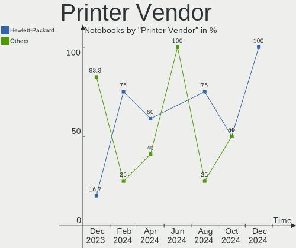
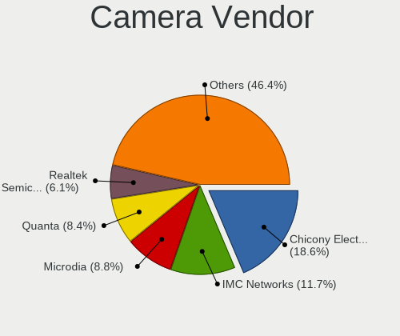

Ubuntu - Hardware Trends (Notebooks)
------------------------------------

A project to identify most popular hardware characteristics and track their change
over time based on data collected by Linux users at https://Linux-Hardware.org.

Anyone can contribute to this report by the [hw-probe](https://github.com/linuxhw/hw-probe) tool:

    sudo -E hw-probe -all -upload

This report is for one last month. Overall report since the beginning of time: [TestCoverage](https://github.com/linuxhw/TestCoverage)

Period: Aug, 2022.

Contents
--------

* [ System ](#system)
  - [ OS                       ](#os)
  - [ OS Family                ](#os-family)
  - [ Kernel                   ](#kernel)
  - [ Kernel Family            ](#kernel-family)
  - [ Kernel Major Ver.        ](#kernel-major-ver)
  - [ Arch                     ](#arch)
  - [ DE                       ](#de)
  - [ Display Server           ](#display-server)
  - [ Display Manager          ](#display-manager)
  - [ OS Lang                  ](#os-lang)
  - [ Boot Mode                ](#boot-mode)
  - [ Filesystem               ](#filesystem)
  - [ Part. scheme             ](#part-scheme)
  - [ Dual Boot with Linux/BSD ](#dual-boot-with-linuxbsd)
  - [ Dual Boot (Win)          ](#dual-boot-win)

* [ Board ](#board)
  - [ Vendor                   ](#vendor)
  - [ Model                    ](#model)
  - [ Model Family             ](#model-family)
  - [ MFG Year                 ](#mfg-year)
  - [ Form Factor              ](#form-factor)
  - [ Secure Boot              ](#secure-boot)
  - [ Coreboot                 ](#coreboot)
  - [ RAM Size                 ](#ram-size)
  - [ RAM Used                 ](#ram-used)
  - [ Total Drives             ](#total-drives)
  - [ Has CD-ROM               ](#has-cd-rom)
  - [ Has Ethernet             ](#has-ethernet)
  - [ Has WiFi                 ](#has-wifi)
  - [ Has Bluetooth            ](#has-bluetooth)

* [ Location ](#location)
  - [ Country                  ](#country)
  - [ City                     ](#city)

* [ Drives ](#drives)
  - [ Drive Vendor             ](#drive-vendor)
  - [ Drive Model              ](#drive-model)
  - [ HDD Vendor               ](#hdd-vendor)
  - [ SSD Vendor               ](#ssd-vendor)
  - [ Drive Kind               ](#drive-kind)
  - [ Drive Connector          ](#drive-connector)
  - [ Drive Size               ](#drive-size)
  - [ Space Total              ](#space-total)
  - [ Space Used               ](#space-used)
  - [ Malfunc. Drives          ](#malfunc-drives)
  - [ Malfunc. Drive Vendor    ](#malfunc-drive-vendor)
  - [ Malfunc. HDD Vendor      ](#malfunc-hdd-vendor)
  - [ Malfunc. Drive Kind      ](#malfunc-drive-kind)
  - [ Failed Drives            ](#failed-drives)
  - [ Failed Drive Vendor      ](#failed-drive-vendor)
  - [ Drive Status             ](#drive-status)

* [ Storage controller ](#storage-controller)
  - [ Storage Vendor           ](#storage-vendor)
  - [ Storage Model            ](#storage-model)
  - [ Storage Kind             ](#storage-kind)

* [ Processor ](#processor)
  - [ CPU Vendor               ](#cpu-vendor)
  - [ CPU Model                ](#cpu-model)
  - [ CPU Model Family         ](#cpu-model-family)
  - [ CPU Cores                ](#cpu-cores)
  - [ CPU Sockets              ](#cpu-sockets)
  - [ CPU Threads              ](#cpu-threads)
  - [ CPU Op-Modes             ](#cpu-op-modes)
  - [ CPU Microcode            ](#cpu-microcode)
  - [ CPU Microarch            ](#cpu-microarch)

* [ Graphics ](#graphics)
  - [ GPU Vendor               ](#gpu-vendor)
  - [ GPU Model                ](#gpu-model)
  - [ GPU Combo                ](#gpu-combo)
  - [ GPU Driver               ](#gpu-driver)
  - [ GPU Memory               ](#gpu-memory)

* [ Monitor ](#monitor)
  - [ Monitor Vendor           ](#monitor-vendor)
  - [ Monitor Model            ](#monitor-model)
  - [ Monitor Resolution       ](#monitor-resolution)
  - [ Monitor Diagonal         ](#monitor-diagonal)
  - [ Monitor Width            ](#monitor-width)
  - [ Aspect Ratio             ](#aspect-ratio)
  - [ Monitor Area             ](#monitor-area)
  - [ Pixel Density            ](#pixel-density)
  - [ Multiple Monitors        ](#multiple-monitors)

* [ Network ](#network)
  - [ Net Controller Vendor    ](#net-controller-vendor)
  - [ Net Controller Model     ](#net-controller-model)
  - [ Wireless Vendor          ](#wireless-vendor)
  - [ Wireless Model           ](#wireless-model)
  - [ Ethernet Vendor          ](#ethernet-vendor)
  - [ Ethernet Model           ](#ethernet-model)
  - [ Net Controller Kind      ](#net-controller-kind)
  - [ Used Controller          ](#used-controller)
  - [ NICs                     ](#nics)
  - [ IPv6                     ](#ipv6)

* [ Bluetooth ](#bluetooth)
  - [ Bluetooth Vendor         ](#bluetooth-vendor)
  - [ Bluetooth Model          ](#bluetooth-model)

* [ Sound ](#sound)
  - [ Sound Vendor             ](#sound-vendor)
  - [ Sound Model              ](#sound-model)

* [ Memory ](#memory)
  - [ Memory Vendor            ](#memory-vendor)
  - [ Memory Model             ](#memory-model)
  - [ Memory Kind              ](#memory-kind)
  - [ Memory Form Factor       ](#memory-form-factor)
  - [ Memory Size              ](#memory-size)
  - [ Memory Speed             ](#memory-speed)

* [ Printers & scanners ](#printers--scanners)
  - [ Printer Vendor           ](#printer-vendor)
  - [ Printer Model            ](#printer-model)
  - [ Scanner Vendor           ](#scanner-vendor)
  - [ Scanner Model            ](#scanner-model)

* [ Camera ](#camera)
  - [ Camera Vendor            ](#camera-vendor)
  - [ Camera Model             ](#camera-model)

* [ Security ](#security)
  - [ Fingerprint Vendor       ](#fingerprint-vendor)
  - [ Fingerprint Model        ](#fingerprint-model)
  - [ Chipcard Vendor          ](#chipcard-vendor)
  - [ Chipcard Model           ](#chipcard-model)

* [ Unsupported ](#unsupported)
  - [ Unsupported Devices      ](#unsupported-devices)
  - [ Unsupported Device Types ](#unsupported-device-types)

System
------

OS
--

Installed operating systems

| Name           | Notebooks | Percent |
|----------------|-----------|---------|
| Ubuntu 22.04   | 397       | 67.98%  |
| Ubuntu 20.04   | 151       | 25.86%  |
| Ubuntu 18.04   | 19        | 3.25%   |
| Ubuntu 21.10   | 6         | 1.03%   |
| Ubuntu 22.10   | 5         | 0.86%   |
| Ubuntu 16.04   | 4         | 0.68%   |
| Ubuntu Core 18 | 2         | 0.34%   |

OS Family
---------

OS without a version

| Name   | Notebooks | Percent |
|--------|-----------|---------|
| Ubuntu | 584       | 100%    |

Kernel
------

Version of the Linux kernel

| Version                               | Notebooks | Percent |
|---------------------------------------|-----------|---------|
| 5.15.0-46-generic                     | 251       | 42.98%  |
| 5.15.0-43-generic                     | 155       | 26.54%  |
| 5.15.0-41-generic                     | 30        | 5.14%   |
| 5.15.0-25-generic                     | 25        | 4.28%   |
| 5.4.0-124-generic                     | 11        | 1.88%   |
| 5.4.0-122-generic                     | 11        | 1.88%   |
| 5.15.0-47-generic                     | 9         | 1.54%   |
| 5.15.0-40-generic                     | 5         | 0.86%   |
| 5.19.0-051900-generic                 | 4         | 0.68%   |
| 5.19.3-051903-generic                 | 3         | 0.51%   |
| 5.17.1-051701-generic                 | 3         | 0.51%   |
| 5.13.0-44-generic                     | 3         | 0.51%   |
| 5.13.0-39-generic                     | 3         | 0.51%   |
| 5.13.0-30-generic                     | 3         | 0.51%   |
| 4.15.0-191-generic                    | 3         | 0.51%   |
| 4.15.0-189-generic                    | 3         | 0.51%   |
| 5.4.0-121-generic                     | 2         | 0.34%   |
| 5.19.0-15-generic                     | 2         | 0.34%   |
| 5.18.15-051815-generic                | 2         | 0.34%   |
| 5.17.0-1014-oem                       | 2         | 0.34%   |
| 5.15.0-45-generic                     | 2         | 0.34%   |
| 5.14.0-1049-oem                       | 2         | 0.34%   |
| 5.14.0-1047-oem                       | 2         | 0.34%   |
| 5.13.0-51-generic                     | 2         | 0.34%   |
| 5.13.0-40-generic                     | 2         | 0.34%   |
| 4.4.0-210-generic                     | 2         | 0.34%   |
| 4.15.0-142-generic                    | 2         | 0.34%   |
| 5.8.0-53-generic                      | 1         | 0.17%   |
| 5.8.0-50-generic                      | 1         | 0.17%   |
| 5.8.0-38-generic                      | 1         | 0.17%   |
| 5.7.19-mbp-alt                        | 1         | 0.17%   |
| 5.5.19-bp0                            | 1         | 0.17%   |
| 5.4.0-84-generic                      | 1         | 0.17%   |
| 5.4.0-81-lowlatency                   | 1         | 0.17%   |
| 5.4.0-73-generic                      | 1         | 0.17%   |
| 5.4.0-71-generic                      | 1         | 0.17%   |
| 5.4.0-58-generic                      | 1         | 0.17%   |
| 5.4.0-125-generic                     | 1         | 0.17%   |
| 5.4.0-124-lowlatency                  | 1         | 0.17%   |
| 5.4.0-123-generic                     | 1         | 0.17%   |
| 5.4.0-107-generic                     | 1         | 0.17%   |
| 5.3.0-7648-generic                    | 1         | 0.17%   |
| 5.19.0-xanmod2-x64v2                  | 1         | 0.17%   |
| 5.19.0-051900rc2daily20220617-generic | 1         | 0.17%   |
| 5.18.8-t2                             | 1         | 0.17%   |
| 5.18.16-xanmod1                       | 1         | 0.17%   |
| 5.18.0-051800-generic                 | 1         | 0.17%   |
| 5.17.0-051700-generic                 | 1         | 0.17%   |
| 5.15.55-051555-generic                | 1         | 0.17%   |
| 5.15.0-47-lowlatency                  | 1         | 0.17%   |
| 5.15.0-37-generic                     | 1         | 0.17%   |
| 5.15.0-35-generic                     | 1         | 0.17%   |
| 5.15.0-18-generic                     | 1         | 0.17%   |
| 5.15.0-1014-gke                       | 1         | 0.17%   |
| 5.15.0-1013-intel-iotg                | 1         | 0.17%   |
| 5.14.0-1051-oem                       | 1         | 0.17%   |
| 5.14.0-1050-oem                       | 1         | 0.17%   |
| 5.14.0-1048-oem                       | 1         | 0.17%   |
| 5.14.0-1045-oem                       | 1         | 0.17%   |
| 5.13.0-37-generic                     | 1         | 0.17%   |

Kernel Family
-------------

Linux kernel without a distro release

| Version | Notebooks | Percent |
|---------|-----------|---------|
| 5.15.0  | 483       | 82.71%  |
| 5.4.0   | 33        | 5.65%   |
| 5.13.0  | 17        | 2.91%   |
| 4.15.0  | 10        | 1.71%   |
| 5.19.0  | 8         | 1.37%   |
| 5.14.0  | 8         | 1.37%   |
| 5.8.0   | 3         | 0.51%   |
| 5.19.3  | 3         | 0.51%   |
| 5.17.1  | 3         | 0.51%   |
| 5.17.0  | 3         | 0.51%   |
| 5.18.15 | 2         | 0.34%   |
| 5.11.0  | 2         | 0.34%   |
| 4.4.0   | 2         | 0.34%   |
| 5.7.19  | 1         | 0.17%   |
| 5.5.19  | 1         | 0.17%   |
| 5.3.0   | 1         | 0.17%   |
| 5.18.8  | 1         | 0.17%   |
| 5.18.16 | 1         | 0.17%   |
| 5.18.0  | 1         | 0.17%   |
| 5.15.55 | 1         | 0.17%   |

Kernel Major Ver.
-----------------

Linux kernel major version

| Version | Notebooks | Percent |
|---------|-----------|---------|
| 5.15    | 484       | 82.88%  |
| 5.4     | 33        | 5.65%   |
| 5.13    | 17        | 2.91%   |
| 5.19    | 11        | 1.88%   |
| 4.15    | 10        | 1.71%   |
| 5.14    | 8         | 1.37%   |
| 5.17    | 6         | 1.03%   |
| 5.18    | 5         | 0.86%   |
| 5.8     | 3         | 0.51%   |
| 5.11    | 2         | 0.34%   |
| 4.4     | 2         | 0.34%   |
| 5.7     | 1         | 0.17%   |
| 5.5     | 1         | 0.17%   |
| 5.3     | 1         | 0.17%   |

Arch
----

OS architecture (x86_64, i586, etc.)

| Name   | Notebooks | Percent |
|--------|-----------|---------|
| x86_64 | 581       | 99.49%  |
| i686   | 3         | 0.51%   |

DE
--

Desktop Environment

| Name            | Notebooks | Percent |
|-----------------|-----------|---------|
| GNOME           | 550       | 94.18%  |
| Unknown         | 11        | 1.88%   |
| Unity           | 8         | 1.37%   |
| X-Cinnamon      | 6         | 1.03%   |
| GNOME Flashback | 3         | 0.51%   |
| Cinnamon        | 2         | 0.34%   |
| Pantheon        | 1         | 0.17%   |
| Enlightenment   | 1         | 0.17%   |
| dwm             | 1         | 0.17%   |
| Cutefish        | 1         | 0.17%   |

Display Server
--------------

X11 or Wayland

| Name    | Notebooks | Percent |
|---------|-----------|---------|
| Wayland | 299       | 51.2%   |
| X11     | 279       | 47.77%  |
| Unknown | 5         | 0.86%   |
| Tty     | 1         | 0.17%   |

Display Manager
---------------

SDDM, LightDM, etc.

| Name    | Notebooks | Percent |
|---------|-----------|---------|
| GDM3    | 466       | 79.79%  |
| GDM     | 66        | 11.3%   |
| Unknown | 31        | 5.31%   |
| LightDM | 18        | 3.08%   |
| SDDM    | 3         | 0.51%   |

OS Lang
-------

Language

| Lang    | Notebooks | Percent |
|---------|-----------|---------|
| en_US   | 271       | 46.4%   |
| de_DE   | 41        | 7.02%   |
| fr_FR   | 37        | 6.34%   |
| pt_BR   | 32        | 5.48%   |
| en_IN   | 24        | 4.11%   |
| en_GB   | 23        | 3.94%   |
| it_IT   | 14        | 2.4%    |
| en_CA   | 11        | 1.88%   |
| zh_CN   | 10        | 1.71%   |
| ru_RU   | 10        | 1.71%   |
| es_ES   | 10        | 1.71%   |
| nl_NL   | 8         | 1.37%   |
| pt_PT   | 7         | 1.2%    |
| C       | 7         | 1.2%    |
| en_AU   | 6         | 1.03%   |
| cs_CZ   | 6         | 1.03%   |
| pl_PL   | 5         | 0.86%   |
| hu_HU   | 4         | 0.68%   |
| fi_FI   | 4         | 0.68%   |
| es_AR   | 4         | 0.68%   |
| sv_SE   | 3         | 0.51%   |
| fr_BE   | 3         | 0.51%   |
| en_ZA   | 3         | 0.51%   |
| en_NZ   | 3         | 0.51%   |
| de_AT   | 3         | 0.51%   |
| Unknown | 3         | 0.51%   |
| tr_TR   | 2         | 0.34%   |
| sl_SI   | 2         | 0.34%   |
| nb_NO   | 2         | 0.34%   |
| es_US   | 2         | 0.34%   |
| es_MX   | 2         | 0.34%   |
| es_CO   | 2         | 0.34%   |
| en_SG   | 2         | 0.34%   |
| en_HK   | 2         | 0.34%   |
| da_DK   | 2         | 0.34%   |
| ca_ES   | 2         | 0.34%   |
| sk_SK   | 1         | 0.17%   |
| ru_UA   | 1         | 0.17%   |
| ro_RO   | 1         | 0.17%   |
| lv_LV   | 1         | 0.17%   |
| lt_LT   | 1         | 0.17%   |
| ja_JP   | 1         | 0.17%   |
| fr_CA   | 1         | 0.17%   |
| es_SV   | 1         | 0.17%   |
| es_CR   | 1         | 0.17%   |
| en_PH   | 1         | 0.17%   |
| en_IE   | 1         | 0.17%   |
| be_BY   | 1         | 0.17%   |

Boot Mode
---------

EFI or BIOS

| Mode | Notebooks | Percent |
|------|-----------|---------|
| EFI  | 305       | 52.23%  |
| BIOS | 279       | 47.77%  |

Filesystem
----------

Type of filesystem

| Type    | Notebooks | Percent |
|---------|-----------|---------|
| Ext4    | 553       | 94.69%  |
| Zfs     | 10        | 1.71%   |
| Overlay | 10        | 1.71%   |
| Btrfs   | 5         | 0.86%   |
| Xfs     | 2         | 0.34%   |
| Ext3    | 2         | 0.34%   |
| Ext2    | 2         | 0.34%   |

Part. scheme
------------

Scheme of partitioning

| Type    | Notebooks | Percent |
|---------|-----------|---------|
| Unknown | 325       | 55.65%  |
| GPT     | 241       | 41.27%  |
| MBR     | 18        | 3.08%   |

Dual Boot with Linux/BSD
------------------------

Hosting more than one Linux/BSD

| Dual boot | Notebooks | Percent |
|-----------|-----------|---------|
| No        | 540       | 92.47%  |
| Yes       | 44        | 7.53%   |

Dual Boot (Win)
---------------

Hosting Linux and Windows

| Dual boot | Notebooks | Percent |
|-----------|-----------|---------|
| No        | 378       | 64.73%  |
| Yes       | 206       | 35.27%  |

Board
-----

Vendor
------

Motherboard manufacturer

| Name                   | Notebooks | Percent |
|------------------------|-----------|---------|
| Lenovo                 | 125       | 21.4%   |
| Hewlett-Packard        | 109       | 18.66%  |
| Dell                   | 101       | 17.29%  |
| ASUSTek Computer       | 64        | 10.96%  |
| Acer                   | 37        | 6.34%   |
| Apple                  | 20        | 3.42%   |
| HUAWEI                 | 17        | 2.91%   |
| MSI                    | 16        | 2.74%   |
| Toshiba                | 13        | 2.23%   |
| Samsung Electronics    | 11        | 1.88%   |
| Notebook               | 8         | 1.37%   |
| Timi                   | 5         | 0.86%   |
| Sony                   | 5         | 0.86%   |
| Positivo               | 5         | 0.86%   |
| Packard Bell           | 4         | 0.68%   |
| Fujitsu                | 4         | 0.68%   |
| Google                 | 3         | 0.51%   |
| Alienware              | 3         | 0.51%   |
| TrekStor               | 2         | 0.34%   |
| System76               | 2         | 0.34%   |
| Monster                | 2         | 0.34%   |
| Gigabyte Technology    | 2         | 0.34%   |
| VALE                   | 1         | 0.17%   |
| TUXEDO                 | 1         | 0.17%   |
| TEKNOSERVICE           | 1         | 0.17%   |
| Teclast                | 1         | 0.17%   |
| Star Labs              | 1         | 0.17%   |
| speedmaster            | 1         | 0.17%   |
| PC Specialist          | 1         | 0.17%   |
| Panasonic              | 1         | 0.17%   |
| MOTILE                 | 1         | 0.17%   |
| Microtech              | 1         | 0.17%   |
| Medion                 | 1         | 0.17%   |
| Linx                   | 1         | 0.17%   |
| IT Channel Pty         | 1         | 0.17%   |
| Intel                  | 1         | 0.17%   |
| Gateway                | 1         | 0.17%   |
| Framework              | 1         | 0.17%   |
| eMachines              | 1         | 0.17%   |
| ECS                    | 1         | 0.17%   |
| Dynabook               | 1         | 0.17%   |
| Compaq                 | 1         | 0.17%   |
| Chuwi                  | 1         | 0.17%   |
| BESSTAR Tech           | 1         | 0.17%   |
| AZW                    | 1         | 0.17%   |
| Avell High Performance | 1         | 0.17%   |
| A-DATA Technology      | 1         | 0.17%   |
| Unknown                | 1         | 0.17%   |

Model
-----

Motherboard model

| Name                                     | Notebooks | Percent |
|------------------------------------------|-----------|---------|
| HP Pavilion Notebook                     | 4         | 0.68%   |
| HP Pavilion g6                           | 4         | 0.68%   |
| Dell XPS 15 9560                         | 4         | 0.68%   |
| Timi TM1701                              | 3         | 0.51%   |
| HP Pavilion 15                           | 3         | 0.51%   |
| HP EliteBook 840 G8 Notebook PC          | 3         | 0.51%   |
| HP 255 G6 Notebook PC                    | 3         | 0.51%   |
| Dell Latitude E7470                      | 3         | 0.51%   |
| Dell Inspiron 3543                       | 3         | 0.51%   |
| Apple MacBookPro9,2                      | 3         | 0.51%   |
| Apple MacBookPro11,3                     | 3         | 0.51%   |
| TrekStor Notebook Slim S130              | 2         | 0.34%   |
| Toshiba Satellite C55-B                  | 2         | 0.34%   |
| Toshiba Satellite C55-A                  | 2         | 0.34%   |
| Packard Bell EasyNote TS11HR             | 2         | 0.34%   |
| MSI Modern 14 A10RB                      | 2         | 0.34%   |
| Lenovo V330-15IKB 81AX                   | 2         | 0.34%   |
| Lenovo ThinkPad X1 Carbon 6th 20KHCTO1WW | 2         | 0.34%   |
| Lenovo ThinkPad Edge E530 62724FU        | 2         | 0.34%   |
| Lenovo Legion 5 15IMH05H 81Y6            | 2         | 0.34%   |
| Lenovo IdeaPad 330-15IKB 81DE            | 2         | 0.34%   |
| Lenovo IdeaPad 3 15ITL6 82H8             | 2         | 0.34%   |
| Lenovo G580 20150                        | 2         | 0.34%   |
| HUAWEI NBLB-WAX9N                        | 2         | 0.34%   |
| HUAWEI HVY-WXX9                          | 2         | 0.34%   |
| HUAWEI BOM-WXX9                          | 2         | 0.34%   |
| HP ZBook 15 G3                           | 2         | 0.34%   |
| HP ProBook 455 G8 Notebook PC            | 2         | 0.34%   |
| HP ProBook 4440s                         | 2         | 0.34%   |
| HP ProBook 440 G8 Notebook PC            | 2         | 0.34%   |
| HP Notebook                              | 2         | 0.34%   |
| HP Laptop 15-db0xxx                      | 2         | 0.34%   |
| HP Laptop 14s-dq2xxx                     | 2         | 0.34%   |
| HP EliteBook 8470p                       | 2         | 0.34%   |
| HP 15                                    | 2         | 0.34%   |
| Gigabyte AORUS 17 YE5                    | 2         | 0.34%   |
| Dell XPS 15 9520                         | 2         | 0.34%   |
| Dell XPS 13 9380                         | 2         | 0.34%   |
| Dell Latitude E6510                      | 2         | 0.34%   |
| Dell Latitude E6500                      | 2         | 0.34%   |
| Dell Latitude E6400                      | 2         | 0.34%   |
| Dell Latitude 5531                       | 2         | 0.34%   |
| Dell Latitude 5520                       | 2         | 0.34%   |
| Dell Latitude 5420                       | 2         | 0.34%   |
| Dell Latitude 3510                       | 2         | 0.34%   |
| Dell Latitude 3420                       | 2         | 0.34%   |
| Dell Inspiron N5010                      | 2         | 0.34%   |
| Dell Inspiron 5559                       | 2         | 0.34%   |
| Dell Inspiron 5447                       | 2         | 0.34%   |
| Dell Inspiron 3583                       | 2         | 0.34%   |
| Dell G15 5515                            | 2         | 0.34%   |
| ASUS ZenBook UX534FTC_UX534FT            | 2         | 0.34%   |
| ASUS TUF Gaming FX505DT_FX505DT          | 2         | 0.34%   |
| ASUS N56VZ                               | 2         | 0.34%   |
| ASUS ASUS TUF Gaming A15 FA506IC_FA506IC | 2         | 0.34%   |
| Apple MacBookPro16,1                     | 2         | 0.34%   |
| Apple MacBookAir7,2                      | 2         | 0.34%   |
| Acer Nitro AN515-54                      | 2         | 0.34%   |
| Acer Aspire E5-571                       | 2         | 0.34%   |
| Acer Aspire 5742                         | 2         | 0.34%   |

Model Family
------------

Motherboard model prefix

| Name                  | Notebooks | Percent |
|-----------------------|-----------|---------|
| Lenovo ThinkPad       | 66        | 11.3%   |
| Dell Latitude         | 35        | 5.99%   |
| Dell Inspiron         | 32        | 5.48%   |
| Lenovo IdeaPad        | 27        | 4.62%   |
| Acer Aspire           | 27        | 4.62%   |
| HP Pavilion           | 22        | 3.77%   |
| HP ProBook            | 18        | 3.08%   |
| HP EliteBook          | 18        | 3.08%   |
| Dell XPS              | 16        | 2.74%   |
| HP Laptop             | 14        | 2.4%    |
| ASUS VivoBook         | 13        | 2.23%   |
| ASUS ZenBook          | 10        | 1.71%   |
| Toshiba Satellite     | 9         | 1.54%   |
| Lenovo ThinkBook      | 7         | 1.2%    |
| HP ZBook              | 7         | 1.2%    |
| Dell Vostro           | 7         | 1.2%    |
| ASUS ROG              | 6         | 1.03%   |
| Acer Nitro            | 6         | 1.03%   |
| Lenovo Legion         | 5         | 0.86%   |
| Dell Precision        | 5         | 0.86%   |
| Toshiba PORTEGE       | 4         | 0.68%   |
| Packard Bell EasyNote | 4         | 0.68%   |
| HP Compaq             | 4         | 0.68%   |
| HP 255                | 4         | 0.68%   |
| Apple MacBookPro16    | 4         | 0.68%   |
| Apple MacBookPro11    | 4         | 0.68%   |
| Timi TM1701           | 3         | 0.51%   |
| MSI Modern            | 3         | 0.51%   |
| HP Stream             | 3         | 0.51%   |
| HP ENVY               | 3         | 0.51%   |
| Fujitsu LIFEBOOK      | 3         | 0.51%   |
| Dell G15              | 3         | 0.51%   |
| ASUS ASUS             | 3         | 0.51%   |
| Apple MacBookPro9     | 3         | 0.51%   |
| TrekStor Notebook     | 2         | 0.34%   |
| MSI Katana            | 2         | 0.34%   |
| MSI Creator           | 2         | 0.34%   |
| Lenovo Yoga           | 2         | 0.34%   |
| Lenovo V330-15IKB     | 2         | 0.34%   |
| Lenovo G580           | 2         | 0.34%   |
| Lenovo B570e          | 2         | 0.34%   |
| HUAWEI NBLB-WAX9N     | 2         | 0.34%   |
| HUAWEI HVY-WXX9       | 2         | 0.34%   |
| HUAWEI BOM-WXX9       | 2         | 0.34%   |
| HP Notebook           | 2         | 0.34%   |
| HP 250                | 2         | 0.34%   |
| HP 15                 | 2         | 0.34%   |
| Gigabyte AORUS        | 2         | 0.34%   |
| ASUS TUF              | 2         | 0.34%   |
| ASUS N56VZ            | 2         | 0.34%   |
| Apple MacBookAir7     | 2         | 0.34%   |
| Apple MacBookAir6     | 2         | 0.34%   |
| Acer TravelMate       | 2         | 0.34%   |
| Unknown               | 2         | 0.34%   |
| VALE Notebook         | 1         | 0.17%   |
| TUXEDO W65            | 1         | 0.17%   |
| Timi RedmiBook        | 1         | 0.17%   |
| Timi Redmi            | 1         | 0.17%   |
| TEKNOSERVICE PORTATIL | 1         | 0.17%   |
| Teclast F15           | 1         | 0.17%   |

MFG Year
--------

Motherboard manufacture year

| Year    | Notebooks | Percent |
|---------|-----------|---------|
| 2021    | 79        | 13.53%  |
| 2020    | 64        | 10.96%  |
| 2019    | 64        | 10.96%  |
| 2018    | 53        | 9.08%   |
| 2012    | 39        | 6.68%   |
| 2022    | 36        | 6.16%   |
| 2017    | 36        | 6.16%   |
| 2014    | 34        | 5.82%   |
| 2013    | 32        | 5.48%   |
| 2015    | 31        | 5.31%   |
| 2010    | 29        | 4.97%   |
| 2016    | 28        | 4.79%   |
| 2011    | 26        | 4.45%   |
| 2008    | 13        | 2.23%   |
| 2009    | 10        | 1.71%   |
| 2007    | 7         | 1.2%    |
| Unknown | 2         | 0.34%   |
| 2006    | 1         | 0.17%   |

Form Factor
-----------

Physical design of the computer

| Name     | Notebooks | Percent |
|----------|-----------|---------|
| Notebook | 584       | 100%    |

Secure Boot
-----------

Enabled or disabled

| State    | Notebooks | Percent |
|----------|-----------|---------|
| Disabled | 503       | 86.13%  |
| Enabled  | 81        | 13.87%  |

Coreboot
--------

Have coreboot on board

| Used | Notebooks | Percent |
|------|-----------|---------|
| No   | 580       | 99.32%  |
| Yes  | 4         | 0.68%   |

RAM Size
--------

Total RAM memory

| Size in GB  | Notebooks | Percent |
|-------------|-----------|---------|
| 4.01-8.0    | 173       | 29.62%  |
| 16.01-24.0  | 122       | 20.89%  |
| 8.01-16.0   | 100       | 17.12%  |
| 3.01-4.0    | 99        | 16.95%  |
| 32.01-64.0  | 45        | 7.71%   |
| 1.01-2.0    | 18        | 3.08%   |
| 24.01-32.0  | 10        | 1.71%   |
| 64.01-256.0 | 10        | 1.71%   |
| 2.01-3.0    | 5         | 0.86%   |
| 0.51-1.0    | 2         | 0.34%   |

RAM Used
--------

Used RAM memory

| Used GB    | Notebooks | Percent |
|------------|-----------|---------|
| 2.01-3.0   | 167       | 28.6%   |
| 1.01-2.0   | 162       | 27.74%  |
| 4.01-8.0   | 109       | 18.66%  |
| 3.01-4.0   | 93        | 15.92%  |
| 8.01-16.0  | 36        | 6.16%   |
| 0.51-1.0   | 12        | 2.05%   |
| 16.01-24.0 | 3         | 0.51%   |
| 24.01-32.0 | 1         | 0.17%   |
| 0.01-0.5   | 1         | 0.17%   |

Total Drives
------------

Number of drives on board

| Drives | Notebooks | Percent |
|--------|-----------|---------|
| 1      | 457       | 78.25%  |
| 2      | 114       | 19.52%  |
| 3      | 8         | 1.37%   |
| 0      | 3         | 0.51%   |
| 5      | 1         | 0.17%   |
| 4      | 1         | 0.17%   |

Has CD-ROM
----------

Has CD-ROM on board

| Presented | Notebooks | Percent |
|-----------|-----------|---------|
| No        | 406       | 69.52%  |
| Yes       | 178       | 30.48%  |

Has Ethernet
------------

Has Ethernet on board

| Presented | Notebooks | Percent |
|-----------|-----------|---------|
| Yes       | 461       | 78.94%  |
| No        | 123       | 21.06%  |

Has WiFi
--------

Has WiFi module

| Presented | Notebooks | Percent |
|-----------|-----------|---------|
| Yes       | 571       | 97.77%  |
| No        | 13        | 2.23%   |

Has Bluetooth
-------------

Has Bluetooth module

| Presented | Notebooks | Percent |
|-----------|-----------|---------|
| Yes       | 469       | 80.31%  |
| No        | 115       | 19.69%  |

Location
--------

Country
-------

Geographic location (country)

| Country             | Notebooks | Percent |
|---------------------|-----------|---------|
| USA                 | 87        | 14.9%   |
| Germany             | 54        | 9.25%   |
| France              | 42        | 7.19%   |
| Brazil              | 40        | 6.85%   |
| India               | 29        | 4.97%   |
| Russia              | 27        | 4.62%   |
| Italy               | 23        | 3.94%   |
| UK                  | 18        | 3.08%   |
| Netherlands         | 16        | 2.74%   |
| Canada              | 13        | 2.23%   |
| Turkey              | 12        | 2.05%   |
| Spain               | 11        | 1.88%   |
| Poland              | 11        | 1.88%   |
| Sweden              | 9         | 1.54%   |
| Portugal            | 9         | 1.54%   |
| Hungary             | 9         | 1.54%   |
| Czechia             | 8         | 1.37%   |
| Austria             | 7         | 1.2%    |
| Australia           | 7         | 1.2%    |
| Argentina           | 7         | 1.2%    |
| Singapore           | 6         | 1.03%   |
| Pakistan            | 6         | 1.03%   |
| Mexico              | 6         | 1.03%   |
| Finland             | 6         | 1.03%   |
| Norway              | 5         | 0.86%   |
| Malaysia            | 5         | 0.86%   |
| Iran                | 5         | 0.86%   |
| Tunisia             | 4         | 0.68%   |
| Romania             | 4         | 0.68%   |
| New Zealand         | 4         | 0.68%   |
| Hong Kong           | 4         | 0.68%   |
| China               | 4         | 0.68%   |
| Chile               | 4         | 0.68%   |
| Belgium             | 4         | 0.68%   |
| Vietnam             | 3         | 0.51%   |
| South Africa        | 3         | 0.51%   |
| Slovenia            | 3         | 0.51%   |
| Philippines         | 3         | 0.51%   |
| Myanmar             | 3         | 0.51%   |
| Greece              | 3         | 0.51%   |
| Denmark             | 3         | 0.51%   |
| Colombia            | 3         | 0.51%   |
| Bulgaria            | 3         | 0.51%   |
| Venezuela           | 2         | 0.34%   |
| Uruguay             | 2         | 0.34%   |
| Ukraine             | 2         | 0.34%   |
| Thailand            | 2         | 0.34%   |
| Switzerland         | 2         | 0.34%   |
| Slovakia            | 2         | 0.34%   |
| Puerto Rico         | 2         | 0.34%   |
| Lithuania           | 2         | 0.34%   |
| Kenya               | 2         | 0.34%   |
| Indonesia           | 2         | 0.34%   |
| Georgia             | 2         | 0.34%   |
| Belarus             | 2         | 0.34%   |
| Bangladesh          | 2         | 0.34%   |
| Uzbekistan          | 1         | 0.17%   |
| Uganda              | 1         | 0.17%   |
| Turkmenistan        | 1         | 0.17%   |
| Trinidad and Tobago | 1         | 0.17%   |

City
----

Geographic location (city)

| City           | Notebooks | Percent |
|----------------|-----------|---------|
| Moscow         | 9         | 1.54%   |
| Paris          | 8         | 1.37%   |
| Stockholm      | 6         | 1.03%   |
| Singapore      | 6         | 1.03%   |
| Milan          | 6         | 1.03%   |
| Budapest       | 6         | 1.03%   |
| Vienna         | 5         | 0.86%   |
| Istanbul       | 5         | 0.86%   |
| Helsinki       | 5         | 0.86%   |
| Ankara         | 5         | 0.86%   |
| Tehran         | 4         | 0.68%   |
| Stuttgart      | 4         | 0.68%   |
| St Petersburg  | 4         | 0.68%   |
| Sao Paulo      | 4         | 0.68%   |
| Berlin         | 4         | 0.68%   |
| Bengaluru      | 4         | 0.68%   |
| Yangon         | 3         | 0.51%   |
| Warsaw         | 3         | 0.51%   |
| Rio de Janeiro | 3         | 0.51%   |
| Munich         | 3         | 0.51%   |
| Mumbai         | 3         | 0.51%   |
| Mirpur         | 3         | 0.51%   |
| Los Angeles    | 3         | 0.51%   |
| Islamabad      | 3         | 0.51%   |
| Fortaleza      | 3         | 0.51%   |
| Denver         | 3         | 0.51%   |
| Cypress        | 3         | 0.51%   |
| Coimbatore     | 3         | 0.51%   |
| Atlanta        | 3         | 0.51%   |
| Turin          | 2         | 0.34%   |
| Tunis          | 2         | 0.34%   |
| Toronto        | 2         | 0.34%   |
| Thessaloniki   | 2         | 0.34%   |
| Sydney         | 2         | 0.34%   |
| Sofia          | 2         | 0.34%   |
| San Juan       | 2         | 0.34%   |
| Salvador       | 2         | 0.34%   |
| Roggio         | 2         | 0.34%   |
| Prague         | 2         | 0.34%   |
| Pelotas        | 2         | 0.34%   |
| Oslo           | 2         | 0.34%   |
| Norristown     | 2         | 0.34%   |
| Nibong Tebal   | 2         | 0.34%   |
| Nantes         | 2         | 0.34%   |
| Nairobi        | 2         | 0.34%   |
| Montevideo     | 2         | 0.34%   |
| Minsk          | 2         | 0.34%   |
| Louisville     | 2         | 0.34%   |
| Ljubljana      | 2         | 0.34%   |
| Leipzig        | 2         | 0.34%   |
| Kuala Lumpur   | 2         | 0.34%   |
| Krakow         | 2         | 0.34%   |
| Kaiserslautern | 2         | 0.34%   |
| Hanoi          | 2         | 0.34%   |
| Etterbeek      | 2         | 0.34%   |
| Ernakulam      | 2         | 0.34%   |
| Dhaka          | 2         | 0.34%   |
| Curitiba       | 2         | 0.34%   |
| Córdoba       | 2         | 0.34%   |
| Coimbra        | 2         | 0.34%   |

Drives
------

Drive Vendor
------------

Hard drive vendors

| Vendor                         | Notebooks | Drives | Percent |
|--------------------------------|-----------|--------|---------|
| Samsung Electronics            | 130       | 144    | 18.98%  |
| WDC                            | 70        | 71     | 10.22%  |
| Seagate                        | 66        | 70     | 9.64%   |
| Toshiba                        | 49        | 50     | 7.15%   |
| Kingston                       | 43        | 44     | 6.28%   |
| SK hynix                       | 40        | 43     | 5.84%   |
| SanDisk                        | 35        | 35     | 5.11%   |
| Intel                          | 24        | 28     | 3.5%    |
| Unknown                        | 23        | 23     | 3.36%   |
| Hitachi                        | 19        | 19     | 2.77%   |
| Crucial                        | 19        | 19     | 2.77%   |
| HGST                           | 17        | 17     | 2.48%   |
| Micron Technology              | 14        | 15     | 2.04%   |
| KIOXIA                         | 13        | 14     | 1.9%    |
| Apple                          | 12        | 13     | 1.75%   |
| Silicon Motion                 | 11        | 13     | 1.61%   |
| A-DATA Technology              | 9         | 10     | 1.31%   |
| Phison                         | 8         | 9      | 1.17%   |
| China                          | 8         | 8      | 1.17%   |
| Transcend                      | 5         | 5      | 0.73%   |
| SPCC                           | 4         | 4      | 0.58%   |
| Micron/Crucial Technology      | 4         | 4      | 0.58%   |
| LITEON                         | 4         | 4      | 0.58%   |
| Unknown                        | 4         | 4      | 0.58%   |
| UMIS                           | 3         | 3      | 0.44%   |
| PNY                            | 3         | 3      | 0.44%   |
| Intenso                        | 3         | 4      | 0.44%   |
| ADATA Technology               | 3         | 3      | 0.44%   |
| Union Memory (Shenzhen)        | 2         | 2      | 0.29%   |
| Solid State Storage Technology | 2         | 2      | 0.29%   |
| Lenovo                         | 2         | 2      | 0.29%   |
| LDLC                           | 2         | 2      | 0.29%   |
| Hewlett-Packard                | 2         | 2      | 0.29%   |
| GOODRAM                        | 2         | 2      | 0.29%   |
| Fujitsu                        | 2         | 2      | 0.29%   |
| Corsair                        | 2         | 2      | 0.29%   |
| Apacer                         | 2         | 2      | 0.29%   |
| YMTC                           | 1         | 1      | 0.15%   |
| Verbatim                       | 1         | 1      | 0.15%   |
| ValueTech                      | 1         | 1      | 0.15%   |
| Teclast                        | 1         | 1      | 0.15%   |
| SABRENT                        | 1         | 1      | 0.15%   |
| Realtek Semiconductor          | 1         | 1      | 0.15%   |
| Realtek                        | 1         | 1      | 0.15%   |
| Patriot                        | 1         | 1      | 0.15%   |
| OTG V2                         | 1         | 1      | 0.15%   |
| OSCOO                          | 1         | 1      | 0.15%   |
| OCZ                            | 1         | 1      | 0.15%   |
| Netac                          | 1         | 1      | 0.15%   |
| M4-CT128                       | 1         | 1      | 0.15%   |
| LITEONIT                       | 1         | 1      | 0.15%   |
| Lexar                          | 1         | 1      | 0.15%   |
| Kingmax                        | 1         | 1      | 0.15%   |
| KINGBANK                       | 1         | 1      | 0.15%   |
| HUSKY                          | 1         | 1      | 0.15%   |
| Hjwdz                          | 1         | 1      | 0.15%   |
| GALAX                          | 1         | 1      | 0.15%   |
| FORESEE                        | 1         | 1      | 0.15%   |
| External                       | 1         | 1      | 0.15%   |
| Emtec                          | 1         | 1      | 0.15%   |

Drive Model
-----------

Hard drive models

| Model                                   | Notebooks | Percent |
|-----------------------------------------|-----------|---------|
| Samsung NVMe SSD Drive 512GB            | 16        | 2.23%   |
| Seagate ST1000LM024 HN-M101MBB 1TB      | 11        | 1.53%   |
| Toshiba MQ04ABF100 1TB                  | 9         | 1.26%   |
| Seagate ST1000LM035-1RK172 1TB          | 8         | 1.12%   |
| Kingston SA400S37240G 240GB SSD         | 7         | 0.98%   |
| Intel SSDPEKNW512G8 512GB               | 7         | 0.98%   |
| Crucial CT1000MX500SSD1 1TB             | 7         | 0.98%   |
| WDC WD10SPZX-21Z10T0 1TB                | 6         | 0.84%   |
| Seagate ST500LT012-1DG142 500GB         | 6         | 0.84%   |
| SK hynix NVMe SSD Drive 512GB           | 5         | 0.7%    |
| SK hynix NVMe SSD Drive 1024GB          | 5         | 0.7%    |
| Silicon Motion NVMe SSD Drive 256GB     | 5         | 0.7%    |
| Samsung SSD 850 EVO 500GB               | 5         | 0.7%    |
| WDC PC SN810 NVMe 512GB                 | 4         | 0.56%   |
| Toshiba MQ01ABD100 1TB                  | 4         | 0.56%   |
| Seagate ST1000LM048-2E7172 1TB          | 4         | 0.56%   |
| Seagate ST1000LM014-1EJ164 1TB          | 4         | 0.56%   |
| SanDisk NVMe SSD Drive 512GB            | 4         | 0.56%   |
| Samsung SSD 980 1TB                     | 4         | 0.56%   |
| Samsung SSD 970 EVO Plus 1TB            | 4         | 0.56%   |
| Samsung NVMe SSD Drive 256GB            | 4         | 0.56%   |
| Kingston SV300S37A240G 240GB SSD        | 4         | 0.56%   |
| Kingston SA400S37120G 120GB SSD         | 4         | 0.56%   |
| Kingston NVMe SSD Drive 512GB           | 4         | 0.56%   |
| Kingston NVMe SSD Drive 500GB           | 4         | 0.56%   |
| HGST HTS541010A9E680 1TB                | 4         | 0.56%   |
| Unknown                                 | 4         | 0.56%   |
| WDC WD10SPZX-24Z10 1TB                  | 3         | 0.42%   |
| Toshiba MQ01ABF050 500GB                | 3         | 0.42%   |
| Toshiba MQ01ABD050 500GB                | 3         | 0.42%   |
| Toshiba KBG30ZMV512G 512GB              | 3         | 0.42%   |
| Toshiba KBG30ZMS128G 128GB NVMe SSD     | 3         | 0.42%   |
| Silicon Motion NVMe SSD Drive 512GB     | 3         | 0.42%   |
| Seagate ST9500325AS 500GB               | 3         | 0.42%   |
| Seagate ST750LM022 HN-M750MBB 752GB     | 3         | 0.42%   |
| Seagate ST500LT012-9WS142 500GB         | 3         | 0.42%   |
| SanDisk DF4032  32GB                    | 3         | 0.42%   |
| Samsung SSD 980 PRO 1TB                 | 3         | 0.42%   |
| Samsung SM963 2.5" NVMe PCIe SSD 1024GB | 3         | 0.42%   |
| Samsung PM9A1 NVMe 512GB                | 3         | 0.42%   |
| Samsung NVMe SSD Drive 1TB              | 3         | 0.42%   |
| Samsung MZVLQ512HBLU-00BH1 512GB        | 3         | 0.42%   |
| Samsung MZVLB512HBJQ-000L7 512GB        | 3         | 0.42%   |
| Samsung MZVL21T0HCLR-00B00 1TB          | 3         | 0.42%   |
| Phison 311CD0512GB                      | 3         | 0.42%   |
| KIOXIA NVMe SSD Drive 512GB             | 3         | 0.42%   |
| Kingston SV300S37A120G 120GB SSD        | 3         | 0.42%   |
| Intel NVMe SSD Drive 512GB              | 3         | 0.42%   |
| HGST HTS545050A7E680 500GB              | 3         | 0.42%   |
| HGST HTS545050A7E380 500GB              | 3         | 0.42%   |
| Crucial CT480BX500SSD1 480GB            | 3         | 0.42%   |
| Crucial CT240BX500SSD1 240GB            | 3         | 0.42%   |
| China SATA SSD 20GB                     | 3         | 0.42%   |
| Apple SSD SM0512F 500GB                 | 3         | 0.42%   |
| Apple SSD AP1024N 1TB                   | 3         | 0.42%   |
| WDC WDS240G2G0A-00JH30 240GB SSD        | 2         | 0.28%   |
| WDC WDS120G2G0A-00JH30 120GB SSD        | 2         | 0.28%   |
| WDC WD5000LPLX-08ZNTT0 500GB            | 2         | 0.28%   |
| WDC WD3200BPVT-22JJ5T0 320GB            | 2         | 0.28%   |
| WDC WD3200BPVT-00JJ5T0 320GB            | 2         | 0.28%   |

HDD Vendor
----------

Hard disk drive vendors

| Vendor              | Notebooks | Drives | Percent |
|---------------------|-----------|--------|---------|
| Seagate             | 65        | 69     | 36.52%  |
| WDC                 | 42        | 43     | 23.6%   |
| Toshiba             | 27        | 27     | 15.17%  |
| Hitachi             | 19        | 19     | 10.67%  |
| HGST                | 17        | 17     | 9.55%   |
| Samsung Electronics | 4         | 4      | 2.25%   |
| Fujitsu             | 2         | 2      | 1.12%   |
| Unknown             | 1         | 1      | 0.56%   |
| SABRENT             | 1         | 1      | 0.56%   |

SSD Vendor
----------

Solid state drive vendors

| Vendor              | Notebooks | Drives | Percent |
|---------------------|-----------|--------|---------|
| Samsung Electronics | 49        | 52     | 24.26%  |
| Kingston            | 27        | 28     | 13.37%  |
| SanDisk             | 21        | 21     | 10.4%   |
| Crucial             | 19        | 19     | 9.41%   |
| WDC                 | 10        | 10     | 4.95%   |
| China               | 8         | 8      | 3.96%   |
| Apple               | 6         | 6      | 2.97%   |
| SK hynix            | 5         | 5      | 2.48%   |
| Transcend           | 4         | 4      | 1.98%   |
| SPCC                | 4         | 4      | 1.98%   |
| Micron Technology   | 4         | 4      | 1.98%   |
| LITEON              | 4         | 4      | 1.98%   |
| Toshiba             | 3         | 3      | 1.49%   |
| PNY                 | 3         | 3      | 1.49%   |
| Intenso             | 3         | 4      | 1.49%   |
| Intel               | 3         | 3      | 1.49%   |
| A-DATA Technology   | 3         | 3      | 1.49%   |
| LDLC                | 2         | 2      | 0.99%   |
| GOODRAM             | 2         | 2      | 0.99%   |
| Corsair             | 2         | 2      | 0.99%   |
| Apacer              | 2         | 2      | 0.99%   |
| Unknown             | 2         | 2      | 0.99%   |
| Verbatim            | 1         | 1      | 0.5%    |
| ValueTech           | 1         | 1      | 0.5%    |
| Teclast             | 1         | 1      | 0.5%    |
| Patriot             | 1         | 1      | 0.5%    |
| OSCOO               | 1         | 1      | 0.5%    |
| OCZ                 | 1         | 1      | 0.5%    |
| Netac               | 1         | 1      | 0.5%    |
| M4-CT128            | 1         | 1      | 0.5%    |
| LITEONIT            | 1         | 1      | 0.5%    |
| Lexar               | 1         | 1      | 0.5%    |
| HUSKY               | 1         | 1      | 0.5%    |
| Hewlett-Packard     | 1         | 1      | 0.5%    |
| GALAX               | 1         | 1      | 0.5%    |
| FORESEE             | 1         | 1      | 0.5%    |
| Emtec               | 1         | 1      | 0.5%    |
| BHT                 | 1         | 1      | 0.5%    |

Drive Kind
----------

HDD or SSD

| Kind    | Notebooks | Drives | Percent |
|---------|-----------|--------|---------|
| NVMe    | 264       | 298    | 40%     |
| SSD     | 190       | 207    | 28.79%  |
| HDD     | 174       | 183    | 26.36%  |
| MMC     | 27        | 28     | 4.09%   |
| Unknown | 5         | 5      | 0.76%   |

Drive Connector
---------------

SATA, SAS, NVMe, etc.

| Type | Notebooks | Drives | Percent |
|------|-----------|--------|---------|
| SATA | 334       | 372    | 51.78%  |
| NVMe | 263       | 296    | 40.78%  |
| MMC  | 27        | 28     | 4.19%   |
| SAS  | 21        | 25     | 3.26%   |

Drive Size
----------

Size of hard drive

| Size in TB | Notebooks | Drives | Percent |
|------------|-----------|--------|---------|
| 0.01-0.5   | 245       | 269    | 67.68%  |
| 0.51-1.0   | 110       | 112    | 30.39%  |
| 4.01-10.0  | 4         | 6      | 1.1%    |
| 1.01-2.0   | 2         | 2      | 0.55%   |
| 3.01-4.0   | 1         | 1      | 0.28%   |

Space Total
-----------

Amount of disk space available on the file system

| Size in GB     | Notebooks | Percent |
|----------------|-----------|---------|
| 251-500        | 194       | 33.22%  |
| 101-250        | 182       | 31.16%  |
| 501-1000       | 89        | 15.24%  |
| 51-100         | 36        | 6.16%   |
| 1-20           | 24        | 4.11%   |
| 1001-2000      | 23        | 3.94%   |
| 21-50          | 20        | 3.42%   |
| 2001-3000      | 7         | 1.2%    |
| More than 3000 | 6         | 1.03%   |
| Unknown        | 3         | 0.51%   |

Space Used
----------

Amount of used disk space

| Used GB        | Notebooks | Percent |
|----------------|-----------|---------|
| 1-20           | 192       | 32.88%  |
| 21-50          | 133       | 22.77%  |
| 51-100         | 91        | 15.58%  |
| 101-250        | 83        | 14.21%  |
| 251-500        | 48        | 8.22%   |
| 501-1000       | 20        | 3.42%   |
| 1001-2000      | 12        | 2.05%   |
| Unknown        | 3         | 0.51%   |
| More than 3000 | 2         | 0.34%   |

Malfunc. Drives
---------------

Drive models with a malfunction

| Model                                   | Notebooks | Drives | Percent |
|-----------------------------------------|-----------|--------|---------|
| Toshiba MQ04ABF100 1TB                  | 2         | 2      | 8.33%   |
| SK hynix BC711 HFM512GD3JX013N 512GB    | 2         | 2      | 8.33%   |
| Seagate ST500LT012-9WS142 500GB         | 2         | 2      | 8.33%   |
| WDC WD7500BPKT-22PK4T0 752GB            | 1         | 1      | 4.17%   |
| WDC WD2500BEKT-75A25T0 250GB            | 1         | 1      | 4.17%   |
| WDC WD10SPZX-21Z10T0 1TB                | 1         | 1      | 4.17%   |
| Toshiba MK6465GSX 640GB                 | 1         | 1      | 4.17%   |
| SK hynix BC501 HFM256GDJTNG-8310A 256GB | 1         | 1      | 4.17%   |
| Seagate ST750LM022 HN-M750MBB 752GB     | 1         | 1      | 4.17%   |
| Seagate ST1000LM024 HN-M101MBB 1TB      | 1         | 1      | 4.17%   |
| Seagate ST1000LM014-1EJ164 1TB          | 1         | 1      | 4.17%   |
| SanDisk SSD PLUS 1000GB                 | 1         | 1      | 4.17%   |
| Kingston SV300S37A120G 120GB SSD        | 1         | 1      | 4.17%   |
| Kingston SA400S37240G 240GB SSD         | 1         | 1      | 4.17%   |
| Intel SSDSCKKW240H6 240GB               | 1         | 1      | 4.17%   |
| Hitachi HTS725032A9A360 320GB           | 1         | 1      | 4.17%   |
| Hitachi HTS545050A7E380 500GB           | 1         | 1      | 4.17%   |
| HGST HTS725050A7E630 500GB              | 1         | 1      | 4.17%   |
| HGST HTS545050A7E680 500GB              | 1         | 1      | 4.17%   |
| HGST HTS541010A9E680 1TB                | 1         | 1      | 4.17%   |
| HGST HTS541010A7E630 1TB                | 1         | 1      | 4.17%   |

Malfunc. Drive Vendor
---------------------

Vendors of faulty drives

| Vendor   | Notebooks | Drives | Percent |
|----------|-----------|--------|---------|
| Seagate  | 5         | 5      | 20.83%  |
| HGST     | 4         | 4      | 16.67%  |
| WDC      | 3         | 3      | 12.5%   |
| Toshiba  | 3         | 3      | 12.5%   |
| SK hynix | 3         | 3      | 12.5%   |
| Kingston | 2         | 2      | 8.33%   |
| Hitachi  | 2         | 2      | 8.33%   |
| SanDisk  | 1         | 1      | 4.17%   |
| Intel    | 1         | 1      | 4.17%   |

Malfunc. HDD Vendor
-------------------

Vendors of faulty HDD drives

| Vendor  | Notebooks | Drives | Percent |
|---------|-----------|--------|---------|
| Seagate | 5         | 5      | 29.41%  |
| HGST    | 4         | 4      | 23.53%  |
| WDC     | 3         | 3      | 17.65%  |
| Toshiba | 3         | 3      | 17.65%  |
| Hitachi | 2         | 2      | 11.76%  |

Malfunc. Drive Kind
-------------------

Kinds of faulty drives

| Kind | Notebooks | Drives | Percent |
|------|-----------|--------|---------|
| HDD  | 17        | 17     | 70.83%  |
| SSD  | 4         | 4      | 16.67%  |
| NVMe | 3         | 3      | 12.5%   |

Failed Drives
-------------

Failed drive models

Zero info for selected period =(

Failed Drive Vendor
-------------------

Failed drive vendors

Zero info for selected period =(

Drive Status
------------

Number of failed and malfunc. drives

| Status   | Notebooks | Drives | Percent |
|----------|-----------|--------|---------|
| Detected | 337       | 410    | 55.16%  |
| Works    | 250       | 287    | 40.92%  |
| Malfunc  | 24        | 24     | 3.93%   |

Storage controller
------------------

Storage Vendor
--------------

Storage controller vendors

| Vendor                           | Notebooks | Percent |
|----------------------------------|-----------|---------|
| Intel                            | 383       | 53.79%  |
| Samsung Electronics              | 88        | 12.36%  |
| AMD                              | 64        | 8.99%   |
| SK hynix                         | 32        | 4.49%   |
| SanDisk                          | 28        | 3.93%   |
| Toshiba America Info Systems     | 21        | 2.95%   |
| Silicon Motion                   | 16        | 2.25%   |
| Kingston Technology Company      | 16        | 2.25%   |
| Micron Technology                | 10        | 1.4%    |
| KIOXIA                           | 10        | 1.4%    |
| Phison Electronics               | 9         | 1.26%   |
| ADATA Technology                 | 8         | 1.12%   |
| Apple                            | 6         | 0.84%   |
| Union Memory (Shenzhen)          | 5         | 0.7%    |
| Micron/Crucial Technology        | 4         | 0.56%   |
| Solid State Storage Technology   | 2         | 0.28%   |
| Nvidia                           | 2         | 0.28%   |
| Lenovo                           | 2         | 0.28%   |
| Yangtze Memory Technologies      | 1         | 0.14%   |
| Unknown                          | 1         | 0.14%   |
| Silicon Integrated Systems [SiS] | 1         | 0.14%   |
| Realtek Semiconductor            | 1         | 0.14%   |
| Marvell Technology Group         | 1         | 0.14%   |
| ASMedia Technology               | 1         | 0.14%   |

Storage Model
-------------

Storage controller models

| Model                                                                            | Notebooks | Percent |
|----------------------------------------------------------------------------------|-----------|---------|
| AMD FCH SATA Controller [AHCI mode]                                              | 58        | 7.79%   |
| Intel Sunrise Point-LP SATA Controller [AHCI mode]                               | 54        | 7.25%   |
| Intel 7 Series Chipset Family 6-port SATA Controller [AHCI mode]                 | 44        | 5.91%   |
| Intel 82801 Mobile SATA Controller [RAID mode]                                   | 37        | 4.97%   |
| Samsung NVMe SSD Controller 980                                                  | 34        | 4.56%   |
| Intel Volume Management Device NVMe RAID Controller                              | 33        | 4.43%   |
| Samsung NVMe SSD Controller SM981/PM981/PM983                                    | 23        | 3.09%   |
| Samsung NVMe SSD Controller PM9A1/PM9A3/980PRO                                   | 17        | 2.28%   |
| SK hynix Gold P31 SSD                                                            | 16        | 2.15%   |
| Intel Wildcat Point-LP SATA Controller [AHCI Mode]                               | 16        | 2.15%   |
| Intel 8 Series SATA Controller 1 [AHCI mode]                                     | 16        | 2.15%   |
| Intel 6 Series/C200 Series Chipset Family 6 port Mobile SATA AHCI Controller     | 16        | 2.15%   |
| Intel 82801IBM/IEM (ICH9M/ICH9M-E) 4 port SATA Controller [AHCI mode]            | 15        | 2.01%   |
| Intel 8 Series/C220 Series Chipset Family 6-port SATA Controller 1 [AHCI mode]   | 14        | 1.88%   |
| Intel Comet Lake SATA AHCI Controller                                            | 13        | 1.74%   |
| Intel 5 Series/3400 Series Chipset 4 port SATA AHCI Controller                   | 13        | 1.74%   |
| Intel Tiger Lake-LP SATA Controller                                              | 12        | 1.61%   |
| Silicon Motion SM2263EN/SM2263XT SSD Controller                                  | 11        | 1.48%   |
| Intel HM170/QM170 Chipset SATA Controller [AHCI Mode]                            | 11        | 1.48%   |
| Intel Cannon Lake Mobile PCH SATA AHCI Controller                                | 11        | 1.48%   |
| Micron Non-Volatile memory controller                                            | 10        | 1.34%   |
| Toshiba America Info Systems XG6 NVMe SSD Controller                             | 9         | 1.21%   |
| Intel SSD 660P Series                                                            | 9         | 1.21%   |
| SanDisk Non-Volatile memory controller                                           | 8         | 1.07%   |
| Intel Ice Lake-LP SATA Controller [AHCI mode]                                    | 8         | 1.07%   |
| Intel Cannon Point-LP SATA Controller [AHCI Mode]                                | 8         | 1.07%   |
| Samsung NVMe SSD Controller SM961/PM961/SM963                                    | 7         | 0.94%   |
| KIOXIA NVMe SSD Controller BG4                                                   | 7         | 0.94%   |
| Intel Non-Volatile memory controller                                             | 7         | 0.94%   |
| Intel Celeron/Pentium Silver Processor SATA Controller                           | 7         | 0.94%   |
| Intel 5 Series/3400 Series Chipset 6 port SATA AHCI Controller                   | 7         | 0.94%   |
| Toshiba America Info Systems BG3 NVMe SSD Controller                             | 6         | 0.81%   |
| SK hynix BC511                                                                   | 6         | 0.81%   |
| SanDisk WD Black SN750 / PC SN730 NVMe SSD                                       | 6         | 0.81%   |
| Phison PS5013 E13 NVMe Controller                                                | 6         | 0.81%   |
| Kingston Company Company Non-Volatile memory controller                          | 6         | 0.81%   |
| Intel 82801HM/HEM (ICH8M/ICH8M-E) IDE Controller                                 | 6         | 0.81%   |
| ADATA Non-Volatile memory controller                                             | 6         | 0.81%   |
| Toshiba America Info Systems Toshiba America Info Non-Volatile memory controller | 5         | 0.67%   |
| SK hynix Non-Volatile memory controller                                          | 5         | 0.67%   |
| SanDisk WD Blue SN550 NVMe SSD                                                   | 5         | 0.67%   |
| Kingston Company U-SNS8154P3 NVMe SSD                                            | 5         | 0.67%   |
| Intel Celeron N3350/Pentium N4200/Atom E3900 Series SATA AHCI Controller         | 5         | 0.67%   |
| Intel Atom Processor E3800 Series SATA AHCI Controller                           | 5         | 0.67%   |
| Intel 400 Series Chipset Family SATA AHCI Controller                             | 5         | 0.67%   |
| Apple ANS2 NVMe Controller                                                       | 5         | 0.67%   |
| Union Memory (Shenzhen) Non-Volatile memory controller                           | 4         | 0.54%   |
| SanDisk WD PC SN810 / Black SN850 NVMe SSD                                       | 4         | 0.54%   |
| Samsung Electronics SATA controller                                              | 4         | 0.54%   |
| Intel SSD Pro 7600p/760p/E 6100p Series                                          | 4         | 0.54%   |
| Intel Q170/Q150/B150/H170/H110/Z170/CM236 Chipset SATA Controller [AHCI Mode]    | 4         | 0.54%   |
| Intel 82801HM/HEM (ICH8M/ICH8M-E) SATA Controller [IDE mode]                     | 4         | 0.54%   |
| AMD SB7x0/SB8x0/SB9x0 SATA Controller [AHCI mode]                                | 4         | 0.54%   |
| Silicon Motion Non-Volatile memory controller                                    | 3         | 0.4%    |
| SanDisk WD Blue SN500 / PC SN520 NVMe SSD                                        | 3         | 0.4%    |
| Samsung Apple PCIe SSD                                                           | 3         | 0.4%    |
| KIOXIA Non-Volatile memory controller                                            | 3         | 0.4%    |
| Kingston Company SNVS2000G [NV1 NVMe PCIe SSD 2TB]                               | 3         | 0.4%    |
| Intel Alder Lake-P SATA AHCI Controller                                          | 3         | 0.4%    |
| Intel 82801HM/HEM (ICH8M/ICH8M-E) SATA Controller [AHCI mode]                    | 3         | 0.4%    |

Storage Kind
------------

Kind of storage controller (IDE, SATA, NVMe, SAS, ...)

| Kind | Notebooks | Percent |
|------|-----------|---------|
| SATA | 370       | 51.25%  |
| NVMe | 262       | 36.29%  |
| RAID | 71        | 9.83%   |
| IDE  | 19        | 2.63%   |

Processor
---------

CPU Vendor
----------

Processor vendors

| Vendor | Notebooks | Percent |
|--------|-----------|---------|
| Intel  | 475       | 81.34%  |
| AMD    | 109       | 18.66%  |

CPU Model
---------

Processor models

| Model                                         | Notebooks | Percent |
|-----------------------------------------------|-----------|---------|
| Intel 11th Gen Core i5-1135G7 @ 2.40GHz       | 18        | 3.08%   |
| Intel Core i7-10510U CPU @ 1.80GHz            | 14        | 2.4%    |
| Intel 11th Gen Core i7-1165G7 @ 2.80GHz       | 14        | 2.4%    |
| Intel Core i7-8550U CPU @ 1.80GHz             | 11        | 1.88%   |
| Intel Core i5-6200U CPU @ 2.30GHz             | 11        | 1.88%   |
| Intel Core i5-8265U CPU @ 1.60GHz             | 10        | 1.71%   |
| Intel Core i5-10210U CPU @ 1.60GHz            | 9         | 1.54%   |
| Intel Core i5-3210M CPU @ 2.50GHz             | 8         | 1.37%   |
| AMD Ryzen 7 5700U with Radeon Graphics        | 8         | 1.37%   |
| Intel Core i7-8750H CPU @ 2.20GHz             | 7         | 1.2%    |
| Intel Core i7-8565U CPU @ 1.80GHz             | 7         | 1.2%    |
| Intel Core i5-8250U CPU @ 1.60GHz             | 7         | 1.2%    |
| Intel Core i5-5200U CPU @ 2.20GHz             | 7         | 1.2%    |
| Intel Core 2 Duo CPU P8600 @ 2.40GHz          | 7         | 1.2%    |
| Intel 12th Gen Core i7-12700H                 | 7         | 1.2%    |
| Intel Core i7-9750H CPU @ 2.60GHz             | 6         | 1.03%   |
| Intel Core i7-7500U CPU @ 2.70GHz             | 6         | 1.03%   |
| Intel Core i7-4510U CPU @ 2.00GHz             | 5         | 0.86%   |
| Intel Core i5-8350U CPU @ 1.70GHz             | 5         | 0.86%   |
| Intel Core i5-6300U CPU @ 2.40GHz             | 5         | 0.86%   |
| Intel Core i5-3320M CPU @ 2.60GHz             | 5         | 0.86%   |
| Intel Core i5-2450M CPU @ 2.50GHz             | 5         | 0.86%   |
| Intel Core i5-1035G1 CPU @ 1.00GHz            | 5         | 0.86%   |
| AMD Ryzen 7 5800H with Radeon Graphics        | 5         | 0.86%   |
| AMD Ryzen 5 5500U with Radeon Graphics        | 5         | 0.86%   |
| AMD Ryzen 5 3550H with Radeon Vega Mobile Gfx | 5         | 0.86%   |
| AMD Ryzen 5 3500U with Radeon Vega Mobile Gfx | 5         | 0.86%   |
| Intel Core i7-8665U CPU @ 1.90GHz             | 4         | 0.68%   |
| Intel Core i7-7700HQ CPU @ 2.80GHz            | 4         | 0.68%   |
| Intel Core i7-6700HQ CPU @ 2.60GHz            | 4         | 0.68%   |
| Intel Core i7-6500U CPU @ 2.50GHz             | 4         | 0.68%   |
| Intel Core i7-5500U CPU @ 2.40GHz             | 4         | 0.68%   |
| Intel Core i7-3610QM CPU @ 2.30GHz            | 4         | 0.68%   |
| Intel Core i7-1065G7 CPU @ 1.30GHz            | 4         | 0.68%   |
| Intel Core i5-7200U CPU @ 2.50GHz             | 4         | 0.68%   |
| Intel Core i3-6006U CPU @ 2.00GHz             | 4         | 0.68%   |
| Intel Core i3-3110M CPU @ 2.40GHz             | 4         | 0.68%   |
| Intel Celeron CPU N3350 @ 1.10GHz             | 4         | 0.68%   |
| Intel 12th Gen Core i9-12900H                 | 4         | 0.68%   |
| Intel 11th Gen Core i7-1185G7 @ 3.00GHz       | 4         | 0.68%   |
| AMD Ryzen 7 3700U with Radeon Vega Mobile Gfx | 4         | 0.68%   |
| AMD Ryzen 3 3200U with Radeon Vega Mobile Gfx | 4         | 0.68%   |
| AMD A6-9225 RADEON R4, 5 COMPUTE CORES 2C+3G  | 4         | 0.68%   |
| Intel Pentium Dual-Core CPU T4500 @ 2.30GHz   | 3         | 0.51%   |
| Intel Core i7-8850H CPU @ 2.60GHz             | 3         | 0.51%   |
| Intel Core i7-6600U CPU @ 2.60GHz             | 3         | 0.51%   |
| Intel Core i7-4600U CPU @ 2.10GHz             | 3         | 0.51%   |
| Intel Core i7-3537U CPU @ 2.00GHz             | 3         | 0.51%   |
| Intel Core i7-10850H CPU @ 2.70GHz            | 3         | 0.51%   |
| Intel Core i7-10750H CPU @ 2.60GHz            | 3         | 0.51%   |
| Intel Core i5-9300H CPU @ 2.40GHz             | 3         | 0.51%   |
| Intel Core i5-7300HQ CPU @ 2.50GHz            | 3         | 0.51%   |
| Intel Core i5-5300U CPU @ 2.30GHz             | 3         | 0.51%   |
| Intel Core i5-4300U CPU @ 1.90GHz             | 3         | 0.51%   |
| Intel Core i5-4210U CPU @ 1.70GHz             | 3         | 0.51%   |
| Intel Core i5 CPU M 520 @ 2.40GHz             | 3         | 0.51%   |
| Intel Core i5 CPU M 430 @ 2.27GHz             | 3         | 0.51%   |
| Intel Core i3-7020U CPU @ 2.30GHz             | 3         | 0.51%   |
| Intel Core i3-6100U CPU @ 2.30GHz             | 3         | 0.51%   |
| Intel Core i3-3120M CPU @ 2.50GHz             | 3         | 0.51%   |

CPU Model Family
----------------

Processor model prefix

| Model                   | Notebooks | Percent |
|-------------------------|-----------|---------|
| Intel Core i7           | 142       | 24.32%  |
| Intel Core i5           | 137       | 23.46%  |
| Other                   | 75        | 12.84%  |
| Intel Core i3           | 40        | 6.85%   |
| AMD Ryzen 5             | 30        | 5.14%   |
| AMD Ryzen 7             | 29        | 4.97%   |
| Intel Celeron           | 27        | 4.62%   |
| Intel Core 2 Duo        | 23        | 3.94%   |
| Intel Pentium           | 12        | 2.05%   |
| Intel Atom              | 8         | 1.37%   |
| AMD A6                  | 8         | 1.37%   |
| AMD Ryzen 3             | 7         | 1.2%    |
| AMD E2                  | 5         | 0.86%   |
| Intel Pentium Dual-Core | 4         | 0.68%   |
| AMD Ryzen 9             | 4         | 0.68%   |
| AMD Ryzen 7 PRO         | 4         | 0.68%   |
| AMD Ryzen 5 PRO         | 4         | 0.68%   |
| AMD A4                  | 4         | 0.68%   |
| Intel Pentium Gold      | 2         | 0.34%   |
| Intel Pentium Dual      | 2         | 0.34%   |
| Intel Core i9           | 2         | 0.34%   |
| Intel Core 2            | 2         | 0.34%   |
| AMD A8                  | 2         | 0.34%   |
| AMD A10                 | 2         | 0.34%   |
| Intel Pentium Silver    | 1         | 0.17%   |
| Intel Core m5           | 1         | 0.17%   |
| AMD V140                | 1         | 0.17%   |
| AMD Turion 64 Mobile    | 1         | 0.17%   |
| AMD PRO A10             | 1         | 0.17%   |
| AMD Phenom II           | 1         | 0.17%   |
| AMD E                   | 1         | 0.17%   |
| AMD Athlon II           | 1         | 0.17%   |
| AMD A12                 | 1         | 0.17%   |

CPU Cores
---------

Number of processor cores

| Number | Notebooks | Percent |
|--------|-----------|---------|
| 2      | 257       | 44.01%  |
| 4      | 214       | 36.64%  |
| 6      | 45        | 7.71%   |
| 8      | 35        | 5.99%   |
| 14     | 15        | 2.57%   |
| 1      | 8         | 1.37%   |
| 12     | 4         | 0.68%   |
| 10     | 4         | 0.68%   |
| 5      | 1         | 0.17%   |
| 3      | 1         | 0.17%   |

CPU Sockets
-----------

Number of sockets

| Number | Notebooks | Percent |
|--------|-----------|---------|
| 1      | 584       | 100%    |

CPU Threads
-----------

Threads per core (Hyper-Threading)

| Number | Notebooks | Percent |
|--------|-----------|---------|
| 2      | 465       | 79.62%  |
| 1      | 119       | 20.38%  |

CPU Op-Modes
------------

CPU Operation Modes (32-bit, 64-bit)

| Op mode        | Notebooks | Percent |
|----------------|-----------|---------|
| 32-bit, 64-bit | 584       | 100%    |

CPU Microcode
-------------

Microcode number

| Number     | Notebooks | Percent |
|------------|-----------|---------|
| Unknown    | 222       | 38.01%  |
| 0x806ec    | 32        | 5.48%   |
| 0x806c1    | 32        | 5.48%   |
| 0x306a9    | 25        | 4.28%   |
| 0x406e3    | 17        | 2.91%   |
| 0x906ea    | 16        | 2.74%   |
| 0x906a3    | 15        | 2.57%   |
| 0x806ea    | 14        | 2.4%    |
| 0x0a50000c | 14        | 2.4%    |
| 0x306d4    | 12        | 2.05%   |
| 0x40651    | 10        | 1.71%   |
| 0x306c3    | 9         | 1.54%   |
| 0x206a7    | 9         | 1.54%   |
| 0x20655    | 9         | 1.54%   |
| 0x08608103 | 9         | 1.54%   |
| 0x08108109 | 9         | 1.54%   |
| 0x706e5    | 8         | 1.37%   |
| 0x1067a    | 7         | 1.2%    |
| 0x08600106 | 7         | 1.2%    |
| 0x08108102 | 7         | 1.2%    |
| 0xa0652    | 6         | 1.03%   |
| 0x806eb    | 6         | 1.03%   |
| 0x806e9    | 6         | 1.03%   |
| 0x6fd      | 6         | 1.03%   |
| 0x506e3    | 6         | 1.03%   |
| 0x906e9    | 5         | 0.86%   |
| 0x706a1    | 5         | 0.86%   |
| 0x06006705 | 5         | 0.86%   |
| 0x806d1    | 4         | 0.68%   |
| 0x40661    | 4         | 0.68%   |
| 0x20652    | 4         | 0.68%   |
| 0x906a4    | 3         | 0.51%   |
| 0x706a8    | 3         | 0.51%   |
| 0x30678    | 3         | 0.51%   |
| 0x10676    | 3         | 0.51%   |
| 0x906ed    | 2         | 0.34%   |
| 0x506c9    | 2         | 0.34%   |
| 0x406c4    | 2         | 0.34%   |
| 0x106e5    | 2         | 0.34%   |
| 0x106ca    | 2         | 0.34%   |
| 0x08701013 | 2         | 0.34%   |
| 0x08600104 | 2         | 0.34%   |
| 0x010000c8 | 2         | 0.34%   |
| 0x806c2    | 1         | 0.17%   |
| 0x6f6      | 1         | 0.17%   |
| 0x6f2      | 1         | 0.17%   |
| 0x406c3    | 1         | 0.17%   |
| 0x30673    | 1         | 0.17%   |
| 0x0a50000b | 1         | 0.17%   |
| 0x0a404101 | 1         | 0.17%   |
| 0x08600103 | 1         | 0.17%   |
| 0x07030105 | 1         | 0.17%   |
| 0x0700010f | 1         | 0.17%   |
| 0x0600611a | 1         | 0.17%   |
| 0x06006118 | 1         | 0.17%   |
| 0x06003104 | 1         | 0.17%   |
| 0x06001119 | 1         | 0.17%   |
| 0x05000119 | 1         | 0.17%   |
| 0x03000027 | 1         | 0.17%   |

CPU Microarch
-------------

Microarchitecture

| Name             | Notebooks | Percent |
|------------------|-----------|---------|
| KabyLake         | 126       | 21.58%  |
| TigerLake        | 48        | 8.22%   |
| IvyBridge        | 40        | 6.85%   |
| Skylake          | 39        | 6.68%   |
| Haswell          | 39        | 6.68%   |
| SandyBridge      | 26        | 4.45%   |
| Unknown          | 25        | 4.28%   |
| Zen+             | 24        | 4.11%   |
| Westmere         | 21        | 3.6%    |
| Penryn           | 21        | 3.6%    |
| Broadwell        | 21        | 3.6%    |
| Zen 3            | 20        | 3.42%   |
| Silvermont       | 17        | 2.91%   |
| Icelake          | 16        | 2.74%   |
| Alderlake Hybrid | 16        | 2.74%   |
| Zen 2            | 15        | 2.57%   |
| Excavator        | 13        | 2.23%   |
| Core             | 10        | 1.71%   |
| Goldmont plus    | 9         | 1.54%   |
| CometLake        | 8         | 1.37%   |
| Goldmont         | 5         | 0.86%   |
| Puma             | 3         | 0.51%   |
| Piledriver       | 3         | 0.51%   |
| Nehalem          | 3         | 0.51%   |
| K10              | 3         | 0.51%   |
| Bobcat           | 3         | 0.51%   |
| Zen              | 2         | 0.34%   |
| K10 Llano        | 2         | 0.34%   |
| Jaguar           | 2         | 0.34%   |
| Bonnell          | 2         | 0.34%   |
| Steamroller      | 1         | 0.17%   |
| K8 Hammer        | 1         | 0.17%   |

Graphics
--------

GPU Vendor
----------

Vendors of graphics cards

| Vendor | Notebooks | Percent |
|--------|-----------|---------|
| Intel  | 440       | 58.82%  |
| Nvidia | 162       | 21.66%  |
| AMD    | 146       | 19.52%  |

GPU Model
---------

Graphics card models

| Model                                                                                    | Notebooks | Percent |
|------------------------------------------------------------------------------------------|-----------|---------|
| Intel TigerLake-LP GT2 [Iris Xe Graphics]                                                | 42        | 5.51%   |
| Intel 3rd Gen Core processor Graphics Controller                                         | 39        | 5.12%   |
| Intel Skylake GT2 [HD Graphics 520]                                                      | 29        | 3.81%   |
| Intel CometLake-U GT2 [UHD Graphics]                                                     | 28        | 3.67%   |
| Intel UHD Graphics 620                                                                   | 26        | 3.41%   |
| Intel 2nd Generation Core Processor Family Integrated Graphics Controller                | 25        | 3.28%   |
| AMD Picasso/Raven 2 [Radeon Vega Series / Radeon Vega Mobile Series]                     | 24        | 3.15%   |
| Intel WhiskeyLake-U GT2 [UHD Graphics 620]                                               | 21        | 2.76%   |
| Intel Haswell-ULT Integrated Graphics Controller                                         | 20        | 2.62%   |
| Intel HD Graphics 5500                                                                   | 18        | 2.36%   |
| Intel Alder Lake-P Integrated Graphics Controller                                        | 18        | 2.36%   |
| Intel CoffeeLake-H GT2 [UHD Graphics 630]                                                | 17        | 2.23%   |
| AMD Cezanne                                                                              | 16        | 2.1%    |
| Intel HD Graphics 620                                                                    | 15        | 1.97%   |
| Intel Core Processor Integrated Graphics Controller                                      | 15        | 1.97%   |
| Intel 4th Gen Core Processor Integrated Graphics Controller                              | 14        | 1.84%   |
| AMD Lucienne                                                                             | 14        | 1.84%   |
| Intel Mobile 4 Series Chipset Integrated Graphics Controller                             | 13        | 1.71%   |
| AMD Renoir                                                                               | 13        | 1.71%   |
| Nvidia TU117M [GeForce GTX 1650 Mobile / Max-Q]                                          | 11        | 1.44%   |
| AMD Stoney [Radeon R2/R3/R4/R5 Graphics]                                                 | 11        | 1.44%   |
| Intel Atom Processor Z36xxx/Z37xxx Series Graphics & Display                             | 10        | 1.31%   |
| Nvidia GA106M [GeForce RTX 3060 Mobile / Max-Q]                                          | 9         | 1.18%   |
| Intel HD Graphics 630                                                                    | 8         | 1.05%   |
| Intel GeminiLake [UHD Graphics 600]                                                      | 8         | 1.05%   |
| Nvidia GP107M [GeForce GTX 1050 Mobile]                                                  | 7         | 0.92%   |
| Intel Atom/Celeron/Pentium Processor x5-E8000/J3xxx/N3xxx Integrated Graphics Controller | 7         | 0.92%   |
| Nvidia GP108M [GeForce MX150]                                                            | 6         | 0.79%   |
| Intel Tiger Lake UHD Graphics                                                            | 6         | 0.79%   |
| Intel Iris Plus Graphics G1 (Ice Lake)                                                   | 6         | 0.79%   |
| Intel HD Graphics 530                                                                    | 6         | 0.79%   |
| Intel CometLake-H GT2 [UHD Graphics]                                                     | 6         | 0.79%   |
| AMD Topaz XT [Radeon R7 M260/M265 / M340/M360 / M440/M445 / 530/535 / 620/625 Mobile]    | 6         | 0.79%   |
| AMD Sun XT [Radeon HD 8670A/8670M/8690M / R5 M330 / M430 / Radeon 520 Mobile]            | 6         | 0.79%   |
| Nvidia GF117M [GeForce 610M/710M/810M/820M / GT 620M/625M/630M/720M]                     | 5         | 0.66%   |
| Nvidia GA107M [GeForce RTX 3050 Mobile]                                                  | 5         | 0.66%   |
| Intel Iris Plus Graphics G7                                                              | 5         | 0.66%   |
| Intel HD Graphics 500                                                                    | 5         | 0.66%   |
| Nvidia TU116M [GeForce GTX 1660 Ti Mobile]                                               | 4         | 0.52%   |
| Nvidia GP107M [GeForce GTX 1050 Ti Mobile]                                               | 4         | 0.52%   |
| Nvidia GM108M [GeForce MX130]                                                            | 4         | 0.52%   |
| Nvidia GK208BM [GeForce 920M]                                                            | 4         | 0.52%   |
| Nvidia GA107M [GeForce RTX 3050 Ti Mobile]                                               | 4         | 0.52%   |
| Intel TigerLake-H GT1 [UHD Graphics]                                                     | 4         | 0.52%   |
| Intel Mobile GM965/GL960 Integrated Graphics Controller (secondary)                      | 4         | 0.52%   |
| Intel Mobile GM965/GL960 Integrated Graphics Controller (primary)                        | 4         | 0.52%   |
| AMD Park [Mobility Radeon HD 5430/5450/5470]                                             | 4         | 0.52%   |
| AMD Barcelo                                                                              | 4         | 0.52%   |
| Nvidia TU117GLM [Quadro T1000 Mobile]                                                    | 3         | 0.39%   |
| Nvidia GT218M [NVS 3100M]                                                                | 3         | 0.39%   |
| Nvidia GP108M [GeForce MX250]                                                            | 3         | 0.39%   |
| Nvidia GP106M [GeForce GTX 1060 Mobile]                                                  | 3         | 0.39%   |
| Nvidia GM108M [GeForce MX110]                                                            | 3         | 0.39%   |
| Nvidia GM108M [GeForce 940MX]                                                            | 3         | 0.39%   |
| Nvidia GM108M [GeForce 840M]                                                             | 3         | 0.39%   |
| Nvidia GK107M [GeForce GT 750M Mac Edition]                                              | 3         | 0.39%   |
| Nvidia GK107M [GeForce GT 650M]                                                          | 3         | 0.39%   |
| Nvidia GA104 [Geforce RTX 3070 Ti Laptop GPU]                                            | 3         | 0.39%   |
| Nvidia GA103M [GeForce RTX 3080 Ti Mobile]                                               | 3         | 0.39%   |
| Intel VGA compatible controller                                                          | 3         | 0.39%   |

GPU Combo
---------

Combinations of graphics cards

| Name           | Notebooks | Percent |
|----------------|-----------|---------|
| 1 x Intel      | 292       | 50%     |
| Intel + Nvidia | 124       | 21.23%  |
| 1 x AMD        | 98        | 16.78%  |
| Intel + AMD    | 23        | 3.94%   |
| 1 x Nvidia     | 21        | 3.6%    |
| AMD + Nvidia   | 17        | 2.91%   |
| 2 x AMD        | 8         | 1.37%   |
| Other          | 1         | 0.17%   |

GPU Driver
----------

Free vs proprietary

| Driver      | Notebooks | Percent |
|-------------|-----------|---------|
| Free        | 485       | 83.05%  |
| Proprietary | 85        | 14.55%  |
| Unknown     | 14        | 2.4%    |

GPU Memory
----------

Total video memory

| Size in GB | Notebooks | Percent |
|------------|-----------|---------|
| Unknown    | 439       | 75.17%  |
| 1.01-2.0   | 57        | 9.76%   |
| 0.01-0.5   | 45        | 7.71%   |
| 3.01-4.0   | 16        | 2.74%   |
| 0.51-1.0   | 15        | 2.57%   |
| 5.01-6.0   | 8         | 1.37%   |
| 7.01-8.0   | 2         | 0.34%   |
| 2.01-3.0   | 2         | 0.34%   |

Monitor
-------

Monitor Vendor
--------------

Monitor vendors

| Vendor                  | Notebooks | Percent |
|-------------------------|-----------|---------|
| AU Optronics            | 128       | 19.02%  |
| BOE                     | 107       | 15.9%   |
| Chimei Innolux          | 96        | 14.26%  |
| LG Display              | 91        | 13.52%  |
| Samsung Electronics     | 60        | 8.92%   |
| Goldstar                | 23        | 3.42%   |
| Sharp                   | 19        | 2.82%   |
| Apple                   | 19        | 2.82%   |
| PANDA                   | 14        | 2.08%   |
| Lenovo                  | 14        | 2.08%   |
| Dell                    | 14        | 2.08%   |
| Chi Mei Optoelectronics | 8         | 1.19%   |
| Hewlett-Packard         | 7         | 1.04%   |
| Acer                    | 7         | 1.04%   |
| Philips                 | 6         | 0.89%   |
| LG Philips              | 5         | 0.74%   |
| InfoVision              | 5         | 0.74%   |
| HannStar                | 5         | 0.74%   |
| BenQ                    | 5         | 0.74%   |
| CSO                     | 4         | 0.59%   |
| Sony                    | 3         | 0.45%   |
| Iiyama                  | 3         | 0.45%   |
| ViewSonic               | 2         | 0.3%    |
| Toshiba                 | 2         | 0.3%    |
| Eizo                    | 2         | 0.3%    |
| CPT                     | 2         | 0.3%    |
| AOC                     | 2         | 0.3%    |
| Westinghouse            | 1         | 0.15%   |
| Wacom                   | 1         | 0.15%   |
| Vestel Elektronik       | 1         | 0.15%   |
| TMX                     | 1         | 0.15%   |
| SLD                     | 1         | 0.15%   |
| SGT                     | 1         | 0.15%   |
| Sceptre Tech            | 1         | 0.15%   |
| RTK                     | 1         | 0.15%   |
| NEC Computers           | 1         | 0.15%   |
| Mi                      | 1         | 0.15%   |
| JDI                     | 1         | 0.15%   |
| ITE                     | 1         | 0.15%   |
| HKC                     | 1         | 0.15%   |
| Fujitsu Siemens         | 1         | 0.15%   |
| EVE                     | 1         | 0.15%   |
| CTO                     | 1         | 0.15%   |
| CMN                     | 1         | 0.15%   |
| Belinea                 | 1         | 0.15%   |
| ASUSTek Computer        | 1         | 0.15%   |
| Ancor Communications    | 1         | 0.15%   |

Monitor Model
-------------

Monitor models

| Model                                                                 | Notebooks | Percent |
|-----------------------------------------------------------------------|-----------|---------|
| Samsung Electronics LCD Monitor SEC5441 1366x768 344x194mm 15.5-inch  | 7         | 1.04%   |
| AU Optronics LCD Monitor AUO38ED 1920x1080 344x193mm 15.5-inch        | 7         | 1.04%   |
| LG Display LCD Monitor LGD02DC 1366x768 344x194mm 15.5-inch           | 5         | 0.74%   |
| Chimei Innolux LCD Monitor CMN15DB 1366x768 344x193mm 15.5-inch       | 5         | 0.74%   |
| BOE LCD Monitor BOE0747 1920x1080 344x194mm 15.5-inch                 | 5         | 0.74%   |
| LG Display LCD Monitor LGD05E5 1920x1080 344x194mm 15.5-inch          | 4         | 0.59%   |
| LG Display LCD Monitor LGD033A 1366x768 344x194mm 15.5-inch           | 4         | 0.59%   |
| Lenovo LCD Monitor LEN40BA 1920x1080 344x194mm 15.5-inch              | 4         | 0.59%   |
| Chimei Innolux LCD Monitor CMN15F5 1920x1080 344x193mm 15.5-inch      | 4         | 0.59%   |
| Chimei Innolux LCD Monitor CMN15E6 1366x768 344x193mm 15.5-inch       | 4         | 0.59%   |
| Chimei Innolux LCD Monitor CMN14D5 1920x1080 309x173mm 13.9-inch      | 4         | 0.59%   |
| AU Optronics LCD Monitor AUO71EC 1366x768 344x193mm 15.5-inch         | 4         | 0.59%   |
| AU Optronics LCD Monitor AUO61ED 1920x1080 344x193mm 15.5-inch        | 4         | 0.59%   |
| AU Optronics LCD Monitor AUO26EC 1366x768 344x193mm 15.5-inch         | 4         | 0.59%   |
| AU Optronics LCD Monitor AUO22EC 1366x768 344x193mm 15.5-inch         | 4         | 0.59%   |
| Sharp LCD Monitor SHP1476 3840x2160 346x194mm 15.6-inch               | 3         | 0.44%   |
| Samsung Electronics LCD Monitor SEC544B 1600x900 382x215mm 17.3-inch  | 3         | 0.44%   |
| PANDA LCD Monitor NCP004D 1920x1080 344x194mm 15.5-inch               | 3         | 0.44%   |
| Goldstar HDR WFHD GSM7714 2560x1080 798x334mm 34.1-inch               | 3         | 0.44%   |
| Chimei Innolux LCD Monitor CMN15D5 1920x1080 344x193mm 15.5-inch      | 3         | 0.44%   |
| Chimei Innolux LCD Monitor CMN15C4 1920x1080 344x193mm 15.5-inch      | 3         | 0.44%   |
| Chimei Innolux LCD Monitor CMN1482 1600x900 309x174mm 14.0-inch       | 3         | 0.44%   |
| BOE LCD Monitor BOE0877 1920x1080 309x173mm 13.9-inch                 | 3         | 0.44%   |
| BOE LCD Monitor BOE0872 1920x1080 344x194mm 15.5-inch                 | 3         | 0.44%   |
| BOE LCD Monitor BOE0812 1920x1080 344x194mm 15.5-inch                 | 3         | 0.44%   |
| BOE LCD Monitor BOE0687 1920x1080 344x193mm 15.5-inch                 | 3         | 0.44%   |
| AU Optronics LCD Monitor AUOE48D 1920x1080 344x194mm 15.5-inch        | 3         | 0.44%   |
| AU Optronics LCD Monitor AUO2E3C 1366x768 309x173mm 13.9-inch         | 3         | 0.44%   |
| AU Optronics LCD Monitor AUO109D 1920x1080 381x214mm 17.2-inch        | 3         | 0.44%   |
| Apple Color LCD APP9CC7 1280x800 286x179mm 13.3-inch                  | 3         | 0.44%   |
| Toshiba ScreenXpert TSB8888 1080x2160                                 | 2         | 0.3%    |
| Sony LCD Monitor SNY05FA 1366x768 340x190mm 15.3-inch                 | 2         | 0.3%    |
| Sharp LCD Monitor SHP148D 3840x2160 344x194mm 15.5-inch               | 2         | 0.3%    |
| Samsung Electronics U28E590 SAM0C4E 3840x2160 610x350mm 27.7-inch     | 2         | 0.3%    |
| Samsung Electronics LCD Monitor SEC5442 1440x900 303x190mm 14.1-inch  | 2         | 0.3%    |
| Samsung Electronics LCD Monitor SEC345A 1366x768 309x174mm 14.0-inch  | 2         | 0.3%    |
| Samsung Electronics LCD Monitor SEC3245 1366x768 344x194mm 15.5-inch  | 2         | 0.3%    |
| Samsung Electronics LCD Monitor SEC314C 1920x1080 344x194mm 15.5-inch | 2         | 0.3%    |
| Samsung Electronics LCD Monitor SDC484E 1600x900 309x174mm 14.0-inch  | 2         | 0.3%    |
| Samsung Electronics LCD Monitor SDC4347 1366x768 344x193mm 15.5-inch  | 2         | 0.3%    |
| Samsung Electronics C27F390 SAM0D33 1920x1080 598x336mm 27.0-inch     | 2         | 0.3%    |
| PANDA LCD Monitor NCP0035 1920x1080 309x174mm 14.0-inch               | 2         | 0.3%    |
| PANDA LCD Monitor NCP002D 1920x1080 344x194mm 15.5-inch               | 2         | 0.3%    |
| LG Philips LP154WX4-TLCB LPL3101 1280x800 331x207mm 15.4-inch         | 2         | 0.3%    |
| LG Display LCD Monitor LGD06CA 1920x1080 309x174mm 14.0-inch          | 2         | 0.3%    |
| LG Display LCD Monitor LGD0590 1920x1080 344x194mm 15.5-inch          | 2         | 0.3%    |
| LG Display LCD Monitor LGD053F 1920x1080 344x194mm 15.5-inch          | 2         | 0.3%    |
| LG Display LCD Monitor LGD033B 1366x768 344x194mm 15.5-inch           | 2         | 0.3%    |
| LG Display LCD Monitor LGD02DA 1920x1080 382x215mm 17.3-inch          | 2         | 0.3%    |
| LG Display LCD Monitor LGD01F5 1280x800 304x190mm 14.1-inch           | 2         | 0.3%    |
| Lenovo LCD Monitor LEN40B0 1366x768 344x193mm 15.5-inch               | 2         | 0.3%    |
| InfoVision LCD Monitor IVO057D 1920x1080 309x174mm 14.0-inch          | 2         | 0.3%    |
| Goldstar ULTRAWIDE GSM59F1 2560x1080 673x284mm 28.8-inch              | 2         | 0.3%    |
| Goldstar LG HDR 5K GSM7721 3440x1440 800x330mm 34.1-inch              | 2         | 0.3%    |
| Goldstar HDR WQHD GSM772E 3440x1440 800x335mm 34.1-inch               | 2         | 0.3%    |
| Goldstar FULL HD GSM5B55 1920x1080 480x270mm 21.7-inch                | 2         | 0.3%    |
| Dell SE2417HG DELD08C 1920x1080 521x293mm 23.5-inch                   | 2         | 0.3%    |
| Chimei Innolux LCD Monitor CMN15E8 1920x1080 344x193mm 15.5-inch      | 2         | 0.3%    |
| Chimei Innolux LCD Monitor CMN15E3 1920x1080 344x193mm 15.5-inch      | 2         | 0.3%    |
| Chimei Innolux LCD Monitor CMN15CA 1366x768 344x193mm 15.5-inch       | 2         | 0.3%    |

Monitor Resolution
------------------

Monitor screen resolution

| Resolution         | Notebooks | Percent |
|--------------------|-----------|---------|
| 1920x1080 (FHD)    | 291       | 46.12%  |
| 1366x768 (WXGA)    | 174       | 27.58%  |
| 3840x2160 (4K)     | 28        | 4.44%   |
| 1600x900 (HD+)     | 26        | 4.12%   |
| 2560x1440 (QHD)    | 18        | 2.85%   |
| 1280x800 (WXGA)    | 16        | 2.54%   |
| 1440x900 (WXGA+)   | 10        | 1.58%   |
| 2880x1800          | 8         | 1.27%   |
| 1920x1200 (WUXGA)  | 8         | 1.27%   |
| 2560x1600          | 7         | 1.11%   |
| 2560x1080          | 6         | 0.95%   |
| 3440x1440          | 5         | 0.79%   |
| 1680x1050 (WSXGA+) | 5         | 0.79%   |
| 1280x1024 (SXGA)   | 4         | 0.63%   |
| 2160x1440          | 3         | 0.48%   |
| 3840x2400          | 2         | 0.32%   |
| 3200x1800 (QHD+)   | 2         | 0.32%   |
| 3072x1920          | 2         | 0.32%   |
| 2520x1680          | 2         | 0.32%   |
| 1024x768 (XGA)     | 2         | 0.32%   |
| 1024x600           | 2         | 0.32%   |
| 5760x2160          | 1         | 0.16%   |
| 3840x1200          | 1         | 0.16%   |
| 3456x2160          | 1         | 0.16%   |
| 3000x2000          | 1         | 0.16%   |
| 2256x1504          | 1         | 0.16%   |
| 1920x515           | 1         | 0.16%   |
| 1920x1280          | 1         | 0.16%   |
| 1400x1050          | 1         | 0.16%   |
| 1360x768           | 1         | 0.16%   |
| Unknown            | 1         | 0.16%   |

Monitor Diagonal
----------------

Diagonal size in inches

| Inches  | Notebooks | Percent |
|---------|-----------|---------|
| 15      | 306       | 45.81%  |
| 13      | 97        | 14.52%  |
| 14      | 84        | 12.57%  |
| 17      | 39        | 5.84%   |
| 27      | 23        | 3.44%   |
| 24      | 14        | 2.1%    |
| 23      | 14        | 2.1%    |
| 21      | 14        | 2.1%    |
| 34      | 13        | 1.95%   |
| 16      | 12        | 1.8%    |
| 12      | 9         | 1.35%   |
| 11      | 9         | 1.35%   |
| 22      | 5         | 0.75%   |
| Unknown | 5         | 0.75%   |
| 31      | 4         | 0.6%    |
| 18      | 4         | 0.6%    |
| 10      | 4         | 0.6%    |
| 84      | 3         | 0.45%   |
| 26      | 3         | 0.45%   |
| 20      | 2         | 0.3%    |
| 72      | 1         | 0.15%   |
| 46      | 1         | 0.15%   |
| 43      | 1         | 0.15%   |
| 32      | 1         | 0.15%   |

Monitor Width
-------------

Physical width

| Width in mm | Notebooks | Percent |
|-------------|-----------|---------|
| 301-350     | 444       | 67.07%  |
| 201-300     | 62        | 9.37%   |
| 351-400     | 51        | 7.7%    |
| 501-600     | 49        | 7.4%    |
| 401-500     | 24        | 3.63%   |
| 701-800     | 14        | 2.11%   |
| 601-700     | 7         | 1.06%   |
| Unknown     | 5         | 0.76%   |
| 1501-2000   | 4         | 0.6%    |
| 1001-1500   | 2         | 0.3%    |

Aspect Ratio
------------

Proportional relationship between the width and the height

| Ratio   | Notebooks | Percent |
|---------|-----------|---------|
| 16/9    | 505       | 84.45%  |
| 16/10   | 60        | 10.03%  |
| 21/9    | 13        | 2.17%   |
| 3/2     | 9         | 1.51%   |
| 4/3     | 5         | 0.84%   |
| 5/4     | 2         | 0.33%   |
| Unknown | 2         | 0.33%   |
| 3.73    | 1         | 0.17%   |
| 3.20    | 1         | 0.17%   |

Monitor Area
------------

Area in inch²

| Area in inch² | Notebooks | Percent |
|----------------|-----------|---------|
| 101-110        | 304       | 45.71%  |
| 81-90          | 151       | 22.71%  |
| 201-250        | 38        | 5.71%   |
| 121-130        | 34        | 5.11%   |
| 71-80          | 30        | 4.51%   |
| 301-350        | 26        | 3.91%   |
| 351-500        | 16        | 2.41%   |
| 61-70          | 9         | 1.35%   |
| 51-60          | 9         | 1.35%   |
| 111-120        | 9         | 1.35%   |
| 151-200        | 6         | 0.9%    |
| 91-100         | 6         | 0.9%    |
| Unknown        | 5         | 0.75%   |
| More than 1000 | 4         | 0.6%    |
| 41-50          | 4         | 0.6%    |
| 251-300        | 4         | 0.6%    |
| 141-150        | 4         | 0.6%    |
| 131-140        | 4         | 0.6%    |
| 501-1000       | 2         | 0.3%    |

Pixel Density
-------------

Pixels per inch

| Density       | Notebooks | Percent |
|---------------|-----------|---------|
| 121-160       | 292       | 44.38%  |
| 101-120       | 198       | 30.09%  |
| 51-100        | 88        | 13.37%  |
| 161-240       | 51        | 7.75%   |
| More than 240 | 21        | 3.19%   |
| Unknown       | 5         | 0.76%   |
| 1-50          | 3         | 0.46%   |

Multiple Monitors
-----------------

Total monitors connected

| Total | Notebooks | Percent |
|-------|-----------|---------|
| 1     | 470       | 80.48%  |
| 2     | 95        | 16.27%  |
| 3     | 10        | 1.71%   |
| 0     | 9         | 1.54%   |

Network
-------

Net Controller Vendor
---------------------

Controller vendors

| Vendor                            | Notebooks | Percent |
|-----------------------------------|-----------|---------|
| Intel                             | 322       | 35%     |
| Realtek Semiconductor             | 317       | 34.46%  |
| Qualcomm Atheros                  | 120       | 13.04%  |
| Broadcom                          | 43        | 4.67%   |
| Broadcom Limited                  | 18        | 1.96%   |
| MediaTek                          | 15        | 1.63%   |
| Marvell Technology Group          | 9         | 0.98%   |
| TP-Link                           | 7         | 0.76%   |
| Ralink Technology                 | 6         | 0.65%   |
| DisplayLink                       | 6         | 0.65%   |
| Xiaomi                            | 5         | 0.54%   |
| Samsung Electronics               | 4         | 0.43%   |
| Ralink                            | 4         | 0.43%   |
| ASIX Electronics                  | 4         | 0.43%   |
| OPPO Electronics                  | 3         | 0.33%   |
| NetGear                           | 3         | 0.33%   |
| Lenovo                            | 3         | 0.33%   |
| Huawei Technologies               | 3         | 0.33%   |
| D-Link                            | 3         | 0.33%   |
| Apple                             | 3         | 0.33%   |
| Qualcomm Atheros Communications   | 2         | 0.22%   |
| Motorola PCS                      | 2         | 0.22%   |
| ICS Advent                        | 2         | 0.22%   |
| Hewlett-Packard                   | 2         | 0.22%   |
| Dell                              | 2         | 0.22%   |
| Silicon Integrated Systems [SiS]  | 1         | 0.11%   |
| Realtek                           | 1         | 0.11%   |
| Qualcomm                          | 1         | 0.11%   |
| OnePlus Technology (Shenzhen)     | 1         | 0.11%   |
| Nvidia                            | 1         | 0.11%   |
| JMicron Technology                | 1         | 0.11%   |
| IMC Networks                      | 1         | 0.11%   |
| Google                            | 1         | 0.11%   |
| Ericsson Business Mobile Networks | 1         | 0.11%   |
| D-Link System                     | 1         | 0.11%   |
| AVM                               | 1         | 0.11%   |
| Attansic Technology               | 1         | 0.11%   |

Net Controller Model
--------------------

Controller models

| Model                                                             | Notebooks | Percent |
|-------------------------------------------------------------------|-----------|---------|
| Realtek RTL8111/8168/8411 PCI Express Gigabit Ethernet Controller | 186       | 16.85%  |
| Realtek RTL810xE PCI Express Fast Ethernet controller             | 52        | 4.71%   |
| Intel Wi-Fi 6 AX201                                               | 37        | 3.35%   |
| Intel Wi-Fi 6 AX200                                               | 28        | 2.54%   |
| Intel Comet Lake PCH-LP CNVi WiFi                                 | 27        | 2.45%   |
| Realtek RTL8821CE 802.11ac PCIe Wireless Network Adapter          | 26        | 2.36%   |
| Qualcomm Atheros QCA9565 / AR9565 Wireless Network Adapter        | 23        | 2.08%   |
| Qualcomm Atheros QCA9377 802.11ac Wireless Network Adapter        | 23        | 2.08%   |
| Intel Wireless 8265 / 8275                                        | 23        | 2.08%   |
| Realtek RTL8153 Gigabit Ethernet Adapter                          | 19        | 1.72%   |
| Intel Alder Lake-P PCH CNVi WiFi                                  | 19        | 1.72%   |
| Realtek RTL8822CE 802.11ac PCIe Wireless Network Adapter          | 18        | 1.63%   |
| Qualcomm Atheros AR9485 Wireless Network Adapter                  | 17        | 1.54%   |
| Qualcomm Atheros AR9285 Wireless Network Adapter (PCI-Express)    | 17        | 1.54%   |
| Intel Wireless 7260                                               | 17        | 1.54%   |
| Intel Wireless 8260                                               | 16        | 1.45%   |
| Qualcomm Atheros QCA6174 802.11ac Wireless Network Adapter        | 15        | 1.36%   |
| Intel Wireless 7265                                               | 13        | 1.18%   |
| Intel Cannon Lake PCH CNVi WiFi                                   | 12        | 1.09%   |
| Intel Ethernet Connection (4) I219-LM                             | 11        | 1%      |
| Intel Cannon Point-LP CNVi [Wireless-AC]                          | 11        | 1%      |
| Realtek RTL8723BE PCIe Wireless Network Adapter                   | 10        | 0.91%   |
| Intel Centrino Advanced-N 6205 [Taylor Peak]                      | 10        | 0.91%   |
| Intel 82579LM Gigabit Network Connection (Lewisville)             | 10        | 0.91%   |
| MediaTek MT7921 802.11ax PCI Express Wireless Network Adapter     | 9         | 0.82%   |
| Intel Centrino Wireless-N 2230                                    | 9         | 0.82%   |
| Realtek RTL8125 2.5GbE Controller                                 | 8         | 0.72%   |
| Intel Wireless 3165                                               | 8         | 0.72%   |
| Intel Dual Band Wireless-AC 3168NGW [Stone Peak]                  | 8         | 0.72%   |
| Realtek RTL8852AE 802.11ax PCIe Wireless Network Adapter          | 7         | 0.63%   |
| Realtek Realtek Network controller                                | 7         | 0.63%   |
| Intel Wireless 3160                                               | 7         | 0.63%   |
| Intel Wi-Fi 6 AX210/AX211/AX411 160MHz                            | 7         | 0.63%   |
| Intel PRO/Wireless 3945ABG [Golan] Network Connection             | 7         | 0.63%   |
| Intel Ethernet Connection I219-LM                                 | 7         | 0.63%   |
| Intel Ethernet Connection I218-LM                                 | 7         | 0.63%   |
| Intel Dual Band Wireless-AC 3165 Plus Bluetooth                   | 7         | 0.63%   |
| Intel Comet Lake PCH CNVi WiFi                                    | 7         | 0.63%   |
| Intel 82567LM Gigabit Network Connection                          | 7         | 0.63%   |
| Realtek RTL8188EUS 802.11n Wireless Network Adapter               | 6         | 0.54%   |
| Intel 82577LM Gigabit Network Connection                          | 6         | 0.54%   |
| Realtek RTL8723DE Wireless Network Adapter                        | 5         | 0.45%   |
| Qualcomm Atheros AR9287 Wireless Network Adapter (PCI-Express)    | 5         | 0.45%   |
| Intel WiFi Link 5100                                              | 5         | 0.45%   |
| Intel Ice Lake-LP PCH CNVi WiFi                                   | 5         | 0.45%   |
| Intel Ethernet Connection (3) I218-LM                             | 5         | 0.45%   |
| Intel Ethernet Connection (2) I219-LM                             | 5         | 0.45%   |
| Broadcom BCM4364 802.11ac Wireless Network Adapter                | 5         | 0.45%   |
| Xiaomi Mi/Redmi series (RNDIS)                                    | 4         | 0.36%   |
| Realtek RTL8821AE 802.11ac PCIe Wireless Network Adapter          | 4         | 0.36%   |
| Realtek RTL8188EE Wireless Network Adapter                        | 4         | 0.36%   |
| Realtek RTL8188CE 802.11b/g/n WiFi Adapter                        | 4         | 0.36%   |
| Ralink RT3290 Wireless 802.11n 1T/1R PCIe                         | 4         | 0.36%   |
| Qualcomm Atheros AR9462 Wireless Network Adapter                  | 4         | 0.36%   |
| Qualcomm Atheros AR8162 Fast Ethernet                             | 4         | 0.36%   |
| Qualcomm Atheros AR8161 Gigabit Ethernet                          | 4         | 0.36%   |
| Intel Wireless-AC 9260                                            | 4         | 0.36%   |
| Intel PRO/Wireless 5100 AGN [Shiloh] Network Connection           | 4         | 0.36%   |
| Intel Ethernet Connection I217-V                                  | 4         | 0.36%   |
| Intel Ethernet Connection I217-LM                                 | 4         | 0.36%   |

Wireless Vendor
---------------

Wireless vendors

| Vendor                          | Notebooks | Percent |
|---------------------------------|-----------|---------|
| Intel                           | 313       | 51.74%  |
| Qualcomm Atheros                | 105       | 17.36%  |
| Realtek Semiconductor           | 104       | 17.19%  |
| Broadcom                        | 28        | 4.63%   |
| MediaTek                        | 12        | 1.98%   |
| Broadcom Limited                | 12        | 1.98%   |
| TP-Link                         | 7         | 1.16%   |
| Ralink Technology               | 6         | 0.99%   |
| Ralink                          | 4         | 0.66%   |
| NetGear                         | 3         | 0.5%    |
| D-Link                          | 3         | 0.5%    |
| Qualcomm Atheros Communications | 2         | 0.33%   |
| Dell                            | 2         | 0.33%   |
| Realtek                         | 1         | 0.17%   |
| IMC Networks                    | 1         | 0.17%   |
| D-Link System                   | 1         | 0.17%   |
| AVM                             | 1         | 0.17%   |

Wireless Model
--------------

Wireless models

| Model                                                          | Notebooks | Percent |
|----------------------------------------------------------------|-----------|---------|
| Intel Wi-Fi 6 AX201                                            | 37        | 6.07%   |
| Intel Wi-Fi 6 AX200                                            | 28        | 4.59%   |
| Intel Comet Lake PCH-LP CNVi WiFi                              | 27        | 4.43%   |
| Realtek RTL8821CE 802.11ac PCIe Wireless Network Adapter       | 26        | 4.26%   |
| Qualcomm Atheros QCA9565 / AR9565 Wireless Network Adapter     | 23        | 3.77%   |
| Qualcomm Atheros QCA9377 802.11ac Wireless Network Adapter     | 23        | 3.77%   |
| Intel Wireless 8265 / 8275                                     | 23        | 3.77%   |
| Intel Alder Lake-P PCH CNVi WiFi                               | 19        | 3.11%   |
| Realtek RTL8822CE 802.11ac PCIe Wireless Network Adapter       | 18        | 2.95%   |
| Qualcomm Atheros AR9485 Wireless Network Adapter               | 17        | 2.79%   |
| Qualcomm Atheros AR9285 Wireless Network Adapter (PCI-Express) | 17        | 2.79%   |
| Intel Wireless 7260                                            | 17        | 2.79%   |
| Intel Wireless 8260                                            | 16        | 2.62%   |
| Qualcomm Atheros QCA6174 802.11ac Wireless Network Adapter     | 15        | 2.46%   |
| Intel Wireless 7265                                            | 13        | 2.13%   |
| Intel Cannon Lake PCH CNVi WiFi                                | 12        | 1.97%   |
| Intel Cannon Point-LP CNVi [Wireless-AC]                       | 11        | 1.8%    |
| Realtek RTL8723BE PCIe Wireless Network Adapter                | 10        | 1.64%   |
| Intel Centrino Advanced-N 6205 [Taylor Peak]                   | 10        | 1.64%   |
| MediaTek MT7921 802.11ax PCI Express Wireless Network Adapter  | 9         | 1.48%   |
| Intel Centrino Wireless-N 2230                                 | 9         | 1.48%   |
| Intel Wireless 3165                                            | 8         | 1.31%   |
| Intel Dual Band Wireless-AC 3168NGW [Stone Peak]               | 8         | 1.31%   |
| Realtek RTL8852AE 802.11ax PCIe Wireless Network Adapter       | 7         | 1.15%   |
| Realtek Realtek Network controller                             | 7         | 1.15%   |
| Intel Wireless 3160                                            | 7         | 1.15%   |
| Intel Wi-Fi 6 AX210/AX211/AX411 160MHz                         | 7         | 1.15%   |
| Intel PRO/Wireless 3945ABG [Golan] Network Connection          | 7         | 1.15%   |
| Intel Dual Band Wireless-AC 3165 Plus Bluetooth                | 7         | 1.15%   |
| Intel Comet Lake PCH CNVi WiFi                                 | 7         | 1.15%   |
| Realtek RTL8188EUS 802.11n Wireless Network Adapter            | 6         | 0.98%   |
| Realtek RTL8723DE Wireless Network Adapter                     | 5         | 0.82%   |
| Qualcomm Atheros AR9287 Wireless Network Adapter (PCI-Express) | 5         | 0.82%   |
| Intel WiFi Link 5100                                           | 5         | 0.82%   |
| Intel Ice Lake-LP PCH CNVi WiFi                                | 5         | 0.82%   |
| Broadcom BCM4364 802.11ac Wireless Network Adapter             | 5         | 0.82%   |
| Realtek RTL8821AE 802.11ac PCIe Wireless Network Adapter       | 4         | 0.66%   |
| Realtek RTL8188EE Wireless Network Adapter                     | 4         | 0.66%   |
| Realtek RTL8188CE 802.11b/g/n WiFi Adapter                     | 4         | 0.66%   |
| Ralink RT3290 Wireless 802.11n 1T/1R PCIe                      | 4         | 0.66%   |
| Qualcomm Atheros AR9462 Wireless Network Adapter               | 4         | 0.66%   |
| Intel Wireless-AC 9260                                         | 4         | 0.66%   |
| Intel PRO/Wireless 5100 AGN [Shiloh] Network Connection        | 4         | 0.66%   |
| Intel Centrino Advanced-N 6235                                 | 4         | 0.66%   |
| Intel Centrino Advanced-N 6200                                 | 4         | 0.66%   |
| Broadcom Limited BCM4360 802.11ac Wireless Network Adapter     | 4         | 0.66%   |
| Broadcom Limited BCM4312 802.11b/g LP-PHY                      | 4         | 0.66%   |
| Broadcom BCM4313 802.11bgn Wireless Network Adapter            | 4         | 0.66%   |
| Realtek RTL8191SEvB Wireless LAN Controller                    | 3         | 0.49%   |
| Ralink MT7601U Wireless Adapter                                | 3         | 0.49%   |
| Intel Wireless Gigabit 17265                                   | 3         | 0.49%   |
| Intel Tiger Lake PCH CNVi WiFi                                 | 3         | 0.49%   |
| Intel Centrino Ultimate-N 6300                                 | 3         | 0.49%   |
| Intel Centrino Advanced-N + WiMAX 6250 [Kilmer Peak]           | 3         | 0.49%   |
| Broadcom BCM4360 802.11ac Wireless Network Adapter             | 3         | 0.49%   |
| Broadcom BCM4331 802.11a/b/g/n                                 | 3         | 0.49%   |
| Broadcom BCM43225 802.11b/g/n                                  | 3         | 0.49%   |
| Broadcom BCM43142 802.11b/g/n                                  | 3         | 0.49%   |
| TP-Link TL-WN722N v2                                           | 2         | 0.33%   |
| TP-Link AC600 wireless Realtek RTL8811AU [Archer T2U Nano]     | 2         | 0.33%   |

Ethernet Vendor
---------------

Ethernet vendors

| Vendor                           | Notebooks | Percent |
|----------------------------------|-----------|---------|
| Realtek Semiconductor            | 270       | 55.56%  |
| Intel                            | 108       | 22.22%  |
| Qualcomm Atheros                 | 24        | 4.94%   |
| Broadcom                         | 24        | 4.94%   |
| Marvell Technology Group         | 9         | 1.85%   |
| DisplayLink                      | 6         | 1.23%   |
| Broadcom Limited                 | 6         | 1.23%   |
| Xiaomi                           | 5         | 1.03%   |
| Samsung Electronics              | 4         | 0.82%   |
| ASIX Electronics                 | 4         | 0.82%   |
| OPPO Electronics                 | 3         | 0.62%   |
| MediaTek                         | 3         | 0.62%   |
| Lenovo                           | 3         | 0.62%   |
| Huawei Technologies              | 3         | 0.62%   |
| Apple                            | 3         | 0.62%   |
| ICS Advent                       | 2         | 0.41%   |
| Silicon Integrated Systems [SiS] | 1         | 0.21%   |
| Qualcomm                         | 1         | 0.21%   |
| OnePlus Technology (Shenzhen)    | 1         | 0.21%   |
| Nvidia                           | 1         | 0.21%   |
| Motorola PCS                     | 1         | 0.21%   |
| JMicron Technology               | 1         | 0.21%   |
| Hewlett-Packard                  | 1         | 0.21%   |
| Google                           | 1         | 0.21%   |
| Attansic Technology              | 1         | 0.21%   |

Ethernet Model
--------------

Ethernet models

| Model                                                                          | Notebooks | Percent |
|--------------------------------------------------------------------------------|-----------|---------|
| Realtek RTL8111/8168/8411 PCI Express Gigabit Ethernet Controller              | 186       | 37.88%  |
| Realtek RTL810xE PCI Express Fast Ethernet controller                          | 52        | 10.59%  |
| Realtek RTL8153 Gigabit Ethernet Adapter                                       | 19        | 3.87%   |
| Intel Ethernet Connection (4) I219-LM                                          | 11        | 2.24%   |
| Intel 82579LM Gigabit Network Connection (Lewisville)                          | 10        | 2.04%   |
| Realtek RTL8125 2.5GbE Controller                                              | 8         | 1.63%   |
| Intel Ethernet Connection I219-LM                                              | 7         | 1.43%   |
| Intel Ethernet Connection I218-LM                                              | 7         | 1.43%   |
| Intel 82567LM Gigabit Network Connection                                       | 7         | 1.43%   |
| Intel 82577LM Gigabit Network Connection                                       | 6         | 1.22%   |
| Intel Ethernet Connection (3) I218-LM                                          | 5         | 1.02%   |
| Intel Ethernet Connection (2) I219-LM                                          | 5         | 1.02%   |
| Xiaomi Mi/Redmi series (RNDIS)                                                 | 4         | 0.81%   |
| Qualcomm Atheros AR8162 Fast Ethernet                                          | 4         | 0.81%   |
| Qualcomm Atheros AR8161 Gigabit Ethernet                                       | 4         | 0.81%   |
| Intel Ethernet Connection I217-V                                               | 4         | 0.81%   |
| Intel Ethernet Connection I217-LM                                              | 4         | 0.81%   |
| Intel Ethernet Connection (16) I219-LM                                         | 4         | 0.81%   |
| Intel Ethernet Connection (13) I219-LM                                         | 4         | 0.81%   |
| Broadcom NetXtreme BCM57765 Gigabit Ethernet PCIe                              | 4         | 0.81%   |
| Broadcom NetLink BCM57785 Gigabit Ethernet PCIe                                | 4         | 0.81%   |
| Broadcom NetLink BCM57780 Gigabit Ethernet PCIe                                | 4         | 0.81%   |
| ASIX AX88179 Gigabit Ethernet                                                  | 4         | 0.81%   |
| Realtek Killer E2600 Gigabit Ethernet Controller                               | 3         | 0.61%   |
| Qualcomm Atheros AR8151 v2.0 Gigabit Ethernet                                  | 3         | 0.61%   |
| Qualcomm Atheros AR8131 Gigabit Ethernet                                       | 3         | 0.61%   |
| OPPO 9R                                                                        | 3         | 0.61%   |
| Marvell Group Yukon Optima 88E8059 [PCIe Gigabit Ethernet Controller with AVB] | 3         | 0.61%   |
| Intel Ethernet Connection I219-V                                               | 3         | 0.61%   |
| Intel Ethernet Connection (6) I219-V                                           | 3         | 0.61%   |
| Intel Ethernet Connection (6) I219-LM                                          | 3         | 0.61%   |
| Intel Ethernet Connection (4) I219-V                                           | 3         | 0.61%   |
| Intel Ethernet Connection (16) I219-V                                          | 3         | 0.61%   |
| Intel Ethernet Connection (10) I219-LM                                         | 3         | 0.61%   |
| Broadcom NetXtreme BCM57762 Gigabit Ethernet PCIe                              | 3         | 0.61%   |
| Apple iBridge                                                                  | 3         | 0.61%   |
| Samsung GT-I9070 (network tethering, USB debugging enabled)                    | 2         | 0.41%   |
| Samsung Galaxy series, misc. (tethering mode)                                  | 2         | 0.41%   |
| Realtek RTL8152 Fast Ethernet Adapter                                          | 2         | 0.41%   |
| Realtek Killer E3000 2.5GbE Controller                                         | 2         | 0.41%   |
| Qualcomm Atheros Killer E2400 Gigabit Ethernet Controller                      | 2         | 0.41%   |
| Qualcomm Atheros Killer E220x Gigabit Ethernet Controller                      | 2         | 0.41%   |
| MediaTek Infinix HOT 9                                                         | 2         | 0.41%   |
| Marvell Group 88E8040 PCI-E Fast Ethernet Controller                           | 2         | 0.41%   |
| Lenovo USB-C Dock Ethernet                                                     | 2         | 0.41%   |
| Intel WiMAX Connection 2400m                                                   | 2         | 0.41%   |
| Intel Ethernet Connection (7) I219-LM                                          | 2         | 0.41%   |
| Intel Ethernet Connection (13) I219-V                                          | 2         | 0.41%   |
| Intel Ethernet Connection (11) I219-LM                                         | 2         | 0.41%   |
| Intel 82579V Gigabit Network Connection                                        | 2         | 0.41%   |
| ICS Advent USB 10/100 LAN                                                      | 2         | 0.41%   |
| Huawei JNY-LX1                                                                 | 2         | 0.41%   |
| DisplayLink USB3.0 Dual Video Dock                                             | 2         | 0.41%   |
| Broadcom Limited NetLink BCM57780 Gigabit Ethernet PCIe                        | 2         | 0.41%   |
| Xiaomi Mi/Redmi series (RNDIS + ADB)                                           | 1         | 0.2%    |
| Silicon Integrated Systems [SiS] 191 Gigabit Ethernet Adapter                  | 1         | 0.2%    |
| Realtek Realtek Ethernet controller                                            | 1         | 0.2%    |
| Realtek Killer E2500 Gigabit Ethernet Controller                               | 1         | 0.2%    |
| Qualcomm Nokia X100                                                            | 1         | 0.2%    |
| Qualcomm Atheros QCA8171 Gigabit Ethernet                                      | 1         | 0.2%    |

Net Controller Kind
-------------------

Ethernet, WiFi or modem

| Kind     | Notebooks | Percent |
|----------|-----------|---------|
| WiFi     | 572       | 55.27%  |
| Ethernet | 460       | 44.44%  |
| Modem    | 2         | 0.19%   |
| Unknown  | 1         | 0.1%    |

Used Controller
---------------

Currently used network controller

| Kind     | Notebooks | Percent |
|----------|-----------|---------|
| WiFi     | 480       | 80.13%  |
| Ethernet | 119       | 19.87%  |

NICs
----

Total network controllers on board

| Total | Notebooks | Percent |
|-------|-----------|---------|
| 2     | 408       | 69.86%  |
| 1     | 159       | 27.23%  |
| 0     | 9         | 1.54%   |
| 3     | 8         | 1.37%   |

IPv6
----

IPv6 vs IPv4

| Used | Notebooks | Percent |
|------|-----------|---------|
| No   | 418       | 71.58%  |
| Yes  | 166       | 28.42%  |

Bluetooth
---------

Bluetooth Vendor
----------------

Controller vendors

| Vendor                          | Notebooks | Percent |
|---------------------------------|-----------|---------|
| Intel                           | 245       | 51.91%  |
| Realtek Semiconductor           | 61        | 12.92%  |
| Qualcomm Atheros Communications | 42        | 8.9%    |
| IMC Networks                    | 29        | 6.14%   |
| Foxconn / Hon Hai               | 17        | 3.6%    |
| Lite-On Technology              | 16        | 3.39%   |
| Broadcom                        | 16        | 3.39%   |
| Apple                           | 13        | 2.75%   |
| Dell                            | 7         | 1.48%   |
| Realtek                         | 6         | 1.27%   |
| Ralink                          | 4         | 0.85%   |
| Cambridge Silicon Radio         | 4         | 0.85%   |
| Toshiba                         | 3         | 0.64%   |
| Hewlett-Packard                 | 3         | 0.64%   |
| ASUSTek Computer                | 2         | 0.42%   |
| Alps Electric                   | 2         | 0.42%   |
| Mobile Action Technology        | 1         | 0.21%   |
| Askey Computer                  | 1         | 0.21%   |

Bluetooth Model
---------------

Controller models

| Model                                                                               | Notebooks | Percent |
|-------------------------------------------------------------------------------------|-----------|---------|
| Intel Bluetooth wireless interface                                                  | 77        | 16.31%  |
| Intel AX201 Bluetooth                                                               | 61        | 12.92%  |
| Realtek Bluetooth Radio                                                             | 44        | 9.32%   |
| Intel Bluetooth 9460/9560 Jefferson Peak (JfP)                                      | 37        | 7.84%   |
| Intel AX200 Bluetooth                                                               | 28        | 5.93%   |
| Qualcomm Atheros  Bluetooth Device                                                  | 23        | 4.87%   |
| Intel Bluetooth Device                                                              | 15        | 3.18%   |
| IMC Networks Bluetooth Radio                                                        | 11        | 2.33%   |
| Intel Centrino Bluetooth Wireless Transceiver                                       | 10        | 2.12%   |
| Realtek  Bluetooth 4.2 Adapter                                                      | 9         | 1.91%   |
| Intel Wireless-AC 3168 Bluetooth                                                    | 8         | 1.69%   |
| Qualcomm Atheros AR3012 Bluetooth 4.0                                               | 7         | 1.48%   |
| Intel AX210 Bluetooth                                                               | 7         | 1.48%   |
| Foxconn / Hon Hai Bluetooth Device                                                  | 7         | 1.48%   |
| Realtek Bluetooth Radio                                                             | 6         | 1.27%   |
| Lite-On Qualcomm Atheros QCA9377 Bluetooth                                          | 6         | 1.27%   |
| Lite-On Bluetooth Device                                                            | 6         | 1.27%   |
| Apple Bluetooth USB Host Controller                                                 | 6         | 1.27%   |
| Apple Bluetooth Host Controller                                                     | 6         | 1.27%   |
| Qualcomm Atheros AR3011 Bluetooth                                                   | 5         | 1.06%   |
| IMC Networks Wireless_Device                                                        | 5         | 1.06%   |
| IMC Networks Bluetooth Device                                                       | 5         | 1.06%   |
| Foxconn / Hon Hai Wireless_Device                                                   | 5         | 1.06%   |
| Realtek RTL8821A Bluetooth                                                          | 4         | 0.85%   |
| Ralink RT3290 Bluetooth                                                             | 4         | 0.85%   |
| IMC Networks Atheros AR3012 Bluetooth 4.0 Adapter                                   | 4         | 0.85%   |
| Cambridge Silicon Radio Bluetooth Dongle (HCI mode)                                 | 4         | 0.85%   |
| Realtek RTL8723B Bluetooth                                                          | 3         | 0.64%   |
| Qualcomm Atheros QCA61x4 Bluetooth 4.0                                              | 3         | 0.64%   |
| Dell Wireless 365 Bluetooth                                                         | 3         | 0.64%   |
| Broadcom HP Portable SoftSailing                                                    | 3         | 0.64%   |
| Broadcom BCM2045B (BDC-2.1)                                                         | 3         | 0.64%   |
| Qualcomm Atheros AR9462 Bluetooth                                                   | 2         | 0.42%   |
| Lite-On Broadcom BCM43142A0 Bluetooth Device                                        | 2         | 0.42%   |
| Lite-On Atheros AR3012 Bluetooth                                                    | 2         | 0.42%   |
| Intel Wireless-AC 9260 Bluetooth Adapter                                            | 2         | 0.42%   |
| IMC Networks Bluetooth USB Host Controller                                          | 2         | 0.42%   |
| HP Bluetooth 2.0 Interface [Broadcom BCM2045]                                       | 2         | 0.42%   |
| Foxconn / Hon Hai Foxconn T77H114 BCM2070 [Single-Chip Bluetooth 2.1 + EDR Adapter] | 2         | 0.42%   |
| Foxconn / Hon Hai Broadcom Bluetooth 2.1 Device                                     | 2         | 0.42%   |
| Dell Wireless 370 Bluetooth Mini-card                                               | 2         | 0.42%   |
| Dell DW375 Bluetooth Module                                                         | 2         | 0.42%   |
| Broadcom BCM43142 Bluetooth 4.0                                                     | 2         | 0.42%   |
| Broadcom BCM2045 Bluetooth                                                          | 2         | 0.42%   |
| Toshiba RT Bluetooth Radio                                                          | 1         | 0.21%   |
| Toshiba Integrated Bluetooth HCI                                                    | 1         | 0.21%   |
| Toshiba Bluetooth Device                                                            | 1         | 0.21%   |
| Realtek RTL8822BE Bluetooth 4.2 Adapter                                             | 1         | 0.21%   |
| Qualcomm Atheros Bluetooth                                                          | 1         | 0.21%   |
| Qualcomm Atheros AR3012 Bluetooth                                                   | 1         | 0.21%   |
| Mobile Action MA-700 Bluetooth Adapter                                              | 1         | 0.21%   |
| IMC Networks Bluetooth                                                              | 1         | 0.21%   |
| IMC Networks Atheros AR3012 Bluetooth                                               | 1         | 0.21%   |
| HP Broadcom 2070 Bluetooth Combo                                                    | 1         | 0.21%   |
| Foxconn / Hon Hai BCM20702A0                                                        | 1         | 0.21%   |
| Broadcom BCM43142A0 Bluetooth Device                                                | 1         | 0.21%   |
| Broadcom BCM20702A0 Bluetooth 4.0                                                   | 1         | 0.21%   |
| Broadcom BCM20702 Bluetooth 4.0 [ThinkPad]                                          | 1         | 0.21%   |
| Broadcom BCM2070 Bluetooth 2.1 + EDR                                                | 1         | 0.21%   |
| Broadcom BCM2045B (BDC-2.1) [Bluetooth Controller]                                  | 1         | 0.21%   |

Sound
-----

Sound Vendor
------------

Sound card vendors

| Vendor                           | Notebooks | Percent |
|----------------------------------|-----------|---------|
| Intel                            | 461       | 65.11%  |
| AMD                              | 123       | 17.37%  |
| Nvidia                           | 81        | 11.44%  |
| Apple                            | 5         | 0.71%   |
| Logitech                         | 3         | 0.42%   |
| Lenovo                           | 3         | 0.42%   |
| Hewlett-Packard                  | 3         | 0.42%   |
| GN Netcom                        | 3         | 0.42%   |
| Razer USA                        | 2         | 0.28%   |
| Kingston Technology              | 2         | 0.28%   |
| JMTek                            | 2         | 0.28%   |
| Conexant Systems                 | 2         | 0.28%   |
| C-Media Electronics              | 2         | 0.28%   |
| XMOS                             | 1         | 0.14%   |
| Silicon Integrated Systems [SiS] | 1         | 0.14%   |
| Sennheiser Communications        | 1         | 0.14%   |
| SAVITECH                         | 1         | 0.14%   |
| RODE Microphones                 | 1         | 0.14%   |
| Realtek Semiconductor            | 1         | 0.14%   |
| Plantronics                      | 1         | 0.14%   |
| No brand                         | 1         | 0.14%   |
| Lautsprecher Teufel              | 1         | 0.14%   |
| JOUNIVO                          | 1         | 0.14%   |
| Huawei Technologies              | 1         | 0.14%   |
| Generalplus Technology           | 1         | 0.14%   |
| Corsair                          | 1         | 0.14%   |
| CMX Systems                      | 1         | 0.14%   |
| Blue Microphones                 | 1         | 0.14%   |
| BEHRINGER International          | 1         | 0.14%   |

Sound Model
-----------

Sound card models

| Model                                                                                             | Notebooks | Percent |
|---------------------------------------------------------------------------------------------------|-----------|---------|
| Intel Sunrise Point-LP HD Audio                                                                   | 74        | 8.64%   |
| AMD Family 17h/19h HD Audio Controller                                                            | 72        | 8.41%   |
| Intel Tiger Lake-LP Smart Sound Technology Audio Controller                                       | 48        | 5.61%   |
| Intel 7 Series/C216 Chipset Family High Definition Audio Controller                               | 48        | 5.61%   |
| AMD Renoir Radeon High Definition Audio Controller                                                | 42        | 4.91%   |
| Intel Comet Lake PCH-LP cAVS                                                                      | 29        | 3.39%   |
| Intel 5 Series/3400 Series Chipset High Definition Audio                                          | 24        | 2.8%    |
| Intel Cannon Point-LP High Definition Audio Controller                                            | 23        | 2.69%   |
| Intel Alder Lake PCH-P High Definition Audio Controller                                           | 23        | 2.69%   |
| AMD Raven/Raven2/Fenghuang HDMI/DP Audio Controller                                               | 22        | 2.57%   |
| Intel Wildcat Point-LP High Definition Audio Controller                                           | 21        | 2.45%   |
| Intel Broadwell-U Audio Controller                                                                | 21        | 2.45%   |
| Intel Haswell-ULT HD Audio Controller                                                             | 20        | 2.34%   |
| Intel Cannon Lake PCH cAVS                                                                        | 19        | 2.22%   |
| Intel 82801I (ICH9 Family) HD Audio Controller                                                    | 19        | 2.22%   |
| Intel 8 Series/C220 Series Chipset High Definition Audio Controller                               | 19        | 2.22%   |
| Intel 8 Series HD Audio Controller                                                                | 19        | 2.22%   |
| Intel 6 Series/C200 Series Chipset Family High Definition Audio Controller                        | 18        | 2.1%    |
| Intel Xeon E3-1200 v3/4th Gen Core Processor HD Audio Controller                                  | 14        | 1.64%   |
| AMD FCH Azalia Controller                                                                         | 13        | 1.52%   |
| AMD Family 15h (Models 60h-6fh) Audio Controller                                                  | 13        | 1.52%   |
| Nvidia TU107 GeForce GTX 1650 High Definition Audio Controller                                    | 11        | 1.29%   |
| Intel Ice Lake-LP Smart Sound Technology Audio Controller                                         | 11        | 1.29%   |
| AMD High Definition Audio Controller                                                              | 11        | 1.29%   |
| Nvidia GA106 High Definition Audio Controller                                                     | 9         | 1.05%   |
| Intel Celeron/Pentium Silver Processor High Definition Audio                                      | 9         | 1.05%   |
| Nvidia GK107 HDMI Audio Controller                                                                | 8         | 0.93%   |
| Nvidia Audio device                                                                               | 8         | 0.93%   |
| Intel Comet Lake PCH cAVS                                                                         | 8         | 0.93%   |
| Intel CM238 HD Audio Controller                                                                   | 8         | 0.93%   |
| Intel Atom Processor Z36xxx/Z37xxx Series High Definition Audio Controller                        | 8         | 0.93%   |
| Nvidia GP107GL High Definition Audio Controller                                                   | 7         | 0.82%   |
| Intel 82801H (ICH8 Family) HD Audio Controller                                                    | 7         | 0.82%   |
| Intel 100 Series/C230 Series Chipset Family HD Audio Controller                                   | 7         | 0.82%   |
| AMD Kabini HDMI/DP Audio                                                                          | 7         | 0.82%   |
| Nvidia TU116 High Definition Audio Controller                                                     | 5         | 0.58%   |
| Nvidia GA104 High Definition Audio Controller                                                     | 5         | 0.58%   |
| Intel Celeron N3350/Pentium N4200/Atom E3900 Series Audio Cluster                                 | 5         | 0.58%   |
| Apple Audio Device                                                                                | 5         | 0.58%   |
| AMD SBx00 Azalia (Intel HDA)                                                                      | 5         | 0.58%   |
| Nvidia TU106 High Definition Audio Controller                                                     | 4         | 0.47%   |
| Nvidia High Definition Audio Controller                                                           | 4         | 0.47%   |
| Nvidia GK208 HDMI/DP Audio Controller                                                             | 4         | 0.47%   |
| Nvidia GF108 High Definition Audio Controller                                                     | 4         | 0.47%   |
| Intel Tiger Lake-H HD Audio Controller                                                            | 4         | 0.47%   |
| Intel NM10/ICH7 Family High Definition Audio Controller                                           | 4         | 0.47%   |
| AMD Navi 10 HDMI Audio                                                                            | 4         | 0.47%   |
| AMD Cedar HDMI Audio [Radeon HD 5400/6300/7300 Series]                                            | 4         | 0.47%   |
| Nvidia GP106 High Definition Audio Controller                                                     | 3         | 0.35%   |
| Intel Atom/Celeron/Pentium Processor x5-E8000/J3xxx/N3xxx Series High Definition Audio Controller | 3         | 0.35%   |
| Hewlett-Packard USB Audio                                                                         | 3         | 0.35%   |
| AMD Trinity HDMI Audio Controller                                                                 | 3         | 0.35%   |
| AMD RS880 HDMI Audio [Radeon HD 4200 Series]                                                      | 3         | 0.35%   |
| Nvidia GM107 High Definition Audio Controller [GeForce 940MX]                                     | 2         | 0.23%   |
| Lenovo ThinkPad USB-C Dock Gen2 USB Audio                                                         | 2         | 0.23%   |
| Kingston Technology HyperX 7.1 Audio                                                              | 2         | 0.23%   |
| GN Netcom Jabra Link 380                                                                          | 2         | 0.23%   |
| C-Media Electronics USB Audio Device                                                              | 2         | 0.23%   |
| AMD Wrestler HDMI Audio                                                                           | 2         | 0.23%   |
| AMD Turks HDMI Audio [Radeon HD 6500/6600 / 6700M Series]                                         | 2         | 0.23%   |

Memory
------

Memory Vendor
-------------

Memory module vendors

| Vendor              | Notebooks | Percent |
|---------------------|-----------|---------|
| Samsung Electronics | 120       | 31.58%  |
| SK hynix            | 91        | 23.95%  |
| Micron Technology   | 47        | 12.37%  |
| Kingston            | 33        | 8.68%   |
| Crucial             | 19        | 5%      |
| Unknown             | 12        | 3.16%   |
| A-DATA Technology   | 11        | 2.89%   |
| Ramaxel Technology  | 6         | 1.58%   |
| Nanya Technology    | 6         | 1.58%   |
| Smart               | 5         | 1.32%   |
| Unknown (ABCD)      | 4         | 1.05%   |
| Unknown             | 4         | 1.05%   |
| Team                | 3         | 0.79%   |
| G.Skill             | 3         | 0.79%   |
| Elpida              | 3         | 0.79%   |
| Corsair             | 3         | 0.79%   |
| Goldkey             | 2         | 0.53%   |
| Super Talent        | 1         | 0.26%   |
| Qimonda             | 1         | 0.26%   |
| PNY                 | 1         | 0.26%   |
| Patriot             | 1         | 0.26%   |
| Kllisre             | 1         | 0.26%   |
| GOODRAM             | 1         | 0.26%   |
| GeIL                | 1         | 0.26%   |
| Apacer              | 1         | 0.26%   |

Memory Model
------------

Memory module models

| Model                                                               | Notebooks | Percent |
|---------------------------------------------------------------------|-----------|---------|
| Samsung RAM M471A5244CB0-CTD 4096MB SODIMM DDR4 3266MT/s            | 7         | 1.79%   |
| Samsung RAM M471A1G44AB0-CWE 8GB SODIMM DDR4 3200MT/s               | 7         | 1.79%   |
| Samsung RAM M471A2K43CB1-CTD 16GB SODIMM DDR4 8400MT/s              | 6         | 1.53%   |
| Samsung RAM M471A1G44BB0-CWE 8192MB SODIMM DDR4 3200MT/s            | 6         | 1.53%   |
| SK hynix RAM HMT351S6CFR8C-PB 4GB SODIMM DDR3 1600MT/s              | 5         | 1.28%   |
| Samsung RAM M471A5244CB0-CRC 4GB SODIMM DDR4 2667MT/s               | 5         | 1.28%   |
| Micron RAM 8ATF1G64HZ-3G2J1 8GB SODIMM DDR4 3200MT/s                | 5         | 1.28%   |
| Unknown (ABCD) RAM 123456789012345678 2048MB SODIMM LPDDR4 2400MT/s | 4         | 1.02%   |
| SK hynix RAM HMAA1GS6CJR6N-XN 8GB SODIMM DDR4 3200MT/s              | 4         | 1.02%   |
| SK hynix RAM HMA81GS6JJR8N-VK 8GB SODIMM DDR4 2667MT/s              | 4         | 1.02%   |
| Samsung RAM M471A1K43CB1-CTD 8GB SODIMM DDR4 2667MT/s               | 4         | 1.02%   |
| Samsung RAM M471A1K43BB1-CRC 8GB SODIMM DDR4 2667MT/s               | 4         | 1.02%   |
| Samsung RAM K4EBE304EB-EGCG 8GB Row Of Chips LPDDR3 2133MT/s        | 4         | 1.02%   |
| Micron RAM 4ATF1G64HZ-3G2E1 8GB SODIMM DDR4 3200MT/s                | 4         | 1.02%   |
| Micron RAM 4ATF1G64HZ-3G2E1 8GB Row Of Chips DDR4 3200MT/s          | 4         | 1.02%   |
| Unknown                                                             | 4         | 1.02%   |
| SK hynix RAM Module 8GB SODIMM DDR3 1600MT/s                        | 3         | 0.77%   |
| SK hynix RAM Module 4GB SODIMM DDR3 1600MT/s                        | 3         | 0.77%   |
| SK hynix RAM HMT451S6BFR8A-PB 4GB SODIMM DDR3 1600MT/s              | 3         | 0.77%   |
| SK hynix RAM HMCG78MEBSA095N 16GB SODIMM 4800MT/s                   | 3         | 0.77%   |
| SK hynix RAM HMA81GS6AFR8N-UH 8GB SODIMM DDR4 2667MT/s              | 3         | 0.77%   |
| Samsung RAM M471B5273DH0-CK0 4GB SODIMM DDR3 1600MT/s               | 3         | 0.77%   |
| Samsung RAM M471B5173QH0-YK0 4GB SODIMM DDR3 1600MT/s               | 3         | 0.77%   |
| Samsung RAM M471A5244CB0-CWE 4GB SODIMM DDR4 3200MT/s               | 3         | 0.77%   |
| Samsung RAM M471A4G43MB1-CTD 32GB SODIMM DDR4 2667MT/s              | 3         | 0.77%   |
| Samsung RAM M471A2K43DB1-CWE 16GB SODIMM DDR4 3200MT/s              | 3         | 0.77%   |
| Samsung RAM M471A1K43DB1-CWE 8GB SODIMM DDR4 3200MT/s               | 3         | 0.77%   |
| Samsung RAM K4A8G165WC-BCTD 4GB SODIMM DDR4 2667MT/s                | 3         | 0.77%   |
| Micron RAM 8KTF51264HZ-1G6E1 4096MB SODIMM DDR3 1600MT/s            | 3         | 0.77%   |
| Micron RAM 8ATF1G64HZ-2G6E1 8GB SODIMM DDR4 2667MT/s                | 3         | 0.77%   |
| Micron RAM 4ATF51264HZ-2G6E1 4GB SODIMM DDR4 2667MT/s               | 3         | 0.77%   |
| A-DATA RAM Module 8GB SODIMM DDR4 2667MT/s                          | 3         | 0.77%   |
| Unknown RAM Module 2GB SODIMM DDR3                                  | 2         | 0.51%   |
| Smart RAM SH564128FJ8NWRNSQG 4GB SODIMM DDR3 1600MT/s               | 2         | 0.51%   |
| Smart RAM SF4641G8CK8IEHLSBG 8192MB SODIMM DDR4 2667MT/s            | 2         | 0.51%   |
| SK hynix RAM Module 8GB SODIMM DDR4 2400MT/s                        | 2         | 0.51%   |
| SK hynix RAM HMT41GS6BFR8A-PB 8GB SODIMM DDR3 1600MT/s              | 2         | 0.51%   |
| SK hynix RAM HMAA1GS6CJR6N-XN 8GB Row Of Chips DDR4 3200MT/s        | 2         | 0.51%   |
| SK hynix RAM HMAA1GS6CJR6N-XN 8192MB Row Of Chips DDR4 3200MT/s     | 2         | 0.51%   |
| SK hynix RAM HMA851S6JJR6N-VK 4096MB SODIMM DDR4 2667MT/s           | 2         | 0.51%   |
| SK hynix RAM HMA851S6CJR6N-XN 4GB Row Of Chips DDR4 3200MT/s        | 2         | 0.51%   |
| SK hynix RAM HMA851S6CJR6N-VK 4096MB Row Of Chips DDR4 2667MT/s     | 2         | 0.51%   |
| SK hynix RAM HMA81GS6DJR8N-XN 8GB SODIMM DDR4 3200MT/s              | 2         | 0.51%   |
| Samsung RAM Module 8GB SODIMM DDR4 3200MT/s                         | 2         | 0.51%   |
| Samsung RAM M471B5773DH0-CH9 2048MB SODIMM DDR3 1600MT/s            | 2         | 0.51%   |
| Samsung RAM M471B5273DH0-CH9 4096MB SODIMM DDR3 1334MT/s            | 2         | 0.51%   |
| Samsung RAM M471B5173EB0-YK0 4GB SODIMM DDR3 1600MT/s               | 2         | 0.51%   |
| Samsung RAM M471B5173DB0-YK0 4096MB SODIMM DDR3 1600MT/s            | 2         | 0.51%   |
| Samsung RAM M471A5244CB0-CTD 4096MB Row Of Chips DDR4 2667MT/s      | 2         | 0.51%   |
| Samsung RAM M471A2K43DB1-CTD 16GB SODIMM DDR4 2667MT/s              | 2         | 0.51%   |
| Samsung RAM M471A2K43CB1-CRC 16GB SODIMM DDR4 2667MT/s              | 2         | 0.51%   |
| Samsung RAM M471A2G44AM0-CWE 16GB SODIMM DDR4 3200MT/s              | 2         | 0.51%   |
| Samsung RAM M471A2G44AM0-CTD 16GB SODIMM DDR4 2667MT/s              | 2         | 0.51%   |
| Samsung RAM M471A2G43BB2-CWE 16GB SODIMM DDR4 3200MT/s              | 2         | 0.51%   |
| Samsung RAM M471A1K43EB1-CWE 8GB SODIMM DDR4 3200MT/s               | 2         | 0.51%   |
| Samsung RAM M471A1G44AB0-CTD 8GB Row Of Chips DDR4 2667MT/s         | 2         | 0.51%   |
| Nanya RAM NT2GC64B8HC0NS-CG 2GB SODIMM DDR3 1334MT/s                | 2         | 0.51%   |
| Micron RAM 53E512M32D2NP-046 1GB Row Of Chips LPDDR4 4267MT/s       | 2         | 0.51%   |
| Micron RAM 4ATF1G64HZ-3G2E2 8GB SODIMM DDR4 3200MT/s                | 2         | 0.51%   |
| Kingston RAM HP16D3LS1KBG/4G 4096MB SODIMM DDR3 1600MT/s            | 2         | 0.51%   |

Memory Kind
-----------

Memory module kinds

| Kind    | Notebooks | Percent |
|---------|-----------|---------|
| DDR4    | 190       | 59.38%  |
| DDR3    | 76        | 23.75%  |
| LPDDR4  | 16        | 5%      |
| LPDDR3  | 14        | 4.38%   |
| Unknown | 11        | 3.44%   |
| DDR2    | 8         | 2.5%    |
| DDR5    | 2         | 0.63%   |
| SDRAM   | 1         | 0.31%   |
| LPDDR5  | 1         | 0.31%   |
| DDR     | 1         | 0.31%   |

Memory Form Factor
------------------

Physical design of the memory module

| Name         | Notebooks | Percent |
|--------------|-----------|---------|
| SODIMM       | 282       | 86.5%   |
| Row Of Chips | 39        | 11.96%  |
| Chip         | 3         | 0.92%   |
| Unknown      | 2         | 0.61%   |

Memory Size
-----------

Memory module size

| Size  | Notebooks | Percent |
|-------|-----------|---------|
| 8192  | 141       | 40.52%  |
| 4096  | 101       | 29.02%  |
| 16384 | 62        | 17.82%  |
| 2048  | 22        | 6.32%   |
| 32768 | 16        | 4.6%    |
| 1024  | 6         | 1.72%   |

Memory Speed
------------

Memory module speed

| Speed   | Notebooks | Percent |
|---------|-----------|---------|
| 2667    | 84        | 24.21%  |
| 3200    | 80        | 23.05%  |
| 1600    | 56        | 16.14%  |
| 2400    | 29        | 8.36%   |
| 2133    | 26        | 7.49%   |
| 4800    | 10        | 2.88%   |
| 1333    | 8         | 2.31%   |
| 667     | 8         | 2.31%   |
| 3266    | 7         | 2.02%   |
| 1334    | 7         | 2.02%   |
| 8400    | 6         | 1.73%   |
| 4267    | 6         | 1.73%   |
| Unknown | 4         | 1.15%   |
| 6400    | 3         | 0.86%   |
| 4266    | 3         | 0.86%   |
| 1067    | 3         | 0.86%   |
| 1066    | 3         | 0.86%   |
| 1867    | 2         | 0.58%   |
| 4199    | 1         | 0.29%   |
| 975     | 1         | 0.29%   |

Printers & scanners
-------------------

Printer Vendor
--------------

Printer device vendors

| Vendor              | Notebooks | Percent |
|---------------------|-----------|---------|
| Hewlett-Packard     | 3         | 50%     |
| Samsung Electronics | 1         | 16.67%  |
| Canon               | 1         | 16.67%  |
| Brother Industries  | 1         | 16.67%  |

Printer Model
-------------

Printer device models

| Model                              | Notebooks | Percent |
|------------------------------------|-----------|---------|
| Samsung M2020 Series               | 1         | 16.67%  |
| HP LaserJet 1018                   | 1         | 16.67%  |
| HP DeskJet 2620 All-in-One Printer | 1         | 16.67%  |
| HP DeskJet 2300 series             | 1         | 16.67%  |
| Canon PIXMA MG2900 Series          | 1         | 16.67%  |
| Brother DCP-1510                   | 1         | 16.67%  |

Scanner Vendor
--------------

Scanner device vendors

| Vendor | Notebooks | Percent |
|--------|-----------|---------|
| Canon  | 1         | 100%    |

Scanner Model
-------------

Scanner device models

| Model                | Notebooks | Percent |
|----------------------|-----------|---------|
| Canon CanoScan 4200F | 1         | 100%    |

Camera
------

Camera Vendor
-------------

Camera device vendors

| Vendor                                 | Notebooks | Percent |
|----------------------------------------|-----------|---------|
| Chicony Electronics                    | 118       | 21.97%  |
| IMC Networks                           | 71        | 13.22%  |
| Microdia                               | 59        | 10.99%  |
| Sunplus Innovation Technology          | 39        | 7.26%   |
| Realtek Semiconductor                  | 38        | 7.08%   |
| Acer                                   | 34        | 6.33%   |
| Quanta                                 | 29        | 5.4%    |
| Cheng Uei Precision Industry (Foxlink) | 24        | 4.47%   |
| Luxvisions Innotech Limited            | 19        | 3.54%   |
| Suyin                                  | 14        | 2.61%   |
| Lite-On Technology                     | 14        | 2.61%   |
| Apple                                  | 12        | 2.23%   |
| Syntek                                 | 9         | 1.68%   |
| Silicon Motion                         | 7         | 1.3%    |
| Alcor Micro                            | 7         | 1.3%    |
| Logitech                               | 6         | 1.12%   |
| ALi                                    | 5         | 0.93%   |
| Sonix Technology                       | 4         | 0.74%   |
| Samsung Electronics                    | 4         | 0.74%   |
| Lenovo                                 | 4         | 0.74%   |
| Ricoh                                  | 2         | 0.37%   |
| Microsoft                              | 2         | 0.37%   |
| Intel                                  | 2         | 0.37%   |
| Importek                               | 2         | 0.37%   |
| Goodong                                | 2         | 0.37%   |
| Z-Star Microelectronics                | 1         | 0.19%   |
| SunplusIT                              | 1         | 0.19%   |
| ShineTech                              | 1         | 0.19%   |
| Primax Electronics                     | 1         | 0.19%   |
| OmniVision Technologies                | 1         | 0.19%   |
| LG Electronics                         | 1         | 0.19%   |
| icSpring                               | 1         | 0.19%   |
| eMPIA Technology                       | 1         | 0.19%   |
| BKX-Usb2.0 2MP Camera                  | 1         | 0.19%   |
| Unknown                                | 1         | 0.19%   |

Camera Model
------------

Camera device models

| Model                                                | Notebooks | Percent |
|------------------------------------------------------|-----------|---------|
| Chicony Integrated Camera                            | 36        | 6.67%   |
| Microdia Integrated_Webcam_HD                        | 34        | 6.3%    |
| IMC Networks Integrated Camera                       | 20        | 3.7%    |
| Realtek Integrated_Webcam_HD                         | 13        | 2.41%   |
| Sunplus Integrated_Webcam_HD                         | 12        | 2.22%   |
| IMC Networks USB2.0 HD UVC WebCam                    | 12        | 2.22%   |
| Acer Integrated Camera                               | 11        | 2.04%   |
| Chicony HD WebCam                                    | 9         | 1.67%   |
| IMC Networks USB2.0 VGA UVC WebCam                   | 8         | 1.48%   |
| IMC Networks HD Camera                               | 8         | 1.48%   |
| Chicony HP HD Camera                                 | 8         | 1.48%   |
| Quanta HP TrueVision HD Camera                       | 7         | 1.3%    |
| Luxvisions Innotech Limited HP HD Camera             | 7         | 1.3%    |
| Cheng Uei Precision Industry (Foxlink) Webcam        | 7         | 1.3%    |
| Acer BisonCam,NB Pro                                 | 7         | 1.3%    |
| Acer HD Webcam                                       | 6         | 1.11%   |
| Syntek Integrated Camera                             | 5         | 0.93%   |
| Lite-On HP HD Webcam                                 | 5         | 0.93%   |
| IMC Networks USB2.0 HD IR UVC WebCam                 | 5         | 0.93%   |
| Chicony USB2.0 VGA UVC WebCam                        | 5         | 0.93%   |
| Chicony USB 2.0 Camera                               | 5         | 0.93%   |
| Chicony Lenovo EasyCamera                            | 5         | 0.93%   |
| Suyin HP TrueVision HD                               | 4         | 0.74%   |
| Sunplus Laptop Integrated WebCam HD                  | 4         | 0.74%   |
| Samsung Galaxy series, misc. (MTP mode)              | 4         | 0.74%   |
| Realtek USB Camera                                   | 4         | 0.74%   |
| Realtek HP Truevision HD                             | 4         | 0.74%   |
| Realtek EasyCamera                                   | 4         | 0.74%   |
| Quanta HD Webcam                                     | 4         | 0.74%   |
| Quanta HD User Facing                                | 4         | 0.74%   |
| Microdia Integrated Webcam                           | 4         | 0.74%   |
| Luxvisions Innotech Limited Integrated Camera        | 4         | 0.74%   |
| Luxvisions Innotech Limited HP Wide Vision HD Camera | 4         | 0.74%   |
| IMC Networks HP TrueVision HD Camera                 | 4         | 0.74%   |
| Chicony Integrated HP HD Webcam                      | 4         | 0.74%   |
| Apple iPhone 5/5C/5S/6/SE                            | 4         | 0.74%   |
| Apple FaceTime HD Camera                             | 4         | 0.74%   |
| Alcor Micro USB 2.0 Camera                           | 4         | 0.74%   |
| Sunplus Dell E5570 integrated webcam                 | 3         | 0.56%   |
| Sunplus ASUS USB2.0 Webcam                           | 3         | 0.56%   |
| Sonix USB2.0 HD UVC WebCam                           | 3         | 0.56%   |
| Quanta HP Webcam                                     | 3         | 0.56%   |
| Quanta HP HD Camera                                  | 3         | 0.56%   |
| Quanta HD Camera                                     | 3         | 0.56%   |
| Microdia Webcam Vitade AF                            | 3         | 0.56%   |
| Microdia Webcam                                      | 3         | 0.56%   |
| Microdia Integrated_Webcam_FHD                       | 3         | 0.56%   |
| Luxvisions Innotech Limited HP TrueVision HD Camera  | 3         | 0.56%   |
| Lite-On Integrated Camera                            | 3         | 0.56%   |
| IMC Networks EasyCamera                              | 3         | 0.56%   |
| Chicony VGA WebCam                                   | 3         | 0.56%   |
| Chicony Integrated Camera (1280x720@30)              | 3         | 0.56%   |
| Chicony HP Truevision HD camera                      | 3         | 0.56%   |
| Chicony HD User Facing                               | 3         | 0.56%   |
| Cheng Uei Precision Industry (Foxlink) HP HD Camera  | 3         | 0.56%   |
| Apple FaceTime HD Camera (Built-in)                  | 3         | 0.56%   |
| ALi Gateway Webcam                                   | 3         | 0.56%   |
| Syntek EasyCamera                                    | 2         | 0.37%   |
| Suyin 1.3M HD WebCam                                 | 2         | 0.37%   |
| Sunplus Integrated Camera                            | 2         | 0.37%   |

Security
--------

Fingerprint Vendor
------------------

Fingerprint sensor vendors

| Vendor                     | Notebooks | Percent |
|----------------------------|-----------|---------|
| Validity Sensors           | 38        | 35.19%  |
| Synaptics                  | 27        | 25%     |
| Shenzhen Goodix Technology | 25        | 23.15%  |
| Elan Microelectronics      | 11        | 10.19%  |
| AuthenTec                  | 4         | 3.7%    |
| Upek                       | 2         | 1.85%   |
| DigitalPersona             | 1         | 0.93%   |

Fingerprint Model
-----------------

Fingerprint sensor models

| Model                                                                      | Notebooks | Percent |
|----------------------------------------------------------------------------|-----------|---------|
| Shenzhen Goodix  Fingerprint Device                                        | 19        | 17.59%  |
| Validity Sensors VFS495 Fingerprint Reader                                 | 14        | 12.96%  |
| Synaptics Prometheus MIS Touch Fingerprint Reader                          | 10        | 9.26%   |
| Elan ELAN:ARM-M4                                                           | 6         | 5.56%   |
| Validity Sensors VFS 5011 fingerprint sensor                               | 5         | 4.63%   |
| Synaptics Metallica MIS Touch Fingerprint Reader                           | 5         | 4.63%   |
| Shenzhen Goodix Fingerprint Reader                                         | 5         | 4.63%   |
| Elan ELAN:Fingerprint                                                      | 5         | 4.63%   |
| Unknown                                                                    | 5         | 4.63%   |
| Validity Sensors VFS491                                                    | 4         | 3.7%    |
| Validity Sensors VFS7552 Touch Fingerprint Sensor                          | 3         | 2.78%   |
| Validity Sensors VFS5011 Fingerprint Reader                                | 3         | 2.78%   |
| Synaptics  FS7604 Touch Fingerprint Sensor with PurePrint                  | 3         | 2.78%   |
| Validity Sensors VFS7500 Touch Fingerprint Sensor                          | 2         | 1.85%   |
| Validity Sensors Synaptics VFS7552 Touch Fingerprint Sensor with PurePrint | 2         | 1.85%   |
| Upek Biometric Touchchip/Touchstrip Fingerprint Sensor                     | 2         | 1.85%   |
| Synaptics  WBDI                                                            | 2         | 1.85%   |
| AuthenTec AES1600                                                          | 2         | 1.85%   |
| Validity Sensors VFS451 Fingerprint Reader                                 | 1         | 0.93%   |
| Validity Sensors VFS300 Fingerprint Reader                                 | 1         | 0.93%   |
| Validity Sensors Synaptics WBDI                                            | 1         | 0.93%   |
| Validity Sensors Swipe Fingerprint Sensor                                  | 1         | 0.93%   |
| Validity Sensors Fingerprint scanner                                       | 1         | 0.93%   |
| Synaptics  VFS7552 Touch Fingerprint Sensor with PurePrint                 | 1         | 0.93%   |
| Synaptics Metallica MOH Touch Fingerprint Reader                           | 1         | 0.93%   |
| Shenzhen Goodix FingerPrint                                                | 1         | 0.93%   |
| DigitalPersona Fingerprint Reader                                          | 1         | 0.93%   |
| AuthenTec Fingerprint Sensor                                               | 1         | 0.93%   |
| AuthenTec AES2501 Fingerprint Sensor                                       | 1         | 0.93%   |

Chipcard Vendor
---------------

Chipcard module vendors

| Vendor                    | Notebooks | Percent |
|---------------------------|-----------|---------|
| Broadcom                  | 26        | 55.32%  |
| Alcor Micro               | 12        | 25.53%  |
| O2 Micro                  | 3         | 6.38%   |
| Gemalto (was Gemplus)     | 2         | 4.26%   |
| Yubico.com                | 1         | 2.13%   |
| Upek                      | 1         | 2.13%   |
| SCM Microsystems          | 1         | 2.13%   |
| Aladdin Knowledge Systems | 1         | 2.13%   |

Chipcard Model
--------------

Chipcard module models

| Model                                                                        | Notebooks | Percent |
|------------------------------------------------------------------------------|-----------|---------|
| Alcor Micro AU9540 Smartcard Reader                                          | 12        | 25.53%  |
| Broadcom 58200                                                               | 10        | 21.28%  |
| Broadcom BCM5880 Secure Applications Processor                               | 7         | 14.89%  |
| Broadcom 5880                                                                | 6         | 12.77%  |
| O2 Micro OZ776 CCID Smartcard Reader                                         | 3         | 6.38%   |
| Broadcom BCM5880 Secure Applications Processor with fingerprint swipe sensor | 3         | 6.38%   |
| Gemalto (was Gemplus) GemPC Twin SmartCard Reader                            | 2         | 4.26%   |
| Yubico.com Yubikey 4 U2F+CCID                                                | 1         | 2.13%   |
| Upek TouchChip Fingerprint Coprocessor (WBF advanced mode)                   | 1         | 2.13%   |
| SCM Microsystems SCR331-LC1 / SCR3310 SmartCard Reader                       | 1         | 2.13%   |
| Aladdin Knowledge Systems Token JC                                           | 1         | 2.13%   |

Unsupported
-----------

Unsupported Devices
-------------------

Total unsupported devices on board

| Total | Notebooks | Percent |
|-------|-----------|---------|
| 0     | 350       | 59.93%  |
| 1     | 189       | 32.36%  |
| 2     | 39        | 6.68%   |
| 3     | 5         | 0.86%   |
| 5     | 1         | 0.17%   |

Unsupported Device Types
------------------------

Types of unsupported devices

| Type                     | Notebooks | Percent |
|--------------------------|-----------|---------|
| Fingerprint reader       | 106       | 37.19%  |
| Graphics card            | 67        | 23.51%  |
| Chipcard                 | 44        | 15.44%  |
| Net/wireless             | 26        | 9.12%   |
| Camera                   | 13        | 4.56%   |
| Multimedia controller    | 10        | 3.51%   |
| Bluetooth                | 5         | 1.75%   |
| Communication controller | 4         | 1.4%    |
| Sound                    | 3         | 1.05%   |
| Card reader              | 3         | 1.05%   |
| Net/ethernet             | 2         | 0.7%    |
| Storage/raid             | 1         | 0.35%   |
| Storage                  | 1         | 0.35%   |

