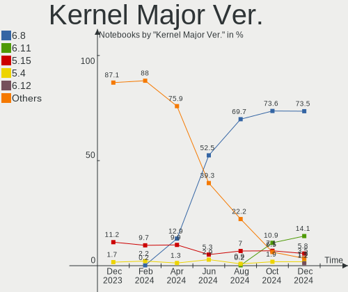
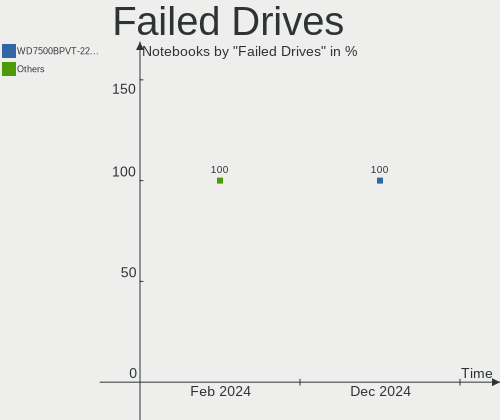
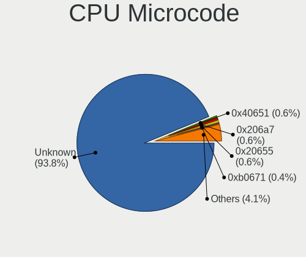
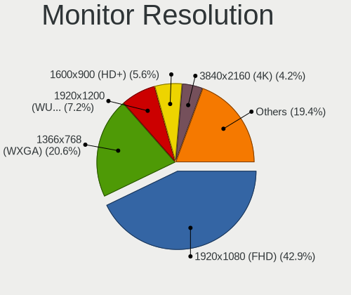
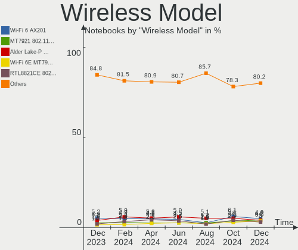
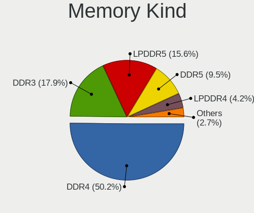
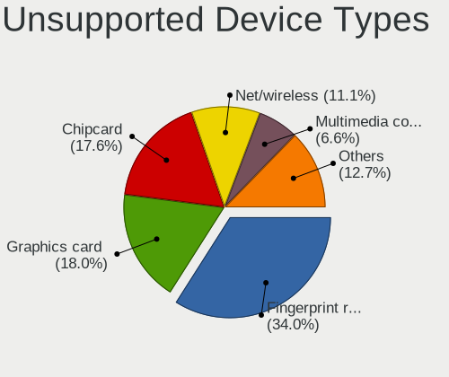

Ubuntu - Hardware Trends (Notebooks)
------------------------------------

A project to identify most popular hardware characteristics and track their change
over time based on data collected by Linux users at https://Linux-Hardware.org.

Anyone can contribute to this report by the [hw-probe](https://github.com/linuxhw/hw-probe) tool:

    sudo -E hw-probe -all -upload

This report is for one last month. Overall report since the beginning of time: [TestDays](https://github.com/linuxhw/TestDays)

Period: Dec, 2024.

Contents
--------

* [ System ](#system)
  - [ OS                       ](#os)
  - [ OS Family                ](#os-family)
  - [ Kernel                   ](#kernel)
  - [ Kernel Family            ](#kernel-family)
  - [ Kernel Major Ver.        ](#kernel-major-ver)
  - [ Arch                     ](#arch)
  - [ DE                       ](#de)
  - [ Display Server           ](#display-server)
  - [ Display Manager          ](#display-manager)
  - [ OS Lang                  ](#os-lang)
  - [ Boot Mode                ](#boot-mode)
  - [ Filesystem               ](#filesystem)
  - [ Part. scheme             ](#part-scheme)
  - [ Dual Boot with Linux/BSD ](#dual-boot-with-linuxbsd)
  - [ Dual Boot (Win)          ](#dual-boot-win)

* [ Board ](#board)
  - [ Vendor                   ](#vendor)
  - [ Model                    ](#model)
  - [ Model Family             ](#model-family)
  - [ MFG Year                 ](#mfg-year)
  - [ Form Factor              ](#form-factor)
  - [ Secure Boot              ](#secure-boot)
  - [ Coreboot                 ](#coreboot)
  - [ RAM Size                 ](#ram-size)
  - [ RAM Used                 ](#ram-used)
  - [ Total Drives             ](#total-drives)
  - [ Has CD-ROM               ](#has-cd-rom)
  - [ Has Ethernet             ](#has-ethernet)
  - [ Has WiFi                 ](#has-wifi)
  - [ Has Bluetooth            ](#has-bluetooth)

* [ Location ](#location)
  - [ Country                  ](#country)
  - [ City                     ](#city)

* [ Drives ](#drives)
  - [ Drive Vendor             ](#drive-vendor)
  - [ Drive Model              ](#drive-model)
  - [ HDD Vendor               ](#hdd-vendor)
  - [ SSD Vendor               ](#ssd-vendor)
  - [ Drive Kind               ](#drive-kind)
  - [ Drive Connector          ](#drive-connector)
  - [ Drive Size               ](#drive-size)
  - [ Space Total              ](#space-total)
  - [ Space Used               ](#space-used)
  - [ Malfunc. Drives          ](#malfunc-drives)
  - [ Malfunc. Drive Vendor    ](#malfunc-drive-vendor)
  - [ Malfunc. HDD Vendor      ](#malfunc-hdd-vendor)
  - [ Malfunc. Drive Kind      ](#malfunc-drive-kind)
  - [ Failed Drives            ](#failed-drives)
  - [ Failed Drive Vendor      ](#failed-drive-vendor)
  - [ Drive Status             ](#drive-status)

* [ Storage controller ](#storage-controller)
  - [ Storage Vendor           ](#storage-vendor)
  - [ Storage Model            ](#storage-model)
  - [ Storage Kind             ](#storage-kind)

* [ Processor ](#processor)
  - [ CPU Vendor               ](#cpu-vendor)
  - [ CPU Model                ](#cpu-model)
  - [ CPU Model Family         ](#cpu-model-family)
  - [ CPU Cores                ](#cpu-cores)
  - [ CPU Sockets              ](#cpu-sockets)
  - [ CPU Threads              ](#cpu-threads)
  - [ CPU Op-Modes             ](#cpu-op-modes)
  - [ CPU Microcode            ](#cpu-microcode)
  - [ CPU Microarch            ](#cpu-microarch)

* [ Graphics ](#graphics)
  - [ GPU Vendor               ](#gpu-vendor)
  - [ GPU Model                ](#gpu-model)
  - [ GPU Combo                ](#gpu-combo)
  - [ GPU Driver               ](#gpu-driver)
  - [ GPU Memory               ](#gpu-memory)

* [ Monitor ](#monitor)
  - [ Monitor Vendor           ](#monitor-vendor)
  - [ Monitor Model            ](#monitor-model)
  - [ Monitor Resolution       ](#monitor-resolution)
  - [ Monitor Diagonal         ](#monitor-diagonal)
  - [ Monitor Width            ](#monitor-width)
  - [ Aspect Ratio             ](#aspect-ratio)
  - [ Monitor Area             ](#monitor-area)
  - [ Pixel Density            ](#pixel-density)
  - [ Multiple Monitors        ](#multiple-monitors)

* [ Network ](#network)
  - [ Net Controller Vendor    ](#net-controller-vendor)
  - [ Net Controller Model     ](#net-controller-model)
  - [ Wireless Vendor          ](#wireless-vendor)
  - [ Wireless Model           ](#wireless-model)
  - [ Ethernet Vendor          ](#ethernet-vendor)
  - [ Ethernet Model           ](#ethernet-model)
  - [ Net Controller Kind      ](#net-controller-kind)
  - [ Used Controller          ](#used-controller)
  - [ NICs                     ](#nics)
  - [ IPv6                     ](#ipv6)

* [ Bluetooth ](#bluetooth)
  - [ Bluetooth Vendor         ](#bluetooth-vendor)
  - [ Bluetooth Model          ](#bluetooth-model)

* [ Sound ](#sound)
  - [ Sound Vendor             ](#sound-vendor)
  - [ Sound Model              ](#sound-model)

* [ Memory ](#memory)
  - [ Memory Vendor            ](#memory-vendor)
  - [ Memory Model             ](#memory-model)
  - [ Memory Kind              ](#memory-kind)
  - [ Memory Form Factor       ](#memory-form-factor)
  - [ Memory Size              ](#memory-size)
  - [ Memory Speed             ](#memory-speed)

* [ Printers & scanners ](#printers--scanners)
  - [ Printer Vendor           ](#printer-vendor)
  - [ Printer Model            ](#printer-model)
  - [ Scanner Vendor           ](#scanner-vendor)
  - [ Scanner Model            ](#scanner-model)

* [ Camera ](#camera)
  - [ Camera Vendor            ](#camera-vendor)
  - [ Camera Model             ](#camera-model)

* [ Security ](#security)
  - [ Fingerprint Vendor       ](#fingerprint-vendor)
  - [ Fingerprint Model        ](#fingerprint-model)
  - [ Chipcard Vendor          ](#chipcard-vendor)
  - [ Chipcard Model           ](#chipcard-model)

* [ Unsupported ](#unsupported)
  - [ Unsupported Devices      ](#unsupported-devices)
  - [ Unsupported Device Types ](#unsupported-device-types)

System
------

OS
--

Installed operating systems

| Name           | Notebooks | Percent |
|----------------|-----------|---------|
| Ubuntu 24.04   | 318       | 61.51%  |
| Ubuntu 22.04   | 91        | 17.6%   |
| Ubuntu 24.10   | 70        | 13.54%  |
| Ubuntu 20.04   | 23        | 4.45%   |
| Ubuntu 18.04   | 10        | 1.93%   |
| Ubuntu Core 22 | 1         | 0.19%   |
| Ubuntu 24.0    | 1         | 0.19%   |
| Ubuntu 23.10   | 1         | 0.19%   |
| Ubuntu 22.10   | 1         | 0.19%   |
| Ubuntu 20.10   | 1         | 0.19%   |

OS Family
---------

OS without a version

| Name   | Notebooks | Percent |
|--------|-----------|---------|
| Ubuntu | 517       | 100%    |

Kernel
------

Version of the Linux kernel

| Version                   | Notebooks | Percent |
|---------------------------|-----------|---------|
| 6.8.0-49-generic          | 164       | 31.72%  |
| 6.8.0-51-generic          | 99        | 19.15%  |
| 6.8.0-50-generic          | 67        | 12.96%  |
| 6.11.0-13-generic         | 32        | 6.19%   |
| 6.11.0-9-generic          | 25        | 4.84%   |
| 6.8.0-41-generic          | 16        | 3.09%   |
| 5.15.0-126-generic        | 11        | 2.13%   |
| 6.8.0-48-generic          | 9         | 1.74%   |
| 5.15.0-125-generic        | 7         | 1.35%   |
| 6.8.0-45-generic          | 6         | 1.16%   |
| 6.11.0-12-generic         | 6         | 1.16%   |
| 5.4.0-150-generic         | 6         | 1.16%   |
| 6.8.0-40-generic          | 5         | 0.97%   |
| 5.15.0-127-generic        | 5         | 0.97%   |
| 6.8.0-47-generic          | 4         | 0.77%   |
| 6.11.0-8-generic          | 4         | 0.77%   |
| 6.8.0-38-generic          | 3         | 0.58%   |
| 6.8.0-109049-tuxedo       | 3         | 0.58%   |
| 6.12.3-061203-generic     | 3         | 0.58%   |
| 6.5.0-18-generic          | 2         | 0.39%   |
| 6.11.0-1009-oem           | 2         | 0.39%   |
| 5.15.0-124-generic        | 2         | 0.39%   |
| 6.9.12-060912-generic     | 1         | 0.19%   |
| 6.9.0-void03-nomac-znver3 | 1         | 0.19%   |
| 6.8.0-50-lowlatency       | 1         | 0.19%   |
| 6.8.0-44-generic          | 1         | 0.19%   |
| 6.8.0-31-generic          | 1         | 0.19%   |
| 6.8.0-19-generic          | 1         | 0.19%   |
| 6.5.0-9-generic           | 1         | 0.19%   |
| 6.5.0-35-generic          | 1         | 0.19%   |
| 6.5.0-21-generic          | 1         | 0.19%   |
| 6.2.0-37-generic          | 1         | 0.19%   |
| 6.2.0-26-generic          | 1         | 0.19%   |
| 6.2.0-20-generic          | 1         | 0.19%   |
| 6.12.1-zen1-1-zen         | 1         | 0.19%   |
| 6.12.1                    | 1         | 0.19%   |
| 6.12.0-21-qcom-x1e        | 1         | 0.19%   |
| 6.11.11                   | 1         | 0.19%   |
| 6.11.0-1010-oem           | 1         | 0.19%   |
| 6.11.0-1005-lowlatency    | 1         | 0.19%   |

Kernel Family
-------------

Linux kernel without a distro release

| Version | Notebooks | Percent |
|---------|-----------|---------|
| 6.8.0   | 380       | 73.5%   |
| 6.11.0  | 72        | 13.93%  |
| 5.15.0  | 30        | 5.8%    |
| 5.4.0   | 10        | 1.93%   |
| 6.5.0   | 5         | 0.97%   |
| 6.2.0   | 3         | 0.58%   |
| 6.12.3  | 3         | 0.58%   |
| 6.12.1  | 2         | 0.39%   |
| 5.19.0  | 2         | 0.39%   |
| 6.9.12  | 1         | 0.19%   |
| 6.9.0   | 1         | 0.19%   |
| 6.12.0  | 1         | 0.19%   |
| 6.11.11 | 1         | 0.19%   |
| 6.1.0   | 1         | 0.19%   |
| 6.0.12  | 1         | 0.19%   |
| 5.8.0   | 1         | 0.19%   |
| 5.3.0   | 1         | 0.19%   |
| 5.13.0  | 1         | 0.19%   |
| 4.15.0  | 1         | 0.19%   |

Kernel Major Ver.
-----------------

Linux kernel major version

| Version | Notebooks | Percent |
|---------|-----------|---------|
| 6.8     | 380       | 73.5%   |
| 6.11    | 73        | 14.12%  |
| 5.15    | 30        | 5.8%    |
| 5.4     | 10        | 1.93%   |
| 6.12    | 6         | 1.16%   |
| 6.5     | 5         | 0.97%   |
| 6.2     | 3         | 0.58%   |
| 6.9     | 2         | 0.39%   |
| 5.19    | 2         | 0.39%   |
| 6.1     | 1         | 0.19%   |
| 6.0     | 1         | 0.19%   |
| 5.8     | 1         | 0.19%   |
| 5.3     | 1         | 0.19%   |
| 5.13    | 1         | 0.19%   |
| 4.15    | 1         | 0.19%   |

Arch
----

OS architecture (x86_64, i586, etc.)

| Name    | Notebooks | Percent |
|---------|-----------|---------|
| x86_64  | 516       | 99.81%  |
| aarch64 | 1         | 0.19%   |

DE
--

Desktop Environment

| Name            | Notebooks | Percent |
|-----------------|-----------|---------|
| GNOME           | 500       | 96.71%  |
| X-Cinnamon      | 4         | 0.77%   |
| Unknown         | 4         | 0.77%   |
| Enlightenment   | 2         | 0.39%   |
| Cinnamon        | 2         | 0.39%   |
| i3              | 1         | 0.19%   |
| Hyprland        | 1         | 0.19%   |
| GNOME Flashback | 1         | 0.19%   |
| GNOME Classic   | 1         | 0.19%   |
| awesome         | 1         | 0.19%   |

Display Server
--------------

X11 or Wayland

| Name    | Notebooks | Percent |
|---------|-----------|---------|
| Wayland | 367       | 70.99%  |
| X11     | 140       | 27.08%  |
| Tty     | 5         | 0.97%   |
| Unknown | 5         | 0.97%   |

Display Manager
---------------

SDDM, LightDM, etc.

| Name    | Notebooks | Percent |
|---------|-----------|---------|
| GDM3    | 454       | 87.81%  |
| Unknown | 36        | 6.96%   |
| GDM     | 16        | 3.09%   |
| LightDM | 7         | 1.35%   |
| SDDM    | 4         | 0.77%   |

OS Lang
-------

Language

| Lang    | Notebooks | Percent |
|---------|-----------|---------|
| en_US   | 259       | 50.1%   |
| de_DE   | 51        | 9.86%   |
| fr_FR   | 30        | 5.8%    |
| es_ES   | 24        | 4.64%   |
| pt_BR   | 23        | 4.45%   |
| ru_RU   | 15        | 2.9%    |
| en_GB   | 14        | 2.71%   |
| it_IT   | 13        | 2.51%   |
| C       | 10        | 1.93%   |
| nl_NL   | 8         | 1.55%   |
| pl_PL   | 7         | 1.35%   |
| en_IN   | 6         | 1.16%   |
| en_AU   | 6         | 1.16%   |
| cs_CZ   | 5         | 0.97%   |
| en_CA   | 4         | 0.77%   |
| zh_CN   | 3         | 0.58%   |
| en_IL   | 3         | 0.58%   |
| Unknown | 3         | 0.58%   |
| tr_TR   | 2         | 0.39%   |
| nb_NO   | 2         | 0.39%   |
| ko_KR   | 2         | 0.39%   |
| hu_HU   | 2         | 0.39%   |
| es_MX   | 2         | 0.39%   |
| es_AR   | 2         | 0.39%   |
| uk_UA   | 1         | 0.19%   |
| sv_SE   | 1         | 0.19%   |
| sl_SI   | 1         | 0.19%   |
| ro_RO   | 1         | 0.19%   |
| nl_BE   | 1         | 0.19%   |
| mr_IN   | 1         | 0.19%   |
| lv_LV   | 1         | 0.19%   |
| ja_JP   | 1         | 0.19%   |
| id_ID   | 1         | 0.19%   |
| hr_HR   | 1         | 0.19%   |
| fr_CH   | 1         | 0.19%   |
| fr_BE   | 1         | 0.19%   |
| fi_FI   | 1         | 0.19%   |
| es_UY   | 1         | 0.19%   |
| en_ZA   | 1         | 0.19%   |
| en_SG   | 1         | 0.19%   |

Boot Mode
---------

EFI or BIOS

| Mode | Notebooks | Percent |
|------|-----------|---------|
| BIOS | 295       | 57.06%  |
| EFI  | 222       | 42.94%  |

Filesystem
----------

Type of filesystem

| Type    | Notebooks | Percent |
|---------|-----------|---------|
| Tmpfs   | 276       | 53.38%  |
| Ext4    | 225       | 43.52%  |
| Overlay | 8         | 1.55%   |
| Btrfs   | 6         | 1.16%   |
| Zfs     | 2         | 0.39%   |

Part. scheme
------------

Scheme of partitioning

| Type    | Notebooks | Percent |
|---------|-----------|---------|
| GPT     | 449       | 86.85%  |
| MBR     | 34        | 6.58%   |
| Unknown | 34        | 6.58%   |

Dual Boot with Linux/BSD
------------------------

Hosting more than one Linux/BSD

| Dual boot | Notebooks | Percent |
|-----------|-----------|---------|
| No        | 474       | 91.68%  |
| Yes       | 43        | 8.32%   |

Dual Boot (Win)
---------------

Hosting Linux and Windows

| Dual boot | Notebooks | Percent |
|-----------|-----------|---------|
| No        | 343       | 66.34%  |
| Yes       | 174       | 33.66%  |

Board
-----

Vendor
------

Motherboard manufacturer

| Name                  | Notebooks | Percent |
|-----------------------|-----------|---------|
| Lenovo                | 120       | 23.21%  |
| Hewlett-Packard       | 94        | 18.18%  |
| Dell                  | 89        | 17.21%  |
| ASUSTek Computer      | 71        | 13.73%  |
| Acer                  | 40        | 7.74%   |
| Apple                 | 17        | 3.29%   |
| Samsung Electronics   | 9         | 1.74%   |
| HUAWEI                | 7         | 1.35%   |
| MSI                   | 6         | 1.16%   |
| Toshiba               | 5         | 0.97%   |
| Sony                  | 4         | 0.77%   |
| Notebook              | 4         | 0.77%   |
| Fujitsu               | 4         | 0.77%   |
| TUXEDO                | 3         | 0.58%   |
| Positivo Bahia - VAIO | 3         | 0.58%   |
| HONOR                 | 3         | 0.58%   |
| Packard Bell          | 2         | 0.39%   |
| Medion                | 2         | 0.39%   |
| Maibenben             | 2         | 0.39%   |
| ICL                   | 2         | 0.39%   |
| Google                | 2         | 0.39%   |
| Framework             | 2         | 0.39%   |
| Unknown               | 2         | 0.39%   |
| Wortmann AG           | 1         | 0.19%   |
| Vizio                 | 1         | 0.19%   |
| Timi                  | 1         | 0.19%   |
| System76              | 1         | 0.19%   |
| SLIMBOOK              | 1         | 0.19%   |
| SKIKK                 | 1         | 0.19%   |
| Razer                 | 1         | 0.19%   |
| OEGStone              | 1         | 0.19%   |
| Motion Computing      | 1         | 0.19%   |
| Monster               | 1         | 0.19%   |
| LG Electronics        | 1         | 0.19%   |
| Kelyx Argentina       | 1         | 0.19%   |
| Hampoo                | 1         | 0.19%   |
| Gigabyte Technology   | 1         | 0.19%   |
| Gateway               | 1         | 0.19%   |
| Exo                   | 1         | 0.19%   |
| Compal                | 1         | 0.19%   |

Model
-----

Motherboard model

| Name                                       | Notebooks | Percent |
|--------------------------------------------|-----------|---------|
| HP Notebook                                | 4         | 0.77%   |
| Acer Aspire A515-57                        | 4         | 0.77%   |
| Dell Latitude 5420                         | 3         | 0.58%   |
| Dell Inspiron 15 3520                      | 3         | 0.58%   |
| Dell G15 5530                              | 3         | 0.58%   |
| ASUS VivoBook_ASUSLaptop X1605VA_X1605VA   | 3         | 0.58%   |
| Acer Aspire A315-59                        | 3         | 0.58%   |
| Unknown                                    | 3         | 0.58%   |
| TUXEDO Sirius 16 Gen2                      | 2         | 0.39%   |
| Samsung 550XDA                             | 2         | 0.39%   |
| Lenovo V15 G4 AMN 82YU                     | 2         | 0.39%   |
| Lenovo Slim Pro 7 14ARP8 83AX              | 2         | 0.39%   |
| Lenovo Legion Slim 5 16APH8 82Y9           | 2         | 0.39%   |
| Lenovo IdeaPad 3 15ITL6 82H8               | 2         | 0.39%   |
| Lenovo IdeaPad 3 15ADA05 81W1              | 2         | 0.39%   |
| Lenovo G50-70 20351                        | 2         | 0.39%   |
| HP Pavilion Laptop 15-eg2xxx               | 2         | 0.39%   |
| HP Pavilion dv7                            | 2         | 0.39%   |
| HP Pavilion dv6                            | 2         | 0.39%   |
| HP Laptop 15-fd0xxx                        | 2         | 0.39%   |
| HP Laptop 15-db1xxx                        | 2         | 0.39%   |
| HP EliteBook 8440p                         | 2         | 0.39%   |
| HP EliteBook 840 G6                        | 2         | 0.39%   |
| HP EliteBook 840 G1                        | 2         | 0.39%   |
| Framework Laptop 13 (AMD Ryzen 7040Series) | 2         | 0.39%   |
| Dell Precision 5690                        | 2         | 0.39%   |
| Dell Latitude E6330                        | 2         | 0.39%   |
| Dell Latitude E6320                        | 2         | 0.39%   |
| Dell Latitude 7280                         | 2         | 0.39%   |
| Dell Latitude 5550                         | 2         | 0.39%   |
| Dell Latitude 5530                         | 2         | 0.39%   |
| Dell Inspiron 7773                         | 2         | 0.39%   |
| Dell Inspiron 5570                         | 2         | 0.39%   |
| Dell Inspiron 15-3567                      | 2         | 0.39%   |
| ASUS VivoBook_ASUSLaptop X1404ZA_X1404ZA   | 2         | 0.39%   |
| ASUS Vivobook Go E1504FA_E1504FA           | 2         | 0.39%   |
| ASUS ASUS Zenbook 14 UM3406HA_UM3406HA     | 2         | 0.39%   |
| ASUS ASUS Vivobook S 16 M5606WA_M5606WA    | 2         | 0.39%   |
| Apple MacBookPro9,2                        | 2         | 0.39%   |
| Apple MacBookAir7,2                        | 2         | 0.39%   |

Model Family
------------

Motherboard model prefix

| Name                  | Notebooks | Percent |
|-----------------------|-----------|---------|
| Lenovo ThinkPad       | 60        | 11.61%  |
| Dell Latitude         | 33        | 6.38%   |
| Acer Aspire           | 31        | 6%      |
| ASUS VivoBook         | 22        | 4.26%   |
| Lenovo IdeaPad        | 21        | 4.06%   |
| HP Pavilion           | 20        | 3.87%   |
| HP EliteBook          | 19        | 3.68%   |
| Dell Inspiron         | 18        | 3.48%   |
| HP Laptop             | 15        | 2.9%    |
| Dell Precision        | 13        | 2.51%   |
| ASUS ASUS             | 13        | 2.51%   |
| HP ProBook            | 11        | 2.13%   |
| Dell Vostro           | 10        | 1.93%   |
| ASUS ROG              | 8         | 1.55%   |
| Lenovo ThinkBook      | 7         | 1.35%   |
| Dell XPS              | 7         | 1.35%   |
| Toshiba Satellite     | 5         | 0.97%   |
| Lenovo Legion         | 5         | 0.97%   |
| HP ZBook              | 5         | 0.97%   |
| HP ENVY               | 5         | 0.97%   |
| ASUS Zenbook          | 5         | 0.97%   |
| Lenovo V15            | 4         | 0.77%   |
| HP Victus             | 4         | 0.77%   |
| HP Notebook           | 4         | 0.77%   |
| Dell G15              | 4         | 0.77%   |
| Acer Nitro            | 4         | 0.77%   |
| Fujitsu LIFEBOOK      | 3         | 0.58%   |
| Unknown               | 3         | 0.58%   |
| TUXEDO Sirius         | 2         | 0.39%   |
| Samsung 550XDA        | 2         | 0.39%   |
| Packard Bell EasyNote | 2         | 0.39%   |
| MSI Katana            | 2         | 0.39%   |
| Lenovo Yoga           | 2         | 0.39%   |
| Lenovo Slim           | 2         | 0.39%   |
| Lenovo LOQ            | 2         | 0.39%   |
| Lenovo G585           | 2         | 0.39%   |
| Lenovo G50-70         | 2         | 0.39%   |
| HP OMEN               | 2         | 0.39%   |
| HP Compaq             | 2         | 0.39%   |
| Framework Laptop      | 2         | 0.39%   |

MFG Year
--------

Motherboard manufacture year

| Year    | Notebooks | Percent |
|---------|-----------|---------|
| 2023    | 74        | 14.31%  |
| 2021    | 55        | 10.64%  |
| 2022    | 47        | 9.09%   |
| 2024    | 46        | 8.9%    |
| 2020    | 39        | 7.54%   |
| 2019    | 35        | 6.77%   |
| 2011    | 34        | 6.58%   |
| 2017    | 30        | 5.8%    |
| 2013    | 29        | 5.61%   |
| 2012    | 23        | 4.45%   |
| 2014    | 19        | 3.68%   |
| 2010    | 19        | 3.68%   |
| 2018    | 17        | 3.29%   |
| 2015    | 15        | 2.9%    |
| 2016    | 12        | 2.32%   |
| 2008    | 10        | 1.93%   |
| 2009    | 6         | 1.16%   |
| 2007    | 6         | 1.16%   |
| Unknown | 1         | 0.19%   |

Form Factor
-----------

Physical design of the computer

| Name     | Notebooks | Percent |
|----------|-----------|---------|
| Notebook | 517       | 100%    |

Secure Boot
-----------

Enabled or disabled

| State    | Notebooks | Percent |
|----------|-----------|---------|
| Disabled | 466       | 90.14%  |
| Enabled  | 51        | 9.86%   |

Coreboot
--------

Have coreboot on board

| Used | Notebooks | Percent |
|------|-----------|---------|
| No   | 514       | 99.42%  |
| Yes  | 3         | 0.58%   |

RAM Size
--------

Total RAM memory

| Size in GB  | Notebooks | Percent |
|-------------|-----------|---------|
| 4.01-8.0    | 135       | 26.11%  |
| 8.01-16.0   | 120       | 23.21%  |
| 16.01-24.0  | 102       | 19.73%  |
| 32.01-64.0  | 57        | 11.03%  |
| 3.01-4.0    | 55        | 10.64%  |
| 24.01-32.0  | 24        | 4.64%   |
| 64.01-256.0 | 15        | 2.9%    |
| 1.01-2.0    | 6         | 1.16%   |
| 2.01-3.0    | 3         | 0.58%   |

RAM Used
--------

Used RAM memory

| Used GB    | Notebooks | Percent |
|------------|-----------|---------|
| 4.01-8.0   | 144       | 27.85%  |
| 2.01-3.0   | 130       | 25.15%  |
| 3.01-4.0   | 106       | 20.5%   |
| 1.01-2.0   | 90        | 17.41%  |
| 8.01-16.0  | 34        | 6.58%   |
| 16.01-24.0 | 6         | 1.16%   |
| 0.51-1.0   | 5         | 0.97%   |
| 32.01-64.0 | 2         | 0.39%   |

Total Drives
------------

Number of drives on board

| Drives | Notebooks | Percent |
|--------|-----------|---------|
| 1      | 400       | 77.37%  |
| 2      | 104       | 20.12%  |
| 3      | 10        | 1.93%   |
| 4      | 2         | 0.39%   |
| 0      | 1         | 0.19%   |

Has CD-ROM
----------

Has CD-ROM on board

| Presented | Notebooks | Percent |
|-----------|-----------|---------|
| No        | 410       | 79.3%   |
| Yes       | 107       | 20.7%   |

Has Ethernet
------------

Has Ethernet on board

| Presented | Notebooks | Percent |
|-----------|-----------|---------|
| Yes       | 383       | 74.08%  |
| No        | 134       | 25.92%  |

Has WiFi
--------

Has WiFi module

| Presented | Notebooks | Percent |
|-----------|-----------|---------|
| Yes       | 496       | 95.94%  |
| No        | 21        | 4.06%   |

Has Bluetooth
-------------

Has Bluetooth module

| Presented | Notebooks | Percent |
|-----------|-----------|---------|
| Yes       | 440       | 85.11%  |
| No        | 77        | 14.89%  |

Location
--------

Country
-------

Geographic location (country)

| Country         | Notebooks | Percent |
|-----------------|-----------|---------|
| USA             | 85        | 16.44%  |
| Germany         | 58        | 11.22%  |
| France          | 38        | 7.35%   |
| Brazil          | 35        | 6.77%   |
| Russia          | 27        | 5.22%   |
| India           | 21        | 4.06%   |
| Italy           | 18        | 3.48%   |
| UK              | 14        | 2.71%   |
| Canada          | 14        | 2.71%   |
| Spain           | 13        | 2.51%   |
| Netherlands     | 12        | 2.32%   |
| Poland          | 11        | 2.13%   |
| Switzerland     | 8         | 1.55%   |
| Portugal        | 7         | 1.35%   |
| Mexico          | 7         | 1.35%   |
| Chile           | 7         | 1.35%   |
| Turkey          | 6         | 1.16%   |
| Romania         | 6         | 1.16%   |
| Czechia         | 6         | 1.16%   |
| Belgium         | 6         | 1.16%   |
| Australia       | 6         | 1.16%   |
| South Africa    | 5         | 0.97%   |
| Norway          | 5         | 0.97%   |
| Israel          | 5         | 0.97%   |
| Argentina       | 5         | 0.97%   |
| Sweden          | 4         | 0.77%   |
| South Korea     | 4         | 0.77%   |
| Pakistan        | 4         | 0.77%   |
| Indonesia       | 4         | 0.77%   |
| Finland         | 4         | 0.77%   |
| Singapore       | 3         | 0.58%   |
| Iran            | 3         | 0.58%   |
| Hungary         | 3         | 0.58%   |
| Denmark         | 3         | 0.58%   |
| China           | 3         | 0.58%   |
| Bulgaria        | 3         | 0.58%   |
| Austria         | 3         | 0.58%   |
| Tunisia         | 2         | 0.39%   |
| The Netherlands | 2         | 0.39%   |
| Serbia          | 2         | 0.39%   |

City
----

Geographic location (city)

| City           | Notebooks | Percent |
|----------------|-----------|---------|
| Moscow         | 10        | 1.93%   |
| Berlin         | 7         | 1.35%   |
| Santiago       | 6         | 1.16%   |
| Hamburg        | 6         | 1.16%   |
| Rio de Janeiro | 5         | 0.97%   |
| Munich         | 5         | 0.97%   |
| Sydney         | 4         | 0.77%   |
| St Petersburg  | 4         | 0.77%   |
| Seattle        | 4         | 0.77%   |
| Helsinki       | 4         | 0.77%   |
| Delhi          | 4         | 0.77%   |
| Bucharest      | 4         | 0.77%   |
| Zurich         | 3         | 0.58%   |
| Toronto        | 3         | 0.58%   |
| Singapore      | 3         | 0.58%   |
| Sao Paulo      | 3         | 0.58%   |
| Novosibirsk    | 3         | 0.58%   |
| Nice           | 3         | 0.58%   |
| Los Angeles    | 3         | 0.58%   |
| Karachi        | 3         | 0.58%   |
| Granada        | 3         | 0.58%   |
| Amsterdam      | 3         | 0.58%   |
| Zagreb         | 2         | 0.39%   |
| Warsaw         | 2         | 0.39%   |
| Verton         | 2         | 0.39%   |
| Tunis          | 2         | 0.39%   |
| Tehran         | 2         | 0.39%   |
| Stanton        | 2         | 0.39%   |
| Skopje         | 2         | 0.39%   |
| Schoten        | 2         | 0.39%   |
| San Juan       | 2         | 0.39%   |
| Salvador       | 2         | 0.39%   |
| Salta          | 2         | 0.39%   |
| Rome           | 2         | 0.39%   |
| Richmond       | 2         | 0.39%   |
| Portland       | 2         | 0.39%   |
| Phoenix        | 2         | 0.39%   |
| Petah Tikva    | 2         | 0.39%   |
| Paris          | 2         | 0.39%   |
| Oslo           | 2         | 0.39%   |

Drives
------

Drive Vendor
------------

Hard drive vendors

| Vendor                         | Notebooks | Drives | Percent |
|--------------------------------|-----------|--------|---------|
| Samsung Electronics            | 110       | 117    | 17.83%  |
| SanDisk                        | 58        | 58     | 9.4%    |
| WDC                            | 49        | 50     | 7.94%   |
| Seagate                        | 47        | 50     | 7.62%   |
| Micron Technology              | 47        | 48     | 7.62%   |
| SK hynix                       | 39        | 39     | 6.32%   |
| Toshiba                        | 34        | 35     | 5.51%   |
| KIOXIA                         | 20        | 20     | 3.24%   |
| Kingston                       | 20        | 20     | 3.24%   |
| Intel                          | 17        | 17     | 2.76%   |
| Unknown                        | 16        | 17     | 2.59%   |
| Crucial                        | 15        | 16     | 2.43%   |
| Hitachi                        | 14        | 14     | 2.27%   |
| China                          | 9         | 9      | 1.46%   |
| Apple                          | 9         | 11     | 1.46%   |
| Phison Electronics             | 7         | 7      | 1.13%   |
| A-DATA Technology              | 7         | 7      | 1.13%   |
| Kingston Technology Company    | 6         | 6      | 0.97%   |
| HGST                           | 6         | 6      | 0.97%   |
| Unknown                        | 6         | 8      | 0.97%   |
| Micron/Crucial Technology      | 5         | 5      | 0.81%   |
| Silicon Motion                 | 4         | 4      | 0.65%   |
| Shenzhen Longsys Electronics   | 4         | 4      | 0.65%   |
| MAXIO Technology (Hangzhou)    | 4         | 4      | 0.65%   |
| Intenso                        | 4         | 4      | 0.65%   |
| Transcend                      | 3         | 3      | 0.49%   |
| PNY                            | 3         | 3      | 0.49%   |
| Phison                         | 3         | 3      | 0.49%   |
| LITEON                         | 3         | 3      | 0.49%   |
| ADATA Technology               | 3         | 3      | 0.49%   |
| Verbatim                       | 2         | 2      | 0.32%   |
| Solid State Storage Technology | 2         | 2      | 0.32%   |
| Realtek Semiconductor          | 2         | 2      | 0.32%   |
| Plextor                        | 2         | 2      | 0.32%   |
| Lenovo                         | 2         | 2      | 0.32%   |
| GOODRAM                        | 2         | 2      | 0.32%   |
| EVM                            | 2         | 2      | 0.32%   |
| Emtec                          | 2         | 2      | 0.32%   |
| ZHITAI                         | 1         | 1      | 0.16%   |
| YMTC                           | 1         | 1      | 0.16%   |

Drive Model
-----------

Hard drive models

| Model                                                | Notebooks | Percent |
|------------------------------------------------------|-----------|---------|
| SanDisk NVMe SSD Drive 512GB                         | 12        | 1.91%   |
| SanDisk NVMe SSD Drive 1TB                           | 10        | 1.59%   |
| Samsung NVMe SSD Controller PM9A1/PM9A3/980PRO 512GB | 9         | 1.43%   |
| Seagate ST1000LM035-1RK172 1TB                       | 7         | 1.11%   |
| Toshiba MQ01ABF050 500GB                             | 6         | 0.95%   |
| Toshiba MQ01ABD100 1TB                               | 6         | 0.95%   |
| Samsung NVMe SSD Controller SM961/PM961/SM963 256GB  | 6         | 0.95%   |
| Micron 2450_MTFDKBA512TFK 512GB                      | 6         | 0.95%   |
| Unknown                                              | 6         | 0.95%   |
| Samsung NVMe SSD Controller SM981/PM981/PM983 512GB  | 5         | 0.79%   |
| Samsung MZVL4512HBLU-00BTW 512GB                     | 5         | 0.79%   |
| Kingston SA400S37240G 240GB SSD                      | 5         | 0.79%   |
| Intel SSD 660P Series 1024GB                         | 5         | 0.79%   |
| Samsung SSD 870 EVO 1TB                              | 4         | 0.64%   |
| Samsung SSD 860 EVO 500GB                            | 4         | 0.64%   |
| KIOXIA KXG8AZNV1T02 LA 1024GB                        | 4         | 0.64%   |
| Intel SSDPEKNU010TZ 1TB                              | 4         | 0.64%   |
| Hitachi HTS545050B9A300 500GB                        | 4         | 0.64%   |
| HGST HTS545050A7E680 500GB                           | 4         | 0.64%   |
| Unknown NVMe SSD Drive 512GB                         | 3         | 0.48%   |
| Unknown MMC Card  64GB                               | 3         | 0.48%   |
| Unknown MMC Card  32GB                               | 3         | 0.48%   |
| Toshiba MQ04ABF100 1TB                               | 3         | 0.48%   |
| SK hynix SKHynix_HFS001TEJ4X112N 1TB                 | 3         | 0.48%   |
| Silicon Motion PCIe-8 SSD 512GB                      | 3         | 0.48%   |
| Seagate ST9500325AS 500GB                            | 3         | 0.48%   |
| Seagate Expansion 1TB                                | 3         | 0.48%   |
| Sandisk WD Black SN750 / PC SN730 NVMe SSD 512GB     | 3         | 0.48%   |
| Sandisk PC SN740 NVMe WD 512GB                       | 3         | 0.48%   |
| Samsung SSD 850 EVO 250GB                            | 3         | 0.48%   |
| Samsung SSD 840 EVO 250GB                            | 3         | 0.48%   |
| Samsung MZALQ256HAJD-000L2 256GB                     | 3         | 0.48%   |
| Micron/Crucial P2 NVMe PCIe SSD 500GB                | 3         | 0.48%   |
| Micron MTFDKBA1T0QFM-1BD1AABGB 1024GB                | 3         | 0.48%   |
| Micron 2400A NVMe 512GB                              | 3         | 0.48%   |
| MAXIO (Hangzhou) NVMe SSD Controller MAP1202 512GB   | 3         | 0.48%   |
| Kingston SNV2S500G 500GB                             | 3         | 0.48%   |
| Kingston SA400S37480G 480GB SSD                      | 3         | 0.48%   |
| WDC WD5000LPCX-24C6HT0 500GB                         | 2         | 0.32%   |
| WDC WD10SPZX-80Z10T2 1TB                             | 2         | 0.32%   |

HDD Vendor
----------

Hard disk drive vendors

| Vendor             | Notebooks | Drives | Percent |
|--------------------|-----------|--------|---------|
| Seagate            | 46        | 49     | 35.38%  |
| WDC                | 33        | 33     | 25.38%  |
| Toshiba            | 24        | 25     | 18.46%  |
| Hitachi            | 14        | 14     | 10.77%  |
| HGST               | 6         | 6      | 4.62%   |
| Unknown            | 1         | 1      | 0.77%   |
| TO Exter           | 1         | 1      | 0.77%   |
| SABRENT            | 1         | 1      | 0.77%   |
| JMicron Technology | 1         | 1      | 0.77%   |
| External           | 1         | 1      | 0.77%   |
| ASMT               | 1         | 1      | 0.77%   |
| Apple              | 1         | 1      | 0.77%   |

SSD Vendor
----------

Solid state drive vendors

| Vendor              | Notebooks | Drives | Percent |
|---------------------|-----------|--------|---------|
| Samsung Electronics | 37        | 38     | 25.87%  |
| Kingston            | 14        | 14     | 9.79%   |
| Crucial             | 11        | 12     | 7.69%   |
| SanDisk             | 10        | 10     | 6.99%   |
| Micron Technology   | 9         | 9      | 6.29%   |
| China               | 9         | 9      | 6.29%   |
| WDC                 | 6         | 6      | 4.2%    |
| Toshiba             | 6         | 6      | 4.2%    |
| A-DATA Technology   | 4         | 4      | 2.8%    |
| PNY                 | 3         | 3      | 2.1%    |
| LITEON              | 3         | 3      | 2.1%    |
| Intenso             | 3         | 3      | 2.1%    |
| Apple               | 3         | 3      | 2.1%    |
| Verbatim            | 2         | 2      | 1.4%    |
| Transcend           | 2         | 2      | 1.4%    |
| SK hynix            | 2         | 2      | 1.4%    |
| Plextor             | 2         | 2      | 1.4%    |
| GOODRAM             | 2         | 2      | 1.4%    |
| Unknown             | 2         | 2      | 1.4%    |
| V-GeN               | 1         | 1      | 0.7%    |
| TwinMOS             | 1         | 1      | 0.7%    |
| SPCC                | 1         | 1      | 0.7%    |
| Netac               | 1         | 2      | 0.7%    |
| LITEONIT            | 1         | 1      | 0.7%    |
| Lexar               | 1         | 1      | 0.7%    |
| Lenovo              | 1         | 1      | 0.7%    |
| KingSpec            | 1         | 1      | 0.7%    |
| Intel               | 1         | 1      | 0.7%    |
| EVM                 | 1         | 1      | 0.7%    |
| Emtec               | 1         | 1      | 0.7%    |
| EAGET               | 1         | 1      | 0.7%    |
| Biostar             | 1         | 1      | 0.7%    |

Drive Kind
----------

HDD or SSD

| Kind    | Notebooks | Drives | Percent |
|---------|-----------|--------|---------|
| NVMe    | 305       | 333    | 51.61%  |
| SSD     | 136       | 146    | 23.01%  |
| HDD     | 127       | 134    | 21.49%  |
| MMC     | 12        | 13     | 2.03%   |
| Unknown | 11        | 12     | 1.86%   |

Drive Connector
---------------

SATA, SAS, NVMe, etc.

| Type | Notebooks | Drives | Percent |
|------|-----------|--------|---------|
| NVMe | 304       | 330    | 53.15%  |
| SATA | 229       | 267    | 40.03%  |
| SAS  | 27        | 28     | 4.72%   |
| MMC  | 12        | 13     | 2.1%    |

Drive Size
----------

Size of hard drive

| Size in TB | Notebooks | Drives | Percent |
|------------|-----------|--------|---------|
| 0.01-0.5   | 165       | 174    | 61.57%  |
| 0.51-1.0   | 85        | 88     | 31.72%  |
| 1.01-2.0   | 13        | 13     | 4.85%   |
| 10.01-20.0 | 2         | 2      | 0.75%   |
| 4.01-10.0  | 2         | 2      | 0.75%   |
| 3.01-4.0   | 1         | 1      | 0.37%   |

Space Total
-----------

Amount of disk space available on the file system

| Size in GB     | Notebooks | Percent |
|----------------|-----------|---------|
| 251-500        | 177       | 34.24%  |
| 101-250        | 126       | 24.37%  |
| 501-1000       | 112       | 21.66%  |
| 51-100         | 29        | 5.61%   |
| 1001-2000      | 27        | 5.22%   |
| 21-50          | 15        | 2.9%    |
| 1-20           | 14        | 2.71%   |
| More than 3000 | 10        | 1.93%   |
| 2001-3000      | 5         | 0.97%   |
| Unknown        | 2         | 0.39%   |

Space Used
----------

Amount of used disk space

| Used GB        | Notebooks | Percent |
|----------------|-----------|---------|
| 1-20           | 156       | 30.17%  |
| 21-50          | 109       | 21.08%  |
| 101-250        | 94        | 18.18%  |
| 51-100         | 70        | 13.54%  |
| 251-500        | 45        | 8.7%    |
| 501-1000       | 29        | 5.61%   |
| 1001-2000      | 7         | 1.35%   |
| More than 3000 | 3         | 0.58%   |
| 2001-3000      | 2         | 0.39%   |
| Unknown        | 2         | 0.39%   |

Malfunc. Drives
---------------

Drive models with a malfunction

| Model                                        | Notebooks | Drives | Percent |
|----------------------------------------------|-----------|--------|---------|
| Hitachi HTS545050B9A300 500GB                | 2         | 2      | 14.29%  |
| WDC WD5000LPCX-00VHAT0 500GB                 | 1         | 1      | 7.14%   |
| Transcend TS1TMTE220S 1TB                    | 1         | 1      | 7.14%   |
| Toshiba KSG60ZMV256G M.2 2280 256GB SSD      | 1         | 1      | 7.14%   |
| SK hynix HFS256G39TND-N210A 256GB SSD        | 1         | 1      | 7.14%   |
| Seagate ST9320423AS 320GB                    | 1         | 1      | 7.14%   |
| Seagate ST9250315AS 250GB                    | 1         | 1      | 7.14%   |
| SanDisk SSD U100 24GB                        | 1         | 1      | 7.14%   |
| Samsung Electronics MZVLQ512HBLU-00BTW 512GB | 1         | 1      | 7.14%   |
| Hitachi HTS547575A9E384 752GB                | 1         | 1      | 7.14%   |
| HGST HTS545050A7E680 500GB                   | 1         | 1      | 7.14%   |
| Crucial CT525MX300SSD1 528GB                 | 1         | 1      | 7.14%   |
| Crucial CT512M550SSD3 512GB                  | 1         | 1      | 7.14%   |

Malfunc. Drive Vendor
---------------------

Vendors of faulty drives

| Vendor              | Notebooks | Drives | Percent |
|---------------------|-----------|--------|---------|
| Hitachi             | 3         | 3      | 21.43%  |
| Seagate             | 2         | 2      | 14.29%  |
| Crucial             | 2         | 2      | 14.29%  |
| WDC                 | 1         | 1      | 7.14%   |
| Transcend           | 1         | 1      | 7.14%   |
| Toshiba             | 1         | 1      | 7.14%   |
| SK hynix            | 1         | 1      | 7.14%   |
| SanDisk             | 1         | 1      | 7.14%   |
| Samsung Electronics | 1         | 1      | 7.14%   |
| HGST                | 1         | 1      | 7.14%   |

Malfunc. HDD Vendor
-------------------

Vendors of faulty HDD drives

| Vendor  | Notebooks | Drives | Percent |
|---------|-----------|--------|---------|
| Hitachi | 3         | 3      | 42.86%  |
| Seagate | 2         | 2      | 28.57%  |
| WDC     | 1         | 1      | 14.29%  |
| HGST    | 1         | 1      | 14.29%  |

Malfunc. Drive Kind
-------------------

Kinds of faulty drives

| Kind | Notebooks | Drives | Percent |
|------|-----------|--------|---------|
| HDD  | 7         | 7      | 50%     |
| SSD  | 5         | 5      | 35.71%  |
| NVMe | 2         | 2      | 14.29%  |

Failed Drives
-------------

Failed drive models

| Model                        | Notebooks | Drives | Percent |
|------------------------------|-----------|--------|---------|
| WDC WD7500BPVT-22HXZT1 752GB | 1         | 1      | 100%    |

Failed Drive Vendor
-------------------

Failed drive vendors

| Vendor | Notebooks | Drives | Percent |
|--------|-----------|--------|---------|
| WDC    | 1         | 1      | 100%    |

Drive Status
------------

Number of failed and malfunc. drives

| Status   | Notebooks | Drives | Percent |
|----------|-----------|--------|---------|
| Detected | 340       | 414    | 63.08%  |
| Works    | 184       | 209    | 34.14%  |
| Malfunc  | 14        | 14     | 2.6%    |
| Failed   | 1         | 1      | 0.19%   |

Storage controller
------------------

Storage Vendor
--------------

Storage controller vendors

| Vendor                                  | Notebooks | Percent |
|-----------------------------------------|-----------|---------|
| Intel                                   | 294       | 45.3%   |
| Samsung Electronics                     | 76        | 11.71%  |
| SanDisk                                 | 57        | 8.78%   |
| AMD                                     | 43        | 6.63%   |
| Micron Technology                       | 38        | 5.86%   |
| SK hynix                                | 36        | 5.55%   |
| KIOXIA                                  | 19        | 2.93%   |
| Kingston Technology Company             | 12        | 1.85%   |
| Phison Electronics                      | 11        | 1.69%   |
| Micron/Crucial Technology               | 9         | 1.39%   |
| ADATA Technology                        | 7         | 1.08%   |
| Silicon Motion                          | 6         | 0.92%   |
| Toshiba America Info Systems            | 5         | 0.77%   |
| Nvidia                                  | 5         | 0.77%   |
| Apple                                   | 5         | 0.77%   |
| Solidigm                                | 4         | 0.62%   |
| Shenzhen Longsys Electronics            | 4         | 0.62%   |
| MAXIO Technology (Hangzhou)             | 4         | 0.62%   |
| Solid State Storage Technology          | 3         | 0.46%   |
| Realtek Semiconductor                   | 3         | 0.46%   |
| Yangtze Memory Technologies             | 2         | 0.31%   |
| Shenzhen Unionmemory Information System | 1         | 0.15%   |
| Seagate Technology                      | 1         | 0.15%   |
| Ramaxel Technology(Shenzhen) Limited    | 1         | 0.15%   |
| O2 Micro                                | 1         | 0.15%   |
| Lenovo                                  | 1         | 0.15%   |
| Biwin Storage Technology                | 1         | 0.15%   |

Storage Model
-------------

Storage controller models

| Model                                                                          | Notebooks | Percent |
|--------------------------------------------------------------------------------|-----------|---------|
| AMD FCH SATA Controller [AHCI mode]                                            | 41        | 5.91%   |
| Intel Volume Management Device NVMe RAID Controller                            | 40        | 5.76%   |
| Intel Sunrise Point-LP SATA Controller [AHCI mode]                             | 29        | 4.18%   |
| Intel 6 Series/C200 Series Chipset Family 6 port Mobile SATA AHCI Controller   | 28        | 4.03%   |
| Intel 7 Series Chipset Family 6-port SATA Controller [AHCI mode]               | 22        | 3.17%   |
| Intel 8 Series SATA Controller 1 [AHCI mode]                                   | 21        | 3.03%   |
| Intel Volume Management Device NVMe RAID Controller Intel Corporation          | 18        | 2.59%   |
| Intel 82801 Mobile SATA Controller [RAID mode]                                 | 17        | 2.45%   |
| Intel Alder Lake-P SATA AHCI Controller                                        | 16        | 2.31%   |
| Samsung NVMe SSD Controller PM9A1/PM9A3/980PRO                                 | 15        | 2.16%   |
| Samsung NVMe SSD Controller 980 (DRAM-less)                                    | 14        | 2.02%   |
| SanDisk WD Black SN770 / PC SN740 256GB / PC SN560 (DRAM-less) NVMe SSD        | 13        | 1.87%   |
| Intel Tiger Lake-LP SATA Controller                                            | 13        | 1.87%   |
| Samsung NVMe SSD Controller SM981/PM981/PM983                                  | 12        | 1.73%   |
| Micron 2400 NVMe SSD (DRAM-less)                                               | 12        | 1.73%   |
| Intel 8 Series/C220 Series Chipset Family 6-port SATA Controller 1 [AHCI mode] | 12        | 1.73%   |
| Micron 2450 NVMe SSD [HendrixV] (DRAM-less)                                    | 11        | 1.59%   |
| SK hynix Platinum P41/PC801 NVMe Solid State Drive                             | 10        | 1.44%   |
| SK hynix Gold P31/BC711/PC711 NVMe Solid State Drive                           | 10        | 1.44%   |
| Samsung NVMe SSD Controller PM9B1 (DRAM-less)                                  | 10        | 1.44%   |
| Intel Cannon Lake Mobile PCH SATA AHCI Controller                              | 10        | 1.44%   |
| SK hynix BC901 NVMe Solid State Drive (DRAM-less)                              | 8         | 1.15%   |
| Samsung NVMe SSD Controller S4LV008[Pascal]                                    | 8         | 1.15%   |
| Samsung NVMe SSD Controller PM9C1a (DRAM-less)                                 | 8         | 1.15%   |
| KIOXIA NVMe SSD Controller BG5 (DRAM-less)                                     | 8         | 1.15%   |
| Intel Comet Lake SATA AHCI Controller                                          | 8         | 1.15%   |
| SanDisk WD PC SN810 / Black SN850 NVMe SSD                                     | 7         | 1.01%   |
| Sandisk WD PC SN740 NVMe SSD 512GB (DRAM-less)                                 | 7         | 1.01%   |
| Samsung NVMe SSD Controller SM961/PM961/SM963                                  | 7         | 1.01%   |
| KIOXIA NVMe SSD Controller XG8                                                 | 7         | 1.01%   |
| Intel SSD 670p Series [Keystone Harbor]                                        | 7         | 1.01%   |
| Intel 5 Series/3400 Series Chipset 6 port SATA AHCI Controller                 | 7         | 1.01%   |
| Intel 5 Series/3400 Series Chipset 4 port SATA AHCI Controller                 | 7         | 1.01%   |
| Intel Wildcat Point-LP SATA Controller [AHCI Mode]                             | 6         | 0.86%   |
| Intel SSD 660P Series                                                          | 6         | 0.86%   |
| SanDisk Extreme Pro / WD Black SN750 / PC SN730 / Red SN700 NVMe SSD           | 5         | 0.72%   |
| Micron/Crucial P2 [Nick P2] / P3 / P3 Plus NVMe PCIe SSD (DRAM-less)           | 5         | 0.72%   |
| Micron 2550 NVMe SSD (DRAM-less)                                               | 5         | 0.72%   |
| Intel HM170/QM170 Chipset SATA Controller [AHCI Mode]                          | 5         | 0.72%   |
| Intel Cannon Point-LP SATA Controller [AHCI Mode]                              | 5         | 0.72%   |

Storage Kind
------------

Kind of storage controller (IDE, SATA, NVMe, SAS, ...)

| Kind | Notebooks | Percent |
|------|-----------|---------|
| NVMe | 304       | 45.65%  |
| SATA | 273       | 40.99%  |
| RAID | 76        | 11.41%  |
| IDE  | 13        | 1.95%   |

Processor
---------

CPU Vendor
----------

Processor vendors

| Vendor   | Notebooks | Percent |
|----------|-----------|---------|
| Intel    | 396       | 76.6%   |
| AMD      | 120       | 23.21%  |
| Qualcomm | 1         | 0.19%   |

CPU Model
---------

Processor models

| Model                                         | Notebooks | Percent |
|-----------------------------------------------|-----------|---------|
| Intel 12th Gen Core i5-1235U                  | 15        | 2.9%    |
| Intel 11th Gen Core i7-1165G7 @ 2.80GHz       | 12        | 2.32%   |
| Intel Core Ultra 7 155H                       | 11        | 2.13%   |
| Intel 11th Gen Core i5-1135G7 @ 2.40GHz       | 11        | 2.13%   |
| Intel Core i7-8550U CPU @ 1.80GHz             | 9         | 1.74%   |
| Intel Core i5-2520M CPU @ 2.50GHz             | 9         | 1.74%   |
| AMD Ryzen 5 7520U with Radeon Graphics        | 9         | 1.74%   |
| Intel 11th Gen Core i7-11800H @ 2.30GHz       | 7         | 1.35%   |
| AMD Ryzen 7 7730U with Radeon Graphics        | 7         | 1.35%   |
| Intel Core i5-8250U CPU @ 1.60GHz             | 6         | 1.16%   |
| Intel Core i5-4210U CPU @ 1.70GHz             | 6         | 1.16%   |
| AMD Ryzen 7 8845HS w/ Radeon 780M Graphics    | 6         | 1.16%   |
| AMD Ryzen 5 5500U with Radeon Graphics        | 6         | 1.16%   |
| Intel Core i5-8265U CPU @ 1.60GHz             | 5         | 0.97%   |
| Intel Core i5-3210M CPU @ 2.50GHz             | 5         | 0.97%   |
| Intel 13th Gen Core i7-1355U                  | 5         | 0.97%   |
| AMD Ryzen 7 7840HS w/ Radeon 780M Graphics    | 5         | 0.97%   |
| AMD Ryzen 7 5700U with Radeon Graphics        | 5         | 0.97%   |
| AMD Ryzen 5 5600H with Radeon Graphics        | 5         | 0.97%   |
| AMD Ryzen 5 3500U with Radeon Vega Mobile Gfx | 5         | 0.97%   |
| Intel Core Ultra 9 185H                       | 4         | 0.77%   |
| Intel Core Ultra 7 165H                       | 4         | 0.77%   |
| Intel Core i7-9750H CPU @ 2.60GHz             | 4         | 0.77%   |
| Intel Core i7-6700HQ CPU @ 2.60GHz            | 4         | 0.77%   |
| Intel Core i7-4500U CPU @ 1.80GHz             | 4         | 0.77%   |
| Intel Core i7-10750H CPU @ 2.60GHz            | 4         | 0.77%   |
| Intel Core i5-4300U CPU @ 1.90GHz             | 4         | 0.77%   |
| Intel Core i5-4200U CPU @ 1.60GHz             | 4         | 0.77%   |
| Intel Core i5-2450M CPU @ 2.50GHz             | 4         | 0.77%   |
| Intel Core i5-10210U CPU @ 1.60GHz            | 4         | 0.77%   |
| Intel Core i3-2330M CPU @ 2.20GHz             | 4         | 0.77%   |
| Intel 13th Gen Core i7-13700H                 | 4         | 0.77%   |
| Intel 13th Gen Core i7-1365U                  | 4         | 0.77%   |
| Intel 12th Gen Core i7-12650H                 | 4         | 0.77%   |
| Intel 12th Gen Core i5-12450H                 | 4         | 0.77%   |
| AMD Ryzen 7 7735HS with Radeon Graphics       | 4         | 0.77%   |
| AMD Ryzen 7 4800H with Radeon Graphics        | 4         | 0.77%   |
| Intel Core i7-7820HQ CPU @ 2.90GHz            | 3         | 0.58%   |
| Intel Core i7-6820HQ CPU @ 2.70GHz            | 3         | 0.58%   |
| Intel Core i7-4710HQ CPU @ 2.50GHz            | 3         | 0.58%   |

CPU Model Family
----------------

Processor model prefix

| Model                   | Notebooks | Percent |
|-------------------------|-----------|---------|
| Other                   | 117       | 22.63%  |
| Intel Core i5           | 102       | 19.73%  |
| Intel Core i7           | 80        | 15.47%  |
| AMD Ryzen 7             | 42        | 8.12%   |
| AMD Ryzen 5             | 35        | 6.77%   |
| Intel Core i3           | 27        | 5.22%   |
| Intel Core              | 23        | 4.45%   |
| Intel Celeron           | 18        | 3.48%   |
| Intel Core 2 Duo        | 12        | 2.32%   |
| Intel Pentium           | 7         | 1.35%   |
| AMD Ryzen 9             | 5         | 0.97%   |
| AMD Ryzen 5 PRO         | 5         | 0.97%   |
| AMD Ryzen 3             | 5         | 0.97%   |
| AMD A6                  | 5         | 0.97%   |
| Intel Core i9           | 4         | 0.77%   |
| Intel Xeon              | 3         | 0.58%   |
| AMD Ryzen 7 PRO         | 3         | 0.58%   |
| AMD E2                  | 3         | 0.58%   |
| AMD A8                  | 3         | 0.58%   |
| Intel Atom              | 2         | 0.39%   |
| AMD Ryzen 3 PRO         | 2         | 0.39%   |
| AMD E1                  | 2         | 0.39%   |
| AMD Athlon              | 2         | 0.39%   |
| AMD A4                  | 2         | 0.39%   |
| Intel Pentium Dual      | 1         | 0.19%   |
| Intel Core m5           | 1         | 0.19%   |
| Intel Core m3           | 1         | 0.19%   |
| Intel Core M            | 1         | 0.19%   |
| Intel Celeron Dual-Core | 1         | 0.19%   |
| AMD Athlon II           | 1         | 0.19%   |
| AMD A12                 | 1         | 0.19%   |
| AMD A10                 | 1         | 0.19%   |

CPU Cores
---------

Number of processor cores

| Number | Notebooks | Percent |
|--------|-----------|---------|
| 2      | 183       | 35.4%   |
| 4      | 134       | 25.92%  |
| 8      | 68        | 13.15%  |
| 6      | 42        | 8.12%   |
| 10     | 38        | 7.35%   |
| 16     | 21        | 4.06%   |
| 12     | 16        | 3.09%   |
| 14     | 11        | 2.13%   |
| 24     | 4         | 0.77%   |

CPU Sockets
-----------

Number of sockets

| Number | Notebooks | Percent |
|--------|-----------|---------|
| 1      | 517       | 100%    |

CPU Threads
-----------

Threads per core (Hyper-Threading)

| Number | Notebooks | Percent |
|--------|-----------|---------|
| 2      | 408       | 78.92%  |
| 1      | 109       | 21.08%  |

CPU Op-Modes
------------

CPU Operation Modes (32-bit, 64-bit)

| Op mode        | Notebooks | Percent |
|----------------|-----------|---------|
| 32-bit, 64-bit | 516       | 99.81%  |
| 64-bit         | 1         | 0.19%   |

CPU Microcode
-------------

Microcode number

| Number     | Notebooks | Percent |
|------------|-----------|---------|
| Unknown    | 485       | 93.81%  |
| 0x40651    | 3         | 0.58%   |
| 0x206a7    | 3         | 0.58%   |
| 0x20655    | 3         | 0.58%   |
| 0xb0671    | 2         | 0.39%   |
| 0x306a9    | 2         | 0.39%   |
| 0xb06a3    | 1         | 0.19%   |
| 0xb06a2    | 1         | 0.19%   |
| 0xa06a4    | 1         | 0.19%   |
| 0x906ea    | 1         | 0.19%   |
| 0x906a4    | 1         | 0.19%   |
| 0x806ec    | 1         | 0.19%   |
| 0x806ea    | 1         | 0.19%   |
| 0x806c1    | 1         | 0.19%   |
| 0x6fd      | 1         | 0.19%   |
| 0x406c4    | 1         | 0.19%   |
| 0x306c3    | 1         | 0.19%   |
| 0x20652    | 1         | 0.19%   |
| 0x0b204019 | 1         | 0.19%   |
| 0x0a704101 | 1         | 0.19%   |
| 0x08a00008 | 1         | 0.19%   |
| 0x08608103 | 1         | 0.19%   |
| 0x08600104 | 1         | 0.19%   |
| 0x06006705 | 1         | 0.19%   |
| 0x02000032 | 1         | 0.19%   |

CPU Microarch
-------------

Microarchitecture

| Name              | Notebooks | Percent |
|-------------------|-----------|---------|
| Unknown           | 111       | 21.47%  |
| KabyLake          | 67        | 12.96%  |
| SandyBridge       | 40        | 7.74%   |
| Alderlake Hybrid  | 38        | 7.35%   |
| Haswell           | 35        | 6.77%   |
| TigerLake         | 31        | 6%      |
| Zen 3             | 25        | 4.84%   |
| IvyBridge         | 23        | 4.45%   |
| Skylake           | 21        | 4.06%   |
| Westmere          | 15        | 2.9%    |
| Broadwell         | 13        | 2.51%   |
| Meteorlake Hybrid | 12        | 2.32%   |
| Zen+              | 11        | 2.13%   |
| Zen 2             | 8         | 1.55%   |
| Silvermont        | 8         | 1.55%   |
| Penryn            | 8         | 1.55%   |
| Excavator         | 7         | 1.35%   |
| CometLake         | 7         | 1.35%   |
| Icelake           | 6         | 1.16%   |
| Core              | 6         | 1.16%   |
| Puma              | 4         | 0.77%   |
| Goldmont plus     | 4         | 0.77%   |
| Goldmont          | 3         | 0.58%   |
| Bobcat            | 3         | 0.58%   |
| K10 Llano         | 2         | 0.39%   |
| Jaguar            | 2         | 0.39%   |
| Gracemont         | 2         | 0.39%   |
| Zen               | 1         | 0.19%   |
| Nehalem           | 1         | 0.19%   |
| Lunarlake Hybrid  | 1         | 0.19%   |
| K8 & K10 hybrid   | 1         | 0.19%   |
| K10               | 1         | 0.19%   |

Graphics
--------

GPU Vendor
----------

Vendors of graphics cards

| Vendor | Notebooks | Percent |
|--------|-----------|---------|
| Intel  | 374       | 56.93%  |
| Nvidia | 144       | 21.92%  |
| AMD    | 139       | 21.16%  |

GPU Model
---------

Graphics card models

| Model                                                                                 | Notebooks | Percent |
|---------------------------------------------------------------------------------------|-----------|---------|
| Intel 2nd Generation Core Processor Family Integrated Graphics Controller             | 40        | 6%      |
| Intel TigerLake-LP GT2 [Iris Xe Graphics]                                             | 28        | 4.2%    |
| Intel Haswell-ULT Integrated Graphics Controller                                      | 22        | 3.3%    |
| Intel 3rd Gen Core processor Graphics Controller                                      | 22        | 3.3%    |
| Intel Meteor Lake-P [Intel Arc Graphics]                                              | 18        | 2.7%    |
| Intel Raptor Lake-P [Iris Xe Graphics]                                                | 17        | 2.55%   |
| Intel UHD Graphics 620                                                                | 16        | 2.4%    |
| Intel Alder Lake-UP3 GT2 [Iris Xe Graphics]                                           | 14        | 2.1%    |
| AMD Lucienne                                                                          | 14        | 2.1%    |
| AMD Cezanne [Radeon Vega Series / Radeon Vega Mobile Series]                          | 13        | 1.95%   |
| Intel WhiskeyLake-U GT2 [UHD Graphics 620]                                            | 12        | 1.8%    |
| Intel 4th Gen Core Processor Integrated Graphics Controller                           | 12        | 1.8%    |
| Intel Core Processor Integrated Graphics Controller                                   | 11        | 1.65%   |
| Intel CometLake-U GT2 [UHD Graphics]                                                  | 11        | 1.65%   |
| AMD Picasso/Raven 2 [Radeon Vega Series / Radeon Vega Mobile Series]                  | 11        | 1.65%   |
| AMD Phoenix1                                                                          | 11        | 1.65%   |
| AMD Barcelo                                                                           | 11        | 1.65%   |
| Intel Skylake GT2 [HD Graphics 520]                                                   | 10        | 1.5%    |
| Intel TigerLake-H GT1 [UHD Graphics]                                                  | 9         | 1.35%   |
| Intel HD Graphics 620                                                                 | 9         | 1.35%   |
| Intel CoffeeLake-H GT2 [UHD Graphics 630]                                             | 9         | 1.35%   |
| Intel Alder Lake-P GT2 [Iris Xe Graphics]                                             | 9         | 1.35%   |
| AMD Phoenix3                                                                          | 9         | 1.35%   |
| AMD Mendocino                                                                         | 9         | 1.35%   |
| Nvidia TU117M [GeForce GTX 1650 Mobile / Max-Q]                                       | 8         | 1.2%    |
| Intel Raptor Lake-S UHD Graphics                                                      | 8         | 1.2%    |
| Intel Raptor Lake-P [UHD Graphics]                                                    | 8         | 1.2%    |
| Intel HD Graphics 5500                                                                | 8         | 1.2%    |
| Intel Alder Lake-P GT1 [UHD Graphics]                                                 | 8         | 1.2%    |
| AMD Renoir [Radeon Vega Series / Radeon Vega Mobile Series]                           | 8         | 1.2%    |
| Nvidia AD107M [GeForce RTX 4060 Max-Q / Mobile]                                       | 7         | 1.05%   |
| Intel HD Graphics 530                                                                 | 7         | 1.05%   |
| Intel CometLake-H GT2 [UHD Graphics]                                                  | 7         | 1.05%   |
| AMD Rembrandt [Radeon 680M]                                                           | 7         | 1.05%   |
| Nvidia GA107M [GeForce RTX 3050 Mobile]                                               | 6         | 0.9%    |
| Nvidia GA106M [GeForce RTX 3060 Mobile / Max-Q]                                       | 6         | 0.9%    |
| Nvidia AD106M [GeForce RTX 4070 Max-Q / Mobile]                                       | 6         | 0.9%    |
| AMD Topaz XT [Radeon R7 M260/M265 / M340/M360 / M440/M445 / 530/535 / 620/625 Mobile] | 6         | 0.9%    |
| Nvidia GA107BM / GN20-P0-R-K2 [GeForce RTX 3050 6GB Laptop GPU]                       | 5         | 0.75%   |
| Intel Alder Lake-UP3 GT2 [UHD Graphics]                                               | 5         | 0.75%   |

GPU Combo
---------

Combinations of graphics cards

| Name           | Notebooks | Percent |
|----------------|-----------|---------|
| 1 x Intel      | 254       | 49.13%  |
| Intel + Nvidia | 102       | 19.73%  |
| 1 x AMD        | 91        | 17.6%   |
| AMD + Nvidia   | 21        | 4.06%   |
| 1 x Nvidia     | 20        | 3.87%   |
| Intel + AMD    | 17        | 3.29%   |
| 2 x AMD        | 10        | 1.93%   |
| Other          | 2         | 0.39%   |

GPU Driver
----------

Free vs proprietary

| Driver      | Notebooks | Percent |
|-------------|-----------|---------|
| Free        | 318       | 61.51%  |
| Unknown     | 111       | 21.47%  |
| Proprietary | 88        | 17.02%  |

GPU Memory
----------

Total video memory

| Size in GB | Notebooks | Percent |
|------------|-----------|---------|
| Unknown    | 438       | 84.72%  |
| 0.01-0.5   | 32        | 6.19%   |
| 1.01-2.0   | 17        | 3.29%   |
| 0.51-1.0   | 10        | 1.93%   |
| 3.01-4.0   | 9         | 1.74%   |
| 7.01-8.0   | 6         | 1.16%   |
| 5.01-6.0   | 4         | 0.77%   |
| 8.01-16.0  | 1         | 0.19%   |

Monitor
-------

Monitor Vendor
--------------

Monitor vendors

| Vendor                  | Notebooks | Percent |
|-------------------------|-----------|---------|
| AU Optronics            | 123       | 20.3%   |
| BOE                     | 104       | 17.16%  |
| Chimei Innolux          | 83        | 13.7%   |
| Samsung Electronics     | 62        | 10.23%  |
| LG Display              | 60        | 9.9%    |
| Goldstar                | 17        | 2.81%   |
| Apple                   | 16        | 2.64%   |
| Dell                    | 14        | 2.31%   |
| CSO                     | 13        | 2.15%   |
| Lenovo                  | 11        | 1.82%   |
| Hewlett-Packard         | 11        | 1.82%   |
| Chi Mei Optoelectronics | 11        | 1.82%   |
| PANDA                   | 9         | 1.49%   |
| Sharp                   | 8         | 1.32%   |
| InfoVision              | 6         | 0.99%   |
| BenQ                    | 5         | 0.83%   |
| AOC                     | 5         | 0.83%   |
| ASUSTek Computer        | 4         | 0.66%   |
| Ancor Communications    | 4         | 0.66%   |
| Acer                    | 4         | 0.66%   |
| Iiyama                  | 3         | 0.5%    |
| Unknown                 | 2         | 0.33%   |
| Toshiba                 | 2         | 0.33%   |
| MSI                     | 2         | 0.33%   |
| Fujitsu Siemens         | 2         | 0.33%   |
| Eizo                    | 2         | 0.33%   |
| EDO                     | 2         | 0.33%   |
| TMX                     | 1         | 0.17%   |
| TMU                     | 1         | 0.17%   |
| SNC                     | 1         | 0.17%   |
| SANSUI                  | 1         | 0.17%   |
| RGT                     | 1         | 0.17%   |
| Quanta Display          | 1         | 0.17%   |
| Philips                 | 1         | 0.17%   |
| Panasonic               | 1         | 0.17%   |
| Mi                      | 1         | 0.17%   |
| LPL                     | 1         | 0.17%   |
| LG Philips              | 1         | 0.17%   |
| KTC                     | 1         | 0.17%   |
| Insignia                | 1         | 0.17%   |

Monitor Model
-------------

Monitor models

| Model                                                                 | Notebooks | Percent |
|-----------------------------------------------------------------------|-----------|---------|
| Chimei Innolux LCD Monitor CMN15F5 1920x1080 344x193mm 15.5-inch      | 7         | 1.14%   |
| Chimei Innolux LCD Monitor CMN15E7 1920x1080 344x193mm 15.5-inch      | 7         | 1.14%   |
| PANDA LCD Monitor NCP005F 1920x1080 344x194mm 15.5-inch               | 5         | 0.81%   |
| BOE LCD Monitor BOE0812 1920x1080 344x194mm 15.5-inch                 | 5         | 0.81%   |
| Chimei Innolux LCD Monitor CMN1618 1920x1200 344x215mm 16.0-inch      | 4         | 0.65%   |
| Chimei Innolux LCD Monitor CMN15E6 1366x768 344x193mm 15.5-inch       | 4         | 0.65%   |
| AU Optronics LCD Monitor AUO38ED 1920x1080 344x193mm 15.5-inch        | 4         | 0.65%   |
| Samsung Electronics LCD Monitor SEC5441 1280x800 286x179mm 13.3-inch  | 3         | 0.49%   |
| Samsung Electronics LCD Monitor SDC41A0 1920x1200 302x189mm 14.0-inch | 3         | 0.49%   |
| LG Display LCD Monitor LGD033A 1366x768 340x190mm 15.3-inch           | 3         | 0.49%   |
| Lenovo LCD Monitor LEN40B1 1600x900 344x193mm 15.5-inch               | 3         | 0.49%   |
| Chimei Innolux LCD Monitor CMN1550 1920x1080 344x193mm 15.5-inch      | 3         | 0.49%   |
| Chimei Innolux LCD Monitor CMN1522 1920x1080 344x193mm 15.5-inch      | 3         | 0.49%   |
| Chimei Innolux LCD Monitor CMN1521 1920x1080 344x193mm 15.5-inch      | 3         | 0.49%   |
| BOE LCD Monitor BOE0A56 1920x1080 344x194mm 15.5-inch                 | 3         | 0.49%   |
| AU Optronics LCD Monitor AUO403D 1920x1080 309x174mm 14.0-inch        | 3         | 0.49%   |
| Apple Color LCD APP9C9E 1280x800 286x179mm 13.3-inch                  | 3         | 0.49%   |
| Unknown LCD Monitor FFFF 2288x1287 2550x2550mm 142.0-inch             | 2         | 0.33%   |
| Samsung Electronics LCD Monitor SDC419D 2880x1800 302x189mm 14.0-inch | 2         | 0.33%   |
| Samsung Electronics LCD Monitor SDC4193 2880x1800 302x189mm 14.0-inch | 2         | 0.33%   |
| Samsung Electronics LCD Monitor SDC4188 2880x1800 312x195mm 14.5-inch | 2         | 0.33%   |
| Samsung Electronics LCD Monitor SDC4187 1920x1200 302x189mm 14.0-inch | 2         | 0.33%   |
| Samsung Electronics LCD Monitor SDC4171 2880x1800 302x189mm 14.0-inch | 2         | 0.33%   |
| Samsung Electronics LCD Monitor SDC4164 3840x2400 344x215mm 16.0-inch | 2         | 0.33%   |
| Samsung Electronics C27F390 SAM0D32 1920x1080 600x340mm 27.2-inch     | 2         | 0.33%   |
| LG Display LCD Monitor LGD05E5 1920x1080 344x194mm 15.5-inch          | 2         | 0.33%   |
| LG Display LCD Monitor LGD02F2 1366x768 344x194mm 15.5-inch           | 2         | 0.33%   |
| LG Display LCD Monitor LGD02EC 1366x768 293x165mm 13.2-inch           | 2         | 0.33%   |
| LG Display LCD Monitor LGD02D3 1366x768 277x156mm 12.5-inch           | 2         | 0.33%   |
| InfoVision LCD Monitor IVO04E3 1366x768 277x156mm 12.5-inch           | 2         | 0.33%   |
| Goldstar ULTRAGEAR GSM5B80 2560x1440 597x336mm 27.0-inch              | 2         | 0.33%   |
| Goldstar IPS FULLHD GSM5AB8 1920x1080 480x270mm 21.7-inch             | 2         | 0.33%   |
| Goldstar 2D HD TV GSM59CA 1366x768 509x286mm 23.0-inch                | 2         | 0.33%   |
| Dell P2419H DELD0DA 1920x1080 527x296mm 23.8-inch                     | 2         | 0.33%   |
| CSO LCD Monitor CSO1699 1920x1200 345x215mm 16.0-inch                 | 2         | 0.33%   |
| CSO LCD Monitor CSO1630 1920x1200 345x215mm 16.0-inch                 | 2         | 0.33%   |
| CSO LCD Monitor CSO161D 2560x1600 345x215mm 16.0-inch                 | 2         | 0.33%   |
| CSO LCD Monitor CSO160B 2560x1600 345x215mm 16.0-inch                 | 2         | 0.33%   |
| Chimei Innolux LCD Monitor CMN1626 1920x1200 344x215mm 16.0-inch      | 2         | 0.33%   |
| Chimei Innolux LCD Monitor CMN15DB 1366x768 344x193mm 15.5-inch       | 2         | 0.33%   |

Monitor Resolution
------------------

Monitor screen resolution

| Resolution         | Notebooks | Percent |
|--------------------|-----------|---------|
| 1920x1080 (FHD)    | 243       | 42.86%  |
| 1366x768 (WXGA)    | 117       | 20.63%  |
| 1920x1200 (WUXGA)  | 41        | 7.23%   |
| 1600x900 (HD+)     | 32        | 5.64%   |
| 3840x2160 (4K)     | 24        | 4.23%   |
| 2560x1600          | 19        | 3.35%   |
| 2880x1800          | 18        | 3.17%   |
| 2560x1440 (QHD)    | 16        | 2.82%   |
| 1280x800 (WXGA)    | 11        | 1.94%   |
| 1440x900 (WXGA+)   | 6         | 1.06%   |
| 3840x2400          | 5         | 0.88%   |
| 3440x1440          | 5         | 0.88%   |
| 1680x1050 (WSXGA+) | 4         | 0.71%   |
| 1280x1024 (SXGA)   | 4         | 0.71%   |
| Unknown            | 3         | 0.53%   |
| 3072x1920          | 2         | 0.35%   |
| 2304x1440          | 2         | 0.35%   |
| 2288x1287          | 2         | 0.35%   |
| 2160x1440          | 2         | 0.35%   |
| 3840x2560          | 1         | 0.18%   |
| 3840x1080          | 1         | 0.18%   |
| 3456x2160          | 1         | 0.18%   |
| 2944x1840          | 1         | 0.18%   |
| 2880x1920          | 1         | 0.18%   |
| 2880x1620          | 1         | 0.18%   |
| 2560x1080          | 1         | 0.18%   |
| 2520x1680          | 1         | 0.18%   |
| 2256x1504          | 1         | 0.18%   |
| 1360x768           | 1         | 0.18%   |
| 1024x768 (XGA)     | 1         | 0.18%   |

Monitor Diagonal
----------------

Diagonal size in inches

| Inches  | Notebooks | Percent |
|---------|-----------|---------|
| 15      | 230       | 38.02%  |
| 14      | 83        | 13.72%  |
| 13      | 76        | 12.56%  |
| 16      | 44        | 7.27%   |
| 17      | 39        | 6.45%   |
| 27      | 23        | 3.8%    |
| 24      | 19        | 3.14%   |
| 23      | 19        | 3.14%   |
| 12      | 13        | 2.15%   |
| 21      | 11        | 1.82%   |
| 31      | 9         | 1.49%   |
| 34      | 6         | 0.99%   |
| Unknown | 6         | 0.99%   |
| 40      | 4         | 0.66%   |
| 11      | 4         | 0.66%   |
| 19      | 3         | 0.5%    |
| 18      | 3         | 0.5%    |
| 142     | 2         | 0.33%   |
| 28      | 2         | 0.33%   |
| 25      | 2         | 0.33%   |
| 22      | 2         | 0.33%   |
| 86      | 1         | 0.17%   |
| 49      | 1         | 0.17%   |
| 48      | 1         | 0.17%   |
| 20      | 1         | 0.17%   |
| 10      | 1         | 0.17%   |

Monitor Width
-------------

Physical width

| Width in mm    | Notebooks | Percent |
|----------------|-----------|---------|
| 301-350        | 381       | 63.29%  |
| 501-600        | 60        | 9.97%   |
| 201-300        | 60        | 9.97%   |
| 351-400        | 49        | 8.14%   |
| 401-500        | 18        | 2.99%   |
| 601-700        | 13        | 2.16%   |
| 701-800        | 6         | 1%      |
| Unknown        | 6         | 1%      |
| 801-900        | 4         | 0.66%   |
| 1001-1500      | 3         | 0.5%    |
| More than 2000 | 2         | 0.33%   |

Aspect Ratio
------------

Proportional relationship between the width and the height

| Ratio   | Notebooks | Percent |
|---------|-----------|---------|
| 16/9    | 402       | 75.56%  |
| 16/10   | 105       | 19.74%  |
| 3/2     | 6         | 1.13%   |
| 21/9    | 6         | 1.13%   |
| 5/4     | 4         | 0.75%   |
| Unknown | 4         | 0.75%   |
| 1.00    | 2         | 0.38%   |
| 4/3     | 1         | 0.19%   |
| 32/9    | 1         | 0.19%   |
| 0.56    | 1         | 0.19%   |

Monitor Area
------------

Area in inch

| Area in inch | Notebooks | Percent |
|----------------|-----------|---------|
| 101-110        | 231       | 38.18%  |
| 81-90          | 124       | 20.5%   |
| 201-250        | 45        | 7.44%   |
| 111-120        | 40        | 6.61%   |
| 121-130        | 33        | 5.45%   |
| 71-80          | 28        | 4.63%   |
| 301-350        | 23        | 3.8%    |
| 351-500        | 17        | 2.81%   |
| 61-70          | 12        | 1.98%   |
| 91-100         | 10        | 1.65%   |
| 151-200        | 8         | 1.32%   |
| 251-300        | 6         | 0.99%   |
| Unknown        | 6         | 0.99%   |
| 51-60          | 5         | 0.83%   |
| 501-1000       | 5         | 0.83%   |
| More than 1000 | 4         | 0.66%   |
| 141-150        | 4         | 0.66%   |
| 131-140        | 4         | 0.66%   |

Pixel Density
-------------

Pixels per inch

| Density       | Notebooks | Percent |
|---------------|-----------|---------|
| 121-160       | 255       | 42.5%   |
| 101-120       | 150       | 25%     |
| 51-100        | 84        | 14%     |
| 161-240       | 72        | 12%     |
| More than 240 | 28        | 4.67%   |
| Unknown       | 6         | 1%      |
| 1-50          | 5         | 0.83%   |

Multiple Monitors
-----------------

Total monitors connected

| Total | Notebooks | Percent |
|-------|-----------|---------|
| 1     | 395       | 76.4%   |
| 2     | 96        | 18.57%  |
| 0     | 15        | 2.9%    |
| 3     | 8         | 1.55%   |
| 4     | 3         | 0.58%   |

Network
-------

Net Controller Vendor
---------------------

Controller vendors

| Vendor                                 | Notebooks | Percent |
|----------------------------------------|-----------|---------|
| Intel                                  | 262       | 33.16%  |
| Realtek Semiconductor                  | 259       | 32.78%  |
| Qualcomm Atheros                       | 74        | 9.37%   |
| MediaTek                               | 65        | 8.23%   |
| Broadcom                               | 46        | 5.82%   |
| Broadcom Limited                       | 8         | 1.01%   |
| Qualcomm                               | 6         | 0.76%   |
| ASIX Electronics                       | 6         | 0.76%   |
| TP-Link                                | 5         | 0.63%   |
| Ralink Technology                      | 5         | 0.63%   |
| Ralink                                 | 5         | 0.63%   |
| Dell                                   | 5         | 0.63%   |
| Samsung Electronics                    | 4         | 0.51%   |
| QinHeng Electronics                    | 4         | 0.51%   |
| Nvidia                                 | 4         | 0.51%   |
| DisplayLink                            | 4         | 0.51%   |
| Suzhou Motorcomm Electronic Technology | 3         | 0.38%   |
| Sierra Wireless                        | 3         | 0.38%   |
| Hewlett-Packard                        | 3         | 0.38%   |
| Xiaomi                                 | 2         | 0.25%   |
| OPPO Electronics                       | 2         | 0.25%   |
| Marvell Technology Group               | 2         | 0.25%   |
| Linksys                                | 2         | 0.25%   |
| JMicron Technology                     | 2         | 0.25%   |
| Ericsson Business Mobile Networks      | 2         | 0.25%   |
| Edimax Technology                      | 2         | 0.25%   |
| Qualcomm Technologies                  | 1         | 0.13%   |
| Qualcomm Atheros Communications        | 1         | 0.13%   |
| NetGear                                | 1         | 0.13%   |
| Huawei Technologies                    | 1         | 0.13%   |
| Belkin Components                      | 1         | 0.13%   |

Net Controller Model
--------------------

Controller models

| Model                                                                  | Notebooks | Percent |
|------------------------------------------------------------------------|-----------|---------|
| Realtek RTL8111/8168/8211/8411 PCI Express Gigabit Ethernet Controller | 165       | 17.5%   |
| Realtek RTL810xE PCI Express Fast Ethernet controller                  | 31        | 3.29%   |
| Intel Wi-Fi 6 AX201                                                    | 26        | 2.76%   |
| Intel Alder Lake-P PCH CNVi WiFi                                       | 23        | 2.44%   |
| MediaTek MT7921 802.11ax PCI Express Wireless Network Adapter          | 22        | 2.33%   |
| Intel 82579LM Gigabit Network Connection (Lewisville)                  | 21        | 2.23%   |
| Realtek RTL8153 Gigabit Ethernet Adapter                               | 20        | 2.12%   |
| MediaTek Wi-Fi 6E MT7902 Wireless Network Adapter                      | 19        | 2.01%   |
| MediaTek MT7922 802.11ax PCI Express Wireless Network Adapter          | 19        | 2.01%   |
| Realtek RTL8821CE 802.11ac PCIe Wireless Network Adapter               | 16        | 1.7%    |
| Qualcomm Atheros QCA9377 802.11ac Wireless Network Adapter             | 15        | 1.59%   |
| Intel Wireless 7260                                                    | 15        | 1.59%   |
| Realtek RTL8822CE 802.11ac PCIe Wireless Network Adapter               | 14        | 1.48%   |
| Intel Wireless 8265 / 8275                                             | 14        | 1.48%   |
| Intel Raptor Lake PCH CNVi WiFi                                        | 14        | 1.48%   |
| Intel Meteor Lake PCH CNVi WiFi                                        | 14        | 1.48%   |
| Qualcomm Atheros QCA9565 / AR9565 Wireless Network Adapter             | 12        | 1.27%   |
| Intel Wi-Fi 6 AX200                                                    | 12        | 1.27%   |
| Intel Centrino Advanced-N 6205 [Taylor Peak]                           | 12        | 1.27%   |
| Qualcomm Atheros QCA6174 802.11ac Wireless Network Adapter             | 11        | 1.17%   |
| Qualcomm Atheros AR9285 Wireless Network Adapter (PCI-Express)         | 11        | 1.17%   |
| Intel Wi-Fi 7(802.11be) AX1775*/AX1790*/BE20*/BE401/BE1750* 2x2        | 10        | 1.06%   |
| Broadcom BCM4313 802.11bgn Wireless Network Adapter                    | 10        | 1.06%   |
| Qualcomm Atheros AR9485 Wireless Network Adapter                       | 9         | 0.95%   |
| Intel Wireless 7265                                                    | 9         | 0.95%   |
| Intel Comet Lake PCH-LP CNVi WiFi                                      | 9         | 0.95%   |
| Realtek RTL8723BE PCIe Wireless Network Adapter                        | 8         | 0.85%   |
| Intel Raptor Lake-S PCH CNVi WiFi                                      | 8         | 0.85%   |
| Intel Wireless 8260                                                    | 7         | 0.74%   |
| Intel Wireless 3165                                                    | 7         | 0.74%   |
| Intel Wi-Fi 6E(802.11ax) AX210/AX1675* 2x2 [Typhoon Peak]              | 7         | 0.74%   |
| Intel Comet Lake PCH CNVi WiFi                                         | 7         | 0.74%   |
| Qualcomm QCNFA765 Wireless Network Adapter                             | 6         | 0.64%   |
| Intel Tiger Lake PCH CNVi WiFi                                         | 6         | 0.64%   |
| Intel Ethernet Connection I218-LM                                      | 6         | 0.64%   |
| ASIX AX88179 Gigabit Ethernet                                          | 6         | 0.64%   |
| Realtek RTL8852BE PCIe 802.11ax Wireless Network Controller            | 5         | 0.53%   |
| Realtek RTL8852AE 802.11ax PCIe Wireless Network Adapter               | 5         | 0.53%   |
| Realtek RTL8822BE 802.11a/b/g/n/ac WiFi adapter                        | 5         | 0.53%   |
| Realtek RTL8723DE Wireless Network Adapter                             | 5         | 0.53%   |

Wireless Vendor
---------------

Wireless vendors

| Vendor                          | Notebooks | Percent |
|---------------------------------|-----------|---------|
| Intel                           | 247       | 47.14%  |
| Realtek Semiconductor           | 73        | 13.93%  |
| Qualcomm Atheros                | 66        | 12.6%   |
| MediaTek                        | 57        | 10.88%  |
| Broadcom                        | 38        | 7.25%   |
| Broadcom Limited                | 7         | 1.34%   |
| Qualcomm                        | 6         | 1.15%   |
| TP-Link                         | 5         | 0.95%   |
| Ralink Technology               | 5         | 0.95%   |
| Ralink                          | 5         | 0.95%   |
| Sierra Wireless                 | 3         | 0.57%   |
| Dell                            | 3         | 0.57%   |
| Linksys                         | 2         | 0.38%   |
| Hewlett-Packard                 | 2         | 0.38%   |
| Edimax Technology               | 2         | 0.38%   |
| Qualcomm Atheros Communications | 1         | 0.19%   |
| NetGear                         | 1         | 0.19%   |
| Belkin Components               | 1         | 0.19%   |

Wireless Model
--------------

Wireless models

| Model                                                           | Notebooks | Percent |
|-----------------------------------------------------------------|-----------|---------|
| Intel Wi-Fi 6 AX201                                             | 26        | 4.94%   |
| MediaTek MT7921 802.11ax PCI Express Wireless Network Adapter   | 22        | 4.18%   |
| Intel Alder Lake-P PCH CNVi WiFi                                | 21        | 3.99%   |
| MediaTek Wi-Fi 6E MT7902 Wireless Network Adapter               | 19        | 3.61%   |
| Realtek RTL8821CE 802.11ac PCIe Wireless Network Adapter        | 16        | 3.04%   |
| Qualcomm Atheros QCA9377 802.11ac Wireless Network Adapter      | 15        | 2.85%   |
| Intel Wireless 7260                                             | 15        | 2.85%   |
| Realtek RTL8822CE 802.11ac PCIe Wireless Network Adapter        | 14        | 2.66%   |
| Intel Wireless 8265 / 8275                                      | 14        | 2.66%   |
| Intel Raptor Lake PCH CNVi WiFi                                 | 14        | 2.66%   |
| Intel Meteor Lake PCH CNVi WiFi                                 | 14        | 2.66%   |
| MediaTek MT7922 802.11ax PCI Express Wireless Network Adapter   | 13        | 2.47%   |
| Qualcomm Atheros QCA9565 / AR9565 Wireless Network Adapter      | 12        | 2.28%   |
| Intel Wi-Fi 6 AX200                                             | 12        | 2.28%   |
| Intel Centrino Advanced-N 6205 [Taylor Peak]                    | 12        | 2.28%   |
| Qualcomm Atheros QCA6174 802.11ac Wireless Network Adapter      | 11        | 2.09%   |
| Qualcomm Atheros AR9285 Wireless Network Adapter (PCI-Express)  | 11        | 2.09%   |
| Broadcom BCM4313 802.11bgn Wireless Network Adapter             | 10        | 1.9%    |
| Qualcomm Atheros AR9485 Wireless Network Adapter                | 9         | 1.71%   |
| Intel Wireless 7265                                             | 9         | 1.71%   |
| Intel Comet Lake PCH-LP CNVi WiFi                               | 9         | 1.71%   |
| Realtek RTL8723BE PCIe Wireless Network Adapter                 | 8         | 1.52%   |
| Intel Wi-Fi 7(802.11be) AX1775*/AX1790*/BE20*/BE401/BE1750* 2x2 | 8         | 1.52%   |
| Intel Raptor Lake-S PCH CNVi WiFi                               | 8         | 1.52%   |
| Intel Wireless 8260                                             | 7         | 1.33%   |
| Intel Wireless 3165                                             | 7         | 1.33%   |
| Intel Wi-Fi 6E(802.11ax) AX210/AX1675* 2x2 [Typhoon Peak]       | 7         | 1.33%   |
| Intel Comet Lake PCH CNVi WiFi                                  | 7         | 1.33%   |
| Qualcomm QCNFA765 Wireless Network Adapter                      | 6         | 1.14%   |
| Intel Tiger Lake PCH CNVi WiFi                                  | 6         | 1.14%   |
| Realtek RTL8852BE PCIe 802.11ax Wireless Network Controller     | 5         | 0.95%   |
| Realtek RTL8852AE 802.11ax PCIe Wireless Network Adapter        | 5         | 0.95%   |
| Realtek RTL8822BE 802.11a/b/g/n/ac WiFi adapter                 | 5         | 0.95%   |
| Realtek RTL8723DE Wireless Network Adapter                      | 5         | 0.95%   |
| Intel Centrino Advanced-N 6200                                  | 5         | 0.95%   |
| Intel Cannon Lake PCH CNVi WiFi                                 | 5         | 0.95%   |
| Broadcom BCM43228 802.11a/b/g/n                                 | 5         | 0.95%   |
| Realtek RTL8188CE 802.11b/g/n WiFi Adapter                      | 4         | 0.76%   |
| Intel Centrino Wireless-N 1000 [Condor Peak]                    | 4         | 0.76%   |
| Intel Centrino Ultimate-N 6300                                  | 4         | 0.76%   |

Ethernet Vendor
---------------

Ethernet vendors

| Vendor                                 | Notebooks | Percent |
|----------------------------------------|-----------|---------|
| Realtek Semiconductor                  | 229       | 56.82%  |
| Intel                                  | 105       | 26.05%  |
| Broadcom                               | 15        | 3.72%   |
| Qualcomm Atheros                       | 14        | 3.47%   |
| MediaTek                               | 8         | 1.99%   |
| ASIX Electronics                       | 6         | 1.49%   |
| Nvidia                                 | 4         | 0.99%   |
| DisplayLink                            | 4         | 0.99%   |
| Suzhou Motorcomm Electronic Technology | 3         | 0.74%   |
| Samsung Electronics                    | 3         | 0.74%   |
| Xiaomi                                 | 2         | 0.5%    |
| OPPO Electronics                       | 2         | 0.5%    |
| Marvell Technology Group               | 2         | 0.5%    |
| JMicron Technology                     | 2         | 0.5%    |
| Broadcom Limited                       | 2         | 0.5%    |
| Qualcomm Technologies                  | 1         | 0.25%   |
| QinHeng Electronics                    | 1         | 0.25%   |

Ethernet Model
--------------

Ethernet models

| Model                                                                  | Notebooks | Percent |
|------------------------------------------------------------------------|-----------|---------|
| Realtek RTL8111/8168/8211/8411 PCI Express Gigabit Ethernet Controller | 165       | 40.54%  |
| Realtek RTL810xE PCI Express Fast Ethernet controller                  | 31        | 7.62%   |
| Intel 82579LM Gigabit Network Connection (Lewisville)                  | 21        | 5.16%   |
| Realtek RTL8153 Gigabit Ethernet Adapter                               | 20        | 4.91%   |
| MediaTek MT7922 802.11ax PCI Express Wireless Network Adapter          | 6         | 1.47%   |
| Intel Ethernet Connection I218-LM                                      | 6         | 1.47%   |
| ASIX AX88179 Gigabit Ethernet                                          | 6         | 1.47%   |
| Qualcomm Atheros AR8151 v2.0 Gigabit Ethernet                          | 5         | 1.23%   |
| Intel Ethernet Connection (6) I219-LM                                  | 5         | 1.23%   |
| Intel Ethernet Connection (4) I219-LM                                  | 5         | 1.23%   |
| Intel Ethernet Connection (16) I219-LM                                 | 5         | 1.23%   |
| Intel Ethernet Connection (13) I219-V                                  | 5         | 1.23%   |
| Intel 82577LM Gigabit Network Connection                               | 5         | 1.23%   |
| Realtek RTL8125 2.5GbE Controller                                      | 4         | 0.98%   |
| Intel Ethernet Controller I219-LM                                      | 4         | 0.98%   |
| Intel Ethernet Connection (2) I219-LM                                  | 4         | 0.98%   |
| Broadcom NetLink BCM57785 Gigabit Ethernet PCIe                        | 4         | 0.98%   |
| Suzhou Motorcomm Electronic YT6801 Gigabit Ethernet Controller         | 3         | 0.74%   |
| Samsung Galaxy series, misc. (tethering mode)                          | 3         | 0.74%   |
| Realtek RTL8852BE PCIe 802.11ax Wireless Network Controller [1T1R]     | 3         | 0.74%   |
| Realtek RTL8152 Fast Ethernet Adapter                                  | 3         | 0.74%   |
| Realtek Killer E3000 2.5GbE Controller                                 | 3         | 0.74%   |
| Nvidia MCP79 Ethernet                                                  | 3         | 0.74%   |
| Intel Ethernet Connection I217-LM                                      | 3         | 0.74%   |
| Intel Ethernet Connection (5) I219-LM                                  | 3         | 0.74%   |
| Intel Ethernet Connection (3) I218-LM                                  | 3         | 0.74%   |
| Broadcom NetXtreme BCM57765 Gigabit Ethernet PCIe                      | 3         | 0.74%   |
| Xiaomi Mi/Redmi series (RNDIS)                                         | 2         | 0.49%   |
| Qualcomm Atheros QCA8172 Fast Ethernet                                 | 2         | 0.49%   |
| Qualcomm Atheros AR8152 v2.0 Fast Ethernet                             | 2         | 0.49%   |
| OPPO OnePlus Nord 4                                                    | 2         | 0.49%   |
| MediaTek Infinix SMART 5                                               | 2         | 0.49%   |
| JMicron JMC250 PCI Express Gigabit Ethernet Controller                 | 2         | 0.49%   |
| Intel Wi-Fi 7(802.11be) AX1775*/AX1790*/BE20*/BE401/BE1750* 2x2        | 2         | 0.49%   |
| Intel Ethernet Connection I219-LM                                      | 2         | 0.49%   |
| Intel Ethernet Connection I217-V                                       | 2         | 0.49%   |
| Intel Ethernet Connection (7) I219-LM                                  | 2         | 0.49%   |
| Intel Ethernet Connection (6) I219-V                                   | 2         | 0.49%   |
| Intel Ethernet Connection (4) I219-V                                   | 2         | 0.49%   |
| Intel Ethernet Connection (23) I219-V                                  | 2         | 0.49%   |

Net Controller Kind
-------------------

Ethernet, WiFi or modem

| Kind     | Notebooks | Percent |
|----------|-----------|---------|
| WiFi     | 497       | 55.97%  |
| Ethernet | 381       | 42.91%  |
| Modem    | 10        | 1.13%   |

Used Controller
---------------

Currently used network controller

| Kind     | Notebooks | Percent |
|----------|-----------|---------|
| WiFi     | 418       | 77.55%  |
| Ethernet | 121       | 22.45%  |

NICs
----

Total network controllers on board

| Total | Notebooks | Percent |
|-------|-----------|---------|
| 2     | 340       | 65.76%  |
| 1     | 169       | 32.69%  |
| 0     | 5         | 0.97%   |
| 3     | 3         | 0.58%   |

IPv6
----

IPv6 vs IPv4

| Used | Notebooks | Percent |
|------|-----------|---------|
| No   | 344       | 66.54%  |
| Yes  | 173       | 33.46%  |

Bluetooth
---------

Bluetooth Vendor
----------------

Controller vendors

| Vendor                          | Notebooks | Percent |
|---------------------------------|-----------|---------|
| Intel                           | 211       | 47.63%  |
| Realtek Semiconductor           | 58        | 13.09%  |
| IMC Networks                    | 43        | 9.71%   |
| Qualcomm Atheros Communications | 30        | 6.77%   |
| Foxconn / Hon Hai               | 24        | 5.42%   |
| Lite-On Technology              | 18        | 4.06%   |
| Broadcom                        | 13        | 2.93%   |
| Apple                           | 10        | 2.26%   |
| MediaTek                        | 7         | 1.58%   |
| Cambridge Silicon Radio         | 5         | 1.13%   |
| Hewlett-Packard                 | 4         | 0.9%    |
| Dell                            | 4         | 0.9%    |
| Toshiba                         | 3         | 0.68%   |
| Ralink                          | 3         | 0.68%   |
| USI                             | 2         | 0.45%   |
| Realtek                         | 2         | 0.45%   |
| ASUSTek Computer                | 2         | 0.45%   |
| TP-Link                         | 1         | 0.23%   |
| Foxconn International           | 1         | 0.23%   |
| Dynex                           | 1         | 0.23%   |
| Chicony Electronics             | 1         | 0.23%   |

Bluetooth Model
---------------

Controller models

| Model                                               | Notebooks | Percent |
|-----------------------------------------------------|-----------|---------|
| Intel AX201 Bluetooth                               | 59        | 13.32%  |
| Intel Bluetooth wireless interface                  | 54        | 12.19%  |
| Intel AX211 Bluetooth                               | 39        | 8.8%    |
| Realtek Bluetooth Radio                             | 34        | 7.67%   |
| IMC Networks Wireless_Device                        | 34        | 7.67%   |
| Intel Bluetooth 9460/9560 Jefferson Peak (JfP)      | 22        | 4.97%   |
| Qualcomm Atheros  Bluetooth Device                  | 13        | 2.93%   |
| Foxconn / Hon Hai Wireless_Device                   | 13        | 2.93%   |
| Realtek  Bluetooth 4.2 Adapter                      | 11        | 2.48%   |
| Intel AX200 Bluetooth                               | 11        | 2.48%   |
| Intel Bluetooth Device                              | 9         | 2.03%   |
| MediaTek Wireless_Device                            | 7         | 1.58%   |
| Lite-On Wireless_Device                             | 7         | 1.58%   |
| Intel AX210 Bluetooth                               | 7         | 1.58%   |
| Qualcomm Atheros QCA61x4 Bluetooth 4.0              | 6         | 1.35%   |
| Apple Bluetooth Host Controller                     | 6         | 1.35%   |
| Realtek 802.11ac WLAN Adapter                       | 5         | 1.13%   |
| Intel Centrino Bluetooth Wireless Transceiver       | 5         | 1.13%   |
| Foxconn / Hon Hai Bluetooth Device                  | 5         | 1.13%   |
| Cambridge Silicon Radio Bluetooth Dongle (HCI mode) | 5         | 1.13%   |
| Qualcomm Atheros AR3011 Bluetooth                   | 4         | 0.9%    |
| Lite-On Bluetooth Device                            | 4         | 0.9%    |
| IMC Networks Bluetooth Device                       | 4         | 0.9%    |
| HP Broadcom 2070 Bluetooth Combo                    | 4         | 0.9%    |
| Ralink RT3290 Bluetooth                             | 3         | 0.68%   |
| Qualcomm Atheros AR3012 Bluetooth 4.0               | 3         | 0.68%   |
| Lite-On Qualcomm Atheros QCA9377 Bluetooth          | 3         | 0.68%   |
| Foxconn / Hon Hai MediaTek Bluetooth Adapter        | 3         | 0.68%   |
| Broadcom BCM2070 Bluetooth 2.1 + EDR                | 3         | 0.68%   |
| Broadcom BCM2045B (BDC-2.1)                         | 3         | 0.68%   |
| Apple Bluetooth USB Host Controller                 | 3         | 0.68%   |
| USI Bluetooth Device                                | 2         | 0.45%   |
| Realtek RTL8822BE Bluetooth 4.2 Adapter             | 2         | 0.45%   |
| Realtek RTL8821A Bluetooth                          | 2         | 0.45%   |
| Realtek RTL8723B Bluetooth                          | 2         | 0.45%   |
| Realtek Bluetooth Radio                             | 2         | 0.45%   |
| Qualcomm Atheros AR9462 Bluetooth                   | 2         | 0.45%   |
| Lite-On Atheros AR3012 Bluetooth                    | 2         | 0.45%   |
| Intel Wireless-AC 9260 Bluetooth Adapter            | 2         | 0.45%   |
| Intel Wireless-AC 3168 Bluetooth                    | 2         | 0.45%   |

Sound
-----

Sound Vendor
------------

Sound card vendors

| Vendor                 | Notebooks | Percent |
|------------------------|-----------|---------|
| Intel                  | 386       | 61.27%  |
| AMD                    | 124       | 19.68%  |
| Nvidia                 | 84        | 13.33%  |
| C-Media Electronics    | 8         | 1.27%   |
| GN Netcom              | 4         | 0.63%   |
| Realtek Semiconductor  | 2         | 0.32%   |
| Plantronics            | 2         | 0.32%   |
| Logitech               | 2         | 0.32%   |
| Kingston Technology    | 2         | 0.32%   |
| Generalplus Technology | 2         | 0.32%   |
| Conexant Systems       | 2         | 0.32%   |
| Apple                  | 2         | 0.32%   |
| Walmart                | 1         | 0.16%   |
| Texas Instruments      | 1         | 0.16%   |
| Silicon Motion         | 1         | 0.16%   |
| ROCCAT                 | 1         | 0.16%   |
| Razer USA              | 1         | 0.16%   |
| JMTek                  | 1         | 0.16%   |
| Huawei Technologies    | 1         | 0.16%   |
| DSEA A/S               | 1         | 0.16%   |
| Dell                   | 1         | 0.16%   |
| Cooler Master          | 1         | 0.16%   |

Sound Model
-----------

Sound card models

| Model                                                                      | Notebooks | Percent |
|----------------------------------------------------------------------------|-----------|---------|
| AMD Family 17h/19h/1ah HD Audio Controller                                 | 98        | 12.34%  |
| AMD Renoir Radeon High Definition Audio Controller                         | 43        | 5.42%   |
| Intel Sunrise Point-LP HD Audio                                            | 40        | 5.04%   |
| Intel Alder Lake PCH-P High Definition Audio Controller                    | 39        | 4.91%   |
| AMD Rembrandt Radeon High Definition Audio Controller                      | 38        | 4.79%   |
| Intel 6 Series/C200 Series Chipset Family High Definition Audio Controller | 36        | 4.53%   |
| Intel Tiger Lake-LP Smart Sound Technology Audio Controller                | 31        | 3.9%    |
| Intel 7 Series/C216 Chipset Family High Definition Audio Controller        | 26        | 3.27%   |
| Intel Raptor Lake-P/U/H cAVS                                               | 25        | 3.15%   |
| Intel Meteor Lake-P HD Audio Controller                                    | 22        | 2.77%   |
| Intel Haswell-ULT HD Audio Controller                                      | 22        | 2.77%   |
| Intel 8 Series HD Audio Controller                                         | 22        | 2.77%   |
| Intel 5 Series/3400 Series Chipset High Definition Audio                   | 15        | 1.89%   |
| Intel Broadwell-U Audio Controller                                         | 13        | 1.64%   |
| Intel 8 Series/C220 Series Chipset High Definition Audio Controller        | 13        | 1.64%   |
| Intel Xeon E3-1200 v3/4th Gen Core Processor HD Audio Controller           | 12        | 1.51%   |
| Intel Wildcat Point-LP High Definition Audio Controller                    | 12        | 1.51%   |
| Intel Cannon Point-LP High Definition Audio Controller                     | 12        | 1.51%   |
| AMD Raven/Raven2/Fenghuang HDMI/DP Audio Controller                        | 12        | 1.51%   |
| Nvidia GA107 High Definition Audio Controller                              | 11        | 1.39%   |
| Nvidia AD107 High Definition Audio Controller                              | 11        | 1.39%   |
| Intel Comet Lake PCH-LP cAVS                                               | 11        | 1.39%   |
| Intel Cannon Lake PCH cAVS                                                 | 11        | 1.39%   |
| AMD FCH Azalia Controller                                                  | 11        | 1.39%   |
| Intel Tiger Lake-H HD Audio Controller                                     | 9         | 1.13%   |
| Intel Raptor Lake High Definition Audio Controller                         | 9         | 1.13%   |
| AMD Kabini HDMI/DP Audio                                                   | 8         | 1.01%   |
| Nvidia TU107 GeForce GTX 1650 High Definition Audio Controller             | 7         | 0.88%   |
| Intel Comet Lake PCH cAVS                                                  | 7         | 0.88%   |
| AMD Family 15h (Models 60h-6fh) Audio Controller                           | 7         | 0.88%   |
| Nvidia GM107 High Definition Audio Controller [GeForce 940MX]              | 6         | 0.76%   |
| Nvidia GA106 High Definition Audio Controller                              | 6         | 0.76%   |
| Nvidia AD106M High Definition Audio Controller                             | 6         | 0.76%   |
| Intel CM238 HD Audio Controller                                            | 6         | 0.76%   |
| Intel 82801H (ICH8 Family) HD Audio Controller                             | 6         | 0.76%   |
| Intel 100 Series/C230 Series Chipset Family HD Audio Controller            | 6         | 0.76%   |
| Nvidia GF108 High Definition Audio Controller                              | 5         | 0.63%   |
| Intel Alder Lake-N PCH High Definition Audio Controller                    | 5         | 0.63%   |
| AMD High Definition Audio Controller                                       | 5         | 0.63%   |
| Nvidia TU106 High Definition Audio Controller                              | 4         | 0.5%    |

Memory
------

Memory Vendor
-------------

Memory module vendors

| Vendor              | Notebooks | Percent |
|---------------------|-----------|---------|
| Samsung Electronics | 84        | 26.92%  |
| SK hynix            | 63        | 20.19%  |
| Micron Technology   | 59        | 18.91%  |
| Crucial             | 20        | 6.41%   |
| Kingston            | 16        | 5.13%   |
| A-DATA Technology   | 13        | 4.17%   |
| Unknown             | 10        | 3.21%   |
| Unknown             | 9         | 2.88%   |
| Elpida              | 7         | 2.24%   |
| Ramaxel Technology  | 6         | 1.92%   |
| Nanya Technology    | 3         | 0.96%   |
| Unknown (ABCD)      | 2         | 0.64%   |
| Team                | 2         | 0.64%   |
| Goldkey             | 2         | 0.64%   |
| G.Skill             | 2         | 0.64%   |
| Unknown (268C)      | 1         | 0.32%   |
| Transcend           | 1         | 0.32%   |
| Teikon              | 1         | 0.32%   |
| Smart               | 1         | 0.32%   |
| Silicon Power       | 1         | 0.32%   |
| SHARETRONIC         | 1         | 0.32%   |
| Lexar               | 1         | 0.32%   |
| Heoriady            | 1         | 0.32%   |
| GOODRAM             | 1         | 0.32%   |
| Gold Key            | 1         | 0.32%   |
| GLOWAY              | 1         | 0.32%   |
| Corsair             | 1         | 0.32%   |
| Avant               | 1         | 0.32%   |
| AMD                 | 1         | 0.32%   |

Memory Model
------------

Memory module models

| Model                                                        | Notebooks | Percent |
|--------------------------------------------------------------|-----------|---------|
| Unknown                                                      | 10        | 3.06%   |
| Samsung RAM M471A1G44BB0-CWE 8GB SODIMM DDR4 3200MT/s        | 7         | 2.14%   |
| SK hynix RAM HMA81GS6CJR8N-VK 8GB SODIMM DDR4 2667MT/s       | 5         | 1.53%   |
| SK hynix RAM HMAA2GS6CJR8N-XN 16GB SODIMM DDR4 3200MT/s      | 4         | 1.22%   |
| Samsung RAM M471B1G73QH0-YK0 8GB SODIMM DDR3 1600MT/s        | 4         | 1.22%   |
| Samsung RAM M471A5244CB0-CTD 4GB SODIMM DDR4 3266MT/s        | 4         | 1.22%   |
| Samsung RAM M471A2K43CB1-CRC 16GB SODIMM DDR4 2667MT/s       | 4         | 1.22%   |
| Samsung RAM K3KL9L90CM-MGCT 4GB Row Of Chips LPDDR5 7500MT/s | 4         | 1.22%   |
| Micron RAM 8ATF1G64HZ-3G2R1 8GB SODIMM DDR4 3200MT/s         | 4         | 1.22%   |
| Micron RAM 4ATF51264HZ-2G6E1 4GB SODIMM DDR4 2667MT/s        | 4         | 1.22%   |
| Unknown RAM Module 4GB SODIMM DDR3                           | 3         | 0.92%   |
| SK hynix RAM HMAA1GS6CJR6N-XN 8GB Row Of Chips DDR4 3200MT/s | 3         | 0.92%   |
| SK hynix RAM HMA851S6CJR6N-VK 4GB SODIMM DDR4 2667MT/s       | 3         | 0.92%   |
| SK hynix RAM HMA81GS6JJR8N-VK 8GB SODIMM DDR4 2667MT/s       | 3         | 0.92%   |
| Samsung RAM M471B5173QH0-YK0 4GB SODIMM DDR3 1600MT/s        | 3         | 0.92%   |
| Samsung RAM M471A2G44BM0-CWE 16GB SODIMM DDR4 3200MT/s       | 3         | 0.92%   |
| Samsung RAM M471A1K43EB1-CWE 8GB SODIMM DDR4 3200MT/s        | 3         | 0.92%   |
| Samsung RAM M471A1G44AB0-CWE 8GB SODIMM DDR4 3200MT/s        | 3         | 0.92%   |
| Micron RAM MT62F2G32D4DS-026 WT 8GB SODIMM LPDDR5 7500MT/s   | 3         | 0.92%   |
| Micron RAM 4ATF1G64HZ-3G2F1 8GB SODIMM DDR4 3200MT/s         | 3         | 0.92%   |
| SK hynix RAM Module 16GB SODIMM DDR4 3200MT/s                | 2         | 0.61%   |
| SK hynix RAM HMT41GS6BFR8A-PB 8GB SODIMM DDR3 1600MT/s       | 2         | 0.61%   |
| SK hynix RAM HMT351S6CFR8C-PB 4GB SODIMM DDR3 1600MT/s       | 2         | 0.61%   |
| SK hynix RAM HMCG78MEBSA092N 16GB SODIMM DDR5 4800MT/s       | 2         | 0.61%   |
| SK hynix RAM HMCG66AGBSA095N 8GB SODIMM DDR5 5600MT/s        | 2         | 0.61%   |
| SK hynix RAM HMCG66AGBSA092N 8GB SODIMM DDR5 5600MT/s        | 2         | 0.61%   |
| SK hynix RAM HMAA1GS6CJR6N-XN 8GB SODIMM DDR4 3200MT/s       | 2         | 0.61%   |
| SK hynix RAM HMA851S6DJR6N-XN 4GB SODIMM DDR4 3200MT/s       | 2         | 0.61%   |
| SK hynix RAM HMA82GS6AFR8N-UH 16GB SODIMM DDR4 2667MT/s      | 2         | 0.61%   |
| SK hynix RAM HMA81GS6AFR8N-UH 8GB SODIMM DDR4 2667MT/s       | 2         | 0.61%   |
| Samsung RAM Module 16GB SODIMM DDR4 3200MT/s                 | 2         | 0.61%   |
| Samsung RAM M471B5273CH0-CH9 4GB SODIMM DDR3 1334MT/s        | 2         | 0.61%   |
| Samsung RAM M471B1G73EB0-YK0 8GB SODIMM DDR3 1600MT/s        | 2         | 0.61%   |
| Samsung RAM M471A5244CB0-CWE 4096MB SODIMM DDR4 3200MT/s     | 2         | 0.61%   |
| Samsung RAM M471A2K43EB1-CWE 16GB SODIMM DDR4 3200MT/s       | 2         | 0.61%   |
| Samsung RAM M471A2G44AM0-CWE 16GB SODIMM DDR4 3200MT/s       | 2         | 0.61%   |
| Samsung RAM M471A2G43BB2-CWE 16GB SODIMM DDR4 3200MT/s       | 2         | 0.61%   |
| Samsung RAM M471A1K43DB1-CTD 8GB SODIMM DDR4 2667MT/s        | 2         | 0.61%   |
| Samsung RAM M471A1G44CB0-CWE 8GB SODIMM DDR4 3200MT/s        | 2         | 0.61%   |
| Samsung RAM M425R1GB4BB0-CQKOL 8GB SODIMM DDR5 4800MT/s      | 2         | 0.61%   |

Memory Kind
-----------

Memory module kinds

| Kind    | Notebooks | Percent |
|---------|-----------|---------|
| DDR4    | 132       | 50.19%  |
| DDR3    | 47        | 17.87%  |
| LPDDR5  | 41        | 15.59%  |
| DDR5    | 25        | 9.51%   |
| LPDDR4  | 11        | 4.18%   |
| LPDDR3  | 2         | 0.76%   |
| DDR2    | 2         | 0.76%   |
| Unknown | 2         | 0.76%   |
| DRAM    | 1         | 0.38%   |

Memory Form Factor
------------------

Physical design of the memory module

| Name         | Notebooks | Percent |
|--------------|-----------|---------|
| SODIMM       | 219       | 81.41%  |
| Row Of Chips | 46        | 17.1%   |
| Unknown      | 3         | 1.12%   |
| DIMM         | 1         | 0.37%   |

Memory Size
-----------

Memory module size

| Size  | Notebooks | Percent |
|-------|-----------|---------|
| 8192  | 124       | 43.21%  |
| 4096  | 65        | 22.65%  |
| 16384 | 62        | 21.6%   |
| 32768 | 18        | 6.27%   |
| 2048  | 13        | 4.53%   |
| 1024  | 4         | 1.39%   |
| 3072  | 1         | 0.35%   |

Memory Speed
------------

Memory module speed

| Speed   | Notebooks | Percent |
|---------|-----------|---------|
| 3200    | 85        | 30.36%  |
| 2667    | 42        | 15%     |
| 1600    | 32        | 11.43%  |
| 5600    | 18        | 6.43%   |
| 7500    | 13        | 4.64%   |
| 6400    | 13        | 4.64%   |
| 2400    | 13        | 4.64%   |
| 4800    | 9         | 3.21%   |
| 7467    | 8         | 2.86%   |
| 1334    | 8         | 2.86%   |
| 4267    | 6         | 2.14%   |
| 1333    | 5         | 1.79%   |
| 5500    | 4         | 1.43%   |
| 3266    | 4         | 1.43%   |
| 8533    | 3         | 1.07%   |
| 2133    | 3         | 1.07%   |
| 1067    | 3         | 1.07%   |
| 667     | 3         | 1.07%   |
| Unknown | 3         | 1.07%   |
| 4266    | 2         | 0.71%   |
| 8600    | 1         | 0.36%   |
| 2933    | 1         | 0.36%   |
| 1867    | 1         | 0.36%   |

Printers & scanners
-------------------

Printer Vendor
--------------

Printer device vendors

| Vendor          | Notebooks | Percent |
|-----------------|-----------|---------|
| Hewlett-Packard | 1         | 100%    |

Printer Model
-------------

Printer device models

| Model                  | Notebooks | Percent |
|------------------------|-----------|---------|
| HP DeskJet 2700 series | 1         | 100%    |

Scanner Vendor
--------------

Scanner device vendors

Zero info for selected period =(

Scanner Model
-------------

Scanner device models

Zero info for selected period =(

Camera
------

Camera Vendor
-------------

Camera device vendors

| Vendor                                 | Notebooks | Percent |
|----------------------------------------|-----------|---------|
| Chicony Electronics                    | 89        | 18.62%  |
| IMC Networks                           | 56        | 11.72%  |
| Microdia                               | 42        | 8.79%   |
| Quanta                                 | 40        | 8.37%   |
| Realtek Semiconductor                  | 29        | 6.07%   |
| Bison Electronics                      | 28        | 5.86%   |
| Sunplus Innovation Technology          | 27        | 5.65%   |
| Luxvisions Innotech Limited            | 25        | 5.23%   |
| Cheng Uei Precision Industry (Foxlink) | 20        | 4.18%   |
| Syntek                                 | 15        | 3.14%   |
| Shinetech                              | 13        | 2.72%   |
| Suyin                                  | 12        | 2.51%   |
| Apple                                  | 10        | 2.09%   |
| Acer                                   | 7         | 1.46%   |
| Sonix Technology                       | 6         | 1.26%   |
| Logitech                               | 6         | 1.26%   |
| Lite-On Technology                     | 6         | 1.26%   |
| Alcor Micro                            | 6         | 1.26%   |
| Silicon Motion                         | 5         | 1.05%   |
| Samsung Electronics                    | 3         | 0.63%   |
| Ricoh                                  | 3         | 0.63%   |
| kingcome                               | 3         | 0.63%   |
| Lenovo                                 | 2         | 0.42%   |
| Importek                               | 2         | 0.42%   |
| BillionPixels                          | 2         | 0.42%   |
| Unknown                                | 2         | 0.42%   |
| Z-Star Microelectronics                | 1         | 0.21%   |
| USB Camera CS                          | 1         | 0.21%   |
| TXD                                    | 1         | 0.21%   |
| SunplusIT                              | 1         | 0.21%   |
| Sunplus Technology                     | 1         | 0.21%   |
| SN0002                                 | 1         | 0.21%   |
| SenseTek                               | 1         | 0.21%   |
| OmniVision Technologies                | 1         | 0.21%   |
| Mimaki Engineering                     | 1         | 0.21%   |
| Microsoft                              | 1         | 0.21%   |
| Linux Foundation                       | 1         | 0.21%   |
| HYGD-220831-A                          | 1         | 0.21%   |
| GEMBIRD                                | 1         | 0.21%   |
| DRFCB0ABIHX4E3                         | 1         | 0.21%   |

Camera Model
------------

Camera device models

| Model                                                | Notebooks | Percent |
|------------------------------------------------------|-----------|---------|
| Chicony Integrated Camera                            | 24        | 5.02%   |
| Microdia Integrated_Webcam_HD                        | 19        | 3.97%   |
| IMC Networks USB2.0 HD UVC WebCam                    | 19        | 3.97%   |
| IMC Networks Integrated Camera                       | 16        | 3.35%   |
| Bison Integrated Camera                              | 14        | 2.93%   |
| Quanta ACER HD User Facing                           | 12        | 2.51%   |
| Realtek Integrated_Webcam_HD                         | 11        | 2.3%    |
| Sunplus Integrated_Webcam_HD                         | 10        | 2.09%   |
| Syntek Integrated Camera                             | 9         | 1.88%   |
| Shinetech USB2.0 FHD UVC WebCam                      | 8         | 1.67%   |
| Luxvisions Innotech Limited Integrated Camera        | 6         | 1.26%   |
| Quanta HP HD Camera                                  | 5         | 1.05%   |
| Luxvisions Innotech Limited Integrated RGB Camera    | 5         | 1.05%   |
| Chicony ACER HD User Facing                          | 5         | 1.05%   |
| Apple iPhone 5/5C/5S/6/SE/7/8/X/XR                   | 5         | 1.05%   |
| ShineTech USB2.0 HD UVC WebCam                       | 4         | 0.84%   |
| Realtek Integrated Webcam HD                         | 4         | 0.84%   |
| Quanta HD User Facing                                | 4         | 0.84%   |
| Luxvisions Innotech Limited HP Wide Vision HD Camera | 4         | 0.84%   |
| Luxvisions Innotech Limited HP HD Camera             | 4         | 0.84%   |
| Lite-On Integrated Camera                            | 4         | 0.84%   |
| Chicony Lenovo Integrated Camera (0.3MP)             | 4         | 0.84%   |
| Chicony Chicony USB2.0 Camera                        | 4         | 0.84%   |
| Cheng Uei Precision Industry (Foxlink) HP HD Camera  | 4         | 0.84%   |
| Bison Integrated RGB Camera                          | 4         | 0.84%   |
| Suyin HP Truevision HD                               | 3         | 0.63%   |
| Sunplus DICOTA 4K                                    | 3         | 0.63%   |
| Sonix USB2.0 HD UVC WebCam                           | 3         | 0.63%   |
| Samsung Galaxy series, misc. (MTP mode)              | 3         | 0.63%   |
| Quanta HP Wide Vision HD Camera                      | 3         | 0.63%   |
| Quanta HP Webcam                                     | 3         | 0.63%   |
| Quanta HP TrueVision HD Camera                       | 3         | 0.63%   |
| Microdia Laptop_Integrated_Webcam_HD                 | 3         | 0.63%   |
| Microdia Integrated_Webcam_FHD                       | 3         | 0.63%   |
| Microdia Integrated Webcam                           | 3         | 0.63%   |
| Luxvisions Innotech Limited HP TrueVision HD Camera  | 3         | 0.63%   |
| kingcome FHD WebCam                                  | 3         | 0.63%   |
| Chicony USB2.0 Camera                                | 3         | 0.63%   |
| Chicony Lenovo EasyCamera                            | 3         | 0.63%   |
| Chicony Integrated Camera (1280x720@30)              | 3         | 0.63%   |

Security
--------

Fingerprint Vendor
------------------

Fingerprint sensor vendors

| Vendor                     | Notebooks | Percent |
|----------------------------|-----------|---------|
| Validity Sensors           | 30        | 35.71%  |
| Synaptics                  | 27        | 32.14%  |
| Shenzhen Goodix Technology | 14        | 16.67%  |
| Upek                       | 4         | 4.76%   |
| LighTuning Technology      | 3         | 3.57%   |
| Elan Microelectronics      | 3         | 3.57%   |
| AuthenTec                  | 2         | 2.38%   |
| STMicroelectronics         | 1         | 1.19%   |

Fingerprint Model
-----------------

Fingerprint sensor models

| Model                                                                      | Notebooks | Percent |
|----------------------------------------------------------------------------|-----------|---------|
| Shenzhen Goodix  Fingerprint Device                                        | 10        | 11.9%   |
| Synaptics Prometheus MIS Touch Fingerprint Reader                          | 7         | 8.33%   |
| Synaptics FS7604 Touch Fingerprint Sensor with PurePrint                   | 7         | 8.33%   |
| Validity Sensors VFS495 Fingerprint Reader                                 | 5         | 5.95%   |
| Validity Sensors VFS5011 Fingerprint Reader                                | 4         | 4.76%   |
| Validity Sensors VFS 5011 fingerprint sensor                               | 4         | 4.76%   |
| Upek Biometric Touchchip/Touchstrip Fingerprint Sensor                     | 4         | 4.76%   |
| Synaptics UWP WBDI Device                                                  | 4         | 4.76%   |
| Validity Sensors VFS451 Fingerprint Reader                                 | 3         | 3.57%   |
| Validity Sensors VFS301 Fingerprint Reader                                 | 3         | 3.57%   |
| Validity Sensors Synaptics WBDI                                            | 3         | 3.57%   |
| Validity Sensors Swipe Fingerprint Sensor                                  | 3         | 3.57%   |
| Synaptics Prometheus Fingerprint Reader                                    | 3         | 3.57%   |
| Elan ELAN:ARM-M4                                                           | 3         | 3.57%   |
| Synaptics Metallica MOH Touch Fingerprint Reader                           | 2         | 2.38%   |
| Synaptics Fingerprint reader [HP G6]                                       | 2         | 2.38%   |
| Shenzhen Goodix Fingerprint Reader                                         | 2         | 2.38%   |
| Shenzhen Goodix FingerPrint                                                | 2         | 2.38%   |
| Validity Sensors VFS7500 Touch Fingerprint Sensor                          | 1         | 1.19%   |
| Validity Sensors VFS471 Fingerprint Reader                                 | 1         | 1.19%   |
| Validity Sensors VFS Fingerprint sensor                                    | 1         | 1.19%   |
| Validity Sensors Synaptics VFS7552 Touch Fingerprint Sensor with PurePrint | 1         | 1.19%   |
| Validity Sensors Fingerprint scanner                                       | 1         | 1.19%   |
| Synaptics  WBDI                                                            | 1         | 1.19%   |
| Synaptics Metallica MIS Touch Fingerprint Reader                           | 1         | 1.19%   |
| STMicroelectronics Fingerprint Reader                                      | 1         | 1.19%   |
| LighTuning Fingerprint Reader                                              | 1         | 1.19%   |
| LighTuning ES603 Swipe Fingerprint Sensor                                  | 1         | 1.19%   |
| LighTuning EgisTec Touch Fingerprint Sensor                                | 1         | 1.19%   |
| AuthenTec AES2501 Fingerprint Sensor                                       | 1         | 1.19%   |
| AuthenTec AES1600                                                          | 1         | 1.19%   |

Chipcard Vendor
---------------

Chipcard module vendors

| Vendor                | Notebooks | Percent |
|-----------------------|-----------|---------|
| Broadcom              | 27        | 60%     |
| Alcor Micro           | 8         | 17.78%  |
| O2 Micro              | 4         | 8.89%   |
| Lenovo                | 2         | 4.44%   |
| Upek                  | 1         | 2.22%   |
| Jing-Mold Enterprise  | 1         | 2.22%   |
| Gemalto (was Gemplus) | 1         | 2.22%   |
| Advanced Card Systems | 1         | 2.22%   |

Chipcard Model
--------------

Chipcard module models

| Model                                                                        | Notebooks | Percent |
|------------------------------------------------------------------------------|-----------|---------|
| Broadcom 58200                                                               | 14        | 31.11%  |
| Alcor Micro AU9540 Smartcard Reader                                          | 8         | 17.78%  |
| Broadcom BCM5880 Secure Applications Processor                               | 5         | 11.11%  |
| Broadcom 5880                                                                | 5         | 11.11%  |
| O2 Micro OZ776 CCID Smartcard Reader                                         | 4         | 8.89%   |
| Broadcom BCM5880 Secure Applications Processor with fingerprint swipe sensor | 3         | 6.67%   |
| Lenovo Integrated Smart Card Reader                                          | 2         | 4.44%   |
| Upek TouchChip Fingerprint Coprocessor (WBF advanced mode)                   | 1         | 2.22%   |
| Jing-Mold Enterprise HP USB Business Slim Smartcard CCID Keyboard            | 1         | 2.22%   |
| Gemalto (was Gemplus) GemPC Twin SmartCard Reader                            | 1         | 2.22%   |
| Advanced Card Systems ACR122U                                                | 1         | 2.22%   |

Unsupported
-----------

Unsupported Devices
-------------------

Total unsupported devices on board

| Total | Notebooks | Percent |
|-------|-----------|---------|
| 0     | 311       | 60.15%  |
| 1     | 176       | 34.04%  |
| 2     | 22        | 4.26%   |
| 3     | 5         | 0.97%   |
| 4     | 2         | 0.39%   |
| 8     | 1         | 0.19%   |

Unsupported Device Types
------------------------

Types of unsupported devices

| Type                     | Notebooks | Percent |
|--------------------------|-----------|---------|
| Fingerprint reader       | 83        | 34.02%  |
| Graphics card            | 44        | 18.03%  |
| Chipcard                 | 43        | 17.62%  |
| Net/wireless             | 27        | 11.07%  |
| Multimedia controller    | 16        | 6.56%   |
| Camera                   | 9         | 3.69%   |
| Storage                  | 5         | 2.05%   |
| Communication controller | 5         | 2.05%   |
| Sound                    | 4         | 1.64%   |
| Bluetooth                | 3         | 1.23%   |
| Net/ethernet             | 2         | 0.82%   |
| Card reader              | 2         | 0.82%   |
| Dvb card                 | 1         | 0.41%   |

