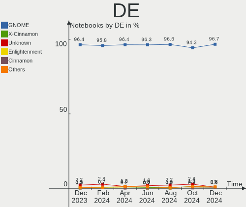
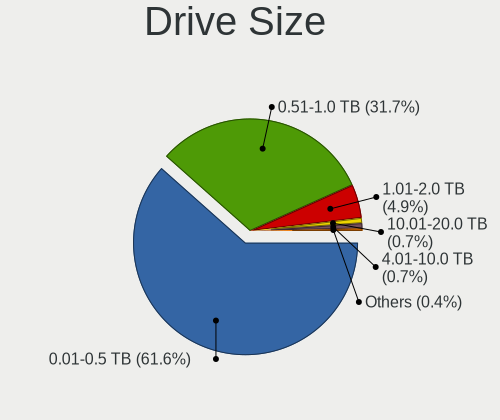
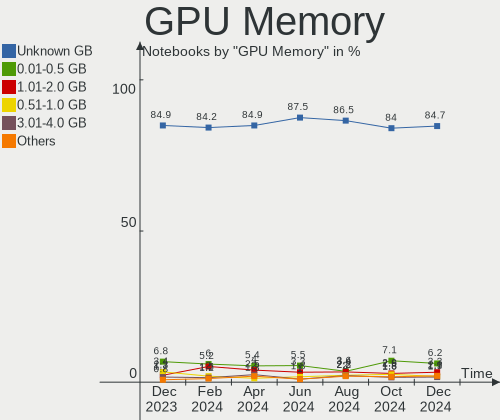
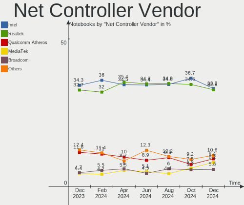
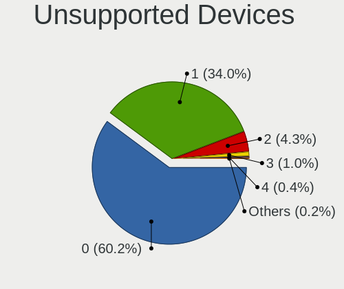

Ubuntu Hardware Trends (Notebook)
---------------------------------

A project to identify most popular hardware characteristics and track their change
over time based on data collected by Ubuntu users at https://Linux-Hardware.org.

Anyone can contribute to the study by uploading probes of their computers by
the [hw-probe](https://github.com/linuxhw/hw-probe) tool:

    sudo hw-probe -all -upload

Full-feature report is available here: https://linux-hardware.org/?view=trends&formfactor=notebook

Period: Dec, 2019.

Contents
--------

- [ OS                       ](#os)
- [ OS Family                ](#os-family)
- [ Kernel                   ](#kernel)
- [ Kernel Family            ](#kernel-family)
- [ Kernel Major Ver.        ](#kernel-major-ver)
- [ Arch                     ](#arch)
- [ DE                       ](#de)
- [ Display Server           ](#display-server)
- [ OS Lang                  ](#os-lang)
- [ Boot Mode                ](#boot-mode)
- [ Filesystem               ](#filesystem)
- [ Dual Boot with Linux     ](#dual-boot-with-linux)
- [ Dual Boot (Win)          ](#dual-boot-win)
- [ Country                  ](#country)
- [ City                     ](#city)
- [ Vendor                   ](#vendor)
- [ Model                    ](#model)
- [ Model Family             ](#model-family)
- [ MFG Year                 ](#mfg-year)
- [ Form Factor              ](#form-factor)
- [ Secure Boot              ](#secure-boot)
- [ Coreboot                 ](#coreboot)
- [ RAM Size                 ](#ram-size)
- [ RAM Used                 ](#ram-used)
- [ Drive Vendor             ](#drive-vendor)
- [ Drive Model              ](#drive-model)
- [ Drive Kind               ](#drive-kind)
- [ Drive Connector          ](#drive-connector)
- [ Drive Size               ](#drive-size)
- [ Space Total              ](#space-total)
- [ Space Used               ](#space-used)
- [ Malfunc. Drives          ](#malfunc-drives)
- [ Malfunc. Drive Vendor    ](#malfunc-drive-vendor)
- [ Malfunc. Drive Kind      ](#malfunc-drive-kind)
- [ Failed Drives            ](#failed-drives)
- [ Failed Drive Vendor      ](#failed-drive-vendor)
- [ Drive Status             ](#drive-status)
- [ CPU Vendor               ](#cpu-vendor)
- [ CPU Model                ](#cpu-model)
- [ CPU Model Family         ](#cpu-model-family)
- [ CPU Cores                ](#cpu-cores)
- [ CPU Sockets              ](#cpu-sockets)
- [ CPU Threads              ](#cpu-threads)
- [ CPU Op-Modes             ](#cpu-op-modes)
- [ CPU Microarch            ](#cpu-microarch)
- [ CPU Microcode            ](#cpu-microcode)
- [ GPU Vendor               ](#gpu-vendor)
- [ GPU Model                ](#gpu-model)
- [ GPU Combo                ](#gpu-combo)
- [ GPU Driver               ](#gpu-driver)
- [ GPU Memory               ](#gpu-memory)
- [ Monitor Vendor           ](#monitor-vendor)
- [ Monitor Model            ](#monitor-model)
- [ Monitor Resolution       ](#monitor-resolution)
- [ Monitor Diagonal         ](#monitor-diagonal)
- [ Monitor Width            ](#monitor-width)
- [ Aspect Ratio             ](#aspect-ratio)
- [ Monitor Area             ](#monitor-area)
- [ Pixel Density            ](#pixel-density)
- [ Multiple Monitors        ](#multiple-monitors)
- [ Net Controller Vendor    ](#net-controller-vendor)
- [ Net Controller Model     ](#net-controller-model)
- [ Net Controller Kind      ](#net-controller-kind)
- [ Used Controller          ](#used-controller)
- [ NICs                     ](#nics)
- [ Unsupported Devices      ](#unsupported-devices)
- [ Unsupported Device Types ](#unsupported-device-types)

OS
--

Installed operating systems

| Name         | Computers | Percent |
|--------------|-----------|---------|
| Ubuntu 18.04 | 344       | 59.11%  |
| Ubuntu 19.10 | 159       | 27.32%  |
| Ubuntu 19.04 | 34        | 5.84%   |
| Ubuntu 16.04 | 29        | 4.98%   |
| Ubuntu 20.04 | 7         | 1.2%    |
| Ubuntu 18.10 | 7         | 1.2%    |
| Ubuntu 6.0   | 1         | 0.17%   |
| Ubuntu 17.10 | 1         | 0.17%   |

OS Family
---------

OS without a version

| Name   | Computers | Percent |
|--------|-----------|---------|
| Ubuntu | 582       | 100%    |

Kernel
------

Version of the Linux kernel

| Version               | Computers | Percent |
|-----------------------|-----------|---------|
| 5.0.0-37-generic      | 191       | 32.82%  |
| 5.3.0-24-generic      | 111       | 19.07%  |
| 4.15.0-72-generic     | 66        | 11.34%  |
| 5.0.0-36-generic      | 30        | 5.15%   |
| 5.0.0-23-generic      | 22        | 3.78%   |
| 5.3.0-23-generic      | 15        | 2.58%   |
| 5.3.0-18-generic      | 14        | 2.41%   |
| 4.15.0-70-generic     | 11        | 1.89%   |
| 5.3.0-25-generic      | 10        | 1.72%   |
| 5.3.0-26-generic      | 8         | 1.37%   |
| 5.0.0-32-generic      | 7         | 1.2%    |
| 4.18.0-25-generic     | 6         | 1.03%   |
| 4.15.0-1065-oem       | 6         | 1.03%   |
| 4.4.0-170-generic     | 5         | 0.86%   |
| 4.15.0-74-generic     | 4         | 0.69%   |
| 4.15.0-73-generic     | 4         | 0.69%   |
| 4.15.0-29-generic     | 4         | 0.69%   |
| 5.4.0-050400-generic  | 3         | 0.52%   |
| 5.0.0-13-generic      | 3         | 0.52%   |
| 4.15.0-66-generic     | 3         | 0.52%   |
| 4.15.0-60-generic     | 3         | 0.52%   |
| 5.4.5-050405-generic  | 2         | 0.34%   |
| 5.3.0-7625-generic    | 2         | 0.34%   |
| 5.3.0-20-generic      | 2         | 0.34%   |
| 5.3.0-19-generic      | 2         | 0.34%   |
| 5.0.0-38-generic      | 2         | 0.34%   |
| 5.0.0-29-generic      | 2         | 0.34%   |
| 5.0.0-1016-oem-osp1   | 2         | 0.34%   |
| 4.4.0-166-generic     | 2         | 0.34%   |
| 4.15.0-72-lowlatency  | 2         | 0.34%   |
| 4.15.0-55-generic     | 2         | 0.34%   |
| 5.4.0-9-generic       | 1         | 0.17%   |
| 5.3.15-050315-generic | 1         | 0.17%   |
| 5.3.12-050312-generic | 1         | 0.17%   |
| 5.3.1-050301-generic  | 1         | 0.17%   |
| 5.3.0-24-lowlatency   | 1         | 0.17%   |
| 5.3.0-23-lowlatency   | 1         | 0.17%   |
| 5.3.0-22-generic      | 1         | 0.17%   |
| 5.0.0-27-generic      | 1         | 0.17%   |
| 5.0.0-16-generic      | 1         | 0.17%   |
| 5.0.0-15-generic      | 1         | 0.17%   |
| 5.0.0-1028-oem-osp1   | 1         | 0.17%   |
| 4.8.17-muqss          | 1         | 0.17%   |
| 4.4.0-171-generic     | 1         | 0.17%   |
| 4.4.0-164-generic     | 1         | 0.17%   |
| 4.4.0-157-generic     | 1         | 0.17%   |
| 4.4.0-148-generic     | 1         | 0.17%   |
| 4.4.0-130-generic     | 1         | 0.17%   |
| 4.19.3-041903-generic | 1         | 0.17%   |
| 4.18.0-21-generic     | 1         | 0.17%   |
| 4.18.0-20-generic     | 1         | 0.17%   |
| 4.18.0-17-generic     | 1         | 0.17%   |
| 4.18.0-15-generic     | 1         | 0.17%   |
| 4.16.18-galliumos     | 1         | 0.17%   |
| 4.15.0-65-generic     | 1         | 0.17%   |
| 4.15.0-64-generic     | 1         | 0.17%   |
| 4.15.0-51-generic     | 1         | 0.17%   |
| 4.15.0-36-generic     | 1         | 0.17%   |
| 4.15.0-22-generic     | 1         | 0.17%   |
| 4.15.0-20-lowlatency  | 1         | 0.17%   |

Kernel Family
-------------

Linux kernel without a distro release

| Version | Computers | Percent |
|---------|-----------|---------|
| 5.0.0   | 263       | 45.19%  |
| 5.3.0   | 167       | 28.69%  |
| 4.15.0  | 116       | 19.93%  |
| 4.4.0   | 12        | 2.06%   |
| 4.18.0  | 10        | 1.72%   |
| 5.4.0   | 4         | 0.69%   |
| 5.4.5   | 2         | 0.34%   |
| 4.13.0  | 2         | 0.34%   |
| 5.3.15  | 1         | 0.17%   |
| 5.3.12  | 1         | 0.17%   |
| 5.3.1   | 1         | 0.17%   |
| 4.8.17  | 1         | 0.17%   |
| 4.19.3  | 1         | 0.17%   |
| 4.16.18 | 1         | 0.17%   |

Kernel Major Ver.
-----------------

Linux kernel major version

| Version | Computers | Percent |
|---------|-----------|---------|
| 5.0     | 263       | 45.19%  |
| 5.3     | 170       | 29.21%  |
| 4.15    | 116       | 19.93%  |
| 4.4     | 12        | 2.06%   |
| 4.18    | 10        | 1.72%   |
| 5.4     | 6         | 1.03%   |
| 4.13    | 2         | 0.34%   |
| 4.8     | 1         | 0.17%   |
| 4.19    | 1         | 0.17%   |
| 4.16    | 1         | 0.17%   |

Arch
----

OS architecture (x86_64, i586, etc.)

| Name   | Computers | Percent |
|--------|-----------|---------|
| x86_64 | 545       | 93.64%  |
| i686   | 37        | 6.36%   |

DE
--

Desktop Environment

| Name                      | Computers | Percent |
|---------------------------|-----------|---------|
| GNOME                     | 360       | 61.86%  |
| Unknown                   | 118       | 20.27%  |
| XFCE                      | 38        | 6.53%   |
| Unity                     | 23        | 3.95%   |
| MATE                      | 8         | 1.37%   |
| KDE                       | 8         | 1.37%   |
| LXQt                      | 7         | 1.2%    |
| X-Cinnamon                | 6         | 1.03%   |
| Budgie                    | 3         | 0.52%   |
| LXDE                      | 2         | 0.34%   |
| GNOME-Classic:GNOME       | 2         | 0.34%   |
| GNOME Flashback           | 2         | 0.34%   |
| Cinnamon                  | 2         | 0.34%   |
| openbox                   | 1         | 0.17%   |
| Lubuntu                   | 1         | 0.17%   |
| communitheme:ubuntu:GNOME | 1         | 0.17%   |

Display Server
--------------

X11 or Wayland

| Name    | Computers | Percent |
|---------|-----------|---------|
| X11     | 415       | 71.31%  |
| Unknown | 162       | 27.84%  |
| Wayland | 5         | 0.86%   |

OS Lang
-------

Language

| Lang    | Computers | Percent |
|---------|-----------|---------|
| en_US   | 194       | 33.33%  |
| Unknown | 56        | 9.62%   |
| de_DE   | 55        | 9.45%   |
| it_IT   | 29        | 4.98%   |
| en_GB   | 27        | 4.64%   |
| pt_BR   | 26        | 4.47%   |
| ru_RU   | 24        | 4.12%   |
| fr_FR   | 18        | 3.09%   |
| es_ES   | 17        | 2.92%   |
| en_IN   | 16        | 2.75%   |
| pl_PL   | 13        | 2.23%   |
| en_CA   | 12        | 2.06%   |
| es_MX   | 7         | 1.2%    |
| C       | 7         | 1.2%    |
| tr_TR   | 5         | 0.86%   |
| pt_PT   | 5         | 0.86%   |
| de_CH   | 5         | 0.86%   |
| ru_UA   | 4         | 0.69%   |
| nl_NL   | 4         | 0.69%   |
| hu_HU   | 4         | 0.69%   |
| en_ZA   | 4         | 0.69%   |
| el_GR   | 4         | 0.69%   |
| de_AT   | 4         | 0.69%   |
| zh_CN   | 3         | 0.52%   |
| sk_SK   | 3         | 0.52%   |
| es_CL   | 3         | 0.52%   |
| en_IE   | 3         | 0.52%   |
| en_AU   | 3         | 0.52%   |
| nl_BE   | 2         | 0.34%   |
| ja_JP   | 2         | 0.34%   |
| fr_BE   | 2         | 0.34%   |
| fi_FI   | 2         | 0.34%   |
| es_AR   | 2         | 0.34%   |
| cs_CZ   | 2         | 0.34%   |
| ca_ES   | 2         | 0.34%   |
| zh_TW   | 1         | 0.17%   |
| zh_HK   | 1         | 0.17%   |
| uk_UA   | 1         | 0.17%   |
| nb_NO   | 1         | 0.17%   |
| ko_KR   | 1         | 0.17%   |
| id_ID   | 1         | 0.17%   |
| fr_CA   | 1         | 0.17%   |
| es_VE   | 1         | 0.17%   |
| es_NI   | 1         | 0.17%   |
| es_CO   | 1         | 0.17%   |
| en_SG   | 1         | 0.17%   |
| en_NG   | 1         | 0.17%   |
| en_IN   | 1         | 0.17%   |

Boot Mode
---------

EFI or BIOS

| Mode | Computers | Percent |
|------|-----------|---------|
| EFI  | 293       | 50.34%  |
| BIOS | 289       | 49.66%  |

Filesystem
----------

Type of filesystem

| Type    | Computers | Percent |
|---------|-----------|---------|
| Ext4    | 551       | 94.67%  |
| Overlay | 18        | 3.09%   |
| Btrfs   | 6         | 1.03%   |
| Ext2    | 3         | 0.52%   |
| Zfs     | 2         | 0.34%   |
| Xfs     | 1         | 0.17%   |
| Ext3    | 1         | 0.17%   |

Dual Boot with Linux
--------------------

Hosting more than one Linux

| Dual boot | Computers | Percent |
|-----------|-----------|---------|
| No        | 535       | 91.92%  |
| Yes       | 47        | 8.08%   |

Dual Boot (Win)
---------------

Hosting Linux and Windows

| Dual boot | Computers | Percent |
|-----------|-----------|---------|
| No        | 379       | 65.12%  |
| Yes       | 203       | 34.88%  |

Country
-------

Geographic location (country)

| Country            | Computers | Percent |
|--------------------|-----------|---------|
| USA                | 89        | 15.29%  |
| Germany            | 71        | 12.2%   |
| Italy              | 34        | 5.84%   |
| Brazil             | 34        | 5.84%   |
| Russia             | 32        | 5.5%    |
| UK                 | 27        | 4.64%   |
| France             | 26        | 4.47%   |
| India              | 24        | 4.12%   |
| Spain              | 20        | 3.44%   |
| Poland             | 18        | 3.09%   |
| Canada             | 14        | 2.41%   |
| Mexico             | 11        | 1.89%   |
| Netherlands        | 10        | 1.72%   |
| Ukraine            | 9         | 1.55%   |
| Switzerland        | 9         | 1.55%   |
| Turkey             | 8         | 1.37%   |
| Hungary            | 8         | 1.37%   |
| Czech Republic     | 8         | 1.37%   |
| Portugal           | 6         | 1.03%   |
| Austria            | 6         | 1.03%   |
| Japan              | 5         | 0.86%   |
| Greece             | 5         | 0.86%   |
| China              | 5         | 0.86%   |
| Sweden             | 4         | 0.69%   |
| South Africa       | 4         | 0.69%   |
| Slovakia           | 4         | 0.69%   |
| Romania            | 4         | 0.69%   |
| Ireland            | 4         | 0.69%   |
| Indonesia          | 4         | 0.69%   |
| Colombia           | 4         | 0.69%   |
| Bulgaria           | 4         | 0.69%   |
| Belgium            | 4         | 0.69%   |
| Australia          | 4         | 0.69%   |
| Singapore          | 3         | 0.52%   |
| Malaysia           | 3         | 0.52%   |
| Finland            | 3         | 0.52%   |
| Egypt              | 3         | 0.52%   |
| Cyprus             | 3         | 0.52%   |
| Croatia            | 3         | 0.52%   |
| Chile              | 3         | 0.52%   |
| Serbia             | 2         | 0.34%   |
| Norway             | 2         | 0.34%   |
| Korea, Republic of | 2         | 0.34%   |
| Iran               | 2         | 0.34%   |
| Denmark            | 2         | 0.34%   |
| Belarus            | 2         | 0.34%   |
| Bangladesh         | 2         | 0.34%   |
| Argentina          | 2         | 0.34%   |
| Algeria            | 2         | 0.34%   |
| Venezuela          | 1         | 0.17%   |
| Tunisia            | 1         | 0.17%   |
| Thailand           | 1         | 0.17%   |
| Taiwan             | 1         | 0.17%   |
| South Korea        | 1         | 0.17%   |
| Qatar              | 1         | 0.17%   |
| Philippines        | 1         | 0.17%   |
| Nigeria            | 1         | 0.17%   |
| Nicaragua          | 1         | 0.17%   |
| Morocco            | 1         | 0.17%   |
| Montenegro         | 1         | 0.17%   |

City
----

Geographic location (city)

| City             | Computers | Percent |
|------------------|-----------|---------|
| Moscow           | 9         | 1.55%   |
| Berlin           | 6         | 1.03%   |
| Warsaw           | 5         | 0.86%   |
| Vienna           | 5         | 0.86%   |
| St Petersburg    | 5         | 0.86%   |
| Paris            | 5         | 0.86%   |
| Munich           | 5         | 0.86%   |
| Bengaluru        | 5         | 0.86%   |
| Rome             | 4         | 0.69%   |
| Budapest         | 4         | 0.69%   |
| São Paulo       | 3         | 0.52%   |
| Singapore        | 3         | 0.52%   |
| Mumbai           | 3         | 0.52%   |
| Montreal         | 3         | 0.52%   |
| Mexico City      | 3         | 0.52%   |
| Leipzig          | 3         | 0.52%   |
| Kyiv             | 3         | 0.52%   |
| Hamburg          | 3         | 0.52%   |
| Fortaleza        | 3         | 0.52%   |
| Chicago          | 3         | 0.52%   |
| Bucharest        | 3         | 0.52%   |
| Braunschweig     | 3         | 0.52%   |
| Belo Horizonte   | 3         | 0.52%   |
| Athens           | 3         | 0.52%   |
| Zagreb           | 2         | 0.34%   |
| Yakutsk          | 2         | 0.34%   |
| Wrocław         | 2         | 0.34%   |
| Varna            | 2         | 0.34%   |
| Treviso          | 2         | 0.34%   |
| Tehran           | 2         | 0.34%   |
| Sungai Buloh     | 2         | 0.34%   |
| St Louis         | 2         | 0.34%   |
| Seoul            | 2         | 0.34%   |
| Santiago         | 2         | 0.34%   |
| Salt Lake City   | 2         | 0.34%   |
| Sabadell         | 2         | 0.34%   |
| Rostov-on-Don    | 2         | 0.34%   |
| Rio de Janeiro   | 2         | 0.34%   |
| Pruszków        | 2         | 0.34%   |
| Portland         | 2         | 0.34%   |
| Offenbach        | 2         | 0.34%   |
| Novelda          | 2         | 0.34%   |
| Nettetal         | 2         | 0.34%   |
| Lyon             | 2         | 0.34%   |
| Lviv             | 2         | 0.34%   |
| Krasnodar        | 2         | 0.34%   |
| Jakarta          | 2         | 0.34%   |
| Huntington Beach | 2         | 0.34%   |
| Houston          | 2         | 0.34%   |
| Harrisonburg     | 2         | 0.34%   |
| Goiânia         | 2         | 0.34%   |
| Genoa            | 2         | 0.34%   |
| Frontignan       | 2         | 0.34%   |
| Folkestone       | 2         | 0.34%   |
| Duluth           | 2         | 0.34%   |
| Dublin           | 2         | 0.34%   |
| Dhaka            | 2         | 0.34%   |
| Chieti           | 2         | 0.34%   |
| Chennai          | 2         | 0.34%   |
| Campinas         | 2         | 0.34%   |

Vendor
------

Motherboard manufacturer

| Name                     | Computers | Percent |
|--------------------------|-----------|---------|
| Lenovo                   | 124       | 21.31%  |
| Hewlett-Packard          | 122       | 20.96%  |
| Dell                     | 104       | 17.87%  |
| Acer                     | 52        | 8.93%   |
| ASUSTek Computer         | 48        | 8.25%   |
| Toshiba                  | 20        | 3.44%   |
| Sony                     | 15        | 2.58%   |
| Apple                    | 13        | 2.23%   |
| Samsung Electronics      | 9         | 1.55%   |
| Notebook                 | 7         | 1.2%    |
| MSI                      | 6         | 1.03%   |
| Gateway                  | 5         | 0.86%   |
| Fujitsu                  | 5         | 0.86%   |
| Packard Bell             | 4         | 0.69%   |
| TUXEDO                   | 3         | 0.52%   |
| HUAWEI                   | 3         | 0.52%   |
| Akstron                  | 3         | 0.52%   |
| Timi                     | 2         | 0.34%   |
| Quanta                   | 2         | 0.34%   |
| Panasonic                | 2         | 0.34%   |
| Multilaser Industrial SA | 2         | 0.34%   |
| Google                   | 2         | 0.34%   |
| Fujitsu Siemens          | 2         | 0.34%   |
| Digma                    | 2         | 0.34%   |
| Clevo                    | 2         | 0.34%   |
| Unknown                  | 2         | 0.34%   |
| whyopencomputing         | 1         | 0.17%   |
| VIT                      | 1         | 0.17%   |
| System76                 | 1         | 0.17%   |
| SLIMBOOK                 | 1         | 0.17%   |
| Positivo                 | 1         | 0.17%   |
| Novastar                 | 1         | 0.17%   |
| Medion                   | 1         | 0.17%   |
| Mediacom                 | 1         | 0.17%   |
| LG Electronics           | 1         | 0.17%   |
| LDLC                     | 1         | 0.17%   |
| Itronix                  | 1         | 0.17%   |
| Intel                    | 1         | 0.17%   |
| Insyde                   | 1         | 0.17%   |
| Fusion5                  | 1         | 0.17%   |
| Eurocom                  | 1         | 0.17%   |
| eMachines                | 1         | 0.17%   |
| Digibras                 | 1         | 0.17%   |
| Coradir                  | 1         | 0.17%   |
| Compal                   | 1         | 0.17%   |
| BESSTAR Tech             | 1         | 0.17%   |
| Beelink                  | 1         | 0.17%   |

Model
-----

Motherboard model

| Name                               | Computers | Percent |
|------------------------------------|-----------|---------|
| Unknown                            | 7         | 1.2%    |
| Pavilion dv7                       | 6         | 1.03%   |
| Pavilion 15                        | 6         | 1.03%   |
| XPS 13 9380                        | 4         | 0.69%   |
| Pavilion Notebook                  | 4         | 0.69%   |
| Laptop 15-da0xxx                   | 4         | 0.69%   |
| XPS 15 9570                        | 3         | 0.52%   |
| Vostro 3550                        | 3         | 0.52%   |
| Pavilion dv6                       | 3         | 0.52%   |
| Notebook                           | 3         | 0.52%   |
| MacBookPro8,1                      | 3         | 0.52%   |
| Inspiron 7520                      | 3         | 0.52%   |
| IdeaPad 330-15AST 81D6             | 3         | 0.52%   |
| G50-70 20351                       | 3         | 0.52%   |
| G1417                              | 3         | 0.52%   |
| ENVY 17                            | 3         | 0.52%   |
| Aspire E5-553G                     | 3         | 0.52%   |
| 255 G7 Notebook PC                 | 3         | 0.52%   |
| Z50-70 20354                       | 2         | 0.34%   |
| Y720-15IKB 80VR                    | 2         | 0.34%   |
| X556UQK                            | 2         | 0.34%   |
| X551MA                             | 2         | 0.34%   |
| UX490UA                            | 2         | 0.34%   |
| ThinkPad X240 20AMA1R5US           | 2         | 0.34%   |
| ThinkPad X1 Extreme 2nd 20QVCTO1WW | 2         | 0.34%   |
| ThinkPad X1 Carbon 7th 20QDCTO1WW  | 2         | 0.34%   |
| Studio 1558                        | 2         | 0.34%   |
| Pavilion g7                        | 2         | 0.34%   |
| Pavilion 17                        | 2         | 0.34%   |
| MACH-WX9                           | 2         | 0.34%   |
| MacBookPro5,5                      | 2         | 0.34%   |
| Latitude E6540                     | 2         | 0.34%   |
| Latitude E6420                     | 2         | 0.34%   |
| Latitude E6400                     | 2         | 0.34%   |
| Latitude E6320                     | 2         | 0.34%   |
| Latitude 7300                      | 2         | 0.34%   |
| Latitude 5400                      | 2         | 0.34%   |
| Laptop 15-db0xxx                   | 2         | 0.34%   |
| Laptop 15-bs0xx                    | 2         | 0.34%   |
| K53SV                              | 2         | 0.34%   |
| Inspiron MM061                     | 2         | 0.34%   |
| Inspiron 5570                      | 2         | 0.34%   |
| Inspiron 5567                      | 2         | 0.34%   |
| Inspiron 5423                      | 2         | 0.34%   |
| Inspiron 3593                      | 2         | 0.34%   |
| Inspiron 3583                      | 2         | 0.34%   |
| Inspiron 3582                      | 2         | 0.34%   |
| Inspiron 3542                      | 2         | 0.34%   |
| IdeaPad L340-15API 81LW            | 2         | 0.34%   |
| IdeaPad 330S-14IKB 81F4            | 2         | 0.34%   |
| IdeaPad 330-15IGM 81D1             | 2         | 0.34%   |
| G62                                | 2         | 0.34%   |
| Extensa 5620                       | 2         | 0.34%   |
| EliteBook Folio 9470m              | 2         | 0.34%   |
| ConceptD CN715-71                  | 2         | 0.34%   |
| CITI E401 ET4007EW                 | 2         | 0.34%   |
| B560                               | 2         | 0.34%   |
| Aspire one                         | 2         | 0.34%   |
| Aspire A315-41                     | 2         | 0.34%   |
| Aspire 5755G                       | 2         | 0.34%   |

Model Family
------------

Motherboard model prefix

| Name                  | Computers | Percent |
|-----------------------|-----------|---------|
| Lenovo ThinkPad       | 68        | 11.68%  |
| Dell Inspiron         | 44        | 7.56%   |
| Acer Aspire           | 41        | 7.04%   |
| HP Pavilion           | 34        | 5.84%   |
| Dell Latitude         | 27        | 4.64%   |
| Lenovo IdeaPad        | 25        | 4.3%    |
| Toshiba Satellite     | 18        | 3.09%   |
| HP Laptop             | 18        | 3.09%   |
| HP ProBook            | 17        | 2.92%   |
| HP EliteBook          | 17        | 2.92%   |
| Dell XPS              | 14        | 2.41%   |
| Dell Precision        | 9         | 1.55%   |
| HP ENVY               | 8         | 1.37%   |
| Unknown               | 7         | 1.2%    |
| HP Compaq             | 6         | 1.03%   |
| Fujitsu LIFEBOOK      | 5         | 0.86%   |
| Dell Vostro           | 5         | 0.86%   |
| Packard Bell EasyNote | 4         | 0.69%   |
| Dell Studio           | 4         | 0.69%   |
| ASUS TUF              | 4         | 0.69%   |
| Lenovo G50-70         | 3         | 0.52%   |
| HP Notebook           | 3         | 0.52%   |
| HP 255                | 3         | 0.52%   |
| ASUS ZenBook          | 3         | 0.52%   |
| Apple MacBookPro8     | 3         | 0.52%   |
| Apple MacBookPro5     | 3         | 0.52%   |
| Akstron G1417         | 3         | 0.52%   |
| Notebook P65          | 2         | 0.34%   |
| Lenovo Z50-70         | 2         | 0.34%   |
| Lenovo Y720-15IKB     | 2         | 0.34%   |
| Lenovo Legion         | 2         | 0.34%   |
| Lenovo G580           | 2         | 0.34%   |
| Lenovo B560           | 2         | 0.34%   |
| HUAWEI MACH-WX9       | 2         | 0.34%   |
| HP G62                | 2         | 0.34%   |
| Digma CITI            | 2         | 0.34%   |
| ASUS X556UQK          | 2         | 0.34%   |
| ASUS X551MA           | 2         | 0.34%   |
| ASUS VivoBook         | 2         | 0.34%   |
| ASUS UX490UA          | 2         | 0.34%   |
| ASUS K53SV            | 2         | 0.34%   |
| Acer TravelMate       | 2         | 0.34%   |
| Acer Swift            | 2         | 0.34%   |
| Acer Nitro            | 2         | 0.34%   |
| Acer Extensa          | 2         | 0.34%   |
| Acer ConceptD         | 2         | 0.34%   |
| VIT M2421             | 1         | 0.17%   |
| Toshiba NB505         | 1         | 0.17%   |
| Toshiba NB205         | 1         | 0.17%   |
| Timi TM1709           | 1         | 0.17%   |
| Timi Mi               | 1         | 0.17%   |
| System76 Darter       | 1         | 0.17%   |
| Sony VPCSB4AFX        | 1         | 0.17%   |
| Sony VPCSB35FB        | 1         | 0.17%   |
| Sony VPCEH25FM        | 1         | 0.17%   |
| Sony VPCEC4CFX        | 1         | 0.17%   |
| Sony VPCEB2JFX        | 1         | 0.17%   |
| Sony VGN-TZ21MN       | 1         | 0.17%   |
| Sony VGN-CR31S        | 1         | 0.17%   |
| Sony VGN-CR19VN       | 1         | 0.17%   |

MFG Year
--------

Motherboard manufacture year

| Year | Computers | Percent |
|------|-----------|---------|
| 2019 | 125       | 21.48%  |
| 2018 | 89        | 15.29%  |
| 2011 | 50        | 8.59%   |
| 2014 | 45        | 7.73%   |
| 2013 | 42        | 7.22%   |
| 2016 | 39        | 6.7%    |
| 2012 | 35        | 6.01%   |
| 2010 | 34        | 5.84%   |
| 2015 | 31        | 5.33%   |
| 2017 | 30        | 5.15%   |
| 2009 | 25        | 4.3%    |
| 2008 | 19        | 3.26%   |
| 2007 | 12        | 2.06%   |
| 2006 | 3         | 0.52%   |
| 2005 | 2         | 0.34%   |
| 2003 | 1         | 0.17%   |

Form Factor
-----------

Physical design of the computer

| Name     | Computers | Percent |
|----------|-----------|---------|
| Notebook | 582       | 100%    |

Secure Boot
-----------

Enabled or disabled

| State    | Computers | Percent |
|----------|-----------|---------|
| Disabled | 420       | 72.16%  |
| Unknown  | 94        | 16.15%  |
| Enabled  | 68        | 11.68%  |

Coreboot
--------

Have coreboot on board

| Used | Computers | Percent |
|------|-----------|---------|
| No   | 578       | 99.31%  |
| Yes  | 4         | 0.69%   |

RAM Size
--------

Total RAM memory

| Size in GB  | Computers | Percent |
|-------------|-----------|---------|
| 3.01-4.0    | 172       | 29.55%  |
| 4.01-8.0    | 151       | 25.95%  |
| 8.01-16.0   | 98        | 16.84%  |
| 16.01-24.0  | 73        | 12.54%  |
| 1.01-2.0    | 40        | 6.87%   |
| 32.01-64.0  | 27        | 4.64%   |
| 0.01-1.0    | 10        | 1.72%   |
| 2.01-3.0    | 8         | 1.37%   |
| 64.01-256.0 | 2         | 0.34%   |
| 24.01-32.0  | 1         | 0.17%   |

RAM Used
--------

Used RAM memory

| Used GB    | Computers | Percent |
|------------|-----------|---------|
| 1.01-2.0   | 235       | 40.38%  |
| 2.01-3.0   | 176       | 30.24%  |
| 3.01-4.0   | 65        | 11.17%  |
| 4.01-8.0   | 51        | 8.76%   |
| 0.01-1.0   | 47        | 8.08%   |
| 8.01-16.0  | 7         | 1.2%    |
| 24.01-32.0 | 1         | 0.17%   |

Drive Vendor
------------

Hard drive vendors

| Vendor              | Computers | Drives  | Percent |
|---------------------|-----------|---------|---------|
| Seagate             | 110       | 111     | 17.6%   |
| WDC                 | 84        | 85      | 13.44%  |
| Samsung Electronics | 84        | 89      | 13.44%  |
| Toshiba             | 71        | 72      | 11.36%  |
| Hitachi             | 42        | 42      | 6.72%   |
| Unknown             | 40        | 46      | 6.4%    |
| Kingston            | 29        | 29      | 4.64%   |
| SanDisk             | 23        | 25      | 3.68%   |
| Crucial             | 21        | 21      | 3.36%   |
| Intel               | 20        | 21      | 3.2%    |
| HGST                | 19        | 19      | 3.04%   |
| A-DATA Technology   | 8         | 8       | 1.28%   |
| SK Hynix            | 6         | 6       | 0.96%   |
| Micron Technology   | 6         | 6       | 0.96%   |
| China               | 6         | 6       | 0.96%   |
| LITEON              | 5         | 5       | 0.8%    |
| Fujitsu             | 5         | 5       | 0.8%    |
| Apple               | 4         | 4       | 0.64%   |
| SPCC                | 3         | 3       | 0.48%   |
| PNY                 | 3         | 3       | 0.48%   |
| LITEONIT            | 3         | 3       | 0.48%   |
| GOODRAM             | 3         | 3       | 0.48%   |
| Transcend           | 2         | 2       | 0.32%   |
| KingSpec            | 2         | 2       | 0.32%   |
| KingDian            | 2         | 2       | 0.32%   |
| Intenso             | 2         | 3       | 0.32%   |
| ASMT                | 2         | 3       | 0.32%   |
| WDC WD75            | 1         | 1       | 0.16%   |
| Vi550               | 1         | 1       | 0.16%   |
| Team                | 1         | 1       | 0.16%   |
| SMART               | 1         | 1       | 0.16%   |
| PLEXTOR             | 1         | 1       | 0.16%   |
| Phison              | 1         | 1       | 0.16%   |
| Patriot             | 1         | 1       | 0.16%   |
| OCZ-VERTEX3         | 1         | 1       | 0.16%   |
| OCZ                 | 1         | 1       | 0.16%   |
| Maxtor 6            | 1         | 1       | 0.16%   |
| Longline            | 1         | 1       | 0.16%   |
| Lexar               | 1         | 1       | 0.16%   |
| JMicron             | 1         | 1       | 0.16%   |
| HL-DT-ST            | 1         | Unknown | 0.16%   |
| HKVSN               | 1         | 1       | 0.16%   |
| Generic             | 1         | 1       | 0.16%   |
| Corsair             | 1         | 1       | 0.16%   |
| Aura                | 1         | 1       | 0.16%   |
| Apacer              | 1         | 1       | 0.16%   |
| Acer                | 1         | 1       | 0.16%   |

Drive Model
-----------

Hard drive models

| Model                        | Computers | Percent |
|------------------------------|-----------|---------|
| ST1000LM035-1RK172 1TB       | 14        | 2.18%   |
| ST1000LM024 HN-M101MBB 1TB   | 14        | 2.18%   |
| MQ01ABD100 1TB               | 14        | 2.18%   |
| ST500LT012-1DG142 500GB      | 12        | 1.87%   |
| MQ01ABF050 500GB             | 10        | 1.56%   |
| SSD 860 EVO 500GB            | 8         | 1.25%   |
| HTS545050A7E380 500GB        | 7         | 1.09%   |
| SA400S37120G 120GB SSD       | 6         | 0.94%   |
| WD10SPZX-75Z10T2 1TB         | 5         | 0.78%   |
| ST500LM021-1KJ152 500GB      | 5         | 0.78%   |
| SSDPEKKF512G8L 512GB         | 5         | 0.78%   |
| SSD 850 EVO 250GB            | 5         | 0.78%   |
| SA400S37240G 240GB SSD       | 5         | 0.78%   |
| MQ04ABF100 1TB               | 5         | 0.78%   |
| MQ01ABD050 500GB             | 5         | 0.78%   |
| HTS545050B9A300 500GB        | 5         | 0.78%   |
| ST9320423AS 320GB            | 4         | 0.62%   |
| ST750LM022 HN-M750MBB 750GB  | 4         | 0.62%   |
| ST500LT012-9WS142 500GB      | 4         | 0.62%   |
| ST500LM000-1EJ162 500GB      | 4         | 0.62%   |
| SSD 850 EVO 500GB            | 4         | 0.62%   |
| HTS725050A7E630 500GB        | 4         | 0.62%   |
| HTS545050A7E680 500GB        | 4         | 0.62%   |
| Expansion 2TB                | 4         | 0.62%   |
| WDS240G2G0A-00JH30 240GB SSD | 3         | 0.47%   |
| WD5000LPVX-75V0TT0 500GB     | 3         | 0.47%   |
| WD10SPZX-21Z10T0 1TB         | 3         | 0.47%   |
| SU800NS38 512GB SSD          | 3         | 0.47%   |
| ST9500420AS 500GB            | 3         | 0.47%   |
| ST9500325AS 500GB            | 3         | 0.47%   |
| ST500LM012 HN-M500MBB 500GB  | 3         | 0.47%   |
| ST2000LX001-1RG174 2TB       | 3         | 0.47%   |
| ST2000LM007-1R8174 2TB       | 3         | 0.47%   |
| SSD 860 EVO M.2 500GB        | 3         | 0.47%   |
| SSD 860 EVO 1TB              | 3         | 0.47%   |
| SATA 120GB SSD               | 3         | 0.47%   |
| MZNLN256HAJQ-000H1 256GB SSD | 3         | 0.47%   |
| MZ7LN256HCHP-000L7 256GB SSD | 3         | 0.47%   |
| MQ01ABD075 750GB             | 3         | 0.47%   |
| MQ01ABD032 320GB             | 3         | 0.47%   |
| MK3252GSX 320GB              | 3         | 0.47%   |
| M0S002  61GB                 | 3         | 0.47%   |
| HTS547550A9E384 500GB        | 3         | 0.47%   |
| HTS541616J9SA00 160GB        | 3         | 0.47%   |
| HBG4e  31GB                  | 3         | 0.47%   |
| CT500MX500SSD1 500GB         | 3         | 0.47%   |
| CT120BX500SSD1 120GB         | 3         | 0.47%   |
| WDS500G2B0A-00SM50 500GB SSD | 2         | 0.31%   |
| WD5000LPLX-00ZNTT0 500GB     | 2         | 0.31%   |
| WD5000LPCX-24VHAT0 500GB     | 2         | 0.31%   |
| WD3200BPVT-22JJ5T0 320GB     | 2         | 0.31%   |
| WD3200BEKT-75PVMT1 320GB     | 2         | 0.31%   |
| WD2500BEVT-22A23T0 250GB     | 2         | 0.31%   |
| WD10JPVX-60JC3T0 1TB         | 2         | 0.31%   |
| WD10JPVX-22JC3T0 1TB         | 2         | 0.31%   |
| WD10JPCX-24UE4T0 1TB         | 2         | 0.31%   |
| SV300S37A240G 240GB SSD      | 2         | 0.31%   |
| SV300S37A120G 120GB SSD      | 2         | 0.31%   |
| SUV400S37120G 120GB SSD      | 2         | 0.31%   |
| ST9750420AS 750GB            | 2         | 0.31%   |

Drive Kind
----------

HDD or SSD

| Kind    | Computers | Drives | Percent |
|---------|-----------|--------|---------|
| HDD     | 316       | 325    | 52.15%  |
| SSD     | 208       | 226    | 34.32%  |
| MMC     | 42        | 49     | 6.93%   |
| NVMe    | 28        | 29     | 4.62%   |
| Unknown | 12        | 14     | 1.98%   |

Drive Connector
---------------

SATA, SAS, NVMe, etc.

| Type | Computers | Drives | Percent |
|------|-----------|--------|---------|
| SATA | 483       | 547    | 84.74%  |
| MMC  | 42        | 49     | 7.37%   |
| NVMe | 28        | 29     | 4.91%   |
| SAS  | 17        | 18     | 2.98%   |

Drive Size
----------

Size of hard drive

| Size in TB | Computers | Drives | Percent |
|------------|-----------|--------|---------|
| 0.01-0.5   | 407       | 465    | 70.05%  |
| 0.51-1.0   | 146       | 150    | 25.13%  |
| 1.01-2.0   | 23        | 23     | 3.96%   |
| 3.01-4.0   | 2         | 2      | 0.34%   |
| 2.01-3.0   | 1         | 1      | 0.17%   |
| 4.01-10.0  | 1         | 1      | 0.17%   |
| Unknown    | 1         | 1      | 0.17%   |

Space Total
-----------

Amount of disk space available on the file system

| Size in GB     | Computers | Percent |
|----------------|-----------|---------|
| 101-250        | 200       | 34.36%  |
| 251-500        | 150       | 25.77%  |
| 501-1000       | 80        | 13.75%  |
| 51-100         | 58        | 9.97%   |
| 21-50          | 35        | 6.01%   |
| 1-20           | 21        | 3.61%   |
| 1001-2000      | 18        | 3.09%   |
| 2001-3000      | 9         | 1.55%   |
| More than 3000 | 7         | 1.2%    |
| Unknown        | 4         | 0.69%   |

Space Used
----------

Amount of used disk space

| Used GB        | Computers | Percent |
|----------------|-----------|---------|
| 1-20           | 278       | 47.77%  |
| 21-50          | 90        | 15.46%  |
| 51-100         | 84        | 14.43%  |
| 101-250        | 67        | 11.51%  |
| 251-500        | 30        | 5.15%   |
| 501-1000       | 21        | 3.61%   |
| 1001-2000      | 7         | 1.2%    |
| Unknown        | 4         | 0.69%   |
| More than 3000 | 1         | 0.17%   |

Malfunc. Drives
---------------

Drive models with a malfunction

| Model                      | Computers | Drives | Percent |
|----------------------------|-----------|--------|---------|
| ST9250315AS 250GB          | 1         | 1      | 6.67%   |
| ST1000LM035-1RK172 1TB     | 1         | 1      | 6.67%   |
| ST1000LM024 HN-M101MBB 1TB | 1         | 1      | 6.67%   |
| SSD 960 PRO 2TB            | 1         | 1      | 6.67%   |
| SA400S37120G 120GB SSD     | 1         | 1      | 6.67%   |
| PA25-128 128GB SSD         | 1         | 1      | 6.67%   |
| MQ01ABF050 500GB           | 1         | 1      | 6.67%   |
| MK3252GSX 320GB            | 1         | 1      | 6.67%   |
| MK2561GSYN 250GB           | 1         | 1      | 6.67%   |
| HTS545050B9A300 500GB      | 1         | 1      | 6.67%   |
| HTS545050A7E380 500GB      | 1         | 1      | 6.67%   |
| HTS542516K9SA00 160GB      | 1         | 1      | 6.67%   |
| HTS541010A7E630 1TB        | 1         | 1      | 6.67%   |
| HM121HI 120GB              | 1         | 1      | 6.67%   |
| CT500P1SSD8 500GB          | 1         | 1      | 6.67%   |

Malfunc. Drive Vendor
---------------------

Vendors of faulty drives

| Vendor              | Computers | Drives | Percent |
|---------------------|-----------|--------|---------|
| Toshiba             | 3         | 3      | 20%     |
| Seagate             | 3         | 3      | 20%     |
| Hitachi             | 3         | 3      | 20%     |
| Samsung Electronics | 2         | 2      | 13.33%  |
| Kingston            | 1         | 1      | 6.67%   |
| KingSpec            | 1         | 1      | 6.67%   |
| HGST                | 1         | 1      | 6.67%   |
| Crucial             | 1         | 1      | 6.67%   |

Malfunc. Drive Kind
-------------------

Kinds of faulty drives

| Kind | Computers | Drives | Percent |
|------|-----------|--------|---------|
| HDD  | 10        | 11     | 71.43%  |
| NVMe | 2         | 2      | 14.29%  |
| SSD  | 2         | 2      | 14.29%  |

Failed Drives
-------------

Failed drive models

Zero info for selected period =(

Failed Drive Vendor
-------------------

Failed drive vendors

Zero info for selected period =(

Drive Status
------------

Number of failed and malfunc. drives

| Status   | Computers | Drives | Percent |
|----------|-----------|--------|---------|
| Detected | 472       | 565    | 87.73%  |
| Works    | 52        | 63     | 9.67%   |
| Malfunc  | 14        | 15     | 2.6%    |

CPU Vendor
----------

Processor vendors

| Vendor       | Computers | Percent |
|--------------|-----------|---------|
| Intel        | 510       | 87.63%  |
| AMD          | 71        | 12.2%   |
| CentaurHauls | 1         | 0.17%   |

CPU Model
---------

Processor models

| Model                                         | Computers | Percent |
|-----------------------------------------------|-----------|---------|
| Intel Core i7-8565U CPU @ 1.80GHz             | 20        | 3.44%   |
| Intel Core i7-8750H CPU @ 2.20GHz             | 14        | 2.41%   |
| Intel Core i5-8250U CPU @ 1.60GHz             | 14        | 2.41%   |
| Intel Core i5-2520M CPU @ 2.50GHz             | 11        | 1.89%   |
| Intel Core i7-9750H CPU @ 2.60GHz             | 9         | 1.55%   |
| Intel Core i5-7200U CPU @ 2.50GHz             | 9         | 1.55%   |
| Intel Core i7-8550U CPU @ 1.80GHz             | 8         | 1.37%   |
| Intel Core i5-8265U CPU @ 1.60GHz             | 8         | 1.37%   |
| Intel Celeron CPU N2840 @ 2.16GHz             | 8         | 1.37%   |
| Intel Core i7-7700HQ CPU @ 2.80GHz            | 7         | 1.2%    |
| Intel Core i5-4210U CPU @ 1.70GHz             | 7         | 1.2%    |
| Intel Core i5-2450M CPU @ 2.50GHz             | 7         | 1.2%    |
| AMD Ryzen 5 2500U with Radeon Vega Mobile Gfx | 7         | 1.2%    |
| Intel Core i7-7500U CPU @ 2.70GHz             | 6         | 1.03%   |
| Intel Core i7-6700HQ CPU @ 2.60GHz            | 6         | 1.03%   |
| Intel Core i7-2670QM CPU @ 2.20GHz            | 6         | 1.03%   |
| Intel Core i5-4300U CPU @ 1.90GHz             | 6         | 1.03%   |
| Intel Core i3-3217U CPU @ 1.80GHz             | 6         | 1.03%   |
| Intel Celeron N4000 CPU @ 1.10GHz             | 6         | 1.03%   |
| Intel Atom x5-Z8350 CPU @ 1.44GHz             | 6         | 1.03%   |
| Intel Atom CPU N270 @ 1.60GHz                 | 6         | 1.03%   |
| Intel Core i7-4600U CPU @ 2.10GHz             | 5         | 0.86%   |
| Intel Core i7-4510U CPU @ 2.00GHz             | 5         | 0.86%   |
| Intel Core i5-6200U CPU @ 2.30GHz             | 5         | 0.86%   |
| Intel Core i5-4200U CPU @ 1.60GHz             | 5         | 0.86%   |
| Intel Core i5-4200M CPU @ 2.50GHz             | 5         | 0.86%   |
| Intel Core i3 CPU M 370 @ 2.40GHz             | 5         | 0.86%   |
| Intel Core 2 Duo CPU P8600 @ 2.40GHz          | 5         | 0.86%   |
| Intel Celeron CPU N3060 @ 1.60GHz             | 5         | 0.86%   |
| AMD A4-9125 RADEON R3, 4 COMPUTE CORES 2C+2G  | 5         | 0.86%   |
| Intel Core i7-5500U CPU @ 2.40GHz             | 4         | 0.69%   |
| Intel Core i7-3632QM CPU @ 2.20GHz            | 4         | 0.69%   |
| Intel Core i7-3612QM CPU @ 2.10GHz            | 4         | 0.69%   |
| Intel Core i7-2630QM CPU @ 2.00GHz            | 4         | 0.69%   |
| Intel Core i5-5200U CPU @ 2.20GHz             | 4         | 0.69%   |
| Intel Core i5-3230M CPU @ 2.60GHz             | 4         | 0.69%   |
| Intel Core i5-3210M CPU @ 2.50GHz             | 4         | 0.69%   |
| Intel Core i5-2430M CPU @ 2.40GHz             | 4         | 0.69%   |
| Intel Core i5-2410M CPU @ 2.30GHz             | 4         | 0.69%   |
| Intel Core i5-10210U CPU @ 1.60GHz            | 4         | 0.69%   |
| Intel Core i3-3110M CPU @ 2.40GHz             | 4         | 0.69%   |
| Intel Core i3 CPU M 380 @ 2.53GHz             | 4         | 0.69%   |
| Intel Core 2 Duo CPU P8700 @ 2.53GHz          | 4         | 0.69%   |
| Intel Celeron CPU N3350 @ 1.10GHz             | 4         | 0.69%   |
| Intel Pentium Silver N5000 CPU @ 1.10GHz      | 3         | 0.52%   |
| Intel Pentium Dual-Core CPU T4500 @ 2.30GHz   | 3         | 0.52%   |
| Intel Pentium CPU N3540 @ 2.16GHz             | 3         | 0.52%   |
| Intel Core i7-8665U CPU @ 1.90GHz             | 3         | 0.52%   |
| Intel Core i7-4810MQ CPU @ 2.80GHz            | 3         | 0.52%   |
| Intel Core i7-4700MQ CPU @ 2.40GHz            | 3         | 0.52%   |
| Intel Core i7-4500U CPU @ 1.80GHz             | 3         | 0.52%   |
| Intel Core i7-3740QM CPU @ 2.70GHz            | 3         | 0.52%   |
| Intel Core i7-3520M CPU @ 2.90GHz             | 3         | 0.52%   |
| Intel Core i7 CPU M 620 @ 2.67GHz             | 3         | 0.52%   |
| Intel Core i5-6300U CPU @ 2.40GHz             | 3         | 0.52%   |
| Intel Core i5-3340M CPU @ 2.70GHz             | 3         | 0.52%   |
| Intel Core i5-3337U CPU @ 1.80GHz             | 3         | 0.52%   |
| Intel Core i5-2540M CPU @ 2.60GHz             | 3         | 0.52%   |
| Intel Core i5 CPU M 520 @ 2.40GHz             | 3         | 0.52%   |
| Intel Core i3-2350M CPU @ 2.30GHz             | 3         | 0.52%   |

CPU Model Family
----------------

Processor model prefix

| Model                                | Computers | Percent |
|--------------------------------------|-----------|---------|
| Intel Core i7                        | 156       | 26.8%   |
| Intel Core i5                        | 154       | 26.46%  |
| Intel Core i3                        | 57        | 9.79%   |
| Intel Core 2 Duo                     | 38        | 6.53%   |
| Intel Celeron                        | 35        | 6.01%   |
| Intel Atom                           | 23        | 3.95%   |
| Intel Pentium                        | 16        | 2.75%   |
| AMD A4                               | 11        | 1.89%   |
| AMD A6                               | 10        | 1.72%   |
| AMD Ryzen 5                          | 9         | 1.55%   |
| AMD A10                              | 6         | 1.03%   |
| Intel Genuine                        | 5         | 0.86%   |
| Intel Core 2                         | 5         | 0.86%   |
| Intel Pentium Dual-Core              | 4         | 0.69%   |
| Intel Celeron M                      | 4         | 0.69%   |
| AMD Ryzen 3                          | 4         | 0.69%   |
| AMD A8                               | 4         | 0.69%   |
| Other                                | 3         | 0.52%   |
| Intel Pentium Silver                 | 3         | 0.52%   |
| Intel Core i9                        | 3         | 0.52%   |
| AMD Ryzen 7                          | 3         | 0.52%   |
| AMD E1                               | 3         | 0.52%   |
| Intel Pentium Dual                   | 2         | 0.34%   |
| Intel Core Duo                       | 2         | 0.34%   |
| AMD Phenom II                        | 2         | 0.34%   |
| AMD FX                               | 2         | 0.34%   |
| AMD Athlon X2                        | 2         | 0.34%   |
| AMD Athlon 64 X2                     | 2         | 0.34%   |
| Intel Pentium 4                      | 1         | 0.17%   |
| Intel Core 2 Quad                    | 1         | 0.17%   |
| Intel Celeron Dual-Core              | 1         | 0.17%   |
| CentaurHauls VIA C7                  | 1         | 0.17%   |
| AMD Turion X2 Ultra Dual-Core Mobile | 1         | 0.17%   |
| AMD Turion X2 Dual-Core Mobile       | 1         | 0.17%   |
| AMD Turion 64 Mobile                 | 1         | 0.17%   |
| AMD Ryzen 5 PRO                      | 1         | 0.17%   |
| AMD E2                               | 1         | 0.17%   |
| AMD E                                | 1         | 0.17%   |
| AMD C-50                             | 1         | 0.17%   |
| AMD Athlon II                        | 1         | 0.17%   |
| AMD Athlon                           | 1         | 0.17%   |
| AMD A12                              | 1         | 0.17%   |

CPU Cores
---------

Number of processor cores

| Number | Computers | Percent |
|--------|-----------|---------|
| 2      | 361       | 62.03%  |
| 4      | 167       | 28.69%  |
| 6      | 26        | 4.47%   |
| 1      | 24        | 4.12%   |
| 8      | 3         | 0.52%   |
| 3      | 1         | 0.17%   |

CPU Sockets
-----------

Number of sockets

| Number | Computers | Percent |
|--------|-----------|---------|
| 1      | 582       | 100%    |

CPU Threads
-----------

Threads per core (Hyper-Threading)

| Number | Computers | Percent |
|--------|-----------|---------|
| 2      | 411       | 70.62%  |
| 1      | 171       | 29.38%  |

CPU Op-Modes
------------

CPU Operation Modes (32-bit, 64-bit)

| Op mode        | Computers | Percent |
|----------------|-----------|---------|
| 32-bit, 64-bit | 560       | 96.22%  |
| 32-bit         | 19        | 3.26%   |
| Unknown        | 3         | 0.52%   |

CPU Microarch
-------------

Microarchitecture

| Name            | Computers | Percent |
|-----------------|-----------|---------|
| Skylake         | 128       | 21.99%  |
| SandyBridge     | 66        | 11.34%  |
| Haswell         | 63        | 10.82%  |
| IvyBridge       | 55        | 9.45%   |
| Core            | 48        | 8.25%   |
| Westmere        | 36        | 6.19%   |
| Silvermont      | 34        | 5.84%   |
| KabyLake        | 23        | 3.95%   |
| Excavator       | 20        | 3.44%   |
| Bonnell         | 12        | 2.06%   |
| Broadwell       | 10        | 1.72%   |
| Zen             | 9         | 1.55%   |
| P6              | 9         | 1.55%   |
| Goldmont plus   | 9         | 1.55%   |
| Zen+            | 8         | 1.37%   |
| Piledriver      | 7         | 1.2%    |
| Penryn          | 6         | 1.03%   |
| Puma            | 5         | 0.86%   |
| K8 & K10 hybrid | 5         | 0.86%   |
| Jaguar          | 5         | 0.86%   |
| Goldmont        | 5         | 0.86%   |
| Bobcat          | 4         | 0.69%   |
| K8 Hammer       | 3         | 0.52%   |
| K10             | 3         | 0.52%   |
| Unknown         | 3         | 0.52%   |
| Nehalem         | 2         | 0.34%   |
| K10 Llano       | 2         | 0.34%   |
| NetBurst        | 1         | 0.17%   |
| Icelake         | 1         | 0.17%   |

CPU Microcode
-------------

Microcode number

| Number     | Computers | Percent |
|------------|-----------|---------|
| 0x206a7    | 62        | 10.65%  |
| Unknown    | 52        | 8.93%   |
| 0x306a9    | 49        | 8.42%   |
| 0x40651    | 38        | 6.53%   |
| 0x806ec    | 27        | 4.64%   |
| 0x806ea    | 24        | 4.12%   |
| 0x20655    | 24        | 4.12%   |
| 0x1067a    | 23        | 3.95%   |
| 0x906ea    | 20        | 3.44%   |
| 0x306c3    | 17        | 2.92%   |
| 0x30678    | 17        | 2.92%   |
| 0x806e9    | 16        | 2.75%   |
| 0x406e3    | 14        | 2.41%   |
| 0x406c4    | 12        | 2.06%   |
| 0x806eb    | 11        | 1.89%   |
| 0x10676    | 11        | 1.89%   |
| 0x06006705 | 11        | 1.89%   |
| 0x906e9    | 10        | 1.72%   |
| 0x506e3    | 10        | 1.72%   |
| 0x306d4    | 10        | 1.72%   |
| 0x20652    | 9         | 1.55%   |
| 0x706a1    | 8         | 1.37%   |
| 0x6fd      | 8         | 1.37%   |
| 0x106c2    | 8         | 1.37%   |
| 0x08108102 | 8         | 1.37%   |
| 0x06001119 | 7         | 1.2%    |
| 0x506c9    | 5         | 0.86%   |
| 0x0810100b | 4         | 0.69%   |
| 0x07030105 | 4         | 0.69%   |
| 0x0700010f | 4         | 0.69%   |
| 0x906ed    | 3         | 0.52%   |
| 0x706e5    | 3         | 0.52%   |
| 0x6f6      | 3         | 0.52%   |
| 0x6ec      | 3         | 0.52%   |
| 0x6d8      | 3         | 0.52%   |
| 0x406c3    | 3         | 0.52%   |
| 0x106ca    | 3         | 0.52%   |
| 0x08101007 | 3         | 0.52%   |
| 0x06006118 | 3         | 0.52%   |
| 0x05000119 | 3         | 0.52%   |
| 0x02000032 | 3         | 0.52%   |
| 0x010000c8 | 3         | 0.52%   |
| 0x6f2      | 2         | 0.34%   |
| 0x6e8      | 2         | 0.34%   |
| 0x106e5    | 2         | 0.34%   |
| 0x06006704 | 2         | 0.34%   |
| 0x0600611a | 2         | 0.34%   |
| 0x03000027 | 2         | 0.34%   |
| 0x02000057 | 2         | 0.34%   |
| 0xf29      | 1         | 0.17%   |
| 0x906ec    | 1         | 0.17%   |
| 0x6fb      | 1         | 0.17%   |
| 0x6fa      | 1         | 0.17%   |
| 0x40661    | 1         | 0.17%   |
| 0x30661    | 1         | 0.17%   |
| 0x10661    | 1         | 0.17%   |
| 0x08101014 | 1         | 0.17%   |
| 0x05000029 | 1         | 0.17%   |

GPU Vendor
----------

Vendors of graphics cards

| Vendor                           | Computers | Percent |
|----------------------------------|-----------|---------|
| Intel                            | 457       | 61.26%  |
| Nvidia                           | 157       | 21.05%  |
| AMD                              | 129       | 17.29%  |
| VIA Technologies                 | 1         | 0.13%   |
| Silicon Integrated Systems [SiS] | 1         | 0.13%   |
| ATI Technologies                 | 1         | 0.13%   |

GPU Model
---------

Graphics card models

| Model                                                                              | Computers | Percent |
|------------------------------------------------------------------------------------|-----------|---------|
| 2nd Generation Core Processor Family Integrated Graphics Controller                | 60        | 7.67%   |
| 3rd Gen Core processor Graphics Controller                                         | 52        | 6.65%   |
| Haswell-ULT Integrated Graphics Controller                                         | 41        | 5.24%   |
| UHD Graphics 620 (Whiskey Lake)                                                    | 34        | 4.35%   |
| Core Processor Integrated Graphics Controller                                      | 30        | 3.84%   |
| UHD Graphics 630 (Mobile)                                                          | 27        | 3.45%   |
| UHD Graphics 620                                                                   | 27        | 3.45%   |
| Mobile 4 Series Chipset Integrated Graphics Controller                             | 19        | 2.43%   |
| 4th Gen Core Processor Integrated Graphics Controller                              | 19        | 2.43%   |
| HD Graphics 620                                                                    | 18        | 2.3%    |
| Mobile 945GM/GMS/GME, 943/940GML Express Integrated Graphics Controller            | 17        | 2.17%   |
| Atom/Celeron/Pentium Processor x5-E8000/J3xxx/N3xxx Integrated Graphics Controller | 17        | 2.17%   |
| Atom Processor Z36xxx/Z37xxx Series Graphics & Display                             | 17        | 2.17%   |
| Stoney [Radeon R2/R3/R4/R5 Graphics]                                               | 13        | 1.66%   |
| Skylake GT2 [HD Graphics 520]                                                      | 13        | 1.66%   |
| Topaz XT [Radeon R7 M260/M265 / M340/M360 / M440/M445 / 530/535 / 620/625 Mobile]  | 12        | 1.53%   |
| HD Graphics 5500                                                                   | 10        | 1.28%   |
| UHD Graphics 605                                                                   | 9         | 1.15%   |
| Raven Ridge [Radeon Vega Series / Radeon Vega Mobile Series]                       | 9         | 1.15%   |
| Mobile GM965/GL960 Integrated Graphics Controller (secondary)                      | 9         | 1.15%   |
| Mobile GM965/GL960 Integrated Graphics Controller (primary)                        | 9         | 1.15%   |
| Mobile 945GSE Express Integrated Graphics Controller                               | 9         | 1.15%   |
| HD Graphics 630                                                                    | 9         | 1.15%   |
| TU117M [GeForce GTX 1650 Mobile / Max-Q]                                           | 8         | 1.02%   |
| Sun XT [Radeon HD 8670A/8670M/8690M / R5 M330 / M430 / Radeon 520 Mobile]          | 8         | 1.02%   |
| Picasso                                                                            | 8         | 1.02%   |
| Mobile 945GM/GMS, 943/940GML Express Integrated Graphics Controller                | 8         | 1.02%   |
| GP107M [GeForce GTX 1050 Ti Mobile]                                                | 8         | 1.02%   |
| Wani [Radeon R5/R6/R7 Graphics]                                                    | 7         | 0.9%    |
| HD Graphics 530                                                                    | 7         | 0.9%    |
| GP108M [GeForce MX150]                                                             | 7         | 0.9%    |
| UHD Graphics                                                                       | 6         | 0.77%   |
| GP107M [GeForce GTX 1050 Mobile]                                                   | 6         | 0.77%   |
| GF117M [GeForce 610M/710M/810M/820M / GT 620M/625M/630M/720M]                      | 6         | 0.77%   |
| GF108M [GeForce GT 540M]                                                           | 6         | 0.77%   |
| Seymour [Radeon HD 6400M/7400M Series]                                             | 5         | 0.64%   |
| GP106M [GeForce GTX 1060 Mobile]                                                   | 5         | 0.64%   |
| GM108M [GeForce 840M]                                                              | 5         | 0.64%   |
| Thames [Radeon HD 7550M/7570M/7650M]                                               | 4         | 0.51%   |
| Sun LE [Radeon HD 8550M / R5 M230]                                                 | 4         | 0.51%   |
| Park [Mobility Radeon HD 5430/5450/5470]                                           | 4         | 0.51%   |
| Mullins [Radeon R4/R5 Graphics]                                                    | 4         | 0.51%   |
| HD Graphics 500                                                                    | 4         | 0.51%   |
| GT218M [NVS 3100M]                                                                 | 4         | 0.51%   |
| GP108M [GeForce MX250]                                                             | 4         | 0.51%   |
| GP108M [GeForce MX230]                                                             | 4         | 0.51%   |
| GK208M [GeForce GT 740M]                                                           | 4         | 0.51%   |
| G96CM [GeForce 9600M GT]                                                           | 4         | 0.51%   |
| TU116M [GeForce GTX 1660 Ti Mobile]                                                | 3         | 0.38%   |
| TU106M [GeForce RTX 2060 Mobile]                                                   | 3         | 0.38%   |
| RS880M [Mobility Radeon HD 4225/4250]                                              | 3         | 0.38%   |
| Mars XTX [Radeon HD 8790M]                                                         | 3         | 0.38%   |
| GT218M [GeForce 310M]                                                              | 3         | 0.38%   |
| GP104BM [GeForce GTX 1070 Mobile]                                                  | 3         | 0.38%   |
| GM204M [GeForce GTX 970M]                                                          | 3         | 0.38%   |
| GM108M [GeForce MX130]                                                             | 3         | 0.38%   |
| GM108M [GeForce 940MX]                                                             | 3         | 0.38%   |
| GM107M [GeForce GTX 960M]                                                          | 3         | 0.38%   |
| GM107M [GeForce GTX 950M]                                                          | 3         | 0.38%   |
| GK208BM [GeForce 920M]                                                             | 3         | 0.38%   |

GPU Combo
---------

Combinations of graphics cards

| Name           | Computers | Percent |
|----------------|-----------|---------|
| 1 x Intel      | 297       | 51.03%  |
| Intel + Nvidia | 110       | 18.9%   |
| 1 x AMD        | 66        | 11.34%  |
| Intel + AMD    | 50        | 8.59%   |
| 1 x Nvidia     | 43        | 7.39%   |
| 2 x AMD        | 10        | 1.72%   |
| AMD + Nvidia   | 4         | 0.69%   |
| 1 x VIA        | 1         | 0.17%   |
| 1 x SiS        | 1         | 0.17%   |

GPU Driver
----------

Free vs proprietary

| Driver      | Computers | Percent |
|-------------|-----------|---------|
| Free        | 500       | 85.91%  |
| Proprietary | 72        | 12.37%  |
| Unknown     | 10        | 1.72%   |

GPU Memory
----------

Total video memory

| Size in GB | Computers | Percent |
|------------|-----------|---------|
| Unknown    | 271       | 46.56%  |
| 1.01-2.0   | 113       | 19.42%  |
| 0.01-0.5   | 86        | 14.78%  |
| 3.01-4.0   | 50        | 8.59%   |
| 0.51-1.0   | 46        | 7.9%    |
| 5.01-6.0   | 12        | 2.06%   |
| 7.01-8.0   | 3         | 0.52%   |
| 2.01-3.0   | 1         | 0.17%   |

Monitor Vendor
--------------

Monitor vendors

| Vendor                                | Computers | Percent |
|---------------------------------------|-----------|---------|
| AU Optronics                          | 134       | 21.47%  |
| LG Display                            | 103       | 16.51%  |
| Chimei Innolux                        | 72        | 11.54%  |
| BOE                                   | 68        | 10.9%   |
| Samsung Electronics                   | 64        | 10.26%  |
| Chi Mei Optoelectronics               | 28        | 4.49%   |
| Sharp                                 | 15        | 2.4%    |
| Apple                                 | 14        | 2.24%   |
| Lenovo                                | 12        | 1.92%   |
| Dell                                  | 12        | 1.92%   |
| Hewlett-Packard                       | 11        | 1.76%   |
| InfoVision                            | 9         | 1.44%   |
| Philips                               | 7         | 1.12%   |
| LGD                                   | 6         | 0.96%   |
| LG Philips                            | 6         | 0.96%   |
| PANDA                                 | 5         | 0.8%    |
| Goldstar                              | 5         | 0.8%    |
| BenQ                                  | 4         | 0.64%   |
| Ancor Communications                  | 4         | 0.64%   |
| Unknown                               | 3         | 0.48%   |
| Lenovo Group Limited                  | 3         | 0.48%   |
| ___                                   | 2         | 0.32%   |
| TCL                                   | 2         | 0.32%   |
| Panasonic                             | 2         | 0.32%   |
| JDI                                   | 2         | 0.32%   |
| HannStar                              | 2         | 0.32%   |
| CPT                                   | 2         | 0.32%   |
| CMN                                   | 2         | 0.32%   |
| AOC                                   | 2         | 0.32%   |
| Acer                                  | 2         | 0.32%   |
| Vizio                                 | 1         | 0.16%   |
| ViewSonic                             | 1         | 0.16%   |
| UTV                                   | 1         | 0.16%   |
| Toshiba Matsushita Display Technology | 1         | 0.16%   |
| Sony                                  | 1         | 0.16%   |
| Seiko/Epson                           | 1         | 0.16%   |
| Sceptre Tech                          | 1         | 0.16%   |
| Nvidia                                | 1         | 0.16%   |
| NOV                                   | 1         | 0.16%   |
| MTX                                   | 1         | 0.16%   |
| Medion Akoya                          | 1         | 0.16%   |
| Medion                                | 1         | 0.16%   |
| LPL                                   | 1         | 0.16%   |
| LOE                                   | 1         | 0.16%   |
| ITE                                   | 1         | 0.16%   |
| InnoLux Display                       | 1         | 0.16%   |
| Iiyama                                | 1         | 0.16%   |
| Grundig                               | 1         | 0.16%   |
| CHR                                   | 1         | 0.16%   |
| Belinea                               | 1         | 0.16%   |
| ASUSTek Computer                      | 1         | 0.16%   |

Monitor Model
-------------

Monitor models

| Model                                             | Computers | Percent |
|---------------------------------------------------|-----------|---------|
| LCD Monitor AUO38ED 1920x1080 340x190mm 15.3-inch | 12        | 1.91%   |
| LCD Monitor 1920x1080                             | 8         | 1.27%   |
| LCD Monitor AUO22EC 1366x768 344x193mm 15.5-inch  | 7         | 1.11%   |
| LCD Monitor SEC5441 1366x768 344x194mm 15.5-inch  | 6         | 0.96%   |
| LCD Monitor LGD033A 1366x768 340x190mm 15.3-inch  | 6         | 0.96%   |
| LCD Monitor CMO1592 1366x768 344x193mm 15.5-inch  | 6         | 0.96%   |
| LCD Monitor CMN15DB 1366x768 344x193mm 15.5-inch  | 6         | 0.96%   |
| LCD Monitor CMN14D4 1920x1080 309x173mm 13.9-inch | 6         | 0.96%   |
| LCD Monitor BOE0687 1920x1080 344x193mm 15.5-inch | 6         | 0.96%   |
| LCD Monitor LGD02DC 1366x768 344x194mm 15.5-inch  | 5         | 0.8%    |
| LCD Monitor AUO71EC 1366x768 340x190mm 15.3-inch  | 5         | 0.8%    |
| LCD Monitor LGD045C 1366x768 350x190mm 15.7-inch  | 4         | 0.64%   |
| LCD Monitor CMO15A7 1366x768 350x190mm 15.7-inch  | 4         | 0.64%   |
| LCD Monitor BOE0808 1366x768 344x194mm 15.5-inch  | 4         | 0.64%   |
| LCD Monitor AUO30D2 1024x600 223x125mm 10.1-inch  | 4         | 0.64%   |
| LCD Monitor AUO26EC 1366x768 344x193mm 15.5-inch  | 4         | 0.64%   |
| LCD Monitor AUO20EC 1366x768 344x193mm 15.5-inch  | 4         | 0.64%   |
| LCD Monitor CMN1735 1920x1080 382x215mm 17.3-inch | 3         | 0.48%   |
| LCD Monitor CMN15BA 1920x1080 344x194mm 15.5-inch | 3         | 0.48%   |
| LCD Monitor CMN15AB 1366x768 350x190mm 15.7-inch  | 3         | 0.48%   |
| LCD Monitor BOE0802 1920x1080 344x193mm 15.5-inch | 3         | 0.48%   |
| LCD Monitor BOE06FE 1920x1080 309x173mm 13.9-inch | 3         | 0.48%   |
| LCD Monitor AUO403D 1920x1080 309x173mm 13.9-inch | 3         | 0.48%   |
| LCD Monitor AUO213E 1600x900 309x174mm 14.0-inch  | 3         | 0.48%   |
| LCD Monitor AUO123D 1920x1080 309x173mm 13.9-inch | 3         | 0.48%   |
| LCD Monitor AUO10EC 1366x768 340x190mm 15.3-inch  | 3         | 0.48%   |
| Z24nf G2 HPN347F 1920x1080 527x296mm 23.8-inch    | 2         | 0.32%   |
| PHL 223V5 PHLC0CF 1920x1080 480x270mm 21.7-inch   | 2         | 0.32%   |
| LCD Monitor SHP14AD 3840x2160 294x165mm 13.3-inch | 2         | 0.32%   |
| LCD Monitor SHP149A 1920x1080 344x194mm 15.5-inch | 2         | 0.32%   |
| LCD Monitor SHP148D 3840x2160 344x194mm 15.5-inch | 2         | 0.32%   |
| LCD Monitor SEC4252 1366x768 344x194mm 15.5-inch  | 2         | 0.32%   |
| LCD Monitor SEC3847 1440x900 367x230mm 17.1-inch  | 2         | 0.32%   |
| LCD Monitor SEC315A 1366x768 344x194mm 15.5-inch  | 2         | 0.32%   |
| LCD Monitor SEC3150 1366x768 344x193mm 15.5-inch  | 2         | 0.32%   |
| LCD Monitor SEC3030 1024x600 223x125mm 10.1-inch  | 2         | 0.32%   |
| LCD Monitor SDC4141 1366x768 340x190mm 15.3-inch  | 2         | 0.32%   |
| LCD Monitor SDC3654 1600x900 382x215mm 17.3-inch  | 2         | 0.32%   |
| LCD Monitor NCP0036 1920x1080 344x194mm 15.5-inch | 2         | 0.32%   |
| LCD Monitor LGD05EC 1920x1080 309x174mm 14.0-inch | 2         | 0.32%   |
| LCD Monitor LGD05D8 1920x1080 344x194mm 15.5-inch | 2         | 0.32%   |
| LCD Monitor LGD0533 1920x1080 344x194mm 15.5-inch | 2         | 0.32%   |
| LCD Monitor LGD0525 1366x768 344x194mm 15.5-inch  | 2         | 0.32%   |
| LCD Monitor LGD0512 3200x1800 293x165mm 13.2-inch | 2         | 0.32%   |
| LCD Monitor LGD045E 1366x768 309x174mm 14.0-inch  | 2         | 0.32%   |
| LCD Monitor LGD039F 1366x768 345x194mm 15.6-inch  | 2         | 0.32%   |
| LCD Monitor LGD0396 1600x900 382x215mm 17.3-inch  | 2         | 0.32%   |
| LCD Monitor LGD0362 1600x900 309x174mm 14.0-inch  | 2         | 0.32%   |
| LCD Monitor LGD027B 1600x900 382x215mm 17.3-inch  | 2         | 0.32%   |
| LCD Monitor LGD027A 1600x900 380x210mm 17.1-inch  | 2         | 0.32%   |
| LCD Monitor LGD0250 1366x768 345x194mm 15.6-inch  | 2         | 0.32%   |
| LCD Monitor LEN40D1 1366x768 256x144mm 11.6-inch  | 2         | 0.32%   |
| LCD Monitor LEN40B2 1920x1080 344x193mm 15.5-inch | 2         | 0.32%   |
| LCD Monitor LEN4011 1280x800 261x163mm 12.1-inch  | 2         | 0.32%   |
| LCD Monitor JDI422A 3000x2000 293x196mm 13.9-inch | 2         | 0.32%   |
| LCD Monitor IVO04E5 1366x768 276x155mm 12.5-inch  | 2         | 0.32%   |
| LCD Monitor IVO04E3 1366x768 277x156mm 12.5-inch  | 2         | 0.32%   |
| LCD Monitor HSD03E9 1024x600 220x129mm 10.0-inch  | 2         | 0.32%   |
| LCD Monitor CMO1720 1920x1080 382x215mm 17.3-inch | 2         | 0.32%   |
| LCD Monitor CMO15A3 1366x768 344x193mm 15.5-inch  | 2         | 0.32%   |

Monitor Resolution
------------------

Monitor screen resolution

| Resolution         | Computers | Percent |
|--------------------|-----------|---------|
| 1366x768 (WXGA)    | 232       | 38.67%  |
| 1920x1080 (FHD)    | 207       | 34.5%   |
| 1600x900 (HD+)     | 37        | 6.17%   |
| 1280x800 (WXGA)    | 34        | 5.67%   |
| 3840x2160 (4K)     | 25        | 4.17%   |
| 1440x900 (WXGA+)   | 14        | 2.33%   |
| 1024x600           | 11        | 1.83%   |
| 2560x1440 (QHD)    | 7         | 1.17%   |
| 1680x1050 (WSXGA+) | 5         | 0.83%   |
| 1920x1200 (WUXGA)  | 4         | 0.67%   |
| 1280x1024 (SXGA)   | 4         | 0.67%   |
| 3200x1800 (QHD+)   | 3         | 0.5%    |
| Unknown            | 3         | 0.5%    |
| 3000x2000          | 2         | 0.33%   |
| 2880x1800          | 2         | 0.33%   |
| 1360x768           | 2         | 0.33%   |
| 7040x1440          | 1         | 0.17%   |
| 3286x1080          | 1         | 0.17%   |
| 2560x1024          | 1         | 0.17%   |
| 2390x768           | 1         | 0.17%   |
| 1920x540           | 1         | 0.17%   |
| 1600x1200          | 1         | 0.17%   |
| 1400x1050          | 1         | 0.17%   |
| 1280x720 (HD)      | 1         | 0.17%   |

Monitor Diagonal
----------------

Diagonal size in inches

| Inches  | Computers | Percent |
|---------|-----------|---------|
| 15      | 267       | 43%     |
| 13      | 92        | 14.81%  |
| 14      | 72        | 11.59%  |
| 17      | 44        | 7.09%   |
| Unknown | 26        | 4.19%   |
| 23      | 15        | 2.42%   |
| 12      | 15        | 2.42%   |
| 11      | 15        | 2.42%   |
| 24      | 11        | 1.77%   |
| 10      | 11        | 1.77%   |
| 21      | 10        | 1.61%   |
| 27      | 8         | 1.29%   |
| 18      | 6         | 0.97%   |
| 31      | 4         | 0.64%   |
| 20      | 4         | 0.64%   |
| 19      | 4         | 0.64%   |
| 84      | 3         | 0.48%   |
| 72      | 3         | 0.48%   |
| 54      | 2         | 0.32%   |
| 22      | 2         | 0.32%   |
| 16      | 2         | 0.32%   |
| 65      | 1         | 0.16%   |
| 52      | 1         | 0.16%   |
| 39      | 1         | 0.16%   |
| 25      | 1         | 0.16%   |
| 8       | 1         | 0.16%   |

Monitor Width
-------------

Physical width

| Width in mm | Computers | Percent |
|-------------|-----------|---------|
| 301-350     | 393       | 63.49%  |
| 201-300     | 79        | 12.76%  |
| 351-400     | 45        | 7.27%   |
| 501-600     | 35        | 5.65%   |
| Unknown     | 26        | 4.2%    |
| 401-500     | 25        | 4.04%   |
| 1501-2000   | 6         | 0.97%   |
| 601-700     | 4         | 0.65%   |
| 1001-1500   | 4         | 0.65%   |
| 801-900     | 1         | 0.16%   |
| 101-200     | 1         | 0.16%   |

Aspect Ratio
------------

Proportional relationship between the width and the height

| Ratio   | Computers | Percent |
|---------|-----------|---------|
| 16/9    | 480       | 84.81%  |
| 16/10   | 56        | 9.89%   |
| Unknown | 21        | 3.71%   |
| 5/4     | 4         | 0.71%   |
| 4/3     | 2         | 0.35%   |
| 3/2     | 2         | 0.35%   |
| 2.50    | 1         | 0.18%   |

Monitor Area
------------

Area in inch²

| Area in inch² | Computers | Percent |
|----------------|-----------|---------|
| 101-110        | 266       | 42.77%  |
| 81-90          | 129       | 20.74%  |
| 71-80          | 35        | 5.63%   |
| 121-130        | 33        | 5.31%   |
| 201-250        | 28        | 4.5%    |
| Unknown        | 26        | 4.18%   |
| 151-200        | 16        | 2.57%   |
| 61-70          | 15        | 2.41%   |
| 51-60          | 15        | 2.41%   |
| 41-50          | 11        | 1.77%   |
| More than 1000 | 10        | 1.61%   |
| 131-140        | 9         | 1.45%   |
| 301-350        | 8         | 1.29%   |
| 141-150        | 7         | 1.13%   |
| 251-300        | 5         | 0.8%    |
| 351-500        | 4         | 0.64%   |
| 91-100         | 2         | 0.32%   |
| 1-40           | 1         | 0.16%   |
| 111-120        | 1         | 0.16%   |
| 501-1000       | 1         | 0.16%   |

Pixel Density
-------------

Pixels per inch

| Density       | Computers | Percent |
|---------------|-----------|---------|
| 101-120       | 267       | 43.56%  |
| 121-160       | 208       | 33.93%  |
| 51-100        | 67        | 10.93%  |
| Unknown       | 26        | 4.24%   |
| More than 240 | 25        | 4.08%   |
| 161-240       | 14        | 2.28%   |
| 1-50          | 6         | 0.98%   |

Multiple Monitors
-----------------

Total monitors connected

| Total | Computers | Percent |
|-------|-----------|---------|
| 1     | 493       | 84.71%  |
| 2     | 68        | 11.68%  |
| 0     | 15        | 2.58%   |
| 3     | 6         | 1.03%   |

Net Controller Vendor
---------------------

Controller vendors

| Vendor                            | Computers | Percent |
|-----------------------------------|-----------|---------|
| Intel                             | 89        | 51.45%  |
| Realtek Semiconductor             | 35        | 20.23%  |
| Sierra Wireless                   | 5         | 2.89%   |
| Huawei Technologies               | 5         | 2.89%   |
| Dell                              | 5         | 2.89%   |
| Samsung Electronics               | 4         | 2.31%   |
| Ericsson Business Mobile Networks | 4         | 2.31%   |
| Lenovo                            | 3         | 1.73%   |
| Hewlett-Packard                   | 3         | 1.73%   |
| Broadcom Inc. and subsidiaries    | 3         | 1.73%   |
| Android                           | 3         | 1.73%   |
| MediaTek                          | 2         | 1.16%   |
| ASIX Electronics                  | 2         | 1.16%   |
| Vimtron Electronics               | 1         | 0.58%   |
| ULi Electronics                   | 1         | 0.58%   |
| T & A Mobile Phones               | 1         | 0.58%   |
| Nvidia                            | 1         | 0.58%   |
| NetGear                           | 1         | 0.58%   |
| Edimax Technology                 | 1         | 0.58%   |
| DisplayLink                       | 1         | 0.58%   |
| Arduino SA                        | 1         | 0.58%   |
| AMD                               | 1         | 0.58%   |
| ADMtek                            | 1         | 0.58%   |

Net Controller Model
--------------------

Controller models

| Model                                                              | Computers | Percent |
|--------------------------------------------------------------------|-----------|---------|
| 82579LM Gigabit Network Connection (Lewisville)                    | 26        | 12.94%  |
| RTL8723DE Wireless Network Adapter                                 | 15        | 7.46%   |
| Centrino Advanced-N 6205 [Taylor Peak]                             | 15        | 7.46%   |
| Centrino Advanced-N 6200                                           | 11        | 5.47%   |
| 82577LM Gigabit Network Connection                                 | 11        | 5.47%   |
| Wi-Fi 6 AX200                                                      | 9         | 4.48%   |
| RTL8153 Gigabit Ethernet Adapter                                   | 9         | 4.48%   |
| 82567LM Gigabit Network Connection                                 | 9         | 4.48%   |
| Centrino Advanced-N 6235                                           | 8         | 3.98%   |
| Wireless 8265 / 8275                                               | 6         | 2.99%   |
| Centrino Ultimate-N 6300                                           | 5         | 2.49%   |
| DLI-TL20                                                           | 4         | 1.99%   |
| 82566MM Gigabit Network Connection                                 | 4         | 1.99%   |
| SDM636-MTP _SN:5F93851E                                            | 3         | 1.49%   |
| RTL8723BU 802.11n WLAN Adapter                                     | 3         | 1.49%   |
| EM7345 4G LTE                                                      | 3         | 1.49%   |
| 82579V Gigabit Network Connection                                  | 3         | 1.49%   |
| Wireless-AC 9462                                                   | 2         | 1%      |
| RTL8152 Fast Ethernet Adapter                                      | 2         | 1%      |
| RTL810xE PCI Express Fast Ethernet controller                      | 2         | 1%      |
| PRO/100 VE Network Connection                                      | 2         | 1%      |
| GT-I9500 [Galaxy S4] / GT-I9250 [Galaxy Nexus] (network tethering) | 2         | 1%      |
| GT-I9070 (network tethering, USB debugging enabled)                | 2         | 1%      |
| DW5550                                                             | 2         | 1%      |
| BCM4401-B0 100Base-TX                                              | 2         | 1%      |
| AX88179 Gigabit Ethernet                                           | 2         | 1%      |
| Android                                                            | 2         | 1%      |
| 8822CE Wireless LAN 802.11ac PCIe NIC                              | 2         | 1%      |
| 82801FB/FBM/FR/FW/FRW (ICH6 Family) AC'97 Modem Controller         | 2         | 1%      |
| USB-C Hub                                                          | 1         | 0.5%    |
| Uno R3 (CDC ACM)                                                   | 1         | 0.5%    |
| ThinkPad TBT 3 Dock                                                | 1         | 0.5%    |
| ThinkPad Lan                                                       | 1         | 0.5%    |
| RTL8187 Wireless LAN Adapter                                       | 1         | 0.5%    |
| RTL8111/8168/8411 PCI Express Gigabit Ethernet Controller          | 1         | 0.5%    |
| N5321 gw                                                           | 1         | 0.5%    |
| Mobile Composite Device Bus                                        | 1         | 0.5%    |
| MCP51 Ethernet Controller                                          | 1         | 0.5%    |
| MC8305                                                             | 1         | 0.5%    |
| M5457 AC'97 Modem Controller                                       | 1         | 0.5%    |
| lt4120 Snapdragon X5 LTE                                           | 1         | 0.5%    |
| lt4112 Gobi 4G Module Network Device                               | 1         | 0.5%    |
| IXP SB400 AC'97 Modem Controller                                   | 1         | 0.5%    |
| I211 Gigabit Network Connection                                    | 1         | 0.5%    |
| hs2340 HSPA+ mobile broadband                                      | 1         | 0.5%    |
| H5321 gw Mobile Broadband Driver                                   | 1         | 0.5%    |
| F5521gw                                                            | 1         | 0.5%    |
| F3607gw v2 Mobile Broadband Module                                 | 1         | 0.5%    |
| F3507g Mobile Broadband Module                                     | 1         | 0.5%    |
| EM7305                                                             | 1         | 0.5%    |
| E398 LTE/UMTS/GSM Modem/Networkcard                                | 1         | 0.5%    |
| DW5811e Snapdragon X7 LTE                                          | 1         | 0.5%    |
| Dell Wireless 5560 Single-mode HSPA Mini Card with A-GPS           | 1         | 0.5%    |
| Dell USB3.0 Dock                                                   | 1         | 0.5%    |
| Centrino Advanced-N 6230 [Rainbow Peak]                            | 1         | 0.5%    |
| BCM4331 802.11a/b/g/n                                              | 1         | 0.5%    |
| ALCATEL ONETOUCH PIXI 3 (3.5)                                      | 1         | 0.5%    |
| ADM8511 Pegasus II Ethernet                                        | 1         | 0.5%    |
| AC1200 MU-MIMO USB2.0 Adapter                                      | 1         | 0.5%    |
| A6210                                                              | 1         | 0.5%    |

Net Controller Kind
-------------------

Ethernet, WiFi or modem

| Kind     | Computers | Percent |
|----------|-----------|---------|
| Ethernet | 96        | 48.48%  |
| WiFi     | 86        | 43.43%  |
| Modem    | 15        | 7.58%   |
| Unknown  | 1         | 0.51%   |

Used Controller
---------------

Currently used network controller

| Kind     | Computers | Percent |
|----------|-----------|---------|
| WiFi     | 53        | 59.55%  |
| Ethernet | 36        | 40.45%  |

NICs
----

Total network controllers on board

| Total | Computers | Percent |
|-------|-----------|---------|
| 2     | 490       | 84.19%  |
| 1     | 79        | 13.57%  |
| 0     | 12        | 2.06%   |
| 3     | 1         | 0.17%   |

Unsupported Devices
-------------------

Total unsupported devices on board

| Total | Computers | Percent |
|-------|-----------|---------|
| 0     | 352       | 60.48%  |
| 1     | 194       | 33.33%  |
| 2     | 29        | 4.98%   |
| 3     | 4         | 0.69%   |
| 4     | 2         | 0.34%   |
| 8     | 1         | 0.17%   |

Unsupported Device Types
------------------------

Types of unsupported devices

| Type                     | Computers | Percent |
|--------------------------|-----------|---------|
| Fingerprint reader       | 105       | 38.46%  |
| Graphics card            | 51        | 18.68%  |
| Chipcard                 | 47        | 17.22%  |
| Net/wireless             | 23        | 8.42%   |
| Network                  | 17        | 6.23%   |
| Bluetooth                | 8         | 2.93%   |
| Storage                  | 5         | 1.83%   |
| Communication controller | 4         | 1.47%   |
| Modem                    | 3         | 1.1%    |
| Camera                   | 3         | 1.1%    |
| Sound                    | 2         | 0.73%   |
| Multimedia controller    | 2         | 0.73%   |
| Unassigned class         | 1         | 0.37%   |
| Dvb card                 | 1         | 0.37%   |
| Card reader              | 1         | 0.37%   |

