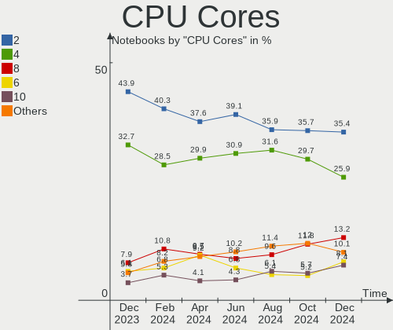
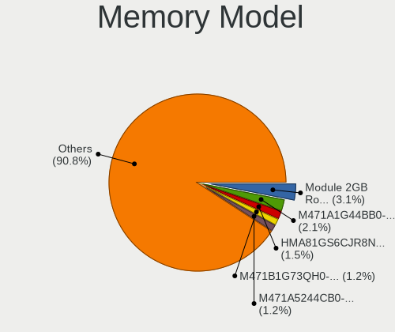

Ubuntu - Hardware Trends (Notebooks)
------------------------------------

A project to identify most popular hardware characteristics and track their change
over time based on data collected by Linux users at https://Linux-Hardware.org.

Anyone can contribute to this report by the [hw-probe](https://github.com/linuxhw/hw-probe) tool:

    sudo -E hw-probe -all -upload

This report is for one last month. Overall report since the beginning of time: [TestDays](https://github.com/linuxhw/TestDays)

Period: Aug, 2023.

Contents
--------

* [ System ](#system)
  - [ OS                       ](#os)
  - [ OS Family                ](#os-family)
  - [ Kernel                   ](#kernel)
  - [ Kernel Family            ](#kernel-family)
  - [ Kernel Major Ver.        ](#kernel-major-ver)
  - [ Arch                     ](#arch)
  - [ DE                       ](#de)
  - [ Display Server           ](#display-server)
  - [ Display Manager          ](#display-manager)
  - [ OS Lang                  ](#os-lang)
  - [ Boot Mode                ](#boot-mode)
  - [ Filesystem               ](#filesystem)
  - [ Part. scheme             ](#part-scheme)
  - [ Dual Boot with Linux/BSD ](#dual-boot-with-linuxbsd)
  - [ Dual Boot (Win)          ](#dual-boot-win)

* [ Board ](#board)
  - [ Vendor                   ](#vendor)
  - [ Model                    ](#model)
  - [ Model Family             ](#model-family)
  - [ MFG Year                 ](#mfg-year)
  - [ Form Factor              ](#form-factor)
  - [ Secure Boot              ](#secure-boot)
  - [ Coreboot                 ](#coreboot)
  - [ RAM Size                 ](#ram-size)
  - [ RAM Used                 ](#ram-used)
  - [ Total Drives             ](#total-drives)
  - [ Has CD-ROM               ](#has-cd-rom)
  - [ Has Ethernet             ](#has-ethernet)
  - [ Has WiFi                 ](#has-wifi)
  - [ Has Bluetooth            ](#has-bluetooth)

* [ Location ](#location)
  - [ Country                  ](#country)
  - [ City                     ](#city)

* [ Drives ](#drives)
  - [ Drive Vendor             ](#drive-vendor)
  - [ Drive Model              ](#drive-model)
  - [ HDD Vendor               ](#hdd-vendor)
  - [ SSD Vendor               ](#ssd-vendor)
  - [ Drive Kind               ](#drive-kind)
  - [ Drive Connector          ](#drive-connector)
  - [ Drive Size               ](#drive-size)
  - [ Space Total              ](#space-total)
  - [ Space Used               ](#space-used)
  - [ Malfunc. Drives          ](#malfunc-drives)
  - [ Malfunc. Drive Vendor    ](#malfunc-drive-vendor)
  - [ Malfunc. HDD Vendor      ](#malfunc-hdd-vendor)
  - [ Malfunc. Drive Kind      ](#malfunc-drive-kind)
  - [ Failed Drives            ](#failed-drives)
  - [ Failed Drive Vendor      ](#failed-drive-vendor)
  - [ Drive Status             ](#drive-status)

* [ Storage controller ](#storage-controller)
  - [ Storage Vendor           ](#storage-vendor)
  - [ Storage Model            ](#storage-model)
  - [ Storage Kind             ](#storage-kind)

* [ Processor ](#processor)
  - [ CPU Vendor               ](#cpu-vendor)
  - [ CPU Model                ](#cpu-model)
  - [ CPU Model Family         ](#cpu-model-family)
  - [ CPU Cores                ](#cpu-cores)
  - [ CPU Sockets              ](#cpu-sockets)
  - [ CPU Threads              ](#cpu-threads)
  - [ CPU Op-Modes             ](#cpu-op-modes)
  - [ CPU Microcode            ](#cpu-microcode)
  - [ CPU Microarch            ](#cpu-microarch)

* [ Graphics ](#graphics)
  - [ GPU Vendor               ](#gpu-vendor)
  - [ GPU Model                ](#gpu-model)
  - [ GPU Combo                ](#gpu-combo)
  - [ GPU Driver               ](#gpu-driver)
  - [ GPU Memory               ](#gpu-memory)

* [ Monitor ](#monitor)
  - [ Monitor Vendor           ](#monitor-vendor)
  - [ Monitor Model            ](#monitor-model)
  - [ Monitor Resolution       ](#monitor-resolution)
  - [ Monitor Diagonal         ](#monitor-diagonal)
  - [ Monitor Width            ](#monitor-width)
  - [ Aspect Ratio             ](#aspect-ratio)
  - [ Monitor Area             ](#monitor-area)
  - [ Pixel Density            ](#pixel-density)
  - [ Multiple Monitors        ](#multiple-monitors)

* [ Network ](#network)
  - [ Net Controller Vendor    ](#net-controller-vendor)
  - [ Net Controller Model     ](#net-controller-model)
  - [ Wireless Vendor          ](#wireless-vendor)
  - [ Wireless Model           ](#wireless-model)
  - [ Ethernet Vendor          ](#ethernet-vendor)
  - [ Ethernet Model           ](#ethernet-model)
  - [ Net Controller Kind      ](#net-controller-kind)
  - [ Used Controller          ](#used-controller)
  - [ NICs                     ](#nics)
  - [ IPv6                     ](#ipv6)

* [ Bluetooth ](#bluetooth)
  - [ Bluetooth Vendor         ](#bluetooth-vendor)
  - [ Bluetooth Model          ](#bluetooth-model)

* [ Sound ](#sound)
  - [ Sound Vendor             ](#sound-vendor)
  - [ Sound Model              ](#sound-model)

* [ Memory ](#memory)
  - [ Memory Vendor            ](#memory-vendor)
  - [ Memory Model             ](#memory-model)
  - [ Memory Kind              ](#memory-kind)
  - [ Memory Form Factor       ](#memory-form-factor)
  - [ Memory Size              ](#memory-size)
  - [ Memory Speed             ](#memory-speed)

* [ Printers & scanners ](#printers--scanners)
  - [ Printer Vendor           ](#printer-vendor)
  - [ Printer Model            ](#printer-model)
  - [ Scanner Vendor           ](#scanner-vendor)
  - [ Scanner Model            ](#scanner-model)

* [ Camera ](#camera)
  - [ Camera Vendor            ](#camera-vendor)
  - [ Camera Model             ](#camera-model)

* [ Security ](#security)
  - [ Fingerprint Vendor       ](#fingerprint-vendor)
  - [ Fingerprint Model        ](#fingerprint-model)
  - [ Chipcard Vendor          ](#chipcard-vendor)
  - [ Chipcard Model           ](#chipcard-model)

* [ Unsupported ](#unsupported)
  - [ Unsupported Devices      ](#unsupported-devices)
  - [ Unsupported Device Types ](#unsupported-device-types)

System
------

OS
--

Installed operating systems

| Name           | Notebooks | Percent |
|----------------|-----------|---------|
| Ubuntu 22.04   | 446       | 66.07%  |
| Ubuntu 23.04   | 137       | 20.3%   |
| Ubuntu 20.04   | 65        | 9.63%   |
| Ubuntu 18.04   | 13        | 1.93%   |
| Ubuntu 22.10   | 8         | 1.19%   |
| Ubuntu 23.10   | 2         | 0.3%    |
| Ubuntu 21.10   | 2         | 0.3%    |
| Ubuntu Core 22 | 1         | 0.15%   |
| Ubuntu 21.04   | 1         | 0.15%   |

OS Family
---------

OS without a version

| Name   | Notebooks | Percent |
|--------|-----------|---------|
| Ubuntu | 675       | 100%    |

Kernel
------

Version of the Linux kernel

| Version                 | Notebooks | Percent |
|-------------------------|-----------|---------|
| 6.2.0-26-generic        | 329       | 48.74%  |
| 6.2.0-27-generic        | 54        | 8%      |
| 5.19.0-50-generic       | 48        | 7.11%   |
| 5.15.0-78-generic       | 37        | 5.48%   |
| 6.2.0-31-generic        | 26        | 3.85%   |
| 5.15.0-79-generic       | 20        | 2.96%   |
| 5.19.0-46-generic       | 18        | 2.67%   |
| 6.2.0-20-generic        | 16        | 2.37%   |
| 5.19.0-32-generic       | 12        | 1.78%   |
| 5.4.0-150-generic       | 6         | 0.89%   |
| 6.2.0-32-generic        | 5         | 0.74%   |
| 5.15.0-82-generic       | 5         | 0.74%   |
| 5.4.0-156-generic       | 4         | 0.59%   |
| 5.15.0-76-generic       | 4         | 0.59%   |
| 4.15.0-213-generic      | 4         | 0.59%   |
| 6.4.10-060410-generic   | 3         | 0.44%   |
| 6.0.0-1020-oem          | 3         | 0.44%   |
| 5.4.0-155-generic       | 3         | 0.44%   |
| 5.19.0-45-generic       | 3         | 0.44%   |
| 5.19.0-41-generic       | 3         | 0.44%   |
| 6.3.0-7-generic         | 2         | 0.3%    |
| 6.2.0-25-generic        | 2         | 0.3%    |
| 5.15.0-75-generic       | 2         | 0.3%    |
| 5.15.0-72-generic       | 2         | 0.3%    |
| 5.15.0-43-generic       | 2         | 0.3%    |
| 5.15.0-25-generic       | 2         | 0.3%    |
| 5.11.0-27-generic       | 2         | 0.3%    |
| 6.5.0-060500-generic    | 1         | 0.15%   |
| 6.5.0                   | 1         | 0.15%   |
| 6.4.9-060409-generic    | 1         | 0.15%   |
| 6.4.8-tkg-cfs           | 1         | 0.15%   |
| 6.4.8-060408-generic    | 1         | 0.15%   |
| 6.4.7-t2-lunar          | 1         | 0.15%   |
| 6.4.6-060406-generic    | 1         | 0.15%   |
| 6.4.12-060412-generic   | 1         | 0.15%   |
| 6.4.11-t2-jammy         | 1         | 0.15%   |
| 6.4.11-060411-generic   | 1         | 0.15%   |
| 6.4.10-x64v3-xanmod1    | 1         | 0.15%   |
| 6.4.10-3-liquorix-amd64 | 1         | 0.15%   |
| 6.4.0-void30            | 1         | 0.15%   |

Kernel Family
-------------

Linux kernel without a distro release

| Version  | Notebooks | Percent |
|----------|-----------|---------|
| 6.2.0    | 436       | 64.59%  |
| 5.19.0   | 88        | 13.04%  |
| 5.15.0   | 82        | 12.15%  |
| 5.4.0    | 18        | 2.67%   |
| 4.15.0   | 6         | 0.89%   |
| 6.4.10   | 5         | 0.74%   |
| 6.0.0    | 4         | 0.59%   |
| 5.13.0   | 4         | 0.59%   |
| 5.17.0   | 3         | 0.44%   |
| 5.11.0   | 3         | 0.44%   |
| 6.5.0    | 2         | 0.3%    |
| 6.4.8    | 2         | 0.3%    |
| 6.4.11   | 2         | 0.3%    |
| 6.4.0    | 2         | 0.3%    |
| 6.3.0    | 2         | 0.3%    |
| 5.8.0    | 2         | 0.3%    |
| 5.14.0   | 2         | 0.3%    |
| 6.4.9    | 1         | 0.15%   |
| 6.4.7    | 1         | 0.15%   |
| 6.4.6    | 1         | 0.15%   |
| 6.4.12   | 1         | 0.15%   |
| 6.3.7    | 1         | 0.15%   |
| 6.2.11   | 1         | 0.15%   |
| 6.2.1    | 1         | 0.15%   |
| 6.1.10   | 1         | 0.15%   |
| 6.1.0    | 1         | 0.15%   |
| 5.15.75  | 1         | 0.15%   |
| 5.15.23  | 1         | 0.15%   |
| 5.15.108 | 1         | 0.15%   |

Kernel Major Ver.
-----------------

Linux kernel major version

| Version | Notebooks | Percent |
|---------|-----------|---------|
| 6.2     | 438       | 64.89%  |
| 5.19    | 88        | 13.04%  |
| 5.15    | 85        | 12.59%  |
| 5.4     | 18        | 2.67%   |
| 6.4     | 15        | 2.22%   |
| 4.15    | 6         | 0.89%   |
| 6.0     | 4         | 0.59%   |
| 5.13    | 4         | 0.59%   |
| 6.3     | 3         | 0.44%   |
| 5.17    | 3         | 0.44%   |
| 5.11    | 3         | 0.44%   |
| 6.5     | 2         | 0.3%    |
| 6.1     | 2         | 0.3%    |
| 5.8     | 2         | 0.3%    |
| 5.14    | 2         | 0.3%    |

Arch
----

OS architecture (x86_64, i586, etc.)

| Name   | Notebooks | Percent |
|--------|-----------|---------|
| x86_64 | 673       | 99.7%   |
| i686   | 2         | 0.3%    |

DE
--

Desktop Environment

| Name            | Notebooks | Percent |
|-----------------|-----------|---------|
| GNOME           | 645       | 95.56%  |
| Unknown         | 20        | 2.96%   |
| X-Cinnamon      | 3         | 0.44%   |
| Cinnamon        | 2         | 0.3%    |
| sway            | 1         | 0.15%   |
| Lubuntu         | 1         | 0.15%   |
| GNOME Flashback | 1         | 0.15%   |
| GNOME Classic   | 1         | 0.15%   |
| enlightenment   | 1         | 0.15%   |

Display Server
--------------

X11 or Wayland

| Name    | Notebooks | Percent |
|---------|-----------|---------|
| Wayland | 412       | 61.04%  |
| X11     | 243       | 36%     |
| Unknown | 14        | 2.07%   |
| Tty     | 6         | 0.89%   |

Display Manager
---------------

SDDM, LightDM, etc.

| Name    | Notebooks | Percent |
|---------|-----------|---------|
| GDM3    | 572       | 84.74%  |
| Unknown | 51        | 7.56%   |
| GDM     | 34        | 5.04%   |
| LightDM | 17        | 2.52%   |
| SLiM    | 1         | 0.15%   |

OS Lang
-------

Language

| Lang    | Notebooks | Percent |
|---------|-----------|---------|
| en_US   | 306       | 45.33%  |
| de_DE   | 58        | 8.59%   |
| fr_FR   | 45        | 6.67%   |
| en_GB   | 28        | 4.15%   |
| en_IN   | 26        | 3.85%   |
| ru_RU   | 25        | 3.7%    |
| pt_BR   | 24        | 3.56%   |
| it_IT   | 14        | 2.07%   |
| es_ES   | 14        | 2.07%   |
| en_CA   | 11        | 1.63%   |
| en_AU   | 11        | 1.63%   |
| C       | 10        | 1.48%   |
| zh_CN   | 8         | 1.19%   |
| pl_PL   | 7         | 1.04%   |
| es_MX   | 6         | 0.89%   |
| es_AR   | 6         | 0.89%   |
| Unknown | 6         | 0.89%   |
| es_CO   | 5         | 0.74%   |
| en_IL   | 5         | 0.74%   |
| tr_TR   | 4         | 0.59%   |
| nl_NL   | 4         | 0.59%   |
| ja_JP   | 4         | 0.59%   |
| hu_HU   | 4         | 0.59%   |
| fr_CA   | 4         | 0.59%   |
| sv_SE   | 3         | 0.44%   |
| pt_PT   | 3         | 0.44%   |
| ko_KR   | 3         | 0.44%   |
| en_ZA   | 3         | 0.44%   |
| en_PH   | 3         | 0.44%   |
| cs_CZ   | 3         | 0.44%   |
| nb_NO   | 2         | 0.3%    |
| en_SG   | 2         | 0.3%    |
| bg_BG   | 2         | 0.3%    |
| zh_TW   | 1         | 0.15%   |
| vi_VN   | 1         | 0.15%   |
| uk_UA   | 1         | 0.15%   |
| sr_RS   | 1         | 0.15%   |
| nl_BE   | 1         | 0.15%   |
| fr_CH   | 1         | 0.15%   |
| es_VE   | 1         | 0.15%   |

Boot Mode
---------

EFI or BIOS

| Mode | Notebooks | Percent |
|------|-----------|---------|
| BIOS | 362       | 53.63%  |
| EFI  | 313       | 46.37%  |

Filesystem
----------

Type of filesystem

| Type    | Notebooks | Percent |
|---------|-----------|---------|
| Tmpfs   | 325       | 48.15%  |
| Ext4    | 324       | 48%     |
| Overlay | 12        | 1.78%   |
| Btrfs   | 8         | 1.19%   |
| Zfs     | 5         | 0.74%   |
| Xfs     | 1         | 0.15%   |

Part. scheme
------------

Scheme of partitioning

| Type    | Notebooks | Percent |
|---------|-----------|---------|
| GPT     | 556       | 82.37%  |
| MBR     | 69        | 10.22%  |
| Unknown | 50        | 7.41%   |

Dual Boot with Linux/BSD
------------------------

Hosting more than one Linux/BSD

| Dual boot | Notebooks | Percent |
|-----------|-----------|---------|
| No        | 620       | 91.85%  |
| Yes       | 55        | 8.15%   |

Dual Boot (Win)
---------------

Hosting Linux and Windows

| Dual boot | Notebooks | Percent |
|-----------|-----------|---------|
| No        | 424       | 62.81%  |
| Yes       | 251       | 37.19%  |

Board
-----

Vendor
------

Motherboard manufacturer

| Name                           | Notebooks | Percent |
|--------------------------------|-----------|---------|
| Hewlett-Packard                | 134       | 19.85%  |
| Lenovo                         | 130       | 19.26%  |
| Dell                           | 129       | 19.11%  |
| ASUSTek Computer               | 68        | 10.07%  |
| Acer                           | 60        | 8.89%   |
| Apple                          | 20        | 2.96%   |
| HUAWEI                         | 17        | 2.52%   |
| MSI                            | 16        | 2.37%   |
| Toshiba                        | 13        | 1.93%   |
| Notebook                       | 10        | 1.48%   |
| Sony                           | 6         | 0.89%   |
| Samsung Electronics            | 6         | 0.89%   |
| Google                         | 6         | 0.89%   |
| Medion                         | 5         | 0.74%   |
| Timi                           | 4         | 0.59%   |
| Panasonic                      | 4         | 0.59%   |
| Infinix                        | 3         | 0.44%   |
| Fujitsu                        | 3         | 0.44%   |
| Positivo                       | 2         | 0.3%    |
| Intel                          | 2         | 0.3%    |
| Gateway                        | 2         | 0.3%    |
| Chuwi                          | 2         | 0.3%    |
| BANGHO                         | 2         | 0.3%    |
| Alienware                      | 2         | 0.3%    |
| Unknown                        | 2         | 0.3%    |
| Yadro Client Systems           | 1         | 0.15%   |
| TUXEDO                         | 1         | 0.15%   |
| Tactus                         | 1         | 0.15%   |
| System76                       | 1         | 0.15%   |
| Siragon                        | 1         | 0.15%   |
| Shuttle                        | 1         | 0.15%   |
| Shanghai Zhaoxin Semiconductor | 1         | 0.15%   |
| SGIN                           | 1         | 0.15%   |
| Schenker                       | 1         | 0.15%   |
| Pegatron                       | 1         | 0.15%   |
| Packard Bell                   | 1         | 0.15%   |
| Novatech                       | 1         | 0.15%   |
| NEC Computers                  | 1         | 0.15%   |
| Mediacom                       | 1         | 0.15%   |
| LG Electronics                 | 1         | 0.15%   |

Model
-----

Motherboard model

| Name                                       | Notebooks | Percent |
|--------------------------------------------|-----------|---------|
| HP Notebook                                | 6         | 0.89%   |
| HUAWEI BOD-WXX9                            | 4         | 0.59%   |
| HP EliteBook 840 G3                        | 4         | 0.59%   |
| Unknown                                    | 4         | 0.59%   |
| HP ZBook 14 G2                             | 3         | 0.44%   |
| HP Pavilion Laptop 15-cc5xx                | 3         | 0.44%   |
| HP Pavilion g6                             | 3         | 0.44%   |
| HP EliteBook 840 G6                        | 3         | 0.44%   |
| Dell XPS 15 9500                           | 3         | 0.44%   |
| Dell XPS 15 7590                           | 3         | 0.44%   |
| Dell Latitude E6420                        | 3         | 0.44%   |
| Dell Latitude E6330                        | 3         | 0.44%   |
| Dell Latitude 7390                         | 3         | 0.44%   |
| Dell Latitude 7310                         | 3         | 0.44%   |
| Dell Latitude 5590                         | 3         | 0.44%   |
| Dell Latitude 5420                         | 3         | 0.44%   |
| ASUS VivoBook_ASUSLaptop M1402IA_M1402IA   | 3         | 0.44%   |
| Apple MacBookAir7,2                        | 3         | 0.44%   |
| Acer Aspire A515-56                        | 3         | 0.44%   |
| Acer Aspire 5750G                          | 3         | 0.44%   |
| MSI Katana GF76 11UD                       | 2         | 0.3%    |
| Lenovo ThinkPad X1 Carbon Gen 8 20U9CTO1WW | 2         | 0.3%    |
| Lenovo ThinkBook 14-IIL 20SL               | 2         | 0.3%    |
| Lenovo Legion 5 Pro 16ACH6H 82JQ           | 2         | 0.3%    |
| Lenovo IdeaPad Gaming 3 15ACH6 82K2        | 2         | 0.3%    |
| Lenovo IdeaPad 3 15ITL6 82H8               | 2         | 0.3%    |
| HUAWEI NBLB-WAX9N                          | 2         | 0.3%    |
| HUAWEI KLVD-WXX9                           | 2         | 0.3%    |
| HUAWEI BOM-WXX9                            | 2         | 0.3%    |
| HP ProBook 650 G1                          | 2         | 0.3%    |
| HP Pavilion Laptop 14-ec0xxx               | 2         | 0.3%    |
| HP Pavilion g7                             | 2         | 0.3%    |
| HP Pavilion 15                             | 2         | 0.3%    |
| HP Laptop 15-db0xxx                        | 2         | 0.3%    |
| HP EliteBook 845 G7 Notebook PC            | 2         | 0.3%    |
| HP EliteBook 840 G5                        | 2         | 0.3%    |
| HP EliteBook 840 G1                        | 2         | 0.3%    |
| HP EliteBook 2540p                         | 2         | 0.3%    |
| HP 255 G8 Notebook PC                      | 2         | 0.3%    |
| HP 2000                                    | 2         | 0.3%    |

Model Family
------------

Motherboard model prefix

| Name              | Notebooks | Percent |
|-------------------|-----------|---------|
| Lenovo ThinkPad   | 72        | 10.67%  |
| Dell Latitude     | 57        | 8.44%   |
| Acer Aspire       | 43        | 6.37%   |
| HP EliteBook      | 32        | 4.74%   |
| Lenovo IdeaPad    | 28        | 4.15%   |
| HP Pavilion       | 26        | 3.85%   |
| Dell Inspiron     | 26        | 3.85%   |
| Dell XPS          | 20        | 2.96%   |
| ASUS VivoBook     | 20        | 2.96%   |
| HP Laptop         | 15        | 2.22%   |
| Dell Precision    | 14        | 2.07%   |
| Toshiba Satellite | 13        | 1.93%   |
| HP ProBook        | 12        | 1.78%   |
| ASUS ROG          | 10        | 1.48%   |
| Lenovo Legion     | 9         | 1.33%   |
| HP ZBook          | 9         | 1.33%   |
| ASUS Zenbook      | 8         | 1.19%   |
| HP 255            | 7         | 1.04%   |
| HP Notebook       | 6         | 0.89%   |
| Acer Nitro        | 6         | 0.89%   |
| MSI Katana        | 5         | 0.74%   |
| Lenovo ThinkBook  | 5         | 0.74%   |
| HP OMEN           | 5         | 0.74%   |
| Dell Vostro       | 5         | 0.74%   |
| HUAWEI BOD-WXX9   | 4         | 0.59%   |
| ASUS ASUS         | 4         | 0.59%   |
| Apple MacBookAir6 | 4         | 0.59%   |
| Acer Swift        | 4         | 0.59%   |
| Unknown           | 4         | 0.59%   |
| Infinix INBOOK    | 3         | 0.44%   |
| HP ENVY           | 3         | 0.44%   |
| HP Compaq         | 3         | 0.44%   |
| HP 15             | 3         | 0.44%   |
| Dell G3           | 3         | 0.44%   |
| Apple MacBookAir7 | 3         | 0.44%   |
| Medion Akoya      | 2         | 0.3%    |
| Lenovo V15        | 2         | 0.3%    |
| HUAWEI NBLB-WAX9N | 2         | 0.3%    |
| HUAWEI KLVD-WXX9  | 2         | 0.3%    |
| HUAWEI BOM-WXX9   | 2         | 0.3%    |

MFG Year
--------

Motherboard manufacture year

| Year | Notebooks | Percent |
|------|-----------|---------|
| 2021 | 95        | 14.07%  |
| 2020 | 80        | 11.85%  |
| 2022 | 61        | 9.04%   |
| 2011 | 49        | 7.26%   |
| 2019 | 47        | 6.96%   |
| 2018 | 45        | 6.67%   |
| 2012 | 44        | 6.52%   |
| 2023 | 43        | 6.37%   |
| 2013 | 39        | 5.78%   |
| 2017 | 38        | 5.63%   |
| 2015 | 35        | 5.19%   |
| 2016 | 30        | 4.44%   |
| 2014 | 29        | 4.3%    |
| 2010 | 19        | 2.81%   |
| 2008 | 11        | 1.63%   |
| 2007 | 6         | 0.89%   |
| 2009 | 3         | 0.44%   |
| 2006 | 1         | 0.15%   |

Form Factor
-----------

Physical design of the computer

| Name     | Notebooks | Percent |
|----------|-----------|---------|
| Notebook | 675       | 100%    |

Secure Boot
-----------

Enabled or disabled

| State    | Notebooks | Percent |
|----------|-----------|---------|
| Disabled | 584       | 86.52%  |
| Enabled  | 91        | 13.48%  |

Coreboot
--------

Have coreboot on board

| Used | Notebooks | Percent |
|------|-----------|---------|
| No   | 668       | 98.96%  |
| Yes  | 7         | 1.04%   |

RAM Size
--------

Total RAM memory

| Size in GB  | Notebooks | Percent |
|-------------|-----------|---------|
| 4.01-8.0    | 192       | 28.44%  |
| 16.01-24.0  | 148       | 21.93%  |
| 8.01-16.0   | 127       | 18.81%  |
| 3.01-4.0    | 88        | 13.04%  |
| 32.01-64.0  | 75        | 11.11%  |
| 24.01-32.0  | 16        | 2.37%   |
| 1.01-2.0    | 12        | 1.78%   |
| 64.01-256.0 | 9         | 1.33%   |
| 2.01-3.0    | 7         | 1.04%   |
| 0.01-0.5    | 1         | 0.15%   |

RAM Used
--------

Used RAM memory

| Used GB    | Notebooks | Percent |
|------------|-----------|---------|
| 2.01-3.0   | 211       | 31.26%  |
| 1.01-2.0   | 157       | 23.26%  |
| 4.01-8.0   | 139       | 20.59%  |
| 3.01-4.0   | 112       | 16.59%  |
| 8.01-16.0  | 44        | 6.52%   |
| 0.51-1.0   | 7         | 1.04%   |
| 16.01-24.0 | 2         | 0.3%    |
| 0.01-0.5   | 2         | 0.3%    |
| 32.01-64.0 | 1         | 0.15%   |

Total Drives
------------

Number of drives on board

| Drives | Notebooks | Percent |
|--------|-----------|---------|
| 1      | 517       | 76.59%  |
| 2      | 138       | 20.44%  |
| 3      | 14        | 2.07%   |
| 0      | 5         | 0.74%   |
| 5      | 1         | 0.15%   |

Has CD-ROM
----------

Has CD-ROM on board

| Presented | Notebooks | Percent |
|-----------|-----------|---------|
| No        | 501       | 74.22%  |
| Yes       | 174       | 25.78%  |

Has Ethernet
------------

Has Ethernet on board

| Presented | Notebooks | Percent |
|-----------|-----------|---------|
| Yes       | 516       | 76.44%  |
| No        | 159       | 23.56%  |

Has WiFi
--------

Has WiFi module

| Presented | Notebooks | Percent |
|-----------|-----------|---------|
| Yes       | 667       | 98.81%  |
| No        | 8         | 1.19%   |

Has Bluetooth
-------------

Has Bluetooth module

| Presented | Notebooks | Percent |
|-----------|-----------|---------|
| Yes       | 573       | 84.89%  |
| No        | 102       | 15.11%  |

Location
--------

Country
-------

Geographic location (country)

| Country      | Notebooks | Percent |
|--------------|-----------|---------|
| USA          | 99        | 14.67%  |
| Germany      | 68        | 10.07%  |
| France       | 55        | 8.15%   |
| India        | 35        | 5.19%   |
| Brazil       | 33        | 4.89%   |
| Russia       | 27        | 4%      |
| Italy        | 25        | 3.7%    |
| Canada       | 24        | 3.56%   |
| Spain        | 19        | 2.81%   |
| UK           | 18        | 2.67%   |
| Netherlands  | 14        | 2.07%   |
| Turkey       | 12        | 1.78%   |
| Poland       | 12        | 1.78%   |
| Australia    | 12        | 1.78%   |
| Mexico       | 11        | 1.63%   |
| China        | 11        | 1.63%   |
| Argentina    | 11        | 1.63%   |
| Colombia     | 8         | 1.19%   |
| Portugal     | 7         | 1.04%   |
| Czechia      | 7         | 1.04%   |
| Serbia       | 6         | 0.89%   |
| Indonesia    | 6         | 0.89%   |
| Hungary      | 6         | 0.89%   |
| Bulgaria     | 6         | 0.89%   |
| Belgium      | 6         | 0.89%   |
| Sweden       | 5         | 0.74%   |
| Norway       | 5         | 0.74%   |
| Japan        | 5         | 0.74%   |
| Israel       | 5         | 0.74%   |
| Iran         | 5         | 0.74%   |
| Greece       | 5         | 0.74%   |
| Finland      | 5         | 0.74%   |
| Denmark      | 5         | 0.74%   |
| South Korea  | 4         | 0.59%   |
| South Africa | 4         | 0.59%   |
| Romania      | 4         | 0.59%   |
| Switzerland  | 3         | 0.44%   |
| Singapore    | 3         | 0.44%   |
| Puerto Rico  | 3         | 0.44%   |
| Philippines  | 3         | 0.44%   |

City
----

Geographic location (city)

| City             | Notebooks | Percent |
|------------------|-----------|---------|
| Champs-sur-Marne | 8         | 1.19%   |
| Toronto          | 7         | 1.04%   |
| Berlin           | 7         | 1.04%   |
| Pune             | 6         | 0.89%   |
| Paris            | 6         | 0.89%   |
| Moscow           | 6         | 0.89%   |
| Delhi            | 6         | 0.89%   |
| Barcelona        | 6         | 0.89%   |
| Rome             | 5         | 0.74%   |
| New York         | 5         | 0.74%   |
| Hamburg          | 5         | 0.74%   |
| Sydney           | 4         | 0.59%   |
| Sofia            | 4         | 0.59%   |
| Oshawa           | 4         | 0.59%   |
| Mumbai           | 4         | 0.59%   |
| Madrid           | 4         | 0.59%   |
| Bengaluru        | 4         | 0.59%   |
| Belo Horizonte   | 4         | 0.59%   |
| Belgrade         | 4         | 0.59%   |
| Beijing          | 4         | 0.59%   |
| Villeurbanne     | 3         | 0.44%   |
| Tucson           | 3         | 0.44%   |
| Tehran           | 3         | 0.44%   |
| St Petersburg    | 3         | 0.44%   |
| Singapore        | 3         | 0.44%   |
| Sao Paulo        | 3         | 0.44%   |
| San Juan         | 3         | 0.44%   |
| Prague           | 3         | 0.44%   |
| Perth            | 3         | 0.44%   |
| Montreal         | 3         | 0.44%   |
| Milan            | 3         | 0.44%   |
| Mexico City      | 3         | 0.44%   |
| Melbourne        | 3         | 0.44%   |
| Jakarta          | 3         | 0.44%   |
| Istanbul         | 3         | 0.44%   |
| Helsinki         | 3         | 0.44%   |
| Cologne          | 3         | 0.44%   |
| Bucheon-si       | 3         | 0.44%   |
| Brooklyn         | 3         | 0.44%   |
| Bogotá          | 3         | 0.44%   |

Drives
------

Drive Vendor
------------

Hard drive vendors

| Vendor                      | Notebooks | Drives | Percent |
|-----------------------------|-----------|--------|---------|
| Samsung Electronics         | 138       | 150    | 17.4%   |
| WDC                         | 70        | 71     | 8.83%   |
| Sandisk                     | 55        | 59     | 6.94%   |
| Toshiba                     | 52        | 52     | 6.56%   |
| SK hynix                    | 50        | 50     | 6.31%   |
| Seagate                     | 50        | 50     | 6.31%   |
| Kingston                    | 38        | 39     | 4.79%   |
| Unknown                     | 36        | 43     | 4.54%   |
| Intel                       | 30        | 33     | 3.78%   |
| KIOXIA                      | 29        | 29     | 3.66%   |
| Crucial                     | 29        | 30     | 3.66%   |
| Micron Technology           | 28        | 28     | 3.53%   |
| Hitachi                     | 13        | 15     | 1.64%   |
| HGST                        | 13        | 13     | 1.64%   |
| Apple                       | 13        | 15     | 1.64%   |
| Kingston Technology Company | 10        | 10     | 1.26%   |
| Silicon Motion              | 8         | 8      | 1.01%   |
| A-DATA Technology           | 8         | 8      | 1.01%   |
| Phison                      | 7         | 7      | 0.88%   |
| China                       | 7         | 7      | 0.88%   |
| Unknown                     | 7         | 7      | 0.88%   |
| PNY                         | 5         | 5      | 0.63%   |
| Netac                       | 5         | 5      | 0.63%   |
| FORESEE                     | 5         | 5      | 0.63%   |
| ADATA Technology            | 5         | 5      | 0.63%   |
| SPCC                        | 4         | 4      | 0.5%    |
| Phison Electronics          | 4         | 4      | 0.5%    |
| Micron/Crucial Technology   | 4         | 4      | 0.5%    |
| UMIS                        | 3         | 3      | 0.38%   |
| LITEONIT                    | 3         | 3      | 0.38%   |
| LITEON                      | 3         | 3      | 0.38%   |
| Lexar                       | 3         | 3      | 0.38%   |
| Hjwdz                       | 3         | 3      | 0.38%   |
| Team                        | 2         | 2      | 0.25%   |
| SABRENT                     | 2         | 2      | 0.25%   |
| PNY CS90                    | 2         | 2      | 0.25%   |
| Patriot                     | 2         | 2      | 0.25%   |
| MAXIO Technology (Hangzhou) | 2         | 2      | 0.25%   |
| LDLC                        | 2         | 2      | 0.25%   |
| KingFast                    | 2         | 2      | 0.25%   |

Drive Model
-----------

Hard drive models

| Model                                                 | Notebooks | Percent |
|-------------------------------------------------------|-----------|---------|
| Kingston SA400S37240G 240GB SSD                       | 14        | 1.71%   |
| Samsung NVMe SSD Controller SM981/PM981/PM983 500GB   | 12        | 1.47%   |
| Unknown MMC Card  64GB                                | 11        | 1.34%   |
| Seagate ST1000LM035-1RK172 1TB                        | 8         | 0.98%   |
| Intel SSDPEKNU512GZ 512GB                             | 8         | 0.98%   |
| Unknown MMC Card  32GB                                | 7         | 0.86%   |
| Toshiba MQ01ABD100 1TB                                | 7         | 0.86%   |
| Seagate ST1000LM024 HN-M101MBB 1TB                    | 7         | 0.86%   |
| Sandisk WD Black SN750 / PC SN730 NVMe SSD 1024GB     | 7         | 0.86%   |
| Unknown                                               | 7         | 0.86%   |
| Toshiba XG6 NVMe SSD Controller 1024GB                | 6         | 0.73%   |
| Toshiba MQ04ABF100 1TB                                | 6         | 0.73%   |
| Micron 2450_MTFDKBA512TFK 512GB                       | 6         | 0.73%   |
| Sandisk WD Blue SN550 NVMe SSD 250GB                  | 5         | 0.61%   |
| Samsung SSD 980 1TB                                   | 5         | 0.61%   |
| Samsung SSD 970 EVO Plus 1TB                          | 5         | 0.61%   |
| Samsung NVMe SSD Controller PM9A1/PM9A3/980PRO 1024GB | 5         | 0.61%   |
| KIOXIA KBG40ZNV512G 512GB                             | 5         | 0.61%   |
| Crucial CT240BX500SSD1 240GB                          | 5         | 0.61%   |
| SK hynix SKHynix_HFS512GDE9X084N 512GB                | 4         | 0.49%   |
| Sandisk WD Blue SN500 / PC SN520 NVMe SSD 512GB       | 4         | 0.49%   |
| SanDisk NVMe SSD Drive 1TB                            | 4         | 0.49%   |
| Samsung SSD 870 QVO 1TB                               | 4         | 0.49%   |
| Samsung SSD 870 EVO 1TB                               | 4         | 0.49%   |
| Micron/Crucial P2 NVMe PCIe SSD 1TB                   | 4         | 0.49%   |
| Kingston Company SNV2S1000G 1TB                       | 4         | 0.49%   |
| Kingston Company OM3PDP3 NVMe SSD 256GB               | 4         | 0.49%   |
| Hitachi HTS547564A9E384 640GB                         | 4         | 0.49%   |
| WDC WDS500G2B0A 500GB SSD                             | 3         | 0.37%   |
| Toshiba MQ01ABF050 500GB                              | 3         | 0.37%   |
| Toshiba MQ01ABD075 752GB                              | 3         | 0.37%   |
| SK hynix PC611 NVMe 1TB                               | 3         | 0.37%   |
| SK hynix HFM512GD3JX013N 512GB                        | 3         | 0.37%   |
| SK hynix BC711 NVMe 512GB                             | 3         | 0.37%   |
| SK hynix BC511 512GB                                  | 3         | 0.37%   |
| Silicon Motion SM2263EN/SM2263XT SSD Controller 256GB | 3         | 0.37%   |
| Seagate ST2000LM007-1R8174 2TB                        | 3         | 0.37%   |
| SanDisk NVMe SSD Drive 512GB                          | 3         | 0.37%   |
| Samsung SSD 980 PRO 1TB                               | 3         | 0.37%   |
| Samsung SSD 870 EVO 500GB                             | 3         | 0.37%   |

HDD Vendor
----------

Hard disk drive vendors

| Vendor              | Notebooks | Drives | Percent |
|---------------------|-----------|--------|---------|
| Seagate             | 49        | 49     | 30.82%  |
| WDC                 | 42        | 42     | 26.42%  |
| Toshiba             | 31        | 31     | 19.5%   |
| Hitachi             | 13        | 15     | 8.18%   |
| HGST                | 13        | 13     | 8.18%   |
| Unknown             | 3         | 3      | 1.89%   |
| Samsung Electronics | 2         | 2      | 1.26%   |
| SABRENT             | 2         | 2      | 1.26%   |
| SAGE                | 1         | 1      | 0.63%   |
| HGST HTS            | 1         | 1      | 0.63%   |
| Fujitsu             | 1         | 1      | 0.63%   |
| External            | 1         | 2      | 0.63%   |

SSD Vendor
----------

Solid state drive vendors

| Vendor              | Notebooks | Drives | Percent |
|---------------------|-----------|--------|---------|
| Samsung Electronics | 51        | 56     | 22.17%  |
| Kingston            | 26        | 27     | 11.3%   |
| Crucial             | 22        | 23     | 9.57%   |
| SanDisk             | 20        | 24     | 8.7%    |
| WDC                 | 13        | 13     | 5.65%   |
| SK hynix            | 12        | 12     | 5.22%   |
| China               | 7         | 7      | 3.04%   |
| Apple               | 7         | 7      | 3.04%   |
| PNY                 | 5         | 5      | 2.17%   |
| Netac               | 5         | 5      | 2.17%   |
| Intel               | 5         | 5      | 2.17%   |
| Toshiba             | 4         | 4      | 1.74%   |
| Unknown             | 4         | 4      | 1.74%   |
| SPCC                | 3         | 3      | 1.3%    |
| Micron Technology   | 3         | 3      | 1.3%    |
| LITEONIT            | 3         | 3      | 1.3%    |
| LITEON              | 3         | 3      | 1.3%    |
| Lexar               | 3         | 3      | 1.3%    |
| Team                | 2         | 2      | 0.87%   |
| PNY CS90            | 2         | 2      | 0.87%   |
| Patriot             | 2         | 2      | 0.87%   |
| Kingchuxing         | 2         | 2      | 0.87%   |
| Intenso             | 2         | 2      | 0.87%   |
| GOODRAM             | 2         | 2      | 0.87%   |
| A-DATA Technology   | 2         | 2      | 0.87%   |
| YS                  | 1         | 1      | 0.43%   |
| VISIPRO             | 1         | 1      | 0.43%   |
| Transcend           | 1         | 1      | 0.43%   |
| Seagate             | 1         | 1      | 0.43%   |
| POWER               | 1         | 1      | 0.43%   |
| Plextor             | 1         | 1      | 0.43%   |
| Phison              | 1         | 1      | 0.43%   |
| Mushkin             | 1         | 1      | 0.43%   |
| MidasForce          | 1         | 1      | 0.43%   |
| Leven               | 1         | 1      | 0.43%   |
| LDLC                | 1         | 1      | 0.43%   |
| JMicron Technology  | 1         | 1      | 0.43%   |
| INDMEM              | 1         | 1      | 0.43%   |
| Indilinx            | 1         | 1      | 0.43%   |
| Gigabyte Technology | 1         | 1      | 0.43%   |

Drive Kind
----------

HDD or SSD

| Kind    | Notebooks | Drives | Percent |
|---------|-----------|--------|---------|
| NVMe    | 341       | 371    | 44.52%  |
| SSD     | 223       | 241    | 29.11%  |
| HDD     | 154       | 162    | 20.1%   |
| MMC     | 36        | 41     | 4.7%    |
| Unknown | 12        | 12     | 1.57%   |

Drive Connector
---------------

SATA, SAS, NVMe, etc.

| Type | Notebooks | Drives | Percent |
|------|-----------|--------|---------|
| SATA | 351       | 395    | 46.99%  |
| NVMe | 341       | 369    | 45.65%  |
| MMC  | 36        | 41     | 4.82%   |
| SAS  | 19        | 22     | 2.54%   |

Drive Size
----------

Size of hard drive

| Size in TB | Notebooks | Drives | Percent |
|------------|-----------|--------|---------|
| 0.01-0.5   | 227       | 243    | 60.21%  |
| 0.51-1.0   | 137       | 144    | 36.34%  |
| 1.01-2.0   | 11        | 14     | 2.92%   |
| 3.01-4.0   | 1         | 1      | 0.27%   |
| 4.01-10.0  | 1         | 1      | 0.27%   |

Space Total
-----------

Amount of disk space available on the file system

| Size in GB     | Notebooks | Percent |
|----------------|-----------|---------|
| 101-250        | 203       | 30.07%  |
| 251-500        | 196       | 29.04%  |
| 501-1000       | 126       | 18.67%  |
| 51-100         | 41        | 6.07%   |
| 1001-2000      | 33        | 4.89%   |
| 1-20           | 32        | 4.74%   |
| 21-50          | 25        | 3.7%    |
| 2001-3000      | 9         | 1.33%   |
| Unknown        | 7         | 1.04%   |
| More than 3000 | 3         | 0.44%   |

Space Used
----------

Amount of used disk space

| Used GB   | Notebooks | Percent |
|-----------|-----------|---------|
| 1-20      | 213       | 31.56%  |
| 21-50     | 155       | 22.96%  |
| 51-100    | 102       | 15.11%  |
| 101-250   | 101       | 14.96%  |
| 251-500   | 60        | 8.89%   |
| 501-1000  | 30        | 4.44%   |
| Unknown   | 7         | 1.04%   |
| 1001-2000 | 4         | 0.59%   |
| 2001-3000 | 3         | 0.44%   |

Malfunc. Drives
---------------

Drive models with a malfunction

| Model                                            | Notebooks | Drives | Percent |
|--------------------------------------------------|-----------|--------|---------|
| Toshiba MQ01ABD100 1TB                           | 4         | 4      | 15.38%  |
| Seagate ST1000LM035-1RK172 1TB                   | 2         | 2      | 7.69%   |
| WDC WD2500BUDT-63DPZY0 250GB                     | 1         | 1      | 3.85%   |
| WDC WD10JPVX-60JC3T0 1TB                         | 1         | 1      | 3.85%   |
| WDC WD Green 2.5 240GB SSD                       | 1         | 1      | 3.85%   |
| Toshiba MK5059GSXP 500GB                         | 1         | 1      | 3.85%   |
| SK hynix SC308 SATA 256GB SSD                    | 1         | 1      | 3.85%   |
| SK hynix HFS512G39TND-N210A 512GB SSD            | 1         | 1      | 3.85%   |
| Seagate ST9500325AS 500GB                        | 1         | 1      | 3.85%   |
| Seagate ST1000LM024 HN-M101MBB 1TB               | 1         | 1      | 3.85%   |
| SanDisk SD8TN8U-256G-1006 256GB SSD              | 1         | 1      | 3.85%   |
| SanDisk SD8SN8U-512G-1006 512GB SSD              | 1         | 1      | 3.85%   |
| Samsung Electronics SSD PM810 2.5 7mm 256GB      | 1         | 1      | 3.85%   |
| Samsung Electronics MZ7TD256GMMC-00000 256GB SSD | 1         | 1      | 3.85%   |
| POWER X SS1000 512GB SSD                         | 1         | 1      | 3.85%   |
| LITEONIT LSS-24L6G 24GB SSD                      | 1         | 1      | 3.85%   |
| Intel SSDSCKKF256H6L 256GB                       | 1         | 1      | 3.85%   |
| Hitachi HTS547550A9E384 500GB                    | 1         | 1      | 3.85%   |
| HGST HTS721010A9E630 1TB                         | 1         | 1      | 3.85%   |
| HGST HTS541010A9E680 1TB                         | 1         | 1      | 3.85%   |
| HGST HTS541010A7E630 1TB                         | 1         | 1      | 3.85%   |
| A-DATA Technology IM2P33F3A NVMe 256GB           | 1         | 1      | 3.85%   |

Malfunc. Drive Vendor
---------------------

Vendors of faulty drives

| Vendor              | Notebooks | Drives | Percent |
|---------------------|-----------|--------|---------|
| Toshiba             | 5         | 5      | 19.23%  |
| Seagate             | 4         | 4      | 15.38%  |
| WDC                 | 3         | 3      | 11.54%  |
| HGST                | 3         | 3      | 11.54%  |
| SK hynix            | 2         | 2      | 7.69%   |
| SanDisk             | 2         | 2      | 7.69%   |
| Samsung Electronics | 2         | 2      | 7.69%   |
| POWER               | 1         | 1      | 3.85%   |
| LITEONIT            | 1         | 1      | 3.85%   |
| Intel               | 1         | 1      | 3.85%   |
| Hitachi             | 1         | 1      | 3.85%   |
| A-DATA Technology   | 1         | 1      | 3.85%   |

Malfunc. HDD Vendor
-------------------

Vendors of faulty HDD drives

| Vendor  | Notebooks | Drives | Percent |
|---------|-----------|--------|---------|
| Toshiba | 5         | 5      | 33.33%  |
| Seagate | 4         | 4      | 26.67%  |
| HGST    | 3         | 3      | 20%     |
| WDC     | 2         | 2      | 13.33%  |
| Hitachi | 1         | 1      | 6.67%   |

Malfunc. Drive Kind
-------------------

Kinds of faulty drives

| Kind | Notebooks | Drives | Percent |
|------|-----------|--------|---------|
| HDD  | 15        | 15     | 57.69%  |
| SSD  | 10        | 10     | 38.46%  |
| NVMe | 1         | 1      | 3.85%   |

Failed Drives
-------------

Failed drive models

Zero info for selected period =(

Failed Drive Vendor
-------------------

Failed drive vendors

Zero info for selected period =(

Drive Status
------------

Number of failed and malfunc. drives

| Status   | Notebooks | Drives | Percent |
|----------|-----------|--------|---------|
| Detected | 394       | 477    | 56.94%  |
| Works    | 273       | 324    | 39.45%  |
| Malfunc  | 25        | 26     | 3.61%   |

Storage controller
------------------

Storage Vendor
--------------

Storage controller vendors

| Vendor                                  | Notebooks | Percent |
|-----------------------------------------|-----------|---------|
| Intel                                   | 443       | 51.69%  |
| Samsung Electronics                     | 94        | 10.97%  |
| AMD                                     | 65        | 7.58%   |
| SanDisk                                 | 51        | 5.95%   |
| SK hynix                                | 37        | 4.32%   |
| KIOXIA                                  | 26        | 3.03%   |
| Micron Technology                       | 25        | 2.92%   |
| Kingston Technology Company             | 22        | 2.57%   |
| Toshiba America Info Systems            | 21        | 2.45%   |
| Micron/Crucial Technology               | 11        | 1.28%   |
| ADATA Technology                        | 11        | 1.28%   |
| Phison Electronics                      | 10        | 1.17%   |
| Silicon Motion                          | 9         | 1.05%   |
| Shenzhen Longsys Electronics            | 5         | 0.58%   |
| Apple                                   | 5         | 0.58%   |
| Nvidia                                  | 3         | 0.35%   |
| MAXIO Technology (Hangzhou)             | 3         | 0.35%   |
| Marvell Technology Group                | 3         | 0.35%   |
| Union Memory (Shenzhen)                 | 2         | 0.23%   |
| Solid State Storage Technology          | 2         | 0.23%   |
| Shenzhen Unionmemory Information System | 2         | 0.23%   |
| Realtek Semiconductor                   | 2         | 0.23%   |
| Zhaoxin                                 | 1         | 0.12%   |
| Yangtze Memory Technologies             | 1         | 0.12%   |
| Solidigm                                | 1         | 0.12%   |
| Silicon Image                           | 1         | 0.12%   |
| Lite-On Technology                      | 1         | 0.12%   |

Storage Model
-------------

Storage controller models

| Model                                                                          | Notebooks | Percent |
|--------------------------------------------------------------------------------|-----------|---------|
| AMD FCH SATA Controller [AHCI mode]                                            | 60        | 6.7%    |
| Intel Sunrise Point-LP SATA Controller [AHCI mode]                             | 52        | 5.8%    |
| Intel 7 Series Chipset Family 6-port SATA Controller [AHCI mode]               | 50        | 5.58%   |
| Intel Volume Management Device NVMe RAID Controller                            | 49        | 5.47%   |
| Intel 82801 Mobile SATA Controller [RAID mode]                                 | 38        | 4.24%   |
| Samsung NVMe SSD Controller SM981/PM981/PM983                                  | 35        | 3.91%   |
| Intel 6 Series/C200 Series Chipset Family 6 port Mobile SATA AHCI Controller   | 32        | 3.57%   |
| Intel 8 Series SATA Controller 1 [AHCI mode]                                   | 25        | 2.79%   |
| Samsung NVMe SSD Controller 980                                                | 24        | 2.68%   |
| Intel Cannon Lake Mobile PCH SATA AHCI Controller                              | 21        | 2.34%   |
| SK hynix Gold P31/BC711/PC711 NVMe Solid State Drive                           | 18        | 2.01%   |
| Samsung NVMe SSD Controller PM9A1/PM9A3/980PRO                                 | 17        | 1.9%    |
| Intel Wildcat Point-LP SATA Controller [AHCI Mode]                             | 17        | 1.9%    |
| Intel Tiger Lake-LP SATA Controller                                            | 16        | 1.79%   |
| Micron 2450 NVMe SSD [HendrixV] (DRAM-less)                                    | 13        | 1.45%   |
| SanDisk WD Black SN750 / PC SN730 NVMe SSD                                     | 12        | 1.34%   |
| KIOXIA NVMe SSD Controller BG4 (DRAM-less)                                     | 12        | 1.34%   |
| Intel SSD 670p Series [Keystone Harbor]                                        | 12        | 1.34%   |
| Intel Alder Lake-P SATA AHCI Controller                                        | 12        | 1.34%   |
| Toshiba America Info Systems XG6 NVMe SSD Controller                           | 11        | 1.23%   |
| Intel Comet Lake SATA AHCI Controller                                          | 11        | 1.23%   |
| Intel 8 Series/C220 Series Chipset Family 6-port SATA Controller 1 [AHCI mode] | 10        | 1.12%   |
| SanDisk WD Blue SN550 NVMe SSD                                                 | 9         | 1%      |
| Intel Volume Management Device NVMe RAID Controller Intel Corporation          | 9         | 1%      |
| Intel 82801IBM/IEM (ICH9M/ICH9M-E) 4 port SATA Controller [AHCI mode]          | 9         | 1%      |
| Micron/Crucial P2 [Nick P2] / P3 / P3 Plus NVMe PCIe SSD (DRAM-less)           | 8         | 0.89%   |
| KIOXIA NVMe SSD Controller BG5 (DRAM-less)                                     | 8         | 0.89%   |
| Intel SSD 660P Series                                                          | 8         | 0.89%   |
| Intel Celeron/Pentium Silver Processor SATA Controller                         | 8         | 0.89%   |
| Intel 5 Series/3400 Series Chipset 4 port SATA AHCI Controller                 | 8         | 0.89%   |
| Kingston Company Company Non-Volatile memory controller                        | 7         | 0.78%   |
| Kingston Company OM3PDP3 NVMe SSD                                              | 7         | 0.78%   |
| Intel Ice Lake-LP SATA Controller [AHCI mode]                                  | 7         | 0.78%   |
| Toshiba America Info Systems XG5 NVMe SSD Controller                           | 6         | 0.67%   |
| SK hynix PC611 NVMe Solid State Drive                                          | 6         | 0.67%   |
| SK hynix BC511 NVMe SSD                                                        | 6         | 0.67%   |
| Intel Tiger Lake SATA AHCI Controller                                          | 6         | 0.67%   |
| Intel 5 Series/3400 Series Chipset 6 port SATA AHCI Controller                 | 6         | 0.67%   |
| Intel 400 Series Chipset Family SATA AHCI Controller                           | 6         | 0.67%   |
| Silicon Motion Non-Volatile memory controller                                  | 5         | 0.56%   |

Storage Kind
------------

Kind of storage controller (IDE, SATA, NVMe, SAS, ...)

| Kind | Notebooks | Percent |
|------|-----------|---------|
| SATA | 411       | 47.35%  |
| NVMe | 340       | 39.17%  |
| RAID | 100       | 11.52%  |
| IDE  | 17        | 1.96%   |

Processor
---------

CPU Vendor
----------

Processor vendors

| Vendor       | Notebooks | Percent |
|--------------|-----------|---------|
| Intel        | 554       | 82.07%  |
| AMD          | 120       | 17.78%  |
| CentaurHauls | 1         | 0.15%   |

CPU Model
---------

Processor models

| Model                                   | Notebooks | Percent |
|-----------------------------------------|-----------|---------|
| Intel 11th Gen Core i5-1135G7 @ 2.40GHz | 17        | 2.52%   |
| Intel 11th Gen Core i7-1165G7 @ 2.80GHz | 15        | 2.22%   |
| Intel 12th Gen Core i7-12700H           | 12        | 1.78%   |
| Intel 11th Gen Core i3-1115G4 @ 3.00GHz | 11        | 1.63%   |
| AMD Ryzen 7 5800H with Radeon Graphics  | 11        | 1.63%   |
| Intel Core i7-9750H CPU @ 2.60GHz       | 10        | 1.48%   |
| Intel Core i7-8550U CPU @ 1.80GHz       | 10        | 1.48%   |
| Intel Core i5-6200U CPU @ 2.30GHz       | 10        | 1.48%   |
| Intel Core i7-10750H CPU @ 2.60GHz      | 9         | 1.33%   |
| AMD Ryzen 7 5700U with Radeon Graphics  | 9         | 1.33%   |
| AMD Ryzen 5 5500U with Radeon Graphics  | 9         | 1.33%   |
| Intel Core i7-10510U CPU @ 1.80GHz      | 8         | 1.19%   |
| Intel Core i7-6600U CPU @ 2.60GHz       | 7         | 1.04%   |
| Intel Core i7-10610U CPU @ 1.80GHz      | 7         | 1.04%   |
| Intel Core i5-5200U CPU @ 2.20GHz       | 7         | 1.04%   |
| Intel Core i5-3210M CPU @ 2.50GHz       | 7         | 1.04%   |
| Intel Core i5-1035G1 CPU @ 1.00GHz      | 7         | 1.04%   |
| Intel Core i5-8350U CPU @ 1.70GHz       | 6         | 0.89%   |
| Intel Core i5-8265U CPU @ 1.60GHz       | 6         | 0.89%   |
| Intel Core i5-8250U CPU @ 1.60GHz       | 6         | 0.89%   |
| Intel Core i5-7200U CPU @ 2.50GHz       | 6         | 0.89%   |
| Intel Core i5-6300U CPU @ 2.40GHz       | 6         | 0.89%   |
| Intel Core i5-3320M CPU @ 2.60GHz       | 6         | 0.89%   |
| Intel Core i5-2450M CPU @ 2.50GHz       | 6         | 0.89%   |
| Intel Core i5-2410M CPU @ 2.30GHz       | 6         | 0.89%   |
| Intel Core i7-8650U CPU @ 1.90GHz       | 5         | 0.74%   |
| Intel Core i7-6820HQ CPU @ 2.70GHz      | 5         | 0.74%   |
| Intel Core i7-4600U CPU @ 2.10GHz       | 5         | 0.74%   |
| Intel Core i7-4510U CPU @ 2.00GHz       | 5         | 0.74%   |
| Intel Core i3-2310M CPU @ 2.10GHz       | 5         | 0.74%   |
| Intel Celeron N4020 CPU @ 1.10GHz       | 5         | 0.74%   |
| Intel 12th Gen Core i7-1260P            | 5         | 0.74%   |
| Intel 11th Gen Core i7-11800H @ 2.30GHz | 5         | 0.74%   |
| Intel Core i7-8750H CPU @ 2.20GHz       | 4         | 0.59%   |
| Intel Core i7-6700HQ CPU @ 2.60GHz      | 4         | 0.59%   |
| Intel Core i5-8365U CPU @ 1.60GHz       | 4         | 0.59%   |
| Intel Core i5-4210U CPU @ 1.70GHz       | 4         | 0.59%   |
| Intel Core i5-3230M CPU @ 2.60GHz       | 4         | 0.59%   |
| Intel Core i5-2520M CPU @ 2.50GHz       | 4         | 0.59%   |
| Intel Core i5-2430M CPU @ 2.40GHz       | 4         | 0.59%   |

CPU Model Family
----------------

Processor model prefix

| Model                   | Notebooks | Percent |
|-------------------------|-----------|---------|
| Intel Core i5           | 155       | 22.96%  |
| Intel Core i7           | 146       | 21.63%  |
| Other                   | 135       | 20%     |
| AMD Ryzen 7             | 42        | 6.22%   |
| Intel Core i3           | 39        | 5.78%   |
| Intel Celeron           | 34        | 5.04%   |
| AMD Ryzen 5             | 30        | 4.44%   |
| Intel Core 2 Duo        | 11        | 1.63%   |
| Intel Pentium           | 9         | 1.33%   |
| AMD A6                  | 6         | 0.89%   |
| Intel Atom              | 5         | 0.74%   |
| AMD Ryzen 7 PRO         | 5         | 0.74%   |
| Intel Xeon              | 4         | 0.59%   |
| Intel Core i9           | 4         | 0.59%   |
| AMD Ryzen 9             | 4         | 0.59%   |
| AMD Ryzen 3             | 4         | 0.59%   |
| AMD E1                  | 4         | 0.59%   |
| AMD E                   | 4         | 0.59%   |
| AMD A4                  | 4         | 0.59%   |
| Intel Pentium Dual-Core | 3         | 0.44%   |
| Intel Pentium Dual      | 3         | 0.44%   |
| AMD Ryzen 5 PRO         | 3         | 0.44%   |
| AMD A8                  | 3         | 0.44%   |
| Intel Pentium Silver    | 2         | 0.3%    |
| Intel Core m3           | 2         | 0.3%    |
| AMD Turion 64 X2 Mobile | 2         | 0.3%    |
| AMD E2                  | 2         | 0.3%    |
| Intel Genuine           | 1         | 0.15%   |
| Intel Core m7           | 1         | 0.15%   |
| Intel Core M            | 1         | 0.15%   |
| Intel Core 2            | 1         | 0.15%   |
| Intel Celeron M         | 1         | 0.15%   |
| Intel Celeron Dual-Core | 1         | 0.15%   |
| AMD Turion II           | 1         | 0.15%   |
| AMD Athlon 64 X2        | 1         | 0.15%   |
| AMD Athlon              | 1         | 0.15%   |
| AMD A10                 | 1         | 0.15%   |

CPU Cores
---------

Number of processor cores

| Number | Notebooks | Percent |
|--------|-----------|---------|
| 2      | 283       | 41.93%  |
| 4      | 208       | 30.81%  |
| 8      | 64        | 9.48%   |
| 6      | 58        | 8.59%   |
| 14     | 25        | 3.7%    |
| 12     | 16        | 2.37%   |
| 10     | 14        | 2.07%   |
| 16     | 2         | 0.3%    |
| 1      | 2         | 0.3%    |
| 24     | 1         | 0.15%   |
| 20     | 1         | 0.15%   |
| 3      | 1         | 0.15%   |

CPU Sockets
-----------

Number of sockets

| Number | Notebooks | Percent |
|--------|-----------|---------|
| 1      | 675       | 100%    |

CPU Threads
-----------

Threads per core (Hyper-Threading)

| Number | Notebooks | Percent |
|--------|-----------|---------|
| 2      | 545       | 80.74%  |
| 1      | 130       | 19.26%  |

CPU Op-Modes
------------

CPU Operation Modes (32-bit, 64-bit)

| Op mode        | Notebooks | Percent |
|----------------|-----------|---------|
| 32-bit, 64-bit | 675       | 100%    |

CPU Microcode
-------------

Microcode number

| Number     | Notebooks | Percent |
|------------|-----------|---------|
| Unknown    | 503       | 74.52%  |
| 0x306a9    | 11        | 1.63%   |
| 0x0a50000c | 11        | 1.63%   |
| 0x806c1    | 9         | 1.33%   |
| 0x08608103 | 9         | 1.33%   |
| 0x406e3    | 7         | 1.04%   |
| 0x206a7    | 7         | 1.04%   |
| 0x0a50000d | 7         | 1.04%   |
| 0xb06a2    | 6         | 0.89%   |
| 0x806ec    | 6         | 0.89%   |
| 0x0a404102 | 6         | 0.89%   |
| 0x306d4    | 5         | 0.74%   |
| 0x08600106 | 5         | 0.74%   |
| 0x306c3    | 4         | 0.59%   |
| 0x08108109 | 4         | 0.59%   |
| 0xb0671    | 3         | 0.44%   |
| 0x906a4    | 3         | 0.44%   |
| 0x906a3    | 3         | 0.44%   |
| 0x806ea    | 3         | 0.44%   |
| 0x806d1    | 3         | 0.44%   |
| 0x40651    | 3         | 0.44%   |
| 0x20655    | 3         | 0.44%   |
| 0x1067a    | 3         | 0.44%   |
| 0x08108102 | 3         | 0.44%   |
| 0x07030105 | 3         | 0.44%   |
| 0xa0652    | 2         | 0.3%    |
| 0x906ed    | 2         | 0.3%    |
| 0x906ea    | 2         | 0.3%    |
| 0x906c0    | 2         | 0.3%    |
| 0x806e9    | 2         | 0.3%    |
| 0x706e5    | 2         | 0.3%    |
| 0x0a601203 | 2         | 0.3%    |
| 0x0700010f | 2         | 0.3%    |
| 0x06006705 | 2         | 0.3%    |
| 0xb06a3    | 1         | 0.15%   |
| 0x906e9    | 1         | 0.15%   |
| 0x806eb    | 1         | 0.15%   |
| 0x706a8    | 1         | 0.15%   |
| 0x706a1    | 1         | 0.15%   |
| 0x6fa      | 1         | 0.15%   |

CPU Microarch
-------------

Microarchitecture

| Name             | Notebooks | Percent |
|------------------|-----------|---------|
| KabyLake         | 119       | 17.63%  |
| Unknown          | 62        | 9.19%   |
| TigerLake        | 58        | 8.59%   |
| IvyBridge        | 50        | 7.41%   |
| Haswell          | 45        | 6.67%   |
| SandyBridge      | 44        | 6.52%   |
| Skylake          | 43        | 6.37%   |
| Alderlake Hybrid | 40        | 5.93%   |
| Zen 3            | 31        | 4.59%   |
| Broadwell        | 21        | 3.11%   |
| IceLake          | 19        | 2.81%   |
| CometLake        | 17        | 2.52%   |
| Westmere         | 16        | 2.37%   |
| Zen 2            | 15        | 2.22%   |
| Silvermont       | 14        | 2.07%   |
| Penryn           | 11        | 1.63%   |
| Goldmont plus    | 10        | 1.48%   |
| Zen+             | 9         | 1.33%   |
| Core             | 9         | 1.33%   |
| Puma             | 7         | 1.04%   |
| Excavator        | 7         | 1.04%   |
| Jaguar           | 5         | 0.74%   |
| Goldmont         | 4         | 0.59%   |
| Bobcat           | 4         | 0.59%   |
| Zen              | 3         | 0.44%   |
| Tremont          | 3         | 0.44%   |
| K8 Hammer        | 3         | 0.44%   |
| K10 Llano        | 2         | 0.3%    |
| Piledriver       | 1         | 0.15%   |
| Nehalem          | 1         | 0.15%   |
| K10              | 1         | 0.15%   |
| Bonnell          | 1         | 0.15%   |

Graphics
--------

GPU Vendor
----------

Vendors of graphics cards

| Vendor         | Notebooks | Percent |
|----------------|-----------|---------|
| Intel          | 530       | 59.75%  |
| Nvidia         | 204       | 23%     |
| AMD            | 151       | 17.02%  |
| Zhaoxin        | 1         | 0.11%   |
| Silicon Motion | 1         | 0.11%   |

GPU Model
---------

Graphics card models

| Model                                                                                    | Notebooks | Percent |
|------------------------------------------------------------------------------------------|-----------|---------|
| Intel 3rd Gen Core processor Graphics Controller                                         | 48        | 5.31%   |
| Intel TigerLake-LP GT2 [Iris Xe Graphics]                                                | 47        | 5.2%    |
| Intel 2nd Generation Core Processor Family Integrated Graphics Controller                | 41        | 4.54%   |
| Intel Haswell-ULT Integrated Graphics Controller                                         | 32        | 3.54%   |
| Intel UHD Graphics 620                                                                   | 29        | 3.21%   |
| Intel Skylake GT2 [HD Graphics 520]                                                      | 27        | 2.99%   |
| Intel Alder Lake-P Integrated Graphics Controller                                        | 27        | 2.99%   |
| Intel CoffeeLake-H GT2 [UHD Graphics 630]                                                | 23        | 2.54%   |
| Intel CometLake-U GT2 [UHD Graphics]                                                     | 19        | 2.1%    |
| AMD Lucienne                                                                             | 19        | 2.1%    |
| AMD Cezanne [Radeon Vega Series / Radeon Vega Mobile Series]                             | 18        | 1.99%   |
| Intel Raptor Lake-P [Iris Xe Graphics]                                                   | 17        | 1.88%   |
| Intel HD Graphics 620                                                                    | 16        | 1.77%   |
| Intel HD Graphics 5500                                                                   | 16        | 1.77%   |
| Intel CometLake-H GT2 [UHD Graphics]                                                     | 16        | 1.77%   |
| Nvidia GA107M [GeForce RTX 3050 Mobile]                                                  | 15        | 1.66%   |
| Intel WhiskeyLake-U GT2 [UHD Graphics 620]                                               | 15        | 1.66%   |
| AMD Renoir                                                                               | 15        | 1.66%   |
| Nvidia TU117M [GeForce GTX 1650 Mobile / Max-Q]                                          | 13        | 1.44%   |
| Intel Core Processor Integrated Graphics Controller                                      | 13        | 1.44%   |
| Intel TigerLake-H GT1 [UHD Graphics]                                                     | 12        | 1.33%   |
| Intel Tiger Lake-LP GT2 [UHD Graphics G4]                                                | 11        | 1.22%   |
| AMD Barcelo                                                                              | 11        | 1.22%   |
| Nvidia GA106M [GeForce RTX 3060 Mobile / Max-Q]                                          | 10        | 1.11%   |
| Intel GeminiLake [UHD Graphics 600]                                                      | 10        | 1.11%   |
| Intel 4th Gen Core Processor Integrated Graphics Controller                              | 10        | 1.11%   |
| AMD Picasso/Raven 2 [Radeon Vega Series / Radeon Vega Mobile Series]                     | 10        | 1.11%   |
| Nvidia GA107M [GeForce RTX 3050 Ti Mobile]                                               | 8         | 0.88%   |
| Intel Mobile 4 Series Chipset Integrated Graphics Controller                             | 8         | 0.88%   |
| Intel Iris Plus Graphics G1 (Ice Lake)                                                   | 8         | 0.88%   |
| Intel HD Graphics 530                                                                    | 8         | 0.88%   |
| Intel Atom/Celeron/Pentium Processor x5-E8000/J3xxx/N3xxx Integrated Graphics Controller | 8         | 0.88%   |
| AMD Sun XT [Radeon HD 8670A/8670M/8690M / R5 M330 / M430 / Radeon 520 Mobile]            | 8         | 0.88%   |
| AMD Rembrandt [Radeon 680M]                                                              | 8         | 0.88%   |
| Nvidia TU116M [GeForce GTX 1660 Ti Mobile]                                               | 6         | 0.66%   |
| Nvidia GF117M [GeForce 610M/710M/810M/820M / GT 620M/625M/630M/720M]                     | 6         | 0.66%   |
| Intel JasperLake [UHD Graphics]                                                          | 6         | 0.66%   |
| Intel Atom Processor Z36xxx/Z37xxx Series Graphics & Display                             | 6         | 0.66%   |
| AMD Stoney [Radeon R2/R3/R4/R5 Graphics]                                                 | 6         | 0.66%   |
| Nvidia TU117M [GeForce GTX 1650 Ti Mobile]                                               | 5         | 0.55%   |

GPU Combo
---------

Combinations of graphics cards

| Name               | Notebooks | Percent |
|--------------------|-----------|---------|
| 1 x Intel          | 339       | 50.22%  |
| Intel + Nvidia     | 160       | 23.7%   |
| 1 x AMD            | 90        | 13.33%  |
| Intel + AMD        | 29        | 4.3%    |
| AMD + Nvidia       | 22        | 3.26%   |
| 1 x Nvidia         | 21        | 3.11%   |
| 2 x AMD            | 10        | 1.48%   |
| Other              | 1         | 0.15%   |
| 2 x Intel          | 1         | 0.15%   |
| 1 x Zhaoxin        | 1         | 0.15%   |
| 1 x Silicon Motion | 1         | 0.15%   |

GPU Driver
----------

Free vs proprietary

| Driver      | Notebooks | Percent |
|-------------|-----------|---------|
| Free        | 558       | 82.67%  |
| Proprietary | 102       | 15.11%  |
| Unknown     | 15        | 2.22%   |

GPU Memory
----------

Total video memory

| Size in GB | Notebooks | Percent |
|------------|-----------|---------|
| Unknown    | 547       | 81.04%  |
| 0.01-0.5   | 37        | 5.48%   |
| 1.01-2.0   | 36        | 5.33%   |
| 0.51-1.0   | 23        | 3.41%   |
| 3.01-4.0   | 21        | 3.11%   |
| 5.01-6.0   | 5         | 0.74%   |
| 7.01-8.0   | 4         | 0.59%   |
| 2.01-3.0   | 2         | 0.3%    |

Monitor
-------

Monitor Vendor
--------------

Monitor vendors

| Vendor                  | Notebooks | Percent |
|-------------------------|-----------|---------|
| AU Optronics            | 155       | 19.45%  |
| BOE                     | 129       | 16.19%  |
| Chimei Innolux          | 114       | 14.3%   |
| LG Display              | 104       | 13.05%  |
| Samsung Electronics     | 73        | 9.16%   |
| Dell                    | 24        | 3.01%   |
| Sharp                   | 23        | 2.89%   |
| Apple                   | 19        | 2.38%   |
| PANDA                   | 15        | 1.88%   |
| Hewlett-Packard         | 14        | 1.76%   |
| Goldstar                | 14        | 1.76%   |
| InfoVision              | 10        | 1.25%   |
| Lenovo                  | 9         | 1.13%   |
| Acer                    | 9         | 1.13%   |
| Chi Mei Optoelectronics | 7         | 0.88%   |
| ASUSTek Computer        | 7         | 0.88%   |
| AOC                     | 7         | 0.88%   |
| ViewSonic               | 6         | 0.75%   |
| Iiyama                  | 5         | 0.63%   |
| BenQ                    | 5         | 0.63%   |
| Mi                      | 4         | 0.5%    |
| LG Philips              | 4         | 0.5%    |
| CSO                     | 4         | 0.5%    |
| Ancor Communications    | 4         | 0.5%    |
| Sony                    | 3         | 0.38%   |
| Vestel Elektronik       | 2         | 0.25%   |
| Sceptre Tech            | 2         | 0.25%   |
| Quanta Display          | 2         | 0.25%   |
| KDC                     | 2         | 0.25%   |
| JRY                     | 2         | 0.25%   |
| HJC                     | 2         | 0.25%   |
| Unknown (AAA)           | 1         | 0.13%   |
| Unknown                 | 1         | 0.13%   |
| TMX                     | 1         | 0.13%   |
| TCL                     | 1         | 0.13%   |
| Seiki                   | 1         | 0.13%   |
| Philips                 | 1         | 0.13%   |
| Panasonic               | 1         | 0.13%   |
| NEC Computers           | 1         | 0.13%   |
| LGD                     | 1         | 0.13%   |

Monitor Model
-------------

Monitor models

| Model                                                                 | Notebooks | Percent |
|-----------------------------------------------------------------------|-----------|---------|
| BOE LCD Monitor BOE0872 1920x1080 344x194mm 15.5-inch                 | 8         | 0.99%   |
| Chimei Innolux LCD Monitor CMN15E7 1920x1080 344x193mm 15.5-inch      | 7         | 0.87%   |
| Chimei Innolux LCD Monitor CMN1521 1920x1080 344x193mm 15.5-inch      | 7         | 0.87%   |
| Samsung Electronics LCD Monitor SDC4161 1920x1080 344x194mm 15.5-inch | 6         | 0.74%   |
| Chimei Innolux LCD Monitor CMN14D4 1920x1080 309x173mm 13.9-inch      | 6         | 0.74%   |
| AU Optronics LCD Monitor AUO22EC 1366x768 344x193mm 15.5-inch         | 6         | 0.74%   |
| LG Display LCD Monitor LGD02DC 1366x768 344x194mm 15.5-inch           | 5         | 0.62%   |
| Chimei Innolux LCD Monitor CMN15F5 1920x1080 344x193mm 15.5-inch      | 5         | 0.62%   |
| AU Optronics LCD Monitor AUOAF90 1920x1080 344x193mm 15.5-inch        | 5         | 0.62%   |
| AU Optronics LCD Monitor AUO26EC 1366x768 344x193mm 15.5-inch         | 5         | 0.62%   |
| AU Optronics LCD Monitor AUO133D 1920x1080 309x173mm 13.9-inch        | 5         | 0.62%   |
| PANDA LCD Monitor NCP0035 1920x1080 344x194mm 15.5-inch               | 4         | 0.49%   |
| Chimei Innolux LCD Monitor CMN151E 1920x1080 344x193mm 15.5-inch      | 4         | 0.49%   |
| BOE LCD Monitor BOE0675 1366x768 344x194mm 15.5-inch                  | 4         | 0.49%   |
| AU Optronics LCD Monitor AUO45EC 1366x768 344x193mm 15.5-inch         | 4         | 0.49%   |
| AU Optronics LCD Monitor AUO403D 1920x1080 309x173mm 13.9-inch        | 4         | 0.49%   |
| Sharp LCD Monitor SHP14D0 3840x2400 336x210mm 15.6-inch               | 3         | 0.37%   |
| Samsung Electronics LCD Monitor SEC5441 1280x800 331x207mm 15.4-inch  | 3         | 0.37%   |
| Samsung Electronics LCD Monitor SDC4171 2880x1800 302x189mm 14.0-inch | 3         | 0.37%   |
| Samsung Electronics Color LCD SDCA029 2160x1440 252x168mm 11.9-inch   | 3         | 0.37%   |
| PANDA LCD Monitor NCP005F 1920x1080 344x194mm 15.5-inch               | 3         | 0.37%   |
| LG Display LCD Monitor LGD0521 1920x1080 309x174mm 14.0-inch          | 3         | 0.37%   |
| LG Display LCD Monitor LGD04A7 1920x1080 344x194mm 15.5-inch          | 3         | 0.37%   |
| LG Display LCD Monitor LGD039F 1366x768 345x194mm 15.6-inch           | 3         | 0.37%   |
| LG Display LCD Monitor LGD02E3 1366x768 344x194mm 15.5-inch           | 3         | 0.37%   |
| Hewlett-Packard E241i HWP3122 1920x1200 518x324mm 24.1-inch           | 3         | 0.37%   |
| Chimei Innolux LCD Monitor CMN1602 1920x1080 355x199mm 16.0-inch      | 3         | 0.37%   |
| Chimei Innolux LCD Monitor CMN15DB 1366x768 344x193mm 15.5-inch       | 3         | 0.37%   |
| Chimei Innolux LCD Monitor CMN15C3 1920x1080 344x193mm 15.5-inch      | 3         | 0.37%   |
| Chimei Innolux LCD Monitor CMN14E7 1920x1080 309x173mm 13.9-inch      | 3         | 0.37%   |
| Chimei Innolux LCD Monitor CMN14D5 1920x1080 309x173mm 13.9-inch      | 3         | 0.37%   |
| BOE LCD Monitor BOE0985 2560x1600 344x215mm 16.0-inch                 | 3         | 0.37%   |
| BOE LCD Monitor BOE0893 2160x1440 296x197mm 14.0-inch                 | 3         | 0.37%   |
| BOE LCD Monitor BOE0812 1920x1080 344x194mm 15.5-inch                 | 3         | 0.37%   |
| BOE LCD Monitor BOE06A4 1366x768 344x194mm 15.5-inch                  | 3         | 0.37%   |
| BOE LCD Monitor BOE0672 1366x768 344x194mm 15.5-inch                  | 3         | 0.37%   |
| AU Optronics LCD Monitor AUOE48D 1920x1080 344x194mm 15.5-inch        | 3         | 0.37%   |
| AU Optronics LCD Monitor AUO978F 1920x1080 382x215mm 17.3-inch        | 3         | 0.37%   |
| AU Optronics LCD Monitor AUO71EC 1366x768 344x193mm 15.5-inch         | 3         | 0.37%   |
| AU Optronics LCD Monitor AUO38ED 1920x1080 344x193mm 15.5-inch        | 3         | 0.37%   |

Monitor Resolution
------------------

Monitor screen resolution

| Resolution         | Notebooks | Percent |
|--------------------|-----------|---------|
| 1920x1080 (FHD)    | 356       | 48.24%  |
| 1366x768 (WXGA)    | 170       | 23.04%  |
| 1600x900 (HD+)     | 38        | 5.15%   |
| 1920x1200 (WUXGA)  | 29        | 3.93%   |
| 3840x2160 (4K)     | 24        | 3.25%   |
| 2560x1440 (QHD)    | 21        | 2.85%   |
| 2560x1600          | 19        | 2.57%   |
| 1280x800 (WXGA)    | 16        | 2.17%   |
| 2880x1800          | 10        | 1.36%   |
| 1440x900 (WXGA+)   | 10        | 1.36%   |
| 3840x2400          | 7         | 0.95%   |
| 3440x1440          | 5         | 0.68%   |
| 2160x1440          | 5         | 0.68%   |
| 2560x1080          | 4         | 0.54%   |
| 1680x1050 (WSXGA+) | 4         | 0.54%   |
| 3000x2000          | 2         | 0.27%   |
| 2880x1620          | 2         | 0.27%   |
| 2240x1400          | 2         | 0.27%   |
| 1920x1280          | 2         | 0.27%   |
| 1024x768 (XGA)     | 2         | 0.27%   |
| 3840x1600          | 1         | 0.14%   |
| 3840x1100          | 1         | 0.14%   |
| 3456x2160          | 1         | 0.14%   |
| 3200x1800 (QHD+)   | 1         | 0.14%   |
| 3072x1920          | 1         | 0.14%   |
| 1920x550           | 1         | 0.14%   |
| 1920x540           | 1         | 0.14%   |
| 1366x912           | 1         | 0.14%   |
| 1280x720 (HD)      | 1         | 0.14%   |
| 1024x600           | 1         | 0.14%   |

Monitor Diagonal
----------------

Diagonal size in inches

| Inches  | Notebooks | Percent |
|---------|-----------|---------|
| 15      | 334       | 41.8%   |
| 13      | 111       | 13.89%  |
| 14      | 99        | 12.39%  |
| 17      | 49        | 6.13%   |
| 24      | 35        | 4.38%   |
| 23      | 28        | 3.5%    |
| 27      | 25        | 3.13%   |
| 16      | 22        | 2.75%   |
| 12      | 18        | 2.25%   |
| 21      | 15        | 1.88%   |
| 11      | 14        | 1.75%   |
| 34      | 8         | 1%      |
| 40      | 6         | 0.75%   |
| 31      | 5         | 0.63%   |
| 18      | 4         | 0.5%    |
| Unknown | 4         | 0.5%    |
| 22      | 3         | 0.38%   |
| 10      | 3         | 0.38%   |
| 84      | 2         | 0.25%   |
| 72      | 2         | 0.25%   |
| 20      | 2         | 0.25%   |
| 19      | 2         | 0.25%   |
| 54      | 1         | 0.13%   |
| 37      | 1         | 0.13%   |
| 35      | 1         | 0.13%   |
| 32      | 1         | 0.13%   |
| 29      | 1         | 0.13%   |
| 28      | 1         | 0.13%   |
| 26      | 1         | 0.13%   |
| 25      | 1         | 0.13%   |

Monitor Width
-------------

Physical width

| Width in mm | Notebooks | Percent |
|-------------|-----------|---------|
| 301-350     | 496       | 62.63%  |
| 201-300     | 90        | 11.36%  |
| 501-600     | 83        | 10.48%  |
| 351-400     | 62        | 7.83%   |
| 401-500     | 26        | 3.28%   |
| 701-800     | 9         | 1.14%   |
| 601-700     | 9         | 1.14%   |
| 801-900     | 8         | 1.01%   |
| 1501-2000   | 4         | 0.51%   |
| Unknown     | 4         | 0.51%   |
| 1001-1500   | 1         | 0.13%   |

Aspect Ratio
------------

Proportional relationship between the width and the height

| Ratio   | Notebooks | Percent |
|---------|-----------|---------|
| 16/9    | 568       | 81.14%  |
| 16/10   | 101       | 14.43%  |
| 3/2     | 13        | 1.86%   |
| 21/9    | 11        | 1.57%   |
| Unknown | 3         | 0.43%   |
| 4/3     | 2         | 0.29%   |
| 32/9    | 1         | 0.14%   |
| 3.40    | 1         | 0.14%   |

Monitor Area
------------

Area in inch²

| Area in inch² | Notebooks | Percent |
|----------------|-----------|---------|
| 101-110        | 333       | 41.94%  |
| 81-90          | 171       | 21.54%  |
| 201-250        | 58        | 7.3%    |
| 121-130        | 42        | 5.29%   |
| 71-80          | 38        | 4.79%   |
| 301-350        | 27        | 3.4%    |
| 111-120        | 21        | 2.64%   |
| 61-70          | 17        | 2.14%   |
| 251-300        | 17        | 2.14%   |
| 351-500        | 16        | 2.02%   |
| 51-60          | 15        | 1.89%   |
| 151-200        | 7         | 0.88%   |
| 131-140        | 7         | 0.88%   |
| 501-1000       | 7         | 0.88%   |
| More than 1000 | 5         | 0.63%   |
| 141-150        | 4         | 0.5%    |
| Unknown        | 4         | 0.5%    |
| 41-50          | 3         | 0.38%   |
| 91-100         | 2         | 0.25%   |

Pixel Density
-------------

Pixels per inch

| Density       | Notebooks | Percent |
|---------------|-----------|---------|
| 121-160       | 352       | 44.9%   |
| 101-120       | 193       | 24.62%  |
| 51-100        | 124       | 15.82%  |
| 161-240       | 78        | 9.95%   |
| More than 240 | 28        | 3.57%   |
| 1-50          | 5         | 0.64%   |
| Unknown       | 4         | 0.51%   |

Multiple Monitors
-----------------

Total monitors connected

| Total | Notebooks | Percent |
|-------|-----------|---------|
| 1     | 516       | 76.44%  |
| 2     | 126       | 18.67%  |
| 3     | 16        | 2.37%   |
| 0     | 15        | 2.22%   |
| 5     | 1         | 0.15%   |
| 4     | 1         | 0.15%   |

Network
-------

Net Controller Vendor
---------------------

Controller vendors

| Vendor                            | Notebooks | Percent |
|-----------------------------------|-----------|---------|
| Intel                             | 400       | 39.29%  |
| Realtek Semiconductor             | 335       | 32.91%  |
| Qualcomm Atheros                  | 98        | 9.63%   |
| Broadcom                          | 57        | 5.6%    |
| MediaTek                          | 31        | 3.05%   |
| Broadcom Limited                  | 15        | 1.47%   |
| ASIX Electronics                  | 8         | 0.79%   |
| Marvell Technology Group          | 7         | 0.69%   |
| Sierra Wireless                   | 6         | 0.59%   |
| Hewlett-Packard                   | 6         | 0.59%   |
| Ralink                            | 5         | 0.49%   |
| Qualcomm                          | 5         | 0.49%   |
| DisplayLink                       | 5         | 0.49%   |
| TP-Link                           | 4         | 0.39%   |
| Xiaomi                            | 3         | 0.29%   |
| Samsung Electronics               | 3         | 0.29%   |
| Dell                              | 3         | 0.29%   |
| Ralink Technology                 | 2         | 0.2%    |
| Qualcomm Technologies             | 2         | 0.2%    |
| Nvidia                            | 2         | 0.2%    |
| Lenovo                            | 2         | 0.2%    |
| JMicron Technology                | 2         | 0.2%    |
| Huawei Technologies               | 2         | 0.2%    |
| Ericsson Business Mobile Networks | 2         | 0.2%    |
| Apple                             | 2         | 0.2%    |
| ZTE WCDMA Technologies MSM        | 1         | 0.1%    |
| vivo                              | 1         | 0.1%    |
| U-Blox                            | 1         | 0.1%    |
| OPPO Electronics                  | 1         | 0.1%    |
| NetGear                           | 1         | 0.1%    |
| Guillemot                         | 1         | 0.1%    |
| Google                            | 1         | 0.1%    |
| Edimax Technology                 | 1         | 0.1%    |
| Belkin Components                 | 1         | 0.1%    |
| Attansic Technology               | 1         | 0.1%    |
| ASUSTek Computer                  | 1         | 0.1%    |

Net Controller Model
--------------------

Controller models

| Model                                                             | Notebooks | Percent |
|-------------------------------------------------------------------|-----------|---------|
| Realtek RTL8111/8168/8411 PCI Express Gigabit Ethernet Controller | 205       | 16.47%  |
| Realtek RTL810xE PCI Express Fast Ethernet controller             | 49        | 3.94%   |
| Intel Wi-Fi 6 AX201                                               | 43        | 3.45%   |
| Intel Alder Lake-P PCH CNVi WiFi                                  | 33        | 2.65%   |
| Intel Wireless 8265 / 8275                                        | 32        | 2.57%   |
| Realtek RTL8153 Gigabit Ethernet Adapter                          | 28        | 2.25%   |
| Intel Wi-Fi 6 AX200                                               | 28        | 2.25%   |
| Intel 82579LM Gigabit Network Connection (Lewisville)             | 27        | 2.17%   |
| Realtek RTL8822CE 802.11ac PCIe Wireless Network Adapter          | 24        | 1.93%   |
| Intel Centrino Advanced-N 6205 [Taylor Peak]                      | 24        | 1.93%   |
| Qualcomm Atheros QCA9565 / AR9565 Wireless Network Adapter        | 23        | 1.85%   |
| Intel Wireless 8260                                               | 22        | 1.77%   |
| MediaTek MT7921 802.11ax PCI Express Wireless Network Adapter     | 21        | 1.69%   |
| Realtek RTL8821CE 802.11ac PCIe Wireless Network Adapter          | 20        | 1.61%   |
| Intel Wireless 7265                                               | 18        | 1.45%   |
| Intel Raptor Lake PCH CNVi WiFi                                   | 18        | 1.45%   |
| Intel Comet Lake PCH-LP CNVi WiFi                                 | 18        | 1.45%   |
| Intel Ethernet Connection (4) I219-LM                             | 17        | 1.37%   |
| Intel Comet Lake PCH CNVi WiFi                                    | 14        | 1.12%   |
| Qualcomm Atheros AR9285 Wireless Network Adapter (PCI-Express)    | 13        | 1.04%   |
| Intel Wireless 7260                                               | 13        | 1.04%   |
| Realtek RTL8852AE 802.11ax PCIe Wireless Network Adapter          | 12        | 0.96%   |
| Qualcomm Atheros QCA6174 802.11ac Wireless Network Adapter        | 12        | 0.96%   |
| Qualcomm Atheros AR9485 Wireless Network Adapter                  | 12        | 0.96%   |
| Intel Ethernet Connection I219-LM                                 | 12        | 0.96%   |
| Broadcom NetLink BCM57785 Gigabit Ethernet PCIe                   | 12        | 0.96%   |
| Realtek RTL8723BE PCIe Wireless Network Adapter                   | 11        | 0.88%   |
| Intel Ethernet Connection I218-LM                                 | 11        | 0.88%   |
| Intel Dual Band Wireless-AC 3165 Plus Bluetooth                   | 11        | 0.88%   |
| Realtek RTL8852BE PCIe 802.11ax Wireless Network Controller       | 10        | 0.8%    |
| Qualcomm Atheros QCA9377 802.11ac Wireless Network Adapter        | 10        | 0.8%    |
| Qualcomm Atheros AR9462 Wireless Network Adapter                  | 10        | 0.8%    |
| Intel Cannon Lake PCH CNVi WiFi                                   | 10        | 0.8%    |
| Qualcomm Atheros AR8151 v2.0 Gigabit Ethernet                     | 9         | 0.72%   |
| Intel Tiger Lake PCH CNVi WiFi                                    | 9         | 0.72%   |
| Intel Cannon Point-LP CNVi [Wireless-AC]                          | 9         | 0.72%   |
| Intel Wireless 3165                                               | 8         | 0.64%   |
| Intel Ice Lake-LP PCH CNVi WiFi                                   | 8         | 0.64%   |
| ASIX AX88179 Gigabit Ethernet                                     | 8         | 0.64%   |
| Realtek RTL8188CE 802.11b/g/n WiFi Adapter                        | 7         | 0.56%   |

Wireless Vendor
---------------

Wireless vendors

| Vendor                            | Notebooks | Percent |
|-----------------------------------|-----------|---------|
| Intel                             | 381       | 55.06%  |
| Realtek Semiconductor             | 111       | 16.04%  |
| Qualcomm Atheros                  | 87        | 12.57%  |
| Broadcom                          | 40        | 5.78%   |
| MediaTek                          | 29        | 4.19%   |
| Broadcom Limited                  | 13        | 1.88%   |
| Sierra Wireless                   | 6         | 0.87%   |
| Ralink                            | 5         | 0.72%   |
| Qualcomm                          | 5         | 0.72%   |
| TP-Link                           | 3         | 0.43%   |
| Ralink Technology                 | 2         | 0.29%   |
| Qualcomm Technologies             | 2         | 0.29%   |
| NetGear                           | 1         | 0.14%   |
| Hewlett-Packard                   | 1         | 0.14%   |
| Guillemot                         | 1         | 0.14%   |
| Ericsson Business Mobile Networks | 1         | 0.14%   |
| Edimax Technology                 | 1         | 0.14%   |
| Dell                              | 1         | 0.14%   |
| Belkin Components                 | 1         | 0.14%   |
| ASUSTek Computer                  | 1         | 0.14%   |

Wireless Model
--------------

Wireless models

| Model                                                          | Notebooks | Percent |
|----------------------------------------------------------------|-----------|---------|
| Intel Wi-Fi 6 AX201                                            | 43        | 6.2%    |
| Intel Alder Lake-P PCH CNVi WiFi                               | 33        | 4.76%   |
| Intel Wireless 8265 / 8275                                     | 32        | 4.62%   |
| Intel Wi-Fi 6 AX200                                            | 28        | 4.04%   |
| Realtek RTL8822CE 802.11ac PCIe Wireless Network Adapter       | 24        | 3.46%   |
| Intel Centrino Advanced-N 6205 [Taylor Peak]                   | 24        | 3.46%   |
| Qualcomm Atheros QCA9565 / AR9565 Wireless Network Adapter     | 23        | 3.32%   |
| Intel Wireless 8260                                            | 22        | 3.17%   |
| MediaTek MT7921 802.11ax PCI Express Wireless Network Adapter  | 21        | 3.03%   |
| Realtek RTL8821CE 802.11ac PCIe Wireless Network Adapter       | 20        | 2.89%   |
| Intel Wireless 7265                                            | 18        | 2.6%    |
| Intel Raptor Lake PCH CNVi WiFi                                | 18        | 2.6%    |
| Intel Comet Lake PCH-LP CNVi WiFi                              | 18        | 2.6%    |
| Intel Comet Lake PCH CNVi WiFi                                 | 14        | 2.02%   |
| Qualcomm Atheros AR9285 Wireless Network Adapter (PCI-Express) | 13        | 1.88%   |
| Intel Wireless 7260                                            | 13        | 1.88%   |
| Realtek RTL8852AE 802.11ax PCIe Wireless Network Adapter       | 12        | 1.73%   |
| Qualcomm Atheros QCA6174 802.11ac Wireless Network Adapter     | 12        | 1.73%   |
| Qualcomm Atheros AR9485 Wireless Network Adapter               | 12        | 1.73%   |
| Realtek RTL8723BE PCIe Wireless Network Adapter                | 11        | 1.59%   |
| Intel Dual Band Wireless-AC 3165 Plus Bluetooth                | 11        | 1.59%   |
| Realtek RTL8852BE PCIe 802.11ax Wireless Network Controller    | 10        | 1.44%   |
| Qualcomm Atheros QCA9377 802.11ac Wireless Network Adapter     | 10        | 1.44%   |
| Qualcomm Atheros AR9462 Wireless Network Adapter               | 10        | 1.44%   |
| Intel Cannon Lake PCH CNVi WiFi                                | 10        | 1.44%   |
| Intel Tiger Lake PCH CNVi WiFi                                 | 9         | 1.3%    |
| Intel Cannon Point-LP CNVi [Wireless-AC]                       | 9         | 1.3%    |
| Intel Wireless 3165                                            | 8         | 1.15%   |
| Intel Ice Lake-LP PCH CNVi WiFi                                | 8         | 1.15%   |
| Realtek RTL8188CE 802.11b/g/n WiFi Adapter                     | 7         | 1.01%   |
| MediaTek MT7922 802.11ax PCI Express Wireless Network Adapter  | 7         | 1.01%   |
| Intel Wi-Fi 6 AX210/AX211/AX411 160MHz                         | 7         | 1.01%   |
| Broadcom Limited BCM4360 802.11ac Wireless Network Adapter     | 7         | 1.01%   |
| Broadcom BCM43142 802.11b/g/n                                  | 7         | 1.01%   |
| Intel Centrino Advanced-N 6235                                 | 6         | 0.87%   |
| Realtek 802.11ac NIC                                           | 5         | 0.72%   |
| Intel Wireless-AC 9260                                         | 5         | 0.72%   |
| Intel Wireless 3160                                            | 5         | 0.72%   |
| Intel Wi-Fi 6 AX201 160MHz                                     | 5         | 0.72%   |
| Intel Centrino Advanced-N 6200                                 | 5         | 0.72%   |

Ethernet Vendor
---------------

Ethernet vendors

| Vendor                     | Notebooks | Percent |
|----------------------------|-----------|---------|
| Realtek Semiconductor      | 294       | 54.65%  |
| Intel                      | 150       | 27.88%  |
| Broadcom                   | 27        | 5.02%   |
| Qualcomm Atheros           | 20        | 3.72%   |
| ASIX Electronics           | 8         | 1.49%   |
| Marvell Technology Group   | 7         | 1.3%    |
| DisplayLink                | 5         | 0.93%   |
| Xiaomi                     | 3         | 0.56%   |
| Samsung Electronics        | 3         | 0.56%   |
| Nvidia                     | 2         | 0.37%   |
| MediaTek                   | 2         | 0.37%   |
| Lenovo                     | 2         | 0.37%   |
| JMicron Technology         | 2         | 0.37%   |
| Huawei Technologies        | 2         | 0.37%   |
| Hewlett-Packard            | 2         | 0.37%   |
| Broadcom Limited           | 2         | 0.37%   |
| Apple                      | 2         | 0.37%   |
| ZTE WCDMA Technologies MSM | 1         | 0.19%   |
| TP-Link                    | 1         | 0.19%   |
| OPPO Electronics           | 1         | 0.19%   |
| Google                     | 1         | 0.19%   |
| Attansic Technology        | 1         | 0.19%   |

Ethernet Model
--------------

Ethernet models

| Model                                                             | Notebooks | Percent |
|-------------------------------------------------------------------|-----------|---------|
| Realtek RTL8111/8168/8411 PCI Express Gigabit Ethernet Controller | 205       | 37.68%  |
| Realtek RTL810xE PCI Express Fast Ethernet controller             | 49        | 9.01%   |
| Realtek RTL8153 Gigabit Ethernet Adapter                          | 28        | 5.15%   |
| Intel 82579LM Gigabit Network Connection (Lewisville)             | 27        | 4.96%   |
| Intel Ethernet Connection (4) I219-LM                             | 17        | 3.13%   |
| Intel Ethernet Connection I219-LM                                 | 12        | 2.21%   |
| Broadcom NetLink BCM57785 Gigabit Ethernet PCIe                   | 12        | 2.21%   |
| Intel Ethernet Connection I218-LM                                 | 11        | 2.02%   |
| Qualcomm Atheros AR8151 v2.0 Gigabit Ethernet                     | 9         | 1.65%   |
| ASIX AX88179 Gigabit Ethernet                                     | 8         | 1.47%   |
| Intel Ethernet Connection (3) I218-LM                             | 7         | 1.29%   |
| Intel 82577LM Gigabit Network Connection                          | 7         | 1.29%   |
| Realtek Killer E2600 Gigabit Ethernet Controller                  | 6         | 1.1%    |
| Intel Ethernet Connection (2) I219-LM                             | 6         | 1.1%    |
| Intel Ethernet Connection (13) I219-V                             | 6         | 1.1%    |
| Realtek RTL8125 2.5GbE Controller                                 | 5         | 0.92%   |
| Intel Ethernet Connection I219-V                                  | 5         | 0.92%   |
| Intel Ethernet Connection (6) I219-LM                             | 5         | 0.92%   |
| Intel Ethernet Connection (10) I219-LM                            | 5         | 0.92%   |
| Realtek RTL8152 Fast Ethernet Adapter                             | 4         | 0.74%   |
| Intel Ethernet Controller I219-LM                                 | 4         | 0.74%   |
| Intel Ethernet Connection I217-LM                                 | 4         | 0.74%   |
| Intel Ethernet Connection (7) I219-LM                             | 4         | 0.74%   |
| Intel Ethernet Connection (4) I219-V                              | 4         | 0.74%   |
| Intel 82567LM Gigabit Network Connection                          | 4         | 0.74%   |
| Broadcom NetXtreme BCM57786 Gigabit Ethernet PCIe                 | 4         | 0.74%   |
| Xiaomi Mi/Redmi series (RNDIS)                                    | 3         | 0.55%   |
| Samsung Galaxy series, misc. (tethering mode)                     | 3         | 0.55%   |
| Qualcomm Atheros AR8161 Gigabit Ethernet                          | 3         | 0.55%   |
| Marvell Group 88E8040 PCI-E Fast Ethernet Controller              | 3         | 0.55%   |
| Intel Ethernet Connection (16) I219-V                             | 3         | 0.55%   |
| Intel Ethernet Connection (16) I219-LM                            | 3         | 0.55%   |
| Intel Ethernet Connection (13) I219-LM                            | 3         | 0.55%   |
| Broadcom NetXtreme BCM57765 Gigabit Ethernet PCIe                 | 3         | 0.55%   |
| Qualcomm Atheros QCA8172 Fast Ethernet                            | 2         | 0.37%   |
| Qualcomm Atheros QCA8171 Gigabit Ethernet                         | 2         | 0.37%   |
| Qualcomm Atheros Killer E2400 Gigabit Ethernet Controller         | 2         | 0.37%   |
| MediaTek moto g22                                                 | 2         | 0.37%   |
| Marvell Group 88E8057 PCI-E Gigabit Ethernet Controller           | 2         | 0.37%   |
| JMicron JMC250 PCI Express Gigabit Ethernet Controller            | 2         | 0.37%   |

Net Controller Kind
-------------------

Ethernet, WiFi or modem

| Kind     | Notebooks | Percent |
|----------|-----------|---------|
| WiFi     | 666       | 55.97%  |
| Ethernet | 516       | 43.36%  |
| Modem    | 6         | 0.5%    |
| Unknown  | 2         | 0.17%   |

Used Controller
---------------

Currently used network controller

| Kind     | Notebooks | Percent |
|----------|-----------|---------|
| WiFi     | 557       | 77.47%  |
| Ethernet | 162       | 22.53%  |

NICs
----

Total network controllers on board

| Total | Notebooks | Percent |
|-------|-----------|---------|
| 2     | 466       | 69.04%  |
| 1     | 202       | 29.93%  |
| 0     | 5         | 0.74%   |
| 3     | 2         | 0.3%    |

IPv6
----

IPv6 vs IPv4

| Used | Notebooks | Percent |
|------|-----------|---------|
| No   | 462       | 68.44%  |
| Yes  | 213       | 31.56%  |

Bluetooth
---------

Bluetooth Vendor
----------------

Controller vendors

| Vendor                          | Notebooks | Percent |
|---------------------------------|-----------|---------|
| Intel                           | 320       | 55.46%  |
| Realtek Semiconductor           | 68        | 11.79%  |
| Qualcomm Atheros Communications | 37        | 6.41%   |
| Foxconn / Hon Hai               | 29        | 5.03%   |
| IMC Networks                    | 28        | 4.85%   |
| Lite-On Technology              | 21        | 3.64%   |
| Broadcom                        | 19        | 3.29%   |
| Apple                           | 14        | 2.43%   |
| Realtek                         | 7         | 1.21%   |
| Toshiba                         | 6         | 1.04%   |
| Hewlett-Packard                 | 5         | 0.87%   |
| Dell                            | 5         | 0.87%   |
| Cambridge Silicon Radio         | 4         | 0.69%   |
| ASUSTek Computer                | 3         | 0.52%   |
| Alps Electric                   | 3         | 0.52%   |
| USI                             | 2         | 0.35%   |
| Ralink                          | 2         | 0.35%   |
| Ralink Technology               | 1         | 0.17%   |
| Opticis                         | 1         | 0.17%   |
| Foxconn International           | 1         | 0.17%   |
| Dynex                           | 1         | 0.17%   |

Bluetooth Model
---------------

Controller models

| Model                                               | Notebooks | Percent |
|-----------------------------------------------------|-----------|---------|
| Intel Bluetooth wireless interface                  | 99        | 17.13%  |
| Intel AX201 Bluetooth                               | 89        | 15.4%   |
| Realtek Bluetooth Radio                             | 58        | 10.03%  |
| Intel Bluetooth 9460/9560 Jefferson Peak (JfP)      | 43        | 7.44%   |
| Intel Bluetooth Device                              | 39        | 6.75%   |
| Intel AX200 Bluetooth                               | 27        | 4.67%   |
| Qualcomm Atheros  Bluetooth Device                  | 18        | 3.11%   |
| IMC Networks Wireless_Device                        | 14        | 2.42%   |
| IMC Networks Bluetooth Radio                        | 12        | 2.08%   |
| Foxconn / Hon Hai Bluetooth Device                  | 12        | 2.08%   |
| Intel Centrino Bluetooth Wireless Transceiver       | 11        | 1.9%    |
| Realtek  Bluetooth 4.2 Adapter                      | 9         | 1.56%   |
| Apple Bluetooth USB Host Controller                 | 9         | 1.56%   |
| Qualcomm Atheros AR3012 Bluetooth 4.0               | 7         | 1.21%   |
| Lite-On Wireless_Device                             | 7         | 1.21%   |
| Qualcomm Atheros AR3011 Bluetooth                   | 6         | 1.04%   |
| Intel AX210 Bluetooth                               | 6         | 1.04%   |
| Realtek 802.11ac WLAN Adapter                       | 5         | 0.87%   |
| Lite-On Atheros AR3012 Bluetooth                    | 5         | 0.87%   |
| Foxconn / Hon Hai Wireless_Device                   | 5         | 0.87%   |
| Apple Bluetooth Host Controller                     | 5         | 0.87%   |
| Qualcomm Atheros QCA61x4 Bluetooth 4.0              | 4         | 0.69%   |
| Lite-On Qualcomm Atheros QCA9377 Bluetooth          | 4         | 0.69%   |
| Intel Wireless-AC 9260 Bluetooth Adapter            | 4         | 0.69%   |
| Cambridge Silicon Radio Bluetooth Dongle (HCI mode) | 4         | 0.69%   |
| Broadcom BCM2045B (BDC-2.1)                         | 4         | 0.69%   |
| Toshiba BCM43142A0                                  | 3         | 0.52%   |
| Lite-On Bluetooth Device                            | 3         | 0.52%   |
| Intel Centrino Advanced-N 6230 Bluetooth adapter    | 3         | 0.52%   |
| HP Broadcom 2070 Bluetooth Combo                    | 3         | 0.52%   |
| Dell BCM20702A0 Bluetooth Module                    | 3         | 0.52%   |
| Broadcom BCM20702 Bluetooth 4.0 [ThinkPad]          | 3         | 0.52%   |
| ASUS ASUS USB-BT500                                 | 3         | 0.52%   |
| USI Bluetooth Device                                | 2         | 0.35%   |
| Toshiba Bluetooth Device                            | 2         | 0.35%   |
| Realtek Bluetooth Radio                             | 2         | 0.35%   |
| Ralink RT3290 Bluetooth                             | 2         | 0.35%   |
| IMC Networks Bluetooth Device                       | 2         | 0.35%   |
| HP Bluetooth 2.0 Interface [Broadcom BCM2045]       | 2         | 0.35%   |
| Foxconn / Hon Hai MediaTek Bluetooth Adapter        | 2         | 0.35%   |

Sound
-----

Sound Vendor
------------

Sound card vendors

| Vendor                    | Notebooks | Percent |
|---------------------------|-----------|---------|
| Intel                     | 547       | 64.5%   |
| AMD                       | 128       | 15.09%  |
| Nvidia                    | 112       | 13.21%  |
| Realtek Semiconductor     | 7         | 0.83%   |
| Logitech                  | 7         | 0.83%   |
| Lenovo                    | 7         | 0.83%   |
| C-Media Electronics       | 5         | 0.59%   |
| Generalplus Technology    | 4         | 0.47%   |
| Plantronics               | 3         | 0.35%   |
| Apple                     | 3         | 0.35%   |
| JMTek                     | 2         | 0.24%   |
| Hewlett-Packard           | 2         | 0.24%   |
| GN Netcom                 | 2         | 0.24%   |
| Corsair                   | 2         | 0.24%   |
| Zhaoxin                   | 1         | 0.12%   |
| Turtle Beach              | 1         | 0.12%   |
| Sennheiser Communications | 1         | 0.12%   |
| Razer USA                 | 1         | 0.12%   |
| OPPO Electronics          | 1         | 0.12%   |
| NanosIC                   | 1         | 0.12%   |
| MosArt Semiconductor      | 1         | 0.12%   |
| Microsoft                 | 1         | 0.12%   |
| Kingston Technology       | 1         | 0.12%   |
| Google                    | 1         | 0.12%   |
| DCMT Technology           | 1         | 0.12%   |
| DASAN ELECTRON            | 1         | 0.12%   |
| Creative Technology       | 1         | 0.12%   |
| Blue Microphones          | 1         | 0.12%   |
| BEHRINGER International   | 1         | 0.12%   |
| Barco Display Systems     | 1         | 0.12%   |
| ASUSTek Computer          | 1         | 0.12%   |

Sound Model
-----------

Sound card models

| Model                                                                      | Notebooks | Percent |
|----------------------------------------------------------------------------|-----------|---------|
| AMD Family 17h/19h HD Audio Controller                                     | 85        | 8.4%    |
| Intel Sunrise Point-LP HD Audio                                            | 84        | 8.3%    |
| Intel Tiger Lake-LP Smart Sound Technology Audio Controller                | 58        | 5.73%   |
| Intel 7 Series/C216 Chipset Family High Definition Audio Controller        | 57        | 5.63%   |
| AMD Renoir Radeon High Definition Audio Controller                         | 54        | 5.34%   |
| Intel Alder Lake PCH-P High Definition Audio Controller                    | 37        | 3.66%   |
| Intel 6 Series/C200 Series Chipset Family High Definition Audio Controller | 36        | 3.56%   |
| Intel Haswell-ULT HD Audio Controller                                      | 32        | 3.16%   |
| Intel 8 Series HD Audio Controller                                         | 32        | 3.16%   |
| Intel Cannon Lake PCH cAVS                                                 | 27        | 2.67%   |
| Nvidia Audio device                                                        | 23        | 2.27%   |
| Intel Wildcat Point-LP High Definition Audio Controller                    | 21        | 2.08%   |
| Intel Broadwell-U Audio Controller                                         | 21        | 2.08%   |
| Intel Comet Lake PCH-LP cAVS                                               | 20        | 1.98%   |
| Intel Raptor Lake-P/U/H cAVS                                               | 19        | 1.88%   |
| Nvidia TU107 GeForce GTX 1650 High Definition Audio Controller             | 17        | 1.68%   |
| Intel Comet Lake PCH cAVS                                                  | 17        | 1.68%   |
| Intel Cannon Point-LP High Definition Audio Controller                     | 16        | 1.58%   |
| Intel 5 Series/3400 Series Chipset High Definition Audio                   | 16        | 1.58%   |
| AMD FCH Azalia Controller                                                  | 16        | 1.58%   |
| Intel 8 Series/C220 Series Chipset High Definition Audio Controller        | 13        | 1.28%   |
| AMD Kabini HDMI/DP Audio                                                   | 13        | 1.28%   |
| Intel Tiger Lake-H HD Audio Controller                                     | 12        | 1.19%   |
| Intel 100 Series/C230 Series Chipset Family HD Audio Controller            | 12        | 1.19%   |
| AMD Raven/Raven2/Fenghuang HDMI/DP Audio Controller                        | 12        | 1.19%   |
| Nvidia GF108 High Definition Audio Controller                              | 11        | 1.09%   |
| Intel 82801I (ICH9 Family) HD Audio Controller                             | 11        | 1.09%   |
| Nvidia GA106 High Definition Audio Controller                              | 10        | 0.99%   |
| Intel Xeon E3-1200 v3/4th Gen Core Processor HD Audio Controller           | 10        | 0.99%   |
| Intel Ice Lake-LP Smart Sound Technology Audio Controller                  | 10        | 0.99%   |
| Intel Celeron/Pentium Silver Processor High Definition Audio               | 10        | 0.99%   |
| AMD Rembrandt Radeon High Definition Audio Controller                      | 10        | 0.99%   |
| AMD Family 15h (Models 60h-6fh) Audio Controller                           | 7         | 0.69%   |
| Realtek Semiconductor USB Audio                                            | 6         | 0.59%   |
| Nvidia TU116 High Definition Audio Controller                              | 6         | 0.59%   |
| Nvidia TU106 High Definition Audio Controller                              | 6         | 0.59%   |
| Nvidia GP107GL High Definition Audio Controller                            | 6         | 0.59%   |
| Nvidia GK107 HDMI Audio Controller                                         | 6         | 0.59%   |
| Nvidia GA104 High Definition Audio Controller                              | 6         | 0.59%   |
| Intel Jasper Lake HD Audio                                                 | 6         | 0.59%   |

Memory
------

Memory Vendor
-------------

Memory module vendors

| Vendor                       | Notebooks | Percent |
|------------------------------|-----------|---------|
| Samsung Electronics          | 128       | 29.29%  |
| SK hynix                     | 101       | 23.11%  |
| Micron Technology            | 62        | 14.19%  |
| Kingston                     | 35        | 8.01%   |
| Crucial                      | 21        | 4.81%   |
| A-DATA Technology            | 14        | 3.2%    |
| Unknown                      | 13        | 2.97%   |
| Unknown                      | 12        | 2.75%   |
| Ramaxel Technology           | 7         | 1.6%    |
| Corsair                      | 5         | 1.14%   |
| Unknown (ABCD)               | 4         | 0.92%   |
| Nanya Technology             | 4         | 0.92%   |
| G.Skill                      | 4         | 0.92%   |
| Elpida                       | 4         | 0.92%   |
| ChangXin Memory              | 3         | 0.69%   |
| Smart                        | 2         | 0.46%   |
| PNY                          | 2         | 0.46%   |
| GOODRAM                      | 2         | 0.46%   |
| ASint Technology             | 2         | 0.46%   |
| Unknown (8AD6)               | 1         | 0.23%   |
| Timetec                      | 1         | 0.23%   |
| Team                         | 1         | 0.23%   |
| Shenzhen WODPOSIT            | 1         | 0.23%   |
| PUSKILL                      | 1         | 0.23%   |
| Patriot Memory (PDP Systems) | 1         | 0.23%   |
| Patriot                      | 1         | 0.23%   |
| KINGBANK                     | 1         | 0.23%   |
| ff                           | 1         | 0.23%   |
| fef5                         | 1         | 0.23%   |
| Avant                        | 1         | 0.23%   |
| 4ea5                         | 1         | 0.23%   |

Memory Model
------------

Memory module models

| Model                                                            | Notebooks | Percent |
|------------------------------------------------------------------|-----------|---------|
| Unknown                                                          | 13        | 2.87%   |
| SK hynix RAM HMAA1GS6CJR6N-XN 8GB SODIMM DDR4 3200MT/s           | 11        | 2.43%   |
| SK hynix RAM HMT451S6BFR8A-PB 4GB SODIMM DDR3 1600MT/s           | 8         | 1.77%   |
| SK hynix RAM HMAA1GS6CJR6N-XN 8GB Row Of Chips DDR4 3200MT/s     | 6         | 1.32%   |
| Samsung RAM M471A1G44AB0-CWE 8GB SODIMM DDR4 3200MT/s            | 6         | 1.32%   |
| Samsung RAM M425R2GA3BB0-CQKOL 16GB SODIMM DDR5 4800MT/s         | 5         | 1.1%    |
| Micron RAM 8ATF1G64HZ-3G2R1 8GB SODIMM DDR4 3200MT/s             | 5         | 1.1%    |
| Crucial RAM CT102464BF160B.C16 8GB SODIMM DDR3 1600MT/s          | 5         | 1.1%    |
| SK hynix RAM HMA81GS6AFR8N-UH 8GB SODIMM DDR4 2667MT/s           | 4         | 0.88%   |
| Samsung RAM M471B1G73QH0-YK0 8GB SODIMM DDR3 1867MT/s            | 4         | 0.88%   |
| Samsung RAM M471A5244CB0-CWE 4GB SODIMM DDR4 3200MT/s            | 4         | 0.88%   |
| Samsung RAM M471A2G43AB2-CWE 16GB SODIMM DDR4 3200MT/s           | 4         | 0.88%   |
| Samsung RAM M471A1K43EB1-CWE 8GB SODIMM DDR4 3200MT/s            | 4         | 0.88%   |
| Samsung RAM M471A1K43CB1-CRC 8GB SODIMM DDR4 2667MT/s            | 4         | 0.88%   |
| Samsung RAM M471A1K43BB1-CRC 8GB SODIMM DDR4 2667MT/s            | 4         | 0.88%   |
| Samsung RAM M471A1G44BB0-CWE 8GB SODIMM DDR4 3200MT/s            | 4         | 0.88%   |
| SK hynix RAM Module 16GB SODIMM DDR4 2667MT/s                    | 3         | 0.66%   |
| SK hynix RAM HMT451S6AFR8A-PB 4GB SODIMM DDR3 1600MT/s           | 3         | 0.66%   |
| SK hynix RAM HMT351S6CFR8C-PB 4GB SODIMM DDR3 1600MT/s           | 3         | 0.66%   |
| SK hynix RAM HMA81GS6DJR8N-XN 8GB SODIMM DDR4 3200MT/s           | 3         | 0.66%   |
| Samsung RAM U6E3S4AA-MGCR 1GB Row Of Chips LPDDR4 4267MT/s       | 3         | 0.66%   |
| Samsung RAM Module 8GB SODIMM DDR4 2133MT/s                      | 3         | 0.66%   |
| Samsung RAM M471B5173DB0-YK0 4GB SODIMM DDR3 1600MT/s            | 3         | 0.66%   |
| Samsung RAM M471B1G73EB0-YK0 8GB SODIMM DDR3 1600MT/s            | 3         | 0.66%   |
| Samsung RAM M471B1G73DB0-YK0 8GB SODIMM DDR3 1600MT/s            | 3         | 0.66%   |
| Samsung RAM M471A2K43DB1-CTD 16GB SODIMM DDR4 2667MT/s           | 3         | 0.66%   |
| Samsung RAM M471A2G43BB2-CWE 16GB SODIMM DDR4 3200MT/s           | 3         | 0.66%   |
| Micron RAM 8ATF2G64HZ-3G2E2 16GB SODIMM DDR4 3200MT/s            | 3         | 0.66%   |
| Micron RAM 4ATF1G64HZ-3G2F1 8GB SODIMM DDR4 3200MT/s             | 3         | 0.66%   |
| Micron RAM 4ATF1G64HZ-3G2E1 8GB SODIMM DDR4 3200MT/s             | 3         | 0.66%   |
| Micron RAM 4ATF1G64HZ-3G2E1 8GB Row Of Chips DDR4 3200MT/s       | 3         | 0.66%   |
| Kingston RAM KF3200C20S4/32GX 32GB SODIMM DDR4 3200MT/s          | 3         | 0.66%   |
| A-DATA RAM Module 8GB SODIMM DDR4 3200MT/s                       | 3         | 0.66%   |
| A-DATA RAM Module 16GB SODIMM DDR4 3200MT/s                      | 3         | 0.66%   |
| Unknown RAM Module 8GB Row Of Chips LPDDR4 4267MT/s              | 2         | 0.44%   |
| Unknown (ABCD) RAM 123456789012345678 4GB SODIMM LPDDR4 2400MT/s | 2         | 0.44%   |
| Unknown (ABCD) RAM 123456789012345678 2GB DIMM LPDDR4 2400MT/s   | 2         | 0.44%   |
| SK hynix RAM HMT41GS6AFR8A-PB 8GB SODIMM DDR3 1600MT/s           | 2         | 0.44%   |
| SK hynix RAM HMCG66MEBSA095N 8GB SODIMM DDR5 4800MT/s            | 2         | 0.44%   |
| SK hynix RAM HMCG66MEBSA092N 8GB SODIMM DDR5 4800MT/s            | 2         | 0.44%   |

Memory Kind
-----------

Memory module kinds

| Kind    | Notebooks | Percent |
|---------|-----------|---------|
| DDR4    | 202       | 55.49%  |
| DDR3    | 71        | 19.51%  |
| LPDDR4  | 26        | 7.14%   |
| DDR5    | 22        | 6.04%   |
| LPDDR5  | 18        | 4.95%   |
| LPDDR3  | 14        | 3.85%   |
| SDRAM   | 5         | 1.37%   |
| DDR2    | 3         | 0.82%   |
| Unknown | 3         | 0.82%   |

Memory Form Factor
------------------

Physical design of the memory module

| Name         | Notebooks | Percent |
|--------------|-----------|---------|
| SODIMM       | 293       | 80.27%  |
| Row Of Chips | 60        | 16.44%  |
| Unknown      | 7         | 1.92%   |
| Chip         | 3         | 0.82%   |
| DIMM         | 2         | 0.55%   |

Memory Size
-----------

Memory module size

| Size  | Notebooks | Percent |
|-------|-----------|---------|
| 8192  | 187       | 48.07%  |
| 16384 | 86        | 22.11%  |
| 4096  | 75        | 19.28%  |
| 2048  | 17        | 4.37%   |
| 32768 | 16        | 4.11%   |
| 1024  | 7         | 1.8%    |
| 6144  | 1         | 0.26%   |

Memory Speed
------------

Memory module speed

| Speed   | Notebooks | Percent |
|---------|-----------|---------|
| 3200    | 114       | 29.69%  |
| 2667    | 74        | 19.27%  |
| 1600    | 52        | 13.54%  |
| 2400    | 24        | 6.25%   |
| 2133    | 24        | 6.25%   |
| 4800    | 20        | 5.21%   |
| 6400    | 17        | 4.43%   |
| 4267    | 12        | 3.13%   |
| 1334    | 9         | 2.34%   |
| 1333    | 6         | 1.56%   |
| 5600    | 4         | 1.04%   |
| 4199    | 4         | 1.04%   |
| 3733    | 4         | 1.04%   |
| 1867    | 4         | 1.04%   |
| 1067    | 4         | 1.04%   |
| 667     | 3         | 0.78%   |
| 8400    | 2         | 0.52%   |
| 5500    | 1         | 0.26%   |
| 4266    | 1         | 0.26%   |
| 3266    | 1         | 0.26%   |
| 2666    | 1         | 0.26%   |
| 1639    | 1         | 0.26%   |
| 1330    | 1         | 0.26%   |
| Unknown | 1         | 0.26%   |

Printers & scanners
-------------------

Printer Vendor
--------------

Printer device vendors

| Vendor             | Notebooks | Percent |
|--------------------|-----------|---------|
| Hewlett-Packard    | 3         | 42.86%  |
| Canon              | 2         | 28.57%  |
| Seiko Epson        | 1         | 14.29%  |
| Brother Industries | 1         | 14.29%  |

Printer Model
-------------

Printer device models

| Model                     | Notebooks | Percent |
|---------------------------|-----------|---------|
| Seiko Epson L360 Series   | 1         | 14.29%  |
| HP ENVY 6000 series       | 1         | 14.29%  |
| HP DeskJet 4100 series    | 1         | 14.29%  |
| HP DeskJet 2700 series    | 1         | 14.29%  |
| Canon TS6300 series       | 1         | 14.29%  |
| Canon PIXMA MG3600 Series | 1         | 14.29%  |
| Brother DCP-L2520DW       | 1         | 14.29%  |

Scanner Vendor
--------------

Scanner device vendors

Zero info for selected period =(

Scanner Model
-------------

Scanner device models

Zero info for selected period =(

Camera
------

Camera Vendor
-------------

Camera device vendors

| Vendor                                 | Notebooks | Percent |
|----------------------------------------|-----------|---------|
| Chicony Electronics                    | 134       | 21.41%  |
| IMC Networks                           | 65        | 10.38%  |
| Microdia                               | 64        | 10.22%  |
| Quanta                                 | 48        | 7.67%   |
| Realtek Semiconductor                  | 46        | 7.35%   |
| Bison Electronics                      | 40        | 6.39%   |
| Sunplus Innovation Technology          | 39        | 6.23%   |
| Cheng Uei Precision Industry (Foxlink) | 32        | 5.11%   |
| Luxvisions Innotech Limited            | 20        | 3.19%   |
| Lite-On Technology                     | 19        | 3.04%   |
| Syntek                                 | 14        | 2.24%   |
| Suyin                                  | 14        | 2.24%   |
| Acer                                   | 11        | 1.76%   |
| Sonix Technology                       | 10        | 1.6%    |
| Logitech                               | 10        | 1.6%    |
| Apple                                  | 10        | 1.6%    |
| Silicon Motion                         | 5         | 0.8%    |
| Samsung Electronics                    | 5         | 0.8%    |
| SunplusIT                              | 4         | 0.64%   |
| Sunplus Technology                     | 4         | 0.64%   |
| Shine-optics                           | 3         | 0.48%   |
| Ricoh                                  | 3         | 0.48%   |
| Primax Electronics                     | 3         | 0.48%   |
| Importek                               | 3         | 0.48%   |
| icSpring                               | 3         | 0.48%   |
| OmniVision Technologies                | 2         | 0.32%   |
| Alcor Micro                            | 2         | 0.32%   |
| USB Camera CS                          | 1         | 0.16%   |
| Trust                                  | 1         | 0.16%   |
| Shinetech                              | 1         | 0.16%   |
| Shenzhen Kingcome Optoelectronic       | 1         | 0.16%   |
| Razer USA                              | 1         | 0.16%   |
| Philips (or NXP)                       | 1         | 0.16%   |
| Microsoft                              | 1         | 0.16%   |
| MacroSilicon                           | 1         | 0.16%   |
| Lenovo                                 | 1         | 0.16%   |
| GEMBIRD                                | 1         | 0.16%   |
| Fifine K420                            | 1         | 0.16%   |
| Creative Technology                    | 1         | 0.16%   |
| ARC International                      | 1         | 0.16%   |

Camera Model
------------

Camera device models

| Model                                                   | Notebooks | Percent |
|---------------------------------------------------------|-----------|---------|
| Microdia Integrated_Webcam_HD                           | 33        | 5.23%   |
| Chicony Integrated Camera                               | 23        | 3.65%   |
| Realtek Integrated_Webcam_HD                            | 21        | 3.33%   |
| IMC Networks USB2.0 HD UVC WebCam                       | 21        | 3.33%   |
| IMC Networks Integrated Camera                          | 19        | 3.01%   |
| Bison Integrated Camera                                 | 13        | 2.06%   |
| Chicony HD WebCam                                       | 11        | 1.74%   |
| Syntek Integrated Camera                                | 9         | 1.43%   |
| Sunplus Integrated_Webcam_HD                            | 9         | 1.43%   |
| Quanta HD User Facing                                   | 9         | 1.43%   |
| Chicony HP HD Camera                                    | 9         | 1.43%   |
| Bison HD Webcam                                         | 8         | 1.27%   |
| Bison BisonCam,NB Pro                                   | 8         | 1.27%   |
| Quanta HP Wide Vision HD Camera                         | 7         | 1.11%   |
| Chicony TOSHIBA Web Camera - HD                         | 7         | 1.11%   |
| Quanta ov9734_techfront_camera                          | 6         | 0.95%   |
| Microdia Integrated_Webcam_FHD                          | 6         | 0.95%   |
| Microdia GC02M2                                         | 6         | 0.95%   |
| Luxvisions Innotech Limited HP TrueVision HD Camera     | 6         | 0.95%   |
| Lite-On HP HD Camera                                    | 6         | 0.95%   |
| IMC Networks USB2.0 VGA UVC WebCam                      | 6         | 0.95%   |
| Chicony VGA Webcam                                      | 6         | 0.95%   |
| Chicony HP Wide Vision HD Camera                        | 6         | 0.95%   |
| Sonix USB2.0 HD UVC WebCam                              | 5         | 0.79%   |
| Samsung Galaxy series, misc. (MTP mode)                 | 5         | 0.79%   |
| Realtek Integrated Webcam_HD                            | 5         | 0.79%   |
| Quanta USB2.0 HD UVC WebCam                             | 5         | 0.79%   |
| Quanta HP TrueVision HD Camera                          | 5         | 0.79%   |
| Quanta HP HD Camera                                     | 5         | 0.79%   |
| Quanta ACER HD User Facing                              | 5         | 0.79%   |
| Microdia Integrated Webcam                              | 5         | 0.79%   |
| Lite-On HP HD Webcam                                    | 5         | 0.79%   |
| Chicony Integrated Camera (1280x720@30)                 | 5         | 0.79%   |
| Chicony HD User Facing                                  | 5         | 0.79%   |
| Cheng Uei Precision Industry (Foxlink) HP Truevision HD | 5         | 0.79%   |
| Cheng Uei Precision Industry (Foxlink) HP HD Camera     | 5         | 0.79%   |
| Sunplus HD WebCam                                       | 4         | 0.63%   |
| Sonix USB2.0 FHD UVC WebCam                             | 4         | 0.63%   |
| Luxvisions Innotech Limited HP HD Camera                | 4         | 0.63%   |
| Lite-On Integrated Camera                               | 4         | 0.63%   |

Security
--------

Fingerprint Vendor
------------------

Fingerprint sensor vendors

| Vendor                             | Notebooks | Percent |
|------------------------------------|-----------|---------|
| Validity Sensors                   | 46        | 35.38%  |
| Synaptics                          | 34        | 26.15%  |
| Shenzhen Goodix Technology         | 27        | 20.77%  |
| Elan Microelectronics              | 7         | 5.38%   |
| AuthenTec                          | 7         | 5.38%   |
| Realtek USB2.0 Finger Print Bridge | 3         | 2.31%   |
| LighTuning Technology              | 2         | 1.54%   |
| Upek                               | 1         | 0.77%   |
| STMicroelectronics                 | 1         | 0.77%   |
| Samsung Electronics                | 1         | 0.77%   |
| GDMicroelectronics                 | 1         | 0.77%   |

Fingerprint Model
-----------------

Fingerprint sensor models

| Model                                                                      | Notebooks | Percent |
|----------------------------------------------------------------------------|-----------|---------|
| Shenzhen Goodix  Fingerprint Device                                        | 20        | 15.38%  |
| Validity Sensors VFS495 Fingerprint Reader                                 | 19        | 14.62%  |
| Synaptics Prometheus MIS Touch Fingerprint Reader                          | 12        | 9.23%   |
| Synaptics FS7604 Touch Fingerprint Sensor with PurePrint                   | 6         | 4.62%   |
| Validity Sensors VFS5011 Fingerprint Reader                                | 5         | 3.85%   |
| Synaptics  FS7604 Touch Fingerprint Sensor with PurePrint                  | 5         | 3.85%   |
| Shenzhen Goodix FingerPrint                                                | 5         | 3.85%   |
| Elan ELAN:ARM-M4                                                           | 5         | 3.85%   |
| Validity Sensors VFS451 Fingerprint Reader                                 | 4         | 3.08%   |
| Validity Sensors VFS 5011 fingerprint sensor                               | 4         | 3.08%   |
| Validity Sensors Synaptics WBDI                                            | 4         | 3.08%   |
| Validity Sensors Synaptics VFS7552 Touch Fingerprint Sensor with PurePrint | 3         | 2.31%   |
| Synaptics Fingerprint reader [HP G6]                                       | 3         | 2.31%   |
| Realtek USB2.0 Finger Print Bridge FocalTech Fingerprint Device            | 3         | 2.31%   |
| AuthenTec AES2501 Fingerprint Sensor                                       | 3         | 2.31%   |
| Validity Sensors VFS7500 Touch Fingerprint Sensor                          | 2         | 1.54%   |
| Synaptics UWP WBDI Device                                                  | 2         | 1.54%   |
| Synaptics UWP WBDI                                                         | 2         | 1.54%   |
| Shenzhen Goodix Fingerprint Reader                                         | 2         | 1.54%   |
| Elan ELAN:Fingerprint                                                      | 2         | 1.54%   |
| AuthenTec AES2810                                                          | 2         | 1.54%   |
| Validity Sensors VFS491                                                    | 1         | 0.77%   |
| Validity Sensors VFS471 Fingerprint Reader                                 | 1         | 0.77%   |
| Validity Sensors VFS301 Fingerprint Reader                                 | 1         | 0.77%   |
| Validity Sensors Swipe Fingerprint Sensor                                  | 1         | 0.77%   |
| Validity Sensors Fingerprint scanner                                       | 1         | 0.77%   |
| Upek Biometric Touchchip/Touchstrip Fingerprint Sensor                     | 1         | 0.77%   |
| Synaptics WBDI Fingerprint Reader USB 086                                  | 1         | 0.77%   |
| Synaptics  WBDI                                                            | 1         | 0.77%   |
| Synaptics Metallica MOH Touch Fingerprint Reader                           | 1         | 0.77%   |
| Synaptics Metallica MIS Touch Fingerprint Reader                           | 1         | 0.77%   |
| STMicroelectronics Fingerprint Reader                                      | 1         | 0.77%   |
| Samsung Fingerprint Sensor Device - 730B                                   | 1         | 0.77%   |
| LighTuning Fingerprint Reader                                              | 1         | 0.77%   |
| LighTuning EgisTec Touch Fingerprint Sensor                                | 1         | 0.77%   |
| GDMicroelectronics Touch Fingerprint Sensor                                | 1         | 0.77%   |
| AuthenTec Fingerprint Sensor                                               | 1         | 0.77%   |
| AuthenTec AES1600                                                          | 1         | 0.77%   |

Chipcard Vendor
---------------

Chipcard module vendors

| Vendor                | Notebooks | Percent |
|-----------------------|-----------|---------|
| Broadcom              | 42        | 68.85%  |
| Alcor Micro           | 12        | 19.67%  |
| Upek                  | 3         | 4.92%   |
| NXP Semiconductors    | 1         | 1.64%   |
| Lenovo                | 1         | 1.64%   |
| Cherry                | 1         | 1.64%   |
| Advanced Card Systems | 1         | 1.64%   |

Chipcard Model
--------------

Chipcard module models

| Model                                                                        | Notebooks | Percent |
|------------------------------------------------------------------------------|-----------|---------|
| Broadcom 5880                                                                | 13        | 21.31%  |
| Alcor Micro AU9540 Smartcard Reader                                          | 12        | 19.67%  |
| Broadcom 58200                                                               | 11        | 18.03%  |
| Broadcom BCM5880 Secure Applications Processor with fingerprint swipe sensor | 9         | 14.75%  |
| Broadcom BCM5880 Secure Applications Processor                               | 9         | 14.75%  |
| Upek TouchChip Fingerprint Coprocessor (WBF advanced mode)                   | 3         | 4.92%   |
| NXP Semiconductors PR533                                                     | 1         | 1.64%   |
| Lenovo Integrated Smart Card Reader                                          | 1         | 1.64%   |
| Cherry SmartCard Reader Keyboard KC 1000 SC                                  | 1         | 1.64%   |
| Advanced Card Systems ACR122U                                                | 1         | 1.64%   |

Unsupported
-----------

Unsupported Devices
-------------------

Total unsupported devices on board

| Total | Notebooks | Percent |
|-------|-----------|---------|
| 0     | 392       | 58.07%  |
| 1     | 230       | 34.07%  |
| 2     | 40        | 5.93%   |
| 3     | 9         | 1.33%   |
| 4     | 2         | 0.3%    |
| 10    | 1         | 0.15%   |
| 5     | 1         | 0.15%   |

Unsupported Device Types
------------------------

Types of unsupported devices

| Type                     | Notebooks | Percent |
|--------------------------|-----------|---------|
| Fingerprint reader       | 127       | 36.18%  |
| Graphics card            | 77        | 21.94%  |
| Chipcard                 | 59        | 16.81%  |
| Net/wireless             | 26        | 7.41%   |
| Multimedia controller    | 19        | 5.41%   |
| Camera                   | 19        | 5.41%   |
| Storage                  | 5         | 1.42%   |
| Bluetooth                | 5         | 1.42%   |
| Sound                    | 4         | 1.14%   |
| Net/ethernet             | 3         | 0.85%   |
| Card reader              | 3         | 0.85%   |
| Communication controller | 2         | 0.57%   |
| Storage/raid             | 1         | 0.28%   |
| Network                  | 1         | 0.28%   |

