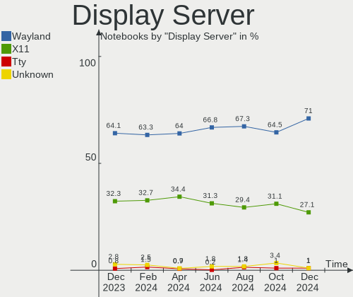
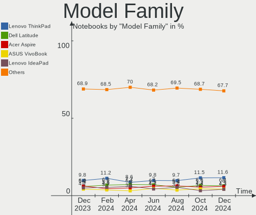
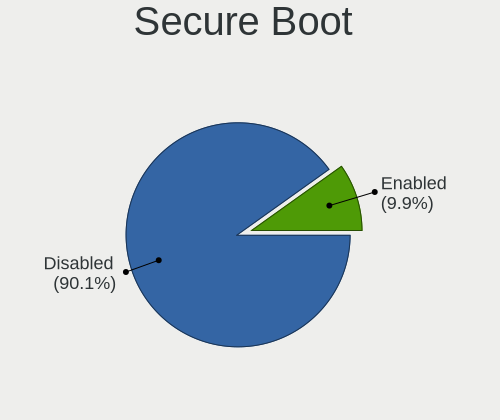

Ubuntu Hardware Trends (Notebook)
---------------------------------

A project to identify most popular hardware characteristics and track their change
over time based on data collected by Ubuntu users at https://Linux-Hardware.org.

Anyone can contribute to the study by uploading probes of their computers by
the [hw-probe](https://github.com/linuxhw/hw-probe) tool:

    sudo hw-probe -all -upload

Full-feature report is available here: https://linux-hardware.org/?view=trends&formfactor=notebook

Period: Mar, 2020.

Contents
--------

- [ OS                       ](#os)
- [ OS Family                ](#os-family)
- [ Kernel                   ](#kernel)
- [ Kernel Family            ](#kernel-family)
- [ Kernel Major Ver.        ](#kernel-major-ver)
- [ Arch                     ](#arch)
- [ DE                       ](#de)
- [ Display Server           ](#display-server)
- [ OS Lang                  ](#os-lang)
- [ Boot Mode                ](#boot-mode)
- [ Filesystem               ](#filesystem)
- [ Dual Boot with Linux     ](#dual-boot-with-linux)
- [ Dual Boot (Win)          ](#dual-boot-win)
- [ Country                  ](#country)
- [ City                     ](#city)
- [ Vendor                   ](#vendor)
- [ Model                    ](#model)
- [ Model Family             ](#model-family)
- [ MFG Year                 ](#mfg-year)
- [ Form Factor              ](#form-factor)
- [ Secure Boot              ](#secure-boot)
- [ Coreboot                 ](#coreboot)
- [ RAM Size                 ](#ram-size)
- [ RAM Used                 ](#ram-used)
- [ Drive Vendor             ](#drive-vendor)
- [ Drive Model              ](#drive-model)
- [ Drive Kind               ](#drive-kind)
- [ Drive Connector          ](#drive-connector)
- [ Drive Size               ](#drive-size)
- [ Space Total              ](#space-total)
- [ Space Used               ](#space-used)
- [ Malfunc. Drives          ](#malfunc-drives)
- [ Malfunc. Drive Vendor    ](#malfunc-drive-vendor)
- [ Malfunc. Drive Kind      ](#malfunc-drive-kind)
- [ Failed Drives            ](#failed-drives)
- [ Failed Drive Vendor      ](#failed-drive-vendor)
- [ Drive Status             ](#drive-status)
- [ Storage Vendor           ](#storage-vendor)
- [ Storage Model            ](#storage-model)
- [ Storage Kind             ](#storage-kind)
- [ CPU Vendor               ](#cpu-vendor)
- [ CPU Model                ](#cpu-model)
- [ CPU Model Family         ](#cpu-model-family)
- [ CPU Cores                ](#cpu-cores)
- [ CPU Sockets              ](#cpu-sockets)
- [ CPU Threads              ](#cpu-threads)
- [ CPU Op-Modes             ](#cpu-op-modes)
- [ CPU Microarch            ](#cpu-microarch)
- [ CPU Microcode            ](#cpu-microcode)
- [ GPU Vendor               ](#gpu-vendor)
- [ GPU Model                ](#gpu-model)
- [ GPU Combo                ](#gpu-combo)
- [ GPU Driver               ](#gpu-driver)
- [ GPU Memory               ](#gpu-memory)
- [ Monitor Vendor           ](#monitor-vendor)
- [ Monitor Model            ](#monitor-model)
- [ Monitor Resolution       ](#monitor-resolution)
- [ Monitor Diagonal         ](#monitor-diagonal)
- [ Monitor Width            ](#monitor-width)
- [ Aspect Ratio             ](#aspect-ratio)
- [ Monitor Area             ](#monitor-area)
- [ Pixel Density            ](#pixel-density)
- [ Multiple Monitors        ](#multiple-monitors)
- [ Net Controller Vendor    ](#net-controller-vendor)
- [ Net Controller Model     ](#net-controller-model)
- [ Net Controller Kind      ](#net-controller-kind)
- [ Used Controller          ](#used-controller)
- [ NICs                     ](#nics)
- [ Unsupported Devices      ](#unsupported-devices)
- [ Unsupported Device Types ](#unsupported-device-types)

OS
--

Installed operating systems

| Name           | Computers | Percent |
|----------------|-----------|---------|
| Ubuntu 18.04   | 609       | 61.08%  |
| Ubuntu 19.10   | 293       | 29.39%  |
| Ubuntu 16.04   | 40        | 4.01%   |
| Ubuntu 20.04   | 26        | 2.61%   |
| Ubuntu 19.04   | 18        | 1.81%   |
| Ubuntu 18.10   | 4         | 0.4%    |
| Ubuntu         | 4         | 0.4%    |
| Ubuntu 17.10   | 2         | 0.2%    |
| Ubuntu Core 16 | 1         | 0.1%    |

OS Family
---------

OS without a version

| Name   | Computers | Percent |
|--------|-----------|---------|
| Ubuntu | 997       | 100%    |

Kernel
------

Version of the Linux kernel

| Version                  | Computers | Percent |
|--------------------------|-----------|---------|
| 5.3.0-42-generic         | 286       | 28.69%  |
| 5.3.0-40-generic         | 266       | 26.68%  |
| 4.15.0-91-generic        | 77        | 7.72%   |
| 4.15.0-88-generic        | 72        | 7.22%   |
| 5.3.0-28-generic         | 55        | 5.52%   |
| 5.3.0-18-generic         | 29        | 2.91%   |
| 5.3.0-45-generic         | 17        | 1.71%   |
| 5.0.0-23-generic         | 13        | 1.3%    |
| 5.3.0-43-generic         | 12        | 1.2%    |
| 5.4.0-18-generic         | 11        | 1.1%    |
| 5.0.0-38-generic         | 11        | 1.1%    |
| 5.4.0-14-generic         | 10        | 1%      |
| 4.15.0-92-generic        | 6         | 0.6%    |
| 5.3.0-40-lowlatency      | 5         | 0.5%    |
| 4.4.0-176-generic        | 5         | 0.5%    |
| 4.4.0-174-generic        | 5         | 0.5%    |
| 4.18.0-15-generic        | 5         | 0.5%    |
| 5.3.0-42-lowlatency      | 4         | 0.4%    |
| 5.0.0-37-generic         | 4         | 0.4%    |
| 5.0.0-1043-oem-osp1      | 4         | 0.4%    |
| 4.15.0-88-lowlatency     | 4         | 0.4%    |
| 4.15.0-29-generic        | 4         | 0.4%    |
| 5.3.0-41-generic         | 3         | 0.3%    |
| 5.3.0-26-generic         | 3         | 0.3%    |
| 4.18.0-25-generic        | 3         | 0.3%    |
| 4.15.0-45-generic        | 3         | 0.3%    |
| 4.15.0-1076-oem          | 3         | 0.3%    |
| 5.5.8-050508-generic     | 2         | 0.2%    |
| 5.5.13-050513-generic    | 2         | 0.2%    |
| 5.3.0-29-generic         | 2         | 0.2%    |
| 5.0.0-38-lowlatency      | 2         | 0.2%    |
| 5.0.0-31-generic         | 2         | 0.2%    |
| 5.0.0-13-generic         | 2         | 0.2%    |
| 4.15.0-91-lowlatency     | 2         | 0.2%    |
| 4.15.0-76-generic        | 2         | 0.2%    |
| 4.15.0-74-generic        | 2         | 0.2%    |
| 4.15.0-70-generic        | 2         | 0.2%    |
| 4.15.0-65-generic        | 2         | 0.2%    |
| 4.15.0-62-generic        | 2         | 0.2%    |
| 4.15.0-20-generic        | 2         | 0.2%    |
| 4.13.0-46-generic        | 2         | 0.2%    |
| 5.6.0-050600rc6-generic  | 1         | 0.1%    |
| 5.5.9-050509-generic     | 1         | 0.1%    |
| 5.5.7-050507-generic     | 1         | 0.1%    |
| 5.5.5-050505-generic     | 1         | 0.1%    |
| 5.5.2-050502-generic     | 1         | 0.1%    |
| 5.5.13-050513-lowlatency | 1         | 0.1%    |
| 5.5.11-050511-generic    | 1         | 0.1%    |
| 5.4.6-050406-generic     | 1         | 0.1%    |
| 5.4.25-050425-generic    | 1         | 0.1%    |
| 5.4.24-050424-lowlatency | 1         | 0.1%    |
| 5.4.10-050410-generic    | 1         | 0.1%    |
| 5.4.0-21-generic         | 1         | 0.1%    |
| 5.4.0-20-generic         | 1         | 0.1%    |
| 5.3.0-7642-generic       | 1         | 0.1%    |
| 5.3.0-7629-generic       | 1         | 0.1%    |
| 5.3.0-25-generic         | 1         | 0.1%    |
| 5.3.0-24-generic         | 1         | 0.1%    |
| 5.3.0-19-generic         | 1         | 0.1%    |
| 5.3.0-18-lowlatency      | 1         | 0.1%    |

Kernel Family
-------------

Linux kernel without a distro release

| Version | Computers | Percent |
|---------|-----------|---------|
| 5.3.0   | 689       | 69.11%  |
| 4.15.0  | 196       | 19.66%  |
| 5.0.0   | 42        | 4.21%   |
| 5.4.0   | 23        | 2.31%   |
| 4.4.0   | 14        | 1.4%    |
| 4.18.0  | 10        | 1%      |
| 5.5.13  | 3         | 0.3%    |
| 4.13.0  | 3         | 0.3%    |
| 5.5.8   | 2         | 0.2%    |
| 5.6.0   | 1         | 0.1%    |
| 5.5.9   | 1         | 0.1%    |
| 5.5.7   | 1         | 0.1%    |
| 5.5.5   | 1         | 0.1%    |
| 5.5.2   | 1         | 0.1%    |
| 5.5.11  | 1         | 0.1%    |
| 5.4.6   | 1         | 0.1%    |
| 5.4.25  | 1         | 0.1%    |
| 5.4.24  | 1         | 0.1%    |
| 5.4.10  | 1         | 0.1%    |
| 5.1.0   | 1         | 0.1%    |
| 5.0.21  | 1         | 0.1%    |
| 4.20.0  | 1         | 0.1%    |
| 4.19.88 | 1         | 0.1%    |
| 4.10.0  | 1         | 0.1%    |

Kernel Major Ver.
-----------------

Linux kernel major version

| Version | Computers | Percent |
|---------|-----------|---------|
| 5.3     | 689       | 69.11%  |
| 4.15    | 196       | 19.66%  |
| 5.0     | 43        | 4.31%   |
| 5.4     | 27        | 2.71%   |
| 4.4     | 14        | 1.4%    |
| 5.5     | 10        | 1%      |
| 4.18    | 10        | 1%      |
| 4.13    | 3         | 0.3%    |
| 5.6     | 1         | 0.1%    |
| 5.1     | 1         | 0.1%    |
| 4.20    | 1         | 0.1%    |
| 4.19    | 1         | 0.1%    |
| 4.10    | 1         | 0.1%    |

Arch
----

OS architecture (x86_64, i586, etc.)

| Name   | Computers | Percent |
|--------|-----------|---------|
| x86_64 | 933       | 93.58%  |
| i686   | 64        | 6.42%   |

DE
--

Desktop Environment

| Name            | Computers | Percent |
|-----------------|-----------|---------|
| GNOME           | 711       | 71.31%  |
| XFCE            | 78        | 7.82%   |
| Unknown         | 62        | 6.22%   |
| Unity           | 37        | 3.71%   |
| KDE             | 34        | 3.41%   |
| MATE            | 20        | 2.01%   |
| Budgie          | 12        | 1.2%    |
| LXQt            | 11        | 1.1%    |
| LXDE            | 11        | 1.1%    |
| X-Cinnamon      | 7         | 0.7%    |
| KDE5            | 6         | 0.6%    |
| GNOME Flashback | 4         | 0.4%    |
| Cinnamon        | 3         | 0.3%    |
| Lubuntu         | 1         | 0.1%    |

Display Server
--------------

X11 or Wayland

| Name    | Computers | Percent |
|---------|-----------|---------|
| X11     | 941       | 94.38%  |
| Unknown | 36        | 3.61%   |
| Wayland | 20        | 2.01%   |

OS Lang
-------

Language

| Lang    | Computers | Percent |
|---------|-----------|---------|
| en_US   | 321       | 32.2%   |
| de_DE   | 79        | 7.92%   |
| it_IT   | 65        | 6.52%   |
| pt_BR   | 56        | 5.62%   |
| fr_FR   | 50        | 5.02%   |
| en_GB   | 49        | 4.91%   |
| ru_RU   | 39        | 3.91%   |
| en_IN   | 37        | 3.71%   |
| es_ES   | 33        | 3.31%   |
| C       | 29        | 2.91%   |
| en_CA   | 19        | 1.91%   |
| en_AU   | 16        | 1.6%    |
| Unknown | 16        | 1.6%    |
| pl_PL   | 15        | 1.5%    |
| es_MX   | 13        | 1.3%    |
| cs_CZ   | 13        | 1.3%    |
| es_AR   | 12        | 1.2%    |
| nl_NL   | 10        | 1%      |
| tr_TR   | 8         | 0.8%    |
| ru_UA   | 8         | 0.8%    |
| zh_CN   | 6         | 0.6%    |
| hu_HU   | 6         | 0.6%    |
| es_CO   | 6         | 0.6%    |
| en_ZA   | 6         | 0.6%    |
| uk_UA   | 5         | 0.5%    |
| pt_PT   | 5         | 0.5%    |
| fi_FI   | 5         | 0.5%    |
| el_GR   | 5         | 0.5%    |
| en_IE   | 4         | 0.4%    |
| de_AT   | 4         | 0.4%    |
| ca_ES   | 4         | 0.4%    |
| sv_SE   | 3         | 0.3%    |
| nl_BE   | 3         | 0.3%    |
| nb_NO   | 3         | 0.3%    |
| lt_LT   | 3         | 0.3%    |
| ja_JP   | 3         | 0.3%    |
| en_IL   | 3         | 0.3%    |
| de_CH   | 3         | 0.3%    |
| bg_BG   | 3         | 0.3%    |
| zh_TW   | 2         | 0.2%    |
| sl_SI   | 2         | 0.2%    |
| sk_SK   | 2         | 0.2%    |
| lv_LV   | 2         | 0.2%    |
| fr_BE   | 2         | 0.2%    |
| es_PE   | 2         | 0.2%    |
| es_CL   | 2         | 0.2%    |
| zh_HK   | 1         | 0.1%    |
| tt_RU   | 1         | 0.1%    |
| sv_FI   | 1         | 0.1%    |
| ro_RO   | 1         | 0.1%    |
| id_ID   | 1         | 0.1%    |
| he_IL   | 1         | 0.1%    |
| fr_CH   | 1         | 0.1%    |
| fr_CA   | 1         | 0.1%    |
| es_VE   | 1         | 0.1%    |
| es_CR   | 1         | 0.1%    |
| es_BO   | 1         | 0.1%    |
| en_SG   | 1         | 0.1%    |
| en_PH   | 1         | 0.1%    |
| en_IN   | 1         | 0.1%    |

Boot Mode
---------

EFI or BIOS

| Mode | Computers | Percent |
|------|-----------|---------|
| BIOS | 535       | 53.66%  |
| EFI  | 462       | 46.34%  |

Filesystem
----------

Type of filesystem

| Type    | Computers | Percent |
|---------|-----------|---------|
| Ext4    | 952       | 95.49%  |
| Overlay | 30        | 3.01%   |
| Zfs     | 5         | 0.5%    |
| Btrfs   | 4         | 0.4%    |
| Xfs     | 3         | 0.3%    |
| Ext3    | 2         | 0.2%    |
| Ext2    | 1         | 0.1%    |

Dual Boot with Linux
--------------------

Hosting more than one Linux

| Dual boot | Computers | Percent |
|-----------|-----------|---------|
| No        | 917       | 91.98%  |
| Yes       | 80        | 8.02%   |

Dual Boot (Win)
---------------

Hosting Linux and Windows

| Dual boot | Computers | Percent |
|-----------|-----------|---------|
| No        | 653       | 65.5%   |
| Yes       | 344       | 34.5%   |

Country
-------

Geographic location (country)

| Country                   | Computers | Percent |
|---------------------------|-----------|---------|
| USA                       | 117       | 11.74%  |
| Germany                   | 97        | 9.73%   |
| Italy                     | 72        | 7.22%   |
| Brazil                    | 64        | 6.42%   |
| UK                        | 50        | 5.02%   |
| France                    | 49        | 4.91%   |
| Russia                    | 43        | 4.31%   |
| India                     | 41        | 4.11%   |
| Spain                     | 31        | 3.11%   |
| Canada                    | 29        | 2.91%   |
| Belgium                   | 24        | 2.41%   |
| Poland                    | 22        | 2.21%   |
| Mexico                    | 20        | 2.01%   |
| Ukraine                   | 19        | 1.91%   |
| Australia                 | 18        | 1.81%   |
| Turkey                    | 17        | 1.71%   |
| Argentina                 | 17        | 1.71%   |
| Czech Republic            | 16        | 1.6%    |
| Finland                   | 13        | 1.3%    |
| Netherlands               | 12        | 1.2%    |
| Romania                   | 11        | 1.1%    |
| Colombia                  | 11        | 1.1%    |
| Sweden                    | 10        | 1%      |
| Portugal                  | 10        | 1%      |
| Greece                    | 10        | 1%      |
| Bulgaria                  | 10        | 1%      |
| Switzerland               | 9         | 0.9%    |
| Austria                   | 9         | 0.9%    |
| Indonesia                 | 8         | 0.8%    |
| Hungary                   | 8         | 0.8%    |
| South Africa              | 6         | 0.6%    |
| Serbia                    | 6         | 0.6%    |
| Norway                    | 5         | 0.5%    |
| Lithuania                 | 5         | 0.5%    |
| Iran                      | 5         | 0.5%    |
| Egypt                     | 5         | 0.5%    |
| Denmark                   | 5         | 0.5%    |
| China                     | 5         | 0.5%    |
| Slovakia                  | 4         | 0.4%    |
| Latvia                    | 4         | 0.4%    |
| Japan                     | 4         | 0.4%    |
| Israel                    | 4         | 0.4%    |
| Ireland                   | 4         | 0.4%    |
| Taiwan                    | 3         | 0.3%    |
| Slovenia                  | 3         | 0.3%    |
| Singapore                 | 3         | 0.3%    |
| Puerto Rico               | 3         | 0.3%    |
| Pakistan                  | 3         | 0.3%    |
| Chile                     | 3         | 0.3%    |
| Bolivia                   | 3         | 0.3%    |
| Algeria                   | 3         | 0.3%    |
| Vietnam                   | 2         | 0.2%    |
| Tunisia                   | 2         | 0.2%    |
| Sri Lanka                 | 2         | 0.2%    |
| Philippines               | 2         | 0.2%    |
| Peru                      | 2         | 0.2%    |
| Kosovo                    | 2         | 0.2%    |
| Kazakhstan                | 2         | 0.2%    |
| Iran, Islamic Republic of | 2         | 0.2%    |
| Estonia                   | 2         | 0.2%    |

City
----

Geographic location (city)

| City              | Computers | Percent |
|-------------------|-----------|---------|
| Moscow            | 15        | 1.5%    |
| Rome              | 11        | 1.1%    |
| Berlin            | 11        | 1.1%    |
| Athens            | 9         | 0.9%    |
| Warsaw            | 8         | 0.8%    |
| São Paulo        | 8         | 0.8%    |
| Paris             | 8         | 0.8%    |
| Milan             | 8         | 0.8%    |
| Vienna            | 7         | 0.7%    |
| Prague            | 7         | 0.7%    |
| Istanbul          | 7         | 0.7%    |
| Bucharest         | 7         | 0.7%    |
| St Petersburg     | 6         | 0.6%    |
| Brisbane          | 6         | 0.6%    |
| Sofia             | 5         | 0.5%    |
| New Delhi         | 5         | 0.5%    |
| Mexico City       | 5         | 0.5%    |
| Kyiv              | 5         | 0.5%    |
| Frankfurt am Main | 5         | 0.5%    |
| Ernakulam         | 5         | 0.5%    |
| Belgrade          | 5         | 0.5%    |
| Barcelona         | 5         | 0.5%    |
| Vilnius           | 4         | 0.4%    |
| Munich            | 4         | 0.4%    |
| Los Angeles       | 4         | 0.4%    |
| Hyderabad         | 4         | 0.4%    |
| Houston           | 4         | 0.4%    |
| Helsinki          | 4         | 0.4%    |
| Dublin            | 4         | 0.4%    |
| Dresden           | 4         | 0.4%    |
| Chennai           | 4         | 0.4%    |
| Boom              | 4         | 0.4%    |
| Zurich            | 3         | 0.3%    |
| Wrocław          | 3         | 0.3%    |
| Vancouver         | 3         | 0.3%    |
| Toulouse          | 3         | 0.3%    |
| Sydney            | 3         | 0.3%    |
| Santiago de Cali  | 3         | 0.3%    |
| San Francisco     | 3         | 0.3%    |
| Sabadell          | 3         | 0.3%    |
| Rotterdam         | 3         | 0.3%    |
| Riga              | 3         | 0.3%    |
| Novosibirsk       | 3         | 0.3%    |
| Naples            | 3         | 0.3%    |
| Montreal          | 3         | 0.3%    |
| Madrid            | 3         | 0.3%    |
| Lyon              | 3         | 0.3%    |
| Lisbon            | 3         | 0.3%    |
| Leeds             | 3         | 0.3%    |
| Jakarta           | 3         | 0.3%    |
| Izmir             | 3         | 0.3%    |
| Ekaterinburg      | 3         | 0.3%    |
| Dnipro            | 3         | 0.3%    |
| Budapest          | 3         | 0.3%    |
| Brussels          | 3         | 0.3%    |
| Brescia           | 3         | 0.3%    |
| Brasília         | 3         | 0.3%    |
| Bengaluru         | 3         | 0.3%    |
| Wiesbaden         | 2         | 0.2%    |
| Visakhapatnam     | 2         | 0.2%    |

Vendor
------

Motherboard manufacturer

| Name                    | Computers | Percent |
|-------------------------|-----------|---------|
| Hewlett-Packard         | 235       | 23.57%  |
| Dell                    | 174       | 17.45%  |
| Lenovo                  | 153       | 15.35%  |
| ASUSTek Computer        | 110       | 11.03%  |
| Acer                    | 98        | 9.83%   |
| Toshiba                 | 35        | 3.51%   |
| Apple                   | 25        | 2.51%   |
| MSI                     | 19        | 1.91%   |
| Samsung Electronics     | 18        | 1.81%   |
| Sony                    | 16        | 1.6%    |
| Unknown                 | 10        | 1%      |
| Fujitsu                 | 8         | 0.8%    |
| Fujitsu Siemens         | 7         | 0.7%    |
| Packard Bell            | 6         | 0.6%    |
| HUAWEI                  | 6         | 0.6%    |
| Medion                  | 5         | 0.5%    |
| Clevo                   | 5         | 0.5%    |
| Alienware               | 5         | 0.5%    |
| Positivo                | 3         | 0.3%    |
| Timi                    | 2         | 0.2%    |
| System76                | 2         | 0.2%    |
| SLIMBOOK                | 2         | 0.2%    |
| PC Specialist           | 2         | 0.2%    |
| Notebook                | 2         | 0.2%    |
| LG Electronics          | 2         | 0.2%    |
| Hometech                | 2         | 0.2%    |
| HCL Infosystems Limited | 2         | 0.2%    |
| Gigabyte Technology     | 2         | 0.2%    |
| Gateway                 | 2         | 0.2%    |
| Zoostorm                | 1         | 0.1%    |
| VIT                     | 1         | 0.1%    |
| TrekStor                | 1         | 0.1%    |
| Thomson                 | 1         | 0.1%    |
| Teclast                 | 1         | 0.1%    |
| TECH PAD                | 1         | 0.1%    |
| Standard                | 1         | 0.1%    |
| Semp Toshiba            | 1         | 0.1%    |
| Purism                  | 1         | 0.1%    |
| Philco                  | 1         | 0.1%    |
| OEM                     | 1         | 0.1%    |
| NEC Computers           | 1         | 0.1%    |
| Motion Computing        | 1         | 0.1%    |
| Monster                 | 1         | 0.1%    |
| Metabox                 | 1         | 0.1%    |
| Megaware                | 1         | 0.1%    |
| MEDIONAG                | 1         | 0.1%    |
| MAXDATA                 | 1         | 0.1%    |
| Linx                    | 1         | 0.1%    |
| Lex BayTrail            | 1         | 0.1%    |
| LDLC                    | 1         | 0.1%    |
| KOGAN                   | 1         | 0.1%    |
| Itautec Philco          | 1         | 0.1%    |
| Insyde                  | 1         | 0.1%    |
| IGEL Technology         | 1         | 0.1%    |
| higraded                | 1         | 0.1%    |
| Google                  | 1         | 0.1%    |
| FIC                     | 1         | 0.1%    |
| EPIK Learning           | 1         | 0.1%    |
| eMachines               | 1         | 0.1%    |
| ECT                     | 1         | 0.1%    |

Model
-----

Motherboard model

| Name                                                              | Computers | Percent |
|-------------------------------------------------------------------|-----------|---------|
| Unknown                                                           | 15        | 1.5%    |
| HP Pavilion dv6                                                   | 11        | 1.1%    |
| Dell G3 3590                                                      | 8         | 0.8%    |
| HP Notebook                                                       | 6         | 0.6%    |
| HP Pavilion g6                                                    | 5         | 0.5%    |
| HP Pavilion dv7                                                   | 5         | 0.5%    |
| Dell Latitude E6420                                               | 5         | 0.5%    |
| HP Pavilion Notebook                                              | 4         | 0.4%    |
| HP Pavilion Gaming Laptop 15-cx0xxx                               | 4         | 0.4%    |
| HP Laptop 15-db0xxx                                               | 4         | 0.4%    |
| HP Laptop 15-da0xxx                                               | 4         | 0.4%    |
| HP Laptop 15-bw0xx                                                | 4         | 0.4%    |
| HP Laptop 15-bs1xx                                                | 4         | 0.4%    |
| HP EliteBook 840 G6                                               | 4         | 0.4%    |
| HP Compaq Presario CQ60                                           | 4         | 0.4%    |
| Dell XPS 13 9380                                                  | 4         | 0.4%    |
| Dell Latitude E6230                                               | 4         | 0.4%    |
| Dell Inspiron 1545                                                | 4         | 0.4%    |
| Apple MacBookPro8,1                                               | 4         | 0.4%    |
| Toshiba Satellite C660                                            | 3         | 0.3%    |
| Lenovo ThinkBook 13s-IWL 20R9                                     | 3         | 0.3%    |
| HP Pavilion g4                                                    | 3         | 0.3%    |
| HP Laptop 15-bs0xx                                                | 3         | 0.3%    |
| HP EliteBook 840 G5                                               | 3         | 0.3%    |
| HP Compaq CQ58                                                    | 3         | 0.3%    |
| HP 250 G7 Notebook PC                                             | 3         | 0.3%    |
| HP 2000                                                           | 3         | 0.3%    |
| HP 15                                                             | 3         | 0.3%    |
| Dell Latitude E6410                                               | 3         | 0.3%    |
| Dell Latitude D630                                                | 3         | 0.3%    |
| Dell Inspiron 5559                                                | 3         | 0.3%    |
| Dell Inspiron 3543                                                | 3         | 0.3%    |
| Dell Inspiron 3521                                                | 3         | 0.3%    |
| Dell Inspiron 15-3567                                             | 3         | 0.3%    |
| ASUS X200MA                                                       | 3         | 0.3%    |
| Toshiba Satellite A505                                            | 2         | 0.2%    |
| Sony SVE1713A6EW                                                  | 2         | 0.2%    |
| Samsung Electronics RV411/RV511/E3511/S3511/RV711/E3411           | 2         | 0.2%    |
| Samsung Electronics 300E5EV/300E4EV/270E5EV/270E4EV/2470EV/2470EE | 2         | 0.2%    |
| Positivo V142N_4G                                                 | 2         | 0.2%    |
| Lenovo Z51-70 80K6                                                | 2         | 0.2%    |
| Lenovo V330-14IKB 81B0                                            | 2         | 0.2%    |
| Lenovo V145-15AST 81MT                                            | 2         | 0.2%    |
| Lenovo ThinkPad X1 Carbon 7th 20QD0037GE                          | 2         | 0.2%    |
| Lenovo ThinkBook 15-IML 20RW                                      | 2         | 0.2%    |
| Lenovo IdeaPad S145-15IWL 81MV                                    | 2         | 0.2%    |
| Lenovo IdeaPad 520-15IKB 81BF                                     | 2         | 0.2%    |
| Lenovo IdeaPad 330-15ARR 81D2                                     | 2         | 0.2%    |
| Lenovo IdeaPad 100-15IBD 80QQ                                     | 2         | 0.2%    |
| Lenovo G50-70 20351                                               | 2         | 0.2%    |
| HUAWEI NBLK-WAX9X                                                 | 2         | 0.2%    |
| HP ZBook 15 G3                                                    | 2         | 0.2%    |
| HP Stream Laptop 14-ax0XX                                         | 2         | 0.2%    |
| HP ProBook 6560b                                                  | 2         | 0.2%    |
| HP ProBook 650 G1                                                 | 2         | 0.2%    |
| HP ProBook 6460b                                                  | 2         | 0.2%    |
| HP ProBook 470 G2                                                 | 2         | 0.2%    |
| HP ProBook 450 G6                                                 | 2         | 0.2%    |
| HP ProBook 4430s                                                  | 2         | 0.2%    |
| HP Pavilion x2 Detachable                                         | 2         | 0.2%    |

Model Family
------------

Motherboard model prefix

| Name                        | Computers | Percent |
|-----------------------------|-----------|---------|
| Acer Aspire                 | 75        | 7.52%   |
| Lenovo ThinkPad             | 65        | 6.52%   |
| HP Pavilion                 | 62        | 6.22%   |
| Dell Inspiron               | 61        | 6.12%   |
| Dell Latitude               | 48        | 4.81%   |
| Lenovo IdeaPad              | 44        | 4.41%   |
| HP Laptop                   | 33        | 3.31%   |
| Toshiba Satellite           | 32        | 3.21%   |
| HP EliteBook                | 31        | 3.11%   |
| HP ProBook                  | 27        | 2.71%   |
| Dell XPS                    | 21        | 2.11%   |
| HP Compaq                   | 17        | 1.71%   |
| Unknown                     | 15        | 1.5%    |
| Dell Vostro                 | 14        | 1.4%    |
| Dell Precision              | 11        | 1.1%    |
| Dell G3                     | 10        | 1%      |
| HP ENVY                     | 8         | 0.8%    |
| HP 250                      | 8         | 0.8%    |
| Fujitsu LIFEBOOK            | 8         | 0.8%    |
| ASUS TUF                    | 8         | 0.8%    |
| HP ZBook                    | 7         | 0.7%    |
| Packard Bell EasyNote       | 6         | 0.6%    |
| Lenovo ThinkBook            | 6         | 0.6%    |
| HP Notebook                 | 6         | 0.6%    |
| Dell Studio                 | 6         | 0.6%    |
| ASUS VivoBook               | 6         | 0.6%    |
| Acer Swift                  | 6         | 0.6%    |
| Acer Extensa                | 6         | 0.6%    |
| Apple MacBookPro8           | 5         | 0.5%    |
| Acer TravelMate             | 5         | 0.5%    |
| Samsung Electronics 300E5EV | 4         | 0.4%    |
| HP Stream                   | 4         | 0.4%    |
| HP 255                      | 4         | 0.4%    |
| Fujitsu Siemens ESPRIMO     | 4         | 0.4%    |
| Samsung Electronics RV411   | 3         | 0.3%    |
| Lenovo Yoga                 | 3         | 0.3%    |
| HP Presario                 | 3         | 0.3%    |
| HP Mini                     | 3         | 0.3%    |
| HP 2000                     | 3         | 0.3%    |
| HP 15                       | 3         | 0.3%    |
| Dell G5                     | 3         | 0.3%    |
| ASUS ZenBook                | 3         | 0.3%    |
| ASUS X200MA                 | 3         | 0.3%    |
| Apple MacBookPro5           | 3         | 0.3%    |
| Toshiba TECRA               | 2         | 0.2%    |
| Sony SVE1713A6EW            | 2         | 0.2%    |
| Samsung Electronics 355V4C  | 2         | 0.2%    |
| Positivo V142N              | 2         | 0.2%    |
| MSI PS42                    | 2         | 0.2%    |
| MSI Modern                  | 2         | 0.2%    |
| MSI GF63                    | 2         | 0.2%    |
| Lenovo Z51-70               | 2         | 0.2%    |
| Lenovo V330-14IKB           | 2         | 0.2%    |
| Lenovo V145-15AST           | 2         | 0.2%    |
| Lenovo G570                 | 2         | 0.2%    |
| Lenovo G550                 | 2         | 0.2%    |
| Lenovo G50-70               | 2         | 0.2%    |
| Lenovo B50-70               | 2         | 0.2%    |
| HUAWEI NBLK-WAX9X           | 2         | 0.2%    |
| Hometech ALFA               | 2         | 0.2%    |

MFG Year
--------

Motherboard manufacture year

| Year | Computers | Percent |
|------|-----------|---------|
| 2019 | 231       | 23.17%  |
| 2018 | 99        | 9.93%   |
| 2011 | 83        | 8.32%   |
| 2012 | 71        | 7.12%   |
| 2013 | 69        | 6.92%   |
| 2015 | 68        | 6.82%   |
| 2014 | 63        | 6.32%   |
| 2010 | 57        | 5.72%   |
| 2017 | 55        | 5.52%   |
| 2009 | 52        | 5.22%   |
| 2016 | 49        | 4.91%   |
| 2008 | 43        | 4.31%   |
| 2007 | 22        | 2.21%   |
| 2020 | 18        | 1.81%   |
| 2006 | 9         | 0.9%    |
| 2005 | 8         | 0.8%    |

Form Factor
-----------

Physical design of the computer

| Name     | Computers | Percent |
|----------|-----------|---------|
| Notebook | 997       | 100%    |

Secure Boot
-----------

Enabled or disabled

| State    | Computers | Percent |
|----------|-----------|---------|
| Disabled | 862       | 86.46%  |
| Enabled  | 135       | 13.54%  |

Coreboot
--------

Have coreboot on board

| Used | Computers | Percent |
|------|-----------|---------|
| No   | 994       | 99.7%   |
| Yes  | 3         | 0.3%    |

RAM Size
--------

Total RAM memory

| Size in GB  | Computers | Percent |
|-------------|-----------|---------|
| 3.01-4.0    | 294       | 29.49%  |
| 4.01-8.0    | 230       | 23.07%  |
| 16.01-24.0  | 145       | 14.54%  |
| 8.01-16.0   | 145       | 14.54%  |
| 1.01-2.0    | 96        | 9.63%   |
| 32.01-64.0  | 29        | 2.91%   |
| 2.01-3.0    | 25        | 2.51%   |
| 0.01-1.0    | 20        | 2.01%   |
| 24.01-32.0  | 9         | 0.9%    |
| 64.01-256.0 | 4         | 0.4%    |

RAM Used
--------

Used RAM memory

| Used GB    | Computers | Percent |
|------------|-----------|---------|
| 1.01-2.0   | 441       | 44.23%  |
| 2.01-3.0   | 246       | 24.67%  |
| 3.01-4.0   | 105       | 10.53%  |
| 4.01-8.0   | 93        | 9.33%   |
| 0.01-1.0   | 92        | 9.23%   |
| 8.01-16.0  | 16        | 1.6%    |
| 16.01-24.0 | 3         | 0.3%    |
| 24.01-32.0 | 1         | 0.1%    |

Drive Vendor
------------

Hard drive vendors

| Vendor              | Computers | Drives | Percent |
|---------------------|-----------|--------|---------|
| Seagate             | 183       | 184    | 17.7%   |
| WDC                 | 155       | 157    | 14.99%  |
| Samsung Electronics | 120       | 123    | 11.61%  |
| Toshiba             | 118       | 120    | 11.41%  |
| Unknown             | 61        | 70     | 5.9%    |
| HGST                | 58        | 58     | 5.61%   |
| Kingston            | 46        | 46     | 4.45%   |
| Hitachi             | 44        | 46     | 4.26%   |
| SanDisk             | 43        | 43     | 4.16%   |
| Crucial             | 33        | 33     | 3.19%   |
| Fujitsu             | 15        | 15     | 1.45%   |
| SK Hynix            | 13        | 13     | 1.26%   |
| Intel               | 13        | 13     | 1.26%   |
| A-DATA Technology   | 13        | 13     | 1.26%   |
| HL-DT-ST            | 12        | 8      | 1.16%   |
| LITEON              | 11        | 11     | 1.06%   |
| Micron Technology   | 10        | 10     | 0.97%   |
| Apple               | 9         | 9      | 0.87%   |
| Transcend           | 7         | 7      | 0.68%   |
| SPCC                | 7         | 7      | 0.68%   |
| LITEONIT            | 5         | 5      | 0.48%   |
| China               | 4         | 4      | 0.39%   |
| OCZ                 | 3         | 3      | 0.29%   |
| KingSpec            | 3         | 3      | 0.29%   |
| GOODRAM             | 3         | 3      | 0.29%   |
| Generic             | 3         | 3      | 0.29%   |
| Zheino              | 2         | 2      | 0.19%   |
| USB                 | 2         | 2      | 0.19%   |
| Team                | 2         | 2      | 0.19%   |
| TCSUNBOW            | 2         | 2      | 0.19%   |
| PLEXTOR             | 2         | 2      | 0.19%   |
| MEDIATEK            | 2         | 2      | 0.19%   |
| Corsair             | 2         | 2      | 0.19%   |
| Apacer              | 2         | 2      | 0.19%   |
| WD MediaMax         | 1         | 1      | 0.1%    |
| Union Memory        | 1         | 1      | 0.1%    |
| STEC                | 1         | 1      | 0.1%    |
| SMI                 | 1         | 1      | 0.1%    |
| Silicon Motion      | 1         | 1      | 0.1%    |
| Ramsta              | 1         | 1      | 0.1%    |
| PNY                 | 1         | 1      | 0.1%    |
| PHISON              | 1         | 1      | 0.1%    |
| Patriot             | 1         | 1      | 0.1%    |
| Netac               | 1         | 1      | 0.1%    |
| Linux               | 1         | 1      | 0.1%    |
| Lexar               | 1         | 1      | 0.1%    |
| KingDian            | 1         | 1      | 0.1%    |
| KESU                | 1         | 1      | 0.1%    |
| JMicron             | 1         | 1      | 0.1%    |
| Integral            | 1         | 1      | 0.1%    |
| InnoDisk            | 1         | 1      | 0.1%    |
| IBM/Hitachi         | 1         | 1      | 0.1%    |
| Hikvision           | 1         | 1      | 0.1%    |
| Galaxy              | 1         | 1      | 0.1%    |
| Emtec               | 1         | 1      | 0.1%    |
| DREVO               | 1         | 1      | 0.1%    |
| CT2000MX            | 1         | 1      | 0.1%    |
| BHT                 | 1         | 1      | 0.1%    |
| ASMT                | 1         | 1      | 0.1%    |
| Apricorn            | 1         | 1      | 0.1%    |

Drive Model
-----------

Hard drive models

| Model                        | Computers | Percent |
|------------------------------|-----------|---------|
| ST1000LM035-1RK172 1TB       | 34        | 3.23%   |
| MMC Card  32GB               | 31        | 2.94%   |
| MQ01ABF050 500GB             | 20        | 1.9%    |
| ST9500325AS 500GB            | 18        | 1.71%   |
| HTS721010A9E630 1TB          | 18        | 1.71%   |
| MQ04ABF100 1TB               | 15        | 1.42%   |
| MQ01ABD100 1TB               | 15        | 1.42%   |
| ST1000LM024 HN-M101MBB 1TB   | 14        | 1.33%   |
| MMC Card  64GB               | 14        | 1.33%   |
| SA400S37240G 240GB SSD       | 13        | 1.23%   |
| ST500LT012-1DG142 500GB      | 12        | 1.14%   |
| HTS545050A7E680 500GB        | 11        | 1.04%   |
| HTS541010A9E680 1TB          | 11        | 1.04%   |
| SSD 850 EVO 500GB            | 9         | 0.85%   |
| ST1000LX015-1U7172 1TB       | 8         | 0.76%   |
| MMC Card  16GB               | 8         | 0.76%   |
| DVDRAM GUE1N 3GB             | 8         | 0.76%   |
| WD10JPVX-22JC3T0 1TB         | 7         | 0.66%   |
| SV300S37A120G 120GB SSD      | 7         | 0.66%   |
| ST500LT012-9WS142 500GB      | 7         | 0.66%   |
| SA400S37480G 480GB SSD       | 7         | 0.66%   |
| HTS725050A7E630 500GB        | 7         | 0.66%   |
| WD5000LPVX-22V0TT0 500GB     | 6         | 0.57%   |
| WD1600BEVT-22ZCT0 160GB      | 6         | 0.57%   |
| ST9500420AS 500GB            | 6         | 0.57%   |
| ST500LM012 HN-M500MBB 500GB  | 6         | 0.57%   |
| ST2000LM007-1R8174 2TB       | 6         | 0.57%   |
| SSD 850 EVO 250GB            | 6         | 0.57%   |
| SA400S37120G 120GB SSD       | 6         | 0.57%   |
| CT240BX500SSD1 240GB         | 6         | 0.57%   |
| WD10JPVX-75JC3T0 1TB         | 5         | 0.47%   |
| TR200 240GB SSD              | 5         | 0.47%   |
| SU650 120GB SSD              | 5         | 0.47%   |
| MQ01ABD050 500GB             | 5         | 0.47%   |
| HTS545050A7E380 500GB        | 5         | 0.47%   |
| HTS545032B9A300 320GB        | 5         | 0.47%   |
| CT500MX500SSD1 500GB         | 5         | 0.47%   |
| WD10SPZX-60Z10T0 1TB         | 4         | 0.38%   |
| ST9250315AS 250GB            | 4         | 0.38%   |
| ST1000LM049-2GH172 1TB       | 4         | 0.38%   |
| SSD PLUS 480GB               | 4         | 0.38%   |
| SSD 850 PRO 256GB            | 4         | 0.38%   |
| MK3261GSYN 320GB             | 4         | 0.38%   |
| HTS725032A9A364 320GB        | 4         | 0.38%   |
| HTS547550A9E384 500GB        | 4         | 0.38%   |
| HTS542516K9SA00 160GB        | 4         | 0.38%   |
| HTS541010B7E610 1TB          | 4         | 0.38%   |
| DVDRAM GUC0N 1GB             | 4         | 0.38%   |
| CV8-8E128-HP 128GB SSD       | 4         | 0.38%   |
| CT525MX300SSD1 528GB         | 4         | 0.38%   |
| WDS500G2B0A-00SM50 500GB SSD | 3         | 0.28%   |
| WD7500BPVT-60HXZT3 752GB     | 3         | 0.28%   |
| WD7500BPVT-22HXZT3 752GB     | 3         | 0.28%   |
| WD5000LPCX-60VHAT0 500GB     | 3         | 0.28%   |
| WD5000LPCX-00VHAT0 500GB     | 3         | 0.28%   |
| WD10SPCX-24HWST1 1TB         | 3         | 0.28%   |
| WD10JPCX-24UE4T0 1TB         | 3         | 0.28%   |
| ST750LM022 HN-M750MBB 752GB  | 3         | 0.28%   |
| ST320LT007-9ZV142 320GB      | 3         | 0.28%   |
| ST1000LM048-2E7172 1TB       | 3         | 0.28%   |

Drive Kind
----------

HDD or SSD

| Kind    | Computers | Drives | Percent |
|---------|-----------|--------|---------|
| HDD     | 551       | 561    | 54.34%  |
| SSD     | 340       | 356    | 33.53%  |
| MMC     | 56        | 65     | 5.52%   |
| Unknown | 35        | 34     | 3.45%   |
| NVMe    | 32        | 33     | 3.16%   |

Drive Connector
---------------

SATA, SAS, NVMe, etc.

| Type | Computers | Drives | Percent |
|------|-----------|--------|---------|
| SATA | 824       | 917    | 86.92%  |
| MMC  | 56        | 65     | 5.91%   |
| SAS  | 36        | 34     | 3.8%    |
| NVMe | 32        | 33     | 3.38%   |

Drive Size
----------

Size of hard drive

| Size in TB | Computers | Drives | Percent |
|------------|-----------|--------|---------|
| 0.01-0.5   | 677       | 754    | 70.01%  |
| 0.51-1.0   | 272       | 276    | 28.13%  |
| 1.01-2.0   | 14        | 15     | 1.45%   |
| 3.01-4.0   | 4         | 4      | 0.41%   |

Space Total
-----------

Amount of disk space available on the file system

| Size in GB     | Computers | Percent |
|----------------|-----------|---------|
| 101-250        | 315       | 31.59%  |
| 251-500        | 285       | 28.59%  |
| 501-1000       | 134       | 13.44%  |
| 51-100         | 93        | 9.33%   |
| 21-50          | 77        | 7.72%   |
| 1-20           | 38        | 3.81%   |
| 1001-2000      | 29        | 2.91%   |
| Unknown        | 13        | 1.3%    |
| 2001-3000      | 8         | 0.8%    |
| More than 3000 | 5         | 0.5%    |

Space Used
----------

Amount of used disk space

| Used GB   | Computers | Percent |
|-----------|-----------|---------|
| 1-20      | 506       | 50.75%  |
| 21-50     | 168       | 16.85%  |
| 101-250   | 115       | 11.53%  |
| 51-100    | 101       | 10.13%  |
| 251-500   | 46        | 4.61%   |
| 501-1000  | 38        | 3.81%   |
| Unknown   | 13        | 1.3%    |
| 1001-2000 | 7         | 0.7%    |
| 2001-3000 | 3         | 0.3%    |

Malfunc. Drives
---------------

Drive models with a malfunction

| Model                        | Computers | Drives | Percent |
|------------------------------|-----------|--------|---------|
| WD5000LPCX-24C6HT0 500GB     | 1         | 1      | 5.88%   |
| ST500LM000-1EJ162 500GB      | 1         | 1      | 5.88%   |
| SSDSC2CW060A3 64GB           | 1         | 1      | 5.88%   |
| SSD PLUS 120 GB              | 1         | 1      | 5.88%   |
| SKC300S37A60G 64GB SSD       | 1         | 1      | 5.88%   |
| SA400S37120G 120GB SSD       | 1         | 1      | 5.88%   |
| MZ7PD256HCGM-000H7 256GB SSD | 1         | 1      | 5.88%   |
| MTFDDAK256MAM-1K12 256GB SSD | 1         | 1      | 5.88%   |
| MK3261GSYN 320GB             | 1         | 1      | 5.88%   |
| HTS727550A9E364 500GB        | 1         | 1      | 5.88%   |
| HTS725050A9A364 500GB        | 1         | 1      | 5.88%   |
| HTS721010A9E630 1TB          | 1         | 1      | 5.88%   |
| HTS547550A9E384 500GB        | 1         | 1      | 5.88%   |
| HTS545050B9A300 500GB        | 1         | 1      | 5.88%   |
| HTS542516K9SA00 160GB        | 1         | 1      | 5.88%   |
| CT525MX300SSD1 528GB         | 1         | 1      | 5.88%   |
| CT500P1SSD8 500GB            | 1         | 1      | 5.88%   |

Malfunc. Drive Vendor
---------------------

Vendors of faulty drives

| Vendor              | Computers | Drives | Percent |
|---------------------|-----------|--------|---------|
| Hitachi             | 5         | 5      | 29.41%  |
| Kingston            | 2         | 2      | 11.76%  |
| Crucial             | 2         | 2      | 11.76%  |
| WDC                 | 1         | 1      | 5.88%   |
| Toshiba             | 1         | 1      | 5.88%   |
| Seagate             | 1         | 1      | 5.88%   |
| SanDisk             | 1         | 1      | 5.88%   |
| Samsung Electronics | 1         | 1      | 5.88%   |
| Micron Technology   | 1         | 1      | 5.88%   |
| Intel               | 1         | 1      | 5.88%   |
| HGST                | 1         | 1      | 5.88%   |

Malfunc. Drive Kind
-------------------

Kinds of faulty drives

| Kind | Computers | Drives | Percent |
|------|-----------|--------|---------|
| HDD  | 9         | 9      | 52.94%  |
| SSD  | 7         | 7      | 41.18%  |
| NVMe | 1         | 1      | 5.88%   |

Failed Drives
-------------

Failed drive models

| Model             | Computers | Drives | Percent |
|-------------------|-----------|--------|---------|
| ST9500420AS 500GB | 1         | 1      | 100%    |

Failed Drive Vendor
-------------------

Failed drive vendors

| Vendor  | Computers | Drives | Percent |
|---------|-----------|--------|---------|
| Seagate | 1         | 1      | 100%    |

Drive Status
------------

Number of failed and malfunc. drives

| Status   | Computers | Drives | Percent |
|----------|-----------|--------|---------|
| Detected | 806       | 940    | 89.36%  |
| Works    | 78        | 91     | 8.65%   |
| Malfunc  | 17        | 17     | 1.88%   |
| Failed   | 1         | 1      | 0.11%   |

Storage Vendor
--------------

Storage controller vendors

| Vendor                           | Computers | Percent |
|----------------------------------|-----------|---------|
| Intel                            | 768       | 72.05%  |
| AMD                              | 101       | 9.47%   |
| Samsung Electronics              | 56        | 5.25%   |
| Sandisk                          | 31        | 2.91%   |
| Toshiba America Info Systems     | 21        | 1.97%   |
| Nvidia                           | 16        | 1.5%    |
| SK Hynix                         | 15        | 1.41%   |
| Silicon Integrated Systems [SiS] | 13        | 1.22%   |
| VIA Technologies                 | 7         | 0.66%   |
| Phison Electronics               | 6         | 0.56%   |
| Kingston Technology Company      | 5         | 0.47%   |
| Union Memory (Shenzhen)          | 3         | 0.28%   |
| Silicon Motion                   | 3         | 0.28%   |
| Realtek Semiconductor            | 3         | 0.28%   |
| Micron Technology                | 3         | 0.28%   |
| Lite-On Technology               | 3         | 0.28%   |
| KIOXIA                           | 3         | 0.28%   |
| Micron/Crucial Technology        | 2         | 0.19%   |
| Apple                            | 2         | 0.19%   |
| Seagate Technology               | 1         | 0.09%   |
| Marvell Technology Group         | 1         | 0.09%   |
| Lenovo                           | 1         | 0.09%   |
| ASMedia Technology               | 1         | 0.09%   |
| ADATA Technology                 | 1         | 0.09%   |

Storage Model
-------------

Storage controller models

| Model                                                                      | Computers | Percent |
|----------------------------------------------------------------------------|-----------|---------|
| Sunrise Point-LP SATA Controller [AHCI mode]                               | 81        | 7.01%   |
| 7 Series Chipset Family 6-port SATA Controller [AHCI mode]                 | 81        | 7.01%   |
| FCH SATA Controller [AHCI mode]                                            | 80        | 6.92%   |
| 6 Series/C200 Series Chipset Family 6 port Mobile SATA AHCI Controller     | 80        | 6.92%   |
| 82801 Mobile SATA Controller [RAID mode]                                   | 76        | 6.57%   |
| 82801IBM/IEM (ICH9M/ICH9M-E) 4 port SATA Controller [AHCI mode]            | 50        | 4.33%   |
| 5 Series/3400 Series Chipset 4 port SATA AHCI Controller                   | 50        | 4.33%   |
| Non-Volatile memory controller                                             | 45        | 3.89%   |
| Cannon Lake Mobile PCH SATA AHCI Controller                                | 42        | 3.63%   |
| NVMe SSD Controller SM981/PM981/PM983                                      | 37        | 3.2%    |
| 8 Series SATA Controller 1 [AHCI mode]                                     | 34        | 2.94%   |
| Wildcat Point-LP SATA Controller [AHCI Mode]                               | 32        | 2.77%   |
| 82801HM/HEM (ICH8M/ICH8M-E) IDE Controller                                 | 29        | 2.51%   |
| 8 Series/C220 Series Chipset Family 6-port SATA Controller 1 [AHCI mode]   | 27        | 2.34%   |
| 82801HM/HEM (ICH8M/ICH8M-E) SATA Controller [AHCI mode]                    | 22        | 1.9%    |
| Atom Processor E3800 Series SATA AHCI Controller                           | 21        | 1.82%   |
| Cannon Point-LP SATA Controller [AHCI Mode]                                | 18        | 1.56%   |
| 5 Series/3400 Series Chipset 6 port SATA AHCI Controller                   | 18        | 1.56%   |
| HM170/QM170 Chipset SATA Controller [AHCI Mode]                            | 15        | 1.3%    |
| Toshiba America Info Non-Volatile memory controller                        | 14        | 1.21%   |
| SB7x0/SB8x0/SB9x0 SATA Controller [AHCI mode]                              | 14        | 1.21%   |
| 5513 IDE Controller                                                        | 13        | 1.12%   |
| 82801GBM/GHM (ICH7-M Family) SATA Controller [IDE mode]                    | 12        | 1.04%   |
| SSD 660P Series                                                            | 10        | 0.87%   |
| NVMe SSD Controller SM961/PM961                                            | 10        | 0.87%   |
| Atom/Celeron/Pentium Processor x5-E8000/J3xxx/N3xxx Series SATA Controller | 10        | 0.87%   |
| BC501 NVMe Solid State Drive 512GB                                         | 9         | 0.78%   |
| 82801IBM/IEM (ICH9M/ICH9M-E) 2 port SATA Controller [IDE mode]             | 9         | 0.78%   |
| 82801HM/HEM (ICH8M/ICH8M-E) SATA Controller [IDE mode]                     | 9         | 0.78%   |
| WD Black 2018/PC SN720 NVMe SSD                                            | 8         | 0.69%   |
| SSD Pro 7600p/760p/E 6100p Series                                          | 8         | 0.69%   |
| MCP79 AHCI Controller                                                      | 8         | 0.69%   |
| Ice Lake-LP SATA Controller [AHCI mode]                                    | 8         | 0.69%   |
| 82801G (ICH7 Family) IDE Controller                                        | 8         | 0.69%   |
| Comet Lake SATA AHCI Controller                                            | 7         | 0.61%   |
| WD Black 2018/PC SN520 NVMe SSD                                            | 6         | 0.52%   |
| SATA Controller / IDE mode                                                 | 6         | 0.52%   |
| SATA controller                                                            | 6         | 0.52%   |
| Q170/Q150/B150/H170/H110/Z170/CM236 Chipset SATA Controller [AHCI Mode]    | 6         | 0.52%   |
| Electronics Non-Volatile memory controller                                 | 6         | 0.52%   |
| 82801GBM/GHM (ICH7-M Family) SATA Controller [AHCI mode]                   | 6         | 0.52%   |
| 5 Series/3400 Series Chipset 4 port SATA IDE Controller                    | 6         | 0.52%   |
| 5 Series/3400 Series Chipset 2 port SATA IDE Controller                    | 6         | 0.52%   |
| E12 NVMe Controller                                                        | 5         | 0.43%   |
| 82801FB/FBM/FR/FW/FRW (ICH6 Family) IDE Controller                         | 5         | 0.43%   |
| VT82C586A/B/VT82C686/A/B/VT823x/A/C PIPC Bus Master IDE                    | 4         | 0.35%   |
| VT8237A SATA 2-Port Controller                                             | 4         | 0.35%   |
| SB600 Non-Raid-5 SATA                                                      | 4         | 0.35%   |
| SB600 IDE                                                                  | 4         | 0.35%   |
| NM10/ICH7 Family SATA Controller [AHCI mode]                               | 4         | 0.35%   |
| MCP78S [GeForce 8200] SATA Controller (non-AHCI mode)                      | 4         | 0.35%   |
| MCP78S [GeForce 8200] IDE                                                  | 4         | 0.35%   |
| Celeron N3350/Pentium N4200/Atom E3900 Series SATA AHCI Controller         | 4         | 0.35%   |
| BG3 NVMe SSD Controller                                                    | 4         | 0.35%   |
| SATA Controller [RAID mode]                                                | 3         | 0.26%   |
| Realtek Non-Volatile memory controller                                     | 3         | 0.26%   |
| Mobile 4 Series Chipset PT IDER Controller                                 | 3         | 0.26%   |
| MCP67 AHCI Controller                                                      | 3         | 0.26%   |
| FCH IDE Controller                                                         | 3         | 0.26%   |
| 7 Series Chipset Family 4-port SATA Controller [IDE mode]                  | 3         | 0.26%   |

Storage Kind
------------

Kind of storage controller (IDE, SATA, NVMe, SAS, ...)

| Kind | Computers | Percent |
|------|-----------|---------|
| SATA | 738       | 66.55%  |
| NVMe | 173       | 15.6%   |
| IDE  | 119       | 10.73%  |
| RAID | 79        | 7.12%   |

CPU Vendor
----------

Processor vendors

| Vendor       | Computers | Percent |
|--------------|-----------|---------|
| Intel        | 870       | 87.26%  |
| AMD          | 124       | 12.44%  |
| CentaurHauls | 3         | 0.3%    |

CPU Model
---------

Processor models

| Model                                         | Computers | Percent |
|-----------------------------------------------|-----------|---------|
| Intel Core i7-8565U CPU @ 1.80GHz             | 26        | 2.61%   |
| Intel Core i7-9750H CPU @ 2.60GHz             | 25        | 2.51%   |
| Intel Core i5-7200U CPU @ 2.50GHz             | 22        | 2.21%   |
| Intel Core i5-8250U CPU @ 1.60GHz             | 21        | 2.11%   |
| Intel Core i5-8265U CPU @ 1.60GHz             | 20        | 2.01%   |
| Intel Core i7-8550U CPU @ 1.80GHz             | 17        | 1.71%   |
| Intel Core i7-8750H CPU @ 2.20GHz             | 16        | 1.6%    |
| Intel Core i5-2410M CPU @ 2.30GHz             | 13        | 1.3%    |
| Intel Core i7-2670QM CPU @ 2.20GHz            | 12        | 1.2%    |
| Intel Core i5-3210M CPU @ 2.50GHz             | 12        | 1.2%    |
| Intel Core i3 CPU M 330 @ 2.13GHz             | 12        | 1.2%    |
| Intel Core i7-7700HQ CPU @ 2.80GHz            | 11        | 1.1%    |
| Intel Core i7-6500U CPU @ 2.50GHz             | 11        | 1.1%    |
| Intel Core i5-5200U CPU @ 2.20GHz             | 11        | 1.1%    |
| Intel Celeron CPU N2840 @ 2.16GHz             | 11        | 1.1%    |
| Intel Core i7-7500U CPU @ 2.70GHz             | 10        | 1%      |
| AMD Ryzen 5 3500U with Radeon Vega Mobile Gfx | 10        | 1%      |
| Intel Core i7-6700HQ CPU @ 2.60GHz            | 9         | 0.9%    |
| Intel Core i7-5500U CPU @ 2.40GHz             | 8         | 0.8%    |
| Intel Core i3-3110M CPU @ 2.40GHz             | 8         | 0.8%    |
| Intel Celeron CPU N3060 @ 1.60GHz             | 8         | 0.8%    |
| Intel Atom x5-Z8300 CPU @ 1.44GHz             | 8         | 0.8%    |
| Intel Core i7 CPU Q 720 @ 1.60GHz             | 7         | 0.7%    |
| Intel Core i5-10210U CPU @ 1.60GHz            | 7         | 0.7%    |
| Intel Core i3-2330M CPU @ 2.20GHz             | 7         | 0.7%    |
| Intel Core 2 Duo CPU T6600 @ 2.20GHz          | 7         | 0.7%    |
| Intel Pentium CPU P6200 @ 2.13GHz             | 6         | 0.6%    |
| Intel Core i7-2630QM CPU @ 2.00GHz            | 6         | 0.6%    |
| Intel Core i5-8365U CPU @ 1.60GHz             | 6         | 0.6%    |
| Intel Core i5-4210U CPU @ 1.70GHz             | 6         | 0.6%    |
| Intel Core i5-4200U CPU @ 1.60GHz             | 6         | 0.6%    |
| Intel Core i5-2520M CPU @ 2.50GHz             | 6         | 0.6%    |
| Intel Core i5-2430M CPU @ 2.40GHz             | 6         | 0.6%    |
| Intel Core i5 CPU M 430 @ 2.27GHz             | 6         | 0.6%    |
| Intel Core i3-3217U CPU @ 1.80GHz             | 6         | 0.6%    |
| Intel Core i3-2350M CPU @ 2.30GHz             | 6         | 0.6%    |
| Intel Core i3 CPU M 350 @ 2.27GHz             | 6         | 0.6%    |
| Intel Core 2 Duo CPU T7250 @ 2.00GHz          | 6         | 0.6%    |
| Intel Core 2 Duo CPU P8700 @ 2.53GHz          | 6         | 0.6%    |
| Intel Celeron CPU 900 @ 2.20GHz               | 6         | 0.6%    |
| Intel Atom x5-Z8350 CPU @ 1.44GHz             | 6         | 0.6%    |
| Intel Pentium CPU 2020M @ 2.40GHz             | 5         | 0.5%    |
| Intel Core i7-8665U CPU @ 1.90GHz             | 5         | 0.5%    |
| Intel Core i7-4510U CPU @ 2.00GHz             | 5         | 0.5%    |
| Intel Core i7-2620M CPU @ 2.70GHz             | 5         | 0.5%    |
| Intel Core i5-9300H CPU @ 2.40GHz             | 5         | 0.5%    |
| Intel Core i3-4030U CPU @ 1.90GHz             | 5         | 0.5%    |
| Intel Core i3-3120M CPU @ 2.50GHz             | 5         | 0.5%    |
| Intel Core i3-2310M CPU @ 2.10GHz             | 5         | 0.5%    |
| Intel Core i3 CPU M 370 @ 2.40GHz             | 5         | 0.5%    |
| Intel Core 2 Duo CPU T7500 @ 2.20GHz          | 5         | 0.5%    |
| Intel Core 2 Duo CPU T6500 @ 2.10GHz          | 5         | 0.5%    |
| Intel Celeron N4000 CPU @ 1.10GHz             | 5         | 0.5%    |
| Intel Celeron CPU N3050 @ 1.60GHz             | 5         | 0.5%    |
| Intel Celeron CPU N2830 @ 2.16GHz             | 5         | 0.5%    |
| Intel Atom CPU N270 @ 1.60GHz                 | 5         | 0.5%    |
| AMD Ryzen 5 3550H with Radeon Vega Mobile Gfx | 5         | 0.5%    |
| Intel Pentium Dual CPU T3200 @ 2.00GHz        | 4         | 0.4%    |
| Intel Pentium CPU B960 @ 2.20GHz              | 4         | 0.4%    |
| Intel Genuine CPU T2080 @ 1.73GHz             | 4         | 0.4%    |

CPU Model Family
----------------

Processor model prefix

| Model                                | Computers | Percent |
|--------------------------------------|-----------|---------|
| Intel Core i7                        | 261       | 26.18%  |
| Intel Core i5                        | 238       | 23.87%  |
| Intel Core i3                        | 102       | 10.23%  |
| Intel Core 2 Duo                     | 70        | 7.02%   |
| Intel Celeron                        | 69        | 6.92%   |
| Intel Pentium                        | 37        | 3.71%   |
| Intel Atom                           | 34        | 3.41%   |
| AMD Ryzen 5                          | 19        | 1.91%   |
| Intel Genuine                        | 16        | 1.6%    |
| AMD A6                               | 15        | 1.5%    |
| Intel Pentium Dual-Core              | 10        | 1%      |
| AMD Ryzen 7                          | 9         | 0.9%    |
| AMD A10                              | 9         | 0.9%    |
| AMD E1                               | 8         | 0.8%    |
| AMD E                                | 8         | 0.8%    |
| AMD A8                               | 8         | 0.8%    |
| Intel Pentium Dual                   | 6         | 0.6%    |
| Intel Core 2                         | 6         | 0.6%    |
| Intel Celeron M                      | 6         | 0.6%    |
| AMD Ryzen 3                          | 6         | 0.6%    |
| AMD A4                               | 6         | 0.6%    |
| Intel Core i9                        | 5         | 0.5%    |
| Other                                | 4         | 0.4%    |
| AMD Turion 64 X2 Mobile              | 4         | 0.4%    |
| AMD Mobile Sempron                   | 4         | 0.4%    |
| AMD E2                               | 4         | 0.4%    |
| AMD Athlon                           | 4         | 0.4%    |
| Intel Pentium M                      | 3         | 0.3%    |
| Intel Celeron Dual-Core              | 3         | 0.3%    |
| AMD Turion 64 Mobile                 | 3         | 0.3%    |
| Intel Core Duo                       | 2         | 0.2%    |
| CentaurHauls VIA C7                  | 2         | 0.2%    |
| AMD Athlon II                        | 2         | 0.2%    |
| Intel Xeon                           | 1         | 0.1%    |
| CentaurHauls VIA Eden                | 1         | 0.1%    |
| AMD Turion X2 Ultra Dual-Core Mobile | 1         | 0.1%    |
| AMD Turion II                        | 1         | 0.1%    |
| AMD Turion                           | 1         | 0.1%    |
| AMD Ryzen 7 PRO                      | 1         | 0.1%    |
| AMD Ryzen 3 PRO                      | 1         | 0.1%    |
| AMD PRO A10                          | 1         | 0.1%    |
| AMD Phenom II                        | 1         | 0.1%    |
| AMD C-70                             | 1         | 0.1%    |
| AMD C-60                             | 1         | 0.1%    |
| AMD Athlon X2                        | 1         | 0.1%    |
| AMD Athlon II Dual-Core              | 1         | 0.1%    |
| AMD A12                              | 1         | 0.1%    |

CPU Cores
---------

Number of processor cores

| Number | Computers | Percent |
|--------|-----------|---------|
| 2      | 600       | 60.18%  |
| 4      | 295       | 29.59%  |
| 6      | 51        | 5.12%   |
| 1      | 48        | 4.81%   |
| 8      | 3         | 0.3%    |

CPU Sockets
-----------

Number of sockets

| Number | Computers | Percent |
|--------|-----------|---------|
| 1      | 997       | 100%    |

CPU Threads
-----------

Threads per core (Hyper-Threading)

| Number | Computers | Percent |
|--------|-----------|---------|
| 2      | 678       | 68%     |
| 1      | 319       | 32%     |

CPU Op-Modes
------------

CPU Operation Modes (32-bit, 64-bit)

| Op mode        | Computers | Percent |
|----------------|-----------|---------|
| 32-bit, 64-bit | 963       | 96.59%  |
| 32-bit         | 33        | 3.31%   |
| Unknown        | 1         | 0.1%    |

CPU Microarch
-------------

Microarchitecture

| Name            | Computers | Percent |
|-----------------|-----------|---------|
| Skylake         | 255       | 25.58%  |
| Core            | 105       | 10.53%  |
| SandyBridge     | 103       | 10.33%  |
| IvyBridge       | 79        | 7.92%   |
| Westmere        | 67        | 6.72%   |
| Haswell         | 67        | 6.72%   |
| Silvermont      | 60        | 6.02%   |
| Broadwell       | 34        | 3.41%   |
| KabyLake        | 28        | 2.81%   |
| Zen+            | 27        | 2.71%   |
| P6              | 22        | 2.21%   |
| Excavator       | 19        | 1.91%   |
| Bobcat          | 14        | 1.4%    |
| Piledriver      | 13        | 1.3%    |
| Bonnell         | 13        | 1.3%    |
| Nehalem         | 11        | 1.1%    |
| K8 Hammer       | 11        | 1.1%    |
| Zen             | 9         | 0.9%    |
| K8 & K10 hybrid | 7         | 0.7%    |
| Icelake         | 7         | 0.7%    |
| Goldmont plus   | 7         | 0.7%    |
| Puma            | 6         | 0.6%    |
| Penryn          | 6         | 0.6%    |
| K10 Llano       | 6         | 0.6%    |
| K10             | 5         | 0.5%    |
| Jaguar          | 5         | 0.5%    |
| Unknown         | 5         | 0.5%    |
| Goldmont        | 4         | 0.4%    |
| Steamroller     | 2         | 0.2%    |

CPU Microcode
-------------

Microcode number

| Number     | Computers | Percent |
|------------|-----------|---------|
| 0x206a7    | 102       | 10.23%  |
| 0x306a9    | 74        | 7.42%   |
| Unknown    | 68        | 6.82%   |
| 0x1067a    | 55        | 5.52%   |
| 0x906ea    | 47        | 4.71%   |
| 0x806ea    | 46        | 4.61%   |
| 0x806ec    | 40        | 4.01%   |
| 0x806e9    | 39        | 3.91%   |
| 0x20655    | 38        | 3.81%   |
| 0x40651    | 35        | 3.51%   |
| 0x306d4    | 34        | 3.41%   |
| 0x306c3    | 26        | 2.61%   |
| 0x806eb    | 25        | 2.51%   |
| 0x406e3    | 25        | 2.51%   |
| 0x30678    | 25        | 2.51%   |
| 0x20652    | 25        | 2.51%   |
| 0x08108102 | 23        | 2.31%   |
| 0x6fd      | 22        | 2.21%   |
| 0x906e9    | 17        | 1.71%   |
| 0x406c4    | 15        | 1.5%    |
| 0x506e3    | 13        | 1.3%    |
| 0x406c3    | 12        | 1.2%    |
| 0x06006705 | 12        | 1.2%    |
| 0x06001119 | 12        | 1.2%    |
| 0x106e5    | 11        | 1.1%    |
| 0x10676    | 11        | 1.1%    |
| 0x05000119 | 11        | 1.1%    |
| 0x706e5    | 8         | 0.8%    |
| 0x6ec      | 8         | 0.8%    |
| 0x6d8      | 8         | 0.8%    |
| 0x706a1    | 7         | 0.7%    |
| 0x6e8      | 6         | 0.6%    |
| 0x106c2    | 6         | 0.6%    |
| 0x0810100b | 6         | 0.6%    |
| 0x03000027 | 6         | 0.6%    |
| 0x906ed    | 5         | 0.5%    |
| 0x106ca    | 5         | 0.5%    |
| 0x0700010f | 5         | 0.5%    |
| 0x02000057 | 5         | 0.5%    |
| 0x6fb      | 4         | 0.4%    |
| 0x6fa      | 4         | 0.4%    |
| 0x10661    | 4         | 0.4%    |
| 0x08108109 | 4         | 0.4%    |
| 0x07030105 | 4         | 0.4%    |
| 0x010000c8 | 4         | 0.4%    |
| 0x6f6      | 3         | 0.3%    |
| 0x506c9    | 3         | 0.3%    |
| 0x40661    | 3         | 0.3%    |
| 0x30673    | 3         | 0.3%    |
| 0x05000029 | 3         | 0.3%    |
| 0x6f2      | 2         | 0.2%    |
| 0x08101007 | 2         | 0.2%    |
| 0x06006704 | 2         | 0.2%    |
| 0x0600611a | 2         | 0.2%    |
| 0x06006118 | 2         | 0.2%    |
| 0x02000032 | 2         | 0.2%    |
| 0xa0660    | 1         | 0.1%    |
| 0x30661    | 1         | 0.1%    |
| 0x08001105 | 1         | 0.1%    |
| 0x07030106 | 1         | 0.1%    |

GPU Vendor
----------

Vendors of graphics cards

| Vendor                           | Computers | Percent |
|----------------------------------|-----------|---------|
| Intel                            | 753       | 59.43%  |
| Nvidia                           | 283       | 22.34%  |
| AMD                              | 214       | 16.89%  |
| Silicon Integrated Systems [SiS] | 10        | 0.79%   |
| VIA Technologies                 | 7         | 0.55%   |

GPU Model
---------

Graphics card models

| Model                                                                              | Computers | Percent |
|------------------------------------------------------------------------------------|-----------|---------|
| 2nd Generation Core Processor Family Integrated Graphics Controller                | 93        | 7.05%   |
| 3rd Gen Core processor Graphics Controller                                         | 75        | 5.68%   |
| UHD Graphics 620 (Whiskey Lake)                                                    | 60        | 4.55%   |
| UHD Graphics 630 (Mobile)                                                          | 53        | 4.02%   |
| Mobile 4 Series Chipset Integrated Graphics Controller                             | 47        | 3.56%   |
| UHD Graphics 620                                                                   | 45        | 3.41%   |
| Core Processor Integrated Graphics Controller                                      | 42        | 3.18%   |
| HD Graphics 620                                                                    | 39        | 2.95%   |
| Haswell-ULT Integrated Graphics Controller                                         | 38        | 2.88%   |
| Atom Processor Z36xxx/Z37xxx Series Graphics & Display                             | 31        | 2.35%   |
| HD Graphics 5500                                                                   | 29        | 2.2%    |
| Atom/Celeron/Pentium Processor x5-E8000/J3xxx/N3xxx Integrated Graphics Controller | 29        | 2.2%    |
| Picasso                                                                            | 27        | 2.05%   |
| Skylake GT2 [HD Graphics 520]                                                      | 26        | 1.97%   |
| 4th Gen Core Processor Integrated Graphics Controller                              | 23        | 1.74%   |
| Mobile GM965/GL960 Integrated Graphics Controller (secondary)                      | 19        | 1.44%   |
| Mobile GM965/GL960 Integrated Graphics Controller (primary)                        | 19        | 1.44%   |
| TU117M [GeForce GTX 1650 Mobile / Max-Q]                                           | 18        | 1.36%   |
| Topaz XT [Radeon R7 M260/M265 / M340/M360 / M440/M445 / 530/535 / 620/625 Mobile]  | 16        | 1.21%   |
| HD Graphics 630                                                                    | 16        | 1.21%   |
| Stoney [Radeon R2/R3/R4/R5 Graphics]                                               | 14        | 1.06%   |
| GF117M [GeForce 610M/710M/810M/820M / GT 620M/625M/630M/720M]                      | 14        | 1.06%   |
| Sun XT [Radeon HD 8670A/8670M/8690M / R5 M330 / M430 / Radeon 520 Mobile]          | 13        | 0.98%   |
| Mobile 945GM/GMS/GME, 943/940GML Express Integrated Graphics Controller            | 13        | 0.98%   |
| GP108M [GeForce MX150]                                                             | 13        | 0.98%   |
| UHD Graphics                                                                       | 12        | 0.91%   |
| GP107M [GeForce GTX 1050 Mobile]                                                   | 12        | 0.91%   |
| HD Graphics 530                                                                    | 11        | 0.83%   |
| TU116M [GeForce GTX 1660 Ti Mobile]                                                | 10        | 0.76%   |
| Thames [Radeon HD 7500M/7600M Series]                                              | 8         | 0.61%   |
| Seymour [Radeon HD 6400M/7400M Series]                                             | 8         | 0.61%   |
| Raven Ridge [Radeon Vega Series / Radeon Vega Mobile Series]                       | 8         | 0.61%   |
| Mobile 945GM/GMS, 943/940GML Express Integrated Graphics Controller                | 8         | 0.61%   |
| GP108M [GeForce MX230]                                                             | 8         | 0.61%   |
| GP107M [GeForce GTX 1050 Ti Mobile]                                                | 8         | 0.61%   |
| Wrestler [Radeon HD 6310]                                                          | 7         | 0.53%   |
| UHD Graphics 605                                                                   | 7         | 0.53%   |
| RV710/M92 [Mobility Radeon HD 4530/4570/545v]                                      | 7         | 0.53%   |
| Park [Mobility Radeon HD 5430/5450/5470]                                           | 7         | 0.53%   |
| Whistler [Radeon HD 6730M/6770M/7690M XT]                                          | 6         | 0.45%   |
| Mars [Radeon HD 8670A/8670M/8750M]                                                 | 6         | 0.45%   |
| GT216M [GeForce GT 330M]                                                           | 6         | 0.45%   |
| GP106M [GeForce GTX 1060 Mobile]                                                   | 6         | 0.45%   |
| GM108M [GeForce 940MX]                                                             | 6         | 0.45%   |
| GM107M [GeForce GTX 960M]                                                          | 6         | 0.45%   |
| 771/671 PCIE VGA Display Adapter                                                   | 6         | 0.45%   |
| Whistler [Radeon HD 6630M/6650M/6750M/7670M/7690M]                                 | 5         | 0.38%   |
| Wani [Radeon R5/R6/R7 Graphics]                                                    | 5         | 0.38%   |
| Mobile 945GSE Express Integrated Graphics Controller                               | 5         | 0.38%   |
| Mobile 915GM/GMS/910GML Express Graphics Controller                                | 5         | 0.38%   |
| GP108M [GeForce MX250]                                                             | 5         | 0.38%   |
| GM108M [GeForce MX130]                                                             | 5         | 0.38%   |
| GK208BM [GeForce 920M]                                                             | 5         | 0.38%   |
| G72M [Quadro NVS 110M/GeForce Go 7300]                                             | 5         | 0.38%   |
| CN896/VN896/P4M900 [Chrome 9 HC]                                                   | 5         | 0.38%   |
| Baffin [Radeon RX 460/560D / Pro 450/455/460/555/555X/560/560X]                    | 5         | 0.38%   |
| Atom Processor D4xx/D5xx/N4xx/N5xx Integrated Graphics Controller                  | 5         | 0.38%   |
| TU106M [GeForce RTX 2060 Mobile]                                                   | 4         | 0.3%    |
| Sun LE [Radeon HD 8550M / R5 M230]                                                 | 4         | 0.3%    |
| Sumo [Radeon HD 6520G]                                                             | 4         | 0.3%    |

GPU Combo
---------

Combinations of graphics cards

| Name           | Computers | Percent |
|----------------|-----------|---------|
| 1 x Intel      | 488       | 48.95%  |
| Intel + Nvidia | 199       | 19.96%  |
| 1 x AMD        | 124       | 12.44%  |
| 1 x Nvidia     | 76        | 7.62%   |
| Intel + AMD    | 65        | 6.52%   |
| 2 x AMD        | 19        | 1.91%   |
| 1 x SiS        | 10        | 1%      |
| 1 x VIA        | 7         | 0.7%    |
| AMD + Nvidia   | 6         | 0.6%    |
| 2 x Nvidia     | 2         | 0.2%    |
| Other          | 1         | 0.1%    |

GPU Driver
----------

Free vs proprietary

| Driver      | Computers | Percent |
|-------------|-----------|---------|
| Free        | 845       | 84.75%  |
| Proprietary | 118       | 11.84%  |
| Unknown     | 34        | 3.41%   |

GPU Memory
----------

Total video memory

| Size in GB | Computers | Percent |
|------------|-----------|---------|
| Unknown    | 454       | 45.54%  |
| 1.01-2.0   | 200       | 20.06%  |
| 0.01-0.5   | 153       | 15.35%  |
| 3.01-4.0   | 88        | 8.83%   |
| 0.51-1.0   | 73        | 7.32%   |
| 5.01-6.0   | 16        | 1.6%    |
| 7.01-8.0   | 7         | 0.7%    |
| 2.01-3.0   | 6         | 0.6%    |

Monitor Vendor
--------------

Monitor vendors

| Vendor                  | Computers | Percent |
|-------------------------|-----------|---------|
| AU Optronics            | 227       | 21.29%  |
| LG Display              | 170       | 15.95%  |
| Chimei Innolux          | 140       | 13.13%  |
| Samsung Electronics     | 132       | 12.38%  |
| BOE                     | 113       | 10.6%   |
| Chi Mei Optoelectronics | 26        | 2.44%   |
| Dell                    | 24        | 2.25%   |
| Apple                   | 24        | 2.25%   |
| Lenovo                  | 23        | 2.16%   |
| Sharp                   | 18        | 1.69%   |
| Goldstar                | 16        | 1.5%    |
| Hewlett-Packard         | 13        | 1.22%   |
| LG Philips              | 11        | 1.03%   |
| PANDA                   | 10        | 0.94%   |
| InfoVision              | 10        | 0.94%   |
| BenQ                    | 10        | 0.94%   |
| Acer                    | 9         | 0.84%   |
| Philips                 | 8         | 0.75%   |
| Ancor Communications    | 8         | 0.75%   |
| Sony                    | 6         | 0.56%   |
| CPT                     | 6         | 0.56%   |
| Seiko/Epson             | 5         | 0.47%   |
| Quanta Display          | 5         | 0.47%   |
| InnoLux Display         | 5         | 0.47%   |
| Iiyama                  | 5         | 0.47%   |
| HannStar                | 5         | 0.47%   |
| AOC                     | 5         | 0.47%   |
| ViewSonic               | 4         | 0.38%   |
| LGD                     | 4         | 0.38%   |
| Vestel Elektronik       | 2         | 0.19%   |
| Toshiba                 | 2         | 0.19%   |
| Nvidia                  | 2         | 0.19%   |
| Vizio                   | 1         | 0.09%   |
| VIE                     | 1         | 0.09%   |
| Unknown                 | 1         | 0.09%   |
| UGD                     | 1         | 0.09%   |
| SNT                     | 1         | 0.09%   |
| SKY                     | 1         | 0.09%   |
| Plain Tree Systems      | 1         | 0.09%   |
| Panasonic               | 1         | 0.09%   |
| Orion                   | 1         | 0.09%   |
| MTD                     | 1         | 0.09%   |
| Microstep               | 1         | 0.09%   |
| LPL                     | 1         | 0.09%   |
| LG Electronics          | 1         | 0.09%   |
| Lenovo Group Limited    | 1         | 0.09%   |
| Insignia                | 1         | 0.09%   |
| Fujitsu Siemens         | 1         | 0.09%   |
| AUS                     | 1         | 0.09%   |
| AOpen                   | 1         | 0.09%   |

Monitor Model
-------------

Monitor models

| Model                                              | Computers | Percent |
|----------------------------------------------------|-----------|---------|
| LCD Monitor AUO38ED 1920x1080 340x190mm 15.3-inch  | 14        | 1.3%    |
| LCD Monitor SEC5441 1366x768 344x194mm 15.5-inch   | 13        | 1.2%    |
| LCD Monitor AUO22EC 1366x768 344x193mm 15.5-inch   | 12        | 1.11%   |
| LCD Monitor BOE06A4 1366x768 344x194mm 15.5-inch   | 8         | 0.74%   |
| LCD Monitor AUO26EC 1366x768 344x193mm 15.5-inch   | 8         | 0.74%   |
| LCD Monitor NCP002D 1920x1080 344x194mm 15.5-inch  | 7         | 0.65%   |
| LCD Monitor CMN15DB 1366x768 344x193mm 15.5-inch   | 7         | 0.65%   |
| LCD Monitor CMN15E8 1920x1080 344x193mm 15.5-inch  | 6         | 0.56%   |
| LCD Monitor CMN14D4 1920x1080 309x173mm 13.9-inch  | 6         | 0.56%   |
| LCD Monitor AUO21ED 1920x1080 344x194mm 15.5-inch  | 6         | 0.56%   |
| LCD Monitor SEC304C 1920x1080 353x198mm 15.9-inch  | 5         | 0.46%   |
| LCD Monitor LGD033A 1366x768 340x190mm 15.3-inch   | 5         | 0.46%   |
| LCD Monitor LGD02DC 1366x768 344x194mm 15.5-inch   | 5         | 0.46%   |
| LCD Monitor CMN15AB 1366x768 350x190mm 15.7-inch   | 5         | 0.46%   |
| LCD Monitor BOE0819 1920x1080 344x194mm 15.5-inch  | 5         | 0.46%   |
| LCD Monitor BOE06A5 1366x768 344x194mm 15.5-inch   | 5         | 0.46%   |
| LCD Monitor BOE0687 1920x1080 344x193mm 15.5-inch  | 5         | 0.46%   |
| LCD Monitor 1920x1080                              | 5         | 0.46%   |
| LP156WH2-TLAA LGD0230 1366x768 344x194mm 15.5-inch | 4         | 0.37%   |
| LCD Monitor SEC4251 1366x768 344x194mm 15.5-inch   | 4         | 0.37%   |
| LCD Monitor LGD046F 1920x1080 344x194mm 15.5-inch  | 4         | 0.37%   |
| LCD Monitor LGD0385 1366x768 309x174mm 14.0-inch   | 4         | 0.37%   |
| LCD Monitor LGD036C 1366x768 277x156mm 12.5-inch   | 4         | 0.37%   |
| LCD Monitor LGD02E9 1366x768 309x174mm 14.0-inch   | 4         | 0.37%   |
| LCD Monitor CMN1728 1600x900 382x215mm 17.3-inch   | 4         | 0.37%   |
| LCD Monitor CMN15BF 1366x768 344x193mm 15.5-inch   | 4         | 0.37%   |
| LCD Monitor CMN14D5 1920x1080 309x173mm 13.9-inch  | 4         | 0.37%   |
| LCD Monitor CMN14C3 1366x768 309x173mm 13.9-inch   | 4         | 0.37%   |
| LCD Monitor BOE082E 1920x1080 309x174mm 14.0-inch  | 4         | 0.37%   |
| LCD Monitor BOE0671 1366x768 344x194mm 15.5-inch   | 4         | 0.37%   |
| LCD Monitor AUO71EC 1366x768 340x190mm 15.3-inch   | 4         | 0.37%   |
| LCD Monitor AUO48EC 1366x768 344x193mm 15.5-inch   | 4         | 0.37%   |
| LCD Monitor AUO193C 1366x768 309x173mm 13.9-inch   | 4         | 0.37%   |
| LCD Monitor AUO139E 1600x900 382x214mm 17.2-inch   | 4         | 0.37%   |
| LCD Monitor 1366x768                               | 4         | 0.37%   |
| LCD Monitor SEC544B 1600x900 382x214mm 17.2-inch   | 3         | 0.28%   |
| LCD Monitor LGD0456 1366x768 344x194mm 15.5-inch   | 3         | 0.28%   |
| LCD Monitor LGD0395 1366x768 344x194mm 15.5-inch   | 3         | 0.28%   |
| LCD Monitor LGD0390 1600x900 380x210mm 17.1-inch   | 3         | 0.28%   |
| LCD Monitor LGD038E 1366x768 340x190mm 15.3-inch   | 3         | 0.28%   |
| LCD Monitor LGD0384 1366x768 344x194mm 15.5-inch   | 3         | 0.28%   |
| LCD Monitor LGD02F2 1366x768 344x194mm 15.5-inch   | 3         | 0.28%   |
| LCD Monitor LEN40A0 1366x768 309x174mm 14.0-inch   | 3         | 0.28%   |
| LCD Monitor HSD03E9 1024x600 220x129mm 10.0-inch   | 3         | 0.28%   |
| LCD Monitor CMN1735 1920x1080 382x215mm 17.3-inch  | 3         | 0.28%   |
| LCD Monitor CMN15F5 1920x1080 344x193mm 15.5-inch  | 3         | 0.28%   |
| LCD Monitor CMN15DC 1366x768 344x193mm 15.5-inch   | 3         | 0.28%   |
| LCD Monitor CMN15C6 1366x768 340x190mm 15.3-inch   | 3         | 0.28%   |
| LCD Monitor CMN15BC 1366x768 350x190mm 15.7-inch   | 3         | 0.28%   |
| LCD Monitor BOE0747 1920x1080 344x194mm 15.5-inch  | 3         | 0.28%   |
| LCD Monitor BOE069B 1600x900 382x215mm 17.3-inch   | 3         | 0.28%   |
| LCD Monitor BOE0696 1366x768 309x173mm 13.9-inch   | 3         | 0.28%   |
| LCD Monitor AUO8174 1280x800 331x207mm 15.4-inch   | 3         | 0.28%   |
| LCD Monitor AUO80ED 1920x1080 344x193mm 15.5-inch  | 3         | 0.28%   |
| LCD Monitor AUO61ED 1920x1080 340x190mm 15.3-inch  | 3         | 0.28%   |
| LCD Monitor AUO5B2D 1920x1080 293x162mm 13.2-inch  | 3         | 0.28%   |
| LCD Monitor AUO46EC 1366x768 344x193mm 15.5-inch   | 3         | 0.28%   |
| LCD Monitor AUO45EC 1366x768 340x190mm 15.3-inch   | 3         | 0.28%   |
| LCD Monitor AUO323C 1366x768 310x170mm 13.9-inch   | 3         | 0.28%   |
| LCD Monitor AUO305C 1366x768 256x144mm 11.6-inch   | 3         | 0.28%   |

Monitor Resolution
------------------

Monitor screen resolution

| Resolution         | Computers | Percent |
|--------------------|-----------|---------|
| 1366x768 (WXGA)    | 399       | 39.16%  |
| 1920x1080 (FHD)    | 346       | 33.95%  |
| 1600x900 (HD+)     | 74        | 7.26%   |
| 1280x800 (WXGA)    | 68        | 6.67%   |
| 1440x900 (WXGA+)   | 22        | 2.16%   |
| 3840x2160 (4K)     | 21        | 2.06%   |
| 2560x1440 (QHD)    | 13        | 1.28%   |
| 1680x1050 (WSXGA+) | 11        | 1.08%   |
| 1024x600           | 9         | 0.88%   |
| 1280x1024 (SXGA)   | 8         | 0.79%   |
| 1920x1200 (WUXGA)  | 6         | 0.59%   |
| Unknown            | 6         | 0.59%   |
| 3200x1800 (QHD+)   | 4         | 0.39%   |
| 1024x768 (XGA)     | 4         | 0.39%   |
| 2880x1800          | 3         | 0.29%   |
| 2160x1440          | 3         | 0.29%   |
| 1360x768           | 3         | 0.29%   |
| 2560x1080          | 2         | 0.2%    |
| 1280x720 (HD)      | 2         | 0.2%    |
| 1080x2160          | 2         | 0.2%    |
| 6400x2160          | 1         | 0.1%    |
| 5760x2160          | 1         | 0.1%    |
| 3840x1600          | 1         | 0.1%    |
| 3840x1080          | 1         | 0.1%    |
| 3600x1080          | 1         | 0.1%    |
| 3440x1440          | 1         | 0.1%    |
| 3200x1080          | 1         | 0.1%    |
| 2560x1600          | 1         | 0.1%    |
| 2048x1536          | 1         | 0.1%    |
| 1680x945           | 1         | 0.1%    |
| 1600x1200          | 1         | 0.1%    |
| 1280x960           | 1         | 0.1%    |
| 1024x576           | 1         | 0.1%    |

Monitor Diagonal
----------------

Diagonal size in inches

| Inches  | Computers | Percent |
|---------|-----------|---------|
| 15      | 466       | 43.8%   |
| 13      | 163       | 15.32%  |
| 14      | 111       | 10.43%  |
| 17      | 90        | 8.46%   |
| 23      | 43        | 4.04%   |
| Unknown | 28        | 2.63%   |
| 12      | 27        | 2.54%   |
| 11      | 25        | 2.35%   |
| 27      | 22        | 2.07%   |
| 21      | 11        | 1.03%   |
| 20      | 11        | 1.03%   |
| 10      | 11        | 1.03%   |
| 31      | 10        | 0.94%   |
| 24      | 8         | 0.75%   |
| 18      | 7         | 0.66%   |
| 19      | 5         | 0.47%   |
| 40      | 4         | 0.38%   |
| 22      | 3         | 0.28%   |
| 16      | 3         | 0.28%   |
| 57      | 2         | 0.19%   |
| 28      | 2         | 0.19%   |
| 25      | 2         | 0.19%   |
| 8       | 2         | 0.19%   |
| 72      | 1         | 0.09%   |
| 65      | 1         | 0.09%   |
| 54      | 1         | 0.09%   |
| 43      | 1         | 0.09%   |
| 41      | 1         | 0.09%   |
| 37      | 1         | 0.09%   |
| 34      | 1         | 0.09%   |
| 29      | 1         | 0.09%   |

Monitor Width
-------------

Physical width

| Width in mm | Computers | Percent |
|-------------|-----------|---------|
| 301-350     | 668       | 63.26%  |
| 201-300     | 132       | 12.5%   |
| 351-400     | 94        | 8.9%    |
| 501-600     | 72        | 6.82%   |
| 401-500     | 32        | 3.03%   |
| Unknown     | 28        | 2.65%   |
| 601-700     | 15        | 1.42%   |
| 801-900     | 5         | 0.47%   |
| 1001-1500   | 4         | 0.38%   |
| 101-200     | 2         | 0.19%   |
| 901-1000    | 2         | 0.19%   |
| 701-800     | 1         | 0.09%   |
| 1501-2000   | 1         | 0.09%   |

Aspect Ratio
------------

Proportional relationship between the width and the height

| Ratio   | Computers | Percent |
|---------|-----------|---------|
| 16/9    | 803       | 83.91%  |
| 16/10   | 107       | 11.18%  |
| Unknown | 21        | 2.19%   |
| 5/4     | 8         | 0.84%   |
| 4/3     | 7         | 0.73%   |
| 3/2     | 4         | 0.42%   |
| 21/9    | 4         | 0.42%   |
| 0.50    | 2         | 0.21%   |
| 6/5     | 1         | 0.1%    |

Monitor Area
------------

Area in inch²

| Area in inch² | Computers | Percent |
|----------------|-----------|---------|
| 101-110        | 462       | 43.54%  |
| 81-90          | 208       | 19.6%   |
| 121-130        | 74        | 6.97%   |
| 71-80          | 70        | 6.6%    |
| 201-250        | 52        | 4.9%    |
| Unknown        | 28        | 2.64%   |
| 151-200        | 27        | 2.54%   |
| 51-60          | 25        | 2.36%   |
| 61-70          | 22        | 2.07%   |
| 301-350        | 22        | 2.07%   |
| 351-500        | 13        | 1.23%   |
| 41-50          | 11        | 1.04%   |
| 131-140        | 10        | 0.94%   |
| 141-150        | 9         | 0.85%   |
| 251-300        | 8         | 0.75%   |
| 501-1000       | 6         | 0.57%   |
| More than 1000 | 5         | 0.47%   |
| 91-100         | 4         | 0.38%   |
| 111-120        | 3         | 0.28%   |
| 1-40           | 2         | 0.19%   |

Pixel Density
-------------

Pixels per inch

| Density       | Computers | Percent |
|---------------|-----------|---------|
| 101-120       | 456       | 43.39%  |
| 121-160       | 344       | 32.73%  |
| 51-100        | 147       | 13.99%  |
| 161-240       | 44        | 4.19%   |
| Unknown       | 28        | 2.66%   |
| More than 240 | 22        | 2.09%   |
| 1-50          | 10        | 0.95%   |

Multiple Monitors
-----------------

Total monitors connected

| Total | Computers | Percent |
|-------|-----------|---------|
| 1     | 822       | 82.45%  |
| 2     | 129       | 12.94%  |
| 0     | 33        | 3.31%   |
| 3     | 11        | 1.1%    |
| 4     | 2         | 0.2%    |

Net Controller Vendor
---------------------

Controller vendors

| Vendor                            | Computers | Percent |
|-----------------------------------|-----------|---------|
| Intel                             | 115       | 46.56%  |
| Realtek Semiconductor             | 48        | 19.43%  |
| Samsung Electronics               | 8         | 3.24%   |
| Hewlett-Packard                   | 7         | 2.83%   |
| ASIX Electronics                  | 7         | 2.83%   |
| Dell                              | 6         | 2.43%   |
| Android                           | 6         | 2.43%   |
| Silicon Integrated Systems [SiS]  | 5         | 2.02%   |
| Huawei Technologies               | 5         | 2.02%   |
| VIA Technologies                  | 4         | 1.62%   |
| Sierra Wireless                   | 4         | 1.62%   |
| DisplayLink                       | 4         | 1.62%   |
| Broadcom Inc. and subsidiaries    | 4         | 1.62%   |
| Lenovo                            | 3         | 1.21%   |
| FIBOCOM                           | 3         | 1.21%   |
| Ericsson Business Mobile Networks | 3         | 1.21%   |
| Google                            | 2         | 0.81%   |
| Broadcom Limited                  | 2         | 0.81%   |
| ZTE WCDMA Technologies MSM        | 1         | 0.4%    |
| TP-Link                           | 1         | 0.4%    |
| OnePlus                           | 1         | 0.4%    |
| Nvidia                            | 1         | 0.4%    |
| Nokia Mobile Phones               | 1         | 0.4%    |
| NetGear                           | 1         | 0.4%    |
| MediaTek                          | 1         | 0.4%    |
| Hisense                           | 1         | 0.4%    |
| D-Link                            | 1         | 0.4%    |
| BUFFALO                           | 1         | 0.4%    |
| Arduino SA                        | 1         | 0.4%    |

Net Controller Model
--------------------

Controller models

| Model                                                              | Computers | Percent |
|--------------------------------------------------------------------|-----------|---------|
| 82579LM Gigabit Network Connection (Lewisville)                    | 33        | 11.5%   |
| RTL8723DE Wireless Network Adapter                                 | 26        | 9.06%   |
| Centrino Advanced-N 6205 [Taylor Peak]                             | 18        | 6.27%   |
| Wi-Fi 6 AX200                                                      | 15        | 5.23%   |
| 82577LM Gigabit Network Connection                                 | 15        | 5.23%   |
| Centrino Ultimate-N 6300                                           | 14        | 4.88%   |
| Centrino Advanced-N 6200                                           | 14        | 4.88%   |
| RTL8153 Gigabit Ethernet Adapter                                   | 11        | 3.83%   |
| Wireless 8265 / 8275                                               | 7         | 2.44%   |
| 82567LM Gigabit Network Connection                                 | 7         | 2.44%   |
| SDM636-MTP _SN:5F93851E                                            | 6         | 2.09%   |
| Centrino Advanced-N 6235                                           | 6         | 2.09%   |
| 82579V Gigabit Network Connection                                  | 6         | 2.09%   |
| GT-I9070 (network tethering, USB debugging enabled)                | 5         | 1.74%   |
| BCM4401-B0 100Base-TX                                              | 5         | 1.74%   |
| AC'97 Modem Controller                                             | 5         | 1.74%   |
| VT6102/VT6103 [Rhine-II]                                           | 4         | 1.39%   |
| AX88179 Gigabit Ethernet                                           | 4         | 1.39%   |
| Wireless-AC 9462                                                   | 3         | 1.05%   |
| PRO/100 VE Network Connection                                      | 3         | 1.05%   |
| L830-EB-00                                                         | 3         | 1.05%   |
| GT-I9500 [Galaxy S4] / GT-I9250 [Galaxy Nexus] (network tethering) | 3         | 1.05%   |
| F3607gw v2 Mobile Broadband Module                                 | 3         | 1.05%   |
| DLI-TL20                                                           | 3         | 1.05%   |
| 82801FB/FBM/FR/FW/FRW (ICH6 Family) AC'97 Modem Controller         | 3         | 1.05%   |
| 82577LC Gigabit Network Connection                                 | 3         | 1.05%   |
| 82566MM Gigabit Network Connection                                 | 3         | 1.05%   |
| un2430 Mobile Broadband Module                                     | 2         | 0.7%    |
| RTL8822CE 802.11ac PCIe Wireless Network Adapter                   | 2         | 0.7%    |
| RTL8723BU 802.11n WLAN Adapter                                     | 2         | 0.7%    |
| RTL8187 Wireless LAN Adapter                                       | 2         | 0.7%    |
| RTL8152 Fast Ethernet Adapter                                      | 2         | 0.7%    |
| RTL8111/8168/8411 PCI Express Gigabit Ethernet Controller          | 2         | 0.7%    |
| Nexus 4/5/7/10 (tether)                                            | 2         | 0.7%    |
| F5521gw                                                            | 2         | 0.7%    |
| F3507g Mobile Broadband Module                                     | 2         | 0.7%    |
| EM7305                                                             | 2         | 0.7%    |
| Dell Universal Dock D6000                                          | 2         | 0.7%    |
| AX88772                                                            | 2         | 0.7%    |
| WG111v2 54 Mbps Wireless [RealTek RTL8187L]                        | 1         | 0.35%   |
| USB3.0 Dual Video Dock                                             | 1         | 0.35%   |
| USB-C Dock Ethernet                                                | 1         | 0.35%   |
| USB 3.0 5K Graphic Docking                                         | 1         | 0.35%   |
| Uno R3 (CDC ACM)                                                   | 1         | 0.35%   |
| TIT-L01                                                            | 1         | 0.35%   |
| ThinkPad TBT3 LAN                                                  | 1         | 0.35%   |
| ThinkPad Lan                                                       | 1         | 0.35%   |
| RTL8153 TP-Link UE300 USB 10/100/1000 LAN                          | 1         | 0.35%   |
| Realtek Network controller                                         | 1         | 0.35%   |
| OnePlus                                                            | 1         | 0.35%   |
| Nokia 300                                                          | 1         | 0.35%   |
| Nintendo Wi-Fi                                                     | 1         | 0.35%   |
| MT65xx Android Phone                                               | 1         | 0.35%   |
| ME936 LTE/HSDPA+ 4G modem                                          | 1         | 0.35%   |
| MCP51 Ethernet Controller                                          | 1         | 0.35%   |
| MC8305                                                             | 1         | 0.35%   |
| lt4120 Snapdragon X5 LTE                                           | 1         | 0.35%   |
| lt4112 Gobi 4G Module Network Device                               | 1         | 0.35%   |
| L830-EB                                                            | 1         | 0.35%   |
| Infinity E30                                                       | 1         | 0.35%   |

Net Controller Kind
-------------------

Ethernet, WiFi or modem

| Kind     | Computers | Percent |
|----------|-----------|---------|
| Ethernet | 137       | 48.41%  |
| WiFi     | 121       | 42.76%  |
| Modem    | 22        | 7.77%   |
| Unknown  | 3         | 1.06%   |

Used Controller
---------------

Currently used network controller

| Kind     | Computers | Percent |
|----------|-----------|---------|
| WiFi     | 75        | 63.03%  |
| Ethernet | 44        | 36.97%  |

NICs
----

Total network controllers on board

| Total | Computers | Percent |
|-------|-----------|---------|
| 2     | 828       | 83.05%  |
| 1     | 143       | 14.34%  |
| 0     | 21        | 2.11%   |
| 3     | 4         | 0.4%    |
| 4     | 1         | 0.1%    |

Unsupported Devices
-------------------

Total unsupported devices on board

| Total | Computers | Percent |
|-------|-----------|---------|
| 0     | 605       | 60.68%  |
| 1     | 322       | 32.3%   |
| 2     | 61        | 6.12%   |
| 3     | 9         | 0.9%    |

Unsupported Device Types
------------------------

Types of unsupported devices

| Type                     | Computers | Percent |
|--------------------------|-----------|---------|
| Fingerprint reader       | 177       | 38.06%  |
| Graphics card            | 87        | 18.71%  |
| Chipcard                 | 54        | 11.61%  |
| Net/wireless             | 39        | 8.39%   |
| Network                  | 23        | 4.95%   |
| Bluetooth                | 23        | 4.95%   |
| Storage                  | 17        | 3.66%   |
| Multimedia controller    | 9         | 1.94%   |
| Modem                    | 9         | 1.94%   |
| Camera                   | 6         | 1.29%   |
| Net/ethernet             | 5         | 1.08%   |
| Communication controller | 4         | 0.86%   |
| Unassigned class         | 3         | 0.65%   |
| Sound                    | 3         | 0.65%   |
| Card reader              | 3         | 0.65%   |
| Dvb card                 | 2         | 0.43%   |
| Storage/nvme             | 1         | 0.22%   |

