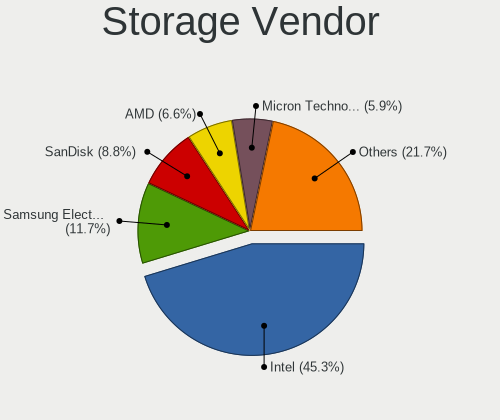
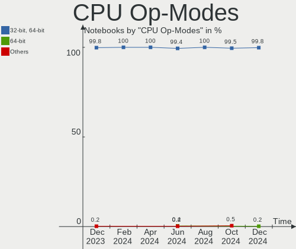
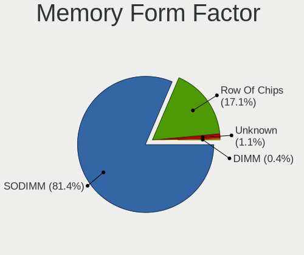
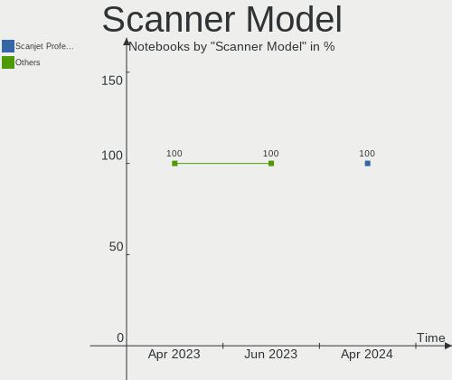

Ubuntu - Hardware Trends (Notebooks)
------------------------------------

A project to identify most popular hardware characteristics and track their change
over time based on data collected by Linux users at https://Linux-Hardware.org.

Anyone can contribute to this report by the [hw-probe](https://github.com/linuxhw/hw-probe) tool:

    sudo -E hw-probe -all -upload

This report is for one last month. Overall report since the beginning of time: [TestCoverage](https://github.com/linuxhw/TestCoverage)

Period: Jul, 2022.

Contents
--------

* [ System ](#system)
  - [ OS                       ](#os)
  - [ OS Family                ](#os-family)
  - [ Kernel                   ](#kernel)
  - [ Kernel Family            ](#kernel-family)
  - [ Kernel Major Ver.        ](#kernel-major-ver)
  - [ Arch                     ](#arch)
  - [ DE                       ](#de)
  - [ Display Server           ](#display-server)
  - [ Display Manager          ](#display-manager)
  - [ OS Lang                  ](#os-lang)
  - [ Boot Mode                ](#boot-mode)
  - [ Filesystem               ](#filesystem)
  - [ Part. scheme             ](#part-scheme)
  - [ Dual Boot with Linux/BSD ](#dual-boot-with-linuxbsd)
  - [ Dual Boot (Win)          ](#dual-boot-win)

* [ Board ](#board)
  - [ Vendor                   ](#vendor)
  - [ Model                    ](#model)
  - [ Model Family             ](#model-family)
  - [ MFG Year                 ](#mfg-year)
  - [ Form Factor              ](#form-factor)
  - [ Secure Boot              ](#secure-boot)
  - [ Coreboot                 ](#coreboot)
  - [ RAM Size                 ](#ram-size)
  - [ RAM Used                 ](#ram-used)
  - [ Total Drives             ](#total-drives)
  - [ Has CD-ROM               ](#has-cd-rom)
  - [ Has Ethernet             ](#has-ethernet)
  - [ Has WiFi                 ](#has-wifi)
  - [ Has Bluetooth            ](#has-bluetooth)

* [ Location ](#location)
  - [ Country                  ](#country)
  - [ City                     ](#city)

* [ Drives ](#drives)
  - [ Drive Vendor             ](#drive-vendor)
  - [ Drive Model              ](#drive-model)
  - [ HDD Vendor               ](#hdd-vendor)
  - [ SSD Vendor               ](#ssd-vendor)
  - [ Drive Kind               ](#drive-kind)
  - [ Drive Connector          ](#drive-connector)
  - [ Drive Size               ](#drive-size)
  - [ Space Total              ](#space-total)
  - [ Space Used               ](#space-used)
  - [ Malfunc. Drives          ](#malfunc-drives)
  - [ Malfunc. Drive Vendor    ](#malfunc-drive-vendor)
  - [ Malfunc. HDD Vendor      ](#malfunc-hdd-vendor)
  - [ Malfunc. Drive Kind      ](#malfunc-drive-kind)
  - [ Failed Drives            ](#failed-drives)
  - [ Failed Drive Vendor      ](#failed-drive-vendor)
  - [ Drive Status             ](#drive-status)

* [ Storage controller ](#storage-controller)
  - [ Storage Vendor           ](#storage-vendor)
  - [ Storage Model            ](#storage-model)
  - [ Storage Kind             ](#storage-kind)

* [ Processor ](#processor)
  - [ CPU Vendor               ](#cpu-vendor)
  - [ CPU Model                ](#cpu-model)
  - [ CPU Model Family         ](#cpu-model-family)
  - [ CPU Cores                ](#cpu-cores)
  - [ CPU Sockets              ](#cpu-sockets)
  - [ CPU Threads              ](#cpu-threads)
  - [ CPU Op-Modes             ](#cpu-op-modes)
  - [ CPU Microcode            ](#cpu-microcode)
  - [ CPU Microarch            ](#cpu-microarch)

* [ Graphics ](#graphics)
  - [ GPU Vendor               ](#gpu-vendor)
  - [ GPU Model                ](#gpu-model)
  - [ GPU Combo                ](#gpu-combo)
  - [ GPU Driver               ](#gpu-driver)
  - [ GPU Memory               ](#gpu-memory)

* [ Monitor ](#monitor)
  - [ Monitor Vendor           ](#monitor-vendor)
  - [ Monitor Model            ](#monitor-model)
  - [ Monitor Resolution       ](#monitor-resolution)
  - [ Monitor Diagonal         ](#monitor-diagonal)
  - [ Monitor Width            ](#monitor-width)
  - [ Aspect Ratio             ](#aspect-ratio)
  - [ Monitor Area             ](#monitor-area)
  - [ Pixel Density            ](#pixel-density)
  - [ Multiple Monitors        ](#multiple-monitors)

* [ Network ](#network)
  - [ Net Controller Vendor    ](#net-controller-vendor)
  - [ Net Controller Model     ](#net-controller-model)
  - [ Wireless Vendor          ](#wireless-vendor)
  - [ Wireless Model           ](#wireless-model)
  - [ Ethernet Vendor          ](#ethernet-vendor)
  - [ Ethernet Model           ](#ethernet-model)
  - [ Net Controller Kind      ](#net-controller-kind)
  - [ Used Controller          ](#used-controller)
  - [ NICs                     ](#nics)
  - [ IPv6                     ](#ipv6)

* [ Bluetooth ](#bluetooth)
  - [ Bluetooth Vendor         ](#bluetooth-vendor)
  - [ Bluetooth Model          ](#bluetooth-model)

* [ Sound ](#sound)
  - [ Sound Vendor             ](#sound-vendor)
  - [ Sound Model              ](#sound-model)

* [ Memory ](#memory)
  - [ Memory Vendor            ](#memory-vendor)
  - [ Memory Model             ](#memory-model)
  - [ Memory Kind              ](#memory-kind)
  - [ Memory Form Factor       ](#memory-form-factor)
  - [ Memory Size              ](#memory-size)
  - [ Memory Speed             ](#memory-speed)

* [ Printers & scanners ](#printers--scanners)
  - [ Printer Vendor           ](#printer-vendor)
  - [ Printer Model            ](#printer-model)
  - [ Scanner Vendor           ](#scanner-vendor)
  - [ Scanner Model            ](#scanner-model)

* [ Camera ](#camera)
  - [ Camera Vendor            ](#camera-vendor)
  - [ Camera Model             ](#camera-model)

* [ Security ](#security)
  - [ Fingerprint Vendor       ](#fingerprint-vendor)
  - [ Fingerprint Model        ](#fingerprint-model)
  - [ Chipcard Vendor          ](#chipcard-vendor)
  - [ Chipcard Model           ](#chipcard-model)

* [ Unsupported ](#unsupported)
  - [ Unsupported Devices      ](#unsupported-devices)
  - [ Unsupported Device Types ](#unsupported-device-types)

System
------

OS
--

Installed operating systems

| Name         | Notebooks | Percent |
|--------------|-----------|---------|
| Ubuntu 22.04 | 322       | 60.19%  |
| Ubuntu 20.04 | 173       | 32.34%  |
| Ubuntu 18.04 | 20        | 3.74%   |
| Ubuntu 21.10 | 11        | 2.06%   |
| Ubuntu 16.04 | 4         | 0.75%   |
| Ubuntu 22.10 | 2         | 0.37%   |
| Ubuntu 21.04 | 2         | 0.37%   |
| Ubuntu 19.04 | 1         | 0.19%   |

OS Family
---------

OS without a version

| Name   | Notebooks | Percent |
|--------|-----------|---------|
| Ubuntu | 535       | 100%    |

Kernel
------

Version of the Linux kernel

| Version                    | Notebooks | Percent |
|----------------------------|-----------|---------|
| 5.15.0-41-generic          | 206       | 38.5%   |
| 5.15.0-40-generic          | 95        | 17.76%  |
| 5.13.0-52-generic          | 58        | 10.84%  |
| 5.15.0-43-generic          | 27        | 5.05%   |
| 5.15.0-25-generic          | 21        | 3.93%   |
| 5.4.0-121-generic          | 12        | 2.24%   |
| 5.15.0-39-generic          | 12        | 2.24%   |
| 5.4.0-122-generic          | 11        | 2.06%   |
| 5.13.0-51-generic          | 10        | 1.87%   |
| 5.14.0-1044-oem            | 8         | 1.5%    |
| 5.14.0-1045-oem            | 6         | 1.12%   |
| 4.15.0-189-generic         | 6         | 1.12%   |
| 5.4.0-120-generic          | 4         | 0.75%   |
| 5.17.0-1012-oem            | 4         | 0.75%   |
| 5.13.0-44-generic          | 4         | 0.75%   |
| 5.13.0-40-generic          | 3         | 0.56%   |
| 5.8.0-43-generic           | 2         | 0.37%   |
| 5.17.0-1013-oem            | 2         | 0.37%   |
| 5.13.0-30-generic          | 2         | 0.37%   |
| 4.4.0-210-generic          | 2         | 0.37%   |
| 5.8.0-59-generic           | 1         | 0.19%   |
| 5.4.0-91-generic           | 1         | 0.19%   |
| 5.4.0-54-generic           | 1         | 0.19%   |
| 5.4.0-121-lowlatency       | 1         | 0.19%   |
| 5.4.0-117-generic          | 1         | 0.19%   |
| 5.4.0-104-generic          | 1         | 0.19%   |
| 5.4.0-100-generic          | 1         | 0.19%   |
| 5.3.0-40-generic           | 1         | 0.19%   |
| 5.19.0-051900rc4-generic   | 1         | 0.19%   |
| 5.18.8-t2                  | 1         | 0.19%   |
| 5.18.8-051808-generic      | 1         | 0.19%   |
| 5.18.4-051804-generic      | 1         | 0.19%   |
| 5.18.3-051803-generic      | 1         | 0.19%   |
| 5.18.12-051812-generic     | 1         | 0.19%   |
| 5.18.11-xanmod1            | 1         | 0.19%   |
| 5.18.10-051810-generic     | 1         | 0.19%   |
| 5.18.0-11.1-liquorix-amd64 | 1         | 0.19%   |
| 5.17.15-76051715-generic   | 1         | 0.19%   |
| 5.17.0-051700rc7-generic   | 1         | 0.19%   |
| 5.17.0-051700-generic      | 1         | 0.19%   |
| 5.16.0-051600rc2-generic   | 1         | 0.19%   |
| 5.15.45-brunch-sebanc      | 1         | 0.19%   |
| 5.15.4-051504-lowlatency   | 1         | 0.19%   |
| 5.15.0-40-lowlatency       | 1         | 0.19%   |
| 5.15.0-33-generic          | 1         | 0.19%   |
| 5.15.0-27-generic          | 1         | 0.19%   |
| 5.14.0-1042-oem            | 1         | 0.19%   |
| 5.13.0-41-generic          | 1         | 0.19%   |
| 5.13.0-25-generic          | 1         | 0.19%   |
| 5.13.0-1017-intel          | 1         | 0.19%   |
| 5.11.20-051120-generic     | 1         | 0.19%   |
| 5.11.0-49-generic          | 1         | 0.19%   |
| 5.11.0-46-generic          | 1         | 0.19%   |
| 5.11.0-38-generic          | 1         | 0.19%   |
| 5.11.0-27-generic          | 1         | 0.19%   |
| 5.0.0-37-generic           | 1         | 0.19%   |
| 4.4.0-229-generic          | 1         | 0.19%   |
| 4.15.0-188-generic         | 1         | 0.19%   |
| 4.15.0-184-generic         | 1         | 0.19%   |
| 4.15.0-142-generic         | 1         | 0.19%   |

Kernel Family
-------------

Linux kernel without a distro release

| Version | Notebooks | Percent |
|---------|-----------|---------|
| 5.15.0  | 364       | 68.04%  |
| 5.13.0  | 80        | 14.95%  |
| 5.4.0   | 33        | 6.17%   |
| 5.14.0  | 15        | 2.8%    |
| 4.15.0  | 9         | 1.68%   |
| 5.17.0  | 8         | 1.5%    |
| 5.11.0  | 4         | 0.75%   |
| 5.8.0   | 3         | 0.56%   |
| 4.4.0   | 3         | 0.56%   |
| 5.18.8  | 2         | 0.37%   |
| 5.3.0   | 1         | 0.19%   |
| 5.19.0  | 1         | 0.19%   |
| 5.18.4  | 1         | 0.19%   |
| 5.18.3  | 1         | 0.19%   |
| 5.18.12 | 1         | 0.19%   |
| 5.18.11 | 1         | 0.19%   |
| 5.18.10 | 1         | 0.19%   |
| 5.18.0  | 1         | 0.19%   |
| 5.17.15 | 1         | 0.19%   |
| 5.16.0  | 1         | 0.19%   |
| 5.15.45 | 1         | 0.19%   |
| 5.15.4  | 1         | 0.19%   |
| 5.11.20 | 1         | 0.19%   |
| 5.0.0   | 1         | 0.19%   |

Kernel Major Ver.
-----------------

Linux kernel major version

| Version | Notebooks | Percent |
|---------|-----------|---------|
| 5.15    | 366       | 68.41%  |
| 5.13    | 80        | 14.95%  |
| 5.4     | 33        | 6.17%   |
| 5.14    | 15        | 2.8%    |
| 5.17    | 9         | 1.68%   |
| 4.15    | 9         | 1.68%   |
| 5.18    | 8         | 1.5%    |
| 5.11    | 5         | 0.93%   |
| 5.8     | 3         | 0.56%   |
| 4.4     | 3         | 0.56%   |
| 5.3     | 1         | 0.19%   |
| 5.19    | 1         | 0.19%   |
| 5.16    | 1         | 0.19%   |
| 5.0     | 1         | 0.19%   |

Arch
----

OS architecture (x86_64, i586, etc.)

| Name   | Notebooks | Percent |
|--------|-----------|---------|
| x86_64 | 526       | 98.32%  |
| i686   | 9         | 1.68%   |

DE
--

Desktop Environment

| Name            | Notebooks | Percent |
|-----------------|-----------|---------|
| GNOME           | 507       | 94.77%  |
| Unknown         | 16        | 2.99%   |
| Unity           | 4         | 0.75%   |
| GNOME Flashback | 3         | 0.56%   |
| X-Cinnamon      | 1         | 0.19%   |
| Trinity         | 1         | 0.19%   |
| openbox         | 1         | 0.19%   |
| i3              | 1         | 0.19%   |
| Cinnamon        | 1         | 0.19%   |

Display Server
--------------

X11 or Wayland

| Name    | Notebooks | Percent |
|---------|-----------|---------|
| X11     | 287       | 53.64%  |
| Wayland | 236       | 44.11%  |
| Unknown | 8         | 1.5%    |
| Tty     | 4         | 0.75%   |

Display Manager
---------------

SDDM, LightDM, etc.

| Name    | Notebooks | Percent |
|---------|-----------|---------|
| GDM3    | 395       | 73.83%  |
| GDM     | 82        | 15.33%  |
| Unknown | 42        | 7.85%   |
| LightDM | 13        | 2.43%   |
| SDDM    | 2         | 0.37%   |
| TDM     | 1         | 0.19%   |

OS Lang
-------

Language

| Lang    | Notebooks | Percent |
|---------|-----------|---------|
| en_US   | 243       | 45.42%  |
| fr_FR   | 33        | 6.17%   |
| pt_BR   | 28        | 5.23%   |
| en_GB   | 27        | 5.05%   |
| de_DE   | 27        | 5.05%   |
| en_IN   | 24        | 4.49%   |
| ru_RU   | 15        | 2.8%    |
| es_ES   | 11        | 2.06%   |
| pl_PL   | 10        | 1.87%   |
| hu_HU   | 9         | 1.68%   |
| en_CA   | 8         | 1.5%    |
| Unknown | 8         | 1.5%    |
| nl_NL   | 7         | 1.31%   |
| en_AU   | 7         | 1.31%   |
| pt_PT   | 6         | 1.12%   |
| it_IT   | 6         | 1.12%   |
| es_MX   | 5         | 0.93%   |
| en_ZA   | 5         | 0.93%   |
| en_PH   | 5         | 0.93%   |
| cs_CZ   | 4         | 0.75%   |
| tr_TR   | 3         | 0.56%   |
| nb_NO   | 3         | 0.56%   |
| es_CO   | 3         | 0.56%   |
| es_CL   | 3         | 0.56%   |
| es_AR   | 3         | 0.56%   |
| C       | 3         | 0.56%   |
| ko_KR   | 2         | 0.37%   |
| fr_CA   | 2         | 0.37%   |
| fi_FI   | 2         | 0.37%   |
| en_IL   | 2         | 0.37%   |
| en_IE   | 2         | 0.37%   |
| el_GR   | 2         | 0.37%   |
| da_DK   | 2         | 0.37%   |
| ca_ES   | 2         | 0.37%   |
| zh_TW   | 1         | 0.19%   |
| zh_CN   | 1         | 0.19%   |
| sv_SE   | 1         | 0.19%   |
| sk_SK   | 1         | 0.19%   |
| ru_UA   | 1         | 0.19%   |
| lt_LT   | 1         | 0.19%   |
| ja_JP   | 1         | 0.19%   |
| hy_AM   | 1         | 0.19%   |
| hr_HR   | 1         | 0.19%   |
| fr_BE   | 1         | 0.19%   |
| es_US   | 1         | 0.19%   |
| es_CR   | 1         | 0.19%   |
| en_NG   | 1         | 0.19%   |

Boot Mode
---------

EFI or BIOS

| Mode | Notebooks | Percent |
|------|-----------|---------|
| BIOS | 271       | 50.65%  |
| EFI  | 264       | 49.35%  |

Filesystem
----------

Type of filesystem

| Type    | Notebooks | Percent |
|---------|-----------|---------|
| Ext4    | 502       | 93.83%  |
| Zfs     | 14        | 2.62%   |
| Overlay | 11        | 2.06%   |
| Btrfs   | 5         | 0.93%   |
| Ext2    | 2         | 0.37%   |
| Ext3    | 1         | 0.19%   |

Part. scheme
------------

Scheme of partitioning

| Type    | Notebooks | Percent |
|---------|-----------|---------|
| Unknown | 314       | 58.69%  |
| GPT     | 201       | 37.57%  |
| MBR     | 20        | 3.74%   |

Dual Boot with Linux/BSD
------------------------

Hosting more than one Linux/BSD

| Dual boot | Notebooks | Percent |
|-----------|-----------|---------|
| No        | 492       | 91.96%  |
| Yes       | 43        | 8.04%   |

Dual Boot (Win)
---------------

Hosting Linux and Windows

| Dual boot | Notebooks | Percent |
|-----------|-----------|---------|
| No        | 364       | 68.04%  |
| Yes       | 171       | 31.96%  |

Board
-----

Vendor
------

Motherboard manufacturer

| Name                   | Notebooks | Percent |
|------------------------|-----------|---------|
| Dell                   | 119       | 22.24%  |
| Lenovo                 | 107       | 20%     |
| Hewlett-Packard        | 91        | 17.01%  |
| ASUSTek Computer       | 57        | 10.65%  |
| Acer                   | 38        | 7.1%    |
| Toshiba                | 19        | 3.55%   |
| Apple                  | 13        | 2.43%   |
| HUAWEI                 | 10        | 1.87%   |
| Samsung Electronics    | 8         | 1.5%    |
| Sony                   | 6         | 1.12%   |
| MSI                    | 6         | 1.12%   |
| Timi                   | 4         | 0.75%   |
| Unknown                | 4         | 0.75%   |
| Positivo               | 3         | 0.56%   |
| Packard Bell           | 3         | 0.56%   |
| Google                 | 3         | 0.56%   |
| Gigabyte Technology    | 3         | 0.56%   |
| Semp Toshiba           | 2         | 0.37%   |
| Panasonic              | 2         | 0.37%   |
| NEC Computers          | 2         | 0.37%   |
| Jumper                 | 2         | 0.37%   |
| Fujitsu                | 2         | 0.37%   |
| Avell High Performance | 2         | 0.37%   |
| Alienware              | 2         | 0.37%   |
| Teclast                | 1         | 0.19%   |
| SLIMBOOK               | 1         | 0.19%   |
| Schenker               | 1         | 0.19%   |
| Razer                  | 1         | 0.19%   |
| Novatech               | 1         | 0.19%   |
| Notebook               | 1         | 0.19%   |
| MouseComputer          | 1         | 0.19%   |
| Monster                | 1         | 0.19%   |
| Megaware               | 1         | 0.19%   |
| Linx                   | 1         | 0.19%   |
| LG Electronics         | 1         | 0.19%   |
| Intel Client Systems   | 1         | 0.19%   |
| Intel                  | 1         | 0.19%   |
| Insyde                 | 1         | 0.19%   |
| GHIA                   | 1         | 0.19%   |
| Gateway                | 1         | 0.19%   |
| Fusion5                | 1         | 0.19%   |
| Fujitsu Siemens        | 1         | 0.19%   |
| eMachines              | 1         | 0.19%   |
| BenQ                   | 1         | 0.19%   |
| BANGHO                 | 1         | 0.19%   |
| AZW                    | 1         | 0.19%   |
| AXDIA International    | 1         | 0.19%   |
| AWOW                   | 1         | 0.19%   |
| AMI                    | 1         | 0.19%   |
| A14CR                  | 1         | 0.19%   |
| A-DATA Technology      | 1         | 0.19%   |

Model
-----

Motherboard model

| Name                              | Notebooks | Percent |
|-----------------------------------|-----------|---------|
| Dell Latitude 5420                | 6         | 1.12%   |
| Unknown                           | 6         | 1.12%   |
| Dell XPS 15 9520                  | 4         | 0.75%   |
| HUAWEI NBLK-WAX9X                 | 3         | 0.56%   |
| HP ProBook 450 G5                 | 3         | 0.56%   |
| HP Pavilion Aero Laptop 13-be0xxx | 3         | 0.56%   |
| HP Notebook                       | 3         | 0.56%   |
| HP EliteBook 855 G8 Notebook PC   | 3         | 0.56%   |
| Dell XPS 15 9500                  | 3         | 0.56%   |
| Dell Latitude E7470               | 3         | 0.56%   |
| Dell Latitude E6420               | 3         | 0.56%   |
| Apple MacBookAir7,2               | 3         | 0.56%   |
| Toshiba Satellite L350            | 2         | 0.37%   |
| Positivo C14CU51                  | 2         | 0.37%   |
| Lenovo ThinkBook 14-IIL 20SL      | 2         | 0.37%   |
| Lenovo IdeaPad 320-15IKB 80YH     | 2         | 0.37%   |
| Lenovo IdeaPad 3 15ITL6 82H8      | 2         | 0.37%   |
| Jumper EZbook                     | 2         | 0.37%   |
| HUAWEI HVY-WXX9                   | 2         | 0.37%   |
| HP Pavilion 15                    | 2         | 0.37%   |
| HP EliteBook 840 G4               | 2         | 0.37%   |
| HP EliteBook 840 G1               | 2         | 0.37%   |
| HP EliteBook 2530p                | 2         | 0.37%   |
| HP 15 Notebook PC                 | 2         | 0.37%   |
| HP 14                             | 2         | 0.37%   |
| Dell XPS 15 9510                  | 2         | 0.37%   |
| Dell XPS 15 7590                  | 2         | 0.37%   |
| Dell XPS 13 9370                  | 2         | 0.37%   |
| Dell Vostro 3500                  | 2         | 0.37%   |
| Dell Vostro 15 3515               | 2         | 0.37%   |
| Dell Precision 7560               | 2         | 0.37%   |
| Dell Precision 5550               | 2         | 0.37%   |
| Dell Precision 3561               | 2         | 0.37%   |
| Dell Latitude E6510               | 2         | 0.37%   |
| Dell Latitude 7490                | 2         | 0.37%   |
| Dell Latitude 3420                | 2         | 0.37%   |
| Dell Inspiron 3537                | 2         | 0.37%   |
| Dell Inspiron 3501                | 2         | 0.37%   |
| Avell High Performance B.ON       | 2         | 0.37%   |
| ASUS X556UQK                      | 2         | 0.37%   |
| Apple MacBookPro15,1              | 2         | 0.37%   |
| Acer Nitro AN515-55               | 2         | 0.37%   |
| Acer ConceptD CN315-71P           | 2         | 0.37%   |
| Acer Aspire E5-575G               | 2         | 0.37%   |
| Toshiba TECRA R940                | 1         | 0.19%   |
| Toshiba TECRA R850                | 1         | 0.19%   |
| Toshiba Satellite U840            | 1         | 0.19%   |
| Toshiba Satellite Pro S500        | 1         | 0.19%   |
| Toshiba Satellite Pro L500        | 1         | 0.19%   |
| Toshiba Satellite P50-A-12P       | 1         | 0.19%   |
| Toshiba Satellite L670            | 1         | 0.19%   |
| Toshiba Satellite L655            | 1         | 0.19%   |
| Toshiba Satellite L550            | 1         | 0.19%   |
| Toshiba Satellite C875D           | 1         | 0.19%   |
| Toshiba Satellite C650D           | 1         | 0.19%   |
| Toshiba Satellite C50-A           | 1         | 0.19%   |
| Toshiba PORTEGE Z930              | 1         | 0.19%   |
| Toshiba PORTEGE R930              | 1         | 0.19%   |
| Toshiba NB205                     | 1         | 0.19%   |
| Toshiba KIRA                      | 1         | 0.19%   |

Model Family
------------

Motherboard model prefix

| Name                        | Notebooks | Percent |
|-----------------------------|-----------|---------|
| Lenovo ThinkPad             | 55        | 10.28%  |
| Dell Latitude               | 43        | 8.04%   |
| Acer Aspire                 | 29        | 5.42%   |
| Dell Inspiron               | 28        | 5.23%   |
| Lenovo IdeaPad              | 27        | 5.05%   |
| HP EliteBook                | 19        | 3.55%   |
| Dell XPS                    | 19        | 3.55%   |
| HP Pavilion                 | 15        | 2.8%    |
| HP Laptop                   | 15        | 2.8%    |
| Dell Vostro                 | 13        | 2.43%   |
| ASUS VivoBook               | 13        | 2.43%   |
| Toshiba Satellite           | 12        | 2.24%   |
| HP ProBook                  | 12        | 2.24%   |
| Dell Precision              | 11        | 2.06%   |
| Unknown                     | 6         | 1.12%   |
| HP ZBook                    | 5         | 0.93%   |
| Lenovo ThinkBook            | 4         | 0.75%   |
| HP Notebook                 | 4         | 0.75%   |
| HP ENVY                     | 4         | 0.75%   |
| ASUS ASUS                   | 4         | 0.75%   |
| Packard Bell EasyNote       | 3         | 0.56%   |
| Lenovo Legion               | 3         | 0.56%   |
| HUAWEI NBLK-WAX9X           | 3         | 0.56%   |
| HP OMEN                     | 3         | 0.56%   |
| HP 15                       | 3         | 0.56%   |
| ASUS ROG                    | 3         | 0.56%   |
| Apple MacBookAir7           | 3         | 0.56%   |
| Toshiba TECRA               | 2         | 0.37%   |
| Toshiba PORTEGE             | 2         | 0.37%   |
| Timi Mi                     | 2         | 0.37%   |
| Samsung 300E4A              | 2         | 0.37%   |
| Positivo C14CU51            | 2         | 0.37%   |
| Jumper EZbook               | 2         | 0.37%   |
| HUAWEI HVY-WXX9             | 2         | 0.37%   |
| HP 14                       | 2         | 0.37%   |
| Fujitsu LIFEBOOK            | 2         | 0.37%   |
| Dell G15                    | 2         | 0.37%   |
| Avell High Performance B.ON | 2         | 0.37%   |
| ASUS X556UQK                | 2         | 0.37%   |
| Apple MacBookPro15          | 2         | 0.37%   |
| Apple MacBookPro14          | 2         | 0.37%   |
| Acer Swift                  | 2         | 0.37%   |
| Acer Predator               | 2         | 0.37%   |
| Acer Nitro                  | 2         | 0.37%   |
| Acer ConceptD               | 2         | 0.37%   |
| Toshiba NB205               | 1         | 0.19%   |
| Toshiba KIRA                | 1         | 0.19%   |
| Toshiba EQUIUM              | 1         | 0.19%   |
| Timi TM1613                 | 1         | 0.19%   |
| Timi RedmiBook              | 1         | 0.19%   |
| Teclast F15                 | 1         | 0.19%   |
| Sony VPCYB20AL              | 1         | 0.19%   |
| Sony VPCEA36FG              | 1         | 0.19%   |
| Sony VPCEA1C5E              | 1         | 0.19%   |
| Sony VPCCW13FB              | 1         | 0.19%   |
| Sony VGN-FW51ZF             | 1         | 0.19%   |
| Sony SVE1513R1EB            | 1         | 0.19%   |
| SLIMBOOK PROX14-10          | 1         | 0.19%   |
| Semp Toshiba IS-1253        | 1         | 0.19%   |
| Semp Toshiba IS             | 1         | 0.19%   |

MFG Year
--------

Motherboard manufacture year

| Year | Notebooks | Percent |
|------|-----------|---------|
| 2021 | 87        | 16.26%  |
| 2020 | 64        | 11.96%  |
| 2019 | 45        | 8.41%   |
| 2017 | 41        | 7.66%   |
| 2018 | 37        | 6.92%   |
| 2015 | 36        | 6.73%   |
| 2014 | 32        | 5.98%   |
| 2010 | 31        | 5.79%   |
| 2016 | 27        | 5.05%   |
| 2022 | 26        | 4.86%   |
| 2012 | 26        | 4.86%   |
| 2013 | 25        | 4.67%   |
| 2011 | 23        | 4.3%    |
| 2009 | 10        | 1.87%   |
| 2007 | 10        | 1.87%   |
| 2008 | 9         | 1.68%   |
| 2006 | 4         | 0.75%   |
| 2005 | 2         | 0.37%   |

Form Factor
-----------

Physical design of the computer

| Name     | Notebooks | Percent |
|----------|-----------|---------|
| Notebook | 535       | 100%    |

Secure Boot
-----------

Enabled or disabled

| State    | Notebooks | Percent |
|----------|-----------|---------|
| Disabled | 456       | 85.23%  |
| Enabled  | 79        | 14.77%  |

Coreboot
--------

Have coreboot on board

| Used | Notebooks | Percent |
|------|-----------|---------|
| No   | 532       | 99.44%  |
| Yes  | 3         | 0.56%   |

RAM Size
--------

Total RAM memory

| Size in GB  | Notebooks | Percent |
|-------------|-----------|---------|
| 4.01-8.0    | 160       | 29.91%  |
| 16.01-24.0  | 105       | 19.63%  |
| 8.01-16.0   | 94        | 17.57%  |
| 3.01-4.0    | 88        | 16.45%  |
| 32.01-64.0  | 41        | 7.66%   |
| 1.01-2.0    | 17        | 3.18%   |
| 64.01-256.0 | 14        | 2.62%   |
| 24.01-32.0  | 9         | 1.68%   |
| 2.01-3.0    | 5         | 0.93%   |
| 0.51-1.0    | 2         | 0.37%   |

RAM Used
--------

Used RAM memory

| Used GB    | Notebooks | Percent |
|------------|-----------|---------|
| 2.01-3.0   | 168       | 31.4%   |
| 1.01-2.0   | 149       | 27.85%  |
| 3.01-4.0   | 89        | 16.64%  |
| 4.01-8.0   | 88        | 16.45%  |
| 8.01-16.0  | 23        | 4.3%    |
| 16.01-24.0 | 8         | 1.5%    |
| 0.51-1.0   | 6         | 1.12%   |
| 24.01-32.0 | 2         | 0.37%   |
| 0.01-0.5   | 2         | 0.37%   |

Total Drives
------------

Number of drives on board

| Drives | Notebooks | Percent |
|--------|-----------|---------|
| 1      | 400       | 74.77%  |
| 2      | 112       | 20.93%  |
| 3      | 16        | 2.99%   |
| 0      | 5         | 0.93%   |
| 4      | 2         | 0.37%   |

Has CD-ROM
----------

Has CD-ROM on board

| Presented | Notebooks | Percent |
|-----------|-----------|---------|
| No        | 382       | 71.4%   |
| Yes       | 153       | 28.6%   |

Has Ethernet
------------

Has Ethernet on board

| Presented | Notebooks | Percent |
|-----------|-----------|---------|
| Yes       | 416       | 77.76%  |
| No        | 119       | 22.24%  |

Has WiFi
--------

Has WiFi module

| Presented | Notebooks | Percent |
|-----------|-----------|---------|
| Yes       | 524       | 97.94%  |
| No        | 11        | 2.06%   |

Has Bluetooth
-------------

Has Bluetooth module

| Presented | Notebooks | Percent |
|-----------|-----------|---------|
| Yes       | 432       | 80.75%  |
| No        | 103       | 19.25%  |

Location
--------

Country
-------

Geographic location (country)

| Country                | Notebooks | Percent |
|------------------------|-----------|---------|
| USA                    | 85        | 15.89%  |
| Germany                | 41        | 7.66%   |
| Brazil                 | 40        | 7.48%   |
| France                 | 34        | 6.36%   |
| Russia                 | 27        | 5.05%   |
| India                  | 26        | 4.86%   |
| UK                     | 21        | 3.93%   |
| Poland                 | 14        | 2.62%   |
| Netherlands            | 13        | 2.43%   |
| Italy                  | 11        | 2.06%   |
| Hungary                | 11        | 2.06%   |
| Canada                 | 11        | 2.06%   |
| Spain                  | 10        | 1.87%   |
| Mexico                 | 10        | 1.87%   |
| Portugal               | 8         | 1.5%    |
| Greece                 | 7         | 1.31%   |
| Argentina              | 7         | 1.31%   |
| Turkey                 | 6         | 1.12%   |
| Philippines            | 6         | 1.12%   |
| Indonesia              | 6         | 1.12%   |
| Czechia                | 6         | 1.12%   |
| China                  | 6         | 1.12%   |
| Austria                | 6         | 1.12%   |
| Australia              | 6         | 1.12%   |
| Taiwan                 | 5         | 0.93%   |
| Switzerland            | 5         | 0.93%   |
| South Africa           | 5         | 0.93%   |
| Sweden                 | 4         | 0.75%   |
| Serbia                 | 4         | 0.75%   |
| Romania                | 4         | 0.75%   |
| Myanmar                | 4         | 0.75%   |
| Japan                  | 4         | 0.75%   |
| Finland                | 4         | 0.75%   |
| Denmark                | 4         | 0.75%   |
| Colombia               | 4         | 0.75%   |
| Chile                  | 4         | 0.75%   |
| Belgium                | 4         | 0.75%   |
| Tunisia                | 3         | 0.56%   |
| Puerto Rico            | 3         | 0.56%   |
| Norway                 | 3         | 0.56%   |
| Israel                 | 3         | 0.56%   |
| Iran                   | 3         | 0.56%   |
| Egypt                  | 3         | 0.56%   |
| Croatia                | 3         | 0.56%   |
| Venezuela              | 2         | 0.37%   |
| Thailand               | 2         | 0.37%   |
| South Korea            | 2         | 0.37%   |
| Slovakia               | 2         | 0.37%   |
| Pakistan               | 2         | 0.37%   |
| Ireland                | 2         | 0.37%   |
| Costa Rica             | 2         | 0.37%   |
| Bosnia and Herzegovina | 2         | 0.37%   |
| Belarus                | 2         | 0.37%   |
| Zimbabwe               | 1         | 0.19%   |
| Uruguay                | 1         | 0.19%   |
| Ukraine                | 1         | 0.19%   |
| Sri Lanka              | 1         | 0.19%   |
| Slovenia               | 1         | 0.19%   |
| Singapore              | 1         | 0.19%   |
| Réunion               | 1         | 0.19%   |

City
----

Geographic location (city)

| City                  | Notebooks | Percent |
|-----------------------|-----------|---------|
| Moscow                | 7         | 1.31%   |
| Sao Paulo             | 6         | 1.12%   |
| Paris                 | 6         | 1.12%   |
| Budapest              | 6         | 1.12%   |
| Berlin                | 6         | 1.12%   |
| Warsaw                | 5         | 0.93%   |
| Bengaluru             | 5         | 0.93%   |
| Yangon                | 4         | 0.75%   |
| Vienna                | 4         | 0.75%   |
| St Petersburg         | 4         | 0.75%   |
| San Jose              | 4         | 0.75%   |
| Pune                  | 4         | 0.75%   |
| Taipei                | 3         | 0.56%   |
| Rio de Janeiro        | 3         | 0.56%   |
| Prague                | 3         | 0.56%   |
| Milan                 | 3         | 0.56%   |
| London                | 3         | 0.56%   |
| Istanbul              | 3         | 0.56%   |
| Hyderabad             | 3         | 0.56%   |
| Chennai               | 3         | 0.56%   |
| Cartagena             | 3         | 0.56%   |
| Belo Horizonte        | 3         | 0.56%   |
| Belgrade              | 3         | 0.56%   |
| Athens                | 3         | 0.56%   |
| Zurich                | 2         | 0.37%   |
| Zagreb                | 2         | 0.37%   |
| Uberlândia           | 2         | 0.37%   |
| Tunis                 | 2         | 0.37%   |
| Thessaloniki          | 2         | 0.37%   |
| Tehran                | 2         | 0.37%   |
| Stuttgart             | 2         | 0.37%   |
| St Louis              | 2         | 0.37%   |
| Setagaya-ku           | 2         | 0.37%   |
| Sarajevo              | 2         | 0.37%   |
| Santiago              | 2         | 0.37%   |
| San Juan              | 2         | 0.37%   |
| San Giovanni Lupatoto | 2         | 0.37%   |
| San Francisco         | 2         | 0.37%   |
| Samara                | 2         | 0.37%   |
| Sabadell              | 2         | 0.37%   |
| Porto Alegre          | 2         | 0.37%   |
| Perth                 | 2         | 0.37%   |
| Perm                  | 2         | 0.37%   |
| Nice                  | 2         | 0.37%   |
| Mumbai                | 2         | 0.37%   |
| Minsk                 | 2         | 0.37%   |
| Mexico City           | 2         | 0.37%   |
| Karlsruhe             | 2         | 0.37%   |
| Karachi               | 2         | 0.37%   |
| Joao Pessoa           | 2         | 0.37%   |
| Jakarta               | 2         | 0.37%   |
| Indore                | 2         | 0.37%   |
| Heilbronn             | 2         | 0.37%   |
| Frankfurt am Main     | 2         | 0.37%   |
| Dublin                | 2         | 0.37%   |
| Coventry              | 2         | 0.37%   |
| Córdoba              | 2         | 0.37%   |
| Centurion             | 2         | 0.37%   |
| Cebu City             | 2         | 0.37%   |
| Campo Grande          | 2         | 0.37%   |

Drives
------

Drive Vendor
------------

Hard drive vendors

| Vendor                      | Notebooks | Drives | Percent |
|-----------------------------|-----------|--------|---------|
| Samsung Electronics         | 110       | 119    | 16.92%  |
| WDC                         | 62        | 64     | 9.54%   |
| Seagate                     | 56        | 59     | 8.62%   |
| SanDisk                     | 52        | 53     | 8%      |
| Toshiba                     | 49        | 50     | 7.54%   |
| SK hynix                    | 37        | 37     | 5.69%   |
| Kingston                    | 35        | 36     | 5.38%   |
| Unknown                     | 26        | 27     | 4%      |
| Micron Technology           | 24        | 24     | 3.69%   |
| Intel                       | 24        | 29     | 3.69%   |
| Crucial                     | 23        | 24     | 3.54%   |
| HGST                        | 16        | 16     | 2.46%   |
| Hitachi                     | 15        | 15     | 2.31%   |
| KIOXIA                      | 14        | 14     | 2.15%   |
| A-DATA Technology           | 11        | 11     | 1.69%   |
| Apple                       | 10        | 12     | 1.54%   |
| Unknown                     | 10        | 10     | 1.54%   |
| Phison                      | 8         | 8      | 1.23%   |
| China                       | 5         | 5      | 0.77%   |
| SPCC                        | 4         | 4      | 0.62%   |
| LITEON                      | 4         | 4      | 0.62%   |
| Intenso                     | 4         | 4      | 0.62%   |
| XPG                         | 3         | 3      | 0.46%   |
| Gigabyte Technology         | 3         | 3      | 0.46%   |
| Union Memory (Shenzhen)     | 2         | 2      | 0.31%   |
| UMIS                        | 2         | 2      | 0.31%   |
| Transcend                   | 2         | 2      | 0.31%   |
| Silicon Motion              | 2         | 2      | 0.31%   |
| PNY                         | 2         | 2      | 0.31%   |
| Plextor                     | 2         | 2      | 0.31%   |
| Patriot                     | 2         | 2      | 0.31%   |
| Hewlett-Packard             | 2         | 2      | 0.31%   |
| GOODRAM                     | 2         | 2      | 0.31%   |
| ADATA Technology            | 2         | 2      | 0.31%   |
| ZTE                         | 1         | 1      | 0.15%   |
| ValueTech                   | 1         | 1      | 0.15%   |
| TO Exter                    | 1         | 1      | 0.15%   |
| Teclast                     | 1         | 1      | 0.15%   |
| SSSTC                       | 1         | 1      | 0.15%   |
| ShiJi                       | 1         | 1      | 0.15%   |
| SAGE                        | 1         | 1      | 0.15%   |
| SABRENT                     | 1         | 1      | 0.15%   |
| Ramsta                      | 1         | 1      | 0.15%   |
| ORTIAL                      | 1         | 1      | 0.15%   |
| OCZ                         | 1         | 1      | 0.15%   |
| MyDigitalSSD                | 1         | 1      | 0.15%   |
| Micron/Crucial Technology   | 1         | 1      | 0.15%   |
| MAXIO Technology (Hangzhou) | 1         | 1      | 0.15%   |
| KIOXIA-EXCERIA              | 1         | 1      | 0.15%   |
| KingSpec                    | 1         | 1      | 0.15%   |
| Kingmax                     | 1         | 1      | 0.15%   |
| KingFast                    | 1         | 1      | 0.15%   |
| KingDian                    | 1         | 1      | 0.15%   |
| JMicron Technology          | 1         | 1      | 0.15%   |
| Indilinx                    | 1         | 1      | 0.15%   |
| faspeed                     | 1         | 1      | 0.15%   |
| Emtec                       | 1         | 1      | 0.15%   |
| BIWIN                       | 1         | 1      | 0.15%   |
| AirDisk                     | 1         | 1      | 0.15%   |

Drive Model
-----------

Hard drive models

| Model                                 | Notebooks | Percent |
|---------------------------------------|-----------|---------|
| Toshiba MQ01ABD100 1TB                | 11        | 1.64%   |
| Seagate ST1000LM035-1RK172 1TB        | 10        | 1.49%   |
| Samsung NVMe SSD Drive 512GB          | 10        | 1.49%   |
| Unknown                               | 10        | 1.49%   |
| SanDisk NVMe SSD Drive 256GB          | 9         | 1.34%   |
| SanDisk NVMe SSD Drive 1TB            | 6         | 0.89%   |
| Toshiba MQ04ABF100 1TB                | 5         | 0.75%   |
| Seagate ST9500325AS 500GB             | 5         | 0.75%   |
| SanDisk SDSSDA120G 120GB              | 5         | 0.75%   |
| SanDisk NVMe SSD Drive 512GB          | 5         | 0.75%   |
| Samsung NVMe SSD Drive 256GB          | 5         | 0.75%   |
| Samsung NVMe SSD Drive 1024GB         | 5         | 0.75%   |
| Kingston SA400S37240G 240GB SSD       | 5         | 0.75%   |
| WDC WD10JPVX-22JC3T0 1TB              | 4         | 0.6%    |
| SK hynix NVMe SSD Drive 256GB         | 4         | 0.6%    |
| KIOXIA NVMe SSD Drive 512GB           | 4         | 0.6%    |
| Kingston SA400S37480G 480GB SSD       | 4         | 0.6%    |
| HGST HTS721010A9E630 1TB              | 4         | 0.6%    |
| HGST HTS545050A7E680 500GB            | 4         | 0.6%    |
| Crucial CT500MX500SSD1 500GB          | 4         | 0.6%    |
| Crucial CT480BX500SSD1 480GB          | 4         | 0.6%    |
| Crucial CT1000MX500SSD1 1TB           | 4         | 0.6%    |
| Toshiba MQ01ABF050 500GB              | 3         | 0.45%   |
| SK hynix NVMe SSD Drive 512GB         | 3         | 0.45%   |
| SK hynix BC711 NVMe 256GB             | 3         | 0.45%   |
| Seagate ST500LT012-1DG142 500GB       | 3         | 0.45%   |
| Seagate ST320LT020-9YG142 320GB       | 3         | 0.45%   |
| SanDisk NVMe SSD Drive 1024GB         | 3         | 0.45%   |
| Samsung SSD 980 1TB                   | 3         | 0.45%   |
| Samsung SSD 970 EVO Plus 500GB        | 3         | 0.45%   |
| Samsung SSD 860 EVO M.2 500GB         | 3         | 0.45%   |
| Samsung SSD 860 EVO 500GB             | 3         | 0.45%   |
| Samsung MZVLW256HEHP-000L7 256GB      | 3         | 0.45%   |
| Micron NVMe SSD Drive 512GB           | 3         | 0.45%   |
| Kingston SA400S37120G 120GB SSD       | 3         | 0.45%   |
| Intel NVMe SSD Drive 512GB            | 3         | 0.45%   |
| Intel HBRPEKNX0202AH 512GB            | 3         | 0.45%   |
| Hitachi HTS545050B9A300 500GB         | 3         | 0.45%   |
| HGST HTS541010B7E610 1TB              | 3         | 0.45%   |
| WDC WDS240G2G0A-00JH30 240GB SSD      | 2         | 0.3%    |
| WDC WD5000LPVX-75V0TT0 500GB          | 2         | 0.3%    |
| WDC WD5000BEVT-22A0RT0 500GB          | 2         | 0.3%    |
| WDC WD10SPZX-21Z10T0 1TB              | 2         | 0.3%    |
| WDC WD10JPVX-60JC3T1 1TB              | 2         | 0.3%    |
| WDC PC SN730 SDBPNTY-512G-1027 512GB  | 2         | 0.3%    |
| WDC PC SN530 NVMe 512GB               | 2         | 0.3%    |
| Unknown SD128  128GB                  | 2         | 0.3%    |
| Unknown SD/MMC/MS PRO 64GB            | 2         | 0.3%    |
| UMIS RPJTJ256MEE1OWX 256GB            | 2         | 0.3%    |
| Toshiba NVMe SSD Drive 256GB          | 2         | 0.3%    |
| Toshiba MQ01ACF050 500GB              | 2         | 0.3%    |
| Toshiba MQ01ABD075 752GB              | 2         | 0.3%    |
| Toshiba MK1655GSX 160GB               | 2         | 0.3%    |
| Toshiba KXG6AZNV512G 512GB            | 2         | 0.3%    |
| SPCC Solid State Disk 512GB           | 2         | 0.3%    |
| SK hynix PC801 NVMe 1TB               | 2         | 0.3%    |
| SK hynix NVMe SSD Drive 128GB         | 2         | 0.3%    |
| SK hynix NVMe SSD Drive 1024GB        | 2         | 0.3%    |
| SK hynix HFS256G39TND-N210A 256GB SSD | 2         | 0.3%    |
| SK hynix BC711 NVMe 512GB             | 2         | 0.3%    |

HDD Vendor
----------

Hard disk drive vendors

| Vendor              | Notebooks | Drives | Percent |
|---------------------|-----------|--------|---------|
| Seagate             | 54        | 56     | 32.73%  |
| WDC                 | 37        | 38     | 22.42%  |
| Toshiba             | 37        | 37     | 22.42%  |
| HGST                | 16        | 16     | 9.7%    |
| Hitachi             | 15        | 15     | 9.09%   |
| Unknown             | 2         | 2      | 1.21%   |
| Samsung Electronics | 2         | 2      | 1.21%   |
| SAGE                | 1         | 1      | 0.61%   |
| SABRENT             | 1         | 1      | 0.61%   |

SSD Vendor
----------

Solid state drive vendors

| Vendor              | Notebooks | Drives | Percent |
|---------------------|-----------|--------|---------|
| Samsung Electronics | 36        | 38     | 18.37%  |
| Kingston            | 28        | 28     | 14.29%  |
| SanDisk             | 26        | 26     | 13.27%  |
| Crucial             | 22        | 23     | 11.22%  |
| WDC                 | 11        | 11     | 5.61%   |
| Micron Technology   | 7         | 7      | 3.57%   |
| SK hynix            | 6         | 6      | 3.06%   |
| China               | 5         | 5      | 2.55%   |
| Apple               | 5         | 5      | 2.55%   |
| A-DATA Technology   | 5         | 5      | 2.55%   |
| SPCC                | 4         | 4      | 2.04%   |
| Unknown             | 4         | 4      | 2.04%   |
| Toshiba             | 3         | 3      | 1.53%   |
| LITEON              | 3         | 3      | 1.53%   |
| Intenso             | 3         | 3      | 1.53%   |
| Transcend           | 2         | 2      | 1.02%   |
| PNY                 | 2         | 2      | 1.02%   |
| Patriot             | 2         | 2      | 1.02%   |
| Hewlett-Packard     | 2         | 2      | 1.02%   |
| GOODRAM             | 2         | 2      | 1.02%   |
| ValueTech           | 1         | 1      | 0.51%   |
| TO Exter            | 1         | 1      | 0.51%   |
| Teclast             | 1         | 1      | 0.51%   |
| ShiJi               | 1         | 1      | 0.51%   |
| Ramsta              | 1         | 1      | 0.51%   |
| Plextor             | 1         | 1      | 0.51%   |
| ORTIAL              | 1         | 1      | 0.51%   |
| OCZ                 | 1         | 1      | 0.51%   |
| MyDigitalSSD        | 1         | 1      | 0.51%   |
| KIOXIA-EXCERIA      | 1         | 1      | 0.51%   |
| KingSpec            | 1         | 1      | 0.51%   |
| KingDian            | 1         | 1      | 0.51%   |
| Intel               | 1         | 1      | 0.51%   |
| Gigabyte Technology | 1         | 1      | 0.51%   |
| faspeed             | 1         | 1      | 0.51%   |
| Emtec               | 1         | 1      | 0.51%   |
| BIWIN               | 1         | 1      | 0.51%   |
| AirDisk             | 1         | 1      | 0.51%   |

Drive Kind
----------

HDD or SSD

| Kind    | Notebooks | Drives | Percent |
|---------|-----------|--------|---------|
| NVMe    | 235       | 268    | 38.15%  |
| SSD     | 183       | 199    | 29.71%  |
| HDD     | 160       | 168    | 25.97%  |
| MMC     | 31        | 33     | 5.03%   |
| Unknown | 7         | 8      | 1.14%   |

Drive Connector
---------------

SATA, SAS, NVMe, etc.

| Type | Notebooks | Drives | Percent |
|------|-----------|--------|---------|
| SATA | 311       | 354    | 52.09%  |
| NVMe | 235       | 268    | 39.36%  |
| MMC  | 31        | 33     | 5.19%   |
| SAS  | 20        | 21     | 3.35%   |

Drive Size
----------

Size of hard drive

| Size in TB | Notebooks | Drives | Percent |
|------------|-----------|--------|---------|
| 0.01-0.5   | 225       | 241    | 65.22%  |
| 0.51-1.0   | 109       | 114    | 31.59%  |
| 1.01-2.0   | 9         | 10     | 2.61%   |
| 3.01-4.0   | 1         | 1      | 0.29%   |
| 4.01-10.0  | 1         | 1      | 0.29%   |

Space Total
-----------

Amount of disk space available on the file system

| Size in GB     | Notebooks | Percent |
|----------------|-----------|---------|
| 101-250        | 176       | 32.9%   |
| 251-500        | 146       | 27.29%  |
| 501-1000       | 86        | 16.07%  |
| 21-50          | 29        | 5.42%   |
| 51-100         | 28        | 5.23%   |
| 1001-2000      | 26        | 4.86%   |
| 1-20           | 23        | 4.3%    |
| Unknown        | 9         | 1.68%   |
| More than 3000 | 7         | 1.31%   |
| 2001-3000      | 5         | 0.93%   |

Space Used
----------

Amount of used disk space

| Used GB        | Notebooks | Percent |
|----------------|-----------|---------|
| 1-20           | 202       | 37.76%  |
| 21-50          | 112       | 20.93%  |
| 51-100         | 80        | 14.95%  |
| 101-250        | 66        | 12.34%  |
| 251-500        | 32        | 5.98%   |
| 501-1000       | 23        | 4.3%    |
| 1001-2000      | 9         | 1.68%   |
| Unknown        | 9         | 1.68%   |
| More than 3000 | 2         | 0.37%   |

Malfunc. Drives
---------------

Drive models with a malfunction

| Model                                    | Notebooks | Drives | Percent |
|------------------------------------------|-----------|--------|---------|
| Toshiba MQ01ABD100 1TB                   | 2         | 2      | 8%      |
| HGST HTS545050A7E680 500GB               | 2         | 2      | 8%      |
| WDC WDS240G2G0A-00JH30 240GB SSD         | 1         | 1      | 4%      |
| WDC WDS120G2G0A-00JH30 120GB SSD         | 1         | 1      | 4%      |
| WDC WD3200BPVT-16JJ5T0 320GB             | 1         | 1      | 4%      |
| WDC WD10SPZX-21Z10T0 1TB                 | 1         | 1      | 4%      |
| WDC WD10JPVX-60JC3T1 1TB                 | 1         | 1      | 4%      |
| WDC WD10JPCX-24UE4T0 1TB                 | 1         | 1      | 4%      |
| WDC PC SA530 SDATN8Y-256G-1006 256GB SSD | 1         | 1      | 4%      |
| Toshiba MQ01ABD075 752GB                 | 1         | 1      | 4%      |
| SK hynix HFS256G39TND-N210A 256GB SSD    | 1         | 1      | 4%      |
| SK hynix BC711 HFM512GD3JX013N 512GB     | 1         | 1      | 4%      |
| Seagate ST9500325AS 500GB                | 1         | 1      | 4%      |
| Seagate ST320LT020-9YG142 320GB          | 1         | 1      | 4%      |
| SanDisk SSD PLUS 480GB                   | 1         | 1      | 4%      |
| Kingston SV300S37A120G 120GB SSD         | 1         | 1      | 4%      |
| Hitachi HTS545050B9SA00 500GB            | 1         | 1      | 4%      |
| Hitachi HTS545050B9A300 500GB            | 1         | 1      | 4%      |
| Hitachi HTS421260H9AT00 64GB             | 1         | 1      | 4%      |
| HGST HTS725050A7E630 500GB               | 1         | 1      | 4%      |
| HGST HTS541075A9E680 752GB               | 1         | 1      | 4%      |
| HGST HTS541010B7E610 1TB                 | 1         | 1      | 4%      |
| HGST HTS541010A9E680 1TB                 | 1         | 1      | 4%      |

Malfunc. Drive Vendor
---------------------

Vendors of faulty drives

| Vendor   | Notebooks | Drives | Percent |
|----------|-----------|--------|---------|
| WDC      | 7         | 7      | 28%     |
| HGST     | 6         | 6      | 24%     |
| Toshiba  | 3         | 3      | 12%     |
| Hitachi  | 3         | 3      | 12%     |
| SK hynix | 2         | 2      | 8%      |
| Seagate  | 2         | 2      | 8%      |
| SanDisk  | 1         | 1      | 4%      |
| Kingston | 1         | 1      | 4%      |

Malfunc. HDD Vendor
-------------------

Vendors of faulty HDD drives

| Vendor  | Notebooks | Drives | Percent |
|---------|-----------|--------|---------|
| HGST    | 6         | 6      | 33.33%  |
| WDC     | 4         | 4      | 22.22%  |
| Toshiba | 3         | 3      | 16.67%  |
| Hitachi | 3         | 3      | 16.67%  |
| Seagate | 2         | 2      | 11.11%  |

Malfunc. Drive Kind
-------------------

Kinds of faulty drives

| Kind | Notebooks | Drives | Percent |
|------|-----------|--------|---------|
| HDD  | 18        | 18     | 72%     |
| SSD  | 6         | 6      | 24%     |
| NVMe | 1         | 1      | 4%      |

Failed Drives
-------------

Failed drive models

Zero info for selected period =(

Failed Drive Vendor
-------------------

Failed drive vendors

Zero info for selected period =(

Drive Status
------------

Number of failed and malfunc. drives

| Status   | Notebooks | Drives | Percent |
|----------|-----------|--------|---------|
| Detected | 332       | 422    | 60.04%  |
| Works    | 198       | 229    | 35.8%   |
| Malfunc  | 23        | 25     | 4.16%   |

Storage controller
------------------

Storage Vendor
--------------

Storage controller vendors

| Vendor                           | Notebooks | Percent |
|----------------------------------|-----------|---------|
| Intel                            | 358       | 55.25%  |
| Samsung Electronics              | 78        | 12.04%  |
| AMD                              | 52        | 8.02%   |
| SanDisk                          | 38        | 5.86%   |
| SK hynix                         | 30        | 4.63%   |
| Micron Technology                | 16        | 2.47%   |
| KIOXIA                           | 13        | 2.01%   |
| Phison Electronics               | 10        | 1.54%   |
| ADATA Technology                 | 10        | 1.54%   |
| Toshiba America Info Systems     | 9         | 1.39%   |
| Kingston Technology Company      | 8         | 1.23%   |
| Union Memory (Shenzhen)          | 4         | 0.62%   |
| Apple                            | 4         | 0.62%   |
| Marvell Technology Group         | 3         | 0.46%   |
| Solid State Storage Technology   | 2         | 0.31%   |
| Silicon Motion                   | 2         | 0.31%   |
| Silicon Integrated Systems [SiS] | 2         | 0.31%   |
| Nvidia                           | 2         | 0.31%   |
| Micron/Crucial Technology        | 2         | 0.31%   |
| Seagate Technology               | 1         | 0.15%   |
| Realtek Semiconductor            | 1         | 0.15%   |
| MAXIO Technology (Hangzhou)      | 1         | 0.15%   |
| Lite-On Technology               | 1         | 0.15%   |
| ASMedia Technology               | 1         | 0.15%   |

Storage Model
-------------

Storage controller models

| Model                                                                            | Notebooks | Percent |
|----------------------------------------------------------------------------------|-----------|---------|
| Intel Sunrise Point-LP SATA Controller [AHCI mode]                               | 53        | 7.66%   |
| AMD FCH SATA Controller [AHCI mode]                                              | 43        | 6.21%   |
| Intel Volume Management Device NVMe RAID Controller                              | 34        | 4.91%   |
| Intel 82801 Mobile SATA Controller [RAID mode]                                   | 26        | 3.76%   |
| Intel 8 Series SATA Controller 1 [AHCI mode]                                     | 25        | 3.61%   |
| Samsung NVMe SSD Controller 980                                                  | 24        | 3.47%   |
| Samsung NVMe SSD Controller SM981/PM981/PM983                                    | 22        | 3.18%   |
| Intel 7 Series Chipset Family 6-port SATA Controller [AHCI mode]                 | 21        | 3.03%   |
| Intel Wildcat Point-LP SATA Controller [AHCI Mode]                               | 20        | 2.89%   |
| SK hynix Gold P31 SSD                                                            | 19        | 2.75%   |
| Intel 5 Series/3400 Series Chipset 4 port SATA AHCI Controller                   | 19        | 2.75%   |
| Samsung NVMe SSD Controller PM9A1/PM9A3/980PRO                                   | 18        | 2.6%    |
| Intel 6 Series/C200 Series Chipset Family 6 port Mobile SATA AHCI Controller     | 18        | 2.6%    |
| Micron Non-Volatile memory controller                                            | 16        | 2.31%   |
| Intel Tiger Lake-LP SATA Controller                                              | 15        | 2.17%   |
| Intel 8 Series/C220 Series Chipset Family 6-port SATA Controller 1 [AHCI mode]   | 15        | 2.17%   |
| Intel Non-Volatile memory controller                                             | 12        | 1.73%   |
| Intel Ice Lake-LP SATA Controller [AHCI mode]                                    | 12        | 1.73%   |
| Intel 82801IBM/IEM (ICH9M/ICH9M-E) 4 port SATA Controller [AHCI mode]            | 12        | 1.73%   |
| SanDisk WD Black SN750 / PC SN730 NVMe SSD                                       | 11        | 1.59%   |
| SanDisk WD Blue SN550 NVMe SSD                                                   | 10        | 1.45%   |
| Samsung NVMe SSD Controller SM961/PM961/SM963                                    | 10        | 1.45%   |
| KIOXIA NVMe SSD Controller BG4                                                   | 10        | 1.45%   |
| Intel Cannon Lake Mobile PCH SATA AHCI Controller                                | 10        | 1.45%   |
| SanDisk Non-Volatile memory controller                                           | 9         | 1.3%    |
| Phison PS5013 E13 NVMe Controller                                                | 8         | 1.16%   |
| ADATA Non-Volatile memory controller                                             | 8         | 1.16%   |
| Intel HM170/QM170 Chipset SATA Controller [AHCI Mode]                            | 7         | 1.01%   |
| Intel Celeron N3350/Pentium N4200/Atom E3900 Series SATA AHCI Controller         | 7         | 1.01%   |
| Intel 82801HM/HEM (ICH8M/ICH8M-E) IDE Controller                                 | 7         | 1.01%   |
| Intel SSD Pro 7600p/760p/E 6100p Series                                          | 6         | 0.87%   |
| Intel Atom Processor E3800 Series SATA AHCI Controller                           | 6         | 0.87%   |
| Intel 500 Series Chipset Family SATA AHCI Controller                             | 6         | 0.87%   |
| Intel 400 Series Chipset Family SATA AHCI Controller                             | 6         | 0.87%   |
| AMD SB7x0/SB8x0/SB9x0 SATA Controller [AHCI mode]                                | 6         | 0.87%   |
| Toshiba America Info Systems XG6 NVMe SSD Controller                             | 5         | 0.72%   |
| SK hynix Non-Volatile memory controller                                          | 5         | 0.72%   |
| Intel Celeron/Pentium Silver Processor SATA Controller                           | 5         | 0.72%   |
| Intel 82801HM/HEM (ICH8M/ICH8M-E) SATA Controller [AHCI mode]                    | 5         | 0.72%   |
| Intel 5 Series/3400 Series Chipset 6 port SATA AHCI Controller                   | 5         | 0.72%   |
| Union Memory (Shenzhen) Non-Volatile memory controller                           | 4         | 0.58%   |
| Intel SSD 660P Series                                                            | 4         | 0.58%   |
| Intel Q170/Q150/B150/H170/H110/Z170/CM236 Chipset SATA Controller [AHCI Mode]    | 4         | 0.58%   |
| Intel Atom/Celeron/Pentium Processor x5-E8000/J3xxx/N3xxx Series SATA Controller | 4         | 0.58%   |
| Intel 82801GBM/GHM (ICH7-M Family) SATA Controller [IDE mode]                    | 4         | 0.58%   |
| Toshiba America Info Systems Toshiba America Info Non-Volatile memory controller | 3         | 0.43%   |
| SanDisk PC SN520 NVMe SSD                                                        | 3         | 0.43%   |
| Samsung Electronics SATA controller                                              | 3         | 0.43%   |
| Marvell Group 88SS9183 PCIe SSD Controller                                       | 3         | 0.43%   |
| KIOXIA Non-Volatile memory controller                                            | 3         | 0.43%   |
| Kingston Company OM3PDP3 NVMe SSD                                                | 3         | 0.43%   |
| Intel Comet Lake SATA AHCI Controller                                            | 3         | 0.43%   |
| Intel Cannon Point-LP SATA Controller [AHCI Mode]                                | 3         | 0.43%   |
| Intel 82801HM/HEM (ICH8M/ICH8M-E) SATA Controller [IDE mode]                     | 3         | 0.43%   |
| Intel 82801G (ICH7 Family) IDE Controller                                        | 3         | 0.43%   |
| Apple ANS2 NVMe Controller                                                       | 3         | 0.43%   |
| AMD SB600 Non-Raid-5 SATA                                                        | 3         | 0.43%   |
| AMD SB600 IDE                                                                    | 3         | 0.43%   |
| Solid State Storage Non-Volatile memory controller                               | 2         | 0.29%   |
| SK hynix PC401 NVMe Solid State Drive 256GB                                      | 2         | 0.29%   |

Storage Kind
------------

Kind of storage controller (IDE, SATA, NVMe, SAS, ...)

| Kind | Notebooks | Percent |
|------|-----------|---------|
| SATA | 344       | 51.73%  |
| NVMe | 234       | 35.19%  |
| RAID | 60        | 9.02%   |
| IDE  | 27        | 4.06%   |

Processor
---------

CPU Vendor
----------

Processor vendors

| Vendor | Notebooks | Percent |
|--------|-----------|---------|
| Intel  | 446       | 83.36%  |
| AMD    | 89        | 16.64%  |

CPU Model
---------

Processor models

| Model                                         | Notebooks | Percent |
|-----------------------------------------------|-----------|---------|
| Intel 11th Gen Core i7-11800H @ 2.30GHz       | 14        | 2.62%   |
| Intel 11th Gen Core i7-1165G7 @ 2.80GHz       | 13        | 2.43%   |
| Intel 11th Gen Core i5-1135G7 @ 2.40GHz       | 13        | 2.43%   |
| Intel Core i5-7200U CPU @ 2.50GHz             | 11        | 2.06%   |
| Intel Core i5-1035G1 CPU @ 1.00GHz            | 11        | 2.06%   |
| Intel Core i7-8550U CPU @ 1.80GHz             | 10        | 1.87%   |
| Intel Core i7-10510U CPU @ 1.80GHz            | 10        | 1.87%   |
| Intel Core i5-8250U CPU @ 1.60GHz             | 10        | 1.87%   |
| Intel Core i5-5200U CPU @ 2.20GHz             | 8         | 1.5%    |
| Intel 12th Gen Core i7-12700H                 | 8         | 1.5%    |
| AMD Ryzen 5 3500U with Radeon Vega Mobile Gfx | 8         | 1.5%    |
| Intel Core i7-5500U CPU @ 2.40GHz             | 7         | 1.31%   |
| Intel Core i5-6300U CPU @ 2.40GHz             | 7         | 1.31%   |
| Intel 11th Gen Core i5-1145G7 @ 2.60GHz       | 7         | 1.31%   |
| Intel Core i7-9750H CPU @ 2.60GHz             | 6         | 1.12%   |
| Intel Core i7-7500U CPU @ 2.70GHz             | 6         | 1.12%   |
| Intel Core i7-10750H CPU @ 2.60GHz            | 6         | 1.12%   |
| AMD Ryzen 5 5500U with Radeon Graphics        | 6         | 1.12%   |
| Intel Core i5-6200U CPU @ 2.30GHz             | 5         | 0.93%   |
| Intel Core i5-4200U CPU @ 1.60GHz             | 5         | 0.93%   |
| Intel Core i5-2410M CPU @ 2.30GHz             | 5         | 0.93%   |
| Intel Core i3 CPU M 370 @ 2.40GHz             | 5         | 0.93%   |
| Intel 11th Gen Core i7-11850H @ 2.50GHz       | 5         | 0.93%   |
| AMD Ryzen 5 4500U with Radeon Graphics        | 5         | 0.93%   |
| Intel Core i7-7700HQ CPU @ 2.80GHz            | 4         | 0.75%   |
| Intel Core i7-6700HQ CPU @ 2.60GHz            | 4         | 0.75%   |
| Intel Core i7-6600U CPU @ 2.60GHz             | 4         | 0.75%   |
| Intel Core i7-4510U CPU @ 2.00GHz             | 4         | 0.75%   |
| Intel Core i5-7300U CPU @ 2.60GHz             | 4         | 0.75%   |
| Intel Core i5-3230M CPU @ 2.60GHz             | 4         | 0.75%   |
| Intel Core i3-4005U CPU @ 1.70GHz             | 4         | 0.75%   |
| Intel Core i3-1005G1 CPU @ 1.20GHz            | 4         | 0.75%   |
| Intel 11th Gen Core i7-1185G7 @ 3.00GHz       | 4         | 0.75%   |
| AMD Ryzen 5 5600H with Radeon Graphics        | 4         | 0.75%   |
| Intel Core i7-2620M CPU @ 2.70GHz             | 3         | 0.56%   |
| Intel Core i5-5300U CPU @ 2.30GHz             | 3         | 0.56%   |
| Intel Core i5-4300U CPU @ 1.90GHz             | 3         | 0.56%   |
| Intel Core i5-4210U CPU @ 1.70GHz             | 3         | 0.56%   |
| Intel Core i5-3340M CPU @ 2.70GHz             | 3         | 0.56%   |
| Intel Core i5-2450M CPU @ 2.50GHz             | 3         | 0.56%   |
| Intel Core i5-10300H CPU @ 2.50GHz            | 3         | 0.56%   |
| Intel Core i5 CPU M 560 @ 2.67GHz             | 3         | 0.56%   |
| Intel Core i5 CPU M 460 @ 2.53GHz             | 3         | 0.56%   |
| Intel Core i3-7100U CPU @ 2.40GHz             | 3         | 0.56%   |
| Intel Core i3-6006U CPU @ 2.00GHz             | 3         | 0.56%   |
| Intel Celeron N4120 CPU @ 1.10GHz             | 3         | 0.56%   |
| Intel Celeron CPU N3060 @ 1.60GHz             | 3         | 0.56%   |
| Intel Celeron CPU N2840 @ 2.16GHz             | 3         | 0.56%   |
| Intel Celeron CPU J3455 @ 1.50GHz             | 3         | 0.56%   |
| Intel 12th Gen Core i9-12900HK                | 3         | 0.56%   |
| Intel 11th Gen Core i7-11370H @ 3.30GHz       | 3         | 0.56%   |
| Intel 11th Gen Core i3-1115G4 @ 3.00GHz       | 3         | 0.56%   |
| AMD Ryzen 7 5800U with Radeon Graphics        | 3         | 0.56%   |
| AMD Ryzen 5 4600H with Radeon Graphics        | 3         | 0.56%   |
| AMD Athlon Silver 3050U with Radeon Graphics  | 3         | 0.56%   |
| Intel Pentium CPU P6200 @ 2.13GHz             | 2         | 0.37%   |
| Intel Pentium CPU B960 @ 2.20GHz              | 2         | 0.37%   |
| Intel Pentium CPU 5405U @ 2.30GHz             | 2         | 0.37%   |
| Intel Core i9-9880H CPU @ 2.30GHz             | 2         | 0.37%   |
| Intel Core i7-9850H CPU @ 2.60GHz             | 2         | 0.37%   |

CPU Model Family
----------------

Processor model prefix

| Model                   | Notebooks | Percent |
|-------------------------|-----------|---------|
| Intel Core i5           | 125       | 23.36%  |
| Intel Core i7           | 116       | 21.68%  |
| Other                   | 87        | 16.26%  |
| Intel Core i3           | 37        | 6.92%   |
| Intel Celeron           | 32        | 5.98%   |
| AMD Ryzen 5             | 31        | 5.79%   |
| Intel Core 2 Duo        | 15        | 2.8%    |
| AMD Ryzen 7             | 15        | 2.8%    |
| Intel Pentium           | 11        | 2.06%   |
| Intel Atom              | 6         | 1.12%   |
| AMD Ryzen 3             | 5         | 0.93%   |
| AMD Athlon              | 5         | 0.93%   |
| Intel Pentium Dual      | 3         | 0.56%   |
| Intel Genuine           | 3         | 0.56%   |
| AMD Ryzen 9             | 3         | 0.56%   |
| AMD Ryzen 5 PRO         | 3         | 0.56%   |
| AMD E                   | 3         | 0.56%   |
| AMD A8                  | 3         | 0.56%   |
| AMD A4                  | 3         | 0.56%   |
| AMD A10                 | 3         | 0.56%   |
| Intel Core i9           | 2         | 0.37%   |
| Intel Core 2            | 2         | 0.37%   |
| AMD E1                  | 2         | 0.37%   |
| AMD Athlon 64 X2        | 2         | 0.37%   |
| Intel Xeon              | 1         | 0.19%   |
| Intel Pentium M         | 1         | 0.19%   |
| Intel Pentium Gold      | 1         | 0.19%   |
| Intel Pentium Dual-Core | 1         | 0.19%   |
| Intel Core m3           | 1         | 0.19%   |
| Intel Core M            | 1         | 0.19%   |
| Intel Celeron M         | 1         | 0.19%   |
| Intel Celeron Dual-Core | 1         | 0.19%   |
| AMD V120                | 1         | 0.19%   |
| AMD Ryzen 7 PRO         | 1         | 0.19%   |
| AMD Phenom II           | 1         | 0.19%   |
| AMD Mobile Sempron      | 1         | 0.19%   |
| AMD FX                  | 1         | 0.19%   |
| AMD E2                  | 1         | 0.19%   |
| AMD Athlon II X2        | 1         | 0.19%   |
| AMD Athlon II           | 1         | 0.19%   |
| AMD A6                  | 1         | 0.19%   |
| AMD A12                 | 1         | 0.19%   |

CPU Cores
---------

Number of processor cores

| Number | Notebooks | Percent |
|--------|-----------|---------|
| 2      | 255       | 47.66%  |
| 4      | 165       | 30.84%  |
| 6      | 47        | 8.79%   |
| 8      | 36        | 6.73%   |
| 14     | 16        | 2.99%   |
| 1      | 10        | 1.87%   |
| 12     | 2         | 0.37%   |
| 10     | 2         | 0.37%   |
| 16     | 1         | 0.19%   |
| 3      | 1         | 0.19%   |

CPU Sockets
-----------

Number of sockets

| Number | Notebooks | Percent |
|--------|-----------|---------|
| 1      | 535       | 100%    |

CPU Threads
-----------

Threads per core (Hyper-Threading)

| Number | Notebooks | Percent |
|--------|-----------|---------|
| 2      | 429       | 80.19%  |
| 1      | 106       | 19.81%  |

CPU Op-Modes
------------

CPU Operation Modes (32-bit, 64-bit)

| Op mode        | Notebooks | Percent |
|----------------|-----------|---------|
| 32-bit, 64-bit | 529       | 98.88%  |
| 32-bit         | 6         | 1.12%   |

CPU Microcode
-------------

Microcode number

| Number     | Notebooks | Percent |
|------------|-----------|---------|
| Unknown    | 216       | 40.37%  |
| 0x806c1    | 33        | 6.17%   |
| 0x806ea    | 17        | 3.18%   |
| 0x806e9    | 17        | 3.18%   |
| 0x906a3    | 16        | 2.99%   |
| 0x406e3    | 16        | 2.99%   |
| 0x40651    | 14        | 2.62%   |
| 0x0a50000c | 14        | 2.62%   |
| 0x306a9    | 13        | 2.43%   |
| 0x806d1    | 12        | 2.24%   |
| 0xa0652    | 11        | 2.06%   |
| 0x206a7    | 11        | 2.06%   |
| 0x20655    | 11        | 2.06%   |
| 0x306d4    | 10        | 1.87%   |
| 0x306c3    | 8         | 1.5%    |
| 0x906ea    | 7         | 1.31%   |
| 0x806ec    | 7         | 1.31%   |
| 0x706e5    | 7         | 1.31%   |
| 0x08108109 | 7         | 1.31%   |
| 0x906ed    | 5         | 0.93%   |
| 0x1067a    | 5         | 0.93%   |
| 0x08108102 | 5         | 0.93%   |
| 0x906e9    | 4         | 0.75%   |
| 0x6fd      | 4         | 0.75%   |
| 0x506e3    | 4         | 0.75%   |
| 0x08608103 | 4         | 0.75%   |
| 0x706a8    | 3         | 0.56%   |
| 0x506c9    | 3         | 0.56%   |
| 0x20652    | 3         | 0.56%   |
| 0x10676    | 3         | 0.56%   |
| 0x08600106 | 3         | 0.56%   |
| 0x08600104 | 3         | 0.56%   |
| 0xa0660    | 2         | 0.37%   |
| 0x706a1    | 2         | 0.37%   |
| 0x6e8      | 2         | 0.37%   |
| 0x6d8      | 2         | 0.37%   |
| 0x506ca    | 2         | 0.37%   |
| 0x406c4    | 2         | 0.37%   |
| 0x106e5    | 2         | 0.37%   |
| 0x106c2    | 2         | 0.37%   |
| 0x08608102 | 2         | 0.37%   |
| 0x08600103 | 2         | 0.37%   |
| 0x0600611a | 2         | 0.37%   |
| 0x010000c8 | 2         | 0.37%   |
| 0x906a4    | 1         | 0.19%   |
| 0x6f6      | 1         | 0.19%   |
| 0x6ec      | 1         | 0.19%   |
| 0x406c3    | 1         | 0.19%   |
| 0x40661    | 1         | 0.19%   |
| 0x30678    | 1         | 0.19%   |
| 0x106ca    | 1         | 0.19%   |
| 0x0a404101 | 1         | 0.19%   |
| 0x08101007 | 1         | 0.19%   |
| 0x07030105 | 1         | 0.19%   |
| 0x07030104 | 1         | 0.19%   |
| 0x06006705 | 1         | 0.19%   |
| 0x06003106 | 1         | 0.19%   |
| 0x06001119 | 1         | 0.19%   |
| 0x05000119 | 1         | 0.19%   |

CPU Microarch
-------------

Microarchitecture

| Name             | Notebooks | Percent |
|------------------|-----------|---------|
| KabyLake         | 94        | 17.57%  |
| TigerLake        | 46        | 8.6%    |
| Haswell          | 42        | 7.85%   |
| Skylake          | 31        | 5.79%   |
| IceLake          | 29        | 5.42%   |
| SandyBridge      | 25        | 4.67%   |
| Broadwell        | 25        | 4.67%   |
| Westmere         | 24        | 4.49%   |
| IvyBridge        | 22        | 4.11%   |
| Zen+             | 21        | 3.93%   |
| Unknown          | 21        | 3.93%   |
| Zen 3            | 18        | 3.36%   |
| Alderlake Hybrid | 17        | 3.18%   |
| Silvermont       | 16        | 2.99%   |
| CometLake        | 16        | 2.99%   |
| Zen 2            | 12        | 2.24%   |
| Core             | 12        | 2.24%   |
| Penryn           | 11        | 2.06%   |
| Excavator        | 8         | 1.5%    |
| Goldmont plus    | 7         | 1.31%   |
| Goldmont         | 7         | 1.31%   |
| P6               | 5         | 0.93%   |
| K10              | 4         | 0.75%   |
| Bobcat           | 4         | 0.75%   |
| Zen              | 3         | 0.56%   |
| Puma             | 3         | 0.56%   |
| K8 Hammer        | 3         | 0.56%   |
| Bonnell          | 3         | 0.56%   |
| Steamroller      | 2         | 0.37%   |
| Nehalem          | 2         | 0.37%   |
| Piledriver       | 1         | 0.19%   |
| K10 Llano        | 1         | 0.19%   |

Graphics
--------

GPU Vendor
----------

Vendors of graphics cards

| Vendor                           | Notebooks | Percent |
|----------------------------------|-----------|---------|
| Intel                            | 411       | 58.88%  |
| Nvidia                           | 160       | 22.92%  |
| AMD                              | 125       | 17.91%  |
| Silicon Integrated Systems [SiS] | 2         | 0.29%   |

GPU Model
---------

Graphics card models

| Model                                                                                    | Notebooks | Percent |
|------------------------------------------------------------------------------------------|-----------|---------|
| Intel TigerLake-LP GT2 [Iris Xe Graphics]                                                | 42        | 5.91%   |
| Intel HD Graphics 620                                                                    | 26        | 3.66%   |
| Intel Haswell-ULT Integrated Graphics Controller                                         | 25        | 3.52%   |
| Intel 2nd Generation Core Processor Family Integrated Graphics Controller                | 24        | 3.38%   |
| Intel UHD Graphics 620                                                                   | 23        | 3.23%   |
| Intel Skylake GT2 [HD Graphics 520]                                                      | 23        | 3.23%   |
| Intel HD Graphics 5500                                                                   | 21        | 2.95%   |
| Intel 3rd Gen Core processor Graphics Controller                                         | 21        | 2.95%   |
| AMD Picasso/Raven 2 [Radeon Vega Series / Radeon Vega Mobile Series]                     | 21        | 2.95%   |
| Intel TigerLake-H GT1 [UHD Graphics]                                                     | 20        | 2.81%   |
| Intel Alder Lake-P Integrated Graphics Controller                                        | 18        | 2.53%   |
| Intel Iris Plus Graphics G1 (Ice Lake)                                                   | 15        | 2.11%   |
| Intel 4th Gen Core Processor Integrated Graphics Controller                              | 15        | 2.11%   |
| AMD Cezanne                                                                              | 14        | 1.97%   |
| Intel Core Processor Integrated Graphics Controller                                      | 13        | 1.83%   |
| Intel CometLake-U GT2 [UHD Graphics]                                                     | 13        | 1.83%   |
| Intel CoffeeLake-H GT2 [UHD Graphics 630]                                                | 13        | 1.83%   |
| Intel CometLake-H GT2 [UHD Graphics]                                                     | 12        | 1.69%   |
| AMD Renoir                                                                               | 12        | 1.69%   |
| Nvidia GA106M [GeForce RTX 3060 Mobile / Max-Q]                                          | 9         | 1.27%   |
| Intel Mobile 4 Series Chipset Integrated Graphics Controller                             | 9         | 1.27%   |
| Intel Atom Processor Z36xxx/Z37xxx Series Graphics & Display                             | 9         | 1.27%   |
| AMD Sun XT [Radeon HD 8670A/8670M/8690M / R5 M330 / M430 / Radeon 520 Mobile]            | 9         | 1.27%   |
| Nvidia GM108M [GeForce 940MX]                                                            | 8         | 1.13%   |
| Nvidia GA107M [GeForce RTX 3050 Ti Mobile]                                               | 8         | 1.13%   |
| AMD Lucienne                                                                             | 8         | 1.13%   |
| Nvidia GA107M [GeForce RTX 3050 Mobile]                                                  | 7         | 0.98%   |
| Intel Mobile GM965/GL960 Integrated Graphics Controller (secondary)                      | 7         | 0.98%   |
| Intel Mobile GM965/GL960 Integrated Graphics Controller (primary)                        | 7         | 0.98%   |
| Intel HD Graphics 500                                                                    | 7         | 0.98%   |
| Intel GeminiLake [UHD Graphics 600]                                                      | 7         | 0.98%   |
| Intel Atom/Celeron/Pentium Processor x5-E8000/J3xxx/N3xxx Integrated Graphics Controller | 7         | 0.98%   |
| Nvidia TU117M [GeForce GTX 1650 Mobile / Max-Q]                                          | 5         | 0.7%    |
| Nvidia TU117M                                                                            | 5         | 0.7%    |
| Nvidia TU117GLM [Quadro T1000 Mobile]                                                    | 5         | 0.7%    |
| Intel HD Graphics 530                                                                    | 5         | 0.7%    |
| Nvidia TU117M [GeForce GTX 1650 Ti Mobile]                                               | 4         | 0.56%   |
| Nvidia GP108M [GeForce MX250]                                                            | 4         | 0.56%   |
| Nvidia GM107M [GeForce GTX 850M]                                                         | 4         | 0.56%   |
| Intel Tiger Lake UHD Graphics                                                            | 4         | 0.56%   |
| AMD Wani [Radeon R5/R6/R7 Graphics]                                                      | 4         | 0.56%   |
| AMD Topaz XT [Radeon R7 M260/M265 / M340/M360 / M440/M445 / 530/535 / 620/625 Mobile]    | 4         | 0.56%   |
| AMD Stoney [Radeon R2/R3/R4/R5 Graphics]                                                 | 4         | 0.56%   |
| AMD Madison [Mobility Radeon HD 5650/5750 / 6530M/6550M]                                 | 4         | 0.56%   |
| Nvidia GT218M [NVS 3100M]                                                                | 3         | 0.42%   |
| Nvidia GM108M [GeForce MX110]                                                            | 3         | 0.42%   |
| Nvidia GM107M [GeForce GTX 950M]                                                         | 3         | 0.42%   |
| Nvidia GM107 [GeForce 940MX]                                                             | 3         | 0.42%   |
| Nvidia GF117M [GeForce 610M/710M/810M/820M / GT 620M/625M/630M/720M]                     | 3         | 0.42%   |
| Nvidia GA104M [GeForce RTX 3070 Mobile / Max-Q]                                          | 3         | 0.42%   |
| Intel Mobile 945GM/GMS/GME, 943/940GML Express Integrated Graphics Controller            | 3         | 0.42%   |
| Intel HD Graphics 630                                                                    | 3         | 0.42%   |
| Intel HD Graphics 6000                                                                   | 3         | 0.42%   |
| AMD Wrestler [Radeon HD 6310]                                                            | 3         | 0.42%   |
| AMD RS880M [Mobility Radeon HD 4225/4250]                                                | 3         | 0.42%   |
| AMD Raven Ridge [Radeon Vega Series / Radeon Vega Mobile Series]                         | 3         | 0.42%   |
| AMD Baffin [Radeon RX 460/560D / Pro 450/455/460/555/555X/560/560X]                      | 3         | 0.42%   |
| Nvidia TU117M [GeForce MX450]                                                            | 2         | 0.28%   |
| Nvidia TU117GLM [T600 Mobile]                                                            | 2         | 0.28%   |
| Nvidia TU106M [GeForce RTX 2060 Max-Q]                                                   | 2         | 0.28%   |

GPU Combo
---------

Combinations of graphics cards

| Name           | Notebooks | Percent |
|----------------|-----------|---------|
| 1 x Intel      | 259       | 48.41%  |
| Intel + Nvidia | 128       | 23.93%  |
| 1 x AMD        | 87        | 16.26%  |
| Intel + AMD    | 24        | 4.49%   |
| 1 x Nvidia     | 21        | 3.93%   |
| AMD + Nvidia   | 11        | 2.06%   |
| 2 x AMD        | 3         | 0.56%   |
| 1 x SiS        | 2         | 0.37%   |

GPU Driver
----------

Free vs proprietary

| Driver      | Notebooks | Percent |
|-------------|-----------|---------|
| Free        | 422       | 78.88%  |
| Proprietary | 96        | 17.94%  |
| Unknown     | 17        | 3.18%   |

GPU Memory
----------

Total video memory

| Size in GB | Notebooks | Percent |
|------------|-----------|---------|
| Unknown    | 402       | 75.14%  |
| 0.01-0.5   | 42        | 7.85%   |
| 1.01-2.0   | 35        | 6.54%   |
| 3.01-4.0   | 26        | 4.86%   |
| 0.51-1.0   | 23        | 4.3%    |
| 5.01-6.0   | 4         | 0.75%   |
| 7.01-8.0   | 2         | 0.37%   |
| 2.01-3.0   | 1         | 0.19%   |

Monitor
-------

Monitor Vendor
--------------

Monitor vendors

| Vendor                  | Notebooks | Percent |
|-------------------------|-----------|---------|
| AU Optronics            | 121       | 19.74%  |
| Chimei Innolux          | 94        | 15.33%  |
| BOE                     | 90        | 14.68%  |
| LG Display              | 76        | 12.4%   |
| Samsung Electronics     | 59        | 9.62%   |
| Sharp                   | 23        | 3.75%   |
| Dell                    | 19        | 3.1%    |
| Goldstar                | 18        | 2.94%   |
| Apple                   | 13        | 2.12%   |
| Chi Mei Optoelectronics | 11        | 1.79%   |
| PANDA                   | 10        | 1.63%   |
| Lenovo                  | 8         | 1.31%   |
| Philips                 | 7         | 1.14%   |
| Hewlett-Packard         | 6         | 0.98%   |
| CSO                     | 6         | 0.98%   |
| BenQ                    | 5         | 0.82%   |
| Acer                    | 5         | 0.82%   |
| ViewSonic               | 3         | 0.49%   |
| Sony                    | 3         | 0.49%   |
| ASUSTek Computer        | 3         | 0.49%   |
| AOC                     | 3         | 0.49%   |
| Toshiba                 | 2         | 0.33%   |
| LG Philips              | 2         | 0.33%   |
| Iiyama                  | 2         | 0.33%   |
| CPT                     | 2         | 0.33%   |
| AGO                     | 2         | 0.33%   |
| Vizio                   | 1         | 0.16%   |
| Vestel Elektronik       | 1         | 0.16%   |
| TMX                     | 1         | 0.16%   |
| Sun                     | 1         | 0.16%   |
| SLD                     | 1         | 0.16%   |
| SGT                     | 1         | 0.16%   |
| RTK                     | 1         | 0.16%   |
| Pixio                   | 1         | 0.16%   |
| Panasonic               | 1         | 0.16%   |
| Packard Bell            | 1         | 0.16%   |
| MiTAC                   | 1         | 0.16%   |
| Mi                      | 1         | 0.16%   |
| Insignia                | 1         | 0.16%   |
| InfoVision              | 1         | 0.16%   |
| HKC                     | 1         | 0.16%   |
| Hitachi                 | 1         | 0.16%   |
| HannStar Display        | 1         | 0.16%   |
| Grundig                 | 1         | 0.16%   |
| DGV                     | 1         | 0.16%   |
| Ancor Communications    | 1         | 0.16%   |

Monitor Model
-------------

Monitor models

| Model                                                                    | Notebooks | Percent |
|--------------------------------------------------------------------------|-----------|---------|
| AU Optronics LCD Monitor AUO38ED 1920x1080 344x193mm 15.5-inch           | 9         | 1.45%   |
| Chimei Innolux LCD Monitor CMN15F5 1920x1080 344x193mm 15.5-inch         | 7         | 1.13%   |
| AU Optronics LCD Monitor AUO21ED 1920x1080 344x194mm 15.5-inch           | 7         | 1.13%   |
| Chimei Innolux LCD Monitor CMN14D4 1920x1080 309x173mm 13.9-inch         | 6         | 0.97%   |
| Sharp LCD Monitor SHP14D0 3840x2400 336x210mm 15.6-inch                  | 5         | 0.81%   |
| AU Optronics LCD Monitor AUO26EC 1366x768 344x193mm 15.5-inch            | 5         | 0.81%   |
| PANDA LCD Monitor NCP004D 1920x1080 344x194mm 15.5-inch                  | 4         | 0.65%   |
| Chimei Innolux LCD Monitor CMN15E6 1366x768 344x193mm 15.5-inch          | 4         | 0.65%   |
| BOE LCD Monitor BOE091D 1920x1080 309x174mm 14.0-inch                    | 4         | 0.65%   |
| AU Optronics LCD Monitor AUO133D 1920x1080 309x173mm 13.9-inch           | 4         | 0.65%   |
| Samsung Electronics LCD Monitor SEC5441 1366x768 344x194mm 15.5-inch     | 3         | 0.48%   |
| Samsung Electronics LCD Monitor SEC3358 1280x800 331x207mm 15.4-inch     | 3         | 0.48%   |
| LG Display LCD Monitor LGD06B3 1920x1200 336x210mm 15.6-inch             | 3         | 0.48%   |
| LG Display LCD Monitor LGD0521 1920x1080 309x174mm 14.0-inch             | 3         | 0.48%   |
| Goldstar FULL HD GSM5B55 1920x1080 480x270mm 21.7-inch                   | 3         | 0.48%   |
| Chimei Innolux LCD Monitor CMN15E5 1920x1080 344x193mm 15.5-inch         | 3         | 0.48%   |
| Chimei Innolux LCD Monitor CMN15DB 1366x768 344x193mm 15.5-inch          | 3         | 0.48%   |
| Chimei Innolux LCD Monitor CMN15D2 1920x1080 344x193mm 15.5-inch         | 3         | 0.48%   |
| Chimei Innolux LCD Monitor CMN15C4 1920x1080 344x193mm 15.5-inch         | 3         | 0.48%   |
| Chimei Innolux LCD Monitor CMN1521 1920x1080 344x193mm 15.5-inch         | 3         | 0.48%   |
| Chimei Innolux LCD Monitor CMN1404 1920x1080 309x173mm 13.9-inch         | 3         | 0.48%   |
| BOE LCD Monitor BOE08F5 1920x1080 344x194mm 15.5-inch                    | 3         | 0.48%   |
| AU Optronics LCD Monitor AUO4195 2560x1600 286x178mm 13.3-inch           | 3         | 0.48%   |
| AU Optronics LCD Monitor AUO22EC 1366x768 344x193mm 15.5-inch            | 3         | 0.48%   |
| AU Optronics LCD Monitor AUO10EC 1366x768 344x193mm 15.5-inch            | 3         | 0.48%   |
| Sony LCD Monitor SNY05FA 1366x768 310x170mm 13.9-inch                    | 2         | 0.32%   |
| Samsung Electronics LCD Monitor SEC4542 1366x768 309x174mm 14.0-inch     | 2         | 0.32%   |
| Samsung Electronics LCD Monitor SDC4C48 1920x1080 309x174mm 14.0-inch    | 2         | 0.32%   |
| Samsung Electronics LCD Monitor SDC4852 1366x768 344x194mm 15.5-inch     | 2         | 0.32%   |
| Samsung Electronics LCD Monitor SDC414D 3456x2160 336x210mm 15.6-inch    | 2         | 0.32%   |
| Samsung Electronics C24F390 SAM0D2C 1920x1080 521x293mm 23.5-inch        | 2         | 0.32%   |
| PANDA LCD Monitor NCP005F 1920x1080 344x194mm 15.5-inch                  | 2         | 0.32%   |
| LG Display LP156WH2-TLAA LGD0230 1366x768 344x194mm 15.5-inch            | 2         | 0.32%   |
| LG Display LCD Monitor LGD02DC 1366x768 344x194mm 15.5-inch              | 2         | 0.32%   |
| LG Display LCD Monitor LGD027A 1600x900 382x215mm 17.3-inch              | 2         | 0.32%   |
| LG Display LCD Monitor LGD0250 1366x768 345x194mm 15.6-inch              | 2         | 0.32%   |
| Lenovo LCD Monitor LEN4050 1280x800 331x207mm 15.4-inch                  | 2         | 0.32%   |
| Goldstar MP59HT GSM5B44 1920x1080 480x270mm 21.7-inch                    | 2         | 0.32%   |
| Goldstar HDR WFHD GSM7714 2560x1080 798x334mm 34.1-inch                  | 2         | 0.32%   |
| Dell U2518D DEL413C 2560x1440 553x311mm 25.0-inch                        | 2         | 0.32%   |
| Dell P2319H DELD0D7 1920x1080 509x286mm 23.0-inch                        | 2         | 0.32%   |
| CSO LCD Monitor CSO1500 3840x2160 344x194mm 15.5-inch                    | 2         | 0.32%   |
| Chimei Innolux LCD Monitor CMN1604 1920x1080 355x199mm 16.0-inch         | 2         | 0.32%   |
| Chimei Innolux LCD Monitor CMN15F6 1920x1080 344x193mm 15.5-inch         | 2         | 0.32%   |
| Chimei Innolux LCD Monitor CMN15D5 1920x1080 344x193mm 15.5-inch         | 2         | 0.32%   |
| Chimei Innolux LCD Monitor CMN15CC 1366x768 344x193mm 15.5-inch          | 2         | 0.32%   |
| Chimei Innolux LCD Monitor CMN15AB 1366x768 344x193mm 15.5-inch          | 2         | 0.32%   |
| Chimei Innolux LCD Monitor CMN1514 1920x1080 344x193mm 15.5-inch         | 2         | 0.32%   |
| Chimei Innolux LCD Monitor CMN14E5 1920x1080 309x173mm 13.9-inch         | 2         | 0.32%   |
| Chimei Innolux LCD Monitor CMN14E4 1920x1080 309x173mm 13.9-inch         | 2         | 0.32%   |
| Chimei Innolux LCD Monitor CMN14D6 1366x768 309x173mm 13.9-inch          | 2         | 0.32%   |
| Chimei Innolux LCD Monitor CMN14C9 1920x1080 309x173mm 13.9-inch         | 2         | 0.32%   |
| Chimei Innolux LCD Monitor CMN14C4 1366x768 309x173mm 13.9-inch          | 2         | 0.32%   |
| Chimei Innolux LCD Monitor CMN1490 1366x768 309x173mm 13.9-inch          | 2         | 0.32%   |
| Chimei Innolux LCD Monitor CMN1408 1920x1080 309x173mm 13.9-inch         | 2         | 0.32%   |
| Chi Mei Optoelectronics LCD Monitor CMO15A7 1366x768 344x193mm 15.5-inch | 2         | 0.32%   |
| BOE LCD Monitor BOE0A23 1366x768 344x194mm 15.5-inch                     | 2         | 0.32%   |
| BOE LCD Monitor BOE09D3 1920x1080 344x194mm 15.5-inch                    | 2         | 0.32%   |
| BOE LCD Monitor BOE08E4 1600x900 382x215mm 17.3-inch                     | 2         | 0.32%   |
| BOE LCD Monitor BOE0878 1920x1080 355x200mm 16.0-inch                    | 2         | 0.32%   |

Monitor Resolution
------------------

Monitor screen resolution

| Resolution         | Notebooks | Percent |
|--------------------|-----------|---------|
| 1920x1080 (FHD)    | 259       | 45.76%  |
| 1366x768 (WXGA)    | 145       | 25.62%  |
| 3840x2160 (4K)     | 34        | 6.01%   |
| 1600x900 (HD+)     | 29        | 5.12%   |
| 2560x1440 (QHD)    | 15        | 2.65%   |
| 1280x800 (WXGA)    | 14        | 2.47%   |
| 3840x2400          | 10        | 1.77%   |
| 2560x1600          | 10        | 1.77%   |
| 1920x1200 (WUXGA)  | 8         | 1.41%   |
| 1440x900 (WXGA+)   | 8         | 1.41%   |
| 2880x1800          | 5         | 0.88%   |
| 2560x1080          | 5         | 0.88%   |
| 3072x1920          | 3         | 0.53%   |
| 1280x1024 (SXGA)   | 3         | 0.53%   |
| 3456x2160          | 2         | 0.35%   |
| 3440x1440          | 2         | 0.35%   |
| 1680x1050 (WSXGA+) | 2         | 0.35%   |
| 1360x768           | 2         | 0.35%   |
| 3840x1080          | 1         | 0.18%   |
| 3200x2000          | 1         | 0.18%   |
| 3200x1800 (QHD+)   | 1         | 0.18%   |
| 2520x1680          | 1         | 0.18%   |
| 2288x1287          | 1         | 0.18%   |
| 2160x1440          | 1         | 0.18%   |
| 1920x540           | 1         | 0.18%   |
| 1400x1050          | 1         | 0.18%   |
| 1024x768 (XGA)     | 1         | 0.18%   |
| 1024x600           | 1         | 0.18%   |

Monitor Diagonal
----------------

Diagonal size in inches

| Inches  | Notebooks | Percent |
|---------|-----------|---------|
| 15      | 259       | 42.39%  |
| 13      | 88        | 14.4%   |
| 14      | 69        | 11.29%  |
| 17      | 43        | 7.04%   |
| 24      | 21        | 3.44%   |
| 27      | 19        | 3.11%   |
| 21      | 17        | 2.78%   |
| 16      | 17        | 2.78%   |
| 23      | 16        | 2.62%   |
| 12      | 11        | 1.8%    |
| 34      | 6         | 0.98%   |
| 31      | 6         | 0.98%   |
| 11      | 6         | 0.98%   |
| 84      | 5         | 0.82%   |
| 18      | 5         | 0.82%   |
| Unknown | 5         | 0.82%   |
| 25      | 2         | 0.33%   |
| 22      | 2         | 0.33%   |
| 19      | 2         | 0.33%   |
| 57      | 1         | 0.16%   |
| 54      | 1         | 0.16%   |
| 49      | 1         | 0.16%   |
| 46      | 1         | 0.16%   |
| 43      | 1         | 0.16%   |
| 37      | 1         | 0.16%   |
| 32      | 1         | 0.16%   |
| 29      | 1         | 0.16%   |
| 28      | 1         | 0.16%   |
| 26      | 1         | 0.16%   |
| 20      | 1         | 0.16%   |
| 10      | 1         | 0.16%   |

Monitor Width
-------------

Physical width

| Width in mm | Notebooks | Percent |
|-------------|-----------|---------|
| 301-350     | 393       | 64.64%  |
| 351-400     | 53        | 8.72%   |
| 501-600     | 51        | 8.39%   |
| 201-300     | 49        | 8.06%   |
| 401-500     | 26        | 4.28%   |
| 601-700     | 13        | 2.14%   |
| 701-800     | 7         | 1.15%   |
| 1501-2000   | 5         | 0.82%   |
| Unknown     | 5         | 0.82%   |
| 1001-1500   | 4         | 0.66%   |
| 801-900     | 1         | 0.16%   |
| 901-1000    | 1         | 0.16%   |

Aspect Ratio
------------

Proportional relationship between the width and the height

| Ratio   | Notebooks | Percent |
|---------|-----------|---------|
| 16/9    | 440       | 83.97%  |
| 16/10   | 66        | 12.6%   |
| 21/9    | 7         | 1.34%   |
| 4/3     | 5         | 0.95%   |
| 3/2     | 2         | 0.38%   |
| Unknown | 2         | 0.38%   |
| 6/5     | 1         | 0.19%   |
| 32/9    | 1         | 0.19%   |

Monitor Area
------------

Area in inch²

| Area in inch² | Notebooks | Percent |
|----------------|-----------|---------|
| 101-110        | 262       | 42.95%  |
| 81-90          | 130       | 21.31%  |
| 201-250        | 47        | 7.7%    |
| 121-130        | 37        | 6.07%   |
| 71-80          | 28        | 4.59%   |
| 301-350        | 21        | 3.44%   |
| 351-500        | 12        | 1.97%   |
| 111-120        | 12        | 1.97%   |
| 61-70          | 8         | 1.31%   |
| 251-300        | 8         | 1.31%   |
| More than 1000 | 7         | 1.15%   |
| 151-200        | 7         | 1.15%   |
| 51-60          | 6         | 0.98%   |
| 131-140        | 6         | 0.98%   |
| 501-1000       | 5         | 0.82%   |
| Unknown        | 5         | 0.82%   |
| 141-150        | 4         | 0.66%   |
| 91-100         | 4         | 0.66%   |
| 41-50          | 1         | 0.16%   |

Pixel Density
-------------

Pixels per inch

| Density       | Notebooks | Percent |
|---------------|-----------|---------|
| 121-160       | 253       | 42.31%  |
| 101-120       | 165       | 27.59%  |
| 51-100        | 93        | 15.55%  |
| 161-240       | 48        | 8.03%   |
| More than 240 | 29        | 4.85%   |
| 1-50          | 5         | 0.84%   |
| Unknown       | 5         | 0.84%   |

Multiple Monitors
-----------------

Total monitors connected

| Total | Notebooks | Percent |
|-------|-----------|---------|
| 1     | 406       | 75.89%  |
| 2     | 93        | 17.38%  |
| 0     | 21        | 3.93%   |
| 3     | 14        | 2.62%   |
| 4     | 1         | 0.19%   |

Network
-------

Net Controller Vendor
---------------------

Controller vendors

| Vendor                           | Notebooks | Percent |
|----------------------------------|-----------|---------|
| Realtek Semiconductor            | 296       | 35.45%  |
| Intel                            | 290       | 34.73%  |
| Qualcomm Atheros                 | 99        | 11.86%  |
| Broadcom                         | 43        | 5.15%   |
| MediaTek                         | 13        | 1.56%   |
| Broadcom Limited                 | 13        | 1.56%   |
| Ralink                           | 9         | 1.08%   |
| ASIX Electronics                 | 7         | 0.84%   |
| Sierra Wireless                  | 6         | 0.72%   |
| Marvell Technology Group         | 6         | 0.72%   |
| Lenovo                           | 5         | 0.6%    |
| DisplayLink                      | 5         | 0.6%    |
| TP-Link                          | 4         | 0.48%   |
| Samsung Electronics              | 4         | 0.48%   |
| Toshiba                          | 3         | 0.36%   |
| Ralink Technology                | 3         | 0.36%   |
| NetGear                          | 3         | 0.36%   |
| Dell                             | 3         | 0.36%   |
| Silicon Integrated Systems [SiS] | 2         | 0.24%   |
| JMicron Technology               | 2         | 0.24%   |
| Google                           | 2         | 0.24%   |
| Arduino SA                       | 2         | 0.24%   |
| ZTE WCDMA Technologies MSM       | 1         | 0.12%   |
| U-Blox                           | 1         | 0.12%   |
| Raspberry Pi                     | 1         | 0.12%   |
| Qualcomm Atheros Communications  | 1         | 0.12%   |
| Qualcomm                         | 1         | 0.12%   |
| OPPO Electronics                 | 1         | 0.12%   |
| Nvidia                           | 1         | 0.12%   |
| Motorola PCS                     | 1         | 0.12%   |
| Microchip Technology             | 1         | 0.12%   |
| ICS Advent                       | 1         | 0.12%   |
| Hex/ProfiCNC                     | 1         | 0.12%   |
| Hewlett-Packard                  | 1         | 0.12%   |
| Edimax Technology                | 1         | 0.12%   |
| D-Link                           | 1         | 0.12%   |
| Apple                            | 1         | 0.12%   |

Net Controller Model
--------------------

Controller models

| Model                                                                   | Notebooks | Percent |
|-------------------------------------------------------------------------|-----------|---------|
| Realtek RTL8111/8168/8411 PCI Express Gigabit Ethernet Controller       | 177       | 17.59%  |
| Realtek RTL810xE PCI Express Fast Ethernet controller                   | 42        | 4.17%   |
| Intel Wi-Fi 6 AX201                                                     | 39        | 3.88%   |
| Intel Wireless 8265 / 8275                                              | 25        | 2.49%   |
| Realtek RTL8822CE 802.11ac PCIe Wireless Network Adapter                | 24        | 2.39%   |
| Realtek RTL8821CE 802.11ac PCIe Wireless Network Adapter                | 23        | 2.29%   |
| Qualcomm Atheros QCA9565 / AR9565 Wireless Network Adapter              | 22        | 2.19%   |
| Qualcomm Atheros QCA9377 802.11ac Wireless Network Adapter              | 22        | 2.19%   |
| Intel Wi-Fi 6 AX200                                                     | 22        | 2.19%   |
| Intel Alder Lake-P PCH CNVi WiFi                                        | 20        | 1.99%   |
| Realtek RTL8153 Gigabit Ethernet Adapter                                | 17        | 1.69%   |
| Intel Wireless 7265                                                     | 17        | 1.69%   |
| Intel Wireless 7260                                                     | 17        | 1.69%   |
| Intel Wireless 8260                                                     | 15        | 1.49%   |
| Intel Comet Lake PCH CNVi WiFi                                          | 13        | 1.29%   |
| Intel 82579LM Gigabit Network Connection (Lewisville)                   | 13        | 1.29%   |
| Qualcomm Atheros AR9285 Wireless Network Adapter (PCI-Express)          | 12        | 1.19%   |
| Intel Tiger Lake PCH CNVi WiFi                                          | 12        | 1.19%   |
| Intel Comet Lake PCH-LP CNVi WiFi                                       | 12        | 1.19%   |
| Qualcomm Atheros QCA6174 802.11ac Wireless Network Adapter              | 11        | 1.09%   |
| Intel Ice Lake-LP PCH CNVi WiFi                                         | 11        | 1.09%   |
| MediaTek MT7921 802.11ax PCI Express Wireless Network Adapter           | 10        | 0.99%   |
| Intel Wi-Fi 6 AX210/AX211/AX411 160MHz                                  | 10        | 0.99%   |
| Intel Ethernet Connection I219-LM                                       | 10        | 0.99%   |
| Qualcomm Atheros AR9485 Wireless Network Adapter                        | 9         | 0.89%   |
| Intel Wireless 3165                                                     | 9         | 0.89%   |
| Intel Ethernet Connection (4) I219-LM                                   | 9         | 0.89%   |
| Realtek RTL8723BE PCIe Wireless Network Adapter                         | 8         | 0.8%    |
| Intel Wireless 3160                                                     | 8         | 0.8%    |
| Intel Ethernet Connection (13) I219-LM                                  | 7         | 0.7%    |
| Intel Ethernet Connection I218-LM                                       | 6         | 0.6%    |
| Intel Ethernet Connection (3) I218-LM                                   | 6         | 0.6%    |
| Intel Centrino Advanced-N 6205 [Taylor Peak]                            | 6         | 0.6%    |
| Broadcom BCM4313 802.11bgn Wireless Network Adapter                     | 6         | 0.6%    |
| ASIX AX88179 Gigabit Ethernet                                           | 6         | 0.6%    |
| Realtek RTL8723DE Wireless Network Adapter                              | 5         | 0.5%    |
| Intel PRO/Wireless 3945ABG [Golan] Network Connection                   | 5         | 0.5%    |
| Intel Ethernet Connection (4) I219-V                                    | 5         | 0.5%    |
| Intel Dual Band Wireless-AC 3165 Plus Bluetooth                         | 5         | 0.5%    |
| Samsung Galaxy series, misc. (tethering mode)                           | 4         | 0.4%    |
| Realtek RTL88x2bu [AC1200 Techkey]                                      | 4         | 0.4%    |
| Realtek Realtek Network controller                                      | 4         | 0.4%    |
| Realtek Killer E3000 2.5GbE Controller                                  | 4         | 0.4%    |
| Qualcomm Atheros AR9462 Wireless Network Adapter                        | 4         | 0.4%    |
| Qualcomm Atheros AR9287 Wireless Network Adapter (PCI-Express)          | 4         | 0.4%    |
| Qualcomm Atheros AR8151 v2.0 Gigabit Ethernet                           | 4         | 0.4%    |
| Qualcomm Atheros AR8131 Gigabit Ethernet                                | 4         | 0.4%    |
| Qualcomm Atheros AR242x / AR542x Wireless Network Adapter (PCI-Express) | 4         | 0.4%    |
| Intel Ethernet Connection I217-LM                                       | 4         | 0.4%    |
| Intel Ethernet Connection (14) I219-LM                                  | 4         | 0.4%    |
| Intel Ethernet Connection (13) I219-V                                   | 4         | 0.4%    |
| Intel Ethernet Connection (10) I219-V                                   | 4         | 0.4%    |
| Intel Centrino Ultimate-N 6300                                          | 4         | 0.4%    |
| Intel 82577LM Gigabit Network Connection                                | 4         | 0.4%    |
| Broadcom NetLink BCM57780 Gigabit Ethernet PCIe                         | 4         | 0.4%    |
| Broadcom Limited BCM4360 802.11ac Wireless Network Adapter              | 4         | 0.4%    |
| Broadcom BCM43228 802.11a/b/g/n                                         | 4         | 0.4%    |
| Broadcom BCM43142 802.11b/g/n                                           | 4         | 0.4%    |
| Realtek RTL8852AE 802.11ax PCIe Wireless Network Adapter                | 3         | 0.3%    |
| Realtek RTL8822BE 802.11a/b/g/n/ac WiFi adapter                         | 3         | 0.3%    |

Wireless Vendor
---------------

Wireless vendors

| Vendor                          | Notebooks | Percent |
|---------------------------------|-----------|---------|
| Intel                           | 279       | 51.1%   |
| Realtek Semiconductor           | 94        | 17.22%  |
| Qualcomm Atheros                | 90        | 16.48%  |
| Broadcom                        | 30        | 5.49%   |
| MediaTek                        | 12        | 2.2%    |
| Broadcom Limited                | 10        | 1.83%   |
| Ralink                          | 9         | 1.65%   |
| Sierra Wireless                 | 6         | 1.1%    |
| TP-Link                         | 4         | 0.73%   |
| Ralink Technology               | 3         | 0.55%   |
| NetGear                         | 3         | 0.55%   |
| Dell                            | 2         | 0.37%   |
| Qualcomm Atheros Communications | 1         | 0.18%   |
| Hewlett-Packard                 | 1         | 0.18%   |
| Edimax Technology               | 1         | 0.18%   |
| D-Link                          | 1         | 0.18%   |

Wireless Model
--------------

Wireless models

| Model                                                                   | Notebooks | Percent |
|-------------------------------------------------------------------------|-----------|---------|
| Intel Wi-Fi 6 AX201                                                     | 39        | 7.12%   |
| Intel Wireless 8265 / 8275                                              | 25        | 4.56%   |
| Realtek RTL8822CE 802.11ac PCIe Wireless Network Adapter                | 24        | 4.38%   |
| Realtek RTL8821CE 802.11ac PCIe Wireless Network Adapter                | 23        | 4.2%    |
| Qualcomm Atheros QCA9565 / AR9565 Wireless Network Adapter              | 22        | 4.01%   |
| Qualcomm Atheros QCA9377 802.11ac Wireless Network Adapter              | 22        | 4.01%   |
| Intel Wi-Fi 6 AX200                                                     | 22        | 4.01%   |
| Intel Alder Lake-P PCH CNVi WiFi                                        | 19        | 3.47%   |
| Intel Wireless 7265                                                     | 17        | 3.1%    |
| Intel Wireless 7260                                                     | 17        | 3.1%    |
| Intel Wireless 8260                                                     | 15        | 2.74%   |
| Intel Comet Lake PCH CNVi WiFi                                          | 13        | 2.37%   |
| Qualcomm Atheros AR9285 Wireless Network Adapter (PCI-Express)          | 12        | 2.19%   |
| Intel Tiger Lake PCH CNVi WiFi                                          | 12        | 2.19%   |
| Intel Comet Lake PCH-LP CNVi WiFi                                       | 12        | 2.19%   |
| Qualcomm Atheros QCA6174 802.11ac Wireless Network Adapter              | 11        | 2.01%   |
| Intel Ice Lake-LP PCH CNVi WiFi                                         | 11        | 2.01%   |
| MediaTek MT7921 802.11ax PCI Express Wireless Network Adapter           | 10        | 1.82%   |
| Intel Wi-Fi 6 AX210/AX211/AX411 160MHz                                  | 10        | 1.82%   |
| Qualcomm Atheros AR9485 Wireless Network Adapter                        | 9         | 1.64%   |
| Intel Wireless 3165                                                     | 9         | 1.64%   |
| Realtek RTL8723BE PCIe Wireless Network Adapter                         | 8         | 1.46%   |
| Intel Wireless 3160                                                     | 8         | 1.46%   |
| Intel Centrino Advanced-N 6205 [Taylor Peak]                            | 6         | 1.09%   |
| Broadcom BCM4313 802.11bgn Wireless Network Adapter                     | 6         | 1.09%   |
| Realtek RTL8723DE Wireless Network Adapter                              | 5         | 0.91%   |
| Intel PRO/Wireless 3945ABG [Golan] Network Connection                   | 5         | 0.91%   |
| Intel Dual Band Wireless-AC 3165 Plus Bluetooth                         | 5         | 0.91%   |
| Realtek RTL88x2bu [AC1200 Techkey]                                      | 4         | 0.73%   |
| Realtek Realtek Network controller                                      | 4         | 0.73%   |
| Qualcomm Atheros AR9462 Wireless Network Adapter                        | 4         | 0.73%   |
| Qualcomm Atheros AR9287 Wireless Network Adapter (PCI-Express)          | 4         | 0.73%   |
| Qualcomm Atheros AR242x / AR542x Wireless Network Adapter (PCI-Express) | 4         | 0.73%   |
| Intel Centrino Ultimate-N 6300                                          | 4         | 0.73%   |
| Broadcom Limited BCM4360 802.11ac Wireless Network Adapter              | 4         | 0.73%   |
| Broadcom BCM43228 802.11a/b/g/n                                         | 4         | 0.73%   |
| Broadcom BCM43142 802.11b/g/n                                           | 4         | 0.73%   |
| Realtek RTL8852AE 802.11ax PCIe Wireless Network Adapter                | 3         | 0.55%   |
| Realtek RTL8822BE 802.11a/b/g/n/ac WiFi adapter                         | 3         | 0.55%   |
| Realtek RTL8821AE 802.11ac PCIe Wireless Network Adapter                | 3         | 0.55%   |
| Realtek RTL8191SEvB Wireless LAN Controller                             | 3         | 0.55%   |
| Realtek RTL8188EE Wireless Network Adapter                              | 3         | 0.55%   |
| Realtek RTL8188CE 802.11b/g/n WiFi Adapter                              | 3         | 0.55%   |
| Ralink RT5390 Wireless 802.11n 1T/1R PCIe                               | 3         | 0.55%   |
| Intel WiFi Link 5100                                                    | 3         | 0.55%   |
| Intel Centrino Wireless-N 2230                                          | 3         | 0.55%   |
| Intel Centrino Advanced-N 6235                                          | 3         | 0.55%   |
| Intel Cannon Point-LP CNVi [Wireless-AC]                                | 3         | 0.55%   |
| Intel Cannon Lake PCH CNVi WiFi                                         | 3         | 0.55%   |
| Broadcom BCM4364 802.11ac Wireless Network Adapter                      | 3         | 0.55%   |
| Sierra Wireless EM7345 4G LTE                                           | 2         | 0.36%   |
| Sierra Wireless EM7305 Modem                                            | 2         | 0.36%   |
| Realtek 802.11ac NIC                                                    | 2         | 0.36%   |
| Ralink RT3290 Wireless 802.11n 1T/1R PCIe                               | 2         | 0.36%   |
| Ralink RT3090 Wireless 802.11n 1T/1R PCIe                               | 2         | 0.36%   |
| Qualcomm Atheros AR928X Wireless Network Adapter (PCI-Express)          | 2         | 0.36%   |
| MediaTek MT7630e 802.11bgn Wireless Network Adapter                     | 2         | 0.36%   |
| Intel PRO/Wireless 5100 AGN [Shiloh] Network Connection                 | 2         | 0.36%   |
| Intel PRO/Wireless 4965 AG or AGN [Kedron] Network Connection           | 2         | 0.36%   |
| Intel Dual Band Wireless-AC 3168NGW [Stone Peak]                        | 2         | 0.36%   |

Ethernet Vendor
---------------

Ethernet vendors

| Vendor                           | Notebooks | Percent |
|----------------------------------|-----------|---------|
| Realtek Semiconductor            | 250       | 56.56%  |
| Intel                            | 110       | 24.89%  |
| Broadcom                         | 19        | 4.3%    |
| Qualcomm Atheros                 | 18        | 4.07%   |
| ASIX Electronics                 | 7         | 1.58%   |
| Marvell Technology Group         | 6         | 1.36%   |
| Lenovo                           | 5         | 1.13%   |
| DisplayLink                      | 5         | 1.13%   |
| Samsung Electronics              | 4         | 0.9%    |
| Broadcom Limited                 | 4         | 0.9%    |
| Silicon Integrated Systems [SiS] | 2         | 0.45%   |
| JMicron Technology               | 2         | 0.45%   |
| Google                           | 2         | 0.45%   |
| ZTE WCDMA Technologies MSM       | 1         | 0.23%   |
| Qualcomm                         | 1         | 0.23%   |
| OPPO Electronics                 | 1         | 0.23%   |
| Nvidia                           | 1         | 0.23%   |
| Motorola PCS                     | 1         | 0.23%   |
| MediaTek                         | 1         | 0.23%   |
| ICS Advent                       | 1         | 0.23%   |
| Apple                            | 1         | 0.23%   |

Ethernet Model
--------------

Ethernet models

| Model                                                                          | Notebooks | Percent |
|--------------------------------------------------------------------------------|-----------|---------|
| Realtek RTL8111/8168/8411 PCI Express Gigabit Ethernet Controller              | 177       | 39.69%  |
| Realtek RTL810xE PCI Express Fast Ethernet controller                          | 42        | 9.42%   |
| Realtek RTL8153 Gigabit Ethernet Adapter                                       | 17        | 3.81%   |
| Intel 82579LM Gigabit Network Connection (Lewisville)                          | 13        | 2.91%   |
| Intel Ethernet Connection I219-LM                                              | 10        | 2.24%   |
| Intel Ethernet Connection (4) I219-LM                                          | 9         | 2.02%   |
| Intel Ethernet Connection (13) I219-LM                                         | 7         | 1.57%   |
| Intel Ethernet Connection I218-LM                                              | 6         | 1.35%   |
| Intel Ethernet Connection (3) I218-LM                                          | 6         | 1.35%   |
| ASIX AX88179 Gigabit Ethernet                                                  | 6         | 1.35%   |
| Intel Ethernet Connection (4) I219-V                                           | 5         | 1.12%   |
| Samsung Galaxy series, misc. (tethering mode)                                  | 4         | 0.9%    |
| Realtek Killer E3000 2.5GbE Controller                                         | 4         | 0.9%    |
| Qualcomm Atheros AR8151 v2.0 Gigabit Ethernet                                  | 4         | 0.9%    |
| Qualcomm Atheros AR8131 Gigabit Ethernet                                       | 4         | 0.9%    |
| Intel Ethernet Connection I217-LM                                              | 4         | 0.9%    |
| Intel Ethernet Connection (14) I219-LM                                         | 4         | 0.9%    |
| Intel Ethernet Connection (13) I219-V                                          | 4         | 0.9%    |
| Intel Ethernet Connection (10) I219-V                                          | 4         | 0.9%    |
| Intel 82577LM Gigabit Network Connection                                       | 4         | 0.9%    |
| Broadcom NetLink BCM57780 Gigabit Ethernet PCIe                                | 4         | 0.9%    |
| Realtek RTL8152 Fast Ethernet Adapter                                          | 3         | 0.67%   |
| Realtek RTL8125 2.5GbE Controller                                              | 3         | 0.67%   |
| Realtek Killer E2600 Gigabit Ethernet Controller                               | 3         | 0.67%   |
| Qualcomm Atheros QCA8171 Gigabit Ethernet                                      | 3         | 0.67%   |
| Intel Ethernet Connection (7) I219-LM                                          | 3         | 0.67%   |
| Broadcom NetLink BCM57785 Gigabit Ethernet PCIe                                | 3         | 0.67%   |
| Realtek Realtek Ethernet controller                                            | 2         | 0.45%   |
| Qualcomm Atheros AR8152 v2.0 Fast Ethernet                                     | 2         | 0.45%   |
| Qualcomm Atheros AR8152 v1.1 Fast Ethernet                                     | 2         | 0.45%   |
| Marvell Group Yukon Optima 88E8059 [PCIe Gigabit Ethernet Controller with AVB] | 2         | 0.45%   |
| Marvell Group 88E8040 PCI-E Fast Ethernet Controller                           | 2         | 0.45%   |
| Lenovo ThinkPad TBT 3 Dock                                                     | 2         | 0.45%   |
| Lenovo ThinkPad Lan                                                            | 2         | 0.45%   |
| JMicron JMC250 PCI Express Gigabit Ethernet Controller                         | 2         | 0.45%   |
| Intel PRO/100 VE Network Connection                                            | 2         | 0.45%   |
| Intel Ethernet Controller I225-V                                               | 2         | 0.45%   |
| Intel Ethernet Connection I217-V                                               | 2         | 0.45%   |
| Intel Ethernet Connection (2) I219-LM                                          | 2         | 0.45%   |
| Intel Ethernet Connection (14) I219-V                                          | 2         | 0.45%   |
| Intel Ethernet Connection (10) I219-LM                                         | 2         | 0.45%   |
| Intel 82577LC Gigabit Network Connection                                       | 2         | 0.45%   |
| Intel 82567LM Gigabit Network Connection                                       | 2         | 0.45%   |
| DisplayLink USB-C Hybrid UHD Video Dock                                        | 2         | 0.45%   |
| DisplayLink Dell D3100 Docking Station                                         | 2         | 0.45%   |
| Broadcom NetXtreme BCM57765 Gigabit Ethernet PCIe                              | 2         | 0.45%   |
| Broadcom NetXtreme BCM5761 Gigabit Ethernet PCIe                               | 2         | 0.45%   |
| Broadcom NetLink BCM5906M Fast Ethernet PCI Express                            | 2         | 0.45%   |
| Broadcom NetLink BCM5787M Gigabit Ethernet PCI Express                         | 2         | 0.45%   |
| Broadcom Limited NetXtreme BCM5755M Gigabit Ethernet PCI Express               | 2         | 0.45%   |
| Broadcom Limited NetLink BCM57780 Gigabit Ethernet PCIe                        | 2         | 0.45%   |
| Broadcom BCM4401-B0 100Base-TX                                                 | 2         | 0.45%   |
| ZTE WCDMA MSM ZTE MSM                                                          | 1         | 0.22%   |
| Silicon Integrated Systems [SiS] SiS900 PCI Fast Ethernet                      | 1         | 0.22%   |
| Silicon Integrated Systems [SiS] 191 Gigabit Ethernet Adapter                  | 1         | 0.22%   |
| Realtek USB 10/100/1G/2.5G LAN                                                 | 1         | 0.22%   |
| Realtek RTL-8100/8101L/8139 PCI Fast Ethernet Adapter                          | 1         | 0.22%   |
| Realtek Killer E2500 Gigabit Ethernet Controller                               | 1         | 0.22%   |
| Qualcomm BENGAL-QRD _SN:C5464635                                               | 1         | 0.22%   |
| Qualcomm Atheros Killer E2500 Gigabit Ethernet Controller                      | 1         | 0.22%   |

Net Controller Kind
-------------------

Ethernet, WiFi or modem

| Kind     | Notebooks | Percent |
|----------|-----------|---------|
| WiFi     | 525       | 55.21%  |
| Ethernet | 415       | 43.64%  |
| Modem    | 10        | 1.05%   |
| Unknown  | 1         | 0.11%   |

Used Controller
---------------

Currently used network controller

| Kind     | Notebooks | Percent |
|----------|-----------|---------|
| WiFi     | 437       | 77.62%  |
| Ethernet | 126       | 22.38%  |

NICs
----

Total network controllers on board

| Total | Notebooks | Percent |
|-------|-----------|---------|
| 2     | 378       | 70.65%  |
| 1     | 152       | 28.41%  |
| 0     | 5         | 0.93%   |

IPv6
----

IPv6 vs IPv4

| Used | Notebooks | Percent |
|------|-----------|---------|
| No   | 376       | 70.28%  |
| Yes  | 159       | 29.72%  |

Bluetooth
---------

Bluetooth Vendor
----------------

Controller vendors

| Vendor                          | Notebooks | Percent |
|---------------------------------|-----------|---------|
| Intel                           | 236       | 54.25%  |
| Realtek Semiconductor           | 55        | 12.64%  |
| Qualcomm Atheros Communications | 31        | 7.13%   |
| Lite-On Technology              | 19        | 4.37%   |
| IMC Networks                    | 18        | 4.14%   |
| Foxconn / Hon Hai               | 17        | 3.91%   |
| Realtek                         | 11        | 2.53%   |
| Broadcom                        | 10        | 2.3%    |
| Apple                           | 8         | 1.84%   |
| Cambridge Silicon Radio         | 7         | 1.61%   |
| Dell                            | 6         | 1.38%   |
| Toshiba                         | 4         | 0.92%   |
| ASUSTek Computer                | 4         | 0.92%   |
| Ralink Technology               | 2         | 0.46%   |
| Ralink                          | 2         | 0.46%   |
| Unknown                         | 1         | 0.23%   |
| Mobile Action Technology        | 1         | 0.23%   |
| Micro Star International        | 1         | 0.23%   |
| Hewlett-Packard                 | 1         | 0.23%   |
| Foxconn International           | 1         | 0.23%   |

Bluetooth Model
---------------

Controller models

| Model                                                                               | Notebooks | Percent |
|-------------------------------------------------------------------------------------|-----------|---------|
| Intel Bluetooth wireless interface                                                  | 87        | 20%     |
| Intel AX201 Bluetooth                                                               | 69        | 15.86%  |
| Realtek Bluetooth Radio                                                             | 40        | 9.2%    |
| Intel Bluetooth 9460/9560 Jefferson Peak (JfP)                                      | 25        | 5.75%   |
| Intel AX200 Bluetooth                                                               | 21        | 4.83%   |
| Qualcomm Atheros  Bluetooth Device                                                  | 20        | 4.6%    |
| Intel Bluetooth Device                                                              | 17        | 3.91%   |
| Realtek Bluetooth Radio                                                             | 11        | 2.53%   |
| Realtek  Bluetooth 4.2 Adapter                                                      | 10        | 2.3%    |
| Intel AX210 Bluetooth                                                               | 9         | 2.07%   |
| Lite-On Qualcomm Atheros QCA9377 Bluetooth                                          | 8         | 1.84%   |
| IMC Networks Bluetooth Device                                                       | 7         | 1.61%   |
| Cambridge Silicon Radio Bluetooth Dongle (HCI mode)                                 | 7         | 1.61%   |
| Intel Centrino Bluetooth Wireless Transceiver                                       | 6         | 1.38%   |
| IMC Networks Bluetooth Radio                                                        | 6         | 1.38%   |
| Foxconn / Hon Hai Bluetooth Device                                                  | 5         | 1.15%   |
| Apple Bluetooth USB Host Controller                                                 | 5         | 1.15%   |
| Qualcomm Atheros AR3012 Bluetooth 4.0                                               | 4         | 0.92%   |
| IMC Networks Wireless_Device                                                        | 4         | 0.92%   |
| Foxconn / Hon Hai Wireless_Device                                                   | 4         | 0.92%   |
| Realtek RTL8723B Bluetooth                                                          | 3         | 0.69%   |
| Lite-On Bluetooth Device                                                            | 3         | 0.69%   |
| Lite-On Atheros AR3012 Bluetooth                                                    | 3         | 0.69%   |
| Foxconn / Hon Hai Foxconn T77H114 BCM2070 [Single-Chip Bluetooth 2.1 + EDR Adapter] | 3         | 0.69%   |
| Apple Bluetooth Host Controller                                                     | 3         | 0.69%   |
| Toshiba Integrated Bluetooth HCI                                                    | 2         | 0.46%   |
| Ralink RT3290 Bluetooth                                                             | 2         | 0.46%   |
| Qualcomm Atheros AR9462 Bluetooth                                                   | 2         | 0.46%   |
| Qualcomm Atheros AR3012 Bluetooth                                                   | 2         | 0.46%   |
| Qualcomm Atheros AR3011 Bluetooth                                                   | 2         | 0.46%   |
| Lite-On Wireless_Device                                                             | 2         | 0.46%   |
| Lite-On Qualcomm Atheros Bluetooth                                                  | 2         | 0.46%   |
| Intel Wireless-AC 3168 Bluetooth                                                    | 2         | 0.46%   |
| Foxconn / Hon Hai BT                                                                | 2         | 0.46%   |
| Dell Wireless 365 Bluetooth                                                         | 2         | 0.46%   |
| Dell DW375 Bluetooth Module                                                         | 2         | 0.46%   |
| Dell BCM20702A0 Bluetooth Module                                                    | 2         | 0.46%   |
| Broadcom HP Portable Bumble Bee                                                     | 2         | 0.46%   |
| Broadcom BCM2070 Bluetooth 2.1 + EDR                                                | 2         | 0.46%   |
| ASUS BT-270 Bluetooth Adapter                                                       | 2         | 0.46%   |
| Unknown Bluetooth Device                                                            | 1         | 0.23%   |
| Toshiba Atheros AR3012 Bluetooth                                                    | 1         | 0.23%   |
| Toshiba Askey Bluetooth Module                                                      | 1         | 0.23%   |
| Realtek RTL8822BE Bluetooth 4.2 Adapter                                             | 1         | 0.23%   |
| Realtek RTL8821A Bluetooth                                                          | 1         | 0.23%   |
| Ralink Motorola BC4 Bluetooth 3.0+HS Adapter                                        | 1         | 0.23%   |
| Ralink CSR BS8510                                                                   | 1         | 0.23%   |
| Qualcomm Atheros Bluetooth USB Host Controller                                      | 1         | 0.23%   |
| Mobile Action MA-700 Bluetooth Adapter                                              | 1         | 0.23%   |
| Micro Star International Bluetooth EDR Device                                       | 1         | 0.23%   |
| Lite-On Broadcom BCM43142A0 Bluetooth Device                                        | 1         | 0.23%   |
| IMC Networks Bluetooth USB Host Controller                                          | 1         | 0.23%   |
| HP Bluetooth 2.0 Interface [Broadcom BCM2045]                                       | 1         | 0.23%   |
| Foxconn International BCM43142A0 Bluetooth module                                   | 1         | 0.23%   |
| Foxconn / Hon Hai Bluetooth USB Host Controller                                     | 1         | 0.23%   |
| Foxconn / Hon Hai BCM20702A0                                                        | 1         | 0.23%   |
| Foxconn / Hon Hai BCM2045A0                                                         | 1         | 0.23%   |
| Broadcom Bluetooth                                                                  | 1         | 0.23%   |
| Broadcom BCM43142A0 Bluetooth 4.0                                                   | 1         | 0.23%   |
| Broadcom BCM43142 Bluetooth 4.0                                                     | 1         | 0.23%   |

Sound
-----

Sound Vendor
------------

Sound card vendors

| Vendor                                 | Notebooks | Percent |
|----------------------------------------|-----------|---------|
| Intel                                  | 437       | 64.93%  |
| AMD                                    | 105       | 15.6%   |
| Nvidia                                 | 81        | 12.04%  |
| Logitech                               | 6         | 0.89%   |
| Lenovo                                 | 5         | 0.74%   |
| Hewlett-Packard                        | 4         | 0.59%   |
| Plantronics                            | 3         | 0.45%   |
| GN Netcom                              | 3         | 0.45%   |
| C-Media Electronics                    | 3         | 0.45%   |
| Apple                                  | 3         | 0.45%   |
| Silicon Integrated Systems [SiS]       | 2         | 0.3%    |
| Realtek Semiconductor                  | 2         | 0.3%    |
| JMTek                                  | 2         | 0.3%    |
| Generalplus Technology                 | 2         | 0.3%    |
| Texas Instruments                      | 1         | 0.15%   |
| Sony Ericsson Mobile Communications AB | 1         | 0.15%   |
| Sony                                   | 1         | 0.15%   |
| M-Audio                                | 1         | 0.15%   |
| Linux Foundation                       | 1         | 0.15%   |
| Kingston Technology                    | 1         | 0.15%   |
| JBL                                    | 1         | 0.15%   |
| Google                                 | 1         | 0.15%   |
| DCMT Technology                        | 1         | 0.15%   |
| Creative Technology                    | 1         | 0.15%   |
| Corsair                                | 1         | 0.15%   |
| Cambridge Silicon Radio                | 1         | 0.15%   |
| BEHRINGER International                | 1         | 0.15%   |
| Astro Gaming                           | 1         | 0.15%   |
| Unknown                                | 1         | 0.15%   |

Sound Model
-----------

Sound card models

| Model                                                                                             | Notebooks | Percent |
|---------------------------------------------------------------------------------------------------|-----------|---------|
| Intel Sunrise Point-LP HD Audio                                                                   | 78        | 9.59%   |
| AMD Family 17h/19h HD Audio Controller                                                            | 58        | 7.13%   |
| Intel Tiger Lake-LP Smart Sound Technology Audio Controller                                       | 46        | 5.66%   |
| AMD Renoir Radeon High Definition Audio Controller                                                | 32        | 3.94%   |
| Intel 8 Series HD Audio Controller                                                                | 26        | 3.2%    |
| Intel 7 Series/C216 Chipset Family High Definition Audio Controller                               | 26        | 3.2%    |
| Intel 5 Series/3400 Series Chipset High Definition Audio                                          | 26        | 3.2%    |
| Intel Wildcat Point-LP High Definition Audio Controller                                           | 25        | 3.08%   |
| Intel Haswell-ULT HD Audio Controller                                                             | 25        | 3.08%   |
| Intel Broadwell-U Audio Controller                                                                | 25        | 3.08%   |
| AMD Raven/Raven2/Fenghuang HDMI/DP Audio Controller                                               | 23        | 2.83%   |
| Intel Tiger Lake-H HD Audio Controller                                                            | 21        | 2.58%   |
| Intel 6 Series/C200 Series Chipset Family High Definition Audio Controller                        | 21        | 2.58%   |
| Intel Alder Lake PCH-P High Definition Audio Controller                                           | 20        | 2.46%   |
| Intel Ice Lake-LP Smart Sound Technology Audio Controller                                         | 17        | 2.09%   |
| Intel 8 Series/C220 Series Chipset High Definition Audio Controller                               | 16        | 1.97%   |
| Intel Xeon E3-1200 v3/4th Gen Core Processor HD Audio Controller                                  | 15        | 1.85%   |
| Intel Comet Lake PCH-LP cAVS                                                                      | 15        | 1.85%   |
| Intel Comet Lake PCH cAVS                                                                         | 14        | 1.72%   |
| Nvidia TU107 GeForce GTX 1650 High Definition Audio Controller                                    | 13        | 1.6%    |
| Intel Cannon Lake PCH cAVS                                                                        | 13        | 1.6%    |
| Intel 82801I (ICH9 Family) HD Audio Controller                                                    | 12        | 1.48%   |
| Nvidia GA104 High Definition Audio Controller                                                     | 10        | 1.23%   |
| Nvidia GA106 High Definition Audio Controller                                                     | 9         | 1.11%   |
| AMD SBx00 Azalia (Intel HDA)                                                                      | 9         | 1.11%   |
| Nvidia Audio device                                                                               | 8         | 0.98%   |
| Intel 82801H (ICH8 Family) HD Audio Controller                                                    | 8         | 0.98%   |
| AMD FCH Azalia Controller                                                                         | 8         | 0.98%   |
| AMD Family 15h (Models 60h-6fh) Audio Controller                                                  | 8         | 0.98%   |
| Nvidia GF108 High Definition Audio Controller                                                     | 7         | 0.86%   |
| Intel NM10/ICH7 Family High Definition Audio Controller                                           | 7         | 0.86%   |
| Intel Celeron/Pentium Silver Processor High Definition Audio                                      | 7         | 0.86%   |
| Intel Celeron N3350/Pentium N4200/Atom E3900 Series Audio Cluster                                 | 7         | 0.86%   |
| Intel Atom Processor Z36xxx/Z37xxx Series High Definition Audio Controller                        | 7         | 0.86%   |
| Intel 100 Series/C230 Series Chipset Family HD Audio Controller                                   | 7         | 0.86%   |
| AMD Kabini HDMI/DP Audio                                                                          | 7         | 0.86%   |
| Intel CM238 HD Audio Controller                                                                   | 6         | 0.74%   |
| Intel Atom/Celeron/Pentium Processor x5-E8000/J3xxx/N3xxx Series High Definition Audio Controller | 6         | 0.74%   |
| Intel Cannon Point-LP High Definition Audio Controller                                            | 5         | 0.62%   |
| Nvidia TU106 High Definition Audio Controller                                                     | 4         | 0.49%   |
| Nvidia High Definition Audio Controller                                                           | 4         | 0.49%   |
| Nvidia GM107 High Definition Audio Controller [GeForce 940MX]                                     | 4         | 0.49%   |
| Hewlett-Packard USB Audio                                                                         | 4         | 0.49%   |
| AMD Redwood HDMI Audio [Radeon HD 5000 Series]                                                    | 4         | 0.49%   |
| AMD High Definition Audio Controller                                                              | 4         | 0.49%   |
| Nvidia GT216 HDMI Audio Controller                                                                | 3         | 0.37%   |
| Apple Audio Device                                                                                | 3         | 0.37%   |
| AMD Wrestler HDMI Audio                                                                           | 3         | 0.37%   |
| AMD Cedar HDMI Audio [Radeon HD 5400/6300/7300 Series]                                            | 3         | 0.37%   |
| AMD Baffin HDMI/DP Audio [Radeon RX 550 640SP / RX 560/560X]                                      | 3         | 0.37%   |
| Plantronics Blackwire 5220 Series                                                                 | 2         | 0.25%   |
| Nvidia TU116 High Definition Audio Controller                                                     | 2         | 0.25%   |
| Nvidia GP107GL High Definition Audio Controller                                                   | 2         | 0.25%   |
| Nvidia GP104 High Definition Audio Controller                                                     | 2         | 0.25%   |
| Nvidia GK107 HDMI Audio Controller                                                                | 2         | 0.25%   |
| Logitech 960 Headset                                                                              | 2         | 0.25%   |
| Lenovo ThinkPad Thunderbolt 4 Dock USB Audio                                                      | 2         | 0.25%   |
| Lenovo ThinkPad Thunderbolt 3 Dock USB Audio                                                      | 2         | 0.25%   |
| JMTek USB PnP Audio Device                                                                        | 2         | 0.25%   |
| Generalplus Technology USB Audio Device                                                           | 2         | 0.25%   |

Memory
------

Memory Vendor
-------------

Memory module vendors

| Vendor              | Notebooks | Percent |
|---------------------|-----------|---------|
| Samsung Electronics | 103       | 31.02%  |
| SK hynix            | 84        | 25.3%   |
| Micron Technology   | 43        | 12.95%  |
| Kingston            | 26        | 7.83%   |
| Crucial             | 17        | 5.12%   |
| Unknown             | 11        | 3.31%   |
| A-DATA Technology   | 10        | 3.01%   |
| Unknown (ABCD)      | 7         | 2.11%   |
| Smart               | 5         | 1.51%   |
| GOODRAM             | 4         | 1.2%    |
| G.Skill             | 3         | 0.9%    |
| Corsair             | 3         | 0.9%    |
| Team                | 2         | 0.6%    |
| Ramaxel Technology  | 2         | 0.6%    |
| Elpida              | 2         | 0.6%    |
| Teikon              | 1         | 0.3%    |
| Smart Brazil        | 1         | 0.3%    |
| Patriot             | 1         | 0.3%    |
| OM Nanotech         | 1         | 0.3%    |
| Nanya Technology    | 1         | 0.3%    |
| Essencore           | 1         | 0.3%    |
| CSX                 | 1         | 0.3%    |
| Avant               | 1         | 0.3%    |
| ASint Technology    | 1         | 0.3%    |
| Unknown             | 1         | 0.3%    |

Memory Model
------------

Memory module models

| Model                                                            | Notebooks | Percent |
|------------------------------------------------------------------|-----------|---------|
| Samsung RAM M471A1G44AB0-CWE 8192MB SODIMM DDR4 3200MT/s         | 9         | 2.61%   |
| SK hynix RAM HMAA1GS6CJR6N-XN 8GB SODIMM DDR4 3200MT/s           | 8         | 2.32%   |
| Unknown (ABCD) RAM 123456789012345678 4GB SODIMM LPDDR4 2400MT/s | 7         | 2.03%   |
| SK hynix RAM HMA81GS6DJR8N-XN 8GB SODIMM DDR4 3200MT/s           | 6         | 1.74%   |
| Samsung RAM M471A1K43DB1-CWE 8GB SODIMM DDR4 3200MT/s            | 6         | 1.74%   |
| SK hynix RAM HMA851S6AFR6N-UH 4GB SODIMM DDR4 2667MT/s           | 4         | 1.16%   |
| SK hynix RAM HMA81GS6AFR8N-UH 8GB SODIMM DDR4 2667MT/s           | 4         | 1.16%   |
| Samsung RAM M471A5244CB0-CRC 4GB SODIMM DDR4 2667MT/s            | 4         | 1.16%   |
| SK hynix RAM HMT41GS6BFR8A-PB 8GB SODIMM DDR3 1600MT/s           | 3         | 0.87%   |
| SK hynix RAM HMT41GS6AFR8A-PB 8GB SODIMM DDR3 1600MT/s           | 3         | 0.87%   |
| SK hynix RAM HMT351S6CFR8C-H9 4096MB SODIMM DDR3 1334MT/s        | 3         | 0.87%   |
| SK hynix RAM HMAA2GS6AJR8N-XN 16384MB SODIMM DDR4 3200MT/s       | 3         | 0.87%   |
| SK hynix RAM HMAA1GS6CJR6N-XN 8GB Row Of Chips DDR4 3200MT/s     | 3         | 0.87%   |
| Samsung RAM M471B1G73DB0-YK0 8GB SODIMM DDR3 1600MT/s            | 3         | 0.87%   |
| Samsung RAM M471A5244CB0-CTD 4096MB SODIMM DDR4 3266MT/s         | 3         | 0.87%   |
| Samsung RAM M471A5244CB0-CTD 4096MB Row Of Chips DDR4 2667MT/s   | 3         | 0.87%   |
| Samsung RAM M471A5244BB0-CRC 4096MB SODIMM DDR4 2667MT/s         | 3         | 0.87%   |
| Samsung RAM M471A1K43CB1-CRC 8GB SODIMM DDR4 2667MT/s            | 3         | 0.87%   |
| Samsung RAM M471A1K43BB1-CRC 8GB SODIMM DDR4 2667MT/s            | 3         | 0.87%   |
| Samsung RAM M471A1K43BB0-CPB 8GB SODIMM DDR4 2133MT/s            | 3         | 0.87%   |
| Samsung RAM M425R1GB4BB0-CQKOL 8GB SODIMM 4800MT/s               | 3         | 0.87%   |
| Micron RAM 4ATF1G64HZ-3G2E1 8GB Row Of Chips DDR4 3200MT/s       | 3         | 0.87%   |
| Unknown RAM Module 8192MB SODIMM DDR3 1600MT/s                   | 2         | 0.58%   |
| Unknown RAM Module 2GB SODIMM DDR3                               | 2         | 0.58%   |
| SK hynix RAM HMT351S6EFR8A-PB 4GB SODIMM DDR3 1600MT/s           | 2         | 0.58%   |
| SK hynix RAM HMCG78MEBSA095N 16GB SODIMM 4800MT/s                | 2         | 0.58%   |
| SK hynix RAM HMAA4GS6AJR8N-XN 32GB SODIMM DDR4 3200MT/s          | 2         | 0.58%   |
| SK hynix RAM HMAA2GS6CJR8N-XN 16GB SODIMM DDR4 3200MT/s          | 2         | 0.58%   |
| SK hynix RAM HMA851S6JJR6N-VK 4GB SODIMM DDR4 2667MT/s           | 2         | 0.58%   |
| SK hynix RAM HMA851S6CJR6N-VK 4GB Row Of Chips DDR4 2667MT/s     | 2         | 0.58%   |
| SK hynix RAM HCNNNCPMMLXR-NEE 2GB Row Of Chips LPDDR4 4267MT/s   | 2         | 0.58%   |
| Samsung RAM M471B5273DH0-CH9 4GB SODIMM DDR3 1334MT/s            | 2         | 0.58%   |
| Samsung RAM M471B5173QH0-YK0 4GB SODIMM DDR3 1600MT/s            | 2         | 0.58%   |
| Samsung RAM M471B5173EB0-YK0 4GB SODIMM DDR3 1600MT/s            | 2         | 0.58%   |
| Samsung RAM M471B5173DB0-YK0 4GB SODIMM DDR3 1600MT/s            | 2         | 0.58%   |
| Samsung RAM M471A5244CB0-CWE 4GB SODIMM DDR4 3200MT/s            | 2         | 0.58%   |
| Samsung RAM M471A5244CB0-CWE 4096MB Row Of Chips DDR4 3200MT/s   | 2         | 0.58%   |
| Samsung RAM M471A4G43AB1-CWE 32GB SODIMM DDR4 3200MT/s           | 2         | 0.58%   |
| Samsung RAM M471A2K43DB1-CTD 16GB SODIMM DDR4 2667MT/s           | 2         | 0.58%   |
| Samsung RAM M471A2G44AM0-CWE 16GB SODIMM DDR4 3200MT/s           | 2         | 0.58%   |
| Samsung RAM M471A1K43EB1-CWE 8192MB SODIMM DDR4 3200MT/s         | 2         | 0.58%   |
| Samsung RAM M471A1K43CB1-CTD 8GB SODIMM DDR4 2667MT/s            | 2         | 0.58%   |
| Samsung RAM M425R4GA3BB0-CQKOD 32GB SODIMM 4800MT/s              | 2         | 0.58%   |
| Samsung RAM M425R2GA3BB0-CQKOL 16384MB SODIMM 4800MT/s           | 2         | 0.58%   |
| Micron RAM Module 16384MB SODIMM DDR4 3200MT/s                   | 2         | 0.58%   |
| Micron RAM 8KTF51264HZ-1G6E1 4GB SODIMM DDR3 1600MT/s            | 2         | 0.58%   |
| Micron RAM 8ATF2G64HZ-3G2E2 16GB SODIMM DDR4 3200MT/s            | 2         | 0.58%   |
| Micron RAM 8ATF1G64HZ-3G2J1 8GB SODIMM DDR4 3200MT/s             | 2         | 0.58%   |
| Micron RAM 8ATF1G64HZ-2G6E1 8GB SODIMM DDR4 2667MT/s             | 2         | 0.58%   |
| Micron RAM 53E1G32D4NQ-046 2GB Row Of Chips LPDDR4 4267MT/s      | 2         | 0.58%   |
| Micron RAM 4ATF51264HZ-2G6E1 4GB SODIMM DDR4 2667MT/s            | 2         | 0.58%   |
| Kingston RAM ACR256X64D3S1333C9 2048MB SODIMM DDR3 1334MT/s      | 2         | 0.58%   |
| Kingston RAM ACR16D3LFS1KBG/2G 2GB SODIMM DDR3 1600MT/s          | 2         | 0.58%   |
| GOODRAM RAM GR2666S464L19/16G 16384MB SODIMM DDR4 2667MT/s       | 2         | 0.58%   |
| Crucial RAM CT8G4SFS832A.M8FRS 8GB SODIMM DDR4 3200MT/s          | 2         | 0.58%   |
| Crucial RAM CT8G4SFS632A.C4FE 8GB SODIMM DDR4 3200MT/s           | 2         | 0.58%   |
| Crucial RAM CT16G4SFRA32A.C8FE 16384MB SODIMM DDR4 3200MT/s      | 2         | 0.58%   |
| Crucial RAM CT16G4SFD824A.M16FRS 16GB SODIMM DDR4 2400MT/s       | 2         | 0.58%   |
| A-DATA RAM Module 8GB SODIMM DDR4 2667MT/s                       | 2         | 0.58%   |
| A-DATA RAM AO1P32NCST2-B85S 16GB SODIMM DDR4 3200MT/s            | 2         | 0.58%   |

Memory Kind
-----------

Memory module kinds

| Kind    | Notebooks | Percent |
|---------|-----------|---------|
| DDR4    | 166       | 59.93%  |
| DDR3    | 60        | 21.66%  |
| LPDDR4  | 22        | 7.94%   |
| Unknown | 16        | 5.78%   |
| LPDDR3  | 10        | 3.61%   |
| SDRAM   | 1         | 0.36%   |
| DDR2    | 1         | 0.36%   |
| DDR     | 1         | 0.36%   |

Memory Form Factor
------------------

Physical design of the memory module

| Name         | Notebooks | Percent |
|--------------|-----------|---------|
| SODIMM       | 240       | 85.71%  |
| Row Of Chips | 40        | 14.29%  |

Memory Size
-----------

Memory module size

| Size  | Notebooks | Percent |
|-------|-----------|---------|
| 8192  | 118       | 39.46%  |
| 4096  | 81        | 27.09%  |
| 16384 | 60        | 20.07%  |
| 2048  | 21        | 7.02%   |
| 32768 | 15        | 5.02%   |
| 1024  | 4         | 1.34%   |

Memory Speed
------------

Memory module speed

| Speed   | Notebooks | Percent |
|---------|-----------|---------|
| 3200    | 95        | 31.56%  |
| 2667    | 62        | 20.6%   |
| 1600    | 42        | 13.95%  |
| 2400    | 28        | 9.3%    |
| 2133    | 18        | 5.98%   |
| 4800    | 13        | 4.32%   |
| 1334    | 10        | 3.32%   |
| 4267    | 8         | 2.66%   |
| 1333    | 5         | 1.66%   |
| Unknown | 4         | 1.33%   |
| 6400    | 3         | 1%      |
| 3266    | 3         | 1%      |
| 1067    | 3         | 1%      |
| 4266    | 2         | 0.66%   |
| 533     | 2         | 0.66%   |
| 2933    | 1         | 0.33%   |
| 1867    | 1         | 0.33%   |
| 1066    | 1         | 0.33%   |

Printers & scanners
-------------------

Printer Vendor
--------------

Printer device vendors

| Vendor      | Notebooks | Percent |
|-------------|-----------|---------|
| Seiko Epson | 1         | 100%    |

Printer Model
-------------

Printer device models

| Model                    | Notebooks | Percent |
|--------------------------|-----------|---------|
| Seiko Epson L3110 Series | 1         | 100%    |

Scanner Vendor
--------------

Scanner device vendors

| Vendor | Notebooks | Percent |
|--------|-----------|---------|
| Canon  | 1         | 100%    |

Scanner Model
-------------

Scanner device models

| Model                         | Notebooks | Percent |
|-------------------------------|-----------|---------|
| Canon CanoScan N1240U/LiDE 30 | 1         | 100%    |

Camera
------

Camera Vendor
-------------

Camera device vendors

| Vendor                                 | Notebooks | Percent |
|----------------------------------------|-----------|---------|
| Chicony Electronics                    | 99        | 20.93%  |
| Microdia                               | 62        | 13.11%  |
| IMC Networks                           | 51        | 10.78%  |
| Realtek Semiconductor                  | 45        | 9.51%   |
| Acer                                   | 30        | 6.34%   |
| Sunplus Innovation Technology          | 26        | 5.5%    |
| Cheng Uei Precision Industry (Foxlink) | 24        | 5.07%   |
| Quanta                                 | 23        | 4.86%   |
| Luxvisions Innotech Limited            | 15        | 3.17%   |
| Syntek                                 | 13        | 2.75%   |
| Lite-On Technology                     | 12        | 2.54%   |
| Suyin                                  | 11        | 2.33%   |
| Ricoh                                  | 8         | 1.69%   |
| Apple                                  | 8         | 1.69%   |
| Silicon Motion                         | 7         | 1.48%   |
| Importek                               | 5         | 1.06%   |
| Logitech                               | 3         | 0.63%   |
| ALi                                    | 3         | 0.63%   |
| Alcor Micro                            | 3         | 0.63%   |
| Z-Star Microelectronics                | 2         | 0.42%   |
| SunplusIT                              | 2         | 0.42%   |
| Sonix Technology                       | 2         | 0.42%   |
| Samsung Electronics                    | 2         | 0.42%   |
| icSpring                               | 2         | 0.42%   |
| Unknown                                | 1         | 0.21%   |
| Sunplus Technology                     | 1         | 0.21%   |
| Primax Electronics                     | 1         | 0.21%   |
| OmniVision Technologies                | 1         | 0.21%   |
| Nebraska Furniture Mart                | 1         | 0.21%   |
| Microsoft                              | 1         | 0.21%   |
| Jieli Technology                       | 1         | 0.21%   |
| Intel                                  | 1         | 0.21%   |
| Goodong Industry                       | 1         | 0.21%   |
| Goodong                                | 1         | 0.21%   |
| Genesys Logic                          | 1         | 0.21%   |
| GEMBIRD                                | 1         | 0.21%   |
| BRS 2Mp Camera                         | 1         | 0.21%   |
| Alpha Imaging Technology               | 1         | 0.21%   |
| 8SSC20F27142V1GZ17M2049                | 1         | 0.21%   |

Camera Model
------------

Camera device models

| Model                                                       | Notebooks | Percent |
|-------------------------------------------------------------|-----------|---------|
| Microdia Integrated_Webcam_HD                               | 44        | 9.28%   |
| Chicony Integrated Camera                                   | 26        | 5.49%   |
| Realtek Integrated_Webcam_HD                                | 16        | 3.38%   |
| Chicony HD WebCam                                           | 14        | 2.95%   |
| Sunplus Integrated_Webcam_HD                                | 13        | 2.74%   |
| IMC Networks Integrated Camera                              | 12        | 2.53%   |
| Acer Integrated Camera                                      | 12        | 2.53%   |
| IMC Networks USB2.0 VGA UVC WebCam                          | 11        | 2.32%   |
| IMC Networks USB2.0 HD UVC WebCam                           | 9         | 1.9%    |
| Syntek Integrated Camera                                    | 7         | 1.48%   |
| Quanta HP HD Camera                                         | 7         | 1.48%   |
| Luxvisions Innotech Limited Integrated Camera               | 7         | 1.48%   |
| Cheng Uei Precision Industry (Foxlink) Webcam               | 7         | 1.48%   |
| Lite-On Integrated Camera                                   | 6         | 1.27%   |
| Acer Lenovo EasyCamera                                      | 6         | 1.27%   |
| Sunplus HD WebCam                                           | 5         | 1.05%   |
| Realtek USB Camera                                          | 5         | 1.05%   |
| Realtek Integrated Webcam                                   | 5         | 1.05%   |
| Quanta HP TrueVision HD Camera                              | 5         | 1.05%   |
| Quanta HD User Facing                                       | 5         | 1.05%   |
| IMC Networks ov9734_azurewave_camera                        | 5         | 1.05%   |
| Chicony TOSHIBA Web Camera - HD                             | 5         | 1.05%   |
| Chicony HD User Facing                                      | 5         | 1.05%   |
| Chicony EasyCamera                                          | 5         | 1.05%   |
| Cheng Uei Precision Industry (Foxlink) HP Webcam            | 5         | 1.05%   |
| Syntek EasyCamera                                           | 4         | 0.84%   |
| Microdia Laptop_Integrated_Webcam_HD                        | 4         | 0.84%   |
| Chicony USB2.0 UVC WebCam                                   | 4         | 0.84%   |
| Realtek USB2.0 HD UVC WebCam                                | 3         | 0.63%   |
| Realtek Integrated Webcam HD                                | 3         | 0.63%   |
| Luxvisions Innotech Limited HP Wide Vision HD Camera        | 3         | 0.63%   |
| Lite-On HP HD Webcam                                        | 3         | 0.63%   |
| IMC Networks HD Camera                                      | 3         | 0.63%   |
| Chicony USB2.0 VGA UVC WebCam                               | 3         | 0.63%   |
| Chicony HP TrueVision HD Camera                             | 3         | 0.63%   |
| Chicony HP Truevision HD                                    | 3         | 0.63%   |
| Chicony HP HD Webcam                                        | 3         | 0.63%   |
| Chicony HD WebCam (Asus N-series)                           | 3         | 0.63%   |
| Cheng Uei Precision Industry (Foxlink) HP HD Webcam         | 3         | 0.63%   |
| Apple iPhone 5/5C/5S/6/SE                                   | 3         | 0.63%   |
| ALi Gateway Webcam                                          | 3         | 0.63%   |
| Acer EasyCamera                                             | 3         | 0.63%   |
| Suyin Laptop_Integrated_Webcam_HD                           | 2         | 0.42%   |
| Suyin HP TrueVision HD                                      | 2         | 0.42%   |
| Suyin 1.3M WebCam (notebook emachines E730, Acer sub-brand) | 2         | 0.42%   |
| Sunplus XiaoMi USB 2.0 Webcam                               | 2         | 0.42%   |
| Sunplus Integrated_Webcam_FHD                               | 2         | 0.42%   |
| Sonix USB2.0 HD UVC WebCam                                  | 2         | 0.42%   |
| Samsung Galaxy A5 (MTP)                                     | 2         | 0.42%   |
| Ricoh Sony Vaio Integrated Webcam                           | 2         | 0.42%   |
| Ricoh Laptop_Integrated_Webcam_FHD                          | 2         | 0.42%   |
| Ricoh HD Webcam                                             | 2         | 0.42%   |
| Realtek Integrated Webcam_HD                                | 2         | 0.42%   |
| Realtek HP Webcam                                           | 2         | 0.42%   |
| Microdia Sonix USB 2.0 Camera                               | 2         | 0.42%   |
| Microdia Integrated_Webcam_FHD                              | 2         | 0.42%   |
| Microdia Integrated Webcam                                  | 2         | 0.42%   |
| Luxvisions Innotech Limited HP TrueVision HD Camera         | 2         | 0.42%   |
| Luxvisions Innotech Limited HP HD Camera                    | 2         | 0.42%   |
| Lite-On HP HD Camera                                        | 2         | 0.42%   |

Security
--------

Fingerprint Vendor
------------------

Fingerprint sensor vendors

| Vendor                     | Notebooks | Percent |
|----------------------------|-----------|---------|
| Validity Sensors           | 41        | 35.96%  |
| Synaptics                  | 27        | 23.68%  |
| Shenzhen Goodix Technology | 22        | 19.3%   |
| AuthenTec                  | 8         | 7.02%   |
| Elan Microelectronics      | 7         | 6.14%   |
| Upek                       | 4         | 3.51%   |
| LighTuning Technology      | 4         | 3.51%   |
| HOLTEK                     | 1         | 0.88%   |

Fingerprint Model
-----------------

Fingerprint sensor models

| Model                                                                      | Notebooks | Percent |
|----------------------------------------------------------------------------|-----------|---------|
| Validity Sensors VFS495 Fingerprint Reader                                 | 15        | 13.16%  |
| Shenzhen Goodix  FingerPrint Device                                        | 14        | 12.28%  |
| Synaptics Prometheus MIS Touch Fingerprint Reader                          | 12        | 10.53%  |
| Validity Sensors Synaptics WBDI                                            | 8         | 7.02%   |
| Unknown                                                                    | 8         | 7.02%   |
| Shenzhen Goodix FingerPrint                                                | 6         | 5.26%   |
| Elan ELAN:ARM-M4                                                           | 6         | 5.26%   |
| AuthenTec Fingerprint Sensor                                               | 5         | 4.39%   |
| Upek Biometric Touchchip/Touchstrip Fingerprint Sensor                     | 4         | 3.51%   |
| Validity Sensors VFS5011 Fingerprint Reader                                | 3         | 2.63%   |
| AuthenTec AES2810                                                          | 3         | 2.63%   |
| Validity Sensors VFS451 Fingerprint Reader                                 | 2         | 1.75%   |
| Validity Sensors VFS301 Fingerprint Reader                                 | 2         | 1.75%   |
| Validity Sensors VFS 5011 fingerprint sensor                               | 2         | 1.75%   |
| Validity Sensors Synaptics VFS7552 Touch Fingerprint Sensor with PurePrint | 2         | 1.75%   |
| Validity Sensors Swipe Fingerprint Sensor                                  | 2         | 1.75%   |
| Validity Sensors Fingerprint scanner                                       | 2         | 1.75%   |
| Synaptics  VFS7552 Touch Fingerprint Sensor with PurePrint                 | 2         | 1.75%   |
| Synaptics  FS7604 Touch Fingerprint Sensor with PurePrint                  | 2         | 1.75%   |
| Synaptics Metallica MOH Touch Fingerprint Reader                           | 2         | 1.75%   |
| Shenzhen Goodix Fingerprint Reader                                         | 2         | 1.75%   |
| LighTuning EgisTec Touch Fingerprint Sensor                                | 2         | 1.75%   |
| Validity Sensors VFS7500 Touch Fingerprint Sensor                          | 1         | 0.88%   |
| Validity Sensors VFS471 Fingerprint Reader                                 | 1         | 0.88%   |
| Validity Sensors VFS300 Fingerprint Reader                                 | 1         | 0.88%   |
| Synaptics Metallica MIS Touch Fingerprint Reader                           | 1         | 0.88%   |
| LighTuning Fingerprint Reader                                              | 1         | 0.88%   |
| LighTuning ES603 Swipe Fingerprint Sensor                                  | 1         | 0.88%   |
| HOLTEK FocalTech Fingerprint Device                                        | 1         | 0.88%   |
| Elan ELAN:Fingerprint                                                      | 1         | 0.88%   |

Chipcard Vendor
---------------

Chipcard module vendors

| Vendor      | Notebooks | Percent |
|-------------|-----------|---------|
| Broadcom    | 30        | 65.22%  |
| Alcor Micro | 13        | 28.26%  |
| O2 Micro    | 3         | 6.52%   |

Chipcard Model
--------------

Chipcard module models

| Model                                                                        | Notebooks | Percent |
|------------------------------------------------------------------------------|-----------|---------|
| Broadcom 58200                                                               | 14        | 30.43%  |
| Alcor Micro AU9540 Smartcard Reader                                          | 13        | 28.26%  |
| Broadcom 5880                                                                | 8         | 17.39%  |
| Broadcom BCM5880 Secure Applications Processor                               | 4         | 8.7%    |
| O2 Micro OZ776 CCID Smartcard Reader                                         | 3         | 6.52%   |
| Broadcom BCM5880 Secure Applications Processor with fingerprint swipe sensor | 3         | 6.52%   |
| Broadcom BCM5880 Secure Applications Processor with fingerprint touch sensor | 1         | 2.17%   |

Unsupported
-----------

Unsupported Devices
-------------------

Total unsupported devices on board

| Total | Notebooks | Percent |
|-------|-----------|---------|
| 0     | 307       | 57.38%  |
| 1     | 176       | 32.9%   |
| 2     | 44        | 8.22%   |
| 3     | 6         | 1.12%   |
| 6     | 1         | 0.19%   |
| 5     | 1         | 0.19%   |

Unsupported Device Types
------------------------

Types of unsupported devices

| Type                     | Notebooks | Percent |
|--------------------------|-----------|---------|
| Fingerprint reader       | 112       | 39.58%  |
| Graphics card            | 54        | 19.08%  |
| Chipcard                 | 46        | 16.25%  |
| Net/wireless             | 20        | 7.07%   |
| Camera                   | 11        | 3.89%   |
| Multimedia controller    | 8         | 2.83%   |
| Sound                    | 7         | 2.47%   |
| Bluetooth                | 7         | 2.47%   |
| Communication controller | 5         | 1.77%   |
| Storage                  | 4         | 1.41%   |
| Net/ethernet             | 3         | 1.06%   |
| Card reader              | 3         | 1.06%   |
| Modem                    | 2         | 0.71%   |
| Flash memory             | 1         | 0.35%   |

