Ubuntu Hardware Trends
----------------------

A project to identify most popular hardware characteristics and track their change
over time based on data collected by Ubuntu users at https://Linux-Hardware.org.

Anyone can contribute to the study by uploading probes of their computers by
the [hw-probe](https://github.com/linuxhw/hw-probe) tool:

    sudo hw-probe -all -upload

This is a report for all computer types. See also reports for [desktops](/Dist/Ubuntu/Desktop/README.md) and [notebooks](/Dist/Ubuntu/Notebook/README.md).

Full-feature report is available here: https://linux-hardware.org/?view=trends

Period: Dec, 2019.

Contents
--------

- [ OS                       ](#os)
- [ OS Family                ](#os-family)
- [ Kernel                   ](#kernel)
- [ Kernel Family            ](#kernel-family)
- [ Kernel Major Ver.        ](#kernel-major-ver)
- [ Arch                     ](#arch)
- [ DE                       ](#de)
- [ Display Server           ](#display-server)
- [ OS Lang                  ](#os-lang)
- [ Boot Mode                ](#boot-mode)
- [ Filesystem               ](#filesystem)
- [ Dual Boot with Linux     ](#dual-boot-with-linux)
- [ Dual Boot (Win)          ](#dual-boot-win)
- [ Country                  ](#country)
- [ City                     ](#city)
- [ Vendor                   ](#vendor)
- [ Model                    ](#model)
- [ Model Family             ](#model-family)
- [ MFG Year                 ](#mfg-year)
- [ Form Factor              ](#form-factor)
- [ Secure Boot              ](#secure-boot)
- [ Coreboot                 ](#coreboot)
- [ RAM Size                 ](#ram-size)
- [ RAM Used                 ](#ram-used)
- [ Drive Vendor             ](#drive-vendor)
- [ Drive Model              ](#drive-model)
- [ Drive Kind               ](#drive-kind)
- [ Drive Connector          ](#drive-connector)
- [ Drive Size               ](#drive-size)
- [ Space Total              ](#space-total)
- [ Space Used               ](#space-used)
- [ Malfunc. Drives          ](#malfunc-drives)
- [ Malfunc. Drive Vendor    ](#malfunc-drive-vendor)
- [ Malfunc. Drive Kind      ](#malfunc-drive-kind)
- [ Failed Drives            ](#failed-drives)
- [ Failed Drive Vendor      ](#failed-drive-vendor)
- [ Drive Status             ](#drive-status)
- [ CPU Vendor               ](#cpu-vendor)
- [ CPU Model                ](#cpu-model)
- [ CPU Model Family         ](#cpu-model-family)
- [ CPU Cores                ](#cpu-cores)
- [ CPU Sockets              ](#cpu-sockets)
- [ CPU Threads              ](#cpu-threads)
- [ CPU Op-Modes             ](#cpu-op-modes)
- [ CPU Microarch            ](#cpu-microarch)
- [ CPU Microcode            ](#cpu-microcode)
- [ GPU Vendor               ](#gpu-vendor)
- [ GPU Model                ](#gpu-model)
- [ GPU Combo                ](#gpu-combo)
- [ GPU Driver               ](#gpu-driver)
- [ GPU Memory               ](#gpu-memory)
- [ Monitor Vendor           ](#monitor-vendor)
- [ Monitor Model            ](#monitor-model)
- [ Monitor Resolution       ](#monitor-resolution)
- [ Monitor Diagonal         ](#monitor-diagonal)
- [ Monitor Width            ](#monitor-width)
- [ Aspect Ratio             ](#aspect-ratio)
- [ Monitor Area             ](#monitor-area)
- [ Pixel Density            ](#pixel-density)
- [ Multiple Monitors        ](#multiple-monitors)
- [ Net Controller Vendor    ](#net-controller-vendor)
- [ Net Controller Model     ](#net-controller-model)
- [ Net Controller Kind      ](#net-controller-kind)
- [ Used Controller          ](#used-controller)
- [ NICs                     ](#nics)
- [ Unsupported Devices      ](#unsupported-devices)
- [ Unsupported Device Types ](#unsupported-device-types)

OS
--

Installed operating systems

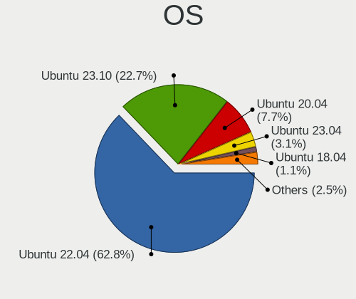

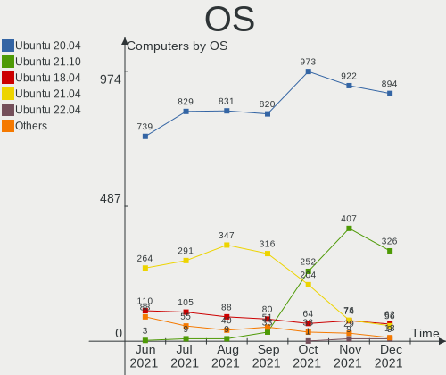

| Name           | Computers | Percent |
|----------------|-----------|---------|
| Ubuntu 18.04   | 641       | 60.07%  |
| Ubuntu 19.10   | 292       | 27.37%  |
| Ubuntu 19.04   | 58        | 5.44%   |
| Ubuntu 16.04   | 51        | 4.78%   |
| Ubuntu 20.04   | 14        | 1.31%   |
| Ubuntu 18.10   | 8         | 0.75%   |
| Ubuntu Core 18 | 1         | 0.09%   |
| Ubuntu 6.0     | 1         | 0.09%   |
| Ubuntu 17.10   | 1         | 0.09%   |

OS Family
---------

OS without a version

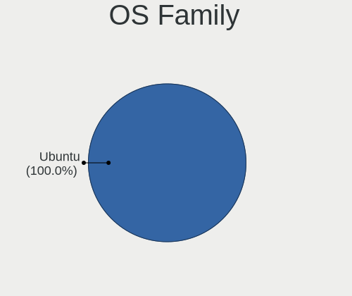

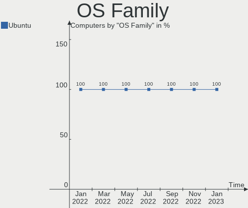

| Name   | Computers | Percent |
|--------|-----------|---------|
| Ubuntu | 1067      | 100%    |

Kernel
------

Version of the Linux kernel

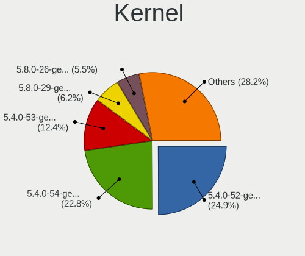

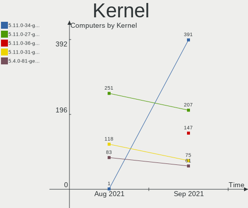

| Version               | Computers | Percent |
|-----------------------|-----------|---------|
| 5.0.0-37-generic      | 325       | 30.46%  |
| 5.3.0-24-generic      | 199       | 18.65%  |
| 4.15.0-72-generic     | 138       | 12.93%  |
| 5.0.0-36-generic      | 60        | 5.62%   |
| 5.0.0-23-generic      | 36        | 3.37%   |
| 5.3.0-23-generic      | 34        | 3.19%   |
| 4.15.0-70-generic     | 27        | 2.53%   |
| 5.3.0-18-generic      | 25        | 2.34%   |
| 5.3.0-26-generic      | 17        | 1.59%   |
| 5.3.0-25-generic      | 16        | 1.5%    |
| 5.0.0-32-generic      | 11        | 1.03%   |
| 4.4.0-170-generic     | 9         | 0.84%   |
| 4.15.0-73-generic     | 9         | 0.84%   |
| 4.15.0-29-generic     | 9         | 0.84%   |
| 4.18.0-25-generic     | 7         | 0.66%   |
| 4.15.0-72-lowlatency  | 6         | 0.56%   |
| 4.15.0-66-generic     | 6         | 0.56%   |
| 4.15.0-20-generic     | 6         | 0.56%   |
| 4.15.0-1065-oem       | 6         | 0.56%   |
| 5.3.0-24-lowlatency   | 5         | 0.47%   |
| 5.0.0-13-generic      | 5         | 0.47%   |
| 4.15.0-55-generic     | 5         | 0.47%   |
| 5.4.0-050400-generic  | 4         | 0.37%   |
| 5.0.0-27-generic      | 4         | 0.37%   |
| 4.18.0-15-generic     | 4         | 0.37%   |
| 4.15.0-74-generic     | 4         | 0.37%   |
| 4.15.0-60-generic     | 4         | 0.37%   |
| 4.15.0-45-generic     | 4         | 0.37%   |
| 5.0.0-38-generic      | 3         | 0.28%   |
| 5.4.5-050405-generic  | 2         | 0.19%   |
| 5.4.1-050401-generic  | 2         | 0.19%   |
| 5.3.0-7625-generic    | 2         | 0.19%   |
| 5.3.0-22-generic      | 2         | 0.19%   |
| 5.3.0-20-generic      | 2         | 0.19%   |
| 5.3.0-19-generic      | 2         | 0.19%   |
| 5.3.0-1014-raspi2     | 2         | 0.19%   |
| 5.0.0-29-generic      | 2         | 0.19%   |
| 5.0.0-1016-oem-osp1   | 2         | 0.19%   |
| 4.9.140-tegra         | 2         | 0.19%   |
| 4.4.0-166-generic     | 2         | 0.19%   |
| 4.4.0-164-generic     | 2         | 0.19%   |
| 4.15.0-64-generic     | 2         | 0.19%   |
| 4.15.0-58-generic     | 2         | 0.19%   |
| 4.15.0-23-generic     | 2         | 0.19%   |
| 5.4.2-050402-generic  | 1         | 0.09%   |
| 5.4.0-9-generic       | 1         | 0.09%   |
| 5.4.0-2-generic       | 1         | 0.09%   |
| 5.3.15-050315-generic | 1         | 0.09%   |
| 5.3.12-050312-generic | 1         | 0.09%   |
| 5.3.1-050301-generic  | 1         | 0.09%   |
| 5.3.0-26-lowlatency   | 1         | 0.09%   |
| 5.3.0-23-lowlatency   | 1         | 0.09%   |
| 5.3.0-1015-raspi2     | 1         | 0.09%   |
| 5.3.0-1007-raspi2     | 1         | 0.09%   |
| 5.3.0-1007-oracle     | 1         | 0.09%   |
| 5.0.21-050021-generic | 1         | 0.09%   |
| 5.0.0-31-generic      | 1         | 0.09%   |
| 5.0.0-25-generic      | 1         | 0.09%   |
| 5.0.0-16-generic      | 1         | 0.09%   |
| 5.0.0-15-generic      | 1         | 0.09%   |

Kernel Family
-------------

Linux kernel without a distro release

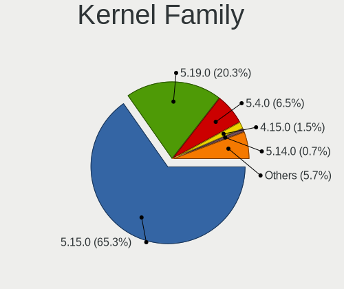

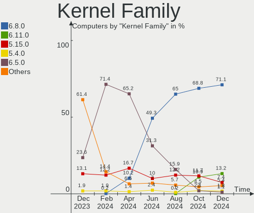

| Version | Computers | Percent |
|---------|-----------|---------|
| 5.0.0   | 453       | 42.46%  |
| 5.3.0   | 311       | 29.15%  |
| 4.15.0  | 245       | 22.96%  |
| 4.4.0   | 19        | 1.78%   |
| 4.18.0  | 14        | 1.31%   |
| 5.4.0   | 6         | 0.56%   |
| 5.4.5   | 2         | 0.19%   |
| 5.4.1   | 2         | 0.19%   |
| 4.9.140 | 2         | 0.19%   |
| 4.15.18 | 2         | 0.19%   |
| 4.13.0  | 2         | 0.19%   |
| 5.4.2   | 1         | 0.09%   |
| 5.3.15  | 1         | 0.09%   |
| 5.3.12  | 1         | 0.09%   |
| 5.3.1   | 1         | 0.09%   |
| 5.0.21  | 1         | 0.09%   |
| 4.8.17  | 1         | 0.09%   |
| 4.8.0   | 1         | 0.09%   |
| 4.19.3  | 1         | 0.09%   |
| 4.16.18 | 1         | 0.09%   |

Kernel Major Ver.
-----------------

Linux kernel major version

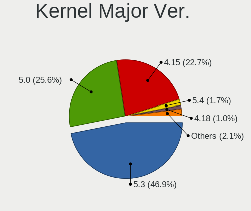

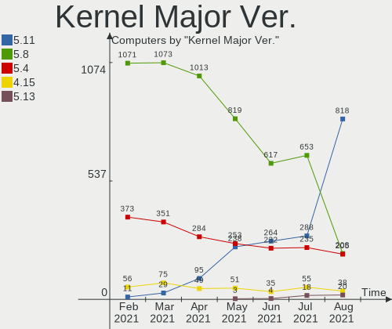

| Version | Computers | Percent |
|---------|-----------|---------|
| 5.0     | 454       | 42.55%  |
| 5.3     | 314       | 29.43%  |
| 4.15    | 247       | 23.15%  |
| 4.4     | 19        | 1.78%   |
| 4.18    | 14        | 1.31%   |
| 5.4     | 11        | 1.03%   |
| 4.9     | 2         | 0.19%   |
| 4.8     | 2         | 0.19%   |
| 4.13    | 2         | 0.19%   |
| 4.19    | 1         | 0.09%   |
| 4.16    | 1         | 0.09%   |

Arch
----

OS architecture (x86_64, i586, etc.)

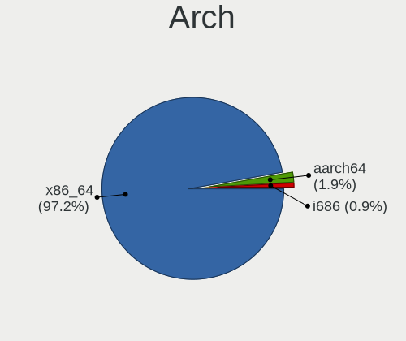

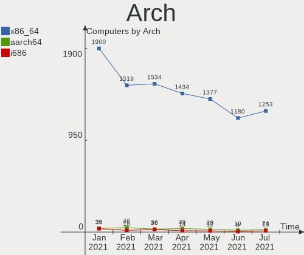

| Name    | Computers | Percent |
|---------|-----------|---------|
| x86_64  | 992       | 92.97%  |
| i686    | 69        | 6.47%   |
| aarch64 | 6         | 0.56%   |

DE
--

Desktop Environment

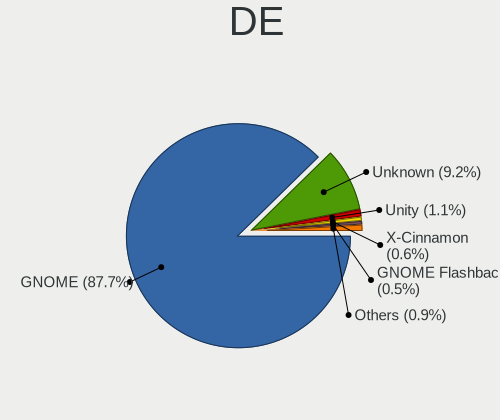

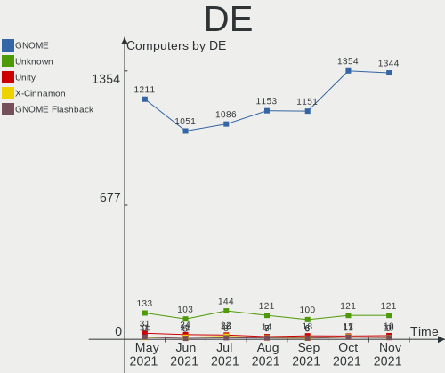

| Name                      | Computers | Percent |
|---------------------------|-----------|---------|
| GNOME                     | 642       | 60.17%  |
| Unknown                   | 220       | 20.62%  |
| XFCE                      | 84        | 7.87%   |
| Unity                     | 39        | 3.66%   |
| MATE                      | 24        | 2.25%   |
| KDE                       | 17        | 1.59%   |
| X-Cinnamon                | 11        | 1.03%   |
| LXQt                      | 8         | 0.75%   |
| Cinnamon                  | 5         | 0.47%   |
| communitheme:ubuntu:GNOME | 4         | 0.37%   |
| LXDE                      | 3         | 0.28%   |
| GNOME Flashback           | 3         | 0.28%   |
| Budgie                    | 3         | 0.28%   |
| GNOME-Classic:GNOME       | 2         | 0.19%   |
| openbox                   | 1         | 0.09%   |
| Lubuntu                   | 1         | 0.09%   |

Display Server
--------------

X11 or Wayland

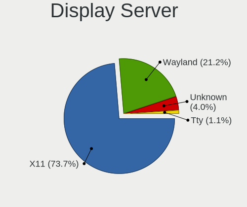

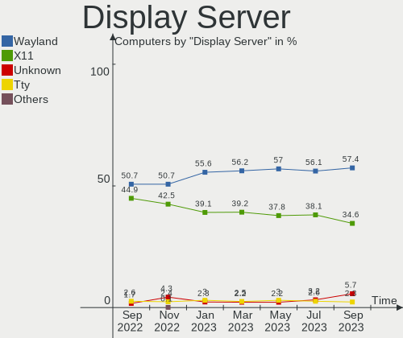

| Name    | Computers | Percent |
|---------|-----------|---------|
| X11     | 765       | 71.7%   |
| Unknown | 289       | 27.09%  |
| Wayland | 12        | 1.12%   |
| Tty     | 1         | 0.09%   |

OS Lang
-------

Language

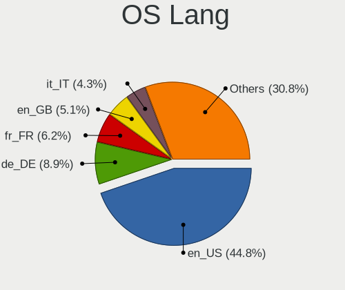

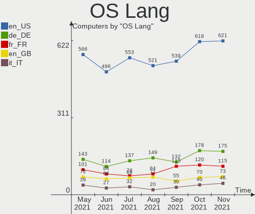

| Lang    | Computers | Percent |
|---------|-----------|---------|
| en_US   | 347       | 32.52%  |
| Unknown | 91        | 8.53%   |
| de_DE   | 89        | 8.34%   |
| pt_BR   | 55        | 5.15%   |
| en_GB   | 53        | 4.97%   |
| ru_RU   | 52        | 4.87%   |
| it_IT   | 50        | 4.69%   |
| es_ES   | 38        | 3.56%   |
| fr_FR   | 34        | 3.19%   |
| C       | 23        | 2.16%   |
| pl_PL   | 22        | 2.06%   |
| en_IN   | 22        | 2.06%   |
| en_CA   | 19        | 1.78%   |
| en_AU   | 13        | 1.22%   |
| es_MX   | 10        | 0.94%   |
| tr_TR   | 9         | 0.84%   |
| nl_NL   | 8         | 0.75%   |
| de_CH   | 8         | 0.75%   |
| pt_PT   | 7         | 0.66%   |
| ru_UA   | 6         | 0.56%   |
| ja_JP   | 6         | 0.56%   |
| hu_HU   | 6         | 0.56%   |
| en_ZA   | 6         | 0.56%   |
| de_AT   | 6         | 0.56%   |
| nl_BE   | 5         | 0.47%   |
| zh_CN   | 4         | 0.37%   |
| sv_SE   | 4         | 0.37%   |
| sk_SK   | 4         | 0.37%   |
| fr_BE   | 4         | 0.37%   |
| fi_FI   | 4         | 0.37%   |
| el_GR   | 4         | 0.37%   |
| bg_BG   | 4         | 0.37%   |
| zh_TW   | 3         | 0.28%   |
| uk_UA   | 3         | 0.28%   |
| nb_NO   | 3         | 0.28%   |
| es_CL   | 3         | 0.28%   |
| es_AR   | 3         | 0.28%   |
| en_IE   | 3         | 0.28%   |
| da_DK   | 3         | 0.28%   |
| cs_CZ   | 3         | 0.28%   |
| ca_ES   | 3         | 0.28%   |
| ko_KR   | 2         | 0.19%   |
| fr_CH   | 2         | 0.19%   |
| fr_CA   | 2         | 0.19%   |
| es_CO   | 2         | 0.19%   |
| en_NZ   | 2         | 0.19%   |
| en_IN   | 2         | 0.19%   |
| en_IL   | 2         | 0.19%   |
| en_HK   | 2         | 0.19%   |
| zh_HK   | 1         | 0.09%   |
| sl_SI   | 1         | 0.09%   |
| ro_RO   | 1         | 0.09%   |
| id_ID   | 1         | 0.09%   |
| hr_HR   | 1         | 0.09%   |
| et_EE   | 1         | 0.09%   |
| es_VE   | 1         | 0.09%   |
| es_PE   | 1         | 0.09%   |
| es_NI   | 1         | 0.09%   |
| en_SG   | 1         | 0.09%   |
| en_NG   | 1         | 0.09%   |

Boot Mode
---------

EFI or BIOS

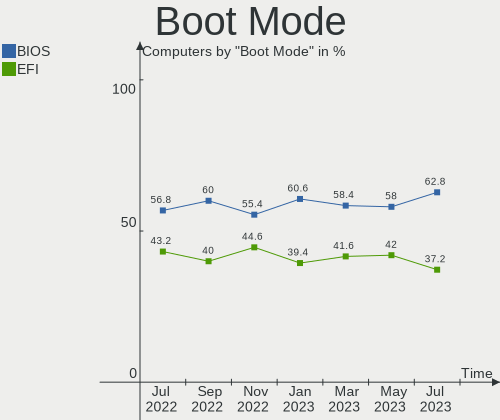

| Mode | Computers | Percent |
|------|-----------|---------|
| BIOS | 587       | 55.01%  |
| EFI  | 480       | 44.99%  |

Filesystem
----------

Type of filesystem

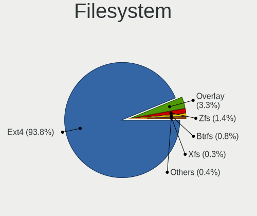

| Type    | Computers | Percent |
|---------|-----------|---------|
| Ext4    | 995       | 93.25%  |
| Overlay | 41        | 3.84%   |
| Btrfs   | 15        | 1.41%   |
| Xfs     | 5         | 0.47%   |
| Ext2    | 5         | 0.47%   |
| Zfs     | 3         | 0.28%   |
| Rootfs  | 1         | 0.09%   |
| Jfs     | 1         | 0.09%   |
| Ext3    | 1         | 0.09%   |

Dual Boot with Linux
--------------------

Hosting more than one Linux

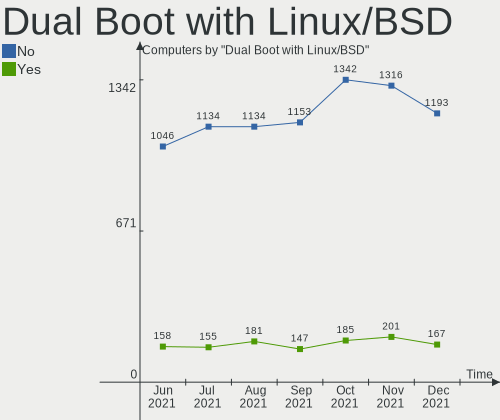

| Dual boot | Computers | Percent |
|-----------|-----------|---------|
| No        | 944       | 88.47%  |
| Yes       | 123       | 11.53%  |

Dual Boot (Win)
---------------

Hosting Linux and Windows

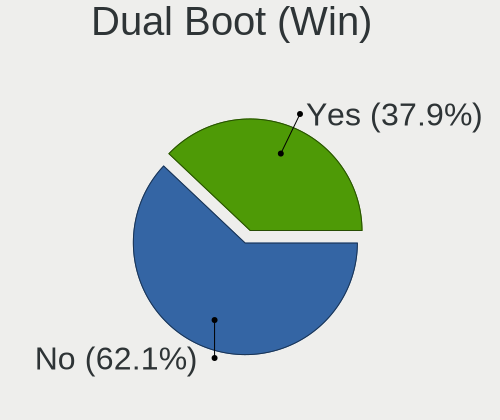

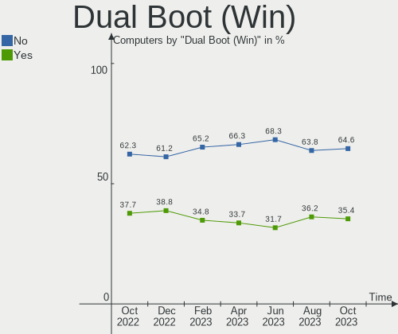

| Dual boot | Computers | Percent |
|-----------|-----------|---------|
| No        | 674       | 63.17%  |
| Yes       | 393       | 36.83%  |

Country
-------

Geographic location (country)

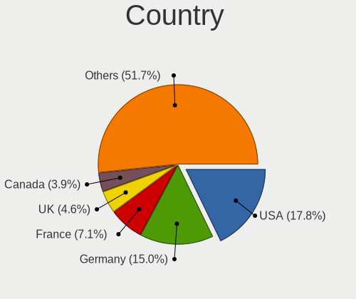

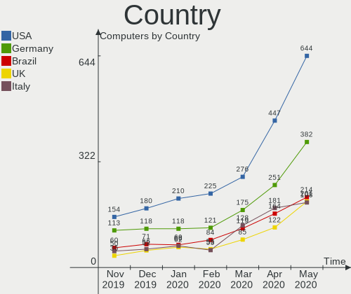

| Country            | Computers | Percent |
|--------------------|-----------|---------|
| USA                | 181       | 16.96%  |
| Germany            | 119       | 11.15%  |
| Brazil             | 71        | 6.65%   |
| Russia             | 69        | 6.47%   |
| Italy              | 56        | 5.25%   |
| UK                 | 52        | 4.87%   |
| France             | 45        | 4.22%   |
| Spain              | 43        | 4.03%   |
| India              | 34        | 3.19%   |
| Poland             | 29        | 2.72%   |
| Canada             | 23        | 2.16%   |
| Netherlands        | 21        | 1.97%   |
| Ukraine            | 20        | 1.87%   |
| Switzerland        | 16        | 1.5%    |
| Australia          | 16        | 1.5%    |
| Mexico             | 14        | 1.31%   |
| Turkey             | 11        | 1.03%   |
| Hungary            | 11        | 1.03%   |
| Belgium            | 11        | 1.03%   |
| Sweden             | 10        | 0.94%   |
| Portugal           | 10        | 0.94%   |
| Japan              | 10        | 0.94%   |
| Romania            | 9         | 0.84%   |
| Czech Republic     | 9         | 0.84%   |
| Bulgaria           | 9         | 0.84%   |
| Greece             | 8         | 0.75%   |
| Finland            | 8         | 0.75%   |
| Austria            | 8         | 0.75%   |
| South Africa       | 7         | 0.66%   |
| Denmark            | 7         | 0.66%   |
| China              | 7         | 0.66%   |
| Slovakia           | 5         | 0.47%   |
| Singapore          | 5         | 0.47%   |
| Colombia           | 5         | 0.47%   |
| Taiwan             | 4         | 0.37%   |
| Serbia             | 4         | 0.37%   |
| Norway             | 4         | 0.37%   |
| Malaysia           | 4         | 0.37%   |
| Ireland            | 4         | 0.37%   |
| Indonesia          | 4         | 0.37%   |
| Croatia            | 4         | 0.37%   |
| Belarus            | 4         | 0.37%   |
| Thailand           | 3         | 0.28%   |
| Lithuania          | 3         | 0.28%   |
| Korea, Republic of | 3         | 0.28%   |
| Israel             | 3         | 0.28%   |
| Iran               | 3         | 0.28%   |
| Hong Kong          | 3         | 0.28%   |
| Ethiopia           | 3         | 0.28%   |
| Estonia            | 3         | 0.28%   |
| Egypt              | 3         | 0.28%   |
| Cyprus             | 3         | 0.28%   |
| Chile              | 3         | 0.28%   |
| Bangladesh         | 3         | 0.28%   |
| Argentina          | 3         | 0.28%   |
| Tunisia            | 2         | 0.19%   |
| Philippines        | 2         | 0.19%   |
| New Zealand        | 2         | 0.19%   |
| Latvia             | 2         | 0.19%   |
| Kenya              | 2         | 0.19%   |

City
----

Geographic location (city)

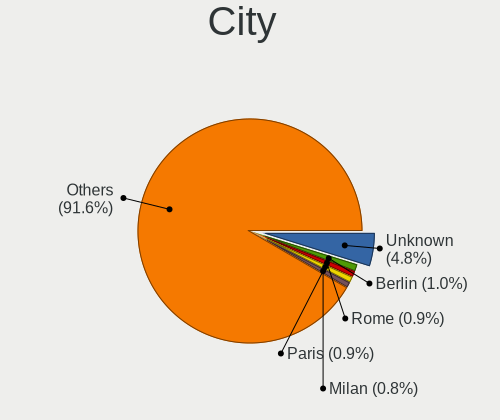

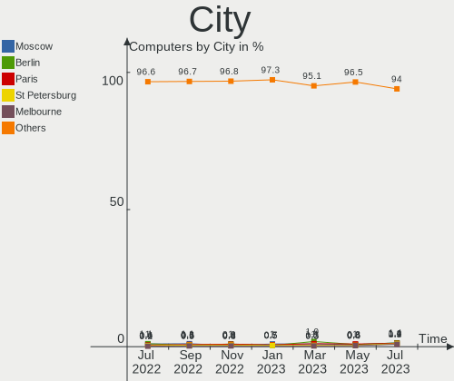

| City               | Computers | Percent |
|--------------------|-----------|---------|
| Moscow             | 20        | 1.87%   |
| São Paulo         | 12        | 1.12%   |
| Berlin             | 11        | 1.03%   |
| Munich             | 9         | 0.84%   |
| St Petersburg      | 8         | 0.75%   |
| Paris              | 8         | 0.75%   |
| Rome               | 7         | 0.66%   |
| Fortaleza          | 7         | 0.66%   |
| Kyiv               | 6         | 0.56%   |
| Warsaw             | 5         | 0.47%   |
| Vienna             | 5         | 0.47%   |
| Singapore          | 5         | 0.47%   |
| Mumbai             | 5         | 0.47%   |
| Krakow             | 5         | 0.47%   |
| Hamburg            | 5         | 0.47%   |
| Chicago            | 5         | 0.47%   |
| Bengaluru          | 5         | 0.47%   |
| Belo Horizonte     | 5         | 0.47%   |
| Zaragoza           | 4         | 0.37%   |
| Sofia              | 4         | 0.37%   |
| Osasco             | 4         | 0.37%   |
| Montreal           | 4         | 0.37%   |
| Leipzig            | 4         | 0.37%   |
| Budapest           | 4         | 0.37%   |
| Bucharest          | 4         | 0.37%   |
| Braunschweig       | 4         | 0.37%   |
| Athens             | 4         | 0.37%   |
| Zurich             | 3         | 0.28%   |
| Zagreb             | 3         | 0.28%   |
| Vilnius            | 3         | 0.28%   |
| Tehran             | 3         | 0.28%   |
| Rostov-on-Don      | 3         | 0.28%   |
| Rio de Janeiro     | 3         | 0.28%   |
| Pittsburgh         | 3         | 0.28%   |
| Nuremberg          | 3         | 0.28%   |
| Minsk              | 3         | 0.28%   |
| Milan              | 3         | 0.28%   |
| Mexico City        | 3         | 0.28%   |
| Lyon               | 3         | 0.28%   |
| Lviv               | 3         | 0.28%   |
| Krasnodar          | 3         | 0.28%   |
| Houston            | 3         | 0.28%   |
| Florence           | 3         | 0.28%   |
| Dhaka              | 3         | 0.28%   |
| Campinas           | 3         | 0.28%   |
| Bologna            | 3         | 0.28%   |
| Balham             | 3         | 0.28%   |
| Amsterdam          | 3         | 0.28%   |
| Addis Ababa        | 3         | 0.28%   |
| Çanakkale         | 2         | 0.19%   |
| Yakutsk            | 2         | 0.19%   |
| Wrocław           | 2         | 0.19%   |
| Wahroonga          | 2         | 0.19%   |
| Varna              | 2         | 0.19%   |
| Vaasa              | 2         | 0.19%   |
| Turin              | 2         | 0.19%   |
| Treviso            | 2         | 0.19%   |
| Torrejón de Ardoz | 2         | 0.19%   |
| Toronto            | 2         | 0.19%   |
| Tel Aviv           | 2         | 0.19%   |

Vendor
------

Motherboard manufacturer

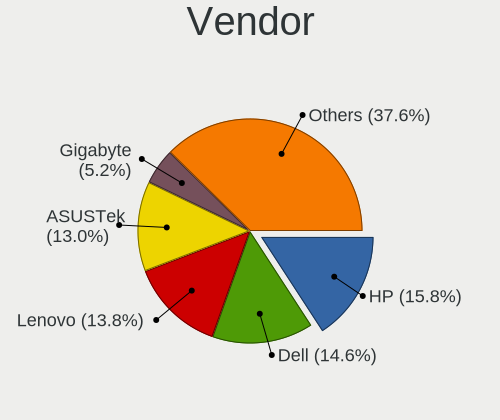

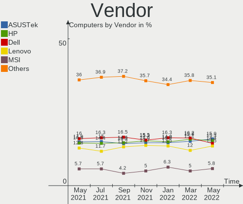

| Name                     | Computers | Percent |
|--------------------------|-----------|---------|
| ASUSTek Computer         | 158       | 14.81%  |
| Lenovo                   | 150       | 14.06%  |
| Dell                     | 148       | 13.87%  |
| Hewlett-Packard          | 147       | 13.78%  |
| Gigabyte Technology      | 77        | 7.22%   |
| Acer                     | 64        | 6%      |
| MSI                      | 42        | 3.94%   |
| ASRock                   | 35        | 3.28%   |
| Intel                    | 23        | 2.16%   |
| Apple                    | 21        | 1.97%   |
| Toshiba                  | 20        | 1.87%   |
| Sony                     | 15        | 1.41%   |
| Samsung Electronics      | 10        | 0.94%   |
| Fujitsu                  | 10        | 0.94%   |
| Unknown                  | 10        | 0.94%   |
| Pegatron                 | 9         | 0.84%   |
| Notebook                 | 7         | 0.66%   |
| ECS                      | 7         | 0.66%   |
| Packard Bell             | 6         | 0.56%   |
| Gateway                  | 6         | 0.56%   |
| Supermicro               | 5         | 0.47%   |
| Medion                   | 5         | 0.47%   |
| Fujitsu Siemens          | 5         | 0.47%   |
| Foxconn                  | 5         | 0.47%   |
| Biostar                  | 4         | 0.37%   |
| TUXEDO                   | 3         | 0.28%   |
| Raspberry Pi Foundation  | 3         | 0.28%   |
| Positivo                 | 3         | 0.28%   |
| Microsoft                | 3         | 0.28%   |
| LG Electronics           | 3         | 0.28%   |
| Insyde                   | 3         | 0.28%   |
| HUAWEI                   | 3         | 0.28%   |
| eMachines                | 3         | 0.28%   |
| Akstron                  | 3         | 0.28%   |
| Timi                     | 2         | 0.19%   |
| Quanta                   | 2         | 0.19%   |
| Panasonic                | 2         | 0.19%   |
| Nvidia                   | 2         | 0.19%   |
| Multilaser Industrial SA | 2         | 0.19%   |
| Google                   | 2         | 0.19%   |
| Digma                    | 2         | 0.19%   |
| Clevo                    | 2         | 0.19%   |
| AMI                      | 2         | 0.19%   |
| Wortmann AG              | 1         | 0.09%   |
| whyopencomputing         | 1         | 0.09%   |
| VIT                      | 1         | 0.09%   |
| VIA Technologies         | 1         | 0.09%   |
| TriGem Computer          | 1         | 0.09%   |
| TrekStor                 | 1         | 0.09%   |
| System76                 | 1         | 0.09%   |
| SLIMBOOK                 | 1         | 0.09%   |
| Shuttle                  | 1         | 0.09%   |
| Phitronics               | 1         | 0.09%   |
| Philco                   | 1         | 0.09%   |
| PCWare                   | 1         | 0.09%   |
| OEM                      | 1         | 0.09%   |
| Novastar                 | 1         | 0.09%   |
| MEN                      | 1         | 0.09%   |
| Mediacom                 | 1         | 0.09%   |
| LDLC                     | 1         | 0.09%   |

Model
-----

Motherboard model

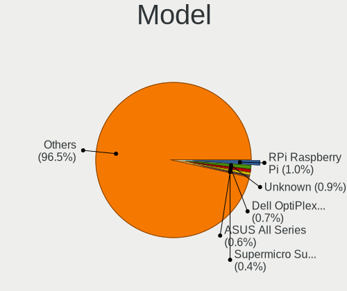

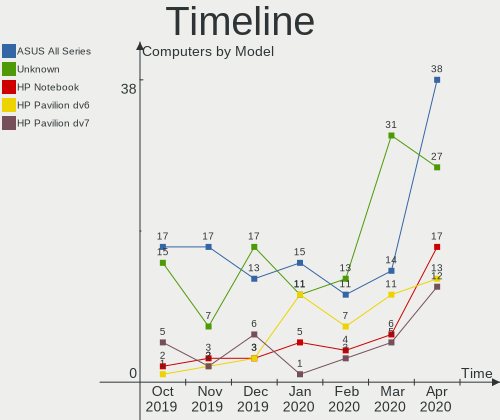

| Name                               | Computers | Percent |
|------------------------------------|-----------|---------|
| Unknown                            | 15        | 1.41%   |
| All Series                         | 13        | 1.22%   |
| Pavilion dv7                       | 6         | 0.56%   |
| Pavilion 15                        | 6         | 0.56%   |
| XPS 13 9380                        | 4         | 0.37%   |
| PRIME A320M-K                      | 4         | 0.37%   |
| Pavilion Notebook                  | 4         | 0.37%   |
| Laptop 15-da0xxx                   | 4         | 0.37%   |
| B450M DS3H                         | 4         | 0.37%   |
| XPS 15 9570                        | 3         | 0.28%   |
| Vostro 3550                        | 3         | 0.28%   |
| Pavilion dv6                       | 3         | 0.28%   |
| P8Z68-V PRO                        | 3         | 0.28%   |
| OptiPlex 7010                      | 3         | 0.28%   |
| NUC8i3BEH                          | 3         | 0.28%   |
| Notebook                           | 3         | 0.28%   |
| MS-7C37                            | 3         | 0.28%   |
| MacBookPro8,1                      | 3         | 0.28%   |
| Inspiron 7520                      | 3         | 0.28%   |
| IdeaPad 330-15AST 81D6             | 3         | 0.28%   |
| H310M S2H 2.0                      | 3         | 0.28%   |
| G50-70 20351                       | 3         | 0.28%   |
| G1417                              | 3         | 0.28%   |
| ENVY 17                            | 3         | 0.28%   |
| Aspire E5-553G                     | 3         | 0.28%   |
| 255 G7 Notebook PC                 | 3         | 0.28%   |
| Z50-70 20354                       | 2         | 0.19%   |
| Z170-A                             | 2         | 0.19%   |
| Y720-15IKB 80VR                    | 2         | 0.19%   |
| X570 AORUS MASTER                  | 2         | 0.19%   |
| X556UQK                            | 2         | 0.19%   |
| X551MA                             | 2         | 0.19%   |
| UX490UA                            | 2         | 0.19%   |
| ThinkPad X240 20AMA1R5US           | 2         | 0.19%   |
| ThinkPad X1 Extreme 2nd 20QVCTO1WW | 2         | 0.19%   |
| ThinkPad X1 Carbon 7th 20QDCTO1WW  | 2         | 0.19%   |
| Tegra                              | 2         | 0.19%   |
| Studio 1558                        | 2         | 0.19%   |
| Raspberry Pi 4 Model B Rev 1.1     | 2         | 0.19%   |
| Raicila                            | 2         | 0.19%   |
| PRIME Z370-P                       | 2         | 0.19%   |
| PRIME B450M-A                      | 2         | 0.19%   |
| Precision WorkStation T7500        | 2         | 0.19%   |
| Pavilion g7                        | 2         | 0.19%   |
| Pavilion 17                        | 2         | 0.19%   |
| P6T                                | 2         | 0.19%   |
| OptiPlex 780                       | 2         | 0.19%   |
| NUC7CJYH                           | 2         | 0.19%   |
| N68-VS3 FX                         | 2         | 0.19%   |
| MS-7B89                            | 2         | 0.19%   |
| MS-7A38                            | 2         | 0.19%   |
| MS-7996                            | 2         | 0.19%   |
| MS-7982                            | 2         | 0.19%   |
| MS-7641                            | 2         | 0.19%   |
| MACH-WX9                           | 2         | 0.19%   |
| MacBookPro5,5                      | 2         | 0.19%   |
| M5A99FX PRO R2.0                   | 2         | 0.19%   |
| M5A78L-M LE/USB3                   | 2         | 0.19%   |
| Latitude E6540                     | 2         | 0.19%   |
| Latitude E6420                     | 2         | 0.19%   |

Model Family
------------

Motherboard model prefix

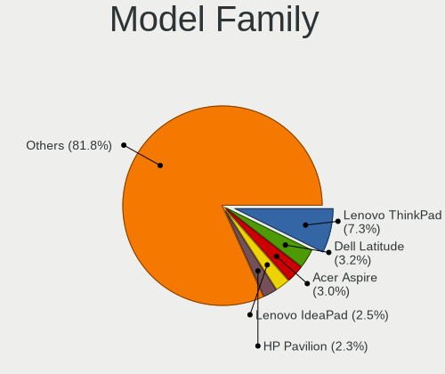

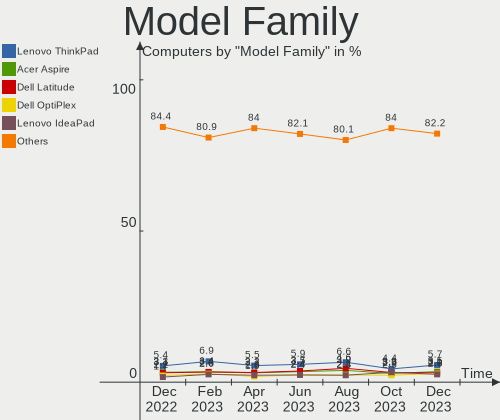

| Name                  | Computers | Percent |
|-----------------------|-----------|---------|
| Lenovo ThinkPad       | 72        | 6.75%   |
| Dell Inspiron         | 56        | 5.25%   |
| Acer Aspire           | 50        | 4.69%   |
| HP Pavilion           | 36        | 3.37%   |
| Dell Latitude         | 29        | 2.72%   |
| Lenovo IdeaPad        | 25        | 2.34%   |
| ASUS PRIME            | 19        | 1.78%   |
| Toshiba Satellite     | 18        | 1.69%   |
| HP Laptop             | 18        | 1.69%   |
| HP ProBook            | 17        | 1.59%   |
| HP EliteBook          | 17        | 1.59%   |
| HP Compaq             | 17        | 1.59%   |
| Unknown               | 17        | 1.59%   |
| Dell XPS              | 15        | 1.41%   |
| Dell OptiPlex         | 15        | 1.41%   |
| Dell Precision        | 14        | 1.31%   |
| ASUS All              | 13        | 1.22%   |
| HP ENVY               | 8         | 0.75%   |
| Lenovo ThinkCentre    | 7         | 0.66%   |
| Dell Vostro           | 6         | 0.56%   |
| ASUS TUF              | 6         | 0.56%   |
| Lenovo Yoga           | 5         | 0.47%   |
| Fujitsu LIFEBOOK      | 5         | 0.47%   |
| Dell Studio           | 5         | 0.47%   |
| ASUS ROG              | 5         | 0.47%   |
| ASUS M5A78L-M         | 5         | 0.47%   |
| Packard Bell EasyNote | 4         | 0.37%   |
| Lenovo IdeaCentre     | 4         | 0.37%   |
| Gigabyte B450M        | 4         | 0.37%   |
| Dell PowerEdge        | 4         | 0.37%   |
| ASUS P6T              | 4         | 0.37%   |
| RPi Raspberry         | 3         | 0.28%   |
| MSI MS-7C37           | 3         | 0.28%   |
| Microsoft Surface     | 3         | 0.28%   |
| Lenovo ThinkStation   | 3         | 0.28%   |
| Lenovo G50-70         | 3         | 0.28%   |
| Intel NUC8i3BEH       | 3         | 0.28%   |
| HP Notebook           | 3         | 0.28%   |
| HP 255                | 3         | 0.28%   |
| Gigabyte H310M        | 3         | 0.28%   |
| ASUS ZenBook          | 3         | 0.28%   |
| ASUS P8Z68-V          | 3         | 0.28%   |
| ASUS P8H61-M          | 3         | 0.28%   |
| Apple MacBookPro8     | 3         | 0.28%   |
| Apple MacBookPro5     | 3         | 0.28%   |
| Akstron G1417         | 3         | 0.28%   |
| Nvidia Tegra          | 2         | 0.19%   |
| Notebook P65          | 2         | 0.19%   |
| MSI MS-7B89           | 2         | 0.19%   |
| MSI MS-7A38           | 2         | 0.19%   |
| MSI MS-7996           | 2         | 0.19%   |
| MSI MS-7982           | 2         | 0.19%   |
| MSI MS-7641           | 2         | 0.19%   |
| Lenovo Z50-70         | 2         | 0.19%   |
| Lenovo Y720-15IKB     | 2         | 0.19%   |
| Lenovo Legion         | 2         | 0.19%   |
| Lenovo G580           | 2         | 0.19%   |
| Lenovo B560           | 2         | 0.19%   |
| Intel NUC7CJYH        | 2         | 0.19%   |
| Insyde Raicila        | 2         | 0.19%   |

MFG Year
--------

Motherboard manufacture year

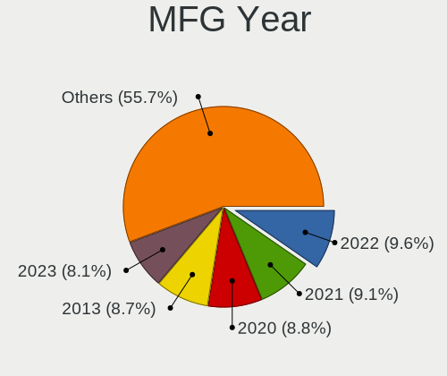

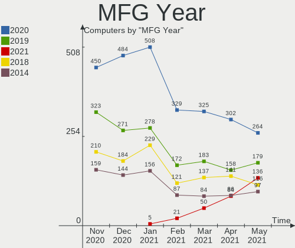

| Year    | Computers | Percent |
|---------|-----------|---------|
| 2019    | 191       | 17.9%   |
| 2018    | 152       | 14.25%  |
| 2011    | 94        | 8.81%   |
| 2014    | 77        | 7.22%   |
| 2016    | 73        | 6.84%   |
| 2010    | 73        | 6.84%   |
| 2013    | 72        | 6.75%   |
| 2012    | 71        | 6.65%   |
| 2017    | 66        | 6.19%   |
| 2009    | 51        | 4.78%   |
| 2015    | 50        | 4.69%   |
| 2008    | 41        | 3.84%   |
| 2007    | 25        | 2.34%   |
| 2006    | 14        | 1.31%   |
| 2005    | 7         | 0.66%   |
| Unknown | 6         | 0.56%   |
| 2003    | 2         | 0.19%   |
| 2002    | 2         | 0.19%   |

Form Factor
-----------

Physical design of the computer

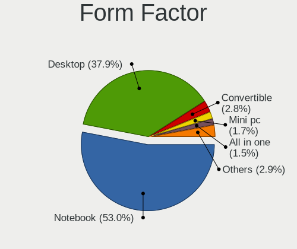

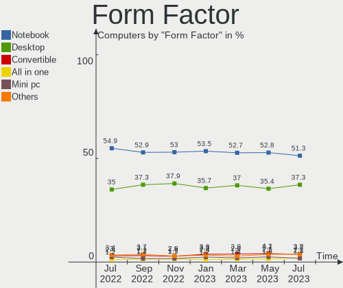

| Name           | Computers | Percent |
|----------------|-----------|---------|
| Notebook       | 582       | 54.55%  |
| Desktop        | 420       | 39.36%  |
| All in one     | 15        | 1.41%   |
| Convertible    | 14        | 1.31%   |
| Mini pc        | 14        | 1.31%   |
| Server         | 9         | 0.84%   |
| Tablet         | 7         | 0.66%   |
| System on chip | 6         | 0.56%   |

Secure Boot
-----------

Enabled or disabled

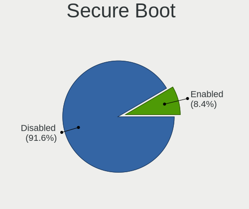

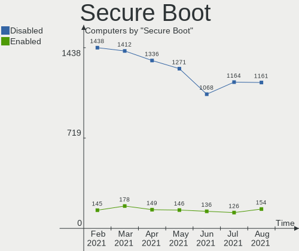

| State    | Computers | Percent |
|----------|-----------|---------|
| Disabled | 800       | 74.98%  |
| Unknown  | 174       | 16.31%  |
| Enabled  | 93        | 8.72%   |

Coreboot
--------

Have coreboot on board

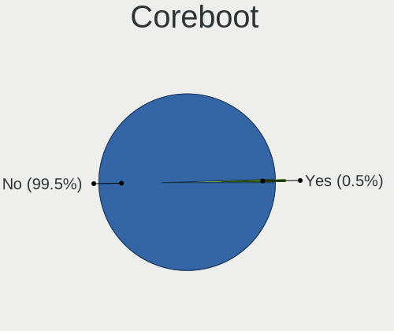

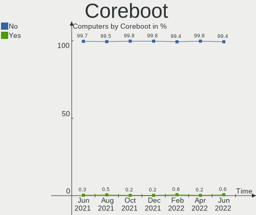

| Used | Computers | Percent |
|------|-----------|---------|
| No   | 1063      | 99.63%  |
| Yes  | 4         | 0.37%   |

RAM Size
--------

Total RAM memory

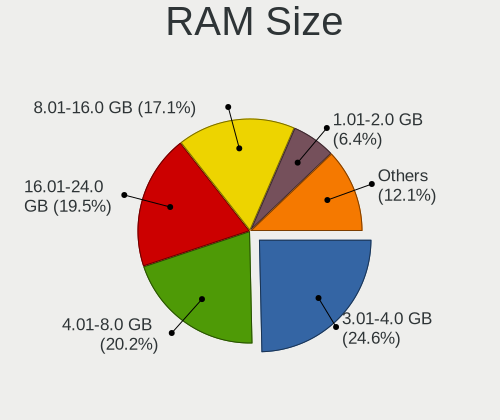

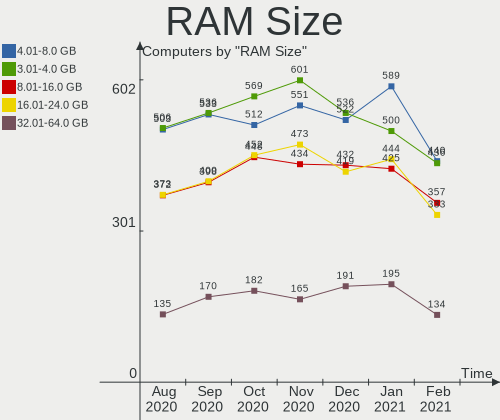

| Size in GB      | Computers | Percent |
|-----------------|-----------|---------|
| 3.01-4.0        | 282       | 26.43%  |
| 4.01-8.0        | 220       | 20.62%  |
| 8.01-16.0       | 219       | 20.52%  |
| 16.01-24.0      | 159       | 14.9%   |
| 1.01-2.0        | 67        | 6.28%   |
| 32.01-64.0      | 57        | 5.34%   |
| 64.01-256.0     | 22        | 2.06%   |
| 2.01-3.0        | 18        | 1.69%   |
| 0.01-1.0        | 14        | 1.31%   |
| 24.01-32.0      | 8         | 0.75%   |
| More than 256.0 | 1         | 0.09%   |

RAM Used
--------

Used RAM memory

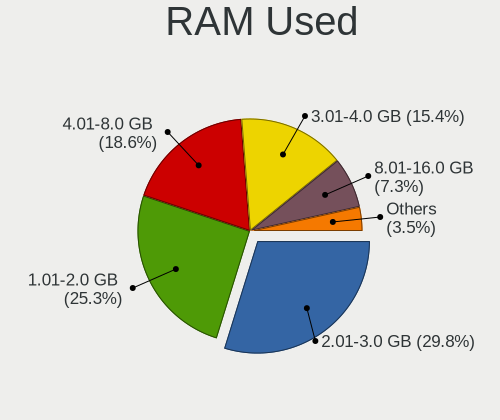

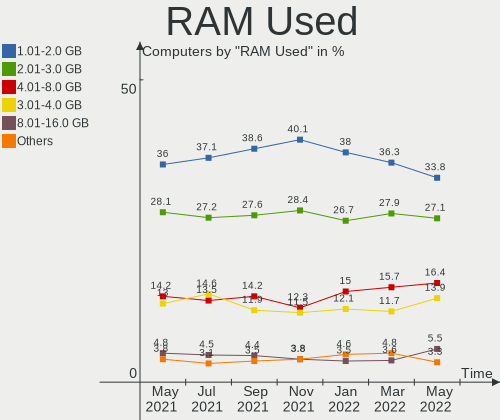

| Used GB    | Computers | Percent |
|------------|-----------|---------|
| 1.01-2.0   | 445       | 41.71%  |
| 2.01-3.0   | 278       | 26.05%  |
| 3.01-4.0   | 119       | 11.15%  |
| 4.01-8.0   | 104       | 9.75%   |
| 0.01-1.0   | 93        | 8.72%   |
| 8.01-16.0  | 24        | 2.25%   |
| 32.01-64.0 | 1         | 0.09%   |
| 24.01-32.0 | 1         | 0.09%   |
| 16.01-24.0 | 1         | 0.09%   |
| 0          | 1         | 0.09%   |

Drive Vendor
------------

Hard drive vendors

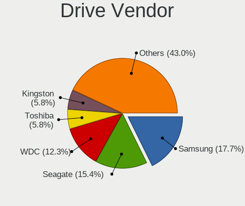

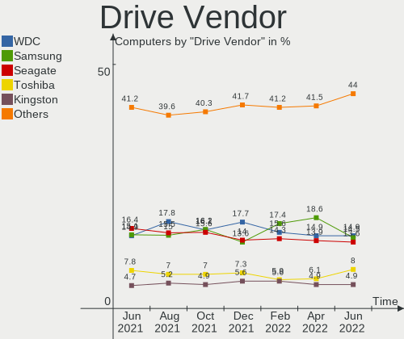

| Vendor              | Computers | Drives  | Percent |
|---------------------|-----------|---------|---------|
| Seagate             | 275       | 315     | 20.54%  |
| WDC                 | 247       | 283     | 18.45%  |
| Samsung Electronics | 185       | 200     | 13.82%  |
| Toshiba             | 110       | 113     | 8.22%   |
| Kingston            | 70        | 73      | 5.23%   |
| Hitachi             | 69        | 70      | 5.15%   |
| Unknown             | 59        | 68      | 4.41%   |
| SanDisk             | 42        | 46      | 3.14%   |
| Intel               | 38        | 39      | 2.84%   |
| Crucial             | 38        | 38      | 2.84%   |
| HGST                | 28        | 28      | 2.09%   |
| A-DATA Technology   | 15        | 15      | 1.12%   |
| China               | 11        | 11      | 0.82%   |
| SK Hynix            | 8         | 8       | 0.6%    |
| PNY                 | 8         | 8       | 0.6%    |
| OCZ                 | 8         | 8       | 0.6%    |
| Micron Technology   | 8         | 8       | 0.6%    |
| Fujitsu             | 7         | 7       | 0.52%   |
| Apple               | 7         | 7       | 0.52%   |
| SPCC                | 6         | 6       | 0.45%   |
| Maxtor              | 6         | 6       | 0.45%   |
| LITEON              | 6         | 6       | 0.45%   |
| Generic             | 6         | 6       | 0.45%   |
| Transcend           | 5         | 5       | 0.37%   |
| KingDian            | 5         | 5       | 0.37%   |
| Intenso             | 5         | 6       | 0.37%   |
| Patriot             | 4         | 4       | 0.3%    |
| LITEONIT            | 4         | 4       | 0.3%    |
| Team                | 3         | 3       | 0.22%   |
| PLEXTOR             | 3         | 2       | 0.22%   |
| Hewlett-Packard     | 3         | 3       | 0.22%   |
| GOODRAM             | 3         | 3       | 0.22%   |
| DREVO               | 3         | 3       | 0.22%   |
| Corsair             | 3         | 3       | 0.22%   |
| ASMT                | 3         | 4       | 0.22%   |
| Apacer              | 3         | 3       | 0.22%   |
| Vi550               | 2         | 2       | 0.15%   |
| Phison              | 2         | 2       | 0.15%   |
| KingSpec            | 2         | 2       | 0.15%   |
| HL-DT-ST            | 2         | Unknown | 0.15%   |
| ExcelStor           | 2         | 2       | 0.15%   |
| XPG                 | 1         | 1       | 0.07%   |
| WDC WD75            | 1         | 1       | 0.07%   |
| WDC WD10            | 1         | 1       | 0.07%   |
| USB                 | 1         | 1       | 0.07%   |
| Union Memory        | 1         | 1       | 0.07%   |
| TrekStor            | 1         | 1       | 0.07%   |
| Sony                | 1         | 1       | 0.07%   |
| sobetter            | 1         | 1       | 0.07%   |
| SMART               | 1         | 1       | 0.07%   |
| ORGE                | 1         | 1       | 0.07%   |
| OCZ-VERTEX3         | 1         | 1       | 0.07%   |
| MemoCom             | 1         | 1       | 0.07%   |
| Maxtor 6            | 1         | 1       | 0.07%   |
| Longline            | 1         | 1       | 0.07%   |
| Lexar               | 1         | 1       | 0.07%   |
| LDLC                | 1         | 1       | 0.07%   |
| KINGMAX             | 1         | 1       | 0.07%   |
| KESU                | 1         | 1       | 0.07%   |
| JMicron             | 1         | 1       | 0.07%   |

Drive Model
-----------

Hard drive models

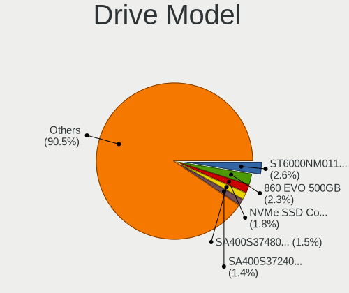

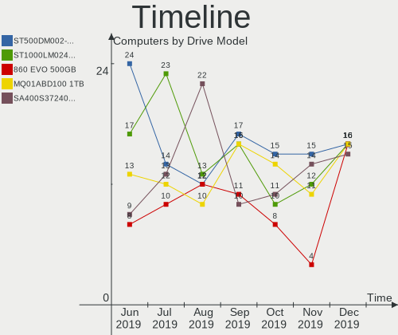

| Model                        | Computers | Percent |
|------------------------------|-----------|---------|
| ST500DM002-1BD142 500GB      | 16        | 1.1%    |
| ST1000LM024 HN-M101MBB 1TB   | 16        | 1.1%    |
| SSD 860 EVO 500GB            | 16        | 1.1%    |
| MQ01ABD100 1TB               | 16        | 1.1%    |
| SA400S37240G 240GB SSD       | 15        | 1.04%   |
| ST500LT012-1DG142 500GB      | 14        | 0.97%   |
| ST1000LM035-1RK172 1TB       | 14        | 0.97%   |
| SSD 850 EVO 250GB            | 13        | 0.9%    |
| SA400S37120G 120GB SSD       | 13        | 0.9%    |
| SSD 850 EVO 500GB            | 10        | 0.69%   |
| MQ01ABF050 500GB             | 10        | 0.69%   |
| WD10EZEX-08WN4A0 1TB         | 9         | 0.62%   |
| SV300S37A120G 120GB SSD      | 9         | 0.62%   |
| ST1000DM010-2EP102 1TB       | 9         | 0.62%   |
| ST1000DM003-1ER162 1TB       | 9         | 0.62%   |
| SSD 860 EVO 250GB            | 8         | 0.55%   |
| HTS545050A7E380 500GB        | 8         | 0.55%   |
| WDS240G2G0A-00JH30 240GB SSD | 7         | 0.48%   |
| ST2000DM001-1CH164 2TB       | 7         | 0.48%   |
| Expansion 2TB                | 7         | 0.48%   |
| DT01ACA100 1TB               | 7         | 0.48%   |
| SD/MMC/MS PRO 128GB          | 6         | 0.41%   |
| SATA 120GB SSD               | 6         | 0.41%   |
| SA400S37480G 480GB SSD       | 6         | 0.41%   |
| MQ04ABF100 1TB               | 6         | 0.41%   |
| MQ01ABD050 500GB             | 6         | 0.41%   |
| WD5000AAKX-00ERMA0 500GB     | 5         | 0.35%   |
| WD10SPZX-75Z10T2 1TB         | 5         | 0.35%   |
| ST500LM021-1KJ152 500GB      | 5         | 0.35%   |
| ST500LM012 HN-M500MBB 500GB  | 5         | 0.35%   |
| ST500LM000-1EJ162 500GB      | 5         | 0.35%   |
| ST3500418AS 500GB            | 5         | 0.35%   |
| ST31000528AS 1TB             | 5         | 0.35%   |
| ST2000DM006-2DM164 2TB       | 5         | 0.35%   |
| SSDPEKKF512G8L 512GB         | 5         | 0.35%   |
| SSD 860 EVO 1TB              | 5         | 0.35%   |
| SSD 830 Series 128GB         | 5         | 0.35%   |
| Solid State Disk 128GB       | 5         | 0.35%   |
| MQ01ABD075 750GB             | 5         | 0.35%   |
| HTS721010A9E630 1TB          | 5         | 0.35%   |
| HTS545050B9A300 500GB        | 5         | 0.35%   |
| HD161HJ 160GB                | 5         | 0.35%   |
| CT500MX500SSD1 500GB         | 5         | 0.35%   |
| WDS500G2B0A-00SM50 500GB SSD | 4         | 0.28%   |
| WD5000AAKX-001CA0 500GB      | 4         | 0.28%   |
| WD40EZRZ-00GXCB0 4TB         | 4         | 0.28%   |
| WD20EZRX-00D8PB0 2TB         | 4         | 0.28%   |
| WD10EZEX-08M2NA0 1TB         | 4         | 0.28%   |
| WD10EZEX-00BN5A0 1TB         | 4         | 0.28%   |
| WD10EARS-00Y5B1 1TB          | 4         | 0.28%   |
| ST9500325AS 500GB            | 4         | 0.28%   |
| ST9320423AS 320GB            | 4         | 0.28%   |
| ST750LM022 HN-M750MBB 750GB  | 4         | 0.28%   |
| ST500LT012-9WS142 500GB      | 4         | 0.28%   |
| ST3500312CS 500GB            | 4         | 0.28%   |
| ST3320620AS 320GB            | 4         | 0.28%   |
| ST31000524AS 1TB             | 4         | 0.28%   |
| ST3000DM001-1CH166 3TB       | 4         | 0.28%   |
| ST2000LM007-1R8174 2TB       | 4         | 0.28%   |
| ST1000DM003-1SB102 1TB       | 4         | 0.28%   |

Drive Kind
----------

HDD or SSD

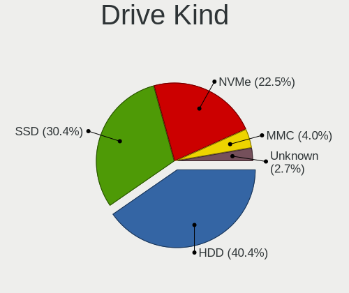

| Kind    | Computers | Drives | Percent |
|---------|-----------|--------|---------|
| HDD     | 670       | 850    | 55.69%  |
| SSD     | 400       | 450    | 33.25%  |
| MMC     | 59        | 71     | 4.9%    |
| NVMe    | 40        | 42     | 3.33%   |
| Unknown | 34        | 38     | 2.83%   |

Drive Connector
---------------

SATA, SAS, NVMe, etc.

| Type | Computers | Drives | Percent |
|------|-----------|--------|---------|
| SATA | 915       | 1290   | 86.73%  |
| MMC  | 59        | 71     | 5.59%   |
| SAS  | 41        | 48     | 3.89%   |
| NVMe | 40        | 42     | 3.79%   |

Drive Size
----------

Size of hard drive

| Size in TB | Computers | Drives | Percent |
|------------|-----------|--------|---------|
| 0.01-0.5   | 757       | 940    | 62.3%   |
| 0.51-1.0   | 325       | 363    | 26.75%  |
| 1.01-2.0   | 82        | 94     | 6.75%   |
| 3.01-4.0   | 22        | 24     | 1.81%   |
| 2.01-3.0   | 19        | 19     | 1.56%   |
| 4.01-10.0  | 8         | 10     | 0.66%   |
| Unknown    | 2         | 1      | 0.16%   |

Space Total
-----------

Amount of disk space available on the file system

| Size in GB     | Computers | Percent |
|----------------|-----------|---------|
| 101-250        | 312       | 29.24%  |
| 251-500        | 240       | 22.49%  |
| 501-1000       | 165       | 15.46%  |
| 51-100         | 108       | 10.12%  |
| 1001-2000      | 61        | 5.72%   |
| 21-50          | 54        | 5.06%   |
| 1-20           | 47        | 4.4%    |
| More than 3000 | 44        | 4.12%   |
| 2001-3000      | 23        | 2.16%   |
| Unknown        | 13        | 1.22%   |

Space Used
----------

Amount of used disk space

| Used GB        | Computers | Percent |
|----------------|-----------|---------|
| 1-20           | 485       | 45.45%  |
| 21-50          | 152       | 14.25%  |
| 101-250        | 132       | 12.37%  |
| 51-100         | 124       | 11.62%  |
| 251-500        | 71        | 6.65%   |
| 501-1000       | 48        | 4.5%    |
| 1001-2000      | 19        | 1.78%   |
| More than 3000 | 15        | 1.41%   |
| Unknown        | 13        | 1.22%   |
| 2001-3000      | 8         | 0.75%   |

Malfunc. Drives
---------------

Drive models with a malfunction

| Model                            | Computers | Drives | Percent |
|----------------------------------|-----------|--------|---------|
| ST1000LM024 HN-M101MBB 1TB       | 2         | 2      | 7.14%   |
| WD20EARX-00P 2TB                 | 1         | 1      | 3.57%   |
| WD20EADS-22R6B0 2TB              | 1         | 1      | 3.57%   |
| WD10TPVT-00HT5T1 1TB             | 1         | 1      | 3.57%   |
| WD10EZEX-00WN4A0 1TB             | 1         | 1      | 3.57%   |
| THNSNK256GVN8 M.2 2280 256GB SSD | 1         | 1      | 3.57%   |
| ST9250315AS 250GB                | 1         | 1      | 3.57%   |
| ST500DM002-1BD142 500GB          | 1         | 1      | 3.57%   |
| ST3750330AS 752GB                | 1         | 1      | 3.57%   |
| ST3200822A 200GB                 | 1         | 1      | 3.57%   |
| ST31000528AS 1TB                 | 1         | 1      | 3.57%   |
| ST1000LM035-1RK172 1TB           | 1         | 1      | 3.57%   |
| SSD 960 PRO 2TB                  | 1         | 1      | 3.57%   |
| SDSSDA240G 240GB                 | 1         | 1      | 3.57%   |
| SA400S37120G 120GB SSD           | 1         | 1      | 3.57%   |
| PA25-128 128GB SSD               | 1         | 1      | 3.57%   |
| MQ01ABF050 500GB                 | 1         | 1      | 3.57%   |
| MK3252GSX 320GB                  | 1         | 1      | 3.57%   |
| MK2561GSYN 250GB                 | 1         | 1      | 3.57%   |
| HTS545050B9A300 500GB            | 1         | 1      | 3.57%   |
| HTS545050A7E380 500GB            | 1         | 1      | 3.57%   |
| HTS542516K9SA00 160GB            | 1         | 1      | 3.57%   |
| HTS541010A7E630 1TB              | 1         | 1      | 3.57%   |
| HM121HI 120GB                    | 1         | 1      | 3.57%   |
| HDS5C3030ALA630 3TB              | 1         | 1      | 3.57%   |
| DT01ACA100 1TB                   | 1         | 1      | 3.57%   |
| CT500P1SSD8 500GB                | 1         | 1      | 3.57%   |

Malfunc. Drive Vendor
---------------------

Vendors of faulty drives

| Vendor              | Computers | Drives | Percent |
|---------------------|-----------|--------|---------|
| Seagate             | 8         | 8      | 29.63%  |
| Toshiba             | 5         | 5      | 18.52%  |
| Hitachi             | 4         | 4      | 14.81%  |
| WDC                 | 3         | 4      | 11.11%  |
| Samsung Electronics | 2         | 2      | 7.41%   |
| SanDisk             | 1         | 1      | 3.7%    |
| Kingston            | 1         | 1      | 3.7%    |
| KingSpec            | 1         | 1      | 3.7%    |
| HGST                | 1         | 1      | 3.7%    |
| Crucial             | 1         | 1      | 3.7%    |

Malfunc. Drive Kind
-------------------

Kinds of faulty drives

| Kind | Computers | Drives | Percent |
|------|-----------|--------|---------|
| HDD  | 19        | 22     | 76%     |
| SSD  | 4         | 4      | 16%     |
| NVMe | 2         | 2      | 8%      |

Failed Drives
-------------

Failed drive models

| Model           | Computers | Drives | Percent |
|-----------------|-----------|--------|---------|
| MK5065GSX 500GB | 1         | 1      | 100%    |

Failed Drive Vendor
-------------------

Failed drive vendors

| Vendor  | Computers | Drives | Percent |
|---------|-----------|--------|---------|
| Toshiba | 1         | 1      | 100%    |

Drive Status
------------

Number of failed and malfunc. drives

| Status   | Computers | Drives | Percent |
|----------|-----------|--------|---------|
| Detected | 881       | 1289   | 88.19%  |
| Works    | 93        | 133    | 9.31%   |
| Malfunc  | 24        | 28     | 2.4%    |
| Failed   | 1         | 1      | 0.1%    |

CPU Vendor
----------

Processor vendors

| Vendor       | Computers | Percent |
|--------------|-----------|---------|
| Intel        | 853       | 79.94%  |
| AMD          | 205       | 19.21%  |
| ARM          | 6         | 0.56%   |
| CentaurHauls | 3         | 0.28%   |

CPU Model
---------

Processor models

| Model                                         | Computers | Percent |
|-----------------------------------------------|-----------|---------|
| Intel Core i7-8565U CPU @ 1.80GHz             | 20        | 1.87%   |
| Intel Core i5-8250U CPU @ 1.60GHz             | 16        | 1.5%    |
| Intel Core i7-8750H CPU @ 2.20GHz             | 14        | 1.31%   |
| Intel Core i5-2520M CPU @ 2.50GHz             | 11        | 1.03%   |
| Intel Atom x5-Z8350 CPU @ 1.44GHz             | 11        | 1.03%   |
| Intel Core i7-9750H CPU @ 2.60GHz             | 9         | 0.84%   |
| Intel Core i7-8550U CPU @ 1.80GHz             | 9         | 0.84%   |
| Intel Core i5-7200U CPU @ 2.50GHz             | 9         | 0.84%   |
| Intel Core i5-8265U CPU @ 1.60GHz             | 8         | 0.75%   |
| Intel Celeron CPU N2840 @ 2.16GHz             | 8         | 0.75%   |
| Intel Core i7-7700HQ CPU @ 2.80GHz            | 7         | 0.66%   |
| Intel Core i7-6700 CPU @ 3.40GHz              | 7         | 0.66%   |
| Intel Core i5-4300U CPU @ 1.90GHz             | 7         | 0.66%   |
| Intel Core i5-4210U CPU @ 1.70GHz             | 7         | 0.66%   |
| Intel Core i5-2450M CPU @ 2.50GHz             | 7         | 0.66%   |
| Intel Celeron N4000 CPU @ 1.10GHz             | 7         | 0.66%   |
| AMD Ryzen 5 2500U with Radeon Vega Mobile Gfx | 7         | 0.66%   |
| Intel Core i7-7500U CPU @ 2.70GHz             | 6         | 0.56%   |
| Intel Core i7-6700HQ CPU @ 2.60GHz            | 6         | 0.56%   |
| Intel Core i7-2670QM CPU @ 2.20GHz            | 6         | 0.56%   |
| Intel Core i3-6100 CPU @ 3.70GHz              | 6         | 0.56%   |
| Intel Core i3-3217U CPU @ 1.80GHz             | 6         | 0.56%   |
| Intel Core 2 Duo CPU E8400 @ 3.00GHz          | 6         | 0.56%   |
| Intel Atom CPU N270 @ 1.60GHz                 | 6         | 0.56%   |
| ARM Processor                                 | 6         | 0.56%   |
| AMD Ryzen 7 2700X Eight-Core Processor        | 6         | 0.56%   |
| AMD Ryzen 5 2400G with Radeon Vega Graphics   | 6         | 0.56%   |
| Intel Core i7-6700K CPU @ 4.00GHz             | 5         | 0.47%   |
| Intel Core i7-4600U CPU @ 2.10GHz             | 5         | 0.47%   |
| Intel Core i7-4510U CPU @ 2.00GHz             | 5         | 0.47%   |
| Intel Core i7-2600 CPU @ 3.40GHz              | 5         | 0.47%   |
| Intel Core i5-7400 CPU @ 3.00GHz              | 5         | 0.47%   |
| Intel Core i5-6200U CPU @ 2.30GHz             | 5         | 0.47%   |
| Intel Core i5-4200U CPU @ 1.60GHz             | 5         | 0.47%   |
| Intel Core i5-4200M CPU @ 2.50GHz             | 5         | 0.47%   |
| Intel Core i5-10210U CPU @ 1.60GHz            | 5         | 0.47%   |
| Intel Core i5 CPU 650 @ 3.20GHz               | 5         | 0.47%   |
| Intel Core i3-8100 CPU @ 3.60GHz              | 5         | 0.47%   |
| Intel Core i3 CPU M 370 @ 2.40GHz             | 5         | 0.47%   |
| Intel Core 2 Duo CPU P8600 @ 2.40GHz          | 5         | 0.47%   |
| Intel Celeron CPU N3350 @ 1.10GHz             | 5         | 0.47%   |
| Intel Celeron CPU N3060 @ 1.60GHz             | 5         | 0.47%   |
| AMD FX-8350 Eight-Core Processor              | 5         | 0.47%   |
| AMD Athlon II X4 640 Processor                | 5         | 0.47%   |
| AMD A4-9125 RADEON R3, 4 COMPUTE CORES 2C+2G  | 5         | 0.47%   |
| Intel Xeon CPU X5650 @ 2.67GHz                | 4         | 0.37%   |
| Intel Core i7-8665U CPU @ 1.90GHz             | 4         | 0.37%   |
| Intel Core i7-5500U CPU @ 2.40GHz             | 4         | 0.37%   |
| Intel Core i7-4790 CPU @ 3.60GHz              | 4         | 0.37%   |
| Intel Core i7-3770 CPU @ 3.40GHz              | 4         | 0.37%   |
| Intel Core i7-3632QM CPU @ 2.20GHz            | 4         | 0.37%   |
| Intel Core i7-3612QM CPU @ 2.10GHz            | 4         | 0.37%   |
| Intel Core i7-2630QM CPU @ 2.00GHz            | 4         | 0.37%   |
| Intel Core i7-10510U CPU @ 1.80GHz            | 4         | 0.37%   |
| Intel Core i5-5200U CPU @ 2.20GHz             | 4         | 0.37%   |
| Intel Core i5-4570 CPU @ 3.20GHz              | 4         | 0.37%   |
| Intel Core i5-3470 CPU @ 3.20GHz              | 4         | 0.37%   |
| Intel Core i5-3230M CPU @ 2.60GHz             | 4         | 0.37%   |
| Intel Core i5-3210M CPU @ 2.50GHz             | 4         | 0.37%   |
| Intel Core i5-2430M CPU @ 2.40GHz             | 4         | 0.37%   |

CPU Model Family
----------------

Processor model prefix

| Model                                | Computers | Percent |
|--------------------------------------|-----------|---------|
| Intel Core i5                        | 230       | 21.56%  |
| Intel Core i7                        | 223       | 20.9%   |
| Intel Core i3                        | 100       | 9.37%   |
| Intel Celeron                        | 60        | 5.62%   |
| Intel Core 2 Duo                     | 59        | 5.53%   |
| Intel Pentium                        | 35        | 3.28%   |
| Intel Atom                           | 34        | 3.19%   |
| Intel Xeon                           | 29        | 2.72%   |
| AMD Ryzen 5                          | 27        | 2.53%   |
| AMD FX                               | 23        | 2.16%   |
| AMD Ryzen 7                          | 18        | 1.69%   |
| Intel Core 2                         | 17        | 1.59%   |
| Intel Pentium Dual-Core              | 14        | 1.31%   |
| AMD A4                               | 14        | 1.31%   |
| Intel Core 2 Quad                    | 13        | 1.22%   |
| AMD Athlon 64 X2                     | 13        | 1.22%   |
| AMD A6                               | 12        | 1.12%   |
| AMD Ryzen 3                          | 11        | 1.03%   |
| AMD A10                              | 11        | 1.03%   |
| Other                                | 10        | 0.94%   |
| AMD Athlon II X4                     | 8         | 0.75%   |
| Intel Genuine                        | 7         | 0.66%   |
| AMD Phenom II X4                     | 7         | 0.66%   |
| AMD Athlon II X2                     | 7         | 0.66%   |
| Intel Pentium 4                      | 6         | 0.56%   |
| Intel Core i9                        | 5         | 0.47%   |
| AMD A8                               | 5         | 0.47%   |
| Intel Pentium Dual                   | 4         | 0.37%   |
| Intel Celeron M                      | 4         | 0.37%   |
| AMD Phenom                           | 4         | 0.37%   |
| AMD E1                               | 4         | 0.37%   |
| AMD Athlon                           | 4         | 0.37%   |
| Intel Pentium Silver                 | 3         | 0.28%   |
| Intel Pentium D                      | 3         | 0.28%   |
| AMD Ryzen 9                          | 3         | 0.28%   |
| AMD Phenom II X6                     | 3         | 0.28%   |
| Intel Core Duo                       | 2         | 0.19%   |
| Intel Core 2 Extreme                 | 2         | 0.19%   |
| CentaurHauls VIA C7                  | 2         | 0.19%   |
| AMD Sempron                          | 2         | 0.19%   |
| AMD Ryzen Threadripper               | 2         | 0.19%   |
| AMD Ryzen 5 PRO                      | 2         | 0.19%   |
| AMD Phenom II                        | 2         | 0.19%   |
| AMD E2                               | 2         | 0.19%   |
| AMD Athlon XP                        | 2         | 0.19%   |
| AMD Athlon X2                        | 2         | 0.19%   |
| AMD A12                              | 2         | 0.19%   |
| Intel Pentium Gold                   | 1         | 0.09%   |
| Intel Core m5                        | 1         | 0.09%   |
| Intel Celeron Dual-Core              | 1         | 0.09%   |
| CentaurHauls VIA Nano                | 1         | 0.09%   |
| AMD Turion X2 Ultra Dual-Core Mobile | 1         | 0.09%   |
| AMD Turion X2 Dual-Core Mobile       | 1         | 0.09%   |
| AMD Turion 64 Mobile                 | 1         | 0.09%   |
| AMD Phenom II X2                     | 1         | 0.09%   |
| AMD Opteron                          | 1         | 0.09%   |
| AMD E                                | 1         | 0.09%   |
| AMD C-50                             | 1         | 0.09%   |
| AMD Athlon X4                        | 1         | 0.09%   |
| AMD Athlon II X3                     | 1         | 0.09%   |

CPU Cores
---------

Number of processor cores

| Number | Computers | Percent |
|--------|-----------|---------|
| 2      | 539       | 50.52%  |
| 4      | 366       | 34.3%   |
| 6      | 63        | 5.9%    |
| 1      | 43        | 4.03%   |
| 8      | 28        | 2.62%   |
| 3      | 11        | 1.03%   |
| 12     | 8         | 0.75%   |
| 24     | 3         | 0.28%   |
| 16     | 3         | 0.28%   |
| 32     | 2         | 0.19%   |
| 10     | 1         | 0.09%   |

CPU Sockets
-----------

Number of sockets

| Number | Computers | Percent |
|--------|-----------|---------|
| 1      | 1051      | 98.5%   |
| 2      | 15        | 1.41%   |
| 4      | 1         | 0.09%   |

CPU Threads
-----------

Threads per core (Hyper-Threading)

| Number | Computers | Percent |
|--------|-----------|---------|
| 2      | 638       | 59.79%  |
| 1      | 429       | 40.21%  |

CPU Op-Modes
------------

CPU Operation Modes (32-bit, 64-bit)

| Op mode        | Computers | Percent |
|----------------|-----------|---------|
| 32-bit, 64-bit | 1032      | 96.72%  |
| 32-bit         | 26        | 2.44%   |
| Unknown        | 9         | 0.84%   |

CPU Microarch
-------------

Microarchitecture

| Name            | Computers | Percent |
|-----------------|-----------|---------|
| Skylake         | 209       | 19.59%  |
| SandyBridge     | 111       | 10.4%   |
| Core            | 111       | 10.4%   |
| Haswell         | 101       | 9.47%   |
| IvyBridge       | 89        | 8.34%   |
| Westmere        | 55        | 5.15%   |
| Silvermont      | 50        | 4.69%   |
| K10             | 35        | 3.28%   |
| KabyLake        | 31        | 2.91%   |
| Zen             | 29        | 2.72%   |
| Piledriver      | 27        | 2.53%   |
| Zen+            | 24        | 2.25%   |
| Excavator       | 24        | 2.25%   |
| K8 Hammer       | 16        | 1.5%    |
| Bonnell         | 16        | 1.5%    |
| Nehalem         | 15        | 1.41%   |
| Unknown         | 13        | 1.22%   |
| Goldmont plus   | 12        | 1.12%   |
| Zen 2           | 11        | 1.03%   |
| NetBurst        | 11        | 1.03%   |
| Broadwell       | 11        | 1.03%   |
| Penryn          | 10        | 0.94%   |
| P6              | 9         | 0.84%   |
| Jaguar          | 7         | 0.66%   |
| Goldmont        | 7         | 0.66%   |
| Bulldozer       | 7         | 0.66%   |
| Puma            | 6         | 0.56%   |
| K8 & K10 hybrid | 5         | 0.47%   |
| K10 Llano       | 5         | 0.47%   |
| Bobcat          | 4         | 0.37%   |
| Steamroller     | 3         | 0.28%   |
| K6              | 2         | 0.19%   |
| Icelake         | 1         | 0.09%   |

CPU Microcode
-------------

Microcode number

| Number     | Computers | Percent |
|------------|-----------|---------|
| Unknown    | 116       | 10.87%  |
| 0x206a7    | 100       | 9.37%   |
| 0x306a9    | 79        | 7.4%    |
| 0x1067a    | 48        | 4.5%    |
| 0x306c3    | 46        | 4.31%   |
| 0x40651    | 40        | 3.75%   |
| 0x906ea    | 35        | 3.28%   |
| 0x806ea    | 32        | 3%      |
| 0x806ec    | 30        | 2.81%   |
| 0x506e3    | 29        | 2.72%   |
| 0x20655    | 28        | 2.62%   |
| 0x906e9    | 24        | 2.25%   |
| 0x806e9    | 23        | 2.16%   |
| 0x30678    | 22        | 2.06%   |
| 0x406e3    | 20        | 1.87%   |
| 0x406c4    | 19        | 1.78%   |
| 0x10676    | 17        | 1.59%   |
| 0x010000c8 | 16        | 1.5%    |
| 0x06000852 | 15        | 1.41%   |
| 0x6fd      | 13        | 1.22%   |
| 0x6f6      | 13        | 1.22%   |
| 0x20652    | 13        | 1.22%   |
| 0x0810100b | 12        | 1.12%   |
| 0x806eb    | 11        | 1.03%   |
| 0x706a1    | 11        | 1.03%   |
| 0x06006705 | 11        | 1.03%   |
| 0x06001119 | 11        | 1.03%   |
| 0x306d4    | 10        | 0.94%   |
| 0x106c2    | 9         | 0.84%   |
| 0x08701013 | 9         | 0.84%   |
| 0x206c2    | 8         | 0.75%   |
| 0x08108102 | 8         | 0.75%   |
| 0x0800820d | 8         | 0.75%   |
| 0x6fb      | 7         | 0.66%   |
| 0x106a5    | 7         | 0.66%   |
| 0x0800820b | 7         | 0.66%   |
| 0x0600063e | 7         | 0.66%   |
| 0x506c9    | 6         | 0.56%   |
| 0x406c3    | 6         | 0.56%   |
| 0x106e5    | 6         | 0.56%   |
| 0x0700010f | 6         | 0.56%   |
| 0x906ec    | 5         | 0.47%   |
| 0x906eb    | 5         | 0.47%   |
| 0x106ca    | 5         | 0.47%   |
| 0x10677    | 5         | 0.47%   |
| 0x07030105 | 5         | 0.47%   |
| 0x06006118 | 5         | 0.47%   |
| 0x03000027 | 5         | 0.47%   |
| 0x010000db | 5         | 0.47%   |
| 0x906ed    | 4         | 0.37%   |
| 0x706e5    | 3         | 0.28%   |
| 0x6f2      | 3         | 0.28%   |
| 0x6ec      | 3         | 0.28%   |
| 0x6d8      | 3         | 0.28%   |
| 0x306f2    | 3         | 0.28%   |
| 0x206d7    | 3         | 0.28%   |
| 0x08101016 | 3         | 0.28%   |
| 0x08101007 | 3         | 0.28%   |
| 0x06006704 | 3         | 0.28%   |
| 0x05000119 | 3         | 0.28%   |

GPU Vendor
----------

Vendors of graphics cards

| Vendor                           | Computers | Percent |
|----------------------------------|-----------|---------|
| Intel                            | 644       | 51.44%  |
| Nvidia                           | 327       | 26.12%  |
| AMD                              | 264       | 21.09%  |
| Matrox Electronics Systems       | 7         | 0.56%   |
| VIA Technologies                 | 4         | 0.32%   |
| Silicon Integrated Systems [SiS] | 2         | 0.16%   |
| ASPEED Technology                | 2         | 0.16%   |
| ATI Technologies                 | 1         | 0.08%   |
| Alliance Semiconductor           | 1         | 0.08%   |

GPU Model
---------

Graphics card models

| Model                                                                              | Computers | Percent |
|------------------------------------------------------------------------------------|-----------|---------|
| 2nd Generation Core Processor Family Integrated Graphics Controller                | 84        | 6.47%   |
| 3rd Gen Core processor Graphics Controller                                         | 53        | 4.08%   |
| Haswell-ULT Integrated Graphics Controller                                         | 44        | 3.39%   |
| UHD Graphics 620 (Whiskey Lake)                                                    | 35        | 2.69%   |
| Core Processor Integrated Graphics Controller                                      | 33        | 2.54%   |
| UHD Graphics 620                                                                   | 31        | 2.39%   |
| UHD Graphics 630 (Mobile)                                                          | 27        | 2.08%   |
| Atom/Celeron/Pentium Processor x5-E8000/J3xxx/N3xxx Integrated Graphics Controller | 27        | 2.08%   |
| HD Graphics 620                                                                    | 23        | 1.77%   |
| Atom Processor Z36xxx/Z37xxx Series Graphics & Display                             | 23        | 1.77%   |
| Xeon E3-1200 v2/3rd Gen Core processor Graphics Controller                         | 21        | 1.62%   |
| Mobile 4 Series Chipset Integrated Graphics Controller                             | 20        | 1.54%   |
| Raven Ridge [Radeon Vega Series / Radeon Vega Mobile Series]                       | 19        | 1.46%   |
| Ellesmere [Radeon RX 470/480/570/570X/580/580X/590]                                | 19        | 1.46%   |
| 4th Gen Core Processor Integrated Graphics Controller                              | 19        | 1.46%   |
| Mobile 945GM/GMS/GME, 943/940GML Express Integrated Graphics Controller            | 17        | 1.31%   |
| Skylake GT2 [HD Graphics 520]                                                      | 16        | 1.23%   |
| HD Graphics 530                                                                    | 16        | 1.23%   |
| HD Graphics 630                                                                    | 15        | 1.15%   |
| Xeon E3-1200 v3/4th Gen Core Processor Integrated Graphics Controller              | 14        | 1.08%   |
| Stoney [Radeon R2/R3/R4/R5 Graphics]                                               | 14        | 1.08%   |
| GT218 [GeForce 210]                                                                | 14        | 1.08%   |
| UHD Graphics 605                                                                   | 12        | 0.92%   |
| Topaz XT [Radeon R7 M260/M265 / M340/M360 / M440/M445 / 530/535 / 620/625 Mobile]  | 12        | 0.92%   |
| UHD Graphics 630 (Desktop)                                                         | 10        | 0.77%   |
| UHD Graphics                                                                       | 10        | 0.77%   |
| HD Graphics 5500                                                                   | 10        | 0.77%   |
| 4 Series Chipset Integrated Graphics Controller                                    | 10        | 0.77%   |
| Picasso                                                                            | 9         | 0.69%   |
| Mobile GM965/GL960 Integrated Graphics Controller (secondary)                      | 9         | 0.69%   |
| Mobile GM965/GL960 Integrated Graphics Controller (primary)                        | 9         | 0.69%   |
| Mobile 945GSE Express Integrated Graphics Controller                               | 9         | 0.69%   |
| Cedar [Radeon HD 5000/6000/7350/8350 Series]                                       | 9         | 0.69%   |
| Wani [Radeon R5/R6/R7 Graphics]                                                    | 8         | 0.62%   |
| TU117M [GeForce GTX 1650 Mobile / Max-Q]                                           | 8         | 0.62%   |
| Sun XT [Radeon HD 8670A/8670M/8690M / R5 M330 / M430 / Radeon 520 Mobile]          | 8         | 0.62%   |
| Mobile 945GM/GMS, 943/940GML Express Integrated Graphics Controller                | 8         | 0.62%   |
| GP107M [GeForce GTX 1050 Ti Mobile]                                                | 8         | 0.62%   |
| GP107 [GeForce GTX 1050 Ti]                                                        | 8         | 0.62%   |
| GP108M [GeForce MX150]                                                             | 7         | 0.54%   |
| 82G33/G31 Express Integrated Graphics Controller                                   | 7         | 0.54%   |
| GP107M [GeForce GTX 1050 Mobile]                                                   | 6         | 0.46%   |
| GP106 [GeForce GTX 1060 6GB]                                                       | 6         | 0.46%   |
| GP102 [GeForce GTX 1080 Ti]                                                        | 6         | 0.46%   |
| GK208B [GeForce GT 730]                                                            | 6         | 0.46%   |
| GF119 [GeForce GT 610]                                                             | 6         | 0.46%   |
| GF117M [GeForce 610M/710M/810M/820M / GT 620M/625M/630M/720M]                      | 6         | 0.46%   |
| GF108M [GeForce GT 540M]                                                           | 6         | 0.46%   |
| Baffin [Radeon RX 550 640SP / RX 560/560X]                                         | 6         | 0.46%   |
| 82945G/GZ Integrated Graphics Controller                                           | 6         | 0.46%   |
| Seymour [Radeon HD 6400M/7400M Series]                                             | 5         | 0.38%   |
| HD Graphics 500                                                                    | 5         | 0.38%   |
| GP107 [GeForce GTX 1050]                                                           | 5         | 0.38%   |
| GP106M [GeForce GTX 1060 Mobile]                                                   | 5         | 0.38%   |
| GM206 [GeForce GTX 960]                                                            | 5         | 0.38%   |
| GM108M [GeForce 840M]                                                              | 5         | 0.38%   |
| GK208B [GeForce GT 710]                                                            | 5         | 0.38%   |
| GK107 [GeForce GTX 650]                                                            | 5         | 0.38%   |
| Baffin [Radeon RX 460/560D / Pro 450/455/460/555/555X/560/560X]                    | 5         | 0.38%   |
| Atom Processor D4xx/D5xx/N4xx/N5xx Integrated Graphics Controller                  | 5         | 0.38%   |

GPU Combo
---------

Combinations of graphics cards

| Name                                 | Computers | Percent |
|--------------------------------------|-----------|---------|
| 1 x Intel                            | 462       | 43.3%   |
| 1 x Nvidia                           | 201       | 18.84%  |
| 1 x AMD                              | 191       | 17.9%   |
| Intel + Nvidia                       | 115       | 10.78%  |
| Intel + AMD                          | 53        | 4.97%   |
| 2 x AMD                              | 13        | 1.22%   |
| Other                                | 7         | 0.66%   |
| 1 x Matrox                           | 6         | 0.56%   |
| AMD + Nvidia                         | 6         | 0.56%   |
| 1 x VIA                              | 4         | 0.37%   |
| 2 x Nvidia                           | 2         | 0.19%   |
| 1 x SiS                              | 2         | 0.19%   |
| 2 x AMD + 1 x Alliance Semiconductor | 1         | 0.09%   |
| Nvidia + Matrox                      | 1         | 0.09%   |
| Nvidia + ASPEED                      | 1         | 0.09%   |
| 1 x Intel + 4 x Nvidia               | 1         | 0.09%   |
| 1 x ASPEED                           | 1         | 0.09%   |

GPU Driver
----------

Free vs proprietary

| Driver      | Computers | Percent |
|-------------|-----------|---------|
| Free        | 877       | 82.19%  |
| Proprietary | 154       | 14.43%  |
| Unknown     | 36        | 3.37%   |

GPU Memory
----------

Total video memory

| Size in GB | Computers | Percent |
|------------|-----------|---------|
| Unknown    | 445       | 41.71%  |
| 1.01-2.0   | 194       | 18.18%  |
| 0.01-0.5   | 150       | 14.06%  |
| 0.51-1.0   | 124       | 11.62%  |
| 3.01-4.0   | 100       | 9.37%   |
| 7.01-8.0   | 24        | 2.25%   |
| 5.01-6.0   | 21        | 1.97%   |
| 8.01-16.0  | 5         | 0.47%   |
| 2.01-3.0   | 4         | 0.37%   |

Monitor Vendor
--------------

Monitor vendors

| Vendor                                | Computers | Percent |
|---------------------------------------|-----------|---------|
| Samsung Electronics                   | 145       | 13.29%  |
| AU Optronics                          | 138       | 12.65%  |
| LG Display                            | 109       | 9.99%   |
| Chimei Innolux                        | 74        | 6.78%   |
| BOE                                   | 70        | 6.42%   |
| Dell                                  | 64        | 5.87%   |
| Goldstar                              | 48        | 4.4%    |
| Acer                                  | 45        | 4.12%   |
| Hewlett-Packard                       | 40        | 3.67%   |
| Ancor Communications                  | 32        | 2.93%   |
| Chi Mei Optoelectronics               | 29        | 2.66%   |
| Philips                               | 25        | 2.29%   |
| AOC                                   | 25        | 2.29%   |
| BenQ                                  | 21        | 1.92%   |
| Apple                                 | 19        | 1.74%   |
| Lenovo                                | 17        | 1.56%   |
| Sharp                                 | 16        | 1.47%   |
| LG Electronics                        | 15        | 1.37%   |
| ViewSonic                             | 12        | 1.1%    |
| Iiyama                                | 12        | 1.1%    |
| Unknown                               | 10        | 0.92%   |
| InfoVision                            | 9         | 0.82%   |
| Sony                                  | 6         | 0.55%   |
| NEC Computers                         | 6         | 0.55%   |
| LGD                                   | 6         | 0.55%   |
| LG Philips                            | 6         | 0.55%   |
| PANDA                                 | 5         | 0.46%   |
| Vizio                                 | 4         | 0.37%   |
| Lenovo Group Limited                  | 4         | 0.37%   |
| HannStar                              | 4         | 0.37%   |
| Panasonic                             | 3         | 0.27%   |
| Medion                                | 3         | 0.27%   |
| ___                                   | 2         | 0.18%   |
| TCL                                   | 2         | 0.18%   |
| RTK                                   | 2         | 0.18%   |
| JDI                                   | 2         | 0.18%   |
| Insignia                              | 2         | 0.18%   |
| Eizo                                  | 2         | 0.18%   |
| CPT                                   | 2         | 0.18%   |
| CMN                                   | 2         | 0.18%   |
| Belinea                               | 2         | 0.18%   |
| AUS                                   | 2         | 0.18%   |
| Westinghouse                          | 1         | 0.09%   |
| Vestel Elektronik                     | 1         | 0.09%   |
| UTV                                   | 1         | 0.09%   |
| Toshiba Matsushita Display Technology | 1         | 0.09%   |
| Tatung                                | 1         | 0.09%   |
| STD                                   | 1         | 0.09%   |
| Seiko/Epson                           | 1         | 0.09%   |
| Sceptre Tech                          | 1         | 0.09%   |
| Sanyo                                 | 1         | 0.09%   |
| PRI                                   | 1         | 0.09%   |
| Positivo                              | 1         | 0.09%   |
| PLN                                   | 1         | 0.09%   |
| Plain Tree Systems                    | 1         | 0.09%   |
| ORM                                   | 1         | 0.09%   |
| Onkyo                                 | 1         | 0.09%   |
| ODE                                   | 1         | 0.09%   |
| NXG                                   | 1         | 0.09%   |
| Nvidia                                | 1         | 0.09%   |

Monitor Model
-------------

Monitor models

| Model                                             | Computers | Percent |
|---------------------------------------------------|-----------|---------|
| LCD Monitor AUO38ED 1920x1080 340x190mm 15.3-inch | 12        | 1.08%   |
| LCD Monitor 1920x1080                             | 8         | 0.72%   |
| LCD Monitor CMN14D4 1920x1080 309x173mm 13.9-inch | 7         | 0.63%   |
| LCD Monitor AUO22EC 1366x768 344x193mm 15.5-inch  | 7         | 0.63%   |
| LCD Monitor SEC5441 1366x768 344x194mm 15.5-inch  | 6         | 0.54%   |
| LCD Monitor LGD033A 1366x768 340x190mm 15.3-inch  | 6         | 0.54%   |
| LCD Monitor CMO1592 1366x768 344x193mm 15.5-inch  | 6         | 0.54%   |
| LCD Monitor CMN15DB 1366x768 344x193mm 15.5-inch  | 6         | 0.54%   |
| LCD Monitor BOE0687 1920x1080 344x193mm 15.5-inch | 6         | 0.54%   |
| LCD Monitor LGD02DC 1366x768 344x194mm 15.5-inch  | 5         | 0.45%   |
| LCD Monitor AUO71EC 1366x768 340x190mm 15.3-inch  | 5         | 0.45%   |
| LCD Monitor LGD045C 1366x768 350x190mm 15.7-inch  | 4         | 0.36%   |
| LCD Monitor LG TV 1920x1080                       | 4         | 0.36%   |
| LCD Monitor CMO15A7 1366x768 350x190mm 15.7-inch  | 4         | 0.36%   |
| LCD Monitor BOE0808 1366x768 344x194mm 15.5-inch  | 4         | 0.36%   |
| LCD Monitor AUO30D2 1024x600 223x125mm 10.1-inch  | 4         | 0.36%   |
| LCD Monitor AUO26EC 1366x768 344x193mm 15.5-inch  | 4         | 0.36%   |
| LCD Monitor AUO20EC 1366x768 344x193mm 15.5-inch  | 4         | 0.36%   |
| IPS FULLHD GSM5AB8 1920x1080 480x270mm 21.7-inch  | 4         | 0.36%   |
| ASUS VS228 ACI22FD 1920x1080 476x268mm 21.5-inch  | 4         | 0.36%   |
| Ultra HD GSM5B08 3840x2160 600x340mm 27.2-inch    | 3         | 0.27%   |
| U2415 DELA0BA 1920x1080 518x324mm 24.1-inch       | 3         | 0.27%   |
| LCD Monitor LG IPS FULLHD 1920x1080               | 3         | 0.27%   |
| LCD Monitor CMN1735 1920x1080 382x215mm 17.3-inch | 3         | 0.27%   |
| LCD Monitor CMN15BA 1920x1080 344x194mm 15.5-inch | 3         | 0.27%   |
| LCD Monitor CMN15AB 1366x768 350x190mm 15.7-inch  | 3         | 0.27%   |
| LCD Monitor BOE0802 1920x1080 344x193mm 15.5-inch | 3         | 0.27%   |
| LCD Monitor BOE06FE 1920x1080 309x173mm 13.9-inch | 3         | 0.27%   |
| LCD Monitor AUO403D 1920x1080 309x173mm 13.9-inch | 3         | 0.27%   |
| LCD Monitor AUO213E 1600x900 309x174mm 14.0-inch  | 3         | 0.27%   |
| LCD Monitor AUO123D 1920x1080 309x173mm 13.9-inch | 3         | 0.27%   |
| LCD Monitor AUO10EC 1366x768 340x190mm 15.3-inch  | 3         | 0.27%   |
| Z24nf G2 HPN347F 1920x1080 527x296mm 23.8-inch    | 2         | 0.18%   |
| W2252 GSM567E 1680x1050 474x296mm 22.0-inch       | 2         | 0.18%   |
| w1907 HWP26A2 1440x900 408x255mm 18.9-inch        | 2         | 0.18%   |
| VE228 ACI22FA 1920x1080 477x268mm 21.5-inch       | 2         | 0.18%   |
| U2412M DELA07A 1920x1200 518x324mm 24.1-inch      | 2         | 0.18%   |
| SyncMaster SAM0598 1360x768 410x230mm 18.5-inch   | 2         | 0.18%   |
| SyncMaster SAM03EB 1680x1050 433x271mm 20.1-inch  | 2         | 0.18%   |
| SyncMaster SAM036F 1440x900 428x255mm 19.6-inch   | 2         | 0.18%   |
| SE2416H DELD081 1920x1080 527x296mm 23.8-inch     | 2         | 0.18%   |
| S24D300 SAM0B43 1920x1080 531x299mm 24.0-inch     | 2         | 0.18%   |
| S231d HWP313F 1920x1080 510x287mm 23.0-inch       | 2         | 0.18%   |
| PL2377 IVM561D 1920x1080 510x287mm 23.0-inch      | 2         | 0.18%   |
| PHL 223V5 PHLC0CF 1920x1080 480x270mm 21.7-inch   | 2         | 0.18%   |
| P2418D DELD0C1 2560x1440 526x296mm 23.8-inch      | 2         | 0.18%   |
| P2314H DEL4099 1920x1080 510x290mm 23.1-inch      | 2         | 0.18%   |
| MP59G GSM5B34 1920x1080 480x270mm 21.7-inch       | 2         | 0.18%   |
| LCD Monitor SHP14AD 3840x2160 294x165mm 13.3-inch | 2         | 0.18%   |
| LCD Monitor SHP149A 1920x1080 344x194mm 15.5-inch | 2         | 0.18%   |
| LCD Monitor SHP148D 3840x2160 344x194mm 15.5-inch | 2         | 0.18%   |
| LCD Monitor SEC4252 1366x768 344x194mm 15.5-inch  | 2         | 0.18%   |
| LCD Monitor SEC3847 1440x900 367x230mm 17.1-inch  | 2         | 0.18%   |
| LCD Monitor SEC315A 1366x768 344x194mm 15.5-inch  | 2         | 0.18%   |
| LCD Monitor SEC3150 1366x768 344x193mm 15.5-inch  | 2         | 0.18%   |
| LCD Monitor SEC3030 1024x600 223x125mm 10.1-inch  | 2         | 0.18%   |
| LCD Monitor SDC4141 1366x768 340x190mm 15.3-inch  | 2         | 0.18%   |
| LCD Monitor SDC3654 1600x900 382x215mm 17.3-inch  | 2         | 0.18%   |
| LCD Monitor SAMSUNG 1920x1080                     | 2         | 0.18%   |
| LCD Monitor SAMSUNG                               | 2         | 0.18%   |

Monitor Resolution
------------------

Monitor screen resolution

| Resolution         | Computers | Percent |
|--------------------|-----------|---------|
| 1920x1080 (FHD)    | 432       | 40.53%  |
| 1366x768 (WXGA)    | 257       | 24.11%  |
| 1600x900 (HD+)     | 50        | 4.69%   |
| 1280x1024 (SXGA)   | 50        | 4.69%   |
| 3840x2160 (4K)     | 38        | 3.56%   |
| 1280x800 (WXGA)    | 35        | 3.28%   |
| 1680x1050 (WSXGA+) | 32        | 3%      |
| 1440x900 (WXGA+)   | 30        | 2.81%   |
| Unknown            | 25        | 2.35%   |
| 2560x1440 (QHD)    | 18        | 1.69%   |
| 1360x768           | 16        | 1.5%    |
| 1920x1200 (WUXGA)  | 11        | 1.03%   |
| 1024x600           | 11        | 1.03%   |
| 1024x768 (XGA)     | 6         | 0.56%   |
| 3840x1200          | 5         | 0.47%   |
| 2560x1080          | 5         | 0.47%   |
| 1280x720 (HD)      | 5         | 0.47%   |
| 1920x540           | 4         | 0.38%   |
| 3840x1080          | 3         | 0.28%   |
| 3780x2160          | 3         | 0.28%   |
| 3200x1800 (QHD+)   | 3         | 0.28%   |
| 2960x1050          | 3         | 0.28%   |
| 3440x1440          | 2         | 0.19%   |
| 3000x2000          | 2         | 0.19%   |
| 2880x1800          | 2         | 0.19%   |
| 2736x1824          | 2         | 0.19%   |
| 2560x1600          | 2         | 0.19%   |
| 2390x768           | 2         | 0.19%   |
| 1600x1200          | 2         | 0.19%   |
| 7040x1440          | 1         | 0.09%   |
| 5760x2160          | 1         | 0.09%   |
| 5520x2160          | 1         | 0.09%   |
| 5120x1440          | 1         | 0.09%   |
| 3600x1200          | 1         | 0.09%   |
| 3286x1080          | 1         | 0.09%   |
| 3280x1080          | 1         | 0.09%   |
| 2560x1024          | 1         | 0.09%   |
| 1912x1529          | 1         | 0.09%   |
| 1400x1050          | 1         | 0.09%   |

Monitor Diagonal
----------------

Diagonal size in inches

| Inches  | Computers | Percent |
|---------|-----------|---------|
| 15      | 279       | 25.86%  |
| Unknown | 100       | 9.27%   |
| 13      | 97        | 8.99%   |
| 23      | 85        | 7.88%   |
| 14      | 80        | 7.41%   |
| 17      | 70        | 6.49%   |
| 21      | 64        | 5.93%   |
| 24      | 42        | 3.89%   |
| 27      | 40        | 3.71%   |
| 19      | 37        | 3.43%   |
| 18      | 29        | 2.69%   |
| 22      | 24        | 2.22%   |
| 20      | 18        | 1.67%   |
| 12      | 18        | 1.67%   |
| 11      | 16        | 1.48%   |
| 31      | 13        | 1.2%    |
| 10      | 12        | 1.11%   |
| 32      | 8         | 0.74%   |
| 72      | 7         | 0.65%   |
| 40      | 7         | 0.65%   |
| 54      | 4         | 0.37%   |
| 34      | 4         | 0.37%   |
| 84      | 3         | 0.28%   |
| 25      | 3         | 0.28%   |
| 65      | 2         | 0.19%   |
| 42      | 2         | 0.19%   |
| 28      | 2         | 0.19%   |
| 26      | 2         | 0.19%   |
| 16      | 2         | 0.19%   |
| 52      | 1         | 0.09%   |
| 50      | 1         | 0.09%   |
| 43      | 1         | 0.09%   |
| 39      | 1         | 0.09%   |
| 37      | 1         | 0.09%   |
| 35      | 1         | 0.09%   |
| 33      | 1         | 0.09%   |
| 29      | 1         | 0.09%   |
| 8       | 1         | 0.09%   |

Monitor Width
-------------

Physical width

| Width in mm | Computers | Percent |
|-------------|-----------|---------|
| 301-350     | 439       | 40.84%  |
| 501-600     | 168       | 15.63%  |
| 401-500     | 149       | 13.86%  |
| Unknown     | 100       | 9.3%    |
| 201-300     | 88        | 8.19%   |
| 351-400     | 67        | 6.23%   |
| 601-700     | 19        | 1.77%   |
| 701-800     | 13        | 1.21%   |
| 801-900     | 10        | 0.93%   |
| 1501-2000   | 10        | 0.93%   |
| 1001-1500   | 9         | 0.84%   |
| 901-1000    | 2         | 0.19%   |
| 101-200     | 1         | 0.09%   |

Aspect Ratio
------------

Proportional relationship between the width and the height

| Ratio   | Computers | Percent |
|---------|-----------|---------|
| 16/9    | 739       | 73.1%   |
| 16/10   | 108       | 10.68%  |
| Unknown | 89        | 8.8%    |
| 5/4     | 49        | 4.85%   |
| 4/3     | 11        | 1.09%   |
| 21/9    | 7         | 0.69%   |
| 3/2     | 4         | 0.4%    |
| 6/5     | 2         | 0.2%    |
| 3.20    | 1         | 0.1%    |
| 2.50    | 1         | 0.1%    |

Monitor Area
------------

Area in inch²

| Area in inch² | Computers | Percent |
|----------------|-----------|---------|
| 101-110        | 278       | 25.93%  |
| 201-250        | 146       | 13.62%  |
| 81-90          | 138       | 12.87%  |
| 151-200        | 114       | 10.63%  |
| Unknown        | 100       | 9.33%   |
| 141-150        | 45        | 4.2%    |
| 301-350        | 42        | 3.92%   |
| 71-80          | 38        | 3.54%   |
| 121-130        | 33        | 3.08%   |
| 351-500        | 28        | 2.61%   |
| 251-300        | 20        | 1.87%   |
| More than 1000 | 18        | 1.68%   |
| 61-70          | 18        | 1.68%   |
| 51-60          | 16        | 1.49%   |
| 41-50          | 12        | 1.12%   |
| 501-1000       | 12        | 1.12%   |
| 131-140        | 9         | 0.84%   |
| 91-100         | 3         | 0.28%   |
| 1-40           | 1         | 0.09%   |
| 111-120        | 1         | 0.09%   |

Pixel Density
-------------

Pixels per inch

| Density       | Computers | Percent |
|---------------|-----------|---------|
| 101-120       | 339       | 32.19%  |
| 51-100        | 321       | 30.48%  |
| 121-160       | 217       | 20.61%  |
| Unknown       | 100       | 9.5%    |
| More than 240 | 28        | 2.66%   |
| 161-240       | 28        | 2.66%   |
| 1-50          | 20        | 1.9%    |

Multiple Monitors
-----------------

Total monitors connected

| Total | Computers | Percent |
|-------|-----------|---------|
| 1     | 888       | 83.22%  |
| 2     | 126       | 11.81%  |
| 0     | 45        | 4.22%   |
| 3     | 8         | 0.75%   |

Net Controller Vendor
---------------------

Controller vendors

| Vendor                            | Computers | Percent |
|-----------------------------------|-----------|---------|
| Intel                             | 166       | 56.66%  |
| Realtek Semiconductor             | 40        | 13.65%  |
| Nvidia                            | 14        | 4.78%   |
| Samsung Electronics               | 7         | 2.39%   |
| Dell                              | 7         | 2.39%   |
| Sierra Wireless                   | 6         | 2.05%   |
| Huawei Technologies               | 6         | 2.05%   |
| MediaTek                          | 5         | 1.71%   |
| ASIX Electronics                  | 5         | 1.71%   |
| Ericsson Business Mobile Networks | 4         | 1.37%   |
| Lenovo                            | 3         | 1.02%   |
| Hewlett-Packard                   | 3         | 1.02%   |
| Broadcom Inc. and subsidiaries    | 3         | 1.02%   |
| Android                           | 3         | 1.02%   |
| VIA Technologies                  | 2         | 0.68%   |
| D-Link                            | 2         | 0.68%   |
| Vimtron Electronics               | 1         | 0.34%   |
| ULi Electronics                   | 1         | 0.34%   |
| T & A Mobile Phones               | 1         | 0.34%   |
| Sigma Designs                     | 1         | 0.34%   |
| Qualcomm                          | 1         | 0.34%   |
| NetGear                           | 1         | 0.34%   |
| Motorola                          | 1         | 0.34%   |
| Microsoft                         | 1         | 0.34%   |
| Foxconn / Hon Hai                 | 1         | 0.34%   |
| Edimax Technology                 | 1         | 0.34%   |
| DisplayLink                       | 1         | 0.34%   |
| Compal Electronics                | 1         | 0.34%   |
| Broadcom Limited                  | 1         | 0.34%   |
| Arduino SA                        | 1         | 0.34%   |
| AMD                               | 1         | 0.34%   |
| Altair Semiconductor              | 1         | 0.34%   |
| ADMtek                            | 1         | 0.34%   |

Net Controller Model
--------------------

Controller models

| Model                                                              | Computers | Percent |
|--------------------------------------------------------------------|-----------|---------|
| 82579LM Gigabit Network Connection (Lewisville)                    | 41        | 12.39%  |
| I211 Gigabit Network Connection                                    | 17        | 5.14%   |
| RTL8723DE Wireless Network Adapter                                 | 15        | 4.53%   |
| Centrino Advanced-N 6205 [Taylor Peak]                             | 15        | 4.53%   |
| 82579V Gigabit Network Connection                                  | 14        | 4.23%   |
| Wi-Fi 6 AX200                                                      | 13        | 3.93%   |
| RTL8153 Gigabit Ethernet Adapter                                   | 11        | 3.32%   |
| MCP61 Ethernet                                                     | 11        | 3.32%   |
| Centrino Advanced-N 6200                                           | 11        | 3.32%   |
| 82577LM Gigabit Network Connection                                 | 11        | 3.32%   |
| Wireless 8265 / 8275                                               | 9         | 2.72%   |
| 82567LM Gigabit Network Connection                                 | 9         | 2.72%   |
| Centrino Advanced-N 6235                                           | 8         | 2.42%   |
| Centrino Ultimate-N 6300                                           | 5         | 1.51%   |
| RTL8125 2.5GbE Controller                                          | 4         | 1.21%   |
| I350 Gigabit Network Connection                                    | 4         | 1.21%   |
| GT-I9070 (network tethering, USB debugging enabled)                | 4         | 1.21%   |
| DLI-TL20                                                           | 4         | 1.21%   |
| 82574L Gigabit Network Connection                                  | 4         | 1.21%   |
| 82567LM-3 Gigabit Network Connection                               | 4         | 1.21%   |
| 82566MM Gigabit Network Connection                                 | 4         | 1.21%   |
| SDM636-MTP _SN:5F93851E                                            | 3         | 0.91%   |
| RTL8723BU 802.11n WLAN Adapter                                     | 3         | 0.91%   |
| PRO/100 VE Network Connection                                      | 3         | 0.91%   |
| I210 Gigabit Network Connection                                    | 3         | 0.91%   |
| GT-I9500 [Galaxy S4] / GT-I9250 [Galaxy Nexus] (network tethering) | 3         | 0.91%   |
| EM7345 4G LTE                                                      | 3         | 0.91%   |
| 82578DM Gigabit Network Connection                                 | 3         | 0.91%   |
| 82566DM-2 Gigabit Network Connection                               | 3         | 0.91%   |
| 82566DC Gigabit Network Connection                                 | 3         | 0.91%   |
| X5max_PRO                                                          | 2         | 0.6%    |
| Wireless-AC 9462                                                   | 2         | 0.6%    |
| VT6102/VT6103 [Rhine-II]                                           | 2         | 0.6%    |
| RTL8152 Fast Ethernet Adapter                                      | 2         | 0.6%    |
| RTL810xE PCI Express Fast Ethernet controller                      | 2         | 0.6%    |
| DW5811e Snapdragon X7 LTE                                          | 2         | 0.6%    |
| DW5550                                                             | 2         | 0.6%    |
| BCM4401-B0 100Base-TX                                              | 2         | 0.6%    |
| AX88179 Gigabit Ethernet                                           | 2         | 0.6%    |
| Android                                                            | 2         | 0.6%    |
| 8822CE Wireless LAN 802.11ac PCIe NIC                              | 2         | 0.6%    |
| 82801FB/FBM/FR/FW/FRW (ICH6 Family) AC'97 Modem Controller         | 2         | 0.6%    |
| 82578DC Gigabit Network Connection                                 | 2         | 0.6%    |
| 82576 Gigabit Network Connection                                   | 2         | 0.6%    |
| USB-C Hub                                                          | 1         | 0.3%    |
| Uno R3 (CDC ACM)                                                   | 1         | 0.3%    |
| ThinkPad TBT 3 Dock                                                | 1         | 0.3%    |
| ThinkPad Lan                                                       | 1         | 0.3%    |
| SM56 Data Fax Modem                                                | 1         | 0.3%    |
| S41                                                                | 1         | 0.3%    |
| RTL8187 Wireless LAN Adapter                                       | 1         | 0.3%    |
| RTL8153 GigE [Surface Dock Ethernet]                               | 1         | 0.3%    |
| RTL8111/8168/8411 PCI Express Gigabit Ethernet Controller          | 1         | 0.3%    |
| Nokia 8                                                            | 1         | 0.3%    |
| NM10/ICH7 Family LAN Controller                                    | 1         | 0.3%    |
| N5321 gw                                                           | 1         | 0.3%    |
| Modem YOTA 4G LTE                                                  | 1         | 0.3%    |
| Mobile Composite Device Bus                                        | 1         | 0.3%    |
| MCP55 Ethernet                                                     | 1         | 0.3%    |
| MCP51 Ethernet Controller                                          | 1         | 0.3%    |

Net Controller Kind
-------------------

Ethernet, WiFi or modem

| Kind     | Computers | Percent |
|----------|-----------|---------|
| Ethernet | 204       | 63.16%  |
| WiFi     | 96        | 29.72%  |
| Modem    | 19        | 5.88%   |
| Unknown  | 4         | 1.24%   |

Used Controller
---------------

Currently used network controller

| Kind     | Computers | Percent |
|----------|-----------|---------|
| Ethernet | 108       | 65.85%  |
| WiFi     | 55        | 33.54%  |
| Unknown  | 1         | 0.61%   |

NICs
----

Total network controllers on board

| Total | Computers | Percent |
|-------|-----------|---------|
| 2     | 620       | 58.11%  |
| 1     | 397       | 37.21%  |
| 0     | 27        | 2.53%   |
| 3     | 14        | 1.31%   |
| 4     | 5         | 0.47%   |
| 5     | 3         | 0.28%   |
| 8     | 1         | 0.09%   |

Unsupported Devices
-------------------

Total unsupported devices on board

| Total | Computers | Percent |
|-------|-----------|---------|
| 0     | 764       | 71.6%   |
| 1     | 259       | 24.27%  |
| 2     | 36        | 3.37%   |
| 3     | 5         | 0.47%   |
| 4     | 2         | 0.19%   |
| 8     | 1         | 0.09%   |

Unsupported Device Types
------------------------

Types of unsupported devices

| Type                     | Computers | Percent |
|--------------------------|-----------|---------|
| Fingerprint reader       | 111       | 31.62%  |
| Graphics card            | 77        | 21.94%  |
| Chipcard                 | 49        | 13.96%  |
| Net/wireless             | 33        | 9.4%    |
| Network                  | 22        | 6.27%   |
| Communication controller | 19        | 5.41%   |
| Bluetooth                | 9         | 2.56%   |
| Unassigned class         | 7         | 1.99%   |
| Storage                  | 5         | 1.42%   |
| Multimedia controller    | 5         | 1.42%   |
| Sound                    | 4         | 1.14%   |
| Modem                    | 4         | 1.14%   |
| Camera                   | 4         | 1.14%   |
| Dvb card                 | 1         | 0.28%   |
| Card reader              | 1         | 0.28%   |

