Ubuntu - Hardware Trends
------------------------

A project to identify most popular hardware characteristics and track their change
over time based on data collected by Linux users at https://Linux-Hardware.org.

Anyone can contribute to this report by the [hw-probe](https://github.com/linuxhw/hw-probe) tool:

    sudo -E hw-probe -all -upload

This is a report for all computer types. See also reports for [desktops](/Dist/Ubuntu/Desktop/README.md) and [notebooks](/Dist/Ubuntu/Notebook/README.md).

This report is for one last month. Overall report since the beginning of time: [TestDays](https://github.com/linuxhw/TestDays)

Period: Dec, 2025.

Contents
--------

* [ System ](#system)
  - [ OS                       ](#os)
  - [ OS Family                ](#os-family)
  - [ Kernel                   ](#kernel)
  - [ Kernel Family            ](#kernel-family)
  - [ Kernel Major Ver.        ](#kernel-major-ver)
  - [ Arch                     ](#arch)
  - [ DE                       ](#de)
  - [ Display Server           ](#display-server)
  - [ Display Manager          ](#display-manager)
  - [ OS Lang                  ](#os-lang)
  - [ Boot Mode                ](#boot-mode)
  - [ Filesystem               ](#filesystem)
  - [ Part. scheme             ](#part-scheme)
  - [ Dual Boot with Linux/BSD ](#dual-boot-with-linuxbsd)
  - [ Dual Boot (Win)          ](#dual-boot-win)

* [ Board ](#board)
  - [ Vendor                   ](#vendor)
  - [ Model                    ](#model)
  - [ Model Family             ](#model-family)
  - [ MFG Year                 ](#mfg-year)
  - [ Form Factor              ](#form-factor)
  - [ Secure Boot              ](#secure-boot)
  - [ Coreboot                 ](#coreboot)
  - [ RAM Size                 ](#ram-size)
  - [ RAM Used                 ](#ram-used)
  - [ Total Drives             ](#total-drives)
  - [ Has CD-ROM               ](#has-cd-rom)
  - [ Has Ethernet             ](#has-ethernet)
  - [ Has WiFi                 ](#has-wifi)
  - [ Has Bluetooth            ](#has-bluetooth)

* [ Location ](#location)
  - [ Country                  ](#country)
  - [ City                     ](#city)

* [ Drives ](#drives)
  - [ Drive Vendor             ](#drive-vendor)
  - [ Drive Model              ](#drive-model)
  - [ HDD Vendor               ](#hdd-vendor)
  - [ SSD Vendor               ](#ssd-vendor)
  - [ Drive Kind               ](#drive-kind)
  - [ Drive Connector          ](#drive-connector)
  - [ Drive Size               ](#drive-size)
  - [ Space Total              ](#space-total)
  - [ Space Used               ](#space-used)
  - [ Malfunc. Drives          ](#malfunc-drives)
  - [ Malfunc. Drive Vendor    ](#malfunc-drive-vendor)
  - [ Malfunc. HDD Vendor      ](#malfunc-hdd-vendor)
  - [ Malfunc. Drive Kind      ](#malfunc-drive-kind)
  - [ Failed Drives            ](#failed-drives)
  - [ Failed Drive Vendor      ](#failed-drive-vendor)
  - [ Drive Status             ](#drive-status)

* [ Storage controller ](#storage-controller)
  - [ Storage Vendor           ](#storage-vendor)
  - [ Storage Model            ](#storage-model)
  - [ Storage Kind             ](#storage-kind)

* [ Processor ](#processor)
  - [ CPU Vendor               ](#cpu-vendor)
  - [ CPU Model                ](#cpu-model)
  - [ CPU Model Family         ](#cpu-model-family)
  - [ CPU Cores                ](#cpu-cores)
  - [ CPU Sockets              ](#cpu-sockets)
  - [ CPU Threads              ](#cpu-threads)
  - [ CPU Op-Modes             ](#cpu-op-modes)
  - [ CPU Microcode            ](#cpu-microcode)
  - [ CPU Microarch            ](#cpu-microarch)

* [ Graphics ](#graphics)
  - [ GPU Vendor               ](#gpu-vendor)
  - [ GPU Model                ](#gpu-model)
  - [ GPU Combo                ](#gpu-combo)
  - [ GPU Driver               ](#gpu-driver)
  - [ GPU Memory               ](#gpu-memory)

* [ Monitor ](#monitor)
  - [ Monitor Vendor           ](#monitor-vendor)
  - [ Monitor Model            ](#monitor-model)
  - [ Monitor Resolution       ](#monitor-resolution)
  - [ Monitor Diagonal         ](#monitor-diagonal)
  - [ Monitor Width            ](#monitor-width)
  - [ Aspect Ratio             ](#aspect-ratio)
  - [ Monitor Area             ](#monitor-area)
  - [ Pixel Density            ](#pixel-density)
  - [ Multiple Monitors        ](#multiple-monitors)

* [ Network ](#network)
  - [ Net Controller Vendor    ](#net-controller-vendor)
  - [ Net Controller Model     ](#net-controller-model)
  - [ Wireless Vendor          ](#wireless-vendor)
  - [ Wireless Model           ](#wireless-model)
  - [ Ethernet Vendor          ](#ethernet-vendor)
  - [ Ethernet Model           ](#ethernet-model)
  - [ Net Controller Kind      ](#net-controller-kind)
  - [ Used Controller          ](#used-controller)
  - [ NICs                     ](#nics)
  - [ IPv6                     ](#ipv6)

* [ Bluetooth ](#bluetooth)
  - [ Bluetooth Vendor         ](#bluetooth-vendor)
  - [ Bluetooth Model          ](#bluetooth-model)

* [ Sound ](#sound)
  - [ Sound Vendor             ](#sound-vendor)
  - [ Sound Model              ](#sound-model)

* [ Memory ](#memory)
  - [ Memory Vendor            ](#memory-vendor)
  - [ Memory Model             ](#memory-model)
  - [ Memory Kind              ](#memory-kind)
  - [ Memory Form Factor       ](#memory-form-factor)
  - [ Memory Size              ](#memory-size)
  - [ Memory Speed             ](#memory-speed)

* [ Printers & scanners ](#printers--scanners)
  - [ Printer Vendor           ](#printer-vendor)
  - [ Printer Model            ](#printer-model)
  - [ Scanner Vendor           ](#scanner-vendor)
  - [ Scanner Model            ](#scanner-model)

* [ Camera ](#camera)
  - [ Camera Vendor            ](#camera-vendor)
  - [ Camera Model             ](#camera-model)

* [ Security ](#security)
  - [ Fingerprint Vendor       ](#fingerprint-vendor)
  - [ Fingerprint Model        ](#fingerprint-model)
  - [ Chipcard Vendor          ](#chipcard-vendor)
  - [ Chipcard Model           ](#chipcard-model)

* [ Unsupported ](#unsupported)
  - [ Unsupported Devices      ](#unsupported-devices)
  - [ Unsupported Device Types ](#unsupported-device-types)

System
------

OS
--

Installed operating systems

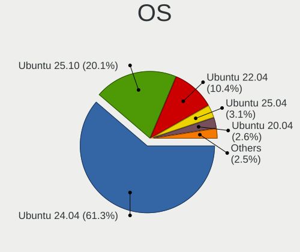

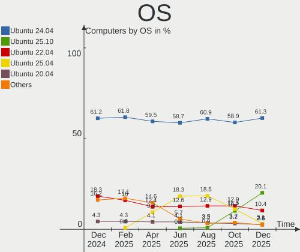

| Name         | Computers | Percent |
|--------------|-----------|---------|
| Ubuntu 24.04 | 470       | 61.28%  |
| Ubuntu 25.10 | 154       | 20.08%  |
| Ubuntu 22.04 | 80        | 10.43%  |
| Ubuntu 25.04 | 24        | 3.13%   |
| Ubuntu 20.04 | 20        | 2.61%   |
| Ubuntu 26.04 | 10        | 1.3%    |
| Ubuntu 24.10 | 3         | 0.39%   |
| Ubuntu 18.04 | 3         | 0.39%   |
| Ubuntu 1.3.2 | 2         | 0.26%   |
| Ubuntu 21.04 | 1         | 0.13%   |

OS Family
---------

OS without a version

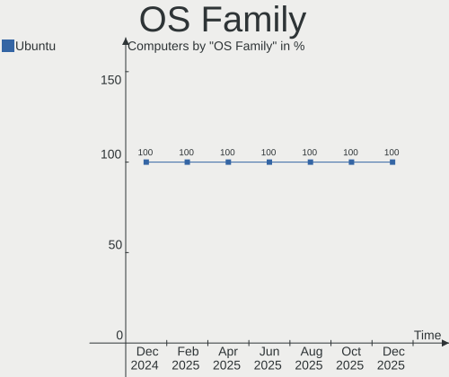

| Name   | Computers | Percent |
|--------|-----------|---------|
| Ubuntu | 767       | 100%    |

Kernel
------

Version of the Linux kernel

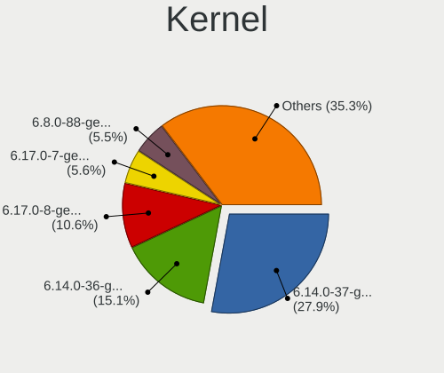

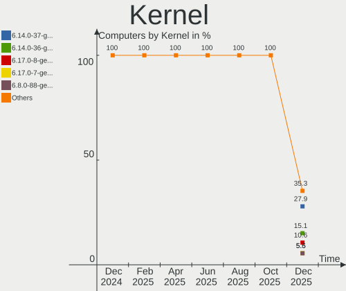

| Version               | Computers | Percent |
|-----------------------|-----------|---------|
| 6.14.0-37-generic     | 214       | 27.9%   |
| 6.14.0-36-generic     | 116       | 15.12%  |
| 6.17.0-8-generic      | 81        | 10.56%  |
| 6.17.0-7-generic      | 43        | 5.61%   |
| 6.8.0-88-generic      | 42        | 5.48%   |
| 6.8.0-90-generic      | 40        | 5.22%   |
| 6.14.0-27-generic     | 25        | 3.26%   |
| 5.15.0-153-generic    | 23        | 3%      |
| 6.8.0-87-generic      | 20        | 2.61%   |
| 6.17.0-5-generic      | 18        | 2.35%   |
| 6.17.0-6-generic      | 13        | 1.69%   |
| 5.15.0-139-generic    | 11        | 1.43%   |
| 5.15.0-164-generic    | 6         | 0.78%   |
| 6.14.0-35-generic     | 5         | 0.65%   |
| 6.14.0-1018-oem       | 4         | 0.52%   |
| 6.11.0-26-generic     | 4         | 0.52%   |
| 6.11.0-17-generic     | 4         | 0.52%   |
| 6.14.0-29-generic     | 3         | 0.39%   |
| 5.15.148-tegra        | 3         | 0.39%   |
| 5.15.0-67-generic     | 3         | 0.39%   |
| 6.8.0-85-generic      | 2         | 0.26%   |
| 6.8.0-78-generic      | 2         | 0.26%   |
| 6.8.0-71-generic      | 2         | 0.26%   |
| 6.8.0-57-generic      | 2         | 0.26%   |
| 6.8.0-52-generic      | 2         | 0.26%   |
| 6.8.0-41-generic      | 2         | 0.26%   |
| 6.8.0-40-generic      | 2         | 0.26%   |
| 6.5.0-18-generic      | 2         | 0.26%   |
| 6.18.1-061801-generic | 2         | 0.26%   |
| 6.18.0-061800-generic | 2         | 0.26%   |
| 6.17.9-061709-generic | 2         | 0.26%   |
| 6.17.1-surface-2      | 2         | 0.26%   |
| 6.14.0-33-generic     | 2         | 0.26%   |
| 6.14.0-1016-oem       | 2         | 0.26%   |
| 6.14.0-1015-raspi     | 2         | 0.26%   |
| 6.11.0-8-generic      | 2         | 0.26%   |
| 5.15.0-161-generic    | 2         | 0.26%   |
| 6.8.4-060804-generic  | 1         | 0.13%   |
| 6.8.0-90-lowlatency   | 1         | 0.13%   |
| 6.8.0-88-lowlatency   | 1         | 0.13%   |

Kernel Family
-------------

Linux kernel without a distro release

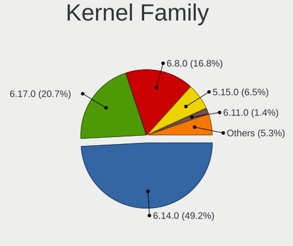

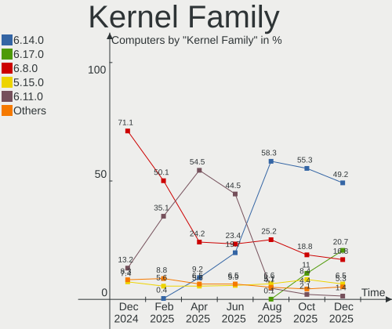

| Version  | Computers | Percent |
|----------|-----------|---------|
| 6.14.0   | 377       | 49.15%  |
| 6.17.0   | 159       | 20.73%  |
| 6.8.0    | 129       | 16.82%  |
| 5.15.0   | 50        | 6.52%   |
| 6.11.0   | 11        | 1.43%   |
| 6.5.0    | 5         | 0.65%   |
| 5.4.0    | 5         | 0.65%   |
| 6.18.0   | 4         | 0.52%   |
| 5.15.148 | 3         | 0.39%   |
| 6.18.1   | 2         | 0.26%   |
| 6.17.9   | 2         | 0.26%   |
| 6.17.8   | 2         | 0.26%   |
| 6.17.1   | 2         | 0.26%   |
| 4.15.0   | 2         | 0.26%   |
| 6.8.4    | 1         | 0.13%   |
| 6.6.63   | 1         | 0.13%   |
| 6.6.61   | 1         | 0.13%   |
| 6.17.10  | 1         | 0.13%   |
| 6.15.9   | 1         | 0.13%   |
| 6.14.7   | 1         | 0.13%   |
| 6.13.6   | 1         | 0.13%   |
| 6.12.58  | 1         | 0.13%   |
| 6.12.42  | 1         | 0.13%   |
| 6.12.3   | 1         | 0.13%   |
| 6.1.115  | 1         | 0.13%   |
| 5.19.0   | 1         | 0.13%   |
| 5.11.0   | 1         | 0.13%   |
| 4.19.219 | 1         | 0.13%   |

Kernel Major Ver.
-----------------

Linux kernel major version

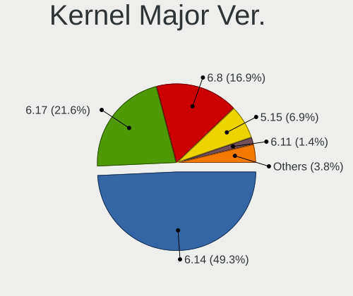

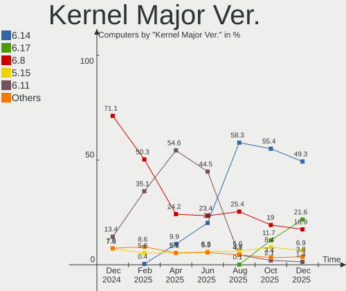

| Version | Computers | Percent |
|---------|-----------|---------|
| 6.14    | 378       | 49.28%  |
| 6.17    | 166       | 21.64%  |
| 6.8     | 130       | 16.95%  |
| 5.15    | 53        | 6.91%   |
| 6.11    | 11        | 1.43%   |
| 6.18    | 6         | 0.78%   |
| 6.5     | 5         | 0.65%   |
| 5.4     | 5         | 0.65%   |
| 6.12    | 3         | 0.39%   |
| 6.6     | 2         | 0.26%   |
| 4.15    | 2         | 0.26%   |
| 6.15    | 1         | 0.13%   |
| 6.13    | 1         | 0.13%   |
| 6.1     | 1         | 0.13%   |
| 5.19    | 1         | 0.13%   |
| 5.11    | 1         | 0.13%   |
| 4.19    | 1         | 0.13%   |

Arch
----

OS architecture (x86_64, i586, etc.)

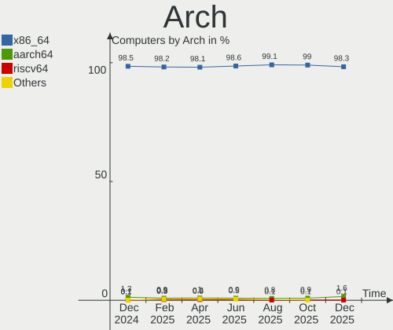

| Name    | Computers | Percent |
|---------|-----------|---------|
| x86_64  | 754       | 98.31%  |
| aarch64 | 12        | 1.56%   |
| riscv64 | 1         | 0.13%   |

DE
--

Desktop Environment

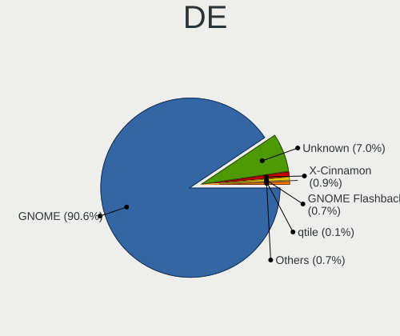

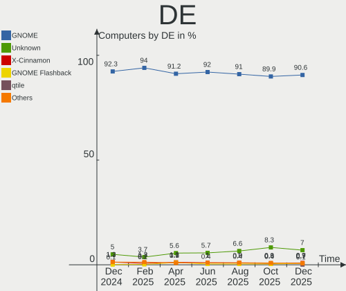

| Name                    | Computers | Percent |
|-------------------------|-----------|---------|
| GNOME                   | 695       | 90.61%  |
| Unknown                 | 54        | 7.04%   |
| X-Cinnamon              | 7         | 0.91%   |
| GNOME Flashback         | 5         | 0.65%   |
| qtile                   | 1         | 0.13%   |
| i3                      | 1         | 0.13%   |
| Hyprland:start-hyprland | 1         | 0.13%   |
| Hyprland                | 1         | 0.13%   |
| GNOME Classic           | 1         | 0.13%   |
| Enlightenment           | 1         | 0.13%   |

Display Server
--------------

X11 or Wayland

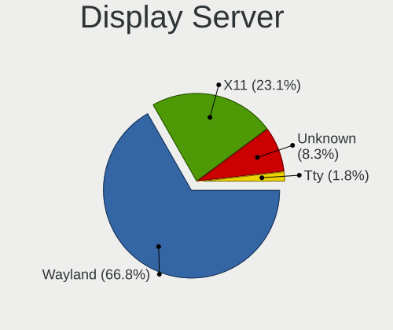

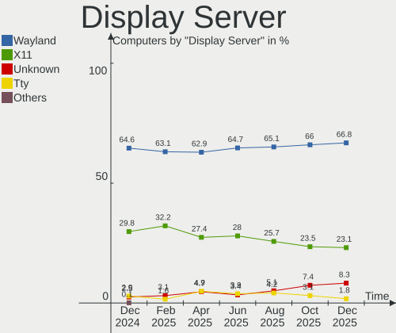

| Name    | Computers | Percent |
|---------|-----------|---------|
| Wayland | 512       | 66.75%  |
| X11     | 177       | 23.08%  |
| Unknown | 64        | 8.34%   |
| Tty     | 14        | 1.83%   |

Display Manager
---------------

SDDM, LightDM, etc.

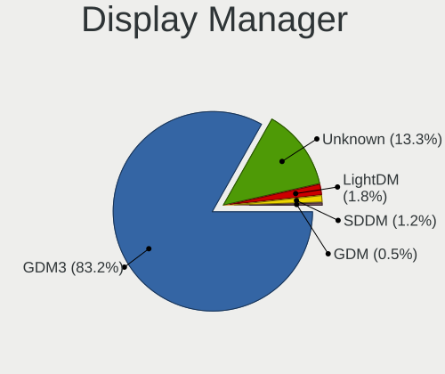

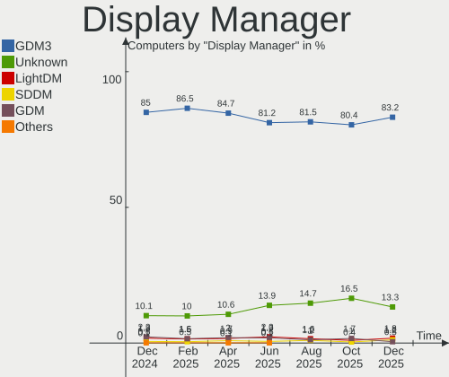

| Name    | Computers | Percent |
|---------|-----------|---------|
| GDM3    | 638       | 83.18%  |
| Unknown | 102       | 13.3%   |
| LightDM | 14        | 1.83%   |
| SDDM    | 9         | 1.17%   |
| GDM     | 4         | 0.52%   |

OS Lang
-------

Language

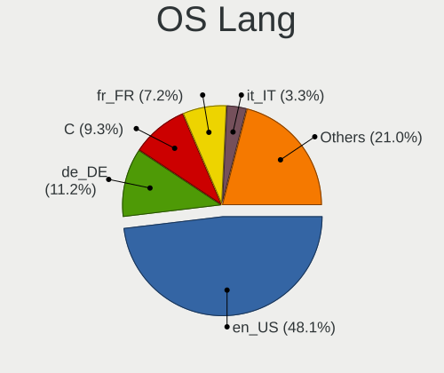

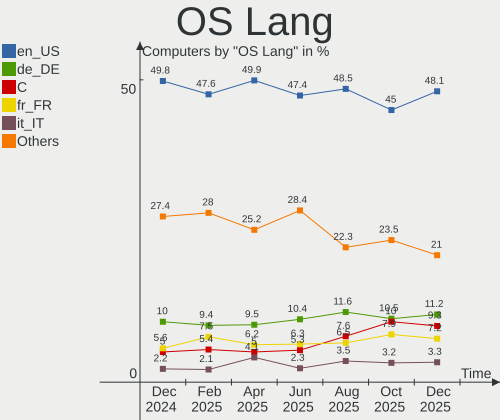

| Lang    | Computers | Percent |
|---------|-----------|---------|
| en_US   | 369       | 48.11%  |
| de_DE   | 86        | 11.21%  |
| C       | 71        | 9.26%   |
| fr_FR   | 55        | 7.17%   |
| it_IT   | 25        | 3.26%   |
| en_GB   | 24        | 3.13%   |
| pt_BR   | 19        | 2.48%   |
| es_ES   | 19        | 2.48%   |
| ru_RU   | 14        | 1.83%   |
| zh_CN   | 11        | 1.43%   |
| pl_PL   | 7         | 0.91%   |
| cs_CZ   | 7         | 0.91%   |
| nl_NL   | 6         | 0.78%   |
| Unknown | 6         | 0.78%   |
| hu_HU   | 5         | 0.65%   |
| en_IN   | 5         | 0.65%   |
| zh_TW   | 4         | 0.52%   |
| en_AU   | 4         | 0.52%   |
| tr_TR   | 3         | 0.39%   |
| sv_SE   | 3         | 0.39%   |
| pt_PT   | 3         | 0.39%   |
| en_CA   | 3         | 0.39%   |
| ko_KR   | 2         | 0.26%   |
| en_PH   | 2         | 0.26%   |
| de_AT   | 2         | 0.26%   |
| da_DK   | 2         | 0.26%   |
| th_TH   | 1         | 0.13%   |
| ro_RO   | 1         | 0.13%   |
| ja_JP   | 1         | 0.13%   |
| fr_CA   | 1         | 0.13%   |
| es_SV   | 1         | 0.13%   |
| es_CO   | 1         | 0.13%   |
| en_NZ   | 1         | 0.13%   |
| el_GR   | 1         | 0.13%   |
| de_LI   | 1         | 0.13%   |
| de_CH   | 1         | 0.13%   |

Boot Mode
---------

EFI or BIOS

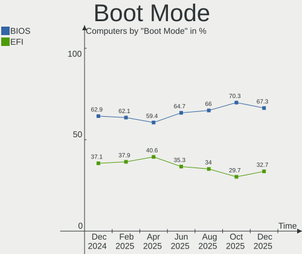

| Mode | Computers | Percent |
|------|-----------|---------|
| BIOS | 516       | 67.28%  |
| EFI  | 251       | 32.72%  |

Filesystem
----------

Type of filesystem

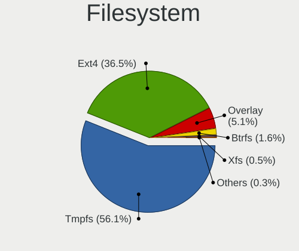

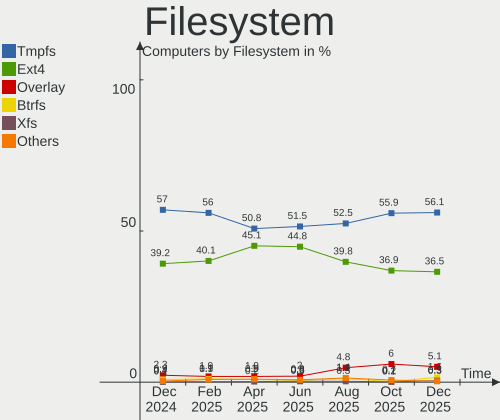

| Type    | Computers | Percent |
|---------|-----------|---------|
| Tmpfs   | 430       | 56.06%  |
| Ext4    | 280       | 36.51%  |
| Overlay | 39        | 5.08%   |
| Btrfs   | 12        | 1.56%   |
| Xfs     | 4         | 0.52%   |
| Zfs     | 2         | 0.26%   |

Part. scheme
------------

Scheme of partitioning

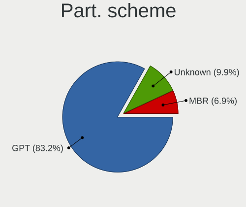

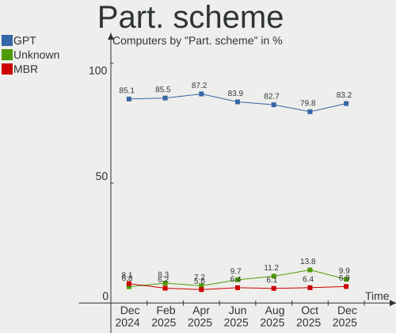

| Type    | Computers | Percent |
|---------|-----------|---------|
| GPT     | 638       | 83.18%  |
| Unknown | 76        | 9.91%   |
| MBR     | 53        | 6.91%   |

Dual Boot with Linux/BSD
------------------------

Hosting more than one Linux/BSD

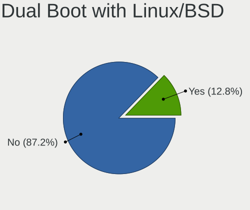

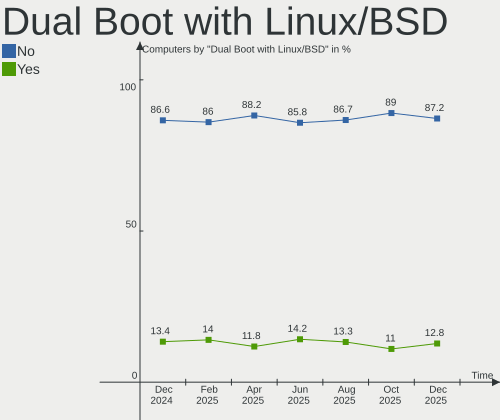

| Dual boot | Computers | Percent |
|-----------|-----------|---------|
| No        | 669       | 87.22%  |
| Yes       | 98        | 12.78%  |

Dual Boot (Win)
---------------

Hosting Linux and Windows

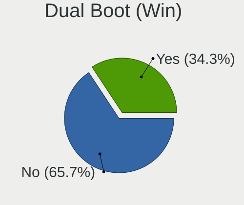

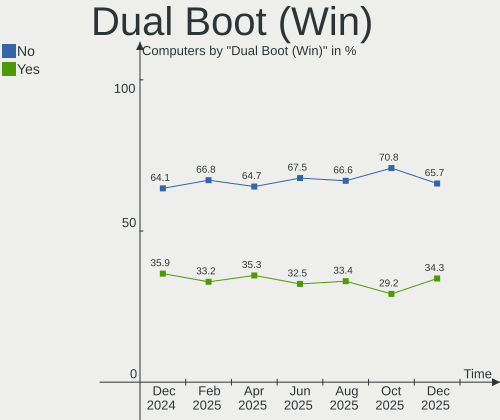

| Dual boot | Computers | Percent |
|-----------|-----------|---------|
| No        | 504       | 65.71%  |
| Yes       | 263       | 34.29%  |

Board
-----

Vendor
------

Motherboard manufacturer

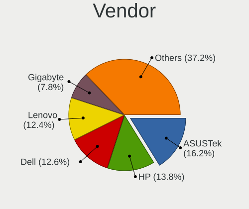

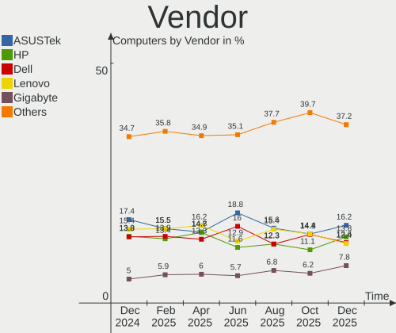

| Name                    | Computers | Percent |
|-------------------------|-----------|---------|
| ASUSTek Computer        | 124       | 16.17%  |
| Hewlett-Packard         | 106       | 13.82%  |
| Dell                    | 97        | 12.65%  |
| Lenovo                  | 95        | 12.39%  |
| Gigabyte Technology     | 60        | 7.82%   |
| MSI                     | 34        | 4.43%   |
| Acer                    | 34        | 4.43%   |
| Apple                   | 30        | 3.91%   |
| ASRock                  | 17        | 2.22%   |
| Microsoft               | 13        | 1.69%   |
| Supermicro              | 12        | 1.56%   |
| Intel                   | 11        | 1.43%   |
| Fujitsu                 | 10        | 1.3%    |
| Medion                  | 9         | 1.17%   |
| Unknown                 | 9         | 1.17%   |
| Toshiba                 | 7         | 0.91%   |
| HUAWEI                  | 6         | 0.78%   |
| AZW                     | 6         | 0.78%   |
| Samsung Electronics     | 5         | 0.65%   |
| Inspur                  | 5         | 0.65%   |
| Sony                    | 4         | 0.52%   |
| Chuwi                   | 4         | 0.52%   |
| Biostar                 | 4         | 0.52%   |
| Raspberry Pi Foundation | 3         | 0.39%   |
| Nvidia                  | 3         | 0.39%   |
| Huanan                  | 3         | 0.39%   |
| Framework               | 3         | 0.39%   |
| ETegro Technologies     | 3         | 0.39%   |
| AMI                     | 3         | 0.39%   |
| Pegatron                | 2         | 0.26%   |
| Packard Bell            | 2         | 0.26%   |
| MECHREVO                | 2         | 0.26%   |
| HONOR                   | 2         | 0.26%   |
| Google                  | 2         | 0.26%   |
| GMKtec                  | 2         | 0.26%   |
| Alienware               | 2         | 0.26%   |
| ZRD                     | 1         | 0.13%   |
| WeiBu                   | 1         | 0.13%   |
| Vizio                   | 1         | 0.13%   |
| TYAN Computer           | 1         | 0.13%   |

Model
-----

Motherboard model

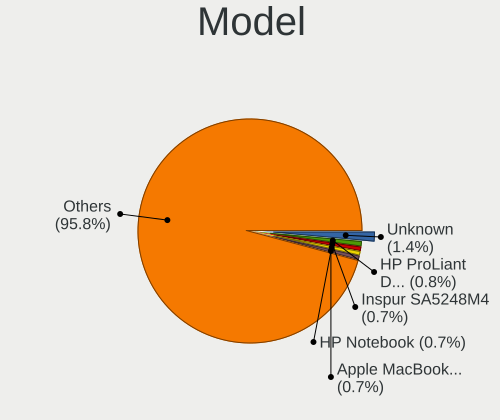

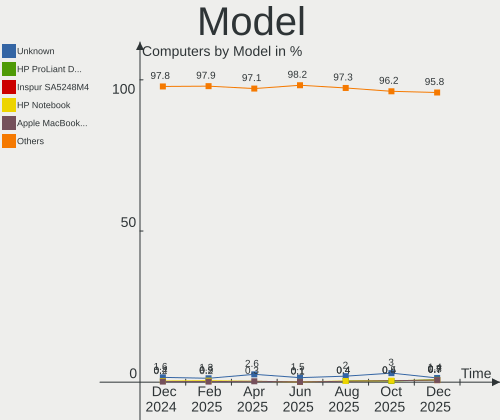

| Name                                        | Computers | Percent |
|---------------------------------------------|-----------|---------|
| Unknown                                     | 11        | 1.43%   |
| HP ProLiant DL360 Gen9                      | 6         | 0.78%   |
| Inspur SA5248M4                             | 5         | 0.65%   |
| HP Notebook                                 | 5         | 0.65%   |
| Apple MacBookAir7,2                         | 5         | 0.65%   |
| Supermicro Super Server                     | 4         | 0.52%   |
| Supermicro X8DTU                            | 3         | 0.39%   |
| HP Pavilion 15                              | 3         | 0.39%   |
| Gigabyte 1009707_2120234                    | 3         | 0.39%   |
| ETegro Hyperion RS125 G4                    | 3         | 0.39%   |
| AZW MINI S                                  | 3         | 0.39%   |
| ASUS All Series                             | 3         | 0.39%   |
| Apple MacBookPro8,1                         | 3         | 0.39%   |
| Apple MacBookAir4,1                         | 3         | 0.39%   |
| Toshiba Satellite C55-C                     | 2         | 0.26%   |
| MSI MS-7E28                                 | 2         | 0.26%   |
| MSI MS-7C95                                 | 2         | 0.26%   |
| MSI MS-7C91                                 | 2         | 0.26%   |
| Microsoft Surface Pro 4                     | 2         | 0.26%   |
| Microsoft Surface Pro 3                     | 2         | 0.26%   |
| Microsoft Surface Book                      | 2         | 0.26%   |
| MECHREVO CODE Series                        | 2         | 0.26%   |
| Lenovo Legion Pro 5 16IRX9 83DF             | 2         | 0.26%   |
| Lenovo Legion 5 16IAX10 83NX                | 2         | 0.26%   |
| Lenovo IdeaPad 1 15ALC7 82R4                | 2         | 0.26%   |
| Lenovo G50-70 20351                         | 2         | 0.26%   |
| Intel H61                                   | 2         | 0.26%   |
| HUAWEI RH1288 V3                            | 2         | 0.26%   |
| Huanan X99-F8D PLUS V1.32                   | 2         | 0.26%   |
| HP Z420 Workstation                         | 2         | 0.26%   |
| HP Pavilion g6                              | 2         | 0.26%   |
| HP EliteBook 840 G8 Notebook PC             | 2         | 0.26%   |
| HP EliteBook 820 G3                         | 2         | 0.26%   |
| HP Compaq Pro 6300 SFF                      | 2         | 0.26%   |
| HP Compaq Elite 8300 CMT                    | 2         | 0.26%   |
| Gigabyte X870E AORUS MASTER                 | 2         | 0.26%   |
| Gigabyte X570 I AORUS PRO WIFI              | 2         | 0.26%   |
| Gigabyte 970A-DS3P                          | 2         | 0.26%   |
| Framework Laptop 16 (AMD Ryzen 7040 Series) | 2         | 0.26%   |
| Dell OptiPlex 5040                          | 2         | 0.26%   |

Model Family
------------

Motherboard model prefix

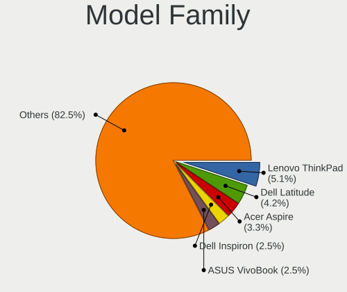

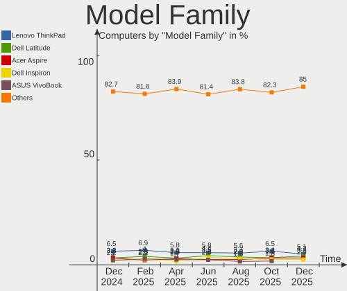

| Name               | Computers | Percent |
|--------------------|-----------|---------|
| Lenovo ThinkPad    | 39        | 5.08%   |
| Dell Latitude      | 32        | 4.17%   |
| Acer Aspire        | 25        | 3.26%   |
| Dell Inspiron      | 19        | 2.48%   |
| ASUS VivoBook      | 19        | 2.48%   |
| Dell OptiPlex      | 18        | 2.35%   |
| ASUS PRIME         | 17        | 2.22%   |
| Lenovo IdeaPad     | 16        | 2.09%   |
| HP EliteBook       | 16        | 2.09%   |
| HP Pavilion        | 15        | 1.96%   |
| Microsoft Surface  | 13        | 1.69%   |
| ASUS ROG           | 13        | 1.69%   |
| Unknown            | 11        | 1.43%   |
| Dell Precision     | 10        | 1.3%    |
| HP ProBook         | 9         | 1.17%   |
| HP Laptop          | 9         | 1.17%   |
| ASUS TUF           | 9         | 1.17%   |
| ASUS ASUS          | 9         | 1.17%   |
| Lenovo ThinkCentre | 7         | 0.91%   |
| Lenovo Legion      | 7         | 0.91%   |
| HP ProLiant        | 7         | 0.91%   |
| HP Compaq          | 7         | 0.91%   |
| HP ProDesk         | 6         | 0.78%   |
| Gigabyte X570      | 6         | 0.78%   |
| Dell XPS           | 6         | 0.78%   |
| ASUS ZenBook       | 6         | 0.78%   |
| Apple MacBookAir7  | 6         | 0.78%   |
| Toshiba Satellite  | 5         | 0.65%   |
| Lenovo Yoga        | 5         | 0.65%   |
| Inspur SA5248M4    | 5         | 0.65%   |
| HP ZBook           | 5         | 0.65%   |
| HP Notebook        | 5         | 0.65%   |
| Fujitsu ESPRIMO    | 5         | 0.65%   |
| Supermicro Super   | 4         | 0.52%   |
| Gigabyte X870E     | 4         | 0.52%   |
| Dell PowerEdge     | 4         | 0.52%   |
| Acer Nitro         | 4         | 0.52%   |
| Supermicro X8DTU   | 3         | 0.39%   |
| RPi Raspberry      | 3         | 0.39%   |
| Nvidia Jetson      | 3         | 0.39%   |

MFG Year
--------

Motherboard manufacture year

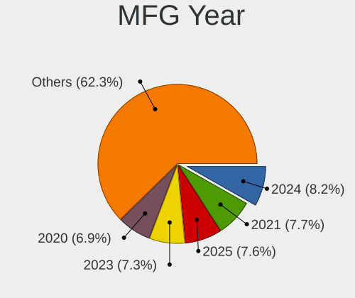

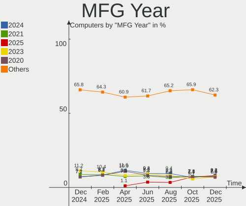

| Year    | Computers | Percent |
|---------|-----------|---------|
| 2024    | 63        | 8.21%   |
| 2021    | 59        | 7.69%   |
| 2025    | 58        | 7.56%   |
| 2023    | 56        | 7.3%    |
| 2020    | 53        | 6.91%   |
| 2018    | 51        | 6.65%   |
| 2017    | 51        | 6.65%   |
| 2013    | 51        | 6.65%   |
| 2022    | 50        | 6.52%   |
| 2012    | 46        | 6%      |
| 2019    | 42        | 5.48%   |
| 2015    | 41        | 5.35%   |
| 2014    | 35        | 4.56%   |
| 2011    | 35        | 4.56%   |
| 2016    | 24        | 3.13%   |
| 2009    | 16        | 2.09%   |
| 2010    | 13        | 1.69%   |
| 2008    | 8         | 1.04%   |
| Unknown | 8         | 1.04%   |
| 2006    | 5         | 0.65%   |
| 2007    | 2         | 0.26%   |

Form Factor
-----------

Physical design of the computer

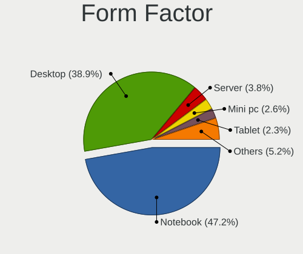

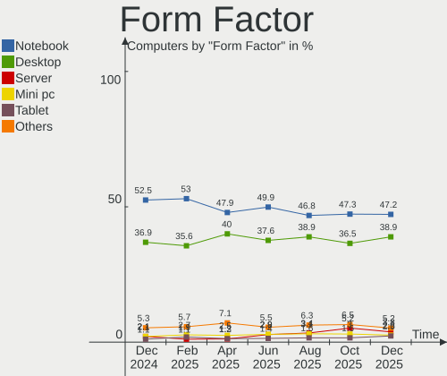

| Name           | Computers | Percent |
|----------------|-----------|---------|
| Notebook       | 362       | 47.2%   |
| Desktop        | 298       | 38.85%  |
| Server         | 29        | 3.78%   |
| Mini pc        | 20        | 2.61%   |
| Tablet         | 18        | 2.35%   |
| Convertible    | 17        | 2.22%   |
| System on chip | 11        | 1.43%   |
| All in one     | 11        | 1.43%   |
| Other          | 1         | 0.13%   |

Secure Boot
-----------

Enabled or disabled

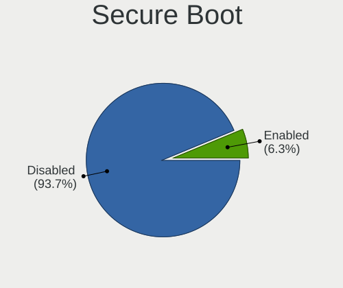

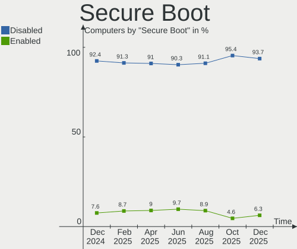

| State    | Computers | Percent |
|----------|-----------|---------|
| Disabled | 719       | 93.74%  |
| Enabled  | 48        | 6.26%   |

Coreboot
--------

Have coreboot on board

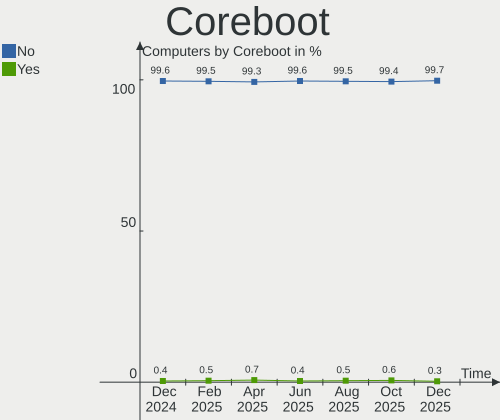

| Used | Computers | Percent |
|------|-----------|---------|
| No   | 765       | 99.74%  |
| Yes  | 2         | 0.26%   |

RAM Size
--------

Total RAM memory

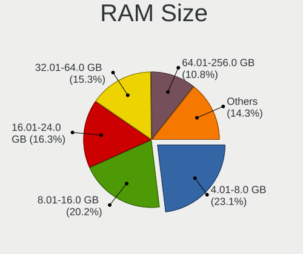

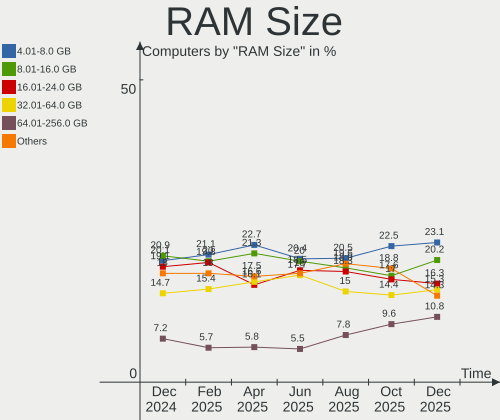

| Size in GB      | Computers | Percent |
|-----------------|-----------|---------|
| 4.01-8.0        | 177       | 23.08%  |
| 8.01-16.0       | 155       | 20.21%  |
| 16.01-24.0      | 125       | 16.3%   |
| 32.01-64.0      | 117       | 15.25%  |
| 64.01-256.0     | 83        | 10.82%  |
| 3.01-4.0        | 54        | 7.04%   |
| 24.01-32.0      | 40        | 5.22%   |
| 1.01-2.0        | 6         | 0.78%   |
| More than 256.0 | 5         | 0.65%   |
| 2.01-3.0        | 5         | 0.65%   |

RAM Used
--------

Used RAM memory

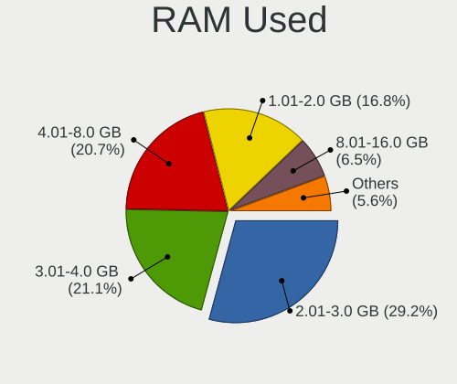

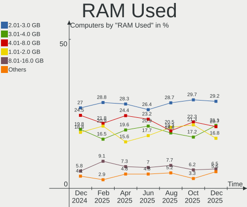

| Used GB     | Computers | Percent |
|-------------|-----------|---------|
| 2.01-3.0    | 224       | 29.2%   |
| 3.01-4.0    | 162       | 21.12%  |
| 4.01-8.0    | 159       | 20.73%  |
| 1.01-2.0    | 129       | 16.82%  |
| 8.01-16.0   | 50        | 6.52%   |
| 16.01-24.0  | 13        | 1.69%   |
| 0.51-1.0    | 10        | 1.3%    |
| 24.01-32.0  | 7         | 0.91%   |
| 64.01-256.0 | 5         | 0.65%   |
| 32.01-64.0  | 4         | 0.52%   |
| 0.01-0.5    | 4         | 0.52%   |

Total Drives
------------

Number of drives on board

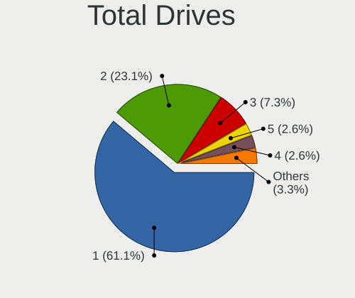

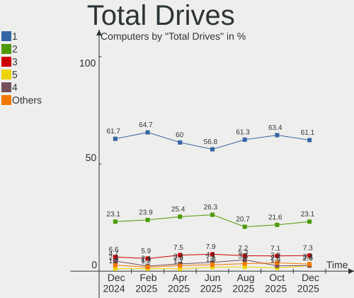

| Drives | Computers | Percent |
|--------|-----------|---------|
| 1      | 469       | 61.15%  |
| 2      | 177       | 23.08%  |
| 3      | 56        | 7.3%    |
| 5      | 20        | 2.61%   |
| 4      | 20        | 2.61%   |
| 6      | 6         | 0.78%   |
| 0      | 4         | 0.52%   |
| 14     | 3         | 0.39%   |
| 8      | 3         | 0.39%   |
| 18     | 2         | 0.26%   |
| 12     | 2         | 0.26%   |
| 16     | 1         | 0.13%   |
| 15     | 1         | 0.13%   |
| 11     | 1         | 0.13%   |
| 9      | 1         | 0.13%   |
| 7      | 1         | 0.13%   |

Has CD-ROM
----------

Has CD-ROM on board

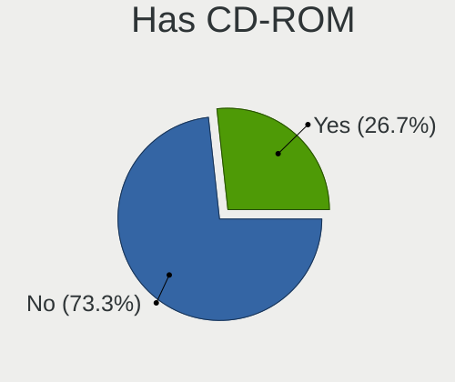

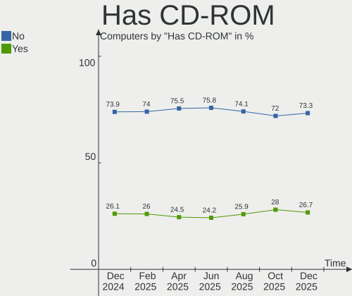

| Presented | Computers | Percent |
|-----------|-----------|---------|
| No        | 562       | 73.27%  |
| Yes       | 205       | 26.73%  |

Has Ethernet
------------

Has Ethernet on board

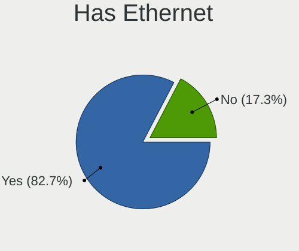

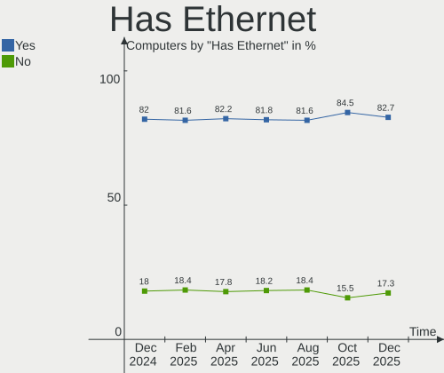

| Presented | Computers | Percent |
|-----------|-----------|---------|
| Yes       | 634       | 82.66%  |
| No        | 133       | 17.34%  |

Has WiFi
--------

Has WiFi module

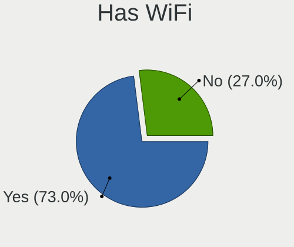

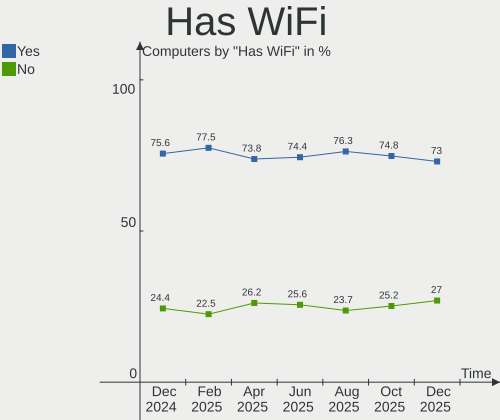

| Presented | Computers | Percent |
|-----------|-----------|---------|
| Yes       | 560       | 73.01%  |
| No        | 207       | 26.99%  |

Has Bluetooth
-------------

Has Bluetooth module

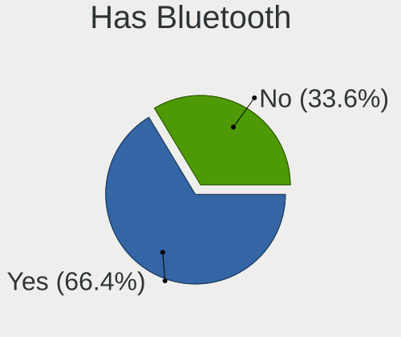

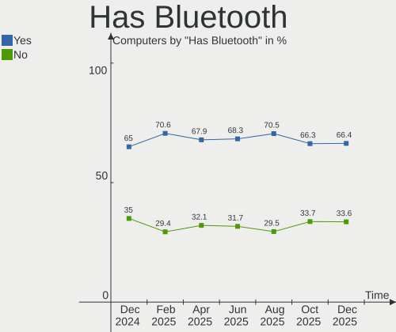

| Presented | Computers | Percent |
|-----------|-----------|---------|
| Yes       | 509       | 66.36%  |
| No        | 258       | 33.64%  |

Location
--------

Country
-------

Geographic location (country)

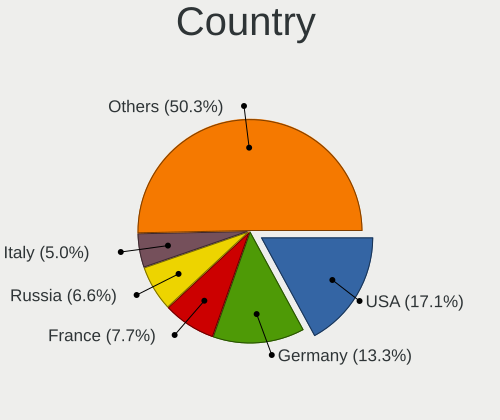

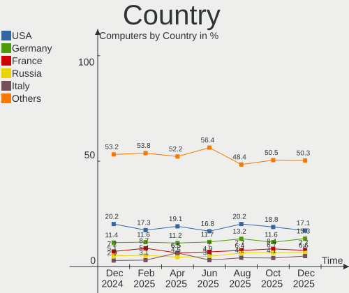

| Country      | Computers | Percent |
|--------------|-----------|---------|
| USA          | 131       | 17.08%  |
| Germany      | 102       | 13.3%   |
| France       | 59        | 7.69%   |
| Russia       | 51        | 6.65%   |
| Italy        | 38        | 4.95%   |
| UK           | 35        | 4.56%   |
| Brazil       | 29        | 3.78%   |
| India        | 23        | 3%      |
| Canada       | 23        | 3%      |
| Australia    | 19        | 2.48%   |
| Poland       | 17        | 2.22%   |
| Netherlands  | 17        | 2.22%   |
| China        | 16        | 2.09%   |
| Switzerland  | 12        | 1.56%   |
| Austria      | 12        | 1.56%   |
| Indonesia    | 10        | 1.3%    |
| Iran         | 9         | 1.17%   |
| Turkey       | 8         | 1.04%   |
| Sweden       | 8         | 1.04%   |
| Hungary      | 8         | 1.04%   |
| Spain        | 7         | 0.91%   |
| Czechia      | 7         | 0.91%   |
| Norway       | 6         | 0.78%   |
| Mexico       | 6         | 0.78%   |
| Finland      | 6         | 0.78%   |
| Belgium      | 6         | 0.78%   |
| Thailand     | 5         | 0.65%   |
| South Africa | 5         | 0.65%   |
| Romania      | 5         | 0.65%   |
| Portugal     | 5         | 0.65%   |
| Philippines  | 5         | 0.65%   |
| Japan        | 5         | 0.65%   |
| Greece       | 5         | 0.65%   |
| Denmark      | 5         | 0.65%   |
| Colombia     | 5         | 0.65%   |
| Algeria      | 4         | 0.52%   |
| Taiwan       | 3         | 0.39%   |
| Vietnam      | 2         | 0.26%   |
| South Korea  | 2         | 0.26%   |
| Slovenia     | 2         | 0.26%   |

City
----

Geographic location (city)

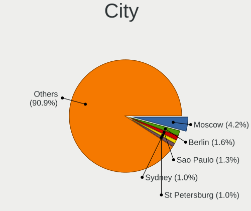

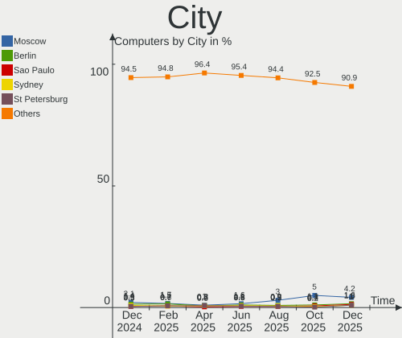

| City          | Computers | Percent |
|---------------|-----------|---------|
| Moscow        | 32        | 4.17%   |
| Berlin        | 12        | 1.56%   |
| Sao Paulo     | 10        | 1.3%    |
| Sydney        | 8         | 1.04%   |
| St Petersburg | 8         | 1.04%   |
| Munich        | 6         | 0.78%   |
| Budapest      | 6         | 0.78%   |
| Paris         | 5         | 0.65%   |
| Milan         | 5         | 0.65%   |
| Bremen        | 5         | 0.65%   |
| Zurich        | 4         | 0.52%   |
| Vienna        | 4         | 0.52%   |
| Seattle       | 4         | 0.52%   |
| Istanbul      | 4         | 0.52%   |
| Cologne       | 4         | 0.52%   |
| Athens        | 4         | 0.52%   |
| Weingarten    | 3         | 0.39%   |
| Shenzhen      | 3         | 0.39%   |
| Shanghai      | 3         | 0.39%   |
| Rome          | 3         | 0.39%   |
| Potsdam       | 3         | 0.39%   |
| Phoenix       | 3         | 0.39%   |
| Pforzheim     | 3         | 0.39%   |
| Oslo          | 3         | 0.39%   |
| New York      | 3         | 0.39%   |
| Monte Vista   | 3         | 0.39%   |
| Mexico City   | 3         | 0.39%   |
| Melbourne     | 3         | 0.39%   |
| Mashhad       | 3         | 0.39%   |
| Los Angeles   | 3         | 0.39%   |
| Krakow        | 3         | 0.39%   |
| Hamburg       | 3         | 0.39%   |
| Copenhagen    | 3         | 0.39%   |
| Calgary       | 3         | 0.39%   |
| Bucharest     | 3         | 0.39%   |
| Brooklyn      | 3         | 0.39%   |
| Bologna       | 3         | 0.39%   |
| Bengaluru     | 3         | 0.39%   |
| Beijing       | 3         | 0.39%   |
| Wiesbaden     | 2         | 0.26%   |

Drives
------

Drive Vendor
------------

Hard drive vendors

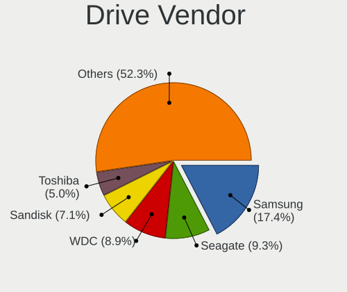

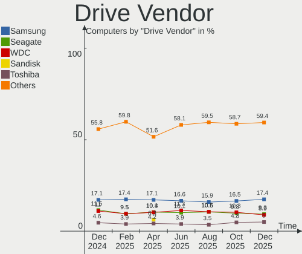

| Vendor                       | Computers | Drives | Percent |
|------------------------------|-----------|--------|---------|
| Samsung Electronics          | 194       | 250    | 17.38%  |
| Seagate                      | 104       | 141    | 9.32%   |
| WDC                          | 99        | 132    | 8.87%   |
| Sandisk                      | 79        | 90     | 7.08%   |
| Toshiba                      | 56        | 60     | 5.02%   |
| Kingston                     | 54        | 65     | 4.84%   |
| Micron Technology            | 47        | 48     | 4.21%   |
| SK hynix                     | 37        | 37     | 3.32%   |
| Intel                        | 37        | 61     | 3.32%   |
| Crucial                      | 36        | 36     | 3.23%   |
| Unknown                      | 26        | 30     | 2.33%   |
| KIOXIA                       | 22        | 25     | 1.97%   |
| HGST                         | 19        | 41     | 1.7%    |
| Apple                        | 17        | 18     | 1.52%   |
| A-DATA Technology            | 15        | 16     | 1.34%   |
| Micron/Crucial Technology    | 14        | 18     | 1.25%   |
| China                        | 13        | 14     | 1.16%   |
| Kingston Technology Company  | 11        | 12     | 0.99%   |
| PNY                          | 10        | 11     | 0.9%    |
| Intenso                      | 10        | 11     | 0.9%    |
| Hitachi                      | 10        | 11     | 0.9%    |
| Unknown                      | 10        | 11     | 0.9%    |
| SOLIDIGM                     | 8         | 13     | 0.72%   |
| Silicon Motion               | 8         | 8      | 0.72%   |
| Realtek Semiconductor        | 8         | 8      | 0.72%   |
| KingSpec                     | 8         | 9      | 0.72%   |
| Phison Electronics           | 7         | 7      | 0.63%   |
| MAXIO Technology (Hangzhou)  | 7         | 8      | 0.63%   |
| SPCC                         | 6         | 7      | 0.54%   |
| GOODRAM                      | 6         | 6      | 0.54%   |
| Shenzhen Longsys Electronics | 5         | 6      | 0.45%   |
| Lexar                        | 5         | 5      | 0.45%   |
| SABRENT                      | 4         | 4      | 0.36%   |
| Patriot                      | 4         | 4      | 0.36%   |
| Netac                        | 4         | 4      | 0.36%   |
| Hewlett-Packard              | 4         | 20     | 0.36%   |
| ADATA Technology             | 4         | 4      | 0.36%   |
| Transcend                    | 3         | 3      | 0.27%   |
| Phison                       | 3         | 4      | 0.27%   |
| LITEON                       | 3         | 3      | 0.27%   |

Drive Model
-----------

Hard drive models

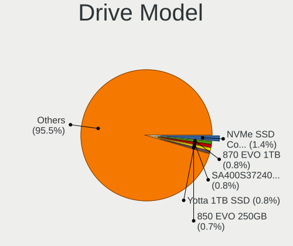

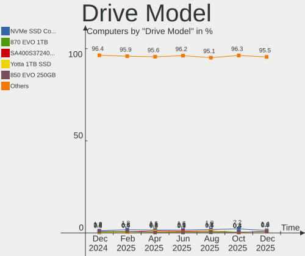

| Model                                                 | Computers | Percent |
|-------------------------------------------------------|-----------|---------|
| Samsung NVMe SSD Controller SM981/PM981/PM983 1TB     | 17        | 1.39%   |
| Samsung SSD 870 EVO 1TB                               | 10        | 0.82%   |
| Kingston SA400S37240G 240GB SSD                       | 10        | 0.82%   |
| Unknown                                               | 10        | 0.82%   |
| Samsung SSD 850 EVO 250GB                             | 8         | 0.66%   |
| Samsung NVMe SSD Controller SM961/PM961/SM963 1024GB  | 8         | 0.66%   |
| Samsung NVMe SSD Controller PM9A1/PM9A3/980PRO 1TB    | 8         | 0.66%   |
| Silicon Motion SM2263EN/SM2263XT SSD Controller 512GB | 7         | 0.57%   |
| SanDisk NVMe SSD Drive 2TB                            | 7         | 0.57%   |
| HGST HTS721010A9E630 1TB                              | 7         | 0.57%   |
| Unknown SD/MMC/MS PRO 2GB                             | 6         | 0.49%   |
| Seagate ST1000LM024 HN-M101MBB 1TB                    | 6         | 0.49%   |
| Samsung SSD 990 PRO 2TB                               | 6         | 0.49%   |
| Samsung SSD 990 PRO 1TB                               | 6         | 0.49%   |
| Samsung SSD 980 1TB                                   | 6         | 0.49%   |
| Kingston SA400S37480G 480GB SSD                       | 6         | 0.49%   |
| Intel SSDSC2KB038TZ 3.8TB                             | 6         | 0.49%   |
| Unknown MMC Card  64GB                                | 5         | 0.41%   |
| Toshiba MQ01ABD100 1TB                                | 5         | 0.41%   |
| Toshiba BG3 NVMe SSD Controller 256GB                 | 5         | 0.41%   |
| SOLIDIGM SSDSC2KB960GZ 960GB                          | 5         | 0.41%   |
| Seagate ST1000DM003-1SB102 1TB                        | 5         | 0.41%   |
| Samsung SSD 860 EVO 500GB                             | 5         | 0.41%   |
| Samsung SSD 860 EVO 1TB                               | 5         | 0.41%   |
| Samsung SSD 840 EVO 250GB                             | 5         | 0.41%   |
| Crucial CT240BX500SSD1 240GB                          | 5         | 0.41%   |
| Toshiba DT01ACA100 1TB                                | 4         | 0.33%   |
| Seagate ST500DM002-1BD142 500GB                       | 4         | 0.33%   |
| Seagate ST4000DM004-2CV104 4TB                        | 4         | 0.33%   |
| Seagate ST2000DM008-2UB102 2TB                        | 4         | 0.33%   |
| Seagate ST1000DM003-1ER162 1TB                        | 4         | 0.33%   |
| SanDisk SSD PLUS 1000GB                               | 4         | 0.33%   |
| Samsung SSD 980 500GB                                 | 4         | 0.33%   |
| Samsung SSD 870 QVO 1TB                               | 4         | 0.33%   |
| Samsung SSD 870 EVO 4TB                               | 4         | 0.33%   |
| SABRENT Disk 4TB                                      | 4         | 0.33%   |
| Micron 2400_MTFDKBA512QFM 512GB                       | 4         | 0.33%   |
| MAXIO (Hangzhou) NVMe SSD Controller MAP1202 2TB      | 4         | 0.33%   |
| Kingston SA400S37960G 960GB SSD                       | 4         | 0.33%   |
| Crucial CT1000BX500SSD1 1TB                           | 4         | 0.33%   |

HDD Vendor
----------

Hard disk drive vendors

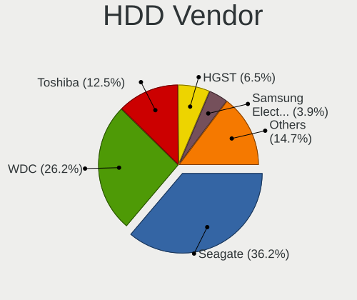

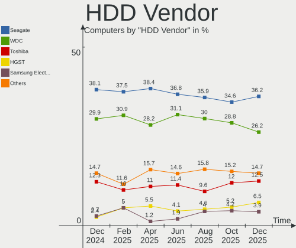

| Vendor              | Computers | Drives | Percent |
|---------------------|-----------|--------|---------|
| Seagate             | 101       | 137    | 36.2%   |
| WDC                 | 73        | 100    | 26.16%  |
| Toshiba             | 35        | 38     | 12.54%  |
| HGST                | 18        | 40     | 6.45%   |
| Samsung Electronics | 11        | 12     | 3.94%   |
| Hitachi             | 10        | 11     | 3.58%   |
| Unknown             | 6         | 6      | 2.15%   |
| Apple               | 4         | 4      | 1.43%   |
| JMicron Technology  | 3         | 3      | 1.08%   |
| JetFlash            | 3         | 3      | 1.08%   |
| Fujitsu             | 3         | 3      | 1.08%   |
| SSK                 | 2         | 2      | 0.72%   |
| Hewlett-Packard     | 2         | 19     | 0.72%   |
| USB 3.1             | 1         | 1      | 0.36%   |
| Shenzhen            | 1         | 1      | 0.36%   |
| PRO-T5              | 1         | 1      | 0.36%   |
| Intenso             | 1         | 1      | 0.36%   |
| HPE                 | 1         | 4      | 0.36%   |
| ExcelStor           | 1         | 1      | 0.36%   |
| BR                  | 1         | 1      | 0.36%   |
| ASMedia             | 1         | 1      | 0.36%   |

SSD Vendor
----------

Solid state drive vendors

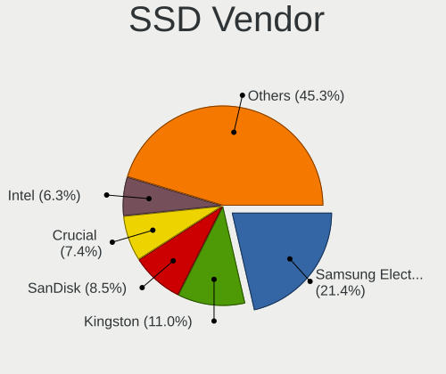

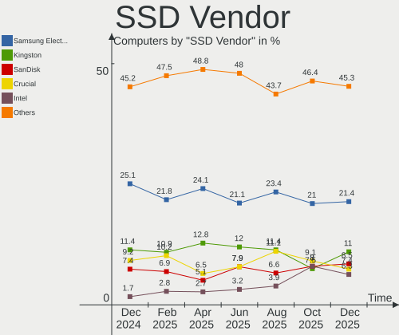

| Vendor              | Computers | Drives | Percent |
|---------------------|-----------|--------|---------|
| Samsung Electronics | 78        | 93     | 21.43%  |
| Kingston            | 40        | 44     | 10.99%  |
| SanDisk             | 31        | 34     | 8.52%   |
| Crucial             | 27        | 27     | 7.42%   |
| Intel               | 23        | 46     | 6.32%   |
| WDC                 | 17        | 21     | 4.67%   |
| Micron Technology   | 14        | 15     | 3.85%   |
| China               | 11        | 12     | 3.02%   |
| PNY                 | 10        | 11     | 2.75%   |
| A-DATA Technology   | 10        | 11     | 2.75%   |
| Apple               | 8         | 8      | 2.2%    |
| SK hynix            | 7         | 7      | 1.92%   |
| Intenso             | 7         | 7      | 1.92%   |
| Toshiba             | 5         | 5      | 1.37%   |
| SPCC                | 5         | 5      | 1.37%   |
| SOLIDIGM            | 5         | 10     | 1.37%   |
| GOODRAM             | 5         | 5      | 1.37%   |
| SABRENT             | 4         | 4      | 1.1%    |
| KingSpec            | 4         | 4      | 1.1%    |
| Transcend           | 3         | 3      | 0.82%   |
| LITEON              | 3         | 3      | 0.82%   |
| Lexar               | 3         | 3      | 0.82%   |
| Unknown             | 3         | 3      | 0.82%   |
| XrayDisk            | 2         | 2      | 0.55%   |
| Patriot             | 2         | 2      | 0.55%   |
| Netac               | 2         | 2      | 0.55%   |
| Integral            | 2         | 2      | 0.55%   |
| CONSISTENT          | 2         | 2      | 0.55%   |
| Apacer              | 2         | 2      | 0.55%   |
| AMD                 | 2         | 2      | 0.55%   |
| Wibtek              | 1         | 1      | 0.27%   |
| Verbatim            | 1         | 1      | 0.27%   |
| Seagate             | 1         | 1      | 0.27%   |
| Safety              | 1         | 1      | 0.27%   |
| Rogueware           | 1         | 1      | 0.27%   |
| PNY USB             | 1         | 1      | 0.27%   |
| ORICO               | 1         | 1      | 0.27%   |
| MSI                 | 1         | 1      | 0.27%   |
| LITEONIT            | 1         | 1      | 0.27%   |
| KIOXIA-EXCERIA      | 1         | 1      | 0.27%   |

Drive Kind
----------

HDD or SSD

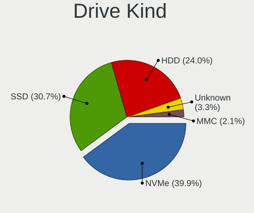

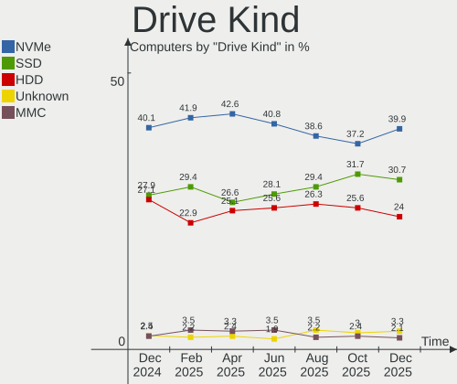

| Kind    | Computers | Drives | Percent |
|---------|-----------|--------|---------|
| NVMe    | 396       | 496    | 39.88%  |
| SSD     | 305       | 422    | 30.72%  |
| HDD     | 238       | 389    | 23.97%  |
| Unknown | 33        | 33     | 3.32%   |
| MMC     | 21        | 27     | 2.11%   |

Drive Connector
---------------

SATA, SAS, NVMe, etc.

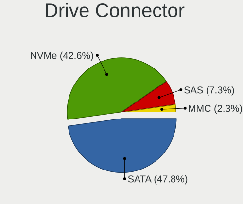

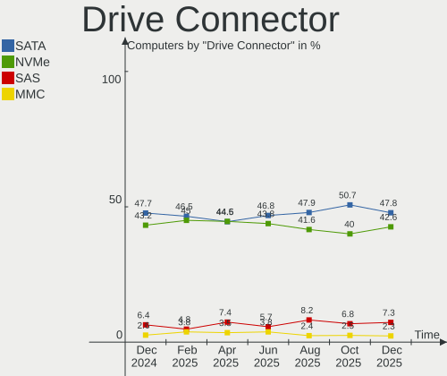

| Type | Computers | Drives | Percent |
|------|-----------|--------|---------|
| SATA | 443       | 768    | 47.79%  |
| NVMe | 395       | 492    | 42.61%  |
| SAS  | 68        | 80     | 7.34%   |
| MMC  | 21        | 27     | 2.27%   |

Drive Size
----------

Size of hard drive

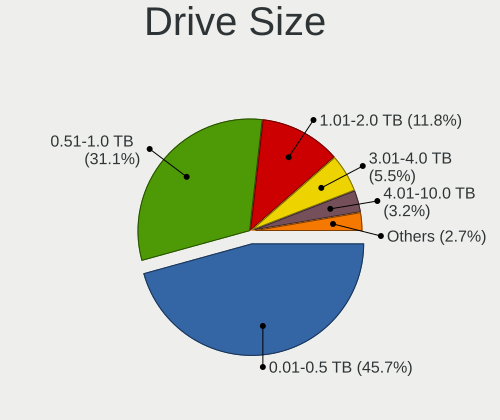

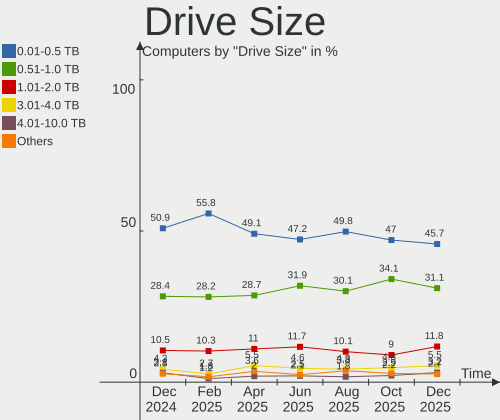

| Size in TB | Computers | Drives | Percent |
|------------|-----------|--------|---------|
| 0.01-0.5   | 272       | 346    | 45.71%  |
| 0.51-1.0   | 185       | 242    | 31.09%  |
| 1.01-2.0   | 70        | 83     | 11.76%  |
| 3.01-4.0   | 33        | 63     | 5.55%   |
| 4.01-10.0  | 19        | 40     | 3.19%   |
| 2.01-3.0   | 11        | 28     | 1.85%   |
| 10.01-20.0 | 5         | 9      | 0.84%   |

Space Total
-----------

Amount of disk space available on the file system

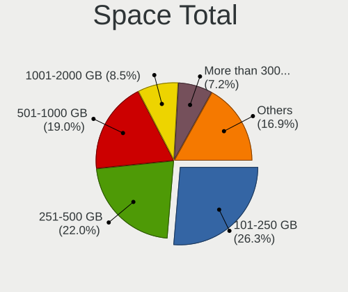

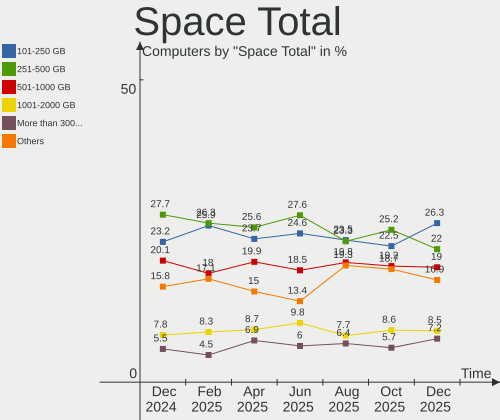

| Size in GB     | Computers | Percent |
|----------------|-----------|---------|
| 101-250        | 202       | 26.34%  |
| 251-500        | 169       | 22.03%  |
| 501-1000       | 146       | 19.04%  |
| 1001-2000      | 65        | 8.47%   |
| More than 3000 | 55        | 7.17%   |
| 1-20           | 36        | 4.69%   |
| 2001-3000      | 29        | 3.78%   |
| Unknown        | 29        | 3.78%   |
| 51-100         | 22        | 2.87%   |
| 21-50          | 14        | 1.83%   |

Space Used
----------

Amount of used disk space

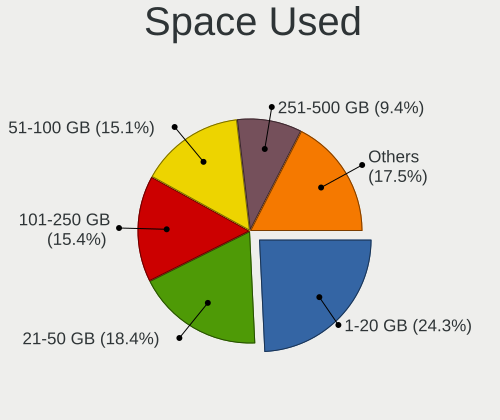

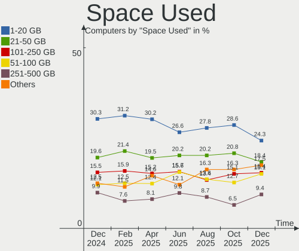

| Used GB        | Computers | Percent |
|----------------|-----------|---------|
| 1-20           | 186       | 24.25%  |
| 21-50          | 141       | 18.38%  |
| 101-250        | 118       | 15.38%  |
| 51-100         | 116       | 15.12%  |
| 251-500        | 72        | 9.39%   |
| 501-1000       | 46        | 6%      |
| Unknown        | 29        | 3.78%   |
| 1001-2000      | 26        | 3.39%   |
| More than 3000 | 20        | 2.61%   |
| 2001-3000      | 13        | 1.69%   |

Malfunc. Drives
---------------

Drive models with a malfunction

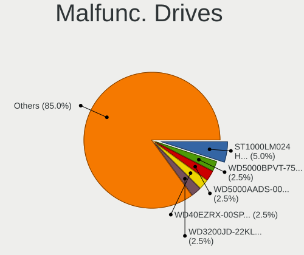

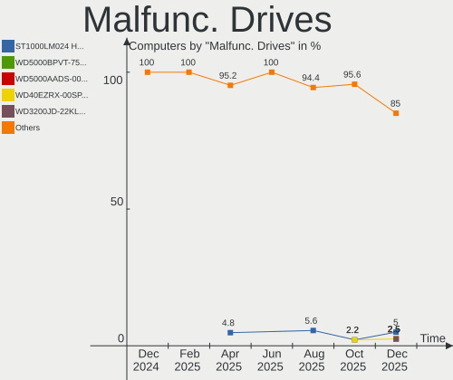

| Model                                               | Computers | Drives | Percent |
|-----------------------------------------------------|-----------|--------|---------|
| Seagate ST1000LM024 HN-M101MBB 1TB                  | 2         | 2      | 5%      |
| WDC WD5000BPVT-75HXZT3 500GB                        | 1         | 1      | 2.5%    |
| WDC WD5000AADS-00S9B0 500GB                         | 1         | 1      | 2.5%    |
| WDC WD40EZRX-00SPEB0 4TB                            | 1         | 1      | 2.5%    |
| WDC WD3200JD-22KLB0 320GB                           | 1         | 1      | 2.5%    |
| WDC WD30EFRX-68EUZN0 3TB                            | 1         | 1      | 2.5%    |
| WDC WD30EFRX-68AX9N0 3TB                            | 1         | 1      | 2.5%    |
| WDC WD20EZRX-00D8PB0 2TB                            | 1         | 1      | 2.5%    |
| WDC WD10EZEX-22BN5A0 1TB                            | 1         | 1      | 2.5%    |
| WDC WD10EFRX-68FYTN0 1TB                            | 1         | 1      | 2.5%    |
| WDC WD10EADS-00M2B0 1TB                             | 1         | 1      | 2.5%    |
| Toshiba MQ01ABD100V 1TB                             | 1         | 1      | 2.5%    |
| SK hynix HFS256G3AMNB-2200A 256GB SSD               | 1         | 1      | 2.5%    |
| Seagate ST98823AS 80GB                              | 1         | 1      | 2.5%    |
| Seagate ST500DM002-1BD142 500GB                     | 1         | 1      | 2.5%    |
| Seagate ST3500312CS 500GB                           | 1         | 1      | 2.5%    |
| Seagate ST3000VN000-1HJ166 3TB                      | 1         | 2      | 2.5%    |
| Seagate ST18000VE002-3BS101 18TB                    | 1         | 1      | 2.5%    |
| SanDisk SSD i100 24GB                               | 1         | 1      | 2.5%    |
| Samsung Electronics SSD 870 EVO 1TB                 | 1         | 1      | 2.5%    |
| Samsung Electronics MZVL22T0HBLB-00BH1 2TB          | 1         | 1      | 2.5%    |
| Samsung Electronics HD160JJ 160GB                   | 1         | 1      | 2.5%    |
| Micron Technology MTFDDAK512MAY-1AE1ZABHA 512GB SSD | 1         | 1      | 2.5%    |
| KIOXIA KBG6AZNT1T02 LA 1TB                          | 1         | 1      | 2.5%    |
| Kingston SHFS37A120G 120GB SSD                      | 1         | 1      | 2.5%    |
| KingSpec NXM-256 2242 256GB                         | 1         | 1      | 2.5%    |
| Intel SSDSC2KB038T8 4TB                             | 1         | 2      | 2.5%    |
| Intel SSDSC2KB019T8 1TB                             | 1         | 1      | 2.5%    |
| Intel SSDSC2CT120A3 120GB                           | 1         | 2      | 2.5%    |
| Intel SSDSC2BB960G7 960GB                           | 1         | 2      | 2.5%    |
| Intel SSDSC2BB800G7 800GB                           | 1         | 1      | 2.5%    |
| Intel SSDSC2BB48 480GB                              | 1         | 1      | 2.5%    |
| Hitachi HTS547575A9E384 752GB                       | 1         | 1      | 2.5%    |
| Hitachi HDS723020BLE640 2TB                         | 1         | 2      | 2.5%    |
| HGST HTS725050A7E630 500GB                          | 1         | 1      | 2.5%    |
| HGST HTS545050A7E380 500GB                          | 1         | 1      | 2.5%    |
| Crucial CT256M550SSD1 256GB                         | 1         | 1      | 2.5%    |
| Crucial CT1000MX500SSD1 1TB                         | 1         | 1      | 2.5%    |
| Apple HDD ST1000DM003 1TB                           | 1         | 1      | 2.5%    |

Malfunc. Drive Vendor
---------------------

Vendors of faulty drives

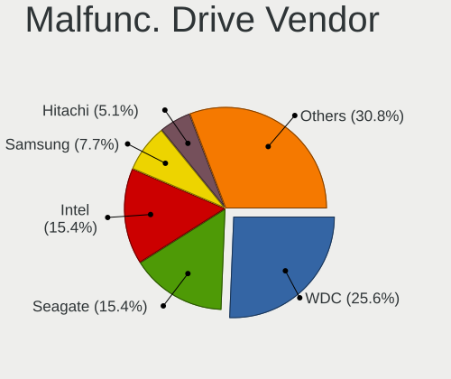

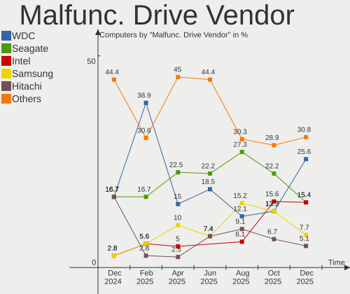

| Vendor              | Computers | Drives | Percent |
|---------------------|-----------|--------|---------|
| WDC                 | 10        | 10     | 25.64%  |
| Seagate             | 6         | 8      | 15.38%  |
| Intel               | 6         | 9      | 15.38%  |
| Samsung Electronics | 3         | 3      | 7.69%   |
| Hitachi             | 2         | 3      | 5.13%   |
| HGST                | 2         | 2      | 5.13%   |
| Crucial             | 2         | 2      | 5.13%   |
| Toshiba             | 1         | 1      | 2.56%   |
| SK hynix            | 1         | 1      | 2.56%   |
| SanDisk             | 1         | 1      | 2.56%   |
| Micron Technology   | 1         | 1      | 2.56%   |
| KIOXIA              | 1         | 1      | 2.56%   |
| Kingston            | 1         | 1      | 2.56%   |
| KingSpec            | 1         | 1      | 2.56%   |
| Apple               | 1         | 1      | 2.56%   |

Malfunc. HDD Vendor
-------------------

Vendors of faulty HDD drives

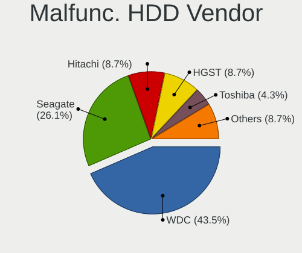

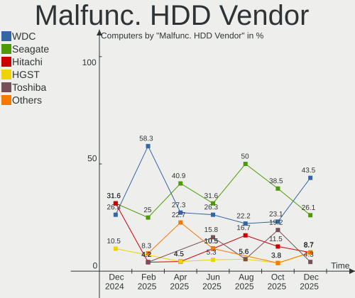

| Vendor              | Computers | Drives | Percent |
|---------------------|-----------|--------|---------|
| WDC                 | 10        | 10     | 43.48%  |
| Seagate             | 6         | 8      | 26.09%  |
| Hitachi             | 2         | 3      | 8.7%    |
| HGST                | 2         | 2      | 8.7%    |
| Toshiba             | 1         | 1      | 4.35%   |
| Samsung Electronics | 1         | 1      | 4.35%   |
| Apple               | 1         | 1      | 4.35%   |

Malfunc. Drive Kind
-------------------

Kinds of faulty drives

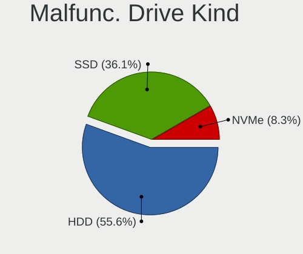

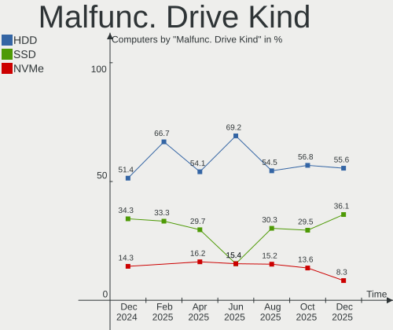

| Kind | Computers | Drives | Percent |
|------|-----------|--------|---------|
| HDD  | 20        | 26     | 55.56%  |
| SSD  | 13        | 16     | 36.11%  |
| NVMe | 3         | 3      | 8.33%   |

Failed Drives
-------------

Failed drive models

Zero info for selected period =(

Failed Drive Vendor
-------------------

Failed drive vendors

Zero info for selected period =(

Drive Status
------------

Number of failed and malfunc. drives

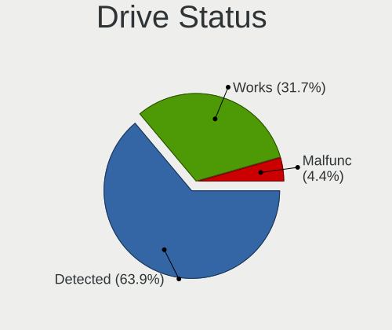

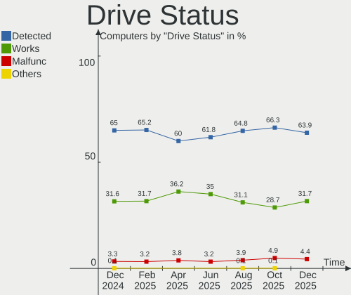

| Status   | Computers | Drives | Percent |
|----------|-----------|--------|---------|
| Detected | 520       | 833    | 63.88%  |
| Works    | 258       | 489    | 31.7%   |
| Malfunc  | 36        | 45     | 4.42%   |

Storage controller
------------------

Storage Vendor
--------------

Storage controller vendors

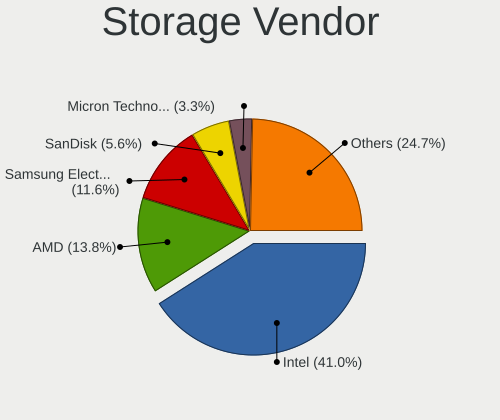

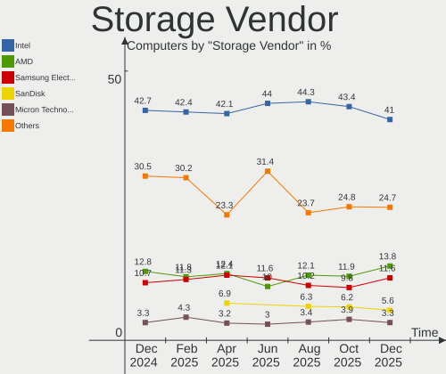

| Vendor                          | Computers | Percent |
|---------------------------------|-----------|---------|
| Intel                           | 433       | 40.96%  |
| AMD                             | 146       | 13.81%  |
| Samsung Electronics             | 123       | 11.64%  |
| SanDisk                         | 59        | 5.58%   |
| Micron Technology               | 35        | 3.31%   |
| SK hynix                        | 30        | 2.84%   |
| Kingston Technology Company     | 27        | 2.55%   |
| KIOXIA                          | 22        | 2.08%   |
| Micron/Crucial Technology       | 21        | 1.99%   |
| Toshiba America Info Systems    | 17        | 1.61%   |
| MAXIO Technology (Hangzhou)     | 16        | 1.51%   |
| Phison Electronics              | 15        | 1.42%   |
| Silicon Motion                  | 12        | 1.14%   |
| ASMedia Technology              | 12        | 1.14%   |
| Realtek Semiconductor           | 11        | 1.04%   |
| Broadcom / LSI                  | 11        | 1.04%   |
| Shenzhen Longsys Electronics    | 9         | 0.85%   |
| ADATA Technology                | 8         | 0.76%   |
| Marvell Technology Group        | 7         | 0.66%   |
| Hewlett-Packard                 | 7         | 0.66%   |
| LSI Logic / Symbios Logic       | 5         | 0.47%   |
| Apple                           | 4         | 0.38%   |
| Yangtze Memory Technologies     | 3         | 0.28%   |
| Solidigm                        | 3         | 0.28%   |
| Nvidia                          | 3         | 0.28%   |
| JMicron Technology              | 3         | 0.28%   |
| Biwin Storage Technology        | 3         | 0.28%   |
| Shenzhen Techwinsemi Technology | 2         | 0.19%   |
| Hosin Global Electronics        | 2         | 0.19%   |
| Zhaoxin                         | 1         | 0.09%   |
| Solid State Storage Technology  | 1         | 0.09%   |
| Silicon Image                   | 1         | 0.09%   |
| Shenzhen Wodposit Electronics   | 1         | 0.09%   |
| Red Hat                         | 1         | 0.09%   |
| OCZ Technology Group            | 1         | 0.09%   |
| Huawei Technologies             | 1         | 0.09%   |
| Adaptec                         | 1         | 0.09%   |

Storage Model
-------------

Storage controller models

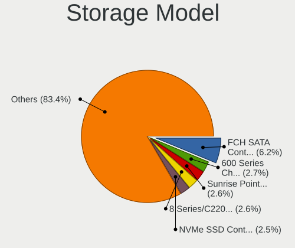

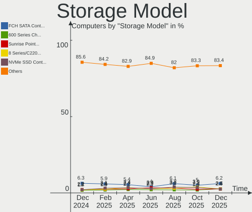

| Model                                                                                   | Computers | Percent |
|-----------------------------------------------------------------------------------------|-----------|---------|
| AMD FCH SATA Controller [AHCI mode]                                                     | 73        | 6.24%   |
| AMD 600 Series Chipset SATA Controller                                                  | 32        | 2.74%   |
| Intel Sunrise Point-LP SATA Controller [AHCI mode]                                      | 30        | 2.57%   |
| Intel 8 Series/C220 Series Chipset Family 6-port SATA Controller 1 [AHCI mode]          | 30        | 2.57%   |
| Samsung NVMe SSD Controller SM981/PM981/PM983                                           | 29        | 2.48%   |
| Intel 7 Series Chipset Family 6-port SATA Controller [AHCI mode]                        | 26        | 2.22%   |
| Intel Volume Management Device NVMe RAID Controller                                     | 22        | 1.88%   |
| Intel Cannon Lake PCH SATA AHCI Controller                                              | 19        | 1.63%   |
| Intel 200 Series PCH SATA controller [AHCI mode]                                        | 19        | 1.63%   |
| AMD 500 Series Chipset SATA Controller                                                  | 19        | 1.63%   |
| Samsung NVMe SSD Controller 980 (DRAM-less)                                             | 18        | 1.54%   |
| Intel 6 Series/C200 Series Chipset Family 6 port Mobile SATA AHCI Controller            | 18        | 1.54%   |
| Intel SATA Controller [RAID Mode]                                                       | 17        | 1.45%   |
| Intel RST Volume Management Device Controller                                           | 17        | 1.45%   |
| Intel C610/X99 series chipset 6-Port SATA Controller [AHCI mode]                        | 17        | 1.45%   |
| Intel 8 Series SATA Controller 1 [AHCI mode]                                            | 17        | 1.45%   |
| Samsung NVMe SSD Controller S4LV008[Pascal]                                             | 16        | 1.37%   |
| Samsung NVMe SSD Controller PM9C1a (DRAM-less)                                          | 16        | 1.37%   |
| Samsung NVMe SSD Controller PM9A1/PM9A3/980PRO                                          | 15        | 1.28%   |
| Intel C610/X99 series chipset sSATA Controller [AHCI mode]                              | 15        | 1.28%   |
| Intel Alder Lake-S PCH SATA Controller [AHCI Mode]                                      | 12        | 1.03%   |
| Intel 82801 Mobile SATA Controller [RAID mode]                                          | 12        | 1.03%   |
| Intel 7 Series/C210 Series Chipset Family 6-port SATA Controller [AHCI mode]            | 12        | 1.03%   |
| AMD SB7x0/SB8x0/SB9x0 SATA Controller [AHCI mode]                                       | 12        | 1.03%   |
| AMD 400 Series Chipset SATA Controller                                                  | 12        | 1.03%   |
| SanDisk WD SN560/SN740/SN770/SN5000 NVMe SSD                                            | 11        | 0.94%   |
| MAXIO (Hangzhou) NVMe SSD Controller MAP1202 (DRAM-less)                                | 11        | 0.94%   |
| Intel Raptor Lake SATA AHCI Controller                                                  | 11        | 0.94%   |
| ASMedia ASM1061/ASM1062 Serial ATA Controller                                           | 11        | 0.94%   |
| Silicon Motion SM2263EN/SM2263XT (DRAM-less) NVMe SSD Controllers                       | 10        | 0.86%   |
| Samsung NVMe SSD Controller SM961/PM961/SM963                                           | 10        | 0.86%   |
| Intel Wildcat Point-LP SATA Controller [AHCI Mode]                                      | 10        | 0.86%   |
| Intel 6 Series/C200 Series Chipset Family 6 port Desktop SATA AHCI Controller           | 10        | 0.86%   |
| Intel 500 Series Chipset Family SATA AHCI Controller                                    | 10        | 0.86%   |
| Samsung NVMe SSD Controller PM9B1 (DRAM-less)                                           | 9         | 0.77%   |
| Intel Q170/Q150/B150/H170/H110/Z170/CM236 Chipset SATA Controller [AHCI Mode]           | 9         | 0.77%   |
| Intel 6 Series/C200 Series Chipset Family Desktop SATA Controller (IDE mode, ports 4-5) | 9         | 0.77%   |
| Intel 6 Series/C200 Series Chipset Family Desktop SATA Controller (IDE mode, ports 0-3) | 9         | 0.77%   |
| SanDisk Extreme Pro / WD Black SN750 / PC SN730 / Red SN700 NVMe SSD                    | 8         | 0.68%   |
| Intel Alder Lake-N SATA AHCI Controller                                                 | 8         | 0.68%   |

Storage Kind
------------

Kind of storage controller (IDE, SATA, NVMe, SAS, ...)

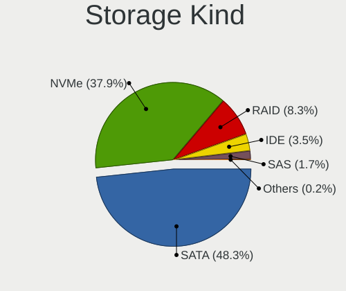

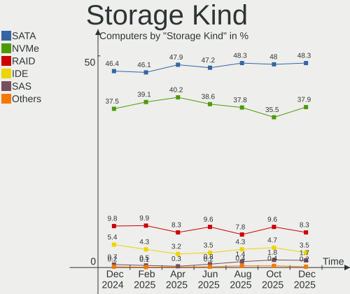

| Kind | Computers | Percent |
|------|-----------|---------|
| SATA | 504       | 48.32%  |
| NVMe | 395       | 37.87%  |
| RAID | 87        | 8.34%   |
| IDE  | 37        | 3.55%   |
| SAS  | 18        | 1.73%   |
| SCSI | 2         | 0.19%   |

Processor
---------

CPU Vendor
----------

Processor vendors

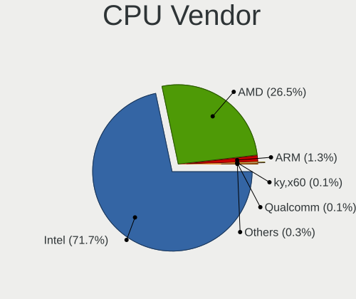

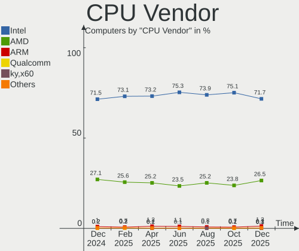

| Vendor       | Computers | Percent |
|--------------|-----------|---------|
| Intel        | 550       | 71.71%  |
| AMD          | 203       | 26.47%  |
| ARM          | 10        | 1.3%    |
| Qualcomm     | 1         | 0.13%   |
| ky,x60       | 1         | 0.13%   |
| Hisilicon    | 1         | 0.13%   |
| CentaurHauls | 1         | 0.13%   |

CPU Model
---------

Processor models

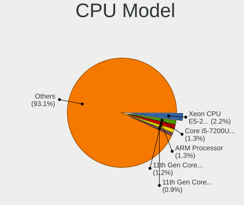

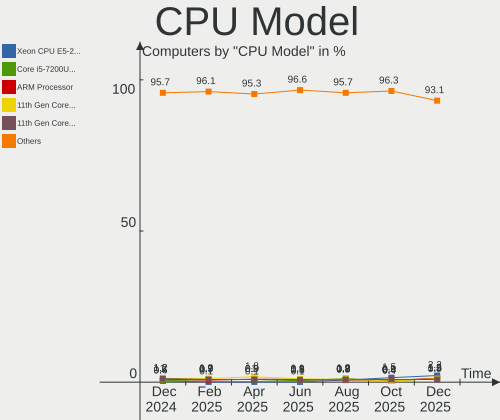

| Model                                      | Computers | Percent |
|--------------------------------------------|-----------|---------|
| Intel Xeon CPU E5-2680 v4 @ 2.40GHz        | 17        | 2.22%   |
| Intel Core i5-7200U CPU @ 2.50GHz          | 10        | 1.3%    |
| ARM Processor                              | 10        | 1.3%    |
| Intel 11th Gen Core i5-1135G7 @ 2.40GHz    | 9         | 1.17%   |
| Intel 11th Gen Core i7-1165G7 @ 2.80GHz    | 7         | 0.91%   |
| Intel Core i5-8350U CPU @ 1.70GHz          | 6         | 0.78%   |
| Intel Core i5-6300U CPU @ 2.40GHz          | 6         | 0.78%   |
| AMD Ryzen 9 9950X3D 16-Core Processor      | 6         | 0.78%   |
| AMD Ryzen 9 9950X 16-Core Processor        | 6         | 0.78%   |
| AMD Ryzen 7 5700U with Radeon Graphics     | 6         | 0.78%   |
| AMD Ryzen 5 3600 6-Core Processor          | 6         | 0.78%   |
| Intel Core i7-8650U CPU @ 1.90GHz          | 5         | 0.65%   |
| Intel Core i5-8400 CPU @ 2.80GHz           | 5         | 0.65%   |
| AMD Ryzen 7 9800X3D 8-Core Processor       | 5         | 0.65%   |
| AMD Ryzen 7 5825U with Radeon Graphics     | 5         | 0.65%   |
| AMD Ryzen 7 5700X 8-Core Processor         | 5         | 0.65%   |
| AMD Ryzen 5 7520U with Radeon Graphics     | 5         | 0.65%   |
| Intel N95                                  | 4         | 0.52%   |
| Intel Core Ultra 7 155H                    | 4         | 0.52%   |
| Intel Core i9-14900K                       | 4         | 0.52%   |
| Intel Core i7-3770 CPU @ 3.40GHz           | 4         | 0.52%   |
| Intel Core i5-8365U CPU @ 1.60GHz          | 4         | 0.52%   |
| Intel Core i5-8250U CPU @ 1.60GHz          | 4         | 0.52%   |
| Intel Core i5-6500 CPU @ 3.20GHz           | 4         | 0.52%   |
| Intel Core i5-6200U CPU @ 2.30GHz          | 4         | 0.52%   |
| Intel Core i5-3337U CPU @ 1.80GHz          | 4         | 0.52%   |
| Intel Core i5-3320M CPU @ 2.60GHz          | 4         | 0.52%   |
| Intel Core i5-10310U CPU @ 1.70GHz         | 4         | 0.52%   |
| Intel Core i5-10210U CPU @ 1.60GHz         | 4         | 0.52%   |
| Intel Core i3-8100 CPU @ 3.60GHz           | 4         | 0.52%   |
| Intel Core i3-3220 CPU @ 3.30GHz           | 4         | 0.52%   |
| Intel 13th Gen Core i7-13620H              | 4         | 0.52%   |
| Intel 12th Gen Core i3-1215U               | 4         | 0.52%   |
| AMD Ryzen 7 8845HS w/ Radeon 780M Graphics | 4         | 0.52%   |
| AMD Ryzen 7 5800X 8-Core Processor         | 4         | 0.52%   |
| AMD Ryzen 7 4700U with Radeon Graphics     | 4         | 0.52%   |
| AMD Ryzen 5 5600G with Radeon Graphics     | 4         | 0.52%   |
| AMD Ryzen 3 7320U with Radeon Graphics     | 4         | 0.52%   |
| Intel Xeon CPU E5-2680 v2 @ 2.80GHz        | 3         | 0.39%   |
| Intel N150                                 | 3         | 0.39%   |

CPU Model Family
----------------

Processor model prefix

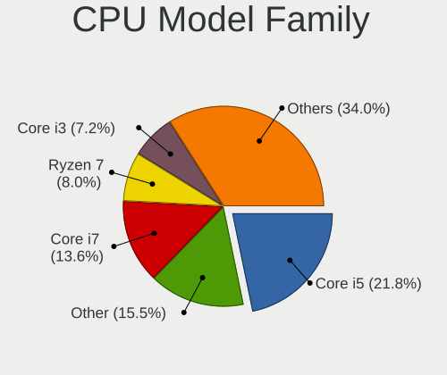

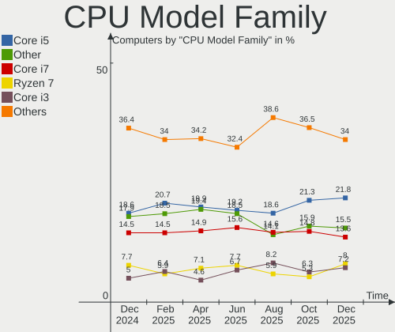

| Model                   | Computers | Percent |
|-------------------------|-----------|---------|
| Intel Core i5           | 167       | 21.77%  |
| Other                   | 119       | 15.51%  |
| Intel Core i7           | 104       | 13.56%  |
| AMD Ryzen 7             | 61        | 7.95%   |
| Intel Core i3           | 55        | 7.17%   |
| AMD Ryzen 5             | 49        | 6.39%   |
| Intel Xeon              | 44        | 5.74%   |
| Intel Core              | 27        | 3.52%   |
| AMD Ryzen 9             | 26        | 3.39%   |
| Intel Pentium           | 12        | 1.56%   |
| Intel Celeron           | 11        | 1.43%   |
| Intel Core i9           | 10        | 1.3%    |
| Intel Core 2 Duo        | 10        | 1.3%    |
| AMD Ryzen 3             | 8         | 1.04%   |
| AMD Ryzen Threadripper  | 6         | 0.78%   |
| AMD FX                  | 6         | 0.78%   |
| AMD A6                  | 6         | 0.78%   |
| AMD Ryzen 7 PRO         | 4         | 0.52%   |
| AMD E                   | 4         | 0.52%   |
| AMD A8                  | 4         | 0.52%   |
| AMD A4                  | 4         | 0.52%   |
| Intel Pentium Dual-Core | 3         | 0.39%   |
| Intel Atom              | 3         | 0.39%   |
| AMD Athlon              | 3         | 0.39%   |
| Intel Xeon Platinum     | 2         | 0.26%   |
| Intel Pentium Silver    | 2         | 0.26%   |
| AMD Athlon II X4        | 2         | 0.26%   |
| Intel Core m7           | 1         | 0.13%   |
| Intel Core m3           | 1         | 0.13%   |
| Intel Core M            | 1         | 0.13%   |
| Intel Core 2 Quad       | 1         | 0.13%   |
| AMD Turion 64 X2 Mobile | 1         | 0.13%   |
| AMD Ryzen 3 PRO         | 1         | 0.13%   |
| AMD PRO A8              | 1         | 0.13%   |
| AMD Phenom II X6        | 1         | 0.13%   |
| AMD Phenom II X4        | 1         | 0.13%   |
| AMD Phenom II X2        | 1         | 0.13%   |
| AMD Phenom II           | 1         | 0.13%   |
| AMD EPYC                | 1         | 0.13%   |
| AMD E1                  | 1         | 0.13%   |

CPU Cores
---------

Number of processor cores

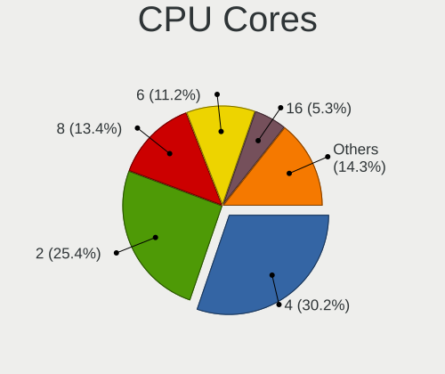

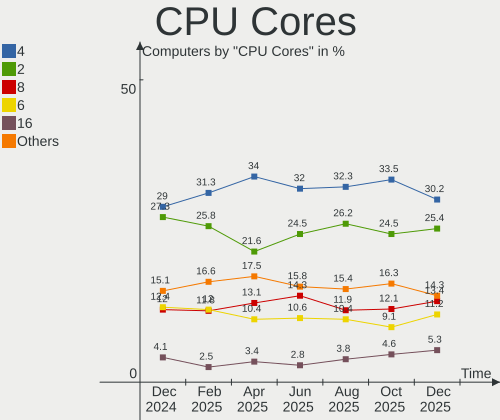

| Number  | Computers | Percent |
|---------|-----------|---------|
| 4       | 232       | 30.25%  |
| 2       | 195       | 25.42%  |
| 8       | 103       | 13.43%  |
| 6       | 86        | 11.21%  |
| 16      | 41        | 5.35%   |
| 10      | 24        | 3.13%   |
| 12      | 23        | 3%      |
| 28      | 17        | 2.22%   |
| 14      | 14        | 1.83%   |
| 24      | 11        | 1.43%   |
| 20      | 8         | 1.04%   |
| Unknown | 5         | 0.65%   |
| 44      | 2         | 0.26%   |
| 32      | 2         | 0.26%   |
| 1       | 2         | 0.26%   |
| 128     | 1         | 0.13%   |
| 96      | 1         | 0.13%   |

CPU Sockets
-----------

Number of sockets

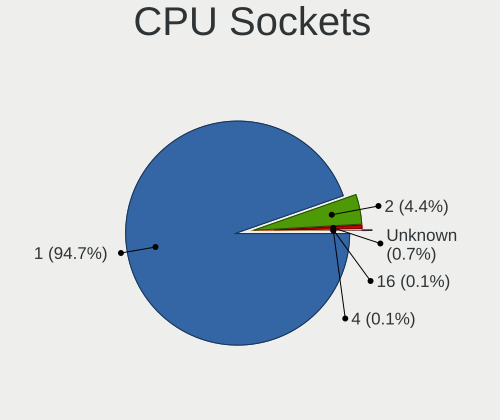

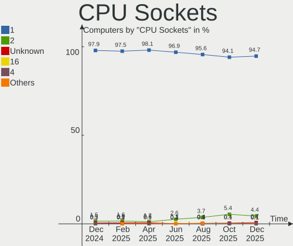

| Number  | Computers | Percent |
|---------|-----------|---------|
| 1       | 726       | 94.65%  |
| 2       | 34        | 4.43%   |
| Unknown | 5         | 0.65%   |
| 16      | 1         | 0.13%   |
| 4       | 1         | 0.13%   |

CPU Threads
-----------

Threads per core (Hyper-Threading)

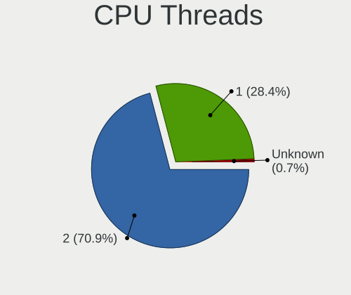

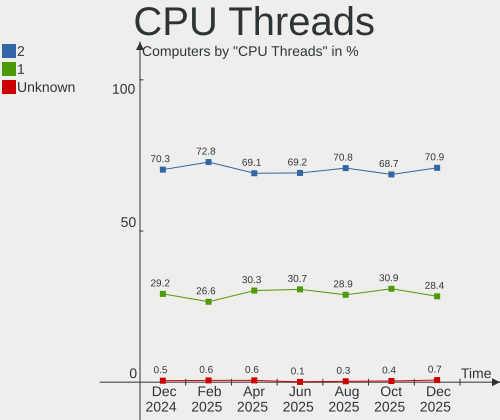

| Number  | Computers | Percent |
|---------|-----------|---------|
| 2       | 544       | 70.93%  |
| 1       | 218       | 28.42%  |
| Unknown | 5         | 0.65%   |

CPU Op-Modes
------------

CPU Operation Modes (32-bit, 64-bit)

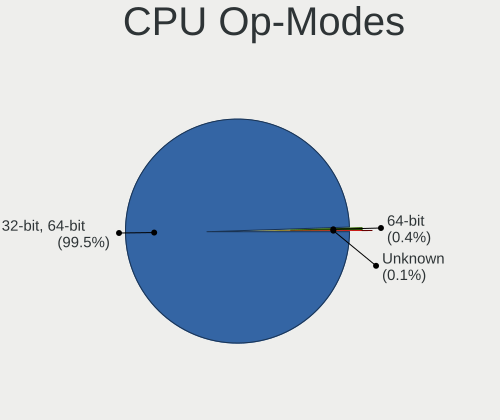

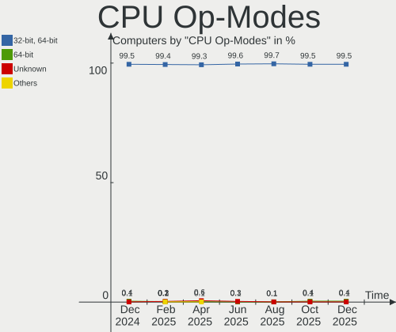

| Op mode        | Computers | Percent |
|----------------|-----------|---------|
| 32-bit, 64-bit | 763       | 99.48%  |
| 64-bit         | 3         | 0.39%   |
| Unknown        | 1         | 0.13%   |

CPU Microcode
-------------

Microcode number

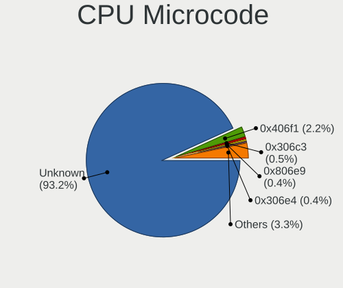

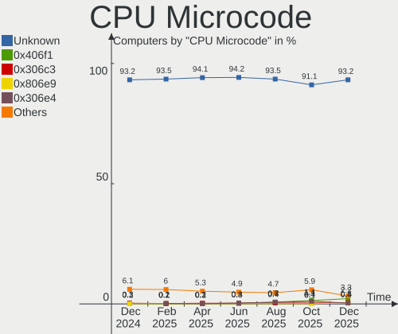

| Number     | Computers | Percent |
|------------|-----------|---------|
| Unknown    | 715       | 93.22%  |
| 0x406f1    | 17        | 2.22%   |
| 0x306c3    | 4         | 0.52%   |
| 0x806e9    | 3         | 0.39%   |
| 0x306e4    | 3         | 0.39%   |
| 0x306a9    | 3         | 0.39%   |
| 0x206c2    | 2         | 0.26%   |
| 0x206a7    | 2         | 0.26%   |
| 0x106a5    | 2         | 0.26%   |
| 0xb06f2    | 1         | 0.13%   |
| 0xa0653    | 1         | 0.13%   |
| 0x906e9    | 1         | 0.13%   |
| 0x906c0    | 1         | 0.13%   |
| 0x806ea    | 1         | 0.13%   |
| 0x806c1    | 1         | 0.13%   |
| 0x706e5    | 1         | 0.13%   |
| 0x406c4    | 1         | 0.13%   |
| 0x40651    | 1         | 0.13%   |
| 0x306d4    | 1         | 0.13%   |
| 0x30678    | 1         | 0.13%   |
| 0x1067a    | 1         | 0.13%   |
| 0x08600109 | 1         | 0.13%   |
| 0x0810100b | 1         | 0.13%   |
| 0x06001119 | 1         | 0.13%   |
| 0x010000db | 1         | 0.13%   |

CPU Microarch
-------------

Microarchitecture

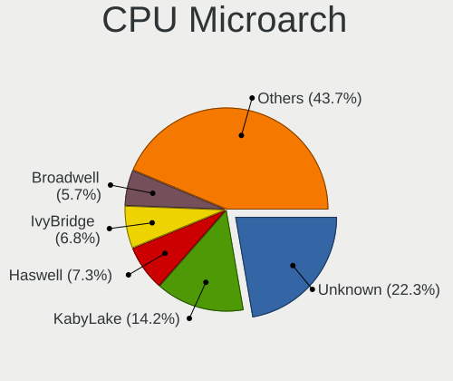

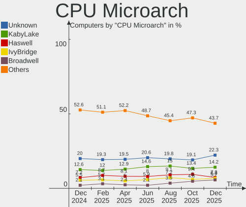

| Name               | Computers | Percent |
|--------------------|-----------|---------|
| Unknown            | 171       | 22.29%  |
| KabyLake           | 109       | 14.21%  |
| Haswell            | 56        | 7.3%    |
| IvyBridge          | 52        | 6.78%   |
| Broadwell          | 44        | 5.74%   |
| Skylake            | 41        | 5.35%   |
| Zen 3              | 37        | 4.82%   |
| SandyBridge        | 36        | 4.69%   |
| Alderlake Hybrid   | 27        | 3.52%   |
| Zen 2              | 26        | 3.39%   |
| TigerLake          | 22        | 2.87%   |
| Piledriver         | 14        | 1.83%   |
| Zen+               | 13        | 1.69%   |
| CometLake          | 12        | 1.56%   |
| Westmere           | 11        | 1.43%   |
| Silvermont         | 10        | 1.3%    |
| Nehalem            | 10        | 1.3%    |
| Penryn             | 9         | 1.17%   |
| IceLake            | 9         | 1.17%   |
| Meteorlake Hybrid  | 7         | 0.91%   |
| K10                | 7         | 0.91%   |
| Zen                | 6         | 0.78%   |
| Core               | 5         | 0.65%   |
| Lunarlake Hybrid   | 4         | 0.52%   |
| Gracemont          | 4         | 0.52%   |
| Tremont            | 3         | 0.39%   |
| Jaguar             | 3         | 0.39%   |
| Goldmont plus      | 3         | 0.39%   |
| Excavator          | 3         | 0.39%   |
| Bobcat             | 3         | 0.39%   |
| Steamroller        | 2         | 0.26%   |
| Puma               | 2         | 0.26%   |
| K8 Hammer          | 2         | 0.26%   |
| Goldmont           | 2         | 0.26%   |
| K10 Llano          | 1         | 0.13%   |
| ArrowLake-H Hybrid | 1         | 0.13%   |

Graphics
--------

GPU Vendor
----------

Vendors of graphics cards

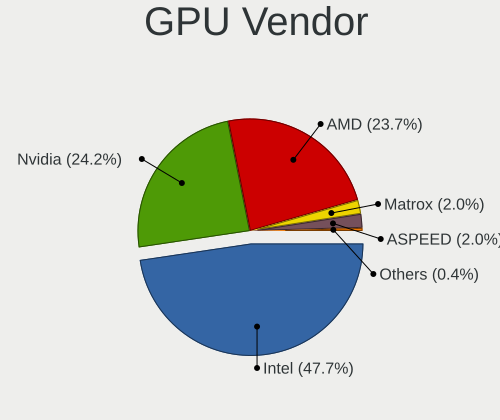

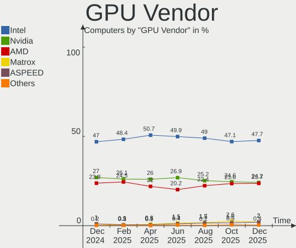

| Vendor                     | Computers | Percent |
|----------------------------|-----------|---------|
| Intel                      | 427       | 47.66%  |
| Nvidia                     | 217       | 24.22%  |
| AMD                        | 212       | 23.66%  |
| Matrox Electronics Systems | 18        | 2.01%   |
| ASPEED Technology          | 18        | 2.01%   |
| Huawei Technologies        | 3         | 0.33%   |
| Glenfly Tech               | 1         | 0.11%   |

GPU Model
---------

Graphics card models

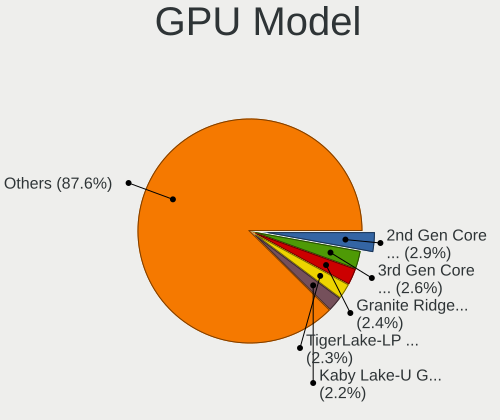

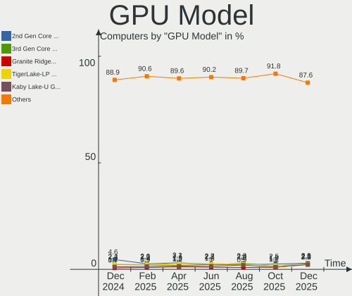

| Model                                                                       | Computers | Percent |
|-----------------------------------------------------------------------------|-----------|---------|
| Intel 2nd Generation Core Processor Family Integrated Graphics Controller   | 26        | 2.85%   |
| Intel 3rd Gen Core processor Graphics Controller                            | 24        | 2.63%   |
| AMD Granite Ridge [Radeon Graphics]                                         | 22        | 2.41%   |
| Intel TigerLake-LP GT2 [Iris Xe Graphics]                                   | 21        | 2.31%   |
| Intel Kaby Lake-U GT2 [HD Graphics 620]                                     | 20        | 2.2%    |
| Intel Kaby Lake-R GT2 [UHD Graphics 620]                                    | 18        | 1.98%   |
| Intel Haswell-ULT Integrated Graphics Controller                            | 18        | 1.98%   |
| ASPEED Technology ASPEED Graphics Family                                    | 18        | 1.98%   |
| Intel CoffeeLake-S GT2 [UHD Graphics 630]                                   | 17        | 1.87%   |
| Intel Xeon E3-1200 v3/4th Gen Core Processor Integrated Graphics Controller | 15        | 1.65%   |
| Intel Skylake-U GT2 [HD Graphics 520]                                       | 14        | 1.54%   |
| Intel CoffeeLake-H GT2 [UHD Graphics 630]                                   | 12        | 1.32%   |
| AMD Ellesmere [Radeon RX 470/480/570/570X/580/580X/590]                     | 12        | 1.32%   |
| Intel Raptor Lake-P [Iris Xe Graphics]                                      | 11        | 1.21%   |
| Intel Broadwell-U GT2 [HD Graphics 5500]                                    | 11        | 1.21%   |
| Intel Alder Lake-P GT2 [Iris Xe Graphics]                                   | 11        | 1.21%   |
| AMD Renoir [Radeon Vega Series / Radeon Vega Mobile Series]                 | 11        | 1.21%   |
| Intel Alder Lake-N [UHD Graphics]                                           | 10        | 1.1%    |
| AMD Mendocino [Radeon 610M]                                                 | 10        | 1.1%    |
| Intel Skylake-S GT2 [HD Graphics 530]                                       | 9         | 0.99%   |
| Intel CometLake-U GT2 [UHD Graphics]                                        | 9         | 0.99%   |
| AMD Lucienne                                                                | 9         | 0.99%   |
| Intel WhiskeyLake-U GT2 [UHD Graphics 620]                                  | 8         | 0.88%   |
| AMD Barcelo                                                                 | 8         | 0.88%   |
| Matrox Electronics Systems MGA G200EH                                       | 7         | 0.77%   |
| Intel Xeon E3-1200 v2/3rd Gen Core processor Graphics Controller            | 7         | 0.77%   |
| Intel Raptor Lake-P [UHD Graphics]                                          | 7         | 0.77%   |
| Intel Lunar Lake [Intel Arc Graphics 130V / 140V]                           | 7         | 0.77%   |
| Intel 4th Gen Core Processor Integrated Graphics Controller                 | 7         | 0.77%   |
| AMD Picasso/Raven 2 [Radeon Vega Series / Radeon Vega Mobile Series]        | 7         | 0.77%   |
| AMD Phoenix1                                                                | 7         | 0.77%   |
| Nvidia TU117 [GeForce GTX 1650]                                             | 6         | 0.66%   |
| Nvidia GB203 [GeForce RTX 5080]                                             | 6         | 0.66%   |
| Nvidia AD107M [GeForce RTX 4060 Max-Q / Mobile]                             | 6         | 0.66%   |
| Matrox Electronics Systems MGA G200eW WPCM450                               | 6         | 0.66%   |
| Intel Meteor Lake-P [Intel Arc Graphics]                                    | 6         | 0.66%   |
| Intel Kaby Lake-S GT2 [HD Graphics 630]                                     | 6         | 0.66%   |
| Intel Broadwell-U GT3 [HD Graphics 6000]                                    | 6         | 0.66%   |
| Intel Atom Processor Z36xxx/Z37xxx Series Graphics & Display                | 6         | 0.66%   |
| Intel Alder Lake-UP3 GT2 [Iris Xe Graphics]                                 | 6         | 0.66%   |

GPU Combo
---------

Combinations of graphics cards

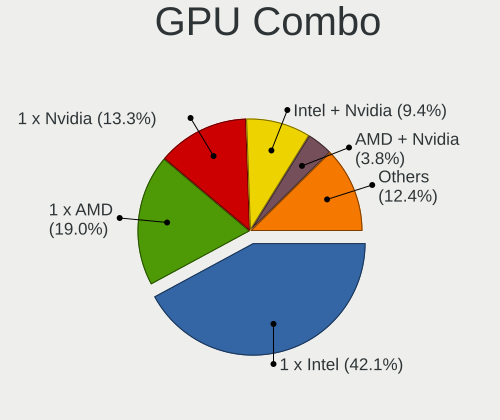

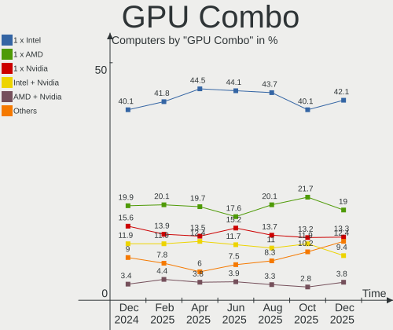

| Name                     | Computers | Percent |
|--------------------------|-----------|---------|
| 1 x Intel                | 323       | 42.11%  |
| 1 x AMD                  | 146       | 19.04%  |
| 1 x Nvidia               | 102       | 13.3%   |
| Intel + Nvidia           | 72        | 9.39%   |
| AMD + Nvidia             | 29        | 3.78%   |
| Intel + AMD              | 21        | 2.74%   |
| 1 x Matrox               | 17        | 2.22%   |
| Other                    | 13        | 1.69%   |
| 2 x AMD                  | 13        | 1.69%   |
| 1 x ASPEED               | 10        | 1.3%    |
| Nvidia + ASPEED          | 6         | 0.78%   |
| 2 x Intel                | 3         | 0.39%   |
| 1 x Huawei Technologies  | 3         | 0.39%   |
| 2 x Nvidia               | 2         | 0.26%   |
| 4 x AMD                  | 1         | 0.13%   |
| Nvidia + Matrox          | 1         | 0.13%   |
| Intel + 2 x Nvidia       | 1         | 0.13%   |
| Intel + ASPEED           | 1         | 0.13%   |
| Intel + AMD + 1 x Nvidia | 1         | 0.13%   |
| 1 x Glenfly Tech         | 1         | 0.13%   |
| AMD + ASPEED             | 1         | 0.13%   |

GPU Driver
----------

Free vs proprietary

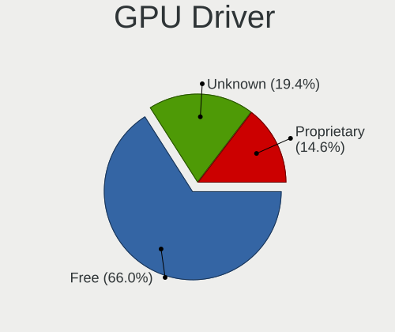

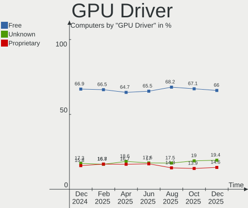

| Driver      | Computers | Percent |
|-------------|-----------|---------|
| Free        | 506       | 65.97%  |
| Unknown     | 149       | 19.43%  |
| Proprietary | 112       | 14.6%   |

GPU Memory
----------

Total video memory

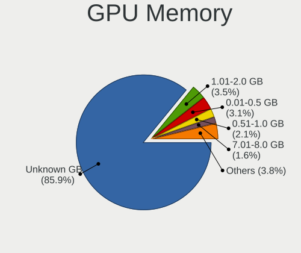

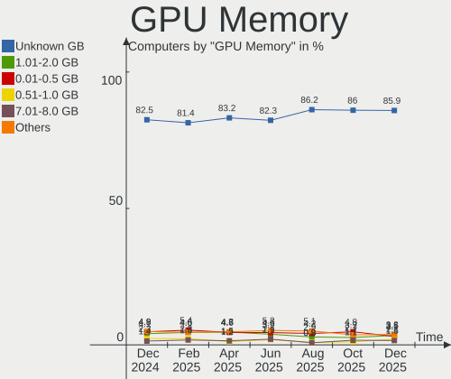

| Size in GB     | Computers | Percent |
|----------------|-----------|---------|
| Unknown        | 659       | 85.92%  |
| 1.01-2.0       | 27        | 3.52%   |
| 0.01-0.5       | 24        | 3.13%   |
| 0.51-1.0       | 16        | 2.09%   |
| 7.01-8.0       | 12        | 1.56%   |
| 3.01-4.0       | 11        | 1.43%   |
| 8.01-16.0      | 11        | 1.43%   |
| 16.01-24.0     | 2         | 0.26%   |
| More than 64.0 | 1         | 0.13%   |
| 32.01-64.0     | 1         | 0.13%   |
| 5.01-6.0       | 1         | 0.13%   |
| 24.01-32.0     | 1         | 0.13%   |
| 2.01-3.0       | 1         | 0.13%   |

Monitor
-------

Monitor Vendor
--------------

Monitor vendors

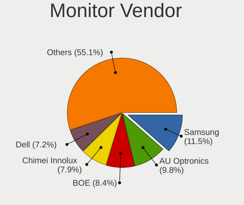

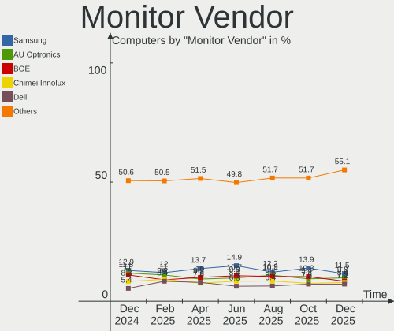

| Vendor                  | Computers | Percent |
|-------------------------|-----------|---------|
| Samsung Electronics     | 94        | 11.49%  |
| AU Optronics            | 80        | 9.78%   |
| BOE                     | 69        | 8.44%   |
| Chimei Innolux          | 65        | 7.95%   |
| Dell                    | 59        | 7.21%   |
| LG Display              | 49        | 5.99%   |
| Goldstar                | 36        | 4.4%    |
| Apple                   | 28        | 3.42%   |
| Lenovo                  | 25        | 3.06%   |
| Acer                    | 25        | 3.06%   |
| Hewlett-Packard         | 24        | 2.93%   |
| Ancor Communications    | 20        | 2.44%   |
| BenQ                    | 19        | 2.32%   |
| AOC                     | 19        | 2.32%   |
| ViewSonic               | 15        | 1.83%   |
| Philips                 | 13        | 1.59%   |
| ASUSTek Computer        | 13        | 1.59%   |
| Sharp                   | 12        | 1.47%   |
| MSI                     | 10        | 1.22%   |
| Iiyama                  | 8         | 0.98%   |
| CSW                     | 8         | 0.98%   |
| Unknown                 | 6         | 0.73%   |
| Sony                    | 6         | 0.73%   |
| Panasonic               | 5         | 0.61%   |
| CSOT                    | 5         | 0.61%   |
| Chi Mei Optoelectronics | 5         | 0.61%   |
| PANDA                   | 4         | 0.49%   |
| NEC Computers           | 4         | 0.49%   |
| Mi                      | 4         | 0.49%   |
| Medion                  | 4         | 0.49%   |
| HannStar                | 4         | 0.49%   |
| Fujitsu Siemens         | 4         | 0.49%   |
| Eizo                    | 4         | 0.49%   |
| Sceptre Tech            | 3         | 0.37%   |
| InfoVision              | 3         | 0.37%   |
| HKC                     | 3         | 0.37%   |
| Xiaomi                  | 2         | 0.24%   |
| Vizio                   | 2         | 0.24%   |
| Vestel Elektronik       | 2         | 0.24%   |
| Unknown (XXX)           | 2         | 0.24%   |

Monitor Model
-------------

Monitor models

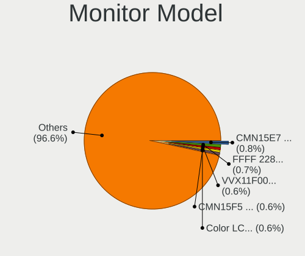

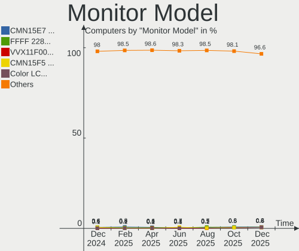

| Model                                                                 | Computers | Percent |
|-----------------------------------------------------------------------|-----------|---------|
| Chimei Innolux LCD Monitor CMN15E7 1920x1080 344x193mm 15.5-inch      | 7         | 0.84%   |
| Unknown LCD Monitor FFFF 2288x1287 2550x2550mm 142.0-inch             | 6         | 0.72%   |
| Panasonic VVX11F009G00 MEI96A2 1920x1080 344x193mm 15.5-inch          | 5         | 0.6%    |
| Chimei Innolux LCD Monitor CMN15F5 1920x1080 344x193mm 15.5-inch      | 5         | 0.6%    |
| Apple Color LCD APPA01B 1440x900 286x179mm 13.3-inch                  | 5         | 0.6%    |
| Chimei Innolux LCD Monitor CMN1521 1920x1080 344x193mm 15.5-inch      | 4         | 0.48%   |
| Samsung Electronics LCD Monitor SDC4187 1920x1200 302x189mm 14.0-inch | 3         | 0.36%   |
| Lenovo B140UAN02.7 LEN403A 1920x1200 302x188mm 14.0-inch              | 3         | 0.36%   |
| Goldstar FULL HD GSM5B55 1920x1080 480x270mm 21.7-inch                | 3         | 0.36%   |
| Dell P2417H DELA0DB 1920x1080 527x296mm 23.8-inch                     | 3         | 0.36%   |
| BOE LCD Monitor BOE097D 1920x1080 344x194mm 15.5-inch                 | 3         | 0.36%   |
| AU Optronics LCD Monitor AUO38ED 1920x1080 344x193mm 15.5-inch        | 3         | 0.36%   |
| AU Optronics LCD Monitor AUO21ED 1920x1080 344x193mm 15.5-inch        | 3         | 0.36%   |
| Apple Color LCD APP9CF3 1366x768 260x140mm 11.6-inch                  | 3         | 0.36%   |
| Vestel Elektronik 40UHD_LCD_TV VES3700 3840x2160 880x500mm 39.8-inch  | 2         | 0.24%   |
| Sony TV SNYDC02 1920x1080 708x398mm 32.0-inch                         | 2         | 0.24%   |
| Samsung Electronics U28E590 SAM0C4D 3840x2160 607x345mm 27.5-inch     | 2         | 0.24%   |
| Samsung Electronics SMS27A850 SAM083C 2560x1440 518x324mm 24.1-inch   | 2         | 0.24%   |
| Samsung Electronics S24F350 SAM0D20 1920x1080 521x293mm 23.5-inch     | 2         | 0.24%   |
| Samsung Electronics S24C450 SAM09CB 1920x1080 531x299mm 24.0-inch     | 2         | 0.24%   |
| Samsung Electronics LU28R55 SAM1017 3840x2160 632x360mm 28.6-inch     | 2         | 0.24%   |
| Samsung Electronics LS27D36xG SAM76DF 1920x1080 527x296mm 23.8-inch   | 2         | 0.24%   |
| Samsung Electronics LCD Monitor SEC3542 2160x1440 254x169mm 12.0-inch | 2         | 0.24%   |
| Samsung Electronics LCD Monitor SDC4171 2880x1800 302x189mm 14.0-inch | 2         | 0.24%   |
| Samsung Electronics LCD Monitor SDC3853 2736x1824 260x173mm 12.3-inch | 2         | 0.24%   |
| Samsung Electronics C27F390 SAM0D33 1920x1080 598x336mm 27.0-inch     | 2         | 0.24%   |
| Philips PHL24E1N1100A PHLC324 1920x1080 527x296mm 23.8-inch           | 2         | 0.24%   |
| MSI MD272XP MSI50B1 1920x1080 600x330mm 27.0-inch                     | 2         | 0.24%   |
| LG Display LCD Monitor LGD0555 2736x1824 260x173mm 12.3-inch          | 2         | 0.24%   |
| LG Display LCD Monitor LGD0521 1920x1080 309x174mm 14.0-inch          | 2         | 0.24%   |
| LG Display LCD Monitor LGD02DC 1366x768 344x194mm 15.5-inch           | 2         | 0.24%   |
| Lenovo LEN L201p LEN2468 1600x1200 400x300mm 19.7-inch                | 2         | 0.24%   |
| Hewlett-Packard 24o HPN337C 1920x1080 531x299mm 24.0-inch             | 2         | 0.24%   |
| Eizo EV2456 ENC2796 1920x1080 519x324mm 24.1-inch                     | 2         | 0.24%   |
| Dell U2723QE DEL4278 3840x2160 597x336mm 27.0-inch                    | 2         | 0.24%   |
| Dell P2422H DELA1C5 1920x1080 527x296mm 23.8-inch                     | 2         | 0.24%   |
| Chimei Innolux LCD Monitor CMN1728 1600x900 382x215mm 17.3-inch       | 2         | 0.24%   |
| Chimei Innolux LCD Monitor CMN15D5 1920x1080 344x193mm 15.5-inch      | 2         | 0.24%   |
| Chimei Innolux LCD Monitor CMN15CB 1920x1080 344x193mm 15.5-inch      | 2         | 0.24%   |
| Chimei Innolux LCD Monitor CMN15B6 1366x768 340x190mm 15.3-inch       | 2         | 0.24%   |

Monitor Resolution
------------------

Monitor screen resolution

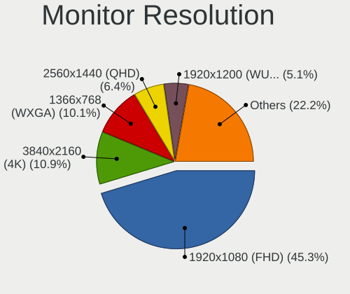

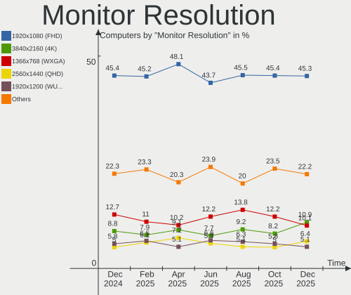

| Resolution         | Computers | Percent |
|--------------------|-----------|---------|
| 1920x1080 (FHD)    | 349       | 45.32%  |
| 3840x2160 (4K)     | 84        | 10.91%  |
| 1366x768 (WXGA)    | 78        | 10.13%  |
| 2560x1440 (QHD)    | 49        | 6.36%   |
| 1920x1200 (WUXGA)  | 39        | 5.06%   |
| 2560x1600          | 24        | 3.12%   |
| 1600x900 (HD+)     | 21        | 2.73%   |
| 3440x1440          | 17        | 2.21%   |
| 1440x900 (WXGA+)   | 16        | 2.08%   |
| 2880x1800          | 15        | 1.95%   |
| 1680x1050 (WSXGA+) | 14        | 1.82%   |
| 2288x1287          | 7         | 0.91%   |
| 1280x1024 (SXGA)   | 7         | 0.91%   |
| 1280x800 (WXGA)    | 6         | 0.78%   |
| 2560x1080          | 5         | 0.65%   |
| 2880x1920          | 4         | 0.52%   |
| Unknown            | 4         | 0.52%   |
| 3200x1800 (QHD+)   | 3         | 0.39%   |
| 3072x1920          | 3         | 0.39%   |
| 2160x1440          | 3         | 0.39%   |
| 1920x540           | 3         | 0.39%   |
| 1600x1200          | 3         | 0.39%   |
| 3840x1080          | 2         | 0.26%   |
| 2736x1824          | 2         | 0.26%   |
| 3840x2400          | 1         | 0.13%   |
| 3840x1100          | 1         | 0.13%   |
| 3000x2000          | 1         | 0.13%   |
| 2560x2880          | 1         | 0.13%   |
| 2240x1400          | 1         | 0.13%   |
| 2160x1350          | 1         | 0.13%   |
| 2048x1280          | 1         | 0.13%   |
| 2048x1152          | 1         | 0.13%   |
| 1920x1280          | 1         | 0.13%   |
| 1800x1200          | 1         | 0.13%   |
| 1400x1050          | 1         | 0.13%   |
| 1024x768 (XGA)     | 1         | 0.13%   |

Monitor Diagonal
----------------

Diagonal size in inches

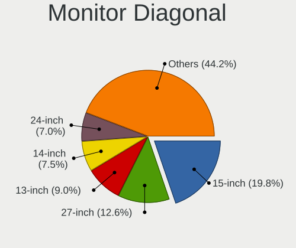

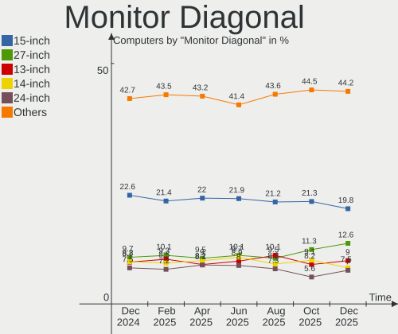

| Inches  | Computers | Percent |
|---------|-----------|---------|
| 15      | 161       | 19.75%  |
| 27      | 103       | 12.64%  |
| 13      | 73        | 8.96%   |
| 14      | 61        | 7.48%   |
| 24      | 57        | 6.99%   |
| 23      | 55        | 6.75%   |
| 31      | 36        | 4.42%   |
| 21      | 35        | 4.29%   |
| 16      | 34        | 4.17%   |
| 17      | 29        | 3.56%   |
| 19      | 19        | 2.33%   |
| 34      | 17        | 2.09%   |
| 12      | 14        | 1.72%   |
| Unknown | 13        | 1.6%    |
| 22      | 12        | 1.47%   |
| 32      | 9         | 1.1%    |
| 18      | 9         | 1.1%    |
| 20      | 7         | 0.86%   |
| 11      | 7         | 0.86%   |
| 142     | 6         | 0.74%   |
| 84      | 6         | 0.74%   |
| 26      | 5         | 0.61%   |
| 25      | 5         | 0.61%   |
| 48      | 4         | 0.49%   |
| 46      | 4         | 0.49%   |
| 28      | 4         | 0.49%   |
| 72      | 3         | 0.37%   |
| 54      | 3         | 0.37%   |
| 42      | 3         | 0.37%   |
| 40      | 3         | 0.37%   |
| 29      | 3         | 0.37%   |
| 63      | 2         | 0.25%   |
| 39      | 2         | 0.25%   |
| 85      | 1         | 0.12%   |
| 82      | 1         | 0.12%   |
| 74      | 1         | 0.12%   |
| 65      | 1         | 0.12%   |
| 64      | 1         | 0.12%   |
| 60      | 1         | 0.12%   |
| 57      | 1         | 0.12%   |

Monitor Width
-------------

Physical width

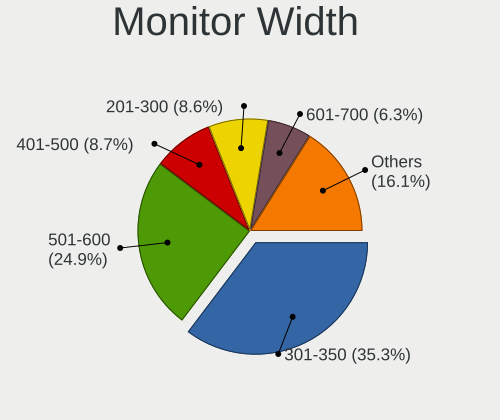

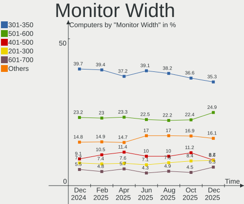

| Width in mm    | Computers | Percent |
|----------------|-----------|---------|
| 301-350        | 279       | 35.32%  |
| 501-600        | 197       | 24.94%  |
| 401-500        | 69        | 8.73%   |
| 201-300        | 68        | 8.61%   |
| 601-700        | 50        | 6.33%   |
| 351-400        | 42        | 5.32%   |
| 701-800        | 27        | 3.42%   |
| 1001-1500      | 18        | 2.28%   |
| Unknown        | 13        | 1.65%   |
| 1501-2000      | 12        | 1.52%   |
| 901-1000       | 7         | 0.89%   |
| More than 2000 | 6         | 0.76%   |
| 801-900        | 2         | 0.25%   |

Aspect Ratio
------------

Proportional relationship between the width and the height

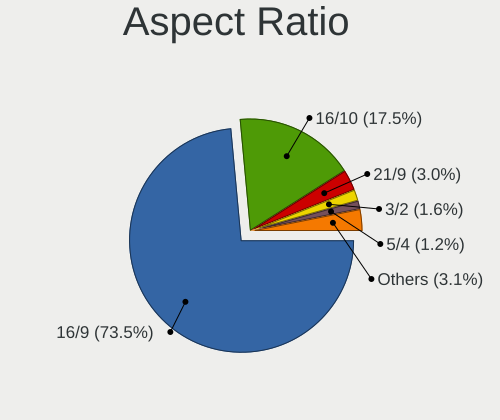

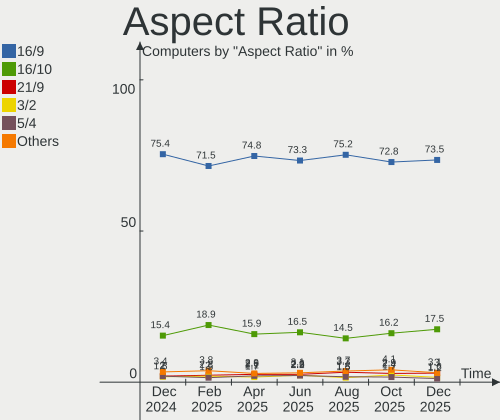

| Ratio   | Computers | Percent |
|---------|-----------|---------|
| 16/9    | 539       | 73.53%  |
| 16/10   | 128       | 17.46%  |
| 21/9    | 22        | 3%      |
| 3/2     | 12        | 1.64%   |
| 5/4     | 9         | 1.23%   |
| Unknown | 7         | 0.95%   |
| 1.00    | 6         | 0.82%   |
| 4/3     | 4         | 0.55%   |
| 32/9    | 2         | 0.27%   |
| 3.40    | 1         | 0.14%   |
| 2.64    | 1         | 0.14%   |
| 1.96    | 1         | 0.14%   |
| 0.89    | 1         | 0.14%   |

Monitor Area
------------

Area in inch²

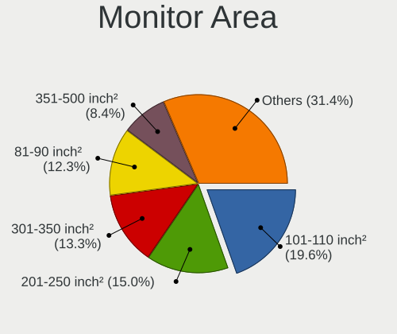

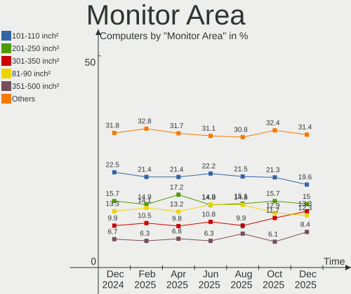

| Area in inch² | Computers | Percent |
|----------------|-----------|---------|
| 101-110        | 157       | 19.58%  |
| 201-250        | 120       | 14.96%  |
| 301-350        | 107       | 13.34%  |
| 81-90          | 99        | 12.34%  |
| 351-500        | 67        | 8.35%   |
| 151-200        | 38        | 4.74%   |
| 71-80          | 37        | 4.61%   |
| 111-120        | 37        | 4.61%   |
| More than 1000 | 28        | 3.49%   |
| 251-300        | 25        | 3.12%   |
| 121-130        | 23        | 2.87%   |
| 501-1000       | 16        | 2%      |
| Unknown        | 13        | 1.62%   |
| 61-70          | 12        | 1.5%    |
| 141-150        | 9         | 1.12%   |
| 51-60          | 8         | 1%      |
| 131-140        | 5         | 0.62%   |
| 41-50          | 1         | 0.12%   |

Pixel Density
-------------

Pixels per inch

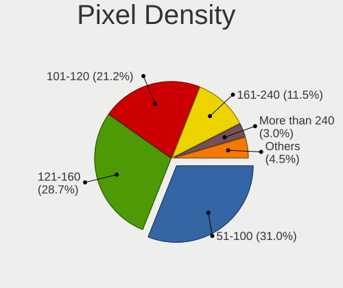

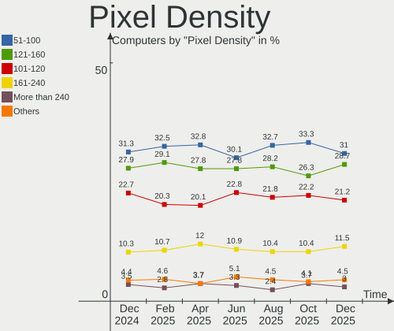

| Density       | Computers | Percent |
|---------------|-----------|---------|
| 51-100        | 240       | 31.05%  |
| 121-160       | 222       | 28.72%  |
| 101-120       | 164       | 21.22%  |
| 161-240       | 89        | 11.51%  |
| More than 240 | 23        | 2.98%   |
| 1-50          | 22        | 2.85%   |
| Unknown       | 13        | 1.68%   |

Multiple Monitors
-----------------

Total monitors connected

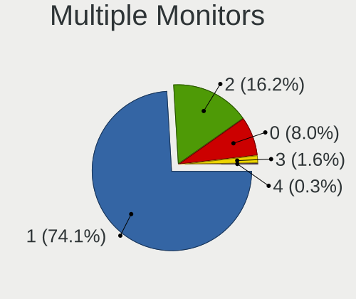

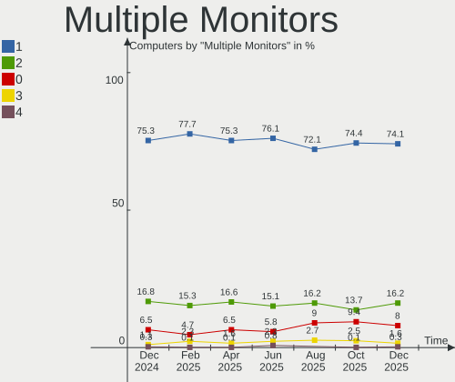

| Total | Computers | Percent |
|-------|-----------|---------|
| 1     | 568       | 74.05%  |
| 2     | 124       | 16.17%  |
| 0     | 61        | 7.95%   |
| 3     | 12        | 1.56%   |
| 4     | 2         | 0.26%   |

Network
-------

Net Controller Vendor
---------------------

Controller vendors

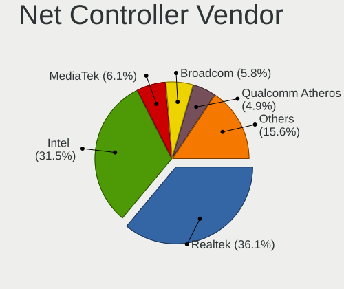

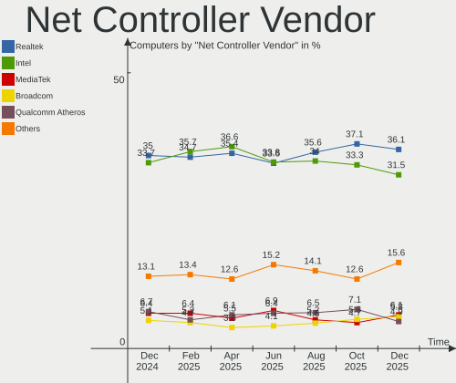

| Vendor                                 | Computers | Percent |
|----------------------------------------|-----------|---------|
| Realtek Semiconductor                  | 411       | 36.05%  |
| Intel                                  | 359       | 31.49%  |
| MediaTek                               | 70        | 6.14%   |
| Broadcom                               | 66        | 5.79%   |
| Qualcomm Atheros                       | 56        | 4.91%   |
| TP-Link                                | 20        | 1.75%   |
| Broadcom Limited                       | 15        | 1.32%   |
| Marvell Technology Group               | 12        | 1.05%   |
| Aquantia                               | 11        | 0.96%   |
| Samsung Electronics                    | 9         | 0.79%   |
| Ralink                                 | 8         | 0.7%    |
| Qualcomm Technologies                  | 6         | 0.53%   |
| Hewlett-Packard                        | 5         | 0.44%   |
| Xiaomi                                 | 4         | 0.35%   |
| Qualcomm                               | 4         | 0.35%   |
| Motorcomm Microelectronics.            | 4         | 0.35%   |
| ASIX Electronics                       | 4         | 0.35%   |
| Suzhou Motorcomm Electronic Technology | 3         | 0.26%   |
| Qualcomm Atheros Communications        | 3         | 0.26%   |
| Nvidia                                 | 3         | 0.26%   |
| Insyde Software                        | 3         | 0.26%   |
| Edimax Technology                      | 3         | 0.26%   |
| DisplayLink                            | 3         | 0.26%   |
| Dell                                   | 3         | 0.26%   |
| D-Link                                 | 3         | 0.26%   |
| ASUSTek Computer                       | 3         | 0.26%   |
| Sierra Wireless                        | 2         | 0.18%   |
| Raspberry Pi                           | 2         | 0.18%   |
| Ralink Technology                      | 2         | 0.18%   |
| Quectel Wireless Solutions             | 2         | 0.18%   |
| Microsoft                              | 2         | 0.18%   |
| MicroPython                            | 2         | 0.18%   |
| JMicron Technology                     | 2         | 0.18%   |
| Huawei Technologies                    | 2         | 0.18%   |
| Framework Computer                     | 2         | 0.18%   |
| AVM                                    | 2         | 0.18%   |
| Arduino SA                             | 2         | 0.18%   |
| Apple                                  | 2         | 0.18%   |
| ZyDAS                                  | 1         | 0.09%   |
| ZTE WCDMA Technologies MSM             | 1         | 0.09%   |

Net Controller Model
--------------------

Controller models

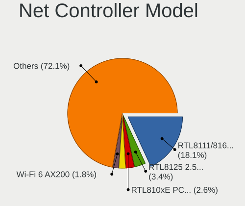

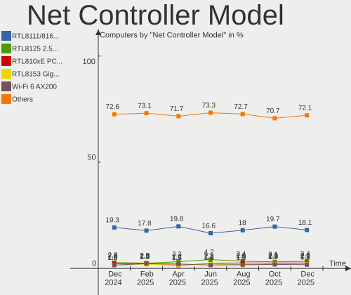

| Model                                                                           | Computers | Percent |
|---------------------------------------------------------------------------------|-----------|---------|
| Realtek RTL8111/8168/8211/8411 PCI Express Gigabit Ethernet Controller          | 247       | 18.12%  |
| Realtek RTL8125 2.5GbE Controller                                               | 46        | 3.37%   |
| Realtek RTL810xE PCI Express Fast Ethernet controller                           | 35        | 2.57%   |
| Realtek RTL8153 Gigabit Ethernet Adapter                                        | 28        | 2.05%   |
| Intel Wi-Fi 6 AX200                                                             | 24        | 1.76%   |
| Intel Wireless 8265 / 8275                                                      | 23        | 1.69%   |
| Intel 82579LM Gigabit Network Connection (Lewisville)                           | 19        | 1.39%   |
| Realtek RTL8852BE PCIe 802.11ax Wireless Network Controller                     | 18        | 1.32%   |
| MediaTek MT7902 802.11ax PCIe Wireless Network Adapter [Filogic 310]            | 18        | 1.32%   |
| Intel Wi-Fi 6E(802.11ax) AX210/AX1675* 2x2 [Typhoon Peak]                       | 18        | 1.32%   |
| Intel Ethernet Connection (4) I219-LM                                           | 18        | 1.32%   |
| Realtek RTL8822CE 802.11ac PCIe Wireless Network Adapter                        | 16        | 1.17%   |
| Intel Wi-Fi 6 AX201                                                             | 16        | 1.17%   |
| Intel Alder Lake-P PCH CNVi WiFi                                                | 16        | 1.17%   |
| Realtek RTL8821CE 802.11ac PCIe Wireless Network Adapter                        | 15        | 1.1%    |
| MediaTek MT7921 802.11ax PCIe Wireless Network Adapter [Filogic 330]            | 15        | 1.1%    |
| Intel Wireless 7265                                                             | 13        | 0.95%   |
| Realtek 802.11ac NIC                                                            | 12        | 0.88%   |
| Realtek RTL8126 5GbE Controller                                                 | 11        | 0.81%   |
| MediaTek MT7922 802.11ax PCI Express Wireless Network Adapter                   | 11        | 0.81%   |
| Intel Wireless 8260                                                             | 11        | 0.81%   |
| Intel Ethernet Controller I226-V                                                | 11        | 0.81%   |
| Intel 82599ES 10-Gigabit SFI/SFP+ Network Connection                            | 11        | 0.81%   |
| Marvell Group 88W8897 [AVASTAR] 802.11ac Wireless                               | 10        | 0.73%   |
| Intel I211 Gigabit Network Connection                                           | 10        | 0.73%   |
| Intel Ethernet Controller I225-V                                                | 10        | 0.73%   |
| Intel Ethernet Connection (2) I219-V                                            | 10        | 0.73%   |
| Intel Comet Lake PCH-LP CNVi WiFi                                               | 10        | 0.73%   |
| Qualcomm Atheros QCA9565 / AR9565 Wireless Network Adapter                      | 9         | 0.66%   |
| MediaTek MT7925 802.11be 160MHz 2x2 PCIe Wireless Network Adapter [Filogic 360] | 9         | 0.66%   |
| Intel Wi-Fi 7(802.11be) AX1775*/AX1790*/BE20*/BE401/BE1750* 2x2                 | 9         | 0.66%   |
| Intel Ethernet Connection I217-LM                                               | 9         | 0.66%   |
| Qualcomm Atheros AR9285 Wireless Network Adapter (PCI-Express)                  | 8         | 0.59%   |
| Intel Cannon Point-LP CNVi [Wireless-AC]                                        | 8         | 0.59%   |
| Broadcom NetXtreme BCM5719 Gigabit Ethernet PCIe                                | 8         | 0.59%   |
| Samsung Galaxy series, misc. (tethering mode)                                   | 7         | 0.51%   |
| Realtek RTL8723BE PCIe Wireless Network Adapter                                 | 7         | 0.51%   |
| Realtek RTL8188EE Wireless Network Adapter                                      | 7         | 0.51%   |
| Qualcomm Atheros QCA9377 802.11ac Wireless Network Adapter                      | 7         | 0.51%   |
| Qualcomm Atheros AR9485 Wireless Network Adapter                                | 7         | 0.51%   |

Wireless Vendor
---------------

Wireless vendors

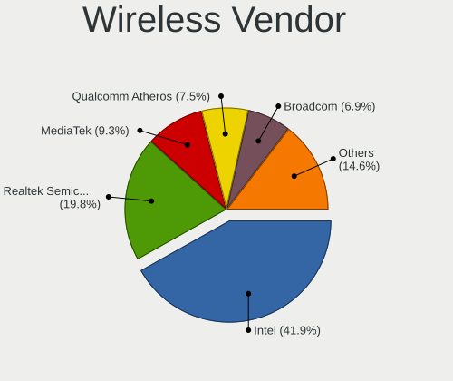

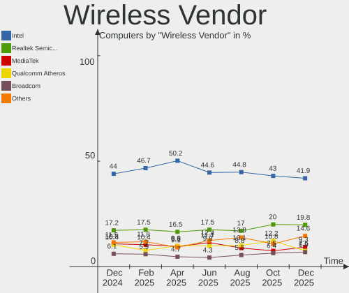

| Vendor                          | Computers | Percent |
|---------------------------------|-----------|---------|
| Intel                           | 247       | 41.86%  |
| Realtek Semiconductor           | 117       | 19.83%  |
| MediaTek                        | 55        | 9.32%   |
| Qualcomm Atheros                | 44        | 7.46%   |
| Broadcom                        | 41        | 6.95%   |
| TP-Link                         | 15        | 2.54%   |
| Broadcom Limited                | 14        | 2.37%   |
| Marvell Technology Group        | 10        | 1.69%   |
| Ralink                          | 8         | 1.36%   |
| Qualcomm Technologies           | 5         | 0.85%   |
| Qualcomm                        | 4         | 0.68%   |
| Qualcomm Atheros Communications | 3         | 0.51%   |
| Edimax Technology               | 3         | 0.51%   |
| D-Link                          | 3         | 0.51%   |
| ASUSTek Computer                | 3         | 0.51%   |
| Sierra Wireless                 | 2         | 0.34%   |
| Ralink Technology               | 2         | 0.34%   |
| Quectel Wireless Solutions      | 2         | 0.34%   |
| Hewlett-Packard                 | 2         | 0.34%   |
| Dell                            | 2         | 0.34%   |
| AVM                             | 2         | 0.34%   |
| ZyDAS                           | 1         | 0.17%   |
| Realtek                         | 1         | 0.17%   |
| NetGear                         | 1         | 0.17%   |
| Linksys                         | 1         | 0.17%   |
| IMC Networks                    | 1         | 0.17%   |
| Belkin Components               | 1         | 0.17%   |

Wireless Model
--------------

Wireless models

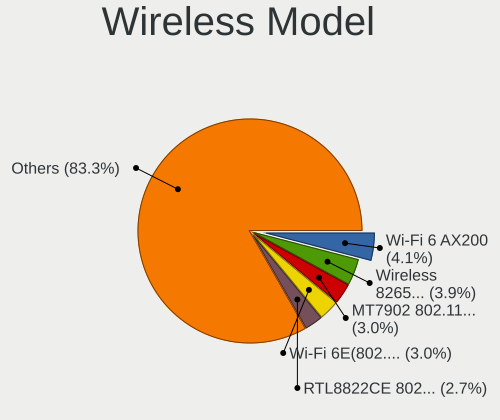

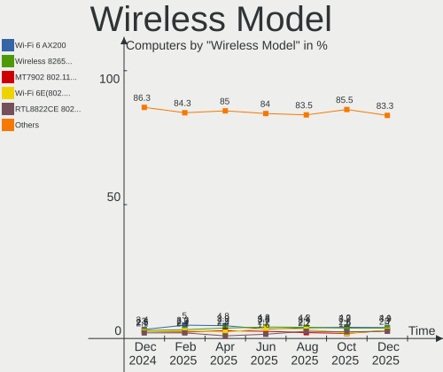

| Model                                                                           | Computers | Percent |
|---------------------------------------------------------------------------------|-----------|---------|
| Intel Wi-Fi 6 AX200                                                             | 24        | 4.05%   |
| Intel Wireless 8265 / 8275                                                      | 23        | 3.89%   |
| MediaTek MT7902 802.11ax PCIe Wireless Network Adapter [Filogic 310]            | 18        | 3.04%   |
| Intel Wi-Fi 6E(802.11ax) AX210/AX1675* 2x2 [Typhoon Peak]                       | 18        | 3.04%   |
| Realtek RTL8822CE 802.11ac PCIe Wireless Network Adapter                        | 16        | 2.7%    |
| Intel Wi-Fi 6 AX201                                                             | 16        | 2.7%    |
| Realtek RTL8821CE 802.11ac PCIe Wireless Network Adapter                        | 15        | 2.53%   |
| MediaTek MT7921 802.11ax PCIe Wireless Network Adapter [Filogic 330]            | 15        | 2.53%   |
| Realtek RTL8852BE PCIe 802.11ax Wireless Network Controller                     | 13        | 2.2%    |
| Intel Wireless 7265                                                             | 13        | 2.2%    |
| Intel Alder Lake-P PCH CNVi WiFi                                                | 13        | 2.2%    |
| Realtek 802.11ac NIC                                                            | 12        | 2.03%   |
| Intel Wireless 8260                                                             | 11        | 1.86%   |
| Marvell Group 88W8897 [AVASTAR] 802.11ac Wireless                               | 10        | 1.69%   |
| Intel Comet Lake PCH-LP CNVi WiFi                                               | 10        | 1.69%   |
| Qualcomm Atheros QCA9565 / AR9565 Wireless Network Adapter                      | 9         | 1.52%   |
| Qualcomm Atheros AR9285 Wireless Network Adapter (PCI-Express)                  | 8         | 1.35%   |
| Intel Cannon Point-LP CNVi [Wireless-AC]                                        | 8         | 1.35%   |
| Realtek RTL8723BE PCIe Wireless Network Adapter                                 | 7         | 1.18%   |
| Realtek RTL8188EE Wireless Network Adapter                                      | 7         | 1.18%   |
| Qualcomm Atheros QCA9377 802.11ac Wireless Network Adapter                      | 7         | 1.18%   |
| Qualcomm Atheros AR9485 Wireless Network Adapter                                | 7         | 1.18%   |
| Intel Wireless 7260                                                             | 7         | 1.18%   |
| Intel Raptor Lake PCH CNVi WiFi                                                 | 7         | 1.18%   |
| Intel 700 Series Chipset CNVi WiFi                                              | 7         | 1.18%   |
| Broadcom Limited BCM4360 802.11ac Dual Band Wireless Network Adapter            | 7         | 1.18%   |
| Broadcom BCM43142 802.11b/g/n                                                   | 7         | 1.18%   |
| MediaTek MT7922 802.11ax PCI Express Wireless Network Adapter                   | 6         | 1.01%   |
| Intel Wireless 3165                                                             | 6         | 1.01%   |
| Intel Wi-Fi 7(802.11be) AX1775*/AX1790*/BE20*/BE401/BE1750* 2x2                 | 6         | 1.01%   |
| Intel Tiger Lake PCH CNVi WiFi                                                  | 6         | 1.01%   |
| Intel Dual Band Wireless-AC 3168NGW [Stone Peak]                                | 6         | 1.01%   |
| Intel Dual Band Wireless-AC 3165 Plus Bluetooth                                 | 6         | 1.01%   |
| Intel Centrino Advanced-N 6205 [Taylor Peak]                                    | 6         | 1.01%   |
| Realtek RTL8188FTV 802.11b/g/n 1T1R 2.4G WLAN Adapter                           | 5         | 0.84%   |
| Ralink RT3290 Wireless 802.11n 1T/1R PCIe                                       | 5         | 0.84%   |
| Qualcomm Atheros QCA6174 802.11ac Wireless Network Adapter                      | 5         | 0.84%   |
| MediaTek MT7925 802.11be 160MHz 2x2 PCIe Wireless Network Adapter [Filogic 360] | 5         | 0.84%   |
| Intel Meteor Lake PCH CNVi WiFi                                                 | 5         | 0.84%   |
| Intel BE201 320MHz                                                              | 5         | 0.84%   |

Ethernet Vendor
---------------

Ethernet vendors

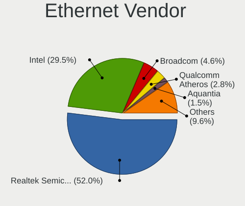

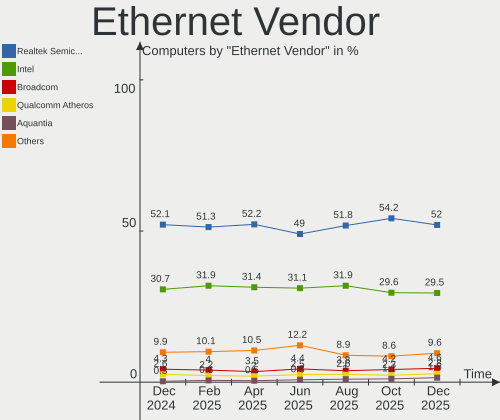

| Vendor                                 | Computers | Percent |
|----------------------------------------|-----------|---------|
| Realtek Semiconductor                  | 372       | 51.96%  |
| Intel                                  | 211       | 29.47%  |
| Broadcom                               | 33        | 4.61%   |
| Qualcomm Atheros                       | 20        | 2.79%   |
| Aquantia                               | 11        | 1.54%   |
| Samsung Electronics                    | 9         | 1.26%   |
| MediaTek                               | 9         | 1.26%   |
| TP-Link                                | 5         | 0.7%    |
| Xiaomi                                 | 4         | 0.56%   |
| Motorcomm Microelectronics.            | 4         | 0.56%   |
| ASIX Electronics                       | 4         | 0.56%   |
| Suzhou Motorcomm Electronic Technology | 3         | 0.42%   |
| Nvidia                                 | 3         | 0.42%   |
| Insyde Software                        | 3         | 0.42%   |
| DisplayLink                            | 3         | 0.42%   |
| Raspberry Pi                           | 2         | 0.28%   |
| Marvell Technology Group               | 2         | 0.28%   |
| JMicron Technology                     | 2         | 0.28%   |
| Apple                                  | 2         | 0.28%   |
| vivo                                   | 1         | 0.14%   |
| Qualcomm Technologies                  | 1         | 0.14%   |
| OPPO Electronics                       | 1         | 0.14%   |
| Netchip Technology                     | 1         | 0.14%   |
| Motorola PCS                           | 1         | 0.14%   |
| Microsoft                              | 1         | 0.14%   |
| IBM                                    | 1         | 0.14%   |
| Huawei Technologies                    | 1         | 0.14%   |
| Hewlett-Packard                        | 1         | 0.14%   |
| Google                                 | 1         | 0.14%   |
| Dell                                   | 1         | 0.14%   |
| Broadcom Limited                       | 1         | 0.14%   |
| American Megatrends                    | 1         | 0.14%   |
| 3Com                                   | 1         | 0.14%   |

Ethernet Model
--------------

Ethernet models

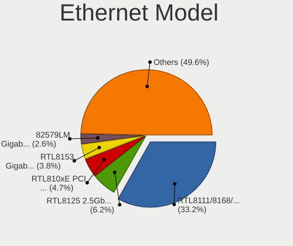

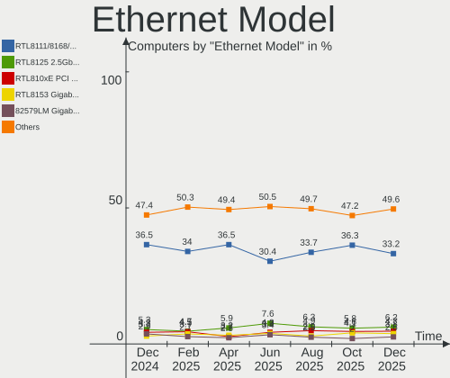

| Model                                                                             | Computers | Percent |
|-----------------------------------------------------------------------------------|-----------|---------|
| Realtek RTL8111/8168/8211/8411 PCI Express Gigabit Ethernet Controller            | 247       | 33.2%   |
| Realtek RTL8125 2.5GbE Controller                                                 | 46        | 6.18%   |
| Realtek RTL810xE PCI Express Fast Ethernet controller                             | 35        | 4.7%    |
| Realtek RTL8153 Gigabit Ethernet Adapter                                          | 28        | 3.76%   |
| Intel 82579LM Gigabit Network Connection (Lewisville)                             | 19        | 2.55%   |
| Intel Ethernet Connection (4) I219-LM                                             | 18        | 2.42%   |
| Realtek RTL8126 5GbE Controller                                                   | 11        | 1.48%   |
| Intel Ethernet Controller I226-V                                                  | 11        | 1.48%   |
| Intel 82599ES 10-Gigabit SFI/SFP+ Network Connection                              | 11        | 1.48%   |
| Intel I211 Gigabit Network Connection                                             | 10        | 1.34%   |
| Intel Ethernet Controller I225-V                                                  | 10        | 1.34%   |
| Intel Ethernet Connection (2) I219-V                                              | 10        | 1.34%   |
| Intel Ethernet Connection I217-LM                                                 | 9         | 1.21%   |
| Broadcom NetXtreme BCM5719 Gigabit Ethernet PCIe                                  | 8         | 1.08%   |
| Samsung Galaxy series, misc. (tethering mode)                                     | 7         | 0.94%   |
| Intel I350 Gigabit Network Connection                                             | 7         | 0.94%   |
| Intel Ethernet Connection (7) I219-LM                                             | 7         | 0.94%   |
| Qualcomm Atheros AR8151 v2.0 Gigabit Ethernet                                     | 6         | 0.81%   |
| Intel Ethernet Connection (7) I219-V                                              | 6         | 0.81%   |
| Intel Ethernet Connection (14) I219-V                                             | 6         | 0.81%   |
| TP-Link UE300 10/100/1000 LAN (ethernet mode) [Realtek RTL8153]                   | 5         | 0.67%   |
| Realtek RTL8852BE PCIe 802.11ax Wireless Network Controller                       | 5         | 0.67%   |
| MediaTek MT7922 802.11ax PCI Express Wireless Network Adapter                     | 5         | 0.67%   |
| Intel I210 Gigabit Network Connection                                             | 5         | 0.67%   |
| Intel Ethernet Controller 10-Gigabit X540-AT2                                     | 5         | 0.67%   |
| Intel 82574L Gigabit Network Connection                                           | 5         | 0.67%   |
| Broadcom NetLink BCM57780 Gigabit Ethernet PCIe                                   | 5         | 0.67%   |
| Motorcomm Microelectronics. YT6801 Gigabit Ethernet Controller                    | 4         | 0.54%   |
| MediaTek MT7925 802.11be 160MHz 2x2 PCIe Wireless Network Adapter [Filogic 360]   | 4         | 0.54%   |
| Intel Ethernet Connection I219-LM                                                 | 4         | 0.54%   |
| Intel Ethernet Connection (6) I219-LM                                             | 4         | 0.54%   |
| Intel Ethernet Connection (4) I219-V                                              | 4         | 0.54%   |
| Intel Ethernet Connection (3) I218-LM                                             | 4         | 0.54%   |
| Intel Arrow Lake CNVi WiFi                                                        | 4         | 0.54%   |
| Intel 82576 Gigabit Network Connection                                            | 4         | 0.54%   |
| Broadcom NetXtreme BCM57766 Gigabit Ethernet PCIe                                 | 4         | 0.54%   |
| Broadcom NetXtreme BCM57765 Gigabit Ethernet PCIe                                 | 4         | 0.54%   |
| ASIX AX88179 Gigabit Ethernet                                                     | 4         | 0.54%   |
| Aquantia AQC113C NBase-T/IEEE 802.3an Ethernet Controller [Marvell Scalable mGig] | 4         | 0.54%   |
| Suzhou Motorcomm Electronic YT6801 Gigabit Ethernet Controller                    | 3         | 0.4%    |

Net Controller Kind
-------------------

Ethernet, WiFi or modem

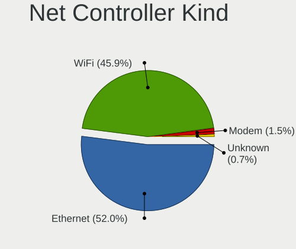

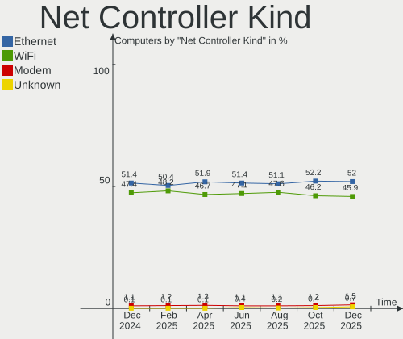

| Kind     | Computers | Percent |
|----------|-----------|---------|
| Ethernet | 634       | 52.01%  |
| WiFi     | 559       | 45.86%  |
| Modem    | 18        | 1.48%   |
| Unknown  | 8         | 0.66%   |

Used Controller
---------------

Currently used network controller

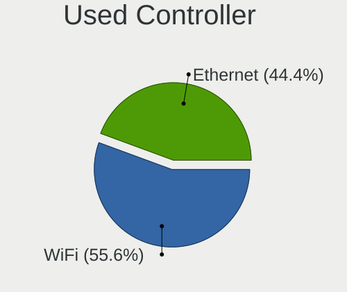

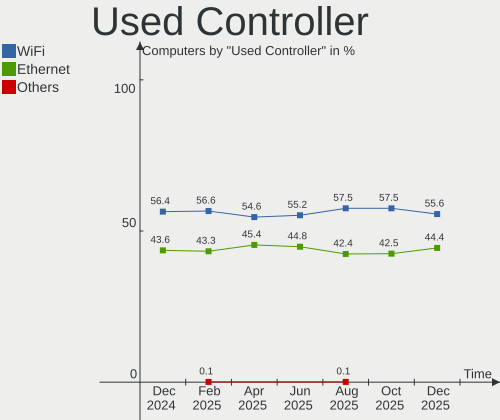

| Kind     | Computers | Percent |
|----------|-----------|---------|
| WiFi     | 422       | 55.6%   |
| Ethernet | 337       | 44.4%   |

NICs
----

Total network controllers on board

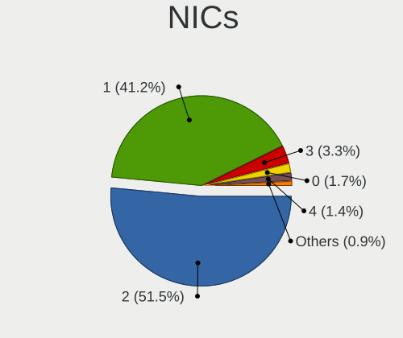

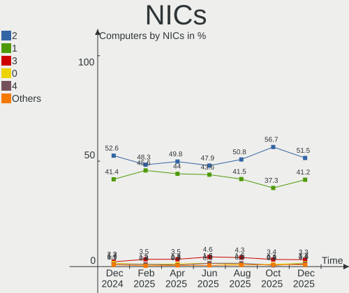

| Total | Computers | Percent |
|-------|-----------|---------|
| 2     | 395       | 51.5%   |
| 1     | 316       | 41.2%   |
| 3     | 25        | 3.26%   |
| 0     | 13        | 1.69%   |
| 4     | 11        | 1.43%   |
| 6     | 3         | 0.39%   |
| 8     | 2         | 0.26%   |
| 10    | 1         | 0.13%   |
| 5     | 1         | 0.13%   |

IPv6
----

IPv6 vs IPv4

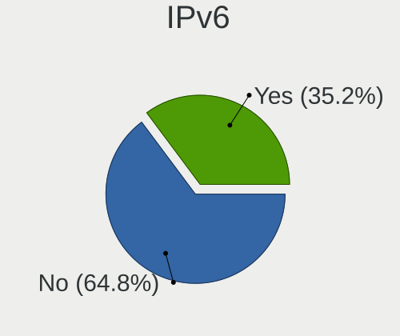

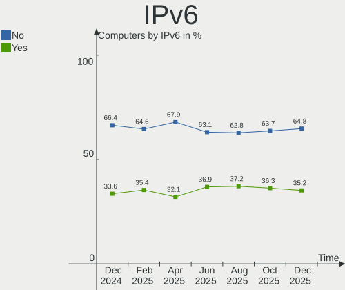

| Used | Computers | Percent |
|------|-----------|---------|
| No   | 497       | 64.8%   |
| Yes  | 270       | 35.2%   |

Bluetooth
---------

Bluetooth Vendor
----------------

Controller vendors

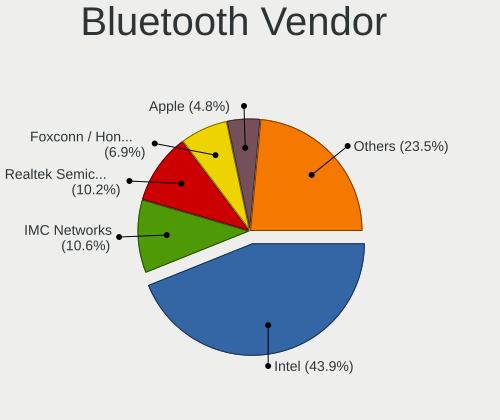

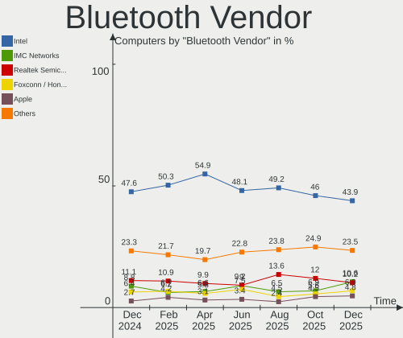

| Vendor                          | Computers | Percent |
|---------------------------------|-----------|---------|
| Intel                           | 228       | 43.93%  |
| IMC Networks                    | 55        | 10.6%   |
| Realtek Semiconductor           | 53        | 10.21%  |
| Foxconn / Hon Hai               | 36        | 6.94%   |
| Apple                           | 25        | 4.82%   |
| Cambridge Silicon Radio         | 17        | 3.28%   |
| Lite-On Technology              | 15        | 2.89%   |
| Qualcomm Atheros Communications | 14        | 2.7%    |
| MediaTek                        | 13        | 2.5%    |
| ASUSTek Computer                | 11        | 2.12%   |
| Marvell Semiconductor           | 9         | 1.73%   |
| Broadcom                        | 9         | 1.73%   |
| TP-Link                         | 7         | 1.35%   |
| Ralink                          | 5         | 0.96%   |
| Unknown                         | 5         | 0.96%   |
| Toshiba                         | 3         | 0.58%   |
| Realtek                         | 3         | 0.58%   |
| Integrated System Solution      | 2         | 0.39%   |
| Hewlett-Packard                 | 2         | 0.39%   |
| Foxconn International           | 2         | 0.39%   |
| USI                             | 1         | 0.19%   |
| Smart Modular Technologies      | 1         | 0.19%   |
| Micro Star International        | 1         | 0.19%   |
| Dell                            | 1         | 0.19%   |
| Actions                         | 1         | 0.19%   |

Bluetooth Model
---------------

Controller models

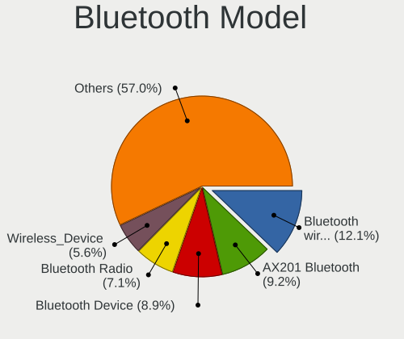

| Model                                               | Computers | Percent |
|-----------------------------------------------------|-----------|---------|
| Intel Bluetooth wireless interface                  | 63        | 12.14%  |
| Intel AX201 Bluetooth                               | 48        | 9.25%   |
| Intel Bluetooth Device                              | 46        | 8.86%   |
| Realtek Bluetooth Radio                             | 37        | 7.13%   |
| IMC Networks Wireless_Device                        | 29        | 5.59%   |
| Intel AX200 Bluetooth                               | 21        | 4.05%   |
| IMC Networks Bluetooth Radio                        | 20        | 3.85%   |
| Intel Bluetooth 9460/9560 Jefferson Peak (JfP)      | 19        | 3.66%   |
| Foxconn / Hon Hai Wireless_Device                   | 18        | 3.47%   |
| Cambridge Silicon Radio Bluetooth Dongle (HCI mode) | 17        | 3.28%   |
| Intel AX210 Bluetooth                               | 15        | 2.89%   |
| MediaTek Wireless_Device                            | 13        | 2.5%    |
| Realtek  Bluetooth 4.2 Adapter                      | 10        | 1.93%   |
| Apple Bluetooth USB Host Controller                 | 10        | 1.93%   |
| ASUS ASUS USB-BT500                                 | 8         | 1.54%   |
| Apple Bluetooth Host Controller                     | 8         | 1.54%   |
| TP-Link TP-T@- UB500 Adapter                        | 7         | 1.35%   |
| Qualcomm Atheros  Bluetooth Device                  | 7         | 1.35%   |
| Marvell Bluetooth and Wireless LAN Composite        | 7         | 1.35%   |
| Foxconn / Hon Hai Bluetooth Device                  | 7         | 1.35%   |
| Foxconn / Hon Hai MediaTek Bluetooth Adapter        | 6         | 1.16%   |
| Apple Built-in Bluetooth 2.0+EDR HCI                | 6         | 1.16%   |
| Ralink RT3290 Bluetooth                             | 5         | 0.96%   |
| Intel Centrino Bluetooth Wireless Transceiver       | 5         | 0.96%   |
| Unknown                                             | 5         | 0.96%   |
| Lite-On Wireless_Device                             | 4         | 0.77%   |
| Lite-On Qualcomm Atheros QCA9377 Bluetooth          | 4         | 0.77%   |
| Lite-On Bluetooth Device                            | 4         | 0.77%   |
| Intel Wireless-AC 3168 Bluetooth                    | 4         | 0.77%   |
| Realtek 802.11ac WLAN Adapter                       | 3         | 0.58%   |
| Realtek Bluetooth Radio                             | 3         | 0.58%   |
| Qualcomm Atheros AR3011 Bluetooth                   | 3         | 0.58%   |
| Intel Wireless-AC 9260 Bluetooth Adapter            | 3         | 0.58%   |
| Intel Bluetooth                                     | 3         | 0.58%   |
| Toshiba BCM43142A0                                  | 2         | 0.39%   |
| Realtek RTL8723B Bluetooth                          | 2         | 0.39%   |
| Qualcomm Atheros AR9462 Bluetooth                   | 2         | 0.39%   |
| Marvell Bluetooth and Wireless LAN Composite Device | 2         | 0.39%   |
| Lite-On Bluetooth Radio                             | 2         | 0.39%   |
| IMC Networks BCM20702A0                             | 2         | 0.39%   |

Sound
-----

Sound Vendor
------------

Sound card vendors

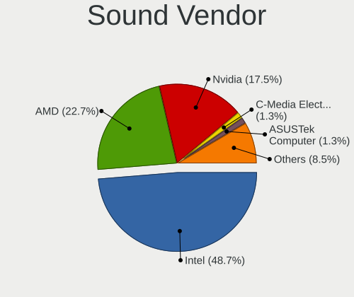

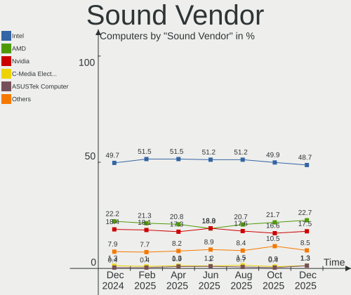

| Vendor                                       | Computers | Percent |
|----------------------------------------------|-----------|---------|
| Intel                                        | 506       | 48.7%   |
| AMD                                          | 236       | 22.71%  |
| Nvidia                                       | 182       | 17.52%  |
| C-Media Electronics                          | 14        | 1.35%   |
| ASUSTek Computer                             | 13        | 1.25%   |
| Logitech                                     | 8         | 0.77%   |
| Generalplus Technology                       | 5         | 0.48%   |
| Creative Labs                                | 4         | 0.38%   |
| Sony                                         | 3         | 0.29%   |
| Razer USA                                    | 3         | 0.29%   |
| Plantronics                                  | 3         | 0.29%   |
| JMTek                                        | 3         | 0.29%   |
| Hewlett-Packard                              | 3         | 0.29%   |
| Zoran Co. Personal Media Division (Nogatech) | 2         | 0.19%   |
| Walmart                                      | 2         | 0.19%   |
| Trust International                          | 2         | 0.19%   |
| Texas Instruments                            | 2         | 0.19%   |
| Tenx Technology                              | 2         | 0.19%   |
| Realtek Semiconductor                        | 2         | 0.19%   |
| Micro Star International                     | 2         | 0.19%   |
| Lenovo                                       | 2         | 0.19%   |
| Kingston Technology                          | 2         | 0.19%   |
| Jieli Technology                             | 2         | 0.19%   |
| GN Netcom                                    | 2         | 0.19%   |
| Giga-Byte Technology                         | 2         | 0.19%   |
| Dell                                         | 2         | 0.19%   |
| Cooler Master                                | 2         | 0.19%   |
| Apple                                        | 2         | 0.19%   |
| Zhaoxin                                      | 1         | 0.1%    |
| Turtle Beach                                 | 1         | 0.1%    |
| Synaptics                                    | 1         | 0.1%    |
| SteelSeries ApS                              | 1         | 0.1%    |
| Roland                                       | 1         | 0.1%    |
| Red Hat                                      | 1         | 0.1%    |
| Pimax                                        | 1         | 0.1%    |
| ONN                                          | 1         | 0.1%    |
| NZXT                                         | 1         | 0.1%    |
| Nordic Semiconductor ASA                     | 1         | 0.1%    |
| M-Audio                                      | 1         | 0.1%    |
| Linux Foundation                             | 1         | 0.1%    |

Sound Model
-----------

Sound card models

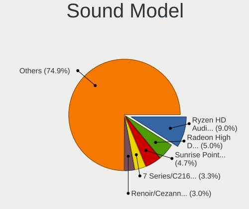

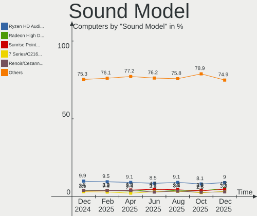

| Model                                                                      | Computers | Percent |
|----------------------------------------------------------------------------|-----------|---------|
| AMD Ryzen HD Audio Controller                                              | 114       | 9.02%   |
| AMD Radeon High Definition Audio Controller                                | 63        | 4.98%   |
| Intel Sunrise Point-LP HD Audio                                            | 60        | 4.75%   |
| Intel 7 Series/C216 Chipset Family High Definition Audio Controller        | 42        | 3.32%   |
| AMD Renoir/Cezanne HDMI/DP Audio Controller                                | 38        | 3.01%   |
| Intel 6 Series/C200 Series Chipset Family High Definition Audio Controller | 36        | 2.85%   |
| Intel 8 Series/C220 Series Chipset High Definition Audio Controller        | 34        | 2.69%   |
| AMD Starship/Matisse HD Audio Controller                                   | 33        | 2.61%   |
| Intel Cannon Lake PCH cAVS                                                 | 30        | 2.37%   |
| Intel Xeon E3-1200 v3/4th Gen Core Processor HD Audio Controller           | 24        | 1.9%    |
| Intel Tiger Lake-LP Smart Sound Technology Audio Controller                | 22        | 1.74%   |
| Intel Alder Lake PCH-P High Definition Audio Controller                    | 21        | 1.66%   |
| Intel Wildcat Point-LP High Definition Audio Controller                    | 20        | 1.58%   |
| Intel Broadwell-U Audio Controller                                         | 20        | 1.58%   |
| Intel 200 Series PCH HD Audio                                              | 19        | 1.5%    |
| AMD Ellesmere HDMI Audio [Radeon RX 470/480 / 570/580/590]                 | 19        | 1.5%    |
| Intel Raptor Lake-P/U/H cAVS                                               | 18        | 1.42%   |
| Intel Haswell-ULT HD Audio Controller                                      | 18        | 1.42%   |
| Intel 8 Series HD Audio Controller                                         | 18        | 1.42%   |
| AMD SBx00 Azalia (Intel HDA)                                               | 16        | 1.27%   |
| AMD FCH Azalia Controller                                                  | 16        | 1.27%   |
| Intel Raptor Lake High Definition Audio Controller                         | 15        | 1.19%   |
| Nvidia TU107 GeForce GTX 1650 High Definition Audio Controller             | 14        | 1.11%   |
| Intel Alder Lake-N PCH High Definition Audio Controller                    | 13        | 1.03%   |
| Intel 100 Series/C230 Series Chipset Family HD Audio Controller            | 13        | 1.03%   |
| Nvidia AD107 High Definition Audio Controller                              | 12        | 0.95%   |
| Intel Alder Lake-S HD Audio Controller                                     | 12        | 0.95%   |
| Intel 5 Series/3400 Series Chipset High Definition Audio                   | 12        | 0.95%   |
| Nvidia GP107GL High Definition Audio Controller                            | 11        | 0.87%   |
| ASUSTek Computer USB Audio                                                 | 11        | 0.87%   |
| Nvidia GB203 High Definition Audio Controller                              | 10        | 0.79%   |
| Nvidia GA104 High Definition Audio Controller                              | 10        | 0.79%   |
| Intel Comet Lake PCH-LP cAVS                                               | 10        | 0.79%   |
| AMD Raven/Raven2/Fenghuang HDMI/DP Audio Controller                        | 10        | 0.79%   |
| Intel Tiger Lake-H HD Audio Controller                                     | 9         | 0.71%   |
| Intel Meteor Lake-P HD Audio Controller                                    | 9         | 0.71%   |
| Intel Cannon Point-LP High Definition Audio Controller                     | 9         | 0.71%   |
| Nvidia GK107 HDMI Audio Controller                                         | 8         | 0.63%   |
| Nvidia GB206 High Definition Audio Controller                              | 8         | 0.63%   |
| Nvidia GA106 High Definition Audio Controller                              | 8         | 0.63%   |

Memory
------

Memory Vendor
-------------

Memory module vendors

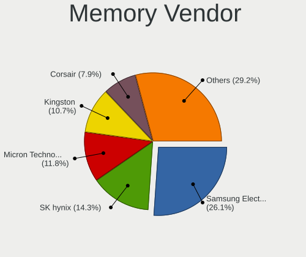

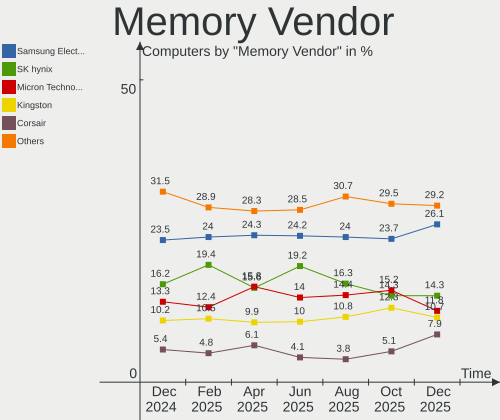

| Vendor                             | Computers | Percent |
|------------------------------------|-----------|---------|
| Samsung Electronics                | 102       | 26.09%  |
| SK hynix                           | 56        | 14.32%  |
| Micron Technology                  | 46        | 11.76%  |
| Kingston                           | 42        | 10.74%  |
| Corsair                            | 31        | 7.93%   |
| Crucial                            | 20        | 5.12%   |
| Unknown                            | 17        | 4.35%   |
| G.Skill                            | 14        | 3.58%   |
| Unknown                            | 13        | 3.32%   |
| A-DATA Technology                  | 12        | 3.07%   |
| Ramaxel Technology                 | 6         | 1.53%   |
| Hewlett-Packard                    | 6         | 1.53%   |
| Transcend                          | 3         | 0.77%   |
| Nanya Technology                   | 3         | 0.77%   |
| Elpida                             | 3         | 0.77%   |
| Lexar                              | 2         | 0.51%   |
| Wodposit                           | 1         | 0.26%   |
| Unknown (ABCD)                     | 1         | 0.26%   |
| Unknown (0x0E9D)                   | 1         | 0.26%   |
| Unknown (0x0B5E)                   | 1         | 0.26%   |
| Unknown (000080B30080)             | 1         | 0.26%   |
| Team                               | 1         | 0.26%   |
| QEMU                               | 1         | 0.26%   |
| KingFast                           | 1         | 0.26%   |
| Kimtigo Semiconductor (HK) Limited | 1         | 0.26%   |
| GeIL                               | 1         | 0.26%   |
| ff                                 | 1         | 0.26%   |
| Avant                              | 1         | 0.26%   |
| Asgard                             | 1         | 0.26%   |
| Acer                               | 1         | 0.26%   |
| 4ea5                               | 1         | 0.26%   |

Memory Model
------------

Memory module models

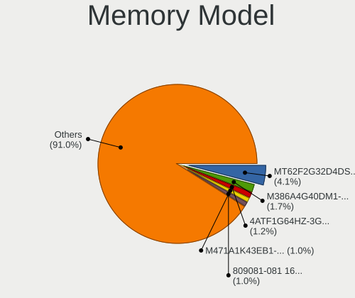

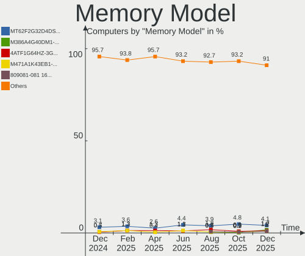

| Model                                                            | Computers | Percent |
|------------------------------------------------------------------|-----------|---------|
| Unknown                                                          | 17        | 4.12%   |
| Samsung RAM M386A4G40DM1-CRC 32GB DIMM DDR4 2400MT/s             | 7         | 1.69%   |
| Micron RAM 4ATF1G64HZ-3G2F1 8GB SODIMM DDR4 3200MT/s             | 5         | 1.21%   |
| Samsung RAM M471A1K43EB1-CWE 8GB SODIMM DDR4 3200MT/s            | 4         | 0.97%   |
| HP RAM 809081-081 16GB DIMM DDR4 2400MT/s                        | 4         | 0.97%   |
| SK hynix RAM HMA81GS6AFR8N-UH 8GB SODIMM DDR4 2667MT/s           | 3         | 0.73%   |
| Samsung RAM M471A5244CB0-CWE 4GB SODIMM DDR4 3200MT/s            | 3         | 0.73%   |
| Samsung RAM M471A5244CB0-CRC 4GB SODIMM DDR4 2667MT/s            | 3         | 0.73%   |
| Samsung RAM M471A1K43CB1-CRC 8GB SODIMM DDR4 8400MT/s            | 3         | 0.73%   |
| Samsung RAM M471A1G44CB0-CWE 8GB SODIMM DDR4 3200MT/s            | 3         | 0.73%   |
| Samsung RAM M471A1G44BB0-CWE 8GB SODIMM DDR4 3200MT/s            | 3         | 0.73%   |
| Samsung RAM M393B1K70CH0-CH9 8GB DIMM 1333MT/s                   | 3         | 0.73%   |
| Samsung RAM M378A1K43CB2-CTD 8GB DIMM DDR4 3266MT/s              | 3         | 0.73%   |
| G.Skill RAM F5-6000J3040G32G 32GB DIMM DDR5 6200MT/s             | 3         | 0.73%   |
| Unknown RAM Module 2GB Row Of Chips LPDDR4 4267MT/s              | 2         | 0.48%   |
| Unknown RAM Module 2GB DIMM DDR2 800MT/s                         | 2         | 0.48%   |
| Unknown RAM Module 16GB DIMM DDR4 2400MT/s                       | 2         | 0.48%   |
| SK hynix RAM HMT451S6AFR8A-PB 4GB SODIMM DDR3 1600MT/s           | 2         | 0.48%   |
| SK hynix RAM HMCG78AGBSA095N 16GB SODIMM DDR5 5600MT/s           | 2         | 0.48%   |
| SK hynix RAM HMAA4GR7CJR8N-XN 32GB DIMM DDR4 3200MT/s            | 2         | 0.48%   |
| SK hynix RAM HMA81GS6CJR8N-VK 8GB SODIMM DDR4 2667MT/s           | 2         | 0.48%   |
| SK hynix RAM H9JCNNNBK3MLYR-N6E 1GB Row Of Chips LPDDR5 6400MT/s | 2         | 0.48%   |
| Samsung RAM UBE3D4AA-MGCR 2GB Row Of Chips LPDDR4 4267MT/s       | 2         | 0.48%   |
| Samsung RAM Module 8GB Row Of Chips LPDDR3 2133MT/s              | 2         | 0.48%   |
| Samsung RAM Module 16GB SODIMM DDR4 2667MT/s                     | 2         | 0.48%   |
| Samsung RAM M471B1G73QH0-YK0 8GB SODIMM DDR3 1600MT/s            | 2         | 0.48%   |
| Samsung RAM M471B1G73EB0-YK0 8192MB SODIMM DDR3 1600MT/s         | 2         | 0.48%   |
| Samsung RAM M471B1G73DB0-YK0 8GB SODIMM DDR3 1600MT/s            | 2         | 0.48%   |
| Samsung RAM M471A2K43CB1-CRC 16GB SODIMM DDR4 2667MT/s           | 2         | 0.48%   |
| Samsung RAM M471A1K43DB1-CWE 8GB SODIMM DDR4 3200MT/s            | 2         | 0.48%   |
| Samsung RAM M471A1K43BB1-CRC 8GB SODIMM DDR4 2667MT/s            | 2         | 0.48%   |
| Samsung RAM M471A1G44AB0-CWE 8GiB SODIMM DDR4 3200MT/s           | 2         | 0.48%   |
| Samsung RAM M425R2GA3PB0-CWMOL 16GB SODIMM DDR5 5600MT/s         | 2         | 0.48%   |
| Samsung RAM K3LKBKB0BM-MGCP 2GB Row Of Chips LPDDR5 6400MT/s     | 2         | 0.48%   |
| Ramaxel RAM RMSA3270ME86H9F-2666 4GB SODIMM DDR4 2667MT/s        | 2         | 0.48%   |
| Nanya RAM NT2GC64B88B0NF-CG 2GB DIMM DDR3 1333MT/s               | 2         | 0.48%   |
| Micron RAM 8ATF1G64HZ-3G2J1 8GB SODIMM DDR4 3200MT/s             | 2         | 0.48%   |
| Micron RAM 8ATF1G64HZ-2G6E1 8GB SODIMM DDR4 2667MT/s             | 2         | 0.48%   |
| Micron RAM 4ATF1G64HZ-3G2E1 8GB SODIMM DDR4 3200MT/s             | 2         | 0.48%   |
| Micron RAM 36ASF2G72PZ-2G3B1 16GB DIMM DDR4 2400MT/s             | 2         | 0.48%   |

Memory Kind
-----------

Memory module kinds

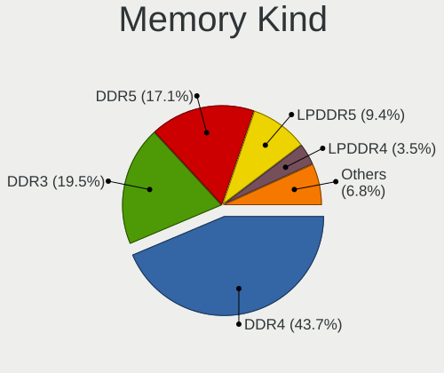

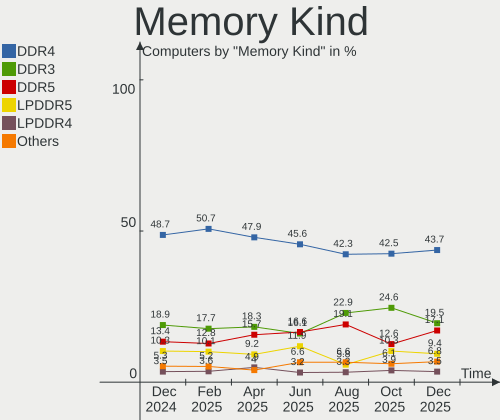

| Kind    | Computers | Percent |
|---------|-----------|---------|
| DDR4    | 148       | 43.66%  |
| DDR3    | 66        | 19.47%  |
| DDR5    | 58        | 17.11%  |
| LPDDR5  | 32        | 9.44%   |
| LPDDR4  | 12        | 3.54%   |
| DRAM    | 10        | 2.95%   |
| LPDDR3  | 6         | 1.77%   |
| Unknown | 3         | 0.88%   |
| DDR2    | 2         | 0.59%   |
| SDRAM   | 1         | 0.29%   |
| RAM     | 1         | 0.29%   |

Memory Form Factor
------------------

Physical design of the memory module

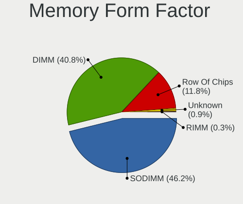

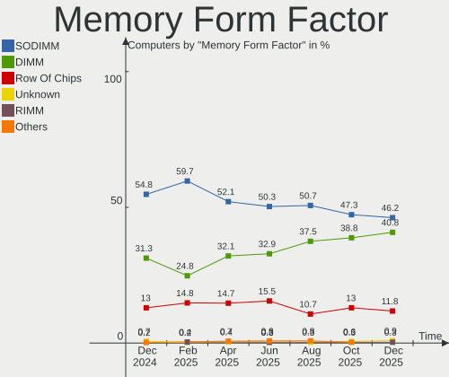

| Name         | Computers | Percent |
|--------------|-----------|---------|
| SODIMM       | 156       | 46.15%  |
| DIMM         | 138       | 40.83%  |
| Row Of Chips | 40        | 11.83%  |
| Unknown      | 3         | 0.89%   |
| RIMM         | 1         | 0.3%    |

Memory Size
-----------

Memory module size

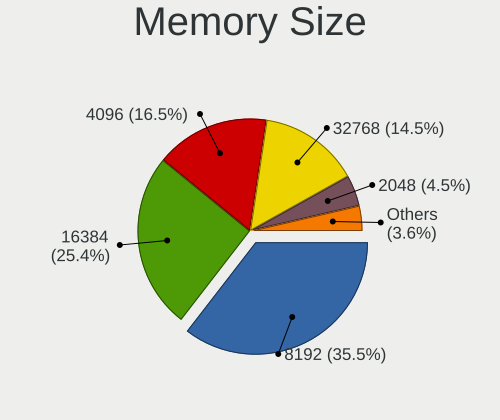

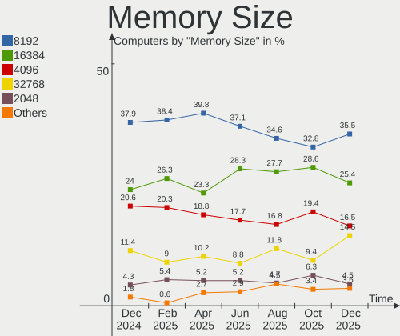

| Size  | Computers | Percent |
|-------|-----------|---------|
| 8192  | 127       | 35.47%  |
| 16384 | 91        | 25.42%  |
| 4096  | 59        | 16.48%  |
| 32768 | 52        | 14.53%  |
| 2048  | 16        | 4.47%   |
| 49152 | 4         | 1.12%   |
| 65536 | 3         | 0.84%   |
| 1024  | 3         | 0.84%   |
| 24576 | 1         | 0.28%   |
| 10240 | 1         | 0.28%   |
| 3072  | 1         | 0.28%   |

Memory Speed
------------

Memory module speed

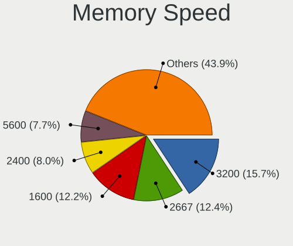

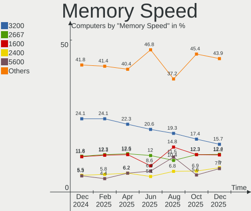

| Speed | Computers | Percent |
|-------|-----------|---------|
| 3200  | 57        | 15.75%  |
| 2667  | 45        | 12.43%  |
| 1600  | 44        | 12.15%  |
| 2400  | 29        | 8.01%   |
| 5600  | 28        | 7.73%   |
| 1333  | 18        | 4.97%   |
| 6400  | 17        | 4.7%    |
| 4800  | 15        | 4.14%   |
| 2133  | 15        | 4.14%   |
| 3600  | 11        | 3.04%   |
| 4267  | 9         | 2.49%   |
| 8533  | 8         | 2.21%   |
| 6000  | 6         | 1.66%   |
| 7500  | 5         | 1.38%   |
| 3733  | 5         | 1.38%   |
| 8400  | 4         | 1.1%    |
| 6200  | 4         | 1.1%    |
| 3800  | 4         | 1.1%    |
| 3266  | 4         | 1.1%    |
| 1334  | 4         | 1.1%    |
| 800   | 4         | 1.1%    |
| 1867  | 3         | 0.83%   |
| 8000  | 2         | 0.55%   |
| 2933  | 2         | 0.55%   |
| 2666  | 2         | 0.55%   |
| 1800  | 2         | 0.55%   |
| 8448  | 1         | 0.28%   |
| 7467  | 1         | 0.28%   |
| 6600  | 1         | 0.28%   |
| 5500  | 1         | 0.28%   |
| 5200  | 1         | 0.28%   |
| 4199  | 1         | 0.28%   |
| 3866  | 1         | 0.28%   |
| 3500  | 1         | 0.28%   |
| 3466  | 1         | 0.28%   |
| 3400  | 1         | 0.28%   |
| 3151  | 1         | 0.28%   |
| 3000  | 1         | 0.28%   |
| 2800  | 1         | 0.28%   |
| 2600  | 1         | 0.28%   |

Printers & scanners
-------------------

Printer Vendor
--------------

Printer device vendors

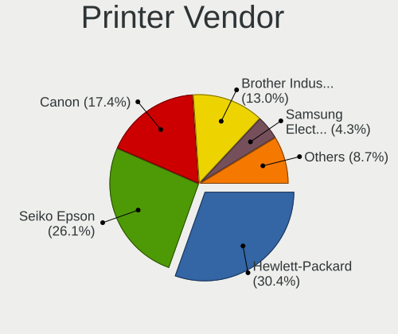

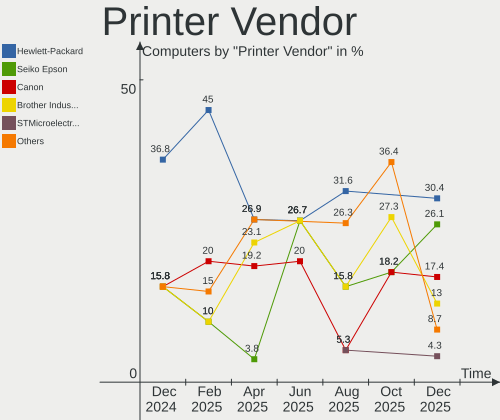

| Vendor              | Computers | Percent |
|---------------------|-----------|---------|
| Hewlett-Packard     | 7         | 30.43%  |
| Seiko Epson         | 6         | 26.09%  |
| Canon               | 4         | 17.39%  |
| Brother Industries  | 3         | 13.04%  |
| STMicroelectronics  | 1         | 4.35%   |
| Samsung Electronics | 1         | 4.35%   |
| Fuji Xerox          | 1         | 4.35%   |

Printer Model
-------------

Printer device models

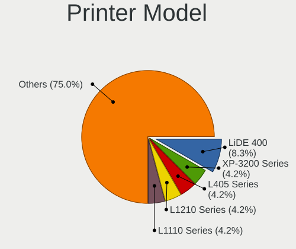

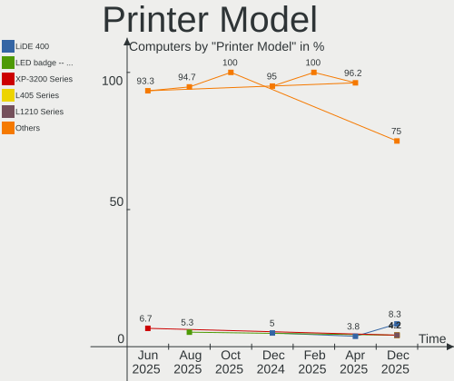

| Model                                                      | Computers | Percent |
|------------------------------------------------------------|-----------|---------|
| Canon LiDE 400                                             | 2         | 8.33%   |
| STMicroelectronics LED badge -- mini LED display -- 11x44  | 1         | 4.17%   |
| Seiko Epson XP-3200 Series                                 | 1         | 4.17%   |
| Seiko Epson L405 Series                                    | 1         | 4.17%   |
| Seiko Epson L1210 Series                                   | 1         | 4.17%   |
| Seiko Epson L1110 Series                                   | 1         | 4.17%   |
| Seiko Epson ET-4750 [WorkForce ET-4750 EcoTank All-in-One] | 1         | 4.17%   |
| Seiko Epson ET-2800 Series                                 | 1         | 4.17%   |
| Seiko Epson ET-2710 Series                                 | 1         | 4.17%   |
| Samsung SCX-3200 Series                                    | 1         | 4.17%   |
| HP Smart Tank 580-590 series                               | 1         | 4.17%   |
| HP PhotoSmart 7350                                         | 1         | 4.17%   |
| HP LaserJet M402dn                                         | 1         | 4.17%   |
| HP LaserJet M109-M112                                      | 1         | 4.17%   |
| HP LaserJet 400 M401dne                                    | 1         | 4.17%   |
| HP DeskJet 2700 series                                     | 1         | 4.17%   |
| HP DeskJet 2130 series                                     | 1         | 4.17%   |
| Fuji Xerox DocuPrint CP105 b                               | 1         | 4.17%   |
| Canon PIXMA MP270 All-In-One Printer                       | 1         | 4.17%   |
| Canon MF4010 series                                        | 1         | 4.17%   |
| Brother Printer                                            | 1         | 4.17%   |
| Brother HL-L2340D series                                   | 1         | 4.17%   |
| Brother HL-L2320D series                                   | 1         | 4.17%   |

Scanner Vendor
--------------

Scanner device vendors

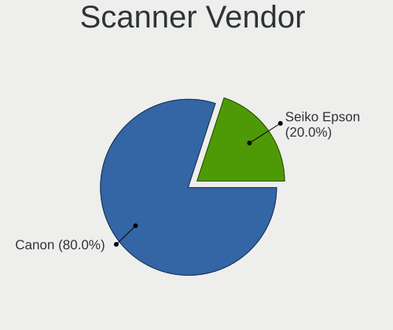

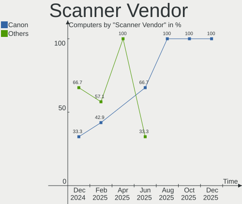

| Vendor | Computers | Percent |
|--------|-----------|---------|
| Canon  | 4         | 100%    |

Scanner Model
-------------

Scanner device models

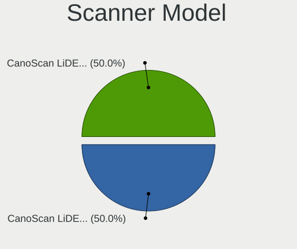

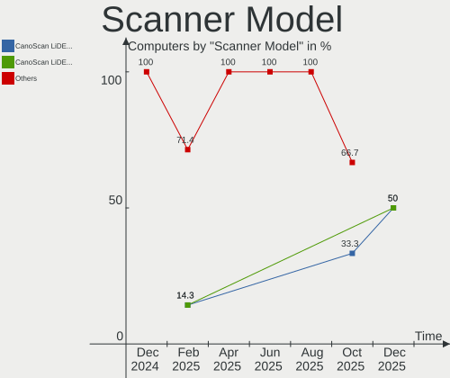

| Model                   | Computers | Percent |
|-------------------------|-----------|---------|
| Canon CanoScan LiDE 220 | 2         | 50%     |
| Canon CanoScan LiDE 110 | 2         | 50%     |

Camera
------

Camera Vendor
-------------

Camera device vendors

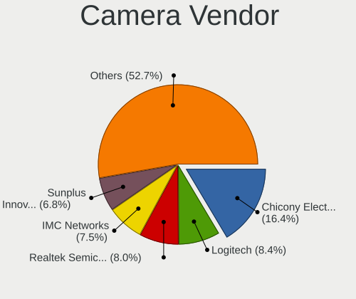

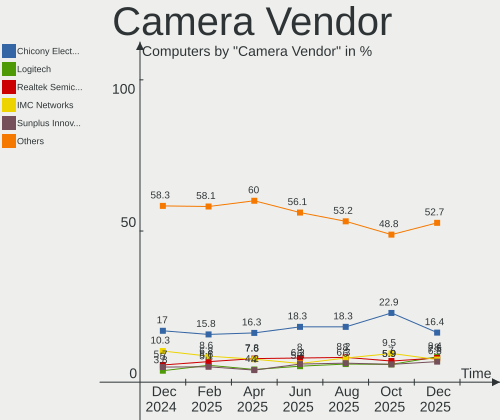

| Vendor                                 | Computers | Percent |
|----------------------------------------|-----------|---------|
| Chicony Electronics                    | 72        | 16.44%  |
| Logitech                               | 37        | 8.45%   |
| Realtek Semiconductor                  | 35        | 7.99%   |
| IMC Networks                           | 33        | 7.53%   |
| Sunplus Innovation Technology          | 30        | 6.85%   |
| Bison Electronics                      | 28        | 6.39%   |
| Microdia                               | 27        | 6.16%   |
| Quanta                                 | 23        | 5.25%   |
| Apple                                  | 21        | 4.79%   |
| Luxvisions Innotech Limited            | 17        | 3.88%   |
| Syntek                                 | 16        | 3.65%   |
| Cheng Uei Precision Industry (Foxlink) | 15        | 3.42%   |
| Sonix Technology                       | 9         | 2.05%   |
| Lite-On Technology                     | 7         | 1.6%    |
| Suyin                                  | 6         | 1.37%   |
| Samsung Electronics                    | 6         | 1.37%   |
| ShineTech                              | 5         | 1.14%   |
| Microsoft                              | 5         | 1.14%   |
| SunplusIT                              | 3         | 0.68%   |
| Silicon Motion                         | 3         | 0.68%   |
| MacroSilicon                           | 3         | 0.68%   |
| kingcome                               | 3         | 0.68%   |
| ShineOptics                            | 2         | 0.46%   |
| Generalplus Technology                 | 2         | 0.46%   |
| ARC International                      | 2         | 0.46%   |
| ALi                                    | 2         | 0.46%   |
| A4Tech                                 | 2         | 0.46%   |
| webcamvendor                           | 1         | 0.23%   |
| webcam                                 | 1         | 0.23%   |
| Sunwingroup                            | 1         | 0.23%   |
| Sunplus Technology                     | 1         | 0.23%   |
| Sunplus IT                             | 1         | 0.23%   |
| Shine-optics                           | 1         | 0.23%   |
| Shenzhen Kingcome Optoelectronic       | 1         | 0.23%   |
| Shenzhen e-loam Technology             | 1         | 0.23%   |
| Pixart Imaging                         | 1         | 0.23%   |
| OPPO Electronics                       | 1         | 0.23%   |
| Jieli Technology                       | 1         | 0.23%   |
| icSpring                               | 1         | 0.23%   |
| Huawei Technologies                    | 1         | 0.23%   |

Camera Model
------------

Camera device models

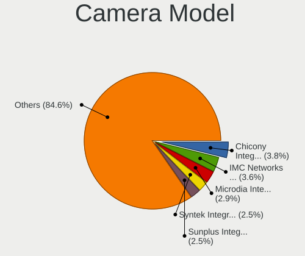

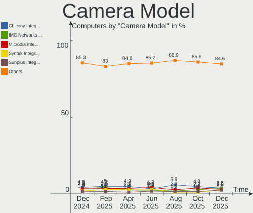

| Model                                         | Computers | Percent |
|-----------------------------------------------|-----------|---------|
| Chicony Integrated Camera                     | 17        | 3.85%   |
| IMC Networks USB2.0 HD UVC WebCam             | 16        | 3.62%   |
| Microdia Integrated_Webcam_HD                 | 13        | 2.94%   |
| Syntek Integrated Camera                      | 11        | 2.49%   |
| Sunplus Integrated_Webcam_HD                  | 11        | 2.49%   |
| Realtek Integrated_Webcam_HD                  | 11        | 2.49%   |
| Bison Integrated Camera                       | 9         | 2.04%   |
| Apple FaceTime HD Camera (Built-in)           | 7         | 1.58%   |
| Samsung Galaxy series, misc. (MTP mode)       | 6         | 1.36%   |
| Logitech Webcam C270                          | 6         | 1.36%   |
| Logitech HD Pro Webcam C920                   | 6         | 1.36%   |
| IMC Networks Integrated Camera                | 6         | 1.36%   |
| Chicony USB2.0 HD UVC WebCam                  | 6         | 1.36%   |
| Luxvisions Innotech Limited Integrated Camera | 5         | 1.13%   |
| Lite-On Integrated Camera                     | 5         | 1.13%   |
| Chicony ACER HD User Facing                   | 5         | 1.13%   |
| Bison SunplusIT Integrated Camera             | 5         | 1.13%   |
| Sonix USB2.0 HD UVC WebCam                    | 4         | 0.9%    |
| ShineTech USB2.0 HD UVC WebCam                | 4         | 0.9%    |
| Realtek Integrated_Webcam_FHD                 | 4         | 0.9%    |
| Quanta HP HD Camera                           | 4         | 0.9%    |
| Luxvisions Innotech Limited HP HD Camera      | 4         | 0.9%    |
| Logitech C922 Pro Stream Webcam               | 4         | 0.9%    |
| Chicony HD Webcam                             | 4         | 0.9%    |
| Bison Lenovo EasyCamera                       | 4         | 0.9%    |
| Apple FaceTime HD Camera                      | 4         | 0.9%    |
| Apple Built-in iSight                         | 4         | 0.9%    |
| Sunplus SPCA2281 Web Camera                   | 3         | 0.68%   |
| Realtek Integrated Webcam HD                  | 3         | 0.68%   |
| Quanta HP TrueVision HD Camera                | 3         | 0.68%   |
| Microdia USB 2.0 Camera                       | 3         | 0.68%   |
| Logitech BRIO Ultra HD Webcam                 | 3         | 0.68%   |
| kingcome FHD WebCam                           | 3         | 0.68%   |
| Chicony HP HD Camera                          | 3         | 0.68%   |
| Chicony HD User Facing                        | 3         | 0.68%   |
| Bison Integrated RGB Camera                   | 3         | 0.68%   |
| Apple FaceTime Camera                         | 3         | 0.68%   |
| Syntek Lenovo EasyCamera                      | 2         | 0.45%   |
| Syntek Integrated RGB Camera                  | 2         | 0.45%   |
| Sunplus Laptop_Integrated_Webcam_FHD          | 2         | 0.45%   |

Security
--------

Fingerprint Vendor
------------------

Fingerprint sensor vendors

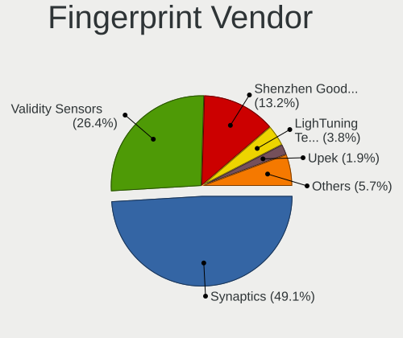

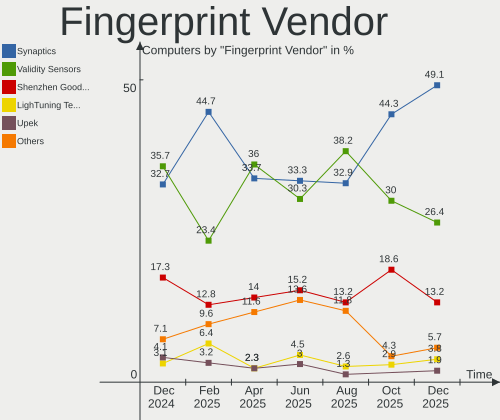

| Vendor                     | Computers | Percent |
|----------------------------|-----------|---------|
| Synaptics                  | 26        | 49.06%  |
| Validity Sensors           | 14        | 26.42%  |
| Shenzhen Goodix Technology | 7         | 13.21%  |
| LighTuning Technology      | 2         | 3.77%   |
| Upek                       | 1         | 1.89%   |
| Samsung Electronics        | 1         | 1.89%   |
| Elan Microelectronics      | 1         | 1.89%   |
| DigitalPersona             | 1         | 1.89%   |

Fingerprint Model
-----------------

Fingerprint sensor models

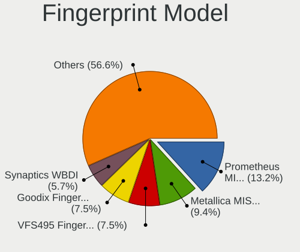

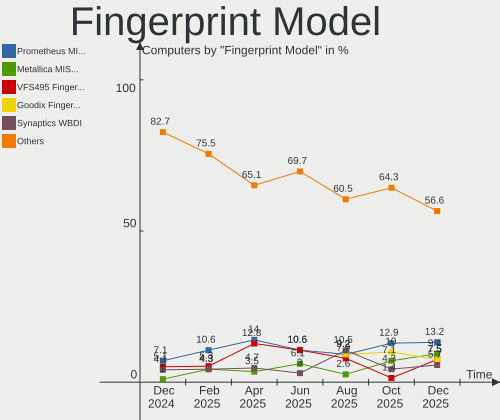

| Model                                                                      | Computers | Percent |
|----------------------------------------------------------------------------|-----------|---------|
| Synaptics Prometheus MIS Touch Fingerprint Reader                          | 7         | 13.21%  |
| Synaptics Metallica MIS Touch Fingerprint Reader                           | 5         | 9.43%   |
| Validity Sensors VFS495 Fingerprint Reader                                 | 4         | 7.55%   |
| Shenzhen Goodix  FingerPrint Device                                        | 4         | 7.55%   |
| Validity Sensors Synaptics WBDI                                            | 3         | 5.66%   |
| Synaptics UWP WBDI Device                                                  | 3         | 5.66%   |
| Synaptics FS7604 Touch Fingerprint Sensor with PurePrint                   | 3         | 5.66%   |
| Synaptics Fingerprint reader [HP G6]                                       | 3         | 5.66%   |
| Validity Sensors Swipe Fingerprint Sensor                                  | 2         | 3.77%   |
| Validity Sensors Fingerprint scanner                                       | 2         | 3.77%   |
| Synaptics  FS7604 Touch Fingerprint Sensor with PurePrint                  | 2         | 3.77%   |
| Synaptics Prometheus Fingerprint Reader                                    | 2         | 3.77%   |
| Shenzhen Goodix Fingerprint Reader                                         | 2         | 3.77%   |
| Validity Sensors VFS471 Fingerprint Reader                                 | 1         | 1.89%   |
| Validity Sensors VFS451 Fingerprint Reader                                 | 1         | 1.89%   |
| Validity Sensors Synaptics VFS7552 Touch Fingerprint Sensor with PurePrint | 1         | 1.89%   |
| Upek Biometric Touchchip/Touchstrip Fingerprint Sensor                     | 1         | 1.89%   |
| Synaptics Metallica MOH Touch Fingerprint Reader                           | 1         | 1.89%   |
| Shenzhen Goodix FingerPrint                                                | 1         | 1.89%   |
| Samsung Fingerprint Sensor Device - 730B                                   | 1         | 1.89%   |
| LighTuning Fingerprint Sensor                                              | 1         | 1.89%   |
| LighTuning Fingerprint Reader                                              | 1         | 1.89%   |
| Elan ELAN:ARM-M4                                                           | 1         | 1.89%   |
| DigitalPersona Fingerprint Reader                                          | 1         | 1.89%   |

Chipcard Vendor
---------------

Chipcard module vendors

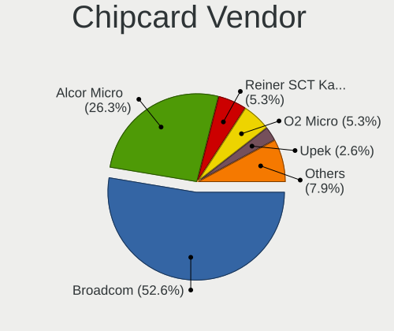

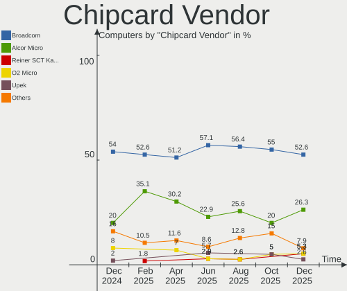

| Vendor                   | Computers | Percent |
|--------------------------|-----------|---------|
| Broadcom                 | 20        | 52.63%  |
| Alcor Micro              | 10        | 26.32%  |
| Reiner SCT Kartensysteme | 2         | 5.26%   |
| O2 Micro                 | 2         | 5.26%   |
| Upek                     | 1         | 2.63%   |
| OmniKey                  | 1         | 2.63%   |
| Lenovo                   | 1         | 2.63%   |
| Aktiv                    | 1         | 2.63%   |

Chipcard Model
--------------

Chipcard module models

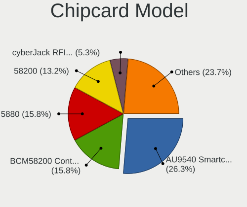

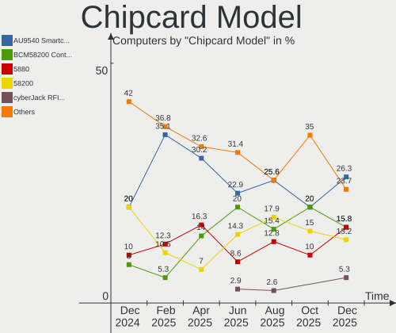

| Model                                                                        | Computers | Percent |
|------------------------------------------------------------------------------|-----------|---------|
| Alcor Micro AU9540 Smartcard Reader                                          | 10        | 26.32%  |
| Broadcom BCM58200 ControlVault 3 (FingerPrint sensor + Contacted SmartCard)  | 6         | 15.79%  |
| Broadcom 5880                                                                | 6         | 15.79%  |
| Broadcom 58200                                                               | 5         | 13.16%  |
| Reiner SCT Kartensysteme cyberJack RFID basis contactless smartcard reader   | 2         | 5.26%   |
| O2 Micro OZ776 CCID Smartcard Reader                                         | 2         | 5.26%   |
| Broadcom BCM5880 Secure Applications Processor                               | 2         | 5.26%   |
| Upek TouchChip Fingerprint Coprocessor (WBF advanced mode)                   | 1         | 2.63%   |
| OmniKey CardMan 3121 (HID Technologies)                                      | 1         | 2.63%   |
| Lenovo Integrated Smart Card Reader                                          | 1         | 2.63%   |
| Broadcom BCM5880 Secure Applications Processor with fingerprint swipe sensor | 1         | 2.63%   |
| Aktiv Rutoken lite                                                           | 1         | 2.63%   |

Unsupported
-----------

Unsupported Devices
-------------------

Total unsupported devices on board

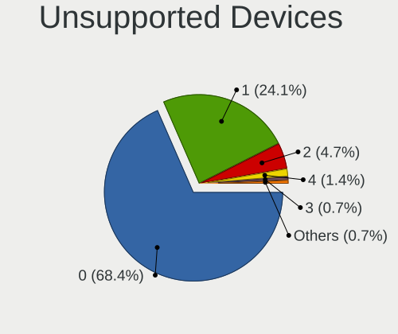

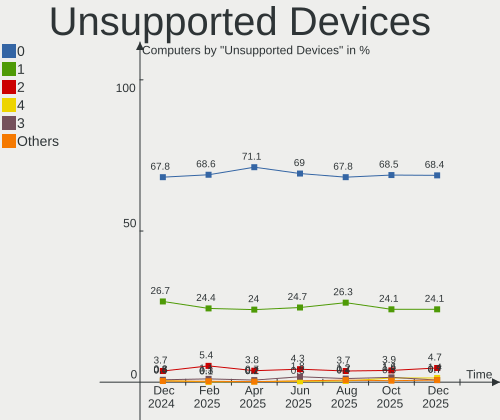

| Total | Computers | Percent |
|-------|-----------|---------|
| 0     | 525       | 68.45%  |
| 1     | 185       | 24.12%  |
| 2     | 36        | 4.69%   |
| 4     | 11        | 1.43%   |
| 3     | 5         | 0.65%   |
| 6     | 4         | 0.52%   |
| 10    | 1         | 0.13%   |

Unsupported Device Types
------------------------

Types of unsupported devices

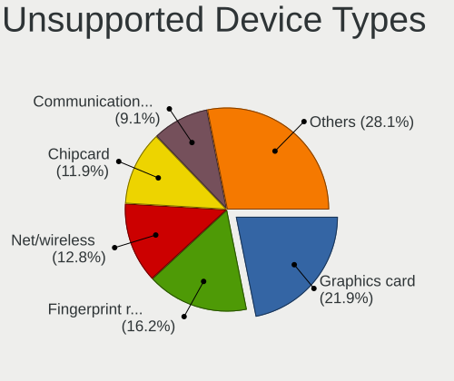

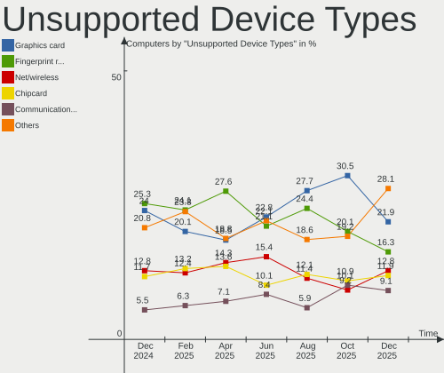

| Type                     | Computers | Percent |
|--------------------------|-----------|---------|
| Graphics card            | 70        | 21.88%  |
| Fingerprint reader       | 52        | 16.25%  |
| Net/wireless             | 41        | 12.81%  |
| Chipcard                 | 38        | 11.88%  |
| Communication controller | 29        | 9.06%   |
| Unassigned class         | 28        | 8.75%   |
| Multimedia controller    | 18        | 5.63%   |
| Net/ethernet             | 8         | 2.5%    |
| Bluetooth                | 8         | 2.5%    |
| Network                  | 7         | 2.19%   |
| Sound                    | 6         | 1.88%   |
| Camera                   | 6         | 1.88%   |
| Storage                  | 3         | 0.94%   |
| Card reader              | 3         | 0.94%   |
| Storage/raid             | 2         | 0.63%   |
| Dvb card                 | 1         | 0.31%   |

