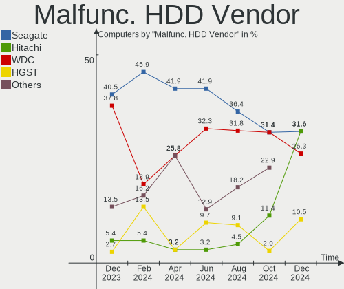
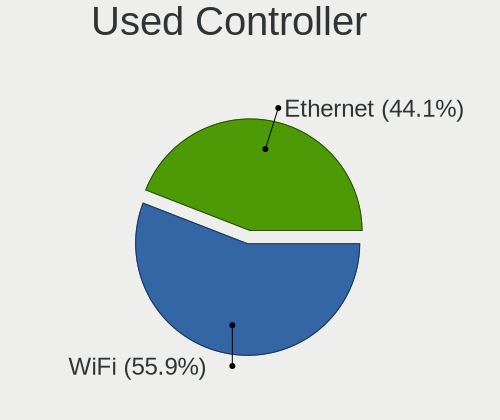

Ubuntu Hardware Trends
----------------------

A project to identify most popular hardware characteristics and track their change
over time based on data collected by Ubuntu users at https://Linux-Hardware.org.

Anyone can contribute to this report by the [hw-probe](https://github.com/linuxhw/hw-probe) tool:

    sudo -E hw-probe -all -upload

This is a report for all computer types. See also reports for [desktops](/Dist/Ubuntu/Desktop/README.md) and [notebooks](/Dist/Ubuntu/Notebook/README.md).

Full-feature report is available here: https://linux-hardware.org/?view=trends

Period: Mar, 2022.

Contents
--------

* [ System ](#system)
  - [ OS                       ](#os)
  - [ OS Family                ](#os-family)
  - [ Kernel                   ](#kernel)
  - [ Kernel Family            ](#kernel-family)
  - [ Kernel Major Ver.        ](#kernel-major-ver)
  - [ Arch                     ](#arch)
  - [ DE                       ](#de)
  - [ Display Server           ](#display-server)
  - [ Display Manager          ](#display-manager)
  - [ OS Lang                  ](#os-lang)
  - [ Boot Mode                ](#boot-mode)
  - [ Filesystem               ](#filesystem)
  - [ Part. scheme             ](#part-scheme)
  - [ Dual Boot with Linux/BSD ](#dual-boot-with-linuxbsd)
  - [ Dual Boot (Win)          ](#dual-boot-win)

* [ Board ](#board)
  - [ Vendor                   ](#vendor)
  - [ Model                    ](#model)
  - [ Model Family             ](#model-family)
  - [ MFG Year                 ](#mfg-year)
  - [ Form Factor              ](#form-factor)
  - [ Secure Boot              ](#secure-boot)
  - [ Coreboot                 ](#coreboot)
  - [ RAM Size                 ](#ram-size)
  - [ RAM Used                 ](#ram-used)
  - [ Total Drives             ](#total-drives)
  - [ Has CD-ROM               ](#has-cd-rom)
  - [ Has Ethernet             ](#has-ethernet)
  - [ Has WiFi                 ](#has-wifi)
  - [ Has Bluetooth            ](#has-bluetooth)

* [ Location ](#location)
  - [ Country                  ](#country)
  - [ City                     ](#city)

* [ Drives ](#drives)
  - [ Drive Vendor             ](#drive-vendor)
  - [ Drive Model              ](#drive-model)
  - [ HDD Vendor               ](#hdd-vendor)
  - [ SSD Vendor               ](#ssd-vendor)
  - [ Drive Kind               ](#drive-kind)
  - [ Drive Connector          ](#drive-connector)
  - [ Drive Size               ](#drive-size)
  - [ Space Total              ](#space-total)
  - [ Space Used               ](#space-used)
  - [ Malfunc. Drives          ](#malfunc-drives)
  - [ Malfunc. Drive Vendor    ](#malfunc-drive-vendor)
  - [ Malfunc. HDD Vendor      ](#malfunc-hdd-vendor)
  - [ Malfunc. Drive Kind      ](#malfunc-drive-kind)
  - [ Failed Drives            ](#failed-drives)
  - [ Failed Drive Vendor      ](#failed-drive-vendor)
  - [ Drive Status             ](#drive-status)

* [ Storage controller ](#storage-controller)
  - [ Storage Vendor           ](#storage-vendor)
  - [ Storage Model            ](#storage-model)
  - [ Storage Kind             ](#storage-kind)

* [ Processor ](#processor)
  - [ CPU Vendor               ](#cpu-vendor)
  - [ CPU Model                ](#cpu-model)
  - [ CPU Model Family         ](#cpu-model-family)
  - [ CPU Cores                ](#cpu-cores)
  - [ CPU Sockets              ](#cpu-sockets)
  - [ CPU Threads              ](#cpu-threads)
  - [ CPU Op-Modes             ](#cpu-op-modes)
  - [ CPU Microcode            ](#cpu-microcode)
  - [ CPU Microarch            ](#cpu-microarch)

* [ Graphics ](#graphics)
  - [ GPU Vendor               ](#gpu-vendor)
  - [ GPU Model                ](#gpu-model)
  - [ GPU Combo                ](#gpu-combo)
  - [ GPU Driver               ](#gpu-driver)
  - [ GPU Memory               ](#gpu-memory)

* [ Monitor ](#monitor)
  - [ Monitor Vendor           ](#monitor-vendor)
  - [ Monitor Model            ](#monitor-model)
  - [ Monitor Resolution       ](#monitor-resolution)
  - [ Monitor Diagonal         ](#monitor-diagonal)
  - [ Monitor Width            ](#monitor-width)
  - [ Aspect Ratio             ](#aspect-ratio)
  - [ Monitor Area             ](#monitor-area)
  - [ Pixel Density            ](#pixel-density)
  - [ Multiple Monitors        ](#multiple-monitors)

* [ Network ](#network)
  - [ Net Controller Vendor    ](#net-controller-vendor)
  - [ Net Controller Model     ](#net-controller-model)
  - [ Wireless Vendor          ](#wireless-vendor)
  - [ Wireless Model           ](#wireless-model)
  - [ Ethernet Vendor          ](#ethernet-vendor)
  - [ Ethernet Model           ](#ethernet-model)
  - [ Net Controller Kind      ](#net-controller-kind)
  - [ Used Controller          ](#used-controller)
  - [ NICs                     ](#nics)
  - [ IPv6                     ](#ipv6)

* [ Bluetooth ](#bluetooth)
  - [ Bluetooth Vendor         ](#bluetooth-vendor)
  - [ Bluetooth Model          ](#bluetooth-model)

* [ Sound ](#sound)
  - [ Sound Vendor             ](#sound-vendor)
  - [ Sound Model              ](#sound-model)

* [ Memory ](#memory)
  - [ Memory Vendor            ](#memory-vendor)
  - [ Memory Model             ](#memory-model)
  - [ Memory Kind              ](#memory-kind)
  - [ Memory Form Factor       ](#memory-form-factor)
  - [ Memory Size              ](#memory-size)
  - [ Memory Speed             ](#memory-speed)

* [ Printers & scanners ](#printers--scanners)
  - [ Printer Vendor           ](#printer-vendor)
  - [ Printer Model            ](#printer-model)
  - [ Scanner Vendor           ](#scanner-vendor)
  - [ Scanner Model            ](#scanner-model)

* [ Camera ](#camera)
  - [ Camera Vendor            ](#camera-vendor)
  - [ Camera Model             ](#camera-model)

* [ Security ](#security)
  - [ Fingerprint Vendor       ](#fingerprint-vendor)
  - [ Fingerprint Model        ](#fingerprint-model)
  - [ Chipcard Vendor          ](#chipcard-vendor)
  - [ Chipcard Model           ](#chipcard-model)

* [ Unsupported ](#unsupported)
  - [ Unsupported Devices      ](#unsupported-devices)
  - [ Unsupported Device Types ](#unsupported-device-types)

System
------

OS
--

Installed operating systems

| Name         | Computers | Percent |
|--------------|-----------|---------|
| Ubuntu 20.04 | 646       | 61.52%  |
| Ubuntu 21.10 | 298       | 28.38%  |
| Ubuntu 18.04 | 49        | 4.67%   |
| Ubuntu 22.04 | 30        | 2.86%   |
| Ubuntu 21.04 | 15        | 1.43%   |
| Ubuntu 20.10 | 7         | 0.67%   |
| Ubuntu 16.04 | 3         | 0.29%   |
| Ubuntu 21.12 | 1         | 0.1%    |
| Ubuntu 19.10 | 1         | 0.1%    |

OS Family
---------

OS without a version

| Name   | Computers | Percent |
|--------|-----------|---------|
| Ubuntu | 1050      | 100%    |

Kernel
------

Version of the Linux kernel

| Version                     | Computers | Percent |
|-----------------------------|-----------|---------|
| 5.13.0-35-generic           | 268       | 25.52%  |
| 5.13.0-30-generic           | 217       | 20.67%  |
| 5.13.0-37-generic           | 170       | 16.19%  |
| 5.4.0-100-generic           | 36        | 3.43%   |
| 5.4.0-104-generic           | 34        | 3.24%   |
| 5.13.0-39-generic           | 32        | 3.05%   |
| 5.4.0-105-generic           | 21        | 2%      |
| 5.13.0-19-generic           | 19        | 1.81%   |
| 5.13.0-32-generic           | 12        | 1.14%   |
| 5.13.0-28-generic           | 12        | 1.14%   |
| 5.8.0-43-generic            | 11        | 1.05%   |
| 5.15.0-23-generic           | 11        | 1.05%   |
| 5.11.0-49-generic           | 11        | 1.05%   |
| 4.15.0-171-generic          | 11        | 1.05%   |
| 5.15.0-22-generic           | 9         | 0.86%   |
| 5.14.0-1027-oem             | 8         | 0.76%   |
| 5.13.0-36-generic           | 8         | 0.76%   |
| 5.11.0-27-generic           | 8         | 0.76%   |
| 5.15.0-18-generic           | 7         | 0.67%   |
| 5.14.0-1024-oem             | 6         | 0.57%   |
| 5.8.0-63-generic            | 4         | 0.38%   |
| 5.14.0-1029-oem             | 4         | 0.38%   |
| 5.13.0-1022-raspi           | 4         | 0.38%   |
| 5.13.0-1020-raspi           | 4         | 0.38%   |
| 5.11.0-41-generic           | 4         | 0.38%   |
| 4.15.0-169-generic          | 4         | 0.38%   |
| 5.8.0-50-generic            | 3         | 0.29%   |
| 5.4.0-42-generic            | 3         | 0.29%   |
| 5.17.0-051700-generic       | 3         | 0.29%   |
| 5.13.0-38-generic           | 3         | 0.29%   |
| 5.13.0-35-lowlatency        | 3         | 0.29%   |
| 5.13.0-272202022022-generic | 3         | 0.29%   |
| 5.13.0-21-generic           | 3         | 0.29%   |
| 5.11.0-44-generic           | 3         | 0.29%   |
| 5.11.0-40-generic           | 3         | 0.29%   |
| 4.15.0-173-generic          | 3         | 0.29%   |
| 5.8.0-25-generic            | 2         | 0.19%   |
| 5.4.0-99-generic            | 2         | 0.19%   |
| 5.4.0-84-generic            | 2         | 0.19%   |
| 5.4.0-102-generic           | 2         | 0.19%   |
| 5.16.12-051612-generic      | 2         | 0.19%   |
| 5.13.0-40-generic           | 2         | 0.19%   |
| 5.13.0-37-lowlatency        | 2         | 0.19%   |
| 5.13.0-27-generic           | 2         | 0.19%   |
| 5.13.0-22-generic           | 2         | 0.19%   |
| 5.13.0-10035-tuxedo         | 2         | 0.19%   |
| 5.11.0-46-generic           | 2         | 0.19%   |
| 4.15.0-142-generic          | 2         | 0.19%   |
| 5.8.0-55-generic            | 1         | 0.1%    |
| 5.8.0-45-generic            | 1         | 0.1%    |
| 5.8.0-38-generic            | 1         | 0.1%    |
| 5.4.184-0504184-generic     | 1         | 0.1%    |
| 5.4.167-240                 | 1         | 0.1%    |
| 5.4.0-97-generic            | 1         | 0.1%    |
| 5.4.0-962202022022-generic  | 1         | 0.1%    |
| 5.4.0-94-generic            | 1         | 0.1%    |
| 5.4.0-92-generic            | 1         | 0.1%    |
| 5.4.0-91-generic            | 1         | 0.1%    |
| 5.4.0-90-generic            | 1         | 0.1%    |
| 5.4.0-77-generic            | 1         | 0.1%    |

Kernel Family
-------------

Linux kernel without a distro release

| Version | Computers | Percent |
|---------|-----------|---------|
| 5.13.0  | 773       | 73.62%  |
| 5.4.0   | 118       | 11.24%  |
| 5.11.0  | 35        | 3.33%   |
| 5.15.0  | 28        | 2.67%   |
| 4.15.0  | 26        | 2.48%   |
| 5.8.0   | 23        | 2.19%   |
| 5.14.0  | 19        | 1.81%   |
| 5.17.0  | 6         | 0.57%   |
| 5.16.0  | 3         | 0.29%   |
| 5.16.12 | 2         | 0.19%   |
| 5.4.184 | 1         | 0.1%    |
| 5.4.167 | 1         | 0.1%    |
| 5.3.0   | 1         | 0.1%    |
| 5.17.1  | 1         | 0.1%    |
| 5.16.11 | 1         | 0.1%    |
| 5.15.6  | 1         | 0.1%    |
| 5.15.5  | 1         | 0.1%    |
| 5.15.4  | 1         | 0.1%    |
| 5.15.27 | 1         | 0.1%    |
| 5.15.24 | 1         | 0.1%    |
| 5.15.13 | 1         | 0.1%    |
| 5.10.43 | 1         | 0.1%    |
| 5.0.0   | 1         | 0.1%    |
| 4.9.253 | 1         | 0.1%    |
| 4.9.241 | 1         | 0.1%    |
| 4.4.190 | 1         | 0.1%    |
| 4.4.0   | 1         | 0.1%    |

Kernel Major Ver.
-----------------

Linux kernel major version

| Version | Computers | Percent |
|---------|-----------|---------|
| 5.13    | 773       | 73.62%  |
| 5.4     | 120       | 11.43%  |
| 5.11    | 35        | 3.33%   |
| 5.15    | 34        | 3.24%   |
| 4.15    | 26        | 2.48%   |
| 5.8     | 23        | 2.19%   |
| 5.14    | 19        | 1.81%   |
| 5.17    | 7         | 0.67%   |
| 5.16    | 6         | 0.57%   |
| 4.9     | 2         | 0.19%   |
| 4.4     | 2         | 0.19%   |
| 5.3     | 1         | 0.1%    |
| 5.10    | 1         | 0.1%    |
| 5.0     | 1         | 0.1%    |

Arch
----

OS architecture (x86_64, i586, etc.)

| Name    | Computers | Percent |
|---------|-----------|---------|
| x86_64  | 1020      | 97.14%  |
| aarch64 | 17        | 1.62%   |
| i686    | 12        | 1.14%   |
| armv7l  | 1         | 0.1%    |

DE
--

Desktop Environment

| Name            | Computers | Percent |
|-----------------|-----------|---------|
| GNOME           | 975       | 92.86%  |
| Unknown         | 43        | 4.1%    |
| Unity           | 11        | 1.05%   |
| GNOME Flashback | 9         | 0.86%   |
| X-Cinnamon      | 6         | 0.57%   |
| Enlightenment   | 2         | 0.19%   |
| Cinnamon        | 2         | 0.19%   |
| Pantheon        | 1         | 0.1%    |
| i3              | 1         | 0.1%    |

Display Server
--------------

X11 or Wayland

| Name    | Computers | Percent |
|---------|-----------|---------|
| X11     | 763       | 72.67%  |
| Wayland | 243       | 23.14%  |
| Tty     | 22        | 2.1%    |
| Unknown | 22        | 2.1%    |

Display Manager
---------------

SDDM, LightDM, etc.

| Name    | Computers | Percent |
|---------|-----------|---------|
| GDM3    | 652       | 62.1%   |
| GDM     | 283       | 26.95%  |
| Unknown | 81        | 7.71%   |
| LightDM | 29        | 2.76%   |
| SDDM    | 4         | 0.38%   |
| SLiM    | 1         | 0.1%    |

OS Lang
-------

Language

| Lang        | Computers | Percent |
|-------------|-----------|---------|
| en_US       | 475       | 45.24%  |
| de_DE       | 120       | 11.43%  |
| en_GB       | 54        | 5.14%   |
| fr_FR       | 49        | 4.67%   |
| pt_BR       | 39        | 3.71%   |
| it_IT       | 32        | 3.05%   |
| es_ES       | 30        | 2.86%   |
| en_CA       | 29        | 2.76%   |
| ru_RU       | 28        | 2.67%   |
| en_IN       | 21        | 2%      |
| en_AU       | 19        | 1.81%   |
| C           | 15        | 1.43%   |
| cs_CZ       | 10        | 0.95%   |
| zh_CN       | 9         | 0.86%   |
| nl_NL       | 8         | 0.76%   |
| pl_PL       | 6         | 0.57%   |
| en_ZA       | 6         | 0.57%   |
| de_AT       | 6         | 0.57%   |
| Unknown     | 6         | 0.57%   |
| es_MX       | 5         | 0.48%   |
| el_GR       | 5         | 0.48%   |
| tr_TR       | 4         | 0.38%   |
| fr_CA       | 4         | 0.38%   |
| es_AR       | 4         | 0.38%   |
| en_PH       | 4         | 0.38%   |
| en_IL       | 4         | 0.38%   |
| de_CH       | 4         | 0.38%   |
| da_DK       | 4         | 0.38%   |
| zh_TW       | 3         | 0.29%   |
| fr_BE       | 3         | 0.29%   |
| es_CO       | 3         | 0.29%   |
| en_NZ       | 3         | 0.29%   |
| en_IE       | 3         | 0.29%   |
| en_HK       | 3         | 0.29%   |
| sk_SK       | 2         | 0.19%   |
| pt_PT       | 2         | 0.19%   |
| ko_KR       | 2         | 0.19%   |
| ja_JP       | 2         | 0.19%   |
| hu_HU       | 2         | 0.19%   |
| es_UY       | 2         | 0.19%   |
| es_EC       | 2         | 0.19%   |
| en_SG       | 2         | 0.19%   |
| ca_ES       | 2         | 0.19%   |
| sv_SE       | 1         | 0.1%    |
| sr_RS@latin | 1         | 0.1%    |
| ru_UA       | 1         | 0.1%    |
| ro_RO       | 1         | 0.1%    |
| nb_NO       | 1         | 0.1%    |
| fr_CH       | 1         | 0.1%    |
| fi_FI       | 1         | 0.1%    |
| fa_IR       | 1         | 0.1%    |
| es_PE       | 1         | 0.1%    |
| es_DO       | 1         | 0.1%    |
| de_IT       | 1         | 0.1%    |
| ar_SA       | 1         | 0.1%    |
| ar_EG       | 1         | 0.1%    |
| aa_DJ       | 1         | 0.1%    |

Boot Mode
---------

EFI or BIOS

| Mode | Computers | Percent |
|------|-----------|---------|
| BIOS | 528       | 50.29%  |
| EFI  | 522       | 49.71%  |

Filesystem
----------

Type of filesystem

| Type    | Computers | Percent |
|---------|-----------|---------|
| Ext4    | 969       | 92.29%  |
| Overlay | 43        | 4.1%    |
| Zfs     | 18        | 1.71%   |
| Ext2    | 7         | 0.67%   |
| Btrfs   | 7         | 0.67%   |
| Ext3    | 4         | 0.38%   |
| Xfs     | 2         | 0.19%   |

Part. scheme
------------

Scheme of partitioning

| Type    | Computers | Percent |
|---------|-----------|---------|
| Unknown | 709       | 67.52%  |
| GPT     | 290       | 27.62%  |
| MBR     | 51        | 4.86%   |

Dual Boot with Linux/BSD
------------------------

Hosting more than one Linux/BSD

| Dual boot | Computers | Percent |
|-----------|-----------|---------|
| No        | 911       | 86.76%  |
| Yes       | 139       | 13.24%  |

Dual Boot (Win)
---------------

Hosting Linux and Windows

| Dual boot | Computers | Percent |
|-----------|-----------|---------|
| No        | 624       | 59.43%  |
| Yes       | 426       | 40.57%  |

Board
-----

Vendor
------

Motherboard manufacturer

| Name                           | Computers | Percent |
|--------------------------------|-----------|---------|
| Dell                           | 167       | 15.9%   |
| Hewlett-Packard                | 163       | 15.52%  |
| ASUSTek Computer               | 157       | 14.95%  |
| Lenovo                         | 127       | 12.1%   |
| Gigabyte Technology            | 61        | 5.81%   |
| Acer                           | 54        | 5.14%   |
| MSI                            | 53        | 5.05%   |
| Intel                          | 25        | 2.38%   |
| ASRock                         | 23        | 2.19%   |
| Toshiba                        | 21        | 2%      |
| Apple                          | 18        | 1.71%   |
| Samsung Electronics            | 15        | 1.43%   |
| HUAWEI                         | 15        | 1.43%   |
| Raspberry Pi Foundation        | 13        | 1.24%   |
| Medion                         | 10        | 0.95%   |
| Fujitsu                        | 9         | 0.86%   |
| Sony                           | 8         | 0.76%   |
| Unknown                        | 8         | 0.76%   |
| Supermicro                     | 6         | 0.57%   |
| Positivo                       | 6         | 0.57%   |
| Timi                           | 4         | 0.38%   |
| Microsoft                      | 4         | 0.38%   |
| ECS                            | 4         | 0.38%   |
| Alienware                      | 4         | 0.38%   |
| Pegatron                       | 3         | 0.29%   |
| Panasonic                      | 3         | 0.29%   |
| Packard Bell                   | 3         | 0.29%   |
| LG Electronics                 | 3         | 0.29%   |
| Biostar                        | 3         | 0.29%   |
| TUXEDO                         | 2         | 0.19%   |
| Thomson                        | 2         | 0.19%   |
| System76                       | 2         | 0.19%   |
| Notebook                       | 2         | 0.19%   |
| Matsushita Electric Industrial | 2         | 0.19%   |
| IP3 Tech                       | 2         | 0.19%   |
| Hardkernel                     | 2         | 0.19%   |
| GPU Company                    | 2         | 0.19%   |
| Fujitsu Siemens                | 2         | 0.19%   |
| eMachines                      | 2         | 0.19%   |
| Clevo                          | 2         | 0.19%   |
| ZYREX COMPUTER SYSTEMS         | 1         | 0.1%    |
| ZOTAC                          | 1         | 0.1%    |
| SiS Technology                 | 1         | 0.1%    |
| Shenzhen Wangang Technology    | 1         | 0.1%    |
| Schenker                       | 1         | 0.1%    |
| SANTECH                        | 1         | 0.1%    |
| Rockchip                       | 1         | 0.1%    |
| R.W.C                          | 1         | 0.1%    |
| Otazak                         | 1         | 0.1%    |
| Online Labs                    | 1         | 0.1%    |
| OEM                            | 1         | 0.1%    |
| Nvidia                         | 1         | 0.1%    |
| NU591                          | 1         | 0.1%    |
| NSX                            | 1         | 0.1%    |
| Noblex                         | 1         | 0.1%    |
| Neousys Technology             | 1         | 0.1%    |
| Multilaser                     | 1         | 0.1%    |
| Microtech                      | 1         | 0.1%    |
| MeLE                           | 1         | 0.1%    |
| Le Cube 1                      | 1         | 0.1%    |

Model
-----

Motherboard model

| Name                                  | Computers | Percent |
|---------------------------------------|-----------|---------|
| RPi Raspberry Pi                      | 13        | 1.24%   |
| ASUS All Series                       | 13        | 1.24%   |
| Unknown                               | 11        | 1.05%   |
| HP Pavilion g6                        | 6         | 0.57%   |
| HP Notebook                           | 5         | 0.48%   |
| Intel DH55TC AAE70932-205             | 4         | 0.38%   |
| Dell OptiPlex 9010                    | 4         | 0.38%   |
| Dell OptiPlex 7010                    | 4         | 0.38%   |
| Dell Latitude E6420                   | 4         | 0.38%   |
| MSI MS-7C52                           | 3         | 0.29%   |
| Lenovo ThinkBook 16p Gen 2 20YM       | 3         | 0.29%   |
| HUAWEI HVY-WXX9                       | 3         | 0.29%   |
| HP Pavilion dv7                       | 3         | 0.29%   |
| HP Pavilion dv6                       | 3         | 0.29%   |
| HP Laptop 15-bs0xx                    | 3         | 0.29%   |
| HP ENVY x360 Convertible 15-eu0xxx    | 3         | 0.29%   |
| HP EliteBook 840 G3                   | 3         | 0.29%   |
| Dell OptiPlex 7050                    | 3         | 0.29%   |
| Dell Latitude 5520                    | 3         | 0.29%   |
| Toshiba Satellite C55-B               | 2         | 0.19%   |
| Supermicro Super Server               | 2         | 0.19%   |
| Samsung 950XDB/951XDB/950XDY          | 2         | 0.19%   |
| Samsung 950QDB                        | 2         | 0.19%   |
| MSI Prestige 15 A11SCS                | 2         | 0.19%   |
| MSI MS-7B87                           | 2         | 0.19%   |
| Microsoft Surface Go                  | 2         | 0.19%   |
| Lenovo Yoga 6 13ALC6 82ND             | 2         | 0.19%   |
| Lenovo V145-15AST 81MT                | 2         | 0.19%   |
| Lenovo ThinkBook 15 G2 ITL 20VE       | 2         | 0.19%   |
| Lenovo IdeaPadFlex 5 15ALC05 82HV     | 2         | 0.19%   |
| Lenovo IdeaPadFlex 5 14IIL05 81X1     | 2         | 0.19%   |
| Lenovo IdeaPadFlex 5 14ARE05 81X2     | 2         | 0.19%   |
| Lenovo IdeaPad Gaming 3 15ARH05 82EY  | 2         | 0.19%   |
| Lenovo IdeaPad 5 Pro 14ACN6 82L7      | 2         | 0.19%   |
| Lenovo G505s 20255                    | 2         | 0.19%   |
| IP3 Tech HeroBox                      | 2         | 0.19%   |
| Intel NUC8i7BEH                       | 2         | 0.19%   |
| Intel NUC8i5BEK                       | 2         | 0.19%   |
| HUAWEI CREM-WXX9                      | 2         | 0.19%   |
| HP Z420 Workstation                   | 2         | 0.19%   |
| HP Stream Laptop 11-ak0xxx            | 2         | 0.19%   |
| HP Spectre x360 Convertible 13-aw0xxx | 2         | 0.19%   |
| HP ProDesk 600 G1 SFF                 | 2         | 0.19%   |
| HP Pavilion Notebook                  | 2         | 0.19%   |
| HP Pavilion 17                        | 2         | 0.19%   |
| HP Laptop 15-dw3xxx                   | 2         | 0.19%   |
| HP Laptop 15-dw1xxx                   | 2         | 0.19%   |
| HP Laptop 15-db0xxx                   | 2         | 0.19%   |
| HP EliteDesk 800 G1 TWR               | 2         | 0.19%   |
| HP EliteBook 850 G8 Notebook PC       | 2         | 0.19%   |
| HP EliteBook 8470p                    | 2         | 0.19%   |
| HP EliteBook 2740p                    | 2         | 0.19%   |
| HP Compaq Pro 6300 SFF                | 2         | 0.19%   |
| HP Compaq Elite 8300 USDT             | 2         | 0.19%   |
| HP 255 G7 Notebook PC                 | 2         | 0.19%   |
| HP 250 G7 Notebook PC                 | 2         | 0.19%   |
| HP 15 Notebook PC                     | 2         | 0.19%   |
| Gigabyte Z690 UD DDR4                 | 2         | 0.19%   |
| Gigabyte X58A-UD3R                    | 2         | 0.19%   |
| Gigabyte H110M-S2H                    | 2         | 0.19%   |

Model Family
------------

Motherboard model prefix

| Name                | Computers | Percent |
|---------------------|-----------|---------|
| Lenovo ThinkPad     | 46        | 4.38%   |
| Dell Latitude       | 46        | 4.38%   |
| Dell Inspiron       | 43        | 4.1%    |
| Acer Aspire         | 35        | 3.33%   |
| HP Pavilion         | 31        | 2.95%   |
| Dell OptiPlex       | 25        | 2.38%   |
| Lenovo IdeaPad      | 23        | 2.19%   |
| HP EliteBook        | 23        | 2.19%   |
| HP Laptop           | 19        | 1.81%   |
| Toshiba Satellite   | 18        | 1.71%   |
| Dell Precision      | 18        | 1.71%   |
| ASUS PRIME          | 18        | 1.71%   |
| Dell XPS            | 16        | 1.52%   |
| RPi Raspberry       | 13        | 1.24%   |
| ASUS All            | 13        | 1.24%   |
| ASUS ROG            | 12        | 1.14%   |
| HP ProBook          | 11        | 1.05%   |
| ASUS VivoBook       | 11        | 1.05%   |
| Unknown             | 11        | 1.05%   |
| HP ENVY             | 10        | 0.95%   |
| HP Compaq           | 9         | 0.86%   |
| ASUS TUF            | 9         | 0.86%   |
| Lenovo ThinkBook    | 8         | 0.76%   |
| Lenovo ThinkCentre  | 7         | 0.67%   |
| Dell Vostro         | 7         | 0.67%   |
| Lenovo Yoga         | 6         | 0.57%   |
| Lenovo IdeaPadFlex  | 6         | 0.57%   |
| Intel DH55TC        | 6         | 0.57%   |
| HP ZBook            | 6         | 0.57%   |
| Acer Swift          | 6         | 0.57%   |
| HP Notebook         | 5         | 0.48%   |
| Fujitsu LIFEBOOK    | 5         | 0.48%   |
| Dell PowerEdge      | 5         | 0.48%   |
| ASUS ZenBook        | 5         | 0.48%   |
| Microsoft Surface   | 4         | 0.38%   |
| Lenovo IdeaCentre   | 4         | 0.38%   |
| HP Stream           | 4         | 0.38%   |
| HP Spectre          | 4         | 0.38%   |
| HP OMEN             | 4         | 0.38%   |
| HP EliteDesk        | 4         | 0.38%   |
| HP 250              | 4         | 0.38%   |
| Fujitsu ESPRIMO     | 4         | 0.38%   |
| Apple iMac12        | 4         | 0.38%   |
| Acer TravelMate     | 4         | 0.38%   |
| Acer Predator       | 4         | 0.38%   |
| MSI MS-7C52         | 3         | 0.29%   |
| Lenovo ThinkStation | 3         | 0.29%   |
| Lenovo Legion       | 3         | 0.29%   |
| HUAWEI HVY-WXX9     | 3         | 0.29%   |
| HP ProLiant         | 3         | 0.29%   |
| HP ProDesk          | 3         | 0.29%   |
| HP 255              | 3         | 0.29%   |
| Gigabyte G1.Sniper  | 3         | 0.29%   |
| Dell System         | 3         | 0.29%   |
| ASUS P8H61-M        | 3         | 0.29%   |
| ASUS M5A78L-M       | 3         | 0.29%   |
| Toshiba PORTEGE     | 2         | 0.19%   |
| Timi RedmiBook      | 2         | 0.19%   |
| Supermicro Super    | 2         | 0.19%   |
| Samsung 950XDB      | 2         | 0.19%   |

MFG Year
--------

Motherboard manufacture year

| Year    | Computers | Percent |
|---------|-----------|---------|
| 2021    | 127       | 12.1%   |
| 2020    | 124       | 11.81%  |
| 2019    | 94        | 8.95%   |
| 2018    | 83        | 7.9%    |
| 2013    | 69        | 6.57%   |
| 2014    | 68        | 6.48%   |
| 2012    | 67        | 6.38%   |
| 2011    | 67        | 6.38%   |
| 2017    | 60        | 5.71%   |
| 2016    | 56        | 5.33%   |
| 2010    | 49        | 4.67%   |
| 2009    | 44        | 4.19%   |
| 2015    | 43        | 4.1%    |
| 2008    | 37        | 3.52%   |
| 2007    | 22        | 2.1%    |
| Unknown | 19        | 1.81%   |
| 2022    | 8         | 0.76%   |
| 2006    | 8         | 0.76%   |
| 2005    | 3         | 0.29%   |
| 2004    | 2         | 0.19%   |

Form Factor
-----------

Physical design of the computer

| Name           | Computers | Percent |
|----------------|-----------|---------|
| Notebook       | 558       | 53.14%  |
| Desktop        | 373       | 35.52%  |
| Convertible    | 41        | 3.9%    |
| System on chip | 18        | 1.71%   |
| All in one     | 17        | 1.62%   |
| Mini pc        | 16        | 1.52%   |
| Server         | 16        | 1.52%   |
| Tablet         | 11        | 1.05%   |

Secure Boot
-----------

Enabled or disabled

| State    | Computers | Percent |
|----------|-----------|---------|
| Disabled | 901       | 85.81%  |
| Enabled  | 149       | 14.19%  |

Coreboot
--------

Have coreboot on board

| Used | Computers | Percent |
|------|-----------|---------|
| No   | 1048      | 99.81%  |
| Yes  | 2         | 0.19%   |

RAM Size
--------

Total RAM memory

| Size in GB      | Computers | Percent |
|-----------------|-----------|---------|
| 4.01-8.0        | 238       | 22.67%  |
| 3.01-4.0        | 205       | 19.52%  |
| 16.01-24.0      | 205       | 19.52%  |
| 8.01-16.0       | 182       | 17.33%  |
| 32.01-64.0      | 107       | 10.19%  |
| 64.01-256.0     | 45        | 4.29%   |
| 1.01-2.0        | 34        | 3.24%   |
| 24.01-32.0      | 17        | 1.62%   |
| 2.01-3.0        | 13        | 1.24%   |
| More than 256.0 | 3         | 0.29%   |
| 0.51-1.0        | 1         | 0.1%    |

RAM Used
--------

Used RAM memory

| Used GB    | Computers | Percent |
|------------|-----------|---------|
| 1.01-2.0   | 381       | 36.29%  |
| 2.01-3.0   | 292       | 27.81%  |
| 4.01-8.0   | 163       | 15.52%  |
| 3.01-4.0   | 125       | 11.9%   |
| 8.01-16.0  | 39        | 3.71%   |
| 0.51-1.0   | 32        | 3.05%   |
| 0.01-0.5   | 8         | 0.76%   |
| 24.01-32.0 | 4         | 0.38%   |
| 16.01-24.0 | 4         | 0.38%   |
| 32.01-64.0 | 2         | 0.19%   |

Total Drives
------------

Number of drives on board

| Drives | Computers | Percent |
|--------|-----------|---------|
| 1      | 644       | 61.33%  |
| 2      | 249       | 23.71%  |
| 3      | 73        | 6.95%   |
| 4      | 39        | 3.71%   |
| 5      | 12        | 1.14%   |
| 6      | 11        | 1.05%   |
| 0      | 10        | 0.95%   |
| 7      | 6         | 0.57%   |
| 11     | 2         | 0.19%   |
| 9      | 2         | 0.19%   |
| 8      | 2         | 0.19%   |

Has CD-ROM
----------

Has CD-ROM on board

| Presented | Computers | Percent |
|-----------|-----------|---------|
| No        | 653       | 62.19%  |
| Yes       | 397       | 37.81%  |

Has Ethernet
------------

Has Ethernet on board

| Presented | Computers | Percent |
|-----------|-----------|---------|
| Yes       | 877       | 83.52%  |
| No        | 173       | 16.48%  |

Has WiFi
--------

Has WiFi module

| Presented | Computers | Percent |
|-----------|-----------|---------|
| Yes       | 797       | 75.9%   |
| No        | 253       | 24.1%   |

Has Bluetooth
-------------

Has Bluetooth module

| Presented | Computers | Percent |
|-----------|-----------|---------|
| Yes       | 622       | 59.24%  |
| No        | 428       | 40.76%  |

Location
--------

Country
-------

Geographic location (country)

| Country      | Computers | Percent |
|--------------|-----------|---------|
| USA          | 213       | 20.29%  |
| Germany      | 141       | 13.43%  |
| France       | 61        | 5.81%   |
| Brazil       | 52        | 4.95%   |
| Russia       | 45        | 4.29%   |
| UK           | 43        | 4.1%    |
| Italy        | 41        | 3.9%    |
| Spain        | 39        | 3.71%   |
| Canada       | 38        | 3.62%   |
| India        | 24        | 2.29%   |
| Netherlands  | 22        | 2.1%    |
| Australia    | 20        | 1.9%    |
| China        | 14        | 1.33%   |
| Switzerland  | 13        | 1.24%   |
| Czechia      | 13        | 1.24%   |
| Austria      | 13        | 1.24%   |
| Romania      | 12        | 1.14%   |
| Argentina    | 12        | 1.14%   |
| Colombia     | 11        | 1.05%   |
| Poland       | 10        | 0.95%   |
| Mexico       | 9         | 0.86%   |
| Greece       | 9         | 0.86%   |
| Ukraine      | 8         | 0.76%   |
| Turkey       | 8         | 0.76%   |
| Sweden       | 7         | 0.67%   |
| Japan        | 7         | 0.67%   |
| Iran         | 7         | 0.67%   |
| Indonesia    | 7         | 0.67%   |
| Belgium      | 7         | 0.67%   |
| South Africa | 6         | 0.57%   |
| Portugal     | 6         | 0.57%   |
| Finland      | 6         | 0.57%   |
| Denmark      | 6         | 0.57%   |
| South Korea  | 5         | 0.48%   |
| Philippines  | 5         | 0.48%   |
| New Zealand  | 5         | 0.48%   |
| Israel       | 5         | 0.48%   |
| Hong Kong    | 5         | 0.48%   |
| Slovenia     | 4         | 0.38%   |
| Slovakia     | 4         | 0.38%   |
| Ireland      | 4         | 0.38%   |
| Hungary      | 4         | 0.38%   |
| Egypt        | 4         | 0.38%   |
| Chile        | 4         | 0.38%   |
| Uruguay      | 3         | 0.29%   |
| Thailand     | 3         | 0.29%   |
| Taiwan       | 3         | 0.29%   |
| Serbia       | 3         | 0.29%   |
| Saudi Arabia | 3         | 0.29%   |
| Puerto Rico  | 3         | 0.29%   |
| Norway       | 3         | 0.29%   |
| Malaysia     | 3         | 0.29%   |
| Tunisia      | 2         | 0.19%   |
| Singapore    | 2         | 0.19%   |
| Senegal      | 2         | 0.19%   |
| Peru         | 2         | 0.19%   |
| Pakistan     | 2         | 0.19%   |
| Iceland      | 2         | 0.19%   |
| Ecuador      | 2         | 0.19%   |
| Cambodia     | 2         | 0.19%   |

City
----

Geographic location (city)

| City              | Computers | Percent |
|-------------------|-----------|---------|
| Berlin            | 18        | 1.71%   |
| Moscow            | 16        | 1.52%   |
| Paris             | 14        | 1.33%   |
| St Petersburg     | 10        | 0.95%   |
| Barcelona         | 8         | 0.76%   |
| Montreal          | 7         | 0.67%   |
| Milan             | 7         | 0.67%   |
| Vienna            | 6         | 0.57%   |
| São Paulo        | 6         | 0.57%   |
| Prague            | 6         | 0.57%   |
| Istanbul          | 6         | 0.57%   |
| Sydney            | 5         | 0.48%   |
| Stuttgart         | 5         | 0.48%   |
| Miami             | 5         | 0.48%   |
| Hamburg           | 5         | 0.48%   |
| Frankfurt am Main | 5         | 0.48%   |
| Bucharest         | 5         | 0.48%   |
| Athens            | 5         | 0.48%   |
| Tucson            | 4         | 0.38%   |
| Spokane           | 4         | 0.38%   |
| Rio de Janeiro    | 4         | 0.38%   |
| Reşiţa          | 4         | 0.38%   |
| New York          | 4         | 0.38%   |
| New Delhi         | 4         | 0.38%   |
| Melbourne         | 4         | 0.38%   |
| Jakarta           | 4         | 0.38%   |
| Curitiba          | 4         | 0.38%   |
| Buenos Aires      | 4         | 0.38%   |
| Brisbane          | 4         | 0.38%   |
| Brasília         | 4         | 0.38%   |
| Beijing           | 4         | 0.38%   |
| Ashburn           | 4         | 0.38%   |
| Zdunska Wola      | 3         | 0.29%   |
| Vancouver         | 3         | 0.29%   |
| Tehran            | 3         | 0.29%   |
| Sorocaba          | 3         | 0.29%   |
| Rome              | 3         | 0.29%   |
| Portland          | 3         | 0.29%   |
| Philadelphia      | 3         | 0.29%   |
| Orlando           | 3         | 0.29%   |
| Munich            | 3         | 0.29%   |
| Montevideo        | 3         | 0.29%   |
| Mons              | 3         | 0.29%   |
| Manchester        | 3         | 0.29%   |
| Lviv              | 3         | 0.29%   |
| Ljubljana         | 3         | 0.29%   |
| Leipzig           | 3         | 0.29%   |
| Karlsruhe         | 3         | 0.29%   |
| Giessen           | 3         | 0.29%   |
| Fresno            | 3         | 0.29%   |
| Essen             | 3         | 0.29%   |
| Compiègne        | 3         | 0.29%   |
| Bogotá           | 3         | 0.29%   |
| Bobingen          | 3         | 0.29%   |
| Atlanta           | 3         | 0.29%   |
| Yekaterinburg     | 2         | 0.19%   |
| Wroclaw           | 2         | 0.19%   |
| Worms             | 2         | 0.19%   |
| Weston-super-Mare | 2         | 0.19%   |
| Wellington        | 2         | 0.19%   |

Drives
------

Drive Vendor
------------

Hard drive vendors

| Vendor                      | Computers | Drives | Percent |
|-----------------------------|-----------|--------|---------|
| Samsung Electronics         | 231       | 291    | 15.96%  |
| WDC                         | 220       | 259    | 15.2%   |
| Seagate                     | 214       | 286    | 14.79%  |
| Toshiba                     | 125       | 137    | 8.64%   |
| SanDisk                     | 75        | 81     | 5.18%   |
| Unknown                     | 72        | 85     | 4.98%   |
| Kingston                    | 60        | 65     | 4.15%   |
| SK Hynix                    | 48        | 49     | 3.32%   |
| Crucial                     | 40        | 42     | 2.76%   |
| Intel                       | 38        | 43     | 2.63%   |
| HGST                        | 30        | 32     | 2.07%   |
| Micron Technology           | 23        | 24     | 1.59%   |
| Hitachi                     | 23        | 24     | 1.59%   |
| KIOXIA                      | 16        | 16     | 1.11%   |
| Phison                      | 15        | 15     | 1.04%   |
| PNY                         | 10        | 11     | 0.69%   |
| China                       | 10        | 10     | 0.69%   |
| A-DATA Technology           | 10        | 10     | 0.69%   |
| SPCC                        | 9         | 9      | 0.62%   |
| Unknown                     | 9         | 9      | 0.62%   |
| Silicon Motion              | 8         | 8      | 0.55%   |
| Fujitsu                     | 8         | 9      | 0.55%   |
| Apple                       | 8         | 11     | 0.55%   |
| OCZ                         | 6         | 9      | 0.41%   |
| JMicron                     | 6         | 11     | 0.41%   |
| Intenso                     | 6         | 6      | 0.41%   |
| Corsair                     | 6         | 8      | 0.41%   |
| Team                        | 5         | 5      | 0.35%   |
| MAXTOR                      | 5         | 5      | 0.35%   |
| UMIS                        | 4         | 4      | 0.28%   |
| Transcend                   | 4         | 4      | 0.28%   |
| Realtek Semiconductor       | 4         | 4      | 0.28%   |
| Patriot                     | 4         | 4      | 0.28%   |
| Netac                       | 4         | 4      | 0.28%   |
| LITEONIT                    | 4         | 4      | 0.28%   |
| USB3.0                      | 3         | 3      | 0.21%   |
| LITEON                      | 3         | 3      | 0.21%   |
| Lexar                       | 3         | 3      | 0.21%   |
| Hewlett-Packard             | 3         | 3      | 0.21%   |
| ASMT                        | 3         | 4      | 0.21%   |
| YMTC                        | 2         | 2      | 0.14%   |
| SSSTC                       | 2         | 2      | 0.14%   |
| SABRENT                     | 2         | 2      | 0.14%   |
| Pioneer                     | 2         | 2      | 0.14%   |
| Mushkin                     | 2         | 5      | 0.14%   |
| Micron/Crucial Technology   | 2         | 2      | 0.14%   |
| LaCie                       | 2         | 3      | 0.14%   |
| KingSpec                    | 2         | 2      | 0.14%   |
| KingFast                    | 2         | 2      | 0.14%   |
| Hikvision                   | 2         | 2      | 0.14%   |
| Gigabyte Technology         | 2         | 2      | 0.14%   |
| BIWIN                       | 2         | 2      | 0.14%   |
| ADATA Technology            | 2         | 2      | 0.14%   |
| ZTC                         | 1         | 1      | 0.07%   |
| Yangtze Memory Technologies | 1         | 1      | 0.07%   |
| WDBRPG00                    | 1         | 1      | 0.07%   |
| VIVA300s                    | 1         | 1      | 0.07%   |
| Union Memory (Shenzhen)     | 1         | 1      | 0.07%   |
| UMAX                        | 1         | 1      | 0.07%   |
| UDinfo                      | 1         | 1      | 0.07%   |

Drive Model
-----------

Hard drive models

| Model                               | Computers | Percent |
|-------------------------------------|-----------|---------|
| Unknown MMC Card  32GB              | 17        | 1.06%   |
| Kingston SA400S37480G 480GB SSD     | 15        | 0.94%   |
| Kingston SA400S37240G 240GB SSD     | 13        | 0.81%   |
| Unknown MMC Card  64GB              | 12        | 0.75%   |
| Samsung NVMe SSD Drive 1TB          | 12        | 0.75%   |
| Unknown SD/MMC/MS PRO 32GB          | 11        | 0.69%   |
| Toshiba MQ04ABF100 1TB              | 11        | 0.69%   |
| Toshiba MQ01ABD100 1TB              | 11        | 0.69%   |
| WDC WD10EZEX-08WN4A0 1TB            | 10        | 0.62%   |
| Samsung SSD 970 EVO Plus 1TB        | 10        | 0.62%   |
| Samsung NVMe SSD Drive 500GB        | 10        | 0.62%   |
| Intel NVMe SSD Drive 512GB          | 10        | 0.62%   |
| Samsung SSD 860 EVO 1TB             | 9         | 0.56%   |
| Samsung SSD 850 EVO 500GB           | 9         | 0.56%   |
| Samsung NVMe SSD Drive 256GB        | 9         | 0.56%   |
| Unknown                             | 9         | 0.56%   |
| Seagate ST2000DM008-2FR102 2TB      | 8         | 0.5%    |
| Seagate ST1000LM035-1RK172 1TB      | 8         | 0.5%    |
| Sandisk NVMe SSD Drive 512GB        | 8         | 0.5%    |
| HGST HTS721010A9E630 1TB            | 8         | 0.5%    |
| SK Hynix NVMe SSD Drive 512GB       | 7         | 0.44%   |
| Seagate ST9500325AS 500GB           | 7         | 0.44%   |
| Seagate ST500LT012-1DG142 500GB     | 7         | 0.44%   |
| Seagate ST1000LM024 HN-M101MBB 1TB  | 7         | 0.44%   |
| Seagate ST1000DM010-2EP102 1TB      | 7         | 0.44%   |
| Sandisk NVMe SSD Drive 1TB          | 7         | 0.44%   |
| Samsung SSD 860 EVO 500GB           | 7         | 0.44%   |
| Samsung SSD 860 EVO 250GB           | 7         | 0.44%   |
| Samsung SSD 850 EVO 250GB           | 7         | 0.44%   |
| Samsung NVMe SSD Drive 512GB        | 7         | 0.44%   |
| Kingston NVMe SSD Drive 500GB       | 7         | 0.44%   |
| WDC WDS500G2B0A-00SM50 500GB SSD    | 6         | 0.37%   |
| Unknown MMC Card  16GB              | 6         | 0.37%   |
| Unknown MMC Card  128GB             | 6         | 0.37%   |
| Toshiba MQ01ABF050 500GB            | 6         | 0.37%   |
| Toshiba DT01ACA100 1TB              | 6         | 0.37%   |
| Seagate ST8000DM004-2CX188 8TB      | 6         | 0.37%   |
| Seagate ST500DM002-1BD142 500GB     | 6         | 0.37%   |
| Seagate ST1000DM003-1CH162 1TB      | 6         | 0.37%   |
| SanDisk SSD PLUS 240GB              | 6         | 0.37%   |
| Crucial CT500MX500SSD1 500GB        | 6         | 0.37%   |
| WDC WDS240G2G0A-00JH30 240GB SSD    | 5         | 0.31%   |
| Toshiba DT01ACA300 3TB              | 5         | 0.31%   |
| Silicon Motion NVMe SSD Drive 256GB | 5         | 0.31%   |
| Seagate ST4000DM004-2CV104 4TB      | 5         | 0.31%   |
| Seagate ST3500418AS 500GB           | 5         | 0.31%   |
| Seagate ST2000LM007-1R8174 2TB      | 5         | 0.31%   |
| Seagate ST2000DM001-1ER164 2TB      | 5         | 0.31%   |
| SanDisk SSD PLUS 1000GB             | 5         | 0.31%   |
| SanDisk SD8SNAT128G1002 128GB SSD   | 5         | 0.31%   |
| Samsung SSD 870 QVO 1TB             | 5         | 0.31%   |
| Samsung NVMe SSD Drive 250GB        | 5         | 0.31%   |
| Samsung HD502HJ 500GB               | 5         | 0.31%   |
| Micron NVMe SSD Drive 1024GB        | 5         | 0.31%   |
| Kingston SA400S37120G 120GB SSD     | 5         | 0.31%   |
| Crucial CT240BX500SSD1 240GB        | 5         | 0.31%   |
| UMIS RPJTJ256MEE1OWX 256GB          | 4         | 0.25%   |
| Toshiba NVMe SSD Drive 512GB        | 4         | 0.25%   |
| SK Hynix NVMe SSD Drive 256GB       | 4         | 0.25%   |
| Seagate ST3500413AS 500GB           | 4         | 0.25%   |

HDD Vendor
----------

Hard disk drive vendors

| Vendor              | Computers | Drives | Percent |
|---------------------|-----------|--------|---------|
| Seagate             | 209       | 280    | 35.36%  |
| WDC                 | 168       | 199    | 28.43%  |
| Toshiba             | 90        | 98     | 15.23%  |
| Samsung Electronics | 34        | 35     | 5.75%   |
| HGST                | 30        | 32     | 5.08%   |
| Hitachi             | 23        | 24     | 3.89%   |
| Unknown             | 11        | 11     | 1.86%   |
| Fujitsu             | 7         | 8      | 1.18%   |
| MAXTOR              | 3         | 3      | 0.51%   |
| JMicron             | 3         | 5      | 0.51%   |
| ASMT                | 3         | 4      | 0.51%   |
| SABRENT             | 2         | 2      | 0.34%   |
| USB3.0              | 1         | 1      | 0.17%   |
| StoreJet            | 1         | 1      | 0.17%   |
| RSH-339             | 1         | 1      | 0.17%   |
| QNAP                | 1         | 6      | 0.17%   |
| LaCie               | 1         | 1      | 0.17%   |
| Intenso             | 1         | 1      | 0.17%   |
| Hewlett-Packard     | 1         | 1      | 0.17%   |
| Apple               | 1         | 1      | 0.17%   |

SSD Vendor
----------

Solid state drive vendors

| Vendor              | Computers | Drives | Percent |
|---------------------|-----------|--------|---------|
| Samsung Electronics | 106       | 133    | 24.71%  |
| SanDisk             | 50        | 53     | 11.66%  |
| Kingston            | 45        | 47     | 10.49%  |
| Crucial             | 35        | 37     | 8.16%   |
| WDC                 | 33        | 33     | 7.69%   |
| Toshiba             | 11        | 13     | 2.56%   |
| SK Hynix            | 10        | 10     | 2.33%   |
| Intel               | 10        | 11     | 2.33%   |
| China               | 10        | 10     | 2.33%   |
| PNY                 | 8         | 9      | 1.86%   |
| A-DATA Technology   | 8         | 8      | 1.86%   |
| SPCC                | 7         | 7      | 1.63%   |
| Micron Technology   | 7         | 7      | 1.63%   |
| OCZ                 | 5         | 7      | 1.17%   |
| Intenso             | 5         | 5      | 1.17%   |
| Transcend           | 4         | 4      | 0.93%   |
| Team                | 4         | 4      | 0.93%   |
| Patriot             | 4         | 4      | 0.93%   |
| Netac               | 4         | 4      | 0.93%   |
| LITEONIT            | 4         | 4      | 0.93%   |
| Corsair             | 4         | 6      | 0.93%   |
| Apple               | 4         | 4      | 0.93%   |
| LITEON              | 3         | 3      | 0.7%    |
| Lexar               | 3         | 3      | 0.7%    |
| JMicron             | 3         | 3      | 0.7%    |
| USB3.0              | 2         | 2      | 0.47%   |
| Mushkin             | 2         | 5      | 0.47%   |
| MAXTOR              | 2         | 2      | 0.47%   |
| KingSpec            | 2         | 2      | 0.47%   |
| KingFast            | 2         | 2      | 0.47%   |
| Hewlett-Packard     | 2         | 2      | 0.47%   |
| Unknown             | 2         | 2      | 0.47%   |
| ZTC                 | 1         | 1      | 0.23%   |
| Unknown             | 1         | 1      | 0.23%   |
| UMAX                | 1         | 1      | 0.23%   |
| TO Exter            | 1         | 4      | 0.23%   |
| TCSUNBOW            | 1         | 1      | 0.23%   |
| Seagate             | 1         | 1      | 0.23%   |
| S3+                 | 1         | 1      | 0.23%   |
| PLEXTOR             | 1         | 1      | 0.23%   |
| Pioneer             | 1         | 1      | 0.23%   |
| Phison              | 1         | 1      | 0.23%   |
| OWC                 | 1         | 1      | 0.23%   |
| Microtech           | 1         | 1      | 0.23%   |
| KODAK               | 1         | 1      | 0.23%   |
| KLEVV               | 1         | 1      | 0.23%   |
| KingDian            | 1         | 1      | 0.23%   |
| kimtigo             | 1         | 1      | 0.23%   |
| Hikvision           | 1         | 1      | 0.23%   |
| GOODRAM             | 1         | 1      | 0.23%   |
| Gigabyte Technology | 1         | 1      | 0.23%   |
| Fujitsu             | 1         | 1      | 0.23%   |
| FORESEE             | 1         | 1      | 0.23%   |
| EMTEC               | 1         | 1      | 0.23%   |
| Drevo               | 1         | 1      | 0.23%   |
| Colorful            | 1         | 1      | 0.23%   |
| Cactus              | 1         | 1      | 0.23%   |
| Axiom               | 1         | 1      | 0.23%   |
| ATP                 | 1         | 1      | 0.23%   |
| Argon               | 1         | 1      | 0.23%   |

Drive Kind
----------

HDD or SSD

| Kind    | Computers | Drives | Percent |
|---------|-----------|--------|---------|
| HDD     | 511       | 714    | 37.91%  |
| SSD     | 399       | 477    | 29.6%   |
| NVMe    | 349       | 400    | 25.89%  |
| MMC     | 60        | 68     | 4.45%   |
| Unknown | 29        | 35     | 2.15%   |

Drive Connector
---------------

SATA, SAS, NVMe, etc.

| Type | Computers | Drives | Percent |
|------|-----------|--------|---------|
| SATA | 747       | 1123   | 60.83%  |
| NVMe | 348       | 398    | 28.34%  |
| SAS  | 73        | 105    | 5.94%   |
| MMC  | 60        | 68     | 4.89%   |

Drive Size
----------

Size of hard drive

| Size in TB | Computers | Drives | Percent |
|------------|-----------|--------|---------|
| 0.01-0.5   | 528       | 661    | 55.35%  |
| 0.51-1.0   | 286       | 331    | 29.98%  |
| 1.01-2.0   | 69        | 83     | 7.23%   |
| 3.01-4.0   | 34        | 43     | 3.56%   |
| 4.01-10.0  | 17        | 43     | 1.78%   |
| 2.01-3.0   | 15        | 19     | 1.57%   |
| 10.01-20.0 | 5         | 11     | 0.52%   |

Space Total
-----------

Amount of disk space available on the file system

| Size in GB     | Computers | Percent |
|----------------|-----------|---------|
| 101-250        | 300       | 28.57%  |
| 251-500        | 250       | 23.81%  |
| 501-1000       | 174       | 16.57%  |
| 51-100         | 74        | 7.05%   |
| 1001-2000      | 68        | 6.48%   |
| 1-20           | 60        | 5.71%   |
| 21-50          | 49        | 4.67%   |
| More than 3000 | 45        | 4.29%   |
| 2001-3000      | 24        | 2.29%   |
| Unknown        | 6         | 0.57%   |

Space Used
----------

Amount of used disk space

| Used GB        | Computers | Percent |
|----------------|-----------|---------|
| 1-20           | 419       | 39.9%   |
| 21-50          | 201       | 19.14%  |
| 101-250        | 142       | 13.52%  |
| 51-100         | 118       | 11.24%  |
| 251-500        | 75        | 7.14%   |
| 501-1000       | 44        | 4.19%   |
| More than 3000 | 18        | 1.71%   |
| 1001-2000      | 18        | 1.71%   |
| 2001-3000      | 9         | 0.86%   |
| Unknown        | 6         | 0.57%   |

Malfunc. Drives
---------------

Drive models with a malfunction

| Model                                   | Computers | Drives | Percent |
|-----------------------------------------|-----------|--------|---------|
| Seagate ST1000DM010-2EP102 1TB          | 2         | 2      | 4.55%   |
| Hitachi HDS721010CLA332 1TB             | 2         | 2      | 4.55%   |
| WDC WD7500BPVT-24HXZT3 752GB            | 1         | 1      | 2.27%   |
| WDC WD5000AAKX-001CA0 500GB             | 1         | 1      | 2.27%   |
| WDC WD5000AAKS-00D2B0 500GB             | 1         | 1      | 2.27%   |
| WDC WD40EZRX-00SPEB0 4TB                | 1         | 1      | 2.27%   |
| WDC WD3200SD-01KNB0 320GB               | 1         | 1      | 2.27%   |
| WDC WD20EZRZ-00Z5HB0 2TB                | 1         | 1      | 2.27%   |
| WDC WD10EZRZ-00HTKB0 1TB                | 1         | 1      | 2.27%   |
| Toshiba MK2555GSX 250GB                 | 1         | 1      | 2.27%   |
| Toshiba MK1665GSX H 160GB               | 1         | 1      | 2.27%   |
| SK Hynix SC308 SATA 128GB SSD           | 1         | 1      | 2.27%   |
| SK Hynix HFS256G32MND-2200A 256GB SSD   | 1         | 1      | 2.27%   |
| SK Hynix HFS250G32TND-N1A2A 250GB SSD   | 1         | 1      | 2.27%   |
| SK Hynix BC711 HFM512GD3JX013N 512GB    | 1         | 1      | 2.27%   |
| SK Hynix BC511 HFM256GDJTNI-82A0A 256GB | 1         | 1      | 2.27%   |
| Seagate ST9250315AS 250GB               | 1         | 1      | 2.27%   |
| Seagate ST8000AS0002-1NA17Z 8TB         | 1         | 2      | 2.27%   |
| Seagate ST750LM022 HN-M750MBB 752GB     | 1         | 1      | 2.27%   |
| Seagate ST500DM009-2DM14C 500GB         | 1         | 1      | 2.27%   |
| Seagate ST3750640NS 752GB               | 1         | 2      | 2.27%   |
| Seagate ST3500320AS 500GB               | 1         | 1      | 2.27%   |
| Seagate ST3250310AS 250GB               | 1         | 1      | 2.27%   |
| Seagate ST3120813AS 120GB               | 1         | 1      | 2.27%   |
| Seagate ST31000528AS 1TB                | 1         | 1      | 2.27%   |
| Seagate ST31000333AS 1TB                | 1         | 1      | 2.27%   |
| Seagate ST2000DM001-9YN164 2TB          | 1         | 1      | 2.27%   |
| Seagate ST1000LX015-1U7172-SSHD 1TB     | 1         | 1      | 2.27%   |
| Seagate ST1000LM014-SSHD-8GB            | 1         | 1      | 2.27%   |
| Seagate ST1000DM003-1CH162 1TB          | 1         | 1      | 2.27%   |
| SanDisk SSD PLUS 240GB                  | 1         | 1      | 2.27%   |
| SanDisk SDSSDHP256G 256GB               | 1         | 1      | 2.27%   |
| Samsung Electronics SSD 850 EVO 250GB   | 1         | 1      | 2.27%   |
| Samsung Electronics SSD 840 EVO 1TB     | 1         | 1      | 2.27%   |
| Samsung Electronics HM160HI 160GB       | 1         | 1      | 2.27%   |
| Samsung Electronics HD502HI 500GB       | 1         | 1      | 2.27%   |
| Samsung Electronics HD321KJ 320GB       | 1         | 1      | 2.27%   |
| Mushkin MKNSSDCR240GB                   | 1         | 1      | 2.27%   |
| Kingston SA400S37240G 240GB SSD         | 1         | 1      | 2.27%   |
| Kingston SA400S37 256G SSD              | 1         | 1      | 2.27%   |
| HGST HTS721010A9E630 1TB                | 1         | 1      | 2.27%   |
| Colorful SL500 320GB SSD                | 1         | 1      | 2.27%   |

Malfunc. Drive Vendor
---------------------

Vendors of faulty drives

| Vendor              | Computers | Drives | Percent |
|---------------------|-----------|--------|---------|
| Seagate             | 14        | 18     | 33.33%  |
| WDC                 | 7         | 7      | 16.67%  |
| SK Hynix            | 5         | 5      | 11.9%   |
| Samsung Electronics | 5         | 5      | 11.9%   |
| Toshiba             | 2         | 2      | 4.76%   |
| SanDisk             | 2         | 2      | 4.76%   |
| Kingston            | 2         | 2      | 4.76%   |
| Hitachi             | 2         | 2      | 4.76%   |
| Mushkin             | 1         | 1      | 2.38%   |
| HGST                | 1         | 1      | 2.38%   |
| Colorful            | 1         | 1      | 2.38%   |

Malfunc. HDD Vendor
-------------------

Vendors of faulty HDD drives

| Vendor              | Computers | Drives | Percent |
|---------------------|-----------|--------|---------|
| Seagate             | 14        | 18     | 48.28%  |
| WDC                 | 7         | 7      | 24.14%  |
| Samsung Electronics | 3         | 3      | 10.34%  |
| Toshiba             | 2         | 2      | 6.9%    |
| Hitachi             | 2         | 2      | 6.9%    |
| HGST                | 1         | 1      | 3.45%   |

Malfunc. Drive Kind
-------------------

Kinds of faulty drives

| Kind | Computers | Drives | Percent |
|------|-----------|--------|---------|
| HDD  | 27        | 33     | 67.5%   |
| SSD  | 11        | 11     | 27.5%   |
| NVMe | 2         | 2      | 5%      |

Failed Drives
-------------

Failed drive models

Zero info for selected period =(

Failed Drive Vendor
-------------------

Failed drive vendors

Zero info for selected period =(

Drive Status
------------

Number of failed and malfunc. drives

| Status   | Computers | Drives | Percent |
|----------|-----------|--------|---------|
| Detected | 726       | 1153   | 66.48%  |
| Works    | 328       | 495    | 30.04%  |
| Malfunc  | 38        | 46     | 3.48%   |

Storage controller
------------------

Storage Vendor
--------------

Storage controller vendors

| Vendor                           | Computers | Percent |
|----------------------------------|-----------|---------|
| Intel                            | 707       | 53.4%   |
| AMD                              | 184       | 13.9%   |
| Samsung Electronics              | 113       | 8.53%   |
| Sandisk                          | 52        | 3.93%   |
| SK Hynix                         | 38        | 2.87%   |
| Toshiba America Info Systems     | 25        | 1.89%   |
| Marvell Technology Group         | 23        | 1.74%   |
| JMicron Technology               | 21        | 1.59%   |
| Phison Electronics               | 20        | 1.51%   |
| Kingston Technology Company      | 17        | 1.28%   |
| Micron Technology                | 16        | 1.21%   |
| Nvidia                           | 15        | 1.13%   |
| KIOXIA                           | 15        | 1.13%   |
| ASMedia Technology               | 13        | 0.98%   |
| Silicon Motion                   | 10        | 0.76%   |
| Micron/Crucial Technology        | 7         | 0.53%   |
| Broadcom / LSI                   | 6         | 0.45%   |
| Union Memory (Shenzhen)          | 5         | 0.38%   |
| Realtek Semiconductor            | 4         | 0.3%    |
| ADATA Technology                 | 4         | 0.3%    |
| Yangtze Memory Technologies      | 3         | 0.23%   |
| MAXIO Technology (Hangzhou)      | 3         | 0.23%   |
| LSI Logic / Symbios Logic        | 3         | 0.23%   |
| VIA Technologies                 | 2         | 0.15%   |
| Solid State Storage Technology   | 2         | 0.15%   |
| Silicon Image                    | 2         | 0.15%   |
| Biwin Storage Technology         | 2         | 0.15%   |
| Apple                            | 2         | 0.15%   |
| Adaptec                          | 2         | 0.15%   |
| Silicon Integrated Systems [SiS] | 1         | 0.08%   |
| Shenzhen Longsys Electronics     | 1         | 0.08%   |
| Seagate Technology               | 1         | 0.08%   |
| OCZ Technology Group             | 1         | 0.08%   |
| Lite-On Technology               | 1         | 0.08%   |
| Lenovo                           | 1         | 0.08%   |
| Integrated Technology Express    | 1         | 0.08%   |
| Hewlett-Packard                  | 1         | 0.08%   |

Storage Model
-------------

Storage controller models

| Model                                                                          | Computers | Percent |
|--------------------------------------------------------------------------------|-----------|---------|
| AMD FCH SATA Controller [AHCI mode]                                            | 130       | 8.54%   |
| Samsung NVMe SSD Controller SM981/PM981/PM983                                  | 55        | 3.61%   |
| Intel Sunrise Point-LP SATA Controller [AHCI mode]                             | 52        | 3.41%   |
| Intel 8 Series/C220 Series Chipset Family 6-port SATA Controller 1 [AHCI mode] | 44        | 2.89%   |
| Intel Volume Management Device NVMe RAID Controller                            | 39        | 2.56%   |
| Intel 82801 Mobile SATA Controller [RAID mode]                                 | 39        | 2.56%   |
| Intel 7 Series Chipset Family 6-port SATA Controller [AHCI mode]               | 36        | 2.36%   |
| Intel 6 Series/C200 Series Chipset Family 6 port Mobile SATA AHCI Controller   | 34        | 2.23%   |
| Intel Q170/Q150/B150/H170/H110/Z170/CM236 Chipset SATA Controller [AHCI Mode]  | 30        | 1.97%   |
| Samsung NVMe SSD Controller 980                                                | 26        | 1.71%   |
| Intel SATA Controller [RAID mode]                                              | 22        | 1.44%   |
| Intel 7 Series/C210 Series Chipset Family 6-port SATA Controller [AHCI mode]   | 22        | 1.44%   |
| Intel 5 Series/3400 Series Chipset 4 port SATA AHCI Controller                 | 21        | 1.38%   |
| AMD 400 Series Chipset SATA Controller                                         | 21        | 1.38%   |
| Intel 82801IBM/IEM (ICH9M/ICH9M-E) 4 port SATA Controller [AHCI mode]          | 20        | 1.31%   |
| AMD SB7x0/SB8x0/SB9x0 IDE Controller                                           | 20        | 1.31%   |
| Intel 8 Series SATA Controller 1 [AHCI mode]                                   | 19        | 1.25%   |
| Samsung NVMe SSD Controller SM961/PM961/SM963                                  | 18        | 1.18%   |
| AMD SB7x0/SB8x0/SB9x0 SATA Controller [AHCI mode]                              | 18        | 1.18%   |
| Micron Non-Volatile memory controller                                          | 16        | 1.05%   |
| Intel Celeron/Pentium Silver Processor SATA Controller                         | 16        | 1.05%   |
| Intel 5 Series/3400 Series Chipset 6 port SATA AHCI Controller                 | 16        | 1.05%   |
| Intel HM170/QM170 Chipset SATA Controller [AHCI Mode]                          | 15        | 0.98%   |
| Intel 6 Series/C200 Series Chipset Family 6 port Desktop SATA AHCI Controller  | 15        | 0.98%   |
| SK Hynix Gold P31 SSD                                                          | 14        | 0.92%   |
| Sandisk WD Black SN750 / PC SN730 NVMe SSD                                     | 14        | 0.92%   |
| KIOXIA Non-Volatile memory controller                                          | 14        | 0.92%   |
| Intel Comet Lake SATA AHCI Controller                                          | 14        | 0.92%   |
| Intel Cannon Lake PCH SATA AHCI Controller                                     | 14        | 0.92%   |
| Intel 200 Series PCH SATA controller [AHCI mode]                               | 14        | 0.92%   |
| Sandisk Non-Volatile memory controller                                         | 13        | 0.85%   |
| Samsung NVMe SSD Controller PM9A1/PM9A3/980PRO                                 | 13        | 0.85%   |
| Intel Wildcat Point-LP SATA Controller [AHCI Mode]                             | 13        | 0.85%   |
| Intel Tiger Lake-LP SATA Controller [AHCI mode]                                | 13        | 0.85%   |
| AMD SB7x0/SB8x0/SB9x0 SATA Controller [IDE mode]                               | 13        | 0.85%   |
| Intel SSD 660P Series                                                          | 12        | 0.79%   |
| Intel C600/X79 series chipset SATA RAID Controller                             | 12        | 0.79%   |
| ASMedia ASM1062 Serial ATA Controller                                          | 12        | 0.79%   |
| Toshiba America Info Systems XG6 NVMe SSD Controller                           | 11        | 0.72%   |
| Phison E12 NVMe Controller                                                     | 11        | 0.72%   |
| JMicron JMB363 SATA/IDE Controller                                             | 11        | 0.72%   |
| Intel NM10/ICH7 Family SATA Controller [IDE mode]                              | 11        | 0.72%   |
| Intel 82801HM/HEM (ICH8M/ICH8M-E) IDE Controller                               | 11        | 0.72%   |
| Intel 82801G (ICH7 Family) IDE Controller                                      | 11        | 0.72%   |
| AMD 500 Series Chipset SATA Controller                                         | 11        | 0.72%   |
| SK Hynix Non-Volatile memory controller                                        | 10        | 0.66%   |
| Intel Cannon Point-LP SATA Controller [AHCI Mode]                              | 10        | 0.66%   |
| Intel Cannon Lake Mobile PCH SATA AHCI Controller                              | 10        | 0.66%   |
| Intel Atom Processor E3800 Series SATA AHCI Controller                         | 10        | 0.66%   |
| Intel 82801HM/HEM (ICH8M/ICH8M-E) SATA Controller [AHCI mode]                  | 10        | 0.66%   |
| Intel 500 Series Chipset Family SATA AHCI Controller                           | 10        | 0.66%   |
| Intel 5 Series/3400 Series Chipset 4 port SATA IDE Controller                  | 10        | 0.66%   |
| Intel 400 Series Chipset Family SATA AHCI Controller                           | 10        | 0.66%   |
| AMD FCH SATA Controller D                                                      | 10        | 0.66%   |
| SK Hynix BC511                                                                 | 9         | 0.59%   |
| Intel C600/X79 series chipset 6-Port SATA AHCI Controller                      | 9         | 0.59%   |
| Silicon Motion SM2263EN/SM2263XT SSD Controller                                | 8         | 0.53%   |
| Sandisk WD Blue SN550 NVMe SSD                                                 | 8         | 0.53%   |
| Intel Celeron N3350/Pentium N4200/Atom E3900 Series SATA AHCI Controller       | 8         | 0.53%   |
| Intel C610/X99 series chipset sSATA Controller [AHCI mode]                     | 8         | 0.53%   |

Storage Kind
------------

Kind of storage controller (IDE, SATA, NVMe, SAS, ...)

| Kind | Computers | Percent |
|------|-----------|---------|
| SATA | 730       | 54.32%  |
| NVMe | 347       | 25.82%  |
| IDE  | 133       | 9.9%    |
| RAID | 123       | 9.15%   |
| SAS  | 9         | 0.67%   |
| SCSI | 2         | 0.15%   |

Processor
---------

CPU Vendor
----------

Processor vendors

| Vendor | Computers | Percent |
|--------|-----------|---------|
| Intel  | 801       | 76.29%  |
| AMD    | 231       | 22%     |
| ARM    | 18        | 1.71%   |

CPU Model
---------

Processor models

| Model                                         | Computers | Percent |
|-----------------------------------------------|-----------|---------|
| Intel 11th Gen Core i7-1165G7 @ 2.80GHz       | 21        | 2%      |
| ARM Processor                                 | 17        | 1.62%   |
| Intel 11th Gen Core i5-1135G7 @ 2.40GHz       | 15        | 1.43%   |
| Intel Core i5-8250U CPU @ 1.60GHz             | 12        | 1.14%   |
| AMD Ryzen 7 5700U with Radeon Graphics        | 12        | 1.14%   |
| Intel Core i7-7700HQ CPU @ 2.80GHz            | 11        | 1.05%   |
| Intel Core i5-7200U CPU @ 2.50GHz             | 10        | 0.95%   |
| Intel Core i7-8550U CPU @ 1.80GHz             | 9         | 0.86%   |
| Intel Core i5-8265U CPU @ 1.60GHz             | 9         | 0.86%   |
| Intel Core i5-3470 CPU @ 3.20GHz              | 9         | 0.86%   |
| Intel Core i7-10510U CPU @ 1.80GHz            | 8         | 0.76%   |
| Intel 11th Gen Core i7-1185G7 @ 3.00GHz       | 8         | 0.76%   |
| AMD Ryzen 5 4600H with Radeon Graphics        | 8         | 0.76%   |
| Intel Core i7-3770 CPU @ 3.40GHz              | 7         | 0.67%   |
| Intel Core i3 CPU 530 @ 2.93GHz               | 7         | 0.67%   |
| Intel Atom x5-Z8350 CPU @ 1.44GHz             | 7         | 0.67%   |
| AMD Ryzen 7 5800H with Radeon Graphics        | 7         | 0.67%   |
| AMD Ryzen 5 3600 6-Core Processor             | 7         | 0.67%   |
| Intel Core i7-8565U CPU @ 1.80GHz             | 6         | 0.57%   |
| Intel Core i7-7700 CPU @ 3.60GHz              | 6         | 0.57%   |
| Intel Core i7-7500U CPU @ 2.70GHz             | 6         | 0.57%   |
| Intel Core i7-6500U CPU @ 2.50GHz             | 6         | 0.57%   |
| Intel Core i7-4790 CPU @ 3.60GHz              | 6         | 0.57%   |
| Intel Core i7-4770 CPU @ 3.40GHz              | 6         | 0.57%   |
| Intel Core i7-10750H CPU @ 2.60GHz            | 6         | 0.57%   |
| Intel Core i5-7400 CPU @ 3.00GHz              | 6         | 0.57%   |
| Intel Core i5-6200U CPU @ 2.30GHz             | 6         | 0.57%   |
| Intel Core i5-3320M CPU @ 2.60GHz             | 6         | 0.57%   |
| Intel Core i5-2430M CPU @ 2.40GHz             | 6         | 0.57%   |
| Intel Celeron J4125 CPU @ 2.00GHz             | 6         | 0.57%   |
| Intel 11th Gen Core i7-11800H @ 2.30GHz       | 6         | 0.57%   |
| Intel Core i7-6700HQ CPU @ 2.60GHz            | 5         | 0.48%   |
| Intel Core i5-5200U CPU @ 2.20GHz             | 5         | 0.48%   |
| Intel Core i5-3210M CPU @ 2.50GHz             | 5         | 0.48%   |
| Intel Core i5-2520M CPU @ 2.50GHz             | 5         | 0.48%   |
| Intel Core i5-10400 CPU @ 2.90GHz             | 5         | 0.48%   |
| Intel Core i5-1035G1 CPU @ 1.00GHz            | 5         | 0.48%   |
| Intel Core i5-10210U CPU @ 1.60GHz            | 5         | 0.48%   |
| Intel Celeron N4020 CPU @ 1.10GHz             | 5         | 0.48%   |
| Intel Celeron CPU N3350 @ 1.10GHz             | 5         | 0.48%   |
| Intel 11th Gen Core i3-1115G4 @ 3.00GHz       | 5         | 0.48%   |
| AMD Ryzen 5 5600G with Radeon Graphics        | 5         | 0.48%   |
| AMD Ryzen 5 2500U with Radeon Vega Mobile Gfx | 5         | 0.48%   |
| Intel Pentium CPU N3540 @ 2.16GHz             | 4         | 0.38%   |
| Intel Core i7-9750H CPU @ 2.60GHz             | 4         | 0.38%   |
| Intel Core i7-8750H CPU @ 2.20GHz             | 4         | 0.38%   |
| Intel Core i7-6700K CPU @ 4.00GHz             | 4         | 0.38%   |
| Intel Core i7-6600U CPU @ 2.60GHz             | 4         | 0.38%   |
| Intel Core i7-5820K CPU @ 3.30GHz             | 4         | 0.38%   |
| Intel Core i7-1065G7 CPU @ 1.30GHz            | 4         | 0.38%   |
| Intel Core i5-6300U CPU @ 2.40GHz             | 4         | 0.38%   |
| Intel Core i5-4300U CPU @ 1.90GHz             | 4         | 0.38%   |
| Intel Core i5-2410M CPU @ 2.30GHz             | 4         | 0.38%   |
| Intel Core i5 CPU M 540 @ 2.53GHz             | 4         | 0.38%   |
| Intel Core i5 CPU M 520 @ 2.40GHz             | 4         | 0.38%   |
| Intel Core i5 CPU M 430 @ 2.27GHz             | 4         | 0.38%   |
| Intel Core i3-2330M CPU @ 2.20GHz             | 4         | 0.38%   |
| Intel Core i3-10110U CPU @ 2.10GHz            | 4         | 0.38%   |
| Intel Core i3 CPU M 370 @ 2.40GHz             | 4         | 0.38%   |
| Intel Core 2 Duo CPU P8400 @ 2.26GHz          | 4         | 0.38%   |

CPU Model Family
----------------

Processor model prefix

| Model                   | Computers | Percent |
|-------------------------|-----------|---------|
| Intel Core i5           | 229       | 21.81%  |
| Intel Core i7           | 210       | 20%     |
| Other                   | 103       | 9.81%   |
| Intel Core i3           | 76        | 7.24%   |
| AMD Ryzen 5             | 54        | 5.14%   |
| Intel Core 2 Duo        | 43        | 4.1%    |
| Intel Celeron           | 43        | 4.1%    |
| AMD Ryzen 7             | 42        | 4%      |
| Intel Xeon              | 36        | 3.43%   |
| Intel Pentium           | 23        | 2.19%   |
| Intel Atom              | 15        | 1.43%   |
| AMD FX                  | 14        | 1.33%   |
| AMD A4                  | 13        | 1.24%   |
| AMD Ryzen 9             | 12        | 1.14%   |
| AMD A10                 | 12        | 1.14%   |
| Intel Core 2 Quad       | 10        | 0.95%   |
| AMD Ryzen 3             | 10        | 0.95%   |
| Intel Pentium Dual-Core | 9         | 0.86%   |
| AMD A8                  | 8         | 0.76%   |
| AMD A6                  | 8         | 0.76%   |
| Intel Core i9           | 7         | 0.67%   |
| AMD Ryzen 7 PRO         | 6         | 0.57%   |
| AMD Phenom II X4        | 6         | 0.57%   |
| AMD Ryzen 5 PRO         | 5         | 0.48%   |
| Intel Pentium Dual      | 4         | 0.38%   |
| Intel Core 2            | 4         | 0.38%   |
| AMD Athlon II X2        | 4         | 0.38%   |
| Intel Xeon Silver       | 3         | 0.29%   |
| Intel Pentium Silver    | 3         | 0.29%   |
| AMD E                   | 3         | 0.29%   |
| AMD Athlon II X4        | 3         | 0.29%   |
| AMD Athlon 64 X2        | 3         | 0.29%   |
| AMD Ryzen Threadripper  | 2         | 0.19%   |
| AMD Ryzen 3 PRO         | 2         | 0.19%   |
| AMD EPYC                | 2         | 0.19%   |
| AMD E2                  | 2         | 0.19%   |
| Intel Xeon Gold         | 1         | 0.1%    |
| Intel Pentium Gold      | 1         | 0.1%    |
| Intel Pentium D         | 1         | 0.1%    |
| Intel Genuine           | 1         | 0.1%    |
| Intel Core m3           | 1         | 0.1%    |
| Intel Core M            | 1         | 0.1%    |
| Intel Core 2 Extreme    | 1         | 0.1%    |
| AMD Turion II Neo       | 1         | 0.1%    |
| AMD Turion 64 Mobile    | 1         | 0.1%    |
| AMD Sempron X2          | 1         | 0.1%    |
| AMD Quad-Core           | 1         | 0.1%    |
| AMD Phenom II X6        | 1         | 0.1%    |
| AMD Phenom II X3        | 1         | 0.1%    |
| AMD Phenom              | 1         | 0.1%    |
| AMD Opteron             | 1         | 0.1%    |
| AMD GX                  | 1         | 0.1%    |
| AMD C-60                | 1         | 0.1%    |
| AMD Athlon XP           | 1         | 0.1%    |
| AMD Athlon II Dual-Core | 1         | 0.1%    |
| AMD Athlon              | 1         | 0.1%    |
| AMD A12                 | 1         | 0.1%    |

CPU Cores
---------

Number of processor cores

| Number | Computers | Percent |
|--------|-----------|---------|
| 4      | 422       | 40.19%  |
| 2      | 392       | 37.33%  |
| 6      | 102       | 9.71%   |
| 8      | 77        | 7.33%   |
| 12     | 13        | 1.24%   |
| 1      | 11        | 1.05%   |
| 16     | 9         | 0.86%   |
| 3      | 7         | 0.67%   |
| 32     | 3         | 0.29%   |
| 14     | 3         | 0.29%   |
| 10     | 3         | 0.29%   |
| 24     | 2         | 0.19%   |
| 20     | 2         | 0.19%   |
| 48     | 1         | 0.1%    |
| 28     | 1         | 0.1%    |
| 22     | 1         | 0.1%    |
| 18     | 1         | 0.1%    |

CPU Sockets
-----------

Number of sockets

| Number | Computers | Percent |
|--------|-----------|---------|
| 1      | 1036      | 98.67%  |
| 2      | 14        | 1.33%   |

CPU Threads
-----------

Threads per core (Hyper-Threading)

| Number | Computers | Percent |
|--------|-----------|---------|
| 2      | 715       | 68.1%   |
| 1      | 335       | 31.9%   |

CPU Op-Modes
------------

CPU Operation Modes (32-bit, 64-bit)

| Op mode        | Computers | Percent |
|----------------|-----------|---------|
| 32-bit, 64-bit | 1032      | 98.29%  |
| Unknown        | 14        | 1.33%   |
| 32-bit         | 4         | 0.38%   |

CPU Microcode
-------------

Microcode number

| Number     | Computers | Percent |
|------------|-----------|---------|
| Unknown    | 289       | 27.52%  |
| 0x806c1    | 46        | 4.38%   |
| 0x206a7    | 46        | 4.38%   |
| 0x306a9    | 45        | 4.29%   |
| 0x306c3    | 42        | 4%      |
| 0x806ec    | 29        | 2.76%   |
| 0x1067a    | 28        | 2.67%   |
| 0x906e9    | 26        | 2.48%   |
| 0x806ea    | 24        | 2.29%   |
| 0x506e3    | 24        | 2.29%   |
| 0x906ea    | 20        | 1.9%    |
| 0x806e9    | 19        | 1.81%   |
| 0x0a50000c | 19        | 1.81%   |
| 0x406e3    | 18        | 1.71%   |
| 0x20652    | 18        | 1.71%   |
| 0x20655    | 14        | 1.33%   |
| 0x306d4    | 12        | 1.14%   |
| 0x08108109 | 12        | 1.14%   |
| 0x706e5    | 11        | 1.05%   |
| 0x08608103 | 11        | 1.05%   |
| 0xa0652    | 10        | 0.95%   |
| 0x706a8    | 10        | 0.95%   |
| 0x6fd      | 10        | 0.95%   |
| 0x40651    | 10        | 0.95%   |
| 0x30678    | 10        | 0.95%   |
| 0x906ed    | 9         | 0.86%   |
| 0x806d1    | 9         | 0.86%   |
| 0x08600106 | 9         | 0.86%   |
| 0x06001119 | 8         | 0.76%   |
| 0x406c4    | 7         | 0.67%   |
| 0x306f2    | 7         | 0.67%   |
| 0x90672    | 6         | 0.57%   |
| 0x706a1    | 6         | 0.57%   |
| 0x50657    | 6         | 0.57%   |
| 0x306e4    | 6         | 0.57%   |
| 0x206d7    | 6         | 0.57%   |
| 0x106a5    | 6         | 0.57%   |
| 0x06006705 | 6         | 0.57%   |
| 0x03000027 | 6         | 0.57%   |
| 0x506c9    | 5         | 0.48%   |
| 0x10676    | 5         | 0.48%   |
| 0x0600063e | 5         | 0.48%   |
| 0x906eb    | 4         | 0.38%   |
| 0x10677    | 4         | 0.38%   |
| 0x08701021 | 4         | 0.38%   |
| 0x08701013 | 4         | 0.38%   |
| 0x08600104 | 4         | 0.38%   |
| 0x0800820d | 4         | 0.38%   |
| 0x08001138 | 4         | 0.38%   |
| 0x07030105 | 4         | 0.38%   |
| 0x06000852 | 4         | 0.38%   |
| 0x010000c8 | 4         | 0.38%   |
| 0xa0671    | 3         | 0.29%   |
| 0x906a3    | 3         | 0.29%   |
| 0x6fb      | 3         | 0.29%   |
| 0x406c3    | 3         | 0.29%   |
| 0x106e5    | 3         | 0.29%   |
| 0x0a50000b | 3         | 0.29%   |
| 0x08108102 | 3         | 0.29%   |
| 0x0700010f | 3         | 0.29%   |

CPU Microarch
-------------

Microarchitecture

| Name             | Computers | Percent |
|------------------|-----------|---------|
| KabyLake         | 164       | 15.62%  |
| Haswell          | 86        | 8.19%   |
| IvyBridge        | 77        | 7.33%   |
| Skylake          | 65        | 6.19%   |
| SandyBridge      | 63        | 6%      |
| TigerLake        | 57        | 5.43%   |
| Penryn           | 50        | 4.76%   |
| Unknown          | 45        | 4.29%   |
| Westmere         | 44        | 4.19%   |
| Zen 2            | 41        | 3.9%    |
| Zen 3            | 36        | 3.43%   |
| Silvermont       | 29        | 2.76%   |
| Zen+             | 28        | 2.67%   |
| CometLake        | 27        | 2.57%   |
| Core             | 25        | 2.38%   |
| IceLake          | 24        | 2.29%   |
| Broadwell        | 21        | 2%      |
| Piledriver       | 20        | 1.9%    |
| K10              | 20        | 1.9%    |
| Excavator        | 20        | 1.9%    |
| Goldmont plus    | 19        | 1.81%   |
| Nehalem          | 18        | 1.71%   |
| Zen              | 16        | 1.52%   |
| Goldmont         | 8         | 0.76%   |
| K10 Llano        | 6         | 0.57%   |
| Puma             | 5         | 0.48%   |
| Jaguar           | 5         | 0.48%   |
| Bulldozer        | 5         | 0.48%   |
| Bonnell          | 5         | 0.48%   |
| Alderlake Hybrid | 5         | 0.48%   |
| K8 Hammer        | 4         | 0.38%   |
| Bobcat           | 4         | 0.38%   |
| Steamroller      | 3         | 0.29%   |
| NetBurst         | 3         | 0.29%   |
| P6               | 1         | 0.1%    |
| K6               | 1         | 0.1%    |

Graphics
--------

GPU Vendor
----------

Vendors of graphics cards

| Vendor                           | Computers | Percent |
|----------------------------------|-----------|---------|
| Intel                            | 593       | 48.81%  |
| Nvidia                           | 334       | 27.49%  |
| AMD                              | 272       | 22.39%  |
| Matrox Electronics Systems       | 7         | 0.58%   |
| ASPEED Technology                | 7         | 0.58%   |
| VIA Technologies                 | 1         | 0.08%   |
| Silicon Integrated Systems [SiS] | 1         | 0.08%   |

GPU Model
---------

Graphics card models

| Model                                                                                    | Computers | Percent |
|------------------------------------------------------------------------------------------|-----------|---------|
| Intel TigerLake-LP GT2 [Iris Xe Graphics]                                                | 50        | 4%      |
| Intel 2nd Generation Core Processor Family Integrated Graphics Controller                | 50        | 4%      |
| Intel 3rd Gen Core processor Graphics Controller                                         | 33        | 2.64%   |
| Intel Core Processor Integrated Graphics Controller                                      | 27        | 2.16%   |
| Intel UHD Graphics 620                                                                   | 26        | 2.08%   |
| AMD Cezanne                                                                              | 25        | 2%      |
| Intel Skylake GT2 [HD Graphics 520]                                                      | 24        | 1.92%   |
| Intel HD Graphics 630                                                                    | 23        | 1.84%   |
| AMD Picasso/Raven 2 [Radeon Vega Series / Radeon Vega Mobile Series]                     | 22        | 1.76%   |
| AMD Renoir                                                                               | 21        | 1.68%   |
| Intel Xeon E3-1200 v3/4th Gen Core Processor Integrated Graphics Controller              | 19        | 1.52%   |
| Intel Haswell-ULT Integrated Graphics Controller                                         | 19        | 1.52%   |
| Intel WhiskeyLake-U GT2 [UHD Graphics 620]                                               | 18        | 1.44%   |
| Intel Mobile 4 Series Chipset Integrated Graphics Controller                             | 18        | 1.44%   |
| Intel HD Graphics 620                                                                    | 18        | 1.44%   |
| Intel CometLake-U GT2 [UHD Graphics]                                                     | 18        | 1.44%   |
| Intel GeminiLake [UHD Graphics 600]                                                      | 17        | 1.36%   |
| Intel Atom/Celeron/Pentium Processor x5-E8000/J3xxx/N3xxx Integrated Graphics Controller | 17        | 1.36%   |
| AMD Lucienne                                                                             | 16        | 1.28%   |
| Intel Xeon E3-1200 v2/3rd Gen Core processor Graphics Controller                         | 15        | 1.2%    |
| Intel HD Graphics 5500                                                                   | 15        | 1.2%    |
| Intel HD Graphics 530                                                                    | 15        | 1.2%    |
| Intel CoffeeLake-S GT2 [UHD Graphics 630]                                                | 13        | 1.04%   |
| Intel 4th Gen Core Processor Integrated Graphics Controller                              | 13        | 1.04%   |
| AMD Ellesmere [Radeon RX 470/480/570/570X/580/580X/590]                                  | 13        | 1.04%   |
| Intel CometLake-H GT2 [UHD Graphics]                                                     | 12        | 0.96%   |
| AMD Stoney [Radeon R2/R3/R4/R5 Graphics]                                                 | 12        | 0.96%   |
| Intel CoffeeLake-H GT2 [UHD Graphics 630]                                                | 11        | 0.88%   |
| Intel Atom Processor Z36xxx/Z37xxx Series Graphics & Display                             | 11        | 0.88%   |
| Nvidia GK208B [GeForce GT 710]                                                           | 10        | 0.8%    |
| Intel TigerLake-H GT1 [UHD Graphics]                                                     | 10        | 0.8%    |
| Nvidia TU117M                                                                            | 8         | 0.64%   |
| AMD Wani [Radeon R5/R6/R7 Graphics]                                                      | 8         | 0.64%   |
| AMD Sun XT [Radeon HD 8670A/8670M/8690M / R5 M330 / M430 / Radeon 520 Mobile]            | 8         | 0.64%   |
| Nvidia GT218 [GeForce 210]                                                               | 7         | 0.56%   |
| Nvidia GP107M [GeForce GTX 1050 Mobile]                                                  | 7         | 0.56%   |
| Nvidia GP107 [GeForce GTX 1050 Ti]                                                       | 7         | 0.56%   |
| Nvidia GM204 [GeForce GTX 970]                                                           | 7         | 0.56%   |
| Nvidia GK208B [GeForce GT 730]                                                           | 7         | 0.56%   |
| Nvidia GA106M [GeForce RTX 3060 Mobile / Max-Q]                                          | 7         | 0.56%   |
| Intel Tiger Lake UHD Graphics                                                            | 7         | 0.56%   |
| Intel Mobile GM965/GL960 Integrated Graphics Controller (secondary)                      | 7         | 0.56%   |
| Intel Mobile GM965/GL960 Integrated Graphics Controller (primary)                        | 7         | 0.56%   |
| Intel Iris Plus Graphics G1 (Ice Lake)                                                   | 7         | 0.56%   |
| ASPEED Technology ASPEED Graphics Family                                                 | 7         | 0.56%   |
| AMD Topaz XT [Radeon R7 M260/M265 / M340/M360 / M440/M445 / 530/535 / 620/625 Mobile]    | 7         | 0.56%   |
| AMD Raven Ridge [Radeon Vega Series / Radeon Vega Mobile Series]                         | 7         | 0.56%   |
| Nvidia GP106 [GeForce GTX 1060 6GB]                                                      | 6         | 0.48%   |
| Nvidia GM108M [GeForce 940MX]                                                            | 6         | 0.48%   |
| Intel HD Graphics 500                                                                    | 6         | 0.48%   |
| Intel CometLake-S GT2 [UHD Graphics 630]                                                 | 6         | 0.48%   |
| AMD Cedar [Radeon HD 5000/6000/7350/8350 Series]                                         | 6         | 0.48%   |
| Nvidia GP108 [GeForce GT 1030]                                                           | 5         | 0.4%    |
| Nvidia GP106M [GeForce GTX 1060 Mobile]                                                  | 5         | 0.4%    |
| Nvidia GP102 [GeForce GTX 1080 Ti]                                                       | 5         | 0.4%    |
| Intel IvyBridge GT2 [HD Graphics 4000]                                                   | 5         | 0.4%    |
| Intel Iris Plus Graphics G7                                                              | 5         | 0.4%    |
| Intel 4th Generation Core Processor Family Integrated Graphics Controller                | 5         | 0.4%    |
| Intel 4 Series Chipset Integrated Graphics Controller                                    | 5         | 0.4%    |
| AMD Lexa PRO [Radeon 540/540X/550/550X / RX 540X/550/550X]                               | 5         | 0.4%    |

GPU Combo
---------

Combinations of graphics cards

| Name               | Computers | Percent |
|--------------------|-----------|---------|
| 1 x Intel          | 431       | 41.05%  |
| 1 x AMD            | 204       | 19.43%  |
| 1 x Nvidia         | 192       | 18.29%  |
| Intel + Nvidia     | 116       | 11.05%  |
| Intel + AMD        | 28        | 2.67%   |
| Other              | 20        | 1.9%    |
| 2 x AMD            | 20        | 1.9%    |
| AMD + Nvidia       | 15        | 1.43%   |
| 1 x Matrox         | 6         | 0.57%   |
| Nvidia + ASPEED    | 4         | 0.38%   |
| 2 x Nvidia         | 3         | 0.29%   |
| 3 x AMD            | 2         | 0.19%   |
| 1 x ASPEED         | 2         | 0.19%   |
| 6 x Nvidia         | 1         | 0.1%    |
| 2 x Intel          | 1         | 0.1%    |
| 1 x VIA            | 1         | 0.1%    |
| 1 x SiS            | 1         | 0.1%    |
| Nvidia + Matrox    | 1         | 0.1%    |
| Intel + 2 x Nvidia | 1         | 0.1%    |
| AMD + ASPEED       | 1         | 0.1%    |

GPU Driver
----------

Free vs proprietary

| Driver      | Computers | Percent |
|-------------|-----------|---------|
| Free        | 810       | 77.14%  |
| Proprietary | 182       | 17.33%  |
| Unknown     | 58        | 5.52%   |

GPU Memory
----------

Total video memory

| Size in GB | Computers | Percent |
|------------|-----------|---------|
| Unknown    | 653       | 62.19%  |
| 1.01-2.0   | 104       | 9.9%    |
| 0.01-0.5   | 103       | 9.81%   |
| 0.51-1.0   | 73        | 6.95%   |
| 3.01-4.0   | 58        | 5.52%   |
| 7.01-8.0   | 20        | 1.9%    |
| 5.01-6.0   | 18        | 1.71%   |
| 8.01-16.0  | 13        | 1.24%   |
| 2.01-3.0   | 8         | 0.76%   |

Monitor
-------

Monitor Vendor
--------------

Monitor vendors

| Vendor                  | Computers | Percent |
|-------------------------|-----------|---------|
| Samsung Electronics     | 143       | 12.61%  |
| AU Optronics            | 139       | 12.26%  |
| Chimei Innolux          | 99        | 8.73%   |
| LG Display              | 97        | 8.55%   |
| BOE                     | 92        | 8.11%   |
| Dell                    | 85        | 7.5%    |
| Goldstar                | 56        | 4.94%   |
| Hewlett-Packard         | 34        | 3%      |
| BenQ                    | 31        | 2.73%   |
| Ancor Communications    | 30        | 2.65%   |
| Acer                    | 29        | 2.56%   |
| Lenovo                  | 27        | 2.38%   |
| Sharp                   | 24        | 2.12%   |
| Philips                 | 24        | 2.12%   |
| AOC                     | 18        | 1.59%   |
| ViewSonic               | 15        | 1.32%   |
| Apple                   | 15        | 1.32%   |
| PANDA                   | 11        | 0.97%   |
| Iiyama                  | 10        | 0.88%   |
| Chi Mei Optoelectronics | 10        | 0.88%   |
| Unknown                 | 8         | 0.71%   |
| LG Electronics          | 8         | 0.71%   |
| Sony                    | 7         | 0.62%   |
| InfoVision              | 6         | 0.53%   |
| ASUSTek Computer        | 6         | 0.53%   |
| NEC Computers           | 5         | 0.44%   |
| Eizo                    | 5         | 0.44%   |
| Toshiba                 | 4         | 0.35%   |
| Medion                  | 4         | 0.35%   |
| LG Philips              | 4         | 0.35%   |
| Vizio                   | 3         | 0.26%   |
| Sanyo                   | 3         | 0.26%   |
| Gateway                 | 3         | 0.26%   |
| Fujitsu Siemens         | 3         | 0.26%   |
| CPT                     | 3         | 0.26%   |
| TMX                     | 2         | 0.18%   |
| Skyworth                | 2         | 0.18%   |
| Sceptre Tech            | 2         | 0.18%   |
| Sceptre                 | 2         | 0.18%   |
| RTK                     | 2         | 0.18%   |
| Plain Tree Systems      | 2         | 0.18%   |
| Panasonic               | 2         | 0.18%   |
| ONN                     | 2         | 0.18%   |
| Onkyo                   | 2         | 0.18%   |
| MSI                     | 2         | 0.18%   |
| Mi                      | 2         | 0.18%   |
| InnoLux Display         | 2         | 0.18%   |
| CSO                     | 2         | 0.18%   |
| Unknown                 | 2         | 0.18%   |
| YCT                     | 1         | 0.09%   |
| Yamaha                  | 1         | 0.09%   |
| Vestel Elektronik       | 1         | 0.09%   |
| Unknown (XXX)           | 1         | 0.09%   |
| UGD                     | 1         | 0.09%   |
| Targa Visionary         | 1         | 0.09%   |
| STA                     | 1         | 0.09%   |
| SNC                     | 1         | 0.09%   |
| SHC                     | 1         | 0.09%   |
| Quanta Display          | 1         | 0.09%   |
| Prestigio               | 1         | 0.09%   |

Monitor Model
-------------

Monitor models

| Model                                                                 | Computers | Percent |
|-----------------------------------------------------------------------|-----------|---------|
| AU Optronics LCD Monitor AUO22EC 1366x768 344x193mm 15.5-inch         | 9         | 0.77%   |
| LG Display LCD Monitor LGD02DC 1366x768 344x194mm 15.5-inch           | 7         | 0.6%    |
| Chimei Innolux LCD Monitor CMN15DB 1366x768 344x193mm 15.5-inch       | 6         | 0.52%   |
| Chimei Innolux LCD Monitor CMN14D4 1920x1080 309x173mm 13.9-inch      | 6         | 0.52%   |
| Samsung Electronics LCD Monitor SEC5441 1366x768 256x144mm 11.6-inch  | 5         | 0.43%   |
| Samsung Electronics C27F390 SAM0D32 1920x1080 598x336mm 27.0-inch     | 5         | 0.43%   |
| AU Optronics LCD Monitor AUO10EC 1366x768 344x193mm 15.5-inch         | 5         | 0.43%   |
| Samsung Electronics LCD Monitor SDC4159 1920x1080 344x194mm 15.5-inch | 4         | 0.34%   |
| Goldstar ULTRAWIDE GSM59F1 2560x1080 673x284mm 28.8-inch              | 4         | 0.34%   |
| Goldstar FULL HD GSM5B55 1920x1080 480x270mm 21.7-inch                | 4         | 0.34%   |
| Chimei Innolux LCD Monitor CMN1735 1920x1080 382x215mm 17.3-inch      | 4         | 0.34%   |
| BOE LCD Monitor BOE0687 1920x1080 344x193mm 15.5-inch                 | 4         | 0.34%   |
| AU Optronics LCD Monitor AUO70EC 1366x768 344x193mm 15.5-inch         | 4         | 0.34%   |
| Samsung Electronics SyncMaster SAM03D0 1440x900 410x257mm 19.1-inch   | 3         | 0.26%   |
| Samsung Electronics S24F350 SAM0D20 1920x1080 521x293mm 23.5-inch     | 3         | 0.26%   |
| Samsung Electronics LCD Monitor SEC544B 1600x900 310x174mm 14.0-inch  | 3         | 0.26%   |
| Samsung Electronics C24F390 SAM0D2C 1920x1080 521x293mm 23.5-inch     | 3         | 0.26%   |
| LG Display LCD Monitor LGD05E5 1920x1080 344x194mm 15.5-inch          | 3         | 0.26%   |
| LG Display LCD Monitor LGD033A 1366x768 344x194mm 15.5-inch           | 3         | 0.26%   |
| LG Display LCD Monitor LGD02F2 1366x768 344x194mm 15.5-inch           | 3         | 0.26%   |
| LG Display LCD Monitor LGD02EB 1366x768 309x174mm 14.0-inch           | 3         | 0.26%   |
| Goldstar ULTRAWIDE GSM76F9 2560x1080 531x298mm 24.0-inch              | 3         | 0.26%   |
| Dell U2412M DELA07A 1920x1200 518x324mm 24.1-inch                     | 3         | 0.26%   |
| Chimei Innolux LCD Monitor CMN1738 1920x1080 381x214mm 17.2-inch      | 3         | 0.26%   |
| Chimei Innolux LCD Monitor CMN15F5 1920x1080 344x193mm 15.5-inch      | 3         | 0.26%   |
| Chimei Innolux LCD Monitor CMN15E7 1920x1080 344x193mm 15.5-inch      | 3         | 0.26%   |
| Chimei Innolux LCD Monitor CMN15E6 1366x768 344x193mm 15.5-inch       | 3         | 0.26%   |
| BOE LCD Monitor BOE08A0 1280x800 261x163mm 12.1-inch                  | 3         | 0.26%   |
| BOE LCD Monitor BOE0819 1920x1080 344x194mm 15.5-inch                 | 3         | 0.26%   |
| BenQ GW2780 BNQ78E6 1920x1080 598x336mm 27.0-inch                     | 3         | 0.26%   |
| AU Optronics LCD Monitor AUOA48F 1920x1080 309x174mm 14.0-inch        | 3         | 0.26%   |
| AU Optronics LCD Monitor AUO183C 1366x768 309x173mm 13.9-inch         | 3         | 0.26%   |
| ViewSonic VX2457 VSCB931 1920x1080 521x293mm 23.5-inch                | 2         | 0.17%   |
| Unknown LCD Monitor SAMSUNG 1920x1080                                 | 2         | 0.17%   |
| Unknown LCD Monitor FFFF 2288x1287 2550x2550mm 142.0-inch             | 2         | 0.17%   |
| TMX TL156MDMP01-0 TMX1560 3200x2000 336x210mm 15.6-inch               | 2         | 0.17%   |
| Sharp LQ100P1JX51 SHP14A6 1800x1200 211x141mm 10.0-inch               | 2         | 0.17%   |
| Sharp LCD Monitor SHP14B9 3840x2160 344x194mm 15.5-inch               | 2         | 0.17%   |
| Sharp LCD Monitor SHP1476 3840x2160 346x194mm 15.6-inch               | 2         | 0.17%   |
| Samsung Electronics SyncMaster SAM0524 1920x1080 480x270mm 21.7-inch  | 2         | 0.17%   |
| Samsung Electronics Q85A SAM713C 3840x2160 1210x680mm 54.6-inch       | 2         | 0.17%   |
| Samsung Electronics LCD Monitor SEC504B 1600x900 382x215mm 17.3-inch  | 2         | 0.17%   |
| Samsung Electronics LCD Monitor SEC4251 1366x768 344x194mm 15.5-inch  | 2         | 0.17%   |
| Samsung Electronics LCD Monitor SEC3945 1280x800 331x207mm 15.4-inch  | 2         | 0.17%   |
| Samsung Electronics LCD Monitor SDC5441 1366x768 344x194mm 15.5-inch  | 2         | 0.17%   |
| Samsung Electronics LCD Monitor SDC4146 1366x768 344x194mm 15.5-inch  | 2         | 0.17%   |
| Samsung Electronics LCD Monitor SAM7016 3840x2160 950x540mm 43.0-inch | 2         | 0.17%   |
| Samsung Electronics LCD Monitor SAM0C39 1920x1080 885x498mm 40.0-inch | 2         | 0.17%   |
| Philips PHL 223V5 PHLC0CF 1920x1080 477x268mm 21.5-inch               | 2         | 0.17%   |
| Philips LCD Monitor FTV 1920x1080                                     | 2         | 0.17%   |
| PANDA LCD Monitor NCP0036 1920x1080 344x194mm 15.5-inch               | 2         | 0.17%   |
| ONN ONA18HO015 ONN0101 1920x1080 698x393mm 31.5-inch                  | 2         | 0.17%   |
| LG Electronics LCD Monitor LG TV 1920x1080                            | 2         | 0.17%   |
| LG Display LP156WH1-TLA3 LGD01C2 1366x768 344x194mm 15.5-inch         | 2         | 0.17%   |
| LG Display LCD Monitor LGD40A9 1920x1080 309x174mm 14.0-inch          | 2         | 0.17%   |
| LG Display LCD Monitor LGD069B 1920x1080 344x194mm 15.5-inch          | 2         | 0.17%   |
| LG Display LCD Monitor LGD05CB 1920x1080 309x174mm 14.0-inch          | 2         | 0.17%   |
| LG Display LCD Monitor LGD0538 1920x1080 344x194mm 15.5-inch          | 2         | 0.17%   |
| LG Display LCD Monitor LGD046F 1920x1080 345x194mm 15.6-inch          | 2         | 0.17%   |
| LG Display LCD Monitor LGD0385 1366x768 309x174mm 14.0-inch           | 2         | 0.17%   |

Monitor Resolution
------------------

Monitor screen resolution

| Resolution         | Computers | Percent |
|--------------------|-----------|---------|
| 1920x1080 (FHD)    | 502       | 46.48%  |
| 1366x768 (WXGA)    | 187       | 17.31%  |
| 3840x2160 (4K)     | 59        | 5.46%   |
| 1600x900 (HD+)     | 53        | 4.91%   |
| 2560x1440 (QHD)    | 34        | 3.15%   |
| 1280x1024 (SXGA)   | 32        | 2.96%   |
| 1440x900 (WXGA+)   | 27        | 2.5%    |
| 1920x1200 (WUXGA)  | 26        | 2.41%   |
| 1280x800 (WXGA)    | 22        | 2.04%   |
| 1680x1050 (WSXGA+) | 21        | 1.94%   |
| Unknown            | 14        | 1.3%    |
| 2560x1080          | 12        | 1.11%   |
| 1360x768           | 10        | 0.93%   |
| 3840x1080          | 8         | 0.74%   |
| 2560x1600          | 7         | 0.65%   |
| 3440x1440          | 6         | 0.56%   |
| 1920x540           | 6         | 0.56%   |
| 4480x1440          | 3         | 0.28%   |
| 3840x2400          | 3         | 0.28%   |
| 3072x1920          | 3         | 0.28%   |
| 2160x1440          | 3         | 0.28%   |
| 1024x768 (XGA)     | 3         | 0.28%   |
| 1024x600           | 3         | 0.28%   |
| 3840x1600          | 2         | 0.19%   |
| 3200x2000          | 2         | 0.19%   |
| 3000x2000          | 2         | 0.19%   |
| 2880x1800          | 2         | 0.19%   |
| 2520x1680          | 2         | 0.19%   |
| 2288x1287          | 2         | 0.19%   |
| 2240x1400          | 2         | 0.19%   |
| 1920x1280          | 2         | 0.19%   |
| 1800x1200          | 2         | 0.19%   |
| 1600x1200          | 2         | 0.19%   |
| 7680x2160          | 1         | 0.09%   |
| 5760x1080          | 1         | 0.09%   |
| 4480x1080          | 1         | 0.09%   |
| 3520x1080          | 1         | 0.09%   |
| 3456x2160          | 1         | 0.09%   |
| 3360x1050          | 1         | 0.09%   |
| 3200x1800 (QHD+)   | 1         | 0.09%   |
| 2960x1050          | 1         | 0.09%   |
| 2944x1200          | 1         | 0.09%   |
| 2736x1824          | 1         | 0.09%   |
| 2304x1440          | 1         | 0.09%   |
| 2256x1504          | 1         | 0.09%   |
| 2160x1350          | 1         | 0.09%   |
| 1920x515           | 1         | 0.09%   |
| 1400x1050          | 1         | 0.09%   |
| 1152x864           | 1         | 0.09%   |

Monitor Diagonal
----------------

Diagonal size in inches

| Inches  | Computers | Percent |
|---------|-----------|---------|
| 15      | 278       | 24.67%  |
| 13      | 95        | 8.43%   |
| 14      | 92        | 8.16%   |
| 24      | 86        | 7.63%   |
| 27      | 78        | 6.92%   |
| 21      | 73        | 6.48%   |
| 23      | 72        | 6.39%   |
| 17      | 71        | 6.3%    |
| Unknown | 63        | 5.59%   |
| 19      | 28        | 2.48%   |
| 18      | 22        | 1.95%   |
| 22      | 18        | 1.6%    |
| 31      | 17        | 1.51%   |
| 34      | 14        | 1.24%   |
| 20      | 14        | 1.24%   |
| 16      | 14        | 1.24%   |
| 12      | 13        | 1.15%   |
| 11      | 12        | 1.06%   |
| 10      | 8         | 0.71%   |
| 84      | 7         | 0.62%   |
| 32      | 7         | 0.62%   |
| 26      | 6         | 0.53%   |
| 72      | 4         | 0.35%   |
| 54      | 4         | 0.35%   |
| 40      | 4         | 0.35%   |
| 48      | 3         | 0.27%   |
| 28      | 3         | 0.27%   |
| 142     | 2         | 0.18%   |
| 57      | 2         | 0.18%   |
| 47      | 2         | 0.18%   |
| 37      | 2         | 0.18%   |
| 29      | 2         | 0.18%   |
| 25      | 2         | 0.18%   |
| 69      | 1         | 0.09%   |
| 65      | 1         | 0.09%   |
| 52      | 1         | 0.09%   |
| 49      | 1         | 0.09%   |
| 46      | 1         | 0.09%   |
| 43      | 1         | 0.09%   |
| 41      | 1         | 0.09%   |
| 30      | 1         | 0.09%   |
| 8       | 1         | 0.09%   |

Monitor Width
-------------

Physical width

| Width in mm    | Computers | Percent |
|----------------|-----------|---------|
| 301-350        | 438       | 39.5%   |
| 501-600        | 228       | 20.56%  |
| 401-500        | 141       | 12.71%  |
| 201-300        | 78        | 7.03%   |
| 351-400        | 74        | 6.67%   |
| Unknown        | 63        | 5.68%   |
| 601-700        | 28        | 2.52%   |
| 701-800        | 21        | 1.89%   |
| 1001-1500      | 15        | 1.35%   |
| 1501-2000      | 12        | 1.08%   |
| 801-900        | 6         | 0.54%   |
| More than 2000 | 2         | 0.18%   |
| 901-1000       | 2         | 0.18%   |
| 101-200        | 1         | 0.09%   |

Aspect Ratio
------------

Proportional relationship between the width and the height

| Ratio   | Computers | Percent |
|---------|-----------|---------|
| 16/9    | 756       | 74.85%  |
| 16/10   | 119       | 11.78%  |
| Unknown | 50        | 4.95%   |
| 5/4     | 29        | 2.87%   |
| 21/9    | 18        | 1.78%   |
| 3/2     | 16        | 1.58%   |
| 4/3     | 10        | 0.99%   |
| 32/9    | 6         | 0.59%   |
| 6/5     | 2         | 0.2%    |
| 1.00    | 2         | 0.2%    |
| 3.73    | 1         | 0.1%    |
| 1.96    | 1         | 0.1%    |

Monitor Area
------------

Area in inch²

| Area in inch² | Computers | Percent |
|----------------|-----------|---------|
| 101-110        | 276       | 24.71%  |
| 201-250        | 191       | 17.1%   |
| 81-90          | 149       | 13.34%  |
| 301-350        | 83        | 7.43%   |
| 151-200        | 72        | 6.45%   |
| Unknown        | 63        | 5.64%   |
| 121-130        | 46        | 4.12%   |
| 351-500        | 43        | 3.85%   |
| 71-80          | 39        | 3.49%   |
| 141-150        | 32        | 2.86%   |
| 251-300        | 31        | 2.78%   |
| More than 1000 | 23        | 2.06%   |
| 501-1000       | 13        | 1.16%   |
| 61-70          | 12        | 1.07%   |
| 51-60          | 12        | 1.07%   |
| 111-120        | 12        | 1.07%   |
| 41-50          | 8         | 0.72%   |
| 131-140        | 7         | 0.63%   |
| 91-100         | 4         | 0.36%   |
| 1-40           | 1         | 0.09%   |

Pixel Density
-------------

Pixels per inch

| Density       | Computers | Percent |
|---------------|-----------|---------|
| 51-100        | 355       | 32.13%  |
| 101-120       | 295       | 26.7%   |
| 121-160       | 280       | 25.34%  |
| 161-240       | 64        | 5.79%   |
| Unknown       | 63        | 5.7%    |
| More than 240 | 27        | 2.44%   |
| 1-50          | 21        | 1.9%    |

Multiple Monitors
-----------------

Total monitors connected

| Total | Computers | Percent |
|-------|-----------|---------|
| 1     | 800       | 76.19%  |
| 2     | 179       | 17.05%  |
| 0     | 54        | 5.14%   |
| 3     | 15        | 1.43%   |
| 4     | 2         | 0.19%   |

Network
-------

Net Controller Vendor
---------------------

Controller vendors

| Vendor                            | Computers | Percent |
|-----------------------------------|-----------|---------|
| Realtek Semiconductor             | 545       | 35.05%  |
| Intel                             | 534       | 34.34%  |
| Qualcomm Atheros                  | 176       | 11.32%  |
| Broadcom                          | 80        | 5.14%   |
| TP-Link                           | 24        | 1.54%   |
| Marvell Technology Group          | 19        | 1.22%   |
| Ralink Technology                 | 17        | 1.09%   |
| MEDIATEK                          | 17        | 1.09%   |
| Broadcom Limited                  | 14        | 0.9%    |
| Ralink                            | 13        | 0.84%   |
| Samsung Electronics               | 10        | 0.64%   |
| Nvidia                            | 10        | 0.64%   |
| NetGear                           | 7         | 0.45%   |
| JMicron Technology                | 6         | 0.39%   |
| D-Link                            | 6         | 0.39%   |
| ASIX Electronics                  | 6         | 0.39%   |
| Xiaomi                            | 5         | 0.32%   |
| Qualcomm                          | 5         | 0.32%   |
| Sierra Wireless                   | 4         | 0.26%   |
| Lenovo                            | 4         | 0.26%   |
| Dell                              | 4         | 0.26%   |
| Belkin Components                 | 4         | 0.26%   |
| Qualcomm Atheros Communications   | 3         | 0.19%   |
| Microsoft                         | 3         | 0.19%   |
| Hewlett-Packard                   | 3         | 0.19%   |
| VIA Technologies                  | 2         | 0.13%   |
| Motorola                          | 2         | 0.13%   |
| DisplayLink                       | 2         | 0.13%   |
| D-Link System                     | 2         | 0.13%   |
| 3Com                              | 2         | 0.13%   |
| Van Ooijen Technische Informatica | 1         | 0.06%   |
| Toshiba                           | 1         | 0.06%   |
| Sundance Technology Inc / IC Plus | 1         | 0.06%   |
| Sitecom Europe                    | 1         | 0.06%   |
| Silicon Integrated Systems [SiS]  | 1         | 0.06%   |
| Shenzhen Goodix Technology        | 1         | 0.06%   |
| PEAK-System Technik               | 1         | 0.06%   |
| PCTel                             | 1         | 0.06%   |
| Ortur                             | 1         | 0.06%   |
| OPPO Electronics                  | 1         | 0.06%   |
| Motorola PCS                      | 1         | 0.06%   |
| Microchip Technology              | 1         | 0.06%   |
| Manta                             | 1         | 0.06%   |
| Linksys                           | 1         | 0.06%   |
| LG Electronics                    | 1         | 0.06%   |
| ICS Advent                        | 1         | 0.06%   |
| Huawei Technologies               | 1         | 0.06%   |
| Google                            | 1         | 0.06%   |
| FIBOCOM                           | 1         | 0.06%   |
| Ericsson Business Mobile Networks | 1         | 0.06%   |
| EPC MSU                           | 1         | 0.06%   |
| Edimax Technology                 | 1         | 0.06%   |
| Compal Electronics                | 1         | 0.06%   |
| ASUSTek Computer                  | 1         | 0.06%   |
| Arduino SA                        | 1         | 0.06%   |
| American Megatrends               | 1         | 0.06%   |

Net Controller Model
--------------------

Controller models

| Model                                                             | Computers | Percent |
|-------------------------------------------------------------------|-----------|---------|
| Realtek RTL8111/8168/8411 PCI Express Gigabit Ethernet Controller | 349       | 19.18%  |
| Realtek RTL810xE PCI Express Fast Ethernet controller             | 66        | 3.63%   |
| Intel Wi-Fi 6 AX200                                               | 45        | 2.47%   |
| Intel Wi-Fi 6 AX201                                               | 41        | 2.25%   |
| Intel 82579LM Gigabit Network Connection (Lewisville)             | 41        | 2.25%   |
| Realtek RTL8821CE 802.11ac PCIe Wireless Network Adapter          | 30        | 1.65%   |
| Realtek RTL8153 Gigabit Ethernet Adapter                          | 29        | 1.59%   |
| Intel Wireless 8265 / 8275                                        | 26        | 1.43%   |
| Qualcomm Atheros QCA9565 / AR9565 Wireless Network Adapter        | 25        | 1.37%   |
| Qualcomm Atheros QCA9377 802.11ac Wireless Network Adapter        | 25        | 1.37%   |
| Intel Wireless 8260                                               | 23        | 1.26%   |
| Realtek RTL8822CE 802.11ac PCIe Wireless Network Adapter          | 21        | 1.15%   |
| Qualcomm Atheros QCA6174 802.11ac Wireless Network Adapter        | 21        | 1.15%   |
| Intel I211 Gigabit Network Connection                             | 21        | 1.15%   |
| Intel Wireless 7265                                               | 20        | 1.1%    |
| Intel Wireless 3165                                               | 20        | 1.1%    |
| Realtek RTL8125 2.5GbE Controller                                 | 19        | 1.04%   |
| Qualcomm Atheros AR9485 Wireless Network Adapter                  | 18        | 0.99%   |
| Qualcomm Atheros AR9285 Wireless Network Adapter (PCI-Express)    | 16        | 0.88%   |
| Intel Wireless 7260                                               | 16        | 0.88%   |
| Intel Wi-Fi 6 AX210/AX211/AX411 160MHz                            | 15        | 0.82%   |
| Intel Centrino Advanced-N 6205 [Taylor Peak]                      | 15        | 0.82%   |
| Intel Ethernet Connection (2) I219-V                              | 14        | 0.77%   |
| Intel Comet Lake PCH-LP CNVi WiFi                                 | 14        | 0.77%   |
| Intel Ethernet Connection I217-LM                                 | 13        | 0.71%   |
| Intel Comet Lake PCH CNVi WiFi                                    | 13        | 0.71%   |
| Intel Cannon Point-LP CNVi [Wireless-AC]                          | 13        | 0.71%   |
| Intel Ethernet Connection (7) I219-LM                             | 12        | 0.66%   |
| Qualcomm Atheros AR9287 Wireless Network Adapter (PCI-Express)    | 10        | 0.55%   |
| Intel Ethernet Connection (6) I219-V                              | 10        | 0.55%   |
| Intel Ethernet Connection (2) I218-V                              | 10        | 0.55%   |
| Intel Dual Band Wireless-AC 3168NGW [Stone Peak]                  | 10        | 0.55%   |
| Intel Cannon Lake PCH CNVi WiFi                                   | 10        | 0.55%   |
| Realtek RTL8852AE 802.11ax PCIe Wireless Network Adapter          | 9         | 0.49%   |
| Realtek RTL8188EUS 802.11n Wireless Network Adapter               | 9         | 0.49%   |
| Realtek RTL8188EE Wireless Network Adapter                        | 9         | 0.49%   |
| Realtek 802.11ac NIC                                              | 9         | 0.49%   |
| Qualcomm Atheros AR8151 v2.0 Gigabit Ethernet                     | 9         | 0.49%   |
| Intel Centrino Advanced-N 6200                                    | 9         | 0.49%   |
| Intel 82579V Gigabit Network Connection                           | 9         | 0.49%   |
| Realtek RTL88x2bu [AC1200 Techkey]                                | 8         | 0.44%   |
| Realtek RTL8723BE PCIe Wireless Network Adapter                   | 8         | 0.44%   |
| Realtek RTL8188CE 802.11b/g/n WiFi Adapter                        | 8         | 0.44%   |
| MEDIATEK MT7921 802.11ax PCI Express Wireless Network Adapter     | 8         | 0.44%   |
| Intel Wireless-AC 9260                                            | 8         | 0.44%   |
| Intel Wireless 3160                                               | 8         | 0.44%   |
| Intel WiFi Link 5100                                              | 8         | 0.44%   |
| Intel Ice Lake-LP PCH CNVi WiFi                                   | 8         | 0.44%   |
| Intel Ethernet Connection I219-LM                                 | 8         | 0.44%   |
| Intel 82578DC Gigabit Network Connection                          | 8         | 0.44%   |
| Intel 82577LM Gigabit Network Connection                          | 8         | 0.44%   |
| Broadcom NetLink BCM57785 Gigabit Ethernet PCIe                   | 8         | 0.44%   |
| Broadcom BCM4313 802.11bgn Wireless Network Adapter               | 8         | 0.44%   |
| Samsung Galaxy series, misc. (tethering mode)                     | 7         | 0.38%   |
| Realtek RTL8822BE 802.11a/b/g/n/ac WiFi adapter                   | 7         | 0.38%   |
| Intel Tiger Lake PCH CNVi WiFi                                    | 7         | 0.38%   |
| Intel PRO/Wireless 3945ABG [Golan] Network Connection             | 7         | 0.38%   |
| Intel I210 Gigabit Network Connection                             | 7         | 0.38%   |
| Intel Ethernet Controller I225-V                                  | 7         | 0.38%   |
| Intel Ethernet Connection I217-V                                  | 7         | 0.38%   |

Wireless Vendor
---------------

Wireless vendors

| Vendor                            | Computers | Percent |
|-----------------------------------|-----------|---------|
| Intel                             | 383       | 45.6%   |
| Realtek Semiconductor             | 159       | 18.93%  |
| Qualcomm Atheros                  | 142       | 16.9%   |
| Broadcom                          | 43        | 5.12%   |
| TP-Link                           | 20        | 2.38%   |
| Ralink Technology                 | 17        | 2.02%   |
| MEDIATEK                          | 17        | 2.02%   |
| Ralink                            | 13        | 1.55%   |
| Broadcom Limited                  | 8         | 0.95%   |
| NetGear                           | 7         | 0.83%   |
| D-Link                            | 6         | 0.71%   |
| Sierra Wireless                   | 4         | 0.48%   |
| Qualcomm Atheros Communications   | 3         | 0.36%   |
| Belkin Components                 | 3         | 0.36%   |
| Qualcomm                          | 2         | 0.24%   |
| Microsoft                         | 2         | 0.24%   |
| D-Link System                     | 2         | 0.24%   |
| Sitecom Europe                    | 1         | 0.12%   |
| Marvell Technology Group          | 1         | 0.12%   |
| Linksys                           | 1         | 0.12%   |
| LG Electronics                    | 1         | 0.12%   |
| FIBOCOM                           | 1         | 0.12%   |
| Ericsson Business Mobile Networks | 1         | 0.12%   |
| Edimax Technology                 | 1         | 0.12%   |
| Dell                              | 1         | 0.12%   |
| ASUSTek Computer                  | 1         | 0.12%   |

Wireless Model
--------------

Wireless models

| Model                                                                   | Computers | Percent |
|-------------------------------------------------------------------------|-----------|---------|
| Intel Wi-Fi 6 AX200                                                     | 45        | 5.33%   |
| Intel Wi-Fi 6 AX201                                                     | 41        | 4.86%   |
| Realtek RTL8821CE 802.11ac PCIe Wireless Network Adapter                | 30        | 3.55%   |
| Intel Wireless 8265 / 8275                                              | 26        | 3.08%   |
| Qualcomm Atheros QCA9565 / AR9565 Wireless Network Adapter              | 25        | 2.96%   |
| Qualcomm Atheros QCA9377 802.11ac Wireless Network Adapter              | 25        | 2.96%   |
| Intel Wireless 8260                                                     | 23        | 2.73%   |
| Realtek RTL8822CE 802.11ac PCIe Wireless Network Adapter                | 21        | 2.49%   |
| Qualcomm Atheros QCA6174 802.11ac Wireless Network Adapter              | 21        | 2.49%   |
| Intel Wireless 7265                                                     | 20        | 2.37%   |
| Intel Wireless 3165                                                     | 20        | 2.37%   |
| Qualcomm Atheros AR9485 Wireless Network Adapter                        | 18        | 2.13%   |
| Qualcomm Atheros AR9285 Wireless Network Adapter (PCI-Express)          | 16        | 1.9%    |
| Intel Wireless 7260                                                     | 16        | 1.9%    |
| Intel Centrino Advanced-N 6205 [Taylor Peak]                            | 15        | 1.78%   |
| Intel Wi-Fi 6 AX210/AX211/AX411 160MHz                                  | 14        | 1.66%   |
| Intel Comet Lake PCH-LP CNVi WiFi                                       | 14        | 1.66%   |
| Intel Comet Lake PCH CNVi WiFi                                          | 13        | 1.54%   |
| Intel Cannon Point-LP CNVi [Wireless-AC]                                | 13        | 1.54%   |
| Qualcomm Atheros AR9287 Wireless Network Adapter (PCI-Express)          | 10        | 1.18%   |
| Intel Dual Band Wireless-AC 3168NGW [Stone Peak]                        | 10        | 1.18%   |
| Intel Cannon Lake PCH CNVi WiFi                                         | 10        | 1.18%   |
| Realtek RTL8852AE 802.11ax PCIe Wireless Network Adapter                | 9         | 1.07%   |
| Realtek RTL8188EUS 802.11n Wireless Network Adapter                     | 9         | 1.07%   |
| Realtek RTL8188EE Wireless Network Adapter                              | 9         | 1.07%   |
| Realtek 802.11ac NIC                                                    | 9         | 1.07%   |
| Intel Centrino Advanced-N 6200                                          | 9         | 1.07%   |
| Realtek RTL88x2bu [AC1200 Techkey]                                      | 8         | 0.95%   |
| Realtek RTL8723BE PCIe Wireless Network Adapter                         | 8         | 0.95%   |
| Realtek RTL8188CE 802.11b/g/n WiFi Adapter                              | 8         | 0.95%   |
| MEDIATEK MT7921 802.11ax PCI Express Wireless Network Adapter           | 8         | 0.95%   |
| Intel Wireless-AC 9260                                                  | 8         | 0.95%   |
| Intel Wireless 3160                                                     | 8         | 0.95%   |
| Intel WiFi Link 5100                                                    | 8         | 0.95%   |
| Intel Ice Lake-LP PCH CNVi WiFi                                         | 8         | 0.95%   |
| Broadcom BCM4313 802.11bgn Wireless Network Adapter                     | 8         | 0.95%   |
| Realtek RTL8822BE 802.11a/b/g/n/ac WiFi adapter                         | 7         | 0.83%   |
| Intel Tiger Lake PCH CNVi WiFi                                          | 7         | 0.83%   |
| Intel PRO/Wireless 3945ABG [Golan] Network Connection                   | 7         | 0.83%   |
| Realtek RTL8814AU 802.11a/b/g/n/ac Wireless Adapter                     | 6         | 0.71%   |
| Ralink MT7601U Wireless Adapter                                         | 6         | 0.71%   |
| Qualcomm Atheros AR9462 Wireless Network Adapter                        | 6         | 0.71%   |
| Intel Dual Band Wireless-AC 3165 Plus Bluetooth                         | 6         | 0.71%   |
| Broadcom BCM4360 802.11ac Wireless Network Adapter                      | 6         | 0.71%   |
| Broadcom BCM43142 802.11b/g/n                                           | 6         | 0.71%   |
| TP-Link AC600 wireless Realtek RTL8811AU [Archer T2U Nano]              | 5         | 0.59%   |
| Realtek 802.11n WLAN Adapter                                            | 5         | 0.59%   |
| Qualcomm Atheros AR93xx Wireless Network Adapter                        | 5         | 0.59%   |
| Qualcomm Atheros AR242x / AR542x Wireless Network Adapter (PCI-Express) | 5         | 0.59%   |
| Realtek RTL8821AE 802.11ac PCIe Wireless Network Adapter                | 4         | 0.47%   |
| Realtek RTL8723DE Wireless Network Adapter                              | 4         | 0.47%   |
| Realtek RTL8192EU 802.11b/g/n WLAN Adapter                              | 4         | 0.47%   |
| Realtek RTL8188CUS 802.11n WLAN Adapter                                 | 4         | 0.47%   |
| Ralink RT3290 Wireless 802.11n 1T/1R PCIe                               | 4         | 0.47%   |
| Qualcomm Atheros AR928X Wireless Network Adapter (PCI-Express)          | 4         | 0.47%   |
| Intel PRO/Wireless 5100 AGN [Shiloh] Network Connection                 | 4         | 0.47%   |
| Intel PRO/Wireless 4965 AG or AGN [Kedron] Network Connection           | 4         | 0.47%   |
| Intel Centrino Advanced-N 6235                                          | 4         | 0.47%   |
| Broadcom Limited BCM4312 802.11b/g LP-PHY                               | 4         | 0.47%   |
| Broadcom BCM43224 802.11a/b/g/n                                         | 4         | 0.47%   |

Ethernet Vendor
---------------

Ethernet vendors

| Vendor                            | Computers | Percent |
|-----------------------------------|-----------|---------|
| Realtek Semiconductor             | 471       | 50.59%  |
| Intel                             | 277       | 29.75%  |
| Broadcom                          | 48        | 5.16%   |
| Qualcomm Atheros                  | 47        | 5.05%   |
| Marvell Technology Group          | 18        | 1.93%   |
| Samsung Electronics               | 10        | 1.07%   |
| Nvidia                            | 10        | 1.07%   |
| JMicron Technology                | 6         | 0.64%   |
| Broadcom Limited                  | 6         | 0.64%   |
| ASIX Electronics                  | 6         | 0.64%   |
| Xiaomi                            | 5         | 0.54%   |
| TP-Link                           | 4         | 0.43%   |
| Lenovo                            | 4         | 0.43%   |
| VIA Technologies                  | 2         | 0.21%   |
| Qualcomm                          | 2         | 0.21%   |
| Hewlett-Packard                   | 2         | 0.21%   |
| DisplayLink                       | 2         | 0.21%   |
| 3Com                              | 2         | 0.21%   |
| Sundance Technology Inc / IC Plus | 1         | 0.11%   |
| Silicon Integrated Systems [SiS]  | 1         | 0.11%   |
| OPPO Electronics                  | 1         | 0.11%   |
| Motorola PCS                      | 1         | 0.11%   |
| Microsoft                         | 1         | 0.11%   |
| ICS Advent                        | 1         | 0.11%   |
| Huawei Technologies               | 1         | 0.11%   |
| Belkin Components                 | 1         | 0.11%   |
| American Megatrends               | 1         | 0.11%   |

Ethernet Model
--------------

Ethernet models

| Model                                                             | Computers | Percent |
|-------------------------------------------------------------------|-----------|---------|
| Realtek RTL8111/8168/8411 PCI Express Gigabit Ethernet Controller | 349       | 36.51%  |
| Realtek RTL810xE PCI Express Fast Ethernet controller             | 66        | 6.9%    |
| Intel 82579LM Gigabit Network Connection (Lewisville)             | 41        | 4.29%   |
| Realtek RTL8153 Gigabit Ethernet Adapter                          | 29        | 3.03%   |
| Intel I211 Gigabit Network Connection                             | 21        | 2.2%    |
| Realtek RTL8125 2.5GbE Controller                                 | 19        | 1.99%   |
| Intel Ethernet Connection (2) I219-V                              | 14        | 1.46%   |
| Intel Ethernet Connection I217-LM                                 | 13        | 1.36%   |
| Intel Ethernet Connection (7) I219-LM                             | 12        | 1.26%   |
| Intel Ethernet Connection (6) I219-V                              | 10        | 1.05%   |
| Intel Ethernet Connection (2) I218-V                              | 10        | 1.05%   |
| Qualcomm Atheros AR8151 v2.0 Gigabit Ethernet                     | 9         | 0.94%   |
| Intel 82579V Gigabit Network Connection                           | 9         | 0.94%   |
| Intel Ethernet Connection I219-LM                                 | 8         | 0.84%   |
| Intel 82578DC Gigabit Network Connection                          | 8         | 0.84%   |
| Intel 82577LM Gigabit Network Connection                          | 8         | 0.84%   |
| Broadcom NetLink BCM57785 Gigabit Ethernet PCIe                   | 8         | 0.84%   |
| Samsung Galaxy series, misc. (tethering mode)                     | 7         | 0.73%   |
| Intel I210 Gigabit Network Connection                             | 7         | 0.73%   |
| Intel Ethernet Controller I225-V                                  | 7         | 0.73%   |
| Intel Ethernet Connection I217-V                                  | 7         | 0.73%   |
| Intel Ethernet Connection (5) I219-LM                             | 7         | 0.73%   |
| Intel Ethernet Connection (2) I219-LM                             | 7         | 0.73%   |
| JMicron JMC250 PCI Express Gigabit Ethernet Controller            | 6         | 0.63%   |
| Intel Ethernet Connection I218-LM                                 | 6         | 0.63%   |
| Intel Ethernet Connection (3) I218-LM                             | 6         | 0.63%   |
| ASIX AX88179 Gigabit Ethernet                                     | 6         | 0.63%   |
| Qualcomm Atheros AR8152 v2.0 Fast Ethernet                        | 5         | 0.52%   |
| Marvell Group 88E8056 PCI-E Gigabit Ethernet Controller           | 5         | 0.52%   |
| Intel I350 Gigabit Network Connection                             | 5         | 0.52%   |
| Intel Ethernet Controller 10G X550T                               | 5         | 0.52%   |
| Intel Ethernet Connection (4) I219-V                              | 5         | 0.52%   |
| Intel Ethernet Connection (4) I219-LM                             | 5         | 0.52%   |
| Intel Ethernet Connection (10) I219-V                             | 5         | 0.52%   |
| Broadcom NetXtreme BCM57765 Gigabit Ethernet PCIe                 | 5         | 0.52%   |
| TP-Link UE300 10/100/1000 LAN (ethernet mode) [Realtek RTL8153]   | 4         | 0.42%   |
| Realtek Killer E2600 Gigabit Ethernet Controller                  | 4         | 0.42%   |
| Qualcomm Atheros Killer E2500 Gigabit Ethernet Controller         | 4         | 0.42%   |
| Qualcomm Atheros Killer E2400 Gigabit Ethernet Controller         | 4         | 0.42%   |
| Qualcomm Atheros Killer E220x Gigabit Ethernet Controller         | 4         | 0.42%   |
| Qualcomm Atheros AR8131 Gigabit Ethernet                          | 4         | 0.42%   |
| Intel WiMAX Connection 2400m                                      | 4         | 0.42%   |
| Intel Ethernet Connection I219-V                                  | 4         | 0.42%   |
| Intel Ethernet Connection (7) I219-V                              | 4         | 0.42%   |
| Intel Ethernet Connection (13) I219-LM                            | 4         | 0.42%   |
| Intel 82567LM Gigabit Network Connection                          | 4         | 0.42%   |
| Intel 82566DM-2 Gigabit Network Connection                        | 4         | 0.42%   |
| Broadcom NetXtreme BCM57762 Gigabit Ethernet PCIe                 | 4         | 0.42%   |
| Broadcom NetXtreme BCM5764M Gigabit Ethernet PCIe                 | 4         | 0.42%   |
| Xiaomi Mi/Redmi series (RNDIS)                                    | 3         | 0.31%   |
| Samsung GT-I9070 (network tethering, USB debugging enabled)       | 3         | 0.31%   |
| Realtek RTL-8100/8101L/8139 PCI Fast Ethernet Adapter             | 3         | 0.31%   |
| Qualcomm Atheros QCA8172 Fast Ethernet                            | 3         | 0.31%   |
| Qualcomm Atheros QCA8171 Gigabit Ethernet                         | 3         | 0.31%   |
| Qualcomm Atheros AR8161 Gigabit Ethernet                          | 3         | 0.31%   |
| Nvidia MCP61 Ethernet                                             | 3         | 0.31%   |
| Marvell Group 88E8055 PCI-E Gigabit Ethernet Controller           | 3         | 0.31%   |
| Marvell Group 88E8040 PCI-E Fast Ethernet Controller              | 3         | 0.31%   |
| Lenovo USB-C Dock Ethernet                                        | 3         | 0.31%   |
| Intel Ethernet Connection (14) I219-V                             | 3         | 0.31%   |

Net Controller Kind
-------------------

Ethernet, WiFi or modem

| Kind     | Computers | Percent |
|----------|-----------|---------|
| Ethernet | 878       | 51.74%  |
| WiFi     | 799       | 47.08%  |
| Modem    | 13        | 0.77%   |
| Unknown  | 7         | 0.41%   |

Used Controller
---------------

Currently used network controller

| Kind     | Computers | Percent |
|----------|-----------|---------|
| WiFi     | 647       | 53.16%  |
| Ethernet | 566       | 46.51%  |
| Unknown  | 4         | 0.33%   |

NICs
----

Total network controllers on board

| Total | Computers | Percent |
|-------|-----------|---------|
| 2     | 559       | 53.24%  |
| 1     | 426       | 40.57%  |
| 0     | 34        | 3.24%   |
| 3     | 21        | 2%      |
| 4     | 6         | 0.57%   |
| 6     | 2         | 0.19%   |
| 10    | 1         | 0.1%    |
| 5     | 1         | 0.1%    |

IPv6
----

IPv6 vs IPv4

| Used | Computers | Percent |
|------|-----------|---------|
| No   | 731       | 69.62%  |
| Yes  | 319       | 30.38%  |

Bluetooth
---------

Bluetooth Vendor
----------------

Controller vendors

| Vendor                          | Computers | Percent |
|---------------------------------|-----------|---------|
| Intel                           | 314       | 50.32%  |
| Realtek Semiconductor           | 71        | 11.38%  |
| Qualcomm Atheros Communications | 55        | 8.81%   |
| Cambridge Silicon Radio         | 34        | 5.45%   |
| Broadcom                        | 26        | 4.17%   |
| IMC Networks                    | 24        | 3.85%   |
| Foxconn / Hon Hai               | 18        | 2.88%   |
| Apple                           | 16        | 2.56%   |
| Lite-On Technology              | 12        | 1.92%   |
| Dell                            | 10        | 1.6%    |
| Toshiba                         | 9         | 1.44%   |
| ASUSTek Computer                | 9         | 1.44%   |
| Realtek                         | 5         | 0.8%    |
| Ralink                          | 4         | 0.64%   |
| Hewlett-Packard                 | 4         | 0.64%   |
| MediaTek                        | 3         | 0.48%   |
| Ralink Technology               | 2         | 0.32%   |
| Marvell Semiconductor           | 2         | 0.32%   |
| Alps Electric                   | 2         | 0.32%   |
| TP-Link                         | 1         | 0.16%   |
| Opticis                         | 1         | 0.16%   |
| Dynex                           | 1         | 0.16%   |
| Chicony Electronics             | 1         | 0.16%   |

Bluetooth Model
---------------

Controller models

| Model                                                                               | Computers | Percent |
|-------------------------------------------------------------------------------------|-----------|---------|
| Intel Bluetooth wireless interface                                                  | 116       | 18.59%  |
| Intel AX201 Bluetooth                                                               | 71        | 11.38%  |
| Realtek Bluetooth Radio                                                             | 51        | 8.17%   |
| Intel AX200 Bluetooth                                                               | 44        | 7.05%   |
| Cambridge Silicon Radio Bluetooth Dongle (HCI mode)                                 | 34        | 5.45%   |
| Intel Bluetooth 9460/9560 Jefferson Peak (JfP)                                      | 33        | 5.29%   |
| Qualcomm Atheros  Bluetooth Device                                                  | 30        | 4.81%   |
| Realtek  Bluetooth 4.2 Adapter                                                      | 16        | 2.56%   |
| Intel AX210 Bluetooth                                                               | 15        | 2.4%    |
| IMC Networks Bluetooth Device                                                       | 12        | 1.92%   |
| Intel Bluetooth Device                                                              | 11        | 1.76%   |
| Intel Wireless-AC 3168 Bluetooth                                                    | 10        | 1.6%    |
| Intel Centrino Bluetooth Wireless Transceiver                                       | 8         | 1.28%   |
| Qualcomm Atheros AR3012 Bluetooth 4.0                                               | 7         | 1.12%   |
| IMC Networks Bluetooth Radio                                                        | 7         | 1.12%   |
| Dell DW375 Bluetooth Module                                                         | 7         | 1.12%   |
| Qualcomm Atheros QCA61x4 Bluetooth 4.0                                              | 6         | 0.96%   |
| Intel Centrino Advanced-N 6230 Bluetooth adapter                                    | 6         | 0.96%   |
| Realtek Bluetooth Radio                                                             | 5         | 0.8%    |
| Qualcomm Atheros AR3011 Bluetooth                                                   | 5         | 0.8%    |
| Broadcom BCM2045 Bluetooth                                                          | 5         | 0.8%    |
| Apple Built-in Bluetooth 2.0+EDR HCI                                                | 5         | 0.8%    |
| Apple Bluetooth Host Controller                                                     | 5         | 0.8%    |
| Toshiba Bluetooth Device                                                            | 4         | 0.64%   |
| Ralink RT3290 Bluetooth                                                             | 4         | 0.64%   |
| Qualcomm Atheros Bluetooth USB Host Controller                                      | 4         | 0.64%   |
| Lite-On Bluetooth Device                                                            | 4         | 0.64%   |
| Lite-On Atheros AR3012 Bluetooth                                                    | 4         | 0.64%   |
| Foxconn / Hon Hai Wireless_Device                                                   | 4         | 0.64%   |
| Broadcom BCM43142A0 Bluetooth 4.0                                                   | 4         | 0.64%   |
| Broadcom BCM20702A0 Bluetooth 4.0                                                   | 4         | 0.64%   |
| Broadcom BCM20702 Bluetooth 4.0 [ThinkPad]                                          | 4         | 0.64%   |
| Apple Bluetooth USB Host Controller                                                 | 4         | 0.64%   |
| Toshiba Integrated Bluetooth HCI                                                    | 3         | 0.48%   |
| Lite-On Qualcomm Atheros QCA9377 Bluetooth                                          | 3         | 0.48%   |
| IMC Networks Wireless_Device                                                        | 3         | 0.48%   |
| Foxconn / Hon Hai Bluetooth Device                                                  | 3         | 0.48%   |
| Foxconn / Hon Hai BCM20702A0                                                        | 3         | 0.48%   |
| Broadcom HP Portable SoftSailing                                                    | 3         | 0.48%   |
| ASUS ASUS USB-BT500                                                                 | 3         | 0.48%   |
| Toshiba RT Bluetooth Radio                                                          | 2         | 0.32%   |
| Realtek RTL8821A Bluetooth                                                          | 2         | 0.32%   |
| Ralink CSR BS8510                                                                   | 2         | 0.32%   |
| Qualcomm Atheros AR9462 Bluetooth                                                   | 2         | 0.32%   |
| MediaTek Wireless_Device                                                            | 2         | 0.32%   |
| HP Broadcom 2070 Bluetooth Combo                                                    | 2         | 0.32%   |
| HP Bluetooth 2.0 Interface [Broadcom BCM2045]                                       | 2         | 0.32%   |
| Foxconn / Hon Hai Foxconn T77H114 BCM2070 [Single-Chip Bluetooth 2.1 + EDR Adapter] | 2         | 0.32%   |
| Foxconn / Hon Hai BT                                                                | 2         | 0.32%   |
| Foxconn / Hon Hai Bluetooth USB Host Controller                                     | 2         | 0.32%   |
| Broadcom BCM43142 Bluetooth 4.0                                                     | 2         | 0.32%   |
| ASUS Broadcom BCM20702A0 Bluetooth                                                  | 2         | 0.32%   |
| Apple Bluetooth HCI                                                                 | 2         | 0.32%   |
| TP-Link UB500 Adapter                                                               | 1         | 0.16%   |
| Realtek RTL8723B Bluetooth                                                          | 1         | 0.16%   |
| Realtek RTL8723A Bluetooth                                                          | 1         | 0.16%   |
| Qualcomm Atheros AR3012 Bluetooth                                                   | 1         | 0.16%   |
| Opticis Bluetooth Radio                                                             | 1         | 0.16%   |
| MediaTek BT                                                                         | 1         | 0.16%   |
| Marvell Bluetooth and Wireless LAN Composite Device                                 | 1         | 0.16%   |

Sound
-----

Sound Vendor
------------

Sound card vendors

| Vendor                           | Computers | Percent |
|----------------------------------|-----------|---------|
| Intel                            | 758       | 54.14%  |
| AMD                              | 277       | 19.79%  |
| Nvidia                           | 251       | 17.93%  |
| C-Media Electronics              | 17        | 1.21%   |
| Logitech                         | 13        | 0.93%   |
| GN Netcom                        | 8         | 0.57%   |
| Corsair                          | 6         | 0.43%   |
| Texas Instruments                | 5         | 0.36%   |
| Creative Labs                    | 5         | 0.36%   |
| VIA Technologies                 | 4         | 0.29%   |
| Realtek Semiconductor            | 4         | 0.29%   |
| Lenovo                           | 4         | 0.29%   |
| SteelSeries ApS                  | 3         | 0.21%   |
| Sennheiser Communications        | 3         | 0.21%   |
| JMTek                            | 3         | 0.21%   |
| Hewlett-Packard                  | 3         | 0.21%   |
| Focusrite-Novation               | 3         | 0.21%   |
| Medeli Electronics               | 2         | 0.14%   |
| Kingston Technology              | 2         | 0.14%   |
| Giga-Byte Technology             | 2         | 0.14%   |
| Creative Technology              | 2         | 0.14%   |
| Astro Gaming                     | 2         | 0.14%   |
| XMOS                             | 1         | 0.07%   |
| USB-MIC                          | 1         | 0.07%   |
| Unknown                          | 1         | 0.07%   |
| Trust                            | 1         | 0.07%   |
| TerraTec Electronic              | 1         | 0.07%   |
| Tenx Technology                  | 1         | 0.07%   |
| Silicon Integrated Systems [SiS] | 1         | 0.07%   |
| ROCCAT                           | 1         | 0.07%   |
| Quanta                           | 1         | 0.07%   |
| Philips (or NXP)                 | 1         | 0.07%   |
| No brand                         | 1         | 0.07%   |
| Micro Star International         | 1         | 0.07%   |
| Magic Control Technology         | 1         | 0.07%   |
| MAG Technology                   | 1         | 0.07%   |
| M-Audio                          | 1         | 0.07%   |
| Guillemot                        | 1         | 0.07%   |
| Generalplus Technology           | 1         | 0.07%   |
| Ensoniq                          | 1         | 0.07%   |
| DigiTech                         | 1         | 0.07%   |
| Dell                             | 1         | 0.07%   |
| Conrad Electronic SE             | 1         | 0.07%   |
| Blue Microphones                 | 1         | 0.07%   |
| Apple                            | 1         | 0.07%   |

Sound Model
-----------

Sound card models

| Model                                                                                             | Computers | Percent |
|---------------------------------------------------------------------------------------------------|-----------|---------|
| AMD Family 17h/19h HD Audio Controller                                                            | 94        | 5.69%   |
| Intel Sunrise Point-LP HD Audio                                                                   | 71        | 4.3%    |
| Intel 7 Series/C216 Chipset Family High Definition Audio Controller                               | 66        | 4%      |
| Intel Tiger Lake-LP Smart Sound Technology Audio Controller                                       | 57        | 3.45%   |
| Intel 6 Series/C200 Series Chipset Family High Definition Audio Controller                        | 57        | 3.45%   |
| AMD Renoir Radeon High Definition Audio Controller                                                | 56        | 3.39%   |
| Intel 8 Series/C220 Series Chipset High Definition Audio Controller                               | 51        | 3.09%   |
| Intel 5 Series/3400 Series Chipset High Definition Audio                                          | 50        | 3.03%   |
| Intel 100 Series/C230 Series Chipset Family HD Audio Controller                                   | 38        | 2.3%    |
| Intel Xeon E3-1200 v3/4th Gen Core Processor HD Audio Controller                                  | 36        | 2.18%   |
| Intel Cannon Lake PCH cAVS                                                                        | 33        | 2%      |
| AMD FCH Azalia Controller                                                                         | 31        | 1.88%   |
| Intel 82801I (ICH9 Family) HD Audio Controller                                                    | 30        | 1.82%   |
| AMD Starship/Matisse HD Audio Controller                                                          | 30        | 1.82%   |
| AMD SBx00 Azalia (Intel HDA)                                                                      | 30        | 1.82%   |
| AMD Raven/Raven2/Fenghuang HDMI/DP Audio Controller                                               | 27        | 1.63%   |
| Intel Comet Lake PCH-LP cAVS                                                                      | 22        | 1.33%   |
| Intel Cannon Point-LP High Definition Audio Controller                                            | 22        | 1.33%   |
| Intel 200 Series PCH HD Audio                                                                     | 21        | 1.27%   |
| AMD Family 15h (Models 60h-6fh) Audio Controller                                                  | 20        | 1.21%   |
| Nvidia GP107GL High Definition Audio Controller                                                   | 19        | 1.15%   |
| Intel Haswell-ULT HD Audio Controller                                                             | 19        | 1.15%   |
| Intel Celeron/Pentium Silver Processor High Definition Audio                                      | 19        | 1.15%   |
| Intel 8 Series HD Audio Controller                                                                | 19        | 1.15%   |
| Nvidia GK208 HDMI/DP Audio Controller                                                             | 18        | 1.09%   |
| Intel Wildcat Point-LP High Definition Audio Controller                                           | 18        | 1.09%   |
| Intel NM10/ICH7 Family High Definition Audio Controller                                           | 18        | 1.09%   |
| Intel Broadwell-U Audio Controller                                                                | 18        | 1.09%   |
| AMD Kabini HDMI/DP Audio                                                                          | 17        | 1.03%   |
| Nvidia GP106 High Definition Audio Controller                                                     | 16        | 0.97%   |
| Intel Comet Lake PCH cAVS                                                                         | 16        | 0.97%   |
| Nvidia GF108 High Definition Audio Controller                                                     | 15        | 0.91%   |
| Intel CM238 HD Audio Controller                                                                   | 15        | 0.91%   |
| Intel 82801JI (ICH10 Family) HD Audio Controller                                                  | 14        | 0.85%   |
| Nvidia TU107 GeForce GTX 1650 High Definition Audio Controller                                    | 13        | 0.79%   |
| Nvidia GM107 High Definition Audio Controller [GeForce 940MX]                                     | 13        | 0.79%   |
| Intel Tiger Lake-H HD Audio Controller                                                            | 13        | 0.79%   |
| Intel Ice Lake-LP Smart Sound Technology Audio Controller                                         | 13        | 0.79%   |
| Intel 82801H (ICH8 Family) HD Audio Controller                                                    | 13        | 0.79%   |
| AMD Oland/Hainan/Cape Verde/Pitcairn HDMI Audio [Radeon HD 7000 Series]                           | 13        | 0.79%   |
| AMD Ellesmere HDMI Audio [Radeon RX 470/480 / 570/580/590]                                        | 13        | 0.79%   |
| Nvidia TU106 High Definition Audio Controller                                                     | 12        | 0.73%   |
| Nvidia High Definition Audio Controller                                                           | 12        | 0.73%   |
| Nvidia GM204 High Definition Audio Controller                                                     | 12        | 0.73%   |
| Nvidia Audio device                                                                               | 12        | 0.73%   |
| AMD High Definition Audio Controller                                                              | 12        | 0.73%   |
| Nvidia GA104 High Definition Audio Controller                                                     | 11        | 0.67%   |
| Intel C600/X79 series chipset High Definition Audio Controller                                    | 11        | 0.67%   |
| Intel Atom Processor Z36xxx/Z37xxx Series High Definition Audio Controller                        | 11        | 0.67%   |
| AMD Family 17h (Models 00h-0fh) HD Audio Controller                                               | 11        | 0.67%   |
| Nvidia GF119 HDMI Audio Controller                                                                | 10        | 0.61%   |
| Intel C610/X99 series chipset HD Audio Controller                                                 | 10        | 0.61%   |
| Nvidia TU116 High Definition Audio Controller                                                     | 9         | 0.54%   |
| AMD Trinity HDMI Audio Controller                                                                 | 9         | 0.54%   |
| AMD Cedar HDMI Audio [Radeon HD 5400/6300/7300 Series]                                            | 9         | 0.54%   |
| Nvidia TU104 HD Audio Controller                                                                  | 8         | 0.48%   |
| Nvidia GK104 HDMI Audio Controller                                                                | 8         | 0.48%   |
| Intel Celeron N3350/Pentium N4200/Atom E3900 Series Audio Cluster                                 | 8         | 0.48%   |
| Intel Atom/Celeron/Pentium Processor x5-E8000/J3xxx/N3xxx Series High Definition Audio Controller | 8         | 0.48%   |
| AMD Turks HDMI Audio [Radeon HD 6500/6600 / 6700M Series]                                         | 8         | 0.48%   |

Memory
------

Memory Vendor
-------------

Memory module vendors

| Vendor                       | Computers | Percent |
|------------------------------|-----------|---------|
| Samsung Electronics          | 126       | 23.86%  |
| SK Hynix                     | 100       | 18.94%  |
| Micron Technology            | 53        | 10.04%  |
| Kingston                     | 46        | 8.71%   |
| Crucial                      | 39        | 7.39%   |
| Unknown                      | 35        | 6.63%   |
| Corsair                      | 29        | 5.49%   |
| G.Skill                      | 21        | 3.98%   |
| Ramaxel Technology           | 12        | 2.27%   |
| Elpida                       | 9         | 1.7%    |
| A-DATA Technology            | 9         | 1.7%    |
| Unknown (ABCD)               | 8         | 1.52%   |
| Nanya Technology             | 6         | 1.14%   |
| Unknown                      | 5         | 0.95%   |
| Smart                        | 3         | 0.57%   |
| GOODRAM                      | 3         | 0.57%   |
| TIMETEC                      | 2         | 0.38%   |
| GEIL                         | 2         | 0.38%   |
| Unknown (0x4000000000000000) | 1         | 0.19%   |
| Unknown (0B38)               | 1         | 0.19%   |
| Unknown (08C8)               | 1         | 0.19%   |
| Teikon                       | 1         | 0.19%   |
| Team                         | 1         | 0.19%   |
| Smart Brazil                 | 1         | 0.19%   |
| SHARETRONIC                  | 1         | 0.19%   |
| Qimonda                      | 1         | 0.19%   |
| Patriot Memory (PDP Systems) | 1         | 0.19%   |
| Patriot                      | 1         | 0.19%   |
| OCZ                          | 1         | 0.19%   |
| Lenovo                       | 1         | 0.19%   |
| Juhor                        | 1         | 0.19%   |
| Innodisk                     | 1         | 0.19%   |
| Hikvision                    | 1         | 0.19%   |
| Essencore Limited            | 1         | 0.19%   |
| Centon                       | 1         | 0.19%   |
| Avant                        | 1         | 0.19%   |
| Apacer                       | 1         | 0.19%   |
| AMD                          | 1         | 0.19%   |

Memory Model
------------

Memory module models

| Model                                                               | Computers | Percent |
|---------------------------------------------------------------------|-----------|---------|
| Samsung RAM M471B1G73QH0-YK0 8GB SODIMM DDR3 1600MT/s               | 6         | 1.09%   |
| Samsung RAM M471A1K43DB1-CWE 8192MB SODIMM DDR4 3200MT/s            | 6         | 1.09%   |
| Samsung RAM M471A1G44AB0-CWE 8GB Row Of Chips DDR4 3200MT/s         | 6         | 1.09%   |
| Micron RAM 4ATF1G64HZ-3G2E1 8GB Row Of Chips DDR4 3200MT/s          | 6         | 1.09%   |
| SK Hynix RAM HMAA1GS6CJR6N-XN 8GB SODIMM DDR4 3200MT/s              | 5         | 0.91%   |
| SK Hynix RAM HMA81GS6AFR8N-UH 8GB SODIMM DDR4 2667MT/s              | 5         | 0.91%   |
| Samsung RAM UBE3D4AA-MGCR 8GB Row Of Chips LPDDR4 4267MT/s          | 5         | 0.91%   |
| Samsung RAM M471A4G43AB1-CWE 32GB SODIMM DDR4 3200MT/s              | 5         | 0.91%   |
| Samsung RAM M471A1G44AB0-CWE 8GB SODIMM DDR4 3200MT/s               | 5         | 0.91%   |
| Unknown                                                             | 5         | 0.91%   |
| Unknown (ABCD) RAM 123456789012345678 2GB DIMM LPDDR4 2400MT/s      | 4         | 0.72%   |
| Unknown (ABCD) RAM 123456789012345678 2048MB SODIMM LPDDR4 2400MT/s | 4         | 0.72%   |
| SK Hynix RAM HMA82GS6AFR8N-UH 16GB SODIMM DDR4 2667MT/s             | 4         | 0.72%   |
| Samsung RAM M471A1K43EB1-CWE 8GB SODIMM DDR4 3200MT/s               | 4         | 0.72%   |
| Samsung RAM M471A1K43CB1-CRC 8GB SODIMM DDR4 2667MT/s               | 4         | 0.72%   |
| Micron RAM 8ATF1G64HZ-3G2J1 8GB SODIMM DDR4 3200MT/s                | 4         | 0.72%   |
| Unknown RAM Module 8GB SODIMM DDR3 1333MT/s                         | 3         | 0.54%   |
| SK Hynix RAM HMA82GS6CJR8N-VK 16GB SODIMM DDR4 2667MT/s             | 3         | 0.54%   |
| SK Hynix RAM HMA81GS6DJR8N-XN 8GB SODIMM DDR4 3200MT/s              | 3         | 0.54%   |
| SK Hynix RAM HMA81GS6CJR8N-VK 8192MB SODIMM DDR4 2667MT/s           | 3         | 0.54%   |
| SK Hynix RAM HMA41GS6AFR8N-TF 8192MB SODIMM DDR4 2667MT/s           | 3         | 0.54%   |
| Samsung RAM M471A1K43CB1-CTD 8192MB SODIMM DDR4 2667MT/s            | 3         | 0.54%   |
| Samsung RAM M471A1K43BB0-CPB 8GB SODIMM DDR4 2133MT/s               | 3         | 0.54%   |
| Micron RAM 4ATF1G64HZ-3G2E1 8GB SODIMM DDR4 3200MT/s                | 3         | 0.54%   |
| Unknown RAM Module 2GB SODIMM DDR2                                  | 2         | 0.36%   |
| Unknown RAM Module 2048MB SODIMM DDR2 667MT/s                       | 2         | 0.36%   |
| SK Hynix RAM Module 8GB SODIMM DDR4 2400MT/s                        | 2         | 0.36%   |
| SK Hynix RAM HMT451S6BFR8A-PB 4GB SODIMM DDR3 1600MT/s              | 2         | 0.36%   |
| SK Hynix RAM HMT41GS6BFR8A-PB 8192MB SODIMM DDR3 1600MT/s           | 2         | 0.36%   |
| SK Hynix RAM HMT351U6CFR8C-PB 4096MB DIMM DDR3 1800MT/s             | 2         | 0.36%   |
| SK Hynix RAM HMT351S6CFR8C-PB 4GB SODIMM DDR3 1600MT/s              | 2         | 0.36%   |
| SK Hynix RAM HMAB2GS6AMR6N-XN 16GB SODIMM DDR4 3200MT/s             | 2         | 0.36%   |
| SK Hynix RAM HMAA2GS6CJR8N-XN 16GB SODIMM DDR4 3200MT/s             | 2         | 0.36%   |
| SK Hynix RAM HMAA1GS6CMR6N-VK 8192MB SODIMM DDR4 2667MT/s           | 2         | 0.36%   |
| SK Hynix RAM HMAA1GS6CMR6N-VK 8192MB Row Of Chips DDR4 2667MT/s     | 2         | 0.36%   |
| SK Hynix RAM HMA851S6AFR6N-UH 4096MB SODIMM DDR4 2667MT/s           | 2         | 0.36%   |
| SK Hynix RAM HMA81GS6JJR8N-VK 8GB SODIMM DDR4 2667MT/s              | 2         | 0.36%   |
| SK Hynix RAM HCNNNFAMMLXR-NEE 4GB Row Of Chips LPDDR4 4267MT/s      | 2         | 0.36%   |
| SK Hynix RAM HCNNNCPMMLXR-NEE 2GB Row Of Chips LPDDR4 4267MT/s      | 2         | 0.36%   |
| SK Hynix RAM HCNNNCPMBLHR-NEE 2GB Row Of Chips LPDDR4 4267MT/s      | 2         | 0.36%   |
| Samsung RAM Module 32GB SODIMM DDR4 3200MT/s                        | 2         | 0.36%   |
| Samsung RAM M471B5273DH0-CK0 4GB SODIMM DDR3 1600MT/s               | 2         | 0.36%   |
| Samsung RAM M471B5173QH0-YK0 4096MB SODIMM DDR3 1600MT/s            | 2         | 0.36%   |
| Samsung RAM M471A5244CB0-CWE 4GB SODIMM DDR4 3200MT/s               | 2         | 0.36%   |
| Samsung RAM M471A5244CB0-CWE 4GB Row Of Chips DDR4 3200MT/s         | 2         | 0.36%   |
| Samsung RAM M471A5244CB0-CRC 4GB SODIMM DDR4 2667MT/s               | 2         | 0.36%   |
| Samsung RAM M471A2K43EB1-CWE 16GB SODIMM DDR4 3200MT/s              | 2         | 0.36%   |
| Samsung RAM M471A2K43DB1-CTD 16384MB SODIMM DDR4 2667MT/s           | 2         | 0.36%   |
| Samsung RAM M471A2G43AB2-CWE 16GB SODIMM DDR4 3200MT/s              | 2         | 0.36%   |
| Samsung RAM M471A1K43DB1-CTD 8192MB SODIMM DDR4 2667MT/s            | 2         | 0.36%   |
| Samsung RAM M471A1K43BB1-CRC 8GB SODIMM DDR4 2667MT/s               | 2         | 0.36%   |
| Samsung RAM M393A2K43CB2-CTD 16384MB DIMM DDR4 2666MT/s             | 2         | 0.36%   |
| Samsung RAM M378A2K43BB1-CRC 16384MB DIMM DDR4 3200MT/s             | 2         | 0.36%   |
| Ramaxel RAM RMSA3260ME78HAF-2666 8GB SODIMM DDR4 2667MT/s           | 2         | 0.36%   |
| Micron RAM MT53E1G32D4NQ_046 8192MB Row Of Chips LPDDR4 4267MT/s    | 2         | 0.36%   |
| Micron RAM MT52L1G32D4PG-093 8GB Row Of Chips LPDDR3 2133MT/s       | 2         | 0.36%   |
| Micron RAM 53E512M32D2NP-046 1GB Row Of Chips LPDDR4 4267MT/s       | 2         | 0.36%   |
| Micron RAM 4ATF1G64HZ-3G2E2 8192MB SODIMM DDR4 3200MT/s             | 2         | 0.36%   |
| Kingston RAM KHX3200C16D4/8GX 8GB DIMM DDR4 3533MT/s                | 2         | 0.36%   |
| Kingston RAM 99U5428-101.A00LF 8GB SODIMM DDR3 1600MT/s             | 2         | 0.36%   |

Memory Kind
-----------

Memory module kinds

| Kind    | Computers | Percent |
|---------|-----------|---------|
| DDR4    | 260       | 56.89%  |
| DDR3    | 115       | 25.16%  |
| LPDDR4  | 33        | 7.22%   |
| DDR2    | 16        | 3.5%    |
| Unknown | 14        | 3.06%   |
| LPDDR3  | 12        | 2.63%   |
| DDR     | 4         | 0.88%   |
| SDRAM   | 3         | 0.66%   |

Memory Form Factor
------------------

Physical design of the memory module

| Name         | Computers | Percent |
|--------------|-----------|---------|
| SODIMM       | 251       | 54.33%  |
| DIMM         | 146       | 31.6%   |
| Row Of Chips | 60        | 12.99%  |
| Chip         | 2         | 0.43%   |
| Unknown      | 2         | 0.43%   |
| RIMM         | 1         | 0.22%   |

Memory Size
-----------

Memory module size

| Size  | Computers | Percent |
|-------|-----------|---------|
| 8192  | 222       | 45.31%  |
| 4096  | 108       | 22.04%  |
| 16384 | 80        | 16.33%  |
| 2048  | 45        | 9.18%   |
| 32768 | 25        | 5.1%    |
| 1024  | 8         | 1.63%   |
| 65536 | 2         | 0.41%   |

Memory Speed
------------

Memory module speed

| Speed   | Computers | Percent |
|---------|-----------|---------|
| 3200    | 104       | 21.27%  |
| 2667    | 87        | 17.79%  |
| 1600    | 72        | 14.72%  |
| 2400    | 41        | 8.38%   |
| 2133    | 28        | 5.73%   |
| 1333    | 27        | 5.52%   |
| 4267    | 20        | 4.09%   |
| 3600    | 10        | 2.04%   |
| 1334    | 8         | 1.64%   |
| 667     | 8         | 1.64%   |
| 2666    | 7         | 1.43%   |
| 1867    | 7         | 1.43%   |
| 1066    | 7         | 1.43%   |
| 3000    | 6         | 1.23%   |
| 800     | 6         | 1.23%   |
| Unknown | 6         | 1.23%   |
| 1067    | 5         | 1.02%   |
| 2933    | 4         | 0.82%   |
| 1800    | 4         | 0.82%   |
| 4800    | 3         | 0.61%   |
| 3266    | 3         | 0.61%   |
| 1866    | 3         | 0.61%   |
| 3800    | 2         | 0.41%   |
| 3733    | 2         | 0.41%   |
| 3533    | 2         | 0.41%   |
| 3466    | 2         | 0.41%   |
| 3400    | 2         | 0.41%   |
| 8400    | 1         | 0.2%    |
| 5600    | 1         | 0.2%    |
| 4266    | 1         | 0.2%    |
| 4199    | 1         | 0.2%    |
| 4000    | 1         | 0.2%    |
| 3500    | 1         | 0.2%    |
| 3467    | 1         | 0.2%    |
| 2733    | 1         | 0.2%    |
| 2473    | 1         | 0.2%    |
| 2048    | 1         | 0.2%    |
| 975     | 1         | 0.2%    |
| 533     | 1         | 0.2%    |
| 400     | 1         | 0.2%    |

Printers & scanners
-------------------

Printer Vendor
--------------

Printer device vendors

| Vendor              | Computers | Percent |
|---------------------|-----------|---------|
| Hewlett-Packard     | 14        | 37.84%  |
| Canon               | 10        | 27.03%  |
| Samsung Electronics | 4         | 10.81%  |
| Brother Industries  | 3         | 8.11%   |
| Seiko Epson         | 2         | 5.41%   |
| Prolific Technology | 2         | 5.41%   |
| QinHeng Electronics | 1         | 2.7%    |
| Dymo-CoStar         | 1         | 2.7%    |

Printer Model
-------------

Printer device models

| Model                                                 | Computers | Percent |
|-------------------------------------------------------|-----------|---------|
| Seiko Epson ET-2720 Series                            | 2         | 5.41%   |
| Prolific PL2305 Parallel Port                         | 2         | 5.41%   |
| Samsung SCX-4200 series                               | 1         | 2.7%    |
| Samsung ML-1210 Printer                               | 1         | 2.7%    |
| Samsung M267x 287x Series                             | 1         | 2.7%    |
| Samsung C48x Series Color Laser Multifunction Printer | 1         | 2.7%    |
| QinHeng CH340S                                        | 1         | 2.7%    |
| HP PhotoSmart 7350                                    | 1         | 2.7%    |
| HP LaserJet M14-M17                                   | 1         | 2.7%    |
| HP LaserJet 1018                                      | 1         | 2.7%    |
| HP LaserJet 1012                                      | 1         | 2.7%    |
| HP ENVY Photo 7800 series                             | 1         | 2.7%    |
| HP ENVY Photo 6200 series                             | 1         | 2.7%    |
| HP ENVY 6000 series                                   | 1         | 2.7%    |
| HP ENVY 5540 series                                   | 1         | 2.7%    |
| HP DeskJet F4200 series                               | 1         | 2.7%    |
| HP DeskJet F4100 Printer series                       | 1         | 2.7%    |
| HP DeskJet 840c                                       | 1         | 2.7%    |
| HP DeskJet 5150c                                      | 1         | 2.7%    |
| HP DeskJet 4530 series                                | 1         | 2.7%    |
| HP Deskjet 1050 J410                                  | 1         | 2.7%    |
| Dymo-CoStar LabelWriter 400 Turbo                     | 1         | 2.7%    |
| Canon TS5100 series                                   | 1         | 2.7%    |
| Canon TR8500 series                                   | 1         | 2.7%    |
| Canon PIXMA MX920 Series                              | 1         | 2.7%    |
| Canon PIXMA MX490 Series                              | 1         | 2.7%    |
| Canon PIXMA MP495                                     | 1         | 2.7%    |
| Canon PIXMA MG2500 Series                             | 1         | 2.7%    |
| Canon PIXMA iX6850 Printer                            | 1         | 2.7%    |
| Canon Pixma iP4500 Printer                            | 1         | 2.7%    |
| Canon MF3110                                          | 1         | 2.7%    |
| Canon iP1700                                          | 1         | 2.7%    |
| Brother MFC-8910DW                                    | 1         | 2.7%    |
| Brother HL-L2300D series                              | 1         | 2.7%    |
| Brother HL-3170CDW series                             | 1         | 2.7%    |

Scanner Vendor
--------------

Scanner device vendors

| Vendor          | Computers | Percent |
|-----------------|-----------|---------|
| Canon           | 3         | 75%     |
| Hewlett-Packard | 1         | 25%     |

Scanner Model
-------------

Scanner device models

| Model                   | Computers | Percent |
|-------------------------|-----------|---------|
| HP ScanJet 5470c/5490c  | 1         | 25%     |
| Canon CanoScan LIDE 25  | 1         | 25%     |
| Canon CanoScan LiDE 210 | 1         | 25%     |
| Canon CanoScan LiDE 200 | 1         | 25%     |

Camera
------

Camera Vendor
-------------

Camera device vendors

| Vendor                                 | Computers | Percent |
|----------------------------------------|-----------|---------|
| Chicony Electronics                    | 116       | 18.04%  |
| Microdia                               | 55        | 8.55%   |
| IMC Networks                           | 54        | 8.4%    |
| Realtek Semiconductor                  | 49        | 7.62%   |
| Acer                                   | 43        | 6.69%   |
| Sunplus Innovation Technology          | 39        | 6.07%   |
| Quanta                                 | 36        | 5.6%    |
| Cheng Uei Precision Industry (Foxlink) | 35        | 5.44%   |
| Logitech                               | 33        | 5.13%   |
| Apple                                  | 23        | 3.58%   |
| Syntek                                 | 20        | 3.11%   |
| Suyin                                  | 17        | 2.64%   |
| Silicon Motion                         | 12        | 1.87%   |
| Lite-On Technology                     | 11        | 1.71%   |
| Luxvisions Innotech Limited            | 10        | 1.56%   |
| Alcor Micro                            | 10        | 1.56%   |
| Ricoh                                  | 8         | 1.24%   |
| Samsung Electronics                    | 6         | 0.93%   |
| Microsoft                              | 6         | 0.93%   |
| Unknown                                | 4         | 0.62%   |
| OmniVision Technologies                | 4         | 0.62%   |
| Lenovo                                 | 4         | 0.62%   |
| Importek                               | 4         | 0.62%   |
| Generalplus Technology                 | 4         | 0.62%   |
| GEMBIRD                                | 3         | 0.47%   |
| ALi                                    | 3         | 0.47%   |
| 8SSC21B70095V1SR1BS026P                | 3         | 0.47%   |
| Z-Star Microelectronics                | 2         | 0.31%   |
| USB Camera                             | 2         | 0.31%   |
| Sunplus Technology                     | 2         | 0.31%   |
| Sonix Technology                       | 2         | 0.31%   |
| Jieli Technology                       | 2         | 0.31%   |
| Hewlett-Packard                        | 2         | 0.31%   |
| Creative Technology                    | 2         | 0.31%   |
| Y Media                                | 1         | 0.16%   |
| Xiongmai                               | 1         | 0.16%   |
| WaveRider Communications               | 1         | 0.16%   |
| SunplusIT                              | 1         | 0.16%   |
| Sony                                   | 1         | 0.16%   |
| ShineTech                              | 1         | 0.16%   |
| Philips (or NXP)                       | 1         | 0.16%   |
| Motorola PCS                           | 1         | 0.16%   |
| MacroSilicon                           | 1         | 0.16%   |
| lihappe8                               | 1         | 0.16%   |
| Intel                                  | 1         | 0.16%   |
| HD WEBCAM                              | 1         | 0.16%   |
| HD 2MP WEBCAM                          | 1         | 0.16%   |
| Arkmicro Technologies                  | 1         | 0.16%   |
| ARC International                      | 1         | 0.16%   |
| 8SSC20F27134V1SR16F1068                | 1         | 0.16%   |
| Unknown                                | 1         | 0.16%   |

Camera Model
------------

Camera device models

| Model                                                                      | Computers | Percent |
|----------------------------------------------------------------------------|-----------|---------|
| Chicony Integrated Camera                                                  | 25        | 3.85%   |
| Microdia Integrated_Webcam_HD                                              | 21        | 3.24%   |
| Realtek Integrated_Webcam_HD                                               | 20        | 3.08%   |
| Sunplus Integrated_Webcam_HD                                               | 17        | 2.62%   |
| Syntek Integrated Camera                                                   | 13        | 2%      |
| IMC Networks USB2.0 HD UVC WebCam                                          | 13        | 2%      |
| Apple iPhone 5/5C/5S/6/SE                                                  | 13        | 2%      |
| Acer Integrated Camera                                                     | 13        | 2%      |
| IMC Networks Integrated Camera                                             | 11        | 1.69%   |
| Chicony HP HD Camera                                                       | 8         | 1.23%   |
| IMC Networks USB2.0 VGA UVC WebCam                                         | 7         | 1.08%   |
| Samsung Galaxy series, misc. (MTP mode)                                    | 6         | 0.92%   |
| Logitech Webcam C270                                                       | 6         | 0.92%   |
| Chicony HP TrueVision HD                                                   | 6         | 0.92%   |
| Chicony EasyCamera                                                         | 6         | 0.92%   |
| Cheng Uei Precision Industry (Foxlink) HP TrueVision HD Camera             | 6         | 0.92%   |
| Sunplus Integrated_Webcam_FHD                                              | 5         | 0.77%   |
| Realtek USB2.0 VGA UVC WebCam                                              | 5         | 0.77%   |
| Quanta HP HD Camera                                                        | 5         | 0.77%   |
| Logitech HD Webcam C615                                                    | 5         | 0.77%   |
| Logitech HD Pro Webcam C920                                                | 5         | 0.77%   |
| Logitech C922 Pro Stream Webcam                                            | 5         | 0.77%   |
| Chicony TOSHIBA Web Camera - HD                                            | 5         | 0.77%   |
| Chicony HD Webcam                                                          | 5         | 0.77%   |
| Chicony HD User Facing                                                     | 5         | 0.77%   |
| Cheng Uei Precision Industry (Foxlink) HD Camera                           | 5         | 0.77%   |
| Acer BisonCam, NB Pro                                                      | 5         | 0.77%   |
| Unknown 720p HD Camera                                                     | 4         | 0.62%   |
| Sunplus HD WebCam                                                          | 4         | 0.62%   |
| Realtek Integrated Webcam HD                                               | 4         | 0.62%   |
| Quanta HP Wide Vision HD Camera                                            | 4         | 0.62%   |
| Quanta HP TrueVision HD Camera                                             | 4         | 0.62%   |
| Quanta HD Webcam                                                           | 4         | 0.62%   |
| Quanta HD User Facing                                                      | 4         | 0.62%   |
| Microdia Laptop_Integrated_Webcam_HD                                       | 4         | 0.62%   |
| Microdia Integrated Webcam                                                 | 4         | 0.62%   |
| Luxvisions Innotech Limited HP TrueVision HD Camera                        | 4         | 0.62%   |
| Luxvisions Innotech Limited HP HD Camera                                   | 4         | 0.62%   |
| Logitech BRIO                                                              | 4         | 0.62%   |
| Lite-On HP HD Camera                                                       | 4         | 0.62%   |
| IMC Networks HD Camera                                                     | 4         | 0.62%   |
| Chicony USB2.0 HD UVC WebCam                                               | 4         | 0.62%   |
| Chicony Integrated Camera (1280x720@30)                                    | 4         | 0.62%   |
| Chicony HP Wide Vision HD Camera                                           | 4         | 0.62%   |
| Cheng Uei Precision Industry (Foxlink) HP Wide Vision HD Integrated Webcam | 4         | 0.62%   |
| Apple FaceTime HD Camera (Built-in)                                        | 4         | 0.62%   |
| Apple Built-in iSight                                                      | 4         | 0.62%   |
| Alcor Micro USB 2.0 PC cam                                                 | 4         | 0.62%   |
| Acer Lenovo EasyCamera                                                     | 4         | 0.62%   |
| Acer HD Webcam                                                             | 4         | 0.62%   |
| Syntek Lenovo EasyCamera                                                   | 3         | 0.46%   |
| Suyin HP Truevision HD                                                     | 3         | 0.46%   |
| Ricoh Laptop_Integrated_Webcam_FHD                                         | 3         | 0.46%   |
| Realtek USB2.0 HD UVC WebCam                                               | 3         | 0.46%   |
| Microdia Webcam Vitade AF                                                  | 3         | 0.46%   |
| IMC Networks USB2.0 HD IR UVC WebCam                                       | 3         | 0.46%   |
| GEMBIRD Generic UVC 1.00 camera [AppoTech AX2311]                          | 3         | 0.46%   |
| Chicony HP TrueVision HD Camera                                            | 3         | 0.46%   |
| Chicony HP HD Webcam [Fixed]                                               | 3         | 0.46%   |
| Chicony HD WebCam (Asus N-series)                                          | 3         | 0.46%   |

Security
--------

Fingerprint Vendor
------------------

Fingerprint sensor vendors

| Vendor                     | Computers | Percent |
|----------------------------|-----------|---------|
| Validity Sensors           | 38        | 30.89%  |
| Shenzhen Goodix Technology | 32        | 26.02%  |
| Synaptics                  | 30        | 24.39%  |
| Elan Microelectronics      | 7         | 5.69%   |
| LighTuning Technology      | 6         | 4.88%   |
| AuthenTec                  | 6         | 4.88%   |
| Upek                       | 3         | 2.44%   |
| Focal-systems.Corp         | 1         | 0.81%   |

Fingerprint Model
-----------------

Fingerprint sensor models

| Model                                                                      | Computers | Percent |
|----------------------------------------------------------------------------|-----------|---------|
| Shenzhen Goodix  FingerPrint Device                                        | 19        | 15.45%  |
| Unknown                                                                    | 13        | 10.57%  |
| Validity Sensors VFS495 Fingerprint Reader                                 | 12        | 9.76%   |
| Shenzhen Goodix Fingerprint Reader                                         | 11        | 8.94%   |
| Validity Sensors VFS 5011 fingerprint sensor                               | 5         | 4.07%   |
| Synaptics Prometheus MIS Touch Fingerprint Reader                          | 5         | 4.07%   |
| Validity Sensors Fingerprint scanner                                       | 4         | 3.25%   |
| Elan ELAN:Fingerprint                                                      | 4         | 3.25%   |
| Validity Sensors VFS491                                                    | 3         | 2.44%   |
| Validity Sensors VFS451 Fingerprint Reader                                 | 3         | 2.44%   |
| Validity Sensors Synaptics WBDI                                            | 3         | 2.44%   |
| Upek Biometric Touchchip/Touchstrip Fingerprint Sensor                     | 3         | 2.44%   |
| Synaptics  FS7604 Touch Fingerprint Sensor with PurePrint                  | 3         | 2.44%   |
| Synaptics Metallica MOH Touch Fingerprint Reader                           | 3         | 2.44%   |
| Synaptics Metallica MIS Touch Fingerprint Reader                           | 3         | 2.44%   |
| LighTuning ES603 Swipe Fingerprint Sensor                                  | 3         | 2.44%   |
| Elan ELAN:ARM-M4                                                           | 3         | 2.44%   |
| Validity Sensors VFS7500 Touch Fingerprint Sensor                          | 2         | 1.63%   |
| Validity Sensors VFS5011 Fingerprint Reader                                | 2         | 1.63%   |
| Shenzhen Goodix FingerPrint                                                | 2         | 1.63%   |
| LighTuning Fingerprint Reader                                              | 2         | 1.63%   |
| AuthenTec Fingerprint Sensor                                               | 2         | 1.63%   |
| AuthenTec AES1600                                                          | 2         | 1.63%   |
| Validity Sensors VFS471 Fingerprint Reader                                 | 1         | 0.81%   |
| Validity Sensors VFS101 Fingerprint Reader                                 | 1         | 0.81%   |
| Validity Sensors Synaptics VFS7552 Touch Fingerprint Sensor with PurePrint | 1         | 0.81%   |
| Validity Sensors Swipe Fingerprint Sensor                                  | 1         | 0.81%   |
| Synaptics WBDI Device                                                      | 1         | 0.81%   |
| Synaptics  WBDI                                                            | 1         | 0.81%   |
| Synaptics  VFS7552 Touch Fingerprint Sensor with PurePrint                 | 1         | 0.81%   |
| LighTuning EgisTec Touch Fingerprint Sensor                                | 1         | 0.81%   |
| Focal-systems.Corp FT9201Fingerprint.                                      | 1         | 0.81%   |
| AuthenTec AES2810                                                          | 1         | 0.81%   |
| AuthenTec AES2501 Fingerprint Sensor                                       | 1         | 0.81%   |

Chipcard Vendor
---------------

Chipcard module vendors

| Vendor                    | Computers | Percent |
|---------------------------|-----------|---------|
| Broadcom                  | 33        | 61.11%  |
| Alcor Micro               | 10        | 18.52%  |
| O2 Micro                  | 4         | 7.41%   |
| Gemalto (was Gemplus)     | 2         | 3.7%    |
| Upek                      | 1         | 1.85%   |
| SCM Microsystems          | 1         | 1.85%   |
| OmniKey                   | 1         | 1.85%   |
| Chicony Electronics       | 1         | 1.85%   |
| Aladdin Knowledge Systems | 1         | 1.85%   |

Chipcard Model
--------------

Chipcard module models

| Model                                                                        | Computers | Percent |
|------------------------------------------------------------------------------|-----------|---------|
| Broadcom 58200                                                               | 12        | 22.22%  |
| Broadcom BCM5880 Secure Applications Processor                               | 11        | 20.37%  |
| Alcor Micro AU9540 Smartcard Reader                                          | 10        | 18.52%  |
| Broadcom 5880                                                                | 6         | 11.11%  |
| O2 Micro OZ776 CCID Smartcard Reader                                         | 4         | 7.41%   |
| Broadcom BCM5880 Secure Applications Processor with fingerprint swipe sensor | 4         | 7.41%   |
| Gemalto (was Gemplus) GemPC Twin SmartCard Reader                            | 2         | 3.7%    |
| Upek TouchChip Fingerprint Coprocessor (WBF advanced mode)                   | 1         | 1.85%   |
| SCM Microsystems SCR35xx Smart Card Reader                                   | 1         | 1.85%   |
| OmniKey 3x21 Smart Card Reader                                               | 1         | 1.85%   |
| Chicony Electronics HP Skylab USB Smartcard Keyboard                         | 1         | 1.85%   |
| Aladdin Knowledge Systems Token JC                                           | 1         | 1.85%   |

Unsupported
-----------

Unsupported Devices
-------------------

Total unsupported devices on board

| Total | Computers | Percent |
|-------|-----------|---------|
| 0     | 735       | 70%     |
| 1     | 263       | 25.05%  |
| 2     | 37        | 3.52%   |
| 3     | 8         | 0.76%   |
| 4     | 4         | 0.38%   |
| 5     | 2         | 0.19%   |
| 7     | 1         | 0.1%    |

Unsupported Device Types
------------------------

Types of unsupported devices

| Type                     | Computers | Percent |
|--------------------------|-----------|---------|
| Fingerprint reader       | 122       | 32.45%  |
| Graphics card            | 81        | 21.54%  |
| Chipcard                 | 50        | 13.3%   |
| Net/wireless             | 41        | 10.9%   |
| Unassigned class         | 18        | 4.79%   |
| Multimedia controller    | 15        | 3.99%   |
| Communication controller | 13        | 3.46%   |
| Bluetooth                | 9         | 2.39%   |
| Storage                  | 7         | 1.86%   |
| Sound                    | 6         | 1.6%    |
| Card reader              | 4         | 1.06%   |
| Camera                   | 3         | 0.8%    |
| Network                  | 2         | 0.53%   |
| Modem                    | 2         | 0.53%   |
| Video                    | 1         | 0.27%   |
| Storage/raid             | 1         | 0.27%   |
| Flash memory             | 1         | 0.27%   |

